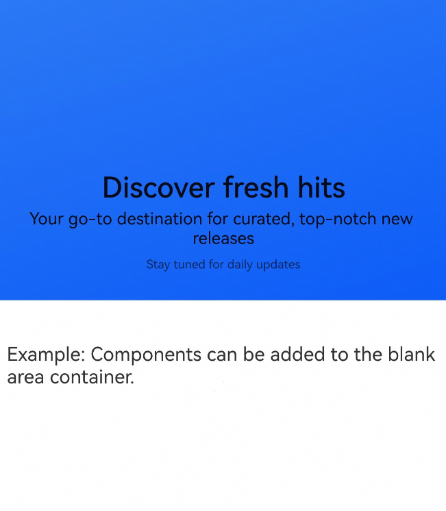
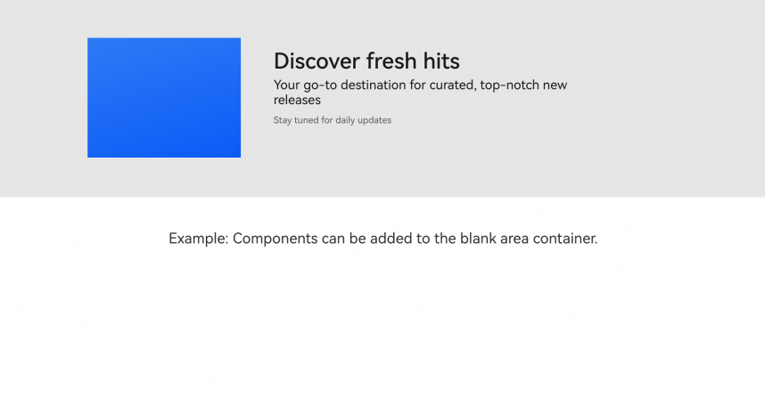
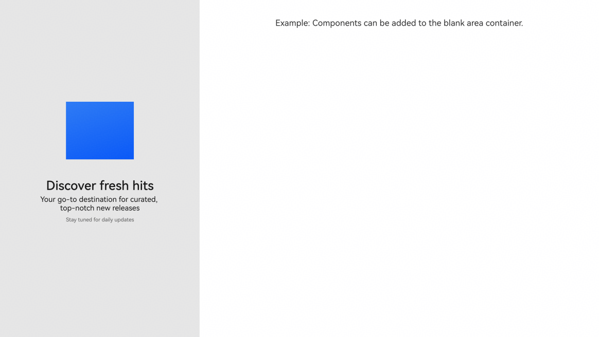

# SplitLayout
<!--Kit: ArkUI-->
<!--Subsystem: ArkUI-->
<!--Owner: @wangrunsen-->
<!--Designer: @YanSanzo-->
<!--Tester: @ybhou1993-->
<!--Adviser: @Brilliantry_Rui-->


**SplitLayout** is a component that enables you to divide the available space vertically into separate sections, each of which can contain solely text or a combination of text and images.


> **NOTE**
>
> - This component is supported since API version 10. Updates will be marked with a superscript to indicate their earliest API version.
>
> - This component can be used only in the stage model.
>
> - If the **SplitLayout** component has [universal attributes](ts-component-general-attributes.md) and [universal events](ts-component-general-events.md) configured, the compiler toolchain automatically generates an additional **__Common__** node and mounts the universal attributes and universal events on this node rather than the **SplitLayout** component itself. As a result, the configured universal attributes and universal events may not take effect or behave as intended. For this reason, avoid using universal attributes and events with the **SplitLayout** component.


## Modules to Import

```ts
import { SplitLayout } from '@kit.ArkUI';
```


## Child Components

Not supported

## SplitLayout

SplitLayout({mainImage: Resource, primaryText: string, secondaryText?: string, tertiaryText?: string, container: ()&nbsp;=&gt;&nbsp;void })

**Decorator**: @Component

**Atomic service API**: This API can be used in atomic services since API version 11.

**System capability**: SystemCapability.ArkUI.ArkUI.Full

**Device behavior differences**: On wearables, calling this API results in a runtime exception indicating that the API is undefined. On other devices, the API works correctly.

| Name| Type| Mandatory| Decorator       | Description    |
| -------- | -------- | -------- |---------------|--------|
| mainImage | [ResourceStr](ts-types.md#resourcestr) | Yes| @State | Image. |
| primaryText | [ResourceStr](ts-types.md#resourcestr) | Yes| @Prop         | Primary title. |
| secondaryText | [ResourceStr](ts-types.md#resourcestr) | No| @Prop         | Secondary title. This parameter is passed to display a secondary title below the primary title. If this parameter is not passed, the default value is used and the secondary title is not displayed.|
| tertiaryText | [ResourceStr](ts-types.md#resourcestr) | No| @Prop         | Auxiliary text. This parameter is passed to display auxiliary text. If this parameter is not passed, the default value is used and the auxiliary text is not displayed. |
| container | ()&nbsp;=&gt;&nbsp;void | Yes| @BuilderParam | Container in the component.|

## Events
The [universal events](ts-component-general-events.md) are not supported.

## Examples
This example demonstrates how to use **SplitLayout** to achieve a page layout that is both adaptable and responsive.
```ts
import { SplitLayout } from '@kit.ArkUI';

@Entry
@Component
struct Index {
  @State demoImage: Resource = $r("app.media.background");

  build() {
    Column() {
      SplitLayout({
        mainImage: this.demoImage,
        primaryText: 'Discover fresh hits',
        secondaryText: 'Your go-to destination for curated, top-notch new releases',
        tertiaryText: 'Stay tuned for daily updates',
      }) {
        Text('Example: Components can be added to the blank area container.')
          .margin({ top: 36 })
      }
    }
    .justifyContent(FlexAlign.SpaceBetween)
    .height('100%')
    .width('100%')
  }
}
```


Width less than or equal to 600 vp





Width greater than 600 vp and less than or equal to 840 vp





Width greater than 840 vp



