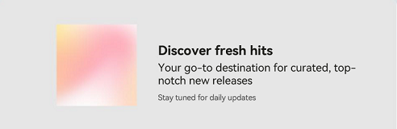
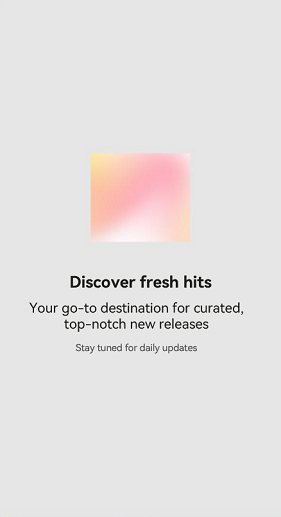

# SplitLayout

<!--Kit: ArkUI-->
<!--Subsystem: ArkUI-->
<!--Owner: @wangrunsen-->
<!--Designer: @YanSanzo-->
<!--Tester: @ybhou1993-->
<!--Adviser: @Brilliantry_Rui-->
<!-- md-trans-meta sourceCommit=f109326337af6fa46d624b0e6e3f395fc7c10abd translatedAt=2026-07-29T03:06:13.427Z pushedAt=2026-08-04T02:47:29.261Z -->

The **SplitLayout** component provides common page layout styles, mainly used to display combined layouts of images, titles, and content containers. It is suitable for split display scenarios that require adaptation to different screen sizes (such as detail pages, settings pages, etc.). It supports adaptation to different screen widths (three layouts: ≤ 600 vp, > 600 vp and ≤ 840 vp, > 840 vp), addressing the need to display different layout styles on devices of different sizes, improving page adaptability and user experience.

> **NOTE**
>
> - This component is supported since API version 10. Updates will be marked with a superscript to indicate their earliest API version.
>
> - This component can only be used in the stage model.
>
> - **SplitLayout** does not support setting [universal attributes](ts-component-general-attributes.md) and [universal events](ts-component-general-events.md). If set, the build toolchain will generate an additional \_\_Common\_\_ node and attach the universal attributes or universal events to \_\_Common\_\_ instead of directly applying them to **SplitLayout** itself, causing the configured attributes or events to not take effect.

## Modules to Import

```
import { SplitLayout } from '@kit.ArkUI';
```

## Child Components

Not supported

## SplitLayout

SplitLayout({mainImage: ResourceStr, primaryText: ResourceStr, secondaryText?: ResourceStr, tertiaryText?: ResourceStr, container: ()&nbsp;=&gt;&nbsp;void })

Defines a split layout component that supports adaptive layout capabilities, displaying different layout styles at different widths.

**Decorator**: @Component

**Atomic service API**: This API can be used in atomic services since API version 11.

**System capability**: SystemCapability.ArkUI.ArkUI.Full

**Device behavior differences**: On wearables, calling this API results in a runtime exception indicating that the API is undefined. On other devices, the API works correctly.

| Name| Type| Mandatory| Decorator       | Description    |
| -------- | -------- | -------- |---------------|--------|
| mainImage | [ResourceStr](ts-types.md#resourcestr) | Yes | @State | Main image resource displayed in the upper area of the layout. Supports common image formats such as PNG, JPG, and SVG. |
| primaryText | [ResourceStr](ts-types.md#resourcestr) | Yes | @Prop | Primary title content, with no length limit. Displayed in the title area of the layout. |
| secondaryText | [ResourceStr](ts-types.md#resourcestr) | No | @Prop | Secondary title content, with no length limit. Pass this parameter when a subtitle needs to be displayed below the title. If not passed, no subtitle is displayed. |
| tertiaryText | [ResourceStr](ts-types.md#resourcestr) | No | @Prop | Auxiliary text, with no length limit. Displayed below the subtitle area. Pass this parameter when auxiliary text needs to be displayed. If not passed, no auxiliary text is displayed. |
| container | ()&nbsp;=&gt;&nbsp;void | Yes | @BuilderParam | Container component used to host custom component content in the lower area of the layout. No return value. |

## Events

The [universal events](ts-component-general-events.md) are not supported.

## Attributes

[Universal attributes](ts-component-general-attributes.md) are not supported.

## Example

This example demonstrates how to use **SplitLayout** to achieve a page layout that is both adaptable and responsive.

```ts
import { SplitLayout } from '@kit.ArkUI';

@Entry
@Component
struct Index {
  @State demoImage: Resource = $r('app.media.background');

  build() {
    Column() {
      SplitLayout({
        mainImage: this.demoImage,
        primaryText:'New music recommendation',
        secondaryText: 'Get a playlist tailored to your taste;',
        tertiaryText: 'Updated every day',
      }) {
        Text('Example: Components can be added to a blank area container.')
          .margin({ top: 36 })
      }
    }
    .justifyContent(FlexAlign.SpaceBetween)
    .height('100%')
    .width('100%')
  }
}
```

Layout less than or equal to 600 vp


Layout greater than 600 vp and less than or equal to 840 vp



Layout greater than 840 vp

