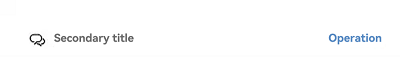
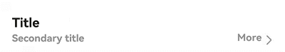
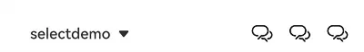
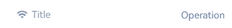
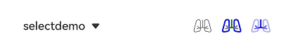
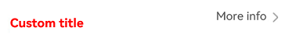
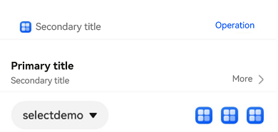

# SubHeader

<!--Kit: ArkUI-->
<!--Subsystem: ArkUI-->
<!--Owner: @wangrunsen-->
<!--Designer: @YanSanzo-->
<!--Tester: @ybhou1993-->
<!--Adviser: @Brilliantry_Rui-->
<!-- md-trans-meta sourceCommit=4c495f520711bb7a7c0f878dd925391606600e97 translatedAt=2026-07-30T02:28:30.191Z pushedAt=2026-08-01T06:46:07.107Z -->

The **SubHeader** component is used at the top of list items or content items to divide the list or content into sections, with the subtitle name summarizing the content of each section. It supports various style configurations, including icons, primary and secondary titles, dropdown selectors, and operation buttons, meeting content partitioning and navigation needs in different scenarios and enhancing the visual hierarchy and user experience of the UI. It is suitable for list grouping, categorized content display, form partitioning, and other scenarios.

> **NOTE**
>
> - This component is supported since API version 10. Updates will be marked with a superscript to indicate their earliest API version.
>
> - This component can be used only in the stage model.
>
> - If the **SubHeader** component has [universal attributes](ts-component-general-attributes.md) and [universal events](ts-component-general-events.md) configured, the compiler toolchain automatically generates an additional \_\_Common\_\_ node and mounts the universal attributes and universal events on this node rather than the **SubHeader** component itself. As a result, the configured universal attributes and universal events may fail to take effect or behave as intended. For this reason, avoid using universal attributes and events with the **SubHeader** component.

## Modules to Import

```ts
import { SubHeader } from '@kit.ArkUI';
```

## Child Components

Not supported

> **NOTE**
>
> Setting a text-type child component is not supported.

## SubHeader

SubHeader({icon?: ResourceStr, iconSymbolOptions?: SymbolOptions, primaryTitle?: ResourceStr, secondaryTitle?: ResourceStr, select?: SelectOptions, operationType?: OperationType, operationItem?: Array&lt;OperationOption&gt;, operationSymbolOptions?: Array&lt;SymbolOptions&gt;, primaryTitleModifier?: TextModifier, secondaryTitleModifier?: TextModifier, titleBuilder?: () => void, contentMargin?: LocalizedMargin, contentPadding?: LocalizedPadding, titleId?: string })

**Decorator**: @Component

**System capability**: SystemCapability.ArkUI.ArkUI.Full

**Device behavior differences**: This API is not supported on wearables. When an app calls this API, a runtime exception occurs with an error message indicating that the API is undefined. On other devices, the API works correctly.

| Name | Type | Mandatory | Decorator | Description |
| -------- | -------- | -------- |---------------| -------- |
| icon | [ResourceStr](ts-types.md#resourcestr) | No | \@Prop | Icon resource.<br/>Default value: **undefined**, indicating that no icon is displayed.<br/>The icon attribute takes effect only when the **secondaryTitle** attribute is used. When the **primaryTitle**, **secondaryTitle**, and **icon** attributes are used together, the **primaryTitle** attribute does not take effect.<br/>**Atomic service API:** This API can be used in atomic services since API version 11. |
| iconSymbolOptions<sup>12+</sup> | [SymbolOptions](#symboloptions12) | No | - | Settings when icon is [SymbolGlyph](ts-basic-components-symbolGlyph.md).<br/>Default value: **undefined**, indicating that no icon is displayed.<br/>**Atomic service API:** This API can be used in atomic services since API version 12. |
| primaryTitle | [ResourceStr](ts-types.md#resourcestr) | No | \@Prop | Primary title content.<br/>Default value: **undefined**, indicating that no title is displayed.<br/>When the **primaryTitle**, **secondaryTitle**, and **icon** attributes are used together, the **primaryTitle** attribute does not take effect.<br/>**Atomic service API:** This API can be used in atomic services since API version 11. |
| secondaryTitle | [ResourceStr](ts-types.md#resourcestr) | No | \@Prop | Secondary title content.<br/>Default value: **undefined**, indicating that no secondary title is displayed. When the **primaryTitle**, **secondaryTitle**, and **icon** attributes are used together, the **primaryTitle** attribute does not take effect.<br/>**Atomic service API:** This API can be used in atomic services since API version 11. |
| select | [SelectOptions](#selectoptions) | No | - | Dropdown box content and events.<br/>Default value: **undefined**, indicating that no dropdown box is displayed.<br/>**Atomic service API:** This API can be used in atomic services since API version 11. |
| operationType | [OperationType](#operationtype) | No | \@Prop | Element style of the operation area (right side).<br/>Default value: **OperationType.BUTTON**<br/>**Atomic service API:** This API can be used in atomic services since API version 11. |
| operationItem | Array&lt;[OperationOption](#operationoption)&gt; | No | - | Settings for the operation area (right side). When **operationType** is **OperationType.ICON_GROUP**, a maximum of three icon items can be configured.<br/>Default value: **undefined**, indicating that no operation area is displayed.<br/>**Atomic service API:** This API can be used in atomic services since API version 11. |
| operationSymbolOptions<sup>12+</sup> | Array&lt;[SymbolOptions](#symboloptions12)&gt; | No | - | Settings when **operationType** is **OperationType.ICON_GROUP**, **operationItem** is set with multiple icons, and the icons are [SymbolGlyph](ts-basic-components-symbolGlyph.md).<br/>Default value: **undefined**, indicating that no symbol icon is set.<br/>**Atomic service API:** This API can be used in atomic services since API version 12. |
| primaryTitleModifier<sup>12+</sup> | [TextModifier](ts-universal-attributes-attribute-modifier.md#custom-modifier) | No | - | Title text attributes, such as title color, font size, font weight, etc.<br/>Default value: **undefined**, indicating that the system default style is used.<br/>**Note:** This parameter takes effect only when **primaryTitle** is effective.<br/>**Atomic service API:** This API can be used in atomic services since API version 12. |
| secondaryTitleModifier<sup>12+</sup> | [TextModifier](ts-universal-attributes-attribute-modifier.md#custom-modifier) | No | - | Secondary title text attributes, such as title color, font size, font weight, etc.<br/>Default value: **undefined**, indicating that the system default style is used.<br/>**Atomic service API:** This API can be used in atomic services since API version 12. |
| titleBuilder<sup>12+</sup> | () => void | No | @BuilderParam | Custom title area content. When **titleBuilder** is used, title parameters such as **primaryTitle**, **secondaryTitle**, and icon do not take effect.<br/>Default value: **undefined**, indicating that no custom title is used.<br/>**Atomic service API:** This API can be used in atomic services since API version 12. |
| contentMargin<sup>12+</sup> | [LocalizedMargin](ts-types.md#localizedmargin12) | No | @Prop | Margin of the subtitle. Negative values are not supported.<br />Default value:<br /> `{start: LengthMetrics.resource(` <br /> `$r('sys.float.margin_left'))`, <br /> `end: LengthMetrics.resource(` <br /> `$r('sys.float.margin_right'))}`<br/>**Atomic service API:** This API can be used in atomic services since API version 12. |
| contentPadding<sup>12+</sup> | [LocalizedPadding](ts-types.md#localizedpadding12) | No | @Prop | Padding of the subtitle. Negative values are not supported.<br />Default value:<br />When the left side contains a secondary title or a secondary title with an icon:<br /> `{start: LengthMetrics.vp(12), end: LengthMetrics.vp(12)}`.<br/>**Atomic service API:** This API can be used in atomic services since API version 12.|
| titleAccessibilityText<sup>23+</sup> | [ResourceStr](ts-types.md#resourcestr) | No | @Prop | Custom accessibility reading content for the title.<br/>Default value: **undefined**, indicating that no custom reading content is set, and the title content displayed on the component is read by default.<br/>**Atomic service API:** This API can be used in atomic services since API version 23. |
| titleId<sup>24+</sup> | string | No | @Prop | Title identifier. Use this parameter when an ID needs to be set for the title.<br/>Default value: **undefined**, indicating that no title identifier is set.<br/>**Atomic service API:** This API can be used in atomic services since API version 24. |

## OperationType

Defines the style of elements in the subheader operation area.

**Atomic service API**: This API can be used in atomic services since API version 11.

**System capability**: SystemCapability.ArkUI.ArkUI.Full

**Device behavior differences**: On wearables, calling this API results in a runtime exception indicating that the API is undefined. On other devices, the API works correctly.

| Name| Value| Description|
| -------- | -------- | -------- |
| TEXT_ARROW |  0  | Text button with a right arrow.|
| BUTTON |  1  |  Text button without a right arrow.|
| ICON_GROUP |  2  |  Icon-attached button (A maximum of three icons can be configured.)|
| LOADING |  3  |  Loading animation. When **operationType** is set to **LOADING**, **operationItem** does not need to be configured. |

## SelectOptions

**System capability**: SystemCapability.ArkUI.ArkUI.Full

**Device behavior differences**: On wearables, calling this API results in a runtime exception indicating that the API is undefined. On other devices, the API works correctly.

| Name | Type | Read-Only | Optional | Description |
| -------- | -------- |---|---|--------------------------------------------------------------------------------------------------------------------------------------------------------------|
| options | Array&lt;[SelectOption](ts-basic-components-select.md#selectoption)&gt; | No | No | Dropdown option content.<br/>**Atomic service API:** This API can be used in atomic services since API version 11. |
| selected | number | No | Yes | Index of the initial option in the dropdown menu.<br/>Value range: greater than or equal to -1.<br/>The index of the first item is 0.<br/>When the selected attribute is not set, the default value is -1, and no menu item is selected.<br/>If the value is set to less than -1, it is treated as no selection.<br/>**Atomic service API:** This API can be used in atomic services since API version 11. |
| value | [ResourceStr](ts-types.md#resourcestr) | No | Yes | Text content of the dropdown button itself.<br/>Default value: empty string.<br/>**Note**: Text exceeding the column width will be truncated. Since API version 20, the Resource type is supported.<br/>**Atomic service API:** This API can be used in atomic services since API version 11. |
| onSelect | (index:&nbsp;number,&nbsp;value?:&nbsp;string)&nbsp;=&gt;&nbsp;void | No | Yes | Callback for when an item is selected in the dropdown menu.<br/>-&nbsp;index: index of the selected item.<br/>-&nbsp;value: value of the selected item.<br/>**Atomic service API:** This API can be used in atomic services since API version 11. |
| defaultFocus<sup>18+</sup> | boolean | No | Yes | Whether the dropdown button is the default focus.<br/>**true**: The dropdown button is the default focus.<br/>**false**: The dropdown button is not the default focus.<br />Default value: **false**<br/>**Atomic service API:** This API can be used in atomic services since API version 18. |
| id<sup>24+</sup> | string | No | Yes | Dropdown button ID. Set this parameter when an ID needs to be set for the dropdown button. When omitted, this parameter is not set.<br/>Default value: **undefined**, indicating that no dropdown button ID is set.<br/>**Atomic service API:** This API can be used in atomic services since API version 24. |

## OperationOption

**System capability**: SystemCapability.ArkUI.ArkUI.Full

**Device behavior differences**: On wearables, calling this API results in a runtime exception indicating that the API is undefined. On other devices, the API works correctly.

| Name | Type | Read-only | Optional | Description |
| -------- | -------- |---|---|----------------------------------------------------------------------------------------------------------------------------------------------------------------------------------------------------------------------------------------------------------|
| value | [ResourceStr](ts-types.md#resourcestr) | No | No | Operation area element content. When **operationType** is **TEXT_ARROW** or **BUTTON**, **value** is the text content; when **operationType** is **ICON_GROUP**, **value** is the icon resource.<br/>**Atomic service API:** This API can be used in atomic services since API version 11. |
| action | ()=&gt;void | No | Yes | Tap event of the right button in the subtitle.<br/>**Atomic service API:** This API can be used in atomic services since API version 11. |
| accessibilityLevel<sup>18+</sup> | string | No | Yes | Accessibility level of the right button in the subtitle. Used to control whether the current item can be recognized by accessibility services.<br/>Supported values:<br/>**"auto"**: The current component is converted to "yes".<br/>**"yes"**: The current component can be recognized by accessibility services.<br/>**"no"**: The current component cannot be recognized by accessibility services.<br/>**"no-hide-descendants"**: The current component and all its child components cannot be recognized by accessibility services.<br/>Default value: **"auto"**<br/>**Atomic service API:** This API can be used in atomic services since API version 18. |
| accessibilityText<sup>18+</sup> | [ResourceStr](ts-types.md#resourcestr) | No | Yes | Accessibility text attribute of the right button in the subtitle. When a component does not contain a text attribute, the screen reader does not announce anything when this component is selected, and the user cannot clearly know which component is currently selected. To address this issue, developers can set accessibility text for components that do not contain text information. When the screen reader selects this component, it announces the content of the accessibility text, helping screen reader users clearly know which component they have selected.<br/>Default value: When the type is **TEXT_ARROW** or **BUTTON**, the default value is the value attribute content of the current item. For other types, the default value is **" "**.<br/>**Atomic service API:** This API can be used in atomic services since API version 18. |
| accessibilityDescription<sup>18+</sup> | [ResourceStr](ts-types.md#resourcestr) | No | Yes | Accessibility description of the right button in the subtitle. This description is used to explain the current component to the user in detail. Developers should provide a relatively detailed text description for this attribute of the component to help users understand the action to be performed and its possible consequences, especially when these consequences cannot be directly learned from the component's attributes and accessibility text alone. If a component has both a text attribute and an accessibility description attribute, when the component is selected, the system first announces the component's text attribute, and then announces the content of the accessibility description attribute.<br/>Default value: When the type is **LOADING**, the default value is "Loading". For other types, the default value is "Single-tap with one finger to execute".<br/>**Atomic service API:** This API can be used in atomic services since API version 18. |
| defaultFocus<sup>18+</sup> | boolean | No | Yes | Whether the right button in the subtitle is the default focus.<br/>**true**: The right button in the subtitle is the default focus.<br/>**false**: The right button in the subtitle is not the default focus.<br />Default value: **false**<br/>**Atomic service API:** This API can be used in atomic services since API version 18. |
| id<sup>24+</sup> | string | No | Yes | Right button ID in the subtitle. Set this parameter when an ID needs to be set for the right button in the subtitle. When omitted, this parameter is not set.<br/>Default value: **undefined**, indicating that no right button ID is set in the subtitle.<br/>**Atomic service API:** This API can be used in atomic services since API version 24. |

## SymbolOptions<sup>12+</sup>

**Atomic service API**: This API can be used in atomic services since API version 12.

**System capability**: SystemCapability.ArkUI.ArkUI.Full

**Device behavior differences**: On wearables, calling this API results in a runtime exception indicating that the API is undefined. On other devices, the API works correctly.

| Name| Type| Read-Only| Optional| Description                                                                                                                                                                                                                                             |
| -------- | -------- |---|---|-------------------------------------------------------------------------------------------------------------------------------------------------------------------------------------------------------------------------------------------------|
| fontColor | Array&lt;[ResourceColor](ts-types.md#resourcecolor)&gt; | No| Yes| Color of the [symbol glyph](ts-basic-components-symbolGlyph.md).<br>Default value: depending on the rendering strategy                                                                                                                                                                      |
| fontSize | number \|&nbsp;string \|&nbsp;[Resource](ts-types.md#resource) | No| Yes| Size of the [symbol glyph](ts-basic-components-symbolGlyph.md).<br>For the number type, the value must be greater than or equal to 0.<br>For the string type, numeric string values with optional units, for example, **"10"** or **"10fp"**, are supported.<br>Default value: system default value                                                                                                |
| fontWeight | number \|&nbsp;[FontWeight](ts-appendix-enums.md#fontweight)&nbsp;\|&nbsp;string | No| Yes| Weight of the [symbol glyph](ts-basic-components-symbolGlyph.md).<br>For the number type, the value ranges from 100 to 900, at an interval of 100. A larger value indicates a heavier font weight. The default value is **400**.<br>For the string type, only strings of the number type are supported, for example, **"400"**, **"bold"**, **"bolder"**, **"lighter"**, **"regular"**, and **"medium"**, which correspond to the enumerated values in **FontWeight**.<br>Default value: **FontWeight.Normal**.|
| renderingStrategy | [SymbolRenderingStrategy](ts-basic-components-symbolGlyph.md#symbolrenderingstrategy11) | No| Yes| Rendering strategy of the [symbol glyph](ts-basic-components-symbolGlyph.md).<br>Default value: **SymbolRenderingStrategy.SINGLE**.<br>**NOTE**<br>For the resources referenced in **$r('sys.symbol.ohos_*')**, only **ohos_trash_circle**, **ohos_folder_badge_plus**, and **ohos_lungs** support the **MULTIPLE_COLOR** modes.                                      |
| effectStrategy | [SymbolEffectStrategy](ts-basic-components-symbolGlyph.md#symboleffectstrategy11) | No| Yes| Effect strategy of the [symbol glyph](ts-basic-components-symbolGlyph.md).<br>Default value: **SymbolEffectStrategy.NONE**.<br>**NOTE**<br>For the resources referenced in **$r('sys.symbol.ohos_*')**, only **ohos_wifi** supports the hierarchical effect.                                                                                      |

## Events

The [universal events](ts-component-general-events.md) are not supported.

## Example

### Example 1: Implementing an Efficiency-oriented Subheader

This example demonstrates how to implement a subheader where the left side contains an icon and a secondary title, and the right side has a button.

```ts
import { Prompt, OperationType, SubHeader } from '@kit.ArkUI';

@Entry
@Component
struct SubHeaderExample {
  build() {
    Column() {
      SubHeader({
        icon: $r('sys.media.ohos_ic_public_email'),
        secondaryTitle: 'Secondary title',
        operationType: OperationType.BUTTON,
        operationItem: [{
          value: 'Operation',
          action: () => {
            Prompt.showToast({ message: 'demo' });
          }
        }]
      })
    }
  }
}
```



### Example 2: Implementing a Double-Line Text Content-Rich Subheader

This example showcases a subheader with a primary title and a secondary title on the left, and a text button with a right arrow on the right.

```ts
import { Prompt, OperationType, SubHeader } from '@kit.ArkUI';

@Entry
@Component
struct SubHeaderExample {
  build() {
    Column() {
      SubHeader({
        primaryTitle: 'Primary title',
        secondaryTitle: 'Secondary title',
        operationType: OperationType.TEXT_ARROW,
        operationItem: [{
          value: 'More',
          action: () => {
            Prompt.showToast({ message: 'demo' });
          }
        }]
      })
    }
  }
}
```



### Example 3: Implementing a Spinner Content-Rich Subheader

This example showcases a subheader with content and events for selection on the left, and an icon-attached button on the right.

```ts
import { Prompt, OperationType, SubHeader } from '@kit.ArkUI';

@Entry
@Component
struct SubHeaderExample {
  build() {
    Column() {
      SubHeader({
        // The left side is the select picker.
        select: {
          options: [{ value: 'aaa' }, { value: 'bbb' }, { value: 'ccc' }],
          value: 'selectDemo',
          selected: 2,
          onSelect: () => {
            Prompt.showToast({ message: 'demo' });
          }
        },
        operationType: OperationType.ICON_GROUP,
        // The right side has three icons.
        operationItem: [{
          value: $r('sys.media.ohos_ic_public_email'),
          action: () => {
            Prompt.showToast({ message: 'demo' });
          }
        }, {
          value: $r('sys.media.ohos_ic_public_email'),
          action: () => {
            Prompt.showToast({ message: 'demo' });
          }
        }, {
          value: $r('sys.media.ohos_ic_public_email'),
          action: () => {
            Prompt.showToast({ message: 'demo' });
          }
        }]
      })
    }
  }
}
```



### Example 4: Setting the Icon Symbol for the Left Side

This example demonstrates how to set the icon symbol for the left side of the subheader.

```ts

import { Prompt, OperationType, SubHeader } from '@kit.ArkUI';

@Entry
@Component
struct SubHeaderExample {
  build() {
    Column() {
      SubHeader({
        // Set the icon to a symbol icon.
        icon: $r('sys.symbol.ohos_wifi'),
        iconSymbolOptions: {
          effectStrategy: SymbolEffectStrategy.HIERARCHICAL,
        },
        secondaryTitle: 'Title',
        operationType: OperationType.BUTTON,
        operationItem: [{
          value: 'Operation',
          action: () => {
            Prompt.showToast({ message: 'demo' });
          }
        }]
      })
    }
  }
}
```



### Example 5: Setting the Icon Symbol for the Right Side

The following example shows how to set **operationType** to **OperationType.ICON_GROUP** for the right side of the subheader, with **operationItem** set to a symbol icon.

```ts
import { Prompt, OperationType, SubHeader } from '@kit.ArkUI';

@Entry
@Component
struct SubHeaderExample {
  build() {
    Column() {
      SubHeader({
        // Set the left side to a drop-down box for selection.
        select: {
          options: [{ value: 'aaa' }, { value: 'bbb' }, { value: 'ccc' }],
          value: 'selectDemo',
          selected: 2,
          onSelect: () => {
            Prompt.showToast({ message: 'demo' });
          }
        },
        operationType: OperationType.ICON_GROUP,
        // Set the right side to icons.
        operationItem: [{
          value: $r('sys.symbol.ohos_lungs'),
          action: () => {
            Prompt.showToast({ message: 'icon1' });
          }
        }, {
          value: $r('sys.symbol.ohos_lungs'),
          action: () => {
            Prompt.showToast({ message: 'icon2' });
          }
        }, {
          value: $r('sys.symbol.ohos_lungs'),
          action: () => {
            Prompt.showToast({ message: 'icon3' });
          }
        }],
        // Set the symbol style for the right side icons.
        operationSymbolOptions: [{
          fontWeight: FontWeight.Lighter,
        }, {
          renderingStrategy: SymbolRenderingStrategy.MULTIPLE_COLOR,
          fontColor: [Color.Blue, Color.Grey, Color.Green],
        }, {
          renderingStrategy: SymbolRenderingStrategy.MULTIPLE_OPACITY,
          fontColor: [Color.Blue, Color.Grey, Color.Green],
        }]
      })
    }
  }
}
```



### Example 6: Customizing Title Content

This example demonstrates the effect of setting **titleBuilder** in **SubHeader** to customize the title content. After **titleBuilder** is set, the **primaryTitle** and **secondaryTitle** attributes will not take effect.

```ts
import { Prompt, OperationType, SubHeader } from '@kit.ArkUI';

@Entry
@Component
struct SubHeaderExample {
  // Set the custom title on the left side.
  @Builder
  TitleBuilder(): void {
    Text('Custom title')
      .fontSize(24)
      .fontColor(Color.Blue)
      .fontWeight(FontWeight.Bold)
  }

  build() {
    Column() {
      SubHeader({
        // Call the custom title builder.
        titleBuilder: () => {
          this.TitleBuilder();
        },
        primaryTitle: 'Primary title',
        secondaryTitle: 'Secondary title',
        icon: $r('sys.symbol.ohos_star'),
        operationType: OperationType.TEXT_ARROW,
        operationItem: [{
          value: 'More info',
          action: () => {
            Prompt.showToast({ message: 'demo' });
          }
        }]
      })
    }
  }
}
```



### Example 7: Customizing the Title Style

This example demonstrates how to set the font style, margin, and padding for the primary and secondary titles in the subheader.

```ts
import { Prompt, OperationType, SubHeader, LengthMetrics, TextModifier } from '@kit.ArkUI';

@Entry
@Component
struct SubHeaderExample {
  // Set the font color for the primary and secondary titles.
  @State primaryModifier: TextModifier = new TextModifier().fontColor(Color.Blue);
  @State secondaryModifier: TextModifier = new TextModifier().fontColor(Color.Blue);

  build() {
    Column() {
      SubHeader({
        primaryTitle: 'primaryTitle',
        secondaryTitle: 'secondaryTitle',
        primaryTitleModifier: this.primaryModifier,
        secondaryTitleModifier: this.secondaryModifier,
        operationType: OperationType.TEXT_ARROW,
        operationItem: [{
          value: 'More info',
          action: () => {
            Prompt.showToast({ message: 'demo' });
          }
        }],
        // Set the margin and padding for the subheader.
        contentMargin: { start: LengthMetrics.vp(20), end: LengthMetrics.vp(20) },
        contentPadding: { start: LengthMetrics.vp(20), end: LengthMetrics.vp(20) }
      })
    }
  }
}
```


### Example 8: Implementing Announcement for the Button on the Right Side

This example customizes the screen reader announcement text by setting the **accessibilityText**, **accessibilityDescription**, and **accessibilityLevel** properties of the button on the right side of the **SubHeader** component. This functionality is supported since API version 18.

```ts
import { Prompt, OperationType, SubHeader } from '@kit.ArkUI';

@Entry
@Component
struct SubHeaderExample {
  build() {
    Column() {
      Divider().color('grey').width('100%').height('2vp')
      SubHeader({
        // Icon + secondary title, with a button on the right
        icon: $r('sys.media.ohos_ic_public_email'),
        secondaryTitle: 'Secondary title',
        operationType: OperationType.BUTTON,
        operationItem: [{
          value: 'Operation',
          action: () => {
            Prompt.showToast({ message: 'demo' });
          }
        }]
      })
      Divider().color('grey').width('100%').height('2vp')
      SubHeader({
        // Text button with a right-side arrow
        primaryTitle: 'Primary title',
        secondaryTitle: 'Secondary title',
        operationType: OperationType.TEXT_ARROW,
        operationItem: [{
          value: 'More',
          action: () => {
            Prompt.showToast({ message: 'demo' });
          }
        }]
      })
      Divider().color('grey').width('100%').height('2vp')
      SubHeader({
        // Selection on the left and icons (focused in sequence) on the right
        select: {
          options: [{ value: 'aaa' }, { value: 'bbb' }, { value: 'ccc' }],
          value: 'selectDemo',
          selected: 0,
          onSelect: (index: number, value?: string) => {
            console.info(`SubHeader onSelect index : ${index}, value: ${value}`);
          }
        },
        operationType: OperationType.ICON_GROUP,
        operationItem: [{
          value: $r('sys.media.ohos_ic_public_email'),
          accessibilityText: 'Icon 1',
          accessibilityLevel: 'yes',
        }, {
          value: $r('sys.media.ohos_ic_public_email'),
          accessibilityText: 'Icon 2',
          accessibilityLevel: 'no',
        }, {
          value: $r('sys.media.ohos_ic_public_email'),
          accessibilityText: 'Icon 3',
          accessibilityDescription: 'Tap to operate icon 3',
        }]
      })
      Divider().color('grey').width('100%').height('2vp')
    }
  }
}
```



### Example 9: Setting the Right-Side Button to Obtain Focus by Default

This example demonstrates how to set the **defaultFocus** attribute in **SubHeader** to ensure the right-side button obtains focus by default in the focused state.

The **defaultFocus** API is added to [OperationOption](#operationoption) since API version 18.

```ts
import { Prompt, OperationType, SubHeader } from '@kit.ArkUI';

@Entry
@Component
struct SubHeaderExample {
  build() {
    Column() {
      SubHeader({
        // Icon + secondary title, with a button on the right
        icon: $r('sys.media.ohos_ic_public_email'),
        secondaryTitle: 'Secondary title',
        operationType: OperationType.BUTTON,
        operationItem: [{
          value: 'Operation',
          defaultFocus: true,
          action: () => {
            Prompt.showToast({ message: 'demo' });
          }
        }]
      })
    }
  }
}
```

