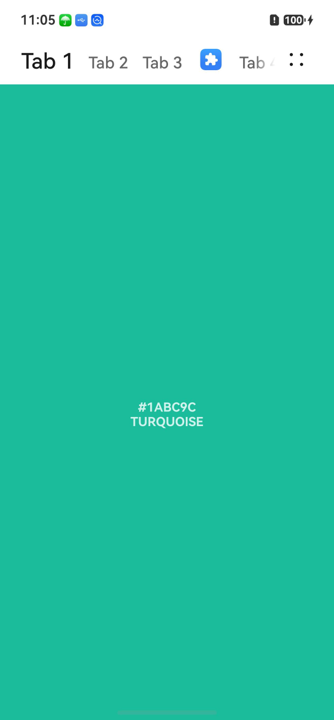
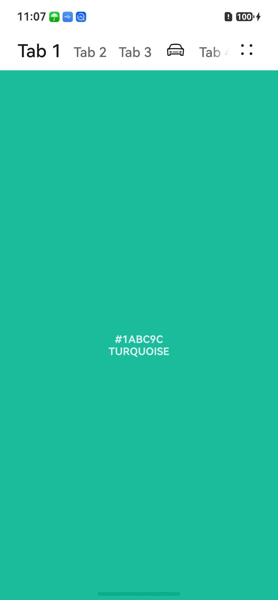

# TabTitleBar

<!--Kit: ArkUI-->
<!--Subsystem: ArkUI-->
<!--Owner: @wangrunsen-->
<!--Designer: @YanSanzo-->
<!--Tester: @ybhou1993-->
<!--Adviser: @Brilliantry_Rui-->
<!-- md-trans-meta sourceCommit=4c495f520711bb7a7c0f878dd925391606600e97 translatedAt=2026-07-29T03:08:35.255Z pushedAt=2026-08-04T02:47:32.389Z -->

**TabTitleBar** is a tab title bar component that supports linked switching between a tab list and associated content, and allows configuration of right menu items. It is suitable for scenarios where page content needs to be switched through tabs, such as top navigation bars. With flexible configuration of tabs and menu items, this component can meet various interaction requirements. It supports tab switching only on level-1 pages.

> **NOTE**
>
> - This component is supported since API version 10. Updates will be marked with a superscript to indicate their earliest API version.
>
> - This component can only be used in the stage model.
>
> - When setting [universal attributes](ts-component-general-attributes.md) or [universal events](ts-component-general-events.md) of **TabTitleBar**, the compilation toolchain mounts them on the \_\_Common\_\_ node instead of directly applying them to the component itself, which may cause the settings to not take effect or not work as expected. Therefore, setting them is not recommended.

## Modules to Import

```ts
import { TabTitleBar } from '@kit.ArkUI';
```

## Child Components

Not supported

## TabTitleBar

TabTitleBar({tabItems: Array&lt;TabTitleBarTabItem&gt;, menuItems?: Array&lt;TabTitleBarMenuItem&gt;, swiperContent: () =&gt; void})

**Decorator**: @Component

**Atomic service API**: This API can be used in atomic services since API version 11.

**System capability**: SystemCapability.ArkUI.ArkUI.Full

**Device behavior differences**: On wearables, calling this API results in a runtime exception indicating that the API is undefined. On other devices, the API works correctly.

| Name| Type| Mandatory| Decorator| Description|
| -------- | -------- | -------- | -------- | -------- |
| tabItems | Array&lt;[TabTitleBarTabItem](#tabtitlebartabitem)&gt; | Yes | - | List of tab items on the left. |
| menuItems | Array&lt;[TabTitleBarMenuItem](#tabtitlebarmenuitem)&gt; | No | - | List of menu items on the right. If this parameter is not passed, the right menu items are not displayed. |
| swiperContent | () =&gt; void | Yes| \@BuilderParam | Constructor for page content pertaining to the tab list.|

> **NOTE**
> 
> The input parameter cannot be **undefined**, that is, calling **TabTitleBar(undefined)** is not allowed.

## TabTitleBarMenuItem

**System capability**: SystemCapability.ArkUI.ArkUI.Full

**Device behavior differences**: On wearables, calling this API results in a runtime exception indicating that the API is undefined. On other devices, the API works correctly.

<!--Table: 20%; 20%; 8%; 8%; 44%-->

| Name| Type| Read-Only| Optional| Description|
| -------- | -------- |---|---| -------- |
| value | [ResourceStr](ts-types.md#resourcestr) | No | No | Icon resource. If **symbolStyle** is set, this attribute does not take effect.<br/>**Atomic service API:** This API can be used in atomic services since API version 11. |
| symbolStyle<sup>18+</sup> | [SymbolGlyphModifier](ts-universal-attributes-attribute-symbolglyphmodifier.md#symbolglyphmodifier) | No | Yes | Symbol icon resource, which takes precedence over **value**. Pass this parameter when a symbol icon is needed. If not passed, the icon set by value is used.<br/>**Atomic service API:** This API can be used in atomic services since API version 18. |
| label<sup>13+</sup> | [ResourceStr](ts-types.md#resourcestr) | No | Yes | Icon label, which provides a text description for the menu item icon.<br/>**Atomic service API:** This API can be used in atomic services since API version 13. |
| isEnabled | boolean | No | Yes | Whether to enable. The value **true** means enabled, and **false** means disabled. When disabled, the menu item does not respond to tap events, and the action is not triggered.<br/>Default value: **false**<br/>**Atomic service API:** This API can be used in atomic services since API version 11. |
| action | ()&nbsp;=&gt;&nbsp;void | No | Yes | Action closure triggered when the menu item is tapped. If not set, tapping the menu item has no response.<br/>**Atomic service API:** This API can be used in atomic services since API version 11. |
| accessibilityLevel<sup>18+</sup>       | string  | No | Yes | Accessibility level of the custom button on the right side of the title bar. It controls whether the current item can be recognized by accessibility services.<br/>Supported values:<br/>**"auto"**: Automatically determined based on whether the component is interactive. If the component is interactive, it is equivalent to **"yes"**; otherwise, it is equivalent to **"no"**.<br/>**"yes"**: The current component can be recognized by accessibility services.<br/>**"no"**: The current component cannot be recognized by accessibility services.<br/>**"no-hide-descendants"**: The current component and all its child components cannot be recognized by accessibility services.<br/>Default value: **"auto"**<br/>**Atomic service API:** This API can be used in atomic services since API version 18. |
| accessibilityText<sup>18+</sup>        | [ResourceStr](ts-types.md#resourcestr) | No | Yes | Accessibility text attribute of the custom button on the right side of the title bar. It provides spoken text for components that do not contain text information.<br/>Default value: If the **label** attribute is set, the default value is the content of the label attribute; otherwise, the default value is a space character.<br/>**Atomic service API:** This API can be used in atomic services since API version 18.                                     |
| accessibilityDescription<sup>18+</sup> | [ResourceStr](ts-types.md#resourcestr) | No | Yes | Accessibility description of the custom button on the right side of the title bar. This description is used to explain the current component to users in detail. You should provide a relatively detailed text description for this attribute to help users understand the action to be performed and its possible consequences, especially when such consequences cannot be directly inferred from the component's attributes and accessibility text. If a component that is selected has both a text attribute and an accessibility description attribute, the system first announces the text attribute and then the content of the accessibility description attribute.<br/>Default value: **"Double-tap with one finger to execute."**<br/>**Atomic service API:** This API can be used in atomic services since API version 18.           |

## TabTitleBarTabItem

**System capability**: SystemCapability.ArkUI.ArkUI.Full

**Device behavior differences**: On wearables, calling this API results in a runtime exception indicating that the API is undefined. On other devices, the API works correctly.

| Name| Type| Read-Only| Optional| Description|
| -------- | -------- | -------- | -------- | -------- |
| title | [ResourceStr](ts-types.md#resourcestr) | No | No | Text content displayed on the tab item.<br/>**Atomic service API:** This API can be used in atomic services since API version 11. |
| icon | [ResourceStr](ts-types.md#resourcestr) | No | Yes | Tab icon resource. If **symbolStyle** is set, this attribute does not take effect. If not set, the tab displays only text content.<br/>**Atomic service API:** This API can be used in atomic services since API version 11. |
| symbolStyle<sup>18+</sup> | [SymbolGlyphModifier](ts-universal-attributes-attribute-symbolglyphmodifier.md#symbolglyphmodifier) | No | Yes | Symbol icon resource, which takes priority over **icon**. Pass this parameter when a symbol icon is needed as the tab. If not passed, the image tab set by the **icon** parameter is used.<br/>**Atomic service API:** This API can be used in atomic services since API version 18. |

## Events

The [universal events](ts-component-general-events.md) are not supported.

## Example

### Example 1: Implementing a Simple Tab Title Bar

This example demonstrates a tab title bar with tabs on the left and a menu list on the right.

```ts
import { TabTitleBar, Prompt, TabTitleBarTabItem, TabTitleBarMenuItem } from '@kit.ArkUI';

@Entry
@Component
struct Index {
  @Builder
  // Define the pages associated with the tab list.
  componentBuilder() {
    Text("#1ABC9C\nTURQUOISE")
      .fontWeight(FontWeight.Bold)
      .fontSize(14)
      .width("100%")
      .textAlign(TextAlign.Center)
      .fontColor("#CCFFFFFF")
      .backgroundColor("#1ABC9C")
    Text("#16A085\nGREEN SEA")
      .fontWeight(FontWeight.Bold)
      .fontSize(14)
      .width("100%")
      .textAlign(TextAlign.Center)
      .fontColor("#CCFFFFFF")
      .backgroundColor("#16A085")
    Text("#2ECC71\nEMERALD")
      .fontWeight(FontWeight.Bold)
      .fontSize(14)
      .width("100%")
      .textAlign(TextAlign.Center)
      .fontColor("#CCFFFFFF")
      .backgroundColor("#2ECC71")
    Text("#27AE60\nNEPHRITIS")
      .fontWeight(FontWeight.Bold)
      .fontSize(14)
      .width("100%")
      .textAlign(TextAlign.Center)
      .fontColor("#CCFFFFFF")
      .backgroundColor("#27AE60")
    Text("#3498DB\nPETER RIVER")
      .fontWeight(FontWeight.Bold)
      .fontSize(14)
      .width("100%")
      .textAlign(TextAlign.Center)
      .fontColor("#CCFFFFFF")
      .backgroundColor("#3498DB")
  }

  // Define the tab items on the left.
  private readonly tabItems: Array<TabTitleBarTabItem> =
    [
      { title: 'Tab 1' },
      { title: 'Tab 2' },
      { title: 'Tab 3' },
      { title: 'icon', icon: $r('sys.media.ohos_app_icon') },
      { title: 'Tab 4' },
    ]
  // Define the menu items on the right.
  private readonly menuItems: Array<TabTitleBarMenuItem> = [
    {
      value: $r('sys.media.ohos_save_button_filled'),
      isEnabled: true,
      action: () => Prompt.showToast({ message: "on item click! index 0" })
    },
    {
      value: $r('sys.media.ohos_ic_public_copy'),
      isEnabled: true,
      action: () => Prompt.showToast({ message: "on item click! index 1" })
    },
    {
      value: $r('sys.media.ohos_ic_public_edit'),
      isEnabled: true,
      action: () => Prompt.showToast({ message: "on item click! index 2" })
    },
  ]

  // Demonstrate the TabTitleBar effect.
  build() {
    Row() {
      Column() {
        TabTitleBar({
          swiperContent: this.componentBuilder,
          tabItems: this.tabItems,
          menuItems: this.menuItems,
        })
      }.width('100%')
    }.height('100%')
  }
}
```



### Example 2: Implementing Announcement for the Custom Button on the Right Side

Since API version 18, this example controls the screen reader announcement text by setting the **accessibilityText**, **accessibilityDescription**, and **accessibilityLevel** properties of the control button on the right side of the title bar.

```ts
import { TabTitleBar, Prompt, TabTitleBarTabItem, TabTitleBarMenuItem } from '@kit.ArkUI';

@Entry
@Component
struct Index {
  @Builder
  // Define the pages associated with the tab list.
  componentBuilder() {
    Text("#1ABC9C\nTURQUOISE")
      .fontWeight(FontWeight.Bold)
      .fontSize(14)
      .width("100%")
      .textAlign(TextAlign.Center)
      .fontColor("#CCFFFFFF")
      .backgroundColor("#1ABC9C")
    Text("#16A085\nGREEN SEA")
      .fontWeight(FontWeight.Bold)
      .fontSize(14)
      .width("100%")
      .textAlign(TextAlign.Center)
      .fontColor("#CCFFFFFF")
      .backgroundColor("#16A085")
    Text("#2ECC71\nEMERALD")
      .fontWeight(FontWeight.Bold)
      .fontSize(14)
      .width("100%")
      .textAlign(TextAlign.Center)
      .fontColor("#CCFFFFFF")
      .backgroundColor("#2ECC71")
    Text("#27AE60\nNEPHRITIS")
      .fontWeight(FontWeight.Bold)
      .fontSize(14)
      .width("100%")
      .textAlign(TextAlign.Center)
      .fontColor("#CCFFFFFF")
      .backgroundColor("#27AE60")
    Text("#3498DB\nPETER RIVER")
      .fontWeight(FontWeight.Bold)
      .fontSize(14)
      .width("100%")
      .textAlign(TextAlign.Center)
      .fontColor("#CCFFFFFF")
      .backgroundColor("#3498DB")
  }

  // Define several left-side tab items.
  private readonly tabItems: Array<TabTitleBarTabItem> =
    [
      { title: 'Tab 1' },
      { title: 'Tab 2' },
      { title: 'Tab 3' },
      { title: 'icon', icon: $r('sys.media.ohos_app_icon') },
      { title: 'Tab 4' },
    ]
  // Define several right-side menu items.
  private readonly menuItems: Array<TabTitleBarMenuItem> = [
    {
      value: $r('sys.media.ohos_save_button_filled'),
      isEnabled: true,
      action: () => Prompt.showToast({ message: "on item click! index 0" }),
      accessibilityText: 'Save',
      // Set to no, meaning the screen reader does not focus on it.
      accessibilityLevel: 'no',
      accessibilityDescription: 'Tap to save the icon'
    },
    {
      value: $r('sys.media.ohos_ic_public_copy'),
      isEnabled: true,
      action: () => Prompt.showToast({ message: "on item click! index 1" }),
      accessibilityText: 'Copy',
      accessibilityLevel: 'yes',
      accessibilityDescription: 'Tap to copy the icon'
    },
    {
      value: $r('sys.media.ohos_ic_public_edit'),
      isEnabled: true,
      action: () => Prompt.showToast({ message: "on item click! index 2" }),
      // Text announced by the screen reader, with higher priority than label.
      accessibilityText: 'Edit',
      // Whether the screen reader can focus on it.
      accessibilityLevel: 'yes',
      // Description text finally announced by the screen reader.
      accessibilityDescription: 'Tap to edit the icon'
    },
  ]

  // Demonstrate the TabTitleBar effect.
  build() {
    Row() {
      Column() {
        TabTitleBar({
          swiperContent: this.componentBuilder,
          tabItems: this.tabItems,
          menuItems: this.menuItems,
        })
      }.width('100%')
    }.height('100%')
  }
}
```


### Example 3: Setting the Symbol Icon

This example demonstrates how to use **symbolStyle** in **TabTitleBarTabItem** and **TabTitleBarMenuItem** to set custom symbol icons. This functionality is supported since API version 18.

```ts
import { TabTitleBar, Prompt, TabTitleBarTabItem, TabTitleBarMenuItem, SymbolGlyphModifier } from '@kit.ArkUI';

@Entry
@Component
struct Index {
  @Builder
  // Define the pages associated with the tab list.
  componentBuilder() {
    Text("#1ABC9C\nTURQUOISE")
      .fontWeight(FontWeight.Bold)
      .fontSize(14)
      .width("100%")
      .textAlign(TextAlign.Center)
      .fontColor("#CCFFFFFF")
      .backgroundColor("#1ABC9C")
    Text("#16A085\nGREEN SEA")
      .fontWeight(FontWeight.Bold)
      .fontSize(14)
      .width("100%")
      .textAlign(TextAlign.Center)
      .fontColor("#CCFFFFFF")
      .backgroundColor("#16A085")
    Text("#2ECC71\nEMERALD")
      .fontWeight(FontWeight.Bold)
      .fontSize(14)
      .width("100%")
      .textAlign(TextAlign.Center)
      .fontColor("#CCFFFFFF")
      .backgroundColor("#2ECC71")
    Text("#27AE60\nNEPHRITIS")
      .fontWeight(FontWeight.Bold)
      .fontSize(14)
      .width("100%")
      .textAlign(TextAlign.Center)
      .fontColor("#CCFFFFFF")
      .backgroundColor("#27AE60")
    Text("#3498DB\nPETER RIVER")
      .fontWeight(FontWeight.Bold)
      .fontSize(14)
      .width("100%")
      .textAlign(TextAlign.Center)
      .fontColor("#CCFFFFFF")
      .backgroundColor("#3498DB")
  }

  // Define several left-side tab items.
  private readonly tabItems: Array<TabTitleBarTabItem> =
    [
      { title: 'Tab 1' },
      { title: 'Tab 2' },
      { title: 'Tab 3' },
      {
        title: 'icon',
        icon: $r('sys.media.ohos_app_icon'),
        symbolStyle: new SymbolGlyphModifier($r('sys.symbol.car'))
      },
      { title: 'Tab 4' },
    ]
  // Define several right-side menu items.
  private readonly menuItems: Array<TabTitleBarMenuItem> = [
    {
      value: $r('sys.media.ohos_save_button_filled'),
      symbolStyle: new SymbolGlyphModifier($r('sys.symbol.save')),
      isEnabled: true,
      action: () => Prompt.showToast({ message: "on item click! index 0" }),
      accessibilityText: 'Save',
      // Here the value is no, so the screen reader does not focus on this element.
      accessibilityLevel: 'no',
      accessibilityDescription: 'Tap to save the icon'
    },
    {
      value: $r('sys.media.ohos_ic_public_copy'),
      symbolStyle: new SymbolGlyphModifier($r('sys.symbol.car')),
      isEnabled: true,
      action: () => Prompt.showToast({ message: "on item click! index 1" }),
      accessibilityText: 'Copy',
      accessibilityLevel: 'yes',
      accessibilityDescription: 'Tap to copy the icon'
    },
    {
      value: $r('sys.media.ohos_ic_public_edit'),
      symbolStyle: new SymbolGlyphModifier($r('sys.symbol.ai_edit')),
      isEnabled: true,
      action: () => Prompt.showToast({ message: "on item click! index 2" }),
      // Text announced by the screen reader, with higher priority than label.
      accessibilityText: 'Edit',
      // Whether the screen reader can focus on this element.
      accessibilityLevel: 'yes',
      // Description text announced last by the screen reader.
      accessibilityDescription: 'Tap to edit the icon'
    },
  ]

  // Demonstrate the TabTitleBar effect.
  build() {
    Row() {
      Column() {
        TabTitleBar({
          swiperContent: this.componentBuilder,
          tabItems: this.tabItems,
          menuItems: this.menuItems,
        })
      }.width('100%')
    }.height('100%')
  }
}
```

