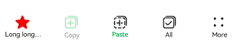

# ToolBarV2

<!--Kit: ArkUI-->
<!--Subsystem: ArkUI-->
<!--Owner: @fengluochenai-->
<!--Designer: @YanSanzo-->
<!--Tester: @ybhou1993-->
<!--Adviser: @Brilliantry_Rui-->
<!-- md-trans-meta sourceCommit=4c495f520711bb7a7c0f878dd925391606600e97 translatedAt=2026-07-29T03:10:26.323Z pushedAt=2026-08-04T02:47:36.665Z -->

The toolbar is used to display action options for the current screen content. It is displayed at the bottom of the screen and is suitable for scenarios where quick action entries need to be provided to users. A maximum of five entries can be displayed at the bottom. Any excess entries are collapsed into a "More" item, which is displayed on the far right. It is suitable for scenarios where quick operations on the current page content are needed, helping users quickly access common functions and improving operation efficiency.<br />
This component is implemented based on [state management (V2)](../../../ui/state-management/arkts-state-management-overview.md#state-management-v2). Compared with [state management (V1)](../../../ui/state-management/arkts-state-management-overview.md#state-management-v1), state management (V2) enhances the deep observation and management capabilities of data objects, no longer limited to the component level. With state management (V2), developers can more flexibly control the data and state of the toolbar through this component, achieving more efficient UI refresh.<br>

> **NOTE**
>
> - This component is supported since API version 18. Updates will be marked with a superscript to indicate their earliest API version.
>
> - This component can be used only in the stage model.
>
> - If [universal attributes](ts-component-general-attributes.md) and [universal events](ts-component-general-events.md) are set for **ToolBarV2**, the compilation toolchain will generate an additional node \_\_Common\_\_ and attach the universal attributes or universal events to \_\_Common\_\_, rather than directly applying them to **ToolBarV2** itself. This may cause the universal attributes or universal events set by the developer to not take effect or behave unexpectedly. Therefore, setting universal attributes and universal events for **ToolBarV2** is not recommended.
>
> - When the system switches between light and dark modes, the toolbar background color does not automatically follow the switch.

## Modules to Import

```ts
import { ToolBarV2 } from '@kit.ArkUI';
```

## Child Components

Not supported

## ToolBarV2

ToolBarV2({toolBarList: ToolBarV2Item\[], activatedIndex?: number, dividerModifier: DividerModifier, toolBarModifier: ToolBarV2Modifier})

Creates a toolbar.

**Decorator**: @ComponentV2

**Atomic service API**: This API can be used in atomic services since API version 18.

**System capability**: SystemCapability.ArkUI.ArkUI.Full

**Device behavior differences**: On wearables, calling this API results in a runtime exception indicating that the API is undefined. On other devices, the API works correctly.

| Name                  | Type                                                              | Mandatory| Decorator              | Description                                                          |
| -------------------- | ---------------------------------------------------------------- | -- |---------------------|--------------------------------------------------------------|
| toolBarList          | [ToolBarV2Item](#toolbarv2item)\[]                               | Yes  | @Param<br/>@Require | List of toolbar items. A maximum of 5 items can be displayed. Excess items are collapsed into a "More" item.                                                       |
| activatedIndex    | number                                                           | No  | @Param              | Index of the activated item.<br />Default value: **-1**, which means no toolbar item is activated.<br />Value range: [-1, 4].      |
| dividerModifier | [DividerModifier](ts-universal-attributes-attribute-modifier.md#custom-modifier) | No  | @Param              | Divider attribute for the toolbar header. It can be used to set the divider height, color, and more. After configuration, a divider with the specified style is displayed at the top of the toolbar.<br />This attribute does not take effect by default.                         |
| toolBarModifier | [ToolBarV2Modifier](#toolbarv2modifier)                          | No  | @Param              | Toolbar attribute. It can be used to set the toolbar height, background color, padding (takes effect only when the number of toolbar items is less than 5), and whether to display the pressed state. After configuration, the toolbar appearance is customized according to the specified style.<br />This attribute does not take effect by default. |

## ToolBarV2Item

Defines an item in the toolbar.

**Decorator**: @ObservedV2

**Atomic service API**: This API can be used in atomic services since API version 18.

**System capability**: SystemCapability.ArkUI.ArkUI.Full

**Device behavior differences**: On wearables, calling this API results in a runtime exception indicating that the API is undefined. On other devices, the API works correctly.

### Properties

| Name                          | Type                                             | Read-Only| Optional| Description                                                                                                                                                                                                                 |
| ---------------------------- | ----------------------------------------------- | -- | -- | ---------------------------------------------------------------------------------------------------------------------------------------------------------------------------------------------------------------------|
| content                      | [ToolBarV2ItemText](#toolbarv2itemtext)         | No | No| Text of the toolbar item.<br>Decorator: @Trace                                                                                                                                                                                                          |
| action                       | [ToolBarV2ItemAction](#toolbarv2itemaction)     | No | Yes | Click event of the toolbar item.<br></div>By default, there is no click event.<br>Decorator: @Trace                                                                                                                                                                                     |
| icon                         | [ToolBarV2ItemIconType](#toolbarv2itemicontype) | No | Yes| Icon of the toolbar item.<br></div>By default, there is no icon.<br>Decorator: @Trace                                                                                                                                                                                       |
| state | [ToolBarV2ItemState](#toolbarv2itemstate) | No | Yes | State of the toolbar item.<br />Default value: **ToolBarV2ItemState.ENABLE**.<br />**Decorator:** @Trace |
| accessibilityText     | [ResourceStr](ts-types.md#resourcestr)          | No | Yes| Accessibility text of the toolbar item. If a component does not contain text information, it will not be announced by the screen reader when selected. In this case, the screen reader user cannot know which component is selected. To solve this problem, you can set accessibility text for components without text information. When such a component is selected, the screen reader announces the specified accessibility text, informing the user which component is selected.<br></div>Default value: value of **content**<br>Decorator: @Trace                                          |
| accessibilityDescription | [ResourceStr](ts-types.md#resourcestr)          | No | Yes|  Accessible description of the toolbar item. You can provide comprehensive text explanations to help users understand the operation they are about to perform and its potential consequences, especially when these cannot be inferred from the component's attributes and accessibility text alone. If a component contains both text information and the accessible description, the text is announced first and then the accessible description, when the component is selected.<br>Default value: **"Double-tap to activate"**<br>Decorator: @Trace                       |
| accessibilityLevel | string | No | Yes | Accessibility level of the toolbar item. Controls whether the current item can be recognized by the accessibility service.<br ></div>Supported values:<br />**"auto"**: The current value is converted to **"yes"**.<br />**"yes"**: The current component can be recognized by the accessibility service.<br />**"no"**: The current component cannot be recognized by the accessibility service.<br />**"no-hide-descendants"**: The current component and all its child components cannot be recognized by the accessibility service.<br />Default value: **"auto"**<br />**Decorator:** @Trace |

### constructor

constructor(options: ToolBarV2ItemOptions)

A constructor used to create a **ToolBarV2Item** instance.

**Atomic service API**: This API can be used in atomic services since API version 18.

**System capability**: SystemCapability.ArkUI.ArkUI.Full

**Device behavior differences**: On wearables, calling this API results in a runtime exception indicating that the API is undefined. On other devices, the API works correctly.

**Parameters**

| Name      | Type                                           | Mandatory| Description      |
| :------ |:----------------------------------------------| :- | :------- |
| options | [ToolBarV2ItemOptions](#toolbarv2itemoptions) | Yes | Configuration options of the toolbar item.|

## ToolBarV2ItemOptions

Defines the options for initializing a **ToolBarV2Item** object.

**Atomic service API**: This API can be used in atomic services since API version 18.

**System capability**: SystemCapability.ArkUI.ArkUI.Full

**Device behavior differences**: On wearables, calling this API results in a runtime exception indicating that the API is undefined. On other devices, the API works correctly.

| Name                      | Type                                             | Read-Only| Optional| Description                                                                                                                                                                                                                 |
|:-------------------------| :---------------------------------------------- |:---|:---|:--------------------------------------------------------------------------------------------------------------------------------------------------------------------------------------------------------------------|
| content                  | [ToolBarV2ItemText](#toolbarv2itemtext)         | No | No | Text of the toolbar item.                                                                                                                                                                                                          |
| action                   | [ToolBarV2ItemAction](#toolbarv2itemaction)     | No | Yes | Click event of the toolbar item.<br>By default, there is no click event.                                                                                                                                                                                           |
| icon                     | [ToolBarV2ItemIconType](#toolbarv2itemicontype) | No | Yes | Icon of the toolbar item.<br>By default, there is no icon.                                                                                                                                                                                            |
| state                    | [ToolBarV2ItemState](#toolbarv2itemstate)       | No | Yes | State of the toolbar item.<br>Default value: **ToolBarV2ItemState.ENABLE**.<br>                                                                                                                                                                 |
| accessibilityText        | [ResourceStr](ts-types.md#resourcestr)          | No | Yes | Accessibility text, that is, accessible label name, of the toolbar item. If a component does not contain text information, it will not be announced by the screen reader when selected. In this case, the screen reader user cannot know which component is selected. To solve this problem, you can set accessibility text for components without text information. When such a component is selected, the screen reader announces the specified accessibility text, informing the user which component is selected.<br>Default value: value of **content**<br>                                         |
| accessibilityDescription | [ResourceStr](ts-types.md#resourcestr)          | No | Yes | Accessible description of the toolbar item. You can provide comprehensive text explanations to help users understand the operation they are about to perform and its potential consequences, especially when these cannot be inferred from the component's attributes and accessibility text alone. If a component contains both text information and the accessible description, the text is announced first and then the accessible description, when the component is selected.<br>Default value: **"Double-tap to activate"**                       |
| accessibilityLevel       | string                                          | No  | Yes  | Accessibility level of the toolbar item, which controls whether the current item can be recognized by the accessibility service.<br ></div>Supported values:<br />**"auto"**: The current value is converted to **"yes"**.<br />**"yes"**: The current component can be recognized by the accessibility service.<br />**"no"**: The current component cannot be recognized by the accessibility service.<br />**"no-hide-descendants"**: The current component and all its child components cannot be recognized by the accessibility service.<br />Default value: **"auto"**<br /> |

## ToolBarV2ItemAction

type ToolBarV2ItemAction = (index: number) => void

Defines the callback for the click event of a toolbar item.

**Atomic service API**: This API can be used in atomic services since API version 18.

**System capability**: SystemCapability.ArkUI.ArkUI.Full

**Device behavior differences**: On wearables, calling this API results in a runtime exception indicating that the API is undefined. On other devices, the API works correctly.

**Parameters**

| Name  | Type    | Mandatory| Description|
|:------|:-------|:---|----|
| index | number | Yes | Index of the toolbar item that triggers the click event. |

## ToolBarV2ItemText

Defines the text of a toolbar item.

**Decorator**: @ObservedV2

**Atomic service API**: This API can be used in atomic services since API version 18.

**System capability**: SystemCapability.ArkUI.ArkUI.Full

**Device behavior differences**: On wearables, calling this API results in a runtime exception indicating that the API is undefined. On other devices, the API works correctly.

### Properties

| Name                 | Type                                                         | Read-Only| Optional| Description                                                      |
|:--------------------|:------------------------------------------------------------|:---|:---|:---------------------------------------------------------|
| text                | [ResourceStr](ts-types.md#resourcestr)                      | No | No | Text of the toolbar item.<br>Decorator: @Trace                                               |
| color               | [ColorMetrics](../js-apis-arkui-graphics.md#colormetrics12) | No | Yes | Font color of the toolbar item.<br>Default value: **$r('sys.color.font_primary')**.<br>Decorator: @Trace      |
| activatedColor | [ColorMetrics](../js-apis-arkui-graphics.md#colormetrics12) | No | Yes | Font color of the toolbar item in the activated state.<br></div>Default value: **$r('sys.color.font_emphasize')**.<br>Decorator: @Trace|

### constructor

constructor(options: ToolBarV2ItemTextOptions)

A constructor used to create a **ToolBarV2ItemText** instance.

**Atomic service API**: This API can be used in atomic services since API version 18.

**System capability**: SystemCapability.ArkUI.ArkUI.Full

**Device behavior differences**: On wearables, calling this API results in a runtime exception indicating that the API is undefined. On other devices, the API works correctly.

**Parameters**

| Name      | Type                                                   | Mandatory| Description        |
| :------ |:------------------------------------------------------| :- | :--------- |
| options | [ToolBarV2ItemTextOptions](#toolbarv2itemtextoptions) | Yes | Configuration options of the text content.|

## ToolBarV2ItemTextOptions

Defines the options for initializing a **ToolBarV2ItemText** object.

**Atomic service API**: This API can be used in atomic services since API version 18.

**System capability**: SystemCapability.ArkUI.ArkUI.Full

**Device behavior differences**: On wearables, calling this API results in a runtime exception indicating that the API is undefined. On other devices, the API works correctly.

| Name                 | Type                                                         | Read-Only| Optional| Description                                                      |
| :------------------ |:------------------------------------------------------------|:---|:---|:---------------------------------------------------------|
| text                | [ResourceStr](ts-types.md#resourcestr)                      | No | No | Text of the toolbar item.                                               |
| color          | [ColorMetrics](../js-apis-arkui-graphics.md#colormetrics12) | No | Yes | Font color of the toolbar item.<br>Default value: **$r('sys.color.font_primary')**.      |
| activatedColor | [ColorMetrics](../js-apis-arkui-graphics.md#colormetrics12) | No | Yes | Font color of the toolbar item in the activated state.<br>Default value: **$r('sys.color.font_emphasize')**.|

## ToolBarV2ItemImage

Defines the icon content of a toolbar item.

**Decorator**: @ObservedV2

**Atomic service API**: This API can be used in atomic services since API version 18.

**System capability**: SystemCapability.ArkUI.ArkUI.Full

**Device behavior differences**: On wearables, calling this API results in a runtime exception indicating that the API is undefined. On other devices, the API works correctly.

### Properties

| Name                | Type                                                         | Read-Only| Optional| Description                                                      |
|:-------------------|:------------------------------------------------------------|:---|:---| :---------------------------------------------------------|
| src                | [ResourceStr](ts-types.md#resourcestr)                      | No | No|  Icon of the toolbar item.<br>Decorator: @Trace                                               |
| color              | [ColorMetrics](../js-apis-arkui-graphics.md#colormetrics12) | No | Yes|  Color of the icon.<br>Default value: **$r('sys.color.icon_primary')**.<br>Decorator: @Trace      |
| activatedColor     | [ColorMetrics](../js-apis-arkui-graphics.md#colormetrics12) | No | Yes| Color of the icon when the toolbar item is activated.<br>Default value: **$r('sys.color.icon_emphasize')**.<br>Decorator: @Trace|

### constructor

constructor(options: ToolBarV2ItemImageOptions)

A constructor used to create a **ToolBarV2ItemImage** instance.

**Atomic service API**: This API can be used in atomic services since API version 18.

**System capability**: SystemCapability.ArkUI.ArkUI.Full

**Device behavior differences**: On wearables, calling this API results in a runtime exception indicating that the API is undefined. On other devices, the API works correctly.

**Parameters**

| Name      | Type                                                   | Mandatory| Description        |
| :------ | :------------------------------------------------------ | :- | :--------- |
| options | [ToolBarV2ItemImageOptions](#toolbarv2itemimageoptions) | Yes | Configuration options for the icon content of the toolbar item.|

## ToolBarV2ItemImageOptions

Defines the options for initializing a **ToolBarV2ItemImage** object.

**Atomic service API**: This API can be used in atomic services since API version 18.

**System capability**: SystemCapability.ArkUI.ArkUI.Full

**Device behavior differences**: On wearables, calling this API results in a runtime exception indicating that the API is undefined. On other devices, the API works correctly.

| Name                 | Type                                                         | Read-Only| Optional| Description                                                      |
|:--------------------|:------------------------------------------------------------|:---|:---|:---------------------------------------------------------|
| src                 | [ResourceStr](ts-types.md#resourcestr)                      | No | No | Icon of the toolbar item.                                               |
| color               | [ColorMetrics](../js-apis-arkui-graphics.md#colormetrics12) | No | Yes | Color of the icon.<br>Default value: **$r('sys.color.icon_primary')**.      |
| activatedColor | [ColorMetrics](../js-apis-arkui-graphics.md#colormetrics12) | No | Yes | Color of the icon when the toolbar item is activated.<br>Default value: **$r('sys.color.icon_emphasize')**.|

## ToolBarV2ItemIconType

type ToolBarV2ItemIconType = ToolBarV2ItemImage | ToolBarV2SymbolGlyph

Defines the union type for the icon content of a toolbar item.

**Atomic service API**: This API can be used in atomic services since API version 18.

**System capability**: SystemCapability.ArkUI.ArkUI.Full

**Device behavior differences**: On wearables, calling this API results in a runtime exception indicating that the API is undefined. On other devices, the API works correctly.

| Type                                           | Description           |
|:----------------------------------------------| :------------ |
| [ToolBarV2ItemImage](#toolbarv2itemimage)     | Type for defining a common icon.    |
| [ToolBarV2SymbolGlyph](#toolbarv2symbolglyph) | Type for defining a symbol icon.|

## ToolBarV2Modifier

Provides methods for setting the toolbar height (**height**), background color (**backgroundColor**), left and right padding (**padding**, which takes effect only when the number of items is fewer than five), and whether to display the pressed state effect (**stateEffect**).

**Atomic service API**: This API can be used in atomic services since API version 18.

**System capability**: SystemCapability.ArkUI.ArkUI.Full

**Device behavior differences**: On wearables, calling this API results in a runtime exception indicating that the API is undefined. On other devices, the API works correctly.

### backgroundColor

backgroundColor(backgroundColor: ColorMetrics): ToolBarV2Modifier

Sets the background color of the toolbar. This method can be called for custom drawing.

**Atomic service API**: This API can be used in atomic services since API version 18.

**System capability**: SystemCapability.ArkUI.ArkUI.Full

**Device behavior differences**: On wearables, calling this API results in a runtime exception indicating that the API is undefined. On other devices, the API works correctly.

**Parameters**

| Name            | Type                                                         | Mandatory| Description                                                               |
| --------------- |-------------------------------------------------------------| -- | ----------------------------------------------------------------- |
| backgroundColor | [ColorMetrics](../js-apis-arkui-graphics.md#colormetrics12) | Yes | Toolbar background color<br>Default value: **\$r('sys.color.ohos\_id\_color\_toolbar\_bg')**|

**Return value**

| Type                                     | Description                                     |
|-----------------------------------------|-----------------------------------------|
| [ToolBarV2Modifier](#toolbarv2modifier) | **ToolBarV2Modifier** object after setting the background color, which can be used for chained calls to further customize the toolbar style. |

### padding

padding(padding: LengthMetrics): ToolBarV2Modifier

Sets the left and right padding of the toolbar. This method can be called for custom drawing.

**Atomic service API**: This API can be used in atomic services since API version 18.

**System capability**: SystemCapability.ArkUI.ArkUI.Full

**Device behavior differences**: On wearables, calling this API results in a runtime exception indicating that the API is undefined. On other devices, the API works correctly.

**Parameters**

| Name    | Type                                                           | Mandatory| Description                                                                 |
| ------- |---------------------------------------------------------------| -- | ------------------------------------------------------------------- |
| padding | [LengthMetrics](../js-apis-arkui-graphics.md#lengthmetrics12) | Yes | Left and right padding of the toolbar. This takes effect only when the number of items is fewer than 5; otherwise, the setting is invalid.<br ></div>When the number of items is fewer than 5, the default left and right padding of the toolbar is 24 vp. When the number of items reaches or exceeds 5, the default left and right padding of the toolbar is 0 vp. |

**Return value**

| Type                                      | Description                              |
|-----------------------------------------|---------------------------------|
| [ToolBarV2Modifier](#toolbarv2modifier) | **ToolBarV2Modifier** object with the padding set, which can be used for chained calls to further customize the toolbar style. |

### height

height(height: LengthMetrics): ToolBarV2Modifier

Sets the height of the toolbar. This method can be called for custom drawing. This height does not include the divider height.

**Atomic service API**: This API can be used in atomic services since API version 18.

**System capability**: SystemCapability.ArkUI.ArkUI.Full

**Device behavior differences**: On wearables, calling this API results in a runtime exception indicating that the API is undefined. On other devices, the API works correctly.

**Parameters**

| Name   | Type                                                                | Mandatory| Description                               |
| ------ | ------------------------------------------------------------------ | -- | --------------------------------- |
| height | [LengthMetrics](../js-apis-arkui-graphics.md#lengthmetrics12) | Yes | Height of the toolbar.<br>The default height of the toolbar is 56 vp, which does not include the divider.|

**Return value**

| Type                                     | Description                            |
|-----------------------------------------|--------------------------------|
| [ToolBarV2Modifier](#toolbarv2modifier) | **ToolBarV2Modifier** object after setting the height, which can be used for chained calls to other methods to further customize the toolbar style. |

### stateEffect

stateEffect(stateEffect: boolean): ToolBarV2Modifier

Sets whether to display the pressed state effect.

**Atomic service API**: This API can be used in atomic services since API version 18.

**System capability**: SystemCapability.ArkUI.ArkUI.Full

**Device behavior differences**: On wearables, calling this API results in a runtime exception indicating that the API is undefined. On other devices, the API works correctly.

**Parameters**

| Name        | Type     | Mandatory| Description                                                    |
| ----------- | ------- | -- |--------------------------------------------------------|
| stateEffect | boolean | Yes | Whether to display the pressed state effect on the toolbar.<br>**true**: Display the pressed state effect.<br>**false**: Do not display the pressed state effect.<br> Default value: **true**|

**Return value**

| Type                                     | Description                                 |
|-----------------------------------------|-------------------------------------|
| [ToolBarV2Modifier](#toolbarv2modifier) | **ToolBarV2Modifier** object with the pressed state effect set, which can be used for chained calls to other methods to further customize the toolbar style. |

## ToolBarV2ItemState

Enumerates the states of the toolbar item.

**Atomic service API**: This API can be used in atomic services since API version 18.

**System capability**: SystemCapability.ArkUI.ArkUI.Full

**Device behavior differences**: On wearables, calling this API results in a runtime exception indicating that the API is undefined. On other devices, the API works correctly.

| Name      | Value| Description             |
| -------- | - | --------------- |
| ENABLE   | 1 | The toolbar item is enabled. |
| DISABLE  | 2 | The toolbar item is disabled.  |
| ACTIVATE | 3 | The toolbar item is activated.|

## ToolBarV2SymbolGlyph

Defines the icon symbol options.

**Decorator**: @ObservedV2

**Atomic service API**: This API can be used in atomic services since API version 18.

**System capability**: SystemCapability.ArkUI.ArkUI.Full

**Device behavior differences**: On wearables, calling this API results in a runtime exception indicating that the API is undefined. On other devices, the API works correctly.

### Properties

| Name       | Type                                                                  | Read-Only| Optional| Description                                                                                  |
| :-------- | :------------------------------------------------------------------- |:---|:---|  :----------------------------------------------------------------------------------- |
| normal    | [SymbolGlyphModifier](ts-universal-attributes-attribute-symbolglyphmodifier.md#symbolglyphmodifier) | No | No | Icon symbol of the toolbar item in normal state.<br>Decorator: @Trace  |
| activated | [SymbolGlyphModifier](ts-universal-attributes-attribute-symbolglyphmodifier.md#symbolglyphmodifier) | No | Yes | Icon symbol of the toolbar item in activated state.<br>Default value:<br>**fontColor**: **\$r('sys.color.icon\_emphasize')**, **fontSize**: **24vp**<br>Decorator: @Trace|

### constructor

constructor(options: ToolBarV2SymbolGlyphOptions)

A constructor used to create a **ToolBarV2SymbolGlyph** object.

**Atomic service API**: This API can be used in atomic services since API version 18.

**System capability**: SystemCapability.ArkUI.ArkUI.Full

**Device behavior differences**: On wearables, calling this API results in a runtime exception indicating that the API is undefined. On other devices, the API works correctly.

**Parameters**

| Name    | Type                                                       | Mandatory| Description         |
| :------ | :---------------------------------------------------------- | :- | :---------- |
| options | [ToolBarV2SymbolGlyphOptions](#toolbarv2symbolglyphoptions) | Yes | Configuration options of the symbol icon.|

## ToolBarV2SymbolGlyphOptions

Defines the attributes of the symbol icon.

**Atomic service API**: This API can be used in atomic services since API version 18.

**System capability**: SystemCapability.ArkUI.ArkUI.Full

**Device behavior differences**: On wearables, calling this API results in a runtime exception indicating that the API is undefined. On other devices, the API works correctly.

| Name       | Type                                                                  | Read-Only| Optional| Description                                                                                  |
| --------- | -------------------------------------------------------------------- | -- | -- | ------------------------------------------------------------------------------------ |
| normal    | [SymbolGlyphModifier](ts-universal-attributes-attribute-symbolglyphmodifier.md#symbolglyphmodifier) | No| No | Icon symbol of the toolbar item in normal state.  |
| activated | [SymbolGlyphModifier](ts-universal-attributes-attribute-symbolglyphmodifier.md#symbolglyphmodifier) | No| Yes | Icon symbol of the toolbar item in activated state.<br>Default value:<br>**fontColor**: **\$r('sys.color.icon\_emphasize')**, **fontSize**: **24vp**|

## Example

### Example 1: Setting Toolbar Items to Different States

This example shows the various display effects when the **state** property of toolbar items is set to **ENABLE**, **DISABLE**, or **ACTIVATE**.

```ts
import { ToolBarV2ItemImage, ToolBarV2ItemState, ToolBarV2ItemText, ToolBarV2Item, ToolBarV2 } from '@kit.ArkUI';

@Entry
@ComponentV2
struct Index {
  @Local toolbarList: ToolBarV2Item[] = []

  aboutToAppear() {
    this.toolbarList.push(new ToolBarV2Item({
      content: new ToolBarV2ItemText(
        {
          text: Long long long long long'
        }
      ),
      icon: new ToolBarV2ItemImage({
        src: $r('sys.media.ohos_ic_public_share')
      }),
      action: () => {
      },
    }))
    this.toolbarList.push(
      new ToolBarV2Item({
        content: new ToolBarV2ItemText(
          {
            text: 'Copy'
          }
        ),
        icon: new ToolBarV2ItemImage({
          src: $r('sys.media.ohos_ic_public_copy')
        }),
        action: () => {
        },
        state: ToolBarV2ItemState.DISABLE
      })
    )
    this.toolbarList.push(
      new ToolBarV2Item({
        content: new ToolBarV2ItemText(
          {
            text: 'Paste'
          }
        ),
        icon: new ToolBarV2ItemImage({
          src: $r('sys.media.ohos_ic_public_paste')
        }),
        action: () => {
        },
        state: ToolBarV2ItemState.ACTIVATE
      })
    )
    this.toolbarList.push(
      new ToolBarV2Item({
        content: new ToolBarV2ItemText(
          {
            text: 'All'
          }
        ),
        icon: new ToolBarV2ItemImage({
          src: $r('sys.media.ohos_ic_public_select_all')
        }),
        action: () => {
        },
      })
    )
    this.toolbarList.push(
      new ToolBarV2Item({
        content: new ToolBarV2ItemText(
          {
            text: 'Share'
          }
        ),
        icon: new ToolBarV2ItemImage({
          src: $r('sys.media.ohos_ic_public_share')
        }),
        action: () => {
        },
      })
    )
    this.toolbarList.push(
      new ToolBarV2Item({
        content: new ToolBarV2ItemText(
          {
            text: 'Share'
          }
        ),
        icon: new ToolBarV2ItemImage({
          src: $r('sys.media.ohos_ic_public_share')
        }),
        action: () => {
        },
      })
    )
  }

  build() {
    Row() {
      Stack() {
        Column() {
          ToolBarV2({
            activatedIndex: 2,
            toolBarList: this.toolbarList,
          })
        }
      }.align(Alignment.Bottom)
      .width('100%').height('100%')
    }
  }
}
```


### Example 2: Customizing the Toolbar Style

This example demonstrates how to customize the toolbar's height, background color, and pressed state effect using **ToolBarV2Modifier**.

```ts
import {
  SymbolGlyphModifier,
  DividerModifier,
  LengthMetrics,
  ColorMetrics,
  ToolBarV2Item,
  ToolBarV2Modifier,
  ToolBarV2ItemText,
  ToolBarV2ItemImage,
  ToolBarV2,
  ToolBarV2ItemState,
  ToolBarV2SymbolGlyph
} from '@kit.ArkUI';

@Entry
@ComponentV2
struct Index {
  @Local toolbarList: ToolBarV2Item[] = [];
  private toolBarModifier: ToolBarV2Modifier =
    new ToolBarV2Modifier().height(LengthMetrics.vp(52))
      .backgroundColor(ColorMetrics.resourceColor(Color.Transparent))
      .stateEffect(false);
  @Local dividerModifier: DividerModifier = new DividerModifier().height(0);

  aboutToAppear() {
    this.toolbarList.push(
      new ToolBarV2Item({
        content: new ToolBarV2ItemText({
          text: 'Long long long long long long long long text',
          activatedColor: ColorMetrics.resourceColor($r('sys.color.font_primary'))
        }),
        icon: new ToolBarV2SymbolGlyph({
          normal: new SymbolGlyphModifier($r('sys.symbol.ohos_star')).fontColor([Color.Green]),
          activated: new SymbolGlyphModifier($r('sys.symbol.ohos_star')).fontColor([Color.Red]),
        }),
        action: () => {
        },
        state: ToolBarV2ItemState.ACTIVATE,
      })
    )
    this.toolbarList.push(
      new ToolBarV2Item({
        content: new ToolBarV2ItemText({
          text: 'Copy',
          activatedColor: ColorMetrics.resourceColor('#ffec5d5d')
        }),
        icon: new ToolBarV2ItemImage({
          src: $r('sys.media.ohos_ic_public_copy'),
          color: ColorMetrics.resourceColor('#ff18cb53'),
          activatedColor: ColorMetrics.resourceColor('#ffec5d5d'),
        }),
        action: () => {
        },
        state: ToolBarV2ItemState.DISABLE,
      }))
    this.toolbarList.push(
      new ToolBarV2Item({
        content: new ToolBarV2ItemText({
          text: 'Paste',
          color: ColorMetrics.resourceColor('#ff18cb53')
        }),
        icon: new ToolBarV2ItemImage({
          src: $r('sys.media.ohos_ic_public_paste'),
        }),
        action: () => {
        },
        state: ToolBarV2ItemState.ACTIVATE,
      })
    )
    this.toolbarList.push(
      new ToolBarV2Item({
        content: new ToolBarV2ItemText({
          text: 'All',
        }),
        icon: new ToolBarV2ItemImage({
          src: $r('sys.media.ohos_ic_public_select_all'),
        }),
        action: () => {
        },
        state: ToolBarV2ItemState.ACTIVATE,
      }))
    this.toolbarList.push(
      new ToolBarV2Item({
        content: new ToolBarV2ItemText({
          text: 'Share',
        }),
        icon: new ToolBarV2ItemImage({
          src: $r('sys.media.ohos_ic_public_share'),
        }),
        action: () => {
        },
      }))
    this.toolbarList.push(
      new ToolBarV2Item({
        content: new ToolBarV2ItemText({
          text: 'Share',
        }),
        icon: new ToolBarV2ItemImage({
          src: $r('sys.media.ohos_ic_public_share'),
        }),
        action: () => {
        },
      })
    )
  }

  build() {
    Row() {
      Stack() {
        Column() {
          ToolBarV2({
            toolBarModifier: this.toolBarModifier,
            dividerModifier: this.dividerModifier,
            activatedIndex: 0,
            toolBarList: this.toolbarList,
          })
            .height(52)
        }
      }.align(Alignment.Bottom)
      .width('100%').height('100%')
    }
  }
}
```



### Example 3: Implementing Screen Reader Announcement

This example customizes the screen reader announcement text by setting the **accessibilityText**, **accessibilityDescription**, and **accessibilityLevel** properties of the toolbar item.

```ts
import {
  DividerModifier,
  LengthMetrics,
  ColorMetrics,
  ToolBarV2Item,
  ToolBarV2Modifier,
  ToolBarV2ItemText,
  ToolBarV2ItemImage,
  ToolBarV2,
  ToolBarV2ItemState,
} from '@kit.ArkUI';

@Entry
@ComponentV2
struct Index {
  @Local toolbarList: ToolBarV2Item[] = [];
  private toolBarModifier: ToolBarV2Modifier =
    new ToolBarV2Modifier().height(LengthMetrics.vp(52))
      .backgroundColor(ColorMetrics.resourceColor(Color.Transparent))
      .stateEffect(false);
  @Local dividerModifier: DividerModifier = new DividerModifier().height(0);

  aboutToAppear() {
    this.toolbarList.push(
      new ToolBarV2Item({
        content: new ToolBarV2ItemText({
          text: Long long long long long'
        }),
        icon: new ToolBarV2ItemImage({
          src: $r('sys.media.ohos_ic_public_share')
        }),
        action: () => {
        },
        accessibilityText: 'Clip', // Screen reader announcement text for the item.
        accessibilityDescription: 'Double-tap to clip', // Screen reader announcement description for the item.
        accessibilityLevel: 'yes'  // Configure this element to be focused by accessibility screen readers.
      })
    )
    this.toolbarList.push(
      new ToolBarV2Item({
        content: new ToolBarV2ItemText({
          text: 'Copy',
        }),
        icon: new ToolBarV2ItemImage({
          src: $r('sys.media.ohos_ic_public_copy'),
        }),
        action: () => {
        },
        state: ToolBarV2ItemState.DISABLE,
        accessibilityLevel: 'no'  // Configure this element not to be focused by accessibility screen readers.
      }))
    this.toolbarList.push(
      new ToolBarV2Item({
        content: new ToolBarV2ItemText({
          text: 'Paste',
        }),
        icon: new ToolBarV2ItemImage({
          src: $r('sys.media.ohos_ic_public_paste'),
        }),
        action: () => {
        },
        state: ToolBarV2ItemState.ACTIVATE,
      })
    )
    this.toolbarList.push(
      new ToolBarV2Item({
        content: new ToolBarV2ItemText({
          text: 'All',
        }),
        icon: new ToolBarV2ItemImage({
          src: $r('sys.media.ohos_ic_public_select_all'),
        }),
        action: () => {
        },
      }))
    this.toolbarList.push(
      new ToolBarV2Item({
        content: new ToolBarV2ItemText({
          text: 'Share',
        }),
        icon: new ToolBarV2ItemImage({
          src: $r('sys.media.ohos_ic_public_share'),
        }),
        action: () => {
        },
      }))
    this.toolbarList.push(
      new ToolBarV2Item({
        content: new ToolBarV2ItemText({
          text: 'Share',
        }),
        icon: new ToolBarV2ItemImage({
          src: $r('sys.media.ohos_ic_public_share'),
        }),
        action: () => {
        },
      })
    )
  }

  build() {
    Row() {
      Stack() {
        Column() {
          ToolBarV2({
            toolBarModifier: this.toolBarModifier,
            dividerModifier: this.dividerModifier,
            activatedIndex: 0,
            toolBarList: this.toolbarList,
          })
            .height(52)
        }
      }.align(Alignment.Bottom)
      .width('100%').height('100%')
    }
  }
}
```

