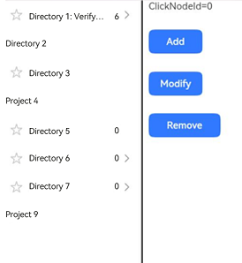
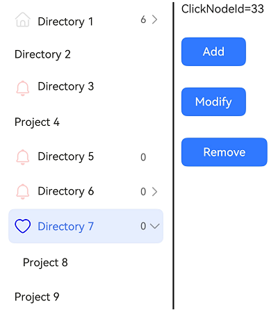

# TreeView

<!--Kit: ArkUI-->
<!--Subsystem: ArkUI-->
<!--Owner: @wangrunsen-->
<!--Designer: @YanSanzo-->
<!--Tester: @ybhou1993-->
<!--Adviser: @Brilliantry_Rui-->
<!-- md-trans-meta sourceCommit=4c495f520711bb7a7c0f878dd925391606600e97 translatedAt=2026-07-29T03:12:11.165Z pushedAt=2026-08-04T02:47:38.436Z -->

A tree view is a hierarchical list suitable for displaying nested structures. It consists of parent nodes and child nodes, and supports expanding or collapsing.

The tree view is applicable in the side navigation bar of productivity apps, such as notepad, email, and Gallery.

> **NOTE**
>
> - This component is supported since API version 10. Updates will be marked with a superscript to indicate their earliest API version.
>
> - This component can be used only in the stage model.
>
> - If the **TreeView** component has [universal attributes](ts-component-general-attributes.md) and [universal events](ts-component-general-events.md) configured, the compiler toolchain automatically generates an additional \_\_Common\_\_ node and mounts the universal attributes and universal events on this node rather than the **TreeView** component itself. As a result, the configured universal attributes and universal events may fail to take effect or behave as intended. For this reason, avoid using universal attributes and events with the **TreeView** component.

## Modules to Import

```
import { TreeView } from "@kit.ArkUI";
```

## Child Components

Not supported

## TreeView

TreeView({ treeController: TreeController })

**Decorator**: @Component

**Atomic service API**: This API can be used in atomic services since API version 11.

**System capability**: SystemCapability.ArkUI.ArkUI.Full

**Device behavior differences**: On wearables, calling this API results in a runtime exception indicating that the API is undefined. On other devices, the API works correctly.

| Name| Type| Mandatory| Description|
| -------- | -------- | -------- | -------- |
| treeController | [TreeController](#treecontroller) | Yes | Controller of the tree view component, used to control the node information of the tree. |

## TreeController

A controller for the tree view component, used to control node information of the tree. The same controller instance cannot control multiple tree view components simultaneously.

**Atomic service API**: This API can be used in atomic services since API version 11.

**System capability**: SystemCapability.ArkUI.ArkUI.Full

**Device behavior differences**: On wearables, calling this API results in a runtime exception indicating that the API is undefined. On other devices, the API works correctly.

### addNode

addNode(nodeParam?: NodeParam): TreeController

After a node is selected, call this method to add a child node.

**Atomic service API**: This API can be used in atomic services since API version 11.

**System capability**: SystemCapability.ArkUI.ArkUI.Full

**Device behavior differences**: On wearables, calling this API results in a runtime exception indicating that the API is undefined. On other devices, the API works correctly.

**Parameters**

| Name | Type| Mandatory| Description|
| -------- | -------- | -------- | -------- |
| nodeParam | [NodeParam](#nodeparam) | No| Node information. If this parameter is not passed, a node titled **New Folder** will be added under the currently selected node.|

**Return value**

| Type                             | Description                |
| --------------------------------- | -------------------- |
| [TreeController](#treecontroller) | Returns the controller instance of the tree view component, supporting chain calls. |

### removeNode

removeNode(): void

Deletes the selected node.

**Atomic service API**: This API can be used in atomic services since API version 11.

**System capability**: SystemCapability.ArkUI.ArkUI.Full

**Device behavior differences**: On wearables, calling this API results in a runtime exception indicating that the API is undefined. On other devices, the API works correctly.

### modifyNode

modifyNode(): void

Modifies the selected node.

**Atomic service API**: This API can be used in atomic services since API version 11.

**System capability**: SystemCapability.ArkUI.ArkUI.Full

**Device behavior differences**: On wearables, calling this API results in a runtime exception indicating that the API is undefined. On other devices, the API works correctly.

### buildDone

buildDone(): void

Saves the tree information after all nodes are added.

**Atomic service API**: This API can be used in atomic services since API version 11.

**System capability**: SystemCapability.ArkUI.ArkUI.Full

**Device behavior differences**: On wearables, calling this API results in a runtime exception indicating that the API is undefined. On other devices, the API works correctly.

### refreshNode

refreshNode(parentId: number, parentSubTitle: ResourceStr, currentSubtitle: ResourceStr): void

Updates the display information of the current node by specifying the parent node ID, parent node subtitle, and current node subtitle.

**Atomic service API**: This API can be used in atomic services since API version 11.

**System capability**: SystemCapability.ArkUI.ArkUI.Full

**Device behavior differences**: On wearables, calling this API results in a runtime exception indicating that the API is undefined. On other devices, the API works correctly.

**Parameters**

| Name | Type| Mandatory| Description|
| -------- | -------- | -------- | -------- |
| parentId | number | Yes | Parent node ID.<br />The value range is greater than or equal to -1. The root node ID is -1. If the value is set to less than -1, it does not take effect. |
| parentSubTitle | [ResourceStr](ts-types.md#resourcestr) | Yes | Subtitle of the parent node. After setting, the subtitle display content of the parent node is updated. |
| currentSubtitle | [ResourceStr](ts-types.md#resourcestr) | Yes | Subtitle of the current node. After setting, the subtitle display content of the current node is updated. |

## NodeParam

**System capability**: SystemCapability.ArkUI.ArkUI.Full

**Device behavior differences**: On wearables, calling this API results in a runtime exception indicating that the API is undefined. On other devices, the API works correctly.

| Name| Type| Read-Only| Optional| Description                                                                                                                                              |
| -------- | -------- |---|---|--------------------------------------------------------------------------------------------------------------------------------------------------|
| parentNodeId | number | No| Yes| ID of the parent node.<br>The value must be greater than or equal to -1.<br>Default value: -1. The root node ID is -1. If the value is less than -1, the setting does not take effect.<br>**Atomic service API**: This API can be used in atomic services since API version 11.                              |
| currentNodeId | number | No | Yes | Current child node ID.<br />Value range: greater than or equal to -1.<br />Cannot be the root node ID (i.e., cannot be -1) or **null**; otherwise, an exception is thrown. Two identical **currentNodeId** values cannot be set.<br />Default value: **-1**<br/>**Atomic service API:** This API can be used in atomic services since API version 11. |
| isFolder | boolean | No | Yes | Whether the node is a folder.<br />Default value: **false**<br />**true**: a folder that can contain child nodes and supports expand/collapse operations; **false**: not a folder, i.e., a leaf node.<br/>**Atomic service API:** This API can be used in atomic services since API version 11. |
| icon | [ResourceStr](ts-types.md#resourcestr) | No | Yes | Icon. If **symbolIconStyle** is also set, **symbolIconStyle** takes precedence.<br/>Default value: empty string<br/>**Atomic service API:** This API can be used in atomic services since API version 11. |
| symbolIconStyle<sup>18+</sup> | [SymbolGlyphModifier](ts-universal-attributes-attribute-symbolglyphmodifier.md#symbolglyphmodifier) | No| Yes| Symbol icon, which has higher priority than **icon**.<br>Default value: **undefined**<br>**Atomic service API**: This API can be used in atomic services since API version 18.                                                      |
| selectedIcon | [ResourceStr](ts-types.md#resourcestr) | No | Yes | Selected icon. If **symbolSelectedIconStyle** is also set, **symbolSelectedIconStyle** takes precedence.<br/>Default value: empty string<br/>**Atomic service API:** This API can be used in atomic services since API version 11. |
| symbolSelectedIconStyle<sup>18+</sup> | [SymbolGlyphModifier](ts-universal-attributes-attribute-symbolglyphmodifier.md#symbolglyphmodifier) | No| Yes| Symbol icon of the selected node, which has higher priority than **selectedIcon**.<br>Default value: **undefined**<br>**Atomic service API**: This API can be used in atomic services since API version 18.                                            |
| editIcon | [ResourceStr](ts-types.md#resourcestr) | No | Yes | Edit icon. If **symbolEditIconStyle** is also set, **symbolEditIconStyle** takes precedence.<br/>Default value: empty string<br/>**Atomic service API:** This API can be used in atomic services since API version 11. |
| symbolEditIconStyle<sup>18+</sup> | [SymbolGlyphModifier](ts-universal-attributes-attribute-symbolglyphmodifier.md#symbolglyphmodifier) | No| Yes| Symbol edit icon, which has a higher priority than **editIcon**.<br>Default value: **undefined**<br>**Atomic service API**: This API can be used in atomic services since API version 18.                                                |
| primaryTitle | [ResourceStr](ts-types.md#resourcestr) | No| Yes| Primary title.<br>The default value is an empty string.<br>**Atomic service API**: This API can be used in atomic services since API version 11.                                                                         |
| secondaryTitle | [ResourceStr](ts-types.md#resourcestr) | No| Yes| Secondary title.<br>The default value is an empty string.<br>**Atomic service API**: This API can be used in atomic services since API version 11.                                                                          |
| container | ()&nbsp;=&gt;&nbsp;void | No | Yes | Context menu component bound to the node, displayed when the user right-clicks the node. It must be defined through the **@Builder** function.<br/>Default value: ()&nbsp;=&gt;&nbsp;void<br/>**Atomic service API:** This API can be used in atomic services since API version 11. |

## TreeListenerManager

Defines a listener manager for the tree view component, which can obtain a listener instance and bind it to the tree view component for managing node listening of the tree. The same listener cannot control multiple tree view components.

**Device behavior differences**: On wearables, calling this API results in a runtime exception indicating that the API is undefined. On other devices, the API works correctly.

### getInstance

static getInstance(): TreeListenerManager

Obtains a **TreeListenerManager** singleton object.

**Atomic service API**: This API can be used in atomic services since API version 11.

**System capability**: SystemCapability.ArkUI.ArkUI.Full

**Device behavior differences**: On wearables, calling this API results in a runtime exception indicating that the API is undefined. On other devices, the API works correctly.

**Return value**

| Type             | Description              |
| --------------- |------------------|
| [TreeListenerManager](#treelistenermanager) | **TreeListenerManager** singleton object.|

### getTreeListener

getTreeListener(): TreeListener

Obtains a listener.

**Atomic service API**: This API can be used in atomic services since API version 11.

**System capability**: SystemCapability.ArkUI.ArkUI.Full

**Device behavior differences**: On wearables, calling this API results in a runtime exception indicating that the API is undefined. On other devices, the API works correctly.

**Return value**

| Type          | Description        |
| ------------ |------------|
| [TreeListener](#treelistener) | Obtained listener.|

## TreeListener

Defines a listener for the tree view component, which can be bound to the tree view component to listen for node changes of the tree. The same listener cannot control multiple tree view components. The listener internally maintains the mapping between event types and callback functions. When a user performs a node operation on the TreeView, the TreeView notifies the listener to trigger the corresponding callback function, and the developer can obtain node information in the callback and perform service processing.

### on

on(type: TreeListenType, callback: (callbackParam: CallbackParam) =&gt; void): void;

Registers a listener for tree view node events. After successful registration, the callback function is triggered when the corresponding event occurs on a node. The same listener cannot control multiple tree view components.

**Atomic service API**: This API can be used in atomic services since API version 11.

**System capability**: SystemCapability.ArkUI.ArkUI.Full

**Device behavior differences**: On wearables, calling this API results in a runtime exception indicating that the API is undefined. On other devices, the API works correctly.

**Parameters**

| Name | Type| Mandatory| Description|
| -------- | -------- | -------- | -------- |
| type | [TreeListenType](#treelistentype) | Yes | Type of the listening event, used to specify the listening event to register. |
| callback | (callbackParam: [CallbackParam](#callbackparam)) =&gt; void | Yes | Callback invoked when the corresponding listening event is triggered. The callback parameter **callbackParam** contains information such as **currentNodeId**, **parentNodeId**, and **childIndex**. |

### once

once(type: TreeListenType, callback: (callbackParam: CallbackParam) =&gt; void): void;

Registers a one-time listening for tree view node events. After successful registration, the callback function is triggered when the corresponding event occurs on a node for the first time, and the listening is automatically removed after triggering. The same listener cannot control multiple tree view components.

**Atomic service API**: This API can be used in atomic services since API version 11.

**System capability**: SystemCapability.ArkUI.ArkUI.Full

**Device behavior differences**: On wearables, calling this API results in a runtime exception indicating that the API is undefined. On other devices, the API works correctly.

**Parameters**

| Name | Type| Mandatory| Description|
| -------- | -------- | -------- | -------- |
| type | [TreeListenType](#treelistentype) | Yes | Type of the listening event, used to specify the listening event to register. |
| callback | (callbackParam: [CallbackParam](#callbackparam)) =&gt; void | Yes | Callback invoked when the corresponding listening event is triggered. The callback parameter **callbackParam** contains information such as **currentNodeId**, **parentNodeId**, and **childIndex**. |

### off

off(type: TreeListenType, callback?: (callbackParam: CallbackParam) =&gt; void): void;

Cancels listening. Listening must be registered before it can be canceled. The same listener cannot control multiple tree view components.

**Atomic service API**: This API can be used in atomic services since API version 11.

**System capability**: SystemCapability.ArkUI.ArkUI.Full

**Device behavior differences**: On wearables, calling this API results in a runtime exception indicating that the API is undefined. On other devices, the API works correctly.

**Parameters**

| Name | Type| Mandatory| Description|
| -------- | -------- | -------- | -------- |
| type | [TreeListenType](#treelistentype) | Yes | Type of the listening event, used to specify the listening event to cancel. |
| callback | (callbackParam: [CallbackParam](#callbackparam)) =&gt; void | No | Callback invoked when the corresponding listening event is triggered. Default value: **undefined**. When this parameter is passed, the listener for the corresponding node information is canceled; when not passed, all node information listeners of this type are canceled. |

## TreeListenType

Enumerates the listening types of tree view nodes.

**Atomic service API**: This API can be used in atomic services since API version 11.

**System capability**: SystemCapability.ArkUI.ArkUI.Full

**Device behavior differences**: On wearables, calling this API results in a runtime exception indicating that the API is undefined. On other devices, the API works correctly.

| Name| Value| Description|
| -------- | -------- | -------- |
| NODE_CLICK | "NodeClick" | Listens for click events of nodes.|
| NODE_ADD | "NodeAdd" | Listens for the node addition event. Triggered after the **addNode** method is called to add a node. |
| NODE_DELETE | "NodeDelete" | Listens for the node deletion event. Triggered after the **removeNode** method is called to delete a node. |
| NODE_MODIFY | "NodeModify" | Listens for the node modification event. Triggered after the **modifyNode** method is called to modify a node. |
| NODE_MOVE | "NodeMove" | Listens for the node move event. Triggered after the node position changes. |

## CallbackParam

**Atomic service API**: This API can be used in atomic services since API version 11.

**System capability**: SystemCapability.ArkUI.ArkUI.Full

**Device behavior differences**: On wearables, calling this API results in a runtime exception indicating that the API is undefined. On other devices, the API works correctly.

| Name| Type| Read-Only| Optional| Description                                      |
| -------- | -------- |---|---|------------------------------------------|
| currentNodeId | number | No| No| ID of the current child node.<br>The value must be greater than or equal to 0.             |
| parentNodeId | number | No| Yes| ID of the current parent node.<br>The value must be greater than or equal to -1.<br>Default value: **-1**|
| childIndex | number | No | Yes | Index of the child node under the parent node, used to identify the position of the child node in the parent node's child list.<br />Value range: greater than or equal to -1, where -1 indicates an invalid index or no child node.<br />Default value: **-1** |

## Events

The [universal events](ts-component-general-events.md) are not supported.

## Example

### Example 1: Configuring a Simple Tree View

This example showcases how to use **TreeController** to perform operations on tree nodes, such as adding, deleting, and renaming. It also demonstrates the effects of adding nodes with different parameters.

```ts
import { TreeController, TreeListener, TreeListenerManager, TreeListenType, NodeParam, TreeView, CallbackParam } from '@kit.ArkUI';

@Entry
@Component
struct TreeViewDemo {
  private treeController: TreeController = new TreeController();
  private treeListener: TreeListener = TreeListenerManager.getInstance().getTreeListener();
  @State clickId: number = 0;

  aboutToDisappear(): void {
    this.treeListener.off(TreeListenType.NODE_CLICK, undefined);
    this.treeListener.off(TreeListenType.NODE_ADD, undefined);
    this.treeListener.off(TreeListenType.NODE_DELETE, undefined);
    this.treeListener.off(TreeListenType.NODE_MOVE, undefined);
  }

  @Builder menuBuilder1() {
    Flex({ direction: FlexDirection.Column, justifyContent: FlexAlign.Center, alignItems: ItemAlign.Center }) {
      Text('Add').fontSize(16).width(100).height(30).textAlign(TextAlign.Center)
        .onClick((event: ClickEvent) => {
          this.treeController.addNode();
        })
      Divider()
      Text('Delete').fontSize(16).width(100).height(30).textAlign(TextAlign.Center)
        .onClick((event: ClickEvent) => {
          this.treeController.removeNode();
        })
      Divider()
      Text('Rename').fontSize(16).width(100).height(30).textAlign(TextAlign.Center)
        .onClick((event: ClickEvent) => {
          this.treeController.modifyNode();
        })
    }.width(100).border({width: 1, color: 0x80808a, radius: '16dp'})
  }

  aboutToAppear(): void {
    this.treeListener.on(TreeListenType.NODE_CLICK, (callbackParam: CallbackParam) => {
      this.clickId = callbackParam.currentNodeId;
    })
    this.treeListener.on(TreeListenType.NODE_ADD, (callbackParam: CallbackParam) => {
      this.clickId = callbackParam.currentNodeId;
    })
    this.treeListener.on(TreeListenType.NODE_DELETE, (callbackParam: CallbackParam) => {
      this.clickId = callbackParam.currentNodeId;
    })
    this.treeListener.once(TreeListenType.NODE_MOVE, (callbackParam: CallbackParam) => {
      this.clickId = callbackParam.currentNodeId;
    })

    let normalResource: Resource = $r('sys.media.ohos_ic_normal_white_grid_folder');
    let selectedResource: Resource = $r('sys.media.ohos_ic_public_select_all');
    let editResource: Resource = $r('sys.media.ohos_ic_public_edit');
    let nodeParam: NodeParam = { parentNodeId:-1, currentNodeId: 1, isFolder: true, icon: normalResource, selectedIcon: selectedResource,
      editIcon: editResource, primaryTitle: "Directory 1 to verify the adaptive effect",
      secondaryTitle: "6" };
    this.treeController
      .addNode(nodeParam)
      .addNode({parentNodeId:1, currentNodeId: 2, isFolder: false, primaryTitle: "Project 1_1" })
      .addNode({ parentNodeId:-1, currentNodeId: 7, isFolder: true, primaryTitle: "Directory 2" })
      .addNode({ parentNodeId:-1, currentNodeId: 23, isFolder: true, icon: normalResource, selectedIcon: selectedResource,
        editIcon: editResource, primaryTitle: "Directory 3" })
      .addNode({ parentNodeId:-1, currentNodeId: 24, isFolder: false, primaryTitle: "Project 4" })
      .addNode({ parentNodeId:-1, currentNodeId: 31, isFolder: true, icon: normalResource, selectedIcon: selectedResource,
        editIcon: editResource, primaryTitle: "Directory 5", secondaryTitle: "0" })
      .addNode({ parentNodeId:-1, currentNodeId: 32, isFolder: true, icon: normalResource, selectedIcon: selectedResource,
        editIcon: editResource, primaryTitle: "Directory 6", secondaryTitle: "0" })
      .addNode({ parentNodeId:32, currentNodeId: 35, isFolder: true, icon: normalResource, selectedIcon: selectedResource,
        editIcon: editResource, primaryTitle: "Directory 6-1", secondaryTitle: "0" })
      .addNode({ parentNodeId:-1, currentNodeId: 33, isFolder: true, icon: normalResource, selectedIcon: selectedResource,
        editIcon: editResource, primaryTitle: "Directory 7", secondaryTitle: "0" })
      .addNode({ parentNodeId:33, currentNodeId: 34, isFolder: false, primaryTitle: "Project 8" })
      .addNode({ parentNodeId:-1, currentNodeId: 36, isFolder: false, primaryTitle: "Project 9" })
      .buildDone();
    this.treeController.refreshNode (-1, "Parent", "Child");
  }

  build() {
    Column(){
      SideBarContainer(SideBarContainerType.Embed)
      {
        TreeView({ treeController: this.treeController })
        Row() {
          Divider().vertical(true).strokeWidth(2).color(0x000000).lineCap(LineCapStyle.Round)
          Column({ space: 30 }) {
            Text('ClickId=' + this.clickId).fontSize('16fp')
            Button('Add', { type: ButtonType.Normal, stateEffect: true })
              .borderRadius(8).backgroundColor(0x317aff).width(90)
              .onClick((event: ClickEvent) => {
                this.treeController.addNode();
              })
            Button('Modify', { type: ButtonType.Normal, stateEffect: true })
              .borderRadius(8).backgroundColor(0x317aff).width(90)
              .onClick((event: ClickEvent) => {
                this.treeController.modifyNode();
              })
            Button('Remove', { type: ButtonType.Normal, stateEffect: true })
              .borderRadius(8).backgroundColor(0x317aff).width(120)
              .onClick((event: ClickEvent) => {
                this.treeController.removeNode();
              })
          }.height('100%').width('70%').alignItems(HorizontalAlign.Start).margin(10)
        }
      }
      .focusable(true)
      .showControlButton(false)
      .showSideBar(true)
    }
  }
}
```



### Example 2: Setting the Symbol Icon

This example demonstrates how to use **symbolIconStyle**, **symbolEditIconStyle**, and **symbolSelectedIconStyle** in **NodeParam** to set custom symbol icons. This functionality is supported since API version 18.

```ts
import { TreeController, TreeListener, TreeListenerManager, TreeListenType, NodeParam, TreeView, CallbackParam,
  SymbolGlyphModifier } from '@kit.ArkUI';

@Entry
@Component
struct TreeViewDemo {
  private treeController: TreeController = new TreeController();
  private treeListener: TreeListener = TreeListenerManager.getInstance().getTreeListener();
  @State clickNodeId: number = 0;

  aboutToDisappear(): void {
    this.treeListener.off(TreeListenType.NODE_CLICK, undefined);
    this.treeListener.off(TreeListenType.NODE_ADD, undefined);
    this.treeListener.off(TreeListenType.NODE_DELETE, undefined);
    this.treeListener.off(TreeListenType.NODE_MOVE, undefined);
  }

  @Builder menuBuilder1() {
    Flex({ direction: FlexDirection.Column, justifyContent: FlexAlign.Center, alignItems: ItemAlign.Center }) {
      Text('Add').fontSize(16).width(100).height(30).textAlign(TextAlign.Center)
        .onClick((event: ClickEvent) => {
          this.treeController.addNode();
        })
      Divider()
      Text('Delete').fontSize(16).width(100).height(30).textAlign(TextAlign.Center)
        .onClick((event: ClickEvent) => {
          this.treeController.removeNode();
        })
      Divider()
      Text('Rename').fontSize(16).width(100).height(30).textAlign(TextAlign.Center)
        .onClick((event: ClickEvent) => {
          this.treeController.modifyNode();
        })
    }.width(100).border({width: 1, color: 0x80808a, radius: '16dp'})
  }

  aboutToAppear(): void {
    this.treeListener.on(TreeListenType.NODE_CLICK, (callbackParam: CallbackParam) => {
      this.clickNodeId = callbackParam.currentNodeId;
    })
    this.treeListener.on(TreeListenType.NODE_ADD, (callbackParam: CallbackParam) => {
      this.clickNodeId = callbackParam.currentNodeId;
    })
    this.treeListener.on(TreeListenType.NODE_DELETE, (callbackParam: CallbackParam) => {
      this.clickNodeId = callbackParam.currentNodeId;
    })
    this.treeListener.once(TreeListenType.NODE_MOVE, (callbackParam: CallbackParam) => {
      this.clickNodeId = callbackParam.currentNodeId;
    })

    let normalResource: Resource = $r('sys.symbol.house');
    let selectedResource: Resource = $r('sys.symbol.car');
    let editResource: Resource = $r('sys.symbol.calendar');
    let normalSymbolResource: SymbolGlyphModifier = new SymbolGlyphModifier($r('sys.symbol.bell')).fontColor([Color.Red]);
    let selectedSymbolResource: SymbolGlyphModifier = new SymbolGlyphModifier($r('sys.symbol.heart')).fontColor([Color.Blue]);
    let editSymbolResource: SymbolGlyphModifier = new SymbolGlyphModifier($r('sys.symbol.cake')).fontColor([Color.Pink]);
    let nodeParam: NodeParam = { parentNodeId:-1, currentNodeId: 1, isFolder: true, icon: normalResource, selectedIcon: selectedResource,
      editIcon: editResource, primaryTitle: "Directory 1",
      secondaryTitle: "6" };
    this.treeController
      .addNode(nodeParam)
      .addNode({parentNodeId:1, currentNodeId: 2, isFolder: false, primaryTitle: "Project 1_1" })
      .addNode({ parentNodeId:-1, currentNodeId: 7, isFolder: true, primaryTitle: "Directory 2" })
      .addNode({ parentNodeId:-1, currentNodeId: 23, isFolder: true, icon: normalResource, symbolIconStyle: normalSymbolResource,
        selectedIcon: selectedResource, symbolSelectedIconStyle: selectedSymbolResource, editIcon: editResource,
        symbolEditIconStyle: editSymbolResource, primaryTitle: "Directory 3" })
      .addNode({ parentNodeId:-1, currentNodeId: 24, isFolder: false, primaryTitle: "Project 4" })
      .addNode({ parentNodeId:-1, currentNodeId: 31, isFolder: true, icon: normalResource, symbolIconStyle: normalSymbolResource,
        selectedIcon: selectedResource, symbolSelectedIconStyle: selectedSymbolResource, editIcon: editResource,
        symbolEditIconStyle: editSymbolResource, primaryTitle: "Directory 5", secondaryTitle: "0" })
      .addNode({ parentNodeId:-1, currentNodeId: 32, isFolder: true, icon: normalResource, symbolIconStyle: normalSymbolResource,
        selectedIcon: selectedResource, symbolSelectedIconStyle: selectedSymbolResource, editIcon: editResource,
        symbolEditIconStyle: editSymbolResource, primaryTitle: "Directory 6", secondaryTitle: "0" })
      .addNode({ parentNodeId:32, currentNodeId: 35, isFolder: true, icon: normalResource, symbolIconStyle: normalSymbolResource,
        selectedIcon: selectedResource, symbolSelectedIconStyle: selectedSymbolResource, editIcon: editResource,
        symbolEditIconStyle: editSymbolResource, primaryTitle: "Directory 6-1", secondaryTitle: "0" })
      .addNode({ parentNodeId:-1, currentNodeId: 33, isFolder: true, icon: normalResource, symbolIconStyle: normalSymbolResource,
        selectedIcon: selectedResource, symbolSelectedIconStyle: selectedSymbolResource, editIcon: editResource,
        symbolEditIconStyle: editSymbolResource, primaryTitle: "Directory 7", secondaryTitle: "0" })
      .addNode({ parentNodeId:33, currentNodeId: 34, isFolder: false, primaryTitle: "Project 8" })
      .addNode({ parentNodeId:-1, currentNodeId: 36, isFolder: false, primaryTitle: "Project 9" })
      .buildDone();
    this.treeController.refreshNode (-1, "Parent", "Child");
  }

  build() {
    Column(){
      SideBarContainer(SideBarContainerType.Embed)
      {
        TreeView({ treeController: this.treeController })
        Row() {
          Divider().vertical(true).strokeWidth(2).color(0x000000).lineCap(LineCapStyle.Round)
          Column({ space: 30 }) {
            Text('ClickNodeId=' + this.clickNodeId).fontSize('16fp')
            Button('Add', { type: ButtonType.Normal, stateEffect: true })
              .borderRadius(8).backgroundColor(0x317aff).width(90)
              .onClick((event: ClickEvent) => {
                this.treeController.addNode();
              })
            Button('Modify', { type: ButtonType.Normal, stateEffect: true })
              .borderRadius(8).backgroundColor(0x317aff).width(90)
              .onClick((event: ClickEvent) => {
                this.treeController.modifyNode();
              })
            Button('Remove', { type: ButtonType.Normal, stateEffect: true })
              .borderRadius(8).backgroundColor(0x317aff).width(120)
              .onClick((event: ClickEvent) => {
                this.treeController.removeNode();
              })
          }.height('100%').width('80%').alignItems(HorizontalAlign.Start).margin(10)
        }
      }
      .focusable(true)
      .showControlButton(false)
      .showSideBar(true)
    }
  }
}
```

