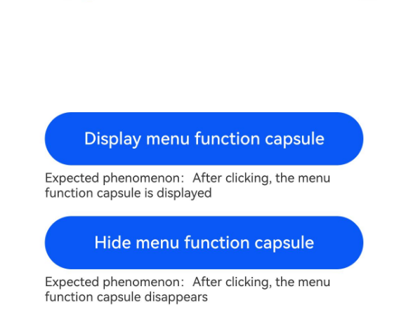

# AtomicServiceMenuBar (System API)

<!--Kit: ArkUI-->
<!--Subsystem: ArkUI-->
<!--Owner: @qq_36417014-->
<!--Designer: @autojuan-->
<!--Tester: @tinygreyy-->
<!--Adviser: @zengyawen-->

Creates an **AtomicServiceMenuBar** object based on the context of the current atomic service. The object is used to control the display of the menu function capsule in the upper right corner.

> **NOTE**
>
> This component is supported since API version 23. Updates will be marked with a superscript to indicate their earliest API version.

## Modules to Import

```ts
import { AtomicServiceMenuBar } from '@kit.ArkUI';
```

## Child Components

None

## Attributes

The [universal attributes](ts-component-general-attributes.md) are not supported.

## AtomicServiceMenuBar

Describes the object created using the UI context of the current atomic service. You can use the defined APIs to control the status of the menu function capsule of the current atomic service. For details, see [Example](#example).

### constructor

constructor(uiContext: UIContext)

A constructor used to create an **AtomicServiceMenuBar** object.

**Atomic service API**: This API can be used in atomic services since API version 23.

**Model restriction**: This API can be used only in the stage model.

**System API**: This is a system API.

**System capability**: SystemCapability.ArkUI.ArkUI.Full

**Parameters:**

| Parameter  | Type                           | Mandatory  |  Description        |
| ---- | ----------------------------- | ---- | -------------------- |
| uiContext | [UIContext](../arkts-apis-uicontext-uicontext.md) | Yes   | Context information of the current atomic service.|

### setVisible

setVisible(visible: boolean): void

Sets whether to display or hide the menu function capsule of the current atomic service.

**Atomic service API**: This API can be used in atomic services since API version 23.

**Model restriction**: This API can be used only in the stage model.

**System API**: This is a system API.

**System capability**: SystemCapability.ArkUI.ArkUI.Full

**Parameters:**

| Parameter  | Type                           | Mandatory  |  Description        |
| ---- | ----------------------------- | ---- | -------------------- |
| visible | boolean | Yes| Expected status of the menu function capsule. true: The menu function capsule is displayed. false: The menu function capsule is hidden.|


## Example

```ts
import { AtomicServiceMenuBar } from '@kit.ArkUI';

@Entry
@Component
struct Index {
  private menuBar: AtomicServiceMenuBar = new AtomicServiceMenuBar(this.getUIContext());

  @Builder
  private EmbedCompLauncherShow(title: string, text: string, event?: () => void) {
    Column() {
      if (typeof event === 'function') {
        Button(title)
          .width(300)
          .height(50)
          .fontSize(16)
          .borderRadius(25)
          .onClick(() => {
            event();
          })
      }
      Text(`Expected result: ${text}`)
        .width(300)
        .textAlign(TextAlign.Start)
        .fontSize(12)
        .margin({ top: 5, bottom: 15})
    }
  }

  build() {
    Column() {
      this.EmbedCompLauncherShow('Display menu function capsule', 'Clicking this button will display the menu function capsule.', () => {
        this.menuBar.setVisible(true);
      });
      this.EmbedCompLauncherShow('Hide menu function capsule', 'Clicking this button will hide the menu function capsule.', () => {
        this.menuBar.setVisible(false);
      });
    }
    .width('100%')
    .height('100%')
    .padding({ top: 100 })
  }
}
```
After the **Hide menu function capsule** button is clicked, the menu function capsule is hidden.


After the **Show menu function capsule** button is clicked, the menu function capsule is displayed.


