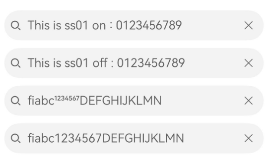
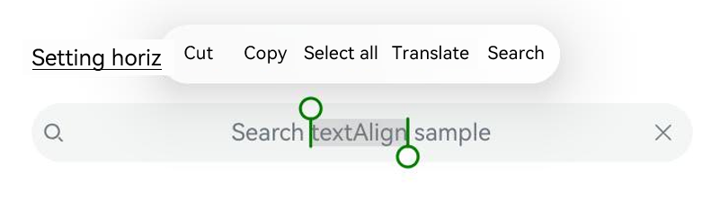

# AtomicServiceSearch

<!--Kit: ArkUI-->
<!--Subsystem: ArkUI-->
<!--Owner: @qq_36417014-->
<!--Designer: @autojuan-->
<!--Tester: @tinygreyy-->
<!--Adviser: @zengyawen-->
<!-- md-trans-meta sourceCommit=94b9b81a21843ee0652cc7284da3432d3de7d621 translatedAt=2026-08-28T01:36:17.283Z pushedAt=2026-08-28T07:15:35.176Z -->

**AtomicServiceSearch** allows you to customize the default search area, customizable selection area, and function area (a maximum of two).

> **NOTE**
>
> This component is supported since API version 18. Updates will be marked with a superscript to indicate their earliest API version.

## Modules to Import

``` ts
import { AtomicServiceSearch } from '@kit.ArkUI';
```

## AtomicServiceSearch

``` ts
AtomicServiceSearch({
  value?: ResourceStr,
  placeholder?: ResourceStr,
  controller?: SearchController,
  select?: SelectParams,
  search?: SearchParams,
  operation?: OperationParams,
})
```

**Atomic service API**: This API can be used in atomic services since API version 18.

**Decorator**: @Component

**System capability**: SystemCapability.ArkUI.ArkUI.Full

**Parameters**

| Name     | Type        | Mandatory| Decorator| Description                                                        |
| ----------- | :--------------- | ---- | ---------- | ------------------------------------------------------------ |
| value       | [ResourceStr](ts-types.md#resourcestr) | No| @Prop | Text input in the search text box. The default value is an empty string.|
| placeholder | [ResourceStr](ts-types.md#resourcestr) | No| @Prop | Default prompt text displayed in the search box. Default value: **Search**.|
| controller  | [SearchController](ts-basic-components-search.md#searchcontroller) | No  | - | **Search** component controller, which is used to set the position of the input cursor and exit the editing state. Default value: **undefined**.|
| select      | [SelectParams](#selectparams) | No| @Prop | Content, event, and style of the selection area. Default value: **undefined**.|
| search      | [SearchParams](#searchparams) | No| @Prop | Events and styles supported by the search area. Default value: **undefined**.|
| operation   | [OperationParams](#operationparams) | No | - | Functional settings of the functional area (right side). The default value is `undefined`. |

## SelectParams

Provides optional attributes for the selection area.

**Atomic service API**: This API can be used in atomic services since API version 18.

**System capability**: SystemCapability.ArkUI.ArkUI.Full

| Name                   | Type                  | Read-Only| Optional                        | Description                                                        |
| ----------------------- | -------------------------------------------- | -- | ---------------------------------------------------------- | ---- |
| options                 | Array&lt;[SelectOption](ts-basic-components-select.md#selectoption)&gt; | No| Yes| Options of the drop-down menu. Default value: **undefined**.|
| selected                | number| No| Yes| Index of the initially selected item in the drop-down list box. The index of the first item is 0. If this attribute is not set, the default value **-1** is used, indicating that no item is selected.|
| selectValue             | [ResourceStr](ts-types.md#resourcestr) | No| Yes| Text content of the drop-down list button itself. Default value: **undefined**.|
| onSelect                | [OnSelectCallback](#onselectcallback) | No| Yes| Callback invoked when an item in the drop-down list box is selected. Default value: **undefined**.|
| menuItemContentModifier | [ContentModifier](ts-universal-attributes-content-modifier.md#contentmodifiert)&lt;[MenuItemConfiguration](ts-basic-components-select.md#menuitemconfiguration12)&gt; | No | Yes |  Method for customizing the content area of dropdown menu items on the **Select** component. After this attribute is applied, the content of the dropdown menu is fully customized by the developer, and attributes such as the dropdown menu divider, background color, and font style set for the selection area no longer take effect.<br>**modifier**: content modifier. The developer needs to define a custom class to implement the **ContentModifier** API. The default value is `undefined`. |
| divider                 | [Optional](ts-universal-attributes-custom-property.md#optionalt)&lt;[DividerOptions](ts-basic-components-textpicker.md#divideroptions12)&gt; \| null | No | Yes | 1. When **DividerOptions** is set, the divider is displayed in the set style. Default value: `{strokeWidth: '1px', color: '#33182431'}`. When the **menuItemContentModifier** attribute is set, this attribute does not take effect.<br>2. When set to **null**, the divider is not displayed.<br>3. When **strokeWidth** is set too wide, it covers the text. The divider starts from the bottom of each item and is drawn both upward and downward.<br>4. The default values of **startMargin** and **endMargin** are consistent with the divider style when the **divider** attribute is not set. When the sum of **startMargin** and **endMargin** equals the value of **optionWidth**, the divider is not displayed. When the sum of **startMargin** and **endMargin** exceeds the value of **optionWidth**, the divider is displayed in the default style. |
| font                    | [Font](ts-types.md#font) | No| Yes| Text font of the drop-down list button. Default value: **{size: $r('sys.float.ohos_id_text_size_body1')}**|
| fontColor               | [ResourceColor](ts-types.md#resourcecolor) | No | Yes | Text color of the dropdown button itself. Default value: `{fontColor: $r('sys.color.ohos_id_color_text_primary')}`.   |
| selectedOptionBgColor   | [ResourceColor](ts-types.md#resourcecolor) | No | Yes | Background color of the selected item in the dropdown menu. Default value: the transparency of `$r('sys.color.ohos_id_color_component_activated')` mixed with `$r('sys.color.ohos_id_alpha_highlight_bg')`. When the **menuItemContentModifier** attribute is set, this attribute does not take effect. |
| selectedOptionFont      | [Font](ts-types.md#font) | No | Yes | Text style of the selected item in the dropdown menu. Default value: `{size: $r('sys.float.ohos_id_text_size_body1'), weight: FontWeight.Regular}`. When the **menuItemContentModifier** attribute is set, this attribute does not take effect. |
| selectedOptionFontColor | [ResourceColor](ts-types.md#resourcecolor) | No | Yes | Text color of the selected item in the dropdown menu. Default value: `$r('sys.color.ohos_id_color_text_primary_activated')`. When the **menuItemContentModifier** attribute is set, this attribute does not take effect. |
| optionBgColor           | [ResourceColor](ts-types.md#resourcecolor) | No | Yes | Background color of the dropdown menu items. Default value: `Color.Transparent`. When the **menuItemContentModifier** attribute is set, this attribute does not take effect. |
| optionFont              | [Font](ts-types.md#font) | No | Yes | Text style of the dropdown menu items. Default value: `{size: $r('sys.float.ohos_id_text_size_body1'), weight: FontWeight.Regular}`. When the **menuItemContentModifier** attribute is set, this attribute does not take effect. |
| optionFontColor         | [ResourceColor](ts-types.md#resourcecolor) | No | Yes | Text color of the dropdown menu items. Default value: `$r('sys.color.ohos_id_color_text_primary')`. When the **menuItemContentModifier** attribute is set, this attribute does not take effect. |
| optionWidth             | [Dimension](ts-types.md#dimension10) \| [OptionWidthMode](ts-appendix-enums.md#optionwidthmode11) | No | Yes | Width of the dropdown menu items. Percentage values are not supported. Unit: vp. **OptionWidthMode** is an enum type that determines whether the dropdown menu inherits the width of the dropdown button. When set to an invalid value or a value smaller than the minimum width of 56 vp, this attribute does not take effect, and the menu item width is set to the default value, that is, the default menu width is 2 grids. |
| optionHeight            | [Dimension](ts-types.md#dimension10) | No | Yes | Maximum height of the dropdown menu. Percentage values are not supported. Unit: vp. The default maximum height of the dropdown menu is 80% of the available screen height. The set maximum height cannot exceed the default maximum height; if it does, this attribute does not take effect and the menu is displayed at the default maximum height. |
| space                   | [Length](ts-types.md#length) | No | Yes | Spacing between the text of the dropdown menu items and the arrow. Default value: `8`. Unit: vp. |
| arrowPosition           | [ArrowPosition](ts-basic-components-select.md#arrowposition10)| No| Yes| Alignment between the text and arrow of an item. Default value: **ArrowPosition.END**|
| menuAlign               | [MenuAlignParams](#menualignparams) | No| Yes| Alignment between the drop-down list button and the drop-down list box. Default value: **{alignType: MenuAlignType.START,   offset: {dx: 0, dy: 0}}**.|
| menuBackgroundColor     | [ResourceColor](ts-types.md#resourcecolor) | No| Yes| Background color of the drop-down list box. Default value: **Color.Transparent**  |
| menuBackgroundBlurStyle | [BlurStyle](ts-universal-attributes-background.md#blurstyle9) | No| Yes| Background blur style of the drop-down list box. Default value: **BlurStyle.COMPONENT_ULTRA_THICK**|

## SearchParams

Provides optional attributes for the search area.

**Atomic service API**: This API can be used in atomic services since API version 18.

**System capability**: SystemCapability.ArkUI.ArkUI.Full

| Name                    | Type           | Read-Only| Optional                                  | Description                                                        |
| ------------------------ | ----------------------------- | ----------------- | ------------------------------------------------------------ | ---- |
| searchKey | [ResourceStr](ts-types.md#resourcestr) | No | Yes | Unique key used to identify the internal **Search** component, so that the corresponding **Search** component can be referenced or found externally through this key. Default value: `undefined`. |
| componentBackgroundColor | [ResourceColor](ts-types.md#resourcecolor) | No| Yes| Background color of a component. Default value: **$r('sys.color.ohos_id_color_text_field_sub_bg')**.  |
| pressedBackgroundColor   | [ResourceColor](ts-types.md#resourcecolor) | No| Yes| Background color of the pressed component. Default value: **$r('sys.color.ohos_id_color_click_effect')**.|
| searchButton             | [SearchButtonParams](#searchbuttonparams) | No | Yes | Search button at the end of the search box. Tapping the search button triggers the **onSubmit** callback. Default value: `undefined`<br>-**searchButtonValue**: text content of the search button at the end of the search box.<br> -**options**: configures the text style of the search box. Default value: `{fontSize: '16fp', fontColor: '#ff3f97e9'}`. |
| placeholderColor         | [ResourceColor](ts-types.md#resourcecolor) | No| Yes| Placeholder text color. Default value: **$r('sys.color.ohos_id_color_text_secondary')**.  |
| placeholderFont          | [Font](ts-types.md#font) | No | Yes | Placeholder text style, including font size, font weight, font family, and font style. Currently only the default font family is supported. Default value: `{size: $r('sys.float.ohos_id_text_size_body1')}`. |
| textFont                 | [Font](ts-types.md#font) | No | Yes | Style of the text entered in the search box, including font size, font weight, font family, and font style. Currently only the default font family is supported. Default value: `{size: $r('sys.float.ohos_id_text_size_body1')}`. |
| textAlign                | [TextAlign](ts-appendix-enums.md#textalign) | No| Yes| Text alignment mode in the search text box. Default value: **TextAlign.Start**.  |
| copyOptions              | [CopyOptions](ts-appendix-enums.md#copyoptions9) | No| Yes| Whether the input text can be copied. Default value: **CopyOptions.LocalDevice**.  |
| searchIcon               | [IconOptions](ts-basic-components-search.md#iconoptions10) \| [SymbolGlyphModifier](ts-universal-attributes-attribute-symbolglyphmodifier.md#symbolglyphmodifier) | No | Yes | Style of the search icon on the left side.<br>Default value in light mode: `{size: '16vp', color: '#99182431', src: ' '}`.<br>Default value in dark mode: `{size: '16vp', color: '#99ffffff', src: ' '}`. |
| cancelIcon               | [IconOptions](ts-basic-components-search.md#iconoptions10) | No | Yes | Style of the clear button on the right side. Default value: `{style: CancelButtonStyle.INPUT, icon: {size: '16vp', color: '#99ffffff', src: ' '}}`.<br>When style is **CancelButtonStyle.CONSTANT**, the clear style is displayed by default. |
| fontColor                | [ResourceColor](ts-types.md#resourcecolor) | No| Yes|  Font color of the input text. Default value: **$r('sys.color.ohos_id_color_text_secondary')**.|
| caretStyle               | [CaretStyle](ts-text-common.md#caretstyle10) | No| Yes| Pointer style. Default value: **{width: '1.5vp', color: '#007DFF'}**.  |
| enableKeyboardOnFocus    | boolean | No | Yes | Whether to proactively bring up the soft keyboard when the Search component gains focus. The value **true** indicates that the soft keyboard is proactively brought up when the Search component gains focus. The value **false** indicates that the keyboard is not proactively brought up when the Search component gains focus. Default value: `true`. |
| hideSelectionMenu        | boolean | No | Yes | Whether to hide the system text selection menu.<br>When set to **true**, the system text selection menu is not displayed when the input box cursor is tapped, the input box is long-pressed, double-tapped, triple-tapped, or right-clicked. When set to **false**, the system text selection menu is displayed. Default value: `false`. |
| type                     | [SearchType](ts-basic-components-search.md#searchtype11)| No| Yes| Text box type. Default value: **SearchType.Normal**.  |
| maxLength                | number | No| Yes| Maximum number of characters in the text input. By default, there is no maximum number of characters. When the maximum number is reached, no more characters can be entered. Default value: **-1**. |
| enterKeyType             | [EnterKeyType](ts-basic-components-textinput.md#enterkeytype)| No| Yes| Type of the Enter key. Default value: **EnterKeyType.Search**.  |
| decoration               | [TextDecorationOptions](ts-universal-attributes-text-style.md#textdecorationoptions12) | No| Yes|  Text decorative line options. Default value: **{type: TextDecorationType.None, color: Color.Black, style: TextDecorationStyle.SOLID}**.  |
| letterSpacing            | number&nbsp;\|&nbsp;string&nbsp;\|&nbsp;[Resource](ts-types.md#resource) | No| Yes| Letter spacing. A positive value causes characters to spread farther apart, and a negative value bring characters closer together. The value for floating point numbers is **0.0**, in units of px. If the input is not a number and cannot be parsed as a number, the default value will be used. |
| fontFeature              | [ResourceStr](ts-types.md#resourcestr) | No | Yes | Text feature effect, for example, the monospaced digit feature.<br>The format is: normal \| \<feature-tag-value\><br>The format of \<feature-tag-value\> is: \<string\> \[ \<integer\> \| on \| off ]<br>There can be multiple \<feature-tag-value\> values, separated by ','.<br>For example, the input format for using monospaced digits is: "ss01" on. Default value: `undefined`. |
| selectedBackgroundColor  | [ResourceColor](ts-types.md#resourcecolor) | No | Yes | Background color of the selected text. Default value: the system default background color with 20% opacity. |
| inputFilter              | [InputFilterParams](#inputfilterparams) | No | Yes | Input filter through a regular expression. Input that matches the expression is allowed to be displayed, and input that does not match is filtered out. Only single-character matching is supported, and string matching is not supported. Default value: `undefined`.<br> -**value**: regular expression. <br> -**error**: filtered content returned when the regular expression matching fails. |
| textIndent               | [Dimension](ts-types.md#dimension10) | No | Yes | Indentation of the first line of text. Default value: `0`. Unit: vp. |
| minFontSize              | number&nbsp;\|&nbsp;string&nbsp;\|&nbsp;[Resource](ts-types.md#resource) | No | Yes | Minimum font size for text display. It needs to be used with **maxFontSize** and layout size constraints; setting it alone does not take effect. Default value: `undefined`. When the value is of the number type, the unit is fp. |
| maxFontSize              | number&nbsp;\|&nbsp;string&nbsp;\|&nbsp;[Resource](ts-types.md#resource) | No | Yes | Maximum font size for text display. It needs to be used with **minFontSize** and layout size constraints; setting it alone does not take effect. Default value: `undefined`. When the value is of the number type, the unit is fp. |
| editMenuOptions          | [EditMenuOptions](ts-text-common.md#editmenuoptions) | No| Yes| Extended options of the custom context menu on selection, including the text content, icon, and callback. Default value: **undefined**.  |
| enablePreviewText        | boolean | No | Yes | Whether to enable input preview. The value **true** indicates that input preview is enabled. The value **false** indicates that input preview is disabled. Default value: `true`. <br> It needs to be used with the preview feature of the input method. The preview content is defined as a temporary text state, and the text interception feature is not supported currently. Therefore, when this value is **true**, the **onWillInsert** and **onDidInsert** callbacks are not triggered. |
| enableHapticFeedback     | boolean | No | Yes | Whether to enable haptic feedback. The value **true** indicates that haptic feedback is enabled. The value **false** indicates that haptic feedback is disabled. Default value: `true`. |
| onSubmit                 | Callback&lt;string&gt; \| [SearchSubmitCallback](ts-basic-components-search.md#searchsubmitcallback14) | No | Yes | Triggered when the search icon or search button is tapped, or when the search button on the soft keyboard is pressed. string is the text content currently entered in the search box. Default value: `undefined`. |
| onChange                 | [EditableTextOnChangeCallback](ts-text-common.md#editabletextonchangecallback12) | No| Yes| Callback triggered when the content in the text box changes. Default value: **undefined**.  |
| onCopy                   | Callback&lt;string&gt; | No | Yes | Triggered when a copy operation is performed. string is the copied text content. Default value: `undefined`. |
| onCut                    | Callback&lt;string&gt; | No | Yes | Triggered when a cut operation is performed. string is the cut text content. Default value: `undefined`. |
| onPaste                  | [OnPasteCallback](#onpastecallback) | No| Yes| Callback triggered when a paste operation is performed. Default value: **undefined**.  |
| onTextSelectionChange    | [OnTextSelectionChangeCallback](#ontextselectionchangecallback) | No| Yes| Callback triggered when the position of the text selection changes or when the cursor position changes during the editing state. Default value: **undefined**.  |
| onContentScroll          | [OnContentScrollCallback](#oncontentscrollcallback) | No| Yes| Callback triggered when the text content is scrolled. Default value: **undefined**.  |
| onEditChange             | Callback&lt;boolean&gt; | No| Yes| Callback triggered when the input status changes. If a cursor is displayed, that is, the value of **isEditing** is **true**, the text box is in the editing state. Default value: **undefined**.  |
| onWillInsert             | Callback&lt;[InsertValue](ts-text-common.md#insertvalue12), boolean&gt; | No | Yes | Triggered when text is about to be inserted. The value **true** indicates that the input content is inserted into the result string normally, and **false** indicates that it is not inserted. Default value: `undefined`. When enablePreviewText is **true**, this callback is not triggered. |
| onDidInsert              | Callback&lt;[InsertValue](ts-text-common.md#insertvalue12)&gt; | No | Yes | Triggered when input is complete, after onWillInsert. When onWillInsert returns **false** to intercept the insertion operation, this callback is not triggered. Default value: `undefined`. When enablePreviewText is **true**, this callback is not triggered. |
| onWillDelete             | Callback&lt;[DeleteValue](ts-text-common.md#deletevalue12), boolean&gt; | No| Yes| Callback triggered when text is about to be deleted. **true**: Delete the text. **false**: Do not delete the text. Default value: **undefined**.  |
| onDidDelete              | Callback&lt;[DeleteValue](ts-text-common.md#deletevalue12)&gt; | No | Yes | Triggered when deletion is complete, after **onWillDelete**. When **onWillDelete** returns **false** to intercept the deletion operation, this callback is not triggered. Default value: `undefined`. |

## OperationParams

Sets initialization parameters of the function area.

**Atomic service API**: This API can be used in atomic services since API version 18.

**System capability**: SystemCapability.ArkUI.ArkUI.Full

| Name         | Type       | Read-Only| Optional | Description                         |
| ------------- | --------------- | -----| ----------------------- | ---- |
| auxiliaryItem | [OperationOption ](ohos-arkui-advanced-SubHeader.md#operationoption)| No| Yes| Auxiliary item on the right of the search area. Default value: **undefined**.|
| independentItem | [OperationOption ](ohos-arkui-advanced-SubHeader.md#operationoption)| No| Yes| Independent item on the right of the search area. Default value: **undefined**.|

## InputFilterParams

Sets regular expression for input filtering.

**Atomic service API**: This API can be used in atomic services since API version 18.

**System capability**: SystemCapability.ArkUI.ArkUI.Full

| Name            | Type        | Read-Only| Optional| Description                              |
| ---------------- | ---------------- | ---- | ---| ------------------------------- |
| inputFilterValue | [ResourceStr](ts-types.md#resourcestr) | No | No | Regular expression. Only single-character matching is supported, and string matching is not supported. |
| error | Callback&lt;string&gt; | No| Yes| Callback used to return the filtered-out content when regular expression matching fails. Default value: **undefined**.|

## SearchButtonParams

Sets the search button located next to the search text box.

**Atomic service API**: This API can be used in atomic services since API version 18.

**System capability**: SystemCapability.ArkUI.ArkUI.Full

| Name             | Type           | Read-Only| Optional| Description                                                        |
| ----------------- | ------------------- | ---- | --- | --------------------------------------------------------- |
| searchButtonValue | [ResourceStr](ts-types.md#resourcestr) | No| No| Text on the search button located next to the search text box.|
| options | [SearchButtonOptions](ts-basic-components-search.md#searchbuttonoptions10)| No| Yes| Font of the search text box. Default value: **{fontSize: '16fp',fontColor: '#ff3f97e9'}**|

## MenuAlignParams

Sets the alignment between the drop-down list button and the drop-down list box.

**Atomic service API**: This API can be used in atomic services since API version 18.

**System capability**: SystemCapability.ArkUI.ArkUI.Full

| Name     | Type     | Read-Only| Optional| Description                                                        |
| --------- | ------------- | ---- | --- | --------------------------------------------------------- |
| alignType | [MenuAlignType](ts-basic-components-select.md#menualigntype10)| No| No| Alignment type. Default value: **MenuAlignType.START**|
| offset | [Offset](ts-types.md#offset) | No| Yes| Offset of the drop-down list box relative to the drop-down list button after alignment based on the alignment type. Default value: **{dx: 0, dy: 0}**|

## OnSelectCallback

type OnSelectCallback = (index: number, selectValue: string) => void

Called when an item in the drop-down list box is selected.

**Atomic service API**: This API can be used in atomic services since API version 18.

**System capability**: SystemCapability.ArkUI.ArkUI.Full

**Parameters**

| Name  | Type                                                        | Mandatory| Description                                                    |
| -------- | ------------------------------------------------------------ | ---- | -------------------------------------------------------- |
| index | number | Yes| Index of the selected option. The index is zero-based.|
| selectValue | string | Yes| Value of the selected option.|

## OnPasteCallback

type OnPasteCallback = (pasteValue: string, event: PasteEvent) => void

Called when a paste operation is performed.

**Atomic service API**: This API can be used in atomic services since API version 18.

**System capability**: SystemCapability.ArkUI.ArkUI.Full

**Parameters**

| Name  | Type                                                        | Mandatory| Description                                                    |
| -------- | ------------------------------------------------------------ | ---- | -------------------------------------------------------- |
| pasteValue | string | Yes| Text to be pasted.|
| event | [PasteEvent](ts-basic-components-richeditor.md#pasteevent11) | Yes| Custom paste event.|

## OnTextSelectionChangeCallback

type OnTextSelectionChangeCallback = (selectionStart: number, selectionEnd: number) => void

Called when the position of the text selection changes or when the cursor position changes during the editing state.

**Atomic service API**: This API can be used in atomic services since API version 18.

**System capability**: SystemCapability.ArkUI.ArkUI.Full

**Parameters**

| Name  | Type                                                        | Mandatory| Description                                                    |
| -------- | ------------------------------------------------------------ | ---- | -------------------------------------------------------- |
| selectionStart | number | Yes| Start position of the text to be selected.|
| selectionEnd | number | Yes| End position of the text to be selected.|

## OnContentScrollCallback

type OnContentScrollCallback = (totalOffsetX: number, totalOffsetY: number) => void

Called when the text content is scrolled.

**Atomic service API**: This API can be used in atomic services since API version 18.

**System capability**: SystemCapability.ArkUI.ArkUI.Full

**Parameters**

| Name  | Type                                                        | Mandatory| Description                                                    |
| -------- | ------------------------------------------------------------ | ---- | -------------------------------------------------------- |
| totalOffsetX | number | Yes | Horizontal offset of the upper-left corner of the text relative to the upper-left corner of the entire content input area. Unit: px. |
| totalOffsetY | number | Yes | Vertical offset of the upper-left corner of the text relative to the upper-left corner of the entire content input area. Unit: px. |

## Examples

### Example 1: Adding a Selection Area to AtomicServiceSearch

This example demonstrates how to use the **select** parameter to add a selection area on the left to the **AtomicServiceSearch** component.

```ts
import { AtomicServiceSearch } from '@kit.ArkUI';

@Entry
@Component
struct Index {
  build() {
    Column({ space: 6 }) {
      Text('AtomicServiceSearch + selection area').alignSelf(ItemAlign.Start).decoration({
        type: TextDecorationType.Underline,
        color: Color.Black,
        style: TextDecorationStyle.SOLID
      }).margin({ top: 20, bottom: 20 })

      AtomicServiceSearch({
        select: {
          options: [
            { value: 'Select1', icon: $r('app.media.sweep') }, // Custom resource
            { value: 'Select2', icon: $r('app.media.sweep') }, // Custom resource
            { value: 'Select3', icon: $r('app.media.sweep') }, // Custom resource
            { value: 'Select4', icon: $r('app.media.sweep') } // Custom resource
          ],
          selected: -1,
          selectValue: 'Select1',
          onSelect: (index: number, selectValue: string) => { // Custom event
            if (index === 0) {
              this.alert(`index: ${index}, selectValue: ${selectValue}`);
            } else if (index === 1) {
              this.alert(`index: ${index}, selectValue: ${selectValue}`);
            } else if (index === 2) {
              this.alert(`index: ${index}, selectValue: ${selectValue}`);
            } else if (index === 3) {
              this.alert(`index: ${index}, selectValue: ${selectValue}`);
            }
          },
        }
      })
    }.padding({ left: 16, right: 16 })
  }

  private alert(message: string): void {
    this.getUIContext().showAlertDialog({ message: message });
  }
}
```


### Example 2: Adding a Function Item to AtomicServiceSearch

This example demonstrates how to use the **operation** parameter to add a function item on the right to the **AtomicServiceSearch** component.

```ts
import { AtomicServiceSearch } from '@kit.ArkUI';

@Entry
@Component
struct Index {
  build() {
    Column({ space: 6 }) {
      Text('AtomicServiceSearch + function items').alignSelf(ItemAlign.Start).decoration({
        type: TextDecorationType.Underline,
        color: Color.Black,
        style: TextDecorationStyle.SOLID
      }).margin({ top: 20, bottom: 20 })
      
      AtomicServiceSearch({
        operation: {
          // Auxiliary item of the Search component.
          auxiliaryItem: {
            value: $r('app.media.sweep'), // Custom resource.
            action: () => {
              this.alert('Scan'); // Custom event
            }
          },
          // Independent item of the Search component.
          independentItem: {
            value: $r('app.media.dingding'), // Custom resource.
            action: () => {
              this.alert('Notifications'); // Custom event
            }
          }
        }
      })
    }.padding({ left: 16, right: 16 })
  }

  private alert(message: string): void {
    this.getUIContext().showAlertDialog({ message: message });
  }
}
```


### Example 3: Adding a Selection Area and Function Item to AtomicServiceSearch

This example demonstrates how to add the selection area and function items on the left and right to the AtomicServiceSearch component.

```ts
import { AtomicServiceSearch } from '@kit.ArkUI';

@Entry
@Component
struct Index {
  build() {
    Column({ space: 6 }) {
      Text('AtomicServiceSearch + selection area + function items').alignSelf(ItemAlign.Start).decoration({
        type: TextDecorationType.Underline,
        color: Color.Black,
        style: TextDecorationStyle.SOLID
      }).margin({ top: 20, bottom: 20 })

      AtomicServiceSearch({
        select: {
          options: [
            { value: 'Select1', icon: $r('app.media.sweep') }, // Custom resource.
            { value: 'Select2', icon: $r('app.media.sweep') }, // Custom resource.
            { value: 'Select3', icon: $r('app.media.sweep') }, // Custom resource.
            { value: 'Select4', icon: $r('app.media.sweep') } // Custom resource.
          ],
          selected: -1,
          selectValue: 'Select1',
          onSelect: (index: number, selectValue:string) => {
            if (index === 0) {
              this.alert(`index: ${index}, selectValue: ${selectValue}`);
            } else if (index === 1) {
              this.alert(`index: ${index}, selectValue: ${selectValue}`);
            } else if (index === 2) {
              this.alert(`index: ${index}, selectValue: ${selectValue}`);
            } else if (index === 3) {
              this.alert(`index: ${index}, selectValue: ${selectValue}`);
            }
          },
        },
        operation: {
          auxiliaryItem: {
            value: $r('app.media.sweep'), // Custom resource.
            action: () => {
              this.alert('Scan'); // Custom event
            }
          },
          independentItem: {
            value: $r('app.media.dingding'), // Custom resource.
            action: () => {
              this.alert('Notifications'); // Custom event
            }
          }
        }
      })
    }.padding({ left: 16, right: 16 })
  }

  private alert(message: string): void {
    this.getUIContext().showAlertDialog({ message: message });
  }
}
```


### Example 4: Binding the Search Callback Events to AtomicServiceSearch

This example demonstrates how to use the **onWillInsert**, **onDidInsert**, **onWillDelete**, and **onDidDelete** APIs to implement insert and delete operations.

The **onSubmit** API is used to submit content in the search area.

The **onChange** API is used to listen for the content changes in the search area.

```ts
import { AtomicServiceSearch } from '@kit.ArkUI';

@Entry
@Component
struct Index {
  @State insertValue: string = '';
  @State deleteValue: string = '';
  @State insertOffset: number = 0;
  @State deleteOffset: number = 0;
  @State deleteDirection: number = 0;
  @State startIndex: number = 0;
  @State endIndex: number = 0;
  @State offsetX: number = 0;
  @State offsetY: number = 0;
  @State changeValue: string = '';
  @State editingState: string = 'false';
  @State submitValue: string = '';

  build() {
    Column({ space: 6 }) {
      Text('Binding events to AtomicServiceSearch').alignSelf(ItemAlign.Start).decoration({
        type: TextDecorationType.Underline,
        color: Color.Black,
        style: TextDecorationStyle.SOLID
      }).margin({ top: 20, bottom: 20 })

      Column({ space: 6 }) {
        Text('editing: ' + this.editingState).width('100%').height(25).borderRadius(15).padding({ left: 15 })
          .backgroundColor('rgba(0, 0, 0, 0.1)').maxLines(1).textOverflow({ overflow: TextOverflow.MARQUEE });
        Text('onSubmit:' + this.submitValue).width('100%').height(25).borderRadius(15).padding({ left: 15 })
          .backgroundColor('rgba(0, 0, 0, 0.1)').maxLines(1).textOverflow({ overflow: TextOverflow.MARQUEE });
        Text('onChange:' + this.changeValue).width('100%').height(25).borderRadius(15).padding({ left: 15 })
          .backgroundColor('rgba(0, 0, 0, 0.1)').maxLines(1).textOverflow({ overflow: TextOverflow.MARQUEE });
        Text('offset x:' + this.offsetX + ' y:' + this.offsetY).width('100%').height(25).borderRadius(15).padding({ left: 15 })
          .backgroundColor('rgba(0, 0, 0, 0.1)').maxLines(1).textOverflow({ overflow: TextOverflow.MARQUEE });
        Text('insertValue:' + this.insertValue + '  insertOffset:' + this.insertOffset).width('100%').height(25)
          .borderRadius(15).padding({ left: 15 }).backgroundColor('rgba(0, 0, 0, 0.1)').maxLines(1)
          .textOverflow({ overflow: TextOverflow.MARQUEE });
        Text('deleteValue:' + this.deleteValue + '  deleteOffset:' + this.deleteOffset).width('100%').height(25)
          .borderRadius(15).padding({ left: 15 }).backgroundColor('rgba(0, 0, 0, 0.1)').maxLines(1)
          .textOverflow({ overflow: TextOverflow.MARQUEE });
        Text('deleteDirection:' + (this.deleteDirection == 0 ? 'BACKWARD' : 'FORWARD')).width('100%').height(25)
          .borderRadius(15).padding({ left: 15 }).backgroundColor('rgba(0, 0, 0, 0.1)').maxLines(1)
          .textOverflow({ overflow: TextOverflow.MARQUEE });
        AtomicServiceSearch({
          select: {
            options: [
              { value: 'Select1', icon: $r('app.media.sweep') },
              { value: 'Select2', icon: $r('app.media.sweep') },
              { value: 'Select3', icon: $r('app.media.sweep') },
              { value: 'Select4', icon: $r('app.media.sweep') }
            ],
            selected: -1,
            selectValue: 'Select1',
            onSelect: (index: number) => {
              if (index === 0) {
                this.alert('Select1');
              } else if (index === 1) {
                this.alert('Select2');
              } else if (index === 2) {
                this.alert('Select3');
              } else if (index === 3) {
                this.alert('Select4');
              }
            },
          },
          search: {
            onSubmit: (value: string) => {
              this.submitValue = value;
            },
            onChange: (value: string) => {
              this.changeValue = value;
            },
            onCopy: () => {
              this.alert('onCopy');
            },
            onCut: () => {
              this.alert('onCut');
            },
            onPaste: () => {
              this.alert('onPaste');
            },
            onTextSelectionChange: (selectionStart: number, selectionEnd: number) => {
              this.startIndex = selectionStart;
              this.endIndex = selectionEnd;
            },
            onContentScroll: (totalOffsetX: number, totalOffsetY: number) => {
              this.offsetX = totalOffsetX;
              this.offsetY = totalOffsetY;
            },
            onEditChange: (data: boolean) => {
              this.editingState = data ? 'true' : 'false';
            },
            onWillInsert: (info: InsertValue) => {
              this.insertValue = info.insertValue;
              return true;
            },
            onDidInsert: (info: InsertValue) => {
              this.insertOffset = info.insertOffset;
            },
            onWillDelete: (info: DeleteValue) => {
              this.deleteValue = info.deleteValue;
              return true;
            },
            onDidDelete: (info: DeleteValue) => {
              this.deleteOffset = info.deleteOffset;
              this.deleteDirection = info.direction;
            }
          }
        })
      }
    }.padding({ left: 16, right: 16 })
  }

  private alert(message: string): void {
    this.getUIContext().showAlertDialog({ message: message });
  }
}
```


### Example 5: Customizing the Style of AtomicServiceSearch

This example demonstrates how to use the **search**, **select**, **value**, and **placeholder** parameters to customize the style of the **AtomicServiceSearch** component.

```ts
import { AtomicServiceSearch, SearchParams, SelectParams } from '@kit.ArkUI';

@Entry
@Component
struct Index {
  @State private placeholder: string = 'Type to Search...';
  @State private defaultValue: string = 'default';
  @State private search?: SearchParams = {};
  @State private select?: SelectParams = {
    options: [
      { value: 'Select1', icon: $r('app.media.sweep') },
      { value: 'Select2', icon: $r('app.media.sweep') },
      { value: 'Select3', icon: $r('app.media.sweep') },
      { value: 'Select4', icon: $r('app.media.sweep') }
    ],
    selected: -1,
    selectValue: 'Select1',
    onSelect: (index: number) => {
      if (index === 0) {
        this.alert('Select1');
      } else if (index === 1) {
        this.alert('Select2');
      } else if (index === 2) {
        this.alert('Select3');
      } else if (index === 3) {
        this.alert('Select4');
      }
    }
  };

  build() {
    Column({ space: 8 }) {
      Text('Customizing styles').alignSelf(ItemAlign.Start).decoration({
        type: TextDecorationType.Underline,
        color: Color.Black,
        style: TextDecorationStyle.SOLID
      }).margin({ top: 20, bottom: 20 })

      AtomicServiceSearch({
        value: this.defaultValue,
        placeholder: this.placeholder,
        select: this.select,
        search: this.search,
        operation: {
          independentItem: {
            value: $r('app.media.dingding'),
            action: () => {
              this.alert('Notification');
            }
          }
        }
      })
      Button('Change placeholder')
        .width('100%')
        .type(ButtonType.Normal)
        .borderRadius(20)
        .onClick(() => {
          if (this.placeholder === 'Search...') {
            this.placeholder = 'Type to Search...';
          } else {
            this.placeholder = 'Search...';
          }
        });
      Button('Change defaultValue')
        .width('100%')
        .type(ButtonType.Normal)
        .borderRadius(20)
        .onClick(() => {
          if (this.defaultValue === 'value') {
            this.defaultValue = 'defaultValue';
          } else {
            this.defaultValue = 'value';
          }
        });
      Button('Change selection area style')
        .width('100%')
        .type(ButtonType.Normal)
        .borderRadius(20)
        .onClick(() => {
          this.select = {
            options: [
              { value: 'Option 1', icon: $r('app.media.dingding') },
              { value: 'Option 2', icon: $r('app.media.dingding') },
            ],
            selected: -1,
            selectValue: 'Option 1',
            onSelect: (index: number) => {
              if (index === 0) {
                this.alert('Option 1');
              } else if (index === 1) {
                this.alert('Option 2');
              }
            }
          };
        });

      Button('Change search area Style')
        .width('100%')
        .type(ButtonType.Normal)
        .borderRadius(20)
        .onClick(() => {
          this.search = {
            componentBackgroundColor: '#e0eee8'
          }
        });
    }.padding({ left: 16, right: 16 })
  }

  private alert(message: string): void {
    this.getUIContext().showAlertDialog({ message: message });
  }
}
```


### Example 6: Setting the Caret Position Using controller

This example demonstrates how to use the **controller** parameter to set the caret position, select the content in the specified area, and disable the editing state.

```ts
import { AtomicServiceSearch } from '@kit.ArkUI';

@Entry
@Component
struct Index {
  controller: SearchController = new SearchController();

  build() {
    Column({ space : 10 }) {
      Text('Setting the caret position using controller').alignSelf(ItemAlign.Start).decoration({
        type: TextDecorationType.Underline,
        color: Color.Black,
        style: TextDecorationStyle.SOLID
      }).margin({ top: 20, bottom: 20 })

      AtomicServiceSearch({
          value: 'Default Value',
          placeholder: 'Type to Search...',
          controller: this.controller,
          search: {
            searchButton: {
              searchButtonValue: 'SEARCH',
              options: { fontSize: '12fp', fontColor: '#ff0e1216' }
            }
          }
        },
      );
      Button('caretPosition to 1').onClick(() => {
        this.controller.caretPosition(1);
      }).width('100%')
      Button('stopEditing').onClick(() => {
        this.controller.stopEditing();
      }).width('100%')
      Button('Selection [0,3]').onClick(() => {
        this.controller.setTextSelection(0, 3);
      }).width('100%')
    }.padding({ left: 16, right: 16 })
  }
}
```


### Example 7: Setting the Enter Key Type

This example demonstrates how to use the **enterKeyType** attribute to dynamically change the effect of the Enter key on the soft keyboard.

```ts
import { AtomicServiceSearch } from '@kit.ArkUI';

@Entry
@Component
struct Index {
  @State enterTypes: Array<EnterKeyType> = [EnterKeyType.Go, EnterKeyType.Search, EnterKeyType.Send, EnterKeyType.Done, EnterKeyType.Next, EnterKeyType.PREVIOUS, EnterKeyType.NEW_LINE];
  @State index: number = 0;

  build() {
    Column({ space : 10 }) {
      Text('Enter key type as search').alignSelf(ItemAlign.Start).decoration({
        type: TextDecorationType.Underline,
        color: Color.Black,
        style: TextDecorationStyle.SOLID
      }).margin({ top: 20, bottom: 20 })

      AtomicServiceSearch({
        placeholder: 'Enter key type as search',
        search: {
          enterKeyType: this.enterTypes[this.index]
        }
      })

      Button('Change EnterKeyType').onClick(() => {
        this.index = (this.index + 1) % this.enterTypes.length;
      }).width('100%')

    }.padding({ left: 16, right: 16 })
  }
}
```


### Example 8: Setting Text Feature Effects

This example demonstrates how to use the **fontFeature** attribute to display text with various typographic features.

```ts
import { AtomicServiceSearch } from '@kit.ArkUI';

@Entry
@Component
struct Index {
  build() {
    Column({ space : 10 }) {
      Text('Setting text feature effects').alignSelf(ItemAlign.Start).decoration({
        type: TextDecorationType.Underline,
        color: Color.Black,
        style: TextDecorationStyle.SOLID
      }).margin({ top: 20, bottom: 20 })

      AtomicServiceSearch({
        value: 'This is ss01 on : 0123456789',
        search: {
          fontFeature: '"ss01" on'
        }
      });

      AtomicServiceSearch({
        value: 'This is ss01 off : 0123456789',
        search: {
          fontFeature: '"ss01" off'
        }
      });

      AtomicServiceSearch({
        value: 'fiabc1234567DEFGHIJKLMN',
        search: {
          fontFeature: '"frac" on'
        }
      });

      AtomicServiceSearch({
        value: 'fiabc1234567DEFGHIJKLMN',
        search: {
          fontFeature: '"frac" off'
        }
      });
    }.padding({ left: 16, right: 16 })
  }
}
```



### Example 9: Setting Text Auto-Adaptation

This example demonstrates how to use the **minFontSize** and **maxFontSize** attributes to implement the text auto-adaptation features.

```ts
import { AtomicServiceSearch } from '@kit.ArkUI';

@Entry
@Component
struct Index {
  build() {
    Column({ space : 10 }) {
      Text('Setting text auto-adaptation').alignSelf(ItemAlign.Start).decoration({
        type: TextDecorationType.Underline,
        color: Color.Black,
        style: TextDecorationStyle.SOLID
      }).margin({ top: 20, bottom: 20 })

      AtomicServiceSearch({
        value: 'This is the text without the adaptive font',
      }).width('80%').height(40).borderWidth(1).borderRadius(20)

      AtomicServiceSearch({
        value: 'This is the text without the adaptive font',
        search: {
          minFontSize: 4,
          maxFontSize: 40
        }
      }).width('80%').height(40).borderWidth(1).borderRadius(20)
    }.padding({ left: 16, right: 16 })
  }
}
```


### Example 10: Setting Custom Menu Extensions

This example demonstrates how to use the **editMenuOptions** API to create custom menu extensions for text settings. It includes customizing text content, icons, and callbacks for these extensions.

```ts
import { AtomicServiceSearch, TextMenuController } from '@kit.ArkUI';

@Entry
@Component
struct Index {
  aboutToAppear(): void {
    TextMenuController.disableMenuItems([TextMenuItemId.AI_WRITER]);
  }

  onCreateMenu = (menuItems: Array<TextMenuItem>) => {
    let item1: TextMenuItem = {
      content: 'custom1',
      icon: $r('app.media.startIcon'),
      id: TextMenuItemId.of('custom1'),
    };
    let item2: TextMenuItem = {
      content: 'custom2',
      id: TextMenuItemId.of('custom2'),
      icon: $r('app.media.startIcon'),
    };
    menuItems.push(item1);
    menuItems.unshift(item2);
    return menuItems;
  }
  onMenuItemClick = (menuItem: TextMenuItem, textRange: TextRange) => {
    if (menuItem.id.equals(TextMenuItemId.of('custom2'))) {
      console.info('Intercept id: custom2 start:' + textRange.start + '; end:' + textRange.end);
      return true;
    }
    if (menuItem.id.equals(TextMenuItemId.COPY)) {
      console.info('Intercept COPY start:' + textRange.start + '; end:' + textRange.end);
      return true;
    }
    if (menuItem.id.equals(TextMenuItemId.SELECT_ALL)) {
      console.info('Do not intercept SELECT_ALL start:' + textRange.start + '; end:' + textRange.end);
      return false;
    }
    return false;
  }
  @State editMenuOptions: EditMenuOptions = {
    onCreateMenu: this.onCreateMenu, onMenuItemClick: this.onMenuItemClick
  };

  build() {
    Column({ space: 10 }) {
      Text('Setting custom menu extensions').alignSelf(ItemAlign.Start).decoration({
        type: TextDecorationType.Underline,
        color: Color.Black,
        style: TextDecorationStyle.SOLID
      }).margin({ top: 20, bottom: 20 })

      AtomicServiceSearch({
        value: 'Default input',
        search: {
          editMenuOptions: this.editMenuOptions
        }
      })
    }.padding({ left: 16, right: 16 })
  }
}
```


### Example 11: Setting the Horizontal Alignment, Caret Style, and Background Color of the Selected Text

This example shows how to set the horizontal alignment, caret style, and background color of the selected text using **textAlign**, **caretStyle**, and **selectedBackgroundColor**.

```ts
import { AtomicServiceSearch, TextMenuController } from '@kit.ArkUI';

@Entry
@Component
struct Index {
  aboutToAppear(): void {
    TextMenuController.disableMenuItems([TextMenuItemId.AI_WRITER]);
  }

  build() {
    Column() {
      Text('Setting horizontal alignment/caret style/background color of selected text').alignSelf(ItemAlign.Start).decoration({
        type: TextDecorationType.Underline,
        color: Color.Black,
        style: TextDecorationStyle.SOLID
      }).margin({ top: 20, bottom: 20 })

      AtomicServiceSearch({
        value: 'Search textAlign sample',
        search: {
          textAlign: TextAlign.Center,
          caretStyle: { width: 3, color: Color.Green },
          selectedBackgroundColor: Color.Gray
        }
      })
    }.padding({ left: 16, right: 16 })
  }
}
```



### Example 12: Setting Input Filtering

This example shows how to set input filtering using **inputFilter**.

```ts
import { AtomicServiceSearch } from '@kit.ArkUI';

@Entry
@Component
struct Index {
  @State filterValue: string = '';

  build() {
    Column() {
      Column({ space: 10 }) {
        Text('Setting input filtering').alignSelf(ItemAlign.Start).decoration({
          type: TextDecorationType.Underline,
          color: Color.Black,
          style: TextDecorationStyle.SOLID
        }).margin({ top: 20, bottom: 20 })
        AtomicServiceSearch({
          placeholder: 'please enter...',
          search: {
            inputFilter: {
              inputFilterValue : '[a-z]',
              error: (filterValue: string) => {this.filterValue = filterValue;}
            }
          }
        })
        Text('Filter:' + this.filterValue).alignSelf(ItemAlign.Start)

      }
    }.padding({ left: 16, right: 16 })
  }
}
```

