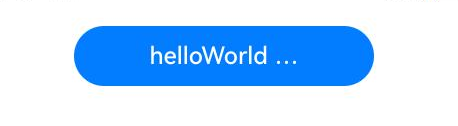
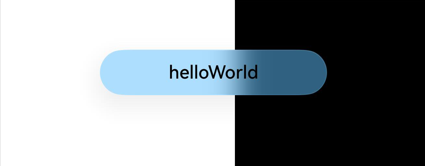
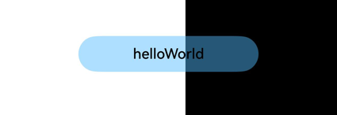

# Button
<!--Kit: ArkUI-->
<!--Subsystem: ArkUI-->
<!--Owner: @liyi0309-->
<!--Designer: @liyi0309-->
<!--Tester: @lxl007-->
<!--Adviser: @Brilliantry_Rui-->
<!-- md-trans-meta sourceCommit=20f4cce8d470c93e7d47720e0c5e53f33bf074e1 translatedAt=2026-09-03T03:47:56.313Z -->

The **Button** component can be used to create different types of buttons.

>  **NOTE**
>
>  This component is supported since API version 7. Updates will be marked with a superscript to indicate their earliest API version.


## Child Components

This component can contain only one child component.


## APIs

### Button

Button(options: ButtonOptions)

Creates a button that can contain a single child component.

**Widget capability**: This API can be used in ArkTS widgets since API version 9.

**Atomic service API**: This API can be used in atomic services since API version 11.

**System capability**: SystemCapability.ArkUI.ArkUI.Full

**Parameters**

| Name | Type                                   | Mandatory| Description                |
| ------- | --------------------------------------- | ---- | -------------------- |
| options | [ButtonOptions](#buttonoptions) | Yes  | Button settings.|

### Button

Button(label: ResourceStr, options?: ButtonOptions)

Creates a button based on text content. In this case, the component cannot contain child components.

By default, the text content is displayed in a one line.

**Widget capability**: This API can be used in ArkTS widgets since API version 9.

**Atomic service API**: This API can be used in atomic services since API version 11.

**System capability**: SystemCapability.ArkUI.ArkUI.Full

**Parameters**

| Name | Type                                   | Mandatory| Description                |
| ------- | --------------------------------------- | ---- | -------------------- |
| label   | [ResourceStr](ts-types.md#resourcestr)  | Yes  | Button text.<br>Note: If the text is longer than the width of the button, it is truncated.|
| options | [ButtonOptions](#buttonoptions) | No  | Button settings.|

### Button

Button()

Creates an empty button.

**Widget capability**: This API can be used in ArkTS widgets since API version 9.

**Atomic service API**: This API can be used in atomic services since API version 11.

**System capability**: SystemCapability.ArkUI.ArkUI.Full

## ButtonOptions

Describes the button style.

**System capability**: SystemCapability.ArkUI.ArkUI.Full

| Name                     | Type                                         | Read Only| Optional| Description                                                      |
| ------------------------- | --------------------------------------------- | ---- | ------------------------------------------------------------ | ------------------------------------------------------------ |
| type                      | [ButtonType](#buttontype)             | No   | Yes  | Display style of the button.<br/>Default value: **ButtonType.ROUNDED_RECTANGLE** since API version 18, and **ButtonType.Capsule** before API version 18.<br/>**Widget capability:** Since API version 9, this API is supported in ArkTS widgets.<br/>**Atomic service API:** Since API version 11, this API is supported in atomic services. |
| stateEffect               | boolean                                       | No   | Yes  | Whether to enable the pressed state display effect when the button is pressed.<br/>**true**: enables the pressed effect; **false**: disables the pressed effect.<br/>Default value: **true**<br/>**Note:** <br/>When the pressed state display effect is enabled and the developer sets a state style, the color is overlaid based on the background color after the state style is set. When using a polymorphic style to set the pressed state, set **stateEffect** to **false** first to prevent the built-in pressed state from conflicting with the polymorphic style pressed state.<br/>**Widget capability:** Since API version 9, this API is supported in ArkTS widgets.<br/>**Atomic service API:** Since API version 11, this API is supported in atomic services. |
| buttonStyle<sup>11+</sup> | [ButtonStyleMode](#buttonstylemode11) | No   | Yes  | Style and importance of the button. Based on the set enum value, the system automatically adjusts the background color and text color of the button. The background color and text color can also be set by the developer through [backgroundColor](ts-universal-attributes-background.md#backgroundcolor), [fontColor](#fontcolor), and [role](#role12). The actual display effect is subject to the last setting.<br/>Default value: **ButtonStyleMode.EMPHASIZED** <br/>**Note:** Button importance: emphasized button > normal button > text button.<br/>**Widget capability:** Since API version 11, this API is supported in ArkTS widgets.<br/>**Atomic service API:** Since API version 12, this API is supported in atomic services.<br/>**Model restriction:** This API can be used only in the stage model. |
| controlSize<sup>11+</sup> | [ControlSize](#controlsize11)         | No   | Yes  | Size of the button.<br/>Default value: **ControlSize.NORMAL**<br/>**Widget capability:** Since API version 11, this API is supported in ArkTS widgets.<br/>**Atomic service API:** Since API version 12, this API is supported in atomic services.<br/>**Model restriction:** This API can be used only in the stage model. |
| role<sup>12+</sup> | [ButtonRole](#buttonrole12)         | No   | Yes  | Role of the button. Based on the set enum value, the system automatically adjusts the background color and text color of the button. The background color and text color can also be set by the developer through [backgroundColor](ts-universal-attributes-background.md#backgroundcolor), [fontColor](#fontcolor), and [buttonStyle](#buttonstyle11). The actual display effect is subject to the last setting.<br/>Default value: **ButtonRole.NORMAL** <br/>**Widget capability:** Since API version 12, this API is supported in ArkTS widgets.<br/>**Atomic service API:** Since API version 12, this API is supported in atomic services.<br/>**Model restriction:** This API can be used only in the stage model. |

## Attributes

In addition to the [universal attributes](ts-component-general-attributes.md), the following attributes are supported.

### type

type(value: ButtonType)

Sets the button type.

**Widget capability**: This API can be used in ArkTS widgets since API version 9.

**Atomic service API**: This API can be used in atomic services since API version 11.

**System capability**: SystemCapability.ArkUI.ArkUI.Full

**Parameters**

| Name| Type                             | Mandatory| Description                                       |
| ------ | --------------------------------- | ---- | ------------------------------------------- |
| value  | [ButtonType](#buttontype) | Yes  | Button type.<br>API version 18 and later: The default value is **ButtonType.ROUNDED_RECTANGLE**.|

### fontSize

fontSize(value: Length)

Sets the font size for the button.

**Widget capability**: This API can be used in ArkTS widgets since API version 9.

**Atomic service API**: This API can be used in atomic services since API version 11.

**System capability**: SystemCapability.ArkUI.ArkUI.Full

**Parameters**

| Name| Type                        | Mandatory| Description                                                        |
| ------ | ---------------------------- | ---- | ------------------------------------------------------------ |
| value  | [Length](ts-types.md#length) | Yes  | Sets the font size of the text.<br/>Default value: when controlSize is ControlSize.NORMAL, the default value is `$r('sys.float.Body_L')`.<br/>When controlSize is ControlSize.SMALL, the default value is `$r('sys.float.Body_S')`.<br/>**Note:** when the value is of the string type, units such as vp and fp are supported, but percentages are not. |

### fontColor

fontColor(value: ResourceColor)

Sets the font color for the button.

**Widget capability**: This API can be used in ArkTS widgets since API version 9.

**Atomic service API**: This API can be used in atomic services since API version 11.

**System capability**: SystemCapability.ArkUI.ArkUI.Full

**Parameters**

| Name| Type                                      | Mandatory| Description                                                        |
| ------ | ------------------------------------------ | ---- | ------------------------------------------------------------ |
| value  | [ResourceColor](ts-types.md#resourcecolor) | Yes   | Text display color.<br/>Default value: $r('sys.color.font_on_primary'). |

### fontWeight

fontWeight(value: number&nbsp;|&nbsp;FontWeight&nbsp;|&nbsp;string)

Sets the font weight for the button.

**Widget capability**: This API can be used in ArkTS widgets since API version 9.

**Atomic service API**: This API can be used in atomic services since API version 11.

**System capability**: SystemCapability.ArkUI.ArkUI.Full

**Parameters**

| Name| Type                                                        | Mandatory| Description                                                        |
| ------ | ------------------------------------------------------------ | ---- | ------------------------------------------------------------ |
| value  | number&nbsp;\|&nbsp;[FontWeight](ts-appendix-enums.md#fontweight)&nbsp;\|&nbsp;string | Yes  | Font weight of the button. For the number type, the value ranges from 100 to 900, at an interval of 100. A larger value indicates a thicker font.<br>Default value: **500**<br>For the string type, only strings that represent a number, for example, **'400'**, and the following enumerated values of **FontWeight** are supported: **'bold'**, **'bolder'**, **'lighter'**, **'regular'**, and **'medium'**.<br>If the value is abnormal or invalid, the font weight defaults to 400.|

### fontStyle<sup>8+</sup>

fontStyle(value: FontStyle)

Sets the font style for the button.

**Widget capability**: This API can be used in ArkTS widgets since API version 9.

**Atomic service API**: This API can be used in atomic services since API version 11.

**System capability**: SystemCapability.ArkUI.ArkUI.Full

**Parameters**

| Name| Type                                       | Mandatory| Description                                           |
| ------ | ------------------------------------------- | ---- | ----------------------------------------------- |
| value  | [FontStyle](ts-appendix-enums.md#fontstyle) | Yes  | Font style of the button.<br>Default value: **FontStyle.Normal**|

### stateEffect

stateEffect(value: boolean)

Specifies whether to enable the pressed state effect when the button is clicked.

**Widget capability**: This API can be used in ArkTS widgets since API version 9.

**Atomic service API**: This API can be used in atomic services since API version 11.

**System capability**: SystemCapability.ArkUI.ArkUI.Full

**Parameters**

| Name| Type   | Mandatory| Description                                                        |
| ------ | ------- | ---- | ------------------------------------------------------------ |
| value  | boolean | Yes  | Whether to enable the pressed state effect when the button is clicked.<br>**true**: The pressed state effect is enabled. **false**: The pressed state effect is disabled.<br>Default value: **true**|

>  **NOTE**
> 
>  When the polymorphic style is used to set the pressed state, set **stateEffect** to **false** to avoid conflicts between the built-in and custom pressed state effects.

### fontFamily<sup>8+</sup>

fontFamily(value: string | Resource)

Sets the font family.

**Widget capability**: This API can be used in ArkTS widgets since API version 9.

**Atomic service API**: This API can be used in atomic services since API version 11.

**System capability**: SystemCapability.ArkUI.ArkUI.Full

**Parameters**

| Name| Type                                                | Mandatory| Description                                                        |
| ------ | ---------------------------------------------------- | ---- | ------------------------------------------------------------ |
| value  | string&nbsp;\|&nbsp;[Resource](ts-types.md#resource) | Yes  | Font family. The 'HarmonyOS Sans' font and [registered custom fonts](../js-apis-font.md) are supported.|

### labelStyle<sup>10+</sup>

labelStyle(value: LabelStyle)

Sets the label style for the button.

**Atomic service API**: This API can be used in atomic services since API version 11.

**Model restriction**: This API can be used only in the stage model.

**System capability**: SystemCapability.ArkUI.ArkUI.Full

**Parameters**

| Name| Type                               | Mandatory| Description                             |
| ------ | ----------------------------------- | ---- | --------------------------------- |
| value  | [LabelStyle](#labelstyle10) | Yes  | Label style of the button.|

### buttonStyle<sup>11+</sup>

buttonStyle(value: ButtonStyleMode)

Sets the style and primacy of the **Button** component. The system automatically adjusts the background color and text color of the button based on the enumerated value. The background color and text color can also be set by developers through the [backgroundColor](ts-universal-attributes-background.md#backgroundcolor), [fontColor](#fontcolor), and [role](#role12) APIs. The actual display effect is subject to the last setting.

>**NOTE**
>
> This API can be called within [attributeModifier](ts-universal-attributes-attribute-modifier.md#attributemodifier) since API version 12.

**Widget capability**: This API can be used in ArkTS widgets since API version 11.

**Atomic service API**: This API can be used in atomic services since API version 12.

**Model restriction**: This API can be used only in the stage model.

**System capability**: SystemCapability.ArkUI.ArkUI.Full

**Parameters**

| Name| Type                                         | Mandatory| Description                                                        |
| ------ | --------------------------------------------- | ---- | ------------------------------------------------------------ |
| value  | [ButtonStyleMode](#buttonstylemode11) | Yes  | Style and primacy of the button<br>Default value: **ButtonStyleMode.EMPHASIZED**|

### controlSize<sup>11+</sup>

controlSize(value: ControlSize)

Sets the size for the button.

>**NOTE**
>
> This API can be called within [attributeModifier](ts-universal-attributes-attribute-modifier.md#attributemodifier) since API version 12.

**Widget capability**: This API can be used in ArkTS widgets since API version 11.

**Atomic service API**: This API can be used in atomic services since API version 12.

**Model restriction**: This API can be used only in the stage model.

**System capability**: SystemCapability.ArkUI.ArkUI.Full

**Parameters**

| Name| Type                                 | Mandatory| Description                                             |
| ------ | ------------------------------------- | ---- | ------------------------------------------------- |
| value  | [ControlSize](#controlsize11) | Yes  | Size of the button.<br>Default value: **ControlSize.NORMAL**|

### role<sup>12+</sup>

role(value: ButtonRole)

Sets the role of the **Button** component. The system automatically adjusts the background color and text color of the button based on the enumerated value. The background color and text color can also be set by developers through the [backgroundColor](ts-universal-attributes-background.md#backgroundcolor), [fontColor](#fontcolor), and [buttonStyle](#buttonstyle11) APIs. The actual display effect is subject to the last setting. The ERROR role is typically used for dangerous or warning operations such as deletion and clearing.

**Widget capability**: This API can be used in ArkTS widgets since API version 12.

**Atomic service API**: This API can be used in atomic services since API version 12.

**Model restriction**: This API can be used only in the stage model.

**System capability**: SystemCapability.ArkUI.ArkUI.Full

**Parameters**

| Name| Type                               | Mandatory| Description                                                |
| ------ | ----------------------------------- | ---- | ---------------------------------------------------- |
| value  | [ButtonRole](#buttonrole12) | Yes   | Role of the button component.<br/>Default value: ButtonRole.NORMAL |

### contentModifier<sup>12+</sup>

contentModifier(modifier: ContentModifier\<ButtonConfiguration>)

Creates a content modifier.

**Atomic service API**: This API can be used in atomic services since API version 12.

**Model restriction**: This API can be used only in the stage model.

**System capability**: SystemCapability.ArkUI.ArkUI.Full

**Parameters**

| Name| Type                                         | Mandatory| Description                                            |
| ------ | --------------------------------------------- | ---- | ------------------------------------------------ |
| modifier  | [ContentModifier](ts-universal-attributes-content-modifier.md#contentmodifiert)\<[ButtonConfiguration](#buttonconfiguration12)>| Yes  | Content modifier to apply to the button.<br>**modifier**: content modifier. You need a custom class to implement the **ContentModifier** API.|

### minFontScale<sup>18+</sup>

minFontScale(scale: number | Resource)

Sets the minimum font scale factor for text.

**Atomic service API**: This API can be used in atomic services since API version 18.

**Model restriction**: This API can be used only in the stage model.

**System capability**: SystemCapability.ArkUI.ArkUI.Full

**Parameters**

| Name| Type                                         | Mandatory| Description                                         |
| ------ | --------------------------------------------- | ---- | --------------------------------------------- |
| scale  | number \| [Resource](ts-types.md#resource) | Yes  | Minimum font scale factor for text.<br>Value range: [0, 1]<br>**NOTE**<br>A value less than 0 is handled as **0**. A value greater than 1 is handled as **1**. Abnormal values are ineffective by default.|

### maxFontScale<sup>18+</sup>

maxFontScale(scale: number | Resource)

Sets the maximum font scale factor for text.

**Atomic service API**: This API can be used in atomic services since API version 18.

**Model restriction**: This API can be used only in the stage model.

**System capability**: SystemCapability.ArkUI.ArkUI.Full

**Parameters**

| Name| Type                                         | Mandatory| Description                                         |
| ------ | --------------------------------------------- | ---- | --------------------------------------------- |
| scale  | number \| [Resource](ts-types.md#resource) | Yes  | Maximum font scale factor for text.<br>Value range: [1, +∞)<br>**NOTE**<br>A value less than 1 is handled as **1**. Abnormal values are ineffective by default.<br>If this parameter is not configured, the maximum scale for a circular button is 1x, while the maximum scale for capsule-type buttons, standard buttons, and rounded rectangle buttons defaults to the system-defined value.|

## ButtonType

Enumerates the button types.

**System capability**: SystemCapability.ArkUI.ArkUI.Full

| Name     | Value    | Description              |
| ------- | ------- | ------- |
| Normal | 0 | Normal button, with no rounded corners by default.<br>**Widget capability**: This API can be used in ArkTS widgets since API version 9.<br>**Atomic service API**: This API can be used in atomic services since API version 11.|
| Capsule | 1 | Capsule button (the default corner radius is half of the smaller value between the width and height).<br/>**Widget capability:** Since API version 9, this API is supported in ArkTS widgets.<br/>**Atomic service API:** Since API version 11, this API is supported in atomic services. |
| Circle  | 2 | Circle button.<br>**Widget capability**: This API can be used in ArkTS widgets since API version 9.<br>**Atomic service API**: This API can be used in atomic services since API version 11.       |
| ROUNDED_RECTANGLE<sup>15+</sup> | 8 | Rounded rectangle button (when borderRadius is not set, the default corner radius is 20 vp if controlSize is NORMAL, and 14 vp if controlSize is SMALL).<br/>**Widget capability:** Since API version 15, this API is supported in ArkTS widgets.<br/>**Atomic service API:** Since API version 15, this API is supported in atomic services.<br/>**Model restriction:** This API can be used only in the stage model. |

>  **NOTE**
>  - The button corner radius is set through the universal attribute [borderRadius](ts-universal-attributes-border.md#borderradius).
>  - When the button type is Capsule, the borderRadius setting does not take effect, and the button corner radius is always half of the smaller value between the width and height.
>  - When the button type is Circle, if both the width and height are set, borderRadius does not take effect, and the button radius is half of the smaller value between the width and height; if only one of the width and height is set, borderRadius does not take effect, and the button radius is half of the set width or height; if neither the width nor the height is set, the button radius is the value of borderRadius; if the value of borderRadius is negative, it is processed as 0.
>  - The button text is set through [fontSize](#fontsize), [fontColor](#fontcolor), [fontStyle](#fontstyle8), [fontFamily](#fontfamily8), and [fontWeight](#fontweight).
>  - To set a [color gradient](ts-universal-attributes-gradient-color.md), set [backgroundColor](ts-universal-attributes-background.md#backgroundcolor) to a transparent color first.
>  - When borderRadius is not set, the corner radius of a rounded rectangle button remains at the default value. The corner radius does not change with the button height; it is related to the controlSize attribute. When controlSize is NORMAL, the corner radius is 20 vp; when controlSize is SMALL, the corner radius is 14 vp.
>  - When setting the [border](ts-universal-attributes-border.md#border) of the **Button**, there is a default [borderRadius](ts-universal-attributes-border.md#borderradius) value. If both `border` and `borderRadius` are used, place `borderRadius` after `border` to ensure that `borderRadius` is not overwritten by the default `radius` in `border`.

## LabelStyle<sup>10+</sup>

Label text and font style of the button.

**Model restriction**: This API can be used only in the stage model.

**System capability**: SystemCapability.ArkUI.ArkUI.Full

| Name                | Type                                                        | Read Only| Optional| Description                                                        |
| -------------------- | ------------------------------------------------------------ | ---- | ---- | ------------------------------------------------------------ |
| overflow             | [TextOverflow](ts-appendix-enums.md#textoverflow)            | No  | Yes  | Display mode when the label text is too long. Text is clipped at the transition between words. To clip text in the middle of a word, add zero-width spaces between characters.<br>Default value: **TextOverflow.Ellipsis**<br>**Atomic service API**: This API can be used in atomic services since API version 11.|
| maxLines             | number                                                       | No  | Yes  | Maximum number of lines in the label text. If this attribute is specified, the text will not exceed the specified number of lines. If there is extra text, you can use **overflow** to specify how it is displayed.<br>Default value: **1**<br>**NOTE**<br>If this parameter is set to a value less than or equal to 0, the default value is used.<br>**Atomic service API**: This API can be used in atomic services since API version 11.|
| minFontSize          | number \| [ResourceStr](ts-types.md#resourcestr)             | No   | Yes   | Minimum font size of the label text. It must be used together with maxFontSize and maxLines or layout size constraints.<br/>**Note:**  <br/>When minFontSize is less than or equal to 0, the adaptive font size does not take effect. When the type is number, the unit is fp.<br>**Atomic service API:** Since API version 11, this API is supported in atomic services.|
| maxFontSize          | number \| [ResourceStr](ts-types.md#resourcestr)             | No   | Yes   | Maximum font size of the label text. It must be used together with minFontSize and maxLines or layout size constraints. When the type is number, the unit is fp.<br/>**Note:** <br/>When maxFontSize is less than or equal to 0, the adaptive font size does not take effect.<br>**Atomic service API:** Since API version 11, this API is supported in atomic services.|
| heightAdaptivePolicy | [TextHeightAdaptivePolicy](ts-appendix-enums.md#textheightadaptivepolicy10) | No  | Yes  | How the adaptive height is determined for the label text.<br>Default value: **TextHeightAdaptivePolicy.MAX_LINES_FIRST**<br>**Atomic service API**: This API can be used in atomic services since API version 11.|
| font                 | [Font](ts-types.md#font)                                     | No  | Yes  | Font of the label text.<br>Default value:<br> {<br>size:'16.0fp',<br> weight:FontWeight.Medium,<br> style:FontStyle.Normal,<br>  family:'HarmonyOS Sans'<br>} <br>**Atomic service API**: This API can be used in atomic services since API version 11.|
| textAlign<sup>23+</sup> | [TextAlign](ts-appendix-enums.md#textalign)                  | No   | Yes   | Horizontal alignment of the label text. This attribute takes effect when the label text is truncated. When the label is set through the Text component of a child node, this attribute does not take effect, and the actual text alignment is determined by the textAlign attribute of the child node's Text component.<br> The default value is TextAlign.Center for wearable devices and TextAlign.Start for other devices. <br>**Atomic service API:** Since API version 23, this API is supported in atomic services.|

## ButtonStyleMode<sup>11+</sup>

Enumerates the button importance levels.

**Widget capability**: This API can be used in ArkTS widgets since API version 11.

**Atomic service API**: This API can be used in atomic services since API version 12.

**Model restriction**: This API can be used only in the stage model.

**System capability**: SystemCapability.ArkUI.ArkUI.Full

| Name     | Value| Description              |
| ------- | -- |------------------ |
| NORMAL  | 0 |Normal button (for general UI operations), used for non-critical interactions such as cancel and close.              |
| EMPHASIZED | 1 |Emphasized button (used to emphasize the current operation), used for critical operations such as submitting a form and confirming deletion. |
| TEXTUAL  | 2 |Text button (plain text without a background color), used for secondary operations or scenarios that do not require emphasis.      |

## ControlSize<sup>11+</sup>

Button size.

**Widget capability**: This API can be used in ArkTS widgets since API version 11.

**Atomic service API**: This API can be used in atomic services since API version 12.

**Model restriction**: This API can be used only in the stage model.

**System capability**: SystemCapability.ArkUI.ArkUI.Full

| Name     | Value|Description              |
| ------- | -- |------------------ |
| SMALL | "small" |Small button.|
| NORMAL  | "normal" |Normal button.             |

## ButtonRole<sup>12+</sup>

Role of the button.

**Widget capability**: This API can be used in ArkTS widgets since API version 12.

**Atomic service API**: This API can be used in atomic services since API version 12.

**Model restriction**: This API can be used only in the stage model.

**System capability**: SystemCapability.ArkUI.ArkUI.Full

| Name     | Value|Description              |
| ------- | -- |------------------ |
| NORMAL | 0 |Normal button.|
| ERROR  | 1 |Warning button, usually used for dangerous or warning operations such as deletion and clearing.              |

## ButtonConfiguration<sup>12+</sup>

You need a custom class to implement the **ContentModifier** API. Inherits from [CommonConfiguration](ts-universal-attributes-content-modifier.md#commonconfigurationt).

**Atomic service API**: This API can be used in atomic services since API version 12.

**Model restriction**: This API can be used only in the stage model.

**System capability**: SystemCapability.ArkUI.ArkUI.Full

| Name | Type   | Read Only | Optional| Description             |
| ------ | ------ | ---------------- | ---------------- | ---------------- |
| label | string | No | No | Text label of the button, used to identify the function of the button.<br/>**Note:** When the text length exceeds the width of the button, the text will be truncated. |
| pressed | boolean | No| No| Whether the button is pressed.<br>**true**: pressed; **false**: not pressed.<br>Default value: **false**<br>**NOTE**<br>This setting applies to the original button size, not to any new component constructed using the builder.|
| triggerClick | [ButtonTriggerClickCallback](#buttontriggerclickcallback12) | No | No | Callback for the click event, used to handle the click operation of the component newly built by the builder. |

## ButtonTriggerClickCallback<sup>12+</sup>

type ButtonTriggerClickCallback = (xPos: number, yPos: number) => void

Defines the callback type used in **ButtonConfiguration**.

**Atomic service API**: This API can be used in atomic services since API version 12.

**Model restriction**: This API can be used only in the stage model.

**System capability**: SystemCapability.ArkUI.ArkUI.Full

**Parameters**

| Name | Type   | Mandatory| Description             |
| ------ | ------ | ---- | ---------------- |
| xPos | number | Yes| X-coordinate of the click point.<br>Unit: vp|
| yPos | number | Yes| Y-coordinate of the click point.<br>Unit: vp|

## Events

The [universal events](ts-component-general-events.md) are supported.
## Example

### Example 1: Setting the Button Display Style

This example demonstrates two ways to create a button: by including a child component or by using text content.

```ts
// xxx.ets
@Entry
@Component
struct ButtonExample {
  build() {
    Flex({ direction: FlexDirection.Column, alignItems: ItemAlign.Start, justifyContent: FlexAlign.SpaceBetween }) {
      Text('Normal button').fontSize(9).fontColor(0xCCCCCC)
      Flex({ alignItems: ItemAlign.Center, justifyContent: FlexAlign.SpaceBetween }) {
        Button('OK', { type: ButtonType.Normal, stateEffect: true }) // Create a normal button and enable the press effect.
          .borderRadius(8) // Set the corner radius.
          .backgroundColor(0x317aff) // Set the background color.
          .width(90) // Set the button width.
          .onClick(() => { // Set the button click event.
            console.info('ButtonType.Normal');
          })
        Button({ type: ButtonType.Normal, stateEffect: true }) {
          Row() {
            LoadingProgress().width(20).height(20).margin({ left: 12 }).color(0xFFFFFF)
            Text('loading').fontSize(12).fontColor(0xffffff).margin({ left: 5, right: 12 })
          }.alignItems(VerticalAlign.Center)
        }.borderRadius(8).backgroundColor(0x317aff).width(90).height(40)

        Button('Disable', { type: ButtonType.Normal, stateEffect: false }).opacity(0.4)
          .borderRadius(8).backgroundColor(0x317aff).width(90)
      }

      Text('Capsule button').fontSize(9).fontColor(0xCCCCCC)
      Flex({ alignItems: ItemAlign.Center, justifyContent: FlexAlign.SpaceBetween }) {
        Button('OK', { type: ButtonType.Capsule, stateEffect: true }).backgroundColor(0x317aff).width(90)
        Button({ type: ButtonType.Capsule, stateEffect: true }) {
          Row() {
            LoadingProgress().width(20).height(20).margin({ left: 12 }).color(0xFFFFFF)
            Text('loading').fontSize(12).fontColor(0xffffff).margin({ left: 5, right: 12 })
          }.alignItems(VerticalAlign.Center).width(90).height(40)
        }.backgroundColor(0x317aff)

        Button('Disable', { type: ButtonType.Capsule, stateEffect: false }).opacity(0.4)
          .backgroundColor(0x317aff).width(90)
      }

      Text('Circle button').fontSize(9).fontColor(0xCCCCCC)
      Flex({ alignItems: ItemAlign.Center, wrap: FlexWrap.Wrap }) {
        Button({ type: ButtonType.Circle, stateEffect: true }) {
          LoadingProgress().width(20).height(20).color(0xFFFFFF)
        }.width(55).height(55).backgroundColor(0x317aff)

        Button({ type: ButtonType.Circle, stateEffect: true }) {
          LoadingProgress().width(20).height(20).color(0xFFFFFF)
        }.width(55).height(55).margin({ left: 20 }).backgroundColor(0xF55A42)
      }
    }.height(400).padding({ left: 35, right: 35, top: 35 })
  }
}
```


### Example 2: Adding Render Control to a Button

This example uses if/else statements to control the display text of the button.

```ts
// xxx.ets
@Entry
@Component
struct ButtonRenderControlExample {
  @State count: number = 0;

  build() {
    Column() {
      Text(`${this.count}`)
        .fontSize(30)
        .onClick(() => {
          this.count++;
        })
      if (this.count <= 0) { // Display the negative button when count is less than or equal to 0.
        Button('count is negative').fontSize(30).height(50)
      } else if (this.count % 2 === 0) { // Display the even button when count is an even number.
        Button('count is even').fontSize(30).height(50)
      } else { // Display the odd button when count is an odd number.
        Button('count is odd').fontSize(30).height(50)
      }
    }.height('100%').width('100%').justifyContent(FlexAlign.Center)
  }
}
```


### Example 3: Setting the Button Text Style

This example customizes the display style of button text by configuring **labelStyle**.

```ts
// xxx.ets
@Entry
@Component
struct ButtonTestDemo {
  @State txt: string = 'overflowTextOverLengthTextOverflow.Clip';
  @State widthShortSize: number = 205;

  build() {
    Row() {
      Column() {
        Button(this.txt)
          .type(ButtonType.Capsule)
          .width(this.widthShortSize)
          .height(100)
          .backgroundColor(0x317aff)
          .labelStyle({ overflow: TextOverflow.Clip, // Set the text overflow mode to clip.
            maxLines: 1, // Set the maximum number of displayed lines to 1.
            minFontSize: 20, // Set the minimum font size to 20.
            maxFontSize: 20, // Set the maximum font size to 20.
            font: {
              size: 20,
              weight: FontWeight.Bolder,
              family: 'cursive',
              style: FontStyle.Italic
            }
          })
          .fontSize(40)
      }
      .width('100%')
    }
    .height('100%')
  }
}
```


### Example 4: Setting Importance of Different Sized Buttons

This example demonstrates buttons of different sizes and styles by configuring **controlSize** and **buttonStyle**.

```ts
// xxx.ets
@Entry
@Component
struct ButtonExample {
  build() {
    Flex({ direction: FlexDirection.Column, alignItems: ItemAlign.Start, justifyContent: FlexAlign.SpaceBetween }) {
      Text('Normal size button').fontSize(9).fontColor(0xCCCCCC)
      Flex({ alignItems: ItemAlign.Center, justifyContent: FlexAlign.SpaceBetween }) {
        Button('Emphasized', { buttonStyle: ButtonStyleMode.EMPHASIZED }); // Create an emphasized button.
        Button('Normal', { buttonStyle: ButtonStyleMode.NORMAL }); // Create a normal button.
        Button('Textual', { buttonStyle: ButtonStyleMode.TEXTUAL }); // Create a textual button.
      }

      Text('Small size button').fontSize(9).fontColor(0xCCCCCC)
      Flex({ alignItems: ItemAlign.Center, justifyContent: FlexAlign.SpaceBetween }) {
        Button('Emphasized', { controlSize: ControlSize.SMALL, buttonStyle: ButtonStyleMode.EMPHASIZED });
        Button('Normal', { controlSize: ControlSize.SMALL, buttonStyle: ButtonStyleMode.NORMAL });
        Button('Textual', { controlSize: ControlSize.SMALL, buttonStyle: ButtonStyleMode.TEXTUAL });
      }

      Text('Small size button').fontSize(9).fontColor(0xCCCCCC)
      Flex({ alignItems: ItemAlign.Center, justifyContent: FlexAlign.SpaceBetween }) {
        Button('Emphasized').controlSize(ControlSize.SMALL).buttonStyle(ButtonStyleMode.EMPHASIZED);
        Button('Normal').controlSize(ControlSize.SMALL).buttonStyle(ButtonStyleMode.NORMAL);
        Button('Textual').controlSize(ControlSize.SMALL).buttonStyle(ButtonStyleMode.TEXTUAL);
      }

    }.height(400).padding({ left: 35, right: 35, top: 35 })
  }
}
```


### Example 5: Setting the Button Role

This example demonstrates how to set the button role by configuring **role**.

```ts
// xxx.ets
@Entry
@Component
struct ButtonExample {
  build() {
    Flex({ direction: FlexDirection.Column, alignItems: ItemAlign.Start, justifyContent: FlexAlign.SpaceBetween }) {
      Text('Role is Normal button').fontSize(9).fontColor(0xCCCCCC)
      Flex({ alignItems: ItemAlign.Center, justifyContent: FlexAlign.SpaceBetween }) {
        Button('Emphasized', { buttonStyle: ButtonStyleMode.EMPHASIZED, role: ButtonRole.NORMAL });
        Button('Normal', { buttonStyle: ButtonStyleMode.NORMAL, role: ButtonRole.NORMAL });
        Button('Textual', { buttonStyle: ButtonStyleMode.TEXTUAL, role: ButtonRole.NORMAL });
      }
      Text('Role is Error button').fontSize(9).fontColor(0xCCCCCC)
      Flex({ alignItems: ItemAlign.Center, justifyContent: FlexAlign.SpaceBetween }) {
        Button('Emphasized', { buttonStyle: ButtonStyleMode.EMPHASIZED, role: ButtonRole.ERROR});
        Button('Normal', { buttonStyle: ButtonStyleMode.NORMAL, role: ButtonRole.ERROR });
        Button('Textual', { buttonStyle: ButtonStyleMode.TEXTUAL, role: ButtonRole.ERROR });
      }
    }.height(200).padding({ left: 15, right: 15, top: 35 })
  }
}
```


### Example 6: Implementing a Custom Button
This example replaces the original button style with a circle through a custom style. If the button is pressed, the circle turns red and the title displays the pressed text; if the button is not pressed, the circle turns black and the title displays the unpressed text.
```ts
class MyButtonStyle implements ContentModifier<ButtonConfiguration> {
  x: number = 0;
  y: number = 0;
  selectedColor: Color = Color.Black;

  constructor(x: number, y: number, colorType: Color) {
    this.x = x;
    this.y = y;
    this.selectedColor = colorType;
  }

  applyContent(): WrappedBuilder<[ButtonConfiguration]> {
    return wrapBuilder(buildButton1);
  }
}

@Builder
function buildButton1(config: ButtonConfiguration) {
  Column({ space: 30 }) {
    Text(config.enabled ? "enabled true" : "enabled false")
    Text('Circle state' + (config.pressed ? "(Pressed)" : "(Not pressed)"))
    Text('X-coordinate of the click point: ' + (config.enabled ? (config.contentModifier as MyButtonStyle).x : "0"))
    Text('Y-coordinate of the click point: ' + (config.enabled ? (config.contentModifier as MyButtonStyle).y : "0"))
    Circle({ width: 50, height: 50 })
      .fill(config.pressed ? (config.contentModifier as MyButtonStyle).selectedColor : Color.Black)
      .gesture(
        TapGesture({ count: 1 }).onAction((event: GestureEvent) => {
          config.triggerClick(event.fingerList[0].localX, event.fingerList[0].localY)
        })).opacity(config.enabled ? 1 : 0.1)
  }
}

@Entry
@Component
struct ButtonExample {
  @State buttonEnabled: boolean = true;
  @State positionX: number = 0;
  @State positionY: number = 0;

  build() {
    Column() {
      Button('OK')
        .contentModifier(new MyButtonStyle(this.positionX, this.positionY, Color.Red))
        .onClick((event) => {
          console.info('change' + JSON.stringify(event));
          this.positionX = event.displayX;
          this.positionY = event.displayY;
        }).enabled(this.buttonEnabled)
      Row() {
        Toggle({ type: ToggleType.Switch, isOn: true }).onChange((value: boolean) => {
          if (value) {
            this.buttonEnabled = true;
          } else {
            this.buttonEnabled = false;
          }
        }).margin({ left: -80 })
      }
    }.height('100%').width('100%').justifyContent(FlexAlign.Center)
  }
}
```


### Example 7: Setting Rounded Rectangle Buttons
This example demonstrates the creation of a rounded rectangle button, the setting of its corner radius, and the truncation effect of long text.
```ts
@Entry
@Component
struct ButtonExample {
  build() {
    Flex({ direction: FlexDirection.Column, alignItems: ItemAlign.Start, justifyContent: FlexAlign.SpaceBetween }) {
      Text('Rounded rectangle button with rounded corners by default.').fontSize(9).fontColor(0xCCCCCC)
      Flex({ alignItems: ItemAlign.Center, justifyContent: FlexAlign.SpaceBetween }) {
        Button('Rounded rectangle')
          .type(ButtonType.ROUNDED_RECTANGLE) // Set the button type to rounded rectangle.
          .backgroundColor(0x317aff)
          .controlSize(ControlSize.NORMAL)
          .width(180)
      }
      Text('Rounded rectangle button configured with a borderRadius of 5.').fontSize(9).fontColor(0xCCCCCC)
      Flex({ alignItems: ItemAlign.Center, justifyContent: FlexAlign.SpaceBetween }) {
        Button('Rounded rectangle')
          .type(ButtonType.ROUNDED_RECTANGLE)
          .backgroundColor(0x317aff)
          .controlSize(ControlSize.NORMAL)
          .width(180)
          .borderRadius(5)
      }
      Text('Rounded rectangle button configured extra long text.').fontSize(9).fontColor(0xCCCCCC)
      Flex({ alignItems: ItemAlign.Center, justifyContent: FlexAlign.SpaceBetween }) {
        Button('Rounded rectangle Rounded rectangle Rounded rectangle Rounded rectangle')
          .type(ButtonType.ROUNDED_RECTANGLE)
          .backgroundColor(0x317aff)
          .width(180)
          .labelStyle({overflow:TextOverflow.Ellipsis, maxLines:3, minFontSize: 0})
      }
    }.height(400).padding({ left: 35, right: 35, top: 35 })
  }
}
```


### Example 8 (Setting the Horizontal Alignment Mode of the Label Text)
This example shows how to set the text alignment mode by configuring **textAlign** of [LabelStyle](#labelstyle10).

The **textAlign** API is supported since API version 23.
```ts
@Entry
@Component
struct Index {
  build() {
    Column(){
      Button('helloWorld helloWorld helloWorld helloWorld helloWorld helloWorld')
        .width(200)
        .labelStyle({
          textAlign: TextAlign.Center // Set the horizontal text alignment to center.
        })
    }
    .width('100%')
    .alignItems(HorizontalAlign.Center)
  }
}
```


### Example 9 (Setting the Immersive Light Effect of a Button)

This example uses the universal attribute [systemMaterial](ts-universal-attributes-image-effect.md#systemmaterial) API to set the system material of a component, so as to achieve the immersive light effect.

The immersive light effect of a component is adaptively adjusted based on the device computing capability and the immersive light effect set by the user in the system, without requiring additional adaptation by developers.

Since API version 26.0.0, the systemMaterial attribute is added.

```ts
import { uiMaterial } from '@kit.ArkUI';

@Entry
@Component
struct Index {
  @Builder
  NavigationTitle() {
    Column() {
      Button('helloWorld')
        .width(200)
        .fontColor(Color.Black)
        .systemMaterial(new uiMaterial.ImmersiveMaterial({
          style: uiMaterial.ImmersiveStyle.THIN
        }))
        .backgroundColor('#7755bbff')
    }
    .width('100%')
    .height('100%')
  }

  build() {
    Column() {
      Navigation() {
        Row() {
          Column()
            .width('50%')
            .height('100%')
            .background(Color.White)

          Column()
            .width('50%')
            .height('100%')
            .background(Color.Black)
        }
        .height('100%')
        .width('100%')
        .margin({ top: 12, left: '10%' })
      }
      .title(this.NavigationTitle, {
        systemMaterial: new uiMaterial.ImmersiveMaterial({
          style: uiMaterial.ImmersiveStyle.ULTRA_THIN,
          colorInvert: true,
          interactive: true,
          lightEffect: {}
        }),
        // systemMaterial is not associated with barStyle, but setting barStyle to STACK at the same time provides the best immersive effect.
        barStyle: BarStyle.STACK
      })
      .hideTitleBar(false)
      .titleMode(NavigationTitleMode.Free)
      .onTitleModeChange((titleModel: NavigationTitleMode) => {
        console.info('titleMode' + titleModel)
      })
    }
  }
}
```

When the system material is not set:



After the immersive light effect is set:


