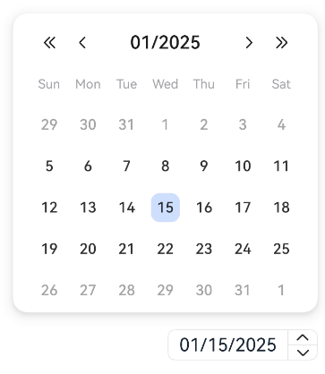
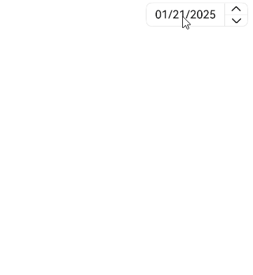

# CalendarPicker
<!--Kit: ArkUI-->
<!--Subsystem: ArkUI-->
<!--Owner: @luoying_ace_admin-->
<!--Designer: @weixin_52725220-->
<!--Tester: @xiong0104-->
<!--Adviser: @Brilliantry_Rui-->

The **CalendarPicker** component provides a drop-down calendar window for users to quickly select a date. It is applicable to scenarios where users need to select a specific date, such as reservation, schedule arrangements, and date filtering, and provides an intuitive calendar view to improve user experience in date input.

> **NOTE**
>
> - This component is supported since API version 10. Newly added APIs will be marked with a superscript to indicate their earliest API version.
>
> - This component supports [WithTheme](./ts-container-with-theme.md) since API version 26.0.0.

## Child Components

Not supported

## APIs

CalendarPicker(options?: CalendarOptions)

Creates a calendar picker.

**Atomic service API**: This API can be used in atomic services since API version 11.

**Model restriction**: This API can be used only in the stage model.

**System capability**: SystemCapability.ArkUI.ArkUI.Full

**Device behavior differences**: On wearables, calling this API results in a runtime exception indicating that the API is undefined. On other devices, the API works correctly.

**Parameters**

| Name | Type                                       | Mandatory| Description                      |
| ------- | ------------------------------------------- | ---- | -------------------------- |
| options | [CalendarOptions](#calendaroptions) | No  | Parameters of the calendar picker. If this parameter is not set, the default configuration is used.|

## Attributes

In addition to the [universal attributes](ts-component-general-attributes.md), the following attributes are supported.

### edgeAlign

edgeAlign(alignType: CalendarAlign, offset?: Offset)

Sets how the picker is aligned with the entry component.

**Atomic service API**: This API can be used in atomic services since API version 11.

**Model restriction**: This API can be used only in the stage model.

**System capability**: SystemCapability.ArkUI.ArkUI.Full

**Device behavior differences**: On wearables, calling this API results in a runtime exception indicating that the API is undefined. On other devices, the API works correctly.

**Parameters**

| Name   | Type                                   | Mandatory| Description                                                        |
| --------- | --------------------------------------- | ---- | ------------------------------------------------------------ |
| alignType | [CalendarAlign](#calendaralign) | Yes  | Alignment type.<br>Default value: **CalendarAlign.END**.                |
| offset    | [Offset](ts-types.md#offset)            | No  | Offset of the picker relative to the entry component after alignment based on the specified alignment type.<br>Default value: **{dx: 0, dy: 0}**<br>Unit: vp.|

### edgeAlign<sup>18+</sup>

edgeAlign(alignType: Optional\<CalendarAlign>, offset?: Offset)

Sets how the picker is aligned with the entry component. Compared with [edgeAlign](#edgealign), this API supports the **undefined** type for the **alignType** parameter.

**Atomic service API**: This API can be used in atomic services since API version 18.

**Model restriction**: This API can be used only in the stage model.

**System capability**: SystemCapability.ArkUI.ArkUI.Full

**Device behavior differences**: On wearables, calling this API results in a runtime exception indicating that the API is undefined. On other devices, the API works correctly.

**Parameters**

| Name   | Type                                                        | Mandatory| Description                                                        |
| --------- | ------------------------------------------------------------ | ---- | ------------------------------------------------------------ |
| alignType | [Optional](ts-universal-attributes-custom-property.md#optionalt)\<[CalendarAlign](#calendaralign)>| Yes| Alignment type.<br>Default value: **CalendarAlign.END**.<br>If the value of **alignType** is **undefined**, the default value is used.|
| offset    | [Offset](ts-types.md#offset)                                 | No  | Offset of the picker relative to the entry component after alignment based on the specified alignment type.<br>Default value: **{dx: 0, dy: 0}**<br>Unit: vp.|

### textStyle

textStyle(value: PickerTextStyle)

Sets the font color, font size, and font weight in the entry area.

**Atomic service API**: This API can be used in atomic services since API version 11.

**Model restriction**: This API can be used only in the stage model.

**System capability**: SystemCapability.ArkUI.ArkUI.Full

**Device behavior differences**: On wearables, calling this API results in a runtime exception indicating that the API is undefined. On other devices, the API works correctly.

**Parameters**

| Name| Type                                                        | Mandatory| Description                                                        |
| ------ | ------------------------------------------------------------ | ---- | ------------------------------------------------------------ |
| value  | [PickerTextStyle](ts-picker-common.md#pickertextstyle) | Yes  | Font color, font size, and font weight in the entry area.<br>Default value:<br>{<br>color: '#ff182431',<br>font: {<br>size: '16fp', <br>weight: FontWeight.Regular<br>}<br>} |

### textStyle<sup>18+</sup>

textStyle(style: Optional\<PickerTextStyle>)

Sets the font color, font size, and font weight in the entry area. Compared with [textStyle](#textstyle), this API supports the **undefined** type for the **style** parameter.

**Atomic service API**: This API can be used in atomic services since API version 18.

**Model restriction**: This API can be used only in the stage model.

**System capability**: SystemCapability.ArkUI.ArkUI.Full

**Device behavior differences**: On wearables, calling this API results in a runtime exception indicating that the API is undefined. On other devices, the API works correctly.

**Parameters**

| Name| Type                                                        | Mandatory| Description                                                        |
| ------ | ------------------------------------------------------------ | ---- | ------------------------------------------------------------ |
| style | [Optional](ts-universal-attributes-custom-property.md#optionalt)\<[PickerTextStyle](ts-picker-common.md#pickertextstyle)> | Yes| Font color, font size, and font weight in the entry area.<br>Default value:<br>{<br>color: '#ff182431',<br>font: {<br>size: '16fp', <br>weight: FontWeight.Regular<br>}<br>}<br>If the value of **style** is **undefined**, the default value is used.|

### markToday<sup>19+</sup>

markToday(enabled: boolean)

Whether to highlight the current system date.

**Atomic service API**: This API can be used in atomic services since API version 19.

**Model restriction**: This API can be used only in the stage model.

**System capability**: SystemCapability.ArkUI.ArkUI.Full

**Device behavior differences**: On wearables, calling this API results in a runtime exception indicating that the API is undefined. On other devices, the API works correctly.

**Parameters**

| Name| Type                                                        | Mandatory| Description                                                        |
| ------ | ------------------------------------------------------------ | ---- | ------------------------------------------------------------ |
| enabled  | boolean | Yes  | Whether to highlight the current system date.<br>- **true**: Highlight the current system date.<br>- **false**: Do not highlight the current system date.<br>Default value: **false**.|

## Events

In addition to the [universal events](ts-component-general-events.md), the following events are supported.

### onChange

onChange(callback: Callback\<Date>)

Triggered when a date is selected. This event cannot be triggered by two-way bound state variables.

**Atomic service API**: This API can be used in atomic services since API version 11.

**Model restriction**: This API can be used only in the stage model.

**System capability**: SystemCapability.ArkUI.ArkUI.Full

**Device behavior differences**: On wearables, calling this API results in a runtime exception indicating that the API is undefined. On other devices, the API works correctly.

**Parameters**

| Name| Type| Mandatory| Description          |
| ------ | ---- | ---- | -------------- |
| callback | [Callback](ts-types.md#callback12)\<Date> | Yes| Called when a date is selected. The callback parameter is the selected date of the **Date** type. You can obtain the selected date in the callback function and perform corresponding processing.|

### onChange<sup>18+</sup>

onChange(callback: Optional\<Callback\<Date>>)

Triggered when a date is selected. This event cannot be triggered by two-way bound state variables. Compared with [onChange](#onchange), this API supports the **undefined** type for the **callback** parameter.

>**NOTE**
>
> This API can be called within [attributeModifier](ts-universal-attributes-attribute-modifier.md#attributemodifier) since API version 20.

**Atomic service API**: This API can be used in atomic services since API version 18.

**Model restriction**: This API can be used only in the stage model.

**System capability**: SystemCapability.ArkUI.ArkUI.Full

**Device behavior differences**: On wearables, calling this API results in a runtime exception indicating that the API is undefined. On other devices, the API works correctly.

**Parameters**

| Name  | Type                                                        | Mandatory| Description                                                        |
| -------- | ------------------------------------------------------------ | ---- | ------------------------------------------------------------ |
| callback | [Optional](ts-universal-attributes-custom-property.md#optionalt)\<[Callback](ts-types.md#callback12)\<Date>> | Yes  | Called when a date is selected. The callback parameter is the selected date.<br>If **callback** is set to **undefined**, the callback function is not used.|

##  CalendarOptions

Describes the parameters of the calendar picker.

**Model restriction**: This API can be used only in the stage model.

**System capability**: SystemCapability.ArkUI.ArkUI.Full

**Device behavior differences**: On wearables, calling this API results in a runtime exception indicating that the API is undefined. On other devices, the API works correctly.

| Name     | Type      | Read-Only| Optional       | Description                           |
| ----------- | ---------- | ------| --------------------------------- | --------------------------------- |
| hintRadius | number \| [Resource](ts-types.md#resource) | No  | Yes   | Background style of the selected state in the calendar picker.<br>Value range: [0.0, 16.0]<br>Unit: vp.<br>Default value: **16.0** (the background is a circle).<br>**NOTE**<br>If the value of **hintRadius** is **0.0**, the background is a rectangle with square corners. If the value of **hintRadius** is within the range (0.0, 16.0), the background is a rectangle with rounded corners. If the value of **hintRadius** is **16.0**, the background is a circle. If the value of **hintRadius** is a negative number or greater than **16.0**, the default value **16.0** is used.<br>**Atomic service API**: This API can be used in atomic services since API version 11.|
| selected | Date | No  | Yes   | Date of the selected item. This parameter is passed when the selected date needs to be preset. If the date does not need to be preset, the current system date is used. If the value is not set or does not comply with the date format specifications, the default value will be used. For details about the relationship between the selected date and the **start** and **end** parameters, see [Rules for setting start and end](#rules-for-setting-start-and-end).<br>Default value: current system date<br>Value range: \[Date('0001-01-01'), Date('5000-12-31')].<br>**Atomic service API**: This API can be used in atomic services since API version 11.|
| start<sup>18+</sup> | Date | No  | Yes   | Start date.<br>Default value: **Date('0001-01-01')**<br>Value range: \[Date('0001-01-01'), Date('5000-12-31')].<br>Note: If the start date is later than the end date, both the settings of **start** and **end** are invalid, and the selected date is the default value. For details, see [Rules for setting start and end](#rules-for-setting-start-and-end).<br>**Atomic service API**: This API can be used in atomic services since API version 18.|
| end<sup>18+</sup> | Date | No  | Yes   | End date.<br>Default value: **Date('5000-12-31')**.<br>Value range: \[Date('0001-01-01'), Date('5000-12-31')].<br>Note: If the start date is later than the end date, both the settings of **start** and **end** are invalid, and the selected date is the default value. For details, see [Rules for setting start and end](#rules-for-setting-start-and-end).<br>**Atomic service API**: This API can be used in atomic services since API version 18.|
| disabledDateRange<sup>19+</sup> | [DateRange](ts-picker-common.md#daterange19)[] | No  | Yes   | Disabled date range. If this parameter is not passed, no date is disabled.<br>**NOTE**<br>1. If the start date or end date within a date range is invalid or is not set, the entire date range does not take effect.<br>2. If the end date is earlier than the start date within a date range, the entire date range does not take effect.<br>3. When users select a date and adjust it with the up or down arrow keys, the system skips over all dates in the disabled date range.<br>**Atomic service API**: This API can be used in atomic services since API version 19.|

### Rules for Setting start and end

| Scenario  | Description |
| -------- |  ------------------------------------------------------------ |
| The start date is later than the end date.   | Both start and end dates are invalid, and the selected date is the default value. |
| The selected date is earlier than the start date.   | The selected date is set as the start date. |
| The selected date is later than the end date.   | The selected date is set as the end date. |
| The start date is later than the current system date, and the selected date is not set.   | The selected date is set as the start date. |
| The end date is earlier than the current system date, and the selected date is not set.   | The selected date is set as the end date. |
| The set date is in invalid format, for example, **1999-13-32**.| The start or end date setting is invalid, and the selected date is the default value.|

## CalendarAlign

Enumerates alignment types.

**Atomic service API**: This API can be used in atomic services since API version 11.

**Model restriction**: This API can be used only in the stage model.

**System capability**: SystemCapability.ArkUI.ArkUI.Full

**Device behavior differences**: On wearables, calling this API results in a runtime exception indicating that the API is undefined. On other devices, the API works correctly.

| Name  | Value| Description                    |
| ------ | - | ------------------------ |
| START  | 0 | Left-aligned with the entry component.  |
| CENTER | 1 | Center-aligned with the entry component.|
| END    | 2 | Right-aligned with the entry component.  |

## Example
### Example 1: Implementing a Calendar Picker

This example uses **calendarPicker** to implement the **CalendarPicker** component and provides a drop-down calendar.

```ts
// xxx.ets
@Entry
@Component
struct CalendarPickerExample {
  private selectedDate: Date = new Date('2024-03-05');

  build() {
    Column() {
      Column() {
        CalendarPicker({ hintRadius: 10, selected: this.selectedDate })
          .edgeAlign(CalendarAlign.END)
          .textStyle({ color: '#ff182431', font: { size: 20, weight: FontWeight.Normal } })
          .margin(10)
          .onChange((value) => {
            console.info(`CalendarPicker onChange: ${value.toString()}`);
          })
      }.alignItems(HorizontalAlign.End).width("100%")

      Text('Calendar picker').fontSize(30)
    }.width('100%').margin({ top: 350 })
  }
}
```


### Example 2: Setting Start and End Dates

This example demonstrates how to set the start and end dates for the calendar picker using **start** and **end**.

Since API version 18, the **start** and **end** attributes are added to [CalendarOptions](#calendaroptions).

```ts
// xxx.ets
@Entry
@Component
struct CalendarPickerExample {
  private selectedDate: Date = new Date('2025-01-15');
  private startDate: Date = new Date('2025-01-05');
  private endDate: Date = new Date('2025-01-25');

  build() {
    Column() {
      Column() {
        CalendarPicker({ hintRadius: 10, selected: this.selectedDate, start: this.startDate, end: this.endDate })
          .edgeAlign(CalendarAlign.END)
          .textStyle({ color: '#ff182431', font: { size: 20, weight: FontWeight.Normal } })
          .margin(10)
          .onChange((value) => {
            console.info(`CalendarPicker onChange: ${value.toString()}`);
          })
      }.alignItems(HorizontalAlign.End).width("100%")
    }.width('100%').margin({ top: 350 })
  }
}
```



### Example 3: Highlighting the Current System Date and Disabling a Specific Date Range

This example shows how to highlight the current system date using **markToday** and disable a specific date range using **disabledDateRange**.

Since API version 19, the [markToday](#marktoday19) API is added, and the **disabledDateRange** attribute is added to [CalendarOptions](#calendaroptions).

```ts
// xxx.ets
@Entry
@Component
struct CalendarPickerExample {
  private disabledDateRange: DateRange[] = [
    { start: new Date('2025-01-01'), end: new Date('2025-01-02') },
    { start: new Date('2025-01-09'), end: new Date('2025-01-10') },
    { start: new Date('2025-01-15'), end: new Date('2025-01-16') },
    { start: new Date('2025-01-19'), end: new Date('2025-01-19') },
    { start: new Date('2025-01-22'), end: new Date('2025-01-25') }
  ];

  build() {
    Column() {
      CalendarPicker({ disabledDateRange: this.disabledDateRange })
        .margin(10)
        .markToday(true)
        .onChange((value) => {
          console.info(`CalendarPicker onChange: ${value.toString()}`);
        })
    }.alignItems(HorizontalAlign.End).width('100%')
  }
}
```


