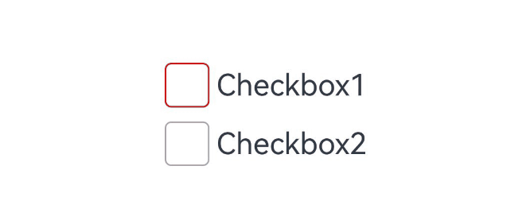
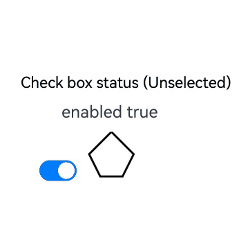
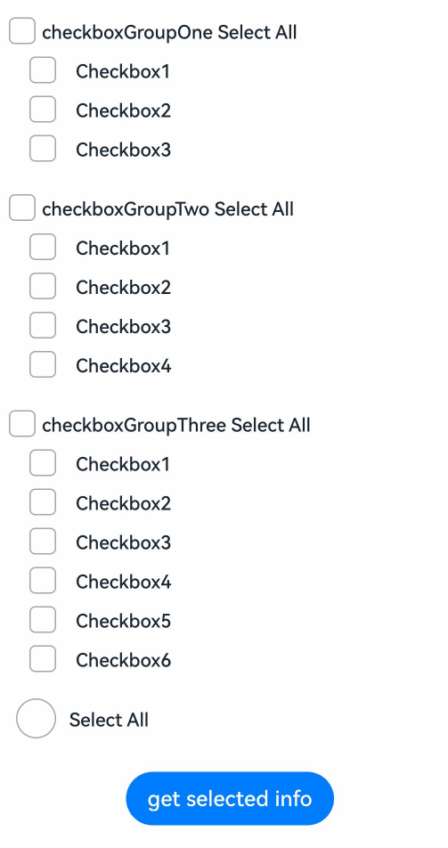
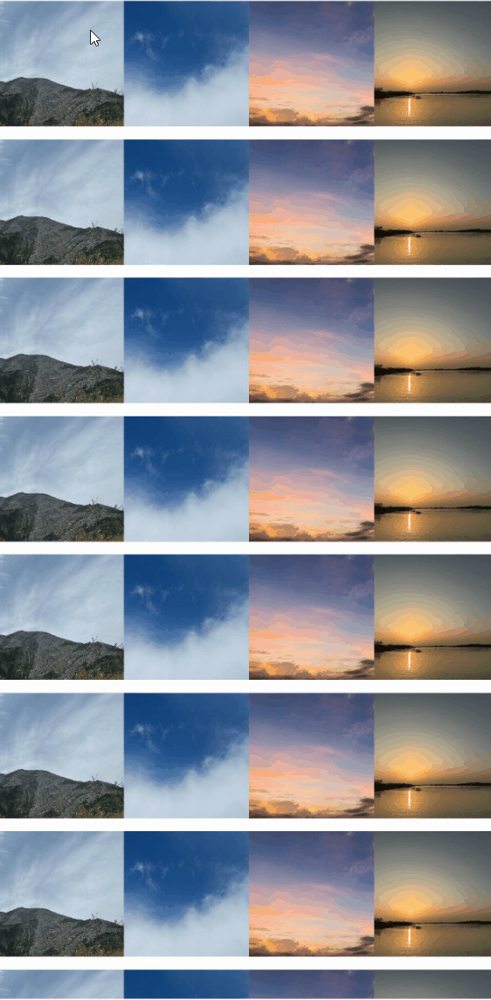

# Checkbox
<!--Kit: ArkUI-->
<!--Subsystem: ArkUI-->
<!--Owner: @houguobiao-->
<!--Designer: @houguobiao-->
<!--Tester: @lxl007-->
<!--Adviser: @Brilliantry_Rui-->
<!-- md-trans-meta sourceCommit=ecf5d58a25055daa53a34747272770e0f3c1f57a translatedAt=2026-09-03T03:47:28.534Z -->

Provides a checkbox component for selecting among multiple options.

>  **NOTE**
>
>  Since API version 11, the default style of the **Checkbox** component is changed from rounded square to circle.
>
>  This component is supported since API version 8. Updates will be marked with a superscript to indicate their earliest API version.
>
>  By default, this component has a [margin](ts-universal-attributes-size.md#margin) of {&nbsp;top: '14px',&nbsp;right: '14px',&nbsp;bottom: '14px',&nbsp;left: '14px' }.

## Child Components

Not supported

## APIs

Checkbox(options?: CheckboxOptions)

Provides a checkbox component for selecting among multiple options.

**Widget capability**: This API can be used in ArkTS widgets since API version 9.

**Atomic service API**: This API can be used in atomic services since API version 11.

**System capability**: SystemCapability.ArkUI.ArkUI.Full

**Parameters**

| Name | Type                                       | Mandatory| Description              |
| ------- | ------------------------------------------- | ---- | ------------------ |
| options | [CheckboxOptions](#checkboxoptions) | No | Configures the parameters of the checkbox. If this parameter is not passed, the checkbox uses the default configuration. |

## CheckboxOptions

Provides information about the check box.

**System capability**: SystemCapability.ArkUI.ArkUI.Full

| Name | Type| Read-Only| Optional| Description|
| --------| --------| ------ | -------- | -------- |
| name    | string | No | Yes | Name of the checkbox, used to identify different checkbox instances.<br/> Default value: undefined. <br/>**Widget Capability:** Since API version 9, this API is supported in ArkTS widgets.<br/>**Atomic service API:** Since API version 11, this API is supported in atomic services. |
| group   | string | No | Yes | Name of the group to which the checkbox belongs (that is, the name of the CheckboxGroup to which it belongs).<br/> Default value: undefined, used with nodes whose group information is undefined in [CheckboxGroupOptions](ts-basic-components-checkboxgroup.md#checkboxgroupoptions). <br/>**NOTE**<br/>This value is useless when the [CheckboxGroup](ts-basic-components-checkboxgroup.md) component is not used together. <br/>**Widget Capability:** Since API version 9, this API is supported in ArkTS widgets.<br/>**Atomic service API:** Since API version 11, this API is supported in atomic services. |
| indicatorBuilder<sup>12+</sup> | [CustomBuilder](ts-types.md#custombuilder8) | No | Yes | Configures the selected style of the checkbox as a custom component. Use this parameter when a selected style other than the default check icon (such as text, numbers, or a custom icon) is required. The custom component and the Checkbox component are aligned and displayed with their center points. When indicatorBuilder is set to undefined/null, it defaults to the state where indicatorBuilder is not set, and the default check icon style is used.<br/>**Atomic service API:** Since API version 12, this API is supported in atomic services.<br/>**Model restriction:** This API can be used only in the stage model.|

## Attributes

In addition to the [universal attributes](ts-component-general-attributes.md), the following attributes are supported.

### select

select(value: boolean)

Sets whether the check box is selected.

Since API version 10, this attribute supports two-way binding through [$$](../../../ui/state-management/arkts-two-way-sync.md).

Since API version 18, this attribute supports two-way binding through [!!](../../../ui/state-management/arkts-new-binding.md#two-way-binding-between-built-in-component-parameters).

**Widget capability**: This API can be used in ArkTS widgets since API version 9.

**Atomic service API**: This API can be used in atomic services since API version 11.

**System capability**: SystemCapability.ArkUI.ArkUI.Full

**Parameters**

| Name| Type   | Mandatory| Description                                                        |
| ------ | ------- | ---- | ------------------------------------------------------------ |
| value  | boolean | Yes  | Whether the check box is selected.<br>Default value: **false**<br>**true**: The check box is selected. <br>**false**: The check box is not selected.|

### select<sup>18+</sup>

select(isSelected: Optional\<boolean>)

Sets whether the check box is selected. Compared with [select](#select), this API supports the **undefined** type for the **isSelected** parameter.

This attribute supports two-way binding through [$$](../../../ui/state-management/arkts-two-way-sync.md) and [!!](../../../ui/state-management/arkts-new-binding.md#two-way-binding-between-built-in-component-parameters).

**Widget capability**: This API can be used in ArkTS widgets since API version 18.

**Atomic service API**: This API can be used in atomic services since API version 18.

**Model restriction**: This API can be used only in the stage model.

**System capability**: SystemCapability.ArkUI.ArkUI.Full

**Parameters**

| Name    | Type                                                        | Mandatory| Description                                                        |
| ---------- | ------------------------------------------------------------ | ---- | ------------------------------------------------------------ |
| isSelected | [Optional](ts-universal-attributes-custom-property.md#optionalt)\<boolean> | Yes | Whether the checkbox is selected.<br/>The default value is false when the value of isSelected is undefined.<br/>The checkbox is selected when the value is true, and is not selected when the value is false. |

### selectedColor

selectedColor(value: ResourceColor)

Sets the color of the check box when it is selected.

**Widget capability**: This API can be used in ArkTS widgets since API version 9.

**Atomic service API**: This API can be used in atomic services since API version 11.

**System capability**: SystemCapability.ArkUI.ArkUI.Full

**Parameters**

| Name| Type                                      | Mandatory| Description                                                        |
| ------ | ------------------------------------------ | ---- | ------------------------------------------------------------ |
| value  | [ResourceColor](ts-types.md#resourcecolor) | Yes  | Color of the check box when it is selected.<br>Default value: **$r('sys.color.ohos_id_color_text_primary_activated')**.<br>An invalid value is handled as the default value.|

### selectedColor<sup>18+</sup>

selectedColor(resColor: Optional\<ResourceColor>)

Sets the color of the check box when it is selected. Compared with [selectedColor](#selectedcolor), this API supports the **undefined** type for the **resColor** parameter.

**Widget capability**: This API can be used in ArkTS widgets since API version 18.

**Atomic service API**: This API can be used in atomic services since API version 18.

**Model restriction**: This API can be used only in the stage model.

**System capability**: SystemCapability.ArkUI.ArkUI.Full

**Parameters**

| Name  | Type                                                        | Mandatory| Description                                                        |
| -------- | ------------------------------------------------------------ | ---- | ------------------------------------------------------------ |
| resColor | [Optional](ts-universal-attributes-custom-property.md#optionalt)\<[ResourceColor](ts-types.md#resourcecolor)> | Yes | Color of the checkbox in the selected state.<br/>When the value of resColor is undefined, the default value $r('sys.color.ohos_id_color_text_primary_activated') is used.<br/>Invalid values are handled as the default value. |

### unselectedColor<sup>10+</sup>

unselectedColor(value: ResourceColor)

Sets the border color of the check box when it is not selected.

**Atomic service API**: This API can be used in atomic services since API version 11.

**Model restriction**: This API can be used only in the stage model.

**System capability**: SystemCapability.ArkUI.ArkUI.Full

**Parameters**

| Name| Type                                      | Mandatory| Description                    |
| ------ | ------------------------------------------ | ---- | -------------------------- |
| value  | [ResourceColor](ts-types.md#resourcecolor) | Yes  | Border color of the check box when it is not selected.<br>Default value: **$r('sys.color.ohos_id_color_switch_outline_off')**.|

### unselectedColor<sup>18+</sup>

unselectedColor(resColor: Optional\<ResourceColor>)

Sets the border color of the check box when it is not selected. Compared with [unselectedColor](#unselectedcolor10)<sup>10+</sup>, this API supports the **undefined** type for the **resColor** parameter.

**Atomic service API**: This API can be used in atomic services since API version 18.

**Model restriction**: This API can be used only in the stage model.

**System capability**: SystemCapability.ArkUI.ArkUI.Full

**Parameters**

| Name  | Type                                                        | Mandatory| Description                                                        |
| -------- | ------------------------------------------------------------ | ---- | ------------------------------------------------------------ |
| resColor | [Optional](ts-universal-attributes-custom-property.md#optionalt)\<[ResourceColor](ts-types.md#resourcecolor)> | Yes | Border color of the checkbox in the unselected state.<br/>When the value of resColor is undefined, the default value $r('sys.color.ohos_id_color_switch_outline_off') is used.|

### mark<sup>10+</sup>

mark(value: MarkStyle)

Sets the check mark style of the check box.

**Atomic service API**: This API can be used in atomic services since API version 11.

**Model restriction**: This API can be used only in the stage model.

**System capability**: SystemCapability.ArkUI.ArkUI.Full

**Parameters**

| Name| Type                                        | Mandatory| Description                                                        |
| ------ | -------------------------------------------- | ---- | ------------------------------------------------------------ |
| value  | [MarkStyle](ts-types.md#markstyle10) | Yes  | Check mark style of the check box. Since API version 12, if **indicatorBuilder** is set, the style is determined by **indicatorBuilder**.<br>Default value: {<br>strokeColor : `$r('sys.color.ohos_id_color_foreground_contrary')`,<br>strokeWidth: `$r('sys.float.ohos_id_checkbox_stroke_width')`,<br>size: '20vp'<br>} |

### mark<sup>18+</sup>

mark(style: Optional\<MarkStyle>)

Sets the check mark style of the check box. Compared with [mark](#mark10)<sup>10+</sup>, this API supports the **undefined** type for the **style** parameter.

**Atomic service API**: This API can be used in atomic services since API version 18.

**Model restriction**: This API can be used only in the stage model.

**System capability**: SystemCapability.ArkUI.ArkUI.Full

**Parameters**

| Name| Type                                                        | Mandatory| Description                                                        |
| ------ | ------------------------------------------------------------ | ---- | ------------------------------------------------------------ |
| style  | [Optional](ts-universal-attributes-custom-property.md#optionalt)\<[MarkStyle](ts-types.md#markstyle10) | Yes   | Style of the internal icon of the checkbox. When indicatorBuilder is set, the content in indicatorBuilder is displayed.<br/>When the value of style is undefined, the default value is: {<br/>strokeColor : `$r('sys.color.ohos_id_color_foreground_contrary')`,<br/>strokeWidth: `$r('sys.float.ohos_id_checkbox_stroke_width')`,<br/>size: '20vp'<br/>} |

### shape<sup>11+</sup>

shape(value: CheckBoxShape)

Sets the check box shape. To adjust the style of the current check box, use [contentModifier](#contentmodifier12).

**Widget capability**: This API can be used in ArkTS widgets since API version 11.

**Atomic service API**: This API can be used in atomic services since API version 12.

**Model restriction**: This API can be used only in the stage model.

**System capability**: SystemCapability.ArkUI.ArkUI.Full

**Parameters**

| Name| Type                                                 | Mandatory| Description                                                        |
| ------ | ----------------------------------------------------- | ---- | ------------------------------------------------------------ |
| value  | [CheckBoxShape](ts-appendix-enums.md#checkboxshape11) | Yes  | Shape of the check box.<br>Default value: **CheckBoxShape.CIRCLE**|

### shape<sup>18+</sup>

shape(shape: Optional\<CheckBoxShape>)

Sets the shape of the **Checkbox** component. Compared with [shape](#shape11)<sup>11+</sup>, the shape parameter adds support for the undefined type. To adjust the style of the current **Checkbox**, use the [contentModifier](#contentmodifier12) attribute to customize the **Checkbox** style.

**Widget capability**: This API can be used in ArkTS widgets since API version 18.

**Atomic service API**: This API can be used in atomic services since API version 18.

**Model restriction**: This API can be used only in the stage model.

**System capability**: SystemCapability.ArkUI.ArkUI.Full

**Parameters**

| Name| Type                                                        | Mandatory| Description                                                        |
| ------ | ------------------------------------------------------------ | ---- | ------------------------------------------------------------ |
| shape  | [Optional](ts-universal-attributes-custom-property.md#optionalt)\<[CheckBoxShape](ts-appendix-enums.md#checkboxshape11)> | Yes   | Component shape of the Checkbox, which can be a circle or a rounded square.<br/>When the value of shape is undefined, the default value is CheckBoxShape.CIRCLE. |

### contentModifier<sup>12+</sup>

contentModifier(modifier: ContentModifier\<CheckBoxConfiguration>)

Creates a content modifier for the **Checkbox** component. Setting this attribute will invalidate other attribute settings.

**Atomic service API**: This API can be used in atomic services since API version 12.

**Model restriction**: This API can be used only in the stage model.

**System capability**: SystemCapability.ArkUI.ArkUI.Full

**Parameters**

| Name| Type                                         | Mandatory| Description                                            |
| ------ | --------------------------------------------- | ---- | ------------------------------------------------ |
| modifier  | [ContentModifier](ts-universal-attributes-content-modifier.md#contentmodifiert)\<[CheckBoxConfiguration](#checkboxconfiguration12)\> | Yes   | Method for customizing the content area on the Checkbox component.<br/>modifier: content modifier. Developers need to customize a class to implement the ContentModifier interface. |

### contentModifier<sup>18+</sup>

contentModifier(modifier: Optional<ContentModifier\<CheckBoxConfiguration>>)

Creates a content modifier for the **Checkbox** component. Compared with [contentModifier](#contentmodifier12)<sup>12+</sup>, this API supports the **undefined** type for the **modifier** parameter. Setting this attribute will invalidate other attribute settings.

**Atomic service API**: This API can be used in atomic services since API version 18.

**Model restriction**: This API can be used only in the stage model.

**System capability**: SystemCapability.ArkUI.ArkUI.Full

**Parameters**

| Name  | Type                                                        | Mandatory| Description                                                        |
| -------- | ------------------------------------------------------------ | ---- | ------------------------------------------------------------ |
| modifier | [Optional](ts-universal-attributes-custom-property.md#optionalt)\<[ContentModifier](ts-universal-attributes-content-modifier.md#contentmodifiert)\<[CheckBoxConfiguration](#checkboxconfiguration12)\>\> | Yes | Method for customizing the content area on the Checkbox component.<br/>modifier: content modifier. The developer needs to customize a class to implement the ContentModifier interface.<br/>When the value of modifier is undefined, the content modifier is not used. |

## Events

In addition to the [universal events](ts-component-general-events.md), the following events are supported.

### onChange

onChange(callback: OnCheckboxChangeCallback)

Invoked when the selected state of the check box changes.

**Widget capability**: This API can be used in ArkTS widgets since API version 9.

**Atomic service API**: This API can be used in atomic services since API version 11.

**System capability**: SystemCapability.ArkUI.ArkUI.Full

**Parameters**

| Name  | Type                                                   | Mandatory| Description            |
| -------- | ------------------------------------------------------- | ---- | ---------------- |
| callback | [OnCheckboxChangeCallback](#oncheckboxchangecallback18) | Yes | Callback invoked to return the selected state. The value **true** indicates that the checkbox is selected, and **false** indicates that it is not selected. |

### onChange<sup>18+</sup>

onChange(callback: Optional\<OnCheckboxChangeCallback>)

Invoked when the selected state of the check box changes. Compared with [onChange](#onchange), this API supports the **undefined** type for the **callback** parameter.

**Widget capability**: This API can be used in ArkTS widgets since API version 18.

**Atomic service API**: This API can be used in atomic services since API version 18.

**Model restriction**: This API can be used only in the stage model.

**System capability**: SystemCapability.ArkUI.ArkUI.Full

**Parameters**

| Name  | Type                                                        | Mandatory| Description                                                        |
| -------- | ------------------------------------------------------------ | ---- | ------------------------------------------------------------ |
| callback | [Optional](ts-universal-attributes-custom-property.md#optionalt)\<[OnCheckboxChangeCallback](#oncheckboxchangecallback18)> | Yes | Returns the selected state. The value true indicates that the checkbox is selected, and false indicates that it is not selected.<br/>When the value of callback is undefined, the callback is not used. |

## OnCheckboxChangeCallback<sup>18+</sup>

type OnCheckboxChangeCallback  = (value: boolean) => void

Callback invoked when the selected state of the checkbox changes.

**Widget capability**: This API can be used in ArkTS widgets since API version 18.

**Atomic service API**: This API can be used in atomic services since API version 18.

**Model restriction**: This API can be used only in the stage model.

**System capability**: SystemCapability.ArkUI.ArkUI.Full

**Parameters**

| Name| Type   | Mandatory| Description                                             |
| ------ | ------- | ---- | ------------------------------------------------- |
| value  | boolean | Yes  | Whether the check box is selected. The value **true** means that the check box is selected, and **false** means the opposite.|

## CheckBoxConfiguration<sup>12+</sup>

You need a custom class to implement the **ContentModifier** API. Inherits from [CommonConfiguration](ts-universal-attributes-content-modifier.md#commonconfigurationt).

**Atomic service API**: This API can be used in atomic services since API version 12.

**Model restriction**: This API can be used only in the stage model.

**System capability**: SystemCapability.ArkUI.ArkUI.Full

| Name| Type   |    Read-Only   |    Optional     |  Description             |
| ------ | ------ | ------ |-------------------------------- |-------------------------------- |
| name | string | No| No|Name of the check box.|
| selected | boolean| No | No | Whether the checkbox is selected. The value true means the checkbox is selected, and the value false means the checkbox is not selected.<br/>If the select attribute is not set, the default value is false.<br/>If the select attribute is set, this value is the same as the select attribute. |
| triggerChange |Callback\<boolean>| No | No |Callback invoked when the selected state of the checkbox changes. The value true sets the checkbox to the selected state, and the value false sets the checkbox to the unselected state. |

## Example

### Example 1: Setting the Check Box Shape

This example shows how to set **CheckBoxShape** to implement check boxes in circle and rounded square shapes.

```ts
// xxx.ets
@Entry
@Component
struct CheckboxExample {
  build() {
    Flex({ justifyContent: FlexAlign.SpaceEvenly }) {
      Checkbox({ name: 'checkbox1', group: 'checkboxGroup' })
        .select(true)
        .selectedColor(0xed6f21)
        .shape(CheckBoxShape.CIRCLE)
        .onChange((value: boolean) => {
          console.info('Checkbox1 change is ' + value);
        })
      Checkbox({ name: 'checkbox2', group: 'checkboxGroup' })
        .select(false)
        .selectedColor(0x39a2db)
        .shape(CheckBoxShape.ROUNDED_SQUARE)
        .onChange((value: boolean) => {
          console.info('Checkbox2 change is ' + value);
        })
    }
  }
}
```


### Example 2: Setting the Check Box Color

This example demonstrates how to set **mark** to customize the color of a check box.

```ts
// xxx.ets
@Entry
@Component
struct Index {

  build() {
    Row() {
      Column() {
        Flex({ justifyContent: FlexAlign.Center, alignItems: ItemAlign.Center }) {
          Checkbox({ name: 'checkbox1', group: 'checkboxGroup' })
            .selectedColor(0x39a2db)
            .shape(CheckBoxShape.ROUNDED_SQUARE)
            .onChange((value: boolean) => {
              console.info('Checkbox1 change is ' + value);
            })
            .mark({
              strokeColor: Color.Black,
              size: 50,
              strokeWidth: 5
            })
            .unselectedColor(Color.Red)
            .width(30)
            .height(30)
          Text('Checkbox1').fontSize(20)
        }
        Flex({ justifyContent: FlexAlign.Center, alignItems: ItemAlign.Center }) {
          Checkbox({ name: 'checkbox2', group: 'checkboxGroup' })
            .selectedColor(0x39a2db)
            .shape(CheckBoxShape.ROUNDED_SQUARE)
            .onChange((value: boolean) => {
              console.info('Checkbox2 change is ' + value);
            })
            .width(30)
            .height(30)
          Text('Checkbox2').fontSize(20)
        }
      }
      .width('100%')
    }
    .height('100%')
  }
}
```




### Example 3: Customizing the Check Box Style
This example uses the [contentModifier](#contentmodifier12) attribute to implement a custom checkbox style, which implements a pentagon-shaped checkbox. When selected, a red triangle pattern is displayed inside and the title shows "Selected"; when deselected, the red triangle pattern disappears and the title shows "Unselected".

```ts
// xxx.ets
class MyCheckboxStyle implements ContentModifier<CheckBoxConfiguration> {
  selectedColor: Color = Color.White;

  constructor(selectedColor: Color) {
    this.selectedColor = selectedColor;
  }

  applyContent(): WrappedBuilder<[CheckBoxConfiguration]> {
    return wrapBuilder(buildCheckbox);
  }
}

@Builder
function buildCheckbox(config: CheckBoxConfiguration) {
  Column({ space: 10 }) {
    Text(config.name + (config.selected ? "(Selected)" : "(Unselected)")).margin({ right: 70, top: 50 })
    Text(config.enabled ? "enabled true" : "enabled false").margin({ right: 110 })
    Shape() {
      Path()
        .width(100)
        .height(100)
        .commands('M100 0 L0 100 L50 200 L150 200 L200 100 Z')
        .fillOpacity(0)
        .strokeWidth(3)
        .onClick(() => {
          if (config.selected) {
            config.triggerChange(false); // Trigger the checkbox selected state change and set it to unselected.
          } else {
            config.triggerChange(true); // Trigger the checkbox selected state change and set it to selected.
          }
        })
        .opacity(config.enabled ? 1 : 0.1)
      Path()
        .width(10)
        .height(10)
        .commands('M50 0 L100 100 L0 100 Z')
        .visibility(config.selected ? Visibility.Visible : Visibility.Hidden)
        .fill(config.selected ? (config.contentModifier as MyCheckboxStyle).selectedColor : Color.Black)
        .stroke((config.contentModifier as MyCheckboxStyle).selectedColor)
        .margin({ left: 10, top: 10 })
        .opacity(config.enabled ? 1 : 0.1)
    }
    .width(300)
    .height(200)
    .viewPort({
      x: 0,
      y: 0,
      width: 310,
      height: 310
    })
    .strokeLineJoin(LineJoinStyle.Miter)
    .strokeMiterLimit(5)
    .margin({ left: 50 })
  }
}

@Entry
@Component
struct Index {
  @State checkboxEnabled: boolean = true;

  build() {
    Column({ space: 100 }) {
      Checkbox({ name: 'Check box status', group: 'checkboxGroup' })
        .contentModifier(new MyCheckboxStyle(Color.Red))
        .onChange((value: boolean) => {
          console.info('Checkbox change is ' + value);
        }).enabled(this.checkboxEnabled)

      Row() {
        Toggle({ type: ToggleType.Switch, isOn: true }).onChange((value: boolean) => {
          if (value) {
            this.checkboxEnabled = true;
          } else {
            this.checkboxEnabled = false;
          }
        })
      }.position({ x: 50, y: 130 })
    }.margin({ top: 30 })
  }
}
```




### Example 4: Setting the Text Check Box Style
This example configures the selected style of a check box to display as text using the **indicatorBuilder** property.
```ts
// xxx.ets
@Entry
@Component
struct CheckboxExample {
  @Builder
  indicatorBuilder(value: number) {
    Column(){
      Text(value > 99 ? '99+' : value.toString())
        .textAlign(TextAlign.Center)
        .fontSize(value > 99 ?  '16vp': '20vp')
        .fontWeight(FontWeight.Medium)
        .fontColor('#ffffffff')
    }
  }
  build() {
    Row() {
      Column() {
        Flex({ justifyContent: FlexAlign.Center, alignItems: ItemAlign.Center}) {
          Checkbox({ name: 'checkbox1', group: 'checkboxGroup', indicatorBuilder: () => this.indicatorBuilder(9)})
            .shape(CheckBoxShape.CIRCLE)
            .onChange((value: boolean) => {
              console.info('Checkbox1 change is ' + value);
            })
            .mark({
              strokeColor: Color.Black,
              size: 50,
              strokeWidth: 5
            })
            .width(30)
            .height(30)
          Text('Checkbox1').fontSize(20)
        }.padding(15)
        Flex({ justifyContent: FlexAlign.Center, alignItems: ItemAlign.Center }) {
          Checkbox({ name: 'checkbox2', group: 'checkboxGroup', indicatorBuilder: () => this.indicatorBuilder(100)})
            .shape(CheckBoxShape.ROUNDED_SQUARE)
            .onChange((value: boolean) => {
              console.info('Checkbox2 change is ' + value);
            })
            .width(30)
            .height(30)
          Text('Checkbox2').fontSize(20)
        }
      }
      .width('100%')
    }
    .height('100%')
  }
}
```


### Example 5: Obtaining the Check Box Selection Information

This example demonstrates how to obtain selection information by selecting check boxes and check box groups.

```ts
// xxx.ets
@Entry
@Component
struct CheckboxExample {
  @State arrOne: Array<string> = ['1', '2', '3'];
  @State arrTwo: Array<string> = ['1', '2', '3', '4'];
  @State arrThree: Array<string> = ['1', '2', '3', '4', '5', '6'];
  @State selected: boolean = false;
  @State infoOne: string = '';
  @State infoTwo: string = '';
  @State infoThree: string = '';

  build() {
    Column() {
      // Select All button for the first group
      Flex({ justifyContent: FlexAlign.Start, alignItems: ItemAlign.Center }) {
        CheckboxGroup({ group: 'checkboxGroupOne' })
          .selectAll(this.selected)
          .checkboxShape(CheckBoxShape.ROUNDED_SQUARE)
          .selectedColor('#007DFF')
          .onChange((itemName: CheckboxGroupResult) => {
            this.infoOne = "checkboxGroupOne" + JSON.stringify(itemName);
            console.info("checkboxGroupOne" + JSON.stringify(itemName));
          })
        Text('checkboxGroupOne Select All').fontSize(14).lineHeight(20).fontColor('#182431').fontWeight(500)
      }

      // Options for the first group
      Flex({ justifyContent: FlexAlign.Start, alignItems: ItemAlign.Center }) {
        Column() {
          ForEach(this.arrOne, (item: string) => {
            Row() {
              Checkbox({ name: 'checkbox' + item, group: 'checkboxGroupOne' })
                .selectedColor('#007DFF')
                .shape(CheckBoxShape.ROUNDED_SQUARE)
                .onChange((value: boolean) => {
                  console.info('Checkbox ' + item + ' change is ' + value);
                })
                .margin({ left: 20 })
              Text('Checkbox' + item)
                .fontSize(14)
                .lineHeight(20)
                .fontColor('#182431')
                .fontWeight(500)
                .margin({ left: 10 })
            }
          }, (item: string) => item)
        }
      }.margin({ bottom: 15 })

      Flex({ justifyContent: FlexAlign.Start, alignItems: ItemAlign.Center }) {
        CheckboxGroup({ group: 'checkboxGroupTwo' })
          .selectAll(this.selected)
          .checkboxShape(CheckBoxShape.ROUNDED_SQUARE)
          .selectedColor('#007DFF')
          .onChange((itemName: CheckboxGroupResult) => {
            this.infoTwo = "checkboxGroupTwo" + JSON.stringify(itemName);
            console.info("checkboxGroupTwo" + JSON.stringify(itemName));
          })
        Text('checkboxGroupTwo Select All').fontSize(14).lineHeight(20).fontColor('#182431').fontWeight(500)
      }

      // Options for the second group
      Flex({ justifyContent: FlexAlign.Start, alignItems: ItemAlign.Center }) {
        Column() {
          ForEach(this.arrTwo, (item: string) => {
            Row() {
              Checkbox({ name: 'checkbox' + item, group: 'checkboxGroupTwo' })
                .selectedColor('#007DFF')
                .shape(CheckBoxShape.ROUNDED_SQUARE)
                .onChange((value: boolean) => {
                  console.info('Checkbox ' + item + ' change is ' + value);
                })
                .margin({ left: 20 })
              Text('Checkbox' + item)
                .fontSize(14)
                .lineHeight(20)
                .fontColor('#182431')
                .fontWeight(500)
                .margin({ left: 10 })
            }
          }, (item: string) => item)
        }
      }.margin({ bottom: 15 })

      Flex({ justifyContent: FlexAlign.Start, alignItems: ItemAlign.Center }) {
        CheckboxGroup({ group: 'checkboxGroupThree' })
          .selectAll(this.selected)
          .checkboxShape(CheckBoxShape.ROUNDED_SQUARE)
          .selectedColor('#007DFF')
          .onChange((itemName: CheckboxGroupResult) => {
            this.infoThree = "checkboxGroupThree" + JSON.stringify(itemName);
            console.info("checkboxGroupThree" + JSON.stringify(itemName));
          })
        Text('checkboxGroupThree Select All').fontSize(14).lineHeight(20).fontColor('#182431').fontWeight(500)
      }

      // Options for the third group
      Flex({ justifyContent: FlexAlign.Start, alignItems: ItemAlign.Center }) {
        Column() {
          ForEach(this.arrThree, (item: string) => {
            Row() {
              Checkbox({ name: 'checkbox' + item, group: 'checkboxGroupThree' })
                .selectedColor('#007DFF')
                .shape(CheckBoxShape.ROUNDED_SQUARE)
                .onChange((value: boolean) => {
                  console.info('Checkbox ' + item + ' change is ' + value);
                })
                .margin({ left: 20 })
              Text('Checkbox' + item)
                .fontSize(14)
                .lineHeight(20)
                .fontColor('#182431')
                .fontWeight(500)
                .margin({ left: 10 })
            }
          }, (item: string) => item)
        }
      }.margin({ bottom: 15 })

      // Select all button.
      Flex({ justifyContent: FlexAlign.Start, alignItems: ItemAlign.Center }) {
        Row() {
          CheckboxGroup({ group: 'checkboxGroup' })
            .checkboxShape(CheckBoxShape.CIRCLE)
            .selectedColor('#007DFF')
            .width(30)
            .margin({ left: 10 })
            .onChange(() => {
              this.selected = !this.selected
            })
          Text('Select All')
            .fontSize(14)
            .lineHeight(20)
            .fontColor('#182431')
            .fontWeight(500)
            .margin({ left: 10 })
        }
      }.margin({ bottom: 15 })

      // Obtain the selected information.
      Button('get selected info')
        .margin({ top: 10 })
        .onClick(() => {
          this.getUIContext().getPromptAction().showToast({
            message: 'selected info: ' + this.infoOne + '\n' + this.infoTwo + '\n' + this.infoThree
          })
        })
    }.padding(10)
  }
}
```



### Example 6: Implementing Swipe-based Multi-Selection

This example implements swipe-based multi-selection for **Checkbox** components through gesture event configuration.

```ts
// xxx.ets
import { componentUtils, ComponentUtils, UIContext } from '@kit.ArkUI';
import { LinkedList } from '@kit.ArkTS';

@Entry
@Component
struct Index {
  @State isChoosing: boolean = false;
  @State selectedStart: number = -1;
  @State @Watch('onSelectedEndChange') selectedEnd: number = -1;
  selectedPhotos: LinkedList<number> = new LinkedList();
  @State selectedList: number[] = [];
  @State image: Resource[] =
    // Replace $r('app.media.xxx') with the image resource file you use.
    [$r('app.media.imageOne'), $r('app.media.imageTwo'), $r('app.media.imageThree'), $r('app.media.imageFour')];
  private selectedState: SelectedState = SelectedState.None;
  private componentUtils: ComponentUtils = this.getUIContext().getComponentUtils();
  private listScroller: ListScroller = new ListScroller();
  private currentOffsetY: number = 0;

  getSpeed(fingerY: number, edge: number) {
    return 150 * 150 * (fingerY - edge) / 2000 / Math.abs(fingerY - edge);
  }

  getIndex(fingerX: number, fingerY: number) {
    let rect: componentUtils.ComponentInfo | null = null;
    for (let i = 0; i < 100; i++) {
      let uiContext: UIContext = this.getUIContext();
      rect = this.componentUtils.getRectangleById(`stack${i}`);
      if (rect) {
        const x1 = uiContext.px2vp(rect.windowOffset.x);
        const x2 = uiContext.px2vp(rect.windowOffset.x + rect.size.width);
        const y1 = uiContext.px2vp(rect.windowOffset.y);
        const y2 = uiContext.px2vp(rect.windowOffset.y + rect.size.height);
        if (x1 <= fingerX && fingerX < x2 && y1 <= fingerY && fingerY < y2) {
          return i;
        }
      }
    }
    return this.selectedEnd;
  }
  
  // Update the selected photo list in batches based on the start and end range of the selected state.
  onSelectedEndChange() {
    let start: number = -1;
    let end: number = -1;
    if (this.selectedEnd > this.selectedStart) {
      start = this.selectedStart;
      end = this.selectedEnd;
    } else {
      end = this.selectedStart;
      start = this.selectedEnd;
    }
    if (this.selectedState == SelectedState.Selected) {
      for (let i = start; i <= end; i++) {
        if (!this.selectedPhotos.has(i)) {
          this.selectedPhotos.add(i);
        }
      }
    } else if (this.selectedState == SelectedState.Remove) {
      for (let i = start; i <= end; i++) {
        if (this.selectedPhotos.has(i)) {
          this.selectedPhotos.remove(i);
        }
      }
    }
    this.selectedList = this.selectedPhotos.convertToArray();
  }

  // Control automatic scrolling of the list based on the finger position.
  scroll(fingerY: number) {
    if (fingerY > 700 && !this.listScroller.isAtEnd()) {
      this.listScroller.scrollBy(0, this.getSpeed(fingerY, 700));
      return;
    }
    if (fingerY < 200 && this.currentOffsetY > 0) {
      this.listScroller.scrollBy(0, this.getSpeed(fingerY, 200));
      return;
    }
  }

  onPanGestureUpdate(event: GestureEvent) {
    const fingerInfo = event.fingerList[event.fingerList.length - 1];
    const fingerX = fingerInfo.globalX;
    const fingerY = fingerInfo.globalY;
    this.selectedEnd = this.getIndex(fingerX, fingerY);
    this.scroll(fingerY);
  }

  build() {
    Column() {
      if (this.isChoosing) {
        Row() {
          Text('Cancel')
            .onClick(() => {
              this.isChoosing = false;
              this.selectedStart = -1;
              this.selectedEnd = -1;
              this.selectedPhotos.clear();
              this.selectedList = [];
            })
        }
        .width('100%')
        .justifyContent(FlexAlign.SpaceEvenly)
      }
      List({ space: 10, scroller: this.listScroller }) {
        ForEach(Array.from({ length: 100 }), (item: string, index: number) => {
          ListItem() {
            Stack({ alignContent: Alignment.TopEnd }) {
              Image(this.image[(index % 4)])
                .width('100%')
                .draggable(false)
              Checkbox({ name: index.toString() })
                .shape(CheckBoxShape.CIRCLE)
                .visibility(this.isChoosing ? Visibility.Visible : Visibility.None)
                .select(this.selectedList.includes(index))
            }
            .id(`stack${index}`)
            .width('100%')
          }
          .draggable(false)
        }, (item: string, index: number) => 'listItem' + index)
      }
      .id('list')
      .height('100%')
      .width('100%')
      .lanes(4)
      .alignListItem(ListItemAlign.Center)
      .onDidScroll(() => {
        this.currentOffsetY = this.listScroller.currentOffset().yOffset;
      })
      .gesture(
        GestureGroup(GestureMode.Exclusive,
          GestureGroup(GestureMode.Sequence,
            LongPressGesture()
              .onAction(() => {
                this.isChoosing = true;
              }),
            PanGesture()
              .onActionStart(event => {
                if (!this.isChoosing) {
                  return;
                }
                const fingerInfo = event.fingerList[event.fingerList.length - 1];
                const fingerX = fingerInfo.globalX;
                const fingerY = fingerInfo.globalY;
                this.selectedStart = this.getIndex(fingerX, fingerY);
                if (this.selectedPhotos.has(this.selectedStart)) {
                  this.selectedState = SelectedState.Remove;
                } else {
                  this.selectedState = SelectedState.Selected;
                }
              })
              .onActionUpdate(event => {
                if (!this.isChoosing) {
                  return;
                }
                this.onPanGestureUpdate(event);
              })
              .onActionEnd(() => {
                if (!this.isChoosing) {
                  return;
                }
                this.selectedState = SelectedState.None;
              })
          ),
          PanGesture()
            .onActionStart(event => {
              if (!this.isChoosing) {
                return;
              }
              const fingerInfo = event.fingerList[event.fingerList.length - 1];
              const fingerX = fingerInfo.globalX;
              const fingerY = fingerInfo.globalY;
              this.selectedStart = this.getIndex(fingerX, fingerY);
              if (this.selectedPhotos.has(this.selectedStart)) {
                this.selectedState = SelectedState.Remove;
              } else {
                this.selectedState = SelectedState.Selected;
              }
            })
            .onActionUpdate(event => {
              if (!this.isChoosing) {
                return;
              }
              this.onPanGestureUpdate(event);
            })
            .onActionEnd(() => {
              if (!this.isChoosing) {
                return;
              }
              this.selectedState = SelectedState.None;
            })
        )
      )
    }
  }
}

enum SelectedState {
  None, // Default state.
  Selected, // Selected state. Adds selected items when swiping.
  Remove // Remove state. Removes selected items when swiping.
}
```


