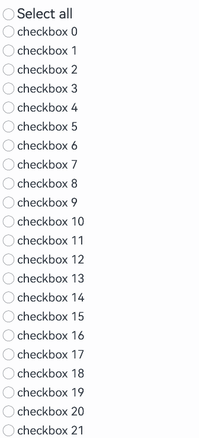

# CheckboxGroup
<!--Kit: ArkUI-->
<!--Subsystem: ArkUI-->
<!--Owner: @houguobiao-->
<!--Designer: @houguobiao-->
<!--Tester: @lxl007-->
<!--Adviser: @Brilliantry_Rui-->

The **CheckboxGroup** component is used to select or deselect all check boxes in a group.

>  **NOTE**
>
>  This component is supported since API version 8. Updates will be marked with a superscript to indicate their earliest API version.

## Child Components

Not supported

## APIs

CheckboxGroup(options?: CheckboxGroupOptions)

Creates a check box group for controlling the select-all or deselect-all state of check boxes within the group. Check boxes and check box groups with the same **group** value belong to the same group.

When this API is used with components that come with the caching mechanism, such as the [List](ts-container-list.md) component, those check boxes that have not been created yet need to be manually selected or unselected. For details, see [Example 4](#example-4-implementing-the-select-all-functionality).

**Widget capability**: Since API version 9, this feature is supported in ArkTS widgets.

**Atomic service API**: This API can be used in atomic services since API version 11.

**System capability**: SystemCapability.ArkUI.ArkUI.Full

**Parameters**

| Name | Type                                                 | Mandatory| Description                |
| ------- | ----------------------------------------------------- | ---- | -------------------- |
| options | [CheckboxGroupOptions](#checkboxgroupoptions) | No  | Check box group parameters.|

## CheckboxGroupOptions

Information about the check box group.

**Widget capability**: Since API version 9, this feature is supported in ArkTS widgets.

**Atomic service API**: This API can be used in atomic services since API version 11.

**System capability**: SystemCapability.ArkUI.ArkUI.Full

| Name| Type| Read-Only| Optional| Description|
| -------- | -------- | -------- | -------- | -------- |
| group | string | No| Yes| Group name.<br>**NOTE**<br>Among multiple check box groups with the same group name, only the first one takes effect.|

## Attributes

In addition to the [universal attributes](ts-component-general-attributes.md), the following attributes are supported.

### selectAll

selectAll(value: boolean)

Sets whether to select all check boxes in the group. If the **select** attribute is set for a [Checkbox](ts-basic-components-checkbox.md) component in the same group, the setting of the **Checkbox** has a higher priority.

When used with components that have caching functionality (such as [List](ts-container-list.md)), the selection state of uncreated check boxes must be controlled by the developer.

Since API version 10, this attribute supports two-way binding through [$$](../../../ui/state-management/arkts-two-way-sync.md).

Since API version 18, this attribute supports two-way binding through [!!](../../../ui/state-management/arkts-new-binding.md#two-way-binding-between-built-in-component-parameters).

**Widget capability**: Since API version 9, this feature is supported in ArkTS widgets.

**Atomic service API**: This API can be used in atomic services since API version 11.

**System capability**: SystemCapability.ArkUI.ArkUI.Full

**Parameters**

| Name| Type   | Mandatory| Description                                                        |
| ------ | ------- | ---- | ------------------------------------------------------------ |
| value  | boolean | Yes  | Whether to select all.<br>Default value: **false**.<br>The value **true** means to select all check boxes in the group, and **false** means to deselect all check boxes in the group.|

### selectAll<sup>18+</sup>

selectAll(isAllSelected: Optional\<boolean>)

Sets whether to select all. If the **select** attribute is set for a [Checkbox](ts-basic-components-checkbox.md) component in the same group, the setting of the **Checkbox** has a higher priority. Compared with [selectAll](#selectall), this API supports the **undefined** type for the **isAllSelected** parameter.

When used with components that have caching functionality (such as [List](ts-container-list.md)), the selection state of uncreated check boxes must be controlled by the developer.

This attribute supports two-way binding through [$$](../../../ui/state-management/arkts-two-way-sync.md) and [!!](../../../ui/state-management/arkts-new-binding.md#two-way-binding-between-built-in-component-parameters).

**Widget capability**: This API can be used in ArkTS widgets since API version 18.

**Atomic service API**: This API can be used in atomic services since API version 18.

**System capability**: SystemCapability.ArkUI.ArkUI.Full

**Parameters**

| Name       | Type                                                        | Mandatory| Description                                                        |
| ------------- | ------------------------------------------------------------ | ---- | ------------------------------------------------------------ |
| isAllSelected | [Optional](ts-universal-attributes-custom-property.md#optionalt12)\<boolean> | Yes  | Whether to select all.<br>If **isAllSelected** is set to **undefined**, the default value **false** is used.<br>The value **true** means to select all check boxes in the group, and **false** means to deselect all check boxes in the group.|

### selectedColor

selectedColor(value: ResourceColor)

Sets the color of the selected check box.

**Widget capability**: Since API version 9, this feature is supported in ArkTS widgets.

**Atomic service API**: This API can be used in atomic services since API version 11.

**System capability**: SystemCapability.ArkUI.ArkUI.Full

**Parameters**

| Name| Type                                      | Mandatory| Description                                                        |
| ------ | ------------------------------------------ | ---- | ------------------------------------------------------------ |
| value  | [ResourceColor](ts-types.md#resourcecolor) | Yes  | Color of the selected check box.<br>Default value: **$r('sys.color.ohos_id_color_text_primary_activated')**<br>An invalid value is handled as the default value.|

### selectedColor<sup>18+</sup>

selectedColor(resColor: Optional\<ResourceColor>)

Sets the color of the selected check box. Compared with [selectedColor](#selectedcolor), this API supports the **undefined** type for the **resColor** parameter.

**Widget capability**: This API can be used in ArkTS widgets since API version 18.

**Atomic service API**: This API can be used in atomic services since API version 18.

**System capability**: SystemCapability.ArkUI.ArkUI.Full

**Parameters**

| Name  | Type                                                        | Mandatory| Description                                                        |
| -------- | ------------------------------------------------------------ | ---- | ------------------------------------------------------------ |
| resColor | [Optional](ts-universal-attributes-custom-property.md#optionalt12)\<[ResourceColor](ts-types.md#resourcecolor)> | Yes  | Color of the selected check box.<br>If **resColor** is set to **undefined**, the default value **$r('sys.color.ohos_id_color_text_primary_activated')** is used.<br>An invalid value is handled as the default value.|

### unselectedColor<sup>10+</sup>

unselectedColor(value: ResourceColor)

Sets the border color of the check box when it is not selected.

**Atomic service API**: This API can be used in atomic services since API version 11.

**System capability**: SystemCapability.ArkUI.ArkUI.Full

**Parameters**

| Name| Type                                      | Mandatory| Description                                                        |
| ------ | ------------------------------------------ | ---- | ------------------------------------------------------------ |
| value  | [ResourceColor](ts-types.md#resourcecolor) | Yes  | Border color of the check box when it is not selected.<br>Default value: **$r('sys.color.ohos_id_color_switch_outline_off')**|

### unselectedColor<sup>18+</sup>

unselectedColor(resColor: Optional\<ResourceColor>)

Sets the border color of the check box when it is not selected. Compared with [unselectedColor](#unselectedcolor10)<sup>10+</sup>, this API supports the **undefined** type for the **resColor** parameter.

**Atomic service API**: This API can be used in atomic services since API version 18.

**System capability**: SystemCapability.ArkUI.ArkUI.Full

**Parameters**

| Name  | Type                                                        | Mandatory| Description                                                        |
| -------- | ------------------------------------------------------------ | ---- | ------------------------------------------------------------ |
| resColor | [Optional](ts-universal-attributes-custom-property.md#optionalt12)\<[ResourceColor](ts-types.md#resourcecolor)> | Yes  | Border color of the check box when it is not selected.<br>If **resColor** is set to **undefined**, the default value **$r('sys.color.ohos_id_color_switch_outline_off')** is used.|

### mark<sup>10+</sup>

mark(value: MarkStyle)

Sets the check mark style of the check box.

**Atomic service API**: This API can be used in atomic services since API version 11.

**System capability**: SystemCapability.ArkUI.ArkUI.Full

**Parameters**

| Name| Type                                        | Mandatory| Description                |
| ------ | -------------------------------------------- | ---- | -------------------- |
| value  | [MarkStyle](ts-types.md#markstyle10) | Yes  | Check mark style of the check box.|

### mark<sup>18+</sup>

mark(style: Optional\<MarkStyle>)

Sets the check mark style of the check box. Compared with [mark](#mark10)<sup>10+</sup>, this API supports the **undefined** type for the **style** parameter.

**Atomic service API**: This API can be used in atomic services since API version 18.

**System capability**: SystemCapability.ArkUI.ArkUI.Full

**Parameters**

| Name| Type                                                        | Mandatory| Description                                                        |
| ------ | ------------------------------------------------------------ | ---- | ------------------------------------------------------------ |
| style  | [Optional](ts-universal-attributes-custom-property.md#optionalt12)\<[MarkStyle](ts-types.md#markstyle10)> | Yes  | Check mark style of the check box.<br>If **style** is set to **undefined**, the previous value is retained.|

### checkboxShape<sup>12+</sup>

checkboxShape(value: CheckBoxShape)

Sets the check box shape of the check box group.

**Widget capability**: This API can be used in ArkTS widgets since API version 12.

**Atomic service API**: This API can be used in atomic services since API version 12.

**System capability**: SystemCapability.ArkUI.ArkUI.Full

**Parameters**

| Name| Type                                                 | Mandatory| Description                                                        |
| ------ | ----------------------------------------------------- | ---- | ------------------------------------------------------------ |
| value  | [CheckBoxShape](ts-appendix-enums.md#checkboxshape11) | Yes  | Check box shape of the check box group.<br>Default value: **CheckBoxShape.CIRCLE**.<br>**NOTE**<br>The **CheckboxGroup** component is displayed according to the set shape.<br>All check boxes in the **CheckboxGroup** component that do not have their shape individually set will inherit the shape of the **CheckboxGroup**.<br>Check boxes in the **CheckboxGroup** component that have their shape individually set will prioritize their own shape setting over the shape of the **CheckboxGroup**.|

### checkboxShape<sup>18+</sup>

checkboxShape(shape: Optional\<CheckBoxShape>)

Sets the check box shape of the check box group. Compared with [checkboxShape](#checkboxshape12)<sup>12+</sup>, this API supports the **undefined** type for the **shape** parameter.

**Widget capability**: This API can be used in ArkTS widgets since API version 18.

**Atomic service API**: This API can be used in atomic services since API version 18.

**System capability**: SystemCapability.ArkUI.ArkUI.Full

**Parameters**

| Name| Type                                                        | Mandatory| Description                                                        |
| ------ | ------------------------------------------------------------ | ---- | ------------------------------------------------------------ |
| shape  | [Optional](ts-universal-attributes-custom-property.md#optionalt12)\<[CheckBoxShape](ts-appendix-enums.md#checkboxshape11)> | Yes  | Check box shape of the check box group.<br>If **shape** is set to **undefined**, the default value **CheckBoxShape.CIRCLE** is used.<br>**NOTE**<br>The **CheckboxGroup** component is displayed according to the set shape.<br>All check boxes in the **CheckboxGroup** component that do not have their shape individually set will inherit the shape of the **CheckboxGroup**.<br>Check boxes in the **CheckboxGroup** component that have their shape individually set will prioritize their own shape setting over the shape of the **CheckboxGroup**.|

### contentModifier<sup>21+</sup>

contentModifier(modifier: Optional<ContentModifier\<CheckBoxGroupConfiguration>>)

Customize the CheckboxGroup content area. When this attribute is set, the settings of other attributes become invalid.

> **NOTE**
>
> This API cannot be called within [attributeModifier](ts-universal-attributes-attribute-modifier.md#attributemodifier).

**Atomic service API**: This API can be used in atomic services since API version 21.

**System capability**: SystemCapability.ArkUI.ArkUI.Full

**Parameters**

| Name  | Type                                                        | Mandatory| Description                                                        |
| -------- | ------------------------------------------------------------ | ---- | ------------------------------------------------------------ |
| modifier | [Optional](ts-universal-attributes-custom-property.md#optionalt12)\<[ContentModifier\<CheckBoxGroupConfiguration>](#checkboxgroupconfiguration21)> | Yes  | Content modifier to apply to the **TextTimer** component.<br>modifier: content modifier. You need to customize a class to implement the ContentModifier interface.<br>If **modifier** is set to **undefined**, no content modifier is used.|

## Events

In addition to the [universal events](ts-component-general-events.md), the following events are supported.

### onChange

onChange(callback: OnCheckboxGroupChangeCallback)

Triggered when the selected status of the check box group or any check box wherein changes.

**Widget capability**: Since API version 9, this feature is supported in ArkTS widgets.

**Atomic service API**: This API can be used in atomic services since API version 11.

**System capability**: SystemCapability.ArkUI.ArkUI.Full

**Parameters**

| Name  | Type                                                        | Mandatory| Description              |
| -------- | ------------------------------------------------------------ | ---- | ------------------ |
| callback | [OnCheckboxGroupChangeCallback](#oncheckboxgroupchangecallback18) | Yes  | Information about the check box group.|

### onChange<sup>18+</sup>

onChange(callback: Optional\<OnCheckboxGroupChangeCallback>)

Triggered when the selected status of the check box group or any check box wherein changes. Compared with [onChange](#onchange), this API supports the **undefined** type for the **callback** parameter.

**Widget capability**: This API can be used in ArkTS widgets since API version 18.

**Atomic service API**: This API can be used in atomic services since API version 18.

**System capability**: SystemCapability.ArkUI.ArkUI.Full

**Parameters**

| Name  | Type                                                        | Mandatory| Description                                                        |
| -------- | ------------------------------------------------------------ | ---- | ------------------------------------------------------------ |
| callback | [Optional](ts-universal-attributes-custom-property.md#optionalt12)\<[OnCheckboxGroupChangeCallback](#oncheckboxgroupchangecallback18)> | Yes  | Information about the check box group.<br>If **callback** is set to **undefined**, the callback function is not used.|

## OnCheckboxGroupChangeCallback<sup>18+</sup>

type OnCheckboxGroupChangeCallback  = (value: CheckboxGroupResult) => void

Information about the check box group.

**Widget capability**: This API can be used in ArkTS widgets since API version 18.

**Atomic service API**: This API can be used in atomic services since API version 18.

**System capability**: SystemCapability.ArkUI.ArkUI.Full

**Parameters**

| Name| Type                                               | Mandatory| Description              |
| ------ | --------------------------------------------------- | ---- | ------------------ |
| value  | [CheckboxGroupResult](#checkboxgroupresult)| Yes  | Information about the check box group.|

## CheckboxGroupResult

Name and status of a check box group.

**Widget capability**: Since API version 9, this feature is supported in ArkTS widgets.

**Atomic service API**: This API can be used in atomic services since API version 11.

**System capability**: SystemCapability.ArkUI.ArkUI.Full

| Name   | Type  | Read-Only| Optional| Description     |
| ------ | ------ | ------- | ------- | ------- |
| name   | Array&lt;string&gt; | No| No| Names of all the selected check boxes in the group.|
| status | [SelectStatus](#selectstatus) | No| No| Selected status.|

## SelectStatus

Enumerates the selection states of check boxes in the check box group.

**Widget capability**: Since API version 9, this feature is supported in ArkTS widgets.

**Atomic service API**: This API can be used in atomic services since API version 11.

**System capability**: SystemCapability.ArkUI.ArkUI.Full

| Name | Value| Description|
| ----- | -------------------- | -------------------- |
| All   | 0  | All check boxes in the group are selected.|
| Part  | 1 | Some check boxes in the group are selected.|
| None  | 2 | None of the check boxes in the group are selected.|

## CheckBoxGroupConfiguration<sup>21+</sup>

You must customize this class to implement the ContentModifier interface. For details, see [contentModifier](#contentmodifier21).

**Atomic service API**: This API can be used in atomic services since API version 21.

**System capability**: SystemCapability.ArkUI.ArkUI.Full

| Name| Type   |    Read-Only   |    Optional     |  Description             |
| ------ | ------ | ------ |-------------------------------- |-------------------------------- |
| name | string | No| No|Name of the check box group.|
| status | [SelectStatus](#selectstatus) | No| No| Selected status of the check box group.|
| triggerChange |Callback\<boolean>| No| No|Triggers a change in the selection state of the check box group. The value true indicates that the selected status changes from partially selected or unselected to fully selected, and the value false indicates that the selected status changes from fully selected or partially selected to unselected.|

## Example

### Example 1: Setting a Check Box Group

This example demonstrates how to control the state of a group of check boxes to achieve a "select all" or "deselect all" effect.

```ts
// xxx.ets
@Entry
@Component
struct CheckboxExample {
  build() {
    Scroll() {
      Column() {
        // Select All button
        Flex({ justifyContent: FlexAlign.Start, alignItems: ItemAlign.Center }) {
          CheckboxGroup({ group: 'checkboxGroup' })
            .checkboxShape(CheckBoxShape.ROUNDED_SQUARE)
            .selectedColor('#007DFF')
            .onChange((itemName: CheckboxGroupResult) => {
              console.info("checkbox group content" + JSON.stringify(itemName));
            })
          Text('Select All').fontSize(14).lineHeight(20).fontColor('#182431').fontWeight(500)
        }

        // Option 1
        Flex({ justifyContent: FlexAlign.Start, alignItems: ItemAlign.Center }) {
          Checkbox({ name: 'checkbox1', group: 'checkboxGroup' })
            .selectedColor('#007DFF')
            .shape(CheckBoxShape.ROUNDED_SQUARE)
            .onChange((value: boolean) => {
              console.info('Checkbox1 change is' + value);
            })
          Text('Checkbox1').fontSize(14).lineHeight(20).fontColor('#182431').fontWeight(500)
        }.margin({ left: 36 })

        // Option 2
        Flex({ justifyContent: FlexAlign.Start, alignItems: ItemAlign.Center }) {
          Checkbox({ name: 'checkbox2', group: 'checkboxGroup' })
            .selectedColor('#007DFF')
            .shape(CheckBoxShape.ROUNDED_SQUARE)
            .onChange((value: boolean) => {
              console.info('Checkbox2 change is' + value);
            })
          Text('Checkbox2').fontSize(14).lineHeight(20).fontColor('#182431').fontWeight(500)
        }.margin({ left: 36 })

        // Option 3
        Flex({ justifyContent: FlexAlign.Start, alignItems: ItemAlign.Center }) {
          Checkbox({ name: 'checkbox3', group: 'checkboxGroup' })
            .selectedColor('#007DFF')
            .shape(CheckBoxShape.ROUNDED_SQUARE)
            .onChange((value: boolean) => {
              console.info('Checkbox3 change is' + value);
            })
          Text('Checkbox3').fontSize(14).lineHeight(20).fontColor('#182431').fontWeight(500)
        }.margin({ left: 36 })
      }
    }
  }
}
```


### Example 2: Customizing Check Mark Style

This example shows how to customize the check mark style for a check box group by configuring the **mark** attribute.

```ts
// xxx.ets
@Entry
@Component
struct Index {

  build() {
    Row() {
      Column() {
        Flex({ justifyContent: FlexAlign.Center, alignItems: ItemAlign.Center }) {
          CheckboxGroup({ group: 'checkboxGroup' })
            .checkboxShape(CheckBoxShape.ROUNDED_SQUARE)
            .selectedColor(Color.Orange)
            .onChange((itemName: CheckboxGroupResult) => {
              console.info("checkbox group content" + JSON.stringify(itemName));
            })
            .mark({
              strokeColor:Color.Black,
              size: 40,
              strokeWidth: 5
            })
            .unselectedColor(Color.Red)
            .width(30)
            .height(30)
          Text('Select All').fontSize(20)
        }.margin({right:15})
        Flex({ justifyContent: FlexAlign.Center, alignItems: ItemAlign.Center }) {
          Checkbox({ name: 'checkbox1', group: 'checkboxGroup' })
            .selectedColor(0x39a2db)
            .shape(CheckBoxShape.ROUNDED_SQUARE)
            .onChange((value: boolean) => {
              console.info('Checkbox1 change is'+ value);
            })
            .mark({
              strokeColor:Color.Black,
              size: 50,
              strokeWidth: 5
            })
            .unselectedColor(Color.Red)
            .width(30)
            .height(30)
          Text('Checkbox1').fontSize(20)
        }
        Flex({ justifyContent: FlexAlign.Center, alignItems: ItemAlign.Center }) {
          Checkbox({ name: 'checkbox2', group: 'checkboxGroup' })
            .selectedColor(0x39a2db)
            .shape(CheckBoxShape.ROUNDED_SQUARE)
            .onChange((value: boolean) => {
              console.info('Checkbox2 change is' + value);
            })
            .width(30)
            .height(30)
          Text('Checkbox2').fontSize(20)
        }
        Flex({ justifyContent: FlexAlign.Center, alignItems: ItemAlign.Center }) {
          Checkbox({ name: 'checkbox3', group: 'checkboxGroup' })
            .selectedColor(0x39a2db)
            .shape(CheckBoxShape.ROUNDED_SQUARE)
            .onChange((value: boolean) => {
              console.info('Checkbox3 change is' + value);
            })
            .width(30)
            .height(30)
          Text('Checkbox3').fontSize(20)
        }
      }
      .width('100%')
    }
    .height('100%')
  }
}
```


### Example 3: Customizing the Check Box Style

This example demonstrates how to implement a custom check box using [contentModifier](#contentmodifier21), available since API version 21. This check box comes in the custom pentagon style. When selected, the check box shows a red triangle pattern inside, and the title displays the word "Selected;" when deselected, the check box hides the red triangle pattern inside, and the title displays the word "Unselected."

```ts
// xxx.ets
class MyCheckboxGroupStyle implements ContentModifier<CheckBoxGroupConfiguration> {
  selectedColor: Color = Color.Black;

  constructor(selectedColor: Color) {
    this.selectedColor = selectedColor;
  }

  applyContent(): WrappedBuilder<[CheckBoxGroupConfiguration]> {
    return wrapBuilder(buildCheckboxgroup);
  }
}
let statusString: string[] = ['selected', 'partially selected', 'unselected'];
@Builder
function buildCheckboxgroup(config: CheckBoxGroupConfiguration) {
  Column({ space: 10 }) {
    Text(config.name + " " + statusString[config.status ]).margin({ right: 70, top: 50 })
    Text(config.enabled ? "enabled true" : "enabled false").margin({ right: 110 })
    Shape() {
      Path()
        .width(100)
        .height(100)
        .commands('M100 0 L0 100 L50 200 L150 200 L200 100 Z')
        .fillOpacity(0)
        .strokeWidth(3)
        .onClick(() => {
          console.info('checkboxgroup status ', statusString[config.status])
          if (config.status === SelectStatus.All ||  config.status === SelectStatus.Part) {
            config.triggerChange(false);
            console.info('checkboxgroup not selected')
          } else {
            config.triggerChange(true);
            console.info('checkboxgroup selected')
          }
        })
        .opacity(config.enabled ? 1 : 0.1)
      Path()
        .width(10)
        .height(10)
        .commands('M50 0 L100 100 L0 100 Z')
        .visibility(config.status === SelectStatus.All ? Visibility.Visible : Visibility.Hidden)
        .fill(config.status === SelectStatus.All ? (config.contentModifier as MyCheckboxGroupStyle).selectedColor : Color.Black)
        .stroke((config.contentModifier as MyCheckboxGroupStyle).selectedColor)
        .margin({ left: 10, top: 10 })
        .opacity(config.enabled ? 1 : 0.1)
      Path()
        .width(10)
        .height(10)
        .commands('M50 0 L100 100 L0 100 Z')
        .visibility(config.status === SelectStatus.Part ? Visibility.Visible : Visibility.Hidden)
        .fill(config.status === SelectStatus.Part ? Color.Blue : Color.Black)
        .stroke((config.contentModifier as MyCheckboxGroupStyle).selectedColor)
        .margin({ left: 10, top: 10 })
        .opacity(config.enabled ? 1 : 0.1)
    }
    .width(300)
    .height(200)
    .viewPort({
      x: 0,
      y: 0,
      width: 310,
      height: 310
    })
    .strokeLineJoin(LineJoinStyle.Miter)
    .strokeMiterLimit(5)
    .margin({ left: 50 })
  }
}

@Entry
@Component
struct Index {
  @State checkboxEnabled: boolean = true;

  build() {
    Column({ space: 100 }) {
      CheckboxGroup({  group: 'checkboxGroup' })
         .contentModifier(new MyCheckboxGroupStyle(Color.Red))
        .onChange((itemName: CheckboxGroupResult) => {
          console.info(" CheckboxGroup onChange: " + JSON.stringify(itemName));
        })
        .enabled(this.checkboxEnabled)

      Row() {
        Toggle({ type: ToggleType.Switch, isOn: true }).onChange((value: boolean) => {
          if (value) {
            this.checkboxEnabled = true;
          } else {
            this.checkboxEnabled = false;
          }
        })
      }.position({ x: 50, y: 130 })
      Row() {
        Checkbox({ name: 'Check box 1', group: 'checkboxGroup' })
          .onChange((value: boolean) => {
            console.info('Check box 1 change to ' + value);
          })
        Text('Check box 1').fontSize(20)
      }
        .position({ x: 50, y: 230 })
      Row() {
        Checkbox({ name: 'Check box 2', group: 'checkboxGroup' })
          .onChange((value: boolean) => {
            console.info('Check box 2 change to ' value);
          })
        Text('Check box 2').fontSize(20)
      }
      .position({ x: 50, y: 260 })
    }.margin({ top: 30 })
  }
}
```


### Example 4: Implementing the Select-All Functionality

This example demonstrates select-all implementation for check boxes used with caching components like **List**, handling items not yet created during initial rendering.

```ts
class BasicDataSource implements IDataSource {
  private listeners: DataChangeListener[] = [];
  private originDataArray: checkboxItemData[] = [];

  public totalCount(): number {
    return this.originDataArray.length;
  }

  public getData(index: number): checkboxItemData {
    return this.originDataArray[index];
  }

  registerDataChangeListener(listener: DataChangeListener): void {
    if (this.listeners.indexOf(listener) < 0) {
      console.info('add listener');
      this.listeners.push(listener);
    }
  }

  unregisterDataChangeListener(listener: DataChangeListener): void {
    const pos = this.listeners.indexOf(listener);
    if (pos >= 0) {
      console.info('remove listener');
      this.listeners.splice(pos, 1);
    }
  }

  notifyDataReload(): void {
    this.listeners.forEach(listener => {
      listener.onDataReloaded();
    });
  }

  notifyDataAdd(index: number): void {
    this.listeners.forEach(listener => {
      listener.onDataAdd(index);
    });
  }

  notifyDataChange(index: number): void {
    this.listeners.forEach(listener => {
      listener.onDataChange(index);
    });
  }

  notifyDataDelete(index: number): void {
    this.listeners.forEach(listener => {
      listener.onDataDelete(index);
    });
  }

  notifyDataMove(from: number, to: number): void {
    this.listeners.forEach(listener => {
      listener.onDataMove(from, to);
    });
  }

  notifyDatasetChange(operations: DataOperation[]): void {
    this.listeners.forEach(listener => {
      listener.onDatasetChange(operations);
    });
  }
}

interface checkboxItemData {
  isCheck: boolean;
  itemName: string;
}


class MyDataSource extends BasicDataSource {
  private dataArray: checkboxItemData[] = [];

  public totalCount(): number {
    return this.dataArray.length;
  }

  public getData(index: number): checkboxItemData {
    return this.dataArray[index];
  }

  public pushData(data: checkboxItemData): void {
    this.dataArray.push(data);
    this.notifyDataAdd(this.dataArray.length - 1);
  }

  public operateData(isSelect: boolean): void {
    this.dataArray.forEach((item) => {
      item.isCheck = isSelect
    })

    this.notifyDataReload()
  }

  public operateItem(isSelect: boolean, index: number): void {
    this.dataArray[index].isCheck = isSelect
    this.notifyDataChange(index)
  }

  public getDataSource(): checkboxItemData[] {
    return this.dataArray
  }
}

@Entry
@Component
struct MyComponent {
  private data: MyDataSource = new MyDataSource();

  aboutToAppear() {
    for (let i = 0; i <= 100; i++) {
      this.data.pushData({ isCheck: false, itemName: `checkbox ${i}` });
    }
  }

  @State isSelectAll: boolean = false

  build() {
    Column() {
      Flex({ justifyContent: FlexAlign.Start, alignItems: ItemAlign.Center }) {
        CheckboxGroup({ group: "group" })
          .selectAll(this.isSelectAll)
          .hitTestBehavior(HitTestMode.None)
        Text("Select all").fontSize(25)
      }.onClick(() => {
        this.isSelectAll = !this.isSelectAll
        this.data.operateData(this.isSelectAll)
      }).padding({ left: 10 })

      List({ space: 3 }) {
        LazyForEach(this.data, (item: checkboxItemData, index: number) => {
          ListItem() {
            Row() {
              Checkbox({ name: `checkbox-${item}` })
                .select(item.isCheck)
                .onChange((value: boolean) => {
                  this.data.operateItem(value, index)
                  let dataSource = this.data.getDataSource()
                  this.isSelectAll = dataSource.every((item) => item.isCheck === true)
                })
              Text(item.itemName).fontSize(20)
            }.margin({ left: 10, right: 10 })
          }

        }, (item: checkboxItemData) => item.itemName + item.isCheck)
      }.cachedCount(5)
    }
  }
}
```


