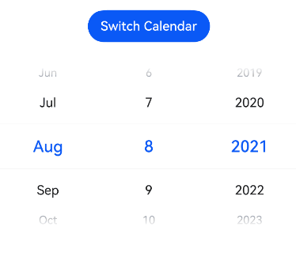
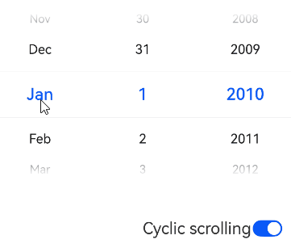

# DatePicker
<!--Kit: ArkUI-->
<!--Subsystem: ArkUI-->
<!--Owner: @luoying_ace_admin-->
<!--Designer: @weixin_52725220-->
<!--Tester: @xiong0104-->
<!--Adviser: @Brilliantry_Rui-->
<!-- md-trans-meta sourceCommit=bb8be30ac20777cbedde0933e1c8687834bf89bb translatedAt=2026-09-03T03:52:35.599Z -->

**DatePicker** is a component for selecting a date through scrolling interaction. It supports switching between the Gregorian and lunar calendars, and allows you to configure the date range, selection mode, and text style. It is used in application scenarios where users need to select a date, providing a unified date selection interaction experience, improving user experience, and reducing development workload.

>  **NOTE**
>
> - This component is supported since API version 8. New APIs added in later versions are marked with a superscript to indicate their earliest API version.
>
> - Avoid changing component attributes during an animation.
>
> - The maximum number of displayed rows differs between landscape and portrait modes. In portrait mode, the default is 5 rows. In landscape mode, it depends on the system configuration; if not configured, the default display is 3 rows. You can use $r('sys.float.ohos_id_picker_show_count_landscape') to view the specific configuration value in landscape mode.

## Child Components

This is a basic component and is not recommended to contain child components.


## APIs

DatePicker(options?: DatePickerOptions)

Creates a date picker based on the specified date range. Use cases include application features that require users to select a date, such as birthday selection, meeting booking, and itinerary arrangement.

**Atomic service API**: This API can be used in atomic services since API version 11.

**System capability**: SystemCapability.ArkUI.ArkUI.Full

**Parameters**

| Name | Type                                           | Mandatory| Description                      |
| ------- | ----------------------------------------------- | ---- | -------------------------- |
| options | [DatePickerOptions](#datepickeroptions) | No | Parameters for configuring the date picker component. If this parameter is not passed, the default configuration is used (start defaults to Date('1970-01-01'), end defaults to Date('2100-12-31'), and selected defaults to the current system date). |

## DatePickerOptions

Describes the parameters of the date picker.

**System capability**: SystemCapability.ArkUI.ArkUI.Full

| Name    | Type| Read Only| Optional| Description                                                        |
| -------- | ---- | ---- | ------------------------------------------------------------ | ------------------------------------------------------------ |
| start    | Date | No  | Yes  | Start date of the picker. It applies to scenarios where the lower limit of selectable dates needs to be restricted, for example, only dates after a certain date are allowed to be selected. <!--RP1--><!--RP1End--><br>Default value: Date('1970-01-01')<br>Value range: \[Date('1900-01-31'), Date('2100-12-31')]<br>**Note:**<br>When start or end is set to a non-default value, canLoop does not take effect.<br>**Atomic service API:** Since API version 11, this API is supported in atomic services.          |
| end      | Date | No  | Yes  | End date of the picker. It applies to scenarios where the upper limit of selectable dates needs to be restricted, for example, setting the deadline of a validity period. <!--RP2--><!--RP2End--><br>Default value: Date('2100-12-31')<br>Value range: \[Date('1900-01-31'), Date('2100-12-31')]<br>**Note:**<br>When start or end is set to a non-default value, canLoop does not take effect.<br>**Atomic service API:** Since API version 11, this API is supported in atomic services.        |
| selected | Date | No  | Yes  | Date of the selected item. It applies to scenarios where an initial selected date needs to be preset, for example, editing an existing record or displaying a specified date by default.<br>Default value: current system date (affected by the start and end parameters; see the abnormal situation description below for details).<br>Configurable date range of the Date object: \[Date('1900-01-31'), Date('2100-12-31')\]. The valid range of the selected parameter: it must be within the date range set by the start and end parameters.<br>Since API version 10, this parameter supports [$$](../../../ui/state-management/arkts-two-way-sync.md) two-way binding variables.<br>**Atomic service API:** Since API version 11, this API is supported in atomic services. |
| mode<sup>18+</sup> | [DatePickerMode](#datepickermode18) | No  | Yes  | Date display mode. It applies to scenarios where the date display columns need to be customized, for example, only the year and month or the month and day need to be selected. If this parameter is not passed, DatePickerMode.DATE is used by default, and the year, month, and day columns are displayed.<br>In [DatePickerDialog](ts-methods-datepicker-dialog.md), when showTime of [DatePickerDialogOptions](ts-methods-datepicker-dialog.md#datepickerdialogoptions) is set to true, this parameter does not take effect, and the year, month, and day columns are displayed by default. This is to ensure layout rationality, because an additional time column is displayed when showTime is true.<br>**Note:**<br>The preceding DatePickerDialog-related restriction applies only to the DatePickerDialog component.<br>**Atomic service API:** Since API version 18, this API is supported in atomic services.<br>**Model constraint:** This API can be used only in the stage model. |

>  **NOTE**
>
> - For details about how to use Date, see [TimePickerOptions](ts-basic-components-timepicker.md#timepickeroptions).
>
> - Modifying the attributes in DatePickerOptions while the DatePicker component is scrolling will cause these attributes to fail to take effect.
>
> - If the start and end dates to be set are outside the range of \[Date('1900-01-31'), Date('2100-12-31')], it is recommended to use [DatePickerComponent](ohos-arkui-advanced-DatePickerComponent.md).


**Handling in the case of date configuration exceptions**

| Exception  | Result |
| -------- |  ------------------------------------------------------------ |
| The start date is later than the end date, and the selected date is not set.   | The start date, end date, and selected date are set to the default values.|
| The start date is later than the end date, and the selected date is earlier than the default start date.   | The start date and end date are set to the default values, and the selected date is set to the default start date. |
| The start date is later than the end date, and the selected date is later than the default end date.   | The start date and end date are set to the default values, and the selected date is set to the default end date. |
| The start date is later than the end date, and the selected date is within the range of the default start date and end date.   | The start date and end date are set to the default values, and the selected date is set to the specified value.|
| The selected date is earlier than the start date.   | The start date is set to the selected date. |
| The selected date is later than the end date.   | The end date is set to the selected date. |
| The start date is later than the current system date, and the selected date is not set.   | The start date is set to the selected date. |
| The end date is earlier than the current system date, and the selected date is not set.   | The end date is set to the selected date. |
| The set date is in invalid format, for example, **'1999-13-32'**.  | The default value is used. |
| The start date or end date is earlier than the earliest date in the valid date range.   | The start date or end date is set to the default state date.|
| The start date or end date is later than the latest date in the valid date range.   | The start date or end date is set to the default end date.|
| Both the start date and end date are earlier than the earliest date in the valid date range.| The start date and end date are set to the earliest date in the valid date range.|
| Both the start date and end date are later than the latest date in the valid date range.| The start date and end date are set to the latest date in the valid date range.|

>  **NOTE**
>
> Handle exceptions for the start and end dates first, followed by exceptions for the selected date.

## DatePickerMode<sup>18+</sup>

Enumerates date display modes.

**Atomic service API**: This API can be used in atomic services since API version 18.

**Model restriction**: This API can be used only in the stage model.

**System capability**: SystemCapability.ArkUI.ArkUI.Full

| Name| Value| Description|
| -------- | - |-------- |
| DATE | 0 | Three-column display: year, month, and day.|
| YEAR_AND_MONTH | 1 | Displays the year and month columns. |
| MONTH_AND_DAY | 2 | Displays the month and day columns.<br>In this mode, the year remains unchanged and takes the value specified by the selected parameter. If selected is not specified, the current system year is used. When scrolling the month causes the date to exceed the valid range, the date is automatically adjusted to the last day of the month. |

## Attributes

In addition to the [universal attributes](ts-component-general-attributes.md), the following attributes are supported.

### lunar

lunar(value: boolean)

Sets whether to display dates in lunar calendar format.

> **NOTE**
>
> This attribute takes effect only in the Simplified Chinese and Traditional Chinese language environments. In other language environments, setting this attribute has no effect.

**Atomic service API**: This API can be used in atomic services since API version 11.

**System capability**: SystemCapability.ArkUI.ArkUI.Full

**Parameters**

| Name| Type   | Mandatory| Description                                                        |
| ------ | ------- | ---- | ------------------------------------------------------------ |
| value  | boolean | Yes   | Whether the date is displayed in the lunar calendar.<br>- true: Displayed in the lunar calendar.<br>- false: Not displayed in the lunar calendar.<br>Default value: false |

### lunar<sup>18+</sup>

lunar(isLunar: Optional\<boolean>)

Sets whether the date is displayed in the lunar calendar. Compared with [lunar](#lunar), the isLunar parameter adds support for the undefined type.

> **NOTE**
>
> This attribute takes effect only in the Simplified Chinese and Traditional Chinese language environments. In other language environments, setting this attribute has no effect.

**Atomic service API**: This API can be used in atomic services since API version 18.

**Model restriction**: This API can be used only in the stage model.

**System capability**: SystemCapability.ArkUI.ArkUI.Full

**Parameters**

| Name| Type   | Mandatory| Description                                                        |
| ------ | ------- | ---- | ------------------------------------------------------------ |
| isLunar | [Optional](ts-universal-attributes-custom-property.md#optionalt)\<boolean> | Yes | Whether the date is displayed in the lunar calendar.<br>- true: displayed in the lunar calendar.<br>- false: not displayed in the lunar calendar.<br>Default value: false<br>When the value of isLunar is undefined, the default value is used. |

### disappearTextStyle<sup>10+</sup>

disappearTextStyle(value: PickerTextStyle)

Sets the text style for edge items (the second item above or below the selected item).

**Atomic service API**: This API can be used in atomic services since API version 11.

**Model restriction**: This API can be used only in the stage model.

**System capability**: SystemCapability.ArkUI.ArkUI.Full

**Parameters**

| Name| Type                                         | Mandatory| Description                                                        |
| ------ | --------------------------------------------- | ---- | ------------------------------------------------------------ |
| value  | [PickerTextStyle](ts-picker-common.md#pickertextstyle) | Yes   | Text color, font size, and font weight of the edge items.<br>Default value:<br>{<br>color: '#ff182431',<br>font: {<br>size: '14fp', <br>weight: FontWeight.Regular<br>}<br>} |

>  **NOTE**
>
> Edge items only appear when there are at least two visible items above or below the selected item. If insufficient items are available, no edge items will be styled.

### disappearTextStyle<sup>18+</sup>

disappearTextStyle(style: Optional\<PickerTextStyle>)

Sets the text style for edge items (the second item above or below the selected item). Compared to [disappearTextStyle<sup>10+</sup>](#disappeartextstyle10), this API supports the **undefined** type for the **style** parameter.

**Atomic service API**: This API can be used in atomic services since API version 18.

**Model restriction**: This API can be used only in the stage model.

**System capability**: SystemCapability.ArkUI.ArkUI.Full

**Parameters**

| Name| Type                                                        | Mandatory| Description                                                        |
| ------ | ------------------------------------------------------------ | ---- | ------------------------------------------------------------ |
| style  | [Optional](ts-universal-attributes-custom-property.md#optionalt)\<[PickerTextStyle](ts-picker-common.md#pickertextstyle) | Yes   | Text color, font size, and font weight of the edge items.<br>Default value:<br>{<br>color: '#ff182431',<br>font: {<br>size: '14fp', <br>weight: FontWeight.Regular<br>}<br>}<br>When the value of style is undefined, the default value is used. |

>  **NOTE**
>
> Edge items only appear when there are at least two visible items above or below the selected item. If insufficient items are available, no edge items will be styled.

### textStyle<sup>10+</sup>

textStyle(value: PickerTextStyle)

Sets the text style for candidate items (the first item immediately above or below the selected item).

**Atomic service API**: This API can be used in atomic services since API version 11.

**Model restriction**: This API can be used only in the stage model.

**System capability**: SystemCapability.ArkUI.ArkUI.Full

**Parameters**

| Name| Type                                         | Mandatory| Description                                                        |
| ------ | --------------------------------------------- | ---- | ------------------------------------------------------------ |
| value  | [PickerTextStyle](ts-picker-common.md#pickertextstyle) | Yes   | Text color, font size, and font weight of the options.<br>Default value:<br>{<br>color: '#ff182431',<br>font: {<br>size: '16fp', <br>weight: FontWeight.Regular<br>}<br>} |

>  **NOTE**
>
> Candidate items only appear when there is at least one visible item above or below the selected item. If insufficient items are available, no candidate items will be styled.

### textStyle<sup>18+</sup>

textStyle(style: Optional\<PickerTextStyle>)

Sets the text style for candidate items (the first item immediately above or below the selected item). Compared to [textStyle<sup>10+</sup>](#textstyle10), this API supports the **undefined** type for the **style** parameter.

**Atomic service API**: This API can be used in atomic services since API version 18.

**Model restriction**: This API can be used only in the stage model.

**System capability**: SystemCapability.ArkUI.ArkUI.Full

**Parameters**

| Name| Type                                         | Mandatory| Description                                                        |
| ------ | --------------------------------------------- | ---- | ------------------------------------------------------------ |
| style | [Optional](ts-universal-attributes-custom-property.md#optionalt)\<[PickerTextStyle](ts-picker-common.md#pickertextstyle) | Yes | Text color, font size, and font weight of the options.<br>Default value:<br>{<br>color: '#ff182431',<br>font: {<br>size: '16fp', <br>weight: FontWeight.Regular<br>}<br>}<br>When the value of style is undefined, the default value is used. |

>  **NOTE**
>
> Candidate items only appear when there is at least one visible item above or below the selected item. If insufficient items are available, no candidate items will be styled.

### selectedTextStyle<sup>10+</sup>

selectedTextStyle(value: PickerTextStyle)

Sets the text style for the selected item.

**Atomic service API**: This API can be used in atomic services since API version 11.

**Model restriction**: This API can be used only in the stage model.

**System capability**: SystemCapability.ArkUI.ArkUI.Full

**Parameters**

| Name| Type                                         | Mandatory| Description                                                        |
| ------ | --------------------------------------------- | ---- | ------------------------------------------------------------ |
| value  | [PickerTextStyle](ts-picker-common.md#pickertextstyle) | Yes   | Text color, font size, and font weight of the selected item.<br>Default value:<br>{<br>color: '#ff007dff',<br>font: {<br>size: '20fp', <br>weight: FontWeight.Medium<br>}<br>} |

### selectedTextStyle<sup>18+</sup>

selectedTextStyle(style: Optional\<PickerTextStyle>)

Sets the text style for the selected item. Compared to [selectedTextStyle<sup>10+</sup>](#selectedtextstyle10), this API supports the **undefined** type for the **style** parameter.

**Atomic service API**: This API can be used in atomic services since API version 18.

**Model restriction**: This API can be used only in the stage model.

**System capability**: SystemCapability.ArkUI.ArkUI.Full

**Parameters**

| Name| Type                                                        | Mandatory| Description                                                        |
| ------ | ------------------------------------------------------------ | ---- | ------------------------------------------------------------ |
| style  | [Optional](ts-universal-attributes-custom-property.md#optionalt)\<[PickerTextStyle](ts-picker-common.md#pickertextstyle) | Yes   | Text color, font size, and font weight of the selected item.<br>Default value:<br>{<br>color: '#ff007dff',<br>font: {<br>size: '20fp', <br>weight: FontWeight.Medium<br>}<br>}<br>When the value of style is undefined, the default value is used. |

### enableHapticFeedback<sup>18+</sup>

enableHapticFeedback(enable: Optional\<boolean>)

Sets whether to enable haptic feedback.

**Atomic service API**: This API can be used in atomic services since API version 18.

**Model restriction**: This API can be used only in the stage model.

**System capability**: SystemCapability.ArkUI.ArkUI.Full

**Parameters**

| Name| Type                                         | Mandatory | Description                                                                                 |
| ------ | --------------------------------------------- |-----|-------------------------------------------------------------------------------------|
| enable  | [Optional](ts-universal-attributes-custom-property.md#optionalt)\<boolean> | Yes   | Sets whether to enable haptic feedback.<br>- true: Enables haptic feedback.<br>- false: Disables haptic feedback.<br>Default value: true<br>After it is set to true, whether it takes effect depends on whether the system hardware supports it.<br>When the value of enable is undefined, the default value is used.|

To enable haptic feedback, you must declare the following permission under **requestPermissions** in **module** in **src/main/module.json5** of the project.

```json
"requestPermissions": [
   {
      "name": "ohos.permission.VIBRATE"
   }
]
```

### digitalCrownSensitivity<sup>18+</sup>
digitalCrownSensitivity(sensitivity: Optional\<CrownSensitivity>)

Sets the sensitivity to the digital crown rotation.

**Atomic service API**: This API can be used in atomic services since API version 18.

**Model restriction**: This API can be used only in the stage model.

**System capability**: SystemCapability.ArkUI.ArkUI.Full

**Parameters**

| Name  | Type                                    | Mandatory  | Description                     |
| ----- | ---------------------------------------- | ---- | ------------------------- |
| sensitivity | [Optional](ts-universal-attributes-custom-property.md#optionalt)\<[CrownSensitivity](ts-appendix-enums.md#crownsensitivity18)> | Yes    | Crown response sensitivity.<br>Default value: CrownSensitivity.MEDIUM, indicating a moderate response speed.                    |

>  **NOTE**
>
>  This API is only available to circular screens on wearable devices. The component needs to obtain focus before responding to the [crown event](ts-universal-events-crown.md).

### canLoop<sup>20+</sup>

canLoop(isLoop: Optional\<boolean>)

Sets whether to enable cyclic scrolling.

**Atomic service API**: This API can be used in atomic services since API version 20.

**Model restriction**: This API can be used only in the stage model.

**System capability**: SystemCapability.ArkUI.ArkUI.Full

**Parameters**

| Name| Type   | Mandatory| Description                                                        |
| ------ | ------- | ---- | ------------------------------------------------------------ |
| isLoop  | [Optional](ts-universal-attributes-custom-property.md#optionalt)\<boolean> | Yes   | Whether cyclic scrolling is supported.<br>- true: cyclic scrolling is supported. The year increments/decrements in a linked manner as the month scrolls cyclically, and the month increments/decrements in a linked manner as the day scrolls cyclically.<br>- false: non-cyclic scrolling. The year, month, and day stop scrolling when they reach the top or bottom of their respective columns, and they remain independent of each other without linked increment/decrement.<br>Default value: true<br>When the value of isLoop is undefined, the default value is used.<br>**Note:**<br>When [start](#datepickeroptions) or [end](#datepickeroptions) is set to a non-default value, canLoop does not take effect. This is because after a date range limit is set, cyclic scrolling may cause the date to exceed the valid range. To ensure the accuracy of date selection, the non-cyclic mode is forcibly used. |

## Events

In addition to the [universal events](ts-component-general-events.md), the following events are supported.

### onChange<sup>(deprecated)</sup>

onChange(callback: (value: DatePickerResult) => void)

Triggered when the date picker snaps to the selected item. This event cannot be triggered by two-way bound state variables.

This API is supported since API version 8 and deprecated since API version 10. You are advised to use [onDateChange](#ondatechange10) instead.

**System capability**: SystemCapability.ArkUI.ArkUI.Full

**Parameters**

| Name| Type                                         | Mandatory| Description            |
| ------ | --------------------------------------------- | ---- | ---------------- |
| callback | (value: [DatePickerResult](#datepickerresult)) => void | Yes | Callback invoked to return the selected time, including the year, month, and day fields. |

### onDateChange<sup>10+</sup>

onDateChange(callback: Callback\<Date>)

This callback is triggered when the options are completely settled at the selected position after the text content of the DatePicker is swiped. Settling means that the scrolling animation ends and the options stop stably at the selected position. It cannot be triggered by the state variable of two-way binding, but can respond to the user's swipe operation.

**Atomic service API**: This API can be used in atomic services since API version 11.

**Model restriction**: This API can be used only in the stage model.

**System capability**: SystemCapability.ArkUI.ArkUI.Full

**Parameters**

| Name| Type| Mandatory| Description                                                        |
| ------ | ---- | ---- | ------------------------------------------------------------ |
| callback  | [Callback](ts-types.md#callback12)\<Date> | Yes   | Callback invoked to return the selected time. The year, month, and day are the selected date; the hour and minute depend on the hour and minute of the current system time; and the second is always 00. This is applicable to scenarios where the selected date needs to be obtained, the UI needs to be updated, or business logic needs to be executed after the user confirms the date selection. |

### onDateChange<sup>18+</sup>

onDateChange(callback: Optional\<Callback\<Date>>)

Triggered when the date picker snaps to the selected item. This event cannot be triggered by two-way bound state variables. Compared to [onDateChange<sup>10+</sup>](#ondatechange10), this API supports the **undefined** type for the **callback** parameter.

>**NOTE**
>
> This API can be called within [attributeModifier](ts-universal-attributes-attribute-modifier.md#attributemodifier) since API version 20.

**Atomic service API**: This API can be used in atomic services since API version 18.

**Model restriction**: This API can be used only in the stage model.

**System capability**: SystemCapability.ArkUI.ArkUI.Full

**Parameters**

| Name  | Type                                                        | Mandatory| Description                                                        |
| -------- | ------------------------------------------------------------ | ---- | ------------------------------------------------------------ |
| callback | [Optional](ts-universal-attributes-custom-property.md#optionalt)\<[Callback](ts-types.md#callback12)\<Date>> | Yes | Callback invoked to return the selected time. The year, month, and day are the selected date; the hour and minute depend on the hour and minute of the current system time; and the second is always 00. This is applicable to scenarios where the selected date needs to be obtained, the UI needs to be updated, or business logic needs to be executed after the user confirms the date selection.<br>When the value of callback is undefined, the callback is not used. |

## DatePickerResult

Defines the time format returned by the date picker.

**Atomic service API**: This API can be used in atomic services since API version 11.

**System capability**: SystemCapability.ArkUI.ArkUI.Full

| Name | Type  | Read Only| Optional| Description                                      |
| ----- | ------ | ---- | ---- | ------------------------------------------ |
| year  | number | No   | Yes   | Year of the selected date.<br>Value range: related to the configured start and end. If start and end are not set, the value range is [1970, 2100].                             |
| month | number | No   | Yes   | Index of the month of the selected date. The index starts from 0, where 0 indicates January and 11 indicates December.<br>Value range: related to the configured start and end. If start and end are not set, the value range is [0, 11]. |
| day   | number | No   | Yes   | Day of the selected date.<br>Value range: related to the configured start and end. If start and end are not set, the value range is [1, 31].                             |

## Example

### Example 1: Switching Between Gregorian and Lunar Calendars

This example implements a date picker that allows users to switch between the Gregorian (solar) calendar and the lunar calendar by clicking a button.


```ts
// xxx.ets
@Entry
@Component
struct DatePickerExample {
  @State isLunar: boolean = false;
  private selectedDate: Date = new Date('2021-08-08');

  build() {
    Column() {
      Button('Switch Calendar')
        .margin({ top: 30, bottom: 30 })
        .onClick(() => {
          this.isLunar = !this.isLunar;
        })
      DatePicker({
        start: new Date('1970-1-1'),
        end: new Date('2100-1-1'),
        selected: this.selectedDate
      })
        .lunar(this.isLunar)
        .onDateChange((value: Date) => {
          this.selectedDate = value;
          console.info('select current date is: ' + value.toString());
        })

    }.width('100%')
  }
}
```



### Example 2: Setting the Text Style

This example shows how to customize the text style using [disappearTextStyle](#disappeartextstyle10), [textStyle](#textstyle10), and [selectedTextStyle](#selectedtextstyle10).

```ts
// xxx.ets
@Entry
@Component
struct DatePickerExample {
  private selectedDate: Date = new Date('2021-08-08');

  build() {
    Column() {
      DatePicker({
        start: new Date('1970-1-1'),
        end: new Date('2100-1-1'),
        selected: this.selectedDate
      })
        .disappearTextStyle({ color: Color.Gray, font: { size: '16fp', weight: FontWeight.Bold } })
        .textStyle({ color: '#ff182431', font: { size: '18fp', weight: FontWeight.Normal } })
        .selectedTextStyle({ color: '#ff0000FF', font: { size: '26fp', weight: FontWeight.Regular, family: "HarmonyOS Sans", style: FontStyle.Normal } })
        .onDateChange((value: Date) => {
          this.selectedDate = value;
          console.info('select current date is: ' + value.toString());
        })

    }.width('100%')
  }
}
```


### Example 3: Displaying Year and Month, or Month and Day Columns

This example demonstrates how to display year and month, or month and day columns using **mode**.

The **mode** attribute of [DatePickerOptions](#datepickeroptions) is added since API version 18.

```ts
// xxx.ets
@Entry
@Component
struct DatePickerExample {
  @State isLunar: boolean = false;
  private selectedDate: Date = new Date('2025-01-15');
  @State datePickerModeList: (DatePickerMode)[] = [
    DatePickerMode.DATE,
    DatePickerMode.YEAR_AND_MONTH,
    DatePickerMode.MONTH_AND_DAY,
  ];
  @State datePickerModeIndex: number = 0;

  build() {
    Column() {
      Button('Switch Gregorian/Lunar Calendar')
        .margin({ top: 30, bottom: 30 })
        .onClick(() => {
          this.isLunar = !this.isLunar;
        })
      DatePicker({
        start: new Date('1970-1-1'),
        end: new Date('2100-1-1'),
        selected: this.selectedDate,
        mode: this.datePickerModeList[this.datePickerModeIndex]
      })
        .lunar(this.isLunar)
        .onDateChange((value: Date) => {
          this.selectedDate = value;
          console.info('select current date is: ' + value.toString());
        })

      Button('mode :' + this.datePickerModeIndex).margin({ top: 20 })
        .onClick(() => {
          this.datePickerModeIndex++;
          if (this.datePickerModeIndex >= this.datePickerModeList.length) {
            this.datePickerModeIndex = 0;
          }
        })
    }.width('100%')
  }
}
```


### Example 4: Setting Cyclic Scrolling

This example demonstrates how to set whether to enable cyclic scrolling using [canLoop](#canloop20), available since API version 20.

```ts
// xxx.ets
@Entry
@Component
struct DatePickerExample {
  @State isLoop: boolean = true;
  selectedDate: Date = new Date("2010-1-1");

  build() {
    Column() {
      DatePicker({
        selected: this.selectedDate,
      })
        .canLoop(this.isLoop)
        .onDateChange((value: Date) => {
            console.info("DatePicker:onDateChange()" + value.toString());
        })

      Row() {
        Text('Cyclic scrolling').fontSize(20)
        Toggle({ type: ToggleType.Switch, isOn: this.isLoop })
          .onChange((isOn: boolean) => {
            this.isLoop = isOn;
          })
      }.position({ x: '60%', y: '40%' })
    }.width('100%')
  }
}
```

