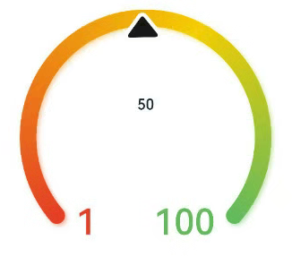
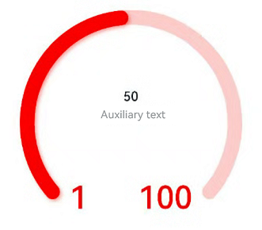

# Gauge
<!--Kit: ArkUI-->
<!--Subsystem: ArkUI-->
<!--Owner: @Zhang-Dong-hui-->
<!--Designer: @xiangyuan6-->
<!--Tester: @jiaoaozihao-->
<!--Adviser: @Brilliantry_Rui-->
<!-- md-trans-meta sourceCommit=a9e64d9949bb7122908af3acb8cd44ce378cf9b7 translatedAt=2026-09-03T04:01:25.560Z -->

A gauge component that displays data in a circular chart. It is suitable for scenarios such as displaying task completion progress, performance metrics, and data proportions. It supports various visual configurations, including custom colors, start and end angles, pointer styles, and shadow effects, to intuitively present data status and improve users' understanding of and interaction with data.


>  **NOTE**
>
> - This component is supported since API version 8. Updates will be marked with a superscript to indicate their earliest API version.
>
> - This component supports [WithTheme](./ts-container-with-theme.md) since API version 26.0.0.
>
> - [startAngle](#startangle) and [endAngle](#endangle) only determine the arc path range and do not affect the component size. The smaller the angle difference, the smaller the proportion of the arc within the component, and the larger the blank space between the `min`/`max` markers and the arc.


## Child Components

This component can contain only one child component.

> **NOTE**
>
> - Supported child component types: system components and custom components. Conditional rendering control [if/else](../../../ui/rendering-control/arkts-rendering-control-ifelse.md) is supported, while loop rendering controls [ForEach](../../../ui/rendering-control/arkts-rendering-control-foreach.md) and [LazyForEach](../../../ui/rendering-control/arkts-rendering-control-lazyforeach.md) are not supported.
>
> - It is recommended to use text components to build the current value text and auxiliary text.
>
> - If the width and height of a child component are in percentage, the percentage is based on the width and height of the rectangle that inscribes the outer circle.


## APIs

Gauge(options: GaugeOptions)

Creates a gauge.

**Widget capability**: This API can be used in ArkTS widgets since API version 9.

**Atomic service API**: This API can be used in atomic services since API version 11.

**System capability**: SystemCapability.ArkUI.ArkUI.Full

**Parameters**

| Name| Type| Mandatory| Description|
| -------- | -------- | -------- | -------- |
| options |  [GaugeOptions](#gaugeoptions18)| Yes| Settings of the gauge.|

## GaugeOptions<sup>18+</sup>

Provides gauge options.

**Widget capability**: This API can be used in ArkTS widgets since API version 18.

**Atomic service API**: This API can be used in atomic services since API version 18.

**Model restriction**: This API can be used only in the stage model.

**System capability**: SystemCapability.ArkUI.ArkUI.Full

| Name| Type| Read-Only| Optional| Description|
| -------- | -------- | -------- | -------- | -------- |
| value<sup>8+</sup> | number | No | No | Current data value of the gauge, that is, the position to which the pointer points. Used to preset the initial value of the gauge when the component is created.<br>Default value: 0<br>**Widget capability:** This API can be used in ArkTS cards since API version 9.<br>**Atomic service API:** This API can be used in atomic services since API version 11.<br>**NOTE**<br>When value is not within the range of min and max, min is used as the actual value. |
| min<sup>8+</sup> | number | No | Yes | Minimum value of the current data segment.<br>Default value: 0<br>**Widget capability:** This API can be used in ArkTS cards since API version 9.<br>**Atomic service API:** This API can be used in atomic services since API version 11.<br>**NOTE**<br>When not passed, the default value is 0.<br>When min is greater than max, min is set to 0 and max is set to 100.<br>Both max and min support negative numbers. |
| max<sup>8+</sup> | number | No | Yes | Maximum value of the current data segment.<br>Default value: 100<br>**Widget capability:** This API can be used in ArkTS cards since API version 9.<br>**Atomic service API:** This API can be used in atomic services since API version 11.<br>**NOTE**<br>When not passed, the default value is 100.<br>When min is greater than max, min is set to 0 and max is set to 100.<br>Both max and min support negative numbers. |

## Attributes

In addition to the [universal attributes](ts-component-general-attributes.md), the following attributes are supported.

### value

value(value: number)

Sets the value of the gauge.

**Widget capability**: This API can be used in ArkTS widgets since API version 9.

**Atomic service API**: This API can be used in atomic services since API version 11.

**System capability**: SystemCapability.ArkUI.ArkUI.Full

**Parameters**

| Name| Type  | Mandatory| Description                                                        |
| ------ | ------ | ---- | ------------------------------------------------------------ |
| value  | number | Yes   | Data value of the gauge, which can be used to dynamically modify the data value of the gauge.<br>**Note:** <br>If value is not within the range of min and max, min is used as the actual value.<br>Default value: 0 |

### startAngle

startAngle(angle: number)

Sets the start angle position. If the difference between the start angle and the end angle is too small, an abnormal image will be drawn. Use reasonable start and end angles. It is recommended to use a single-color ring to adjust the data value by changing the `value` parameter of Gauge. You can use the timer `setTimeout` to delay the loading of the value.

**Widget capability**: This API can be used in ArkTS widgets since API version 9.

**Atomic service API**: This API can be used in atomic services since API version 11.

**System capability**: SystemCapability.ArkUI.ArkUI.Full

**Parameters**

| Name| Type  | Mandatory| Description                                                        |
| ------ | ------ | ---- | ------------------------------------------------------------ |
| angle  | number | Yes   | Start angle position. The 0 o'clock position is 0 degrees. Clockwise is a positive angle, and counterclockwise is a negative angle. An angle greater than 360 degrees is equivalent to the remainder after dividing by 360 degrees.<br>Default value: 0<br>Unit: deg<br>The drawing from the start position to the end position is clockwise only.<br>If the difference between the start angle and the end angle is too small, an abnormal image may be drawn. Use reasonable start and end angles. |

### endAngle

endAngle(angle: number)

Sets the end angle of the gauge. Ensure an appropriate difference between the start angle and end angle. If this difference is too small, the drawn chart may be abnormal. You are advised to use a monochrome ring to set the **value** attribute of the **Gauge**. You can also use **setTimeout** to delay value loading.

**Widget capability**: This API can be used in ArkTS widgets since API version 9.

**Atomic service API**: This API can be used in atomic services since API version 11.

**System capability**: SystemCapability.ArkUI.ArkUI.Full

**Parameters**

| Name| Type  | Mandatory| Description                                                        |
| ------ | ------ | ---- | ------------------------------------------------------------ |
| angle  | number | Yes   | End angle position. 0 degrees is at the 12 o'clock position, with positive angles in the clockwise direction and negative angles in the counterclockwise direction. An angle exceeding 360 degrees is equivalent to the remainder after modulo 360.<br>Default value: 360<br>Unit: deg (degree)<br>Drawing from the start position to the end position is only in the clockwise direction.<br>If the difference between the start angle and end angle is too small, an abnormal image may be drawn. Use reasonable start and end angles. |

### colors

colors(colors: ResourceColor | LinearGradient | Array<[ResourceColor | LinearGradient, number]>)

Sets the colors of the gauge.

Since API version 11, this API follows the following rules:

If the data type is [ResourceColor](ts-types.md#resourcecolor), the ring is of the monochrome type.

If the data type is [LinearGradient](ts-basic-components-datapanel.md#lineargradient10), the ring is of the gradient type.

If the parameter type is Array, the ring is a segmented gradient ring. The first parameter indicates the color value or gradient object (LinearGradient). If it is set to a non-color type, the color value is set to "0xFFE84026". The second parameter indicates the proportion of the color. If it is set to a negative number or a non-numeric type, the proportion is set to 0.

A ring of the gradient type contains a maximum of nine color segments. If there are more than nine segments, the excess is not displayed.

**Widget capability**: This API can be used in ArkTS widgets since API version 9.

**Atomic service API**: This API can be used in atomic services since API version 11.

**System capability**: SystemCapability.ArkUI.ArkUI.Full

**Parameters**

| Name| Type                                                        | Mandatory| Description                                                        |
| ------ | ------------------------------------------------------------ | ---- | ------------------------------------------------------------ |
| colors | [ResourceColor](ts-types.md#resourcecolor)&nbsp;\|&nbsp;[LinearGradient](ts-basic-components-datapanel.md#lineargradient10)&nbsp;\|&nbsp;Array&lt;[[ResourceColor](ts-types.md#resourcecolor)&nbsp;\|&nbsp;[LinearGradient](ts-basic-components-datapanel.md#lineargradient10)&nbsp;\,&nbsp;number]&gt; | Yes | Colors of the gauge, which support segmented color settings.<br>Default value since API version 9: Color.Black<br>Default value since API version 11:<br>If no color is passed or the array is empty, the ring type and colors cannot be determined, and the ring is a gradient ring with the colors "0xFF64BB5C", "0xFFF7CE00", and "0xFFE84026".<br>If a color is passed but the color value is invalid, the color is "0xFFE84026".<br>If the proportion of a color is 0, the color is not displayed in the ring. If the proportions of all colors are 0, the ring is not displayed.<br>Since API version 10, the Array&lt;ResourceColor, number&gt; type is supported.<br>Since API version 11, the LinearGradient and Array&lt;LinearGradient, number&gt; types are supported. |

### strokeWidth

strokeWidth(length: Length)

Sets the stroke width of the gauge.

**Widget capability**: This API can be used in ArkTS widgets since API version 9.

**Atomic service API**: This API can be used in atomic services since API version 11.

**System capability**: SystemCapability.ArkUI.ArkUI.Full

**Parameters**

| Name| Type                        | Mandatory| Description                                                        |
| ------ | ---------------------------- | ---- | ------------------------------------------------------------ |
| length | [Length](ts-types.md#length) | Yes | Thickness of the ring gauge.<br>Default value: 4<br>Unit: vp<br>**Note:** <br>If the value is less than or equal to 0, the default value is used.<br>The maximum thickness is the radius of the ring. If the value exceeds the maximum, the maximum value is used.<br>Percentage is not supported. |

### description<sup>11+</sup>

description(value: CustomBuilder)

Sets the description of the gauge.

**Widget capability**: This API can be used in ArkTS widgets since API version 23.

**Atomic service API**: This API can be used in atomic services since API version 12.

**Model restriction**: This API can be used only in the stage model.

**System capability**: SystemCapability.ArkUI.ArkUI.Full

**Parameters**

| Name| Type                                       | Mandatory| Description                                                        |
| ------ | ------------------------------------------- | ---- | ------------------------------------------------------------ |
| value  | [CustomBuilder](ts-types.md#custombuilder8) | Yes   | Content description.<br>**Note:** <br>The content in @Builder is customized by the developer. Text or images are recommended.<br>If the width and height of the custom part are in percentage, the reference range is a rectangle of 44.4%*25.4% of the ring diameter (28.6%*28.6% for images), 0 vp from the bottom of the ring, centered horizontally.<br>If set to null, no content is displayed.<br>If not set, whether content is displayed depends on whether the maximum and minimum data values are set.<br>If both or only one of the maximum and minimum values are set, the maximum and minimum values are displayed.<br>If neither the maximum nor the minimum value is set, no content is displayed.<br>The maximum and minimum values are displayed at the bottom of the ring and cannot be moved. If the ring opening angle is set improperly, the text may be obscured by the ring. |

### trackShadow<sup>11+</sup>

trackShadow(value: GaugeShadowOptions)

Sets the shadow style of the gauge.

**Widget capability**: This API can be used in ArkTS widgets since API version 23.

**Atomic service API**: This API can be used in atomic services since API version 12.

**Model restriction**: This API can be used only in the stage model.

**System capability**: SystemCapability.ArkUI.ArkUI.Full

**Parameters**

| Name| Type                                               | Mandatory| Description                                                        |
| ------ | --------------------------------------------------- | ---- | ------------------------------------------------------------ |
| value  | [GaugeShadowOptions](#gaugeshadowoptions11) | Yes   | Adds a shadow effect. You can specify the blur radius and the offsets along the X-axis and Y-axis.<br>**Note:** <br>The shadow color is the same as the ring color.<br>Set this parameter to null to disable the shadow. |

### indicator<sup>11+</sup>

indicator(value: GaugeIndicatorOptions)

Sets the indicator style of the gauge.

**Widget capability**: This API can be used in ArkTS widgets since API version 23.

**Atomic service API**: This API can be used in atomic services since API version 12.

**Model restriction**: This API can be used only in the stage model.

**System capability**: SystemCapability.ArkUI.ArkUI.Full

**Parameters**

| Name| Type                                                     | Mandatory| Description                                                 |
| ------ | --------------------------------------------------------- | ---- | ----------------------------------------------------- |
| value | [GaugeIndicatorOptions](#gaugeindicatoroptions11) | Yes | Pointer style.<br>**NOTE**<br>If null is set, the pointer is not displayed. |

### privacySensitive<sup>12+</sup>

privacySensitive(isPrivacySensitiveMode: Optional\<boolean\>)

Sets whether to enable privacy mode.

>**NOTE**
>
> This API can be called within [attributeModifier](ts-universal-attributes-attribute-modifier.md#attributemodifier) since API version 20.

**Widget capability**: This API can be used in ArkTS widgets since API version 12.

**Atomic service API**: This API can be used in atomic services since API version 12.

**Model restriction**: This API can be used only in the stage model.

**System capability**: SystemCapability.ArkUI.ArkUI.Full

**Parameters**

| Name| Type                                                     | Mandatory| Description                                                 |
| ------ | --------------------------------------------------------- | ---- | ----------------------------------------------------- |
| isPrivacySensitiveMode  | Optional\<boolean\> | Yes   | Sets privacy sensitivity. In privacy mode, the Gauge pointer points to the 0 position, the maximum and minimum value texts are masked, and the range is displayed in gray or the background color. The value **true** enables privacy sensitivity, and **false** disables it.<br>**Note:** <br>If this parameter is set to null, the content is not sensitive.<!--Del--><br>To use Gauge in a card, set the [privacy mask](./ts-universal-attributes-obscured.md) attribute through the [FormComponent](./ts-basic-components-formcomponent-sys.md) component. The privacy mask takes effect only when the card is displayed.<!--DelEnd--> |

### contentModifier<sup>12+</sup>

contentModifier(modifier: ContentModifier\<GaugeConfiguration\>)

Creates a content modifier.

**Atomic service API**: This API can be used in atomic services since API version 12.

**Model restriction**: This API can be used only in the stage model.

**System capability**: SystemCapability.ArkUI.ArkUI.Full

**Parameters**

| Name| Type                                         | Mandatory| Description                                            |
| ------ | --------------------------------------------- | ---- | ------------------------------------------------ |
| modifier  | [ContentModifier](./ts-universal-attributes-content-modifier.md#contentmodifiert)\<[GaugeConfiguration](#gaugeconfiguration12) | Yes   | Method for customizing the content area on the Gauge component.<br>modifier: content modifier. Developers need to customize a class to implement the ContentModifier interface. |

## GaugeShadowOptions<sup>11+</sup>

Inherits from [MultiShadowOptions](ts-information-display-common.md#multishadowoptions) and has all attributes of **MultiShadowOptions**.

**Widget capability**: This API can be used in ArkTS widgets since API version 23.

**Atomic service API**: This API can be used in atomic services since API version 12.

**Model restriction**: This API can be used only in the stage model.

**System capability**: SystemCapability.ArkUI.ArkUI.Full

## GaugeIndicatorOptions<sup>11+</sup>

Provides gauge indicator options.

**Widget capability**: This API can be used in ArkTS widgets since API version 23.

**Atomic service API**: This API can be used in atomic services since API version 12.

**Model restriction**: This API can be used only in the stage model.

**System capability**: SystemCapability.ArkUI.ArkUI.Full

| Name         | Type| Read-Only| Optional| Description|
| ------------- | ------- | ---- | -------- | -------- |
| icon | [ResourceStr](ts-types.md#resourcestr) | No | Yes | Icon resource path.<br>**Note:** <br>If this parameter is not set, the system default style is used, which is a triangle pointer.<br>Only icons in SVG format are supported. If an icon in another format is used, the default triangle pointer is used. |
| space | [Dimension](ts-types.md#dimension10) | No | Yes | Spacing between the pointer and the outer edge of the ring.<br>Default value: **8**<br>Unit: vp<br>**Note:** <br>Percentage is not supported.<br>For the default triangle pointer, this is the spacing between the black triangle and the outer edge of the ring.<br>If the value is less than 0, the default value is used.<br>If the value is greater than the ring radius, the default value is used.|

## GaugeConfiguration<sup>12+</sup>

You need a custom class to implement the **ContentModifier** API. Inherits from [CommonConfiguration](ts-universal-attributes-content-modifier.md#commonconfigurationt).

**Atomic service API**: This API can be used in atomic services since API version 12.

**Model restriction**: This API can be used only in the stage model.

**System capability**: SystemCapability.ArkUI.ArkUI.Full

| Name         | Type| Read-Only| Optional| Description|
| ------------- | ------- | ---- | -------- | -------- |
| value | number | No| No| Current value.|
| min | number | No| No| Minimum value of the current data segment.|
| max | number | No| No| Maximum value of the current data segment.|


## Example
### Example 1: Implementing a Multi-color Gauge

This example demonstrates how to implement a multi-color gauge using the [colors](#colors) attribute.

```ts
@Entry
@Component
struct Gauge1 {
  @Builder
  descriptionBuilder() {
    Text('Description')
      .maxFontSize('30sp')
      .minFontSize('10.0vp')
      .fontColor('#fffa2a2d')
      .fontWeight(FontWeight.Medium)
      .width('100%')
      .height('100%')
      .textAlign(TextAlign.Center)
  }

  build() {
    Column() {
      Gauge({ value: 50, min: 1, max: 100 }) {
        Column() {
          Text('50')
            .fontWeight(FontWeight.Medium)
            .width('62%')
            .fontColor('#ff182431')
            .maxFontSize('60.0vp')
            .minFontSize('30.0vp')
            .textAlign(TextAlign.Center)
            .margin({ top: '35%' })
            .textOverflow({ overflow: TextOverflow.Ellipsis })
            .maxLines(1)
          Text('Auxiliary text')
            .maxFontSize('16.0fp')
            .minFontSize('10.0vp')
            .fontColor($r('sys.color.ohos_id_color_text_secondary'))
            .fontWeight(FontWeight.Regular)
            .width('67.4%')
            .height('9.5%')
            .textAlign(TextAlign.Center)
        }.width('100%').height('100%')
      }
      .value(50)
      .startAngle(210)
      .endAngle(150)
      .colors([[new LinearGradient([{ color: '#deb6fb', offset: 0 }, { color: '#ac49f5', offset: 1 }]), 9],
        [new LinearGradient([{ color: '#bbb7fc', offset: 0 }, { color: '#564af7', offset: 1 }]), 8],
        [new LinearGradient([{ color: '#f5b5c2', offset: 0 }, { color: '#e64566', offset: 1 }]), 7],
        [new LinearGradient([{ color: '#f8c5a6', offset: 0 }, { color: '#ed6f21', offset: 1 }]), 6],
        [new LinearGradient([{ color: '#fceb99', offset: 0 }, { color: '#f7ce00', offset: 1 }]), 5],
        [new LinearGradient([{ color: '#dbefa5', offset: 0 }, { color: '#a5d61d', offset: 1 }]), 4],
        [new LinearGradient([{ color: '#c1e4be', offset: 0 }, { color: '#64bb5c', offset: 1 }]), 3],
        [new LinearGradient([{ color: '#c0ece5', offset: 0 }, { color: '#61cfbe', offset: 1 }]), 2],
        [new LinearGradient([{ color: '#b5e0f4', offset: 0 }, { color: '#46b1e3', offset: 1 }]), 1]])
      .width('80%')
      .height('80%')
      .strokeWidth(18)
      .trackShadow({ radius: 7, offsetX: 7, offsetY: 7 })
      .description(this.descriptionBuilder)
      .padding(18)
    }.margin({ top: 40 }).width('100%').height('100%')
  }
}
```


### Example 2: Implementing a Single-Color Gauge

This example demonstrates how to implement a single-color gauge using the [colors](#colors) attribute.

```ts
@Entry
@Component
struct Gauge2 {
  @Builder
  descriptionBuilderImage() {
    Image($r('sys.media.ohos_ic_public_clock')).width(72).height(72)
  }

  build() {
    Column() {
      Gauge({ value: 50, min: 1, max: 100 }) {
        Column() {
          Text('50')
            .fontWeight(FontWeight.Medium)
            .width('62%')
            .fontColor('#ff182431')
            .maxFontSize('60.0vp')
            .minFontSize('30.0vp')
            .textAlign(TextAlign.Center)
            .margin({ top: '35%' })
            .textOverflow({ overflow: TextOverflow.Ellipsis })
            .maxLines(1)
        }.width('100%').height('100%')
      }
      .startAngle(210)
      .endAngle(150)
      .colors('#cca5d61d')
      .width('80%')
      .height('80%')
      .strokeWidth(18)
      .description(this.descriptionBuilderImage)
      .padding(18)
    }.margin({ top: 40 }).width('100%').height('100%')
  }
}
```


### Example 3: Configuring a Custom Description Area

This example illustrates how to configure a custom description area using the [description](#description11) attribute.

```ts
  @Entry
  @Component
  struct Gauge3 {
    @Builder
    descriptionBuilder() {
      Text('Description')
        .maxFontSize('30sp')
        .minFontSize('10.0vp')
        .fontColor('#fffa2a2d')
        .fontWeight(FontWeight.Medium)
        .width('100%')
        .height('100%')
        .textAlign(TextAlign.Center)
    }
  
    build() {
      Column() {
        Column() {
          Gauge({ value: 50, min: 1, max: 100 }) {
            Column() {
              Text('50')
                .fontWeight(FontWeight.Medium)
                .width('62%')
                .fontColor('#ff182431')
                .maxFontSize('60.0vp')
                .minFontSize('30.0vp')
                .textAlign(TextAlign.Center)
                .margin({ top: '35%' })
                .textOverflow({ overflow: TextOverflow.Ellipsis })
                .maxLines(1)
            }.width('100%').height('100%')
          }
          .startAngle(210)
          .endAngle(150)
          .colors([[new LinearGradient([{ color: '#deb6fb', offset: 0 }, { color: '#ac49f5', offset: 1 }]), 9],
            [new LinearGradient([{ color: '#bbb7fc', offset: 0 }, { color: '#564af7', offset: 1 }]), 8],
            [new LinearGradient([{ color: '#f5b5c2', offset: 0 }, { color: '#e64566', offset: 1 }]), 7],
            [new LinearGradient([{ color: '#f8c5a6', offset: 0 }, { color: '#ed6f21', offset: 1 }]), 6],
            [new LinearGradient([{ color: '#fceb99', offset: 0 }, { color: '#f7ce00', offset: 1 }]), 5],
            [new LinearGradient([{ color: '#dbefa5', offset: 0 }, { color: '#a5d61d', offset: 1 }]), 4],
            [new LinearGradient([{ color: '#c1e4be', offset: 0 }, { color: '#64bb5c', offset: 1 }]), 3],
            [new LinearGradient([{ color: '#c0ece5', offset: 0 }, { color: '#61cfbe', offset: 1 }]), 2],
            [new LinearGradient([{ color: '#b5e0f4', offset: 0 }, { color: '#46b1e3', offset: 1 }]), 1]])
          .width('80%')
          .height('80%')
          .strokeWidth(18)
          .description(this.descriptionBuilder)
          .trackShadow({ radius: 7, offsetX: 7, offsetY: 7 })
          .padding(18)
        }.margin({ top: 40 }).width('100%').height('100%')
      }
    }
  }
```


### Example 4: Configuring the Auxiliary Area

This example demonstrates how to configure the auxiliary area by setting child components.

```ts
@Entry
@Component
struct Gauge4 {
  build() {
    Column() {
      Gauge({ value: 50, min: 1, max: 100 }) {
        Column() {
          Text('50')
            .maxFontSize('72.0vp')
            .minFontSize('10.0vp')
            .fontColor('#ff182431')
            .width('40%')
            .textAlign(TextAlign.Center)
            .margin({ top: '35%' })
            .textOverflow({ overflow: TextOverflow.Ellipsis })
            .maxLines(1)
          Text('Auxiliary text')
            .maxFontSize('30.0vp')
            .minFontSize('18.0vp')
            .fontWeight(FontWeight.Medium)
            .fontColor($r('sys.color.ohos_id_color_text_secondary'))
            .width('62%')
            .height('15.9%')
            .textAlign(TextAlign.Center)
        }.width('100%').height('100%')
      }
      .startAngle(210)
      .endAngle(150)
      .colors([[new LinearGradient([{ color: '#deb6fb', offset: 0 }, { color: '#ac49f5', offset: 1 }]), 9],
        [new LinearGradient([{ color: '#bbb7fc', offset: 0 }, { color: '#564af7', offset: 1 }]), 8],
        [new LinearGradient([{ color: '#f5b5c2', offset: 0 }, { color: '#e64566', offset: 1 }]), 7],
        [new LinearGradient([{ color: '#f8c5a6', offset: 0 }, { color: '#ed6f21', offset: 1 }]), 6],
        [new LinearGradient([{ color: '#fceb99', offset: 0 }, { color: '#f7ce00', offset: 1 }]), 5],
        [new LinearGradient([{ color: '#dbefa5', offset: 0 }, { color: '#a5d61d', offset: 1 }]), 4],
        [new LinearGradient([{ color: '#c1e4be', offset: 0 }, { color: '#64bb5c', offset: 1 }]), 3],
        [new LinearGradient([{ color: '#c0ece5', offset: 0 }, { color: '#61cfbe', offset: 1 }]), 2],
        [new LinearGradient([{ color: '#b5e0f4', offset: 0 }, { color: '#46b1e3', offset: 1 }]), 1]])
      .width('80%')
      .height('80%')
      .strokeWidth(18)
      .description(null)
      .trackShadow({ radius: 7, offsetX: 7, offsetY: 7 })
      .padding(18)
    }.margin({ top: 40 }).width('100%').height('100%')
  }
}
```


### Example 5: Setting the Minimum and Maximum Values

This example shows how to set the minimum and maximum values of the gauge by configuring **min** and **max** in [GaugeOptions](#gaugeoptions18).

```ts
@Entry
@Component
struct Gauge5 {
  build() {
    Column() {
      Gauge({ value: 50, min: 1, max: 100 }) {
        Column() {
          Text('50')
            .maxFontSize('80sp')
            .minFontSize('60.0vp')
            .fontWeight(FontWeight.Medium)
            .fontColor('#ff182431')
            .width('40%')
            .height('30%')
            .textAlign(TextAlign.Center)
            .margin({ top: '22.2%' })
            .textOverflow({ overflow: TextOverflow.Ellipsis })
            .maxLines(1)
        }.width('100%').height('100%')
      }
      .startAngle(225)
      .endAngle(135)
      .colors(new LinearGradient([{ color: '#e84026', offset: 0 },
        { color: '#f7ce00', offset: 0.6 },
        { color: '#64bb5c', offset: 1 }]))
      .width('80%')
      .height('80%')
      .strokeWidth(18)
      .trackShadow({ radius: 7, offsetX: 7, offsetY: 7 })
      .padding(18)
    }.margin({ top: 40 }).width('100%').height('100%')
  }
}
```


### Example 6: Setting the Indicator

This example illustrates how to set the indicator of the gauge using the [indicator](#indicator11) attribute.

```ts
@Entry
@Component
struct Gauge6 {
  build() {
    Column() {
      Gauge({ value: 50, min: 1, max: 100 }) {
        Column() {
          Text('50')
            .maxFontSize('60sp')
            .minFontSize('30.0vp')
            .fontWeight(FontWeight.Medium)
            .fontColor('#ff182431')
            .width('62%')
            .textAlign(TextAlign.Center)
            .margin({ top: '35%' })
            .textOverflow({ overflow: TextOverflow.Ellipsis })
            .maxLines(1)
          Text('Auxiliary text')
            .maxFontSize('16sp')
            .minFontSize('10.0vp')
            .fontColor($r('sys.color.ohos_id_color_text_secondary'))
            .fontWeight(FontWeight.Regular)
            .width('67.4%')
            .height('9.5%')
            .textAlign(TextAlign.Center)
        }.width('100%').height('100%')
      }
      .startAngle(225)
      .endAngle(135)
      .colors(Color.Red)
      .width('80%')
      .height('80%')
      .indicator(null)
      .strokeWidth(18)
      .trackShadow({ radius: 7, offsetX: 7, offsetY: 7 })
      .padding(18)
    }.margin({ top: 40 }).width('100%').height('100%')
  }
}
```


### Example 7: Setting the Start and End Angles

This example demonstrates how to set the start and end angles of the gauge using the [startAngle](#startangle) and [endAngle](#endangle) attributes.

```ts
@Entry
@Component
struct Gauge7 {
  build() {
    Column() {
      Gauge({ value: 50, min: 1, max: 100 }) {
        Column() {
          Text('50')
            .maxFontSize('60sp')
            .minFontSize('30.0vp')
            .fontWeight(FontWeight.Medium)
            .fontColor('#ff182431')
            .width('62%')
            .textAlign(TextAlign.Center)
            .margin({ top: '35%' })
            .textOverflow({ overflow: TextOverflow.Ellipsis })
            .maxLines(1)
        }.width('100%').height('100%')
      }
      .startAngle(225)
      .endAngle(135)
      .colors(Color.Red)
      .width('80%')
      .height('80%')
      .indicator(null)
      .strokeWidth(18)
      .trackShadow({ radius: 7, offsetX: 7, offsetY: 7 })
      .padding(18)
    }.margin({ top: 40 }).width('100%').height('100%')
  }
}
```


### Example 8: Setting the Custom Content Area

This example shows how to customize the content area of the gauge using the [contentModifier](#contentmodifier12) attribute.

```ts
// xxx.ets
// This example implements a Gauge component that uses a Builder to customize the content area, and uses a ring chart component, buttons, and text components. When the increase button is clicked, the ring chart pointer moves to the right; conversely, when the decrease button is clicked, the ring chart pointer moves to the left.
@Builder
function buildGauge(config: GaugeConfiguration) {
  Column({ space: 30 }) {
    Row() {
      Text('[ContentModifier] value: ' + JSON.stringify((config.contentModifier as MyGaugeStyle).value) +
        '  min: ' + JSON.stringify((config.contentModifier as MyGaugeStyle).min) +
        '  max: ' + JSON.stringify((config.contentModifier as MyGaugeStyle).max))
        .fontSize(12)
    }

    Text('[Config] value: ' + config.value + '  min: ' + config.min + '  max: ' + config.max).fontSize(12)
    Gauge({
      value: config.value,
      min: config.min,
      max: config.max
    }).width('50%')
  }
  .width('100%')
  .padding(20)
  .margin({ top: 5 })
  .alignItems(HorizontalAlign.Center)
}

class MyGaugeStyle implements ContentModifier<GaugeConfiguration> {
  value: number = 0
  min: number = 0
  max: number = 0

  constructor(value: number, min: number, max: number) {
    this.value = value;
    this.min = min;
    this.max = max;
  }

  applyContent(): WrappedBuilder<[GaugeConfiguration]> {
    return wrapBuilder(buildGauge);
  }
}

@Entry
@Component
struct RefreshExample {
  @State gaugeValue: number = 20
  @State gaugeMin: number = 0
  @State gaugeMax: number = 100

  build() {
    Column({ space: 20 }) {
      Gauge({
        value: this.gaugeValue,
        min: this.gaugeMin,
        max: this.gaugeMax
      })
        .contentModifier(new MyGaugeStyle(30, 10, 100))

      Column({ space: 20 }) {
        Row({ space: 20 }) {
          Button('Increase').onClick(() => {
            if (this.gaugeValue < this.gaugeMax) {
              this.gaugeValue += 1;
            }
          })
          Button('Decrease').onClick(() => {
            if (this.gaugeValue > this.gaugeMin) {
              this.gaugeValue -= 1;
            }
          })
        }
      }.width('100%')
    }.width('100%').margin({ top: 5 })
  }
}
```


### Example 9: Securing Sensitive Information

This example shows how to call the [privacySensitive](#privacysensitive12) API. The actual privacy hiding effect requires support from the card framework.

```ts
@Entry
@Component
struct GaugeExample {
  build() {
    Scroll() {
      Column({ space: 15 }) {
        Row() {
          Gauge({ value: 60, min: 20, max: 100 })
            .startAngle(225)
            .endAngle(135)
            .colors(Color.Red)
            .width('80%')
            .height('80%')
            .strokeWidth(18)
            .trackShadow({ radius: 7, offsetX: 7, offsetY: 7 })
            .padding(18)
            .privacySensitive(true)
        }
      }
    }
  }
}
```


### Example 10: Implementing a Custom Indicator

This example demonstrates how to implement a custom indicator using [indicator](#indicator11). You can import an SVG image to replace the default indicator.

```ts
@Entry
@Component
struct Gauge2 {
  build() {
    Column() {
      Gauge({ value: 50, min: 1, max: 100 })
        // Replace $r('app.media.indicator') with the image resource file you use.
        .indicator({ space: 10, icon: $r('app.media.indicator') })
        .startAngle(210)
        .endAngle(150)
        .colors('#cca5d61d')
        .width('80%')
        .height('80%')
        .strokeWidth(18)
        .padding(18)
    }.margin({ top: 40 }).width('100%').height('100%')
  }
}
```
```xml
<svg width='200px' height='200px'>
    <path d='M 10,30 A 20,20 0,0,1 50,30 A 20,20 0,0,1 90,30 Q 90,60 50,90 Q 10,60 10,30 z'
          stroke='black' stroke-width='3' fill='white'>
    </path>
</svg>
```

