# Image
<!--Kit: ArkUI-->
<!--Subsystem: ArkUI-->
<!--Owner: @liyujie43-->
<!--Designer: @weixin_52725220-->
<!--Tester: @xiong0104-->
<!--Adviser: @Brilliantry_Rui-->
<!-- md-trans-meta sourceCommit=45ce9cea9e051e69546d963b096c229fa7f5090e translatedAt=2026-09-03T04:11:19.166Z -->

The **Image** component is usually used to display images in applications. It supports data sources of the following types: [PixelMap](../../apis-image-kit/arkts-apis-image-PixelMap.md), [ResourceStr](ts-types.md#resourcestr), and [DrawableDescriptor](#drawabledescriptor10). Supported image formats include PNG, JPG, JPEG, BMP, SVG, WEBP, GIF, HEIF, and TIFF. Note that the APNG and SVGA formats are not supported.

> **NOTE**
>
> - This component is supported since API version 7. Newly added content in later versions is marked with a superscript to indicate the initial version of the content.
>
> - Since API version 23, the tiff format is supported for images.
>
> - This component supports [WithTheme](./ts-container-with-theme.md) since API version 26.0.0.
>
> - When copying the **Image** component using a shortcut key combination, the **Image** component must be in the focused state. For details about how to obtain focus, see [Setting Whether a Component Is Focusable](../../../ui/arkts-common-events-focus-event.md#setting-whether-a-component-is-focusable). By default, the **Image** component does not obtain focus. Set the [focusable](ts-universal-attributes-focus.md#focusable) attribute to **true** to switch focus to the component using the Tab key, and then set the [focusOnTouch](ts-universal-attributes-focus.md#focusontouch9) attribute to **true** to obtain focus by tapping.
>
> - The image format supports SVG image sources. For details about SVG tags, see [SVG Tags](./ts-basic-svg.md).
>
> - The playback of animated images depends on the visibility change of the **Image** node, and the default behavior is not to play. When the node is visible, the animation is started through a callback; when the node is invisible, the animation is stopped. The visibility state is determined by the [onVisibleAreaChange](./ts-universal-component-visible-area-change-event.md#onvisibleareachange) event. When the visibility threshold ratios is greater than 0, the **Image** is in the visible state.
>
> - When the **Image** component plays a GIF animation, the frame duration is obtained from the delay time field of each frame in the GIF file. When the duration of a frame is less than or equal to 0, the system corrects it to 100 ms. When the duration of a frame is greater than 0, the system uses the original value directly without applying a minimum frame duration limit.
>
> - If a white block appears during the image loading process, see [Solution to White Image Blocks](https://developer.huawei.com/consumer/en/doc/best-practices/bpta-image-white-lump-solution). If the image loading takes too long, see [Optimizing Preset Image Loading](https://developer.huawei.com/consumer/en/doc/best-practices/bpta-texture-compression-improve-performance#section91526132216).

## Required Permissions

The **ohos.permission.INTERNET** permission is required for using online images. For details about how to apply for a permission, see [Declaring Permissions](../../../security/AccessToken/declare-permissions.md).


## Child Components

Not supported


## APIs

### Image

Image(src: PixelMap | ResourceStr | DrawableDescriptor)

Obtains an image from the specified source for subsequent rendering and display.

If the **Image** component fails to obtain the image or the obtained image size is 0, the **Image** component is automatically resized to 0 and does not follow the layout constraints of its parent component.

By default, the **Image** component crops images to keep their center. For example, if the component has the same width and height, it crops any image whose width and height are different, so as to keep its center.

If the **Image** component does not have its width and height set, its size adapts to that of its parent component once the image is successfully loaded.

> **NOTE**
>
> - Passing a URL directly to **Image** may cause potential performance issues. For example: (1) When loading a large image, it cannot be downloaded in advance, resulting in a long white block display time. (2) When synchronous loading is set for a small image, the UI thread may be blocked in a weak network environment, causing screen freeze. (3) In a fast-scrolling waterfall flow, images to be displayed cannot be downloaded in advance, resulting in many white blocks during scrolling. Performance issues vary in different scenarios. It is recommended to separate the network download from the display of **Image**, and download in advance or asynchronously. If a white block appears during the image loading process, see [Solution to White Image Blocks](https://developer.huawei.com/consumer/en/doc/best-practices/bpta-image-white-lump-solution). If the image loading takes too long, see [Optimizing Image Loading](https://developer.huawei.com/consumer/en/doc/best-practices/bpta-texture-compression-improve-performance).
>
> - When src is switched from a valid value (an image resource that can be parsed and loaded normally) to an invalid value (an image path that cannot be parsed or loaded), the component keeps displaying the previously loaded image content without clearing or resetting it.
>
> - When the input parameter of the **Image** component is of the [PixelMap](../../apis-image-kit/arkts-apis-image-PixelMap.md) type, the **Image** component can detect data changes only when the PixelMap object changes (that is, points to a new PixelMap instance). Modifying only the content of the PixelMap object (such as pixel values) without changing the object reference does not trigger the detection of data changes.
>
> - When the input parameter of the **Image** component is a Base64 string, the general format of the Base64 string is `data:image/subtype;base64,Base64EncodedData`, where subtype is the type declaration, Base64EncodedData is the base64 encoding of the data, and the rest are fixed strings. For example, the input parameter for a png image is `data:image/png;base64,iVBORw0KGgo...`.
>
>   1. image/subType is used to declare the type of the data content. Since API version 26.0.0, the **Image** component accepts Base64 strings in any `data:image/xxx;base64,Base64EncodedData` format. The specific image type is identified by the system multimedia capability based on the actual data content, without the need to enumerate all supported MIME types. For versions earlier than API version 26.0.0, the **Image** component does not strictly verify whether the declared type is completely consistent with the actual image format after Base64 decoding. In some scenarios, the image may still be displayed normally even if the declared type is inconsistent with the actual format. To avoid future behavior changes or unknown issues, it is recommended to always keep the type consistent with the actual image format.
>
>   2. Since API version 26.0.0, the **Image** component supports the wildcard notation `data:image/*;base64,Base64EncodedData`. For versions earlier than API version 26.0.0, the **Image** component does not support the wildcard notation `data:image/*;base64,Base64EncodedData`, and subType must explicitly declare the specific image type.
>
>   3. Since API version 26.0.0, the **Image** component supports loading SVG images through Base64. For versions earlier than API version 26.0.0, the **Image** component does not support loading SVG images in the form of Base64 strings.

**Widget capability**: This API can be used in ArkTS widgets since API version 9.

**Atomic service API**: This API can be used in atomic services since API version 11.

**System capability**: SystemCapability.ArkUI.ArkUI.Full

**Parameters**

<!--Table: 10%; 20%; 10%; 60%-->
| Name | Type                                    | Mandatory  | Description                                    |
| ---- | ---------------------------------------- | ---- | ---------------------------------------- |
| src  | [PixelMap](ts-image-common.md#pixelmap)&nbsp;\|&nbsp;[ResourceStr](ts-types.md#resourcestr)\|&nbsp;[DrawableDescriptor](#drawabledescriptor10) | Yes    | Image data source. Supports local images and network images. For the reference method, see [Loading Image Resources](../../../ui/arkts-graphics-display.md#loading-image-resources).<br>1. PixelMap is a pixel map format, commonly used in image editing scenarios.<br>2. ResourceStr includes the Resource and string formats.<br>The string format can be used to load network images and local images. When [using a relative path to display an image](#example-25-displaying-an-image-using-a-relative-path), cross-package/cross-module invocation of this Image component is not supported. It is recommended to use the Resource format to manage image resources that need to be used globally.<br>Since DevEco Studio 6.0.0 Beta2, when creating a project or module, the module created by default does not package resources outside the resource directory. You need to enable the related switch: set buildOption > resOptions > copyCodeResource > enable to true in the module's build-profile.json5. For details, see the related introduction in [resOptions](https://developer.huawei.com/consumer/en/doc/harmonyos-guides/ide-hvigor-build-profile#section754823013348).<br>- Supports `Base64` strings.<br>- When the passed-in string is an HTTPS network image address, see [Example 2: Downloading and Displaying Static Online Images](#example-2-downloading-and-displaying-static-online-images).<br>- Supports strings with the file:// path prefix, that is, application sandbox URIs: file://\<bundleName>/\<sandboxPath>. For the construction of the application sandbox path URI, see [constructor](../../apis-core-file-kit/js-apis-file-fileuri.md#constructor10). For the sandbox path, you need to use the [fileUri.getUriFromPath(path)](../../apis-core-file-kit/js-apis-file-fileuri.md#fileurigeturifrompath) method to convert the path to an application sandbox URI, and then pass it in for display. In addition, ensure that files under the directory package path have read permission.<br>The Resource format can access resource files across packages/modules and is the recommended way to access local images. For a specific example, see [Cross-HAP/HSP Resources](../../../quick-start/resource-categories-and-access.md#cross-haphsp-resources).<br/>3. When the passed-in resource ID or name refers to a common image, a DrawableDescriptor object is generated. Passing in the [AnimatedDrawableDescriptor](../js-apis-arkui-drawableDescriptor.md#animateddrawabledescriptor12) type can play PixelMap array animations.<br>**Note:**<br/>- On ArkTS cards, GIF image format animations are supported, but they play only once when displayed.<br/>- On ArkTS cards, strings with network-related path prefixes such as http:/\/ and the file:/\/ path prefix are not supported. |

### Image<sup>12+</sup>

Image(src: PixelMap | ResourceStr | DrawableDescriptor | ImageContent)

Obtains an image. The [ImageContent](#imagecontent12) type allows you to specify the image content.

**Widget capability**: This API can be used in ArkTS widgets since API version 12.

**Atomic service API**: This API can be used in atomic services since API version 12.

**Model restriction**: This API can be used only in the stage model.

**System capability**: SystemCapability.ArkUI.ArkUI.Full

**Parameters**

| Name | Type                                    | Mandatory  | Description                                    |
| ---- | ---------------------------------------- | ---- | ---------------------------------------- |
| src  | [PixelMap](ts-image-common.md#pixelmap)&nbsp;\|&nbsp;[ResourceStr](ts-types.md#resourcestr)\|&nbsp;[DrawableDescriptor](#drawabledescriptor10)\|&nbsp;[ImageContent](#imagecontent12) | Yes   | Data source of the image. Local and online sources are supported. For details about how to reference an image, see [Loading Image Resources](../../../ui/arkts-graphics-display.md#loading-image-resources).<br>For details about how to use **PixelMap**, **ResourceStr**, and **DrawableDescriptor**, see the **src** parameter description of [Image](#image-1).<br> [ImageContent](#imagecontent12): image content.<br>**NOTE**<br>- ArkTS widgets support GIF animations, but the animations only play once on display.<br>- ArkTS widgets do not support the strings with the **http:/\/** or **file:/\/** prefix.|

### Image<sup>12+</sup>

Image(src: PixelMap | ResourceStr | DrawableDescriptor, imageAIOptions: ImageAIOptions)

The **Image** component adds the [ImageAIOptions](ts-image-common.md#imageaioptions12) parameter to set AI analysis options for the component.

**Atomic service API**: This API can be used in atomic services since API version 12.

**Model restriction**: This API can be used only in the stage model.

**System capability**: SystemCapability.ArkUI.ArkUI.Full

**Parameters**

| Name | Type                                    | Mandatory  | Description                                    |
| ---- | ---------------------------------------- | ---- | ---------------------------------------- |
| src  | [PixelMap](ts-image-common.md#pixelmap)&nbsp;\|&nbsp;[ResourceStr](ts-types.md#resourcestr)\|&nbsp;[DrawableDescriptor](#drawabledescriptor10) | Yes   | Data source of the image. Local and online sources are supported. For details about how to reference an image, see [Loading Image Resources](../../../ui/arkts-graphics-display.md#loading-image-resources).<br>For details about how to use **PixelMap**, **ResourceStr**, and **DrawableDescriptor**, see the **src** parameter description of [Image](#image-1).<br>**NOTE**<br>- ArkTS widgets support GIF animations, but the animations only play once on display.<br>- ArkTS widgets do not support the strings with the **http:/\/** or **file:/\/** prefix.|
| imageAIOptions  | [ImageAIOptions](ts-image-common.md#imageaioptions12) | Yes  | AI image analysis options. You can configure the analysis type or bind an analyzer controller through this parameter.|

### Image

Image(src: PixelMap | ResourceStr | DrawableDescriptor | ImageContent, reloadKey?: string)

Obtains the image and supports triggering image reloading through the reloadKey parameter. When the value of reloadKey changes, the image is reloaded without using the cache.

**Since**: 26.0.0

**Widget capability:** This API can be used in ArkTS widgets since API version 26.0.0.

**Atomic service API**: This API can be used in atomic services since API version 26.0.0.

**Model restriction**: This API can be used only in the stage model.

**System capability**: SystemCapability.ArkUI.ArkUI.Full

**Parameters**

| Name  | Type                                     | Mandatory   | Description                                |
| ---- | ---------------------------------------- | ---- | ---------------------------------------- |
| src  | [PixelMap](ts-image-common.md#pixelmap)&nbsp;\|&nbsp;[ResourceStr](ts-types.md#resourcestr)\|&nbsp;[DrawableDescriptor](#drawabledescriptor10)\|&nbsp;[ImageContent](#imagecontent12) | Yes    | Image data source, which supports local images and network images. For the reference method, see [Loading Image Resources](../../../ui/arkts-graphics-display.md#loading-image-resources).<br>For details about how to use PixelMap, ResourceStr, and DrawableDescriptor, see the description of the src parameter in [Image](#image-1).<br> Pass in the [ImageContent](#imagecontent12) type to specify the image content.<br>**NOTE**<br/>- On ArkTS cards, GIF image animation is supported, but it is played only once when displayed.<br/>- On ArkTS cards, strings with network-related path prefixes such as http:/\/ and the file:/\/ path prefix are not supported. |
| reloadKey  | string | No   | Identifier for image reloading. When the value of reloadKey changes, the image is reloaded without using the cache. This applies to scenarios where the image source address remains unchanged but the image content has been updated (for example, the local image content has been overwritten).<br/>Default value: empty string. |

### Image

Image(src: PixelMap | ResourceStr | DrawableDescriptor, imageAIOptions?: ImageAIOptions, reloadKey?: string)

Obtains the image. You can set AI analysis options through the [ImageAIOptions](ts-image-common.md#imageaioptions12) parameter. When the value of reloadKey changes, the image is reloaded without using the cache.

**Since**: 26.0.0

**Atomic service API**: This API can be used in atomic services since API version 26.0.0.

**Model restriction**: This API can be used only in the stage model.

**System capability**: SystemCapability.ArkUI.ArkUI.Full

**Parameters**

| Name  | Type                                  | Mandatory   | Description                                      |
| ----    | ---------------------------------------- | ---- | ---------------------------------------- |
| src  | [PixelMap](ts-image-common.md#pixelmap)&nbsp;\|&nbsp;[ResourceStr](ts-types.md#resourcestr)\|&nbsp;[DrawableDescriptor](#drawabledescriptor10) | Yes    | Image data source, which supports local images and network images. For the reference method, see [Loading Image Resources](../../../ui/arkts-graphics-display.md#loading-image-resources).<br>For details about how to use PixelMap, ResourceStr, and DrawableDescriptor, see the description of the src parameter in [Image](#image-1).<br>**Note:**<br/>- On ArkTS cards, the GIF image format animation is supported, but it is played only once when displayed.<br/>- On ArkTS cards, strings with network-related path prefixes such as http:/\/ and the file:/\/ path prefix are not supported. |
| imageAIOptions  | [ImageAIOptions](ts-image-common.md#imageaioptions12) | No   | Sets an AI analysis option for the component. Through this option, you can configure the analysis type or bind an analysis controller. |
| reloadKey  | string | No   | Identifier for reloading the image. When the value of reloadKey changes, the image is reloaded without using the cache. This applies to scenarios where the image source address remains unchanged but the image content has been updated (for example, the local image content is overwritten).<br/>Default value: empty string. |

## Attributes

For details about how to use the attributes, see [Setting Attributes](../../../ui/arkts-graphics-display.md#setting-attributes). In addition to the [universal attributes](ts-component-general-attributes.md), the following attributes are supported.

> **NOTE**
>
> The **Image** component does not support the universal attribute [foregroundColor](./ts-universal-attributes-foreground-color.md#foregroundcolor). Instead, you can set the fill color using the component's [fillColor](#fillcolor) attribute.

### alt

alt(value:&nbsp;string&nbsp;|&nbsp;Resource &nbsp;|&nbsp;PixelMap)

Sets the placeholder image displayed during image loading.

The placeholder image supports configuration of [objectFit](#objectfit) for setting the fill effect, which is consistent with the fill effect of the image.

This attribute does not take effect when the parameter type of the component is [AnimatedDrawableDescriptor](../js-apis-arkui-drawableDescriptor.md#animateddrawabledescriptor12).

**Widget capability**: This API can be used in ArkTS widgets since API version 9.

**Atomic service API**: This API can be used in atomic services since API version 11.

**System capability**: SystemCapability.ArkUI.ArkUI.Full

**Parameters**

| Name| Type                                                    | Mandatory| Description                                                        |
| ------ | -------------------------------------------------------- | ---- | ------------------------------------------------------------ |
| value  | string&nbsp;\|&nbsp;[Resource](ts-types.md#resource)&nbsp;\|&nbsp;[PixelMap](../../apis-image-kit/arkts-apis-image-PixelMap.md)<sup>12+</sup> | Yes  | Placeholder image displayed during loading. Local images (in PNG, JPG, BMP, SVG, GIF, or HEIF format) and [PixelMap](../../apis-image-kit/arkts-apis-image-PixelMap.md) objects are supported, but online images are not.<br>- Base64 strings are supported.<br>- Strings prefixed with the **file://** path are supported (application sandbox URI: **file://\<bundleName>/\<sandboxPath>**). For details about how to construct the application sandbox path URI, see [constructor](../../apis-core-file-kit/js-apis-file-fileuri.md#constructor10). The sandbox path must be converted to an application sandbox URI using the [fileUri.getUriFromPath(path)](../../apis-core-file-kit/js-apis-file-fileuri.md#fileurigeturifrompath) API before being passed in for display. In addition, ensure that the application has the read permission to the files in the specified path.<br>Default value: **null**<br>When the value is switched from a valid one (an image resource that can be parsed and loaded correctly) to an invalid one (an image path that cannot be parsed or loaded), the component retains the previously successfully loaded image content without clearing or resetting it.|

### alt<sup>22+</sup>

alt(src:&nbsp;ResourceStr&nbsp;|&nbsp;PixelMap &nbsp;|&nbsp;ImageAlt)

Sets the placeholder image displayed during image loading and when image loading fails.

> **NOTE**
>
> When a placeholder image is configured via [ImageAlt](#imagealt22), **Image** takes effect based on the placeholder image sources configured for the loading and load-failure states. If no placeholder image is configured, it is not displayed by default.

The placeholder image supports configuration of [objectFit](#objectfit) for setting the fill effect, which is consistent with the fill effect of the image.

This attribute does not take effect when the parameter type of the component is [AnimatedDrawableDescriptor](../js-apis-arkui-drawableDescriptor.md#animateddrawabledescriptor12).

**Widget capability**: This API can be used in ArkTS widgets since API version 22.

**Atomic service API**: This API can be used in atomic services since API version 22.

**Model restriction**: This API can be used only in the stage model.

**System capability**: SystemCapability.ArkUI.ArkUI.Full

**Parameters**

| Name| Type                                                    | Mandatory| Description                                                        |
| ------ | -------------------------------------------------------- | ---- | ------------------------------------------------------------ |
| src  | [ResourceStr](ts-types.md#resourcestr)&nbsp;\|&nbsp;[PixelMap](../../apis-image-kit/arkts-apis-image-PixelMap.md)\|&nbsp;[ImageAlt](#imagealt22) | Yes  | Placeholder image displayed during loading or in case of loading failure. Local images (in PNG, JPG, BMP, SVG, GIF, or HEIF format) and [PixelMap](../../apis-image-kit/arkts-apis-image-PixelMap.md) objects are supported, but online images are not.<br>- Base64 strings are supported.<br>- Strings prefixed with the **file://** path are supported (application sandbox URI: **file://\<bundleName>/\<sandboxPath>**). For details about how to construct the application sandbox path URI, see [constructor](../../apis-core-file-kit/js-apis-file-fileuri.md#constructor10). The sandbox path must be converted to an application sandbox URI using the [fileUri.getUriFromPath(path)](../../apis-core-file-kit/js-apis-file-fileuri.md#fileurigeturifrompath) API before being passed in for display. In addition, ensure that the application has the read permission to the files in the specified path.|

### objectFit

objectFit(value: ImageFit)

Sets how the image is resized to fit its container. If the attribute is not set, the default value is **ImageFit.Cover**, which scales the image up or down while maintaining its aspect ratio.

**Widget capability**: This API can be used in ArkTS widgets since API version 9.

**Atomic service API**: This API can be used in atomic services since API version 11.

**System capability**: SystemCapability.ArkUI.ArkUI.Full

**Parameters**

| Name| Type                                     | Mandatory| Description                                       |
| ------ | ----------------------------------------- | ---- | ------------------------------------------- |
| value  | [ImageFit](ts-appendix-enums.md#imagefit) | Yes  | How the image is resized to fit its container.|

### imageMatrix<sup>15+</sup>

imageMatrix(matrix: ImageMatrix)

Sets the transformation matrix of the image. This API allows you to use the functions provided by the [ImageMatrix](#imagematrix15) object, such as translate, rotate, and scale, to achieve the optimal display of grid thumbnails. This attribute is not applicable to SVG images.

This attribute does not take effect when [resizable](#resizable11) and [objectRepeat](#objectrepeat) are set. This attribute only processes the image source and does not trigger any callback events of the **Image** component.

This attribute is strongly associated with [objectFit](#objectfit) and takes effect only when [objectFit](#objectfit) is set to **ImageFit.MATRIX**.

**Atomic service API**: This API can be used in atomic services since API version 15.

**Model restriction**: This API can be used only in the stage model.

**System capability**: SystemCapability.ArkUI.ArkUI.Full

**Parameters**

| Name| Type                                                | Mandatory| Description          |
| ------ | --------------------------------------------------- | ---- | -------------- |
| matrix  | [ImageMatrix](#imagematrix15) | Yes  | Transformation matrix of the image.|

### objectRepeat

objectRepeat(value: ImageRepeat)

Sets how the image is repeated. When set to repeat, the image is repeated from the center to edges. The last image will be clipped if it does not fit in the component. This attribute is not applicable to SVG images.

This attribute does not take effect when the parameter type of the component is [AnimatedDrawableDescriptor](../js-apis-arkui-drawableDescriptor.md#animateddrawabledescriptor12).

When a valid [resizable](#resizable11) is set, this attribute does not take effect.

**Widget capability**: This API can be used in ArkTS widgets since API version 9.

**Atomic service API**: This API can be used in atomic services since API version 11.

**System capability**: SystemCapability.ArkUI.ArkUI.Full

**Parameters**

| Name| Type                                           | Mandatory| Description                                             |
| ------ | ----------------------------------------------- | ---- | ------------------------------------------------- |
| value  | [ImageRepeat](ts-appendix-enums.md#imagerepeat) | Yes  | How the image is repeated.<br>Default value: **ImageRepeat.NoRepeat**|

### interpolation

interpolation(value: ImageInterpolation)

Defines the image interpolation effect. This attribute mitigates aliasing during image scaling. This attribute is not applicable to SVG images.

This attribute does not take effect when the parameter type of the component is [AnimatedDrawableDescriptor](../js-apis-arkui-drawableDescriptor.md#animateddrawabledescriptor12).

**Widget capability**: This API can be used in ArkTS widgets since API version 9.

**Atomic service API**: This API can be used in atomic services since API version 11.

**System capability**: SystemCapability.ArkUI.ArkUI.Full

**Parameters**

| Name| Type                                     | Mandatory| Description                                               |
| ------ | ----------------------------------------- | ---- | --------------------------------------------------- |
| value  | [ImageInterpolation](#imageinterpolation) | Yes  | Interpolation effect of the image.<br>Default value: **ImageInterpolation.Low**<br>When set to **undefined**, the value is treated as **ImageInterpolation.None**.|

### renderMode

renderMode(value: ImageRenderMode)

Sets the rendering mode of the image. This attribute is not applicable to SVG images.

This attribute does not take effect when [ColorFilter](#colorfilter9) is set.

This attribute does not take effect when the parameter type of the component is [AnimatedDrawableDescriptor](../js-apis-arkui-drawableDescriptor.md#animateddrawabledescriptor12).

**Widget capability**: This API can be used in ArkTS widgets since API version 9.

**Atomic service API**: This API can be used in atomic services since API version 11.

**System capability**: SystemCapability.ArkUI.ArkUI.Full

**Parameters**

| Name| Type                               | Mandatory| Description                                                        |
| ------ | ----------------------------------- | ---- | ------------------------------------------------------------ |
| value  | [ImageRenderMode](#imagerendermode) | Yes  | Rendering mode of the image, which can be **Original** or **Template** (monochrome).<br>Default value: **ImageRenderMode.Original**|

### sourceSize

sourceSize(value: ImageSourceSize)

Sets the decoding size of the image. This attribute works only when the target size is smaller than the source size. This attribute is not applicable to SVG images or **PixelMap** objects.

This attribute does not take effect when the parameter type of the component is [AnimatedDrawableDescriptor](../js-apis-arkui-drawableDescriptor.md#animateddrawabledescriptor12).

**Widget capability**: This API can be used in ArkTS widgets since API version 9.

**Atomic service API**: This API can be used in atomic services since API version 11.

**System capability**: SystemCapability.ArkUI.ArkUI.Full

**Parameters**

| Name| Type                                                   | Mandatory| Description                                                        |
| ------ | ------------------------------------------------------- | ---- | ------------------------------------------------------------ |
| value  | [ImageSourceSize](#imagesourcesize18) | Yes  | Decoding size of the image. This parameter can be used to reduce the image resolution when the image display size needs to be smaller than the component size. When this parameter is used with **ImageFit.None** of the [objectFit](#objectfit) API, a small image can be displayed in the component.|

### matchTextDirection

matchTextDirection(value: boolean)

Specifies whether the image follows the system language direction, displaying a mirrored effect in a right-to-left (RTL) language environments.

This attribute does not take effect when the parameter type of the component is [AnimatedDrawableDescriptor](../js-apis-arkui-drawableDescriptor.md#animateddrawabledescriptor12).

**Widget capability**: This API can be used in ArkTS widgets since API version 9.

**Atomic service API**: This API can be used in atomic services since API version 11.

**System capability**: SystemCapability.ArkUI.ArkUI.Full

**Parameters**

| Name| Type   | Mandatory| Description                                        |
| ------ | ------- | ---- | -------------------------------------------- |
| value  | boolean | Yes  | Whether the image follows the system language direction, displaying a mirrored effect in an RTL language environment.<br>Default value: **false**<br>The value **true** means that the image follows the system language direction, displaying a mirrored effect in an RTL language environment, and **false** means the opposite.|

### fitOriginalSize

fitOriginalSize(value: boolean)

Specifies whether the image display size follows the size of the image source.

This attribute does not take effect when the component has the **width** and **height** attributes set.

This attribute does not take effect when the parameter type of the component is [AnimatedDrawableDescriptor](../js-apis-arkui-drawableDescriptor.md#animateddrawabledescriptor12).

**Widget capability**: This API can be used in ArkTS widgets since API version 9.

**Atomic service API**: This API can be used in atomic services since API version 11.

**System capability**: SystemCapability.ArkUI.ArkUI.Full

**Parameters**

| Name| Type   | Mandatory| Description                                            |
| ------ | ------- | ---- | ------------------------------------------------ |
| value  | boolean | Yes  | Whether the image display size follows the size of the image source.<br>Default value: **false**<br>**NOTE**<br>**false** or not set: The image display size does not follow the size of the image source.<br> **true**: The image display size follows the size of the image source.|

### fillColor

fillColor(value: ResourceColor)

Fill color to be superimposed on the image. This attribute applies only to SVG images. Once set, the fill color will replace the fill colors of all drawable elements within the SVG image. To set the fill color for a PNG image, use [colorFilter](#colorfilter9).

This attribute does not take effect when the parameter type of the component is [AnimatedDrawableDescriptor](../js-apis-arkui-drawableDescriptor.md#animateddrawabledescriptor12).

**Widget capability**: This API can be used in ArkTS widgets since API version 9.

**Atomic service API**: This API can be used in atomic services since API version 11.

**System capability**: SystemCapability.ArkUI.ArkUI.Full

**Parameters**

| Name| Type                                      | Mandatory| Description          |
| ------ | ------------------------------------------ | ---- | -------------- |
| value  | [ResourceColor](ts-types.md#resourcecolor) | Yes  | Fill color to be superimposed on the image.<br>**NOTE**<br> By default, no fill color is applied. If an invalid value is passed, the system uses the default theme color: black in light mode and white in dark mode.<br>Since API version 21, when [supportSvg2](#supportsvg221) is set to **true**, **fillColor** depends on the **fill** attribute configuration in the SVG image source. If the **fill** attribute in the SVG image source is set to **'none'**, **fillColor** does not take effect. When **supportSvg2** is set to **false**, **fillColor** takes effect and replaces the fill colors of all drawable elements in the SVG image.|

### fillColor<sup>15+</sup>

fillColor(color: ResourceColor|ColorContent)

Fill color to be superimposed on the image. This attribute applies only to SVG images. Once set, the fill color will replace the fill colors of all drawable elements within the SVG image. To set the fill color for a PNG image, use [colorFilter](#colorfilter9). To reset the fill color, pass a value of the [ColorContent](#colorcontent15) type.

This attribute does not take effect when the parameter type of the component is [AnimatedDrawableDescriptor](../js-apis-arkui-drawableDescriptor.md#animateddrawabledescriptor12).

**Atomic service API**: This API can be used in atomic services since API version 15.

**Model restriction**: This API can be used only in the stage model.

**System capability**: SystemCapability.ArkUI.ArkUI.Full

**Parameters**

| Name| Type                                      | Mandatory| Description          |
| ------ | ------------------------------------------ | ---- | -------------- |
| color  | [ResourceColor](ts-types.md#resourcecolor)\|[ColorContent](#colorcontent15) | Yes   | Sets the fill color of the image. <br/>**Note:**<br/> By default, the component is not filled. When an invalid value is passed in, the system uses the default theme color: black in light mode and white in dark mode. <br/>Since API version 21, when [supportSvg2](#supportsvg221) is set to true, fillColor depends on the parameter configuration of the fill attribute in the SVG image source. When the fill attribute in the SVG image source is 'none', fillColor does not take effect. When supportSvg2 is set to false, fillColor takes effect and replaces the fill color of all drawable elements in the SVG image.|

### fillColor<sup>20+</sup>

fillColor(color: ResourceColor|ColorContent|ColorMetrics)

Sets the fill color. This attribute takes effect only on SVG image sources. After it is set, the fill color of all drawable elements in the SVG image is replaced. To modify the color of a PNG image, use [colorFilter](#colorfilter9). To reset the fill color, pass in the [ColorContent](#colorcontent15) type. You can pass in the [ColorMetrics](../js-apis-arkui-graphics.md#colormetrics12) type to set a P3 color gamut color value<!--Del--> or set a BT2020 color gamut color value since API version 24<!--DelEnd-->, which can provide richer color performance on devices that support a wide color gamut.

This attribute does not take effect when the parameter type of the component is [AnimatedDrawableDescriptor](../js-apis-arkui-drawableDescriptor.md#animateddrawabledescriptor12).

**Atomic service API**: This API can be used in atomic services since API version 20.

**Model restriction**: This API can be used only in the stage model.

**System capability**: SystemCapability.ArkUI.ArkUI.Full

**Parameters**

| Name| Type                                      | Mandatory| Description          |
| ------ | ------------------------------------------ | ---- | -------------- |
| color  | [ResourceColor](ts-types.md#resourcecolor)\|[ColorContent](#colorcontent15)\|[ColorMetrics](../js-apis-arkui-graphics.md#colormetrics12) | Yes   | Sets the fill color. <br/>**Note:**<br/> By default, the component is not filled. When an invalid value is passed in, the system uses the default theme color: black in light mode and white in dark mode. <br/>Since API version 21, when [supportSvg2](#supportsvg221) is set to true, fillColor depends on the parameter configuration of the fill attribute in the SVG image source. When the fill attribute in the SVG image source is 'none', fillColor does not take effect. When supportSvg2 is set to false, fillColor takes effect and replaces the fill color of all drawable elements in the SVG image.|

### autoResize

autoResize(value: boolean)

Specifies whether to resize the image source based on the size of the display area during image decoding. As downsampling images results in some loss of information, it may reduce the image quality, causing issues such as aliasing. To retain the original image quality, set **autoResize** to **false**, but this may increase the memory usage.

If the original image size does not match the display size, the image may be distorted or blurred. Recommended configuration for the optimal definition:

When the image is scaled down: .autoResize(false) + .interpolation(.Medium)

When the image is scaled up: .interpolation(.High)

This attribute does not take effect when the parameter type of the component is [AnimatedDrawableDescriptor](../js-apis-arkui-drawableDescriptor.md#animateddrawabledescriptor12) or the image format is SVG.

**Widget capability**: This API can be used in ArkTS widgets since API version 9.

**Atomic service API**: This API can be used in atomic services since API version 11.

**System capability**: SystemCapability.ArkUI.ArkUI.Full

**Parameters**

| Name| Type   | Mandatory| Description                                                        |
| ------ | ------- | ---- | ------------------------------------------------------------ |
| value  | boolean | Yes  | Whether to resize the image source based on the size of the display area during image decoding. This resizing can help reduce the memory usage. For example, if the original image size is 800 x 1200 and the display area size is 200 x 200, the image will be decoded to 200 x 300 at a downsampled resolution (the actual result may vary depending on the scaling and fill type configurations used in the calculation), greatly reducing the memory occupied by the image.<br>Default value: **false**<br>**true**: Enable resizing.<br>**false**: Disable resizing.|

### syncLoad<sup>8+</sup>

syncLoad(value: boolean)

Sets whether to load the image synchronously. It is recommended that syncLoad be set to true when loading a small local image, because the loading takes a short time and can be performed on the main thread. Synchronous loading is not recommended for network images. Asynchronous loading should be used instead, or the network download should be separated from the display of Image to avoid blocking the UI thread and causing AppFreeze.

This attribute does not take effect when the parameter type of the component is [AnimatedDrawableDescriptor](../js-apis-arkui-drawableDescriptor.md#animateddrawabledescriptor12).

The [alt](#alt) placeholder image is always loaded asynchronously, and syncLoad does not take effect on it.

If image flickering occurs during loading, set **syncLoad** to **true**. For details, see [Optimizing Concurrent Tasks](https://developer.huawei.com/consumer/en/doc/best-practices/bpta-click-to-click-response-optimization#section715115119192).

**Widget capability**: This API can be used in ArkTS widgets since API version 9.

**Atomic service API**: This API can be used in atomic services since API version 11.

**System capability**: SystemCapability.ArkUI.ArkUI.Full

**Parameters**

| Name| Type   | Mandatory| Description                                                        |
| ------ | ------- | ---- | ------------------------------------------------------------ |
| value  | boolean | Yes  | Whether to load the image synchronously. By default, the image is loaded asynchronously. During synchronous loading, the UI thread is blocked and the placeholder image is not displayed.<br>Default value: **false**<br>**true**: Load the image synchronously.<br>**false**: Load the image asynchronously.<br>If the main thread is blocked for more than 6s, AppFreeze will occur. For details, see [Application Freeze Detection](../../../dfx/appfreeze-guidelines.md).|

### copyOption<sup>9+</sup>

copyOption(value: CopyOptions)

Specifies whether the image can be copied. When **copyOption** is set to a value other than **CopyOptions.None**, the image can be copied through multiple interactions, such as long press, right-click, or Ctrl+C. SVG images cannot be copied.

This attribute does not take effect when the parameter type of the component is [AnimatedDrawableDescriptor](../js-apis-arkui-drawableDescriptor.md#animateddrawabledescriptor12).

**Widget capability**: This API can be used in ArkTS widgets since API version 9.

**Atomic service API**: This API can be used in atomic services since API version 11.

**System capability**: SystemCapability.ArkUI.ArkUI.Full

**Parameters**

| Name| Type                                            | Mandatory| Description                                         |
| ------ | ------------------------------------------------ | ---- | --------------------------------------------- |
| value  | [CopyOptions](ts-appendix-enums.md#copyoptions9) | Yes  | Specifies whether the image can be copied.<br>Default value: **CopyOptions.None**|

### colorFilter<sup>9+</sup>

colorFilter(value: ColorFilter | DrawingColorFilter)

Sets the color filter for the image.

When this attribute is set, [renderMode](#rendermode) is not effective.

> **NOTE**
>
> In API version 11 and earlier, this attribute is not supported for SVG image sources. Since API version 12, for SVG image sources, this attribute takes effect only when the stroke attribute is set (regardless of whether it has a value).

**Widget capability**: This API can be used in ArkTS widgets since API version 9.

**Atomic service API**: This API can be used in atomic services since API version 11.

**System capability**: SystemCapability.ArkUI.ArkUI.Full

**Parameters**

| Name| Type                                   | Mandatory| Description                                                        |
| ------ | --------------------------------------- | ---- | ------------------------------------------------------------ |
| value  | [ColorFilter](ts-types.md#colorfilter9) \| [DrawingColorFilter<sup>12+</sup>](#drawingcolorfilter12) | Yes  | 1. Sets a color filter effect for the image. The input parameter is a 4x5 RGBA conversion matrix.<br/>2. Since API version 12, the ColorFilter type of @ohos.graphics.drawing is supported as the input parameter.<br/>**NOTE**<br/>In API version 11 and earlier, SVG image sources do not support this attribute.<br/>Since API version 12, the DrawingColorFilter type in this API supports use in atomic services. For SVG image sources, this attribute takes effect only when the stroke attribute is set (regardless of whether it has a value).<br/>Since API version 21, when the [supportSvg2](#supportsvg221) attribute is set to true, the colorFilter attribute applies to the entire SVG image source.|

The color filter is applied to the image using a 4 x 5 matrix. The first row of the matrix represents the vector values for the R (red) channel, the second row represents the vector values for the G (green) channel, the third row represents the vector values for the B (blue) channel, and the fourth row represents the vector values for the A (alpha) channel. Each of the four rows corresponds to the vector values of a distinct RGBA channel.<br>When the values on the matrix diagonal are **1** and all other values are **0**, the original colors of the image are preserved.<br> **Calculation rule:**<br>The following example shows the input filter matrix.<br> <br>The pixel is represented as [R, G, B, A], with color values in the [0, 255] range.<br>The filtered color will be [R', G', B', A'].<br><br>For details about how to use this attribute, see [Example 9](#example-9-setting-a-color-filter-for-an-image).

### colorFilter

colorFilter(value: ColorFilter | DrawingColorFilter | ResourceColor)

Sets the color filter effect for the image.

When this attribute is set, the [renderMode](#rendermode) attribute does not take effect.

When the value is of the [ResourceColor](ts-types.md#resourcecolor) type, it is converted to a [DrawingColorFilter](#drawingcolorfilter12) with a blend mode.

**Since**: 26.0.0

**Widget capability:** This API can be used in ArkTS widgets since API version 26.0.0.

**Atomic service API**: This API can be used in atomic services since API version 26.0.0.

**Model restriction**: This API can be used only in the stage model.

**System capability**: SystemCapability.ArkUI.ArkUI.Full

**Parameters**

| Name | Type                                    | Mandatory | Description                                                         |
| ------ | --------------------------------------- | ---- | ------------------------------------------------------------ |
| value  | [ColorFilter](ts-types.md#colorfilter9) \| [DrawingColorFilter](#drawingcolorfilter12) \| [ResourceColor](ts-types.md#resourcecolor) | Yes   | Filter value of the image color.<br/>For details about the [ColorFilter](ts-types.md#colorfilter9) and [DrawingColorFilter](#drawingcolorfilter12) types and SVG image sources, see the API description of [colorFilter](#colorfilter9). For an input color value of the [ResourceColor](ts-types.md#resourcecolor) type, the image is drawn in the SRC_ATOP mode of [DrawingColorFilter](#drawingcolorfilter12).[createBlendModeColorFilter](../../apis-arkgraphics2d/arkts-apis-graphics-drawing-ColorFilter.md#createblendmodecolorfilter) by default (in this mode, the filter color is overlaid on the target image, with the filter covering the target). |

### draggable<sup>9+</sup>

draggable(value: boolean)

Specifies whether the image is draggable.

**Atomic service API**: This API can be used in atomic services since API version 11.

**System capability**: SystemCapability.ArkUI.ArkUI.Full

**Parameters**

| Name| Type   | Mandatory| Description                                                        |
| ------ | ------- | ---- | ------------------------------------------------------------ |
| value  | boolean | Yes  | Whether the image is draggable. The value **true** means that the image is draggable, in which case the bound long press gesture will not take effect.<br>Default value:<br>API version 9 and earlier: **false**<br> Since API version 10: **true**<br> To bind custom gestures to the component, set **draggable** to **false**. With the value **false**, drag-related events are not triggered.|

### enableAnalyzer<sup>11+</sup>

enableAnalyzer(enable:&nbsp;boolean)

Sets whether to enable the AI image analyzer, which supports subject recognition, text recognition, and object lookup.<!--RP3--><!--RP3End-->

This attribute cannot be used together with the [overlay](ts-universal-attributes-overlay.md#overlay) attribute. If they are set at the same time, the [CustomBuilder](ts-types.md#custombuilder8) attribute in **overlay** has no effect. This feature also depends on device capabilities.

The image to be analyzed must be a static non-vector image. SVG, GIF, and other image types are not supported for analysis. You can pass in a [PixelMap](../../apis-image-kit/arkts-apis-image-PixelMap.md) for analysis. Currently, only the [RGBA_8888](../../apis-image-kit/arkts-apis-image-e.md#pixelmapformat7) type is supported. For details about how to use it, see [Example 5: Enabling the AI Image Analyzer](#example-5-enabling-the-ai-image-analyzer).

The [alt](#alt) placeholder image does not support analysis. The [objectRepeat](#objectrepeat) attribute supports analysis only when it is set to **ImageRepeat.NoRepeat**. Analysis is not supported when the [obscured](ts-universal-attributes-obscured.md#obscured) attribute is enabled.

Analysis is performed based on the complete original image. Even if the settings of the [clip](ts-universal-attributes-sharp-clipping.md#clip12), [margin](ts-universal-attributes-size.md#margin), [borderRadius](ts-universal-attributes-border.md#borderradius), [position](ts-universal-attributes-location.md#position), and [objectFit](#objectfit) attributes cause incomplete image display, or if a mask layer is set via [renderMode](#rendermode), analysis will still be conducted on the complete original image. The [copyOption](#copyoption9) attribute does not affect the AI image analyzer functionality.

This attribute does not take effect when the parameter type of the component is [AnimatedDrawableDescriptor](../js-apis-arkui-drawableDescriptor.md#animateddrawabledescriptor12).

> **NOTE**
>
> - The **ohos.permission.INTERNET** permission is required.
>
> - This API can be called within [attributeModifier](ts-universal-attributes-attribute-modifier.md#attributemodifier) since API version 12.

**Atomic service API**: This API can be used in atomic services since API version 12.

**Model restriction**: This API can be used only in the stage model.

**System capability**: SystemCapability.ArkUI.ArkUI.Full

**Parameters**

| Name| Type   | Mandatory| Description                                                        |
| ------ | ------- | ---- | ------------------------------------------------------------ |
| enable  | boolean | Yes  | Whether the **Image** component supports AI analysis.<br>When this parameter is set to **true**, the **Image** component supports AI analysis. When this parameter is set to **false**, the **Image** component does not support AI analysis.<br>Default value: **false**|

### resizable<sup>11+</sup>

resizable(value: ResizableOptions)

Sets the resizable image options. Resizing is effective for drag previews and placeholder images.

When a valid [ResizableOptions](#resizableoptions11) is set, the **objectRepeat**, **antialiased**, and **orientation** attributes do not take effect.

When the sum of the values of **top** and **bottom** is greater than the source image height, or the sum of the values of **left** and **right** is greater than the source image width, the [ResizableOptions](#resizableoptions11) attribute does not take effect.

When the component parameter type is an animated image, [AnimatedDrawableDescriptor](../js-apis-arkui-drawableDescriptor.md#animateddrawabledescriptor12), or SVG, setting this attribute does not take effect.

>**NOTE**
>
> This API can be called in [attributeModifier](ts-universal-attributes-attribute-modifier.md#attributemodifier) since API version 20.

**Atomic service API**: This API can be used in atomic services since API version 12.

**Model restriction**: This API can be used only in the stage model.

**System capability**: SystemCapability.ArkUI.ArkUI.Full

**Parameters**

| Name| Type                                   | Mandatory| Description                            |
| ------ | --------------------------------------- | ---- | -------------------------------- |
| value  | [ResizableOptions](#resizableoptions11) | Yes  | Resizable image options.|

### privacySensitive<sup>12+</sup>

privacySensitive(supported: boolean)

Sets whether to secure sensitive information on widgets.

**Widget capability**: This API can be used in ArkTS widgets since API version 12.

**Atomic service API**: This API can be used in atomic services since API version 12.

**Model restriction**: This API can be used only in the stage model.

**System capability**: SystemCapability.ArkUI.ArkUI.Full

**Parameters**

| Name   | Type   | Mandatory| Description                    |
| --------- | ------- | ---- | ------------------------ |
| supported | boolean | Yes  | Whether to secure sensitive information on widgets.<br>**false** (default): Do not secure sensitive information on widgets.<br>**true**: Secure sensitive information on widgets, obscuring the image with a semi-transparent background style in privacy mode.<br>**NOTE**<br>If this parameter is set to **null**, the image is not obscured.<br>Privacy mode requires support from the widget framework.|

### dynamicRangeMode<sup>12+</sup>

dynamicRangeMode(value: DynamicRangeMode)

Sets the dynamic range of the image to be displayed. This attribute is not applicable to SVG images.

When this attribute is set together with the [hdrBrightness](#hdrbrightness19) attribute, this attribute does not take effect.

**Device behavior differences**: This API takes effect properly on phones, PCs/2-in-1 devices, and tablets, but has no effect on other device types.

**Atomic service API**: This API can be used in atomic services since API version 12.

**Model restriction**: This API can be used only in the stage model.

**System capability**: SystemCapability.ArkUI.ArkUI.Full

**Parameters**

| Name| Type                                   | Mandatory| Description                            |
| ------ | --------------------------------------- | ---- | -------------------------------- |
| value  | [DynamicRangeMode](#dynamicrangemode12) | Yes  | Dynamic range of the image.<br>Default value: **DynamicRangeMode.STANDARD**|

### orientation<sup>14+</sup>

orientation(orientation: ImageRotateOrientation)

Sets the display orientation of the image content.

This attribute does not apply to placeholder images specified by [alt](#alt).

When a valid [resizable](#resizable11) is set, this attribute does not take effect.

**Widget capability**: This API can be used in ArkTS widgets since API version 23.

**Atomic service API**: This API can be used in atomic services since API version 14.

**Model restriction**: This API can be used only in the stage model.

**System capability**: SystemCapability.ArkUI.ArkUI.Full

**Parameters**

| Name| Type                                   | Mandatory| Description                            |
| ------ | --------------------------------------- | ---- | -------------------------------- |
| orientation  | [ImageRotateOrientation](#imagerotateorientation14) | Yes  | Display orientation of the image content.<br>Only static pixel map display is supported.<br>For images containing rotation or flip information, use **ImageRotateOrientation.AUTO**.<br>Default value: **ImageRotateOrientation.UP**<br>When this parameter is set to **undefined** or **null**, the value is **ImageRotateOrientation.AUTO**.|

### hdrBrightness<sup>19+</sup>

hdrBrightness(brightness: number)

Sets the brightness of HDR images displayed by the component.

This attribute is not applicable to SVG images.

If this attribute and the [dynamicRangeMode](#dynamicrangemode12) attribute are both set, [dynamicRangeMode](#dynamicrangemode12) does not take effect.

**Atomic service API**: This API can be used in atomic services since API version 19.

**Model restriction**: This API can be used only in the stage model.

**System capability**: SystemCapability.ArkUI.ArkUI.Full

**Parameters**

| Name  | Type   | Mandatory| Description                  |
| -------- | ------- | ---- | ---------------------- |
| brightness | number | Yes | Used to adjust the brightness of HDR images displayed by the component. This API takes effect only for HDR image sources.<br/>Default value: 1.0<br/>Value range: [0.0, 1.0]. If the value is less than 0 or greater than 1.0, 1.0 is used. 0 indicates that the image is displayed at SDR brightness, and 1.0 indicates that the image is displayed at the highest HDR brightness currently allowed. |

### supportSvg2<sup>21+</sup>

supportSvg2(enable: boolean)

Sets whether to enable [enhanced SVG tag parsing](ts-image-svg2-capabilities.md). When this feature is enabled, SVG image rendering behavior changes accordingly.

After the **Image** component is created, the value of this attribute cannot be dynamically changed.

**Widget capability**: This API can be used in ArkTS widgets since API version 21.

**Atomic service API**: This API can be used in atomic services since API version 21.

**Model restriction**: This API can be used only in the stage model.

**System capability**: SystemCapability.ArkUI.ArkUI.Full

**Parameters**

| Name| Type   | Mandatory| Description                                                        |
| ------ | ------- | ---- | ------------------------------------------------------------ |
| enable | boolean | Yes  | Determines whether to enable the enhanced SVG tag parsing feature.<br>Default value: **false**<br>**true**: Enable enhanced SVG parsing.<br>**false**: Use original SVG parsing.|

### contentTransition<sup>21+</sup>

contentTransition(transition: ContentTransitionEffect)

Triggers transition animations when the image content changes.

**Atomic service API**: This API can be used in atomic services since API version 21.

**Model restriction**: This API can be used only in the stage model.

**System capability**: SystemCapability.ArkUI.ArkUI.Full

**Parameters**

| Name| Type                                   | Mandatory| Description                            |
| ------ | --------------------------------------- | ---- | -------------------------------- |
| transition  | [ContentTransitionEffect](ts-image-common.md#contenttransitioneffect21)| Yes  | Type of transition animation.<br>The value **ContentTransitionEffect.OPACITY** indicates the fade-in/fade-out effect, and the value **ContentTransitionEffect.IDENTITY** indicates no animation effect.<br>Default value: **ContentTransitionEffect.IDENTITY**<br>When this parameter is set to **undefined** or **null**, the value defaults to **ContentTransitionEffect.IDENTITY**.<br>Note: This parameter does not take effect for dynamic image resources.|

### antialiased<sup>23+</sup>

antialiased(isAntialiased: Optional\<boolean>)

Sets whether to enable anti-aliasing for the edges of a pixel map image. If the attribute is not set, anti-aliasing is disabled by default. This attribute is not applicable to SVG images.

> **NOTE**
>
> If the [backgroundColor](ts-universal-attributes-background.md#backgroundcolor) attribute is set for an image, setting the **antialiased** attribute of the image to **true** does not affect the aliasing effect of the background color.
> 
> This attribute does not take effect when used together with [resizable](#resizable11).

**Atomic service API**: This API can be used in atomic services since API version 23.

**Model restriction**: This API can be used only in the stage model.

**System capability**: SystemCapability.ArkUI.ArkUI.Full

**Parameters**

| Name| Type                                   | Mandatory| Description                            |
| ------ | --------------------------------------- | ---- | -------------------------------- |
| isAntialiased  | Optional\<boolean> | Yes  | Sets whether to enable anti-aliasing for the edges of a pixel map image.<br> **true**: Enable edge anti-aliasing.<br>**false**: Disable edge anti-aliasing.<br>When this parameter is set to **undefined**, edge anti-aliasing is disabled.|

## ImageContent<sup>12+</sup>

Defines the image content.

**Widget capability**: This API can be used in ArkTS widgets since API version 12.

**Atomic service API**: This API can be used in atomic services since API version 12.

**Model restriction**: This API can be used only in the stage model.

**System capability**: SystemCapability.ArkUI.ArkUI.Full

| Name    | Value   | Description                   |
| ------ | ----- | -------------------------- |
| EMPTY   | 0  | Empty image.                  |

## ImageInterpolation

Interpolation effect of the image.

**Widget capability**: This API can be used in ArkTS widgets since API version 9.

**Atomic service API**: This API can be used in atomic services since API version 11.

**System capability**: SystemCapability.ArkUI.ArkUI.Full

| Name    | Value| Description                      |
| ------ | - | -------------------------- |
| None   | 0 | Nearest neighbor interpolation.                  |
| Low    | 1 | Bilinear interpolation.                    |
| Medium | 2 | MipMap interpolation.                    |
| High   | 3 | Cubic interpolation. This mode produces scaled images of the highest possible quality, but may require more image rendering time.|

## ImageRenderMode

Enumerates the rendering modes of images.

**Widget capability**: This API can be used in ArkTS widgets since API version 9.

**Atomic service API**: This API can be used in atomic services since API version 11.

**System capability**: SystemCapability.ArkUI.ArkUI.Full

| Name    | Value  | Description          |
| -------- | ---- | -------------- |
| Original | 0    | Render image pixels as they are in the original source image.|
| Template | 1    | Render image pixels to create a monochrome template image.|

## ResizableOptions<sup>11+</sup>

Defines the resizable image options.

**Atomic service API**: This API can be used in atomic services since API version 12.

**Model restriction**: This API can be used only in the stage model.

**System capability**: SystemCapability.ArkUI.ArkUI.Full

| Name| Type| Read-Only| Optional| Description|
| --------- |-----------|-----------|-----------|-----------|
| slice | [EdgeWidths](ts-types.md#edgewidths9) |  No |  Yes | Edge widths in different directions of a component.<br>**NOTE**<br>This attribute takes effect only when both **bottom** and **right** are greater than 0.<br>When **top** is set, the top part of the image is stretched while the pixel values of the image remain unchanged.<br>When **right** is set, the right part of the image is stretched while the pixel values of the image remain unchanged.<br>When **bottom** is set, the bottom part of the image is stretched while the pixel values of the image remain unchanged.<br>When **left** is set, the left part of the image is stretched while the pixel values of the image remain unchanged.<br>The default width of each direction is **0**. The default unit is vp.<br>The effect of setting **EdgeWidths** is shown in Figure 1 (Effect of Setting EdgeWidths).|
| lattice<sup>12+</sup> | [DrawingLattice](#drawinglattice12) |  No |  Yes | Lattice object, which is used to divide the image by lattice.<br>**NOTE**<br> Use the [createImageLattice](../../apis-arkgraphics2d/arkts-apis-graphics-drawing-Lattice.md#createimagelattice12) API of **@ohos.graphics.drawing** to create a **Lattice** type as the input parameter. Lattices located at both even columns and even rows are fixed; those at other positions are stretched according to **slice**.<br>This parameter does not take effect for the [backgroundImageResizable](ts-universal-attributes-background.md#backgroundimageresizable12) API.<br> When a number is passed, the default unit is px.|

**Figure 1** Effect of Setting EdgeWidths


## ImageAlt<sup>22+</sup>

Sets the placeholder image.

**Widget capability**: This API can be used in ArkTS widgets since API version 22.

**Atomic service API**: This API can be used in atomic services since API version 22.

**Model restriction**: This API can be used only in the stage model.

**System capability**: SystemCapability.ArkUI.ArkUI.Full

| Name    | Type | Read-Only | Optional   | Description          |
| -------- | ---- | -----|-----|---- |
| placeholder | [ResourceStr](ts-types.md#resourcestr)  \|  [PixelMap](../../apis-image-kit/arkts-apis-image-PixelMap.md)  |  No  |    Yes |  Placeholder image displayed during loading.|
| error |   [ResourceStr](ts-types.md#resourcestr)  \|  [PixelMap](../../apis-image-kit/arkts-apis-image-PixelMap.md)   |   No |   Yes  |  Placeholder image displayed when loading fails.|

## DynamicRangeMode<sup>12+</sup>

Describes the dynamic range of the image to be displayed.

**Atomic service API**: This API can be used in atomic services since API version 12.

**Model restriction**: This API can be used only in the stage model.

**System capability**: SystemCapability.ArkUI.ArkUI.Full

| Name    | Value   | Description                   |
| ------ | -------------------------- | -------------------------- |
| HIGH   | 0  | Unrestricted dynamic range, which allows for the maximum brightening of an image.             |
| CONSTRAINT | 1 | Restricted dynamic range, which brightens an image within certain constraints.         |
| STANDARD | 2 | Standard dynamic range, which does not brighten an image.        |

## ImageRotateOrientation<sup>14+</sup>

Describes the desired display orientation for image content.

**Widget capability**: This API can be used in ArkTS widgets since API version 23.

**Model restriction**: This API can be used only in the stage model.

**System capability**: SystemCapability.ArkUI.ArkUI.Full

| Name    | Value   | Description                   |
| ------ | -------------------------- | -------------------------- |
| AUTO | 0 | Use EXIF metadata for display orientation, with support for rotation and mirroring.<br>Images of the [PixelMap](../../apis-image-kit/arkts-apis-image-PixelMap.md) and [DrawableDescriptor](#drawabledescriptor10) types do not contain header information. When this API is called, the image display effect remains unchanged.<br>**Atomic service API**: This API can be used in atomic services since API version 14.<br>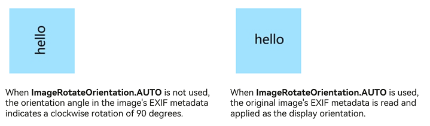 |
| UP | 1 | Display original pixel data without transformation.<br>**Atomic service API**: This API can be used in atomic services since API version 14.|
| RIGHT | 2 | Display the image after rotating it 90 degrees clockwise.<br>**Atomic service API**: This API can be used in atomic services since API version 14.<br>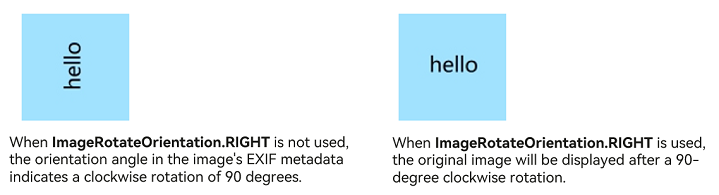 |
| DOWN | 3 | Display the image after rotating it 180 degrees clockwise.<br>**Atomic service API**: This API can be used in atomic services since API version 14.<br>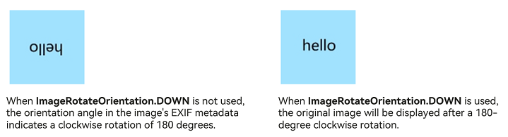 |
| LEFT | 4 | Display the image after rotating it 270 degrees clockwise.<br>**Atomic service API**: This API can be used in atomic services since API version 14.<br>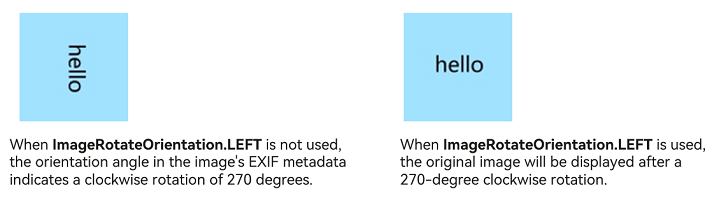 |
| UP_MIRRORED<sup>20+</sup> | 5 | Display the image after flipping it horizontally.<br>**Atomic service API**: This API can be used in atomic services since API version 20.<br>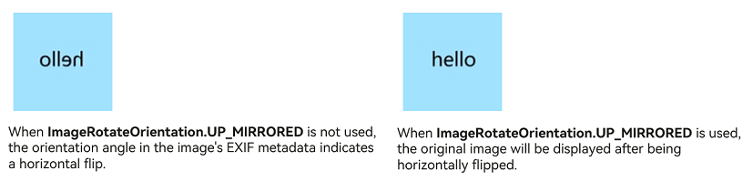 |
| RIGHT_MIRRORED<sup>20+</sup> | 6 | Display the image after flipping it horizontally and then rotating it 90 degrees clockwise.<br>**Atomic service API**: This API can be used in atomic services since API version 20.<br>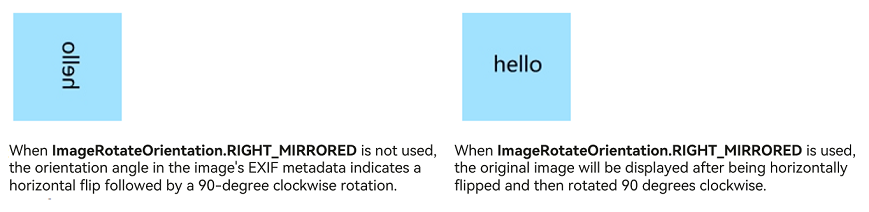 |
| DOWN_MIRRORED<sup>20+</sup> | 7 | Display the image after flipping it vertically.<br>**Atomic service API**: This API can be used in atomic services since API version 20.<br>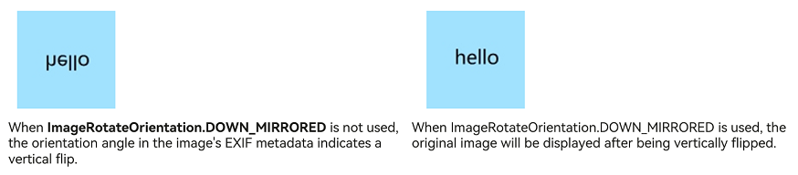 |
| LEFT_MIRRORED<sup>20+</sup> | 8 | Display the image after flipping it horizontally and then rotating it 270 degrees clockwise.<br>**Atomic service API**: This API can be used in atomic services since API version 20.<br>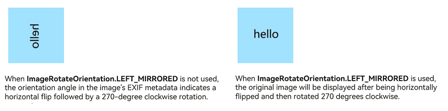 |

## ImageSourceSize<sup>18+</sup>

Provides the image decoding size.

> **NOTE**
>
> To standardize anonymous object definitions, the element definitions here have been revised in API version 18. While historical version information is preserved for anonymous objects, there may be cases where the outer element's @since version number is higher than inner elements'. This does not affect interface usability.

**Widget capability**: This API can be used in ArkTS widgets since API version 18.

**Atomic service API**: This API can be used in atomic services since API version 18.

**Model restriction**: This API can be used only in the stage model.

**System capability**: SystemCapability.ArkUI.ArkUI.Full

| Name| Type      | Read-Only| Optional| Description          |
| ------ | --------- | ---- | ------------- | ------------- |
| width<sup>7+</sup>  | number | No  | No  | Width of the image decoding size.<br/>Unit: vp<br/>**Value range:** (0, +∞); when the value is less than or equal to 0, this parameter does not take effect, and the image is decoded at its original size.<br/>**Widget capability:** Since API version 9, this API is supported in ArkTS widgets.<br>**Atomic service API:** Since API version 11, this API is supported in atomic services. |
| height<sup>7+</sup>  | number | No  | No | Height of the image decoding size.<br/>Unit: vp<br/>**Value range:** (0, +∞); when the value is less than or equal to 0, this parameter does not take effect, and the image is decoded at its original size.<br/>**Widget capability:** Since API version 9, this API is supported in ArkTS widgets.<br>**Atomic service API:** Since API version 11, this API is supported in atomic services. |

## DrawableDescriptor<sup>10+</sup>

type DrawableDescriptor = import ('../api/@ohos.arkui.drawableDescriptor').DrawableDescriptor

Represents a parameter object for the **Image** component.

**Atomic service API**: This API can be used in atomic services since API version 11.

**Model restriction**: This API can be used only in the stage model.

**System capability**: SystemCapability.ArkUI.ArkUI.Full

| Type    | Description      |
| ------ | ---------- |
| import ('../api/@ohos.arkui.drawableDescriptor').[DrawableDescriptor](../js-apis-arkui-drawableDescriptor.md#drawabledescriptor)  | Returns a DrawableDescriptor object. |

## DrawingColorFilter<sup>12+</sup>

type DrawingColorFilter = import('../api/@ohos.graphics.drawing').default.ColorFilter

Represents a color filter object.

**Atomic service API**: This API can be used in atomic services since API version 12.

**Model restriction**: This API can be used only in the stage model.

**System capability**: SystemCapability.ArkUI.ArkUI.Full

| Type    | Description      |
| ------ | ---------- |
| import('../api/@ohos.graphics.drawing').default.[ColorFilter](../../apis-arkgraphics2d/arkts-apis-graphics-drawing-ColorFilter.md)  | Returns a color filter. |

## DrawingLattice<sup>12+<sup>

type DrawingLattice = import('../api/@ohos.graphics.drawing').default.Lattice

Represents a matrix grid object that divides an image into a rectangular grid.

**Atomic service API**: This API can be used in atomic services since API version 12.

**Model restriction**: This API can be used only in the stage model.

**System capability**: SystemCapability.ArkUI.ArkUI.Full

| Type    | Description      |
| ------ | ---------- |
| import('../api/@ohos.graphics.drawing').default.[Lattice](../../apis-arkgraphics2d/arkts-apis-graphics-drawing-Lattice.md) | Returns a matrix grid object. |

## ImageMatrix<sup>15+</sup>

type ImageMatrix = Matrix4Transit

Represents the current matrix object.

**Atomic service API**: This API can be used in atomic services since API version 15.

**Model restriction**: This API can be used only in the stage model.

**System capability**: SystemCapability.ArkUI.ArkUI.Full

| Type    | Description      |
| ------ | ---------- |
| [Matrix4Transit](../js-apis-matrix4.md#matrix4transit) | Current matrix object.|

## ColorContent<sup>15+</sup>

Defines the content for color filling.

**Atomic service API**: This API can be used in atomic services since API version 15.

**Model restriction**: This API can be used only in the stage model.

**System capability**: SystemCapability.ArkUI.ArkUI.Full

| Name| Type      | Read-Only| Optional| Description          |
| ------ | --------- | --- | --- | ------------- |
| ORIGIN  | ColorContent | Yes| No| Resets the [fillColor](#fillcolor) API, effectively the same as not setting [fillColor](#fillcolor).|

## Events

In addition to the [universal events](ts-component-general-events.md), the following events are supported.

### onComplete

onComplete(callback: (event?: { width: number, height: number, componentWidth: number, componentHeight: number, loadingStatus: number,contentWidth: number, contentHeight: number, contentOffsetX: number, contentOffsetY: number }) =&gt; void)

Triggered when an image is successfully loaded or decoded. The size of the loaded image is returned.

This event is not triggered if the parameter type of the component is [AnimatedDrawableDescriptor](../js-apis-arkui-drawableDescriptor.md#animateddrawabledescriptor12).

**Widget capability**: This API can be used in ArkTS widgets since API version 9.

**Atomic service API**: This API can be used in atomic services since API version 11.

**System capability**: SystemCapability.ArkUI.ArkUI.Full

**Parameters**

| Name                      | Type  | Mandatory| Description                                                        |
| ---------------------------- | ------ | ---- | ------------------------------------------------------------ |
| width                        | number | Yes  | Width of the image.<br>Unit: px<br>**Widget capability**: This API can be used in ArkTS widgets since API version 9.                                   |
| height                       | number | Yes  | Height of the image.<br>Unit: px<br>**Widget capability**: This API can be used in ArkTS widgets since API version 9.                                   |
| componentWidth               | number | Yes  | Width of the component.<br>Unit: px<br>**Widget capability**: This API can be used in ArkTS widgets since API version 9.                                   |
| componentHeight              | number | Yes  | Height of the component.<br>Unit: px<br>**Widget capability**: This API can be used in ArkTS widgets since API version 9.                                   |
| loadingStatus                | number | Yes  | Loading status of the image.<br>**NOTE**<br>If the return value is **0**, the image is successfully loaded. If the return value is **1**, the image is successfully decoded.<br>**Widget capability**: This API can be used in ArkTS widgets since API version 9.|
| contentWidth<sup>10+</sup>   | number | Yes   | Width of the image actually drawn.<br/>Unit: px<br>**NOTE**<br/>Valid only when loadingStatus returns 1.<br/>**Widget capability:** Since API version 10, this interface supports use in ArkTS cards.<br/>**Model restriction:** This interface can be used only in the stage model. |
| contentHeight<sup>10+</sup>  | number | Yes   | Height of the image actually drawn.<br/>Unit: px<br/>**NOTE**<br/>Valid only when loadingStatus returns 1.<br/>**Widget capability:** Since API version 10, this interface supports use in ArkTS cards.<br/>**Model restriction:** This interface can be used only in the stage model. |
| contentOffsetX<sup>10+</sup> | number | Yes   | Offset of the actually drawn content relative to the component itself along the x-axis.<br/>Unit: px<br/>**NOTE**<br/>Valid only when loadingStatus returns 1.<br/>**Widget capability:** Since API version 10, this interface supports use in ArkTS cards.<br/>**Model restriction:** This interface can be used only in the stage model. |
| contentOffsetY<sup>10+</sup> | number | Yes   | Offset of the actually drawn content relative to the component itself along the y-axis.<br/>Unit: px<br/>**NOTE**<br/>Valid only when loadingStatus returns 1.<br/>**Widget capability:** Since API version 10, this interface supports use in ArkTS cards.<br/>**Model restriction:** This interface can be used only in the stage model. |

### onError<sup>9+</sup>

onError(callback: ImageErrorCallback)

Triggered when an error occurs during image loading.

This event is not triggered if the parameter type of the component is [AnimatedDrawableDescriptor](../js-apis-arkui-drawableDescriptor.md#animateddrawabledescriptor12).

**Widget capability**: This API can be used in ArkTS widgets since API version 9.

**Atomic service API**: This API can be used in atomic services since API version 11.

**System capability**: SystemCapability.ArkUI.ArkUI.Full

**Parameters**

| Name  | Type                                      | Mandatory| Description                      |
| -------- | ------------------------------------------ | ---- | -------------------------- |
| callback | [ImageErrorCallback](#imageerrorcallback9) | Yes | Callback invoked when the image fails to load.<br>**NOTE**<br>It is recommended that developers use this callback to quickly identify the specific cause of an image loading failure. For details about the error information, see [ImageError](#imageerror9). For specification details such as network-related timeout reporting and the number of retries, see [CacheDownloadOptions](../../apis-basic-services-kit/js-apis-request-cacheDownload.md#cachedownloadoptions). |

### onFinish

onFinish(event: () =&gt; void)

Triggered when the animation playback in the loaded SVG image is complete. If the animation is an infinite loop, this callback is not triggered.

Only images in SVG format are supported. This event is not triggered if the parameter type of the component is [AnimatedDrawableDescriptor](../js-apis-arkui-drawableDescriptor.md#animateddrawabledescriptor12).

**Widget capability**: This API can be used in ArkTS widgets since API version 9.

**Atomic service API**: This API can be used in atomic services since API version 11.

**System capability**: SystemCapability.ArkUI.ArkUI.Full

**Parameters**

| Name  | Type                                      | Mandatory| Description                      |
| -------- | ------------------------------------------ | ---- | -------------------------- |
| event | () => void                               | Yes   | Triggered when the animation playback in the loaded SVG image is complete. If the animation is an infinite loop, this callback is not triggered.|

## ImageErrorCallback<sup>9+</sup>

type ImageErrorCallback = (error: ImageError) => void

Triggered when an error occurs during image loading.

This event is not triggered if the parameter type of the component is [AnimatedDrawableDescriptor](../js-apis-arkui-drawableDescriptor.md#animateddrawabledescriptor12).

**Widget capability**: This API can be used in ArkTS widgets since API version 9.

**Atomic service API**: This API can be used in atomic services since API version 11.

**System capability**: SystemCapability.ArkUI.ArkUI.Full

**Parameters**

| Name| Type                      | Mandatory| Description                              |
| ------ | -------------------------- | ---- | ---------------------------------- |
| error  | [ImageError](#imageerror9) | Yes  | Object returned by the callback triggered when an exception occurs during image loading.|

## ImageError<sup>9+</sup>

Describes the object returned by the image loading error callback.

This event is not triggered if the parameter type of the component is [AnimatedDrawableDescriptor](../js-apis-arkui-drawableDescriptor.md#animateddrawabledescriptor12).

**System capability**: SystemCapability.ArkUI.ArkUI.Full

| Name         | Type  | Read-Only| Optional| Description                     |
| --------------- | ------ | ---- | ------------------------- | ------------------------- |
| componentWidth  | number | No | No | Width of the component.<br>Unit: px<br>**Widget capability**: This API can be used in ArkTS widgets since API version 9.<br>**Atomic service API**: This API can be used in atomic services since API version 11.|
| componentHeight | number | No | No | Height of the component.<br>Unit: px<br>**Widget capability**: This API can be used in ArkTS widgets since API version 9.<br>**Atomic service API**: This API can be used in atomic services since API version 11.|
| message<sup>10+</sup>         | string | No  | No  | Error message.<br/>**Widget capability:** Since API version 10, this API supports use in ArkTS widgets.<br/>**Atomic service API:** Since API version 11, this API supports use in atomic services.<br/>**Model restriction:** This API can be used only in the stage model. |
| error<sup>20+</sup>         | [BusinessError](#businesserror20)\<void> | No  | Yes  | Error message returned when image loading fails, where **code** is the error code and **message** is the error message. For details about the error message, see the detailed description of the error information below.<br/>Default value: { code : -1, message : "" }<br/>**Widget capability:** Since API version 20, this API supports use in ArkTS widgets.<br/>**Atomic service API:** Since API version 20, this API supports use in atomic services.<br/>**Model restriction:** This API can be used only in the stage model. |
| downloadInfo<sup>23+</sup> | [RequestDownloadInfo](#requestdownloadinfo23) | No | Yes | Detailed information about network image download, including the download resource, network, and performance information. This field is carried when the image source is a network image and the download fails.<br/>Default value: null<br/>**Widget capability:** Since API version 23, this API supports use in ArkTS widgets.<br/>**Atomic service API:** Since API version 23, this API supports use in atomic services.<br/>**Model restriction:** This API can be used only in the stage model. |

## BusinessError<sup>20+</sup>

type BusinessError\<T = void> = import('../api/@ohos.base').BusinessError\<T>

Represents the error information returned when an error occurs during image loading.

**Widget capability**: This API can be used in ArkTS widgets since API version 20.

**Atomic service API**: This API can be used in atomic services since API version 20.

**Model restriction**: This API can be used only in the stage model.

**System capability**: SystemCapability.ArkUI.ArkUI.Full

| Type | Description  |
| ---- | ------ |
| import('../api/@ohos.base').[BusinessError\<T>](../../apis-basic-services-kit/js-apis-base.md#businesserror) | Error information returned when image loading fails. |

The table below describes the **ImageError** error codes. The **error** property of **ImageError** contains error details with **code** and **message** fields, representing the error code and error message, respectively.

| ID  | Error Message                       | Stage | Image Loading Type | Possible Cause | Handling |
| --------  | ----------------------------   | --------- | ------- | ------- | ------- |
| 101000    | unknown source type.           | Data loading | Unknown type | The type of the image source passed in cannot be recognized, possibly due to an incorrect URI format or an unsupported data type. | Check the src parameter of the Image component and ensure that a supported type is passed in ([PixelMap](ts-image-common.md#pixelmap), [ResourceStr](ts-types.md#resourcestr), [DrawableDescriptor](#drawabledescriptor10), or a valid URI string). |
| 102010    | sync http task of uri cancelled. | Data loading | Network file | The synchronous network request is canceled, for example, the component is destroyed or the network is interrupted during loading. | Ensure that the network is available and avoid frequently switching components during loading. It is recommended to use asynchronous loading instead. |
| 102011    | sync http task of uri failed.  | Data loading | Network file | Failed to load a network image synchronously, commonly due to a network exception, an unreachable address, or failure to apply for the ohos.permission.INTERNET permission. | Check the network connection and the image address, and confirm that the ohos.permission.INTERNET permission has been applied for. It is recommended to use asynchronous loading or pre-downloading instead. |
| 102012    | async http task of uri cancelled. | Data loading | Network file | The asynchronous network request is canceled, for example, the component is destroyed or the loading task is actively canceled. | Ensure that the network is stable and retry loading if necessary. |
| 102013    | async http task of uri failed. | Data loading | Network file | Failed to load a network image asynchronously, commonly due to a network exception, an unreachable address, or failure to apply for the ohos.permission.INTERNET permission. | Check the network connection and the image address, and confirm that the ohos.permission.INTERNET permission has been applied for. |
| 102030    | wrong code format.             | Data loading | Base64 string file | The format of the Base64 string passed in is incorrect, missing a prefix or containing invalid encoded content. | Check whether the Base64 string conforms to the `data:image/subtype;base64,Base64EncodedData` format. |
| 102031    | decode base64 image failed.    | Data loading | Base64 string file | Failed to decode the Base64 string, possibly because the data is corrupted or the encoded content is not a valid image. | Verify whether the Base64-encoded data is complete and whether it corresponds to a real image format. |
| 102050    | path is too long.              | Data loading | Sandbox file | The length of the application sandbox file path exceeds the limit. | Shorten the file path and use a relative or shorter application sandbox path. |
| 102051    | read data failed.              | Data loading | Sandbox file | Failed to read the sandbox file, possibly because the file does not exist or there is no read permission. | Confirm that the file exists and ensure that the file under the directory package path has read permission. |
| 102070    | get image data by name failed. | Data loading | Resource file | Failed to obtain image data by resource name, possibly because the resource name does not exist or is not configured correctly. | Confirm that the resource name is spelled correctly and has been packaged into the resources directory. |
| 102071    | get image data by id failed.   | Data loading | Resource file | Failed to obtain image data by resource ID, possibly because the resource ID does not exist or the module is not packaged. | Confirm that the resource ID is correct and that the corresponding module/resource has been packaged correctly. |
| 102072    | uri is invalid.                | Data loading | Resource file | The resource URI passed in is invalid or has an incorrect format. | Check the resource URI format and ensure that it is a valid resource reference. |
| 102090    | uri is invalid.                | Data loading | In-package file | The URI of the in-package file passed in is invalid or has an incorrect format. | Check the URI format of the in-package file and confirm that the file exists in the corresponding HAP/HSP package. |
| 102091    | get asset failed.              | Data loading | In-package file | Failed to obtain the in-package resource, possibly because the resource is missing or the package is not installed correctly. | Confirm that the in-package resource exists and that the corresponding package has been installed correctly. |
| 102110    | open file failed.              | Data loading | Media library file | Failed to open the media library file, possibly because the file does not exist, is occupied, or lacks permission. | Confirm that the file exists and that the required media library read permission has been applied for. |
| 102111    | get file stat failed.          | Data loading | Media library file | Failed to obtain the [stat](../../apis-core-file-kit/js-apis-file-fs.md#fileiostat) information (metadata such as file size, modification time, and access permission) of the media library file, possibly because the file is inaccessible or corrupted. | Confirm that the file can be accessed normally and reselect the file if necessary. |
| 102112    | read file failed.              | Data loading | Media library file | Failed to read the data of the media library file, possibly due to an I/O exception or file corruption. | Confirm that the file is complete and readable, and re-obtain or copy the file if necessary. |
| 102130    | decoded data is empty.         | Data loading | Media library thumbnail file | The image data obtained after decoding is empty, possibly because the thumbnail does not exist or failed to be generated. | Confirm that the original file can generate a thumbnail normally, and change the image source if necessary. |
| 102131    | load shared memory image data timeout. | Data loading | Shared memory file | Timed out loading image data from shared memory, possibly because the data was not written in time or the consumer processed it too slowly. | Confirm that the write and read pace of the shared memory data matches, and increase the timeout or check the data flow if necessary. |
| 103100    | make svg dom failed.           | Data loading | Vector image file | Failed to construct the SVG DOM, possibly because the SVG file format is invalid or contains unsupported tags. | Check whether the SVG file conforms to the specification. For details, see [SVG Tags](./ts-basic-svg.md). |
| 103200    | image data size is invalid.    | Data loading | Bitmap file | The image data size is invalid, possibly because the width or height is 0 or exceeds the decoding limit. | Confirm that the image size is within the valid range and adjust the image resolution if necessary. |
| 111000    | image source create failed.    | Data decoding | Bitmap file | Failed to create the image source, possibly because the data format is unsupported or the data is corrupted. | Confirm that the image format is supported (png, jpg, bmp, svg, gif, heif, webp, tiff, etc.) and verify the data integrity. |
| 111001    | pixelmap create failed.        | Data decoding | Bitmap file | Failed to create the PixelMap, possibly due to insufficient memory or invalid decoding parameters. | Confirm that the device has sufficient memory and check whether the decoding parameters (such as size and format) are valid. |

## RequestDownloadInfo<sup>23+</sup>

type RequestDownloadInfo = import('../api/@ohos.request.cacheDownload').default.DownloadInfo

Describes the download information when an online image fails to load or encounters an exception. This object contains resource information, network information, and performance statistics of the download task, which can be used to locate the cause of the loading exception.

**Widget capability**: This API can be used in ArkTS widgets since API version 23.

**Atomic service API**: This API can be used in atomic services since API version 23.

**Model restriction**: This API can be used only in the stage model.

**System capability**: SystemCapability.ArkUI.ArkUI.Full

| Type | Description  |
| ---- | ------ |
| import('../api/@ohos.request.cacheDownload').default.[DownloadInfo](../../apis-basic-services-kit/js-apis-request-cacheDownload.md#downloadinfo20) | Download information returned when a network resource fails to load, including resource information, network request information, and performance statistics. |

## Examples

### Example 1: Loading Images of Basic Types

This example demonstrates how to load images of basic types, such as PNG, GIF, SVG, and JPG, by passing in [Resource](ts-types.md#resource) resources.

```ts
@Entry
@Component
struct ImageExample1 {
  build() {
    Column() {
      Flex({ direction: FlexDirection.Column, alignItems: ItemAlign.Start }) {
        Row() {
          // Load a PNG image.
          // Replace $r('app.media.ic_camera_master_ai_leaf') with the image resource file you use.
          Image($r('app.media.ic_camera_master_ai_leaf'))
            .width(110).height(110).margin(15)
            .overlay('png', { align: Alignment.Bottom, offset: { x: 0, y: 20 } })
          // Load a GIF image.
          // Replace $r('app.media.loading') with the image resource file you use.
          Image($r('app.media.loading'))
            .width(110).height(110).margin(15)
            .overlay('gif', { align: Alignment.Bottom, offset: { x: 0, y: 20 } })
        }
        Row() {
          // Load an SVG image.
          // Replace $r('app.media.ic_camera_master_ai_clouded') with the image resource file you use.
          Image($r('app.media.ic_camera_master_ai_clouded'))
            .width(110).height(110).margin(15)
            .overlay('svg', { align: Alignment.Bottom, offset: { x: 0, y: 20 } })
          // Load a JPG image.
          // Replace $r('app.media.ic_public_favor_filled') with the image resource file you use.
          Image($r('app.media.ic_public_favor_filled'))
            .width(110).height(110).margin(15)
            .overlay('jpg', { align: Alignment.Bottom, offset: { x: 0, y: 20 } })
        }
      }
    }.height(320).width(360).padding({ right: 10, top: 10 })
  }
}
```

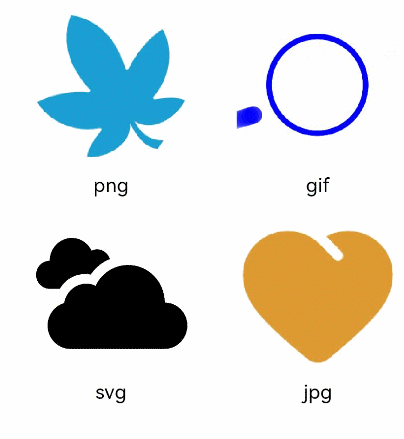

### Example 2: Downloading and Displaying Static Online Images

The default timeout is 5 minutes for loading online images. When using an online image, you are advised to use **alt** to configure a placeholder image displayed during loading. You can use [HTTP](../../../network/http-request.md) to send a network request, and then decode the returned data into a **PixelMap** object for the **Image** component. Note that a GIF image loaded into a **PixelMap** object will be displayed as a static image. For details about image development, see the [Image Kit](../../../media/image/image-overview.md) overview.

The **ohos.permission.INTERNET** permission is required for using online images. For details about how to apply for a permission, see [Declaring Permissions](../../../security/AccessToken/declare-permissions.md).

```ts
import { http } from '@kit.NetworkKit';
import { BusinessError } from '@kit.BasicServicesKit';
import { image } from '@kit.ImageKit';

@Entry
@Component
struct ImageExample2 {
  @State pixelMapImg: PixelMap | undefined = undefined;

  aboutToAppear() {
    this.requestImageUrl('https://www.example.com/xxx.png'); // Enter a specific online image URL.
  }

  requestImageUrl(url: string) {
    http.createHttp().request(url, (error: BusinessError, data: http.HttpResponse) => {
      if (error) {
        console.error(`request image failed: url: ${url}, code: ${error.code}, message: ${error.message}`);
      } else {
        let imgData: ArrayBuffer = data.result as ArrayBuffer;
        console.info(`request image success, size: ${imgData.byteLength}`);
        let imgSource: image.ImageSource = image.createImageSource(imgData);
        class sizeTmp {
          height: number = 100;
          width: number = 100;
        }
        let options: Record<string, number | boolean | sizeTmp> = {
          'alphaType': 0,
          'editable': false,
          'pixelFormat': 3,
          'scaleMode': 1,
          'size': { height: 100, width: 100 }
        }
        imgSource.createPixelMap(options).then((pixelMap: PixelMap) => {
          console.info('image createPixelMap success');
          this.pixelMapImg = pixelMap;
          imgSource.release();
        }).catch((err: BusinessError) => {
          console.error(`Failed to create pixel map. Code: ${err.code}, message: ${err.message}`);
          imgSource.release();
        })
      }
    })
  }

  build() {
    Column() {
      Image(this.pixelMapImg)
        // Replace $r('app.media.img') with the image resource file you use.
        .alt($r('app.media.img'))
        .objectFit(ImageFit.None)
        .width('100%')
        .height('100%')
    }
  }
}
```


### Example 3: Downloading and Displaying Online GIF Images

This example shows how to use the [cacheDownload.download](../../apis-basic-services-kit/js-apis-request-cacheDownload.md#cachedownloaddownload) API to download online GIF images.

The **ohos.permission.INTERNET** permission is required for using online images. For details about how to apply for a permission, see [Declaring Permissions](../../../security/AccessToken/declare-permissions.md).

```ts
import { cacheDownload } from '@kit.BasicServicesKit';

@Entry
@Component
struct Index {
  @State src: string = 'https://www.example.com/xxx.gif'; // Enter a specific online image URL.

  async aboutToAppear(): Promise<void> {
    // Provide configuration options for the cached download task.
    let options: cacheDownload.CacheDownloadOptions = {};
    try {
      // Perform cached download. If the download is successful, the resource will be cached to the specified file in the application memory or sandbox directory.
      cacheDownload.download(this.src, options);
      console.info(`success to download the resource. `);
    } catch (err) {
      console.error(`Failed to download the resource: code: ${err.code}, message: ${err.message}`);
    }
  }

  build() {
    Column() {
      // If src specifies an online image that has been successfully downloaded and cached, the image will be displayed without requiring re-downloading.
      Image(this.src)
        .width(100)
        .height(100)
        .objectFit(ImageFit.Cover)
        .borderWidth(1)
    }
    .height('100%')
    .width('100%')
  }
}
```

### Example 4: Adding Events to an Image

This example demonstrates how to add the [onClick](ts-universal-events-click.md#onclick) and [onFinish](#onfinish) events to an image.

```ts
@Entry
@Component
struct ImageExample3 {
  // Replace $r('app.media.earth') with the image resource file you use.
  private imageOne: Resource = $r('app.media.earth');
  // Replace $r('app.media.star') with the image resource file you use.
  private imageTwo: Resource = $r('app.media.star');
  // Replace $r('app.media.moveStar') with the image resource file you use.
  private imageThree: Resource = $r('app.media.moveStar');
  @State src: Resource = this.imageOne;
  @State src2: Resource = this.imageThree;
  build(){
    Column(){
      // Add a click event so that a specific image is loaded upon clicking.
      Image(this.src)
        .width(100)
        .height(100)
        .onClick(() => {
          this.src = this.imageTwo;
        })

      // When the image to be loaded is in SVG format:
      Image(this.src2)
        .width(100)
        .height(100)
        .onFinish(() => {
          // Load another image when the SVG image has finished its animation.
          this.src2 = this.imageOne;
        })
    }.width('100%').height('100%')
  }
}
```

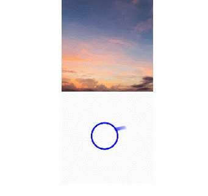

### Example 5: Enabling the AI Image Analyzer

This example shows how to enable the AI image analyzer using the [enableAnalyzer](#enableanalyzer11) API.
<!--RP2-->

```ts
import { image } from '@kit.ImageKit';

@Entry
@Component
struct ImageExample4 {
  @State imagePixelMap: image.PixelMap | undefined = undefined;
  private aiController: ImageAnalyzerController = new ImageAnalyzerController();
  private options: ImageAIOptions = {
    types: [ImageAnalyzerType.SUBJECT, ImageAnalyzerType.TEXT],
    aiController: this.aiController
  };

  async aboutToAppear() {
    // Replace $r('app.media.app_icon') with the image resource file you use.
    this.imagePixelMap = await this.getPixmapFromMedia($r('app.media.app_icon'));
  }

  build() {
    Column() {
      Image(this.imagePixelMap, this.options)
        .enableAnalyzer(true)
        .width(200)
        .height(200)
        .margin({bottom:10})
      Button('getTypes', { type: ButtonType.Circle, stateEffect: false })
        .width(100)
        .height(100)
        .onClick(() => {
          this.aiController.getImageAnalyzerSupportTypes();
        })
    }
  }
  private async getPixmapFromMedia(resource: Resource) {
    let unit8Array = await this.getUIContext().getHostContext()?.resourceManager?.getMediaContent(resource.id);
    let imageSource = image.createImageSource(unit8Array?.buffer.slice(0, unit8Array.buffer.byteLength));
    let pixelMap: image.PixelMap = await imageSource.createPixelMap({
      desiredPixelFormat: image.PixelMapFormat.RGBA_8888
    });
    await imageSource.release();
    return pixelMap;
  }
}
```


<!--RP2End-->
### Example 6: Stretching an Image Using slice

This example demonstrates how to stretch an image in different directions using the **slice** option of the [resizable](#resizable11) attribute.

```ts
@Entry
@Component
struct Index {
  @State top: number = 10;
  @State bottom: number = 10;
  @State left: number = 10;
  @State right: number = 10;

  build() {
    Column({ space: 5 }) {
      // Original image effect
      // Replace $r('app.media.landscape') with the image resource file you use.
      Image($r('app.media.landscape'))
        .width(200).height(200)
        .border({ width: 2, color: Color.Pink })
        .objectFit(ImageFit.Contain)

      // Set the resizable attribute to stretch the image in different directions.
      // Replace $r('app.media.landscape') with the image resource file you use.
      Image($r('app.media.landscape'))
        .resizable({
          slice: {
            // When a number is passed in, it uses the default vp unit, which is parsed into different px sizes on different devices. Choose the unit based on your needs.
            left: `${this.left}px`,
            right: `${this.right}px`,
            top: `${this.top}px`,
            bottom: `${this.bottom}px`
          }
        })
        .width(200)
        .height(200)
        .border({ width: 2, color: Color.Pink })
        .objectFit(ImageFit.Contain)

      Row() {
        Button('add top to ' + this.top).fontSize(10)
          .onClick(() => {
            this.top += 10;
          })
        Button('add bottom to ' + this.bottom).fontSize(10)
          .onClick(() => {
            this.bottom += 10;
          })
      }

      Row() {
        Button('add left to ' + this.left).fontSize(10)
          .onClick(() => {
            this.left += 10;
          })
        Button('add right to ' + this.right).fontSize(10)
          .onClick(() => {
            this.right += 10;
          })
      }

    }
    .justifyContent(FlexAlign.Start).width('100%').height('100%')
  }
}
```

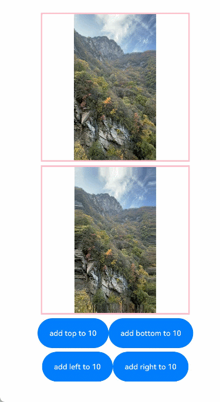

### Example 7: Stretching an Image Using lattice

This example demonstrates how to stretch an image using the **lattice** option of the [resizable](#resizable11) attribute with a rectangular lattice object.

```ts
import { drawing } from '@kit.ArkGraphics2D';

@Entry
@Component
struct drawingLatticeTest {
  private xDivs: Array<number> = [1, 2, 200];
  private yDivs: Array<number> = [1, 2, 200];
  private fXCount: number = 3;
  private fYCount: number = 3;
  private drawingLatticeFirst: DrawingLattice =
    drawing.Lattice.createImageLattice(this.xDivs, this.yDivs, this.fXCount, this.fYCount);

  build() {
    Scroll() {
      Column({ space: 10 }) {
        Text('Original Image').fontSize(20).fontWeight(700)
        Column({ space: 10 }) {
          // Replace $r('app.media.mountain') with the image resource file you use.
          Image($r('app.media.mountain'))
            .width(260).height(260)
        }.width('100%')

        Text('Resize by lattice').fontSize(20).fontWeight(700)
        Column({ space: 10 }) {
          // Replace $r('app.media.mountain') with the image resource file you use.
          Image($r('app.media.mountain'))
            .objectRepeat(ImageRepeat.X)
            .width(260)
            .height(260)
            .resizable({
              lattice: this.drawingLatticeFirst
            })
        }.width('100%')
      }.width('100%')
    }
  }
}
```

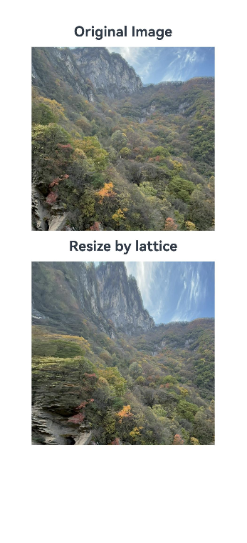

### Example 8: Playing a PixelMap Array Animation

This example demonstrates how to play an animation using a **PixelMap** array through an [AnimatedDrawableDescriptor](../js-apis-arkui-drawableDescriptor.md#animateddrawabledescriptor12) object.

```ts
import { AnimationOptions, AnimatedDrawableDescriptor } from '@kit.ArkUI';
import { image } from '@kit.ImageKit';

@Entry
@Component
struct ImageExample {
  pixelMaps: PixelMap[] = [];
  @State options: AnimationOptions = { iterations: 1 };
  @State animated: AnimatedDrawableDescriptor | undefined = undefined;

  async aboutToAppear() {
    this.pixelMaps = await this.getPixelMaps();
    this.animated = new AnimatedDrawableDescriptor(this.pixelMaps, this.options);
  }

  build() {
    Column() {
      Row() {
        Image(this.animated)
          .width('500px').height('500px')
          .onFinish(() => {
            // When the image source of the Image component is an AnimatedDrawableDescriptor object, the onFinish callback is not invoked.
            console.info('finish');
          })
      }.height('50%')

      Row() {
        Button('once').width(100).padding(5).onClick(() => {
          this.options = { iterations: 1 };
          this.animated = new AnimatedDrawableDescriptor(this.pixelMaps, this.options);
        }).margin(5)
        Button('infinite').width(100).padding(5).onClick(() => {
          this.options = { iterations: -1 };
          this.animated = new AnimatedDrawableDescriptor(this.pixelMaps, this.options);
        }).margin(5)
      }
    }.width('50%')
  }

  private async getPixmapListFromMedia(resource: Resource) {
    let unit8Array = await this.getUIContext().getHostContext()?.resourceManager?.getMediaContent(resource.id);
    let imageSource = image.createImageSource(unit8Array?.buffer.slice(0, unit8Array.buffer.byteLength));
    let createPixelMap: image.PixelMap[] = await imageSource.createPixelMapList({
      desiredPixelFormat: image.PixelMapFormat.RGBA_8888
    });
    await imageSource.release();
    return createPixelMap;
  }

  private async getPixmapFromMedia(resource: Resource) {
    let unit8Array = await this.getUIContext().getHostContext()?.resourceManager?.getMediaContent(resource.id);
    let imageSource = image.createImageSource(unit8Array?.buffer.slice(0, unit8Array.buffer.byteLength));
    let pixelMap: image.PixelMap = await imageSource.createPixelMap({
      desiredPixelFormat: image.PixelMapFormat.RGBA_8888
    });
    await imageSource.release();
    return pixelMap;
  }

  private async getPixelMaps() {
    // Replace $r('app.media.mountain') with the image resource file you use.
    let myPixelMaps: PixelMap[] = await this.getPixmapListFromMedia($r('app.media.mountain')); // Add the image.
    // Replace $r('app.media.sky') with the image resource file you use.
    myPixelMaps.push(await this.getPixmapFromMedia($r('app.media.sky')));
    // Replace $r('app.media.clouds') with the image resource file you use.
    myPixelMaps.push(await this.getPixmapFromMedia($r('app.media.clouds')));
    // Replace $r('app.media.landscape') with the image resource file you use.
    myPixelMaps.push(await this.getPixmapFromMedia($r('app.media.landscape')));
    return myPixelMaps;
  }
}
```

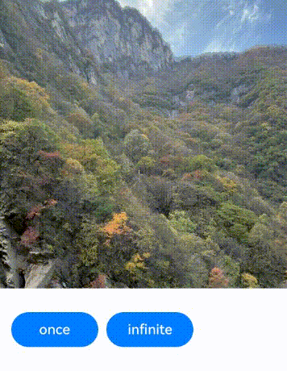

### Example 9: Setting a Color Filter for an Image

This example shows how to set a color filter for an image using the [colorFilter](#colorfilter9) attribute.

```ts
import { drawing, common2D } from '@kit.ArkGraphics2D';

@Entry
@Component
struct ImageExample3 {
  // When the image to be loaded is in SVG format:
  // Replace $r('app.media.svg1') with the image resource file you use.
  private imageOne: Resource = $r('app.media.svg1');
  // Replace $r('app.media.1') with the image resource file you use.
  private imageTwo: Resource = $r('app.media.1');
  @State src: Resource = this.imageOne;
  @State src2: Resource = this.imageTwo;
  private colorFilterMatrix: number[] = [1, 0, 0, 0, 0.5,
                                         0, 1, 0, 0, 0,
                                         0, 0, 1, 0, 0,
                                         0, 0, 0, 1, 0];
  private color: common2D.Color = {
    alpha: 255,
    red: 255,
    green: 0,
    blue: 0
  };
  @State drawingColorFilterFirst: ColorFilter | undefined = undefined;
  @State drawingColorFilterSecond: ColorFilter | undefined = undefined;
  @State drawingColorFilterThird: ColorFilter | undefined = undefined;

  build() {
    Column() {
      Image(this.src)
        .width(100)
        .height(100)
        .colorFilter(this.drawingColorFilterFirst)
        .onClick(()=>{
          this.drawingColorFilterFirst =
            drawing.ColorFilter.createBlendModeColorFilter(this.color, drawing.BlendMode.SRC_IN);
        })

      Image(this.src2)
        .width(100)
        .height(100)
        .colorFilter(this.drawingColorFilterSecond)
        .onClick(()=>{
          this.drawingColorFilterSecond = new ColorFilter(this.colorFilterMatrix);
        })

      // When the image to be loaded is in SVG format:
      // Replace $r('app.media.svg2') with the image resource file you use.
      Image($r('app.media.svg2'))
        .width(110)
        .height(110)
        .margin(15)
        .colorFilter(this.drawingColorFilterThird)
        .onClick(()=>{
          this.drawingColorFilterThird =
            drawing.ColorFilter.createBlendModeColorFilter(this.color, drawing.BlendMode.SRC_IN);
        })
    }
  }
}
```


### Example 10: Setting the Fill Effect for an Image

This example shows how to use the [objectFit](#objectfit) attribute to specify how an image is resized to fit its container.

```ts
@Entry
@Component
struct ImageExample{
  build() {
    Column() {
      Flex({ direction: FlexDirection.Column, alignItems: ItemAlign.Start }) {
        Row() {
          // Load a PNG image.
          // Replace $r('app.media.sky') with the image resource file you use.
          Image($r('app.media.sky'))
            .width(110).height(110).margin(15)
            .overlay('png', { align: Alignment.Bottom, offset: { x: 0, y: 20 } })
            .border({ width: 2, color: Color.Pink })
            .objectFit(ImageFit.TOP_START)
          // Load a GIF image.
          // Replace $r('app.media.loading') with the image resource file you use.
          Image($r('app.media.loading'))
            .width(110).height(110).margin(15)
            .overlay('gif', { align: Alignment.Bottom, offset: { x: 0, y: 20 } })
            .border({ width: 2, color: Color.Pink })
            .objectFit(ImageFit.BOTTOM_START)
        }
        Row() {
          // Load an SVG image.
          // Replace $r('app.media.svg') with the image resource file you use.
          Image($r('app.media.svg'))
            .width(110).height(110).margin(15)
            .overlay('svg', { align: Alignment.Bottom, offset: { x: 0, y: 20 } })
            .border({ width: 2, color: Color.Pink })
            .objectFit(ImageFit.TOP_END)
          // Load a JPG image.
          // Replace $r('app.media.jpg') with the image resource file you use.
          Image($r('app.media.jpg'))
            .width(110).height(110).margin(15)
            .overlay('jpg', { align: Alignment.Bottom, offset: { x: 0, y: 20 } })
            .border({ width: 2, color: Color.Pink })
            .objectFit(ImageFit.CENTER)
        }
      }
    }.height(320).width(360).padding({ right: 10, top: 10 })
  }
}
```


### Example 11: Switching Between Different Types of Images

This example demonstrates the effect of displaying images with [ResourceStr](ts-types.md#resourcestr) and [ImageContent](#imagecontent12) as types of data sources.

```ts
@Entry
@Component
struct ImageContentExample {
  @State imageSrcIndex: number = 0;
  // Replace $r('app.media.app_icon') with the image resource file you use.
  @State imageSrcList: (ResourceStr | ImageContent)[] = [$r('app.media.app_icon'), ImageContent.EMPTY];

  build() {
    Column({ space: 10 }) {
      Image(this.imageSrcList[this.imageSrcIndex])
        .width(100)
        .height(100)
      Button('Change Image src', { type: ButtonType.Capsule, stateEffect: false })
        .height(50)
        .onClick(() => {
          this.imageSrcIndex = (this.imageSrcIndex + 1) % this.imageSrcList.length;
        })
    }.width('100%')
    .padding(20)
  }
}
```

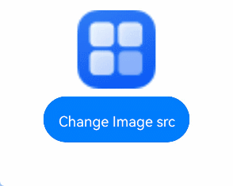

### Example 12: Securing Sensitive Information

This example shows how to secure sensitive information on widgets using the [privacySensitive](#privacysensitive12) attribute. The display requires widget framework support.

```ts
@Entry
@Component
struct ImageExample {
  build() {
    Column({ space: 10 }) {
      // Replace $r('app.media.startIcon') with the image resource file you use.
      Image($r('app.media.startIcon'))
        .width(50)
        .height(50)
        .margin({top :30})
        .privacySensitive(true)
    }
    .alignItems(HorizontalAlign.Center)
    .width('100%')
  }
}
```


### Example 13: Setting the Scan Effect for an Image

This example shows how to enable the scan effect for an image using [linearGradient](./ts-basic-components-datapanel.md#lineargradient10) and [animateTo()](../arkts-apis-uicontext-uicontext.md#animateto).

```ts
import { curves } from '@kit.ArkUI';

@Entry
@Component
struct ImageExample11 {
  private curve = curves.cubicBezierCurve(0.33, 0, 0.67, 1);
  @State moveImg: string[] = ['imageScanEffect'];
  @State moveImgVisible: Visibility = Visibility.Visible;
  @State durationTime: number = 1500;
  @State iterationsTimes: number = -1;
  @State private opacityValue: number = 0.5;
  @State imageWidth: number = 450;
  @State visible: Visibility = Visibility.Hidden;
  @State stackBackgroundColor: string = '#E1E4E9';
  @State linePositionX: number = 0 - this.imageWidth;
  @State linePositionY: number = 0;
  @State imgResource: Resource | undefined = undefined;

  startupAnimate() {
    this.moveImg.pop();
    this.moveImg.push('imageScanEffect');
    setTimeout(() => {
      // Replace $r('app.media.img') with the image resource file you use.
      this.imgResource = $r('app.media.img');
    }, 3000);
    this.getUIContext()?.animateTo({
      duration: this.durationTime,
      curve: this.curve,
      tempo: 1,
      iterations: this.iterationsTimes,
      delay: 0
    }, () => {
      this.linePositionX = this.imageWidth;
    })
  }

  build() {
    Column() {
      Row() {
        Stack() {
          Image(this.imgResource)
            .width(this.imageWidth)
            .height(200)
            .objectFit(ImageFit.Contain)
            .visibility(this.visible)
            .onComplete(() => {
              this.visible = Visibility.Visible;
              this.moveImg.pop();
            })
            .onError(() =>{
              setTimeout(() => {
                this.visible = Visibility.Visible;
                this.moveImg.pop();
              }, 2600)
            })
          ForEach(this.moveImg, (item: string) => {
            Row()
              .width(this.imageWidth)
              .height(200)
              .visibility(this.moveImgVisible)
              .position({ x: this.linePositionX, y: this.linePositionY })
              .linearGradient({
                direction: GradientDirection.Right,
                repeating: false,
                colors: [[0xE1E4E9, 0], [0xFFFFFF, 0.75], [0xE1E4E9, 1]]
              })
              .opacity(this.opacityValue)
          })
        }
        .backgroundColor(this.visible ? this.stackBackgroundColor : undefined)
        .margin({top: 20, left: 20, right: 20})
        .borderRadius(20)
        .clip(true)
        .onAppear(() => {
          this.startupAnimate();
        })
      }
    }
  }
}
```


### Example 14: Adding Transform Effects to an Image

This example demonstrates how to apply rotation and translation effects to an image using the [imageMatrix](#imagematrix15) and [objectFit](#objectfit) attributes.

The **imageMatrix** attribute is added since API version 15.

```ts
import { matrix4 } from '@kit.ArkUI';

@Entry
@Component
struct Test {
  private matrix1 = matrix4.identity()
    .translate({ x: -400, y: -750 })
    .scale({ x: 0.5, y: 0.5 })
    .rotate({
      x: 2,
      y: 0.5,
      z: 3,
      centerX: 10,
      centerY: 10,
      angle: -10
    })

  build() {
    Row() {
      Column({ space: 50 }) {
        Column({ space: 5 }) {
          // Replace $r('app.media.example') with the image resource file you use.
          Image($r('app.media.example'))
            .border({ width:2, color: Color.Black })
            .objectFit(ImageFit.Contain)
            .width(150)
            .height(150)
          Text('No transformation')
            .fontSize('25px')
        }
        Column({ space: 5 }) {
          // Replace $r('app.media.example') with the image resource file you use.
          Image($r('app.media.example'))
            .border({ width:2, color: Color.Black })
            .objectFit(ImageFit.None)
            .translate({ x: 10, y: 10 })
            .scale({ x: 0.5, y: 0.5 })
            .width(100)
            .height(100)
          Text('Direct transformation on the image, with the upper left corner of the image source displayed by default')
            .fontSize('25px')
        }
        Column({ space: 5 }) {
          // Replace $r('app.media.example') with the image resource file you use.
          Image($r('app.media.example'))
            .objectFit(ImageFit.MATRIX)
            .imageMatrix(this.matrix1)
            .border({ width:2, color: Color.Black })
            .width(150)
            .height(150)
          Text('Transformation using imageMatrix to adjust the source position for optimal display')
            .fontSize('25px')
        }
      }
      .width('100%')
    }
  }
}
```


### Example 15: Setting the Image Decoding Size Using sourceSize

This example customizes the decoding size of the image through the [sourceSize](#sourcesize) API.

```ts
@Entry
@Component
struct Index {
  build() {
    Column() {
      // Replace $r('app.media.sky') with the image resource file you use.
      Image($r('app.media.sky'))
        .sourceSize({width:1393, height:1080})
        .height(300)
        .width(300)
        .objectFit(ImageFit.Contain)
        .borderWidth(1)
      // Replace $r('app.media.sky') with the image resource file you use.
      Image($r('app.media.sky'))
        .sourceSize({width:13, height:10})
        .height(300)
        .width(300)
        .objectFit(ImageFit.Contain)
        .borderWidth(1)
    }
    .height('100%')
    .width('100%')
  }
}
```


### Example 16: Setting the Image Rendering Mode Using renderMode

This example sets the image rendering mode to black-and-white through the [renderMode](#rendermode) API.

```ts
@Entry
@Component
struct Index {
  build() {
    Column() {
      // Replace $r('app.media.sky') with the image resource file you use.
      Image($r('app.media.sky'))
        .renderMode(ImageRenderMode.Template)
        .height(300)
        .width(300)
        .objectFit(ImageFit.Contain)
        .borderWidth(1)
    }
    .height('100%')
    .width('100%')
  }
}
```


### Example 17: Setting the Image Repeat Pattern Using objectRepeat

This example repeatedly draws the image along the vertical axis through the [objectRepeat](#objectrepeat) API.

```ts
@Entry
@Component
struct Index {
  build() {
    Column() {
      // Replace $r('app.media.sky') with the image resource file you use.
      Image($r('app.media.sky'))
        .objectRepeat(ImageRepeat.Y)
        .height('90%')
        .width('90%')
        .objectFit(ImageFit.Contain)
        .borderWidth(1)
    }
    .height('100%')
    .width('100%')
  }
}
```

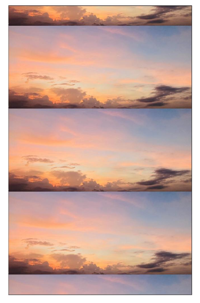

### Example 18: Setting the Fill Color for an SVG Image

This example shows how to set different fill colors for an SVG image using the [fillColor](#fillcolor15) attribute.

```ts
@Entry
@Component
struct Index {
  build() {
    Column() {
      Text('FillColor not set')
      // Replace $r('app.media.svgExample') with the image resource file you use.
      Image($r('app.media.svgExample'))
        .height(100)
        .width(100)
        .objectFit(ImageFit.Contain)
        .borderWidth(1)
      Text('fillColor set to ColorContent.ORIGIN')
      // Replace $r('app.media.svgExample') with the image resource file you use.
      Image($r('app.media.svgExample'))
        .height(100)
        .width(100)
        .objectFit(ImageFit.Contain)
        .borderWidth(1)
        .fillColor(ColorContent.ORIGIN)
      Text('fillColor set to Color.Blue')
      // Replace $r('app.media.svgExample') with the image resource file you use.
      Image($r('app.media.svgExample'))
        .height(100)
        .width(100)
        .objectFit(ImageFit.Contain)
        .borderWidth(1)
        .fillColor(Color.Blue)
      Text('fillColor set to undefined')
      // Replace $r('app.media.svgExample') with the image resource file you use.
      Image($r('app.media.svgExample'))
        .height(100)
        .width(100)
        .objectFit(ImageFit.Contain)
        .borderWidth(1)
        .fillColor(undefined)
    }
    .height('100%')
    .width('100%')
  }
}
```


### Example 19: Adjusting HDR Image Brightness

This example demonstrates how to adjust the HDR image brightness using the [hdrBrightness](#hdrbrightness19) attribute, changing the value from **0** to **1**.

The **hdrBrightness** attribute is added since API version 19.

```ts
import { image } from '@kit.ImageKit';

const TAG = 'AceImage';

@Entry
@Component
struct Index {
  // Replace 'img_1' with the image resource file you use.
  @State imgUrl: string = 'img_1';
  @State bright: number = 0; // The default brightness is 0.
  aboutToAppear(): void {
    // Obtain media resources from the resource manager.
    let img = this.getUIContext().getHostContext()?.resourceManager.getMediaByNameSync(this.imgUrl);
    // Create an image source and obtain image information.
    if (img && img.buffer) {
      let imageSource = image.createImageSource(img?.buffer.slice(0));
      let imageInfo = imageSource.getImageInfoSync();
      // Check whether the image information is obtained successfully.
      if (imageInfo == undefined) {
        console.error(TAG, 'Failed to obtain the image information.');
      } else {
        // After the image information is obtained successfully, print the HDR status.
        console.info(TAG, 'imageInfo.isHdr:' + imageInfo.isHdr);
      }
      imageSource.release();
    } else {
      console.error(TAG, 'Failed to obtain the image buffer.');
    }
  }

  build() {
    Column() {
      // Replace $r('app.media.img_1') with the image resource file you use.
      Image($r('app.media.img_1')).width('50%')
        .height('auto')
        .margin({ top: 160 })
        .hdrBrightness(this.bright) // Set the HDR image brightness controlled by the bright state.
      Button('Adjust Brightness 0 -> 1')
        .onClick(() => {
          // Animation transition for brightness changes
          this.getUIContext()?.animateTo({}, () => {
            this.bright = 1.0 - this.bright;
          });
        })
    }
    .height('100%')
    .width('100%')
  }
}
```

### Example 20: Setting Whether the Image Follows the System Language Direction

This example shows how to use the [matchTextDirection](#matchtextdirection) API to set whether the image should be mirrored when the device system language is set to Uyghur.

```ts
@Entry
@Component
struct Index {
  build() {
    Column() {
      Flex({ direction: FlexDirection.Column, alignItems: ItemAlign.Start }) {
        Row() {
          // The image does not follow the system language direction.
          // Replace $r('app.media.ocean') with the image resource file you use.
          Image($r('app.media.ocean'))
            .width(110).height(110).margin(15)
            .matchTextDirection(false)
        }
        Row() {
          // The image follows the system language direction.
          // Replace $r('app.media.ocean') with the image resource file you use.
          Image($r('app.media.ocean'))
            .width(110).height(110).margin(15)
            .matchTextDirection(true)
        }
      }
    }.height(320).width(360).padding({ right: 10, top: 10 })
  }
}
```


### Example 21: Setting Image Display Orientation

This example shows how to configure different image display orientations using the [orientation](#orientation14) attribute.

```ts
@Entry
@Component
struct OrientationExample {
  build() {
    Column() {
      Row({ space: 25 }) {
        Column() {
          Text('AUTO')
          // Replace $r('app.media.hello') with the image resource file you use.
          Image($r('app.media.hello'))
            .width(125).height(125)
            .orientation(ImageRotateOrientation.AUTO)
        }

        Column() {
          Text('UP')
          // Replace $r('app.media.hello') with the image resource file you use.
          Image($r('app.media.hello'))
            .width(125).height(125)
            .orientation(ImageRotateOrientation.UP)
        }

        Column() {
          Text('RIGHT')
          // Replace $r('app.media.hello') with the image resource file you use.
          Image($r('app.media.hello'))
            .width(125).height(125)
            .orientation(ImageRotateOrientation.RIGHT)
        }
      }

      Row({ space: 25 }) {
        Column() {
          Text('DOWN')
          // Replace $r('app.media.hello') with the image resource file you use.
          Image($r('app.media.hello'))
            .width(125).height(125)
            .orientation(ImageRotateOrientation.DOWN)
        }

        Column() {
          Text('LEFT')
          // Replace $r('app.media.hello') with the image resource file you use.
          Image($r('app.media.hello'))
            .width(125).height(125)
            .orientation(ImageRotateOrientation.LEFT)
        }

        Column() {
          Text('UP_MIRRORED')
          // Replace $r('app.media.hello') with the image resource file you use.
          Image($r('app.media.hello'))
            .width(125).height(125)
            .orientation(ImageRotateOrientation.UP_MIRRORED)
        }
      }

      Row({ space: 15 }) {
        Column() {
          Text('RIGHT_MIRRORED')
          // Replace $r('app.media.hello') with the image resource file you use.
          Image($r('app.media.hello'))
            .width(125).height(125)
            .orientation(ImageRotateOrientation.RIGHT_MIRRORED)
        }

        Column() {
          Text('DOWN_MIRRORED')
          // Replace $r('app.media.hello') with the image resource file you use.
          Image($r('app.media.hello'))
            .width(125).height(125)
            .orientation(ImageRotateOrientation.DOWN_MIRRORED)
        }

        Column() {
          Text('LEFT_MIRRORED')
          // Replace $r('app.media.hello') with the image resource file you use.
          Image($r('app.media.hello'))
            .width(125).height(125)
            .orientation(ImageRotateOrientation.LEFT_MIRRORED)
        }
      }
    }
  }
}
```

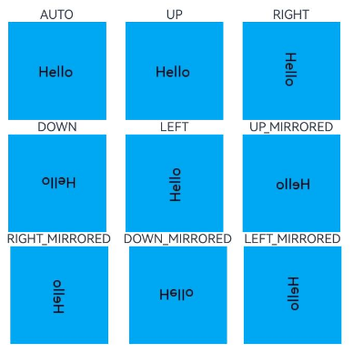

### Example 22: Using EXIF Metadata for Image Display Orientation

This example demonstrates how to use the [getImageProperty](../../apis-image-kit/arkts-apis-image-ImageSource.md#getimageproperty11) API to obtain the EXIF metadata of an image, and then set the image display orientation through the [orientation](#orientation14) attribute based on the obtained EXIF metadata.

```ts
import { image } from '@kit.ImageKit';
import { resourceManager } from '@kit.LocalizationKit';

@Entry
@Component
struct Example {
  @State rotateOrientation: ImageRotateOrientation = ImageRotateOrientation.UP;
  @State pixelMap: image.PixelMap | undefined = undefined;
  @State text1: string = 'The exif orientation is ';
  @State text2: string = 'Set orientation to ';

  // Convert EXIF orientation information into ImageRotateOrientation.
  getOrientation(orientation: string): ImageRotateOrientation {
    if (orientation == 'Top-right') {
      this.text2 = this.text2 + 'UP_MIRRORED';
      return ImageRotateOrientation.UP_MIRRORED;
    } else if (orientation == 'Bottom-right') {
      this.text2 = this.text2 + 'DOWN';
      return ImageRotateOrientation.DOWN;
    } else if (orientation == 'Bottom-left') {
      this.text2 = this.text2 + 'DOWN_MIRRORED';
      return ImageRotateOrientation.DOWN_MIRRORED;
    } else if (orientation == 'Left-top') {
      this.text2 = this.text2 + 'LEFT_MIRRORED';
      return ImageRotateOrientation.LEFT_MIRRORED;
    } else if (orientation == 'Right-top') {
      this.text2 = this.text2 + 'RIGHT';
      return ImageRotateOrientation.RIGHT;
    } else if (orientation == 'Right-bottom') {
      this.text2 = this.text2 + 'RIGHT_MIRRORED';
      return ImageRotateOrientation.RIGHT_MIRRORED;
    } else if (orientation == 'Left-bottom') {
      this.text2 = this.text2 + 'LEFT';
      return ImageRotateOrientation.LEFT;
    } else if (orientation == 'Top-left') {
      this.text2 = this.text2 + 'UP';
      return ImageRotateOrientation.UP;
    } else {
      this.text2 = this.text2 + 'UP';
      return ImageRotateOrientation.UP;
    }
  }

  async getFileBuffer(context: Context): Promise<ArrayBuffer | undefined> {
    try {
      const resourceMgr: resourceManager.ResourceManager = context.resourceManager;
      // Obtain the content of the resource file with EXIF data as Uint8Array.
      // Replace 'hello.jpg' with the image resource file you use.
      const fileData: Uint8Array = await resourceMgr.getRawFileContent('hello.jpg');
      console.info('Successfully get RawFileContent');
      // Convert the array to an ArrayBuffer and return the ArrayBuffer.
      const buffer: ArrayBuffer = fileData.buffer.slice(0);
      return buffer;
    } catch (error) {
      console.error('Failed to get RawFileContent');
      return undefined;
    }
  }

  aboutToAppear() {
    let context = this.getUIContext().getHostContext();
    if (!context) {
      return;
    }
    this.getFileBuffer(context).then((buf: ArrayBuffer | undefined) => {
      let imageSource = image.createImageSource(buf);
      if (!imageSource) {
        return;
      }
      // Obtain EXIF orientation information.
      imageSource.getImageProperty(image.PropertyKey.ORIENTATION).then((orientation) => {
        this.rotateOrientation = this.getOrientation(orientation);
        this.text1 = this.text1 + orientation;
        let options: image.DecodingOptions = {
          'editable': true,
          'desiredPixelFormat': image.PixelMapFormat.RGBA_8888,
        }
        imageSource.createPixelMap(options).then((pixelMap: image.PixelMap) => {
          this.pixelMap = pixelMap;
          imageSource.release();
        });
      }).catch(() => {
        imageSource.release();
      });
    })
  }

  build() {
    Column({ space: 40 }) {
      Column({ space: 10 }) {
        Text('before').fontSize(20).fontWeight(700)
        // Replace 'hello.jpg' with the image resource file you use.
        Image($rawfile('hello.jpg'))
          .width(100)
          .height(100)
        Text(this.text1)
      }

      Column({ space: 10 }) {
        Text('after').fontSize(20).fontWeight(700)
        Image(this.pixelMap)
          .width(100)
          .height(100)
          .orientation(this.rotateOrientation)
        Text(this.text2)
      }
    }
    .height('80%')
    .width('100%')
  }
}
```

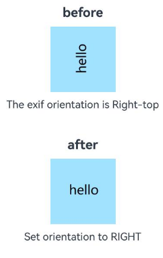

### Example 23: Dynamically Switching an SVG Image Between Fill Colors

This example demonstrates how to dynamically switch an SVG Image between fill colors across different color spaces using [ColorMetrics](../js-apis-arkui-graphics.md#colormetrics12).

```ts
import { ColorMetrics } from '@kit.ArkUI';
@Entry
@Component
struct fillColorMetricsDemo {
  @State p3Red: ColorMetrics = ColorMetrics.colorWithSpace(ColorSpace.DISPLAY_P3, 0.631, 0.0392, 0.1294);
  @State sRGBRed: ColorMetrics = ColorMetrics.colorWithSpace(ColorSpace.SRGB, 0.631, 0.0392, 0.1294);
  @State p3Green: ColorMetrics = ColorMetrics.colorWithSpace(ColorSpace.DISPLAY_P3, 0.09, 0.662 ,0.552);
  @State sRGBGreen: ColorMetrics = ColorMetrics.colorWithSpace(ColorSpace.SRGB, 0.09, 0.662 ,0.552);
  @State p3Blue: ColorMetrics = ColorMetrics.colorWithSpace(ColorSpace.DISPLAY_P3, 0, 0.290 ,0.686);
  @State sRGBBlue: ColorMetrics = ColorMetrics.colorWithSpace(ColorSpace.SRGB, 0, 0.290 ,0.686);
  @State colorArray: (Color|undefined|ColorMetrics|ColorContent)[] = [
    this.p3Red, this.sRGBRed, this.p3Green, this.sRGBGreen, this.p3Blue,
    this.sRGBBlue, ColorContent.ORIGIN, Color.Gray, undefined
  ]
  @State colorArrayStr: string[] = [
    'P3 Red', 'SRGB Red', 'P3 Green', 'SRGB Green',
    'P3 Blue', 'SRGB Blue', 'ORIGIN', 'Gray', 'undefined'
  ]
  @State arrayIdx: number = 0
  build() {
    Column() {
      Text('FillColor is ' + this.colorArrayStr[this.arrayIdx])
      // Replace $r('app.media.svgExample') with the image resource file you use.
      Image($r('app.media.svgExample'))
        .width(110).height(110).margin(15)
        .fillColor(this.colorArray[this.arrayIdx])
      Button('ChangeFillColor')
        .onClick(()=>{
          this.arrayIdx = (this.arrayIdx + 1) % this.colorArray.length
        })
      Blank().height(30).width('100%')
      Text('FillColor is SRGB Red')
      // Replace $r('app.media.svgExample') with the image resource file you use.
      Image($r('app.media.svgExample'))
        .width(110).height(110).margin(15)
        .fillColor(this.sRGBRed)
      Blank().height(30).width('100%')
      Text('FillColor is SRGB Green')
      // Replace $r('app.media.svgExample') with the image resource file you use.
      Image($r('app.media.svgExample'))
        .width(110).height(110).margin(15)
        .fillColor(this.sRGBGreen)
      Blank().height(30).width('100%')
      Text('FillColor is SRGB Blue')
      // Replace $r('app.media.svgExample') with the image resource file you use.
      Image($r('app.media.svgExample'))
        .width(110).height(110).margin(15)
        .fillColor(this.sRGBBlue)
    }
  }
}
```

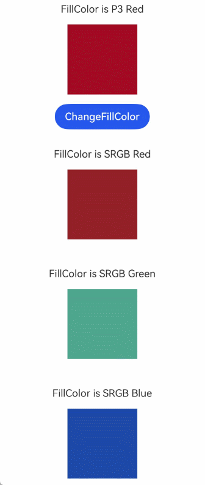


### Example 24: Displaying an Image Using an Application Sandbox Path

This example demonstrates how to display an image using the application sandbox path, where a preloaded image named **cloud.png** is placed in the **haps/entry/files** directory of the current application.

```ts
import { fileUri } from '@kit.CoreFileKit';

@Entry
@Component
struct Index {
  private getSandBoxUri(): string {
    let context = this.getUIContext().getHostContext();
    if (!context) {
      return '';
    }
    // /data/storage/el2/base/haps/entry/files/cloud.png
    // Obtain the URI from the file path in the application sandbox.
    // Replace '/cloud.png' with the image resource file you use.
    return fileUri.getUriFromPath(context.filesDir + '/cloud.png');
  }

  build() {
    Column() {
      Image(this.getSandBoxUri())
        .width(150)
        .height(150)
    }
    .height('100%')
    .width('100%')
  }
}
```


### Example 25: Displaying an Image Using a Relative Path

This example demonstrates how to display an image using a relative path. First, create a common directory at the same level as the project's **pages** directory. Then, place a preloaded image named **cloud1.png** in the **common** directory and display it using the relative path.

```ts
@Entry
@Component
struct Index {
  build() {
    Column({ space: 10 }) {
      Image('common/cloud1.png')
        .width(100)
        .height(100)
    }
    .height('100%')
    .width('100%')
  }
}
```


### Example 26: Displaying an SVG Image Using supportSvg2

In this example, the [supportSvg2](#supportsvg221) attribute is set to enable the enhanced SVG tag parsing feature.

The **supportSvg2** attribute is added since API version 21.

```ts
@Entry
@Component
struct Index {
  build() {
    Row() {
      Column() {
        Text('supportSvg2 is set to true.')
        // Replace $rawfile('image.svg') with the image resource file you use.
        Image($rawfile('image.svg'))
          .width(200)
          .height(200)
          .border({ width: 2, color: 'red' })
          .supportSvg2(true)
          .margin({ bottom: 30 })
        Text('supportSvg2 is set to false (default value).')
        // Replace $rawfile('image.svg') with the image resource file you use.
        Image($rawfile('image.svg'))
          .width(200)
          .height(200)
          .border({ width: 2, color: 'red' })
      }
      .width('100%')
    }
    .height('100%')
  }
}
```

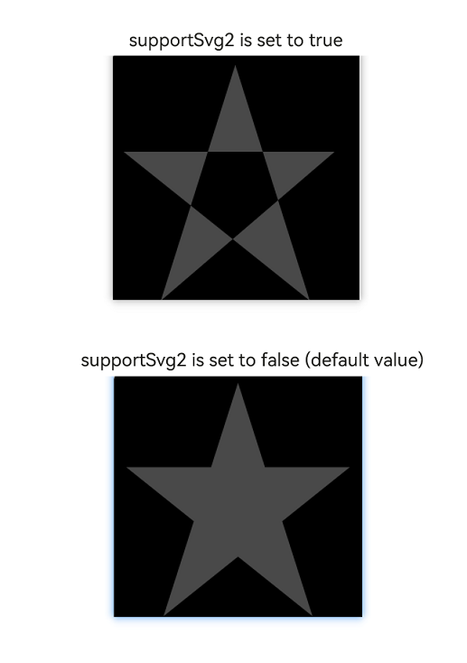

### Example 27: Implementing Fade-in/Fade-out Transition Effects for Images Using ContentTransition

This example demonstrates how to use the [contentTransition](#contenttransition21) attribute to implement the fade-in/fade-out effect for smooth image transitions when the image source is switched on a click. This attribute is supported since API version 21.

```ts
@Entry
@Component
struct ImageExample {
  // Replace $r('app.media.icon') with the image resource file you use.
  @State imageResource: Resource = $r('app.media.icon');

  build() {
    Row() {
      Column() {
        Image(this.imageResource)
          .width(200)
          .height(200)
          // Enable the fade-in/fade-out transition effect.
          .contentTransition(ContentTransitionEffect.OPACITY)
          .onClick(() => {
            // Replace $r('app.media.cloud1') with the image resource file you use.
            this.imageResource = $r('app.media.cloud1')
          })
      }
      .width('100%')
    }
    .height('100%')
  }
}
```


### Example 28 (Using the alt Attribute to Set Placeholder Images During Loading and on Loading Failure)

This example demonstrates how to set the [alt](#alt22) attribute to display a specified image during the image loading process and when image loading fails.

```ts
@Entry
@Component
struct ImageExample {
  build() {
      Column() {
      Text('Both placeholder and error attributes set')
      // Set an invalid URL to trigger the placeholder and error attributes of alt.
      Image("https://www.example.com/xxx.png")
      // Replace $r('app.media.startIcon') and $r('app.media.example') with the image resource file you use.
        .alt({ placeholder: $r('app.media.startIcon'), error: $r('app.media.example') })
        .width(100)
        .height(100)
        .margin(20)
      Text('Only placeholder attribute set')
      Image("https://www.example.com/xxx.png")
        .alt({ placeholder: $r('app.media.startIcon')})
        .width(100)
        .height(100)
        .margin(20)
      Text('Only error attribute set')
      Image("https://www.example.com/xxx.png")
        .alt({error: $r('app.media.example')})
        .width(100)
        .height(100)
        .margin(20)
      }
    .width('100%')
    .height('100%')
  }
}
```
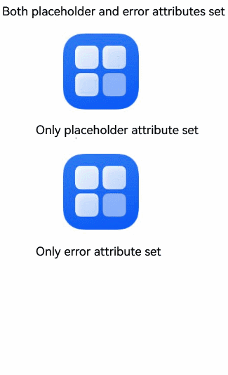

### Example 29 Listening to Online Image Loading Exceptions Using onError

This example demonstrates how to obtain detailed download information ([ImageError](#imageerror9)) when an online image fails to load via the [onError](#onerror9) callback. When image loading fails, you can obtain detailed online image download information through the **downloadInfo** attribute in **ImageError**, including download resource information, network request information, and performance statistics. This helps quickly identify the cause of network exceptions or resource errors.

The **downloadInfo** attribute is added to **ImageError** since API version 23.

```ts
@Entry
@Component
struct Index {
  build() {
    RelativeContainer() {
      Image('https://www.example.com/xxx.png') // Enter a specific online image URL.
        .height(100)
        .width(100)
        .onError((e)=>{
          console.error(`DownloadErrorInfo: ${JSON.stringify(e?.downloadInfo)}`)
        })
    }
    .height('100%')
    .width('100%')
  }
}
```

### Example 30 Setting Anti-aliasing for Pixel Map Image Edges

This example demonstrates how to enable the anti-aliasing feature for pixel map image edges by setting the [antialiased](#antialiased23) API.

The [antialiased](#antialiased23) API is added since API version 23.

```ts
@Entry
@Component
struct ImageExample {
  // Replace $r('app.media.icon') with the image resource file you use.
  @State imageResource: Resource = $r('app.media.icon');

  build() {
    Row() {
      Blank()
        .width(50)

      Column() {
        Blank()
          .height(20)
        Text ('Image without anti-aliasing and with a rotation angle')
        Blank()
          .height(20)
        Image(this.imageResource)
          .width(50)
          .height(50)
          .rotate({angle: 1})

        Blank()
          .height(20)
        Text ('Image with anti-aliasing and a rotation angle')
        Blank()
          .height(20)
        Image(this.imageResource)
          .width(50)
          .height(50)
          .rotate({angle: 1})
          .antialiased(true)
      }
    }
  }
}
```

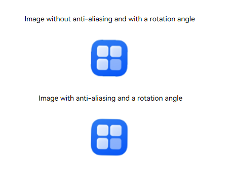

<!--no_check-->