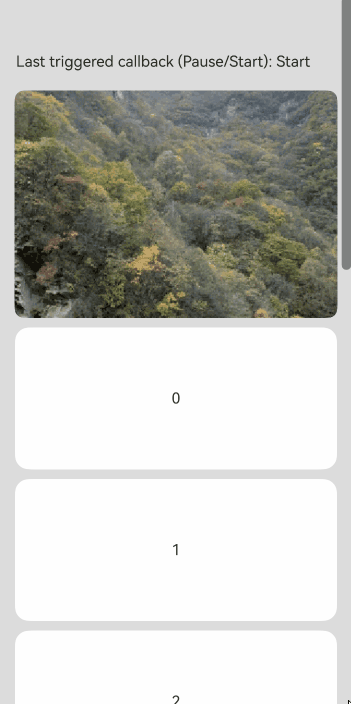

# ImageAnimator

<!--Kit: ArkUI-->
<!--Subsystem: ArkUI-->
<!--Owner: @liyujie43-->
<!--Designer: @weixin_52725220-->
<!--Tester: @xiong0104-->
<!--Adviser: @Brilliantry_Rui-->
<!-- md-trans-meta sourceCommit=6bfe926d91c2859ec4b7fd46834145eff6963a0c translatedAt=2026-09-03T04:09:45.719Z pushedAt=2026-09-09T07:19:36.858Z -->

The **ImageAnimator** component enables images to be played a frame-by-frame basis. The list of images to be played as well as the duration of each image can be configured.

>  **NOTE**
>
> - This component is supported since API version 7. Updates will be marked with a superscript to indicate their earliest API version.
>
> - This component supports [WithTheme](./ts-container-with-theme.md) since API version 26.0.0.

## Child Components

Not supported

## APIs

ImageAnimator()

**Widget capability**: This API can be used in ArkTS widgets since API version 10.

**Atomic service API**: This API can be used in atomic services since API version 11.

**System capability**: SystemCapability.ArkUI.ArkUI.Full

## Attributes

In addition to the [universal attributes](ts-component-general-attributes.md), the following attributes are supported.

### images

images(value: Array&lt;ImageFrameInfo&gt;)

Sets image frame information. Dynamic update is not supported; otherwise, issues such as display disorder, abnormal frame switching, or memory increase may occur. (This attribute is designed for non-dynamic update, and modifications at runtime are not guaranteed to take effect.)

**Widget capability**: This API can be used in ArkTS widgets since API version 10.

**Atomic service API**: This API can be used in atomic services since API version 11.

**System capability**: SystemCapability.ArkUI.ArkUI.Full

**Parameters**

| Name| Type                                                  | Mandatory| Description                                                        |
| ------ | ------------------------------------------------------ | ---- | ------------------------------------------------------------ |
| value  | Array&lt;[ImageFrameInfo](#imageframeinfo)&gt; | Yes  | Image frame information. The information of each frame includes the path, size, position, and playback duration of an image. For details, see [ImageFrameInfo](#imageframeinfo).<br>Default value: **[]**<br> Note: If the input array is too large, memory usage may increase. Therefore, as the controller of memory usage, be sure to assess potential memory consumption before passing in the data to avoid issues such as insufficient memory.|

### state

state(value: AnimationStatus)

Sets the playback state of the animation.

**Widget capability**: This API can be used in ArkTS widgets since API version 10.

**Atomic service API**: This API can be used in atomic services since API version 11.

**System capability**: SystemCapability.ArkUI.ArkUI.Full

**Parameters**

| Name| Type                                                   | Mandatory| Description                                                        |
| ------ | ------------------------------------------------------- | ---- | ------------------------------------------------------------ |
| value  | [AnimationStatus](ts-appendix-enums.md#animationstatus) | Yes   | Playback state.<br/>Default value: **AnimationStatus.Initial** |

### duration

duration(value: number)

Sets the playback duration. When any frame in [images](#images) has its own duration set, this attribute does not take effect.

**Widget capability**: This API can be used in ArkTS widgets since API version 10.

**Atomic service API**: This API can be used in atomic services since API version 11.

**System capability**: SystemCapability.ArkUI.ArkUI.Full

**Parameters**

| Name| Type  | Mandatory| Description                                                        |
| ------ | ------ | ---- | ------------------------------------------------------------ |
| value  | number | Yes   | Playback duration.<br/>If the value is 0, no image is played.<br/>If the display duration allocated per image is shorter than a single frame interval, playback anomalies may occur.<br/>If it is set to a negative value, the default value **1000** is used.<br/>The value change takes effect only at the start of the next cycle.<br/>Unit: ms<br/>Default value: **1000** |

### reverse

reverse(value: boolean)

Sets the playback direction.

**Widget capability**: This API can be used in ArkTS widgets since API version 10.

**Atomic service API**: This API can be used in atomic services since API version 11.

**System capability**: SystemCapability.ArkUI.ArkUI.Full

**Parameters**

| Name| Type   | Mandatory| Description                                                        |
| ------ | ------- | ---- | ------------------------------------------------------------ |
| value  | boolean | Yes  | Playback direction.<br/>The value **false** indicates that images are played from the first one to the last one, and **true** indicates that images are played from the last one to the first one.<br/>Which frame is retained after the animation ends is also related to the [fillMode](#fillmode) attribute. For details, see the description of **fillMode**.<br/>Default value: **false** |

### fixedSize

fixedSize(value: boolean)

Sets whether the image size is fixed at the component size.

**Widget capability**: This API can be used in ArkTS widgets since API version 10.

**Atomic service API**: This API can be used in atomic services since API version 11.

**System capability**: SystemCapability.ArkUI.ArkUI.Full

**Parameters**

| Name| Type   | Mandatory| Description                                                        |
| ------ | ------- | ---- | ------------------------------------------------------------ |
| value  | boolean | Yes  | Whether the image size is fixed at the component size.<br> **true**: The image size is fixed at the component size. In this case, the width, height, top, and left attributes of the image are invalid.<br> **false**: The width, height, top, and left attributes of each image must be set separately. If the image size does not match the component size, the image will not be stretched.<br>Default value: **true**|

### preDecode<sup>(deprecated)</sup>

preDecode(value: number)

Sets the number of images to be pre-decoded.

> **NOTE**
> 
> This API is supported since API version 7 and deprecated since API version 9. Currently, no substitute is available.

**System capability**: SystemCapability.ArkUI.ArkUI.Full

**Parameters**

| Name| Type  | Mandatory| Description                                                        |
| ------ | ------ | ---- | ------------------------------------------------------------ |
| value  | number | Yes   | Number of images to be pre-decoded. For example, the value **2** indicates that two images following the currently playing one are pre-decoded, to improve performance.<br/>Default value: **0** |

### fillMode

fillMode(value: FillMode)

Sets the status before and after execution of the animation in the current playback direction. The status after execution of the animation is jointly determined by the **fillMode** and **reverse** attributes. For example, if **fillMode** is set to **Forwards**, the target will retain the state defined by the last keyframe encountered during execution. In this case, if **reverse** is set to **false**, the target will retain the state defined by the last keyframe encountered in the forward direction, that is, the last image; if **reverse** is set to **true**, the target will retain the state defined by the last keyframe encountered in the backward direction, that is, the first image.

**Widget capability**: This API can be used in ArkTS widgets since API version 10.

**Atomic service API**: This API can be used in atomic services since API version 11.

**System capability**: SystemCapability.ArkUI.ArkUI.Full

**Parameters**

| Name| Type                                     | Mandatory| Description                                                        |
| ------ | ----------------------------------------- | ---- | ------------------------------------------------------------ |
| value  | [FillMode](ts-appendix-enums.md#fillmode) | Yes  | Status before and after execution of the animation in the current playback direction.<br>Default value: **FillMode.Forwards**|

### iterations

iterations(value: number)

Sets the number of times that the animation is played.

**Atomic service API**: This API can be used in atomic services since API version 11.

**System capability**: SystemCapability.ArkUI.ArkUI.Full

**Parameters**

| Name| Type  | Mandatory| Description                                                  |
| ------ | ------ | ---- | ------------------------------------------------------ |
| value  | number | Yes   | Number of times that the animation is played. By default, the animation is played once. The value **-1** indicates that the animation is played for an unlimited number of times. Values less than **-1** are treated as the default value. When the value is a floating-point number, it is rounded down.<br/>Default value: **1** |

### monitorInvisibleArea<sup>17+</sup>

monitorInvisibleArea(monitorInvisibleArea: boolean)

Sets whether the component should automatically pause or resume based on its visibility, using the system's [onVisibleAreaChange](./ts-universal-component-visible-area-change-event.md#onvisibleareachange) event.

**Atomic service API**: This API can be used in atomic services since API version 17.

**Model restriction**: This API can be used only in the stage model.

**System capability**: SystemCapability.ArkUI.ArkUI.Full

**Parameters**

<!--Table: auto; 10%; 10%; auto-->

| Name | Type   | Mandatory | Description                                                   |
| ------ | ------ | ---- | ------------------------------------------------------ |
| monitorInvisibleArea  | boolean | Yes | Whether the component should automatically pause or resume based on its visibility, using the system's **onVisibleAreaChange**. When this parameter is set to **true**, the component controls pause and playback based on the visibility determination of the system's [onVisibleAreaChange](./ts-universal-component-visible-area-change-event.md#onvisibleareachange). When the component's running state is [AnimationStatus](ts-appendix-enums.md#animationstatus).Running, playback is automatically paused if the component is determined to be invisible, and automatically resumed if it is determined to be visible. When this parameter is set to **false**, the pause and playback of the component are not affected by **onVisibleAreaChange**.<br/>Default value: **false** <br/> **NOTE** <br/>When the value of this parameter is dynamically changed from **true** to **false**, the component is processed based on the current [AnimationStatus](ts-appendix-enums.md#animationstatus) state.<br/> For example, if the current state is **Running** and playback is paused due to the invisible callback of [onVisibleAreaChange](./ts-universal-component-visible-area-change-event.md#onvisibleareachange), after the value is changed from **true** to **false**, the component resumes playback from the position where it was last paused.<br/>The pause and playback operations caused by this parameter do not change the [state](./ts-basic-components-imageanimator.md#state) value set by the user.|

## ImageFrameInfo

Image frame information set.

**Atomic service API**: This API can be used in atomic services since API version 11.

**System capability**: SystemCapability.ArkUI.ArkUI.Full

| Name   | Type   | Read-Only | Optional | Description |
| -------- | -------------- | -------- | -------- | -------- |
| src      | string \| [Resource](ts-types.md#resource)<sup>9+</sup> \| [PixelMap](ts-image-common.md#pixelmap)<sup>12+</sup> | No  | No   | Image path. The image format can be .jpg, .jpeg, .svg, .png, .bmp, .webp, .ico, or .heif. The [Resource](ts-types.md#resource) type is supported since API version 9, and the [PixelMap](ts-image-common.md#pixelmap) type is supported since API version 12.<br/>**String format description:**<br/>- Supports loading local image paths and network image addresses. When a relative path is used to reference a local image, cross-package or cross-module invocation is not supported. Files in the **resources** directory cannot be accessed through relative paths. You need to use the [Resource](ts-types.md#resource) type (such as **\$r** or **$rawfile**) to reference them. For details about how to reference images, see [Loading Image Resources](../../../ui/arkts-graphics-display.md#loading-image-resources).<br/>- Supports `http` and `https` network image addresses. When using a network image, you must apply for the `ohos.permission.INTERNET` permission.<br/>- Supports strings with the `file://` path prefix. The application sandbox URI is `file://\<bundleName>/\<sandboxPath>`. For the sandbox path, you need to use [fileUri.getUriFromPath(path)](../../apis-core-file-kit/js-apis-file-fileuri.md#fileurigeturifrompath) to convert the path into an application sandbox URI, and then pass it for display. At the same time, ensure that the files under the directory package path have read permission.<br/>- Supports `Base64` strings. <br/>**Widget capability:** This API can be used in ArkTS widgets since API version 10.|
| width    | number&nbsp;\|&nbsp;string | No | Yes | Image width. When the value is a string, it can represent a numeric value with or without units, for example, **"2"** or **"2px"**.<br/>Default value: **0**<br/>Unit: vp   <br/>**Widget capability:** This API can be used in ArkTS widgets since API version 10.       |
| height   | number&nbsp;\|&nbsp;string | No | Yes | Image height. When the value is a string, it can represent a numeric value with or without units, for example, **"2"** or **"2px"**.<br/>Default value: **0**<br/>Unit: vp     <br/>**Widget capability:** This API can be used in ArkTS widgets since API version 10.        |
| top      | number&nbsp;\|&nbsp;string | No | Yes | Vertical coordinate of the image relative to the upper left corner of the component. When the value is a string, it can represent a numeric value with or without units, for example, **"2"** or **"2px"**.<br/>Default value: **0**<br/>Unit: vp  <br/>**Widget capability:** This API can be used in ArkTS widgets since API version 10.  |
| left     | number&nbsp;\|&nbsp;string | No | Yes | Horizontal coordinate of the image relative to the upper left corner of the component. When the value is a string, it can represent a numeric value with or without units, for example, **"2"** or **"2px"**.<br/>Default value: **0**<br/>Unit: vp <br/>**Widget capability:** This API can be used in ArkTS widgets since API version 10.   |
| duration | number          | No    | Yes    | Playback duration of each image frame, in milliseconds.<br/>Default value: **0**<br/>Negative values are not supported. Setting a negative value causes the image to stay on the current frame for a long time, affecting normal playback.         |

## Events

In addition to the [universal events](ts-component-general-events.md), the following events are supported.

### onStart

onStart(event:&nbsp;()&nbsp;=&gt;&nbsp;void)

Triggered when the animation starts to play.

**Widget capability**: This API can be used in ArkTS widgets since API version 10.

**Atomic service API**: This API can be used in atomic services since API version 11.

**System capability**: SystemCapability.ArkUI.ArkUI.Full

**Parameters**

| Name  | Type                                      | Mandatory| Description                      |
| -------- | ------------------------------------------ | ---- | -------------------------- |
| event | () => void                               | Yes   | Callback triggered when the animation starts to play.|

### onPause

onPause(event:&nbsp;()&nbsp;=&gt;&nbsp;void)

Triggered when the animation playback is paused.

**Widget capability**: This API can be used in ArkTS widgets since API version 10.

**Atomic service API**: This API can be used in atomic services since API version 11.

**System capability**: SystemCapability.ArkUI.ArkUI.Full

**Parameters**

| Name  | Type                                      | Mandatory| Description                      |
| -------- | ------------------------------------------ | ---- | -------------------------- |
| event | () => void                               | Yes   | Callback triggered when the animation playback is paused.|

### onRepeat

onRepeat(event:&nbsp;()&nbsp;=&gt;&nbsp;void)

Triggered when the animation playback is repeated.

**Atomic service API**: This API can be used in atomic services since API version 11.

**System capability**: SystemCapability.ArkUI.ArkUI.Full

**Parameters**

| Name  | Type                                      | Mandatory| Description                      |
| -------- | ------------------------------------------ | ---- | -------------------------- |
| event | () => void                               | Yes   | Callback triggered when the animation playback is repeated.|

### onCancel

onCancel(event: () => void)

Triggered when the animation is canceled (that is, **state** is set to [AnimationStatus.Initial](ts-appendix-enums.md#animationstatus)). After triggering, the image display returns to the first frame (forward playback) or the last frame (reverse playback). The difference from [onFinish](#onfinish) is that **onCancel** returns to the **Initial** state, while **onFinish** corresponds to the state where the animation ends naturally or stops (**Stopped**).

**Widget capability**: This API can be used in ArkTS widgets since API version 10.

**Atomic service API**: This API can be used in atomic services since API version 11.

**System capability**: SystemCapability.ArkUI.ArkUI.Full

**Parameters**

| Name   | Type                                       | Mandatory | Description                       |
| -------- | ------------------------------------------ | ---- | -------------------------- |
| event | () => void                               | Yes    | Callback triggered when the animation is canceled (that is, **state** is set to **AnimationStatus.Initial**). After triggering, the image display returns to the first frame (forward playback) or the last frame (reverse playback). |

### onFinish

onFinish(event: () => void)

Triggered when the animation playback completes (all iterations set by **iterations** are played and the animation ends naturally) or stops (**state** is switched to [AnimationStatus.Stopped](ts-appendix-enums.md#animationstatus)). When the animation is in the [AnimationStatus.Initial](ts-appendix-enums.md#animationstatus) state, returning to the initial state does not trigger this event; instead, **onCancel** is triggered.

**Widget capability**: This API can be used in ArkTS widgets since API version 10.

**Atomic service API**: This API can be used in atomic services since API version 11.

**System capability**: SystemCapability.ArkUI.ArkUI.Full

**Parameters**

| Name   | Type                                       | Mandatory | Description                       |
| -------- | ------------------------------------------ | ---- | -------------------------- |
| event | () => void                               | Yes    | Callback triggered when the animation playback completes (all iterations set by **iterations** are played and the animation ends naturally) or stops (**state** is switched to **AnimationStatus.Stopped**). |

## Example

### Example 1: Playing an Animation Using Images of the Resource Type

This example demonstrates how to play an animation using the **ImageAnimator** component with images of the Resource type.

```ts
// xxx.ets
@Entry
@Component
struct ImageAnimatorExample {
  @State state: AnimationStatus = AnimationStatus.Initial;
  @State reverse: boolean = false;
  @State iterations: number = 1;

  build() {
    Column({ space: 10 }) {
      ImageAnimator()
        .images([
          {
            // Replace $r('app.media.img1') with the image resource file you use.
            src: $r('app.media.img1')
          },
          {
            // Replace $r('app.media.img2') with the image resource file you use.
            src: $r('app.media.img2')
          },
          {
            // Replace $r('app.media.img3') with the image resource file you use.
            src: $r('app.media.img3')
          },
          {
            // Replace $r('app.media.img4') with the image resource file you use.
            src: $r('app.media.img4')
          }
        ])
        .duration(4000)
        .state(this.state)
        .reverse(this.reverse)
        .fillMode(FillMode.None)
        .iterations(this.iterations)
        .width(340)
        .height(240)
        .margin({ top: 100 })
        .onStart(() => {
          console.info('Start')
        })
        .onPause(() => {
          console.info('Pause')
        })
        .onRepeat(() => {
          console.info('Repeat')
        })
        .onCancel(() => {
          console.info('Cancel')
        })
        .onFinish(() => {
          console.info('Finish')
          this.state = AnimationStatus.Stopped
        })
      Row() {
        Button('start').width(100).padding(5).onClick(() => {
          this.state = AnimationStatus.Running
        }).margin(5)
        Button('pause').width(100).padding(5).onClick(() => {
          this.state = AnimationStatus.Paused // Display the image of the current frame.
        }).margin(5)
        Button('stop').width(100).padding(5).onClick(() => {
          this.state = AnimationStatus.Stopped // Display the image of the initial frame.
        }).margin(5)
      }

      Row() {
        Button('reverse').width(100).padding(5).onClick(() => {
          this.reverse = !this.reverse
        }).margin(5)
        Button('once').width(100).padding(5).onClick(() => {
          this.iterations = 1
        }).margin(5)
        Button('infinite').width(100).padding(5).onClick(() => {
          this.iterations = -1 // The animation is played for an unlimited number of times.
        }).margin(5)
      }
    }.width('100%').height('100%')
  }
}
```


### Example 2: Playing an Animation Using Images of the PixelMap Type

This example shows how to use the **ImageAnimator** component to play the PixelMap animation 

```ts
// xxx.ets
import { image } from '@kit.ImageKit';

@Entry
@Component
struct ImageAnimatorExample {
  imagePixelMap: Array<PixelMap> = [];
  @State state: AnimationStatus = AnimationStatus.Initial;
  @State reverse: boolean = false;
  @State iterations: number = 1;
  @State images: Array<ImageFrameInfo> = [];

  async aboutToAppear() {
    // Replace $r('app.media.1') with the image resource file you use.
    this.imagePixelMap.push(await this.getPixmapFromMedia($r('app.media.1')));
    // Replace $r('app.media.2') with the image resource file you use.
    this.imagePixelMap.push(await this.getPixmapFromMedia($r('app.media.2')));
    // Replace $r('app.media.3') with the image resource file you use.
    this.imagePixelMap.push(await this.getPixmapFromMedia($r('app.media.3')));
    // Replace $r('app.media.4') with the image resource file you use.
    this.imagePixelMap.push(await this.getPixmapFromMedia($r('app.media.4')));
    this.images.push({ src: this.imagePixelMap[0] });
    this.images.push({ src: this.imagePixelMap[1] });
    this.images.push({ src: this.imagePixelMap[2] });
    this.images.push({ src: this.imagePixelMap[3] });
  }

  build() {
    Column({ space: 10 }) {
      ImageAnimator()
        .images(this.images)
        .duration(2000)
        .state(this.state)
        .reverse(this.reverse)
        .fillMode(FillMode.None)
        .iterations(this.iterations)
        .width(340)
        .height(240)
        .margin({ top: 100 })
        .onStart(() => {
          console.info('Start');
        })
        .onPause(() => {
          console.info('Pause');
        })
        .onRepeat(() => {
          console.info('Repeat');
        })
        .onCancel(() => {
          console.info('Cancel');
        })
        .onFinish(() => {
          console.info('Finish');
          this.state = AnimationStatus.Stopped;
        })
      Row() {
        Button('start').width(100).padding(5).onClick(() => {
          this.state = AnimationStatus.Running;
        }).margin(5)
        Button('pause').width(100).padding(5).onClick(() => {
          this.state = AnimationStatus.Paused; // Display the current frame image.
        }).margin(5)
        Button('stop').width(100).padding(5).onClick(() => {
          this.state = AnimationStatus.Stopped; // Display the start frame image of the animation.
        }).margin(5)
      }

      Row() {
        Button('reverse').width(100).padding(5).onClick(() => {
          this.reverse = !this.reverse;
        }).margin(5)
        Button('once').width(100).padding(5).onClick(() => {
          this.iterations = 1;
        }).margin(5)
        Button('infinite').width(100).padding(5).onClick(() => {
          this.iterations = -1; // Play the animation in an infinite loop.
        }).margin(5)
      }
    }.width('100%').height('100%')
  }

  private async getPixmapFromMedia(resource: Resource) {
    // Obtain the content data of the resource file.
    let uint8Array = await this.getUIContext().getHostContext()?.resourceManager?.getMediaContent(resource.id);
    // Create an image source based on the binary data.
    let imageSource = image.createImageSource(uint8Array?.buffer.slice(0, uint8Array.buffer.byteLength));
    try {
      // Create a PixelMap object from the image source, with the pixel format set to RGBA_8888.
      let createPixelMap: image.PixelMap = await imageSource.createPixelMap({
        desiredPixelFormat: image.PixelMapFormat.RGBA_8888
      });
      return createPixelMap;
    } finally {
      // Release the image source resource.
      await imageSource.release();
    }
  }
}
```


### Example 3: Enabling Automatic Pause on Invisibility

This example demonstrates how to use [monitorInvisibleArea](#monitorinvisiblearea17) to automatically pause the **ImageAnimator** component when it becomes invisible and resume playback when it becomes visible again. This behavior is controlled based on the component's [state](#state) being set to **AnimationStatus.Running**.

```ts
@Entry
@Component
struct ImageAnimatorAutoPauseTest {
  scroller: Scroller = new Scroller();
  @State state: AnimationStatus = AnimationStatus.Running;
  @State reverse: boolean = false;
  @State iterations: number = 100;
  @State preCallBack: string = 'Null';
  private arr: number[] = [0, 1, 2, 3, 4, 5, 6, 7, 8, 9];

  build() {
    Stack({ alignContent: Alignment.TopStart }) {
      Scroll(this.scroller) {
        Column() {
          ImageAnimator()
            .images([
              {
                // Replace $r('app.media.Clouds') with the image resource file you use.
                src: $r('app.media.Clouds')
              },
              {
                // Replace $r('app.media.landscape') with the image resource file you use.
                src: $r('app.media.landscape')
              },
              {
                // Replace $r('app.media.sky') with the image resource file you use.
                src: $r('app.media.sky')
              },
              {
                // Replace $r('app.media.mountain') with the image resource file you use.
                src: $r('app.media.mountain')
              }
            ])
            .borderRadius(10)
            .monitorInvisibleArea(true)
            .clip(true)
            .duration(4000)
            .state(this.state)
            .reverse(this.reverse)
            .fillMode(FillMode.Forwards)
            .iterations(this.iterations)
            .width(340)
            .height(240)
            .margin({ top: 100 })
            .onStart(() => {
              this.preCallBack = 'Start';
              console.info('ImageAnimator Start');
            })
            .onPause(() => {
              this.preCallBack = 'Pause';
              console.info('ImageAnimator Pause');
            })
            .onRepeat(() => {
              console.info('ImageAnimator Repeat');
            })
            .onCancel(() => {
              console.info('ImageAnimator Cancel');
            })
            .onFinish(() => {
              console.info('ImageAnimator Finish');
            })
          ForEach(this.arr, (item: number) => {
            Text(item.toString())
              .width('90%')
              .height(150)
              .backgroundColor(0xFFFFFF)
              .borderRadius(15)
              .fontSize(16)
              .textAlign(TextAlign.Center)
              .margin({ top: 10 })
          }, (item: number) => item.toString())
        }.width('100%')
      }
      .scrollable(ScrollDirection.Vertical) // The scrollbar scrolls in the vertical direction.
      .scrollBar(BarState.On) // The scrollbar is always displayed.
      .scrollBarColor(Color.Gray) // The scrollbar color is gray.
      .scrollBarWidth(10) // The scrollbar width is 10.
      .friction(0.6)
      .edgeEffect(EdgeEffect.None)
      .onWillScroll((xOffset: number, yOffset: number, scrollState: ScrollState) => {
        console.info(xOffset + ' ' + yOffset);
      })
      .onScrollEdge((side: Edge) => {
        console.info('To the edge');
      })
      .onScrollStop(() => {
        console.info('Scroll Stop');
      })

      Text('Last triggered callback (Pause/Start):' + this.preCallBack)
        .margin({ top: 60, left: 20 })
    }.width('100%').height('100%').backgroundColor(0xDCDCDC)
  }
}
```

