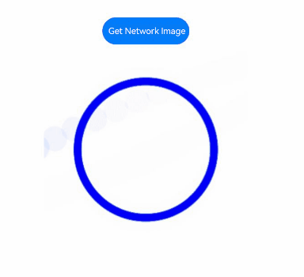

# ImageSpan
<!--Kit: ArkUI-->
<!--Subsystem: ArkUI-->
<!--Owner: @xiangyuan6-->
<!--Designer: @xiangyuan6-->
<!--Tester: @jiaoaozihao-->
<!--Adviser: @Brilliantry_Rui-->
<!-- md-trans-meta sourceCommit=ad4754b39ea804eeff70d3e1abea09f3987cefbe translatedAt=2026-09-03T04:10:53.697Z -->

**ImageSpan** is a child component of [Text](ts-basic-components-text.md) and [ContainerSpan](ts-basic-components-containerspan.md), used to display inline images in text. It supports setting the image alignment, scale type, loading placeholder image, and color filter, and is suitable for scenarios where images need to be embedded in text paragraphs to implement image-text layout.

>  **NOTE**
>
> - This component is supported since API version 10. Newly added APIs will be marked with a superscript to indicate their earliest API version.
>
> - The APIs of this module can be used only in the stage model.


## Child Components

Not supported


## APIs

ImageSpan(value: ResourceStr | PixelMap)

**Atomic service API**: This API can be used in atomic services since API version 11.

**System capability**: SystemCapability.ArkUI.ArkUI.Full

**Parameters**

| Name| Type| Mandatory| Description|
| -------- | -------- | -------- | -------- |
| value | [ResourceStr](ts-types.md#resourcestr) \|&nbsp;[PixelMap](../../apis-image-kit/arkts-apis-image-PixelMap.md)&nbsp; | Yes | Image data source, which supports local and network images.<br>When a network image is used, the ohos.permission.INTERNET permission is required. For details about how to request the permission, see [Declaring Permissions](../../../security/AccessToken/declare-permissions.md).<br>When a relative path is used to reference an image resource, for example, `ImageSpan("common/test.jpg")`, cross-package or cross-module invocation of the ImageSpan component is not supported. You are advised to use `$r` to manage image resources that need to be used globally.<br>\- The supported image formats include png, jpg, bmp, svg, gif, webp, and heif.<br>\- `Base64` strings are supported. The format is `data:image/[png\|jpeg\|bmp\|webp\|heif];base64,[base64 data]`, where `[base64 data]` is the `Base64` string data.<br>\- Strings with the file://data/storage path prefix are supported, which are used to read image resources in the file folder under the installation directory of the application. Ensure that the files under the application installation directory have read permission. |


## Attributes

The attributes inherit from [BaseSpan](ts-basic-components-span.md#basespan). Among the universal attributes, [size](ts-universal-attributes-size.md), [background](ts-universal-attributes-background.md), and [border](ts-universal-attributes-border.md) are supported.

### verticalAlign

verticalAlign(value: ImageSpanAlignment)

Sets the alignment of the image based on the line height. It is suitable for adjusting the vertical alignment between the image and text in image-text layout scenarios. If this API is not used, the default alignment is **ImageSpanAlignment.BOTTOM**.

**Atomic service API**: This API can be used in atomic services since API version 11.

**System capability**: SystemCapability.ArkUI.ArkUI.Full

**Parameters**

| Name| Type                                     | Mandatory| Description                                                        |
| ------ | ----------------------------------------- | ---- | ------------------------------------------------------------ |
| value  | [ImageSpanAlignment](ts-appendix-enums.md#imagespanalignment10) | Yes   | Alignment mode of the image based on the line height. |

### objectFit

objectFit(value: ImageFit)

Sets the scale type of the image. It is suitable for controlling how the image is displayed in the container. If this API is not used, the default scale type is **ImageFit.Cover**.

**Atomic service API**: This API can be used in atomic services since API version 11.

**System capability**: SystemCapability.ArkUI.ArkUI.Full

**Parameters**

| Name| Type                                     | Mandatory| Description                                       |
| ------ | ----------------------------------------- | ---- | ------------------------------------------- |
| value  | [ImageFit](ts-appendix-enums.md#imagefit) | Yes   | Scale type of the image. |

### alt<sup>12+</sup>

alt(value:&nbsp;PixelMap)

Sets the placeholder image displayed during image loading. If this API is not used, the default value is **null**, and no placeholder image is displayed.

**Atomic service API**: This API can be used in atomic services since API version 12.

**System capability**: SystemCapability.ArkUI.ArkUI.Full

**Parameters**

| Name| Type                                                    | Mandatory| Description                                                        |
| ------ | -------------------------------------------------------- | ---- | ------------------------------------------------------------ |
| value  | [PixelMap](../../apis-image-kit/arkts-apis-image-PixelMap.md) | Yes   | Placeholder image displayed during image loading, which supports the [PixelMap](../../apis-image-kit/arkts-apis-image-PixelMap.md) type. |

### colorFilter<sup>14+</sup>

colorFilter(filter: ColorFilter | DrawingColorFilter)

Sets the color filter for the image.

**Atomic service API**: This API can be used in atomic services since API version 14.

**System capability**: SystemCapability.ArkUI.ArkUI.Full

**Parameters**

| Name| Type                                   | Mandatory| Description                                                        |
| ------ | --------------------------------------- | ---- | ------------------------------------------------------------ |
| filter  | [ColorFilter](ts-types.md#colorfilter9) \| [DrawingColorFilter](ts-basic-components-image.md#drawingcolorfilter12) | Yes   | 1. Sets a color filter effect for the image. The input parameter is a 4x5 RGBA conversion matrix.<br>The first row of the matrix is used to calculate R' (the new red component), the second row to calculate G' (the new green component), the third row to calculate B' (the new blue component), and the fourth row to calculate A' (the new alpha component). The four rows represent different RGBA components.<br>When the diagonal values of the matrix are 1 and the other values are 0, the original colors of the image are retained.<br> **Calculation rule:**<br>If the input filter matrix is:<br><br>and the pixel is [R, G, B, A] with color values in the range [0, 255],<br>then the filtered color is [R', G', B', A']<br><br>2. Supports the ColorFilter type of @ohos.graphics.drawing as the input parameter.<br>**NOTE**<br>The DrawingColorFilter type in this API can be used in atomic services. For SVG image sources, the filter takes effect only on the stroke attribute.|

### supportSvg2<sup>22+</sup>

supportSvg2(enable: Optional\<boolean>)

Enables or disables the [Enhanced SVG Tag Parsing](ts-image-svg2-capabilities.md). When enabled, new SVG parsing capabilities are supported, which is suitable for scenarios that require new SVG features. When disabled, the original SVG parsing capability is retained, which is suitable for scenarios that require compatibility with the display of SVG images in earlier versions. If this API is not used, the original SVG parsing capability is retained by default.

After the **ImageSpan** component is created, the value of this attribute cannot be dynamically changed.

**Atomic service API**: This API can be used in atomic services since API version 22.

**System capability**: SystemCapability.ArkUI.ArkUI.Full

**Parameters**

| Name| Type                                                    | Mandatory| Description                                                        |
| ------ | -------------------------------------------------------- | ---- | ------------------------------------------------------------ |
| enable  | Optional\<boolean> | Yes   | Whether to enable the [Enhanced SVG Tag Parsing](ts-image-svg2-capabilities.md).<br>true: supports the new SVG parsing capability; false: retains the original SVG parsing capability. |

### resizable

resizable(value: ResizableOptions)

Sets the resizing options when the image is stretched. Stretching takes effect on the drag thumbnail and placeholder image.

When `top + bottom` is greater than the height of the original image or `left + right` is greater than the width of the original image, the [ResizableOptions](ts-basic-components-image.md#resizableoptions11) attribute does not take effect.

When the parameter type of the component is an animated image, [AnimatedDrawableDescriptor](../js-apis-arkui-drawableDescriptor.md#animateddrawabledescriptor12), or SVG, this attribute does not take effect.

**Since**: 26.1.0

**Atomic service API:** This API can be used in atomic services since API version 26.1.0.

**Model restriction**: This API can be used only in the stage model.

**System capability**: SystemCapability.ArkUI.ArkUI.Full

**Parameters**

| Name | Type                                    | Mandatory | Description                             |
| ------ | --------------------------------------- | ---- | -------------------------------- |
| value  | [ResizableOptions](ts-basic-components-image.md#resizableoptions11) | Yes   | Resizable image options when the image is stretched. |

## Events

Among all the universal events, only the [click event](ts-universal-attributes-click.md) is supported. The following events are also supported:

### onComplete<sup>12+</sup>

onComplete(callback: ImageCompleteCallback)

Triggered when the image is successfully loaded or decoded. The size of the loaded image is returned.

**Atomic service API**: This API can be used in atomic services since API version 12.

**System capability**: SystemCapability.ArkUI.ArkUI.Full

**Parameters**

| Name  | Type                                      | Mandatory| Description                      |
| -------- | ------------------------------------------ | ---- | -------------------------- |
| callback | [ImageCompleteCallback](#imagecompletecallback12) | Yes  | Callback triggered when the image is successfully loaded or decoded.|

### onError<sup>12+</sup>

onError(callback: ImageErrorCallback)

Triggered when an error occurs during image loading.

**Atomic service API**: This API can be used in atomic services since API version 12.

**System capability**: SystemCapability.ArkUI.ArkUI.Full

**Parameters**

| Name  | Type                                      | Mandatory| Description                      |
| -------- | ------------------------------------------ | ---- | -------------------------- |
| callback | [ImageErrorCallback](ts-basic-components-image.md#imageerrorcallback9) | Yes  | Callback triggered when an error occurs during image loading.|

## ImageCompleteCallback<sup>12+</sup>

type ImageCompleteCallback = (result: ImageLoadResult) => void

Triggered when the image is successfully loaded and decoded.

**Atomic service API**: This API can be used in atomic services since API version 12.

**System capability**: SystemCapability.ArkUI.ArkUI.Full

**Parameters**

| Name| Type                      | Mandatory| Description                              |
| ------ | -------------------------- | ---- | ---------------------------------- |
| result  | [ImageLoadResult](#imageloadresult12) | Yes  | Object returned after the callback is triggered when an image is successfully loaded or decoded.|

## ImageLoadResult<sup>12+</sup>

Describes the object returned after the callback is triggered when an image is successfully loaded or decoded.

**Atomic service API**: This API can be used in atomic services since API version 12.

**System capability**: SystemCapability.ArkUI.ArkUI.Full

| Name                      | Type  | Read-Only| Optional| Description                                                        |
| ---------------------------- | ------ | ---- | ---- | ------------------------------------------------------------ |
| width                        | number | No   | No | Width of the image.<br>Unit: [px](ts-pixel-units.md#basic-pixel-units)                                    |
| height                       | number | No   | No   | Height of the image.<br>Unit: [px](ts-pixel-units.md#basic-pixel-units)                                    |
| componentWidth               | number | No   | No   | Width of the component.<br>Unit: [px](ts-pixel-units.md#basic-pixel-units)                                    |
| componentHeight              | number | No   | No   | Height of the component.<br>Unit: [px](ts-pixel-units.md#basic-pixel-units)                                    |
| loadingStatus                | number | No   | No   | Status value of image loading success.<br>**NOTE**<br>When the returned status value is 0, it indicates image data load success. When the returned status value is 1, it indicates image decoding success. |
| contentWidth   | number | No   | No   | Width of the image actually drawn.<br>Unit: [px](ts-pixel-units.md#basic-pixel-units)<br>**NOTE**<br>Valid only when loadingStatus returns 1. |
| contentHeight  | number | No   | No   | Height of the image actually drawn.<br>Unit: [px](ts-pixel-units.md#basic-pixel-units)<br>**NOTE**<br>Valid only when loadingStatus returns 1. |
| contentOffsetX | number | No   | No   | X-axis offset of the actually drawn content relative to the component itself.<br>Unit: [px](ts-pixel-units.md#basic-pixel-units)<br>**NOTE**<br>Valid only when loadingStatus returns 1. |
| contentOffsetY | number | No   | No   | Y-axis offset of the actually drawn content relative to the component itself.<br>Unit: [px](ts-pixel-units.md#basic-pixel-units)<br>**NOTE**<br>Valid only when loadingStatus returns 1. |


## Example

### Example 1: Setting the Alignment Mode

This example demonstrates the alignment and scaling effects of the ImageSpan component using the [verticalAlign](#verticalalign) and [objectFit](#objectfit) attributes, available since API version 10.

```ts
// xxx.ets
@Entry
@Component
struct SpanExample {
  build() {
    Flex({ direction: FlexDirection.Column, alignItems: ItemAlign.Center, justifyContent: FlexAlign.Center }) {
      Text() {
        Span('This is the Span and ImageSpan component').fontSize(25).textCase(TextCase.Normal)
          .decoration({ type: TextDecorationType.None, color: Color.Pink })
      }.width('100%').textAlign(TextAlign.Center)

      Text() {
        // Replace $r('app.media.app_icon') with the actual image resource file.
        ImageSpan($r('app.media.app_icon'))
          .width('200px')
          .height('200px')
          .objectFit(ImageFit.Fill)
          .verticalAlign(ImageSpanAlignment.CENTER)
        Span('I am LineThrough-span')
          .decoration({ type: TextDecorationType.LineThrough, color: Color.Red }).fontSize(25)
        ImageSpan($r('app.media.app_icon'))
          .width('50px')
          .height('50px')
          .verticalAlign(ImageSpanAlignment.TOP)
        Span('I am Underline-span')
          .decoration({ type: TextDecorationType.Underline, color: Color.Red }).fontSize(25)
        ImageSpan($r('app.media.app_icon'))
          .size({ width: '100px', height: '100px' })
          .verticalAlign(ImageSpanAlignment.BASELINE)
        Span('I am Underline-span')
          .decoration({ type: TextDecorationType.Underline, color: Color.Red }).fontSize(25)
        ImageSpan($r('app.media.app_icon'))
          .width('70px')
          .height('70px')
          .verticalAlign(ImageSpanAlignment.BOTTOM)
        Span('I am Underline-span')
          .decoration({ type: TextDecorationType.Underline, color: Color.Red }).fontSize(50)
      }
      .width('100%')
      .textIndent(50)
    }.width('100%').height('100%').padding({ left: 0, right: 0, top: 0 })
  }
}
```


### Example 2: Setting the Background Style

This example demonstrates how to set the background style for text using the [textBackgroundStyle](ts-basic-components-span.md#textbackgroundstyle11) attribute, available since API version 11.

```ts
// xxx.ets
@Component
@Entry
struct Index {
  build() {
    Row() {
      Column() {
        Text() {
          // Replace $r('app.media.sky') with the actual image resource file.
          ImageSpan($r('app.media.sky'))
            .width('60vp')
            .height('60vp')
            .verticalAlign(ImageSpanAlignment.CENTER)
            .borderRadius(20)
            .textBackgroundStyle({ color: '#7F007DFF', radius: '5vp' })
        }
      }.width('100%')
    }.height('100%')
  }
}
```


### Example 3: Adding Events to an Image

This example demonstrates how to add load success and load error events to the **ImageSpan** component using [onComplete](#oncomplete12) and [onError](#onerror12), available since API version 12.

```ts
// xxx.ets
@Entry
@Component
struct Index {
  // Replace $r('app.media.app_icon') with the actual image resource file.
  @State src: ResourceStr = $r('app.media.app_icon');

  build() {
    Column() {
      Text() {
        ImageSpan(this.src)
          .width(100).height(100)
          .onError((err) => {
            console.error(`Failed to load image. Code: ${err.error?.code}, message: ${err.message}`);
          })
          .onComplete((event) => {
            console.info('onComplete: ' + event.loadingStatus);
          })
      }
    }.width('100%').height('100%')
  }
}
```
### Example 4: Setting the Color Filter

This example demonstrates the effect of setting a color filter for the **ImageSpan** component using the [colorFilter](#colorfilter14) attribute, available since API version 14.

```ts
// xxx.ets
import { drawing } from '@kit.ArkGraphics2D';

@Entry
@Component
struct SpanExample {
  private colorFilterMatrix: number[] = [0.239, 0, 0, 0, 0, 0, 0.616, 0, 0, 0, 0, 0, 0.706, 0, 0, 0, 0, 0, 1, 0];
  @State drawingColorFilterFirst: ColorFilter | undefined = new ColorFilter(this.colorFilterMatrix);

  build() {
    Row() {
      Column({ space: 10 }) {
        // Create a ColorFilter object to set a color filter for the image.
        Text() {
          // Replace $r('app.media.sky') with the actual image resource file.
          ImageSpan($r('app.media.sky'))
            .width('60vp')
            .height('60vp')
            .colorFilter(this.drawingColorFilterFirst)
        }

        // Set a color filter for the image through drawing.ColorFilter.
        Text() {
          // Replace $r('app.media.sky') with the actual image resource file.
          ImageSpan($r('app.media.sky'))
            .width('60vp')
            .height('60vp')
            .colorFilter(drawing.ColorFilter.createBlendModeColorFilter({
              alpha: 255,
              red: 112,
              green: 112,
              blue: 112
            }, drawing.BlendMode.SRC))
        }
      }.width('100%')
    }.height('100%')
  }
}
```


### Example 5: Setting a Placeholder Image

Since API version 12, this example uses the [alt](#alt12) attribute to demonstrate the placeholder image effect when ImageSpan loads a network image.

When using a network image, you need to request the ohos.permission.INTERNET permission. For details about how to request the permission, see [Declaring Permissions](../../../security/AccessToken/declare-permissions.md).

```ts
// xxx.ets
import { http } from '@kit.NetworkKit';
import { image } from '@kit.ImageKit';
import { BusinessError } from '@kit.BasicServicesKit';

@Entry
@Component
struct SpanExample {
  @State imageAlt: PixelMap | undefined = undefined;

  httpRequest() {
    // Enter an image URL.
    http.createHttp().request('https://www.example.com/xxx.png', (error: BusinessError, data: http.HttpResponse) => {
      if (error) {
        console.error(`http request failed with. Code: ${error.code}, message: ${error.message}`);
      } else {
        console.info('http request success');
        let imageData: ArrayBuffer = data.result as ArrayBuffer;
        let imageSource: image.ImageSource = image.createImageSource(imageData);

        class ImageSize {
          height: number = 100;
          width: number = 100;
        }

        let option: Record<string, number | boolean | ImageSize> = {
          'alphaType': 0, // Alpha type.
          'editable': false, // Whether the image is editable.
          'pixelFormat': 3, // Pixel format.
          'scaleMode': 1, // Scale mode.
          'size': { height: 100, width: 100 }
        };
        // Create a PixelMap through ImageSource.
        imageSource.createPixelMap(option).then((pixelMap: PixelMap) => {
          console.info('image createPixelMap success');
          this.imageAlt = pixelMap;
          imageSource.release();
        }).catch(() => {
          imageSource.release();
        })
      }
    })
  }

  build() {
    Column() {
      Button('Obtain network image')
        .onClick(() => {
          this.httpRequest();
        })

      Text() {
        // Enter an image URL.
        ImageSpan('https://www.example.com/xxx.png')
          .alt(this.imageAlt)
          .width(300)
          .height(300)
      }

    }.width('100%').height(250).padding({ left: 35, right: 35, top: 35 })
  }
}
```


### Example 6: Displaying an SVG Image Using the supportSvg2 Property

Since API version 22, this example sets the [supportSvg2](#supportsvg222) attribute to enable the [improved SVG usability](ts-image-svg2-capabilities.md#improved-svg-usability) of the [Enhanced SVG Tag Parsing](ts-image-svg2-capabilities.md).

```ts
import { drawing } from '@kit.ArkGraphics2D';
@Entry
@Component
struct Index {
  build() {
    Row() {
      Column() {
        Text('Styled string with supportSvg2: false')
        // Replace $r('app.media.ice') with the actual image resource file.
        Text() {
          ImageSpan($r('app.media.ice'))
            .width(50)
            .height(50)
            .colorFilter(drawing.ColorFilter.createBlendModeColorFilter(
              drawing.Tool.makeColorFromResourceColor(Color.Blue), drawing.BlendMode.SRC_IN))
        }
        Text('Styled string with supportSvg2: true')
        // Replace $r('app.media.ice') with the actual image resource file.
        Text() {
          ImageSpan($r('app.media.ice'))
            .width(50)
            .height(50)
            .supportSvg2(true)
            .colorFilter(drawing.ColorFilter.createBlendModeColorFilter(
              drawing.Tool.makeColorFromResourceColor(Color.Blue), drawing.BlendMode.SRC_IN))
        }
      }
      .width('100%')
    }
    .height('100%')
  }
}
```


### Example 7 (Set Image Stretching)

This example uses the slice option of the [resizable](#resizable) attribute to stretch the ImageSpan image in different directions.

Since API version 26.1.0, the resizable attribute is added.

```ts
@Entry
@Component
struct ImageSpanResizablePage {
  build() {
    Column({ space: 20 }) {
      Text('ImageSpan resizable Demo')
        .fontSize(28)
        .fontWeight(FontWeight.Bold)

      Text('Use Text + ImageSpan and set the slice attribute of resizable to implement nine-grid stretching:')
        .fontSize(28)
        .fontColor('#666666')
        .width('90%')

      Text() {
        Span('Original image\n')
          .fontSize(28)
        ImageSpan($r('app.media.landscape'))
          .width(200)
          .height(200)
        Span('\nAfter setting Resizable\n')
          .fontSize(28)
        ImageSpan($r('app.media.landscape'))
          .width(260)
          .height(260)
          .resizable({
            slice: {
              left: '200px',
              top: '200px',
              right: '20px',
              bottom: '20px'
            }
          })
      }
      .width('90%')
      .textAlign(TextAlign.Center)
      .margin({ top: 10 })
    }
    .width('100%')
    .height('100%')
    .padding(20)
    .alignItems(HorizontalAlign.Center)
  }
}
```


<!--no_check-->
