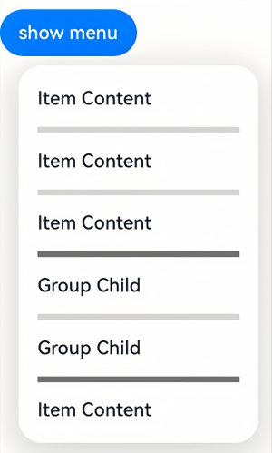
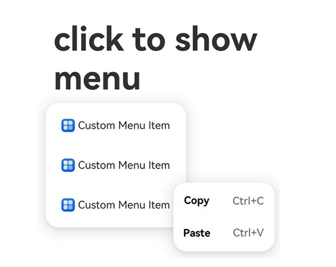

# Menu
<!--Kit: ArkUI-->
<!--Subsystem: ArkUI-->
<!--Owner: @H-xinwei-->
<!--Designer: @zhanghaibo0-->
<!--Tester: @lxl007-->
<!--Adviser: @Brilliantry_Rui-->
<!-- md-trans-meta sourceCommit=b8b4794b3c3d5c0d1e8a60dabec4f0be6dbcbe75 translatedAt=2026-09-03T04:12:44.190Z -->

A menu displayed as a vertical list. The **Menu** component supports configuring menu items, submenus, icons, dividers, and other content, and can be used to display operation options, function entries, and other scenarios.

> **NOTE**
>
> - This component is supported since API version 9. Newly added content in later versions will be marked with a superscript to indicate the version in which it was introduced.
>
> - The **Menu** component must be used together with the [bindMenu](ts-universal-attributes-menu.md#bindmenu) or [bindContextMenu](ts-universal-attributes-menu.md#bindcontextmenu8) method. It cannot be used as a standalone component.

## Child Components

Contains the [MenuItem](ts-basic-components-menuitem.md) and [MenuItemGroup](ts-basic-components-menuitemgroup.md) child components.

## APIs

Menu()

Serves as a fixed container of a menu and takes no parameters.

> **NOTE**
>
> - Rules for calculating the width of a menu and its menu items:
>
>   - During layout, the width of each menu item is expected to be consistent. If a child component has a width set, the width specified by [constraintSize](ts-universal-attributes-size.md#constraintsize) prevails.
>
>   - When the width of **Menu** is not set: **Menu** sets a default width of 2 grids for its child components **MenuItem** and **MenuItemGroup**. If the content area of a menu item is wider than 2 grids, the menu item automatically expands to fit the content.
>
>   - When the width of **Menu** is set: **Menu** sets a fixed width, which is the set width minus the padding, for its child components **MenuItem** and **MenuItemGroup**.
>
>   - The minimum width supported by **Menu** is 64 vp.
>
> - Universal attributes not supported by **Menu**: attributes under [outline settings](ts-universal-attributes-outline.md) and [shadow](ts-universal-attributes-image-effect.md#shadow).

**Atomic service API**: This API can be used in atomic services since API version 11.

**System capability**: SystemCapability.ArkUI.ArkUI.Full

## Attributes

In addition to the [universal attributes](ts-component-general-attributes.md), the following attributes are supported:

### font<sup>10+</sup>

font(value: Font)

Sets the font style of all text in the menu through a unified setting.

**Atomic service API**: This API can be used in atomic services since API version 11.

**Model restriction**: This API can be used only in the stage model.

**System capability**: SystemCapability.ArkUI.ArkUI.Full

**Parameters**

| Name | Type                     | Mandatory | Description                                                  |
| ---- | ------------------------ | --------- | ------------------------------------------------------------ |
| value | [Font](ts-types.md#font) | Yes       | Font style of all text in the menu.<br/>Default value:<br/>{<br/>      size: '16.0fp',<br/>      family: 'HarmonyOS Sans',<br/>      weight: FontWeight.Medium,<br/>      style: FontStyle.Normal<br/>} |
### fontColor<sup>10+</sup>

fontColor(value: ResourceColor)

Sets the color of all text in the Menu.

**Atomic service API**: This API can be used in atomic services since API version 11.

**Model restriction**: This API can be used only in the stage model.

**System capability**: SystemCapability.ArkUI.ArkUI.Full

**Parameters**

| Name | Type                                       | Mandatory | Description                   |
| ------ | ------------------------------------------ | ---- | ---------------------- |
| value  | [ResourceColor](ts-types.md#resourcecolor) | Yes   | Color of all text in the Menu. |

### radius<sup>10+</sup>

radius(value: Dimension | BorderRadiuses)

Sets the radius of the rounded corners of the menu border.

**Atomic service API**: This API can be used in atomic services since API version 11.

**Model restriction**: This API can be used only in the stage model.

**System capability**: SystemCapability.ArkUI.ArkUI.Full

**Parameters**

| Name | Type                                                         | Mandatory | Description                                                         |
| ------ | ------------------------------------------------------------ | ---- | ------------------------------------------------------------ |
| value  | [Dimension](ts-types.md#dimension10)&nbsp;\|&nbsp;[BorderRadiuses](ts-types.md#borderradiuses9) | Yes   | Radius of the rounded corners of the menu border.<br/>Default value: **8vp** on 2-in-1 devices and **20vp** on other devices.<br/>Since API version 12, when the maximum sum of the radii of the two horizontal rounded corners is greater than the menu width, or the maximum sum of the radii of the two vertical rounded corners is greater than the menu height, the default corner radius of the menu is applied to all four corners.<br/>When the value is of the Dimension type and an invalid value is passed in, the default corner radius is used.<br/>When the value is of the BorderRadiuses type and an invalid value is passed in, the menu has no rounded corners by default. |

### menuItemDivider<sup>12+</sup>

menuItemDivider(options: DividerStyleOptions | undefined)

Sets the divider style of a MenuItem. If this attribute is not set, no divider is displayed.

If the sum of startMargin and endMargin exceeds the component width, startMargin and endMargin are set to 0.

**Atomic service API**: This API can be used in atomic services since API version 12.

**Model restriction**: This API can be used only in the stage model.

**System capability**: SystemCapability.ArkUI.ArkUI.Full

**Parameters**

| Name     | Type                                                     | Mandatory         | Description           |
|---------|--------------------------------------------------------|------------| -------------- |
| options | [DividerStyleOptions](ts-types.md#dividerstyleoptions12)&nbsp;\| &nbsp;undefined | Yes   | Sets the divider style of a MenuItem.<br />-strokeWidth: line width of the divider. The default value is 1px.<br />-color: color of the divider. The default value is #33000000.<br />-startMargin: distance between the divider and the start edge of the MenuItem side. The default value is 16vp, in vp.<br />-endMargin: distance between the divider and the end edge of the MenuItem side. The default value is 16vp, in vp.<br />-mode: mode of the divider. The default value is FLOATING_ABOVE_MENU.<br />If the sum of startMargin and endMargin exceeds the component width, startMargin and endMargin are set to 0. |

### menuItemGroupDivider<sup>12+</sup>

menuItemGroupDivider(options: DividerStyleOptions | undefined)

Sets the style of the dividers at the top and bottom of a MenuItemGroup. If this attribute is not set, the dividers are displayed by default.

**Atomic service API**: This API can be used in atomic services since API version 12.

**Model restriction**: This API can be used only in the stage model.

**System capability**: SystemCapability.ArkUI.ArkUI.Full

**Parameters**

| Name     | Type                                                     | Mandatory         | Description           |
|---------|--------------------------------------------------------|------------| -------------- |
| options | [DividerStyleOptions](ts-types.md#dividerstyleoptions12)&nbsp;\| &nbsp;undefined | Yes   | Sets the style of the dividers at the top and bottom of a MenuItemGroup.<br />-strokeWidth: width of the divider. The default value is 1px.<br />-color: color of the divider. The default value is #33000000.<br />-startMargin: distance between the divider and the start edge of the MenuItemGroup. The default value is 16vp, in vp.<br />-endMargin: distance between the divider and the end edge of the MenuItemGroup. The default value is 16vp, in vp.<br />-mode: mode of the divider. The default value is FLOATING_ABOVE_MENU.<br />If startMargin + endMargin exceeds the component width, startMargin and endMargin are set to 0. |

### subMenuExpandingMode<sup>12+</sup>

subMenuExpandingMode(mode: SubMenuExpandingMode)

Sets the expansion style of the submenu of the Menu component.

**Atomic service API**: This API can be used in atomic services since API version 12.

**Model restriction**: This API can be used only in the stage model.

**System capability**: SystemCapability.ArkUI.ArkUI.Full

**Parameters**

| Name | Type                         | Required | Description           |
| ------ | ---------------------------- | ---- |--------------|
| mode  | [SubMenuExpandingMode](#submenuexpandingmode12) | Yes   | Expansion style of the submenu of the Menu component.<br/>Default value: **SubMenuExpandingMode.SIDE_EXPAND**<br/>When this parameter is set to **SIDE_EXPAND**, the [subMenuExpandSymbol](#submenuexpandsymbol20) attribute is not displayed. When this parameter is set to **EMBEDDED_EXPAND** or **STACK_EXPAND**, the **subMenuExpandSymbol** attribute takes effect.  |

### subMenuExpandSymbol<sup>20+</sup>

subMenuExpandSymbol(symbol: SymbolGlyphModifier)

Sets the expansion symbol of the Menu submenu. It is displayed only in SubMenuExpandingMode.EMBEDDED_EXPAND or SubMenuExpandingMode.STACK_EXPAND mode, and is not displayed in SubMenuExpandingMode.SIDE_EXPAND mode.

**Atomic service API**: This API can be used in atomic services since API version 20.

**Model restriction**: This API can be used only in the stage model.

**System capability**: SystemCapability.ArkUI.ArkUI.Full

**Parameters**

| Name | Type                         | Mandatory | Description           |
| ------ | ---------------------------- | ---- |--------------|
| symbol  | [SymbolGlyphModifier](ts-universal-attributes-attribute-symbolglyphmodifier.md)| Yes   | Expansion symbol of the Menu submenu.<br/>1. When the expansion style of the submenu is SubMenuExpandingMode.SIDE_EXPAND, the expansion symbol is not displayed.<br/>2. When the expansion style of the submenu is SubMenuExpandingMode.EMBEDDED_EXPAND, the expansion symbol rotates 180° clockwise when expanded. The expansion symbol uses `new SymbolGlyphModifier($r('sys.symbol.chevron_down')).fontSize('24vp')` by default.<br/>3. When the expansion style of the submenu is SubMenuExpandingMode.STACK_EXPAND, the expansion symbol rotates 90° clockwise when expanded. The expansion symbol uses `new SymbolGlyphModifier($r('sys.symbol.chevron_forward')).fontSize('20vp').padding('2vp')` by default.|

### fontSize<sup>(deprecated)</sup>

fontSize(value: Length)

Sets the font size of all text in the Menu uniformly.

> **NOTE**
>
> This API is supported since API version 9 and deprecated since API version 10. You are advised to use [font](#font10) instead.

**System capability**: SystemCapability.ArkUI.ArkUI.Full

**Parameters**

| Name | Type                         | Mandatory | Description                                                         |
| ------ | ---------------------------- | ---- | ------------------------------------------------------------ |
| value  | [Length](ts-types.md#length) | Yes   | Font size of all text in the Menu. When the value of **Length** is of the number type, the unit fp is used. Percentage is not supported. |

## SubMenuExpandingMode<sup>12+</sup> Enum Description

Enumerates the expansion styles of the Menu submenu.

**Atomic service API**: This API can be used in atomic services since API version 12.

**Model restriction**: This API can be used only in the stage model.

**System capability**: SystemCapability.ArkUI.ArkUI.Full

| Name            | Value | Description                                       |
| --------------- | ----- | ------------------------------------------------- |
| SIDE_EXPAND     | 0     | Default expansion style. The submenu expands on the side of the same plane. |
| EMBEDDED_EXPAND | 1     | Embedded expansion style. The submenu expands within the main menu. |
| STACK_EXPAND    | 2     | Stack style. The submenu expands above the main menu. |

## Example

### Example 1 (Setting a Multi-level Menu)

This example implements a multi-level menu by configuring the builder parameter in MenuItem.

```ts
@Entry
@Component
struct Index {
  // $r('app.media.xxx') needs to be replaced with the image resource file required by the developer.
  private iconStr: ResourceStr = $r('app.media.view_list_filled');
  private iconStr2: ResourceStr = $r('app.media.arrow_right_filled');

  @Builder
  SubMenu() {
    Menu() {
      MenuItem({ content: 'Copy', labelInfo: 'Ctrl+C' })
      MenuItem({ content: 'Paste', labelInfo: 'Ctrl+V' })
    }
  }

  @Builder
  MyMenu() {
    Menu() {
      MenuItem({ startIcon: $r('app.media.icon'), content: 'Menu option' })
      MenuItem({ startIcon: $r('app.media.icon'), content: 'Menu option' })
        .enabled(false)
      MenuItem({
        startIcon: this.iconStr,
        content: 'Menu option',
        endIcon: this.iconStr2,
        builder: (): void => this.SubMenu()
      })
      MenuItemGroup({ header: 'Subtitle' }) {
        MenuItem({
          startIcon: this.iconStr,
          content: 'Menu option',
          endIcon: this.iconStr2,
          builder: (): void => this.SubMenu()
        })
        MenuItem({
          startIcon: $r('app.media.app_icon'),
          content: 'Menu option',
          endIcon: this.iconStr2,
          builder: (): void => this.SubMenu()
        })
      }
      MenuItem({
        startIcon: this.iconStr,
        content: 'Menu option',
      })
    }
  }

  build() {
    Row() {
      Column() {
        Text('click to show menu')
          .fontSize(50)
          .fontWeight(FontWeight.Bold)
      }
      .bindMenu(this.MyMenu)
      .width('100%')
    }
    .height('100%')
  }
}
```


### Example 2 (Setting a Symbol-Type Icon)

This example implements a menu with symbol-type icons by configuring symbolStartIcon and symbolEndIcon.

```ts
// xxx.ets
import { SymbolGlyphModifier } from '@kit.ArkUI';

@Entry
@Component
struct Index {
  @State startIconModifier: SymbolGlyphModifier = new SymbolGlyphModifier($r('sys.symbol.ohos_mic')).fontSize('24vp');
  @State endIconModifier: SymbolGlyphModifier = new SymbolGlyphModifier($r('sys.symbol.ohos_trash')).fontSize('24vp');
  @State selectIconModifier: SymbolGlyphModifier =
    new SymbolGlyphModifier($r('sys.symbol.checkmark')).fontSize('24vp');
  @State select: boolean = true;

  @Builder
  SubMenu() {
    Menu() {
      MenuItem({ content: 'Copy', labelInfo: 'Ctrl+C' })
      MenuItem({ content: 'Paste', labelInfo: 'Ctrl+V' })
    }
  }

  @Builder
  MyMenu() {
    Menu() {
      MenuItem({ symbolStartIcon: this.startIconModifier, content: 'Menu option' })
      MenuItem({ symbolStartIcon: this.startIconModifier, content: 'Menu option' })
        .enabled(false)
      MenuItem({
        symbolStartIcon: this.startIconModifier,
        content: 'Menu option',
        symbolEndIcon: this.endIconModifier,
        builder: (): void => this.SubMenu()
      })
      MenuItemGroup({ header: 'Subtitle' }) {
        MenuItem({
          symbolStartIcon: this.startIconModifier,
          content: 'Menu option',
          symbolEndIcon: this.endIconModifier,
          builder: (): void => this.SubMenu()
        })
        MenuItem({
          symbolStartIcon: this.startIconModifier,
          content: 'Menu option',
          symbolEndIcon: this.endIconModifier,
          builder: (): void => this.SubMenu()
        })
      }
      MenuItem({
        content: 'Menu option',
      }).selected(this.select).selectIcon(this.selectIconModifier)
    }
  }

  build() {
    Row() {
      Column() {
        Text('click to show menu')
          .fontSize(50)
          .fontWeight(FontWeight.Bold)
      }
      .bindMenu(this.MyMenu)
      .width('100%')
    }
    .height('100%')
  }
}
```


### Example 3 (Setting the Menu Submenu Expansion Symbol)

This example configures the color and size of the Menu submenu expansion symbol through subMenuExpandSymbol.

```ts
import { SymbolGlyphModifier } from '@kit.ArkUI';

@Entry
@Component
struct Index {
  @State startIconModifier: SymbolGlyphModifier = new SymbolGlyphModifier($r('sys.symbol.ohos_star'))
  @State endIconModifier: SymbolGlyphModifier = new SymbolGlyphModifier($r('sys.symbol.ohos_mic'))
  @State expandSymbolModifier: SymbolGlyphModifier =
    new SymbolGlyphModifier($r('sys.symbol.chevron_down')).fontColor([Color.Red]).fontSize('24vp')

  @Builder
  SubMenu() {
    Menu() {
      MenuItem({
        symbolStartIcon: this.startIconModifier,
        content: 'Icon'
      })
      MenuItem({
        symbolStartIcon: this.startIconModifier,
        content: 'List'
      })
    }.backgroundColor(Color.Grey)
  }

  @Builder
  MyMenu() {
    Menu() {
      MenuItem({
        symbolStartIcon: this.startIconModifier,
        symbolEndIcon: this.endIconModifier,
        content: 'New folder',
        builder: (): void => this.SubMenu(),
      })
      MenuItem({
        symbolStartIcon: this.startIconModifier,
        content: 'Sort by',
        builder: (): void => this.SubMenu(),
      })
      MenuItem({
        symbolStartIcon: this.startIconModifier,
        content: 'View by',
        builder: (): void => this.SubMenu(),
      })
    }
    // Set the submenu expansion style to embedded expansion.
    .subMenuExpandingMode(SubMenuExpandingMode.EMBEDDED_EXPAND)
    .backgroundColor(Color.Grey)
    // Set the submenu expansion symbol.
    .subMenuExpandSymbol(this.expandSymbolModifier)
  }

  build() {
    Button('click to show menu')
      .position({ top: 40, left: 40 })
      .bindMenu(this.MyMenu)
  }
}
```


### Example 4 (Setting the Divider Style)

This example implements the divider style by setting the menuItemDivider and menuItemGroupDivider attributes.

```ts
import { LengthMetrics } from '@kit.ArkUI'

@Entry
@Component
struct Index {

  @Builder
  MyMenu() {
    Menu() {
      MenuItem({ content: 'Item Content' })
      MenuItem({ content: 'Item Content' })
      MenuItem({ content: 'Item Content' })
      MenuItemGroup() {
        MenuItem({ content: 'Group Child' })
        MenuItem({ content: 'Group Child' })
      }
      MenuItem({ content: 'Item Content' })
    }
    // Set the menu item divider style.
    .menuItemDivider({
      strokeWidth: LengthMetrics.vp(5),
      color: '#d5d5d5',
      mode: DividerMode.EMBEDDED_IN_MENU
    })
    // Set the menu item group divider style.
    .menuItemGroupDivider({
      strokeWidth: LengthMetrics.vp(5),
      color: '#707070',
      mode: DividerMode.EMBEDDED_IN_MENU
    })
  }

  build() {
    RelativeContainer() {
      Button('show menu')
        .bindMenu(this.MyMenu)
    }
    .height('100%')
    .width('100%')
  }
}
```



### Example 5 (Setting a Multi-level Menu for Custom Menu Items)

This example adds a multi-level menu to custom menu items by setting the subMenuBuilder attribute.

Since API version 26.0.0, the [subMenuBuilder](ts-basic-components-menuitem.md#submenubuilder) attribute is added.

```ts
import { LengthMetrics } from '@kit.ArkUI';

@Entry
@Component
struct Index {

  @Builder
  SubMenu() {
    Menu() {
      MenuItem({ content: 'Copy', labelInfo: 'Ctrl+C' })
      MenuItem({ content: 'Paste', labelInfo: 'Ctrl+V' })
    }
  }

  @Builder
  SubMenuContent() {
    Row() {
      // Replace $r('app.media.startIcon') with the image resource file required by the developer.
      Image($r('app.media.startIcon')).width(20).height(20)
      Text('Custom Menu Item').margin({start: LengthMetrics.vp(5)})
    }.padding(20)
  }

  @Builder
  MyMenu() {
    Menu() {
      MenuItem(this.SubMenuContent)
      MenuItem(this.SubMenuContent)
        .enabled(false)
      MenuItem(this.SubMenuContent).subMenuBuilder(this.SubMenu)
    }
  }

  build() {
    Row() {
      Column() {
        Text('click to show menu')
          .fontSize(50)
          .fontWeight(FontWeight.Bold)
      }
      .bindMenu(this.MyMenu)
      .width('100%')
    }
    .height('100%')
  }
}
```



<!--no_check-->