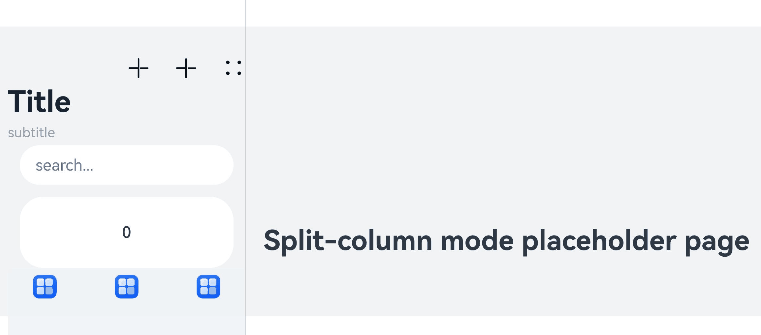
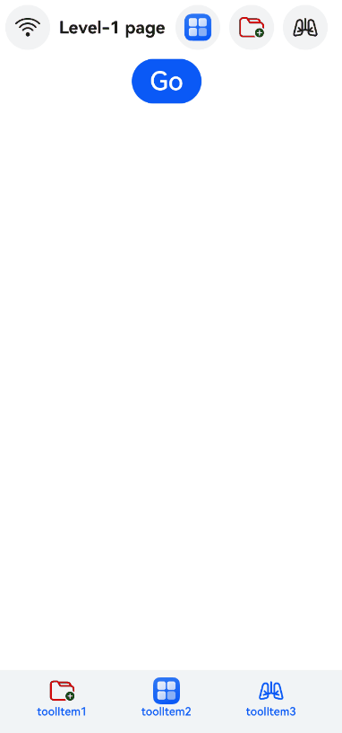

# Navigation
<!--Kit: ArkUI-->
<!--Subsystem: ArkUI-->
<!--Owner: @mayaolll-->
<!--Designer: @jiangdayuan-->
<!--Tester: @Giacinta-->
<!--Adviser: @Brilliantry_Rui-->

The **Navigation** component is the root view container for navigation. It typically functions as the root container of a page and includes a title bar, content area, and toolbar. The content area switches between the home page content (child components of **Navigation**) and non-home page content (child components of [NavDestination](ts-basic-components-navdestination.md)) through routing.

> **NOTE**
>
> - This component is supported since API version 8. Updates will be marked with a superscript to indicate their earliest API version.
>
> - Since API version 11, this component supports the safe area attribute by default, with the default attribute value being **expandSafeArea([SafeAreaType.SYSTEM, SafeAreaType.KEYBOARD, SafeAreaType.CUTOUT], [SafeAreaEdge.TOP, SafeAreaEdge.BOTTOM])**. You can override this attribute to change the default behavior. In earlier versions, you need to use the [expandSafeArea](ts-universal-attributes-expand-safe-area.md) attribute to implement the safe area feature.
>
> - When [NavBar](#navbar12) is nested within a **Navigation** component, the lifecycle of the inner **NavDestination** component does not synchronize with the outer **NavDestination** component or the lifecycle of a [modal](ts-universal-attributes-modal-transition.md).
>
> - If the [title](#title) and [subTitle](#subtitledeprecated) are not set and [hideBackButton](#hidebackbutton) is set to **true**, the title bar is not displayed.
>
> - During subpage navigation within **Navigation**, the new page actively requests focus.
>
> - You are not advised to use stack operations in [aboutToAppear](ts-custom-component-lifecycle.md#abouttoappear), as the page has not yet finished building at this stage, which may lead to issues such as white screens or navigation failures.

## Child Components

Supported

Since API version 9, it is recommended that this component be used together with the [NavRouter](ts-basic-components-navrouter.md) component.

Since API version 10, it is recommended that this component be used together with the [NavPathStack](#navpathstack10) component and [navDestination](#navdestination10) attribute for page routing.

## APIs

### Navigation

Navigation()

Creates a root view container for route navigation, suitable for page routing using the [NavRouter](ts-basic-components-navrouter.md) component.

**Atomic service API**: This API can be used in atomic services since API version 11.

**System capability**: SystemCapability.ArkUI.ArkUI.Full

### Navigation<sup>10+</sup>

Navigation(pathInfos: NavPathStack)

Binds a navigation controller to the **Navigation** component, suitable for page routing using [NavPathStack](#navpathstack10) with the [navDestination](#navdestination10) attribute.

**Atomic service API**: This API can be used in atomic services since API version 11.

**System capability**: SystemCapability.ArkUI.ArkUI.Full

**Parameters**

| Name      | Type                           | Mandatory  | Description  |
| --------- | ------------------------------- | ---- | ------ |
| pathInfos | [NavPathStack](#navpathstack10) | Yes   | Navigation controller object.|

### Navigation<sup>20+</sup>

Navigation(pathInfos: NavPathStack, homeDestination: HomePathInfo)

Binds a routing stack to the **Navigation** component and specifies a **NavDestination** component as the navigation page (home page) for **Navigation**. This is suitable for page routing using [NavPathStack](#navpathstack10) with the [navDestination](#navdestination10) attribute or the system routing table. For the usage example, see [Example 16: Using NavDestination as a Navigation Page in Navigation](#example-16-using-navdestination-as-a-navigation-page-in-navigation).

**Atomic service API**: This API can be used in atomic services since API version 20.

**System capability**: SystemCapability.ArkUI.ArkUI.Full

**Parameters**

| Name      | Type                           | Mandatory  | Description  |
| --------- | ------------------------------- | ---- | ------ |
| pathInfos | [NavPathStack](#navpathstack10) | Yes   | Information about the routing stack.|
| homeDestination | [HomePathInfo](#homepathinfo20) | Yes   | Home page **NavDestination** information.|

> **NOTE**
>
> When using a home page **NavDestination**, the **Navigation** component will behave with the following key changes:
>
> - Any content you define directly inside the **Navigation** component will not be created.
>
> - For the various attributes configured on the **Navigation** component: if the home page NavDestination has corresponding functional attributes, the attributes set on the **Navigation** component will be overridden and fail to take effect.

## Attributes

In addition to the [universal attributes](ts-component-general-attributes.md), the following attributes are supported.

### title

title(value: ResourceStr | CustomBuilder | NavigationCommonTitle | NavigationCustomTitle, options?: NavigationTitleOptions)

Sets the page title.

>**NOTE**
>
> This API can be called within [attributeModifier](ts-universal-attributes-attribute-modifier.md#attributemodifier) since API version 12.

**Atomic service API**: This API can be used in atomic services since API version 11.

**System capability**: SystemCapability.ArkUI.ArkUI.Full

**Parameters**

| Name | Type                                                        | Mandatory| Description                                                        |
| ------- | ------------------------------------------------------------ | ---- | ------------------------------------------------------------ |
| value   | [ResourceStr](ts-types.md#resourcestr)<sup>10+</sup>&nbsp;\|&nbsp;[CustomBuilder](ts-types.md#custombuilder8)&nbsp;\|&nbsp;[NavigationCommonTitle](#navigationcommontitle9)<sup>9+</sup>&nbsp;\|&nbsp;[NavigationCustomTitle](#navigationcustomtitle9)<sup>9+</sup> | Yes  | Page title. When the NavigationCustomTitle type is used to set the height, [titleMode](#titlemode) does not take effect.<br>When the title string is too long:<br>- If no subtitle is set, the string is scaled down, wrapped in two lines, and then clipped.<br> - If a subtitle is set, the subtitle is scaled down and then clipped.|
| options<sup>11+</sup> | [NavigationTitleOptions](#navigationtitleoptions11) | No  | Title bar options.                                                |

### menus

menus(value: Array&lt;NavigationMenuItem&gt; | CustomBuilder)

Sets the menu items in the upper right corner of the page. If this attribute is not set, no menu item is displayed. When the value type is Array<[NavigationMenuItem](#navigationmenuitem)&gt;, the menu shows a maximum of three icons in portrait mode and a maximum of five icons in landscape mode, with excess icons (if any) placed under the automatically generated **More** icon.

> **NOTE**
>
> The following are not allowed: modify the icon size through the **fontSize** attribute of the **SymbolGlyphModifier** object, change the animation effects through the **effectStrategy** attribute, or change the type of animation effects through the **symbolEffect** attribute.

**Atomic service API**: This API can be used in atomic services since API version 11.

**System capability**: SystemCapability.ArkUI.ArkUI.Full

**Parameters**

| Name| Type                                                        | Mandatory| Description            |
| ------ | ------------------------------------------------------------ | ---- | ---------------- |
| value  | Array<[NavigationMenuItem](#navigationmenuitem)&gt;&nbsp;\|&nbsp;[CustomBuilder](ts-types.md#custombuilder8) | Yes  | Menu items in the upper right corner of the page.|

### menus<sup>19+</sup>

menus(items: Array&lt;NavigationMenuItem&gt; | CustomBuilder, options?: NavigationMenuOptions)

Sets the menu items in the upper right corner of the page. If this attribute is not set, no menu item is displayed. Compared with [menus](#menus), this API adds menu options. When the value type is Array<[NavigationMenuItem](#navigationmenuitem)&gt;, the menu shows a maximum of three icons in portrait mode and a maximum of five icons in landscape mode, with excess icons (if any) placed under the automatically generated **More** icon.

> **NOTE**
>
> This API cannot be called within [attributeModifier](ts-universal-attributes-attribute-modifier.md#attributemodifier).
>
> The following are not allowed: modify the icon size through the **fontSize** attribute of the **SymbolGlyphModifier** object, change the animation effects through the **effectStrategy** attribute, or change the type of animation effects through the **symbolEffect** attribute.

**Atomic service API**: This API can be used in atomic services since API version 19.

**System capability**: SystemCapability.ArkUI.ArkUI.Full

**Parameters**

| Name| Type                                                        | Mandatory| Description            |
| ------ | ------------------------------------------------------------ | ---- | ---------------- |
| items  | Array<[NavigationMenuItem](#navigationmenuitem)&gt;&nbsp;\|&nbsp;[CustomBuilder](ts-types.md#custombuilder8) | Yes  | Menu items in the upper right corner of the page.|
| options | [NavigationMenuOptions](#navigationmenuoptions19) | No  | Configuration options for menu items in the upper right corner of the page.|

### titleMode

titleMode(value: NavigationTitleMode)

Sets the display mode of the page title bar.

**Atomic service API**: This API can be used in atomic services since API version 11.

**System capability**: SystemCapability.ArkUI.ArkUI.Full

**Parameters**

| Name| Type                                               | Mandatory| Description                                                     |
| ------ | --------------------------------------------------- | ---- | --------------------------------------------------------- |
| value  | [NavigationTitleMode](#navigationtitlemode) | Yes  | Display mode of the page title bar.<br>Default value: **NavigationTitleMode.Free**|

### toolbarConfiguration<sup>10+</sup>

toolbarConfiguration(value: Array&lt;ToolbarItem&gt; | CustomBuilder, options?: NavigationToolbarOptions)

Sets the content of the toolbar. If this attribute is not set, no toolbar is displayed.

>**NOTE**
>
> This API can be called in [attributeModifier](ts-universal-attributes-attribute-modifier.md#attributemodifier) since API version 20.
>
> The following are not allowed: modify the icon size through the **fontSize** attribute of the **SymbolGlyphModifier** object, change the animation effects through the **effectStrategy** attribute, or change the type of animation effects through the **symbolEffect** attribute.

**Atomic service API**: This API can be used in atomic services since API version 11.

**System capability**: SystemCapability.ArkUI.ArkUI.Full

**Parameters**

| Name | Type                                                        | Mandatory| Description                                                        |
| ------- | ------------------------------------------------------------ | ---- | ------------------------------------------------------------ |
| value   | &nbsp;Array&lt;[ToolbarItem](#toolbaritem10)&gt; &nbsp;\|&nbsp;[CustomBuilder](ts-types.md#custombuilder8) | Yes  | Content of the toolbar. When configured with Array&lt;[ToolbarItem](#toolbaritem10)&gt;, the toolbar follows the rules below:<br>Toolbar items are evenly distributed on the bottom toolbar, with text and icons evenly spaced in each content area.<br>In portrait mode, the toolbar shows a maximum of five icons, with any additional icons placed into an automatically generated **More** icon. In landscape mode, toolbar behavior depends on the display mode: <br>- If the display mode is [Split](#navigationmode9), the toolbar maintains the portrait mode. <br>- If the display mode is [Stack](#navigationmode9), the toolbar must be used together with Array&lt;[NavigationMenuItem](#navigationmenuitem)&gt; of the **menus** attribute; in this configuration, the bottom toolbar is automatically hidden, and all items on the toolbar are relocated to the menu in the upper right corner of the screen.<br>When configured with [CustomBuilder](ts-types.md#custombuilder8), the toolbar does not follow the above rules.|
| options<sup>11+</sup> | [NavigationToolbarOptions](#navigationtoolbaroptions11) | No  | Toolbar options.                                               |

### hideToolBar

hideToolBar(value: boolean)

Specifies whether to hide the toolbar.

**Atomic service API**: This API can be used in atomic services since API version 11.

**System capability**: SystemCapability.ArkUI.ArkUI.Full

**Parameters**

| Name| Type   | Mandatory| Description                                                        |
| ------ | ------- | ---- | ------------------------------------------------------------ |
| value  | boolean | Yes  | Whether to hide the toolbar.<br>**true**: Hide the toolbar. <br>**false**: Display the toolbar.<br>If the input parameter is invalid, the value **false** is used.|

### hideToolBar<sup>13+</sup>

hideToolBar(hide: boolean, animated: boolean)

Specifies whether to hide the toolbar. Compared with [hideToolBar](#hidetoolbar), this API adds the capability to control whether to animate the visibility change of the toolbar.

**Atomic service API**: This API can be used in atomic services since API version 13.

**System capability**: SystemCapability.ArkUI.ArkUI.Full

**Parameters**

| Name| Type   | Mandatory| Description                                                        |
| ------ | ------- | ---- | ------------------------------------------------------------ |
| hide  | boolean | Yes  | Whether to hide the toolbar.<br>**true**: Hide the toolbar. <br>**false**: Display the toolbar.<br>If the input parameter is invalid, the value **false** is used.|
| animated  | boolean | Yes  | Whether to animate the visibility change.<br>**true**: yes<br>**false**: no<br>If the input parameter is invalid, the value **false** is used.|

### hideTitleBar

hideTitleBar(value: boolean)

Specifies whether to hide the title bar.

**Atomic service API**: This API can be used in atomic services since API version 11.

**System capability**: SystemCapability.ArkUI.ArkUI.Full

**Parameters**

| Name| Type   | Mandatory| Description                                                        |
| ------ | ------- | ---- | ------------------------------------------------------------ |
| value  | boolean | Yes  | Whether to hide the title bar.<br>**true**: yes<br>**false**: no<br>If the input parameter is invalid, the value **false** is used.|

### hideTitleBar<sup>13+</sup>

hideTitleBar(hide: boolean, animated: boolean)

Specifies whether to hide the title bar. Compared with [hideTitleBar](#hidetitlebar), this API adds the capability to control whether to animate the visibility change of the title bar.

**Atomic service API**: This API can be used in atomic services since API version 13.

**System capability**: SystemCapability.ArkUI.ArkUI.Full

**Parameters**

| Name| Type   | Mandatory| Description                                                        |
| ------ | ------- | ---- | ------------------------------------------------------------ |
| hide  | boolean | Yes  | Whether to hide the title bar.<br>**true**: yes<br>**false**: no<br>If the input parameter is invalid, the value **false** is used.|
| animated  | boolean | Yes  | Whether to animate the visibility change.<br>**true**: yes<br> **false**: no<br>If the input parameter is invalid, the value **false** is used.|

### hideBackButton

hideBackButton(value: boolean)

Sets whether to hide the back button in the title bar. The back button takes effect only when [titleMode](#titlemode) is set to **NavigationTitleMode.Mini**.

**Atomic service API**: This API can be used in atomic services since API version 11.

**System capability**: SystemCapability.ArkUI.ArkUI.Full

**Parameters**

| Name| Type   | Mandatory| Description                                                        |
| ------ | ------- | ---- | ------------------------------------------------------------ |
| value  | boolean | Yes  | Whether to hide the back button in the title bar.<br>**true**: Hide the back button in the title bar.<br>**false**: Show the back button in the title bar.<br>If the input parameter is invalid, the value **false** is used.|

### navBarWidth<sup>9+</sup>

navBarWidth(value: Length)

Set the width of the navigation page. It takes effect only when [mode](#mode9) is set to **NavigationMode.Auto** or **NavigationMode.Split**.

Since API version 18, this attribute supports two-way binding through [!!](../../../ui/state-management/arkts-new-binding.md).

**Atomic service API**: This API can be used in atomic services since API version 11.

**System capability**: SystemCapability.ArkUI.ArkUI.Full

**Parameters**

| Name| Type                        | Mandatory| Description                                     |
| ------ | ---------------------------- | ---- | ----------------------------------------- |
| value  | [Length](ts-types.md#length) | Yes  | Width of the navigation page.<br>Default value: **240**<br>Unit: vp<br>**undefined**: No action is taken, and the navigation page width remains consistent with the default value.|

### navBarPosition<sup>9+</sup>

navBarPosition(value: NavBarPosition)

Sets the position of the navigation page. It takes effect only when [mode](#mode9) is set to **NavigationMode.Auto** or **NavigationMode.Split**.

**Atomic service API**: This API can be used in atomic services since API version 11.

**System capability**: SystemCapability.ArkUI.ArkUI.Full

**Parameters**

| Name| Type                                      | Mandatory| Description                                         |
| ------ | ------------------------------------------ | ---- | --------------------------------------------- |
| value  | [NavBarPosition](#navbarposition9) | Yes  | Position of the navigation page.<br>Default value: **NavBarPosition.Start**|

### mode<sup>9+</sup>

mode(value: NavigationMode)

Sets the display mode of the navigation page.

**Atomic service API**: This API can be used in atomic services since API version 11.

**System capability**: SystemCapability.ArkUI.ArkUI.Full

**Parameters**

| Name| Type                                      | Mandatory| Description                                                        |
| ------ | ------------------------------------------ | ---- | ------------------------------------------------------------ |
| value  | [NavigationMode](#navigationmode9) | Yes  | Display mode of the navigation page.<br>Default value: **NavigationMode.Auto**<br>At the default settings, the component adapts to a single column or two columns based on the component width.|

### backButtonIcon<sup>9+</sup>

backButtonIcon(value: string | PixelMap | Resource | SymbolGlyphModifier)

Sets the icon of the back button in the title bar.

> **NOTE**
>
> The following are not allowed: modify the icon size through the **fontSize** attribute of the **SymbolGlyphModifier** object, change the animation effects through the **effectStrategy** attribute, or change the type of animation effects through the **symbolEffect** attribute.

**Atomic service API**: This API can be used in atomic services since API version 11.

**System capability**: SystemCapability.ArkUI.ArkUI.Full

**Parameters**

| Name| Type                                                        | Mandatory| Description                |
| ------ | ------------------------------------------------------------ | ---- | -------------------- |
| value  | string&nbsp;\|&nbsp;[PixelMap](../../apis-image-kit/arkts-apis-image-PixelMap.md)&nbsp;\|&nbsp;[Resource](ts-types.md#resource)&nbsp;\|&nbsp;[SymbolGlyphModifier<sup>12+</sup>](ts-universal-attributes-attribute-symbolglyphmodifier.md#symbolglyphmodifier)    | Yes  | Icon of the back button in the title bar.|

### backButtonIcon<sup>19+</sup>

backButtonIcon(icon: string | PixelMap | Resource | SymbolGlyphModifier, accessibilityText?: ResourceStr)

Sets the icon and accessibility text for the back button on the title bar.

> **NOTE**
>
> This API cannot be called within [attributeModifier](ts-universal-attributes-attribute-modifier.md#attributemodifier).
>
> The following are not allowed: modify the icon size through the **fontSize** attribute of the **SymbolGlyphModifier** object, change the animation effects through the **effectStrategy** attribute, or change the type of animation effects through the **symbolEffect** attribute.

**Atomic service API**: This API can be used in atomic services since API version 19.

**System capability**: SystemCapability.ArkUI.ArkUI.Full

**Parameters**

| Name| Type                                                        | Mandatory| Description              |
| ------ | ------------------------------------------------------------ | ---- | ------------------ |
| icon  | string&nbsp;\|&nbsp;[PixelMap](../../apis-image-kit/arkts-apis-image-PixelMap.md)&nbsp;\|&nbsp;[Resource](ts-types.md#resource)&nbsp;\|&nbsp;[SymbolGlyphModifier](ts-universal-attributes-attribute-symbolglyphmodifier.md#symbolglyphmodifier)  | Yes  | Icon of the back button in the title bar.|
| accessibilityText | [ResourceStr](ts-types.md#resourcestr) | No| Accessibility text for the back button.<br>Default value: **back** when the system language is English.|

### hideNavBar<sup>9+</sup>

hideNavBar(value: boolean)

Sets whether to hide the navigation page. If the value is set to **true**, the navigation bar, including the title bar, content area, and toolbar, will be hidden. In this case, if the navigation destination page is in the routing stack, it is moved to the top of the stack and displayed. Otherwise, a blank page is displayed.

From API version 9 to API version 10, this attribute takes effect only in split-column mode. Since API version 11, this attribute takes effect in all display modes.

**Atomic service API**: This API can be used in atomic services since API version 11.

**System capability**: SystemCapability.ArkUI.ArkUI.Full

**Parameters**

| Name| Type   | Mandatory| Description                              |
| ------ | ------- | ---- | ---------------------------------- |
| value  | boolean | Yes  | Whether to hide the navigation page.<br>**true**: yes<br>**false**: no<br>If the input parameter is invalid, the value **false** is used.|

### navDestination<sup>10+</sup>

navDestination(builder: (name: string, param: unknown) => void)

Creates a **NavDestination** component. The builder receives the **name** and **param** parameters for constructing the **NavDestination** component. The builder must return a single root node. The builder can have only one root node. In the builder, a layer of custom components can wrap the **NavDestination** component. However, no attributes or events can be set for these custom components. Otherwise, only blank content is displayed.

**Atomic service API**: This API can be used in atomic services since API version 11.

**System capability**: SystemCapability.ArkUI.ArkUI.Full

**Parameters**

| Name | Type                                  | Mandatory| Description                    |
| ------- | -------------------------------------- | ---- | ------------------------ |
| builder | (name: string, param: unknown) => void | Yes  | Builder for a **NavDestination** component. **name**: name of the **NavDestination** page. **param**: detailed parameters for the custom **NavDestination** page. The **unknown** type can be replaced with a user-defined type.|

### navBarWidthRange<sup>10+</sup>

navBarWidthRange(value: [Dimension, Dimension])

Sets the minimum and maximum widths of the navigation page (effective in split-column mode). When this API is not used, the minimum width defaults to 240 vp, and the maximum width defaults to 40% of the component width (not exceeding 432 vp). When dragging the divider changes the navigation page width, the content area will be compressed.

Divider dragging range:

| Condition| Dragging Range |
| ----| ----------- |
|Both **navBarWidthRange** and **minContentWidth** are set.| Range set by **navBarWidthRange** if the value set by **minContentWidth** is satisfied|
|Neither **navBarWidthRange** nor **minContentWidth** is set.| Default minimum and maximum ranges of **navBarWidthRange**|
|Only the **navBarWidthRange** attribute is set.| Range set by **navBarWidthRange**, where the maximum dragging range cannot exceed the default value of **minContentWidth**|
|Only the **minContentWidth** attribute is set.| Default minimum and maximum ranges of **navBarWidthRange**|
|Only the **navBarWidth** attribute is set.| Dragging not supported|

**Atomic service API**: This API can be used in atomic services since API version 11.

**System capability**: SystemCapability.ArkUI.ArkUI.Full

**Parameters**

| Name | Type                                                        | Mandatory| Description                                                        |
| ------- | ------------------------------------------------------------ | ---- | ------------------------------------------------------------ |
| value | [[Dimension](ts-types.md#dimension10), [Dimension](ts-types.md#dimension10)] | Yes  | Minimum and maximum widths of the navigation page. If an invalid value is set, the default value is used.|

### minContentWidth<sup>10+</sup>

minContentWidth(value: Dimension)

Minimum width of the navigation bar content area (effective in split-column mode).

**Atomic service API**: This API can be used in atomic services since API version 11.

**System capability**: SystemCapability.ArkUI.ArkUI.Full

**Parameters**

| Name | Type                                | Mandatory| Description                                                        |
| ------- | ------------------------------------ | ---- | ------------------------------------------------------------ |
| value | [Dimension](ts-types.md#dimension10) | Yes  | Minimum width of the content area on the navigation page.<br>Default value: **360**<br>Unit: vp<br>**undefined**: No action is taken, and the minimum width of the navigation page remains consistent with the default value.<br>Breakpoint calculation in Auto mode: default 600 vp = minNavBarWidth (240 vp) + minContentWidth (360 vp)|

### ignoreLayoutSafeArea<sup>12+</sup>

ignoreLayoutSafeArea(types?: Array&lt;LayoutSafeAreaType&gt;, edges?: Array&lt;LayoutSafeAreaEdge&gt;)

Ignores the layout safe area by allowing the component to extend into the non-safe areas of the screen.

> **NOTE**
>   
> - Prerequisites for the **ignoreLayoutSafeArea** attribute to take effect:  
> When **LayoutSafeAreaType.SYSTEM** is set, the component can extend into the non-safe area if its boundaries overlap with it.
>   
> - If the component extends into the non-safe area, events triggered within that area (such as click events) might be intercepted by the system. This allows the system to prioritize responses to system components such as the status bar.
>
> - To allow a component to extend into non-safe areas, the title bar and toolbar must be hidden or set to [STACK](ts-basic-components-navigation.md#barstyle12) mode.

**Atomic service API**: This API can be used in atomic services since API version 12.

**System capability**: SystemCapability.ArkUI.ArkUI.Full

**Parameters**

| Name| Type                                              | Mandatory| Description                                                        |
| ------ | -------------------------------------------------- | ---- | ------------------------------------------------------------ |
| types  | Array <[LayoutSafeAreaType](ts-universal-attributes-expand-safe-area.md#layoutsafeareatype12)> | No  | Types of non-safe areas to extend into.<br>Default value:<br>[LayoutSafeAreaType.SYSTEM] |
| edges  | Array <[LayoutSafeAreaEdge](ts-universal-attributes-expand-safe-area.md#layoutsafeareaedge12)> | No  | Edges for expanding the safe area.<br> Default value:<br>[LayoutSafeAreaEdge.TOP, LayoutSafeAreaEdge.BOTTOM]|

### systemBarStyle<sup>12+</sup>

systemBarStyle(style: Optional&lt;SystemBarStyle&gt;)

Sets the style of the system status bar when the home page of the **Navigation** component is displayed.

>**NOTE**
>
> 1. Avoid using the **systemBarStyle** attribute in conjunction with the status bar style APIs in the **Window** module, such as [setWindowSystemBarProperties](../arkts-apis-window-Window.md#setwindowsystembarproperties9).
> 2. When you first set the **systemBarStyle** attribute for a **Navigation** or **NavDestination** component, the current status bar style is saved for potential future restoration.
> 3. **Navigation** always uses the status bar style defined by the home page (when no **NavDestination** exists in the routing stack) or the top **NavDestination** in the stack.
> 4. If the home page or any top **NavDestination** page has a valid **systemBarStyle** set, that style will be used. If no style is set, and there is a previously saved style available, the saved style will be used. If no style has been set or saved, no changes will be made.
> 5. In [Split](#navigationmode9) mode, if there is no **NavDestination** in the content area, the settings of the **Navigation** home page will apply. Otherwise, the settings of the top **NavDestination** page on the routing stack will apply.
> 6. The **systemBarStyle** attribute is effective only for the main page of the main window.
> 7. The set style will only take effect if the **Navigation** component spans the entire page. If it does not, and there is a previously saved style available, the saved style will be used instead.
> 8. When different styles are set for pages, the new style takes effect at the start of the page transition.
> 9. The status bar style set by **Navigation** or **NavDestination** does not apply in non-fullscreen windows.
>
> This API can be called in [attributeModifier](ts-universal-attributes-attribute-modifier.md#attributemodifier) since API version 20.

**Atomic service API**: This API can be used in atomic services since API version 12.

**System capability**: SystemCapability.ArkUI.ArkUI.Full

**Parameters**

| Name| Type        | Mandatory| Description              |
| ------ | -------------- | ---- | ------------------ |
| style  | [Optional](ts-universal-attributes-custom-property.md#optionalt12)&lt;[SystemBarStyle](../arkts-apis-window-i.md#systembarstyle12)&gt; | Yes  | Style of the system status bar.|

### recoverable<sup>14+</sup>

recoverable(recoverable: Optional&lt;boolean&gt;)

Sets whether the **Navigation** component is recoverable. If set to recoverable, when the application process exits unexpectedly and restarts, the **Navigation** component can be automatically re-created and its routing stack restored to the state at the time of the unexpected exit.

>  **NOTE**
>
> 1. For this API to work properly, you must first set the universal attribute [id](ts-universal-attributes-component-id.md#id) of the **Navigation** component.
> 2. This API must be used together with the [recoverable](./ts-basic-components-navdestination.md#recoverable14) API of **NavDestination**.
> 3. Non-serializable information, such as non-serializable parameters and custom **onPop**, is discarded and cannot be restored during the recovery process.
> 4. If an application is terminated due to insufficient system resources after it is switched to the background, any page configured as recoverable will be automatically restored when the application is revived to the foreground. For details, see [UIAbility Backup and Restore](../../../application-models/ability-recover-guideline.md). For the usage example, see [Example 18: Setting Navigation as Recoverable](#example-18-setting-navigation-as-recoverable).

**System capability**: SystemCapability.ArkUI.ArkUI.Full

**Parameters**

| Name| Type        | Mandatory| Description              |
| ------ | -------------- | ---- | ------------------ |
| recoverable  | [Optional](ts-universal-attributes-custom-property.md#optionalt12)&lt;boolean&gt; | Yes  | Whether the **Navigation** component is recoverable. By default, it is not recoverable.<br>**true**: yes<br>**false**: no<br>If the input parameter is invalid, the value **false** is used.|

### enableDragBar<sup>14+</sup>

enableDragBar(isEnabled: Optional&lt;boolean&gt;)

Sets whether to display a drag bar in split-column scenarios. This attribute has no effect on PCs/2-in-1 devices.

**Atomic service API**: This API can be used in atomic services since API version 14.

**System capability**: SystemCapability.ArkUI.ArkUI.Full

**Parameters**

| Name| Type        | Mandatory| Description              |
| ------ | -------------- | ---- | ------------------ |
| isEnabled  | [Optional](ts-universal-attributes-custom-property.md#optionalt12)&lt;boolean&gt; | Yes  | Whether to enable the drag bar. By default, there is no drag bar.<br>**true**: yes; **false**: no<br>If the input parameter is invalid, the value **false** is used.|

### enableModeChangeAnimation<sup>15+</sup>

enableModeChangeAnimation(isEnabled: Optional&lt;boolean&gt;)

Sets whether to enable the animation for switching between single- and split-column modes.

**Atomic service API**: This API can be used in atomic services since API version 15.

**System capability**: SystemCapability.ArkUI.ArkUI.Full

**Parameters**

| Name| Type        | Mandatory| Description              |
| ------ | -------------- | ---- | ------------------ |
| isEnabled  | [Optional](ts-universal-attributes-custom-property.md#optionalt12)&lt;boolean&gt; | Yes  | Whether to enable the animation for switching between single- and split-column modes.<br>**true**: yes; **false**: no<br>If the input parameter is invalid, the value **true** is used.|

### enableToolBarAdaptation<sup>19+</sup>

enableToolBarAdaptation(enable: Optional&lt;boolean&gt;)

Sets whether to enable toolbar adaptation ([toolbarConfiguration](#toolbarconfiguration10)) for the **Navigation** and **NavDestination** components. If this feature is disabled, the bottom toolbar ([toolbarConfiguration](#toolbarconfiguration10)) will no longer be moved into the menu in the upper right corner of the page. This API does not apply to custom menus; using it requires defining the [menu](#menus) via the [NavigationMenuItem](#navigationmenuitem) API.

**Atomic service API**: This API can be used in atomic services since API version 19.

**System capability**: SystemCapability.ArkUI.ArkUI.Full

**Parameters**

| Name| Type        | Mandatory| Description              |
| ------ | -------------- | ---- | ------------------ |
| enable  | Optional&lt;boolean&gt; | Yes  |Whether to enable toolbar adaptation.<br>Default value: **true**<br>**true**: Enable toolbar adaptation.<br>**false**: Disable toolbar adaptation.|

### splitPlaceholder<sup>20+</sup>

splitPlaceholder(placeholder: ComponentContent)

Sets a default placeholder page for the right column in the **Navigation** component's split-column mode. The placeholder page is for UI display only and cannot receive focus or respond to events.

**Atomic service API**: This API can be used in atomic services since API version 20.

**System capability**: SystemCapability.ArkUI.ArkUI.Full

**Parameters**

| Name| Type        | Mandatory| Description              |
| ------ | -------------- | ---- | ------------------ |
| placeholder  |[ComponentContent](../js-apis-arkui-ComponentContent.md#componentcontent-1) | Yes  |Default placeholder page for the right column in the **Navigation** component's split-column mode.|

### divider<sup>23+</sup>

divider(style: NavigationDividerStyle | null)

Sets the divider style in the split-column mode of the **Navigation** component.


**Atomic service API**: This API can be used in atomic services since API version 23.

**System capability**: SystemCapability.ArkUI.ArkUI.Full

**Parameters**

| Name| Type        | Mandatory| Description              |
| ------ | -------------- | ---- | ------------------ |
| style  | [NavigationDividerStyle](#navigationdividerstyle23)&nbsp;\|&nbsp;null | Yes  | Sets the divider style of the split-column layout.<br> - null: The divider is hidden.|

### enableVisibilityLifecycleWithContentCover<sup>21+</sup>

enableVisibilityLifecycleWithContentCover(isEnabled: Optional&lt;boolean&gt;)

Sets whether to enable the linkage between the [onShown](./ts-basic-components-navdestination.md#onshown10) and [onHidden](./ts-basic-components-navdestination.md#onhidden10) lifecycle callbacks of the [NavDestination](./ts-basic-components-navdestination.md) page and the full-modal triggering.

**Atomic service API**: This API can be used in atomic services since API version 21.

**System capability**: SystemCapability.ArkUI.ArkUI.Full

**Parameters**

| Name| Type        | Mandatory| Description              |
| ------ | -------------- | ---- | ------------------ |
| isEnabled  | Optional&lt;boolean&gt; | Yes  |Whether to enable the linkage between the **onShown** and **onHidden** lifecycle callbacks of the NavDestination page and the full-modal triggering.<br>Default value: **true**<br>**true**: When a full-modal page is shown, the current **NavDestination** page triggers **onHidden**. When the full-modal pages is dismissed, the page triggers **onShown**.<br>**false**: The **onShown** and **onHidden** callbacks of the **NavDestination** page are not triggered by the showing or dismissing of a full-modal page.|

### subTitle<sup>(deprecated)</sup>

subTitle(value: string)

Sets the page subtitle.

> **NOTE**
>
> This API is supported since API version 8 and deprecated since API version 9. You are advised to use [title](#title) instead.

**System capability**: SystemCapability.ArkUI.ArkUI.Full

**Parameters**

| Name| Type  | Mandatory| Description        |
| ------ | ------ | ---- | ------------ |
| value  | string | Yes  | Page subtitle.|

### toolBar<sup>(deprecated)</sup>

toolBar(value: object | CustomBuilder)

Sets the content of the toolbar. If this attribute is not set, no toolbar is displayed. Toolbar items are evenly distributed on the bottom toolbar, with text and icons evenly spaced in each content area. If any item contains overlong text and there are fewer than five items, the toolbar will reduce the text size progressively, wrap the text over two lines if necessary, and then clip the text to fit.

> **NOTE**
>
> This API is supported since API version 8 and deprecated since API version 10. You are advised to use [toolbarConfiguration](#toolbarconfiguration10) instead.

**System capability**: SystemCapability.ArkUI.ArkUI.Full

**Parameters**

| Name| Type                                                        | Mandatory| Description        |
| ------ | ------------------------------------------------------------ | ---- | ------------ |
| value  | object&nbsp;\|&nbsp;[CustomBuilder](ts-types.md#custombuilder8) | Yes  | Content of the toolbar.|

**object**

| Name    | Type           | Mandatory  | Description             |
| ------ | ------------- | ---- | --------------- |
| value  | string        | Yes   | Text of the toolbar item.  |
| icon   | string        | No   | Icon path of the toolbar item.|
| action | () =&gt; void | No   | Callback invoked when the toolbar item is selected.  |

## Events

### onTitleModeChange

onTitleModeChange(callback: (titleMode: NavigationTitleMode) =&gt; void)

Triggered when [titleMode](#titlemode) is set to **NavigationTitleMode.Free** and the title bar mode changes as content scrolls.

**Atomic service API**: This API can be used in atomic services since API version 11.

**System capability**: SystemCapability.ArkUI.ArkUI.Full

**Parameters**

| Name   | Type                                               | Mandatory| Description      |
| --------- | --------------------------------------------------- | ---- | ---------- |
| titleMode | [NavigationTitleMode](#navigationtitlemode) | Yes  | Title mode.|

### onNavBarStateChange<sup>9+</sup>

onNavBarStateChange(callback: (isVisible: boolean) =&gt; void) 

Callback invoked when the navigation page visibility status changes.

**Atomic service API**: This API can be used in atomic services since API version 11.

**System capability**: SystemCapability.ArkUI.ArkUI.Full

**Parameters**

| Name   | Type   | Mandatory| Description                                          |
| --------- | ------- | ---- | ---------------------------------------------- |
| isVisible | boolean | Yes  | Whether the navigation bar is visible. The value **true** means that the navigation bar is visible, and **false** means the opposite.|

### onNavigationModeChange<sup>11+</sup>

onNavigationModeChange(callback: (mode: NavigationMode) =&gt; void) 

Triggered when the **Navigation** component is displayed for the first time or its display mode switches between single-column and split-column.

**Atomic service API**: This API can be used in atomic services since API version 11.

**System capability**: SystemCapability.ArkUI.ArkUI.Full

**Parameters**

| Name   | Type   | Mandatory| Description                                          |
| --------- | ------- | ---- | ---------------------------------------------- |
| mode | [NavigationMode](#navigationmode9) | Yes  | **NavigationMode.Split**: The component is displayed in split-column mode.<br>**NavigationMode.Stack**: The component is displayed in single-column mode.|

### customNavContentTransition<sup>11+</sup>

customNavContentTransition(delegate:(from: NavContentInfo, to: NavContentInfo, operation: NavigationOperation) => NavigationAnimatedTransition | undefined)

Defines the callback of the custom transition animation.

>**NOTE**
>
> This API can be called in [attributeModifier](ts-universal-attributes-attribute-modifier.md#attributemodifier) since API version 20.

**Atomic service API**: This API can be used in atomic services since API version 12.

**System capability**: SystemCapability.ArkUI.ArkUI.Full

**Parameters**

| Name   | Type                                                 | Mandatory| Description                   |
| --------- | ----------------------------------------------------- | ---- | ----------------------- |
| from      | [NavContentInfo](#navcontentinfo11)                   | Yes  | Destination page to exit.|
| to        | [NavContentInfo](#navcontentinfo11)                   | Yes  | Destination page to enter.|
| operation | [NavigationOperation](#navigationoperation11) | Yes  | Transition type.             |

**Return value**

| Type                                                        | Description                                                        |
| ------------------------------------------------------------ | ------------------------------------------------------------ |
| [NavigationAnimatedTransition](#navigationanimatedtransition11)&nbsp;\|&nbsp;undefined | **NavigationAnimatedTransition**: protocol object for custom transition animations.<br>**undefined**: undefined, executing the default transition animation effect.|

## NavPathStack<sup>10+</sup>

A navigation controller that manages all child pages in the **Navigation** component with a stack data structure and provides stack operation methods for controlling page transitions.

Starting from API version 12, **NavPathStack** is inheritable. Objects of a derived class can replace those of the base class. For details, see [Example 10](#example-10-defining-a-derived-class-of-navpathstack).

**Atomic service API**: This API can be used in atomic services since API version 11.

**System capability**: SystemCapability.ArkUI.ArkUI.Full

> **NOTE**
>
> 1. When multiple navigation controller operations are triggered in succession, the intermediate states are bypassed, and only the final result of the operations is rendered.<br>
> For example, if a Page1 is popped and then immediately pushed back, the system considers that the states before and after these operations are identical, leading to no actual change in the stack. To ensure that a new instance of Page1 is pushed onto the stack despite the consecutive operations, use the **NEW_INSTANCE** mode.
>
> 2. Avoid relying on lifecycle event listeners as a means to manage the navigation controller.
>
> 3. When the application is in the background, calling stack operation APIs of **NavPathStack** will trigger a refresh upon the application's return to the foreground.

### constructor

constructor()

Creates a **NavPathStack** object.

**Atomic service API**: This API can be used in atomic services since API version 11.

**System capability**: SystemCapability.ArkUI.ArkUI.Full

### pushPath<sup>10+</sup>

pushPath(info: NavPathInfo, animated?: boolean): void

Pushes the navigation destination page specified by **info** onto the routing stack.

**Atomic service API**: This API can be used in atomic services since API version 11.

**System capability**: SystemCapability.ArkUI.ArkUI.Full

**Parameters**

| Name  | Type                           | Mandatory  | Description                  |
| ---- | ----------------------------- | ---- | -------------------- |
| info | [NavPathInfo](#navpathinfo10) | Yes   | Information about the navigation destination page.|
| animated<sup>11+</sup> | boolean | No   | Whether to enable the transition animation.<br>**true**: yes; **false**: no<br>If the input parameter is invalid, the value **true** is used.|

### pushPath<sup>12+</sup>

pushPath(info: NavPathInfo, options?: NavigationOptions): void

Pushes the navigation destination page specified by **info** onto the routing stack. Depending on the [LaunchMode](#launchmode12) specified in the **options** parameter, different behaviors will be implemented.

**Atomic service API**: This API can be used in atomic services since API version 12.

**System capability**: SystemCapability.ArkUI.ArkUI.Full

**Parameters**

| Name  | Type                           | Mandatory  | Description                  |
| ---- | ----------------------------- | ---- | -------------------- |
| info | [NavPathInfo](#navpathinfo10) | Yes   | Information about the navigation destination page.|
| options | [NavigationOptions](#navigationoptions12) | No   | Routing stack operation options.|

### pushPathByName<sup>10+</sup>

pushPathByName(name: string, param: unknown, animated?: boolean): void

Pushes the navigation destination page specified by **name**, with the data specified by **param**, to the routing stack.

**Atomic service API**: This API can be used in atomic services since API version 11.

**System capability**: SystemCapability.ArkUI.ArkUI.Full

**Parameters**

| Name   | Type     | Mandatory  | Description                   |
| ----- | ------- | ---- | --------------------- |
| name  | string  | Yes   | Name of the navigation destination page.  |
| param | unknown | Yes   | Detailed parameters for the custom **NavDestination** page. The **unknown** type can be replaced with a user-defined type.|
| animated<sup>11+</sup> | boolean | No   | Whether to enable the transition animation.<br>**true**: yes; **false**: no<br>Default value: **true**|

### pushPathByName<sup>11+</sup>

pushPathByName(name: string, param: Object, onPop: Callback\<PopInfo>, animated?: boolean): void

Pushes the navigation destination page specified by **name**, with the data specified by **param**, to the routing stack. This API uses the **onPop** callback to receive the result returned when the page is popped out of the stack.

**Atomic service API**: This API can be used in atomic services since API version 12.

**System capability**: SystemCapability.ArkUI.ArkUI.Full

**Parameters**

| Name| Type| Mandatory| Description|
|------|------|------|------|
| name  | string  | Yes   | Name of the navigation destination page.  |
| param | Object | Yes   | Detailed parameters for the custom **NavDestination** page.|
| onPop | Callback\<[PopInfo](#popinfo11)> | Yes| Callback used to receive the result. It is triggered only when the **result** parameter is set in [pop](#pop11), [popToName](#poptoname11), or [popToIndex](#poptoindex11).|
| animated | boolean | No   | Whether to enable the transition animation.<br>**true**: yes; **false**: no<br>Default value: **true**|

### pushDestination<sup>11+</sup>

pushDestination(info: NavPathInfo, animated?: boolean): Promise&lt;void&gt;

Pushes the navigation destination page specified by **info** onto the routing stack. This API uses a promise to return the result.

> **NOTE**
>
> You are not advised to use stack operations in [aboutToAppear](ts-custom-component-lifecycle.md#abouttoappear), as the page has not yet finished building at this stage, which may lead to issues such as white screens or navigation failures.

**Atomic service API**: This API can be used in atomic services since API version 12.

**System capability**: SystemCapability.ArkUI.ArkUI.Full

**Parameters**

| Name  | Type                           | Mandatory  | Description                  |
| ---- | ----------------------------- | ---- | -------------------- |
| info | [NavPathInfo](#navpathinfo10) | Yes   | Information about the navigation destination page.|
| animated | boolean | No   | Whether to enable the transition animation.<br>**true**: yes; **false**: no<br>Default value: **true**|

**Return value**

| Type               | Description       |
| ------------------- | --------- |
| Promise&lt;void&gt; | Promise used to return the result.|

**Error codes**

For details about the error codes, see [Universal Error Codes](../../errorcode-universal.md), [Router Error Codes](../errorcode-router.md), and [API Call Error Codes](../errorcode-internal.md).

| ID  | Error Message|
| --------- | ------- |
| 401      | Parameter error. Possible causes: 1. Mandatory parameters are left unspecified; 2.Incorrect parameters types; 3. Parameter verification failed.   |
| 100001    | Internal error.|
| 100005    | Builder function not registered. |
| 100006    | NavDestination not found.|

### pushDestination<sup>12+</sup>

pushDestination(info: NavPathInfo, options?: NavigationOptions): Promise&lt;void&gt;

Pushes the navigation destination page specified by **info** onto the routing stack. This API uses a promise to return the result. Depending on the [LaunchMode](#launchmode12) specified in the **options** parameter, different behaviors will be implemented.

> **NOTE**
>
> You are not advised to use stack operations in [aboutToAppear](ts-custom-component-lifecycle.md#abouttoappear), as the page has not yet finished building at this stage, which may lead to issues such as white screens or navigation failures.

**Atomic service API**: This API can be used in atomic services since API version 12.

**System capability**: SystemCapability.ArkUI.ArkUI.Full

**Parameters**

| Name  | Type                           | Mandatory  | Description                  |
| ---- | ----------------------------- | ---- | -------------------- |
| info | [NavPathInfo](#navpathinfo10) | Yes   | Information about the navigation destination page.|
| options | [NavigationOptions](#navigationoptions12) | No   | Routing stack operation options.|

**Return value**

| Type               | Description       |
| ------------------- | --------- |
| Promise&lt;void&gt; | Promise used to return the result.|

**Error codes**

For details about the error codes, see [Universal Error Codes](../../errorcode-universal.md), [Router Error Codes](../errorcode-router.md), and [API Call Error Codes](../errorcode-internal.md).

| ID  | Error Message|
| --------- | ------- |
| 401      | Parameter error. Possible causes: 1. Mandatory parameters are left unspecified; 2.Incorrect parameters types; 3. Parameter verification failed.   |
| 100001    | Internal error.|
| 100005    | Builder function not registered. |
| 100006    | NavDestination not found.|

### pushDestinationByName<sup>11+</sup>

pushDestinationByName(name: string, param: Object, animated?: boolean): Promise&lt;void&gt;

Pushes the navigation destination page specified by **name**, with the data specified by **param**, to the routing stack. This API uses a promise to return the result.

> **NOTE**
>
> You are not advised to use stack operations in [aboutToAppear](ts-custom-component-lifecycle.md#abouttoappear), as the page has not yet finished building at this stage, which may lead to issues such as white screens or navigation failures.

**Atomic service API**: This API can be used in atomic services since API version 12.

**System capability**: SystemCapability.ArkUI.ArkUI.Full

**Parameters**

| Name   | Type     | Mandatory  | Description                   |
| ----- | ------- | ---- | --------------------- |
| name  | string  | Yes   | Name of the navigation destination page.  |
| param | Object | Yes   | Detailed parameters for the custom **NavDestination** page.|
| animated | boolean | No   | Whether to enable the transition animation.<br>**true**: yes; **false**: no<br>Default value: **true**|

**Return value**

| Type               | Description       |
| ------------------- | --------- |
| Promise&lt;void&gt; | Promise used to return the result.|

**Error codes**

For details about the error codes, see [Universal Error Codes](../../errorcode-universal.md), [Router Error Codes](../errorcode-router.md), and [API Call Error Codes](../errorcode-internal.md).

| ID  | Error Message|
| --------- | ------- |
| 401      | Parameter error. Possible causes: 1. Mandatory parameters are left unspecified; 2.Incorrect parameters types; 3. Parameter verification failed.   |
| 100001    | Internal error.|
| 100005    | Builder function not registered. |
| 100006    | NavDestination not found.|

### pushDestinationByName<sup>11+</sup>

pushDestinationByName(name: string, param: Object, onPop: Callback\<PopInfo>, animated?: boolean): Promise&lt;void&gt;

Pushes the navigation destination page specified by **name**, with the data specified by **param**, to the routing stack. This API uses the **onPop** callback to handle the result returned when the page is popped out of the stack. It uses a promise to return the result.

> **NOTE**
>
> You are not advised to use stack operations in [aboutToAppear](ts-custom-component-lifecycle.md#abouttoappear), as the page has not yet finished building at this stage, which may lead to issues such as white screens or navigation failures.

**Atomic service API**: This API can be used in atomic services since API version 12.

**System capability**: SystemCapability.ArkUI.ArkUI.Full

**Parameters**

| Name   | Type     | Mandatory  | Description                   |
| ----- | ------- | ---- | --------------------- |
| name  | string  | Yes   | Name of the navigation destination page.  |
| param | Object | Yes   | Detailed parameters for the custom **NavDestination** page.|
| onPop | Callback\<[PopInfo](#popinfo11)> | Yes   | Callback used to handle the result returned when the page is popped out of the stack. It is triggered only when the **result** parameter is set in [pop](#pop11), [popToName](#poptoname11), or [popToIndex](#poptoindex11).|
| animated | boolean | No   | Whether to enable the transition animation.<br>**true**: yes; **false**: no<br>Default value: **true**|

**Return value**

| Type               | Description       |
| ------------------- | --------- |
| Promise&lt;void&gt; | Promise used to return the result.|

**Error codes**

For details about the error codes, see [Universal Error Codes](../../errorcode-universal.md), [Router Error Codes](../errorcode-router.md), and [API Call Error Codes](../errorcode-internal.md).

| ID  | Error Message|
| --------- | ------- |
| 401      | Parameter error. Possible causes: 1. Mandatory parameters are left unspecified; 2.Incorrect parameters types; 3. Parameter verification failed.   |
| 100001    | Internal error.|
| 100005    | Builder function not registered. |
| 100006    | NavDestination not found.|

### replacePath<sup>11+</sup>

replacePath(info: NavPathInfo, animated?: boolean): void

Replaces the top of the routing stack with the navigation destination page specified by **info**.

**Atomic service API**: This API can be used in atomic services since API version 12.

**System capability**: SystemCapability.ArkUI.ArkUI.Full

**Parameters**

| Name  | Type                           | Mandatory  | Description                  |
| ---- | ----------------------------- | ---- | -------------------- |
| info | [NavPathInfo](#navpathinfo10) | Yes   | Parameters for the new top page of the routing stack.|
| animated | boolean | No   | Whether to enable the transition animation.<br>**true**: yes; **false**: no<br>Default value: **true**|

### replacePath<sup>12+</sup>

replacePath(info: NavPathInfo, options?: NavigationOptions): void

Replaces the top page on the routing stack. Depending on the [LaunchMode](#launchmode12) specified in the **options** parameter, different behaviors will be implemented.

**Atomic service API**: This API can be used in atomic services since API version 12.

**System capability**: SystemCapability.ArkUI.ArkUI.Full

**Parameters**

| Name  | Type                           | Mandatory  | Description                  |
| ---- | ----------------------------- | ---- | -------------------- |
| info | [NavPathInfo](#navpathinfo10) | Yes   | Parameters for the new top page of the routing stack.|
| options | [NavigationOptions](#navigationoptions12) | No   | Routing stack operation options.|

### replacePathByName<sup>11+</sup>

replacePathByName(name: string, param: Object, animated?: boolean): void

Replaces the top of the routing stack with the page specified by **name**.

**Atomic service API**: This API can be used in atomic services since API version 12.

**System capability**: SystemCapability.ArkUI.ArkUI.Full

**Parameters**

| Name   | Type     | Mandatory  | Description                   |
| ----- | ------- | ---- | --------------------- |
| name  | string  | Yes   | Name of the navigation destination page.  |
| param | Object | Yes   | Detailed parameters for the custom **NavDestination** page.|
| animated<sup>11+</sup> | boolean | No   | Whether to enable the transition animation.<br>**true**: yes; **false**: no<br>Default value: **true**|

### replaceDestination<sup>18+</sup>

replaceDestination(info: NavPathInfo, options?: NavigationOptions): Promise&lt;void&gt;

Performs a replacement operation on the routing stack. This API uses a promise to return the result. Its behavior varies depending on the value of [LaunchMode](#launchmode12) specified in **options**.

**Atomic service API**: This API can be used in atomic services since API version 18.

**System capability**: SystemCapability.ArkUI.ArkUI.Full

**Parameters**

| Name  | Type                           | Mandatory  | Description                  |
| ---- | ----------------------------- | ---- | -------------------- |
| info | [NavPathInfo](#navpathinfo10) | Yes   | Information about the navigation destination page.|
| options | [NavigationOptions](#navigationoptions12) | No   | Routing stack operation options.|

**Return value**

| Type               | Description       |
| ------------------- | --------- |
| Promise&lt;void&gt; | Promise used to return the result.|

**Error codes**

For details about the error codes, see [Universal Error Codes](../../errorcode-universal.md), [Router Error Codes](../errorcode-router.md), and [API Call Error Codes](../errorcode-internal.md).

| ID  | Error Message|
| --------- | ------- |
| 401      | Parameter error. Possible causes: 1. Mandatory parameters are left unspecified; 2.Incorrect parameters types; 3. Parameter verification failed.   |
| 100001    | Internal error.|
| 100005    | Builder function not registered. |
| 100006    | NavDestination not found.|

### removeByIndexes<sup>11+</sup>

removeByIndexes(indexes: Array<number\>): number

Removes the navigation destination pages specified by **indexes** from the routing stack.

**Atomic service API**: This API can be used in atomic services since API version 12.

**System capability**: SystemCapability.ArkUI.ArkUI.Full

**Parameters**

| Name   | Type     | Mandatory  | Description                   |
| ----- | ------- | ---- | --------------------- |
| indexes  | Array<number\>  | Yes   | Array of indexes of the navigation destination pages to remove. The index is zero-based.  |

**Return value**

| Type         | Description                      |
| ----------- | ------------------------ |
| number | Number of the navigation destination pages removed.|

### removeByName<sup>11+</sup>

removeByName(name: string): number

Removes the navigation destination page specified by **name** from the routing stack.

**Atomic service API**: This API can be used in atomic services since API version 12.

**System capability**: SystemCapability.ArkUI.ArkUI.Full

**Parameters**

| Name   | Type     | Mandatory  | Description                   |
| ----- | ------- | ---- | --------------------- |
| name  | string  | Yes   | Name of the navigation destination page to remove.  |

**Return value**

| Type         | Description                      |
| ----------- | ------------------------ |
| number | Number of the navigation destination pages removed.|

### removeByNavDestinationId<sup>12+</sup>

removeByNavDestinationId(navDestinationId: string): boolean

Removes the navigation destination page specified by **navDestinationId** from the routing stack. **navDestinationId** can be obtained from the [onReady](ts-basic-components-navdestination.md#onready11) callback of **NavDestination** or from [NavDestinationInfo](../js-apis-arkui-observer.md#navdestinationinfo).

**Atomic service API**: This API can be used in atomic services since API version 12.

**System capability**: SystemCapability.ArkUI.ArkUI.Full

**Parameters**

| Name   | Type     | Mandatory  | Description                   |
| ----- | ------- | ---- | --------------------- |
| navDestinationId  | string  | Yes   | Unique ID of the navigation destination page to remove.  |

**Return value**

| Type         | Description                      |
| ----------- | ------------------------ |
| boolean | Whether the page is removed successfully.<br>**true**: Removal succeeded.<br>**false**: Removal failed.|

### pop<sup>10+</sup>

pop(animated?: boolean): NavPathInfo | undefined

Pops the top element out of the routing stack.

>  **NOTE**
>   
>  When multiple navigation controller methods are called consecutively, any pages popped during the sequence are cached. If a page with the same name is later pushed, the system reuses the cached instance instead of instantiating a new page.<br>
> Example:<br>
> pathStack: NavPathStack = new NavPathStack() <br>
> //The initial page stack is [A].<br>
> pathStack.pop() <br>
> pathStack.pushPath(A) <br>
> pathStack.pushPath(B) <br>
> // The page stack after the operation is [A B].<br>
> In this case, page A is reused, and the new creation process is not performed.<br>

**Atomic service API**: This API can be used in atomic services since API version 11.

**System capability**: SystemCapability.ArkUI.ArkUI.Full

**Parameters**

| Name  | Type                           | Mandatory  | Description                  |
| ---- | ----------------------------- | ---- | -------------------- |
| animated<sup>11+</sup> | boolean | No   | Whether to enable the transition animation.<br>**true**: yes; **false**: no<br>Default value: **true**|

**Return value**

| Type         | Description                      |
| ----------- | ------------------------ |
| [NavPathInfo](#navpathinfo10)&nbsp;\|&nbsp;undefined | **NavPathInfo**: information about the navigation destination page at the top of the stack.<br>**undefined**: the routing stack is empty.|

### pop<sup>11+</sup>

pop(result: Object, animated?: boolean): NavPathInfo | undefined

Pops the top element out of the routing stack and invokes the **onPop** callback to pass the page processing result.

>  **NOTE**
>   
>  When multiple navigation controller methods are called consecutively, any pages popped during the sequence are cached. If a page with the same name is later pushed, the system reuses the cached instance instead of instantiating a new page.<br>
> Example:<br>
> pathStack: NavPathStack = new NavPathStack() <br>
> //The initial page stack is [A].<br>
> pathStack.pop() <br>
> pathStack.pushPath(A) <br>
> pathStack.pushPath(B) <br>
> // The page stack after the operation is [A B].<br>
> In this case, page A is reused, and the new creation process is not performed.<br>

**Atomic service API**: This API can be used in atomic services since API version 12.

**System capability**: SystemCapability.ArkUI.ArkUI.Full

**Parameters**

| Name  | Type                           | Mandatory  | Description                  |
| ---- | ----------------------------- | ---- | -------------------- |
| result | Object | Yes| Custom processing result on the page. The boolean type is not supported.|
| animated | boolean | No   | Whether to enable the transition animation.<br>**true**: yes; **false**: no<br>Default value: **true**|

**Return value**

| Type         | Description                      |
| ----------- | ------------------------ |
| [NavPathInfo](#navpathinfo10)&nbsp;\|&nbsp;undefined | **NavPathInfo**: information about the navigation destination page at the top of the stack.<br>**undefined**: the routing stack is empty. |

### popToName<sup>10+</sup>

popToName(name: string, animated?: boolean): number

Pops pages until the first navigation destination page that matches **name** from the bottom of the routing stack is at the top of the stack.

**Atomic service API**: This API can be used in atomic services since API version 11.

**System capability**: SystemCapability.ArkUI.ArkUI.Full

**Parameters**

| Name  | Type    | Mandatory  | Description                 |
| ---- | ------ | ---- | ------------------- |
| name | string | Yes   | Name of the navigation destination page.|
| animated<sup>11+</sup> | boolean | No   | Whether to enable the transition animation.<br>**true**: yes; **false**: no<br>Default value: **true**|

**Return value**

| Type    | Description                                      |
| ------ | ---------------------------------------- |
| number | Returns the index of the first navigation destination page that matches **name** from the bottom of the routing stack; returns **-1** if such a page does not exist.|

### popToName<sup>11+</sup>

popToName(name: string, result: Object, animated?: boolean): number

Pops pages until the first navigation destination page that matches **name** from the bottom of the routing stack is at the top of the stack. This API uses the **onPop** callback to pass in the page processing result.

**Atomic service API**: This API can be used in atomic services since API version 12.

**System capability**: SystemCapability.ArkUI.ArkUI.Full

**Parameters**

| Name  | Type    | Mandatory  | Description                 |
| ---- | ------ | ---- | ------------------- |
| name | string | Yes   | Name of the navigation destination page.|
| result | Object | Yes| Custom processing result on the page. The boolean type is not supported.|
| animated | boolean | No   | Whether to enable the transition animation.<br>**true**: yes; **false**: no<br>Default value: **true**|

**Return value**

| Type    | Description                                      |
| ------ | ---------------------------------------- |
| number | Returns the index of the first navigation destination page that matches **name** from the bottom of the routing stack; returns **-1** if such a page does not exist.|

### popToIndex<sup>10+</sup>

popToIndex(index: number, animated?: boolean): void

Returns the routing stack to the page specified by **index**.

**Atomic service API**: This API can be used in atomic services since API version 11.

**System capability**: SystemCapability.ArkUI.ArkUI.Full

**Parameters**

| Name   | Type    | Mandatory  | Description                    |
| ----- | ------ | ---- | ---------------------- |
| index | number | Yes   | Index of the navigation destination page. The index is zero-based.|
| animated<sup>11+</sup> | boolean | No   | Whether to enable the transition animation.<br>**true**: yes; **false**: no<br>Default value: **true**|

### popToIndex<sup>11+</sup>

popToIndex(index: number, result: Object, animated?: boolean): void

Returns the routing stack to the page specified by **index** and invokes the **onPop** callback to pass the page processing result.

**Atomic service API**: This API can be used in atomic services since API version 11.

**System capability**: SystemCapability.ArkUI.ArkUI.Full

**Parameters**

| Name   | Type    | Mandatory  | Description                    |
| ----- | ------ | ---- | ---------------------- |
| index | number | Yes   | Index of the navigation destination page. The index is zero-based.|
| result | Object | Yes| Custom processing result on the page. The boolean type is not supported.|
| animated | boolean | No   | Whether to enable the transition animation.<br>**true**: yes; **false**: no<br>Default value: **true**|

### moveToTop<sup>10+</sup>

moveToTop(name: string, animated?: boolean): number

Moves the first navigation destination page that matches **name** from the bottom of the routing stack to the top of the stack.

**Atomic service API**: This API can be used in atomic services since API version 11.

**System capability**: SystemCapability.ArkUI.ArkUI.Full

**Parameters**

| Name  | Type    | Mandatory  | Description                 |
| ---- | ------ | ---- | ------------------- |
| name | string | Yes   | Name of the navigation destination page.|
| animated<sup>11+</sup> | boolean | No   | Whether to enable the transition animation.<br>**true**: yes; **false**: no<br>Default value: **true**|

**Return value**

| Type    | Description                                      |
| ------ | ---------------------------------------- |
| number | Returns the index of the first navigation destination page that matches **name** from the bottom of the routing stack; returns **-1** if such a page does not exist.|

### moveIndexToTop<sup>10+</sup>

moveIndexToTop(index: number, animated?: boolean): void

Moves to the top of the routing stack the navigation destination page specified by **index**.

**Atomic service API**: This API can be used in atomic services since API version 11.

**System capability**: SystemCapability.ArkUI.ArkUI.Full

**Parameters**

| Name   | Type    | Mandatory  | Description                    |
| ----- | ------ | ---- | ---------------------- |
| index | number | Yes   | Index of the navigation destination page. The index is zero-based.|
| animated<sup>11+</sup> | boolean | No   | Whether to enable the transition animation.<br>**true**: yes; **false**: no<br>Default value: **true**|

### clear<sup>10+</sup>

clear(animated?: boolean): void

Clears the routing stack.

**Atomic service API**: This API can be used in atomic services since API version 11.

**System capability**: SystemCapability.ArkUI.ArkUI.Full

**Parameters**

| Name   | Type    | Mandatory  | Description                    |
| ----- | ------ | ---- | ---------------------- |
| animated<sup>11+</sup> | boolean | No   | Whether to enable the transition animation.<br>**true**: yes; **false**: no<br>Default value: **true**|

### getAllPathName<sup>10+</sup>

getAllPathName(): Array<string\>

Obtains the names of all navigation destination pages in the routing stack.

**Atomic service API**: This API can be used in atomic services since API version 11.

**System capability**: SystemCapability.ArkUI.ArkUI.Full

**Return value**

| Type            | Description                        |
| -------------- | -------------------------- |
| Array<string\> | Names of all navigation destination pages in the routing stack.|

### getParamByIndex<sup>10+</sup>

getParamByIndex(index: number): unknown | undefined

Obtains the parameter information of the navigation destination page specified by **index**.

**Atomic service API**: This API can be used in atomic services since API version 11.

**System capability**: SystemCapability.ArkUI.ArkUI.Full

**Parameters**

| Name   | Type    | Mandatory  | Description                    |
| ----- | ------ | ---- | ---------------------- |
| index | number | Yes   | Index of the navigation destination page. The index is zero-based.|

**Return value**

| Type       | Description                        |
| --------- | -------------------------- |
| unknown&nbsp;\|&nbsp;undefined | **unknown**: parameter information of the corresponding navigation destination page. **unknown** can represent a user-defined type.<br>**undefined**: an invalid index is provided. |

### getParamByName<sup>10+</sup>

getParamByName(name: string): Array<unknown\>

Obtains the parameter information of all **NavDestination** pages with the specified name, and sorts the information in ascending order by page index.

**Atomic service API**: This API can be used in atomic services since API version 11.

**System capability**: SystemCapability.ArkUI.ArkUI.Full

**Parameters**

| Name  | Type    | Mandatory  | Description                 |
| ---- | ------ | ---- | ------------------- |
| name | string | Yes   | Name of the navigation destination page.|

**Return value**

| Type             | Description                               |
| --------------- | --------------------------------- |
| Array<unknown\> | Parameter information of all **NavDestination** pages with the specified name. **unknown** can represent a user-defined type.|

### getIndexByName<sup>10+</sup>

getIndexByName(name: string): Array<number\>

Obtains the indexes of all the navigation destination pages that match **name**.

**Atomic service API**: This API can be used in atomic services since API version 11.

**System capability**: SystemCapability.ArkUI.ArkUI.Full

**Parameters**

| Name  | Type    | Mandatory  | Description                 |
| ---- | ------ | ---- | ------------------- |
| name | string | Yes   | Name of the navigation destination page.|

**Return value**

| Type            | Description                               |
| -------------- | --------------------------------- |
| Array<number\> | Indexes of all the matching navigation destination pages. If no pages with the specified name exist in the routing stack, an empty array is returned. The index range is [0, routing stack size - 1].|

### size<sup>10+</sup>

size(): number

Obtains the stack size.

**Atomic service API**: This API can be used in atomic services since API version 11.

**System capability**: SystemCapability.ArkUI.ArkUI.Full

**Return value**

| Type    | Description    |
| ------ | ------ |
| number | Stack size.<br>Value range: [0, +∞)|

### disableAnimation<sup>11+</sup>

disableAnimation(value: boolean): void

Disables or enables the transition animation in the **Navigation** component.

**Atomic service API**: This API can be used in atomic services since API version 12.

**System capability**: SystemCapability.ArkUI.ArkUI.Full

**Parameters**

| Name   | Type    | Mandatory  | Description                   |
| ----- | ------ | ---- | ---------------------- |
| value | boolean | Yes  | Whether to disable the transition animation.<br>Default value: **false**<br>**true**: Disable the transition animation.<br>**false**: Enable the transition animation.|

### getParent<sup>11+</sup>

getParent(): NavPathStack | null

Obtains the parent navigation path stack.<br>When a **Navigation** component is nested (directly or indirectly) inside another **Navigation** component, the **NavPathStack** of the inner component can obtain the **NavPathStack** of the outer component.

**Atomic service API**: This API can be used in atomic services since API version 11.

**System capability**: SystemCapability.ArkUI.ArkUI.Full

**Return value**

| Type    | Description    |
| ------ | ------ |
| [NavPathStack](#navpathstack10) \| null | Navigation path stack of the outer **Navigation** component in which the current **Navigation** component is nested. If there is no outer **Navigation** component., **null** is returned.|

### setInterception<sup>12+</sup>

setInterception(interception: NavigationInterception): void

Sets the interception callback for navigation page redirection.

**Atomic service API**: This API can be used in atomic services since API version 12.

**System capability**: SystemCapability.ArkUI.ArkUI.Full

**Parameters**

| Name   | Type    | Mandatory  | Description                    |
| ---- | ---- | --- | ---|
|interception| [NavigationInterception](#navigationinterception12)| Yes| Object to be intercepted during navigation redirection.|

### getPathStack<sup>19+</sup>

getPathStack(): Array\<NavPathInfo\>

Obtains the array of route page information from this routing stack.

**Atomic service API**: This API can be used in atomic services since API version 19.

**System capability**: SystemCapability.ArkUI.ArkUI.Full

**Return value**

| Type    | Description    |
| ------ | ------ |
| Array\<[NavPathInfo](#navpathinfo10)\> | Array of route page information in the current routing stack.|

### setPathStack<sup>19+</sup>

setPathStack(pathStack: Array\<NavPathInfo\>, animated?: boolean): void

Updates the array of route page information in this routing stack to the specified content and performs route transitions.

> **NOTE**
>
> 1. You can add or remove pages in batches based on the existing stack. Among the pages added in batches, only the visible pages will trigger creation; other pages, although added to the stack, will not be created immediately. They will only be created when they become visible.
> 2. For routing stacks updated through the batch push functionality, the lifecycle events of each page are triggered from the top to the bottom of the stack. This differs from the triggering order of other push APIs, which are triggered from the bottom to the top of the stack.
> 3. You can operate existing pages using **navDestinationId** (unique ID) in [NavPathInfo](#navpathinfo10). This ID is system-generated and globally unique (it can be obtained using the [getPathStack](#getpathstack19) API and should not be manually reassigned). If the specified ID does not exist in the current routing stack, it indicates a new page. If it exists and the corresponding name is the same, it indicates reuse of an existing page.

**Atomic service API**: This API can be used in atomic services since API version 19.

**System capability**: SystemCapability.ArkUI.ArkUI.Full

**Parameters**

| Name   | Type    | Mandatory  | Description                    |
| ---- | ---- | --- | ---|
|pathStack| Array\<[NavPathInfo](#navpathinfo10)\>| Yes| Array of route page information in the current routing stack.<br>**NOTE**<br>The array length is not limited.|
|animated| boolean | No| Whether to enable the transition animation.<br>**true**: yes; **false**: no<br> Default value: **true**|

## NavPathInfo<sup>10+</sup>

Provides the navigation page information.

### constructor

constructor(name: string, param: unknown, onPop?: Callback\<PopInfo>, isEntry?: boolean)

Creates a **NavPathInfo** object.

**Atomic service API**: This API can be used in atomic services since API version 11.

**System capability**: SystemCapability.ArkUI.ArkUI.Full

**Parameters**

| Name   | Type     | Mandatory  | Description                  |
| ----- | ------- | ---- | --------------------- |
| name  | string  | Yes   | Name of the navigation destination page. The name matches the name in the following route tables:<br>1. Custom route table, which is passed via the [navDestination](#navdestination10) method.<br>2. System route table, which is set by **name** in **routerMap**. For details, please refer to [Example 2: Using NavPathStack APIs](#example-2-using-navpathstack-apis).|
| param | unknown | Yes   | Detailed parameters for the custom **NavDestination** page. The **unknown** type can be replaced with a user-defined type.|
| onPop<sup>11+</sup> | Callback\<[PopInfo](#popinfo11)> | No| Callback returned when [pop](#pop11), [popToName](#poptoname11), or [popToIndex](#poptoindex11) is called on the navigation destination page. It is triggered only when the **result** parameter is set in [pop](#pop11), [popToName](#poptoname11), or [popToIndex](#poptoindex11).|
| isEntry<sup>12+</sup> | boolean | No| Whether the navigation destination page is the entry page.<br>**true**: yes; **false**: no<br>Default value: **false**<br>The value of this parameter is reviewed or reset under the following conditions:<br>- When a global return event is triggered on the current navigation destination page.<br> - When the application is switched to the background.<br>**NOTE**<br>The navigation destination page serving as an entry does not respond to the in-app global back events; instead, it directly triggers the global back event between applications.|

### Attributes

Provides parameters of **NavPathInfo**.

**System capability**: SystemCapability.ArkUI.ArkUI.Full

| Name   | Type     | Read-Only| Optional| Description                  |
| ----- | ------- | ---- | ---- | --------------------- |
| name  | string  | No   | No   | Name of the navigation destination page. The name matches the name in the following route tables:<br>1. Custom route table, which is passed via the [navDestination](#navdestination10) method.<br>2. System route table, which is set by **name** in **routerMap**. For details, please refer to [Example 2: Using NavPathStack APIs](#example-2-using-navpathstack-apis).<br>**Atomic service API**: This API can be used in atomic services since API version 11.|
| param | unknown | No   | Yes   | Detailed parameters for the custom **NavDestination** page. The **unknown** type can be replaced with a user-defined type.<br>**Atomic service API**: This API can be used in atomic services since API version 11.|
| onPop<sup>11+</sup> | Callback\<[PopInfo](#popinfo11)> | No| Yes   | Callback returned when [pop](#pop11), [popToName](#poptoname11), or [popToIndex](#poptoindex11) is called on the navigation destination page. It is triggered only when the **result** parameter is set in [pop](#pop11), [popToName](#poptoname11), or [popToIndex](#poptoindex11).<br>**Atomic service API**: This API can be used in atomic services since API version 12.|
| isEntry<sup>12+</sup> | boolean | No| Yes   | Whether the navigation destination page is the entry page.<br>**true**: yes; **false**: no<br>Default value: **false**<br>The value of this parameter is reviewed or reset under the following conditions:<br>- When a global back event is triggered on the current navigation destination page.<br> - When the application is switched to the background.<br>**NOTE**<br>The navigation destination page serving as an entry does not respond to the in-app global back events; instead, it directly triggers the global back event between applications.<br>**Atomic service API**: This API can be used in atomic services since API version 12.|
| navDestinationId<sup>19+</sup>  | string  | No   | Yes   | Unique ID of the navigation destination page. This ID is system-generated and globally unique. It can be obtained using the [getPathStack](#getpathstack19) API and should not be manually reassigned.<br>**Atomic service API**: This API can be used in atomic services since API version 19.  |

## PopInfo<sup>11+</sup>

Provides the callback information returned when a page is popped out of the routing stack.

**Atomic service API**: This API can be used in atomic services since API version 12.

**System capability**: SystemCapability.ArkUI.ArkUI.Full

| Name| Type| Read-Only| Optional| Description|
|------|-----|-----|-----|-----|
| info | [NavPathInfo](#navpathinfo10) | No| No| Information about the current page when a back action is performed. The value is automatically obtained by the system.|
| result | Object | No| No| Result returned when a back action is performed. You must customize the object.|

## NavContentInfo<sup>11+</sup>

Provides the destination information.

**Atomic service API**: This API can be used in atomic services since API version 12.

**System capability**: SystemCapability.ArkUI.ArkUI.Full

| Name | Type | Read-Only| Optional| Description |
|-------|-------|------|------|-------|
| name | string | No| Yes| Name of the navigation destination. If the view is a root view (**NavBar**), the return value is **undefined**.|
| index | number | No| No| Index of the navigation destination in the routing stack. If the view is a root view (**NavBar**), the return value is **-1**.<br>Value range: [-1, +∞)|
| mode | [NavDestinationMode](ts-basic-components-navdestination.md#navdestinationmode11) | No| Yes| Mode of the navigation destination. If the view is a root view (**NavBar**), the return value is **undefined**.|
| param<sup>12+</sup> | Object | No| Yes| Parameters loaded on the navigation destination page.|
| navDestinationId<sup>12+</sup> | string | No| Yes| Unique identifier of the navigation destination page.|

## NavigationAnimatedTransition<sup>11+</sup>

Defines the custom transition animation protocol. You need to implement this protocol to define the redirection animation of the navigation route.

**Atomic service API**: This API can be used in atomic services since API version 12.

**System capability**: SystemCapability.ArkUI.ArkUI.Full

| Name| Type| Read-Only| Optional| Description|
|------|-----|-----|-----|------|
| timeout | number | No| Yes| Animation timeout time.<br> Unit: ms<br>Value range: [0, +∞)<br> Default value: no default value for interactive animations; 1000 ms for non-interactive animations.|
| transition | (transitionProxy:[NavigationTransitionProxy](#navigationtransitionproxy-11)) =&gt; void | No| No| Callback for executing the custom transition animation.<br> **transitionProxy**: proxy for the custom transition animation.|
| onTransitionEnd | (success:boolean)&nbsp;=>&nbsp;void | No| Yes| Callback invoked when the transition is complete.<br> **success**: whether the transition is successful.|
| isInteractive<sup>12+</sup> | boolean | No| Yes| Whether the transition animation is interactive.<br>**true**: yes; **false**: no<br> Default value: **false**|

## NavigationTransitionProxy <sup>11+</sup>

Implements a custom transition animation proxy.

**System capability**: SystemCapability.ArkUI.ArkUI.Full

### Attributes

Provides parameters of **NavigationTransitionProxy**.

**Atomic service API**: This API can be used in atomic services since API version 12.

**System capability**: SystemCapability.ArkUI.ArkUI.Full

| Name| Type | Read-Only| Optional| Description |
|------|-------|-----|-----|-------|
| from | [NavContentInfo](#navcontentinfo11) | No| No| Information about the exit page.|
| to | [NavContentInfo](#navcontentinfo11) | No| No| Information about the enter page.|
| isInteractive<sup>12+</sup> | boolean | No| Yes| Whether the transition animation is interactive.<br> Default value: **false**<br>**true**: The transition animation is interactive.<br>**false**: The transition animation is not interactive.|

### finishTransition

finishTransition(): void;

Finishes this custom transition animation. This API must be manually called to end the animation. Otherwise, the system ends the animation when the timeout expires.

**Atomic service API**: This API can be used in atomic services since API version 12.

**System capability**: SystemCapability.ArkUI.ArkUI.Full

### cancelTransition<sup>12+</sup>

cancelTransition?(): void;

Cancels this interactive transition animation, restoring the routing stack to its state before page redirection. (Non-interactive transition animations cannot be canceled.)

**Atomic service API**: This API can be used in atomic services since API version 12.

**System capability**: SystemCapability.ArkUI.ArkUI.Full

### updateTransition<sup>12+</sup>

updateTransition?(progress: number): void;

Updates the progress of this interactive transition animation. (Non-interactive animations do not support setting the animation progress).

> **NOTE**
>
> You are not advised to use stack operations in [aboutToAppear](ts-custom-component-lifecycle.md#abouttoappear), as the page has not yet finished building at this stage, which may lead to issues such as white screens or navigation failures.

**Atomic service API**: This API can be used in atomic services since API version 12.

**System capability**: SystemCapability.ArkUI.ArkUI.Full

**Parameters**

| Name| Type| Mandatory| Description|
|------|------|------|-----|
| progress | number | Yes| Progress percentage of the interactive transition animation. Value range: [0, 1].|

## NavigationInterception<sup>12+</sup>

Describes the object to be intercepted during navigation redirection.

**System capability**: SystemCapability.ArkUI.ArkUI.Full

| Name   | Type    | Read-Only| Optional| Description   |
| ---- | ----- | ----- | ----- | ----   |
| willShow | [InterceptionShowCallback](#interceptionshowcallback12) | No| Yes| Callback invoked before a page transition, allowing for stack operations, which take effect immediately for the current transition. The intercepted page will be created.<br>**Atomic service API**: This API can be used in atomic services since API version 12.|
| didShow | [InterceptionShowCallback](#interceptionshowcallback12) | No| Yes| Callback after page redirection. The setting takes effect in the next redirection.<br>**Atomic service API**: This API can be used in atomic services since API version 12.|
| modeChange | [InterceptionModeCallback](#interceptionmodecallback12) | No| Yes| Callback invoked when the display mode of the **Navigation** component switches between single-column and split-column.<br>**Atomic service API**: This API can be used in atomic services since API version 12.|
| interception<sup>22+</sup> | [InterceptionCallback](#interceptioncallback22) | No| Yes| Callback invoked before a page transition, allowing for stack operations, which take effect immediately for the current transition. The intercepted page will not be created.<br>**Atomic service API**: This API can be used in atomic services since API version 22.|

### InterceptionShowCallback<sup>12+</sup>

type InterceptionShowCallback = (from: NavDestinationContext | NavBar, to: NavDestinationContext | NavBar, operation: NavigationOperation, isAnimated: boolean) => void

Represents the interception callback invoked before and after page redirection.

**Atomic service API**: This API can be used in atomic services since API version 12.

**System capability**: SystemCapability.ArkUI.ArkUI.Full

**Parameters**

| Name | Type   | Mandatory| Description             |
| ------ | ------ | ---- | ---------------- |
| from | [NavDestinationContext](ts-basic-components-navdestination.md#navdestinationcontext11) \| [NavBar](#navbar12) | Yes|  Information about the top page in the routing stack before page redirection. The value **navBar** indicates that the top page is the home page.|
| to | [NavDestinationContext](ts-basic-components-navdestination.md#navdestinationcontext11) \| [NavBar](#navbar12) | Yes| Information about the top page in the routing stack after page redirection. The value **navBar** indicates that the top page is the home page.|
| operation | [NavigationOperation](#navigationoperation11) | Yes| Current page redirection type.|
| isAnimated | boolean | Yes| Whether to enable the transition animation.<br>**true**: Enable the transition animation.<br>**false**: Disable the transition animation.|

### InterceptionModeCallback<sup>12+</sup>

type InterceptionModeCallback = (mode: NavigationMode) => void

Implements an interception callback invoked when the display mode of the **Navigation** component switches between single-column and split-column.

**Atomic service API**: This API can be used in atomic services since API version 12.

**System capability**: SystemCapability.ArkUI.ArkUI.Full

**Parameters**

| Name | Type   | Mandatory| Description             |
| ------ | ------ | ---- | ---------------- |
| mode | [NavigationMode](#navigationmode9) | Yes|  Display mode of the navigation page.|

### InterceptionCallback<sup>22+</sup>

type InterceptionCallback = (from: NavPathInfo | NavBar, to: NavPathInfo | NavBar, pathStack: NavPathStack, operation: NavigationOperation, isAnimated: boolean) => void

Defines the callback triggered before a navigation page is redirected.

**Atomic service API**: This API can be used in atomic services since API version 22.

**System capability**: SystemCapability.ArkUI.ArkUI.Full

**Parameters**

| Name | Type   | Mandatory| Description             |
| ------ | ------ | ---- | ---------------- |
| from | [NavPathInfo](ts-basic-components-navigation.md#navpathinfo10) \|[NavBar](#navbar12) | Yes|  Information about the exit page. The value **navBar** indicates that the top page is the home page.|
| to | [NavPathInfo](ts-basic-components-navigation.md#navpathinfo10) \|[NavBar](#navbar12) | Yes| Information about the enter page. The value **navBar** indicates that the top page is the home page.|
| pathStack | [NavPathStack](ts-basic-components-navigation.md#navpathstack10) | Yes| Page stack.|
| operation | [NavigationOperation](#navigationoperation11) | Yes| Current page redirection type.|
| isAnimated | boolean | Yes| Whether to enable the transition animation.<br>**true**: Enable the transition animation.<br>**false**: Disable the transition animation.|

## NavBar<sup>12+</sup>

type NavBar = 'navBar'

Defines the name of the navigation home page.

**Atomic service API**: This API can be used in atomic services since API version 12.

**System capability**: SystemCapability.ArkUI.ArkUI.Full

| Type    | Description            |
| -------- | ---------------- |
| 'navBar' | Navigation home page.|

## NavigationMenuItem

Defines the navigation menu item, including the menu icon and menu information.

**System capability**: SystemCapability.ArkUI.ArkUI.Full

| Name    | Type           | Read-Only| Optional| Description             |
| ------ | ------------- | ---- | ---- | --------------- |
| value  | string \| [Resource<sup>14+<sup>](ts-types.md#resource)       | No   | No   | Text of the menu item. Its visibility varies by the API version.<br>API version 9: visible.<br> Since API version 10: invisible.<br>**Atomic service API**: This API can be used in atomic services since API version 11.|
| icon   | string \| [Resource<sup>14+<sup>](ts-types.md#resource)       | No   | Yes   | Icon path of the menu item.<br>**Atomic service API**: This API can be used in atomic services since API version 11.|
| isEnabled<sup>12+</sup>   | boolean        | No   | Yes   | Enabled status. **true** (default): enabled. **false**: disabled.<br>**Atomic service API**: This API can be used in atomic services since API version 12.|
| action | () =&gt; void | No   | Yes   | Callback invoked when the menu item is selected.<br>**Atomic service API**: This API can be used in atomic services since API version 11.|
| symbolIcon<sup>12+</sup> |  [SymbolGlyphModifier](ts-universal-attributes-attribute-symbolglyphmodifier.md#symbolglyphmodifier)  | No   | Yes   |Symbol icon for a single option on the menu bar. It has higher priority than **icon**.<br>**Atomic service API**: This API can be used in atomic services since API version 12.|

## ToolbarItem<sup>10+</sup>

Provides customizable parameters of the toolbar.

**System capability**: SystemCapability.ArkUI.ArkUI.Full

| Name        | Type                                      | Read-Only| Optional| Description                                      |
| ---------- | ---------------------------------------- | ---- | ---- | ---------------------------------------- |
| value      | ResourceStr                              | No   | No   | Text of the toolbar item.<br>**Atomic service API**: This API can be used in atomic services since API version 11.                           |
| icon       | ResourceStr                              | No   | Yes   | Icon path of the toolbar item.<br>**Atomic service API**: This API can be used in atomic services since API version 11.                         |
| action     | () =&gt; void                            | No   | Yes   | Callback invoked when the menu item is selected.<br>**Atomic service API**: This API can be used in atomic services since API version 11.                           |
| status     | [ToolbarItemStatus](#toolbaritemstatus10) | No   | Yes   | Status of a toolbar item.<br>Default value: **ToolbarItemStatus.NORMAL**<br>**Atomic service API**: This API can be used in atomic services since API version 11.|
| activeIcon | ResourceStr                              | No   | Yes   | Icon path of the toolbar item in the active state.<br>**Atomic service API**: This API can be used in atomic services since API version 11.               |
| symbolIcon<sup>12+</sup> | [SymbolGlyphModifier](ts-universal-attributes-attribute-symbolglyphmodifier.md#symbolglyphmodifier)        | No   | Yes   | Symbol icon for a single option on the toolbar. It has higher priority than **icon**.<br>**Atomic service API**: This API can be used in atomic services since API version 12.          |
| activeSymbolIcon<sup>12+</sup> | [SymbolGlyphModifier](ts-universal-attributes-attribute-symbolglyphmodifier.md#symbolglyphmodifier)              | No   | Yes   | Symbol icon for a single option on the menu bar when it is in active state. It has higher priority than **activeIcon**.<br>**Atomic service API**: This API can be used in atomic services since API version 12.           |

## ToolbarItemStatus<sup>10+</sup>

Enumerates the toolbar item states.

**Atomic service API**: This API can be used in atomic services since API version 11.

**System capability**: SystemCapability.ArkUI.ArkUI.Full

| Name    | Value| Description                                                        |
| -------- | --- | ------------------------------------------------------------ |
| NORMAL   | 0 | Normal state. In this state, the toolbar item takes on the default style and can switch to another state-specific style by responding to the hover, press, and focus events.|
| DISABLED | 1 | Disabled state. In this state, the toolbar item is disabled and does not allow for user interactions.|
| ACTIVE   | 2 | Active state. In this state, the toolbar item can update its icon to the one specified by **activeIcon** by responding to a click event.|

## NavigationTitleMode

Enumerates the display modes of the title bar.

**Atomic service API**: This API can be used in atomic services since API version 11.

**System capability**: SystemCapability.ArkUI.ArkUI.Full

| Name| Value| Description                                                        |
| ---- | --- | ------------------------------------------------------------ |
| Free | 0 | When the content is more than one screen in a scrollable component, the main title shrinks as the content scrolls down (the subtitle fades out with its size remaining unchanged) and restores as the content scrolls up to the top.<br>**NOTE**<br>The effect where the main title's size changes in response to content scrolling is effective only when **title** is set to **ResourceStr** or **NavigationCommonTitle**. If **title** is set to any other value type, the main title changes in mere location when pulled down.<br>For this effect to work when the content is less than one screen in a scrollable component, set the **options** parameter of the scrollable component's [edgeEffect](ts-container-list.md#edgeeffect) attribute to **true**. In the non-scrolling state, the height of the title bar is the same as in **Full** mode; in the scrolling state, the minimum height of the title bar is the same as in **Mini** mode.|
| Full | 1 | The title is fixed at full mode.<br>Default value: If there is only a main title, the title bar height is 112 vp; if there is both a main title and a subtitle, the title bar height is 138 vp.|
| Mini | 2 | The title is fixed at mini mode.<br>Default value:<br>In versions earlier than API version 12, if there is only a main title, the title bar height is 56 vp; if there is both a main title and a subtitle, the title bar height is 82 vp.<br> Since API version 12, the title bar height is 56 vp.|

## NavigationCommonTitle<sup>9+</sup>

Defines a general title for the **Navigation** component.

**Atomic service API**: This API can be used in atomic services since API version 11.

**System capability**: SystemCapability.ArkUI.ArkUI.Full

| Name  | Type    | Read-Only| Optional| Description    |
| ---- | ------ | ---- | ---- | ------ |
| main | string \| [Resource<sup>14+<sup>](ts-types.md#resource) | No   | No   | Main title.|
| sub  | string \| [Resource<sup>14+<sup>](ts-types.md#resource) | No   | No   | Subtitle.|

## NavigationCustomTitle<sup>9+</sup>

Defines a custom title for the **Navigation** component.

**Atomic service API**: This API can be used in atomic services since API version 11.

**System capability**: SystemCapability.ArkUI.ArkUI.Full

| Name     | Type                                      | Read-Only| Optional| Description     |
| ------- | ---------------------------------------- | ---- | ---- | -------- |
| builder | [CustomBuilder](ts-types.md#custombuilder8) | No   | No   | Content of the title bar.|
| height  | [TitleHeight](ts-appendix-enums.md#titleheight9) \| [Length](ts-types.md#length) | No   | No   | Height of the title bar.|

## NavigationDividerStyle<sup>23+</sup>

Color of the navigation divider and the upper and lower margins of the **Navigation** component.

**Atomic service API**: This API can be used in atomic services since API version 23.

**System capability**: SystemCapability.ArkUI.ArkUI.Full

| Name     | Type                                      | Read-Only| Optional| Description     |
| ------- | ---------------------------------------- | ---- | ---- | -------- |
| color       | [ResourceColor](ts-types.md#resourcecolor) | No| Yes  | Color of the divider.<br>Default value: **#33182431**, indicating gray |
| startMargin | [Length](ts-types.md#length)        | No| Yes  | Distance between the divider and the top of the sidebar.<br>Default value: **0**<br>Unit: vp<br>Value range: [0, +∞)|
| endMargin   | [Length](ts-types.md#length)        | No| Yes  | Distance between the divider and the bottom of the sidebar.<br>Default value: **0**<br>Unit: vp<br>Value range: [0, +∞)|

## NavBarPosition<sup>9+</sup>

Position of the navigation page.

**Atomic service API**: This API can be used in atomic services since API version 11.

**System capability**: SystemCapability.ArkUI.ArkUI.Full

| Name | Description                            |
| ----- | -------------------------------- |
| Start | When two columns are displayed, the main column is at the start of the main axis.|
| End   | When two columns are displayed, the main column is at the end of the main axis.|

## NavigationMode<sup>9+</sup>

Display mode of the navigation page. When **Navigation** is displayed in split-column mode, a divider is displayed between the navigation page and the content area.

**Atomic service API**: This API can be used in atomic services since API version 11.

**System capability**: SystemCapability.ArkUI.ArkUI.Full

| Name | Value|Description                                                        |
| ----- | ----- |------------------------------------------------------------ |
| Stack | 0 |The navigation page and content area are displayed independently of each other, which are equivalent to two pages.                    |
| Split | 1 |The navigation page and content area are displayed in different columns.<br>**1.** Table 1 describes the relationship between the actual resulting **navBarWidth** and the value set by you.<br>**2.** When the component size is decreased, the content area is shrunk until its width reaches the value defined by **minContentWidth**, and then the navigation page is shrunk until its width reaches the value defined by **minNavBarWidth**. if the component size is further decreased, the content area is further shrunk until it disappears, and then navigation page is shrunk.<br>**3.** When the navigation page is set to a fixed size and the component size is continuously decreased, the navigation page is shrunk.<br>**4.** If only **navBarWidth** is set, the width of the navigation page is fixed at the value of **navBarWidth**, and the divider cannot be dragged.<br>**5.** The touch target of the divider is 2 vp on each side (left and right). Therefore, it is recommended that you keep a minimum distance of 4 vp from this area to avoid unintended interactions.<br>**6.** In Split mode, if there is only one page in the content area, the back button will not be displayed in the upper left corner of the page.|
| Auto  | 2 |In API version 9 and earlier versions: If the window width is greater than or equal to 520 vp, the Split mode is used; otherwise, the Stack mode is used.<br>In API version 10 and later versions: If the window width is greater than or equal to 600 vp, the Split mode is used; otherwise, the Stack mode is used. 600 vp = minNavBarWidth (240 vp) + minContentWidth (360 vp).|

**Table 1** Relationship between actual navBarWidth and the developer-defined value

| Developer-defined  navBarWidth| calcNavBarWidth Value| Actual navBarWidth|
| --- | --- | --- |
| navBarWidth < minNavBarWidth | NA | minNavBarWidth |
| navBarWidth > maxNavBarWidth | calcNavBarWidth > maxNavBarWidth | maxNavBarWidth |
| navBarWidth > maxNavBarWidth | calcNavBarWidth < minNavBarWidth | minNavBarWidth |
| navBarWidth > maxNavBarWidth | minNavBarWidth ≤ calcNavBarWidth ≤ maxNavBarWidth | calcNavBarWidth |
| minNavBarWidth ≤ navBarWidth ≤ maxNavBarWidth | calcNavBarWidth ≤ minNavBarWidth | minNavBarWidth |
| minNavBarWidth ≤ navBarWidth ≤ maxNavBarWidth | minNavBarWidth < calcNavBarWidth <= navBarWidth | calcNavBarWidth |
| minNavBarWidth ≤ navBarWidth ≤ maxNavBarWidth | calcNavBarWidth > navBarWidth | navBarWidth |

> **NOTE**
>
> For simplicity, **calcNavBarWidth** is defined as follows: Component width – minContentWidth – Divider width (1 vp)

## NavigationOperation<sup>11+</sup>

Enumerates the page redirection types.

**Atomic service API**: This API can be used in atomic services since API version 12.

**System capability**: SystemCapability.ArkUI.ArkUI.Full

| Name   | Value| Description|
|---------| --- |------|
|PUSH | 1 | The transition is enter transition.|
|POP | 2 | The transition is exit transition.|
| REPLACE | 3 | The transition is page replacement.|

## BarStyle<sup>12+</sup>

Enumerates the layout styles of the title bar and toolbar. Note that this API is not supported for the toolbar in **NavDestination**.

**System capability**: SystemCapability.ArkUI.ArkUI.Full

| Name   | Value| Description|
|---------| --- |------|
|STANDARD | 0 | In this mode, the title bar or toolbar is laid out above the content area.<br>**Atomic service API**: This API can be used in atomic services since API version 12.|
|STACK | 1 | In this mode, the title bar or toolbar is overlaid on top of the content area.<br>**Atomic service API**: This API can be used in atomic services since API version 12.|
|SAFE_AREA_PADDING<sup>14+</sup> | 2 | In this mode, the title bar or toolbar is configured to respect the [component-level safe area](./ts-universal-attributes-size.md#safeareapadding14).<br>**Atomic service API**: This API can be used in atomic services since API version 14.|

## NavigationTitleOptions<sup>11+</sup>

Defines the title bar options.

**System capability**: SystemCapability.ArkUI.ArkUI.Full

| Name    | Type           | Read-Only| Optional| Description             |
| ------ | ------------- | ---- | ---- | --------------- |
| backgroundColor | [ResourceColor](ts-types.md#resourcecolor)  | No   | Yes   | Background color of the title bar. If this parameter is not set, the default color is used.<br>**Atomic service API**: This API can be used in atomic services since API version 11.|
| backgroundBlurStyle   | [BlurStyle](ts-universal-attributes-background.md#blurstyle9)        | No   | Yes   | Background blur style of the title bar. If this parameter is not set, the background blur effect is disabled.<br>**Atomic service API**: This API can be used in atomic services since API version 11.|
| backgroundBlurStyleOptions<sup>19+</sup>   | [BackgroundBlurStyleOptions](ts-universal-attributes-background.md#backgroundblurstyleoptions10)       | No   | Yes   | Options for the title bar background blur style.<br>**NOTE**<br>This parameter is only effective when **backgroundBlurStyle** is set.<br>Avoid using this API in conjunction with **backgroundEffect**.<br>**Atomic service API**: This API can be used in atomic services since API version 19.|
| backgroundEffect<sup>19+</sup>   | [BackgroundEffectOptions](ts-universal-attributes-background.md#backgroundeffectoptions11)        | No   | Yes   | Title bar background properties, including blur radius, brightness, saturation, and color.<br>**NOTE**<br>Avoid using this API in conjunction with **backgroundBlurStyleOptions**.<br>**Atomic service API**: This API can be used in atomic services since API version 19.|
| barStyle<sup>12+</sup>   | [BarStyle](#barstyle12)        | No   | Yes   | Layout style of the title bar.<br>Default value: **BarStyle.STANDARD**<br>**Atomic service API**: This API can be used in atomic services since API version 12.|
| paddingStart<sup>12+</sup>   | [LengthMetrics](../js-apis-arkui-graphics.md#lengthmetrics12)        | No   | Yes   | Padding at the start of the title bar.<br>Only supported in one of the following scenarios:<br>1. Displaying the back icon, that is, [hideBackButton](#hidebackbutton) is **false**<br>2. Using a non-custom title, that is, the [title value](#title) type is **ResourceStr** or **NavigationCommonTitle**<br>Default value:<br>LengthMetrics.resource(**$r('sys.float.margin_left')**)<br>**Atomic service API**: This API can be used in atomic services since API version 12.|
| paddingEnd<sup>12+</sup>   | [LengthMetrics](../js-apis-arkui-graphics.md#lengthmetrics12)        | No   | Yes   | Padding at the end of the title bar.<br>Only supported in one of the following scenarios:<br>1. Using a non-custom menu, that is, the [menu value](#menus) is Array&lt;NavigationMenuItem&gt;<br>2. Using a non-custom menu without a menu in the upper right corner, that is, the [title value](#title) type is **ResourceStr** or **NavigationCommonTitle**<br>Default value:<br>LengthMetrics.resource(`$r('sys.float.margin_right')`)<br>**Atomic service API**: This API can be used in atomic services since API version 12.|
| mainTitleModifier<sup>13+</sup>   | [TextModifier](./ts-universal-attributes-attribute-modifier.md)  | No   | Yes   | Main title attribute modifier.<br>1. Attribute settings configured by this modifier will override the system's default attribute settings. For example, if the modifier is used to set font size attributes, such as **fontSize**, **maxFontSize**, and **minFontSize**, the settings will take precedence over the system's default settings for size-related attributes.<br>2. If no modifier is used or an invalid value is set, the system reverts to its default settings.<br>3. In [Free](#navigationtitlemode) mode, setting the font size will disable the effect where the main title's size changes in response to content scrolling.<br>**Atomic service API**: This API can be used in atomic services since API version 13.|
| subTitleModifier<sup>13+</sup>   | [TextModifier](./ts-universal-attributes-attribute-modifier.md)  | No   | Yes   | Subtitle attribute modifier.<br>1. Attribute settings configured by this modifier will override the system's default attribute settings. For example, if the modifier is used to set font size attributes, such as **fontSize**, **maxFontSize**, and **minFontSize**, the settings will take precedence over the system's default settings for size-related attributes.<br>2. If no modifier is used or an invalid value is set, the system reverts to its default settings.<br>**Atomic service API**: This API can be used in atomic services since API version 13.|
| enableHoverMode<sup>13+</sup>   | boolean | No   | Yes   | Whether to respond when the device is in semi-folded mode.<br>Observe the following when using this API:<br>1. Make sure the **Navigation** component is in full screen.<br>2. When the title bar is in [Free](#navigationtitlemode) display mode or in [STANDARD](#barstyle12) layout style, this API has no effect.<br>**true**: yes; **false**: no<br>Default value: **false**<br>**Atomic service API**: This API can be used in atomic services since API version 13.|

## NavigationToolbarOptions<sup>11+</sup>

Defines the toolbar options.

**System capability**: SystemCapability.ArkUI.ArkUI.Full

| Name    | Type           | Read-Only| Optional| Description             |
| ------ | ------------- | ---- | ---- | --------------- |
| backgroundColor | [ResourceColor](ts-types.md#resourcecolor)  | No   | Yes   | Background color of the toolbar. If this parameter is not set, the default color is used.<br>**Atomic service API**: This API can be used in atomic services since API version 11.|
| backgroundBlurStyle   | [BlurStyle](ts-universal-attributes-background.md#blurstyle9)        | No   | Yes   | Background blur style of the toolbar. If this parameter is not set, the background blur effect is disabled.<br>**Atomic service API**: This API can be used in atomic services since API version 11.|
| backgroundBlurStyleOptions<sup>19+</sup>   | [BackgroundBlurStyleOptions](ts-universal-attributes-background.md#backgroundblurstyleoptions10)       | No   | Yes   | Options for the toolbar background blur style.<br>**NOTE**<br>This parameter is only effective when **backgroundBlurStyle** is set.<br>Avoid using this API in conjunction with **backgroundEffect**.<br>**Atomic service API**: This API can be used in atomic services since API version 19.|
| backgroundEffect<sup>19+</sup>   | [BackgroundEffectOptions](ts-universal-attributes-background.md#backgroundeffectoptions11)        | No   | Yes   | Toolbar background properties, including blur radius, brightness, saturation, and color.<br>**NOTE**<br>Avoid using this API in conjunction with **backgroundBlurStyleOptions**.<br>**Atomic service API**: This API can be used in atomic services since API version 19.|
| barStyle<sup>14+</sup>   | [BarStyle](#barstyle12)        | No   | Yes   | Layout style of the toolbar.<br>Default value: **BarStyle.STANDARD**<br>**Atomic service API**: This API can be used in atomic services since API version 14.|
| hideItemValue<sup>19+</sup>   | boolean | No   | Yes   | Whether to hide the toolbar text.<br>Default value: **false**<br>**true**: yes; **false**: no<br>Default value: **false**<br>**Atomic service API**: This API can be used in atomic services since API version 19.|
| moreButtonOptions<sup>19+</sup>   | [MoreButtonOptions](#morebuttonoptions19)        | No   | Yes   | Options for the toolbar's more button menu.<br>**Atomic service API**: This API can be used in atomic services since API version 19.|

## NavigationMenuOptions<sup>19+</sup>

Defines options for menu items in the upper right corner of the page.

**Atomic service API**: This API can be used in atomic services since API version 19.

**System capability**: SystemCapability.ArkUI.ArkUI.Full

| Name    | Type           | Read-Only| Optional| Description             |
| ------ | ------------- | ---- | ---- | --------------- |
| moreButtonOptions   | [MoreButtonOptions](#morebuttonoptions19)        | No   | Yes   | Options for the more button menu. |

## LaunchMode<sup>12+</sup>

Enumerates the operation modes for the routing stack.

**Atomic service API**: This API can be used in atomic services since API version 12.

**System capability**: SystemCapability.ArkUI.ArkUI.Full

| Name   | Value| Description|
| --------- | --- | ------ |
| STANDARD | 0 | Default routing stack operation mode.<br>In this mode, push operations add the specified **NavDestination** page to the stack; replace operations replace the current top **NavDestination** page.|
| MOVE_TO_TOP_SINGLETON | 1 | This mode searches from the bottom to the top of the routing stack. If a **NavDestination** page with the specified name exists, it moves that page to the top of the stack (for a replace operation, it replaces the last top **NavDestination** page with the specified one); otherwise, it behaves like **STANDARD**.|
| POP_TO_SINGLETON | 2 | This mode searches from the bottom to the top of the routing stack. If a **NavDestination** page with the specified name exists, it removes all **NavDestination** pages above it(for a replace operation, it replaces the last top **NavDestination** page with the specified one); otherwise, it behaves like **STANDARD**.|
| NEW_INSTANCE | 3 | This mode creates an instance of **NavDestination**. Compared with **STANDARD**, this mode does not reuse the instance with the same name in the stack. When this mode is specified, the newly created page will execute the push animation effect by default.|

## NavigationOptions<sup>12+</sup>

Defines the routing stack operation options.

**Atomic service API**: This API can be used in atomic services since API version 12.

**System capability**: SystemCapability.ArkUI.ArkUI.Full

| Name    | Type           | Read-Only| Optional| Description             |
| ------ | ------------- | ---- | ---- | --------------- |
| launchMode | [LaunchMode](#launchmode12)  | No   | Yes   | Operation mode of the routing stack.<br>Default value: **LaunchMode.STANDARD**|
| animated   | boolean  | No   | Yes   | Whether to enable the transition animation.<br>**true**: yes; **false**: no<br>Default value: **true**|

## MoreButtonOptions<sup>19+</sup>

Defines the options for the more button menu.

**Atomic service API**: This API can be used in atomic services since API version 19.

**System capability**: SystemCapability.ArkUI.ArkUI.Full

| Name    | Type           | Read-Only| Optional| Description             |
| ------ | ------------- | ---- | ---- | --------------- |
| backgroundBlurStyle   | [BlurStyle](ts-universal-attributes-background.md#blurstyle9)        | No   | Yes   | Background blur style of the more button menu. If this parameter is not set, background blur is disabled.|
| backgroundBlurStyleOptions   | [BackgroundBlurStyleOptions](ts-universal-attributes-background.md#backgroundblurstyleoptions10)       | No   | Yes   | Background blur style options of the more button menu.<br>**NOTE**<br>This parameter is only effective when **backgroundBlurStyle** is set.<br>Avoid using this API in conjunction with **backgroundEffect**.|
| backgroundEffect   | [BackgroundEffectOptions](ts-universal-attributes-background.md#backgroundeffectoptions11)        | No   | Yes   | Background properties of the more button menu, including blur radius, brightness, saturation, and color.<br>**NOTE**<br>Avoid using this parameter in conjunction with **backgroundBlurStyleOptions**.|

## SystemBarStyle<sup>12+</sup>

type SystemBarStyle = SystemBarStyle

Describes the properties of the status bar. These properties are valid for the page-level status bar.

**Atomic service API**: This API can be used in atomic services since API version 12.

**System capability**: SystemCapability.ArkUI.ArkUI.Full

| Type    | Description              |
| -------- | ------------------ |
| [SystemBarStyle](../arkts-apis-window-i.md#systembarstyle12)   | Color of the text on the status bar.<br>Default value: **'#0xE5FFFFFF'**|

## HomePathInfo<sup>20+</sup>

Defines the home page **NavDestination** information.

**Atomic service API**: This API can be used in atomic services since API version 20.

**System capability**: SystemCapability.ArkUI.ArkUI.Full

| Name   | Type     | Read-Only   |  Optional  | Description                  |
| ----- | ------- | ---- | ---- | ----------------- |
| name  | string  | No|   No   | Name of the home page **NavDestination**.|
| param | Object | No|   Yes   | Detailed parameters of the home page **NavDestination**.|

## Example

The outcome of the sample code may vary depending on the actual device used. The system routing table does not work with DevEco Studio Previewer or emulators.

### Example 1: Implementing a Navigation Page Layout

This example demonstrates the layout of a navigation page, including the title bar ([title](#title)), menu bar ([menus](#menus)), content area, and toolbar ([toolbarConfiguration](#toolbarconfiguration10)).

```ts
// xxx.ets

@Entry
@Component
struct NavigationExample {
  private arr: number[] = [0, 1, 2, 3, 4, 5, 6, 7, 8, 9];

  @Builder
  NavigationTitle() {
    Column() {
      Text('Title')
        .fontColor('#182431')
        .fontSize(30)
        .lineHeight(41)
        .fontWeight(700)
      Text('subtitle')
        .fontColor('#182431')
        .fontSize(14)
        .lineHeight(19)
        .opacity(0.4)
        .margin({ top: 2, bottom: 20 })
    }.alignItems(HorizontalAlign.Start)
  }

  @Builder
  NavigationMenus() {
    Row() {
      // Replace 'resources/base/media/ic_public_add.svg' with the resource file you use.
      Image('resources/base/media/ic_public_add.svg')
        .width(24)
        .height(24)
      // Replace 'resources/base/media/ic_public_add.svg' with the resource file you use.
      Image('resources/base/media/ic_public_add.svg')
        .width(24)
        .height(24)
        .margin({ left: 24 })
      // Replace 'common/ic_public_more.svg' with the image resource file you use.
      Image('common/ic_public_more.svg')
        .width(24)
        .height(24)
        .margin({ left: 24 })
    }
  }

  build() {
    Column() {
      Navigation() {
        TextInput({ placeholder: 'search...' })
          .width('90%')
          .height(40)
          .backgroundColor('#FFFFFF')
          .margin({ top: 8 })

        List({ space: 12, initialIndex: 0 }) {
          ForEach(this.arr, (item: number) => {
            ListItem() {
              Text('' + item)
                .width('90%')
                .height(72)
                .backgroundColor('#FFFFFF')
                .borderRadius(24)
                .fontSize(16)
                .fontWeight(500)
                .textAlign(TextAlign.Center)
            }
          }, (item: number) => item.toString())
        }
        .height(324)
        .width('100%')
        .margin({ top: 12, left: '10%' })
      }
      .title(this.NavigationTitle)
      .menus(this.NavigationMenus)
      .titleMode(NavigationTitleMode.Full)
      .toolbarConfiguration([
        {
          // Replace $r("app.string.navigation_toolbar_add") and $r("app.media.ic_public_highlights_ed") with the image resource file you use.
          value: $r("app.string.navigation_toolbar_add"),
          icon: $r("app.media.ic_public_highlights_ed")
        },
        {
          // Replace $r("app.string.navigation_toolbar_app") and $r("app.media.ic_public_highlights") with the image resource file you use.
          value: $r("app.string.navigation_toolbar_app"),
          icon: $r("app.media.ic_public_highlights")
        },
        {
          // Replace $r("app.string.navigation_toolbar_collect") and $r("app.media.ic_public_highlights") with the image resource file you use.
          value: $r("app.string.navigation_toolbar_collect"),
          icon: $r("app.media.ic_public_highlights")
        }
      ])
      .hideTitleBar(false)
      .hideToolBar(false)
      .onTitleModeChange((titleModel: NavigationTitleMode) => {
        console.info('titleMode' + titleModel)
      })
    }.width('100%').height('100%').backgroundColor('#F1F3F5')
  }
}
```


### Example 2: Using NavPathStack APIs

This example demonstrates the use of methods in [NavPathStack](#navpathstack10) and route interception.

```ts
// Index.ets
@Entry
@Component
struct NavigationExample {
  pageInfos: NavPathStack = new NavPathStack();
  isUseInterception: boolean = false;

  registerInterception() {
    this.pageInfos.setInterception({
      // Interception before page redirection, allowing for stack operations. The setting takes effect in the current redirection.
      willShow: (from: NavDestinationContext | "navBar", to: NavDestinationContext | "navBar",
        operation: NavigationOperation, animated: boolean) => {
        if (!this.isUseInterception) {
          return;
        }
        if (typeof to === "string") {
          console.info("target page is navigation home");
          return;
        }
        // Redirect the target page from pageTwo to pageOne.
        let target: NavDestinationContext = to as NavDestinationContext;
        if (target.pathInfo.name === 'pageTwo') {
          target.pathStack.pop();
          target.pathStack.pushPathByName('pageOne', null);
        }
      },
      // Callback invoked after the page is navigated. Stack operations in this callback are effective in the next navigation.
      didShow: (from: NavDestinationContext | "navBar", to: NavDestinationContext | "navBar",
        operation: NavigationOperation, isAnimated: boolean) => {
        if (!this.isUseInterception) {
          return;
        }
        if (typeof from === "string") {
          console.info("current transition is from navigation home");
        } else {
          console.info(`current transition is from  ${(from as NavDestinationContext).pathInfo.name}`);
        }
        if (typeof to === "string") {
          console.info("current transition to is navBar");
        } else {
          console.info(`current transition is to ${(to as NavDestinationContext).pathInfo.name}`);
        }
      },
      // Callback invoked when the display mode of the Navigation component switches between single-column and split-column.
      modeChange: (mode: NavigationMode) => {
        if (!this.isUseInterception) {
          return;
        }
        console.info(`current navigation mode is ${mode}`);
      }
    })
  }

  build() {
    Navigation(this.pageInfos) {
      Column() {
        Button('pushPath', { stateEffect: true, type: ButtonType.Capsule })
          .width('80%')
          .height(40)
          .margin(20)
          .onClick(() => {
            this.pageInfos.pushPath({ name: 'pageOne' }); // Push the navigation destination page specified by name to the routing stack.
          })
        Button('use interception', { stateEffect: true, type: ButtonType.Capsule })
          .width('80%')
          .height(40)
          .margin(20)
          .onClick(() => {
            this.isUseInterception = !this.isUseInterception;
            if (this.isUseInterception) {
              this.registerInterception();
            } else {
              this.pageInfos.setInterception(undefined);
            }
          })
      }
    }.title('NavIndex')
  }
}
```
```ts
// PageOne.ets
class TmpClass {
  count: number = 10;
}

@Builder
export function PageOneBuilder(name: string, param: Object) {
  PageOne()
}

@Component
export struct PageOne {
  pageInfos: NavPathStack = new NavPathStack();

  build() {
    NavDestination() {
      Column() {
        Button('pushPathByName', { stateEffect: true, type: ButtonType.Capsule })
          .width('80%')
          .height(40)
          .margin(20)
          .onClick(() => {
            let tmp = new TmpClass();
            this.pageInfos.pushPathByName('pageTwo', tmp); // Push the navigation destination page specified by name, with the data specified by param, to the routing stack.
          })
        Button('singletonLaunchMode', { stateEffect: true, type: ButtonType.Capsule })
          .width('80%')
          .height(40)
          .margin(20)
          .onClick(() => {
            this.pageInfos.pushPath({ name: 'pageOne' },
              { launchMode: LaunchMode.MOVE_TO_TOP_SINGLETON }); // Search from the bottom to the top of the stack. If the page with the specified name exists, move that page to the top of the stack.
          })
        Button('popToname', { stateEffect: true, type: ButtonType.Capsule })
          .width('80%')
          .height(40)
          .margin(20)
          .onClick(() => {
            this.pageInfos.popToName('pageTwo'); // Pop the first navigation destination page that matches the value of name to the top of the routing stack.
            console.info(`popToName ${JSON.stringify(this.pageInfos)},` + 
              `Return value ${JSON.stringify(this.pageInfos.popToName('pageTwo'))}`); 
          })
        Button('popToIndex', { stateEffect: true, type: ButtonType.Capsule })
          .width('80%')
          .height(40)
          .margin(20)
          .onClick(() => {
            this.pageInfos.popToIndex(1); // Return the routing stack to the navigation destination page that matches the value of index.
            console.info(`popToIndex ${JSON.stringify(this.pageInfos)}`);
          })
        Button('moveToTop', { stateEffect: true, type: ButtonType.Capsule })
          .width('80%')
          .height(40)
          .margin(20)
          .onClick(() => {
            this.pageInfos.moveToTop('pageTwo'); // Move to the top of the routing stack the first navigation destination page that matches the value of name.
            console.info(`moveToTop ${JSON.stringify(this.pageInfos)},` + 
              `Return value ${JSON.stringify(this.pageInfos.popToName('pageTwo'))}`); 
          })
        Button('moveIndexToTop', { stateEffect: true, type: ButtonType.Capsule })
          .width('80%')
          .height(40)
          .margin(20)
          .onClick(() => {
            this.pageInfos.moveIndexToTop(1); // Move to the top of the routing stack the navigation destination page that matches the value of index.
            console.info(`moveIndexToTop ${JSON.stringify(this.pageInfos)}`);
          })
        Button('clear', { stateEffect: true, type: ButtonType.Capsule })
          .width('80%')
          .height(40)
          .margin(20)
          .onClick(() => {
            this.pageInfos.clear(); // Clear the routing stack.
          })
        Button('get', { stateEffect: true, type: ButtonType.Capsule })
          .width('80%')
          .height(40)
          .margin(20)
          .onClick(() => {
            console.info('-------------------');
            console.info(`Obtain names of all NavDestination pages in the stack ${JSON.stringify(this.pageInfos.getAllPathName())}`);
            console.info(`Obtained parameter information of the navigation destination page specified by index ${JSON.stringify(this.pageInfos.getParamByIndex(1))}`);
            console.info(`Obtained parameter information of all the navigation destination pages specified by name ${JSON.stringify(this.pageInfos.getParamByName('pageTwo'))}`);
            console.info(`Obtained the index information of all the navigation destination pages specified by name ${JSON.stringify(this.pageInfos.getIndexByName('pageOne'))}`);
            console.info(`Obtain the stack size ${JSON.stringify(this.pageInfos.size())}`);
          })
      }.width('100%').height('100%')
    }.title('pageOne')
    .onBackPressed(() => {
      const popDestinationInfo = this.pageInfos.pop(); // Pop the top element out of the routing stack.
      console.info(`pop return value ${JSON.stringify(popDestinationInfo)}`);
      return true;
    }).onReady((context: NavDestinationContext) => {
      this.pageInfos = context.pathStack;
    })
  }
}
```
```ts
// PageTwo.ets
@Builder
export function PageTwoBuilder(name: string, param: Object) {
  PageTwo()
}

@Component
export struct PageTwo {
  pathStack: NavPathStack = new NavPathStack();
  private menuItems: Array<NavigationMenuItem> = [
    {
      // Replace 'resources/base/media/undo.svg' with the image resource file you use.
      value: "1",
      icon: 'resources/base/media/undo.svg',
    },
    {
      // Replace 'resources/base/media/redo.svg' with the image resource file you use.
      value: "2",
      icon: 'resources/base/media/redo.svg',
      isEnabled: false,
    },
    {
      // Replace 'resources/base/media/ic_public_ok.svg' with the image resource file you use.
      value: "3",
      icon: 'resources/base/media/ic_public_ok.svg',
      isEnabled: true,
    }
  ];

  build() {
    NavDestination() {
      Column() {
        Button('pushPathByName', { stateEffect: true, type: ButtonType.Capsule })
          .width('80%')
          .height(40)
          .margin(20)
          .onClick(() => {
            this.pathStack.pushPathByName('pageOne', null);
          })
      }.width('100%').height('100%')
    }.title('pageTwo')
    .menus(this.menuItems)
    .onBackPressed(() => {
      this.pathStack.pop();
      return true;
    })
    .onReady((context: NavDestinationContext) => {
      this.pathStack = context.pathStack;
      console.info(`current page config info is ${JSON.stringify(context.getConfigInRouteMap())}`);
    })
  }
}
```

Configure **"routerMap": "$profile:router_map"** in the **module** field of the configuration file [module.json5](../../../quick-start/module-configuration-file.md) located in the **src/main** directory, and add the **router_map.json** file to the **src/main/resources/base/profile** directory. The following is an example of **router_map.json**:
```json
{
  "routerMap": [
    {
      "name": "pageOne",
      "pageSourceFile": "src/main/ets/pages/PageOne.ets",
      "buildFunction": "PageOneBuilder",
      "data": {
        "description": "this is pageOne"
      }
    },
    {
      "name": "pageTwo",
      "pageSourceFile": "src/main/ets/pages/PageTwo.ets",
      "buildFunction": "PageTwoBuilder"
    }
  ]
}
```


### Example 3: Setting an Interactive Transition Animation

This sample demonstrates how to set a custom transition animation and an interactive transition animation for each [NavDestination](ts-basic-components-navdestination.md) page.

<!--code_no_check-->
```ts
// Index.ets
import { CustomTransition, AnimateCallback } from './CustomNavigationUtils'

@Entry
@Component
struct NavigationExample {
  pageInfos: NavPathStack = new NavPathStack();

  aboutToAppear() {
    if (this.pageInfos === undefined) {
      this.pageInfos = new NavPathStack();
    }
    this.pageInfos.pushPath({ name: 'pageOne', param: CustomTransition.getInstance().getAnimationId() });
  }

  build() {
    Navigation(this.pageInfos) {
    }
    .title('NavIndex')
    .hideNavBar(true)
    .customNavContentTransition((from: NavContentInfo, to: NavContentInfo, operation: NavigationOperation) => {
      if (from.mode == NavDestinationMode.DIALOG || to.mode == NavDestinationMode.DIALOG) {
        return undefined;
      }

      // No custom animation for the home page
      if (from.index === -1 || to.index === -1) {
        return undefined;
      }

      CustomTransition.getInstance().operation = operation;
      if (CustomTransition.getInstance().interactive) {
        let customAnimation: NavigationAnimatedTransition = {
          onTransitionEnd: (isSuccess: boolean) => {
            console.info("===== current transition is " + isSuccess);
            CustomTransition.getInstance().recoverState();
            CustomTransition.getInstance().proxy = undefined;
          },
          transition: (transitionProxy: NavigationTransitionProxy) => {
            CustomTransition.getInstance().proxy = transitionProxy;
            let targetIndex: string | undefined = operation == NavigationOperation.PUSH ?
              (to.navDestinationId) : (from.navDestinationId);
            if (targetIndex) {
              CustomTransition.getInstance().fireInteractiveAnimation(targetIndex, operation);
            }
          },
          isInteractive: CustomTransition.getInstance().interactive
        }
        return customAnimation;
      }
      let customAnimation: NavigationAnimatedTransition = {
        onTransitionEnd: (isSuccess: boolean) => {
          console.info(`current transition result is ${isSuccess}`);
        },
        timeout: 7000,
        // Called when transition starts. The transition context proxy object is passed in.
        transition: (transitionProxy: NavigationTransitionProxy) => {
          if (!from.navDestinationId || !to.navDestinationId) {
            return;
          }
          // Obtain the corresponding transition animation callback from the CustomTransition class by subpage ID.
          let fromParam: AnimateCallback = CustomTransition.getInstance().getAnimateParam(from.navDestinationId);
          let toParam: AnimateCallback = CustomTransition.getInstance().getAnimateParam(to.navDestinationId);
          if (operation == NavigationOperation.PUSH) {
            if (toParam.start) {
              toParam.start(true, false);
            }
            this.getUIContext()?.animateTo({
              duration: 500, onFinish: () => {
                transitionProxy.finishTransition();
              }
            }, () => {
              if (toParam.finish) {
                toParam.finish(true, false);
              }
            })
          } else {
            if (fromParam.start) {
              fromParam.start(true, true);
            }
            this.getUIContext()?.animateTo({
              duration: 500, onFinish: () => {
                transitionProxy.finishTransition();
              }
            }, () => {
              if (fromParam.finish) {
                fromParam.finish(true, true);
              }
            })
          }
        }
      };
      return customAnimation;
    })
  }
}
```

<!--code_no_check-->
```ts
// PageOne.ets
import { CustomTransition } from './CustomNavigationUtils';

@Builder
export function PageOneBuilder(name: string, param: Object) {
  PageOne()
}

@Component
export struct PageOne {
  pageInfos: NavPathStack = new NavPathStack();
  @State translateX: string = '0';
  pageId: string = '';
  rectWidth: number = 0;
  interactive: boolean = false;

  registerCallback() {
    CustomTransition.getInstance().registerNavParam(this.pageId, (isPush: boolean, isExit: boolean) => {
      if (isPush) {
        this.translateX = '100%';
      } else {
        this.translateX = '0';
      }
    }, (isPush: boolean, isExit: boolean) => {
      if (isPush) {
        this.translateX = '0';
      } else {
        this.translateX = '100%';
      }
    }, (isPush: boolean, isExit: boolean) => {
      this.translateX = '0';
    }, (operation: NavigationOperation) => {
      if (operation == NavigationOperation.PUSH) {
        this.translateX = '100%';
        this.getUIContext()?.animateTo({
          duration: 1000,
          onFinish: () => {
            this.translateX = '0';
          }
        }, () => {
          this.translateX = '0';
        })
      } else {
        this.translateX = '0';
        this.getUIContext()?.animateTo({
          duration: 1000,
          onFinish: () => {
            this.translateX = '0';
          }
        }, () => {
          this.translateX = '100%';
        })
      }
    }, 200);
  }

  build() {
    NavDestination() {
      Column() {
        Button(`setInteractive`)
          .onClick(() => {
            CustomTransition.getInstance().interactive = !CustomTransition.getInstance().interactive;
            this.interactive = CustomTransition.getInstance().interactive;
          })

        Button('pushPathByName', { stateEffect: true, type: ButtonType.Capsule })
          .width('80%')
          .height(40)
          .margin(20)
          .onClick(() => {
            // Push the navigation destination page specified by name, with the data specified by param, to the routing stack.
            this.pageInfos.pushDestinationByName('pageTwo', CustomTransition.getInstance().getAnimationId());
          })
      }
      .size({ width: '100%', height: '100%' })
    }
    .title('pageOne')
    .onDisAppear(() => {
      CustomTransition.getInstance().unRegisterNavParam(this.pageId);
    })
    .onReady((context: NavDestinationContext) => {
      this.pageInfos = context.pathStack;
      if (context.navDestinationId) {
        this.pageId = context.navDestinationId;
        this.registerCallback();
      }
    })
    .translate({ x: this.translateX })
    .backgroundColor('#F1F3F5')
    .gesture(PanGesture()
      .onActionStart((event: GestureEvent) => {
        this.rectWidth = event.target.area.width as number;
        if (event.offsetX < 0) {
          this.pageInfos.pushPath({ name: 'pageTwo', param: CustomTransition.getInstance().getAnimationId() });
        } else {
          this.pageInfos.pop();
        }
      })
      .onActionUpdate((event: GestureEvent) => {
        let rate = event.fingerList[0].localX / this.rectWidth;
        CustomTransition.getInstance().updateProgress(rate);
      })
      .onActionEnd((event: GestureEvent) => {
        let rate: number = event.fingerList[0].localX / this.rectWidth;
        CustomTransition.getInstance().finishInteractiveAnimation(rate);
      }))
  }
}
```
<!--code_no_check-->
```ts
// PageTwo.ets
import { CustomTransition } from './CustomNavigationUtils'

@Builder
export function PageTwoBuilder(name: string, param: Object) {
  PageTwo({ param: param as number })
}

@Component
export struct PageTwo {
  pageInfos: NavPathStack = new NavPathStack();
  @State translateX: string = '0';
  pageId: string = '';
  rectWidth: number = 0;
  param: number = 0;

  registerCallback() {
    CustomTransition.getInstance().registerNavParam(this.pageId, (isPush: boolean, isExit: boolean) => {
      if (isPush) {
        this.translateX = '100%'
      } else {
        this.translateX = '0';
      }
    }, (isPush: boolean, isExit: boolean) => {
      if (isPush) {
        this.translateX = '0';
      } else {
        this.translateX = '100%';
      }
    }, (isPush: boolean, isExit: boolean) => {
      this.translateX = '0';
    }, (operation: NavigationOperation) => {
      if (operation == NavigationOperation.PUSH) {
        this.translateX = '100%';
        this.getUIContext()?.animateTo({
          duration: 500, onFinish: () => {
            this.translateX = '0';
          }
        }, () => {
          this.translateX = '0';
        })
      } else {
        this.translateX = '0';
        this.getUIContext()?.animateTo({
          duration: 500, onFinish: () => {
            this.translateX = "0";
          }
        }, () => {
          this.translateX = '100%';
        })
      }
    }, 2000)
  }

  build() {
    NavDestination() {
      Column() {
        Button('pushPathByName', { stateEffect: true, type: ButtonType.Capsule })
          .width('80%')
          .height(40)
          .margin(20)
          .onClick(() => {
            // Push the navigation destination page specified by name, with the data specified by param, to the routing stack.
            this.pageInfos.pushPath({ name: 'pageOne', param: CustomTransition.getInstance().getAnimationId() });
          })
      }
      .size({ width: '100%', height: '100%' })
    }
    .title('pageTwo')
    .gesture(PanGesture()
      .onActionStart((event: GestureEvent) => {
        this.rectWidth = event.target.area.width as number;
        if (event.offsetX < 0) {
          this.pageInfos.pushPath({ name: 'pageOne', param: CustomTransition.getInstance().getAnimationId() });
        } else {
          this.pageInfos.pop();
        }
      })
      .onActionUpdate((event: GestureEvent) => {
        let rate = event.fingerList[0].localX / this.rectWidth;
        CustomTransition.getInstance().updateProgress(rate);
      })
      .onActionEnd((event: GestureEvent) => {
        let rate = event.fingerList[0].localX / this.rectWidth;
        CustomTransition.getInstance().finishInteractiveAnimation(rate);
      }))
    .onAppear(() => {
      this.registerCallback();
    })
    .onDisAppear(() => {
      CustomTransition.getInstance().unRegisterNavParam(this.pageId);
    })
    .onReady((context: NavDestinationContext) => {
      this.pageInfos = context.pathStack;
      if (context.navDestinationId) {
        this.pageId = context.navDestinationId;
        this.registerCallback();
      }
    })
    .translate({ x: this.translateX })
    .backgroundColor(Color.Yellow)
  }
}
```
```ts
// src/main/pages/CustomNavigationUtils.ets
// Custom API to save the transition animation callback and parameters related to a page.

export interface AnimateCallback {
  finish: ((isPush: boolean, isExit: boolean) => void | undefined) | undefined;
  start: ((isPush: boolean, isExit: boolean) => void | undefined) | undefined;
  onFinish: ((isPush: boolean, isExit: boolean) => void | undefined) | undefined;
  interactive: ((operation: NavigationOperation) => void | undefined) | undefined;
  timeout: (number | undefined) | undefined;
}

const customTransitionMap: Map<string, AnimateCallback> = new Map();

export class CustomTransition {
  static delegate = new CustomTransition();
  interactive: boolean = false;
  proxy: NavigationTransitionProxy | undefined = undefined;
  private animationId: number = 0;
  operation: NavigationOperation = NavigationOperation.PUSH;

  static getInstance() {
    return CustomTransition.delegate;
  }

  /* Register animation callbacks for a page.
   * name: unique ID of the target page
   * startCallback: used to set the page state at the start of the animation.
   * endCallback: used to set the page state at the end of the animation.
   * onFinish: used to perform other operations after the animation ends.
   * interactiveCallback: used to handle the interactive part of the transition.
   * timeout: timeout for ending the transition.
   */
  registerNavParam(name: string, startCallback: (operation: boolean, isExit: boolean) => void,
    endCallback: (operation: boolean, isExit: boolean) => void,
    onFinish: (operation: boolean, isExit: boolean) => void,
    interactiveCallback: (operation: NavigationOperation) => void,
    timeout: number): void {
    if (customTransitionMap.has(name)) {
      let param = customTransitionMap.get(name);
      if (param != undefined) {
        param.start = startCallback;
        param.finish = endCallback;
        param.timeout = timeout;
        param.onFinish = onFinish;
        param.interactive = interactiveCallback;
        return;
      }
    }
    let params: AnimateCallback = {
      timeout: timeout,
      start: startCallback,
      finish: endCallback,
      onFinish: onFinish,
      interactive: interactiveCallback
    };
    customTransitionMap.set(name, params);
  }

  getAnimationId() {
    return Date.now();
  }

  unRegisterNavParam(name: string): void {
    customTransitionMap.delete(name);
  }

  fireInteractiveAnimation(id: string, operation: NavigationOperation) {
    let animation = customTransitionMap.get(id)?.interactive;
    if (!animation) {
      return;
    }
    animation(operation);
  }

  updateProgress(progress: number) {
    if (!this.proxy?.updateTransition) {
      return;
    }
    progress = this.operation == NavigationOperation.PUSH ? 1 - progress : progress;
    this.proxy?.updateTransition(progress);
  }

  cancelTransition() {
    if (this.proxy?.cancelTransition) {
      this.proxy.cancelTransition();
    }
  }

  recoverState() {
    if (!this.proxy?.from.navDestinationId || !this.proxy?.to.navDestinationId) {
      return;
    }
    let fromParam = customTransitionMap.get(this.proxy.from.navDestinationId);
    if (fromParam?.onFinish) {
      fromParam.onFinish(false, false);
    }
    let toParam = customTransitionMap.get(this.proxy?.to.navDestinationId);
    if (toParam?.onFinish) {
      toParam.onFinish(true, true);
    }
  }

  finishTransition() {
    this.proxy?.finishTransition();
  }

  finishInteractiveAnimation(rate: number) {
    if (this.operation == NavigationOperation.PUSH) {
      if (rate > 0.5) {
        if (this.proxy?.cancelTransition) {
          this.proxy.cancelTransition();
        }
      } else {
        this.proxy?.finishTransition();
      }
    } else {
      if (rate > 0.5) {
        this.proxy?.finishTransition();
      } else {
        if (this.proxy?.cancelTransition) {
          this.proxy.cancelTransition();
        }
      }
    }
  }

  getAnimateParam(name: string): AnimateCallback {
    let result: AnimateCallback = {
      start: customTransitionMap.get(name)?.start,
      finish: customTransitionMap.get(name)?.finish,
      timeout: customTransitionMap.get(name)?.timeout,
      onFinish: customTransitionMap.get(name)?.onFinish,
      interactive: customTransitionMap.get(name)?.interactive,
    };
    return result;
  }
}
```
Configure **"routerMap": "$profile:router_map"** in the **module** field of the configuration file [module.json5](../../../quick-start/module-configuration-file.md) located in the **src/main** directory, and add the **router_map.json** file to the **src/main/resources/base/profile** directory. The following is an example of **router_map.json**:
```json
{
  "routerMap": [
    {
      "name": "pageOne",
      "pageSourceFile": "src/main/ets/pages/PageOne.ets",
      "buildFunction": "PageOneBuilder",
      "data": {
        "description": "this is pageOne"
      }
    },
    {
      "name": "pageTwo",
      "pageSourceFile": "src/main/ets/pages/PageTwo.ets",
      "buildFunction": "PageTwoBuilder"
    }
  ]
}
```


### Example 4: Implementing a Navigation Component with Parameter Returning

This example demonstrates how to use the APIs in [NavPathStack](#navpathstack10) to pass parameters back to the previous page.

```ts
// Index.ets
@Entry
@Component
struct NavigationExample {
  pageInfo: NavPathStack = new NavPathStack();

  build() {
    Navigation(this.pageInfo) {
      Column() {
        Button('StartTest', { stateEffect: true, type: ButtonType.Capsule })
          .width('80%')
          .height(40)
          .margin(20)
          .onClick(() => {
            this.pageInfo.pushPath({ name: 'pageOne' }); // Push the navigation destination page specified by name to the routing stack.
          })
      }
    }.title('NavIndex')
  }
}
```
```ts
// PageOne.ets
import { BusinessError } from '@kit.BasicServicesKit';

class TmpClass {
  count: number = 10;
}

class ParamWithOp {
  operation: number = 1;
  count: number = 10;
}

@Builder
export function PageOneBuilder(name: string, param: Object) {
  PageOne()
}

@Component
export struct PageOne {
  pageInfo: NavPathStack = new NavPathStack();
  @State message: string = 'Hello World';

  build() {
    NavDestination() {
      Column() {
        Text(this.message)
          .width('80%')
          .height(50)
          .margin(10)

        Button('pushPath', { stateEffect: true, type: ButtonType.Capsule })
          .width('80%')
          .height(40)
          .margin(10)
          .onClick(() => {
            this.pageInfo.pushPath({
              name: 'pageTwo', param: new ParamWithOp(), onPop: (popInfo: PopInfo) => {
                this.message =
                  `[pushPath]last page is: ${popInfo.info.name},result: ${JSON.stringify(popInfo.result)}`;
              }
            }); // Push the navigation destination page specified by name, with the data specified by param, to the routing stack. Use the onPop callback to receive the page processing result.
          })

        Button('pushPathByName', { stateEffect: true, type: ButtonType.Capsule })
          .width('80%')
          .height(40)
          .margin(10)
          .onClick(() => {
            let tmp = new TmpClass();
            this.pageInfo.pushPathByName('pageTwo', tmp, (popInfo) => {
              this.message =
                `[pushPathByName]last page is: ${popInfo.info.name}, result: ${JSON.stringify(popInfo.result)}`;
            }); // Push the navigation destination page specified by name, with the data specified by param, to the routing stack. Use the onPop callback to receive the page processing result.
          })

        Button('pushDestination', { stateEffect: true, type: ButtonType.Capsule })
          .width('80%')
          .height(40)
          .margin(10)
          .onClick(() => {
            let tmp = new TmpClass();
            // Push the navigation destination page specified by name, with the data specified by param, to the routing stack. Use the onPop callback to receive the page processing result.
            this.pageInfo.pushDestination({
              name: 'pageTwo', param: new ParamWithOp(), onPop: (popInfo: PopInfo) => {
                this.message =
                  `[pushDestination]last page is: ${popInfo.info.name}, result: ${JSON.stringify(popInfo.result)}`;
              }
            }).catch((error: BusinessError) => {
              console.error(`[pushDestination]failed, error code = ${error.code}, error.message = ${error.message}.`);
            }).then(() => {
              console.error('[pushDestination]success.');
            });
          })

        Button('pushDestinationByName', { stateEffect: true, type: ButtonType.Capsule })
          .width('80%')
          .height(40)
          .margin(10)
          .onClick(() => {
            let tmp = new TmpClass();
            // Push the navigation destination page specified by name, with the data specified by param, to the routing stack. Use the onPop callback to receive the page processing result.
            this.pageInfo.pushDestinationByName('pageTwo', tmp, (popInfo) => {
              this.message = 
                `[pushDestinationByName]last page is: ${popInfo.info.name}, result: ${JSON.stringify(popInfo.result)}`;
            }).catch((error: BusinessError) => {
              console.error(`[pushDestinationByName]failed, error code = ${error.code}, error.message = ${error.message}.`);
            }).then(() => {
              console.error('[pushDestinationByName]success.');
            });
          })

        Button('pushPathWithoutOnPop', { stateEffect: true, type: ButtonType.Capsule })
          .width('80%')
          .height(40)
          .margin(10)
          .onClick(() => {
            this.pageInfo.pushPath({ name: 'pageTwo', param: new ParamWithOp() }); // Push the navigation destination page specified by name to the routing stack.
          })

        Button('pushPathByNameWithoutOnPop', { stateEffect: true, type: ButtonType.Capsule })
          .width('80%')
          .height(40)
          .margin(10)
          .onClick(() => {
            let tmp = new TmpClass();
            this.pageInfo.pushPathByName('pageTwo', tmp); // Push the navigation destination page specified by name, with the data specified by param, to the routing stack.
          })

        Button('pushDestinationWithoutOnPop', { stateEffect: true, type: ButtonType.Capsule })
          .width('80%')
          .height(40)
          .margin(10)
          .onClick(() => {
            let tmp = new TmpClass();
            // Push the navigation destination page specified by name, with the data specified by param, to the routing stack. Use the onPop callback to receive the page processing result.
            this.pageInfo.pushDestination({ name: 'pageTwo', param: new ParamWithOp() })
              .catch((error: BusinessError) => {
                console.error(`[pushDestinationWithoutOnPop]failed, error code = ${error.code}, error.message = ${error.message}.`);
              }).then(() => {
              console.error('[pushDestinationWithoutOnPop]success.');
            });
          })

        Button('pushDestinationByNameWithoutOnPop', { stateEffect: true, type: ButtonType.Capsule })
          .width('80%')
          .height(40)
          .margin(10)
          .onClick(() => {
            let tmp = new TmpClass();
            // Push the navigation destination page specified by name, with the data specified by param, to the routing stack.
            this.pageInfo.pushDestinationByName('pageTwo', tmp)
              .catch((error: BusinessError) => {
                console.error(`[pushDestinationByNameWithoutOnPop]failed, error code = ${error.code}, error.message = ${error.message}.`);
              }).then(() => {
              console.error('[pushDestinationByNameWithoutOnPop]success.');
            });
          })

        Button('clear', { stateEffect: true, type: ButtonType.Capsule })
          .width('80%')
          .height(40)
          .margin(10)
          .onClick(() => {
            this.pageInfo.clear(); // Clear the routing stack.
          })
      }.width('100%').height('100%')
    }.title('pageOne')
    .onBackPressed(() => {
      this.pageInfo.pop({ number: 1 }); // Pop the top element out of the routing stack.
      return true;
    }).onReady((context: NavDestinationContext) => {
      this.pageInfo = context.pathStack;
    })
  }
}
```
```ts
// PageTwo.ets
class resultClass {
  constructor(count: number) {
    this.count = count;
  }

  count: number = 10;
}

@Builder
export function PageTwoBuilder() {
  PageTwo();
}

@Component
export struct PageTwo {
  pathStack: NavPathStack = new NavPathStack();

  build() {
    NavDestination() {
      Column() {
        Button('pop', { stateEffect: true, type: ButtonType.Capsule })
          .width('80%')
          .height(40)
          .margin(20)
          .onClick(() => {
            this.pathStack.pop(new resultClass(1)); // Return to the previous page and pass in the processing result to the onPop callback of push.
          })

        Button('popToName', { stateEffect: true, type: ButtonType.Capsule })
          .width('80%')
          .height(40)
          .margin(20)
          .onClick(() => {
            this.pathStack.popToName('pageOne',
              new resultClass(11)); // Move the first navigation destination page that matches name to the top of the routing stack, and pass in the processing result to the onPop callback of push.
          })

        Button('popToIndex', { stateEffect: true, type: ButtonType.Capsule })
          .width('80%')
          .height(40)
          .margin(20)
          .onClick(() => {
            this.pathStack.popToIndex(0, new resultClass(111)); // Move the navigation destination page specified by index to the top of the routing stack, and pass in the processing result to the onPop callback of push.
          })

        Button('popWithoutResult', { stateEffect: true, type: ButtonType.Capsule })
          .width('80%')
          .height(40)
          .margin(20)
          .onClick(() => {
            this.pathStack.pop();
          })

        Button('popToNameWithoutResult', { stateEffect: true, type: ButtonType.Capsule })
          .width('80%')
          .height(40)
          .margin(20)
          .onClick(() => {
            this.pathStack.popToName('pageOne');
          })

        Button('popToIndexWithoutResult', { stateEffect: true, type: ButtonType.Capsule })
          .width('80%')
          .height(40)
          .margin(20)
          .onClick(() => {
            this.pathStack.popToIndex(0);
          })
      }.width('100%').height('100%')
    }.title('pageTwo')
    .onBackPressed(() => {
      this.pathStack.pop(new resultClass(0)); // Return to the previous page and pass in the processing result to the onPop callback of push.
      return true;
    }).onReady((context: NavDestinationContext) => {
      this.pathStack = context.pathStack;
    })
  }
}
```
Configure **"routerMap": "$profile:router_map"** in the **module** field of the configuration file [module.json5](../../../quick-start/module-configuration-file.md) located in the **src/main** directory, and add the **router_map.json** file to the **src/main/resources/base/profile** directory. The following is an example of **router_map.json**:
```json
{
  "routerMap": [
    {
      "name": "pageOne",
      "pageSourceFile": "src/main/ets/pages/PageOne.ets",
      "buildFunction": "PageOneBuilder",
      "data": {
        "description": "this is pageOne"
      }
    },
    {
      "name": "pageTwo",
      "pageSourceFile": "src/main/ets/pages/PageTwo.ets",
      "buildFunction": "PageTwoBuilder"
    }
  ]
}
```


### Example 5: Setting the Background Color and Blur Effect

This example demonstrates how to set the background color and background blur effect for the title bar of the home page in **Navigation**, as well as for the toolbar and the title bars on the [NavDestination](ts-basic-components-navdestination.md) pages.

```ts
// Index
import {
  COLOR1,
  COLOR2,
  BLUR_STYLE_1,
  BLUR_STYLE_2,
  BLUR_STYLE_OPTION_1,
  BLUR_STYLE_OPTION_2,
} from './Utils';

@Entry
@Component
struct Index {
  @Provide('navPathStack') navPathStack: NavPathStack = new NavPathStack();
  @State useColor1: boolean = true;
  @State useBlur1: boolean = true;
  @State useBlurOption1: boolean = true;

  build() {
    Navigation(this.navPathStack) {
      Stack({ alignContent: Alignment.Center }) {
        BackComponent()
          .width('100%')
          .height('100%')
        Column() {
          Stack({ alignContent: Alignment.Center }) {
            Button("switch color")
              .onClick(() => {
                this.useColor1 = !this.useColor1;
              })
          }
          .width('100%')
          .layoutWeight(1)

          Stack({ alignContent: Alignment.Center }) {
            Button("switch blur")
              .onClick(() => {
                this.useBlur1 = !this.useBlur1;
              })
          }
          .width('100%')
          .layoutWeight(1)

          Stack({ alignContent: Alignment.Center }) {
            Button("switch blurOption")
              .onClick(() => {
                this.useBlurOption1 = !this.useBlurOption1;
              })
          }
          .width('100%')
          .layoutWeight(1)

          Stack({ alignContent: Alignment.Center }) {
            Button("push page")
              .onClick(() => {
                this.navPathStack.pushPathByName('NavigationMenu', null);
              })
          }
          .width('100%')
          .layoutWeight(1)
        }
        .width('100%')
        .height('80%')
      }.width('100%')
      .height('100%')
    }
    .width('100%')
    .height('100%')
    // You can set the background color and background blur style of the title bar.
    .title("NavTitle", {
      backgroundColor: this.useColor1 ? COLOR1 : COLOR2,
      backgroundBlurStyle: this.useBlur1 ? BLUR_STYLE_1 : BLUR_STYLE_2,
      barStyle: BarStyle.STACK,
      backgroundBlurStyleOptions: this.useBlurOption1 ? BLUR_STYLE_OPTION_1 : BLUR_STYLE_OPTION_2,
    })
    // You can set the background color and background blur style for the menu
    .menus([
      { value: "A" },
      { value: "B" },
      { value: "C" },
      { value: "D" },
    ], {
      moreButtonOptions: {
        backgroundBlurStyle: this.useBlur1 ? BLUR_STYLE_1 : BLUR_STYLE_2,
        backgroundBlurStyleOptions: this.useBlurOption1 ? BLUR_STYLE_OPTION_1 : BLUR_STYLE_OPTION_2,
      }
    })
    // You can set the background color and background blur style of the toolbar.
    .toolbarConfiguration([
      { value: "A" },
      { value: "B" },
      { value: "C" },
      { value: "D" },
      { value: "E" },
      { value: "F" }
    ], {
      backgroundColor: this.useColor1 ? COLOR1 : COLOR2,
      backgroundBlurStyle: this.useBlur1 ? BLUR_STYLE_1 : BLUR_STYLE_2,
      // You can set the background color and background blur style for the menu in the toolbar.
      moreButtonOptions: {
        backgroundBlurStyle: this.useBlur1 ? BLUR_STYLE_1 : BLUR_STYLE_2,
        backgroundBlurStyleOptions: this.useBlurOption1 ? BLUR_STYLE_OPTION_1 : BLUR_STYLE_OPTION_2,
      }
    })
  }
}

@Component
export struct BackComponent {
  build() {
    Row() {
      Column() {
      }
      .height('100%')
      .backgroundColor("#3D9DB4")
      .layoutWeight(9)

      Column() {
      }
      .height('100%')
      .backgroundColor("#17A98D")
      .layoutWeight(9)

      Column() {
      }
      .height('100%')
      .backgroundColor("#FFC000")
      .layoutWeight(9)
    }
    .height('100%')
    .width('100%')
  }
}
```
```ts
// PageOne.ets
import {
  COLOR1,
  COLOR2,
  BLUR_STYLE_1,
  BLUR_STYLE_2,
  EFFECT_OPTION_1,
  EFFECT_OPTION_2
} from './Utils';
import { BackComponent } from './Index';

@Builder
export function PageBuilder(name: string, param?: Object) {
  ColorAndBlur();
}

@Component
struct ColorAndBlur {
  @State useColor1: boolean = true;
  @State useBlur1: boolean = true;
  @State useEffect1: boolean = true;

  build() {
    NavDestination() {
      Stack({ alignContent: Alignment.Center }) {
        BackComponent()
          .width('100%')
          .height('100%')
        Column() {
          Stack({ alignContent: Alignment.Center }) {
            Button("switch color")
              .onClick(() => {
                this.useColor1 = !this.useColor1;
              })
          }
          .width('100%')
          .layoutWeight(1)

          Stack({ alignContent: Alignment.Center }) {
            Button("switch blur")
              .onClick(() => {
                this.useBlur1 = !this.useBlur1;
              })
          }
          .width('100%')
          .layoutWeight(1)

          Stack({ alignContent: Alignment.Center }) {
            Button("switch effect")
              .onClick(() => {
                this.useEffect1 = !this.useEffect1;
              })
          }
          .width('100%')
          .layoutWeight(1)
        }
        .width('100%')
        .height('100%')
      }.width('100%')
      .height('100%')
    }
    .width('100%')
    .height('100%')
    // You can set the background color and background blur style of the title bar.
    .title("Destination Title", {
      backgroundColor: this.useColor1 ? COLOR1 : COLOR2,
      backgroundBlurStyle: this.useBlur1 ? BLUR_STYLE_1 : BLUR_STYLE_2,
      barStyle: BarStyle.STACK,
      backgroundEffect: this.useEffect1 ? EFFECT_OPTION_1 : EFFECT_OPTION_2,
    })
    // You can set the background color and background blur style for the menu
    .menus([
      { value: "A" },
      { value: "B" },
      { value: "C" },
      { value: "D" },
    ], {
      moreButtonOptions: {
        backgroundEffect: this.useEffect1 ? EFFECT_OPTION_1 : EFFECT_OPTION_2,
      }
    })
    // You can set the background color and background blur style of the toolbar.
    .toolbarConfiguration([
      { value: "A" },
      { value: "B" },
      { value: "C" },
      { value: "D" },
      { value: "E" },
      { value: "F" }
    ], {
      backgroundEffect: this.useEffect1 ? EFFECT_OPTION_1 : EFFECT_OPTION_2,
      // You can set the background color and background blur style for the menu in the toolbar.
      moreButtonOptions: {
        backgroundEffect: this.useEffect1 ? EFFECT_OPTION_1 : EFFECT_OPTION_2,
      }
    })
  }
}
```

```ts
// Utils.ets
export const COLOR1: string = "#80004AAF";
export const COLOR2: string = "#802787D9";
export const BLUR_STYLE_1: BlurStyle = BlurStyle.BACKGROUND_THIN;
export const BLUR_STYLE_2: BlurStyle = BlurStyle.BACKGROUND_THICK;
export const BLUR_STYLE_OPTION_1: BackgroundBlurStyleOptions = {
  colorMode: ThemeColorMode.DARK,
  adaptiveColor: AdaptiveColor.DEFAULT,
  blurOptions: { grayscale: [20, 20] },
  scale: 1
};
export const BLUR_STYLE_OPTION_2: BackgroundBlurStyleOptions = {
  colorMode: ThemeColorMode.LIGHT,
  adaptiveColor: AdaptiveColor.AVERAGE,
  blurOptions: { grayscale: [20, 20] },
  scale: 1
};
export const EFFECT_OPTION_1: BackgroundEffectOptions = {
  radius: 20,
  saturation: 10,
  brightness: 0,
  color: '#66FFFFFF',
  adaptiveColor: AdaptiveColor.DEFAULT,
  blurOptions: { grayscale: [0, 0] },
};
export const EFFECT_OPTION_2: BackgroundEffectOptions = {
  radius: 60,
  saturation: 40,
  brightness: 1,
  color: '#661A1A1A',
  adaptiveColor: AdaptiveColor.AVERAGE,
  blurOptions: { grayscale: [20, 20] },
};

```

Configure **"routerMap": "$profile:router_map"** in the **module** field of the configuration file [module.json5](../../../quick-start/module-configuration-file.md) located in the **src/main** directory, and add the **router_map.json** file to the **src/main/resources/base/profile** directory. The following is an example of **router_map.json**:

```json
{
  "routerMap": [
    {
      "name": "NavigationMenu",
      "pageSourceFile": "src/main/ets/pages/PageOne.ets",
      "buildFunction": "PageBuilder",
      "data": {
        "description": "this is pageOne"
      }
    }
  ]
}
```


### Example 6: Obtaining the Outer Stack for a Nested Navigation Component

This example shows how to obtain the parent [NavPathStack](#navpathstack10) for a nested **Navigation** component.

```ts
@Entry
@Component
struct NavigationExample1 {
  @State childNavStack: NavPathStack = new NavPathStack();

  build() {
    Navigation() {
      Stack({ alignContent: Alignment.Center }) {
        Navigation(this.childNavStack) {
          Button('push Path to parent Navigation', { stateEffect: true, type: ButtonType.Capsule })
            .width('80%')
            .height(40)
            .margin(20)
            .onClick(() => {
              // The parent the parent navigation path stack can be obtained.
              let parentStack = this.childNavStack.getParent();
              parentStack?.pushPath({ name: "pageOne" });
            })
        }
        .clip(true)
        .backgroundColor(Color.Orange)
        .width('80%')
        .height('80%')
        .title('ChildNavigation')
      }
      .width('100%')
      .height('100%')
    }
    .backgroundColor(Color.Green)
    .width('100%')
    .height('100%')
    .title('ParentNavigation')
  }
}
```
```ts
// PageOne.ets
@Builder
export function PageOneBuilder(name: string) {
  NavDestination() {
    Text("this is " + name)
  }
  .title(name)
}
```
Configure **"routerMap": "$profile:router_map"** in the **module** field of the configuration file [module.json5](../../../quick-start/module-configuration-file.md) located in the **src/main** directory, and add the **router_map.json** file to the **src/main/resources/base/profile** directory. The following is an example of **router_map.json**:
```json
{
  "routerMap": [
    {
      "name": "pageOne",
      "pageSourceFile": "src/main/ets/pages/PageOne.ets",
      "buildFunction": "PageOneBuilder",
      "data": {
        "description": "this is pageOne"
      }
    }
  ]
}
```


### Example 7: Obtaining the Stack Through onReady

This example demonstrates the following:

1. The routing stack operation can be conducted even when [NavPathStack](#navpathstack10) is not declared as a state variable.

2. [NavDestination](ts-basic-components-navdestination.md) can obtain the corresponding [NavPathInfo](#navpathinfo10) and its belonging [NavPathStack](#navpathstack10) via the [onReady](ts-basic-components-navdestination.md#onready11) event.

```ts
class PageParam {
  constructor(num_: number) {
    this.num = num_;
  }

  num: number = 0;
}

@Builder
export function PageOneBuilder(name: string, param: Object) {
  PageOne();
}

@Component
struct PageOne {
  private stack: NavPathStack | null = null;
  private name: string = "";
  private paramNum: number = 0;

  build() {
    NavDestination() {
      Column() {
        Text("NavPathInfo: name: " + this.name + ", paramNum: " + this.paramNum)
        Button('pushPath', { stateEffect: true, type: ButtonType.Capsule })
          .width('80%')
          .height(40)
          .margin(20)
          .onClick(() => {
            if (this.stack) {
              let p = new PageParam(this.paramNum + 1);
              this.stack.pushPath({ name: "pageOne", param: p });
            }
          })
        Button('pop', { stateEffect: true, type: ButtonType.Capsule })
          .width('80%')
          .height(40)
          .margin(20)
          .onClick(() => {
            this.stack?.pop();
          })
      }
      .width('100%')
      .height('100%')
    }
    .title('pageOne')
    .onReady((ctx: NavDestinationContext) => {
      // The passed NavPathInfo and the owning NavPathStack objects can be obtained for <NavDestination>.
      try {
        this.name = ctx?.pathInfo?.name;
        this.paramNum = (ctx?.pathInfo?.param as PageParam)?.num;
        this.stack = ctx.pathStack;
      } catch (e) {
        console.error(`testTag onReady catch exception: ${JSON.stringify(e)}`);
      }
    })
  }
}

@Entry
@Component
struct NavigationExample2 {
  private stack: NavPathStack = new NavPathStack();

  build() {
    Navigation(this.stack) {
      Stack({ alignContent: Alignment.Center }) {
        Button('pushPath', { stateEffect: true, type: ButtonType.Capsule })
          .width('80%')
          .height(40)
          .margin(20)
          .onClick(() => {
            let p = new PageParam(1);
            this.stack.pushPath({ name: "pageOne", param: p });
          })
      }
      .width('100%')
      .height('100%')
    }
    .width('100%')
    .height('100%')
    .title('Navigation')
  }
}
```
Configure **"routerMap": "$profile:router_map"** in the **module** field of the configuration file [module.json5](../../../quick-start/module-configuration-file.md) located in the **src/main** directory, and add the **router_map.json** file to the **src/main/resources/base/profile** directory. The following is an example of **router_map.json**:
```json
{
  "routerMap": [
    {
      "name": "pageOne",
      "pageSourceFile": "src/main/ets/pages/Index.ets",
      "buildFunction": "PageOneBuilder",
      "data": {
        "description": "this is pageOne"
      }
    }
  ]
}
```


### Example 8: Using NavDestination Lifecycle Callbacks

This example demonstrates the timing of the [NavDestination](ts-basic-components-navdestination.md) component lifecycle callbacks: [onAppear](ts-universal-events-show-hide.md#onappear), [onDisAppear](ts-universal-events-show-hide.md#ondisappear), [onShown](ts-basic-components-navdestination.md#onshown10), [onHidden](ts-basic-components-navdestination.md#onhidden10), [onWillAppear](ts-basic-components-navdestination.md#onwillappear12), [onWillDisappear](ts-basic-components-navdestination.md#onwilldisappear12), [onWillShow](ts-basic-components-navdestination.md#onwillshow12), and [onWillHide](ts-basic-components-navdestination.md#onwillhide12).

```ts
@Builder
export function PageOneBuilder(name: string, param: Object) {
  PageOneComponent();
}

@Component
struct PageOneComponent {
  private stack: NavPathStack | null = null;
  @State eventStr: string = "";

  build() {
    NavDestination() {
      Column() {
        Text("event: " + this.eventStr)
        Button('pushPath', { stateEffect: true, type: ButtonType.Capsule })
          .width('80%')
          .height(40)
          .margin(20)
          .onClick(() => {
            if (this.stack) {
              this.stack.pushPath({ name: "pageOne" });
            }
          })
        Button('pop', { stateEffect: true, type: ButtonType.Capsule })
          .width('80%')
          .height(40)
          .margin(20)
          .onClick(() => {
            this.stack?.pop();
          })
      }
      .width('100%')
      .height('100%')
    }
    .title('pageOne')
    .onAppear(() => {
      this.eventStr += "<onAppear>";
    })
    .onDisAppear(() => {
      this.eventStr += "<onDisAppear>";
    })
    .onShown(() => {
      this.eventStr += "<onShown>";
    })
    .onHidden(() => {
      this.eventStr += "<onHidden>";
    })
    .onWillAppear(() => {
      this.eventStr += "<onWillAppear>";
    })
    .onWillDisappear(() => {
      this.eventStr += "<onWillDisappear>";
    })
    .onWillShow(() => {
      this.eventStr += "<onWillShow>";
    })
    .onWillHide(() => {
      this.eventStr += "<onWillHide>";
    })
    // onReady is called before onAppear.
    .onReady((ctx: NavDestinationContext) => {
      try {
        this.eventStr += "<onReady>";
        this.stack = ctx.pathStack;
      } catch (e) {
        console.error(`testTag onReady catch exception: ${JSON.stringify(e)}`);
      }
    })
  }
}

@Entry
@Component
struct NavigationExample3 {
  private stack: NavPathStack = new NavPathStack();

  build() {
    Navigation(this.stack) {
      Stack({ alignContent: Alignment.Center }) {
        Button('pushPath', { stateEffect: true, type: ButtonType.Capsule })
          .width('80%')
          .height(40)
          .margin(20)
          .onClick(() => {
            this.stack.pushPath({ name: "pageOne" });
          })
      }
      .width('100%')
      .height('100%')
    }
    .width('100%')
    .height('100%')
    .title('Navigation')
  }
}
```
Configure **"routerMap": "$profile:router_map"** in the **module** field of the configuration file [module.json5](../../../quick-start/module-configuration-file.md) located in the **src/main** directory, and add the **router_map.json** file to the **src/main/resources/base/profile** directory. The following is an example of **router_map.json**:
```json
{
  "routerMap": [
    {
      "name": "pageOne",
      "pageSourceFile": "src/main/ets/pages/Index.ets",
      "buildFunction": "PageOneBuilder",
      "data": {
        "description": "this is pageOne"
      }
    }
  ]
}
```


### Example 9: Configuring the Title Bar Stack Layout

This example demonstrates the stack layout of the title bar in the **Navigation** component.

```ts
@Entry
@Component
struct NavigationExample {
  private arr: number[] = [0, 1, 2, 3, 4, 5, 6, 7, 8, 9, 10, 11];
  private scrollerForScroll: Scroller = new Scroller();
  @State barStyle: BarStyle = BarStyle.STANDARD;

  build() {
    Column() {
      Navigation() {
        Column() {
          Scroll(this.scrollerForScroll) {
            Column() {
              // Replace $r('app.media.image_1') with the resource file you use.
              Image($r('app.media.image_1'))// Set the height to be the same as that of the title bar to observe the STACK effect.
                .height(138)
                .width('100%')
              Button('BarStyle.STANDARD')
                .height('50vp')
                .onClick(() => {
                  this.barStyle = BarStyle.STANDARD;
                })
              Button('BarStyle.STACK')
                .height('50vp')
                .margin({ top: 12 })
                .onClick(() => {
                  this.barStyle = BarStyle.STACK;
                })

              ForEach(this.arr, (item: number) => {
                ListItem() {
                  Text('' + item)
                    .width('100%')
                    .height(100)
                    .fontSize(16)
                    .textAlign(TextAlign.Center)
                    .borderRadius(10)
                    .backgroundColor(Color.Orange)
                    .margin({ top: 12 })
                }
              }, (item: number) => item.toString())
            }
          }
        }
        .width('100%')
        .height('100%')
        .backgroundColor(0xDCDCDC)
      }
      .title(
        {
          main: 'NavTitle',
          sub: 'subtitle'
        },
        {
          backgroundBlurStyle: BlurStyle.COMPONENT_THICK,
          barStyle: this.barStyle,
        }
      )
      .titleMode(NavigationTitleMode.Free)
      .hideTitleBar(false)
    }.width('100%').height('100%').backgroundColor('#F1F3F5')
  }
}
```


### Example 10: Defining a Derived Class of NavPathStack

This example demonstrates how to define a derived class of [NavPathStack](#navpathstack10) and the basic usage of the derived class in **Navigation**.

```ts
// Index.ets
import { DerivedNavPathStack, NewParam } from './Utils';

@Entry
@Component
struct Index {
  derivedStack: DerivedNavPathStack = new DerivedNavPathStack();

  aboutToAppear(): void {
    this.derivedStack.setId('origin stack');
  }
  
  build() {
    Navigation(this.derivedStack) {
      Button('to Page One').margin(20).onClick(() => {
        this.derivedStack.pushPath({
          name: 'pageOne',
          param: new NewParam('push pageOne in homePage when stack size: ' + this.derivedStack.size())
        });
      })
    }
    .title('Home Page')
  }
}
```
```ts
// PageOne.ets
import { DerivedNavPathStack, NewParam } from './Utils';

@Builder
export function pageMap(name: string) {
  PageOne();
}

@Component
struct PageOne {
  derivedStack: DerivedNavPathStack = new DerivedNavPathStack();
  curStringifyParam: string = "NA";

  build() {
    NavDestination() {
      Column() {
        Text(this.derivedStack.getInfo())
          .margin(10)
          .fontSize(25)
          .fontWeight(FontWeight.Bold)
          .textAlign(TextAlign.Start)
        Text('current page param info:')
          .margin(10)
          .fontSize(25)
          .fontWeight(FontWeight.Bold)
          .textAlign(TextAlign.Start)
        Text(this.curStringifyParam)
          .margin(20)
          .fontSize(20)
          .textAlign(TextAlign.Start)
      }.backgroundColor(Color.Pink)

      Button('to Page One').margin(20).onClick(() => {
        this.derivedStack.pushPath({
          name: 'pageOne',
          param: new NewParam('push pageOne in pageOne when stack size: ' + this.derivedStack.size())
        });
      })
    }.title('Page One')
    .onReady((context: NavDestinationContext) => {
      console.info('[derive-test] reached PageOne\'s onReady');
      // Obtain the derived stack from navdestinationContext.
      this.derivedStack = context.pathStack as DerivedNavPathStack;
      console.info('[derive-test] -- got derivedStack: ' + this.derivedStack.id);
      this.curStringifyParam = JSON.stringify(context.pathInfo.param);
      console.info('[derive-test] -- got param: ' + this.curStringifyParam);
    })
  }
}
```

```ts
// Utils.ets
export class DerivedNavPathStack extends NavPathStack {
  // Set the custom unique ID.
  id: string = "__default__";

  // Custom method for the derived class.
  setId(id: string) {
    this.id = id;
  }

  // Custom method for the derived class.
  getInfo(): string {
    return "this page used Derived NavPathStack, id: " + this.id;
  }

  // Overload the method inherited from the NavPathStack base class.
  pushPath(info: NavPathInfo, animated?: boolean): void
  pushPath(info: NavPathInfo, options?: NavigationOptions): void
  pushPath(info: NavPathInfo, secArg?: boolean | NavigationOptions): void {
    console.info('[derive-test] reached DerivedNavPathStack\'s pushPath');
    if (typeof secArg === 'boolean') {
      super.pushPath(info, secArg);
    } else {
      super.pushPath(info, secArg);
    }
  }

  // Override and overload the method inherited from the NavPathStack base class.
  pop(animated?: boolean | undefined): NavPathInfo | undefined
  pop(result: Object, animated?: boolean | undefined): NavPathInfo | undefined
  pop(result?: Object, animated?: boolean | undefined): NavPathInfo | undefined {
    console.info('[derive-test] reached DerivedNavPathStack\'s pop');
    return super.pop(result, animated);
  }

  // Remaining methods inherited from the base class
}

export class NewParam {
  info: string = "__default_param__";

  constructor(info: string) {
    this.info = info;
  }
}
```

Configure **"routerMap": "$profile:router_map"** in the **module** field of the configuration file [module.json5](../../../quick-start/module-configuration-file.md) located in the **src/main** directory, and add the **router_map.json** file to the **src/main/resources/base/profile** directory. The following is an example of **router_map.json**:

```json
{
  "routerMap": [
    {
      "name": "pageOne",
      "pageSourceFile": "src/main/ets/pages/PageOne.ets",
      "buildFunction": "pageMap",
      "data": {
        "description": "this is pageOne"
      }
    }
  ]
}
```


### Example 11: Using Symbol Icons

This example demonstrates how to use the **Symbol** components in **Navigation** and **[NavDestination](ts-basic-components-navdestination.md)**.

```ts
// Index.ets
import { SymbolGlyphModifier } from '@kit.ArkUI';

@Entry
@Component
struct NavigationExample {
  @Provide('navPathStack') navPathStack: NavPathStack = new NavPathStack();
  @State menuItems: Array<NavigationMenuItem> = [
    {
      // Replace 'resources/base/media/ic_public_ok.svg' with the image resource file you use.
      value: 'menuItem1',
      icon: 'resources/base/media/ic_public_ok.svg' // Icon resource path.
    },
    {
      // Replace 'resources/base/media/ic_public_ok.svg' with the image resource file you use.
      value: 'menuItem2',
      icon: 'resources/base/media/ic_public_ok.svg', // Icon resource path.
      symbolIcon: new SymbolGlyphModifier($r('sys.symbol.ohos_folder_badge_plus')).fontColor([Color.Red, Color.Green])
        .renderingStrategy(SymbolRenderingStrategy.MULTIPLE_COLOR),
    },
    {
      value: 'menuItem3',
      symbolIcon: new SymbolGlyphModifier($r('sys.symbol.ohos_lungs')),
    },
  ];
  @State toolItems: Array<ToolbarItem> = [
    {
      // Replace 'resources/base/media/ic_public_ok.svg' with the image resource file you use.
      value: 'toolItem1',
      icon: 'resources/base/media/ic_public_ok.svg', // Icon resource path.
      symbolIcon: new SymbolGlyphModifier($r('sys.symbol.ohos_lungs')),
      status: ToolbarItemStatus.ACTIVE,
      activeSymbolIcon: new SymbolGlyphModifier($r('sys.symbol.ohos_folder_badge_plus')).fontColor([Color.Red,
        Color.Green]).renderingStrategy(SymbolRenderingStrategy.MULTIPLE_COLOR),
      action: () => {
      }
    },
    {
      // Replace 'resources/base/media/ic_public_more.svg' with the image resource file you use.
      value: 'toolItem2',
      symbolIcon: new SymbolGlyphModifier($r('sys.symbol.ohos_star')),
      status: ToolbarItemStatus.ACTIVE,
      activeIcon: 'resources/base/media/ic_public_more.svg', // Icon resource path.
      action: () => {
      }
    },
    {
      value: 'toolItem3',
      symbolIcon: new SymbolGlyphModifier($r('sys.symbol.ohos_star')),
      status: ToolbarItemStatus.ACTIVE,
      activeSymbolIcon: new SymbolGlyphModifier($r('sys.symbol.ohos_lungs')),
      action: () => {
      }
    }
  ];

  build() {
    Navigation(this.navPathStack) {
      Column() {
        Button('Go').onClick(() => {
          this.navPathStack.pushPathByName('NavigationMenu', null);
        })
      }
    }
    .backButtonIcon(new SymbolGlyphModifier($r('sys.symbol.ohos_wifi')))
    .titleMode(NavigationTitleMode.Mini)
    .menus(this.menuItems)
    .toolbarConfiguration(this.toolItems)
    .title('Level-1 page')
  }
}
```
```ts
// PageOne.ets
import { SymbolGlyphModifier } from '@kit.ArkUI';

@Builder
export function myRouter(name: string, param?: Object) {
  NavigationMenu();
}

@Component
export struct NavigationMenu {
  @Consume('navPathStack') navPathStack: NavPathStack;
  @State menuItems: Array<NavigationMenuItem> = [
    {
      // Replace 'resources/base/media/ic_public_ok.svg' with the image resource file you use.
      value: 'menuItem1',
      icon: 'resources/base/media/ic_public_ok.svg', // Icon resource path.
      action: () => {
      }
    },
    {
      value: 'menuItem2',
      symbolIcon: new SymbolGlyphModifier($r('sys.symbol.ohos_folder_badge_plus')).fontColor([Color.Red, Color.Green])
        .renderingStrategy(SymbolRenderingStrategy.MULTIPLE_COLOR),
      action: () => {
      }
    },
    {
      value: 'menuItem3',
      symbolIcon: new SymbolGlyphModifier($r('sys.symbol.repeat_1')),
      action: () => {
      }
    },
  ];

  build() {
    NavDestination() {
      Row() {
        Column() {
        }
        .width('100%')
      }
      .height('100%')
    }
    .hideTitleBar(false)
    .title('NavDestination title')
    .backgroundColor($r('sys.color.ohos_id_color_titlebar_sub_bg'))
    .backButtonIcon(new SymbolGlyphModifier($r('sys.symbol.ohos_star'))
      .fontColor([Color.Blue]))
    .menus(this.menuItems)
  }
}
```

Configure **"routerMap": "$profile:router_map"** in the **module** field of the configuration file [module.json5](../../../quick-start/module-configuration-file.md) located in the **src/main** directory, and add the **router_map.json** file to the **src/main/resources/base/profile** directory. The following is an example of **router_map.json**:

```json
{
  "routerMap": [
    {
      "name": "NavigationMenu",
      "pageSourceFile": "src/main/ets/pages/PageOne.ets",
      "buildFunction": "myRouter",
      "data": {
        "description": "this is pageOne"
      }
    }
  ]
}
```


### Example 12: Setting the Custom Title Bar Margin

This example demonstrates how to set custom title bar padding in **Navigation** and [NavDestination](ts-basic-components-navdestination.md), and how to modify the main title and subtitle text styles through **TextModifier**.

```ts
// Index.ets
import { LengthMetrics } from '@kit.ArkUI';
import { MainTitleTextModifier, SubTitleTextModifier } from './Utils';

@Entry
@Component
struct NavigationExample {
  private navPathStack: NavPathStack = new NavPathStack();
  // Assign an initial padding at the start of the title bar.
  @State paddingStart: LengthMetrics = LengthMetrics.vp(0);
  // Assign an initial padding at the end of the title bar.
  @State paddingEnd: LengthMetrics = LengthMetrics.vp(0);
  // Main title attribute modifier.
  @State mainTitleModifier: MainTitleTextModifier = new MainTitleTextModifier();
  // Subtitle attribute modifier.
  @State subTitleModifier: SubTitleTextModifier = new SubTitleTextModifier();
  @State applyModifier: boolean = false;
  @State useStyle1: boolean = true;

  build() {
    Navigation(this.navPathStack) {
      Column() {
        // Switch between padding values for the title bar.
        Button('apply padding 32vp')
          .onClick(() => {
            this.paddingStart = LengthMetrics.vp(32);
            this.paddingEnd = LengthMetrics.vp(32);
          })
          .margin({ top: 70 })
          .width(180)
        Button('apply padding 20vp')
          .onClick(() => {
            this.paddingStart = LengthMetrics.vp(20);
            this.paddingEnd = LengthMetrics.vp(20);
          })
          .margin({ top: 40 })
          .width(180)
        Button('pushPage')
          .onClick(() => {
            this.navPathStack.pushPath({ name: 'NavDestinationExample' });
          })
          .margin({ top: 40 })
          .width(180)
        Row() {
          Text(`apply Modifier`)
          Toggle({ isOn: this.applyModifier, type: ToggleType.Switch }).onChange((isOn: boolean) => {
            this.applyModifier = isOn;
          })
        }
        .padding({ top: 95, left: 5, right: 5 })
        .width(180)
        .justifyContent(FlexAlign.SpaceBetween)

        Row() {
          Text(`use Style1`)
          Toggle({ isOn: this.useStyle1, type: ToggleType.Switch }).onChange((isOn: boolean) => {
            this.mainTitleModifier.useStyle1 = isOn;
            this.subTitleModifier.useStyle1 = isOn;
            this.useStyle1 = isOn;
          })
        }
        .padding({ top: 40, left: 5, right: 5 })
        .width(180)
        .justifyContent(FlexAlign.SpaceBetween)
      }
      .width('100%')
      .height('100%')
    }
    .titleMode(NavigationTitleMode.Full)
    .title(
      { main: "Title", sub: "subTitle" },
      this.applyModifier ?
        {
          paddingStart: this.paddingStart,
          paddingEnd: this.paddingEnd,
          mainTitleModifier: this.mainTitleModifier,
          subTitleModifier: this.subTitleModifier,
        } : {
        paddingStart: this.paddingStart,
        paddingEnd: this.paddingEnd
      })
  }
}
```
```ts
// PageOne.ets
import { LengthMetrics } from '@kit.ArkUI';
import { MainTitleTextModifier, SubTitleTextModifier } from './Utils';

@Builder
export function myRouter(name: string, param?: Object) {
  NavDestinationExample();
}
@Component
export struct NavDestinationExample {
  @State menuItems: Array<NavigationMenuItem> = [
    {
      // Replace 'resources/base/media/ic_public_ok.svg' with the image resource file you use.
      value: 'menuItem1',
      icon: 'resources/base/media/ic_public_ok.svg', // Icon resource path.
      action: () => {
      }
    }
  ];
  @State paddingStart: LengthMetrics = LengthMetrics.vp(0);
  @State paddingEnd: LengthMetrics = LengthMetrics.vp(0);
  // Main title attribute modifier.
  @State mainTitleModifier: MainTitleTextModifier = new MainTitleTextModifier();
  // Subtitle attribute modifier.
  @State subTitleModifier: SubTitleTextModifier = new SubTitleTextModifier();
  @State applyModifier: boolean = false;
  @State useStyle1: boolean = true;

  build() {
    NavDestination() {
      Column() {
        // Switch between padding values for the title bar.
        Button('apply padding 32vp')
          .onClick(() => {
            this.paddingStart = LengthMetrics.vp(32);
            this.paddingEnd = LengthMetrics.vp(32);
          })
          .margin({ top: 150 })
          .width(180)
        Button('apply padding 20vp')
          .onClick(() => {
            this.paddingStart = LengthMetrics.vp(20);
            this.paddingEnd = LengthMetrics.vp(20);
          })
          .margin({ top: 40 })
          .width(180)
        Row() {
          Text(`apply Modifier`)
          Toggle({ isOn: this.applyModifier, type: ToggleType.Switch }).onChange((isOn: boolean) => {
            this.applyModifier = isOn;
          })
        }
        .padding({ top: 95, left: 5, right: 5 })
        .width(180)
        .justifyContent(FlexAlign.SpaceBetween)

        Row() {
          Text(`use Style1`)
          Toggle({ isOn: this.useStyle1, type: ToggleType.Switch }).onChange((isOn: boolean) => {
            this.mainTitleModifier.useStyle1 = isOn;
            this.subTitleModifier.useStyle1 = isOn;
            this.useStyle1 = isOn;
          })
        }
        .padding({ top: 40, left: 5, right: 5 })
        .width(180)
        .justifyContent(FlexAlign.SpaceBetween)
      }
      .width('100%')
      .height('90%')
    }
    .hideTitleBar(false)
    .title(
      { main: "Title", sub: "subTitle" },
      this.applyModifier ?
        {
          paddingStart: this.paddingStart,
          paddingEnd: this.paddingEnd,
          mainTitleModifier: this.mainTitleModifier,
          subTitleModifier: this.subTitleModifier,
        } : {
        paddingStart: this.paddingStart,
        paddingEnd: this.paddingEnd
      })
    .menus(this.menuItems)
  }
}
```
```ts
// Utils.ets
import { TextModifier } from '@kit.ArkUI';

export class MainTitleTextModifier extends TextModifier {
  useStyle1: boolean = true;

  applyNormalAttribute(instance: TextModifier): void {
    if (this.useStyle1) {
      console.info(`testTag mainTitle use style1`);
      instance.fontColor('#FFFFC000');
      instance.fontSize(35);
      instance.fontWeight(FontWeight.Bolder);
      instance.fontStyle(FontStyle.Normal);
      instance.textShadow({ radius: 5, offsetX: 9 });
    } else {
      console.info(`testTag mainTitle use style2`);
      instance.fontColor('#FF23A98D');
      instance.fontSize(20);
      instance.heightAdaptivePolicy(TextHeightAdaptivePolicy.MIN_FONT_SIZE_FIRST);
      instance.fontWeight(FontWeight.Lighter);
      instance.fontStyle(FontStyle.Italic);
      instance.textShadow({ radius: 3, offsetX: 3 });
    }
  }
}

export class SubTitleTextModifier extends TextModifier {
  useStyle1: boolean = true;

  applyNormalAttribute(instance: TextModifier): void {
    if (this.useStyle1) {
      console.info(`testTag subTitle use style1`);
      instance.fontColor('#FFFFC000');
      instance.fontSize(15);
      instance.fontWeight(FontWeight.Bolder);
      instance.fontStyle(FontStyle.Normal);
      instance.textShadow({ radius: 5, offsetX: 9 });
    } else {
      console.info(`testTag subTitle use style2`);
      instance.fontColor('#FF23A98D');
      instance.fontSize(10);
      instance.fontWeight(FontWeight.Lighter);
      instance.fontStyle(FontStyle.Italic);
      instance.textShadow({ radius: 3, offsetX: 3 });
    }
  }
}
```

Configure **"routerMap": "$profile:router_map"** in the **module** field of the configuration file [module.json5](../../../quick-start/module-configuration-file.md) located in the **src/main** directory, and add the **router_map.json** file to the **src/main/resources/base/profile** directory. The following is an example of **router_map.json**:

```json
{
  "routerMap": [
    {
      "name": "NavDestinationExample",
      "pageSourceFile": "src/main/ets/pages/PageOne.ets",
      "buildFunction": "myRouter",
      "data": {
        "description": "this is pageOne"
      }
    }
  ]
}
```


### Example 13: Implementing a Custom Transition Animation

This example shows how to implement a custom transition animation for navigation between pages.

<!--code_no_check-->
```ts
// Index.ets
import { AnimateCallback, CustomTransition } from './CustomTransitionUtils'

@Entry
@Component
struct NavigationCustomTransitionExample {
  pageInfos: NavPathStack = new NavPathStack();

  aboutToAppear() {
    this.pageInfos.pushPath({ name: 'PageOne' }, false);
  }

  build() {
    Navigation(this.pageInfos) {
    }
    .hideNavBar(true)
    .customNavContentTransition((from: NavContentInfo, to: NavContentInfo, operation: NavigationOperation) => {
      // No custom animation for the home page
      if (from.index === -1 || to.index === -1) {
        return undefined;
      }

      let customAnimation: NavigationAnimatedTransition = {
        timeout: 2000,
        // Called when transition starts. The transition context proxy object is passed in.
        transition: (transitionProxy: NavigationTransitionProxy) => {
          if (!from.navDestinationId || !to.navDestinationId) {
            return;
          }
          // Obtain the corresponding transition animation callback from the CustomTransition class by subpage ID.
          let fromParam: AnimateCallback = CustomTransition.getInstance().getAnimateParam(from.navDestinationId);
          let toParam: AnimateCallback = CustomTransition.getInstance().getAnimateParam(to.navDestinationId);
          // Push animation
          if (operation == NavigationOperation.PUSH) {
            if (fromParam.start && toParam.start) {
              // Set the animation start for both pages in the push transition.
              fromParam.start(true, true);
              toParam.start(true, false);
            }
            this.getUIContext()?.animateTo({
              duration: 500, curve: Curve.Friction, onFinish: () => {
                // Manually call the finishTransition API after the animation ends. Otherwise, the system will automatically call the API after the specified timeout period.
                transitionProxy.finishTransition();
              }
            }, () => {
              if (fromParam.finish && toParam.finish) {
                // Set the animation end for both pages in the push transition.
                fromParam.finish(true, true);
                toParam.finish(true, false);
              }

            })
          } else if (operation == NavigationOperation.POP) {
            // Pop animation
            if (fromParam.start && toParam.start) {
              // Set the animation start for both pages in the pop transition.
              fromParam.start(false, true);
              toParam.start(false, false);
            }
            this.getUIContext()?.animateTo({
              duration: 500, curve: Curve.Friction, onFinish: () => {
                // Manually call the finishTransition API after the animation ends. Otherwise, the system will automatically call the API after the specified timeout period.
                transitionProxy.finishTransition();
              }
            }, () => {
              if (fromParam.finish && toParam.finish) {
                // Set the animation end for both pages in the pop transition.
                fromParam.finish(false, true);
                toParam.finish(false, false);
              }
            })
          } else {
            // No animation for the replacement operation
          }
        }
      };
      return customAnimation;
    })
  }
}


// PageOne
@Builder
export function PageOneBuilder() {
  PageContainer({ title: "PageOne" });
}

// PageTwo
@Builder
export function PageTwoBuilder() {
  PageContainer({ title: "PageTwo" });
}

@Component
export struct PageContainer {
  pageInfos: NavPathStack = new NavPathStack();
  @State translateY: string = '0';
  pageId: string = '';
  title: string = ''

  registerCallback() {
    CustomTransition.getInstance().registerNavParam(this.pageId,
      // Set the start point of the transition animation based on the transition type.
      (isPush: boolean, isExit: boolean) => {
        if (isPush) {
          if (isExit) {
            this.translateY = '0';
          } else {
            this.translateY = '100%';
          }
        } else {
          if (isExit) {
            this.translateY = '0';
          } else {
            this.translateY = '0';
          }
        }
      },
      // Set the end point of the transition animation based on the transition type.
      (isPush: boolean, isExit: boolean) => {
        if (isPush) {
          if (isExit) {
            this.translateY = '0';
          } else {
            this.translateY = '0';
          }
        } else {
          if (isExit) {
            this.translateY = '100%';
          } else {
            this.translateY = '0';
          }
        }
      });
  }

  build() {
    NavDestination() {
      Column() {
        Button('push next page', { stateEffect: true, type: ButtonType.Capsule })
          .width('80%')
          .height(40)
          .margin(20)
          .onClick(() => {
            this.pageInfos.pushPath({ name: this.title == 'PageOne' ? "PageTwo" : "PageOne" });
          })
      }
      .size({ width: '100%', height: '100%' })
    }
    .title(this.title)
    .onDisAppear(() => {
      // Unregister the custom transition animation parameters when the page is destroyed.
      CustomTransition.getInstance().unRegisterNavParam(this.pageId);
    })
    .onReady((context: NavDestinationContext) => {
      this.pageInfos = context.pathStack;
      if (context.navDestinationId) {
        this.pageId = context.navDestinationId;
        // Register the custom transition animation parameters when the page is created.
        this.registerCallback();
      }
    })
    .translate({ y: this.translateY })
    .backgroundColor(this.title == 'PageOne' ? '#F1F3F5' : '#ff11dee5')
  }
}
```
```ts
// The src/main/pages/CustomTransitionUtils.ts file defines a utility class for managing custom animation parameters for different pages.
// Custom API to save the transition animation callback and parameters related to a page.
export interface AnimateCallback {
  start: ((isPush: boolean, isExit: boolean) => void | undefined) | undefined;
  finish: ((isPush: boolean, isExit: boolean) => void | undefined) | undefined;
}

const customTransitionMap: Map<string, AnimateCallback> = new Map();

export class CustomTransition {
  static delegate = new CustomTransition();

  static getInstance() {
    return CustomTransition.delegate;
  }

  /* Register animation callbacks for a page.
   * name: unique ID of the target page
   * startCallback: used to set the page state at the start of the animation.
   * endCallback: used to set the page state at the end of the animation.
   */
  registerNavParam(name: string, startCallback: (isPush: boolean, isExit: boolean) => void,
    endCallback: (isPush: boolean, isExit: boolean) => void): void {
    if (customTransitionMap.has(name)) {
      let param = customTransitionMap.get(name);
      if (param != undefined) {
        param.start = startCallback;
        param.finish = endCallback;
        return;
      }
    }
    let params: AnimateCallback = { start: startCallback, finish: endCallback };
    customTransitionMap.set(name, params);
  }

  unRegisterNavParam(name: string): void {
    customTransitionMap.delete(name);
  }

  getAnimateParam(name: string): AnimateCallback {
    let result: AnimateCallback = {
      start: customTransitionMap.get(name)?.start,
      finish: customTransitionMap.get(name)?.finish
    };
    return result;
  }
}
```
Configure **"routerMap": "$profile:router_map"** in the **module** field of the configuration file [module.json5](../../../quick-start/module-configuration-file.md) located in the **src/main** directory, and add the **router_map.json** file to the **src/main/resources/base/profile** directory. The following is an example of **router_map.json**:
```json
{
  "routerMap": [
    {
      "name": "PageOne",
      "pageSourceFile": "src/main/ets/pages/Index.ets",
      "buildFunction": "PageOneBuilder",
      "data": {
        "description": "this is pageOne"
      }
    },
    {
      "name": "PageTwo",
      "pageSourceFile": "src/main/ets/pages/Index.ets",
      "buildFunction": "PageTwoBuilder"
    }
  ]
}
```


### Example 14: Setting the Navigation Split-Column Mode

This example demonstrates a **Navigation** component in split‑column mode, where the right pane shows a default placeholder page. It also uses [navBarWidthRange](#navbarwidthrange10) to set the minimum and maximum width of the navigation page.

Before running this example, you need to set **orientation** to **auto_rotation** in the **abilities** field of the project configuration file [module.json5](../../../quick-start/module-configuration-file.md).

```ts
import { ComponentContent } from '@kit.ArkUI';

@Builder function PlaceholderPage() {
  Column() {
    Text("Split-column mode placeholder page")
      .fontSize(28)
      .fontWeight(700)
      .margin({ top: 200 })
  }.width("100%")
  .height("100%")
}

@Entry
@Component
struct NavigationExample {
  @State minNavBarWidth: Dimension | undefined = undefined;
  @State maxNavBarWidth: Dimension | undefined = undefined;
  @State minContentWidth: Dimension|undefined = undefined;
  private arr: number[] = [0, 1, 2, 3, 4, 5, 6, 7, 8, 9];
  @State currentIndex: number = 0;
  placeholder = new ComponentContent(this.getUIContext(), wrapBuilder(PlaceholderPage))

  @Builder
  NavigationTitle() {
    Column() {
      Text('Title')
        .fontColor('#182431')
        .fontSize(30)
        .lineHeight(41)
        .fontWeight(700)
      Text('subtitle')
        .fontColor('#182431')
        .fontSize(14)
        .lineHeight(19)
        .opacity(0.4)
        .margin({ top: 2, bottom: 20 })
    }.alignItems(HorizontalAlign.Start)
  }

  @Builder
  NavigationMenus() {
    Row() {
      // Replace $r('sys.media.ohos_ic_public_add') with the resource file you use.
      Image($r('sys.media.ohos_ic_public_add'))
        .width(24)
        .height(24)
      // Replace $r('sys.media.ohos_ic_public_add') with the resource file you use.
      Image($r('sys.media.ohos_ic_public_add'))
        .width(24)
        .height(24)
        .margin({ left: 24 })
      // Replace $r('sys.media.ohos_ic_public_more') with the resource file you use.
      Image($r('sys.media.ohos_ic_public_more'))
        .width(24)
        .height(24)
        .margin({ left: 24 })
    }.margin({ top: 30 })
  }

  build() {
    Column() {
      Navigation() {
        TextInput({ placeholder: 'search...' })
          .width('90%')
          .height(40)
          .backgroundColor('#FFFFFF')
          .margin({ top: 8 })

        List({ space: 12, initialIndex: 0 }) {
          ForEach(this.arr, (item: number) => {
            ListItem() {
              Text('' + item)
                .width('90%')
                .height(72)
                .backgroundColor('#FFFFFF')
                .borderRadius(24)
                .fontSize(16)
                .fontWeight(500)
                .textAlign(TextAlign.Center)
            }
          }, (item: number) => item.toString())
        }
        .height(324)
        .width('100%')
        .margin({ top: 12, left: '10%' })
      }
      .title(this.NavigationTitle)
      .padding({ left: 12 })
      .menus(this.NavigationMenus)
      .titleMode(NavigationTitleMode.Full)
      .toolbarConfiguration([
        {
          // Replace $r("app.string.navigation_toolbar_add") and $r("app.media.startIcon") with the image resource file you use.
          value: $r("app.string.navigation_toolbar_add"),
          icon: $r("app.media.startIcon")
        },
        {
          // Replace $r("app.string.navigation_toolbar_app") and $r("app.media.startIcon") with the image resource file you use.
          value: $r("app.string.navigation_toolbar_app"),
          icon: $r("app.media.startIcon")
        },
        {
          // Replace $r("app.string.navigation_toolbar_collect") and $r("app.media.startIcon") with the image resource file you use.
          value: $r("app.string.navigation_toolbar_collect"),
          icon: $r("app.media.startIcon")
        }
      ])
      .mode(NavigationMode.Split) // Set the navigation mode to Split.
      .navBarWidthRange([this.minNavBarWidth, this.maxNavBarWidth]) // Set the navigation page width range: [minimum width, maximum width].
      .minContentWidth(this.minContentWidth)
      .hideTitleBar(false)
      .hideToolBar(false)
      .onTitleModeChange((titleModel: NavigationTitleMode) => {
        console.info('titleMode' + titleModel)
      })
      .splitPlaceholder(this.placeholder)
      .divider({ startMargin: 20, endMargin: 20, color: Color.Red}) // Added the divider attribute since API version 23.
    }
    .width('100%')
    .height('100%')
    .backgroundColor('#F1F3F5')
  }
}
```



### Example 15: Enabling and Disabling Navigation Toolbar Adaptation

This example demonstrates how to enable and disable the toolbar adaptation capability of **Navigation**.

In the [module.json5](../../../quick-start/module-configuration-file.md) file, set **orientation** to **landscape** in the **abilities** field. (This configuration is used only to demonstrate the toolbar adaptation capability of **Navigation** in landscape mode. You can set orientation to **auto_rotation** as required.)
```ts
import { SymbolGlyphModifier } from '@kit.ArkUI';

@Entry
@Component
struct NavigationExample {
  @Provide('navPathStack') navPathStack:NavPathStack = new NavPathStack();
  @State enable: boolean = false
  @State menuItems:Array<NavigationMenuItem> = [
    {
      value:'menuItem1',
      symbolIcon: new SymbolGlyphModifier($r('sys.symbol.card_writer')),
    },
    {
      value:'menuItem2',
      symbolIcon: new SymbolGlyphModifier($r('sys.symbol.ohos_folder_badge_plus'))
    },
    {
      value:'menuItem3',
      symbolIcon: new SymbolGlyphModifier($r('sys.symbol.ohos_lungs')),
    },
  ]

  @State toolItems:Array<ToolbarItem> = [
    {
      value:'toolItem1',
      symbolIcon:new SymbolGlyphModifier($r('sys.symbol.ohos_lungs')),
      action:()=>{}
    },
    {
      value:'toolItem2',
      symbolIcon:new SymbolGlyphModifier($r('sys.symbol.card_migration')),
      action:()=>{}
    },
    {
      value:'toolItem3',
      symbolIcon:new SymbolGlyphModifier($r('sys.symbol.ohos_star')),
      action:()=>{}
    }
  ]

  build() {
    Navigation(this.navPathStack) {
      Column() {
        Button('Enable/Disable Adaptation').onClick(()=> {
          this.enable = !this.enable;
        })
        Text("Toolbar adaptation enabled:" + this.enable)
      }
    }
    .mode(NavigationMode.Stack)
    .enableToolBarAdaptation(this.enable) // Specify whether to enable toolbar adaptation.
    .backButtonIcon(new SymbolGlyphModifier($r('sys.symbol.ohos_wifi')))
    .titleMode(NavigationTitleMode.Mini)
    .menus(this.menuItems)
    .toolbarConfiguration(this.toolItems)
    .title('Level-1 page')
  }
}
```


### Example 16: Using NavDestination as a Navigation Page in Navigation

This example demonstrates that **Navigation** can use [NavDestination](ts-basic-components-navdestination.md) as the navigation page (home page).

```ts
@Component
struct PageHome {
  private stack: NavPathStack | undefined = undefined;

  build() {
    NavDestination() {
      Stack({alignContent: Alignment.Center}) {
        Button('push PageOne').onClick(() => {
          this.stack?.pushPath({name: 'PageOne'});
        })
      }.width('100%').height('100%')
    }.title('PageHome')
    .onReady((ctx: NavDestinationContext) => {
      this.stack = ctx.pathStack;
    })
  }
}

@Builder
function PageHomeBuilder() {
  PageHome()
}

@Component
struct PageOne {
  build() {
    NavDestination() {
      Stack({alignContent: Alignment.Center}) {
        Text('PageOne')
      }.width('100%').height('100%')
    }.title('PageOne')
  }
}

@Builder
function PageOneBuilder() {
  PageOne()
}

@Entry
@Component
struct Index {
  private stack: NavPathStack = new NavPathStack();

  build() {
    // Configure home page NavDestination information here.
    Navigation(this.stack, { name: 'PageHome' }) {
    }
    .width('100%').height('100%')
  }
}
```
Configure **"routerMap": "$profile:router_map"** in the **module** field of the configuration file [module.json5](../../../quick-start/module-configuration-file.md) located in the **src/main** directory, and add the **router_map.json** file to the **src/main/resources/base/profile** directory. The following is an example of **router_map.json**:
```json
{
  "routerMap": [
    {
      "name": "PageHome",
      "pageSourceFile": "src/main/ets/pages/Index.ets",
      "buildFunction": "PageHomeBuilder",
      "data": {
        "description": "this is PageHome"
      }
    },
    {
      "name": "PageOne",
      "pageSourceFile": "src/main/ets/pages/Index.ets",
      "buildFunction": "PageOneBuilder",
      "data": {
        "description": "this is PageOne"
      }
    }
  ]
}
```


### Example 17: Using New Navigation Controller APIs

This example demonstrates how to implement route interception and obtain the display mode using the [NavDestinationContext](ts-basic-components-navdestination.md#navdestinationcontext11) object.

```ts
// Index.ets
@Entry
@Component
struct NavigationExample {
  pageInfos: NavPathStack = new NavPathStack();
  isUseInterception: boolean = false;

  registerInterception() {
    this.pageInfos.setInterception({
      // Intercept navigation behavior before page creation. Stack operations take effect for the current navigation process.
      interception: (from: NavPathInfo | "navBar", to: NavPathInfo | NavBar, navStack: NavPathStack,
        operation: NavigationOperation, animated: boolean) => {
        if (!this.isUseInterception) {
          return;
        }
        if (typeof to === "string") {
          return;
        }
        // Redirect the target page from pageTwo to pageOne.
        let target: NavPathInfo = to as NavPathInfo;
        let navStacktarget: NavPathStack = navStack as NavPathStack;
        if (target.name === 'pageTwo') {
          navStacktarget.pop();
          navStacktarget.pushPathByName('pageOne', null);
        }
      },
      // Callback invoked after the page is navigated. Stack operations in this callback are effective in the next navigation.
      didShow: (from: NavDestinationContext | "navBar", to: NavDestinationContext | "navBar",
        operation: NavigationOperation, isAnimated: boolean) => {
        if (!this.isUseInterception) {
          return;
        }
        if (typeof from === "string") {
          console.info("current transition is from navigation home");
        } else {
          console.info(`current transition is from  ${(from as NavDestinationContext).pathInfo.name}`);
          console.info(`current transition mode is to ${(to as NavDestinationContext).mode?.toString()}`);
        }
        if (typeof to === "string") {
          console.info("current transition to is navBar");
        } else {
          console.info(`current transition is to ${(to as NavDestinationContext).pathInfo.name}`);
          console.info(`current transition mode is to ${(to as NavDestinationContext).mode?.toString()}`);
        }
      },
      // Callback invoked when the display mode of the Navigation component switches between single-column and split-column.
      modeChange: (mode: NavigationMode) => {
        if (!this.isUseInterception) {
          return;
        }
        console.info(`current navigation mode is ${mode}`);
      }
    })
  }

  build() {
    Navigation(this.pageInfos) {
      Column() {
        Button('pushPath', { stateEffect: true, type: ButtonType.Capsule })
          .width('80%')
          .height(40)
          .margin(20)
          .onClick(() => {
            this.pageInfos.pushPath({ name: 'pageOne' }); // Push the navigation destination page specified by name to the navigation stack.
          })
        Button('use interception', { stateEffect: true, type: ButtonType.Capsule })
          .width('80%')
          .height(40)
          .margin(20)
          .onClick(() => {
            this.isUseInterception = !this.isUseInterception;
            if (this.isUseInterception) {
              this.registerInterception();
            } else {
              this.pageInfos.setInterception(undefined);
            }
          })
      }
    }.title('NavIndex')
  }
}
```
```ts
// PageOne.ets
class TmpClass {
  count: number = 10;
}

@Builder
export function PageOneBuilder(name: string, param: Object) {
  PageOne()
}

@Component
export struct PageOne {
  pageInfos: NavPathStack = new NavPathStack();

  build() {
    NavDestination() {
      Column() {
        Button('pushPathByName', { stateEffect: true, type: ButtonType.Capsule })
          .width('80%')
          .height(40)
          .margin(20)
          .onClick(() => {
            let tmp = new TmpClass();
            this.pageInfos.pushPathByName('pageTwo', tmp); // Push the navigation destination page specified by name, with the data specified by param, to the routing stack.
          })
        Button('singletonLaunchMode', { stateEffect: true, type: ButtonType.Capsule })
          .width('80%')
          .height(40)
          .margin(20)
          .onClick(() => {
            this.pageInfos.pushPath({ name: 'pageOne' },
              { launchMode: LaunchMode.MOVE_TO_TOP_SINGLETON }); // Search from the bottom to the top of the stack. If the page with the specified name exists, move that page to the top of the stack.
          })
        Button('popToname', { stateEffect: true, type: ButtonType.Capsule })
          .width('80%')
          .height(40)
          .margin(20)
          .onClick(() => {
            this.pageInfos.popToName('pageTwo'); // Pop the first navigation destination page that matches the value of name to the top of the routing stack.
            console.info('popToName' + JSON.stringify(this.pageInfos),
              'Return value' + JSON.stringify(this.pageInfos.popToName('pageTwo')));
          })
        Button('popToIndex', { stateEffect: true, type: ButtonType.Capsule })
          .width('80%')
          .height(40)
          .margin(20)
          .onClick(() => {
            this.pageInfos.popToIndex(1); // Return the routing stack to the navigation destination page that matches the value of index.
            console.info('popToIndex' + JSON.stringify(this.pageInfos));
          })
        Button('moveToTop', { stateEffect: true, type: ButtonType.Capsule })
          .width('80%')
          .height(40)
          .margin(20)
          .onClick(() => {
            this.pageInfos.moveToTop('pageTwo'); // Move to the top of the routing stack the first navigation destination page that matches the value of name.
            console.info('moveToTop' + JSON.stringify(this.pageInfos),
              'Return value' + JSON.stringify(this.pageInfos.moveToTop('pageTwo')));
          })
        Button('moveIndexToTop', { stateEffect: true, type: ButtonType.Capsule })
          .width('80%')
          .height(40)
          .margin(20)
          .onClick(() => {
            this.pageInfos.moveIndexToTop(1); // Move to the top of the routing stack the navigation destination page that matches the value of index.
            console.info('moveIndexToTop' + JSON.stringify(this.pageInfos));
          })
        Button('clear', { stateEffect: true, type: ButtonType.Capsule })
          .width('80%')
          .height(40)
          .margin(20)
          .onClick(() => {
            this.pageInfos.clear(); // Clear the routing stack.
          })
        Button('get', { stateEffect: true, type: ButtonType.Capsule })
          .width('80%')
          .height(40)
          .margin(20)
          .onClick(() => {
            console.info('-------------------');
            console.info('Obtain names of all NavDestination pages in the stack', JSON.stringify(this.pageInfos.getAllPathName()));
            console.info('Obtain parameter information of the NavDestination page at the specified index',
              JSON.stringify(this.pageInfos.getParamByIndex(1)));
            console.info('Obtain the parameter information of all NavDestination pages with the specified name',
              JSON.stringify(this.pageInfos.getParamByName('pageTwo')));
            console.info('Obtain the position indexes of all NavDestination pages with the specified name',
              JSON.stringify(this.pageInfos.getIndexByName('pageOne')));
            console.info('Obtain the stack size', JSON.stringify(this.pageInfos.size()));
          })
      }.width('100%').height('100%')
    }.title('pageOne')
    .onBackPressed(() => {
      const popDestinationInfo = this.pageInfos.pop(); // Pop the top element out of the routing stack.
      console.info('pop' + 'return value' + JSON.stringify(popDestinationInfo));
      return true;
    }).onReady((context: NavDestinationContext) => {
      this.pageInfos = context.pathStack;
    })
  }
}
```
```ts
// PageTwo.ets
@Builder
export function PageTwoBuilder(name: string, param: Object) {
  PageTwo()
}

@Component
export struct PageTwo {
  pathStack: NavPathStack = new NavPathStack();
  private menuItems: Array<NavigationMenuItem> = [
    {
      value: "1",
      icon: 'resources/base/media/undo.svg',
    },
    {
      value: "2",
      icon: 'resources/base/media/redo.svg',
      isEnabled: false,
    },
    {
      value: "3",
      icon: 'resources/base/media/ic_public_ok.svg',
      isEnabled: true,
    }
  ];

  build() {
    NavDestination() {
      Column() {
        Button('pushPathByName', { stateEffect: true, type: ButtonType.Capsule })
          .width('80%')
          .height(40)
          .margin(20)
          .onClick(() => {
            this.pathStack.pushPathByName('pageOne', null);
          })
      }.width('100%').height('100%')
    }.title('pageTwo')
    .menus(this.menuItems)
    .onBackPressed(() => {
      this.pathStack.pop();
      return true;
    })
    .onReady((context: NavDestinationContext) => {
      this.pathStack = context.pathStack;
      console.info("current page config info is " + JSON.stringify(context.getConfigInRouteMap()));
    })
  }
}
```

Configure **"routerMap": "$profile:router_map"** in the **module** field of the project configuration file [module.json5](../../../quick-start/module-configuration-file.md) located in the **src/main** directory.

```json
// src/main/resources/base/profile/router_map.json
{
  "routerMap": [
    {
      "name": "pageOne",
      "pageSourceFile": "src/main/ets/pages/PageOne.ets",
      "buildFunction": "PageOneBuilder",
      "data": {
        "description": "this is pageOne"
      }
    },
    {
      "name": "pageTwo",
      "pageSourceFile": "src/main/ets/pages/PageTwo.ets",
      "buildFunction": "PageTwoBuilder"
    }
  ]
}
```


### Example 18: Setting Navigation as Recoverable

This example demonstrates how to set **Navigation** as recoverable by using the [recoverable](#recoverable14) API. You need to enable the [UIAbility](../../apis-ability-kit/js-apis-app-ability-uiAbility.md) backup and restore function during module initialization. For details, see [UIAbility Backup and Restore](../../../application-models/ability-recover-guideline.md).

The recoverable API is supported since API version 14.

```ts
// Index.ets
import { SymbolGlyphModifier } from '@kit.ArkUI';

@Entry
@Component
struct NavigationExample {
  navPathStack: NavPathStack = new NavPathStack();
  @State menuItems: Array<NavigationMenuItem> = [
    {
      // Replace 'resources/base/media/startIcon.png' with the resource file you use.
      value: 'menuItem1',
      icon: 'resources/base/media/startIcon.png' // Icon resource path.
    },
    {
      // Replace 'resources/base/media/ic_public_ok.svg' with the image resource file you use.
      value: 'menuItem2',
      icon: 'resources/base/media/ic_public_ok.svg', // Icon resource path.
      symbolIcon: new SymbolGlyphModifier($r('sys.symbol.ohos_folder_badge_plus')).fontColor([Color.Red, Color.Green])
        .renderingStrategy(SymbolRenderingStrategy.MULTIPLE_COLOR),
    },
    {
      value: 'menuItem3',
      symbolIcon: new SymbolGlyphModifier($r('sys.symbol.ohos_lungs')),
    },
  ];
  @State toolItems: Array<ToolbarItem> = [
    {
      // Replace 'resources/base/media/ic_public_ok.svg' with the image resource file you use.
      value: 'toolItem1',
      icon: 'resources/base/media/ic_public_ok.svg', // Icon resource path.
      symbolIcon: new SymbolGlyphModifier($r('sys.symbol.ohos_lungs')),
      status: ToolbarItemStatus.ACTIVE,
      activeSymbolIcon: new SymbolGlyphModifier($r('sys.symbol.ohos_folder_badge_plus')).fontColor([Color.Red,
        Color.Green]).renderingStrategy(SymbolRenderingStrategy.MULTIPLE_COLOR),
      action: () => {
      }
    },
    {
      // Replace 'resources/base/media/startIcon.png' with the resource file you use.
      value: 'toolItem2',
      symbolIcon: new SymbolGlyphModifier($r('sys.symbol.ohos_star')),
      status: ToolbarItemStatus.ACTIVE,
      activeIcon: 'resources/base/media/startIcon.png', // Icon resource path.
      action: () => {
      }
    },
    {
      value: 'toolItem3',
      symbolIcon: new SymbolGlyphModifier($r('sys.symbol.ohos_star')),
      status: ToolbarItemStatus.ACTIVE,
      activeSymbolIcon: new SymbolGlyphModifier($r('sys.symbol.ohos_lungs')),
      action: () => {
      }
    }
  ];

  build() {
    Navigation(this.navPathStack) {
      Column() {
        Button('Go').onClick(() => {
          this.navPathStack.pushPathByName('NavigationMenu', null);
        })
      }
    }
    .backButtonIcon(new SymbolGlyphModifier($r('sys.symbol.ohos_wifi')))
    .titleMode(NavigationTitleMode.Mini)
    .menus(this.menuItems)
    .toolbarConfiguration(this.toolItems)
    .title('Level-1 page')
    .id('test')
    .recoverable(true)
  }
}
```
```ts
// PageOne.ets
import { SymbolGlyphModifier } from '@kit.ArkUI';

@Builder
export function myRouter(name: string, param?: Object) {
  NavigationMenu();
}

@Component
export struct NavigationMenu {
  navPathStack: NavPathStack = new NavPathStack();
  @State menuItems: Array<NavigationMenuItem> = [
    {
      // Replace 'resources/base/media/startIcon.png' with the resource file you use.
      value: 'menuItem1',
      icon: 'resources/base/media/startIcon.png', // Icon resource path.
      action: () => {
      }
    },
    {
      value: 'menuItem2',
      symbolIcon: new SymbolGlyphModifier($r('sys.symbol.ohos_folder_badge_plus')).fontColor([Color.Red, Color.Green])
        .renderingStrategy(SymbolRenderingStrategy.MULTIPLE_COLOR),
      action: () => {
      }
    },
    {
      value: 'menuItem3',
      symbolIcon: new SymbolGlyphModifier($r('sys.symbol.repeat_1')),
      action: () => {
      }
    },
  ];

  build() {
    NavDestination() {
      Row() {
        Column() {
        }
        .width('100%')
      }
      .height('100%')
    }
    .onReady((context: NavDestinationContext) => {
      this.navPathStack = context.pathStack;
    })
    .hideTitleBar(false)
    .title('NavDestination title')
    .backgroundColor($r('sys.color.ohos_id_color_titlebar_sub_bg'))
    .backButtonIcon(new SymbolGlyphModifier($r('sys.symbol.ohos_star'))
    .fontColor([Color.Blue]))
    .menus(this.menuItems)
    .recoverable(true)
  }
}
```

Configure **"routerMap": "$profile:router_map"** in the **module** field of the configuration file [module.json5](../../../quick-start/module-configuration-file.md) located in the **src/main** directory, and add the **router_map.json** file to the **src/main/resources/base/profile** directory. Example:

```json
{
  "routerMap": [
    {
      "name": "NavigationMenu",
      "pageSourceFile": "src/main/ets/pages/PageOne.ets",
      "buildFunction": "myRouter",
      "data": {
        "description": "this is pageOne"
      }
    }
  ]
}
```

> **NOTE**
>
> To simulate the scenario where a process exits unexpectedly and is cold started again, perform the following steps:
>
> 1. After the project is successfully executed, click the jump button.
>
> 2. Swipe up the app to return to the background and open the CLI.
>
> 3. Run **hdc shell**, and then run **pidof <package_name>** to query the value of **pid**.
>
> 4. Run the **aa force-stop *Project name* -p *Value of pid* -r RESOURCE_CONTROL** command to simulate the scenario where the app exits due to improper resource usage.
>
> 5. Click the application. The displayed page is still the page after the jump button is clicked.


