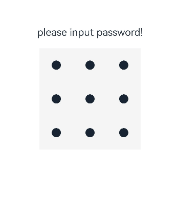
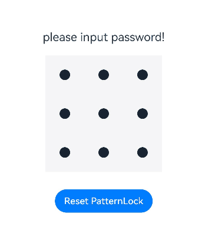

# PatternLock
<!--Kit: ArkUI-->
<!--Subsystem: ArkUI-->
<!--Owner: @Zhang-Dong-hui-->
<!--Designer: @xiangyuan6-->
<!--Tester:@jiaoaozihao-->
<!--Adviser: @Brilliantry_Rui-->
<!-- md-trans-meta sourceCommit=92567145241181b97abe57e944e177355e50f4eb translatedAt=2026-09-03T04:20:46.306Z -->

**PatternLock** is a pattern‑password lock component that allows password input via a nine-cell grid pattern for password verification scenarios. The component supports customizing appearance attributes such as the size of the nine‑cell grid, styles of dots and connecting lines, and colors for selected/active states. It provides real‑time feedback during password entry and allows setting status for password verification results (success/failure). Input mode is triggered when a finger presses down within the **PatternLock** component area; password input completes and input mode ends when the finger lifts off the screen.

>  **NOTE**
>
> - This component is supported since API version 9. Updates will be marked with a superscript to indicate their earliest API version.
>
> - If you require additional features, use [custom components](../../../ui/state-management/arkts-create-custom-components.md). For example, the custom component<!--RP1--> [CustomPatternLock](https://gitcode.com/openharmony/applications_app_samples/tree/master/code/UI/CustomPatternLock)<!--RP1End--> implements the pattern password lock feature through the [Canvas](ts-components-canvas-canvas.md) component, based on which you can extend the features as needed.

## Child Components

Not supported

## APIs

PatternLock(controller?: PatternLockController)

Creates a pattern lock component.

**Atomic service API**: This API can be used in atomic services since API version 12.

**System capability**: SystemCapability.ArkUI.ArkUI.Full

**Parameters**

| Name    | Type                                       | Mandatory| Description|
| ---------- | ----------------------------------------------- | ---- | ------------------------------------------------------------ |
| controller | [PatternLockController](#patternlockcontroller) | No | Sets the controller of the PatternLock component, which is used to reset the component state and set the pattern password state. Pass this parameter when the component state needs to be controlled programmatically (for example, resetting the password lock or setting the password verification result). If this parameter is not passed, the component state cannot be manually operated through the controller (that is, methods such as reset() and setChallengeResult() cannot be called). |

## Attributes

In addition to the [universal attributes](ts-component-general-attributes.md), the following attributes are supported.

### sideLength

sideLength(value: Length)

Sets the width and height of the component (the width and height are equal). If the value is set to **0** or a negative number, the component is not displayed. If this attribute is not set, the default width and height are **288vp**.

> **NOTE**
> 
> When the **PatternLock** component has the universal attribute [aspectRatio](ts-universal-attributes-layout-constraints.md#aspectratio) set and the ratio is not equal to 1 (the component is constrained to a rectangle), the nine‑grid pattern is still drawn as a square, which exceeds the component's bounds.

**Atomic service API**: This API can be used in atomic services since API version 12.

**System capability**: SystemCapability.ArkUI.ArkUI.Full

**Parameters**

| Name| Type                        | Mandatory| Description              |
| ------ | ---------------------------- | ---- | ------------------ |
| value  | [Length](ts-types.md#length) | Yes   | Width and height of the component.<br>Value range: greater than 0.<br>If the value is set to 0 or a negative number, the component is not displayed. |

### circleRadius

circleRadius(value: Length)

Sets the radius of the grid dots. If this attribute is not set, the default radius is **6vp**.

**Atomic service API**: This API can be used in atomic services since API version 12.

**System capability**: SystemCapability.ArkUI.ArkUI.Full

**Parameters**

| Name| Type                        | Mandatory| Description                              |
| ------ | ---------------------------- | ---- | ---------------------------------- |
| value  | [Length](ts-types.md#length) | Yes   |Radius of the grid dot.<br>Value range: (0, sideLength/11]. If the value is less than or equal to 0, the default value is used. If the value exceeds the maximum, the maximum value is used.|

### backgroundColor
backgroundColor(value: ResourceColor)

Sets the background color. If this attribute is not set, the background is transparent by default, that is, no background color is applied.

>**NOTE**
>
> This API can be called within [attributeModifier](ts-universal-attributes-attribute-modifier.md#attributemodifier) since API version 20.

**Atomic service API**: This API can be used in atomic services since API version 12.

**System capability**: SystemCapability.ArkUI.ArkUI.Full

**Parameters**

| Name| Type                                      | Mandatory| Description                                                      |
| ------ | ------------------------------------------ | ---- | ---------------------------------------------------------- |
| value  | [ResourceColor](ts-types.md#resourcecolor) | Yes  | Background color.|

### regularColor

regularColor(value: ResourceColor)

Sets the fill color of the grid dots in the unselected state. If this attribute is not set, the default fill color is **'#ff182431'** (dark gray).

**Atomic service API**: This API can be used in atomic services since API version 12.

**System capability**: SystemCapability.ArkUI.ArkUI.Full

**Parameters**

| Name| Type                                      | Mandatory| Description                                                      |
| ------ | ------------------------------------------ | ---- | ---------------------------------------------------------- |
| value  | [ResourceColor](ts-types.md#resourcecolor) | Yes   | Fill color of the grid dot in the unselected state. |

### selectedColor

selectedColor(value: ResourceColor)

Sets the fill color of the grid dots in the selected state. If this attribute is not set, the default fill color is **'#ff182431'** (dark gray).

**Atomic service API**: This API can be used in atomic services since API version 12.

**System capability**: SystemCapability.ArkUI.ArkUI.Full

**Parameters**

| Name| Type                                      | Mandatory| Description                                                    |
| ------ | ------------------------------------------ | ---- | -------------------------------------------------------- |
| value  | [ResourceColor](ts-types.md#resourcecolor) | Yes   | Fill color of the grid dot in the selected state. |

### activeColor

activeColor(value: ResourceColor)

Sets the fill color of the grid dots in the active state, which is the state where a finger passes over a dot but the dot is not yet selected. If this attribute is not set, the default fill color is **'#ff182431'** (dark gray).

**Atomic service API**: This API can be used in atomic services since API version 12.

**System capability**: SystemCapability.ArkUI.ArkUI.Full

**Parameters**

| Name| Type                                      | Mandatory| Description                                                    |
| ------ | ------------------------------------------ | ---- | -------------------------------------------------------- |
| value  | [ResourceColor](ts-types.md#resourcecolor) | Yes   | Fill color of the grid dot in the active state. |

### pathColor

pathColor(value: ResourceColor)

Sets the color of the connecting lines. If this attribute is not set, the default line color is **'#33182431'** (dark gray with 20% opacity).

**Atomic service API**: This API can be used in atomic services since API version 12.

**System capability**: SystemCapability.ArkUI.ArkUI.Full

**Parameters**

| Name| Type                                      | Mandatory| Description                                |
| ------ | ------------------------------------------ | ---- | ------------------------------------ |
| value  | [ResourceColor](ts-types.md#resourcecolor) | Yes   | Color of the line. |

### pathStrokeWidth

pathStrokeWidth(value: number | string)

Sets the width of the connecting lines. If this attribute is not set, the default line width is **12vp**.

**Atomic service API**: This API can be used in atomic services since API version 12.

**System capability**: SystemCapability.ArkUI.ArkUI.Full

**Parameters**

| Name| Type                      | Mandatory| Description                         |
| ------ | -------------------------- | ---- | ----------------------------- |
| value  | number&nbsp;\|&nbsp;string | Yes   | Width of the line.<br>Unit: vp<br>Value range: (0, sideLength/3]. If the value is set to 0 or a negative number, the line is not displayed. If the value exceeds the maximum, the maximum value is used. |

### autoReset

autoReset(value: boolean)

Sets whether to reset the component state when the component area is pressed again after password input is complete. If this API is not used to set it, the component state is reset by default.

**Atomic service API**: This API can be used in atomic services since API version 12.

**System capability**: SystemCapability.ArkUI.ArkUI.Full

**Parameters**

| Name| Type   | Mandatory| Description                                                        |
| ------ | ------- | ---- | ------------------------------------------------------------ |
| value  | boolean | Yes   | Whether to reset the component state when the component area is pressed again after password input is complete.<br>true: reset the component state (that is, clear the previously entered password); false: do not reset the component state. |

### activateCircleStyle<sup>12+</sup>

activateCircleStyle(options: Optional\<CircleStyleOptions\>)

Sets the background circle style for the dots in a grid when they are in the activated state.

**Atomic service API**: This API can be used in atomic services since API version 12.

**Model restriction**: This API can be used only in the stage model.

**System capability**: SystemCapability.ArkUI.ArkUI.Full

**Parameters**

| Name| Type   | Mandatory| Description                                                        |
| ------ | ------- | ---- | ------------------------------------------------------------ |
| options  | Optional\<[CircleStyleOptions](#circlestyleoptions12)\> | Yes  | Background circle style of the dots in the activated state.|

### skipUnselectedPoint<sup>15+</sup>

skipUnselectedPoint(skipped: boolean)

Sets whether unselected grid dots are skipped when the password path passes over them. If this API is not used to set it, unselected grid dots are selected by default when the password path passes over them.

**Atomic service API**: This API can be used in atomic services since API version 15.

**Model restriction**: This API can be used only in the stage model.

**System capability**: SystemCapability.ArkUI.ArkUI.Full

**Parameters**

| Name| Type   | Mandatory| Description                                                        |
| ------ | ------- | ---- | ------------------------------------------------------------ |
| skipped  | boolean | Yes   | Whether to skip the selection of unselected grid dots when the password path passes through them.<br>true: skip the selection; false: select automatically. |

## Events

In addition to the [universal events](ts-component-general-events.md), the following events are supported.

### onPatternComplete

onPatternComplete(callback: (input: Array\<number\>) => void)

Invoked when the pattern password input is complete.

> **NOTE**
> 
> This callback is triggered when password input ends and returns the complete password array. Relationship with [onDotConnect](#ondotconnect11): onDotConnect is triggered in real time when each dot is selected, while onPatternComplete is triggered when input ends. The two can be used together to implement real-time feedback and final verification.

**Atomic service API**: This API can be used in atomic services since API version 12.

**System capability**: SystemCapability.ArkUI.ArkUI.Full

**Parameters**

| Name| Type           | Mandatory| Description                                                        |
| ------ | --------------- | ---- | ------------------------------------------------------------ |
| input  | Array\<number\> | Yes  | Array of digits representing the indices of the selected grid dots, in the order they were connected. Grid dots are indexed row-wise from top to bottom, left to right: The first row contains indices 0, 1, 2; the second row 3, 4, 5; and the third row 6, 7, 8.|

### onDotConnect<sup>11+</sup>

onDotConnect(callback: import('../api/@ohos.base').Callback\<number\>)

Invoked when a grid dot is connected during pattern password input.

>**NOTE**
>
> This API can be called within [attributeModifier](ts-universal-attributes-attribute-modifier.md#attributemodifier) since API version 20.

**Atomic service API**: This API can be used in atomic services since API version 12.

**Model restriction**: This API can be used only in the stage model.

**System capability**: SystemCapability.ArkUI.ArkUI.Full

**Parameters**

| Name| Type           | Mandatory| Description                                                        |
| ------ | --------------- | ---- | ------------------------------------------------------------ |
| callback  | import('../api/@ohos.base').[Callback](../../apis-basic-services-kit/js-apis-base.md#callback)\<number\> | Yes   | Triggered when a grid dot is selected during password input. The callback parameter is the index of the selected grid dot (the dots in the first row are numbered 0, 1, and 2 from left to right; the dots in the second row are numbered 3, 4, and 5 from left to right; the dots in the third row are numbered 6, 7, and 8 from left to right). |

## CircleStyleOptions<sup>12+</sup>

Describes the parameters of the ring style.

**Model restriction**: This API can be used only in the stage model.

**System capability**: SystemCapability.ArkUI.ArkUI.Full


| Name         | Type| Read-Only| Optional| Description|
| ------------- | ------- | ---- | -------- | -------- |
| color | [ResourceColor](ts-types.md#resourcecolor) | No | Yes | Background ring color. <br>Default value: '#33182431' (dark gray, 20% opacity).<br>**Atomic service API:** Since API version 12, this API is supported in atomic services. |
| radius  | [LengthMetrics](../js-apis-arkui-graphics.md#lengthmetrics12) | No | Yes | Radius of the background ring.<br>Default value: approximately 1.833 times (that is, 11/6) of [circleRadius](#circleradius).<br>Value range: greater than 0.<br>**Atomic service API:** Since API version 12, this API is supported in atomic services.  |
| enableWaveEffect | boolean | No | Yes | Switch for the wave effect after a grid dot is selected.<br>true: displays the wave effect; false: does not display the wave effect.<br>Default value: true.<br>**Atomic service API:** Since API version 12, this API is supported in atomic services.  |
| enableForeground<sup>15+</sup> | boolean | No | Yes | Whether the background ring is displayed above the grid dots.<br>true: the background ring is displayed above the grid dots and covers them; false: the background ring is displayed below the grid dots and does not cover them.<br>Default value: false. <br>**Atomic service API:** Since API version 15, this API is supported in atomic services. |

## PatternLockController

Controller of the **PatternLock** component, used to reset the component state and set the pattern password state.

### Objects to Import

```typescript
let patternLockController: PatternLockController = new PatternLockController();
```

### constructor

constructor()

A constructor used to create a **PatternLockController** instance.

**Atomic service API**: This API can be used in atomic services since API version 12.

**System capability**: SystemCapability.ArkUI.ArkUI.Full

### reset

reset()

Resets the component state. This API takes effect only when the corresponding controller parameter is passed in when the **PatternLock** component is constructed. If it is not passed in, the call does not take effect.

**Atomic service API**: This API can be used in atomic services since API version 12.

**System capability**: SystemCapability.ArkUI.ArkUI.Full

### setChallengeResult<sup>11+</sup>

setChallengeResult(result: PatternLockChallengeResult): void

Sets the correct or incorrect state of the pattern password. This API takes effect only when the corresponding controller parameter is passed in when the **PatternLock** component is constructed. If it is not passed in, the call does not take effect.

**Atomic service API**: This API can be used in atomic services since API version 12.

**Model restriction**: This API can be used only in the stage model.

**System capability**: SystemCapability.ArkUI.ArkUI.Full

**Parameters**

| Name| Type                                                        | Mandatory| Description          |
| ------ | ------------------------------------------------------------ | ---- | -------------- |
| result | [PatternLockChallengeResult](#patternlockchallengeresult11) | Yes  | Authentication challenge result of the pattern password. The status can be correct or incorrect.|

## PatternLockChallengeResult<sup>11+</sup>

Authentication challenge result of the pattern password.

**Atomic service API**: This API can be used in atomic services since API version 12.

**Model restriction**: This API can be used only in the stage model.

**System capability**: SystemCapability.ArkUI.ArkUI.Full

| Name   | Value   | Description          |
| ------- | ----- | -------------- |
| CORRECT | 1  | The pattern password is correct.|
| WRONG   | 2  | The pattern password is incorrect.|

##  Example

### Example 1: Creating a Pattern Lock

This example shows the basic usage of the **PatternLock** component.

```ts
// xxx.ets
@Entry
@Component
struct PatternLockExample {
  @State passwords: number[] = [];
  @State message: string = 'please input password!';
  private patternLockController: PatternLockController = new PatternLockController();

  build() {
    Column() {
      Text(this.message).textAlign(TextAlign.Center).margin(20).fontSize(20)
      PatternLock(this.patternLockController)
        .sideLength(200)
        .circleRadius(9)
        .pathStrokeWidth(5)
        .activeColor('#707070')
        .selectedColor('#707070')
        .pathColor('#707070')
        .backgroundColor('#F5F5F5')
        .regularColor(Color.Black)
        .autoReset(true)
        .onDotConnect((index: number) => {
          console.info('onDotConnect index: ' + index);
        })
    }.width('100%').height('100%')
  }
}
```



### Example 2: Verifying the Password

This example uses the [sideLength](#sidelength) attribute to set the size of the nine-grid, the [circleRadius](#circleradius) attribute to set the radius of the dots in the grid, and the [onPatternComplete](#onpatterncomplete) attribute to set the callback invoked when password input is complete.

When the user completes the password input, different responses are given based on the input:<br>- If the password length is less than 5, a message is displayed to prompt the user to re-enter the password.<br>- After the first input, a message is displayed to prompt the user to enter the password again.<br>- After the second input, the system checks whether the two inputs match. If they match, a message is displayed to indicate that the password setup is successful; otherwise, the user is prompted to re-enter the password.

The user can click **Reset PatternLock** to reset the password lock.

```ts
// xxx.ets
import { LengthUnit } from '@kit.ArkUI';

@Entry
@Component
struct PatternLockExample {
  @State passwords: number[] = [];
  @State message: string = 'Please input password';
  private patternLockController: PatternLockController = new PatternLockController();

  build() {
    Column() {
      Text(this.message).textAlign(TextAlign.Center).margin(20).fontSize(20)
      PatternLock(this.patternLockController)
        .sideLength(200)
        .circleRadius(9)
        .pathStrokeWidth(5)
        .activeColor('#707070')
        .selectedColor('#707070')
        .pathColor('#707070')
        .backgroundColor('#F5F5F5')
        .autoReset(true)
        .activateCircleStyle({
          color: '#707070',
          radius: { value: 16, unit: LengthUnit.VP },
          enableWaveEffect: true
        })
        .onDotConnect((index: number) => {
          console.info('onDotConnect index: ' + index);
        })
        .onPatternComplete((input: Array<number>) => {
          // If the length of the entered password is less than 5, the system prompts the user to enter the password again.
          if (input.length < 5) {
            this.message = 'The password length needs to be at least 5, please enter again.';
            return;
          }
          // Check whether the password length is greater than 0.
          if (this.passwords.length > 0) {
            // Check whether the two passwords are the same. If yes, the system displays a message indicating that the password is set successfully. If no, the system prompts the user to enter the password again.
            if (this.passwords.toString() === input.toString()) {
              this.passwords = input;
              this.message = 'Set password successfully: ' + this.passwords.toString();
              this.patternLockController.setChallengeResult(PatternLockChallengeResult.CORRECT);
            } else {
              this.message = 'Inconsistent passwords, please enter again.';
              this.patternLockController.setChallengeResult(PatternLockChallengeResult.WRONG);
            }
          } else {
            // The system prompts the user to enter the password again.
            this.passwords = input;
            this.message = 'Please enter again.';
          }
        })
      Button('Reset PatternLock').margin(30).onClick(() => {
        // Reset the pattern lock.
        this.patternLockController.reset();
        this.passwords = [];
        this.message = 'Please input password';
      })
    }.width('100%').height('100%')
  }
}
```


