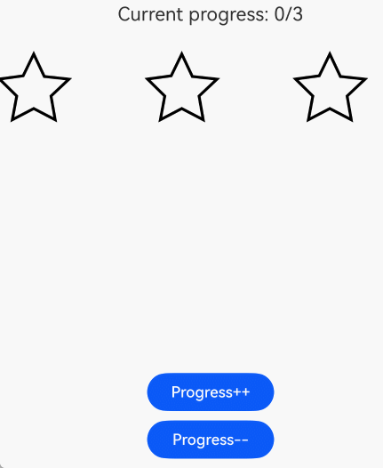
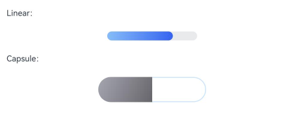

# Progress
<!--Kit: ArkUI-->
<!--Subsystem: ArkUI-->
<!--Owner: @Zhang-Dong-hui-->
<!--Designer: @xiangyuan6-->
<!--Tester: @jiaoaozihao-->
<!--Adviser: @Brilliantry_Rui-->
<!-- md-trans-meta sourceCommit=8aa8522c1582655206875d9c89c21656113a2dda translatedAt=2026-09-03T04:24:11.468Z -->

The **Progress** component is a progress indicator that displays the progress of content loading or an operation. It supports multiple styles such as linear, ring, circular, and capsule, and allows customization of colors, gradient effects, and animations. It is suitable for scenarios that require displaying progress status, such as file download, data loading, and task processing. With rich style and animation configurations, progress visualization can be quickly implemented to improve user experience.

>  **NOTE**
>
>  This component is supported since API version 7. Updates will be marked with a superscript to indicate their earliest API version.


## Child Components

Not supported

## APIs

Progress(options: ProgressOptions)

Creates a progress indicator.

**Widget capability**: This API can be used in ArkTS widgets since API version 9.

**Atomic service API**: This API can be used in atomic services since API version 11.

**System capability**: SystemCapability.ArkUI.ArkUI.Full

**Parameters**

| Name| Type| Mandatory| Description|
| -------- | -------- | -------- | -------- |
| options |  [ProgressOptions](#progressoptions)| Yes| Options of the progress indicator, which vary by progress indicator type.|

## ProgressOptions

Defines progress bar options.

**System capability**: SystemCapability.ArkUI.ArkUI.Full

| Name                       | Type                               | Read-Only| Optional| Description                                    |
| -------------------------- | ----------------------------------- | ---- | ---------------------------------------- | ---------------------------------------- |
| value                      | number                              | No   | No   | Specified progress value.<br>Default value: **0**<br>Value range: [0, total]. When the value is set less than 0, it is set to 0. When the value is set greater than total, it is set to total. When an invalid value is set, it is handled as the default value.<br>**Widget capability:** Since API version 9, this API supports use in ArkTS cards.<br>**Atomic service API:** Since API version 11, this API supports use in atomic services. |
| total                      | number                              | No   | Yes   | Specifies the total length of the progress. When the value is set less than 0, it is set to 100.<br>Default value: **100**<br>Value range: (0, +∞).<br>**Widget capability:** Since API version 9, this API supports use in ArkTS cards.<br>**Atomic service API:** Since API version 11, this API supports use in atomic services. |
| type<sup>8+</sup>          | Type   | No   | Yes   | Specifies the progress bar type. Type inherits from [ProgressStyleMap](#progressstylemap10).<br>Default value: **ProgressType.Linear**<br>**Widget capability:** Since API version 9, this API supports use in ArkTS cards.<br>**Note:** Different [ProgressType](#progresstype8) values must correspond to the respective [style](#style8) attribute settings. For the detailed mapping, see [ProgressStyleMap](#progressstylemap10).<br>**Atomic service API:** Since API version 11, this API supports use in atomic services. |
| style<sup>(deprecated)</sup> | [ProgressStyle](#progressstyle) | No | Yes | Specifies the progress bar style.<br>Supported since API version 7, deprecated since API version 8. You are advised to use [type](#progresstype8) instead.<br>Default value: **ProgressStyle.Linear** |

## ProgressType<sup>8+</sup>

Enumerates progress indicator types.

**Widget capability**: This API can be used in ArkTS widgets since API version 9.

**Atomic service API**: This API can be used in atomic services since API version 11.

**System capability**: SystemCapability.ArkUI.ArkUI.Full

| Name                    | Value| Description                                    |
| ---------------------- | - | ---------------------------------------- |
| Linear                 | 0 | Linear type. Since API version 9, the progress indicator adapts to vertical display when its height is greater than its width.  |
| Ring      | 1 | Ring type without scales. The ring gradually displays until it is fully filled.                |
| Eclipse  | 2 | Eclipse type, which visualizes the progress in a way similar to the moon waxing from new to full.        |
| ScaleRing | 3 | Ring style with scales, which is similar to the clock scale style. Since API version 9, the progress indicator automatically switches to a non‑scaled ring style when the outer scales overlap.|
| Capsule   | 4 | Capsule style. The progress display effect at the arc ends is the same as that of Eclipse, and the progress display effect in the middle section is the same as that of Linear. Since API version 9, when the height is greater than the width, the component is displayed vertically in an adaptive manner. |

##  ProgressStyle

Enumerates progress indicator styles.

**Widget capability**: This API can be used in ArkTS widgets since API version 9.

**Atomic service API**: This API can be used in atomic services since API version 11.

**System capability**: SystemCapability.ArkUI.ArkUI.Full

| Name       | Value| Description                                    |
| --------- | - | ---------------------------------------- |
| Linear    | 0 | Linear style. The progress bar is gradually filled from one end to the other along a straight line.                                    |
| Ring<sup>8+</sup>      | 1 | Ring without scale. The ring is gradually displayed until it is completely filled.                 |
| Eclipse   | 2 | Eclipse style, which visualizes the progress in a way similar to the moon waxing from new to full.        |
| ScaleRing<sup>8+</sup> | 3 | Ring with scale. Displays a progress effect similar to a clock scale. Since API version 9, when the outer ring of the scale overlaps, it is automatically converted to a ring without scale.               |
| Capsule<sup>8+</sup>   | 4 | Capsule style. The progress display effect at the arc ends is the same as that of Eclipse, and the progress display effect in the middle is the same as that of Linear. Since API version 9, when the height is greater than the width, it is adaptively displayed vertically. |

##  ProgressStyleMap<sup>10+</sup>

Defines the mapping between progress indicators and styles.

**Atomic service API**: This API can be used in atomic services since API version 11.

**Model restriction**: This API can be used only in the stage model.

**System capability**: SystemCapability.ArkUI.ArkUI.Full

| Name       | Type                                     |
| --------- | ---------------------------------------- |
| [ProgressType.Linear] | [LinearStyleOptions](#linearstyleoptions10)&nbsp; \| &nbsp;[ProgressStyleOptions](#progressstyleoptions8)&nbsp; |
| [ProgressType.Ring] | [RingStyleOptions](#ringstyleoptions10)&nbsp; \| &nbsp;[ProgressStyleOptions](#progressstyleoptions8)&nbsp; |
| [ProgressType.Eclipse] | [EclipseStyleOptions](#eclipsestyleoptions10)&nbsp;  \| &nbsp;[ProgressStyleOptions](#progressstyleoptions8)&nbsp; |
| [ProgressType.ScaleRing] | [ScaleRingStyleOptions](#scaleringstyleoptions10)&nbsp; \| &nbsp;[ProgressStyleOptions](#progressstyleoptions8)&nbsp; |
| [ProgressType.Capsule] | [CapsuleStyleOptions](#capsulestyleoptions10)&nbsp; \| &nbsp;[ProgressStyleOptions](#progressstyleoptions8)&nbsp; |

## Attributes

In addition to the [universal attributes](ts-component-general-attributes.md), the following attributes are supported.

> **NOTE**
>
> This component overrides the universal attribute [backgroundColor](ts-universal-attributes-background.md#backgroundcolor). When applied directly to the **Progress** component, it sets the background color of the progress indicator itself. To set the background color for the entire **Progress** component area, apply **backgroundColor** to the outer container that wraps the **Progress** component.

### value

value(value: number)

Sets the current progress value. When a value less than 0 is set, it is set to 0; when a value greater than total is set, it is set to total. When an invalid value is set, it is handled as the default value. When the status attribute of the Ring style is set to ProgressStatus.LOADING, setting the progress value does not take effect.

**Widget capability**: This API can be used in ArkTS widgets since API version 9.

**Atomic service API**: This API can be used in atomic services since API version 11.

**System capability**: SystemCapability.ArkUI.ArkUI.Full

**Parameters**

| Name| Type  | Mandatory| Description        |
| ------ | ------ | ---- | ------------ |
| value  | number | Yes   | Current progress value.<br>Default value: 0<br>Value range: [0, total]. When the value is set to less than 0, it is set to 0. When the value is set to greater than total, it is set to total. When an invalid value is set, it is handled as the default value.<br>**Note:** When the status of a Ring type progress bar is set to ProgressStatus.LOADING, the set progress value does not take effect. |

### color

color(value: ResourceColor | LinearGradient)

Sets the foreground color of the progress indicator.

Since API version 10, [LinearGradient](ts-basic-components-datapanel.md#lineargradient10) can be used to set a gradient color for the ring style. Setting opacity is not recommended for the ring type. If opacity is required, use [DataPanel](ts-basic-components-datapanel.md).

Since API version 23, LinearGradient can be used to set the gradient color of the Linear style and Capsule style. In API version 22 and earlier, when this method is used, the default theme color is displayed.

**Widget capability**: This API can be used in ArkTS widgets since API version 9, except that **LinearGradient** is not supported.

**Atomic service API**: This API can be used in atomic services since API version 11.

**System capability**: SystemCapability.ArkUI.ArkUI.Full

**Parameters**

| Name| Type                                                        | Mandatory| Description                                                        |
| ------ | ------------------------------------------------------------ | ---- | ------------------------------------------------------------ |
| value  | [ResourceColor](ts-types.md#resourcecolor) \| [LinearGradient](ts-basic-components-datapanel.md#lineargradient10) | Yes   | Foreground color of the progress bar.<br>Since API version 10, LinearGradient is supported for setting the gradient color of the Ring style. Since API version 23, LinearGradient is supported for setting the gradient color of the Linear style and Capsule style.<br>Default value:<br>- Capsule:<br>&nbsp;&nbsp;&nbsp;API version 9 and earlier: '\#ff007dff'<br>&nbsp;&nbsp;&nbsp;API version 10: '\#33006cde'<br>&nbsp;&nbsp;&nbsp;API version 11 and later: '\#33007dff'<br>- Ring:<br>&nbsp;&nbsp;&nbsp;API version 9 and earlier: '\#ff007dff'<br>&nbsp;&nbsp;&nbsp;API version 10 and later: start: '\#ff86c1ff', end: '\#ff254ff7'<br>- Other styles: '\#ff007dff' |

### style<sup>8+</sup>

style(value: Style)

Sets the component style.

**Widget capability**: This API can be used in ArkTS widgets since API version 9.

**Atomic service API**: This API can be used in atomic services since API version 11.

**System capability**: SystemCapability.ArkUI.ArkUI.Full

**Parameters**

| Name| Type                                                        | Mandatory| Description                                                        |
| ------ | ------------------------------------------------------------ | ---- | ------------------------------------------------------------ |
| value  | Style | Yes   | Style of the component. Style inherits from [ProgressStyleMap](#progressstylemap10).<br>**Note:** Different [ProgressType](#progresstype8) values must correspond to the respective [style](#style8) attribute settings. For the detailed mapping, see [ProgressStyleMap](#progressstylemap10).<br>- [CapsuleStyleOptions](#capsulestyleoptions10): Sets the style of Capsule.<br>- [RingStyleOptions](#ringstyleoptions10): Sets the style of Ring.<br>- [LinearStyleOptions](#linearstyleoptions10): Sets the style of Linear.<br>- [ScaleRingStyleOptions](#scaleringstyleoptions10): Sets the style of ScaleRing.<br>- [EclipseStyleOptions](#eclipsestyleoptions10): Sets the style of Eclipse.<br>- [ProgressStyleOptions](#progressstyleoptions8): Can only set strokeWidth, scaleCount, and scaleWidth of each type of progress bar, and takes effect only for progress bars that support these style settings. |

### contentModifier<sup>12+</sup>
contentModifier(modifier:ContentModifier\<ProgressConfiguration\>)

Creates a content modifier.

**Atomic service API**: This API can be used in atomic services since API version 12.

**Model restriction**: This API can be used only in the stage model.

**System capability**: SystemCapability.ArkUI.ArkUI.Full

**Parameters**
| Name| Type  | Mandatory| Description        |
| ------ | ------ | ---- | ------------ |
| modifier | [ContentModifier](./ts-universal-attributes-content-modifier.md#contentmodifiert)<[ProgressConfiguration](#progressconfiguration12)> | Yes | Method for customizing the content area on the Progress component.<br>modifier: content modifier. Developers need to customize a class to implement the ContentModifier interface. |

### privacySensitive<sup>12+</sup>

privacySensitive(isPrivacySensitiveMode: Optional\<boolean\>)

Sets whether to enable privacy-sensitive mode.

>**NOTE**
>
> This API can be called in [attributeModifier](ts-universal-attributes-attribute-modifier.md#attributemodifier) since API version 20.

**Widget capability**: This API can be used in ArkTS widgets since API version 12.

**Atomic service API**: This API can be used in atomic services since API version 12.

**Model restriction**: This API can be used only in the stage model.

**System capability**: SystemCapability.ArkUI.ArkUI.Full

**Parameters**

| Name| Type                                                     | Mandatory| Description                                                 |
| ------ | --------------------------------------------------------- | ---- | ----------------------------------------------------- |
| isPrivacySensitiveMode  | [Optional](ts-universal-attributes-custom-property.md#optionalt)\<boolean\> | Yes   | Sets privacy sensitivity. In privacy mode, the progress is cleared and the text is masked. true: enables privacy sensitivity; false: disables privacy sensitivity.<br> Default value: false<br>**Note:** <br>Setting null indicates that the component is not sensitive. <!--Del--><br>To use Progress in a card and set the [privacy mask](./ts-universal-attributes-obscured.md) attribute with the [FormComponent](./ts-basic-components-formcomponent-sys.md) component, the privacy mask effect is available only when the card is displayed.<!--DelEnd--> |

## ProgressConfiguration<sup>12+</sup>

Provides progress indicator configuration. Inherits from [CommonConfiguration](ts-universal-attributes-content-modifier.md#commonconfigurationt).

**Atomic service API**: This API can be used in atomic services since API version 12.

**Model restriction**: This API can be used only in the stage model.

**System capability**: SystemCapability.ArkUI.ArkUI.Full

| Name| Type | Read-Only| Optional|Description        |
| ------ | ------ | ------- |------------|------------|
| value  | number | No | No | Current progress value. When the set value is less than 0, it is set to 0. When the set value is greater than total, it is set to total.<br>Default value: 0<br>Value range: [0, total]<br>**Note:** When the status of a Ring type progress bar is set to ProgressStatus.LOADING, the set progress value does not take effect.|
| total  | number | No | No | Total progress length.<br>Value range: (0, +∞)<br>**NOTE**<br>When total is less than or equal to 0, it is handled as 100.|

## CommonProgressStyleOptions<sup>10+</sup>

Provides common style configuration options for the progress indicator.

**Atomic service API**: This API can be used in atomic services since API version 11.

**Model restriction**: This API can be used only in the stage model.

**System capability**: SystemCapability.ArkUI.ArkUI.Full

| Name         | Type                     | Read-Only| Optional| Description                                                                                       |
| ------------ | ---------------------------- | ---- | ------------------------------------------------------------------------------------------ | ------------------------------------------------------------------------------------------ |
| enableSmoothEffect | boolean | No | Yes | Switch for the progress smooth effect. When the smooth effect is enabled, setting the progress changes it gradually from the current value to the specified value, with an animation on the page. Otherwise, the progress changes abruptly from the current value to the specified value, with no animation on the page.<br>true: enables the progress smooth effect.<br>false: disables the progress smooth effect.<br>Default value: true |

## ScanEffectOptions<sup>10+</sup>

Defines the scan effect options.

**Atomic service API**: This API can be used in atomic services since API version 11.

**Model restriction**: This API can be used only in the stage model.

**System capability**: SystemCapability.ArkUI.ArkUI.Full

| Name         | Type| Read-Only| Optional| Description|
| ------------- | ------- | ---- | -------- | -------- |
| enableScanEffect | boolean | No | Yes | Whether to enable the scan effect. This parameter is supported only for the progress bar whose [ProgressType](#progresstype8) is Linear, Ring, or Capsule.<br>true: enable the scan effect.<br>false: disable the scan effect.<br>Default value: false |

## ProgressStyleOptions<sup>8+</sup>

Defines the progress bar style options.

Inherits from [CommonProgressStyleOptions](#commonprogressstyleoptions10).

**Widget capability**: This API can be used in ArkTS widgets since API version 9.

**Atomic service API**: This API can be used in atomic services since API version 11.

**System capability**: SystemCapability.ArkUI.ArkUI.Full

| Name         | Type                     | Read-Only| Optional| Description                                                                                       |
| ------------ | ---------------------------- | ---- | ------------------------------------------------------------------------------------------ | ------------------------------------------------------------------------------------------ |
| strokeWidth  | [Length](ts-types.md#length) | No  | Yes  | Sets the progress bar width (percentage setting not supported).<br>Default value: 4.0vp<br>Value range: a value greater than 0.<br>When the value exceeds the value range or an invalid value is set, the default value is used.|
| scaleCount   | number                       | No  | Yes  | Sets the total number of scale marks on the ring progress bar.<br>Default value: 120 <br>Value range: [2, min(width, height)*π/scaleWidth]. When the value exceeds the value range, the style is displayed as a ring progress bar without scale marks.<br>When both scaleCount and scaleWidth are equal to their default values, setting the component width or height to less than 77vp displays a ring progress bar without scale marks.                     |
| scaleWidth   | [Length](ts-types.md#length) | No  | Yes  | Sets the thickness of the scale marks on the ring progress bar (percentage setting not supported).<br>Default value: 2.0vp<br>Value range: a value greater than 0.<br>When the value exceeds the value range or an invalid value is set, the default value is used.<br>When the scale mark thickness is greater than the progress bar width, the system default thickness is used.<br>When both scaleCount and scaleWidth are equal to their default values, setting the component width or height to less than 77vp displays a ring progress bar without scale marks.      |

## CapsuleStyleOptions<sup>10+</sup>

Capsule style options.

Inherits from [ScanEffectOptions](#scaneffectoptions10) and [CommonProgressStyleOptions](#commonprogressstyleoptions10).

**Model restriction**: This API can be used only in the stage model.

**System capability**: SystemCapability.ArkUI.ArkUI.Full

| Name         | Type| Read-Only| Optional| Description|
| ------------- | ------- | ---- | -------- | -------- |
| borderColor | [ResourceColor](ts-types.md#resourcecolor) | No | Yes | Inner stroke color.<br>Default value:<br>API version 10: '\#33006cde'<br>API version 11 and later: '\#33007dff' <br>**Atomic service API:** This API supports use in atomic services since API version 11.|
| borderWidth | [Length](ts-types.md#length) | No | Yes | Inner stroke width.<br>Default value: 1vp<br>Value range: a value greater than or equal to 0. Percentage setting not supported.<br>A value out of range or an invalid value is handled as the default value.<br>**Atomic service API:** This API supports use in atomic services since API version 11.|
| content | [ResourceStr](ts-types.md#resourcestr) | No | Yes | Text content, which can be customized by the application.<br>Pass this parameter when custom text needs to be displayed on the capsule progress bar. If it is not passed, no text is displayed (to display the percentage text, set showDefaultPercentage to true).<br>Since API version 20, the Resource type is supported.<br>**Atomic service API:** This API supports use in atomic services since API version 11.|
| font | [Font](ts-types.md#font) | No | Yes | Text style.<br>Default value:<br>Text size (percentage setting not supported): 12fp<br>Other text parameters follow the theme values of the [Text](ts-basic-components-text.md) component.<br>**Atomic service API:** This API supports use in atomic services since API version 11.|
| fontColor | [ResourceColor](ts-types.md#resourcecolor) | No | Yes | Text color.<br>Default value: '\#ff182431' <br>**Atomic service API:** This API supports use in atomic services since API version 11.|
| showDefaultPercentage | boolean | No | Yes | Whether to display the percentage text. When enabled, the progress bar displays the percentage of the current progress. This attribute does not take effect when the content attribute is set.<br>true: displays the percentage text; false: does not display the percentage text.<br>Default value: false<br>**Atomic service API:** This API supports use in atomic services since API version 11.|
| borderRadius<sup>18+</sup> | [LengthMetrics](../js-apis-arkui-graphics.md#lengthmetrics12) | No | Yes | Corner radius of the capsule progress bar (percentage setting not supported).<br>Value range: [0, component height/2]. Default value: component height/2.<br>An invalid value is handled as the default value.<br>**Atomic service API:** This API supports use in atomic services since API version 18.|

## RingStyleOptions<sup>10+</sup>

Options of the ring style without scales.

Inherits from [ScanEffectOptions](#scaneffectoptions10) and [CommonProgressStyleOptions](#commonprogressstyleoptions10).

**Atomic service API**: This API can be used in atomic services since API version 11.

**Model restriction**: This API can be used only in the stage model.

**System capability**: SystemCapability.ArkUI.ArkUI.Full

| Name          | Type                     | Read-Only| Optional| Description                                                                                       |
| ------------- | ---------------------------- | ---- | ------------------------------------------------------------------------------------------ | ------------------------------------------------------------------------------------------ |
| strokeWidth   | [Length](ts-types.md#length) | No  | Yes  | Sets the width of the progress bar.<br>Default value: **4.0vp**<br>Value range: a value greater than 0. Percentage setting is not supported.<br>If the value exceeds the value range or an invalid value is set, the default value is used.<br>When the width is greater than or equal to the radius, the width is changed to half of the radius by default.|
| shadow        | boolean                      | No  | Yes  | Whether to enable the shadow of the progress bar.<br>true: enables the shadow of the progress bar; false: disables the shadow of the progress bar.<br>Default value: **false**                                                             |
| status        | [ProgressStatus<sup>10+</sup>](#progressstatus10) | No | Yes | Sets the status of the progress bar. When the value is set to **ProgressStatus.LOADING**, the check-and-update animation is enabled. When the value changes from **ProgressStatus.LOADING** to **ProgressStatus.PROGRESSING**, the check-and-update animation runs to the end point before stopping.<br>Default value: **ProgressStatus.PROGRESSING**<br>**Note:** When the value is set to **ProgressStatus.LOADING**, the progress value setting does not take effect. For details, see the description of [value](#value). |

## LinearStyleOptions<sup>10+</sup>

Linear style options.

Inherits from [ScanEffectOptions](#scaneffectoptions10) and [CommonProgressStyleOptions](#commonprogressstyleoptions10).

**Atomic service API**: This API can be used in atomic services since API version 11.

**Model restriction**: This API can be used only in the stage model.

**System capability**: SystemCapability.ArkUI.ArkUI.Full

| Name          | Type                     | Read-Only| Optional| Description                                                                                       |
| ------------- | ---------------------------- | ---- | ------------------------------------------------------------------------------------------ | ------------------------------------------------------------------------------------------ |
| strokeWidth   | [Length](ts-types.md#length) | No  | Yes  | Sets the progress bar width.<br>Default value: **4.0vp**<br>Value range: a value greater than 0. Percentage setting is not supported.<br>If the value exceeds the value range or an invalid value is set, the default value is used.|
| strokeRadius   | [PX](ts-types.md#px10)    \| [VP](ts-types.md#vp10)    \| [LPX](ts-types.md#lpx10)    \| [Resource](ts-types.md#resource)| No  | Yes  | Sets the corner radius of the linear progress bar.<br>Value range: [0, strokeWidth / 2]. Default value: **strokeWidth / 2**.<br>If the value exceeds the value range, the default value is used.|

## ScaleRingStyleOptions<sup>10+</sup>

Options of the ring style with scales.

Inherits from [CommonProgressStyleOptions](#commonprogressstyleoptions10).

**Atomic service API**: This API can be used in atomic services since API version 11.

**Model restriction**: This API can be used only in the stage model.

**System capability**: SystemCapability.ArkUI.ArkUI.Full

| Name         | Type                     | Read-Only| Optional| Description                                                                                       |
| ------------ | ---------------------------- | ---- | ------------------------------------------------------------------------------------------ | ------------------------------------------------------------------------------------------ |
| strokeWidth  | [Length](ts-types.md#length) | No  | Yes  | Sets the progress bar width.<br>Default value: 4.0vp<br>Value range: a value greater than 0 (unit: vp). Percentage setting is not supported.<br>Exceeding the value range or setting an invalid value is handled as the default value.|
| scaleCount   | number                       | No  | Yes  | Sets the total number of scales of the ring progress bar.<br>Default value: 120 <br>Value range: [2, min(width, height)*π/scaleWidth]. When the value exceeds the range, the style is displayed as a ring progress bar without scales.<br>When both scaleCount and scaleWidth are equal to their default values, setting the component width or height to less than 77 vp displays a ring progress bar without scales.                     |
| scaleWidth   | [Length](ts-types.md#length) | No  | Yes  | Sets the thickness of the scales of the ring progress bar (percentage setting is not supported).<br>Default value: 2.0vp<br>Value range: a value greater than 0 (unit: vp).<br>When the scale thickness is greater than the progress bar width, the system default thickness is used.<br>When both scaleCount and scaleWidth are equal to their default values, setting the component width or height to less than 77 vp displays a ring progress bar without scales.|

## EclipseStyleOptions<sup>10+</sup>

Options of the eclipse style. The eclipse style visualizes the progress in a way similar to the moon waxing from new to full.

Inherits from [CommonProgressStyleOptions](#commonprogressstyleoptions10).

**Atomic service API**: This API can be used in atomic services since API version 11.

**Model restriction**: This API can be used only in the stage model.

**System capability**: SystemCapability.ArkUI.ArkUI.Full

## ProgressStatus<sup>10+</sup>

Current state of the progress indicator.

**Atomic service API**: This API can be used in atomic services since API version 11.

**Model restriction**: This API can be used only in the stage model.

**System capability**: SystemCapability.ArkUI.ArkUI.Full

| Name                   | Value    | Description     |
| ----------------------- | ---------------- | ---------------- |
| LOADING  | 'LOADING' | Loading state. Enables the check-update animation, in which case the set progress value does not take effect. |
| PROGRESSING | 'PROGRESSING' | Progressing.|

## Events

The [universal events](ts-component-general-events.md) are supported.

## Example

### Example 1: Setting Progress Indicator Types

This example demonstrates how to set the progress indicator type using the input parameter **type** of [ProgressOptions](#progressoptions).

```ts
// xxx.ets
@Entry
@Component
struct ProgressExample {
  build() {
    Column({ space: 15 }) {
      Text('Linear Progress').fontSize(9).fontColor(0xCCCCCC).width('90%')
      Progress({ value: 10, type: ProgressType.Linear }).width(200)
      Progress({ value: 20, total: 150, type: ProgressType.Linear }).color(Color.Grey).value(50).width(200)


      Text('Eclipse Progress').fontSize(9).fontColor(0xCCCCCC).width('90%')
      Row({ space: 40 }) {
        Progress({ value: 10, type: ProgressType.Eclipse }).width(100)
        Progress({ value: 20, total: 150, type: ProgressType.Eclipse }).color(Color.Grey).value(50).width(100)
      }

      Text('ScaleRing Progress').fontSize(9).fontColor(0xCCCCCC).width('90%')
      Row({ space: 40 }) {
        Progress({ value: 10, type: ProgressType.ScaleRing }).width(100)
        Progress({ value: 20, total: 150, type: ProgressType.ScaleRing })
          .color(Color.Grey).value(50).width(100)
          .style({ strokeWidth: 15, scaleCount: 15, scaleWidth: 5 })
      }

      // scaleCount vs. scaleWidth
      Row({ space: 40 }) {
        Progress({ value: 20, total: 150, type: ProgressType.ScaleRing })
          .color(Color.Grey).value(50).width(100)
          .style({ strokeWidth: 20, scaleCount: 20, scaleWidth: 5 })
        Progress({ value: 20, total: 150, type: ProgressType.ScaleRing })
          .color(Color.Grey).value(50).width(100)
          .style({ strokeWidth: 20, scaleCount: 30, scaleWidth: 3 })
      }

      Text('Ring Progress').fontSize(9).fontColor(0xCCCCCC).width('90%')
      Row({ space: 40 }) {
        Progress({ value: 10, type: ProgressType.Ring }).width(100)
        Progress({ value: 20, total: 150, type: ProgressType.Ring })
          .color(Color.Grey).value(50).width(100)
          .style({ strokeWidth: 20 })
      }

      Text('Capsule Progress').fontSize(9).fontColor(0xCCCCCC).width('90%')
      Row({ space: 40 }) {
        Progress({ value: 10, type: ProgressType.Capsule }).width(100).height(50)
        Progress({ value: 20, total: 150, type: ProgressType.Capsule })
          .color(Color.Grey)
          .value(50)
          .width(100)
          .height(50)
      }
    }.width('100%').margin({ top: 30 })
  }
}
```


### Example 2: Setting Ring Progress Indicator Attributes

This example demonstrates how to set attributes of a ring progress indicator using the **strokeWidth** and **shadow** properties in the [style](#style8) API.

```ts
// xxx.ets
@Entry
@Component
struct ProgressExample {
  private gradientColor: LinearGradient = new LinearGradient([{ color: Color.Yellow, offset: 0.5 },
    { color: Color.Orange, offset: 1.0 }]);

  build() {
    Column({ space: 15 }) {
      Text('Gradient Color').fontSize(9).fontColor(0xCCCCCC).width('90%')
      Progress({ value: 70, total: 100, type: ProgressType.Ring })
        .width(100).style({ strokeWidth: 20 })
        .color(this.gradientColor)

      Text('Shadow').fontSize(9).fontColor(0xCCCCCC).width('90%')
      Progress({ value: 70, total: 100, type: ProgressType.Ring })
        .width(120).color(Color.Orange)
        .style({ strokeWidth: 20, shadow: true })
    }.width('100%').padding({ top: 5 })
  }
}
```


### Example 3: Setting the Animation for the Ring Progress Indicator

This example demonstrates how to enable or disable animations for a ring progress indicator using the **status** and **enableScanEffect** properties in the [style](#style8) API.

```ts
// xxx.ets
@Entry
@Component
struct ProgressExample {
  build() {
    Column({ space: 15 }) {
      Text('Loading Effect').fontSize(9).fontColor(0xCCCCCC).width('90%')
      Progress({ value: 0, total: 100, type: ProgressType.Ring })
        .width(100).color(Color.Blue)
        .style({ strokeWidth: 20, status: ProgressStatus.LOADING })

      Text('Scan Effect').fontSize(9).fontColor(0xCCCCCC).width('90%')
      Progress({ value: 30, total: 100, type: ProgressType.Ring })
        .width(100).color(Color.Orange)
        .style({ strokeWidth: 20, enableScanEffect: true })
    }.width('100%').padding({ top: 5 })
  }
}
```


### Example 4: Setting Capsule Progress Indicator Attributes

This example demonstrates how to set attributes for a capsule progress indicator using properties such as **borderColor**, **borderWidth**, **content**, **font**, **fontColor**, **enableScanEffect**, and **showDefaultPercentage** in the [style](#style8) API.

```ts
// xxx.ets
@Entry
@Component
struct ProgressExample {
  build() {
    Column({ space: 15 }) {
      Row({ space: 40 }) {
        Progress({ value: 100, total: 100, type: ProgressType.Capsule }).width(100).height(50)
          .style({
            borderColor: Color.Blue,
            borderWidth: 1,
            content: 'Installing...',
            font: { size: 13, style: FontStyle.Normal },
            fontColor: Color.Gray,
            enableScanEffect: false,
            showDefaultPercentage: false
          })
      }
    }.width('100%').padding({ top: 5 })
  }
}
```


### Example 5: Setting the Smooth Effect

This example demonstrates how to enable or disable the smooth effect for the progress animation using the **enableSmoothEffect** property in the [style](#style8) API.

```ts
// xxx.ets
@Entry
@Component
struct Index {
  @State value: number = 0;

  build() {
    Column({ space: 10 }) {
      Text('enableSmoothEffect: true')
        .fontSize(9)
        .fontColor(0xCCCCCC)
        .width('90%')
        .margin(5)
        .margin({ top: 20 })
      Progress({ value: this.value, total: 100, type: ProgressType.Linear })
        .style({ strokeWidth: 10, enableSmoothEffect: true })

      Text('enableSmoothEffect: false').fontSize(9).fontColor(0xCCCCCC).width('90%').margin(5)
      Progress({ value: this.value, total: 100, type: ProgressType.Linear })
        .style({ strokeWidth: 10, enableSmoothEffect: false })

      Button('value +10').onClick(() => {
        this.value += 10;
      })
        .width(75)
        .height(15)
        .fontSize(9)
    }
    .width('50%')
    .height('100%')
    .margin({ left: 20 })
  }
}

```


### Example 6: Setting the Custom Content Area

This example implements a custom progress indicator using the [contentModifier](#contentmodifier12) API. This progress indicator displays a star shape with a total progress value of **3**, and the current value can be incremented or decremented through buttons. The achieved progress is filled with a custom color.

```ts
// xxx.ets
class MyProgressModifier implements ContentModifier<ProgressConfiguration> {
  color: ResourceColor = Color.White;

  constructor(color: ResourceColor) {
    this.color = color;
  }

  applyContent(): WrappedBuilder<[ProgressConfiguration]> {
    return wrapBuilder(myProgress);
  }
}

@Builder
function myProgress(config: ProgressConfiguration) {

  Column({ space: 30 }) {
    Text('Current progress: ' + config.value + '/' + config.total).fontSize(20)
    Row() {
      Flex({ justifyContent: FlexAlign.SpaceBetween }) {
        Path()
          .width('30%')
          .height('30%')
          .commands('M108 0 L141 70 L218 78.3 L162 131 L175 205 L108 170 L41.2 205 L55 131 L1 78 L75 68 L108 0 Z')
          .fill(config.enabled && config.value >= 1 ? (config.contentModifier as MyProgressModifier).color :
          Color.White)
          .stroke(Color.Black)
          .strokeWidth(3)
        Path()
          .width('30%')
          .height('30%')
          .commands('M108 0 L141 70 L218 78.3 L162 131 L175 205 L108 170 L41.2 205 L55 131 L1 78 L75 68 L108 0 Z')
          .fill(config.enabled && config.value >= 2 ? (config.contentModifier as MyProgressModifier).color :
          Color.White)
          .stroke(Color.Black)
          .strokeWidth(3)
        Path()
          .width('30%')
          .height('30%')
          .commands('M108 0 L141 70 L218 78.3 L162 131 L175 205 L108 170 L41.2 205 L55 131 L1 78 L75 68 L108 0 Z')
          .fill(config.enabled && config.value >= 3 ? (config.contentModifier as MyProgressModifier).color :
          Color.White)
          .stroke(Color.Black)
          .strokeWidth(3)
      }.width('100%')
    }
  }.margin({ bottom: 100 })
}

@Entry
@Component
struct Index {
  @State currentValue: number = 0;
  modifier = new MyProgressModifier('rgb(39, 135, 217)');

  build() {
    Column() {
      Progress({ value: this.currentValue, total: 3, type: ProgressType.Ring }).contentModifier(this.modifier)
      Button('Progress++').onClick(() => {
        if (this.currentValue < 3) {
          this.currentValue += 1;
        }
      }).width('30%')
      Button('Progress--').onClick(() => {
        if (this.currentValue > 0) {
          this.currentValue -= 1;
        }
      }).width('30%').margin('10')
    }.width('100%').height('100%')
  }
}

```


### Example 7: Securing Sensitive Information

This example illustrates how to secure sensitive information using the [privacySensitive](#privacysensitive12) attribute. Note that the display requires widget framework support.

```ts
@Entry
@Component
struct ProgressExample {
  build() {
    Row() {
      Column({ space: 15 }) {
        Progress({ value: 33, total: 100, type: ProgressType.Capsule }).width(300).height(50)
          .color(Color.Blue)
          .style({
            borderWidth: 5,
            font: { size: 13, style: FontStyle.Normal },
            enableScanEffect: false,
            showDefaultPercentage: true
          })
          .privacySensitive(true)
        Progress({ value: 33, total: 100, type: ProgressType.Capsule }).width(300).height(50)
          .color(Color.Blue)
          .style({
            borderWidth: 5,
            content: 'Installing...',
            font: { size: 13, style: FontStyle.Normal },
            enableScanEffect: false,
          })
          .privacySensitive(true)
      }
    }
  }
}
```


### Example 8: Setting Capsule Progress Indicator Border Radius

This example demonstrates how to set the border radius of the capsule progress indicator using the input parameter **borderRadius** of [CapsuleStyleOptions](#capsulestyleoptions10).

The **borderRadius** attribute is supported since API version 18.

```ts
import { LengthMetrics } from '@kit.ArkUI';

@Entry
@Component
struct ProgressExample {
  build() {
    Column({ space: 15 }) {
      Text('Capsule Progress').fontSize(9).width('90%')
      Row({ space: 15 }) {
        Progress({ value: 30, total: 100, type: ProgressType.Capsule })
          .style({ content: 'Default radius', borderWidth: 5 })
          .width(100)
          .height(60)
      }

      Row({ space: 15 }) {
        Progress({ value: 30, total: 100, type: ProgressType.Capsule })
          .style({ content: 'Radius 20 vp', borderWidth: 5, borderRadius: LengthMetrics.vp(20) })
          .width(100)
          .height(60)
      }
    }
    .width('100%')
    .margin({ top: 30 })
  }
}

```


### Example 9: Setting Attributes of Linear and Capsule Progress Indicators

This example demonstrates how to implement the gradient color of the linear progress indicator and capsule progress indicator using **LinearGradient** (available since API version 23) of the [color](#color) attribute.

```ts
// xxx.ets
@Entry
@Component
struct ProgressExample {
  private linearGradientColor: LinearGradient = new LinearGradient([{ color: "#87BDF9", offset: 0.5 },
    { color: "#3662F0", offset: 1.0 }]);
  public capsuleGradientColor: LinearGradient = new LinearGradient([{ color: "#A5A5AF", offset: 0.5 }, 
    { color: "#67666C", offset: 1.0 }]);

  build() {
    Column({ space: 15 }) {
      Text('Linear: ').fontSize(9).fontColor(0xCCCCCC).width('90%')
      Progress({ value: 70, total: 100, type: ProgressType.Linear })
        .width(100).style({ strokeWidth: 20 })
        .color(this.linearGradientColor)

      Text('Capsule: ').fontSize(9).fontColor(0xCCCCCC).width('90%')
      Progress({ value: 50, total: 100, type: ProgressType.Capsule })
        .width(120).style({ strokeWidth: 40 })
        .color(this.capsuleGradientColor)
    }.width('100%').padding({ top: 5 })
  }
}
```

