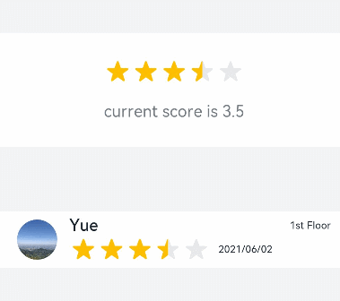

# Rating
<!--Kit: ArkUI-->
<!--Subsystem: ArkUI-->
<!--Owner: @liyi0309-->
<!--Designer: @liyi0309-->
<!--Tester: @lxl007-->
<!--Adviser: @Brilliantry_Rui-->

The **Rating** component is used to select a rating within a given range, which is typically suitable for application scenarios such as product reviews and content rating.

>  **NOTE**
>
> - This component is supported since API version 7. Updates will be marked with a superscript to indicate their earliest API version.
>
> - If the parent node of the **Rating** component has fixed dimensions, you must also specify the width and height for the **Rating** component, or set its parent node's [clip](ts-universal-attributes-sharp-clipping.md#clip18) attribute to **true**.


## Child Components

Not supported


## APIs

Rating(options?: RatingOptions)

**Widget capability**: This API can be used in ArkTS widgets since API version 9.

**Atomic service API**: This API can be used in atomic services since API version 11.

**System capability**: SystemCapability.ArkUI.ArkUI.Full

**Parameters**

| Name | Type                                     | Mandatory| Description          |
| ------- | ----------------------------------------- | ---- | -------------- |
| options | [RatingOptions](#ratingoptions18) | No  | Rating bar options.<br> The default values of the parameters in **RatingOptions** apply if this parameter is not set.|

## Attributes

### stars

stars(value: number)

Sets the total number of stars. The default value is **5**.

**Widget capability**: This API can be used in ArkTS widgets since API version 9.

**Atomic service API**: This API can be used in atomic services since API version 11.

**System capability**: SystemCapability.ArkUI.ArkUI.Full

**Parameters**

| Name| Type  | Mandatory| Description                        |
| ------ | ------ | ---- | ---------------------------- |
| value  | number | Yes  | Total number of stars.<br>Value range: greater than 0. Values less than or equal to 0 are treated as **5**.|

### stars<sup>18+</sup>

stars(starCount: Optional\<number>)

Sets the total number of stars. Compared with [stars](#stars), this API supports the **undefined** type for the **starCount** parameter. If **starCount** is set to **undefined**, the default value **5** is used.

**Widget capability**: This API can be used in ArkTS widgets since API version 18.

**Atomic service API**: This API can be used in atomic services since API version 18.

**Model restriction**: This API can be used only in the stage model.

**System capability**: SystemCapability.ArkUI.ArkUI.Full

**Parameters**

| Name   | Type                                                        | Mandatory| Description                                                      |
| --------- | ------------------------------------------------------------ | ---- | ---------------------------------------------------------- |
| starCount | [Optional](ts-universal-attributes-custom-property.md#optionalt)\<number> | Yes  | Total number of stars.<br>Value range: greater than 0. If the value is less than or equal to 0 or is **undefined**, the value **5** is displayed.|

### stepSize

stepSize(value: number)

Sets the step for rating. Values less than 0.1 are treated as the default value. The default value is **0.5**.

**Widget capability**: This API can be used in ArkTS widgets since API version 9.

**Atomic service API**: This API can be used in atomic services since API version 11.

**System capability**: SystemCapability.ArkUI.ArkUI.Full

**Parameters**

| Name| Type  | Mandatory| Description                                                       |
| ------ | ------ | ---- | ----------------------------------------------------------- |
| value  | number | Yes  | Step for rating.<br>Value range: [0.1, stars]|

### stepSize<sup>18+</sup>

stepSize(size: Optional\<number>)

Sets the step for rating. Values less than 0.1 are treated as the default value. Compared with [stepSize](#stepsize), this API supports the **undefined** type for the **size** parameter. If **size** is set to **undefined**, the default value **0.5** is used.

**Widget capability**: This API can be used in ArkTS widgets since API version 18.

**Atomic service API**: This API can be used in atomic services since API version 18.

**Model restriction**: This API can be used only in the stage model.

**System capability**: SystemCapability.ArkUI.ArkUI.Full

**Parameters**

| Name| Type                                                        | Mandatory| Description                                                        |
| ------ | ------------------------------------------------------------ | ---- | ------------------------------------------------------------ |
| size   | [Optional](ts-universal-attributes-custom-property.md#optionalt)\<number> | Yes  | Step for rating.<br>If **size** is set to **undefined**, the default value **0.5** is used.<br>Value range: [0.1, stars]|

### starStyle

starStyle(options: StarStyleOptions)

Sets the star style. For details about the supported image types, see [Image](ts-basic-components-image.md).

Local and network images are supported. The PixelMap type is not supported.

By default, the image is loaded in asynchronous mode. Synchronous loading is not supported.

**Widget capability**: This API can be used in ArkTS widgets since API version 9.

**Atomic service API**: This API can be used in atomic services since API version 11.

**System capability**: SystemCapability.ArkUI.ArkUI.Full

**Parameters**

| Name | Type                                           | Mandatory| Description                                                        |
| ------- | ----------------------------------------------- | ---- | ------------------------------------------------------------ |
| options | [StarStyleOptions](#starstyleoptions18) | Yes  | Star style.<br>**NOTE**<br>If an incorrect image path is provided for **backgroundUri**, **foregroundUri**, or **secondaryUri**, the previously displayed image will be retained. If the first provided path is incorrect, no image will be displayed.<br>When **backgroundUri** or **foregroundUri** is set to **undefined** or an empty string, the **Rating** component falls back to the default star image.<br>If **secondaryUri** is not set, or is set to **undefined** or an empty string, **backgroundUri** will be used as a fallback. The behavior in this case is the same as when only **foregroundUri** and **backgroundUri** are configured.|

### starStyle<sup>18+</sup>

starStyle(options: Optional\<StarStyleOptions>)

Sets the star style. For details about the supported image types, see [Image](ts-basic-components-image.md).

Local and network images are supported. The PixelMap type is not supported.

By default, the image is loaded in asynchronous mode. Synchronous loading is not supported.

Compared with [starStyle](#starstyle), this API supports the **undefined** type for the **options** parameter.

**Widget capability**: This API can be used in ArkTS widgets since API version 18.

**Atomic service API**: This API can be used in atomic services since API version 18.

**Model restriction**: This API can be used only in the stage model.

**System capability**: SystemCapability.ArkUI.ArkUI.Full

**Parameters**

| Name | Type                                                        | Mandatory| Description                                                        |
| ------- | ------------------------------------------------------------ | ---- | ------------------------------------------------------------ |
| options | [Optional](ts-universal-attributes-custom-property.md#optionalt)\<[StarStyleOptions](#starstyleoptions18)> | Yes  | Star style.<br>**NOTE**<br>If an incorrect image path is provided for **backgroundUri**, **foregroundUri**, or **secondaryUri**, the previously displayed image will be retained. If the first provided path is incorrect, no image will be displayed.<br>When **backgroundUri** or **foregroundUri** is set to **undefined** or an empty string, the **Rating** component falls back to the default star image.<br>If **secondaryUri** is not set, or is set to **undefined** or an empty string, **backgroundUri** will be used as a fallback. The behavior in this case is the same as when only **foregroundUri** and **backgroundUri** are configured.|

>  **NOTE**
>
>  When the **Rating** component's size is [width, height], the drawing area for each star is [width / stars, height].
>
>  To ensure a square drawing area for each star, it is recommended that you set the width and height in the format [height × stars, height]; that is, width = height × stars.

### contentModifier<sup>12+</sup>

contentModifier(modifier: ContentModifier\<RatingConfiguration>)

Creates a content modifier. You need to customize a class to implement the **ContentModifier** API and return **WrappedBuilder** in the **applyContent** API to redefine the rendering logic of the content area of the **Rating** component.

**Atomic service API**: This API can be used in atomic services since API version 12.

**Model restriction**: This API can be used only in the stage model.

**System capability**: SystemCapability.ArkUI.ArkUI.Full

**Parameters**

| Name| Type                                         | Mandatory| Description                                            |
| ------ | --------------------------------------------- | ---- | ------------------------------------------------ |
| modifier  | ContentModifier\<[RatingConfiguration](#ratingconfiguration12)>| Yes  | Content modifier to apply to the current component.<br>**modifier**: content modifier. You need a custom class to implement the **ContentModifier** API.|

### contentModifier<sup>18+</sup>

contentModifier(modifier: Optional<ContentModifier\<RatingConfiguration>>)

Creates a content modifier. Compared with [contentModifier](#contentmodifier12), this API supports the **undefined** type for the **modifier** parameter. If **modifier** is set to **undefined**, no content modifier is used.

**Atomic service API**: This API can be used in atomic services since API version 18.

**Model restriction**: This API can be used only in the stage model.

**System capability**: SystemCapability.ArkUI.ArkUI.Full

**Parameters**

| Name  | Type                                                        | Mandatory| Description                                                        |
| -------- | ------------------------------------------------------------ | ---- | ------------------------------------------------------------ |
| modifier | [Optional](ts-universal-attributes-custom-property.md#optionalt)\<ContentModifier\<[RatingConfiguration](#ratingconfiguration12)>>| Yes  | Content modifier to apply to the current component.<br>**modifier**: content modifier. You need a custom class to implement the **ContentModifier** API.<br>If **modifier** is set to **undefined**, no content modifier is used.|

## Events

### onChange

onChange(callback:(value:&nbsp;number)&nbsp;=&gt;&nbsp;void)

Called when the rating value changes.

**Widget capability**: This API can be used in ArkTS widgets since API version 9.

**Atomic service API**: This API can be used in atomic services since API version 11.

**System capability**: SystemCapability.ArkUI.ArkUI.Full

**Parameters**

| Name| Type  | Mandatory| Description          |
| ------ | ------ | ---- | -------------- |
| value  | number | Yes  | Rating value. The value range is [0, **stars**], and the precision is affected by **stepSize**.|

### onChange<sup>18+</sup>

onChange(callback:Optional\<OnRatingChangeCallback>)

Called when the rating value changes. Compared with [onChange](#onchange), this API supports the **undefined** type for the **callback** parameter. If **callback** is set to **undefined**, the callback function is not used.

**Widget capability**: This API can be used in ArkTS widgets since API version 18.

**Atomic service API**: This API can be used in atomic services since API version 18.

**Model restriction**: This API can be used only in the stage model.

**System capability**: SystemCapability.ArkUI.ArkUI.Full

**Parameters**

| Name  | Type                                                        | Mandatory| Description                                                        |
| -------- | ------------------------------------------------------------ | ---- | ------------------------------------------------------------ |
| callback | [Optional](ts-universal-attributes-custom-property.md#optionalt)\<[OnRatingChangeCallback](#onratingchangecallback18)> | Yes  | Called when the rating value changes.<br>If **callback** is set to **undefined**, the callback function is not used.|

## OnRatingChangeCallback<sup>18+</sup>

type OnRatingChangeCallback = (rating: number) => void

Called when the rating value changes.

**Atomic service API**: This API can be used in atomic services since API version 18.

**Model restriction**: This API can be used only in the stage model.

**System capability**: SystemCapability.ArkUI.ArkUI.Full

**Parameters**

| Name| Type  | Mandatory| Description          |
| ------ | ------ | ---- | -------------- |
| rating | number | Yes  | Rating value. The value range is [0, **stars**].|

## Sequential Keyboard Navigation Specifications                                   
| Key        | Description                       |
|------------|-----------------------------|
| Tab        | Switch the focus between components.                   |
| Left and right arrow keys  | Increase or decrease the rating on preview at the specified step (set by **stepSize**), without changing the actual rating.|
| Home       | Move the focus to the first star, without changing the actual rating.         |
| End        | Move the focus to the last star, without changing the actual rating.        |
| Space/Enter | Set the currently previewed rating value as the actual rating.              |

## RatingConfiguration<sup>12+</sup>

You need a custom class to implement the **ContentModifier** API. Inherits from [CommonConfiguration](ts-universal-attributes-content-modifier.md#commonconfigurationt).

**Atomic service API**: This API can be used in atomic services since API version 12.

**Model restriction**: This API can be used only in the stage model.

**System capability**: SystemCapability.ArkUI.ArkUI.Full

| Name | Type   |    Read-Only   |    Optional     |  Description             |
| ------ | ------ | ------ |-------------------------------- |-------------------------------- |
| rating    | number  | No| No| Value to rate.<br>Default value: **0**<br>Value range: [0, stars]<br>If the value is less than 0, 0 is used. If the value is greater than the value of [stars](#stars), the value of [stars](#stars) is used.<br>This parameter supports two-way binding through [$$](../../../ui/state-management/arkts-two-way-sync.md).<br>This parameter supports two-way binding through [!!](../../../ui/state-management/arkts-new-binding.md#two-way-binding-between-built-in-component-parameters).|
| indicator | boolean | No| No| Whether the rating bar is used as an indicator. **true**: used as an indicator. **false**: not used as an indicator.<br>Default value: **false**|
| stars | number | No| No|Total number of stars.<br>Default value: **5**<br>Value range: greater than 0. Values less than or equal to 0 are treated as the default value.<br>This parameter also defines the maximum values of both **rating** and **stepSize**.|
| stepSize | number | No| No|Step of an operation.<br>Default value: **0.5**<br>Value range: [0.1, stars]|
| triggerChange | [Callback](ts-types.md#callback12)\<number> | No| No|Called when the rating value changes. The parameter is the new rating value.|

## RatingOptions<sup>18+</sup>

Provides configuration options for the **Rating** component.

> **NOTE**
>
> To standardize anonymous object definitions, the element definitions here have been revised in API version 18. While historical version information is preserved for anonymous objects, there may be cases where the outer element's @since version number is higher than inner elements'. This does not affect interface usability.

**Widget capability**: This API can be used in ArkTS widgets since API version 18.

**Atomic service API**: This API can be used in atomic services since API version 18.

**Model restriction**: This API can be used only in the stage model.

**System capability**: SystemCapability.ArkUI.ArkUI.Full

| Name                  | Type   | Read-Only| Optional| Description                                                        |
| ---------------------- | ------- | ---- | ---- | ------------------------------------------------------------ |
| rating<sup>7+</sup>    | number  | No  | No  | Value to rate.<br>Default value: **0**<br>Value range: [0, stars]<br>Values less than 0 are treated as **0**, and values greater than the value of [stars](#stars) are treated as the value of **stars**.<br>This parameter supports two-way binding through [$$](../../../ui/state-management/arkts-two-way-sync.md).<br>**Widget capability**: This API can be used in ArkTS widgets since API version 9.<br>**Atomic service API**: This API can be used in atomic services since API version 11.|
| indicator<sup>7+</sup> | boolean | No  | Yes  | Whether the **Rating** component is used as an indicator. The value **true** indicates the component is used as an indicator without changing the rating. The value **false** indicates the component is not used as an indicator and the rating can be changed.<br>Default value: **false**<br>**NOTE**<br>When **indicator** is set to **true**, the default component height is 12.0 vp, and the component width is calculated as follows: Height x Value of **stars**.<br>When **indicator** is set to **false**, the default component height is 28.0 vp, and the component width is calculated as follows: Height x Value of **stars**.<br>**Widget capability**: This API can be used in ArkTS widgets since API version 9.<br>**Atomic service API**: This API can be used in atomic services since API version 11.|

## StarStyleOptions<sup>18+</sup>

Provides style settings for the selected, unselected, and partially selected stars in the **Rating** component.

> **NOTE**
>
> To standardize anonymous object definitions, the element definitions here have been revised in API version 18. While historical version information is preserved for anonymous objects, there may be cases where the outer element's @since version number is higher than inner elements'. This does not affect interface usability.

**Widget capability**: This API can be used in ArkTS widgets since API version 18.

**Atomic service API**: This API can be used in atomic services since API version 18.

**Model restriction**: This API can be used only in the stage model.

**System capability**: SystemCapability.ArkUI.ArkUI.Full

| Name                      | Type  | Read-Only| Optional| Description                                                        |
| -------------------------- | ------ | ---- | ------------------------------------------------------------ | ------------------------------------------------------------ |
| backgroundUri<sup>7+</sup> | [ResourceStr](ts-types.md#resourcestr) | No | No | Image path for the unselected star. You can use the default system image or a custom image.<br>**Widget capability**: This API can be used in ArkTS widgets since API version 9.<br>**Atomic service API**: This API can be used in atomic services since API version 11.<br>Since API version 20, this parameter supports **Resource** configuration. For details, see [Example 3: Setting the Rating Style Through Resource Configuration](#example-3-setting-the-rating-style-through-resource-configuration).|
| foregroundUri<sup>7+</sup> | [ResourceStr](ts-types.md#resourcestr) | No | No | Image path for the selected star. You can use the default system image or a custom image.<br>**Widget capability**: This API can be used in ArkTS widgets since API version 9.<br>**Atomic service API**: This API can be used in atomic services since API version 11.<br>Since API version 20, this parameter supports **Resource** configuration. For details, see [Example 3: Setting the Rating Style Through Resource Configuration](#example-3-setting-the-rating-style-through-resource-configuration).|
| secondaryUri<sup>7+</sup>  | [ResourceStr](ts-types.md#resourcestr) | No  | Yes | Image path for the partially selected star. You can use the default system image or a custom image. If this parameter is not set, **backgroundUri** is used preferentially. The effect is the same as that when only **foregroundUri** and **backgroundUri** are set.<br>**Widget capability**: This API can be used in ArkTS widgets since API version 9.<br>**Atomic service API**: This API can be used in atomic services since API version 11.<br>Since API version 20, this parameter supports **Resource** configuration. For details, see [Example 3: Setting the Rating Style Through Resource Configuration](#example-3-setting-the-rating-style-through-resource-configuration).|

> **NOTE**
>
> The string type can be used to load network images and local images, and also supports Base64 strings. When a local image is referenced through a relative path, for example, Image("common/test.jpg"), the **common** directory must be at the same level as the **pages** directory.

## Example

### Example 1: Setting the Default Rating Style

This example shows how to create a **Rating** component with the default star style.

```ts
// xxx.ets
@Entry
@Component
struct RatingExample {
  @State rating: number = 3.5;

  build() {
    Column() {
      Column() {
        // Create a Rating component and set the initial rating and interaction mode.
        Rating({ rating: this.rating, indicator: false })
          .stars(5)
          .stepSize(0.5)
          .margin({ top: 24 })
          .onChange((value: number) => {
            this.rating = value;
          })
        Text('current score is ' + this.rating)
          .fontSize(16)
          .fontColor('rgba(24,36,49,0.60)')
          .margin({ top: 16 })
      }.width(360).height(113).backgroundColor('#FFFFFF').margin({ top: 68 })

      Row() {
        Image('common/testImage.jpg')
          .width(40)
          .height(40)
          .borderRadius(20)
          .margin({ left: 24 })
        Column() {
          Text('Yue')
            .fontSize(16)
            .fontColor('#182431')
            .fontWeight(500)
          Row() {
            Rating({ rating: 3.5, indicator: false }).margin({ top: 1, right: 8 })
            Text('2021/06/02')
              .fontSize(10)
              .fontColor('#182431')
          }
        }.margin({ left: 12 }).alignItems(HorizontalAlign.Start)

        Text('1st Floor')
          .fontSize(10)
          .fontColor('#182431')
          .position({ x: 295, y: 8 })
      }.width(360).height(56).backgroundColor('#FFFFFF').margin({ top: 64 })
    }.width('100%').height('100%').backgroundColor('#F1F3F5')
  }
}
```



### Example 2: Implementing a Custom Rating Bar
This example implements a custom rating bar, where each circle represents 0.5 points. When **ratingIndicator** is set to **true**, the rating bar is used as an indicator and the rating cannot be changed. **ratingStars** sets the total number of stars, and **ratingStepSize** sets the increment step.

```ts
// xxx.ets
// Set a rating style class and implement the **ContentModifier** API to customize the content area of the Rating component.
class MyRatingStyle implements ContentModifier<RatingConfiguration> {
  name: string = "";
  style: number = 0;

  constructor(value1: string, value2: number) {
    this.name = value1;
    this.style = value2;
  }

  applyContent(): WrappedBuilder<[RatingConfiguration]> {
    return wrapBuilder(buildRating);
  }
}

@Builder
function buildRating(config: RatingConfiguration) {
  Column() {
    Row() {
      Circle({ width: 25, height: 25 })
        .fill(config.rating >= 0.4 ? Color.Black : Color.Red)
        // In non-indicator mode, trigger the corresponding rating change based on the step.
        .onClick((event: ClickEvent) => {
          if (!config.indicator) {
            if (config.stepSize === 0.5) {
              config.triggerChange(0.5);
              return
            }
            if (config.stepSize === 1.0) {
              config.triggerChange(1);
              return
            }
          }
        }).visibility(config.stars >= 1 ? Visibility.Visible : Visibility.Hidden)
      Circle({ width: 25, height: 25 })
        .fill(config.rating >= 0.9 ? Color.Black : Color.Red)
        .onClick((event: ClickEvent) => {
          if (!config.indicator) {
            config.triggerChange(1);
          }
        }).visibility(config.stars >= 1 ? Visibility.Visible : Visibility.Hidden)
      Circle({ width: 25, height: 25 })
        .fill(config.rating >= 1.4 ? Color.Black : Color.Red)
        .onClick((event: ClickEvent) => {
          if (!config.indicator) {
            if (config.stepSize === 0.5) {
              config.triggerChange(1.5);
              return
            }
            if (config.stepSize === 1.0) {
              config.triggerChange(2);
              return
            }
          }
        }).visibility(config.stars >= 2 ? Visibility.Visible : Visibility.Hidden).margin({ left: 10 })
      Circle({ width: 25, height: 25 })
        .fill(config.rating >= 1.9 ? Color.Black : Color.Red)
        .onClick((event: ClickEvent) => {
          if (!config.indicator) {
            config.triggerChange(2);
          }
        }).visibility(config.stars >= 2 ? Visibility.Visible : Visibility.Hidden)
      Circle({ width: 25, height: 25 })
        .fill(config.rating >= 2.4 ? Color.Black : Color.Red)
        .onClick((event: ClickEvent) => {
          if (!config.indicator) {
            if (config.stepSize === 0.5) {
              config.triggerChange(2.5);
              return
            }
            if (config.stepSize === 1.0) {
              config.triggerChange(3);
              return
            }
          }
        }).visibility(config.stars >= 3 ? Visibility.Visible : Visibility.Hidden).margin({ left: 10 })
      Circle({ width: 25, height: 25 })
        .fill(config.rating >= 2.9 ? Color.Black : Color.Red)
        .onClick((event: ClickEvent) => {
          if (!config.indicator) {
            config.triggerChange(3);
          }
        }).visibility(config.stars >= 3 ? Visibility.Visible : Visibility.Hidden)
      Circle({ width: 25, height: 25 })
        .fill(config.rating >= 3.4 ? Color.Black : Color.Red)
        .onClick((event: ClickEvent) => {
          if (!config.indicator) {
            if (config.stepSize === 0.5) {
              config.triggerChange(3.5);
              return
            }
            if (config.stepSize === 1.0) {
              config.triggerChange(4);
              return
            }
          }
        }).visibility(config.stars >= 4 ? Visibility.Visible : Visibility.Hidden).margin({ left: 10 })
      Circle({ width: 25, height: 25 })
        .fill(config.rating >= 3.9 ? Color.Black : Color.Red)
        .onClick((event: ClickEvent) => {
          if (!config.indicator) {
            config.triggerChange(4);
          }
        }).visibility(config.stars >= 4 ? Visibility.Visible : Visibility.Hidden)
      Circle({ width: 25, height: 25 })
        .fill(config.rating >= 4.4 ? Color.Black : Color.Red)
        .onClick((event: ClickEvent) => {
          if (!config.indicator) {
            if (config.stepSize === 0.5) {
              config.triggerChange(4.5);
              return
            }
            if (config.stepSize === 1.0) {
              config.triggerChange(5);
              return
            }
          }
        }).visibility(config.stars >= 5 ? Visibility.Visible : Visibility.Hidden).margin({ left: 10 })
      Circle({ width: 25, height: 25 })
        .fill(config.rating >= 4.9 ? Color.Black : Color.Red)
        .onClick((event: ClickEvent) => {
          if (!config.indicator) {
            config.triggerChange(5);
          }
        }).visibility(config.stars >= 5 ? Visibility.Visible : Visibility.Hidden)
    }

    Text("Rating: "+ config.rating)
  }
}

@Entry
@Component
struct RatingExample {
  @State rating: number = 0;
  @State ratingIndicator: boolean = true;
  @State ratingStars: number = 0;
  @State ratingStepSize: number = 0.5;

  build() {
    Row() {
      Column() {
        Rating({
          rating: 0,
          indicator: this.ratingIndicator
        })
          .stepSize(this.ratingStepSize)
          .stars(this.ratingStars)
          .backgroundColor(Color.Transparent)
          .width('100%')
          .height(50)
          .onChange((value: number) => {
            console.info('Rating change is' + value);
            this.rating = value;
          })
          .contentModifier(new MyRatingStyle("hello", 3))
        Button(this.ratingIndicator ? "ratingIndicator : true" : "ratingIndicator : false")
          .onClick((event) => {
            if (this.ratingIndicator) {
              this.ratingIndicator = false;
            } else {
              this.ratingIndicator = true;
            }
          }).margin({ top: 5 })

        Button(this.ratingStars < 5 ? "ratingStars + 1, ratingStars =" + this.ratingStars : "Maximum value of ratingStars: 5")
          .onClick((event) => {
            if (this.ratingStars < 5) {
              this.ratingStars += 1;
            }
          }).margin({ top: 5 })

        Button(this.ratingStars > 0 ? "ratingStars - 1, ratingStars =" + this.ratingStars :
          "ratingStars: Values less than or equal to 0 are treated as 5")
          .onClick((event) => {
            if (this.ratingStars > 0) {
              this.ratingStars -= 1;
            }
          }).margin({ top: 5 })

        Button(this.ratingStepSize == 0.5 ? "ratingStepSize : 0.5" : "ratingStepSize : 1")
          .onClick((event) => {
            if (this.ratingStepSize == 0.5) {
              this.ratingStepSize = 1;
            } else {
              this.ratingStepSize = 0.5;
            }
          }).margin({ top: 5 })
      }
      .width('100%')
      .height('100%')
      .justifyContent(FlexAlign.Center)
    }
    .height('100%')
  }
}
```


### Example 3: Setting the Rating Style Through Resource Configuration

This example demonstrates how to set **starStyle** through resource configuration to customize the star image link. This method is recommended for setting the style since API version 20.

```ts
// xxx.ets
@Entry
@Component
struct RatingExample {
  @State rating: number = 3.5;

  build() {
    Column() {
      // Create a Rating component and set the star style through Resource configuration.
      Rating({ rating: this.rating, indicator: false })
        .stars(5)
        .stepSize(0.5)
        .starStyle({
          // Replace $r('app.media.xxx') with the image resource file you use.
          backgroundUri: $r('app.media.image1'),
          foregroundUri: $r('app.media.image2'),
          secondaryUri: $r('app.media.image3')
        })
        .margin({ top: 24 })
        .onChange((value: number) => {
          this.rating = value;
        })
      Text('current score is ' + this.rating)
        .fontSize(16)
        .fontColor('rgba(24,36,49,0.60)')
        .margin({ top: 16 })
    }.width('100%').height('100%').backgroundColor('#F1F3F5')
  }
}
```


### Example 4: Customizing the Rating Style

This example shows how to customize the star images by configuring **starStyle**.

> **Note**
>
> The resources used in this example are not located in the **src** > **main** > **resource** directory. Starting from DevEco Studio 6.0.0 Beta2, the resources that are located outside the **resources** directory are not packaged by default when a project or module is created. To package these resources, go to **buildOptions** > **resOptions** > **copyCodeResource** in the module's **build-profile.json5** file, and set **enable** to **true**. For details, see the description of [resOptions](https://developer.huawei.com/consumer/en/doc/harmonyos-guides/ide-hvigor-build-profile#section754823013348).

```ts
// xxx.ets
@Entry
@Component
struct RatingExample {
  @State rating: number = 3.5;

  build() {
    Column() {
      // Create a Rating component and set the star style through the local image path.
      Rating({ rating: this.rating, indicator: false })
        .stars(5)
        .stepSize(0.5)
        .starStyle({
          backgroundUri: '/common/image1.png', // The common directory is at the same level as the pages directory.
          foregroundUri: '/common/image2.png',
          secondaryUri: '/common/image3.png'
        })
        .margin({ top: 24 })
        .onChange((value: number) => {
          this.rating = value;
        })
      Text('current score is ' + this.rating)
        .fontSize(16)
        .fontColor('rgba(24,36,49,0.60)')
        .margin({ top: 16 })
    }.width('100%').height('100%').backgroundColor('#F1F3F5')
  }
}
```


