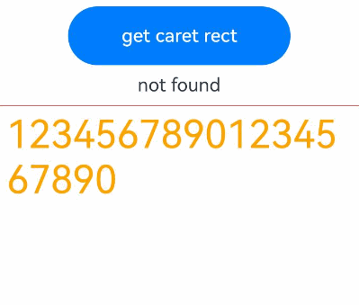
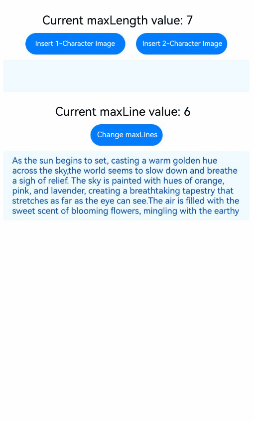

# RichEditor
<!--Kit: ArkUI-->
<!--Subsystem: ArkUI-->
<!--Owner: @carnivore233-->
<!--Designer: @pssea-->
<!--Tester: @mateng_Holtens-->
<!--Adviser: @HelloCrease-->

**RichEditor** is a component that supports interactive text editing and mixture of text and imagery.

>  **NOTE**
>
>  This component is supported since API version 10. Updates will be marked with a superscript to indicate their earliest API version.


## Child Components

Not supported


## APIs

### RichEditor

RichEditor(value: RichEditorOptions)

**Atomic service API**: This API can be used in atomic services since API version 11.

**System capability**: SystemCapability.ArkUI.ArkUI.Full

**Parameters**

| Name  | Type                                   | Mandatory  | Description       |
| ----- | --------------------------------------- | ---- | ----------- |
| value | [RichEditorOptions](#richeditoroptions) | Yes   | Options for initializing the component.|

### RichEditor<sup>12+</sup>

RichEditor(options: RichEditorStyledStringOptions)

**Atomic service API**: This API can be used in atomic services since API version 12.

**System capability**: SystemCapability.ArkUI.ArkUI.Full

**Parameters**

| Name  | Type                                   | Mandatory  | Description       |
| ----- | --------------------------------------- | ---- | ----------- |
| options | [RichEditorStyledStringOptions](#richeditorstyledstringoptions12) | Yes   | Options for initializing the component.|

## Attributes

In addition to the [universal attributes](ts-component-general-attributes.md), the following attributes are supported.

>  **NOTE**
>
>  The **align** attribute supports only the start, center, and end options.
> 
>  The [borderImage](ts-universal-attributes-border-image.md#borderimage) attribute is not supported.

### customKeyboard

customKeyboard(value: CustomBuilder, options?: KeyboardOptions)

Sets a custom keyboard.

When a custom keyboard is set, activating the text box opens the specified custom component, instead of the system input method.

The custom keyboard's height can be set through the **height** attribute of the custom component's root node, and its width is fixed at the default value.

The custom keyboard cannot obtain focus, but it blocks gesture events.

By default, the custom keyboard is closed when the input component loses the focus.

**Atomic service API**: This API can be used in atomic services since API version 11.

**System capability**: SystemCapability.ArkUI.ArkUI.Full

**Parameters**

| Name               | Type                                       | Mandatory| Description                            |
| --------------------- | ------------------------------------------- | ---- | -------------------------------- |
| value                 | [CustomBuilder](ts-types.md#custombuilder8) | Yes  | Custom keyboard.<br>**Atomic service API**: This API can be used in atomic services since API version 11.|
| options<sup>12+</sup> | [KeyboardOptions](#keyboardoptions12)       | No  | Whether to support keyboard avoidance.<br>**Atomic service API**: This API can be used in atomic services since API version 12.|

### bindSelectionMenu

bindSelectionMenu(spanType: RichEditorSpanType, content: CustomBuilder, responseType: ResponseType | RichEditorResponseType,
    options?: SelectionMenuOptions)

Sets the custom context menu on text selection. If the custom menu is too long, embed a [Scroll](./ts-container-scroll.md) component to prevent the keyboard from being blocked.

**Atomic service API**: This API can be used in atomic services since API version 11.

**System capability**: SystemCapability.ArkUI.ArkUI.Full

**Parameters**

| Name      | Type                                                        | Mandatory| Description                                                     |
| ------------ | ------------------------------------------------------------ | ---- | --------------------------------------------------------- |
| spanType     | [RichEditorSpanType](#richeditorspantype)                    | Yes  | Menu type.<br>Default value:<br>RichEditorSpanType.TEXT    |
| content      | [CustomBuilder](ts-types.md#custombuilder8)                  | Yes  | Menu content.                                             |
| responseType |  [ResponseType](ts-appendix-enums.md#responsetype8)  \|  [RichEditorResponseType](#richeditorresponsetype11) | Yes  | Response type of the menu.<br> Default value:<br>ResponseType.LongPress |
| options      | [SelectionMenuOptions](#selectionmenuoptions)              | No  | Menu options.                                             |

### copyOptions

copyOptions(value: CopyOptions)

Specifies whether copy and paste is allowed for text content.

Since API version 20, copied or cut text from the **RichEditor** component includes HTML-formatted content in the pasteboard.

- Only TextSpan and ImageSpan can add HTML content to the pasteboard. Other span types (such as BuilderSpan, SymbolSpan, and CustomSpan) cannot add HTML content to the pasteboard.

- For styled strings, refer to [toHtml](ts-universal-styled-string.md#tohtml14) for supported HTML conversion scope.

If copyOptions is not set to CopyOptions.None, a text selection menu will be displayed when you long-press the component content. If a custom context menu is defined through **bindSelectionMenu** or other approaches, it will be displayed.

If copyOptions is set to CopyOptions.None, the copy, cut, translate, share, search, and write-aid functions are disabled, and drag-and-drop operations are not supported.

**Atomic service API**: This API can be used in atomic services since API version 11.

**System capability**: SystemCapability.ArkUI.ArkUI.Full

**Parameters**

| Name| Type                                            | Mandatory| Description                                                        |
| ------ | ------------------------------------------------ | ---- | ------------------------------------------------------------ |
| value  | [CopyOptions](ts-appendix-enums.md#copyoptions9) | Yes  | Whether copy and paste is allowed for text content.<br>Default value: **CopyOptions.LocalDevice**|

### enableDataDetector<sup>11+</sup>

enableDataDetector(enable: boolean)

Enables recognition for special entities within the text.

For this API to work, the target device must provide the text recognition capability.

If enableDataDetector is set to true and the [dataDetectorConfig](#datadetectorconfig11) attribute is not specified, the system identifies all types of entities by default, and changes the color and decoration of these entities to the preset style.

```ts
color: '#ff007dff'
decoration:{
  type: TextDecorationType.Underline,
  color: '#ff007dff',
  style: TextDecorationStyle.SOLID
}
```

Touching and right-clicking an entity opens a context menu with actions based on entity type, while left-clicking triggers the first menu option directly.

This API does not work for the node text of **addBuilderSpan**.

When **copyOptions** is set to **CopyOptions.None**, the menu displayed after an entity is clicked does not provide the text selection or copy functionality.
<!--RP1--><!--RP1End-->

**Atomic service API**: This API can be used in atomic services since API version 12.

**System capability**: SystemCapability.ArkUI.ArkUI.Full

**Parameters**

| Name| Type   | Mandatory| Description                             |
| ------ | ------- | ---- | --------------------------------- |
| enable  | boolean | Yes  | Whether to enable text recognition.<br>**true** to enable, **false** otherwise.<br>Default value: **false**.|

### dataDetectorConfig<sup>11+</sup>

dataDetectorConfig(config: TextDataDetectorConfig)

Configures special entity recognition settings, including entity types to detect, display styles for detected entities, and long-press preview options.

This API must be used together with [enableDataDetector](#enabledatadetector11). It takes effect only when **enableDataDetector** is set to **true**.

When entities A and B overlap, the following rules are followed:

1. If A ⊂ B, retain B. Otherwise, retain A.

2. When A ⊄ B and B ⊄ A: If A.start < B.start, retain A; otherwise, retain B.

**Atomic service API**: This API can be used in atomic services since API version 12.

**System capability**: SystemCapability.ArkUI.ArkUI.Full

**Parameters**

| Name| Type                                                       | Mandatory| Description                                                        |
| ------ | ----------------------------------------------------------- | ---- | ------------------------------------------------------------ |
| config | [TextDataDetectorConfig](ts-text-common.md#textdatadetectorconfig11) | Yes  | Text recognition configuration.|

### enablePreviewText<sup>12+</sup>

enablePreviewText(enable: boolean)

Sets whether to enable preview text.

**Atomic service API**: This API can be used in atomic services since API version 12.

**System capability**: SystemCapability.ArkUI.ArkUI.Full

**Parameters**

| Name| Type   | Mandatory| Description                             |
| ------ | ------- | ---- | --------------------------------- |
| enable  | boolean | Yes  | Whether to enable preview text.<br>**true** to enable, **false** otherwise.<br>Default value: **true**|

>  **NOTE**
>
This API is disabled by default in C API scenarios. To enable preview text in such scenarios, set [metadata](../../../../application-dev/quick-start/module-structure.md#internal-structure-of-the-metadata-attribute) in the **module.json5** file of the project as follows:
> ```json
> "metadata": [
>  {
>     "name": "can_preview_text",
>     "value": "true",
>  }
> ]
> ```

### placeholder<sup>12+</sup>

placeholder(value: ResourceStr, style?: PlaceholderStyle)

Sets the placeholder text, which is displayed when there is no input.

**Atomic service API**: This API can be used in atomic services since API version 12.

**System capability**: SystemCapability.ArkUI.ArkUI.Full

**Parameters**

| Name| Type                                   | Mandatory| Description                                                   |
| ------ | --------------------------------------- | ---- | ------------------------------------------------------- |
| value  | [ResourceStr](ts-types.md#resourcestr)  | Yes  | Placeholder text.                                   |
| style  | [PlaceholderStyle](#placeholderstyle12) | No  | Style of the placeholder text.<br>By default, the style follows the theme.|

### caretColor<sup>12+</sup>

caretColor(value: ResourceColor)

Sets the color of the caret and selection handle in the text box.

**Atomic service API**: This API can be used in atomic services since API version 12.

**System capability**: SystemCapability.ArkUI.ArkUI.Full

**Parameters**

| Name| Type                                      | Mandatory| Description                                  |
| ------ | ------------------------------------------ | ---- | -------------------------------------- |
| value  | [ResourceColor](ts-types.md#resourcecolor) | Yes  | Color of the cursor and selection handle in the text box.<br>Default value: **'#007DFF'**|

### selectedBackgroundColor<sup>12+</sup>

selectedBackgroundColor(value: ResourceColor)

Sets the background color of the selected text. If the opacity is not set, a 20% opacity will be used.

**Atomic service API**: This API can be used in atomic services since API version 12.

**System capability**: SystemCapability.ArkUI.ArkUI.Full

**Parameters**

| Name| Type                                      | Mandatory| Description                                      |
| ------ | ------------------------------------------ | ---- | ------------------------------------------ |
| value  | [ResourceColor](ts-types.md#resourcecolor) | Yes  | Background color of the selected text.<br>By default, a 20% opacity is applied.|

### editMenuOptions<sup>12+</sup>

editMenuOptions(editMenu: EditMenuOptions)

Sets the extended options of the default system menu, including the text content, icon, and callback.

When [disableMenuItems](../arkts-apis-uicontext-textmenucontroller.md#disablemenuitems20) or [disableSystemServiceMenuItems](../arkts-apis-uicontext-textmenucontroller.md#disablesystemservicemenuitems20) is used to disable system service menu items in the context menu on selection, the disabled menu options will be excluded from the parameter list in the [onCreateMenu](./ts-text-common.md#oncreatemenu12) callback of **editMenuOptions**.

**Atomic service API**: This API can be used in atomic services since API version 12.

**System capability**: SystemCapability.ArkUI.ArkUI.Full

**Parameters**

| Name| Type                                         | Mandatory| Description                                         |
| ------ | --------------------------------------------- | ---- | --------------------------------------------- |
| editMenu  | [EditMenuOptions](ts-text-common.md#editmenuoptions) | Yes  | Extended options of the custom context menu on selection.|

### enterKeyType<sup>12+</sup>

enterKeyType(value: EnterKeyType)

Sets the Enter key type of the soft keyboard.

**Atomic service API**: This API can be used in atomic services since API version 12.

**System capability**: SystemCapability.ArkUI.ArkUI.Full

**Parameters**

| Name| Type  | Mandatory| Description                               |
| ------ | ------ | ---- | ----------------------------------- |
| value  | [EnterKeyType](ts-basic-components-textinput.md#enterkeytype) | Yes  | Type of the Enter key.<br>Default value: **EnterKeyType.NEW_LINE**|

### enableKeyboardOnFocus<sup>12+</sup>

enableKeyboardOnFocus(isEnabled: boolean)

Sets whether to enable the input method when the **RichEditor** component obtains focus in a way other than clicking.


**Atomic service API**: This API can be used in atomic services since API version 12.

**System capability**: SystemCapability.ArkUI.ArkUI.Full

**Parameters**

| Name| Type| Mandatory| Description|
| ------ | ------- | ---- | ----------------------------------------------------------- |
| isEnabled  | boolean | Yes  | Whether to enable the input method when the component obtains focus in a way other than clicking.<br>true: The soft keyboard is automatically displayed. false: The soft keyboard is not automatically displayed.<br>Default value: **true**|

### barState<sup>13+</sup>

barState(state: BarState)

Sets the scrollbar display mode.

**Atomic service API**: This API can be used in atomic services since API version 13.

**System capability**: SystemCapability.ArkUI.ArkUI.Full

**Parameters**

| Name| Type| Mandatory| Description|
| ------ | ----------------------------------------- | ---- | ------------------------------------------------------ |
| state | [BarState](ts-appendix-enums.md#barstate) | Yes  | Scrollbar display mode.<br>Default value: **BarState.Auto**|

### maxLength<sup>18+</sup>

maxLength(maxLength: Optional\<number\>)

Sets the maximum length of the component content. When the total length of the content (including text, images, symbols, and builders) reaches this value, no more content can be added.

**Atomic service API**: This API can be used in atomic services since API version 18.

**System capability**: SystemCapability.ArkUI.ArkUI.Full

**Parameters**

| Name| Type  | Mandatory| Description                                                        |
| ------ | ------ | ---- | ------------------------------------------------------------ |
| maxLength  | [Optional](ts-universal-attributes-custom-property.md#optionalt12)\<number> | Yes  | Maximum number of characters for text input.<br>Default value: **Infinity**, which means unlimited input. The **undefined** type is supported.<br>**NOTE**<br>If this attribute is not set or is set to an invalid value, the default value is used. If a decimal number is specified, the integer part is used.|

### maxLines<sup>18+</sup>

maxLines(maxLines: Optional\<number\>)

Sets the maximum number of lines that the rich text can display. When **maxLines** is set, content that exceeds the specified number of lines can be scrolled to display. If both the component height and **maxLines** are set, the component height takes precedence.

**Atomic service API**: This API can be used in atomic services since API version 18.

**System capability**: SystemCapability.ArkUI.ArkUI.Full

**Parameters**

| Name| Type                                     | Mandatory| Description                                                        |
| ------ | ----------------------------------------- | ---- | ------------------------------------------------------------ |
| maxLines  | [Optional](ts-universal-attributes-custom-property.md#optionalt12)\<number> | Yes  | Maximum number of lines that the rich text can display. When **maxLines** is set, content that exceeds the specified number of lines can be scrolled to display. If both the component height and **maxLines** are set, the component height takes precedence.<br>Default value: **Infinity**, which means unlimited lines. The **undefined** type is supported.<br>Value range: (0, +∞)|

### enableHapticFeedback<sup>13+</sup>

enableHapticFeedback(isEnabled: boolean)

Sets whether to enable haptic feedback.

**Atomic service API**: This API can be used in atomic services since API version 13.

**System capability**: SystemCapability.ArkUI.ArkUI.Full

**Parameters**

| Name| Type                                         | Mandatory | Description                                                                                 |
| ------ | --------------------------------------------- |-----|-------------------------------------------------------------------------------------|
| isEnabled | boolean | Yes| Whether to enable haptic feedback.<br>Default value: **true**. **true** to enable, **false** otherwise.<br>**NOTE**<br>Haptic feedback takes effect only when the application has the ohos.permission.VIBRATE permission, the user has enabled haptic feedback, and the system hardware supports it.|

### keyboardAppearance<sup>15+</sup>

keyboardAppearance(appearance: Optional\<KeyboardAppearance\>)

Sets the keyboard appearance.

**Atomic service API**: This API can be used in atomic services since API version 15.

**System capability**: SystemCapability.ArkUI.ArkUI.Full

**Parameters**

| Name| Type| Mandatory| Description|
| ------ | ----------------------------------------- | ---- | ------------------------------------------------------ |
| appearance | [Optional](ts-universal-attributes-custom-property.md#optionalt12)\<[KeyboardAppearance](ts-text-common.md#keyboardappearance15)\> | Yes  | Keyboard appearance.<br>Default value: **KeyboardAppearance.NONE_IMMERSIVE**|

### stopBackPress<sup>18+</sup>

stopBackPress(isStopped: Optional&lt;boolean&gt;)

Sets whether to prevent the back button press from being propagated to other components or applications.

**Atomic service API**: This API can be used in atomic services since API version 18.

**System capability**: SystemCapability.ArkUI.ArkUI.Full

**Parameters**

| Name| Type                                         | Mandatory | Description                                                                                 |
| ------ | --------------------------------------------- |-----|-------------------------------------------------------------------------------------|
| isStopped  | [Optional](ts-universal-attributes-custom-property.md#optionalt12)&lt;boolean&gt; | Yes  | Whether to prevent the back button press from being propagated to other components or applications.<br>**true** to prevent, **false** otherwise.<br>Default value: **true**. If an invalid value is provided, the default value is used.|

### undoStyle<sup>20+</sup>

undoStyle(style: Optional&lt;UndoStyle&gt;)

Sets whether to retain the original content style when undoing or redoing an action.

When the [RichEditorStyledStringOptions](#richeditorstyledstringoptions12) is used to build the RichEditor component, the original content style is retained by default during undo and redo, and is not affected by the attributes set by this API.

**Atomic service API**: This API can be used in atomic services since API version 20.

**System capability**: SystemCapability.ArkUI.ArkUI.Full

**Parameters**

| Name| Type                                         | Mandatory | Description                                                                                 |
| ------ | --------------------------------------------- |-----|-------------------------------------------------------------------------------------|
| style  | [Optional](ts-universal-attributes-custom-property.md#optionalt12)&lt;[UndoStyle](#undostyle20-1)&gt; | Yes  | Whether to retain the original style when undoing an operation. Default value: **UndoStyle.CLEAR_STYLE**.|

### enableAutoSpacing<sup>20+</sup>

enableAutoSpacing(enable: Optional\<boolean>)

Sets whether to enable automatic spacing between Chinese and Western characters.

**Atomic service API**: This API can be used in atomic services since API version 20.

**System capability**: SystemCapability.ArkUI.ArkUI.Full

**Parameters**

| Name| Type   | Mandatory| Description                              |
| ------ | ------- | ---- | ---------------------------------- |
| enable | [Optional](ts-universal-attributes-custom-property.md#optionalt12)\<boolean> | Yes  | Whether to enable automatic spacing between Chinese and Western characters.<br>**true** to enable, **false** otherwise.<br>Default value: **false**.|

### scrollBarColor<sup>21+</sup>

scrollBarColor(color: Optional\<ColorMetrics>)

Sets the color of the scrollbar.

**Atomic service API**: This API can be used in atomic services since API version 21.

**System capability**: SystemCapability.ArkUI.ArkUI.Full

**Parameters**

| Name| Type                                                        | Mandatory| Description                                    |
| ------ | ------------------------------------------------------------ | ---- | ---------------------------------------- |
| color  | [Optional\<ColorMetrics>](../js-apis-arkui-graphics.md#colormetrics12) | Yes  | Color of the scrollbar.<br>Default value: **'\#66182431'**.<br>Note: If an abnormal value is set, the default value is used.|


## Events

In addition to the [universal events](ts-component-general-events.md), [OnDidChangeCallback](ts-text-common.md#ondidchangecallback12), [StyledStringChangedListener](ts-text-common.md#styledstringchangedlistener12), [StyledStringChangeValue](ts-text-common.md#styledstringchangevalue12), and the following events are supported.

### onReady

onReady(callback:Callback\<void\>)

Triggered after the **RichEditor** component is initialized.

**Atomic service API**: This API can be used in atomic services since API version 11.

**System capability**: SystemCapability.ArkUI.ArkUI.Full

**Parameters**

| Name  | Type                                   | Mandatory  | Description       |
| ----- | --------------------------------------- | ---- | ----------- |
| callback |Callback\<void\> | Yes   | Triggered when initialization of the **RichEditor** component is complete.|

### onSelect

onSelect(callback:Callback\<[RichEditorSelection](#richeditorselection)\>)

Invoked when content is selected.<br>If a mouse device is used for selection, this callback is invoked when the left mouse button is double-clicked to select content and invoked again when the button is released.

If a finger is used for selection, this callback is invoked by a long press and invoked again when the finger is released.

If the selected area is continuously modified by using a finger or mouse or if the selected area is triple-clicked, the onSelect callback is not invoked.

If the selection area needs to be detected in real time or the RichEditor component constructed using [RichEditorStyledStringOptions](#richeditorstyledstringoptions12) is used, use the onSelectionChange API.

**Atomic service API**: This API can be used in atomic services since API version 11.

**System capability**: SystemCapability.ArkUI.ArkUI.Full

**Parameters**

| Name| Type                                       | Mandatory| Description                |
| ------ | ------------------------------------------- | ---- | -------------------- |
| callback | Callback\<[RichEditorSelection](#richeditorselection)\> | Yes  | [RichEditorSelection](#richeditorselection) indicates information about all the selected spans.<br>Callback invoked when content is selected.|

### aboutToIMEInput

aboutToIMEInput(callback:Callback\<[RichEditorInsertValue](#richeditorinsertvalue), boolean\>)

Triggered when content is about to be entered in the input method.

This callback is not supported when the **RichEditor** component constructed with [RichEditorStyledStringOptions](#richeditorstyledstringoptions12) is used.

**Atomic service API**: This API can be used in atomic services since API version 11.

**System capability**: SystemCapability.ArkUI.ArkUI.Full

**Parameters**

| Name| Type                                       | Mandatory| Description                |
| ------ | ------------------------------------------- | ---- | -------------------- |
| callback | Callback\<[RichEditorInsertValue](#richeditorinsertvalue), boolean\> | Yes  | [RichEditorInsertValue](#richeditorinsertvalue) indicates whether content will be entered in the input method.<br>**true**: The component adds the content.<br>**false**: The component does not add the content.<br>Callback invoked when content is about to be entered in the input method.|

### onDidIMEInput<sup>12+</sup>

onDidIMEInput(callback:Callback\<TextRange>)

Triggered when text input in the input method is complete.

This callback is not supported when the **RichEditor** component constructed with [RichEditorStyledStringOptions](#richeditorstyledstringoptions12) is used.

**Atomic service API**: This API can be used in atomic services since API version 12.

**System capability**: SystemCapability.ArkUI.ArkUI.Full

**Parameters**

| Name| Type                                       | Mandatory| Description                |
| ------ | ------------------------------------------- | ---- | -------------------- |
| callback | Callback\<[TextRange](ts-text-common.md#textrange12)\> | Yes| **TextRange** indicates the text range for the current input.<br>Callback invoked when text input in the input method is complete.|


### onIMEInputComplete

onIMEInputComplete(callback:Callback\<[RichEditorTextSpanResult](#richeditortextspanresult)\>)

Triggered when text input in the input method is complete.

This callback can return information about only one text span. If the editing operation involves returning information about multiple text spans, you are advised to use the [onDidIMEInput](#ondidimeinput12) API.

This callback is not supported when the **RichEditor** component constructed with [RichEditorStyledStringOptions](#richeditorstyledstringoptions12) is used.

**Atomic service API**: This API can be used in atomic services since API version 11.

**System capability**: SystemCapability.ArkUI.ArkUI.Full

**Parameters**

| Name| Type                                       | Mandatory| Description                |
| ------ | ------------------------------------------- | ---- | -------------------- |
| callback | Callback\<[RichEditorTextSpanResult](#richeditortextspanresult)\> | Yes| Callback invoked when text input in the input method is complete.<br/>[RichEditorTextSpanResult](#richeditortextspanresult) indicates the text span information after text input is complete. |

### aboutToDelete

aboutToDelete(callback:Callback\<[RichEditorDeleteValue](#richeditordeletevalue), boolean\>)

Triggered when content is about to be deleted in the input method.

This callback is not supported when the **RichEditor** component constructed with [RichEditorStyledStringOptions](#richeditorstyledstringoptions12) is used.

**Atomic service API**: This API can be used in atomic services since API version 11.

**System capability**: SystemCapability.ArkUI.ArkUI.Full

**Parameters**

| Name| Type                                       | Mandatory| Description                |
| ------ | ------------------------------------------- | ---- | -------------------- |
| callback | Callback\<[RichEditorDeleteValue](#richeditordeletevalue), boolean\> | Yes| [RichEditorDeleteValue](#richeditordeletevalue) indicates the text or image span where the content to be deleted is located.<br>**true**: Content is deleted.<br>**false**: Content is not deleted.<br>Callback invoked when content is about to be deleted in the input method. It is executed when a candidate word is touched in preview text.|

### onDeleteComplete

onDeleteComplete(callback:Callback\<void\>)

Triggered when content is deleted in the input method.

This callback is not supported when the **RichEditor** component constructed with [RichEditorStyledStringOptions](#richeditorstyledstringoptions12) is used.

**Atomic service API**: This API can be used in atomic services since API version 11.

**System capability**: SystemCapability.ArkUI.ArkUI.Full

**Parameters**

| Name  | Type                                   | Mandatory  | Description       |
| ----- | --------------------------------------- | ---- | ----------- |
| callback |Callback\<void\> | Yes   | Triggered when deletion in the input method is completed.|

### onPaste<sup>11+</sup>

onPaste(callback: [PasteEventCallback](#pasteeventcallback12) )

Triggered when a paste operation is performed. You can use this API to override the default system behavior so that both images and text can be pasted.

**Atomic service API**: This API can be used in atomic services since API version 12.

**System capability**: SystemCapability.ArkUI.ArkUI.Full

**Parameters**

| Name| Type   | Mandatory| Description                         |
| ------ | ------- | ---- | ----------------------------- |
| callback | [PasteEventCallback](#pasteeventcallback12) | Yes  | Callback used to subscribe to the pasted text content.|

### onSelectionChange<sup>12+</sup>

onSelectionChange(callback:Callback\<[RichEditorRange](#richeditorrange)\>)

Triggered when the selection area or cursor position changes in the editing state. When the cursor position changes, the start and end positions of the selection area are the same.

**Atomic service API**: This API can be used in atomic services since API version 12.

**System capability**: SystemCapability.ArkUI.ArkUI.Full

**Parameters**

| Name  | Type                                   | Mandatory  | Description       |
| ----- | --------------------------------------- | ---- | ----------- |
| callback |Callback\<[RichEditorRange](#richeditorrange)\> | Yes   | [RichEditorRange](#richeditorrange) indicates the start and end positions of the content selection area.<br>Callback invoked when the content selection area changes or the caret position changes in the editing state.|

### onEditingChange<sup>12+</sup>

onEditingChange(callback: Callback\<boolean\>)

Triggered when the content editing state in the component changes.

**Atomic service API**: This API can be used in atomic services since API version 12.

**System capability**: SystemCapability.ArkUI.ArkUI.Full

**Parameters**

| Name  | Type                                   | Mandatory  | Description       |
| ----- | --------------------------------------- | ---- | ----------- |
| callback | Callback\<boolean\> | Yes   | Callback invoked when the editing state of all content in the component changes. The value **true** indicates the editing state, and **false** indicates the non-editing state.|

### onSubmit<sup>12+</sup>

onSubmit(callback: SubmitCallback)

Triggered when the Enter key on the soft keyboard is pressed.

**Atomic service API**: This API can be used in atomic services since API version 12.

**System capability**: SystemCapability.ArkUI.ArkUI.Full

**Parameters**

| Name| Type   | Mandatory| Description                         |
| ------ | ------- | ---- | ----------------------------- |
| callback | [SubmitCallback](#submitcallback12) | Yes  | Callback used to return the subscription event.|

### onWillChange<sup>12+</sup>

onWillChange(callback: Callback\<[RichEditorChangeValue](#richeditorchangevalue12) , boolean\>)

Invoked when any addition or deletion operation is about to be performed in the component.

This callback is not supported when the **RichEditor** component constructed with [RichEditorStyledStringOptions](#richeditorstyledstringoptions12) is used.

**Atomic service API**: This API can be used in atomic services since API version 12.

**System capability**: SystemCapability.ArkUI.ArkUI.Full

**Parameters**

| Name| Type| Mandatory| Description|
| -- | -- | -- | -- |
| callback | Callback\<[RichEditorChangeValue](#richeditorchangevalue12) , boolean\> | Yes   | [RichEditorChangeValue](#richeditorchangevalue12) indicates the image and text change information. The Boolean value indicates whether the image and text can be changed. true: The image and text can be changed. false: The image and text cannot be changed.|

### onDidChange<sup>12+</sup>

onDidChange(callback: OnDidChangeCallback)

Triggered after an addition or deletion operation is performed in the component. This callback is not executed if there is no actual addition or deletion of text.

This callback is not supported when the **RichEditor** component constructed with [RichEditorStyledStringOptions](#richeditorstyledstringoptions12) is used.

**Atomic service API**: This API can be used in atomic services since API version 12.

**System capability**: SystemCapability.ArkUI.ArkUI.Full

**Parameters**

| Name| Type| Mandatory| Description|
| -- | -- | -- | -- |
| callback | [OnDidChangeCallback](ts-text-common.md#ondidchangecallback12) | Yes| Content range before and after the text and image change.|

### onCut<sup>12+</sup>

onCut(callback: Callback\<CutEvent\>)

Triggered during cutting. You can use this method to override the system's default behavior and implement the cutting of text and images.

The **RichEditor** component constructed using [RichEditorStyledStringOptions](#richeditorstyledstringoptions12) supports text and image cutting by default.

**Atomic service API**: This API can be used in atomic services since API version 12.

**System capability**: SystemCapability.ArkUI.ArkUI.Full

**Parameters**

| Name  | Type                                   | Mandatory  | Description       |
| ----- | --------------------------------------- | ---- | ----------- |
| callback |Callback\<[CutEvent](#cutevent12)\> | Yes   | Defines a custom cut event.|

### onCopy<sup>12+</sup>

onCopy(callback: Callback\<CopyEvent\>)

Triggered during copy. You can use this method to override the system's default behavior and implement the copying of text and images.

The **RichEditor** component constructed using [RichEditorStyledStringOptions](#richeditorstyledstringoptions12) supports copying of text and images by default.

**Atomic service API**: This API can be used in atomic services since API version 12.

**System capability**: SystemCapability.ArkUI.ArkUI.Full

**Parameters**

| Name  | Type                                   | Mandatory  | Description       |
| ----- | --------------------------------------- | ---- | ----------- |
| callback |Callback\<[CopyEvent](#copyevent12)\> | Yes   | User copy event.|

## RichEditorInsertValue

Information about the text to be inserted.

**System capability**: SystemCapability.ArkUI.ArkUI.Full

| Name          | Type     | Read-Only| Optional  | Description        |
| ------------ | ------ | ---- | ----|------ |
| insertOffset | number | No| No   | Offset of the text to be inserted.<br>**Atomic service API**: This API can be used in atomic services since API version 11.|
| insertValue  | string | No| No   | Content of the text to be inserted.<br>**Atomic service API**: This API can be used in atomic services since API version 11. |
| previewText<sup>12+</sup> | string | No| Yes   | Content of the preview text to be inserted.<br> **Atomic service API**: This API can be used in atomic services since API version 12.|


## RichEditorDeleteValue

Provides information about the delete operation and the deleted content.

**Atomic service API**: This API can be used in atomic services since API version 11.

**System capability**: SystemCapability.ArkUI.ArkUI.Full

| Name                   | Type                                       | Read-Only| Optional  | Description                 |
| --------------------- | ---------------------------------------- | ---- | -----|-------------- |
| offset                | number                                   | No| No   | Offset of the deleted content.         |
| direction             | [RichEditorDeleteDirection](#richeditordeletedirection) | No| No   | Direction of the delete operation.           |
| length                | number                                   | No| No   | Length of the deleted content.            |
| richEditorDeleteSpans | Array<[RichEditorTextSpanResult](#richeditortextspanresult) \| [RichEditorImageSpanResult](#richeditorimagespanresult)> | No| No   | Information about the deleted text or image span.|


## RichEditorDeleteDirection

Enumerates the directions of the delete operation.

**Atomic service API**: This API can be used in atomic services since API version 11.

**System capability**: SystemCapability.ArkUI.ArkUI.Full

| Name    | Description      |
| -------- | ---------- |
| BACKWARD | Backward.|
| FORWARD  | Forward.|


## RichEditorTextSpanResult

Provides the text span information.

**System capability**: SystemCapability.ArkUI.ArkUI.Full

| Name                           | Type                                         | Read-Only| Optional  | Description                    |
| ----------------------------- | ---------------------------------------- | ---- | ------------|---------- |
| spanPosition                  | [RichEditorSpanPosition](#richeditorspanposition) | No| No   | Span position.<br>**Atomic service API**: This API can be used in atomic services since API version 11.|
| value                         | string                                    | No| No   | Content of the text span or symbol ID.<br>**Atomic service API**: This API can be used in atomic services since API version 11.|
| textStyle                     | [RichEditorTextStyleResult](#richeditortextstyleresult)  | No| No  | Text span style.<br>**Atomic service API**: This API can be used in atomic services since API version 11.|
| offsetInSpan                  | [number, number]                          | No| No   | Start and end positions of the valid content in the text span.<br>**Atomic service API**: This API can be used in atomic services since API version 11.|
| valueResource<sup>11+</sup>   | [Resource](ts-types.md#resource)          | No| Yes   | Content of the **SymbolSpan** component.<br>**Atomic service API**: This API can be used in atomic services since API version 12.       |
| symbolSpanStyle<sup>11+</sup> | [RichEditorSymbolSpanStyle](#richeditorsymbolspanstyle11)  | No| Yes   | Style of the **SymbolSpan** component.<br>**Atomic service API**: This API can be used in atomic services since API version 12.|
| paragraphStyle<sup>12+</sup>  | [RichEditorParagraphStyle](#richeditorparagraphstyle11)   | No| Yes  | Paragraph style.<br>**Atomic service API**: This API can be used in atomic services since API version 12.|
| previewText<sup>12+</sup>      | string                                    | No| Yes   | Content of the preview text.<br>**Atomic service API**: This API can be used in atomic services since API version 12.|
| urlStyle<sup>19+</sup>  | [RichEditorUrlStyle](#richeditorurlstyle19)    | No| Yes  | URL information.<br>Default value: **undefined**<br>**Atomic service API**: This API can be used in atomic services since API version 19.|


## RichEditorSpanPosition

Provides the span position information.

**Atomic service API**: This API can be used in atomic services since API version 11.

**System capability**: SystemCapability.ArkUI.ArkUI.Full

| Name       | Type          | Read-Only| Optional  | Description                         |
| --------- | ---------------- |----| ---- | --------------------------- |
| spanIndex | number           | No| No   | Span index.                   |
| spanRange | [number, number] | No| No   | Start and end positions of the span content in the **RichEditor** component.|

## RichEditorSpanType

Provides the span type information.

**System capability**: SystemCapability.ArkUI.ArkUI.Full

| Name   | Value    | Description        |
| ----- | ---- | ------------ |
| TEXT  | 0 | The span type is text.<br>**Atomic service API**: This API can be used in atomic services since API version 11. |
| IMAGE | 1 | The span type is image.<br>**Atomic service API**: This API can be used in atomic services since API version 11.  |
| MIXED | 2 | The span type is image and text.<br>**Atomic service API**: This API can be used in atomic services since API version 11. |
| BUILDER<sup>12+</sup> | 3 | The span type is BuilderSpan.<br>**Atomic service API**: This API can be used in atomic services since API version 12. |
| DEFAULT<sup>15+</sup> | 4 | When this type is registered but **TEXT**, **IMAGE**, **MIXED**, or **BUILDER** types are not registered, this type will be triggered and displayed for those registered types.<br>**Atomic service API**: This API can be used in atomic services since API version 15.|

## RichEditorResponseType<sup>11+</sup>

Response type of the menu.

**System capability**: SystemCapability.ArkUI.ArkUI.Full

| Name   | Value    | Description        |
| ----- | ---- | ------------ |
| RIGHT_CLICK  | 0 | The menu is displayed when the component is right-clicked.<br>**Atomic service API**: This API can be used in atomic services since API version 12.  |
| LONG_PRESS | 1 | The menu is displayed when the component is long-pressed.<br>**Atomic service API**: This API can be used in atomic services since API version 12.  |
| SELECT | 2 | The menu is displayed when the component is selected.<br>**Atomic service API**: This API can be used in atomic services since API version 12. |
| DEFAULT<sup>15+</sup> | 3 | If this menu is registered, but **RIGHT_CLICK**, **LONG_PRESS**, and **SELECT** menus are not registered, the menu will be displayed when the right mouse button is clicked, the menu is long-pressed, or the menu is selected using the mouse.<br>**Atomic service API**: This API can be used in atomic services since API version 15. |

## UndoStyle<sup>20+</sup>

Enumerates the options for whether to retain the original style during undo/redo operations.

**Atomic service API**: This API can be used in atomic services since API version 20.

**System capability**: SystemCapability.ArkUI.ArkUI.Full

| Name   | Value    | Description        |
| ----- | ---- | ------------ |
| CLEAR_STYLE  | 0 | Undo/Redo operations do not retain the original style.  |
| KEEP_STYLE | 1 | Undo/Redo operations retain the original style.  |

## RichEditorTextStyleResult

Provides the text span style information returned by the backend.

**System capability**: SystemCapability.ArkUI.ArkUI.Full

| Name        | Type                                       | Read-Only| Optional  | Description          |
| ---------- | ---------------------------------------- | ---- | -------|----- |
| fontColor  | [ResourceColor](ts-types.md#resourcecolor) | No| No   | Font color.<br>**Atomic service API**: This API can be used in atomic services since API version 11.|
| fontSize   | number                                   | No| No   | Font size. The default unit is fp.<br>**Atomic service API**: This API can be used in atomic services since API version 11.|
| fontStyle  | [FontStyle](ts-appendix-enums.md#fontstyle) | No| No   | Font style.<br>**Atomic service API**: This API can be used in atomic services since API version 11.|
| fontWeight | number                                   | No| No   | Font weight.<br>**Atomic service API**: This API can be used in atomic services since API version 11.|
| fontFamily | string                                   | No| No   | Font family.<br>**Atomic service API**: This API can be used in atomic services since API version 11.|
| decoration | [DecorationStyleResult](ts-text-common.md#decorationstyleresult12) | No| No   | Text decorative line.<br>**Atomic service API**: This API can be used in atomic services since API version 11.|
| textShadow<sup>12+</sup> |  Array&lt;[ShadowOptions](ts-universal-attributes-image-effect.md#shadowoptions)> | No| Yes   | Text shadow.<br>**NOTE**<br>Only the shadow blur radius, shadow color, and shadow offset can be queried.<br>**Atomic service API**: This API can be used in atomic services since API version 12.|
| lineHeight<sup>12+</sup> | number       | No| Yes   | Line height. The default unit is fp.<br>**Atomic service API**: This API can be used in atomic services since API version 12.|
| letterSpacing<sup>12+</sup>| number       | No| Yes   | Letter spacing. The default unit is fp.<br>**Atomic service API**: This API can be used in atomic services since API version 12.|
| fontFeature<sup>12+</sup> | string | No| Yes| Font feature.<br>**Atomic service API**: This API can be used in atomic services since API version 12.|
| halfLeading<sup>18+</sup> | boolean  | No| Yes| Whether half leading is enabled.<br>Whether half leading is enabled. Half leading is the leading split in half and applied equally to the top and bottom edges. The value **true** means that half leading is enabled, and **false** means the opposite.<br>Default value: **false**<br>**Atomic service API**: This API can be used in atomic services since API version 18.|
| textBackgroundStyle<sup>18+</sup> | [TextBackgroundStyle](ts-basic-components-span.md#textbackgroundstyle11) | No| Yes   | Text background style.<br>**Atomic service API**: This API can be used in atomic services since API version 18.|

>  **NOTE**
>
>  While **fontWeight** in **RichEditorTextStyle** sets the font weight,
>  **fontWeight** in **RichEditorTextStyleResult** returns the set font weight after conversion to digits.
>  The table below lists the conversion mappings.
>
>  | fontWeight in RichEditorTextStyle | fontWeight in RichEditorTextStyleResult |
>  | ---- | ----------------------------------- |
>  | 100   | 0 |
>  | 200   | 1 |
>  | 300   | 2 |
>  | 400   | 3 |
>  | 500   | 4 |
>  | 600   | 5 |
>  | 700   | 6 |
>  | 800   | 7 |
>  | 900   | 8 |
>  | Lighter   | 12 |
>  | Normal   | 10 |
>  | Regular   | 14 |
>  | Medium   | 13 |
>  | Bold   | 9 |
>  | Bolder   | 11 |
>
>  The conversion mappings between the **fontWeight** parameters in **RichEditorSymbolSpanStyle** and **RichEditorSymbolSpanStyleResult**
>  are the same as those between the **fontWeight** parameters in **RichEditorTextStyle** and **RichEditorTextStyleResult**.

## RichEditorSymbolSpanStyleResult<sup>11+</sup>

Provides the symbol span style information returned by the backend.

**Atomic service API**: This API can be used in atomic services since API version 12.

**System capability**: SystemCapability.ArkUI.ArkUI.Full

| Name| Type | Read-Only| Optional| Description                              |
| ------ | -------- | ---- | ------------------------------|-------- |
| fontColor | Array\<[ResourceColor](ts-types.md#resourcecolor)\> | No| No| Color of the symbol span.<br> Default value: depending on the rendering strategy|
| fontSize | number \| string \| [Resource](ts-types.md#resource) | No| No| Size of the symbol span. The default unit is fp.<br>The default value follows the theme.|
| fontWeight | number \| [FontWeight](ts-appendix-enums.md#fontweight) \| string  | No| No| Weight of the symbol span.<br>For the number type, the value ranges from 100 to 900, at an interval of 100. A larger value indicates a heavier font weight. The default value is **400**.<br>For the string type, only strings of the number type are supported, for example, **"400"**, **"bold"**, **"bolder"**, **"lighter"**, **"regular"**, and **"medium"**, which correspond to the enumerated values in **FontWeight**.<br>Default value: **FontWeight.Normal**|
| renderingStrategy | [SymbolRenderingStrategy](ts-basic-components-symbolGlyph.md#symbolrenderingstrategy11)	| No| No| Rendering strategy of the symbol span.<br>Default value: **SymbolRenderingStrategy.SINGLE**<br>
| effectStrategy | [SymbolEffectStrategy](ts-basic-components-symbolGlyph.md#symboleffectstrategy11)	| No| No| Effect strategy of the symbol span.<br>Default value: **SymbolEffectStrategy.NONE**<br>

## RichEditorImageSpanResult

Provides the image information returned by the backend.

**Atomic service API**: This API can be used in atomic services since API version 11.

**System capability**: SystemCapability.ArkUI.ArkUI.Full

| Name              | Type                                                                  | Read-Only| Optional | Description              |
|------------------|-------------------------------------------------------------------|-----|-------|-----------|
| spanPosition     | [RichEditorSpanPosition](#richeditorspanposition)                 | No| No  | Span position.|
| valuePixelMap    | [PixelMap](../../apis-image-kit/arkts-apis-image-PixelMap.md)                    | No| Yes  | Image content.|
| valueResourceStr | [ResourceStr](ts-types.md#resourcestr)                            | No| Yes  | Image resource ID.|
| imageStyle       | [RichEditorImageSpanStyleResult](#richeditorimagespanstyleresult) | No| No| Image style.|
| offsetInSpan     | [number, number] | No| No| Start and end positions of the image in the span.|

## RichEditorImageSpanStyleResult

Provides the image span style information returned by the backend.

**System capability**: SystemCapability.ArkUI.ArkUI.Full

| Name           | Type                                         | Read-Only| Optional  | Description       |
| ------------- | ---------------------------------------- | ---- | -----|---- |
| size          | [number, number]                         | No| No   | Width and height of the image, in px. Default value: varies by the value of **objectFit**. If the value of **objectFit** is **Cover**, the image height is the component height minus the top and bottom paddings, and the image width is the component width minus the left and right paddings.<br>**Atomic service API**: This API can be used in atomic services since API version 11.|
| verticalAlign | [ImageSpanAlignment](ts-appendix-enums.md#imagespanalignment10) | No| No   | Vertical alignment mode of the image.<br>**Atomic service API**: This API can be used in atomic services since API version 11.|
| objectFit     | [ImageFit](ts-appendix-enums.md#imagefit) | No| No   | Scale mode of the image.<br>**Atomic service API**: This API can be used in atomic services since API version 11.|
| layoutStyle<sup>12+</sup> | [RichEditorLayoutStyle](#richeditorlayoutstyle11)     | No| Yes  | Image layout style.<br>**Atomic service API**: This API can be used in atomic services since API version 12.|

## RichEditorLayoutStyle<sup>11+</sup> 

Image layout information.

**Atomic service API**: This API can be used in atomic services since API version 12.

**System capability**: SystemCapability.ArkUI.ArkUI.Full

|Name|Type | Read-Only| Optional|	Description|
| -------------  | -----------------------            | ---- | ----------|-------------------------------------------------- |
|margin	         |  [Dimension](ts-types.md#dimension10) \| [Margin](ts-types.md#margin)	                       |  No|  Yes |	Margins in different directions of the component.<br>When the parameter is of the **Dimension** type, the four margins take effect.|
|borderRadius	   |  [Dimension](ts-types.md#dimension10) \| [BorderRadiuses](ts-types.md#borderradiuses9) |  No|  Yes |	Radius of the rounded corners of the component.<br>If of the **Dimension** type, this parameter cannot be set in percentage.|

## RichEditorOptions

Defines the options for initializing the **RichEditor** component.

**Atomic service API**: This API can be used in atomic services since API version 11.

**System capability**: SystemCapability.ArkUI.ArkUI.Full

| Name        | Type                                       | Read-Only| Optional | Description     |
| ---------- | ---------------------------------------- | ---- | ----|--- |
| controller | [RichEditorController](#richeditorcontroller) | No| No   | Controller for the **RichEditor** component.|

## RichEditorStyledStringOptions<sup>12+</sup>

Defines the options for initializing the **RichEditor** component.

**Atomic service API**: This API can be used in atomic services since API version 12.

**System capability**: SystemCapability.ArkUI.ArkUI.Full

| Name        | Type                                      | Read-Only| Optional  | Description     |
| ---------- | ---------------------------------------- | ---- | ----|--- |
| controller | [RichEditorStyledStringController](#richeditorstyledstringcontroller12) | No| No   | Controller for the **RichEditor** component.|

## RichEditorChangeValue<sup>12+</sup>

Image and text change information.

**Atomic service API**: This API can be used in atomic services since API version 12.

**System capability**: SystemCapability.ArkUI.ArkUI.Full

| Name                   | Type                                       | Read-Only| Optional  | Description                 |
| --------------------- | ---------------------------------------- | ---- | -------|------------ |
| rangeBefore | [TextRange](ts-text-common.md#textrange12) | No| No   | Start and end indexes of the content to be replaced.|
| replacedSpans | Array<[RichEditorTextSpanResult](#richeditortextspanresult)> | No| No   | Information about the text span after the change.|
| replacedImageSpans | Array<[RichEditorImageSpanResult](#richeditorimagespanresult)> | No| No   | Information about the image span after the change.|
| replacedSymbolSpans | Array<[RichEditorTextSpanResult](#richeditortextspanresult)> | No| No   | Information about the symbol span after the change.|

## RichEditorBaseController<sup>12+</sup>

Represents the base class of the **RichEditor** component controller.

### getCaretOffset<sup>10+</sup>

getCaretOffset(): number

Obtains the current cursor position.

**Atomic service API**: This API can be used in atomic services since API version 11.

**System capability**: SystemCapability.ArkUI.ArkUI.Full

**Return value**

| Type    | Description       |
| ------ | --------- |
| number | Cursor position.|

### setCaretOffset<sup>10+</sup>

setCaretOffset(offset: number): boolean

Sets the cursor position.

**Atomic service API**: This API can be used in atomic services since API version 11.

**System capability**: SystemCapability.ArkUI.ArkUI.Full

**Parameters**

| Name   | Type  | Mandatory  | Description               |
| ------ | ------ | ---- | -------------------- |
| offset | number | Yes   | Offset of the cursor. If it exceeds the range of all content, the setting will fail.|

**Return value**

| Type     | Description       |
| ------- | --------- |
| boolean | Whether the cursor position is set successfully.<br>**true** if the cursor position is set successfully; **false** otherwise.|

### closeSelectionMenu<sup>10+</sup>

closeSelectionMenu(): void

Closes the custom or default context menu on selection.

**Atomic service API**: This API can be used in atomic services since API version 11.

**System capability**: SystemCapability.ArkUI.ArkUI.Full

### getTypingStyle<sup>11+</sup>

getTypingStyle(): RichEditorTextStyle

Obtains the preset text style of a user.

**Atomic service API**: This API can be used in atomic services since API version 12.

**System capability**: SystemCapability.ArkUI.ArkUI.Full

**Return value**

| Type                                      | Description     |
| ---------------------------------------- | ------- |
| [RichEditorTextStyle](#richeditortextstyle) | Preset typing style.|

### setTypingStyle<sup>11+</sup>

setTypingStyle(value: RichEditorTextStyle): void

Sets the preset typing style.

**Atomic service API**: This API can be used in atomic services since API version 12.

**System capability**: SystemCapability.ArkUI.ArkUI.Full

**Parameters**

| Name  | Type                                    | Mandatory  | Description |
| ----- | ---------------------------------------- | ---- | ----- |
| value | [RichEditorTextStyle](#richeditortextstyle) | Yes   | Preset typing style.|

### setTypingParagraphStyle<sup>20+</sup>

setTypingParagraphStyle(style: RichEditorParagraphStyle): void

Sets the preset paragraph style. The input text takes effect only when the component content is empty or a line break is added at the end of the component.

**Atomic service API**: This API can be used in atomic services since API version 20.

**System capability**: SystemCapability.ArkUI.ArkUI.Full

**Parameters**

| Name  | Type                                    | Mandatory  | Description |
| ----- | ---------------------------------------- | ---- | ----- |
| style | [RichEditorParagraphStyle](#richeditorparagraphstyle11) | Yes   | Preset paragraph style.|

### setSelection<sup>11+</sup>

setSelection(selectionStart: number, selectionEnd: number, options?: SelectionOptions): void

Sets the range of content selection. The selected content is highlighted.

If both selectionStart and selectionEnd are set to -1, all the content is selected. If both selectionStart and selectionEnd are set to 0, the selected content can be cleared.

If this API is called when the text box is not focused, the selected effect is not displayed.

Since API version 12, on 2-in-1 devices, regardless of the value of **options**, calling the **setSelection** API will not display the menu. In addition, if there is already a menu present within the component, calling the **setSelection** API will close the menu.

On non-2-in-1 devices, when **options** is set to **MenuPolicy.DEFAULT**, the following rules apply:

1. If the component has a selection handle menu, calling the API will not close the menu, and the menu position will be adjusted.

2. If the component has a menu without a selection handle, calling the API will not close the menu, and the menu position will remain unchanged.

3. If there is no menu within the component, calling the API will not display the menu.

**Atomic service API**: This API can be used in atomic services since API version 12.

**System capability**: SystemCapability.ArkUI.ArkUI.Full

**Parameters**

| Name           | Type  | Mandatory  | Description   |
| -------------- | ------ | ---- | ------- |
| selectionStart | number | Yes   | Start position of the selection.|
| selectionEnd   | number | Yes   | End position of the selection.|
| options<sup>12+</sup>   | [SelectionOptions](ts-universal-attributes-text-style.md#selectionoptions12) | No   | Configuration of options.|

### isEditing<sup>12+</sup>

isEditing(): boolean

Obtains the editing state of this **RichEditor** component.

**Atomic service API**: This API can be used in atomic services since API version 12.

**System capability**: SystemCapability.ArkUI.ArkUI.Full

**Return value**

| Type   | Description                         |
| ------- | ----------------------------- |
| boolean | Editing state. The value **true** indicates the editing state, and **false** indicates the non-editing state.|

### stopEditing<sup>12+</sup>

stopEditing(): void

Exits the editing state.

**Atomic service API**: This API can be used in atomic services since API version 12.

**System capability**: SystemCapability.ArkUI.ArkUI.Full

### getLayoutManager<sup>12+</sup>

getLayoutManager(): LayoutManager

Obtains a **LayoutManager** object.

**Atomic service API**: This API can be used in atomic services since API version 12.

**System capability**: SystemCapability.ArkUI.ArkUI.Full

**Return value**

| Type                                      | Description     |
| ---------------------------------------- | ------- |
| [LayoutManager](ts-text-common.md#layoutmanager12) | **LayoutManager** object.|

### getPreviewText<sup>12+</sup>

getPreviewText(): PreviewText

Obtains the preview text.

**Atomic service API**: This API can be used in atomic services since API version 12.

**System capability**: SystemCapability.ArkUI.ArkUI.Full

**Return value**

| Type                                      | Description     |
| ---------------------------------------- | ------- |
| [PreviewText](ts-text-common.md#previewtext12) | Preview text.|

### getCaretRect<sup>18+</sup>

getCaretRect(): RectResult | undefined

Obtains the relative position of the cursor in the **RichEditor** component. If the cursor is not blinking, the API returns **undefined**.

**Atomic service API**: This API can be used in atomic services since API version 18.

**System capability**: SystemCapability.ArkUI.ArkUI.Full

**Return value**

| Type    | Description       |
| ------ | --------- |
| [RectResult](ts-universal-attributes-on-child-touch-test.md#rectresult) \| undefined | Relative position of the cursor in the **RichEditor** component.|

## RichEditorController

Implements the **RichEditor** component controller. Inherits from [RichEditorBaseController](#richeditorbasecontroller12).

### Objects to Import

```
controller: RichEditorController = new RichEditorController();
```

### addTextSpan

addTextSpan(content: ResourceStr, options?: RichEditorTextSpanOptions): number

Adds a text span. If the cursor in the component is blinking, the cursor position is updated to be after the inserted text span.

**Atomic service API**: This API can be used in atomic services since API version 11.

**System capability**: SystemCapability.ArkUI.ArkUI.Full

**Parameters**

| Name    | Type                                    | Mandatory  | Description |
| ------- | ---------------------------------------- | ---- | ----- |
| content   | [ResourceStr](ts-types.md#resourcestr)   | Yes   | Text content.<br>The Resource type is supported since API version 20.|
| options | [RichEditorTextSpanOptions](#richeditortextspanoptions) | No   | Text options.|

**Return value**

| Type    | Description                  |
| ------ | -------------------- |
| number | Index of the added text span in all spans.|

### addImageSpan

addImageSpan(value: PixelMap | ResourceStr, options?: RichEditorImageSpanOptions): number

Adds an image span. If the cursor in the component is blinking, the cursor position is updated to be after the inserted image span.

To avoid potential loading issues, do not directly add a network image.

**Atomic service API**: This API can be used in atomic services since API version 11.

**System capability**: SystemCapability.ArkUI.ArkUI.Full

**Parameters**

| Name    | Type                                    | Mandatory  | Description |
| ------- | ---------------------------------------- | ---- | ----- |
| value   | [PixelMap](../../apis-image-kit/arkts-apis-image-PixelMap.md) \| [ResourceStr](ts-types.md#resourcestr) | Yes   | Image content.|
| options | [RichEditorImageSpanOptions](#richeditorimagespanoptions) | No   | Image options.|

**Return value**

| Type    | Description                  |
| ------ | -------------------- |
| number | Index of the added image span in all spans.|

### addBuilderSpan<sup>11+</sup>

addBuilderSpan(value: CustomBuilder, options?: RichEditorBuilderSpanOptions): number

Adds a custom layout (BuilderSpan) to **RichEditor**.

> **NOTE**
>
> - This API adds a builder span to take up space in the layout. It calls the system **measure** method to calculate the actual length, width, and position.
> - You can use [RichEditorBuilderSpanOptions](#richeditorbuilderspanoptions11) to set the index of the builder in the **RichEditor** component (with one character as the unit).
> - This builder span is unfocusable, draggable, and equipped with certain universal attributes. It behaves similarly to an image span in terms of placeholder and deletion functionality, and it is treated as a single character in length.
> - Custom menus can be set using [bindSelectionMenu](#bindselectionmenu).
> - The information about the builder span cannot be obtained through [getSpans](#getspans), [getSelection](#getselection11), [onSelect](#onselect), or [aboutToDelete](#abouttodelete).
> - The builder span cannot be updated using [updateSpanStyle](#updatespanstyle) or [updateParagraphStyle](#updateparagraphstyle11).
> - Copying or pasting the builder span does not take effect.
> - The layout constraints of the builder span are passed in from the **RichEditor** component. If the size of the outermost component in the builder span is not set, the size of the **RichEditor** is used as the value of **maxSize**.
> - The gesture event mechanism of the builder span is the same as the universal gesture event mechanism. If transparent transmission is not set in the builder, only the child components in the builder respond.
> - If the cursor in the component is blinking, the cursor position is updated to be after the inserted image span.

Only the following universal attributes are supported: [size](ts-universal-attributes-size.md#size), [padding](ts-universal-attributes-size.md#padding), [margin](ts-universal-attributes-size.md#margin), [aspectRatio](ts-universal-attributes-layout-constraints.md#aspectratio), [borderStyle](ts-universal-attributes-border.md#borderstyle), [borderWidth](ts-universal-attributes-border.md#borderwidth), [borderColor](ts-universal-attributes-border.md#bordercolor), [borderRadius](ts-universal-attributes-border.md#borderradius), [backgroundColor](ts-universal-attributes-background.md#backgroundcolor), [backgroundBlurStyle](ts-universal-attributes-background.md#backgroundblurstyle9), [opacity](ts-universal-attributes-opacity.md), [blur](ts-universal-attributes-image-effect.md#blur), [backdropBlur](ts-universal-attributes-background.md#backdropblur), [shadow](ts-universal-attributes-image-effect.md#shadow), [grayscale](ts-universal-attributes-image-effect.md#grayscale), [brightness](ts-universal-attributes-image-effect.md#brightness), [saturate](ts-universal-attributes-image-effect.md#saturate), [contrast](ts-universal-attributes-image-effect.md#contrast), [invert](ts-universal-attributes-image-effect.md#invert), [sepia](ts-universal-attributes-image-effect.md#sepia), [hueRotate](ts-universal-attributes-image-effect.md#huerotate), [colorBlend](ts-universal-attributes-image-effect.md#colorblend), [linearGradientBlur](ts-universal-attributes-image-effect.md#lineargradientblur12), [clip](ts-universal-attributes-sharp-clipping.md#clip12), [mask](ts-universal-attributes-sharp-clipping.md#mask12), [foregroundBlurStyle](ts-universal-attributes-foreground-blur-style.md#foregroundblurstyle), [accessibilityGroup](ts-universal-attributes-accessibility.md#accessibilitygroup), [accessibilityText](ts-universal-attributes-accessibility.md#accessibilitytext), [accessibilityDescription](ts-universal-attributes-accessibility.md#accessibilitydescription), [accessibilityLevel](ts-universal-attributes-accessibility.md#accessibilitylevel), [sphericalEffect](ts-universal-attributes-image-effect.md#sphericaleffect12), [lightUpEffect](ts-universal-attributes-image-effect.md#lightupeffect12), [pixelStretchEffect](ts-universal-attributes-image-effect.md#pixelstretcheffect12).

**Atomic service API**: This API can be used in atomic services since API version 12.

**System capability**: SystemCapability.ArkUI.ArkUI.Full

**Parameters**

| Name    | Type                                    | Mandatory  | Description      |
| ------- | ---------------------------------------- | ---- | ---------- |
| value   | [CustomBuilder](ts-types.md#custombuilder8) | Yes   | Custom component.    |
| options | [RichEditorBuilderSpanOptions](#richeditorbuilderspanoptions11) | No   | Builder options.|

**Return value**

| Type    | Description                    |
| ------ | ---------------------- |
| number | Index of the added builder span in all spans.|

### addSymbolSpan<sup>11+</sup>

addSymbolSpan(value: Resource, options?: RichEditorSymbolSpanOptions ): number

Adds a symbol image. If the cursor in the component is blinking, the cursor position is updated to be after the inserted symbol span.

Currently, gestures, copying, and dragging are not supported.

**Atomic service API**: This API can be used in atomic services since API version 12.

**System capability**: SystemCapability.ArkUI.ArkUI.Full

**Parameters**

| Name    | Type                                    | Mandatory  | Description |
| ------- | ---------------------------------------- | ---- | ----- |
| value   | [Resource](ts-types.md#resource)         | Yes   | Symbol resource object.|
| options | [RichEditorSymbolSpanOptions](#richeditorsymbolspanoptions11) | No   | Symbol options.|

**Return value**

| Type    | Description                   |
| ------ | --------------------- |
| number | Index of the added symbol span in all spans.|

### updateSpanStyle

updateSpanStyle(value: RichEditorUpdateTextSpanStyleOptions | RichEditorUpdateImageSpanStyleOptions | RichEditorUpdateSymbolSpanStyleOptions): void

Updates the text, image, or symbol span style.<br>If only part of a span is updated, the span is split into multiple spans based on the updated part and the non-updated part.

Calling this API will not close the custom context menu on selection by default.

**Atomic service API**: This API can be used in atomic services since API version 11.

**System capability**: SystemCapability.ArkUI.ArkUI.Full

**Parameters**

| Name| Type| Mandatory| Description                              |
| ------ | -------- | ---- | -------------------------------------- |
| value | [RichEditorUpdateTextSpanStyleOptions](#richeditorupdatetextspanstyleoptions) \| [RichEditorUpdateImageSpanStyleOptions](#richeditorupdateimagespanstyleoptions) \| [RichEditorUpdateSymbolSpanStyleOptions](#richeditorupdatesymbolspanstyleoptions11) | Yes| Style options of the text, image, or symbol span.|

>  **NOTE**
>
>  If the value of **start** is greater than that of **end**, the value **0** will be used as **start** and infinity as **end**.

### updateParagraphStyle<sup>11+</sup>

updateParagraphStyle(value: RichEditorParagraphStyleOptions): void

Updates the paragraph style.

**Atomic service API**: This API can be used in atomic services since API version 12.

**System capability**: SystemCapability.ArkUI.ArkUI.Full

**Parameters**

| Name   | Type                                      | Mandatory  | Description        |
| ----- | ---------------------------------------- | ---- | ---------- |
| value | [RichEditorParagraphStyleOptions](#richeditorparagraphstyleoptions11) | Yes   | Information about the paragraph style.|

### getSpans

getSpans(value?: RichEditorRange): Array<RichEditorImageSpanResult | RichEditorTextSpanResult>

Obtains span information.

**Atomic service API**: This API can be used in atomic services since API version 11.

**System capability**: SystemCapability.ArkUI.ArkUI.Full

**Parameters**

| Name  | Type                               | Mandatory  | Description       |
| ----- | ----------------------------------- | ---- | ----------- |
| value | [RichEditorRange](#richeditorrange) | No   | Range of the target span.|

**Return value**

| Type                                      | Description          |
| ---------------------------------------- | ------------ |
| Array<[RichEditorImageSpanResult](#richeditorimagespanresult) \| [RichEditorTextSpanResult](#richeditortextspanresult)> | Text and image span information.|

### deleteSpans

deleteSpans(value?: RichEditorRange): void

Deletes the text and image spans in a specified range.

**Atomic service API**: This API can be used in atomic services since API version 11.

**System capability**: SystemCapability.ArkUI.ArkUI.Full

**Parameters**

| Name  | Type                               | Mandatory  | Description               |
| ----- | ----------------------------------- | ---- | ------------------- |
| value | [RichEditorRange](#richeditorrange) | No   | Range of the target spans. If this parameter is left empty, all text and image spans will be deleted.|

### getParagraphs<sup>11+</sup>

getParagraphs(value?: RichEditorRange): Array\<RichEditorParagraphResult>

Obtains the paragraph information within a specified range.

**Atomic service API**: This API can be used in atomic services since API version 12.

**System capability**: SystemCapability.ArkUI.ArkUI.Full

**Parameters**

| Name  | Type                               | Mandatory  | Description      |
| ----- | ----------------------------------- | ---- | ---------- |
| value | [RichEditorRange](#richeditorrange) | No   | Range of the paragraphs to obtain.|

**Return value**

| Type                                      | Description      |
| ---------------------------------------- | -------- |
| Array\<[RichEditorParagraphResult](#richeditorparagraphresult11)> | Information about the selected paragraphs.|

### getSelection<sup>11+</sup>

getSelection(): RichEditorSelection

Obtains the selected content. If no text is selected, the information about the span where the caret is located is returned.

**Atomic service API**: This API can be used in atomic services since API version 12.

**System capability**: SystemCapability.ArkUI.ArkUI.Full

**Return value**

| Type                                      | Description     |
| ---------------------------------------- | ------- |
| [RichEditorSelection](#richeditorselection) | Provides information about the selected content.|

### fromStyledString<sup>12+</sup>

fromStyledString(value: StyledString): Array\<RichEditorSpan>

Converts a styled string into a span.

**Atomic service API**: This API can be used in atomic services since API version 12.

**System capability**: SystemCapability.ArkUI.ArkUI.Full

**Parameters**

| Name  | Type                               | Mandatory  | Description      |
| ----- | ----------------------------------- | ---- | ---------- |
| value | [StyledString](ts-universal-styled-string.md#styledstring) | Yes   | Styled string before conversion.|

**Return value**

| Type                                      | Description     |
| ---------------------------------------- | ------- |
| Array<[RichEditorSpan](#richeditorspan12)>  | Text and image span information.|

**Error codes**

For details about the error codes, see [Universal Error Codes](../../errorcode-universal.md).

| ID| Error Message                       |
| -------- | ------------------------------ |
| 401      | The parameter check failed.  |

### toStyledString<sup>12+</sup>

toStyledString(value: RichEditorRange): StyledString

Convert the component content within the given range into a styled string. SymbolSpan and BuilderSpan cannot be converted.

**Atomic service API**: This API can be used in atomic services since API version 12.

**System capability**: SystemCapability.ArkUI.ArkUI.Full

**Parameters**

| Name  | Type                               | Mandatory  | Description      |
| ----- | ----------------------------------- | ---- | ---------- |
| value | [RichEditorRange](#richeditorrange) | Yes  | Source range.|

**Return value**

| Type                                      | Description      |
| ---------------------------------------- | -------- |
| [StyledString](ts-universal-styled-string.md#styledstring) | Styled string after conversion.|

**Error codes**

For details about the error codes, see [Universal Error Codes](../../errorcode-universal.md).

| ID| Error Message                       |
| -------- | ------------------------------ |
| 401      | The parameter check failed.  |


## RichEditorStyledStringController<sup>12+</sup>

Represents the controller of the **RichEditor** component constructed using the styled string. Inherits from [RichEditorBaseController](#richeditorbasecontroller12).

### Objects to Import

```
controller: RichEditorStyledStringController = new RichEditorStyledStringController();
```

### getSelection<sup>12+</sup>

getSelection(): RichEditorRange

Obtains the current selection range of the **RichEditor** component.

**Atomic service API**: This API can be used in atomic services since API version 12.

**System capability**: SystemCapability.ArkUI.ArkUI.Full

**Return value**

| Type                                      | Description     |
| ---------------------------------------- | ------- |
| [RichEditorRange](#richeditorrange) | Selection range.|

### setStyledString<sup>12+</sup>

setStyledString(styledString: StyledString): void

Sets the styled string displayed in the **RichEditor** component.

**Atomic service API**: This API can be used in atomic services since API version 12.

**System capability**: SystemCapability.ArkUI.ArkUI.Full

**Parameters**

| Name  | Type  | Mandatory  | Description               |
| ----- | ------ | ---- | ------------------- |
| styledString | [StyledString](ts-universal-styled-string.md#styledstring) | Yes   | Styled string.<br>**NOTE**<br>The child class [MutableStyledString](ts-universal-styled-string.md#mutablestyledstring) of **StyledString** can also serve as the argument.|

### getStyledString<sup>12+</sup>

getStyledString(): MutableStyledString

Obtains the styled string displayed in the **RichEditor** component.

**Atomic service API**: This API can be used in atomic services since API version 12.

**System capability**: SystemCapability.ArkUI.ArkUI.Full

**Return value**

| Type   | Description                         |
| ------- | ----------------------------- |
| [MutableStyledString](ts-universal-styled-string.md#mutablestyledstring) | Styled string displayed in the **RichEditor** component.|

### onContentChanged<sup>12+</sup>

onContentChanged(listener: StyledStringChangedListener): void

Registers the callback for the text content change. This callback is triggered only when the text content is changed by backend programs, and is not triggered when [setStyledString](#setstyledstring12) is called.

**Atomic service API**: This API can be used in atomic services since API version 12.

**System capability**: SystemCapability.ArkUI.ArkUI.Full

**Parameters**

| Name  | Type  | Mandatory  | Description               |
| ----- | ------ | ---- | ------------------- |
| listener | [StyledStringChangedListener](ts-text-common.md#styledstringchangedlistener12) | Yes   | Callback listener for text content changes.|

## RichEditorSelection

Provides information about the selected content.

**Atomic service API**: This API can be used in atomic services since API version 11.

**System capability**: SystemCapability.ArkUI.ArkUI.Full

| Name       | Type                                       | Read-Only| Optional  | Description     |
| --------- | ---------------------------------------- | ---- | ---|---- |
| selection | [number, number]                        | No| No   | Range of the selected.  |
| spans     | Array<[RichEditorTextSpanResult](#richeditortextspanresult) \| [RichEditorImageSpanResult](#richeditorimagespanresult)> | No| No   | Span information.|

## RichEditorRange

Defines the range of the **RichEditor**.

**Atomic service API**: This API can be used in atomic services since API version 11.

**System capability**: SystemCapability.ArkUI.ArkUI.Full

| Name | Type     | Read-Only| Optional| Description                                                        |
| ----- | ------ | ---- | ---------|--------------------------------------------------- |
| start | number | No| Yes  | Start position of the span whose style needs to be updated. If this parameter is left empty or set to a negative value, the value **0** will be used. |
| end   | number | No| Yes  | End position of the span whose style needs to be updated. If this parameter is left empty or set to a value beyond the range, it indicates infinity.|


## RichEditorSpanStyleOptions

Defines the text span style options.

Inherits [RichEditorRange](#richeditorrange).

**Atomic service API**: This API can be used in atomic services since API version 11.

**System capability**: SystemCapability.ArkUI.ArkUI.Full

## RichEditorUpdateTextSpanStyleOptions

Defines the text span style options.

Inherits [RichEditorSpanStyleOptions](#richeditorspanstyleoptions).

**System capability**: SystemCapability.ArkUI.ArkUI.Full

| Name     | Type                                        | Read-Only| Optional| Description      |
| --------- | ------------------------------------------- | ---- | -----|----- |
| textStyle | [RichEditorTextStyle](#richeditortextstyle) | No| No  | Text style.<br>**Atomic service API**: This API can be used in atomic services since API version 11.|
| urlStyle<sup>19+</sup>  | [RichEditorUrlStyle](#richeditorurlstyle19)   | No| Yes  | URL information.<br>Default value: **undefined**<br>**Atomic service API**: This API can be used in atomic services since API version 19.|

## RichEditorUpdateImageSpanStyleOptions

Defines the image span style options.

Inherits [RichEditorSpanStyleOptions](#richeditorspanstyleoptions).

**Atomic service API**: This API can be used in atomic services since API version 11.

**System capability**: SystemCapability.ArkUI.ArkUI.Full

| Name        | Type                                       | Read-Only| Optional  | Description                             |
| ---------- | ---------------------------------------- | ---- | ----------|--------------------- |
| imageStyle | [RichEditorImageSpanStyle](#richeditorimagespanstyle) | No| No   | Image style.                          |

## RichEditorUpdateSymbolSpanStyleOptions<sup>11+</sup>

Defines the symbol span style options.

Inherits [RichEditorSpanStyleOptions](#richeditorspanstyleoptions).

**Atomic service API**: This API can be used in atomic services since API version 12.

**System capability**: SystemCapability.ArkUI.ArkUI.Full

| Name       | Type                                                      | Read-Only| Optional| Description      |
| ----------- | --------------------------------------------------------- | ---- | ----|------ |
| symbolStyle | [RichEditorSymbolSpanStyle](#richeditorsymbolspanstyle11) | No| No  | Style of the symbol span.|

## RichEditorParagraphStyleOptions<sup>11+</sup>

Defines the paragraph style options.

Inherits [RichEditorRange](#richeditorrange).

**Atomic service API**: This API can be used in atomic services since API version 12.

**System capability**: SystemCapability.ArkUI.ArkUI.Full

| Name   | Type                                      | Read-Only| Optional  | Description                                |
| ----- | ---------------------------------------- | ---- | ------------|---------------------- |
| style | [RichEditorParagraphStyle](#richeditorparagraphstyle11) | No| No   | Paragraph style.                             |

>  **NOTE**
>
>  Applicable scope of the API: spans involved in the specified range.


## RichEditorParagraphStyle<sup>11+</sup>

Describes the paragraph style.

**System capability**: SystemCapability.ArkUI.ArkUI.Full

| Name           | Type                                      | Read-Only| Optional  | Description                |
| ------------- | ---------------------------------------- | ---- | --------|---------- |
| textAlign     | [TextAlign](ts-appendix-enums.md#textalign) | No   | Yes| Horizontal alignment mode of the text. <br>Default value: **TextAlign.START**<br>**Atomic service API**: This API can be used in atomic services since API version 12.|
| leadingMargin | [Dimension](ts-types.md#dimension10) \| [LeadingMarginPlaceholder](#leadingmarginplaceholder11) | No   | Yes| Indent of the paragraph. It has no effect if the paragraph starts with an image or builder span. If of the **Dimension** type, this parameter cannot be set in percentage. Default value: **{"size":["0.00px","0.00px"]}**<br>**Atomic service API**: This API can be used in atomic services since API version 12.|
| wordBreak<sup>12+</sup> |  [WordBreak](ts-appendix-enums.md#wordbreak11) | No   | Yes| Word break rule.<br>Default value: **WordBreak.BREAK_WORD**<br>**Atomic service API**: This API can be used in atomic services since API version 12.|
| lineBreakStrategy<sup>12+</sup> | [LineBreakStrategy](ts-appendix-enums.md#linebreakstrategy12) | No| Yes| Line break rule.<br>Default value: **LineBreakStrategy.GREEDY**<br>This parameter takes effect when **wordBreak** is not set to **breakAll**. Hyphens are not supported.<br>**Atomic service API**: This API can be used in atomic services since API version 12.|
| paragraphSpacing<sup>19+</sup> | number | No   | Yes| Spacing between paragraphs.<br>Unit: fp<br>Default value: **0**<br>**Atomic service API**: This API can be used in atomic services since API version 19.|
| textVerticalAlign<sup>20+</sup> | [TextVerticalAlign](ts-text-common.md#textverticalalign20) |  No | Yes| Vertical alignment of text paragraphs.<br>Default value: **TextVerticalAlign.BASELINE**.<br>**Atomic service API**: This API can be used in atomic services since API version 20.|

## LeadingMarginPlaceholder<sup>11+</sup>

Describes the leading margin placeholder, which dictates the distance between the left edges of the paragraph and the component.

**System capability**: SystemCapability.ArkUI.ArkUI.Full

| Name      | Type                                     | Read-Only| Optional  | Description            |
| -------- | ---------------------------------------- | ---- | ---------|----- |
| pixelMap | [PixelMap](../../apis-image-kit/arkts-apis-image-PixelMap.md)  | No| No   | Image content.<br>**Atomic service API**: This API can be used in atomic services since API version 12.|
| size     | \[[Dimension](ts-types.md#dimension10), [Dimension](ts-types.md#dimension10)\]  | No| No   | Image size. This parameter cannot be set in percentage.<br>**Atomic service API**: This API can be used in atomic services since API version 12.|

## RichEditorParagraphResult<sup>11+</sup>

Describes the returned paragraph information.

**Atomic service API**: This API can be used in atomic services since API version 12.

**System capability**: SystemCapability.ArkUI.ArkUI.Full

| Name   | Type                                       | Read-Only| Optional  | Description     |
| ----- | ---------------------------------------- | ---- | ---|---- |
| style | [RichEditorParagraphStyle](#richeditorparagraphstyle11) |No| No   | Paragraph style.  |
| range | \[number, number\]                      |No| No   | Start and end positions of the paragraph.|

## RichEditorTextSpanOptions

Describes the options for adding a text span.

**System capability**: SystemCapability.ArkUI.ArkUI.Full

| Name                          | Type                                        | Read-Only| Optional | Description                        |
| ---------------------------- | ---------------------------------------- | ---- | ------|-------------------- |
| offset                       | number                                   | No| Yes   | Position of the text span to be added. If this parameter is omitted, the paragraph is added to the end of all content.<br>If the value specified is less than 0, the paragraph is placed at the beginning of all content. If the value is greater than the length of all content, the paragraph is placed at the end of all content.<br>**Atomic service API**: This API can be used in atomic services since API version 11.|
| style                        | [RichEditorTextStyle](#richeditortextstyle) | No| Yes   | Style of the text span to be added. If this parameter is left empty, the default text style will be used.<br>**Atomic service API**: This API can be used in atomic services since API version 11.|
| paragraphStyle<sup>11+</sup> | [RichEditorParagraphStyle](#richeditorparagraphstyle11) | No| Yes   | Paragraph style.<br>**Atomic service API**: This API can be used in atomic services since API version 12.|
| gesture<sup>11+</sup>        | [RichEditorGesture](#richeditorgesture11) | No | Yes   | Behavior-triggered callback. If this parameter is left empty, only the default system behavior is supported.<br>**Atomic service API**: This API can be used in atomic services since API version 12.|
| urlStyle<sup>19+</sup>  | [RichEditorUrlStyle](#richeditorurlstyle19)  | No | Yes  | URL information.<br>Default value: **undefined**<br>**Atomic service API**: This API can be used in atomic services since API version 19.|

## RichEditorTextStyle

Provides the text style information.

**System capability**: SystemCapability.ArkUI.ArkUI.Full

| Name                      | Type                                     |  Read-Only | Optional  | Description                          |
| ------------------------ | ---------------------------------------- | ---- | ---------|------------------------------- |
| fontColor                | [ResourceColor](ts-types.md#resourcecolor) | No| Yes   | Font color.<br> Default value: **$r('sys.color.font_primary')**<br>**Atomic service API**: This API can be used in atomic services since API version 11.|
| fontSize                 | [Length](ts-types.md#length) \| number            | No| Yes   | Font size. If **Length** is of the number type, the unit fp is used. The default value is **16**. The value cannot be a percentage. If the font size is set to 0, the default font size is used.<br>**Atomic service API**: This API can be used in atomic services since API version 11.|
| fontStyle                | [FontStyle](ts-appendix-enums.md#fontstyle) | No| Yes   | Font style.<br>Default value: **FontStyle.Normal**<br>**Atomic service API**: This API can be used in atomic services since API version 11.|
| fontWeight               | number \| [FontWeight](ts-appendix-enums.md#fontweight) \| string | No| Yes   | Font weight.<br>For the number type, the value ranges from 100 to 900, at an interval of 100. A larger value indicates a heavier font weight. The default value is **400**.<br>For the string type, only strings of the number type are supported, for example, **"400"**, **"bold"**, **"bolder"**, **"lighter"**, **"regular"**, and **"medium"**, which correspond to the enumerated values in **FontWeight**.<br>Default value: **FontWeight.Normal**<br>**Atomic service API**: This API can be used in atomic services since API version 11.|
| fontFamily               | [ResourceStr](ts-types.md#resourcestr) | No| Yes   | Font family. The HarmonyOS Sans font and [register custom fonts](../js-apis-font.md) are supported.<br>Default font: **'HarmonyOS Sans'**<br>**Atomic service API**: This API can be used in atomic services since API version 11.|
| decoration               | [DecorationStyleInterface](ts-universal-styled-string.md#decorationstyleinterface) | No| Yes   | Style, color, and thickness of the text decoration.<br>Default value of **type**: **TextDecorationType.None**<br>Default value of **color**: same as the font color<br>Default value of **style**: **TextDecorationStyle.SOLID**<br>Default value of **thicknessScale**: **1.0**<br>**Atomic service API**: This API can be used in atomic services since API version 11.|
| textShadow<sup>11+</sup> | [ShadowOptions](ts-universal-attributes-image-effect.md#shadowoptions) \| Array&lt;[ShadowOptions](ts-universal-attributes-image-effect.md#shadowoptions)> | No| Yes   | Text shadow. It supports input parameters in an array to implement multiple text shadows.<br>**NOTE**<br>Only the shadow blur radius, color, and offset can be set. Smart color picking is not supported.<br>**Atomic service API**: This API can be used in atomic services since API version 12.|
| lineHeight<sup>12+</sup>    | number \| string \| [Resource](ts-types.md#resource) | No| Yes    |Text line height. If the value is less than or equal to **0**, the line height is not limited and the font size is adaptive. If the value is of the number type, the unit is fp. Percentage strings are not supported.<br>**Atomic service API**: This API can be used in atomic services since API version 12.|
| letterSpacing<sup>12+</sup> | number \| string             | No| Yes    | Letter spacing. If the value is negative, the text is compressed. A negative value too small may result in the text being compressed to 0 and no content being displayed. If the value is of the number type, the unit fp is used. The value cannot be a percentage.<br>**Atomic service API**: This API can be used in atomic services since API version 12.|
| fontFeature<sup>12+</sup> | string | No| Yes| Font feature, for example, monospaced digits. If this parameter is not set, monospaced digits are used as the default value. If invalid characters are set, the default value is retrained.<br>Format: normal \| \<feature-tag-value\><br>Syntax for \<feature-tag-value\>: \<string\> \[ \<integer\> \| on \| off ]<br>There can be multiple **\<feature-tag-value\>** values, which are separated by commas (,).<br>For example, the input format for monospaced clock fonts is "ss01" on.<br>For details about the supported font features, see [Font Feature List](ts-basic-components-text.md#fontfeature12).<br>Font features are advanced typographic features, such as ligatures and monospace, for OpenType fonts. They are typically used in custom fonts and require the support of the font itself.<br>For more information about the font features, see [Low-level font feature settings control: the font-feature-settings property](https://www.w3.org/TR/css-fonts-3/#font-feature-settings-prop) and [The Complete CSS Demo for OpenType Features](https://sparanoid.com/lab/opentype-features/).<br>**Atomic service API**: This API can be used in atomic services since API version 12.|
| halfLeading<sup>18+</sup> | boolean |No| Yes   | Whether half leading is enabled.<br>Whether half leading is enabled. Half leading is the leading split in half and applied equally to the top and bottom edges. The value **true** means that half leading is enabled, and **false** means the opposite.<br>Default value: **false**<br>**Atomic service API**: This API can be used in atomic services since API version 18.|
| textBackgroundStyle<sup>18+</sup> | [TextBackgroundStyle](ts-basic-components-span.md#textbackgroundstyle11) | No| Yes   | Text background style.<br>Default value:<br>{<br>  color: Color.Transparent,<br>  radius: 0<br>} <br>**Atomic service API**: This API can be used in atomic services since API version 18.|

## PlaceholderStyle<sup>12+</sup>

Style of the placeholder text.

**Atomic service API**: This API can be used in atomic services since API version 12.

**System capability**: SystemCapability.ArkUI.ArkUI.Full

| Name                          | Type                                      | Read-Only| Optional  | Description                        |
| ---------------------------- | ---------------------------------------- | ---- | ----------|---------------- |
| font                         | [Font](ts-types.md#font)                    | No| Yes   | Style of the placeholder text.<br>The default value follows the theme.|
| fontColor                    | [ResourceColor](ts-types.md#resourcecolor)  | No| Yes   | Color of the placeholder text.<br>The default value follows the theme.|

## RichEditorImageSpanOptions

Sets the offset of an image and image style information.

**System capability**: SystemCapability.ArkUI.ArkUI.Full

| Name                   | Type                                       | Read-Only| Optional  | Description                        |
| --------------------- | ---------------------------------------- | ---- | --------|------------------ |
| offset                | number                                   | No| Yes   | Position of the image span to be added. If this parameter is omitted, the span is added to the end of all content.<br>If the value specified is less than 0, the paragraph is placed at the beginning of all content. If the value is greater than the length of all content, the paragraph is placed at the end of all content.<br>**Atomic service API**: This API can be used in atomic services since API version 11.|
| imageStyle            | [RichEditorImageSpanStyle](#richeditorimagespanstyle) | No| Yes   | Image style. If this parameter is left empty, the default image style will be used.<br>**Atomic service API**: This API can be used in atomic services since API version 11.|
| gesture<sup>11+</sup> | [RichEditorGesture](#richeditorgesture11) | No| Yes   | Behavior-triggered callback. If this parameter is left empty, only the default system behavior is supported.<br>**Atomic service API**: This API can be used in atomic services since API version 12.|
| onHover<sup>14+</sup> | [OnHoverCallback](#onhovercallback14) | No| Yes   | Callback triggered on mouse hover. If this parameter is not specified, no corresponding action is taken.<br>**Atomic service API**: This API can be used in atomic services since API version 14.|

## RichEditorImageSpanStyle

Provides the image span style information.

**System capability**: SystemCapability.ArkUI.ArkUI.Full

| Name                       | Type                                     | Read-Only| Optional  | Description                                      |
| ------------------------- | ---------------------------------------- | ---- | -------|-------------------------------- |
| size                      | [[Dimension](ts-types.md#dimension10), [Dimension](ts-types.md#dimension10)] | No| Yes   | Width and height of the image. Default value: subject to the value of **objectFit**. If the value of **objectFit** is **Cover**, the image height is the component height minus the top and bottom paddings, and the image width is the component width minus the left and right paddings. Values using percentage notation are not supported.<br>**Atomic service API**: This API can be used in atomic services since API version 11.                              |
| verticalAlign             | [ImageSpanAlignment](ts-appendix-enums.md#imagespanalignment10)| No| Yes   | Vertical alignment mode of the image.<br>Default value: **ImageSpanAlignment.BOTTOM**<br>**Atomic service API**: This API can be used in atomic services since API version 11.|
| objectFit                 | [ImageFit](ts-appendix-enums.md#imagefit) | No| Yes   | Scale mode of the image.<br> Default value: **ImageFit.Cover**<br>**Atomic service API**: This API can be used in atomic services since API version 11.      |
| layoutStyle<sup>11+</sup> | [RichEditorLayoutStyle](#richeditorlayoutstyle11) | No| Yes   | Image layout style. Default value: **{"borderRadius":"","margin":""}**<br><br>**Atomic service API**: This API can be used in atomic services since API version 12.                         |

## RichEditorSymbolSpanOptions<sup>11+</sup>

Sets the offset and style of the SymbolSpan component.

**Atomic service API**: This API can be used in atomic services since API version 12.

**System capability**: SystemCapability.ArkUI.ArkUI.Full

| Name    | Type                                      | Read-Only| Optional  | Description                        |
| ------ | ---------------------------------------- | ---- | ----------------|---------- |
| offset | number                                   | No| Yes   | Position of the symbol span to be added. If this parameter is omitted, the span is added to the end of all content.<br>If the value is less than 0, the component is added to the beginning of all content. If the value is greater than the length of all content, the component is added to the end of all content.|
| style  | [RichEditorSymbolSpanStyle](#richeditorsymbolspanstyle11)  | No| Yes   | Style of the symbol span to be added. If this parameter is left empty, the default style will be used.    |

## RichEditorSymbolSpanStyle<sup>11+</sup>

Provides the symbol span style information.

**Atomic service API**: This API can be used in atomic services since API version 12.

**System capability**: SystemCapability.ArkUI.ArkUI.Full

| Name| Type | Read-Only| Optional| Description                              |
| ------ | -------- | ---- | --------------------|------------------ |
| fontColor | Array\<[ResourceColor](ts-types.md#resourcecolor)\> | No| Yes| Color of the symbol span.<br> Default value: varies depending on the rendering strategy.|
| fontSize | number \| string \| [Resource](ts-types.md#resource) | No| Yes| Size of the symbol span. The default unit is fp.<br>The default value follows the theme.|
| fontWeight | number \| [FontWeight](ts-appendix-enums.md#fontweight) \| string | No| Yes| Font weight of the symbol span.<br>For the number type, the value ranges from 100 to 900, at an interval of 100. A larger value indicates a heavier font weight. The default value is **400**.<br>For the string type, only strings of the number type are supported, for example, **"400"**, **"bold"**, **"bolder"**, **"lighter"**, **"regular"**, and **"medium"**, which correspond to the enumerated values in **FontWeight**.<br>Default value: **FontWeight.Normal**|
| renderingStrategy | [SymbolRenderingStrategy](ts-basic-components-symbolGlyph.md#symbolrenderingstrategy11)	| No| Yes| Rendering strategy of the symbol span.<br>Default value: **SymbolRenderingStrategy.SINGLE**|
| effectStrategy | [SymbolEffectStrategy](ts-basic-components-symbolGlyph.md#symboleffectstrategy11)	| No| Yes| Effect strategy of the symbol span.<br>Default value: **SymbolEffectStrategy.NONE**|

## RichEditorBuilderSpanOptions<sup>11+</sup>

Sets the offset and style of the builder.

**Atomic service API**: This API can be used in atomic services since API version 12.

**System capability**: SystemCapability.ArkUI.ArkUI.Full

| Name    | Type     | Read-Only| Optional  | Description                                   |
| ------ | ------ | ---- | ----------|--------------------------- |
| offset | number | No| Yes   | Position of the builder span to be added. If this parameter is omitted or set to an invalid value, the span is added to the end of all content.|

## RichEditorSpan<sup>12+</sup>

type RichEditorSpan = RichEditorImageSpanResult | RichEditorTextSpanResult

Provides the span information of the **RichEditor** component.

**Atomic service API**: This API can be used in atomic services since API version 12.

**System capability**: SystemCapability.ArkUI.ArkUI.Full

| Type  | Description      |
| ------ | ---------- |
| [RichEditorImageSpanResult](#richeditorimagespanresult) | Provides the image information returned by the backend.|
| [RichEditorTextSpanResult](#richeditortextspanresult) | Describes the returned text information.|

## SelectionMenuOptions

Provides the options of the custom context menu on selection.

**System capability**: SystemCapability.ArkUI.ArkUI.Full

| Name         | Type         | Read-Only| Optional  | Description           |
| ----------- | ---------- | ---- | -------|------ |
| onAppear    | [MenuOnAppearCallback](#menuonappearcallback12) | No| Yes   | Callback invoked when the custom context menu on selection appears.<br>**Atomic service API**: This API can be used in atomic services since API version 11.|
| onDisappear | Callback\<void\>  | No| Yes   | Callback invoked when the custom context menu on selection disappears.<br>**Atomic service API**: This API can be used in atomic services since API version 11.|
| menuType<sup>13+</sup> | [MenuType](ts-text-common.md#menutype13) | No| Yes| Type of the custom context menu on selection.<br>**Atomic service API**: This API can be used in atomic services since API version 13.<br>Default value: **MenuType.SELECTION_MENU**|
| onMenuShow<sup>15+</sup> | [MenuCallback](#menucallback15) | No| Yes|  Callback invoked when the custom context menu on selection is shown.<br>**Atomic service API**: This API can be used in atomic services since API version 15.|
| onMenuHide<sup>15+</sup> | [MenuCallback](#menucallback15) | No| Yes|  Callback invoked when the custom context menu on selection is hidden.<br>**Atomic service API**: This API can be used in atomic services since API version 15.|
| previewMenuOptions<sup>18+</sup> | [PreviewMenuOptions](#previewmenuoptions18) | No| Yes|  Options of the preview menu.<br>**Atomic service API**: This API can be used in atomic services since API version 18.|

## PreviewMenuOptions<sup>18+</sup>

Defines the options of the preview menu.

**Atomic service API**: This API can be used in atomic services since API version 18.

**System capability**: SystemCapability.ArkUI.ArkUI.Full

| Name         | Type         | Read-Only| Optional  | Description           |
| ----------- | ---------- | ---- | ----|--------- |
| hapticFeedbackMode | [HapticFeedbackMode](ts-universal-attributes-menu.md#hapticfeedbackmode18)| No| Yes| Vibration effect when the menu is displayed. This parameter takes effect when ImageSpan or BuilderSpan is bound to the preview menu.<br>Default value: **HapticFeedbackMode.DISABLED** (no vibration when the menu is displayed)<br>Note: The settings take effect only when the application has the ohos.permission.VIBRATE permission and the user has enabled haptic feedback.|

## PasteEvent<sup>11+</sup>

Defines a custom paste event.

**Atomic service API**: This API can be used in atomic services since API version 11.

**System capability**: SystemCapability.ArkUI.ArkUI.Full

| Name           |Type  | Read-Only| Optional  | Description                           |
| -------------- | ----------- | ---- | -----|------------------------ |
| preventDefault | Callback\<void\> | No | Yes | Prevents the default paste event.|

## CutEvent<sup>12+</sup>

Defines a custom cut event.

**Atomic service API**: This API can be used in atomic services since API version 12.

**System capability**: SystemCapability.ArkUI.ArkUI.Full

| Name            | Type         | Read-Only| Optional  | Description                           |
| -------------- | ----------- | ---- | -------|---------------------- |
| preventDefault | Callback\<void\>  | No| Yes   | Prevents the default cut event.|

## CopyEvent<sup>12+</sup>

User copy event.

**Atomic service API**: This API can be used in atomic services since API version 12.

**System capability**: SystemCapability.ArkUI.ArkUI.Full

| Name            | Type          | Read-Only| Optional  | Description                           |
| -------------- | ----------- | ---- | ---------|-------------------- |
| preventDefault | Callback\<void\>  | No| Yes   | Prevents the default copy operation of the component.|

## RichEditorGesture<sup>11+</sup>

User gesture event.

**Atomic service API**: This API can be used in atomic services since API version 12.

**System capability**: SystemCapability.ArkUI.ArkUI.Full

| Name         | Type           | Read-Only| Optional  | Description           |
| ----------- | ---------- | ---- | ------|------- |
| onClick    | Callback\<[ClickEvent](ts-universal-events-click.md#clickevent)\> | No| Yes   | Triggered when [ClickEvent](ts-universal-events-click.md#clickevent) occurs.<br>It is executed on completion of a single click.<br>On a double-click, the first click triggers the callback event.|
| onLongPress | Callback\<[GestureEvent](ts-gesture-common.md#gestureevent)\>  | No| Yes   | Triggered when the user performs a long press.<br>It is executed on completion of a long press.|

## KeyboardOptions<sup>12+</sup>

Sets whether to support keyboard avoidance.

**Atomic service API**: This API can be used in atomic services since API version 12.

**System capability**: SystemCapability.ArkUI.ArkUI.Full

| Name           | Type                | Read-Only| Optional  | Description                              |
| --------------- | ---------------  |---- | -------|-----------------------------  |
| supportAvoidance | boolean | No| Yes| Whether to support keyboard avoidance. **true** to support, **false** otherwise. Default value: **false**.|

## SubmitCallback<sup>12+</sup>

type SubmitCallback = (enterKey: EnterKeyType, event: SubmitEvent) => void

Represents the callback invoked when the Enter key on the soft keyboard is pressed.

**Atomic service API**: This API can be used in atomic services since API version 12.

**System capability**: SystemCapability.ArkUI.ArkUI.Full

**Parameters**

| Name  | Type                                                        | Mandatory| Description                                                    |
| -------- | ------------------------------------------------------------ | ---- | -------------------------------------------------------- |
| enterKey | [EnterKeyType](ts-basic-components-textinput.md#enterkeytype)             | Yes  | Type of the Enter key. For details, see **EnterKeyType**.|
| event    | [SubmitEvent](ts-basic-components-textinput.md#submitevent11) | Yes  | Submit event, which provides a method to keep the component in editing state. When **EnterKeyType** is set to **NEW_LINE**, the editing state is retained by default.        |

## MenuOnAppearCallback<sup>12+</sup>

type MenuOnAppearCallback = (start: number, end: number) => void

Represents the callback invoked when the custom context menu on selection appears.

**Atomic service API**: This API can be used in atomic services since API version 12.

**System capability**: SystemCapability.ArkUI.ArkUI.Full

**Parameters**

| Name | Type                                            | Mandatory| Description                                                    |
| -------- | ------------------------------------------------ | ---- | -------------------------------------------------------- |
| start | number | Yes  | Start position of the selected content.|
| end    | number         | Yes  | End position of the selected content.        |

## MenuCallback<sup>15+</sup>

type MenuCallback = (start: number, end: number) => void

Represents the callback invoked when the custom context menu on selection is shown or hidden.

**Atomic service API**: This API can be used in atomic services since API version 15.

**System capability**: SystemCapability.ArkUI.ArkUI.Full

**Parameters**

| Name | Type                                            | Mandatory| Description                                                    |
| -------- | ------------------------------------------------ | ---- | -------------------------------------------------------- |
| start | number | Yes  | Start position of the selected content.|
| end    | number         | Yes  | End position of the selected content.        |

## PasteEventCallback<sup>12+</sup>

type PasteEventCallback = (event?: PasteEvent) => void

Represents the callback invoked when the paste is about to be completed.

**Atomic service API**: This API can be used in atomic services since API version 12.

**System capability**: SystemCapability.ArkUI.ArkUI.Full

**Parameters**

| Name    | Type                                            | Mandatory| Description                                                    |
| -------- | ------------------------------------------------ | ---- | -------------------------------------------------------- |
| event  | [PasteEvent](#pasteevent11) | No  | User paste event.|

## OnHoverCallback<sup>14+</sup>

type OnHoverCallback = (status: boolean, event: HoverEvent) => void

Represents the callback invoked on mouse hover.

**Atomic service API**: This API can be used in atomic services since API version 14.

**System capability**: SystemCapability.ArkUI.ArkUI.Full

**Parameters**

| Name    | Type                                            | Mandatory| Description                                                    |
| -------- | ------------------------------------------------ | ---- | -------------------------------------------------------- |
| status  | boolean                            | Yes  | Whether the mouse pointer is hovering over the component. The value **true** means that the mouse pointer enters the component, and **false** means that the mouse pointer leaves the component.|
| event   | [HoverEvent](ts-universal-events-hover.md#hoverevent10) | Yes  | Hover event.|

## RichEditorTextSpan

Provides the text span information.

**Atomic service API**: This API can be used in atomic services since API version 11.

**System capability**: SystemCapability.ArkUI.ArkUI.Full

| Name                           | Type                                       | Read-Only| Optional  | Description                    |
| ----------------------------- | ---------------------------------------- | ---- | ---------|------------- |
| spanPosition                  | [RichEditorSpanPosition](#richeditorspanposition) | No| No   | Span position.|
| value                         | string                                  | No| No   | Text span content.|
| textStyle                     | [RichEditorTextStyle](#richeditortextstyle) | No| Yes   | Text span style.|

## RichEditorImageSpan

Image span information.

**Atomic service API**: This API can be used in atomic services since API version 11.

**System capability**: SystemCapability.ArkUI.ArkUI.Full

| Name              | Type                                                                  | Read-Only| Optional | Description              |
|------------------|-------------------------------------------------------------------|-----|----------|--------|
| spanPosition     | [RichEditorSpanPosition](#richeditorspanposition)                 | No| No  | Span position.|
| value            | [PixelMap](../../apis-image-kit/arkts-apis-image-PixelMap.md) \| [ResourceStr](ts-types.md#resourcestr)  | No| No  | Image content.|
| imageStyle       | [RichEditorImageSpanStyle](#richeditorimagespanstyle) | No| Yes| Image style.|

## RichEditorUrlStyle<sup>19+</sup>

URL information.

**Atomic service API**: This API can be used in atomic services since API version 19.

**System capability**: SystemCapability.ArkUI.ArkUI.Full

| Name   | Type                                         | Read-Only| Optional| Description   |
|---------|---------------------------------------------|------|----|-----|
| url     | [ResourceStr](ts-types.md#resourcestr)      | No| Yes  | URL.<br>Default value: **undefined**|

## Example

### Example 1: Updating the Text Style
This example demonstrates how to update the text style using the [updateSpanStyle](#updatespanstyle) API. After modifying the style, you can use [getSpans](#getspans) to obtain the updated style information of the text.

```ts
// xxx.ets
@Entry
@Component
struct Index {
  controller: RichEditorController = new RichEditorController();
  options: RichEditorOptions = { controller: this.controller };
  private start: number = -1;
  private end: number = -1;
  @State message: string = "[-1, -1]";
  @State content: string = "";

  build() {
    Column() {
      Column() {
        Text("selection range:").width("100%")
        Text() {
          Span(this.message)
        }.width("100%")
        Text("selection content:").width("100%")
        Text() {
          Span(this.content)
        }.width("100%")
      }
      .borderWidth(1)
      .borderColor(Color.Red)
      .width("100%")
      .height("20%")

      Row() {
        Button("Update Style: Bold").onClick(() => {
          this.controller.updateSpanStyle({
            start: this.start,
            end: this.end,
            textStyle:
            {
              fontWeight: FontWeight.Bolder
            }
          })
        })
        Button("Obtain Selection").onClick(() => {
          this.content = "";
          this.controller.getSpans({
            start: this.start,
            end: this.end
          }).forEach(item => {
            if(typeof(item as RichEditorImageSpanResult)['imageStyle'] != 'undefined'){
              this.content += (item as RichEditorImageSpanResult).valueResourceStr;
              this.content += "\n";
            } else {
              if(typeof(item as RichEditorTextSpanResult)['symbolSpanStyle'] != 'undefined') {
                this.content += (item as RichEditorTextSpanResult).symbolSpanStyle?.fontSize;
                this.content += "\n";
              }else {
                this.content += (item as RichEditorTextSpanResult).value;
                this.content += "\n";
              }
            }
          })
        })
        Button("Delete Selection").onClick(() => {
          this.controller.deleteSpans({
            start: this.start,
            end: this.end
          })
          this.start = -1;
          this.end = -1;
          this.message = "[" + this.start + ", " + this.end + "]";
        })
      }
      .borderWidth(1)
      .borderColor(Color.Red)
      .width("100%")
      .height("10%")

      Column() {
        RichEditor(this.options)
          .onReady(() => {
            this.controller.addTextSpan("012345",
              {
                style:
                {
                  fontColor: Color.Orange,
                  fontSize: 30
                }
              })
            this.controller.addSymbolSpan($r("sys.symbol.ohos_trash"),
              {
                style:
                {
                  fontSize: 30
                }
              })
            // Replace $r('app.media.startIcon') with the image resource file you use.
            this.controller.addImageSpan($r('app.media.startIcon'),
              {
                imageStyle:
                {
                  size: ["57px", "57px"]
                }
              })
            this.controller.addTextSpan("56789",
              {
                style:
                {
                  fontColor: Color.Black,
                  fontSize: 30
                }
              })
          })
          .onSelect((value: RichEditorSelection) => {
            this.start = value.selection[0];
            this.end = value.selection[1];
            this.message = "[" + this.start + ", " + this.end + "]";
          })
          .aboutToIMEInput((value: RichEditorInsertValue) => {
            console.info("---------------------- aboutToIMEInput ----------------------");
            console.info("insertOffset:" + value.insertOffset);
            console.info("insertValue:" + value.insertValue);
            return true;
          })
          .onIMEInputComplete((value: RichEditorTextSpanResult) => {
            console.info("---------------------- onIMEInputComplete ---------------------");
            console.info("spanIndex:" + value.spanPosition.spanIndex);
            console.info("spanRange:[" + value.spanPosition.spanRange[0] + "," + value.spanPosition.spanRange[1] + "]");
            console.info("offsetInSpan:[" + value.offsetInSpan[0] + "," + value.offsetInSpan[1] + "]");
            console.info("value:" + value.value);
          })
          .aboutToDelete((value: RichEditorDeleteValue) => {
            console.info("---------------------- aboutToDelete --------------------------");
            console.info("offset:" + value.offset);
            console.info("direction:" + value.direction);
            console.info("length:" + value.length);
            value.richEditorDeleteSpans.forEach(item => {
              console.info("---------------------- item --------------------------");
              console.info("spanIndex:" + item.spanPosition.spanIndex);
              console.info("spanRange:[" + item.spanPosition.spanRange[0] + "," + item.spanPosition.spanRange[1] + "]");
              console.info("offsetInSpan:[" + item.offsetInSpan[0] + "," + item.offsetInSpan[1] + "]");
              if (typeof(item as RichEditorImageSpanResult)['imageStyle'] != 'undefined') {
                console.info("image:" + (item as RichEditorImageSpanResult).valueResourceStr);
              } else {
                console.info("text:" + (item as RichEditorTextSpanResult).value);
              }
            })
            return true;
          })
          .onDeleteComplete(() => {
            console.info("---------------------- onDeleteComplete ------------------------");
          })
          .placeholder("input...", {
            fontColor: Color.Gray,
            font: {
              size: 16,
              weight: FontWeight.Normal,
              family: "HarmonyOS Sans",
              style: FontStyle.Normal
            }
          })
          .borderWidth(1)
          .borderColor(Color.Green)
          .width("100%")
          .height("30%")
      }
      .borderWidth(1)
      .borderColor(Color.Red)
      .width("100%")
      .height("70%")
    }
  }
}
```


### Example 2: Binding a Custom Keyboard
This example shows how to bind a custom keyboard to the component using [customKeyboard](#customkeyboard).

```ts
// xxx.ets
@Entry
@Component
struct RichEditorExample {
  controller: RichEditorController = new RichEditorController();

  // Create a custom keyboard component.
  @Builder
  CustomKeyboardBuilder() {
    Column() {
      Grid() {
        ForEach(['1', '2', '3', '4', '5', '6', '7', '8', '9', '*', '0', '#'], (item: string) => {
          GridItem() {
            Button(item).width(110).onClick(() => {
              this.controller.addTextSpan(item + '', {
                offset: this.controller.getCaretOffset(),
                style:
                {
                  fontColor: Color.Orange,
                  fontSize: 30
                }
              })
            })
          }
        })
      }.maxCount(3).columnsGap(10).rowsGap(10).padding(5)
    }.backgroundColor(Color.Gray)
  }

  build() {
    Column() {
      RichEditor({ controller: this.controller })// Bind the custom keyboard.
        .customKeyboard(this.CustomKeyboardBuilder())
        .border({ width: 1 })
        .borderWidth(1)
        .borderColor(Color.Red)
        .margin(10)
        .height(200)
        .width("100%")
    }
  }
}
```


### Example 3: Binding a Custom Menu
This example illustrates how to bind a custom menu to the component using [bindSelectionMenu](#bindselectionmenu).

The paste menu item in this example involves reading pasteboard data. Therefore, you need to [request permissions to access the pasteboard](../../../basic-services/pasteboard/get-pastedata-permission-guidelines.md) as required.

```ts
// xxx.ets
import { BusinessError, pasteboard } from '@kit.BasicServicesKit';

export interface SelectionMenuTheme {
  imageSize: number;
  buttonSize: number;
  menuSpacing: number;
  editorOptionMargin: number;
  expandedOptionPadding: number;
  defaultMenuWidth: number;
  imageFillColor: Resource;
  backGroundColor: Resource;
  iconBorderRadius: Resource;
  containerBorderRadius: Resource;
  cutIcon: Resource;
  copyIcon: Resource;
  pasteIcon: Resource;
  selectAllIcon: Resource;
  shareIcon: Resource;
  translateIcon: Resource;
  searchIcon: Resource;
  arrowDownIcon: Resource;
  iconPanelShadowStyle: ShadowStyle;
  iconFocusBorderColor: Resource;
}

export const defaultTheme: SelectionMenuTheme = {
  imageSize: 24,
  buttonSize: 48,
  menuSpacing: 8,
  editorOptionMargin: 1,
  expandedOptionPadding: 3,
  defaultMenuWidth: 256,
  imageFillColor: $r('sys.color.ohos_id_color_primary'),
  backGroundColor: $r('sys.color.ohos_id_color_dialog_bg'),
  iconBorderRadius: $r('sys.float.ohos_id_corner_radius_default_m'),
  containerBorderRadius: $r('sys.float.ohos_id_corner_radius_card'),
  cutIcon: $r("sys.media.ohos_ic_public_cut"),
  copyIcon: $r("sys.media.ohos_ic_public_copy"),
  pasteIcon: $r("sys.media.ohos_ic_public_paste"),
  selectAllIcon: $r("sys.media.ohos_ic_public_select_all"),
  shareIcon: $r("sys.media.ohos_ic_public_share"),
  translateIcon: $r("sys.media.ohos_ic_public_translate_c2e"),
  searchIcon: $r("sys.media.ohos_ic_public_search_filled"),
  arrowDownIcon: $r("sys.media.ohos_ic_public_arrow_down"),
  iconPanelShadowStyle: ShadowStyle.OUTER_DEFAULT_MD,
  iconFocusBorderColor: $r('sys.color.ohos_id_color_focused_outline')
}

@Entry
@Component
struct SelectionMenu {
  @State message: string = 'Hello World';
  @State textSize: number = 40;
  @State sliderShow: boolean = false;
  @State start: number = -1;
  @State end: number = -1;
  @State colorTransparent: Color = Color.Transparent;
  controller: RichEditorController = new RichEditorController();
  options: RichEditorOptions = { controller: this.controller };
  // Replace $r('app.media.startIcon') with the image resource file you use.
  private iconArr: Array<Resource> =
    [$r('app.media.startIcon'), $r('app.media.startIcon'), $r('app.media.startIcon'),
    $r('app.media.startIcon'), $r('app.media.startIcon')];
  @State iconBgColor: ResourceColor[] = new Array(this.iconArr.length).fill(this.colorTransparent);
  @State pasteEnable: boolean = false;
  @State visibilityValue: Visibility = Visibility.Visible;
  @State textStyle: RichEditorTextStyle = {};
  private fontWeightTable: string[] = ["100", "200", "300", "400", "500", "600", "700", "800", "900", "bold", "normal", "bolder", "lighter", "medium", "regular"];
  private theme: SelectionMenuTheme = defaultTheme;

  aboutToAppear() {
    if (this.controller) {
      let richEditorSelection = this.controller.getSelection();
      if (richEditorSelection) {
        let start = richEditorSelection.selection[0];
        let end = richEditorSelection.selection[1];
        if (start === 0 && this.controller.getSpans({ start: end + 1, end: end + 1 }).length === 0) {
          this.visibilityValue = Visibility.None;
        } else {
          this.visibilityValue = Visibility.Visible;
        }
      }
    }
    let sysBoard = pasteboard.getSystemPasteboard()
    try {
      if (sysBoard && sysBoard.hasDataSync()) {
        this.pasteEnable = true
      } else {
        this.pasteEnable = false
      }
    } catch (err) {
      console.error('Failed to check the PasteData. Cause:' + err.message)
    }
  }

  build() {
    Column() {
      Column() {
        RichEditor(this.options)
          .onReady(() => {
            this.controller.addTextSpan(this.message, { style: { fontColor: Color.Orange, fontSize: 30 } })
          })
          .onSelect((value: RichEditorSelection) => {
            if (value.selection[0] == -1 && value.selection[1] == -1) {
              return;
            }
            this.start = value.selection[0];
            this.end = value.selection[1];
          })
          .bindSelectionMenu(RichEditorSpanType.TEXT, this.panel, ResponseType.LongPress, { onDisappear: () => {
            this.sliderShow = false;
          }})
          .bindSelectionMenu(RichEditorSpanType.TEXT, this.panel, ResponseType.RightClick, { onDisappear: () => {
            this.sliderShow = false;
          }})
          .bindSelectionMenu(RichEditorSpanType.IMAGE, this.panel, ResponseType.LongPress, { 
            menuType : MenuType.PREVIEW_MENU,
            previewMenuOptions : {
              hapticFeedbackMode : HapticFeedbackMode.ENABLED
            }
          })
          .borderWidth(1)
          .borderColor(Color.Red)
          .width(200)
          .height(200)
      }.width('100%').backgroundColor(Color.White)
    }.height('100%')
  }

  PushDataToPasteboard(richEditorSelection: RichEditorSelection) {
    let sysBoard = pasteboard.getSystemPasteboard();
    let pasteData = pasteboard.createData(pasteboard.MIMETYPE_TEXT_PLAIN, '');
    if (richEditorSelection.spans && richEditorSelection.spans.length > 0) {
      let count = richEditorSelection.spans.length;
      for (let i = count - 1; i >= 0; i--) {
        let item = richEditorSelection.spans[i]
        if ((item as RichEditorTextSpanResult)?.textStyle) {
          let span = item as RichEditorTextSpanResult;
          let style = span.textStyle;
          let data = pasteboard.createRecord(pasteboard.MIMETYPE_TEXT_PLAIN, span.value.substring(span.offsetInSpan[0], span.offsetInSpan[1]));
          let prop = pasteData.getProperty();
          let temp: Record<string, Object> = {
            'color': style.fontColor,
            'size': style.fontSize,
            'style': style.fontStyle,
            'weight': this.fontWeightTable[style.fontWeight],
            'fontFamily': style.fontFamily,
            'decorationType': style.decoration.type,
            'decorationColor': style.decoration.color
          };
          prop.additions[i] = temp;
          pasteData.addRecord(data)
          pasteData.setProperty(prop)
        }
      }
    }
    sysBoard.clearData()
    sysBoard.setData(pasteData).then(() => {
      console.info('SelectionMenu copy option, Succeeded in setting PasteData.');
      this.pasteEnable = true;
    }).catch((err: BusinessError) => {
      console.error('SelectionMenu copy option, Failed to set PasteData. Cause:' + err.message);
    })
  }

  PopDataFromPasteboard(richEditorSelection: RichEditorSelection) {
    let start = richEditorSelection.selection[0];
    let end = richEditorSelection.selection[1];
    if (start == end && this.controller) {
      start = this.controller.getCaretOffset();
      end = this.controller.getCaretOffset();
    }
    let moveOffset = 0;
    let sysBoard = pasteboard.getSystemPasteboard();
    sysBoard.getData((err, data) => {
      if (err) {
        return;
      }
      let count = data.getRecordCount();
      for (let i = 0; i < count; i++) {
        const element = data.getRecord(i);
        let tex: RichEditorTextStyle = {
          fontSize: 16,
          fontColor: Color.Black,
          fontWeight: FontWeight.Normal,
          fontFamily: "HarmonyOS Sans",
          fontStyle: FontStyle.Normal,
          decoration: { type: TextDecorationType.None, color: "#FF000000", style: TextDecorationStyle.SOLID }
        }
        if (data.getProperty() && data.getProperty().additions[i]) {
          const tmp = data.getProperty().additions[i] as Record<string, Object | undefined>;
          if (tmp.color) {
            tex.fontColor = tmp.color as ResourceColor;
          }
          if (tmp.size) {
            tex.fontSize = tmp.size as Length | number;
          }
          if (tmp.style) {
            tex.fontStyle = tmp.style as FontStyle;
          }
          if (tmp.weight) {
            tex.fontWeight = tmp.weight as number | FontWeight | string;
          }
          if (tmp.fontFamily) {
            tex.fontFamily = tmp.fontFamily as ResourceStr;
          }
          if (tmp.decorationType && tex.decoration) {
            tex.decoration.type = tmp.decorationType as TextDecorationType;
          }
          if (tmp.decorationColor && tex.decoration) {
            tex.decoration.color = tmp.decorationColor as ResourceColor;
          }
          if (tex.decoration) {
            tex.decoration = { type: tex.decoration.type, color: tex.decoration.color };
          }
        }
        if (element && element.plainText && element.mimeType === pasteboard.MIMETYPE_TEXT_PLAIN && this.controller) {
          this.controller.addTextSpan(element.plainText,
            {
              style: tex,
              offset: start + moveOffset
            }
          )
          moveOffset += element.plainText.length;
        }
      }
      if (this.controller) {
        this.controller.setCaretOffset(start + moveOffset)
        this.controller.closeSelectionMenu()
      }
      if (start != end && this.controller) {
        this.controller.deleteSpans({ start: start + moveOffset, end: end + moveOffset })
      }
    })
  }

  @Builder
  panel() {
    Column() {
      this.iconPanel()
      if (!this.sliderShow) {
        this.SystemMenu()
      } else {
        this.sliderPanel()
      }
    }.width(256)
  }

  @Builder iconPanel() {
    Column() {
      Row({ space: 2 }) {
        ForEach(this.iconArr, (item:Resource, index ?: number) => {
          Flex({ justifyContent: FlexAlign.Center, alignItems: ItemAlign.Center }) {
            Image(item).fillColor(this.theme.imageFillColor).width(24).height(24).focusable(true).draggable(false)
          }
          .borderRadius(this.theme.iconBorderRadius)
          .width(this.theme.buttonSize)
          .height(this.theme.buttonSize)
          .onClick(() => {
            if (index as number == 0) {
              this.sliderShow = false;
              if (this.controller) {
                let selection = this.controller.getSelection();
                let spans = selection.spans;
                spans.forEach((item: RichEditorTextSpanResult | RichEditorImageSpanResult, index) => {
                  if (typeof (item as RichEditorTextSpanResult)['textStyle'] != 'undefined') {
                    let span = item as RichEditorTextSpanResult;
                    this.textStyle = span.textStyle;
                    let start = span.offsetInSpan[0];
                    let end = span.offsetInSpan[1];
                    let offset = span.spanPosition.spanRange[0];
                    if (this.textStyle.fontWeight != 11) {
                      this.textStyle.fontWeight = FontWeight.Bolder;
                    } else {
                      this.textStyle.fontWeight = FontWeight.Normal;
                    }
                    this.controller.updateSpanStyle({
                      start: offset + start,
                      end: offset + end,
                      textStyle: this.textStyle
                    })
                  }
                })
              }
            } else if (index as number == 1) {
              this.sliderShow = false;
              if (this.controller) {
                let selection = this.controller.getSelection();
                let spans = selection.spans;
                spans.forEach((item: RichEditorTextSpanResult | RichEditorImageSpanResult, index) => {
                  if (typeof (item as RichEditorTextSpanResult)['textStyle'] != 'undefined') {
                    let span = item as RichEditorTextSpanResult;
                    this.textStyle = span.textStyle;
                    let start = span.offsetInSpan[0];
                    let end = span.offsetInSpan[1];
                    let offset = span.spanPosition.spanRange[0];
                    if (this.textStyle.fontStyle == FontStyle.Italic) {
                      this.textStyle.fontStyle = FontStyle.Normal;
                    } else {
                      this.textStyle.fontStyle = FontStyle.Italic;
                    }
                    this.controller.updateSpanStyle({
                      start: offset + start,
                      end: offset + end,
                      textStyle: this.textStyle
                    })
                  }
                })
              }
            } else if (index as number == 2) {
              this.sliderShow = false;
              if (this.controller) {
                let selection = this.controller.getSelection();
                let spans = selection.spans;
                spans.forEach((item: RichEditorTextSpanResult | RichEditorImageSpanResult, index) => {
                  if (typeof (item as RichEditorTextSpanResult)['textStyle'] != 'undefined') {
                    let span = item as RichEditorTextSpanResult;
                    this.textStyle = span.textStyle;
                    let start = span.offsetInSpan[0];
                    let end = span.offsetInSpan[1];
                    let offset = span.spanPosition.spanRange[0];
                    if (this.textStyle.decoration) {
                      if (this.textStyle.decoration.type == TextDecorationType.Underline) {
                        this.textStyle.decoration.type = TextDecorationType.None;
                      } else {
                        this.textStyle.decoration.type = TextDecorationType.Underline;
                      }
                    } else {
                      this.textStyle.decoration = { type: TextDecorationType.Underline, color: Color.Black, style: TextDecorationStyle.SOLID };
                    }
                    this.controller.updateSpanStyle({
                      start: offset + start,
                      end: offset + end,
                      textStyle: this.textStyle 
                    })
                  }
                })
              }
            } else if (index as number == 3) {
              this.sliderShow = !this.sliderShow;
            } else if (index as number == 4) {
              this.sliderShow = false;
              if (this.controller) {
                let selection = this.controller.getSelection();
                let spans = selection.spans;
                spans.forEach((item: RichEditorTextSpanResult | RichEditorImageSpanResult, index) => {
                  if (typeof (item as RichEditorTextSpanResult)['textStyle'] != 'undefined') {
                    let span = item as RichEditorTextSpanResult;
                    this.textStyle = span.textStyle;
                    let start = span.offsetInSpan[0];
                    let end = span.offsetInSpan[1];
                    let offset = span.spanPosition.spanRange[0];
                    if (this.textStyle.fontColor == Color.Orange || this.textStyle.fontColor == '#FFFFA500') {
                      this.textStyle.fontColor = Color.Black;
                    } else {
                      this.textStyle.fontColor = Color.Orange;
                    }
                    this.controller.updateSpanStyle({
                      start: offset + start,
                      end: offset + end,
                      textStyle: this.textStyle
                    })
                  }
                })
              }
            }
          })
          .onTouch((event?: TouchEvent | undefined) => {
            if(event != undefined){
              if (event.type === TouchType.Down) {
                this.iconBgColor[index as number] = $r('sys.color.ohos_id_color_click_effect');
              }
              if (event.type === TouchType.Up) {
                this.iconBgColor[index as number] = this.colorTransparent;
              }
            }
          })
          .onHover((isHover?: boolean, event?: HoverEvent) => {
            this.iconBgColor.forEach((icon:ResourceColor, index1) => {
              this.iconBgColor[index1] = this.colorTransparent;
            })
            if(isHover != undefined) {
              this.iconBgColor[index as number] = $r('sys.color.ohos_id_color_hover');
            }
          })
          .backgroundColor(this.iconBgColor[index as number])
        })
      }
    }
    .clip(true)
    .width(this.theme.defaultMenuWidth)
    .padding(this.theme.expandedOptionPadding)
    .borderRadius(this.theme.containerBorderRadius)
    .margin({ bottom: this.theme.menuSpacing })
    .backgroundColor(this.theme.backGroundColor)
    .shadow(this.theme.iconPanelShadowStyle)
  }

  @Builder
  SystemMenu() {
    Column() {
      Menu() {
        if (this.controller) {
          MenuItemGroup() {
            MenuItem({ startIcon: this.theme.cutIcon, content: "Cut", labelInfo: "Ctrl+X" })
              .onClick(() => {
                if (!this.controller) {
                  return
                }
                let richEditorSelection = this.controller.getSelection();
                this.PushDataToPasteboard(richEditorSelection);
                this.controller.deleteSpans({
                  start: richEditorSelection.selection[0],
                  end: richEditorSelection.selection[1]
                })
              })
            MenuItem({ startIcon: this.theme.copyIcon, content: "Copy", labelInfo: "Ctrl+C" })
              .onClick(() => {
                if (!this.controller) {
                  return;
                }
                let richEditorSelection = this.controller.getSelection();
                this.PushDataToPasteboard(richEditorSelection)
                this.controller.closeSelectionMenu()
              })
            MenuItem({ startIcon: this.theme.pasteIcon, content: "Paste", labelInfo: "Ctrl+V" })
              .enabled(this.pasteEnable)
              .onClick(() => {
                if (!this.controller) {
                  return;
                }
                let richEditorSelection = this.controller.getSelection();
                this.PopDataFromPasteboard(richEditorSelection)
              })
            MenuItem({ startIcon: this.theme.selectAllIcon, content: "Select all", labelInfo: "Ctrl+A" })
              .visibility(this.visibilityValue)
              .onClick(() => {
                if (!this.controller) {
                  return;
                }
                this.controller.setSelection(-1, -1)
                this.visibilityValue = Visibility.None;
              })
            MenuItem({ startIcon: this.theme.shareIcon, content: "Share", labelInfo: "" })
              .enabled(false)
            MenuItem({ startIcon: this.theme.translateIcon, content: "Translate", labelInfo: "" })
              .enabled(false)
            MenuItem({ startIcon: this.theme.searchIcon, content: "Search", labelInfo: "" })
              .enabled(false)
          }
        }
      }
      .onVisibleAreaChange([0.0, 1.0], () => {
        if (!this.controller) {
          return;
        }
        let richEditorSelection = this.controller.getSelection();
        let start = richEditorSelection.selection[0];
        let end = richEditorSelection.selection[1];
        if (start === 0 && this.controller.getSpans({ start: end + 1, end: end + 1 }).length === 0) {
          this.visibilityValue = Visibility.None;
        } else {
          this.visibilityValue = Visibility.Visible;
        }
      })
      .radius(this.theme.containerBorderRadius)
      .clip(true)
      .backgroundColor(Color.White)
      .width(this.theme.defaultMenuWidth)
    }
    .width(this.theme.defaultMenuWidth)
  }

  @Builder sliderPanel() {
    Column() {
      Flex({ justifyContent: FlexAlign.SpaceBetween, alignItems: ItemAlign.Center }) {
        Text('A').fontSize(15)
        Slider({ value: this.textSize, step: 10, style: SliderStyle.InSet })
          .width(210)
          .onChange((value: number, mode: SliderChangeMode) => {
            if (this.controller) {
              let selection = this.controller.getSelection();
              if (mode == SliderChangeMode.End) {
                if (this.textSize == undefined) {
                  this.textSize = 0;
                }
                let spans = selection.spans;
                spans.forEach((item: RichEditorTextSpanResult | RichEditorImageSpanResult, index) => {
                  if (typeof (item as RichEditorTextSpanResult)['textStyle'] != 'undefined') {
                    this.textSize = Math.max(this.textSize, (item as RichEditorTextSpanResult).textStyle.fontSize);
                  }
                })
              }
              if (mode == SliderChangeMode.Moving || mode == SliderChangeMode.Click) {
                this.start = selection.selection[0];
                this.end = selection.selection[1];
                this.textSize = value;
                this.controller.updateSpanStyle({
                  start: this.start,
                  end: this.end,
                  textStyle: { fontSize: this.textSize }
                })
              }
            }
          })
        Text('A').fontSize(20).fontWeight(FontWeight.Medium)
      }.borderRadius(this.theme.containerBorderRadius)
    }
    .shadow(ShadowStyle.OUTER_DEFAULT_MD)
    .backgroundColor(Color.White)
    .borderRadius(this.theme.containerBorderRadius)
    .padding(15)
    .height(48)
  }
}
```
> **NOTE**
>
> Icons in bold and italics are not preset in the system. The sample code uses the default icons. You need to replace the icons in **iconArr** with the desired icons.


### Example 4: Updating the Image Style
This example demonstrates how to update the image style using the [updateSpanStyle](#updatespanstyle) API.

```ts
// xxx.ets
@Entry
@Component
struct Index {
  controller: RichEditorController = new RichEditorController();
  options: RichEditorOptions = { controller: this.controller };
  private start: number = -1;
  private end: number = -1;
  @State message: string = "[-1, -1]";
  @State content: string = "";
  @State paddingVal: number = 5;
  @State borderRad: number = 4;

  build() {
    Column() {
      Column() {
        Text("selection range:").width("100%")
        Text() {
          Span(this.message)
        }.width("100%")
        Text("selection content:").width("100%")
        Text() {
          Span(this.content)
        }.width("100%")
      }
      .borderWidth(1)
      .borderColor(Color.Red)
      .width("100%")
      .height("20%")

      Row() {
        Button("updateSpanStyle1")
          .fontSize(12)
          .onClick(() => {
            this.controller.updateSpanStyle({
              start: this.start,
              textStyle:
              {
                fontWeight: FontWeight.Bolder
              },
              imageStyle: {
                size: ["80px", "80px"],
                layoutStyle: {
                  borderRadius: undefined,
                  margin: undefined
                }
              }
            })
          })

        Button("updateSpanStyle2")
          .fontSize(12)
          .onClick(() => {
            this.controller.updateSpanStyle({
              start: this.start,
              textStyle:
              {
                fontWeight: FontWeight.Bolder
              },
              imageStyle: {
                size: ["70px", "70px"],
                layoutStyle: {
                  borderRadius: { topLeft: '100px', topRight: '20px', bottomLeft: '100px', bottomRight: '20px' },
                  margin: { left: '30px', top: '20px', right: '20px', bottom: '20px' }
                }
              }
            })
          })

        Button("updateSpanStyle3")
          .fontSize(12)
          .onClick(() => {
            this.controller.updateSpanStyle({
              start: this.start,
              textStyle:
              {
                fontWeight: FontWeight.Bolder
              },
              imageStyle: {
                size: ["60px", "60px"],
                layoutStyle: {
                  borderRadius: '-10px',
                  margin: '-10px'
                }
              }
            })
          })
      }
      .borderWidth(1)
      .borderColor(Color.Red)
      .width("100%")
      .height("10%")

      Row() {
        Button('addImageSpan1')
          .fontSize(12)
          .onClick(() => {
            // Replace $r('app.media.startIcon') with the image resource file you use.
            this.controller.addImageSpan($r('app.media.startIcon'), {
              imageStyle: {
                size: ["80px", "80px"],
                layoutStyle: {
                  borderRadius: '50px',
                  margin: '40px'
                }
              }
            })
          })

        Button('addImageSpan2')
          .fontSize(12)
          .onClick(() => {
            // Replace $r('app.media.startIcon') with the image resource file you use.
            this.controller.addImageSpan($r('app.media.startIcon'), {
              imageStyle: {
                size: ["100px", "100px"],
                verticalAlign: ImageSpanAlignment.BOTTOM,
                layoutStyle: {
                  borderRadius: undefined,
                  margin: undefined
                }
              }
            })
          })

        Button('addImageSpan3')
          .fontSize(12)
          .onClick(() => {
            // Replace $r('app.media.startIcon') with the image resource file you use.
            this.controller.addImageSpan($r('app.media.startIcon'), {
              imageStyle: {
                size: ["60px", "60px"],
                verticalAlign: ImageSpanAlignment.BOTTOM,
                layoutStyle: {
                  borderRadius: { topLeft: '10px', topRight: '20px', bottomLeft: '30px', bottomRight: '40px' },
                  margin: { left: '10px', top: '20px', right: '30px', bottom: '40px' }
                }
              }
            })
          })
      }
      .borderWidth(1)
      .borderColor(Color.Red)
      .width("100%")
      .height("10%")

      Column() {
        RichEditor(this.options)
          .onReady(() => {
            this.controller.addTextSpan("0123456789",
              {
                style:
                {
                  fontColor: Color.Orange,
                  fontSize: 30
                }
              })

            // Replace $r('app.media.startIcon') with the image resource file you use.
            this.controller.addImageSpan($r('app.media.startIcon'),
              {
                imageStyle:
                {
                  size: ["60px", "60px"],
                  verticalAlign: ImageSpanAlignment.BOTTOM,
                  layoutStyle: {
                    borderRadius: { topLeft: '10px', topRight: '20px', bottomLeft: '30px', bottomRight: '40px' },
                    margin: { left: '10px', top: '20px', right: '30px', bottom: '40px' }
                  }
                }
              })

            this.controller.addTextSpan("0123456789",
              {
                style:
                {
                  fontColor: Color.Black,
                  fontSize: 30
                }
              })
          })
          .onSelect((value: RichEditorSelection) => {
            this.start = value.selection[0];
            this.end = value.selection[1];
            this.message = "[" + this.start + ", " + this.end + "]";
          })
          .aboutToIMEInput((value: RichEditorInsertValue) => {
            console.info("---------------------- aboutToIMEInput ----------------------");
            console.info("insertOffset:" + value.insertOffset);
            console.info("insertValue:" + value.insertValue);
            return true;
          })
          .onIMEInputComplete((value: RichEditorTextSpanResult) => {
            console.info("---------------------- onIMEInputComplete ---------------------");
            console.info("spanIndex:" + value.spanPosition.spanIndex);
            console.info("spanRange:[" + value.spanPosition.spanRange[0] + "," + value.spanPosition.spanRange[1] + "]");
            console.info("offsetInSpan:[" + value.offsetInSpan[0] + "," + value.offsetInSpan[1] + "]");
            console.info("value:" + value.value);
          })
          .aboutToDelete((value: RichEditorDeleteValue) => {
            console.info("---------------------- aboutToDelete --------------------------");
            console.info("offset:" + value.offset);
            console.info("direction:" + value.direction);
            console.info("length:" + value.length);
            value.richEditorDeleteSpans.forEach(item => {
              console.info("---------------------- item --------------------------");
              console.info("spanIndex:" + item.spanPosition.spanIndex);
              console.info("spanRange:[" + item.spanPosition.spanRange[0] + "," + item.spanPosition.spanRange[1] + "]");
              console.info("offsetInSpan:[" + item.offsetInSpan[0] + "," + item.offsetInSpan[1] + "]");
              if (typeof (item as RichEditorImageSpanResult)['imageStyle'] != 'undefined') {
                console.info("image:" + (item as RichEditorImageSpanResult).valueResourceStr);
              } else {
                console.info("text:" + (item as RichEditorTextSpanResult).value);
              }
            })
            return true;
          })
          .onDeleteComplete(() => {
            console.info("---------------------- onDeleteComplete ------------------------");
          })
          .borderWidth(1)
          .borderColor(Color.Green)
          .width("100%")
          .height('80.00%')
      }
      .borderWidth(1)
      .borderColor(Color.Red)
      .width("100%")
      .height("70%")
    }
  }
}
```


### Example 5: Binding a Gesture Event to a Span
This example shows how to bind a [gesture](#richeditorgesture11) callback to a span.

```ts
// xxx.ets
@Entry
@Component
struct Index {
  controller: RichEditorController = new RichEditorController();
  options: RichEditorOptions = { controller: this.controller };
  @State textFlag: string = "TextFlag";

  build() {
    Column() {
      Column() {
        Text(this.textFlag)
          .copyOption(CopyOptions.InApp)
          .fontSize(50)
          .height(150)
      }
      Divider()
      Column() {
        RichEditor(this.options)
          .onReady(() => {
            this.controller.addTextSpan('Area1\n', {
              style:
              {
                fontColor: Color.Orange,
                fontSize: 50,
              },
              gesture:
              {
                onClick: () => {
                  this.textFlag = "Area1 is onClick.";
                },
                onLongPress: () => {
                  this.textFlag = "Area1 is onLongPress.";
                }
              }
            })

            this.controller.addTextSpan('Area2\n', {
              style:
              {
                fontColor: Color.Blue,
                fontSize: 50
              },
              gesture:
              {
                onClick: () => {
                  this.textFlag = "Area2 is onClick.";
                },
                onLongPress: () => {
                  this.textFlag = "Area2 is onLongPress.";
                }
              }
            })

            // Replace $r('app.media.startIcon') with the image resource file you use.
            this.controller.addImageSpan($r('app.media.startIcon'),
              {
                imageStyle:
                {
                  size: ["100px", "100px"],
                  layoutStyle: {
                    margin: 5,
                    borderRadius: 15
                  }
                },
                gesture:
                {
                  onClick: () => {
                    this.textFlag = "ImageSpan is onClick.";
                  },
                  onLongPress: () => {
                    this.textFlag = "ImageSpan is onLongPress.";
                  }
                },
                onHover : (status) => {
                  this.textFlag = "ImageSpan is onHover :" + status;
                }
              })
          })
      }
      .borderWidth(1)
      .borderColor(Color.Red)
      .width("100%")
      .height("70%")
    }
  }
}
```


### Example 6: Updating and Obtaining Paragraph Styles
This example demonstrates how to update paragraph styles using the [updateParagraphStyle](#updateparagraphstyle11) API and obtain paragraph information within a specified range using the [getParagraphs](#getparagraphs11) API.

```ts
// xxx.ets
@Entry
@Component
struct Index {
  controller: RichEditorController = new RichEditorController();
  private spanParagraphs: RichEditorParagraphResult[] = [];

  build() {
    Column() {
      RichEditor({ controller: this.controller })
        .onReady(() => {
          this.controller.addTextSpan("0123456789\n", {
            style: {
              fontColor: Color.Pink,
              fontSize: "32"
            },
            paragraphStyle: {
              textAlign: TextAlign.Start,
              textVerticalAlign: TextVerticalAlign.BASELINE,
              leadingMargin: 16
            }
          })
          this.controller.addTextSpan("0123456789")
        })
        .width("80%")
        .height("30%")
        .border({ width: 1, radius: 5 })
        .draggable(false)

      Column({ space: 5 }) {
        Button("Align Left").onClick(() => {
          this.controller.updateParagraphStyle({ start: -1, end: -1,
            style: {
              textAlign: TextAlign.Start
            }
          })
        })

        Button("Align Right").onClick(() => {
          this.controller.updateParagraphStyle({ start: -1, end: -1,
            style: {
              textAlign: TextAlign.End
            }
          })
        })

        Button("Center").onClick(() => {
          this.controller.updateParagraphStyle({ start: -1, end: -1,
            style: {
              textAlign: TextAlign.Center
            }
          })
        })

        Button("Set Paragraph Spacing to 50").onClick (() => {
          this.controller.updateParagraphStyle({ start: -1, end: -1,
            style: {
              paragraphSpacing: 50
            }
          })
        })
        Divider()
        Button("getParagraphs").onClick(() => {
          this.spanParagraphs = this.controller.getParagraphs({ start: -1, end: -1 });
          console.info("RichEditor getParagraphs:" + JSON.stringify(this.spanParagraphs));
        })

        Button("UpdateSpanStyle1").onClick(() => {
          this.controller.updateSpanStyle({ start: -1, end: -1,
            textStyle: {
              fontColor: Color.Brown,
              fontSize: 20
            }
          })
        })

        Button("UpdateSpanStyle2").onClick(() => {
          this.controller.updateSpanStyle({ start: -1, end: -1,
            textStyle: {
              fontColor: Color.Green,
              fontSize: 30
            }
          })
        })
      }
    }
  }
}
```


### Example 7: Updating the Preset Style and Indent
This example shows how to update the preset text style using the [setTypingStyle](#settypingstyle11) API and set different paragraph indents using the [updateParagraphStyle](#updateparagraphstyle11) API.

```ts
// xxx.ets

const canvasWidth = 1000;
const canvasHeight = 100;
const Indentation = 40;
class LeadingMarginCreator {
  private settings: RenderingContextSettings = new RenderingContextSettings(true);
  private offscreenCanvas: OffscreenCanvas = new OffscreenCanvas(canvasWidth, canvasHeight);
  private offContext: OffscreenCanvasRenderingContext2D = this.offscreenCanvas.getContext("2d", this.settings);
  public static instance: LeadingMarginCreator = new LeadingMarginCreator();

  // Obtain the font size level, which ranges from 0 to 4.
  public getFontSizeLevel(fontSize: number) {
    const fontScaled: number = Number(fontSize) / 16;

    enum FontSizeScaleThreshold {
      SMALL = 0.9,
      NORMAL = 1.1,
      LEVEL_1_LARGE = 1.2,
      LEVEL_2_LARGE = 1.4,
      LEVEL_3_LARGE = 1.5
    }

    let fontSizeLevel: number = 1;

    if (fontScaled < FontSizeScaleThreshold.SMALL) {
      fontSizeLevel = 0;
    } else if (fontScaled < FontSizeScaleThreshold.NORMAL) {
      fontSizeLevel = 1;
    } else if (fontScaled < FontSizeScaleThreshold.LEVEL_1_LARGE) {
      fontSizeLevel = 2;
    } else if (fontScaled < FontSizeScaleThreshold.LEVEL_2_LARGE) {
      fontSizeLevel = 3;
    } else if (fontScaled < FontSizeScaleThreshold.LEVEL_3_LARGE) {
      fontSizeLevel = 4;
    } else {
      fontSizeLevel = 1;
    }

    return fontSizeLevel;
  }
  // Obtain the font size level, which ranges from 0 to 4.
  public getmarginLevel(Width: number) {
    let marginlevel: number = 1;
    if (Width == 40) {
      marginlevel = 2.0;
    } else if (Width == 80) {
      marginlevel = 1.0;
    } else if (Width == 120) {
      marginlevel = 2/3;
    } else if (Width == 160) {
      marginlevel = 0.5;
    } else if (Width == 200) {
      marginlevel = 0.4;
    }
    return marginlevel;
  }

  public genStrMark(fontSize: number, str: string): PixelMap {
    this.offContext = this.offscreenCanvas.getContext("2d", this.settings);
    this.clearCanvas()
    this.offContext.font = fontSize + 'vp sans-serif';
    this.offContext.fillText(str + '.', 0, fontSize * 0.9)
    return this.offContext.getPixelMap(0, 0, fontSize * (str.length + 1) / 1.75, fontSize)
  }

  public genSquareMark(fontSize: number): PixelMap {
    this.offContext = this.offscreenCanvas.getContext("2d", this.settings);
    this.clearCanvas()
    const coordinate = fontSize * (1 - 1 / 1.5) / 2;
    const sideLength = fontSize / 1.5;
    this.offContext.fillRect(coordinate, coordinate, sideLength, sideLength)
    return this.offContext.getPixelMap(0, 0, fontSize, fontSize)
  }

  // Generate a circle symbol.
  public genCircleMark(fontSize: number, width: number, level?: number ): PixelMap {
    const indentLevel = level ?? 1;
    const offsetLevel = [22, 28, 32, 34, 38];
    const fontSizeLevel = this.getFontSizeLevel(fontSize);
    const marginlevel = this.getmarginLevel(width);
    const newCanvas = new OffscreenCanvas(canvasWidth, canvasHeight);
    const newOffContext: OffscreenCanvasRenderingContext2D = newCanvas.getContext("2d", this.settings);
    const centerCoordinate = 50;
    const radius = 10;
    this.clearCanvas()
    newOffContext.ellipse(100 * (indentLevel + 1) - centerCoordinate * marginlevel, offsetLevel[fontSizeLevel], radius * marginlevel, radius, 0, 0, 2 * Math.PI)
    newOffContext.fillStyle = '66FF0000';
    newOffContext.fill()
    return newOffContext.getPixelMap(0, 0, 100 + 100 * indentLevel, 100)
  }

  private clearCanvas() {
    this.offContext.clearRect(0, 0, canvasWidth, canvasHeight)
  }
}

@Entry
@Component
struct Index {
  controller: RichEditorController = new RichEditorController();
  options: RichEditorOptions = { controller: this.controller };
  private leadingMarkCreatorInstance = LeadingMarginCreator.instance;
  private fontNameRawFile: string = 'MiSans-Bold';
  @State fs: number = 30;
  @State cl: number = Color.Black;
  private leftMargin: Dimension = 0;
  private richEditorTextStyle: RichEditorTextStyle = {};

  aboutToAppear() {
    this.getUIContext().getFont().registerFont({
      familyName: 'MiSans-Bold',
      familySrc: '/font/MiSans-Bold.ttf'
    })
  }

  build() {
    Scroll() {
      Column() {
        RichEditor(this.options)
          .onReady(() => {
            this.controller.addTextSpan("0123456789\n",
              {
                style:
                {
                  fontWeight: 'medium',
                  fontFamily: this.fontNameRawFile,
                  fontColor: Color.Red,
                  fontSize: 50,
                  fontStyle: FontStyle.Italic,
                  decoration: { type: TextDecorationType.Underline, color: Color.Green }
                }
              })

            this.controller.addTextSpan("abcdefg",
              {
                style:
                {
                  fontWeight: FontWeight.Lighter,
                  fontFamily: 'HarmonyOS Sans',
                  fontColor: 'rgba(0,128,0,0.5)',
                  fontSize: 30,
                  fontStyle: FontStyle.Normal,
                  decoration: { type: TextDecorationType.Overline, color: 'rgba(169, 26, 246, 0.50)' }
                }
              })
          })
          .borderWidth(1)
          .borderColor(Color.Green)
          .width("100%")
          .height("50%")

        Row({ space: 5 }) {
          Button('setTypingStyle1')
            .fontSize(10)
            .onClick(() => {
              this.controller.setTypingStyle(
                {
                  fontWeight: 'medium',
                  fontFamily: this.fontNameRawFile,
                  fontColor: Color.Blue,
                  fontSize: 50,
                  fontStyle: FontStyle.Italic,
                  decoration: { type: TextDecorationType.Underline, color: Color.Green }
                })
            })

          Button('setTypingStyle2')
            .fontSize(10)
            .onClick(() => {
              this.controller.setTypingStyle(
                {
                  fontWeight: FontWeight.Lighter,
                  fontFamily: 'HarmonyOS Sans',
                  fontColor: Color.Green,
                  fontSize: '30',
                  fontStyle: FontStyle.Normal,
                  decoration: { type: TextDecorationType.Overline, color: 'rgba(169, 26, 246, 0.50)' }
                })
            })
        }
        Divider()
        Button("getTypingStyle").onClick(() => {
          this.richEditorTextStyle = this.controller.getTypingStyle();
          console.info("RichEditor getTypingStyle:" + JSON.stringify(this.richEditorTextStyle));
        })
        Divider()
        Row({ space: 5 }) {
          Button("Increase Bullet Indent").onClick(() => {
            let margin = Number(this.leftMargin);
            if (margin < 200) {
              margin += Indentation;
              this.leftMargin = margin;
            }
            this.controller.updateParagraphStyle({
              start: -10,
              end: -10,
              style: {
                leadingMargin : {
                  pixelMap : this.leadingMarkCreatorInstance.genCircleMark(100, margin, 1),
                  size: [margin, 40]
                }
              }
            })
          })

          Button("Decrease Bullet Indent").onClick(() => {
            let margin = Number(this.leftMargin);
            if (margin > 0) {
              margin -= Indentation;
              this.leftMargin = margin;
            }
            this.controller.updateParagraphStyle({
              start: -10,
              end: -10,
              style: {
                leadingMargin : {
                  pixelMap : this.leadingMarkCreatorInstance.genCircleMark(100, margin, 1),
                  size: [margin, 40]
                }
              }
            })
          })
        }
        Divider()
        Row({ space: 5 }) {
          Button("Increase Indent").onClick(() => {
            let margin = Number(this.leftMargin);
            if (margin < 200) {
              margin += Indentation;
              this.leftMargin = margin;
            }
            this.controller.updateParagraphStyle({
              start: -10,
              end: -10,
              style: {
                leadingMargin: margin
              }
            })
          })

          Button("Decrease Indent").onClick(() => {
            let margin = Number(this.leftMargin)
            if (margin > 0) {
              margin -= Indentation;
              this.leftMargin = margin;
            }
            this.controller.updateParagraphStyle({
              start: -10,
              end: -10,
              style: {
                leadingMargin: margin
              }
            })
          })
        }
      }.borderWidth(1).borderColor(Color.Red)
    }
  }
}
```


### Example 8: Setting Text Weight and Shadow
This example demonstrates how to set text weight and shadow using the [updateParagraphStyle](#updateparagraphstyle11) API.

``` ts
@Entry
@Component
struct Index {
  controller: RichEditorController = new RichEditorController();
  options: RichEditorOptions = { controller: this.controller };
  private start: number = -1;
  private end: number = -1;
  @State message: string = "[-1, -1]"
  @State content: string = ""
  @State textShadows : Array<ShadowOptions> = [
    { radius: 10, color: Color.Red, offsetX: 10, offsetY: 0 },
    { radius: 10, color: Color.Black, offsetX: 20, offsetY: 0 },
    { radius: 10, color: Color.Brown, offsetX: 30, offsetY: 0 },
    { radius: 10, color: Color.Green, offsetX: 40, offsetY: 0 },
    { radius: 10, color: Color.Yellow, offsetX: 100, offsetY: 0 }
  ];

  build() {
    Column() {
      Column() {
        Text("selection range:").width("100%")
        Text() {
          Span(this.message)
        }.width("100%")
        Text("selection content:").width("100%")
        Text() {
          Span(this.content)
        }.width("100%")
      }
      .borderWidth(1)
      .borderColor(Color.Red)
      .width("100%")
      .height("20%")
      Row() {
        Button("Update Style: Bold & Text Shadow").onClick(() => {
          this.controller.updateSpanStyle({
            start: this.start,
            end: this.end,
            textStyle:
            {
              fontWeight: FontWeight.Bolder,
              textShadow: this.textShadows
            }
          })
        })
      }
      .borderWidth(1)
      .borderColor(Color.Red)
      .width("100%")
      .height("10%")
      Column() {
        RichEditor(this.options)
          .onReady(() => {
            this.controller.addTextSpan("0123456789",
              {
                style:
                {
                  fontColor: Color.Orange,
                  fontSize: 30,
                  textShadow: { radius: 10, color: Color.Blue, offsetX: 10, offsetY: 0 }
                }
              })
          })
          .borderWidth(1)
          .borderColor(Color.Green)
          .width("100%")
          .height("30%")
      }
      .borderWidth(1)
      .borderColor(Color.Red)
      .width("100%")
      .height("70%")
    }
  }
}
```


### Example 9: Adding Custom Layout Spans
This example shows how to add custom layout spans using the [addBuilderSpan](#addbuilderspan11) API.

``` ts
@Builder
function placeholderBuilder2() {
  Row({ space: 2 }) {
    // Replace $r('app.media.startIcon') with the image resource file you use.
    Image($r('app.media.startIcon')).width(24).height(24).margin({ left: -5 })
    Text('okokokok').fontSize(10)
  }.width('20%').height(50).padding(10).backgroundColor(Color.Red)
}

// xxx.ets
@Entry
@Component
struct Index {
  controller: RichEditorController = new RichEditorController();
  option: RichEditorOptions = { controller: this.controller };
  private start: number = 2;
  private end: number = 4;
  @State message: string = "[-1, -1]";
  @State content: string = "";
  private my_offset: number | undefined = undefined;
  private my_builder: CustomBuilder = undefined;
  @BuilderParam my_builder2:() => void = placeholderBuilder2;

  @Builder
  placeholderBuilder() {
    Row({ space: 2 }) {
      // Replace $r('app.media.startIcon') with the image resource file you use.
      Image($r('app.media.startIcon')).width(24).height(24).margin({ left: -5 })
      Text('Custom Popup').fontSize(10)
    }.width(100).height(50).padding(5)
  }

  @Builder
  placeholderBuilder3() {
    Text("hello").padding('20').borderWidth(1).width('100%')
  }

  @Builder
  placeholderBuilder4() {
    Column() {
      Column({ space: 5 }) {
        Text('direction:Row').fontSize(9).fontColor(0xCCCCCC).width('90%')
        Flex({ direction: FlexDirection.Row }) { // The child components are arranged in the same direction as the main axis runs along the rows.
          Text('1').width('20%').height(50).backgroundColor(0xF5DEB3)
          Text('1').width('20%').height(50).backgroundColor(0xD2B48C)
          Text('1').width('20%').height(50).backgroundColor(0xF5DEB3)
          Text('1').width('20%').height(50).backgroundColor(0xD2B48C)
        }
        .height(70)
        .width('90%')
        .padding(10)
        .backgroundColor(0xAFEEEE)

        Text('direction:RowReverse').fontSize(9).fontColor(0xCCCCCC).width('90%')
        Flex({ direction: FlexDirection.RowReverse }) { // The child components are arranged opposite to the Row direction.
          Text('1').width('20%').height(50).backgroundColor(0xF5DEB3)
          Text('1').width('20%').height(50).backgroundColor(0xD2B48C)
          Text('1').width('20%').height(50).backgroundColor(0xF5DEB3)
          Text('1').width('20%').height(50).backgroundColor(0xD2B48C)
        }
        .height(70)
        .width('90%')
        .padding(10)
        .backgroundColor(0xAFEEEE)

        Text('direction:Column').fontSize(9).fontColor(0xCCCCCC).width('90%')
        Flex({ direction: FlexDirection.Column }) { // The child components are arranged in the same direction as the main axis runs down the columns.
          Text('1').width('20%').height(40).backgroundColor(0xF5DEB3)
          Text('1').width('20%').height(40).backgroundColor(0xD2B48C)
          Text('1').width('20%').height(40).backgroundColor(0xF5DEB3)
          Text('1').width('20%').height(40).backgroundColor(0xD2B48C)
        }
        .height(160)
        .width('90%')
        .padding(10)
        .backgroundColor(0xAFEEEE)

        Text('direction:ColumnReverse').fontSize(9).fontColor(0xCCCCCC).width('90%')
        Flex({ direction: FlexDirection.ColumnReverse }) { // The child components are arranged opposite to the Column direction.
          Text('1').width('20%').height(40).backgroundColor(0xF5DEB3)
          Text('1').width('20%').height(40).backgroundColor(0xD2B48C)
          Text('1').width('20%').height(40).backgroundColor(0xF5DEB3)
          Text('1').width('20%').height(40).backgroundColor(0xD2B48C)
        }
        .height(160)
        .width('90%')
        .padding(10)
        .backgroundColor(0xAFEEEE)
      }.width('100%').margin({ top: 5 })
    }.width('100%')
  }

  @Builder
  MyMenu() {
    Menu() {
      // Replace $r('app.media.startIcon') with the image resource file you use.
      MenuItem({ startIcon: $r('app.media.startIcon'), content: "Menu item 1" })
      MenuItem({ startIcon: $r('app.media.startIcon'), content: "Menu item 2" })
        .enabled(false)
    }
  }

  build() {
    Column() {
      Column() {
        Text("selection range:").width("100%")
        Text() {
          Span(this.message)
        }.width("100%")

        Text("selection content:").width("100%")
        Text() {
          Span(this.content)
        }.width("100%")
      }
      .borderWidth(1)
      .borderColor(Color.Red)
      .width("100%")
      .height("20%")

      Row() {
        Button("Get Span Info").onClick(() => {
          console.info('getSpans='+JSON.stringify(this.controller.getSpans({ start:1, end:5 })));
          console.info('getParagraphs='+JSON.stringify(this.controller.getParagraphs({ start:1, end:5 })));
          this.content = "";
          this.controller.getSpans({
            start: this.start,
            end: this.end
          }).forEach(item => {
            if (typeof (item as RichEditorImageSpanResult)['imageStyle'] != 'undefined') {
              if ((item as RichEditorImageSpanResult).valueResourceStr == "") {
                console.info("builder span index " + (item as RichEditorImageSpanResult).spanPosition.spanIndex + ", range : " + (item as RichEditorImageSpanResult).offsetInSpan[0] + ", " +
                  (item as RichEditorImageSpanResult).offsetInSpan[1] + ", size : " + (item as RichEditorImageSpanResult).imageStyle[0] + ", " + (item as RichEditorImageSpanResult).imageStyle[1])
              } else {
                console.info("image span " + (item as RichEditorImageSpanResult).valueResourceStr + ", index : " + (item as RichEditorImageSpanResult).spanPosition.spanIndex + ", range: " +
                  (item as RichEditorImageSpanResult).offsetInSpan[0] + ", " + (item as RichEditorImageSpanResult).offsetInSpan[1] + ", size : " +
                  (item as RichEditorImageSpanResult).imageStyle.size[0] + ", " + (item as RichEditorImageSpanResult).imageStyle.size[1])
              }
            } else {
              this.content += (item as RichEditorTextSpanResult).value;
              this.content += "\n";
              console.info("text span: " + (item as RichEditorTextSpanResult).value);
            }
          })
        })
        Button("Get Selection").onClick(() => {
          this.content = "";
          let select = this.controller.getSelection();
          console.info("selection start " + select.selection[0] + " end " + select.selection[1]);
          select.spans.forEach(item => {
            if (typeof (item as RichEditorImageSpanResult)['imageStyle'] != 'undefined') {
              if ((item as RichEditorImageSpanResult).valueResourceStr == "") {
                console.info("builder span index " + (item as RichEditorImageSpanResult).spanPosition.spanIndex + ", range : " + (item as RichEditorImageSpanResult).offsetInSpan[0] + ", " +
                  (item as RichEditorImageSpanResult).offsetInSpan[1] + ", size : " + (item as RichEditorImageSpanResult).imageStyle[0] + ", " + (item as RichEditorImageSpanResult).imageStyle[1])
              } else {
                console.info("image span " + (item as RichEditorImageSpanResult).valueResourceStr + ", index : " + (item as RichEditorImageSpanResult).spanPosition.spanIndex + ", range: " +
                  (item as RichEditorImageSpanResult).offsetInSpan[0] + ", " + (item as RichEditorImageSpanResult).offsetInSpan[1] + ", size : " +
                  (item as RichEditorImageSpanResult).imageStyle.size[0] + ", " + (item as RichEditorImageSpanResult).imageStyle.size[1])
              }
            } else {
              this.content += (item as RichEditorTextSpanResult).value;
              this.content += "\n";
              console.info("text span: " + (item as RichEditorTextSpanResult).value);
            }
          })
        })
        Button("Delete Selection").onClick(() => {
          this.controller.deleteSpans({
            start: this.start,
            end: this.end
          })
        })
      }
      .borderWidth(1)
      .borderColor(Color.Red)
      .width("100%")
      .height("10%")

      Column() {
        RichEditor(this.option)
          .onReady(() => {
            this.controller.addTextSpan("0123456789",
              {
                style:
                {
                  fontColor: Color.Orange,
                  fontSize: 30
                }
              })
            // Replace $r('app.media.startIcon') with the image resource file you use.
            this.controller.addImageSpan($r('app.media.startIcon'),
              {
                imageStyle:
                {
                  size: ["57px", "57px"]
                }
              })
          })
          .onSelect((value: RichEditorSelection) => {
            this.start = value.selection[0];
            this.end = value.selection[1];
            this.message = "[" + this.start + ", " + this.end + "]";
            console.info("onSelect="+JSON.stringify(value));
          })
          .aboutToIMEInput((value: RichEditorInsertValue) => {
            console.info("---------------------- aboutToIMEInput --------------------");
            console.info("aboutToIMEInput="+JSON.stringify(value));
            console.info("insertOffset:" + value.insertOffset);
            console.info("insertValue:" + value.insertValue);
            return true;
          })
          .onIMEInputComplete((value: RichEditorTextSpanResult) => {
            console.info("---------------------- onIMEInputComplete --------------------");
            console.info("onIMEInputComplete="+JSON.stringify(value));
            console.info("spanIndex:" + value.spanPosition.spanIndex);
            console.info("spanRange:[" + value.spanPosition.spanRange[0] + "," + value.spanPosition.spanRange[1] + "]");
            console.info("offsetInSpan:[" + value.offsetInSpan[0] + "," + value.offsetInSpan[1] + "]");
            console.info("value:" + value.value);
          })
          .aboutToDelete((value: RichEditorDeleteValue) => {
            value.richEditorDeleteSpans.forEach(item => {
              console.info("---------------------- item --------------------");
              console.info("spanIndex=" + item.spanPosition.spanIndex);
              console.info("spanRange:[" + item.spanPosition.spanRange[0] + "," + item.spanPosition.spanRange[1] + "]");
              console.info("offsetInSpan:[" + item.offsetInSpan[0] + "," + item.offsetInSpan[1] + "]");
              if (typeof (item as RichEditorImageSpanResult)['imageStyle'] != 'undefined') {
                if ((item as RichEditorImageSpanResult).valueResourceStr == "") {
                  console.info("builder span index " + (item as RichEditorImageSpanResult).spanPosition.spanIndex + ", range : " + (item as RichEditorImageSpanResult).offsetInSpan[0] + ", " +
                  (item as RichEditorImageSpanResult).offsetInSpan[1] + ", size : " + (item as RichEditorImageSpanResult).imageStyle[0] + ", " + (item as RichEditorImageSpanResult).imageStyle[1])
                } else {
                  console.info("image span " + (item as RichEditorImageSpanResult).valueResourceStr + ", index : " + (item as RichEditorImageSpanResult).spanPosition.spanIndex + ", range: " +
                  (item as RichEditorImageSpanResult).offsetInSpan[0] + ", " + (item as RichEditorImageSpanResult).offsetInSpan[1] + ", size : " +
                  (item as RichEditorImageSpanResult).imageStyle.size[0] + ", " + (item as RichEditorImageSpanResult).imageStyle.size[1])
                }
              } else {
                console.info("delete text: " + (item as RichEditorTextSpanResult).value);
              }
            })
            return true;
          })
          .borderWidth(1)
          .borderColor(Color.Green)
          .width("100%")
          .height("30%")

        Button("add span")
          .onClick(() => {
            let num = this.controller.addBuilderSpan(this.my_builder, { offset: this.my_offset });
            console.info('addBuilderSpan return ' + num);
          })
        Button("add image")
          .onClick(() => {
            // Replace $r('app.media.startIcon') with the image resource file you use.
            let num = this.controller.addImageSpan($r('app.media.startIcon'), {
              imageStyle: {
                size: ["50px", "50px"],
                verticalAlign: ImageSpanAlignment.BOTTOM,
                layoutStyle: {
                  borderRadius: undefined,
                  margin: undefined
                }
              }
            })
            console.info('addImageSpan return' + num);
          })
        Row() {
          Button('builder1').onClick(() => {
            this.my_builder = () => {
              this.placeholderBuilder()
            };
          })
          Button('builder2').onClick(() => {
            this.my_builder = () => {
              this.my_builder2()
            };
          })
          Button('builder3').onClick(() => {
            this.my_builder = () => {
              this.placeholderBuilder3()
            };
          })
          Button('builder4').onClick(() => {
            this.my_builder = () => {
              this.placeholderBuilder4()
            };
          })
        }
      }
      .borderWidth(1)
      .borderColor(Color.Red)
      .width("100%")
      .height("70%")
    }
  }
}
```


### Example 10: Using and Managing BuilderSpan in a Component
APIs, such as [getSpans](#getspans) and [onWillChange](#onwillchange12), do not return the internal information of BuilderSpan added using the [addBuilderSpan](#addbuilderspan11) API. You need to maintain the BuilderSpan status and update the BuilderSpan status when the component content changes.

```ts
const TAG = 'BuilderSpanDemo';

class BuilderObject {
  content: string
  imageUri?: string
  type: string
  id?: string

  constructor(content: string, type: string, imageUri?: string, id?: string) {
    this.content = content
    this.imageUri = imageUri
    this.type = type
    this.id = id
  }
}

@Entry
@Component
struct Index {
  controller: RichEditorController = new RichEditorController()
  option: RichEditorOptions = { controller: this.controller }
  @State content: string = "";
  @State start: number = 0;
  @State end: number = 0;
  private customBuilder: CustomBuilder = undefined;
  private builderArray: BuilderObject[] = [];
  private indicesToRemove: number[] = [];
  private builderId: number = 0;

  @Builder
  imageTextBuilder(builder: BuilderObject) {
    Row({ space: 2 }) {
      Image($r(builder.imageUri)).width(24).height(24).margin({ left: -5 })
      Text(builder.content).fontSize(10)
    }.width(110).height(50).padding(5)
  }

  @Builder
  chipBuilder(builder: BuilderObject) {
    Row() {
      Text(builder.content)
        .fontSize(14)
        .fontColor(Color.Black)
        .fontFamily('HarmonyHeiTi')
        .margin({ right: 4 })

      SymbolGlyph($r('sys.symbol.xmark'))
        .width(16)
        .height(16)
        .id(builder.id)
        .onClick((event: ClickEvent) => {
          this.deleteChipBuilder(event.target.id)
        })
    }
    .width('auto')
    .height(28)
    .backgroundColor(Color.Gray)
    .borderRadius(10)
    .padding({
      top: 4,
      bottom: 4,
      left: 12,
      right: 12
    })
  }

  private deleteChipBuilder(builderId?: string) {
    if (builderId == null || builderId == "") {
      console.info(TAG, "delete chipBuilder error");
      return
    }
    let deleteRange: number[] = this.getTargetBuilderSpanRange(builderId)
    if (deleteRange.length == 0) {
      console.error(TAG, "getTargetBuilderSpanRange failed" + builderId);
      return
    }
    this.builderArray = this.builderArray.filter(item => item.id !== builderId);
    this.controller.deleteSpans({ start: deleteRange[0], end: deleteRange[1] });
    console.info(TAG, `deleteChipBuilder start = ${deleteRange[0]}, end = ${deleteRange[1]}`);
    console.info(TAG, `deleteChipBuilder builderArray + ${this.builderArray.length}`);
  }

  private getTargetBuilderSpanRange(builderId: string): number[] {
    let allSpans = this.controller.getSpans();
    let result: number[] = [];
    let chitBuilderIndex = 0;
    for (let spanIndex = 0; spanIndex < allSpans.length; spanIndex++) {
      if (!this.isBuilderSpanResult(allSpans[spanIndex])) {
        continue;
      }
      if (this.builderArray.length <= chitBuilderIndex) {
        break;
      }
      if (this.builderArray[chitBuilderIndex].id === builderId) {
        result = allSpans[spanIndex].spanPosition.spanRange;
        break;
      }
      chitBuilderIndex++;
    }
    return result;
  }

  private isTextSpanResult(item: RichEditorImageSpanResult | RichEditorTextSpanResult): boolean {
    return typeof (item as RichEditorImageSpanResult)['imageStyle'] == 'undefined';
  }

  private isBuilderSpanResult(item: RichEditorImageSpanResult | RichEditorTextSpanResult): boolean {
    return typeof (item as RichEditorImageSpanResult)['imageStyle'] != 'undefined'
      && ((item as RichEditorImageSpanResult).valueResourceStr == " "
        || (item as RichEditorImageSpanResult).valueResourceStr == "");
  }

  build() {
    Column() {
      Scroll() {
        Column() {
          Text("Builder Info:").width("100%")
          Text() {
            Span(this.content)
          }.width("100%")
        }
      }
      .borderWidth(1)
      .borderColor(Color.Red)
      .width("100%")
      .height("20%")

      // Record the relative sequence of builders and builder information when adding builders.
      // The span whose valueResourceStr is " " or "" is builderSpan, and the builderSpans are returned in sequence.
      // Restore the builder information during query based on the preceding two points.
      Button("addImageTextBuilder")
        .onClick(() => {
          let insertOffset = this.controller.getCaretOffset();
          // Replace 'app.media.startIcon' with the image resource file you use.
          let builder = new BuilderObject('Custom PopUP ' + this.builderId, 'imageTextBuilder', 'app.media.startIcon');
          this.customBuilder = () => {
            this.imageTextBuilder(builder);
          }
          let addIndex = this.addBuilderByIndex(insertOffset);
          console.info(TAG, "add imageTextBuilder index = " + addIndex);
          this.builderArray.splice(addIndex, 0, builder);
          this.controller.addBuilderSpan(this.customBuilder, { offset: insertOffset });
          this.builderId++;
          console.info(TAG, "add imageTextBuilder success");
        })
      Button("addChipBuilder")
        .onClick(() => {
          let insertOffset = this.controller.getCaretOffset();
          let builder = new BuilderObject('Hello World ' + this.builderId, 'chipBuilder', '',
            'chipBuilder' + this.builderId);
          this.customBuilder = () => {
            this.chipBuilder(builder);
          }
          let addIndex = this.addBuilderByIndex(insertOffset);
          console.info(TAG, "add addChipBuilder index = " + addIndex);
          this.builderArray.splice(addIndex, 0, builder);
          this.controller.addBuilderSpan(this.customBuilder, { offset: insertOffset });
          this.builderId++;
          console.info(TAG, "add chipBuilder success");
        })

      Row() {
        Button("getSpans").onClick(() => {
          console.info(TAG, "getSpans = " + JSON.stringify(this.controller.getSpans()));
          this.content = "";
          let allSpans = this.controller.getSpans();
          let builderSpanIndex = 0;
          allSpans.forEach(item => {
            if (this.isTextSpanResult(item)) {
              console.info(TAG, "text span value: " + (item as RichEditorTextSpanResult).value);
            } else if (this.isBuilderSpanResult(item)) {
              let builderOrder = "This is builderSpan " + builderSpanIndex + ":"
              console.info(TAG, builderOrder);
              this.content += builderOrder + "\n";
              let builderResult = (item as RichEditorImageSpanResult);
              let builderIndex = "index: " + builderResult.spanPosition.spanIndex
                + ", range: " + builderResult.spanPosition.spanRange[0] + ", "
                + builderResult.spanPosition.spanRange[1];
              console.info(TAG, builderIndex);
              this.content += builderIndex + "\n";
              if (builderSpanIndex >= this.builderArray.length) {
                console.error(TAG, "getSpans error,  builderSpanIndex = " + builderSpanIndex
                  + ", builderArray.length = " + this.builderArray.length);
                return;
              }
              let builderInfo = "content: " + this.builderArray[builderSpanIndex].content
                + ", image uri: " + this.builderArray[builderSpanIndex].imageUri
                + ", id: " + this.builderArray[builderSpanIndex].id + "\n\n";
              console.info(TAG, builderInfo);
              this.content += builderInfo;
              builderSpanIndex++;
            } else {
              let imageResult = (item as RichEditorImageSpanResult);
              console.info(TAG, "image span " + imageResult.valueResourceStr + ", index: " +
              imageResult.spanPosition.spanIndex + ", range: " +
              imageResult.offsetInSpan[0] + ", " + imageResult.offsetInSpan[1] + ", size: " +
              imageResult.imageStyle.size[0] + ", " + imageResult.imageStyle.size[1]);
            }
          })
        })
        Button("deleteSelectedSpans")
          .onClick(() => {
            this.start = this.controller.getSelection().selection[0];
            this.end = this.controller.getSelection().selection[1];
            if (this.start == this.end) {
              return;
            }
            let allSpans = this.controller.getSpans();
            let needRemoveIndex = 0;
            for (let i = 0; i < allSpans.length; i++) {
              if (!this.isBuilderSpanResult(allSpans[i])) {
                continue;
              }
              let builderIndex = (allSpans[i] as RichEditorImageSpanResult).spanPosition.spanRange[0];
              if (builderIndex < this.start || builderIndex >= this.end) {
                needRemoveIndex++;
                continue;
              }
              this.indicesToRemove.push(needRemoveIndex);
              needRemoveIndex++;
            }
            console.info(TAG, "deleteSpans indicesToRemove = " + this.indicesToRemove.toString());
            this.deleteBuilderByIndices();
            console.info(TAG, "deleteSpans builderArray = " + this.builderArray.length);
            this.controller.deleteSpans({ start: this.start, end: this.end });
          })
      }
      .borderWidth(1)
      .borderColor(Color.Red)
      .width("100%")
      .height("5%")

      Column() {
        RichEditor(this.option)
          .onReady(() => {
            this.controller.addTextSpan("0123456789",
              {
                style:
                {
                  fontColor: Color.Orange,
                  fontSize: 30
                }
              })
          })
          .aboutToDelete((value: RichEditorDeleteValue) => {
            console.info(TAG, "aboutToDelete = " + JSON.stringify(value));
            let isBuilderAboutToDelete = this.isBuilderAboutToDelete(value);
            console.info(TAG, "aboutToDelete isBuilderAboutToDelete = " + isBuilderAboutToDelete);
            this.getIndicesToRemove(value, isBuilderAboutToDelete);
            console.info(TAG, "indicesToRemove = " + this.indicesToRemove.toString());
            this.deleteBuilderByIndices();
            console.info(TAG, "builderArray = " + this.builderArray.length);
            return true;
          })
          .borderWidth(1)
          .borderColor(Color.Green)
          .width("100%")
          .height("30%")
      }
      .margin({ top: 60 })
      .borderWidth(1)
      .borderColor(Color.Red)
      .width("100%")
      .height("70%")
    }
  }

  private isBuilderAboutToDelete(value: RichEditorDeleteValue): boolean {
    let flag = false;
    for (let i = 0; i < value.richEditorDeleteSpans.length; i++) {
      if (this.isBuilderSpanResult(value.richEditorDeleteSpans[i])) {
        flag = true;
        break;
      }
    }
    return flag;
  }

  private getIndicesToRemove(value: RichEditorDeleteValue, isBuilderAboutToDelete: boolean): void {
    if (!isBuilderAboutToDelete) {
      return
    }
    let allSpans = this.controller.getSpans();
    for (let i = 0; i < value.richEditorDeleteSpans.length; i++) {
      let needRemoveIndex = 0;
      let item = value.richEditorDeleteSpans[i];
      if (!this.isBuilderSpanResult(item)) {
        continue;
      }
      let aboutToDeleteBuilderIndex = (item as RichEditorImageSpanResult).spanPosition.spanIndex
      for (let j = 0; j < allSpans.length; j++) {
        if (!this.isBuilderSpanResult(allSpans[j])) {
          continue;
        }
        let builderIndex = (allSpans[j] as RichEditorImageSpanResult).spanPosition.spanIndex
        if (builderIndex == aboutToDeleteBuilderIndex) {
          this.indicesToRemove.push(needRemoveIndex)
          break;
        }
        needRemoveIndex++;
      }
    }
  }

  private deleteBuilderByIndices(): void {
    let indicesSet: Set<number> = new Set(this.indicesToRemove);
    let newLength = 0;
    for (let i = 0; i < this.builderArray.length; i++) {
      if (!indicesSet.has(i)) {
        this.builderArray[newLength] = this.builderArray[i];
        newLength++;
      }
    }
    this.builderArray.length = newLength;
    this.indicesToRemove.length = 0;
  }

  private addBuilderByIndex(insertOffset: number): number {
    if (insertOffset == 0 || this.builderArray.length == 0) {
      return 0;
    }
    let allSpans = this.controller.getSpans();
    let addIndex = 0;
    for (let i = 0; i < allSpans.length; i++) {
      if (!this.isBuilderSpanResult(allSpans[i])) {
        continue;
      }
      let builderIndex = (allSpans[i] as RichEditorImageSpanResult).spanPosition.spanRange[0];
      if (builderIndex < insertOffset) {
        addIndex++;
        continue;
      }
      break;
    }
    return addIndex;
  }
}
```


### Example 11: Configuring Text Recognition
This example demonstrates how to enable text recognition by setting [enableDataDetector](#enabledatadetector11) to **true** and configuring text recognition settings using the [dataDetectorConfig](#datadetectorconfig11) API.

```ts
@Entry
@Component
struct TextExample7 {
  controller: RichEditorController = new RichEditorController();
  options: RichEditorOptions = { controller: this.controller };
  @State phoneNumber: string = '(86) (755) ********';
  @State url: string = 'www.********.com';
  @State email: string = '***@example.com';
  @State address: string = 'Street A, city B, state C';
  @State enableDataDetector: boolean = true;
  @State enablePreviewText: boolean = false;
  @State types: TextDataDetectorType[] = [];

  build() {
    Row() {
      Column() {
        RichEditor(this.options)
          .onReady(() => {
            this.controller.addTextSpan('Phone number:' + this.phoneNumber + '\n',
              {
                style:
                {
                  fontSize: 30
                }
              })
            this.controller.addTextSpan('URL:' + this.url + '\n',
              {
                style:
                {
                  fontSize: 30
                }
              })
            this.controller.addTextSpan('Email:' + this.email + '\n',
              {
                style:
                {
                  fontSize: 30
                }
              })
            this.controller.addTextSpan('Address:' + this.address,
              {
                style:
                {
                  fontSize: 30
                }
              })
          })
          .copyOptions(CopyOptions.InApp)
          .enableDataDetector(this.enableDataDetector)
          .dataDetectorConfig({types : this.types, onDetectResultUpdate: (result: string)=>{}})
          .enablePreviewText(this.enablePreviewText)
          .borderWidth(1)
          .padding(10)
          .width('100%')
      }
      .width('100%')
    }
  }
}
```
### Example 12: Setting Caret, Selection Handle, and Background Colors
This example shows how to set the caret and selection handle color using the [caretColor](#caretcolor12) attribute and the text selection background color using the [selectedBackgroundColor](#selectedbackgroundcolor12) attribute.

``` ts
@Entry
@Component
struct RichEditorDemo {
  @State color: Color = Color.Black;
  controller: RichEditorController = new RichEditorController();

  build() {
    Column() {
      Row() {
        Button("Change to Red").onClick(() => {
          this.color = Color.Red;
        })
      }.margin({ top: 50 })

      RichEditor({ controller: this.controller })
        .onReady(() => {
          this.controller.addTextSpan('Set the cursor and selected background colors through the caretColor and selectedBackgroundColor attributes.');
        })
        .width("100%")
        .border({ width: 1, radius: 5 })
        .key('RichEditor')
        .caretColor(this.color)// Caret color
        .selectedBackgroundColor(this.color)// Background color of the selected content.
        .margin({ top: 50 })
    }
    .width('100%')
  }
}
```


### Example 13: Setting the Line Height and Letter Spacing
This example demonstrates how to configure text line height ([lineHeight](#richeditortextstyle)) and letter spacing ([letterSpacing](#richeditortextstyle)) using the [updateSpanStyle](#updatespanstyle) API.

```ts
@Entry
@Component
struct RichEditorDemo03 {
  controller: RichEditorController = new RichEditorController();
  options: RichEditorOptions = { controller: this.controller };
  @State start: number = -1;
  @State end: number = -1;
  @State LH:number = 50;
  @State LS:number = 20;

  build() {
    Column() {
      Scroll(){
        Column(){
          Row() {
            Button("Line Height ++").onClick(()=>{
              this.LH = this.LH + 5;
              this.controller.updateSpanStyle({
                start: this.start,
                end: this.end,
                textStyle:
                {
                  lineHeight: this.LH
                }
              })
            })
            Button("Line Height --").onClick(()=>{
              this.LH = this.LH - 5;
              this.controller.updateSpanStyle({
                start: this.start,
                end: this.end,
                textStyle:
                {
                  lineHeight: this.LH
                }
              })
            })
            Button("Letter Spacing ++").onClick(()=>{
              this.LS = this.LS + 5
              this.controller.updateSpanStyle({
                start: this.start,
                end: this.end,
                textStyle:
                {
                  letterSpacing: this.LS
                }
              })
            })
            Button("Letter Spacing --").onClick(()=>{
              this.LS = this.LS - 5
              this.controller.updateSpanStyle({
                start: this.start,
                end: this.end,
                textStyle:
                {
                  letterSpacing: this.LS
                }
              })
            })
          }
        }
      }.borderWidth(1)
      .borderColor(Color.Red)
      .width("100%")
      .height("20%")
      .margin({top: 20})

      Scroll(){
        Column() {
          Text("LineHeight:" + this.LH).width("100%")
          Text("LetterSpacing:" + this.LS).width("100%")
        }
      }
      .borderWidth(1)
      .borderColor(Color.Red)
      .width("100%")
      .height("20%")
      .margin({bottom: 20})

      Column() {
        RichEditor(this.options).clip(true).padding(10)
          .onReady(() => {
            this.controller.addTextSpan("012345",
              {
                style:
                {
                  fontColor: Color.Orange,
                  fontSize: 30,
                  lineHeight: this.LH,
                  letterSpacing: this.LS
                }
              })
            this.controller.addTextSpan("6789",
              {
                style:
                {
                  fontColor: Color.Black,
                  fontSize: 30,
                  lineHeight: this.LH,
                  letterSpacing: this.LS
                }
              })
          })
          .borderWidth(1)
          .borderColor(Color.Green)
          .width(400)
          .height(400)
      }
      .borderWidth(1)
      .borderColor(Color.Red)
      .width("100%")
      .height("60%")
    }
  }
}
```


### Example 14: Adding a Custom Paste Event
This example shows how to add a custom paste event to the component using the [onPaste](#onpaste11) event and customize user paste behavior using the [PasteEvent](#pasteevent11) API.

```ts
@Entry
@Component
struct RichEditorDemo {
  controller: RichEditorController = new RichEditorController();
  options: RichEditorOptions = { controller: this.controller };

  build() {
    Column({ space: 2 }) {
      RichEditor(this.options)
        .onReady(() => {
          this.controller.addTextSpan('RichEditor preventDefault')
        })
        .onPaste((event?: PasteEvent) => {
          if (event != undefined && event.preventDefault) {
            event.preventDefault();
          }
        })
        .borderWidth(1)
        .borderColor(Color.Green)
        .width('100%')
        .height('40%')
    }
  }
}
```


### Example 15: Setting Text Feature Effects
This example demonstrates how to set text feature effects using the [addTextSpan](#addtextspan) API and the [fontFeature](#richeditortextstyle) attribute. This example sets the **FontFeature** attribute to **ss01**, which changes the digit "0" from its original oval shape to a shape with rounded corners.

```ts
@Entry
@Component
struct RichEditorExample {
  controller: RichEditorController = new RichEditorController();
  options: RichEditorOptions = { controller: this.controller };
  @State enableDataDetector: boolean = true;
  @State types: TextDataDetectorType[] = [];
  build() {
    Row() {
      Column() {
        RichEditor(this.options)
          .onReady(() => {
            this.controller.addTextSpan('This is ss01 off :' + '0000' + '\n',
              {
                style:
                {
                  fontSize: 30
                }
              })
            this.controller.addTextSpan('This is ss01 on :' + '0000' + '\n',
              {
                style:
                {
                  fontSize: 30,
                  fontFeature: "\"ss01\" 1"
                }
              })
          })
          .copyOptions(CopyOptions.InApp)
          .enableDataDetector(this.enableDataDetector)
          .dataDetectorConfig({types : this.types, onDetectResultUpdate: (result: string)=>{}})
          .borderWidth(1)
          .padding(10)
          .width('100%')
      }
      .width('100%')
      .margin({top:150})
    }
  }
}
```


### Example 16: Setting Custom Keyboard Avoidance
This example shows how to bind a custom keyboard using the [customKeyboard](#customkeyboard) attribute and configure whether the custom keyboard supports keyboard avoidance using the [KeyboardOptions](#keyboardoptions12) parameter.

```ts
@Entry
@Component
struct RichEditorExample {
  controller: RichEditorController = new RichEditorController();
  @State height1: string | number = '80%';
  @State height2: number = 100;
  @State supportAvoidance: boolean = true;

  // Create a custom keyboard component.
  @Builder
  CustomKeyboardBuilder() {
    Column() {
      Row() {
        Button('Add Emoticon').onClick(() => {
          this.controller.addTextSpan("\uD83D\uDE0A",
            {
              style:
              {
                fontColor: Color.Orange
              }
            })
        })
      }

      Grid() {
        ForEach(['1', '2', '3', '4', '5', '6', '7', '8', '9', '*', '0', '#'], (item: string) => {
          GridItem() {
            Button(item).width(110).onClick(() => {
              this.controller.addTextSpan(item, {
                offset: this.controller.getCaretOffset(),
                style:
                {
                  fontColor: Color.Orange,
                  fontSize: 30
                }
              })
              this.controller.setCaretOffset(this.controller.getCaretOffset() + item.toString().length)
            })
          }
        })
      }.maxCount(3).columnsGap(10).rowsGap(10).padding(5)
    }.backgroundColor(Color.Gray)
  }

  build() {
    Column() {
      Row() {
        Button("20%")
          .fontSize(24)
          .onClick(() => {
            this.height1 = "20%";
          })
        Button("80%")
          .fontSize(24)
          .margin({ left: 20 })
          .onClick(() => {
            this.height1 = "80%";
          })
      }
      .justifyContent(FlexAlign.Center)
      .alignItems(VerticalAlign.Bottom)
      .height(this.height1)
      .width("100%")
      .padding({ bottom: 50 })

      RichEditor({ controller: this.controller })// Bind the custom keyboard.
        .customKeyboard(this.CustomKeyboardBuilder(), { supportAvoidance: this.supportAvoidance })
        .margin(10)
        .border({ width: 1 })
        .borderWidth(1)
        .borderColor(Color.Red)
        .width("100%")
    }
  }
}
```


### Example 17: Viewing the Editing State
This example demonstrates how to obtain the current editing state of the rich text using the [isEditing](#isediting12) API. The [onEditingChange](#oneditingchange12) event can be added to the component to log whether the component is currently in editing mode.

```ts
@Entry
@Component
struct RichEditor_onEditingChange {
  controller: RichEditorController = new RichEditorController();
  @State controllerIsEditing: boolean = false;
  @Builder

  build() {
    Column() {
      Row() {
        Button("View Editing State: isEditing():").onClick(() => {
          this.controllerIsEditing = this.controller.isEditing();
        })
          .padding(5)
        Text('' + this.controllerIsEditing)
          .width('100%')
          .padding(5)
          .fontColor(Color.Orange)
          .fontSize(20)
      }
      RichEditor({ controller: this.controller })
        .onEditingChange((isEditing: boolean) => {
          console.info("Current Editing Status:" + isEditing);
        })
        .height(400)
        .borderWidth(1)
        .borderColor(Color.Red)
        .width("100%")
    }
  }
}
```


### Example 18: Configuring Text Change Callback
This example shows how to add the [onWillChange](#onwillchange12) event to the component, which triggers a callback before the component performs any insert or delete operations.

```ts
@Entry
@Component
struct RichEditorExample {
  controller: RichEditorController = new RichEditorController();
  build() {
    Column() {
      RichEditor({ controller: this.controller })
        .height(200)
        .borderWidth(1)
        .borderColor(Color.Red)
        .width("100%")
        .onReady(() => {
          this.controller.addTextSpan('TestWord', { style: { fontColor: Color.Orange, fontSize: 30 } })
          this.controller.updateSpanStyle({
            start: -1,
            end: -1,
            textStyle:
            {
              fontWeight: FontWeight.Bolder
            }
          })
        })
        .onWillChange((value: RichEditorChangeValue) => {
          console.info('Test log: onWillChange');
          console.info('rangeBefore: ' + JSON.stringify(value.rangeBefore));
          console.info('print replacedSpans');
          value.replacedSpans.forEach((item: RichEditorTextSpanResult) => {
            console.info('spanPosition:' + JSON.stringify(item.spanPosition));
            console.info('value:' + item.value);
            console.info('textStyle:' + JSON.stringify(item.textStyle));
            console.info('offsetInSpan:' + item.offsetInSpan);
            console.info('valueResource:' + item.valueResource);
            console.info('paragraphStyle:' + JSON.stringify(item.paragraphStyle));
          })
          console.info('print replacedImageSpans');
          value.replacedImageSpans.forEach((item: RichEditorImageSpanResult) => {
            console.info('spanPosition:' + JSON.stringify(item.spanPosition));
            console.info('valuePixelMap:' + JSON.stringify(item.valuePixelMap));
            console.info('valueResourceStr:' + item.valueResourceStr);
            console.info('imageStyle:' + JSON.stringify(item.imageStyle));
            console.info('offsetInSpan:' + item.offsetInSpan);
          })
          console.info('print replacedSymbolSpans');
          value.replacedSymbolSpans.forEach((item: RichEditorTextSpanResult) => {
            console.info('spanPosition:' + JSON.stringify(item.spanPosition));
            console.info('value:' + item.value);
            console.info('offsetInSpan:' + item.offsetInSpan);
            console.info('symbolSpanStyle:' + JSON.stringify(item.symbolSpanStyle));
            console.info('valueResource:' + item.valueResource);
            console.info('paragraphStyle:' + JSON.stringify(item.paragraphStyle));
          })
          return true;
        })
        .onDidChange((rangeBefore: TextRange, rangeAfter: TextRange) => {
          console.info('Test log: onDidChange');
          console.info('rangeBefore:' + JSON.stringify(rangeBefore));
          console.info('rangeAfter:' + JSON.stringify(rangeAfter));
        })
        .onCut((event:CutEvent) => {
          event.preventDefault!()
          console.info('Test log: onCut');
        })
        .onCopy((event:CopyEvent) => {
          event.preventDefault!()
          console.info('Test log: onCopy');
        })
        .onPaste(()=>{
          console.info('Test log: onPaste');
        })
      Text('Test text Hello')
        .lineHeight(50)
        .fontSize(24)
        .draggable(true)
        .onDragStart(()=>{})
      TextInput({text:'Test text NiHao'})
        .draggable(true)
        .margin(20)
    }
  }
}
```
### Example 19: Configuring the Enter Key Type
This example demonstrates how to set the Enter key type of the soft keyboard using the [enterKeyType](#enterkeytype12) attribute.

```ts
@Entry
@Component
struct SoftKeyboardEnterTypeExample {
  controller: RichEditorController = new RichEditorController();

    build() {
    Column() {
      Button("Stop Editing").onClick(()=>{
        this.controller.stopEditing()
      })
      RichEditor({ controller: this.controller })
        .margin(10)
        .border({ width: 1 })
        .height(200)
        .borderWidth(1)
        .borderColor(Color.Red)
        .width("100%")
        .enterKeyType(EnterKeyType.Search)
        .onSubmit((enterKey: EnterKeyType, event: SubmitEvent) => {
          console.info("trigger richeditor onsubmit" + enterKey);
          this.controller.addTextSpan(" type["+ enterKey +"] triggerred")
          event.keepEditableState()
        })
    }.height("100%").justifyContent(FlexAlign.Center)
  }
}
```


### Example 20: Setting the Paragraph Line Break Rule
This example shows how to set the line break rule ([lineBreakStrategy](#richeditorparagraphstyle11)) using the [updateParagraphStyle](#updateparagraphstyle11) API and obtain the current line break rule using the [getParagraphs](#getparagraphs11) API.

```ts
@Entry
@Component
struct LineBreakStrategyExample {
  controller: RichEditorController = new RichEditorController();
  private spanParagraphs: RichEditorParagraphResult[] = [];
  @State lineBreakOptionStr: string[] = ['GREEDY', 'HIGH_QUALITY', 'BALANCED'];
  @State attributeValue: string = "";
  @State testStr: string = "0123456789,0123456789,0123456789,0123456789,0123456789.";
  build() {
    Column() {
      RichEditor({ controller: this.controller })
        .onReady(() => {
          this.controller.addTextSpan(this.testStr, {
            style: {
              fontColor: Color.Black,
              fontSize: "32"
            },
            paragraphStyle: {
              textAlign: TextAlign.Start,
              lineBreakStrategy: LineBreakStrategy.GREEDY
            }
          })
        })
        .width(400)
        .height(300)
        .margin({bottom:20})
        .draggable(false)
      Column(){
        Text('linebreak value: ' + this.attributeValue).fontSize(20).fontColor(Color.Black)
      }.margin({bottom: 10})
      Column({ space: 10 }) {
        Button("Set LineBreakStrategy to GREEDY").onClick(() => {
          this.controller.updateParagraphStyle({ start: -1, end: -1,
            style: {
              lineBreakStrategy: LineBreakStrategy.GREEDY
            }
          })
        })
        Button("Set LineBreakStrategy to HIGH_QUALITY").onClick(() => {
          this.controller.updateParagraphStyle({ start: -1, end: -1,
            style: {
              lineBreakStrategy: LineBreakStrategy.HIGH_QUALITY
            }
          })
        })
        Button("Set LineBreakStrategy to BALANCED").onClick(() => {
          this.controller.updateParagraphStyle({ start: -1, end: -1,
            style: {
              lineBreakStrategy: LineBreakStrategy.BALANCED
            }
          })
        })
        Divider()
        Row(){
          Button("Get LineBreakStrategy Value").onClick(() => {
            this.spanParagraphs = this.controller.getParagraphs({ start: -1, end: -1 });
            console.info("RichEditor getParagraphs:" + JSON.stringify(this.spanParagraphs));
            this.spanParagraphs.forEach(item => {
              if(typeof(item as RichEditorParagraphResult)['style'] != 'undefined'){
                this.attributeValue = "";
                console.info('lineBreakStrategy:'+ JSON.stringify((item as RichEditorParagraphResult)['style']));
                this.attributeValue += this.lineBreakOptionStr[Number((item as RichEditorParagraphResult)['style'].lineBreakStrategy)];
              }
            })
          })
        }
      }
    }
  }
}
```


### Example 21: Using Basic Functionality of Styled Strings
This example demonstrates how to bind a [styled string](./ts-universal-styled-string.md) to a **RichEditor** component using the [setStyledString](#setstyledstring12) API in [RichEditorStyledStringController](#richeditorstyledstringcontroller12). This feature is available since API version 20. The [getStyledString](#getstyledstring12) API can be used to obtain the styled string displayed by the **RichEditor** component.

```ts
// xxx.ets
import { LengthMetrics } from '@kit.ArkUI'

@Entry
@Component
struct Index {
  stringLength: number = 0;
  @State selection: string = "";
  @State content: string = "";
  @State range: string = "";
  @State replaceString: string = "";
  @State rangeBefore: string = "";
  @State rangeAfter: string = "";
  richEditorStyledString: MutableStyledString = new MutableStyledString("");
  textStyle: TextStyle = new TextStyle({
    fontWeight: FontWeight.Lighter,
    fontFamily: 'HarmonyOS Sans',
    fontColor: Color.Green,
    fontSize: LengthMetrics.vp(30),
    fontStyle: FontStyle.Normal
  })
  fontStyle1: TextStyle = new TextStyle({ fontColor: Color.Blue });
  fontStyle2: TextStyle = new TextStyle({
    fontWeight: FontWeight.Bolder,
    fontFamily: 'Arial',
    fontColor: Color.Orange,
    fontSize: LengthMetrics.vp(30),
    fontStyle: FontStyle.Italic
  })

  controller1: RichEditorController = new RichEditorController();
  options1: RichEditorOptions = { controller: this.controller1 };
  // Create a styled string object.
  mutableStyledString: MutableStyledString = new MutableStyledString("Initial styled string",
    [{ start: 0, length: 5, styledKey: StyledStringKey.FONT, styledValue: this.fontStyle1 }]);
  styledString: StyledString = new StyledString("Styled string to insert",
    [{ start: 2, length: 4, styledKey: StyledStringKey.FONT, styledValue: this.fontStyle2 }]);
  controller: RichEditorStyledStringController = new RichEditorStyledStringController();
  options: RichEditorStyledStringOptions = {controller: this.controller};
  // Text content change callback
  contentChangedListener: StyledStringChangedListener = {
    onWillChange: (value: StyledStringChangeValue) => {
      this.range = '[ ' + value.range.start + ' , ' + value.range.end + ' ]';
      this.replaceString = value.replacementString.getString();
      return true;
    },
    onDidChange: (rangeBefore, rangeAfter) => {
      this.rangeBefore = '[ ' + rangeBefore.start + ' , ' + rangeBefore.end + ' ]';
      this.rangeAfter = '[ ' + rangeAfter.start + ' , ' + rangeAfter.end + ' ]';
    }
  }

  build() {
    Column({space:6}) {
      Column() {
        Text("Selection information")
          .fontSize(20)
          .width("100%")
        Text("selection range: " + this.selection).width("100%")
        Text("selection content: " + this.content).width("100%")
      }
      .width("100%")
      .height("10%")

      Column() {
        Text("onWillChange callback")
          .fontSize(20)
          .width("100%")
        Text("range: " + this.range).width("100%")
        Text("replacementString: " + this.replaceString).width("100%")
        Text("onWillChange callback")
          .fontSize(20)
          .width("100%")
        Text("rangeBefore: " + this.rangeBefore).width("100%")
        Text("rangeAfter: " + this.rangeAfter).width("100%")
      }
      .borderWidth(1)
      .borderColor(Color.Black)
      .width("100%")
      .height("20%")

      RichEditor(this.options)
        .onReady(() => {
          // Register a text change callback.
          this.controller.onContentChanged(this.contentChangedListener);
          // Set the styled string displayed in the component.
          this.controller.setStyledString(this.mutableStyledString);
        })
        .height("20%")
        .width("100%")

      RichEditor(this.options1)
        .onReady(() => {
        this.controller1.addTextSpan("Convert into Styled String");
      })
        .height("10%")
        .width("100%")
        .borderWidth(1)
        .borderColor(Color.Black)

        Row({space:2}) {
          Button("Insert Image")
            .stateEffect(true)
            .onClick(() => {
              // Replace $r('app.media.startIcon') with the image resource file you use.
              let imageStyledString = new MutableStyledString(new ImageAttachment({
                resourceValue: $r('app.media.startIcon'),
                size: { width: 50, height: 50 },
                layoutStyle: { borderRadius: LengthMetrics.vp(10) },
                verticalAlign: ImageSpanAlignment.BASELINE,
                objectFit: ImageFit.Contain,
                syncLoad: true
              }));
              // Obtain the styled string displayed in the component.
              this.richEditorStyledString = this.controller.getStyledString();
              this.richEditorStyledString.appendStyledString(imageStyledString)
              // Display the styled string after the image is inserted on the component.
              this.controller.setStyledString(this.richEditorStyledString)
              this.controller.setCaretOffset(this.richEditorStyledString.length)
          })
          Button("Insert Text").onClick () => {
            // Obtain the styled string displayed in the component.
            this.richEditorStyledString = this.controller.getStyledString();
            this.richEditorStyledString.appendStyledString(this.styledString)
            // Display the styled string after the text is inserted on the component.
            this.controller.setStyledString(this.richEditorStyledString)
            this.controller.setCaretOffset(this.richEditorStyledString.length)
          })
          Button("Delete Selected").onClick(() => {
            // Obtain the selection.
            let richEditorSelection = this.controller.getSelection();
            let start = richEditorSelection.start ? richEditorSelection.start : 0;
            let end = richEditorSelection.end ? richEditorSelection.end : 0;
            if (start < 0 || end <= start) {
              return;
            }
            // Obtain the styled string displayed in the component.
            this.richEditorStyledString = this.controller.getStyledString();
            this.richEditorStyledString.removeString(start, end - start)
            // Display the styled string after the content is deleted on the component.
            this.controller.setStyledString(this.richEditorStyledString)
          })
        }
        Row({space:2}) {
          Button("Get Selection").onClick(() => {
            // Obtain the selection.
            let richEditorSelection = this.controller.getSelection();
            let start = richEditorSelection.start ? richEditorSelection.start : 0;
            let end = richEditorSelection.end ? richEditorSelection.end : 0;
            // Obtain the styled string displayed in the component.
            this.richEditorStyledString = this.controller.getStyledString();
            this.selection = '[ ' + start + ' , ' + end + ' ]';
            if (start == end) {
              this.content = "";
            } else {
              this.content = this.richEditorStyledString.subStyledString(start, end - start).getString();
            }
          })
          Button("Update Selection Style").onClick(() => {
            // Obtain the selection.
            let richEditorSelection = this.controller.getSelection();
            let start = richEditorSelection.start ? richEditorSelection.start : 0;
            let end = richEditorSelection.end ? richEditorSelection.end : 0;
            if (start < 0 || end <= start) {
              return;
            }
            // Obtain the styled string displayed in the component.
            this.richEditorStyledString = this.controller.getStyledString();
            this.richEditorStyledString.setStyle({
              start: start,
              length: end - start,
              styledKey: StyledStringKey.FONT,
              styledValue: this.textStyle
            })
            // Display the styled string after the style change on the component.
            this.controller.setStyledString(this.richEditorStyledString)
          })
        }
        Row({space:2}){
          // Convert a styled string into a span.
          Button("Call fromStyledString").onClick(() => {
            this.controller1.addTextSpan("Call fromStyledString: " +JSON.stringify(this.controller1.fromStyledString(this.mutableStyledString)))
          })
          // Convert the component content within the given range into a styled string.
          Button("Call toStyledString").onClick(() => {
            this.controller.setStyledString(this.controller1.toStyledString({start:0,end:13}))
          })
        }
    }
  }
}
```


### Example 22: Obtaining Layout Information
This example shows how to obtain layout information using the [getLayoutManager](#getlayoutmanager12) API. It includes obtaining the total number of lines for the component content or [placeholder](#placeholder12) using [getLineCount](ts-text-common.md#getlinecount12), the glyph position closest to a given coordinate using [getGlyphPositionAtCoordinate](ts-text-common.md#getglyphpositionatcoordinate12), and line metrics, text style information, and font properties using [getLineMetrics](ts-text-common.md#getlinemetrics12).

```ts
@Entry
@Component
export struct Index {
  @State lineCount: string = ""
  @State glyphPositionAtCoordinate: string = ""
  @State lineMetrics: string = ""
  controller: RichEditorController = new RichEditorController();
  @State textStr: string =
    'Hello World!'

  build() {
    Scroll() {
      Column() {
        Text('getLayoutManager obtains the layout information relative to the component')
          .fontSize(9)
          .fontColor(0xCCCCCC)
          .width('90%')
          .padding(10)
        RichEditor({ controller: this.controller })
          .borderColor(Color.Red)
          .borderWidth(1)
          .onReady(() => {
            this.controller.addTextSpan(this.textStr)
          })
          .onAreaChange(() => {
            let layoutManager = this.controller.getLayoutManager();
            this.lineCount = "LineCount: " + layoutManager.getLineCount();
          })

        Text('LineCount').fontSize(9).fontColor(0xCCCCCC).width('90%').padding(10)
        Text(this.lineCount)

        Text('GlyphPositionAtCoordinate').fontSize(9).fontColor(0xCCCCCC).width('90%').padding(10)
        Button("Glyph info of relative component coordinates [150, 50]")
          .onClick(() => {
            let layoutManager: LayoutManager = this.controller.getLayoutManager();
            let position = layoutManager.getGlyphPositionAtCoordinate(150, 50);
            this.glyphPositionAtCoordinate =
            "Relative component coordinates [150, 50] glyphPositionAtCoordinate position: " + position.position + " affinity: " +
            position.affinity;
          })
          .margin({ bottom: 20, top: 10 })
        Text(this.glyphPositionAtCoordinate)

        Text('LineMetrics').fontSize(9).fontColor(0xCCCCCC).width('90%').padding(10)
        Button("Line Metrics")
          .onClick(() => {
            let layoutManager: LayoutManager = this.controller.getLayoutManager();
            let lineMetrics = layoutManager.getLineMetrics(0);
            this.lineMetrics = "lineMetrics is " + JSON.stringify(lineMetrics) + '\n\n';
            let runMetrics = lineMetrics.runMetrics;
            runMetrics.forEach((value, key) => {
              this.lineMetrics += "runMetrics key is " + key + " " + JSON.stringify(value) + "\n\n";
            });
          })
          .margin({ bottom: 20, top: 10 })
        Text(this.lineMetrics)
      }
      .margin({ top: 100, left: 8, right: 8 })
    }
  }
}
```


### Example 23: Setting System Default Menu Extensions
This example demonstrates how to set custom menu extensions using the [editMenuOptions](#editmenuoptions12) property. This allows you to customize the text content, icons, and callback methods for the menu extensions. This feature is available since API version 20.

```ts
// xxx.ets
@Entry
@Component
struct RichEditorExample {
  controller: RichEditorController = new RichEditorController();
  options: RichEditorOptions = { controller: this.controller };
  @State endIndex: number | undefined = 0;
  onCreateMenu = (menuItems: Array<TextMenuItem>) => {
    const idsToFilter: TextMenuItemId[] = [
      TextMenuItemId.TRANSLATE,
      TextMenuItemId.SHARE,
      TextMenuItemId.SEARCH,
      TextMenuItemId.AI_WRITER
    ]
    const items = menuItems.filter(item => !idsToFilter.some(id => id.equals(item.id)))
    // Replace $r('app.media.startIcon') with the image resource file you use.
    let item1: TextMenuItem = {
      content: 'create1',
      icon: $r('app.media.startIcon'),
      id: TextMenuItemId.of('create1'),
    };
    let item2: TextMenuItem = {
      content: 'create2',
      id: TextMenuItemId.of('create2'),
      icon: $r('app.media.startIcon'),
    };
    items.push(item1);
    items.unshift(item2);
    return items;
  }
  onMenuItemClick = (menuItem: TextMenuItem, textRange: TextRange) => {
    if (menuItem.id.equals(TextMenuItemId.of("create2"))) {
      console.info("Intercept id: create2 start:" + textRange.start + "; end:" + textRange.end);
      return true;
    }
    if (menuItem.id.equals(TextMenuItemId.of("prepare1"))) {
      console.info("Intercept id: prepare1 start:" + textRange.start + "; end:" + textRange.end);
      return true;
    }
    if (menuItem.id.equals(TextMenuItemId.COPY)) {
      console.info("Intercept COPY start:" + textRange.start + "; end:" + textRange.end);
      return true;
    }
    if (menuItem.id.equals(TextMenuItemId.SELECT_ALL)) {
      console.info("Do not intercept SELECT_ALL start:" + textRange.start + "; end:" + textRange.end);
      return false;
    }
    return false;
  }
  // Replace $r('app.media.startIcon') with the image resource file you use.
  onPrepareMenu = (menuItems: Array<TextMenuItem>) => {
    let item1: TextMenuItem = {
      content: 'prepare1_' + this.endIndex,
      icon: $r('app.media.startIcon'),
      id: TextMenuItemId.of('prepare1'),
    };
    menuItems.unshift(item1);
    return menuItems;
  }
  @State editMenuOptions: EditMenuOptions = {
    onCreateMenu: this.onCreateMenu,
    onMenuItemClick: this.onMenuItemClick,
    onPrepareMenu: this.onPrepareMenu
  };

  build() {
    Column() {
      RichEditor(this.options)
        .onReady(() => {
          this.controller.addTextSpan("RichEditor editMenuOptions")
        })
        .editMenuOptions(this.editMenuOptions)
        .onSelectionChange((range: RichEditorRange) => {
          console.info("onSelectionChange, (" + range.start + "," + range.end + ")");
          this.endIndex = range.end
        })
        .height(50)
        .margin({ top: 100 })
        .borderWidth(1)
        .borderColor(Color.Red)
    }
    .width("90%")
    .margin("5%")
  }
}
```


### Example 24: Setting Common Component Attributes
This example shows how to set common attributes for the component, available since API version 18. This includes the following:<br>Setting the scrollbar display mode during editing using [barState](#barstate13).<br> Configuring whether the soft keyboard is automatically displayed when the component gains focus through means other than clicking, using [enableKeyboardOnFocus](#enablekeyboardonfocus12)<br> Enabling or disabling haptic feedback for the component using [enableHapticFeedback](#enablehapticfeedback13)<br> Obtaining preview text information using [getPreviewText](#getpreviewtext12) Specifying whether to prevent the back button press from being propagated to other components or applications, using [stopBackPress](#stopbackpress18)<br>
This example shows how to set the scrollbar color of the **RichEditor** component using the [scrollBarColor](#scrollbarcolor21) attribute, available since API version 21.

```ts
// xxx.ets
import { JSON } from '@kit.ArkTS';
import { ColorMetrics } from '@kit.ArkUI';

@Entry
@Component
struct RichEditor_example {
  controller: RichEditorController = new RichEditorController();
  options: RichEditorOptions = { controller: this.controller };

  controller1: RichEditorController = new RichEditorController();
  options1: RichEditorOptions = { controller: this.controller1 };

  @State e: boolean = true;
  @State bs_num: number = 0;
  @State bs: (BarState | undefined)[] = [BarState.Auto, BarState.On, BarState.Off, undefined];
  @State bs_string: string[] = ["Auto", "On", "Off", "undefined"];

  build() {
    Column({space: 3}) {
      RichEditor(this.options)
        .onReady(() => {
          this.controller.addTextSpan('This text is for demonstration purposes. This text is for demonstration purposes. This text is for demonstration purposes. ', {
            style: {
              fontColor: Color.Black,
              fontSize: 20
            }
          });
        })
        .onDidIMEInput((value: TextRange) => {
          this.controller1.addTextSpan("\n" + "onDidIMEInput callback triggered. Input range: (" + value.start + "," + value.end + ")", {
            style: {
              fontColor: Color.Gray,
              fontSize: 10
            }
          });
        })
        .onSelectionChange((value: RichEditorRange) => {
          this.controller1.addTextSpan("\n" + "onSelectionChange callback triggered. Input range: (" + value.start + "," + value.end + ")", {
            style: {
              fontColor: Color.Gray,
              fontSize: 10
            }
          });
        })
        .width(300)
        .height(100)
        .margin(20)
        .barState(this.bs[this.bs_num])
        .enableKeyboardOnFocus(this.e)
        .enableHapticFeedback(true)
        .stopBackPress(false)
        .scrollBarColor(ColorMetrics.resourceColor("#2787D9"));

      RichEditor(this.options1).width(300)

      Button('Set barState to ' + this.bs_string[this.bs_num])
        .height(30)
        .fontSize(13)
        .onClick(() => {
          this.bs_num++;
          if (this.bs_num > (this.bs.length - 1)) {
            this.bs_num = 0;
          }
        })

      Button('Set enableKeyboardOnFocus to ' + this.e)
        .height(30)
        .fontSize(13)
        .onClick(() => {
          this.e = !this.e;
        })

      Button('Get Preview Text')
        .height(30)
        .fontSize(13)
        .onClick(() => {
          this.controller1.addTextSpan("\nObtained preview text: " + JSON.stringify(this.controller.getPreviewText()))
        })
    }
  }
}

```


### Example 25: Obtaining the Relative Position of the Cursor in the Component
This example demonstrates how to obtain the relative position of the current cursor in the component using the [getCaretRect](#getcaretrect18) API in **RichEditorBaseController**, available since API version 18.

```ts
// xxx.ets
@Entry
@Component
struct Index {
  controller: RichEditorController = new RichEditorController();
  options: RichEditorOptions = { controller: this.controller };
  @State caretRect: string = "not found";

  build() {
    Column() {
      Button('get caret rect')
        .onClick(() => {
          let rectCaret = this.controller.getCaretRect();
          if(rectCaret == undefined) {
            this.caretRect = 'undefined';
          } else {
            this.caretRect = 'X: ' + rectCaret.x + '\nY: ' + rectCaret.y
              + '\nWidth: ' + rectCaret.width + '\nHeight: ' + rectCaret.height;
          }
        })
        .fontSize(24)
        .width("60%")
        .height("10%")

      Text(this.caretRect)
        .margin(12)
        .fontSize(24)

      RichEditor(this.options)
        .onReady(() => {
          this.controller.addTextSpan('12345678901234567890', {
            style:
            {
              fontColor: Color.Orange,
              fontSize: 50
            }
          })
        })
        .borderWidth(1)
        .borderColor(Color.Red)
        .width("100%")
        .height("60%")
    }
  }
}

```



### Example 26: Setting the Maximum Number of Lines and Maximum Number of Characters
This example shows how to set the maximum number of characters using [maxLength](#maxlength18) and the maximum number of lines using [maxLines](#maxlines18), available since API version 18.

```ts
@Entry
@Component
struct RichEditorExample {
  @State text: string = "As the sun begins to set, casting a warm golden hue across the sky," +
    "the world seems to slow down and breathe a sigh of relief. The sky is painted with hues of orange, " +
    " pink, and lavender, creating a breathtaking tapestry that stretches as far as the eye can see." +
    "The air is filled with the sweet scent of blooming flowers, mingling with the earthy aroma of freshly turned soil." +
    "it casts a warm," +
    "golden hue that spreads like liquid amber across the vast expanse of the sky." +
    "The once-blue heavens gradually transform, " +
    "now painted in a breathtaking palette of soft oranges, pinks, " +
    "and purples, each color blending seamlessly into the next. Wisps of clouds, tinged with fiery edges, " +
    "float lazily amidst this celestial canvas," +
    "creating a scene so serene and beautiful that it almost seems to pause time itself." +
    "As the sun begins to set, casting a warm golden hue across the sky," +
    "the world seems to slow down and breathe a sigh of relief. The sky is painted with hues of orange, " +
    " pink, and lavender, creating a breathtaking tapestry that stretches as far as the eye can see." +
    "The air is filled with the sweet scent of blooming flowers, mingling with the earthy aroma of freshly turned soil." +
    "it casts a warm," +
    "golden hue that spreads like liquid amber across the vast expanse of the sky." +
    "The once-blue heavens gradually transform, ";
  @State maxLineList: (number | undefined)[] = [2, 6, undefined];
  @State maxLineIndex: number = 0;
  @State maxLineStringList: (string)[] = ["2", "6", "undefined"];
  richEditorStyledString: MutableStyledString = new MutableStyledString("");
  controller1: RichEditorController = new RichEditorController();
  controller2: TextInputController = new TextInputController();
  controller3: RichEditorController = new RichEditorController();
  controller4: RichEditorStyledStringController = new RichEditorStyledStringController();
  controller: RichEditorController = new RichEditorController();
  option: RichEditorOptions = { controller: this.controller };

  build() {
    Column() {
      Text("Current maxLength value: 7")
        .margin(10)
        .fontSize(25)
      Row() {
        Button("Insert 1-Character Image")
          .onClick(() => {
            // Replace $r('app.media.startIcon') with the image resource file you use.
            this.controller1.addImageSpan($r('app.media.startIcon'),
              {
                imageStyle:
                {
                  size: ["57px", "57px"]
                }
              })
          })
        Button("Insert 2-Character Image")
          .onClick(() => {
            this.controller1.addSymbolSpan($r("sys.symbol.ohos_trash"),
              {
                style:
                {
                  fontSize: 30
                }
              })
          })
          .margin({ left: 20 })
      }

      RichEditor({ controller: this.controller1 })
        .width('95%')
        .margin(10)
        .height(60)
        .maxLength(7)
        .backgroundColor('rgb(240,250,255)')
      Text("Current maxLine value: " + this.maxLineStringList[this.maxLineIndex]).margin(10)
        .fontSize(25)
      Button("Change maxLines").onClick(() => {
        this.maxLineIndex++;
        if (this.maxLineIndex > this.maxLineList.length - 1) {
          this.maxLineIndex = 0;
        }
      })
      RichEditor({ controller: this.controller3 })
        .onReady(() => {
          this.controller3.addTextSpan(this.text,
            {
              style:
              {
                fontColor: 'rgb(0,74,175)'
              }
            })
        })
        .margin(10)
        .width('95%')
        .maxLines(this.maxLineList[this.maxLineIndex])
        .backgroundColor('rgb(240,250,255)')
    }
  }
}
```


### Example 27: Setting the URL Style for Text
This example demonstrates how to implement text hyperlinking functionality using the [UrlStyle](#richeditorurlstyle19) parameter added to the **addTextSpan** and **updateSpanStyle** APIs. When users tap the formatted text, the application navigates to the specified URL. This feature is available since API version 19.

```ts
// xxx.ets

@Entry
@Component
struct RichEditorExample {
  controller: RichEditorController = new RichEditorController();
  options: RichEditorOptions = { controller: this.controller };
  styledStringController: RichEditorStyledStringController = new RichEditorStyledStringController();
  styledStringOptions: RichEditorStyledStringOptions = { controller: this.styledStringController };

  build() {
    Column() {
      Row() {
        Button("Add Example Url").onClick(() => {
          this.controller.addTextSpan("Example URL", {
            urlStyle: { url: "https://www.example.com" }
          })
        })
        Button("Clear Url").onClick(() => {
          this.controller.updateSpanStyle({
            start: 0,
            textStyle: {},
            urlStyle: { url: "" }
          })
        })
      }

      Row() {
        RichEditor(this.options)
          .height('35%')
          .border({ width: 1, color: Color.Blue })
      }

      Row() {
        RichEditor(this.styledStringOptions)
          .height('35%')
          .border({ width: 1, color: Color.Red })
      }
    }
  }
}
```

### Example 28: Enabling the Undo/Redo Capability with Styles
From API version 20, for rich text components that do not use attribute strings, you can set the [undoStyle](#undostyle20) attribute to UndoStyle.KEEP_STYLE to retain the original content style during undo and redo.

```ts
// xxx.ets

@Entry
@Component
struct StyledUndo {
  controller: RichEditorController = new RichEditorController();
  options: RichEditorOptions = { controller: this.controller };
  private start: number = 0;
  private end: number = 0;
  @State undoStyle: UndoStyle = UndoStyle.KEEP_STYLE;
  build() {
    Column() {
      Column() {
        Row({space:2}) {
          Button("Insert Text").onClick () => {
            this.controller.addTextSpan(" Insert Text",
              {
                style:
                {
                  fontColor: Color.Orange,
                  fontSize: 32
                }
              })
          })
          Button("Insert Image").onClick () => {
            // Replace $r('app.media.startIcon') with the image resource file you use.
            this.controller.addImageSpan($r('app.media.startIcon'),
              {
                imageStyle:
                {
                  size: ["100px", "100px"]
                }
              });
          })
          Button("Insert Symbol").onClick(() => {
            this.controller.addSymbolSpan($r("sys.symbol.ohos_trash"),
              {
                style:
                {
                  fontSize: 32
                }
              });
          })
        }
        .borderWidth(1)
        .borderColor(Color.Red)
        .justifyContent(FlexAlign.Center)
        .width("100%")
        .height("10%")
        Row({space:2}) {
          Button("Update Style of Selected Range").onClick(() => {
            if (this.start < this.end) {
              this.controller.updateSpanStyle({
                start: this.start,
                end: this.end,
                textStyle:
                {
                  fontColor: Color.Red,
                  fontWeight: FontWeight.Bolder
                }
              });
            }
          })
          Button("Delete Content of Selected Range").onClick(() => {
            if (this.start < this.end) {
              this.controller.deleteSpans({
                start: this.start,
                end: this.end
              })
            }
          })
        }
        .borderWidth(1)
        .borderColor(Color.Red)
        .justifyContent(FlexAlign.Center)
        .width("100%")
        .height("10%")
        Row({space:2}) {
          Button("Cancel without restoring the style").onClick(() => {
            this.undoStyle = UndoStyle.CLEAR_STYLE;
          })
          Button("Cancel and restore the style").onClick(() => {
            this.undoStyle = UndoStyle.KEEP_STYLE;
          })
        }
        .borderWidth(1)
        .borderColor(Color.Red)
        .justifyContent(FlexAlign.Center)
        .width("100%")
        .height("10%")
      }
      Column() {
        RichEditor(this.options)
          .onReady(()=>{
            // Replace $r('app.media.startIcon') with the image resource file you use.
            this.controller.addImageSpan($r('app.media.startIcon'),
            {
              imageStyle:
              {
                size: ["100px", "100px"]
              }
            });
            this.controller.addTextSpan(" Initializes the mixed content of text and images.
              {
                style:
                {
                  fontColor: Color.Orange,
                  fontSize: 32
                }
              })
            this.controller.addSymbolSpan($r("sys.symbol.ohos_trash"),
              {
                style:
                {
                  fontSize: 32
                }
              });
          })
          .undoStyle(this.undoStyle)
          .onSelect((value: RichEditorSelection) => {
            this.start = value.selection[0];
            this.end = value.selection[1];
          })
          .borderWidth(1)
          .borderColor(Color.Green)
          .width("100%")
          .height("50%")
      }
    }
  }
}
```


### Example 29 (Setting the Preset Paragraph Style)
From API version 20 onwards, this example uses the [setTypingParagraphStyle](#settypingparagraphstyle20) API to set the preset paragraph style.

```ts
@Entry
@Component
struct RichEditorExample {
  controller: RichEditorController = new RichEditorController()
  options: RichEditorOptions = { controller: this.controller }
  ssController: RichEditorStyledStringController = new RichEditorStyledStringController()
  ssOptions: RichEditorStyledStringOptions = { controller: this.ssController }
  contentChangedListener: StyledStringChangedListener = {
    onWillChange: (value: StyledStringChangeValue) => {
      let range = '[ ' + value.range.start + ' , ' + value.range.end + ' ]';
      let replaceString = value.replacementString.getString();
      console.info('styledString, onWillChange, range=' + range);
      console.info('styledString, onWillChange, replaceString=' + replaceString);
      let styles: Array<SpanStyle> = []
      if (replaceString.length != 0) {
        styles = value.replacementString.getStyles(0, replaceString.length, StyledStringKey.PARAGRAPH_STYLE)
      }
      styles.forEach((style) => {
        let value = style.styledValue
        let paraStyle: ParagraphStyle = value as ParagraphStyle
        if (paraStyle != undefined) {
          console.info('styledString, onWillChange, textAlign=' + JSON.stringify(paraStyle.textAlign)
            + ', textIndent=' + JSON.stringify(paraStyle.textIndent)
            + ', maxLines=' + JSON.stringify(paraStyle.maxLines)
            + ', overflow=' + JSON.stringify(paraStyle.overflow)
            + ', wordBreak=' + JSON.stringify(paraStyle.wordBreak)
            + ', leadingMargin=' + JSON.stringify(paraStyle.leadingMargin)
            + ', paragraphSpacing=' + JSON.stringify(paraStyle.paragraphSpacing)
          );
        }
      })
      return true;
    }
  }

  build() {
    Column() {
      Row() {
        Text('ParaStyle')
        // Set the preset paragraph style to center alignment.
        Button('setStyle1').onClick(() => {
          let paragraphStyle: RichEditorParagraphStyle = {
            textAlign: TextAlign.Center
          }
          this.controller.setTypingParagraphStyle(paragraphStyle)
          this.ssController.setTypingParagraphStyle(paragraphStyle)
        })
        // Set the preset paragraph style to left alignment with indentation.
        Button('setStyle2').onClick(() => {
          let paragraphStyle: RichEditorParagraphStyle = {
            textAlign: TextAlign.Start,
            leadingMargin: 80
          }
          this.controller.setTypingParagraphStyle(paragraphStyle)
          this.ssController.setTypingParagraphStyle(paragraphStyle)
        })
        // Clear the preset paragraph style.
        Button('clearParaStyle').onClick(() => {
          this.controller.setTypingParagraphStyle(undefined)
          this.ssController.setTypingParagraphStyle(undefined)
        })
      }

      Row() {
        Column() {
          RichEditor(this.options)
            .height('25%')
            .width('100%')
            .border({ width: 1, color: Color.Blue })
            .onWillChange((value: RichEditorChangeValue) => {
              console.info('controller, onWillChange, rangeBefore=' + JSON.stringify(value.rangeBefore))
              value.replacedSpans.forEach((item: RichEditorTextSpanResult) => {
                console.info('controller, onWillChange, replacedTextSpans=' + JSON.stringify(item))
              })
              return true
            })
          RichEditor(this.ssOptions)
            .height('25%')
            .width('100%')
            .onReady(() => {
              this.ssController.onContentChanged(this.contentChangedListener);
            })
        }
      }
    }
  }
}
```

### Example 30 (Setting the Decoration Line Thickness and Multiple Decoration Lines)
In API version 20 and later versions, the [thicknessScale](ts-universal-styled-string.md#decorationstyle) and [enableMultiType](ts-universal-styled-string.md#decorationoptions20) methods are used to set the decoration line thickness and multiple decoration lines, respectively.

```ts
import { LengthMetrics } from '@kit.ArkUI';

@Entry
@Component
struct Index {
  private controller: RichEditorController = new RichEditorController();
  private styledStringController: RichEditorStyledStringController = new RichEditorStyledStringController();

  build() {
    Column({ space: 20 }) {
      RichEditor({ controller: this.controller })
        .onReady(() => {
          // Preset a piece of text.
          this.controller.addTextSpan(' A piece of preset text', {
            style: {
              fontSize: 25,
              decoration: {
                type: TextDecorationType.LineThrough,
                // Set the stroke ratio of the decoration line to 2.
                thicknessScale: 2
              }
            }
          })
        })

      // Set rich text with multiple decoration lines.
      RichEditor({ controller: this.styledStringController })

      Button('Append text with a stroke ratio of 8.')
        .fontSize(20)
        .onClick(() => {
          this.controller.addTextSpan(' appended text', {
            style: {
              fontSize: 25,
              decoration: {
                type: TextDecorationType.LineThrough,
                // Set the stroke ratio of the decoration line to 8.
                thicknessScale: 8
              }
            }
          })
        })

      Button('Change the stroke ratio of the entire text to 4.')
        .fontSize(20)
        .onClick(() => {
          this.controller.updateSpanStyle({
            start: 0,
            end: 1000, // When the subscript exceeds the text length, the entire text is updated.
            textStyle: {
              decoration: {
                type: TextDecorationType.LineThrough,
                // Set the stroke ratio of the decoration line to 4.
                thicknessScale: 4
              }
            }
          })
        })

      Button('Multi-decoration text')
        .fontSize(20)
        .onClick(() => {
          let mutString: MutableStyledString = new MutableStyledString('Setting Multiple Decoration Lines for Rich Text', [
            {
              start: 0,
              length: 9,
              styledKey: StyledStringKey.FONT,
              styledValue: new TextStyle({ fontSize: LengthMetrics.vp(25) })
            },
            {
              start: 0,
              length: 5,
              styledKey: StyledStringKey.DECORATION,
              styledValue: new DecorationStyle(
                {
                  type: TextDecorationType.Underline,
                },
                {
                  // Enable multiple decoration lines.
                  enableMultiType: true
                }
              )
            },
            {
              start: 2,
              length: 4,
              styledKey: StyledStringKey.DECORATION,
              styledValue: new DecorationStyle(
                {
                  type: TextDecorationType.LineThrough,
                },
                {
                  // Enable multiple decoration lines.
                  enableMultiType: true
                }
              )
            },
            {
              start: 4,
              length: 5,
              styledKey: StyledStringKey.DECORATION,
              styledValue: new DecorationStyle(
                {
                  type: TextDecorationType.Overline,
                },
                {
                  // Enable multiple decoration lines.
                  enableMultiType: true
                }
              )
            },
          ])
          this.styledStringController.setStyledString(mutString);
        })
    }
    .height('100%')
    .width('100%')
    .justifyContent(FlexAlign.Center)
    .alignItems(HorizontalAlign.Center)
  }
}
```


### Example 31: Configuring Automatic Spacing Between Chinese and Western Text
This example shows how to configure automatic spacing between Chinese and Western characters using the [enableAutoSpacing](#enableautospacing20) attribute, available since API version 20.

```ts
@Entry
@Component
struct AutoSpacing {
  controller: RichEditorController = new RichEditorController();
  options: RichEditorOptions = { controller: this.controller };
  @State enableAutoSpace: boolean = false;

  build() {
    Column() {
      Column() {
        Row({ space: 2 }) {
          Button ("Insert Chinese and Spanish content").onClick (() ==> {
            this.controller.addTextSpan("Add text span",
              {
                style:
                {
                  fontColor: Color.Orange,
                  fontSize: 20
                }
              })
          })
          Button("Insert Image").onClick () => {
            // Replace $r('app.media.startIcon') with the image resource file you use.
            this.controller.addImageSpan($r('app.media.startIcon'),
              {
                imageStyle:
                {
                  size: ["100px", "100px"]
                }
              });
          })
          Button("Insert symbol").onClick(() => {
            this.controller.addSymbolSpan($r("sys.symbol.ohos_trash"),
              {
                style:
                {
                  fontSize: 32
                }
              });
          })
        }
        .borderWidth(1)
        .borderColor(Color.Red)
        .justifyContent(FlexAlign.Center)
        .width("100%")
        .height("10%")

        Row({ space: 2 }) {
          Button("Enable automatic spacing between Chinese and English").onClick(() => {
            this.enableAutoSpace = true;
          })
          Button("Disable automatic spacing between Chinese and English").onClick(() => {
            this.enableAutoSpace = false;
          })
        }
        .borderWidth(1)
        .borderColor(Color.Red)
        .justifyContent(FlexAlign.Center)
        .width("100%")
        .height("10%")
      }

      Column() {
        RichEditor(this.options)
          .onReady(() => {
            // Replace $r('app.media.startIcon') with the image resource file you use.
            this.controller.addImageSpan($r('app.media.startIcon'),
              {
                imageStyle:
                {
                  size: ["100px", "100px"]
                }
              });
            this.controller.addTextSpan(" Chinese and Western Auto Spacing
              {
                style:
                {
                  fontColor: Color.Orange,
                  fontSize: 20
                }
              })
            this.controller.addSymbolSpan($r("sys.symbol.ohos_trash"),
              {
                style:
                {
                  fontSize: 20
                }
              });
          })
          .enableAutoSpacing(this.enableAutoSpace)
          .borderWidth(1)
          .borderColor(Color.Green)
          .width("100%")
          .height("50%")
      }
    }
  }
}
```

