# RichEditor
<!--Kit: ArkUI-->
<!--Subsystem: ArkUI-->
<!--Owner: @carnivore233-->
<!--Designer: @xiangyuan6-->
<!--Tester: @mateng_Holtens-->
<!--Adviser: @Brilliantry_Rui-->

**RichEditor** is a component that supports interactive text editing and mixture of text and imagery.

>  **NOTE**
>
> - This component is supported since API version 10. Updates will be marked with a superscript to indicate their earliest API version.
>
> - The APIs of this module can be used only in the stage model.
>
> - This component supports [WithTheme](./ts-container-with-theme.md) since API version 26.0.0.


## Child Components

Not supported


## APIs

### RichEditor

RichEditor(value: RichEditorOptions)

**Atomic service API**: This API can be used in atomic services since API version 11.

**System capability**: SystemCapability.ArkUI.ArkUI.Full

**Parameters**

| Name  | Type                                   | Mandatory  | Description       |
| ----- | --------------------------------------- | ---- | ----------- |
| value | [RichEditorOptions](#richeditoroptions) | Yes   | Options for initializing the component.|

### RichEditor<sup>12+</sup>

RichEditor(options: RichEditorStyledStringOptions)

**Atomic service API**: This API can be used in atomic services since API version 12.

**System capability**: SystemCapability.ArkUI.ArkUI.Full

**Parameters**

| Name  | Type                                   | Mandatory  | Description       |
| ----- | --------------------------------------- | ---- | ----------- |
| options | [RichEditorStyledStringOptions](#richeditorstyledstringoptions12) | Yes   | Options for initializing the component.|

## Attributes

In addition to the [universal attributes](ts-component-general-attributes.md), the following attributes are supported.

> **NOTE**
>
> - The **align** attribute supports only the start, center, and end options.
> - The [borderImage](ts-universal-attributes-border-image.md#borderimage) attribute is not supported.
> - The default horizontal padding of the component is 16 vp, and the default vertical padding is 8 vp.

### customKeyboard

customKeyboard(value: CustomBuilder | ComponentContent | undefined, options?: KeyboardOptions | undefined)

Sets a custom keyboard.

When a custom keyboard is set, activating the text box opens the specified custom component, instead of the system input method.

The custom keyboard's height can be set through the **height** attribute of the custom component's root node, and its width is fixed at the default keyboard width of the system.

The custom keyboard cannot obtain the focus, but it blocks gesture events.

By default, the custom keyboard is closed when the input component loses the focus.

The custom keyboard supports the continue function. You can call the [setCustomKeyboardContinueFeature](../arkts-apis-uicontext-uicontext.md#setcustomkeyboardcontinuefeature23) API to set whether the custom keyboard remains persistent during input field switches.

> **NOTE**
>
> This API can be called within [attributeModifier](ts-universal-attributes-attribute-modifier.md#attributemodifier) since API version 23.

**Atomic service API**: This API can be used in atomic services since API version 11.

**System capability**: SystemCapability.ArkUI.ArkUI.Full

**Parameters**

| Name               | Type                                       | Mandatory| Description                            |
| --------------------- | ------------------------------------------- | ---- | -------------------------------- |
| value                 | [CustomBuilder](ts-types.md#custombuilder8) \| [ComponentContent](../js-apis-arkui-ComponentContent.md#componentcontent-1)<sup>23+</sup> \| undefined<sup>23+</sup> | Yes  | Custom keyboard.<br>When **undefined** is passed, the system keyboard is used by default.|
| options<sup>12+</sup> | [KeyboardOptions](#keyboardoptions12) \| undefined<sup>23+</sup>      | No  | Whether to support keyboard avoidance.<br>When **undefined** is passed or the parameter is omitted, keyboard avoidance is not supported by default.|

### bindSelectionMenu

bindSelectionMenu(spanType: RichEditorSpanType, content: CustomBuilder, responseType: ResponseType | RichEditorResponseType, options?: SelectionMenuOptions)

Sets the custom context menu on text selection. You can customize the menu style and trigger conditions, making it suitable for scenarios that require in-depth menu customization. If the custom menu is too long, embed a [Scroll](./ts-container-scroll.md) component to prevent the keyboard from being blocked.

**Atomic service API**: This API can be used in atomic services since API version 11.

**System capability**: SystemCapability.ArkUI.ArkUI.Full

**Parameters**

| Name      | Type                                                        | Mandatory| Description                                                     |
| ------------ | ------------------------------------------------------------ | ---- | --------------------------------------------------------- |
| spanType | [RichEditorSpanType](#richeditorspantype) | Yes| Menu type.<br>Default value: **RichEditorSpanType.TEXT**|
| content      | [CustomBuilder](ts-types.md#custombuilder8)                  | Yes  | Menu content.                                             |
| responseType | &nbsp;[ResponseType](ts-appendix-enums.md#responsetype8)&nbsp; \| &nbsp;[RichEditorResponseType](#richeditorresponsetype11) | Yes| Response type of the menu.<br> Default value:<br>**ResponseType.LongPress**|
| options | [SelectionMenuOptions](#selectionmenuoptions) | No| Menu options.<br>This parameter is passed when you need to customize the menu pop-up/closure callback and specify the menu type. If this parameter is not passed, the default menu options are used.|

### copyOptions

copyOptions(value: CopyOptions)

Sets whether the component supports copying and pasting text content.

Since API version 20, copied or cut text from the **RichEditor** component includes HTML-formatted content in the pasteboard.

- You can add HTML content to the pasteboard only for [TextSpan](#richeditortextspanoptions) and [ImageSpan](#richeditorimagespanoptions). For other span types, such as [BuilderSpan](#richeditorbuilderspanoptions11), [SymbolSpan](#richeditorsymbolspanoptions11), and [CustomSpan](ts-universal-styled-string.md#customspan), you cannot add HTML content.

- For styled strings, refer to [toHtml](ts-universal-styled-string.md#tohtml14) for supported HTML conversion scope.

When **copyOptions** is not set to **CopyOptions.None**, long-pressing the component content brings up the text selection menu. If a custom context menu is defined through [bindSelectionMenu](#bindselectionmenu) or other approaches, it will be displayed.

When **copyOptions** is set to **CopyOptions.None**, the copy, cut, translation, sharing, search, and writing features are disabled. In addition, the drag-and-drop operation is not supported, and the entity recognition menu of [enableDataDetector](#enabledatadetector11) and the AI menu feature of [enableSelectedDataDetector](#enableselecteddatadetector22) are restricted.

**Atomic service API**: This API can be used in atomic services since API version 11.

**System capability**: SystemCapability.ArkUI.ArkUI.Full

**Parameters**

| Name| Type                                            | Mandatory| Description                                                        |
| ------ | ------------------------------------------------ | ---- | ------------------------------------------------------------ |
| value  | [CopyOptions](ts-appendix-enums.md#copyoptions9) | Yes  | Whether the text content can be copied and pasted.<br>Default value: **CopyOptions.LocalDevice**|

### enableDataDetector<sup>11+</sup>

enableDataDetector(enable: boolean)

Sets whether to recognize special text entities, including phone numbers, email addresses, URLs, dates, and addresses. You can configure the recognition types through [dataDetectorConfig](#datadetectorconfig11).

This API depends on the text entity recognition capability of the device; otherwise, the setting does not take effect.

When **enableDataDetector** is set to **true** and the [dataDetectorConfig](#datadetectorconfig11) attribute is not specified, the system recognizes all types of entities by default, and changes the color and decoration of these entities to the preset style.

```ts
color: '#ff007dff'
decoration:{
  type: TextDecorationType.Underline,
  color: '#ff007dff',
  style: TextDecorationStyle.SOLID
}
```

Touching or right-clicking an entity opens a context menu with actions based on entity type, while left-clicking triggers the first menu option directly.

This feature does not take effect on the node text of [addBuilderSpan](#addbuilderspan11).

When **copyOptions** is set to **CopyOptions.None**, the menu displayed after an entity is clicked does not provide the text selection or copy functionality.
<!--RP1--><!--RP1End-->

**Atomic service API**: This API can be used in atomic services since API version 12.

**System capability**: SystemCapability.ArkUI.ArkUI.Full

**Parameters**

| Name| Type   | Mandatory| Description                             |
| ------ | ------- | ---- | --------------------------------- |
| enable  | boolean | Yes  | Whether to enable text recognition.<br>The value **true** indicates to enable text special entity recognition, and **false** indicates the opposite.<br>Default value: **false**.|

### dataDetectorConfig<sup>11+</sup>

dataDetectorConfig(config: TextDataDetectorConfig)

Configures text special entity recognition settings, including detectable entity types, entity display styles, and long-press preview availability.

This API must be used together with [enableDataDetector](#enabledatadetector11). It takes effect only when **enableDataDetector** is set to **true**.

When entities A and B overlap, the following rules are followed:

1. If A ⊂ B, retain B. Otherwise, retain A.

2. When A ⊄ B and B ⊄ A: If A.start < B.start, retain A; otherwise, retain B.

**Atomic service API**: This API can be used in atomic services since API version 12.

**System capability**: SystemCapability.ArkUI.ArkUI.Full

**Parameters**

| Name| Type                                                       | Mandatory| Description                                                        |
| ------ | ----------------------------------------------------------- | ---- | ------------------------------------------------------------ |
| config | [TextDataDetectorConfig](ts-text-common.md#textdatadetectorconfig11) | Yes  | Text recognition configuration.|

### enableSelectedDataDetector<sup>22+</sup>

enableSelectedDataDetector(enable: boolean | undefined)

Sets whether to enable the AI menu feature for text selection. After this feature is enabled, the entities such as email address, phone number, website URL, date, and address in the selection area can be recognized, and the corresponding AI menu items can be displayed in the text selection menu. By default, the AI menu feature is enabled.

When the AI menu feature is enabled, selecting text in the component allows the text selection menu to display corresponding AI menu items, including **url** (opening a link), **email** (creating an email), **phoneNumber** (making a call), **address** (navigating), and **dateTime** (creating a new event) in [TextMenuItemId](ts-text-common.md#textmenuitemid12).

When the AI menu is active, the corresponding menu item is displayed only if the selected range contains exactly one complete AI entity. This menu item does not appear at the same time as the **askAI** menu item in [TextMenuItemId](ts-text-common.md#textmenuitemid12).

This feature takes effect only when [copyOptions](#copyoptions) is set to **CopyOptions.LocalDevice** or **CopyOptions.CROSS_DEVICE**.

This API depends on the text recognition capability of the device; otherwise, the setting does not take effect.

**Atomic service API**: This API can be used in atomic services since API version 22.

**System capability**: SystemCapability.ArkUI.ArkUI.Full

**Parameters**

| Name| Type   | Mandatory| Description                             |
| ------ | ------- | ---- | --------------------------------- |
| enable | boolean \| undefined | Yes| Whether to enable the AI menu feature for text selection. The value **true** indicates to enable, and **false** indicates the opposite.<br>Default value: **true**<br>When this parameter is set to **undefined** or **null**, the value default is used.|

### enablePreviewText<sup>12+</sup>

enablePreviewText(enable: boolean)

Sets whether to enable preview text.

After this feature is enabled, the component displays the pinyin and stroke characters entered using the input method.

>**NOTE**
>
> This API can be called within [attributeModifier](ts-universal-attributes-attribute-modifier.md#attributemodifier) since API version 18.

**Atomic service API**: This API can be used in atomic services since API version 12.

**System capability**: SystemCapability.ArkUI.ArkUI.Full

**Parameters**

| Name| Type   | Mandatory| Description                             |
| ------ | ------- | ---- | --------------------------------- |
| enable  | boolean | Yes  | Whether to enable the preview text feature.<br>Value **true** indicates to enable, **false** indicates the opposite.<br>Default value: **true**|

This API is disabled by default in C API scenarios. To enable preview text in such scenarios, set [metadata](../../../../application-dev/quick-start/module-structure.md#internal-structure-of-the-metadata-attribute) in the **module.json5** file of the project as follows:
```json
"metadata": [
  {
    "name": "can_preview_text",
    "value": "true"
  }
]
```

### placeholder<sup>12+</sup>

placeholder(value: ResourceStr, style?: PlaceholderStyle)

Text displayed when there is no input.<br>After set, the hint text is displayed when the component has no content. The hint text automatically disappears when the user starts to enter content.

>**NOTE**
>
> This API can be called within [attributeModifier](ts-universal-attributes-attribute-modifier.md#attributemodifier) since API version 18.

**Atomic service API**: This API can be used in atomic services since API version 12.

**System capability**: SystemCapability.ArkUI.ArkUI.Full

**Parameters**

| Name| Type                                   | Mandatory| Description                                                   |
| ------ | --------------------------------------- | ---- | ------------------------------------------------------- |
| value  | [ResourceStr](ts-types.md#resourcestr)  | Yes  | Placeholder text.                                   |
| style  | [PlaceholderStyle](#placeholderstyle12) | No  | Style of the placeholder text.<br>This parameter is passed when you need to customize the color and font size of the placeholder. By default, the placeholder follows the theme style.|

### caretColor<sup>12+</sup>

caretColor(value: ResourceColor)

Sets the color of the caret and selection handle in the text box.

**Atomic service API**: This API can be used in atomic services since API version 12.

**System capability**: SystemCapability.ArkUI.ArkUI.Full

**Parameters**

| Name| Type                                      | Mandatory| Description                                  |
| ------ | ------------------------------------------ | ---- | -------------------------------------- |
| value  | [ResourceColor](ts-types.md#resourcecolor) | Yes  | Color of the caret and selection handle in the text box.<br>Default value: **'#007DFF'**|

### selectedBackgroundColor<sup>12+</sup>

selectedBackgroundColor(value: ResourceColor)

Sets the highlight color for the selected text. If the color is not set with transparency or is set to fully opaque, 20% opacity is used by default.

**Atomic service API**: This API can be used in atomic services since API version 12.

**System capability**: SystemCapability.ArkUI.ArkUI.Full

**Parameters**

| Name| Type                                      | Mandatory| Description                                      |
| ------ | ------------------------------------------ | ---- | ------------------------------------------ |
| value  | [ResourceColor](ts-types.md#resourcecolor) | Yes  | Highlight color for the selected text.<br>By default, a 20% opacity is applied.|

### editMenuOptions<sup>12+</sup>

editMenuOptions(editMenu: EditMenuOptions)

Sets the extended options for the default system menu, including text content, icons, and callback methods.

Compared with [bindSelectionMenu](#bindselectionmenu), **editMenuOptions** is used to add extended options to the default system menu style without modifying the trigger conditions, making it suitable for scenarios where only menu items need to be extended, while **bindSelectionMenu** allows for complete customization of the menu style and trigger conditions, making it ideal for scenarios requiring in-depth menu customization.

When [disableMenuItems](../arkts-apis-uicontext-textmenucontroller.md#disablemenuitems20) or [disableSystemServiceMenuItems](../arkts-apis-uicontext-textmenucontroller.md#disablesystemservicemenuitems20) is used to disable system service menu items in the text selection menu, the disabled menu options will be excluded from the parameter list in the [onCreateMenu](./ts-text-common.md#oncreatemenu12) callback of **editMenuOptions**.

>**NOTE**
>
> This API can be called within [attributeModifier](ts-universal-attributes-attribute-modifier.md#attributemodifier) since API version 18.

**Atomic service API**: This API can be used in atomic services since API version 12.

**System capability**: SystemCapability.ArkUI.ArkUI.Full

**Parameters**

| Name| Type                                         | Mandatory| Description                                         |
| ------ | --------------------------------------------- | ---- | --------------------------------------------- |
| editMenu  | [EditMenuOptions](ts-text-common.md#editmenuoptions) | Yes  | Extended options of the custom menu.|

### enterKeyType<sup>12+</sup>

enterKeyType(value: EnterKeyType)

Sets the Enter key type of the soft keyboard.

After the setting, the icon and triggering behavior of the Enter key on the soft keyboard change based on the specified type. Different **EnterKeyType** values correspond to different Enter key styles.

**Atomic service API**: This API can be used in atomic services since API version 12.

**System capability**: SystemCapability.ArkUI.ArkUI.Full

**Parameters**

| Name| Type  | Mandatory| Description                               |
| ------ | ------ | ---- | ----------------------------------- |
| value | [EnterKeyType](ts-basic-components-textinput.md#enterkeytype) | Yes| Type of the Enter key.<br>Default value: **EnterKeyType.NEW_LINE**<br>For details about the use scenarios of each enumerated value, see the description of **EnterKeyType**.|

### enableKeyboardOnFocus<sup>12+</sup>

enableKeyboardOnFocus(isEnabled: boolean)

Sets whether to enable the input method when the **RichEditor** component obtains focus in a way other than clicking.

>**NOTE**
>
> This API can be called within [attributeModifier](ts-universal-attributes-attribute-modifier.md#attributemodifier) since API version 18.

**Atomic service API**: This API can be used in atomic services since API version 12.

**System capability**: SystemCapability.ArkUI.ArkUI.Full

**Parameters**

| Name| Type| Mandatory| Description|
| ------ | ------- | ---- | ----------------------------------------------------------- |
| isEnabled  | boolean | Yes  | Whether to pop up the soft keyboard when the **TextInput** component obtains focus in a way other than clicking.<br>**true**: yes; **false**: no<br>Default value: **true**|

### barState<sup>13+</sup>

barState(state: BarState)

Sets the scrollbar display mode of **RichEditor**.

>**NOTE**
>
> This API can be called within [attributeModifier](ts-universal-attributes-attribute-modifier.md#attributemodifier) since API version 18.

**Atomic service API**: This API can be used in atomic services since API version 13.

**System capability**: SystemCapability.ArkUI.ArkUI.Full

**Parameters**

| Name| Type| Mandatory| Description|
| ------ | ----------------------------------------- | ---- | ------------------------------------------------------ |
| state | [BarState](ts-appendix-enums.md#barstate) | Yes  | Scrollbar display mode of **RichEditor**.<br>Default value: **BarState.Auto**|

### maxLength<sup>18+</sup>

maxLength(maxLength: Optional\<number\>)

Sets the maximum length of the component content.

**Atomic service API**: This API can be used in atomic services since API version 18.

**System capability**: SystemCapability.ArkUI.ArkUI.Full

**Parameters**

| Name| Type  | Mandatory| Description                                                        |
| ------ | ------ | ---- | ------------------------------------------------------------ |
| maxLength  | [Optional](ts-universal-attributes-custom-property.md#optionalt)\<number> | Yes  | Maximum length of the content. When the total length of the content (including text, images, symbols, and builders) reaches this value, no more content can be added.<br>Default value: **Infinity**, indicating that there is no upper limit on the number of characters that can be entered<br>**NOTE**<br>The value range is [0, +∞). If this parameter is not set, set to **undefined**, or set to a negative number, the default value **Infinity** is used. If this attribute is set to **0**, no content can be entered. If this attribute is set to a decimal number, the integer part is used.|

### maxLines<sup>18+</sup>

maxLines(maxLines: Optional\<number\>)

Sets the maximum number of lines that the component can display.

**Atomic service API**: This API can be used in atomic services since API version 18.

**System capability**: SystemCapability.ArkUI.ArkUI.Full

**Parameters**

| Name| Type                                     | Mandatory| Description                                                        |
| ------ | ----------------------------------------- | ---- | ------------------------------------------------------------ |
| maxLines  | [Optional](ts-universal-attributes-custom-property.md#optionalt)\<number> | Yes  | Maximum number of lines that the rich text can display. When **maxLines** is set, content that exceeds the specified number of lines can be scrolled to display. If both the component height and **maxLines** are set, the component height takes precedence.<br>Value range: (0, UINT32_MAX]<br>Default value: **UINT32_MAX**, indicating that there is no upper limit on the number of characters that can be entered<br>If this parameter is set to 0, a negative number, **undefined**, or **null**, the default value is used.|

### enableHapticFeedback<sup>13+</sup>

enableHapticFeedback(isEnabled: boolean)

Sets whether to enable haptic feedback.

>**NOTE**
>
> This API can be called within [attributeModifier](ts-universal-attributes-attribute-modifier.md#attributemodifier) since API version 20.

**Atomic service API**: This API can be used in atomic services since API version 13.

**System capability**: SystemCapability.ArkUI.ArkUI.Full

**Parameters**

| Name| Type                                         | Mandatory | Description                                                                                 |
| ------ | --------------------------------------------- |-----|-------------------------------------------------------------------------------------|
| isEnabled | boolean | Yes| Whether to enable haptic feedback.<br>Default value: **true** **true** to enable; **false** otherwise.<br>**NOTE**<br>Haptic feedback takes effect only when the app has the **ohos.permission.VIBRATE** permission, the user has enabled haptic feedback, and the system hardware supports it.<br>Different device categories support different vibration hardware. The haptic feedback feature is unavailable on device categories that do not have vibration hardware.|

### keyboardAppearance<sup>15+</sup>

keyboardAppearance(appearance: Optional\<KeyboardAppearance\>)

Sets the keyboard appearance.

This API is applicable to scenarios where the keyboard visual style needs to be adjusted based on the application theme or immersive scenario. For example, the **DARK** appearance is used in dark mode.

**Atomic service API**: This API can be used in atomic services since API version 15.

**System capability**: SystemCapability.ArkUI.ArkUI.Full

**Parameters**

| Name| Type| Mandatory| Description|
| ------ | ----------------------------------------- | ---- | ------------------------------------------------------ |
| appearance | [Optional](ts-universal-attributes-custom-property.md#optionalt)\<[KeyboardAppearance](ts-text-common.md#keyboardappearance15)\> | Yes| Keyboard appearance.<br>Default value: **KeyboardAppearance.NONE_IMMERSIVE**<br>For details about the use scenarios of each enumerated value, see the description of **KeyboardAppearance**.<br>When this parameter is set to **undefined** or **null**, the value default is used.|

### stopBackPress<sup>18+</sup>

stopBackPress(isStopped: Optional&lt;boolean&gt;)

Sets whether to prevent the back key event from being propagated. This API is applicable to scenarios where the user needs to be prevented from exiting the editing mode due to misoperations, such as when the edited content is not saved and needs to be prevented from being lost, or when a pop-up window is used for editing.

**Atomic service API**: This API can be used in atomic services since API version 18.

**System capability**: SystemCapability.ArkUI.ArkUI.Full

**Parameters**

| Name| Type                                         | Mandatory | Description                                                                                 |
| ------ | --------------------------------------------- |-----|-------------------------------------------------------------------------------------|
| isStopped  | [Optional](ts-universal-attributes-custom-property.md#optionalt)&lt;boolean&gt; | Yes  | Whether to prevent the back key event from being propagated.<br>**true**: Propagation is prevented. **false**: Propagation is allowed.<br>Default value: **true** Invalid values are treated as the default value.|

### undoStyle<sup>20+</sup>

undoStyle(style: Optional&lt;UndoStyle&gt;)

Sets whether to retain the original content style upon undo operations.

When the [RichEditorStyledStringOptions](#richeditorstyledstringoptions12) is used to build the **RichEditor** component, the original content style is retained by default upon undo operations, and is not affected by the attribute set by this API.

**Atomic service API**: This API can be used in atomic services since API version 20.

**System capability**: SystemCapability.ArkUI.ArkUI.Full

**Parameters**

| Name| Type                                         | Mandatory | Description                                                                                 |
| ------ | --------------------------------------------- |-----|-------------------------------------------------------------------------------------|
| style  | [Optional](ts-universal-attributes-custom-property.md#optionalt)&lt;[UndoStyle](#undostyle20-1)&gt; | Yes  | Whether to retain the original style upon undo operations.<br>Default value: **UndoStyle.CLEAR_STYLE**<br>When this parameter is set to **undefined** or **null**, the value default is used.|

### enableAutoSpacing<sup>20+</sup>

enableAutoSpacing(enable: Optional\<boolean>)

Sets whether to enable automatic spacing between Chinese and Western characters. This API is applicable to scenarios where the reading experience between Chinese and Western characters needs to be improved, such as mixed Chinese and Western content (such as news articles and technical documents). After this feature is enabled, spacing is automatically inserted between Chinese and Western characters. After this feature is disabled, spacing is not automatically inserted.

**Atomic service API**: This API can be used in atomic services since API version 20.

**System capability**: SystemCapability.ArkUI.ArkUI.Full

**Parameters**

| Name| Type   | Mandatory| Description                              |
| ------ | ------- | ---- | ---------------------------------- |
| enable | [Optional](ts-universal-attributes-custom-property.md#optionalt)\<boolean> | Yes  | Whether to enable automatic spacing between Chinese and Western characters.<br>The value **true** indicates to enable, and **false** indicates the opposite.<br>Default value: **false**|

### scrollBarColor<sup>21+</sup>

scrollBarColor(color: Optional\<ColorMetrics>)

Sets the color of the scrollbar.

**Atomic service API**: This API can be used in atomic services since API version 21.

**System capability**: SystemCapability.ArkUI.ArkUI.Full

**Parameters**

| Name| Type                                                        | Mandatory| Description                                    |
| ------ | ------------------------------------------------------------ | ---- | ---------------------------------------- |
| color  | [Optional](ts-universal-attributes-custom-property.md#optionalt)\<[ColorMetrics](../js-apis-arkui-graphics.md#colormetrics12)> | Yes  | Color of the scrollbar.<br>Default value: **'#66182431'**, displayed as gray.<br>Note: Invalid values are treated as the default value.|

### includeFontPadding<sup>23+</sup>

includeFontPadding(include: Optional\<boolean>)

Sets whether to add spacing to the first and last lines to avoid text truncation. This API is applicable to scenarios where text is clipped or compactly arranged due to a small line height of a custom font. If this attribute is not set, no spacing is added by default.

**Atomic service API**: This API can be used in atomic services since API version 23.

**System capability**: SystemCapability.ArkUI.ArkUI.Full

**Parameters**

| Name | Type                                                        | Mandatory| Description                                                        |
| ------- | ------------------------------------------------------------ | ---- | ------------------------------------------------------------ |
| include | [Optional](ts-universal-attributes-custom-property.md#optionalt)\<boolean> | Yes| Whether to add spacing to the first and last lines to avoid text truncation.<br>**true**: add spacing to the first and last lines. **false**: do not add spacing to the first and last lines.<br>Default value: **false**<br>When this parameter is set to **undefined** or **null**, the value default is used.|

### fallbackLineSpacing<sup>23+</sup>

fallbackLineSpacing(enabled: Optional\<boolean>)

Sets whether the line height adapts to the actual text height in the scenario where multiple lines of text are overlaid.

This API is applicable to scenarios where text of different font sizes needs to be arranged together, such as chat message bubbles, to avoid text overlapping. If this API is not set, the line height does not adapt to the actual text height by default.

This API depends on the **lineHeight** property of [RichEditorTextStyle](#richeditortextstyle). When the value of **lineHeight** is less than the actual height of the text rendered under the current font size, the **fallbackLineSpacing** attribute takes effect.

**Atomic service API**: This API can be used in atomic services since API version 23.

**System capability**: SystemCapability.ArkUI.ArkUI.Full

**Parameters**

| Name | Type                                                        | Mandatory| Description                                                        |
| ------- | ------------------------------------------------------------ | ---- | ------------------------------------------------------------ |
| enabled | [Optional](ts-universal-attributes-custom-property.md#optionalt)\<boolean> | Yes | Whether the line height adapts to the actual text height.<br>**true**: Line height adapts to the actual text height. **false**: Line height does not adapt to the actual text height.<br>Default value: **false**<br>When this parameter is set to **undefined** or **null**, the value default is used.|

### compressLeadingPunctuation<sup>23+</sup>

compressLeadingPunctuation(enabled: Optional\<boolean>)

Sets whether to enable leading punctuation compression.

This API applies to scenarios where the leading punctuation needs to be aligned with the text content.

>  **NOTE**
>
>  Leading punctuation is not compressed by default.
>
> For the range of punctuation marks that support leading compression, see [ParagraphStyle](../../apis-arkgraphics2d/js-apis-graphics-text.md#paragraphstyle).

**Atomic service API**: This API can be used in atomic services since API version 23.

**System capability**: SystemCapability.ArkUI.ArkUI.Full

**Parameters**

| Name| Type   | Mandatory| Description                              |
| ------ | ------- | ---- | ---------------------------------- |
| enabled | [Optional](ts-universal-attributes-custom-property.md#optionalt)\<boolean> | Yes| Whether to enable leading punctuation compression.<br>**true**: enable punctuation compression. **false**: disable punctuation compression.<br>Default value: **false**<br>When this parameter is set to **undefined** or **null**, the value default is used.|

### selectedDragPreviewStyle<sup>23+</sup>

selectedDragPreviewStyle(value: SelectedDragPreviewStyle | undefined)

Sets the drag preview style. This API is applicable to scenarios where the appearance of the dragged content needs to be customized, for example, to match the drag preview effect of the application theme style.

**Atomic service API**: This API can be used in atomic services since API version 23.

**System capability**: SystemCapability.ArkUI.ArkUI.Full

**Parameters**

| Name | Type                                                        | Mandatory| Description                                                        |
| ------- | ------------------------------------------------------------ | ---- | ------------------------------------------------------------ |
| value | [SelectedDragPreviewStyle](ts-text-common.md#selecteddragpreviewstyle23) \| undefined| Yes  | Drag preview style. If it is set to **undefined**, the style will be reset.|

### singleLine<sup>23+</sup>

singleLine(isEnable: boolean | undefined)

Sets whether to enable single-line mode. The single-line mode is disabled by default when this API is not specified.

> **NOTE**
>
> Line breaks are rendered as spaces in single-line mode.
>

**Atomic service API**: This API can be used in atomic services since API version 23.

**System capability**: SystemCapability.ArkUI.ArkUI.Full

**Parameters**

| Name | Type              | Mandatory| Description                                                        |
| ----- | -------------------- | --- | ------------------------------------------------------------ |
| isEnable | boolean \| undefined | Yes| Whether to enable single-line mode.<br>**true**: enable the single-line mode. **false**: disable the single-line mode.<br>When the parameter is set to **undefined** or **null**, the value is handled as **false** and single-line mode is disabled.|

### orphanCharOptimization

orphanCharOptimization(enabled: Optional\<boolean>)

Sets whether to enable orphan character optimization during text typesetting.

This API is applicable to scenarios where only one character is left at the last line of a paragraph, such as long text typesetting and eBook reading, which affects reading experience. If this API is not used, orphan character optimization is disabled by default.

Orphan character optimization improves the text layout by handling the orphan character (the first Chinese character of the last line of a paragraph) more efficiently. When enabled, it adjusts line break positions to avoid orphan characters as much as possible. Orphan character optimization takes effect only when the [wordBreak](#wordbreak12) property of [RichEditorParagraphStyle](#richeditorparagraphstyle11) is not **BREAK_ALL** and [locale](../../apis-arkgraphics2d/js-apis-graphics-text.md#textstyle) of the first [TextStyle](../../apis-arkgraphics2d/js-apis-graphics-text.md#textstyle) of the text to be typeset is either **"zh-Hans"** or **"zh-Hant"**.

**Since**: 26.0.0

**Atomic service API**: This API can be used in atomic services since API version 26.0.0.

**System capability**: SystemCapability.ArkUI.ArkUI.Full

**Parameters**

| Name| Type   | Mandatory| Description                              |
| ------ | ------- | ---- | ---------------------------------- |
| enabled | [Optional](ts-universal-attributes-custom-property.md#optionalt)\<boolean> | Yes  | Whether to enable orphan character optimization for the last line of a paragraph.<br>The value **true** indicates to enable, and **false** indicates the opposite.<br>Default value: **false** If this parameter is set to **undefined** or **null**, orphan character optimization is disabled.|

### horizontalScrolling

horizontalScrolling(enabled: Optional\<boolean>)

Sets whether to enable horizontal scrolling for text when its width exceeds the width of the content area. This API is applicable to scenarios where long text content (such as code snippets and long URLs) needs to be displayed without automatic line breaks. If this API is not specified, horizontal scrolling is disabled by default.

**Since**: 26.0.0

**Atomic service API**: This API can be used in atomic services since API version 26.0.0.

**Model restriction**: This API can be used only in the stage model.

**System capability**: SystemCapability.ArkUI.ArkUI.Full

**Parameters**

| Name| Type| Mandatory| Description|
| ------ | ----- | ---- | ---- |
| enabled | [Optional](ts-universal-attributes-custom-property.md#optionalt)\<boolean> | Yes| Whether to enable horizontal scrolling.<br>**true**: Horizontal scrolling is enabled. **false**: Horizontal scrolling is disabled and the text automatically wraps.<br>Default value: **false** If this parameter is set to **undefined** or **null**, horizontal scrolling is disabled.|

### punctuationOverflow

punctuationOverflow(enabled: Optional\<boolean>)

Sets whether to enable hanging punctuation at line ends.

When enabled, a single punctuation mark at the end of a line is allowed to extend beyond the text width without wrapping to the next line. This is useful in scenarios where you want to avoid wrapping punctuation marks to the beginning of the next line to improve the overall text appearance. Hanging punctuation is disabled by default if this API is not specified.

**Since**: 26.0.0

**Atomic service API**: This API can be used in atomic services since API version 26.0.0.

**Model restriction**: This API can be used only in the stage model.

**System capability**: SystemCapability.ArkUI.ArkUI.Full

**Parameters**

| Name| Type| Mandatory| Description|
| ------ | ----- | ---- | ---- |
| enabled | [Optional](ts-universal-attributes-custom-property.md#optionalt)\<boolean> | Yes| Whether to enable punctuation hanging at line ends.<br>**true**: Hanging punctuation is enabled. **false**: Hanging punctuation is disabled.<br>Default value: **false** When the value is **undefined** or **null**, hanging punctuation is disabled.|

## Events

In addition to the [universal events](ts-component-general-events.md), [OnDidChangeCallback](ts-text-common.md#ondidchangecallback12), [StyledStringChangedListener](ts-text-common.md#styledstringchangedlistener12), [StyledStringChangeValue](ts-text-common.md#styledstringchangevalue12), and the following events are supported.

### onReady

onReady(callback:Callback\<void\>)

Triggered after the **RichEditor** component is initialized. After the initialization is complete, the component can properly respond to input and interaction.

**Atomic service API**: This API can be used in atomic services since API version 11.

**System capability**: SystemCapability.ArkUI.ArkUI.Full

**Parameters**

| Name  | Type                                   | Mandatory  | Description       |
| ----- | --------------------------------------- | ---- | ----------- |
| callback |Callback\<void\> | Yes   | Callback invoked when the initialization of the **RichEditor** component is complete.|

### onSelect

onSelect(callback:Callback\<[RichEditorSelection](#richeditorselection)\>)

Triggered when content is selected via left mouse button double-click and triggered again upon left mouse button release.

Triggered when content is selected via long press, and triggered again upon finger release.

The **onSelect** callback is not invoked during continuous selection adjustment with mouse or touch gestures, or during triple-click paragraph selection.

If the selection area needs to be detected in real time or the **RichEditor** component is built with [RichEditorStyledStringOptions](#richeditorstyledstringoptions12), use the **onSelectionChange** API.

**Atomic service API**: This API can be used in atomic services since API version 11.

**System capability**: SystemCapability.ArkUI.ArkUI.Full

**Parameters**

| Name| Type                                       | Mandatory| Description                |
| ------ | ------------------------------------------- | ---- | -------------------- |
| callback | Callback\<[RichEditorSelection](#richeditorselection)\> | Yes  | [RichEditorSelection](#richeditorselection) indicates information about all the selected spans.<br>Callback invoked when content is selected.|

### aboutToIMEInput

aboutToIMEInput(callback:Callback\<[RichEditorInsertValue](#richeditorinsertvalue), boolean\>)

Triggered when content is about to be entered in the input method.

This callback can be used in scenarios where input content needs to be intercepted, such as filtering sensitive keywords, restricting the input format, and verifying the input validity in real time.

This callback is not supported when the **RichEditor** component built with [RichEditorStyledStringOptions](#richeditorstyledstringoptions12) is used.

**Atomic service API**: This API can be used in atomic services since API version 11.

**System capability**: SystemCapability.ArkUI.ArkUI.Full

**Parameters**

| Name| Type                                       | Mandatory| Description                |
| ------ | ------------------------------------------- | ---- | -------------------- |
| callback | Callback\<[RichEditorInsertValue](#richeditorinsertvalue), boolean\> | Yes  | [RichEditorInsertValue](#richeditorinsertvalue) indicates whether content will be entered in the input method.<br>The value **true** indicates that the component will add content, and **false** indicates that the component will not add content.<br>Callback invoked when content is about to be entered in the input method.|

### onDidIMEInput<sup>12+</sup>

onDidIMEInput(callback:Callback\<TextRange>)

Triggered when text input is completed via the input method editor.

This callback is not supported when the **RichEditor** component built with [RichEditorStyledStringOptions](#richeditorstyledstringoptions12) is used.

>**NOTE**
>
> This API can be called within [attributeModifier](ts-universal-attributes-attribute-modifier.md#attributemodifier) since API version 20.

**Atomic service API**: This API can be used in atomic services since API version 12.

**System capability**: SystemCapability.ArkUI.ArkUI.Full

**Parameters**

| Name| Type                                       | Mandatory| Description                |
| ------ | ------------------------------------------- | ---- | -------------------- |
| callback | Callback\<[TextRange](ts-text-common.md#textrange12)\> | Yes| **TextRange** indicates the text range for the current input.<br>Callback invoked when IME input is completed.|


### onIMEInputComplete

onIMEInputComplete(callback:Callback\<[RichEditorTextSpanResult](#richeditortextspanresult)\>)

Triggered when text input is completed via the input method editor.

This API can return information about only one text span. You are advised to use the [onDidIMEInput](#ondidimeinput12) API if the edit operation involves returning information about multiple text spans.

This callback is not supported when the **RichEditor** component built with [RichEditorStyledStringOptions](#richeditorstyledstringoptions12) is used.

**Atomic service API**: This API can be used in atomic services since API version 11.

**System capability**: SystemCapability.ArkUI.ArkUI.Full

**Parameters**

| Name| Type                                       | Mandatory| Description                |
| ------ | ------------------------------------------- | ---- | -------------------- |
| callback | Callback\<[RichEditorTextSpanResult](#richeditortextspanresult)\> | Yes| [RichEditorTextSpanResult](#richeditortextspanresult) indicates the text span information after text input is complete.<br>Callback invoked after IME input is completed.|

### aboutToDelete

aboutToDelete(callback:Callback\<[RichEditorDeleteValue](#richeditordeletevalue), boolean\>)

Triggered when content is about to be deleted via the IME.

This callback is applicable to scenarios where deletion operations need to be intercepted, such as preventing the deletion of key content or saving history records before deletion to support undo operations. This callback works in conjunction with [onDeleteComplete](#ondeletecomplete) to form a will/did sequence. The **aboutToDelete** callback is triggered before the deletion, and the **onDeleteComplete** callback is triggered after the deletion is complete. If **aboutToDelete** returns **false**, the component does not perform the deletion operation, and **onDeleteComplete** will not be triggered. The two callbacks can be used together.

This callback is not supported when the **RichEditor** component built with [RichEditorStyledStringOptions](#richeditorstyledstringoptions12) is used.

**Atomic service API**: This API can be used in atomic services since API version 11.

**System capability**: SystemCapability.ArkUI.ArkUI.Full

**Parameters**

| Name| Type                                       | Mandatory| Description                |
| ------ | ------------------------------------------- | ---- | -------------------- |
| callback | Callback\<[RichEditorDeleteValue](#richeditordeletevalue), boolean\> | Yes| [RichEditorDeleteValue](#richeditordeletevalue) indicates the text or image span where the content to be deleted is located.<br>The value **true** indicates that the component performs the deletion operation, and **false** indicates that the component does not perform the deletion operation.<br>Callback invoked when content is about to be deleted in the input method. It is executed when a candidate word is touched in preview text.|

### onDeleteComplete

onDeleteComplete(callback:Callback\<void\>)

Triggered when content is deleted via the IME.

This callback is not supported when the **RichEditor** component built with [RichEditorStyledStringOptions](#richeditorstyledstringoptions12) is used.

**Atomic service API**: This API can be used in atomic services since API version 11.

**System capability**: SystemCapability.ArkUI.ArkUI.Full

**Parameters**

| Name  | Type                                   | Mandatory  | Description       |
| ----- | --------------------------------------- | ---- | ----------- |
| callback |Callback\<void\> | Yes   | Triggered when deletion in the input method is completed.|

### onPaste<sup>11+</sup>

onPaste(callback: [PasteEventCallback](#pasteeventcallback12) )

Represents the callback invoked when a paste operation is about to complete.

You can use this API to override the default system behavior so that both images and text can be pasted.

**Atomic service API**: This API can be used in atomic services since API version 12.

**System capability**: SystemCapability.ArkUI.ArkUI.Full

**Parameters**

| Name| Type   | Mandatory| Description                         |
| ------ | ------- | ---- | ----------------------------- |
| callback | [PasteEventCallback](#pasteeventcallback12) | Yes  | Callback used to subscribe to the pasted content.|

### onSelectionChange<sup>12+</sup>

onSelectionChange(callback:Callback\<[RichEditorRange](#richeditorrange)\>)

Triggered when the selection area or caret position changes in the editing state. When the caret position changes, the start and end positions of the selection area are the same.

**Atomic service API**: This API can be used in atomic services since API version 12.

**System capability**: SystemCapability.ArkUI.ArkUI.Full

**Parameters**

| Name  | Type                                   | Mandatory  | Description       |
| ----- | --------------------------------------- | ---- | ----------- |
| callback |Callback\<[RichEditorRange](#richeditorrange)\> | Yes   | [RichEditorRange](#richeditorrange) indicates the start and end positions of the content selection area.<br>Callback invoked when the content selection area changes or the caret position changes in the editing state.|

### onEditingChange<sup>12+</sup>

onEditingChange(callback: Callback\<boolean\>)

Triggered when the content editing state in the component changes.

**Atomic service API**: This API can be used in atomic services since API version 12.

**System capability**: SystemCapability.ArkUI.ArkUI.Full

**Parameters**

| Name  | Type                                   | Mandatory  | Description       |
| ----- | --------------------------------------- | ---- | ----------- |
| callback | Callback\<boolean\> | Yes   | Callback invoked when the editing state changes.<br>Callback invoked when the editing state of all content in the component changes. The value **true** indicates the editing state, and **false** indicates the non-editing state.|

### onSubmit<sup>12+</sup>

onSubmit(callback: SubmitCallback)

Triggered when the Enter key on the soft keyboard is pressed.

**Atomic service API**: This API can be used in atomic services since API version 12.

**System capability**: SystemCapability.ArkUI.ArkUI.Full

**Parameters**

| Name| Type   | Mandatory| Description                         |
| ------ | ------- | ---- | ----------------------------- |
| callback | [SubmitCallback](#submitcallback12) | Yes  | Callback invoked when the Enter key on the soft keyboard is pressed. This callback is used to receive the Enter key type and submission event information.|

### onWillChange<sup>12+</sup>

onWillChange(callback: Callback\<[RichEditorChangeValue](#richeditorchangevalue12) , boolean\>)

Invoked when an addition or deletion operation is about to be performed on the component. This callback works in conjunction with [onDidChange](#ondidchange12) to form a will/did sequence. The **onWillChange** callback is triggered before an addition or deletion operation, and the **onDidChange** callback is triggered after an addition or deletion operation. If **onWillChange** returns **false**, the component does not perform the addition or deletion operation, and **onDidChange** will not be triggered. The two callbacks can be used together.

This callback is not supported when the **RichEditor** component built with [RichEditorStyledStringOptions](#richeditorstyledstringoptions12) is used.

>**NOTE**
>
> This API can be called within [attributeModifier](ts-universal-attributes-attribute-modifier.md#attributemodifier) since API version 18.

**Atomic service API**: This API can be used in atomic services since API version 12.

**System capability**: SystemCapability.ArkUI.ArkUI.Full

**Parameters**

| Name| Type| Mandatory| Description|
| -- | -- | -- | -- |
| callback | Callback\<[RichEditorChangeValue](#richeditorchangevalue12) , boolean\> | Yes   | [RichEditorChangeValue](#richeditorchangevalue12) indicates the image and text change information. The **boolean** value indicates whether the image and text can be modified. **true**: The image and text can be modified. **false**: The image and text cannot be modified.|

### onDidChange<sup>12+</sup>

onDidChange(callback: OnDidChangeCallback)

Triggered after an addition or deletion operation is performed on the component. This callback is not executed if there is no actual addition or deletion of text.

This callback is not supported when the **RichEditor** component built with [RichEditorStyledStringOptions](#richeditorstyledstringoptions12) is used.

>**NOTE**
>
> This API can be called within [attributeModifier](ts-universal-attributes-attribute-modifier.md#attributemodifier) since API version 18.

**Atomic service API**: This API can be used in atomic services since API version 12.

**System capability**: SystemCapability.ArkUI.ArkUI.Full

**Parameters**

| Name| Type| Mandatory| Description|
| -- | -- | -- | -- |
| callback | [OnDidChangeCallback](ts-text-common.md#ondidchangecallback12) | Yes| Callback triggered after the text or image changes, used to obtain the content range before and after the change.|

### onCut<sup>12+</sup>

onCut(callback: Callback\<CutEvent\>)

Triggered on cut operations. You can use this method to override the system's default behavior and implement the cutting of text and images.

The **RichEditor** component built with [RichEditorStyledStringOptions](#richeditorstyledstringoptions12) supports text and image cutting by default.

**Atomic service API**: This API can be used in atomic services since API version 12.

**System capability**: SystemCapability.ArkUI.ArkUI.Full

**Parameters**

| Name  | Type                                   | Mandatory  | Description       |
| ----- | --------------------------------------- | ---- | ----------- |
| callback |Callback\<[CutEvent](#cutevent12)\> | Yes   | Defines a custom cut event.|

### onCopy<sup>12+</sup>

onCopy(callback: Callback\<CopyEvent\>)

Triggered on copy operations. You can use this method to override the system's default behavior and implement the copying of text and images.

The **RichEditor** component built with [RichEditorStyledStringOptions](#richeditorstyledstringoptions12) supports text and image copying by default.

**Atomic service API**: This API can be used in atomic services since API version 12.

**System capability**: SystemCapability.ArkUI.ArkUI.Full

**Parameters**

| Name  | Type                                   | Mandatory  | Description       |
| ----- | --------------------------------------- | ---- | ----------- |
| callback |Callback\<[CopyEvent](#copyevent12)\> | Yes   | User copy event.|

### onWillAttachIME<sup>22+</sup>

onWillAttachIME(callback: Callback\<IMEClient> \| undefined)

Triggered before the component is bound to the IME.

This callback is applicable to scenarios where the input method behavior needs to be customized, such as setting input method extension to implement specific input modes or custom input method features.

Call the [setExtraConfig](ts-text-common.md#setextraconfig22) method of [IMEClient](ts-text-common.md#imeclient20) to set input method extension information. After the input method is bound, it receives this extension information which can be used to implement custom functionality.

<!--Del-->
Since API version 26.0.0, you can use the [setKeyboardAppearanceConfig](../js-apis-arkui-UIContext-sys.md#setkeyboardappearanceconfig20) API of `UIContext` to set the keyboard style before binding the input method to the text box.<!--DelEnd-->

**Atomic service API**: This API can be used in atomic services since API version 22.

**System capability**: SystemCapability.ArkUI.ArkUI.Full

**Parameters**

| Name| Type                                                        | Mandatory| Description              |
| ------ | ------------------------------------------------------------ | ---- | ------------------ |
| callback  | Callback\<[IMEClient](ts-text-common.md#imeclient20)\> \| undefined| Yes  | Callback invoked before the component is bound to the IME.<br>If the value is **undefined**, the bound callback event is cleared.|

## RichEditorInsertValue

Defines information about the text to be inserted.

**System capability**: SystemCapability.ArkUI.ArkUI.Full

| Name          | Type     | Read-Only| Optional  | Description        |
| ------------ | ------ | ---- | ----|------ |
| insertOffset | number | No| No   | Offset of the text to be inserted.<br>**Atomic service API**: This API can be used in atomic services since API version 11.|
| insertValue  | string | No| No   | Content of the text to be inserted.<br>**Atomic service API**: This API can be used in atomic services since API version 11. |
| previewText<sup>12+</sup> | string | No| Yes   | Content of the preview text to be inserted.<br>The default value is an empty string.<br> **Atomic service API**: This API can be used in atomic services since API version 12.|


## RichEditorDeleteValue

Defines information about the deletion operation and the content to be deleted.

**Atomic service API**: This API can be used in atomic services since API version 11.

**System capability**: SystemCapability.ArkUI.ArkUI.Full

| Name                   | Type                                       | Read-Only| Optional  | Description                 |
| --------------------- | ---------------------------------------- | ---- | -----|-------------- |
| offset                | number                                   | No| No   | Offset of the content to be deleted.         |
| direction             | [RichEditorDeleteDirection](#richeditordeletedirection) | No| No   | Direction of the delete operation.           |
| length                | number                                   | No| No   | Length of the content to be deleted. The deletion range is [offset, offset + length). The content corresponding to the end position is not included.            |
| richEditorDeleteSpans | Array<[RichEditorTextSpanResult](#richeditortextspanresult) \| [RichEditorImageSpanResult](#richeditorimagespanresult)> | No| No   | Information about the text or image spans to be deleted.|


## RichEditorDeleteDirection

Defines the deletion direction.

**Atomic service API**: This API can be used in atomic services since API version 11.

**System capability**: SystemCapability.ArkUI.ArkUI.Full

| Name    | Value    | Description      |
| -------- | ---- | ---------- |
| BACKWARD | 0    | Backward deletion.|
| FORWARD  | 1    | Forward deletion.|


## RichEditorTextSpanResult

Defines text span information.

**System capability**: SystemCapability.ArkUI.ArkUI.Full

<!--Table: 20%; 25%; 8%; 8%; 49%-->
| Name                           | Type                                         | Read-Only| Optional  | Description                    |
| ----------------------------- | ---------------------------------------- | ---- | ------------|---------- |
| spanPosition                  | [RichEditorSpanPosition](#richeditorspanposition) | No| No   | Span position.<br>**Atomic service API**: This API can be used in atomic services since API version 11.|
| value                         | string                                    | No| No   | Content of the text span or symbol ID.<br>**Atomic service API**: This API can be used in atomic services since API version 11.|
| textStyle                     | [RichEditorTextStyleResult](#richeditortextstyleresult)  | No| No  | Text span style.<br>**Atomic service API**: This API can be used in atomic services since API version 11.|
| offsetInSpan                  | [number, number]                          | No| No   | Start and end positions of the valid content in the text span. The value range is [Start position, End position), and the content corresponding to the end position is not included.<br>**Atomic service API**: This API can be used in atomic services since API version 11.|
| valueResource<sup>11+</sup>   | [Resource](ts-types.md#resource)          | No| Yes   | Resource content of **SymbolSpan**.<br>The default value is **undefined**.<br>**Atomic service API**: This API can be used in atomic services since API version 12.       |
| symbolSpanStyle<sup>11+</sup> | [RichEditorSymbolSpanStyle](#richeditorsymbolspanstyle11)  | No| Yes   | Style of the **SymbolSpan** component.<br>**Atomic service API**: This API can be used in atomic services since API version 12.|
| paragraphStyle<sup>12+</sup>  | [RichEditorParagraphStyle](#richeditorparagraphstyle11)   | No| Yes  | Paragraph style.<br>If this parameter is not specified, the default paragraph style is used.<br>**Atomic service API**: This API can be used in atomic services since API version 12.|
| previewText<sup>12+</sup>      | string                                    | No| Yes   | Content of the preview text.<br>**Atomic service API**: This API can be used in atomic services since API version 12.|
| urlStyle<sup>19+</sup> | [RichEditorUrlStyle](#richeditorurlstyle19) | No| Yes| URL information.<br>The default value is **undefined**.<br>This parameter is passed when you need to set the hyperlink style for the text.<br>**Atomic service API**: This API can be used in atomic services since API version 19.|


## RichEditorSpanPosition

Defines span position information.

**Atomic service API**: This API can be used in atomic services since API version 11.

**System capability**: SystemCapability.ArkUI.ArkUI.Full

| Name       | Type          | Read-Only| Optional  | Description                         |
| --------- | ---------------- |----| ---- | --------------------------- |
| spanIndex | number           | No| No   | Span index.                   |
| spanRange | [number, number] | No| No   | Start and end positions of the span content in **RichEditor**. The value range is [Start position, End position), and the span content corresponding to the end position is not included.|

## RichEditorSpanType

Enumerates span types.

**System capability**: SystemCapability.ArkUI.ArkUI.Full

| Name   | Value    | Description        |
| ----- | ---- | ------------ |
| TEXT  | 0 | Text span.<br>**Atomic service API**: This API can be used in atomic services since API version 11. |
| IMAGE | 1 | Image span.<br>**Atomic service API**: This API can be used in atomic services since API version 11.  |
| MIXED | 2 | Mixed text and image span.<br>**Atomic service API**: This API can be used in atomic services since API version 11. |
| BUILDER<sup>12+</sup> | 3 | Custom layout span.<br>**Atomic service API**: This API can be used in atomic services since API version 12. |
| DEFAULT<sup>15+</sup> | 4 | When a menu of this type is registered while the **TEXT**, **IMAGE**, **MIXED**, or **BUILDER** types are not registered, this menu will be triggered and displayed for those unregistered types.<br>**Atomic service API**: This API can be used in atomic services since API version 15.|

## RichEditorResponseType<sup>11+</sup>

Enumerates the response types of the menu.

**System capability**: SystemCapability.ArkUI.ArkUI.Full

| Name   | Value    | Description        |
| ----- | ---- | ------------ |
| RIGHT_CLICK  | 0 | The menu is displayed when the component is right-clicked.<br>**Atomic service API**: This API can be used in atomic services since API version 12.  |
| LONG_PRESS | 1 | The menu is displayed when the component is long-pressed.<br>**Atomic service API**: This API can be used in atomic services since API version 12.  |
| SELECT | 2 | The menu is displayed when the component is selected.<br>**Atomic service API**: This API can be used in atomic services since API version 12. |
| DEFAULT<sup>15+</sup> | 3 | When a menu of this type is registered while **RIGHT_CLICK**, **LONG_PRESS**, and **SELECT** menus are not registered, the menu will be displayed for those unregistered types.<br>**Atomic service API**: This API can be used in atomic services since API version 15. |

## UndoStyle<sup>20+</sup>

Enumerates the options for whether to retain the original style upon undo operations.

**Atomic service API**: This API can be used in atomic services since API version 20.

**System capability**: SystemCapability.ArkUI.ArkUI.Full

| Name   | Value    | Description        |
| ----- | ---- | ------------ |
| CLEAR_STYLE  | 0 | The original style is not retained upon undo operations.  |
| KEEP_STYLE | 1 | The original style is retained upon undo operations.  |

## RichEditorTextStyleResult

Provides the text span style information returned by the backend.

**System capability**: SystemCapability.ArkUI.ArkUI.Full

| Name        | Type                                       | Read-Only| Optional  | Description          |
| ---------- | ---------------------------------------- | ---- | -------|----- |
| fontColor  | [ResourceColor](ts-types.md#resourcecolor) | No| No   | Font color.<br>**Atomic service API**: This API can be used in atomic services since API version 11.|
| fontSize   | number                                   | No| No   | Font size. The default unit is fp.<br>**Atomic service API**: This API can be used in atomic services since API version 11.|
| fontStyle  | [FontStyle](ts-appendix-enums.md#fontstyle) | No| No   | Font style.<br>**Atomic service API**: This API can be used in atomic services since API version 11.|
| fontWeight | number                                   | No| No   | Font weight.<br>**Atomic service API**: This API can be used in atomic services since API version 11.|
| fontFamily | string                                   | No| No   | Font family.<br>**Atomic service API**: This API can be used in atomic services since API version 11.|
| decoration | [DecorationStyleResult](ts-text-common.md#decorationstyleresult12) | No| No   | Text decoration.<br>**Atomic service API**: This API can be used in atomic services since API version 11.|
| textShadow<sup>12+</sup> | &nbsp;Array&lt;[ShadowOptions](ts-universal-attributes-image-effect.md#shadowoptions)> | No| Yes   | Text shadow.<br>**NOTE**<br>Only the shadow blur radius, shadow color, and shadow offset can be queried.<br>**Atomic service API**: This API can be used in atomic services since API version 12.|
| lineHeight<sup>12+</sup> | number       | No| Yes   | Line height. The default unit is fp.<br>**Atomic service API**: This API can be used in atomic services since API version 12.|
| letterSpacing<sup>12+</sup>| number       | No| Yes   | Letter spacing. The default unit is fp.<br>**Atomic service API**: This API can be used in atomic services since API version 12.|
| fontFeature<sup>12+</sup> | string | No| Yes| Font feature.<br>**Atomic service API**: This API can be used in atomic services since API version 12.|
| halfLeading<sup>18+</sup> | boolean  | No| Yes| Whether half leading is enabled.<br>**true**: Half leading is enabled. **false**: Half leading is not enabled.<br>Default value: **false**<br>**Atomic service API**: This API can be used in atomic services since API version 18.|
| textBackgroundStyle<sup>18+</sup> | [TextBackgroundStyle](ts-basic-components-span.md#textbackgroundstyle11) | No| Yes   | Text background style.<br>**Atomic service API**: This API can be used in atomic services since API version 18.|
| strokeWidth<sup>23+</sup> | number                                   | No  | Yes  | Text stroke width.<br>The unit is [vp](ts-pixel-units.md#basic-pixel-units).<br>**Atomic service API**: This API can be used in atomic services since API version 23.|
| strokeColor<sup>23+</sup> | [ResourceColor](ts-types.md#resourcecolor)  | No  | Yes  | Text stroke color.<br>**Atomic service API**: This API can be used in atomic services since API version 23.|
| strokeJoinStyle | [StrokeJoinStyle](ts-text-common.md#strokejoinstyle) | No| Yes| Text stroke join style.<br>Default value: **StrokeJoinStyle.MITER_JOIN**<br>**Since**: 26.0.0<br>**Model restriction**: This API can be used only in the stage model.<br>**Atomic service API**: This API can be used in atomic services since API version 26.0.0.|

While **fontWeight** in **RichEditorTextStyle** sets the font weight,

**fontWeight** in **RichEditorTextStyleResult** returns the set font weight after conversion to digits.

The table below lists the conversion mappings.

| fontWeight in RichEditorTextStyle| fontWeight in RichEditorTextStyleResult|
| ---- | ----------------------------------- |
| 100   | 0 |
| 200   | 1 |
| 300   | 2 |
| 400   | 3 |
| 500   | 4 |
| 600   | 5 |
| 700   | 6 |
| 800   | 7 |
| 900   | 8 |
| Lighter   | 12 |
| Normal   | 10 |
| Regular   | 14 |
| Medium   | 13 |
| Bold   | 9 |
| Bolder   | 11 |

The mapping of **fontWeight** between **RichEditorSymbolSpanStyle** and **RichEditorSymbolSpanStyleResult** is the same as that of **fontWeight** between **RichEditorTextStyle** and **RichEditorTextStyleResult**.

## RichEditorSymbolSpanStyleResult<sup>11+</sup>

Provides the symbol span style information returned by the backend.

**Atomic service API**: This API can be used in atomic services since API version 12.

**System capability**: SystemCapability.ArkUI.ArkUI.Full

<!--Table: 20%; 25%; 8%; 8%; 49%-->
| Name| Type | Read-Only| Optional| Description                              |
| ------ | -------- | ---- | ------------------------------|-------- |
| fontColor | Array\<[ResourceColor](ts-types.md#resourcecolor)\> | No| No| Color of the symbol span.<br> Default value: depending on the rendering strategy|
| fontSize | number \| string \| [Resource](ts-types.md#resource) | No| No| Size of the symbol span. The default unit is fp.<br>The default value follows the theme.|
| fontWeight | number \| [FontWeight](ts-appendix-enums.md#fontweight) \| string  | No| No| Weight of the symbol span.<br>For the number type, the value ranges from 100 to 900, at an interval of 100. A larger value indicates a heavier font weight. The default value is **400**.<br>For the string type, only strings of the number type are supported, for example, **"400"**, **"bold"**, **"bolder"**, **"lighter"**, **"regular"**, and **"medium"**, which correspond to the enumerated values in **FontWeight**.<br>Default value: **FontWeight.Normal**|
| renderingStrategy | [SymbolRenderingStrategy](ts-basic-components-symbolGlyph.md#symbolrenderingstrategy11)	| No| No| Rendering strategy of the symbol span.<br>Default value: **SymbolRenderingStrategy.SINGLE**|
| effectStrategy | [SymbolEffectStrategy](ts-basic-components-symbolGlyph.md#symboleffectstrategy11) | No| No| Effect strategy of the symbol span.<br>Default value: **SymbolEffectStrategy.NONE**|

## RichEditorImageSpanResult

Provides the image information returned by the backend.

**Atomic service API**: This API can be used in atomic services since API version 11.

**System capability**: SystemCapability.ArkUI.ArkUI.Full

| Name              | Type                                                                  | Read-Only| Optional | Description              |
|------------------|-------------------------------------------------------------------|-----|-------|-----------|
| spanPosition     | [RichEditorSpanPosition](#richeditorspanposition)                 | No| No  | Span position.|
| valuePixelMap    | [PixelMap](../../apis-image-kit/arkts-apis-image-PixelMap.md)                    | No| Yes  | Image content.|
| valueResourceStr | [ResourceStr](ts-types.md#resourcestr)                            | No| Yes  | Image resource ID.|
| imageStyle       | [RichEditorImageSpanStyleResult](#richeditorimagespanstyleresult) | No| No| Image style.|
| offsetInSpan     | [number, number] | No| No| Start and end positions of the image in the span. The value range is [Start position, End position), and the content corresponding to the end position is not included.|

## RichEditorImageSpanStyleResult

Provides the image span style information returned by the backend.

**System capability**: SystemCapability.ArkUI.ArkUI.Full

<!--Table: 20%; 21%; 8%; 8%; 43%-->
| Name           | Type                                         | Read-Only| Optional  | Description       |
| ------------- | ---------------------------------------- | ---- | -----|---- |
| size          | [number, number]                         | No| No   | Width and height of the image, in px. Default value depends on the **objectFit** setting. If the value of **objectFit** is **Cover**, the image height is the component height minus the top and bottom paddings, and the image width is the component width minus the left and right paddings.<br>**Atomic service API**: This API can be used in atomic services since API version 11.|
| verticalAlign | [ImageSpanAlignment](ts-appendix-enums.md#imagespanalignment10) | No| No   | Vertical alignment mode of the image.<br>**Atomic service API**: This API can be used in atomic services since API version 11.|
| objectFit     | [ImageFit](ts-appendix-enums.md#imagefit) | No| No   | Scale mode of the image.<br>**Atomic service API**: This API can be used in atomic services since API version 11.|
| layoutStyle<sup>12+</sup> | [RichEditorLayoutStyle](#richeditorlayoutstyle11)     | No| Yes  | Image layout style.<br>**Atomic service API**: This API can be used in atomic services since API version 12.|
| resizable | [ResizableOptions](ts-basic-components-image.md#resizableoptions11)     | No| Yes  | Image resizing options.<br>**Since**: 26.1.0<br>**Atomic service API**: This API can be used in atomic services since API version 26.1.0.|

## RichEditorLayoutStyle<sup>11+</sup> 

Defines image layout information.

**Atomic service API**: This API can be used in atomic services since API version 12.

**System capability**: SystemCapability.ArkUI.ArkUI.Full

| Name|Type| Read-Only| Optional| Description|
| -------------  | -----------------------            | ---- | ----------|-------------------------------------------------- |
| margin | [Dimension](ts-types.md#dimension10) \| [Margin](ts-types.md#margin) | No| Yes| Margins in different directions of the component.<br>Default value: **0** for all the four directions.<br>When the parameter is of the **Dimension** type, the four margins take effect.|
| borderRadius | [Dimension](ts-types.md#dimension10) \| [BorderRadiuses](ts-types.md#borderradiuses9) | No| Yes| Radius of the rounded corners of the component.<br>Default value: **0**<br>If of the **Dimension** type, this parameter cannot be set in percentage.|

## RichEditorOptions

Defines the options for initializing the **RichEditor** component.

**Atomic service API**: This API can be used in atomic services since API version 11.

**System capability**: SystemCapability.ArkUI.ArkUI.Full

| Name        | Type                                       | Read-Only| Optional | Description     |
| ---------- | ---------------------------------------- | ---- | ----|--- |
| controller | [RichEditorController](#richeditorcontroller) | No| No   | Controller for the **RichEditor** component.|

## RichEditorStyledStringOptions<sup>12+</sup>

Defines the options for initializing the **RichEditor** component.

**Atomic service API**: This API can be used in atomic services since API version 12.

**System capability**: SystemCapability.ArkUI.ArkUI.Full

| Name        | Type                                      | Read-Only| Optional  | Description     |
| ---------- | ---------------------------------------- | ---- | ----|--- |
| controller | [RichEditorStyledStringController](#richeditorstyledstringcontroller12) | No| No   | Controller for the **RichEditor** component.|

## RichEditorChangeValue<sup>12+</sup>

Defines image and text change information.

**Atomic service API**: This API can be used in atomic services since API version 12.

**System capability**: SystemCapability.ArkUI.ArkUI.Full

| Name                   | Type                                       | Read-Only| Optional  | Description                 |
| --------------------- | ---------------------------------------- | ---- | -------|------------ |
| rangeBefore | [TextRange](ts-text-common.md#textrange12) | No| No   | Start and end indexes of the content to be replaced.|
| replacedSpans | Array<[RichEditorTextSpanResult](#richeditortextspanresult)> | No| No   | Information about the text span after the change.|
| replacedImageSpans | Array<[RichEditorImageSpanResult](#richeditorimagespanresult)> | No| No   | Information about the image span after the change.|
| replacedSymbolSpans | Array<[RichEditorTextSpanResult](#richeditortextspanresult)> | No| No   | Information about the symbol span after the change.|

## RichEditorBaseController<sup>12+</sup>

Represents the base class of the **RichEditor** component controller.

### getCaretOffset<sup>10+</sup>

getCaretOffset(): number

Obtains the current caret position.

If the caret position cannot be obtained (for example, when the controller is not bound to the component), the return value is **-1**.

**Atomic service API**: This API can be used in atomic services since API version 11.

**System capability**: SystemCapability.ArkUI.ArkUI.Full

**Return value**

| Type    | Description       |
| ------ | --------- |
| number | Position of the caret.|

### setCaretOffset<sup>10+</sup>

setCaretOffset(offset: number): boolean

Sets the caret position.

If the controller is not bound to any component or the component bound to the controller is released, this API returns **false**, indicating that the setting fails.

**Atomic service API**: This API can be used in atomic services since API version 11.

**System capability**: SystemCapability.ArkUI.ArkUI.Full

**Parameters**

| Name   | Type  | Mandatory  | Description               |
| ------ | ------ | ---- | -------------------- |
| offset | number | Yes   | Offset of the caret. If it exceeds the range of all content, the setting will fail.|

**Return value**

| Type     | Description       |
| ------- | --------- |
| boolean | Whether the caret offset is set successfully.<br>**true** if the caret offset is set successfully; **false** otherwise.|

### closeSelectionMenu<sup>10+</sup>

closeSelectionMenu(): void

Closes the custom or default context menu on selection.<br>This API is invalid when the controller is not bound to any component or the component bound to the controller is released.

**Atomic service API**: This API can be used in atomic services since API version 11.

**System capability**: SystemCapability.ArkUI.ArkUI.Full

### getTypingStyle<sup>11+</sup>

getTypingStyle(): RichEditorTextStyle

Obtains the preset text style of a user.

**Atomic service API**: This API can be used in atomic services since API version 12.

**System capability**: SystemCapability.ArkUI.ArkUI.Full

**Return value**

| Type                                      | Description     |
| ---------------------------------------- | ------- |
| [RichEditorTextStyle](#richeditortextstyle) | User-preset typing style object, including the font color, size, and weight. This object can be used to query the typing style configuration of the current component.<br>If no component is bound to the controller or the component bound to the controller is released, **undefined** is returned.|

### setTypingStyle<sup>11+</sup>

setTypingStyle(value: RichEditorTextStyle): void

Sets the preset typing style.

This API is invalid when the controller is not bound to any component or the component bound to the controller is released.

**Atomic service API**: This API can be used in atomic services since API version 12.

**System capability**: SystemCapability.ArkUI.ArkUI.Full

**Parameters**

| Name  | Type                                    | Mandatory  | Description |
| ----- | ---------------------------------------- | ---- | ----- |
| value | [RichEditorTextStyle](#richeditortextstyle) | Yes   | Preset typing style, including the font color, size, and weight. This style is used as the default style for subsequent text input.|

### setTypingParagraphStyle<sup>20+</sup>

setTypingParagraphStyle(style: RichEditorParagraphStyle): void

Sets the preset paragraph style for text input. The style takes effect only when the component content is empty or a line break is appended at the end of the component. This API is invalid when the controller is not bound to any component or the component bound to the controller is released.

**Atomic service API**: This API can be used in atomic services since API version 20.

**System capability**: SystemCapability.ArkUI.ArkUI.Full

**Parameters**

| Name  | Type                                    | Mandatory  | Description |
| ----- | ---------------------------------------- | ---- | ----- |
| style | [RichEditorParagraphStyle](#richeditorparagraphstyle11) | Yes   | Preset paragraph style.|

### setSelection<sup>11+</sup>

setSelection(selectionStart:&nbsp;number, selectionEnd:&nbsp;number, options?:&nbsp;SelectionOptions): void

Sets the range of content selection. The selected content is highlighted.

If both **selectionStart** and **selectionEnd** are set to **-1**, all content is selected. If both **selectionStart** and **selectionEnd** are set to **0**, the current selection is cleared.

If this API is called when the text box is not focused, the selected effect is not displayed.

Since API version 12, on PCs/2-in-1 devices (the device type can be obtained using **deviceInfo.deviceType**), the menu will not be displayed when the **setSelection** API is called, regardless of the value of **options**. If a menu already exists in the component, calling the **setSelection** API will close the menu. On non-PCs/2-in-1 devices, when **options** is set to **MenuPolicy.DEFAULT**, the following rules apply after the API is called:

1. If the component has a selection handle menu, calling the API will not close the menu, and the menu position will be adjusted.

2. If the component has a menu without a selection handle, calling the API will not close the menu, and the menu position will remain unchanged.

3. If there is no menu within the component, calling the API will not display the menu.

**Atomic service API**: This API can be used in atomic services since API version 12.

**System capability**: SystemCapability.ArkUI.ArkUI.Full

**Parameters**

| Name           | Type  | Mandatory  | Description   |
| -------------- | ------ | ---- | ------- |
| selectionStart | number | Yes   | Start position of the selection.|
| selectionEnd   | number | Yes   | End position of the selection. The selection range is [selectionStart, selectionEnd), and the content corresponding to the end position is not included.|
| options<sup>12+</sup>   | [SelectionOptions](ts-universal-attributes-text-style.md#selectionoptions12) | No   | Selection options, which are used to control the menu pop-up policy when an option is selected.<br>This parameter is passed when the menu pop-up behavior (for example, forcibly displaying or hiding the menu) needs to be customized.<br>If this parameter is omitted, **MenuPolicy.DEFAULT** is used by default, following the default menu pop-up policy of the system.<br>For details about the use scenarios of each value of **MenuPolicy**, see the description of the **SelectionOptions** object.|

### isEditing<sup>12+</sup>

isEditing(): boolean

Obtains the editing state of this **RichEditor** component. If no component is bound to the controller or the component bound to the controller is released, **false** is returned.

**Atomic service API**: This API can be used in atomic services since API version 12.

**System capability**: SystemCapability.ArkUI.ArkUI.Full

**Return value**

| Type   | Description                         |
| ------- | ----------------------------- |
| boolean | Callback invoked when the editing state of all content in the component changes. The value **true** indicates the editing state, and **false** indicates the non-editing state.|

### stopEditing<sup>12+</sup>

stopEditing(): void

Exits the editing state.

This API is invalid when the controller is not bound to any component or the component bound to the controller is released.

**Atomic service API**: This API can be used in atomic services since API version 12.

**System capability**: SystemCapability.ArkUI.ArkUI.Full

### getLayoutManager<sup>12+</sup>

getLayoutManager(): LayoutManager

Obtains the **LayoutManager** object.

**Atomic service API**: This API can be used in atomic services since API version 12.

**System capability**: SystemCapability.ArkUI.ArkUI.Full

**Return value**

| Type                                      | Description     |
| ---------------------------------------- | ------- |
| [LayoutManager](ts-text-common.md#layoutmanager12) | Layout manager object, which can be used to obtain information such as the layout position of the component content.<br>If no component is bound to the controller or the component bound to the controller is released, **undefined** is returned.|

### getPreviewText<sup>12+</sup>

getPreviewText(): PreviewText

Obtains the preview text.

**Atomic service API**: This API can be used in atomic services since API version 12.

**System capability**: SystemCapability.ArkUI.ArkUI.Full

**Return value**

| Type                                      | Description     |
| ---------------------------------------- | ------- |
| [PreviewText](ts-text-common.md#previewtext12) | Information about the preview text, including the candidate text content and start position pre-displayed by the input method.<br>If no component is bound to the controller or the component bound to the controller is released, **undefined** is returned.|

### getCaretRect<sup>18+</sup>

getCaretRect(): RectResult | undefined

Obtains the relative position of the caret in the **RichEditor** component. If the caret does not blink or the controller is not bound to a component, **undefined** is returned.

**Atomic service API**: This API can be used in atomic services since API version 18.

**System capability**: SystemCapability.ArkUI.ArkUI.Full

**Return value**

| Type    | Description       |
| ------ | --------- |
| [RectResult](ts-universal-attributes-on-child-touch-test.md#rectresult) \| undefined | Relative position of the caret in the **RichEditor** component.|

### deleteBackward<sup>23+</sup>

deleteBackward(): void

Deletes the character before the caret or the selected content. If no content is selected, one character before the current caret position is deleted. If content is selected, the selected content is deleted.

This API is not supported in preview display scenarios.

**Atomic service API**: This API can be used in atomic services since API version 23.

**System capability**: SystemCapability.ArkUI.ArkUI.Full

### setStyledPlaceholder<sup>24+</sup>

setStyledPlaceholder(styledString: StyledString): void

Sets the placeholder text of the styled string when there is no input.

**Atomic service API**: This API can be used in atomic services since API version 24.

**System capability**: SystemCapability.ArkUI.ArkUI.Full

**Parameters**

| Name | Type  | Mandatory  | Description |
| ------- | ------ | ---- | ----- |
| styledString | [StyledString](ts-universal-styled-string.md#styledstring) | Yes| Sets the placeholder text of the styled string. It takes higher priority than the placeholder text set by the [placeholder](#placeholder12) attribute.<br>The placeholder text does not support gesture events bound to the [GestureStyle](./ts-universal-styled-string.md#gesturestyle) of the styled string, or hyperlink navigation provided by [UrlStyle](./ts-universal-styled-string.md#urlstyle14).|

### scrollToVisible

scrollToVisible(range?: TextRange): void

Scrolls the content within the specified range to the visible region.

**Since**: 26.0.0

**Atomic service API**: This API can be used in atomic services since API version 26.0.0.

**Model restriction**: This API can be used only in the stage model.

**System capability**: SystemCapability.ArkUI.ArkUI.Full

**Parameters**

| Name | Type  | Mandatory  | Description |
| ------- | ------ | ---- | ----- |
| range | [TextRange](ts-text-common.md#textrange12) | No   | Content range to be scrolled to the visible region, including the start and end positions of the content.<br>The start position must be less than or equal to the end position. Otherwise, the API call is invalid. If the start position is less than 0, it is treated as the value **0**. If the end position is greater than the length of the entire text, it is treated as the length of the entire text.<br>If no range is specified, the entire content is used by default. If the start position is not specified, the default start position is 0. If the end position is not specified, the default end position is the length of the entire text. |

## RichEditorController

Implements the **RichEditor** component controller. Inherits from [RichEditorBaseController](#richeditorbasecontroller12).


> **NOTE**
>
> When the content length exceeds the height of the component's display area, the insertion APIs (such as [addTextSpan](#addtextspan), [addImageSpan](#addimagespan), [addBuilderSpan](#addbuilderspan11), and [addSymbolSpan](#addsymbolspan11)) are called. The component automatically scrolls to keep the end of the inserted content visible.

### Objects to Import

```ts
controller: RichEditorController = new RichEditorController();
```

### addTextSpan

addTextSpan(content: ResourceStr, options?: RichEditorTextSpanOptions): number

Adds text span. If the caret in the component is blinking, the caret position is updated to be after the inserted text span. This API is invalid when the controller is not bound to any component or the component bound to the controller is released.

**Atomic service API**: This API can be used in atomic services since API version 11.

**System capability**: SystemCapability.ArkUI.ArkUI.Full

**Parameters**

| Name    | Type                                    | Mandatory  | Description |
| ------- | ---------------------------------------- | ---- | ----- |
| content   | [ResourceStr](ts-types.md#resourcestr)   | Yes   | Text content.<br>The Resource type is supported since API version 20.|
| options | [RichEditorTextSpanOptions](#richeditortextspanoptions) | No| Text options.<br>This parameter is passed when you need to set information such as the offset position, text style, and paragraph style. If this parameter is not passed, the text will be inserted to the end of the content using the default style.|

**Return value**

| Type    | Description                  |
| ------ | -------------------- |
| number | Index of the added **TextSpan** among all spans.|

### addImageSpan

addImageSpan(value: PixelMap | ResourceStr, options?: RichEditorImageSpanOptions): number

Adds an image span. If the caret in the component is blinking, the caret position is updated to be after the inserted image span. This API is invalid when the controller is not bound to any component or the component bound to the controller is released.

This API is a synchronous API. Adding network images directly under poor network conditions may block the UI thread and result in screen freezing. To avoid potential loading issues, do not directly add a network image.

**Atomic service API**: This API can be used in atomic services since API version 11.

**System capability**: SystemCapability.ArkUI.ArkUI.Full

**Parameters**

| Name    | Type                                    | Mandatory  | Description |
| ------- | ---------------------------------------- | ---- | ----- |
| value   | [PixelMap](../../apis-image-kit/arkts-apis-image-PixelMap.md) \| [ResourceStr](ts-types.md#resourcestr) | Yes   | Image content.|
| options | [RichEditorImageSpanOptions](#richeditorimagespanoptions) | No| Image options.<br>This parameter is passed when you need to set the image style, offset position, or paragraph style. If this parameter is not passed, the image will be inserted to the end of the content in the default style.|

**Return value**

| Type    | Description                  |
| ------ | -------------------- |
| number | Index of the added **ImageSpan** among all spans.|

### addBuilderSpan<sup>11+</sup>

addBuilderSpan(value: CustomBuilder, options?: RichEditorBuilderSpanOptions): number

Adds a custom layout (**BuilderSpan**) to **RichEditor**.

> **NOTE**
>
> - When added to **RichEditor**, the placeholder span calls the system **measure** method to calculate its actual width, height and position.
> - You can use [RichEditorBuilderSpanOptions](#richeditorbuilderspanoptions11) to set the index of the builder in the **RichEditor** component (with one character as the unit).
> - This builder span is unfocusable, draggable, and equipped with certain universal attributes. It behaves similarly to an image span in terms of placeholder and deletion functionality, and it is treated as a single character in length.
> - Custom menus can be set using [bindSelectionMenu](#bindselectionmenu).
> - The information about the builder span cannot be obtained through [getSpans](#getspans), [getSelection](#getselection11), [onSelect](#onselect), or [aboutToDelete](#abouttodelete).
> - The builder span cannot be updated using [updateSpanStyle](#updatespanstyle) or [updateParagraphStyle](#updateparagraphstyle11).
> - Copying or pasting the builder span does not take effect.
> - The layout constraints of the builder span are passed in from the **RichEditor** component. If the size of the outermost component in the builder span is not set, the size of the **RichEditor** is used as the value of **maxSize**.
> - The gesture event mechanism of the builder span is the same as the universal gesture event mechanism. If gesture propagation is not enabled for the builder, only the child components in the builder respond.
> - If the caret in the component is blinking, the caret position is updated to be after the inserted builder span.
> - [enableDataDetector](#enabledatadetector11), [dataDetectorConfig](#datadetectorconfig11), and [enableSelectedDataDetector](#enableselecteddatadetector22) do not take effect on the node text of [addBuilderSpan](#addbuilderspan11).

Only the following universal attributes are supported: [size](ts-universal-attributes-size.md#size), [padding](ts-universal-attributes-size.md#padding), [margin](ts-universal-attributes-size.md#margin), [aspectRatio](ts-universal-attributes-layout-constraints.md#aspectratio), [borderStyle](ts-universal-attributes-border.md#borderstyle), [borderWidth](ts-universal-attributes-border.md#borderwidth), [borderColor](ts-universal-attributes-border.md#bordercolor), [borderRadius](ts-universal-attributes-border.md#borderradius), [backgroundColor](ts-universal-attributes-background.md#backgroundcolor), [backgroundBlurStyle](ts-universal-attributes-background.md#backgroundblurstyle9), [opacity](ts-universal-attributes-opacity.md#opacity), [blur](ts-universal-attributes-image-effect.md#blur), [backdropBlur](ts-universal-attributes-background.md#backdropblur), [shadow](ts-universal-attributes-image-effect.md#shadow), [grayscale](ts-universal-attributes-image-effect.md#grayscale), [brightness](ts-universal-attributes-image-effect.md#brightness), [saturate](ts-universal-attributes-image-effect.md#saturate), [contrast](ts-universal-attributes-image-effect.md#contrast), [invert](ts-universal-attributes-image-effect.md#invert), [sepia](ts-universal-attributes-image-effect.md#sepia), [hueRotate](ts-universal-attributes-image-effect.md#huerotate), [colorBlend](ts-universal-attributes-image-effect.md#colorblend), [linearGradientBlur](ts-universal-attributes-image-effect.md#lineargradientblur12), [clip](ts-universal-attributes-sharp-clipping.md#clip12), [mask](ts-universal-attributes-sharp-clipping.md#mask12), [foregroundBlurStyle](ts-universal-attributes-foreground-blur-style.md#foregroundblurstyle), [accessibilityGroup](ts-universal-attributes-accessibility.md#accessibilitygroup), [accessibilityText](ts-universal-attributes-accessibility.md#accessibilitytext), [accessibilityDescription](ts-universal-attributes-accessibility.md#accessibilitydescription), [accessibilityLevel](ts-universal-attributes-accessibility.md#accessibilitylevel), [sphericalEffect](ts-universal-attributes-image-effect.md#sphericaleffect12), [lightUpEffect](ts-universal-attributes-image-effect.md#lightupeffect12), [pixelStretchEffect](ts-universal-attributes-image-effect.md#pixelstretcheffect12).

**Atomic service API**: This API can be used in atomic services since API version 12.

**System capability**: SystemCapability.ArkUI.ArkUI.Full

**Parameters**

| Name    | Type                                    | Mandatory  | Description      |
| ------- | ---------------------------------------- | ---- | ---------- |
| value   | [CustomBuilder](ts-types.md#custombuilder8) | Yes   | Custom layout content, which is used to create a **BuilderSpan** placeholder component in **RichEditor**.    |
| options | [RichEditorBuilderSpanOptions](#richeditorbuilderspanoptions11) | No   | Builder options. This parameter is passed when you need to set the offset position or accessibility attribute of the builder. If this parameter is omitted, the builder is added to the end of all content.|

**Return value**

| Type    | Description                    |
| ------ | ---------------------- |
| number | Index of the added **builderSpan** among all spans.|

### addSymbolSpan<sup>11+</sup>

addSymbolSpan(value: Resource, options?: RichEditorSymbolSpanOptions ): number

Adds a symbol glyph (**SymbolSpan**) to **RichEditor**. If the caret in the component is blinking, the caret position is updated to be after the inserted symbol glyph.

Currently, gestures, copying, and dragging are not supported for **SymbolSpan**.

**Atomic service API**: This API can be used in atomic services since API version 12.

**System capability**: SystemCapability.ArkUI.ArkUI.Full

**Parameters**

| Name    | Type                                    | Mandatory  | Description |
| ------- | ---------------------------------------- | ---- | ----- |
| value   | [Resource](ts-types.md#resource)         | Yes   | **SymbolSpan** icon resource reference, which is used to specify a preset or custom symbol icon.|
| options | [RichEditorSymbolSpanOptions](#richeditorsymbolspanoptions11) | No| Symbol options.<br>This parameter is passed when you need to set the offset position or style of **SymbolSpan**. If this parameter is not passed, **SymbolSpan** will be inserted to the end of the content using the default style.|

**Return value**

| Type    | Description                   |
| ------ | --------------------- |
| number | Index of the added **SymbolSpan** among all spans.|

### updateSpanStyle

updateSpanStyle(value: RichEditorUpdateTextSpanStyleOptions | RichEditorUpdateImageSpanStyleOptions | RichEditorUpdateSymbolSpanStyleOptions): void

Updates the text, image, or symbol span style.<br>If only part of a span is updated, the span is split into multiple spans based on the updated part and the non-updated part. This API is invalid when the controller is not bound to any component or the component bound to the controller is released.

Calling this API will not close the custom context menu on selection by default.

**Atomic service API**: This API can be used in atomic services since API version 11.

**System capability**: SystemCapability.ArkUI.ArkUI.Full

**Parameters**

| Name| Type| Mandatory| Description                              |
| ------ | -------- | ---- | -------------------------------------- |
| value | [RichEditorUpdateTextSpanStyleOptions](#richeditorupdatetextspanstyleoptions) \| [RichEditorUpdateImageSpanStyleOptions](#richeditorupdateimagespanstyleoptions) \| [RichEditorUpdateSymbolSpanStyleOptions](#richeditorupdatesymbolspanstyleoptions11) | Yes| Style options of the text, image, or symbol span.|

>  **NOTE**
>
>  If the value of **start** is greater than that of **end**, the value **0** will be used as **start** and infinity as **end**.

### updateParagraphStyle<sup>11+</sup>

updateParagraphStyle(value: RichEditorParagraphStyleOptions): void

Updates the paragraph style.

**Atomic service API**: This API can be used in atomic services since API version 12.

**System capability**: SystemCapability.ArkUI.ArkUI.Full

**Parameters**

| Name   | Type                                      | Mandatory  | Description        |
| ----- | ---------------------------------------- | ---- | ---------- |
| value | [RichEditorParagraphStyleOptions](#richeditorparagraphstyleoptions11) | Yes   | Paragraph style options.|

### getSpans

getSpans(value?: RichEditorRange): Array<RichEditorImageSpanResult | RichEditorTextSpanResult>

Obtains span information.

**Atomic service API**: This API can be used in atomic services since API version 11.

**System capability**: SystemCapability.ArkUI.ArkUI.Full

**Parameters**

| Name  | Type                               | Mandatory  | Description       |
| ----- | ----------------------------------- | ---- | ----------- |
| value | [RichEditorRange](#richeditorrange) | No| Range of the span to be obtained.<br>If this parameter is omitted, information about all spans is obtained.|

**Return value**

| Type                                      | Description          |
| ---------------------------------------- | ------------ |
| Array<[RichEditorImageSpanResult](#richeditorimagespanresult) \| [RichEditorTextSpanResult](#richeditortextspanresult)> | Details about the text and image spans in a specified range, including the position, content, and style of each span. This parameter can be used to query and operate the text and image content in the component.<br>If no component is bound to the controller or the component bound to the controller is released, **undefined** is returned.|

### deleteSpans

deleteSpans(value?: RichEditorRange): void

Deletes the text and image spans in a specified range. This API is invalid when the controller is not bound to any component or the component bound to the controller is released.

**Atomic service API**: This API can be used in atomic services since API version 11.

**System capability**: SystemCapability.ArkUI.ArkUI.Full

**Parameters**

| Name  | Type                               | Mandatory  | Description               |
| ----- | ----------------------------------- | ---- | ------------------- |
| value | [RichEditorRange](#richeditorrange) | No   | Range of the target spans. If this parameter is omitted, all text and image spans are deleted.|

### getParagraphs<sup>11+</sup>

getParagraphs(value?: RichEditorRange): Array\<RichEditorParagraphResult>

Obtains the paragraph information within a specified range.

**Atomic service API**: This API can be used in atomic services since API version 12.

**System capability**: SystemCapability.ArkUI.ArkUI.Full

**Parameters**

| Name  | Type                               | Mandatory  | Description      |
| ----- | ----------------------------------- | ---- | ---------- |
| value | [RichEditorRange](#richeditorrange) | No| Range of the paragraphs.<br>If this parameter is omitted, information about all paragraphs is obtained.|

**Return value**

| Type                                      | Description      |
| ---------------------------------------- | -------- |
| Array\<[RichEditorParagraphResult](#richeditorparagraphresult11)> | Information about the selected paragraphs, including the style and start and end positions of each paragraph. This information can be used to query paragraph layout attributes or update paragraph styles.<br>If no component is bound to the controller or the component bound to the controller is released, **undefined** is returned.|

### getSelection<sup>11+</sup>

getSelection(): RichEditorSelection

Obtains the range and span information of the selection. If no text is selected, this API returns the information about the span where the caret is located.

**Atomic service API**: This API can be used in atomic services since API version 12.

**System capability**: SystemCapability.ArkUI.ArkUI.Full

**Return value**

| Type                                      | Description     |
| ---------------------------------------- | ------- |
| [RichEditorSelection](#richeditorselection) | Start and end positions of the selected area, and details about the selected text and images.<br>If no component is bound to the controller or the component bound to the controller is released, **undefined** is returned.|

### fromStyledString<sup>12+</sup>

fromStyledString(value: StyledString): Array\<RichEditorSpan>

Converts a styled string to a span.

**Atomic service API**: This API can be used in atomic services since API version 12.

**System capability**: SystemCapability.ArkUI.ArkUI.Full

**Parameters**

| Name  | Type                               | Mandatory  | Description      |
| ----- | ----------------------------------- | ---- | ---------- |
| value | [StyledString](ts-universal-styled-string.md#styledstring) | Yes   | Styled string before conversion.|

**Return value**

| Type                                      | Description     |
| ---------------------------------------- | ------- |
| Array<[RichEditorSpan](#richeditorspan12)>  | Text and image span information obtained after the styled string is parsed. You can use this information to query the content, style, and position of each span in the attribute string.<br>If no component is bound to the controller or the component bound to the controller is released, **undefined** is returned.|

**Error codes**

For details about the error codes, see [Universal Error Codes](../../errorcode-universal.md).

| ID| Error Message                       |
| -------- | ------------------------------ |
| 401      | The parameter check failed.  |

### toStyledString<sup>12+</sup>

toStyledString(value: RichEditorRange): StyledString

Converts the component content within the given range to a styled string. **SymbolSpan** and **BuilderSpan** cannot be converted.

**Atomic service API**: This API can be used in atomic services since API version 12.

**System capability**: SystemCapability.ArkUI.ArkUI.Full

**Parameters**

| Name  | Type                               | Mandatory  | Description      |
| ----- | ----------------------------------- | ---- | ---------- |
| value | [RichEditorRange](#richeditorrange) | Yes  | Source range.|

**Return value**

| Type                                      | Description      |
| ---------------------------------------- | -------- |
| [StyledString](ts-universal-styled-string.md#styledstring) | Styled string converted from the content in the specified range of the component. It can be used to transfer rich text format content across components or edit styles.<br>If no component is bound to the controller or the component bound to the controller is released, **undefined** is returned.|

**Error codes**

For details about the error codes, see [Universal Error Codes](../../errorcode-universal.md).

| ID| Error Message                       |
| -------- | ------------------------------ |
| 401      | The parameter check failed.  |


## RichEditorStyledStringController<sup>12+</sup>

Represents the controller of the **RichEditor** component built with the styled string. Inherits from [RichEditorBaseController](#richeditorbasecontroller12).

### Objects to Import

```ts
controller: RichEditorStyledStringController = new RichEditorStyledStringController();
```

### getSelection<sup>12+</sup>

getSelection(): RichEditorRange

Obtains the current selection range of the **RichEditor** component.

**Atomic service API**: This API can be used in atomic services since API version 12.

**System capability**: SystemCapability.ArkUI.ArkUI.Full

**Return value**

| Type                                      | Description     |
| ---------------------------------------- | ------- |
| [RichEditorRange](#richeditorrange) | Selection range.<br>If no component is bound to the controller or the component bound to the controller is released, **undefined** is returned.|

### setStyledString<sup>12+</sup>

setStyledString(styledString: StyledString): void

Sets the styled string displayed in the **RichEditor** component.

> **NOTE**
>
> - When this API is called, the **StyledString** of the **RichEditor** component is fully replaced and re-rendered.
> - When the content exceeds the component area, the component automatically scrolls up until the end of the content is visible.

**Atomic service API**: This API can be used in atomic services since API version 12.

**System capability**: SystemCapability.ArkUI.ArkUI.Full

**Parameters**

| Name  | Type  | Mandatory  | Description               |
| ----- | ------ | ---- | ------------------- |
| styledString | [StyledString](ts-universal-styled-string.md#styledstring) | Yes   | Styled string.<br>**NOTE**<br>The child class [MutableStyledString](ts-universal-styled-string.md#mutablestyledstring) of **StyledString** can also serve as the argument.|

### getStyledString<sup>12+</sup>

getStyledString(): MutableStyledString

Obtains the styled string displayed in the **RichEditor** component.

**Atomic service API**: This API can be used in atomic services since API version 12.

**System capability**: SystemCapability.ArkUI.ArkUI.Full

**Return value**

| Type   | Description                         |
| ------- | ----------------------------- |
| [MutableStyledString](ts-universal-styled-string.md#mutablestyledstring) | Styled string displayed in the rich text component.<br>If no component is bound to the controller or the component bound to the controller is released, **undefined** is returned.|

### onContentChanged<sup>12+</sup>

onContentChanged(listener: StyledStringChangedListener): void

Registers a callback for the text content change. This callback is triggered only when the text content is changed by backend programs, and is not triggered when [setStyledString](#setstyledstring12) is called.

**Atomic service API**: This API can be used in atomic services since API version 12.

**System capability**: SystemCapability.ArkUI.ArkUI.Full

**Parameters**

| Name  | Type  | Mandatory  | Description               |
| ----- | ------ | ---- | ------------------- |
| listener | [StyledStringChangedListener](ts-text-common.md#styledstringchangedlistener12) | Yes   | Callback listener for text content changes.|

## RichEditorSelection

Defines information about the selected content.

**Atomic service API**: This API can be used in atomic services since API version 11.

**System capability**: SystemCapability.ArkUI.ArkUI.Full

| Name       | Type                                       | Read-Only| Optional  | Description     |
| --------- | ---------------------------------------- | ---- | ---|---- |
| selection | [number, number]                        | No| No   | Selection range. The value range is [Start position, End position), and the content corresponding to the end position is not included.  |
| spans     | Array<[RichEditorTextSpanResult](#richeditortextspanresult) \| [RichEditorImageSpanResult](#richeditorimagespanresult)> | No| No   | Span information.|

## RichEditorRange

Defines the range of the **RichEditor**.

**Atomic service API**: This API can be used in atomic services since API version 11.

**System capability**: SystemCapability.ArkUI.ArkUI.Full

| Name | Type     | Read-Only| Optional| Description                                                        |
| ----- | ------ | ---- | ---------|--------------------------------------------------- |
| start | number | No| Yes  | Start position of the text. If this parameter is omitted or set to a negative value, the start position is 0. |
| end   | number | No| Yes  | End position of the text. It is used with **start** to indicate the range of the selection [start, end), and the content corresponding to the end position is not included. If this parameter is omitted or exceeds the text range, the value is infinite.|


## RichEditorSpanStyleOptions

Defines the text span style options.

Inherits [RichEditorRange](#richeditorrange).

**Atomic service API**: This API can be used in atomic services since API version 11.

**System capability**: SystemCapability.ArkUI.ArkUI.Full

## RichEditorUpdateTextSpanStyleOptions

Defines the text span style options.

Inherits [RichEditorSpanStyleOptions](#richeditorspanstyleoptions).

**System capability**: SystemCapability.ArkUI.ArkUI.Full

| Name     | Type                                        | Read-Only| Optional| Description      |
| --------- | ------------------------------------------- | ---- | -----|----- |
| textStyle | [RichEditorTextStyle](#richeditortextstyle) | No| No  | Text style.<br>**Atomic service API**: This API can be used in atomic services since API version 11.|
| urlStyle<sup>19+</sup>  | [RichEditorUrlStyle](#richeditorurlstyle19)   | No| Yes  | URL information.<br>Default value: **undefined**<br>**Atomic service API**: This API can be used in atomic services since API version 19.|

## RichEditorUpdateImageSpanStyleOptions

Defines the image span style options.

Inherits [RichEditorSpanStyleOptions](#richeditorspanstyleoptions).

**Atomic service API**: This API can be used in atomic services since API version 11.

**System capability**: SystemCapability.ArkUI.ArkUI.Full

| Name        | Type                                       | Read-Only| Optional  | Description                             |
| ---------- | ---------------------------------------- | ---- | ----------|--------------------- |
| imageStyle | [RichEditorImageSpanStyle](#richeditorimagespanstyle) | No| No   | Image style.                          |

## RichEditorUpdateSymbolSpanStyleOptions<sup>11+</sup>

Defines the symbol span style options.

Inherits [RichEditorSpanStyleOptions](#richeditorspanstyleoptions).

**Atomic service API**: This API can be used in atomic services since API version 12.

**System capability**: SystemCapability.ArkUI.ArkUI.Full

| Name       | Type                                                      | Read-Only| Optional| Description      |
| ----------- | --------------------------------------------------------- | ---- | ----|------ |
| symbolStyle | [RichEditorSymbolSpanStyle](#richeditorsymbolspanstyle11) | No| No  | Style information of **SymbolSpan**.|

## RichEditorParagraphStyleOptions<sup>11+</sup>

Defines the paragraph style options.

Inherits [RichEditorRange](#richeditorrange).

**Atomic service API**: This API can be used in atomic services since API version 12.

**System capability**: SystemCapability.ArkUI.ArkUI.Full

| Name   | Type                                      | Read-Only| Optional  | Description                                |
| ----- | ---------------------------------------- | ---- | ------------|---------------------- |
| style | [RichEditorParagraphStyle](#richeditorparagraphstyle11) | No| No   | Paragraph style.                             |

>  **NOTE**
>
>  Applicable scope of the API: paragraphs covered by the specified range, that is, the paragraphs where the start and end positions of the range are located and all the paragraphs between the start and end positions.


## RichEditorParagraphStyle<sup>11+</sup>

Defines the paragraph style.

**System capability**: SystemCapability.ArkUI.ArkUI.Full

<!--Table: 20%; 20%; 8%; 8%; 44%-->
| Name           | Type                                      | Read-Only| Optional  | Description                |
| ------------- | ---------------------------------------- | ---- | --------|---------- |
| textAlign     | [TextAlign](ts-appendix-enums.md#textalign) | No   | Yes| Horizontal alignment of the text paragraph. <br>Default value: **TextAlign.START**<br>**Atomic service API**: This API can be used in atomic services since API version 12.|
| leadingMargin | [Dimension](ts-types.md#dimension10) \| [LeadingMarginPlaceholder](#leadingmarginplaceholder11) | No   | Yes| Indent of the paragraph. It has no effect if the paragraph starts with an image or builder span. If the parameter is of the **Dimension** type, the value cannot be set in percentage. The default unit is vp. Default value: **{"size":["0.00px","0.00px"]}**<br>**Atomic service API**: This API can be used in atomic services since API version 12.|
| wordBreak<sup>12+</sup> |  [WordBreak](ts-appendix-enums.md#wordbreak11) | No   | Yes| Sets the word break rule.<br>Default value: **WordBreak.BREAK_WORD**<br>**Atomic service API**: This API can be used in atomic services since API version 12.|
| lineBreakStrategy<sup>12+</sup> | [LineBreakStrategy](ts-appendix-enums.md#linebreakstrategy12) | No| Yes| Sets the line break rule.<br>Default value: **LineBreakStrategy.GREEDY**<br>This parameter takes effect when **wordBreak** is not set to **breakAll**. Hyphens are not supported.<br>**Atomic service API**: This API can be used in atomic services since API version 12.|
| paragraphSpacing<sup>19+</sup> | number | No   | Yes| Spacing between paragraphs.<br>Unit: fp<br>The value range is [0, +∞). If a negative value is passed, the default value is used.<br>Default value: **0**.<br>**Atomic service API**: This API can be used in atomic services since API version 19.|
| textVerticalAlign<sup>20+</sup> | [TextVerticalAlign](ts-text-common.md#textverticalalign20) |  No | Yes| Vertical alignment mode of text paragraphs.<br>Default value: **TextVerticalAlign.BASELINE**<br>**Atomic service API**: This API can be used in atomic services since API version 20.|
| textDirection<sup>23+</sup> | [TextDirection](ts-text-common.md#textdirection22) |  No | Yes| Text direction.<br>Default value: **TextDirection.DEFAULT**<br>**Atomic service API**: This API can be used in atomic services since API version 23.|
| shaderStyle  | [ShaderStyle](ts-text-common.md#shaderstyle20) |  No |  Yes | Text shader effect.<br>Default value: **undefined**, indicating that no shader effect is set.<br>When this API and **strokeWidth** in [RichEditorTextStyle](#richeditortextstyle) are both set, this API does not take effect. **shaderStyle** takes precedence over **fontColor** in [RichEditorTextStyle](#richeditortextstyle).<br>**Since**: 26.0.0<br>**Model restriction**: This API can be used only in the stage model.<br>**Atomic service API**: This API can be used in atomic services since API version 26.0.0.|

## LeadingMarginPlaceholder<sup>11+</sup>

Describes the leading margin placeholder, which dictates the distance between the left edges of the paragraph and the component.

**System capability**: SystemCapability.ArkUI.ArkUI.Full

| Name      | Type                                     | Read-Only| Optional  | Description            |
| -------- | ---------------------------------------- | ---- | ---------|----- |
| pixelMap | [PixelMap](../../apis-image-kit/arkts-apis-image-PixelMap.md)  | No| No   | Image content.<br>**Atomic service API**: This API can be used in atomic services since API version 12.|
| size     | \[[Dimension](ts-types.md#dimension10), [Dimension](ts-types.md#dimension10)\]  | No| No   | Image size. The default unit is vp. Percentage values are not supported.<br>**Atomic service API**: This API can be used in atomic services since API version 12.|

## RichEditorParagraphResult<sup>11+</sup>

Describes the returned paragraph information.

**Atomic service API**: This API can be used in atomic services since API version 12.

**System capability**: SystemCapability.ArkUI.ArkUI.Full

| Name   | Type                                       | Read-Only| Optional  | Description     |
| ----- | ---------------------------------------- | ---- | ---|---- |
| style | [RichEditorParagraphStyle](#richeditorparagraphstyle11) |No| No   | Paragraph style.  |
| range | \[number, number\]                      |No| No   | Start and end positions of a paragraph. The value range is [Start position, End position), and the content corresponding to the end position is not included.|

## RichEditorTextSpanOptions

Defines the options for adding a text span.

**System capability**: SystemCapability.ArkUI.ArkUI.Full

<!--Table: 20%; 20%; 8%; 8%; 44%-->
| Name                          | Type                                        | Read-Only| Optional | Description                        |
| ---------------------------- | ---------------------------------------- | ---- | ------|-------------------- |
| offset                       | number                                   | No| Yes   | Position of the text span to be added. If this parameter is omitted, the span is added to the end of all content.<br>If the value specified is less than 0, the span is placed at the beginning of all content. If the value is greater than the length of all content, the span is placed at the end of all content.<br>**Atomic service API**: This API can be used in atomic services since API version 11.|
| style                        | [RichEditorTextStyle](#richeditortextstyle) | No| Yes   | Style of the text span. Set this parameter when you need to customize the text style, such as the color, font size, and weight. If this parameter is omitted, the default text style is used.<br>**Atomic service API**: This API can be used in atomic services since API version 11.|
| paragraphStyle<sup>11+</sup> | [RichEditorParagraphStyle](#richeditorparagraphstyle11) | No| Yes   | Paragraph style. Set this parameter when you need to set paragraph-level typesetting attributes such as the alignment mode, indentation, and line break rules for the text. If this parameter is not passed, the default paragraph style (left-aligned, no indentation, and line breaks by word) is used.<br>**Atomic service API**: This API can be used in atomic services since API version 12.|
| gesture<sup>11+</sup>        | [RichEditorGesture](#richeditorgesture11) | No | Yes   | Gesture event that triggers a callback. This parameter is passed when you need to customize the tap or long-pressing interaction behavior of a text span. If this parameter is omitted, only the default behavior is used.<br>**Atomic service API**: This API can be used in atomic services since API version 12.|
| urlStyle<sup>19+</sup>  | [RichEditorUrlStyle](#richeditorurlstyle19)  | No | Yes  | URL information.<br>Default value: **undefined**<br>**Atomic service API**: This API can be used in atomic services since API version 19.|

## RichEditorTextStyle

Defines text style information.

**System capability**: SystemCapability.ArkUI.ArkUI.Full

<!--Table: 20%; 20%; 8%; 8%; 44%-->
| Name                      | Type                                     |  Read-Only | Optional  | Description                          |
| ------------------------ | ---------------------------------------- | ---- | ---------|------------------------------- |
| fontColor                | [ResourceColor](ts-types.md#resourcecolor) | No| Yes   | Font color.<br> Default value: **$r('sys.color.font_primary')** If both **fontColor** and [shaderStyle](#richeditorparagraphstyle11) are set, **shaderStyle** takes precedence over **fontColor**.<br>**Atomic service API**: This API can be used in atomic services since API version 11.|
| fontSize                |  [Length](ts-types.md#length) \| number  | No| Yes   | Font size. If **Length** is of the number type, the unit fp is used. Value range for the number type: (0, +∞) If the value is 0 or negative, the default value is used. The default font size is 16 fp. The value cannot be a percentage.<br>**Atomic service API**: This API can be used in atomic services since API version 11.|
| fontStyle                | [FontStyle](ts-appendix-enums.md#fontstyle) | No| Yes   | Font style.<br>Default value: **FontStyle.Normal**<br>**Atomic service API**: This API can be used in atomic services since API version 11.|
| fontWeight               | number \| [FontWeight](ts-appendix-enums.md#fontweight) \| string | No| Yes   | Font weight.<br>For the number type, the value ranges from 100 to 900, at an interval of 100. A larger value indicates a heavier font weight. The default value is **400**. If the value is out of the range, the default value **400** takes effect.<br>For the string type, only strings that represent a number, for example, **"400"**, and the following enumerated values of **FontWeight** are supported: **"bold"**, **"bolder"**, **"lighter"**, **"regular"**, and **"medium"**.<br>Default value: **FontWeight.Normal**<br>**Atomic service API**: This API can be used in atomic services since API version 11.|
| fontFamily               | [ResourceStr](ts-types.md#resourcestr) | No| Yes   | Font family. Currently, the **'HarmonyOS Sans'** font and [registered custom fonts](../js-apis-font.md) are supported. Default font: **'HarmonyOS Sans'**<br>**Atomic service API**: This API can be used in atomic services since API version 11.|
| decoration               | [DecorationStyleInterface](ts-universal-styled-string.md#decorationstyleinterface) | No| Yes   | Style, color, and thickness of text decoration.<br>Default value of **type**: **TextDecorationType.None**<br>Default value of **color**: same as the font color<br>Default value of **style**: **TextDecorationStyle.SOLID**<br>Default value of **thicknessScale**: **1.0**<br>**Atomic service API**: This API can be used in atomic services since API version 11.|
| textShadow<sup>11+</sup> | [ShadowOptions](ts-universal-attributes-image-effect.md#shadowoptions)&nbsp;\|&nbsp;Array&lt;[ShadowOptions](ts-universal-attributes-image-effect.md#shadowoptions)> | No| Yes   | Sets the text shadow.<br>Default value: **undefined**, indicating that no text shadow is set.<br>It supports input parameters in an array to implement multiple text shadows.<br>**NOTE**<br>Only the shadow blur radius, color, and offset can be set. The coloring strategy is not supported.<br>**Atomic service API**: This API can be used in atomic services since API version 12.|
| lineHeight<sup>12+</sup>    | number \| string \| [Resource](ts-types.md#resource) | No| Yes   | Text line height.<br>Default value: adaptive to the font size when this parameter is not set.<br>Value range of the number type: (0, +∞). If the value is less than or equal to 0, the line height is not limited and the font size is adaptive. When the value is of the number type, the unit is fp and percentage strings are not supported. When the value of **lineHeight** is less than the actual height of the text rendered under the current font size, the [fallbackLineSpacing](#fallbacklinespacing23) attribute takes effect.<br>**Atomic service API**: This API can be used in atomic services since API version 12.|
| letterSpacing<sup>12+</sup> | number \| string             | No| Yes   | Letter spacing. The default unit is fp. Default value: **0** If the value is negative, the text will be compressed.<br>**Atomic service API**: This API can be used in atomic services since API version 12.|
| fontFeature<sup>12+</sup> | string | No| Yes| Sets the font feature, for example, monospaced digits. If this parameter is not specified, proportional digits are used by default. Invalid characters are disregarded, and the default is preserved.<br>Format: normal \| \<feature-tag-value\><br>Format of **\<feature-tag-value\>**: \<string\> \[ \<integer\> \| on \| off ]<br>There can be multiple **\<feature-tag-value\>** values, which are separated by commas (,).<br>For example, the input format for monospaced clock fonts is "ss01" on.<br>For details about the supported font features, see the [fontFeature](ts-basic-components-text.md#fontfeature12) list.<br>Font features are advanced typographic features, such as ligatures and monospace, for OpenType fonts. They are typically used in custom fonts and require the support of the font itself.<br>For more information about the font feature, see [font-feature-settings property](https://www.w3.org/TR/css-fonts-3/#font-feature-settings-prop) and [OpenType Features](https://sparanoid.com/lab/opentype-features/).<br>**Atomic service API**: This API can be used in atomic services since API version 12.|
| halfLeading<sup>18+</sup> | boolean |No| Yes   | Whether half leading is enabled.<br>**true**: Half leading is enabled. **false**: Half leading is not enabled.<br>Default value: **false**<br>**Atomic service API**: This API can be used in atomic services since API version 18.|
| textBackgroundStyle<sup>18+</sup> | [TextBackgroundStyle](ts-basic-components-span.md#textbackgroundstyle11) | No| Yes   | Text background style.<br>Default value:<br>{<br>  color: Color.Transparent,<br>  radius: 0<br>} <br>**Atomic service API**: This API can be used in atomic services since API version 18.|
| strokeWidth<sup>23+</sup> | [LengthMetrics](../js-apis-arkui-graphics.md#lengthmetrics12) \| number    | No  | Yes| Text stroke width. If the unit of LengthMetrics is [PERCENT](../js-apis-arkui-graphics.md#lengthunit12), the current setting does not take effect and is treated as **0**.<br>A negative value results in solid text. A positive value results in outlined text. A value of **0** applies no stroke effect.<br>Default value: **0**<br>Unit: follows LengthMetrics for the LengthMetrics type; vp for the number type.<br>Value range: (-∞, +∞)<br>If both this parameter and [shaderStyle](#richeditorparagraphstyle11) are set, **shaderStyle** does not take effect.<br>**Atomic service API**: This API can be used in atomic services since API version 23.<br>**Model restriction**: This API can be used only in the stage model.|
| strokeColor<sup>23+</sup> | [ResourceColor](ts-types.md#resourcecolor)                       | No  | Yes| Text stroke color.<br>Default value: follows the font color.<br>When the value is invalid, it follows the font color.<br>**Atomic service API**: This API can be used in atomic services since API version 23.|
| strokeJoinStyle | [StrokeJoinStyle](ts-text-common.md#strokejoinstyle) | No| Yes| Text stroke join style.<br>Default value: **StrokeJoinStyle.MITER_JOIN**<br>**Since**: 26.0.0<br>**Model restriction**: This API can be used only in the stage model.<br>**Atomic service API**: This API can be used in atomic services since API version 26.0.0.|

## PlaceholderStyle<sup>12+</sup>

Sets the style of the placeholder text.

**Atomic service API**: This API can be used in atomic services since API version 12.

**System capability**: SystemCapability.ArkUI.ArkUI.Full

| Name                          | Type                                      | Read-Only| Optional  | Description                        |
| ---------------------------- | ---------------------------------------- | ---- | ----------|---------------- |
| font                         | [Font](ts-types.md#font)                    | No| Yes   | Placeholder text style.<br>The default value follows the theme.|
| fontColor                    | [ResourceColor](ts-types.md#resourcecolor)  | No| Yes   | Placeholder text color.<br>The default value follows the theme.|

## RichEditorImageSpanOptions

Sets the offset and style of an image span.

**System capability**: SystemCapability.ArkUI.ArkUI.Full

<!--Table: 20%; 20%; 8%; 8%; 44%-->
| Name                   | Type                                       | Read-Only| Optional  | Description                        |
| --------------------- | ---------------------------------------- | ---- | --------|------------------ |
| offset                | number                                   | No| Yes   | Position of the image span to be added. If this parameter is omitted, the span is added to the end of all content.<br>If the value specified is less than 0, the span is placed at the beginning of all content. If the value is greater than the length of all content, the span is placed at the end of all content.<br>**Atomic service API**: This API can be used in atomic services since API version 11.|
| imageStyle            | [RichEditorImageSpanStyle](#richeditorimagespanstyle) | No| Yes   | Image style. This parameter is passed when you need to customize the image size, vertical alignment mode, and scaling type. If this parameter is omitted, the default image style is used.<br>**Atomic service API**: This API can be used in atomic services since API version 11.|
| gesture<sup>11+</sup> | [RichEditorGesture](#richeditorgesture11) | No| Yes   | Gesture event that triggers a callback. If this parameter is omitted, only the default system behavior is supported.<br>**Atomic service API**: This API can be used in atomic services since API version 12.|
| onHover<sup>14+</sup> | [OnHoverCallback](#onhovercallback14) | No| Yes   | Callback triggered on mouse hover. If this parameter is omitted, the mouse hover callback is not executed.<br>**Atomic service API**: This API can be used in atomic services since API version 14.|

## RichEditorImageSpanStyle

Image style.

**System capability**: SystemCapability.ArkUI.ArkUI.Full

<!--Table: 19%; 21%; 8%; 8%; 44%-->
| Name                       | Type                                     | Read-Only| Optional  | Description                                      |
| ------------------------- | ---------------------------------------- | ---- | -------|-------------------------------- |
| size                      | [[Dimension](ts-types.md#dimension10), [Dimension](ts-types.md#dimension10)] | No| Yes   | Image width and height. The default unit is vp. Default value: subject to the value of **objectFit**. If the value of **objectFit** is **Cover**, the image height is the component height minus the top and bottom paddings, and the image width is the component width minus the left and right paddings. Values using percentage notation are not supported.<br>**Atomic service API**: This API can be used in atomic services since API version 11.                              |
| verticalAlign             | [ImageSpanAlignment](ts-appendix-enums.md#imagespanalignment10)| No| Yes   | Vertical alignment mode of the image.<br>Default value: **ImageSpanAlignment.BOTTOM**<br>**Atomic service API**: This API can be used in atomic services since API version 11.|
| objectFit                 | [ImageFit](ts-appendix-enums.md#imagefit) | No| Yes   | Scale mode of the image.<br> Default value: **ImageFit.Cover**<br>**Atomic service API**: This API can be used in atomic services since API version 11.      |
| layoutStyle<sup>11+</sup> | [RichEditorLayoutStyle](#richeditorlayoutstyle11) | No| Yes   | Image layout style. Default value: **{"borderRadius":"","margin":""}**<br><br>**Atomic service API**: This API can be used in atomic services since API version 12.                         |
| resizable | [ResizableOptions](ts-basic-components-image.md#resizableoptions11) | No| Yes   | Image resizing options.<br>**Since**: 26.1.0<br>**Atomic service API**: This API can be used in atomic services since API version 26.1.0.|

## RichEditorSymbolSpanOptions<sup>11+</sup>

Sets the offset and style of the **SymbolSpan** component.

**Atomic service API**: This API can be used in atomic services since API version 12.

**System capability**: SystemCapability.ArkUI.ArkUI.Full

| Name    | Type                                      | Read-Only| Optional  | Description                        |
| ------ | ---------------------------------------- | ---- | ----------------|---------- |
| offset | number                                   | No| Yes   | Position where **SymbolSpan** is added. If this parameter is omitted, the span is added to the end of all content.<br>If the value is less than 0, the span is added to the beginning of all content. If the value is greater than the length of all content, the span is added to the end of all content.|
| style  | [RichEditorSymbolSpanStyle](#richeditorsymbolspanstyle11)  | No| Yes   | Style information of **SymbolSpan**. This parameter is passed when you need to customize the color, size, weight, and rendering policy of **SymbolSpan**. If this parameter is not specified, the default style information of the system is used.    |

## RichEditorSymbolSpanStyle<sup>11+</sup>

Sets the symbol span style.

**Atomic service API**: This API can be used in atomic services since API version 12.

**System capability**: SystemCapability.ArkUI.ArkUI.Full

<!--Table: 19%; 21%; 8%; 8%; 44%-->
| Name| Type | Read-Only| Optional| Description                              |
| ------ | -------- | ---- | --------------------|------------------ |
| fontColor | Array\<[ResourceColor](ts-types.md#resourcecolor)\> | No| Yes| Color of the symbol span.<br> Default value: depending on the rendering strategy|
| fontSize | number \| string \| [Resource](ts-types.md#resource) | No| Yes| Size of the symbol span. The default unit is fp.<br>Value range of the number type: (0, +∞). If this parameter is set to 0, the default font size is used.<br>The default value follows the theme.|
| fontWeight | number \| [FontWeight](ts-appendix-enums.md#fontweight) \| string | No| Yes| Font weight of the symbol span.<br>For the number type, the value ranges from 100 to 900, at an interval of 100. A larger value indicates a heavier font weight. The default value is **400**.<br>For the string type, only strings of the number type are supported, for example, **"400"**, **"bold"**, **"bolder"**, **"lighter"**, **"regular"**, and **"medium"**, which correspond to the enumerated values in **FontWeight**.<br>Default value: **FontWeight.Normal**|
| renderingStrategy | [SymbolRenderingStrategy](ts-basic-components-symbolGlyph.md#symbolrenderingstrategy11)	| No| Yes| Rendering strategy of the symbol span.<br>Default value: **SymbolRenderingStrategy.SINGLE**|
| effectStrategy | [SymbolEffectStrategy](ts-basic-components-symbolGlyph.md#symboleffectstrategy11) | No| Yes| Effect strategy of the symbol span.<br>Default value: **SymbolEffectStrategy.NONE**|

## RichEditorBuilderSpanOptions<sup>11+</sup>

Sets the offset position and style of the builder insertion.

**System capability**: SystemCapability.ArkUI.ArkUI.Full

| Name    | Type     | Read-Only| Optional  | Description                                   |
| ------ | ------ | ---- | ----------|--------------------------- |
| offset | number | No| Yes   | Position of the builder span to be added. Value range: [0, Total length of all content]. If this parameter is omitted or set to a value less than 0 or greater than the total length of all content, the span is added to the end of all content.<br>**Atomic service API**: This API can be used in atomic services since API version 12.|
| accessibilitySpanOptions<sup>23+</sup> | [AccessibilitySpanOptions](ts-text-common.md#accessibilityspanoptions23) | No| Yes   | Accessibility settings. By default, the default value of [AccessibilitySpanOptions](ts-text-common.md#accessibilityspanoptions23) is used.<br>**Atomic service API**: This API can be used in atomic services since API version 23.<br>**Model restriction**: This API can be used only in the stage model.|

## RichEditorSpan<sup>12+</sup>

type RichEditorSpan = RichEditorImageSpanResult | RichEditorTextSpanResult

Provides the span information of the **RichEditor** component.

**Atomic service API**: This API can be used in atomic services since API version 12.

**System capability**: SystemCapability.ArkUI.ArkUI.Full

| Type  | Description      |
| ------ | ---------- |
| [RichEditorImageSpanResult](#richeditorimagespanresult) | Returned image information.|
| [RichEditorTextSpanResult](#richeditortextspanresult) | Describes the returned text information.|

## SelectionMenuOptions

Sets menu options.

**System capability**: SystemCapability.ArkUI.ArkUI.Full

<!--Table: 20%; 20%; 8%; 8%; 44%-->
| Name         | Type         | Read-Only| Optional  | Description           |
| ----------- | ---------- | ---- | -------|------ |
| onAppear    | [MenuOnAppearCallback](#menuonappearcallback12) | No| Yes   | Callback invoked when the custom context menu on selection appears. If you need to execute custom logic (such as recording user operations or dynamically adjusting menu content) when the menu appears, pass this parameter. If this parameter is not passed, no additional callback will be triggered.<br>**Atomic service API**: This API can be used in atomic services since API version 11.|
| onDisappear | Callback\<void\>  | No| Yes   | Callback invoked when the custom context menu on selection disappears. If you need to execute custom logic (such as restoring the UI state or clearing temporary data) when the menu disappears, pass this parameter. If this parameter is not passed, no additional callback will be triggered.<br>**Atomic service API**: This API can be used in atomic services since API version 11.|
| menuType<sup>13+</sup> | [MenuType](ts-text-common.md#menutype13) | No| Yes| Type of the custom context menu on selection.<br>**Atomic service API**: This API can be used in atomic services since API version 13.<br>Default value: **MenuType.SELECTION_MENU**|
| onMenuShow<sup>15+</sup> | [MenuCallback](#menucallback15) | No| Yes|  Callback invoked when the custom context menu on selection is shown. If you need to execute custom logic when the menu is shown, pass this parameter. If this parameter is not passed, no callback will be triggered.<br>**Atomic service API**: This API can be used in atomic services since API version 15.|
| onMenuHide<sup>15+</sup> | [MenuCallback](#menucallback15) | No| Yes|  Callback invoked when the custom context menu on selection is hidden. If you need to execute custom logic when the menu is hidden, pass this parameter. If this parameter is not passed, no callback will be triggered.<br>**Atomic service API**: This API can be used in atomic services since API version 15.|
| previewMenuOptions<sup>18+</sup> | [PreviewMenuOptions](#previewmenuoptions18) | No| Yes|  Options of the preview menu. This parameter is valid only in **RichEditor**.<br>Since API version 26.0.0, this parameter also takes effect in the **Text** component.<br>If this parameter is not passed, the preview menu uses the default configuration.<br>**Atomic service API**: This API can be used in atomic services since API version 18.|

## PreviewMenuOptions<sup>18+</sup>

Defines the options of the preview menu.

**Atomic service API**: This API can be used in atomic services since API version 18.

**System capability**: SystemCapability.ArkUI.ArkUI.Full

<!--Table: 20%; 21%; 8%; 8%; 43%-->
| Name         | Type         | Read-Only| Optional  | Description           |
| ----------- | ---------- | ---- | ----|--------- |
| hapticFeedbackMode | [HapticFeedbackMode](ts-universal-attributes-menu.md#hapticfeedbackmode18)| No| Yes| Vibration effect when the menu is displayed. This parameter takes effect when **ImageSpan** or **BuilderSpan** is bound to the preview menu.<br>Default value: **HapticFeedbackMode.DISABLED** (no vibration when the menu is displayed)<br>**Note**: The setting takes effect only when the application has the **ohos.permission.VIBRATE** permission, the user has enabled haptic feedback, and the system hardware supports haptic feedback.|

## PasteEvent<sup>11+</sup>

Defines a user paste event.

**Atomic service API**: This API can be used in atomic services since API version 11.

**System capability**: SystemCapability.ArkUI.ArkUI.Full

| Name           |Type  | Read-Only| Optional  | Description                           |
| -------------- | ----------- | ---- | -----|------------------------ |
| preventDefault | Callback\<void\>  | No | Yes | Prevents the default paste event.<br>If omitted, the default paste behavior is executed.|

## CutEvent<sup>12+</sup>

Defines a custom cut event.

**Atomic service API**: This API can be used in atomic services since API version 12.

**System capability**: SystemCapability.ArkUI.ArkUI.Full

| Name            | Type         | Read-Only| Optional  | Description                           |
| -------------- | ----------- | ---- | -------|---------------------- |
| preventDefault | Callback\<void\>  | No| Yes| Prevents the default cut event.<br>If omitted, the default cut behavior is executed.|

## CopyEvent<sup>12+</sup>

User copy event.

**Atomic service API**: This API can be used in atomic services since API version 12.

**System capability**: SystemCapability.ArkUI.ArkUI.Full

| Name            | Type          | Read-Only| Optional  | Description                           |
| -------------- | ----------- | ---- | ---------|-------------------- |
| preventDefault | Callback\<void\>  | No| Yes|  Callback used to block the default copy event.<br>If omitted, the default copy behavior is executed.|

## RichEditorGesture<sup>11+</sup>

Defines a user gesture event.

**Atomic service API**: This API can be used in atomic services since API version 12.

**System capability**: SystemCapability.ArkUI.ArkUI.Full

| Name         | Type           | Read-Only| Optional  | Description           |
| ----------- | ---------- | ---- | ------|------- |
| onClick    | Callback\<[ClickEvent](ts-universal-events-click.md#clickevent)\> | No| Yes   | Triggered when a click event occurs.<br>It is executed on completion of a single click.<br>For a double-click scenario, the first click triggers this callback.|
| onLongPress | Callback\<[GestureEvent](ts-gesture-common.md#gestureevent)\>  | No| Yes   | Triggered when a long press event occurs.<br>It is executed on completion of a long press.|

## KeyboardOptions<sup>12+</sup>

Whether to support keyboard avoidance.

**Atomic service API**: This API can be used in atomic services since API version 12.

**System capability**: SystemCapability.ArkUI.ArkUI.Full

| Name           | Type                | Read-Only| Optional  | Description                              |
| --------------- | ---------------  |---- | -------|-----------------------------  |
| supportAvoidance | boolean | No| Yes| Whether to support keyboard avoidance. **true** to support, **false** otherwise. Default value: **false**.|

## SubmitCallback<sup>12+</sup>

type SubmitCallback = (enterKey: EnterKeyType, event: SubmitEvent) => void

Represents the callback invoked when the Enter key on the soft keyboard is pressed.

**Atomic service API**: This API can be used in atomic services since API version 12.

**System capability**: SystemCapability.ArkUI.ArkUI.Full

**Parameters**

| Name  | Type                                                        | Mandatory| Description                                                    |
| -------- | ------------------------------------------------------------ | ---- | -------------------------------------------------------- |
| enterKey | [EnterKeyType](ts-basic-components-textinput.md#enterkeytype)             | Yes  | Type of the Enter key. For details, see **EnterKeyType**.|
| event    | [SubmitEvent](ts-basic-components-textinput.md#submitevent11) | Yes  | Submit event, which provides a method to keep the component in editing state. When **EnterKeyType** is set to **NEW_LINE**, the editing state is retained by default.        |

## MenuOnAppearCallback<sup>12+</sup>

type MenuOnAppearCallback = (start: number, end: number) => void

Represents the callback invoked when the custom context menu on selection appears.

**Atomic service API**: This API can be used in atomic services since API version 12.

**System capability**: SystemCapability.ArkUI.ArkUI.Full

**Parameters**

| Name | Type                                            | Mandatory| Description                                                    |
| -------- | ------------------------------------------------ | ---- | -------------------------------------------------------- |
| start | number | Yes  | Start position of the selected content.|
| end    | number         | Yes  | End position of the selected content. The selection range is [start, end), and the content corresponding to the end position is not included.        |

## MenuCallback<sup>15+</sup>

type MenuCallback = (start: number, end: number) => void

Represents the callback invoked when the custom context menu on selection is shown or hidden.

**Atomic service API**: This API can be used in atomic services since API version 15.

**System capability**: SystemCapability.ArkUI.ArkUI.Full

**Parameters**

| Name | Type                                            | Mandatory| Description                                                    |
| -------- | ------------------------------------------------ | ---- | -------------------------------------------------------- |
| start | number | Yes  | Start position of the selected content.|
| end    | number         | Yes  | End position of the selected content. The selection range is [start, end), and the content corresponding to the end position is not included.        |

## PasteEventCallback<sup>12+</sup>

type PasteEventCallback = (event?: PasteEvent) => void

Represents the callback invoked when a paste operation is about to complete.

**Atomic service API**: This API can be used in atomic services since API version 12.

**System capability**: SystemCapability.ArkUI.ArkUI.Full

**Parameters**

| Name    | Type                                            | Mandatory| Description                                                    |
| -------- | ------------------------------------------------ | ---- | -------------------------------------------------------- |
| event  | [PasteEvent](#pasteevent11) | No  | User paste event. If this parameter is omitted, the paste event information is not received.|

## OnHoverCallback<sup>14+</sup>

type OnHoverCallback = (status: boolean, event: HoverEvent) => void

Defines the callback triggered on hover.

**Atomic service API**: This API can be used in atomic services since API version 14.

**System capability**: SystemCapability.ArkUI.ArkUI.Full

**Parameters**

| Name    | Type                                            | Mandatory| Description                                                    |
| -------- | ------------------------------------------------ | ---- | -------------------------------------------------------- |
| status  | boolean                            | Yes  | Whether the mouse is hovering over the component. The value **true** indicates that the mouse is hovering over the component, and **false** indicates that the mouse has left the component.|
| event   | [HoverEvent](ts-universal-events-hover.md#hoverevent10) | Yes  | Mouse hover event object, including detailed information about the hover event (such as the mouse position).|

## RichEditorTextSpan

Defines text span information.

**Atomic service API**: This API can be used in atomic services since API version 11.

**System capability**: SystemCapability.ArkUI.ArkUI.Full

| Name                           | Type                                       | Read-Only| Optional  | Description                    |
| ----------------------------- | ---------------------------------------- | ---- | ---------|------------- |
| spanPosition                  | [RichEditorSpanPosition](#richeditorspanposition) | No| No   | Span position.|
| value                         | string                                  | No| No   | Text span content.|
| textStyle                     | [RichEditorTextStyle](#richeditortextstyle) | No| Yes   | Text span style.|

## RichEditorImageSpan

Image span information.

**Atomic service API**: This API can be used in atomic services since API version 11.

**System capability**: SystemCapability.ArkUI.ArkUI.Full

| Name              | Type                                                                  | Read-Only| Optional | Description              |
|------------------|-------------------------------------------------------------------|-----|----------|--------|
| spanPosition     | [RichEditorSpanPosition](#richeditorspanposition)                 | No| No  | Span position.|
| value            | [PixelMap](../../apis-image-kit/arkts-apis-image-PixelMap.md) \| [ResourceStr](ts-types.md#resourcestr)  | No| No  | Image content.|
| imageStyle       | [RichEditorImageSpanStyle](#richeditorimagespanstyle) | No| Yes| Image style.|

## RichEditorUrlStyle<sup>19+</sup>

URL information.

**Atomic service API**: This API can be used in atomic services since API version 19.

**System capability**: SystemCapability.ArkUI.ArkUI.Full

| Name   | Type                                         | Read-Only| Optional| Description   |
|---------|---------------------------------------------|------|----|-----|
| url     | [ResourceStr](ts-types.md#resourcestr)      | No| Yes  | URL.<br>Default value: **undefined**|

## Example

### Example 1: Updating the Text Style
This example demonstrates how to update the text style using the [updateSpanStyle](#updatespanstyle) API. After modifying the style, you can use [getSpans](#getspans) to obtain the updated style information of the text.

```ts
// xxx.ets
@Entry
@Component
struct Index {
  controller: RichEditorController = new RichEditorController();
  options: RichEditorOptions = { controller: this.controller };
  private start: number = -1;
  private end: number = -1;
  @State message: string = "[-1, -1]";
  @State content: string = "";

  build() {
    Column() {
      Column() {
        Text("selection range:").width("100%")
        Text() {
          Span(this.message)
        }.width("100%")
        Text("selection content:").width("100%")
        Text() {
          Span(this.content)
        }.width("100%")
      }
      .borderWidth(1)
      .borderColor(Color.Red)
      .width("100%")
      .height("20%")

      Row() {
        Button("Update Style: Bold").onClick(() => {
          // Update the style of the selected text and make the font bold.
          this.controller.updateSpanStyle({
            start: this.start,
            end: this.end,
            textStyle:
            {
              fontWeight: FontWeight.Bolder
            }
          })
        })
        Button("Obtain Selection").onClick(() => {
          this.content = "";
          // Obtain the span information within the selected range.
          this.controller.getSpans({
            start: this.start,
            end: this.end
          }).forEach(item => {
            if (typeof(item as RichEditorImageSpanResult)['imageStyle'] != 'undefined') {
              this.content += (item as RichEditorImageSpanResult).valueResourceStr;
              this.content += "\n";
            } else {
              if (typeof(item as RichEditorTextSpanResult)['symbolSpanStyle'] != 'undefined') {
                this.content += (item as RichEditorTextSpanResult).symbolSpanStyle?.fontSize;
                this.content += "\n";
              } else {
                this.content += (item as RichEditorTextSpanResult).value;
                this.content += "\n";
              }
            }
          })
        })
        Button("Delete Selection").onClick(() => {
          // Delete the text and image content in the selected range.
          this.controller.deleteSpans({
            start: this.start,
            end: this.end
          })
          this.start = -1;
          this.end = -1;
          this.message = "[" + this.start + ", " + this.end + "]";
        })
      }
      .borderWidth(1)
      .borderColor(Color.Red)
      .width("100%")
      .height("10%")

      Column() {
        RichEditor(this.options)
          .onReady(() => {
            this.controller.addTextSpan("012345",
              {
                style:
                {
                  fontColor: Color.Orange,
                  fontSize: 30
                }
              })
            this.controller.addSymbolSpan($r('sys.symbol.ohos_trash'),
              {
                style:
                {
                  fontSize: 30
                }
              })
            // Replace $r('app.media.startIcon') with the image resource file you use.
            this.controller.addImageSpan($r('app.media.startIcon'),
              {
                imageStyle:
                {
                  size: ["57px", "57px"]
                }
              })
            this.controller.addTextSpan("56789",
              {
                style:
                {
                  fontColor: Color.Black,
                  fontSize: 30
                }
              })
          })
          .onSelect((value: RichEditorSelection) => {
            this.start = value.selection[0];
            this.end = value.selection[1];
            this.message = "[" + this.start + ", " + this.end + "]";
          })
          .aboutToIMEInput((value: RichEditorInsertValue) => {
            console.info("---------------------- aboutToIMEInput ----------------------");
            console.info("insertOffset:" + value.insertOffset);
            console.info("insertValue:" + value.insertValue);
            return true;
          })
          .onIMEInputComplete((value: RichEditorTextSpanResult) => {
            console.info("---------------------- onIMEInputComplete ---------------------");
            console.info("spanIndex:" + value.spanPosition.spanIndex);
            console.info("spanRange:[" + value.spanPosition.spanRange[0] + "," + value.spanPosition.spanRange[1] + "]");
            console.info("offsetInSpan:[" + value.offsetInSpan[0] + "," + value.offsetInSpan[1] + "]");
            console.info("value:" + value.value);
          })
          .aboutToDelete((value: RichEditorDeleteValue) => {
            console.info("---------------------- aboutToDelete --------------------------");
            console.info("offset:" + value.offset);
            console.info("direction:" + value.direction);
            console.info("length:" + value.length);
            value.richEditorDeleteSpans.forEach(item => {
              console.info("---------------------- item --------------------------");
              console.info("spanIndex:" + item.spanPosition.spanIndex);
              console.info("spanRange:[" + item.spanPosition.spanRange[0] + "," + item.spanPosition.spanRange[1] + "]");
              console.info("offsetInSpan:[" + item.offsetInSpan[0] + "," + item.offsetInSpan[1] + "]");
              if (typeof(item as RichEditorImageSpanResult)['imageStyle'] != 'undefined') {
                console.info("image:" + (item as RichEditorImageSpanResult).valueResourceStr);
              } else {
                console.info("text:" + (item as RichEditorTextSpanResult).value);
              }
            })
            return true;
          })
          .onDeleteComplete(() => {
            console.info("---------------------- onDeleteComplete ------------------------");
          })
          .placeholder("input...", {
            fontColor: Color.Gray,
            font: {
              size: 16,
              weight: FontWeight.Normal,
              family: "HarmonyOS Sans",
              style: FontStyle.Normal
            }
          })
          .borderWidth(1)
          .borderColor(Color.Green)
          .width("100%")
          .height("30%")
      }
      .borderWidth(1)
      .borderColor(Color.Red)
      .width("100%")
      .height("70%")
    }
  }
}
```
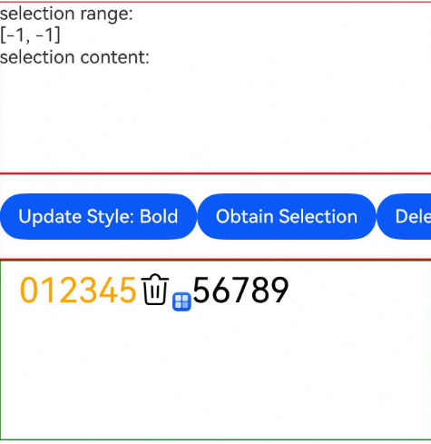

### Example 2: Binding a Custom Keyboard
This example shows how to bind a custom keyboard to the component using [customKeyboard](#customkeyboard).

```ts
// xxx.ets
@Entry
@Component
struct RichEditorExample {
  controller: RichEditorController = new RichEditorController();

  // Create a custom keyboard component.
  @Builder
  CustomKeyboardBuilder() {
    Column() {
      Grid() {
        ForEach(['1', '2', '3', '4', '5', '6', '7', '8', '9', '*', '0', '#'], (item: string) => {
          GridItem() {
            Button(item).width(110).onClick(() => {
              this.controller.addTextSpan(item + '', {
                offset: this.controller.getCaretOffset(),
                style:
                {
                  fontColor: Color.Orange,
                  fontSize: 30
                }
              });
            })
          }
        })
      }.maxCount(3).columnsGap(10).rowsGap(10).padding(5)
    }.backgroundColor(Color.Gray)
  }

  build() {
    Column() {
      RichEditor({ controller: this.controller }) // Bind the custom keyboard.
        .customKeyboard(this.CustomKeyboardBuilder())
        .border({ width: 1 })
        .borderWidth(1)
        .borderColor(Color.Red)
        .margin(10)
        .height(200)
        .width("100%")
    }
  }
}
```


### Example 3: Binding a Custom Menu
This example illustrates how to bind a custom menu to the component using [bindSelectionMenu](#bindselectionmenu).

The paste menu item in this example involves reading pasteboard data. Therefore, you need to [request permissions to access the pasteboard](../../../basic-services/pasteboard/get-pastedata-permission-guidelines.md) as required.

```ts
// xxx.ets
import { BusinessError, pasteboard } from '@kit.BasicServicesKit';

export interface SelectionMenuTheme {
  imageSize: number;
  buttonSize: number;
  menuSpacing: number;
  editorOptionMargin: number;
  expandedOptionPadding: number;
  defaultMenuWidth: number;
  imageFillColor: Resource;
  backgroundColor: Resource;
  iconBorderRadius: Resource;
  containerBorderRadius: Resource;
  cutIcon: Resource;
  copyIcon: Resource;
  pasteIcon: Resource;
  selectAllIcon: Resource;
  shareIcon: Resource;
  translateIcon: Resource;
  searchIcon: Resource;
  arrowDownIcon: Resource;
  iconPanelShadowStyle: ShadowStyle;
  iconFocusBorderColor: Resource;
}

export const defaultTheme: SelectionMenuTheme = {
  imageSize: 24,
  buttonSize: 48,
  menuSpacing: 8,
  editorOptionMargin: 1,
  expandedOptionPadding: 3,
  defaultMenuWidth: 256,
  imageFillColor: $r('sys.color.ohos_id_color_primary'),
  backgroundColor: $r('sys.color.ohos_id_color_dialog_bg'),
  iconBorderRadius: $r('sys.float.ohos_id_corner_radius_default_m'),
  containerBorderRadius: $r('sys.float.ohos_id_corner_radius_card'),
  cutIcon: $r('sys.media.ohos_ic_public_cut'),
  copyIcon: $r('sys.media.ohos_ic_public_copy'),
  pasteIcon: $r('sys.media.ohos_ic_public_paste'),
  selectAllIcon: $r('sys.media.ohos_ic_public_select_all'),
  shareIcon: $r('sys.media.ohos_ic_public_share'),
  translateIcon: $r('sys.media.ohos_ic_public_translate_c2e'),
  searchIcon: $r('sys.media.ohos_ic_public_search_filled'),
  arrowDownIcon: $r('sys.media.ohos_ic_public_arrow_down'),
  iconPanelShadowStyle: ShadowStyle.OUTER_DEFAULT_MD,
  iconFocusBorderColor: $r('sys.color.ohos_id_color_focused_outline')
}

@Entry
@Component
struct SelectionMenu {
  @State message: string = 'Hello World';
  @State textStyleConfigtSize: number = 40;
  @State sliderShow: boolean = false;
  @State start: number = -1;
  @State end: number = -1;
  @State colorTransparent: Color = Color.Transparent;
  controller: RichEditorController = new RichEditorController();
  options: RichEditorOptions = { controller: this.controller };
  // Replace $r('app.media.startIcon') with the image resource file you use.
  private icons: Array<Resource> =
    [$r('app.media.startIcon'), $r('app.media.startIcon'), $r('app.media.startIcon'),
    $r('app.media.startIcon'), $r('app.media.startIcon')];
  @State iconBgColor: ResourceColor[] = new Array(this.icons.length).fill(this.colorTransparent);
  @State pasteEnable: boolean = false;
  @State visibilityValue: Visibility = Visibility.Visible;
  @State textStyle: RichEditorTextStyle = {};
  private fontWeightTable: string[] = ["100", "200", "300", "400", "500", "600", "700", "800", "900", "bold", "normal", "bolder", "lighter", "medium", "regular"];
  private theme: SelectionMenuTheme = defaultTheme;

  aboutToAppear() {
    if (this.controller) {
      let richEditorSelection = this.controller.getSelection();
      if (richEditorSelection) {
        let start = richEditorSelection.selection[0];
        let end = richEditorSelection.selection[1];
        if (start === 0 && this.controller.getSpans({ start: end + 1, end: end + 1 }).length === 0) {
          this.visibilityValue = Visibility.None;
        } else {
          this.visibilityValue = Visibility.Visible;
        }
      }
    }
    let sysBoard = pasteboard.getSystemPasteboard();
    try {
      if (sysBoard && sysBoard.hasDataSync()) {
        this.pasteEnable = true;
      } else {
        this.pasteEnable = false;
      }
    } catch (err) {
      console.error(`Failed to check the PasteData. Code: ${err.code}, message: ${err.message}`);
    }
  }

  build() {
    Column() {
      Column() {
        RichEditor(this.options)
          .onReady(() => {
            this.controller.addTextSpan(this.message, { style: { fontColor: Color.Orange, fontSize: 30 } })
          })
          .onSelect((value: RichEditorSelection) => {
            if (value.selection[0] == -1 && value.selection[1] == -1) {
              return;
            }
            this.start = value.selection[0];
            this.end = value.selection[1];
          })
          // Bind a custom selection menu triggered by a long press to a span of the TEXT type.
          .bindSelectionMenu(RichEditorSpanType.TEXT, this.panel, ResponseType.LongPress, { onDisappear: () => {
            this.sliderShow = false;
          }})
          .bindSelectionMenu(RichEditorSpanType.TEXT, this.panel, ResponseType.RightClick, { onDisappear: () => {
            this.sliderShow = false;
          }})
          .bindSelectionMenu(RichEditorSpanType.IMAGE, this.panel, ResponseType.LongPress, { 
            menuType : MenuType.PREVIEW_MENU,
            previewMenuOptions : {
              hapticFeedbackMode : HapticFeedbackMode.ENABLED
            }
          })
          .borderWidth(1)
          .borderColor(Color.Red)
          .width(200)
          .height(200)
      }.width('100%').backgroundColor(Color.White)
    }.height('100%')
  }

  // Write the text and style information of the selected content to the clipboard. The style can be restored during pasting.
  pushDataToPasteboard(richEditorSelection: RichEditorSelection) {
    let sysBoard = pasteboard.getSystemPasteboard();
    let pasteData = pasteboard.createData(pasteboard.MIMETYPE_TEXT_PLAIN, '');
    if (richEditorSelection.spans && richEditorSelection.spans.length > 0) {
      let count = richEditorSelection.spans.length;
      for (let i = count - 1; i >= 0; i--) {
        let item = richEditorSelection.spans[i]
        if ((item as RichEditorTextSpanResult)?.textStyle) {
          let span = item as RichEditorTextSpanResult;
          let style = span.textStyle;
          let data = pasteboard.createRecord(pasteboard.MIMETYPE_TEXT_PLAIN, span.value.substring(span.offsetInSpan[0], span.offsetInSpan[1]));
          let prop = pasteData.getProperty();
          let fontStyleRecord: Record<string, Object> = {
            'color': style.fontColor,
            'size': style.fontSize,
            'style': style.fontStyle,
            'weight': this.fontWeightTable[style.fontWeight],
            'fontFamily': style.fontFamily,
            'decorationType': style.decoration.type,
            'decorationColor': style.decoration.color
          };
          prop.additions[i] = fontStyleRecord;
          pasteData.addRecord(data);
          pasteData.setProperty(prop);
        }
      }
    }
    sysBoard.clearData()
    sysBoard.setData(pasteData).then(() => {
      console.info('SelectionMenu copy option, Succeeded in setting PasteData.');
      this.pasteEnable = true;
    }).catch((err: BusinessError) => {
      console.error(`SelectionMenu copy option, Failed to set PasteData. Code: ${err.code}, message: ${err.message}`);
    })
  }

  // Read the content and style information from the clipboard, restore the style, and insert the content into the component.
  popDataFromPasteboard(richEditorSelection: RichEditorSelection) {
    let start = richEditorSelection.selection[0];
    let end = richEditorSelection.selection[1];
    if (start == end && this.controller) {
      start = this.controller.getCaretOffset();
      end = this.controller.getCaretOffset();
    }
    let moveOffset = 0;
    let sysBoard = pasteboard.getSystemPasteboard();
    sysBoard.getData((err, data) => {
      if (err) {
        return;
      }
      let count = data.getRecordCount();
      for (let i = 0; i < count; i++) {
        const element = data.getRecord(i);
        let textStyleConfig: RichEditorTextStyle = {
          fontSize: 16,
          fontColor: Color.Black,
          fontWeight: FontWeight.Normal,
          fontFamily: "HarmonyOS Sans",
          fontStyle: FontStyle.Normal,
          decoration: { type: TextDecorationType.None, color: "#FF000000", style: TextDecorationStyle.SOLID }
        }
        if (data.getProperty() && data.getProperty().additions[i]) {
          const styleAddition = data.getProperty().additions[i] as Record<string, Object | undefined>;
          if (styleAddition.color) {
            textStyleConfig.fontColor = styleAddition.color as ResourceColor;
          }
          if (styleAddition.size) {
            textStyleConfig.fontSize = styleAddition.size as Length | number;
          }
          if (styleAddition.style) {
            textStyleConfig.fontStyle = styleAddition.style as FontStyle;
          }
          if (styleAddition.weight) {
            textStyleConfig.fontWeight = styleAddition.weight as number | FontWeight | string;
          }
          if (styleAddition.fontFamily) {
            textStyleConfig.fontFamily = styleAddition.fontFamily as ResourceStr;
          }
          if (styleAddition.decorationType && textStyleConfig.decoration) {
            textStyleConfig.decoration.type = styleAddition.decorationType as TextDecorationType;
          }
          if (styleAddition.decorationColor && textStyleConfig.decoration) {
            textStyleConfig.decoration.color = styleAddition.decorationColor as ResourceColor;
          }
          if (textStyleConfig.decoration) {
            textStyleConfig.decoration = { type: textStyleConfig.decoration.type, color: textStyleConfig.decoration.color };
          }
        }
        if (element && element.plainText && element.mimeType === pasteboard.MIMETYPE_TEXT_PLAIN && this.controller) {
          this.controller.addTextSpan(element.plainText,
            {
              style: textStyleConfig,
              offset: start + moveOffset
            }
          );
          moveOffset += element.plainText.length;
        }
      }
      if (this.controller) {
        this.controller.setCaretOffset(start + moveOffset);
        this.controller.closeSelectionMenu();
      }
      if (start != end && this.controller) {
        this.controller.deleteSpans({ start: start + moveOffset, end: end + moveOffset });
      }
    })
  }

  @Builder
  panel() {
    Column() {
      this.iconPanel()
      if (!this.sliderShow) {
        this.SystemMenu()
      } else {
        this.sliderPanel()
      }
    }.width(256)
  }

  //Icon panel: The five icons correspond to bold switch (0), italic switch (1), underline switch (2), font size slider (3), and color switch (4).
  @Builder iconPanel() {
    Column() {
      Row({ space: 2 }) {
        ForEach(this.icons, (item:Resource, index ?: number) => {
          Flex({ justifyContent: FlexAlign.Center, alignItems: ItemAlign.Center }) {
            Image(item).fillColor(this.theme.imageFillColor).width(24).height(24).focusable(true).draggable(false)
          }
          .borderRadius(this.theme.iconBorderRadius)
          .width(this.theme.buttonSize)
          .height(this.theme.buttonSize)
          .onClick(() => {
            if (index as number == 0) {
              this.sliderShow = false;
              if (this.controller) {
                let selection = this.controller.getSelection();
                let spans = selection.spans;
                spans.forEach((item: RichEditorTextSpanResult | RichEditorImageSpanResult, index) => {
                  if (typeof (item as RichEditorTextSpanResult)['textStyle'] != 'undefined') {
                    let span = item as RichEditorTextSpanResult;
                    this.textStyle = span.textStyle;
                    let start = span.offsetInSpan[0];
                    let end = span.offsetInSpan[1];
                    let offset = span.spanPosition.spanRange[0];
                    if (this.textStyle.fontWeight != 11) {
                      this.textStyle.fontWeight = FontWeight.Bolder;
                    } else {
                      this.textStyle.fontWeight = FontWeight.Normal;
                    }
                    this.controller.updateSpanStyle({
                      start: offset + start,
                      end: offset + end,
                      textStyle: this.textStyle
                    })
                  }
                })
              }
            } else if (index as number == 1) {
              this.sliderShow = false;
              if (this.controller) {
                let selection = this.controller.getSelection();
                let spans = selection.spans;
                spans.forEach((item: RichEditorTextSpanResult | RichEditorImageSpanResult, index) => {
                  if (typeof (item as RichEditorTextSpanResult)['textStyle'] != 'undefined') {
                    let span = item as RichEditorTextSpanResult;
                    this.textStyle = span.textStyle;
                    let start = span.offsetInSpan[0];
                    let end = span.offsetInSpan[1];
                    let offset = span.spanPosition.spanRange[0];
                    if (this.textStyle.fontStyle == FontStyle.Italic) {
                      this.textStyle.fontStyle = FontStyle.Normal;
                    } else {
                      this.textStyle.fontStyle = FontStyle.Italic;
                    }
                    this.controller.updateSpanStyle({
                      start: offset + start,
                      end: offset + end,
                      textStyle: this.textStyle
                    })
                  }
                })
              }
            } else if (index as number == 2) {
              this.sliderShow = false;
              if (this.controller) {
                let selection = this.controller.getSelection();
                let spans = selection.spans;
                spans.forEach((item: RichEditorTextSpanResult | RichEditorImageSpanResult, index) => {
                  if (typeof (item as RichEditorTextSpanResult)['textStyle'] != 'undefined') {
                    let span = item as RichEditorTextSpanResult;
                    this.textStyle = span.textStyle;
                    let start = span.offsetInSpan[0];
                    let end = span.offsetInSpan[1];
                    let offset = span.spanPosition.spanRange[0];
                    if (this.textStyle.decoration) {
                      if (this.textStyle.decoration.type == TextDecorationType.Underline) {
                        this.textStyle.decoration.type = TextDecorationType.None;
                      } else {
                        this.textStyle.decoration.type = TextDecorationType.Underline;
                      }
                    } else {
                      this.textStyle.decoration = { type: TextDecorationType.Underline, color: Color.Black, style: TextDecorationStyle.SOLID };
                    }
                    this.controller.updateSpanStyle({
                      start: offset + start,
                      end: offset + end,
                      textStyle: this.textStyle
                    })
                  }
                })
              }
            } else if (index as number == 3) {
              this.sliderShow = !this.sliderShow;
            } else if (index as number == 4) {
              this.sliderShow = false;
              if (this.controller) {
                let selection = this.controller.getSelection();
                let spans = selection.spans;
                spans.forEach((item: RichEditorTextSpanResult | RichEditorImageSpanResult, index) => {
                  if (typeof (item as RichEditorTextSpanResult)['textStyle'] != 'undefined') {
                    let span = item as RichEditorTextSpanResult;
                    this.textStyle = span.textStyle;
                    let start = span.offsetInSpan[0];
                    let end = span.offsetInSpan[1];
                    let offset = span.spanPosition.spanRange[0];
                    if (this.textStyle.fontColor == Color.Orange || this.textStyle.fontColor == '#FFFFA500') {
                      this.textStyle.fontColor = Color.Black;
                    } else {
                      this.textStyle.fontColor = Color.Orange;
                    }
                    this.controller.updateSpanStyle({
                      start: offset + start,
                      end: offset + end,
                      textStyle: this.textStyle
                    })
                  }
                })
              }
            }
          })
          .onTouch((event?: TouchEvent | undefined) => {
            if (event != undefined) {
              if (event.type === TouchType.Down) {
                this.iconBgColor[index as number] = $r('sys.color.ohos_id_color_click_effect');
              }
              if (event.type === TouchType.Up) {
                this.iconBgColor[index as number] = this.colorTransparent;
              }
            }
          })
          .onHover((isHover?: boolean, event?: HoverEvent) => {
            this.iconBgColor.forEach((icon:ResourceColor, index1) => {
              this.iconBgColor[index1] = this.colorTransparent;
            })
            if (isHover != undefined) {
              this.iconBgColor[index as number] = $r('sys.color.ohos_id_color_hover');
            }
          })
          .backgroundColor(this.iconBgColor[index as number])
        })
      }
    }
    .clip(true)
    .width(this.theme.defaultMenuWidth)
    .padding(this.theme.expandedOptionPadding)
    .borderRadius(this.theme.containerBorderRadius)
    .margin({ bottom: this.theme.menuSpacing })
    .backgroundColor(this.theme.backgroundColor)
    .shadow(this.theme.iconPanelShadowStyle)
  }

  @Builder
  SystemMenu() {
    Column() {
      Menu() {
        if (this.controller) {
          MenuItemGroup() {
            MenuItem({ startIcon: this.theme.cutIcon, content: "Cut", labelInfo: "Ctrl+X" })
              .onClick(() => {
                if (!this.controller) {
                  return;
                }
                let richEditorSelection = this.controller.getSelection();
                this.pushDataToPasteboard(richEditorSelection);
                this.controller.deleteSpans({
                  start: richEditorSelection.selection[0],
                  end: richEditorSelection.selection[1]
                })
              })
            MenuItem({ startIcon: this.theme.copyIcon, content: "Copy", labelInfo: "Ctrl+C" })
              .onClick(() => {
                if (!this.controller) {
                  return;
                }
                let richEditorSelection = this.controller.getSelection();
                this.pushDataToPasteboard(richEditorSelection)
                this.controller.closeSelectionMenu()
              })
            MenuItem({ startIcon: this.theme.pasteIcon, content: "Paste", labelInfo: "Ctrl+V" })
              .enabled(this.pasteEnable)
              .onClick(() => {
                if (!this.controller) {
                  return;
                }
                let richEditorSelection = this.controller.getSelection();
                this.popDataFromPasteboard(richEditorSelection)
              })
            MenuItem({ startIcon: this.theme.selectAllIcon, content: "Select all", labelInfo: "Ctrl+A" })
              .visibility(this.visibilityValue)
              .onClick(() => {
                if (!this.controller) {
                  return;
                }
                this.controller.setSelection(-1, -1)
                this.visibilityValue = Visibility.None;
              })
            MenuItem({ startIcon: this.theme.shareIcon, content: "Share", labelInfo: "" })
              .enabled(false)
            MenuItem({ startIcon: this.theme.translateIcon, content: "Translate", labelInfo: "" })
              .enabled(false)
            MenuItem({ startIcon: this.theme.searchIcon, content: "Search", labelInfo: "" })
              .enabled(false)
          }
        }
      }
      .onVisibleAreaChange([0.0, 1.0], () => {
        if (!this.controller) {
          return;
        }
        let richEditorSelection = this.controller.getSelection();
        let start = richEditorSelection.selection[0];
        let end = richEditorSelection.selection[1];
        if (start === 0 && this.controller.getSpans({ start: end + 1, end: end + 1 }).length === 0) {
          this.visibilityValue = Visibility.None;
        } else {
          this.visibilityValue = Visibility.Visible;
        }
      })
      .radius(this.theme.containerBorderRadius)
      .clip(true)
      .backgroundColor(Color.White)
      .width(this.theme.defaultMenuWidth)
    }
    .width(this.theme.defaultMenuWidth)
  }

  @Builder sliderPanel() {
    Column() {
      Flex({ justifyContent: FlexAlign.SpaceBetween, alignItems: ItemAlign.Center }) {
        Text('A').fontSize(15)
        Slider({ value: this.textStyleConfigtSize, step: 10, style: SliderStyle.InSet })
          .width(210)
          .onChange((value: number, mode: SliderChangeMode) => {
            if (this.controller) {
              let selection = this.controller.getSelection();
              if (mode == SliderChangeMode.End) {
                if (this.textStyleConfigtSize == undefined) {
                  this.textStyleConfigtSize = 0;
                }
                let spans = selection.spans;
                spans.forEach((item: RichEditorTextSpanResult | RichEditorImageSpanResult, index) => {
                  if (typeof (item as RichEditorTextSpanResult)['textStyle'] != 'undefined') {
                    this.textStyleConfigtSize = Math.max(this.textStyleConfigtSize, (item as RichEditorTextSpanResult).textStyle.fontSize);
                  }
                })
              }
              if (mode == SliderChangeMode.Moving || mode == SliderChangeMode.Click) {
                this.start = selection.selection[0];
                this.end = selection.selection[1];
                this.textStyleConfigtSize = value;
                this.controller.updateSpanStyle({
                  start: this.start,
                  end: this.end,
                  textStyle: { fontSize: this.textStyleConfigtSize }
                })
              }
            }
          })
        Text('A').fontSize(20).fontWeight(FontWeight.Medium)
      }.borderRadius(this.theme.containerBorderRadius)
    }
    .shadow(ShadowStyle.OUTER_DEFAULT_MD)
    .backgroundColor(Color.White)
    .borderRadius(this.theme.containerBorderRadius)
    .padding(15)
    .height(48)
  }
}
```
> **NOTE**
>
> Icons in bold and italics are not preset in the system. The sample code uses the default icons. You need to replace the icons in **icons** with the desired icons.

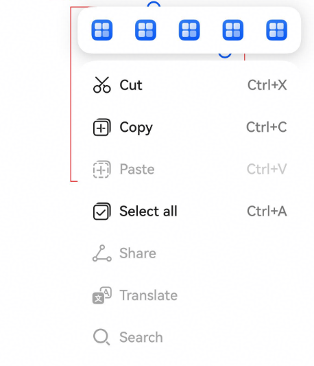

### Example 4: Updating the Image Style
This example demonstrates how to update the image style using the [updateSpanStyle](#updatespanstyle) API.

```ts
// xxx.ets
@Entry
@Component
struct Index {
  controller: RichEditorController = new RichEditorController();
  options: RichEditorOptions = { controller: this.controller };
  private start: number = -1;
  private end: number = -1;
  @State message: string = "[-1, -1]";
  @State content: string = "";

  build() {
    Column() {
      Column() {
        Text("selection range:").width("100%")
        Text() {
          Span(this.message)
        }.width("100%")
        Text("selection content:").width("100%")
        Text() {
          Span(this.content)
        }.width("100%")
      }
      .borderWidth(1)
      .borderColor(Color.Red)
      .width("100%")
      .height("20%")

      Row() {
        Button("updateSpanStyle1")
          .fontSize(12)
          .onClick(() => {
            this.controller.updateSpanStyle({
              start: this.start,
              textStyle:
              {
                fontWeight: FontWeight.Bolder,
                fontSize:15
              },
              imageStyle: {
                size: ["80px", "80px"],
                layoutStyle: {
                  borderRadius: undefined,
                  margin: undefined
                }
              }
            });
          })

        Button("updateSpanStyle2")
          .fontSize(12)
          .onClick(() => {
            this.controller.updateSpanStyle({
              start: this.start,
              textStyle:
              {
                fontWeight: FontWeight.Bolder,
                fontSize:15
              },
              imageStyle: {
                size: ["70px", "70px"],
                layoutStyle: {
                  borderRadius: { topLeft: '100px', topRight: '20px', bottomLeft: '100px', bottomRight: '20px' },
                  margin: { left: '30px', top: '20px', right: '20px', bottom: '20px' }
                }
              }
            });
          })

        Button("updateSpanStyle3")
          .fontSize(12)
          .onClick(() => {
            this.controller.updateSpanStyle({
              start: this.start,
              textStyle:
              {
                fontWeight: FontWeight.Bolder,
                fontSize:15
              },
              imageStyle: {
                size: ["60px", "60px"],
                layoutStyle: {
                  borderRadius: '-10px',
                  margin: '-10px'
                }
              }
            });
          })
      }
      .borderWidth(1)
      .borderColor(Color.Red)
      .width("100%")
      .height("10%")

      Row() {
        Button('addImageSpan1')
          .fontSize(12)
          .onClick(() => {
            // Replace $r('app.media.startIcon') with the image resource file you use.
            this.controller.addImageSpan($r('app.media.startIcon'), {
              imageStyle: {
                size: ["80px", "80px"],
                layoutStyle: {
                  borderRadius: '50px',
                  margin: '40px'
                }
              }
            });
          })

        Button('addImageSpan2')
          .fontSize(12)
          .onClick(() => {
            // Replace $r('app.media.startIcon') with the image resource file you use.
            this.controller.addImageSpan($r('app.media.startIcon'), {
              imageStyle: {
                size: ["100px", "100px"],
                verticalAlign: ImageSpanAlignment.BOTTOM,
                layoutStyle: {
                  borderRadius: undefined,
                  margin: undefined
                }
              }
            });
          })

        Button('addImageSpan3')
          .fontSize(12)
          .onClick(() => {
            // Replace $r('app.media.startIcon') with the image resource file you use.
            this.controller.addImageSpan($r('app.media.startIcon'), {
              imageStyle: {
                size: ["60px", "60px"],
                verticalAlign: ImageSpanAlignment.BOTTOM,
                layoutStyle: {
                  borderRadius: { topLeft: '10px', topRight: '20px', bottomLeft: '30px', bottomRight: '40px' },
                  margin: { left: '10px', top: '20px', right: '30px', bottom: '40px' }
                }
              }
            })
          })
      }
      .borderWidth(1)
      .borderColor(Color.Red)
      .width("100%")
      .height("10%")

      Column() {
        RichEditor(this.options)
          .onReady(() => {
            this.controller.addTextSpan("0123456789",
              {
                style:
                {
                  fontColor: Color.Orange,
                  fontSize: 30
                }
              })

            // Replace $r('app.media.startIcon') with the image resource file you use.
            this.controller.addImageSpan($r('app.media.startIcon'),
              {
                imageStyle:
                {
                  size: ["60px", "60px"],
                  verticalAlign: ImageSpanAlignment.BOTTOM,
                  layoutStyle: {
                    borderRadius: { topLeft: '10px', topRight: '20px', bottomLeft: '30px', bottomRight: '40px' },
                    margin: { left: '10px', top: '20px', right: '30px', bottom: '40px' }
                  }
                }
              })

            this.controller.addTextSpan("0123456789",
              {
                style:
                {
                  fontColor: Color.Black,
                  fontSize: 30
                }
              })
          })
          .onSelect((value: RichEditorSelection) => {
            this.start = value.selection[0];
            this.end = value.selection[1];
            this.message = "[" + this.start + ", " + this.end + "]";
          })
          .aboutToIMEInput((value: RichEditorInsertValue) => {
            console.info("---------------------- aboutToIMEInput ----------------------");
            console.info("insertOffset:" + value.insertOffset);
            console.info("insertValue:" + value.insertValue);
            return true;
          })
          .onIMEInputComplete((value: RichEditorTextSpanResult) => {
            console.info("---------------------- onIMEInputComplete ---------------------");
            console.info("spanIndex:" + value.spanPosition.spanIndex);
            console.info("spanRange:[" + value.spanPosition.spanRange[0] + "," + value.spanPosition.spanRange[1] + "]");
            console.info("offsetInSpan:[" + value.offsetInSpan[0] + "," + value.offsetInSpan[1] + "]");
            console.info("value:" + value.value);
          })
          .aboutToDelete((value: RichEditorDeleteValue) => {
            console.info("---------------------- aboutToDelete --------------------------");
            console.info("offset:" + value.offset);
            console.info("direction:" + value.direction);
            console.info("length:" + value.length);
            value.richEditorDeleteSpans.forEach(item => {
              console.info("---------------------- item --------------------------");
              console.info("spanIndex:" + item.spanPosition.spanIndex);
              console.info("spanRange:[" + item.spanPosition.spanRange[0] + "," + item.spanPosition.spanRange[1] + "]");
              console.info("offsetInSpan:[" + item.offsetInSpan[0] + "," + item.offsetInSpan[1] + "]");
              if (typeof (item as RichEditorImageSpanResult)['imageStyle'] != 'undefined') {
                console.info("image:" + (item as RichEditorImageSpanResult).valueResourceStr);
              } else {
                console.info("text:" + (item as RichEditorTextSpanResult).value);
              }
            })
            return true;
          })
          .onDeleteComplete(() => {
            console.info("---------------------- onDeleteComplete ------------------------");
          })
          .borderWidth(1)
          .borderColor(Color.Green)
          .width("100%")
          .height('80.00%')
      }
      .borderWidth(1)
      .borderColor(Color.Red)
      .width("100%")
      .height("70%")
    }
  }
}
```


### Example 5: Binding a Gesture Event to a Span
This example shows how to bind a [gesture](#richeditorgesture11) callback to a span.

```ts
// xxx.ets
@Entry
@Component
struct Index {
  controller: RichEditorController = new RichEditorController();
  options: RichEditorOptions = { controller: this.controller };
  @State textFlag: string = "TextFlag";

  build() {
    Column() {
      Column() {
        Text(this.textFlag)
          .copyOption(CopyOptions.InApp)
          .fontSize(50)
          .height(150)
      }
      Divider()
      Column() {
        RichEditor(this.options)
          .onReady(() => {
            // Bind the click and long-press gesture callbacks to the text span.
            this.controller.addTextSpan('Area1\n', {
              style:
              {
                fontColor: Color.Orange,
                fontSize: 50,
              },
              gesture:
              {
                // Update the text identifier when the text is clicked.
                onClick: () => {
                  this.textFlag = "Area1 is onClick.";
                },
                // Update the text identifier when the text is long-pressed.
                onLongPress: () => {
                  this.textFlag = "Area1 is onLongPress.";
                }
              }
            })

            this.controller.addTextSpan('Area2\n', {
              style:
              {
                fontColor: Color.Blue,
                fontSize: 50
              },
              gesture:
              {
                // Update the text identifier when the text is clicked.
                onClick: () => {
                  this.textFlag = "Area2 is onClick.";
                },
                // Update the text identifier when the text is long-pressed.
                onLongPress: () => {
                  this.textFlag = "Area2 is onLongPress.";
                }
              }
            })

            // Replace $r('app.media.startIcon') with the image resource file you use.
            this.controller.addImageSpan($r('app.media.startIcon'),
              {
                imageStyle:
                {
                  size: ["100px", "100px"],
                  layoutStyle: {
                    margin: 5,
                    borderRadius: 15
                  }
                },
                gesture:
                {
                  onClick: () => {
                    this.textFlag = "ImageSpan is onClick.";
                  },
                  onLongPress: () => {
                    this.textFlag = "ImageSpan is onLongPress.";
                  }
                },
                onHover : (status) => {
                  this.textFlag = "ImageSpan is onHover :" + status;
                }
              })
          })
      }
      .borderWidth(1)
      .borderColor(Color.Red)
      .width("100%")
      .height("70%")
    }
  }
}
```


### Example 6: Updating and Obtaining Paragraph Styles
This example demonstrates how to update paragraph styles using the [updateParagraphStyle](#updateparagraphstyle11) API and obtain paragraph information within a specified range using the [getParagraphs](#getparagraphs11) API.

```ts
// xxx.ets
@Entry
@Component
struct Index {
  controller: RichEditorController = new RichEditorController();
  private spanParagraphs: RichEditorParagraphResult[] = [];

  build() {
    Column() {
      RichEditor({ controller: this.controller })
        .onReady(() => {
          this.controller.addTextSpan("0123456789\n", {
            style: {
              fontColor: Color.Pink,
              fontSize: "32"
            },
            paragraphStyle: {
              textAlign: TextAlign.Start,
              textVerticalAlign: TextVerticalAlign.BASELINE,
              leadingMargin: 16
            }
          });
          this.controller.addTextSpan("0123456789");
        })
        .width("80%")
        .height("30%")
        .border({ width: 1, radius: 5 })
        .draggable(false)

      Column({ space: 5 }) {
        Button("Align Left").onClick(() => {
          // Set the paragraph text to left alignment.
          this.controller.updateParagraphStyle({ start: -1, end: -1,
            style: {
              textAlign: TextAlign.Start
            }
          });
        })

        Button("Align Right").onClick(() => {
          this.controller.updateParagraphStyle({ start: -1, end: -1,
            style: {
              textAlign: TextAlign.End
            }
          });
        })

        Button("Align Center").onClick(() => {
          this.controller.updateParagraphStyle({ start: -1, end: -1,
            style: {
              textAlign: TextAlign.Center
            }
          });
        })

        Button("Apply Paragraph Spacing (50)").onClick(() => {
          this.controller.updateParagraphStyle({ start: -1, end: -1,
            style: {
              paragraphSpacing: 50
            }
          });
        })
        Divider()
        Button("getParagraphs").onClick(() => {
          this.spanParagraphs = this.controller.getParagraphs({ start: -1, end: -1 });
          console.info("RichEditor getParagraphs:" + JSON.stringify(this.spanParagraphs));
        })

        Button("UpdateSpanStyle1").onClick(() => {
          this.controller.updateSpanStyle({ start: -1, end: -1,
            textStyle: {
              fontColor: Color.Brown,
              fontSize: 20
            }
          });
        })

        Button("UpdateSpanStyle2").onClick(() => {
          this.controller.updateSpanStyle({ start: -1, end: -1,
            textStyle: {
              fontColor: Color.Green,
              fontSize: 30
            }
          });
        })
      }
    }
  }
}
```
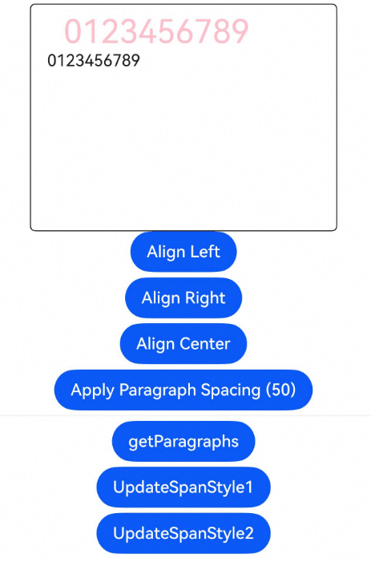

### Example 7: Updating the Preset Style and Indent
This example demonstrates how to update the preset text style using the [setTypingStyle](#settypingstyle11) API and set paragraph indents using the [updateParagraphStyle](#updateparagraphstyle11) API.

```ts
// xxx.ets

const CANVAS_WIDTH = 1000;
const CANVAS_HEIGHT = 100;
const INDENTATION = 40;
class LeadingMarginCreator {
  private settings: RenderingContextSettings = new RenderingContextSettings(true);
  private offscreenCanvas: OffscreenCanvas = new OffscreenCanvas(CANVAS_WIDTH, CANVAS_HEIGHT);
  private offscreenContext: OffscreenCanvasRenderingContext2D = this.offscreenCanvas.getContext("2d", this.settings);
  public static instance: LeadingMarginCreator = new LeadingMarginCreator();

  // Obtain the font size level, which ranges from 0 to 4.
  public getFontSizeLevel(fontSize: number) {
    const fontScaled: number = Number(fontSize) / 16;

    enum FontSizeScaleThreshold {
      SMALL = 0.9,
      NORMAL = 1.1,
      LEVEL_1_LARGE = 1.2,
      LEVEL_2_LARGE = 1.4,
      LEVEL_3_LARGE = 1.5
    }

    let fontSizeLevel: number = 1;

    if (fontScaled < FontSizeScaleThreshold.SMALL) {
      fontSizeLevel = 0;
    } else if (fontScaled < FontSizeScaleThreshold.NORMAL) {
      fontSizeLevel = 1;
    } else if (fontScaled < FontSizeScaleThreshold.LEVEL_1_LARGE) {
      fontSizeLevel = 2;
    } else if (fontScaled < FontSizeScaleThreshold.LEVEL_2_LARGE) {
      fontSizeLevel = 3;
    } else if (fontScaled < FontSizeScaleThreshold.LEVEL_3_LARGE) {
      fontSizeLevel = 4;
    } else {
      fontSizeLevel = 1;
    }

    return fontSizeLevel;
  }

  // Obtain the margin level.
  public getMarginLevel(Width: number) {
    let marginLevel: number = 1;
    if (Width == 40) {
      marginLevel = 2.0;
    } else if (Width == 80) {
      marginLevel = 1.0;
    } else if (Width == 120) {
      marginLevel = 2 / 3;
    } else if (Width == 160) {
      marginLevel = 0.5;
    } else if (Width == 200) {
      marginLevel = 0.4;
    }
    return marginLevel;
  }

  public genStrMark(fontSize: number, str: string): PixelMap {
    this.offscreenContext = this.offscreenCanvas.getContext("2d", this.settings);
    this.clearCanvas();
    this.offscreenContext.font = fontSize + 'vp sans-serif';
    this.offscreenContext.fillText(str + '.', 0, fontSize * 0.9);
    return this.offscreenContext.getPixelMap(0, 0, fontSize * (str.length + 1) / 1.75, fontSize);
  }

  public genSquareMark(fontSize: number): PixelMap {
    this.offscreenContext = this.offscreenCanvas.getContext("2d", this.settings);
    this.clearCanvas();
    const coordinate = fontSize * (1 - 1 / 1.5) / 2;
    const sideLength = fontSize / 1.5;
    this.offscreenContext.fillRect(coordinate, coordinate, sideLength, sideLength);
    return this.offscreenContext.getPixelMap(0, 0, fontSize, fontSize);
  }

  // Generate a circle symbol.
  public genCircleMark(fontSize: number, width: number, level?: number ): PixelMap {
    const indentLevel = level ?? 1;
    const offsetLevel = [22, 28, 32, 34, 38];
    const fontSizeLevel = this.getFontSizeLevel(fontSize);
    const marginLevel = this.getMarginLevel(width);
    const newCanvas = new OffscreenCanvas(CANVAS_WIDTH, CANVAS_HEIGHT);
    const newOffContext: OffscreenCanvasRenderingContext2D = newCanvas.getContext("2d", this.settings);
    const centerCoordinate = 50;
    const radius = 10;
    this.clearCanvas();
    newOffContext.ellipse(100 * (indentLevel + 1) - centerCoordinate * marginLevel, offsetLevel[fontSizeLevel], radius * marginLevel, radius, 0, 0, 2 * Math.PI);
    newOffContext.fillStyle = '66FF0000';
    newOffContext.fill();
    return newOffContext.getPixelMap(0, 0, 100 + 100 * indentLevel, 100);
  }

  private clearCanvas() {
    this.offscreenContext.clearRect(0, 0, CANVAS_WIDTH, CANVAS_HEIGHT);
  }
}

@Entry
@Component
struct Index {
  controller: RichEditorController = new RichEditorController();
  options: RichEditorOptions = { controller: this.controller };
  private leadingMarkCreatorInstance = LeadingMarginCreator.instance;
  private fontNameRawFile: string = 'MiSans-Bold';
  @State fontSize: number = 30;

  private leftMargin: Dimension = 0;
  private richEditorTextStyle: RichEditorTextStyle = {};

  aboutToAppear() {
    this.getUIContext().getFont().registerFont({
      familyName: 'MiSans-Bold',
      familySrc: '/font/MiSans-Bold.ttf'
    });
  }

  build() {
    Scroll() {
      Column() {
        RichEditor(this.options)
          .onReady(() => {
            this.controller.addTextSpan("0123456789\n",
              {
                style:
                {
                  fontWeight: 'medium',
                  fontFamily: this.fontNameRawFile,
                  fontColor: Color.Red,
                  fontSize: 50,
                  fontStyle: FontStyle.Italic,
                  decoration: { type: TextDecorationType.Underline, color: Color.Green }
                }
              });

            this.controller.addTextSpan("abcdefg",
              {
                style:
                {
                  fontWeight: FontWeight.Lighter,
                  fontFamily: 'HarmonyOS Sans',
                  fontColor: 'rgba(0,128,0,0.5)',
                  fontSize: 30,
                  fontStyle: FontStyle.Normal,
                  decoration: { type: TextDecorationType.Overline, color: 'rgba(169, 26, 246, 0.50)' }
                }
              });
          })
          .borderWidth(1)
          .borderColor(Color.Green)
          .width("100%")
          .height("50%")

        Row({ space: 5 }) {
          Button('setTypingStyle1')
            .fontSize(10)
            .onClick(() => {
              this.controller.setTypingStyle(
                {
                  fontWeight: 'medium',
                  fontFamily: this.fontNameRawFile,
                  fontColor: Color.Blue,
                  fontSize: 50,
                  fontStyle: FontStyle.Italic,
                  decoration: { type: TextDecorationType.Underline, color: Color.Green }
                });
            })

          Button('setTypingStyle2')
            .fontSize(10)
            .onClick(() => {
              this.controller.setTypingStyle(
                {
                  fontWeight: FontWeight.Lighter,
                  fontFamily: 'HarmonyOS Sans',
                  fontColor: Color.Green,
                  fontSize: '30',
                  fontStyle: FontStyle.Normal,
                  decoration: { type: TextDecorationType.Overline, color: 'rgba(169, 26, 246, 0.50)' }
                });
            })
        }
        Divider()
        Button("getTypingStyle").onClick(() => {
          this.richEditorTextStyle = this.controller.getTypingStyle();
          console.info("RichEditor getTypingStyle:" + JSON.stringify(this.richEditorTextStyle));
        })
        Divider()
        Row({ space: 5 }) {
          Button("Increase List Indent").onClick(() => {
            let margin = Number(this.leftMargin);
            if (margin < 200) {
              margin += INDENTATION;
              this.leftMargin = margin;
            }
            this.controller.updateParagraphStyle({
              start: -10,
              end: -10,
              style: {
                leadingMargin : {
                  pixelMap : this.leadingMarkCreatorInstance.genCircleMark(100, margin, 1),
                  size: [margin, 40]
                }
              }
            });
          })

          Button("Decrease List Indent").onClick(() => {
            let margin = Number(this.leftMargin);
            if (margin > 0) {
              margin -= INDENTATION;
              this.leftMargin = margin;
            }
            this.controller.updateParagraphStyle({
              start: -10,
              end: -10,
              style: {
                leadingMargin : {
                  pixelMap : this.leadingMarkCreatorInstance.genCircleMark(100, margin, 1),
                  size: [margin, 40]
                }
              }
            });
          })
        }
        Divider()
        Row({ space: 5 }) {
          Button("Increase Paragraph Indent").onClick(() => {
            let margin = Number(this.leftMargin);
            if (margin < 200) {
              margin += INDENTATION;
              this.leftMargin = margin;
            }
            this.controller.updateParagraphStyle({
              start: -10,
              end: -10,
              style: {
                leadingMargin: margin
              }
            });
          })

          Button("Decrease Paragraph Indent").onClick(() => {
            let margin = Number(this.leftMargin);
            if (margin > 0) {
              margin -= INDENTATION;
              this.leftMargin = margin;
            }
            this.controller.updateParagraphStyle({
              start: -10,
              end: -10,
              style: {
                leadingMargin: margin
              }
            });
          })
        }
      }.borderWidth(1).borderColor(Color.Red)
    }
  }
}
```
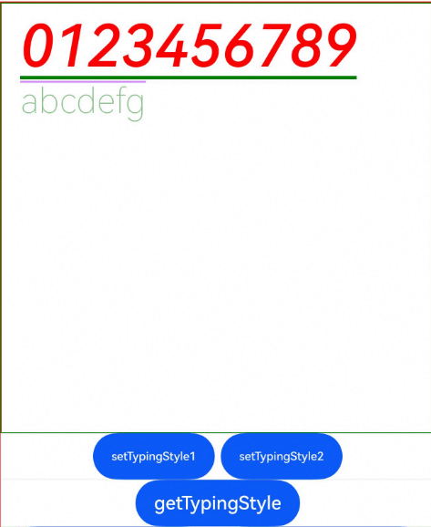

### Example 8: Setting Text Weight and Shadow
This example demonstrates how to set the text font weight and shadow using the [updateSpanStyle](#updatespanstyle) API.

``` ts
@Entry
@Component
struct Index {
  controller: RichEditorController = new RichEditorController();
  options: RichEditorOptions = { controller: this.controller };
  private start: number = -1;
  private end: number = -1;
  @State message: string = "[-1, -1]"
  @State content: string = ""
  @State textShadows : Array<ShadowOptions> = [
    { radius: 10, color: Color.Red, offsetX: 10, offsetY: 0 },
    { radius: 10, color: Color.Black, offsetX: 20, offsetY: 0 },
    { radius: 10, color: Color.Brown, offsetX: 30, offsetY: 0 },
    { radius: 10, color: Color.Green, offsetX: 40, offsetY: 0 },
    { radius: 10, color: Color.Yellow, offsetX: 100, offsetY: 0 }
  ];

  build() {
    Column() {
      Column() {
        Text("selection range:").width("100%")
        Text() {
          Span(this.message)
        }.width("100%")
        Text("selection content:").width("100%")
        Text() {
          Span(this.content)
        }.width("100%")
      }
      .borderWidth(1)
      .borderColor(Color.Red)
      .width("100%")
      .height("20%")
      Row() {
        Button("Update Style: Bold & Shadow").onClick(() => {
          this.controller.updateSpanStyle({
            start: this.start,
            end: this.end,
            textStyle:
            {
              fontWeight: FontWeight.Bolder,
              textShadow: this.textShadows
            }
          });
        })
      }
      .borderWidth(1)
      .borderColor(Color.Red)
      .width("100%")
      .height("10%")
      Column() {
        RichEditor(this.options)
          .onReady(() => {
            this.controller.addTextSpan("0123456789",
              {
                style:
                {
                  fontColor: Color.Orange,
                  fontSize: 30,
                  textShadow: { radius: 10, color: Color.Blue, offsetX: 10, offsetY: 0 }
                }
              });
          })
          .borderWidth(1)
          .borderColor(Color.Green)
          .width("100%")
          .height("30%")
      }
      .borderWidth(1)
      .borderColor(Color.Red)
      .width("100%")
      .height("70%")
    }
  }
}
```

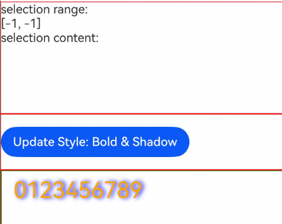

### Example 9: Adding Custom Layout Spans
This example shows how to add custom layout spans using the [addBuilderSpan](#addbuilderspan11) API.

``` ts
@Builder
function placeholderBuilder2() {
  Row({ space: 2 }) {
    // Replace $r('app.media.startIcon') with the image resource file you use.
    Image($r('app.media.startIcon')).width(24).height(24).margin({ left: -5 })
    Text('okokokok').fontSize(10)
  }.width('20%').height(50).padding(10).backgroundColor(Color.Red)
}

// xxx.ets
@Entry
@Component
struct Index {
  controller: RichEditorController = new RichEditorController();
  option: RichEditorOptions = { controller: this.controller };
  private start: number = 2;
  private end: number = 4;
  @State message: string = "[-1, -1]";
  @State content: string = "";
  private myOffset: number | undefined = undefined;
  private myBuilder: CustomBuilder = undefined;
  @BuilderParam myBuilder2:() => void = placeholderBuilder2;

  @Builder
  placeholderBuilder() {
    Row({ space: 2 }) {
      // Replace $r('app.media.startIcon') with the image resource file you use.
      Image($r('app.media.startIcon')).width(24).height(24).margin({ left: -5 })
      Text('Custom Popup').fontSize(10)
    }.width(100).height(50).padding(5)
  }

  @Builder
  placeholderBuilder3() {
    Text("hello").padding('20').borderWidth(1).width('100%')
  }

  @Builder
  placeholderBuilder4() {
    Column() {
      Column({ space: 5 }) {
        Text('direction:Row').fontSize(9).fontColor(0xCCCCCC).width('90%')
        Flex({ direction: FlexDirection.Row }) { // The child components are arranged in the same direction as the main axis runs along the rows.
          Text('1').width('20%').height(50).backgroundColor(0xF5DEB3)
          Text('1').width('20%').height(50).backgroundColor(0xD2B48C)
          Text('1').width('20%').height(50).backgroundColor(0xF5DEB3)
          Text('1').width('20%').height(50).backgroundColor(0xD2B48C)
        }
        .height(70)
        .width('90%')
        .padding(10)
        .backgroundColor(0xAFEEEE)

        Text('direction:RowReverse').fontSize(9).fontColor(0xCCCCCC).width('90%')
        Flex({ direction: FlexDirection.RowReverse }) { // The child components are arranged opposite to the Row direction.
          Text('1').width('20%').height(50).backgroundColor(0xF5DEB3)
          Text('1').width('20%').height(50).backgroundColor(0xD2B48C)
          Text('1').width('20%').height(50).backgroundColor(0xF5DEB3)
          Text('1').width('20%').height(50).backgroundColor(0xD2B48C)
        }
        .height(70)
        .width('90%')
        .padding(10)
        .backgroundColor(0xAFEEEE)

        Text('direction:Column').fontSize(9).fontColor(0xCCCCCC).width('90%')
        Flex({ direction: FlexDirection.Column }) { // The child components are arranged in the same direction as the main axis runs down the columns.
          Text('1').width('20%').height(40).backgroundColor(0xF5DEB3)
          Text('1').width('20%').height(40).backgroundColor(0xD2B48C)
          Text('1').width('20%').height(40).backgroundColor(0xF5DEB3)
          Text('1').width('20%').height(40).backgroundColor(0xD2B48C)
        }
        .height(160)
        .width('90%')
        .padding(10)
        .backgroundColor(0xAFEEEE)

        Text('direction:ColumnReverse').fontSize(9).fontColor(0xCCCCCC).width('90%')
        Flex({ direction: FlexDirection.ColumnReverse }) { // The child components are arranged opposite to the Column direction.
          Text('1').width('20%').height(40).backgroundColor(0xF5DEB3)
          Text('1').width('20%').height(40).backgroundColor(0xD2B48C)
          Text('1').width('20%').height(40).backgroundColor(0xF5DEB3)
          Text('1').width('20%').height(40).backgroundColor(0xD2B48C)
        }
        .height(160)
        .width('90%')
        .padding(10)
        .backgroundColor(0xAFEEEE)
      }.width('100%').margin({ top: 5 })
    }.width('100%')
  }
  build() {
    Column() {
      Column() {
        Text("selection range:").width("100%")
        Text() {
          Span(this.message)
        }.width("100%")

        Text("selection content:").width("100%")
        Text() {
          Span(this.content)
        }.width("100%")
      }
      .borderWidth(1)
      .borderColor(Color.Red)
      .width("100%")
      .height("20%")

      Row() {
        Button("Get Span Info").onClick(() => {
          console.info('getSpans='+JSON.stringify(this.controller.getSpans({ start:1, end:5 })));
          console.info('getParagraphs='+JSON.stringify(this.controller.getParagraphs({ start:1, end:5 })));
          this.content = "";
          this.controller.getSpans({
            start: this.start,
            end: this.end
          }).forEach(item => {
            if (typeof (item as RichEditorImageSpanResult)['imageStyle'] != 'undefined') {
              if ((item as RichEditorImageSpanResult).valueResourceStr == "") {
                console.info("builder span index " + (item as RichEditorImageSpanResult).spanPosition.spanIndex + ", range : " + (item as RichEditorImageSpanResult).offsetInSpan[0] + ", " +
                  (item as RichEditorImageSpanResult).offsetInSpan[1] + ", size : " + (item as RichEditorImageSpanResult).imageStyle[0] + ", " + (item as RichEditorImageSpanResult).imageStyle[1]);
              } else {
                console.info("image span " + (item as RichEditorImageSpanResult).valueResourceStr + ", index : " + (item as RichEditorImageSpanResult).spanPosition.spanIndex + ", range: " +
                  (item as RichEditorImageSpanResult).offsetInSpan[0] + ", " + (item as RichEditorImageSpanResult).offsetInSpan[1] + ", size : " +
                  (item as RichEditorImageSpanResult).imageStyle.size[0] + ", " + (item as RichEditorImageSpanResult).imageStyle.size[1]);
              }
            } else {
              this.content += (item as RichEditorTextSpanResult).value;
              this.content += "\n";
              console.info("text span: " + (item as RichEditorTextSpanResult).value);
            }
          })
        })
        Button("Get Selection").onClick(() => {
          this.content = "";
          let select = this.controller.getSelection();
          console.info("selection start " + select.selection[0] + " end " + select.selection[1]);
          select.spans.forEach(item => {
            if (typeof (item as RichEditorImageSpanResult)['imageStyle'] != 'undefined') {
              if ((item as RichEditorImageSpanResult).valueResourceStr == "") {
                console.info("builder span index " + (item as RichEditorImageSpanResult).spanPosition.spanIndex + ", range : " + (item as RichEditorImageSpanResult).offsetInSpan[0] + ", " +
                  (item as RichEditorImageSpanResult).offsetInSpan[1] + ", size : " + (item as RichEditorImageSpanResult).imageStyle[0] + ", " + (item as RichEditorImageSpanResult).imageStyle[1]);
              } else {
                console.info("image span " + (item as RichEditorImageSpanResult).valueResourceStr + ", index : " + (item as RichEditorImageSpanResult).spanPosition.spanIndex + ", range: " +
                  (item as RichEditorImageSpanResult).offsetInSpan[0] + ", " + (item as RichEditorImageSpanResult).offsetInSpan[1] + ", size : " +
                  (item as RichEditorImageSpanResult).imageStyle.size[0] + ", " + (item as RichEditorImageSpanResult).imageStyle.size[1]);
              }
            } else {
              this.content += (item as RichEditorTextSpanResult).value;
              this.content += "\n";
              console.info("text span: " + (item as RichEditorTextSpanResult).value);
            }
          })
        })
        Button("Delete Selection").onClick(() => {
          this.controller.deleteSpans({
            start: this.start,
            end: this.end
          });
        })
      }
      .borderWidth(1)
      .borderColor(Color.Red)
      .width("100%")
      .height("10%")

      Column() {
        RichEditor(this.option)
          .onReady(() => {
            this.controller.addTextSpan("0123456789",
              {
                style:
                {
                  fontColor: Color.Orange,
                  fontSize: 30
                }
              });
            // Replace $r('app.media.startIcon') with the image resource file you use.
            this.controller.addImageSpan($r('app.media.startIcon'),
              {
                imageStyle:
                {
                  size: ["57px", "57px"]
                }
              });
          })
          .onSelect((value: RichEditorSelection) => {
            this.start = value.selection[0];
            this.end = value.selection[1];
            this.message = "[" + this.start + ", " + this.end + "]";
            console.info("onSelect="+JSON.stringify(value));
          })
          .aboutToIMEInput((value: RichEditorInsertValue) => {
            console.info("---------------------- aboutToIMEInput --------------------");
            console.info("aboutToIMEInput="+JSON.stringify(value));
            console.info("insertOffset:" + value.insertOffset);
            console.info("insertValue:" + value.insertValue);
            return true;
          })
          .onIMEInputComplete((value: RichEditorTextSpanResult) => {
            console.info("---------------------- onIMEInputComplete --------------------");
            console.info("onIMEInputComplete="+JSON.stringify(value));
            console.info("spanIndex:" + value.spanPosition.spanIndex);
            console.info("spanRange:[" + value.spanPosition.spanRange[0] + "," + value.spanPosition.spanRange[1] + "]");
            console.info("offsetInSpan:[" + value.offsetInSpan[0] + "," + value.offsetInSpan[1] + "]");
            console.info("value:" + value.value);
          })
          .aboutToDelete((value: RichEditorDeleteValue) => {
            value.richEditorDeleteSpans.forEach(item => {
              console.info("---------------------- item --------------------");
              console.info("spanIndex=" + item.spanPosition.spanIndex);
              console.info("spanRange:[" + item.spanPosition.spanRange[0] + "," + item.spanPosition.spanRange[1] + "]");
              console.info("offsetInSpan:[" + item.offsetInSpan[0] + "," + item.offsetInSpan[1] + "]");
              if (typeof (item as RichEditorImageSpanResult)['imageStyle'] != 'undefined') {
                if ((item as RichEditorImageSpanResult).valueResourceStr == "") {
                  console.info("builder span index " + (item as RichEditorImageSpanResult).spanPosition.spanIndex + ", range : " + (item as RichEditorImageSpanResult).offsetInSpan[0] + ", " +
                  (item as RichEditorImageSpanResult).offsetInSpan[1] + ", size : " + (item as RichEditorImageSpanResult).imageStyle[0] + ", " + (item as RichEditorImageSpanResult).imageStyle[1]);
                } else {
                  console.info("image span " + (item as RichEditorImageSpanResult).valueResourceStr + ", index : " + (item as RichEditorImageSpanResult).spanPosition.spanIndex + ", range: " +
                  (item as RichEditorImageSpanResult).offsetInSpan[0] + ", " + (item as RichEditorImageSpanResult).offsetInSpan[1] + ", size : " +
                  (item as RichEditorImageSpanResult).imageStyle.size[0] + ", " + (item as RichEditorImageSpanResult).imageStyle.size[1]);
                }
              } else {
                console.info("delete text: " + (item as RichEditorTextSpanResult).value);
              }
            })
            return true;
          })
          .borderWidth(1)
          .borderColor(Color.Green)
          .width("100%")
          .height("30%")

        Button("add span")
          .onClick(() => {
            let num = this.controller.addBuilderSpan(this.myBuilder,
              { 
                offset: this.myOffset,
                accessibilitySpanOptions: { accessibilityText:"hello", accessibilityDescription:"world", accessibilityLevel:"yes" } 
              });
            console.info('addBuilderSpan return ' + num);
          })
        Button("add image")
          .onClick(() => {
            // Replace $r('app.media.startIcon') with the image resource file you use.
            let num = this.controller.addImageSpan($r('app.media.startIcon'), {
              imageStyle: {
                size: ["50px", "50px"],
                verticalAlign: ImageSpanAlignment.BOTTOM,
                layoutStyle: {
                  borderRadius: undefined,
                  margin: undefined
                }
              }
            })
            console.info('addImageSpan return' + num);
          })
        Row() {
          Button('builder1').onClick(() => {
            this.myBuilder = () => {
              this.placeholderBuilder()
            };
          })
          Button('builder2').onClick(() => {
            this.myBuilder = () => {
              this.myBuilder2()
            };
          })
          Button('builder3').onClick(() => {
            this.myBuilder = () => {
              this.placeholderBuilder3()
            };
          })
          Button('builder4').onClick(() => {
            this.myBuilder = () => {
              this.placeholderBuilder4()
            };
          })
        }
      }
      .borderWidth(1)
      .borderColor(Color.Red)
      .width("100%")
      .height("70%")
    }
  }
}
```
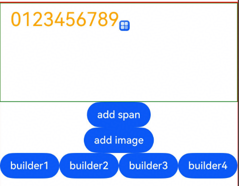

### Example 10: Using and Managing BuilderSpan in a Component
This example demonstrates how to add a custom layout span using the [addBuilderSpan](#addbuilderspan11) API. APIs, such as [getSpans](#getspans) and [onWillChange](#onwillchange12), do not return the internal information of **BuilderSpan**. You need to manage the **BuilderSpan** state and update it when the component content changes.

```ts
const TAG = 'BuilderSpanDemo';

class BuilderObject {
  content: string
  imageUri?: string
  type: string
  id?: string

  constructor(content: string, type: string, imageUri?: string, id?: string) {
    this.content = content;
    this.imageUri = imageUri;
    this.type = type;
    this.id = id;
  }
}

@Entry
@Component
struct Index {
  controller: RichEditorController = new RichEditorController();
  option: RichEditorOptions = { controller: this.controller }
  @State content: string = "";
  @State start: number = 0;
  @State end: number = 0;
  private customBuilder: CustomBuilder = undefined;
  private builderArray: BuilderObject[] = [];
  private indicesToRemove: number[] = [];
  private builderId: number = 0;

  @Builder
  imageTextBuilder(builder: BuilderObject) {
    Row({ space: 2 }) {
      Image($r(builder.imageUri)).width(24).height(24).margin({ left: -5 })
      Text(builder.content).fontSize(10)
    }.width(110).height(50).padding(5)
  }

  @Builder
  chipBuilder(builder: BuilderObject) {
    Row() {
      Text(builder.content)
        .fontSize(14)
        .fontColor(Color.Black)
        .fontFamily('HarmonyHeiTi')
        .margin({ right: 4 })

      SymbolGlyph($r('sys.symbol.xmark'))
        .width(16)
        .height(16)
        .id(builder.id)
        .onClick((event: ClickEvent) => {
          this.deleteChipBuilder(event.target.id);
        })
    }
    .width('auto')
    .height(28)
    .backgroundColor(Color.Gray)
    .borderRadius(10)
    .padding({
      top: 4,
      bottom: 4,
      left: 12,
      right: 12
    })
  }

  private deleteChipBuilder(builderId?: string) {
    if (builderId == null || builderId == "") {
      console.info(TAG, "delete chipBuilder error");
      return
    }
    let deleteRange: number[] = this.getTargetBuilderSpanRange(builderId);
    if (deleteRange.length == 0) {
      console.error(TAG, "getTargetBuilderSpanRange failed" + builderId);
      return
    }
    this.builderArray = this.builderArray.filter(item => item.id !== builderId);
    this.controller.deleteSpans({ start: deleteRange[0], end: deleteRange[1] });
    console.info(TAG, `deleteChipBuilder start = ${deleteRange[0]}, end = ${deleteRange[1]}`);
    console.info(TAG, `deleteChipBuilder builderArray + ${this.builderArray.length}`);
  }

  private getTargetBuilderSpanRange(builderId: string): number[] {
    let allSpans = this.controller.getSpans();
    let result: number[] = [];
    let chipBuilderIndex = 0;
    for (let spanIndex = 0; spanIndex < allSpans.length; spanIndex++) {
      if (!this.isBuilderSpanResult(allSpans[spanIndex])) {
        continue;
      }
      if (this.builderArray.length <= chipBuilderIndex) {
        break;
      }
      if (this.builderArray[chipBuilderIndex].id === builderId) {
        result = allSpans[spanIndex].spanPosition.spanRange;
        break;
      }
      chipBuilderIndex++;
    }
    return result;
  }

  private isTextSpanResult(item: RichEditorImageSpanResult | RichEditorTextSpanResult): boolean {
    return typeof (item as RichEditorImageSpanResult)['imageStyle'] == 'undefined';
  }

  private isBuilderSpanResult(item: RichEditorImageSpanResult | RichEditorTextSpanResult): boolean {
    return typeof (item as RichEditorImageSpanResult)['imageStyle'] != 'undefined'
      && ((item as RichEditorImageSpanResult).valueResourceStr == " "
      || (item as RichEditorImageSpanResult).valueResourceStr == "");
  }

  build() {
    Column() {
      Scroll() {
        Column() {
          Text("Builder Info:").width("100%")
          Text() {
            Span(this.content)
          }.width("100%")
        }
      }
      .borderWidth(1)
      .borderColor(Color.Red)
      .width("100%")
      .height("20%")

      // Record their relative sequence and information when adding builders.
      // Spans with valueResourceStr equal to " " or "" returned by the getSpans API are BuilderSpans. These builders are returned in sequence.
      // Restore the builder information during queries based on the preceding two points.
      Button("addImageTextBuilder")
        .onClick(() => {
          let insertOffset = this.controller.getCaretOffset();
          // Replace 'app.media.startIcon' with the image resource file you use.
          let builder = new BuilderObject('Custom PopUP ' + this.builderId, 'imageTextBuilder', 'app.media.startIcon');
          this.customBuilder = () => {
            this.imageTextBuilder(builder);
          }
          let addIndex = this.addBuilderByIndex(insertOffset);
          console.info(TAG, "add imageTextBuilder index = " + addIndex);
          this.builderArray.splice(addIndex, 0, builder);
          this.controller.addBuilderSpan(this.customBuilder, { offset: insertOffset });
          this.builderId++;
          console.info(TAG, "add imageTextBuilder success");
        })
      Button("addChipBuilder")
        .onClick(() => {
          let insertOffset = this.controller.getCaretOffset();
          let builder = new BuilderObject('Hello World ' + this.builderId, 'chipBuilder', '',
            'chipBuilder' + this.builderId);
          this.customBuilder = () => {
            this.chipBuilder(builder);
          }
          let addIndex = this.addBuilderByIndex(insertOffset);
          console.info(TAG, "add addChipBuilder index = " + addIndex);
          this.builderArray.splice(addIndex, 0, builder);
          this.controller.addBuilderSpan(this.customBuilder, { offset: insertOffset });
          this.builderId++;
          console.info(TAG, "add chipBuilder success");
        })

      Row() {
        Button("getSpans").onClick(() => {
          console.info(TAG, "getSpans = " + JSON.stringify(this.controller.getSpans()));
          this.content = "";
          let allSpans = this.controller.getSpans();
          let builderSpanIndex = 0;
          allSpans.forEach(item => {
            if (this.isTextSpanResult(item)) {
              console.info(TAG, "text span value: " + (item as RichEditorTextSpanResult).value);
            } else if (this.isBuilderSpanResult(item)) {
              let builderOrder = "This is builderSpan " + builderSpanIndex + ":"
              console.info(TAG, builderOrder);
              this.content += builderOrder + "\n";
              let builderResult = (item as RichEditorImageSpanResult);
              let builderIndex = "index: " + builderResult.spanPosition.spanIndex
                + ", range: " + builderResult.spanPosition.spanRange[0] + ", "
                + builderResult.spanPosition.spanRange[1];
              console.info(TAG, builderIndex);
              this.content += builderIndex + "\n";
              if (builderSpanIndex >= this.builderArray.length) {
                console.error(TAG, "getSpans error,  builderSpanIndex = " + builderSpanIndex
                  + ", builderArray.length = " + this.builderArray.length);
                return;
              }
              let builderInfo = "content: " + this.builderArray[builderSpanIndex].content
                + ", image uri: " + this.builderArray[builderSpanIndex].imageUri
                + ", id: " + this.builderArray[builderSpanIndex].id + "\n\n";
              console.info(TAG, builderInfo);
              this.content += builderInfo;
              builderSpanIndex++;
            } else {
              let imageResult = (item as RichEditorImageSpanResult);
              console.info(TAG, "image span " + imageResult.valueResourceStr + ", index: " +
              imageResult.spanPosition.spanIndex + ", range: " +
              imageResult.offsetInSpan[0] + ", " + imageResult.offsetInSpan[1] + ", size: " +
              imageResult.imageStyle.size[0] + ", " + imageResult.imageStyle.size[1]);
            }
          })
        })
        Button("deleteSelectedSpans")
          .onClick(() => {
            this.start = this.controller.getSelection().selection[0];
            this.end = this.controller.getSelection().selection[1];
            if (this.start == this.end) {
              return;
            }
            let allSpans = this.controller.getSpans();
            let needRemoveIndex = 0;
            for (let i = 0; i < allSpans.length; i++) {
              if (!this.isBuilderSpanResult(allSpans[i])) {
                continue;
              }
              let builderIndex = (allSpans[i] as RichEditorImageSpanResult).spanPosition.spanRange[0];
              if (builderIndex < this.start || builderIndex >= this.end) {
                needRemoveIndex++;
                continue;
              }
              this.indicesToRemove.push(needRemoveIndex);
              needRemoveIndex++;
            }
            console.info(TAG, "deleteSpans indicesToRemove = " + this.indicesToRemove.toString());
            this.deleteBuilderByIndices();
            console.info(TAG, "deleteSpans builderArray = " + this.builderArray.length);
            this.controller.deleteSpans({ start: this.start, end: this.end });
          })
      }
      .borderWidth(1)
      .borderColor(Color.Red)
      .width("100%")
      .height("5%")

      Column() {
        RichEditor(this.option)
          .onReady(() => {
            this.controller.addTextSpan("0123456789",
              {
                style:
                {
                  fontColor: Color.Orange,
                  fontSize: 30
                }
              });
          })
          .aboutToDelete((value: RichEditorDeleteValue) => {
            console.info(TAG, "aboutToDelete = " + JSON.stringify(value));
            let isBuilderAboutToDelete = this.isBuilderAboutToDelete(value);
            console.info(TAG, "aboutToDelete isBuilderAboutToDelete = " + isBuilderAboutToDelete);
            this.getIndicesToRemove(value, isBuilderAboutToDelete);
            console.info(TAG, "indicesToRemove = " + this.indicesToRemove.toString());
            this.deleteBuilderByIndices();
            console.info(TAG, "builderArray = " + this.builderArray.length);
            return true;
          })
          .borderWidth(1)
          .borderColor(Color.Green)
          .width("100%")
          .height("30%")
      }
      .margin({ top: 60 })
      .borderWidth(1)
      .borderColor(Color.Red)
      .width("100%")
      .height("70%")
    }
  }

  private isBuilderAboutToDelete(value: RichEditorDeleteValue): boolean {
    let flag = false;
    for (let i = 0; i < value.richEditorDeleteSpans.length; i++) {
      if (this.isBuilderSpanResult(value.richEditorDeleteSpans[i])) {
        flag = true;
        break;
      }
    }
    return flag;
  }

  private getIndicesToRemove(value: RichEditorDeleteValue, isBuilderAboutToDelete: boolean): void {
    if (!isBuilderAboutToDelete) {
      return
    }
    let allSpans = this.controller.getSpans();
    for (let i = 0; i < value.richEditorDeleteSpans.length; i++) {
      let needRemoveIndex = 0;
      let item = value.richEditorDeleteSpans[i];
      if (!this.isBuilderSpanResult(item)) {
        continue;
      }
      let aboutToDeleteBuilderIndex = (item as RichEditorImageSpanResult).spanPosition.spanIndex
      for (let j = 0; j < allSpans.length; j++) {
        if (!this.isBuilderSpanResult(allSpans[j])) {
          continue;
        }
        let builderIndex = (allSpans[j] as RichEditorImageSpanResult).spanPosition.spanIndex
        if (builderIndex == aboutToDeleteBuilderIndex) {
          this.indicesToRemove.push(needRemoveIndex);
          break;
        }
        needRemoveIndex++;
      }
    }
  }

  private deleteBuilderByIndices(): void {
    let indicesSet: Set<number> = new Set(this.indicesToRemove);
    let newLength = 0;
    for (let i = 0; i < this.builderArray.length; i++) {
      if (!indicesSet.has(i)) {
        this.builderArray[newLength] = this.builderArray[i];
        newLength++;
      }
    }
    this.builderArray.length = newLength;
    this.indicesToRemove.length = 0;
  }

  private addBuilderByIndex(insertOffset: number): number {
    if (insertOffset == 0 || this.builderArray.length == 0) {
      return 0;
    }
    let allSpans = this.controller.getSpans();
    let addIndex = 0;
    for (let i = 0; i < allSpans.length; i++) {
      if (!this.isBuilderSpanResult(allSpans[i])) {
        continue;
      }
      let builderIndex = (allSpans[i] as RichEditorImageSpanResult).spanPosition.spanRange[0];
      if (builderIndex < insertOffset) {
        addIndex++;
        continue;
      }
      break;
    }
    return addIndex;
  }
}
```


### Example 11: Configuring Text Recognition
This example demonstrates how to enable text recognition by setting [enableDataDetector](#enabledatadetector11) to **true** and configuring text recognition settings using the [dataDetectorConfig](#datadetectorconfig11) API.

```ts
@Entry
@Component
struct TextExample7 {
  controller: RichEditorController = new RichEditorController();
  options: RichEditorOptions = { controller: this.controller };
  @State phoneNumber: string = '(86) (755) ********';
  @State url: string = 'www.********.com';
  @State email: string = '***@example.com';
  @State address: string = 'XX (province) XX (city) XX (district) XXXX';
  @State enableDataDetector: boolean = true;
  @State types: TextDataDetectorType[] = [];

  build() {
    Row() {
      Column() {
        RichEditor(this.options)
          .onReady(() => {
            this.controller.addTextSpan('Phone number:' + this.phoneNumber + '\n',
              {
                style:
                {
                  fontSize: 30
                }
              });
            this.controller.addTextSpan('URL:' + this.url + '\n',
              {
                style:
                {
                  fontSize: 30
                }
              });
            this.controller.addTextSpan('Email:' + this.email + '\n',
              {
                style:
                {
                  fontSize: 30
                }
              });
            this.controller.addTextSpan('Address:' + this.address,
              {
                style:
                {
                  fontSize: 30
                }
              });
          })
          .copyOptions(CopyOptions.InApp)
          // Enable the special text entity recognition feature.
          .enableDataDetector(this.enableDataDetector)
          // Configure the text recognition type and the callback for updating the identification result.
          .dataDetectorConfig({types : this.types, onDetectResultUpdate: (result: string)=>{}})
          .borderWidth(1)
          .padding(10)
          .width('100%')
      }
      .width('100%')
    }
  }
}
```
### Example 12: Setting Caret, Handle, and Highlight Colors
This example shows how to set the caret and handle colors using the [caretColor](#caretcolor12) attribute and the background color of the selected text using the [selectedBackgroundColor](#selectedbackgroundcolor12) attribute.

``` ts
@Entry
@Component
struct RichEditorDemo {
  @State color: Color = Color.Black;
  controller: RichEditorController = new RichEditorController();

  build() {
    Column() {
      Row() {
        Button("Change to Red").onClick(() => {
          this.color = Color.Red;
        })
      }.margin({ top: 50 })

      RichEditor({ controller: this.controller })
        .onReady(() => {
          this.controller.addTextSpan('Set the caret and selected background colors through the caretColor and selectedBackgroundColor attributes.');
        })
        .width("100%")
        .border({ width: 1, radius: 5 })
        .key('RichEditor')
        .caretColor(this.color) // Caret color.
        .selectedBackgroundColor(this.color) // Background color of the selected content.
        .margin({ top: 50 })
    }
    .width('100%')
  }
}
```
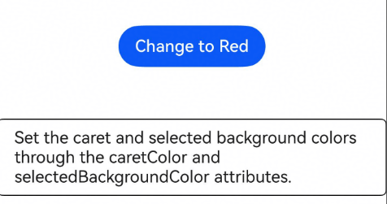

### Example 13: Setting Line Height and Letter Spacing
This example demonstrates how to configure text line height ([lineHeight](#richeditortextstyle)) and letter spacing ([letterSpacing](#richeditortextstyle)) using the [updateSpanStyle](#updatespanstyle) API.

```ts
@Entry
@Component
struct RichEditorDemo03 {
  controller: RichEditorController = new RichEditorController();
  options: RichEditorOptions = { controller: this.controller };
  @State start: number = -1;
  @State end: number = -1;
  @State lineHeight:number = 50;
  @State letterSpacing:number = 20;

  build() {
    Column() {
      Scroll() {
        Column() {
          Row() {
            Button("Line Height ++").onClick(()=>{
              this.lineHeight = this.lineHeight + 5;
              this.controller.updateSpanStyle({
                start: this.start,
                end: this.end,
                textStyle:
                {
                  lineHeight: this.lineHeight
                }
              });
            })
            Button("Line Height --").onClick(()=>{
              this.lineHeight = this.lineHeight - 5;
              this.controller.updateSpanStyle({
                start: this.start,
                end: this.end,
                textStyle:
                {
                  lineHeight: this.lineHeight
                }
              });
            })
            Button("Letter Spacing ++").onClick(()=>{
              this.letterSpacing = this.letterSpacing + 5
              this.controller.updateSpanStyle({
                start: this.start,
                end: this.end,
                textStyle:
                {
                  letterSpacing: this.letterSpacing
                }
              });
            })
            Button("Letter Spacing --").onClick(()=>{
              this.letterSpacing = this.letterSpacing - 5
              this.controller.updateSpanStyle({
                start: this.start,
                end: this.end,
                textStyle:
                {
                  letterSpacing: this.letterSpacing
                }
              });
            })
          }
        }
      }.borderWidth(1)
      .borderColor(Color.Red)
      .width("100%")
      .height("20%")
      .margin({top: 20})

      Scroll() {
        Column() {
          Text("LineHeight:" + this.lineHeight).width("100%")
          Text("LetterSpacing:" + this.letterSpacing).width("100%")
        }
      }
      .borderWidth(1)
      .borderColor(Color.Red)
      .width("100%")
      .height("20%")
      .margin({bottom: 20})

      Column() {
        RichEditor(this.options).clip(true).padding(10)
          .onReady(() => {
            this.controller.addTextSpan("012345",
              {
                style:
                {
                  fontColor: Color.Orange,
                  fontSize: 30,
                  lineHeight: this.lineHeight,
                  letterSpacing: this.letterSpacing
                }
              });
            this.controller.addTextSpan("6789",
              {
                style:
                {
                  fontColor: Color.Black,
                  fontSize: 30,
                  lineHeight: this.lineHeight,
                  letterSpacing: this.letterSpacing
                }
              });
          })
          .borderWidth(1)
          .borderColor(Color.Green)
          .width(400)
          .height(400)
      }
      .borderWidth(1)
      .borderColor(Color.Red)
      .width("100%")
      .height("60%")
    }
  }
}
```
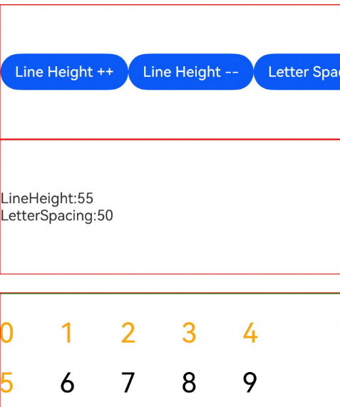

### Example 14: Adding a Custom Paste Event
This example shows how to add a custom paste event to the component using the [onPaste](#onpaste11) event and customize user paste behavior using the [PasteEvent](#pasteevent11) API.

```ts
@Entry
@Component
struct RichEditorDemo {
  controller: RichEditorController = new RichEditorController();
  options: RichEditorOptions = { controller: this.controller };

  build() {
    Column({ space: 2 }) {
      RichEditor(this.options)
        .onReady(() => {
          this.controller.addTextSpan('RichEditor preventDefault');
        })
        // Customize the paste event to prevent the default paste behavior.
        .onPaste((event?: PasteEvent) => {
          if (event != undefined && event.preventDefault) {
            // Prevent the default paste operation.
            event.preventDefault();
          }
        })
        .borderWidth(1)
        .borderColor(Color.Green)
        .width('100%')
        .height('40%')
    }
  }
}
```
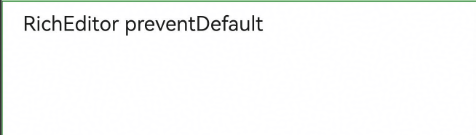

### Example 15: Setting Text Feature Effects
This example shows how to set the text feature effect ([fontFeature](#richeditortextstyle)) using the [addTextSpan](#addtextspan) API. This example sets the **FontFeature** attribute to **ss01**, which changes the digit "0" from its original oval shape to a shape with rounded corners. In addition, you can use the **strokeJoinStyle** API of [RichEditorTextStyle](#richeditortextstyle) to set the text stroke join style.

Since API version 26.0.0, the **strokeJoinStyle** API is added to [RichEditorTextStyle](#richeditortextstyle).

```ts
@Entry
@Component
struct RichEditorExample {
  controller: RichEditorController = new RichEditorController();
  options: RichEditorOptions = { controller: this.controller };
  @State enableDataDetector: boolean = true;
  @State types: TextDataDetectorType[] = [];
  build() {
    Row() {
      Column() {
        RichEditor(this.options)
          .onReady(() => {
            this.controller.addTextSpan('This is ss01 off :' + '0000' + '\n',
              {
                style:
                {
                  fontSize: 30
                }
              });
            this.controller.addTextSpan('This is ss01 on :' + '0000' + '\n',
              {
                style:
                {
                  fontSize: 30,
                  fontFeature: "\"ss01\" 1",
                  strokeJoinStyle: StrokeJoinStyle.MITER_JOIN
                }
              });
          })
          .copyOptions(CopyOptions.InApp)
          .enableDataDetector(this.enableDataDetector)
          .dataDetectorConfig({types : this.types, onDetectResultUpdate: (result: string)=>{}})
          .borderWidth(1)
          .padding(10)
          .width('100%')
      }
      .width('100%')
      .margin({top:150})
    }
  }
}
```


### Example 16: Setting Custom Keyboard Avoidance
This example shows how to bind a custom keyboard using the [customKeyboard](#customkeyboard) attribute and configure whether the custom keyboard supports keyboard avoidance using the [KeyboardOptions](#keyboardoptions12) parameter.

```ts
@Entry
@Component
struct RichEditorExample {
  controller: RichEditorController = new RichEditorController();
  @State keyboardHeight: string | number = '80%';

  @State supportAvoidance: boolean = true;

  // Create a custom keyboard component.
  @Builder
  CustomKeyboardBuilder() {
    Column() {
      Row() {
        Button('Add Stickers').onClick(() => {
          this.controller.addTextSpan("\uD83D\uDE0A",
            {
              style:
              {
                fontColor: Color.Orange
              }
            });
        })
      }

      Grid() {
        ForEach(['1', '2', '3', '4', '5', '6', '7', '8', '9', '*', '0', '#'], (item: string) => {
          GridItem() {
            Button(item).width(110).onClick(() => {
              this.controller.addTextSpan(item, {
                offset: this.controller.getCaretOffset(),
                style:
                {
                  fontColor: Color.Orange,
                  fontSize: 30
                }
              });
              this.controller.setCaretOffset(this.controller.getCaretOffset() + item.toString().length);
            })
          }
        })
      }.maxCount(3).columnsGap(10).rowsGap(10).padding(5)
    }.backgroundColor(Color.Gray)
  }

  build() {
    Column() {
      Row() {
        Button("20%")
          .fontSize(24)
          .onClick(() => {
            this.keyboardHeight = "20%";
          })
        Button("80%")
          .fontSize(24)
          .margin({ left: 20 })
          .onClick(() => {
            this.keyboardHeight = "80%";
          })
      }
      .justifyContent(FlexAlign.Center)
      .alignItems(VerticalAlign.Bottom)
      .height(this.keyboardHeight)
      .width("100%")
      .padding({ bottom: 50 })

      RichEditor({ controller: this.controller }) // Bind the custom keyboard.
        .customKeyboard(this.CustomKeyboardBuilder(), { supportAvoidance: this.supportAvoidance })
        .margin(10)
        .border({ width: 1 })
        .borderWidth(1)
        .borderColor(Color.Red)
        .width("100%")
    }
  }
}
```


### Example 17: Viewing the Editing State
This example demonstrates how to obtain the current editing state of the rich text using the [isEditing](#isediting12) API. The [onEditingChange](#oneditingchange12) event can be added to the component to log whether the component is currently in editing mode.

```ts
@Entry
@Component
struct RichEditorOnEditingChange {
  controller: RichEditorController = new RichEditorController();
  @State controllerIsEditing: boolean = false;

  build() {
    Column() {
      Row() {
        Button("View isEditing() Value:").onClick(() => {
          // Obtain the editing status of the rich text.
          this.controllerIsEditing = this.controller.isEditing();
        })
          .padding(5)
        Text('' + this.controllerIsEditing)
          .width('100%')
          .padding(5)
          .fontColor(Color.Orange)
          .fontSize(20)
      }
      RichEditor({ controller: this.controller })
        .onEditingChange((isEditing: boolean) => {
          console.info("Current Editing Status:" + isEditing);
        })
        .height(400)
        .borderWidth(1)
        .borderColor(Color.Red)
        .width("100%")
    }
  }
}
```


### Example 18: Configuring Text Change Callback
This example shows how to add the [onWillChange](#onwillchange12) event to the component, which triggers a callback before the component performs any insert or delete operations.

```ts
@Entry
@Component
struct RichEditorExample {
  controller: RichEditorController = new RichEditorController();
  scroll: Scroller = new Scroller();
  @State logContent: string = '';

  build() {
    Column() {
      Scroll(this.scroll) {
        Text(this.logContent).fontSize(15)
      }
      .height(300)
      .scrollable(ScrollDirection.FREE)
      .border({ color: Color.Red, width: 1 })

      RichEditor({ controller: this.controller })
        .height(50)
        .borderWidth(1)
        .borderColor(Color.Red)
        .width("100%")
        .onReady(() => {
          this.controller.addTextSpan('TestWord', { style: { fontColor: Color.Orange, fontSize: 30 } });
          this.controller.updateSpanStyle({
            start: -1,
            end: -1,
            textStyle:
            {
              fontWeight: FontWeight.Bolder
            }
          });
        })
        .onWillChange((value: RichEditorChangeValue) => {
          this.logContent += '\nTest log: onWillChange';
          this.logContent += '\n  rangeBefore: ' + JSON.stringify(value.rangeBefore);
          this.logContent += '\n  print replacedSpans';
          value.replacedSpans.forEach((item: RichEditorTextSpanResult, index: number) => {
            this.logContent += '\n    spanPosition:' + JSON.stringify(item.spanPosition);
            this.logContent += '\n    value:' + item.value;
            this.logContent += '\n    textStyle:' + JSON.stringify(item.textStyle);
            this.logContent += '\n    offsetInSpan:' + item.offsetInSpan;
            this.logContent += '\n    valueResource:' + item.valueResource;
            this.logContent += '\n    paragraphStyle:' + JSON.stringify(item.paragraphStyle);
          });
          this.logContent += '\n  print replacedImageSpans';
          value.replacedImageSpans.forEach((item: RichEditorImageSpanResult) => {
            this.logContent += '\n    spanPosition:' + JSON.stringify(item.spanPosition);
            this.logContent += '\n    valuePixelMap:' + JSON.stringify(item.valuePixelMap);
            this.logContent += '\n    valueResourceStr:' + item.valueResourceStr;
            this.logContent += '\n    imageStyle:' + JSON.stringify(item.imageStyle);
            this.logContent += '\n    offsetInSpan:' + item.offsetInSpan;
          });
          this.logContent += '\n  print replacedSymbolSpans';
          value.replacedSymbolSpans.forEach((item: RichEditorTextSpanResult) => {
            this.logContent += '\n    spanPosition:' + JSON.stringify(item.spanPosition);
            this.logContent += '\n    value:' + item.value;
            this.logContent += '\n    offsetInSpan:' + item.offsetInSpan;
            this.logContent += '\n    symbolSpanStyle:' + JSON.stringify(item.symbolSpanStyle);
            this.logContent += '\n    valueResource:' + item.valueResource;
            this.logContent += '\n    paragraphStyle:' + JSON.stringify(item.paragraphStyle);
          });
          this.logContent += '\n  ===========================================';
          return true;
        })
        .onDidChange((rangeBefore: TextRange, rangeAfter: TextRange) => {
          this.logContent += '\nTest log: onDidChange';
          this.logContent += '\n  rangeBefore: ' + JSON.stringify(rangeBefore);
          this.logContent += '\n  rangeAfter: ' + JSON.stringify(rangeAfter);
          this.logContent += '\n  ===========================================';
          setTimeout(() => {
            this.scroll.scrollEdge(Edge.Bottom);
          }, 100);
        })
        .onCut((event: CutEvent) => {
          event.preventDefault?.();
          console.info('Test log: onCut');
        })
        .onCopy((event: CopyEvent) => {
          event.preventDefault!();
          console.info('Test log: onCopy');
        })
        .onPaste(() => {
          console.info('Test log: onPaste');
        })

      Text('Test text Hello')
        .lineHeight(50)
        .fontSize(24)
        .draggable(true)
        .onDragStart(() => {
        })
      TextInput({ text: 'Test text NiHao' })
        .draggable(true)
        .margin(20)
    }
  }
}
```


### Example 19: Configuring the Enter Key Feature of the Input Method
This example demonstrates how to set the Enter key type of the soft keyboard using the [enterKeyType](#enterkeytype12) attribute.

```ts
@Entry
@Component
struct SoftKeyboardEnterTypeExample {
  controller: RichEditorController = new RichEditorController();

    build() {
    Column() {
      Button("Stop Editing").onClick(()=>{
        this.controller.stopEditing();
      })
      RichEditor({ controller: this.controller })
        .margin(10)
        .border({ width: 1 })
        .height(200)
        .borderWidth(1)
        .borderColor(Color.Red)
        .width("100%")
        .enterKeyType(EnterKeyType.Search)
        .onSubmit((enterKey: EnterKeyType, event: SubmitEvent) => {
          console.info("trigger richeditor onsubmit" + enterKey);
          this.controller.addTextSpan(" type["+ enterKey +"] triggered");
          event.keepEditableState();
        })
    }.height("100%").justifyContent(FlexAlign.Center)
  }
}
```

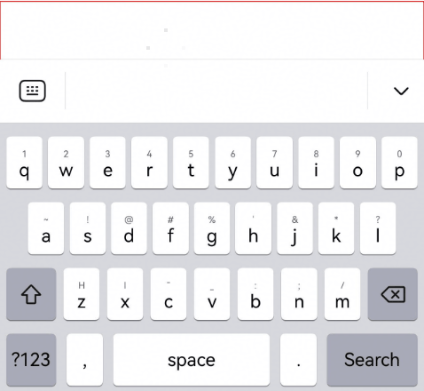

### Example 20: Setting the Paragraph Line Break Rule
This example shows how to set the line break rule ([lineBreakStrategy](#richeditorparagraphstyle11)) using the [updateParagraphStyle](#updateparagraphstyle11) API and obtain the current line break rule using the [getParagraphs](#getparagraphs11) API.

```ts
@Entry
@Component
struct LineBreakStrategyExample {
  controller: RichEditorController = new RichEditorController();
  private spanParagraphs: RichEditorParagraphResult[] = [];
  @State lineBreakOptionStr: string[] = ['GREEDY', 'HIGH_QUALITY', 'BALANCED'];
  @State attributeValue: string = "";
  @State testStr: string = "0123456789,0123456789,0123456789,0123456789,0123456789.";
  build() {
    Column() {
      RichEditor({ controller: this.controller })
        .onReady(() => {
          this.controller.addTextSpan(this.testStr, {
            style: {
              fontColor: Color.Black,
              fontSize: "32"
            },
            paragraphStyle: {
              textAlign: TextAlign.Start,
              lineBreakStrategy: LineBreakStrategy.GREEDY
            }
          })
        })
        .width(400)
        .height(300)
        .margin({bottom:20})
        .draggable(false)
      Column() {
        Text('linebreak value: ' + this.attributeValue).fontSize(20).fontColor(Color.Black)
      }.margin({bottom: 10})
      Column({ space: 10 }) {
        Button("Set LineBreakStrategy to GREEDY").onClick(() => {
          this.controller.updateParagraphStyle({ start: -1, end: -1,
            style: {
              lineBreakStrategy: LineBreakStrategy.GREEDY
            }
          });
        })
        Button("Set LineBreakStrategy to HIGH_QUALITY").onClick(() => {
          this.controller.updateParagraphStyle({ start: -1, end: -1,
            style: {
              lineBreakStrategy: LineBreakStrategy.HIGH_QUALITY
            }
          });
        })
        Button("Set LineBreakStrategy to BALANCED").onClick(() => {
          this.controller.updateParagraphStyle({ start: -1, end: -1,
            style: {
              lineBreakStrategy: LineBreakStrategy.BALANCED
            }
          });
        })
        Divider()
        Row() {
          Button("Get LineBreakStrategy Value").onClick(() => {
            this.spanParagraphs = this.controller.getParagraphs({ start: -1, end: -1 });
            console.info("RichEditor getParagraphs:" + JSON.stringify(this.spanParagraphs));
            this.spanParagraphs.forEach(item => {
              if (typeof(item as RichEditorParagraphResult)['style'] != 'undefined') {
                this.attributeValue = "";
                console.info('lineBreakStrategy:'+ JSON.stringify((item as RichEditorParagraphResult)['style']));
                this.attributeValue += this.lineBreakOptionStr[Number((item as RichEditorParagraphResult)['style'].lineBreakStrategy)];
              }
            });
          })
        }
      }
    }
  }
}
```


### Example 21: Using Basic Functionality of Styled Strings
This example demonstrates how to bind a [styled string](./ts-universal-styled-string.md) to a **RichEditor** component using the [setStyledString](#setstyledstring12) API in [RichEditorStyledStringController](#richeditorstyledstringcontroller12). This feature is available since API version 20. The [getStyledString](#getstyledstring12) API can be used to obtain the styled string displayed by the **RichEditor** component.

```ts
// xxx.ets
import { LengthMetrics } from '@kit.ArkUI'

@Entry
@Component
struct Index {
  @State selection: string = "";
  @State content: string = "";
  @State range: string = "";
  @State replaceString: string = "";
  @State rangeBefore: string = "";
  @State rangeAfter: string = "";
  richEditorStyledString: MutableStyledString = new MutableStyledString("");
  textStyle: TextStyle = new TextStyle({
    fontWeight: FontWeight.Lighter,
    fontFamily: 'HarmonyOS Sans',
    fontColor: Color.Green,
    fontSize: LengthMetrics.vp(30),
    fontStyle: FontStyle.Normal
  });
  blueTextStyle: TextStyle = new TextStyle({ fontColor: Color.Blue });
  orangeItalicTextStyle: TextStyle = new TextStyle({
    fontWeight: FontWeight.Bolder,
    fontFamily: 'Arial',
    fontColor: Color.Orange,
    fontSize: LengthMetrics.vp(30),
    fontStyle: FontStyle.Italic
  });

  secondaryController: RichEditorController = new RichEditorController();
  secondaryOptions: RichEditorOptions = { controller: this.secondaryController };
  // Create a styled string object.
  mutableStyledString: MutableStyledString = new MutableStyledString("Initial styled string",
    [{ start: 0, length: 5, styledKey: StyledStringKey.FONT, styledValue: this.blueTextStyle }]);
  styledString: StyledString = new StyledString("Styled string to insert",
    [{ start: 2, length: 4, styledKey: StyledStringKey.FONT, styledValue: this.orangeItalicTextStyle }]);
  controller: RichEditorStyledStringController = new RichEditorStyledStringController();
  options: RichEditorStyledStringOptions = {controller: this.controller};
  // Text content change callback
  contentChangedListener: StyledStringChangedListener = {
    onWillChange: (value: StyledStringChangeValue) => {
      this.range = '[ ' + value.range.start + ' , ' + value.range.end + ' ]';
      this.replaceString = value.replacementString.getString();
      return true;
    },
    onDidChange: (rangeBefore, rangeAfter) => {
      this.rangeBefore = '[ ' + rangeBefore.start + ' , ' + rangeBefore.end + ' ]';
      this.rangeAfter = '[ ' + rangeAfter.start + ' , ' + rangeAfter.end + ' ]';
    }
  }

  build() {
    Column({space:6}) {
      Column() {
        Text("Selection information")
          .fontSize(20)
          .width("100%")
        Text("selection range: " + this.selection).width("100%")
        Text("selection content: " + this.content).width("100%")
      }
      .width("100%")
      .height("10%")

      Column() {
        Text("onWillChange callback")
          .fontSize(20)
          .width("100%")
        Text("range: " + this.range).width("100%")
        Text("replacementString: " + this.replaceString).width("100%")
        Text("onWillChange callback")
          .fontSize(20)
          .width("100%")
        Text("rangeBefore: " + this.rangeBefore).width("100%")
        Text("rangeAfter: " + this.rangeAfter).width("100%")
      }
      .borderWidth(1)
      .borderColor(Color.Black)
      .width("100%")
      .height("20%")

      RichEditor(this.options)
        .onReady(() => {
          // Register a text change callback.
          this.controller.onContentChanged(this.contentChangedListener);
          // Set the styled string displayed in the component.
          this.controller.setStyledString(this.mutableStyledString);
        })
        .height("20%")
        .width("100%")

      RichEditor(this.secondaryOptions)
        .onReady(() => {
        this.secondaryController.addTextSpan("Convert the text into a styled string.");
      })
        .height("10%")
        .width("100%")
        .borderWidth(1)
        .borderColor(Color.Black)

        Row({space:2}) {
          Button("Insert Image")
            .stateEffect(true)
            .onClick(() => {
              // Replace $r('app.media.startIcon') with the image resource file you use.
              let imageStyledString = new MutableStyledString(new ImageAttachment({
                resourceValue: $r('app.media.startIcon'),
                size: { width: 50, height: 50 },
                layoutStyle: { borderRadius: LengthMetrics.vp(10) },
                verticalAlign: ImageSpanAlignment.BASELINE,
                objectFit: ImageFit.Contain,
                syncLoad: true
              }));
              // Obtain the styled string displayed in the component.
              this.richEditorStyledString = this.controller.getStyledString();
              this.richEditorStyledString.appendStyledString(imageStyledString);
              // Apply the styled string after the image is inserted to the component.
              this.controller.setStyledString(this.richEditorStyledString);
              this.controller.setCaretOffset(this.richEditorStyledString.length);
          })
          Button("Insert Text").onClick(() => {
            // Obtain the styled string displayed in the component.
            this.richEditorStyledString = this.controller.getStyledString();
            this.richEditorStyledString.appendStyledString(this.styledString);
            // Apply the styled string after the text is inserted to the component.
            this.controller.setStyledString(this.richEditorStyledString);
            this.controller.setCaretOffset(this.richEditorStyledString.length);
          })
          Button("Delete Selection").onClick(() => {
            // Obtain the selection range.
            let richEditorSelection = this.controller.getSelection();
            let start = richEditorSelection.start ? richEditorSelection.start : 0;
            let end = richEditorSelection.end ? richEditorSelection.end : 0;
            if (start < 0 || end <= start) {
              return;
            }
            // Obtain the styled string displayed in the component.
            this.richEditorStyledString = this.controller.getStyledString();
            this.richEditorStyledString.removeString(start, end - start);
            // Apply the styled string after the content is deleted to the component.
            this.controller.setStyledString(this.richEditorStyledString);
          })
        }
        Row({space:2}) {
          Button("Get Selection").onClick(() => {
            // Obtain the selection range.
            let richEditorSelection = this.controller.getSelection();
            let start = richEditorSelection.start ? richEditorSelection.start : 0;
            let end = richEditorSelection.end ? richEditorSelection.end : 0;
            // Obtain the styled string displayed in the component.
            this.richEditorStyledString = this.controller.getStyledString();
            this.selection = '[ ' + start + ' , ' + end + ' ]';
            if (start == end) {
              this.content = "";
            } else {
              this.content = this.richEditorStyledString.subStyledString(start, end - start).getString();
            }
          })
          Button("Update Selection Style").onClick(() => {
            // Obtain the selection range.
            let richEditorSelection = this.controller.getSelection();
            let start = richEditorSelection.start ? richEditorSelection.start : 0;
            let end = richEditorSelection.end ? richEditorSelection.end : 0;
            if (start < 0 || end <= start) {
              return;
            }
            // Obtain the styled string displayed in the component.
            this.richEditorStyledString = this.controller.getStyledString();
            this.richEditorStyledString.setStyle({
              start: start,
              length: end - start,
              styledKey: StyledStringKey.FONT,
              styledValue: this.textStyle
            });
            // Apply the updated styled string to the component.
            this.controller.setStyledString(this.richEditorStyledString);
          });
        }
        Row({space:2}) {
          // Convert a styled string into a span.
          Button("Call fromStyledString").onClick(() => {
            this.secondaryController.addTextSpan("Call fromStyledString: " +JSON.stringify(this.secondaryController.fromStyledString(this.mutableStyledString)));
          })
          // Convert the component content within the given range to a styled string.
          Button("Call toStyledString").onClick(() => {
            this.controller.setStyledString(this.secondaryController.toStyledString({start:0,end:13}));
          })
        }
    }
  }
}
```

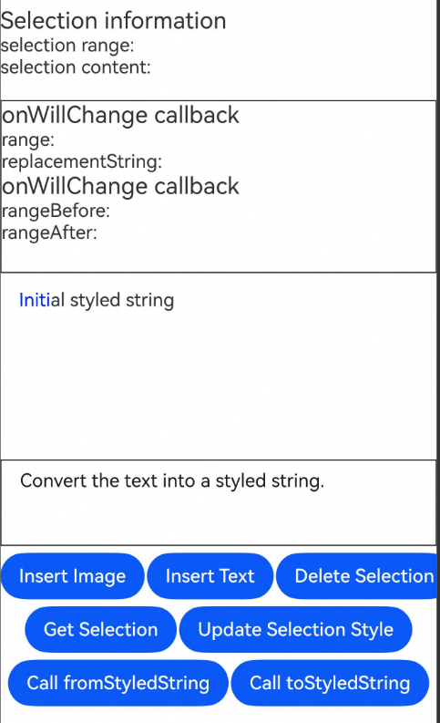

### Example 22: Obtaining Layout Information
This example shows how to obtain layout information using the [getLayoutManager](#getlayoutmanager12) API. It includes obtaining the total number of lines for the component content or [placeholder](#placeholder12) using [getLineCount](ts-text-common.md#getlinecount12), the glyph position closest to a given coordinate using [getGlyphPositionAtCoordinate](ts-text-common.md#getglyphpositionatcoordinate12), and line metrics, text style information, and font properties using [getLineMetrics](ts-text-common.md#getlinemetrics12).

```ts
@Entry
@Component
struct Index {
  @State lineCount: string = ""
  @State glyphPositionAtCoordinate: string = ""
  @State lineMetrics: string = ""
  controller: RichEditorController = new RichEditorController();
  @State textStr: string =
    'Hello World!'

  build() {
    Scroll() {
      Column() {
        Text('getLayoutManager obtains the layout information relative to the component')
          .fontSize(9)
          .fontColor(0xCCCCCC)
          .width('90%')
          .padding(10)
        RichEditor({ controller: this.controller })
          .borderColor(Color.Red)
          .borderWidth(1)
          .onReady(() => {
            this.controller.addTextSpan(this.textStr);
          })
          .onAreaChange(() => {
            let layoutManager = this.controller.getLayoutManager();
            this.lineCount = "LineCount: " + layoutManager.getLineCount();
          })

        Text('LineCount').fontSize(9).fontColor(0xCCCCCC).width('90%').padding(10)
        Text(this.lineCount)

        Text('GlyphPositionAtCoordinate').fontSize(9).fontColor(0xCCCCCC).width('90%').padding(10)
        Button("Relative Component Coordinate [150, 50]")
          .onClick(() => {
            let layoutManager: LayoutManager = this.controller.getLayoutManager();
            let position = layoutManager.getGlyphPositionAtCoordinate(150, 50);
            this.glyphPositionAtCoordinate =
            "Relative component coordinate [150, 50] glyphPositionAtCoordinate position: " + position.position + " affinity: " +
            position.affinity;
          })
          .margin({ bottom: 20, top: 10 })
        Text(this.glyphPositionAtCoordinate)

        Text('LineMetrics').fontSize(9).fontColor(0xCCCCCC).width('90%').padding(10)
        Button("Line Metrics")
          .onClick(() => {
            let layoutManager: LayoutManager = this.controller.getLayoutManager();
            let lineMetrics = layoutManager.getLineMetrics(0);
            this.lineMetrics = "lineMetrics is " + JSON.stringify(lineMetrics) + '\n\n';
            let runMetrics = lineMetrics.runMetrics;
            runMetrics.forEach((value, key) => {
              this.lineMetrics += "runMetrics key is " + key + " " + JSON.stringify(value) + "\n\n";
            });
          })
          .margin({ bottom: 20, top: 10 })
        Text(this.lineMetrics)
      }
      .margin({ top: 100, left: 8, right: 8 })
    }
  }
}
```

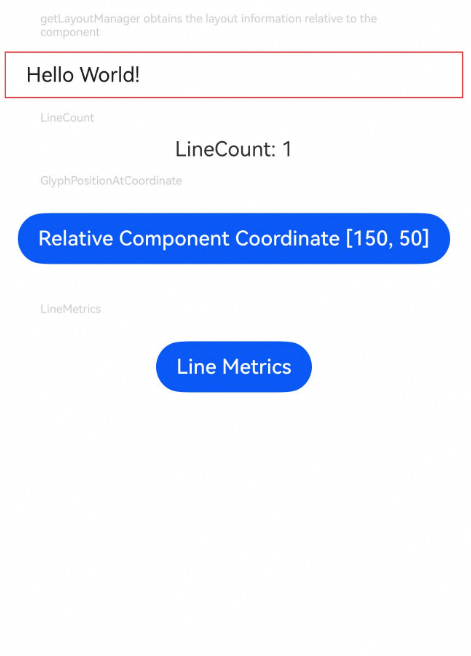

### Example 23: Configuring Extended Options for the System Default Menu
This example demonstrates how to configure extended options for the system default menu via the [editMenuOptions](#editmenuoptions12) attribute. You can customize the text labels, icons, and callback methods of menu extended options. This feature is available since API version 20.

```ts
// xxx.ets
@Entry
@Component
struct RichEditorExample {
  controller: RichEditorController = new RichEditorController();
  options: RichEditorOptions = { controller: this.controller };
  @State endIndex: number | undefined = 0;
  onCreateMenu = (menuItems: Array<TextMenuItem>) => {
    const idsToFilter: TextMenuItemId[] = [
      TextMenuItemId.TRANSLATE,
      TextMenuItemId.SHARE,
      TextMenuItemId.SEARCH,
      TextMenuItemId.AI_WRITER,
      // TextMenuItemId.autoFill is supported since API version 23.
      TextMenuItemId.autoFill
    ]
    const items = menuItems.filter(item => !idsToFilter.some(id => id.equals(item.id)));
    // Replace $r('app.media.startIcon') with the image resource file you use.
    let createMenuOption1: TextMenuItem = {
      content: 'create1',
      icon: $r('app.media.startIcon'),
      id: TextMenuItemId.of('create1'),
    };
    let item2: TextMenuItem = {
      content: 'create2',
      id: TextMenuItemId.of('create2'),
      icon: $r('app.media.startIcon'),
    };
    items.push(createMenuOption1);
    items.unshift(item2);
    return items;
  }
  onMenuItemClick = (menuItem: TextMenuItem, textRange: TextRange) => {
    if (menuItem.id.equals(TextMenuItemId.of("create2"))) {
      console.info("Intercept id: create2 start:" + textRange.start + "; end:" + textRange.end);
      return true;
    }
    if (menuItem.id.equals(TextMenuItemId.of("prepare1"))) {
      console.info("Intercept id: prepare1 start:" + textRange.start + "; end:" + textRange.end);
      return true;
    }
    if (menuItem.id.equals(TextMenuItemId.COPY)) {
      console.info("Intercept COPY start:" + textRange.start + "; end:" + textRange.end);
      return true;
    }
    if (menuItem.id.equals(TextMenuItemId.SELECT_ALL)) {
      console.info("Do not intercept SELECT_ALL start:" + textRange.start + "; end:" + textRange.end);
      return false;
    }
    return false;
  }
  // Replace $r('app.media.startIcon') with the image resource file you use.
  onPrepareMenu = (menuItems: Array<TextMenuItem>) => {
    let item1: TextMenuItem = {
      content: 'prepare1_' + this.endIndex,
      icon: $r('app.media.startIcon'),
      id: TextMenuItemId.of('prepare1'),
    };
    menuItems.unshift(item1);
    return menuItems;
  }
  @State editMenuOptions: EditMenuOptions = {
    onCreateMenu: this.onCreateMenu,
    onMenuItemClick: this.onMenuItemClick,
    onPrepareMenu: this.onPrepareMenu
  };

  build() {
    Column() {
      RichEditor(this.options)
        .onReady(() => {
          this.controller.addTextSpan("RichEditor editMenuOptions");
        })
        .editMenuOptions(this.editMenuOptions)
        .onSelectionChange((range: RichEditorRange) => {
          console.info("onSelectionChange, (" + range.start + "," + range.end + ")");
          this.endIndex = range.end
        })
        .height(50)
        .margin({ top: 100 })
        .borderWidth(1)
        .borderColor(Color.Red)
    }
    .width("90%")
    .margin("5%")
  }
}
```

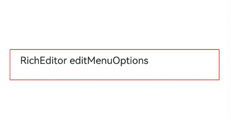

### Example 24: Setting Common Component Attributes
This example shows how to set common attributes for the component. This includes the following:<br>- Set the scrollbar display mode using [barState](#barstate13) (available since API version 18).<br> - Configure whether the soft keyboard is automatically displayed when the component gains focus via non‑click triggers, using [enableKeyboardOnFocus](#enablekeyboardonfocus12).<br> - Enable or disable haptic feedback for the component using [enableHapticFeedback](#enablehapticfeedback13).<br> - Obtain preview text information using [getPreviewText](#getpreviewtext12).<br> - Specify whether to prevent the back button press from being propagated to other components or apps, using [stopBackPress](#stopbackpress18).<br>
This example shows how to set the scrollbar color of the **RichEditor** component using the [scrollBarColor](#scrollbarcolor21) attribute, available since API version 21.

```ts
// xxx.ets
import { JSON } from '@kit.ArkTS';
import { ColorMetrics } from '@kit.ArkUI';

@Entry
@Component
struct RichEditorExample {
  controller: RichEditorController = new RichEditorController();
  options: RichEditorOptions = { controller: this.controller };

  secondaryController: RichEditorController = new RichEditorController();
  secondaryOptions: RichEditorOptions = { controller: this.secondaryController };

  @State isEnabled: boolean = true;
  @State barStateIndex: number = 0;
  @State barStates: (BarState | undefined)[] = [BarState.Auto, BarState.On, BarState.Off, undefined];
  @State barStateStrings: string[] = ["Auto", "On", "Off", "undefined"];

  build() {
    Column({space: 3}) {
      RichEditor(this.options)
        .onReady(() => {
          this.controller.addTextSpan('This text is for demonstration purposes. This text is for demonstration purposes. This text is for demonstration purposes. ', {
            style: {
              fontColor: Color.Black,
              fontSize: 20
            }
          });
        })
        .onDidIMEInput((value: TextRange) => {
          this.secondaryController.addTextSpan("\n" + "onDidIMEInput callback triggered. Input range: (" + value.start + "," + value.end + ")", {
            style: {
              fontColor: Color.Gray,
              fontSize: 10
            }
          });
        })
        .onSelectionChange((value: RichEditorRange) => {
          this.secondaryController.addTextSpan("\n" + "onSelectionChange callback triggered. Input range: (" + value.start + "," + value.end + ")", {
            style: {
              fontColor: Color.Gray,
              fontSize: 10
            }
          });
        })
        .width(300)
        .height(100)
        .margin(20)
        .barState(this.barStates[this.barStateIndex])
        .enableKeyboardOnFocus(this.isEnabled)
        .enableHapticFeedback(true)
        .stopBackPress(false)
        .scrollBarColor(ColorMetrics.resourceColor("#2787D9"));

      RichEditor(this.secondaryOptions).width(300)

      Button('Set barState to: ' + this.barStateStrings[this.barStateIndex])
        .height(30)
        .fontSize(13)
        .onClick(() => {
          this.barStateIndex++;
          if (this.barStateIndex > (this.barStates.length - 1)) {
            this.barStateIndex = 0;
          }
        })

      Button('Set enableKeyboardOnFocus to: ' + this.isEnabled)
        .height(30)
        .fontSize(13)
        .onClick(() => {
          this.isEnabled = !this.isEnabled;
        })

      Button('Get Preview Text')
        .height(30)
        .fontSize(13)
        .onClick(() => {
          this.secondaryController.addTextSpan("\nObtain the preview text: " + JSON.stringify(this.controller.getPreviewText()));
        })
    }
  }
}

```

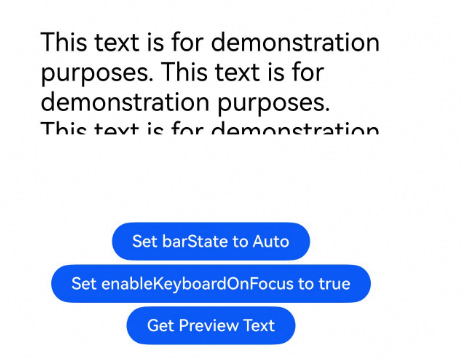

### Example 25: Obtaining the Caret's Relative Position Rectangle in the Component
This example shows how to obtain the caret's relative position rectangle in the component using the [getCaretRect](#getcaretrect18) method of **RichEditorBaseController**, available since API version 18.

```ts
// xxx.ets
@Entry
@Component
struct Index {
  controller: RichEditorController = new RichEditorController();
  options: RichEditorOptions = { controller: this.controller };
  @State caretRect: string = "not found";

  build() {
    Column() {
      Button('get caret rect')
        .onClick(() => {
          let rectCaret = this.controller.getCaretRect();
          if (rectCaret == undefined) {
            this.caretRect = 'undefined';
          } else {
            this.caretRect = 'X: ' + rectCaret.x + '\nY: ' + rectCaret.y
              + '\nWidth: ' + rectCaret.width + '\nHeight: ' + rectCaret.height;
          }
        })
        .fontSize(24)
        .width("60%")
        .height("10%")

      Text(this.caretRect)
        .margin(12)
        .fontSize(24)

      RichEditor(this.options)
        .onReady(() => {
          this.controller.addTextSpan('12345678901234567890', {
            style:
            {
              fontColor: Color.Orange,
              fontSize: 50
            }
          })
        })
        .borderWidth(1)
        .borderColor(Color.Red)
        .width("100%")
        .height("60%")
    }
  }
}

```

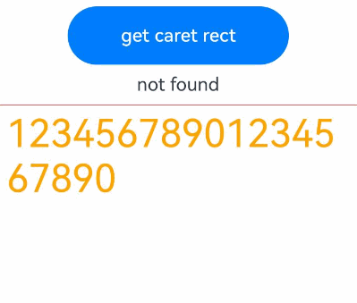

### Example 26: Setting the Maximum Number of Lines and Maximum Number of Characters
This example shows how to set the maximum number of characters using [maxLength](#maxlength18) and the maximum number of lines using [maxLines](#maxlines18), available since API version 18.

```ts
@Entry
@Component
struct RichEditorExample {
  @State text: string = "As the sun begins to set, casting a warm golden hue across the sky," +
    "the world seems to slow down and breathe a sigh of relief. The sky is painted with hues of orange, " +
    " pink, and lavender, creating a breathtaking tapestry that stretches as far as the eye can see." +
    "The air is filled with the sweet scent of blooming flowers, mingling with the earthy aroma of freshly turned soil." +
    "it casts a warm," +
    "golden hue that spreads like liquid amber across the vast expanse of the sky." +
    "The once-blue heavens gradually transform, " +
    "now painted in a breathtaking palette of soft oranges, pinks, " +
    "and purples, each color blending seamlessly into the next. Wisps of clouds, tinged with fiery edges, " +
    "float lazily amidst this celestial canvas," +
    "creating a scene so serene and beautiful that it almost seems to pause time itself." +
    "As the sun begins to set, casting a warm golden hue across the sky," +
    "the world seems to slow down and breathe a sigh of relief. The sky is painted with hues of orange, " +
    " pink, and lavender, creating a breathtaking tapestry that stretches as far as the eye can see." +
    "The air is filled with the sweet scent of blooming flowers, mingling with the earthy aroma of freshly turned soil." +
    "it casts a warm," +
    "golden hue that spreads like liquid amber across the vast expanse of the sky." +
    "The once-blue heavens gradually transform, ";
  @State maxLineList: (number | undefined)[] = [2, 6, undefined];
  @State maxLineIndex: number = 0;
  @State maxLineStringList: (string)[] = ["2", "6", "undefined"];
  controller1: RichEditorController = new RichEditorController();
  controller3: RichEditorController = new RichEditorController();

  build() {
    Column() {
      Text("Current maxLength value: 7")
        .margin(10)
        .fontSize(25)
      Row() {
        Button("Insert 1-Character Image")
          .onClick(() => {
            // Replace $r('app.media.startIcon') with the image resource file you use.
            this.controller1.addImageSpan($r('app.media.startIcon'),
              {
                imageStyle:
                {
                  size: ["57px", "57px"]
                }
              })
          })
        Button("Insert 2-Character Image")
          .onClick(() => {
            this.controller1.addSymbolSpan($r("sys.symbol.ohos_trash"),
              {
                style:
                {
                  fontSize: 30
                }
              })
          })
          .margin({ left: 20 })
      }

      RichEditor({ controller: this.controller1 })
        .width('95%')
        .margin(10)
        .height(60)
        .maxLength(7)
        .backgroundColor('rgb(240,250,255)')
      Text("Current maxLine value: " + this.maxLineStringList[this.maxLineIndex]).margin(10)
        .fontSize(25)
      Button("Change maxLines").onClick(() => {
        this.maxLineIndex++;
        if (this.maxLineIndex > this.maxLineList.length - 1) {
          this.maxLineIndex = 0;
        }
      })
      RichEditor({ controller: this.controller3 })
        .onReady(() => {
          this.controller3.addTextSpan(this.text,
            {
              style:
              {
                fontColor: 'rgb(0,74,175)'
              }
            })
        })
        .margin(10)
        .width('95%')
        .maxLines(this.maxLineList[this.maxLineIndex])
        .backgroundColor('rgb(240,250,255)')
    }
  }
}
```
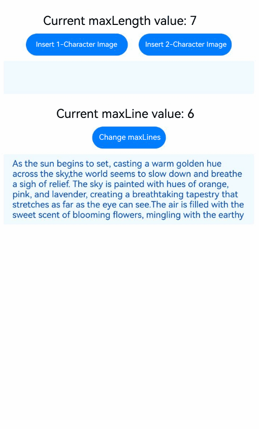

### Example 27: Setting the URL Style for Text
This example demonstrates how to implement text hyperlink using [UrlStyle](#richeditorurlstyle19), which is supported by the **addTextSpan** and **updateSpanStyle** APIs. When users tap the formatted text, the app navigates to the specified URL. This feature is available since API version 19.

```ts
// xxx.ets

@Entry
@Component
struct RichEditorExample {
  controller: RichEditorController = new RichEditorController();
  options: RichEditorOptions = { controller: this.controller };

  build() {
    Column() {
      Row() {
        Button("Add Example Url").onClick(() => {
          this.controller.addTextSpan("Example URL", {
            urlStyle: { url: "https://www.example.com" }
          });
        })
        Button("Clear Url").onClick(() => {
          this.controller.updateSpanStyle({
            start: 0,
            textStyle: {},
            urlStyle: { url: "" }
          });
        })
      }

      Row() {
        RichEditor(this.options)
          .height('35%')
          .border({ width: 1, color: Color.Blue })
      }
    }
  }
}
```
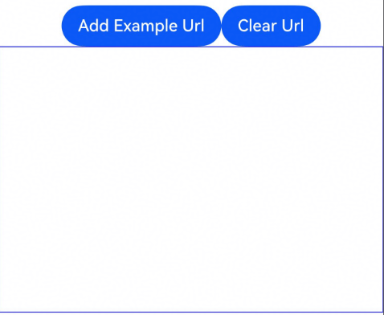

### Example 28: Configuring Style Behavior for Undo Operations
This example demonstrates how to retain original content styles upon undo operations for **RichEditor** components that do not use styled strings. You can enable this behavior by setting [undoStyle](#undostyle20) (available since API version 20) to **UndoStyle.KEEP_STYLE**.

```ts
// xxx.ets

@Entry
@Component
struct StyledUndo {
  controller: RichEditorController = new RichEditorController();
  options: RichEditorOptions = { controller: this.controller };
  private start: number = 0;
  private end: number = 0;
  @State undoStyle: UndoStyle = UndoStyle.KEEP_STYLE;
  build() {
    Column() {
      Column() {
        Row({space:2}) {
          Button("Insert Text").onClick(() => {
            this.controller.addTextSpan("Insert text",
              {
                style:
                {
                  fontColor: Color.Orange,
                  fontSize: 32
                }
              });
          })
          Button("Insert Image").onClick(() => {
            // Replace $r('app.media.startIcon') with the image resource file you use.
            this.controller.addImageSpan($r('app.media.startIcon'),
              {
                imageStyle:
                {
                  size: ["100px", "100px"]
                }
              });
          })
          Button("Insert Symbol").onClick(() => {
            this.controller.addSymbolSpan($r("sys.symbol.ohos_trash"),
              {
                style:
                {
                  fontSize: 32
                }
              });
          })
        }
        .borderWidth(1)
        .borderColor(Color.Red)
        .justifyContent(FlexAlign.Center)
        .width("100%")
        .height("10%")
        Row({space:2}) {
          Button("Update Selection Style").onClick(() => {
            if (this.start < this.end) {
              this.controller.updateSpanStyle({
                start: this.start,
                end: this.end,
                textStyle:
                {
                  fontColor: Color.Red,
                  fontWeight: FontWeight.Bolder
                }
              });
            }
          })
          Button("Delete Selection").onClick(() => {
            if (this.start < this.end) {
              this.controller.deleteSpans({
                start: this.start,
                end: this.end
              });
            }
          })
        }
        .borderWidth(1)
        .borderColor(Color.Red)
        .justifyContent(FlexAlign.Center)
        .width("100%")
        .height("10%")
        Row({space:2}) {
          Button("Clear Style on Undo").onClick(() => {
            this.undoStyle = UndoStyle.CLEAR_STYLE;
          })
          Button("Retain Style on Undo").onClick(() => {
            this.undoStyle = UndoStyle.KEEP_STYLE;
          })
        }
        .borderWidth(1)
        .borderColor(Color.Red)
        .justifyContent(FlexAlign.Center)
        .width("100%")
        .height("10%")
      }
      Column() {
        RichEditor(this.options)
          .onReady(()=>{
            // Replace $r('app.media.startIcon') with the image resource file you use.
            this.controller.addImageSpan($r('app.media.startIcon'),
            {
              imageStyle:
              {
                size: ["100px", "100px"]
              }
            });
            this.controller.addTextSpan("Initialize the mixed content of text and images.",
              {
                style:
                {
                  fontColor: Color.Orange,
                  fontSize: 32
                }
              });
            this.controller.addSymbolSpan($r("sys.symbol.ohos_trash"),
              {
                style:
                {
                  fontSize: 32
                }
              });
          })
          .undoStyle(this.undoStyle)
          .onSelect((value: RichEditorSelection) => {
            this.start = value.selection[0];
            this.end = value.selection[1];
          })
          .borderWidth(1)
          .borderColor(Color.Green)
          .width("100%")
          .height("50%")
      }
    }
  }
}
```
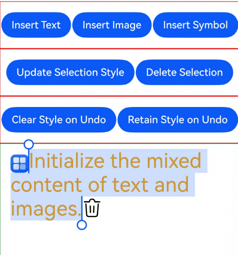

### Example 29: Setting the Preset Paragraph Style
This example demonstrates how to set the preset paragraph style using the [setTypingParagraphStyle](#settypingparagraphstyle20) API, available since API version 20.

```ts
@Entry
@Component
struct RichEditorExample {
  controller: RichEditorController = new RichEditorController();
  options: RichEditorOptions = { controller: this.controller }
  styledStringController: RichEditorStyledStringController = new RichEditorStyledStringController();
  styledStringOptions: RichEditorStyledStringOptions = { controller: this.styledStringController }
  contentChangedListener: StyledStringChangedListener = {
    onWillChange: (value: StyledStringChangeValue) => {
      let range = '[ ' + value.range.start + ' , ' + value.range.end + ' ]';
      let replaceString = value.replacementString.getString();
      console.info('styledString, onWillChange, range=' + range);
      console.info('styledString, onWillChange, replaceString=' + replaceString);
      let styles: Array<SpanStyle> = [];
      if (replaceString.length != 0) {
        styles = value.replacementString.getStyles(0, replaceString.length, StyledStringKey.PARAGRAPH_STYLE);
      }
      styles.forEach((style) => {
        let value = style.styledValue
        let paraStyle: ParagraphStyle = value as ParagraphStyle
        if (paraStyle != undefined) {
          console.info('styledString, onWillChange, textAlign=' + JSON.stringify(paraStyle.textAlign)
            + ', textIndent=' + JSON.stringify(paraStyle.textIndent)
            + ', maxLines=' + JSON.stringify(paraStyle.maxLines)
            + ', overflow=' + JSON.stringify(paraStyle.overflow)
            + ', wordBreak=' + JSON.stringify(paraStyle.wordBreak)
            + ', leadingMargin=' + JSON.stringify(paraStyle.leadingMargin)
            + ', paragraphSpacing=' + JSON.stringify(paraStyle.paragraphSpacing)
          );
        }
      });
      return true;
    }
  }

  build() {
    Column() {
      Row() {
        Text('ParaStyle')
        // Set the preset paragraph style to center alignment.
        Button('setStyle1').onClick(() => {
          let paragraphStyle: RichEditorParagraphStyle = {
            textAlign: TextAlign.Center
          }
          this.controller.setTypingParagraphStyle(paragraphStyle);
          this.styledStringController.setTypingParagraphStyle(paragraphStyle);
        })
        // Set the preset paragraph style to left alignment with indentation.
        Button('setStyle2').onClick(() => {
          let paragraphStyle: RichEditorParagraphStyle = {
            textAlign: TextAlign.Start,
            leadingMargin: 80
          }
          this.controller.setTypingParagraphStyle(paragraphStyle);
          this.styledStringController.setTypingParagraphStyle(paragraphStyle);
        })
        // Clear the preset paragraph style.
        Button('clearParaStyle').onClick(() => {
          this.controller.setTypingParagraphStyle(undefined);
          this.styledStringController.setTypingParagraphStyle(undefined);
        })
      }

      Row() {
        Column() {
          RichEditor(this.options)
            .height('25%')
            .width('100%')
            .border({ width: 1, color: Color.Blue })
            .onWillChange((value: RichEditorChangeValue) => {
              console.info('controller, onWillChange, rangeBefore=' + JSON.stringify(value.rangeBefore));
              value.replacedSpans.forEach((item: RichEditorTextSpanResult) => {
                console.info('controller, onWillChange, replacedTextSpans=' + JSON.stringify(item));
              });
              return true
            })
          RichEditor(this.styledStringOptions)
            .height('25%')
            .width('100%')
            .onReady(() => {
              this.styledStringController.onContentChanged(this.contentChangedListener);
            })
        }
      }
    }
  }
}
```


### Example 30: Setting Text Decoration Thickness and Multiple Decorations
This example demonstrates how to use **thicknessScale** of [DecorationStyle](ts-universal-styled-string.md#decorationstyle) to set the thickness of text decoration and [enableMultiType](ts-universal-styled-string.md#decorationoptions20) to set multiple decorations, available since API version 20.

```ts
import { LengthMetrics } from '@kit.ArkUI';

@Entry
@Component
struct Index {
  private controller: RichEditorController = new RichEditorController();
  private styledStringController: RichEditorStyledStringController = new RichEditorStyledStringController();

  build() {
    Column({ space: 20 }) {
      RichEditor({ controller: this.controller })
        .onReady(() => {
          // Add preset text.
          this.controller.addTextSpan('Preset text. ', {
            style: {
              fontSize: 25,
              decoration: {
                type: TextDecorationType.LineThrough,
                // Set decoration thickness scale to 2.
                thicknessScale: 2
              }
            }
          });
        })

      // Set RichEditor for multiple text decorations.
      RichEditor({ controller: this.styledStringController })

      Button('Append Text (Decoration Scale 8)')
        .fontSize(20)
        .onClick(() => {
          this.controller.addTextSpan('Appended text.', {
            style: {
              fontSize: 25,
              decoration: {
                type: TextDecorationType.LineThrough,
                // Set decoration thickness scale to 8.
                thicknessScale: 8
              }
            }
          });
        })

      Button('Update Decoration Scale to 4')
        .fontSize(20)
        .onClick(() => {
          this.controller.updateSpanStyle({
            start: 0,
            end: 1000, // When the index exceeds the text length, the entire text is updated.
            textStyle: {
              decoration: {
                type: TextDecorationType.LineThrough,
                // Set decoration thickness scale to 4.
                thicknessScale: 4
              }
            }
          })
        })

      Button('Add Multi-Decoration Text')
        .fontSize(20)
        .onClick(() => {
          let mutableString: MutableStyledString = new MutableStyledString('Set multiple text decorations for RichEditor.', [
            {
              start: 0,
              length: 9,
              styledKey: StyledStringKey.FONT,
              styledValue: new TextStyle({ fontSize: LengthMetrics.vp(25) })
            },
            {
              start: 0,
              length: 5,
              styledKey: StyledStringKey.DECORATION,
              styledValue: new DecorationStyle(
                {
                  type: TextDecorationType.Underline,
                },
                {
                  // Enable multiple text decorations.
                  enableMultiType: true
                }
              )
            },
            {
              start: 2,
              length: 4,
              styledKey: StyledStringKey.DECORATION,
              styledValue: new DecorationStyle(
                {
                  type: TextDecorationType.LineThrough,
                },
                {
                  // Enable multiple text decorations.
                  enableMultiType: true
                }
              )
            },
            {
              start: 4,
              length: 5,
              styledKey: StyledStringKey.DECORATION,
              styledValue: new DecorationStyle(
                {
                  type: TextDecorationType.Overline,
                },
                {
                  // Enable multiple text decorations.
                  enableMultiType: true
                }
              )
            },
          ]);
          this.styledStringController.setStyledString(mutableString);
        })
    }
    .height('100%')
    .width('100%')
    .justifyContent(FlexAlign.Center)
    .alignItems(HorizontalAlign.Center)
  }
}
```
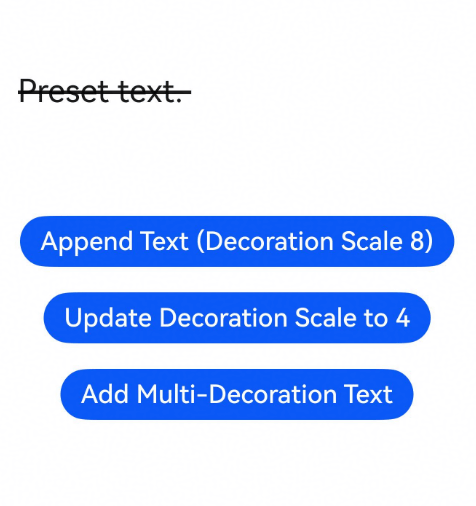


### Example 31: Enabling Automatic Spacing Between Chinese and Western Text
This example demonstrates how to configure automatic spacing between Chinese and Western characters using the [enableAutoSpacing](#enableautospacing20) attribute, available since API version 20.

```ts
@Entry
@Component
struct AutoSpacing {
  controller: RichEditorController = new RichEditorController();
  options: RichEditorOptions = { controller: this.controller };
  @State enableAutoSpace: boolean = false;

  build() {
    Column() {
      Column() {
        Row({ space: 2 }) {
          Button("Insert Chinese & Western Text").onClick(() ==> {
            this.controller.addTextSpan("Add a text span",
              {
                style:
                {
                  fontColor: Color.Orange,
                  fontSize: 20
                }
              });
          })
          Button("Insert Image").onClick(() => {
            // Replace $r('app.media.startIcon') with the image resource file you use.
            this.controller.addImageSpan($r('app.media.startIcon'),
              {
                imageStyle:
                {
                  size: ["100px", "100px"]
                }
              });
          })
          Button("Insert Symbol").onClick(() => {
            this.controller.addSymbolSpan($r("sys.symbol.ohos_trash"),
              {
                style:
                {
                  fontSize: 32
                }
              });
          })
        }
        .borderWidth(1)
        .borderColor(Color.Red)
        .justifyContent(FlexAlign.Center)
        .width("100%")
        .height("10%")

        Row({ space: 2 }) {
          Button("Enable Auto Spacing").onClick(() => {
            this.enableAutoSpace = true;
          })
          Button("Disable Auto Spacing").onClick(() => {
            this.enableAutoSpace = false;
          })
        }
        .borderWidth(1)
        .borderColor(Color.Red)
        .justifyContent(FlexAlign.Center)
        .width("100%")
        .height("10%")
      }

      Column() {
        RichEditor(this.options)
          .onReady(() => {
            // Replace $r('app.media.startIcon') with the image resource file you use.
            this.controller.addImageSpan($r('app.media.startIcon'),
              {
                imageStyle:
                {
                  size: ["100px", "100px"]
                }
              });
            this.controller.addTextSpan("中文Text",
              {
                style:
                {
                  fontColor: Color.Orange,
                  fontSize: 20
                }
              });
            this.controller.addSymbolSpan($r("sys.symbol.ohos_trash"),
              {
                style:
                {
                  fontSize: 20
                }
              });
          })
          .enableAutoSpacing(this.enableAutoSpace)
          .borderWidth(1)
          .borderColor(Color.Green)
          .width("100%")
          .height("50%")
      }
    }
  }
}
```
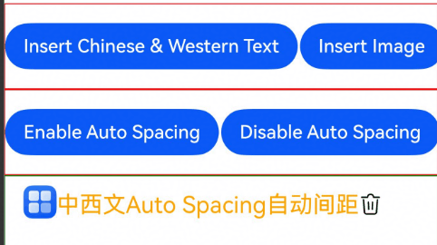

### Example 32: Setting an AI Menu for Text Selection
This example demonstrates how to configure the AI menu for text selection using the [enableSelectedDataDetector](#enableselecteddatadetector22) API, available since API version 22.

```ts
@Entry
@Component
struct SelectedDataDetectorDemo {
  controller: RichEditorController = new RichEditorController();
  textSpanOptions: RichEditorTextSpanOptions = { style: { fontSize: 20 } };
  exampleText: string ='Example website: www.example.com';

  build() {
    Column() {
      Row() {
        RichEditor({ controller: this.controller })
          .onReady(() => {
            this.controller.addTextSpan(this.exampleText, this.textSpanOptions);
          })
          .copyOptions(CopyOptions.LocalDevice)
          .enableSelectedDataDetector(true)
          .border({ width: 1, color: Color.Black })
          .height(300)
          .margin(10)
      }
    }
  }
}
```
<!--RP2--><!--RP2End-->

### Example 33: Listening for the Input Method Binding Event
This example demonstrates how to use the [onWillAttachIME](#onwillattachime22) event to listen for the input method binding event, available since API version 22.

```ts
@Entry
@Component
struct SetOnWillAttachIME {
  controller: RichEditorController = new RichEditorController();
  options: RichEditorOptions = { controller: this.controller };
  @State message: string = "RichEditor Not Bound to an Input Method"

  build() {
    Column() {
      Text(this.message)
        .fontSize(24)
        .width("100%")
        .textAlign(TextAlign.Center)
      RichEditor(this.options)
        .onReady(() => {
          this.controller.addTextSpan("RichEditor component",
            {
              style:
              {
                fontColor: Color.Orange,
                fontSize: 30
              }
            });
        })
        .onWillAttachIME((value:IMEClient) => {
          // Pass a custom message to the input method.
          const inputConfig: InputMethodExtraConfig = {
            customSettings: {
              component: 'RichEditor',
              id: 8 as number,
              isEnable: true
            }
          };
          value.setExtraConfig(inputConfig);
          this.message = "RichEditor Bound to an Input Method"
        })
        .borderWidth(1)
        .borderColor(Color.Green)
        .width("100%")
        .height("20%")
    }
    .height("100%")
    .justifyContent(FlexAlign.Center)
  }
}
```


### Example 34: Deleting the Character at the End of the Text Box
This example demonstrates how to call [deleteBackward](#deletebackward23) to delete the character before the caret in the editing state with a custom keyboard, available since API version 23.

```ts
@Entry
@Component
struct RichEditorExample {
  controller: RichEditorController = new RichEditorController();

  // Set the delete button on the custom keyboard.
  @Builder
  CustomKeyboardBuilder() {
    Column() {
      Button('DELETE')
        .width(200)
        .height(60)
        .backgroundColor(Color.Blue)
        .fontColor(Color.White)
        .fontSize(16)
        .onClick(() => {
          // Call deleteBackward to delete the character.
          this.controller.deleteBackward();
        })
    }
    .padding(10)
    .backgroundColor(Color.Gray)
  }

  build() {
    Column() {
      Blank()
        .height(400)
      RichEditor({ controller: this.controller })
        .customKeyboard(this.CustomKeyboardBuilder())
        .margin(10)
        .border({ width: 1 })
        .height(150)
        .borderWidth(1)
        .borderColor(Color.Blue)
        .width("100%")
        .onReady(() => {
          // Set the initial text for testing.
          this.controller.addTextSpan ('Click DELETE to test the deletion function', {
            style: {
              fontColor: Color.Black,
              fontSize: 16
            }
          });
        })
    }.margin(90)
  }
}
```


### Example 35: Optimizing the Display of Minority Languages
This example uses the [includeFontPadding](#includefontpadding23) attribute to add font padding at the top of the first line and the bottom of the last line of text. It also uses the [fallbackLineSpacing](#fallbacklinespacing23) attribute to implement adaptive line spacing which adjusts dynamically according to the actual text height.

The **includeFontPadding** and **fallbackLineSpacing** attributes are added since API version 23.

```ts
@Entry
@Component
struct RichEditorExample {
  controller: RichEditorController = new RichEditorController();
  @State fallbackLineSpacing: boolean = true;
  @State includeFontPadding: boolean = true;

  build() {
    Column() {
      RichEditor({ controller: this.controller })
        .onReady(() => {
          this.controller.addTextSpan('བོད་ཀྱི་སྐད་ཡིག་ནི་བོད་མིའི་རྒྱུན་ལྡན་པའི་སྐད་ཡིག་དང་།\n འཇིག་རྟེན་གྱི་ཆོས་ལུགས་དང་རྒྱུན་ལྡན་པའི་ཆོས་ལུགས་ཀྱི་དོན་ཚན་གྱི་སྐད་ཡིག་རེད།\n',
            {
              style: {
                fontColor: Color.Black,
                fontSize: "30",
                lineHeight: 10
              },
              paragraphStyle: {
                textAlign: TextAlign.Start,
              }
            });
          this.controller.addTextSpan('བོད་ཀྱི་སྐད་ཡིག་ནི་བོད་མིའི་རྒྱུན་ལྡན་པའི་སྐད་ཡིག་དང་།\n འཇིག་རྟེན་གྱི་ཆོས་ལུགས་དང་རྒྱུན་ལྡན་པའི་ཆོས་ལུགས་ཀྱི་དོན་ཚན་གྱི་སྐད་ཡིག་རེད།',
            {
              style: {
                fontColor: Color.Black,
                fontSize: "30",
              },
              paragraphStyle: {
                textAlign: TextAlign.Start,
              }
            });
        })
        .width("100%")
        .height("35%")
        .border({ width: 1, radius: 5 })
        .draggable(false)
        .includeFontPadding(this.includeFontPadding)
        .fallbackLineSpacing(this.fallbackLineSpacing)
      Row() {
        Button('Enable Adaptive Line Spacing')
          .onClick(() => {
            this.fallbackLineSpacing = true;
          })
          .width("45%")
          .height("10%")
          .margin({ right: 10 })
        Button('Disable Adaptive Line Spacing')
          .onClick(() => {
            this.fallbackLineSpacing = false;
          })
          .width("45%")
          .height("10%")
          .margin({ left: 5 })
      }
      .margin({ top: 20 })

      Row() {
        Button('Enable Font Padding')
          .onClick(() => {
            this.includeFontPadding = true;
          })
          .width("45%")
          .height("10%")
          .margin({ right: 10 })
        Button('Disable Font Padding')
          .onClick(() => {
            this.includeFontPadding = false;
          })
          .width("45%")
          .height("10%")
          .margin({ left: 5 })
      }
      .margin({ top: 20 })
    }
  }
}
```
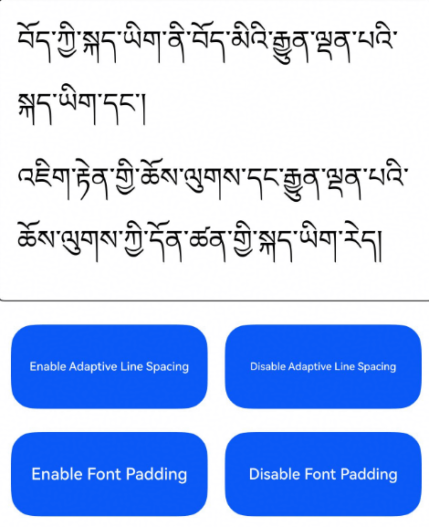

### Example 36: Setting Leading Punctuation Compression and Trailing Punctuation Hanging

This example shows how to use [compressLeadingPunctuation](#compressleadingpunctuation23) to set the punctuation compression at the beginning of a line, and use [punctuationOverflow](#punctuationoverflow) to set the punctuation hanging at the end of a line.

After the text is automatically wrapped, the punctuation hanging takes effect only when the remaining content (including punctuation) can be placed in the previous line.

The **compressLeadingPunctuation** API is supported since API version 23.

Since API version 26.0.0, the **punctuationOverflow** API is added.

```ts
@Entry
@Component
struct PunctuationDemo {
  controller: RichEditorController = new RichEditorController();
  textSpanOptions: RichEditorTextSpanOptions = { style: { fontSize: '20fp' } };
  @State compressLeadingPunctuation: boolean = false;
  @State punctuationOverflow: boolean = false;
  @State text: string = '「0123456789！\n『0123456789：\n（0123456789；\n《0123456789）\n〈0123456789】\n【0123456789、\n〖0123456789。\n〔0123456789﹑\n［0123456789〞\n｛0123456789';

  build() {
    Column() {
      RichEditor({ controller: this.controller })
        .onReady(() => {
          this.controller.addTextSpan(this.text, this.textSpanOptions);
        })
        .compressLeadingPunctuation(this.compressLeadingPunctuation)
        .punctuationOverflow(this.punctuationOverflow)
        .border({ width: 1, color: Color.Black })
        .align(Alignment.Center)
        .height('35%')
        .width('50%')

      Column() {
        Button('Enable Leading Punctuation Compression').onClick(() => {
          this.compressLeadingPunctuation = true;
        }).margin(5)
        Button('Disable Leading Punctuation Compression').onClick(() => {
          this.compressLeadingPunctuation = false;
        }).margin(5)
        Button('Enable Trailing Punctuation Hanging').onClick(() => {
          this.punctuationOverflow = true;
        }).margin(5)
        Button('Disable Trailing Punctuation Hanging').onClick(() => {
          this.punctuationOverflow = false;
        }).margin(5)
      }
    }.width('100%').padding(20)
  }
}
```


### Example 37: Setting the Drag Preview Style
This example demonstrates how to set the drag preview style using the [selectedDragPreviewStyle](#selecteddragpreviewstyle23) API.

The **selectedDragPreviewStyle** API is supported since API version 23.

```ts
@Entry
@Component
struct RichEditorDemo {
  controller: RichEditorController = new RichEditorController();
  options: RichEditorOptions = { controller: this.controller };

  build() {
    Column({ space: 2 }) {
      RichEditor(this.options)
        .onReady(() => {
          this.controller.addTextSpan('RichEditor selectedDragPreviewStyle');
        })
        .borderWidth(1)
        .borderColor(Color.Green)
        .draggable(true)
        .selectedDragPreviewStyle({ color: Color.Gray })
        .width('100%')
        .height('20%')
    }
  }
}
```

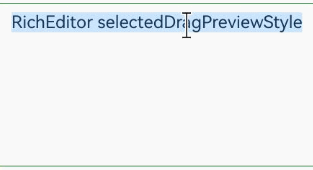

### Example 38: Setting Single-Line Mode

This example demonstrates how to set single-line mode using the [singleLine](#singleline23) API.

The **singleLine** API is added since API version 23.

``` ts
@Entry
@Component
struct SingleLineDemo {
  controller: RichEditorController = new RichEditorController();
  textSpanOptions: RichEditorTextSpanOptions = { style: { fontSize: 30 } };
  exampleText: string = 'This is a sample text.\nThis is a sample text.\nThis is a sample text.';
  @State enableSingleLine: boolean = false;

  build() {
    Column() {
      Row() {
        RichEditor({ controller: this.controller })
          .onReady(() => {
            this.controller.addTextSpan(this.exampleText, this.textSpanOptions);
          })
          .singleLine(this.enableSingleLine)
          .border({ width: 1, color: Color.Black })
          .margin(10)
      }
      Row() {
        Button('Single-Line Mode').onClick((event: ClickEvent) => {
          this.enableSingleLine = true;
        }).margin(5)
        Button('Multi-Line Mode').onClick((event: ClickEvent) => {
          this.enableSingleLine = false;
        }).margin(5)
      }
    }
  }
}
```

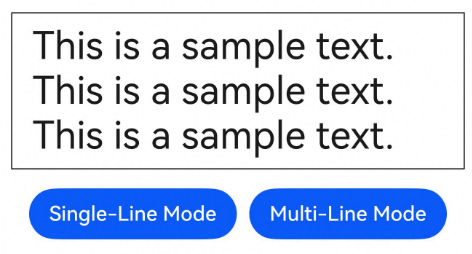

### Example 39: Setting the Placeholder Text of the Styled String

This example demonstrates how to set the placeholder text of the styled string using the [setStyledPlaceholder](#setstyledplaceholder24) API.

The **setStyledPlaceholder** API is added since API version 24.

``` ts
import { LengthMetrics } from '@kit.ArkUI';

@Entry
@Component
struct RichEditorExample {
  styledString: MutableStyledString = new MutableStyledString("Placeholder: text",
    [
      {
        start: 0,
        length: 12,
        styledKey: StyledStringKey.FONT,
        styledValue: new TextStyle({
          fontColor: Color.Orange,
          fontSize: LengthMetrics.fp(24)
        })
      },
      {
        start: 12,
        length: 4,
        styledKey: StyledStringKey.FONT,
        styledValue: new TextStyle({
          fontColor: Color.Gray,
          fontSize: LengthMetrics.fp(20),
          fontWeight: FontWeight.Bold
        })
      },
      {
        start: 0,
        length: 1,
        styledKey: StyledStringKey.PARAGRAPH_STYLE,
        styledValue: new ParagraphStyle({
          textVerticalAlign: TextVerticalAlign.CENTER
        })
      }
    ]);
  imageStyledString = new MutableStyledString(new ImageAttachment(
    {
      // Replace $r('app.media.startIcon') with the image resource file you use.
      resourceValue: $r('app.media.startIcon'),
      size: { width: 50, height: 50 },
      verticalAlign: ImageSpanAlignment.BASELINE,
      objectFit: ImageFit.Fill
    } as ResourceImageAttachmentOptions
  ));

  controller: RichEditorController = new RichEditorController();

  aboutToAppear() {
    this.styledString.appendStyledString(this.imageStyledString);
    this.controller.setStyledPlaceholder(this.styledString);
  }

  build() {
    Column() {
      Text("RichEditor Placeholders Support Rich Text Styles")
        .fontSize(16)
        .fontWeight(FontWeight.Bold)
      RichEditor({ controller: this.controller })
        .width('80%')
        .height('20%')
        .margin(10)
        .borderWidth(1)
        .borderColor(Color.Blue)
    }
    .justifyContent(FlexAlign.Center)
    .width('100%')
    .height('70%')
  }
}
```
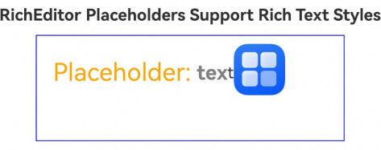

### Example 40: Enabling/Disabling Orphan Character Optimization

This example shows how to enable orphan character optimization using the [orphanCharOptimization](#orphancharoptimization) API to ensure that no orphan character appears in the last line of a paragraph.

The **orphanCharOptimization** API is supported since API version 26.0.0.

``` ts
// xxx.ets
@Entry
@Component
struct RichEditorDemo {
  controller1: RichEditorController = new RichEditorController();
  controller2: RichEditorController = new RichEditorController();
  @State text: string = 'aaaaaaaaaaaaaaaaaaaaaaaaaaaaaaaaaaaaaaaaaaaaaaaaaaaaaaaaaaaaaaaaaaaaa文本';
  textSpanOptions: RichEditorTextSpanOptions = { style: { fontSize: 20 } };

  build() {
    Column({ space: 10 }) {
      Text('orphanCharOptimization: true')
        .fontSize(12).width('90%')
      RichEditor({ controller: this.controller1 })
        .onReady(() => {
          this.controller1.addTextSpan(this.text, this.textSpanOptions);
        })
        .orphanCharOptimization(true)
        .width(430)
        .borderWidth(1)

      Divider()

      Text('orphanCharOptimization: false')
        .fontSize(12).width('90%')

      RichEditor({ controller: this.controller2 })
        .onReady(() => {
          this.controller2.addTextSpan(this.text, this.textSpanOptions);
        })
        .orphanCharOptimization(false)
        .width(430)
        .borderWidth(1)
    }
    .width('100%')
    .height('100%')
  }
}
```


### Example 41: Setting Horizontal Scrolling

This example demonstrates how to set horizontal scrolling using [horizontalScrolling](#horizontalscrolling).

The **horizontalScrolling** API is added since API version 26.0.0.

``` ts
// xxx.ets
@Entry
@Component
struct HorizontalScrollDemo {
  controller: RichEditorController = new RichEditorController();
  textSpanOptions: RichEditorTextSpanOptions = { style: { fontSize: 30 } };
  exampleText: string = 'This is an ultra-long sample text.\n';
  @State enableHorizontalScroll: boolean = false;

  build() {
    Column() {
      Row() {
        RichEditor({ controller: this.controller })
          .onReady(() => {
            this.controller.addTextSpan(this.exampleText, this.textSpanOptions);
          })
          .width('220vp')
          .height('160vp')
          .horizontalScrolling(this.enableHorizontalScroll)
          .border({ width: 1, color: Color.Black })
          .margin(10)
      }
      Row() {
        Button('Enable Horizontal Scroll').onClick((event: ClickEvent) => {
          this.enableHorizontalScroll = true
        }).margin(5)
        Button('Disable Horizontal Scroll').onClick((event: ClickEvent) => {
          this.enableHorizontalScroll = false
        }).margin(5)
      }
    }
  }
}
```


### Example 42: Setting the Text Shader Effect

This example demonstrates how to use the **shaderStyle** API in [RichEditorParagraphStyle](#richeditorparagraphstyle11) to set the text shader effect.

Since API version 26.0.0, the **shaderStyle** API is added to **RichEditorParagraphStyle**.

```ts
@Entry
@Component
struct ShaderColorStyle {
  @State message: string = 'Hello World';
  @State linearGradientOptions1: LinearGradientOptions =
    {
      angle: 45,
      colors: [[Color.Red, 0.0], [Color.Blue, 0.3], [Color.Green, 0.5]]
    };
  @State linearGradientOptions2: LinearGradientOptions =
    {
      direction: GradientDirection.LeftTop,
      colors: [[Color.Red, 0.0], [Color.Blue, 0.3], [Color.Green, 0.5]],
      repeating: true,
    };
  @State radialGradientOptions: RadialGradientOptions =
    {
      center: [50, 50],
      radius: 20,
      colors: [[Color.Red, 0.0], [Color.Blue, 0.3], [Color.Green, 0.5]],
      repeating: true,
    };
  @State colorShaderStyle: ColorShaderStyle =
    {
      color: Color.Blue
    };
  controller: RichEditorController = new RichEditorController();
  options: RichEditorOptions = { controller: this.controller };
  secondaryController: RichEditorController = new RichEditorController();
  secondaryOptions: RichEditorOptions = { controller: this.secondaryController };
  controller2: RichEditorController = new RichEditorController();
  options2: RichEditorOptions = { controller: this.controller2 };
  controller3: RichEditorController = new RichEditorController();
  options3: RichEditorOptions = { controller: this.controller3 };

  build() {
    Column({ space: 5 }) {
      Text('Linear gradient with angle setting to 45°').fontSize(18).width('90%')
        .margin({ top: 40, left: 40 })
      RichEditor(this.options)
        .width('80%')
        .margin({ top: 10 })
        .onReady(() => {
          this.controller.addTextSpan(this.message, { paragraphStyle: { shaderStyle: this.linearGradientOptions1 } });
          let spans: Array<RichEditorImageSpanResult | RichEditorTextSpanResult> =
            this.controller.getSpans();
          if (spans.length > 0 && (spans[0] as RichEditorTextSpanResult).paragraphStyle) {
            let shaderStyle: ShaderStyle | undefined =
              (spans[0] as RichEditorTextSpanResult).paragraphStyle?.shaderStyle;
            if (!shaderStyle) {
              return;
            }
            if (typeof (shaderStyle as ColorShaderStyle)['color'] != 'undefined') {
              console.info(' color shaderStyle : ' + JSON.stringify(shaderStyle));
            } else if (typeof (shaderStyle as RadialGradientStyle)['options']['center'] != 'undefined') {
              console.info(' radial gradient shaderStyle : ' + JSON.stringify(shaderStyle));
            } else if (typeof (shaderStyle as LinearGradientStyle)['options']['colors'] != 'undefined') {
              console.info(' linear gradient shaderStyle : ' + JSON.stringify(shaderStyle));
            }
          }
        }).borderWidth(1)
      Text('Linear gradient with direction setting to LeftTop').fontSize(18).width('90%')
        .margin({ top: 40, left: 40 })
      RichEditor(this.secondaryOptions)
        .width('80%')
        .margin({ top: 10 })
        .borderWidth(1)
        .onReady(() => {
          this.secondaryController.addTextSpan(this.message,
            { paragraphStyle: { shaderStyle: this.linearGradientOptions2 } });
        })
      Text('Radial gradient').fontSize(18).width('90%')
        .margin({ top: 40, left: 40 })
      RichEditor(this.options2)
        .width('80%')
        .margin({ top: 10 })
        .borderWidth(1)
        .onReady(() => {
          this.controller2.addTextSpan(this.message, { paragraphStyle: { shaderStyle: this.radialGradientOptions } });
        })
      Text('Solid color').fontSize(18).width('90%')
        .margin({ top: 40, left: 40 })
      RichEditor(this.options3)
        .width('80%')
        .margin({ top: 10 })
        .borderWidth(1)
        .onReady(() => {
          this.controller3.addTextSpan(this.message, { paragraphStyle: { shaderStyle: this.colorShaderStyle } });
        })
    }
  }
}
```


### Example 43: Scrolling the Text in a Specified Range to the Visible Area

This example demonstrates how to scroll the text in a specified range to the visible area using the [scrollToVisible](#scrolltovisible) API.

Since API version 26.0.0, the **scrollToVisible** API is added.

```ts
@Entry
@Component
struct ScrollToVisibleDemo {
  controller: RichEditorController = new RichEditorController();
  textSpanOptions: RichEditorTextSpanOptions = { style: { fontSize: 30 } };
  exampleText: string = 'First paragraph of sample text\nSecond paragraph of sample text\nThird paragraph of sample text\nFourth paragraph of sample text' +
    '\nFifth paragraph of sample text\nSixth paragraph of sample text\nSeventh paragraph of sample text\nEighth paragraph of sample text';

  build() {
    Column() {
      RichEditor({ controller: this.controller })
        .onReady(() => {
          this.controller.addTextSpan(this.exampleText, this.textSpanOptions);
        })
        .width('250vp')
        .height('150vp')
        .border({ width: 1, color: Color.Black })
        .margin(10)
      Button('Scroll First Paragraph to Visible Area').onClick((event: ClickEvent) => {
        this.controller.scrollToVisible({start: 0, end: 7});
      }).margin(5)
      Button('Scroll Last Paragraph to Visible Area').onClick((event: ClickEvent) => {
        this.controller.scrollToVisible({start: 64, end: 71});
      }).margin(5)
    }
  }
}
```


### Example 44: Setting Image Resizing

This example shows how to use the **resizable** attribute of [RichEditorImageSpanStyle](#richeditorimagespanstyle) to stretch the image in different directions.

The **resizable** attribute is added to **RichEditorImageSpanStyle** since API version 26.1.0.

```ts
@Entry
@Component
struct RichEditorResizablePage {
  controller: RichEditorController = new RichEditorController();
  options: RichEditorOptions = { controller: this.controller };

  build() {
    Column({ space: 20 }) {
      Text('RichEditor resizable Demo')
        .fontSize(28)
        .fontWeight(FontWeight.Bold)

      RichEditor(this.options)
        .onReady(() => {
          this.controller.addTextSpan('Original image\n', {
            style: {
              fontColor: Color.Black,
              fontSize: 28
            }
          });
          this.controller.addImageSpan($r('app.media.landscape'), {
            imageStyle: {
              size: [260, 260],
            }
          });
          this.controller.addTextSpan('\nStretching effect using resizable of ImageSpan in RichEditor\n', {
            style: {
              fontColor: Color.Black,
              fontSize: 28
            }
          });
          this.controller.addImageSpan($r('app.media.landscape'), {
            imageStyle: {
              size: [260, 260],
              resizable: {
                slice: {
                  left: '200px',
                  top: '200px',
                  right: '20px',
                  bottom: '20px'
                }
              }
            }
          });

        })
        .width('90%')
        .borderWidth(1)
        .borderColor('#cccccc')
        .borderRadius(8)
        .padding(10)
    }
    .width('100%')
    .height('100%')
    .padding(20)
    .alignItems(HorizontalAlign.Center)
  }
}

```


<!--no_check-->