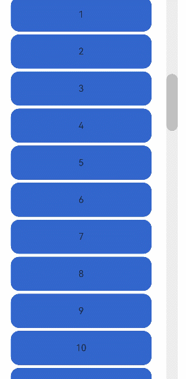
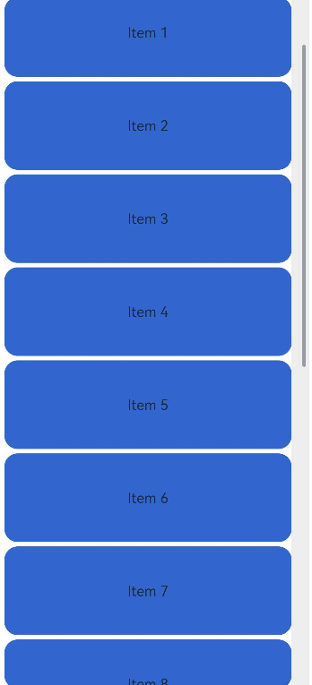

# ScrollBar

<!--Kit: ArkUI-->
<!--Subsystem: ArkUI-->
<!--Owner: @shengu_lancer; @rongShao-Z-->
<!--Designer: @yangcan18-->
<!--Tester: @leiyuqian-->
<!--Adviser: @Brilliantry_Rui-->
<!-- md-trans-meta sourceCommit=19810e056ea944483a18f856178807bee4322d5f translatedAt=2026-09-03T11:51:19.811Z -->

The **ScrollBar** component is used together with scrollable components, such as [ArcList](ts-container-arclist.md), [List](ts-container-list.md), [Grid](ts-container-grid.md), [Scroll](ts-container-scroll.md), and [WaterFlow](ts-container-waterflow.md), to provide visual scrolling indication and control capabilities, and supports custom scrollbar styles.

>  **NOTE**
>
>  - This component is supported since API version 8. Updates will be marked with a superscript to indicate their earliest API version.
>  - If the size of the main axis direction is not set for **ScrollBar**, the **maxSize** value in the [layout constraints](../js-apis-arkui-frameNode.md#layoutconstraint12) of the parent component is used. If the parent component of the **ScrollBar** component contains a scrollable component, such as [ArcList](ts-container-arclist.md), [List](ts-container-list.md), [Grid](ts-container-grid.md), [Scroll](ts-container-scroll.md), or [WaterFlow](ts-container-waterflow.md), you are advised to set the size in the main axis direction of the **ScrollBar**; otherwise, the size in the main axis direction of **ScrollBar** may become infinite.


## Child Components

This component can contain a single child component.


## APIs

ScrollBar(value: ScrollBarOptions)

Creates a scroll bar.

**Atomic service API**: This API can be used in atomic services since API version 11.

**System capability**: SystemCapability.ArkUI.ArkUI.Full

**Parameters**

| Name| Type| Mandatory| Description|
| -------- | -------- | -------- | -------- |
| value |  [ScrollBarOptions](#scrollbaroptions)| Yes| Parameters of the **ScrollBar** component.|

## Attributes

In addition to the [universal attributes](ts-component-general-attributes.md), the following attributes are supported.

### enableNestedScroll<sup>14+</sup>

enableNestedScroll(enabled: Optional\<boolean>)

Sets whether the scrollbar supports nested scrolling. It is used in scenarios such as multi-layer scroll containers and nested lists where the inner scrollable component needs to be dragged through the scrollbar and linked with the parent scrolling. It takes effect only when the ScrollBar is bound to a scrollable component through a Scroller.

**Atomic service API**: This API can be used in atomic services since API version 14.

**Model restriction**: This API can be used only in the stage model.

**System capability**: SystemCapability.ArkUI.ArkUI.Full

**Parameters**

| Name| Type   | Mandatory| Description                                 |
| ------ | ------- | ---- | ------------------------------------- |
| enabled  | [Optional](ts-universal-attributes-custom-property.md#optionalt)\<boolean> | Yes   | Whether to perform nested scrolling. Set this parameter to **true** to pass scroll events between multiple layers of scroll containers; set it to **false** when nested scrolling is not required.<br/>Default value: **false** |

>  **NOTE**
>
> When nested scrolling is enabled for the scrollbar, the scroll offset is first sent to the bound inner scrollable component, which then passes it to the outer parent scrollable component in sequence based on the set nested scrolling priority.
>
> Nested scrolling is not supported when the layout mode of the WaterFlow component is the sliding window mode ([WaterFlowLayoutMode.SLIDING_WINDOW](ts-container-waterflow.md#waterflowlayoutmode12)).
>
> When the nested scrolling mode is set to [PARALLEL](ts-appendix-enums.md#nestedscrollmode10), the parent and child components scroll simultaneously. In this case, you need to set the scrolling order of the parent and child components in [onScrollFrameBegin](ts-container-scroll.md#onscrollframebegin9) based on the required logic.

### scrollBarColor<sup>20+</sup>

scrollBarColor(color: Optional\<ColorMetrics\>)

Sets the color of the scrollbar. This parameter takes effect only when the scrollbar does not contain child components.

**Atomic service API**: This API can be used in atomic services since API version 20.

**Model restriction**: This API can be used only in the stage model.

**System capability**: SystemCapability.ArkUI.ArkUI.Full

**Parameters**

| Name| Type                                                        | Mandatory| Description          |
| ------ | ------------------------------------------------------------ | ---- | -------------- |
| color  |  [Optional](ts-universal-attributes-custom-property.md#optionalt)\<[ColorMetrics](../js-apis-arkui-graphics.md#colormetrics12)\> | Yes   | Color of the scrollbar. This parameter takes effect only when the scrollbar does not contain any child component.<br/>Default value: ColorMetrics.numeric(0x66182431)   |

## ScrollBarOptions

Parameters of the **ScrollBar** component.

>  **NOTE**
>
>  - The ScrollBar component is used to display and control the scroll position of the bound scrollable component. When child components are set, the child component serves as a custom scrollbar slider and moves with the scroll position of the scrollable component.
>  - The scrollbar component is bound to the scrollable component through a Scroller, and they can be linked only when their directions are the same. A scrollable component can be bound to multiple ScrollBar components, while a ScrollBar component can be bound to only one scrollable component.
>  - Since API version 12, the ScrollBar component supports displaying a scrollbar in the default style when it has no child nodes.
>  - The visibility of the ScrollBar component is set through BarState. The component automatically adjusts opacity based on the BarState setting to control visibility. Therefore, the [opacity](./ts-universal-attributes-opacity.md#opacity18) attribute set for the ScrollBar component does not take effect.

**Atomic service API**: This API can be used in atomic services since API version 11.

**System capability**: SystemCapability.ArkUI.ArkUI.Full

| Name| Type| Read-Only| Optional| Description|
| -------- | -------- | -------- | -- | -------- |
| scroller | [Scroller](ts-container-scroll.md#scroller) | No | No | Controller of the scrollable component. It is used to bind to the scrollable component, and linkage is possible only when the ScrollBar and the scrollable component have the same direction. A scrollable component can be bound to multiple ScrollBar components, while a ScrollBar component can be bound to only one scrollable component. |
| direction | [ScrollBarDirection](#scrollbardirection) | No | Yes | Direction of the scroll bar, which controls the scrolling of the scrollable component in the corresponding direction. Set it to ScrollBarDirection.Vertical when the scrollable content is laid out vertically; set it to ScrollBarDirection.Horizontal when the scrollable content is laid out horizontally.<br/>Default value: ScrollBarDirection.Vertical |
| state | [BarState](ts-appendix-enums.md#barstate) | No | Yes | State of the scroll bar. BarState.Auto indicates that the scroll bar is displayed on demand, BarState.On indicates that it is always displayed, and BarState.Off indicates that it is not displayed.<br/>Default value: BarState.Auto |

## ScrollBarDirection

Enumerates the scrolling directions.

**Atomic service API**: This API can be used in atomic services since API version 11.

**System capability**: SystemCapability.ArkUI.ArkUI.Full

| Name| Value| Description|
| -------- | ---- | -------- |
| Vertical | 0 | Vertical scrollbar.|
| Horizontal | 1 | Horizontal scrollbar.|


## Example 1: Implementing a ScrollBar Component with Child Components

This example illustrates the style of a **ScrollBar** component with child components.

```ts
// xxx.ets
@Entry
@Component
struct ScrollBarExample {
  private scroller: Scroller = new Scroller();
  private arr: number[] = [0, 1, 2, 3, 4, 5, 6, 7, 8, 9, 10, 11, 12, 13, 14, 15];

  build() {
    Column() {
      Stack({ alignContent: Alignment.End }) {
        Scroll(this.scroller) {
          Flex({ direction: FlexDirection.Column }) {
            ForEach(this.arr, (item: number) => {
              Row() {
                Text(item.toString())
                  .width('80%')
                  .height(60)
                  .backgroundColor('#3366CC')
                  .borderRadius(15)
                  .fontSize(16)
                  .textAlign(TextAlign.Center)
                  .margin({ top: 5 })
              }
            }, (item: number) => item.toString())
          }.margin({ right: 15 })
        }
        .width('90%')
        .scrollBar(BarState.Off)
        .scrollable(ScrollDirection.Vertical)

        ScrollBar({ scroller: this.scroller, direction: ScrollBarDirection.Vertical, state: BarState.Auto }) {
          Text()
            .width(20)
            .height(100)
            .borderRadius(10)
            .backgroundColor('#C0C0C0')
        }.width(20).backgroundColor('#ededed')
      }
    }
  }
}
```



## Example 2: Implementing a ScrollBar Component Without Child Components

This example illustrates the style of a **ScrollBar** component without child components. The [scrollBarColor](#scrollbarcolor20) attribute is added since API version 20.

```ts
import { ColorMetrics } from '@kit.ArkUI'

@Entry
@Component
struct ScrollBarExample {
  private scroller: Scroller = new Scroller();
  private arr: number[] = [0, 1, 2, 3, 4, 5, 6, 7, 8, 9, 10, 11, 12, 13, 14, 15];
  @State scrollBarColor: ColorMetrics = ColorMetrics.rgba(24, 35, 48, 0.4);

  build() {
    Column() {
      Stack({ alignContent: Alignment.End }) {
        Scroll(this.scroller) {
          Flex({ direction: FlexDirection.Column }) {
            ForEach(this.arr, (item: number) => {
              Row() {
                Text(item.toString())
                  .width('80%')
                  .height(60)
                  .backgroundColor('#3366CC')
                  .borderRadius(15)
                  .fontSize(16)
                  .textAlign(TextAlign.Center)
                  .margin({ top: 5 })
              }
            }, (item: number) => item.toString())
          }.margin({ right: 15 })
        }
        .width('90%')
        .scrollBar(BarState.Off)
        .scrollable(ScrollDirection.Vertical)

        ScrollBar({ scroller: this.scroller, direction: ScrollBarDirection.Vertical, state: BarState.Auto })
          .scrollBarColor(this.scrollBarColor)
      }
    }
  }
}
```



## Example 3: Enabling Nested Scrolling

Since API version 14, the ScrollBar component supports nested scrolling through the [enableNestedScroll](#enablenestedscroll14) attribute. This example also uses the [scrollBarColor](#scrollbarcolor20) attribute, supported since API version 20, to set the scrollbar color.
```ts
import { ColorMetrics } from '@kit.ArkUI'

@Entry
@Component
struct StickyNestedScroll {
  listScroller: Scroller = new Scroller();
  @State array: number[] = [];
  @State scrollBarColor: ColorMetrics = ColorMetrics.rgba(24, 35, 48, 0.4);

  @Styles
  listCard() {
    .backgroundColor(Color.White)
    .height(72)
    .width('100%')
    .borderRadius(12)
  }

  build() {
    Stack() {
      Scroll() {
        Column() {
          Text('Scroll Area')
            .width('100%')
            .height('40%')
            .backgroundColor('#0080DC')
            .textAlign(TextAlign.Center)
          List({ space: 10, scroller: this.listScroller }) {
            ForEach(this.array, (item: number) => {
              ListItem() {
                Text('item' + item)
                  .fontSize(16)
              }
              .listCard()
            }, (item: number) => item.toString())
          }
          .scrollBar(BarState.Off)
          .nestedScroll({
            scrollForward: NestedScrollMode.PARENT_FIRST,
            scrollBackward: NestedScrollMode.SELF_FIRST
          })
          .height('100%')
        }
        .width('100%')
      }
      .edgeEffect(EdgeEffect.Spring)
      .backgroundColor('#DCDCDC')
      .scrollBar(BarState.Off)
      .width('100%')
      .height('100%')

      ScrollBar({ scroller: this.listScroller })
        .position({ right: 0 })
        .enableNestedScroll(true)
        .scrollBarColor(this.scrollBarColor)
    }
  }

  aboutToAppear() {
    for (let i = 0; i < 15; i++) {
      this.array.push(i);
    }
  }
}
```

