# Search
<!--Kit: ArkUI-->
<!--Subsystem: ArkUI-->
<!--Owner: @jiaxiaguang-->
<!--Designer: @xiangyuan6-->
<!--Tester: @jiaoaozihao-->
<!--Adviser: @Brilliantry_Rui-->
<!-- md-trans-meta sourceCommit=a9e64d9949bb7122908af3acb8cd44ce378cf9b7 translatedAt=2026-09-03T11:56:19.394Z -->

The search box component supports configuration of the search icon, clear button, search button, placeholder text, custom keyboard, and other features. It is applicable to scenarios such as the search content input box of a browser and in-app search.

> **NOTE**
>
> - This component is supported since API version 8. New APIs of later versions are marked with a superscript to indicate their earliest version.
>
> - This component supports only a single text style. To implement a rich text style, use the [RichEditor](ts-basic-components-richeditor.md) component.
>
> - To set whether to clear text selection and handles when touching outside the text component, use the [setTextSelectionClearPolicy](../arkts-apis-uicontext-uicontext.md#settextselectionclearpolicy) API.

## Child Components

None

## Interfaces

Search(options?: SearchOptions)

**Atomic service API**: This API can be used in atomic services since API version 11.

**System capability**: SystemCapability.ArkUI.ArkUI.Full

**Parameters**

| Name      | Type         | Mandatory | Description        |
| ----------- | ------------- | ---- | ------------- |
| options       | [SearchOptions](#searchoptions18)| No   | Initialization options of the search box component. Pass this parameter when you need to set the initial value, placeholder text, icon, or controller of the search box. If this parameter is not passed, the default configuration is used.|

## SearchOptions<sup>18+</sup>

Initialization parameters of Search.

> **NOTE**
>
> To standardize the definition of anonymous objects, the element definitions here were modified in API version 18. The since version information of the historical anonymous objects is retained, which may result in the @since version number of an outer element being higher than that of an inner element. This does not affect the use of the API.

**Atomic service API**: This API can be used in atomic services since API version 18.

**Model restriction**: This API can be used only in the stage model.

**System capability**: SystemCapability.ArkUI.ArkUI.Full

<!--Table: 15%; 15%; 10%; 10%; 50%-->
| Name      | Type         | Read-only | Optional | Description        |
| ----------- | ------------- | ---- | ---- | ------------- |
| value<sup>8+</sup>       | [ResourceStr](ts-types.md#resourcestr)   | No   | Yes | Sets the search text currently displayed. Pass this parameter when you need to set the initial text content of the search box. If it is not passed, the search box is empty.<br>Since API version 10, this parameter supports [$$](../../../ui/state-management/arkts-two-way-sync.md) two-way binding variables.<br>Since API version 18, this parameter supports [!!](../../../ui/state-management/arkts-new-binding.md#two-way-binding-between-built-in-component-parameters) two-way binding variables.<br>**Atomic service API:** Since API version 11, this API is supported in atomic services. <br>Since API version 20, the Resource type is supported.|
| placeholder<sup>8+</sup> | [ResourceStr](ts-types.md#resourcestr) | No   | Yes | Sets the placeholder text displayed when there is no input. Pass this parameter when you need to customize the placeholder text. If it is not passed, no placeholder text is displayed.<br>**Atomic service API:** Since API version 11, this API is supported in atomic services. |
| icon<sup>8+</sup>        | string                                               | No   | Yes | Sets the path of the search icon. The system search icon is used by default.<br>**NOTE** <br>The data source of icon supports [displaying an image using a relative path](./ts-basic-components-image.md#example-25-displaying-an-image-using-a-relative-path) and network images.<br>-&nbsp;The supported image formats include png, jpg, bmp, svg, gif, pixelmap, and heif.<br>-&nbsp;Base64 strings are supported. Format data:image/[png\|jpeg\|bmp\|webp\|heif];base64,[base64 data], where [base64 data] is the Base64 string data.<br>If this parameter is set together with the searchIcon attribute, searchIcon takes precedence.<br>On wearable devices, the default icon size is 16 vp.<br>**Atomic service API:** Since API version 11, this API is supported in atomic services. |
| controller<sup>8+</sup>  | [SearchController](#searchcontroller) | No   | Yes | Sets the controller of the Search component. Pass this parameter when you need to operate the search box through the controller (for example, setting the cursor position or stopping editing). If it is not passed, the controller-related methods cannot be used.<br>**Atomic service API:** Since API version 11, this API is supported in atomic services.   |

## Attributes

In addition to the [universal attributes](ts-component-general-attributes.md), the following attributes are supported:

### searchButton

searchButton(value: ResourceStr, option?: SearchButtonOptions)

Sets the search button at the end of the search box.

Tapping the search button triggers both the onSubmit and onClick callbacks.

On Wearable devices, the default font size is 18fp.

**Atomic service API**: This API can be used in atomic services since API version 11.

**System capability**: SystemCapability.ArkUI.ArkUI.Full

**Parameters** 

| Name | Type                                                  | Mandatory | Description                         |
| ------ | ----------------------------------------------------- | ---- | ---------------------------- |
| value  | [ResourceStr](ts-types.md#resourcestr)                | Yes   | Text content of the search button at the end of the search box. <br>Since API version 20, the Resource type is supported.|
| option | [SearchButtonOptions](#searchbuttonoptions10) | No   | Configures the style of the search button at the end of the search box.<br>Default value:<br>{<br>fontSize: '16fp',<br>fontColor: '#ff3f97e9'<br>}         |

### placeholderColor

placeholderColor(value: ResourceColor)

Sets the text color of the placeholder. If this API is not called, the default placeholder text color is '#99182431' (dark gray, with an opacity of 60%), and on Wearable devices the default is '#99ffffff' (white, with an opacity of 60%).

**Atomic service API**: This API can be used in atomic services since API version 11.

**System capability**: SystemCapability.ArkUI.ArkUI.Full

**Parameters** 

| Name | Type                                       | Mandatory | Description                                             |
| ------ | ------------------------------------------ | ---- | ------------------------------------------------ |
| value  | [ResourceColor](ts-types.md#resourcecolor) | Yes  | Text color of the placeholder. |

### placeholderFont

placeholderFont(value?: Font)

Sets the placeholder text style, including font size, font weight, font family, and font style.

On wearable devices, the default font size is 18fp.

> **NOTE**
>
> You can use [loadFontSync](../../apis-arkgraphics2d/js-apis-graphics-text.md#loadfontsync) to register a custom font.

**Atomic service API**: This API can be used in atomic services since API version 11.

**System capability**: SystemCapability.ArkUI.ArkUI.Full

**Parameters** 

| Name  | Type                     | Mandatory | Description                  |
| ----- | ------------------------ | --------- | ---------------------------- |
| value | [Font](ts-types.md#font) | No        | Placeholder text style. If this parameter is not set, the default system font style is used. |

### textFont

textFont(value?: Font)

Sets the text style of the input text in the search box, including the font size, font weight, font family, and font style.

On wearable devices, the default font size is 18fp.

> **NOTE**
>
> You can use [loadFontSync](../../apis-arkgraphics2d/js-apis-graphics-text.md#loadfontsync) to register a custom font.

**Atomic service API**: This API can be used in atomic services since API version 11.

**System capability**: SystemCapability.ArkUI.ArkUI.Full

**Parameters** 

| Name | Type                     | Mandatory | Description                   |
| ------ | ------------------------ | ---- | ---------------------- |
| value  | [Font](ts-types.md#font) | No   | Text style of the input text in the search box. If this parameter is not set, the system default font style is used. |

### textAlign<sup>9+</sup>

textAlign(value: TextAlign)

Sets the alignment of text in the search box. The supported alignment modes are TextAlign.Start, TextAlign.Center, TextAlign.End, TextAlign.LEFT, and TextAlign.RIGHT. TextAlign.JUSTIFY is processed as TextAlign.Start. If this API is not called, the default alignment is TextAlign.Start.

>  **NOTE**
>
>  textAlign only adjusts the overall layout of the text and does not affect the display order of characters. To adjust the display order of characters, see [Bidirectional Text Layout and Alignment](../../../ui/arkts-internationalization.md#bidirectional-text-layout-and-alignment).

**Atomic service API**: This API can be used in atomic services since API version 11.

**System capability**: SystemCapability.ArkUI.ArkUI.Full

**Parameters** 

| Name | Type                                        | Mandatory | Description                                                   |
| ------ | ------------------------------------------- | ---- | ------------------------------------------------------ |
| value  | [TextAlign](ts-appendix-enums.md#textalign) | Yes   | Alignment of the text in the search box. |

### textDirection<sup>23+</sup>

textDirection(direction: TextDirection | undefined)

Specifies the text layout direction. If this API is not called, the default text layout direction follows the component layout direction.

**Atomic service API**: This API can be used in atomic services since API version 23.

**Model restriction**: This API can be used only in the stage model.

**System capability**: SystemCapability.ArkUI.ArkUI.Full

**Parameters**

| Name | Type                                        | Mandatory | Description                                                       |
| ------ | ------------------------------------------- | ---- | ---------------------------------------------------------- |
| direction  | [TextDirection](ts-text-common.md#textdirection22) \| undefined | Yes   | Text layout direction.<br>When set to undefined, it is processed as TextDirection.DEFAULT, meaning that the text layout direction follows the component layout direction. |

### strokeJoinStyle

strokeJoinStyle(strokeJoinStyle: StrokeJoinStyle | undefined)

Sets the corner style of the text stroke. This attribute takes effect only when the text stroke is set using strokeWidth.

**Since**: 26.0.0

**Model restriction**: This API can be used only in the stage model.

**Atomic service API**: This API can be used in atomic services since API version 26.0.0.

**System capability**: SystemCapability.ArkUI.ArkUI.Full

**Parameters**

| Name           | Type             | Mandatory | Description                                            |
| ---------------- | ------- | ---- | ----------------------------------------------- |
| strokeJoinStyle         | [StrokeJoinStyle](ts-text-common.md#strokejoinstyle) \| undefined | Yes | Corner style of the text stroke.<br>If the value is undefined, the style is processed as StrokeJoinStyle.MITER_JOIN. For details, see [StrokeJoinStyle](ts-text-common.md#strokejoinstyle). In this case, the text corner is rendered as a sharp angle. |

### shaderStyle

shaderStyle(shader: ShaderStyle | undefined)

Sets the text shader effect, such as linear gradient and radial gradient. If this API is not called, no gradient effect is applied by default.

> **NOTE**
>
> - When both shaderStyle and [strokeWidth](#strokewidth20) are set, shaderStyle does not take effect.
>
> - When both shaderStyle and [fontColor](#fontcolor10) are set, fontColor does not take effect.

**Since**: 26.0.0

**Model restriction**: This API can be used only in the stage model.

**Atomic service API**: This API can be used in atomic services since API version 26.0.0.

**System capability**: SystemCapability.ArkUI.ArkUI.Full

**Parameters**

| Name           | Type             | Mandatory | Description                                            |
| ---------------- | ------- | ---- | ----------------------------------------------- |
| shader         | [ShaderStyle](ts-text-common.md#shaderstyle20) \| undefined | Yes | Text shader effect.<br>**NOTE**<br>When both shaderStyle and [strokeWidth](#strokewidth20) are set, shaderStyle does not take effect.<br>When both shaderStyle and [fontColor](#fontcolor10) are set, fontColor does not take effect.<br>When the value is undefined, no gradient effect is applied. |

### copyOption<sup>9+</sup>

copyOption(value: CopyOptions)

Sets whether the entered text can be copied. If this API is not called, device-local copy (CopyOptions.LocalDevice) is supported by default.

When CopyOptions.None is set, the text in the current Search component cannot be copied, cut, translated, shared, searched, or assisted, but paste and select all are supported.

When CopyOptions.None is set, dragging is not allowed.

**Atomic service API**: This API can be used in atomic services since API version 11.

**System capability**: SystemCapability.ArkUI.ArkUI.Full

**Parameters** 

| Name | Type                                             | Mandatory | Description                                                         |
| ------ | ------------------------------------------------ | ---- | ------------------------------------------------------------ |
| value  | [CopyOptions](ts-appendix-enums.md#copyoptions9) | Yes   | Whether the entered text can be copied.<br>**Note:** <br>When copyOption is not CopyOptions.LocalDevice or CopyOptions.CROSS_DEVICE, [enableSelectedDataDetector](#enableselecteddatadetector22) does not take effect. |

### searchIcon<sup>10+</sup>

searchIcon(value: IconOptions | SymbolGlyphModifier)

Sets the style of the search icon on the left. If this attribute is set together with the icon parameter, this attribute takes effect preferentially.

On Wearable devices, the default icon size is 16 vp.

**Atomic service API**: This API can be used in atomic services since API version 11.

**Model restriction**: This API can be used only in the stage model.

**System capability**: SystemCapability.ArkUI.ArkUI.Full

**Parameters** 

| Name | Type                                  | Mandatory | Description               |
| ------ | ------------------------------------- | ---- | ------------------ |
| value  | [IconOptions](#iconoptions10) \| [SymbolGlyphModifier](ts-universal-attributes-text-style.md#symbolglyphmodifier12) | Yes   | Style of the search icon on the left. If this attribute is set together with the icon parameter, this attribute takes effect preferentially.<!--RP1--><br>Default value in light mode:<br>{<br>size: '16vp',<br>color: '#99182431',<br>src: ' '<br>}<br>Default value in dark mode:<br>{<br>size: '16vp',<br>color: '#99ffffff',<br>src: ' '<br>} <!--RP1End-->|

### cancelButton<sup>10+</sup>

cancelButton(value: CancelButtonOptions | CancelButtonSymbolOptions)

Sets the style of the clear button on the right. For details, see [Example 2: Setting Search and Delete Icons](#example-2-setting-search-and-delete-icons) and [Example 11: Setting a Custom Symbol-Type Cancel Button](#example-11-setting-a-custom-symbol-type-cancel-button). If this API is not used, the default clear button style is CancelButtonStyle.INPUT (input style), with an icon size of 16 vp (18 fp on wearable devices) and a color of '#99ffffff' (white with 60% opacity).

**Atomic service API**: This API can be used in atomic services since API version 11.

**Model restriction**: This API can be used only in the stage model.

**System capability**: SystemCapability.ArkUI.ArkUI.Full

**Parameters** 

| Name | Type                                                         | Mandatory | Description                                                         |
| ------ | ------------------------------------------------------------ | ---- | ------------------------------------------------------------ |
| value  | [CancelButtonOptions](#cancelbuttonoptions12) \| [CancelButtonSymbolOptions](#cancelbuttonsymboloptions12) | Yes   | Style of the clear button on the right. When style is CancelButtonStyle.CONSTANT, the clear style is displayed by default. |

### fontColor<sup>10+</sup>

fontColor(value: ResourceColor)

Sets the font color of the input text. If this API is not called, the default font color of the input text is '#FF182431' (dark gray), and on Wearable devices the default is '#dbffffff' (white, with an opacity of 86%). fontSize, fontStyle, fontWeight, and fontFamily are set in [textFont](#textfont).

> **NOTE**
>
> When both fontColor and [shaderStyle](#shaderstyle) are set, fontColor does not take effect.

**Atomic service API**: This API can be used in atomic services since API version 11.

**Model restriction**: This API can be used only in the stage model.

**System capability**: SystemCapability.ArkUI.ArkUI.Full

**Parameters** 

| Name | Type                                       | Mandatory | Description                                            |
| ------ | ------------------------------------------ | ---- | ----------------------------------------------- |
| value  | [ResourceColor](ts-types.md#resourcecolor) | Yes  | Font color of the input text.<br>**Note:** <br>When both fontColor and [shaderStyle](#shaderstyle) are set, fontColor does not take effect. |

### caretStyle<sup>10+</sup>

caretStyle(value: CaretStyle)

Sets the cursor style. If this API is not called, the default cursor width is 2.0 vp and the default color is '#007DFF' (blue).

>  **NOTE**
>
> Since API version 12, this API supports setting the text handle color, and the cursor and text handle colors remain consistent.

**Atomic service API**: This API can be used in atomic services since API version 11.

**Model restriction**: This API can be used only in the stage model.

**System capability**: SystemCapability.ArkUI.ArkUI.Full

**Parameters** 

| Name | Type                                | Mandatory | Description                                                         |
| ------ | ----------------------------------- | ---- | ------------------------------------------------------------ |
| value  | [CaretStyle](ts-text-common.md#caretstyle10) | Yes   | Cursor style. |

### enableKeyboardOnFocus<sup>10+</sup>

enableKeyboardOnFocus(value: boolean)

Sets whether to proactively bring up the soft keyboard when Search gains focus by means other than tapping. If this API is not called, the soft keyboard is proactively brought up by default.

Since API version 10, focus gain is bound to the input method by default.

**Atomic service API**: This API can be used in atomic services since API version 11.

**Model restriction**: This API can be used only in the stage model.

**System capability**: SystemCapability.ArkUI.ArkUI.Full

**Parameters** 

| Name | Type    | Mandatory | Description                                            |
| ------ | ------- | ---- | ----------------------------------------------- |
| value  | boolean | Yes   | Whether to proactively bring up the soft keyboard when Search gains focus.<br>The value **true** means to proactively bring it up, and **false** means not to. |

### selectionMenuHidden<sup>10+</sup>

selectionMenuHidden(value: boolean)

Sets whether to hide the system text selection menu. If this API is not called, the system text selection menu is displayed by default.

**Atomic service API**: This API can be used in atomic services since API version 11.

**Model restriction**: This API can be used only in the stage model.

**System capability**: SystemCapability.ArkUI.ArkUI.Full

**Parameters** 

| Name | Type    | Mandatory | Description                                                         |
| ------ | ------- | ---- | ------------------------------------------------------------ |
| value  | boolean | Yes  | Whether to hide the system text selection menu.<br>When set to **true**, the system text selection menu is hidden when the input box is clicked to place the cursor, long-pressed, double-tapped, triple-tapped, or right-clicked.<br>When set to **false**, the system text selection menu is displayed. |

### customKeyboard<sup>10+</sup>

customKeyboard(value: CustomBuilder | ComponentContent | undefined, options?: KeyboardOptions)

Sets a custom keyboard.

When a custom keyboard is set, the system input method is not opened after the input box is activated. Instead, the specified custom component is loaded.

The height of the custom keyboard can be set through the height attribute of the root node of the custom component. The width cannot be set and the system default value is used.

The custom keyboard is presented by overlaying the original UI. When the avoidance mode is not enabled or the input box does not need to be avoided, the original UI of the application is not compressed or lifted.

The custom keyboard cannot obtain focus, but it intercepts gesture events.

By default, the custom keyboard is closed when the input control loses focus. Developers can also control the closing of the keyboard through the [stopEditing](#stopediting10) method.

When a custom keyboard is set, the input from a physical keyboard can be avoided by binding the [onKeyPreIme](ts-universal-events-key.md#onkeypreime12) event.

Since API version 23, the custom keyboard can enable continuation through [setCustomKeyboardContinueFeature](../arkts-apis-uicontext-uicontext.md#setcustomkeyboardcontinuefeature23). When switching to another custom keyboard, the switch is performed directly without triggering the keyboard closing and opening animations.

> **NOTE**
>
> This API cannot be called in [attributeModifier](ts-universal-attributes-attribute-modifier.md#attributemodifier).

**Atomic service API**: This API can be used in atomic services since API version 11.

**Model restriction**: This API can be used only in the stage model.

**System capability**: SystemCapability.ArkUI.ArkUI.Full

**Parameters**

| Name                | Type                                        | Mandatory | Description                             |
| --------------------- | ------------------------------------------- | ---- | -------------------------------- |
| value                 | [CustomBuilder](ts-types.md#custombuilder8)  \| [ComponentContent](../js-apis-arkui-ComponentContent.md#componentcontent-1)<sup>22+</sup> \| undefined<sup>22+</sup> | Yes   | Custom keyboard. When the value is set to undefined, the custom keyboard is disabled.                     |
| options<sup>12+</sup> | [KeyboardOptions](ts-basic-components-richeditor.md#keyboardoptions12)       | No   | Whether the custom keyboard supports the avoidance feature. The default configuration is used when this parameter is not passed. |

### type<sup>11+</sup>

type(value: SearchType)

Sets the input box type. If this API is not called, the default input box type is SearchType.NORMAL (basic input mode without special restrictions).

Different SearchType values bring up the corresponding keyboard type and restrict the input accordingly.

> **NOTE**
>
> If the [inputFilter](#inputfilter12) attribute is also set and the input character is not an empty character, the text filtering effect attached to the type API becomes invalid, and the filtering rules of inputFilter prevail.

**Atomic service API**: This API can be used in atomic services since API version 12.

**Model restriction**: This API can be used only in the stage model.

**System capability**: SystemCapability.ArkUI.ArkUI.Full

**Parameters**

| Name  | Type                                | Mandatory | Description                        |
| ----- | ----------------------------------- | --------- | ---------------------------------- |
| value | [SearchType](#searchtype11) | Yes       | Input box type.<br>When [inputFilter](#inputfilter12) is also set and the input character is not an empty character, the text filtering effect attached to the type API becomes invalid. |

### maxLength<sup>11+</sup>

maxLength(value: number)

Sets the maximum number of characters that can be entered in the text. By default, no maximum input character limit is set. When the maximum character limit is reached, no more characters can be entered.

**Atomic service API**: This API can be used in atomic services since API version 12.

**Model restriction**: This API can be used only in the stage model.

**System capability**: SystemCapability.ArkUI.ArkUI.Full

**Parameters**

| Name | Type                                | Mandatory | Description                   |
| ------ | ----------------------------------- | ---- | ---------------------- |
| value  | number | Yes   | Maximum number of characters that can be entered in the text. Value range: [0, +∞). If the value is less than 0, the default value is used, and no limit is set.|

### enterKeyType<sup>12+</sup>

enterKeyType(value: EnterKeyType)

Sets the Enter key type of the input method. If this API is not called, the default Enter key type of the input method is EnterKeyType.Search.

**Atomic service API**: This API can be used in atomic services since API version 12.

**Model restriction**: This API can be used only in the stage model.

**System capability**: SystemCapability.ArkUI.ArkUI.Full

**Parameters**

| Name | Type                                             | Mandatory | Description                                               |
| ------ | ------------------------------------------------ | ---- | -------------------------------------------------- |
| value  | [EnterKeyType](ts-basic-components-textinput.md#enterkeytype) | Yes  | Enter key type of the input method. |

### enableSelectedDataDetector<sup>22+</sup>

enableSelectedDataDetector(enable: boolean | undefined)

Sets whether to perform entity recognition on the selected text. This API depends on the text recognition capability of the underlying device; otherwise, the setting does not take effect. If this API is not called, entity recognition on the selected text is enabled by default, all types of entities are recognized, and the AI menu feature is enabled by default.

When enabled, entities such as email addresses, phone numbers, URLs, dates, and addresses in the selection can be recognized, and the corresponding AI menu items are displayed in the text selection menu.

When the AI menu feature is enabled, after text is selected in the component, the text selection menu can display the corresponding AI menu items, including url (open link), email (create email), phoneNumber (call), address (navigate to), and dateTime (create schedule) in [TextMenuItemId](ts-text-common.md#textmenuitemid12).

When the AI menu takes effect, the selection must contain exactly one complete AI entity for the corresponding option to be displayed. This menu item does not appear together with the askAI menu item in [TextMenuItemId](ts-text-common.md#textmenuitemid12).

This feature takes effect only when [CopyOptions](ts-appendix-enums.md#copyoptions9) is CopyOptions.LocalDevice or CopyOptions.CROSS_DEVICE.

**Atomic service API**: This API can be used in atomic services since API version 22.

**Model restriction**: This API can be used only in the stage model.

**System capability**: SystemCapability.ArkUI.ArkUI.Full

**Parameters**

| Name | Type    | Mandatory | Description                              |
| ------ | ------- | ---- | --------------------------------- |
| enable  | boolean \| undefined | Yes   | Whether to enable entity recognition on the selected text.<br>true: enables recognition; false: disables recognition. |

### lineHeight<sup>12+</sup>

lineHeight(value: number | string | Resource)

Sets the line height of the text. If the value is not greater than 0, the line height is not limited and the font size is adapted automatically. When the value is of the number type, the unit is fp.

>  **NOTE**
>  
>  When the font height of special characters far exceeds that of other characters in the same line, the text box may display unexpected anomalies such as truncation, occlusion, and changes in the relative position of content. In this case, developers need to adjust properties such as the component height and line height and modify the corresponding page layout.

**Atomic service API**: This API can be used in atomic services since API version 12.

**Model restriction**: This API can be used only in the stage model.

**System capability**: SystemCapability.ArkUI.ArkUI.Full

**Parameters**

| Name | Type                                                         | Mandatory | Description             |
| ------ | ------------------------------------------------------------ | ---- | ---------------- |
| value  | number&nbsp;\|&nbsp;string&nbsp;\|&nbsp;[Resource](ts-types.md#resource) | Yes   | Line height of the text.<br><br>When the value is of the number type, the unit is fp. When the value is of the string type, it supports the string form of a number-type value and can carry a unit, for example, "10" or "10fp". |

### decoration<sup>12+</sup>

decoration(value: TextDecorationOptions)

Sets the type, style, and color of the text decoration line. If this API is not called, the default decoration line type is TextDecorationType.None (no decoration line), the color is Color.Black, the style is TextDecorationStyle.SOLID, and the thickness scale is 1.0.

> **NOTE**
>
> - When the lower edge outline of a character intersects with the decoration line, the underline avoidance rule is triggered, and the underline avoids the character at these positions. This commonly applies to English characters such as "g", "j", "y", "q", and "p".
>
> - When the color of the text decoration line is set to Color.Transparent, the decoration line color follows the font color of the first character in each line. When the color of the text decoration line is set to the transparent color hexadecimal value "#00FFFFFF", the decoration line color is set to transparent.

**Atomic service API**: This API can be used in atomic services since API version 12.

**Model restriction**: This API can be used only in the stage model.

**System capability**: SystemCapability.ArkUI.ArkUI.Full

**Parameters**

| Name | Type                                                         | Mandatory | Description                                                         |
| ------ | ------------------------------------------------------------ | ---- | ------------------------------------------------------------ |
| value  | [TextDecorationOptions](ts-universal-attributes-text-style.md#textdecorationoptions12) | Yes   | Text decoration line object. |

### letterSpacing<sup>12+</sup>

letterSpacing(value: number | string | Resource)

Sets the character spacing of the text. When this parameter is set to a percentage, the default value is used. When this parameter is set to 0, the default value is used. The string type supports the string form of a number value, with an optional unit, for example, "10" and "10fp".

When the value is negative, the text is compressed. If the negative value is too small, the content area of the component is compressed to 0, and no content is displayed.

This attribute takes effect on each character, including the character at the end of a line.

**Atomic service API**: This API can be used in atomic services since API version 12.

**Model restriction**: This API can be used only in the stage model.

**System capability**: SystemCapability.ArkUI.ArkUI.Full

**Parameters**

| Name | Type                       | Mandatory | Description           |
| ------ | -------------------------- | ---- | -------------- |
| value  | number&nbsp;\|&nbsp;string&nbsp;\|&nbsp;[Resource](ts-types.md#resource) | Yes   | Character spacing of the text.<br>Unit: [fp](ts-pixel-units.md#basic-pixel-units) |

### fontFeature<sup>12+</sup>

fontFeature(value: string)

Sets the font feature, such as monospaced digits.

The format is: normal \| \<feature-tag-value\>.

The format of \<feature-tag-value\> is: \<string\> \[ \<integer\> \| on \| off ].

There can be multiple \<feature-tag-value\>, separated by commas.

For example, the input format for using monospaced digits is: "ss01" on.

**Atomic service API**: This API can be used in atomic services since API version 12.

**Model restriction**: This API can be used only in the stage model.

**System capability**: SystemCapability.ArkUI.ArkUI.Full

**Parameters** 

| Name | Type | Mandatory | Description |
| ------ | ------ | ---- | -------------- |
| value | string | Yes | Font feature, used to set the advanced typographic capabilities of an OpenType font, such as ligatures and monospaced digits.<br>The format is: "ss01" on. For more supported attributes, see the [fontFeature](ts-basic-components-text.md#fontfeature12) attribute list. |

For the attributes currently supported by Font Feature, see the [fontFeature](ts-basic-components-text.md#fontfeature12) attribute list.

Sets the Font Feature attribute. Font Feature is an advanced typographic capability of OpenType fonts (such as ligatures and monospaced digits). It is generally used for custom fonts and requires the font itself to support this capability.

For more information about Font Feature capabilities, see [font-feature-settings property](https://www.w3.org/TR/css-fonts-3/#font-feature-settings-prop) and [OpenType Features](https://sparanoid.com/lab/opentype-features/).

### selectedBackgroundColor<sup>12+</sup>

selectedBackgroundColor(value: ResourceColor)

Sets the highlight color of the selected text. If this attribute is not used, the default color is '#007DFF' (blue).

**Atomic service API**: This API can be used in atomic services since API version 12.

**Model restriction**: This API can be used only in the stage model.

**System capability**: SystemCapability.ArkUI.ArkUI.Full

**Parameters**

| Name | Type                                       | Mandatory | Description                                       |
| ------ | ------------------------------------------ | ---- | ------------------------------------------ |
| value  | [ResourceColor](ts-types.md#resourcecolor) | Yes   | Highlight color of the selected text. If the opacity is not set or is set to fully opaque, 20% opacity is used by default. |

### inputFilter<sup>12+</sup>

inputFilter(value: ResourceStr, error?: &nbsp;Callback<&nbsp;string&nbsp;>)

Sets an input filter through a regular expression. Input that matches the expression is allowed to be displayed, and input that does not match is filtered out. This is applicable to scenarios where the user input format needs to be restricted, for example, allowing only letters, digits, or specific characters.

In the single-character input scenario, only single-character matching is supported. In the multi-character input scenario, string matching is supported, for example, pasting.

If inputFilter is set and the input character is not an empty character, the text filtering effect attached to the input box type (that is, the type API) becomes invalid.

**Atomic service API**: This API can be used in atomic services since API version 12.

**Model restriction**: This API can be used only in the stage model.

**System capability**: SystemCapability.ArkUI.ArkUI.Full

**Parameters**

| Name | Type                                   | Mandatory | Description                               |
| ------ | -------------------------------------- | ---- | ---------------------------------- |
| value  | [ResourceStr](ts-types.md#resourcestr) | Yes   | Regular expression of the input filter. Input that matches the expression is allowed to be displayed, and input that does not match is filtered out.                       |
| error  |  Callback\<string\>     | No   | Returns the filtered content when the regular expression matching fails. This callback is not triggered if it is not passed in. |

### textIndent<sup>12+</sup>

textIndent(value: Dimension)

Sets the indentation of the first line of text. If this API is not called, the default indentation of the first line is 0.

**Atomic service API**: This API can be used in atomic services since API version 12.

**Model restriction**: This API can be used only in the stage model.

**System capability**: SystemCapability.ArkUI.ArkUI.Full

**Parameters** 

| Name | Type                                 | Mandatory | Description                         |
| ------ | ----------------------------------- | ---- | ---------------------------- |
| value  | [Dimension](ts-types.md#dimension10)| Yes   | Indentation of the first line of text.<br>Unit: [vp](ts-pixel-units.md#basic-pixel-units) <br>Value range: greater than or equal to 0. If a negative value is set, the default value is used.  |

### minFontSize<sup>12+</sup>

minFontSize(value: number | string | Resource)

Sets the minimum font size for text display. The string type supports the string form of the value of the number type, and can carry a unit, for example, "10" or "10fp".

It must be used together with [maxFontSize](#maxfontsize12) and the layout size limit. Setting it alone does not take effect.

When the adaptive font size takes effect, the fontSize setting does not take effect.

When minFontSize is less than or equal to 0, the adaptive font size does not take effect. In this case, the value of size in the [textFont](#textfont) attribute takes effect; if it is not set, its default value takes effect.

**Atomic service API**: This API can be used in atomic services since API version 12.

**Model restriction**: This API can be used only in the stage model.

**System capability**: SystemCapability.ArkUI.ArkUI.Full

**Parameters**

| Name | Type                                                         | Mandatory | Description               |
| ------ | ------------------------------------------------------------ | ---- | ------------------ |
| value  | number&nbsp;\|&nbsp;string&nbsp;\|&nbsp;[Resource](ts-types.md#resource) | Yes  | Minimum font size for text display.<br>Unit: [fp](ts-pixel-units.md#basic-pixel-units) |

### maxFontSize<sup>12+</sup>

maxFontSize(value: number | string | Resource)

Sets the maximum font size for text display. The string type supports the string form of the value of the number type, and can carry a unit, for example, "10" or "10fp".

This attribute must be used together with [minFontSize](#minfontsize12) and the layout size limit. Setting it alone does not take effect.

When the adaptive font size takes effect, the fontSize setting does not take effect.

When maxFontSize is less than or equal to 0, or maxFontSize is less than minFontSize, the adaptive font size does not take effect. In this case, the size value in the [textFont](#textfont) attribute takes effect; if it is not set, its default value takes effect.

**Atomic service API**: This API can be used in atomic services since API version 12.

**Model restriction**: This API can be used only in the stage model.

**System capability**: SystemCapability.ArkUI.ArkUI.Full

**Parameters**

| Name | Type                                                         | Mandatory | Description               |
| ------ | ------------------------------------------------------------ | ---- | ------------------ |
| value  | number&nbsp;\|&nbsp;string&nbsp;\|&nbsp;[Resource](ts-types.md#resource) | Yes   | Maximum font size for text display.<br>Unit: [fp](ts-pixel-units.md#basic-pixel-units) |

### halfLeading<sup>18+</sup>

halfLeading(halfLeading: Optional\<boolean>)

Vertically centers the text within a line by evenly distributing the line spacing to the top and bottom of the line. This is applicable to scenarios where precise vertical centering of text is required in multi-line text layout, such as mixed text and icon layout and multi-language mixed layout. If this API is not called, the line spacing is not evenly distributed by default.

**Atomic service API**: This API can be used in atomic services since API version 18.

**Model restriction**: This API can be used only in the stage model.

**System capability**: SystemCapability.ArkUI.ArkUI.Full

**Parameters**

| Name | Type                                          | Mandatory | Description                                          |
| ------ | --------------------------------------------- | ---- | --------------------------------------------- |
| halfLeading | [Optional](ts-universal-attributes-custom-property.md#optionalt)\<boolean> | Yes  | Whether to vertically center the text.<br>true means the line spacing is evenly distributed to the top and bottom of the line, and false means it is not. |

### minFontScale<sup>18+</sup>

minFontScale(scale: Optional\<number | Resource>)

Sets the minimum font scale factor for text.

**Atomic service API**: This API can be used in atomic services since API version 18.

**Model restriction**: This API can be used only in the stage model.

**System capability**: SystemCapability.ArkUI.ArkUI.Full

**Parameters** 

| Name | Type                                          | Mandatory | Description                                          |
| ------ | --------------------------------------------- | ---- | --------------------------------------------- |
| scale  | [Optional](ts-universal-attributes-custom-property.md#optionalt)\<number \| [Resource](ts-types.md#resource)> | Yes   | Minimum font scale factor for text. The value **undefined** is supported.<br>Value range: [0, 1]<br>**Note:** <br>If the value is less than 0, it is processed as 0. If the value is greater than 1, it is processed as 1. If the value is **undefined**, the original value is retained, and abnormal values do not take effect by default.<br>Before use, configure the [configuration.json](../../../quick-start//app-configuration-file.md#tags-in-the-configuration-file) file and the [app.json5](../../../quick-start//app-configuration-file.md) file in the project. For details, see [Example 19: Setting the Minimum and Maximum Font Scale Factors](#example-19-setting-the-minimum-and-maximum-font-scale-factors). |

### maxFontScale<sup>18+</sup>

maxFontScale(scale: Optional\<number | Resource>)

Sets the maximum font scale of the text.

**Atomic service API**: This API can be used in atomic services since API version 18.

**Model restriction**: This API can be used only in the stage model.

**System capability**: SystemCapability.ArkUI.ArkUI.Full

**Parameters** 

| Name | Type                                          | Mandatory | Description                                          |
| ------ | --------------------------------------------- | ---- | --------------------------------------------- |
| scale  | [Optional](ts-universal-attributes-custom-property.md#optionalt)\<number \| [Resource](ts-types.md#resource)> | Yes   | Maximum font scale of the text. The value of the undefined type is supported.<br>Value range: [1, +∞)<br>**Note:** <br>If the value is less than 1, it is processed as 1. If the value is set to undefined, the original value is retained, and abnormal values do not take effect by default.<br>After the maxFontScale attribute is set, the content of the search component is scaled up to 2 times at most.<br>Before using this attribute, configure the [configuration.json](../../../quick-start//app-configuration-file.md#tags-in-the-configuration-file) file and the [app.json5](../../../quick-start//app-configuration-file.md) file in the project. For details, see [Example 19: Setting the Minimum and Maximum Font Scale Factors](#example-19-setting-the-minimum-and-maximum-font-scale-factors). |

### editMenuOptions<sup>12+</sup>

editMenuOptions(editMenu: EditMenuOptions)

Sets custom menu extension items, allowing users to set the text content, icon, and callback method of the extension items.

When [disableMenuItems](../arkts-apis-uicontext-textmenucontroller.md#disablemenuitems20) or [disableSystemServiceMenuItems](../arkts-apis-uicontext-textmenucontroller.md#disablesystemservicemenuitems20) is called to block the system service menu items in the text selection menu, the input parameter list of the callback method [onCreateMenu](./ts-text-common.md#oncreatemenu12) in the editMenuOptions API does not include the blocked menu options.

**Atomic service API**: This API can be used in atomic services since API version 12.

**Model restriction**: This API can be used only in the stage model.

**System capability**: SystemCapability.ArkUI.ArkUI.Full

**Parameters** 

| Name | Type                                          | Mandatory | Description                                          |
| ------ | --------------------------------------------- | ---- | --------------------------------------------- |
| editMenu  | [EditMenuOptions](ts-text-common.md#editmenuoptions) | Yes   | Extension menu options, used to set the text content, icon, and callback method of the custom menu extension items. Use this parameter when custom options need to be added to the text selection menu. |

### enablePreviewText<sup>12+</sup>

enablePreviewText(enable: boolean)

Sets whether to enable input preview. If this API is not called, input preview is enabled by default.

The preview content is defined as a temporary text state, and text interception is not supported.

>  **NOTE**
>
>  "Input preview" describes a temporary text state. The input preview feature must be enabled in the input method. During text input, before the candidate words are confirmed, the marked text is displayed in the text box. For example, when entering Chinese through Pinyin, the Pinyin letters are displayed in the input box before the candidate words are confirmed. This state is called input preview.

**Atomic service API**: This API can be used in atomic services since API version 12.

**Model restriction**: This API can be used only in the stage model.

**System capability**: SystemCapability.ArkUI.ArkUI.Full

**Parameters** 

| Name | Type | Mandatory | Description |
| ------ | ------- | ---- | ---------------------------------- |
| enable | boolean | Yes | Whether to enable input preview.<br>The value **true** means to enable input preview, and **false** means the opposite. |

### enableHapticFeedback<sup>13+</sup>

enableHapticFeedback(isEnabled: boolean)

Sets whether to enable haptic feedback. If this API is not used, haptic feedback is enabled by default.

When haptic feedback is enabled, you need to set the **requestPermissions** field in the [module.json5](../../../quick-start/module-configuration-file.md) of the project to enable the vibration permission. The configuration is as follows:

```json
"requestPermissions": [
  {
    "name": "ohos.permission.VIBRATE"
  }
]
```

**Atomic service API**: This API can be used in atomic services since API version 13.

**Model restriction**: This API can be used only in the stage model.

**System capability**: SystemCapability.ArkUI.ArkUI.Full

**Parameters** 

| Name | Type | Mandatory | Description |
| ------ | ------- | ---- | ---------------------------------- |
| isEnabled | boolean | Yes | Whether to enable haptic feedback.<br>The value **true** means to enable haptic feedback, and **false** means the opposite. |

### autoCapitalizationMode<sup>20+</sup>

autoCapitalizationMode(mode: AutoCapitalizationMode)

Sets the text mode of the automatic capitalization mode. This API only provides the interface capability, and the specific implementation is subject to the input method application. When this API is not called, no capitalization conversion takes effect by default, and the specific implementation is subject to the input method application.

**Atomic service API**: This API can be used in atomic services since API version 20.

**Model restriction**: This API can be used only in the stage model.

**System capability**: SystemCapability.ArkUI.ArkUI.Full

**Parameters**

| Name   | Type                                      | Mandatory | Description                       |
| -------- | ----------------------------------------- | ---- | -------------------------- |
| mode | [AutoCapitalizationMode](ts-text-common.md#autocapitalizationmode20) | Yes   | Automatic capitalization mode, used to set the capitalization conversion rule of the input method. The specific implementation is subject to the input method application. |

### keyboardAppearance<sup>15+</sup>

keyboardAppearance(appearance: Optional\<KeyboardAppearance>)

Sets the keyboard style displayed when the input box is pulled up. This takes effect only after the input method adapts to it. If this API is not used, the default keyboard style is KeyboardAppearance.NONE_IMMERSIVE (non-immersive mode). For details, see [Immersive Mode of the Input Method Application](../../../inputmethod/inputmethod-immersive-mode-guide.md).

**Atomic service API**: This API can be used in atomic services since API version 15.

**Model restriction**: This API can be used only in the stage model.

**System capability**: SystemCapability.ArkUI.ArkUI.Full

**Parameters**

| Name | Type | Required | Description |
| ------ | ----------------------------------------- | ---- | ------------------------------------------------------ |
| appearance | [Optional](ts-universal-attributes-custom-property.md#optionalt)\<[KeyboardAppearance](ts-text-common.md#keyboardappearance15) | Yes | Keyboard style. |

### strokeWidth<sup>20+</sup>

strokeWidth(width: Optional\<LengthMetrics>)

Sets the width of the text stroke. If this API is not called, the default value 0 is used, and no stroke is applied.

> **NOTE**
>
> When both strokeWidth and [shaderStyle](#shaderstyle) are set, shaderStyle does not take effect.

**Atomic service API**: This API can be used in atomic services since API version 20.

**Model restriction**: This API can be used only in the stage model.

**System capability**: SystemCapability.ArkUI.ArkUI.Full

**Parameters**

| Name | Type                                                         | Mandatory | Description             |
| ------ | ------------------------------------------------------------ | ---- | ---------------- |
| width  | [Optional](ts-universal-attributes-custom-property.md#optionalt)\<[LengthMetrics](../js-apis-arkui-graphics.md#lengthmetrics12)> | Yes   | Width of the text stroke. When the unit attribute of the LengthMetrics object is LengthUnit.PERCENT, the current setting does not take effect and the default value is used.<br>If the value is less than 0, solid characters are displayed; if the value is greater than 0, hollow characters are displayed.<br>**Note:** <br>When both strokeWidth and [shaderStyle](#shaderstyle) are set, shaderStyle does not take effect.<br>[strokeJoinStyle](#strokejoinstyle) takes effect only when strokeWidth is used to set the text stroke.  |

### strokeColor<sup>20+</sup>

strokeColor(color: Optional\<ResourceColor>)

Sets the color of the text stroke.

**Atomic service API**: This API can be used in atomic services since API version 20.

**Model restriction**: This API can be used only in the stage model.

**System capability**: SystemCapability.ArkUI.ArkUI.Full

**Parameters**

| Name | Type                                       | Mandatory | Description       |
| ------ | ------------------------------------------ | ---- | ---------- |
| color  | [Optional](ts-universal-attributes-custom-property.md#optionalt)\<[ResourceColor](ts-types.md#resourcecolor)> | Yes   | Stroke color. If this API is not called, the default stroke color is the font color. If an invalid value is set, the default value is used. This attribute takes effect only when the stroke width is set through [strokeWidth](#strokewidth20). |

### stopBackPress<sup>15+</sup>

stopBackPress(isStopped: Optional\<boolean>)

Sets whether to prevent the back key event from being propagated upward. When set to true, the back key event is intercepted and the default system back behavior is not triggered. When set to false, the back key event is propagated upward normally. This API applies to scenarios where custom back key behavior is required, for example, preventing the back key from directly exiting during a search to avoid misoperation, or displaying a confirmation prompt before exiting. If this API is not called, the back key is blocked by default.

**Atomic service API**: This API can be used in atomic services since API version 15.

**Model restriction**: This API can be used only in the stage model.

**System capability**: SystemCapability.ArkUI.ArkUI.Full

**Parameters**

| Name | Type    | Mandatory | Description                               |
| ------ | ------- | ---- | ---------------------------------- |
| isStopped | [Optional](ts-universal-attributes-custom-property.md#optionalt)\<boolean> | Yes   | Whether to block the back key.<br>The value true means to block, and false means not to block.<br>An invalid value uses the default value.|

### enableAutoSpacing<sup>20+</sup>

enableAutoSpacing(enabled: Optional\<boolean>)

Sets whether to enable automatic spacing between Chinese and Western characters. If this API is not called, automatic spacing between Chinese and Western characters is disabled by default.

**Atomic service API**: This API can be used in atomic services since API version 20.

**Model restriction**: This API can be used only in the stage model.

**System capability**: SystemCapability.ArkUI.ArkUI.Full

**Parameters**

| Name | Type    | Required | Description                               |
| ------ | ------- | ---- | ---------------------------------- |
| enabled | [Optional](ts-universal-attributes-custom-property.md#optionalt)\<boolean> | Yes   | Whether to enable automatic spacing between Chinese and Western characters.<br>true enables automatic spacing, and false disables it. |

### selectedDragPreviewStyle<sup>23+</sup>

selectedDragPreviewStyle(value: SelectedDragPreviewStyle | undefined)

Sets the backplane style for text dragging in the search box.

**Atomic service API**: This API can be used in atomic services since API version 23.

**Model restriction**: This API can be used only in the stage model.

**System capability**: SystemCapability.ArkUI.ArkUI.Full

**Parameters** 

| Name | Type                                             | Mandatory | Description                                                       |
| ------ | ------------------------------------------------ | ---- | ---------------------------------------------------------- |
| value  | [SelectedDragPreviewStyle](ts-text-common.md#selecteddragpreviewstyle23) \| undefined | Yes   | Backplane style for text dragging.<br>When set to undefined: the backplane color follows the theme, showing white in light mode and black in dark mode.|

### dividerColor<sup>23+</sup>

dividerColor(color: Optional\<ColorMetrics>)

Sets the divider color of the input box.

**Atomic service API**: This API can be used in atomic services since API version 23.

**Model restriction**: This API can be used only in the stage model.

**System capability**: SystemCapability.ArkUI.ArkUI.Full

**Parameters**

| Name | Type    | Mandatory | Description                               |
| ------ | ------- | ---- | ---------------------------------- |
| color | [Optional](ts-universal-attributes-custom-property.md#optionalt)\<[ColorMetrics](../js-apis-arkui-graphics.md#colormetrics12)> | Yes   | Sets the divider color.<br>By default, the system theme color is used: 0x33000000 in light mode, which indicates black (20% opacity), and 0x33FFFFFF in dark mode, which indicates white (20% opacity). |

### compressLeadingPunctuation<sup>23+</sup>

compressLeadingPunctuation(enabled: Optional\<boolean>)

Sets whether to compress the leading punctuation at the beginning of a line. When enabled, the spacing to the left of the leading punctuation is compressed, which is suitable for CJK text scenarios such as Chinese and Japanese that pursue typographic aesthetics.

> **NOTE**
>
> - Leading punctuation is not compressed by default.
>
> - For the punctuation that can be compressed, see the leading punctuation compression range in [ParagraphStyle](../../apis-arkgraphics2d/js-apis-graphics-text.md#paragraphstyle).

**Atomic service API**: This API can be used in atomic services since API version 23.

**Model restriction**: This API can be used only in the stage model.

**System capability**: SystemCapability.ArkUI.ArkUI.Full

**Parameters**

| Name | Type    | Mandatory | Description                               |
| ------ | ------- | ---- | ---------------------------------- |
| enabled | [Optional](ts-universal-attributes-custom-property.md#optionalt)\<boolean> | Yes   | Whether to compress the leading punctuation at the beginning of a line.<br>true means to compress the leading punctuation; false means not to compress it. |

### includeFontPadding<sup>23+</sup>

includeFontPadding(include: Optional\<boolean>)

Sets whether to add spacing before the first line and after the last line to prevent text truncation. If this API is not used, no spacing is added by default.

**Atomic service API**: This API can be used in atomic services since API version 23.

**Model restriction**: This API can be used only in the stage model.

**System capability**: SystemCapability.ArkUI.ArkUI.Full

**Parameters**

| Name  | Type                                                         | Required | Description                                                         |
| ------- | ------------------------------------------------------------ | ---- | ------------------------------------------------------------ |
| include | [Optional](ts-universal-attributes-custom-property.md#optionalt)\<boolean> | Yes   | Whether to add spacing before the first line and after the last line to prevent text truncation.<br>true indicates that spacing is added before the first line and after the last line; false indicates that spacing is not added. |

### fallbackLineSpacing<sup>23+</sup>

fallbackLineSpacing(enabled: Optional\<boolean>)

For multi-line text stacking, supports adaptive line height based on the actual text height. This API takes effect only when the line height is smaller than the actual text height. If this API is not used, the line height does not adapt to the actual text height by default.


**Atomic service API**: This API can be used in atomic services since API version 23.

**Model restriction**: This API can be used only in the stage model.

**System capability**: SystemCapability.ArkUI.ArkUI.Full

**Parameters**

| Name  | Type                                                         | Mandatory | Description                                                         |
| ------- | ------------------------------------------------------------ | ---- | ------------------------------------------------------------ |
| enabled | [Optional](ts-universal-attributes-custom-property.md#optionalt)\<boolean> | Yes   | Whether the line height adapts to the actual text height.<br>This API takes effect only when the line height is smaller than the actual text height.<br>The value **true** means the line height adapts to the actual text height, and **false** means the line height does not adapt to the actual text height. |

## IconOptions<sup>10+</sup>

**Atomic service API**: This API can be used in atomic services since API version 11.

**Model restriction**: This API can be used only in the stage model.

**System capability**: SystemCapability.ArkUI.ArkUI.Full

| Name | Type                                   | Read-only | Optional | Description    |
| ------ | ------------------------------------------ | ---- | ---- | ----------- |
| size   | [Length](ts-types.md#length)               | No   | Yes | Icon size. The default unit is vp when no unit is specified. Percentage is not supported; if a percentage is passed, it does not take effect.    |
| color  | [ResourceColor](ts-types.md#resourcecolor) | No   | Yes | Icon color. If not set, the default color is used (in light mode, '#99182431', which is dark gray with 60% opacity; in dark mode, '#99ffffff', which is white with 60% opacity).    |
| src    | [ResourceStr](ts-types.md#resourcestr)     | No   | Yes | Icon/image source. If not set, the system default icon is used. |

## SearchButtonOptions<sup>10+</sup>

**Model restriction**: This API can be used only in the stage model.

**System capability**: SystemCapability.ArkUI.ArkUI.Full

| Name    | Type                                   | Read Only | Optional | Description         |
| --------- | ------------------------------------------ | ---- | ---- | ---------------- |
| fontSize  | [Length](ts-types.md#length)               | No   | Yes | Font size of the text button. If no unit is specified, the default unit is vp. Percentage is not supported. If a percentage is passed in, it does not take effect.<br>Default value: follows the theme. **Atomic service API:** This API is supported in atomic services since API version 11. |
| fontColor | [ResourceColor](ts-types.md#resourcecolor) | No   | Yes | Font color of the text button. **Atomic service API:** This API is supported in atomic services since API version 11. |
| autoDisable<sup>18+</sup>  | Boolean                   | No   | Yes | Whether the button is grayed out and not clickable when the Search component has no text content.<br>Default value: false <br>true indicates that the button graying-out feature is enabled, and false indicates that it is not enabled. <br>**Atomic service API:** This API is supported in atomic services since API version 18.|

## CancelButtonStyle<sup>10+</sup>

**Atomic service API**: This API can be used in atomic services since API version 11.

**Model restriction**: This API can be used only in the stage model.

**System capability**: SystemCapability.ArkUI.ArkUI.Full

| Name                    | Value | Description        |
| ----------------------- | ---- |---------------- |
| CONSTANT  | - | Constant display style of the clear button. |
| INVISIBLE | - | Constant hidden style of the clear button. |
| INPUT     | - | Input style of the clear button. |

## SearchType<sup>11+</sup>

Enumerates the search input box types.

<!--Table: 30%; 10%; 60%-->

**Model restriction**: This API can be used only in the stage model.

**System capability**: SystemCapability.ArkUI.ArkUI.Full

| Name                 | Value            | Description          |
| ------------------ | ------ | ------------- |
| NORMAL   | 0 | Basic input mode with no special restrictions.<br>**Atomic service API:** from API version 12, this API is supported in atomic services. |
| NUMBER   | 2 | Pure number input mode.<br>**Atomic service API:** from API version 12, this API is supported in atomic services.      |
| PHONE_NUMBER | 3 | Phone number input mode.<br>Supports digits, spaces, +, -, *, #, (, and ), with no length limit.<br>**Atomic service API:** from API version 12, this API is supported in atomic services. |
| EMAIL    | 5 | Email address input mode.<br>Supports digits, letters, underscores, decimal points, !, #, $, %, &, ', *, +, -, /, =, ?, ^, `, \{, \|, \}, ~, and the @ character (only one @ character is allowed).<br>**Atomic service API:** from API version 12, this API is supported in atomic services. |
| NUMBER_DECIMAL<sup>12+</sup>  | 12 | Number input mode with a decimal point.<br>Supports digits and a decimal point (only one decimal point is allowed).<br>**Atomic service API:** from API version 12, this API is supported in atomic services. |
| URL<sup>12+</sup>  | 13 | URL input mode with no special restrictions.<br>**Atomic service API:** from API version 12, this API is supported in atomic services. |
| ONE_TIME_CODE<sup>20+</sup>  | 14 | Verification code input mode with no special restrictions. In this mode, the system input method is pulled up by default after the component gains focus.<br>**Atomic service API:** from API version 20, this API is supported in atomic services. |

## CancelButtonOptions<sup>12+</sup>

**Atomic service API**: This API can be used in atomic services since API version 12.

**Model restriction**: This API can be used only in the stage model.

**System capability**: SystemCapability.ArkUI.ArkUI.Full

| Name    | Type                                   | Read-only | Optional | Description         |
| --------- | ------------------------------------------ | ---- | ---- | ---------------- |
| style  | [CancelButtonStyle](#cancelbuttonstyle10)               | No   | Yes | Display state of the clear button on the right. Default value: CancelButtonStyle.INPUT. |
| icon | [IconOptions](#iconoptions10) | No   | Yes | Icon of the clear button on the right. If not passed, the default clear icon style is used. |

## CancelButtonSymbolOptions<sup>12+</sup>

**Atomic service API**: This API can be used in atomic services since API version 12.

**Model restriction**: This API can be used only in the stage model.

**System capability**: SystemCapability.ArkUI.ArkUI.Full

| Name    | Type                                   | Read-only | Optional | Description         |
| --------- | ------------------------------------------ | ---- | ---- | ---------------- |
| style  | [CancelButtonStyle](#cancelbuttonstyle10)               | No   | Yes | Display state of the clear button on the right. Default value: CancelButtonStyle.INPUT. |
| icon | [SymbolGlyphModifier](ts-universal-attributes-text-style.md#symbolglyphmodifier12) | No   | Yes | Symbol icon of the clear button on the right. If not set, the default clear icon style is used. |

## Events

In addition to the [universal events](ts-component-general-events.md), the following events are also supported:

### onSubmit

onSubmit(callback: Callback\<string>)

Triggered when the search icon or search button is clicked, or when the search button on the soft keyboard is pressed.

**Atomic service API**: This API can be used in atomic services since API version 11.

**System capability**: SystemCapability.ArkUI.ArkUI.Full

**Parameters** 

| Name | Type   | Mandatory | Description                         |
| ------ | ------ | ---- | ---------------------------- |
| callback  | Callback\<string> | Yes   | Callback for search submission, whose return value is the text entered in the current search box. |

### onSubmit<sup>14+</sup>

onSubmit(callback: SearchSubmitCallback)

Triggered when the search icon or search button is clicked, or when the search button on the soft keyboard is pressed. When the event is submitted, a method is provided to keep the Search component in the editing state.

**Atomic service API**: This API can be used in atomic services since API version 14.

**Model restriction**: This API can be used only in the stage model.

**System capability**: SystemCapability.ArkUI.ArkUI.Full

**Parameters** 

| Name | Type    | Mandatory | Description                          |
| ------ | ------- | ---- | ----------------------------- |
| callback | [SearchSubmitCallback](#searchsubmitcallback14) | Yes   | Callback invoked when the search icon or search button is clicked, or when the search button on the soft keyboard is pressed. |

### onChange

onChange(callback:&nbsp;EditableTextOnChangeCallback)

Triggered when the input content changes.

In this callback, if a cursor operation is performed, the developer needs to adjust the cursor logic based on the previewText parameter in the preview scenario to adapt to the preview scenario.

> **NOTE**
>
> onWillChange and onChange form a will/did timing pattern:
> - onWillChange is triggered before the text changes. It can return false to intercept the change; returning true allows the change, and then onChange is triggered.
> - onChange is triggered after the change is complete and cannot intercept it.
> - The two can be used together: onWillChange is used for interception control, and onChange is used to obtain the change result.

**Atomic service API**: This API can be used in atomic services since API version 11.

**System capability**: SystemCapability.ArkUI.ArkUI.Full

**Parameters** 

| Name | Type   | Required | Description                         |
| ------ | ------ | ---- | ---------------------------- |
| callback  | [EditableTextOnChangeCallback](ts-text-common.md#editabletextonchangecallback12) | Yes   | Callback invoked when the current input text content changes. |

### onCopy

onCopy(callback:Callback\<string>)

Triggered when a copy operation is performed.

> **NOTE**
>
> onWillCopy and onCopy form a will/did timing pattern:
> - onWillCopy is triggered before the copy operation. It can return false to intercept the copy operation; returning true allows the copy, and then onCopy is triggered.
> - onCopy is triggered after the copy operation is completed and cannot intercept it.
> - The two can be used together: onWillCopy is used for interception control, and onCopy is used to obtain the copy result.

**Atomic service API**: This API can be used in atomic services since API version 11.

**System capability**: SystemCapability.ArkUI.ArkUI.Full

**Parameters** 

| Name    | Type    | Mandatory | Description             |
| --------- | ------- | ---- | ---------------- |
| callback | Callback\<string> | Yes   | Callback for the copy operation. Its return value is the copied text content. |

### onWillCopy

onWillCopy(callback: Callback\<string, boolean>)

Triggered before a copy operation is performed.

> **NOTE**
>
> onWillCopy and onCopy form a will/did timing pattern:
> - onWillCopy is triggered before the copy operation. Returning false intercepts the copy operation; returning true allows the copy, and then onCopy is triggered.
> - onCopy is triggered after the copy operation is completed and cannot intercept it.
> - The two can be used together: onWillCopy is used for interception control, and onCopy is used to obtain the copy result.

**Since**: 26.0.0

**Model restriction**: This API can be used only in the stage model.

**Atomic service API**: This API can be used in atomic services since API version 26.0.0.

**System capability**: SystemCapability.ArkUI.ArkUI.Full

**Parameters** 

| Name | Type   | Mandatory | Description             |
| ------ | ------ | ---- | ---------------- |
| callback  | Callback\<string, boolean> | Yes   | Callback invoked before the copy operation. When the callback returns a string, it indicates the text content to be copied. When the callback returns a boolean, it indicates whether the currently selected text is allowed to be copied. The value true means that the text is allowed to be copied, and false means that the text is not allowed to be copied. |

### onCut

onCut(callback:Callback\<string>)

Triggered when a cut operation is performed.

> **NOTE**
>
> onWillCut and onCut form a will/did timing pattern:
> - onWillCut is triggered before the cut operation. It can return false to intercept the cut operation; returning true allows the cut, and then onCut is triggered.
> - onCut is triggered after the cut operation is completed and cannot be intercepted.
> - The two can be used together: onWillCut is used for interception control, and onCut is used to obtain the cut result.

**Atomic service API**: This API can be used in atomic services since API version 11.

**System capability**: SystemCapability.ArkUI.ArkUI.Full

**Parameters** 

| Name    | Type    | Mandatory | Description             |
| --------- | ------- | ---- | ---------------- |
| callback | Callback\<string> | Yes   | Cut callback, whose return value is the cut text content. |

### onWillCut

onWillCut(callback: Callback\<string, boolean>)

Triggered before a cut operation is performed.

> **NOTE**
>
> onWillCut and onCut form a will/did timing pattern:
> - onWillCut is triggered before the cut operation. Returning false intercepts the cut operation; returning true allows the cut, after which onCut is triggered.
> - onCut is triggered after the cut operation is completed and cannot intercept it.
> - The two can be used together: onWillCut is used for interception control, and onCut is used to obtain the cut result.

**Since**: 26.0.0

**Model restriction**: This API can be used only in the stage model.

**Atomic service API**: This API can be used in atomic services since API version 26.0.0.

**System capability**: SystemCapability.ArkUI.ArkUI.Full

**Parameters** 

| Name | Type   | Mandatory | Description             |
| ------ | ------ | ---- | ---------------- |
| callback  | Callback\<string, boolean> | Yes   | Callback invoked before the cut operation. When the callback parameter type is string, it indicates the text content to be cut. When the callback return value is boolean, it indicates whether the currently selected text is allowed to be cut. true: the text is allowed to be cut; false: the text is not allowed to be cut. |

### onPaste

onPaste(callback:OnPasteCallback )

Called when a paste operation is performed.

**Atomic service API**: This API can be used in atomic services since API version 11.

**System capability**: SystemCapability.ArkUI.ArkUI.Full

**Parameters** 
| Name              | Type                                                         | Mandatory | Description                   |
| ------------------- | ------------------------------------------------------------ | ---- | ---------------------- |
| callback | [OnPasteCallback](ts-basic-components-textinput.md#onpastecallback18)       | Yes   | Paste callback, whose return value is the pasted text content. |

### onTextSelectionChange<sup>10+</sup>

onTextSelectionChange(callback: OnTextSelectionChangeCallback)

Triggered when the text selection position or the cursor position in editing state changes.

**Atomic service API**: This API can be used in atomic services since API version 11.

**Model restriction**: This API can be used only in the stage model.

**System capability**: SystemCapability.ArkUI.ArkUI.Full

**Parameters** 

| Name         | Type   | Mandatory | Description                                              |
| -------------- | ------ | ---- | ------------------------------------------------- |
| callback | [OnTextSelectionChangeCallback](ts-basic-components-textinput.md#ontextselectionchangecallback18) | Yes   | Callback for the text selection change or cursor position change. |

### onContentScroll<sup>10+</sup>

onContentScroll(callback: OnContentScrollCallback)

Triggered when the text content scrolls.

**Atomic service API**: This API can be used in atomic services since API version 11.

**Model restriction**: This API can be used only in the stage model.

**System capability**: SystemCapability.ArkUI.ArkUI.Full

**Parameters** 

| Name       | Type   | Mandatory | Description                               |
| ------------ | ------ | ---- | ---------------------------------- |
| callback | [OnContentScrollCallback](ts-basic-components-textinput.md#oncontentscrollcallback18) | Yes   | Callback for text content scrolling. The callback parameters include totalOffsetX (horizontal scroll offset) and totalOffsetY (vertical scroll offset). |

### onEditChange<sup>12+</sup>

onEditChange(callback:&nbsp;Callback<&nbsp;boolean&nbsp;>)

Triggered when the input state changes. The component is in editing state when the cursor is present, and in non-editing state when the cursor is absent.

**Atomic service API**: This API can be used in atomic services since API version 12.

**Model restriction**: This API can be used only in the stage model.

**System capability**: SystemCapability.ArkUI.ArkUI.Full

**Parameters**

| Name    | Type                                | Mandatory | Description                 |
| --------- | ---------------------------------- | ---- | -------------------- |
| callback | &nbsp;Callback<&nbsp;boolean&nbsp;> | Yes   | Callback invoked when the editing state changes. The return value **true** indicates that text is being entered, and **false** indicates that the component has no focus and text cannot be entered. |

### onWillInsert<sup>12+</sup>

onWillInsert(callback: Callback\<InsertValue, boolean>)

Triggered when input is about to be inserted.

> **NOTE**
>
> onWillInsert and onDidInsert form a will/did timing pattern:
> - onWillInsert is triggered before the insertion operation. It can intercept the insertion by returning false; returning true allows the insertion, after which onDidInsert is triggered.
> - onDidInsert is triggered after the insertion is complete and cannot intercept it.
> - The two can be used together: onWillInsert is used for interception control, and onDidInsert is used to obtain the insertion result.

**Atomic service API**: This API can be used in atomic services since API version 12.

**Model restriction**: This API can be used only in the stage model.

**System capability**: SystemCapability.ArkUI.ArkUI.Full

**Parameters**

| Name | Type                                                         | Mandatory | Description               |
| ------ | ------------------------------------------------------------ | ---- | ------------------ |
| callback  | Callback\<[InsertValue](ts-text-common.md#insertvalue12), boolean> | Yes   | Callback invoked when input is about to be inserted.<br>Returning true indicates normal insertion, and returning false indicates no insertion.<br>This callback is not triggered during preview and candidate word operations.<br>It is supported only when the input is from the system input method. |

### onDidInsert<sup>12+</sup>

onDidInsert(callback: Callback\<InsertValue>)

Triggered when input is completed.

> **NOTE**
>
> onWillInsert and onDidInsert form a will/did timing pattern:
> - onWillInsert is triggered before the insertion operation and can intercept the insertion by returning false; returning true allows the insertion, after which onDidInsert is triggered.
> - onDidInsert is triggered after the insertion is completed and cannot intercept it.
> - The two can be used together, with onWillInsert for interception control and onDidInsert for obtaining the insertion result.

**Atomic service API**: This API can be used in atomic services since API version 12.

**Model restriction**: This API can be used only in the stage model.

**System capability**: SystemCapability.ArkUI.ArkUI.Full

**Parameters**

| Name | Type                                                         | Mandatory | Description               |
| ------ | ------------------------------------------------------------ | ---- | ------------------ |
| callback  | Callback\<[InsertValue](ts-text-common.md#insertvalue12)> | Yes   | Callback invoked when input is completed.<br>Only supported in the scenario where the system input method is used for input. |

### onWillDelete<sup>12+</sup>

onWillDelete(callback: Callback\<DeleteValue, boolean>)

Triggered when the content is about to be deleted.

> **NOTE**
>
> - Tapping the clear button does not trigger the onWillDelete callback.
> - onWillDelete and onDidDelete form a will/did timing pattern:
>   - onWillDelete is triggered before the delete operation. Returning false intercepts the delete operation; returning true allows the deletion, and then onDidDelete is triggered.
>   - onDidDelete is triggered after the deletion is complete and cannot intercept it.
>   - The two can be used together: onWillDelete is used for interception control, and onDidDelete is used to obtain the deletion result.

**Atomic service API**: This API can be used in atomic services since API version 12.

**Model restriction**: This API can be used only in the stage model.

**System capability**: SystemCapability.ArkUI.ArkUI.Full

**Parameters**

| Name | Type                                                         | Mandatory | Description               |
| ------ | ------------------------------------------------------------ | ---- | ------------------ |
| callback  | Callback\<[DeleteValue](ts-text-common.md#deletevalue12), boolean> | Yes   | Callback invoked when the content is about to be deleted.<br>Returning true indicates normal deletion, and returning false indicates no deletion.<br>This callback is not triggered during the preview delete operation.<br>Only supported for input through the system input method. |

### onDidDelete<sup>12+</sup>

onDidDelete(callback: Callback\<DeleteValue>)

Triggered when the deletion is complete.

> **NOTE**
>
> - Tapping the clear button does not trigger the onDidDelete callback.
> - onWillDelete and onDidDelete form a will/did timing pattern:
>   - onWillDelete is triggered before the deletion operation and can intercept the deletion by returning false; returning true allows the deletion, after which onDidDelete is triggered.
>   - onDidDelete is triggered after the deletion is complete and cannot intercept it.
>   - The two can be used together: onWillDelete is used for interception control, and onDidDelete is used to obtain the deletion result.

**Atomic service API**: This API can be used in atomic services since API version 12.

**Model restriction**: This API can be used only in the stage model.

**System capability**: SystemCapability.ArkUI.ArkUI.Full

**Parameters**

| Name | Type                                                         | Mandatory | Description               |
| ------ | ------------------------------------------------------------ | ---- | ------------------ |
| callback  | Callback\<[DeleteValue](ts-text-common.md#deletevalue12) | Yes   | Callback invoked when the deletion is complete.<br>Supported only in the scenario where the system input method is used for input. |

### onWillChange<sup>15+</sup>

onWillChange(callback: Callback\<EditableTextChangeValue, boolean>)

Triggered when the text content is about to change.

> **NOTE**
> - The callback timing of onWillChange is later than onWillInsert and onWillDelete, and earlier than onDidInsert and onDidDelete.
> - onWillChange and onChange form a will/did timing pattern:
>   - onWillChange is triggered before the text changes. Returning false intercepts the change; returning true allows the change, and then onChange is triggered.
>   - onChange is triggered after the change is complete and cannot intercept it.
>   - The two can be used together: onWillChange is used for interception control, and onChange is used to obtain the change result.

**Atomic service API**: This API can be used in atomic services since API version 15.

**Model restriction**: This API can be used only in the stage model.

**System capability**: SystemCapability.ArkUI.ArkUI.Full

**Parameters**

| Name | Type                                                         | Required | Description               |
| ------ | ------------------------------------------------------------ | ---- | ------------------ |
| callback  | Callback\<[EditableTextChangeValue](ts-text-common.md#editabletextchangevalue15), boolean> | Yes   | Callback invoked when the text content is about to change.<br>Returning true indicates a normal modification. Returning false indicates that this trigger is intercepted. |

### onWillAttachIME<sup>20+</sup>

onWillAttachIME(callback: Callback\<IMEClient>)

Triggered before the search box is about to bind the input method.

<!--Del-->
Before the search box is about to bind the input method, you can set the keyboard style through the system API [setKeyboardAppearanceConfig](../js-apis-arkui-UIContext-sys.md#setkeyboardappearanceconfig20) of `UIContext`. <!--DelEnd-->

Since API version 22, you can call [setExtraConfig](ts-text-common.md#setextraconfig22) of [IMEClient](ts-text-common.md#imeclient20) to set the input method extension information. After the input method is bound successfully, the input method receives the extension information and can implement custom functions based on it.

IMEClient is valid only during the execution of onWillAttachIME and cannot be called asynchronously.

> **NOTE**
>
> This API cannot be called in [attributeModifier](ts-universal-attributes-attribute-modifier.md#attributemodifier).

**Atomic service API**: This API can be used in atomic services since API version 20.

**Model restriction**: This API can be used only in the stage model.

**System capability**: SystemCapability.ArkUI.ArkUI.Full

**Parameters**

| Name | Type                                                         | Mandatory | Description               |
| ------ | ------------------------------------------------------------ | ---- | ------------------ |
| callback  | Callback\<[IMEClient](ts-text-common.md#imeclient20) | Yes   | Callback invoked before the search box is about to bind the input method. |

## SearchController

The controller of the Search component inherits from [TextContentControllerBase](ts-universal-attributes-text-style.md#textcontentcontrollerbase), and the involved APIs include [getTextContentRect](ts-universal-attributes-text-style.md#gettextcontentrect), [getTextContentLineCount](ts-universal-attributes-text-style.md#gettextcontentlinecount), [getCaretOffset](ts-universal-attributes-text-style.md#getcaretoffset11), [addText](ts-universal-attributes-text-style.md#addtext15), [deleteText](ts-universal-attributes-text-style.md#deletetext15), [getSelection](ts-universal-attributes-text-style.md#getselection15), [clearPreviewText](ts-universal-attributes-text-style.md#clearpreviewtext17), [setStyledPlaceholder](ts-universal-attributes-text-style.md#setstyledplaceholder22), [deleteBackward](ts-universal-attributes-text-style.md#deletebackward23), [scrollToVisible](ts-universal-attributes-text-style.md#scrolltovisible23)<!--Del-->and the system API [getText](ts-text-common-sys.md#gettext19)<!--DelEnd-->.

### Import Object
```ts
controller: SearchController = new SearchController();
```

### constructor

constructor()

Constructor of SearchController.

**Atomic service API**: This API can be used in atomic services since API version 11.

**System capability**: SystemCapability.ArkUI.ArkUI.Full

### caretPosition

caretPosition(value: number): void

Sets the position of the input cursor.

**Atomic service API**: This API can be used in atomic services since API version 11.

**System capability**: SystemCapability.ArkUI.ArkUI.Full

**Parameters**

| Name | Type | Mandatory | Description |
| ------ | -------- | ---- | ---------------------------------- |
| value  | number   | Yes   | Length from the start of the string to the cursor position.</br>When value is less than 0, it is processed as 0. When value is greater than the string length, it is processed as the string length. |

### stopEditing<sup>10+</sup>

stopEditing(): void

Exits the editing state.

**Atomic service API**: This API can be used in atomic services since API version 11.

**Model restriction**: This API can be used only in the stage model.

**System capability**: SystemCapability.ArkUI.ArkUI.Full

### setTextSelection<sup>12+</sup>

setTextSelection(selectionStart: number, selectionEnd: number, options?: SelectionOptions): void;

When the component is in focus, this API is called to set the text selection area and highlight it. The text is selected and highlighted only when selectionStart is less than selectionEnd.

> **NOTE**
>
> - If selectionStart or selectionEnd is set to undefined, it is treated as 0.
>
> - If selectionMenuHidden is set to true or the device is a 2-in-1 device, no menu is displayed when setTextSelection is called, even if options is set to MenuPolicy.SHOW.
>
> - If the selected text contains emojis, an emoji is selected when its start position falls within the set text selection area.

**Atomic service API**: This API can be used in atomic services since API version 12.

**Model restriction**: This API can be used only in the stage model.

**System capability**: SystemCapability.ArkUI.ArkUI.Full

**Parameters**

| Name | Type | Mandatory | Description |
| -------------- | -------- | ---- | -------- |
| selectionStart | number | Yes | Start position of the text selection area. The start position of the text in the text box is 0.<br>If selectionStart is less than 0, it is treated as 0. If selectionStart is greater than the maximum text length, it is treated as the maximum text length.<br> |
| selectionEnd | number | Yes | End position of the text selection area.<br>If selectionEnd is less than 0, it is treated as 0. If selectionEnd is greater than the maximum text length, it is treated as the maximum text length.<br> |
| options | [SelectionOptions](ts-universal-attributes-text-style.md#selectionoptions12) | No | Configuration for the selected text.<br>Default value: MenuPolicy.DEFAULT. |

## SearchSubmitCallback<sup>14+</sup>

type SearchSubmitCallback = (searchContent: string, event?: SubmitEvent) => void

Callback invoked when the search icon or search button is tapped, or when the search button on the soft keyboard is pressed.

**Atomic service API**: This API can be used in atomic services since API version 14.

**Model restriction**: This API can be used only in the stage model.

**System capability**: SystemCapability.ArkUI.ArkUI.Full

**Parameters** 

| Name   | Type                                                         | Mandatory | Description                                                     |
| -------- | ------------------------------------------------------------ | ---- | -------------------------------------------------------- |
| searchContent | string             | Yes   | Text content entered in the current search box. |
| event    | [SubmitEvent](ts-basic-components-textinput.md#submitevent11) | No   | Submit event object, which can be used to keep the Search component in the editing state. If it is not passed in, the editing state cannot be kept. |

##  Example

### Example 1 (Setting and Obtaining the Cursor Position)

Since API version 8, this example implements the setting and obtaining of the cursor position through [controller](#searchcontroller).

```ts
// xxx.ets
@Entry
@Component
struct SearchExample {
  @State changeValue: string = '';
  @State submitValue: string = '';
  @State positionInfo: CaretOffset = { index: 0, x: 0, y: 0 };
  controller: SearchController = new SearchController();

  build() {
    Column({space: 10}) {
      Text('onSubmit:' + this.submitValue).fontSize(18).margin(15)
      Text('onChange:' + this.changeValue).fontSize(18).margin(15)
      Search({ value: this.changeValue, placeholder: 'Type to search...', controller: this.controller })
        .searchButton('SEARCH')
        .width('95%')
        .height(40)
        .backgroundColor('#F5F5F5')
        .placeholderColor(Color.Grey)
        .placeholderFont({ size: 14, weight: 400 })
        .textFont({ size: 14, weight: 400 })
        .onSubmit((value: string) => {
          this.submitValue = value;
        })
        .onChange((value: string) => {
          this.changeValue = value;
        })
        .margin(20)
      Button('Set caretPosition 1')
        .onClick(() => {
          // Set the cursor position after the first character of the input.
          this.controller.caretPosition(1);
        })
      Button('Get CaretOffset')
        .onClick(() => {
          // Obtain the cursor position information.
          this.positionInfo = this.controller.getCaretOffset();
        })
    }.width('100%')
  }
}
```


### Example 2 (Setting the Search and Delete Icons)

This example demonstrates the effect of setting the search and delete icons through the [searchButton](#searchbutton) (from API version 8), [searchIcon](#searchicon10) (from API version 10), and [cancelButton](#cancelbutton10) (from API version 10) attributes.

```ts
// xxx.ets
@Entry
@Component
struct SearchExample {
  @State changeValue: string = '';
  @State submitValue: string = '';

  build() {
    Column() {
      Text('onSubmit:' + this.submitValue).fontSize(18).margin(15)
      Search({ value: this.changeValue, placeholder: 'Type to search...' })
        .searchButton('SEARCH')
        .searchIcon({
          src: $r('sys.media.ohos_ic_public_search_filled')
        })
        .cancelButton({
          style: CancelButtonStyle.CONSTANT,
          icon: {
            src: $r('sys.media.ohos_ic_public_cancel_filled')
          }
        })
        .width('90%')
        .height(40)
        .maxLength(20)
        .backgroundColor('#F5F5F5')
        .placeholderColor(Color.Grey)
        .placeholderFont({ size: 14, weight: 400 })
        .textFont({ size: 14, weight: 400 })
        .onSubmit((value: string) => {
          this.submitValue = value;
        })
        .onChange((value: string) => {
          this.changeValue = value;
        })
        .margin(20)
    }.width('100%')
  }
}
```


### Example 3 (Setting a Custom Keyboard)

This example uses the [customKeyboard](#customkeyboard10) (from API version 10) attribute to set the input parameter type in value to [CustomBuilder](ts-types.md#custombuilder8) and [ComponentContent](../js-apis-arkui-ComponentContent.md#componentcontent-1), respectively, implementing the custom keyboard feature.

From API version 22, the [customKeyboard](#customkeyboard10) attribute adds the input parameter type [ComponentContent](../js-apis-arkui-ComponentContent.md#componentcontent-1).

```ts
// xxx.ets
import { ComponentContent } from '@kit.ArkUI';

class BuilderParams {
  inputValue: string;
  controller: SearchController;

  constructor(inputValue: string, controller: SearchController) {
    this.inputValue = inputValue;
    this.controller = controller;
  }
}

@Builder
function CustomKeyboardBuilder(builderParams: BuilderParams) {
  Column() {
    Row() {
      Button('x').onClick(() => {
        // Close the custom keyboard.
        builderParams.controller.stopEditing();
      }).margin(10)
    }

    Grid() {
      ForEach([1, 2, 3, 4, 5, 6, 7, 8, 9, '*', 0, '#'], (item: number | string) => {
        GridItem() {
          Button(item + '')
            .width(110).onClick(() => {
            builderParams.inputValue += item;
          })
        }
      })
    }.maxCount(3).columnsGap(10).rowsGap(10).padding(5)
  }.backgroundColor(Color.Gray)
}

@Entry
@Component
struct SearchExample {
  controller: SearchController = new SearchController();
  @State inputValue: string = "";
  @State componentContent ?: ComponentContent<BuilderParams> = undefined;
  @State builderParam: BuilderParams = new BuilderParams(this.inputValue, this.controller);
  @State supportAvoidance: boolean = true;

  aboutToAppear(): void {
    // Create the ComponentContent.
    this.componentContent =
      new ComponentContent(this.getUIContext(), wrapBuilder(CustomKeyboardBuilder), this.builderParam);
  }

  build() {
    Column() {
      Text('Builder').margin(10).border({ width: 1 })
      Search({ controller: this.builderParam.controller, value: this.builderParam.inputValue })
        .customKeyboard(CustomKeyboardBuilder(this.builderParam), { supportAvoidance: this.supportAvoidance })
        .margin(10).border({ width: 1 }).height('48vp')

      Text('ComponentContent').margin(10).border({ width: 1 })
      Search({ controller: this.builderParam.controller, value: this.builderParam.inputValue })
        .customKeyboard(this.componentContent, { supportAvoidance: this.supportAvoidance })
        .margin(10).border({ width: 1 }).height('48vp')
    }
  }
}
```


### Example 4 (Setting the Enter Key Type of the Input Method)

This example uses the [enterKeyType](#enterkeytype12) (from API version 12) attribute to dynamically switch the Enter key type of the input method.

```ts
// xxx.ets
@Entry
@Component
struct SearchExample {
  @State text: string = '';
  @State enterTypes: Array<EnterKeyType> = [EnterKeyType.Go, EnterKeyType.Search, EnterKeyType.Send, EnterKeyType.Done, EnterKeyType.Next, EnterKeyType.PREVIOUS, EnterKeyType.NEW_LINE];
  @State index: number = 0;
  build() {
    Column({ space: 20 }) {
      Search({ placeholder: 'Please enter text', value: this.text })
        .width(380)
        .enterKeyType(this.enterTypes[this.index])
        .onChange((value: string) => {
          this.text = value;
        })
        .onSubmit((value: string) => {
          console.info("trigger search onsubmit" + value);
        })

      Button('Change EnterKeyType').onClick(() => {
        this.index = (this.index + 1) % this.enterTypes.length;
      })
    }.width('100%')
  }
}
```

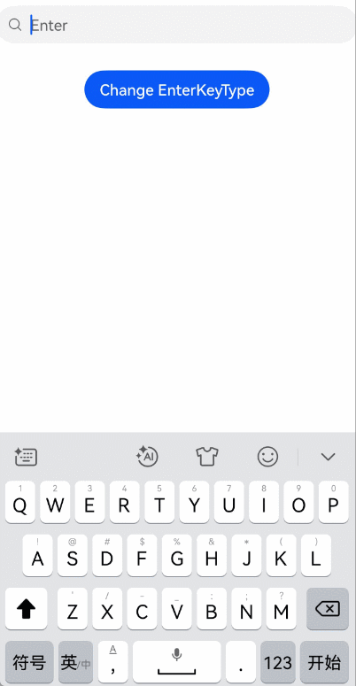

### Example 5 (Setting the Text Style)

Since API version 12, this example shows text effects in different styles through the [lineHeight](#lineheight12), [letterSpacing](#letterspacing12), and [decoration](#decoration12) attributes.

```ts
// xxx.ets
@Entry
@Component
struct SearchExample {
  build() {
    Row() {
      Column() {
        Text('lineHeight').fontSize(9).fontColor(0xCCCCCC)
        Search({value: 'lineHeight unset'})
          .border({ width: 1 }).padding(10)
        Search({value: 'lineHeight 15'})
          .border({ width: 1 }).padding(10).lineHeight(15)
        Search({value: 'lineHeight 30'})
          .border({ width: 1 }).padding(10).lineHeight(30)

        Text('letterSpacing').fontSize(9).fontColor(0xCCCCCC)
        Search({value: 'letterSpacing 0'})
          .border({ width: 1 }).padding(5).letterSpacing(0)
        Search({value: 'letterSpacing 3'})
          .border({ width: 1 }).padding(5).letterSpacing(3)
        Search({value: 'letterSpacing -1'})
          .border({ width: 1 }).padding(5).letterSpacing(-1)

        Text('decoration').fontSize(9).fontColor(0xCCCCCC)
        Search({value: 'LineThrough, Red'})
          .border({ width: 1 }).padding(5)
          .decoration({type: TextDecorationType.LineThrough, color: Color.Red})
        Search({value: 'Overline, Red, DOTTED'})
          .border({ width: 1 }).padding(5)
          .decoration({type: TextDecorationType.Overline, color: Color.Red, style: TextDecorationStyle.DOTTED})
        Search({value: 'Underline, Red, WAVY'})
          .border({ width: 1 }).padding(5)
          .decoration({type: TextDecorationType.Underline, color: Color.Red, style: TextDecorationStyle.WAVY})
      }.height('90%')
    }
    .width('90%')
    .margin(10)
  }
}

```


### Example 6 (Setting Text Feature Effects)

This example uses the [fontFeature](#fontfeature12) (since API version 12) attribute to implement the display effect of text under different font features.

```ts
// xxx.ets
@Entry
@Component
struct SearchExample {
  @State text1: string = 'This is ss01 on : 0123456789';
  @State text2: string = 'This is ss01 off: 0123456789';

  build() {
    Column(){
      Search({value: this.text1})
        .margin({top:200})
        .fontFeature('"ss01" on')
      Search({value: this.text2})
        .margin({top:10})
        .fontFeature('"ss01" off')
    }
    .width("90%")
    .margin("5%")
  }
}
```


### Example 7 (Custom Keyboard Avoidance)

This example uses the [customKeyboard](#customkeyboard10) (since API version 10) attribute to configure the [KeyboardOptions](ts-basic-components-richeditor.md#keyboardoptions12) (since API version 12) interface to implement custom keyboard avoidance.

```ts
// xxx.ets
@Entry
@Component
struct SearchExample {
  controller: SearchController = new SearchController();
  @State inputValue: string = '';
  @State height1: string | number = '80%';
  @State supportAvoidance: boolean = true;

  // Custom keyboard component
  @Builder
  CustomKeyboardBuilder() {
    Column() {
      Row() {
        Button('x').onClick(() => {
          // Close the custom keyboard
          this.controller.stopEditing();
        }).margin(10)
      }

      Grid() {
        ForEach([1, 2, 3, 4, 5, 6, 7, 8, 9, '*', 0, '#'], (item: number | string) => {
          GridItem() {
            Button(item + '')
              .width(110).onClick(() => {
              this.inputValue += item;
            })
          }
        })
      }.maxCount(3).columnsGap(10).rowsGap(10).padding(5)
    }
    .backgroundColor(Color.Gray)
  }

  build() {
    Column() {
      Row() {
        Button('20%')
          .fontSize(24)
          .onClick(() => {
            this.height1 = '20%';
          })
        Button('80%')
          .fontSize(24)
          .margin({ left: 20 })
          .onClick(() => {
            this.height1 = '80%';
          })
      }
      .justifyContent(FlexAlign.Center)
      .alignItems(VerticalAlign.Bottom)
      .height(this.height1)
      .width('100%')
      .padding({ bottom: 50 })

      Search({ controller: this.controller, value: this.inputValue })// Bind the custom keyboard
        .customKeyboard(this.CustomKeyboardBuilder(), { supportAvoidance: this.supportAvoidance })
        .margin(10)
        .border({ width: 1 })
        .onChange((value: string) => {
          this.inputValue = value;
        })
    }
  }
}
```


### Example 8 (Setting Text Auto-Adaptation)

Since API version 12, this example demonstrates the effect of adaptive font size through the [minFontSize](#minfontsize12) and [maxFontSize](#maxfontsize12) attributes.

```ts
// xxx.ets
@Entry
@Component
struct SearchExample {
  build() {
    Row() {
      Column() {
        Text('adaptive font').fontSize(9).fontColor(0xCCCCCC)

        Search({value: 'This is the text without the adaptive font'})
          .width('80%').height(90).borderWidth(1)
        Search({value: 'This is the text without the adaptive font'})
          .width('80%').height(90).borderWidth(1)
          .minFontSize(4)
          .maxFontSize(40)
      }.height('90%')
    }
    .width('90%')
    .margin(10)
  }
}
```


### Example 9 (Supports Insert and Delete Callbacks)

Since API version 12, this example implements the insert and delete effects through the [onWillInsert](#onwillinsert12), [onDidInsert](#ondidinsert12), [onWillDelete](#onwilldelete12), and [onDidDelete](#ondiddelete12) APIs. Since API version 15, it shows the specific information when the text content is about to change through the [onWillChange](#onwillchange15) API.

```ts
// xxx.ets
class ChangeState {
  changeContent: string = '';
  changePreviewOffset: number | undefined = 0;
  changePreviewValue: string | undefined = '';
  changeTextChangeRangeBeforeX: number | undefined = 0;
  changeTextChangeRangeBeforeY: number | undefined = 0;
  changeTextChangeRangeAfterX: number | undefined = 0;
  changeTextChangeRangeAfterY: number | undefined = 0;
  changeTextChangeOldContent: string | undefined = '';
  changeTextChangeOldPreviewOffset: number | undefined = 0;
  changeTextChangeOldPreviewValue: string | undefined = '';

  SetInfo(info: EditableTextChangeValue) {
    this.changeContent = info.content;
    this.changePreviewOffset = info.previewText?.offset;
    this.changePreviewValue = info.previewText?.value;
    this.changeTextChangeRangeBeforeX = info.options?.rangeBefore.start;
    this.changeTextChangeRangeBeforeY = info.options?.rangeBefore.end;
    this.changeTextChangeRangeAfterX = info.options?.rangeAfter.start;
    this.changeTextChangeRangeAfterY = info.options?.rangeAfter.end;
    this.changeTextChangeOldContent = info.options?.oldContent;
    this.changeTextChangeOldPreviewOffset = info.options?.oldPreviewText.offset;
    this.changeTextChangeOldPreviewValue = info.options?.oldPreviewText.value;
  }
}

@Entry
@Component
struct SearchExample {
  @State insertValue: string = '';
  @State deleteValue: string = '';
  @State insertOffset: number = 0;
  @State deleteOffset: number = 0;
  @State deleteDirection: number = 0;
  @State changeState1: ChangeState = new ChangeState();
  @State changeState2: ChangeState = new ChangeState();

  build() {
    Row() {
      Column() {
        Search({ value: 'Search supports insert callback text' })
          .height(60)
          .onWillInsert((info: InsertValue) => {
            this.insertValue = info.insertValue;
            return true;
          })
          .onWillChange((info: EditableTextChangeValue) => {
            this.changeState1.SetInfo(info);
            return true;
          })
          .onDidInsert((info: InsertValue) => {
            this.insertOffset = info.insertOffset;
          })

        Text('insertValue:' + this.insertValue + '  insertOffset:' + this.insertOffset).height(20)

        Blank(30)

        Text('context:' + this.changeState1.changeContent).height(20)
        Text('previewText-offset:' + this.changeState1.changePreviewOffset).height(20)
        Text('previewText-value:' + this.changeState1.changePreviewValue).height(20)
        Text('options-rangeBefore-start:' + this.changeState1.changeTextChangeRangeBeforeX).height(20)
        Text('options-rangeBefore-end:' + this.changeState1.changeTextChangeRangeBeforeY).height(20)
        Text('options-rangeAfter-start:' + this.changeState1.changeTextChangeRangeAfterX).height(20)
        Text('options-rangeAfter-end:' + this.changeState1.changeTextChangeRangeAfterY).height(20)
        Text('options-oldContent:' + this.changeState1.changeTextChangeOldContent).height(20)
        Text('options-oldPreviewText-offset:' + this.changeState1.changeTextChangeOldPreviewOffset).height(20)
        Text('options-oldPreviewText-value:' + this.changeState1.changeTextChangeOldPreviewValue).height(20)

        Search({ value: 'Search supports delete callback text b' })
          .height(60)
          .onWillDelete((info: DeleteValue) => {
            this.deleteValue = info.deleteValue;
            this.deleteDirection = info.direction;
            return true;
          })
          .onWillChange((info: EditableTextChangeValue) => {
            // Handle the text change information.
            this.changeState2.SetInfo(info);
            return true;
          })
          .onDidDelete((info: DeleteValue) => {
            this.deleteOffset = info.deleteOffset;
            this.deleteDirection = info.direction;
          })

        Text('deleteValue:' + this.deleteValue + '  deleteOffset:' + this.deleteOffset).height(20)
        Text('deleteDirection:' + (this.deleteDirection == 0 ? 'BACKWARD' : 'FORWARD')).height(20)

        Blank(30)

        Text('context:' + this.changeState2.changeContent).height(20)
        Text('previewText-offset:' + this.changeState2.changePreviewOffset).height(20)
        Text('previewText-value:' + this.changeState2.changePreviewValue).height(20)
        Text('options-rangeBefore-start:' + this.changeState2.changeTextChangeRangeBeforeX).height(20)
        Text('options-rangeBefore-end:' + this.changeState2.changeTextChangeRangeBeforeY).height(20)
        Text('options-rangeAfter-start:' + this.changeState2.changeTextChangeRangeAfterX).height(20)
        Text('options-rangeAfter-end:' + this.changeState2.changeTextChangeRangeAfterY).height(20)
        Text('options-oldContent:' + this.changeState2.changeTextChangeOldContent).height(20)
        Text('options-oldPreviewText-offset:' + this.changeState2.changeTextChangeOldPreviewOffset).height(20)
        Text('options-oldPreviewText-value:' + this.changeState2.changeTextChangeOldPreviewValue).height(20)

      }.width('100%')
    }
    .height('100%')
  }
}
```

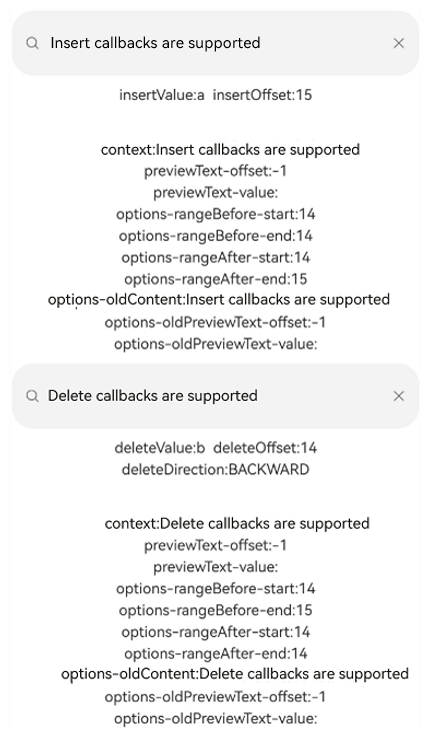

### Example 10 (Custom Menu for Text Extension)

Since API version 12, this example uses the [editMenuOptions](#editmenuoptions12) API to set the text content, icon, and callback of custom menu extension items. In addition, menu data can be set in the [onPrepareMenu](ts-text-common.md#attributes-1) callback (since API version 20).

```ts
// xxx.ets
@Entry
@Component
struct SearchExample {
  @State text: string = 'Search editMenuOptions';
  @State endIndex: number = 0;
  onCreateMenu = (menuItems: Array<TextMenuItem>) => {
    // Create the first custom menu item for menu extension.
    // $r('app.media.startIcon') needs to be replaced with the image resource file required by the developer.
    let item1: TextMenuItem = {
      content: 'create1',
      icon: $r('app.media.startIcon'),
      id: TextMenuItemId.of('create1'),
    };
    // Create the second custom menu item.
    let item2: TextMenuItem = {
      content: 'create2',
      id: TextMenuItemId.of('create2'),
      icon: $r('app.media.startIcon'),
    };
    // Add the custom menu items to the menu list: item1 to the end and item2 to the beginning.
    menuItems.push(item1);
    menuItems.unshift(item2);
    // Find and remove the system AI writing menu item.
    let targetIndex = menuItems.findIndex(item => item.id.equals(TextMenuItemId.AI_WRITER));
    if (targetIndex !== -1) {
      menuItems.splice(targetIndex, 1); // Delete one element from the target index.
    }
    // Remove the auto-fill menu item.
    // TextMenuItemId.autoFill is supported since API version 23.
    targetIndex = menuItems.findIndex(item => item.id.equals(TextMenuItemId.autoFill));
    if (targetIndex !== -1) {
      menuItems.splice(targetIndex, 1); // Delete one element from the target index.
    }
    return menuItems;
  }
  onMenuItemClick = (menuItem: TextMenuItem, textRange: TextRange) => {
    if (menuItem.id.equals(TextMenuItemId.of('create2'))) {
      console.info('Intercept id: create2 start:' + textRange.start + '; end:' + textRange.end);
      return true;
    }
    if (menuItem.id.equals(TextMenuItemId.of('prepare1'))) {
      console.info('Intercept id: prepare1 start:' + textRange.start + '; end:' + textRange.end);
      return true;
    }
    if (menuItem.id.equals(TextMenuItemId.COPY)) {
      console.info('Intercept id: COPY start:' + textRange.start + '; end:' + textRange.end);
      return true;
    }
    if (menuItem.id.equals(TextMenuItemId.SELECT_ALL)) {
      console.info('Do not intercept id: SELECT_ALL start:' + textRange.start + '; end:' + textRange.end);
      return false;
    }
    return false;
  }
  // $r('app.media.startIcon') needs to be replaced with the image resource file required by the developer.
  onPrepareMenu = (menuItems: Array<TextMenuItem>) => {
    // Create a dynamic menu item whose content includes the current selection end position.
    let item1: TextMenuItem = {
      content: 'prepare1_' + this.endIndex,
      icon: $r('app.media.startIcon'),
      id: TextMenuItemId.of('prepare1'),
    };
    // Add the dynamic menu item to the beginning of the menu list.
    menuItems.unshift(item1);
    return menuItems;
  }
  @State editMenuOptions: EditMenuOptions = {
    onCreateMenu: this.onCreateMenu,
    onMenuItemClick: this.onMenuItemClick,
    onPrepareMenu: this.onPrepareMenu
  };

  build() {
    Column() {
      Search({ value: this.text })
        .width('95%')
        .editMenuOptions(this.editMenuOptions)
        .margin({ top: 100 })
        .onTextSelectionChange((selectionStart: number, selectionEnd: number) => {
          this.endIndex = selectionEnd;
        })
    }
    .width('90%')
    .margin('5%')
  }
}
```
<!--RP2-->
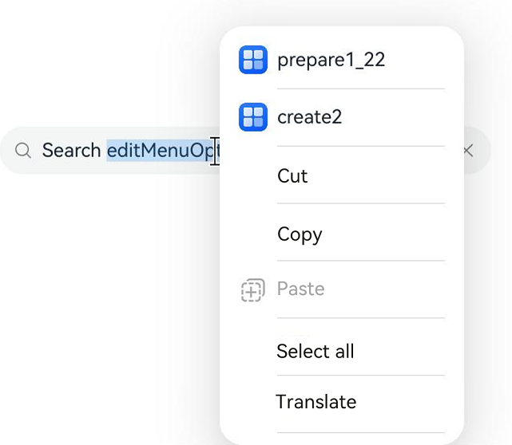
<!--RP2End-->

### Example 11 (Setting a Symbol-Type Clear Button)

Since API version 10, this example uses the [searchIcon](#searchicon10) and [cancelButton](#cancelbutton10) attributes to demonstrate the effect of customizing the style of the symbol-type clear button on the right.

```ts
// xxx.ets
import { SymbolGlyphModifier } from '@kit.ArkUI';

@Entry
@Component
struct SearchExample {
  controller: SearchController = new SearchController();
  @State changeValue: string = '';
  @State submitValue: string = '';

  build() {
    Column() {
      Search({ value: this.changeValue, placeholder: 'Type to search...', controller: this.controller })
        .searchIcon(new SymbolGlyphModifier($r('sys.symbol.magnifyingglass')).fontColor([Color.Red]))
        .cancelButton({
          style: CancelButtonStyle.CONSTANT,
          icon: new SymbolGlyphModifier($r('sys.symbol.xmark')).fontColor([Color.Green])
        })
        .searchButton('SEARCH')
        .width('95%')
        .height(40)
        .backgroundColor('#F5F5F5')
        .placeholderColor(Color.Grey)
        .placeholderFont({ size: 14, weight: 400 })
        .textFont({ size: 14, weight: 400 })
        .margin(10)
    }
    .width('100%')
    .height('100%')
  }
}
```


### Example 12 (Setting Whether Text Can Be Copied)

This example uses the [copyOption](#copyoption9), [onWillCopy](#onwillcopy), and [onWillCut](#onwillcut) APIs to show how to set text copying, how to intercept system copying, and how to intercept system cutting.

Since API version 26.0.0, the [onWillCopy](#onwillcopy) and [onWillCut](#onwillcut) APIs are added.

```ts
// xxx.ets

@Entry
@Component
struct SearchExample {
  controller: SearchController = new SearchController();
  @State copyValue: string = '';
  @State cutValue: string = '';

  build() {
    Column({ space: 3 }) {
      Text('copy: ' + this.copyValue)
      Text('cut:' + this.cutValue)
      Search({ value: 'Search CopyOption:None', controller: this.controller })
        .width('95%')
        .height(40)
        .copyOption(CopyOptions.None)
        .onCopy((value: string) => {
          this.copyValue = value;
        })
        // onWillCopy is supported since API version 26.0.0.
        .onWillCopy((value: string) => {
          this.copyValue = value;
          return false;
        })
        .onCut((value: string) => {
          this.cutValue = value;
        })
      Search({ value: 'Search CopyOption:InApp', controller: this.controller })
        .width('95%')
        .height(40)
        .copyOption(CopyOptions.InApp)
        .onCopy((value: string) => {
          this.copyValue = value;
        })
        .onCut((value: string) => {
          this.cutValue = value;
        })
        // onWillCut is supported since API version 26.0.0.
        .onWillCut((value: string) => {
          this.cutValue = value;
          return false;
        })
      Search({ value: 'Search CopyOption:LocalDevice', controller: this.controller })
        .width('95%')
        .height(40)
        .copyOption(CopyOptions.LocalDevice)
        .onCopy((value: string) => {
          this.copyValue = value;
        })
        .onCut((value: string) => {
          this.cutValue = value;
        })
    }
    .width('100%')
    .height('100%')
  }
}
```


### Example 13 (Setting Text Horizontal Alignment/Cursor Style/Selected Background Color)

This example uses the [textAlign](#textalign9) (since API version 9), [caretStyle](#caretstyle10) (since API version 10), and [selectedBackgroundColor](#selectedbackgroundcolor12) (since API version 12) attributes to demonstrate how to set the horizontal alignment of text, the cursor style, and the selected background color.

```ts
// xxx.ets

@Entry
@Component
struct SearchExample {
  controller: SearchController = new SearchController();

  build() {
    Column({ space: 3 }) {
      Search({ value: 'Search textAlign sample', controller: this.controller })
        .width('95%')
        .height(40)
        .stopBackPress(true)
        .textAlign(TextAlign.Center)
        .caretStyle({ width: 3, color: Color.Green })
        .selectedBackgroundColor(Color.Gray)
    }
    .width('100%')
    .height('100%')
  }
}
```


### Example 14 (Setting Default Focus and Bringing Up the Soft Keyboard)

This example shows how to set default focus and bring up the soft keyboard by using the [defaultFocus](ts-universal-attributes-focus.md#defaultfocus9) (from API version 9) and [enableKeyboardOnFocus](#enablekeyboardonfocus10) (from API version 10) attributes.

```ts
// xxx.ets

@Entry
@Component
struct SearchExample {
  controller: SearchController = new SearchController();
  @State value: string = 'false';

  build() {
    Column({ space: 3 }) {
      Text('editing: ' + this.value)
      Search({ placeholder: 'please enter...', controller: this.controller })
        .width('95%')
        .height(40)
        .defaultFocus(true)
        .enableKeyboardOnFocus(true)
        .enablePreviewText(true)
        .enableHapticFeedback(true)
        .onEditChange((data: boolean) => {
          this.value = data ? 'true' : 'false';
        })
    }
    .width('100%')
    .height('100%')
  }
}
```


### Example 15 (Disabling the System Text Selection Menu)

This example shows how to disable the system text selection menu through the [selectionMenuHidden](#selectionmenuhidden10) attribute (from API version 10).

```ts
// xxx.ets

@Entry
@Component
struct SearchExample {
  controller: SearchController = new SearchController();

  build() {
    Column({ space: 3 }) {
      Search({ value: '123456', controller: this.controller })
        .width('95%')
        .height(40)
        .type(SearchType.NUMBER)
        .selectionMenuHidden(true)
    }
    .width('100%')
    .height('100%')
  }
}
```


### Example 16 (Filtering the Input Text)

Since API version 12, this example uses the [inputFilter](#inputfilter12) attribute to show how to filter the input text to restrict the input content.

```ts
// xxx.ets

@Entry
@Component
struct SearchExample {
  controller: SearchController = new SearchController();
  @State filterValue: string = '';

  build() {
    Column({ space: 3 }) {
      Text('Filter:' + this.filterValue)
      Search({ placeholder: 'please enter...', controller: this.controller })
        .width('95%')
        .height(40)
        .textIndent(5)
        .halfLeading(true)
        .inputFilter('[a-z]', (filterValue: string) => {
          this.filterValue = filterValue;
        })
    }
    .width('100%')
    .height('100%')
  }
}
```


### Example 17 (Selecting Text Content in a Specified Range)

This example uses [setTextSelection](#settextselection12) (from API version 12) to demonstrate how to select text content in a specified range and the show/hide policy of the menu.

```ts
// xxx.ets

@Entry
@Component
struct SearchExample {
  controller: SearchController = new SearchController();
  @State startIndex: number = 0;
  @State endIndex: number = 0;

  build() {
    Column({ space: 3 }) {
      Text('Selection start:' + this.startIndex + ' end:' + this.endIndex)
      Search({ value: 'Hello World', controller: this.controller })
        .width('95%')
        .height(40)
        .minFontScale(1)
        .maxFontScale(1.5)
        .defaultFocus(true)
        .onTextSelectionChange((selectionStart: number, selectionEnd: number) => {
          this.startIndex = selectionStart;
          this.endIndex = selectionEnd;
        })

      Button('Selection [0,3]')
        .onClick(() => {
          this.controller.setTextSelection(0, 3, { menuPolicy: MenuPolicy.SHOW });
        })
    }
    .width('100%')
    .height('100%')
  }
}
```

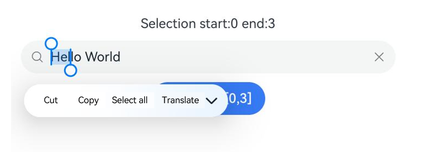

### Example 18 (Setting the Text Scroll Event)

Since API version 10, this example shows how to set the callback for the text scroll event through the [onContentScroll](#oncontentscroll10) event.

```ts
// xxx.ets

@Entry
@Component
struct SearchExample {
  controller: SearchController = new SearchController();
  @State offsetX: number = 0;
  @State offsetY: number = 0;

  build() {
    Column({ space: 3 }) {
      Text('offset x:' + this.offsetX + ' y:' + this.offsetY)
      Search({ value: 'ABCDEFGHIJKLMNOPQRSTUVWXYZ', controller: this.controller })
        .width(200)
        .height(40)
        .onContentScroll((totalOffsetX: number, totalOffsetY: number) => {
          this.offsetX = totalOffsetX;
          this.offsetY = totalOffsetY;
        })
    }
    .width('100%')
    .height('100%')
  }
}
```


### Example 19 (Setting the Minimum and Maximum Font Ranges)

Since API version 18, this example uses [minFontScale](#minfontscale18) and [maxFontScale](#maxfontscale18) to set the minimum and maximum font display ranges. After the system font size is adjusted, the text font size will not exceed the ranges set by [minFontScale](#minfontscale18) and [maxFontScale](#maxfontscale18). The following example shows the zoom-in and zoom-out effects of the Search component after the system font is adjusted under different font size limit conditions.

```json5
// Enable the application to scale with the system.
// In AppScope/resources/base, create a folder named profile.
// In AppScope/resources/base/profile, create a file named configuration.json.
// In AppScope/resources/base/profile/configuration.json, add the following code.
{
  "configuration": {
    "fontSizeScale": "followSystem",
    "fontSizeMaxScale": "3.2"
  }
}
```

```json5
// In AppScope/app.json5, modify the following code.
{
  "app": {
    "bundleName": "com.example.myapplication",
    "vendor": "example",
    "versionCode": 1000000,
    "versionName": "1.0.0",
    "icon": "$media:app_icon",
    "label": "$string:app_name",
    "configuration": "$profile:configuration"
  }
}
```

```ts
// xxx.ets
@Entry
@Component
struct SearchExample {
  @State minFontScale: number = 1.0;
  @State maxFontScale: number = 1.0;
  @State minFontScale2: number = 0.5;
  @State maxFontScale2: number = 2.0;

  build() {
    Column() {
      Column() {
        Text('System font becomes larger and smaller, larger and smaller aaaaaaaAAAAAA')
        Blank(30)
        Text('minFontScale = ' + this.minFontScale)
        Text('maxFontScale = ' + this.maxFontScale)
        Search({
          placeholder: 'The text area can hold an unlimited amount of text. input your word...',
        })
          .minFontScale(this.minFontScale) // Set the minimum font scale factor. If the parameter is undefined, the default system scale factor is used.
          .maxFontScale(this.maxFontScale) // Set the maximum font scale factor. If the parameter is undefined, the default system scale factor is used.

        Blank(30)

        Text('minFontScale = ' + this.minFontScale2)
        Text('maxFontScale = ' + this.maxFontScale2)
        Search({
          placeholder: 'The text area can hold an unlimited amount of text. input your word...',
        })
          .minFontScale(this.minFontScale2) // Set the minimum font scale factor. If the parameter is undefined, the system default scale factor is used.
          .maxFontScale(this.maxFontScale2) // Set the maximum font scale factor. If the parameter is undefined, the system default scale factor is used.
      }.width('100%')
    }
  }
}
```

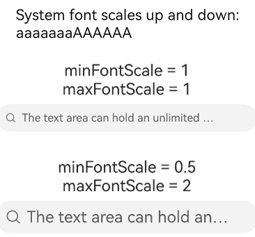 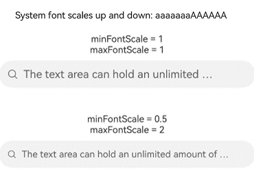 

### Example 20 (Setting Text Stroke)

Since API version 20, this example uses the [strokeWidth](#strokewidth20) and [strokeColor](#strokecolor20) attributes to set the stroke width and color of the text.

Since API version 26.0.0, the [strokeJoinStyle](#strokejoinstyle) API is added to set the corner style of the text stroke.

```ts
// xxx.ets
import { LengthMetrics } from '@kit.ArkUI';

@Entry
@Component
struct SearchExample {
  build() {
    Row() {
      Column() {
        Text('stroke feature').fontSize(9).fontColor(0xCCCCCC)

        Search({ value: 'Text without stroke' })
          .width('100%')
          .height(60)
          .borderWidth(1)
          .minFontSize(40)
          .maxFontSize(40)
        Search({ value: 'Text with stroke' })
          .width('100%')
          .height(60)
          .borderWidth(1)
          .minFontSize(40)
          .maxFontSize(40)
          .strokeWidth(LengthMetrics.px(-3.0))
          .strokeColor(Color.Red)
        Search({ value: 'Text with stroke' })
          .width('100%')
          .height(60)
          .borderWidth(1)
          .minFontSize(40)
          .maxFontSize(40)
          .strokeWidth(LengthMetrics.px(3.0))
          .strokeJoinStyle(StrokeJoinStyle.MITER_JOIN)
          .strokeColor(Color.Red)
      }.height('90%')
    }
    .width('90%')
    .margin(10)
  }
}
```

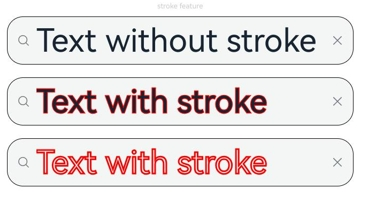

### Example 21 (Setting Automatic Spacing Between Chinese and Western Characters)

Since API version 20, this example sets automatic spacing between Chinese and Western characters through the [enableAutoSpacing](#enableautospacing20) attribute.

```ts
// xxx.ets
@Entry
@Component
struct SearchExample {
  build() {
    Row() {
      Column() {
        Text('Enable automatic spacing between Chinese and Western characters').margin(5)
        Search({value: 'Chinese and Western Auto Spacing'})
          .enableAutoSpacing(true)
        Text('Disable automatic spacing between Chinese and Western characters').margin(5)
        Search({value: 'Chinese and Western Auto Spacing'})
          .enableAutoSpacing(false)
      }.height('100%')
    }
    .width('60%')
  }
}
```

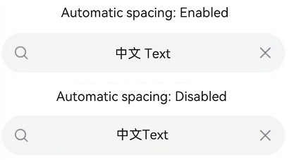

### Example 22 (Setting the placeholder rich text style)

Since API version 22, this example sets the placeholder rich text style through the [setStyledPlaceholder](ts-universal-attributes-text-style.md#setstyledplaceholder22) API.
```ts
// xxx.ets
import { LengthMetrics } from '@kit.ArkUI';

@Entry
@Component
struct SearchExample {
  styledString: MutableStyledString =
    new MutableStyledString('Input box rich text: text',
      [
        {
          start: 0,
          length: 7,
          styledKey: StyledStringKey.FONT,
          styledValue: new TextStyle({
            fontColor: Color.Orange,
            fontSize: LengthMetrics.fp(24)
          })
        },
        {
          start: 7,
          length: 4,
          styledKey: StyledStringKey.FONT,
          styledValue: new TextStyle({
            fontColor: Color.Gray,
            fontSize: LengthMetrics.fp(20),
            strokeWidth: LengthMetrics.px(-5),
            strokeColor: Color.Black,
          })
        },
        {
          start: 0,
          length: 1,
          styledKey: StyledStringKey.PARAGRAPH_STYLE,
          styledValue: new ParagraphStyle({
            textVerticalAlign: TextVerticalAlign.CENTER
          })
        }
      ]);
  controller: SearchController = new SearchController();

  aboutToAppear() {
    // Set the placeholder rich text style.
    this.controller.setStyledPlaceholder(this.styledString)
  }

  build() {
    Scroll() {
      Column() {
        Text('Search placeholder rich text')
          .fontSize(8)
        Search({
          controller: this.controller
        })
          .textFont({ size: 24 })
          .margin(10)
      }
      .width('100%')
    }
  }
}
```


### Example 23 (Setting IME Extension Information)

Since API version 22, this example uses [IMEClient](ts-text-common.md#imeclient20)'s setExtraConfig to set the IME extension information.

```ts
// xxx.ets
@Entry
@Component
struct SearchExample {
  build() {
    Column() {
      Search({ value: 'Execute the onWillAttachIME callback before the input method is pulled up' })
        .onWillAttachIME((client: IMEClient) => {
          // Set the IME extension information, including the custom properties of the Search component.
          client.setExtraConfig({
            customSettings: {
              name: "Search", // Custom property: component name.
              id: client.nodeId // Custom property: node ID.
            }
          })
        })
    }.height('100%')
  }
}
```

### Example 24 (Setting the Search Box Divider Color)

Since API version 23, this example sets the search box divider color through the [dividerColor](#dividercolor23) API.

```ts
// xxx.ets
import { ColorMetrics } from '@kit.ArkUI';

@Entry
@Component
struct SearchExample {
  @State colorTypeRGB: ColorMetrics = ColorMetrics.numeric(0x00FF00);
  @State colorTypeARGB: ColorMetrics = ColorMetrics.numeric(0x3300FF00);
  @State colorTypeColorWithSpace: ColorMetrics = ColorMetrics.colorWithSpace(ColorSpace.DISPLAY_P3, 0, 1.0, 0, 1.0);
  @State colorTypeRGBA: ColorMetrics = ColorMetrics.rgba(255, 0, 0, 1.0);
  // Replace with the resource file required by the developer.
  @State colorTypeRes: ColorMetrics = ColorMetrics.resourceColor($r('app.color.color'));
  @State colorType: ColorMetrics[] =
    [this.colorTypeRGB, this.colorTypeARGB, this.colorTypeColorWithSpace, this.colorTypeRGBA, this.colorTypeRes];
  @State colorTypeName: string[] =
    ['colorTypeRGB', 'colorTypeARGB', 'colorTypeColorWithSpace', 'colorTypeRGBA', 'colorTypeRes'];
  @State count: number = 0;

  build() {
    Column() {
      Blank(30)
      Search({ value: 'Input search text' })
        .searchButton('SEARCH', { fontSize: '14vp' })
        .dividerColor(this.colorType[this.count])
      Button('Change ColorType: ' + this.colorTypeName[this.count]).onClick(() => {
        this.count = (this.count + 1) % (this.colorType.length)
      })
        .fontSize('14vp')
        .width('100%')
    }
  }
}
```

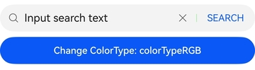

### Example 25 (Setting Leading Punctuation Compression)

This example uses the [compressLeadingPunctuation](#compressleadingpunctuation23) API to set leading punctuation compression. When a punctuation mark with spacing on the left is at the beginning of a line, the punctuation directly compresses the spacing to the left boundary.

Since API version 23, the compressLeadingPunctuation API is supported.

```ts
// xxx.ets
@Entry
@Component
struct Index {
  build() {
    Column(){
      Search({ value: '\u300C Leading punctuation compression enabled' })
        .compressLeadingPunctuation(true)
        .margin(5)
        .textFont({size:30})
        .width("90%")
      Search({ value: '\u300C Leading punctuation compression disabled' })
        .compressLeadingPunctuation(false)
        .textFont({size:30})
        .width("90%")
    }
  }
}
```


### Example 26 (Setting Adaptive Spacing)

This example uses the [includeFontPadding](#includefontpadding23) API to increase the spacing of the first and last lines, and the [fallbackLineSpacing](#fallbacklinespacing23) API to set adaptive line spacing.

Since API version 23, the [includeFontPadding](#includefontpadding23) and [fallbackLineSpacing](#fallbacklinespacing23) APIs are added.

```ts
// xxx.ets

const UYGHUR_TEXT: string = 'ياخشىمۇسەنياخشىمۇسەنياخشىمۇسەنياخشىمۇسەنياخشىمۇسەنياخشىمۇسەنياخشىمۇسەن';
@Entry
@Component
struct Index {
  @State include: boolean | null | undefined = false;
  @State fallback: boolean | null | undefined = false;
  @State displayText: string = UYGHUR_TEXT;

  build() {
    Column() {
      Search({
        value: this.displayText,
        placeholder: 'Please enter content...'
      })
        .includeFontPadding(this.include)
        .fallbackLineSpacing(this.fallback)
        .lineHeight(5)
        .width('100%')
        .height(100)
        .backgroundColor('#eee')
        .borderWidth(1)
        .borderColor('#dddddd')

      Scroll() {
        Column() {
          // --- Buttons related to includeFontPadding ---
          Button('Set includePadding: ' + this.include)
            .onClick(() => {
              this.include = this.include === false ? true : false;
            })
            .margin({ bottom: 10 })

          // --- Buttons related to fallbackLineSpacing ---
          Button('Set fallbackLineSpacing: ' + this.fallback)
            .onClick(() => {
              this.fallback = this.fallback === false ? true : false;
            })
            .margin({ bottom: 10 })

        }
        .width('100%')
        .padding(5)
      }
      .height(250)
      .backgroundColor('transparent')
      .scrollBarWidth(2)
      .scrollBarColor('#888')

    }
    .width('100%')
    .height('100%')
    .padding(20)
  }
}
```

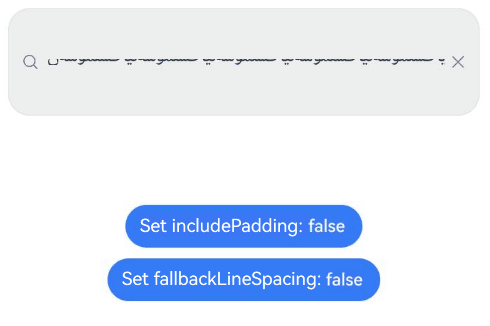

### Example 27 (Setting the Backplate Style for Text Dragging)

This example uses the [selectedDragPreviewStyle](#selecteddragpreviewstyle23) API to set the backplate style for text dragging.

The selectedDragPreviewStyle API is added from API version 23.

```ts
@Entry
@Component
struct SearchTest {
  build() {
    Column() {
      Search({ value: 'HelloWorld', placeholder: 'please input words' })
        .copyOption(CopyOptions.InApp)
        .width(200)
        .height(50)
        .margin(150)
        .draggable(true)
        .selectedDragPreviewStyle({color: 'rgba(227, 248, 249, 1)'})
    }
    .height('100%')
  }
}
```


### Example 28 (Deleting the Last Character in the Text Box)

This example calls the [deleteBackward](ts-universal-attributes-text-style.md#deletebackward23) API to delete the last character in the text box.

The [deleteBackward](ts-universal-attributes-text-style.md#deletebackward23) API is available from API version 23.

``` typescript
@Entry
@Component
struct Page {
  controller: SearchController = new SearchController();

  build() {
    Column() {
      Search({ placeholder: 'Search box example', controller: this.controller })
      Button('Delete backward')
        .onClick(() => {
          this.controller.deleteBackward();
        })
    }
  }
}
```


### Example 29 (Setting the Text Layout Direction)

This example sets the text layout direction through the [textDirection](#textdirection23) API.

Since API version 23, the textDirection API is added.

``` ts
// xxx.ets
@Entry
@Component
struct SearchExample {
  @State text: string = 'Search text layout direction example';

  build() {
    Column({ space: 3 }) {
      Text('Search text layout direction RTL, layout direction default')
        .fontSize(12).width('90%').margin(5)
      Search({ value: this.text })
        .width('95%')
        .height(40)
        .textDirection(TextDirection.RTL)
      Text('Search text layout direction RTL, layout direction default, text horizontal alignment LEFT')
        .fontSize(12).width('90%').margin(5)
      Search({ value: this.text })
        .width('95%')
        .height(40)
        .textDirection(TextDirection.RTL)
        .textAlign(TextAlign.LEFT)
      Text('Search text layout direction LTR, layout direction RTL')
        .fontSize(12).width('90%').margin(5)
      Search({ value: this.text })
        .width('95%')
        .height(40)
        .textDirection(TextDirection.LTR)
        .direction(Direction.Rtl)
    }
    .width('100%')
    .height('100%')
  }
}
```

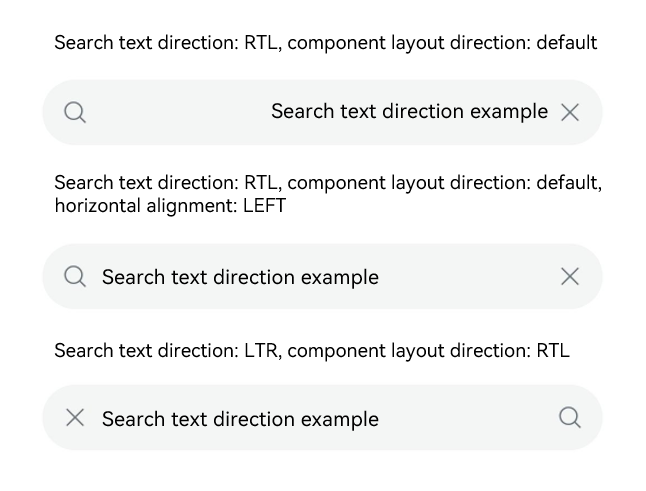

### Example 30 (Scroll the Specified Range of Text into the Visible Area)

This example uses [scrollToVisible](./ts-universal-attributes-text-style.md#scrolltovisible23) to scroll the text outside the visible area into the visible area.

Since API version 23, the scrollToVisible API is added.

```ts
// xxx.ets
@Entry
@Component
struct SearchExample {
  @State text: string = '1234567891234567891234😁😁😁6789123456789123456789012121214521';
  controller: SearchController = new SearchController();

  build() {
    Column() {
      Search({ value: this.text, controller: this.controller })
        .width(336)
        .height(56)
      Button('Scroll text into the visible area').onClick(()=> {
        this.controller.scrollToVisible({ start: 22, end: 30})
      })
    }.width('100%').height('100%').backgroundColor('#F1F3F5')
  }
}
```


### Example 31 (Setting the Text Shader Effect)

This example uses the [shaderStyle](#shaderstyle) API to apply a shader effect to the text in the Search component.

Since API version 26.0.0, the shaderStyle API is added.

```ts
@Entry
@Component
struct ShaderColorStyle {
  @State message: string = 'Hello World';
  @State linearGradientOptions1: LinearGradientOptions =
    {
      angle: 45,
      colors: [[Color.Red, 0.0], [Color.Blue, 0.3], [Color.Green, 0.5]]
    };
  @State linearGradientOptions2: LinearGradientOptions =
    {
      direction: GradientDirection.LeftTop,
      colors: [[Color.Red, 0.0], [Color.Blue, 0.3], [Color.Green, 0.5]],
      repeating: true,
    };
  @State radialGradientOptions: RadialGradientOptions =
    {
      center: [50, 50],
      radius: 20,
      colors: [[Color.Red, 0.0], [Color.Blue, 0.3], [Color.Green, 0.5]],
      repeating: true,
    };
  @State colorShaderStyle: ColorShaderStyle =
    {
      color: Color.Blue
    };
  build() {
    Column({ space: 5 }) {
      Text('Linear gradient with an angle of 45°').fontSize(18).width('90%')
        .margin({ top: 40, left: 40 })
      Search({ value: this.message })
        .minFontSize(20)
        .width('80%')
        .height(40)
        .shaderStyle(this.linearGradientOptions1)
      Text('Linear gradient with the direction of LeftTop').fontSize(18).width('90%')
        .margin({ top: 40, left: 40 })
      Search({ value: this.message })
        .minFontSize(20)
        .width('80%')
        .height(40)
        .shaderStyle(this.linearGradientOptions2)
      Text('Radial gradient').fontSize(18).width('90%')
        .margin({ top: 40, left: 40 })
      Search({ value: this.message })
        .minFontSize(20)
        .width('80%')
        .height(40)
        .shaderStyle(this.radialGradientOptions)
      Text('Solid color').fontSize(18).width('90%')
        .margin({ top: 40, left: 40 })
      Search({ value: this.message })
        .minFontSize(20)
        .width('80%')
        .height(40)
        .shaderStyle(this.colorShaderStyle)
    }
  }
}
```


### Example 32 (Setting the AI Menu for Text Selection)

This example configures the AI menu feature for text selection through [enableSelectedDataDetector](#enableselecteddatadetector22).

Since API version 22, enableSelectedDataDetector is added.

```ts
@Entry
@Component
struct SearchExample {
  exampleText: string = 'Example URL: www.example.com';

  build() {
    Column() {
      Row() {
        Search({ value: this.exampleText })
          .copyOption(CopyOptions.LocalDevice)
          .enableSelectedDataDetector(true)
          .border({ width: 1, color: Color.Black })
          .height(300)
          .margin(10)
      }
    }
  }
}
```
<!--RP3--><!--RP3End-->

<!--no_check-->