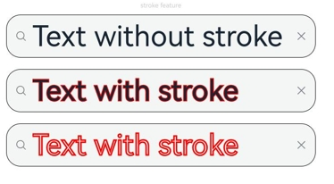
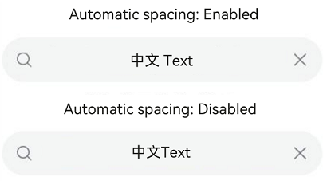

#  Search
<!--Kit: ArkUI-->
<!--Subsystem: ArkUI-->
<!--Owner: @kangshihui-->
<!--Designer: @xiangyuan6-->
<!--Tester: @jiaoaozihao-->
<!--Adviser: @Brilliantry_Rui-->

The **Search** component provides an area for users to enter search queries.

> **NOTE**
>
> This component is supported since API version 8. Updates will be marked with a superscript to indicate their earliest API version.
>
> This component supports only the single text style. To implement the rich text style, you are advised to use the [RichEditor](ts-basic-components-richeditor.md) component.

## Child Components

Not supported

## APIs

Search(options?: SearchOptions)

**Atomic service API**: This API can be used in atomic services since API version 11.

**System capability**: SystemCapability.ArkUI.ArkUI.Full

**Parameters**

| Name     | Type        | Mandatory| Description       |
| ----------- | ------------- | ---- | ------------- |
| options       | [SearchOptions](#searchoptions18)| No  | Initialization options of the **Search** component.|

## SearchOptions<sup>18+</sup>

Describes the initialization options of the **Search** component.

> **NOTE**
>
> To standardize anonymous object definitions, the element definitions here have been revised in API version 18. While historical version information is preserved for anonymous objects, there may be cases where the outer element's @since version number is higher than inner elements'. This does not affect interface usability.

**Atomic service API**: This API can be used in atomic services since API version 18.

**System capability**: SystemCapability.ArkUI.ArkUI.Full

| Name     | Type        | Read-Only| Optional| Description       |
| ----------- | ------------- | ---- | ---- | ------------- |
| value<sup>8+</sup>       | [ResourceStr](ts-types.md#resourcestr)   | No  | Yes| Sets the text input in the search text box.<br>Since API version 10, this parameter supports two-way binding through [$$](../../../ui/state-management/arkts-two-way-sync.md).<br>Since API version 18, this parameter supports two-way binding through [!!](../../../ui/state-management/arkts-new-binding.md#two-way-binding-between-built-in-component-parameters).<br>**Atomic service API**: This API can be used in atomic services since API version 11.<br>The Resource type is supported since API version 20.|
| placeholder<sup>8+</sup> | [ResourceStr](ts-types.md#resourcestr) | No  | Yes| Text displayed when there is no input.<br>**Atomic service API**: This API can be used in atomic services since API version 11.|
| icon<sup>8+</sup>        | string                                               | No  | Yes| Path to the search icon. By default, the system search icon is used.<br>**NOTE**<br>The icon data source supports both [relative paths](./ts-basic-components-image.md#example-25-displaying-an-image-using-a-relative-path) and network images.<br>- The supported formats include PNG, JPG, BMP, SVG, GIF, pixelmap, and HEIF.<br>- The Base64 string is supported in the following format: data:image/[png\|jpeg\|bmp\|webp\|heif];base64,[base64 data], where *[base64 data]* is a Base64 string.<br>If this attribute and the **searchIcon** attribute are both set, the **searchIcon** attribute takes precedence.<br>**Atomic service API**: This API can be used in atomic services since API version 11.|
| controller<sup>8+</sup>  | [SearchController](#searchcontroller) | No  | Yes| Controller of the **Search** component.<br>**Atomic service API**: This API can be used in atomic services since API version 11.  |

## Attributes

In addition to the [universal attributes](ts-component-general-attributes.md), the following attributes are supported.

### searchButton

searchButton(value: ResourceStr, option?: SearchButtonOptions)

Sets the text on the search button located next to the search text box.

Clicking the search button triggers both **onSubmit** and **onClick** callbacks.

The default font size on wearable devices is 18 fp.

**Atomic service API**: This API can be used in atomic services since API version 11.

**System capability**: SystemCapability.ArkUI.ArkUI.Full

**Parameters**

| Name| Type                                                 | Mandatory| Description                        |
| ------ | ----------------------------------------------------- | ---- | ---------------------------- |
| value  | [ResourceStr](ts-types.md#resourcestr)                | Yes  | Text on the search button located next to the search text box.<br>The Resource type is supported since API version 20.|
| option | [SearchButtonOptions](#searchbuttonoptions10) | No  | Text style of the search button located next to the search text box.<br>Default value:<br>{<br>fontSize: '16fp',<br>fontColor: '#ff3f97e9'<br>}         |

### placeholderColor

placeholderColor(value: ResourceColor)

Sets the placeholder text color. The default value is '#99ffffff' on wearable devices.

**Atomic service API**: This API can be used in atomic services since API version 11.

**System capability**: SystemCapability.ArkUI.ArkUI.Full

**Parameters**

| Name| Type                                      | Mandatory| Description                                            |
| ------ | ------------------------------------------ | ---- | ------------------------------------------------ |
| value  | [ResourceColor](ts-types.md#resourcecolor) | Yes  | Placeholder text color.<br>Default value: **'#99182431'**|

### placeholderFont

placeholderFont(value?: Font)

Placeholder text style, including the font size, font weight, font family, and font style.

**Atomic service API**: This API can be used in atomic services since API version 11.

**System capability**: SystemCapability.ArkUI.ArkUI.Full

**Parameters**

| Name| Type                    | Mandatory| Description                 |
| ------ | ------------------------ | ---- | --------------------- |
| value  | [Font](ts-types.md#font) | No  | Placeholder text style.|

> **NOTE**
>
> You can use [loadFontSync](../../apis-arkgraphics2d/js-apis-graphics-text.md#loadfontsync) to register custom fonts.

### textFont

textFont(value?: Font)

Style of the text entered in the search box, including the font size, font weight, font family, and font style.

The default font size on wearable devices is 18 fp.

**Atomic service API**: This API can be used in atomic services since API version 11.

**System capability**: SystemCapability.ArkUI.ArkUI.Full

**Parameters**

| Name| Type                    | Mandatory| Description                  |
| ------ | ------------------------ | ---- | ---------------------- |
| value  | [Font](ts-types.md#font) | No  | Text font of the search text box.|

### textAlign<sup>9+</sup>

textAlign(value: TextAlign)

Sets the text alignment mode in the search text box. Currently, the following alignment modes are supported: **TextAlign.Start**, **TextAlign.Center**, and **TextAlign.End**. **TextAlign.JUSTIFY** behaves the same as **TextAlign.Start**.

**Atomic service API**: This API can be used in atomic services since API version 11.

**System capability**: SystemCapability.ArkUI.ArkUI.Full

**Parameters**

| Name| Type                                       | Mandatory| Description                                                  |
| ------ | ------------------------------------------- | ---- | ------------------------------------------------------ |
| value  | [TextAlign](ts-appendix-enums.md#textalign) | Yes  | Text alignment mode in the search text box.<br>Default value: **TextAlign.Start**|

>  **NOTE** 
>
>  **textAlign** only adjusts the overall text layout and does not affect character display order. For character display order adjustment, see [Bidirectional Text Layout and Alignment](../../../ui/arkts-internationalization.md#bidirectional-text-layout-and-alignment).

### copyOption<sup>9+</sup>

copyOption(value: CopyOptions)

Sets whether copy and paste is allowed. When CopyOptions.None is set, the text in the current search cannot be copied, cut, translated, shared, searched, or written. Paste and select all are supported.

Dragging is not allowed when **CopyOptions.None** is set.

**Atomic service API**: This API can be used in atomic services since API version 11.

**System capability**: SystemCapability.ArkUI.ArkUI.Full

**Parameters**

| Name| Type                                            | Mandatory| Description                                                        |
| ------ | ------------------------------------------------ | ---- | ------------------------------------------------------------ |
| value  | [CopyOptions](ts-appendix-enums.md#copyoptions9) | Yes  | Whether copy and paste is allowed.<br>Default value: **CopyOptions.LocalDevice**|

### searchIcon<sup>10+</sup>

searchIcon(value: IconOptions | SymbolGlyphModifier)

Sets the style of the search icon on the left.

The default icon size on wearable devices is 16 vp.

**Atomic service API**: This API can be used in atomic services since API version 11.

**System capability**: SystemCapability.ArkUI.ArkUI.Full

**Parameters**

| Name| Type                                 | Mandatory| Description              |
| ------ | ------------------------------------- | ---- | ------------------ |
| value  | [IconOptions](#iconoptions10) \| [SymbolGlyphModifier](ts-universal-attributes-text-style.md#symbolglyphmodifier12) | Yes  | Style of the search icon on the left.<!--RP1--><br>Default value in light mode:<br>{<br>size: '16vp',<br>color: '#99182431',<br>src: ' '<br>}<br>Default value in dark mode:<br>{<br>size: '16vp',<br>color: '#99ffffff',<br>src: ' '<br>} <!--RP1End-->|

### cancelButton<sup>10+</sup>

cancelButton(value: CancelButtonOptions | CancelButtonSymbolOptions)

Sets the style of the Cancel button on the right.

The default icon size on wearable devices is 18 fp.

**Atomic service API**: This API can be used in atomic services since API version 11.

**System capability**: SystemCapability.ArkUI.ArkUI.Full

**Parameters**

| Name| Type                                                        | Mandatory| Description                                                        |
| ------ | ------------------------------------------------------------ | ---- | ------------------------------------------------------------ |
| value  | [CancelButtonOptions](#cancelbuttonoptions12) \| [CancelButtonSymbolOptions](#cancelbuttonsymboloptions12) | Yes  | Style of the Cancel button on the right.<br>Default value:<br>{<br>style: CancelButtonStyle.INPUT,<br>icon: {<br>size: '16vp',<br>color: '#99ffffff',<br>src: ' '<br>}<br>}<br>When **style** is set to **CancelButtonStyle.CONSTANT**, the Cancel button is always displayed.|

### fontColor<sup>10+</sup>

fontColor(value: ResourceColor)

Sets the font color of the input text. fontSize, fontStyle, fontWeight, and fontFamily are set in the [textFont](#textfont) attribute.

**Atomic service API**: This API can be used in atomic services since API version 11.

**System capability**: SystemCapability.ArkUI.ArkUI.Full

**Parameters**

| Name| Type                                      | Mandatory| Description                                           |
| ------ | ------------------------------------------ | ---- | ----------------------------------------------- |
| value  | [ResourceColor](ts-types.md#resourcecolor) | Yes  | Font color of the input text.<br>Default value: '#FF182431'<br>Default value on wearable devices: '#dbffffff'|

### caretStyle<sup>10+</sup>

caretStyle(value: CaretStyle)

Sets the caret style.

**Atomic service API**: This API can be used in atomic services since API version 11.

**System capability**: SystemCapability.ArkUI.ArkUI.Full

**Parameters**

| Name| Type                               | Mandatory| Description                                                        |
| ------ | ----------------------------------- | ---- | ------------------------------------------------------------ |
| value  | [CaretStyle](ts-text-common.md#caretstyle10) | Yes  | Caret style.<br>Default value:<br>{<br>width: '2.0vp',<br>color: '#007DFF'<br>} |

>  **NOTE**    
>   Since API version 12, this API can be used to set the text handle color, which is the same as the caret color.

### enableKeyboardOnFocus<sup>10+</sup>

enableKeyboardOnFocus(value: boolean)

Sets whether to enable the input method when the **Search** component obtains focus in a way other than clicking.

Since API version 10, the **Search** component brings up the keyboard by default when it obtains focus.

**Atomic service API**: This API can be used in atomic services since API version 11.

**System capability**: SystemCapability.ArkUI.ArkUI.Full

**Parameters**

| Name| Type   | Mandatory| Description                                           |
| ------ | ------- | ---- | ----------------------------------------------- |
| value  | boolean | Yes  | Whether to enable the input method when the component obtains focus in a way other than clicking.<br>**true** to bring up the keyboard, **false** otherwise.<br>Default value: **true**|

### selectionMenuHidden<sup>10+</sup>

selectionMenuHidden(value: boolean)

Sets whether to hide the system text selection menu.

**Atomic service API**: This API can be used in atomic services since API version 11.

**System capability**: SystemCapability.ArkUI.ArkUI.Full

**Parameters**

| Name| Type   | Mandatory| Description                                                        |
| ------ | ------- | ---- | ------------------------------------------------------------ |
| value  | boolean | Yes  | Whether to hide the system text selection menu.<br>**true**: Tapping, long-pressing, double-tapping, triple-tapping, or right-clicking the text box will not trigger the system text selection menu.<br>**false**: Tapping, long-pressing, double-tapping, triple-tapping, or right-clicking the text box will trigger the system text selection menu.<br>Default value: **false**|

### customKeyboard<sup>10+</sup>

customKeyboard(value: CustomBuilder | ComponentContent | undefined, options?: KeyboardOptions)

Sets the custom keyboard.

When a custom keyboard is set, activating the text box opens the specified custom component, instead of the system input method.

The custom keyboard's height can be set through the **height** attribute of the custom component's root node, and its width is fixed at the default value.

The custom keyboard is presented by overlaying the original screen. It is not compressed or lifted if avoid mode is not enabled or avoidance is not needed for the text box.

The custom keyboard cannot obtain the focus, but it blocks gesture events.

By default, the custom keyboard is closed when the input component loses the focus. You can also use the [stopEditing](#stopediting10) API to close the keyboard.

When setting a custom keyboard, you can bind the [onKeyPrelme](ts-universal-events-key.md#onkeypreime12) event to prevent input from the physical keyboard.

> **NOTE**
>
> This API cannot be called within [attributeModifier](ts-universal-attributes-attribute-modifier.md#attributemodifier).

**Atomic service API**: This API can be used in atomic services since API version 11.

**System capability**: SystemCapability.ArkUI.ArkUI.Full

**Parameters**

| Name               | Type                                       | Mandatory| Description                            |
| --------------------- | ------------------------------------------- | ---- | -------------------------------- |
| value                 | [CustomBuilder](ts-types.md#custombuilder8)  \| [ComponentContent](../js-apis-arkui-ComponentContent.md#componentcontent-1)<sup>22+</sup> \| undefined<sup>22+</sup> | Yes  | Custom keyboard.                    |
| options<sup>12+</sup> | [KeyboardOptions](ts-basic-components-richeditor.md#keyboardoptions12)       | No  | Whether to support keyboard avoidance.|

### type<sup>11+</sup>

type(value: SearchType)

Sets the text box type.

Different **SearchType** values trigger corresponding keyboard types and enforce input restrictions.

**Atomic service API**: This API can be used in atomic services since API version 12.

**System capability**: SystemCapability.ArkUI.ArkUI.Full

**Parameters**

| Name| Type                               | Mandatory| Description                       |
| ------ | ----------------------------------- | ---- | -------------------------- |
| value  | [SearchType](#searchtype11) | Yes  | Text box type.<br>Default value: SearchType.NORMAL|

### maxLength<sup>11+</sup>

maxLength(value: number)

Sets the maximum number of characters for text input. By default, there is no maximum number of characters. When the maximum number is reached, no more characters can be entered.

**Atomic service API**: This API can be used in atomic services since API version 12.

**System capability**: SystemCapability.ArkUI.ArkUI.Full

**Parameters**

| Name| Type                               | Mandatory| Description                  |
| ------ | ----------------------------------- | ---- | ---------------------- |
| value  | number | Yes  | Maximum number of characters for text input.<br> If the value is less than 0, the default value is used, and there is no limit.|

### enterKeyType<sup>12+</sup>

enterKeyType(value: EnterKeyType)

Sets the type of the Enter key.

**Atomic service API**: This API can be used in atomic services since API version 12.

**System capability**: SystemCapability.ArkUI.ArkUI.Full

**Parameters**

| Name| Type                                            | Mandatory| Description                                              |
| ------ | ------------------------------------------------ | ---- | -------------------------------------------------- |
| value  | [EnterKeyType](ts-basic-components-textinput.md#enterkeytype) | Yes  | Type of the Enter key.<br>Default value: **EnterKeyType.Search**|

### enableSelectedDataDetector<sup>22+</sup>

enableSelectedDataDetector(enable: boolean | undefined)

Sets whether to enable entity recognition for selected text. This API only works on devices that provide text recognition.

When **enableSelectedDataDetector** is set to **true**, all entity types are recognized by default.
This feature is only effective when [CopyOptions](ts-appendix-enums.md#copyoptions9) is set to **CopyOptions.LocalDevice** or **CopyOptions.CrossDevice**.

**Atomic service API**: This API can be used in atomic services since API version 22.

**System capability**: SystemCapability.ArkUI.ArkUI.Full

**Parameters**

| Name| Type   | Mandatory| Description                             |
| ------ | ------- | ---- | --------------------------------- |
| enable  | boolean \| undefined | Yes  | Whether to enable entity recognition for selected text.<br>**true**: Enable entity recognition. **false**: Disable entity recognition. Default value: **true**.|

### lineHeight<sup>12+</sup>

lineHeight(value: number | string | Resource)

Sets the text line height. If the value is less than or equal to **0**, the line height is not limited and the font size is adaptive. If the value is of the number type, the unit fp is used.

**Atomic service API**: This API can be used in atomic services since API version 12.

**System capability**: SystemCapability.ArkUI.ArkUI.Full

**Parameters**

| Name| Type                                                        | Mandatory| Description            |
| ------ | ------------------------------------------------------------ | ---- | ---------------- |
| value  | number \| string \| [Resource](ts-types.md#resource) | Yes  | Text line height.|

>  **NOTE**
>  
>  If certain characters have significantly taller glyphs than others on the same line, layout anomalies such as clipping, overlap, or misalignment may occur. In this case, adjust component attributes such as height and line height to ensure proper layout rendering.

### decoration<sup>12+</sup>

decoration(value: TextDecorationOptions)

Sets the color, type, and style of the text decorative line.

**Atomic service API**: This API can be used in atomic services since API version 12.

**System capability**: SystemCapability.ArkUI.ArkUI.Full

**Parameters**

| Name| Type                                                        | Mandatory| Description                                                        |
| ------ | ------------------------------------------------------------ | ---- | ------------------------------------------------------------ |
| value  | [TextDecorationOptions](ts-universal-attributes-text-style.md#textdecorationoptions12) | Yes  | Text decorative line options.<br>Default value: {<br> type: TextDecorationType.None,<br> color: Color.Black,<br> style: TextDecorationStyle.SOLID <br>} |

>  **NOTE**
>
>  When the bottom contour of a character intersects with the decoration, underline avoidance is triggered, commonly affecting characters like "g", "j", "y", "q", and "p."
>
>  If the decoration color is set to **Color.Transparent**, it inherits the text color of the first character in each line. If the decoration color is set to **"#00FFFFFF"**, the line becomes fully transparent.

### letterSpacing<sup>12+</sup>

letterSpacing(value: number | string | Resource)

Sets the letter spacing for a text style. If the value specified is a percentage or 0, the default value is used. For the string type, numeric string values with optional units, for example, **"10"** or **"10fp"**, are supported.

If the value specified is a negative value, the text is compressed. A negative value too small may result in the text being compressed to 0 and no content being displayed.

This setting applies to every character, including those at line endings.

**Atomic service API**: This API can be used in atomic services since API version 12.

**System capability**: SystemCapability.ArkUI.ArkUI.Full

**Parameters**

| Name| Type                      | Mandatory| Description          |
| ------ | -------------------------- | ---- | -------------- |
| value  | number \| string \| [Resource](ts-types.md#resource) | Yes  | Letter spacing.<br>Unit: [fp](ts-pixel-units.md)|

### fontFeature<sup>12+</sup>

fontFeature(value: string)

Sets the font feature, for example, monospaced digits.

Format: normal \| \<feature-tag-value\>

Format of **\<feature-tag-value\>**: \<string\> \[ \<integer\> \| on \| off ]

There can be multiple **\<feature-tag-value\>** values, which are separated by commas (,).

For example, the input format for monospaced clock fonts is "ss01" on.

**Atomic service API**: This API can be used in atomic services since API version 12.

**System capability**: SystemCapability.ArkUI.ArkUI.Full

**Parameters**

| Name| Type  | Mandatory| Description          |
| ------ | ------ | ---- | -------------- |
| value  | string | Yes  | Font feature.|

For details about the supported font features, see [Font Feature List](ts-basic-components-text.md#fontfeature12).
Font features are advanced typographic features, such as ligatures and monospace, for OpenType fonts. They are typically used in custom fonts and require the support of the font itself.
For more information about the font features, see [Low-level font feature settings control: the font-feature-settings property](https://www.w3.org/TR/css-fonts-3/#font-feature-settings-prop) and [The Complete CSS Demo for OpenType Features](https://sparanoid.com/lab/opentype-features/).

### selectedBackgroundColor<sup>12+</sup>

selectedBackgroundColor(value: ResourceColor)

Sets the background color of the selected text. If the opacity is not set, a 20% opacity will be used.

**Atomic service API**: This API can be used in atomic services since API version 12.

**System capability**: SystemCapability.ArkUI.ArkUI.Full

**Parameters**

| Name| Type                                      | Mandatory| Description                                      |
| ------ | ------------------------------------------ | ---- | ------------------------------------------ |
| value  | [ResourceColor](ts-types.md#resourcecolor) | Yes  | Background color of the selected text.|

### inputFilter<sup>12+</sup>

inputFilter(value: ResourceStr, error?:  Callback< string >)

Sets the regular expression for input filtering. Only inputs that comply with the regular expression can be displayed. Other inputs are filtered out.

For single-character input scenarios, only single-character matching is supported; for multi-character input scenarios (such as pasting), string matching is supported.

If **inputFilter** is set and the entered characters are not null, the filtering effect attached to the text box type (specified through the **type** attribute) does not take effect.

**Atomic service API**: This API can be used in atomic services since API version 12.

**System capability**: SystemCapability.ArkUI.ArkUI.Full

**Parameters**

| Name| Type                                  | Mandatory| Description                              |
| ------ | -------------------------------------- | ---- | ---------------------------------- |
| value  | [ResourceStr](ts-types.md#resourcestr) | Yes  | Regular expression.                      |
| error  |  Callback< string >     | No  | Filtered-out content to return when regular expression matching fails.|

### textIndent<sup>12+</sup>

textIndent(value: Dimension)

Sets the indent of the first line text.

**Atomic service API**: This API can be used in atomic services since API version 12.

**System capability**: SystemCapability.ArkUI.ArkUI.Full

**Parameters**

| Name| Type                                | Mandatory| Description                        |
| ------ | ----------------------------------- | ---- | ---------------------------- |
| value  | [Dimension](ts-types.md#dimension10)| Yes  | Indent of the first line text.<br>Default value: **0**  |

### minFontSize<sup>12+</sup>

minFontSize(value: number | string | Resource)

Sets the minimum font size. For the string type, numeric string values with optional units, for example, **"10"** or **"10fp"**, are supported.

For the setting to take effect, this attribute must be used together with [maxFontSize](#maxfontsize12) or layout constraint settings.

When the adaptive font size is used, the **fontSize** settings do not take effect.

If minFontSize is less than or equal to 0, the adaptive font size does not take effect. In this case, the value of size in the [textFont](#textfont) attribute takes effect. If the value is not set, the default value takes effect.

**Atomic service API**: This API can be used in atomic services since API version 12.

**System capability**: SystemCapability.ArkUI.ArkUI.Full

**Parameters**

| Name| Type                                                        | Mandatory| Description              |
| ------ | ------------------------------------------------------------ | ---- | ------------------ |
| value  | number \| string \| [Resource](ts-types.md#resource) | Yes  | Minimum font size.<br>Unit: [fp](ts-pixel-units.md)|

### maxFontSize<sup>12+</sup>

maxFontSize(value: number | string | Resource)

Sets the maximum font size. For the string type, numeric string values with optional units, for example, **"10"** or **"10fp"**, are supported.

For the setting to take effect, this attribute must be used together with [minFontSize](#minfontsize12) or layout constraint settings.

When the adaptive font size is used, the **fontSize** settings do not take effect.

If maxFontSize is less than or equal to 0 or maxFontSize is less than minFontSize, the adaptive font size does not take effect. In this case, the value of size in the [textFont](#textfont) attribute takes effect. If the value is not set, the default value takes effect.

**Atomic service API**: This API can be used in atomic services since API version 12.

**System capability**: SystemCapability.ArkUI.ArkUI.Full

**Parameters**

| Name| Type                                                        | Mandatory| Description              |
| ------ | ------------------------------------------------------------ | ---- | ------------------ |
| value  | number \| string \| [Resource](ts-types.md#resource) | Yes  | Maximum font size.<br>Unit: [fp](ts-pixel-units.md)|

### halfLeading<sup>18+</sup>

halfLeading(halfLeading: Optional\<boolean>)

Sets the vertical center of the text in the line to equally divide the line spacing to the top and bottom of the line.

**Atomic service API**: This API can be used in atomic services since API version 18.

**System capability**: SystemCapability.ArkUI.ArkUI.Full

**Parameters**

| Name| Type                                         | Mandatory| Description                                         |
| ------ | --------------------------------------------- | ---- | --------------------------------------------- |
| halfLeading | [Optional](ts-universal-attributes-custom-property.md#optionalt12)\<boolean> | Yes | Sets whether the text is centered vertically.<br>Whether half leading is enabled. Half leading is the leading split in half and applied equally to the top and bottom edges. The value **true** means that half leading is enabled, and **false** means the opposite.<br>Default value: **false**|

### minFontScale<sup>18+</sup>

minFontScale(scale: Optional\<number | Resource>)

Sets the minimum font scale factor for text.

**Atomic service API**: This API can be used in atomic services since API version 18.

**System capability**: SystemCapability.ArkUI.ArkUI.Full

**Parameters**

| Name| Type                                         | Mandatory| Description                                         |
| ------ | --------------------------------------------- | ---- | --------------------------------------------- |
| scale  | [Optional](ts-universal-attributes-custom-property.md#optionalt12)\<number \| [Resource](ts-types.md#resource)> | Yes  | Minimum font scale factor for text. The **undefined** type is supported.<br>Value range: [0, 1]<br>**NOTE**<br>A value less than 0 is handled as 0. A value greater than 1 is handled as 1. Abnormal values are ineffective by default.<br>Before using this function, you need to configure the configuration.json and app.json5 files in the project. For details, see [Example 19: Setting the Minimum and Maximum Font Scale Factors](#example-19-setting-the-minimum-and-maximum-font-scale-factors).|

### maxFontScale<sup>18+</sup>

maxFontScale(scale: Optional\<number | Resource>)

Sets the maximum font scale factor for text.

**Atomic service API**: This API can be used in atomic services since API version 18.

**System capability**: SystemCapability.ArkUI.ArkUI.Full

**Parameters**

| Name| Type                                         | Mandatory| Description                                         |
| ------ | --------------------------------------------- | ---- | --------------------------------------------- |
| scale  | [Optional](ts-universal-attributes-custom-property.md#optionalt12)\<number \| [Resource](ts-types.md#resource)> | Yes  | Maximum font scale factor for text. The **undefined** type is supported.<br>Value range: [1, +∞)<br>**NOTE**<br>A value less than 1 is handled as 1. Abnormal values are ineffective by default.<br>After the maxFontScale attribute is set, the content of the search component can be zoomed in twice at most.<br>Before using this function, you need to configure the configuration.json and app.json5 files in the project. For details, see [Example 19: Setting the Minimum and Maximum Font Scale Factors](#example-19-setting-the-minimum-and-maximum-font-scale-factors).|

### editMenuOptions<sup>12+</sup>

editMenuOptions(editMenu: EditMenuOptions)

Sets the extended options of the custom context menu on selection, including the text content, icon, and callback.

When [disableMenuItems](../arkts-apis-uicontext-textmenucontroller.md#disablemenuitems20) or [disableSystemServiceMenuItems](../arkts-apis-uicontext-textmenucontroller.md#disablesystemservicemenuitems20) is used to disable system service menu items in the context menu on selection, the disabled menu options will be excluded from the parameter list in the [onCreateMenu](./ts-text-common.md#oncreatemenu12) callback of **editMenuOptions**.

**Atomic service API**: This API can be used in atomic services since API version 12.

**System capability**: SystemCapability.ArkUI.ArkUI.Full

**Parameters**

| Name| Type                                         | Mandatory| Description                                         |
| ------ | --------------------------------------------- | ---- | --------------------------------------------- |
| editMenu  | [EditMenuOptions](ts-text-common.md#editmenuoptions) | Yes  | Extended options of the custom context menu on selection.|

### enablePreviewText<sup>12+</sup>

enablePreviewText(enable: boolean)

Sets whether to enable preview text.

The preview content is defined as a text temporary storage state. Currently, the text interception function is not supported.

**Atomic service API**: This API can be used in atomic services since API version 12.

**System capability**: SystemCapability.ArkUI.ArkUI.Full

**Parameters**

| Name| Type   | Mandatory| Description                              |
| ------ | ------- | ---- | ---------------------------------- |
| enable | boolean | Yes  | Whether to enable preview text.<br>**true**: Enable preview text. **false**: Disable preview text. <br>Default value: **true**|

>  **NOTE**
>  
>  Preview text represents a temporary, uncommitted input state. This feature requires support from the input method with pre-commit text functionality enabled. During text entry, when candidate words have not been confirmed yet, the text box displays marked text in a provisional state. For example, when typing Chinese using Pinyin input, the Pinyin letters appear in the input box before selecting from the candidate word list. This intermediate state constitutes preview text.

### enableHapticFeedback<sup>13+</sup>

enableHapticFeedback(isEnabled: boolean)

Specifies whether to enable haptic feedback.

**Atomic service API**: This API can be used in atomic services since API version 13.

**System capability**: SystemCapability.ArkUI.ArkUI.Full

**Parameters**

| Name| Type   | Mandatory| Description                              |
| ------ | ------- | ---- | ---------------------------------- |
| isEnabled | boolean | Yes  | Whether to enable haptic feedback.<br>The value **true** means to enable haptic feedback, and **false** means the opposite.<br>Default value: **true**|

>  **NOTE**
>
>  To enable haptic feedback, you must declare the ohos.permission.VIBRATE permission under **requestPermissions** in the **module.json5** file of the project.
> ```json
> "requestPermissions": [
>  {
>     "name": "ohos.permission.VIBRATE",
>  }
> ]
> ```

### autoCapitalizationMode<sup>20+</sup>

autoCapitalizationMode(mode: AutoCapitalizationMode)

Sets the auto-capitalization text mode. This API provides the capability, but actual implementation depends on the input method application.

**Atomic service API**: This API can be used in atomic services since API version 20.

**System capability**: SystemCapability.ArkUI.ArkUI.Full

**Parameters**

| Name  | Type                                     | Mandatory| Description                      |
| -------- | ----------------------------------------- | ---- | -------------------------- |
| mode | [AutoCapitalizationMode](ts-text-common.md#autocapitalizationmode20) | Yes  | Auto-capitalization mode. The default state is inactive.|

### keyboardAppearance<sup>15+</sup>

keyboardAppearance(appearance: Optional\<KeyboardAppearance>)

Sets the keyboard appearance for the text box. This setting takes effect only after input method adaptation. For details, see [Immersive Mode of the Input Method Application](../../../inputmethod/inputmethod-immersive-mode-guide.md).

**Atomic service API**: This API can be used in atomic services since API version 15.

**System capability**: SystemCapability.ArkUI.ArkUI.Full

**Parameters**

| Name| Type| Mandatory| Description|
| ------ | ----------------------------------------- | ---- | ------------------------------------------------------ |
| appearance | [Optional](ts-universal-attributes-custom-property.md#optionalt12)\<[KeyboardAppearance](ts-text-common.md#keyboardappearance15)> | Yes  | Appearance of the keyboard.<br>Default value: **KeyboardAppearance.NONE_IMMERSIVE**|

### strokeWidth<sup>20+</sup>

strokeWidth(width: Optional\<LengthMetrics>)

Sets the text stroke width.

**Atomic service API**: This API can be used in atomic services since API version 20.

**System capability**: SystemCapability.ArkUI.ArkUI.Full

**Parameters**

| Name| Type                                                        | Mandatory| Description            |
| ------ | ------------------------------------------------------------ | ---- | ---------------- |
| width  | [Optional](ts-universal-attributes-custom-property.md#optionalt12)\<[LengthMetrics](../js-apis-arkui-graphics.md#lengthmetrics12)> | Yes  | Text stroke width. When the unit of **LengthMetrics** is **px**:<br>Values < 0: solid text. Values > 0: outlined text.<br>Default value: **0** (no stroke).|

### strokeColor<sup>20+</sup>

strokeColor(color: Optional\<ResourceColor>)

Sets the text stroke color.

**Atomic service API**: This API can be used in atomic services since API version 20.

**System capability**: SystemCapability.ArkUI.ArkUI.Full

**Parameters**

| Name| Type                                      | Mandatory| Description      |
| ------ | ------------------------------------------ | ---- | ---------- |
| color  | [Optional](ts-universal-attributes-custom-property.md#optionalt12)\<[ResourceColor](ts-types.md#resourcecolor)> | Yes  | Stroke color. Default value: font color. Invalid values are treated as the default value.|

### stopBackPress<sup>15+</sup>

stopBackPress(isStopped: Optional\<boolean>)

Sets whether to prevent the return key from being passed.

**Atomic service API**: This API can be used in atomic services since API version 15.

**System capability**: SystemCapability.ArkUI.ArkUI.Full

**Parameters**

| Name| Type   | Mandatory| Description                              |
| ------ | ------- | ---- | ---------------------------------- |
| isStopped | [Optional](ts-universal-attributes-custom-property.md#optionalt12)\<boolean> | Yes  | Whether to prevent the back button press from being propagated to other components or applications.<br>**true** to prevent, **false** otherwise.<br>Default value: **true** The default value is used for abnormal values.|

### enableAutoSpacing<sup>20+</sup>

enableAutoSpacing(enabled: Optional\<boolean>)

Sets whether to enable automatic spacing between Chinese and Western characters.

**Atomic service API**: This API can be used in atomic services since API version 20.

**System capability**: SystemCapability.ArkUI.ArkUI.Full

**Parameters**

| Name| Type   | Mandatory| Description                              |
| ------ | ------- | ---- | ---------------------------------- |
| enabled | [Optional](ts-universal-attributes-custom-property.md#optionalt12)\<boolean> | Yes  | Whether to enable automatic spacing between Chinese and Western characters.<br>**true** to enable, **false** otherwise.<br>Default value: **false**|

### dividerColor<sup>23+</sup>

dividerColor(color: Optional\<ColorMetrics>)

Sets the color of the text box divider.

**Atomic service API**: This API can be used in atomic services since API version 23.

**System capability**: SystemCapability.ArkUI.ArkUI.Full

**Parameters**

| Name| Type   | Mandatory| Description                              |
| ------ | ------- | ---- | ---------------------------------- |
| color | [Optional](ts-universal-attributes-custom-property.md#optionalt12)\<[ColorMetrics](../js-apis-arkui-graphics.md#colormetrics12)> | Yes  | Divider color.<br>By default, system theme colors are used: 0x33000000 in light mode (appears as light black), 0x33FFFFFF in dark mode (appears as light white).|

## IconOptions<sup>10+</sup>

**Atomic service API**: This API can be used in atomic services since API version 11.

**System capability**: SystemCapability.ArkUI.ArkUI.Full

| Name| Type                                  | Read-Only| Optional| Description   |
| ------ | ------------------------------------------ | ---- | ---- | ----------- |
| size   | [Length](ts-types.md#length)               | No  | Yes| Icon size. It cannot be set in percentage.   |
| color  | [ResourceColor](ts-types.md#resourcecolor) | No  | Yes| Icon color.   |
| src    | [ResourceStr](ts-types.md#resourcestr)     | No  | Yes| Image source of the icon.|

## SearchButtonOptions<sup>10+</sup>

**System capability**: SystemCapability.ArkUI.ArkUI.Full

| Name   | Type                                  | Read-Only| Optional| Description        |
| --------- | ------------------------------------------ | ---- | ---- | ---------------- |
| fontSize  | [Length](ts-types.md#length)               | No  | Yes| Font size of the button. It cannot be set in percentage. **Atomic service API**: This API can be used in atomic services since API version 11.|
| fontColor | [ResourceColor](ts-types.md#resourcecolor) | No  | Yes| Font color of the button. **Atomic service API**: This API can be used in atomic services since API version 11.|
| autoDisable<sup>18+</sup>  | Boolean                   | No  | Yes| Whether to disable the search button when there is no text input.<br>Default value: **false**<br>**true**: The search button is disabled when there is no text input.<br>**false**: The search button remains enabled regardless of the text input.<br>**Atomic service API**: This API can be used in atomic services since API version 18.|

## CancelButtonStyle<sup>10+</sup>

**Atomic service API**: This API can be used in atomic services since API version 11.

**System capability**: SystemCapability.ArkUI.ArkUI.Full

| Name                   | Description       |
| ----------------------- | ---------------- |
| CONSTANT  | The Cancel button is always displayed.|
| INVISIBLE | The Cancel button is always hidden.|
| INPUT     | The Cancel button is displayed when there is text input.|

## SearchType<sup>11+</sup>

**System capability**: SystemCapability.ArkUI.ArkUI.Full

| Name                | Value           | Description         |
| ------------------ | ------ | ------------- |
| NORMAL   | 0 | Basic input mode with no special restrictions.<br>**Atomic service API**: This API can be used in atomic services since API version 12.|
| NUMBER   | 2 | Digit input mode.<br>**Atomic service API**: This API can be used in atomic services since API version 12.     |
| PHONE_NUMBER | 3 | Phone number input mode.<br>In this mode, the following are allowed: digits, spaces, plus signs (+), hyphens (-), asterisks (*), and number signs (#); the length is not limited.<br>**Atomic service API**: This API can be used in atomic services since API version 12.|
| EMAIL    | 5 | Email address input mode.<br>This mode accepts only digits, letters, underscores (_), dots (.), and the following special characters: ! # $ % & ' * + - / = ? ^ ` \{ \| \} ~ @ (which can only appear once)<br>**Atomic service API**: This API can be used in atomic services since API version 12.|
| NUMBER_DECIMAL<sup>12+</sup>  | 12 | Number input mode with a decimal point.<br>The value can contain digits and one decimal point.<br>**Atomic service API**: This API can be used in atomic services since API version 12.|
| URL<sup>12+</sup>  | 13 | URL input mode with no special restrictions.<br>**Atomic service API**: This API can be used in atomic services since API version 12.|
| ONE_TIME_CODE<sup>20+</sup>  | 14 | One-time code (verification code) input mode with no special restrictions.<br>**Atomic service API**: This API can be used in atomic services since API version 20.|

## CancelButtonOptions<sup>12+</sup>

**Atomic service API**: This API can be used in atomic services since API version 12.

**System capability**: SystemCapability.ArkUI.ArkUI.Full

| Name   | Type                                  | Read-Only| Optional| Description        |
| --------- | ------------------------------------------ | ---- | ---- | ---------------- |
| style  | [CancelButtonStyle](#cancelbuttonstyle10)               | No  | Yes| Display state of the Cancel button on the right.|
| icon | [IconOptions](#iconoptions10) | No  | Yes| Icon of the Cancel button on the right.|

## CancelButtonSymbolOptions<sup>12+</sup>

**Atomic service API**: This API can be used in atomic services since API version 12.

**System capability**: SystemCapability.ArkUI.ArkUI.Full

| Name   | Type                                  | Read-Only| Optional| Description        |
| --------- | ------------------------------------------ | ---- | ---- | ---------------- |
| style  | [CancelButtonStyle](#cancelbuttonstyle10)               | No  | Yes| Display state of the Cancel button on the right.|
| icon | [SymbolGlyphModifier](ts-universal-attributes-text-style.md#symbolglyphmodifier12) | No  | Yes| Symbol icon of the Cancel button on the right.|

## Events

In addition to the [universal events](ts-component-general-events.md), the following events are supported.

### onSubmit

onSubmit(callback: Callback\<string>)

Invoked when users click the search icon or the search button, or touch the search button on a soft keyboard.

**Atomic service API**: This API can be used in atomic services since API version 11.

**System capability**: SystemCapability.ArkUI.ArkUI.Full

**Parameters**

| Name| Type  | Mandatory| Description                        |
| ------ | ------ | ---- | ---------------------------- |
| callback  | Callback\<string> | Yes  | Search submission callback, which returns the text content currently in the search box.|

### onSubmit<sup>14+</sup>

onSubmit(callback: SearchSubmitCallback)

Invoked when the search icon, search button, or soft keyboard search button is clicked. The submission event provides a method to maintain the edit state of the **Search** component.

**Atomic service API**: This API can be used in atomic services since API version 14.

**System capability**: SystemCapability.ArkUI.ArkUI.Full

**Parameters**

| Name| Type   | Mandatory| Description                         |
| ------ | ------- | ---- | ----------------------------- |
| callback | [SearchSubmitCallback](#searchsubmitcallback14) | Yes  | Callback triggered when the search icon, search button, or soft keyboard search button is clicked.|

### onChange

onChange(callback: EditableTextOnChangeCallback)

Invoked when the input in the text box changes.

In this callback, if cursor operations are performed, you must adjust the cursor logic based on the **previewText** parameter to ensure it works seamlessly within the preview display scenario.

**Atomic service API**: This API can be used in atomic services since API version 11.

**System capability**: SystemCapability.ArkUI.ArkUI.Full

**Parameters**

| Name| Type  | Mandatory| Description                        |
| ------ | ------ | ---- | ---------------------------- |
| callback  | [EditableTextOnChangeCallback](ts-text-common.md#editabletextonchangecallback12) | Yes  | Callback invoked when the input in the text box changes.|

### onCopy

onCopy(callback:Callback\<string>)

Invoked when a copy operation is performed.

**Atomic service API**: This API can be used in atomic services since API version 11.

**System capability**: SystemCapability.ArkUI.ArkUI.Full

**Parameters**

| Name   | Type   | Mandatory| Description            |
| --------- | ------- | ---- | ---------------- |
| callback | Callback\<string> | Yes  | Callback used to return the copied text content.|

### onCut

onCut(callback:Callback\<string>)

Invoked when a cut operation is performed.

**Atomic service API**: This API can be used in atomic services since API version 11.

**System capability**: SystemCapability.ArkUI.ArkUI.Full

**Parameters**

| Name   | Type   | Mandatory| Description            |
| --------- | ------- | ---- | ---------------- |
| callback | Callback\<string> | Yes  | Callback used to return the cut text content.|

### onPaste

onPaste(callback:OnPasteCallback )

Invoked when a paste operation is performed.

**Atomic service API**: This API can be used in atomic services since API version 11.

**System capability**: SystemCapability.ArkUI.ArkUI.Full

**Parameters**
| Name             | Type                                                        | Mandatory| Description                  |
| ------------------- | ------------------------------------------------------------ | ---- | ---------------------- |
| callback | [OnPasteCallback](ts-basic-components-textinput.md#onpastecallback18)       | Yes  | Callback used to return the pasted text content.|

### onTextSelectionChange<sup>10+</sup>

onTextSelectionChange(callback: OnTextSelectionChangeCallback)

Called when the cursor position changes during text selection or editing.

**Atomic service API**: This API can be used in atomic services since API version 11.

**System capability**: SystemCapability.ArkUI.ArkUI.Full

**Parameters**

| Name        | Type  | Mandatory| Description                                             |
| -------------- | ------ | ---- | ------------------------------------------------- |
| callback | [OnTextSelectionChangeCallback](ts-basic-components-textinput.md#ontextselectionchangecallback18) | Yes  | Callback for text selection changes or cursor position changes.|

### onContentScroll<sup>10+</sup>

onContentScroll(callback: OnContentScrollCallback)

Invoked when the text content is scrolled.

**Atomic service API**: This API can be used in atomic services since API version 11.

**System capability**: SystemCapability.ArkUI.ArkUI.Full

**Parameters**

| Name      | Type  | Mandatory| Description                              |
| ------------ | ------ | ---- | ---------------------------------- |
| callback | [OnContentScrollCallback](ts-basic-components-textinput.md#oncontentscrollcallback18) | Yes  | Callback for text content scrolling.|

### onEditChange<sup>12+</sup>

onEditChange(callback: Callback< boolean >)

Invoked when the input status changes. The text box is in the editing state when it has the caret placed in it, and is in the non-editing state otherwise.

**Atomic service API**: This API can be used in atomic services since API version 12.

**System capability**: SystemCapability.ArkUI.ArkUI.Full

**Parameters**

| Name   | Type                               | Mandatory| Description                |
| --------- | ---------------------------------- | ---- | -------------------- |
| callback |  Callback< boolean > | Yes  | Callback triggered when the editing state changes. Returns **true** if the component is in an editing state.|

### onWillInsert<sup>12+</sup>

onWillInsert(callback: Callback\<InsertValue, boolean>)

Invoked when text is about to be inserted.

**Atomic service API**: This API can be used in atomic services since API version 12.

**System capability**: SystemCapability.ArkUI.ArkUI.Full

**Parameters**

| Name| Type                                                        | Mandatory| Description              |
| ------ | ------------------------------------------------------------ | ---- | ------------------ |
| callback  | Callback\<[InsertValue](ts-text-common.md#insertvalue12), boolean> | Yes  | Callback invoked when text is about to be inserted.<br>It returns **true** if the text is inserted; returns **false** otherwise.<br>This callback is not triggered for pre-edit or candidate word operations.<br>It is available only for system input methods.|

### onDidInsert<sup>12+</sup>

onDidInsert(callback: Callback\<InsertValue>)

Invoked when text is inserted.

**Atomic service API**: This API can be used in atomic services since API version 12.

**System capability**: SystemCapability.ArkUI.ArkUI.Full

**Parameters**

| Name| Type                                                        | Mandatory| Description              |
| ------ | ------------------------------------------------------------ | ---- | ------------------ |
| callback  | Callback\<[InsertValue](ts-text-common.md#insertvalue12)> | Yes  | Callback invoked when text is inserted.<br>It is available only for system input methods.|

### onWillDelete<sup>12+</sup>

onWillDelete(callback: Callback\<DeleteValue, boolean>)

Invoked when text is about to be deleted.

**Atomic service API**: This API can be used in atomic services since API version 12.

**System capability**: SystemCapability.ArkUI.ArkUI.Full

**Parameters**

| Name| Type                                                        | Mandatory| Description              |
| ------ | ------------------------------------------------------------ | ---- | ------------------ |
| callback  | Callback\<[DeleteValue](ts-text-common.md#deletevalue12), boolean> | Yes  | Callback invoked when text is about to be deleted.<br>It returns **true** if the text is deleted; returns **false** otherwise.<br>This callback is not invoked for text preview.<br>It is available only for system input methods.|

### onDidDelete<sup>12+</sup>

onDidDelete(callback: Callback\<DeleteValue>)

Called when text is deleted.

**Atomic service API**: This API can be used in atomic services since API version 12.

**System capability**: SystemCapability.ArkUI.ArkUI.Full

**Parameters**

| Name| Type                                                        | Mandatory| Description              |
| ------ | ------------------------------------------------------------ | ---- | ------------------ |
| callback  | Callback\<[DeleteValue](ts-text-common.md#deletevalue12)> | Yes  | Callback invoked when text is deleted.<br>It is available only for system input methods.|

>  **NOTE**
>
>  Clicking the clear button does not trigger the **onDidDelete** callback.

### onWillChange<sup>15+</sup>

onWillChange(callback: Callback\<EditableTextChangeValue, boolean>)

Called when the text content is about to change.

This callback is triggered after **onWillInsert** and **onWillDelete**, but before **onDidInsert** and **onDidDelete**.

**Atomic service API**: This API can be used in atomic services since API version 15.

**System capability**: SystemCapability.ArkUI.ArkUI.Full

**Parameters**

| Name| Type                                                        | Mandatory| Description              |
| ------ | ------------------------------------------------------------ | ---- | ------------------ |
| callback  | Callback\<[EditableTextChangeValue](ts-text-common.md#editabletextchangevalue15), boolean> | Yes  | Callback triggered when the text content is about to change.<br>Returning **true** allows the change to proceed, while returning **false** cancels the change.|

### onWillAttachIME<sup>20+</sup>

onWillAttachIME(callback: Callback\<IMEClient>)

Called when the search box is about to be bound to an input method.

<!--Del-->
Before the search box is bound to an input method, you can use the [setKeyboardAppearanceConfig](../js-apis-arkui-UIContext-sys.md#setkeyboardappearanceconfig20) system interface of UIContext to set the keyboard style.<!--DelEnd-->

Call the [setExtraConfig](ts-text-common.md#setextraconfig22) method of [IMEClient](ts-text-common.md#imeclient20) to set input method extension information. After the input method is bound, it receives this extension information, which can be used to implement custom functionality.

> **NOTE**
>
> This API cannot be called within [attributeModifier](ts-universal-attributes-attribute-modifier.md#attributemodifier).

**Atomic service API**: This API can be used in atomic services since API version 20.

**System capability**: SystemCapability.ArkUI.ArkUI.Full

**Parameters**

| Name| Type                                                        | Mandatory| Description              |
| ------ | ------------------------------------------------------------ | ---- | ------------------ |
| callback  | Callback\<[IMEClient](ts-text-common.md#imeclient20)> | Yes  | Called when the search box is about to be bound to an input method.|

## SearchController

The controller for the **Search** component inherits from [TextContentControllerBase](ts-universal-attributes-text-style.md#textcontentcontrollerbase). The APIs involved are as follows: [getTextContentRect](ts-universal-attributes-text-style.md#gettextcontentrect), [getTextContentLineCount](ts-universal-attributes-text-style.md#gettextcontentlinecount), [getCaretOffset](ts-universal-attributes-text-style.md#getcaretoffset11), [addText](ts-universal-attributes-text-style.md#addtext15), [deleteText](ts-universal-attributes-text-style.md#deletetext15), [getSelection](ts-universal-attributes-text-style.md#getselection15), [clearPreviewText](ts-universal-attributes-text-style.md#clearpreviewtext17), [setStyledPlaceholder](ts-universal-attributes-text-style.md#setstyledplaceholder22)<!--Del-->, system API [getText](ts-text-common-sys.md#gettext19)<!--DelEnd-->.

### Objects to Import
```ts
controller: SearchController = new SearchController();
```

### constructor

constructor()

A constructor used to create a **SearchController** object.

**Atomic service API**: This API can be used in atomic services since API version 11.

**System capability**: SystemCapability.ArkUI.ArkUI.Full

### caretPosition

caretPosition(value: number): void

Sets the position of the caret.

**Atomic service API**: This API can be used in atomic services since API version 11.

**System capability**: SystemCapability.ArkUI.ArkUI.Full

**Parameters**

| Name| Type| Mandatory| Description                          |
| ------ | -------- | ---- | ---------------------------------- |
| value  | number   | Yes  | Length from the start of the character string to the position where the caret is located.<br>Values less than 0 are treated as 0. Values greater than the string length are treated as the string length.|

### stopEditing<sup>10+</sup>

stopEditing(): void

Exits the editing state.

**Atomic service API**: This API can be used in atomic services since API version 11.

**System capability**: SystemCapability.ArkUI.ArkUI.Full

### setTextSelection<sup>12+</sup>

setTextSelection(selectionStart: number, selectionEnd: number, options?: SelectionOptions): void;

When the component is focused, this API is called to set the text selection area and highlight the text. The text is selected and highlighted only when the value of selectionStart is less than that of selectionEnd.

**Atomic service API**: This API can be used in atomic services since API version 12.

**System capability**: SystemCapability.ArkUI.ArkUI.Full

**Parameters**

| Name        | Type| Mandatory| Description  |
| -------------- | -------- | ---- | -------- |
| selectionStart | number   | Yes  | Start position of the text selection range. The start position of text in the text box is 0.<br>A value less than 0 is handled as **0**. A value greater than the maximum text length is handled as the maximum text length.<br>|
| selectionEnd   | number   | Yes  | End position of the text selection range.<br>A value less than 0 is handled as the value **0**. A value greater than the maximum text length is handled as the maximum text length.<br>|
| options | [SelectionOptions](ts-universal-attributes-text-style.md#selectionoptions12) | No   | Configuration options for text selection.<br>Default value: **MenuPolicy.DEFAULT**|

>  **NOTE**
>
>  If **selectionStart** or **selectionEnd** is set to **undefined**, the value **0** will be used.
>
>  If **selectionMenuHidden** is set to **true** or a 2-in-1 device is used, calling **setTextSelection** does not display the context menu even when **options** is set to **MenuPolicy.SHOW**.
>
>  If the selected text contains an emoji, the emoji is selected when its start position is within the text selection range.

## SearchSubmitCallback<sup>14+</sup>

type SearchSubmitCallback = (searchContent: string, event?: SubmitEvent) => void

Represents the callback triggered when the search icon, search button, or soft keyboard search button is clicked.

**Atomic service API**: This API can be used in atomic services since API version 14.

**System capability**: SystemCapability.ArkUI.ArkUI.Full

**Parameters**

| Name  | Type                                                        | Mandatory| Description                                                    |
| -------- | ------------------------------------------------------------ | ---- | -------------------------------------------------------- |
| searchContent | string             | Yes  | Current text input.|
| event    | [SubmitEvent](ts-basic-components-textinput.md#submitevent11) | No  | Submit event.   |

##  Example

### Example 1: Setting and Obtaining the Cursor Position

This example shows how to set and obtain the caret position using [controller](#searchcontroller), available since API version 8.

```ts
// xxx.ets
@Entry
@Component
struct SearchExample {
  @State changeValue: string = '';
  @State submitValue: string = '';
  @State positionInfo: CaretOffset = { index: 0, x: 0, y: 0 };
  controller: SearchController = new SearchController();

  build() {
    Column({space: 10}) {
      Text('onSubmit:' + this.submitValue).fontSize(18).margin(15)
      Text('onChange:' + this.changeValue).fontSize(18).margin(15)
      Search({ value: this.changeValue, placeholder: 'Type to search...', controller: this.controller })
        .searchButton('SEARCH')
        .width('95%')
        .height(40)
        .backgroundColor('#F5F5F5')
        .placeholderColor(Color.Grey)
        .placeholderFont({ size: 14, weight: 400 })
        .textFont({ size: 14, weight: 400 })
        .onSubmit((value: string) => {
          this.submitValue = value;
        })
        .onChange((value: string) => {
          this.changeValue = value;
        })
        .margin(20)
      Button('Set caretPosition 1')
        .onClick(() => {
          // Move the caret to after the first entered character.
          this.controller.caretPosition(1);
        })
      Button('Get CaretOffset')
        .onClick(() => {
          this.positionInfo = this.controller.getCaretOffset();
        })
    }.width('100%')
  }
}
```


### Example 2: Setting Search and Delete Icons

This example uses the [searchButton](#searchbutton) (since API version 8), [searchIcon](#searchicon10) (since API version 10), and [cancelButton](#cancelbutton10) (since API version 10) attributes to show the effect of setting the search and delete icons.

```ts
// xxx.ets
@Entry
@Component
struct SearchExample {
  @State changeValue: string = '';
  @State submitValue: string = '';

  build() {
    Column() {
      Text('onSubmit:' + this.submitValue).fontSize(18).margin(15)
      Search({ value: this.changeValue, placeholder: 'Type to search...' })
        .searchButton('SEARCH')
        .searchIcon({
          src: $r('sys.media.ohos_ic_public_search_filled')
        })
        .cancelButton({
          style: CancelButtonStyle.CONSTANT,
          icon: {
            src: $r('sys.media.ohos_ic_public_cancel_filled')
          }
        })
        .width('90%')
        .height(40)
        .maxLength(20)
        .backgroundColor('#F5F5F5')
        .placeholderColor(Color.Grey)
        .placeholderFont({ size: 14, weight: 400 })
        .textFont({ size: 14, weight: 400 })
        .onSubmit((value: string) => {
          this.submitValue = value;
        })
        .onChange((value: string) => {
          this.changeValue = value;
        })
        .margin(20)
    }.width('100%')
  }
}
```


### Example 3: Implementing a Custom Keyboard

This example uses the [customKeyboard](#customkeyboard10) attribute to implement the custom keyboard function.

```ts
// xxx.ets
@Entry
@Component
struct SearchExample {
  controller: SearchController = new SearchController();
  @State inputValue: string = "";

  // Create a custom keyboard component.
  @Builder CustomKeyboardBuilder() {
    Column() {
      Button('x').onClick(() => {
        // Disable the custom keyboard.
        this.controller.stopEditing();
      })
      Grid() {
        ForEach([1, 2, 3, 4, 5, 6, 7, 8, 9, '*', 0, '#'], (item: number | string) => {
          GridItem() {
            Button(item + "")
              .width(110).onClick(() => {
              this.inputValue += item;
            })
          }
        })
      }.maxCount(3).columnsGap(10).rowsGap(10).padding(5)
    }.backgroundColor(Color.Gray)
  }

  build() {
    Column() {
      Search({ controller: this.controller, value: this.inputValue})
        // Bind the custom keyboard.
        .customKeyboard(this.CustomKeyboardBuilder()).margin(10).border({ width: 1 })
    }
  }
}
```


### Example 4: Setting the Enter Key Type

This example uses the [enterKeyType](#enterkeytype12) property to dynamically switch the enter key type. (This property is available since API version 12.)

```ts
// xxx.ets
@Entry
@Component
struct SearchExample {
  @State text: string = '';
  @State enterTypes: Array<EnterKeyType> = [EnterKeyType.Go, EnterKeyType.Search, EnterKeyType.Send, EnterKeyType.Done, EnterKeyType.Next, EnterKeyType.PREVIOUS, EnterKeyType.NEW_LINE];
  @State index: number = 0;
  build() {
    Column({ space: 20 }) {
      Search({ placeholder: 'Enter text', value: this.text })
        .width(380)
        .enterKeyType(this.enterTypes[this.index])
        .onChange((value: string) => {
          this.text = value;
        })
        .onSubmit((value: string) => {
          console.info("trigger search onsubmit" + value);
        })

      Button('Change EnterKeyType').onClick(() => {
        this.index = (this.index + 1) % this.enterTypes.length;
      })
    }.width('100%')
  }
}
```


### Example 5: Setting the Text Style

This example showcases various text styles by using the [lineHeight](#lineheight12), [letterSpacing](#letterspacing12), and [decoration](#decoration12) attributes, which are supported since API version 12.

```ts
// xxx.ets
@Entry
@Component
struct SearchExample {
  build() {
    Row() {
      Column() {
        Text('lineHeight').fontSize(9).fontColor(0xCCCCCC)
        Search({value: 'lineHeight unset'})
          .border({ width: 1 }).padding(10)
        Search({value: 'lineHeight 15'})
          .border({ width: 1 }).padding(10).lineHeight(15)
        Search({value: 'lineHeight 30'})
          .border({ width: 1 }).padding(10).lineHeight(30)

        Text('letterSpacing').fontSize(9).fontColor(0xCCCCCC)
        Search({value: 'letterSpacing 0'})
          .border({ width: 1 }).padding(5).letterSpacing(0)
        Search({value: 'letterSpacing 3'})
          .border({ width: 1 }).padding(5).letterSpacing(3)
        Search({value: 'letterSpacing -1'})
          .border({ width: 1 }).padding(5).letterSpacing(-1)

        Text('decoration').fontSize(9).fontColor(0xCCCCCC)
        Search({value: 'LineThrough, Red'})
          .border({ width: 1 }).padding(5)
          .decoration({type: TextDecorationType.LineThrough, color: Color.Red})
        Search({value: 'Overline, Red, DOTTED'})
          .border({ width: 1 }).padding(5)
          .decoration({type: TextDecorationType.Overline, color: Color.Red, style: TextDecorationStyle.DOTTED})
        Search({value: 'Underline, Red, WAVY'})
          .border({ width: 1 }).padding(5)
          .decoration({type: TextDecorationType.Underline, color: Color.Red, style: TextDecorationStyle.WAVY})
      }.height('90%')
    }
    .width('90%')
    .margin(10)
  }
}

```


### Example 6: Setting Text Feature Effects

This sample uses the [fontFeature](#fontfeature12) (available since API version 12) attribute to display text with different font features.

```ts
// xxx.ets
@Entry
@Component
struct SearchExample {
  @State text1: string = 'This is ss01 on : 0123456789';
  @State text2: string = 'This is ss01 off: 0123456789';

  build() {
    Column(){
      Search({value: this.text1})
        .margin({top:200})
        .fontFeature("\"ss01\" on")
      Search({value: this.text2})
        .margin({top:10})
        .fontFeature("\"ss01\" off")
    }
    .width("90%")
    .margin("5%")
  }
}
```


### Example 7: Setting Custom Keyboard Avoidance

This example implements the custom keyboard avoidance effect by configuring the [KeyboardOptions](ts-basic-components-richeditor.md#keyboardoptions12) API (available since API version 12) through the [customKeyboard](#customkeyboard10) attribute (available since API version 10).

```ts
// xxx.ets
@Entry
@Component
struct SearchExample {
  controller: SearchController = new SearchController();
  @State inputValue: string = "";
  @State height1: string | number = '80%';
  @State supportAvoidance: boolean = true;

  // Create a custom keyboard component.
  @Builder
  CustomKeyboardBuilder() {
    Column() {
      Row() {
        Button('x').onClick(() => {
          // Disable the custom keyboard.
          this.controller.stopEditing();
        }).margin(10)
      }

      Grid() {
        ForEach([1, 2, 3, 4, 5, 6, 7, 8, 9, '*', 0, '#'], (item: number | string) => {
          GridItem() {
            Button(item + "")
              .width(110).onClick(() => {
              this.inputValue += item;
            })
          }
        })
      }.maxCount(3).columnsGap(10).rowsGap(10).padding(5)
    }
    .backgroundColor(Color.Gray)
  }

  build() {
    Column() {
      Row() {
        Button("20%")
          .fontSize(24)
          .onClick(() => {
            this.height1 = "20%";
          })
        Button("80%")
          .fontSize(24)
          .margin({ left: 20 })
          .onClick(() => {
            this.height1 = "80%";
          })
      }
      .justifyContent(FlexAlign.Center)
      .alignItems(VerticalAlign.Bottom)
      .height(this.height1)
      .width("100%")
      .padding({ bottom: 50 })

      Search({ controller: this.controller, value: this.inputValue })// Bind a custom keyboard.
        .customKeyboard(this.CustomKeyboardBuilder(), { supportAvoidance: this.supportAvoidance })
        .margin(10)
        .border({ width: 1 })
        .onChange((value: string) => {
          this.inputValue = value;
        })
    }
  }
}
```


### Example 8: Setting Text Auto-Adaptation

From API version 12 onwards, this example uses the [minFontSize](#minfontsize12) and [maxFontSize](#maxfontsize12) attributes to display the effect of text adaptation.

```ts
// xxx.ets
@Entry
@Component
struct SearchExample {
  build() {
    Row() {
      Column() {
        Text('adaptive font').fontSize(9).fontColor(0xCCCCCC)

        Search({value: 'This is the text without the adaptive font'})
          .width('80%').height(90).borderWidth(1)
        Search({value: 'This is the text without the adaptive font'})
          .width('80%').height(90).borderWidth(1)
          .minFontSize(4)
          .maxFontSize(40)
      }.height('90%')
    }
    .width('90%')
    .margin(10)
  }
}
```


### Example 9: Setting Insert and Delete Callbacks

In API version 12 and later versions, the [onWillInsert](#onwillinsert12), [onDidInsert](#ondidinsert12), [onWillDelete](#onwilldelete12) and [onDidDelete](#ondiddelete12) APIs are used to implement insertion and deletion. Since API version 15, the [onWillChange](#onwillchange15) callback is used to display detailed information about the text content to be changed.

```ts
// xxx.ets
class ChangeState {
  changeContent: string = "";
  changePreviewOffset: number | undefined = 0;
  changePreviewValue: string | undefined = "";
  changeTextChangeRangeBeforeX: number | undefined = 0;
  changeTextChangeRangeBeforeY: number | undefined = 0;
  changeTextChangeRangeAfterX: number | undefined = 0;
  changeTextChangeRangeAfterY: number | undefined = 0;
  changeTextChangeOldContent: string | undefined = "";
  changeTextChangechangePreviewOffset: number | undefined = 0;
  changeTextChangechangePreviewValue: string | undefined = "";

  SetInfo(info: EditableTextChangeValue) {
    this.changeContent = info.content;
    this.changePreviewOffset = info.previewText?.offset;
    this.changePreviewValue = info.previewText?.value;
    this.changeTextChangeRangeBeforeX = info.options?.rangeBefore.start;
    this.changeTextChangeRangeBeforeY = info.options?.rangeBefore.end;
    this.changeTextChangeRangeAfterX = info.options?.rangeAfter.start;
    this.changeTextChangeRangeAfterY = info.options?.rangeAfter.end;
    this.changeTextChangeOldContent = info.options?.oldContent;
    this.changeTextChangechangePreviewOffset = info.options?.oldPreviewText.offset;
    this.changeTextChangechangePreviewValue = info.options?.oldPreviewText.value;
  }
}

@Entry
@Component
struct SearchExample {
  @State insertValue: string = "";
  @State deleteValue: string = "";
  @State insertOffset: number = 0;
  @State deleteOffset: number = 0;
  @State deleteDirection: number = 0;
  @State changeState1: ChangeState = new ChangeState();
  @State changeState2: ChangeState = new ChangeState();

  build() {
    Row() {
      Column() {
        Search({ value: "Insert callbacks are supported" })
          .height(60)
          .onWillInsert((info: InsertValue) => {
            this.insertValue = info.insertValue;
            return true;
          })
          .onWillChange((info: EditableTextChangeValue) => {
            this.changeState1.SetInfo(info);
            return true;
          })
          .onDidInsert((info: InsertValue) => {
            this.insertOffset = info.insertOffset;
          })

        Text("insertValue:" + this.insertValue + "  insertOffset:" + this.insertOffset).height(20)

        Blank(30)

        Text("context:" + this.changeState1.changeContent).height(20)
        Text("previewText-offset:" + this.changeState1.changePreviewOffset).height(20)
        Text("previewText-value:" + this.changeState1.changePreviewValue).height(20)
        Text("options-rangeBefore-start:" + this.changeState1.changeTextChangeRangeBeforeX).height(20)
        Text("options-rangeBefore-end:" + this.changeState1.changeTextChangeRangeBeforeY).height(20)
        Text("options-rangeAfter-start:" + this.changeState1.changeTextChangeRangeAfterX).height(20)
        Text("options-rangeAfter-end:" + this.changeState1.changeTextChangeRangeAfterY).height(20)
        Text("options-oldContent:" + this.changeState1.changeTextChangeOldContent).height(20)
        Text("options-oldPreviewText-offset:" + this.changeState1.changeTextChangechangePreviewOffset).height(20)
        Text("options-oldPreviewText-value:" + this.changeState1.changeTextChangechangePreviewValue).height(20)

        Search({ value: "Delete callbacks are supported" })
          .height(60)
          .onWillDelete((info: DeleteValue) => {
            this.deleteValue = info.deleteValue;
            this.deleteDirection = info.direction;
            return true;
          })
          .onWillChange((info: EditableTextChangeValue) => {
            this.changeState2.SetInfo(info);
            return true;
          })
          .onDidDelete((info: DeleteValue) => {
            this.deleteOffset = info.deleteOffset;
            this.deleteDirection = info.direction;
          })

        Text("deleteValue:" + this.deleteValue + "  deleteOffset:" + this.deleteOffset).height(20)
        Text("deleteDirection:" + (this.deleteDirection == 0 ? "BACKWARD" : "FORWARD")).height(20)

        Blank(30)

        Text("context:" + this.changeState2.changeContent).height(20)
        Text("previewText-offset:" + this.changeState2.changePreviewOffset).height(20)
        Text("previewText-value:" + this.changeState2.changePreviewValue).height(20)
        Text("options-rangeBefore-start:" + this.changeState2.changeTextChangeRangeBeforeX).height(20)
        Text("options-rangeBefore-end:" + this.changeState2.changeTextChangeRangeBeforeY).height(20)
        Text("options-rangeAfter-start:" + this.changeState2.changeTextChangeRangeAfterX).height(20)
        Text("options-rangeAfter-end:" + this.changeState2.changeTextChangeRangeAfterY).height(20)
        Text("options-oldContent:" + this.changeState2.changeTextChangeOldContent).height(20)
        Text("options-oldPreviewText-offset:" + this.changeState2.changeTextChangechangePreviewOffset).height(20)
        Text("options-oldPreviewText-value:" + this.changeState2.changeTextChangechangePreviewValue).height(20)

      }.width('100%')
    }
    .height('100%')
  }
}
```


### Example 10: Setting Custom Menu Extensions

This example implements custom menu extension items for text using the [editMenuOptions](#editmenuoptions12) API (available since API version 12), allowing configuration of text content, icons, and callbacks. Menu data can also be configured through the [onPrepareMenu](ts-text-common.md#properties-1) callback (available since API version 20).

```ts
// xxx.ets
@Entry
@Component
struct SearchExample {
  @State text: string = 'Search editMenuOptions';
  @State endIndex: number = 0;
  onCreateMenu = (menuItems: Array<TextMenuItem>) => {
    // Replace $r('app.media.startIcon') with the image resource file you use.
    let item1: TextMenuItem = {
      content: 'create1',
      icon: $r('app.media.startIcon'),
      id: TextMenuItemId.of('create1'),
    };
    let item2: TextMenuItem = {
      content: 'create2',
      id: TextMenuItemId.of('create2'),
      icon: $r('app.media.startIcon'),
    };
    menuItems.push(item1);
    menuItems.unshift(item2);
    let targetIndex = menuItems.findIndex(item => item.id.equals(TextMenuItemId.AI_WRITER));
    if (targetIndex !== -1) {
      menuItems.splice(targetIndex, 1); // Delete an element at the target index.
    }
    return menuItems;
  }
  onMenuItemClick = (menuItem: TextMenuItem, textRange: TextRange) => {
    if (menuItem.id.equals(TextMenuItemId.of("create2"))) {
      console.info("Intercept id: create2 start:" + textRange.start + "; end:" + textRange.end);
      return true;
    }
    if (menuItem.id.equals(TextMenuItemId.of("prepare1"))) {
      console.info("Intercept id: prepare1 start:" + textRange.start + "; end:" + textRange.end);
      return true;
    }
    if (menuItem.id.equals(TextMenuItemId.COPY)) {
      console.info("Intercept COPY start:" + textRange.start + "; end:" + textRange.end);
      return true;
    }
    if (menuItem.id.equals(TextMenuItemId.SELECT_ALL)) {
      console.info("Do not intercept SELECT_ALL start:" + textRange.start + "; end:" + textRange.end);
      return false;
    }
    return false;
  }
  // Replace $r('app.media.startIcon') with the image resource file you use.
  onPrepareMenu = (menuItems: Array<TextMenuItem>) => {
    let item1: TextMenuItem = {
      content: 'prepare1_' + this.endIndex,
      icon: $r('app.media.startIcon'),
      id: TextMenuItemId.of('prepare1'),
    };
    menuItems.unshift(item1);
    return menuItems;
  }
  @State editMenuOptions: EditMenuOptions = {
    onCreateMenu: this.onCreateMenu,
    onMenuItemClick: this.onMenuItemClick,
    onPrepareMenu: this.onPrepareMenu
  };

  build() {
    Column() {
      Search({ value: this.text })
        .width('95%')
        .editMenuOptions(this.editMenuOptions)
        .margin({ top: 100 })
        .onTextSelectionChange((selectionStart: number, selectionEnd: number) => {
          this.endIndex = selectionEnd;
        })
    }
    .width("90%")
    .margin("5%")
  }
}
```
<!--RP2-->

<!--RP2End-->

### Example 11: Setting a Custom Symbol-Type Cancel Button

This example demonstrates how to use the [searchIcon](#searchicon10) and [cancelButton](#cancelbutton10) attributes to customize the style of the symbol-type cancel button on the right side of the text box, available since API version 10.

```ts
// xxx.ets
import { SymbolGlyphModifier } from '@kit.ArkUI';

@Entry
@Component
struct SearchExample {
  controller: SearchController = new SearchController();
  @State changeValue: string = '';
  @State submitValue: string = '';

  build() {
    Column() {
      Search({ value: this.changeValue, placeholder: 'Type to search...', controller: this.controller })
        .searchIcon(new SymbolGlyphModifier($r('sys.symbol.magnifyingglass')).fontColor([Color.Red]))
        .cancelButton({
          style: CancelButtonStyle.CONSTANT,
          icon: new SymbolGlyphModifier($r('sys.symbol.xmark')).fontColor([Color.Green])
        })
        .searchButton('SEARCH')
        .width('95%')
        .height(40)
        .backgroundColor('#F5F5F5')
        .placeholderColor(Color.Grey)
        .placeholderFont({ size: 14, weight: 400 })
        .textFont({ size: 14, weight: 400 })
        .margin(10)
    }
    .width('100%')
    .height('100%')
  }
}
```


### Example 12: Setting Whether Text is Copyable

In API version 9 and later versions, the [copyOption](#copyoption9) attribute is used to set whether the text can be copied.

```ts
// xxx.ets

@Entry
@Component
struct SearchExample {
  controller: SearchController = new SearchController();
  @State copyValue: string = '';
  @State cutValue: string = '';

  build() {
    Column({ space: 3 }) {
      Text("copy: " + this.copyValue)
      Text("cut:" + this.cutValue)
      Search({ value: 'Search CopyOption:None', controller: this.controller })
        .width('95%')
        .height(40)
        .copyOption(CopyOptions.None)
        .onCopy((value: string) => {
          this.copyValue = value;
        })
        .onCut((value: string) => {
          this.cutValue = value;
        })
      Search({ value: 'Search CopyOption:InApp', controller: this.controller })
        .width('95%')
        .height(40)
        .copyOption(CopyOptions.InApp)
        .onCopy((value: string) => {
          this.copyValue = value;
        })
        .onCut((value: string) => {
          this.cutValue = value;
        })
      Search({ value: 'Search CopyOption:LocalDevice', controller: this.controller })
        .width('95%')
        .height(40)
        .copyOption(CopyOptions.LocalDevice)
        .onCopy((value: string) => {
          this.copyValue = value;
        })
        .onCut((value: string) => {
          this.cutValue = value;
        })
    }
    .width('100%')
    .height('100%')
  }
}
```


### Example 13: Setting the Horizontal Alignment, Caret Style, and Background Color of the Selected Text

This sample shows how to set the text horizontal alignment, caret style, and selected background color using the [textAlign](#textalign9) (available since API version 9), [caretStyle](#caretstyle10) (available since API version 10), and [selectedBackgroundColor](#selectedbackgroundcolor12) (available since API version 12) properties.

```ts
// xxx.ets

@Entry
@Component
struct SearchExample {
  controller: SearchController = new SearchController();

  build() {
    Column({ space: 3 }) {
      Search({ value: 'Search textAlign sample', controller: this.controller })
        .width('95%')
        .height(40)
        .stopBackPress(true)
        .textAlign(TextAlign.Center)
        .caretStyle({ width: 3, color: Color.Green })
        .selectedBackgroundColor(Color.Gray)
    }
    .width('100%')
    .height('100%')
  }
}
```


### Example 14: Configuring the Text Box to Receive Default Focus and Bring Up the Soft Keyboard

This sample shows how to set the default focus and enable the keyboard using the [defaultFocus](ts-universal-attributes-focus.md#defaultfocus9) (available since API version 9) and [enableKeyboardOnFocus](#enablekeyboardonfocus10) (available since API version 10) properties.

```ts
// xxx.ets

@Entry
@Component
struct SearchExample {
  controller: SearchController = new SearchController();
  @State value: string = 'false';

  build() {
    Column({ space: 3 }) {
      Text('editing: ' + this.value)
      Search({ placeholder: 'please enter...', controller: this.controller })
        .width('95%')
        .height(40)
        .defaultFocus(true)
        .enableKeyboardOnFocus(true)
        .enablePreviewText(true)
        .enableHapticFeedback(true)
        .onEditChange((data: boolean) => {
          this.value = data ? 'true' : 'false';
        })
    }
    .width('100%')
    .height('100%')
  }
}
```


### Example 15: Disabling the System Context Menu on Selection

This sample shows how to hide the system text selection menu by using the [selectionMenuHidden](#selectionmenuhidden10) property.

```ts
// xxx.ets

@Entry
@Component
struct SearchExample {
  controller: SearchController = new SearchController();

  build() {
    Column({ space: 3 }) {
      Search({ value: '123456', controller: this.controller })
        .width('95%')
        .height(40)
        .type(SearchType.NUMBER)
        .selectionMenuHidden(true)
    }
    .width('100%')
    .height('100%')
  }
}
```


### Example 16: Setting Input Filtering

In API version 12 and later versions, this example uses the [inputFilter](#inputfilter12) attribute to filter input text.

```ts
// xxx.ets

@Entry
@Component
struct SearchExample {
  controller: SearchController = new SearchController();
  @State filterValue: string = '';

  build() {
    Column({ space: 3 }) {
      Text('Filter:' + this.filterValue)
      Search({ placeholder: 'please enter...', controller: this.controller })
        .width('95%')
        .height(40)
        .textIndent(5)
        .halfLeading(true)
        .inputFilter('[a-z]', (filterValue: string) => {
          this.filterValue = filterValue;
        })
    }
    .width('100%')
    .height('100%')
  }
}
```


### Example 17: Setting Text Selection for a Specified Region

This example uses the [setTextSelection](#settextselection12) method (available since API version 12) to set the text in a specified area and the policy for showing or hiding the menu.

```ts
// xxx.ets

@Entry
@Component
struct SearchExample {
  controller: SearchController = new SearchController();
  @State startIndex: number = 0;
  @State endIndex: number = 0;

  build() {
    Column({ space: 3 }) {
      Text('Selection start:' + this.startIndex + ' end:' + this.endIndex)
      Search({ value: 'Hello World', controller: this.controller })
        .width('95%')
        .height(40)
        .minFontScale(1)
        .maxFontScale(1.5)
        .defaultFocus(true)
        .onTextSelectionChange((selectionStart: number, selectionEnd: number) => {
          this.startIndex = selectionStart;
          this.endIndex = selectionEnd;
        })

      Button('Selection [0,3]')
        .onClick(() => {
          this.controller.setTextSelection(0, 3, { menuPolicy: MenuPolicy.SHOW });
        })
    }
    .width('100%')
    .height('100%')
  }
}
```


### Example 18: Handling Text Scrolling Events

In API version 10 and later versions, this sample uses the [onContentScroll](#oncontentscroll10) event to show how to set the callback for a text scrolling event.

```ts
// xxx.ets

@Entry
@Component
struct SearchExample {
  controller: SearchController = new SearchController();
  @State offsetX: number = 0;
  @State offsetY: number = 0;

  build() {
    Column({ space: 3 }) {
      Text('offset x:' + this.offsetX + ' y:' + this.offsetY)
      Search({ value: 'ABCDEFGHIJKLMNOPQRSTUVWXYZ', controller: this.controller })
        .width(200)
        .height(40)
        .onContentScroll((totalOffsetX: number, totalOffsetY: number) => {
          this.offsetX = totalOffsetX;
          this.offsetY = totalOffsetY;
        })
    }
    .width('100%')
    .height('100%')
  }
}
```


### Example 19: Setting the Minimum and Maximum Font Scale Factors

In API version 18 and later versions, you can set the minimum and maximum font scales by using the [minFontScale](#minfontscale18) and [maxFontScale](#maxfontscale18) parameters. When the system font size is adjusted, the text font size remains within the range defined by [minFontScale](#minfontscale18) and [maxFontScale](#maxfontscale18). The following example demonstrates how the **Search** component scales its font size according to system font size changes, within different font size limits.

```json
// Enable application font scaling to follow system settings.
// Create a new directory named profile in the following path: AppScope/resources/base.
// Inside the newly created profile directory, create a file named configuration.json.
// Add the following code to the configuration.json file:
{
  "configuration": {
    "fontSizeScale": "followSystem",
    "fontSizeMaxScale": "3.2"
  }
}
```

```json
// Modify the app.json5 file in AppScope as follows:
{
  "app": {
    "bundleName": "com.example.myapplication",
    "vendor": "example",
    "versionCode": 1000000,
    "versionName": "1.0.0",
    "icon": "$media:app_icon",
    "label": "$string:app_name",
    "configuration": "$profile:configuration"
  }
}
```

```ts
// xxx.ets
@Entry
@Component
struct SearchExample {
  @State minFontScale: number = 1.0;
  @State maxFontScale: number = 1.0;
  @State minFontScale2: number = 0.5;
  @State maxFontScale2: number = 2.0;

  build() {
    Column() {
      Column() {
        Text("System font scales up and down: aaaaaaaAAAAAA")
        Blank(30)
        Text("minFontScale = " + this.minFontScale)
        Text("maxFontScale = " + this.maxFontScale)
        Search({
          placeholder: 'The text area can hold an unlimited amount of text. input your word...',
        })
          .minFontScale(this.minFontScale) // Set the minimum font scale factor. If the parameter is set to undefined, the default scale factor is used.
          .maxFontScale(this.maxFontScale) // Set the maximum font scale factor. If the parameter is set to undefined, the default scale factor is used.

        Blank(30)

        Text("minFontScale = " + this.minFontScale2)
        Text("maxFontScale = " + this.maxFontScale2)
        Search({
          placeholder: 'The text area can hold an unlimited amount of text. input your word...',
        })
          .minFontScale(this.minFontScale2) // Set the minimum font scale factor. If the parameter is set to undefined, the default scale factor is used.
          .maxFontScale(this.maxFontScale2) // Set the maximum font scale factor. If the parameter is set to undefined, the default scale factor is used.
      }.width('100%')
    }
  }
}
```

  

### Example 20: Setting Text Stroke

This example demonstrates how to set the stroke width and color for text using the [strokeWidth](#strokewidth20) and [strokeColor](#strokecolor20) attributes, available since API version 20.

```ts
// xxx.ets
import { LengthMetrics } from '@kit.ArkUI';

@Entry
@Component
struct SearchExample {
  build() {
    Row() {
      Column() {
        Text('stroke feature').fontSize(9).fontColor(0xCCCCCC)

        Search({ value: 'Text without stroke' })
          .width('100%')
          .height(60)
          .borderWidth(1)
          .minFontSize(40)
          .maxFontSize(40)
        Search({ value: 'Text with stroke' })
          .width('100%')
          .height(60)
          .borderWidth(1)
          .minFontSize(40)
          .maxFontSize(40)
          .strokeWidth(LengthMetrics.px(-3.0))
          .strokeColor(Color.Red)
        Search({ value: 'Text with stroke' })
          .width('100%')
          .height(60)
          .borderWidth(1)
          .minFontSize(40)
          .maxFontSize(40)
          .strokeWidth(LengthMetrics.px(3.0))
          .strokeColor(Color.Red)
      }.height('90%')
    }
    .width('90%')
    .margin(10)
  }
}
```



### Example 21: Configuring Automatic Spacing Between Chinese and Western Text

This example shows how to configure automatic spacing between Chinese and Western characters using the [enableAutoSpacing](#enableautospacing20) attribute, available since API version 20.

```ts
// xxx.ets
@Entry
@Component
struct SearchExample {
  build() {
    Row() {
      Column() {
        Text('Automatic spacing: Enabled').margin(5)
        Search ({value: 'Auto Spacing for Chinese and English Texts'})
          .enableAutoSpacing(true)
        Text('Automatic spacing: Disabled').margin(5)
        Search ({value: 'Auto Spacing for Chinese and English Texts'})
          .enableAutoSpacing(false)
      }.height('100%')
    }
    .width('60%')
  }
}
```



### Example 22: Setting the Placeholder Rich Text Style

This example illustrates how to set the placeholder rich text style using the [setStyledPlaceholder](ts-universal-attributes-text-style.md#setstyledplaceholder22) API, available since API version 22.
```ts
// xxx.ets
import { LengthMetrics } from '@kit.ArkUI';

@Entry
@Component
struct SearchExample {
  styledString: MutableStyledString =
    new MutableStyledString("Text box rich text: Text",
      [
        {
          start: 0,
          length: 7,
          styledKey: StyledStringKey.FONT,
          styledValue: new TextStyle({
            fontColor: Color.Orange,
            fontSize: LengthMetrics.fp(24)
          })
        },
        {
          start: 7,
          length: 4,
          styledKey: StyledStringKey.FONT,
          styledValue: new TextStyle({
            fontColor: Color.Gray,
            fontSize: LengthMetrics.fp(20),
            strokeWidth: LengthMetrics.px(-5),
            strokeColor: Color.Black,
          })
        },
        {
          start: 0,
          length: 1,
          styledKey: StyledStringKey.PARAGRAPH_STYLE,
          styledValue: new ParagraphStyle({
            textVerticalAlign: TextVerticalAlign.CENTER
          })
        }
      ]);
  controller: SearchController = new SearchController();

  aboutToAppear() {
    this.controller.setStyledPlaceholder(this.styledString)
  }

  build() {
    Scroll() {
      Column() {
        Text("Search Placeholder Rich Text"")
          .fontSize(8)
        Search({
          controller: this.controller
        })
          .textFont({ size: 24 })
          .margin(10)
      }
      .width('100%')
    }
  }
}
```


### Example 23: Setting Input Method Extension Information

This example illustrates how to set input method extension information using the **setExtraConfig** method of [IMEClient](ts-text-common.md#imeclient20), available since API version 22.

```ts
// xxx.ets
@Entry
@Component
struct SearchExample {
  build() {
    Column() {
      Search({ value: 'Execute onWillAttachIME callback before launching the input method' })
        .onWillAttachIME((client: IMEClient) => {
          client.setExtraConfig({
            customSettings: {
              name: "Search", // Custom property
              id: client.nodeId // Custom Property
            }
          })
        })
    }.height('100%')
  }
}
```

### Example 24: Setting the Color of the Text Box Divider

This example shows how to use the [dividerColor](#dividercolor23) API to set the color of the text box divider, supported since API version 23.

```ts
// xxx.ets
import { ColorMetrics } from '@kit.ArkUI';

@Entry
@Component
struct SearchExample {
  @State colorTypeRGB: ColorMetrics = ColorMetrics.numeric(0x00FF00);
  @State colorTypeARGB: ColorMetrics = ColorMetrics.numeric(0x3300FF00);
  @State colorTypeColorWithSpace: ColorMetrics = ColorMetrics.colorWithSpace(ColorSpace.DISPLAY_P3, 0, 1.0, 0, 1.0);
  @State colorTypeRGBA: ColorMetrics = ColorMetrics.rgba(255, 0, 0, 1.0);
  // Replace the file with the image resource file you use.
  @State colorTypeRes: ColorMetrics = ColorMetrics.resourceColor($r('app.color.color'));
  @State colorType: ColorMetrics[] =
    [this.colorTypeRGB, this.colorTypeARGB, this.colorTypeColorWithSpace, this.colorTypeRGBA, this.colorTypeRes];
  @State colorTypeName: string[] =
    ["colorTypeRGB", "colorTypeARGB", "colorTypeColorWithSpace", "colorTypeRGBA", "colorTypeRes"];
  @State count: number = 0;

  build() {
    Column() {
      Blank(30)
      Search({ value: "Input search text" })
        .searchButton("SEARCH", { fontSize: '14vp' })
        .dividerColor(this.colorType[this.count])
      Button("Change ColorType: " + this.colorTypeName[this.count]).onClick(() => {
        this.count = (this.count + 1) % (this.colorType.length)
      })
        .fontSize('14vp')
        .width('100%')
    }
  }
}
```


<!--no_check-->