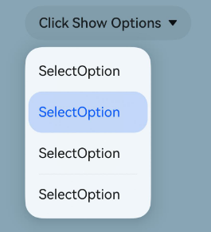
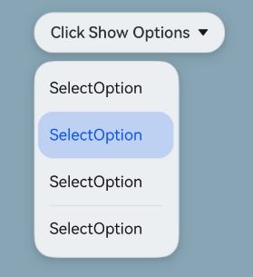

#  Select (System API)
<!--Kit: ArkUI-->
<!--Subsystem: ArkUI-->
<!--Owner: @zhanghaibo0-->
<!--Designer: @zhanghaibo0-->
<!--Tester: @lxl007-->
<!--Adviser: @Brilliantry_Rui-->

The **Select** component provides a drop-down menu that allows users to select among multiple options.

> **NOTE**
>
> - This component is supported since API version 8. Updates will be marked with a superscript to indicate their earliest API version.
>
> - This topic describes only system APIs provided by the module. For details about its public APIs, see [Select](./ts-basic-components-select.md).

## menuSystemMaterial<sup>23+</sup>

menuSystemMaterial(material:Optional\<SystemUiMaterial>)

Sets the system material of the drop-down menu. Different system materials correspond to different attribute effects. This API affects paramters of the drop-down menu, such as [menuBackgroundColor](ts-basic-components-select.md#menubackgroundcolor18), [borderColor](ts-universal-attributes-border.md#bordercolor), [borderWidth](ts-universal-attributes-border.md#borderwidth), and [shadow](ts-universal-attributes-image-effect.md#shadow). It is not recommended to use this API together with the preceding APIs.

**System API**: This is a system API.

**System capability**: SystemCapability.ArkUI.ArkUI.Full

**Atomic service API**: This API can be used in atomic services since API version 23.

**Model restriction**: This API can be used only in the stage model.

**Parameters**

| Name| Type  | Mandatory| Description          |
| ------ | ------ | ---- | -------------- |
| material | [Optional](ts-universal-attributes-custom-property.md#optionalt12)\<[SystemUiMaterial](./ts-universal-attributes-image-effect-sys.md#systemuimaterial23)> | Yes| Sets the system material of the drop-down menu. If the material is set to an invalid value or **undefined**, no system material is set.|

## Examples
### Example 1 Setting System Material for the Select Component and Drop-down Menu

This example uses the [menuSystemMaterial](#menusystemmaterial23) API to apply the system material effect to the drop-down menu, and the [systemMaterial](./ts-universal-attributes-image-effect-sys.md#systemmaterial23) API to apply the system material effect to the **Select** component.

The **menuSystemMaterial** and **systemMaterial** APIs are added since API version 23.

```ts
import { uiMaterial } from '@kit.ArkUI';

@Entry
@Component
struct Index {
  build() {
    Column() {
      Select([{ value: 'SelectOption' },
        { value: 'SelectOption' },
        { value: 'SelectOption' },
        { value: 'SelectOption' },
        { value: 'SelectOption' }])
        .value('Click Show Options')
        .systemMaterial(new uiMaterial.Material({ type: uiMaterial.MaterialType.SEMI_TRANSPARENT }))
        .menuSystemMaterial(new uiMaterial.Material({ type: uiMaterial.MaterialType.SEMI_TRANSPARENT }))
    }
    // Replace $r('app.media.img') with the image resource file you use.
    .backgroundImage($r('app.media.img'))
  }
}
```
System material not set



System material set


