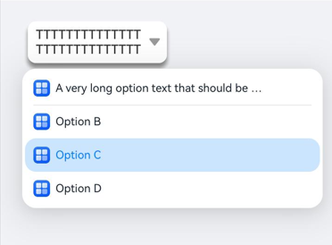
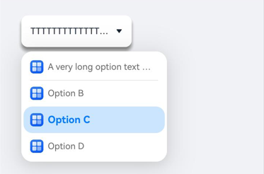
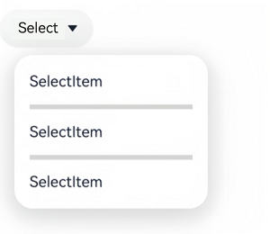

# Select
<!--Kit: ArkUI-->
<!--Subsystem: ArkUI-->
<!--Owner: @zhanghaibo0-->
<!--Designer: @zhanghaibo0-->
<!--Tester: @lxl007-->
<!--Adviser: @Brilliantry_Rui-->
<!-- md-trans-meta sourceCommit=21fb9e079b1023fcdd94644c9006a9dfa64d9f96 translatedAt=2026-09-03T11:58:03.507Z -->

Provides a dropdown menu for users to select from multiple options. The **Select** component supports setting option icons, custom styles, dividers, and more, and is suitable for scenarios where multiple options need to be displayed for user selection within limited space.

> **NOTE**
>
> This component is supported since API version 8. Newly added APIs will be marked with a superscript to indicate their earliest API version.

## Child Components

None

## API

Select(options: Array\<SelectOption>)

**Atomic service API**: This API can be used in atomic services since API version 11.

**System capability**: SystemCapability.ArkUI.ArkUI.Full

**Parameters**

| Name  | Type                                           | Mandatory | Description           |
| ------- | ---------------------------------------------- | ---- | -------------- |
| options | [Array](../../apis-arkts/arkts-apis-arkts-collections-Array.md)\<[SelectOption](#selectoption)\> | Yes   | Sets the dropdown options. |

## SelectOption

Information about the dropdown menu items.

**System capability**: SystemCapability.ArkUI.ArkUI.Full

| Name | Type                            | Read-Only | Optional | Description       |
| ------ | ----------------------------------- | ---- | -------------- | -------------- |
| value  | [ResourceStr](ts-types.md#resourcestr) | No  | No | Dropdown option content.<br/>**Atomic service API:** Since API version 11, this API supports use in atomic services. |
| icon   | [ResourceStr](ts-types.md#resourcestr) | No   | Yes  | Dropdown option image, hidden by default.<br/>**Atomic service API:** Since API version 11, this API supports use in atomic services. |
| symbolIcon<sup>12+</sup>  |[SymbolGlyphModifier](ts-universal-attributes-attribute-symbolglyphmodifier.md) | No   | Yes  | Dropdown option Symbol image, hidden by default.<br/>symbolIcon has a higher priority than icon.<br/>**Atomic service API:** Since API version 12, this API supports use in atomic services.<br/>**Model restriction:** This API is only used under the stage model.|

## Attributes

In addition to the [universal attributes](ts-component-general-attributes.md), the following attributes are supported:

### selected

selected(value: number | Resource)

Sets the index of the initial option in the dropdown menu. The index of the first option is 0. If the selected attribute is not set, or is set to an abnormal value such as a negative number, a non-integer, or a value outside the index range, the default selected value is -1 and no menu item is selected. When set to undefined or null, the first item is selected.

Since API version 10, this attribute supports [$$](../../../ui/state-management/arkts-two-way-sync.md) two-way binding variables.

Since API version 18, this attribute supports [!!](../../../ui/state-management/arkts-new-binding.md#two-way-binding-between-built-in-component-parameters) two-way binding variables.

**Atomic service API**: This API can be used in atomic services since API version 11.

**System capability**: SystemCapability.ArkUI.ArkUI.Full

**Parameters** 

| Name | Type                                                         | Mandatory | Description                     |
| ------ | ------------------------------------------------------------ | ---- | ------------------------ |
| value  | number&nbsp;\|&nbsp;[Resource](ts-types.md#resource)<sup>11+</sup> | Yes   | Index of the initial option in the dropdown menu, with the index starting from 0. |

### selected<sup>18+</sup>

selected(numCount: Optional<number | Resource>)

Sets the index of the initial option in the dropdown menu. The index of the first option is 0. When the selected attribute is not set, or is set to an abnormal value such as a negative number, a non-integer, or a value outside the index range, the default selected value is -1 and no menu item is selected. When it is set to undefined or null, the first option is selected.

This attribute supports two-way binding through [$$](../../../ui/state-management/arkts-two-way-sync.md) and [!!](../../../ui/state-management/arkts-new-binding.md#two-way-binding-between-built-in-component-parameters).

**Atomic service API**: This API can be used in atomic services since API version 18.

**Model restriction**: This API can be used only in the stage model.

**System capability**: SystemCapability.ArkUI.ArkUI.Full

**Parameters** 

| Name   | Type                                                         | Mandatory | Description                                                         |
| -------- | ------------------------------------------------------------ | ---- | ------------------------------------------------------------ |
| numCount | [Optional](ts-universal-attributes-custom-property.md#optionalt)\<number&nbsp;\|&nbsp;[Resource](ts-types.md#resource)> | Yes   | Index of the initial option in the dropdown menu, starting from 0.<br/>When the value of numCount is undefined or null, the first option is selected. |

### value

value(value: ResourceStr)

Sets the text content of the dropdown button. After a menu item is selected, the button text is automatically updated to the text of the selected menu item.

Since API version 10, this parameter supports two-way binding through [$$](../../../ui/state-management/arkts-two-way-sync.md).

Since API version 18, this parameter supports two-way binding through [!!](../../../ui/state-management/arkts-new-binding.md#two-way-binding-between-built-in-component-parameters).

**Atomic service API**: This API can be used in atomic services since API version 11.

**System capability**: SystemCapability.ArkUI.ArkUI.Full

**Parameters** 

| Name  | Type                                                 | Mandatory | Description                     |
| ----- | ---------------------------------------------------- | --------- | ------------------------------- |
| value | [ResourceStr](ts-types.md#resourcestr)<sup>11+</sup> | Yes       | Text content of the dropdown button itself.<br/>**Note:** When the text length exceeds the column width, the text is truncated, and the exceeding part is displayed with an ellipsis. |

### value<sup>18+</sup>

value(resStr: Optional\<ResourceStr>)

Sets the text content of the dropdown button. After a menu item is selected, the button text is automatically updated to the text of the selected menu item. Compared with [value](#value), the resStr parameter adds support for the undefined type.

This parameter supports [$$](../../../ui/state-management/arkts-two-way-sync.md) and [!!](../../../ui/state-management/arkts-new-binding.md#two-way-binding-between-built-in-component-parameters) two-way binding variables.

**Atomic service API**: This API can be used in atomic services since API version 18.

**Model restriction**: This API can be used only in the stage model.

**System capability**: SystemCapability.ArkUI.ArkUI.Full

**Parameters** 

| Name | Type                                                         | Mandatory | Description                                                         |
| ------ | ------------------------------------------------------------ | ---- | ------------------------------------------------------------ |
| resStr | [Optional](ts-universal-attributes-custom-property.md#optionalt)\<[ResourceStr](ts-types.md#resourcestr)> | Yes   | Text content of the dropdown button itself.<br/>When the value of resStr is undefined, the last value is retained.<br/>**Note:** When the text length is greater than the column width, the text is truncated. |

### controlSize<sup>12+</sup>

controlSize(value: ControlSize)

Sets the size of the Select component.

**Atomic service API**: This API can be used in atomic services since API version 12.

**Model restriction**: This API can be used only in the stage model.

**System capability**: SystemCapability.ArkUI.ArkUI.Full

**Parameters** 

| Name | Type                                                         | Mandatory | Description                                              |
| ------ | ------------------------------------------------------------ | ---- | ------------------------------------------------- |
| value  | [ControlSize](ts-basic-components-button.md#controlsize11)<sup>11+</sup> | Yes   | Size of the Select component.<br/>Default value: ControlSize.NORMAL |

Priority of the controlSize, width, and height APIs:

   1) If the developer only sets width and height, when the text size is set to a larger value, the text will exceed the component size, and the exceeding part is displayed with an ellipsis;

   2) If the developer only sets controlSize without setting width and height, the component width and height adapt to the text, the text does not exceed the component, and the minimum width minWidth and minimum height minHeight are set;

   3) If the controlSize, width, and height APIs are set at the same time, the values set for width and height take effect. However, if the values set for width and height are smaller than the minimum width minWidth and minimum height minHeight set by controlSize, the values set for width and height do not take effect, and the width and height remain the minimum width minWidth and minimum height minHeight set by controlSize.

### controlSize<sup>18+</sup>

controlSize(size: Optional\<ControlSize>)

Sets the size of the Select component. Compared with [controlSize](#controlsize12)<sup>12+</sup>, the size parameter adds support for the undefined type.

**Atomic service API**: This API can be used in atomic services since API version 18.

**Model restriction**: This API can be used only in the stage model.

**System capability**: SystemCapability.ArkUI.ArkUI.Full

**Parameters** 

| Name | Type                                                         | Mandatory | Description                                                         |
| ------ | ------------------------------------------------------------ | ---- | ------------------------------------------------------------ |
| size   | [Optional](ts-universal-attributes-custom-property.md#optionalt)\<[ControlSize](ts-basic-components-button.md#controlsize11)> | Yes   | Size of the Select component.<br/>Default value: ControlSize.NORMAL.<br/>When the value of size is undefined or null, the default value is ControlSize.NORMAL. |

Priority of the controlSize, width, and height APIs:

   1) If the developer only sets width and height, when the text size is set to a larger value, the text will exceed the component size, and the exceeding part is displayed in ellipsis style;

   2) If the developer only sets controlSize without setting width and height, the component width and height adapt to the text, the text does not exceed the component, and the minimum width minWidth and minimum height minHeight are set;

   3) If controlSize, width, and height are set at the same time, the values set for width and height take effect. However, if the values set for width and height are smaller than the minimum width minWidth and minimum height minHeight set by controlSize, the values set for width and height do not take effect, and the width and height remain the minimum width minWidth and minimum height minHeight set by controlSize.

### menuItemContentModifier<sup>12+</sup>

menuItemContentModifier(modifier: ContentModifier\<MenuItemConfiguration>)

Customizes the content area of the Select dropdown menu items. After applying menuItemContentModifier, the content of the dropdown menu is completely customized by the developer. In this case, attributes set for the Select component, such as the divider, option color, and font color of the dropdown menu, no longer take effect. This is suitable for scenarios where dropdown menu items need to display complex layouts such as mixed graphics and text, multi-line text, complex icons, or built-in controls.

> **NOTE**
>
> This API does not support being called in [attributeModifier](ts-universal-attributes-attribute-modifier.md#attributemodifier).

**Atomic service API**: This API can be used in atomic services since API version 12.

**Model restriction**: This API can be used only in the stage model.

**System capability**: SystemCapability.ArkUI.ArkUI.Full

**Parameters**

| Name | Type                                          | Mandatory | Description                                             |
| ------ | --------------------------------------------- | ---- | ------------------------------------------------ |
| modifier  | [ContentModifier](ts-universal-attributes-content-modifier.md#contentmodifiert)\<[MenuItemConfiguration](#menuitemconfiguration12) | Yes   | Customizes the content area of the dropdown menu items on the Select component.<br/>modifier: content modifier. The developer needs to customize a class to implement the ContentModifier API. |

### menuItemContentModifier<sup>18+</sup>

menuItemContentModifier(modifier: Optional\<ContentModifier\<MenuItemConfiguration>>)

Method for customizing the content area of a Select dropdown menu item. Compared with [menuItemContentModifier](#menuitemcontentmodifier12)<sup>12+</sup>, the modifier parameter adds support for the undefined type. After applying menuItemContentModifier, the content of the dropdown menu is completely customized by the developer, and the attributes set for the Select component, such as the divider, option color, and font color of the dropdown menu, no longer take effect.

> **NOTE**
>
> This API does not support being called in [attributeModifier](ts-universal-attributes-attribute-modifier.md#attributemodifier).

**Atomic service API**: This API can be used in atomic services since API version 18.

**Model restriction**: This API can be used only in the stage model.

**System capability**: SystemCapability.ArkUI.ArkUI.Full

**Parameters**

| Name     | Type                                                         | Mandatory | Description                                                         |
| -------- | ------------------------------------------------------------ | ---- | ------------------------------------------------------------ |
| modifier | [Optional](ts-universal-attributes-custom-property.md#optionalt)\<[ContentModifier](ts-universal-attributes-content-modifier.md#contentmodifiert)\<[MenuItemConfiguration](#menuitemconfiguration12)>> | Yes   | Method for customizing the content area of a dropdown menu item on the Select component.<br/>modifier: content modifier. The developer needs to customize a class to implement the ContentModifier interface.<br/>When the value of modifier is undefined or null, the content modifier is not used. |

### divider<sup>12+</sup>

divider(options: Optional\<DividerOptions> | null)

Sets the divider style. If this attribute is not set, the divider is displayed based on the "default value". This attribute conflicts with dividerStyle. If both are set, they take effect in the calling order, and the latter overrides the former.

**Atomic service API**: This API can be used in atomic services since API version 12.

**Model restriction**: This API can be used only in the stage model.

**System capability**: SystemCapability.ArkUI.ArkUI.Full

**Parameters** 

| Name | Type    | Mandatory | Description                                                                  |
| ------ | ------- | ---- | --------------------------------------------------------------------- |
| options  | [Optional](ts-universal-attributes-custom-property.md#optionalt)\<[DividerOptions](ts-basic-components-textpicker.md#divideroptions12) \| null | Yes   | 1. If DividerOptions is set, the divider is displayed based on the configured style.<br/>Default value:<br/>{<br/>strokeWidth: '1px' , <br/>color: '#33182431'<br/>}<br/>2. When set to null, no divider is displayed.<br/>3. If strokeWidth is set too wide, it covers the text. The divider starts from the bottom of each item and is drawn both upward and downward.<br/>4. The default values of startMargin and endMargin are consistent with the divider style when the divider attribute is not set. When the sum of startMargin and endMargin equals the value of optionWidth, no divider is displayed. When the sum of startMargin and endMargin exceeds the value of optionWidth, the divider is displayed based on the default style.|

### dividerStyle<sup>19+</sup>

dividerStyle(style: Optional\<DividerStyleOptions>)

Sets the divider style. If this attribute is not set, the divider is displayed according to the "default value". This attribute conflicts with divider. If both are set, they take effect in the call order, and the latter overrides the former.

**Atomic service API**: This API can be used in atomic services since API version 19.

**Model restriction**: This API can be used only in the stage model.

**System capability**: SystemCapability.ArkUI.ArkUI.Full

**Parameters**

<!--Table: 10%; auto; 10%; auto-->
| Name | Type    | Mandatory | Description                                                                  |
| ------ | ------- | ---- | --------------------------------------------------------------------- |
| style  | [Optional](ts-universal-attributes-custom-property.md#optionalt)\<[DividerStyleOptions](ts-types.md#dividerstyleoptions12)>  | Yes   | 1. If DividerStyleOptions is set, the divider is displayed in the set style.<br/>Default value:<br/>{<br/>strokeWidth: '1px' , <br/>color: '#33182431'<br/>}<br/>2. When set to null or undefined, the default divider is displayed.<br/>3. When mode is FLOAT_ABOVE_MENU and strokeWidth is set too wide, the text is covered. The divider starts from the bottom of each item and is drawn both upward and downward. When mode is EMBEDDED_IN_MENU, the divider expands in the menu and occupies its own height.<br/>4. The default values of startMargin and endMargin are consistent with the divider style when the divider attribute is not set. When the sum of startMargin and endMargin equals the value of optionWidth, the divider is not displayed. When the sum of startMargin and endMargin exceeds the value of optionWidth, the divider is displayed in the default style.|

### font

font(value: Font)

Sets the text style of the dropdown button itself. When size is 0, the text is not displayed. When size is a negative value, the text size is displayed at the default value.

**Atomic service API**: This API can be used in atomic services since API version 11.

**System capability**: SystemCapability.ArkUI.ArkUI.Full

**Parameters** 

| Name | Type                     | Mandatory | Description                                                         |
| ------ | ------------------------ | ---- | ------------------------------------------------------------ |
| value  | [Font](ts-types.md#font) | Yes   | Text style of the dropdown button itself.<br/>Default value before API version 11:<br/>{<br/>size:&nbsp;`$r('sys.float.ohos_id_text_size_button1')`,<br/>weight:&nbsp;FontWeight.Medium<br/>} <br/>Since API version 12, if [controlSize](#controlsize12) is set to ControlSize.SMALL, the default value of size is `$r('sys.float.ohos_id_text_size_button2')`; otherwise, it is `$r('sys.float.ohos_id_text_size_button1')`. |

### font<sup>18+</sup>

font(selectFont: Optional\<Font>)

Sets the text style of the dropdown button itself. When size is 0, the text is not displayed. When size is a negative value, the text size is displayed according to the default value. Compared with [font](#font), the selectFont parameter adds support for the undefined type.

**Atomic service API**: This API can be used in atomic services since API version 18.

**Model restriction**: This API can be used only in the stage model.

**System capability**: SystemCapability.ArkUI.ArkUI.Full

**Parameters** 

| Name     | Type                                                         | Mandatory | Description                                                         |
| ---------- | ------------------------------------------------------------ | ---- | ------------------------------------------------------------ |
| selectFont | [Optional](ts-universal-attributes-custom-property.md#optionalt)\<[Font](ts-types.md#font)> | Yes   | Text style of the dropdown button itself.<br/>If the value of [controlSize](#controlsize12) is set to ControlSize.SMALL, the default value of size is `$r('sys.float.ohos_id_text_size_button2')`; otherwise, it is `$r('sys.float.ohos_id_text_size_button1')`.<br/>When the value of selectFont is undefined, the system text style is restored. |

### fontColor

fontColor(value: ResourceColor)

Sets the text color of the dropdown button itself.

**Atomic service API**: This API can be used in atomic services since API version 11.

**System capability**: SystemCapability.ArkUI.ArkUI.Full

**Parameters** 

| Name | Type                                       | Mandatory | Description                                                         |
| ------ | ------------------------------------------ | ---- | ------------------------------------------------------------ |
| value  | [ResourceColor](ts-types.md#resourcecolor) | Yes   | Text color of the dropdown button itself.<br/>Default value: `$r('sys.color.ohos_id_color_text_primary')` mixed with the opacity of `$r('sys.color.ohos_id_alpha_content_primary')`. |

### fontColor<sup>18+</sup>

fontColor(resColor: Optional\<ResourceColor>)

Sets the text color of the dropdown button itself. Compared with [fontColor](#fontcolor), the resColor parameter additionally supports the undefined type.

**Atomic service API**: This API can be used in atomic services since API version 18.

**Model restriction**: This API can be used only in the stage model.

**System capability**: SystemCapability.ArkUI.ArkUI.Full

**Parameters** 

| Name     | Type                                                         | Mandatory | Description                                                         |
| -------- | ------------------------------------------------------------ | --------- | ------------------------------------------------------------ |
| resColor | [Optional](ts-universal-attributes-custom-property.md#optionalt)\<[ResourceColor](ts-types.md#resourcecolor)> | Yes   | Text color of the dropdown button itself.<br/>When the value of resColor is undefined, the default value is the transparency of `$r('sys.color.ohos_id_color_text_primary')` blended with `$r('sys.color.ohos_id_alpha_content_primary')`. |

### selectedOptionBgColor

selectedOptionBgColor(value: ResourceColor)

Sets the background color of the selected item in the dropdown menu.

**Atomic service API**: This API can be used in atomic services since API version 11.

**System capability**: SystemCapability.ArkUI.ArkUI.Full

**Parameters** 

| Name | Type                                       | Mandatory | Description                                                  |
| ------ | ------------------------------------------ | ---- | ------------------------------------------------------------ |
| value  | [ResourceColor](ts-types.md#resourcecolor) | Yes  | Background color of the selected item in the dropdown menu.<br/>Default value: the transparency of `$r('sys.color.ohos_id_color_component_activated')` mixed with `$r('sys.color.ohos_id_alpha_highlight_bg')`. |

### selectedOptionBgColor<sup>18+</sup>

selectedOptionBgColor(resColor: Optional\<ResourceColor>)

Sets the background color of the selected item in the dropdown menu. Compared with [selectedOptionBgColor](#selectedoptionbgcolor), the resColor parameter adds support for the undefined type.

**Atomic service API**: This API can be used in atomic services since API version 18.

**Model restriction**: This API can be used only in the stage model.

**System capability**: SystemCapability.ArkUI.ArkUI.Full

**Parameters** 

| Name   | Type                                                         | Mandatory | Description                                                         |
| -------- | ------------------------------------------------------------ | ---- | ------------------------------------------------------------ |
| resColor | [Optional](ts-universal-attributes-custom-property.md#optionalt)\<[ResourceColor](ts-types.md#resourcecolor)> | Yes   | Background color of the selected item in the dropdown menu.<br/>When the value of resColor is undefined, the default value is the transparency of `$r('sys.color.ohos_id_color_component_activated')` mixed with `$r('sys.color.ohos_id_alpha_highlight_bg')`. |

### selectedOptionFont

selectedOptionFont(value: Font)

Sets the text style of the selected item in the dropdown menu. When size is 0, the text is not displayed. When size is a negative value, the text size is displayed at the default value.

**Atomic service API**: This API can be used in atomic services since API version 11.

**System capability**: SystemCapability.ArkUI.ArkUI.Full

**Parameters** 

| Name | Type                     | Mandatory | Description                                                  |
| ---- | ------------------------ | --------- | ------------------------------------------------------------ |
| value | [Font](ts-types.md#font) | Yes       | Text style of the selected item in the dropdown menu.<br/>Default value:<br/>{<br/>size:&nbsp;$r('sys.float.ohos_id_text_size_body1'),<br/>weight:&nbsp;FontWeight.Regular<br/>} |

### selectedOptionFont<sup>18+</sup>

selectedOptionFont(selectFont: Optional\<Font>)

Sets the text style of the selected item in the dropdown menu. When size is 0, the text is not displayed. When size is a negative value, the text size is displayed based on the default value. Compared with [selectedOptionFont](#selectedoptionfont), the selectFont parameter adds support for the undefined type.

**Atomic service API**: This API can be used in atomic services since API version 18.

**Model restriction**: This API can be used only in the stage model.

**System capability**: SystemCapability.ArkUI.ArkUI.Full

**Parameters** 

| Name     | Type                                                         | Mandatory | Description                                                         |
| ---------- | ------------------------------------------------------------ | ---- | ------------------------------------------------------------ |
| selectFont | [Optional](ts-universal-attributes-custom-property.md#optionalt)\<[Font](ts-types.md#font)> | Yes   | Text style of the selected item in the dropdown menu.<br/>When the value of selectFont is undefined, the default value is:<br/>{<br/>size:&nbsp;$r('sys.float.ohos_id_text_size_body1'),<br/>weight:&nbsp;FontWeight.Regular<br/>} |

### selectedOptionFontColor

selectedOptionFontColor(value: ResourceColor)

Sets the text color of the selected item in the dropdown menu.

**Atomic service API**: This API can be used in atomic services since API version 11.

**System capability**: SystemCapability.ArkUI.ArkUI.Full

**Parameters** 

| Name | Type                                       | Mandatory | Description                                                         |
| ------ | ------------------------------------------ | ---- | ------------------------------------------------------------ |
| value  | [ResourceColor](ts-types.md#resourcecolor) | Yes  | Text color of the selected item in the dropdown menu.<br/>Default value: $r('sys.color.ohos_id_color_text_primary_activated') |

### selectedOptionFontColor<sup>18+</sup>

selectedOptionFontColor(resColor: Optional\<ResourceColor>)

Sets the text color of the selected item in the dropdown menu. Compared with [selectedOptionFontColor](#selectedoptionfontcolor), the resColor parameter adds support for the undefined type.

**Atomic service API**: This API can be used in atomic services since API version 18.

**Model restriction**: This API can be used only in the stage model.

**System capability**: SystemCapability.ArkUI.ArkUI.Full

**Parameters** 

| Name   | Type                                                         | Mandatory | Description                                                         |
| -------- | ------------------------------------------------------------ | ---- | ------------------------------------------------------------ |
| resColor | [Optional](ts-universal-attributes-custom-property.md#optionalt)\<[ResourceColor](ts-types.md#resourcecolor)> | Yes   | Text color of the selected item in the dropdown menu.<br/>When the value of resColor is undefined, the default value is $r('sys.color.ohos_id_color_text_primary_activated'). |

### optionBgColor

optionBgColor(value: ResourceColor)

Sets the background color of the dropdown menu items.

**Atomic service API**: This API can be used in atomic services since API version 11.

**System capability**: SystemCapability.ArkUI.ArkUI.Full

**Parameters** 

| Name | Type                                       | Mandatory | Description                                                  |
| ------ | ------------------------------------------ | --------- | ------------------------------------------------------------ |
| value  | [ResourceColor](ts-types.md#resourcecolor) | Yes       | Background color of the dropdown menu items.<br/>Default value:<br/>Before API version 11, the default value is Color.White.<br/>Since API version 11, the default value is Color.Transparent. |

### optionBgColor<sup>18+</sup>

optionBgColor(resColor: Optional\<ResourceColor>)

Sets the background color of dropdown menu items. Compared with [optionBgColor](#optionbgcolor), the resColor parameter adds support for the undefined type.

**Atomic service API**: This API can be used in atomic services since API version 18.

**Model restriction**: This API can be used only in the stage model.

**System capability**: SystemCapability.ArkUI.ArkUI.Full

**Parameters** 

| Name     | Type                                                         | Mandatory | Description                                                         |
| -------- | ------------------------------------------------------------ | --------- | ------------------------------------------------------------ |
| resColor | [Optional](ts-universal-attributes-custom-property.md#optionalt)\<[ResourceColor](ts-types.md#resourcecolor)> | Yes   | Background color of the dropdown menu items.<br/>When the value of resColor is undefined, the default value is Color.White before API version 11, and Color.Transparent since API version 11. |

### optionFont

optionFont(value: Font)

Sets the text style of the dropdown menu items. When **size** is 0, the text is not displayed. When **size** is a negative value, the text size is displayed at the default value.

**Atomic service API**: This API can be used in atomic services since API version 11.

**System capability**: SystemCapability.ArkUI.ArkUI.Full

**Parameters** 

| Name | Type                     | Mandatory | Description                                                         |
| ------ | ------------------------ | ---- | ------------------------------------------------------------ |
| value  | [Font](ts-types.md#font) | Yes   | Text style of the dropdown menu items.<br/>Default value:<br/>{<br/>size:&nbsp;$r('sys.float.ohos_id_text_size_body1'),<br/>weight:&nbsp;FontWeight.Regular<br/>} |

### optionFont<sup>18+</sup>

optionFont(selectFont: Optional\<Font>)

Sets the text style of the dropdown menu items. When size is 0, the text is not displayed. When size is a negative value, the text size is displayed using the default value.

Compared with [optionFont](#optionfont), the selectFont parameter adds support for the undefined type.

**Atomic service API**: This API can be used in atomic services since API version 18.

**Model restriction**: This API can be used only in the stage model.

**System capability**: SystemCapability.ArkUI.ArkUI.Full

**Parameters** 

| Name     | Type                                                         | Mandatory | Description                                                         |
| ---------- | ------------------------------------------------------------ | ---- | ------------------------------------------------------------ |
| selectFont | [Optional](ts-universal-attributes-custom-property.md#optionalt)\<[Font](ts-types.md#font)> | Yes   | Text style of the dropdown menu items.<br/>When the value of selectFont is undefined, the default value is:<br/>{<br/>size:&nbsp;$r('sys.float.ohos_id_text_size_body1'),<br/>weight:&nbsp;FontWeight.Regular<br/>} |

### optionFontColor

optionFontColor(value: ResourceColor)

Sets the text color of the dropdown menu item.

**Atomic service API**: This API can be used in atomic services since API version 11.

**System capability**: SystemCapability.ArkUI.ArkUI.Full

**Parameters** 

| Name | Type                                       | Mandatory | Description                                                         |
| ------ | ------------------------------------------ | ---- | ------------------------------------------------------------ |
| value  | [ResourceColor](ts-types.md#resourcecolor) | Yes   | Text color of the dropdown menu item.<br/>Default value: $r('sys.color.ohos_id_color_text_primary') |

### optionFontColor<sup>18+</sup>

optionFontColor(resColor: Optional\<ResourceColor>)

Sets the text color of dropdown menu items. Compared with [optionFontColor](#optionfontcolor), the resColor parameter adds support for the undefined type.

**Atomic service API**: This API can be used in atomic services since API version 18.

**Model restriction**: This API can be used only in the stage model.

**System capability**: SystemCapability.ArkUI.ArkUI.Full

**Parameters** 

| Name   | Type                                                         | Mandatory | Description                                                         |
| -------- | ------------------------------------------------------------ | ---- | ------------------------------------------------------------ |
| resColor | [Optional](ts-universal-attributes-custom-property.md#optionalt)\<[ResourceColor](ts-types.md#resourcecolor)> | Yes   | Text color of the dropdown menu items.<br/>When the value of resColor is undefined, the default value is $r('sys.color.ohos_id_color_text_primary'). |

### space<sup>10+</sup>

space(value: Length)

Sets the spacing between the text of a dropdown menu item and the arrow. Percentages are not supported. When the spacing is set to null, undefined, or a value less than or equal to 8, the default value is used.

**Atomic service API**: This API can be used in atomic services since API version 11.

**Model restriction**: This API can be used only in the stage model.

**System capability**: SystemCapability.ArkUI.ArkUI.Full

**Parameters** 

| Name | Type                         | Mandatory | Description                                             |
| ------ | ---------------------------- | ---- | ------------------------------------------------ |
| value  | [Length](ts-types.md#length) | Yes   | Spacing between the text of a dropdown menu item and the arrow.<br/>Default value: 8vp<br/>**Note:** When the value is set to the string type, percentages are not supported. |

### space<sup>18+</sup>

space(spaceLength: Optional\<Length>)

Sets the spacing between the text of a dropdown menu item and the arrow. Percentages are not supported. When set to null, undefined, or a value less than or equal to 8, the default value is used.

**Atomic service API**: This API can be used in atomic services since API version 18.

**Model restriction**: This API can be used only in the stage model.

**System capability**: SystemCapability.ArkUI.ArkUI.Full

**Parameters** 

| Name      | Type                                                         | Mandatory | Description                                                         |
| ----------- | ------------------------------------------------------------ | ---- | ------------------------------------------------------------ |
| spaceLength | [Optional](ts-universal-attributes-custom-property.md#optionalt)\<[Length](ts-types.md#length)> | Yes   | Spacing between the text of a dropdown menu item and the arrow.<br/>When the value of spaceLength is undefined, the default value is 8vp. |

### arrowPosition<sup>10+</sup>

arrowPosition(value: ArrowPosition)

Sets the alignment between the text of a dropdown menu item and the arrow.

**Atomic service API**: This API can be used in atomic services since API version 11.

**Model restriction**: This API can be used only in the stage model.

**System capability**: SystemCapability.ArkUI.ArkUI.Full

**Parameters** 

| Name | Type                                      | Mandatory | Description                                                         |
| ------ | ----------------------------------------- | ---- | ------------------------------------------------------------ |
| value  | [ArrowPosition](#arrowposition10) | Yes   | Alignment between the text of a dropdown menu item and the arrow.<br/>Default value: ArrowPosition.END |

### arrowPosition<sup>18+</sup>

arrowPosition(position: Optional\<ArrowPosition>)

Sets the alignment between the text of the dropdown menu item and the arrow. Compared with [arrowPosition](#arrowposition10), the position parameter adds support for the undefined type.

**Atomic service API**: This API can be used in atomic services since API version 18.

**Model restriction**: This API can be used only in the stage model.

**System capability**: SystemCapability.ArkUI.ArkUI.Full

**Parameters** 

| Name   | Type                                                         | Mandatory | Description                                                         |
| -------- | ------------------------------------------------------------ | ---- | ------------------------------------------------------------ |
| position | [Optional](ts-universal-attributes-custom-property.md#optionalt)\<[ArrowPosition](#arrowposition10) | Yes   | Alignment between the text of the dropdown menu item and the arrow.<br/>When the value of position is undefined, the default value is ArrowPosition.END |

### menuAlign<sup>10+</sup>

menuAlign(alignType: MenuAlignType, offset?: Offset)

Sets the alignment between the dropdown button and the dropdown menu.

**Atomic service API**: This API can be used in atomic services since API version 11.

**Model restriction**: This API can be used only in the stage model.

**System capability**: SystemCapability.ArkUI.ArkUI.Full

**Parameters** 

| Name      | Type                                      | Mandatory | Description                                                         |
| --------- | ----------------------------------------- | --------- | ------------------------------------------------------------ |
| alignType | [MenuAlignType](#menualigntype10) | Yes   | Alignment type.<br/>Default value: MenuAlignType.START               |
| offset    | [Offset](ts-types.md#offset)              | No   | Offset of the dropdown menu relative to the dropdown button after alignment by the alignment type. dx controls the horizontal offset, and dy controls the vertical offset.<br/> Default value: {dx: 0, dy: 0} |

### menuAlign<sup>18+</sup>

menuAlign(alignType: Optional\<MenuAlignType>, offset?: Offset)

Sets the alignment between the dropdown button and the dropdown menu. Compared with [menuAlign](#menualign10)<sup>10+</sup>, the alignType parameter adds support for the undefined type.

**Atomic service API**: This API can be used in atomic services since API version 18.

**Model restriction**: This API can be used only in the stage model.

**System capability**: SystemCapability.ArkUI.ArkUI.Full

**Parameters** 

| Name    | Type                                                         | Mandatory | Description                                                         |
| --------- | ------------------------------------------------------------ | ---- | ------------------------------------------------------------ |
| alignType | [Optional](ts-universal-attributes-custom-property.md#optionalt)\<[MenuAlignType](#menualigntype10) | Yes   | Alignment type.<br/>When the value of alignType is undefined, the default value is MenuAlignType.START. |
| offset    | [Offset](ts-types.md#offset)                                 | No   | Offset of the dropdown menu relative to the dropdown button after alignment according to the alignment type.<br/> Default value: {dx: 0, dy: 0} |

### optionWidth<sup>11+</sup>

optionWidth(value: Dimension | OptionWidthMode )

Sets the width of the dropdown menu item. Percentage values are not supported. OptionWidthMode is an enum type that determines whether the dropdown menu inherits the width of the dropdown button.

When set to an invalid value or a value smaller than the minimum width of 56 vp, the attribute does not take effect, and the menu item width is set to the default value, that is, 2 grids.

The left and right margins between the Select component and the screen edge are 16 vp. It is recommended that the width of the component itself and the menu item be set to a value less than or equal to `calc(100% - 32vp)` to avoid offset when the dropdown menu pops up.

**Atomic service API**: This API can be used in atomic services since API version 12.

**Model restriction**: This API can be used only in the stage model.

**System capability**: SystemCapability.ArkUI.ArkUI.Full

**Parameters** 

| Name | Type                                                         | Mandatory | Description               |
| ------ | ------------------------------------------------------------ | ---- | ------------------ |
| value  | [Dimension](ts-types.md#dimension10)&nbsp;\|&nbsp;[OptionWidthMode](ts-appendix-enums.md#optionwidthmode11) | Yes   | Width of the dropdown menu item. |

### optionWidth<sup>18+</sup>

optionWidth(width: Optional\<Dimension | OptionWidthMode> )

Sets the width of the dropdown menu item. Percentage values are not supported. OptionWidthMode is an enum type that determines whether the dropdown menu inherits the width of the dropdown button. Compared with [optionWidth](#optionwidth11)<sup>11+</sup>, the width parameter adds support for the undefined type.

When set to an invalid value or a value smaller than the minimum width of 56 vp, the attribute does not take effect, and the menu item width is set to the default value, that is, 2 grids.

The left and right margins between the Select component and the screen edges are 16 vp. It is recommended that the width of the component itself and the menu item be set to a value less than or equal to `calc(100% - 32vp)` to avoid offset when the dropdown menu is displayed.

**Atomic service API**: This API can be used in atomic services since API version 18.

**Model restriction**: This API can be used only in the stage model.

**System capability**: SystemCapability.ArkUI.ArkUI.Full

**Parameters** 

| Name | Type                                                         | Mandatory | Description                                                         |
| ------ | ------------------------------------------------------------ | ---- | ------------------------------------------------------------ |
| width  | [Optional](ts-universal-attributes-custom-property.md#optionalt)\<[Dimension](ts-types.md#dimension10)&nbsp;\|&nbsp;[OptionWidthMode](ts-appendix-enums.md#optionwidthmode11)> | Yes   | Width of the dropdown menu item.<br/>When the value of width is undefined, the attribute does not take effect, and the menu item width is set to the default value, that is, 2 grids. |

### optionHeight<sup>11+</sup>

optionHeight(value: Dimension)

Sets the maximum height of the dropdown menu. Percentage values are not supported. The default maximum height is 80% of the available screen height, and the set maximum height cannot exceed the default maximum height.

When set to an invalid value or zero, this attribute does not take effect.

If the actual height of all options in the dropdown menu is less than the set height, the dropdown menu is displayed at its actual height.

**Atomic service API**: This API can be used in atomic services since API version 12.

**Model restriction**: This API can be used only in the stage model.

**System capability**: SystemCapability.ArkUI.ArkUI.Full

**Parameters** 

| Name | Type                                 | Mandatory | Description                     |
| ------ | ------------------------------------ | ---- | ------------------------ |
| value  | [Dimension](ts-types.md#dimension10) | Yes   | Maximum height of the dropdown menu. |

### optionHeight<sup>18+</sup>

optionHeight(height: Optional\<Dimension>)

Sets the maximum height for displaying the dropdown menu. Percentage values are not supported. The default maximum height is 80% of the available screen height, and the set maximum menu height cannot exceed the default maximum height. Compared with [optionHeight](#optionheight11)<sup>11+</sup>, the height parameter adds support for the undefined type.

When set to an invalid value or zero, the attribute does not take effect.

If the actual height of all options in the dropdown menu is less than the set height, the dropdown menu is displayed at the actual height.

**Atomic service API**: This API can be used in atomic services since API version 18.

**Model restriction**: This API can be used only in the stage model.

**System capability**: SystemCapability.ArkUI.ArkUI.Full

**Parameters** 

| Name | Type                                                         | Mandatory | Description                                                         |
| ------ | ------------------------------------------------------------ | ---- | ------------------------------------------------------------ |
| height | [Optional](ts-universal-attributes-custom-property.md#optionalt)\<[Dimension](ts-types.md#dimension10)> | Yes   | Maximum height for displaying the dropdown menu.<br/>When the value of height is undefined, the attribute does not take effect, and the maximum height of the dropdown menu is set to the default value, that is, 80% of the available screen height. |

### menuBackgroundColor<sup>11+</sup>

menuBackgroundColor(value: ResourceColor)

Sets the background color of the dropdown menu.

>**NOTE**
>
> Since API version 12, this API is supported in [attributeModifier](ts-universal-attributes-attribute-modifier.md#attributemodifier).

**Atomic service API**: This API can be used in atomic services since API version 12.

**Model restriction**: This API can be used only in the stage model.

**System capability**: SystemCapability.ArkUI.ArkUI.Full

**Parameters** 

| Name | Type                                       | Mandatory | Description                                                  |
| ---- | ------------------------------------------ | --------- | ------------------------------------------------------------ |
| value | [ResourceColor](ts-types.md#resourcecolor) | Yes       | Background color of the dropdown menu.<br/>Default value: **$r('sys.color.ohos_id_color_card_bg')** before API version 11, and **Color.Transparent** since API version 11. |

### menuBackgroundColor<sup>18+</sup>

menuBackgroundColor(resColor: Optional\<ResourceColor>)

Sets the background color of the dropdown menu. Compared with [menuBackgroundColor](#menubackgroundcolor11)<sup>11+</sup>, the resColor parameter adds support for the undefined type.

**Atomic service API**: This API can be used in atomic services since API version 18.

**Model restriction**: This API can be used only in the stage model.

**System capability**: SystemCapability.ArkUI.ArkUI.Full

**Parameters** 

| Name   | Type                                                         | Mandatory | Description                                                         |
| -------- | ------------------------------------------------------------ | ---- | ------------------------------------------------------------ |
| resColor | [Optional](ts-universal-attributes-custom-property.md#optionalt)\<[ResourceColor](ts-types.md#resourcecolor)> | Yes   | Background color of the dropdown menu.<br/>When the value of resColor is undefined, the default value is Color.Transparent. |

### menuBackgroundBlurStyle<sup>11+</sup>

menuBackgroundBlurStyle(value: BlurStyle)

Sets the background blur material of the dropdown menu.

> **NOTE**
>
> Since API version 12, this API can be called in [attributeModifier](ts-universal-attributes-attribute-modifier.md#attributemodifier).

**Atomic service API**: This API can be used in atomic services since API version 12.

**Model restriction**: This API can be used only in the stage model.

**System capability**: SystemCapability.ArkUI.ArkUI.Full

**Parameters** 

| Name | Type                                                         | Mandatory | Description                                                         |
| ------ | ------------------------------------------------------------ | ---- | ------------------------------------------------------------ |
| value  | [BlurStyle](ts-universal-attributes-background.md#blurstyle9) | Yes   | Background blur material of the dropdown menu.<br/>Default value: BlurStyle.COMPONENT_ULTRA_THICK |

### menuBackgroundBlurStyle<sup>18+</sup>

menuBackgroundBlurStyle(style: Optional\<BlurStyle>)

Sets the background blur material of the dropdown menu. Compared with [menuBackgroundBlurStyle](#menubackgroundblurstyle11)<sup>11+</sup>, the style parameter adds support for the undefined type.

**Atomic service API**: This API can be used in atomic services since API version 18.

**Model restriction**: This API can be used only in the stage model.

**System capability**: SystemCapability.ArkUI.ArkUI.Full

**Parameters** 

| Name | Type | Mandatory | Description |
| ------ | ------------------------------------------------------------ | ---- | ------------------------------------------------------------ |
| style  | [Optional](ts-universal-attributes-custom-property.md#optionalt)\<[BlurStyle](ts-universal-attributes-background.md#blurstyle9)> | Yes | Background blur material of the dropdown menu.<br/>When the value of style is undefined, the default value is BlurStyle.COMPONENT_ULTRA_THICK. |

### avoidance<sup>19+</sup>

avoidance(mode: AvoidanceMode)

Sets the avoidance mode of the dropdown menu.

**Atomic service API**: This API can be used in atomic services since API version 19.

**Model restriction**: This API can be used only in the stage model.

**System capability**: SystemCapability.ArkUI.ArkUI.Full

**Parameters** 

| Name    | Type                                      | Mandatory | Description                                                         |
| --------- | ----------------------------------------- | ---- | ------------------------------------------------------------ |
| mode      | [AvoidanceMode](#avoidancemode19)  | Yes   | Sets the avoidance mode of the dropdown menu.<br/>Default value: AvoidanceMode.COVER_TARGET |

### menuOutline<sup>20+</sup>

menuOutline(outline: MenuOutlineOptions)

Sets the outline style of the dropdown menu box.

**Atomic service API**: This API can be used in atomic services since API version 20.

**Model restriction**: This API can be used only in the stage model.

**System capability**: SystemCapability.ArkUI.ArkUI.Full

**Parameters** 

| Name | Type                                                         | Mandatory | Description                                                         |
| ------ | ------------------------------------------------------------ | ---- | ------------------------------------------------------------ |
| outline  | [MenuOutlineOptions](#menuoutlineoptions20) | Yes   | Outline style of the dropdown menu box. |

### showDefaultSelectedIcon<sup>20+</sup>

showDefaultSelectedIcon(show: boolean)

Sets whether to display the default selected icon.

**Atomic service API**: This API can be used in atomic services since API version 20.

**Model restriction**: This API can be used only in the stage model.

**System capability**: SystemCapability.ArkUI.ArkUI.Full

**Parameters** 

| Name | Type                                                         | Mandatory | Description                                                         |
| ------ | ------------------------------------------------------------ | ---- | ------------------------------------------------------------ |
| show  | boolean | Yes   | Whether to display the default selected icon.<br/>true: displays the default selected icon; false: does not display the default selected icon, and indicates the selection by highlighting the background color.<br/>Default value: false<br/>When show is true, if the background color of the selected item is set through selectedOptionBgColor, both the background color of the selected item and the default selected icon are displayed; if the background color of the selected item is not set through selectedOptionBgColor, the background color is not highlighted, and only the default selected icon is displayed. |

### textModifier<sup>20+</sup>

textModifier(modifier: Optional\<TextModifier>)

Method for customizing the text style of the Select button. After textModifier is applied, the text style of the Select button is completely customized by the developer.

> **NOTE**
>
> This API does not support being called in [attributeModifier](ts-universal-attributes-attribute-modifier.md#attributemodifier).

**Atomic service API**: This API can be used in atomic services since API version 20.

**Model restriction**: This API can be used only in the stage model.

**System capability**: SystemCapability.ArkUI.ArkUI.Full

**Parameters** 

| Name   | Type                                                         | Mandatory | Description                                                         |
| ------ | ------------------------------------------------------------ | ---- | ------------------------------------------------------------ |
| modifier  | [Optional](ts-universal-attributes-custom-property.md#optionalt)\<[TextModifier](ts-universal-attributes-attribute-modifier.md#custom-modifier)> | Yes   | Method for customizing the button text style on the Select component. <br/> When the value of modifier is undefined, the text style is not customized. |

### arrowModifier<sup>20+</sup>

arrowModifier(modifier: Optional\<SymbolGlyphModifier>)

Customizes the style of the dropdown arrow icon on the Select button. After arrowModifier is applied, the style of the dropdown arrow icon on the Select button is completely customized by the developer.

> **NOTE**
>
> This API does not support being called in [attributeModifier](ts-universal-attributes-attribute-modifier.md#attributemodifier).

**Atomic service API**: This API can be used in atomic services since API version 20.

**Model restriction**: This API can be used only in the stage model.

**System capability**: SystemCapability.ArkUI.ArkUI.Full

**Parameters** 

| Name   | Type                                                         | Mandatory | Description                                                         |
| ------ | ------------------------------------------------------------ | ---- | ------------------------------------------------------------ |
| modifier  | [Optional](ts-universal-attributes-custom-property.md#optionalt)\<[SymbolGlyphModifier](ts-universal-attributes-attribute-symbolglyphmodifier.md)> | Yes   | Method for customizing the style of the dropdown arrow icon on the Select component. <br/> When the value of modifier is undefined, the style of the dropdown arrow icon is not customized. |

### optionTextModifier<sup>20+</sup>

optionTextModifier(modifier: Optional\<TextModifier>)

Customizes the text style of unselected items in the Select dropdown menu. After applying optionTextModifier, the text style of unselected items in the dropdown menu is completely customized by the developer.

If [optionFont](#optionfont) and the font attribute of optionTextModifier are set at the same time, [optionFont](#optionfont) takes precedence in setting the text style of unselected items in the dropdown menu. The attributes missing in [optionFont](#optionfont) are set to their corresponding default values.

> **NOTE**
>
> This API does not support being called in [attributeModifier](ts-universal-attributes-attribute-modifier.md#attributemodifier).

**Atomic service API**: This API can be used in atomic services since API version 20.

**Model restriction**: This API can be used only in the stage model.

**System capability**: SystemCapability.ArkUI.ArkUI.Full

**Parameters** 

| Name  | Type                                                         | Mandatory | Description                                                         |
| ------ | ------------------------------------------------------------ | ---- | ------------------------------------------------------------ |
| modifier  | [Optional](ts-universal-attributes-custom-property.md#optionalt)\<[TextModifier](ts-universal-attributes-attribute-modifier.md#custom-modifier) | Yes   | Method for customizing the text style of unselected items in the Select dropdown menu. <br/> When the value of modifier is undefined, the text style of unselected items in the dropdown menu is not customized. |

### selectedOptionTextModifier<sup>20+</sup>

selectedOptionTextModifier(modifier: Optional\<[TextModifier](ts-universal-attributes-attribute-modifier.md#custom-modifier)>)

Method for customizing the text style of the selected item in the Select dropdown menu. After selectedOptionTextModifier is applied, the text style of the selected item in the dropdown menu is completely customized by the developer.

If [selectedOptionFont](#selectedoptionfont) and the font attribute of selectedOptionTextModifier are set at the same time, [selectedOptionFont](#selectedoptionfont) takes precedence in setting the text style of the selected item in the dropdown menu. If [selectedOptionFont](#selectedoptionfont) is not set, [optionFont](#optionfont) takes precedence in setting the text style of the selected item in the dropdown menu. The attributes omitted in [selectedOptionFont](#selectedoptionfont) or [optionFont](#optionfont) are set to their corresponding default values.

> **NOTE**
>
> This API does not support being called in [attributeModifier](ts-universal-attributes-attribute-modifier.md#attributemodifier).

**Atomic service API**: This API can be used in atomic services since API version 20.

**Model restriction**: This API can be used only in the stage model.

**System capability**: SystemCapability.ArkUI.ArkUI.Full

**Parameters** 

| Name   | Type                                                         | Mandatory | Description                                                         |
| ------ | ------------------------------------------------------------ | ---- | ------------------------------------------------------------ |
| modifier  | [Optional](ts-universal-attributes-custom-property.md#optionalt)\<[TextModifier](ts-universal-attributes-attribute-modifier.md#custom-modifier)> | Yes   | Sets the text style of the selected item in the dropdown menu.<br/>The developer can manage and maintain the text style as needed. <br/> When the value of modifier is undefined, the text style of the selected item in the dropdown menu is not customized. |

### showInSubWindow<sup>20+</sup>

showInSubWindow(showInSubWindow:Optional\<boolean>)

Sets whether the dropdown menu is displayed in a subwindow. If this API is not used to set it, the dropdown menu is not displayed in a subwindow by default.

**Atomic service API**: This API can be used in atomic services since API version 20.

**Model restriction**: This API can be used only in the stage model.

**System capability**: SystemCapability.ArkUI.ArkUI.Full

**Parameters** 

| Name | Type | Mandatory | Description |
| ------ | ------ | ---- | -------------- |
| showInSubWindow  | [Optional](ts-universal-attributes-custom-property.md#optionalt)\<boolean> | Yes | Sets whether the dropdown menu is displayed in a subwindow.<br>true: the dropdown menu is displayed in a subwindow.<br>false: the dropdown menu is not displayed in a subwindow. |

### keyboardAvoidMode<sup>23+</sup>

keyboardAvoidMode(mode:Optional\<MenuKeyboardAvoidMode>)

Sets whether the dropdown menu avoids the soft keyboard. If this API is not called, the dropdown menu does not avoid the soft keyboard by default.

**Atomic service API**: This API can be used in atomic services since API version 23.

**System capability**: SystemCapability.ArkUI.ArkUI.Full

**Model restriction**: This API can be used only in the stage model.

**Parameters** 

| Name | Type | Mandatory | Description |
| ------ | ------ | ---- | -------------- |
| mode | [Optional](ts-universal-attributes-custom-property.md#optionalt)\<[MenuKeyboardAvoidMode](ts-universal-attributes-menu.md#menukeyboardavoidmode23) | Yes | Sets whether the dropdown menu avoids the soft keyboard. When the value is undefined, it is processed as MenuKeyboardAvoidMode.NONE, and the dropdown menu does not avoid the soft keyboard. For the specific effect of each enum value, see [MenuKeyboardAvoidMode](ts-universal-attributes-menu.md#menukeyboardavoidmode23). |

### minKeyboardAvoidDistance<sup>23+</sup>

minKeyboardAvoidDistance(distance:Optional\<LengthMetrics>)

Sets the minimum distance for the Select menu to avoid the soft keyboard. If this API is not used to set the distance, the minimum distance defaults to 8 vp. This attribute takes effect only when [keyboardAvoidMode](#keyboardavoidmode23) is set to avoid the soft keyboard.

**Atomic service API**: This API can be used in atomic services since API version 23.

**System capability**: SystemCapability.ArkUI.ArkUI.Full

**Model restriction**: This API can be used only in the stage model.

**Parameters** 

| Name | Type   | Mandatory | Description           |
| ------ | ------ | ---- | -------------- |
| distance | [Optional](ts-universal-attributes-custom-property.md#optionalt)\<[LengthMetrics](../js-apis-arkui-graphics.md#lengthmetrics12)> | Yes | Sets the minimum distance for the dropdown menu to avoid the soft keyboard. When set to a negative number or undefined, the value 8 vp is used. |

### menuBackgroundBlurStyleOptions

menuBackgroundBlurStyleOptions(blurStyle: Optional\<BackgroundBlurStyleOptions>)

Sets the background blur effect of the Select dropdown menu.

**Since**: 26.0.0

**Atomic service API**: This API can be used in atomic services since API version 26.0.0.

**System capability**: SystemCapability.ArkUI.ArkUI.Full

**Model restriction**: This API can be used only in the stage model.

**Parameters** 

| Name | Type                                                         | Mandatory | Description                                                         |
| ------ | ------------------------------------------------------------ | ---- | ------------------------------------------------------------ |
| blurStyle  | [Optional](ts-universal-attributes-custom-property.md#optionalt)\<[BackgroundBlurStyleOptions](ts-universal-attributes-background.md#backgroundblurstyleoptions10) | Yes   | Sets the background blur effect of the Select dropdown menu. |

### menuBackgroundEffect

menuBackgroundEffect(effect: Optional\<BackgroundEffectOptions>)

Sets the background attributes of the Select dropdown menu.

**Since**: 26.0.0

**Atomic service API**: This API can be used in atomic services since API version 26.0.0.

**System capability**: SystemCapability.ArkUI.ArkUI.Full

**Model restriction**: This API can be used only in the stage model.

**Parameters** 

| Name  | Type                                                         | Mandatory | Description                                       |
| ------- | ------------------------------------------------------------ | ---- | ------------------------------------------ |
| effect | [Optional](ts-universal-attributes-custom-property.md#optionalt)\<[BackgroundEffectOptions](ts-universal-attributes-background.md#backgroundeffectoptions11)> | Yes   | Sets the background attributes of the Select dropdown menu, including blur radius, brightness, saturation, and color. |

### menuSystemMaterial

menuSystemMaterial(material:Optional\<SystemUiMaterial>)

Sets the system material of the Select dropdown menu. Different system materials have different effects on attributes. This API affects the dropdown menu background color [menuBackgroundColor](#menubackgroundcolor18), border color [borderColor](ts-universal-attributes-border.md#bordercolor), border width [borderWidth](ts-universal-attributes-border.md#borderwidth), shadow [shadow](ts-universal-attributes-image-effect.md#shadow), and other parameters. When the system material is set, the preceding APIs do not take effect.

**Since**: 26.0.0

**Atomic service API**: This API can be used in atomic services since API version 26.0.0.

**System capability**: SystemCapability.ArkUI.ArkUI.Full

**Model restriction**: This API can be used only in the stage model.

**Parameters** 

| Name | Type | Mandatory | Description |
| ------ | ------ | ---- | -------------- |
| material | [Optional](ts-universal-attributes-custom-property.md#optionalt)\<[SystemUiMaterial](ts-universal-attributes-image-effect.md#systemuimaterial)> | Yes | Sets the system material of the dropdown menu. When the material is set to an invalid value or undefined, it is processed as if no system material is set. |

## ArrowPosition<sup>10+</sup>

Position of the arrow.

**Atomic service API**: This API can be used in atomic services since API version 11.

**Model restriction**: This API can be used only in the stage model.

**System capability**: SystemCapability.ArkUI.ArkUI.Full

| Name                | Value               | Description             |
| ------------------- | ------------------ | ------------------ |
| END | 0 | Text first, arrow last. |
| START | 1 | Arrow first, text last. |

## MenuAlignType<sup>10+</sup>

Enumerates the alignment modes of the dropdown menu.

**Atomic service API**: This API can be used in atomic services since API version 11.

**Model restriction**: This API can be used only in the stage model.

**System capability**: SystemCapability.ArkUI.ArkUI.Full

| Name                | Value | Description             |
| ------------------- | --- | ------------------ |
| START               | 0 | Aligns to the start edge in the language direction. |
| CENTER              | 1 | Aligns to the center. |
| END                 | 2 | Aligns to the end edge in the language direction. |

## AvoidanceMode<sup>19+</sup>

Enumerates the avoidance modes of the dropdown menu.

**Atomic service API**: This API can be used in atomic services since API version 19.

**Model restriction**: This API can be used only in the stage model.

**System capability**: SystemCapability.ArkUI.ArkUI.Full

| Name                | Value | Description             |
| ------------------- | ----- | ------------------ |
| COVER_TARGET        | 0 | When there is insufficient space below the target component, covers the target component. |
| AVOID_AROUND_TARGET | 1 | When there is insufficient space around the target component, displays the menu in a compressed manner at the position with the maximum space (scrollable). |

## MenuItemConfiguration<sup>12+</sup>

The developer needs to customize a class to implement the ContentModifier API. It inherits from [CommonConfiguration](ts-universal-attributes-content-modifier.md#commonconfigurationt).

**Atomic service API**: This API can be used in atomic services since API version 12.

**Model restriction**: This API can be used only in the stage model.

**System capability**: SystemCapability.ArkUI.ArkUI.Full

| Name | Type                                         | Read-Only | Optional | Description                                                         |
| ------ | -------------------------------------------- | ---- | ------------------------------------------------------------ | ------------------------------------------------------------ |
| value  | [ResourceStr](ts-types.md#resourcestr) | No  | No  | Text content of the dropdown menu item.<br/>**Note:** <br/>When the length of the text characters exceeds the width of the text area of the menu item, the text is truncated. |
| icon  | [ResourceStr](ts-types.md#resourcestr) | No   | Yes  | Image content of the dropdown menu item.<br/>**Note:** <br/>The string format can be used to load network images and local images. |
| symbolIcon  | [SymbolGlyphModifier](ts-universal-attributes-attribute-symbolglyphmodifier.md) | No   | Yes  | Symbol image content of the dropdown option.|
| selected  | boolean | No  | No  | Whether the dropdown menu item is selected. The value true indicates selected, and false indicates not selected.<br/>Default value: false |
| index  | number | No  | No  | Index of the dropdown menu item, with the index starting from 0. |
| triggerSelect  | (index: number, value: string) :void | No  | No  | Callback invoked when an item is selected in the dropdown menu.<br/>index: index of the selected menu item.<br/>value: text of the selected menu item.<br/>**Note:** <br/>index is assigned to the index parameter in the [onSelect](#onselect) event callback; value is returned to the Select component for display and is also assigned to the text parameter in the [onSelect](#onselect) event callback. |

## MenuOutlineOptions<sup>20+</sup>

Object for the outer stroke parameters of the dropdown menu box.

**Atomic service API**: This API can be used in atomic services since API version 20.

**Model restriction**: This API can be used only in the stage model.

**System capability**: SystemCapability.ArkUI.ArkUI.Full

| Name   | Type                   |Read-Only                                      |Optional                                      | Description                                                         |
| ------ | ----------------------|-------------------------------------- | ------------------------------------------------------------ | ------------------------------------------------------------ |
| width  | [Dimension](ts-types.md#dimension10)&nbsp;\|&nbsp;[EdgeOutlineWidths](ts-types.md#edgeoutlinewidths11)| No| Yes | Sets the outer stroke width. Percentage is not supported.<br/>Default value: 0vp |
| color  | [ResourceColor](ts-types.md#resourcecolor)&nbsp;\|&nbsp;[EdgeColors](ts-types.md#edgecolors9)| No |Yes | Sets the outer stroke color.<br/>Default value: #19ffffff|

## Events

### onSelect

onSelect(callback: (index: number, value: string) => void)

Triggered when an item is selected in the dropdown menu.

**Atomic service API**: This API can be used in atomic services since API version 11.

**System capability**: SystemCapability.ArkUI.ArkUI.Full

**Parameters** 

| Name  | Type   | Mandatory | Description                          |
| ----- | ------ | --------- | ------------------------------------ |
| index | number | Yes       | Index of the selected item, starting from 0. |
| value | string | Yes       | Value of the selected item.          |

### onSelect<sup>18+</sup>

onSelect(callback: Optional\<OnSelectCallback> )

Triggered when an item is selected in the dropdown menu. Compared with [onSelect](#onselect), the callback parameter additionally supports the undefined type.

**Atomic service API**: This API can be used in atomic services since API version 18.

**Model restriction**: This API can be used only in the stage model.

**System capability**: SystemCapability.ArkUI.ArkUI.Full

**Parameters** 

| Name | Type | Mandatory | Description |
| -------- | ------------------------------------------------------------ | ---- | ------------------------------------------------------------ |
| callback | [Optional](ts-universal-attributes-custom-property.md#optionalt)\<[OnSelectCallback](#onselectcallback18)> | Yes | Callback invoked when an item is selected in the dropdown menu.<br/>When the value of callback is undefined, the callback is not used. |

## OnSelectCallback<sup>18+</sup>

type OnSelectCallback = (index: number, selectStr: string) => void

Defines the callback function type triggered when an item is selected in the dropdown menu.

**Atomic service API**: This API can be used in atomic services since API version 18.

**Model restriction**: This API can be used only in the stage model.

**System capability**: SystemCapability.ArkUI.ArkUI.Full

**Parameters** 

| Name | Type   | Mandatory | Description           |
| ------ | ------ | ---- | -------------- |
| index  | number | Yes   | Index of the selected item, starting from 0. |
| selectStr | string | Yes   | Value of the selected item.   |

## Example
### Example 1 (Set Dropdown Menu)

This example implements a dropdown menu by configuring [SelectOption](#selectoption), and sets the [avoidance](#avoidance19) attribute to implement the menu avoidance mode since API version 19.

```ts
// xxx.ets
@Entry
@Component
struct SelectExample {
  @State text: string = "TTTTT";
  @State index: number = 2;
  @State space: number = 8;
  @State arrowPosition: ArrowPosition = ArrowPosition.END;

  build() {
    Column() {
      // $r('app.media.selection') needs to be replaced with the image resource file required by the developer.
      Select([{ value: 'aaa', icon: $r("app.media.selection") },
        { value: 'bbb', icon: $r("app.media.selection") },
        { value: 'ccc', icon: $r("app.media.selection") },
        { value: 'ddd', icon: $r("app.media.selection") }])
        .selected(this.index)
        .value(this.text)
        .font({ size: 16, weight: 500 })
        .fontColor('#182431')
        .selectedOptionFont({ size: 16, weight: 400 })
        .optionFont({ size: 16, weight: 400 })
        .space(this.space)
        .arrowPosition(this.arrowPosition)
        .menuAlign(MenuAlignType.START, { dx: 0, dy: 0 })
        .optionWidth(200)
        .optionHeight(300)
        /**
         * Callback invoked when a dropdown option is selected.
         * index: index of the selected item.
         * text: text of the selected item (optional parameter).
         */
        .onSelect((index: number, text?: string | undefined) => {
          console.info('Select:' + index);
          // Update the selected index state.
          this.index = index;
          // If text exists, update the text displayed in the selection box.
          if (text) {
            this.text = text;
          }
        })
        // When there is not enough space below the component, cover the target component.
        .avoidance(AvoidanceMode.COVER_TARGET);
    }.width('100%')
  }
}
```


### Example 2 (Setting a Symbol-Type Icon)
This example implements a Select component whose dropdown menu images are Symbols, and implements the menu avoidance mode by setting the [avoidance](#avoidance19) attribute since API version 19.

```ts
// xxx.ets
import { SymbolGlyphModifier } from '@kit.ArkUI';

@Entry
@Component
struct SelectExample {
  @State text: string = "TTTTT";
  @State index: number = 2;
  @State space: number = 8;
  @State arrowPosition: ArrowPosition = ArrowPosition.END;
  @State symbolModifier1: SymbolGlyphModifier =
    new SymbolGlyphModifier($r('sys.symbol.ohos_wifi')).fontColor([Color.Green]);
  @State symbolModifier2: SymbolGlyphModifier =
    new SymbolGlyphModifier($r('sys.symbol.ohos_star')).fontColor([Color.Red]);
  @State symbolModifier3: SymbolGlyphModifier =
    new SymbolGlyphModifier($r('sys.symbol.ohos_trash')).fontColor([Color.Gray]);
  @State symbolModifier4: SymbolGlyphModifier =
    new SymbolGlyphModifier($r('sys.symbol.exposure')).fontColor([Color.Gray]);

  build() {
    Column() {
      Select([{ value: 'aaa', symbolIcon: this.symbolModifier1 },
        { value: 'bbb', symbolIcon: this.symbolModifier2 },
        { value: 'ccc', symbolIcon: this.symbolModifier3 },
        { value: 'ddd', symbolIcon: this.symbolModifier4 }])
        .selected(this.index)
        .value(this.text)
        .font({ size: 16, weight: 500 })
        .fontColor('#182431')
        .selectedOptionFont({ size: 16, weight: 400 })
        .optionFont({ size: 16, weight: 400 })
        .space(this.space)
        .arrowPosition(this.arrowPosition)
        .menuAlign(MenuAlignType.START, { dx: 0, dy: 0 })
        /**
         * Callback for selecting a dropdown item
         * index: index of the selected item
         * text: text of the selected item (optional parameter)
         */
        .onSelect((index: number, text?: string | undefined) => {
          console.info('Select:' + index);
          // Update the selected index state.
          this.index = index;
          if (text) {
            this.text = text;
          }
        })
        // Cover the target component when there is insufficient space below the component.
        .avoidance(AvoidanceMode.COVER_TARGET);
    }.width('100%')
  }
}
```


### Example 3 (Custom Dropdown Menu)
This example implements a Select component with custom dropdown menu options. The custom dropdown menu option style is "text + Symbol image + blank spacing + text + drawn triangle". After a menu option is clicked, the Select component displays the text content of the menu option.

```ts
import { SymbolGlyphModifier } from '@kit.ArkUI';

/**
 * Custom dropdown menu item content modifier
 * Implements the standard ContentModifier interface to replace the default Item layout of the Select dropdown panel
 * Allows custom text to be passed in to display additional text at the end of the menu item
 */
class MyMenuItemContentModifier implements ContentModifier<MenuItemConfiguration> {
  modifierText: string = "";

  constructor(text: string) {
    this.modifierText = text;
  }

  applyContent(): WrappedBuilder<[MenuItemConfiguration]> {
    return wrapBuilder(MenuItemBuilder);
  }
}

/**
 * Custom Select dropdown menu item UI builder
 * Completely rewrites the MenuItem layout: left text + icon + custom text + triangle border graphic
 * @param configuration Select internal menu item configuration object, containing information such as value, index, icon, and custom modifier
 */
@Builder
function MenuItemBuilder(configuration: MenuItemConfiguration) {
  Row() {
    Text(configuration.value)
    Blank()
    // Prioritize rendering the system vector Symbol icon.
    if (configuration.symbolIcon) {
      SymbolGlyph().attributeModifier(configuration.symbolIcon).fontSize(24)
    } else if (configuration.icon) {
      Image(configuration.icon).size({ width: 24, height: 24 })
    }
    Blank(30)
    // Read and display the trailing text passed in by the custom modifier.
    Text((configuration.contentModifier as MyMenuItemContentModifier).modifierText)
    Blank(30)
    // Draw a custom triangle path with stroke only and no fill.
    Path()
      .width('100px')
      .height('150px')
      .commands('M40 0 L80 100 L0 100 Z')
      .fillOpacity(0)
      .stroke(Color.Black)
      .strokeWidth(3)
  }
  .padding({left: 8, top: 8})
  .onClick(() => {
    configuration.triggerSelect(configuration.index, configuration.value.valueOf().toString());
  })
}

@Entry
@Component
struct SelectExample {
  @State text: string = "Content Modifier Select";
  @State symbolModifier1: SymbolGlyphModifier =
    new SymbolGlyphModifier($r('sys.symbol.ohos_trash')).fontColor([Color.Gray]);
  @State symbolModifier2: SymbolGlyphModifier =
    new SymbolGlyphModifier($r('sys.symbol.exposure')).fontColor([Color.Gray]);

  build() {
    Column() {
      Row() {
        // $r('app.media.icon') needs to be replaced with the image resource file required by the developer.
        Select([{ value: 'item1', icon: $r('app.media.icon'), symbolIcon: this.symbolModifier1 },
          { value: 'item1', icon: $r('app.media.icon'), symbolIcon: this.symbolModifier2 }])
          .value(this.text)
          .onSelect((index: number, text?: string) => {
            console.info('Select index:' + index);
            console.info('Select text:' + text);
          })
          // Bind the custom menu item modifier to replace the default layout of the dropdown panel.
          .menuItemContentModifier(new MyMenuItemContentModifier("Content Modifier"))

      }.alignItems(VerticalAlign.Center).height('50%')
    }
  }
}
```


### Example 4 (Setting the Divider Style)
This example implements a dropdown menu with a divider style by configuring the DividerOptions type of divider, and implements the menu avoidance mode by setting the [avoidance](#avoidance19) attribute since API version 19.

```ts
// xxx.ets
@Entry
@Component
struct SelectExample {
  @State text: string = "TTTTT";
  @State index: number = -1;
  @State arrowPosition: ArrowPosition = ArrowPosition.END;

  build() {
    Column() {
      // $r('app.media.icon') needs to be replaced with the image resource file required by the developer.
      Select([{ value: 'aaa', icon: $r("app.media.icon") },
        { value: 'bbb', icon: $r("app.media.icon") },
        { value: 'ccc', icon: $r("app.media.icon") },
        { value: 'ddd', icon: $r("app.media.icon") }])
        .selected(this.index)
        .value(this.text)
        .font({ size: 16, weight: 500 })
        .fontColor('#182431')
        .selectedOptionFont({ size: 16, weight: 400 })
        .optionFont({ size: 16, weight: 400 })
        .arrowPosition(this.arrowPosition)
        .menuAlign(MenuAlignType.START, { dx: 0, dy: 0 })
        .optionWidth(200)
        .optionHeight(300)
        /**
         * Custom configuration of the divider between dropdown options.
         * strokeWidth: divider thickness.
         * color: divider color.
         * startMargin/endMargin: left and right margins of the divider.
         */
        .divider({
          strokeWidth: 5,
          color: Color.Blue,
          startMargin: 10,
          endMargin: 10
        })
        .onSelect((index: number, text?: string | undefined) => {
          console.info('Select:' + index);
          this.index = index;
          if (text) {
            this.text = text;
          }
        })
        .avoidance(AvoidanceMode.COVER_TARGET);
    }.width('100%')
  }
}
```


### Example 5 (Setting the No-Divider Style)
This example implements a dropdown menu without dividers by setting divider to null, and implements the menu avoidance mode by setting the [avoidance](#avoidance19) attribute since API version 19.

```ts
// xxx.ets
@Entry
@Component
struct SelectExample {
  @State text: string = "TTTTT";
  @State index: number = -1;
  @State arrowPosition: ArrowPosition = ArrowPosition.END;

  build() {
    Column() {
      // $r('app.media.icon') needs to be replaced with the image resource file required by the developer.
      Select([{ value: 'aaa', icon: $r("app.media.icon") },
        { value: 'bbb', icon: $r("app.media.icon") },
        { value: 'ccc', icon: $r("app.media.icon") },
        { value: 'ddd', icon: $r("app.media.icon") }])
        .selected(this.index)
        .value(this.text)
        .font({ size: 16, weight: 500 })
        .fontColor('#182431')
        .selectedOptionFont({ size: 16, weight: 400 })
        .optionFont({ size: 16, weight: 400 })
        .arrowPosition(this.arrowPosition)
        .menuAlign(MenuAlignType.START, { dx: 0, dy: 0 })
        .optionWidth(200)
        .optionHeight(300)
        // Pass null to divider to hide the dividers between options.
        .divider(null)
        .onSelect((index: number, text?: string | undefined) => {
          console.info('Select:' + index);
          this.index = index;
          if (text) {
            this.text = text;
          }
        })
        .avoidance(AvoidanceMode.COVER_TARGET);
    }.width('100%')
  }
}
```


### Example 6 (Setting the Text and Arrow Styles in Select)

Since API version 20, this example sets the text and arrow styles through the [textModifier](#textmodifier20) and [arrowModifier](#arrowmodifier20) attributes.

```ts
import { TextModifier, SymbolGlyphModifier } from "@kit.ArkUI";

/**
 * Use TextModifier to uniformly control the text style displayed in the selection box.
 * Use SymbolGlyphModifier to customize the size and color of the dropdown arrow icon on the right.
 */
@Entry
@Component
struct SelectExample {
  @State text: string = "TTTTTTTTTT".repeat(3);
  @State index: number = 2;
  textModifier: TextModifier = new TextModifier();
  symbolGlyphModifier: SymbolGlyphModifier = new SymbolGlyphModifier();

  aboutToAppear(): void {
    // Initialize the global style of the main text.
    this.textModifier
      .maxLines(2)
      .fontSize(18)
      .textAlign(TextAlign.Center)
      .fontColor('#333333')
      .fontWeight(FontWeight.Medium)
      .textOverflow({overflow:TextOverflow.Clip})

    // Initialize the style of the dropdown arrow icon.
    this.symbolGlyphModifier
      .fontSize(25)
      .fontColor(['#999999'])
  }

  build() {
    Column() {
      Select([
        // $r('app.media.startIcon') needs to be replaced with the image resource file required by the developer.
        { value: 'A very long option text that should be truncated nicely'.repeat(3), icon: $r("app.media.startIcon") },
        { value: 'Option B', icon: $r("app.media.startIcon") },
        { value: 'Option C', icon: $r("app.media.startIcon") },
        { value: 'Option D', icon: $r("app.media.startIcon") }
      ])
        .selected(this.index)
        .value(this.text)
        // Bind the custom text modifier to uniformly control the text style.
        .textModifier(this.textModifier)
        // Bind the modifier to customize the dropdown arrow.
        .arrowModifier(this.symbolGlyphModifier)
        .onSelect((index: number, text?: string) => {
          console.info('Select:' + index);
          this.index = index;
          if (text) {
            this.text = text;
          }
        })
        .margin({ top: 20,left:30 })
        .borderRadius(12)
        .width(200)
        .padding(9)
        .backgroundColor(Color.White)
        .shadow({ radius: 10, color: '#888888', offsetX: 0, offsetY: 10 })
    }
    .alignItems(HorizontalAlign.Start)
    .padding(10)
    .backgroundColor('#F0F2F5')
    .width('100%')
    .height('100%')
  }
}

```


### Example 7 (Setting the Text Styles of Selected and Unselected Items in the Select Dropdown Menu)

Since API version 20, this example uses the [optionTextModifier](#optiontextmodifier20) and [selectedOptionTextModifier](#selectedoptiontextmodifier20) attributes to set the text styles of selected and unselected items in the dropdown menu.

```ts
import { TextModifier } from "@kit.ArkUI";

/**
 * Use two independent TextModifier objects to control the styles of [normal option text] and [selected option text] in the dropdown panel respectively.
 */
@Entry
@Component
struct SelectExample {
  @State text: string = "TTTTTTTTTT".repeat(3);
  @State index: number = 2;
  optionTextModifier: TextModifier = new TextModifier();
  selectedOptionTextModifier: TextModifier = new TextModifier();
  aboutToAppear(): void {
    // Initialize the text style of normal dropdown options.
    this.optionTextModifier
      .maxLines(1)
      .fontSize(16)
      .textAlign(TextAlign.Start)
      .fontColor('#666666')
      .fontWeight(FontWeight.Normal)
      .width(200)

    // Initialize the text style of the selected dropdown option (highlighted for distinction).
    this.selectedOptionTextModifier
      .maxLines(1)
      .fontSize(18)
      .textAlign(TextAlign.Start)
      .fontColor('#007BFF')
      .fontWeight(FontWeight.Bold)
      .width(200)
  }

  build() {
    Column() {
      Select([
        // $r('app.media.startIcon') needs to be replaced with the image resource file required by the developer.
        { value: 'A very long option text that should be truncated nicely'.repeat(3), icon: $r("app.media.startIcon") },
        { value: 'Option B', icon: $r("app.media.startIcon") },
        { value: 'Option C', icon: $r("app.media.startIcon") },
        { value: 'Option D', icon: $r("app.media.startIcon") }
      ])
        .selected(this.index)
        .value(this.text)
        .onSelect((index: number, text?: string) => {
          console.info('Select:' + index);
          this.index = index;
          if (text) {
            this.text = text;
          }
        })
        // Bind the text modifier of normal options.
        .optionTextModifier(this.optionTextModifier)
        // Bind the text modifier of the selected option to implement the highlighted differentiated style for the selected item.
        .selectedOptionTextModifier(this.selectedOptionTextModifier)
        .margin({ top: 20,left:30 })
        .borderRadius(12)
        .width(200)
        .padding(9)
        .backgroundColor(Color.White)
        .shadow({ radius: 10, color: '#888888', offsetX: 0, offsetY: 10 })
    }
    .alignItems(HorizontalAlign.Start)
    .padding(10)
    .backgroundColor('#F0F2F5')
    .width('100%')
    .height('100%')
  }
}

```


### Example 8 (Set Divider Mode)

Since API version 19, this example sets the divider mode by configuring the mode attribute of [DividerStyleOptions](ts-types.md#dividerstyleoptions12).

```ts
import { LengthMetrics } from '@kit.ArkUI'

@Entry
@Component
struct Index {
  build() {
    RelativeContainer() {
      Select([{ value: "SelectItem" }, { value: "SelectItem" }, { value: "SelectItem" },])
        .value("Please select")
        /**
         * Customize the complete style of the dropdown option divider.
         * strokeWidth: divider thickness, using the vp unit to adapt to different screens.
         * color: light gray color of the divider.
         * mode: EMBEDDED_IN_MENU embedded mode.
         */
        .dividerStyle({
          strokeWidth: LengthMetrics.vp(5),
          color: '#d5d5d5',
          mode: DividerMode.EMBEDDED_IN_MENU
        })
    }
    .height('100%')
    .width('100%')
  }
}
```



### Example 9 (Setting the Outline Style of the Select Dropdown Menu)

Since API version 20, this example sets the outline style of the dropdown menu by configuring the width and color attributes of menuOutline.

```ts
// xxx.ets
@Entry
@Component
struct SelectExample {
  @State text: string = "TTTTT";
  @State index: number = -1;
  @State arrowPosition: ArrowPosition = ArrowPosition.END;

  build() {
    Column() {
      Select([{ value: 'aaa' },
        { value: 'bbb' },
        { value: 'ccc' },
        { value: 'ddd' }])
        .selected(this.index)
        .value(this.text)
        .font({ size: 16, weight: 500 })
        .fontColor('#182431')
        .selectedOptionFont({ size: 16, weight: 400 })
        .optionFont({ size: 16, weight: 400 })
        .arrowPosition(this.arrowPosition)
        .menuAlign(MenuAlignType.START, { dx: 0, dy: 0 })
        .optionWidth(200)
        .optionHeight(300)
        /**
         * Dropdown menu outline style configuration.
         * width: border thickness 5vp.
         * color: border color blue.
         */
        .menuOutline({
          width: '5vp',
          color: Color.Blue
        })
        .onSelect((index: number, text?: string | undefined) => {
          console.info('Select:' + index);
          this.index = index;
          if (text) {
            this.text = text;
          }
        })
    }
    .width('100%')
    .height('100%')
    .backgroundColor('#F0F2F5')
  }
}
```


### Example 10 (Set the Select Popup Menu to Avoid the Soft Keyboard)

This example calls the [keyboardAvoidMode](#keyboardavoidmode23) and [minKeyboardAvoidDistance](#minkeyboardavoiddistance23) APIs to make the dropdown menu avoid the soft keyboard and customize the minimum distance for avoiding the soft keyboard.

Since API version 23, the keyboardAvoidMode and minKeyboardAvoidDistance APIs are added.

``` ts
import { inputMethod } from '@kit.IMEKit';
import { LengthMetrics } from '@kit.ArkUI';

/**
 * Example page for the Select dropdown component + automatic input method mounting
 * Configure the popup menu keyboard avoidance policy, and click the dropdown box to actively mount the input method after a 2-second delay
 */
@Entry
@Component
struct Index {
  private inputController: inputMethod.InputMethodController | null = null;
  onPageShow(): void {
    try {
      this.inputController = inputMethod.getController();
    } catch (err) {
      console.error("get input method controller fail: ", JSON.stringify(err));
    }
  }

  build() {
    RelativeContainer() {
      Select([{ value: 'SelectOption' },
        { value: 'SelectOption' },
        { value: 'SelectOption' },
        { value: 'SelectOption' },
        { value: 'SelectOption' }])
        .value('Click Show Options')
        .alignRules({
          center: { anchor: '__container__', align: VerticalAlign.Center },
          middle: { anchor: '__container__', align: HorizontalAlign.Center },
        })
        // Soft keyboard popup avoidance mode: translate and resize the dropdown popup to avoid being covered by the keyboard
        .keyboardAvoidMode(MenuKeyboardAvoidMode.TRANSLATE_AND_RESIZE)
        // Minimum reserved distance of 20vp between the popup and the soft keyboard
        .minKeyboardAvoidDistance(LengthMetrics.vp(20))
        .onClick(() => {
          setTimeout(() => {
            this.attachAndListener()
          }, 2000)
        })
    }
    .height('100%')
    .width('100%')
  }

  /**
   * Mount the input method listener, an asynchronous method
   * 1. Actively set focus on the page Index identifier
   * 2. Verify the validity of the input method controller instance
   * 3. Mount the input method, and configure the text input type and the search enter key
   */
  async attachAndListener() {
    focusControl.requestFocus('Index')
    if (!this.inputController) {
      console.error('inputController instance is null!');
      return;
    }
    try {
      await this.inputController.attach(true, {
        inputAttribute: {
          textInputType: inputMethod.TextInputType.TEXT, // Normal text input type
          enterKeyType: inputMethod.EnterKeyType.SEARCH // The enter key displays the search text
        }
      })
    } catch (err) {
      console.error('Fail to attach')
    }
  }
}
```


### Example 11: Setting the Immersive Light Effect for Select and the Dropdown Menu

This example calls the [menuSystemMaterial](#menusystemmaterial) API to set the system material of the dropdown menu to achieve the immersive light effect, and calls the [SystemUiMaterial](ts-universal-attributes-image-effect.md#systemuimaterial) API to set the system material of the Select component to achieve the immersive light effect.

The immersive light effect of the component is adaptively adjusted based on the device computing power and the immersive light effect set by the user in the system, and no additional adaptation is required by the developer.

Since API version 26.0.0, the menuSystemMaterial API is added.

```ts
import { uiMaterial } from '@kit.ArkUI';

@Entry
@Component
struct Index {
  build() {
    Column() {
      Select([{ value: 'SelectOption' },
        { value: 'SelectOption' },
        { value: 'SelectOption' },
        { value: 'SelectOption' },
        { value: 'SelectOption' }])
        .value('Click Show Options')
        /**
         * Configure the immersive frosted material of the selection box itself.
         * ULTRA_THIN: ultra-thin and transparent frosted material with high transparency, making the underlying image more visible.
         */
        .systemMaterial(new uiMaterial.ImmersiveMaterial({
            style: uiMaterial.ImmersiveStyle.ULTRA_THIN
          }))
        /**
         * Configure the immersive frosted material of the dropdown pop-up panel.
         * THICK: thick frosted material with lower transparency and a stronger occlusion effect.
         */
        .menuSystemMaterial(new uiMaterial.ImmersiveMaterial({
            style: uiMaterial.ImmersiveStyle.THICK
          }))
    }
    // $r('app.media.img') needs to be replaced with the image resource file required by the developer.
    .backgroundImage($r('app.media.img'))
  }
}
```
When the system material is not set:


After the system material is set:


