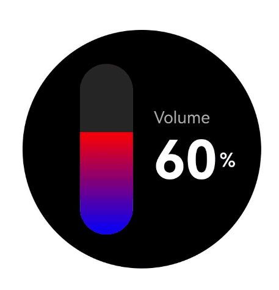
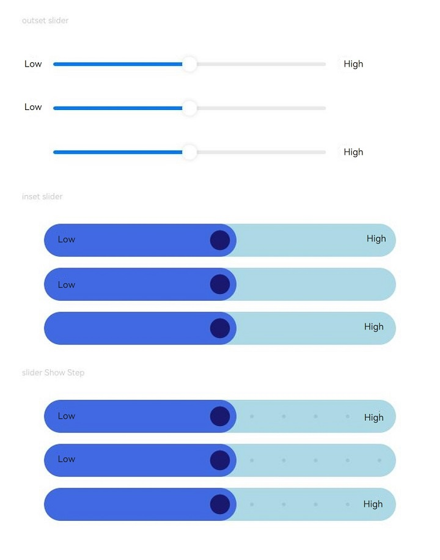
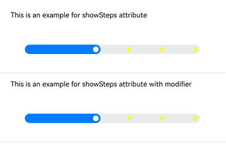
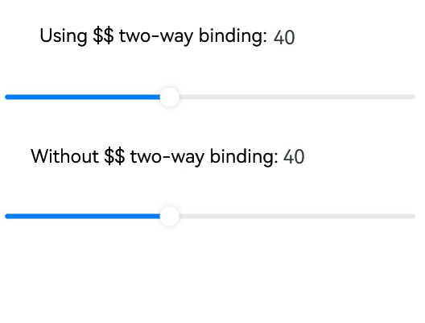
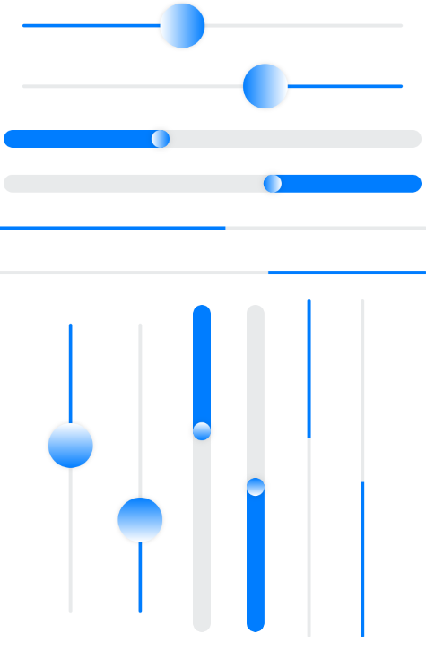
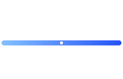

# Slider
<!--Kit: ArkUI-->
<!--Subsystem: ArkUI-->
<!--Owner: @liyi0309-->
<!--Designer: @liyi0309-->
<!--Tester: @lxl007-->
<!--Adviser: @Brilliantry_Rui-->
<!-- md-trans-meta sourceCommit=d1b4ee1c18a5a865168b9c5acdec05b37306a484 translatedAt=2026-09-03T12:01:51.306Z -->

The **Slider** component is used to quickly adjust settings, such as the volume and brightness. It supports style customization, direction configuration, interaction modes, and accessibility, which helps resolve UI consistency issues and improve development efficiency, thereby enhancing user experience and reducing development costs.

>  **NOTE**
>
> - This component is supported since API version 7. Updates will be marked with a superscript to indicate their earliest API version.
>
> - Since API version 26.0.0, when material parameters are passed to the **Slider** component, the preset visual parameters inside the component are used. The passed material parameters serve only as a switch flag for enabling the system material and do not affect the actual visual effect. They mainly affect the visual attributes of the **Slider**, such as the thumb size, thumb style, and shadow. When **undefined** is passed, the system material does not take effect, and the original **Slider** style is displayed.


## Child Components

Not supported


## APIs

Slider(options?: SliderOptions)

**Widget capability**: This API can be used in ArkTS widgets since API version 9.

**Atomic service API**: This API can be used in atomic services since API version 11.

**System capability**: SystemCapability.ArkUI.ArkUI.Full

**Parameters**

| Name | Type                                   | Mandatory| Description              |
| ------- | --------------------------------------- | ---- | ------------------ |
| options | [SliderOptions](#slideroptions) | No  | Parameters of the slider.|

## SliderOptions

Provides information about the slider.

**Widget capability**: This API can be used in ArkTS widgets since API version 9.

**Atomic service API**: This API can be used in atomic services since API version 11.

**System capability**: SystemCapability.ArkUI.ArkUI.Full

| Name| Type| Read-Only| Optional| Description|
| -------- | -------- | -------- | -------- | -------- |
| value | number | No | Yes | Current progress value.<br/>Default Value: same as the value of the **min** attribute.<br />Since API version 10, this attribute supports two-way binding through [$$](../../../ui/state-management/arkts-two-way-sync.md).<br />This attribute supports two-way binding through [!!](../../../ui/state-management/arkts-new-binding.md#two-way-binding-between-built-in-component-parameters).<br/>Value Range: [min, max]<br/>If the value is less than **min**, **min** is used; if the value is greater than **max**, **max** is used.<br/>The $$ operator provides a reference to a TS variable for a system component, keeping the TS variable synchronized with the **value** of the Slider component. For details, see [Example 7: Setting Two-Way Binding for the Slider](#example-7-setting-two-way-binding-for-the-slider). |
| min | number | No| Yes| Minimum value.<br>Default value: **0**|
| max | number | No | Yes | Maximum value.<br/>Default Value: 100<br/>**Note:** <br/>When **min** >= **max**, **min** takes the default value 0 and **max** takes the default value 100.<br/>When **value** is not within the range [min, max], **min** or **max** is used, whichever is closer to **value**. |
| step | number | No | Yes | Sliding step of the Slider.<br/>Default Value: 1<br/>Value Range: [0.01, max - min]<br/>**Note:** <br/>If the set **step** value is less than 0 or greater than **max** - **min**, the default value is used. |
| style | [SliderStyle](#sliderstyle) | No| Yes| Style of the slider thumb and track.<br>Default value: **SliderStyle.OutSet**|
| direction<sup>8+</sup> | [Axis](ts-appendix-enums.md#axis) | No| Yes| Whether the slider moves horizontally or vertically.<br>Default value: **Axis.Horizontal**|
| reverse<sup>8+</sup> | boolean | No| Yes| Whether the slider values are reversed.<br>**true**: A horizontal slider slides from right to left, and a vertical slider slides from bottom to top. **false**: A horizontal slider slides from left to right, and a vertical slider slides from top to bottom.<br>Default value: **false**|

## SliderStyle

The style in which the slider thumb is displayed on the track. For details about the style, see [How Are the Slider Thumb and Track of the Slider Component Aligned?](../../../ui/arkts-select-component-faq.md#how-are-the-slider-thumb-and-track-of-the-slider-component-aligned).

**System capability**: SystemCapability.ArkUI.ArkUI.Full

| Name| Description|
| -------- | -------- |
| OutSet | The thumb is on the track.<br>**Widget capability**: This API can be used in ArkTS widgets since API version 9.<br>**Atomic service API**: This API can be used in atomic services since API version 11.|
| InSet | The thumb is in the track.<br>**Widget capability**: This API can be used in ArkTS widgets since API version 9.<br>**Atomic service API**: This API can be used in atomic services since API version 11.|
| NONE<sup>12+</sup> | No slider. <br/>**Widget capability:** Since API version 12, this API is supported in ArkTS widgets.<br/>**Atomic service API:** Since API version 12, this API is supported in atomic services.<br/>**Model restriction:** This API can be used only in the stage model. |

>  **NOTE**
>
>  - The **Slider** has no default padding.
>  - For a horizontal slider, the default height is 40 vp and the width is the width of the parent container. The slider is displayed in the center. When **style** is **SliderStyle.OutSet**, the horizontal spacing is 9 vp on each side, which is half the width of [blockSize](#blocksize10). When **style** is **SliderStyle.InSet**, the horizontal spacing is 6 vp on each side. If padding is set, it does not override the horizontal spacing.
>  - For a vertical slider, the default width is 40 vp and the height is the height of the parent container. The slider is displayed in the center. When **style** is **SliderStyle.OutSet**, the vertical spacing is 10 vp on each side. When **style** is **SliderStyle.InSet**, the vertical spacing is 6 vp on each side. If padding is set, it does not override the vertical spacing.

## Attributes

All the [universal attributes](ts-component-general-attributes.md) except **responseRegion** are supported.

### blockColor

blockColor(value: ResourceColor)

Sets the color of the thumb.

When **SliderBlockType.DEFAULT** is used, **blockColor** sets the color of the round thumb.

When **SliderBlockType.IMAGE** is used, **blockColor** does not work as the thumb has no fill color.

When **SliderBlockType.SHAPE** is used, **blockColor** sets the color of the thumb in a custom shape.

**Widget capability**: This API can be used in ArkTS widgets since API version 9.

**Atomic service API**: This API can be used in atomic services since API version 11.

**System capability**: SystemCapability.ArkUI.ArkUI.Full

**Parameters**

| Name| Type                                      | Mandatory| Description                               |
| ------ | ------------------------------------------ | ---- | ----------------------------------- |
| value  | [ResourceColor](ts-types.md#resourcecolor) | Yes  | Color of the thumb.<br>Default value: **$r('sys.color.ohos_id_color_foreground_contrary')**|

### blockColor<sup>21+</sup>

blockColor(value: ResourceColor | LinearGradient)

Sets the color of the **Slider** thumb, with gradient colors supported. Compared with **blockColor**, it adds support for the **LinearGradient** type.

When **SliderBlockType.DEFAULT** is used, **blockColor** sets the color of the round thumb.

When **SliderBlockType.IMAGE** is used, **blockColor** does not work as the thumb has no fill color.

When **SliderBlockType.SHAPE** is used, **blockColor** sets the color of the thumb in a custom shape.

**Widget capability**: This API can be used in ArkTS widgets since API version 21.

**Atomic service API**: This API can be used in atomic services since API version 21.

**Model restriction**: This API can be used only in the stage model.

**System capability**: SystemCapability.ArkUI.ArkUI.Full

**Parameters**

| Name| Type                                      | Mandatory| Description                               |
| ------ | ------------------------------------------ | ---- | ----------------------------------- |
| value  | [ResourceColor](ts-types.md#resourcecolor)&nbsp;\|&nbsp;[LinearGradient](ts-basic-components-datapanel.md#lineargradient10)  | Yes   | Color of the block. <br/>Default value: `$r('sys.color.ohos_id_color_foreground_contrary')`<br/>**NOTE:** <br/>When the block shape is set to SliderBlockType.IMAGE, the block has no fill, and setting blockColor does not take effect. |

### trackColor

trackColor(value: ResourceColor | LinearGradient)

Sets the background color of the track.

Since API version 12, the **LinearGradient** type can be used to set the gradient color of the track.

**Widget capability**: This API can be used in ArkTS widgets since API version 9.

**Atomic service API:** Since API version 11, this API supports only the **ResourceColor** type in atomic services.

**System capability**: SystemCapability.ArkUI.ArkUI.Full

**Parameters**

| Name| Type                                                        | Mandatory| Description                                                        |
| ------ | ------------------------------------------------------------ | ---- | ------------------------------------------------------------ |
| value  | [ResourceColor](ts-types.md#resourcecolor)&nbsp;\|&nbsp;[LinearGradient](ts-basic-components-datapanel.md#lineargradient10) | Yes   | Background color of the track.<br/>Default value: `$r('sys.color.ohos_id_color_component_normal')`<br/>**Note:** <br/>1. When a gradient color is set, if the color value of a color stop is invalid or the gradient color stop is empty, the gradient color does not take effect.<br/>2. The LinearGradient type in this API is not supported in atomic services. |

### trackColorMetrics<sup>23+</sup>

trackColorMetrics(color: ColorMetricsLinearGradient)

Sets the linear gradient background color of the track. Compared with **trackColor**, it uses the **ColorMetricsLinearGradient** type to support gradients in a specified color gamut.

**Atomic service API**: This API can be used in atomic services since API version 23.

**Relationship with trackColor:** **trackColorMetrics** is similar to **trackColor** in function, but uses the **ColorMetricsLinearGradient** type to support gradient control in a specified color gamut. The **LinearGradient** type in **trackColor** is not supported in atomic services, whereas **trackColorMetrics** is. The two are similar in function and cannot take effect at the same time. The method called later overrides the setting of the method called earlier.

**System capability**: SystemCapability.ArkUI.ArkUI.Full

**Model restriction**: This API can be used only in the stage model.

**Parameters**

| Name| Type                                                        | Mandatory| Description                                                        |
| ------ | ------------------------------------------------------------ | ---- | ------------------------------------------------------------ |
| color  | [ColorMetricsLinearGradient](#colormetricslineargradient23) | Yes   | Linear gradient background color of the track.<br/>When a gradient color is set, if the value of color is undefined, the gradient color setting does not take effect, and the default background color of the track is `$r('sys.color.ohos_id_color_component_normal')`. |

### selectedColor

selectedColor(value: ResourceColor)

Sets the color of the portion of the track between the minimum value and the thumb, representing the selected portion.

**Widget capability**: This API can be used in ArkTS widgets since API version 9.

**Atomic service API**: This API can be used in atomic services since API version 11.

**System capability**: SystemCapability.ArkUI.ArkUI.Full

**Parameters**

| Name| Type                                      | Mandatory| Description                                                        |
| ------ | ------------------------------------------ | ---- | ------------------------------------------------------------ |
| value  | [ResourceColor](ts-types.md#resourcecolor) | Yes  | Color of the portion of the track between the minimum value and the thumb.<br>Default value: **$r('sys.color.ohos_id_color_emphasize')**|

### selectedColor<sup>18+</sup>

selectedColor(selectedColor: ResourceColor | LinearGradient)

Sets the color of the portion of the track between the minimum value and the thumb, representing the selected portion. Compared to [selectedColor](#selectedcolor), this API supports the **LinearGradient** type.

**Widget capability**: This API can be used in ArkTS widgets since API version 18.

**Atomic service API**: This API can be used in atomic services since API version 18.

**Model restriction**: This API can be used only in the stage model.

**System capability**: SystemCapability.ArkUI.ArkUI.Full

**Parameters**

| Name       | Type                                                        | Mandatory| Description                                                        |
| ------------- | ------------------------------------------------------------ | ---- | ------------------------------------------------------------ |
| selectedColor | [ResourceColor](ts-types.md#resourcecolor)&nbsp;\|&nbsp;[LinearGradient](ts-basic-components-datapanel.md#lineargradient10) | Yes  | Color of the portion of the track between the minimum value and the thumb.<br>Default value: **$r('sys.color.ohos_id_color_emphasize')**<br>**NOTE**<br>With gradient color settings, if the color stop values are invalid or if the color stops are empty, the gradient effect will not be applied. |

### showSteps

showSteps(value: boolean)

Sets whether to display the step scale value.

**Widget capability**: This API can be used in ArkTS widgets since API version 9.

**Atomic service API**: This API can be used in atomic services since API version 11.

**System capability**: SystemCapability.ArkUI.ArkUI.Full

**Parameters**

| Name| Type   | Mandatory| Description                                      |
| ------ | ------- | ---- | ------------------------------------------ |
| value  | boolean | Yes   | Whether to display the step scale value.<br/>true: display the scale value; false: do not display the scale value.<br/>Default Value: false |

### showTips

showTips(value: boolean, content?: ResourceStr)

Sets whether to display a tooltip when the user drags the slider.

When the value of **direction** is **Axis.Horizontal**, the bubble prompt is displayed above the block. If the space above is insufficient to display the complete bubble prompt, it is displayed below. When the value is **Axis.Vertical**, the bubble prompt is displayed to the left of the block. If the space on the left is insufficient to display the complete bubble prompt, it is displayed on the right. When no surrounding margin is set, or the margin is smaller than the space required by the bubble prompt, the bubble prompt is truncated.

The bubble prompt is drawn in the overlay of the **Slider** node.

**Widget capability**: This API can be used in ArkTS widgets since API version 9.

**Atomic service API**: This API can be used in atomic services since API version 11.

**System capability**: SystemCapability.ArkUI.ArkUI.Full

**Parameters**

| Name               | Type                                  | Mandatory| Description                                      |
| --------------------- | -------------------------------------- | ---- | ------------------------------------------ |
| value                 | boolean                                | Yes  | Whether to display a tooltip when the user drags the slider.<br>**true**: Display a tooltip. **false**: Do not display a tooltip.<br>Default value: **false**|
| content<sup>10+</sup> | [ResourceStr](ts-types.md#resourcestr) | No   | Text content of the bubble prompt. When passed in, a custom text is displayed (used when a specific format or additional information needs to be shown); when not passed in, the current percentage value is displayed by default.<br/>**Model Constraint:** This API can be used only in the stage model.   |

### trackThickness<sup>8+</sup>

trackThickness(value: Length)

Sets the thickness of the track. If the value is less than or equal to 0, the default value is used.

To ensure [SliderStyle](#sliderstyle) works as expected for the thumb and track, [blockSize](#blocksize10) should increase or decrease proportionally with **trackThickness**.

When **style** is [SliderStyle](#sliderstyle).**OutSet**, trackThickness:[blockSize](#blocksize10)=1:4. When **style** is [SliderStyle](#sliderstyle).**InSet**, trackThickness:[blockSize](#blocksize10)=5:3.

If the value of **trackThickness** or [blockSize](#blocksize10) exceeds the width or height of the **Slider** component, the default value is used.

When [SliderStyle](#sliderstyle) is set to **OutSet**, if the specified value of [blockSize](#blocksize10) exceeds the width or height of the **Slider** component, the default value is used, regardless of whether the value of **trackThickness** is valid or not.

**Widget capability**: This API can be used in ArkTS widgets since API version 9.

**Atomic service API**: This API can be used in atomic services since API version 11.

**System capability**: SystemCapability.ArkUI.ArkUI.Full

**Parameters**

| Name| Type                        | Mandatory| Description                                                        |
| ------ | ---------------------------- | ---- | ------------------------------------------------------------ |
| value  | [Length](ts-types.md#length) | Yes  | Thickness of the track.<br/>Default value: **4.0**vp when style is [SliderStyle](#sliderstyle).OutSet, and **20.0**vp when style is [SliderStyle](#sliderstyle).InSet. |

### blockBorderColor<sup>10+</sup>

blockBorderColor(value: ResourceColor)

Sets the border color of the slider in the block direction.

When **SliderBlockType.DEFAULT** is used, **blockBorderColor** sets the border color of the round slider.

When **SliderBlockType.IMAGE** is used, **blockBorderColor** does not work as the slider has no border.

When **SliderBlockType.SHAPE** is used, **blockBorderColor** sets the border color of the slider in a custom shape.

**Atomic service API**: This API can be used in atomic services since API version 11.

**Model restriction**: This API can be used only in the stage model.

**System capability**: SystemCapability.ArkUI.ArkUI.Full

**Parameters**

| Name| Type                                      | Mandatory| Description                                  |
| ------ | ------------------------------------------ | ---- | -------------------------------------- |
| value  | [ResourceColor](ts-types.md#resourcecolor) | Yes  | Border color of the slider in the block direction.<br>Default value: **'#00000000'**|

### blockBorderWidth<sup>10+</sup>

blockBorderWidth(value: Length)

Sets the border width of the slider in the block direction.

When **SliderBlockType.DEFAULT** is used, **blockBorderWidth** sets the border width of the round slider.

When **SliderBlockType.IMAGE** is used, **blockBorderWidth** does not work as the slider has no border.

When **SliderBlockType.SHAPE** is used, **blockBorderWidth** sets the border width of the slider in a custom shape.

**Atomic service API**: This API can be used in atomic services since API version 11.

**Model restriction**: This API can be used only in the stage model.

**System capability**: SystemCapability.ArkUI.ArkUI.Full

**Parameters**

| Name| Type                        | Mandatory| Description          |
| ------ | ---------------------------- | ---- | -------------- |
| value  | [Length](ts-types.md#length) | Yes  | Stroke width of the block.<br/>**Note:** <br/>When value is of the string type, percentages are not supported. |

### stepColor<sup>10+</sup>

stepColor(value: ResourceColor)

Sets the step color.

**Atomic service API**: This API can be used in atomic services since API version 11.

**Model restriction**: This API can be used only in the stage model.

**System capability**: SystemCapability.ArkUI.ArkUI.Full

**Parameters**

| Name| Type                                      | Mandatory| Description                              |
| ------ | ------------------------------------------ | ---- | ---------------------------------- |
| value  | [ResourceColor](ts-types.md#resourcecolor) | Yes  | Step color.<br/>Default value:<br/>The `$r('sys.color.ohos_id_color_foreground')` color mixed with the transparency of `$r('sys.color.ohos_id_alpha_normal_bg')`. |

### trackBorderRadius<sup>10+</sup>

trackBorderRadius(value: Length)

Sets the corner radius of the track.

**Atomic service API**: This API can be used in atomic services since API version 11.

**Model restriction**: This API can be used only in the stage model.

**System capability**: SystemCapability.ArkUI.ArkUI.Full

**Parameters**

| Name| Type                        | Mandatory| Description                            |
| ------ | ---------------------------- | ---- | -------------------------------- |
| value  | [Length](ts-types.md#length) | Yes  | Corner radius of the track.<br/>Default value:<br/>The default value is 2 vp when style is SliderStyle.OutSet.<br/>The default value is 10 vp when style is SliderStyle.InSet.<br/>**Note:** <br/>The default value is used when the set value is less than 0. |

### selectedBorderRadius<sup>12+</sup>

selectedBorderRadius(value: Dimension)

Set the corner radius of the selected (highlighted) part of the slider.

**Atomic service API**: This API can be used in atomic services since API version 12.

**Model restriction**: This API can be used only in the stage model.

**System capability**: SystemCapability.ArkUI.ArkUI.Full

**Parameters**

| Name| Type                        | Mandatory| Description                            |
| ------ | ---------------------------- | ---- | -------------------------------- |
| value  | [Dimension](ts-types.md#dimension10)| Yes   | Corner radius of the slid portion.<br/>Default value: when style is SliderStyle.InSet or SliderStyle.OutSet, it follows the track corner radius; when style is SliderStyle.NONE, it is 0.<br/>**Note:** <br/>The Percentage type is not supported. If the set value is less than 0, the default value is used. |

### blockSize<sup>10+</sup>

blockSize(value: SizeOptions)

Sets the size of the slider in the block direction.

When the slider type is set to **SliderBlockType.DEFAULT**, the smaller of the width and height values is used as the radius of the circle.

When the slider type is set to **SliderBlockType.IMAGE**, this API sets the size of the image, which is scaled using the **ObjectFit.Cover** strategy.

When the slider type is set to **SliderBlockType.SHAPE**, this API sets the size of the custom shape, which is also scaled using the **ObjectFit.Cover** strategy.

**Atomic service API**: This API can be used in atomic services since API version 11.

**Model restriction**: This API can be used only in the stage model.

**System capability**: SystemCapability.ArkUI.ArkUI.Full

**Parameters**

| Name| Type                                  | Mandatory| Description                                                        |
| ------ | -------------------------------------- | ---- | ------------------------------------------------------------ |
| value  | [SizeOptions](ts-types.md#sizeoptions) | Yes   | Slider size.<br/>Default value: when the value of the style parameter is set to [SliderStyle](#sliderstyle).OutSet, the default value is {width: 18, height: 18}; when the value of the style parameter is set to [SliderStyle](#sliderstyle).InSet, the default value is {width: 12, height: 12}; when the value of the style parameter is set to [SliderStyle](#sliderstyle).NONE, this field does not take effect.<br/>When the width and height of blockSize are not equal, the smaller value is used as the size. When either or both of the set width and height values are less than or equal to 0, the default value is used. |

### blockStyle<sup>10+</sup>

blockStyle(value: SliderBlockStyle)

Sets the style of the slider in the block direction.

**Atomic service API**: This API can be used in atomic services since API version 11.

**Model restriction**: This API can be used only in the stage model.

**System capability**: SystemCapability.ArkUI.ArkUI.Full

**Parameters**

| Name| Type                                           | Mandatory| Description                                                        |
| ------ | ----------------------------------------------- | ---- | ------------------------------------------------------------ |
| value  | [SliderBlockStyle](#sliderblockstyle10) | Yes  | Block shape parameters.<br/>The default value is SliderBlockType.DEFAULT, that is, a circular block. |

### stepSize<sup>10+</sup>

stepSize(value: Length)

Sets the step size (diameter). If the value is 0, the step size is not displayed. If the value is less than 0, the default value is used.

**Atomic service API**: This API can be used in atomic services since API version 11.

**Model restriction**: This API can be used only in the stage model.

**System capability**: SystemCapability.ArkUI.ArkUI.Full

**Parameters**

| Name| Type                        | Mandatory| Description                                 |
| ------ | ---------------------------- | ---- | ------------------------------------- |
| value  | [Length](ts-types.md#length) | Yes   | Step size (diameter). <br/>Default value: '4vp'<br/>Value range: [0, [trackThickness](#trackthickness8)), in vp |

### sliderInteractionMode<sup>12+</sup>

sliderInteractionMode(value: SliderInteraction)

Sets the interaction mode between the user and the slider.

**Atomic service API**: This API can be used in atomic services since API version 12.

**Model restriction**: This API can be used only in the stage model.

**System capability**: SystemCapability.ArkUI.ArkUI.Full

**Parameters**

| Name| Type                                             | Mandatory| Description                                                        |
| ------ | ------------------------------------------------- | ---- | ------------------------------------------------------------ |
| value  | [SliderInteraction](#sliderinteraction12) | Yes   | Interaction mode between the user and the slider component.<br/>Default value: SliderInteraction.SLIDE_AND_CLICK. |

### minResponsiveDistance<sup>12+</sup>

minResponsiveDistance(value: number)

Sets the minimum response distance for the block to start sliding.

**Atomic service API**: This API can be used in atomic services since API version 12.

**Model restriction**: This API can be used only in the stage model.

**System capability**: SystemCapability.ArkUI.ArkUI.Full

**Parameters**

| Name| Type   | Mandatory| Description                                      |
| ------ | ------- | ---- | ------------------------------------------ |
| value  | number | Yes   | Sets the minimum response distance for the slider to start sliding.<br/>Default value: 0<br/>**Note:** <br/>The unit is the same as that of the min and max attributes in [SliderOptions](#slideroptions).<br/>If value is less than 0, greater than max-min, NaN, or of a non-numeric type, the default value is used.  |

### contentModifier<sup>12+</sup>

contentModifier(modifier: ContentModifier\<SliderConfiguration>)

Creates a content modifier.

**Atomic service API**: This API can be used in atomic services since API version 12.

**Model restriction**: This API can be used only in the stage model.

**System capability**: SystemCapability.ArkUI.ArkUI.Full

**Parameters**

| Name| Type                                         | Mandatory| Description                                            |
| ------ | --------------------------------------------- | ---- | ------------------------------------------------ |
| modifier  | [ContentModifier](ts-universal-attributes-content-modifier.md#contentmodifiert)\<[SliderConfiguration](#sliderconfiguration12)> | Yes   | Method for customizing the content area on the Slider component.<br/>ContentModifier is a content modifier, which requires a custom class to implement this interface. |

>  **NOTE**
>
>  - If **contentModifier** is set, then clicks and gestures within the custom area will not trigger the **onChange** event of the original slider.
>  - The **onChange** event of the original slider can only be triggered when the **triggerChange** API is called with valid parameter values.

### slideRange<sup>12+</sup>

slideRange(value: SlideRange)

Sets the valid sliding range. After this attribute is set, the sliding range of the block is limited to [from, to]. Taps and gestures outside this range do not trigger sliding. If the initial value of **value** exceeds the range, it is automatically adjusted to the boundary of the range.

**Atomic service API**: This API can be used in atomic services since API version 12.

**Model restriction**: This API can be used only in the stage model.

**System capability**: SystemCapability.ArkUI.ArkUI.Full

**Parameters**

| Name| Type                               | Mandatory| Description            |
| ------ | ----------------------------------- | ---- | ---------------- |
| value  | [SlideRange](#sliderange12) | Yes   | Valid sliding range. |

### enableHapticFeedback<sup>18+</sup>

enableHapticFeedback(enabled: boolean)

Specifies whether to enable haptic feedback.

To enable haptic feedback, you must declare the **ohos.permission.VIBRATE** permission under **requestPermissions** in the [module.json5](../../../quick-start/module-configuration-file.md) file of the project.

```json
"requestPermissions": [
  {
    "name": "ohos.permission.VIBRATE"
  }
 ]
```

**Atomic service API**: This API can be used in atomic services since API version 18.

**Model restriction**: This API can be used only in the stage model.

**System capability**: SystemCapability.ArkUI.ArkUI.Full

**Parameters**

| Name| Type                                         | Mandatory | Description                                                                                 |
| ------ | --------------------------------------------- |-----|-------------------------------------------------------------------------------------|
| enabled  | boolean | Yes   | Whether to enable touch feedback.<br/>true: touch feedback is enabled; false: touch feedback is disabled.<br/>Default value: true|

### digitalCrownSensitivity<sup>18+</sup>

digitalCrownSensitivity(sensitivity: Optional\<CrownSensitivity>)

Sets the sensitivity of the rotating crown.

> **NOTE**
>
> This API cannot be called within [attributeModifier](ts-universal-attributes-attribute-modifier.md#attributemodifier).

**Atomic service API**: This API can be used in atomic services since API version 18.

**Model restriction**: This API can be used only in the stage model.

**System capability**: SystemCapability.ArkUI.ArkUI.Full

**Parameters**

| Name     | Type                                                        | Mandatory| Description                                                   |
| ----------- | ------------------------------------------------------------ | ---- | ------------------------------------------------------- |
| sensitivity | [Optional](ts-universal-attributes-custom-property.md#optionalt)\<[CrownSensitivity](ts-appendix-enums.md#crownsensitivity18)> | Yes | Sensitivity of the rotating crown.<br />Default value: CrownSensitivity.MEDIUM |

### prefix<sup>20+</sup>

prefix(content: ComponentContent, options?: SliderPrefixOptions)

Sets the prefix of the slider.

**Atomic service API**: This API can be used in atomic services since API version 20.

**Model restriction**: This API can be used only in the stage model.

**System capability**: SystemCapability.ArkUI.ArkUI.Full

**Parameters**

| Name     | Type                                                        | Mandatory| Description                                                   |
| ----------- | ------------------------------------------------------------ | ---- | ------------------------------------------------------- |
| content | [ComponentContent](../js-apis-arkui-ComponentContent.md) | Yes  | Visual content of the Slider prefix, displayed at the start position of the Slider. |
| options | [SliderPrefixOptions](#sliderprefixoptions20) | No  | Configuration options of the Slider prefix, used to set accessibility-related attributes. <br/>Default value: null |

### suffix<sup>20+</sup>

suffix(content: ComponentContent, options?: SliderSuffixOptions)

Sets the suffix of the slider.

**Atomic service API**: This API can be used in atomic services since API version 20.

**Model restriction**: This API can be used only in the stage model.

**System capability**: SystemCapability.ArkUI.ArkUI.Full

**Parameters**

| Name     | Type                                                        | Mandatory| Description                                                   |
| ----------- | ------------------------------------------------------------ | ---- | ------------------------------------------------------- |
| content | [ComponentContent](../js-apis-arkui-ComponentContent.md)    | Yes   | Visual content of the slider suffix, displayed at the end position of the slider. |
| options | [SliderSuffixOptions](#slidersuffixoptions20) | No   | Configuration options of the slider suffix, used to set accessibility-related properties. <br/>Default value: null |

### showSteps<sup>20+</sup>

showSteps(value: boolean, options?: SliderShowStepOptions)

Sets whether to display the step markers along the slider track.

You can set custom accessibility text for each step value. If no accessibility text is provided, the numeric values are used.

The accessibility text settings take effect only when the step markers are displayed.

**Widget capability**: This API can be used in ArkTS widgets since API version 20.

**Atomic service API**: This API can be used in atomic services since API version 20.

**Model restriction**: This API can be used only in the stage model.

**System capability**: SystemCapability.ArkUI.ArkUI.Full

**Parameters**

| Name     | Type                                                        | Mandatory| Description                                                   |
| ----------- | ------------------------------------------------------------ | ---- | ------------------------------------------------------- |
| value | boolean | Yes | Whether to display the step scale value.<br/>true: display the scale value; false: do not display the scale value.<br />Default value: false |
| options | [SliderShowStepOptions](#slidershowstepoptions20) | No| Accessibility configuration of step markers.<br>Default value: **null**|

### minLabel<sup>(deprecated)</sup>

minLabel(value: string)

Sets the text content of the minimum value label.

> **NOTE**
>
> This API is supported since API version 7 and deprecated since API version 9. You are advised to use the **min** attribute in [SliderOptions](#slideroptions) instead.

**System capability**: SystemCapability.ArkUI.ArkUI.Full

**Parameters**

| Name| Type  | Mandatory| Description    |
| ------ | ------ | ---- | -------- |
| value  | string | Yes   | Text of the minimum value label. |

### maxLabel<sup>(deprecated)</sup>

maxLabel(value: string)

Sets the text content of the maximum value label.

> **NOTE**
>
> Supported since API version 7, deprecated since API version 9. You are advised to use the **max** attribute of [SliderOptions](#slideroptions) instead.

**System capability**: SystemCapability.ArkUI.ArkUI.Full

**Parameters**

| Name| Type  | Mandatory| Description    |
| ------ | ------ | ---- | -------- |
| value  | string | Yes   | Text of the maximum value label. |

## ColorMetricsLinearGradient<sup>23+</sup>

Linear gradient background color of the track.

### constructor<sup>23+</sup>

constructor(colorStops: ColorMetricsStop[])

Constructor of **ColorMetricsLinearGradient**.

**Atomic service API**: This API can be used in atomic services since API version 23.

**System capability**: SystemCapability.ArkUI.ArkUI.Full

**Model restriction**: This API can be used only in the stage model.

**Parameters**

| Name        | Type| Mandatory| Description|
| ------------- | ------- | ---- | -------- |
| colorStops | [ColorMetricsStop](#colormetricsstop23)[] | Yes | Array of color stops for the linear gradient. Each element describes a color and its stop value in the gradient. |

## ColorMetricsStop<sup>23+</sup>

Linear gradient color stop type, used to describe the color stops of a gradient.

**Atomic service API**: This API can be used in atomic services since API version 23.

**System capability**: SystemCapability.ArkUI.ArkUI.Full

**Model restriction**: This API can be used only in the stage model.

| Name         | Type| Read-Only| Optional| Description|
| ------------- | ------- | ---- | -------- | -------- |
| color | [ColorMetrics](../js-apis-arkui-graphics.md#colormetrics12) | No| No| Color value of the linear gradient color breakpoint.|
| offset | [Length](ts-types.md#length) | No | No | Breakpoint value of a color stop in the linear gradient. The value is a ratio ranging from 0 to 1. A value less than 0 is set to 0, and a value greater than 1 is set to 1. <br>**NOTE** <br/>If a string that contains a number is passed in, it is converted to the corresponding numeric value. For example, '10vp' is converted to 10, and '10%' is converted to 0.1. |

## SliderCustomContentOptions<sup>20+</sup>

Provides accessibility configuration of the slider prefix and suffix.

**Atomic service API**: This API can be used in atomic services since API version 20.

**Model restriction**: This API can be used only in the stage model.

**System capability**: SystemCapability.ArkUI.ArkUI.Full

| Name                    | Type       | Read-Only| Optional| Description                                                        |
| ------------------------ | ----------- | ---- | ------------------------------------------------------------ | ------------------------------------------------------------ |
| accessibilityText        | [ResourceStr](ts-types.md#resourcestr) | No   | Yes  | Accessibility text for screen readers and other tools to read, enhancing accessibility. <br/>Default value: "" |
| accessibilityDescription | [ResourceStr](ts-types.md#resourcestr) | No   | Yes  | Detailed accessibility description of the function or purpose of the slider prefix or suffix, for screen readers and other tools. <br/>Default value: "Single-finger double-tap to execute." |
| accessibilityLevel       | string      | No   | Yes  | Controls whether the component can be recognized by accessibility services.<br>Supported values:<br>"auto": The current component is converted to "yes".<br>"yes": The current component can be recognized by accessibility services.<br>"no": The current component cannot be recognized by accessibility services.<br>"no-hide-descendants": The current component and all its child components cannot be recognized by accessibility services.<br>Default value: "auto". |
| accessibilityGroup       | boolean     | No   | Yes  | Whether the element belongs to an accessibility group, helping screen readers and other tools group related elements.<br/>true: The component and all its child components form a single selectable component, and accessibility services no longer focus on the content of its child components; false: accessibility grouping is not enabled.<br/>Default value: false |

## SliderPrefixOptions<sup>20+</sup>

Provides accessibility configuration of the slider prefix.

**Atomic service API**: This API can be used in atomic services since API version 20.

**Model restriction**: This API can be used only in the stage model.

**System capability**: SystemCapability.ArkUI.ArkUI.Full

Inherits from [SliderCustomContentOptions](#slidercustomcontentoptions20).

## SliderSuffixOptions<sup>20+</sup>

Provides accessibility configuration of the slider suffix.

**Atomic service API**: This API can be used in atomic services since API version 20.

**Model restriction**: This API can be used only in the stage model.

**System capability**: SystemCapability.ArkUI.ArkUI.Full

Inherits from [SliderCustomContentOptions](#slidercustomcontentoptions20).

## SliderStepItemAccessibility<sup>20+</sup>

Provides accessibility configuration of the slider step markers.

**Atomic service API**: This API can be used in atomic services since API version 20.

**Model restriction**: This API can be used only in the stage model.

**System capability**: SystemCapability.ArkUI.ArkUI.Full

| Name                    | Type       | Read-Only| Optional| Description                                                        |
| ------------------------ | ----------- | ---- | ------------------------------------------------------------ | ------------------------------------------------------------ |
| text | [ResourceStr](ts-types.md#resourcestr) | No | Yes | Accessibility text, read by tools such as screen readers to enhance accessibility. <br/>Default value: "" |

## SliderShowStepOptions<sup>20+</sup>

Provides accessibility text mapping for the slider step markers.

**Atomic service API**: This API can be used in atomic services since API version 20.

**Model restriction**: This API can be used only in the stage model.

**System capability**: SystemCapability.ArkUI.ArkUI.Full

| Name                    | Type       | Read-Only| Optional| Description                                                        |
| ------------------------ | ----------- | ---- | ------------------------------------------------------------ | ------------------------------------------------------------ |
| stepsAccessibility | Map<number, [SliderStepItemAccessibility](#sliderstepitemaccessibility20)> | No | Yes | Mapping set of accessibility text for step points, read by tools such as screen readers to enhance accessibility. <br/>Key value range: [0, INT32_MAX]. When the key is set to a negative number or a decimal, the setting does not take effect. <br/>Default value: {} |

## SliderBlockStyle<sup>10+</sup>

Describes the style of the slider in the block direction.

**Atomic service API**: This API can be used in atomic services since API version 11.

**Model restriction**: This API can be used only in the stage model.

**System capability**: SystemCapability.ArkUI.ArkUI.Full

| Name | Type                                                        | Read-Only| Optional| Description                                                        |
| ----- | ------------------------------------------------------------ | ---- | ---- | ------------------------------------------------------------ |
| type  | [SliderBlockType](#sliderblocktype10)                | No   | No   | Shape of the block.<br/>Default Value: SliderBlockType.DEFAULT, which uses a circular block. |
| image | [ResourceStr](ts-types.md#resourcestr)                       | No   | Yes   | Sets the image resource of the block.<br />The size of the image display area is controlled by the blockSize attribute. Do not use an oversized image.<br/>**Note:** This attribute takes effect only when type is SliderBlockType.IMAGE, and is mutually exclusive with the shape attribute. They cannot be used together. |
| shape | [Circle](ts-drawing-components-circle.md)&nbsp;\|&nbsp;[Ellipse](ts-drawing-components-ellipse.md)&nbsp;\|&nbsp;[Path](ts-drawing-components-path.md)&nbsp;\|&nbsp;[Rect](ts-drawing-components-rect.md)&nbsp; | No   | Yes   | Sets the custom shape used by the block.<br/>**Note:** This attribute takes effect only when type is SliderBlockType.SHAPE, and is mutually exclusive with the image attribute. They cannot be used together.                                   |

## SliderBlockType<sup>10+</sup>

Enumerates the types of the slider in the block direction.

**Atomic service API**: This API can be used in atomic services since API version 11.

**Model restriction**: This API can be used only in the stage model.

**System capability**: SystemCapability.ArkUI.ArkUI.Full

| Name   | Value| Description                |
| ------- | -- | ---------------------- |
| DEFAULT | 0 | Round slider.  |
| IMAGE   | 1 | Slider with an image background.  |
| SHAPE   | 2 | Slider in a custom shape.|

## SliderInteraction<sup>12+</sup>

Interaction mode between the user and the slider.

**Atomic service API**: This API can be used in atomic services since API version 12.

**Model restriction**: This API can be used only in the stage model.

**System capability**: SystemCapability.ArkUI.ArkUI.Full

| Name    | Value|Description                         |
| ------ | -- | ----------------------------- |
| SLIDE_AND_CLICK | 0 | Users can drag the slider or touch the track to move the slider. The slider moves as soon as the mouse or finger is pressed.|
| SLIDE_ONLY | 1 | Users are not allowed to move the slider by touching the slider.|
| SLIDE_AND_CLICK_UP | 2 |Users can drag the slider or touch the track to move the slider. The slider moves when the mouse is released or finger is lifted, if the release/lift position coincides with the screen press position.|

## SlideRange<sup>12+</sup>

Defines the valid sliding range.

**Atomic service API**: This API can be used in atomic services since API version 12.

**Model restriction**: This API can be used only in the stage model.

**System capability**: SystemCapability.ArkUI.ArkUI.Full

| Name| Type    | Read-Only| Optional| Description          |
|----|--------| ---- |--------------|--------------|
| from | number | No| Yes| Start of the slide range.|
| to | number | No| Yes| End of the slide range.|

> **NOTE**
>
>  - This takes effect only when min <= from <= to <= max (where min and max are the values that actually take effect).
>  - You can set only **from** or only **to**, or set both **from** and **to**.
>  - When the API takes effect and the set **from** falls between two adjacent integer multiples of **step**, the value actually used for **from** is the integer multiple of **step** in the left interval or **min** as the corrected value.
>  - When the API takes effect and the set **to** falls between two adjacent integer multiples of **step**, the value actually used for **to** is the integer multiple of **step** in the right interval or **MAX** as the corrected value.
>  - After **from** and **to** are corrected, if **value** is undefined or null, it is the same as **from**; if **value** is a number and less than or equal to **from**, **from** is used; if **value** is greater than **to**, **to** is used.

## Events

In addition to the [universal events](ts-component-general-events.md), the following events are supported.

### onChange

onChange(callback:&nbsp;(value:&nbsp;number,&nbsp;mode:&nbsp;SliderChangeMode)&nbsp;=&gt;&nbsp;void)

Triggered when the slider is dragged or clicked.

The Begin and End states are triggered on a tap, and the Moving and Click states are triggered when the value changes.

A continuous drag does not trigger the Click state.

**Widget capability**: This API can be used in ArkTS widgets since API version 9.

**Atomic service API**: This API can be used in atomic services since API version 11.

**System capability**: SystemCapability.ArkUI.ArkUI.Full

**Parameters**

| Name| Type                                         | Mandatory| Description                                                        |
| ------ | --------------------------------------------- | ---- | ------------------------------------------------------------ |
| value  | number                                        | Yes   | Current sliding progress value. The precision of the return value is determined by the step parameter of Slider. If the return value contains decimals, use number.toFixed() to process the data to the expected precision. |
| mode   | [SliderChangeMode](#sliderchangemode) | Yes   | State value related to event triggering. The options include Begin, Moving, End, and Click. For details, see [SliderChangeMode](#sliderchangemode).                                       |

## SliderChangeMode

Slider block state values, including pressed, dragged, released, and moved when the slider is tapped.

**Widget capability**: This API can be used in ArkTS widgets since API version 9.

**Atomic service API**: This API can be used in atomic services since API version 11.

**System capability**: SystemCapability.ArkUI.ArkUI.Full

| Name| Value| Description|
| -------- | -------- | -------- |
| Begin | 0 | The gesture or mouse touches or presses the block. |
| Moving | 1 | The block is being dragged. |
| End | 2 | The gesture or mouse leaves the block.<br/>**NOTE**<br/>Triggered when the gesture or mouse leaves the block, including the end of a normal drag. It is also triggered when an abnormal value is restored to the default value, that is, when the value is set to a value less than min or greater than max. |
| Click<sup>8+</sup> | 3    | The slider is clicked to move the block. |

## SliderConfiguration<sup>12+</sup>

You need a custom class to implement the **ContentModifier** API. Inherits from [CommonConfiguration](ts-universal-attributes-content-modifier.md#commonconfigurationt).

**Atomic service API**: This API can be used in atomic services since API version 12.

**Model restriction**: This API can be used only in the stage model.

**System capability**: SystemCapability.ArkUI.ArkUI.Full

| Name | Type   | Read-Only | Optional | Description             |
| ------ | ------ | ---------------- | ---------------- | ---------------- |
| value | number | No| No| Current progress.|
| min | number | No| No| Minimum value.|
| max | number | No| No| Maximum value.|
| step | number | No | No | Slider sliding step, which indicates the value increment of each slider movement. |
| triggerChange | [SliderTriggerChangeCallback](#slidertriggerchangecallback12) | No| No| Triggers slider changes.|

## SliderTriggerChangeCallback<sup>12+</sup>

type SliderTriggerChangeCallback = (value: number, mode: SliderChangeMode) => void

Defines the callback type used in **SliderConfiguration**.

**Atomic service API**: This API can be used in atomic services since API version 12.

**Model restriction**: This API can be used only in the stage model.

**System capability**: SystemCapability.ArkUI.ArkUI.Full

**Parameters**

| Name| Type   | Mandatory| Description             |
| ------ | ------ | ---------------- | ---------------- |
| value | number | Yes | Sets the current progress value.<br/>Value range: [[min](#slideroptions)-[max](#slideroptions)] |
| mode | [SliderChangeMode](#sliderchangemode)| Yes| State triggered by the event.|

## Example

### Example 1: Using Basic Slider Styles

This example demonstrates how to control the display of the tooltip, current step, and slider thumb and track by configuring **style**, **showTips**, and **showSteps**.

```ts
// xxx.ets
@Entry
@Component
struct SliderExample {
  @State outSetValueOne: number = 40;
  @State inSetValueOne: number = 40;
  @State noneValueOne: number = 40;
  @State outSetValueTwo: number = 40;
  @State inSetValueTwo: number = 40;
  @State vOutSetValueOne: number = 40;
  @State vInSetValueOne: number = 40;
  @State vOutSetValueTwo: number = 40;
  @State vInSetValueTwo: number = 40;

  build() {
    Column({ space: 8 }) {
      Text('outset slider').fontSize(9).fontColor(0xCCCCCC).width('90%').margin(15)
      Row() {
        Slider({
          value: this.outSetValueOne,
          min: 0,
          max: 100,
          style: SliderStyle.OutSet
        })
          .showTips(true)
          .onChange((value: number, mode: SliderChangeMode) => {
            this.outSetValueOne = value;
            console.info('value:' + value + 'mode:' + mode.toString());
          })
        // toFixed(0) converts the return value of the slider to an integer.
        Text(this.outSetValueOne.toFixed(0)).fontSize(12)
      }
      .width('80%')
      Row() {
        Slider({
          value: this.outSetValueTwo,
          step: 10,
          style: SliderStyle.OutSet
        })
          .showSteps(true)
          .onChange((value: number, mode: SliderChangeMode) => {
            this.outSetValueTwo = value;
            console.info('value:' + value + 'mode:' + mode.toString());
          })
        Text(this.outSetValueTwo.toFixed(0)).fontSize(12)
      }
      .width('80%')

      Text('inset slider').fontSize(9).fontColor(0xCCCCCC).width('90%').margin(15)
      Row() {
        Slider({
          value: this.inSetValueOne,
          min: 0,
          max: 100,
          style: SliderStyle.InSet
        })
          .blockColor('#191970')
          .trackColor('#ADD8E6')
          .selectedColor('#4169E1')
          .showTips(true)
          .onChange((value: number, mode: SliderChangeMode) => {
            this.inSetValueOne = value;
            console.info('value:' + value + 'mode:' + mode.toString());
          })
        Text(this.inSetValueOne.toFixed(0)).fontSize(12)
      }
      .width('80%')
      Row() {
        Slider({
          value: this.inSetValueTwo,
          step: 10,
          style: SliderStyle.InSet
        })
          .blockColor('#191970')
          .trackColor('#ADD8E6')
          .selectedColor('#4169E1')
          .showSteps(true)
          .onChange((value: number, mode: SliderChangeMode) => {
            this.inSetValueTwo = value;
            console.info('value:' + value + 'mode:' + mode.toString());
          })
        Text(this.inSetValueTwo.toFixed(0)).fontSize(12)
      }
      .width('80%')

      Text('none slider').fontSize(9).fontColor(0xCCCCCC).width('90%').margin(15)
      Row() {
        Slider({
          value: this.noneValueOne,
          min: 0,
          max: 100,
          style: SliderStyle.NONE
        })
          .blockColor('#191970')
          .trackColor('#ADD8E6')
          .selectedColor('#4169E1')
          .showTips(true)
          .onChange((value: number, mode: SliderChangeMode) => {
            this.noneValueOne = value;
            console.info('value:' + value + 'mode:' + mode.toString());
          })
        Text(this.noneValueOne.toFixed(0)).fontSize(12)
      }
      .width('80%')

      Row() {
        Column() {
          Text('vertical outset slider').fontSize(9).fontColor(0xCCCCCC).width('50%').margin(15)
          Row() {
            Text().width('10%')
            Slider({
              value: this.vOutSetValueOne,
              style: SliderStyle.OutSet,
              direction: Axis.Vertical
            })
              .blockColor('#191970')
              .trackColor('#ADD8E6')
              .selectedColor('#4169E1')
              .showTips(true)
              .onChange((value: number, mode: SliderChangeMode) => {
                this.vOutSetValueOne = value;
                console.info('value:' + value + 'mode:' + mode.toString());
              })
            Slider({
              value: this.vOutSetValueTwo,
              step: 10,
              style: SliderStyle.OutSet,
              direction: Axis.Vertical
            })
              .blockColor('#191970')
              .trackColor('#ADD8E6')
              .selectedColor('#4169E1')
              .showSteps(true)
              .onChange((value: number, mode: SliderChangeMode) => {
                this.vOutSetValueTwo = value;
                console.info('value:' + value + 'mode:' + mode.toString());
              })
          }
        }.width('50%').height(300)

        Column() {
          Text('vertical inset slider').fontSize(9).fontColor(0xCCCCCC).width('50%').margin(15)
          Row() {
            Slider({
              value: this.vInSetValueOne,
              style: SliderStyle.InSet,
              direction: Axis.Vertical,
              reverse: true // For a vertical Slider, the top end is the min value and the bottom end is the max value by default. To slide from bottom to top, set reverse to true.
            })
              .showTips(true)
              .onChange((value: number, mode: SliderChangeMode) => {
                this.vInSetValueOne = value;
                console.info('value:' + value + 'mode:' + mode.toString());
              })
            Slider({
              value: this.vInSetValueTwo,
              step: 10,
              style: SliderStyle.InSet,
              direction: Axis.Vertical,
              reverse: true
            })
              .showSteps(true)
              .onChange((value: number, mode: SliderChangeMode) => {
                this.vInSetValueTwo = value;
                console.info('value:' + value + 'mode:' + mode.toString());
              })
          }
        }.width('50%').height(300)
      }
    }.width('100%')
  }
}
```


### Example 2: Using Custom Slider Styles

This example demonstrates how to customize the slider styles by setting **blockBorderColor**, **blockSize**, **blockBorderWidth**, and **blockStyle** for the slider block, **stepSize** and **stepColor** for the step, **trackBorderRadius** for the track's corner radius, and **selectedBorderRadius** for the selected part's corner radius.

```ts
@Entry
@Component
struct SliderExample {
  @State tipsValue: number = 40;

  build() {
    Column({ space: 8 }) {
      Text('block').fontSize(9).fontColor(0xCCCCCC).margin(15).width('90%')
      Slider({ style: SliderStyle.OutSet, value: 40 })
        .blockSize({ width: 40, height: 40 })
        .blockBorderColor(Color.Red)
        .blockBorderWidth(5)
      Divider()
      Text('step').fontSize(9).fontColor(0xCCCCCC).margin(15).width('90%')
      Slider({ style: SliderStyle.InSet, value: 40, step: 10 })
        .showSteps(true)
        .stepSize(8)
        .stepColor(Color.Yellow)
      Divider()
      Text('track').fontSize(9).fontColor(0xCCCCCC).margin(15).width('90%')
      Slider({ style: SliderStyle.InSet, value: 40 })
        .trackBorderRadius(2)
      Divider()
      Text('selected').fontSize(9).fontColor(0xCCCCCC).margin(15).width('90%')
      Slider({ style: SliderStyle.InSet, value: 40 })
        .selectedBorderRadius(2)
      Divider()
      Text('blockStyle').fontSize(9).fontColor(0xCCCCCC).margin(15).width('90%')
      Slider({ style: SliderStyle.OutSet, value: 40 })
        .blockStyle({ type: SliderBlockType.DEFAULT })
      Slider({ style: SliderStyle.OutSet, value: 40 })
        .blockStyle({ type: SliderBlockType.IMAGE, image: $r('sys.media.ohos_app_icon') })
      Slider({ style: SliderStyle.OutSet, value: 40 })
        .blockSize({ width: '60px', height: '60px' })
        .blockColor(Color.Red)
        .blockStyle({ type: SliderBlockType.SHAPE, shape: new Path({ commands: 'M60 60 M30 30 L15 56 L45 56 Z' }) })
      Divider()
      Text('tips').fontSize(9).fontColor(0xCCCCCC).margin(15).width('90%')
      Slider({ style: SliderStyle.InSet, value: this.tipsValue })
        .showTips(true, this.tipsValue.toFixed())
        .onChange(value => {
          this.tipsValue = value;
        })
    }
  }
}
```


### Example 3: Implementing a Custom Slider

Customizes the content area of the Slider component through a style Builder. When the increase button is tapped, the progress bar increases by the step size set for the original Slider; when the decrease button is tapped, the progress bar decreases, and the **onChange** event of the original component is triggered.

```ts
// xxx.ets

@Builder
function buildSlider(config: SliderConfiguration) {
  Row() {
    Column({ space: 30 }) {
      Progress({ value: config.value, total: config.max, type: ProgressType.Ring })
        .margin({ top: 20 })

      Button('Increase')
        .onClick(() => {
          config.value = config.value + config.step;
          config.triggerChange(config.value, SliderChangeMode.Click);
        })
        .width(100)
        .height(25)
        .fontSize(10)
        .enabled(config.value < config.max)

      Button('Decrease')
        .onClick(() => {
          config.value = config.value - config.step;
          config.triggerChange(config.value, SliderChangeMode.Click);
        })
        .width(100)
        .height(25)
        .fontSize(10)
        .enabled(config.value > config.min)

      Slider({
        value: config.value,
        min: config.min,
        max: config.max,
        step: config.step,
      })
        .width(100)
        .visibility((config.contentModifier as MySliderStyle).showSlider ? Visibility.Visible : Visibility.Hidden)
        .showSteps(true)
        .onChange((value: number, mode: SliderChangeMode) => {
          config.triggerChange(value, mode);
        })
      Text('Current state: ' + ((config.contentModifier as MySliderStyle).sliderChangeMode == 0 ? "Begin"
        : ((config.contentModifier as MySliderStyle).sliderChangeMode == 1 ? "Moving"
          : ((config.contentModifier as MySliderStyle).sliderChangeMode == 2 ? "End"
            : ((config.contentModifier as MySliderStyle).sliderChangeMode == 3 ? "Click" : "None")))))
        .fontSize(10)
      Text('Progress: ' + config.value)
        .fontSize(10)
      Text('Min: ' + config.min)
        .fontSize(10)
      Text('Max: ' + config.max)
        .fontSize(10)
      Text('Step: ' + config.step)
        .fontSize(10)
    }
    .width('80%')

  }
  .width('100%')
}

class MySliderStyle implements ContentModifier<SliderConfiguration> {
  showSlider: boolean = true;
  sliderChangeMode: number = 0;

  constructor(showSlider: boolean, sliderChangeMode: number) {
    this.showSlider = showSlider;
    this.sliderChangeMode = sliderChangeMode;
  }

  applyContent(): WrappedBuilder<[SliderConfiguration]> {
    return wrapBuilder(buildSlider);
  }
}


@Entry
@Component
struct SliderExample {
  @State showSlider: boolean = true;
  @State sliderValue: number = 0;
  @State sliderMin: number = 10;
  @State sliderMax: number = 100;
  @State sliderStep: number = 20;
  @State sliderChangeMode: number = 0;

  build() {
    Column({ space: 8 }) {

      Row() {
        Slider({
          value: this.sliderValue,
          min: this.sliderMin,
          max: this.sliderMax,
          step: this.sliderStep,
        })
          .showSteps(true)
          .onChange((value: number, mode: SliderChangeMode) => {
            this.sliderValue = value;
            this.sliderChangeMode = mode;
            console.info('SliderLog value:' + value + 'mode:' + mode.toString());
          })
          .contentModifier(new MySliderStyle(this.showSlider, this.sliderChangeMode))

      }
      .width('100%')

    }.width('100%')
  }
}
```


### Example 4: Applying a Color Gradient Effect and Implementing Support for Digital Crown Interactions

In this example, **selectedColor** is used to set the gradient color of the slider, and **focusable**, **defaultFocus**, and **focusOnTouch** are used to enable the slider to support digital crown operations.

```ts
// xxx.ets
@Entry
@Component
struct SliderExample {
  @State inSetValueOne: number = 60
  @State colorGradient: LinearGradient = new LinearGradient([{ color: "#FF0000FF", offset: 0 }, { color: "#FFFF0000", offset: 1 }])
  @State sensitivity: CrownSensitivity | undefined | null = CrownSensitivity.MEDIUM
  scroller: Scroller = new Scroller()

  getIntegerDigits(num: number): string {
    let numRound = Math.round(num);
    return numRound.toString();
  }

  build() {
    Column() {
      Scroll(this.scroller){
        Column() {
          Row() {
            Stack({ alignContent: Alignment.Top }) {
              Slider({
                value: this.inSetValueOne,
                min: 0,
                max: 100,
                style: SliderStyle.NONE,
                direction: Axis.Vertical,
                reverse: true
              })
                .focusable(true)
                .defaultFocus(true)
                .focusOnTouch(true)
                .digitalCrownSensitivity(this.sensitivity)
                .trackColor("#26FFFFFF")
                .trackThickness(52)
                .selectedColor(this.colorGradient)
                .onChange((value: number, mode: SliderChangeMode) => {
                  this.inSetValueOne = value
                })
            }
            .height(233 - 66)
            .width(52)
            .margin({ top: 33, bottom: 33, left: 56 })
            Column() {
              Text('Volume')
                .fontSize(19)
                .fontColor("#A9FFFFFF")
                .fontWeight(500)
                .textAlign(TextAlign.Start)
                .margin({ left: 20 })
              Row() {
                Text(this.getIntegerDigits(this.inSetValueOne))
                  .fontSize(52)
                  .fontColor("#FFFFFFFF")
                  .fontWeight(700)
                  .textAlign(TextAlign.Start)
                  .margin({ left: 20 })
                Text('%')
                  .fontSize(19)
                  .fontColor("#FFFFFFFF")
                  .fontWeight(500)
                  .textAlign(TextAlign.Start)
                  .margin({ left: 2 })
              }
            }.alignItems(HorizontalAlign.Start)
          }
          .width(233)
          .height(233)
          .borderRadius(116.5)
          .backgroundColor(Color.Black)
        }
      }
    }.width('100%')
  }
}
```




### Example 5: Setting the Slider Prefix and Suffix

Sets the prefix and suffix content of the slider through the prefix and suffix attributes, and customizes its content area and accessibility attributes. After the accessibility attributes are set, the screen reader reads the set accessibility content.

```ts
// xxx.ets
import { ComponentContent } from '@kit.ArkUI';

class NodeParams {
  param: ResourceStr = ""

  constructor(param: ResourceStr) {
    this.param = param;
  }
}

@Builder
function textBuilder(params: NodeParams) {
  Text(params.param)
    .fontSize($r('sys.float.Caption_L'))
    .clip(true)
    .textAlign(TextAlign.Center)
    .fontColor(Color.Black)
}

@Entry
@Component
struct SliderExample {
  private pre: string = 'Low';
  private suf: string = 'High';
  private uiContext: UIContext = this.getUIContext();

  private preNode1: ComponentContent<NodeParams> = new ComponentContent(this.uiContext, wrapBuilder(textBuilder), new NodeParams(this.pre));
  private sufNode1: ComponentContent<NodeParams> = new ComponentContent(this.uiContext, wrapBuilder(textBuilder), new NodeParams(this.suf));
  private preNode2: ComponentContent<NodeParams> = new ComponentContent(this.uiContext, wrapBuilder(textBuilder), new NodeParams(this.pre));
  private sufNode2: ComponentContent<NodeParams> = new ComponentContent(this.uiContext, wrapBuilder(textBuilder), new NodeParams(this.suf));
  private preNode3: ComponentContent<NodeParams> = new ComponentContent(this.uiContext, wrapBuilder(textBuilder), new NodeParams(this.pre));
  private sufNode3: ComponentContent<NodeParams> = new ComponentContent(this.uiContext, wrapBuilder(textBuilder), new NodeParams(this.suf));
  private preNode4: ComponentContent<NodeParams> = new ComponentContent(this.uiContext, wrapBuilder(textBuilder), new NodeParams(this.pre));
  private sufNode4: ComponentContent<NodeParams> = new ComponentContent(this.uiContext, wrapBuilder(textBuilder), new NodeParams(this.suf));
  private preNode5: ComponentContent<NodeParams> = new ComponentContent(this.uiContext, wrapBuilder(textBuilder), new NodeParams(this.pre));
  private sufNode5: ComponentContent<NodeParams> = new ComponentContent(this.uiContext, wrapBuilder(textBuilder), new NodeParams(this.suf));
  private preNode6: ComponentContent<NodeParams> = new ComponentContent(this.uiContext, wrapBuilder(textBuilder), new NodeParams(this.pre));
  private sufNode6: ComponentContent<NodeParams> = new ComponentContent(this.uiContext, wrapBuilder(textBuilder), new NodeParams(this.suf));

  build() {
    Column({ space: 8 }) {
      Text('outset slider').fontSize(9).fontColor(0xCCCCCC).width('90%').margin(15)
      Row() {
        Slider({
          value: 50,
          min: 0,
          max: 100,
          style: SliderStyle.OutSet
        })
          .showTips(true)
          .prefix(this.preNode1)
          .suffix(this.sufNode1)
      }
      .width('80%')

      Row() {
        Slider({
          value: 50,
          min: 0,
          max: 100,
          style: SliderStyle.OutSet
        })
          .showTips(true)
          .prefix(this.preNode3)
      }
      .width('80%')

      Row() {
        Slider({
          value: 50,
          min: 0,
          max: 100,
          style: SliderStyle.OutSet
        })
          .showTips(true)
          .suffix(this.sufNode3)
      }
      .width('80%')

      Text('inset slider').fontSize(9).fontColor(0xCCCCCC).width('90%').margin(15)
      Row() {
        Slider({
          value: 50,
          min: 0,
          max: 100,
          style: SliderStyle.InSet
        })
          .blockColor('#191970')
          .trackColor('#ADD8E6')
          .selectedColor('#4169E1')
          .showTips(true)
          .trackThickness(36)
          .prefix(this.preNode2)
          .suffix(this.sufNode2)
      }
      .width('80%')

      Row() {
        Slider({
          value: 50,
          min: 0,
          max: 100,
          style: SliderStyle.InSet
        })
          .blockColor('#191970')
          .trackColor('#ADD8E6')
          .selectedColor('#4169E1')
          .showTips(true)
          .trackThickness(36)
          .prefix(this.preNode4)
      }
      .width('80%')

      Row() {
        Slider({
          value: 50,
          min: 0,
          max: 100,
          style: SliderStyle.InSet
        })
          .blockColor('#191970')
          .trackColor('#ADD8E6')
          .selectedColor('#4169E1')
          .showTips(true)
          .trackThickness(36)
          .suffix(this.sufNode4)
      }
      .width('80%')

      Text('slider Show Step').fontSize(9).fontColor(0xCCCCCC).width('90%').margin(15)
      Row() {
        Slider({
          value: 50,
          min: 0,
          max: 100,
          step:10,
          style: SliderStyle.InSet
        })
          .blockColor('#191970')
          .trackColor('#ADD8E6')
          .selectedColor('#4169E1')
          .showTips(true)
          .trackThickness(36)
          .showSteps(true)
          .prefix(this.preNode5, {
            accessibilityText: 'prefixText',
            accessibilityDescription: 'prefixDescription',
            accessibilityLevel: 'auto',
            accessibilityGroup: true
          })
          .suffix(this.sufNode5, {
            accessibilityText: 'suffixText',
            accessibilityDescription: 'suffixDescription',
            accessibilityLevel: 'auto',
            accessibilityGroup: true
          })
      }
      .width('80%')

      Row() {
        Slider({
          value: 50,
          min: 0,
          max: 100,
          step:10,
          style: SliderStyle.InSet
        })
          .blockColor('#191970')
          .trackColor('#ADD8E6')
          .selectedColor('#4169E1')
          .showTips(true)
          .trackThickness(36)
          .showSteps(true)
          .prefix(this.preNode6, {
            accessibilityText: 'prefixText',
            accessibilityDescription: 'prefixDescription',
            accessibilityLevel: 'auto',
            accessibilityGroup: true
          })
      }
      .width('80%')
      
      Row() {
        Slider({
          value: 50,
          min: 0,
          max: 100,
          step:10,
          style: SliderStyle.InSet
        })
          .blockColor('#191970')
          .trackColor('#ADD8E6')
          .selectedColor('#4169E1')
          .showTips(true)
          .trackThickness(36)
          .showSteps(true)
          .suffix(this.sufNode6, {
            accessibilityText: 'suffixText',
            accessibilityDescription: 'suffixDescription',
            accessibilityLevel: 'auto',
            accessibilityGroup: true
          })
      }
      .width('80%')
    }.width('100%')
  }
}
```




### Example 6: Setting Accessibility Text for Slider Step Markers

Sets the accessibility text information of the step points through the [showSteps](#showsteps20) attribute. After it is set, the screen reader reads the set accessibility content. Since API version 20, the [showSteps](#showsteps20) method adds the optional parameter options.

```ts

class SliderBlockBorderColorModifier1 implements AttributeModifier<SliderAttribute>{
  optionMaps:Map<number, SliderStepItemAccessibility> = new Map()
    .set(1, {text : '123123'})
    .set(2, {text : 'Slider accessibility text'})
    .set(3, {text : $r('app.string.stepItemText')})
    .set(4, {text : '!@#$%^&*()'});
  applyNormalAttribute(instance: SliderAttribute): void {
    instance.showSteps(true, {stepsAccessibility: this.optionMaps})
  }
}
@Entry
@Component
struct SliderExample {
  @State show: boolean = true;
  @State optionMaps:Map<number, SliderStepItemAccessibility> = new Map();
  private  sliderModifier: SliderBlockBorderColorModifier1 =new SliderBlockBorderColorModifier1()
  aboutToAppear(){
    this.optionMaps.set(1, {text : '123123'})
    this.optionMaps.set(2, {text : 'Slider accessibility text'})
    this.optionMaps.set(3, {text : $r('app.string.app_name')})
    this.optionMaps.set(4, {text : '!@#$%^&*()'})
    this.show = true;
  }
  build() {
    Column({ space: 8 }) {
      Text('This is an example for showSteps attribute').fontSize(15).fontColor(0x000000).margin(15).width('90%')
      Row() {
        Slider({
          style: SliderStyle.InSet,
          value: 20,
          step: 10,
          max: 50,
          min: 0,
          direction: Axis.Horizontal
        })
          .stepSize(8)
          .stepColor(Color.Yellow)
          .showSteps(true, {stepsAccessibility: this.optionMaps})
      }.width('80%').height(100)
      Divider()
      Text('This is an example for showSteps attribute with modifier').fontSize(15).fontColor(0x000000).margin(15)
        .width('90%')
      Row() {
        Slider({
          style: SliderStyle.InSet,
          value: 20,
          step: 10,
          max: 50,
          min: 0,
          direction: Axis.Horizontal
        })
          .stepSize(8)
          .stepColor(Color.Yellow)
          .attributeModifier(this.sliderModifier)
      }.width('80%').height(100)
      Divider()
    }
  }
}

```


### Example 7: Setting Two-Way Binding for the Slider

Since API version 11, set the value attribute of [SliderOptions](#slideroptions) to a variable bound by [$$](../../../ui/state-management/arkts-two-way-sync.md) to implement data synchronization.

```ts
// xxx.ets
@Entry
@Component
struct SliderExample {
  @State valueWith$: number = 40
  @State valueWithout$: number = 40
  build() {
    Column({ space: 20 }) {
      Text("Using $$ two-way binding: " + this.valueWith$)
      Slider({
        value: $$this.valueWith$,
        min: 0,
        max: 100,
      })

      Text("Without $$ two-way binding: " + this.valueWithout$)
      Slider({
        value: this.valueWithout$,
        min: 0,
        max: 100,
      })
    }
  }
}

```



### Example 8: Setting a Gradient Color for the Slider Thumb

Sets the gradient color of the block through the blockColor attribute.

```ts

@Entry
@Component
struct SliderExample {
  @State colorGradient: LinearGradient = new LinearGradient([{ color: "#FFFFFF", offset: 0 }, { color: "#007DFF", offset: 1 }])

  build() {
    Column({ space: 10 }) {
      Slider({
        style:SliderStyle.OutSet,
        min: 0,
        max: 100,
      })
        .blockColor(this.colorGradient)
        .blockSize({width:"50vp",height:"50vp"})
      Slider({
        style:SliderStyle.OutSet,
        min: 0,
        max: 100,
        reverse: true
      })
        .blockColor(this.colorGradient)
        .blockSize({width:"50vp",height:"50vp"})
      Slider({
        style:SliderStyle.InSet,
        min: 0,
        max: 100,
      })
        .blockColor(this.colorGradient)
        .blockSize({width:"50vp",height:"50vp"})
      Slider({
        style:SliderStyle.InSet,
        min: 0,
        max: 100,
        reverse: true
      })
        .blockColor(this.colorGradient)
        .blockSize({width:"50vp",height:"50vp"})
      Slider({
        style:SliderStyle.NONE,
        min: 0,
        max: 100,
      })
        .blockColor(this.colorGradient)
        .blockSize({width:"50vp",height:"50vp"})
      Slider({
        style:SliderStyle.NONE,
        min: 0,
        max: 100,
        reverse: true
      })
        .blockColor(this.colorGradient)
        .blockSize({width:"50vp",height:"50vp"})

      Row({ space: 20 }){
        Slider({
          style:SliderStyle.OutSet,
          min: 0,
          max: 100,
          direction:Axis.Vertical
        })
          .blockColor(this.colorGradient)
          .blockSize({width:"50vp",height:"50vp"})
        Slider({
          style:SliderStyle.OutSet,
          min: 0,
          max: 100,
          reverse: true,
          direction:Axis.Vertical
        })
          .blockColor(this.colorGradient)
          .blockSize({width:"50vp",height:"50vp"})
        Slider({
          style:SliderStyle.InSet,
          min: 0,
          max: 100,
          direction:Axis.Vertical
        })
          .blockColor(this.colorGradient)
          .blockSize({width:"50vp",height:"50vp"})
        Slider({
          style:SliderStyle.InSet,
          min: 0,
          max: 100,
          reverse: true,
          direction:Axis.Vertical
        })
          .blockColor(this.colorGradient)
          .blockSize({width:"50vp",height:"50vp"})
        Slider({
          style:SliderStyle.NONE,
          min: 0,
          max: 100,
          direction:Axis.Vertical
        })
          .blockColor(this.colorGradient)
          .blockSize({width:"50vp",height:"50vp"})
        Slider({
          style:SliderStyle.NONE,
          min: 0,
          max: 100,
          reverse: true,
          direction:Axis.Vertical
        })
          .blockColor(this.colorGradient)
          .blockSize({width:"50vp",height:"50vp"})
      }.height("50%")
    }.width("100%")

  }
}

```



### Example 9: Setting the Background Color of a Slider

Sets the gradient color stop values in the specified color space through [trackColorMetrics](#trackcolormetrics23). In the example, colorSpace uses the ColorSpace.DISPLAY_P3 type, which requires the corresponding window to call the setWindowColorSpace API to set the current window to wide color gamut mode. For details about setting the window color space mode to wide color gamut, see [setWindowColorSpace](../arkts-apis-window-Window.md#setwindowcolorspace9).

The **trackColorMetrics** API is supported since API version 23.

```ts
// xxx.ets
import { ColorMetrics } from '@kit.ArkUI';

@Entry
@Component
struct SliderExample {
  @State greenColor: ColorMetrics = ColorMetrics.colorWithSpace(ColorSpace.DISPLAY_P3, 0.0, 1.0, 0.0, 1);
  @State yellowColor: ColorMetrics = ColorMetrics.colorWithSpace(ColorSpace.DISPLAY_P3, 1.0, 1.0, 0.0, 1);
  @State inSetValueOne: number = 40;
  @State color: ColorMetricsLinearGradient =
    new ColorMetricsLinearGradient([{ color: this.greenColor, offset: 0 }, { color: this.yellowColor, offset: 1 }])

  build() {
    Column({ space: 8 }) {
      Slider({
        value: this.inSetValueOne,
        min: 0,
        max: 100,
        style: SliderStyle.InSet
      }).margin('10')
        .width('80%')
        .blockColor('#FF0000')
        .trackColorMetrics(this.color)
        .selectedColor('#4169E1')
        .showTips(true)
        .onChange((value: number, mode: SliderChangeMode) => {
          this.inSetValueOne = value;
          console.info('value:' + value + 'mode:' + mode.toString());
        })
    }.alignItems(HorizontalAlign.Center)
    .width('100%')
  }
}
```



### Example 10 (Setting the Immersive Light Sensing Effect of the Slider)

This example uses the universal attribute [systemMaterial](ts-universal-attributes-image-effect.md#systemmaterial) to set the system material of the slider, implementing the immersive light sensing effect. After the system material is set, a particle animation effect is generated during the sliding of the Slider.

The immersive light sensing effect of the component is adaptively adjusted based on the device computing capability and the immersive light sensing effect set by the user in the system, and no additional adaptation is required from developers.

The systemMaterial API is supported since API version 26.0.0.

```ts
// xxx.ets
import { uiMaterial } from '@kit.ArkUI';

@Entry
@Component
struct SliderSystemMaterial {
  build() {
    RelativeContainer() {
      Slider({
        style: SliderStyle.InSet
      })
        .alignRules({
          center: { anchor: '__container__', align: VerticalAlign.Center },
          middle: { anchor: '__container__', align: HorizontalAlign.Center },
        })
        .systemMaterial(new uiMaterial.ImmersiveMaterial({
          style: uiMaterial.ImmersiveStyle.ULTRA_THIN,
        }))
    }
    .height('100%')
    .width('100%')
    // Replace it with the actual resource file.
    .backgroundImage($r("app.media.img"))
  }
}
```
When the system material is not set:


After the system material is set:

