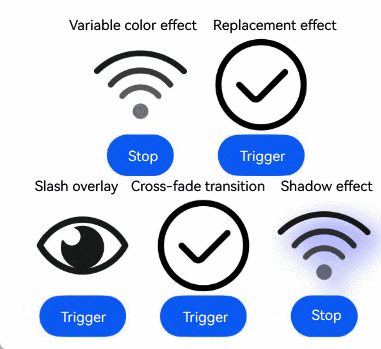
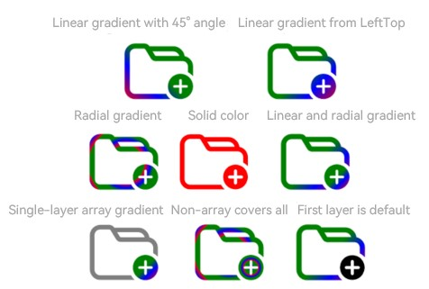

# SymbolGlyph
<!--Kit: ArkUI-->
<!--Subsystem: ArkUI-->
<!--Owner: @hddgzw-->
<!--Designer: @xiangyuan6-->
<!--Tester: @jiaoaozihao-->
<!--Adviser: @Brilliantry_Rui-->

The **SymbolGlyph** component represents a symbol glyph.<!--RP1--><!--RP1End-->

>  **NOTE**
>
>  This component is supported since API version 11. Updates will be marked with a superscript to indicate their earliest API version.

## Child Components

Not supported

## APIs

SymbolGlyph(value?: Resource)

**Widget capability**: This API can be used in ArkTS widgets since API version 12.

**Atomic service API**: This API can be used in atomic services since API version 12.

**System capability**: SystemCapability.ArkUI.ArkUI.Full

**Parameters**

| Name| Type| Mandatory| Description|
| -------- | -------- | -------- | -------- |
| value | [Resource](ts-types.md#resource)| No| Resource of the **SymbolGlyph** component, for example, **$r('sys.symbol.ohos_wifi')**.|

>  **NOTE**
>
>  The resources referenced in **$r('sys.symbol.ohos_wifi')** are preset in the system. The **SymbolGlyph** component supports only the preset symbol resources. If unsupported resources are referenced, an exception occurs.

## Attributes

The [universal attributes](ts-component-general-attributes.md) are supported. For text attributes, only the following attributes are supported.

### fontColor

fontColor(value: Array&lt;ResourceColor&gt;)

Sets the color of the **SymbolGlyph** component.

>**NOTE**
>
> This API can be called within [attributeModifier](ts-universal-attributes-attribute-modifier.md#attributemodifier) since API version 12.

**Widget capability**: This API can be used in ArkTS widgets since API version 12.

**Atomic service API**: This API can be used in atomic services since API version 12.

**System capability**: SystemCapability.ArkUI.ArkUI.Full

**Parameters**

| Name| Type| Mandatory| Description |
| ------ | ---- | ---- | ----- |
| value  | Array\<[ResourceColor](ts-types.md#resourcecolor)\> | Yes  | Color of the **SymbolGlyph** component.<br> Default value: depending on the rendering strategy|

### fontSize

fontSize(value: number | string | Resource)

Sets the size of the **SymbolGlyph** component. When using the string type, numeric string values with optional units, for example, **"10"** or **"10fp"**, are supported.

The display size of the symbol glyph is controlled by the **fontSize** setting. Once **width** or **height** is specified, other universal attributes will only affect the size of the component's placeholder, not the symbol glyph itself.

>**NOTE**
>
> This API can be called within [attributeModifier](ts-universal-attributes-attribute-modifier.md#attributemodifier) since API version 12.

**Widget capability**: This API can be used in ArkTS widgets since API version 12.

**Atomic service API**: This API can be used in atomic services since API version 12.

**System capability**: SystemCapability.ArkUI.ArkUI.Full

**Parameters**

| Name| Type| Mandatory| Description |
| ------ | ---- | ---- | ----- |
| value  | number&nbsp;\|&nbsp;string&nbsp;\|&nbsp;[Resource](ts-types.md#resource) | Yes  | Size of the **SymbolGlyph** component.<br>Default value: **16fp**<br>Unit: [fp](ts-pixel-units.md)<br>Percentage strings are not supported.|

### fontWeight

fontWeight(value: number | FontWeight | string)

Sets the font weight of the **SymbolGlyph** component. For the number type, the value ranges from 100 to 900, at an interval of 100. A larger value indicates a heavier font weight. The default value is **400**. For the string type, only strings of the number type are supported, for example, **"400"**, **"bold"**, **"bolder"**, **"lighter"**, **"regular"**, and **"medium"**, which correspond to the enumerated values in **FontWeight**.

The **sys.symbol.ohos_lungs** icon does not support font weight setting.

>**NOTE**
>
> This API can be called within [attributeModifier](ts-universal-attributes-attribute-modifier.md#attributemodifier) since API version 12.

**Widget capability**: This API can be used in ArkTS widgets since API version 12.

**Atomic service API**: This API can be used in atomic services since API version 12.

**System capability**: SystemCapability.ArkUI.ArkUI.Full

**Parameters**

| Name| Type                                                        | Mandatory| Description                                               |
| ------ | ------------------------------------------------------------ | ---- | --------------------------------------------------- |
| value  | number&nbsp;\|&nbsp;[FontWeight](ts-appendix-enums.md#fontweight)&nbsp;\|&nbsp;string | Yes  | Font weight of the **SymbolGlyph** component.<br>Default value: **FontWeight.Normal**|

### renderingStrategy

renderingStrategy(value: SymbolRenderingStrategy)

Sets the rendering strategy of the **SymbolGlyph** component.

>**NOTE**
>
> This API can be called within [attributeModifier](ts-universal-attributes-attribute-modifier.md#attributemodifier) since API version 12.

**Widget capability**: This API can be used in ArkTS widgets since API version 12.

**Atomic service API**: This API can be used in atomic services since API version 12.

**System capability**: SystemCapability.ArkUI.ArkUI.Full

**Parameters**

| Name| Type| Mandatory| Description |
| ------ | ---- | ---- | ----- |
| value  | [SymbolRenderingStrategy](#symbolrenderingstrategy11) | Yes  | Rendering strategy of the **SymbolGlyph** component.<br>Default value: **SymbolRenderingStrategy.SINGLE**|

The figure below shows the effects of different rendering strategies.


### effectStrategy

effectStrategy(value: SymbolEffectStrategy)

Sets the effect strategy of the **SymbolGlyph** component.

>**NOTE**
>
> This API can be called within [attributeModifier](ts-universal-attributes-attribute-modifier.md#attributemodifier) since API version 12.

**Widget capability**: This API can be used in ArkTS widgets since API version 12.

**Atomic service API**: This API can be used in atomic services since API version 12.

**System capability**: SystemCapability.ArkUI.ArkUI.Full

**Parameters**

| Name| Type| Mandatory| Description |
| ------ | ---- | ---- | ----- |
| value  | [SymbolEffectStrategy](#symboleffectstrategy11) | Yes  | Effect strategy of the **SymbolGlyph** component.<br>Default value: **SymbolEffectStrategy.NONE**|

### symbolEffect<sup>12+</sup>

symbolEffect(symbolEffect: SymbolEffect, isActive?: boolean)

Sets the symbol effect and effect state for the **SymbolGlyph** component.

**Widget capability**: This API can be used in ArkTS widgets since API version 12.

**Atomic service API**: This API can be used in atomic services since API version 12.

**System capability**: SystemCapability.ArkUI.ArkUI.Full

**Parameters**

| Name| Type| Mandatory| Description |
| ------ | ---- | ---- | ----- |
| symbolEffect  | [SymbolEffect](#symboleffect12) | Yes  | Symbol effect of the **SymbolGlyph** component.<br>Default value: [SymbolEffect](#symboleffect12) |
| isActive  | boolean | No  | Whether the effect is active.<br>**true**: playing. **false**: not playing.<br>Default value: **false**.|

### symbolEffect<sup>12+</sup>

symbolEffect(symbolEffect: SymbolEffect, triggerValue?: number)

Sets the symbol effect and effect trigger for the **SymbolGlyph** component.

**Widget capability**: This API can be used in ArkTS widgets since API version 12.

**Atomic service API**: This API can be used in atomic services since API version 12.

**System capability**: SystemCapability.ArkUI.ArkUI.Full

**Parameters**

| Name| Type| Mandatory| Description |
| ------ | ---- | ---- | ----- |
| symbolEffect | [SymbolEffect](#symboleffect12) | Yes  | Symbol effect of the **SymbolGlyph** component.<br>Default value: [SymbolEffect](#symboleffect12) |
| triggerValue | number | No  | Value that, when changed, initiates the animation of the **SymbolGlyph** component.<br>To prevent the motion effect from triggering initially, set it to **-1**.|

>  **NOTE**
>
>  When configuring the symbol effect, use the **effectStrategy** attribute or a single **symbolEffect** attribute. Mixing multiple effect attributes is not allowed.

### minFontScale<sup>18+</sup>

minFontScale(scale: Optional\<number | Resource>)

Sets the minimum font scale factor for the **SymbolGlyph** component.

**Atomic service API**: This API can be used in atomic services since API version 18.

**System capability**: SystemCapability.ArkUI.ArkUI.Full

**Parameters**

| Name| Type| Mandatory| Description |
| ------ | ---- | ---- | ----- |
| scale  |[Optional](ts-universal-attributes-custom-property.md#optionalt12)\<number&nbsp;\|&nbsp;[Resource](ts-types.md#resource)>  | Yes  | Minimum font scale factor for the **SymbolGlyph** component.<br>Value range: [0, 1]<br>The value **0** results in the minimum scaling.<br>**NOTE**<br>A value less than 0 is handled as 0. A value greater than 1 is handled as 1. Abnormal values are ineffective by default.  |

### maxFontScale<sup>18+</sup>

maxFontScale(scale: Optional\<number | Resource>)

Sets the maximum font scale factor for the **SymbolGlyph** component.

**Atomic service API**: This API can be used in atomic services since API version 18.

**System capability**: SystemCapability.ArkUI.ArkUI.Full

**Parameters**

| Name| Type| Mandatory| Description |
| ------ | ---- | ---- | ----- |
| scale  |[Optional](ts-universal-attributes-custom-property.md#optionalt12)\<number&nbsp;\|&nbsp;[Resource](ts-types.md#resource)>  | Yes  | Maximum font scale factor for the **SymbolGlyph** component.<br>Value range: [1, +∞)<br>**NOTE**<br>A value less than 1 is handled as **1**. Abnormal values are ineffective by default.|

### shaderStyle<sup>20+</sup>

shaderStyle(shader: Array\<ShaderStyle | undefined\> | ShaderStyle)

Applies a gradient or solid color shader effect to the **SymbolGlyph** component.

This API supports [RadialGradientStyle](../arkui-ts/ts-text-common.md#radialgradientstyle20), [LinearGradientStyle](../arkui-ts/ts-text-common.md#lineargradientstyle20), and [ColorShaderStyle](../arkui-ts/ts-text-common.md#colorshaderstyle20). When set, **shaderStyle** takes precedence over [fontColor](../arkui-ts/ts-basic-components-symbolSpan.md#fontcolor) and any AI-based styling. To apply a simple solid color, using [fontColor](../arkui-ts/ts-basic-components-symbolSpan.md#fontcolor) is recommended.

**Atomic service API**: This API can be used in atomic services since API version 20.

**System capability**: SystemCapability.ArkUI.ArkUI.Full

**Parameters**

| Name    | Type                                        | Mandatory                            | Description                              |
| -------------- | -------------------------------------------- | ----------------------------------- | ----------------------------------- |
| shader | Array\<[ShaderStyle](../arkui-ts/ts-text-common.md#shaderstyle20) \| undefined\> \| [ShaderStyle](../arkui-ts/ts-text-common.md#shaderstyle20) | Yes| Shader effect.<br>Input types and behavior:<br>Single **ShaderStyle** object: applies the specified effect to all layers. Array of **ShaderStyle** objects: applies the specified effect to the corresponding layer. Array of **undefined**: applies the default **SymbolGlyph** color to the corresponding layer. Layers unset retain their default color.<br> Based on the input, the system applies a radial gradient ([RadialGradientStyle](../arkui-ts/ts-text-common.md#radialgradientstyle20)), linear gradient ([LinearGradientStyle](../arkui-ts/ts-text-common.md#lineargradientstyle20)), or solid color ([ColorShaderStyle](../arkui-ts/ts-text-common.md#colorshaderstyle20)) to the **SymbolGlyph** component.<br>**NOTE**<br>Unit: [vp](ts-pixel-units.md)<br>Specify the center point and radius using percentages. If a non-percentage value (e.g., **10px**) is provided, it will be interpreted as 1000%.<br>You are advised to specify the radius using percentages.<br>Percentages are relative to the icon's size. The recommended value range is [0, 1).|

### symbolShadow<sup>20+</sup>

symbolShadow(shadow: Optional\<ShadowOptions\>)

Sets the shadow effect of the **SymbolGlyph** component.

**Widget capability**: This API can be used in ArkTS widgets since API version 20.

**Atomic service API**: This API can be used in atomic services since API version 20.

**System capability**: SystemCapability.ArkUI.ArkUI.Full

**Parameters**

| Name| Type| Mandatory| Description |
| ------ | ---- | ---- | ----- |
| shadow  |[Optional](ts-universal-attributes-custom-property.md#optionalt12)\<[ShadowOptions](ts-universal-attributes-image-effect.md#shadowoptions)\>  | Yes | Shadow effect of the **SymbolGlyph** component.<br>Unit: [vp](ts-pixel-units.md)<br>Default value: {<br>radius: 0,<br>color: Color.Black<br>offsetX: 0,<br>offsetY: 0<br>} <br>The **fill** and **type** attributes, as well as the enumerated values of **ColoringStrategy** within the **color **attribute, are not supported.|

## ScaleSymbolEffect<sup>12+</sup>

Inherits from **SymbolEffect**.

**Widget capability**: This API can be used in ArkTS widgets since API version 12.

**Atomic service API**: This API can be used in atomic services since API version 12.

**System capability**: SystemCapability.ArkUI.ArkUI.Full

### Attributes

| Name| Type| Read-Only| Optional| Description |
| ---- | ---- | ---- | ---- | ---- |
| scope     | [EffectScope](#effectscope12)  |  No  | Yes| Effect scope.<br>Default value: **EffectScope.LAYER**   |
| direction | [EffectDirection](#effectdirection12) |  No  | Yes| Effect direction.<br>Default value: **EffectDirection.DOWN**|

### constructor<sup>12+</sup>

constructor(scope?: EffectScope, direction?: EffectDirection)

A constructor used to create a **ScaleSymbolEffect** instance, which comes with a scaling animation effect.

**Widget capability**: This API can be used in ArkTS widgets since API version 12.

**Atomic service API**: This API can be used in atomic services since API version 12.

**System capability**: SystemCapability.ArkUI.ArkUI.Full

**Parameters**

| Name| Type| Mandatory| Description |
| ---- | ---- | ---- | ---- |
| scope     | [EffectScope](#effectscope12)         | No  | Effect scope.<br>Default value: **EffectScope.LAYER**   |
| direction | [EffectDirection](#effectdirection12) | No  | Effect direction.<br>Default value: **EffectDirection.DOWN**|

## HierarchicalSymbolEffect<sup>12+</sup>

Inherits from **SymbolEffect**.

**Widget capability**: This API can be used in ArkTS widgets since API version 12.

**Atomic service API**: This API can be used in atomic services since API version 12.

**System capability**: SystemCapability.ArkUI.ArkUI.Full

### Attributes

| Name| Type| Read-Only| Optional| Description |
| ---- | ---- | ---- | ---- | ---- |
| fillStyle | [EffectFillStyle](#effectfillstyle12) | No  | Yes| Effect fill style.<br>Default value: **EffectFillStyle.CUMULATIVE**|

### constructor<sup>12+</sup>

constructor(fillStyle?: EffectFillStyle)

A constructor used to create a **HierarchicalSymbolEffect** instance, which comes with a hierarchical animation effect.

**Widget capability**: This API can be used in ArkTS widgets since API version 12.

**Atomic service API**: This API can be used in atomic services since API version 12.

**System capability**: SystemCapability.ArkUI.ArkUI.Full

**Parameters**

| Name| Type| Mandatory| Description |
| ---- | ---- | ---- | ---- |
| fillStyle | [EffectFillStyle](#effectfillstyle12) | No  | Effect fill style.<br>Default value: **EffectFillStyle.CUMULATIVE**|

## AppearSymbolEffect<sup>12+</sup>

Inherits from **SymbolEffect**.

**Widget capability**: This API can be used in ArkTS widgets since API version 12.

**Atomic service API**: This API can be used in atomic services since API version 12.

**System capability**: SystemCapability.ArkUI.ArkUI.Full

### Attributes

| Name| Type| Read-Only| Optional| Description |
| ---- | ---- | ---- | ---- | ---- |
| scope | [EffectScope](#effectscope12) | No  | Yes| Effect scope.<br>Default value: **EffectScope.LAYER**|

### constructor<sup>12+</sup>

constructor(scope?: EffectScope)

A constructor used to create an **AppearSymbolEffect** instance, which comes with an appear animation effect.

**Widget capability**: This API can be used in ArkTS widgets since API version 12.

**Atomic service API**: This API can be used in atomic services since API version 12.

**System capability**: SystemCapability.ArkUI.ArkUI.Full

**Parameters**

| Name| Type| Mandatory| Description |
| ---- | ---- | ---- | ---- |
| scope  | [EffectScope](#effectscope12) | No  | Effect scope.<br>Default value: **EffectScope.LAYER**|

## DisappearSymbolEffect<sup>12+</sup>

Inherits from **SymbolEffect**.

**Widget capability**: This API can be used in ArkTS widgets since API version 12.

**Atomic service API**: This API can be used in atomic services since API version 12.

**System capability**: SystemCapability.ArkUI.ArkUI.Full

### Attributes

| Name| Type| Read-Only| Optional| Description |
| ---- | ---- | ---- | ---- | ---- |
| scope | [EffectScope](#effectscope12) | No  | Yes| Effect scope.<br>Default value: **EffectScope.LAYER**|

### constructor<sup>12+</sup>

constructor(scope?: EffectScope)

A constructor used to create a **DisappearSymbolEffect** instance, which comes with a disappear animation effect.

**Widget capability**: This API can be used in ArkTS widgets since API version 12.

**Atomic service API**: This API can be used in atomic services since API version 12.

**System capability**: SystemCapability.ArkUI.ArkUI.Full

**Parameters**

| Name| Type| Mandatory| Description |
| ---- | ---- | ---- | ---- |
| scope  | [EffectScope](#effectscope12) | No  | Effect scope.<br>Default value: **EffectScope.LAYER**|

## BounceSymbolEffect<sup>12+</sup>

Inherits from **SymbolEffect**.

**Widget capability**: This API can be used in ArkTS widgets since API version 12.

**Atomic service API**: This API can be used in atomic services since API version 12.

**System capability**: SystemCapability.ArkUI.ArkUI.Full

### Attributes

| Name| Type| Read-Only| Optional| Description |
| ---- | ---- | ---- | ---- | ---- |
| scope     | [EffectScope](#effectscope12)         | No  | Yes| Effect scope.<br>Default value: **EffectScope.LAYER**   |
| direction | [EffectDirection](#effectdirection12) | No  | Yes| Effect direction.<br>Default value: **EffectDirection.DOWN**|

### constructor<sup>12+</sup>

constructor(scope?: EffectScope, direction?: EffectDirection)

A constructor used to create a **BounceSymbolEffect** instance, which comes with a bounce animation effect.

**Widget capability**: This API can be used in ArkTS widgets since API version 12.

**Atomic service API**: This API can be used in atomic services since API version 12.

**System capability**: SystemCapability.ArkUI.ArkUI.Full

**Parameters**

| Name| Type| Mandatory| Description |
| ---- | ---- | ---- | ---- |
| scope     | [EffectScope](#effectscope12)         | No  | Effect scope.<br>Default value: **EffectScope.LAYER**   |
| direction | [EffectDirection](#effectdirection12) | No  | Effect direction.<br>Default value: **EffectDirection.DOWN**|

## ReplaceSymbolEffect<sup>12+</sup>

Inherits from **SymbolEffect**.

**Widget capability**: This API can be used in ArkTS widgets since API version 12.

**Atomic service API**: This API can be used in atomic services since API version 12.

**System capability**: SystemCapability.ArkUI.ArkUI.Full

### Attributes

**System capability**: SystemCapability.ArkUI.ArkUI.Full

| Name| Type| Read-Only| Optional| Description |
| ---- | ---- | ---- | ---- | ---- |
| scope | [EffectScope](#effectscope12) | No  | Yes| Effect scope.<br>Default value: **EffectScope.LAYER**<br>**Widget capability**: This API can be used in ArkTS widgets since API version 12.<br>**Atomic service API**: This API can be used in atomic services since API version 12.|
| replaceType<sup>20+</sup>  | [ReplaceEffectType](#replaceeffecttype20) | No  | Yes| Replacement effect type.<br>Default value: **ReplaceEffectType.SEQUENTIAL**.<br>**Widget capability**: This API can be used in ArkTS widgets since API version 20.<br>**Atomic service API**: This API can be used in atomic services since API version 20.|

### constructor<sup>12+</sup>

constructor(scope?: EffectScope)

A constructor used to create a **ReplaceSymbolEffect** instance, which comes with a replace animation effect.

**Widget capability**: This API can be used in ArkTS widgets since API version 12.

**Atomic service API**: This API can be used in atomic services since API version 12.

**System capability**: SystemCapability.ArkUI.ArkUI.Full

**Parameters**

| Name| Type| Mandatory| Description |
| ---- | ---- | ---- | ---- |
| scope  | [EffectScope](#effectscope12) | No  | Effect scope.<br>Default value: **EffectScope.LAYER**|

### constructor<sup>20+</sup>

constructor(scope?: EffectScope, replaceType?: ReplaceEffectType)

A constructor used to create a **ReplaceSymbolEffect** instance, which comes with a replace animation effect. The replace effect type can be specified.

**Widget capability**: This API can be used in ArkTS widgets since API version 20.

**Atomic service API**: This API can be used in atomic services since API version 20.

**System capability**: SystemCapability.ArkUI.ArkUI.Full

**Parameters**

| Name| Type| Mandatory| Description |
| ---- | ---- | ---- | ---- |
| scope  | [EffectScope](#effectscope12) | No  | Effect scope.<br>Default value: **EffectScope.LAYER**|
| replaceType  | [ReplaceEffectType](#replaceeffecttype20) | No  | Replacement effect type.<br>Default value: **ReplaceEffectType.SEQUENTIAL**|

## SymbolEffectStrategy<sup>11+</sup>

Enumerates symbol effect types. Once applied, the symbol effect becomes active instantly, eliminating the need for triggering.

**Widget capability**: This API can be used in ArkTS widgets since API version 12.

**Atomic service API**: This API can be used in atomic services since API version 12.

**System capability**: SystemCapability.ArkUI.ArkUI.Full

| Name    | Value| Description                         |
| ------ | --- | ----------------------------- |
| NONE | 0 | No effect (default value).|
| SCALE | 1 | Scale effect as a whole.                |
|  HIERARCHICAL  | 2 | Hierarchical effect. |

## SymbolRenderingStrategy<sup>11+</sup>

Enumerates the rendering modes.

**Widget capability**: This API can be used in ArkTS widgets since API version 12.

**Atomic service API**: This API can be used in atomic services since API version 12.

**System capability**: SystemCapability.ArkUI.ArkUI.Full

| Name    | Value| Description                         |
| ------ | --- | ----------------------------- |
| SINGLE  | 0 | Single-color mode (default value).<br> The default color is black.<br> You can set one or multiple colors, but only the first color will be applied.|
| MULTIPLE_COLOR  | 1 | Multi-color mode.<br> A maximum of three colors can be set. If only one color is set, it updates the color of the first layer, leaving other colors at their default values.<br> The sequence of color settings matches the layering order of the symbol; any colors beyond the number of symbol layers will not take effect.<br> Only color values are accepted. Opacity settings do not take effect.|
|  MULTIPLE_OPACITY   | 2 | Layered mode.<br> The default color is black. You can set one or multiple colors, but only the first color will be applied.<br>Opacity is predefined for the layers: 100% for the first layer, 50% for the second layer, and 20% for the third layer. |

## SymbolEffect<sup>12+</sup>

Defines the **SymbolEffect** class.

**Widget capability**: This API can be used in ArkTS widgets since API version 12.

**Atomic service API**: This API can be used in atomic services since API version 12.

**System capability**: SystemCapability.ArkUI.ArkUI.Full

## PulseSymbolEffect<sup>12+</sup>

Inherits from **SymbolEffect**.

**Widget capability**: This API can be used in ArkTS widgets since API version 12.

**Atomic service API**: This API can be used in atomic services since API version 12.

**System capability**: SystemCapability.ArkUI.ArkUI.Full

## EffectDirection<sup>12+</sup>

**Widget capability**: This API can be used in ArkTS widgets since API version 12.

**Atomic service API**: This API can be used in atomic services since API version 12.

**System capability**: SystemCapability.ArkUI.ArkUI.Full

| Name| Value  | Description            |
| ---- | ---- | ---------------- |
| DOWN | 0    | The symbol scales down and then returns to its original size.|
| UP   | 1    | The symbol scales up and then returns to its original size.|

## EffectScope<sup>12+</sup>

**Widget capability**: This API can be used in ArkTS widgets since API version 12.

**Atomic service API**: This API can be used in atomic services since API version 12.

**System capability**: SystemCapability.ArkUI.ArkUI.Full

| Name | Value  | Description      |
| ----- | ---- | ---------- |
| LAYER | 0    | Layered mode.|
| WHOLE | 1    | Whole mode.|

## EffectFillStyle<sup>12+</sup>

**Widget capability**: This API can be used in ArkTS widgets since API version 12.

**Atomic service API**: This API can be used in atomic services since API version 12.

**System capability**: SystemCapability.ArkUI.ArkUI.Full

| Name      | Value  | Description      |
| ---------- | ---- | ---------- |
| CUMULATIVE | 0    | Cumulative style.|
| ITERATIVE  | 1    | Iterative style.|

## ReplaceEffectType<sup>20+</sup>

Enumerates symbol replacement effect types.

**Widget capability**: This API can be used in ArkTS widgets since API version 20.

**Atomic service API**: This API can be used in atomic services since API version 20.

**System capability**: SystemCapability.ArkUI.ArkUI.Full

| Name      | Value  | Description      |
| ---------- | ---- | ---------- |
| SEQUENTIAL | 0    | Sequential replacement: The current symbol disappears before a new symbol appears. This is the default symbol replacement effect type.|
| CROSS_FADE | 1    | Cross-fade transition effect: The current symbol fades out while a new symbol fades in simultaneously.|
| SLASH_OVERLAY | 2    | Slash overlay effect: The current symbol is replaced with a symbol featuring diagonal slash, typically indicating disabled state.|

## Events

The [universal events](ts-component-general-events.md) are supported.

## Example

###  Example 1: Setting Rendering and Effect Strategies

This example demonstrates different rendering and effect strategies using [renderingStrategy](#renderingstrategy) and [effectStrategy](#effectstrategy), available since API version 11.

```ts
// xxx.ets
@Entry
@Component
struct Index {
  build() {
    Column() {
      Row() {
        Column() {
          Text("Light")
          SymbolGlyph($r('sys.symbol.ohos_trash'))
            .fontWeight(FontWeight.Lighter)
            .fontSize(96)
        }

        Column() {
          Text("Normal")
          SymbolGlyph($r('sys.symbol.ohos_trash'))
            .fontWeight(FontWeight.Normal)
            .fontSize(96)
        }

        Column() {
          Text("Bold")
          SymbolGlyph($r('sys.symbol.ohos_trash'))
            .fontWeight(FontWeight.Bold)
            .fontSize(96)
        }
      }

      Row() {
        Column() {
          Text("Single-color mode")
          SymbolGlyph($r('sys.symbol.ohos_folder_badge_plus'))
            .fontSize(96)
            .renderingStrategy(SymbolRenderingStrategy.SINGLE)
            .fontColor([Color.Black, Color.Green, Color.White])
        }

        Column() {
          Text("Multi-color mode")
          SymbolGlyph($r('sys.symbol.ohos_folder_badge_plus'))
            .fontSize(96)
            .renderingStrategy(SymbolRenderingStrategy.MULTIPLE_COLOR)
            .fontColor([Color.Black, Color.Green, Color.White])
        }

        Column() {
          Text ("Layered mode")
          SymbolGlyph($r('sys.symbol.ohos_folder_badge_plus'))
            .fontSize(96)
            .renderingStrategy(SymbolRenderingStrategy.MULTIPLE_OPACITY)
            .fontColor([Color.Black, Color.Green, Color.White])
        }
      }

      Row() {
        Column() {
          Text("No effect")
          SymbolGlyph($r('sys.symbol.ohos_wifi'))
            .fontSize(96)
            .effectStrategy(SymbolEffectStrategy.NONE)
        }

        Column() {
          Text("Overall scale effect")
          SymbolGlyph($r('sys.symbol.ohos_wifi'))
            .fontSize(96)
            .effectStrategy(SymbolEffectStrategy.SCALE)
        }

        Column() {
          Text("Hierarchical effect")
          SymbolGlyph($r('sys.symbol.ohos_wifi'))
            .fontSize(96)
            .effectStrategy(SymbolEffectStrategy.HIERARCHICAL)
        }
      }
    }
  }
}
```


###  Example 2: Setting Symbol and Shadow Effects

This example demonstrates various symbol effects using the [symbolEffect](#symboleffect12) attribute (available since API version 12) and shadow effects with [symbolShadow](#symbolshadow20) (available since API version 20).

```ts
// xxx.ets
@Entry
@Component
struct Index {
  @State isActive: boolean = true;
  @State triggerValueReplace: number = 0;
  @State triggerValueReplace1: number = 0;
  @State triggerValueReplace2: number = 0;
  @State renderMode: number = 1;

  replaceFlag: boolean = true;
  replaceFlag1: boolean = true;
  replaceFlag2: boolean = true;

  options: ShadowOptions = {
    radius: 10.0,
    color: Color.Blue,
    offsetX: 10,
    offsetY: 10,
  };

  build() {
    Column() {
      Row() {
        Column() {
          Text("Variable color effect")
          SymbolGlyph($r('sys.symbol.ohos_wifi'))
            .fontSize(96)
            .symbolEffect(new HierarchicalSymbolEffect(EffectFillStyle.ITERATIVE), this.isActive)
          Button(this.isActive ? 'Stop' : 'Play')
            .onClick(() => {
              this.isActive = !this.isActive;
            })
        }
        .margin({ right: 20 })
        Column() {
          Text("Replacement effect")
          SymbolGlyph(this.replaceFlag ? $r('sys.symbol.checkmark_circle') : $r('sys.symbol.repeat_1'))
            .fontSize(96)
            .symbolEffect(new ReplaceSymbolEffect(EffectScope.WHOLE), this.triggerValueReplace)
          Button('Trigger')
            .onClick(() => {
              this.replaceFlag = !this.replaceFlag;
              this.triggerValueReplace = this.triggerValueReplace + 1;
            })
        }
        .margin({ right: 20 })
      }

      Row() {
        Column() {
          Text("Slash overlay")
          SymbolGlyph(this.replaceFlag1 ? $r('sys.symbol.eye_slash') : $r('sys.symbol.eye'))
            .fontSize(96)
            .renderingStrategy(this.renderMode)
            .symbolEffect(new ReplaceSymbolEffect(EffectScope.LAYER, ReplaceEffectType.SLASH_OVERLAY), this.triggerValueReplace1)
          Button('Trigger')
            .onClick(() => {
              this.replaceFlag1 = !this.replaceFlag1;
              this.triggerValueReplace1 = this.triggerValueReplace1 + 1;
            })
        }
        .margin({ right: 20 })
        Column() {
          Text("Cross-fade transition")
          SymbolGlyph(this.replaceFlag2 ? $r('sys.symbol.checkmark_circle') : $r('sys.symbol.repeat_1'))
            .fontSize(96)
            .symbolEffect(new ReplaceSymbolEffect(EffectScope.WHOLE, ReplaceEffectType.CROSS_FADE), this.triggerValueReplace2)
          Button('Trigger')
            .onClick(() => {
              this.replaceFlag2 = !this.replaceFlag2;
              this.triggerValueReplace2 = this.triggerValueReplace2 + 1;
            })
        }
        .margin({ right: 20 })
        Column() {
          Text("Shadow effect")
          SymbolGlyph($r('sys.symbol.ohos_wifi'))
            .fontSize(96)
            .symbolEffect(new HierarchicalSymbolEffect(EffectFillStyle.ITERATIVE), this.isActive)
            .symbolShadow(this.options)
          Button(this.isActive ? 'Stop' : 'Play')
            .onClick(() => {
              this.isActive = !this.isActive;
            })
        }
        .margin({ right: 20 })
      }
    }
    .margin({
      left: 45,
      top: 50
    })
  }
}
```


### Example 3: Setting Gradient Color Effects

This example demonstrates how to apply gradient colors to **SymbolGlyph** components using the [shaderStyle](#shaderstyle20) API, available since API version 20.

```ts
@Entry
@Component
struct Index {
  @State message: string = 'Hello World';

  linearGradientOptions1: LinearGradientOptions = {
    angle: 45,
    colors: [[Color.Red, 0.0], [Color.Blue, 0.3], [Color.Green, 0.5]]
  };

  linearGradientOptions2: LinearGradientOptions = {
    direction: GradientDirection.LeftTop,
    colors: [[Color.Red, 0.0], [Color.Blue, 0.3], [Color.Green, 0.5]],
    repeating: true,
  };

  radialGradientOptions: RadialGradientOptions = {
    center: ["50%", "50%"],
    radius: "20%",
    colors: [[Color.Red, 0.0], [Color.Blue, 0.3], [Color.Green, 0.5]],
    repeating: true,
  };

  build() {
    Column() {
      Row() {
        Column() {
          Text('Linear gradient with 45° angle')
            .fontSize(18)
            .fontColor(0xCCCCCC)
            .textAlign(TextAlign.Center)
          SymbolGlyph($r('sys.symbol.ohos_folder_badge_plus'))
            .fontSize(96)
            .shaderStyle([new LinearGradientStyle(this.linearGradientOptions1)])
        }
        .margin({ right: 20 })
        Column() {
          Text('Linear gradient from LeftTop')
            .fontSize(18)
            .fontColor(0xCCCCCC)
            .textAlign(TextAlign.Center)
          SymbolGlyph($r('sys.symbol.ohos_folder_badge_plus'))
            .fontSize(96)
            .shaderStyle([new LinearGradientStyle(this.linearGradientOptions2)])
        }
        .margin({ right: 20 })
      }

      Row() {
        Column() {
          Text('Radial gradient')
            .fontSize(18)
            .fontColor(0xCCCCCC)
            .textAlign(TextAlign.Center)
          SymbolGlyph($r('sys.symbol.ohos_folder_badge_plus'))
            .fontSize(96)
            .shaderStyle([new RadialGradientStyle(this.radialGradientOptions)])
        }
        .margin({ right: 20 })
        Column() {
          Text('Solid color')
            .fontSize(18)
            .fontColor(0xCCCCCC)
            .textAlign(TextAlign.Center)
          SymbolGlyph($r('sys.symbol.ohos_folder_badge_plus'))
            .fontSize(96)
            .shaderStyle([new ColorShaderStyle(Color.Red)])
        }
        .margin({ right: 20 })
        Column() {
          Text('Linear and radial gradient')
            .fontSize(18)
            .fontColor(0xCCCCCC)
            .textAlign(TextAlign.Center)
          SymbolGlyph($r('sys.symbol.ohos_folder_badge_plus'))
            .fontSize(96)
            .shaderStyle([
              new LinearGradientStyle(this.linearGradientOptions2),
              new LinearGradientStyle(this.linearGradientOptions2),
              new RadialGradientStyle(this.radialGradientOptions)
            ])
            .renderingStrategy(SymbolRenderingStrategy.MULTIPLE_OPACITY)
        }
        .margin({ right: 20 })
      }

      Row() {
        Column() {
          Text('Single-layer array gradient')
            .fontSize(18)
            .fontColor(0xCCCCCC)
            .textAlign(TextAlign.Center)
          SymbolGlyph($r('sys.symbol.ohos_folder_badge_plus'))
            .fontSize(96)
            .shaderStyle([
              new LinearGradientStyle(this.linearGradientOptions2),
            ])
            .renderingStrategy(SymbolRenderingStrategy.MULTIPLE_OPACITY)
        }.margin({ right: 20 })

        Column() {
          Text('Non-array covers all')
            .fontSize(18)
            .fontColor(0xCCCCCC)
            .textAlign(TextAlign.Center)
          SymbolGlyph($r('sys.symbol.ohos_folder_badge_plus'))
            .fontSize(96)
            .shaderStyle(new RadialGradientStyle(this.radialGradientOptions))
            .renderingStrategy(SymbolRenderingStrategy.MULTIPLE_OPACITY)
        }.margin({ right: 20 })

        Column() {
          Text('First layer is default')
            .fontSize(18)
            .fontColor(0xCCCCCC)
            .textAlign(TextAlign.Center)
          SymbolGlyph($r('sys.symbol.ohos_folder_badge_plus'))
            .fontSize(96)
            .shaderStyle([
              undefined,
              new LinearGradientStyle(this.linearGradientOptions2),
            ])
            .renderingStrategy(SymbolRenderingStrategy.MULTIPLE_OPACITY)
        }.margin({ right: 20 })
      }
    }
    .margin({
      left: 20,
      top: 50
    })
  }
}
```

