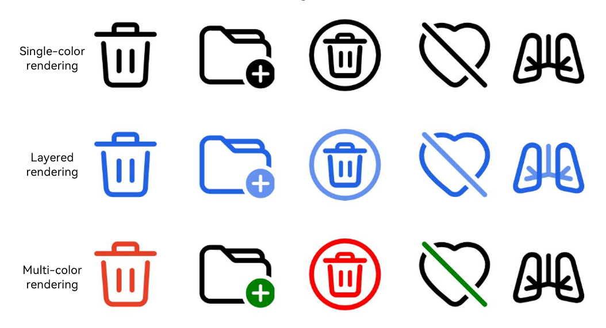
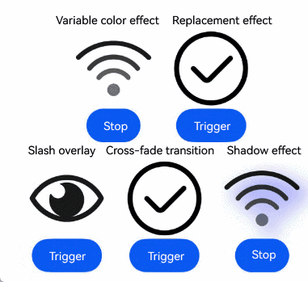
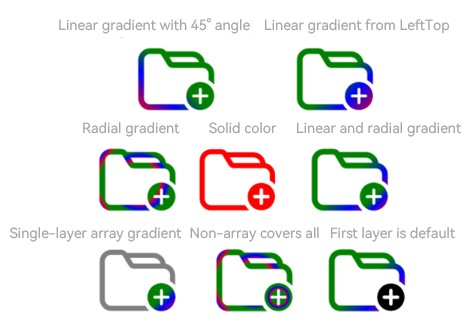
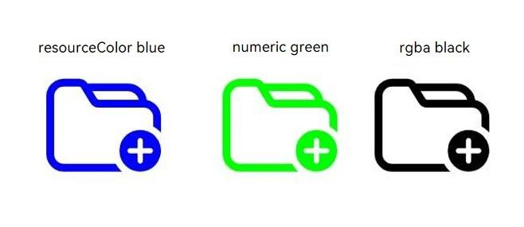
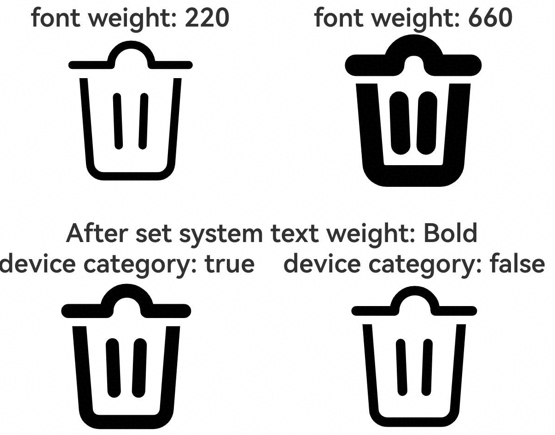

# SymbolGlyph
<!--Kit: ArkUI-->
<!--Subsystem: ArkUI-->
<!--Owner: @hddgzw-->
<!--Designer: @xiangyuan6-->
<!--Tester: @jiaoaozihao-->
<!--Adviser: @Brilliantry_Rui-->
<!-- md-trans-meta sourceCommit=8aa8522c1582655206875d9c89c21656113a2dda translatedAt=2026-09-03T12:15:03.072Z -->

The **SymbolGlyph** component is used to display system preset symbol glyphs. It supports setting style attributes such as color, size, font weight, rendering strategy, and effect strategy, and is applicable to scenarios where system icons need to be displayed in an application, such as navigation bar icons, button icons, and status indicator icons. Compared with using image resources, **SymbolGlyph** offers advantages such as a smaller size, dynamic coloring, and animation support.<!--RP1--><!--RP1End-->

>  **NOTE**
>
> - This component is supported since API version 11. Newly added APIs will be marked with a superscript to indicate their earliest API version.
>
> - The APIs of this module can be used only in the stage model.

## Child Components

Not supported

## APIs

SymbolGlyph(value?: Resource)

**Widget capability**: This API can be used in ArkTS widgets since API version 12.

**Atomic service API**: This API can be used in atomic services since API version 12.

**System capability**: SystemCapability.ArkUI.ArkUI.Full

**Parameters**

| Name| Type| Mandatory| Description|
| -------- | -------- | -------- | -------- |
| value | [Resource](ts-types.md#resource)| No | Resource name of the SymbolGlyph component, for example, $r('sys.symbol.ohos_wifi'). If it is not passed in, no icon is displayed. |

>  **NOTE**
>
>  The resources referenced in **$r('sys.symbol.ohos_wifi')** are preset in the system. The **SymbolGlyph** component supports only the preset symbol resources. If unsupported resources are referenced, an exception occurs.

## Attributes

The [universal attributes](ts-component-general-attributes.md) are supported. For text attributes, only the following attributes are supported.

### fontColor

fontColor(value: Array&lt;ResourceColor&gt;)

Sets the font color of the **SymbolGlyph** component.

>**NOTE**
>
> This API can be called within [attributeModifier](ts-universal-attributes-attribute-modifier.md#attributemodifier) since API version 12.

**Widget capability**: This API can be used in ArkTS widgets since API version 12.

**Atomic service API**: This API can be used in atomic services since API version 12.

**System capability**: SystemCapability.ArkUI.ArkUI.Full

**Parameters**

| Name| Type| Mandatory| Description |
| ------ | ---- | ---- | ----- |
| value  | Array\<[ResourceColor](ts-types.md#resourcecolor)\> | Yes   | Font color of the SymbolGlyph component.<br> When value is undefined, the default color of the icon is used, and the default color follows the theme.<br>The color setting effect varies with the rendering strategy. For details, see [SymbolRenderingStrategy](#symbolrenderingstrategy11). |

### fontColor

fontColor(value: Array&lt;ResourceColor | ColorMetrics&gt; | undefined)

Sets the font color of the **SymbolGlyph** component. Compared with the [fontColor](#fontcolor) API, this API supports passing in a parameter of the [ColorMetrics](../js-apis-arkui-graphics.md#colormetrics12) type.

> **NOTE**
>
> This API can be called within [attributeModifier](ts-universal-attributes-attribute-modifier.md#attributemodifier).

**Since**: 26.0.0

**Widget capability:** This API can be used in ArkTS widgets since API version 26.0.0.

**Atomic service API**: This API can be used in atomic services since API version 26.0.0.

**System capability**: SystemCapability.ArkUI.ArkUI.Full

**Parameters** 

| Name | Type | Mandatory | Description |
| ------ | ---- | ---- | ----- |
| value  | Array\<[ResourceColor](ts-types.md#resourcecolor)&nbsp;\|&nbsp;[ColorMetrics](../js-apis-arkui-graphics.md#colormetrics12)\>&nbsp;\|&nbsp;undefined | Yes  | Color of the **SymbolGlyph** component. An array of the `ResourceColor` or `ColorMetrics` type is supported.<br> When **value** is **undefined**, the default color of the icon is used, and the default color follows the theme. |

### fontSize

fontSize(value: number | string | Resource)

Sets the font size of the **SymbolGlyph** component. When the string type is used, numeric string values with optional units, for example, **"10"** or **"10fp"**, are supported.

The display size of the icon is controlled by **fontSize**. After **width** or **height** is set, other universal attributes only take effect on the placeholder size of the component. If this API is not used, the default font size is 16fp.

>**NOTE**
>
> This API can be called within [attributeModifier](ts-universal-attributes-attribute-modifier.md#attributemodifier) since API version 12.

**Widget capability**: This API can be used in ArkTS widgets since API version 12.

**Atomic service API**: This API can be used in atomic services since API version 12.

**System capability**: SystemCapability.ArkUI.ArkUI.Full

**Parameters**

| Name| Type| Mandatory| Description |
| ------ | ---- | ---- | ----- |
| value  | number&nbsp;\|&nbsp;string&nbsp;\|&nbsp;[Resource](ts-types.md#resource) | Yes   | Font size of the SymbolGlyph component.<br>Value range: [0, +∞)<br>Unit: [fp](ts-pixel-units.md#basic-pixel-units)<br>Percentage strings are not supported.|

### fontWeight

fontWeight(value: number | FontWeight | string)

Sets the font weight of the **SymbolGlyph** component. If this API is not used, the default font weight is **FontWeight.Normal** (normal weight, corresponding to the value 400).

The **sys.symbol.ohos_lungs** icon does not support font weight setting.

>**NOTE**
>
> This API can be called within [attributeModifier](ts-universal-attributes-attribute-modifier.md#attributemodifier) since API version 12.

**Widget capability**: This API can be used in ArkTS widgets since API version 12.

**Atomic service API**: This API can be used in atomic services since API version 12.

**System capability**: SystemCapability.ArkUI.ArkUI.Full

**Parameters**

| Name| Type                                                        | Mandatory| Description                                               |
| ------ | ------------------------------------------------------------ | ---- | --------------------------------------------------- |
| value  | number&nbsp;\|&nbsp;[FontWeight](ts-appendix-enums.md#fontweight)&nbsp;\|&nbsp;string | Yes   | Font weight of the SymbolGlyph component.<br>The value of the number type ranges from 100 to 900, with an interval of 100. The default value is 400. A larger value indicates a heavier font. The string type supports the string form of the number type value, for example, "400", as well as "bold", "bolder", "lighter", "regular", and "medium", which correspond to the respective enum values in FontWeight. If the value is set too large, the font may be truncated in different fonts.<br>**Note:**<br>If a value outside the value range is passed, the default value is used. If a value that does not meet the interval requirement is passed, the default value is also used (only values that are integer multiples of 100 are supported).|

### fontWeight

fontWeight(value: number | FontWeight | ResourceStr, fontWeightConfigs?: FontWeightConfigs)

Sets the font weight of the symbol glyph in the **SymbolGlyph** component. It supports configuring, through **FontWeightConfigs**, whether to enable variable font weight adjustment (after which fine-grained font weight values that are not integer multiples of 100, such as 220 and 660, can be set) and whether to automatically update the font weight based on the device font weight level (after which the component font weight is automatically adjusted with the system font weight setting). If this API is not used, the default font weight is **FontWeight.Normal** (normal weight, corresponding to the value 400).

**Since**: 26.0.0

**Widget capability:** This API can be used in ArkTS widgets since API version 26.0.0.

**Atomic service API**: This API can be used in atomic services since API version 26.0.0.

**System capability**: SystemCapability.ArkUI.ArkUI.Full

**Parameters**

| Name | Type | Mandatory | Description |
| ------ | ---- | ---- | ---- |
| value | number&nbsp;\|&nbsp;[FontWeight](ts-appendix-enums.md#fontweight)&nbsp;\|&nbsp;[ResourceStr](ts-types.md#resourcestr) | Yes | Font weight of the symbol glyph in the **SymbolGlyph** component.<br>For the number type, the value range is [100,&nbsp;900], with an interval of 100. The default value is 400. A larger value indicates a heavier font. For the string type, only the string form of the number type value is supported, for example, "400", as well as "bold", "bolder", "lighter", "regular", and "medium", which correspond to the respective enum values in **FontWeight**. If the value is set too large, the font may be truncated in different fonts.<br>If the value passed in is out of the value range, the default value is used. If the value passed in does not meet the interval requirement, the passed-in value is used when **enableVariableFontWeight** of **fontWeightConfigs** is set to **true**; otherwise, the default value is used. |
| fontWeightConfigs | [FontWeightConfigs](ts-text-common.md#fontweightconfigs24) | No | Font weight configuration. Pass this parameter when variable font weight adjustment (setting fine-grained font weight values that are not integer multiples of 100, such as 220 and 660) or automatic font weight update based on the device font weight level is required. The default value is inherited from [FontWeightConfigs](ts-text-common.md#fontweightconfigs24). |

### renderingStrategy

renderingStrategy(value: SymbolRenderingStrategy)

Sets the rendering strategy of the **SymbolGlyph** component. If this API is not used, the default rendering strategy is **SymbolRenderingStrategy.SINGLE**.

>**NOTE**
>
> This API can be called within [attributeModifier](ts-universal-attributes-attribute-modifier.md#attributemodifier) since API version 12.

**Widget capability**: This API can be used in ArkTS widgets since API version 12.

**Atomic service API**: This API can be used in atomic services since API version 12.

**System capability**: SystemCapability.ArkUI.ArkUI.Full

**Parameters**

| Name| Type| Mandatory| Description |
| ------ | ---- | ---- | ----- |
| value  | [SymbolRenderingStrategy](#symbolrenderingstrategy11) | Yes   | Rendering strategy of the SymbolGlyph component.|

The figure below shows the effects of different rendering strategies.



### effectStrategy

effectStrategy(value: SymbolEffectStrategy)

Sets the effect strategy of the **SymbolGlyph** component. If this API is not used, the default effect strategy is **SymbolEffectStrategy.NONE**.

> **NOTE**
>
> - Since API version 12, this API is supported in [attributeModifier](ts-universal-attributes-attribute-modifier.md#attributemodifier).
>
> - For animation attributes, only the **effectStrategy** attribute or a single **symbolEffect** attribute is supported. Mixing multiple animation attributes is not supported.
>
> - This API supports only the three preset animation types: NONE, SCALE, and HIERARCHICAL. After being set, the animation plays automatically. To use richer animation types (such as appear, disappear, bounce, replacement, and pulse animations) or to control the playback state and trigger timing of the animation, use the [symbolEffect](#symboleffect12) API. The two cannot be used at the same time. For details, see the description of the [symbolEffect](#symboleffect12) API.


**Widget capability**: This API can be used in ArkTS widgets since API version 12.

**Atomic service API**: This API can be used in atomic services since API version 12.

**System capability**: SystemCapability.ArkUI.ArkUI.Full

**Parameters**

| Name| Type| Mandatory| Description |
| ------ | ---- | ---- | ----- |
| value  | [SymbolEffectStrategy](#symboleffectstrategy11) | Yes   | Animation strategy of the SymbolGlyph component.|

### symbolEffect<sup>12+</sup>

symbolEffect(symbolEffect: SymbolEffect, isActive?: boolean)

Sets the effect strategy and playback state of the **SymbolGlyph** component. If this API is not used, the default animation is a **SymbolEffect** object, and the default playback state is **false**.

> **NOTE**
>
> For animation attributes, only the **effectStrategy** attribute or a single **symbolEffect** attribute is supported. Mixing multiple animation attributes is not supported.

**Widget capability**: This API can be used in ArkTS widgets since API version 12.

**Atomic service API**: This API can be used in atomic services since API version 12.

**System capability**: SystemCapability.ArkUI.ArkUI.Full

**Parameters**

| Name| Type| Mandatory| Description |
| ------ | ---- | ---- | ----- |
| symbolEffect  | [SymbolEffect](#symboleffect12) | Yes   | Animation strategy of the SymbolGlyph component. |
| isActive  | boolean | No   | Playback state of the SymbolGlyph component animation.<br>The value **true** means to play, and **false** means not to play. |

### symbolEffect<sup>12+</sup>

symbolEffect(symbolEffect: SymbolEffect, triggerValue?: number)

Sets the effect strategy and playback trigger of the **SymbolGlyph** component. If this API is not used, the default animation is a **SymbolEffect** object, and the default trigger value is -1.

**Widget capability**: This API can be used in ArkTS widgets since API version 12.

**Atomic service API**: This API can be used in atomic services since API version 12.

**System capability**: SystemCapability.ArkUI.ArkUI.Full

**Parameters**

| Name| Type| Mandatory| Description |
| ------ | ---- | ---- | ----- |
| symbolEffect | [SymbolEffect](#symboleffect12) | Yes | Animation strategy of the SymbolGlyph component.|
| triggerValue | number | No | Trigger for playing the animation of the SymbolGlyph component. The animation is triggered when the value changes.<br>Set this parameter to -1 if you do not want to trigger the animation on the first time.|

>  **NOTE**
>
>  When configuring the symbol effect, use the **effectStrategy** attribute or a single **symbolEffect** attribute. Mixing multiple effect attributes is not allowed.

### minFontScale<sup>18+</sup>

minFontScale(scale: Optional\<number | Resource>)

Sets the minimum font scale factor of the SymbolGlyph component. Applicable to scenarios where you need to prevent icons from becoming unrecognizable when the user's font scale setting is too small, for example, ensuring that icons maintain a minimum readable size under any system font setting.

**Atomic service API**: This API can be used in atomic services since API version 18.

**System capability**: SystemCapability.ArkUI.ArkUI.Full

**Parameters**

| Name| Type| Mandatory| Description |
| ------ | ---- | ---- | ----- |
| scale  |[Optional](ts-universal-attributes-custom-property.md#optionalt)\<number&nbsp;\|&nbsp;[Resource](ts-types.md#resource)>  | Yes   | Minimum font scale factor of the SymbolGlyph component.<br>Value range: [0, 1] <br>When set to 0, the scale is minimized.<br>**Note:** <br>When the set value is less than 0, it is treated as 0. When the set value is greater than 1, it is treated as 1. Invalid values do not take effect by default. When not set, the minimum scale factor is not limited.   |

### maxFontScale<sup>18+</sup>

maxFontScale(scale: Optional\<number | Resource>)

Sets the maximum font scale factor of the SymbolGlyph component. Applicable to scenarios where you need to prevent icons from exceeding the layout container or breaking interface consistency when the user's font scale setting is too large, for example, limiting the maximum display size of icons in a small-sized container.

**Atomic service API**: This API can be used in atomic services since API version 18.

**System capability**: SystemCapability.ArkUI.ArkUI.Full

**Parameters**

| Name| Type| Mandatory| Description |
| ------ | ---- | ---- | ----- |
| scale  |[Optional](ts-universal-attributes-custom-property.md#optionalt)\<number&nbsp;\|&nbsp;[Resource](ts-types.md#resource)>  | Yes   | Maximum font scale factor of the SymbolGlyph component.<br>Value range: [1, +∞)<br>**Note:** <br>If the set value is less than 1, it is processed as 1. If not set, the maximum scale factor is not limited. |

### shaderStyle<sup>20+</sup>

shaderStyle(shader: Array\<ShaderStyle | undefined\> | ShaderStyle)

Applies a gradient or solid color shader effect to the **SymbolGlyph** component.

Can be displayed as a radial gradient [RadialGradientStyle](../arkui-ts/ts-text-common.md#radialgradientstyle20), a linear gradient [LinearGradientStyle](../arkui-ts/ts-text-common.md#lineargradientstyle20), or a solid color [ColorShaderStyle](../arkui-ts/ts-text-common.md#colorshaderstyle20). The priority of shaderStyle is higher than that of [fontColor](#fontcolor) and AI recognition. For solid colors, [fontColor](#fontcolor) is recommended.

**Atomic service API**: This API can be used in atomic services since API version 20.

**System capability**: SystemCapability.ArkUI.ArkUI.Full

**Parameters**

| Name    | Type                                        | Mandatory                            | Description                              |
| -------------- | -------------------------------------------- | ----------------------------------- | ----------------------------------- |
| shader | Array\<[ShaderStyle](../arkui-ts/ts-text-common.md#shaderstyle20) \| undefined\> \| [ShaderStyle](../arkui-ts/ts-text-common.md#shaderstyle20) | Yes | Radial gradient, linear gradient, or solid color.<br>When a ShaderStyle is passed in, it covers all layers. When an array is passed in, if a data item is ShaderStyle, it is applied to that layer; if an array item is undefined, that layer uses the default color of SymbolGlyph, and layers that are not set also use the default color. Based on the passed-in parameter, the radial gradient [RadialGradientStyle](../arkui-ts/ts-text-common.md#radialgradientstyle20), linear gradient [LinearGradientStyle](../arkui-ts/ts-text-common.md#lineargradientstyle20), or solid color [ColorShaderStyle](../arkui-ts/ts-text-common.md#colorshaderstyle20) is processed accordingly, and finally set on the SymbolGlyph component to display a gradient color effect.<br>**NOTE**<br>Use a percentage for the center point. If a non-percentage value (for example, 10PX) is used, the effect is equivalent to setting 1000%.<br>It is recommended to use a percentage for the radius.<br>The percentage is based on the icon size. The recommended value range is [0, 1). |

### symbolShadow<sup>20+</sup>

symbolShadow(shadow: Optional\<ShadowOptions\>)

Sets the shadow effect of the SymbolGlyph component. When this interface is not used to set the shadow, the default shadow effect is {radius: 0, color: Color.Black, offsetX: 0, offsetY: 0}.

**Widget capability**: This API can be used in ArkTS widgets since API version 20.

**Atomic service API**: This API can be used in atomic services since API version 20.

**System capability**: SystemCapability.ArkUI.ArkUI.Full

**Parameters**

| Name| Type| Mandatory| Description |
| ------ | ---- | ---- | ----- |
| shadow  |[Optional](ts-universal-attributes-custom-property.md#optionalt)\<[ShadowOptions](ts-universal-attributes-image-effect.md#shadowoptions)>  | Yes  | Shadow effect of the SymbolGlyph component.<br>Unit: [vp](ts-pixel-units.md#basic-pixel-units)<br>**Note:** <br>Only the radius, color, offsetX, and offsetY attributes in ShadowOptions are supported. The fill and type attributes and the ColoringStrategy enum values in color are not supported.|

## ScaleSymbolEffect<sup>12+</sup>

Inherits from **SymbolEffect**.

**Widget capability**: This API can be used in ArkTS widgets since API version 12.

**Atomic service API**: This API can be used in atomic services since API version 12.

**System capability**: SystemCapability.ArkUI.ArkUI.Full

### Attributes

| Name| Type| Read-Only| Optional| Description |
| ---- | ---- | ---- | ---- | ---- |
| scope     | [EffectScope](#effectscope12)  |  No   | Yes | Animation scope. For the specific enumeration values and descriptions, see EffectScope Enumeration Description.<br>Default value: EffectScope.LAYER    |
| direction | [EffectDirection](#effectdirection12) |  No   | Yes | Animation direction. For the specific enumeration values and descriptions, see EffectDirection Enumeration Description.<br>Default value: EffectDirection.DOWN |

### constructor<sup>12+</sup>

constructor(scope?: EffectScope, direction?: EffectDirection)

A constructor used to create a **ScaleSymbolEffect** instance, which comes with a scaling animation effect.

**Widget capability**: This API can be used in ArkTS widgets since API version 12.

**Atomic service API**: This API can be used in atomic services since API version 12.

**System capability**: SystemCapability.ArkUI.ArkUI.Full

**Parameters**

| Name| Type| Mandatory| Description |
| ---- | ---- | ---- | ---- |
| scope     | [EffectScope](#effectscope12)         | No   | Animation scope. For details about the specific enumeration values and descriptions, see EffectScope Enumeration Description.<br>Default value: EffectScope.LAYER |
| direction | [EffectDirection](#effectdirection12) | No   | Animation direction. For details about the specific enumeration values and descriptions, see EffectDirection Enumeration Description.<br>Default value: EffectDirection.DOWN |

## HierarchicalSymbolEffect<sup>12+</sup>

Inherits from **SymbolEffect**.

**Widget capability**: This API can be used in ArkTS widgets since API version 12.

**Atomic service API**: This API can be used in atomic services since API version 12.

**System capability**: SystemCapability.ArkUI.ArkUI.Full

### Attributes

| Name| Type| Read-Only| Optional| Description |
| ---- | ---- | ---- | ---- | ---- |
| fillStyle | [EffectFillStyle](#effectfillstyle12) | No   | Yes | Animation mode.<br>Default value: EffectFillStyle.CUMULATIVE |

### constructor<sup>12+</sup>

constructor(fillStyle?: EffectFillStyle)

A constructor used to create a **HierarchicalSymbolEffect** instance, which comes with a hierarchical animation effect.

**Widget capability**: This API can be used in ArkTS widgets since API version 12.

**Atomic service API**: This API can be used in atomic services since API version 12.

**System capability**: SystemCapability.ArkUI.ArkUI.Full

**Parameters**

| Name| Type| Mandatory| Description |
| ---- | ---- | ---- | ---- |
| fillStyle | [EffectFillStyle](#effectfillstyle12) | No   | Animation mode. For the specific enumeration values and descriptions, see EffectFillStyle Enumeration Description.<br>Default value: EffectFillStyle.CUMULATIVE |

## AppearSymbolEffect<sup>12+</sup>

Inherits from **SymbolEffect**.

**Widget capability**: This API can be used in ArkTS widgets since API version 12.

**Atomic service API**: This API can be used in atomic services since API version 12.

**System capability**: SystemCapability.ArkUI.ArkUI.Full

### Attributes

| Name| Type| Read-Only| Optional| Description |
| ---- | ---- | ---- | ---- | ---- |
| scope | [EffectScope](#effectscope12) | No | Yes | Animation scope. For details about the specific enumeration values and descriptions, see EffectScope Enumeration Description.<br>Default value: EffectScope.LAYER |

### constructor<sup>12+</sup>

constructor(scope?: EffectScope)

A constructor used to create an **AppearSymbolEffect** instance, which comes with an appear animation effect.

**Widget capability**: This API can be used in ArkTS widgets since API version 12.

**Atomic service API**: This API can be used in atomic services since API version 12.

**System capability**: SystemCapability.ArkUI.ArkUI.Full

**Parameters**

| Name| Type| Mandatory| Description |
| ---- | ---- | ---- | ---- |
| scope  | [EffectScope](#effectscope12) | No   | Animation scope. For details about the specific enumeration values and descriptions, see EffectScope Enumeration Description.<br>Default value: EffectScope.LAYER |

## DisappearSymbolEffect<sup>12+</sup>

Inherits from **SymbolEffect**.

**Widget capability**: This API can be used in ArkTS widgets since API version 12.

**Atomic service API**: This API can be used in atomic services since API version 12.

**System capability**: SystemCapability.ArkUI.ArkUI.Full

### Attributes

| Name| Type| Read-Only| Optional| Description |
| ---- | ---- | ---- | ---- | ---- |
| scope | [EffectScope](#effectscope12) | No | Yes | Animation scope. For details about the specific enumeration values and descriptions, see EffectScope Enumeration Description.<br>Default value: EffectScope.LAYER |

### constructor<sup>12+</sup>

constructor(scope?: EffectScope)

A constructor used to create a **DisappearSymbolEffect** instance, which comes with a disappear animation effect.

**Widget capability**: This API can be used in ArkTS widgets since API version 12.

**Atomic service API**: This API can be used in atomic services since API version 12.

**System capability**: SystemCapability.ArkUI.ArkUI.Full

**Parameters**

| Name| Type| Mandatory| Description |
| ---- | ---- | ---- | ---- |
| scope  | [EffectScope](#effectscope12) | No   | Animation scope. For specific enumeration values and descriptions, see EffectScope Enumeration Description.<br>Default value: EffectScope.LAYER |

## BounceSymbolEffect<sup>12+</sup>

Inherits from **SymbolEffect**.

**Widget capability**: This API can be used in ArkTS widgets since API version 12.

**Atomic service API**: This API can be used in atomic services since API version 12.

**System capability**: SystemCapability.ArkUI.ArkUI.Full

### Attributes

| Name| Type| Read-Only| Optional| Description |
| ---- | ---- | ---- | ---- | ---- |
| scope     | [EffectScope](#effectscope12)         | No   | Yes | Animation scope. For details about the specific enumeration values and descriptions, see EffectScope Enumeration Description.<br>Default value: EffectScope.LAYER    |
| direction | [EffectDirection](#effectdirection12) | No   | Yes | Animation direction. For details about the specific enumeration values and descriptions, see EffectDirection Enumeration Description.<br>Default value: EffectDirection.DOWN |

### constructor<sup>12+</sup>

constructor(scope?: EffectScope, direction?: EffectDirection)

A constructor used to create a **BounceSymbolEffect** instance, which comes with a bounce animation effect.

**Widget capability**: This API can be used in ArkTS widgets since API version 12.

**Atomic service API**: This API can be used in atomic services since API version 12.

**System capability**: SystemCapability.ArkUI.ArkUI.Full

**Parameters**

| Name| Type| Mandatory| Description |
| ---- | ---- | ---- | ---- |
| scope     | [EffectScope](#effectscope12)         | No   | Animation scope. For details about the specific enumeration values and descriptions, see EffectScope Enumeration Description.<br>Default value: EffectScope.LAYER    |
| direction | [EffectDirection](#effectdirection12) | No   | Animation direction. For details about the specific enumeration values and descriptions, see EffectDirection Enumeration Description.<br>Default value: EffectDirection.DOWN |

## ReplaceSymbolEffect<sup>12+</sup>

Inherits from **SymbolEffect**.

**Widget capability**: This API can be used in ArkTS widgets since API version 12.

**Atomic service API**: This API can be used in atomic services since API version 12.

**System capability**: SystemCapability.ArkUI.ArkUI.Full

### Attributes

| Name| Type| Read-Only| Optional| Description |
| ---- | ---- | ---- | ---- | ---- |
| scope | [EffectScope](#effectscope12) | No | Yes | Animation Scope. For details about the specific enumeration values and descriptions, see EffectScope Enumeration Description.<br>Default value: EffectScope.LAYER<br>**Widget capability:** Since API version 12, this interface supports use in ArkTS cards.<br>**Atomic service API:** Since API version 12, this API can be used in atomic services. |
| replaceType<sup>20+</sup> | [ReplaceEffectType](#replaceeffecttype20) | No | Yes | Replacement Animation Type. For details about the specific enumeration values and descriptions, see ReplaceEffectType Enumeration Description.<br>Default value: ReplaceEffectType.SEQUENTIAL <br>**Widget capability:** Since API version 20, this interface supports use in ArkTS cards. <br>**Atomic service API:** Since API version 20, this API can be used in atomic services. |

### constructor<sup>12+</sup>

constructor(scope?: EffectScope)

A constructor used to create a **ReplaceSymbolEffect** instance, which comes with a replace animation effect.

**Widget capability**: This API can be used in ArkTS widgets since API version 12.

**Atomic service API**: This API can be used in atomic services since API version 12.

**System capability**: SystemCapability.ArkUI.ArkUI.Full

**Parameters**

| Name| Type| Mandatory| Description |
| ---- | ---- | ---- | ---- |
| scope  | [EffectScope](#effectscope12) | No   | Animation scope. For details about the specific enumeration values and descriptions, see EffectScope Enumeration Description.<br>Default value: EffectScope.LAYER |

### constructor<sup>20+</sup>

constructor(scope?: EffectScope, replaceType?: ReplaceEffectType)

A constructor used to create a **ReplaceSymbolEffect** instance, which comes with a replace animation effect. The replace effect type can be specified.

**Widget capability**: This API can be used in ArkTS widgets since API version 20.

**Atomic service API**: This API can be used in atomic services since API version 20.

**System capability**: SystemCapability.ArkUI.ArkUI.Full

**Parameters**

| Name| Type| Mandatory| Description |
| ---- | ---- | ---- | ---- |
| scope  | [EffectScope](#effectscope12) | No   | Animation scope.<br>Default value: EffectScope.LAYER |
| replaceType  | [ReplaceEffectType](#replaceeffecttype20) | No   | Replacement animation type.<br>Default value: ReplaceEffectType.SEQUENTIAL |

## SymbolEffectStrategy<sup>11+</sup>

Enumerates symbol effect types. Once applied, the symbol effect becomes active instantly, eliminating the need for triggering.

**Widget capability**: This API can be used in ArkTS widgets since API version 12.

**Atomic service API**: This API can be used in atomic services since API version 12.

**System capability**: SystemCapability.ArkUI.ArkUI.Full

| Name    | Value| Description                         |
| ------ | --- | ----------------------------- |
| NONE | 0 | No effect (default value).|
| SCALE | 1 | Scale effect as a whole.                |
|  HIERARCHICAL  | 2 | Hierarchical effect. |

## SymbolRenderingStrategy<sup>11+</sup>

Enumerates the rendering modes.

**Widget capability**: This API can be used in ArkTS widgets since API version 12.

**Atomic service API**: This API can be used in atomic services since API version 12.

**System capability**: SystemCapability.ArkUI.ArkUI.Full

| Name    | Value| Description                         |
| ------ | --- | ----------------------------- |
| SINGLE  | 0 | Monochrome mode (default value).<br> One or more colors can be set, and the default is black.<br> When multiple colors are set, only the first color takes effect. |
| MULTIPLE_COLOR  | 1 | Multicolor mode.<br> Up to three colors can be set. When only one color is set, the first-layer color of the symbol icon is modified, and the other colors remain the default colors.<br> The color setting order matches the icon layer order. When the number of colors is greater than the number of icon layers, the extra colors do not take effect.|
|  MULTIPLE_OPACITY   | 2 | Layered mode.<br> The default is black, and one or more colors can be set. When multiple colors are set, only the first color takes effect.<br>The opacity is related to the layers. For a common symbol icon, the default opacity of the first layer is 100%, that of the second layer is 50%, and that of the third layer is 20%. When the set color contains opacity, the set opacity is superimposed with the default opacity of each layer. |

## SymbolEffect<sup>12+</sup>

Defines the **SymbolEffect** class.

**Widget capability**: This API can be used in ArkTS widgets since API version 12.

**Atomic service API**: This API can be used in atomic services since API version 12.

**System capability**: SystemCapability.ArkUI.ArkUI.Full

## PulseSymbolEffect<sup>12+</sup>

Inherits from **SymbolEffect**.

**Widget capability**: This API can be used in ArkTS widgets since API version 12.

**Atomic service API**: This API can be used in atomic services since API version 12.

**System capability**: SystemCapability.ArkUI.ArkUI.Full

## EffectDirection<sup>12+</sup>

**Widget capability**: This API can be used in ArkTS widgets since API version 12.

**Atomic service API**: This API can be used in atomic services since API version 12.

**System capability**: SystemCapability.ArkUI.ArkUI.Full

| Name| Value  | Description            |
| ---- | ---- | ---------------- |
| DOWN | 0    | The symbol scales down and then returns to its original size.|
| UP   | 1    | The symbol scales up and then returns to its original size.|

## EffectScope<sup>12+</sup>

**Widget capability**: This API can be used in ArkTS widgets since API version 12.

**Atomic service API**: This API can be used in atomic services since API version 12.

**System capability**: SystemCapability.ArkUI.ArkUI.Full

| Name | Value  | Description      |
| ----- | ---- | ---------- |
| LAYER | 0    | Layered mode.|
| WHOLE | 1    | Whole mode.|

## EffectFillStyle<sup>12+</sup>

**Widget capability**: This API can be used in ArkTS widgets since API version 12.

**Atomic service API**: This API can be used in atomic services since API version 12.

**System capability**: SystemCapability.ArkUI.ArkUI.Full

| Name      | Value  | Description      |
| ---------- | ---- | ---------- |
| CUMULATIVE | 0    | Cumulative style.|
| ITERATIVE  | 1    | Iterative style.|

## ReplaceEffectType<sup>20+</sup>

Enumerates symbol replacement effect types.

**Widget capability**: This API can be used in ArkTS widgets since API version 20.

**Atomic service API**: This API can be used in atomic services since API version 20.

**System capability**: SystemCapability.ArkUI.ArkUI.Full

| Name      | Value  | Description      |
| ---------- | ---- | ---------- |
| SEQUENTIAL | 0    | Sequential replacement: The current symbol disappears before a new symbol appears. This is the default symbol replacement effect type.|
| CROSS_FADE | 1    | Cross-fade transition effect: The current symbol fades out while a new symbol fades in simultaneously.|
| SLASH_OVERLAY | 2    | Slash overlay effect: The current symbol is replaced with a symbol featuring diagonal slash, typically indicating disabled state.|

## Events

The [universal events](ts-component-general-events.md) are supported.

## Example

###  Example 1: Setting Rendering and Effect Strategies

This example demonstrates different rendering and effect strategies using [renderingStrategy](#renderingstrategy) and [effectStrategy](#effectstrategy), available since API version 11.

```ts
// xxx.ets
@Entry
@Component
struct Index {
  build() {
    Column() {
      Row() {
        Column() {
          Text('Light')
          SymbolGlyph($r('sys.symbol.ohos_trash'))
            .fontWeight(FontWeight.Lighter)
            .fontSize(96)
        }

        Column() {
          Text('Normal')
          SymbolGlyph($r('sys.symbol.ohos_trash'))
            .fontWeight(FontWeight.Normal)
            .fontSize(96)
        }

        Column() {
          Text('Bold')
          SymbolGlyph($r('sys.symbol.ohos_trash'))
            .fontWeight(FontWeight.Bold)
            .fontSize(96)
        }
      }

      Row() {
        Column() {
          Text('Monochrome')
          SymbolGlyph($r('sys.symbol.ohos_folder_badge_plus'))
            .fontSize(96)
            .renderingStrategy(SymbolRenderingStrategy.SINGLE)
            .fontColor([Color.Black, Color.Green, Color.White])
        }

        Column() {
          Text('Multicolor')
          SymbolGlyph($r('sys.symbol.ohos_folder_badge_plus'))
            .fontSize(96)
            .renderingStrategy(SymbolRenderingStrategy.MULTIPLE_COLOR)
            .fontColor([Color.Black, Color.Green, Color.White])
        }

        Column() {
          Text('Layered')
          SymbolGlyph($r('sys.symbol.ohos_folder_badge_plus'))
            .fontSize(96)
            .renderingStrategy(SymbolRenderingStrategy.MULTIPLE_OPACITY)
            .fontColor([Color.Black, Color.Green, Color.White])
        }
      }

      Row() {
        Column() {
          Text('No animation')
          SymbolGlyph($r('sys.symbol.ohos_wifi'))
            .fontSize(96)
            .effectStrategy(SymbolEffectStrategy.NONE)
        }

        Column() {
          Text('Overall scale animation')
          SymbolGlyph($r('sys.symbol.ohos_wifi'))
            .fontSize(96)
            .effectStrategy(SymbolEffectStrategy.SCALE)
        }

        Column() {
          Text('Hierarchical animation')
          SymbolGlyph($r('sys.symbol.ohos_wifi'))
            .fontSize(96)
            .effectStrategy(SymbolEffectStrategy.HIERARCHICAL)
        }
      }
    }
  }
}
```


###  Example 2: Setting Symbol and Shadow Effects

Starting from API version 12, this example uses the [symbolEffect](#symboleffect12) attribute to demonstrate the effects of various animations and the shadow effect combined with [symbolShadow](#symbolshadow20) (starting from API version 20). Among them, disabling animations and quick replacement animations require API version 20 or later.

```ts
// xxx.ets
@Entry
@Component
struct Index {
  @State isActive: boolean = true;
  @State triggerValueReplace: number = 0;
  @State triggerValueReplace1: number = 0;
  @State triggerValueReplace2: number = 0;
  @State renderMode: SymbolRenderingStrategy = SymbolRenderingStrategy.MULTIPLE_COLOR;

  replaceFlag: boolean = true;
  replaceFlag1: boolean = true;
  replaceFlag2: boolean = true;

  options: ShadowOptions = {
    radius: 10.0,
    color: Color.Blue,
    offsetX: 10,
    offsetY: 10,
  };

  build() {
    Column() {
      Row() {
        Column() {
          Text('Variable color animation')
          SymbolGlyph($r('sys.symbol.ohos_wifi'))
            .fontSize(96)
            .symbolEffect(new HierarchicalSymbolEffect(EffectFillStyle.ITERATIVE), this.isActive)
          Button(this.isActive ? 'Stop' : 'Play')
            .onClick(() => {
              this.isActive = !this.isActive;
            })
        }
        .margin({ right: 20 })
        Column() {
          Text('Replacement animation')
          SymbolGlyph(this.replaceFlag ? $r('sys.symbol.checkmark_circle') : $r('sys.symbol.repeat_1'))
            .fontSize(96)
            .symbolEffect(new ReplaceSymbolEffect(EffectScope.WHOLE), this.triggerValueReplace)
          Button('Trigger')
            .onClick(() => {
              this.replaceFlag = !this.replaceFlag;
              this.triggerValueReplace = this.triggerValueReplace + 1;
            })
        }
        .margin({ right: 20 })
      }

      Row() {
        Column() {
          Text('Disabled animation')
          SymbolGlyph(this.replaceFlag1 ? $r('sys.symbol.eye_slash') : $r('sys.symbol.eye'))
            .fontSize(96)
            .renderingStrategy(this.renderMode)
            .symbolEffect(new ReplaceSymbolEffect(EffectScope.LAYER, ReplaceEffectType.SLASH_OVERLAY), this.triggerValueReplace1)
          Button('Trigger')
            .onClick(() => {
              this.replaceFlag1 = !this.replaceFlag1;
              this.triggerValueReplace1 = this.triggerValueReplace1 + 1;
            })
        }
        .margin({ right: 20 })
        Column() {
          Text('Fast replacement animation')
          SymbolGlyph(this.replaceFlag2 ? $r('sys.symbol.checkmark_circle') : $r('sys.symbol.repeat_1'))
            .fontSize(96)
            .symbolEffect(new ReplaceSymbolEffect(EffectScope.WHOLE, ReplaceEffectType.CROSS_FADE), this.triggerValueReplace2)
          Button('Trigger')
            .onClick(() => {
              this.replaceFlag2 = !this.replaceFlag2;
              this.triggerValueReplace2 = this.triggerValueReplace2 + 1;
            })
        }
        .margin({ right: 20 })
        Column() {
          Text('Shadow capability')
          SymbolGlyph($r('sys.symbol.ohos_wifi'))
            .fontSize(96)
            .symbolEffect(new HierarchicalSymbolEffect(EffectFillStyle.ITERATIVE), this.isActive)
            .symbolShadow(this.options)
          Button(this.isActive ? 'Stop' : 'Play')
            .onClick(() => {
              this.isActive = !this.isActive;
            })
        }
        .margin({ right: 20 })
      }
    }
    .margin({
      left: 45,
      top: 50
    })
  }
}
```


### Example 3: Setting Gradient Color Effects

Starting from API version 20, this example uses the [shaderStyle](#shaderstyle20) interface to implement the function of displaying the SymbolGlyph component as a gradient color.

```ts
@Entry
@Component
struct Index {

  linearGradientOptions1: LinearGradientOptions = {
    angle: 45,
    colors: [[Color.Red, 0.0], [Color.Blue, 0.3], [Color.Green, 0.5]]
  };

  linearGradientOptions2: LinearGradientOptions = {
    direction: GradientDirection.LeftTop,
    colors: [[Color.Red, 0.0], [Color.Blue, 0.3], [Color.Green, 0.5]],
    repeating: true,
  };

  radialGradientOptions: RadialGradientOptions = {
    center: ['50%', '50%'],
    radius: '20%',
    colors: [[Color.Red, 0.0], [Color.Blue, 0.3], [Color.Green, 0.5]],
    repeating: true,
  };

  build() {
    Column() {
      Row() {
        Column() {
          Text('Linear gradient with 45° angle')
            .fontSize(18)
            .fontColor(0xCCCCCC)
            .textAlign(TextAlign.Center)
          SymbolGlyph($r('sys.symbol.ohos_folder_badge_plus'))
            .fontSize(96)
            .shaderStyle([new LinearGradientStyle(this.linearGradientOptions1)])
        }
        .margin({ right: 20 })
        Column() {
          Text('Linear gradient from LeftTop')
            .fontSize(18)
            .fontColor(0xCCCCCC)
            .textAlign(TextAlign.Center)
          SymbolGlyph($r('sys.symbol.ohos_folder_badge_plus'))
            .fontSize(96)
            .shaderStyle([new LinearGradientStyle(this.linearGradientOptions2)])
        }
        .margin({ right: 20 })
      }

      Row() {
        Column() {
          Text('Radial gradient')
            .fontSize(18)
            .fontColor(0xCCCCCC)
            .textAlign(TextAlign.Center)
          SymbolGlyph($r('sys.symbol.ohos_folder_badge_plus'))
            .fontSize(96)
            .shaderStyle([new RadialGradientStyle(this.radialGradientOptions)])
        }
        .margin({ right: 20 })
        Column() {
          Text('Solid color')
            .fontSize(18)
            .fontColor(0xCCCCCC)
            .textAlign(TextAlign.Center)
          SymbolGlyph($r('sys.symbol.ohos_folder_badge_plus'))
            .fontSize(96)
            .shaderStyle([new ColorShaderStyle(Color.Red)])
        }
        .margin({ right: 20 })
        Column() {
          Text('Linear and radial gradient')
            .fontSize(18)
            .fontColor(0xCCCCCC)
            .textAlign(TextAlign.Center)
          SymbolGlyph($r('sys.symbol.ohos_folder_badge_plus'))
            .fontSize(96)
            .shaderStyle([
              new LinearGradientStyle(this.linearGradientOptions2),
              new LinearGradientStyle(this.linearGradientOptions2),
              new RadialGradientStyle(this.radialGradientOptions)
            ])
            .renderingStrategy(SymbolRenderingStrategy.MULTIPLE_OPACITY)
        }
        .margin({ right: 20 })
      }

      Row() {
        Column() {
          Text('Single-layer array gradient')
            .fontSize(18)
            .fontColor(0xCCCCCC)
            .textAlign(TextAlign.Center)
          SymbolGlyph($r('sys.symbol.ohos_folder_badge_plus'))
            .fontSize(96)
            .shaderStyle([
              new LinearGradientStyle(this.linearGradientOptions2),
            ])
            .renderingStrategy(SymbolRenderingStrategy.MULTIPLE_OPACITY)
        }.margin({ right: 20 })

        Column() {
          Text('Non-array covers all')
            .fontSize(18)
            .fontColor(0xCCCCCC)
            .textAlign(TextAlign.Center)
          SymbolGlyph($r('sys.symbol.ohos_folder_badge_plus'))
            .fontSize(96)
            .shaderStyle(new RadialGradientStyle(this.radialGradientOptions))
            .renderingStrategy(SymbolRenderingStrategy.MULTIPLE_OPACITY)
        }.margin({ right: 20 })

        Column() {
          Text('First layer is default')
            .fontSize(18)
            .fontColor(0xCCCCCC)
            .textAlign(TextAlign.Center)
          SymbolGlyph($r('sys.symbol.ohos_folder_badge_plus'))
            .fontSize(96)
            .shaderStyle([
              undefined,
              new LinearGradientStyle(this.linearGradientOptions2),
            ])
            .renderingStrategy(SymbolRenderingStrategy.MULTIPLE_OPACITY)
        }.margin({ right: 20 })
      }
    }
    .margin({
      left: 20,
      top: 50
    })
  }
}
```


### Example 4 (Setting the SymbolGlyph Color)

This example passes a [ColorMetrics](../js-apis-arkui-graphics.md#colormetrics12) type parameter through the [fontColor](#fontcolor-1) attribute to set the color of the SymbolGlyph component.

Starting from API version 26.0.0, [fontColor](#fontcolor-1) is newly supported.

```ts
// xxx.ets
import { ColorMetrics } from '@kit.ArkUI';

@Entry
@Component
struct Index {
  blueColor: ColorMetrics[] = [ColorMetrics.resourceColor(Color.Blue)];
  greenColor: ColorMetrics[] = [ColorMetrics.numeric(0x00FF00)];
  blackColor: ColorMetrics[] = [ColorMetrics.rgba(0, 0, 0, 1.0)];

  build() {
    Column() {
      Row({ space: 20 }) {
        Column() {
          Text('resourceColor blue')
          SymbolGlyph($r('sys.symbol.ohos_folder_badge_plus'))
            .fontSize(96)
            .renderingStrategy(SymbolRenderingStrategy.SINGLE)
            .fontColor(this.blueColor)
        }

        Column() {
          Text('numeric green')
          SymbolGlyph($r('sys.symbol.ohos_folder_badge_plus'))
            .fontSize(96)
            .renderingStrategy(SymbolRenderingStrategy.SINGLE)
            .fontColor(this.greenColor)
        }

        Column() {
          Text('rgba black')
          SymbolGlyph($r('sys.symbol.ohos_folder_badge_plus'))
            .fontSize(96)
            .renderingStrategy(SymbolRenderingStrategy.SINGLE)
            .fontColor(this.blackColor)
        }
      }.width('100%')
    }.width('100%')
  }
}
```



### Example 5 (Setting Font Weight)

This example uses the [fontWeight](#fontweight-1) attribute to demonstrate the effects of different font weight configurations of SymbolGlyph: the first row of symbol glyphs shows the effects of setting the font weight values to 220 and 660 respectively after enabling variable font weight; the second row of symbol glyphs shows the effects of setting the font weight to follow and not follow the automatic update of the device's system font weight level after setting the device's system font weight to bold.

Since API version 26.0.0, the [fontWeight](#fontweight-1) attribute is added.

```ts
// xxx.ets
@Entry
@Component
struct Index {
  build() {
    Column() {
      Row() {
        Column() {
          Text('font weight: 220')
          // ohos_trash is a system preset trash can symbol.
          SymbolGlyph($r('sys.symbol.ohos_trash'))
            .fontWeight(220, { enableVariableFontWeight: true })
            .fontSize(96)
        }
        Column() {
          Text('            ')
        }
        Column() {
          Text('font weight: 660')
          // ohos_trash is a system preset trash can symbol.
          SymbolGlyph($r('sys.symbol.ohos_trash'))
            .fontWeight(660, { enableVariableFontWeight: true })
            .fontSize(96)
        }
      }
      Row() {
        Text('    ')
      }
      Row() {
        Text('After set system text weight: Bold')
      }
      Row() {
        Column() {
          Text('device category: true')
          // ohos_trash is a system preset trash can symbol.
          SymbolGlyph($r('sys.symbol.ohos_trash'))
            .fontWeight(FontWeight.Normal, { enableDeviceFontWeightCategory: true })
            .fontSize(96)
        }
        Column() {
          Text('    ')
        }
        Column() {
          Text('device category: false')
          // ohos_trash is a system preset trash can symbol.
          SymbolGlyph($r('sys.symbol.ohos_trash'))
            .fontWeight(FontWeight.Normal, { enableDeviceFontWeightCategory: false })
            .fontSize(96)
        }
      }
    }
  }
}
```



<!--no_check-->