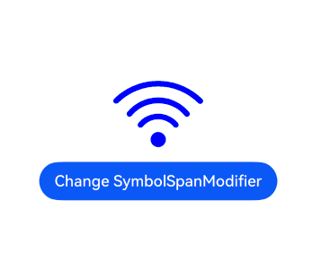
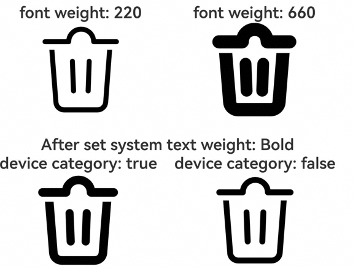

# SymbolSpan
<!--Kit: ArkUI-->
<!--Subsystem: ArkUI-->
<!--Owner: @xiangyuan6-->
<!--Designer: @xiangyuan6-->
<!--Tester: @jiaoaozihao-->
<!--Adviser: @Brilliantry_Rui-->
<!-- md-trans-meta sourceCommit=8aa8522c1582655206875d9c89c21656113a2dda translatedAt=2026-09-03T12:16:55.577Z -->

As a child component of the **Text** component, **SymbolSpan** is used to display the system preset small icon symbols (Symbol icons) in text. It supports setting attributes such as color, size, font weight, rendering strategy, and effect strategy, and is suitable for scenarios where icon symbols need to be embedded in text, such as status indication and function identification. **SymbolSpan** supports only system preset symbol resources and can inherit the attribute settings of the parent **Text** component.

>  **NOTE**
>
> - This component is supported since API version 11. New APIs of later versions are marked with a superscript to indicate their earliest API version.
>
> - The APIs of this module can be used only in the stage model.
>
> - This component supports inheriting the attributes of the parent **Text** component. That is, if the child component does not set an attribute but the parent component does, the child component inherits all the attributes set by the parent component.
>
> - **SymbolSpan** does not gray out when dragged.

## Child Components

Not supported

## APIs

SymbolSpan(value: Resource)

**Widget capability**: This API can be used in ArkTS widgets since API version 12.

**Atomic service API**: This API can be used in atomic services since API version 12.

**System capability**: SystemCapability.ArkUI.ArkUI.Full

**Parameters**

| Name| Type| Mandatory| Description|
| -------- | -------- | -------- | -------- |
| value | [Resource](ts-types.md#resource) | Yes | Resource reference of the SymbolSpan component, for example, $r('sys.symbol.ohos_wifi'). Only system preset symbol resources are supported. Referencing a non-symbol resource will cause display exceptions. |

>  **NOTE**
>
>  The resource referenced in **$r('sys.symbol.ohos_wifi')** is preset by the system. **SymbolSpan** supports only system preset symbol resources. Referencing a non-symbol resource will cause abnormal display.

## Attributes

The [universal attributes](ts-component-general-attributes.md) are not supported. Only the following attributes are supported.

### fontColor

fontColor(value: Array&lt;ResourceColor&gt;)

Sets the color of the **SymbolSpan** component. If this API is not called, the default color varies with [renderingStrategy](#renderingstrategy). Under the single-color rendering strategy (SINGLE), the default is a single color. Under the multi-color rendering strategy (MULTIPLE_COLOR) and the layered rendering strategy (MULTIPLE_OPACITY), the default is the preset multi-color configuration of the icon resource. For details, see [SymbolRenderingStrategy](ts-basic-components-symbolGlyph.md#symbolrenderingstrategy11).

>**NOTE**
>
> This API can be called within [attributeModifier](ts-universal-attributes-attribute-modifier.md#attributemodifier) since API version 12.

**Widget capability**: This API can be used in ArkTS widgets since API version 12.

**Atomic service API**: This API can be used in atomic services since API version 12.

**System capability**: SystemCapability.ArkUI.ArkUI.Full

**Parameters**

| Name| Type                                               | Mandatory| Description                                                        |
| ------ | --------------------------------------------------- | ---- | ------------------------------------------------------------ |
| value  | Array\<[ResourceColor](ts-types.md#resourcecolor)\> | Yes   | Color of the SymbolSpan component. For details about the specific color rendering modes and their descriptions, see [SymbolRenderingStrategy](ts-basic-components-symbolGlyph.md#symbolrenderingstrategy11). |

### fontSize

fontSize(value: number | string | Resource)

Sets the size of the **SymbolSpan** component. When the value is of the string type, the string form of a number type value is supported, and a unit can be attached, for example, "10" and "10fp". If this API is not called, the default component size is 16fp.

>**NOTE**
>
> This API can be called within [attributeModifier](ts-universal-attributes-attribute-modifier.md#attributemodifier) since API version 12.

**Widget capability**: This API can be used in ArkTS widgets since API version 12.

**Atomic service API**: This API can be used in atomic services since API version 12.

**System capability**: SystemCapability.ArkUI.ArkUI.Full

**Parameters**

| Name| Type                                                        | Mandatory| Description                                         |
| ------ | ------------------------------------------------------------ | ---- | --------------------------------------------- |
| value  | number&nbsp;\|&nbsp;string&nbsp;\|&nbsp;[Resource](ts-types.md#resource) | Yes   | Size of the SymbolSpan component.<br>Value range: [0,&nbsp;+∞)<br>Unit: [fp](ts-pixel-units.md#basic-pixel-units) |

### fontWeight

fontWeight(value: number | FontWeight | string)

Sets the font weight of the **SymbolSpan** component. If this API is not called, the default font weight is FontWeight.Normal (normal weight, corresponding to the value 400).

The **sys.symbol.ohos_lungs** icon does not support font weight setting.

>**NOTE**
>
> This API can be called within [attributeModifier](ts-universal-attributes-attribute-modifier.md#attributemodifier) since API version 12.

**Widget capability**: This API can be used in ArkTS widgets since API version 12.

**Atomic service API**: This API can be used in atomic services since API version 12.

**System capability**: SystemCapability.ArkUI.ArkUI.Full

**Parameters**

| Name| Type                                                        | Mandatory| Description                                              |
| ------ | ------------------------------------------------------------ | ---- | -------------------------------------------------- |
| value  | number&nbsp;\|&nbsp;[FontWeight](ts-appendix-enums.md#fontweight)&nbsp;\|&nbsp;string | Yes   | Font weight of the SymbolSpan component.<br>For the number type, the value range is [100,&nbsp;900], with an interval of 100. The default value is 400. A larger value indicates a heavier font. For the string type, only the string form of the number type value is supported, for example, "400", as well as "bold", "bolder", "lighter", "regular", and "medium", which correspond to the respective enum values in FontWeight. If the value is set too large, the font may be truncated in different fonts. If a value outside the value range or not meeting the interval requirement is passed, the default value is used.|

### fontWeight

fontWeight(value: number | FontWeight | ResourceStr, fontWeightConfigs?: FontWeightConfigs)

Sets the font weight of the SymbolSpan component. It supports configuring, through FontWeightConfigs, whether to enable variable font weight adjustment and whether to automatically update the font weight based on the device font weight level. If this API is not called, the default font weight is FontWeight.Normal (normal weight, corresponding to the value 400).

The sys.symbol.ohos_lungs icon does not support setting fontWeight.

**Since**: 26.0.0

**Widget capability:** This API can be used in ArkTS widgets since API version 26.0.0.

**Atomic service API**: This API can be used in atomic services since API version 26.0.0.

**Model restriction**: This API can be used only in the stage model.

**System capability**: SystemCapability.ArkUI.ArkUI.Full

**Parameters**

| Name | Type | Mandatory | Description |
| ------ | ---- | ---- | ---- |
| value | number&nbsp;\|&nbsp;[FontWeight](ts-appendix-enums.md#fontweight)&nbsp;\|&nbsp;[ResourceStr](ts-types.md#resourcestr) | Yes | Font weight of the SymbolSpan component.<br>The number type value range is [100,&nbsp;900], with an interval of 100. The default value is 400. A larger value indicates a heavier font. The string type supports only the string form of the number type values, for example, "400", as well as "bold", "bolder", "lighter", "regular", and "medium", which correspond to the respective enum values in FontWeight. Setting an excessively large value may cause truncation with different fonts.<br>If the value is out of the value range, the default value is used. If the value does not meet the interval requirement, the passed value is used when enableVariableFontWeight of fontWeightConfigs is set to true; otherwise, the default value is used. |
| fontWeightConfigs | [FontWeightConfigs](ts-text-common.md#fontweightconfigs24) | No | Font weight configuration. Pass this parameter when variable font weight adjustment needs to be enabled (setting a fine-grained font weight value that is not an integer multiple of 100, such as 220 or 660) or when the font weight needs to be automatically updated based on the device font weight level.<br>Default value: { enableVariableFontWeight: false, enableDeviceFontWeightCategory: true } |

### renderingStrategy

renderingStrategy(value: SymbolRenderingStrategy)

Sets the rendering strategy of the SymbolSpan. If this API is not called, the default rendering strategy is SymbolRenderingStrategy.SINGLE.

SINGLE indicates single-color rendering, which is suitable for scenarios where icons with a unified color are required. MULTIPLE_COLOR indicates multi-color rendering, which is suitable for scenarios where multiple layers of an icon need to be displayed in different colors. MULTIPLE_OPACITY indicates layered rendering, which is suitable for scenarios where the layered effect of an icon needs to be displayed.

>**NOTE**
>
> This API can be called within [attributeModifier](ts-universal-attributes-attribute-modifier.md#attributemodifier) since API version 12.

**Widget capability**: This API can be used in ArkTS widgets since API version 12.

**Atomic service API**: This API can be used in atomic services since API version 12.

**System capability**: SystemCapability.ArkUI.ArkUI.Full

**Parameters**

| Name| Type                                                        | Mandatory| Description                                                        |
| ------ | ------------------------------------------------------------ | ---- | ------------------------------------------------------------ |
| value  | [SymbolRenderingStrategy](ts-basic-components-symbolGlyph.md#symbolrenderingstrategy11) | Yes   | Rendering strategy of SymbolSpan.|

The figure below shows the effects of different rendering strategies.


### effectStrategy

effectStrategy(value: SymbolEffectStrategy)

Sets the effect strategy of the SymbolSpan. If this API is not called, the default effect strategy is SymbolEffectStrategy.NONE.

NONE indicates no effect, which is suitable for static display scenarios. SCALE indicates an overall scaling effect, which is suitable for scenarios that need to attract user attention, such as button click feedback. HIERARCHICAL indicates a hierarchical effect, which is suitable for scenarios where the layered sense of an icon needs to be highlighted.

For the effects of different effect strategies, see [Example 1: Setting Rendering and Animation Strategies](#example-1-setting-rendering-and-animation-strategies).

>**NOTE**
>
> This API can be called within [attributeModifier](ts-universal-attributes-attribute-modifier.md#attributemodifier) since API version 12.

**Widget capability**: This API can be used in ArkTS widgets since API version 12.

**Atomic service API**: This API can be used in atomic services since API version 12.

**System capability**: SystemCapability.ArkUI.ArkUI.Full

**Parameters**

| Name| Type                                                        | Mandatory| Description                                                      |
| ------ | ------------------------------------------------------------ | ---- | ---------------------------------------------------------- |
| value  | [SymbolEffectStrategy](ts-basic-components-symbolGlyph.md#symboleffectstrategy11) | Yes   | Effect strategy of SymbolSpan. |

### attributeModifier<sup>12+</sup>

attributeModifier(modifier: AttributeModifier\<SymbolSpanAttribute>)

Creates an attribute modifier.

**Atomic service API**: This API can be used in atomic services since API version 12.

**System capability**: SystemCapability.ArkUI.ArkUI.Full

**Parameters**

| Name| Type                                               | Mandatory| Description                                                        |
| ------ | --------------------------------------------------- | ---- | ------------------------------------------------------------ |
| modifier  | [AttributeModifier](ts-universal-attributes-attribute-modifier.md#attributemodifiert)\<SymbolSpanAttribute> | Yes  | Modifier for dynamically setting attributes on the current component.|

## Events

The [universal events](ts-component-general-events.md) are not supported.

## Example

### Example 1: Setting Rendering and Animation Strategies
This example demonstrates different rendering and effect strategies using [renderingStrategy](#renderingstrategy) and [effectStrategy](#effectstrategy), available since API version 11.

```ts
// xxx.ets
@Entry
@Component
struct Index {
  build() {
    Column() {
      Row() {
        Column() {
          Text('Light')
          Text() {
            SymbolSpan($r('sys.symbol.ohos_trash'))
              .fontWeight(FontWeight.Lighter)
              .fontSize(96)
          }
        }

        Column() {
          Text('Normal')
          Text() {
            SymbolSpan($r('sys.symbol.ohos_trash'))
              .fontWeight(FontWeight.Normal)
              .fontSize(96)
          }
        }

        Column() {
          Text('Bold')
          Text() {
            SymbolSpan($r('sys.symbol.ohos_trash'))
              .fontWeight(FontWeight.Bold)
              .fontSize(96)
          }
        }
      }

      Row() {
        Column() {
          Text('Monochrome')
          Text() {
            SymbolSpan($r('sys.symbol.ohos_folder_badge_plus'))
              .fontSize(96)
              .renderingStrategy(SymbolRenderingStrategy.SINGLE)
              .fontColor([Color.Black, Color.Green, Color.White])
          }
        }

        Column() {
          Text('Multicolor')
          Text() {
            SymbolSpan($r('sys.symbol.ohos_folder_badge_plus'))
              .fontSize(96)
              .renderingStrategy(SymbolRenderingStrategy.MULTIPLE_COLOR)
              .fontColor([Color.Black, Color.Green, Color.White])
          }
        }

        Column() {
          Text('Layered')
          Text() {
            SymbolSpan($r('sys.symbol.ohos_folder_badge_plus'))
              .fontSize(96)
              .renderingStrategy(SymbolRenderingStrategy.MULTIPLE_OPACITY)
              .fontColor([Color.Black, Color.Green, Color.White])
          }
        }
      }

      Row() {
        Column() {
          Text('No effect')
          Text() {
            SymbolSpan($r('sys.symbol.ohos_wifi'))
              .fontSize(96)
              .effectStrategy(SymbolEffectStrategy.NONE)
          }
        }

        Column() {
          Text('Whole scaling effect')
          Text() {
            SymbolSpan($r('sys.symbol.ohos_wifi'))
              .fontSize(96)
              .effectStrategy(SymbolEffectStrategy.SCALE)
          }
        }

        Column() {
          Text('Hierarchical effect')
          Text() {
            SymbolSpan($r('sys.symbol.ohos_wifi'))
              .fontSize(96)
              .effectStrategy(SymbolEffectStrategy.HIERARCHICAL)
          }
        }
      }
    }
  }
}
```


### Example 2: Configuring Dynamic Attributes
This example demonstrates how to create icons of a specified style using the [attributeModifier](#attributemodifier12) attribute, available since API version 12.

```ts
import { SymbolSpanModifier } from '@kit.ArkUI';

@Entry
@Component
struct Index {
  @State modifier: SymbolSpanModifier =
    new SymbolSpanModifier($r('sys.symbol.ohos_wifi')).fontColor([Color.Blue]).fontSize(100);

  build() {
    Row() {
      Column() {
        Text() {
          SymbolSpan(undefined).attributeModifier(this.modifier)
        }

        Button('Change SymbolSpanModifier')
          .onClick(() => {
            this.modifier = new SymbolSpanModifier($r("sys.symbol.ohos_trash")).fontColor([Color.Red]).fontSize(100);
          })
      }
      .width('100%')
    }
    .height('100%')
  }
}
```


### Example 3: Setting Font Weight

This example uses the [fontWeight](#fontweight-1) attribute to demonstrate the effects of different font weight configurations of SymbolSpan: the first row of small icon symbols shows the effects of setting the font weight values to 220 and 660 respectively after enabling variable font weight; the second row of small icon symbols shows the effects of setting whether to follow the device's system font weight level for automatic update, after the device's system font weight is set to bold.

Since API version 26.0.0, the [fontWeight](#fontweight-1) attribute is added.

```ts
// xxx.ets
@Entry
@Component
struct Index {
  build() {
    Column() {
      Row() {
        Column() {
          Text('font weight: 220')
          Text() {
            // ohos_trash is a system preset trash can symbol.
            SymbolSpan($r('sys.symbol.ohos_trash'))
              .fontWeight(220, { enableVariableFontWeight: true })
              .fontSize(96)
          }
        }
        Column() {
          Text('            ')
        }
        Column() {
          Text('font weight: 660')
          Text() {
            // ohos_trash is a system preset trash can symbol.
            SymbolSpan($r('sys.symbol.ohos_trash'))
              .fontWeight(660, { enableVariableFontWeight: true })
              .fontSize(96)
          }
        }
      }
      Row() {
        Text('    ')
      }
      Row() {
        Text('After set system text weight: Bold')
      }
      Row() {
        Column() {
          Text('device category: true')
          Text() {
            // ohos_trash is a system preset trash can symbol.
            SymbolSpan($r('sys.symbol.ohos_trash'))
              .fontWeight(FontWeight.Normal, { enableDeviceFontWeightCategory: true })
              .fontSize(96)
          }
        }
        Column() {
          Text('    ')
        }
        Column() {
          Text('device category: false')
          Text() {
            // ohos_trash is a system preset trash can symbol.
            SymbolSpan($r('sys.symbol.ohos_trash'))
              .fontWeight(FontWeight.Normal, { enableDeviceFontWeightCategory: false })
              .fontSize(96)
          }
        }
      }
    }
  }
}
```

