# Text
<!--Kit: ArkUI-->
<!--Subsystem: ArkUI-->
<!--Owner: @xiangyuan6-->
<!--Designer: @xiangyuan6-->
<!--Tester: @jiaoaozihao-->
<!--Adviser: @Brilliantry_Rui-->

The **Text** component is used to display text content. It supports the configuration of font styles, text alignment, line height, and decorative lines. It also supports mixed arrangement of images and text, text selection, and text recognition. This component is applicable to various application scenarios where text information needs to be displayed.

>  **NOTE**
>
> - This component is supported since API version 7. Newly added APIs will be marked with a superscript to indicate their earliest API version.
>
> - To set whether to clear the text selection and handle when the user touches outside the text component, use the [setTextSelectionClearPolicy](../arkts-apis-uicontext-uicontext.md#settextselectionclearpolicy) API.
>
>  <!--RP3--><!--RP3End-->


## Child Components

This component can contain the [Span](ts-basic-components-span.md), [ImageSpan](ts-basic-components-imagespan.md), [SymbolSpan](ts-basic-components-symbolSpan.md), and [ContainerSpan](ts-basic-components-containerspan.md) child components.

>  **NOTE**
>
>  Use [child components](#child-components) to implement [text and image layout](../../../ui/arkts-text-image-layout.md) scenarios.

## APIs

Text(content?: string \| Resource , value?: TextOptions)

**Widget capability**: This API can be used in ArkTS widgets since API version 9.

**Atomic service API**: This API can be used in atomic services since API version 11.

**System capability**: SystemCapability.ArkUI.ArkUI.Full

**Parameters**

| Name| Type| Mandatory| Description|
| -------- | -------- | -------- | -------- |
| content | string \| [Resource](ts-types.md#resource) | No| Plain text. This parameter is required when the text content needs to be directly displayed. This parameter does not take effect when the subcomponent [Span](ts-basic-components-span.md) is contained or the [styled string](ts-universal-styled-string.md) is set.<br>Default value: **' '**<br>**NOTE**<br>Priority of displayed content: Styled string > Content of the **Span** component > Text content of the **Text** component.|
| value<sup>11+</sup> | [TextOptions](#textoptions11) | No| Text component initialization option, which is used to configure the text controller. This parameter is required when the **TextController** feature needs to be used to control the text content and selection.<br>Default value: If this parameter is not set, the text controller is not used.<br>**Model restriction**: This API can be used only in the stage model.|

## Attributes

In addition to the [universal attributes](ts-component-general-attributes.md), the following attributes are supported.

**Layout and Alignment**

| Attributes| Description|
|------|------|
| baselineOffset | Sets the offset of the text baseline.|
| halfLeading<sup>12+</sup> | Sets whether half leading is enabled. Half leading refers to splitting the leading in half and applying it equally to the top and bottom of the line. If this parameter and [textVerticalAlign](#textverticalalign20) are set at the same time, **halfLeading** does not take effect.|
| textAlign | Sets the horizontal alignment mode of the text. When [textOverflow](#textoverflow) is set to **TextOverflow.MARQUEE** and the text is scrollable, the **textAlign** attribute does not take effect.|
| textContentAlign<sup>21+</sup> | Sets the vertical alignment of the text content area within the component.|
| textVerticalAlign<sup>20+</sup> | Sets the vertical alignment of the text.|

**Font Style**

| Attributes| Description|
|------|------|
| decoration | Style and color of the text decorative line.|
| font<sup>10+</sup> | Sets the text style.|
| font<sup>12+</sup> | Sets the font style, with support for font settings.|
| fontColor | Sets the font color.|
| fontFamily | Sets the font family.|
| fontFeature<sup>12+</sup> | Sets the font feature, for example, monospaced digits.|
| fontSize | Sets the text size. When the adaptive font size is used, the **fontSize** settings do not take effect.|
| fontStyle | Sets the font style.|
| fontWeight | Sets the font weight.|
| fontWeight<sup>12+</sup> | Sets the text font weight, with support for font settings.|
| fontVariations | Sets font variations. **Since**: 26.0.0|
| letterSpacing | Sets the letter spacing for a text style.|
| shaderStyle<sup>20+</sup> | Applies gradient or solid color effects to text.|
| textCase | Sets the text case.|
| textShadow<sup>10+</sup> | Text shadow.|

**Text Overflow, Line Break, and Line Wrapping**

| Attributes| Description|
|------|------|
| ellipsisMode<sup>11+</sup> | Sets the ellipsis position.|
| lineBreakStrategy<sup>12+</sup> | Sets the line break rule.|
| marqueeOptions<sup>18+</sup> | Sets the marquee effect for text.|
| textOverflow | Sets the display mode for overflowing text.|
| wordBreak<sup>11+</sup> | Sets the word break rule.|
| punctuationOverflow | Sets whether to enable hanging punctuation at line ends.<br>**Since**: 26.0.0|

**Line and Paragraph**

| Attributes| Description|
|------|------|
| enableAutoSpacing<sup>20+</sup> | Sets whether to enable automatic spacing between Chinese and Western characters.|
| lineHeight | Sets the text line height.|
| lineHeightMultiple<sup>22+</sup> | Sets the line height multiplier for the text.|
| lineSpacing<sup>12+</sup> | Sets the line spacing for the text.|
| lineSpacing<sup>20+</sup> | Sets the line spacing for the text. When **LineSpacingOptions** is not specified, line spacing is applied above the first line and below the last line by default. When this parameter and **lineHeightMultiple** are set at the same time and **lineHeightMultiple** is set to a valid value, only **lineHeightMultiple** takes effect.|
| maxLineHeight<sup>22+</sup> | Sets the maximum line height of the text.|
| maxLines | Sets the maximum number of lines in the text.|
| minLineHeight<sup>22+</sup> | Sets the minimum line height of the text.|
| minLines<sup>22+</sup> | Sets the minimum number of lines in the text.|
| optimizeTrailingSpace<sup>20+</sup> | Sets whether to optimize trailing spaces at line endings.|
| textIndent<sup>10+</sup> | Sets the indent of the first line text.|
| tailIndents | Sets the indent of the text tail.<br>**Since**: 26.0.0|

**Font Adaptation**

| Attributes| Description|
|------|------|
| heightAdaptivePolicy<sup>10+</sup> | Sets the font size adjustment strategy for adaptive text layout.|
| maxFontScale<sup>12+</sup> | Sets the maximum font scale factor for text.|
| maxFontSize | Sets the maximum font size.|
| minFontScale<sup>12+</sup> | Sets the minimum font scale factor for text.|
| minFontSize | Sets the minimum font size.|

**Text Selection and Copy**

| Attributes| Description|
|------|------|
| caretColor<sup>14+</sup> | Sets the color of the handle for the selected area in the text component.|
| copyOption<sup>9+</sup> | Sets whether copy and paste operations are allowed.|
| draggable<sup>9+</sup> | Sets the drag effect of the selected text.|
| selectedBackgroundColor<sup>14+</sup> | Sets the background color of the selected text.|
| selection<sup>11+</sup> | Sets text selection.|
| textSelectable<sup>12+</sup> | Sets whether the text is selectable and focusable.|

**Text Recognition**

| Attributes| Description|
|------|------|
| dataDetectorConfig<sup>11+</sup> | Configures text recognition settings.|
| enableDataDetector<sup>11+</sup> | Sets whether to recognize text entities, including phone numbers, websites, email addresses, addresses, and dates.|
| enableSelectedDataDetector<sup>22+</sup> | Sets whether to enable entity recognition for selected text.|

**Custom Menu**

| Attributes| Description|
|------|------|
| bindSelectionMenu<sup>11+</sup> | Sets the custom selection menu.|
| editMenuOptions<sup>12+</sup> | Sets the extended options for the custom menu.|

**Other Functionality**

| Attributes| Description|
|------|------|
| contentTransition<sup>20+</sup> | Text animation effect.|
| enableHapticFeedback<sup>13+</sup> | Sets whether to enable haptic feedback.|
| incrementalUpdatePolicy | Sets the incremental update policy for text rendering.<br>**Since**: 26.0.0|
| privacySensitive<sup>12+</sup> | Sets whether to enable privacy mode on widgets.|

The following describes the details of each API.

### baselineOffset

baselineOffset(value: number \| ResourceStr)

Sets the offset of the text baseline. It can be used to adjust the baseline alignment between the text and other elements (such as images and icons), or used in special typesetting scenarios that require precise vertical alignment, such as mixed text and images, mathematical formulas, and chemical formulas. If this API is not used, the default offset is 0.

A positive value moves the content upwards, while a negative value moves it downwards.

**Widget capability**: This API can be used in ArkTS widgets since API version 9.

**Atomic service API**: This API can be used in atomic services since API version 11.

**System capability**: SystemCapability.ArkUI.ArkUI.Full

**Parameters**

| Name| Type                      | Mandatory| Description                            |
| ------ | -------------------------- | ---- | -------------------------------- |
| value  | number&nbsp;\|&nbsp;[ResourceStr](ts-types.md#resourcestr) | Yes  | Offset of the text baseline. If the value is set to a percentage, the value is displayed as 0.<br>Unit: fp.<br>The [Resource](ts-types.md#resource) type is supported since API version 20.|

### bindSelectionMenu<sup>11+</sup>

bindSelectionMenu(spanType: TextSpanType, content: CustomBuilder, responseType: TextResponseType, options?: SelectionMenuOptions)

Sets the custom selection menu. If this API is not used, the default menu type is **TextSpanType.TEXT** and the response type is **TextResponseType.LONG_PRESS**.

The long-press response duration of **bindSelectionMenu** is 600 ms while that of [bindContextMenu](ts-universal-attributes-menu.md#bindcontextmenu8) is 800 ms. When both are bound and their triggering methods are set to long press, **bindSelectionMenu** takes precedence.

When the custom menu is too long, it is recommended that nest a [Scroll](./ts-container-scroll.md) component inside to prevent the keyboard from being obscured.

Since API version 26.0.0, when the text component calls this API, the image preview menu takes effect if the **menuType** attribute in **options** is set to **MenuType.PREVIEW_MENU**.

To use the image preview menu, set **spanType** to **TextSpanType.IMAGE**, **responseType** to **TextResponseType.LONG_PRESS**, and **menuType** in **options** to **MenuType.PREVIEW_MENU**.

When [copyOption](#copyoption9) is set to **CopyOptions.None**, the setting of the image preview menu does not take effect.

> **NOTE**
>
> This API cannot be called within [attributeModifier](ts-universal-attributes-attribute-modifier.md#attributemodifier).
>
>  When [editMenuOptions](#editmenuoptions12) is used for configuring the text selection menu, the system's default style and trigger conditions are preserved.
>
>  In contrast, when [bindSelectionMenu](#bindselectionmenu11) is used, both the menu style and the trigger conditions are fully customizable.

**Atomic service API**: This API can be used in atomic services since API version 12.

**Model restriction**: This API can be used only in the stage model.

**System capability**: SystemCapability.ArkUI.ArkUI.Full

**Parameters**

| Name      | Type                                                        | Mandatory| Description                                                        |
| ------------ | ------------------------------------------------------------ | ---- | ------------------------------------------------------------ |
| spanType     | [TextSpanType](#textspantype11)          | Yes  | Span type of the menu.              |
| content      | [CustomBuilder](ts-types.md#custombuilder8)                  | Yes  | Content of the menu.                                            |
| responseType | [TextResponseType](#textresponsetype11)  | Yes  | Response type of the menu.|
| options      | [SelectionMenuOptions](ts-basic-components-richeditor.md#selectionmenuoptions) | No  | Options of the selection menu, which are used to customize the menu behavior. The options include callback configuration items such as menu appearance, disappearance, display, and hiding.<br>Default value: If this parameter is not set, the default selection menu configuration is used.                                            |

### caretColor<sup>14+</sup>

caretColor(color: ResourceColor)

Sets the color of the handle for the selected area in the text component. If this API is not used, the default color of the handle for the selected area is **'#007DFF'** (blue).

**Atomic service API**: This API can be used in atomic services since API version 14.

**Model restriction**: This API can be used only in the stage model.

**System capability**: SystemCapability.ArkUI.ArkUI.Full

**Parameters**

| Name| Type                                      | Mandatory| Description                                  |
| ------ | ------------------------------------------ | ---- | -------------------------------------- |
| color  | [ResourceColor](ts-types.md#resourcecolor) | Yes  | Color of the text selection handle.|

### contentTransition<sup>20+</sup>

contentTransition(transition: Optional\<ContentTransition>)

Applies a transition animation to text content. The numeric flip animation is supported via [NumericTextTransition](ts-text-common.md#numerictexttransition20).

**Atomic service API**: This API can be used in atomic services since API version 20.

**Model restriction**: This API can be used only in the stage model.

**System capability**: SystemCapability.ArkUI.ArkUI.Full

**Parameters**

| Name| Type                                            | Mandatory| Description                                                      |
| ------ | ------------------------------------------------ | ---- | ---------------------------------------------------------- |
| transition  | [Optional](ts-universal-attributes-custom-property.md#optionalt)\<[ContentTransition](ts-text-common.md#contenttransition20)> | Yes  | Text animation, which is used to set the transition animation effect when the text content changes. You can set this parameter to [NumericTextTransition](ts-text-common.md#numerictexttransition20) to implement the flip animation effect when the number changes.<br>If the value is **undefined**, there is no flipping effect.|

### copyOption<sup>9+</sup>

copyOption(value: CopyOptions)

Sets whether copy and paste operations are allowed. If this API is not used, the default value is **CopyOptions.None**, indicating that the text cannot be copied or pasted.

The features of multiple attributes depend on the settings of **copyOption**, including [selection](#selection11), [setTextSelection](#settextselection23), [draggable](#draggable9), [enableSelectedDataDetector](#enableselecteddatadetector22), and [textSelectable](#textselectable12). For details about the dependency conditions, see the description of each attribute.

Since API version 20, copied text from the **Text** component includes HTML-formatted content in the pasteboard.

- When the **Text** component contains child elements, only [Span](ts-basic-components-span.md) and [ImageSpan](ts-basic-components-imagespan.md) support HTML-formatted pasteboard content.

- For styled strings, refer to [toHtml](ts-universal-styled-string.md#tohtml14) for supported HTML conversion scope.

When **copyOption** is set to **CopyOptions.InApp** or **CopyOptions.LocalDevice**:

- A long press on the text will display a menu that offers the copy and select-all options.

- By default, selected text is draggable. To disable dragging, set **draggable** to **false**.

- To support **Ctrl+C** copying, also set [textSelectable](#textselectable12) to **TextSelectableMode.SELECTABLE_FOCUSABLE**.

The **Text** component listens for **onClick**, which is a non-bubbling event. To allow parent components to respond to clicks within the **Text** area, use [parallelGesture](ts-gesture-settings.md#parallelgesture) on the parent. For implementation guidance, see [Example 7: Setting Text Recognition](#example-7-setting-text-recognition).

Because widgets do not have the long press event, the menu will not be displayed when users long press text.

**Widget capability**: This API can be used in ArkTS widgets since API version 9.

**Atomic service API**: This API can be used in atomic services since API version 11.

**System capability**: SystemCapability.ArkUI.ArkUI.Full

**Parameters**

| Name| Type                                            | Mandatory| Description                                                      |
| ------ | ------------------------------------------------ | ---- | ---------------------------------------------------------- |
| value  | [CopyOptions](ts-appendix-enums.md#copyoptions9) | Yes  | Whether copy and paste operations are allowed.|

### dataDetectorConfig<sup>11+</sup>

dataDetectorConfig(config: TextDataDetectorConfig)

Configures text recognition settings, including entity types to detect, display styles for detected entities, and long-press preview options.

This API must be used together with [enableDataDetector](#enabledatadetector11). It takes effect only when **enableDataDetector** is set to **true**.

**Atomic service API**: This API can be used in atomic services since API version 12.

**Model restriction**: This API can be used only in the stage model.

**System capability**: SystemCapability.ArkUI.ArkUI.Full

**Parameters**

| Name| Type                                                       | Mandatory| Description                                                        |
| ------ | ----------------------------------------------------------- | ---- | ------------------------------------------------------------ |
| config | [TextDataDetectorConfig](ts-text-common.md#textdatadetectorconfig11) | Yes  | Text recognition configuration object, which is used to configure the specific behavior of text recognition. You can configure the types of entities to recognize (such as phone numbers, websites, email addresses, addresses, and dates), display styles for the entities, and whether to enable long-press for preview. This parameter must be used together with [enableDataDetector](#enabledatadetector11).|

### decoration

decoration(value: DecorationStyleInterface)

Style and color of the text decorative line. If this API is not used, the default text decorative line style is as follows:<br>{<br>&nbsp;type:&nbsp;TextDecorationType.None,<br>&nbsp;color:&nbsp;Color.Black,<br>&nbsp;style:&nbsp;TextDecorationStyle.SOLID&nbsp;<br>}

>  **NOTE**
>
>  When the bottom contour of a character intersects with the decoration, underline avoidance is triggered, commonly affecting characters like "g", "j", "y", "q", and "p."
>
>  When the decorative line color is set to **Color.Transparent**, the decorative line is displayed as the text color of the first character in each line. When the color is set to the transparent hexadecimal value **"#00FFFFFF"**, the decorative line is displayed in transparent color.

**Widget capability**: This API can be used in ArkTS widgets since API version 9.

**Atomic service API**: This API can be used in atomic services since API version 11.

**System capability**: SystemCapability.ArkUI.ArkUI.Full

**Parameters**

| Name| Type                                                        | Mandatory| Description                                                        |
| ------ | ------------------------------------------------------------ | ---- | ------------------------------------------------------------ |
| value  | [DecorationStyleInterface<sup>12+</sup>](ts-universal-styled-string.md#decorationstyleinterface) | Yes  | Style of the text decorative line.<br>**NOTE**<br>The **style** parameter cannot be used in widgets.|

### draggable<sup>9+</sup>

draggable(value: boolean)

Sets the drag effect of the selected text. If this API is not used, the selected text cannot be dragged by default.

This attribute cannot be used together with the [onDragStart](ts-universal-events-drag-drop.md#ondragstart) event.

If set to **true**, **draggable** must be used in conjunction with [CopyOptions](ts-appendix-enums.md#copyoptions9). When **copyOptions** is set to **CopyOptions.InApp** or **CopyOptions.LocalDevice**, the selected text becomes draggable and can be copied into a text box.

**Atomic service API**: This API can be used in atomic services since API version 11.

**System capability**: SystemCapability.ArkUI.ArkUI.Full

**Parameters**

| Name| Type   | Mandatory| Description                                |
| ------ | ------- | ---- | ------------------------------------ |
| value  | boolean | Yes  | Drag effect of the selected text.<br>**true**: The selected text is draggable. **false**: The selected text is not draggable.|

### editMenuOptions<sup>12+</sup>

editMenuOptions(editMenu: EditMenuOptions)

Sets the extended options for the custom menu, including the text content, icon, and callback.

When [disableMenuItems](../arkts-apis-uicontext-textmenucontroller.md#disablemenuitems20) or [disableSystemServiceMenuItems](../arkts-apis-uicontext-textmenucontroller.md#disablesystemservicemenuitems20) is used to disable system service menu items in the text selection menu, the disabled menu options will be excluded from the parameter list in the [onCreateMenu](./ts-text-common.md#oncreatemenu12) callback of **editMenuOptions**.

>  **NOTE**
>
>  When [editMenuOptions](#editmenuoptions12) is used for configuring the text selection menu, the system's default style and trigger conditions are preserved.
>
>  In contrast, when [bindSelectionMenu](#bindselectionmenu11) is used, both the menu style and the trigger conditions are fully customizable.

**Atomic service API**: This API can be used in atomic services since API version 12.

**Model restriction**: This API can be used only in the stage model.

**System capability**: SystemCapability.ArkUI.ArkUI.Full

**Parameters**

| Name| Type                                         | Mandatory| Description                                         |
| ------ | --------------------------------------------- | ---- | --------------------------------------------- |
| editMenu  | [EditMenuOptions](ts-text-common.md#editmenuoptions) | Yes  | Extended menu options, which are used to customize the extended items of the text selection menu. You can set the text content, icon, and callback method of the extended items, and add custom menu items.|

### ellipsisMode<sup>11+</sup>

ellipsisMode(value: EllipsisMode)

Sets the ellipsis position. If this API is not used, the default ellipsis position is at the end of the line (**EllipsisMode.END**).

The **ellipsisMode** attribute must be used together with the **TextOverflow.Ellipsis** value of **overflow** and the **maxLines** attribute. Setting the **ellipsisMode** attribute alone does not take effect.

The **EllipsisMode.START** and **EllipsisMode.CENTER** attributes take effect only when the text in a single line is too long.

**Atomic service API**: This API can be used in atomic services since API version 12.

**Model restriction**: This API can be used only in the stage model.

**System capability**: SystemCapability.ArkUI.ArkUI.Full

**Parameters**

| Name| Type                                               | Mandatory| Description                                     |
| ------ | --------------------------------------------------- | ---- | ----------------------------------------- |
| value  | [EllipsisMode](ts-appendix-enums.md#ellipsismode11) | Yes  | Ellipsis position.|

### enableAutoSpacing<sup>20+</sup>

enableAutoSpacing(enabled: Optional\<boolean>)

Sets whether to enable automatic spacing between Chinese and Western characters. If this API is not called, automatic spacing between Chinese and Western characters is disabled by default.

**Atomic service API**: This API can be used in atomic services since API version 20.

**Model restriction**: This API can be used only in the stage model.

**System capability**: SystemCapability.ArkUI.ArkUI.Full

**Parameters**

| Name| Type   | Mandatory| Description                              |
| ------ | ------- | ---- | ---------------------------------- |
| enabled | [Optional](ts-universal-attributes-custom-property.md#optionalt)\<boolean> | Yes  | Whether to enable automatic spacing between Chinese and Western characters.<br>**true** to enable, **false** otherwise.<br>If the value is **undefined**, automatic spacing between Chinese and Western characters is disabled.|

### enableDataDetector<sup>11+</sup>

enableDataDetector(enable: boolean)

Sets whether to recognize special text entities, such as phone numbers, websites, email addresses, addresses, and dates. This API is applicable to scenarios that require intelligent recognition and interaction, such as chat messages, comments, and articles. If this API is not called, special text entities are not recognized by default. Special entities are detected when **enableDataDetector** is set to **true**.

The style of detected entities is as follows: the font color is changed to blue, and a blue underline is added.

```ts
color: '#ff007dff'
decoration:{
  type: TextDecorationType.Underline,
  color: '#ff007dff',
  style: TextDecorationStyle.SOLID
}
```

> **NOTE**
>
> - This API takes effect only when the device has an underlying text detection capability.
> 
> - When [textOverflow](#textoverflow) is set to **TextOverflow.MARQUEE**, text special entity detection is not performed.
<!--RP2--><!--RP2End-->

**Atomic service API**: This API can be used in atomic services since API version 12.

**Model restriction**: This API can be used only in the stage model.

**System capability**: SystemCapability.ArkUI.ArkUI.Full

**Parameters**

| Name| Type   | Mandatory| Description                             |
| ------ | ------- | ---- | --------------------------------- |
| enable  | boolean | Yes  | Whether special text entities can be recognized.<br>The value **true** indicates yes, and **false** indicates no.|

### enableHapticFeedback<sup>13+</sup>

enableHapticFeedback(isEnabled: boolean)

Sets whether to enable haptic feedback. If this API is not called, haptic feedback is enabled by default.

To enable haptic feedback, you must declare the **ohos.permission.VIBRATE** permission under **requestPermissions** in the [module.json5](../../../quick-start/module-configuration-file.md) file of the project.

```json
"requestPermissions": [
  {
    "name": "ohos.permission.VIBRATE"
  }
]
```

> **NOTE**
>
> This API can be called within [attributeModifier](ts-universal-attributes-attribute-modifier.md#attributemodifier) since API version 18.

**Atomic service API**: This API can be used in atomic services since API version 13.

**Model restriction**: This API can be used only in the stage model.

**System capability**: SystemCapability.ArkUI.ArkUI.Full

**Parameters**

| Name| Type   | Mandatory| Description                              |
| ------ | ------- | ---- | ---------------------------------- |
| isEnabled | boolean | Yes  | Whether to enable haptic feedback.<br>**true** to enable, **false** otherwise.|

### enableSelectedDataDetector<sup>22+</sup>

enableSelectedDataDetector(enable: boolean \| undefined)

Sets whether to enable entity recognition for selected text. This API only works on devices that provide text recognition. If this API is not called, entity recognition is enabled for selected text by default.

After this feature is enabled, the entities such as email address, phone number, website URL, date, and address in the selection area can be recognized, and the corresponding AI menu items can be displayed in the text selection menu. By default, the AI menu feature is enabled.

When the AI menu feature is enabled, selecting text in the component allows the text selection menu to display corresponding AI menu items, including **url** (opening a link), **email** (creating an email), **phoneNumber** (making a call), **address** (navigating), and **dateTime** (creating a new event) in [TextMenuItemId](ts-text-common.md#textmenuitemid12).

When the AI menu is active, the corresponding menu item is displayed only if the selected range contains exactly one complete AI entity. This menu item does not appear at the same time as the **askAI** menu item in [TextMenuItemId](ts-text-common.md#textmenuitemid12).

This feature is only effective when [CopyOptions](ts-appendix-enums.md#copyoptions9) is set to **CopyOptions.LocalDevice** or **CopyOptions.CrossDevice**.

This attribute is invalid in the cross-node selection scenario of [SelectionContainer](ts-basic-components-selectioncontainer.md). The corresponding AI menu item is not displayed in the text selection menu.

**Atomic service API**: This API can be used in atomic services since API version 22.

**Model restriction**: This API can be used only in the stage model.

**System capability**: SystemCapability.ArkUI.ArkUI.Full

**Parameters**

| Name| Type   | Mandatory| Description                             |
| ------ | ------- | ---- | --------------------------------- |
| enable  | boolean \| undefined | Yes  | Whether to enable entity recognition for selected text.<br>**true**: Entity recognition is enabled. **false**: Entity recognition is disabled. Default value: **true**<br>A value of **undefined** is treated as the default value.|

### font<sup>10+</sup>

font(value: Font)

Sets the text style, If this API is not called, the default font style is used.

covering the font size, font width, font family, and font style.

It is only effective for the **Text** component, not for its child components.

**Atomic service API**: This API can be used in atomic services since API version 11.

**Model restriction**: This API can be used only in the stage model.

**System capability**: SystemCapability.ArkUI.ArkUI.Full

**Parameters**

| Name| Type   | Mandatory| Description      |
| ------ | ------- | ---- | ---------- |
| value  | [Font](ts-types.md#font) | Yes  | Text style.|

### font<sup>12+</sup>

font(fontValue: Font, options?: FontSettingOptions)

Sets the font style, with support for font settings.

It is only effective for the **Text** component, not for its child components.

**Widget capability**: This API can be used in ArkTS widgets since API version 12.

**Atomic service API**: This API can be used in atomic services since API version 12.

**Model restriction**: This API can be used only in the stage model.

**System capability**: SystemCapability.ArkUI.ArkUI.Full

**Parameters**

| Name| Type                                         | Mandatory| Description                                         |
| ------ | --------------------------------------------- | ---- | --------------------------------------------- |
| fontValue | [Font](ts-types.md#font) | Yes | Sets the text style.|
| options | [FontSettingOptions](ts-text-common.md#fontsettingoptions12) | No | Font settings.<br>Default value: If this parameter is not set, the default font configuration is used. For details, see **FontSettingOptions**.|

### fontColor

fontColor(value: ResourceColor)

Sets the font color. If this API is not called, the default text color is **'#e6182431'** (dark gray, with 90% opacity). On wearables, the default text color is **'#c5ffffff'** (white, with 77% opacity).

**Widget capability**: This API can be used in ArkTS widgets since API version 9.

**Atomic service API**: This API can be used in atomic services since API version 11.

**System capability**: SystemCapability.ArkUI.ArkUI.Full

**Parameters**

| Name| Type                                      | Mandatory| Description      |
| ------ | ------------------------------------------ | ---- | ---------- |
| value  | [ResourceColor](ts-types.md#resourcecolor) | Yes  | Font color.|

### fontFamily

fontFamily(value: string | Resource)

Sets the font family. If this API is not called, the default font is **'HarmonyOS Sans'**. The default font on wearables is also **'HarmonyOS Sans'**.

> **NOTE**
>
> You can use [loadFontSync](../../apis-arkgraphics2d/js-apis-graphics-text.md#loadfontsync) to register custom fonts.

**Widget capability**: This API can be used in ArkTS widgets since API version 9.

**Atomic service API**: This API can be used in atomic services since API version 11.

**System capability**: SystemCapability.ArkUI.ArkUI.Full

**Parameters**

| Name| Type                                                | Mandatory| Description                                                        |
| ------ | ---------------------------------------------------- | ---- | ------------------------------------------------------------ |
| value  | string&nbsp;\|&nbsp;[Resource](ts-types.md#resource) | Yes  | Font family. To specify multiple fonts, separate them with commas (,), and fonts are applied in priority order. Example: **'Arial, HarmonyOS Sans'**.|

### fontFeature<sup>12+</sup>

fontFeature(value: string)

Sets the font feature, for example, monospaced digits.

Format: normal \| \<feature-tag-value\>

Format of **\<feature-tag-value\>**: \<string\> \[ \<integer\> \| on \| off ]

There can be multiple **\<feature-tag-value\>** values, which are separated by commas (,).

For example, the input format for monospaced clock fonts is "ss01" on.

>  **NOTE**
>
>  The **Text** component cannot contain both text and the child component **Span** or **ImageSpan**. If both of them exist, only the content in **Span** or **ImageSpan** is displayed.
>
>  The typesetting engine rounds down the value of [width](ts-universal-attributes-size.md#width) to ensure that the value is an integer. If the typesetting engine rounds up the value instead, the right side of the text may be clipped.
>
>  When multiple **Text** components are placed in the [Row](ts-container-row.md) container with no specific layout or space allocation settings configured, the components are laid out based on the maximum size of the container. To make sure the sum of the components' main axis sizes does not exceed the main axis size of the container, you can set [layoutWeight](ts-universal-attributes-size.md#layoutweight) or use the [flex layout](ts-universal-attributes-flex-layout.md).
>
>  The system's default font supports the following ligatures: Th, fb, ff, fb, ffb, ffh, ffi, ffk, ffl, fh, fi, fk, fl, rf, rt, rv, rx, ry. These ligatures may cause unexpected effects of spans and styled strings. Disabling the ligature feature can avoid this issue.
>
>  Text rendering behavior is closely tied to the font file in use. For example, the 8-punctuation compression feature requires that the characters in the font file support the ss08 feature. Otherwise, the characters cannot be compressed. In the current default system font, the punctuation marks on the right, exclamation marks, commas, and question marks do not take effect.

**Widget capability**: This API can be used in ArkTS widgets since API version 12.

**Atomic service API**: This API can be used in atomic services since API version 12.

**Model restriction**: This API can be used only in the stage model.

**System capability**: SystemCapability.ArkUI.ArkUI.Full

**Parameters**

| Name| Type  | Mandatory| Description          |
| ------ | ------ | ---- | -------------- |
| value  | string | Yes  | Text feature effect. The format is normal \| \<feature-tag-value\>. The format of \<feature-tag-value\> is \<string\> [\<integer\> \| on \| off]. Multiple values are separated by commas (,). For example, "ss01" on.|

The figure below shows the font feature list.


Font features are advanced OpenType typographic capabilities such as ligatures, monospacing, and stylistic alternates. These features are typically utilized with custom fonts and require support from the font file itself.

For more information about the font features, see [Low-level font feature settings control: the font-feature-settings property](https://www.w3.org/TR/css-fonts-3/#font-feature-settings-prop) and [The Complete CSS Demo for OpenType Features](https://sparanoid.com/lab/opentype-features/).

### fontSize

fontSize(value: number | string | Resource)

Sets the text size. If this API is not called, the default font size is 16 fp. The default font size on wearables is 15 fp.

> **NOTE**
>
> When the adaptive font size is used, the **fontSize** settings do not take effect.

**Widget capability**: This API can be used in ArkTS widgets since API version 9.

**Atomic service API**: This API can be used in atomic services since API version 11.

**System capability**: SystemCapability.ArkUI.ArkUI.Full

**Parameters**

| Name| Type                                                        | Mandatory| Description                                                        |
| ------ | ------------------------------------------------------------ | ---- | ------------------------------------------------------------ |
| value  | number&nbsp;\|&nbsp;string&nbsp;\|&nbsp;[Resource](ts-types.md#resource) | Yes  | Font size. If **fontSize** is of the number type, the unit fp is used. For the string type, numeric string values with optional units, for example, **"10"** or **"10fp"**, are supported. This parameter cannot be set in percentage.|

### fontStyle

fontStyle(value: FontStyle)

Sets the font style. If this API is not called, the default font style is **FontStyle.Normal**. The default font style on wearables is also **FontStyle.Normal**.

**Widget capability**: This API can be used in ArkTS widgets since API version 9.

**Atomic service API**: This API can be used in atomic services since API version 11.

**System capability**: SystemCapability.ArkUI.ArkUI.Full

**Parameters**

| Name| Type                                       | Mandatory| Description                                   |
| ------ | ------------------------------------------- | ---- | --------------------------------------- |
| value  | [FontStyle](ts-appendix-enums.md#fontstyle) | Yes  | Font style.|

### fontWeight

fontWeight(value: number \| FontWeight \| ResourceStr)

Sets the font weight. If the value is too large, the text may be clipped depending on the font. If this API is not called, the default font weight is **FontWeight.Normal**. The default font weight on wearables is **FontWeight.Regular**.

It is only effective for the **Text** component, not for its child components.

**Widget capability**: This API can be used in ArkTS widgets since API version 9.

**Atomic service API**: This API can be used in atomic services since API version 11.

**System capability**: SystemCapability.ArkUI.ArkUI.Full

**Parameters**

<!--Table: 10%; 25%; 10%; 55%-->
| Name| Type                                                        | Mandatory| Description                                                        |
| ------ | ------------------------------------------------------------ | ---- | ------------------------------------------------------------ |
| value  | number&nbsp;\|&nbsp;[FontWeight](ts-appendix-enums.md#fontweight)&nbsp;\|&nbsp;[ResourceStr](ts-types.md#resourcestr) | Yes  | Font weight of the text.<br>For the number type, the value ranges from 100 to 900, at an interval of 100. A larger value indicates a heavier font weight. The default value is **400**. For the string type, only strings of the number type are supported, for example, **"400"**, **"bold"**, **"bolder"**, **"lighter"**, **"regular"**, and **"medium"**, which correspond to the enumerated values in **FontWeight**. If the value is too large, truncation may occur in different fonts. If the input value exceeds the value range or does not meet the interval requirements, the default value is used.<br>The [Resource](ts-types.md#resource) type is supported since API version 20.|

### fontWeight<sup>12+</sup>

fontWeight(weight: number \| FontWeight \| ResourceStr, options?: FontSettingOptions)

Sets the text font weight, with support for font settings. If the value is too large, truncation may occur in different fonts. The [fontVariations](#fontvariations) attribute has a higher priority than this attribute. If both are set, the value of **fontVariations** takes effect. If this API is not called, the default text font weight is **FontWeight.Normal**. The default text font weight on wearables is **FontWeight.Regular**.

It is only effective for the **Text** component, not for its child components.<!--RP4--><!--RP4End-->

**Widget capability**: This API can be used in ArkTS widgets since API version 12.

**Atomic service API**: This API can be used in atomic services since API version 12.

**Model restriction**: This API can be used only in the stage model.

**System capability**: SystemCapability.ArkUI.ArkUI.Full

**Parameters**

| Name| Type                                         | Mandatory| Description                                         |
| ------ | --------------------------------------------- | ---- | --------------------------------------------- |
| weight | number&nbsp;\|&nbsp;[FontWeight](ts-appendix-enums.md#fontweight)&nbsp;\|&nbsp;[ResourceStr](ts-types.md#resourcestr) | Yes | Font weight.<br>For the number type, the value ranges from 100 to 900, at an interval of 100. A larger value indicates a heavier font weight. The default value is **400**. For the string type, only strings of the number type are supported, for example, **"400"**, **"bold"**, **"bolder"**, **"lighter"**, **"regular"**, and **"medium"**, which correspond to the enumerated values in **FontWeight**. If the value is too large, truncation may occur in different fonts.<br>If the input value exceeds the value range, the default value is used. If the input value does not meet the interval requirements, and **enableVariableFontWeight** of **fontWeightConfigs** is set to **true**, the input value is used. If **enableVariableFontWeight** is set to **false**, the default value is used.<br>The [Resource](ts-types.md#resource) type is supported since API version 20.|
| options | [FontSettingOptions](ts-text-common.md#fontsettingoptions12) | No | Font configuration options, which are used to enable the variable font weight adjustment feature. This parameter is required (set **enableVariableFontWeight** to **true**) when the font weight attribute of a variable font needs to be fine-tuned. If this parameter is not passed, the default font configuration is used (variable font weight adjustment is disabled, and only font weights that are multiples of 100 are supported).<br>If **enableVariableFontWeight** is set to **false**, variable font weight adjustment is disabled: If the value of **weight** is a multiple of 100, the font weight is the value of **weight**. If the value of **weight** is not a multiple of 100, the font weight is 400. If **enableVariableFontWeight** is set to **true**, variable font weight adjustment is enabled: The font weight is the value of **weight** when **weight** is set to any integer.|

### fontVariations

fontVariations(fontVariations: Array&lt;FontVariation&gt;)

Sets font variations.

**Since**: 26.0.0

**Atomic service API**: This API can be used in atomic services since API version 26.0.0.

**Model restriction**: This API can be used only in the stage model.

**System capability**: SystemCapability.ArkUI.ArkUI.Full

**Parameters**

| Name| Type                                         | Mandatory| Description                                         |
| ------ | --------------------------------------------- | ---- | --------------------------------------------- |
| fontVariations | Array&lt;[FontVariation](../../apis-arkgraphics2d/js-apis-graphics-text.md#fontvariation)&gt; | Yes| Array of font variations, where each member represents a distinct font variation. The **fontVariations** attribute takes precedence over [fontWeight](#fontweight12).|

### halfLeading<sup>12+</sup>

halfLeading(halfLeading: boolean)

Sets whether half leading is enabled. Half leading refers to splitting the leading in half and applying it equally to the top and bottom of the line. If this API is not called, half leading is disabled by default.

> **NOTE**
>
> If this parameter and [textVerticalAlign](#textverticalalign20) are set at the same time, **halfLeading** does not take effect.

**Atomic service API**: This API can be used in atomic services since API version 12.

**Model restriction**: This API can be used only in the stage model.

**System capability**: SystemCapability.ArkUI.ArkUI.Full

**Parameters**

| Name| Type                                         | Mandatory| Description                                         |
| ------ | --------------------------------------------- | ---- | --------------------------------------------- |
| halfLeading | boolean | Yes | Whether half leading is enabled. Half leading refers to splitting the leading in half and applying it equally to the top and bottom of the line. If this parameter and [textVerticalAlign](#textverticalalign20) are set at the same time, **halfLeading** does not take effect.<br>**true**: Half leading is enabled. **false**: Half leading is not enabled.|

### heightAdaptivePolicy<sup>10+</sup>

heightAdaptivePolicy(value: TextHeightAdaptivePolicy)

Sets the font size adjustment strategy for adaptive text layout. If this API is not called, the default text height adaptation mode is **TextHeightAdaptivePolicy.MAX_LINES_FIRST**.

The available modes are as follows:

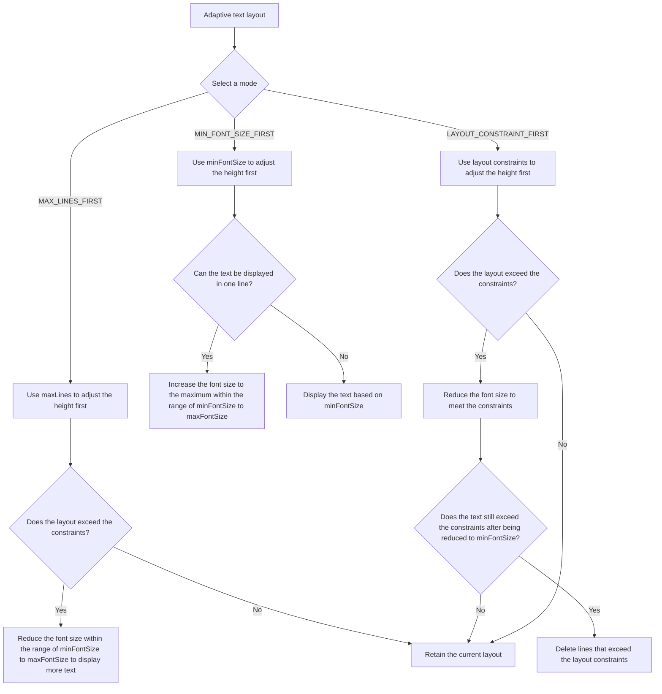
```mermaid
graph TD
  A[Adaptive text layout] --> B{Select a mode}
  B -->|MAX_LINES_FIRST| C[Use maxLines to adjust the height first]
  C --> D{Does the layout exceed the constraints?}
  D -->|Yes| E[Reduce the font size within the range of minFontSize to maxFontSize to display more text]
  D -->|No| F[Retain the current layout]
  B -->|MIN_FONT_SIZE_FIRST| G[Use minFontSize to adjust the height first]
  G --> H{Can the text be displayed in one line?}
  H -->|Yes| I[Increase the font size to the maximum within the range of minFontSize to maxFontSize]
  H -->|No| J[Display the text based on minFontSize]
  B -->|LAYOUT_CONSTRAINT_FIRST| K[Use layout constraints to adjust the height first]
  K --> L{Does the layout exceed the constraints?}
  L -->|Yes| M[Reduce the font size to meet the constraints]
  M --> N{Does the text still exceed the constraints after being reduced to minFontSize?}
  N -->|Yes| O[Delete lines that exceed the layout constraints]
  N -->|No| F
  L -->|No| F
```

- **MAX_LINES_FIRST**: prioritizes using the [maxLines](#maxlines) attribute to control text height. If the **maxLines** setting results in a layout beyond the layout constraints, the text will shrink to a font size between [minFontSize](#minfontsize) and [maxFontSize](#maxfontsize) to allow for more content to be shown.

- **MIN_FONT_SIZE_FIRST**: prioritizes using the **minFontSize** attribute to control text height. If the text fits on one line at **minFontSize**, the system attempts to increase the font size between **minFontSize** and **maxFontSize** to fill the line with the largest available font size. If the text cannot fit on a single line even at **minFontSize**, it sticks with **minFontSize**.

- **LAYOUT_CONSTRAINT_FIRST**: prioritizes using layout constraints to control text height. If the resultant layout is beyond the layout constraints, the text will shrink to a font size between **minFontSize** and **maxFontSize** to respect the layout constraints. If the text still extends beyond the layout constraints after shrinking to **minFontSize**, the lines that exceed the constraints are deleted.

**Atomic service API**: This API can be used in atomic services since API version 11.

**Model restriction**: This API can be used only in the stage model.

**System capability**: SystemCapability.ArkUI.ArkUI.Full

**Parameters**

| Name| Type                                                        | Mandatory| Description                                                        |
| ------ | ------------------------------------------------------------ | ---- | ------------------------------------------------------------ |
| value  | [TextHeightAdaptivePolicy](ts-appendix-enums.md#textheightadaptivepolicy10) | Yes  | How the adaptive height is determined for the text.|

### incrementalUpdatePolicy

incrementalUpdatePolicy(policy: IncrementalUpdatePolicy \| undefined)

Sets the incremental update policy for text rendering. If this API is not called, the default value is **IncrementalUpdatePolicy.NONE**.

This API takes effect only when the text content contains a styled string (**StyledString**).

**Since**: 26.0.0

**Atomic service API**: This API can be used in atomic services since API version 26.0.0.

**Model restriction**: This API can be used only in the stage model.

**System capability**: SystemCapability.ArkUI.ArkUI.Full

**Parameters**

| Name| Type                                                       | Mandatory| Description                                                        |
| ------ | ----------------------------------------------------------- | ---- | ------------------------------------------------------------ |
| policy | [IncrementalUpdatePolicy](ts-text-common.md#incrementalupdatepolicy) \| undefined | Yes  | Incremental update policy for text rendering.<br>If this parameter is set to **undefined**, the value **IncrementalUpdatePolicy.NONE** is used.|

### letterSpacing

letterSpacing(value: number \| ResourceStr)

Sets the letter spacing for a text style. If this API is not called, the default letter spacing is 0.

If the value specified is a percentage or **0**, the default value is used. For the string type, numeric string values with optional units, for example, **"10"** or **"10fp"**, are supported.

Negative values compress text. Excessive compression may reduce content area to zero, hiding content.

This setting applies to every character, including those at line endings.

**Widget capability**: This API can be used in ArkTS widgets since API version 9.

**Atomic service API**: This API can be used in atomic services since API version 11.

**System capability**: SystemCapability.ArkUI.ArkUI.Full

**Parameters**

| Name| Type                      | Mandatory| Description          |
| ------ | -------------------------- | ---- | -------------- |
| value  | number&nbsp;\|&nbsp;[ResourceStr](ts-types.md#resourcestr) | Yes  | Letter spacing.<br>Unit: [fp](ts-pixel-units.md#basic-pixel-units)<br>The [Resource](ts-types.md#resource) type is supported since API version 20.|

### lineBreakStrategy<sup>12+</sup>

lineBreakStrategy(strategy: LineBreakStrategy)

Sets the line break rule. This attribute takes effect only when [wordBreak](#wordbreak11) is not **WordBreak.BREAK_ALL**. Hyphens are not supported. If this API is not called, the default line break rule is **LineBreakStrategy.GREEDY**.

**Atomic service API**: This API can be used in atomic services since API version 12.

**Model restriction**: This API can be used only in the stage model.

**System capability**: SystemCapability.ArkUI.ArkUI.Full

**Parameters**

| Name  | Type                                                        | Mandatory| Description                                                   |
| -------- | ------------------------------------------------------------ | ---- | ------------------------------------------------------- |
| strategy | [LineBreakStrategy](ts-appendix-enums.md#linebreakstrategy12) | Yes  | Line break rule. For details, see **LineBreakStrategy**.|

### lineHeight

lineHeight(value: number \| string \| Resource)

Set the line height.

If this parameter and [lineHeightMultiple](#lineheightmultiple22) are set at the same time and **lineHeightMultiple** is set to a valid value, the setting of **lineHeight** does not take effect and **lineHeightMultiple** is used.

If the value is less than or equal to **0**, the line height is unrestricted and adapts to the font size. When the value is a number, the unit is fp. For the string type, numeric string values with optional units, for example, **"10"** or **"10fp"**, are supported.

>  **NOTE**
>  
>  If certain characters have significantly taller glyphs than others in the same line, layout anomalies such as clipping, overlapping, or misalignment may occur. In this case, adjust component attributes such as height and line height to ensure proper layout rendering.

**Widget capability**: This API can be used in ArkTS widgets since API version 9.

**Atomic service API**: This API can be used in atomic services since API version 11.

**System capability**: SystemCapability.ArkUI.ArkUI.Full

**Parameters**

| Name| Type                                                        | Mandatory| Description            |
| ------ | ------------------------------------------------------------ | ---- | ---------------- |
| value  | number&nbsp;\|&nbsp;string&nbsp;\|&nbsp;[Resource](ts-types.md#resource) | Yes  | Line height of the text. If the value is of the number type, the unit is fp.|

### lineHeightMultiple<sup>22+</sup>

lineHeightMultiple(value: number \| undefined)

Sets the line height of text in multiple mode.

The line height equals the input parameter **value** multiplied by **fontHeight**.

>  **NOTE**
>  
>  When **lineHeightMultiple** is set to a valid value and [lineHeight](#lineheight) or [lineSpacing](#linespacing12) is set at the same time, only **lineHeightMultiple** takes effect. If the value of **lineHeightMultiple** is less than 0, it does not take effect. In this case, use [lineHeight](#lineheight) and [lineSpacing](#linespacing12) to set the line height and line spacing.

**Widget capability**: This API can be used in ArkTS widgets since API version 22.

**Atomic service API**: This API can be used in atomic services since API version 22.

**Model restriction**: This API can be used only in the stage model.

**System capability**: SystemCapability.ArkUI.ArkUI.Full

**Parameters**

| Name| Type                                                        | Mandatory| Description            |
| ------ | ------------------------------------------------------------ | ---- | ---------------- |
| value  | number&nbsp;\|&nbsp;undefined | Yes  | Line height multiple.<br>Value range: [0, +∞)<br>**NOTE**<br>- Values less than 0 does not take effect.<br>- Value **0** functions the same as **1**, leaving line height unchanged.<br>- Decimal values are supported.<br>- If the value is **undefined**, the default line height is used.|

### lineSpacing<sup>12+</sup>

lineSpacing(value: LengthMetrics)

Sets the line spacing for the text. If the value specified is less than 0, the default value **0** is used. If this API is not called, the default line spacing is 0.

If this parameter and [lineHeightMultiple](#lineheightmultiple22) are set at the same time and **lineHeightMultiple** is set to a valid value, the setting of **lineSpacing** does not take effect and **lineHeightMultiple** is used.

**Atomic service API**: This API can be used in atomic services since API version 12.

**Model restriction**: This API can be used only in the stage model.

**System capability**: SystemCapability.ArkUI.ArkUI.Full

**Parameters**

| Name| Type                                                        | Mandatory| Description            |
| ------ | ------------------------------------------------------------ | ---- | ---------------- |
| value  | [LengthMetrics](../js-apis-arkui-graphics.md#lengthmetrics12) | Yes  | Line spacing.<br>The value range is [0, +∞). If the value is less than 0, the default value **0** is used.|

### lineSpacing<sup>20+</sup>

lineSpacing(value: LengthMetrics, options?: LineSpacingOptions)

Sets the line spacing for the text. When **LineSpacingOptions** is not specified, line spacing is applied above the first line and below the last line by default.

If this parameter and [lineHeightMultiple](#lineheightmultiple22) are set at the same time and **lineHeightMultiple** is set to a valid value, the setting of **lineSpacing** does not take effect and **lineHeightMultiple** is used.

**Atomic service API**: This API can be used in atomic services since API version 20.

**Model restriction**: This API can be used only in the stage model.

**System capability**: SystemCapability.ArkUI.ArkUI.Full

**Parameters**

| Name| Type                                                        | Mandatory| Description            |
| ------ | ------------------------------------------------------------ | ---- | ---------------- |
| value  | [LengthMetrics](../js-apis-arkui-graphics.md#lengthmetrics12) | Yes  | Line spacing. Values less than or equal to 0 are treated as the default value **0**.|
| options  | [LineSpacingOptions](ts-text-common.md#linespacingoptions20) | No  | Line spacing configuration options.<br>Default value: **{ onlyBetweenLines: false }**|

### marqueeOptions<sup>18+</sup>

marqueeOptions(options: Optional\<TextMarqueeOptions>)

Sets the marquee effect for text.

The **marqueeOptions** settings take effect only when **textOverflow** is set to **TextOverflow.MARQUEE**.

**Atomic service API**: This API can be used in atomic services since API version 18.

**Model restriction**: This API can be used only in the stage model.

**System capability**: SystemCapability.ArkUI.ArkUI.Full

**Parameters**

| Name| Type                                      | Mandatory| Description                                      |
| ------ | ------------------------------------------ | ---- | ------------------------------------------ |
| options | [Optional](ts-universal-attributes-custom-property.md#optionalt)\<[TextMarqueeOptions](#textmarqueeoptions18)> | Yes| Marquee animation properties such as enable/disable, step size, loop count, and direction.<br>If the value is **undefined**, the default value in [TextMarqueeOptions](#textmarqueeoptions18) is used.|

### maxFontScale<sup>12+</sup>

maxFontScale(scale: number \| Resource)

Sets the maximum font scale factor for text.

**Atomic service API**: This API can be used in atomic services since API version 12.

**Model restriction**: This API can be used only in the stage model.

**System capability**: SystemCapability.ArkUI.ArkUI.Full

**Parameters**

| Name| Type                                         | Mandatory| Description                                         |
| ------ | --------------------------------------------- | ---- | --------------------------------------------- |
| scale  | number \| [Resource](ts-types.md#resource) | Yes  | Maximum font scale factor for text.<br>Value range: [1, +∞)<br>**NOTE**<br>Values less than 1 are treated as **1**. Other invalid values are ineffective by default.|

### maxFontSize

maxFontSize(value: number \| string \| Resource)

Sets the maximum font size.

For the string type, numeric string values with optional units, for example, **"10"** or **"10fp"**, are supported.

For the setting to take effect, this attribute must be used together with [minFontSize](#minfontsize) and [maxLines](#maxlines), or layout constraint settings.

When the adaptive font size is used, the **fontSize** settings do not take effect.

If the value of **maxFontSize** is less than or equal to 0 or is less than the value of **minFontSize**, the adaptive font sizing feature is disabled. In such cases, the [fontSize](#fontsize) attribute is used instead. If **fontSize** is not set, the default value will apply.

Since API version 18, adaptive font sizing is supported on child components and styled strings, and text segments without an explicitly defined font size will automatically adjust based on the available space.

**Widget capability**: This API can be used in ArkTS widgets since API version 9.

**Atomic service API**: This API can be used in atomic services since API version 11.

**System capability**: SystemCapability.ArkUI.ArkUI.Full

**Parameters**

| Name| Type                                                        | Mandatory| Description              |
| ------ | ------------------------------------------------------------ | ---- | ------------------ |
| value  | number&nbsp;\|&nbsp;string&nbsp;\|&nbsp;[Resource](ts-types.md#resource) | Yes  | Maximum font size.<br>The value must be greater than 0 and greater than or equal to the value of **minFontSize**.<br>Unit: [fp](ts-pixel-units.md#basic-pixel-units)<br>**NOTE**<br>If the value is less than or equal to 0 or less than the value of **minFontSize**, the adaptive font size does not take effect. In this case, the value of **fontSize** takes effect.|

### maxLineHeight<sup>22+</sup>

maxLineHeight(value: LengthMetrics \| undefined)

Sets the maximum line height of text. If the value is less than or equal to 0, the maximum line height is unrestricted. If this API is not called, the maximum line height is unrestricted (the value is **undefined**).

If **maxLineHeight** is less than **minLineHeight**, **maxLineHeight** takes effect using the value of **minLineHeight**.

**Widget capability**: This API can be used in ArkTS widgets since API version 22.

**Atomic service API**: This API can be used in atomic services since API version 22.

**Model restriction**: This API can be used only in the stage model.

**System capability**: SystemCapability.ArkUI.ArkUI.Full

**Parameters**

| Name| Type                                                        | Mandatory| Description            |
| ------ | ------------------------------------------------------------ | ---- | ---------------- |
| value  | [LengthMetrics](../js-apis-arkui-graphics.md#lengthmetrics12)&nbsp;\|&nbsp;undefined | Yes  | Maximum line height of text. Percentage values are not supported.<br>Values less than or equal to 0 are treated as **0**. When the value is set to **0**, the maximum line height is unrestricted.<br>If the value is **undefined**, this parameter does not take effect.|

### selectedDragPreviewStyle<sup>23+</sup>

selectedDragPreviewStyle(value: SelectedDragPreviewStyle \| undefined)

Sets the drag preview style for selected text.

**Atomic service API**: This API can be used in atomic services since API version 23.

**Model restriction**: This API can be used only in the stage model.

**System capability**: SystemCapability.ArkUI.ArkUI.Full

**Parameters**

| Name| Type                                            | Mandatory| Description                                                      |
| ------ | ------------------------------------------------ | ---- | ---------------------------------------------------------- |
| value  | [SelectedDragPreviewStyle](ts-text-common.md#selecteddragpreviewstyle23) \| undefined| Yes  | Drag preview style for selected text.<br>If this parameter is set to **undefined**, the drag preview follows the theme: white in light mode and black in dark mode.|

### maxLines

maxLines(value: number)

Sets the maximum number of lines for text. If this parameter and [minLines](#minlines22) are set at the same time, the display range of the minimum number of lines does not exceed the value of **maxLines**.

By default, text is automatically folded. If this attribute is specified, the text will not exceed the specified number of lines. If there is extra text, you can use [textOverflow](#textoverflow) to specify how it is displayed.

**Widget capability**: This API can be used in ArkTS widgets since API version 9.

**Atomic service API**: This API can be used in atomic services since API version 11.

**System capability**: SystemCapability.ArkUI.ArkUI.Full

**Parameters**

| Name| Type  | Mandatory| Description            |
| ------ | ------ | ---- | ---------------- |
| value  | number | Yes  | Maximum number of lines of the text.<br>**NOTE**<br>Value range: [0, *INT32_MAX*]<br>If this parameter is set to **0**, no text content is displayed.|

### minFontScale<sup>12+</sup>

minFontScale(scale: number \| Resource)

Sets the minimum font scale factor for text.

**Atomic service API**: This API can be used in atomic services since API version 12.

**Model restriction**: This API can be used only in the stage model.

**System capability**: SystemCapability.ArkUI.ArkUI.Full

**Parameters**

| Name| Type                                         | Mandatory| Description                                         |
| ------ | --------------------------------------------- | ---- | --------------------------------------------- |
| scale  | number \| [Resource](ts-types.md#resource) | Yes  | Minimum font scale factor for text.<br>Value range: [0, 1]<br>**NOTE**<br>Values less than 0 are treated as 0, and values greater than 1 are treated as 1. Other invalid values do not take effect by default.|

### minFontSize

minFontSize(value: number \| string \| Resource)

Sets the minimum font size.

For the string type, numeric string values with optional units, for example, **"10"** or **"10fp"**, are supported.

For the setting to take effect, this attribute must be used together with [maxFontSize](#maxfontsize) and [maxLines](#maxlines), or layout constraint settings.

When the adaptive font size is used, the **fontSize** settings do not take effect.

If the value of **minFontSize** is less than or equal to 0, the adaptive font sizing feature is disabled. In such cases, the [fontSize](#fontsize) attribute is used instead. If **fontSize** is not set, the default value will apply.

Since API version 18, adaptive font sizing is supported on child components and styled strings, and text segments without an explicitly defined font size will automatically adjust based on the available space.

**Widget capability**: This API can be used in ArkTS widgets since API version 9.

**Atomic service API**: This API can be used in atomic services since API version 11.

**System capability**: SystemCapability.ArkUI.ArkUI.Full

**Parameters**

| Name| Type                                                        | Mandatory| Description              |
| ------ | ------------------------------------------------------------ | ---- | ------------------ |
| value  | number&nbsp;\|&nbsp;string&nbsp;\|&nbsp;[Resource](ts-types.md#resource) | Yes  | Minimum font size.<br>The value must be greater than **0**.<br>Unit: [fp](ts-pixel-units.md#basic-pixel-units)<br>**NOTE**<br>If the value is less than or equal to 0, the adaptive font size does not take effect. In this case, the value of **fontSize** takes effect.|

### minLineHeight<sup>22+</sup>

minLineHeight(value: LengthMetrics \| undefined)

Sets the minimum line height of text. If the value is less than or equal to 0, the default value **0** is used. If the value of [maxLineHeight](#maxlineheight22) is less than that of **minLineHeight**, the value of **minLineHeight** takes effect.

**Widget capability**: This API can be used in ArkTS widgets since API version 22.

**Atomic service API**: This API can be used in atomic services since API version 22.

**Model restriction**: This API can be used only in the stage model.

**System capability**: SystemCapability.ArkUI.ArkUI.Full

**Parameters**

| Name| Type                                                        | Mandatory| Description            |
| ------ | ------------------------------------------------------------ | ---- | ---------------- |
| value  | [LengthMetrics](../js-apis-arkui-graphics.md#lengthmetrics12)&nbsp;\|&nbsp;undefined | Yes  | Minimum line height of text. Percentage values are not supported.<br>Values less than or equal to 0 are treated as **0**.<br>If the value is **undefined**, this parameter does not take effect.|

### minLines<sup>22+</sup>

minLines(minLines: Optional\<number>)

Sets the minimum number of lines for text.

If the actual text height is less than the height for the minimum number of lines, the component uses the height corresponding to the minimum number of lines.

If this parameter and [maxLines](#maxlines) are set at the same time, the display height corresponding to the minimum number of lines does not exceed the height limit corresponding to the maximum number of lines.

If [constraintSize](ts-universal-attributes-size.md#constraintsize) is set for the text, the component height is confined within the [constraintSize](ts-universal-attributes-size.md#constraintsize) bounds.

**Widget capability**: This API can be used in ArkTS widgets since API version 22.

**Atomic service API**: This API can be used in atomic services since API version 22.

**Model restriction**: This API can be used only in the stage model.

**System capability**: SystemCapability.ArkUI.ArkUI.Full

**Parameters**

| Name| Type                                     | Mandatory| Description                                                        |
| ------ | ----------------------------------------- | ---- | ------------------------------------------------------------ |
| minLines  | [Optional](ts-universal-attributes-custom-property.md#optionalt)\<number> | Yes  | Minimum number of lines of the text.<br>Value range: [0, *INT32_MAX*]<br>Values less than 0 are clamped to **0**.<br>If the value is **undefined**, the minimum number of lines is not limited.<br>**NOTE**<br>If this parameter and [maxLines](#maxlines) are set at the same time, the display height corresponding to the minimum number of lines does not exceed the height limit corresponding to the maximum number of lines.|

### includeFontPadding<sup>23+</sup>

includeFontPadding(include: Optional\<boolean>)

Sets whether to add spacing to the first and last lines to avoid text truncation. If this attribute is not set, no spacing is added by default.

**Atomic service API**: This API can be used in atomic services since API version 23.

**Model restriction**: This API can be used only in the stage model.

**System capability**: SystemCapability.ArkUI.ArkUI.Full

**Parameters**

| Name | Type                                                        | Mandatory| Description                                                        |
| ------- | ------------------------------------------------------------ | ---- | ------------------------------------------------------------ |
| include | [Optional](ts-universal-attributes-custom-property.md#optionalt)\<boolean> | Yes  | Whether to add spacing to the first and last lines to avoid text truncation.<br>**true**: Spacing is added to the first and last lines. **false**: Spacing is not added to the first and last lines.<br>**undefined**: Spacing is not added to the first and last lines.|

### fallbackLineSpacing<sup>23+</sup>

fallbackLineSpacing(enabled: Optional\<boolean>)

Adapts the line height to the actual text height for overlapped multi-line text. This API takes effect only when the line height is less than the actual text height. If this API is not set, the line height does not adapt to the actual text height by default.

**Atomic service API**: This API can be used in atomic services since API version 23.

**Model restriction**: This API can be used only in the stage model.

**System capability**: SystemCapability.ArkUI.ArkUI.Full

**Parameters**

| Name | Type                                                        | Mandatory| Description                                                        |
| ------- | ------------------------------------------------------------ | ---- | ------------------------------------------------------------ |
| enabled | [Optional](ts-universal-attributes-custom-property.md#optionalt)\<boolean> | Yes  | Whether the line height adapts to the actual text height.<br>**true**: Line height adapts to the actual text height. **false**: Line height does not adapt to the actual text height.<br>**undefined**: Line height does not adapt to the actual text height.|

### optimizeTrailingSpace<sup>20+</sup>

optimizeTrailingSpace(optimize: Optional\<boolean>)

Sets whether to optimize trailing spaces at line endings during text layout, resolving alignment display issues caused by trailing spaces. If this API is not called, trailing spaces at the end of each line are not optimized by default.

When **Text.optimizeTrailingSpace** is set to **true**:

* Trailing space optimization applies to multi-line text, single-line text, and text and image layouts (particularly noticeable with **TextAlign.Center** or **TextAlign.End**).

* For text containing only spaces, decoration lines, shadows, and background colors follow the space text display.

* Leading spaces are not optimized. When text with trailing spaces wraps, trailing spaces on each line are optimized based on component width.

When optimizing pure space text by setting [optimizeTrailingSpace](#optimizetrailingspace20) to **true**, you cannot simultaneously set [backgroundColor](ts-universal-attributes-background.md#backgroundcolor), [decoration](#decoration), and [textAlign](#textalign) attributes.

**Atomic service API**: This API can be used in atomic services since API version 20.

**Model restriction**: This API can be used only in the stage model.

**System capability**: SystemCapability.ArkUI.ArkUI.Full

**Parameters**

| Name          | Type            | Mandatory| Description                                           |
| ---------------- | ------- | ---- | ----------------------------------------------- |
| optimize         | [Optional](ts-universal-attributes-custom-property.md#optionalt)\<boolean> | Yes  | Whether to optimize trailing spaces.<br>**true** to optimize, **false** otherwise.<br>If the value is **undefined**, trailing spaces are not optimized.|

### compressLeadingPunctuation<sup>23+</sup>

compressLeadingPunctuation(enabled: Optional\<boolean>)

Sets whether to enable leading punctuation compression.

> **NOTE**
>
> - Leading punctuation is not compressed by default.
>
> - For the range of punctuation marks that support leading compression, see [ParagraphStyle](../../apis-arkgraphics2d/js-apis-graphics-text.md#paragraphstyle).

**Atomic service API**: This API can be used in atomic services since API version 23.

**Model restriction**: This API can be used only in the stage model.

**System capability**: SystemCapability.ArkUI.ArkUI.Full

**Parameters**

| Name| Type   | Mandatory| Description                              |
| ------ | ------- | ---- | ---------------------------------- |
| enabled | [Optional](ts-universal-attributes-custom-property.md#optionalt)\<boolean> | Yes  | Whether to enable leading punctuation compression.<br>The value **true** indicates to enable leading punctuation compression, and **false** indicates the opposite. The value **undefined** indicates that leading punctuation compression is disabled.|

### orphanCharOptimization

orphanCharOptimization(enabled: Optional\<boolean>)

Sets whether to enable orphan character optimization during text typesetting. If this attribute is not set, orphan character optimization is disabled by default.

Orphan character optimization improves the text layout by handling the orphan character (the first Chinese character of the last line of a paragraph) more efficiently. When enabled, it adjusts line breaks to avoid orphan characters as much as possible. This feature takes effect only when [wordBreak](#wordbreak11) is not **BREAK_ALL** and [locale](../../apis-arkgraphics2d/js-apis-graphics-text.md#textstyle) of the first [TextStyle](../../apis-arkgraphics2d/js-apis-graphics-text.md#textstyle) of the text to be typeset is either **"zh-Hans"** or **"zh-Hant"**.

**Since**: 26.0.0

**Atomic service API**: This API can be used in atomic services since API version 26.0.0.

**Model restriction**: This API can be used only in the stage model.

**System capability**: SystemCapability.ArkUI.ArkUI.Full

**Parameters**

| Name          | Type            | Mandatory| Description                                           |
| ---------------- | ------- | ---- | ----------------------------------------------- |
| enabled         | [Optional](ts-universal-attributes-custom-property.md#optionalt)\<boolean> | Yes| Whether to enable orphan character optimization for the last line of the paragraph.<br>**true**: Orphan character optimization is enabled. **false**: Orphan character optimization is disabled.<br>When the value is **undefined** or **null**, orphan character optimization is disabled.|

### privacySensitive<sup>12+</sup>

privacySensitive(supported: boolean)

Sets whether to enable privacy mode on widgets. If this API is not called, privacy mode is not enabled on widgets by default.

**Widget capability**: This API can be used in ArkTS widgets since API version 12.

**Atomic service API**: This API can be used in atomic services since API version 12.

**Model restriction**: This API can be used only in the stage model.

**System capability**: SystemCapability.ArkUI.ArkUI.Full

**Parameters**

| Name   | Type   | Mandatory| Description                                                        |
| --------- | ------- | ---- | ------------------------------------------------------------ |
| supported | boolean | Yes  | Whether to enable privacy mode on widgets.<br>The value **true** indicates to enable privacy mode on widgets. In privacy mode, the text will be masked with hyphens (-). The value **false** indicates to disable privacy mode on widgets. In privacy mode, the text is displayed properly.<br>**NOTE**<br>The value **null** means not to enable privacy mode on widgets.<br>Enabling privacy mode requires support from the widget framework. You can use [obscured](./ts-universal-attributes-obscured.md#obscured) to set how the component content is obscured.|

### punctuationOverflow

punctuationOverflow(enabled: Optional\<boolean>)

Sets whether to enable hanging punctuation at line ends. Hanging punctuation is disabled by default if this API is not specified.

**Since**: 26.0.0

**Atomic service API**: This API can be used in atomic services since API version 26.0.0.

**Model restriction**: This API can be used only in the stage model.

**System capability**: SystemCapability.ArkUI.ArkUI.Full

**Parameters**

| Name| Type| Mandatory| Description|
| ------ | ----- | ---- | ---- |
| enabled | [Optional](ts-universal-attributes-custom-property.md#optionalt)\<boolean> | Yes| Whether to enable punctuation hanging at the end of a line.<br>**true**: enable punctuation hanging. **false**: disable punctuation hanging. When the value is **undefined** or **null**, hanging punctuation is disabled.|

### selectedBackgroundColor<sup>14+</sup>

selectedBackgroundColor(color: ResourceColor)

Sets the background color of the selected text. If opacity is not set, the default opacity is 20%. If this API is not called, the default background color of the selected text is **'#007DFF'** (blue).

**Atomic service API**: This API can be used in atomic services since API version 14.

**Model restriction**: This API can be used only in the stage model.

**System capability**: SystemCapability.ArkUI.ArkUI.Full

**Parameters**

| Name| Type                                      | Mandatory| Description                                      |
| ------ | ------------------------------------------ | ---- | ------------------------------------------ |
| color  | [ResourceColor](ts-types.md#resourcecolor) | Yes  | Background color of the selected text.|

### selection<sup>11+</sup>

selection(selectionStart: number, selectionEnd: number)

Sets text selection. If this API is not called, no text selection is set by default (both **selectionStart** and **selectionEnd** are set to **-1**).

The selected text is highlighted, with selection handles and the text selection menu displayed.

If [copyOption](#copyoption9) is set to **CopyOptions.None**, the setting of the **selection** attribute does not take effect.

If [textOverflow](#textoverflow) is set to **TextOverflow.MARQUEE**, the setting of the **selection** attribute does not take effect.

If the value of **selectionStart** is greater than or equal to that of **selectionEnd**, no text will be selected. The value range is [0, textSize], where **textSize** indicates the maximum number of characters in the text content. If the value is less than 0, the value **0** will be used. If the value is greater than **textSize**, **textSize** will be used.

If the selection range falls within a truncated or invisible area, selection is ignored. When [clip](./ts-universal-attributes-sharp-clipping.md#clip12) is set to **false**, the text outside the parent component can be selected.

You can obtain the selection range change result through the [onTextSelectionChange](#ontextselectionchange11) API.

**Atomic service API**: This API can be used in atomic services since API version 11.

**Model restriction**: This API can be used only in the stage model.

**System capability**: SystemCapability.ArkUI.ArkUI.Full

**Parameters**

| Name        | Type  | Mandatory| Description                                |
| -------------- | ------ | ---- | ------------------------------------ |
| selectionStart | number | Yes  | Start position of the selected text.<br>Value range: [0, textSize], where **textSize** indicates the maximum number of characters in the text content. If the value of the input parameter is less than 0, the value **0** is used. If the value of the input parameter is greater than that of **textSize**, the value of **textSize** is used.|
| selectionEnd   | number | Yes  | End position of the selected text.<br>Value range: [0, textSize], where **textSize** indicates the maximum number of characters in the text content. If the value of the input parameter is less than 0, the value **0** is used. If the value of the input parameter is greater than that of **textSize**, the value of **textSize** is used.|

### shaderStyle<sup>20+</sup>

shaderStyle(shader: ShaderStyle)

The text can be displayed in the [RadialGradientStyle](ts-text-common.md#radialgradientstyle20), [LinearGradientStyle](ts-text-common.md#lineargradientstyle20), or [ColorShaderStyle](ts-text-common.md#colorshaderstyle20) effect. The priority of **shaderStyle** is higher than that of [fontColor](#fontcolor) and AI recognition. You are advised to use [fontColor](#fontcolor) for solid colors.

**Atomic service API**: This API can be used in atomic services since API version 20.

**Model restriction**: This API can be used only in the stage model.

**System capability**: SystemCapability.ArkUI.ArkUI.Full

**Parameters**

<!--Table: 10%; auto; 10%; auto-->
| Name    | Type                                        | Mandatory                            | Description                              |
| -------------- | -------------------------------------------- | ----------------------------------- | ----------------------------------- |
| shader | [ShaderStyle](ts-text-common.md#shaderstyle20) | Yes| Shader effect.<br>[RadialGradientStyle](ts-text-common.md#radialgradientstyle20), [LinearGradientStyle](ts-text-common.md#lineargradientstyle20), or [ColorShaderStyle](ts-text-common.md#colorshaderstyle20) is processed based on the input parameters, and the gradient color effect is displayed on the text.<br>**NOTE**<br>If [RadialGradientStyle](ts-text-common.md#radialgradientstyle20) is used and the **center** parameter (from [RadialGradientOptions](./ts-universal-attributes-gradient-color.md#radialgradientoptions18)) is outside the component bounds, setting **repeating** to **true** enhances the gradient effect.|

### textAlign

textAlign(value: TextAlign)

Sets the horizontal alignment of the text. If this API is not called, the default horizontal alignment mode of text paragraphs is **TextAlign.Start**. The default value is **TextAlign.Center** on wearables.

When [textOverflow](#textoverflow) is set to **TextOverflow.MARQUEE** and the text is scrollable, the **textAlign** attribute does not take effect.

The text takes up the full width of the **Text** component.

The vertical position of the text paragraph can be controlled by the [align](ts-universal-attributes-location.md#align) attribute, but the horizontal position cannot be controlled by **align** in this component. The specific effects are as follows:

- **Alignment.TopStart**, **Alignment.Top**, **Alignment.TopEnd**: Content aligns to the top.

- **Alignment.Start**, **Alignment.Center**, **Alignment.End**: Content is centered vertically.

- **Alignment.BottomStart**, **Alignment.Bottom**, **Alignment.BottomEnd:** Content aligns to the bottom.

When **textAlign** is set to **TextAlign.JUSTIFY**, the [wordBreak](#wordbreak11) property must be configured according to the text content. The last line of text aligns to the start horizontally and does not participate in justification.

>  **NOTE** 
>
>  **textAlign** only adjusts the overall text layout and does not affect character display order. For character display order adjustment, see [Bidirectional Text Layout and Alignment](../../../ui/arkts-internationalization.md#bidirectional-text-layout-and-alignment).

**Widget capability**: This API can be used in ArkTS widgets since API version 9.

**Atomic service API**: This API can be used in atomic services since API version 11.

**System capability**: SystemCapability.ArkUI.ArkUI.Full

**Parameters**

| Name| Type                                       | Mandatory| Description                                                      |
| ------ | ------------------------------------------- | ---- | ---------------------------------------------------------- |
| value  | [TextAlign](ts-appendix-enums.md#textalign) | Yes  | Horizontal alignment of the text.<br>**NOTE**<br>When **TextAlign** is set to **TextAlign.JUSTIFY**, the [wordBreak](#wordbreak11) attribute must be configured according to the text content. The last line of text aligns to the start horizontally and does not participate in justification.|

### textCase

textCase(value: TextCase)

Sets the text case. If this API is not called, the default text case is **TextCase.Normal**.

**Widget capability**: This API can be used in ArkTS widgets since API version 9.

**Atomic service API**: This API can be used in atomic services since API version 11.

**System capability**: SystemCapability.ArkUI.ArkUI.Full

**Parameters**

| Name| Type                                     | Mandatory| Description                                     |
| ------ | ----------------------------------------- | ---- | ----------------------------------------- |
| value  | [TextCase](ts-appendix-enums.md#textcase) | Yes  | Text case.|

### textContentAlign<sup>21+</sup>

textContentAlign(textContentAlign: Optional\<TextContentAlign>)

Sets the vertical alignment of the text content area within the component.

This API takes effect only when the height of the text content exceeds the component's height.

**Atomic service API**: This API can be used in atomic services since API version 21.

**Model restriction**: This API can be used only in the stage model.

**System capability**: SystemCapability.ArkUI.ArkUI.Full

**Parameters**

| Name| Type                                       | Mandatory| Description                                                      |
| ------ | ------------------------------------------- | ---- | ---------------------------------------------------------- |
| textContentAlign  | [Optional](ts-universal-attributes-custom-property.md#optionalt)\<[TextContentAlign](ts-text-common.md#textcontentalign21)> | Yes  | Vertical alignment of the text content area within the component.<br>If the value is **undefined** or invalid, alignment defaults to **Center**.|

### textDirection<sup>23+</sup>

textDirection(direction: TextDirection \| undefined)

Specifies the text layout direction. If this attribute is not set, the default text layout direction follows the component layout direction.

**Atomic service API**: This API can be used in atomic services since API version 23.

**Model restriction**: This API can be used only in the stage model.

**System capability**: SystemCapability.ArkUI.ArkUI.Full

**Parameters**

| Name| Type                                       | Mandatory| Description                                                      |
| ------ | ------------------------------------------- | ---- | ---------------------------------------------------------- |
| direction  | [TextDirection](ts-text-common.md#textdirection22) \| undefined | Yes  | Text layout direction.<br>If this parameter is set to **undefined**, the text layout direction follows the component layout direction as defined by **TextDirection.DEFAULT**.|

### textIndent<sup>10+</sup>

textIndent(value: Length)

Sets the indent of the first line text. If this API is not called, the default indent of the first line text is 0.

**Atomic service API**: This API can be used in atomic services since API version 11.

**Model restriction**: This API can be used only in the stage model.

**System capability**: SystemCapability.ArkUI.ArkUI.Full

**Parameters**

| Name| Type                        | Mandatory| Description                        |
| ------ | ---------------------------- | ---- | ---------------------------- |
| value  | [Length](ts-types.md#length) | Yes  | Indent of the first line text.<br>Unit: [fp](ts-pixel-units.md#basic-pixel-units)<br>The value must be greater than or equal to 0. If the value is a negative number, the default value is used.|

### tailIndents

tailIndents(value: Optional\<LengthMetrics \| Array\<LengthMetrics>>)

Sets the indent of the text tail. If this API is not called, the default indent of the text tail is 0 fp.

**Since**: 26.0.0

**Atomic service API**: This API can be used in atomic services since API version 26.0.0.

**Model restriction**: This API can be used only in the stage model.

**System capability**: SystemCapability.ArkUI.ArkUI.Full

**Parameters**

| Name| Type                        | Mandatory| Description                        |
| ------ | ---------------------------- | ---- | ---------------------------- |
| value  | [Optional](ts-universal-attributes-custom-property.md#optionalt)&lt;[LengthMetrics](../js-apis-arkui-graphics.md#lengthmetrics12) \| Array&lt;[LengthMetrics](../js-apis-arkui-graphics.md#lengthmetrics12)&gt;&gt; | Yes  | Tail indentation of each line of text. If a single **LengthMetrics** value is provided, all lines share the same tail indentation. If an array is provided, the *i*th element specifies the tail indentation for the *i*th line. If the number of text lines exceeds the array length, the last element in the array is used for the remaining lines. The value cannot be in percentage.<br>The value must be greater than or equal to 0. If the value is a negative number, the default value is used.|

### textOverflow

textOverflow(options: TextOverflowOptions)

Sets the display mode for overflowing text.

When [TextOverflowOptions](#textoverflowoptions18) is set to **TextOverflow.None**, **TextOverflow.Clip**, or **TextOverflow.Ellipsis**:

- **TextOverflow.None** or **TextOverflow.Clip**: Text is truncated when it exceeds the maximum number of lines.

- **TextOverflow.Ellipsis**: An ellipsis (...) is used to represent text overflow.

- This must be used with [maxLines](#maxlines) for the settings to take effect.

- Line breaking behavior is controlled by [wordBreak](#wordbreak11). By default, it uses **WordBreak.BREAK_WORD**, which breaks text by word (for example, English text is broken at word boundaries). To break text by character, set **wordBreak** to **WordBreak.BREAK_ALL**.

- Line wrapping behavior is governed by [lineBreakStrategy](#linebreakstrategy12) which takes effect only when [wordBreak](#wordbreak11) is not **WordBreak.BREAK_ALL**. Hyphens are not supported.

- Since API version 11, it is recommended that you configure both [textOverflow](#textoverflow) and [wordBreak](#wordbreak11) to control truncation behavior. For details, see [Example 4: Setting Text Wrapping and Line Breaking](#example-4-setting-text-wrapping-and-line-breaking)<!--RP1--><!--RP1End-->.

When **TextOverflowOptions** is set to **TextOverflow.MARQUEE**:

- Text scrolls horizontally within a single line.

- The [maxLines](#maxlines), [copyOption](#copyoption9), and [selection](#selection11) attributes do not take effect, and special text entities cannot be recognized (that is, the attributes do not take effect when **enable** in [enableDataDetector](#enabledatadetector11) is set to **true**).

- The [clip](ts-universal-attributes-sharp-clipping.md#clip12) attribute of the **Text** component defaults to **true**.

- [CustomSpan](ts-universal-styled-string.md#customspan) is not supported in marquee mode.

- Behavior of [textAlign](#textalign): If the text does not scroll, **textAlign** applies; if the text scrolls, **textAlign** is ignored.

- Since API version 12, **TextOverflow.MARQUEE** is available for the **ImageSpan** component, where the text and images are allowed to scroll within a single line.

**Widget capability**: This API can be used in ArkTS widgets since API version 9.

**Atomic service API**: This API can be used in atomic services since API version 11.

**System capability**: SystemCapability.ArkUI.ArkUI.Full

**Parameters**

| Name| Type                                                        | Mandatory| Description                                                        |
| ------ | ------------------------------------------------------------ | ---- | ------------------------------------------------------------ |
| options | [TextOverflowOptions](#textoverflowoptions18) | Yes  | Configuration object for the display mode of extra-long text. It contains the overflow attribute, which specifies the display behavior such as truncation, ellipsis, or marquee.|

### textSelectable<sup>12+</sup>

textSelectable(mode: TextSelectableMode)

Sets whether the text is selectable and focusable. If this API is not called, the default text can be selected but cannot be focused (**TextSelectableMode.SELECTABLE_UNFOCUSABLE**).

This attribute must be used in conjunction with [copyOption](#copyoption9). If **copyOption** is set to **CopyOptions.None**, the **textSelectable** attribute does not take effect.

**Atomic service API**: This API can be used in atomic services since API version 12.

**Model restriction**: This API can be used only in the stage model.

**System capability**: SystemCapability.ArkUI.ArkUI.Full

**Parameters**

| Name| Type                                         | Mandatory| Description                                         |
| ------ | --------------------------------------------- | ---- | --------------------------------------------- |
| mode  | [TextSelectableMode](ts-appendix-enums.md#textselectablemode12) | Yes  | Whether the text is selectable and focusable.|

### textShadow<sup>10+</sup>

textShadow(value: ShadowOptions \| Array&lt;ShadowOptions&gt;)

Sets the text shadow.

Intelligent color extraction is not supported for the **type**, **fill**, and **color** fields of the **ShadowOptions** object.

Since API version 11, this API supports input parameters in an array to implement multiple text shadows.

**Widget capability**: This API can be used in ArkTS widgets since API version 10.

**Atomic service API**: This API can be used in atomic services since API version 11.

**Model restriction**: This API can be used only in the stage model.

**System capability**: SystemCapability.ArkUI.ArkUI.Full

**Parameters**

| Name| Type                                                        | Mandatory| Description          |
| ------ | ------------------------------------------------------------ | ---- | -------------- |
| value  | [ShadowOptions](ts-universal-attributes-image-effect.md#shadowoptions)&nbsp;\|&nbsp;&nbsp;Array&lt;[ShadowOptions](ts-universal-attributes-image-effect.md#shadowoptions)&gt;<sup>11+</sup> | Yes  | Text shadow effect, which is used to configure the visual effect of the text shadow. **ShadowOptions** contains configuration items such as **radius** (shadow radius), **color** (shadow color), **offsetX** (horizontal offset), and **offsetY** (vertical offset). Intelligent color extraction is not supported for the **type**, **fill**, and **color** fields. Since API version 11, input parameters can be passed in an array to implement multiple text shadows.|

### textVerticalAlign<sup>20+</sup>

textVerticalAlign(textVerticalAlign: Optional\<TextVerticalAlign>)

Sets the vertical alignment of the text. If this API is not called, the default vertical alignment of the text is **TextVerticalAlign.BASELINE**.

> **NOTE**
>
> - When this API and [halfLeading](#halfleading12) are both set, **halfLeading** does not take effect.
> - The effect of this attribute is noticeable only when the same font size is used in a paragraph and [lineHeight](#lineheight) is set, or when different font sizes are mixed in a paragraph. Otherwise, the effect is the same regardless of whether this attribute is set or which enum value is used. The **SuperscriptStyle** in [TextStyle](ts-universal-styled-string.md#textstyle) takes effect only when the value of [TextVerticalAlign](ts-text-common.md#textverticalalign20) is set to **TextVerticalAlign.BASELINE**. In other vertical alignment modes, the superscript and subscript texts are displayed in the same way as the normal text.

**Atomic service API**: This API can be used in atomic services since API version 20.

**Model restriction**: This API can be used only in the stage model.

**System capability**: SystemCapability.ArkUI.ArkUI.Full

**Parameters**

| Name| Type                                       | Mandatory| Description                                                      |
| ------ | ------------------------------------------- | ---- | ---------------------------------------------------------- |
| textVerticalAlign  | [Optional](ts-universal-attributes-custom-property.md#optionalt)\<[TextVerticalAlign](ts-text-common.md#textverticalalign20)> | Yes  | Vertical alignment of the text.<br>Default value: **TextVerticalAlign.BASELINE**<br>If this parameter is set to **undefined**, the text is aligned with the baseline, which is equivalent to **TextVerticalAlign.BASELINE**.|

### wordBreak<sup>11+</sup>

wordBreak(value: WordBreak)

Sets the word break rule. If this API is not called, the default word break rule is **WordBreak.BREAK_WORD**.

By default, when **wordBreak** is not called or is set to **WordBreak.BREAK_WORD**, text is broken by word. (for example, English text is broken at word boundaries).

To break text by character, with the excess part displayed as an ellipsis (...), use **WordBreak.BREAK_ALL** in combination with **{overflow: TextOverflow.Ellipsis}** and **maxLines**.

**Atomic service API**: This API can be used in atomic services since API version 11.

**Model restriction**: This API can be used only in the stage model.

**System capability**: SystemCapability.ArkUI.ArkUI.Full

**Parameters**

| Name| Type                                         | Mandatory| Description                                         |
| ------ | --------------------------------------------- | ---- | --------------------------------------------- |
| value  | [WordBreak](ts-appendix-enums.md#wordbreak11) | Yes  | Word break rule.|

## TextSpanType<sup>11+</sup>

Provides the [span](ts-basic-components-span.md) type information.

**Model restriction**: This API can be used only in the stage model.

**System capability**: SystemCapability.ArkUI.ArkUI.Full

| Name| Value| Description|
| -------- | ---- | -------- |
| TEXT | 0 | Text span.<br>**Atomic service API**: This API can be used in atomic services since API version 12.|
| IMAGE | 1 | Image span.<br>**Atomic service API**: This API can be used in atomic services since API version 12.|
| MIXED | 2 | Mixed span, which contains both text and imagery.<br>**Atomic service API**: This API can be used in atomic services since API version 12.|
| DEFAULT<sup>15+</sup> | 3 | When this type is registered but **TEXT**, **IMAGE**, or **MIXED** types are not registered, this type will be triggered and displayed for those registered types.<br>**Atomic service API**: This API can be used in atomic services since API version 15.|

>  **NOTE**
>
>  The system follows the priority order below when determining the menu type to display during text interactions:
>  1. Check whether a menu is registered for **TextSpanType.TEXT** and **TextResponseType.LONG_PRESS**.
>  2. Check whether a menu is registered for **TextSpanType.TEXT** and **TextResponseType.DEFAULT**.
>  3. Check whether a menu is registered for **TextSpanType.DEFAULT** and **TextResponseType.LONG_PRESS**.
>  4. Check whether a menu is registered for **TextSpanType.DEFAULT** and **TextResponseType.DEFAULT**.

## TextResponseType<sup>11+</sup>

Response type of the menu.

**Model restriction**: This API can be used only in the stage model.

**System capability**: SystemCapability.ArkUI.ArkUI.Full

| Name        | Value|  Description         |
| ---------- | --- | ------------- |
| RIGHT_CLICK | 0 | The menu is displayed when the component is right-clicked.<br>**Atomic service API**: This API can be used in atomic services since API version 12.|
| LONG_PRESS  | 1 | The menu is displayed when the component is long-pressed.<br>**Atomic service API**: This API can be used in atomic services since API version 12.|
| SELECT | 2 | The menu is displayed when the component is selected.<br>**Atomic service API**: This API can be used in atomic services since API version 12.|
| DEFAULT<sup>15+</sup> | 3 | When this type is registered but **RIGHT_CLICK**, **LONG_PRESS**, or **SELECT** types are not registered, this type will be triggered and displayed for right-click, long press, mouse selection, and [selection](#selection11) API calls.<br>**Atomic service API**: This API can be used in atomic services since API version 15.|

>  **NOTE**
>
>  The system follows the priority order below when determining the menu type to display during text interactions:
>  1. Check whether a menu is registered for **TextSpanType.TEXT** and **TextResponseType.LONG_PRESS**.
>  2. Check whether a menu is registered for **TextSpanType.TEXT** and **TextResponseType.DEFAULT**.
>  3. Check whether a menu is registered for **TextSpanType.DEFAULT** and **TextResponseType.LONG_PRESS**.
>  4. Check whether a menu is registered for **TextSpanType.DEFAULT** and **TextResponseType.DEFAULT**.

## TextOverflowOptions<sup>18+</sup>

Defines the configuration object for text overflow behavior.

> **NOTE**
>
> To standardize anonymous object definitions, the element definitions here have been revised in API version 18. While historical version information is preserved for anonymous objects, there may be cases where the outer element's @since version number is higher than inner elements'. This does not affect interface usability.

**Widget capability**: This API can be used in ArkTS widgets since API version 18.

**Atomic service API**: This API can be used in atomic services since API version 18.

**Model restriction**: This API can be used only in the stage model.

**System capability**: SystemCapability.ArkUI.ArkUI.Full

| Name| Type                                                        | Read-Only| Optional| Description                                                        |
| ------ | ------------------------------------------------------------ | ---- |---- | ------------------------------------------------------------ |
| overflow<sup>7+</sup>  | [TextOverflow](ts-appendix-enums.md#textoverflow) | No| No | Display mode of overflowing text.<br>Default value: **TextOverflow.Clip**<br>**Widget capability**: This API can be used in ArkTS widgets since API version 9.<br>**Atomic service API**: This API can be used in atomic services since API version 11.|

## Events

In addition to the [universal events](ts-component-general-events.md), the following events are supported.

### onCopy<sup>11+</sup>

onCopy(callback:(value:&nbsp;string)&nbsp;=&gt;&nbsp;void)

Called when data is copied to the pasteboard, which is displayed when the text box is long pressed. Currently, only text can be copied.

**Atomic service API**: This API can be used in atomic services since API version 11.

**Model restriction**: This API can be used only in the stage model.

**System capability**: SystemCapability.ArkUI.ArkUI.Full

**Parameters**

| Name| Type  | Mandatory| Description            |
| ------ | ------ | ---- | ---------------- |
| value  | string | Yes  | Text that is copied.|

### onWillCopy

onWillCopy(callback: Callback\<string, boolean>)

Called before the copy operation is performed.

> **NOTE**
> 
> **onWillCopy** and **onCopy** form the **will/did** time sequence mode:
> - **onWillCopy** is triggered before the copy operation is performed. You can return **false** to intercept the copy operation. If **true** is returned, the copy operation is allowed and **onCopy** is triggered.
> - **onCopy** is triggered after the copy operation is complete and cannot be intercepted.
> - The two APIs can be used together. **onWillCopy** is used for interception and control, and **onCopy** is used to obtain the copy result.

**Since**: 26.0.0

**Atomic service API**: This API can be used in atomic services since API version 26.0.0.

**Model restriction**: This API can be used only in the stage model.

**System capability**: SystemCapability.ArkUI.ArkUI.Full

**Parameters**

| Name| Type  | Mandatory| Description            |
| ------ | ------ | ---- | ---------------- |
| callback  | Callback\<string, boolean> | Yes  | The string type indicates the text to be copied.<br>The boolean type indicates whether the text can be copied. The value **true** means yes and **false** means no.|

### onTextSelectionChange<sup>11+</sup>

onTextSelectionChange(callback: (selectionStart: number, selectionEnd: number) => void)

Called when the text selection position changes.

**Atomic service API**: This API can be used in atomic services since API version 12.

**Model restriction**: This API can be used only in the stage model.

**System capability**: SystemCapability.ArkUI.ArkUI.Full

**Parameters**

| Name        | Type  | Mandatory| Description                |
| -------------- | ------ | ---- | -------------------- |
| selectionStart | number | Yes  | Start position of the selected text.|
| selectionEnd   | number | Yes  | End position of the selected text.|

### onMarqueeStateChange<sup>18+</sup>

onMarqueeStateChange(callback: Callback\<MarqueeState\>)

Called when the marquee animation reaches the specified state.

**Atomic service API**: This API can be used in atomic services since API version 18.

**Model restriction**: This API can be used only in the stage model.

**System capability**: SystemCapability.ArkUI.ArkUI.Full

**Parameters**

| Name   | Type                                            | Mandatory | Description                      |
|--------|---------------------------------------------------|-----|--------------------------|
| callback  | Callback\<[MarqueeState](#marqueestate18)\> | Yes  | The callback parameter specifies the state that triggers the callback. The state is defined by the **MarqueeState** enumeration, for example, starting scrolling, completing a scrolling, completing scrolling, or stopping scrolling.|

## TextOptions<sup>11+</sup>

Describes the initialization options of the **Text** component.

**Atomic service API**: This API can be used in atomic services since API version 12.

**Model restriction**: This API can be used only in the stage model.

**System capability**: SystemCapability.ArkUI.ArkUI.Full

| Name| Type| Read-Only| Optional| Description|
| -------- | -------- | -------- | -------- | -------- |
| controller | [TextController](#textcontroller11)  | No| No| Text controller.|

## TextController<sup>11+</sup>

Defines the controller of the **Text** component.

**Atomic service API**: This API can be used in atomic services since API version 12.

**Model restriction**: This API can be used only in the stage model.

**System capability**: SystemCapability.ArkUI.ArkUI.Full

### Objects to Import

```ts
controller: TextController = new TextController()
```

### closeSelectionMenu<sup>11+</sup>

closeSelectionMenu(): void

Closes the custom or default text selection menu.

**Atomic service API**: This API can be used in atomic services since API version 12.

**Model restriction**: This API can be used only in the stage model.

**System capability**: SystemCapability.ArkUI.ArkUI.Full

### setStyledString<sup>12+</sup>

setStyledString(value: StyledString): void

Binds to or updates the specified styled string.

**Atomic service API**: This API can be used in atomic services since API version 12.

**Model restriction**: This API can be used only in the stage model.

**System capability**: SystemCapability.ArkUI.ArkUI.Full

**Parameters**

| Name  | Type  | Mandatory  | Description               |
| ----- | ------ | ---- | ------------------- |
| value | [StyledString](ts-universal-styled-string.md#styledstring) | Yes   | Styled string.<br>**NOTE**<br>The child class [MutableStyledString](ts-universal-styled-string.md#mutablestyledstring) of **StyledString** can also serve as the argument.|

>  **NOTE**   
>  Each call to **setStyledString** replaces the previously bound styled string. It does not append or merge content.
> 
>  When bound using a controller, the styled string takes effect only after layout completion. When using **setStyledString** alongside [measure](../js-apis-arkui-frameNode.md#measure12), you must wait for layout completion using the [layout callback](../js-apis-arkui-inspector.md) before applying the styled string.
>
>  In API version 14 and earlier, calling **setStyledString** on a **TextController** object before it is bound to a **Text** component has no effect.
>
>  Since API version 15, the **TextController** object retains the styled string. Once it is bound to a **Text** component, the stored content is automatically applied and rendered.
>  
>  This behavior difference is especially relevant when you set styled strings in the [aboutToAppear](./ts-custom-component-lifecycle.md#abouttoappear) lifecycle callback. It is ineffective in API version 14 and earlier, but works as expected since API version 15. For best practices, see [Creating and Applying a StyledString or MutableStyledString Object](../../../ui/arkts-styled-string.md#creating-and-applying-a-styledstring-or-mutablestyledstring-object).

### getLayoutManager<sup>12+</sup>

getLayoutManager(): LayoutManager

Obtains the **LayoutManager** object.

**Atomic service API**: This API can be used in atomic services since API version 12.

**Model restriction**: This API can be used only in the stage model.

**System capability**: SystemCapability.ArkUI.ArkUI.Full

**Return value**

| Type                                      | Description     |
| ---------------------------------------- | ------- |
| [LayoutManager](ts-text-common.md#layoutmanager12) | Layout manager object, which is used to obtain text layout information, including the number of lines, glyph position, line information, and character viewport rectangle.<br>**NOTE**<br>If the **TextController** component has not been bound to the **Text** component or the bound **Text** component has been destroyed or uninstalled, **undefined** will be returned.|

### setTextSelection<sup>23+</sup>

setTextSelection(selectionStart:&nbsp;number \| undefined, selectionEnd:&nbsp;number \| undefined, options?:&nbsp;SelectionOptions): void

Sets the text selection area, which will be highlighted.

>  **NOTE**
> 
> If [copyOption](#copyoption9) is set to **CopyOptions.None**, the setting of **setTextSelection** does not take effect.
> 
> If [textOverflow](#textoverflow) is set to **TextOverflow.MARQUEE**, the setting of **setTextSelection** does not take effect.
> 
> If the value of **selectionStart** is greater than or equal to that of **selectionEnd**, no text will be selected. The value range is [0, textSize], where **textSize** indicates the maximum number of characters in the text content. If the value is less than 0, the value **0** will be used. If the value is greater than **textSize**, **textSize** will be used.
> 
> If the selection range falls within a truncated or invisible area, selection is ignored. When **clip** is set to **false**, the text selection area beyond the parent component takes effect.
>
> On PC or 2-in-1 devices, calling **setTextSelection** does not show the menu even if **options** is set to **MenuPolicy.SHOW**.
>
> When an emoji is truncated by the selection range, the emoji is selected if its start position is within the specified text selection range.

**Atomic service API**: This API can be used in atomic services since API version 23.

**Model restriction**: This API can be used only in the stage model.

**System capability**: SystemCapability.ArkUI.ArkUI.Full

**Parameters**

| Name | Type  | Mandatory  | Description |
| ------- | ------ | ---- | ----- |
| selectionStart | number \| undefined | Yes   | Start position of the text selection range.<br>Value range: [0, +∞). Negative values and **undefined** are treated as **0**.|
| selectionEnd   | number \| undefined | Yes   | End position of the text selection range.<br>Value range: [0, +∞). Negative values and **undefined** are treated as **0**.|
| options | [SelectionOptions](ts-universal-attributes-text-style.md#selectionoptions12) | No   | Configuration options for text selection.<br>Default value: **MenuPolicy.DEFAULT** in **SelectionOptions**|

## TextMarqueeOptions<sup>18+</sup>

Describes the initialization options of the **Marquee** component.

**Model restriction**: This API can be used only in the stage model.

**System capability**: SystemCapability.ArkUI.ArkUI.Full

| Name               | Type                                             | Read-Only| Optional| Description                                                                                 |
|--------------------|-------------------------------------------------|----|----|-------------------------------------------------------------------------------------|
| start              | boolean                                         | No | No| Whether to start the marquee.<br>**true**: Start the marquee. **false**: Do not start the marquee.<br>**Atomic service API**: This API can be used in atomic services since API version 18.|
| step               | number                                          | No | Yes| Step length of the scrolling animation text.<br>Unit: vp<br>Value range: (0, Text width]. If this parameter is set to a value less than or equal to 0, the default value is used.<br>Default value: **4.0** (in vp)<br>**Atomic service API**: This API can be used in atomic services since API version 18.                                                        |
| spacing<sup>23+</sup> | [LengthMetrics](../js-apis-arkui-graphics.md#lengthmetrics12) | No | Yes| Spacing between two marquee rounds. The unit is vp. If the unit of **LengthMetrics** is **PERCENT**, the current setting does not take effect and the default value is used.<br>Default value: **48.0vp**<br>**Atomic service API**: This API can be used in atomic services since API version 23.|
| loop               | number                                          | No | Yes| Number of times the marquee will scroll. If the value is less than or equal to **0**, the marquee will scroll continuously.<br>Default value: **-1**<br>**Atomic service API**: This API can be used in atomic services since API version 18.                                         |
| fromStart          | boolean                                         | No | Yes| Whether the text scrolls from the start.<br>**true** to scroll from the start, **false** to scroll in reverse.<br>Default value: **true**<br>**Atomic service API**: This API can be used in atomic services since API version 18.|
| delay              | number                                          | No | Yes| Time interval between scroll movements.<br>The value range is [0, +∞). If the value is a negative number, the default value is used.<br>Default value: **0**<br>Unit: millisecond<br>**Atomic service API**: This API can be used in atomic services since API version 18.  |
| fadeout            | boolean                                         | No | Yes| Whether to apply a fade-out effect when the text is too long.<br>**true** to apply a fade-out effect when the text is too long, **false** otherwise.<br>When this parameter is set to **true**: if the text content exceeds the display range, a fade-out effect is applied to the edges of the partially visible text; if text is partially visible at both ends, the fade-out effect is applied to both ends. The **clip** attribute is automatically locked to **true** and cannot be set to **false**.<br>Default value: **false**<br>**Atomic service API**: This API can be used in atomic services since API version 18.|
| marqueeStartPolicy | [MarqueeStartPolicy](#marqueestartpolicy18) | No | Yes| Policy for starting the marquee. This attribute takes effect only when **start** is set to **true**.<br>Default value: **MarqueeStartPolicy.ON_FOCUS** for TVs and **MarqueeStartPolicy.DEFAULT** for other devices<br>**Atomic service API**: This API can be used in atomic services since API version 18. |
| marqueeUpdatePolicy<sup>23+</sup> | [MarqueeUpdatePolicy](#marqueeupdatepolicy23) | No | Yes| Scrolling policy of the marquee after its attributes are updated.<br>This attribute takes effect when the marquee is in the playing state and the text width exceeds the width of the marquee component.<br>Default value: **MarqueeUpdatePolicy.DEFAULT**<br>**Atomic service API**: This API can be used in atomic services since API version 23.|

## MarqueeStartPolicy<sup>18+</sup>

Enumerates the marquee scrolling modes.

**Atomic service API**: This API can be used in atomic services since API version 18.

**Model restriction**: This API can be used only in the stage model.

**System capability**: SystemCapability.ArkUI.ArkUI.Full

| Name       | Value| Description           |
|----------|----|---------------|
| DEFAULT  | 0  | The marquee scrolls continuously. Default value.      |
| ON_FOCUS | 1  | The marquee starts scrolling when it has focus or when the mouse hovers over it.|

## MarqueeUpdatePolicy<sup>23+</sup>

Sets the scrolling policy of the marquee after its attributes are updated.

**Atomic service API**: This API can be used in atomic services since API version 23.

**Model restriction**: This API can be used only in the stage model.

**System capability**: SystemCapability.ArkUI.ArkUI.Full

| Name      | Value     | Description                    |
| ---------- | ------------------------ | ------------------------ |
| DEFAULT | 0 | Restarts the marquee from the start position after the attributes of the marquee component are updated.    |
| PRESERVE_POSITION  | 1 | Resumes the marquee from the current position after the attributes of the marquee component are updated.|

## MarqueeState<sup>18+</sup>

Enumerates the return values of the marquee state callback.

**Atomic service API**: This API can be used in atomic services since API version 18.

**Model restriction**: This API can be used only in the stage model.

**System capability**: SystemCapability.ArkUI.ArkUI.Full

| Name    | Value| Description                           |
|--------|----|-------------------------------|
| START  | 0  | The marquee starts scrolling.                    |
| BOUNCE | 1  | The marquee completes one scroll movement. If the number of **loops** is not 1, this value will be returned multiple times.|
| FINISH | 2  | The marquee completes all specified loops or stops scrolling (for example, when **start** in [TextMarqueeOptions](#textmarqueeoptions18) is set to **false**).             |

## Example

### Example 1: Setting the Text Layout
This example showcases various text layouts using the following attributes: [textAlign](#textalign), [lineHeight](#lineheight), [baselineOffset](#baselineoffset), and [halfLeading](#halfleading12) (available since API version 12).
```ts
// xxx.ets
@Extend(Text)
function style(textAlign: TextAlign) {
  .textAlign(textAlign)
  .fontSize(12)
  .border({ width: 1 })
  .padding(10)
  .width('100%')
  .margin(5)
}

@Entry
@Component
struct TextExample1 {
  @State changeTextAlignIndex: number = 0;
  @State textAlign: TextAlign[] = [TextAlign.Start, TextAlign.Center, TextAlign.End];
  @State textAlignStr: string[] = ['Start', 'Center', 'End'];

  build() {
    Flex({ direction: FlexDirection.Column, alignItems: ItemAlign.Center }) {
      // Set horizontal alignment for text.
      // Single-line text
      Text('textAlign').fontSize(9).fontColor(0xCCCCCC)
      Text(`TextAlign set to ${this.textAlignStr[this.changeTextAlignIndex]}.`)
        .style(this.textAlign[this.changeTextAlignIndex])

      // Multi-line text
      Text(`This is the text content with textAlign set to ${this.textAlignStr[this.changeTextAlignIndex]}.`)
        .style(this.textAlign[this.changeTextAlignIndex])
        .margin(5)

      Row() {
        Button('TextAlign Value: ' + this.textAlignStr[this.changeTextAlignIndex]).onClick(() => {
          this.changeTextAlignIndex++;
          if (this.changeTextAlignIndex > (this.textAlignStr.length - 1)) {
            this.changeTextAlignIndex = 0;
          }
        })
      }.justifyContent(FlexAlign.Center).width('100%')

      // Set the text line height.
      Text('lineHeight').fontSize(9).fontColor(0xCCCCCC)
      Text('This is the text with the line height set. This is the text with the line height set.')
        .style(TextAlign.Start)
      Text('This is the text with the line height set. This is the text with the line height set.')
        .style(TextAlign.Start)
        .lineHeight(20)

      // Set the text baseline offset.
      Text('baselineOffset').fontSize(9).fontColor(0xCCCCCC)
      Text('This is the text content with baselineOffset 0.')
        .baselineOffset(0)
        .style(TextAlign.Start)
      Text('This is the text content with baselineOffset 30.')
        .baselineOffset(30)
        .style(TextAlign.Start)
      Text('This is the text content with baselineOffset -20.')
        .baselineOffset(-20)
        .style(TextAlign.Start)

      // Set whether half leading is enabled.
      Text('halfLeading').fontSize(9).fontColor(0xCCCCCC)
      Text('This is the text with the halfLeading set.')
        .lineHeight(60)
        .halfLeading(true)
        .style(TextAlign.Start)
      Text('This is the text without the halfLeading set.')
        .lineHeight(60)
        .halfLeading(false)
        .style(TextAlign.Start)
    }.height(600).width('100%').padding({ left: 35, right: 35, top: 35 })
  }
}
```


### Example 2: Setting the Text Style

This example shows various text styles using the following attributes: [decoration](#decoration), [letterSpacing](#letterspacing), [textCase](#textcase), [fontFamily](#fontfamily), [textShadow](#textshadow10) (available since API version 10), [fontStyle](#fontstyle), [textIndent](#textindent10) (available since API version 10), and [fontWeight](#fontweight12) (available since API version 12, supporting variable font weight setting options).

```ts
// xxx.ets
@Extend(Text)
function style() {
  .font({ size: 12 }, { enableVariableFontWeight: true })
  .border({ width: 1 })
  .padding(10)
  .width('100%')
  .margin(5)
}

@Entry
@Component
struct TextExample2 {
  @State changeDecorationIndex: number = 0;
  @State textDecorationType: TextDecorationType[] =
    [TextDecorationType.LineThrough, TextDecorationType.Overline, TextDecorationType.Underline];
  @State textDecorationTypeStr: string[] = ['LineThrough', 'Overline', 'Underline'];
  @State textDecorationStyle: TextDecorationStyle[] =
    [TextDecorationStyle.SOLID, TextDecorationStyle.DOTTED, TextDecorationStyle.WAVY];
  @State textDecorationStyleStr: string[] = ['SOLID', 'DOTTED', 'WAVY'];

  build() {
    Flex({ direction: FlexDirection.Column, alignItems: ItemAlign.Center }) {
      Text('decoration').fontSize(9).fontColor(0xCCCCCC)
      Text('This is the text content with the decoration set to LineThrough and the color set to Red.')
        .decoration({
          type: this.textDecorationType[this.changeDecorationIndex],
          color: Color.Red,
          style: this.textDecorationStyle[this.changeDecorationIndex]
        })
        .style()
        .margin(5)

      Row() {
        Button('decoration type: ' + this.textDecorationTypeStr[this.changeDecorationIndex] + ' & ' +
        this.textDecorationStyleStr[this.changeDecorationIndex]).onClick(() => {
          this.changeDecorationIndex++;
          if (this.changeDecorationIndex > (this.textDecorationTypeStr.length - 1)) {
            this.changeDecorationIndex = 0;
          }
        })
      }.justifyContent(FlexAlign.Center).width('100%')

      // Set the letter spacing.
      Text('letterSpacing').fontSize(9).fontColor(0xCCCCCC)
      Text('This is the text content with letterSpacing 0.')
        .letterSpacing(0)
        .style()
      Text('This is the text content with letterSpacing 3.')
        .letterSpacing(3)
        .style()
      Text('This is the text content with letterSpacing -1.')
        .letterSpacing(-1)
        .style()

      Text('textCase').fontSize(9).fontColor(0xCCCCCC)
      Text('This is the text content with textCase set to Normal.')
        .textCase(TextCase.Normal)
        .style()
      // Display the text in lowercase.
      Text('This is the text content with textCase set to LowerCase.')
        .textCase(TextCase.LowerCase)
        .style()
      // Display the text in uppercase.
      Text('This is the text content with textCase set to UpperCase.')
        .textCase(TextCase.UpperCase)
        .style()

      Text('fontFamily').fontSize(9).fontColor(0xCCCCCC)
      // Set the font family.
      Text('This is the text content with fontFamily')
        .style()
        .fontFamily('HarmonyOS Sans')

      Text('textShadow').fontSize(9).fontColor(0xCCCCCC)
      // Set the text shadow.
      Text('textShadow')
        .style()
        .textAlign(TextAlign.Center)
        .fontSize(40)
        .textShadow({
          radius: 10,
          color: Color.Black,
          offsetX: 0,
          offsetY: 0
        })

      Text('fontStyle').fontSize(9).fontColor(0xCCCCCC)
      // Set the font style.
      Text('This is the text content with fontStyle set to Italic')
        .style()
        .fontStyle(FontStyle.Italic)
      Text('This is the text content with fontStyle set to Normal')
        .style()
        .fontStyle(FontStyle.Normal)

      Text('textIndent').fontSize(9).fontColor(0xCCCCCC)
      // Set the text indentation.
      Text('This is the text content with textIndent 30')
        .style()
        .textIndent(30)

      Text('fontWeight').fontSize(9).fontColor(0xCCCCCC)
      // Set the font weight.
      Text('This is the text content with fontWeight 800')
        .style()
        .fontWeight('800', { enableVariableFontWeight: true })

    }.width('100%').padding({ left: 35, right: 35 })
  }
}
```


### Example 3: Setting Ellipsis for Overflow Text

This example demonstrates how to clip text with an ellipsis and adjust its position using the [maxLines](#maxlines), [textOverflow](#textoverflow), and [ellipsisMode](#ellipsismode11) attributes. The **MULTILINE_START** and **MULTILINE_CENTER** enums are used to implement the effect of displaying ellipsis at the beginning and in the middle of a line for single-line and multi-line text. In addition, you can set the options for the marquee effect using [marqueeOptions](#marqueeoptions18) and the [onMarqueeStateChange](#onmarqueestatechange18) callback that is invoked when the marquee animation reaches the specified state.

The [ellipsisMode](#ellipsismode11) attribute is added to set the display mode for overflow text since API version 11.

The [marqueeOptions](#marqueeoptions18) attribute is added to set the marquee effect options and the [onMarqueeStateChange](#onmarqueestatechange18) callback is also added since API version 18.

The **MULTILINE_START** and **MULTILINE_CENTER** enums are added to the [EllipsisMode](ts-appendix-enums.md#ellipsismode11) attribute since API version 24.

```ts
// xxx.ets
import { LengthMetrics } from '@kit.ArkUI';

@Extend(Text)
function style() {
  .textAlign(TextAlign.Center)
  .fontSize(15)
  .border({ width: 1 })
  .padding(10)
  .width('100%')
  .margin(5)
}

@Entry
@Component
struct TextExample3 {
  @State text: string =
    'The text component is used to display a piece of textual information.' +
      'Support universal attributes and universal text attributes.' +
      'The text component is used to display a piece of textual information.' +
      'Support universal attributes and universal text attributes.';
  @State ellipsisModeIndex: number = 0;
  @State ellipsisMode: EllipsisMode[] =
    [EllipsisMode.START, EllipsisMode.CENTER, EllipsisMode.END, EllipsisMode.MULTILINE_START,
      EllipsisMode.MULTILINE_CENTER]; // MULTILINE_START and MULTILINE_CENTER are added since API version 24.
  @State ellipsisModeStr: string[] = ['START', 'CENTER', 'END', 'MULTILINE_START',
    'MULTILINE_CENTER'];

  build() {
    Flex({ direction: FlexDirection.Column, alignItems: ItemAlign.Center }) {
      // Set the display mode when the text is too long.
      Text('TextOverflow+maxLines').fontSize(12).fontColor(Color.Black)
      // Clip the text when the value of maxLines is exceeded.
      Text('This is the setting of textOverflow to Clip text content This is the setting of textOverflow to None text content. This is the setting of textOverflow to Clip text content This is the setting of textOverflow to None text content.')
        .textOverflow({ overflow: TextOverflow.Clip })
        .maxLines(1)
        .style()

      // Show an ellipsis when the value of maxLines is exceeded.
      Text('This is set textOverflow to Ellipsis text content This is set textOverflow to Ellipsis text content.')
        .textOverflow({ overflow: TextOverflow.Ellipsis })
        .maxLines(1)
        .style()

      Text('marquee').fontSize(12).fontColor(Color.Black)
      // Set the text to continuously scroll when text overflow occurs.
      Text('This is the text with the text overflow set marquee')
        .textOverflow({ overflow: TextOverflow.MARQUEE })
        .style()
        .marqueeOptions({
          start: true,
          fromStart: true,
          step: 6,
          spacing: LengthMetrics.vp(48), // Added since API version 23.
          loop: -1,
          delay: 0,
          fadeout: false,
          marqueeStartPolicy: MarqueeStartPolicy.DEFAULT,
          marqueeUpdatePolicy: MarqueeUpdatePolicy.DEFAULT // Added since API version 23.
        })
        .onMarqueeStateChange((state: MarqueeState) => {
          if (state == MarqueeState.START) {
            // "Received state: START";
          } else if (state == MarqueeState.BOUNCE) {
            // "Received state: BOUNCE";
          } else if (state == MarqueeState.FINISH) {
            // "Received state: FINISH";
          }
        })

      // Set the position of the ellipsis (...) for text truncation.
      Text('ellipsisMode (single-line text)').fontSize(12).fontColor(Color.Black)
      Text(this.text)
        .textOverflow({ overflow: TextOverflow.Ellipsis })
        .ellipsisMode(this.ellipsisMode[this.ellipsisModeIndex])
        .maxLines(1)
        .style()
      Text('ellipsisMode (multi-line text)').fontSize(12).fontColor(Color.Black)
      Text(this.text)
        .textOverflow({ overflow: TextOverflow.Ellipsis })
        .ellipsisMode(this.ellipsisMode[this.ellipsisModeIndex])
        .maxLines(3)
        .style()

      Row() {
        Button('Ellipsis Position: ' + this.ellipsisModeStr[this.ellipsisModeIndex]).onClick(() => {
          this.ellipsisModeIndex++;
          if (this.ellipsisModeIndex > (this.ellipsisModeStr.length - 1)) {
            this.ellipsisModeIndex = 0;
          }
        })
      }
    }.height(600).width('100%').padding({ left: 35, right: 35, top: 35 })
  }
}
```

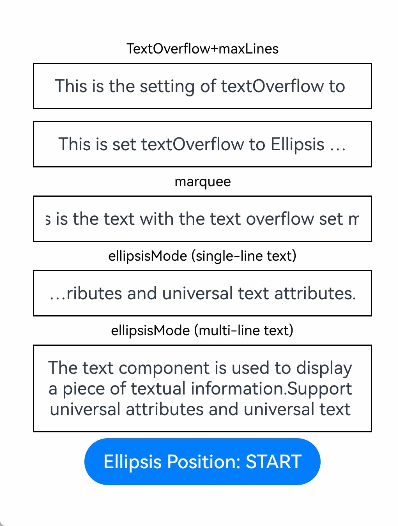

### Example 4: Setting Text Wrapping and Line Breaking

This example demonstrates text behavior under different line breaking and wrapping rules, including overflow behavior, using the [wordBreak](#wordbreak11) (available since API version 11), [lineBreakStrategy](#linebreakstrategy12) (available since API version 12), and [clip](ts-universal-attributes-sharp-clipping.md#clip12) attributes.

```ts
// xxx.ets
@Extend(Text)
function style() {
  .fontSize(12)
  .border({ width: 1 })
  .padding(10)
  .width('100%')
  .margin(5)
}

@Entry
@Component
struct TextExample4 {
  @State text: string =
    'The text component is used to display a piece of textual information.Support universal attributes and universal text attributes.';
  @State longText: string =
    'They can be classified as built-in components–those directly provided by the ArkUI framework and custom components – those defined by developers' +
      'The built-in components include buttons radio buttons progress indicators and text You can set the rendering effect of these components in method chaining mode,' +
      'page components are divided into independent UI units to implement independent creation development and reuse of different units on pages making pages more engineering-oriented.';
  @State textClip: boolean = false;
  @State wordBreakIndex: number = 0;
  @State wordBreak: WordBreak[] = [WordBreak.NORMAL, WordBreak.BREAK_ALL, WordBreak.BREAK_WORD];
  @State wordBreakStr: string[] = ['NORMAL', 'BREAK_ALL', 'BREAK_WORD'];
  @State lineBreakStrategyIndex: number = 0;
  @State lineBreakStrategy: LineBreakStrategy[] =
    [LineBreakStrategy.GREEDY, LineBreakStrategy.HIGH_QUALITY, LineBreakStrategy.BALANCED];
  @State lineBreakStrategyStr: string[] = ['GREEDY', 'HIGH_QUALITY', 'BALANCED'];

  build() {
    Flex({ direction: FlexDirection.Column, alignItems: ItemAlign.Center }) {
      Text('wordBreak').fontSize(9).fontColor(0xCCCCCC)
      // Set the word break rule.
      Text(this.text)
        .maxLines(2)
        .textOverflow({ overflow: TextOverflow.Ellipsis })
        .wordBreak(this.wordBreak[this.wordBreakIndex])
        .style()

      Row() {
        Button('wordBreak Value: ' + this.wordBreakStr[this.wordBreakIndex]).onClick(() => {
          this.wordBreakIndex++;
          if (this.wordBreakIndex > (this.wordBreakStr.length - 1)) {
            this.wordBreakIndex = 0;
          }
        })
      }

      Text('clip').fontSize(9).fontColor(0xCCCCCC)
      // Set whether text is clipped when it exceeds the length.
      Text('This is set wordBreak to WordBreak text Taumatawhakatangihangakoauauotamateaturipukakapikimaungahoronukupokaiwhenuakitanatahu.')
        .wordBreak(WordBreak.NORMAL)
        .maxLines(2)
        .clip(this.textClip)
        .style()
      Row() {
        Button('Clip Mode: ' + this.textClip).onClick(() => {
          this.textClip = !this.textClip;
        })
      }

      Text('lineBreakStrategy').fontSize(9).fontColor(0xCCCCCC)
      // Set the text line breaking rule.
      Text(this.longText)
        .lineBreakStrategy(this.lineBreakStrategy[this.lineBreakStrategyIndex])
        .style()
      Row() {
        Button('lineBreakStrategy Value: ' + this.lineBreakStrategyStr[this.lineBreakStrategyIndex]).onClick(() => {
          this.lineBreakStrategyIndex++;
          if (this.lineBreakStrategyIndex > (this.lineBreakStrategyStr.length - 1)) {
            this.lineBreakStrategyIndex = 0;
          }
        })
      }
    }.height(600).width('100%').padding({ left: 35, right: 35, top: 35 })
  }
}
```


### Example 5: Setting Text Selection and Copy

This example demonstrates how to set text selection, invoke a copy callback, make text selection draggable, modify the selection handle and background colors, and intercept a system copy operation using the following APIs: [selection](#selection11) (available since API version 11), [onCopy](#oncopy11) (available since API version 11), [draggable](#draggable9) (available since API version 9), [caretColor](#caretcolor14) (available since API version 14), [selectedBackgroundColor](#selectedbackgroundcolor14) (available since API version 14), and [onWillCopy](#onwillcopy).

The [onWillCopy](#onwillcopy) API is added since API version 26.0.0.

```ts
// xxx.ets
@Entry
@Component
struct TextExample5 {
  @State onCopy: string = '';
  @State text: string =
    'This is set selection to Selection text content This is set selection to Selection text content.';
  @State start: number = 0;
  @State end: number = 20;

  build() {
    Column() {
      Flex({ direction: FlexDirection.Column, alignItems: ItemAlign.Center, justifyContent: FlexAlign.Start }) {
        Text(this.text)
          .fontSize(12)
          .border({ width: 1 })
          .lineHeight(20)
          .margin(30)
          .copyOption(CopyOptions.InApp)
          .selection(this.start, this.end)
          .onCopy((value: string) => {
            this.onCopy = value;
          })
          // onWillCopy is supported since API version 26.0.0.
          .onWillCopy((value: string) => {
            // Determine whether the copy operation is allowed based on the service logic.
            return true; // Return true if the copy operation is allowed. Then, onCopy will be triggered.
          })
          .draggable(true)
          .caretColor(Color.Red)
          .selectedBackgroundColor(Color.Grey)
          .enableHapticFeedback(true)
        Button('Set text selection')
          .onClick(() => {
            // Change the start point and end point of the text selection.
            this.start = 10;
            this.end = 30;
          })
        Text(this.onCopy).fontSize(12).margin(10).key('copy')
      }.height(600).width(335).padding({ left: 35, right: 35, top: 35 })
    }.width('100%')
  }
}
```
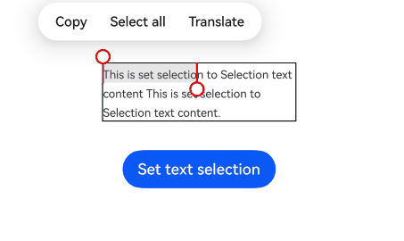

### Example 6: Setting Text Adaptation and Font Scale Factor Limits

This example demonstrates text adaptive behavior using the [heightAdaptivePolicy](#heightadaptivepolicy10) attribute (available since API version 10), and shows how to configure font scaling limits through [minFontScale](#minfontscale12) and [maxFontScale](#maxfontscale12) (both available since API version 12).

```ts
// xxx.ets
@Extend(Text)
function style(heightAdaptivePolicy: TextHeightAdaptivePolicy) {
  .width('80%')
  .height(90)
  .borderWidth(1)
  .minFontSize(10)
  .maxFontSize(30)
  .maxLines(2)
  .margin(5)
  .textOverflow({ overflow: TextOverflow.Ellipsis })
  .heightAdaptivePolicy(heightAdaptivePolicy)
}

@Entry
@Component
struct TextExample6 {
  build() {
    Flex({ direction: FlexDirection.Column, alignItems: ItemAlign.Center }) {
      // Set how the adaptive height is determined for the text.
      Text('heightAdaptivePolicy').fontSize(9).fontColor(0xCCCCCC)
      Text('This is the text with the height adaptive policy set.')
        .style(TextHeightAdaptivePolicy.MAX_LINES_FIRST)
      Text('This is the text with the height adaptive policy set.')
        .style(TextHeightAdaptivePolicy.MIN_FONT_SIZE_FIRST)
      Text('This is the text with the height adaptive policy set.')
        .style(TextHeightAdaptivePolicy.LAYOUT_CONSTRAINT_FIRST)

      Text('fontScale').fontSize(9).fontColor(0xCCCCCC)
      Text('This is the text content with minFontScale set to 1 and maxFontScale set to 1.2')
        .style(TextHeightAdaptivePolicy.MAX_LINES_FIRST)
        .minFontScale(1)
        .maxFontScale(1.2)
    }.height(600).width('100%').padding({ left: 35, right: 35, top: 35 })
  }
}
```

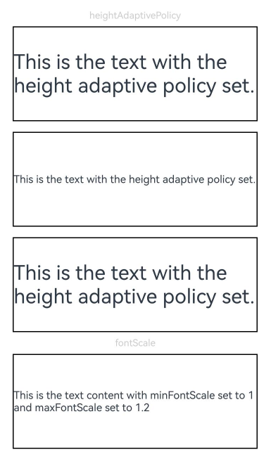

### Example 7: Setting Text Recognition

This example implements text recognition capabilities using the [enableDataDetector](#enabledatadetector11) and [dataDetectorConfig](#datadetectorconfig11) APIs, available since API version 11. When [enableDataDetector](#enabledatadetector11) is set to **true** and [dataDetectorConfig](#datadetectorconfig11) is not specified, the system detects all entity types, applies the blue font color to these entities, and adds blue underlines to them.

```ts
// xxx.ets
@Entry
@Component
struct TextExample7 {
  @State phoneNumber: string = '(86) (755) ********';
  @State url: string = 'www.********.com';
  @State email: string = '***@example.com';
  @State address: string = 'XX (province) XX (city) XX (district) XXXX';
  @State datetime: string = 'YYYY-MM-DD HH:mm';
  @State enableDataDetector: boolean = true;
  @State types: TextDataDetectorType[] = [];

  build() {
    Row() {
      Column() {
        Text(
          'Phone number: ' + this.phoneNumber + '\n' +
            'URL: ' + this.url + '\n' +
            'Email: ' + this.email + '\n' +
            'Address: ' + this.address + '\n' +
            'Time: ' + this.datetime
        )
          .fontSize(16)
          .copyOption(CopyOptions.InApp)
          .enableDataDetector(this.enableDataDetector)
          .dataDetectorConfig({
            types: this.types, onDetectResultUpdate: (result: string) => {
            }
          })
          .textAlign(TextAlign.Center)
          .borderWidth(1)
          .padding(10)
          .width('100%')
      }
      .width('100%')
      // Use TapGesture in parallelGesture to mimic the effect of a bubbling event,
      // allowing a click on the Text component area to trigger the Column's click event.
      .parallelGesture(TapGesture().onAction((event: GestureEvent) => {
        console.info('test column onClick timestamp:' + event.timestamp);
      }), GestureMask.Normal)
    }
    .height('100%')
  }
}
```

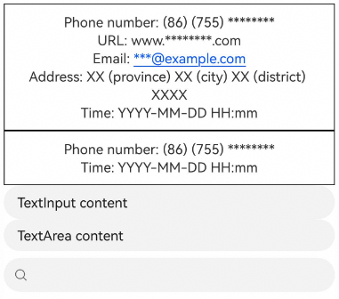

### Example 8: Binding Text to a Custom Menu

This example demonstrates custom menu binding for text using the following APIs, available since API version 11: [bindSelectionMenu](#bindselectionmenu11), [onTextSelectionChange](#ontextselectionchange11), and [closeSelectionMenu](#closeselectionmenu11).

```ts
// xxx.ets
@Entry
@Component
struct TextExample8 {
  controller: TextController = new TextController();
  options: TextOptions = { controller: this.controller };

  build() {
    Column() {
      Column() {
        Text(undefined, this.options) {
          Span('Hello World')
          // Replace $r('app.media.startIcon') with the image resource file you use.
          ImageSpan($r('app.media.startIcon'))
            .width(50)
            .height(50)
            .objectFit(ImageFit.Fill)
            .verticalAlign(ImageSpanAlignment.CENTER)
        }
        .copyOption(CopyOptions.InApp)
        .bindSelectionMenu(TextSpanType.IMAGE, this.LongPressImageCustomMenu, TextResponseType.LONG_PRESS, {
          onDisappear: () => {
            console.info(`Callback invoked when the custom menu disappears`);
          },
          onAppear: () => {
            console.info(`Callback invoked when the custom menu appears`);
          },
          onMenuShow: () => {
            console.info(`Callback invoked when the custom menu is shown`);
          },
          onMenuHide: () => {
            console.info(`Callback invoked when the custom menu is hidden`);
          }
        })
        .bindSelectionMenu(TextSpanType.TEXT, this.RightClickTextCustomMenu, TextResponseType.RIGHT_CLICK)
        .bindSelectionMenu(TextSpanType.MIXED, this.SelectMixCustomMenu, TextResponseType.SELECT)
        .onTextSelectionChange((selectionStart: number, selectionEnd: number) => {
          console.info(`Callback invoked when the text selection changes, selectionStart: ${selectionStart}, selectionEnd: ${selectionEnd}`);
        })
        .borderWidth(1)
        .borderColor(Color.Red)
        .width(200)
        .height(100)
      }
      .width('100%')
      .backgroundColor(Color.White)
      .alignItems(HorizontalAlign.Start)
      .padding(25)
    }
    .height('100%')
  }

  @Builder
  RightClickTextCustomMenu() {
    Column() {
      Menu() {
        MenuItemGroup() {
          // Replace $r('app.media.startIcon') with the image resource file you use.
          MenuItem({ startIcon: $r('app.media.startIcon'), content: 'Right Click Menu 1', labelInfo: '' })
            .onClick((event) => {
              this.controller.closeSelectionMenu();
            })
          MenuItem({ startIcon: $r('app.media.startIcon'), content: 'Right Click Menu 2', labelInfo: '' })
          MenuItem({ startIcon: $r('app.media.startIcon'), content: 'Right Click Menu 3', labelInfo: '' })
        }
      }
      .MenuStyles()
    }
  }

  @Builder
  LongPressImageCustomMenu() {
    Column() {
      Menu() {
        MenuItemGroup() {
          // Replace $r('app.media.startIcon') with the image resource file you use.
          MenuItem({ startIcon: $r('app.media.startIcon'), content: 'Long Press Image Menu 1', labelInfo: '' })
            .onClick((event) => {
              this.controller.closeSelectionMenu();
            })
          MenuItem({ startIcon: $r('app.media.startIcon'), content: 'Long Press Image Menu 2', labelInfo: '' })
          MenuItem({ startIcon: $r('app.media.startIcon'), content: 'Long Press Image Menu 3', labelInfo: '' })
        }
      }
      .MenuStyles()
    }
  }

  @Builder
  SelectMixCustomMenu() {
    Column() {
      Menu() {
        MenuItemGroup() {
          // Replace $r('app.media.startIcon') with the image resource file you use.
          MenuItem({ startIcon: $r('app.media.startIcon'), content: 'Select Mixed Menu 1', labelInfo: '' })
            .onClick((event) => {
              this.controller.closeSelectionMenu();
            })
          MenuItem({ startIcon: $r('app.media.startIcon'), content: 'Select Mixed Menu 2', labelInfo: '' })
          MenuItem({ startIcon: $r('app.media.startIcon'), content: 'Select Mixed Menu 3', labelInfo: '' }) 
        }
      }
      .MenuStyles()
    }
  }
}

@Extend(Menu)
function MenuStyles() {
  .radius($r('sys.float.ohos_id_corner_radius_card'))
  .clip(true)
  .backgroundColor('#F0F0F0')
}
```

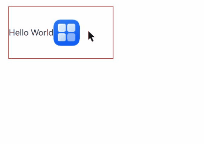

### Example 9: Setting Text Features and Line Spacing

This example demonstrates text feature and line spacing effects using the [fontFeature](#fontfeature12) and [lineSpacing](#linespacing12) APIs, available since API version 12. The **onlyBetweenLines** property in [LineSpacingOptions](ts-text-common.md#linespacingoptions20) (available since API version 20) controls whether line spacing applies only between lines.

```ts
// xxx.ets
import { LengthMetrics } from '@kit.ArkUI';

@Extend(Text)
function style() {
  .fontSize(12)
  .border({ width: 1 })
  .width('100%')
}

@Entry
@Component
struct TextExample9 {
  build() {
    Flex({ direction: FlexDirection.Column, alignItems: ItemAlign.Center, justifyContent: FlexAlign.SpaceBetween }) {
      Text('lineSpacing').fontSize(9).fontColor(0xCCCCCC)
      // Set the line spacing.
      Text('This is a context with no lineSpacing set.')
        .lineSpacing(undefined)
        .style()
      Text('This is a context with lineSpacing set to 20_px.')
        .lineSpacing(LengthMetrics.px(20))
        .style()
      Text('This is the context with lineSpacing set to 20_vp.')
        .lineSpacing(LengthMetrics.vp(20))
        .style()
      Text('This is the context with lineSpacing set to 20_fp.')
        .lineSpacing(LengthMetrics.fp(20))
        .style()
      Text('This is the context with lineSpacing set to 20_lpx.')
        .lineSpacing(LengthMetrics.lpx(20))
        .style()
      Text('This is the context with lineSpacing set to 100%.')
        .lineSpacing(LengthMetrics.percent(1))
        .style()
      Text('The line spacing of this context is set to 20_px, and the spacing is effective only between the lines.')
        .lineSpacing(LengthMetrics.px(20), { onlyBetweenLines: true })
        .style()

      Text('fontFeature').fontSize(9).fontColor(0xCCCCCC)
      // Set text features.
      Text('This is frac on : 1/2 2/3 3/4')
        .fontFeature('"frac" on')
        .style()
      Text('This is frac off: 1/2 2/3 3/4')
        .fontFeature('"frac" off')
        .style()
    }.height(300).width(350).padding({ left: 35, right: 35, top: 35 })
  }
}
```

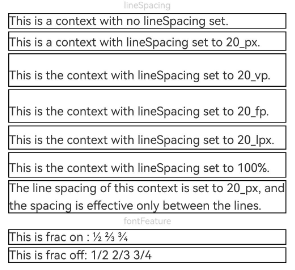

### Example 10: Obtaining Text Information

This example shows how to use the [getLayoutManager](#getlayoutmanager12) API (available since API version 12) to access the text's layout manager for obtaining text information. In addition, it uses the [getRectsForRange](./ts-text-common.md#getrectsforrange14) API within [LayoutManager](ts-text-common.md#layoutmanager12) (available since API version 14) to obtain drawing area information for characters or placeholders within any specified text range, given specific width and height constraints.

```ts
// xxx.ets
import { text } from '@kit.ArkGraphics2D';

@Entry
@Component
struct TextExample10 {
  @State lineCount: string = "";
  @State glyphPositionAtCoordinate: string = "";
  @State lineMetrics: string = "";
  @State rectsForRangeStr: string = "";
  controller: TextController = new TextController();
  @State textStr: string =
    'Hello World!';

  build() {
    Scroll() {
      Column() {
        Text('Use getLayoutManager to get layout information')
          .fontSize(15)
          .fontColor(0xCCCCCC)
          .width('90%')
          .padding(10)
        Text(this.textStr, { controller: this.controller })
          .fontSize(25)
          .borderWidth(1)
          .onAreaChange(() => {
            // getLayoutManager returns undefined if TextController is not bound to the Text component or the Text component has been destroyed. You need to check for null values when using it.
            let layoutManager: LayoutManager = this.controller.getLayoutManager();
            if (!layoutManager) {
              return;
            }
            this.lineCount = 'LineCount: ' + layoutManager.getLineCount();
          })

        Text('LineCount').fontSize(15).fontColor(0xCCCCCC).width('90%').padding(10)
        Text(this.lineCount)

        Text('GlyphPositionAtCoordinate').fontSize(15).fontColor(0xCCCCCC).width('90%').padding(10)
        Button("Relative Component Coordinate [150, 50]")
          .onClick(() => {
            let layoutManager: LayoutManager = this.controller.getLayoutManager();
            if (!layoutManager) {
              return;
            }
            let position: PositionWithAffinity = layoutManager.getGlyphPositionAtCoordinate(150, 50);
            this.glyphPositionAtCoordinate =
              'Relative component coordinate [150, 50] glyphPositionAtCoordinate position: ' + position.position + ' affinity: ' +
              position.affinity;
          })
          .margin({ bottom: 20, top: 10 })
        Text(this.glyphPositionAtCoordinate)

        Text('LineMetrics').fontSize(15).fontColor(0xCCCCCC).width('90%').padding(10)
        Button('Line Metrics')
          .onClick(() => {
            let layoutManager: LayoutManager = this.controller.getLayoutManager();
            if (!layoutManager) {
              return;
            }
            let lineMetrics: LineMetrics = layoutManager.getLineMetrics(0);
            this.lineMetrics = 'lineMetrics is ' + JSON.stringify(lineMetrics) + '\n\n';
            let runMetrics = lineMetrics.runMetrics;
            runMetrics.forEach((value, key) => {
              this.lineMetrics += 'runMetrics key is ' + key + ' ' + JSON.stringify(value) + '\n\n';
            })
          })
          .margin({ bottom: 20, top: 10 })
        Text(this.lineMetrics)

        Text('getRectsForRange').fontSize(15).fontColor(0xCCCCCC).width('90%').padding(10)
        Button('Drawing Area Info for Characters/Placeholders within Specified Text Range')
          .onClick(() => {
            let layoutManager: LayoutManager = this.controller.getLayoutManager();
            if (!layoutManager) {
              return;
            }
            let range: TextRange = { start: 0, end: 1 };
            let rectsForRangeInfo: text.TextBox[] =
              layoutManager.getRectsForRange(range, text.RectWidthStyle.TIGHT, text.RectHeightStyle.TIGHT);
            this.rectsForRangeStr = 'getRectsForRange result is ' + '\n\n';
            rectsForRangeInfo.forEach((value, key) => {
              this.rectsForRangeStr += 'rectsForRange key is ' + key + ' ' + JSON.stringify(value) + '\n\n';
            })
          })
          .margin({ bottom: 20, top: 10 })
        Text(this.rectsForRangeStr)
      }
      .margin({ top: 100, left: 8, right: 8 })
    }
  }
}
```

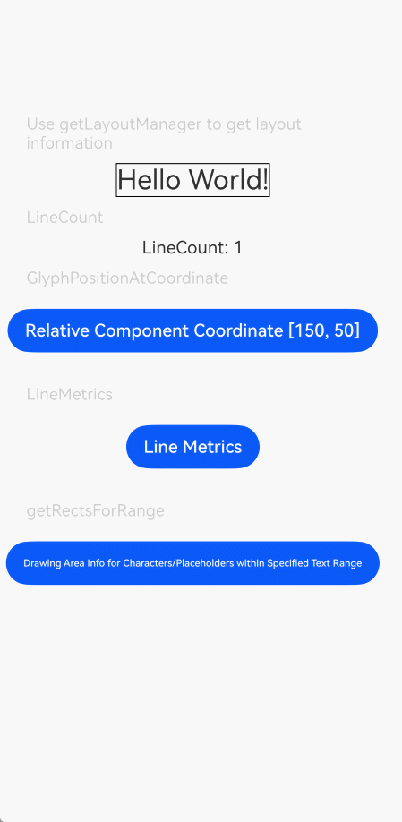

### Example 11: Implementing Keyboard-based Text Selection

This example implements keyboard-based text selection by setting the [textSelectable](#textselectable12) attribute to **TextSelectMode.SELECTABLE_FOCUSABLE**, available since API version 12.

```ts
// xxx.ets
@Entry
@Component
struct TextExample11 {
  @State message: string =
    'TextTextTextTextTextTextTextText' + 'TextTextTextTextTextTextTextTextTextTextTextTextTextTextTextText';

  build() {
    Column() {
      Text(this.message)
        .width(300)
        .height(100)
        .maxLines(5)
        .fontColor(Color.Black)
        .copyOption(CopyOptions.InApp)
        .selection(3, 8)
        .textSelectable(TextSelectableMode.SELECTABLE_FOCUSABLE)
    }.width('100%').margin({ top: 100 })
  }
}
```

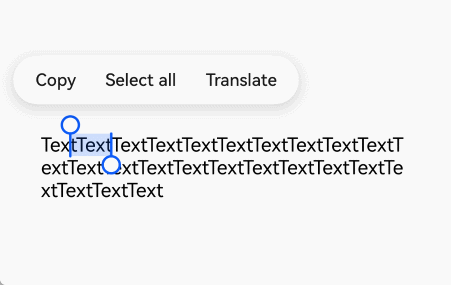

### Example 12: Setting Custom Menu Extensions

This example implements custom menu extension items for text using the [editMenuOptions](#editmenuoptions12) API (available since API version 12), allowing configuration of text content, icons, and callbacks. Menu data can be configured through the [onPrepareMenu](ts-text-common.md#properties-1) callback (available since API version 20).

```ts
// xxx.ets
@Entry
@Component
struct TextExample12 {
  @State text: string = 'Text editMenuOptions'
  @State endIndex: number = 0;
  onCreateMenu = (menuItems: Array<TextMenuItem>) => {
    // Replace $r('app.media.startIcon') with the image resource file you use.
    let item1: TextMenuItem = {
      content: 'create1',
      icon: $r('app.media.startIcon'),
      id: TextMenuItemId.of('create1'),
    };
    let item2: TextMenuItem = {
      content: 'create2',
      id: TextMenuItemId.of('create2'),
      icon: $r('app.media.startIcon'),
    };
    menuItems.push(item1);
    menuItems.unshift(item2);
    let targetIndex = menuItems.findIndex(item => item.id.equals(TextMenuItemId.askAI));
    if (targetIndex !== -1) {
      menuItems.splice(targetIndex, 1); // Delete an element at the target index.
    }
    targetIndex = menuItems.findIndex(item => item.id.equals(TextMenuItemId.TRANSLATE));
    if (targetIndex !== -1) {
      menuItems.splice(targetIndex, 1);
    }
    return menuItems;
  }
  onMenuItemClick = (menuItem: TextMenuItem, textRange: TextRange) => {
    if (menuItem.id.equals(TextMenuItemId.of("create2"))) {
      console.info('Intercept id: create2 start:' + textRange.start + '; end:' + textRange.end);
      return true;
    }
    if (menuItem.id.equals(TextMenuItemId.of("prepare1"))) {
      console.info('Intercept id: prepare1 start:' + textRange.start + '; end:' + textRange.end);
      return true;
    }
    if (menuItem.id.equals(TextMenuItemId.COPY)) {
      console.info('Intercept COPY start:' + textRange.start + '; end:' + textRange.end);
      return true;
    }
    if (menuItem.id.equals(TextMenuItemId.SELECT_ALL)) {
      console.info('Do not intercept SELECT_ALL start:' + textRange.start + '; end:' + textRange.end);
      return false;
    }
    return false;
  }
  // Replace $r('app.media.startIcon') with the image resource file you use.
  onPrepareMenu = (menuItems: Array<TextMenuItem>) => {
    let item1: TextMenuItem = {
      content: 'prepare1_' + this.endIndex,
      icon: $r('app.media.startIcon'),
      id: TextMenuItemId.of('prepare1'),
    };
    menuItems.unshift(item1);
    return menuItems;
  }
  @State editMenuOptions: EditMenuOptions = {
    onCreateMenu: this.onCreateMenu,
    onMenuItemClick: this.onMenuItemClick,
    onPrepareMenu: this.onPrepareMenu
  };

  build() {
    Column() {
      Text(this.text)
        .fontSize(20)
        .copyOption(CopyOptions.LocalDevice)
        .editMenuOptions(this.editMenuOptions)
        .margin({ top: 100 })
        .onTextSelectionChange((selectionStart: number, selectionEnd: number) => {
          this.endIndex = selectionEnd;
        })
    }
    .width('90%')
    .margin('5%')
  }
}
```


### Example 13: Securing Sensitive Information

This example illustrates how to secure sensitive information using the [privacySensitive](#privacysensitive12) attribute, available since API version 12. Note that the display requires widget framework support.

```ts
// xxx.ets
@Entry
@Component
struct TextExample13 {
  build() {
    Column({ space: 10 }) {
      Text('privacySensitive')
        .privacySensitive(true)
        .margin({ top: 30 })
    }
    .alignItems(HorizontalAlign.Center)
    .width('100%')
  }
}
```


### Example 14: Configuring Automatic Spacing Between Chinese and Western Text

This example demonstrates how to configure automatic spacing between Chinese and Western characters using the [enableAutoSpacing](#enableautospacing20) attribute, available since API version 20.

```ts
// xxx.ets
@Entry
@Component
struct TextExample {
  build() {
    Row() {
      Column() {
        Text('Automatic spacing: Enabled').margin(5)
        Text('中文 Text')
          .enableAutoSpacing(true)
        Text('Automatic spacing: Disabled').margin(5)
        Text('中文Text')
          .enableAutoSpacing(false)
      }.height('100%')
    }
    .width('60%')
  }
}
```

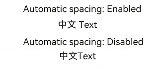

### Example 15: Applying Gradient and Solid Colors to Text

This example demonstrates how to apply gradient and solid colors to the **Text** component using the [shaderStyle](#shaderstyle20) API, available since API version 20.

```ts
@Entry
@Component
struct ShaderColorStyle {
  @State message: string = 'Hello World';
  @State linearGradientOptionsAngle: LinearGradientOptions =
    {
      angle: 45,
      colors: [[Color.Red, 0.0], [Color.Blue, 0.3], [Color.Green, 0.5]]
    };
  @State linearGradientOptionsDirection: LinearGradientOptions =
    {
      direction: GradientDirection.LeftTop,
      colors: [[Color.Red, 0.0], [Color.Blue, 0.3], [Color.Green, 0.5]],
      repeating: true,
    };
  @State radialGradientOptions: RadialGradientOptions =
    {
      center: [50, 50],
      radius: 20,
      colors: [[Color.Red, 0.0], [Color.Blue, 0.3], [Color.Green, 0.5]],
      repeating: true,
    };
  @State colorShaderStyle: ColorShaderStyle =
    {
      color: Color.Blue
    };
  build() {
    Column({ space: 5 }) {
      Text('Linear gradient (45° angle)').fontSize(18).width('90%').fontColor(0xCCCCCC)
        .margin({ top: 40, left: 40 })
      Text(this.message)
        .fontSize(50)
        .width('80%')
        .height(50)
        .shaderStyle(this.linearGradientOptionsAngle)
      Text('Linear gradient (top left direction)').fontSize(18).width('90%').fontColor(0xCCCCCC)
        .margin({ top: 40, left: 40 })
      Text(this.message)
        .fontSize(50)
        .width('80%')
        .height(50)
        .shaderStyle(this.linearGradientOptionsDirection)
      Text('Radial gradient').fontSize(18).width('90%').fontColor(0xCCCCCC)
        .margin({ top: 40, left: 40 })
      Text(this.message)
        .fontSize(50)
        .width('80%')
        .height(50)
        .shaderStyle(this.radialGradientOptions)
      Text('Solid color').fontSize(18).width('90%').fontColor(0xCCCCCC)
        .margin({ top: 40, left: 40 })
      Text(this.message)
        .fontSize(50)
        .width('80%')
        .height(50)
        .shaderStyle(this.colorShaderStyle)
    }
  }
}
```
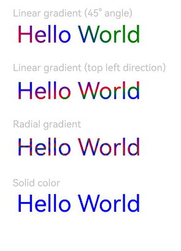

### Example 16: Configuring Trailing Space Optimization

This example demonstrates how to optimize trailing spaces using the [optimizeTrailingSpace](#optimizetrailingspace20) attribute, available since API version 20. This attribute is typically used with alignment features, and actual display requires font engine support.

```ts
// xxx.ets
@Entry
@Component
struct TextExample16 {
  build() {
    Column() {
      Text('Trimmed space enabled     ')
        .fontSize(30)
        .fontWeight(FontWeight.Bold)
        .margin({ top: 20 })
        .optimizeTrailingSpace(true)
        .textAlign(TextAlign.Center)
      Text('Trimmed space disabled     ')
        .fontSize(30)
        .fontWeight(FontWeight.Bold)
        .margin({ top: 20 })
        .optimizeTrailingSpace(false)
        .textAlign(TextAlign.Center)
    }
    .width("100%")
  }
}
```

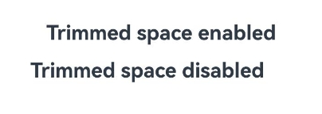

### Example 17: Configuring Text Vertical Alignment

This example demonstrates how to configure vertical text alignment using the [textVerticalAlign](#textverticalalign20) attribute, available since API version 20.

```ts
// xxx.ets
@Entry
@Component
struct TextExample14 {
  build() {
    Column({ space: 10 }) {
      Text() {
        Span('Hello')
          .fontSize(50)
        // Replace $r('app.media.startIcon') with the image resource file you use.
        ImageSpan($r('app.media.startIcon'))
          .width(30).height(30)
          .verticalAlign(ImageSpanAlignment.FOLLOW_PARAGRAPH)// Available since API version 20.
        Span('World')
      }
      .textVerticalAlign(TextVerticalAlign.CENTER)
      .borderWidth(1)
    }
    .alignItems(HorizontalAlign.Center)
    .width('100%')
  }
}
```


### Example 18: Implementing a Text Flip Animation

This example demonstrates how to implement a flip animation for numeric text using the [contentTransition](#contenttransition20) attribute, available since API version 20.

``` ts
// xxx.ets
@Entry
@Component
struct TextNumberTransition {
  @State number: number = 98;
  @State numberTransition: NumericTextTransition =
    new NumericTextTransition({ flipDirection: FlipDirection.DOWN, enableBlur: false });

  build() {
    Column() {
      Text(this.number + '')
        .borderWidth(1)
        .fontSize(40)
        .contentTransition(this.numberTransition)
      Button('change number')
        .onClick(() => {
          this.number++;
        })
        .margin(10)
    }
    .justifyContent(FlexAlign.Center)
    .height('100%')
    .width('100%')
  }
}
```

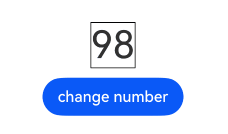

### Example 19: Configuring Vertical Alignment for the Text Content Area

This example demonstrates how to use the [textContentAlign](#textcontentalign21) attribute, available since API version 21, to configure vertical alignment for the text content when it exceeds the component height.

```ts
@Entry
@Component
struct TextContentAlignExample {

  build() {
    Column() {
      Row() {
        Text('This is sample text for demonstration')
          .fontSize(30)
          .backgroundColor(Color.Gray)
          .width('80%')
          .height(20)
          .textContentAlign(TextContentAlign.CENTER)
      }.height('60%')
    }
  }
}
```


### Example 20: Setting Line Height Multiplier and Maximum/Minimum Line Heights

This example demonstrates how to use [lineHeightMultiple](#lineheightmultiple22) to set the line height in multiple mode and use [minLineHeight](#minlineheight22) and [maxLineHeight](#maxlineheight22) to set the minimum and maximum line heights, all available since API version 22.

```ts
import { LengthUnit } from '@kit.ArkUI';

@Entry
@Component
struct Index {
  @State message: string = 'hello';

  build() {
    Scroll() {
      Column() {
        Row() {
          Text(this.message)
            .lineHeight(176)
            .backgroundColor(0xffc0c0c0)
            .fontSize(50)
          Text(this.message)
            .lineHeightMultiple(3)
            .backgroundColor(0xffc0c0c0)
            .fontSize(50)
          Text(this.message)
            .lineHeight(300)
            .maxLineHeight({value:176,unit:LengthUnit.FP})
            .backgroundColor(0xffc0c0c0)
            .fontSize(50)
          Text(this.message)
            .lineHeight(10)
            .minLineHeight({value:176,unit:LengthUnit.FP})
            .backgroundColor(0xffc0c0c0)
            .fontSize(50)
        }
      }
    }.height('100%')
    .width('100%')
  }
}
```


### Example 21: Setting the Minimum Number of Lines for Text Display

This example demonstrates how to set the minimum number of lines using the [minLines](#minlines22) attribute, available since API version 22.

```ts

@Entry
@Component
struct TextExample1 {
  @State shortMessage: string = 'Hello world!';
  @State longMessage: string = 'The minimum number of lines displayed for this text setting is 1';

  build() {
    Column() {
      Text(this.shortMessage)
        .minLines(3)
        .fontSize(20)
        .margin(10)
        .width('95%')
        .border({ width: 1 })
      Text(this.longMessage)
        .minLines(1)
        .fontSize(20)
        .margin(10)
        .width('95%')
        .border({ width: 1 })
    }.height(100).width('90%').margin(10)
  }
}
```

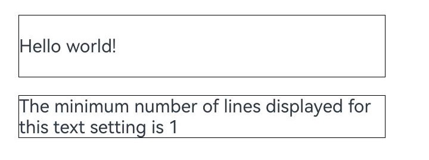

### Example 22: Setting and Highlighting the Text Selection Range

This example demonstrates how to set and highlight the text selection range using [setTextSelection](#settextselection23) in [TextController](#textcontroller11), available since API version 23.

```ts

@Entry
@Component
struct Index {
  controller: TextController = new TextController();
  @State textStr: string = 'Hello World!';

  build() {
    Scroll() {
      Column() {
        Text(this.textStr, { controller: this.controller })
          .fontSize(25)
          .borderWidth(1)
          .copyOption(CopyOptions.LocalDevice)
        Button('setTextSelection')
          .onClick(() => {
            this.controller.setTextSelection(1, 6, { menuPolicy: MenuPolicy.HIDE })
          })
          .margin({ bottom: 20, top: 10 } as Margin)
      }
      .margin({ top: 100, left: 8, right: 8 } as Margin)
    }
  }
}
```

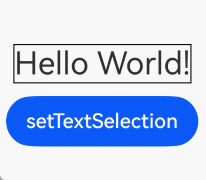

### Example 23: Setting Leading Punctuation Compression and Trailing Punctuation Hanging

This example shows how to use [compressLeadingPunctuation](#compressleadingpunctuation23) to set the punctuation compression at the beginning of a line, and use [punctuationOverflow](#punctuationoverflow) to set the punctuation hanging at the end of a line.

If the punctuation with spacing on the left is at the beginning of the line, the punctuation directly compresses the spacing to the left boundary.

After the text is automatically wrapped, the punctuation hanging takes effect only when the remaining content (including punctuation) can be placed in the previous line.

Since API version 23, the **compressLeadingPunctuation** API is added.

Since API version 26.0.0, the **punctuationOverflow** API is added.

```ts
@Entry
@Component
struct PunctuationDemo {
  @State compressLeadingPunctuation: boolean = false;
  @State punctuationOverflow: boolean = false;
  @State text: string = '「0123456789！\n『0123456789：\n（0123456789；\n《0123456789）\n〈0123456789】';

  build() {
    Column() {
      Text(this.text)
        .compressLeadingPunctuation(this.compressLeadingPunctuation)
        .punctuationOverflow(this.punctuationOverflow)
        .border({ width: 1, color: Color.Black })
        .copyOption(CopyOptions.LocalDevice)
        .fontSize('20fp')
        .align(Alignment.Center)
        .height('35%')
        .width('40%')

      Column() {
        Button('Enable Leading Punctuation Compression').onClick(() => {
          this.compressLeadingPunctuation = true
        }).margin(5)
        Button('Disable Leading Punctuation Compression').onClick(() => {
          this.compressLeadingPunctuation = false
        }).margin(5)
        Button('Enable Trailing Punctuation Hanging').onClick(() => {
          this.punctuationOverflow = true
        }).margin(5)
        Button('Disable Trailing Punctuation Hanging').onClick(() => {
          this.punctuationOverflow = false
        }).margin(5)
      }
    }.width('100%').padding(20)
  }
}
```
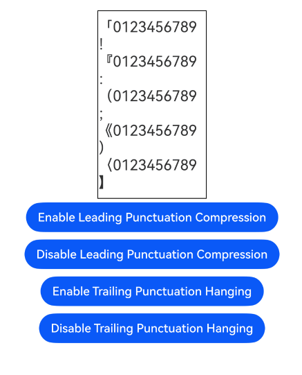

### Example 24: Setting Adaptive Spacing

This example uses the [includeFontPadding](#includefontpadding23) API to add the spacing of the first and last lines and the [fallbackLineSpacing](#fallbacklinespacing23) API to set adaptive line spacing.

The [includeFontPadding](#includefontpadding23) and [fallbackLineSpacing](#fallbacklinespacing23) APIs are supported since API version 23.

```ts
// xxx.ets

const UYGHUR_TEXT: string = 'ياخشىمۇسەنياخشىمۇسەنياخشىمۇسەنياخشىمۇسەنياخشىمۇسەنياخشىمۇسەنياخشىمۇسەن';
@Entry
@Component
struct Index {
  @State include: boolean | null | undefined = false;
  @State fallback: boolean | null | undefined = false;
  @State displayText: string = UYGHUR_TEXT;

  build() {
    Column() {
      Text(this.displayText)
        .includeFontPadding(this.include)
        .fallbackLineSpacing(this.fallback)
        .lineHeight(5)
        .width('100%')
        .height(100)
        .backgroundColor('#eee')
        .borderWidth(1)
        .borderColor('#dddddd')

      Scroll() {
        Column() {
          // --- Buttons related to IncludeFontPadding ---
          Button('Set includePadding: ' + this.include)
            .onClick(() => {
              this.include = this.include === false ? true : false;
            })
            .margin({ bottom: 10 })

          // --- Button related to FallbackLineSpacing ---
          Button('Set fallbackLineSpacing: ' + this.fallback)
            .onClick(() => {
              this.fallback = this.fallback === false ? true : false;
            })
            .margin({ bottom: 10 })

        }
        .width('100%')
        .padding(5)
      }
      .height(250)
      .backgroundColor('transparent')
      .scrollBarWidth(2)
      .scrollBarColor('#888')

    }
    .width('100%')
    .height('100%')
    .padding(20)
  }
}
```

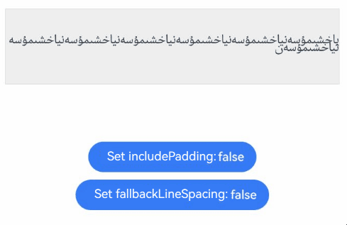

### Example 25: Setting the Drag Preview Style for Text Being Dragged

This example demonstrates how to set the drag preview style for text being dragged using the [selectedDragPreviewStyle](#selecteddragpreviewstyle23) API.

The **selectedDragPreviewStyle** API is supported since API version 23.

```ts
@Entry
@Component
struct TextTest {
  build() {
    Column() {
      Text('This is drag text')
        .copyOption(CopyOptions.InApp)
        .width(200)
        .height(100)
        .margin(150)
        .draggable(true)
        .selectedDragPreviewStyle({color: 'rgba(227, 248, 249, 1)'})
    }
    .height('100%')
  }
}
```


### Example 26: Setting the Text Layout Direction

This example demonstrates how to set the text layout direction using the [textDirection](#textdirection23) API.

The **textDirection** API is supported since API version 23.

``` ts
// xxx.ets
@Entry
@Component
struct TextExample {
  @State text: string = 'Text layout direction example';

  build() {
    Column({ space: 3 }) {
      Text('Text layout direction: DEFAULT')
        .fontSize(12).width('90%').margin(5)
      Text(this.text)
        .width('95%')
        .borderWidth(1)
      Text('Text layout direction: RTL')
        .fontSize(12).width('90%').margin(5)
      Text(this.text)
        .width('95%')
        .borderWidth(1)
        .textDirection(TextDirection.RTL)
      Text('Text layout direction: RTL, text horizontal alignment: LEFT')
        .fontSize(12).width('90%').margin(5)
      Text(this.text)
        .width('95%')
        .borderWidth(1)
        .textDirection(TextDirection.RTL)
        .textAlign(TextAlign.LEFT)
    }
    .width('100%')
    .height('100%')
  }
}
```

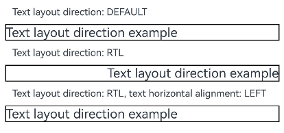

### Example 27: Obtaining Text Information Corresponding to Specified Coordinates and Range

The [getCharacterPositionAtCoordinate](ts-text-common.md#getcharacterpositionatcoordinate24), [getGlyphRangeForCharacterRange](ts-text-common.md#getglyphrangeforcharacterrange24), and [getCharacterRangeForGlyphRange](ts-text-common.md#getcharacterrangeforglyphrange24) APIs are supported since API version 24. This example shows how to use the [getLayoutManager](#getlayoutmanager12) API to call the text layout manager object to obtain text information. It also demonstrates how to use the [getCharacterPositionAtCoordinate](ts-text-common.md#getcharacterpositionatcoordinate24) API in [LayoutManager](ts-text-common.md#layoutmanager12) to obtain position information for the coordinate, the [getGlyphRangeForCharacterRange](ts-text-common.md#getglyphrangeforcharacterrange24) API to obtain the glyph index range and actual character index range based on the character index range, and the [getCharacterRangeForGlyphRange](ts-text-common.md#getcharacterrangeforglyphrange24) API to obtain the character index range and actual glyph index range based on the glyph index range.

```ts
// xxx.ets
import { LengthMetrics } from '@kit.ArkUI';

@Entry
@Component
struct TextExample10 {
  @State start: number = 10;
  @State end: number = 20;
  textController: TextController = new TextController();
  textStr: string = 'Hello World';
  @State str1: string = ''
  @State str2: string = ''
  @State str3: string = ''
  @State str4: string = ''
  titleParagraphStyleAttr: ParagraphStyle =
    new ParagraphStyle({ paragraphSpacing: LengthMetrics.px(50), textIndent: LengthMetrics.vp(15) });
  mutableStyledString: MutableStyledString =
    new MutableStyledString('Styled string TextStyle test\nStyled string test\nStyled string TextStyle test');

  build() {
    Column() {
      Text(this.textStr, { controller: this.textController }) {
        Span('Hello World 123 \n')
        Span('Hello World 456 \n')
        Span('Hello World 789 \n')
      }
      .fontSize(25)
      .borderWidth(1)

      Text(this.str1)
      Text(this.str2)
      Text(this.str3)
      Text(this.str4)

      Button('Add Styled String').onClick (() => {
        this.textController.setStyledString(this.mutableStyledString)
      })

      Button('Glyph Info at [150, 50]')
        .onClick(() => {
          // getLayoutManager returns undefined if TextController is not bound to the Text component or the Text component has been destroyed. You need to check for null values when using it.
          let layoutManager: LayoutManager = this.textController.getLayoutManager();
          if (!layoutManager) {
            return;
          }
          let position1: PositionWithAffinity = layoutManager.getGlyphPositionAtCoordinate(150, 50);
          this.str1 = 'Glyph info at [150, 50]. glyphPosition position: ' + position1.position +
            ' affinity: ' +
          position1.affinity;

          let position2: PositionWithAffinity =
            layoutManager.getCharacterPositionAtCoordinate(150, 50) as PositionWithAffinity;
          this.str2 = 'Glyph info at [150, 50]. characterPosition position: ' + position2.position +
            ' affinity: ' +
          position2.affinity;

          let range1: TextRange = { start: this.start, end: this.end };
          let ranges1: Array<TextRange> = layoutManager.getGlyphRangeForCharacterRange(range1) as Array<TextRange>
          this.str3 = 'getGlyphRangeForCharacterRange. Glyph range: ' + ranges1[0].start + ' ' + ranges1[0].end + '\n' +
            'getGlyphRangeForCharacterRange. Actual character range: ' + ranges1[1].start + ' ' + ranges1[1].end

          let range2: TextRange = { start: this.start, end: this.end };
          let ranges2: Array<TextRange> = layoutManager.getCharacterRangeForGlyphRange(range2) as Array<TextRange>
          this.str4 = 'getCharacterRangeForGlyphRange. Character range: ' + ranges2[0].start + ' ' + ranges2[0].end + '\n' +
            'getCharacterRangeForGlyphRange. Actual glyph range: ' + ranges2[1].start + ' ' + ranges2[1].end
        })
        .margin({ bottom: 20, top: 10 })
    }.justifyContent(FlexAlign.Center).width('100%').height('100%')
  }
}
```

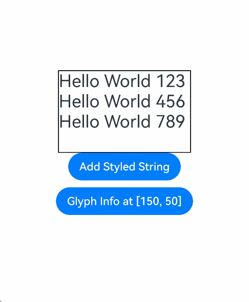

### Example 28: Enabling/Disabling Orphan Character Optimization During Text Typesetting

This example demonstrates how to use the [orphanCharOptimization](#orphancharoptimization) API to enable/disable orphan word optimization, ensuring no orphan character appears in the last line of a paragraph.

The **orphanCharOptimization** API is supported since API version 26.0.0.

```ts
// xxx.ets
@Entry
@Component
struct TextExample {
  @State text: string = 'aaaaaaaaaaaaaaaaaaaaaaaaaaaaaaaaaaaaaa文本aaaaaaaaaaaaa';

  build() {
    Column({ space: 3 }) {
      Text('Text disables orphan character optimization.')
        .fontSize(12).width('90%').margin(5)
      Text(this.text)
        .fontSize(20)
        .width('456')
        .borderWidth(1)
      Text('Text enables orphan character optimization.')
        .fontSize(12).width('90%').margin(5)
      Text(this.text)
        .fontSize(20)
        .width('456')
        .borderWidth(1)
        .orphanCharOptimization(true)
    }
    .width('100%')
    .height('100%')
  }
}
```
The display effect may vary depending on the device sizes and is for reference only.

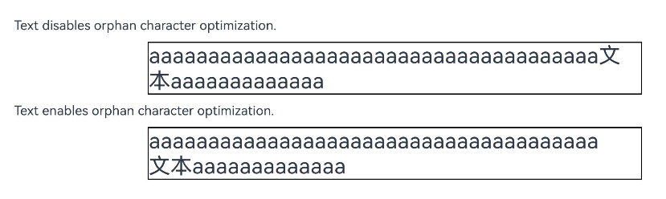

### Example 29: Setting Font Variations

This example demonstrates how to set text font variations using [fontVariations](#fontvariations).

The [fontVariations](#fontvariations) API is added since API version 26.0.0.

```ts
// xxx.ets
@Entry
@Component
struct TextExample {
  @State weightValue: number = 400;

  build() {
    Column() {
      Text('Hello World !')
        // wght indicates the weight of the variable font.
        .fontVariations([{ axis: 'wght', value: this.weightValue }])
      Button('Weight: ' + this.weightValue)
        .margin(10)
        .onClick(() => {
          this.weightValue += 100;
        })
    }.width('100%')
  }
}
```


### Example 30: Setting an Image Preview Menu

This example demonstrates how to use the [bindSelectionMenu](#bindselectionmenu11) API to set an image preview menu for text.

Since API version 26.0.0, when the text component calls this API, the image preview menu takes effect if the **menuType** attribute in **options** is set to **MenuType.PREVIEW_MENU**.

```ts
// xxx.ets
@Entry
@Component
struct TextExample {
  @Builder
  panel() {
    Column() {
      Text('abc').backgroundColor('#F0F0F0')
    }.width(256)
  }

  build() {
    Column() {
      Column() {
        Text() {
          Span('Hello')
            .fontSize(50)
          // Replace $r('app.media.startIcon') with the image resource file you use.
          ImageSpan($r('app.media.startIcon'))
            .width(30).height(30)
            .verticalAlign(ImageSpanAlignment.FOLLOW_PARAGRAPH)// Available since API version 20.
          Span('World')
        }
        .textVerticalAlign(TextVerticalAlign.CENTER)
        .borderWidth(1)
        .copyOption(CopyOptions.InApp)
        .bindSelectionMenu(TextSpanType.IMAGE, this.panel, TextResponseType.LONG_PRESS, {
          menuType : MenuType.PREVIEW_MENU,
          previewMenuOptions : {
            hapticFeedbackMode : HapticFeedbackMode.ENABLED
          }
        })
      }.width('100%').backgroundColor(Color.White)
    }.height('100%')
  }
}
```


### Example 31: Setting the Paragraph Cache Policy for a Style String

This example shows how to use the [incrementalUpdatePolicy](#incrementalupdatepolicy) API to set the incremental update policy for text rendering and uses paragraph-level cache to optimize rendering performance.

The **incrementalUpdatePolicy** attribute is added since API version 26.0.0.

```ts
// xxx.ets
import { LengthMetrics } from '@kit.ArkUI';

@Entry
@Component
struct StyledStringAppend {
  textController: TextController = new TextController();
  scroller: Scroller = new Scroller();
  @State index: number = 0
  // Paragraph title style: centered and bold.
  titleParagraphStyle: ParagraphStyle = new ParagraphStyle({ textAlign: TextAlign.Center });
  // Style of the first paragraph: indent the first line by 20 vp.
  paragraphStyleAttr1: ParagraphStyle = new ParagraphStyle({ textIndent: LengthMetrics.vp(20) });
  // Style of the second paragraph: left-aligned and indent the first line by 20 vp.
  paragraphStyleAttr2: ParagraphStyle =
    new ParagraphStyle({ textAlign: TextAlign.Start, textIndent: LengthMetrics.vp(20) });
  // Line height style.
  lineHeightStyle: LineHeightStyle = new LineHeightStyle(new LengthMetrics(30));
  str: string = 'Example of paragraph cache for a style string'
  styledString1: MutableStyledString = new MutableStyledString(this.str, [{
    start: 0,
    length: this.str.length,
    styledKey: StyledStringKey.PARAGRAPH_STYLE,
    styledValue: this.titleParagraphStyle
  }, {
    start: 0,
    length: this.str.length,
    styledKey: StyledStringKey.LINE_HEIGHT,
    styledValue: this.lineHeightStyle
  }, {
    start: 0,
    length: this.str.length,
    styledKey: StyledStringKey.FONT,
    styledValue: new TextStyle({
      fontColor: Color.Blue,
      fontWeight: FontWeight.Bolder
    })
  }]);

  aboutToAppear() {
    // Append the initial paragraph content and set the paragraph indentation and line height.
    let str1: string = '\nFirst paragraph: '
    let str2: string = 'The styled string supports paragraph style caching. Click the button below to append a new paragraph and verify the paragraph caching effect.'
    let paragraph1: StyledString =
      new StyledString(str1 + str2, [{
        start: 0,
        length: str1.length,
        styledKey: StyledStringKey.PARAGRAPH_STYLE,
        styledValue: this.paragraphStyleAttr1
      }, {
        start: 0,
        length: str1.length,
        styledKey: StyledStringKey.FONT,
        styledValue: new TextStyle({
          fontColor: Color.Blue,
          fontWeight: FontWeight.Bold
        })
      }, {
        start: 0,
        length: str1.length + str2.length,
        styledKey: StyledStringKey.LINE_HEIGHT,
        styledValue: this.lineHeightStyle
      }]);
    this.styledString1.appendStyledString(paragraph1);
    this.textController.setStyledString(this.styledString1);
  }

  build() {
    Column() {
      Scroll(this.scroller) {
        Column() {
          Text('Example: Paragraph caching for a styled string\nClick "Append Text" to add a new paragraph. The backend will cache the paragraph.\n')
            .fontSize(16)
            .fontColor(Color.Gray)
            .margin({ bottom: 5 })
            .width("100%")

          Text(undefined, { controller: this.textController })
            .width('100%')
            .borderWidth(1)
            .padding(10)
            .copyOption(CopyOptions.InApp)
            .incrementalUpdatePolicy(IncrementalUpdatePolicy.PARAGRAPH_CACHE)
        }
        .width('100%')
        .padding({ left: 20, right: 20 })
      }
      .width('100%')

      Button ("Append Text")
        .width('80%')
        .margin({ top: 10, bottom: 15 })
        .onClick(() => {
          this.index++;
          // Append a new paragraph. Each paragraph has a paragraph indentation style, triggering the backend paragraph cache.
          let str1: string = '\nParagraph ' + this.index + ': '
          let str2: string ='This is the appended text content, which is used to verify the paragraph cache mechanism.'
          let newParagraph: StyledString = new StyledString(
            str1 + str2,
            [{
              start: 0,
              length: str1.length,
              styledKey: StyledStringKey.PARAGRAPH_STYLE,
              styledValue: this.paragraphStyleAttr2
            }, {
              start: 0,
              length: str1.length + str2.length,
              styledKey: StyledStringKey.LINE_HEIGHT,
              styledValue: this.lineHeightStyle
            }, {
              start: 0,
              length: str1.length,
              styledKey: StyledStringKey.FONT,
              styledValue: new TextStyle({
                fontColor: Color.Blue,
                fontWeight: FontWeight.Bold
              })
            }]);
          this.styledString1.appendStyledString(newParagraph);
          this.textController.setStyledString(this.styledString1);
        })
    }
    .width('100%')
    .height('70%')
  }
}
```

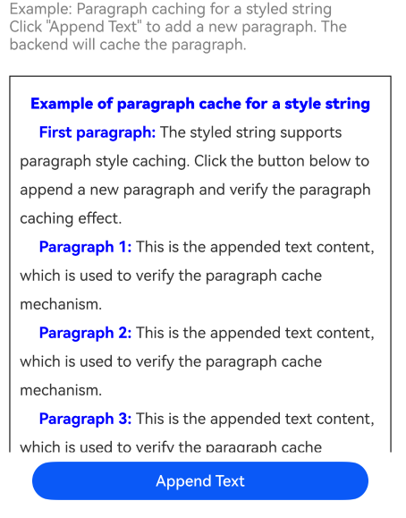

### Example 32: Setting Text Tail Indentation

This example demonstrates how to use the [tailIndents](#tailindents) API to set text tail indentation.

Since API version 26.0.0, you can use the **tailIndents** attribute to set text tail indentation.

```ts
import { LengthMetrics } from '@kit.ArkUI';

@Entry
@Component
struct TailIndentsExample {
  build() {
    Column() {
      Text('No tailIndents set\nNo tailIndents set\nNo tailIndents set\nNo tailIndents set\nNo tailIndents set')
        .fontSize(20)
        .borderWidth(1)
        .borderColor(Color.Blue)
        .textAlign(TextAlign.End)
        .width('100%')

      Text('Set a single tailIndents value\nSet a single tailIndents value\nSet a single tailIndents value\nSet a single tailIndents value\nSet a single tailIndents value')
        .fontSize(20)
        .borderWidth(1)
        .borderColor(Color.Blue)
        .textAlign(TextAlign.End)
        .width('100%')
        .tailIndents(LengthMetrics.vp(100))

      Text('Set a tailIndents array\nSet a tailIndents array\nSet a tailIndents array\nSet a tailIndents array\nSet a tailIndents array')
        .fontSize(20)
        .borderWidth(1)
        .borderColor(Color.Blue)
        .textAlign(TextAlign.End)
        .width('100%')
        .tailIndents([LengthMetrics.vp(100), LengthMetrics.vp(50), LengthMetrics.vp(20)])

    }
    .height('100%')
    .width('100%')
  }
}
```

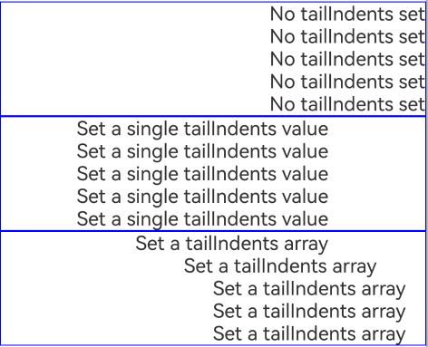

### Example 33: Setting an AI Menu for Text Selection

This example demonstrates how to configure the AI menu for text selection using the [enableSelectedDataDetector](#enableselecteddatadetector22) API.

The **enableSelectedDataDetector** API is added in API version 22.

```ts
@Entry
@Component
struct DataDetectorDemo {
  exampleText: string ='Example website: www.example.com';

  build() {
    Column() {
      Row(){
        Text(this.exampleText)
          .copyOption(CopyOptions.LocalDevice)
          .enableSelectedDataDetector(true)
          .border({ width: 1, color: Color.Black })
          .padding(10)
          .margin(10)
      }
    }.width('100%')
  }
}
```
<!--RP5--><!--RP5End-->

### Example 34: Drawing a Gradient Highlighted Background by Long Pressing Text Containing Emojis

This example shows how to use [getLayoutManager](#getlayoutmanager12) to obtain the text layout management object, use [getCharacterPositionAtCoordinate](ts-text-common.md#getcharacterpositionatcoordinate) queried in UTF-16 format in [LayoutManager](ts-text-common.md#layoutmanager12) to obtain the character position and affinity based on the long-pressing coordinates, use [getGlyphRangeForCharacterRange](ts-text-common.md#getglyphrangeforcharacterrange) to obtain the corresponding glyph index range and actual character range, and use [getRectsForRange](ts-text-common.md#getrectsforrange14) to obtain the text rectangular area, and draw a gradient background on [Canvas](ts-components-canvas-canvas.md) to highlight the text that contains emoticons (glyph clusters).

Since API version 26.0.0, the **getCharacterPositionAtCoordinate**, **getGlyphRangeForCharacterRange**, and **getCharacterRangeForGlyphRange** APIs with the encoding type parameter are added, and the **TextEncoding** enumeration is added.

```ts
// xxx.ets
import { LengthMetrics } from '@kit.ArkUI';
import { text } from '@kit.ArkGraphics2D';

const TEXT_CONTENT: string =
  'This is test text containing emojis\u{1F60A}. Long press the text to view the gradient highlight effect\u{1F389}.\n' +
  'Complex emojis\u{1F468}\u{200D}\u{1F469}\u{200D}\u{1F467}\u{200D}\u{1F466} will also be correctly processed.' +
  '\u{1F3F3}\u{FE0F}\u{200D}\u{1F308}. Here are some more emojis\u{1F680}\u{1F31F}\u{1F4BB} mixed with Chinese characters.\n' +
  'Third line: Long press different positions to try various characters\u{1F600}\u{1F431}\u{1F409}.';

@Entry
@Component
struct Utf16GlyphHighlightPage {
  private textController: TextController = new TextController();
  private canvasContext: CanvasRenderingContext2D = new CanvasRenderingContext2D(new RenderingContextSettings(true));
  @State isCanvasReady: boolean = false;
  @State resultInfo: string = 'Long press the text below (including emojis) to view the gradient background highlight effect.';

  aboutToAppear(): void {
    const styledString = new MutableStyledString(TEXT_CONTENT, [{
      start: 0, length: TEXT_CONTENT.length,
      styledKey: StyledStringKey.FONT,
      styledValue: new TextStyle({ fontSize: LengthMetrics.vp(24) })
    }]);
    this.textController.setStyledString(styledString);
  }

  build() {
    Column() {
      Text(this.resultInfo)
        .fontSize(13).fontColor('#666666')
        .padding({ left: 16, right: 16, top: 12, bottom: 8 })
        .margin({ left: 12, right: 12, top: 12 })
        .width('100%').height(110)
      Stack({ alignContent: Alignment.TopStart }) {
        Canvas(this.canvasContext).width('100%').height('100%')
          .onReady(() => { this.isCanvasReady = true; })
        Text(undefined, { controller: this.textController })
          .gesture(LongPressGesture({ repeat: false, duration: 500 })
            .onAction((event: GestureEvent) => { this.handleLongPress(event); }))
      }
      .layoutWeight(1).width('100%')
      .padding({ left: 16, right: 16, top: 12 })
      .margin({ left: 12, right: 12, bottom: 12 }).clip(true)
    }.height('100%').width('100%')
  }

  private handleLongPress(event: GestureEvent): void {
    // Processing flow: Convert coordinates to pixels -> Use getCharacterPositionAtCoordinate to obtain the character position and affinity ->
    //            Determine the character range based on the affinity -> Use getGlyphRangeForCharacterRange to obtain the glyph range and actual character range ->
    //           Use getRectsForRange to obtain the rectangular area -> Use Canvas to draw the gradient background.
    if (!this.isCanvasReady) { this.resultInfo = 'The canvas is not ready. Please try again later.'; return; }
    const uiContext = this.getUIContext();
    // Obtain the text layout manager object for subsequent queries of character positions, glyph ranges, and rectangular areas.
    const layoutManager = this.textController.getLayoutManager();
    if (!layoutManager) { this.resultInfo = 'LayoutManager is unavailable.'; return; }
    const finger = event.fingerList[0];
    if (!finger) { this.resultInfo = 'Finger information not obtained.'; return; }
    // Convert the long-pressing coordinates from vp to px for the layout query API.
    const localXPx = uiContext.vp2px(finger.localX);
    const localYPx = uiContext.vp2px(finger.localY);
    // Query the position and affinity of the character closest to the long-pressing coordinates in UTF-16 encoding.
    const posAffinity = layoutManager.getCharacterPositionAtCoordinate(localXPx, localYPx, TextEncoding.TEXT_ENCODING_UTF16);
    if (!posAffinity) { this.resultInfo = 'getCharacterPositionAtCoordinate returns undefined.'; return; }
    const index = posAffinity.position;
    const affinity = posAffinity.affinity;
    let charStart: number, charEnd: number;
    if (affinity === text.Affinity.UPSTREAM) {
      charStart = Math.max(0, index - 1); charEnd = index;
    } else {
      charStart = index; charEnd = index + 1;
    }
    // Query the glyph range and actual character range (UTF-16 encoding) based on the character range.
    const glyphRanges = layoutManager.getGlyphRangeForCharacterRange(
      { start: charStart, end: charEnd }, TextEncoding.TEXT_ENCODING_UTF16);
    if (!glyphRanges || glyphRanges.length === 0) {
      this.resultInfo = `getGlyphRangeForCharacterRange returns an empty value, index=${index}, affinity=${affinity}`; return;
    }
    const actualRange: TextRange = glyphRanges.length >= 2 ? glyphRanges[1] : { start: charStart, end: charEnd };
    // Obtain the rectangular area of the text based on the actual character range for drawing the highlighted background.
    const textBoxes = layoutManager.getRectsForRange(actualRange, text.RectWidthStyle.TIGHT, text.RectHeightStyle.TIGHT);
    if (!textBoxes || textBoxes.length === 0) {
      this.resultInfo = `getRectsForRange returns an empty value. range=[${actualRange.start}, ${actualRange.end}]`; return;
    }
    this.drawGradientBackground(uiContext, textBoxes);
    const affinityStr = affinity === text.Affinity.UPSTREAM ? 'UPSTREAM(0)' : 'DOWNSTREAM(1)';
    this.resultInfo =
      `Coordinates: (${finger.localX.toFixed(1)}, ${finger.localY.toFixed(1)})vp\n` +
      `UTF16 offset: ${index}, affinity: ${affinityStr}\n` +
      `Input range: [${charStart}, ${charEnd}] -> Actual character range: [${actualRange.start}, ${actualRange.end}]\n` +
      `Number of rectangles: ${textBoxes.length}`;
  }

  private drawGradientBackground(uiContext: UIContext, textBoxes: TextBox[]): void {
    const ctx = this.canvasContext;
    ctx.clearRect(0, 0, 5000, 5000);
    for (const box of textBoxes) {
      const r = box.rect;
      const l = uiContext.px2vp(r.left), t = uiContext.px2vp(r.top);
      const w = uiContext.px2vp(r.right) - l, h = uiContext.px2vp(r.bottom) - t;
      if (w <= 0 || h <= 0) continue;
      const g = ctx.createLinearGradient(l, t, l + w, t + h);
      g.addColorStop(0, 'rgba(187, 153, 255, 0.66)');
      g.addColorStop(1, 'rgba(129, 229, 255, 0.66)');
      ctx.fillStyle = g;
      ctx.beginPath();
      ctx.roundRect(l, t, w, h, 4);
      ctx.fill();
    }
  }
}
```

The display effect may vary depending on the device sizes and is for reference only.

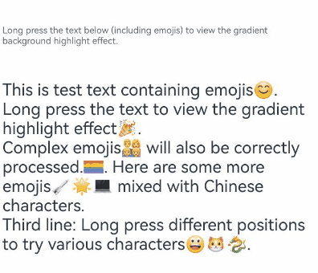

<!--no_check-->