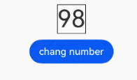

# Text
<!--Kit: ArkUI-->
<!--Subsystem: ArkUI-->
<!--Owner: @xiangyuan6-->
<!--Designer: @xiangyuan6-->
<!--Tester: @jiaoaozihao-->
<!--Adviser: @Brilliantry_Rui-->

The **Text** component is used to display a piece of textual information.

>  **NOTE**
>
>  This component is supported since API version 7. Updates will be marked with a superscript to indicate their earliest API version.
>
>  <!--RP3--><!--RP3End-->


## Child Components

This component can contain the [Span](ts-basic-components-span.md), [ImageSpan](ts-basic-components-imagespan.md), [SymbolSpan](ts-basic-components-symbolSpan.md), and [ContainerSpan](ts-basic-components-containerspan.md) child components.

>  **NOTE**
>
>  Use [child components](#child-components) to implement [text and image layout](../../../ui/arkts-text-image-layout.md) scenarios.

## APIs

Text(content?: string | Resource , value?: TextOptions)

**Widget capability**: This API can be used in ArkTS widgets since API version 9.

**Atomic service API**: This API can be used in atomic services since API version 11.

**System capability**: SystemCapability.ArkUI.ArkUI.Full

**Parameters**

| Name| Type| Mandatory| Description|
| -------- | -------- | -------- | -------- |
| content | string \| [Resource](ts-types.md#resource) | No| Text content. This parameter takes effect when the child component [Span](ts-basic-components-span.md) is not included and [styled string](ts-universal-styled-string.md) is not set.<br>Default value: **' '**<br>**NOTE**<br>Priority of displayed content: Styled string > Content of the **Span** component > Text content of the **Text** component.|
| value<sup>11+</sup> | [TextOptions](#textoptions11) | No| Initialization options of the component.|

## Attributes

In addition to the [universal attributes](ts-component-general-attributes.md), the following attributes are supported.

**Layout and Alignment**

| Attribute| Description|
|------|------|
| baselineOffset | Sets the offset of the text baseline.|
| halfLeading<sup>12+</sup> | Sets whether half leading is enabled.|
| textAlign | Sets the horizontal alignment mode of the text.|
| textContentAlign<sup>21+</sup> | Sets the vertical alignment of the text content area within the component.|
| textVerticalAlign<sup>20+</sup> | Sets the vertical alignment of text paragraphs.|

**Font Style**

| Attribute| Description|
|------|------|
| decoration | Sets the color, type, and style of the text decoration.|
| font<sup>10+</sup> | Sets the text style,|
| font<sup>12+</sup> | Sets the font style, with support for font settings.|
| fontColor | Sets the font color.|
| fontFamily | Sets the font family.|
| fontFeature<sup>12+</sup> | Sets the font feature, for example, monospaced digits.|
| fontSize | Sets the text size.|
| fontStyle | Sets the font style.|
| fontWeight | Sets the font weight.|
| fontWeight<sup>12+</sup> | Sets the text font weight, with support for font settings.|
| letterSpacing | Sets the letter spacing for a text style.|
| shaderStyle<sup>20+</sup> | Applies gradient or solid color effects to text.|
| textCase | Sets the text case.|
| textShadow<sup>10+</sup> | Sets the text shadow.|

**Text Overflow, Line Break, and Line Wrapping**

| Attribute| Description|
|------|------|
| ellipsisMode<sup>11+</sup> | Sets the ellipsis position.|
| lineBreakStrategy<sup>12+</sup> | Sets the line break rule.|
| marqueeOptions<sup>18+</sup> | Sets the marquee effect for text.|
| textOverflow | Sets the display mode when the text is too long.|
| wordBreak<sup>11+</sup> | Sets the word break rule.|

**Line and Paragraph**

| Attribute| Description|
|------|------|
| enableAutoSpacing<sup>20+</sup> | Sets whether to enable automatic spacing between Chinese and Western characters.|
| lineHeight | Sets the text line height.|
| lineHeightMultiple<sup>22+</sup> | Sets the line height multiplier for the text.|
| lineSpacing<sup>12+</sup> | Sets the line spacing for the text.|
| lineSpacing<sup>20+</sup> | Sets the line spacing for the text. When **LineSpacingOptions** is not specified, line spacing is applied above the first line and below the last line by default.|
| maxLineHeight<sup>22+</sup> | Sets the maximum line height of the text.|
| maxLines | Sets the maximum number of lines in the text.|
| minLineHeight<sup>22+</sup> | Sets the minimum line height of the text.|
| minLines<sup>22+</sup> | Sets the minimum number of lines in the text.|
| optimizeTrailingSpace<sup>20+</sup> | Sets whether to optimize trailing spaces at line endings.|
| textIndent<sup>10+</sup> | Sets the indent of the first line text.|

**Font Adaptation**

| Attribute| Description|
|------|------|
| heightAdaptivePolicy<sup>10+</sup> | Sets the font size adjustment strategy for adaptive text layout.|
| maxFontScale<sup>12+</sup> | Sets the maximum font scale factor for text.|
| maxFontSize | Sets the maximum font size.|
| minFontScale<sup>12+</sup> | Sets the minimum font scale factor for text.|
| minFontSize | Sets the minimum font size.|

**Text Selection and Copy**

| Attribute| Description|
|------|------|
| caretColor<sup>14+</sup> | Sets the color of the text selection handle, also known as the caret, in the text box.|
| copyOption<sup>9+</sup> | Sets whether copy and paste is allowed.|
| draggable<sup>9+</sup> | Sets the drag effect of the selected text.|
| selectedBackgroundColor<sup>14+</sup> | Sets the background color of the selected text.|
| selection<sup>11+</sup> | Sets text selection.|
| textSelectable<sup>12+</sup> | Sets whether the text is selectable and focusable.|

**Text Recognition**

| Attributes| Description|
|------|------|
| dataDetectorConfig<sup>11+</sup> | Configures text recognition settings.|
| enableDataDetector<sup>11+</sup> | Enables recognition for special entities within the text.|
| enableSelectedDataDetector<sup>22+</sup> | Sets whether to enable entity recognition for selected text.|

**Custom Menu**

| Attribute| Description|
|------|------|
| bindSelectionMenu<sup>11+</sup> | Sets the custom context menu on text selection.|
| editMenuOptions<sup>12+</sup> | Sets the extended options of the custom context menu on selection.|

**Other Functionality**

| Attribute| Description|
|------|------|
| contentTransition<sup>20+</sup> | Text animation effect.|
| enableHapticFeedback<sup>13+</sup> | Specifies whether to enable haptic feedback.|
| privacySensitive<sup>12+</sup> | Sets whether to enable privacy mode on widgets.|

The following describes the details of each API.

### baselineOffset

baselineOffset(value: number | ResourceStr)

Sets the offset of the text baseline.

Percentage values follow default display behavior.

Positive values shift the text upwards, while negative values shift it downwards.

**Widget capability**: This API can be used in ArkTS widgets since API version 9.

**Atomic service API**: This API can be used in atomic services since API version 11.

**System capability**: SystemCapability.ArkUI.ArkUI.Full

**Parameters**

| Name| Type                      | Mandatory| Description                            |
| ------ | -------------------------- | ---- | -------------------------------- |
| value  | number \| [ResourceStr](ts-types.md#resourcestr) | Yes  | Offset of the text baseline.<br>Default value: **0**<br>The Resource type is supported since API version 20.|

### bindSelectionMenu<sup>11+</sup>

bindSelectionMenu(spanType: TextSpanType, content: CustomBuilder, responseType: TextResponseType, options?: SelectionMenuOptions)

Sets the custom context menu on text selection.

The duration required for a long-press gesture is 600 ms for **bindSelectionMenu** and 800 ms for **bindContextMenu**. When both **bindSelectionMenu** and **bindContextMenu** are set and both are configured to be triggered by a long-press gesture, **bindSelectionMenu** is triggered first.

If the custom menu is too long, embed a [Scroll](./ts-container-scroll.md) component to prevent the keyboard from being blocked.

> **NOTE**
>
> This API cannot be called within [attributeModifier](ts-universal-attributes-attribute-modifier.md#attributemodifier).
>
>  When [editMenuOptions](#editmenuoptions12) is used for configuring the context menu on text selection, the system's default style and trigger conditions are preserved.
>
>  In contrast, when [bindSelectionMenu](#bindselectionmenu11) is used, both the menu style and the trigger conditions are fully customizable.

**Atomic service API**: This API can be used in atomic services since API version 12.

**System capability**: SystemCapability.ArkUI.ArkUI.Full

**Parameters**

| Name      | Type                                                        | Mandatory| Description                                                        |
| ------------ | ------------------------------------------------------------ | ---- | ------------------------------------------------------------ |
| spanType     | [TextSpanType](#textspantype11)          | Yes  | Span type of the menu.<br>Default value: **TextSpanType.TEXT**              |
| content      | [CustomBuilder](ts-types.md#custombuilder8)                  | Yes  | Content of the menu.                                            |
| responseType | [TextResponseType](#textresponsetype11)  | Yes  | Response type of the menu.<br>Default value: **TextResponseType.LONG_PRESS**|
| options      | [SelectionMenuOptions](ts-basic-components-richeditor.md#selectionmenuoptions) | No  | Options of the menu.                                            |

### caretColor<sup>14+</sup>

caretColor(color: ResourceColor)

Sets the color of the text selection handle, also known as the caret, in the text box.

**Atomic service API**: This API can be used in atomic services since API version 14.

**System capability**: SystemCapability.ArkUI.ArkUI.Full

**Parameters**

| Name| Type                                      | Mandatory| Description                                  |
| ------ | ------------------------------------------ | ---- | -------------------------------------- |
| color  | [ResourceColor](ts-types.md#resourcecolor) | Yes  | Color of the text selection handle.<br>Default value: **'#007DFF'**|

### contentTransition<sup>20+</sup>

contentTransition(transition: Optional\<ContentTransition>)

Applies a transition animation to text content. Supports numeric flip animation via [NumericTextTransition](../arkui-ts/ts-text-common.md#numerictexttransition20).

**Atomic service API**: This API can be used in atomic services since API version 20.

**System capability**: SystemCapability.ArkUI.ArkUI.Full

**Parameters**

| Name| Type                                            | Mandatory| Description                                                      |
| ------ | ------------------------------------------------ | ---- | ---------------------------------------------------------- |
| transition  | Optional\<[ContentTransition](../arkui-ts/ts-text-common.md#contenttransition20)> | Yes  | Text animation effect.|

### copyOption<sup>9+</sup>

copyOption(value: CopyOptions)

Sets whether copy and paste is allowed.

Since API version 20, copied text from the **Text** component includes HTML-formatted content in the pasteboard.

- When the **Text** component contains child elements, only [Span](ts-basic-components-span.md) and [ImageSpan](ts-basic-components-imagespan.md) support HTML-formatted pasteboard content.

- For styled strings, refer to [toHtml](ts-universal-styled-string.md#tohtml14) for supported HTML conversion scope.

When **copyOption** is set to **CopyOptions.InApp** or **CopyOptions.LocalDevice**:

- A long press on the text will display a context menu that offers the copy and select-all options.

- By default, selected text is draggable. To disable dragging, set **draggable** to **false**.

- To support **Ctrl+C** copying, also set [textSelectable](#textselectable12) to **TextSelectableMode.SELECTABLE_FOCUSABLE**.

The **Text** component listens for **onClick**, which is a non-bubbling event. To allow parent components to respond to clicks within the **Text** area, use [parallelGesture](ts-gesture-settings.md#parallelgesture) on the parent. For implementation guidance, see [Example 7: Setting Text Recognition](#example-7-setting-text-recognition).

Because widgets do not have the long press event, the context menu will not be displayed when users long press text.

**Widget capability**: This API can be used in ArkTS widgets since API version 9.

**Atomic service API**: This API can be used in atomic services since API version 11.

**System capability**: SystemCapability.ArkUI.ArkUI.Full

**Parameters**

| Name| Type                                            | Mandatory| Description                                                      |
| ------ | ------------------------------------------------ | ---- | ---------------------------------------------------------- |
| value  | [CopyOptions](ts-appendix-enums.md#copyoptions9) | Yes  | Whether copy and paste is allowed.<br>Default value: **CopyOptions.None**|

### dataDetectorConfig<sup>11+</sup>

dataDetectorConfig(config: TextDataDetectorConfig)

Configures text recognition settings, including entity types to detect, display styles for detected entities, and long-press preview options.

This API must be used together with [enableDataDetector](#enabledatadetector11). It takes effect only when **enableDataDetector** is set to **true**.

**Atomic service API**: This API can be used in atomic services since API version 12.

**System capability**: SystemCapability.ArkUI.ArkUI.Full

**Parameters**

| Name| Type                                                       | Mandatory| Description                                                        |
| ------ | ----------------------------------------------------------- | ---- | ------------------------------------------------------------ |
| config | [TextDataDetectorConfig](ts-text-common.md#textdatadetectorconfig11) | Yes  | Text recognition configuration.|

### decoration

decoration(value: DecorationStyleInterface)

Sets the color, type, and style of the text decoration.

>  **NOTE**
>
>  When the bottom contour of a character intersects with the decoration, underline avoidance is triggered, commonly affecting characters like "g", "j", "y", "q", and "p."
>
>  If the decoration color is set to **Color.Transparent**, it inherits the text color of the first character in each line. If the decoration color is set to **"#00FFFFFF"**, the line becomes fully transparent.

**Widget capability**: This API can be used in ArkTS widgets since API version 9.

**Atomic service API**: This API can be used in atomic services since API version 11.

**System capability**: SystemCapability.ArkUI.ArkUI.Full

**Parameters**

| Name| Type                                                        | Mandatory| Description                                                        |
| ------ | ------------------------------------------------------------ | ---- | ------------------------------------------------------------ |
| value  | [DecorationStyleInterface<sup>12+</sup>](ts-universal-styled-string.md#decorationstyleinterface) | Yes  | Style of the text decoration.<br>Default value:<br>{<br> type: TextDecorationType.None,<br> color: Color.Black,<br> style: TextDecorationStyle.SOLID <br>}<br>**NOTE**<br>The **style** parameter cannot be used in widgets.|

### draggable<sup>9+</sup>

draggable(value: boolean)

Sets the drag effect of the selected text.

This attribute cannot be used together with the [onDragStart](ts-universal-events-drag-drop.md#ondragstart) event.

If set to **true**, **draggable** must be used in conjunction with [CopyOptions](ts-appendix-enums.md#copyoptions9). When **copyOptions** is set to **CopyOptions.InApp** or **CopyOptions.LocalDevice**, the selected text becomes draggable and can be copied into a text box.

**Atomic service API**: This API can be used in atomic services since API version 11.

**System capability**: SystemCapability.ArkUI.ArkUI.Full

**Parameters**

| Name| Type   | Mandatory| Description                                |
| ------ | ------- | ---- | ------------------------------------ |
| value  | boolean | Yes  | Drag effect of the selected text.<br>**true**: The selected text is draggable. **false**: The selected text is not draggable.<br>Default value: **false**|

### editMenuOptions<sup>12+</sup>

editMenuOptions(editMenu: EditMenuOptions)

Sets the extended options of the custom context menu on selection, including the text content, icon, and callback.

When [disableMenuItems](../arkts-apis-uicontext-textmenucontroller.md#disablemenuitems20) or [disableSystemServiceMenuItems](../arkts-apis-uicontext-textmenucontroller.md#disablesystemservicemenuitems20) is used to disable system service menu items in the context menu on selection, the disabled menu options will be excluded from the parameter list in the [onCreateMenu](./ts-text-common.md#oncreatemenu12) callback of **editMenuOptions**.

>  **NOTE**
>
>  When [editMenuOptions](#editmenuoptions12) is used for configuring the context menu on text selection, the system's default style and trigger conditions are preserved.
>
>  In contrast, when [bindSelectionMenu](#bindselectionmenu11) is used, both the menu style and the trigger conditions are fully customizable.

**Atomic service API**: This API can be used in atomic services since API version 12.

**System capability**: SystemCapability.ArkUI.ArkUI.Full

**Parameters**

| Name| Type                                         | Mandatory| Description                                         |
| ------ | --------------------------------------------- | ---- | --------------------------------------------- |
| editMenu  | [EditMenuOptions](ts-text-common.md#editmenuoptions) | Yes  | Extended options of the custom context menu on selection.|

### ellipsisMode<sup>11+</sup>

ellipsisMode(value: EllipsisMode)

Sets the ellipsis position.

For the settings to work, **overflow** must be set to **TextOverflow.Ellipsis** and **maxLines** must be specified. Setting **ellipsisMode** alone does not take effect.

**EllipsisMode.START** and **EllipsisMode.CENTER** take effect only when text overflows in a single line.

**Atomic service API**: This API can be used in atomic services since API version 12.

**System capability**: SystemCapability.ArkUI.ArkUI.Full

**Parameters**

| Name| Type                                               | Mandatory| Description                                     |
| ------ | --------------------------------------------------- | ---- | ----------------------------------------- |
| value  | [EllipsisMode](ts-appendix-enums.md#ellipsismode11) | Yes  | Ellipsis position.<br>Default value: **EllipsisMode.END**|

### enableAutoSpacing<sup>20+</sup>

enableAutoSpacing(enabled: Optional\<boolean>)

Sets whether to enable automatic spacing between Chinese and Western characters.

**Atomic service API**: This API can be used in atomic services since API version 20.

**System capability**: SystemCapability.ArkUI.ArkUI.Full

**Parameters**

| Name| Type   | Mandatory| Description                              |
| ------ | ------- | ---- | ---------------------------------- |
| enabled | [Optional](ts-universal-attributes-custom-property.md#optionalt12)\<boolean> | Yes  | Whether to enable automatic spacing between Chinese and Western characters.<br>**true** to enable, **false** otherwise.<br>Default value: **false**.|

### enableDataDetector<sup>11+</sup>

enableDataDetector(enable: boolean)

Enables recognition for special entities within the text. When enableDataDetector is set to true, special entities are recognized.

The recognized entities are in blue with blue underlines.

``` ts	
color: '#ff007dff'	
decoration:{	
  type: TextDecorationType.Underline,	
  color: '#ff007dff',	
  style: TextDecorationStyle.SOLID	
}	
```

> **NOTE**
>
> - This API takes effect only when the underlying device has the text recognition capability.
> 
> - When [textOverflow](#textoverflow) is set to TextOverflow.MARQUEE, special text entities are not identified.
<!--RP2--><!--RP2End-->

**Atomic service API**: This API can be used in atomic services since API version 12.

**System capability**: SystemCapability.ArkUI.ArkUI.Full

**Parameters**

| Name| Type   | Mandatory| Description                             |
| ------ | ------- | ---- | --------------------------------- |
| enable  | boolean | Yes  | Whether to enable text recognition.<br>**true**: Enable text recognition. **false**: Disable text recognition.<br>Default value: **false**.|

### enableHapticFeedback<sup>13+</sup>

enableHapticFeedback(isEnabled: boolean)

Specifies whether to enable haptic feedback.

To enable haptic feedback, you must declare the ohos.permission.VIBRATE permission under **requestPermissions** in the **module.json5** file of the project.

```json
"requestPermissions": [
 {
    "name": "ohos.permission.VIBRATE",
 }
]
```

> **NOTE**
>
> This API can be called within [attributeModifier](ts-universal-attributes-attribute-modifier.md#attributemodifier) since API version 18.

**Atomic service API**: This API can be used in atomic services since API version 13.

**System capability**: SystemCapability.ArkUI.ArkUI.Full

**Parameters**

| Name| Type   | Mandatory| Description                              |
| ------ | ------- | ---- | ---------------------------------- |
| isEnabled | boolean | Yes  | Whether to enable haptic feedback.<br>**true** to enable, **false** otherwise.<br>Default value: **true**.|

### enableSelectedDataDetector<sup>22+</sup>

enableSelectedDataDetector(enable: boolean | undefined)

Sets whether to enable entity recognition for selected text. This API only works on devices that provide text recognition.

When **enableSelectedDataDetector** is set to **true**, all entity types are recognized by default.

This feature is only effective when [CopyOptions](ts-appendix-enums.md#copyoptions9) is set to **CopyOptions.LocalDevice** or **CopyOptions.CrossDevice**.

**Atomic service API**: This API can be used in atomic services since API version 22.

**System capability**: SystemCapability.ArkUI.ArkUI.Full

**Parameters**

| Name| Type   | Mandatory| Description                             |
| ------ | ------- | ---- | --------------------------------- |
| enable  | boolean \| undefined | Yes  | Whether to enable entity recognition for selected text.<br>**true**: Enable entity recognition. **false**: Disable entity recognition. Default value: **true**.|

### font<sup>10+</sup>

font(value: Font)

Sets the text style,

covering the font size, font width, font family, and font style.

**Atomic service API**: This API can be used in atomic services since API version 11.

**System capability**: SystemCapability.ArkUI.ArkUI.Full

**Parameters**

| Name| Type   | Mandatory| Description      |
| ------ | ------- | ---- | ---------- |
| value  | [Font](ts-types.md#font) | Yes  | Text style.|

### font<sup>12+</sup>

font(fontValue: Font, options?: FontSettingOptions)

Sets the font style, with support for font settings.

It is only effective for the **Text** component, not for its child components.

**Widget capability**: This API can be used in ArkTS widgets since API version 12.

**Atomic service API**: This API can be used in atomic services since API version 12.

**System capability**: SystemCapability.ArkUI.ArkUI.Full

**Parameters**

| Name| Type                                         | Mandatory| Description                                         |
| ------ | --------------------------------------------- | ---- | --------------------------------------------- |
| fontValue | [Font](ts-types.md#font) | Yes | Text style.|
| options | [FontSettingOptions](ts-text-common.md#fontsettingoptions12) | No | Font settings.|

### fontColor

fontColor(value: ResourceColor)

Sets the font color.

**Widget capability**: This API can be used in ArkTS widgets since API version 9.

**Atomic service API**: This API can be used in atomic services since API version 11.

**System capability**: SystemCapability.ArkUI.ArkUI.Full

**Parameters**

| Name| Type                                      | Mandatory| Description      |
| ------ | ------------------------------------------ | ---- | ---------- |
| value  | [ResourceColor](ts-types.md#resourcecolor) | Yes  | Font color.<br>Default value: **'#e6182431'**.<br>Default value on wearable devices: **'#c5ffffff'**.|

### fontFamily

fontFamily(value: string | Resource)

Sets the font family.

> **NOTE**
>
> You can use [loadFontSync](../../apis-arkgraphics2d/js-apis-graphics-text.md#loadfontsync) to register custom fonts.

**Widget capability**: This API can be used in ArkTS widgets since API version 9.

**Atomic service API**: This API can be used in atomic services since API version 11.

**System capability**: SystemCapability.ArkUI.ArkUI.Full

**Parameters**

| Name| Type                                                | Mandatory| Description                                                        |
| ------ | ---------------------------------------------------- | ---- | ------------------------------------------------------------ |
| value  | string \| [Resource](ts-types.md#resource) | Yes  | Font family. Default font: **'HarmonyOS Sans'**<br>To specify multiple fonts, separate them with commas (,), and fonts are applied in priority order. Example: **'Arial, HarmonyOS Sans'**.|

### fontFeature<sup>12+</sup>

fontFeature(value: string)

Sets the font feature, for example, monospaced digits.

Format: normal \| \<feature-tag-value\>

Format of **\<feature-tag-value\>**: \<string\> \[ \<integer\> \| on \| off ]

There can be multiple **\<feature-tag-value\>** values, which are separated by commas (,).

For example, the input format for monospaced clock fonts is "ss01" on.

>  **NOTE**
>
>  The **Text** component cannot contain both text and the child component **Span** or **ImageSpan**. If both of them exist, only the content in **Span** or **ImageSpan** is displayed.
>
>  The typesetting engine rounds down the value of [width](ts-universal-attributes-size.md#width) to ensure that the value is an integer. If the typesetting engine rounds up the value instead, the right side of the text may be clipped.
>
>  When multiple **Text** components are placed in the [Row](ts-container-row.md) container with no specific layout or space allocation settings configured, the components are laid out based on the maximum size of the container. To make sure the sum of the components' main axis sizes does not exceed the main axis size of the container, you can set [layoutWeight](ts-universal-attributes-size.md#layoutweight) or use the [flex layout](ts-universal-attributes-flex-layout.md).
>
>  The system's default font supports the following liga ligatures: Th, fb, ff, fb, ff, ffh, ffi, ffk, ffl, fh, fi, fk, fl, rf, rt, rv, rx, ry. These ligatures may interfere with the expected rendering of spans and styled strings. To avoid such inconsistencies, consider disabling the liga feature.
>
>  Text rendering behavior is closely tied to the font file in use. For instance, the system's default font supports 8-punctuation compression only for left-side punctuation marks. Right-side punctuation, including exclamation marks, enumeration commas, and question marks, is not affected by this feature.

**Widget capability**: This API can be used in ArkTS widgets since API version 12.

**Atomic service API**: This API can be used in atomic services since API version 12.

**System capability**: SystemCapability.ArkUI.ArkUI.Full

**Parameters**

| Name| Type  | Mandatory| Description          |
| ------ | ------ | ---- | -------------- |
| value  | string | Yes  | Font feature.|

The figure below shows the font feature list.


Font features are advanced OpenType typographic capabilities such as ligatures, monospacing, and stylistic alternates. These features are typically utilized with custom fonts and require support from the font file itself.

For more information about the font features, see [Low-level font feature settings control: the font-feature-settings property](https://www.w3.org/TR/css-fonts-3/#font-feature-settings-prop) and [The Complete CSS Demo for OpenType Features](https://sparanoid.com/lab/opentype-features/).

### fontSize

fontSize(value: number | string | Resource)

Sets the text size.

**Widget capability**: This API can be used in ArkTS widgets since API version 9.

**Atomic service API**: This API can be used in atomic services since API version 11.

**System capability**: SystemCapability.ArkUI.ArkUI.Full

**Parameters**

| Name| Type                                                        | Mandatory| Description                                                        |
| ------ | ------------------------------------------------------------ | ---- | ------------------------------------------------------------ |
| value  | number \| string \| [Resource](ts-types.md#resource) | Yes  | Font size. If **fontSize** is of the number type, the unit fp is used. This parameter cannot be set in percentage.<br>Default value: **16fp**.<br>Default value on wearable devices: **15fp**.|

### fontStyle

fontStyle(value: FontStyle)

Sets the font style.

**Widget capability**: This API can be used in ArkTS widgets since API version 9.

**Atomic service API**: This API can be used in atomic services since API version 11.

**System capability**: SystemCapability.ArkUI.ArkUI.Full

**Parameters**

| Name| Type                                       | Mandatory| Description                                   |
| ------ | ------------------------------------------- | ---- | --------------------------------------- |
| value  | [FontStyle](ts-appendix-enums.md#fontstyle) | Yes  | Font style.<br>Default value: **FontStyle.Normal**|

### fontWeight

fontWeight(value: number | FontWeight | ResourceStr)

Sets the font weight. If the value is too large, the text may be clipped depending on the font.

**Widget capability**: This API can be used in ArkTS widgets since API version 9.

**Atomic service API**: This API can be used in atomic services since API version 11.

**System capability**: SystemCapability.ArkUI.ArkUI.Full

**Parameters**

| Name| Type                                                        | Mandatory| Description                                                        |
| ------ | ------------------------------------------------------------ | ---- | ------------------------------------------------------------ |
| value  | number \| [FontWeight](ts-appendix-enums.md#fontweight) \| [ResourceStr](ts-types.md#resourcestr) | Yes  | Font weight. For the number type, the value range is [100, 900], at an interval of 100. The default value is **400**. A larger value indicates a heavier font weight. For the string type, only strings that represent a number, for example, **"400"**, and the following enumerated values of **FontWeight** are supported: **"bold"**, **"bolder"**, **"lighter"**, **"regular"**, and **"medium"**.<br>Default value: **FontWeight.Normal**.<br>Default value on wearable devices: **FontWeight.Regular**.<br>The Resource type is supported since API version 20.|

### fontWeight<sup>12+</sup>

fontWeight(weight: number | FontWeight | ResourceStr, options?: FontSettingOptions)

Sets the text font weight, with support for font settings.

It is only effective for the **Text** component, not for its child components.<!--RP4--><!--RP4End-->

**Widget capability**: This API can be used in ArkTS widgets since API version 12.

**Atomic service API**: This API can be used in atomic services since API version 12.

**System capability**: SystemCapability.ArkUI.ArkUI.Full

**Parameters**

| Name| Type                                         | Mandatory| Description                                         |
| ------ | --------------------------------------------- | ---- | --------------------------------------------- |
| weight | number \| [FontWeight](ts-appendix-enums.md#fontweight) \| [ResourceStr](ts-types.md#resourcestr) | Yes | Font weight. For the number type, the value ranges from 100 to 900, at an interval of 100. A larger value indicates a heavier font weight. The default value is **400**. For the string type, only strings that represent a number, for example, **"400"**, and the following enumerated values of **FontWeight** are supported: **"bold"**, **"bolder"**, **"lighter"**, **"regular"**, and **"medium"**.<br>The Resource type is supported since API version 20.|
| options | [FontSettingOptions](ts-text-common.md#fontsettingoptions12) | No | Font settings.<br>If enableVariableFontWeight is set to false, variable font weight adjustment is disabled. If weight is set to an integer multiple of 100 within the range of [100, 900], the font weight is the value of weight. If weight is set to a non-multiple of 100, the default value 400 is used.<br>If enableVariableFontWeight is set to true, variable font weight adjustment is enabled. If weight is set to any integer within the range of [100, 900], the font weight is the value of weight.|

### halfLeading<sup>12+</sup>

halfLeading(halfLeading: boolean)

Sets whether half leading is enabled.

**Atomic service API**: This API can be used in atomic services since API version 12.

**System capability**: SystemCapability.ArkUI.ArkUI.Full

**Parameters**

| Name| Type                                         | Mandatory| Description                                         |
| ------ | --------------------------------------------- | ---- | --------------------------------------------- |
| halfLeading | boolean | Yes | Sets whether half leading is enabled.<br>Half leading is the leading split in half and applied equally to the top and bottom edges. The value **true** means that half leading is enabled, and **false** means the opposite.<br>Default value: **false**|

### heightAdaptivePolicy<sup>10+</sup>

heightAdaptivePolicy(value: TextHeightAdaptivePolicy)

Sets the font size adjustment strategy for adaptive text layout.

The available modes are as follows:

- **MAX_LINES_FIRST**: prioritizes using the [maxLines](#maxlines) attribute to control text height. If the **maxLines** setting results in a layout beyond the layout constraints, the text will shrink to a font size between [minFontSize](#minfontsize) and [maxFontSize](#maxfontsize) to allow for more content to be shown.

- **MIN_FONT_SIZE_FIRST**: prioritizes using the **minFontSize** attribute to control text height. If the text fits on one line at **minFontSize**, the system attempts to increase the font size within the range of **minFontSize** and **maxFontSize** to display the text as large as possible on one line. If the text cannot fit into a single line even at **minFontSize**, it sticks with **minFontSize**.

- **LAYOUT_CONSTRAINT_FIRST**: prioritizes using layout constraints to control text height. If the resultant layout is beyond the layout constraints, the text will shrink to a font size between **minFontSize** and **maxFontSize** to respect the layout constraints. If the text still extends beyond the layout constraints after shrinking to **minFontSize**, the lines that exceed the constraints are deleted.

**Atomic service API**: This API can be used in atomic services since API version 11.

**System capability**: SystemCapability.ArkUI.ArkUI.Full

**Parameters**

| Name| Type                                                        | Mandatory| Description                                                        |
| ------ | ------------------------------------------------------------ | ---- | ------------------------------------------------------------ |
| value  | [TextHeightAdaptivePolicy](ts-appendix-enums.md#textheightadaptivepolicy10) | Yes  | How the adaptive height is determined for the text.<br>Default value: **TextHeightAdaptivePolicy.MAX_LINES_FIRST**|

### letterSpacing

letterSpacing(value: number | ResourceStr)

Sets the letter spacing for a text style.

If the value specified is a percentage or 0, the default value is used. When the value is a string, it can represent a numeric value with or without units, for example, **"10"** or **"10fp"**.

Negative values compress text. Excessive compression may reduce content area to zero, hiding content.

This setting applies to every character, including those at line endings.

**Widget capability**: This API can be used in ArkTS widgets since API version 9.

**Atomic service API**: This API can be used in atomic services since API version 11.

**System capability**: SystemCapability.ArkUI.ArkUI.Full

**Parameters**

| Name| Type                      | Mandatory| Description          |
| ------ | -------------------------- | ---- | -------------- |
| value  | number \| [ResourceStr](ts-types.md#resourcestr) | Yes  | Letter spacing.<br>Default value: **0**<br>Unit: [fp](ts-pixel-units.md)<br>The Resource type is supported since API version 20.|

### lineBreakStrategy<sup>12+</sup>

lineBreakStrategy(strategy: LineBreakStrategy)

Sets the line break rule. This attribute takes effect only when [wordBreak](#wordbreak11) is not **WordBreak.BREAK_ALL**. Hyphens are not supported.

**Atomic service API**: This API can be used in atomic services since API version 12.

**System capability**: SystemCapability.ArkUI.ArkUI.Full

**Parameters**

| Name  | Type                                                        | Mandatory| Description                                                   |
| -------- | ------------------------------------------------------------ | ---- | ------------------------------------------------------- |
| strategy | [LineBreakStrategy](ts-appendix-enums.md#linebreakstrategy12) | Yes  | Line break rule.<br>Default value: **LineBreakStrategy.GREEDY**|

### lineHeight

lineHeight(value: number | string | Resource)

Sets the text line height.

If the value is less than or equal to **0**, the line height is unrestricted and adapts to the font size. When the value is a number, the unit is fp. When the value is a string, it can represent a numeric value with or without units, for example, **"10"** or **"10fp"**.

>  **NOTE**
>  
>  If certain characters have significantly taller glyphs than others on the same line, layout anomalies such as clipping, overlap, or misalignment may occur. In this case, adjust component attributes such as height and line height to ensure proper layout rendering.

**Widget capability**: This API can be used in ArkTS widgets since API version 9.

**Atomic service API**: This API can be used in atomic services since API version 11.

**System capability**: SystemCapability.ArkUI.ArkUI.Full

**Parameters**

| Name| Type                                                        | Mandatory| Description            |
| ------ | ------------------------------------------------------------ | ---- | ---------------- |
| value  | number \| string \| [Resource](ts-types.md#resource) | Yes  | Text line height.|

### lineHeightMultiple<sup>22+</sup>

lineHeightMultiple(value: number | undefined)

Sets the text line height in multiple mode.

Sets the line height to the product of the input parameter (value) and the font height (fontHeight).

>  **NOTE**
>  
>  When both this parameter and [lineHeight](ts-basic-components-text.md#lineheight) are set, only lineHeightMultiple takes effect.

**Widget capability**: This API can be used in ArkTS widgets since API version 22.

**Atomic service API**: This API can be used in atomic services since API version 22.

**System capability**: SystemCapability.ArkUI.ArkUI.Full

**Parameters**

| Name| Type                                                        | Mandatory| Description            |
| ------ | ------------------------------------------------------------ | ---- | ---------------- |
| value  | number \| undefined | Yes  | Multiple of the line height.<br>The value cannot be less than 0.<br>If the value is less than or equal to 0, the value 0 is used. If the value is 0, the default line height is used. A decimal value is supported.|

### lineSpacing<sup>12+</sup>

lineSpacing(value: LengthMetrics)

Sets the line spacing of the text. If the value specified is less than or equal to 0, the default value **0** is used.

**Atomic service API**: This API can be used in atomic services since API version 12.

**System capability**: SystemCapability.ArkUI.ArkUI.Full

**Parameters**

| Name| Type                                                        | Mandatory| Description            |
| ------ | ------------------------------------------------------------ | ---- | ---------------- |
| value  | [LengthMetrics](../js-apis-arkui-graphics.md#lengthmetrics12) | Yes  | Line spacing. Default value: **0**|

### lineSpacing<sup>20+</sup>

lineSpacing(value: LengthMetrics, options?: LineSpacingOptions)

Sets the line spacing for text. When **LineSpacingOptions** is not specified, line spacing is applied above the first line and below the last line by default.

**Atomic service API**: This API can be used in atomic services since API version 20.

**System capability**: SystemCapability.ArkUI.ArkUI.Full

**Parameters**

| Name| Type                                                        | Mandatory| Description            |
| ------ | ------------------------------------------------------------ | ---- | ---------------- |
| value  | [LengthMetrics](../js-apis-arkui-graphics.md#lengthmetrics12) | Yes  | Line spacing. Values less than or equal to 0 are treated as the default value **0**.|
| options  | [LineSpacingOptions](ts-text-common.md#linespacingoptions20) | No  | Line spacing configuration options.<br>Default value: **{ onlyBetweenLines: false }**.|

### marqueeOptions<sup>18+</sup>

marqueeOptions(options: Optional\<TextMarqueeOptions>)

Sets the marquee effect for text.

The **marqueeOptions** settings take effect only when **textOverflow** is set to **TextOverflow.MARQUEE**.

**Atomic service API**: This API can be used in atomic services since API version 18.

**System capability**: SystemCapability.ArkUI.ArkUI.Full

**Parameters**

| Name| Type                                      | Mandatory| Description                                      |
| ------ | ------------------------------------------ | ---- | ------------------------------------------ |
| options | [Optional](ts-universal-attributes-custom-property.md#optionalt12)\<[TextMarqueeOptions](#textmarqueeoptions18)> | Yes| Marquee animation properties such as enable/disable, step size, loop count, and direction.|

### maxFontScale<sup>12+</sup>

maxFontScale(scale: number | Resource)

Sets the maximum font scale factor for text.

**Atomic service API**: This API can be used in atomic services since API version 12.

**System capability**: SystemCapability.ArkUI.ArkUI.Full

**Parameters**

| Name| Type                                         | Mandatory| Description                                         |
| ------ | --------------------------------------------- | ---- | --------------------------------------------- |
| scale  | number \| [Resource](ts-types.md#resource) | Yes  | Maximum font scale factor for text.<br>Value range: [1, +∞)<br>**NOTE**<br>Values less than 1 are treated as **1**. Other invalid values are ineffective by default.|

### maxFontSize

maxFontSize(value: number | string | Resource)

Sets the maximum font size.

When the value is a string, it can represent a numeric value with or without units, for example, **"10"** or **"10fp"**.

For the setting to take effect, this attribute must be used together with [minFontSize](#minfontsize) and [maxLines](#maxlines), or layout constraint settings.

When adaptive font sizing is used, the **fontSize** settings do not take effect.

If the value of **maxFontSize** is less than or equal to 0 or is less than the value of **minFontSize**, the adaptive font sizing feature is disabled. In such cases, the [fontSize](#fontsize) attribute is used instead. If **fontSize** is not explicitly set, its default value will apply.

Since API version 18, adaptive font sizing is supported on child components and styled strings, and text segments without an explicitly defined font size will automatically adjust based on the available space.

**Widget capability**: This API can be used in ArkTS widgets since API version 9.

**Atomic service API**: This API can be used in atomic services since API version 11.

**System capability**: SystemCapability.ArkUI.ArkUI.Full

**Parameters**

| Name| Type                                                        | Mandatory| Description              |
| ------ | ------------------------------------------------------------ | ---- | ------------------ |
| value  | number \| string \| [Resource](ts-types.md#resource) | Yes  | Maximum font size.<br>Unit: [fp](ts-pixel-units.md)|

### maxLineHeight<sup>22+</sup>

maxLineHeight(value: LengthMetrics | undefined)

Maximum line height of the text. If the value is less than or equal to 0, the maximum line height is not limited.

If maxLineHeight is less than minLineHeight, maxLineHeight takes effect based on the value of minLineHeight.

**Widget capability**: This API can be used in ArkTS widgets since API version 22.

**Atomic service API**: This API can be used in atomic services since API version 22.

**System capability**: SystemCapability.ArkUI.ArkUI.Full

**Parameters**

| Name| Type                                                        | Mandatory| Description            |
| ------ | ------------------------------------------------------------ | ---- | ---------------- |
| value  | [LengthMetrics](../js-apis-arkui-graphics.md#lengthmetrics12) \| undefined | Yes  | Maximum line height of the text. The value cannot be a percentage.<br>If the value is less than or equal to 0, the value is processed as 0. If the value is 0, the maximum line height is not limited.|

### selectedDragPreviewStyle<sup>23+</sup>

selectedDragPreviewStyle(value: SelectedDragPreviewStyle | undefined)

Sets the background style of the text when it is dragged.

**Atomic service API**: This API can be used in atomic services since API version 23.

**System capability**: SystemCapability.ArkUI.ArkUI.Full

**Parameters**

| Name| Type                                            | Mandatory| Description                                                      |
| ------ | ------------------------------------------------ | ---- | ---------------------------------------------------------- |
| value  | [SelectedDragPreviewStyle](ts-text-common.md#selecteddragpreviewstyle23) \| undefined | Yes  | Background style of the text when it is dragged.<br>If this parameter is set to undefined, the background color follows the theme. In light mode, the background color is white. In dark mode, the background color is black.|

### maxLines

maxLines(value: number)

Sets the maximum number of lines in the text.

By default, text is automatically folded. If this attribute is specified, the text will not exceed the specified number of lines. If there is extra text, you can use [textOverflow](#textoverflow) to specify how it is displayed.

**Widget capability**: This API can be used in ArkTS widgets since API version 9.

**Atomic service API**: This API can be used in atomic services since API version 11.

**System capability**: SystemCapability.ArkUI.ArkUI.Full

**Parameters**

| Name| Type  | Mandatory| Description            |
| ------ | ------ | ---- | ---------------- |
| value  | number | Yes  | Maximum number of lines in the text.<br>**NOTE**<br>Value range: [0, *INT32_MAX*]<br>If this parameter is set to **0**, no text content is displayed.|

### minFontScale<sup>12+</sup>

minFontScale(scale: number | Resource)

Sets the minimum font scale factor for text.

**Atomic service API**: This API can be used in atomic services since API version 12.

**System capability**: SystemCapability.ArkUI.ArkUI.Full

**Parameters**

| Name| Type                                         | Mandatory| Description                                         |
| ------ | --------------------------------------------- | ---- | --------------------------------------------- |
| scale  | number \| [Resource](ts-types.md#resource) | Yes  | Minimum font scale factor for text.<br>Value range: [0, 1].<br>**NOTE**<br>Values less than 0 are treated as 0, and values greater than 1 are treated as 1. Other invalid values do not take effect by default.|

### minFontSize

minFontSize(value: number | string | Resource)

Sets the minimum font size.

When the value is a string, it can represent a numeric value with or without units, for example, **"10"** or **"10fp"**.

For the setting to take effect, this attribute must be used together with [maxFontSize](#maxfontsize) and [maxLines](#maxlines), or layout constraint settings.

When adaptive font sizing is used, the **fontSize** settings do not take effect.

If the value of **minFontSize** is less than or equal to 0, the adaptive font sizing feature is disabled. In such cases, the [fontSize](#fontsize) attribute is used instead. If **fontSize** is not explicitly set, its default value will apply.

Since API version 18, adaptive font sizing is supported on child components and styled strings, and text segments without an explicitly defined font size will automatically adjust based on the available space.

**Widget capability**: This API can be used in ArkTS widgets since API version 9.

**Atomic service API**: This API can be used in atomic services since API version 11.

**System capability**: SystemCapability.ArkUI.ArkUI.Full

**Parameters**

| Name| Type                                                        | Mandatory| Description              |
| ------ | ------------------------------------------------------------ | ---- | ------------------ |
| value  | number \| string \| [Resource](ts-types.md#resource) | Yes  | Minimum font size.<br>Unit: [fp](ts-pixel-units.md)|

### minLineHeight<sup>22+</sup>

minLineHeight(value: LengthMetrics | undefined)

Sets the minimum line height of the text. If the value is less than or equal to 0, the default value 0 is used.

**Widget capability**: This API can be used in ArkTS widgets since API version 22.

**Atomic service API**: This API can be used in atomic services since API version 22.

**System capability**: SystemCapability.ArkUI.ArkUI.Full

**Parameters**

| Name| Type                                                        | Mandatory| Description            |
| ------ | ------------------------------------------------------------ | ---- | ---------------- |
| value  | [LengthMetrics](../js-apis-arkui-graphics.md#lengthmetrics12) \| undefined | Yes  | Minimum line height of the text. The value cannot be a percentage.<br>If the value is less than or equal to 0, the value 0 is used.|

### minLines<sup>22+</sup>

minLines(minLines: Optional\<number>)

Sets the minimum number of lines in the text.

If the actual text height is less than the height corresponding to the minimum number of lines, the height corresponding to the minimum number of lines is displayed.

When this parameter and [maxLines](#maxlines) are configured at the same time, the minimum line height cannot exceed the maximum line height.

If [constraintSize](ts-universal-attributes-size.md#constraintsize) is set for the text, the height of the component is within the [constraintSize](ts-universal-attributes-size.md#constraintsize) constraint.

**Widget capability**: This API can be used in ArkTS widgets since API version 22.

**Atomic service API**: This API can be used in atomic services since API version 22.

**System capability**: SystemCapability.ArkUI.ArkUI.Full

**Parameters**

| Name| Type                                     | Mandatory| Description                                                        |
| ------ | ----------------------------------------- | ---- | ------------------------------------------------------------ |
| minLines  | [Optional](ts-universal-attributes-custom-property.md#optionalt12)\<number> | Yes  | Minimum number of lines of the text.<br>Value range: [0, *INT32_MAX*]<br>If the value is less than 0, the value 0 is used.|

### includeFontPadding<sup>23+</sup>

includeFontPadding(include: Optional\<boolean>)

Sets whether to add spacing at the beginning and end of a line to avoid text truncation. If this API is not called, no spacing is added by default.

**Atomic service API**: This API can be used in atomic services since API version 23.

**System capability**: SystemCapability.ArkUI.ArkUI.Full

**Parameters**

| Name | Type                                                        | Mandatory| Description                                                        |
| ------- | ------------------------------------------------------------ | ---- | ------------------------------------------------------------ |
| include | [Optional](ts-universal-attributes-custom-property.md#optionalt12)\<boolean> | Yes  | Whether to add spacing at the beginning and end of a line to avoid text truncation.<br>The value true indicates that spacing is added at the beginning and end of a line, and the value false indicates that spacing is not added at the beginning and end of a line.|

### fallbackLineSpacing<sup>23+</sup>

fallbackLineSpacing(enabled: Optional\<boolean>)

For multi-line text overlapping, the line height can be automatically adjusted based on the actual text height. This API takes effect only when the line height is less than the actual text height. If this API is not called, the line height is not automatically adjusted based on the actual text height by default.

**Atomic service API**: This API can be used in atomic services since API version 23.

**System capability**: SystemCapability.ArkUI.ArkUI.Full

**Parameters**

| Name | Type                                                        | Mandatory| Description                                                        |
| ------- | ------------------------------------------------------------ | ---- | ------------------------------------------------------------ |
| enabled | [Optional](ts-universal-attributes-custom-property.md#optionalt12)\<boolean> | Yes  | Whether the line height is automatically adjusted based on the actual text height.<br>The value true indicates that the line height is automatically adjusted based on the actual text height, and the value false indicates that the line height is not automatically adjusted based on the actual text height.|

### optimizeTrailingSpace<sup>20+</sup>

optimizeTrailingSpace(optimize: Optional\<boolean>)

Sets whether to optimize trailing spaces at line endings during text layout, resolving alignment display issues caused by trailing spaces.

When **Text.optimizeTrailingSpace** is set to **true**:

* Trailing space optimization applies to multi-line text, single-line text, and text and image layouts (particularly noticeable with **TextAlign.Center** or **TextAlign.End**).

* For text containing only spaces, decoration lines, shadows, and background colors follow the space text display.

* Leading spaces are not optimized. When text with trailing spaces wraps, trailing spaces on each line are optimized based on component width.

When optimizing pure space text by setting [optimizeTrailingSpace](#optimizetrailingspace20) to **true**, you cannot simultaneously set [backgroundColor](ts-universal-attributes-background.md#backgroundcolor), [decoration](#decoration), and [textAlign](#textalign) attributes.

**Atomic service API**: This API can be used in atomic services since API version 20.

**System capability**: SystemCapability.ArkUI.ArkUI.Full

**Parameters**

| Name          | Type            | Mandatory| Description                                           |
| ---------------- | ------- | ---- | ----------------------------------------------- |
| optimize         | [Optional](ts-universal-attributes-custom-property.md#optionalt12)\<boolean> | Yes  | Whether to optimize trailing spaces.<br>**true** to optimize, **false** otherwise.<br>Default value: **false**.|

### compressLeadingPunctuation<sup>23+</sup>

compressLeadingPunctuation(enabled: Optional\<boolean>)

Whether to enable the compression of punctuation marks at the beginning of a line.

> **NOTE**
>
> - By default, punctuation marks at the beginning of a line are not compressed.
>
> - For details about the punctuation marks that can be compressed, see the punctuation range of line head compression in [ParagraphStyle](../../apis-arkgraphics2d/js-apis-graphics-text.md#paragraphstyle).

**Atomic service API**: This API can be used in atomic services since API version 23.

**System capability**: SystemCapability.ArkUI.ArkUI.Full

**Parameters**

| Name| Type   | Mandatory| Description                              |
| ------ | ------- | ---- | ---------------------------------- |
| enabled | [Optional](ts-universal-attributes-custom-property.md#optionalt12)\<boolean> | Yes  | Whether to enable the compression of punctuation at the beginning of a line.<br>The value true indicates that the compression of punctuation at the beginning of a line is enabled, and the value false indicates that the compression of punctuation at the beginning of a line is disabled.|

### privacySensitive<sup>12+</sup>

privacySensitive(supported: boolean)

Sets whether to enable privacy mode on widgets.

**Widget capability**: This API can be used in ArkTS widgets since API version 12.

**Atomic service API**: This API can be used in atomic services since API version 12.

**System capability**: SystemCapability.ArkUI.ArkUI.Full

**Parameters**

| Name   | Type   | Mandatory| Description                                                        |
| --------- | ------- | ---- | ------------------------------------------------------------ |
| supported | boolean | Yes  | Whether to enable privacy mode on widgets.<br>Default value: **false**. The value **true** means to enable privacy mode, in which case text is obscured as hyphens (-).<br>**NOTE**<br>The value **null** means not to enable privacy mode on widgets.<br>The card framework must support the private mode. The privacy mask type can be configured through [obscured](./ts-universal-attributes-obscured.md#obscured).|

### selectedBackgroundColor<sup>14+</sup>

selectedBackgroundColor(color: ResourceColor)

Sets the background color of the selected text. If the opacity is not set, a 20% opacity will be used.

**Atomic service API**: This API can be used in atomic services since API version 14.

**System capability**: SystemCapability.ArkUI.ArkUI.Full

**Parameters**

| Name| Type                                      | Mandatory| Description                                      |
| ------ | ------------------------------------------ | ---- | ------------------------------------------ |
| color  | [ResourceColor](ts-types.md#resourcecolor) | Yes  | Background color of the selected text.<br>Default value: **'#007DFF'**|

### selection<sup>11+</sup>

selection(selectionStart: number, selectionEnd: number)

Sets text selection.

The selected text is highlighted, and selection handles are displayed with a context menu.

If [copyOption](#copyoption9) is set to CopyOptions.None, the setting of the selection attribute does not take effect.

If [textOverflow](#textoverflow) is set to TextOverflow.MARQUEE, the setting of the selection attribute does not take effect.

If the value of **selectionStart** is greater than or equal to that of **selectionEnd**, no text will be selected. The value range is [0, textSize], where **textSize** indicates the maximum number of characters in the text content. If the value is less than 0, the value **0** will be used. If the value is greater than **textSize**, **textSize** will be used.

If the selection range falls within a truncated or invisible area, selection is ignored. When [clip](./ts-universal-attributes-sharp-clipping.md#clip12) is set to false, the text that exceeds the parent component can be selected.

You can obtain the position change result of the selected area through the [onTextSelectionChange](#ontextselectionchange11) API.

**Atomic service API**: This API can be used in atomic services since API version 11.

**System capability**: SystemCapability.ArkUI.ArkUI.Full

**Parameters**

| Name        | Type  | Mandatory| Description                                |
| -------------- | ------ | ---- | ------------------------------------ |
| selectionStart | number | Yes  | Start position of the selected text.<br>Default value: **-1**|
| selectionEnd   | number | Yes  | End position of the selected text.<br>Default value: **-1**|

### shaderStyle<sup>20+</sup>

shaderStyle(shader: ShaderStyle)

Applies gradient or solid color effects to text. Supports [RadialGradientStyle](../arkui-ts/ts-text-common.md#radialgradientstyle20), [LinearGradientStyle](../arkui-ts/ts-text-common.md#lineargradientstyle20), and [ColorShaderStyle](../arkui-ts/ts-text-common.md#colorshaderstyle20). **shaderStyle** takes precedence over [fontColor](../arkui-ts/ts-basic-components-symbolSpan.md#fontcolor) and AI-based styling. For solid colors, prefer using [fontColor](../arkui-ts/ts-basic-components-symbolSpan.md#fontcolor).

**Atomic service API**: This API can be used in atomic services since API version 20.

**System capability**: SystemCapability.ArkUI.ArkUI.Full

**Parameters**

| Name    | Type                                        | Mandatory                            | Description                              |
| -------------- | -------------------------------------------- | ----------------------------------- | ----------------------------------- |
| shader | [ShaderStyle](../arkui-ts/ts-text-common.md#shaderstyle20) | Yes| Shader effect.<br>Based on the input, the system applies a radial gradient ([RadialGradientStyle](../arkui-ts/ts-text-common.md#radialgradientstyle20)), linear gradient ([LinearGradientStyle](../arkui-ts/ts-text-common.md#lineargradientstyle20)), or solid color ([ColorShaderStyle](../arkui-ts/ts-text-common.md#colorshaderstyle20)).<br>**NOTE**<br>If [RadialGradientStyle](../arkui-ts/ts-text-common.md#radialgradientstyle20) is used and the **center** parameter (from [RadialGradientOptions](./ts-universal-attributes-gradient-color.md#radialgradientoptions18)) is outside the component bounds, setting **repeating** to **true** enhances the gradient effect.|

### textAlign

textAlign(value: TextAlign)

Sets the horizontal alignment mode of the text.

The text takes up the full width of the **Text** component.

The vertical position of the text paragraph can be controlled by the [align](ts-universal-attributes-location.md#align) attribute, but the horizontal position cannot be controlled by **align** in this component. The specific effects are as follows:

- **Alignment.TopStart**, **Alignment.Top**, **Alignment.TopEnd**: Content aligns to the top.

- **Alignment.Start**, **Alignment.Center**, **Alignment.End**: Content is centered vertically.

- **Alignment.BottomStart**, **Alignment.Bottom**, **Alignment.BottomEnd:** Content aligns to the bottom.

When **textAlign** is set to **TextAlign.JUSTIFY**, the [wordBreak](#wordbreak11) property must be configured according to the text content. The last line of text aligns to the start horizontally and does not participate in justification.

>  **NOTE** 
>
>  **textAlign** only adjusts the overall text layout and does not affect character display order. For character display order adjustment, see [Bidirectional Text Layout and Alignment](../../../ui/arkts-internationalization.md#bidirectional-text-layout-and-alignment).

**Widget capability**: This API can be used in ArkTS widgets since API version 9.

**Atomic service API**: This API can be used in atomic services since API version 11.

**System capability**: SystemCapability.ArkUI.ArkUI.Full

**Parameters**

| Name| Type                                       | Mandatory| Description                                                      |
| ------ | ------------------------------------------- | ---- | ---------------------------------------------------------- |
| value  | [TextAlign](ts-appendix-enums.md#textalign) | Yes  | Horizontal alignment of the text.<br>Default value: **TextAlign.Start**.<br>Default value on wearable devices: **TextAlign.Center**.|

### textCase

textCase(value: TextCase)

Sets the text case.

**Widget capability**: This API can be used in ArkTS widgets since API version 9.

**Atomic service API**: This API can be used in atomic services since API version 11.

**System capability**: SystemCapability.ArkUI.ArkUI.Full

**Parameters**

| Name| Type                                     | Mandatory| Description                                     |
| ------ | ----------------------------------------- | ---- | ----------------------------------------- |
| value  | [TextCase](ts-appendix-enums.md#textcase) | Yes  | Text case.<br>Default value: **TextCase.Normal**|

### textContentAlign<sup>21+</sup>

textContentAlign(textContentAlign: Optional\<TextContentAlign>)

Sets the vertical alignment of the text content area within the component.

This API takes effect only when the height of the text content exceeds the component's height.

**Atomic service API**: This API can be used in atomic services since API version 21.

**System capability**: SystemCapability.ArkUI.ArkUI.Full

**Parameters**

| Name| Type                                       | Mandatory| Description                                                      |
| ------ | ------------------------------------------- | ---- | ---------------------------------------------------------- |
| textContentAlign  | [Optional](ts-universal-attributes-custom-property.md#optionalt12)\<[TextContentAlign](../arkui-ts/ts-text-common.md#textcontentalign21)> | Yes  | Vertical alignment of the text.<br>If the value is **undefined** or invalid, alignment defaults to **Center**.|

### textDirection<sup>23+</sup>

textDirection(direction: TextDirection | undefined)

Sets the text layout direction. If this API is not called, the text layout direction complies with the component layout direction by default.

**Atomic service API**: This API can be used in atomic services since API version 23.

**System capability**: SystemCapability.ArkUI.ArkUI.Full

**Parameters**

| Name| Type                                       | Mandatory| Description                                                      |
| ------ | ------------------------------------------- | ---- | ---------------------------------------------------------- |
| direction  | [TextDirection](ts-text-common.md#textdirection22) \| undefined | Yes  | Text layout direction.<br>If this parameter is set to undefined, the TextDirection.DEFAULT is used. That is, the text layout direction complies with the component layout direction.|

### textIndent<sup>10+</sup>

textIndent(value: Length)

Sets the indent of the first line text.

**Atomic service API**: This API can be used in atomic services since API version 11.

**System capability**: SystemCapability.ArkUI.ArkUI.Full

**Parameters**

| Name| Type                        | Mandatory| Description                        |
| ------ | ---------------------------- | ---- | ---------------------------- |
| value  | [Length](ts-types.md#length) | Yes  | Indent of the first line text.<br>Default value: **0**|

### textOverflow

textOverflow(options: TextOverflowOptions)

Sets the display mode when the text is too long.

When [TextOverflowOptions](#textoverflowoptions18) is set to **TextOverflow.None**, **TextOverflow.Clip**, or **TextOverflow.Ellipsis**:

- **TextOverflow.None** or **TextOverflow.Clip**: Text is truncated when it exceeds the maximum number of lines.

- **TextOverflow.Ellipsis**: Overflowing text is replaced with an ellipsis (...).

- This must be used with [maxLines](#maxlines) for the settings to take effect.

- Line breaking behavior is controlled by [wordBreak](#wordbreak11). By default, it uses **WordBreak.BREAK_WORD**, which truncates by word (for example, English text is truncated word-by-word). To truncate by character, set **wordBreak** to **WordBreak.BREAK_ALL**.

- Line wrapping behavior is governed by [lineBreakStrategy](#linebreakstrategy12), which takes effect only when [wordBreak](#wordbreak11) is not **WordBreak.BREAK_ALL**. Hyphens are not supported.

- Since API version 11, it is recommended that you configure both [textOverflow](#textoverflow) and [wordBreak](#wordbreak11) to control truncation behavior. For details, see [Example 4](#example-4-setting-text-wrapping-and-line-breaking)<!--RP1--><!--RP1End-->.

When **TextOverflowOptions** is set to **TextOverflow.MARQUEE**:

- Text scrolls horizontally within a single line.

- [maxLines](#maxlines) and[copyOption](#copyoption9) are ignored.

- The [clip](ts-universal-attributes-sharp-clipping.md#clip12) attribute of the **Text** component defaults to **true**.

- [CustomSpan](ts-universal-styled-string.md#customspan) is not supported in marquee mode.

- Behavior of [textAlign](#textalign): If the text does not scroll, **textAlign** applies; if the text scrolls, **textAlign** is ignored.

- Since API version 12, **TextOverflow.MARQUEE** is available for the **ImageSpan** component, where the text and images are allowed to scroll within a single line.

**Widget capability**: This API can be used in ArkTS widgets since API version 9.

**Atomic service API**: This API can be used in atomic services since API version 11.

**System capability**: SystemCapability.ArkUI.ArkUI.Full

**Parameters**

| Name| Type                                                        | Mandatory| Description                                                        |
| ------ | ------------------------------------------------------------ | ---- | ------------------------------------------------------------ |
| options | [TextOverflowOptions](#textoverflowoptions18) | Yes  | Display mode when the text is too long.|

### textSelectable<sup>12+</sup>

textSelectable(mode: TextSelectableMode)

Sets whether the text is selectable and focusable.

This attribute must be used in conjunction with [copyOption](#copyoption9).

**Atomic service API**: This API can be used in atomic services since API version 12.

**System capability**: SystemCapability.ArkUI.ArkUI.Full

**Parameters**

| Name| Type                                         | Mandatory| Description                                         |
| ------ | --------------------------------------------- | ---- | --------------------------------------------- |
| mode  | [TextSelectableMode](ts-appendix-enums.md#textselectablemode12) | Yes  | Whether the text is selectable and focusable.<br>Default value: **TextSelectableMode.SELECTABLE_UNFOCUSABLE**|

### textShadow<sup>10+</sup>

textShadow(value: ShadowOptions | Array&lt;ShadowOptions&gt;)

Sets the text shadow.

The intelligent color obtaining mode is not supported for the type, fill, and color fields in the ShadowOptions object.

Since API version 11, this API supports input parameters in an array to implement multiple text shadows.

**Widget capability**: This API can be used in ArkTS widgets since API version 10.

**Atomic service API**: This API can be used in atomic services since API version 11.

**System capability**: SystemCapability.ArkUI.ArkUI.Full

**Parameters**

| Name| Type                                                        | Mandatory| Description          |
| ------ | ------------------------------------------------------------ | ---- | -------------- |
| value  | [ShadowOptions](ts-universal-attributes-image-effect.md#shadowoptions) \|  Array&lt;[ShadowOptions](ts-universal-attributes-image-effect.md#shadowoptions)&gt;<sup>11+</sup> | Yes  | Text shadow.|

### textVerticalAlign<sup>20+</sup>

textVerticalAlign(textVerticalAlign: Optional\<TextVerticalAlign>)

Sets the vertical alignment of text paragraphs.

When this and is used together with [halfLeading](#halfleading12), **halfLeading** does not take effect.

**Atomic service API**: This API can be used in atomic services since API version 20.

**System capability**: SystemCapability.ArkUI.ArkUI.Full

**Parameters**

| Name| Type                                       | Mandatory| Description                                                      |
| ------ | ------------------------------------------- | ---- | ---------------------------------------------------------- |
| textVerticalAlign  | [Optional](ts-universal-attributes-custom-property.md#optionalt12)\<[TextVerticalAlign](ts-text-common.md#textverticalalign20)> | Yes  | Vertical alignment of text paragraphs.<br>Default value: **TextVerticalAlign.BASELINE**.|

### wordBreak<sup>11+</sup>

wordBreak(value: WordBreak)

Sets the word break rule.

By default, when **wordBreak** is not called or is set to **WordBreak.BREAK_WORD**, text is truncated by word. For example, English text is broken at word boundaries.

To truncate by character, with the excess part displayed as an ellipsis (...), use **WordBreak.BREAK_ALL** in combination with **{overflow: TextOverflow.Ellipsis}** and **maxLines**.

**Atomic service API**: This API can be used in atomic services since API version 11.

**System capability**: SystemCapability.ArkUI.ArkUI.Full

**Parameters**

| Name| Type                                         | Mandatory| Description                                         |
| ------ | --------------------------------------------- | ---- | --------------------------------------------- |
| value  | [WordBreak](ts-appendix-enums.md#wordbreak11) | Yes  | Word break rule.<br>Default value: **WordBreak.BREAK_WORD**|

## TextSpanType<sup>11+</sup>

Provides the [span](ts-basic-components-span.md) type information.

**System capability**: SystemCapability.ArkUI.ArkUI.Full

| Name| Value| Description|
| -------- | ---- | -------- |
| TEXT | 0 | Text span.<br>**Atomic service API**: This API can be used in atomic services since API version 12.|
| IMAGE | 1 | Image span.<br>**Atomic service API**: This API can be used in atomic services since API version 12.|
| MIXED | 2 | Mixed span, which contains both text and imagery.<br>**Atomic service API**: This API can be used in atomic services since API version 12.|
| DEFAULT<sup>15+</sup> | 3 | When this type is registered but **TEXT**, **IMAGE**, or **MIXED** types are not registered, this type will be triggered and displayed for those registered types.<br>**Atomic service API**: This API can be used in atomic services since API version 15.|

>  **NOTE**
>
>  The system follows the priority order below when determining the menu type to display during text interactions:
>  1. Check whether a menu is registered for **TextSpanType.TEXT** and **TextResponseType.LONG_PRESS**.
>  2. Check whether a menu is registered for **TextSpanType.TEXT** and **TextResponseType.DEFAULT**.
>  3. Check whether a menu is registered for **TextSpanType.DEFAULT** and **TextResponseType.LONG_PRESS**.
>  4. Check whether a menu is registered for **TextSpanType.DEFAULT** and **TextResponseType.DEFAULT**.

## TextResponseType<sup>11+</sup>

Response type of the menu.

**System capability**: SystemCapability.ArkUI.ArkUI.Full

| Name        | Value|  Description         |
| ---------- | --- | ------------- |
| RIGHT_CLICK | 0 | The menu is displayed when the component is right-clicked.<br>**Atomic service API**: This API can be used in atomic services since API version 12.|
| LONG_PRESS  | 1 | The menu is displayed when the component is long-pressed.<br>**Atomic service API**: This API can be used in atomic services since API version 12.|
| SELECT | 2 | The menu is displayed when the component is selected.<br>**Atomic service API**: This API can be used in atomic services since API version 12.|
| DEFAULT<sup>15+</sup> | 3 | When this type is registered but **RIGHT_CLICK**, **LONG_PRESS**, or **SELECT** types are not registered, this type will be triggered and displayed for right-click, long press, mouse selection, and [selection](#selection11) API calls.<br>**Atomic service API**: This API can be used in atomic services since API version 15.|

>  **NOTE**
>
>  The system follows the priority order below when determining the menu type to display during text interactions:
>  1. Check whether a menu is registered for **TextSpanType.TEXT** and **TextResponseType.LONG_PRESS**.
>  2. Check whether a menu is registered for **TextSpanType.TEXT** and **TextResponseType.DEFAULT**.
>  3. Check whether a menu is registered for **TextSpanType.DEFAULT** and **TextResponseType.LONG_PRESS**.
>  4. Check whether a menu is registered for **TextSpanType.DEFAULT** and **TextResponseType.DEFAULT**.

## TextOverflowOptions<sup>18+</sup>

Defines the configuration object for text overflow behavior.

> **NOTE**
>
> To standardize anonymous object definitions, the element definitions here have been revised in API version 18. While historical version information is preserved for anonymous objects, there may be cases where the outer element's @since version number is higher than inner elements'. This does not affect interface usability.

**Widget capability**: This API can be used in ArkTS widgets since API version 18.

**Atomic service API**: This API can be used in atomic services since API version 18.

**System capability**: SystemCapability.ArkUI.ArkUI.Full

| Name| Type                                                        | Read-Only| Optional| Description                                                        |
| ------ | ------------------------------------------------------------ | ---- |---- | ------------------------------------------------------------ |
| overflow<sup>7+</sup>  | [TextOverflow](ts-appendix-enums.md#textoverflow) | No| No | Display mode when the text is too long.<br>Default value: **TextOverflow.Clip**<br>**Widget capability**: This API can be used in ArkTS widgets since API version 9.<br>**Atomic service API**: This API can be used in atomic services since API version 11.|

## Events

In addition to the [universal events](ts-component-general-events.md), the following events are supported.

### onCopy<sup>11+</sup>

onCopy(callback:(value: string) =&gt; void)

Called when data is copied to the pasteboard, which is displayed when the text box is long pressed. Currently, only text can be copied.

**Atomic service API**: This API can be used in atomic services since API version 11.

**System capability**: SystemCapability.ArkUI.ArkUI.Full

**Parameters**

| Name| Type  | Mandatory| Description            |
| ------ | ------ | ---- | ---------------- |
| value  | string | Yes  | Text that is copied.|

### onTextSelectionChange<sup>11+</sup>

onTextSelectionChange(callback: (selectionStart: number, selectionEnd: number) => void)

Called when the text selection position changes.

**Atomic service API**: This API can be used in atomic services since API version 12.

**System capability**: SystemCapability.ArkUI.ArkUI.Full

**Parameters**

| Name        | Type  | Mandatory| Description                |
| -------------- | ------ | ---- | -------------------- |
| selectionStart | number | Yes  | Start position of the selected text.|
| selectionEnd   | number | Yes  | End position of the selected text.|

### onMarqueeStateChange<sup>18+</sup>

onMarqueeStateChange(callback: Callback\<MarqueeState\>)

Called when the marquee animation reaches the specified state.

**Atomic service API**: This API can be used in atomic services since API version 18.

**System capability**: SystemCapability.ArkUI.ArkUI.Full

**Parameters**

| Name   | Type                                            | Mandatory | Description                      |
|--------|---------------------------------------------------|-----|--------------------------|
| callback  | Callback\<[MarqueeState](#marqueestate18)\> | Yes  | Callback that receives a **MarqueeState** enum value, which indicates the current state of the marquee animation.|

## TextOptions<sup>11+</sup>

Describes the initialization options of the **Text** component.

**Atomic service API**: This API can be used in atomic services since API version 12.

**System capability**: SystemCapability.ArkUI.ArkUI.Full

| Name| Type| Read-Only| Optional| Description|
| -------- | -------- | -------- | -------- | -------- |
| controller | [TextController](#textcontroller11)  | No| No| Text controller.|

## TextController<sup>11+</sup>

Defines the controller of the **Text** component.

**Atomic service API**: This API can be used in atomic services since API version 12.

**System capability**: SystemCapability.ArkUI.ArkUI.Full

### Objects to Import

```ts
controller: TextController = new TextController()
```

### closeSelectionMenu<sup>11+</sup>

closeSelectionMenu(): void

Closes the custom or default context menu on selection.

**Atomic service API**: This API can be used in atomic services since API version 12.

**System capability**: SystemCapability.ArkUI.ArkUI.Full

### setStyledString<sup>12+</sup>

setStyledString(value: StyledString): void

Binds to or updates the specified styled string.

**Atomic service API**: This API can be used in atomic services since API version 12.

**System capability**: SystemCapability.ArkUI.ArkUI.Full

**Parameters**

| Name  | Type  | Mandatory  | Description               |
| ----- | ------ | ---- | ------------------- |
| value | [StyledString](ts-universal-styled-string.md#styledstring) | Yes   | Styled string.<br>**NOTE**<br>The child class [MutableStyledString](ts-universal-styled-string.md#mutablestyledstring) of **StyledString** can also serve as the argument.|

>  **NOTE**   
>  Each call to **setStyledString** replaces the previously bound styled string. It does not append or merge content.
> 
>  When bound using a controller, the styled string takes effect only after layout completion. When using **setStyledString** alongside [measure](../js-apis-arkui-frameNode.md#measure12), you must wait for layout completion using the [layout callback](../js-apis-arkui-inspector.md) before applying the styled string.
>
>  In API version 14 and earlier, calling **setStyledString** on a **TextController** object before it is bound to a **Text** component has no effect.
>
>  Since API version 15, the **TextController** object retains the styled string. Once it is bound to a **Text** component, the stored content is automatically applied and rendered.
>  
>  This behavior difference is especially relevant when you set styled strings in the [aboutToAppear](./ts-custom-component-lifecycle.md#abouttoappear) lifecycle callback. It is ineffective in API version 14 and earlier, but works as expected since API version 15. For best practices, see [Creating and Applying a StyledString or MutableStyledString Object](../../../ui/arkts-styled-string.md#creating-and-applying-a-styledstring-or-mutablestyledstring-object).


### getLayoutManager<sup>12+</sup>

getLayoutManager(): LayoutManager

Obtains the **LayoutManager** object.

**Atomic service API**: This API can be used in atomic services since API version 12.

**System capability**: SystemCapability.ArkUI.ArkUI.Full

**Return value**

| Type                                      | Description     |
| ---------------------------------------- | ------- |
| [LayoutManager](ts-text-common.md#layoutmanager12) | **LayoutManager** object.|

### setTextSelection<sup>23+</sup>

setTextSelection(selectionStart: number | undefined, selectionEnd: number | undefined, options?: SelectionOptions): void

Sets the text selection area, which will be highlighted.

>  **NOTE**
> 
> If [copyOption](#copyoption9) is set to CopyOptions.None, setting setTextSelection does not take effect.
> 
> If [textOverflow](#textoverflow) is set to TextOverflow.MARQUEE, setting setTextSelection does not take effect.
> 
> If the value of **selectionStart** is greater than or equal to that of **selectionEnd**, no text will be selected. The value range is [0, textSize], where **textSize** indicates the maximum number of characters in the text content. If the value is less than 0, the value **0** will be used. If the value is greater than **textSize**, **textSize** will be used.
> 
> If the selection range falls within a truncated or invisible area, selection is ignored. When truncation is disabled, selection can extend beyond the parent component's bounds.
>
> If the device is a PC or 2-in-1 device, the menu is not displayed even if options is set to MenuPolicy.SHOW.
>
> When the selected area of an emoji is truncated, if the start position of the emoji is included in the specified text selection area, the emoji is selected.

**Atomic service API**: This API can be used in atomic services since API version 23.

**System capability**: SystemCapability.ArkUI.ArkUI.Full

**Parameters**

| Name | Type  | Mandatory  | Description |
| ------- | ------ | ---- | ----- |
| selectionStart | number \| undefined | Yes   | Start position of the text selection area.<br>Value range: [0, +∞). If the value is a negative number or undefined, 0 is used.|
| selectionEnd   | number \| undefined | Yes   | End position of the text selection range.<br>The value range is [0, +∞). If the value is a negative number or undefined, 0 is used.|
| options | [SelectionOptions](ts-universal-attributes-text-style.md#selectionoptions12) | No   | Configuration options for text selection.<br>Default value: MenuPolicy.DEFAULT in SelectionOptions|

## TextMarqueeOptions<sup>18+</sup>

Describes the initialization options of the **Marquee** component.

**System capability**: SystemCapability.ArkUI.ArkUI.Full

| Name               | Type                                             | Read-Only| Optional| Description                                                                                 |
|--------------------|-------------------------------------------------|----|----|-------------------------------------------------------------------------------------|
| start              | boolean                                         | No | No| Whether to start the marquee.<br>**true**: Start the marquee. **false**: Do not start the marquee.<br>**Atomic service API**: This API can be used in atomic services since API version 18.|
| step               | number                                          | No | Yes| Step length of the scrolling animation text.<br>Default value: **4.0** (in vp)<br>**Atomic service API**: This API can be used in atomic services since API version 18.                                                        |
| spacing<sup>23+</sup> | [LengthMetrics](../js-apis-arkui-graphics.md#lengthmetrics12) | No | Yes| Spacing between two marquee rounds. If the unit of **LengthMetrics** is **PERCENT**, the current setting does not take effect and the default value is used.<br>Default value: 48.0vp<br>**Atomic service API**: This API can be used in atomic services since API version 23.|
| loop               | number                                          | No | Yes| Number of times the marquee will scroll. If the value is less than or equal to **0**, the marquee will scroll continuously.<br>Default value: **-1**<br>**Atomic service API**: This API can be used in atomic services since API version 18.                                         |
| fromStart          | boolean                                         | No | Yes| Whether the text scrolls from the start.<br>**true** to scroll from the start, **false** to scroll in reverse.<br>Default value: **true**.<br>**Atomic service API**: This API can be used in atomic services since API version 18.|
| delay              | number                                          | No | Yes| Time interval between scroll movements.<br>Default value: **0**<br>Unit: ms.<br>**Atomic service API**: This API can be used in atomic services since API version 18.  |
| fadeout            | boolean                                         | No | Yes| Whether to apply a fade-out effect when the text is too long.<br>**true** to apply a fade-out effect when the text is too long, **false** otherwise.<br>With this parameter set to **true**: When the text content exceeds the display range, the edges of the partially visible text will have a fade-out effect applied; If both ends have partially visible text, both ends will have the fade-out effect applied; The **clip** attribute is automatically locked to **true** and cannot be set to **false**.<br>Default value: **false**.<br>**Atomic service API**: This API can be used in atomic services since API version 18.|
| marqueeStartPolicy | [MarqueeStartPolicy](#marqueestartpolicy18) | No | Yes| Sets the start policy of the marquee. This attribute takes effect only when start is set to true.<br>Default value: **MarqueeStartPolicy.DEFAULT**<br>**Atomic service API**: This API can be used in atomic services since API version 18. |
| marqueeUpdatePolicy<sup>23+</sup> | [MarqueeUpdatePolicy](#marqueeupdatepolicy23) | No | Yes| Scrolling strategy of the marquee after its attributes are updated.<br>This attribute takes effect when the marquee is in the playing state and the text content width exceeds the marquee component width.<br>Default value: MarqueeUpdatePolicy.DEFAULT<br>**Atomic service API**: This API can be used in atomic services since API version 23.|

## MarqueeStartPolicy<sup>18+</sup>

Enumerates the marquee scrolling modes.

**Atomic service API**: This API can be used in atomic services since API version 18.

**System capability**: SystemCapability.ArkUI.ArkUI.Full

| Name       | Value| Description           |
|----------|----|---------------|
| DEFAULT  | 0  | The marquee scrolls continuously. Default value.      |
| ON_FOCUS | 1  | The marquee starts scrolling when it has focus or when the mouse hovers over it.|

## MarqueeUpdatePolicy<sup>23+</sup>
Scrolling strategy of the marquee after its attributes are updated.

**Atomic service API**: This API can be used in atomic services since API version 23.

**System capability**: SystemCapability.ArkUI.ArkUI.Full

| Name      | Value     | Description                    |
| ---------- | ------------------------ | ------------------------ |
| DEFAULT | 0 | Starts the marquee effect from the start position after the attributes of the marquee component are updated.    |
| PRESERVE_POSITION  | 1 | Keeps the current position and runs the marquee effect after the attributes of the marquee component are updated.|

## MarqueeState<sup>18+</sup>

Enumerates the return values of the marquee state callback.

**Atomic service API**: This API can be used in atomic services since API version 18.

**System capability**: SystemCapability.ArkUI.ArkUI.Full

| Name    | Value| Description                           |
|--------|----|-------------------------------|
| START  | 0  | The marquee starts scrolling.                    |
| BOUNCE | 1  | The marquee completes one scroll movement. If the number of **loops** is not 1, this value will be returned multiple times.|
| FINISH | 2  | All loops of the marquee are completed.             |

## Example

### Example 1: Setting the Text Layout
This example showcases various text layouts using the following attributes: [textAlign](#textalign), [lineHeight](#lineheight), [baselineOffset](#baselineoffset), and [halfLeading](#halfleading12) (available since API version 12).
```ts
// xxx.ets
@Extend(Text)
function style(TextAlign: TextAlign) {
  .textAlign(TextAlign)
  .fontSize(12)
  .border({ width: 1 })
  .padding(10)
  .width('100%')
  .margin(5)
}

@Entry
@Component
struct TextExample1 {
  @State changeTextAlignIndex: number = 0;
  @State changeDecorationIndex: number = 0;
  @State textAlign: TextAlign[] = [TextAlign.Start, TextAlign.Center, TextAlign.End];
  @State textAlignStr: string[] = ['Start', 'Center', 'End'];

  build() {
    Flex({ direction: FlexDirection.Column, alignItems: ItemAlign.Center }) {
      // Set horizontal alignment for text.
      // Single-line text
      Text('textAlign').fontSize(9).fontColor(0xCCCCCC)
      Text(`TextAlign set to ${this.textAlignStr[this.changeTextAlignIndex]}.`)
        .style(this.textAlign[this.changeTextAlignIndex])

      // Multi-line text
      Text(`This is the text content with textAlign set to ${this.textAlignStr[this.changeTextAlignIndex]}.`)
        .style(this.textAlign[this.changeTextAlignIndex])
        .margin(5)

      Row() {
        Button('TextAlign value: ' + this.textAlignStr[this.changeTextAlignIndex]).onClick(() => {
          this.changeTextAlignIndex++;
          if (this.changeTextAlignIndex > (this.textAlignStr.length - 1)) {
            this.changeTextAlignIndex = 0;
          }
        })
      }.justifyContent(FlexAlign.Center).width('100%')

      // Set the text line height.
      Text('lineHeight').fontSize(9).fontColor(0xCCCCCC)
      Text('This is the text with the line height set. This is the text with the line height set.')
        .style(TextAlign.Start)
      Text('This is the text with the line height set. This is the text with the line height set.')
        .style(TextAlign.Start)
        .lineHeight(20)

      // Set the text baseline offset.
      Text('baselineOffset').fontSize(9).fontColor(0xCCCCCC)
      Text('This is the text content with baselineOffset 0.')
        .baselineOffset(0)
        .style(TextAlign.Start)
      Text('This is the text content with baselineOffset 30.')
        .baselineOffset(30)
        .style(TextAlign.Start)
      Text('This is the text content with baselineOffset -20.')
        .baselineOffset(-20)
        .style(TextAlign.Start)

      // Set whether half leading is enabled.
      Text('halfLeading').fontSize(9).fontColor(0xCCCCCC)
      Text("This is the text with the halfLeading set.")
        .lineHeight(60)
        .halfLeading(true)
        .style(TextAlign.Start)
      Text("This is the text without the halfLeading set.")
        .lineHeight(60)
        .halfLeading(false)
        .style(TextAlign.Start)
    }.height(600).width('100%').padding({ left: 35, right: 35, top: 35 })
  }
}
```


### Example 2: Setting the Text Style

This example showcases various text styles using the following attributes: [decoration](#decoration), [letterSpacing](#letterspacing), [textCase](#textcase), [fontFamily](#fontfamily), [textShadow](#textshadow10) (available since API version 10), **fontStyle**, [textIndent](#textindent10) (available since API version 10), and [fontWeight](#fontweight12) (available since API version 12, supports setting continuous font weight adjustment configuration items).

```ts
// xxx.ets
@Extend(Text)
function style() {
  .font({ size: 12 }, { enableVariableFontWeight: true })
  .border({ width: 1 })
  .padding(10)
  .width('100%')
  .margin(5)
}

@Entry
@Component
struct TextExample2 {
  @State changeDecorationIndex: number = 0;
  @State textDecorationType: TextDecorationType[] =
    [TextDecorationType.LineThrough, TextDecorationType.Overline, TextDecorationType.Underline];
  @State textDecorationTypeStr: string[] = ['LineThrough', 'Overline', 'Underline'];
  @State textDecorationStyle: TextDecorationStyle[] =
    [TextDecorationStyle.SOLID, TextDecorationStyle.DOTTED, TextDecorationStyle.WAVY];
  @State textDecorationStyleStr: string[] = ['SOLID', 'DOTTED', 'WAVY'];

  build() {
    Flex({ direction: FlexDirection.Column, alignItems: ItemAlign.Center }) {
      Text('decoration').fontSize(9).fontColor(0xCCCCCC)
      Text('This is the text content with the decoration set to LineThrough and the color set to Red.')
        .decoration({
          type: this.textDecorationType[this.changeDecorationIndex],
          color: Color.Red,
          style: this.textDecorationStyle[this.changeDecorationIndex]
        })
        .style()
        .margin(5)

      Row() {
        Button('decoration type: ' + this.textDecorationTypeStr[this.changeDecorationIndex] + ' & ' +
        this.textDecorationStyleStr[this.changeDecorationIndex]).onClick(() => {
          this.changeDecorationIndex++;
          if (this.changeDecorationIndex > (this.textDecorationTypeStr.length - 1)) {
            this.changeDecorationIndex = 0;
          }
        })
      }.justifyContent(FlexAlign.Center).width('100%')

      // Set the letter spacing.
      Text('letterSpacing').fontSize(9).fontColor(0xCCCCCC)
      Text('This is the text content with letterSpacing 0.')
        .letterSpacing(0)
        .style()
      Text('This is the text content with letterSpacing 3.')
        .letterSpacing(3)
        .style()
      Text('This is the text content with letterSpacing -1.')
        .letterSpacing(-1)
        .style()

      Text('textCase').fontSize(9).fontColor(0xCCCCCC)
      Text('This is the text content with textCase set to Normal.')
        .textCase(TextCase.Normal)
        .style()
      // Display the text in lowercase.
      Text('This is the text content with textCase set to LowerCase.')
        .textCase(TextCase.LowerCase)
        .style()
      // Display the text in uppercase.
      Text('This is the text content with textCase set to UpperCase.')
        .textCase(TextCase.UpperCase)
        .style()

      Text('fontFamily').fontSize(9).fontColor(0xCCCCCC)
      // Set the font family.
      Text('This is the text content with fontFamily')
        .style()
        .fontFamily('HarmonyOS Sans')

      Text('textShadow').fontSize(9).fontColor(0xCCCCCC)
      // Set the text shadow.
      Text('textShadow')
        .style()
        .textAlign(TextAlign.Center)
        .fontSize(40)
        .textShadow({
          radius: 10,
          color: Color.Black,
          offsetX: 0,
          offsetY: 0
        })

      Text('fontStyle').fontSize(9).fontColor(0xCCCCCC)
      // Set the font style.
      Text('This is the text content with fontStyle set to Italic')
        .style()
        .fontStyle(FontStyle.Italic)
      Text('This is the text content with fontStyle set to Normal')
        .style()
        .fontStyle(FontStyle.Normal)

      Text('textIndent').fontSize(9).fontColor(0xCCCCCC)
      // Set the text indentation.
      Text('This is the text content with textIndent 30')
        .style()
        .textIndent(30)

      Text('fontWeight').fontSize(9).fontColor(0xCCCCCC)
      // Set the font weight.
      Text('This is the text content with fontWeight 800')
        .style()
        .fontWeight('800', { enableVariableFontWeight: true })

    }.width('100%').padding({ left: 35, right: 35 })
  }
}
```


### Example 3: Setting Text Overflow

This example demonstrates how to use the [maxLines](#maxlines), [textOverflow](#textoverflow), and [ellipsisMode](#ellipsismode11) (available since API version 11) attributes to clip text with an ellipsis and control its position. Marquee mode can be configured via [marqueeOptions](#marqueeoptions18) (available since API version 18), with the [onMarqueeStateChange](#onmarqueestatechange18) callback (available since API version 18) triggered at specific marquee animation stages.

```ts
// xxx.ets
import { LengthMetrics } from '@kit.ArkUI';

@Extend(Text)
function style() {
  .textAlign(TextAlign.Center)
  .fontSize(12)
  .border({ width: 1 })
  .padding(10)
  .width('100%')
  .margin(5)
}

@Entry
@Component
struct TextExample3 {
  @State text: string =
    'The text component is used to display a piece of textual information.Support universal attributes and universal text attributes.';
  @State ellipsisModeIndex: number = 0;
  @State ellipsisMode: EllipsisMode[] = [EllipsisMode.START, EllipsisMode.CENTER, EllipsisMode.END];
  @State ellipsisModeStr: string[] = ['START', 'CENTER', 'END'];

  build() {
    Flex({ direction: FlexDirection.Column, alignItems: ItemAlign.Center }) {
      // Set the display mode when the text is too long.
      Text('TextOverflow+maxLines').fontSize(9).fontColor(0xCCCCCC)
      // Clip the text when the value of maxLines is exceeded.
      Text('This is the setting of textOverflow to Clip text content This is the setting of textOverflow to None text content. This is the setting of textOverflow to Clip text content This is the setting of textOverflow to None text content.')
        .textOverflow({ overflow: TextOverflow.Clip })
        .maxLines(1)
        .style()

      // Show an ellipsis (...) when the value of maxLines is exceeded.
      Text('This is set textOverflow to Ellipsis text content This is set textOverflow to Ellipsis text content.')
        .textOverflow({ overflow: TextOverflow.Ellipsis })
        .maxLines(1)
        .style()

      Text('marquee').fontSize(9).fontColor(0xCCCCCC)
      // Set the text to continuously scroll when text overflow occurs.
      Text('This is the text with the text overflow set marquee')
        .textOverflow({ overflow: TextOverflow.MARQUEE })
        .style()
        .marqueeOptions({
          start: true,
          fromStart: true,
          step: 6,
          spacing: LengthMetrics.vp(48), // Added from API version 23.
          loop: -1,
          delay: 0,
          fadeout: false,
          marqueeStartPolicy: MarqueeStartPolicy.DEFAULT,
          marqueeUpdatePolicy: MarqueeUpdatePolicy.DEFAULT // Added from API version 23.
        })
        .onMarqueeStateChange((state: MarqueeState) => {
          if (state == MarqueeState.START) {
            // "Received state: START";
          } else if (state == MarqueeState.BOUNCE) {
            // "Received state: BOUNCE";
          } else if (state == MarqueeState.FINISH) {
            // "Received state: FINISH";
          }
        })

      Text('ellipsisMode').fontSize(9).fontColor(0xCCCCCC)
      // Set the position of the ellipsis (...) for text truncation.
      Text(this.text)
        .textOverflow({ overflow: TextOverflow.Ellipsis })
        .ellipsisMode(this.ellipsisMode[this.ellipsisModeIndex])
        .maxLines(1)
        .style()

      Row() {
        Button('Ellipsis Position: ' + this.ellipsisModeStr[this.ellipsisModeIndex]).onClick(() => {
          this.ellipsisModeIndex++;
          if (this.ellipsisModeIndex > (this.ellipsisModeStr.length - 1)) {
            this.ellipsisModeIndex = 0;
          }
        })
      }
    }.height(600).width('100%').padding({ left: 35, right: 35, top: 35 })
  }
}
```


### Example 4: Setting Text Wrapping and Line Breaking

This example demonstrates text behavior under different line breaking and wrapping rules, including overflow behavior, using the [wordBreak](#wordbreak11) (available since API version 11), [lineBreakStrategy](#linebreakstrategy12) (available since API version 12), and [clip](ts-universal-attributes-sharp-clipping.md#clip12) attributes.

```ts
// xxx.ets
@Extend(Text)
function style() {
  .fontSize(12)
  .border({ width: 1 })
  .padding(10)
  .width('100%')
  .margin(5)
}

@Entry
@Component
struct TextExample4 {
  @State text: string =
    'The text component is used to display a piece of textual information.Support universal attributes and universal text attributes.';
  @State text2: string =
    "They can be classified as built-in components–those directly provided by the ArkUI framework and custom components – those defined by developers" +
      "The built-in components include buttons radio buttons progress indicators and text You can set the rendering effect of these components in method chaining mode," +
      "page components are divided into independent UI units to implement independent creation development and reuse of different units on pages making pages more engineering-oriented.";
  @State textClip: boolean = false;
  @State wordBreakIndex: number = 0;
  @State wordBreak: WordBreak[] = [WordBreak.NORMAL, WordBreak.BREAK_ALL, WordBreak.BREAK_WORD];
  @State wordBreakStr: string[] = ['NORMAL', 'BREAK_ALL', 'BREAK_WORD'];
  @State lineBreakStrategyIndex: number = 0;
  @State lineBreakStrategy: LineBreakStrategy[] =
    [LineBreakStrategy.GREEDY, LineBreakStrategy.HIGH_QUALITY, LineBreakStrategy.BALANCED];
  @State lineBreakStrategyStr: string[] = ['GREEDY', 'HIGH_QUALITY', 'BALANCED'];

  build() {
    Flex({ direction: FlexDirection.Column, alignItems: ItemAlign.Center }) {
      Text('wordBreak').fontSize(9).fontColor(0xCCCCCC)
      // Set the word break rule.
      Text(this.text)
        .maxLines(2)
        .textOverflow({ overflow: TextOverflow.Ellipsis })
        .wordBreak(this.wordBreak[this.wordBreakIndex])
        .style()

      Row() {
        Button('wordBreak Value: ' + this.wordBreakStr[this.wordBreakIndex]).onClick(() => {
          this.wordBreakIndex++;
          if (this.wordBreakIndex > (this.wordBreakStr.length - 1)) {
            this.wordBreakIndex = 0;
          }
        })
      }

      Text('clip').fontSize(9).fontColor(0xCCCCCC)
      // Set whether text is clipped when it exceeds the length.
      Text('This is set wordBreak to WordBreak text Taumatawhakatangihangakoauauotamateaturipukakapikimaungahoronukupokaiwhenuakitanatahu.')
        .wordBreak(WordBreak.NORMAL)
        .maxLines(2)
        .clip(this.textClip)
        .style()
      Row() {
        Button('Clip Mode: ' + this.textClip).onClick(() => {
          this.textClip = !this.textClip;
        })
      }

      Text('lineBreakStrategy').fontSize(9).fontColor(0xCCCCCC)
      // Set the text line breaking rule.
      Text(this.text2)
        .lineBreakStrategy(this.lineBreakStrategy[this.lineBreakStrategyIndex])
        .style()
      Row() {
        Button('lineBreakStrategy Value: ' + this.lineBreakStrategyStr[this.lineBreakStrategyIndex]).onClick(() => {
          this.lineBreakStrategyIndex++;
          if (this.lineBreakStrategyIndex > (this.lineBreakStrategyStr.length - 1)) {
            this.lineBreakStrategyIndex = 0;
          }
        })
      }
    }.height(600).width('100%').padding({ left: 35, right: 35, top: 35 })
  }
}
```


### Example 5: Setting Text Selection and Copy

This example demonstrates text selection functionality, copy callback triggering, draggable text selection, and customization of caret and selection colors using the following APIs: [selection](#selection11) (available since API version 11), [onCopy](#oncopy11) (available since API version 11), [draggable](#draggable9) (available since API version 9), [caretColor](#caretcolor14) (available since API version 14), and [selectedBackgroundColor](#selectedbackgroundcolor14) (available since API version 14).

```ts
// xxx.ets
@Entry
@Component
struct TextExample5 {
  @State onCopy: string = '';
  @State text: string =
    'This is set selection to Selection text content This is set selection to Selection text content.';
  @State start: number = 0;
  @State end: number = 20;

  build() {
    Column() {
      Flex({ direction: FlexDirection.Column, alignItems: ItemAlign.Center, justifyContent: FlexAlign.Start }) {
        Text(this.text)
          .fontSize(12)
          .border({ width: 1 })
          .lineHeight(20)
          .margin(30)
          .copyOption(CopyOptions.InApp)
          .selection(this.start, this.end)
          .onCopy((value: string) => {
            this.onCopy = value;
          })
          .draggable(true)
          .caretColor(Color.Red)
          .selectedBackgroundColor(Color.Grey)
          .enableHapticFeedback(true)
        Button('Set text selection')
          .onClick(() => {
            // Change the start point and end point of the text selection.
            this.start = 10;
            this.end = 30;
          })
        Text(this.onCopy).fontSize(12).margin(10).key('copy')
      }.height(600).width(335).padding({ left: 35, right: 35, top: 35 })
    }.width('100%')
  }
}
```


### Example 6: Setting Text Adaptation and Font Scale Factor Limits

This example demonstrates text adaptive behavior using the [heightAdaptivePolicy](#heightadaptivepolicy10) attribute (available since API version 10), and shows how to configure font scaling limits through [minFontScale](#minfontscale12) and [maxFontScale](#maxfontscale12) (both available since API version 12).

```ts
// xxx.ets
@Extend(Text)
function style(HeightAdaptivePolicy: TextHeightAdaptivePolicy) {
  .width('80%')
  .height(90)
  .borderWidth(1)
  .minFontSize(10)
  .maxFontSize(30)
  .maxLines(2)
  .margin(5)
  .textOverflow({ overflow: TextOverflow.Ellipsis })
  .heightAdaptivePolicy(HeightAdaptivePolicy)
}

@Entry
@Component
struct TextExample6 {
  build() {
    Flex({ direction: FlexDirection.Column, alignItems: ItemAlign.Center }) {
      // Set how the adaptive height is determined for the text.
      Text('heightAdaptivePolicy').fontSize(9).fontColor(0xCCCCCC)
      Text('This is the text with the height adaptive policy set.')
        .style(TextHeightAdaptivePolicy.MAX_LINES_FIRST)
      Text('This is the text with the height adaptive policy set.')
        .style(TextHeightAdaptivePolicy.MIN_FONT_SIZE_FIRST)
      Text('This is the text with the height adaptive policy set.')
        .style(TextHeightAdaptivePolicy.LAYOUT_CONSTRAINT_FIRST)

      Text('fontScale').fontSize(9).fontColor(0xCCCCCC)
      Text('This is the text content with minFontScale set to 1 and maxFontScale set to 1.2')
        .style(TextHeightAdaptivePolicy.MAX_LINES_FIRST)
        .minFontScale(1)
        .maxFontScale(1.2)
    }.height(600).width('100%').padding({ left: 35, right: 35, top: 35 })
  }
}
```


### Example 7: Setting Text Recognition

This example implements text recognition capabilities using the [enableDataDetector](#enabledatadetector11) and [dataDetectorConfig](#datadetectorconfig11) APIs, available since API version 11. If [enableDataDetector](#enabledatadetector11) is set to **true** and [dataDetectorConfig](#datadetectorconfig11) is not set, the system identifies all entity types and changes the font color of the identified entities to blue and adds blue underlines.

```ts
// xxx.ets
@Entry
@Component
struct TextExample7 {
  @State phoneNumber: string = '(86) (755) ********';
  @State url: string = 'www.********.com';
  @State email: string = '***@example.com';
  @State address: string = 'XX (province) XX (city) XX (county) XXXX';
  @State datetime: string = 'XX-XX-XX XXXX';
  @State enableDataDetector: boolean = true;
  @State types: TextDataDetectorType[] = [];

  build() {
    Row() {
      Column() {
        Text(
          'Phone number:' + this.phoneNumber + '\n' +
            'URL:' + this.url + '\n' +
            'Email:' + this.email + '\n' +
            'Address:' + this.address + '\n' +
            'Time:' + this.datetime
        )
          .fontSize(16)
          .copyOption(CopyOptions.InApp)
          .enableDataDetector(this.enableDataDetector)
          .dataDetectorConfig({
            types: this.types, onDetectResultUpdate: (result: string) => {
            }
          })
          .textAlign(TextAlign.Center)
          .borderWidth(1)
          .padding(10)
          .width('100%')
        Text(
          'Phone number:' + this.phoneNumber + '\n' +
            'Time:' + this.datetime
        )
          .fontSize(16)
          .copyOption(CopyOptions.LocalDevice)
          .textAlign(TextAlign.Center)
          .borderWidth(1)
          .padding(10)
          .width('100%')
        TextInput({ text: 'TextInput is the content of the text box.' })
          .copyOption(CopyOptions.LocalDevice)
        TextArea({ text: 'TextArea is the content of the text box.' })
          .copyOption(CopyOptions.LocalDevice)
        Search()
          .copyOption(CopyOptions.LocalDevice)
      }
      .width('100%')
      // Use TapGesture in parallelGesture to mimic the effect of a bubbling event,
      // allowing a click on the Text component area to trigger the Column's click event.
      .parallelGesture(TapGesture().onAction((event: GestureEvent) => {
        console.info('test column onClick timestamp:' + event.timestamp);
      }), GestureMask.Normal)
    }
    .height('100%')
  }
}
```


### Example 8: Binding Text to a Custom Menu

This example demonstrates custom menu binding for text using the following APIs, available since API version 11: [bindSelectionMenu](#bindselectionmenu11), [onTextSelectionChange](#ontextselectionchange11), and [closeSelectionMenu](#closeselectionmenu11).

```ts
// xxx.ets
@Entry
@Component
struct TextExample8 {
  controller: TextController = new TextController();
  options: TextOptions = { controller: this.controller };

  build() {
    Column() {
      Column() {
        Text(undefined, this.options) {
          Span('Hello World')
          // Replace $r('app.media.startIcon') with the image resource file you use.
          ImageSpan($r('app.media.startIcon'))
            .width(50)
            .height(50)
            .objectFit(ImageFit.Fill)
            .verticalAlign(ImageSpanAlignment.CENTER)
        }
        .copyOption(CopyOptions.InApp)
        .bindSelectionMenu(TextSpanType.IMAGE, this.LongPressImageCustomMenu, TextResponseType.LONG_PRESS, {
          onDisappear: () => {
            console.info(`Callback when the custom menu is closed`);
          },
          onAppear: () => {
            console.info(`Callback when the custom menu is displayed`);
          },
          onMenuShow: () => {
            console.info(`Callback invoked when the custom context menu on selection is shown`);
          },
          onMenuHide: () => {
            console.info(`Callback invoked when the custom context menu on selection is hidden`);
          }
        })
        .bindSelectionMenu(TextSpanType.TEXT, this.RightClickTextCustomMenu, TextResponseType.RIGHT_CLICK)
        .bindSelectionMenu(TextSpanType.MIXED, this.SelectMixCustomMenu, TextResponseType.SELECT)
        .onTextSelectionChange((selectionStart: number, selectionEnd: number) => {
          console.info(`Callback when the text selection changes, selectionStart: ${selectionStart}, selectionEnd: ${selectionEnd}`);
        })
        .borderWidth(1)
        .borderColor(Color.Red)
        .width(200)
        .height(100)
      }
      .width('100%')
      .backgroundColor(Color.White)
      .alignItems(HorizontalAlign.Start)
      .padding(25)
    }
    .height('100%')
  }

  @Builder
  RightClickTextCustomMenu() {
    Column() {
      Menu() {
        MenuItemGroup() {
          // Replace $r('app.media.startIcon') with the image resource file you use.
          MenuItem({ startIcon: $r('app.media.startIcon'), content: "Right Click Menu 1", labelInfo: "" })
            .onClick((event) => {
              this.controller.closeSelectionMenu();
            })
          MenuItem({ startIcon: $r('app.media.startIcon'), content: "Right Click Menu 2", labelInfo: "" })
          MenuItem({ startIcon: $r('app.media.startIcon'), content: "Right Click Menu 3", labelInfo: "" })
        }
      }
      .MenuStyles()
    }
  }

  @Builder
  LongPressImageCustomMenu() {
    Column() {
      Menu() {
        MenuItemGroup() {
          // Replace $r('app.media.startIcon') with the image resource file you use.
          MenuItem({ startIcon: $r('app.media.startIcon'), content: "Long Press Image Menu 1", labelInfo: "" })
            .onClick((event) => {
              this.controller.closeSelectionMenu();
            })
          MenuItem({ startIcon: $r('app.media.startIcon'), content: "Long Press Image Menu 2", labelInfo: "" })
          MenuItem({ startIcon: $r('app.media.startIcon'), content: "Long Press Image Menu 3", labelInfo: "" })
        }
      }
      .MenuStyles()
    }
  }

  @Builder
  SelectMixCustomMenu() {
    Column() {
      Menu() {
        MenuItemGroup() {
          // Replace $r('app.media.startIcon') with the image resource file you use.
          MenuItem({ startIcon: $r('app.media.startIcon'), content: "Select Mixed Menu 1", labelInfo: "" })
            .onClick((event) => {
              this.controller.closeSelectionMenu();
            })
          MenuItem({ startIcon: $r('app.media.startIcon'), content: "Select Mixed Menu 2", labelInfo: "" })
          MenuItem({ startIcon: $r('app.media.startIcon'), content: "Select Mixed Menu 3", labelInfo: "" })
        }
      }
      .MenuStyles()
    }
  }
}

@Extend(Menu)
function MenuStyles() {
  .radius($r('sys.float.ohos_id_corner_radius_card'))
  .clip(true)
  .backgroundColor('#F0F0F0')
}
```


### Example 9: Setting Text Features and Line Spacing

This example demonstrates text feature configuration and line spacing effects using the [fontFeature](#fontfeature12) and [lineSpacing](#linespacing12) APIs, available since API version 12. The **onlyBetweenLines** property in [LineSpacingOptions](ts-text-common.md#linespacingoptions20) (available since API version 20) controls whether line spacing applies only between lines.

```ts
// xxx.ets
import { LengthMetrics } from '@kit.ArkUI';

@Extend(Text)
function style() {
  .fontSize(12)
  .border({ width: 1 })
  .width('100%')
}

@Entry
@Component
struct TextExample9 {
  build() {
    Flex({ direction: FlexDirection.Column, alignItems: ItemAlign.Center, justifyContent: FlexAlign.SpaceBetween }) {
      Text('lineSpacing').fontSize(9).fontColor(0xCCCCCC)
      // Set the line spacing.
      Text('This is a context with no lineSpacing set.')
        .lineSpacing(undefined)
        .style()
      Text('This is a context with lineSpacing set to 20_px.')
        .lineSpacing(LengthMetrics.px(20))
        .style()
      Text('This is the context with lineSpacing set to 20_vp.')
        .lineSpacing(LengthMetrics.vp(20))
        .style()
      Text('This is the context with lineSpacing set to 20_fp.')
        .lineSpacing(LengthMetrics.fp(20))
        .style()
      Text('This is the context with lineSpacing set to 20_lpx.')
        .lineSpacing(LengthMetrics.lpx(20))
        .style()
      Text('This is the context with lineSpacing set to 100%.')
        .lineSpacing(LengthMetrics.percent(1))
        .style()
      Text('The line spacing of this context is set to 20_px, and the spacing is effective only between the lines.')
        .lineSpacing(LengthMetrics.px(20), { onlyBetweenLines: true })
        .style()

      Text('fontFeature').fontSize(9).fontColor(0xCCCCCC)
      // Set text features.
      Text('This is frac on : 1/2 2/3 3/4')
        .fontFeature("\"frac\" on")
        .style()
      Text('This is frac off: 1/2 2/3 3/4')
        .fontFeature("\"frac\" off")
        .style()
    }.height(300).width(350).padding({ left: 35, right: 35, top: 35 })
  }
}
```


### Example 10: Obtaining Text Information

This example shows how to use the [getLayoutManager](#getlayoutmanager12) API (available since API version 12) to access the text's layout manager for obtaining text information. In addition, it uses the [getRectsForRange](./ts-text-common.md#getrectsforrange14) API within [LayoutManager](ts-text-common.md#layoutmanager12) (available since API version 14) to obtain drawing area information for characters or placeholders within any specified text range, given specific width and height constraints.

```ts
// xxx.ets
import { text } from '@kit.ArkGraphics2D';

@Entry
@Component
struct TextExample10 {
  @State lineCount: string = "";
  @State glyphPositionAtCoordinate: string = "";
  @State lineMetrics: string = "";
  @State rectsForRangeStr: string = "";
  controller: TextController = new TextController();
  @State textStr: string =
    'Hello World!';

  build() {
    Scroll() {
      Column() {
        Text('Use getLayoutManager to get layout information')
          .fontSize(15)
          .fontColor(0xCCCCCC)
          .width('90%')
          .padding(10)
        Text(this.textStr, { controller: this.controller })
          .fontSize(25)
          .borderWidth(1)
          .onAreaChange(() => {
            let layoutManager: LayoutManager = this.controller.getLayoutManager();
            this.lineCount = "LineCount: " + layoutManager.getLineCount();
          })

        Text('LineCount').fontSize(15).fontColor(0xCCCCCC).width('90%').padding(10)
        Text(this.lineCount)

        Text('GlyphPositionAtCoordinate').fontSize(15).fontColor(0xCCCCCC).width('90%').padding(10)
        Button("Relative Component Coordinates [150,50]")
          .onClick(() => {
            let layoutManager: LayoutManager = this.controller.getLayoutManager();
            let position: PositionWithAffinity = layoutManager.getGlyphPositionAtCoordinate(150, 50);
            this.glyphPositionAtCoordinate =
              "Relative component coordinates [150,50] glyphPositionAtCoordinate position: " + position.position + " affinity: " +
              position.affinity;
          })
          .margin({ bottom: 20, top: 10 })
        Text(this.glyphPositionAtCoordinate)

        Text('LineMetrics').fontSize(15).fontColor(0xCCCCCC).width('90%').padding(10)
        Button("Line Metrics")
          .onClick(() => {
            let layoutManager: LayoutManager = this.controller.getLayoutManager();
            let lineMetrics: LineMetrics = layoutManager.getLineMetrics(0);
            this.lineMetrics = "lineMetrics is " + JSON.stringify(lineMetrics) + "\n\n";
            let runMetrics = lineMetrics.runMetrics;
            runMetrics.forEach((value, key) => {
              this.lineMetrics += "runMetrics key is " + key + " " + JSON.stringify(value) + "\n\n";
            })
          })
          .margin({ bottom: 20, top: 10 })
        Text(this.lineMetrics)

        Text('getRectsForRange').fontSize(15).fontColor(0xCCCCCC).width('90%').padding(10)
        Button("Drawing Area Info for Characters/Placeholders within Specified Text Range")
          .onClick(() => {
            let layoutManager: LayoutManager = this.controller.getLayoutManager();
            let range: TextRange = { start: 0, end: 1 };
            let rectsForRangeInfo: text.TextBox[] =
              layoutManager.getRectsForRange(range, text.RectWidthStyle.TIGHT, text.RectHeightStyle.TIGHT);
            this.rectsForRangeStr = "getRectsForRange result is " + "\n\n";
            rectsForRangeInfo.forEach((value, key) => {
              this.rectsForRangeStr += "rectsForRange key is " + key + " " + JSON.stringify(value) + "\n\n";
            })
          })
          .margin({ bottom: 20, top: 10 })
        Text(this.rectsForRangeStr)
      }
      .margin({ top: 100, left: 8, right: 8 })
    }
  }
}
```


### Example 11: Implementing Keyboard-based Text Selection

This example implements keyboard-based text selection by setting the [textSelectable](#textselectable12) attribute to **TextSelectMode.SELECTABLE_FOCUSABLE**, available since API version 12.

```ts
// xxx.ets
@Entry
@Component
struct TextExample11 {
  @State message: string =
    'TextTextTextTextTextTextTextText' + 'TextTextTextTextTextTextTextTextTextTextTextTextTextTextTextText';

  build() {
    Column() {
      Text(this.message)
        .width(300)
        .height(100)
        .maxLines(5)
        .fontColor(Color.Black)
        .copyOption(CopyOptions.InApp)
        .selection(3, 8)
        .textSelectable(TextSelectableMode.SELECTABLE_FOCUSABLE)
    }.width('100%').margin({ top: 100 })
  }
}
```


### Example 12: Setting Custom Menu Extensions

This example implements custom menu extension items for text using the [editMenuOptions](#editmenuoptions12) API (available since API version 12), allowing configuration of text content, icons, and callbacks. Menu data can also be configured through the [onPrepareMenu](ts-text-common.md#properties-1) callback (available since API version 20).

```ts
// xxx.ets
@Entry
@Component
struct TextExample12 {
  @State text: string = 'Text editMenuOptions'
  @State endIndex: number = 0;
  onCreateMenu = (menuItems: Array<TextMenuItem>) => {
    // Replace $r('app.media.startIcon') with the image resource file you use.
    let item1: TextMenuItem = {
      content: 'create1',
      icon: $r('app.media.startIcon'),
      id: TextMenuItemId.of('create1'),
    };
    let item2: TextMenuItem = {
      content: 'create2',
      id: TextMenuItemId.of('create2'),
      icon: $r('app.media.startIcon'),
    };
    menuItems.push(item1);
    menuItems.unshift(item2);
    let targetIndex = menuItems.findIndex(item => item.id.equals(TextMenuItemId.askAI));
    if (targetIndex !== -1) {
      menuItems.splice(targetIndex, 1); // Delete an element at the target index.
    }
    targetIndex = menuItems.findIndex(item => item.id.equals(TextMenuItemId.TRANSLATE));
    if (targetIndex !== -1) {
      menuItems.splice(targetIndex, 1);
    }
    return menuItems;
  }
  onMenuItemClick = (menuItem: TextMenuItem, textRange: TextRange) => {
    if (menuItem.id.equals(TextMenuItemId.of("create2"))) {
      console.info("Intercept id: create2 start:" + textRange.start + "; end:" + textRange.end);
      return true;
    }
    if (menuItem.id.equals(TextMenuItemId.of("prepare1"))) {
      console.info("Intercept id: prepare1 start:" + textRange.start + "; end:" + textRange.end);
      return true;
    }
    if (menuItem.id.equals(TextMenuItemId.COPY)) {
      console.info("Intercept COPY start:" + textRange.start + "; end:" + textRange.end);
      return true;
    }
    if (menuItem.id.equals(TextMenuItemId.SELECT_ALL)) {
      console.info("Do not intercept SELECT_ALL start:" + textRange.start + "; end:" + textRange.end);
      return false;
    }
    return false;
  }
  // Replace $r('app.media.startIcon') with the image resource file you use.
  onPrepareMenu = (menuItems: Array<TextMenuItem>) => {
    let item1: TextMenuItem = {
      content: 'prepare1_' + this.endIndex,
      icon: $r('app.media.startIcon'),
      id: TextMenuItemId.of('prepare1'),
    };
    menuItems.unshift(item1);
    return menuItems;
  }
  @State editMenuOptions: EditMenuOptions = {
    onCreateMenu: this.onCreateMenu,
    onMenuItemClick: this.onMenuItemClick,
    onPrepareMenu: this.onPrepareMenu
  };

  build() {
    Column() {
      Text(this.text)
        .fontSize(20)
        .copyOption(CopyOptions.LocalDevice)
        .editMenuOptions(this.editMenuOptions)
        .margin({ top: 100 })
        .onTextSelectionChange((selectionStart: number, selectionEnd: number) => {
          this.endIndex = selectionEnd;
        })
    }
    .width("90%")
    .margin("5%")
  }
}
```


### Example 13: Securing Sensitive Information

This example illustrates how to secure sensitive information using the [privacySensitive](#privacysensitive12) attribute, available since API version 12. Note that the display requires widget framework support.

```ts
// xxx.ets
@Entry
@Component
struct TextExample13 {
  build() {
    Column({ space: 10 }) {
      Text("privacySensitive")
        .privacySensitive(true)
        .margin({ top: 30 })
    }
    .alignItems(HorizontalAlign.Center)
    .width("100%")
  }
}
```


### Example 14: Configuring Automatic Spacing Between Chinese and Western Text

This example shows how to configure automatic spacing between Chinese and Western characters using the [enableAutoSpacing](#enableautospacing20) attribute, available since API version 20.

```ts
// xxx.ets
@Entry
@Component
struct TextExample {
  build() {
    Row() {
      Column() {
        Text('Automatic spacing: Enabled').margin(5)
        Text('中文Text')
          .enableAutoSpacing(true)
        Text('Automatic spacing: Disabled').margin(5)
        Text('中文Text')
          .enableAutoSpacing(false)
      }.height('100%')
    }
    .width('60%')
  }
}
```


### Example 15: Applying Gradient and Solid Colors to Text

This example demonstrates how to apply gradient and solid colors to the **Text** component using the [shaderStyle](#shaderstyle20) API, available since API version 20.

```ts
@Entry
@Component
struct ShaderColorStyle {
  @State message: string = 'Hello World';
  @State linearGradientOptions1: LinearGradientOptions =
    {
      angle: 45,
      colors: [[Color.Red, 0.0], [Color.Blue, 0.3], [Color.Green, 0.5]]
    };
  @State linearGradientOptions2: LinearGradientOptions =
    {
      direction: GradientDirection.LeftTop,
      colors: [[Color.Red, 0.0], [Color.Blue, 0.3], [Color.Green, 0.5]],
      repeating: true,
    };
  @State radialGradientOptions: RadialGradientOptions =
    {
      center: [50, 50],
      radius: 20,
      colors: [[Color.Red, 0.0], [Color.Blue, 0.3], [Color.Green, 0.5]],
      repeating: true,
    };
  @State colorShaderStyle: ColorShaderStyle =
    {
      color: Color.Blue
    };
  build() {
    Column({ space: 5 }) {
      Text('Linear gradient (45° angle)').fontSize(18).width('90%').fontColor(0xCCCCCC)
        .margin({ top: 40, left: 40 })
      Text(this.message)
        .fontSize(50)
        .width('80%')
        .height(50)
        .shaderStyle(this.linearGradientOptions1)
      Text('Linear gradient (top left direction)').fontSize(18).width('90%').fontColor(0xCCCCCC)
        .margin({ top: 40, left: 40 })
      Text(this.message)
        .fontSize(50)
        .width('80%')
        .height(50)
        .shaderStyle(this.linearGradientOptions2)
      Text('Radial gradient').fontSize(18).width('90%').fontColor(0xCCCCCC)
        .margin({ top: 40, left: 40 })
      Text(this.message)
        .fontSize(50)
        .width('80%')
        .height(50)
        .shaderStyle(this.radialGradientOptions)
      Text('Solid color').fontSize(18).width('90%').fontColor(0xCCCCCC)
        .margin({ top: 40, left: 40 })
      Text(this.message)
        .fontSize(50)
        .width('80%')
        .height(50)
        .shaderStyle(this.colorShaderStyle)
    }
  }
}
```


### Example 16: Configuring Trailing Space Optimization

This example demonstrates how to optimize trailing spaces using the [optimizeTrailingSpace](#optimizetrailingspace20) attribute, available since API version 20. This attribute is typically used with alignment features, and actual display requires font engine support.

```ts
// xxx.ets
@Entry
@Component
struct TextExample16 {
  build() {
    Column() {
      Text("Trimmed space enabled     ")
        .fontSize(30)
        .fontWeight(FontWeight.Bold)
        .margin({ top: 20 })
        .optimizeTrailingSpace(true)
        .textAlign(TextAlign.Center)
      Text("Trimmed space disabled     ")
        .fontSize(30)
        .fontWeight(FontWeight.Bold)
        .margin({ top: 20 })
        .optimizeTrailingSpace(false)
        .textAlign(TextAlign.Center)
    }
    .width("100%")
  }
}
```


### Example 17: Configuring Text Vertical Alignment

This example demonstrates how to configure vertical text alignment using the [textVerticalAlign](#textverticalalign20) attribute, available since API version 20.

```ts
// xxx.ets
@Entry
@Component
struct TextExample14 {
  build() {
    Column({ space: 10 }) {
      Text() {
        Span("Hello")
          .fontSize(50)
        // Replace $r('app.media.startIcon') with the image resource file you use.
        ImageSpan($r('app.media.startIcon'))
          .width(30).height(30)
          .verticalAlign(ImageSpanAlignment.FOLLOW_PARAGRAPH)// Available since API version 20.
        Span("World")
      }
      .textVerticalAlign(TextVerticalAlign.CENTER)
      .borderWidth(1)
    }
    .alignItems(HorizontalAlign.Center)
    .width("100%")
  }
}
```


### Example 18: Implementing a Text Flip Animation

This example demonstrates how to implement a a flip animation for numeric text using the [contentTransition](#contenttransition20) attribute, available since API version 20.

``` ts
// xxx.ets
@Entry
@Component
struct TextNumberTransition {
  @State number: number = 98;
  @State numberTransition: NumericTextTransition =
    new NumericTextTransition({ flipDirection: FlipDirection.DOWN, enableBlur: false });

  build() {
    Column() {
      Text(this.number + "")
        .borderWidth(1)
        .fontSize(40)
        .contentTransition(this.numberTransition)
      Button("change number")
        .onClick(() => {
          this.number++;
        })
        .margin(10)
    }
    .justifyContent(FlexAlign.Center)
    .height('100%')
    .width('100%')
  }
}
```



### Example 19: Configuring Vertical Alignment for the Text Content Area

This example demonstrates how to use the [textContentAlign](#textcontentalign21) attribute, available since API version 21, to configure vertical alignment for the text content when it exceeds the component height.

```ts
@Entry
@Component
struct TextContentAlignExample {

  build() {
    Column() {
      Row() {
        Text('This is sample text for demonstration')
          .fontSize(30)
          .backgroundColor(Color.Gray)
          .width('80%')
          .height(20)
          .textContentAlign(TextContentAlign.CENTER)
      }.height('60%')
    }
  }
}
```


### Example 20: Setting Multiple Line Height and Maximum and Minimum Line Heights

In API version 22 and later versions, the [lineHeightMultiple](#lineheightmultiple22) attribute is used to set the line height in multiple mode, and the [minLineHeight](#minlineheight22) and [maxLineHeight](#maxlineheight22) attributes are used to set the minimum and maximum line heights.

```ts
import { LengthUnit } from '@kit.ArkUI';

@Entry
@Component
struct Index {
  @State message: string = 'hello';

  build() {
    Scroll() {
      Column() {
        Row() {
          Text(this.message)
            .lineHeight(176)
            .backgroundColor(0xffc0c0c0)
            .fontSize(50)
          Text(this.message)
            .lineHeightMultiple(3)
            .backgroundColor(0xffc0c0c0)
            .fontSize(50)
          Text(this.message)
            .lineHeight(300)
            .maxLineHeight({value:176,unit:LengthUnit.FP})
            .backgroundColor(0xffc0c0c0)
            .fontSize(50)
          Text(this.message)
            .lineHeight(10)
            .minLineHeight({value:176,unit:LengthUnit.FP})
            .backgroundColor(0xffc0c0c0)
            .fontSize(50)
        }
      }
    }.height('100%')
    .width('100%')
  }
}
```


### Example 21: Setting the Minimum Number of Lines for Text Display

This example shows how to set the minimum number of lines using the [minLines](#minlines22) attribute, available since API version 22.

```ts

@Entry
@Component
struct TextExample1 {
  @State message1: string = 'Hello world!';
  @State message2: string = 'The minimum number of lines displayed for this text setting is 1';

  build() {
    Column() {
      Text(this.message1)
        .minLines(3)
        .fontSize(20)
        .margin(10)
        .width('95%')
        .border({ width: 1 })
      Text(this.message2)
        .minLines(1)
        .fontSize(20)
        .margin(10)
        .width('95%')
        .border({ width: 1 })
    }.height(100).width('90%').margin(10)
  }
}
```


### Example 22: Setting the Text Selection Area and Highlighting the Text

In API version 23 and later versions, this example uses [setTextSelection](#settextselection23) in [TextController](#textcontroller11) to set the text selection area and highlight the text.

```ts

@Entry
@Component
struct Index {
  controller: TextController = new TextController();
  @State textStr: string = 'Hello World! Hello, world!

  build() {
    Scroll() {
      Column() {
        Text(this.textStr, { controller: this.controller })
          .fontSize(25)
          .borderWidth(1)
          .copyOption(CopyOptions.LocalDevice)
        Button("setTextSelection")
          .onClick(() => {
            this.controller.setTextSelection(1, 6, { menuPolicy: MenuPolicy.HIDE })
          })
          .margin({ bottom: 20, top: 10 } as Margin)
      }
      .margin({ top: 100, left: 8, right: 8 } as Margin)
    }
  }
}
```


### Example 23: Setting Leading Punctuation Compression

This example uses the [compressLeadingPunctuation](#compressleadingpunctuation23) API to set leading punctuation compression. If a punctuation mark with a space on its left appears at the start of a line, the punctuation mark will be compressed to the left boundary.

The **compressLeadingPunctuation** API is supported since API version 23.

```ts
// xxx.ets
@Entry
@Component
struct Index {
  build() {
    Column(){
      Text("[Leading punctuation compression] enabled"")
        .compressLeadingPunctuation(true)
        .margin(5)
        .border({ width: 1 })
        .fontSize(30)
        .width("90%")
      Text("[Leading punctuation compression] disabled")
        .compressLeadingPunctuation(false)
        .border({ width: 1 })
        .fontSize(30)
        .width("90%")
    }
  }
}
```


### Example 24: Setting Adaptive Spacing

In this example, the [includeFontPadding](#includefontpadding23) API is used to add the spacing between the first and last lines, and the [fallbackLineSpacing](#fallbacklinespacing23) API is used to set the adaptive line spacing.

The [includeFontPadding](#includefontpadding23) and [fallbackLineSpacing](#fallbacklinespacing23) APIs are supported since API version 23.

```ts
// xxx.ets

const UYGHUR_TEXT: string = 'ياخشىمۇسەنياخشىمۇسەنياخشىمۇسەنياخشىمۇسەنياخشىمۇسەنياخشىمۇسەنياخشىمۇسەن';
@Entry
@Component
struct Index {
  @State include: boolean | null | undefined = false;
  @State fallback: boolean | null | undefined = false;
  @State displayText: string = UYGHUR_TEXT;

  build() {
    Column() {
      Text(this.displayText)
        .includeFontPadding(this.include)
        .fallbackLineSpacing(this.fallback)
        .lineHeight(5)
        .width('100%')
        .height(100)
        .backgroundColor('#eee')
        .borderWidth(1)
        .borderColor('#dddddd')

      Scroll() {
        Column() {
          // --- Buttons related to IncludeFontPadding ---
          Button('Set includePadding: ' this.include)
            .onClick(() => {
              this.include = this.include === false ? true : false;
            })
            .margin({ bottom: 10 })

          // --- Buttons related to FallbackLineSpacing ---
          Button('Set fallbackLineSpacing: ' this.fallback)
            .onClick(() => {
              this.fallback = this.fallback === false ? true : false;
            })
            .margin({ bottom: 10 })

        }
        .width('100%')
        .padding(5)
      }
      .height(250)
      .backgroundColor('transparent')
      .scrollBarWidth(2)
      .scrollBarColor('#888')

    }
    .width('100%')
    .height('100%')
    .padding(20)
  }
}
```


### Example 25: Setting the Drag Preview Style for Text Being Dragged

This example uses the [selectedDragPreviewStyle](#selecteddragpreviewstyle23) API to set the drag preview style for text being dragged.

The **selectedDragPreviewStyle** API is supported since API version 23.

```ts
@Entry
@Component
struct TextTest {
  build() {
    Column() {
      Text('This is drag text')
        .copyOption(CopyOptions.InApp)
        .width(200)
        .height(100)
        .margin(150)
        .draggable(true)
        .selectedDragPreviewStyle({color: 'rgba(227, 248, 249, 1)'})
    }
    .height('100%')
  }
}
```


### Example 26: Setting the Text Layout Direction

This example uses the [textDirection](#textdirection23) API to set the text layout direction.

The **textDirection** API is supported since API version 23.

``` ts
// xxx.ets
@Entry
@Component
struct TextExample {
  @State text: string = 'Text text layout direction example';

  build() {
    Column({ space: 3 }) {
      Text('Text text layout direction DEFAULT')
        .fontSize(12).width('90%').margin(5)
      Text(this.text)
        .width('95%')
        .borderWidth(1)
      Text('Text text layout direction: RTL')
        .fontSize(12).width('90%').margin(5)
      Text(this.text)
        .width('95%')
        .borderWidth(1)
        .textDirection(TextDirection.RTL)
      Text('Text text layout direction: RTL, text horizontal alignment: LEFT')
        .fontSize(12).width('90%').margin(5)
      Text(this.text)
        .width('95%')
        .borderWidth(1)
        .textDirection(TextDirection.RTL)
        .textAlign(TextAlign.LEFT)
    }
    .width('100%')
    .height('100%')
  }
}
```
<!--no_check-->

