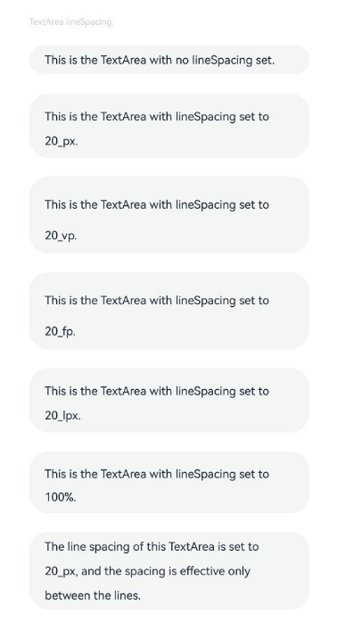
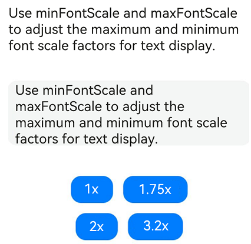
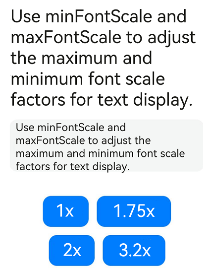
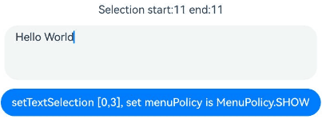
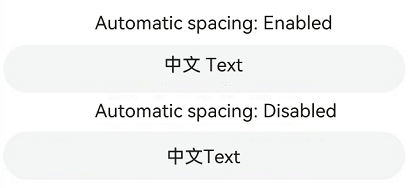
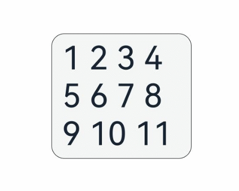
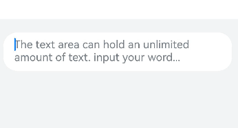
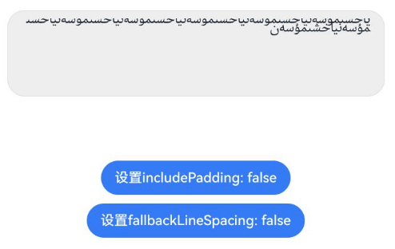

# TextArea
<!--Kit: ArkUI-->
<!--Subsystem: ArkUI-->
<!--Owner: @kangshihui-->
<!--Designer: @xiangyuan6-->
<!--Tester: @jiaoaozihao-->
<!--Adviser: @Brilliantry_Rui-->

The **TextArea** component provides multi-line text input and automatically wraps text to ensure that no line extends beyond the component's width.

If the component does not have its height set, it adapts its height to the content. If the component does not have its width set, it stretches to fill the maximum available width.

>  **NOTE**
>
>  This component is supported since API version 7. Updates will be marked with a superscript to indicate their earliest API version.


## Child Components

Not supported


## APIs

TextArea(value?: TextAreaOptions)

**Atomic service API**: This API can be used in atomic services since API version 11.

**System capability**: SystemCapability.ArkUI.ArkUI.Full

**Parameters**

| Name| Type| Mandatory| Description|
| ----- | ----- | ---- | ---- |
| value | [TextAreaOptions](#textareaoptions) | No | Parameters of the **TextArea** component.|

## TextAreaOptions

Describes the initialization options of the **TextArea** component.

**Atomic service API**: This API can be used in atomic services since API version 11.

**System capability**: SystemCapability.ArkUI.ArkUI.Full

| Name| Type | Read-Only| Optional  | Description|
| ---- | ----- | ---- | ---- | ---- |
| placeholder      | [ResourceStr](ts-types.md#resourcestr)  | No   | Yes| Text displayed when there is no input.  <br>When only the **placeholder** attribute is set, the text selection handle is still available; the caret stays at the beginning of the placeholder text when the handle is released.    |
| text             | [ResourceStr](ts-types.md#resourcestr)  | No   | Yes| Current text input.<br>You are advised to bind the state variable to the text in real time through the **onChange** event,<br>so as to prevent display errors when the component is updated.<br>Since API version 10, this parameter supports two-way binding through [$$](../../../ui/state-management/arkts-two-way-sync.md).<br>Since API version 18, this parameter supports two-way binding through [!!](../../../ui/state-management/arkts-new-binding.md#two-way-binding-between-built-in-component-parameters).|
| controller<sup>8+</sup> | [TextAreaController](#textareacontroller8) | No   | Yes| Text area controller.|


## Attributes

In addition to the [universal attributes](ts-component-general-attributes.md), the following attributes are supported.

>  **NOTE**
>
>  The default value of the universal attribute [padding](ts-universal-attributes-size.md#padding) is as follows:<br>{<br>&nbsp;top: '8vp',<br>&nbsp;right: '16vp',<br>&nbsp;bottom: '8vp',<br>&nbsp;left: '16vp'<br> }
>
>  Since API version 11, **.width('auto')** can be set for the **TextArea** component. Under this setting, the component auto-adapts its width to the text width, while respecting the **constraintSize** configuration and the maximum and minimum width restrictions received by the parent container. For details, see [Size](ts-universal-attributes-size.md).

### placeholderColor

placeholderColor(value: ResourceColor)

Sets the placeholder text color.

**Atomic service API**: This API can be used in atomic services since API version 11.

**System capability**: SystemCapability.ArkUI.ArkUI.Full

**Parameters**

| Name| Type                                      | Mandatory| Description                                        |
| ------ | ------------------------------------------ | ---- | -------------------------------------------- |
| value  | [ResourceColor](ts-types.md#resourcecolor) | Yes  | Placeholder text color.<br>The default value follows the theme.|

### placeholderFont

placeholderFont(value: Font)

Placeholder text style, including the font size, font weight, font family, and font style.

> **NOTE**
>
> You can use [loadFontSync](../../apis-arkgraphics2d/js-apis-graphics-text.md#loadfontsync) to register custom fonts.

**Atomic service API**: This API can be used in atomic services since API version 11.

**System capability**: SystemCapability.ArkUI.ArkUI.Full

**Parameters**

| Name| Type                    | Mandatory| Description                 |
| ------ | ------------------------ | ---- | --------------------- |
| value  | [Font](ts-types.md#font) | Yes  | Placeholder text style.|

### textAlign

textAlign(value: TextAlign)

Sets the horizontal alignment of the text.

Available options are **TextAlign.Start**, **TextAlign.Center**, **TextAlign.End**, and **TextAlign.JUSTIFY** (available since API version 11).

The vertical position of the text paragraph can be controlled by the [align](ts-universal-attributes-location.md#align) attribute, but the horizontal position cannot be controlled by **align** in this component.

- **Alignment.TopStart**, **Alignment.Top**, **Alignment.TopEnd**: Content aligns to the top.

- **Alignment.Start**, **Alignment.Center**, **Alignment.End**: Content is centered vertically.

- **Alignment.BottomStart**, **Alignment.Bottom**, **Alignment.BottomEnd:** Content aligns to the bottom.

When **textAlign** is set to **TextAlign.JUSTIFY**, the text in the last line is horizontally aligned with the start edge.

**Atomic service API**: This API can be used in atomic services since API version 11.

**System capability**: SystemCapability.ArkUI.ArkUI.Full

**Parameters**

| Name| Type                                       | Mandatory| Description                                                      |
| ------ | ------------------------------------------- | ---- | ---------------------------------------------------------- |
| value  | [TextAlign](ts-appendix-enums.md#textalign) | Yes  | Horizontal alignment of the text.<br>Default value: **TextAlign.Start**|

>  **NOTE** 
>
>  **textAlign** only adjusts the overall text layout and does not affect character display order. For character display order adjustment, see [Bidirectional Text Layout and Alignment](../../../ui/arkts-internationalization.md#bidirectional-text-layout-and-alignment).

### textDirection<sup>23+</sup>

textDirection(direction: TextDirection | undefined)

Text layout direction. If this API is not used, the default text layout direction complies with the component layout direction.

**Atomic service API**: This API can be used in atomic services since API version 23.

**System capability**: SystemCapability.ArkUI.ArkUI.Full

**Parameters**

| Name| Type                                       | Mandatory| Description                                                      |
| ------ | ------------------------------------------- | ---- | ---------------------------------------------------------- |
| direction  | [TextDirection](ts-text-common.md#textdirection22) \| undefined | Yes  | Text typesetting direction.<br>If this attribute is set to undefined, the text is processed based on TextDirection.DEFAULT. That is, the text typesetting direction complies with the component layout direction.|

### caretColor

caretColor(value: ResourceColor)

Sets the color of the caret in the text box.

**Atomic service API**: This API can be used in atomic services since API version 11.

**System capability**: SystemCapability.ArkUI.ArkUI.Full

**Parameters**

| Name| Type                                      | Mandatory| Description                                  |
| ------ | ------------------------------------------ | ---- | -------------------------------------- |
| value  | [ResourceColor](ts-types.md#resourcecolor) | Yes  | Color of the caret in the text box.<br>Default value: **'#007DFF'**|

>  **NOTE**
>   Since API version 12, this API can be used to set the text handle color, which is the same as the caret color.

### fontColor

fontColor(value: ResourceColor)

Sets the font color.

**Atomic service API**: This API can be used in atomic services since API version 11.

**System capability**: SystemCapability.ArkUI.ArkUI.Full

**Parameters**

| Name| Type                                      | Mandatory| Description      |
| ------ | ------------------------------------------ | ---- | ---------- |
| value  | [ResourceColor](ts-types.md#resourcecolor) | Yes  | Font color.|

### fontSize

fontSize(value: Length)

Sets the text size.

**Atomic service API**: This API can be used in atomic services since API version 11.

**System capability**: SystemCapability.ArkUI.ArkUI.Full

**Parameters**

| Name| Type                        | Mandatory| Description                                                        |
| ------ | ---------------------------- | ---- | ------------------------------------------------------------ |
| value  | [Length](ts-types.md#length) | Yes  | Font size. If **fontSize** is of the number type, the unit fp is used. The default font size is 16 fp on non-wearable devices and 18 fp on wearable devices. This parameter cannot be set in percentage.|

### fontStyle

fontStyle(value: FontStyle)

Sets the font style.

**Atomic service API**: This API can be used in atomic services since API version 11.

**System capability**: SystemCapability.ArkUI.ArkUI.Full

**Parameters**

| Name| Type                                       | Mandatory| Description                                   |
| ------ | ------------------------------------------- | ---- | --------------------------------------- |
| value  | [FontStyle](ts-appendix-enums.md#fontstyle) | Yes  | Font style.<br>Default value: **FontStyle.Normal**|

### fontWeight

fontWeight(value: number | FontWeight | ResourceStr)

Sets the font weight. If the value is too large, the text may be clipped depending on the font.

**Atomic service API**: This API can be used in atomic services since API version 11.

**System capability**: SystemCapability.ArkUI.ArkUI.Full

**Parameters**

| Name| Type                                                        | Mandatory| Description                                                        |
| ------ | ------------------------------------------------------------ | ---- | ------------------------------------------------------------ |
| value  | number&nbsp;\|&nbsp;[FontWeight](ts-appendix-enums.md#fontweight)&nbsp;\|&nbsp;[ResourceStr](ts-types.md#resourcestr) | Yes  | Font weight. For the number type, the value range is [100, 900], at an interval of 100. The default value is **400**. A larger value indicates a heavier font weight. For the string type, only strings that represent a number, for example, **"400"**, and the following enumerated values of **FontWeight** are supported: **"bold"**, **"bolder"**, **"lighter"**, **"regular"**, and **"medium"**.<br>Default value: **FontWeight.Normal**<br>The Resource type is supported since API version 20.|

### fontFamily

fontFamily(value: ResourceStr)

Sets the font family.

**Atomic service API**: This API can be used in atomic services since API version 11.

**System capability**: SystemCapability.ArkUI.ArkUI.Full

**Parameters**

| Name| Type                                  | Mandatory| Description                                                        |
| ------ | -------------------------------------- | ---- | ------------------------------------------------------------ |
| value  | [ResourceStr](ts-types.md#resourcestr) | Yes  | Font family. Default font: **'HarmonyOS Sans'**<br>To specify multiple fonts, separate them with commas (,), and fonts are applied in priority order. Example: **'Arial, HarmonyOS Sans'**.|

> **NOTE**
>
> You can use [loadFontSync](../../apis-arkgraphics2d/js-apis-graphics-text.md#loadfontsync) to register custom fonts.

### inputFilter<sup>8+</sup>

inputFilter(value: ResourceStr, error?: (value: string) => void)

Sets the regular expression for input filtering. Only inputs that comply with the regular expression can be displayed. Other inputs are filtered out.

For single-character input scenarios, only single-character matching is supported; for multi-character input scenarios (such as pasting), string matching is supported.

Since API version 11, if inputFilter is set and the entered characters are not null characters, the text filtering effect of the [type](#type11) API becomes invalid.

**Atomic service API**: This API can be used in atomic services since API version 11.

**System capability**: SystemCapability.ArkUI.ArkUI.Full

**Parameters**

| Name| Type                                  | Mandatory| Description                              |
| ------ | -------------------------------------- | ---- | ---------------------------------- |
| value  | [ResourceStr](ts-types.md#resourcestr) | Yes  | Regular expression.                      |
| error  | (value: string) => void                | No  | Filtered-out content to return when regular expression matching fails.|

### copyOption<sup>9+</sup>

copyOption(value: CopyOptions)

Sets whether copy and paste is allowed. If this attribute is set to **CopyOptions.None**:

The **TextArea** component supports pasting and selecting all; all other actions, such as copying, cutting, and sharing, are disabled; drag and drop operations are not supported.

**Atomic service API**: This API can be used in atomic services since API version 11.

**System capability**: SystemCapability.ArkUI.ArkUI.Full

**Parameters**

| Name| Type                                            | Mandatory| Description                                                        |
| ------ | ------------------------------------------------ | ---- | ------------------------------------------------------------ |
| value  | [CopyOptions](ts-appendix-enums.md#copyoptions9) | Yes  | Whether copy and paste is allowed.<br>Default value: **CopyOptions.LocalDevice**|

### maxLength<sup>10+</sup>

maxLength(value: number)

Sets the maximum number of characters for text input. By default, there is no maximum number of characters. When the maximum number is reached, no more characters can be entered.

**Atomic service API**: This API can be used in atomic services since API version 11.

**System capability**: SystemCapability.ArkUI.ArkUI.Full

**Parameters**

| Name| Type  | Mandatory| Description                  |
| ------ | ------ | ---- | ---------------------- |
| value  | number | Yes  | Maximum number of characters for text input.<br> Values less than 0 are treated as the default value, meaning no limit is set.|

### showCounter<sup>10+</sup>

showCounter(value: boolean, options?: InputCounterOptions)

Sets the character counter displayed when the number of characters entered exceeds the threshold. If the showCounter interface is not called, the counter is not displayed by default.

**options** can be set only when **value** is set to **true**, in which case a character counter is displayed below the text box. This attribute must be used together with **maxLength**. The character counter is displayed in this format: Number of characters entered/Character limit.

It is visible when the number of characters entered is greater than the character limit multiplied by the threshold percentage value. If **options** is not set, the text box border and character counter subscript turn red when the number of characters entered reaches the limit. If **value** is set to **true** and **options** is set, the text box border and character counter subscript turn red and the text box shakes when the number of characters entered reaches the limit, provided that the value of **thresholdPercentage** is valid. If **highlightBorder** is set to **false**, the text box border does not turn red. By default, **highlightBorder** is set to **true**. The character counter is not displayed for text boxes in inline input style.

[Example 2: Implementing a Counter](#example-2-implementing-a-counter) shows the effect of setting showCounter.

**Atomic service API**: This API can be used in atomic services since API version 11.

**System capability**: SystemCapability.ArkUI.ArkUI.Full

**Parameters**

| Name               | Type                                                        | Mandatory| Description            |
| --------------------- | ------------------------------------------------------------ | ---- | ---------------- |
| value                 | boolean                                                      | Yes  | Whether to display the character counter.<br>The value true indicates that the counter is displayed, and the value false indicates that the counter is not displayed.|
| options<sup>11+</sup> | [InputCounterOptions](ts-universal-attributes-text-style.md#inputcounteroptions11) | No  | Configuration options for the character counter.|

### style<sup>10+</sup>

style(value: TextContentStyle)

Sets the polymorphic style of the text box. The inline input style is only available for the **TextAreaType.NORMAL** type.

**Atomic service API**: This API can be used in atomic services since API version 11.

**System capability**: SystemCapability.ArkUI.ArkUI.Full

**Parameters**

| Name| Type                                                       | Mandatory| Description                                                 |
| ------ | ----------------------------------------------------------- | ---- | ----------------------------------------------------- |
| value  | [TextContentStyle](ts-appendix-enums.md#textcontentstyle10) | Yes  | Polymorphic style of the text box.<br>Default value: **TextContentStyle.DEFAULT**|

### enableKeyboardOnFocus<sup>10+</sup>

enableKeyboardOnFocus(value: boolean)

Sets whether to bring up the keyboard when the **TextArea** component obtains focus in a way other than clicking.

Since API version 10, the **TextArea** component brings up the keyboard by default when it obtains focus.

**Atomic service API**: This API can be used in atomic services since API version 11.

**System capability**: SystemCapability.ArkUI.ArkUI.Full

**Parameters**

| Name| Type   | Mandatory| Description                                                       |
| ------ | ------- | ---- | ----------------------------------------------------------- |
| value  | boolean | Yes  | Whether to bring up the keyboard when the **TextArea** component obtains focus in a way other than clicking.<br>**true** to bring up the keyboard, **false** otherwise.<br>Default value: **true**.|

### selectionMenuHidden<sup>10+</sup>

selectionMenuHidden(value: boolean)

Sets whether to hide the system text selection menu.

**Atomic service API**: This API can be used in atomic services since API version 11.

**System capability**: SystemCapability.ArkUI.ArkUI.Full

**Parameters**

| Name| Type   | Mandatory| Description                                                        |
| ------ | ------- | ---- | ------------------------------------------------------------ |
| value  | boolean | Yes  | Whether to hide the system text selection menu.<br>**true**: The system text selection menu does not appear under the following circumstances: clicking the text box cursor, long-pressing the text box, double-tapping the text box, triple-tapping the text box, or right-clicking the text box.<br>**false**: The system text selection menu appears under the following circumstances: clicking the text box cursor, long-pressing the text box, double-tapping the text box, triple-tapping the text box, or right-clicking the text box.<br>Default value: **false**|

### barState<sup>10+</sup>

barState(value: BarState)

Sets the scrollbar display mode.

**Atomic service API**: This API can be used in atomic services since API version 11.

**System capability**: SystemCapability.ArkUI.ArkUI.Full

**Parameters**

| Name| Type                                     | Mandatory| Description                                                        |
| ------ | ----------------------------------------- | ---- | ------------------------------------------------------------ |
| value  | [BarState](ts-appendix-enums.md#barstate) | Yes  | Scrollbar display mode.<br>Default value: **BarState.Auto**|

### maxLines<sup>10+</sup>

maxLines(value: number)

Sets the maximum number of lines that can be displayed. When **textOverflow** is set, text is truncated if the content exceeds this limit. When **textOverflow** is not set, in inline style, the text is scrollable if the content exceeds the limit while the text box is focused; **maxLines** does not apply when the text box is not focused. In non-inline style, the text is truncated according to the number of lines.

**Atomic service API**: This API can be used in atomic services since API version 11.

**System capability**: SystemCapability.ArkUI.ArkUI.Full

**Parameters**

| Name| Type                                     | Mandatory| Description                                                        |
| ------ | ----------------------------------------- | ---- | ------------------------------------------------------------ |
| value  | number | Yes  | Maximum number of lines that can be displayed with the inline style in the editing state or with the non-inline style.<br>Default value: 3. In non-inline mode, the default value is UINT32_MAX.<br>Value range: (0, UINT32_MAX]|

### maxLines<sup>20+</sup>

maxLines(lines: number, options: MaxLinesOptions)

Sets the maximum number of visible lines when used with [textOverflow](#textoverflow12). Excess content can be truncated or made scrollable based on configuration. Without **textOverflow**:<br>With focus in inline mode: Text exceeding the **maxLines** limit becomes scrollable.<br> **Without focus in inline mode**: **maxLines** has no effect.

**Atomic service API**: This API can be used in atomic services since API version 20.

**System capability**: SystemCapability.ArkUI.ArkUI.Full

**Parameters**

| Name| Type                                     | Mandatory| Description                                                        |
| ------ | ----------------------------------------- | ---- | ------------------------------------------------------------ |
| lines  | number | Yes  | Maximum number of lines that can be displayed with the inline style in the editing state or with the non-inline style.<br>Default value: **3** with the inline style; **+∞** with the non-inline style, indicating that there is no maximum number of lines<br>Value range: (0, +∞)|
|options | [MaxLinesOptions](ts-text-common.md#maxlinesoptions20) | Yes  | Display effect for overflow text.<br>Default value: **MaxLinesMode.CLIP**.|

### minLines<sup>20+</sup>

minLines(lines: Optional\<number>)

Sets the minimum number of lines displayed for the component. When [constraintSize](ts-universal-attributes-size.md#constraintsize) is set, the component's final height respects the defined constraints.

**Atomic service API**: This API can be used in atomic services since API version 20.

**System capability**: SystemCapability.ArkUI.ArkUI.Full

**Parameters**

| Name| Type                                     | Mandatory| Description                                                        |
| ------ | ----------------------------------------- | ---- | ------------------------------------------------------------ |
| lines  | [Optional](ts-universal-attributes-custom-property.md#optionalt12)\<number> | Yes  | Minimum number of lines.<br>Default value: **1**.<br>Value range: [1, INT32_MAX].<br>Values less than 1 are treated as the default value.|

### customKeyboard<sup>10+</sup>

customKeyboard(value: CustomBuilder | ComponentContent | undefined, options?: KeyboardOptions)

Sets the custom keyboard.

When a custom keyboard is set, activating the text box opens the specified custom component, instead of the system input method.

The height of the custom keyboard can be set using the **height** property of the custom component's root node, while the width uses the system default value.

The custom keyboard is presented by overlaying the original screen, which is not compressed or lifted if avoid mode is not enabled or avoidance is not needed for the text box.

The custom keyboard cannot obtain the focus, but it blocks gesture events.

By default, the custom keyboard is closed when the input component loses the focus. You can also use the [TextAreaController](#textareacontroller8).[stopEditing](#stopediting10) API to close the keyboard.

When setting a custom keyboard, you can bind the [onKeyPrelme](ts-universal-events-key.md#onkeypreime12) event to prevent input from the physical keyboard.

> **NOTE**
>
> This API cannot be called within [attributeModifier](ts-universal-attributes-attribute-modifier.md#attributemodifier).

**Atomic service API**: This API can be used in atomic services since API version 11.

**System capability**: SystemCapability.ArkUI.ArkUI.Full

**Parameters**

| Name               | Type                                       | Mandatory| Description                                                        |
| --------------------- | ------------------------------------------- | ---- | ------------------------------------------------------------ |
| value                 |[CustomBuilder](ts-types.md#custombuilder8) \| [ComponentContent](../js-apis-arkui-ComponentContent.md#componentcontent-1)<sup>22+</sup> \| undefined<sup>22+</sup> | Yes  | Custom keyboard. If the value is set to undefined, the custom keyboard is disabled.|
| options<sup>12+</sup> | [KeyboardOptions](ts-basic-components-richeditor.md#keyboardoptions12)       | No  | Whether to support keyboard avoidance.                            |

### type<sup>11+</sup>

type(value: TextAreaType)

Sets the text box type.

Different TextAreaTypes start the corresponding keyboard and restrict the input.

**Atomic service API**: This API can be used in atomic services since API version 12.

**System capability**: SystemCapability.ArkUI.ArkUI.Full

**Parameters**

| Name| Type                                   | Mandatory| Description                                        |
| ------ | --------------------------------------- | ---- | -------------------------------------------- |
| value  | [TextAreaType](#textareatype11) | Yes  | Text box type.<br>Default value: **TextAreaType.NORMAL**.|

### enterKeyType<sup>11+</sup>

enterKeyType(value: EnterKeyType)

Sets the type of the Enter key.

>**NOTE**
>
> This API can be called within [attributeModifier](ts-universal-attributes-attribute-modifier.md#attributemodifier) since API version 12.

**Atomic service API**: This API can be used in atomic services since API version 12.

**System capability**: SystemCapability.ArkUI.ArkUI.Full

**Parameters**

| Name| Type                                            | Mandatory| Description                                                |
| ------ | ------------------------------------------------ | ---- | ---------------------------------------------------- |
| value  | [EnterKeyType](ts-basic-components-textinput.md#enterkeytype) | Yes  | Type of the Enter key.<br>Default value: **EnterKeyType.NEW_LINE**|

### enableAutoFill<sup>12+</sup>

enableAutoFill(value: boolean)

Sets whether to enable autofill.<!--RP2--><!--RP2End-->

**Atomic service API**: This API can be used in atomic services since API version 12.

**System capability**: SystemCapability.ArkUI.ArkUI.Full

**Parameters**

| Name| Type   | Mandatory| Description                                                        |
| ------ | ------- | ---- | ------------------------------------------------------------ |
| value  | boolean | Yes  | Whether to enable autofill.<br>**true** to enable, **false** otherwise.<br>Default value: **true**.|

### enableSelectedDataDetector<sup>22+</sup>

enableSelectedDataDetector(enable: boolean | undefined)

Sets whether to enable entity recognition for selected text. This API only works on devices that provide text recognition.

When **enableSelectedDataDetector** is set to **true**, all entity types are recognized by default.

This feature is only effective when [CopyOptions](ts-appendix-enums.md#copyoptions9) is set to **CopyOptions.LocalDevice** or **CopyOptions.CrossDevice**.

**Atomic service API**: This API can be used in atomic services since API version 22.

**System capability**: SystemCapability.ArkUI.ArkUI.Full

**Parameters**

| Name| Type   | Mandatory| Description                             |
| ------ | ------- | ---- | --------------------------------- |
| enable  | boolean \| undefined | Yes  | Whether to enable entity recognition for selected text.<br>**true**: Enable entity recognition. **false**: Disable entity recognition. Default value: **true**.|

### contentType<sup>12+</sup>

contentType(contentType: ContentType)

Sets the content type for autofill.<!--RP3--><!--RP3End-->

**Atomic service API**: This API can be used in atomic services since API version 12.

**System capability**: SystemCapability.ArkUI.ArkUI.Full

**Parameters**

| Name     | Type                                 | Mandatory| Description          |
| ----------- | ------------------------------------- | ---- | -------------- |
| contentType | [ContentType](ts-basic-components-textinput.md#contenttype12) | Yes  | Content type for autofill.|

### lineHeight<sup>12+</sup>

lineHeight(value: number | string | Resource)

Sets the text line height. If the value is less than or equal to **0**, the line height is not limited and the font size is adaptive. If the value is of the number type, the unit fp is used.

**Atomic service API**: This API can be used in atomic services since API version 12.

**System capability**: SystemCapability.ArkUI.ArkUI.Full

**Parameters**

| Name| Type                                                        | Mandatory| Description            |
| ------ | ------------------------------------------------------------ | ---- | ---------------- |
| value  | number&nbsp;\|&nbsp;string&nbsp;\|&nbsp;[Resource](ts-types.md#resource) | Yes  | Text line height.|

>  **NOTE**
>  
>  If certain characters have significantly taller glyphs than others on the same line, layout anomalies such as clipping, overlap, or misalignment may occur. In this case, adjust component attributes such as height and line height to ensure proper layout rendering.

### decoration<sup>12+</sup>

decoration(value: TextDecorationOptions)

Sets the color, type, and style of the text decorative line.

**Atomic service API**: This API can be used in atomic services since API version 12.

**System capability**: SystemCapability.ArkUI.ArkUI.Full

**Parameters**

| Name| Type                                                        | Mandatory| Description                                                        |
| ------ | ------------------------------------------------------------ | ---- | ------------------------------------------------------------ |
| value  | [TextDecorationOptions](ts-universal-attributes-text-style.md#textdecorationoptions12) | Yes  | Text decorative line options.<br>Default value: {<br>&nbsp;type:&nbsp;TextDecorationType.None,<br>&nbsp;color:&nbsp;Color.Black,<br>&nbsp;style:&nbsp;TextDecorationStyle.SOLID&nbsp;<br>} |

>  **NOTE**
>
>  When the bottom contour of a character intersects with the decoration, underline avoidance is triggered, commonly affecting characters like "g", "j", "y", "q", and "p."
>
>  If the decoration color is set to **Color.Transparent**, it inherits the text color of the first character in each line. If the decoration color is set to **"#00FFFFFF"**, the line becomes fully transparent.

### letterSpacing<sup>12+</sup>

letterSpacing(value: number | string | Resource)

Sets the letter spacing for a text style. If the value specified is a percentage If the value specified is 0, the default value is used. For the string type, numeric string values with optional units, for example, **"10"** or **"10fp"**, are supported.

If the value specified is a negative value, the text is compressed. A negative value too small may result in the text being compressed to 0 and no content being displayed.

This setting applies to every character, including those at line endings.

**Atomic service API**: This API can be used in atomic services since API version 12.

**System capability**: SystemCapability.ArkUI.ArkUI.Full

**Parameters**

| Name| Type                      | Mandatory| Description          |
| ------ | -------------------------- | ---- | -------------- |
| value  | number&nbsp;\|&nbsp;string&nbsp;\|&nbsp;[Resource](ts-types.md#resource) | Yes  | Letter spacing.<br>Unit: [fp](ts-pixel-units.md)|

### fontFeature<sup>12+</sup>

fontFeature(value: string)

Sets the font feature, for example, monospaced digits.

Format: normal \| \<feature-tag-value\>

Format of **\<feature-tag-value\>**: \<string\> \[ \<integer\> \| on \| off ]

There can be multiple **\<feature-tag-value\>** values, which are separated by commas (,).

For example, the input format for monospaced clock fonts is "ss01" on.

**Atomic service API**: This API can be used in atomic services since API version 12.

**System capability**: SystemCapability.ArkUI.ArkUI.Full

**Parameters**

| Name| Type  | Mandatory| Description          |
| ------ | ------ | ---- | -------------- |
| value  | string | Yes  | Font feature.|

For details about the attributes supported by Font Feature, see [FontFeature Attribute List] (ts-basic-components-text.md#fontfeature12).

Font features are advanced typographic features, such as ligatures and monospace, for OpenType fonts. They are typically used in custom fonts and require the support of the font itself.

For more information about the font features, see [Low-level font feature settings control: the font-feature-settings property](https://www.w3.org/TR/css-fonts-3/#font-feature-settings-prop) and [The Complete CSS Demo for OpenType Features](https://sparanoid.com/lab/opentype-features/).
### wordBreak<sup>12+</sup>

wordBreak(value: WordBreak)

Sets the word break rule. This attribute does not take effect for the placeholder text.

**Atomic service API**: This API can be used in atomic services since API version 12.

**System capability**: SystemCapability.ArkUI.ArkUI.Full

**Parameters**

| Name| Type                                         | Mandatory| Description                                         |
| ------ | --------------------------------------------- | ---- | --------------------------------------------- |
| value  | [WordBreak](ts-appendix-enums.md#wordbreak11) | Yes  | Word break rule.<br>Default value: **WordBreak.BREAK_WORD**|

>  **NOTE**
>
>  The component does not support the **clip** attribute. Therefore, setting this attribute does not affect text clipping.

### selectedBackgroundColor<sup>12+</sup>

selectedBackgroundColor(value: ResourceColor)

Sets the background color of the selected text. If the opacity is not set, a 20% opacity will be used.

**Atomic service API**: This API can be used in atomic services since API version 12.

**System capability**: SystemCapability.ArkUI.ArkUI.Full

**Parameters**

| Name| Type                                      | Mandatory| Description                                      |
| ------ | ------------------------------------------ | ---- | ------------------------------------------ |
| value  | [ResourceColor](ts-types.md#resourcecolor) | Yes  | Background color of the selected text.|

### caretStyle<sup>12+</sup>

caretStyle(value: CaretStyle)

Sets the caret style.

**Atomic service API**: This API can be used in atomic services since API version 12.

**System capability**: SystemCapability.ArkUI.ArkUI.Full

**Parameters**

| Name| Type                               | Mandatory| Description        |
| ------ | ----------------------------------- | ---- | ------------ |
| value  | [CaretStyle](ts-text-common.md#caretstyle10) | Yes  | Caret style.|

>  **NOTE**
>
>   When both **caretColor** and the **color** parameter in **caretStyle** are configured, the last-set value takes precedence.
>     
>   Since API version 12, this API can be used to set the text handle color, which is the same as the caret color.

### textIndent<sup>12+</sup>

textIndent(value: Dimension)

Sets the indent of the first line text.

**Atomic service API**: This API can be used in atomic services since API version 12.

**System capability**: SystemCapability.ArkUI.ArkUI.Full

**Parameters**

| Name| Type                                | Mandatory| Description                        |
| ------ | ----------------------------------- | ---- | ---------------------------- |
| value  | [Dimension](ts-types.md#dimension10)| Yes  | Indent of the first line text.<br>Default value: **0**|

### textOverflow<sup>12+</sup>

textOverflow(value: TextOverflow)

Sets the display mode when the text is too long.

In inline style, the effect of truncating text according to [maxLines](#maxlines10) only applies when **textOverflow** is set.

Text is clipped at the transition between words. To clip text in the middle of a word, set [wordBreak](ts-appendix-enums.md#wordbreak11) to **WordBreak.BREAK_ALL**.

If **textOverflow** is set to **TextOverflow.None**, **TextOverflow.Clip**, or **TextOverflow.Ellipsis**, this attribute must be used with [maxLines](#maxlines10) for the settings to take effect. **TextOverflow.None** produces the same effect as **TextOverflow.Clip**.

**Atomic service API**: This API can be used in atomic services since API version 12.

**System capability**: SystemCapability.ArkUI.ArkUI.Full

**Parameters**

| Name| Type                                                         | Mandatory| Description                                                        |
| ------ | ------------------------------------------------------------ | ---- | ------------------------------------------------------------ |
| value  | [TextOverflow](ts-appendix-enums.md#textoverflow)            | Yes  | Display mode when the text is too long.<br>Default value: **TextOverflow.Clip**          |

>  **NOTE**    
>   The **TextArea** component does not support the **TextOverflow.MARQUEE** mode. If this attribute is set to **TextOverflow.MARQUEE**, **TextOverflow.Clip** is used instead.

### minFontSize<sup>12+</sup>

minFontSize(value: number | string | Resource)

Sets the minimum font size. For the string type, numeric string values with optional units, for example, **"10"** or **"10fp"**, are supported.

For the setting to take effect, this attribute must be used together with [maxFontSize](#maxfontsize12) and [maxLines](#maxlines10), or layout constraint settings.

When the adaptive font size is used, the **fontSize** settings do not take effect.

If the value of **minFontSize** is less than or equal to 0, the adaptive font sizing feature is disabled. In such cases, the [fontSize](#fontsize) attribute is used instead. If **fontSize** is not explicitly set, its default value will apply.

**Atomic service API**: This API can be used in atomic services since API version 12.

**System capability**: SystemCapability.ArkUI.ArkUI.Full

**Parameters**

| Name| Type                                                        | Mandatory| Description              |
| ------ | ------------------------------------------------------------ | ---- | ------------------ |
| value  | number&nbsp;\|&nbsp;string&nbsp;\|&nbsp;[Resource](ts-types.md#resource) | Yes  | Minimum font size.<br>Unit: [fp](ts-pixel-units.md)|

### maxFontSize<sup>12+</sup>

maxFontSize(value: number | string | Resource)

Sets the maximum font size. For the string type, numeric string values with optional units, for example, **"10"** or **"10fp"**, are supported.

For the setting to take effect, this attribute must be used together with [minFontSize](#minfontsize12) and [maxLines](#maxlines10), or layout constraint settings.

When the adaptive font size is used, the **fontSize** settings do not take effect.

If the value of **maxFontSize** is less than or equal to 0 or is less than the value of **minFontSize**, the adaptive font sizing feature is disabled. In such cases, the [fontSize](#fontsize) attribute is used instead. If **fontSize** is not explicitly set, its default value will apply.

**Atomic service API**: This API can be used in atomic services since API version 12.

**System capability**: SystemCapability.ArkUI.ArkUI.Full

**Parameters**

| Name| Type                                                        | Mandatory| Description              |
| ------ | ------------------------------------------------------------ | ---- | ------------------ |
| value  | number&nbsp;\|&nbsp;string&nbsp;\|&nbsp;[Resource](ts-types.md#resource) | Yes  | Maximum font size.<br>Unit: [fp](ts-pixel-units.md)|

### heightAdaptivePolicy<sup>12+</sup>

heightAdaptivePolicy(value: TextHeightAdaptivePolicy)

Sets how the adaptive height is determined for the text.

When this attribute is set to **TextHeightAdaptivePolicy.MAX_LINES_FIRST**, the [maxLines](#maxlines10) attribute takes precedence for adjusting the text height. If the **maxLines** setting results in a layout beyond the layout constraints, the text will shrink to a font size between [minFontSize](#minfontsize12) and [maxFontSize](#maxfontsize12) to allow for more content to be shown.

If the text box is in inline input style, the font size in the editing state is different from that in the non-editing state.

If this attribute is set to **TextHeightAdaptivePolicy.MIN_FONT_SIZE_FIRST**, the **minFontSize** attribute takes precedence for adjusting the text height. If the text can fit in one line with the **minFontSize** setting, the text will enlarge to the largest possible font size between **minFontSize** and **maxFontSize**.

If this attribute is set to **TextHeightAdaptivePolicy.LAYOUT_CONSTRAINT_FIRST**, the layout constraints take precedence for adjusting the text height. If the resultant layout is beyond the layout constraints, the text will shrink to a font size between **minFontSize** and **maxFontSize** to respect the layout constraints.

**Atomic service API**: This API can be used in atomic services since API version 12.

**System capability**: SystemCapability.ArkUI.ArkUI.Full

**Parameters**

| Name| Type                                                        | Mandatory| Description                                                        |
| ------ | ------------------------------------------------------------ | ---- | ------------------------------------------------------------ |
| value  | [TextHeightAdaptivePolicy](ts-appendix-enums.md#textheightadaptivepolicy10) | Yes  | How the adaptive height is determined for the text.<br>Default value: **TextHeightAdaptivePolicy.MAX_LINES_FIRST**|

### lineSpacing<sup>12+</sup>

lineSpacing(value: LengthMetrics)

Sets the line spacing of the text. If the value specified is less than or equal to 0, the default value **0** is used.

**Atomic service API**: This API can be used in atomic services since API version 12.

**System capability**: SystemCapability.ArkUI.ArkUI.Full

**Parameters**

| Name| Type                                                        | Mandatory| Description            |
| ------ | ------------------------------------------------------------ | ---- | ---------------- |
| value  | [LengthMetrics](../js-apis-arkui-graphics.md#lengthmetrics12) | Yes  | Line spacing. Default value: **0**|

### lineSpacing<sup>20+</sup>

lineSpacing(value: LengthMetrics, options?: LineSpacingOptions)

Sets the line spacing for text. When **LineSpacingOptions** is not specified, line spacing is applied above the first line and below the last line by default.

**Atomic service API**: This API can be used in atomic services since API version 20.

**System capability**: SystemCapability.ArkUI.ArkUI.Full

**Parameters**

| Name| Type                                                        | Mandatory| Description            |
| ------ | ------------------------------------------------------------ | ---- | ---------------- |
| value  | [LengthMetrics](../js-apis-arkui-graphics.md#lengthmetrics12) | Yes  | Line spacing. Values less than or equal to 0 are treated as the default value **0**.|
| options  | [LineSpacingOptions](ts-text-common.md#linespacingoptions20) | No  | Line spacing configuration options.<br>Default value: **{ onlyBetweenLines: false }**.|

### lineBreakStrategy<sup>12+</sup>

lineBreakStrategy(strategy: LineBreakStrategy)

Sets the line break rule. This attribute takes effect only when [wordBreak](#wordbreak12) is not **WordBreak.BREAK_ALL**. Hyphens are not supported.

**Atomic service API**: This API can be used in atomic services since API version 12.

**System capability**: SystemCapability.ArkUI.ArkUI.Full

**Parameters**

| Name  | Type                                                        | Mandatory| Description                                                   |
| -------- | ------------------------------------------------------------ | ---- | ------------------------------------------------------- |
| strategy | [LineBreakStrategy](ts-appendix-enums.md#linebreakstrategy12) | Yes  | Line break rule.<br>Default value: **LineBreakStrategy.GREEDY**|

### editMenuOptions<sup>12+</sup>

editMenuOptions(editMenu: EditMenuOptions)

Sets the extended options of the custom context menu on selection, including the text content, icon, and callback.

When [disableMenuItems](../arkts-apis-uicontext-textmenucontroller.md#disablemenuitems20) or [disableSystemServiceMenuItems](../arkts-apis-uicontext-textmenucontroller.md#disablesystemservicemenuitems20) is used to disable system service menu items in the context menu on selection, the disabled menu options will be excluded from the parameter list in the [onCreateMenu](./ts-text-common.md#oncreatemenu12) callback of **editMenuOptions**.

**Atomic service API**: This API can be used in atomic services since API version 12.

**System capability**: SystemCapability.ArkUI.ArkUI.Full

**Parameters**

| Name| Type                                         | Mandatory| Description                                         |
| ------ | --------------------------------------------- | ---- | --------------------------------------------- |
| editMenu  | [EditMenuOptions](ts-text-common.md#editmenuoptions) | Yes  | Extended options of the custom context menu on selection.|

### enablePreviewText<sup>12+</sup>

enablePreviewText(enable: boolean)

Sets whether to enable preview text.

The pre-displayed content is defined as the text temporary storage state. Currently, the text interception function is not supported.

**Atomic service API**: This API can be used in atomic services since API version 12.

**System capability**: SystemCapability.ArkUI.ArkUI.Full

**Parameters**

| Name| Type   | Mandatory| Description                              |
| ------ | ------- | ---- | ---------------------------------- |
| enable | boolean | Yes  | Whether to enable preview text.<br>**true** to enable, **false** otherwise.<br>Default value: **true**.|

>  **NOTE**
>  
>  Preview text represents a temporary, uncommitted input state. This feature requires support from the input method with pre-commit text functionality enabled. During text entry, when candidate words have not been confirmed yet, the text box displays marked text in a provisional state. For example, when typing Chinese using Pinyin input, the Pinyin letters appear in the input box before selecting from the candidate word list. This intermediate state constitutes preview text.

### enableHapticFeedback<sup>13+</sup>

enableHapticFeedback(isEnabled: boolean)

Specifies whether to enable haptic feedback.

To enable haptic feedback, you must declare the ohos.permission.VIBRATE permission under **requestPermissions** in the **module.json5** file of the project.

```json
"requestPermissions": [
 {
    "name": "ohos.permission.VIBRATE",
 }
]
```

**Atomic service API**: This API can be used in atomic services since API version 13.

**System capability**: SystemCapability.ArkUI.ArkUI.Full

**Parameters**

| Name| Type   | Mandatory| Description                              |
| ------ | ------- | ---- | ---------------------------------- |
| isEnabled | boolean | Yes  | Whether to enable haptic feedback.<br>**true** to enable, **false** otherwise.<br>Default value: **true**.|

### autoCapitalizationMode<sup>20+</sup>

autoCapitalizationMode(mode: AutoCapitalizationMode)

Sets the auto-capitalization text mode. This API provides the capability, but actual implementation depends on the input method application.

**Atomic service API**: This API can be used in atomic services since API version 20.

**System capability**: SystemCapability.ArkUI.ArkUI.Full

**Parameters**

| Name  | Type                                     | Mandatory| Description                      |
| -------- | ----------------------------------------- | ---- | -------------------------- |
| mode | [AutoCapitalizationMode](ts-text-common.md#autocapitalizationmode20) | Yes  | Auto-capitalization mode. The default state is inactive.|

### keyboardAppearance<sup>15+</sup>

keyboardAppearance(appearance: Optional\<KeyboardAppearance>)

Sets the keyboard appearance for the text box. This setting takes effect only after input method adaptation. For details, see [Immersive Mode of the Input Method Application](../../../inputmethod/inputmethod-immersive-mode-guide.md).

**Atomic service API**: This API can be used in atomic services since API version 15.

**System capability**: SystemCapability.ArkUI.ArkUI.Full

**Parameters**

| Name| Type| Mandatory| Description|
| ------ | ----------------------------------------- | ---- | ------------------------------------------------------ |
| appearance | [Optional](ts-universal-attributes-custom-property.md#optionalt12)\<[KeyboardAppearance](ts-text-common.md#keyboardappearance15)> | Yes  | Appearance of the keyboard.<br>Default value: **KeyboardAppearance.NONE_IMMERSIVE**|

### strokeWidth<sup>20+</sup>

strokeWidth(width: Optional\<LengthMetrics>)

Sets the text stroke width.

**Atomic service API**: This API can be used in atomic services since API version 20.

**System capability**: SystemCapability.ArkUI.ArkUI.Full

**Parameters**

| Name| Type                                                        | Mandatory| Description            |
| ------ | ------------------------------------------------------------ | ---- | ---------------- |
| width  | [Optional](ts-universal-attributes-custom-property.md#optionalt12)\<[LengthMetrics](../js-apis-arkui-graphics.md#lengthmetrics12)> | Yes  | Text stroke width. When the unit of **LengthMetrics** is **px**:<br>Values < 0: solid text. Values > 0: outlined text.<br>Default value: **0** (no stroke).|

### strokeColor<sup>20+</sup>

strokeColor(color: Optional\<ResourceColor>)

Sets the text stroke color.

**Atomic service API**: This API can be used in atomic services since API version 20.

**System capability**: SystemCapability.ArkUI.ArkUI.Full

**Parameters**

| Name| Type                                      | Mandatory| Description      |
| ------ | ------------------------------------------ | ---- | ---------- |
| color  | [Optional](ts-universal-attributes-custom-property.md#optionalt12)\<[ResourceColor](ts-types.md#resourcecolor)> | Yes  | Stroke color. Default value: font color. Invalid values are treated as the default value.|

### stopBackPress<sup>15+</sup>

stopBackPress(isStopped: Optional\<boolean>)

Sets whether to prevent the return key from being passed.

**Atomic service API**: This API can be used in atomic services since API version 15.

**System capability**: SystemCapability.ArkUI.ArkUI.Full

**Parameters**

| Name| Type                                               | Mandatory| Description                                     |
| ------ | --------------------------------------------------- | ---- | ----------------------------------------- |
| isStopped  | [Optional](ts-universal-attributes-custom-property.md#optionalt12)\<boolean> | Yes  | Whether to prevent the back button press from being propagated to other components or applications.<br>**true** to prevent, **false** otherwise.<br>Default value: **true**. The default value is used for abnormal values.|

### halfLeading<sup>18+</sup>

halfLeading(halfLeading: Optional\<boolean>)

Sets the vertical center of the text in the line to equally divide the line spacing to the top and bottom of the line.

**Atomic service API**: This API can be used in atomic services since API version 18.

**System capability**: SystemCapability.ArkUI.ArkUI.Full

**Parameters**

| Name| Type                                         | Mandatory| Description                                         |
| ------ | --------------------------------------------- | ---- | --------------------------------------------- |
| halfLeading | [Optional](ts-universal-attributes-custom-property.md#optionalt12)\<boolean> | Yes | Sets whether the text is centered vertically.<br>Whether half leading is enabled. Half leading is the leading split in half and applied equally to the top and bottom edges. The value **true** means that half leading is enabled, and **false** means the opposite.<br>Default value: **false**|

### minFontScale<sup>18+</sup>

minFontScale(scale: Optional\<number | Resource>)

Sets the minimum font scale factor for text.

**Atomic service API**: This API can be used in atomic services since API version 18.

**System capability**: SystemCapability.ArkUI.ArkUI.Full

**Parameters**

| Name| Type                                         | Mandatory| Description                                         |
| ------ | --------------------------------------------- | ---- | --------------------------------------------- |
| scale  | [Optional](ts-universal-attributes-custom-property.md#optionalt12)\<number \| [Resource](ts-types.md#resource)> | Yes  | Minimum font scale factor for text. The **undefined** type is supported.<br>Value range: [0, 1]<br>**NOTE**<br>A value less than 0 is handled as 0. A value greater than 1 is handled as 1. Abnormal values are ineffective by default.<br>Before use, the **configuration.json** file and **app.json5** file must be configured in the project. For details, see [Example 17: Setting the Minimum and Maximum Font Scale Factors](#example-17-setting-the-minimum-and-maximum-font-scale-factors).|

### maxFontScale<sup>18+</sup>

maxFontScale(scale: Optional\<number | Resource>)

Sets the maximum font scale factor for text.

**Atomic service API**: This API can be used in atomic services since API version 18.

**System capability**: SystemCapability.ArkUI.ArkUI.Full

**Parameters**

| Name| Type                                         | Mandatory| Description                                         |
| ------ | --------------------------------------------- | ---- | --------------------------------------------- |
| scale  | [Optional](ts-universal-attributes-custom-property.md#optionalt12)\<number \| [Resource](ts-types.md#resource)> | Yes  | Maximum font scale factor for text. The **undefined** type is supported.<br>Value range: [1, +∞)<br>**NOTE**<br>Values less than 1 are treated as 1. Abnormal values are ineffective by default.<br>Before use, the **configuration.json** file and **app.json5** file must be configured in the project. For details, see [Example 17: Setting the Minimum and Maximum Font Scale Factors](#example-17-setting-the-minimum-and-maximum-font-scale-factors).|

### ellipsisMode<sup>18+</sup>

ellipsisMode(mode: Optional\<EllipsisMode>)

Sets the ellipsis position. For the settings to work, [textOverflow](#textoverflow12) must be set to **TextOverflow.Ellipsis** and [maxLines](#maxlines10) must be specified. Setting **ellipsisMode** alone does not take effect.

**EllipsisMode.START** and **EllipsisMode.CENTER** take effect only when [maxLines](#maxlines10) is set to **1**.

**Atomic service API**: This API can be used in atomic services since API version 18.

**System capability**: SystemCapability.ArkUI.ArkUI.Full

**Parameters**

| Name| Type                                               | Mandatory| Description                                     |
| ------ | --------------------------------------------------- | ---- | ----------------------------------------- |
| mode  | [Optional](ts-universal-attributes-custom-property.md#optionalt12)\<[EllipsisMode](ts-appendix-enums.md#ellipsismode11)> | Yes  | Ellipsis position.<br>Default value: **EllipsisMode.END**|

### enableAutoSpacing<sup>20+</sup>

enableAutoSpacing(enabled: Optional\<boolean>)

Sets whether to enable automatic spacing between Chinese and Western characters.

**Atomic service API**: This API can be used in atomic services since API version 20.

**System capability**: SystemCapability.ArkUI.ArkUI.Full

**Parameters**

| Name| Type   | Mandatory| Description                              |
| ------ | ------- | ---- | ---------------------------------- |
| enabled | [Optional](ts-universal-attributes-custom-property.md#optionalt12)\<boolean> | Yes  | Whether to enable automatic spacing between Chinese and Western characters.<br>**true** to enable, **false** otherwise.<br>Default value: **false**|

### scrollBarColor<sup>22+</sup>

scrollBarColor(thumbColor: ColorMetrics | undefined)

Sets the color of the scrollbar.

**Atomic service API**: This API can be used in atomic services since API version 22.

**System capability**: SystemCapability.ArkUI.ArkUI.Full

**Parameters**

| Name| Type   | Mandatory| Description                              |
| ------ | ------- | ---- | ---------------------------------- |
| thumbColor | [ColorMetrics](../js-apis-arkui-graphics.md#colormetrics12)&nbsp;\|&nbsp;undefined | Yes| Scrollbar color.<br>Default value: '#66182431', which is displayed in gray.|

### compressLeadingPunctuation<sup>23+</sup>

compressLeadingPunctuation(enabled: Optional\<boolean>)

Sets whether to enable punctuation compression at the beginning of a line.

> **NOTE**
>
> - By default, the punctuation at the beginning of a line is not compressed.
>
> - For details about the punctuation that supports compression, see the punctuation range of the line header compression of [ParagraphStyle](../../apis-arkgraphics2d/js-apis-graphics-text.md#paragraphstyle).

**Atomic service API**: This API can be used in atomic services since API version 23.

**System capability**: SystemCapability.ArkUI.ArkUI.Full

**Parameters**

| Name| Type   | Mandatory| Description                              |
| ------ | ------- | ---- | ---------------------------------- |
| enabled | [Optional](ts-universal-attributes-custom-property.md#optionalt12)\<boolean> | Yes  | Whether to enable punctuation compression at the beginning of a line.<br>true indicates that punctuation compression is enabled at the beginning of a line. false indicates that punctuation compression is disabled at the beginning of a line.|

### includeFontPadding<sup>23+</sup>

includeFontPadding(include: Optional\<boolean>)

Sets whether to add a spacing between the first and last lines to avoid text truncation. If this interface is not used, the spacing is not increased by default.

**Atomic service API**: This API can be used in atomic services since API version 23.

**System capability**: SystemCapability.ArkUI.ArkUI.Full

**Parameters**

| Name | Type                                                        | Mandatory| Description                                                        |
| ------- | ------------------------------------------------------------ | ---- | ------------------------------------------------------------ |
| include | [Optional](ts-universal-attributes-custom-property.md#optionalt12)\<boolean> | Yes  | Whether to add a spacing between the first and last lines to avoid text truncation.<br>The value true indicates that the space between the first line and the last line is added. The value false indicates that the space between the first line and the last line is not added.|

### fallbackLineSpacing<sup>23+</sup>

fallbackLineSpacing(enabled: Optional\<boolean>)

For multi-line text overlay, the line height can be automatically adjusted based on the actual text height. This API takes effect only when the line height is less than the actual text height. This API is not used to set the line height. By default, the line height is not automatically adjusted based on the actual text height.

**Atomic service API**: This API can be used in atomic services since API version 23.

**System capability**: SystemCapability.ArkUI.ArkUI.Full

**Parameters**

| Name | Type                                                        | Mandatory| Description                                                        |
| ------- | ------------------------------------------------------------ | ---- | ------------------------------------------------------------ |
| enabled | [Optional](ts-universal-attributes-custom-property.md#optionalt12)\<boolean> | Yes  | Whether the line height is adaptive based on the actual text height.<br>The value true indicates that the line height is automatically adjusted based on the actual text height. The value false indicates that the line height is not automatically adjusted based on the actual text height.|

### selectedDragPreviewStyle<sup>23+</sup>

selectedDragPreviewStyle(value: SelectedDragPreviewStyle | undefined)

Sets the backplane style when the text in the multi-line text box is dragged.

**Atomic service API**: This API can be used in atomic services since API version 23.

**System capability**: SystemCapability.ArkUI.ArkUI.Full

**Parameters**

| Name| Type                                            | Mandatory| Description                                                      |
| ------ | ------------------------------------------------ | ---- | ---------------------------------------------------------- |
| value  | [SelectedDragPreviewStyle](ts-text-common.md#selecteddragpreviewstyle23) \| undefined | Yes  | Backplane style when the text is dragged.<br>undefined: The background color is the same as the theme. In light color mode, the background color is white. In dark color mode, the background color is black.|

## Events

In addition to the [universal events](ts-component-general-events.md), the following events are supported.

### onChange

onChange(callback:&nbsp;EditableTextOnChangeCallback)

Triggered when the input in the text box changes.

In this callback, if cursor operations are performed, you need to adjust the cursor logic based on the **previewText** parameter to make sure it works seamlessly under the preview display scenario.

**Atomic service API**: This API can be used in atomic services since API version 11.

**System capability**: SystemCapability.ArkUI.ArkUI.Full

**Parameters**

| Name| Type  | Mandatory| Description                |
| ------ | ------ | ---- | -------------------- |
| callback  | [EditableTextOnChangeCallback](ts-text-common.md#editabletextonchangecallback12) | Yes  | Callback invoked when the input in the text box changes.|

### onEditChange<sup>10+</sup>

onEditChange(callback:&nbsp;(isEditing:&nbsp;boolean)&nbsp;=&gt;&nbsp;void)

Triggered when the input status changes. The text box is in the editing state when it has the caret placed in it, and is in the non-editing state otherwise.

**Atomic service API**: This API can be used in atomic services since API version 11.

**System capability**: SystemCapability.ArkUI.ArkUI.Full

**Parameters**

| Name   | Type   | Mandatory| Description                |
| --------- | ------- | ---- | -------------------- |
| isEditing | boolean | Yes  | Whether it is in the editing state.<br> true: editing state; false: non-editing state.|

### onCopy<sup>8+</sup>

onCopy(callback:&nbsp;(value:&nbsp;string)&nbsp;=&gt;&nbsp;void)

Triggered when a copy operation is performed.

**Atomic service API**: This API can be used in atomic services since API version 11.

**System capability**: SystemCapability.ArkUI.ArkUI.Full

**Parameters**

| Name| Type  | Mandatory| Description            |
| ------ | ------ | ---- | ---------------- |
| value  | string | Yes  | Text that is copied.|

### onCut<sup>8+</sup>

onCut(callback:&nbsp;(value:&nbsp;string)&nbsp;=&gt;&nbsp;void)

Triggered when a cut operation is performed.

**Atomic service API**: This API can be used in atomic services since API version 11.

**System capability**: SystemCapability.ArkUI.ArkUI.Full

**Parameters**

| Name| Type  | Mandatory| Description            |
| ------ | ------ | ---- | ---------------- |
| value  | string | Yes  | Text that is cut.|

### onPaste

onPaste(callback:&nbsp;(value:&nbsp;string, event:&nbsp;PasteEvent)&nbsp;=&gt;&nbsp;void)

Triggered when a paste operation is performed.

**Atomic service API**: This API can be used in atomic services since API version 11.

**System capability**: SystemCapability.ArkUI.ArkUI.Full

**Parameters**

| Name             | Type                                                        | Mandatory| Description                  |
| ------------------- | ------------------------------------------------------------ | ---- | ---------------------- |
| value               | string                                                       | Yes  | Text to be pasted.      |
| event<sup>11+</sup> | [PasteEvent](ts-basic-components-richeditor.md#pasteevent11) | Yes  | Custom paste event.|

### onTextSelectionChange<sup>10+</sup>

onTextSelectionChange(callback: (selectionStart: number, selectionEnd: number) => void)

Triggered when the position of the text selection changes or when the cursor position changes during the editing state.

**Atomic service API**: This API can be used in atomic services since API version 11.

**System capability**: SystemCapability.ArkUI.ArkUI.Full

**Parameters**

| Name        | Type  | Mandatory| Description                                   |
| -------------- | ------ | ---- | --------------------------------------- |
| selectionStart | number | Yes  | Start position of the selected text. The start position of text is **0**.|
| selectionEnd   | number | Yes  | End position of the selected text.                   |

### onContentScroll<sup>10+</sup>

onContentScroll(callback: (totalOffsetX: number, totalOffsetY: number) => void)

Triggered when the text content is scrolled.

**Atomic service API**: This API can be used in atomic services since API version 11.

**System capability**: SystemCapability.ArkUI.ArkUI.Full

**Parameters**

| Name      | Type  | Mandatory| Description                              |
| ------------ | ------ | ---- | ---------------------------------- |
| totalOffsetX | number | Yes  | Horizontal offset of the text within the content area.<br>Unit: [px](ts-pixel-units.md)|
| totalOffsetY | number | Yes  | Vertical offset of the text within the content area.<br>Unit: [px](ts-pixel-units.md)|

### onSubmit<sup>11+</sup>

onSubmit(callback:&nbsp;(enterKey:&nbsp;EnterKeyType)&nbsp;=&gt;&nbsp;void)

Triggered when the Enter key on the soft keyboard is pressed.

**Atomic service API**: This API can be used in atomic services since API version 12.

**System capability**: SystemCapability.ArkUI.ArkUI.Full

**Parameters**

| Name  | Type                                            | Mandatory| Description                                                        |
| -------- | ------------------------------------------------ | ---- | ------------------------------------------------------------ |
| enterKey | [EnterKeyType](ts-basic-components-textinput.md#enterkeytype) | Yes  | Type of the Enter key. If it is **EnterKeyType.NEW_LINE** and the text box is in inline input style, **onSubmit** is not triggered.|

### onSubmit<sup>14+</sup>

onSubmit(callback: TextAreaSubmitCallback)

Triggered when the Enter key on the soft keyboard is pressed, providing methods to maintain the editing state of the **TextArea** component upon submission.

**Atomic service API**: This API can be used in atomic services since API version 14.

**System capability**: SystemCapability.ArkUI.ArkUI.Full

**Parameters**

| Name| Type   | Mandatory| Description                         |
| ------ | ------- | ---- | ----------------------------- |
| callback | [TextAreaSubmitCallback](#textareasubmitcallback14) | Yes  | Callback triggered when the Enter key on the soft keyboard is pressed.|

### onWillInsert<sup>12+</sup>

onWillInsert(callback: Callback\<InsertValue, boolean>)

Triggered when text is about to be inserted.

**Atomic service API**: This API can be used in atomic services since API version 12.

**System capability**: SystemCapability.ArkUI.ArkUI.Full

**Parameters**

| Name| Type                                                        | Mandatory| Description              |
| ------ | ------------------------------------------------------------ | ---- | ------------------ |
| callback  | Callback\<[InsertValue](ts-text-common.md#insertvalue12), boolean> | Yes  | Callback triggered when text is about to be inserted.<br>It returns **true** if the text is inserted; returns **false** otherwise.<br>This callback is not triggered for pre-edit or candidate word operations.<br>It is available only for system input methods.|

### onDidInsert<sup>12+</sup>

onDidInsert(callback: Callback\<InsertValue>)

Triggered when text is inserted.

**Atomic service API**: This API can be used in atomic services since API version 12.

**System capability**: SystemCapability.ArkUI.ArkUI.Full

**Parameters**

| Name| Type                                                        | Mandatory| Description              |
| ------ | ------------------------------------------------------------ | ---- | ------------------ |
| callback  | Callback\<[InsertValue](ts-text-common.md#insertvalue12)> | Yes  | Callback triggered when text is inserted.<br>It is available only for system input methods.|

### onWillDelete<sup>12+</sup>

onWillDelete(callback: Callback\<DeleteValue, boolean>)

Triggered when text is about to be deleted.

**Atomic service API**: This API can be used in atomic services since API version 12.

**System capability**: SystemCapability.ArkUI.ArkUI.Full

**Parameters**

| Name| Type                                                        | Mandatory| Description              |
| ------ | ------------------------------------------------------------ | ---- | ------------------ |
| callback  | Callback\<[DeleteValue](ts-text-common.md#deletevalue12), boolean> | Yes  | Callback triggered when text is about to be deleted.<br>It returns **true** if the text is deleted; returns **false** otherwise.<br>This callback is not called for text preview.<br>It is available only for system input methods.|

### onDidDelete<sup>12+</sup>

onDidDelete(callback: Callback\<DeleteValue>)

Triggered when text is deleted.

**Atomic service API**: This API can be used in atomic services since API version 12.

**System capability**: SystemCapability.ArkUI.ArkUI.Full

**Parameters**

| Name| Type                                                        | Mandatory| Description              |
| ------ | ------------------------------------------------------------ | ---- | ------------------ |
| callback  | Callback\<[DeleteValue](ts-text-common.md#deletevalue12)> | Yes  | Callback triggered when text is deleted.<br>It is available only for system input methods.|

>  **NOTE**
>
>  Clicking the clear button does not trigger the **onDidDelete** callback.

### onWillChange<sup>15+</sup>

onWillChange(callback: Callback\<EditableTextChangeValue, boolean>)

Triggered when the text content is about to change.

This callback is triggered after **onWillInsert** and **onWillDelete**, but before **onDidInsert** and **onDidDelete**.

**Atomic service API**: This API can be used in atomic services since API version 15.

**System capability**: SystemCapability.ArkUI.ArkUI.Full

**Parameters**

| Name| Type                                                        | Mandatory| Description              |
| ------ | ------------------------------------------------------------ | ---- | ------------------ |
| callback  | Callback\<[EditableTextChangeValue](ts-text-common.md#editabletextchangevalue15), boolean> | Yes  | Callback triggered when the text content is about to change.<br>Returning **true** allows the change to proceed, while returning **false** cancels the change.|

### onWillAttachIME<sup>22+</sup>

onWillAttachIME(callback: Callback\<IMEClient> | undefined)

This callback is triggered before the input method is bound to the input box.

<!--Del-->
Before binding an input method to an input box, you can set the keyboard style through the system interface [setKeyboardAppearanceConfig](../js-apis-arkui-UIContext-sys.md#setkeyboardappearanceconfig20) of UIContext.<!--DelEnd-->

Since API version 22, call [setExtraConfig] (ts-text-common.md#setextraconfig22) of [IMEClient] (ts-text-common.md#imeclient20 object description). Method to set the extended information about the input method. After the input method is bound, it receives this extension information, which can be used to implement custom functionality.

IMEClient is valid only during the execution of onWillAttachIME and cannot be called asynchronously.

**Atomic service API**: This API can be used in atomic services since API version 22.

**System capability**: SystemCapability.ArkUI.ArkUI.Full

**Parameters**

| Name| Type                                                        | Mandatory| Description              |
| ------ | ------------------------------------------------------------ | ---- | ------------------ |
| callback  | Callback\<[IMEClient] (ts-text-common.md#description of the imeclient20 object) >\| undefined | Yes  | This callback is triggered before the input method is bound to the input box.|

## TextAreaController<sup>8+</sup>

The controller of the TextArea component is inherited from [TextContentControllerBase](ts-universal-attributes-text-style.md#textcontentcontrollerbase). The involved interfaces are [getTextContentRect](ts-universal-attributes-text-style.md#gettextcontentrect), [getTextContentLineCount](ts-universal-attributes-text-style.md#gettextcontentlinecount), [getCaretOffset](ts-universal-attributes-text-style.md#getcaretoffset11), [addText](ts-universal-attributes-text-style.md#addtext15), [deleteText](ts-universal-attributes-text-style.md#deletetext15), [getSelection](ts-universal-attributes-text-style.md#getselection15), [clearPreviewText](ts-universal-attributes-text-style.md#clearpreviewtext17), [setStyledPlaceholder](ts-universal-attributes-text-style.md#setstyledplaceholder22), [deleteBackward](ts-universal-attributes-text-style.md#deletebackward23)<!--Del--&gt, and system interface [getText](ts-text-common-sys.md#gettext19)<!--DelEnd--&gt.

**Atomic service API**: This API can be used in atomic services since API version 11.

**System capability**: SystemCapability.ArkUI.ArkUI.Full

### Objects to Import

```ts
controller: TextAreaController = new TextAreaController()
```

### constructor<sup>8+</sup>

constructor()

A constructor used to create a **TextAreaController** object.

**Atomic service API**: This API can be used in atomic services since API version 11.

**System capability**: SystemCapability.ArkUI.ArkUI.Full

### caretPosition<sup>8+</sup>

caretPosition(value: number): void

Sets the position of the caret.

**Atomic service API**: This API can be used in atomic services since API version 11.

**System capability**: SystemCapability.ArkUI.ArkUI.Full

**Parameters**

| Name| Type| Mandatory| Description |
| ------ | ---- | ---- | ---- |
| value  | number   | Yes  | Length from the start of the string to the position where the caret is located.<br>Values less than 0 are treated as 0. Values greater than the string length are treated as the string length.|

### setTextSelection<sup>10+</sup>

setTextSelection(selectionStart: number, selectionEnd: number, options?: SelectionOptions): void

Sets the text selection range and highlights the selected text when the component is focused. This API works only when the value of **selectionStart** is less than that of **selectionEnd**.

**Atomic service API**: This API can be used in atomic services since API version 11.

**System capability**: SystemCapability.ArkUI.ArkUI.Full

**Parameters**

| Name| Type| Mandatory| Description |
| ------ | ---- | ---- | ---- |
| selectionStart | number   | Yes  | Start position of the text selection range. The start position of text in the text box is 0.<br>Values less than 0 are treated as 0. Values greater than the maximum text length are treated as the maximum text length.<br>**Atomic service API**: This API can be used in atomic services since API version 11.|
| selectionEnd   | number   | Yes  | End position of the text selection range.<br>Values less than 0 are treated as 0. Values greater than the maximum text length are treated as the maximum text length.<br>**Atomic service API**: This API can be used in atomic services since API version 11.|
| options<sup>12+</sup>   | [SelectionOptions](ts-universal-attributes-text-style.md#selectionoptions12) | No   | Configuration options for text selection.<br>Default value: **MenuPolicy.DEFAULT**<br>**Atomic service API**: This API can be used in atomic services since API version 12.|

>  **NOTE**
>
>  If **selectionMenuHidden** is set to **true** or a 2-in-1 device is used, calling **setTextSelection** does not display the context menu even when **options** is set to **MenuPolicy.SHOW**.
>
>  If the selected text contains an emoji, the emoji is selected when its start position is within the text selection range.

### stopEditing<sup>10+</sup>

stopEditing(): void

Exits the editing state.

**Atomic service API**: This API can be used in atomic services since API version 11.

**System capability**: SystemCapability.ArkUI.ArkUI.Full

## TextAreaType<sup>11+</sup>

Multi-line text box type.

**System capability**: SystemCapability.ArkUI.ArkUI.Full

| Name  | Value | Description|
| ------ | ----- | ------ |
| NORMAL   | 0 | Basic input mode with no special restrictions.<br>**Atomic service API**: This API can be used in atomic services since API version 12.|
| NUMBER   | 2 | Digit input mode.<br>**Atomic service API**: This API can be used in atomic services since API version 12.|
| PHONE_NUMBER | 3 | Phone number input mode.<br>In this mode, the following are allowed: digits, spaces, plus signs (+), hyphens (-), asterisks (*), and number signs (#); the length is not limited.<br>**Atomic service API**: This API can be used in atomic services since API version 12.|
| EMAIL    | 5 | Email address input mode.<br>This mode accepts only digits, letters, underscores (_), dots (.), and the following special characters: ! # $ % & ' * + - / = ? ^ ` \{ \| \} ~ @ (which can only appear once)<br>**Atomic service API**: This API can be used in atomic services since API version 12.|
| NUMBER_DECIMAL<sup>12+</sup>  | 12 | Decimal number input mode.<br>The value can contain digits and one decimal point.<br>**Atomic service API**: This API can be used in atomic services since API version 12.|
| URL<sup>12+</sup>  | 13 | URL input mode with no special restrictions.<br>**Atomic service API**: This API can be used in atomic services since API version 12.|
| ONE_TIME_CODE<sup>20+</sup>  | 14 | One-time code (verification code) input mode with no special restrictions.<br>**Atomic service API**: This API can be used in atomic services since API version 20.|

## TextAreaSubmitCallback<sup>14+</sup>

type TextAreaSubmitCallback = (enterKeyType: EnterKeyType, event?: SubmitEvent) => void

Represents the callback invoked when the Enter key on the soft keyboard is pressed.

**Atomic service API**: This API can be used in atomic services since API version 14.

**System capability**: SystemCapability.ArkUI.ArkUI.Full

**Parameters**

| Name  | Type                                                        | Mandatory| Description                                                    |
| -------- | ------------------------------------------------------------ | ---- | -------------------------------------------------------- |
| enterKeyType | [EnterKeyType](ts-basic-components-textinput.md#enterkeytype)             | Yes  | Type of the Enter key.<br>If the type is **EnterKeyType.NEW_LINE**, **onSubmit** is not triggered.|
| event    | [SubmitEvent](ts-basic-components-textinput.md#submitevent11) | No  | Submit event.        |

## Example

### Example 1: Setting and Obtaining the Cursor Position

This example shows how to set and obtain the caret position using [controller](#textareacontroller8), available since API version 8.

```ts
// xxx.ets
@Entry
@Component
struct TextAreaExample {
  @State text: string = '';
  @State positionInfo: CaretOffset = { index: 0, x: 0, y: 0 };
  controller: TextAreaController = new TextAreaController();

  build() {
    Column() {
      TextArea({
        text: this.text,
        placeholder: 'The text area can hold an unlimited amount of text. input your word...',
        controller: this.controller
      })
        .placeholderFont({ size: 16, weight: 400 })
        .width(336)
        .height(56)
        .margin(20)
        .fontSize(16)
        .fontColor('#182431')
        .backgroundColor('#FFFFFF')
        .onChange((value: string) => {
          this.text = value;
        })
      Text(this.text)
      Button('Set caretPosition 1')
        .backgroundColor('#007DFF')
        .margin(15)
        .onClick(() => {
          // Move the caret to after the first entered character.
          this.controller.caretPosition(1);
        })
      Button('Get CaretOffset')
        .backgroundColor('#007DFF')
        .margin(15)
        .onClick(() => {
          this.positionInfo = this.controller.getCaretOffset();
        })
    }.width('100%').height('100%').backgroundColor('#F1F3F5')
  }
}
```


### Example 2: Implementing a Counter

This example demonstrates how to implement the character counter functionality using the [maxLength](#maxlength10) and [showCounter](#showcounter10) attributes, both available since API version 10.

```ts
// xxx.ets
@Entry
@Component
struct TextAreaExample {
  @State text: string = '';
  controller: TextAreaController = new TextAreaController();

  build() {
    Column() {
      TextArea({
        text: this.text,
        placeholder: 'The text area can hold an unlimited amount of text. input your word...',
        controller: this.controller
      })
        .placeholderFont({ size: 16, weight: 400 })
        .width(336)
        .height(56)
        .margin(20)
        .fontSize(16)
        .fontColor('#182431')
        .backgroundColor('#FFFFFF')
        .maxLength(4)
        .showCounter(true, { thresholdPercentage: 50, highlightBorder: true })
          // The character counter is in this format: Number of characters that have been entered/Maximum number of characters allowed, which is specified by maxLength().
          // The character counter is displayed when the number of characters that have been entered is greater than the maximum number of characters multiplied by 50% (threshold percentage).
          // When highlightBorder is set to false, the text box border turns red when the number of entered characters reaches the maximum. The default value is true.
        .onChange((value: string) => {
          this.text = value;
        })
    }.width('100%').height('100%').backgroundColor('#F1F3F5')
  }
}
```


### Example 3: Implementing a Custom Keyboard

This example uses the [customKeyboard] (#customkeyboard10) attribute (starting from API version 10) to set the input parameter type in value to [CustomBuilder] (ts-types.md#custombuilder8) and [ComponentContent](../js-apis-arkui-ComponentContent.md#componentcontent-1), the function of customizing the keyboard is implemented.

Since API version 22, the input parameter type [ComponentContent](../js-apis-arkui-ComponentContent.md#componentcontent-1) is added to the [customKeyboard] (#customkeyboard10) attribute.

```ts
// xxx.ets
import { ComponentContent } from '@kit.ArkUI';
class BuilderParams {
  inputValue: string;
  controller: TextAreaController;

  constructor(inputValue: string, controller: TextAreaController) {
    this.inputValue = inputValue;
    this.controller = controller;
  }
}
@Builder
function CustomKeyboardBuilder(builderParams: BuilderParams) {
  Column() {
    Row() {
      Button('x').onClick(() => {
        // Disable the custom keyboard.
        builderParams.controller.stopEditing();
      }).margin(10)
    }

    Grid() {
      ForEach([1, 2, 3, 4, 5, 6, 7, 8, 9, '*', 0, '#'], (item: number | string) => {
        GridItem() {
          Button(item + "")
            .width(110).onClick(() => {
            builderParams.inputValue += item;
          })
        }
      })
    }.maxCount(3).columnsGap(10).rowsGap(10).padding(5)
  }.backgroundColor(Color.Gray)
}
@Entry
@Component
struct TextAreaExample {
  controller: TextAreaController = new TextAreaController();
  @State inputValue: string = "";
  @State componentContent ?: ComponentContent<BuilderParams> = undefined;
  @State builderParam: BuilderParams = new BuilderParams(this.inputValue, this.controller);
  @State supportAvoidance: boolean = true;

  aboutToAppear(): void {
    // Create ComponentContent.
    this.componentContent = new ComponentContent(this.getUIContext(), wrapBuilder(CustomKeyboardBuilder), this.builderParam);
  }
  build(){
    Column() {
      Text('Builder').margin(10).border({ width: 1 })
      TextArea({ controller: this.builderParam.controller, text: this.builderParam.inputValue })
        .customKeyboard(this.componentContent, { supportAvoidance: this.supportAvoidance })
        .margin(10).border({ width: 1 }).height('48vp')

      Text('ComponentContent').margin(10).border({ width: 1 })
      TextArea({ controller: this.builderParam.controller, text: this.builderParam.inputValue })
        .customKeyboard(CustomKeyboardBuilder(this.builderParam), { supportAvoidance: this.supportAvoidance })
        .margin(10).border({ width: 1 }).height('48vp')
    }
  }
}
```


### Example 4: Setting the Enter Key Type

This example shows how to use the [enterKeyType](#enterkeytype11) attribute, which is supported since API version 11, to dynamically change the effect of the **Enter** key on the soft keyboard.

```ts
// xxx.ets
@Entry
@Component
struct TextAreaExample {
  @State text: string = '';
  @State enterTypes: Array<EnterKeyType> =
    [EnterKeyType.Go, EnterKeyType.Search, EnterKeyType.Send, EnterKeyType.Done, EnterKeyType.Next,
      EnterKeyType.PREVIOUS, EnterKeyType.NEW_LINE];
  @State index: number = 0;

  build() {
    Column({ space: 20 }) {
      TextArea({ placeholder: 'Enter user name', text: this.text })
        .width(380)
        .enterKeyType(this.enterTypes[this.index])
        .onChange((value: string) => {
          this.text = value;
        })
        .onSubmit((enterKey: EnterKeyType) => {
          console.info("trigger area onSubmit" + enterKey);
        })
      Button('Change EnterKeyType').onClick(() => {
        this.index = (this.index + 1) % this.enterTypes.length;
      })

    }.width('100%')
  }
}
```


### Example 5: Setting Text Wrapping Rules

This example demonstrates the effects of different text wrapping rules using the [wordBreak](#wordbreak12) attribute, available since API version 12.

```ts
// xxx.ets
@Entry
@Component
struct TextAreaExample {
  build() {
    Column() {
      Text("WordBreakType as NORMAL: ").fontSize(16).fontColor(0xFF0000)
      TextArea({
        text: 'This is set wordBreak to WordBreak text Taumatawhakatangihangakoauauotamateaturipukakapikimaungahoronukupokaiwhenuakitanatahu.'
      })
        .fontSize(16)
        .border({ width: 1 })
        .wordBreak(WordBreak.NORMAL)
      Text("WordBreakType as BREAK_ALL: ").fontSize(16).fontColor(0xFF0000)
      TextArea({
        text: 'This is set wordBreak to WordBreak text Taumatawhakatangihangakoauauotamateaturipukakapikimaungahoronukupokaiwhenuakitanatahu.'
      })
        .fontSize(16)
        .border({ width: 1 })
        .wordBreak(WordBreak.BREAK_ALL)
      Text("WordBreakType as BREAK_ALL: ").fontSize(16).fontColor(0xFF0000)
      TextArea({
        text: 'The TextArea component provides multi-line text input and automatically wraps text to ensure that no line extends beyond the component's width.\nWhen the height is not set, the component has no default height and adapts to the content height. When the width is not set, it defaults to the maximum width.'
      })
        .fontSize(16)
        .border({ width: 1 })
        .wordBreak(WordBreak.BREAK_ALL)
      Text("WordBreakType as BREAK_WORD: ").fontSize(16).fontColor(0xFF0000)
      TextArea({
        text: 'This is set wordBreak to WordBreak text Taumatawhakatangihangakoauauotamateaturipukakapikimaungahoronukupokaiwhenuakitanatahu.'
      })
        .fontSize(16)
        .border({ width: 1 })
        .wordBreak(WordBreak.BREAK_WORD)
    }
  }
}
```


### Example 6: Setting the Text Style

This example showcases various text styles by using the [lineHeight](#lineheight12), [letterSpacing](#letterspacing12), and [decoration](#decoration12) attributes, which are supported since API version 12.

```ts
// xxx.ets
@Entry
@Component
struct TextAreaExample {
  build() {
    Row() {
      Column() {
        Text('lineHeight').fontSize(9).fontColor(0xCCCCCC)
        TextArea({ text: 'lineHeight unset' })
          .border({ width: 1 }).padding(10).margin(5)
        TextArea({ text: 'lineHeight 15' })
          .border({ width: 1 }).padding(10).margin(5).lineHeight(15)
        TextArea({ text: 'lineHeight 30' })
          .border({ width: 1 }).padding(10).margin(5).lineHeight(30)

        Text('letterSpacing').fontSize(9).fontColor(0xCCCCCC)
        TextArea({ text: 'letterSpacing 0' })
          .border({ width: 1 }).padding(5).margin(5).letterSpacing(0)
        TextArea({ text: 'letterSpacing 3' })
          .border({ width: 1 }).padding(5).margin(5).letterSpacing(3)
        TextArea({ text: 'letterSpacing -1' })
          .border({ width: 1 }).padding(5).margin(5).letterSpacing(-1)

        Text('decoration').fontSize(9).fontColor(0xCCCCCC)
        TextArea({ text: 'LineThrough, Red\nsecond line' })
          .border({ width: 1 }).padding(5).margin(5)
          .decoration({ type: TextDecorationType.LineThrough, color: Color.Red })
        TextArea({ text: 'Overline, Red, DOTTED\nsecond line' })
          .border({ width: 1 }).padding(5).margin(5)
          .decoration({ type: TextDecorationType.Overline, color: Color.Red, style: TextDecorationStyle.DOTTED })
        TextArea({ text: 'Underline, Red, WAVY\nsecond line' })
          .border({ width: 1 }).padding(5).margin(5)
          .decoration({ type: TextDecorationType.Underline, color: Color.Red, style: TextDecorationStyle.WAVY })
      }.height('90%')
    }
    .width('90%')
    .margin(10)
  }
}
```


### Example 7: Setting Text Feature Effects

This example demonstrates how to display text with various typographic features using the [fontFeature](#fontfeature12) attribute, available since API version 12.

```ts
// xxx.ets
@Entry
@Component
struct TextAreaExample {
  @State text1: string = 'This is ss01 on : 0123456789';
  @State text2: string = 'This is ss01 off: 0123456789';

  build() {
    Column() {
      TextArea({ text: this.text1 })
        .fontSize(20)
        .margin({ top: 200 })
        .fontFeature("\"ss01\" on")
      TextArea({ text: this.text2 })
        .margin({ top: 10 })
        .fontSize(20)
        .fontFeature("\"ss01\" off")
    }
    .width("90%")
    .margin("5%")
  }
}
```


### Example 8: Setting Custom Keyboard Avoidance

This example implements the custom keyboard avoidance effect by configuring the [KeyboardOptions](ts-basic-components-richeditor.md#keyboardoptions12) API (available since API version 12) through the [customKeyboard](#customkeyboard10) attribute (available since API version 10).

```ts
// xxx.ets
@Entry
@Component
struct TextAreaExample {
  controller: TextAreaController = new TextAreaController();
  @State inputValue: string = "";
  @State height1: string | number = '80%';
  @State height2: number = 100;
  @State supportAvoidance: boolean = true;

  // Create a custom keyboard component.
  @Builder
  CustomKeyboardBuilder() {
    Column() {
      Row() {
        Button('x').onClick(() => {
          // Disable the custom keyboard.
          this.controller.stopEditing();
        }).margin(10)
      }

      Grid() {
        ForEach([1, 2, 3, 4, 5, 6, 7, 8, 9, '*', 0, '#'], (item: number | string) => {
          GridItem() {
            Button(item + "")
              .width(110).onClick(() => {
              this.inputValue += item;
            })
          }
        })
      }.maxCount(3).columnsGap(10).rowsGap(10).padding(5)
    }.backgroundColor(Color.Gray)
  }

  build() {
    Column() {
      Row() {
        Button("20%")
          .fontSize(24)
          .onClick(() => {
            this.height1 = "20%";
          })
        Button("80%")
          .fontSize(24)
          .margin({ left: 20 })
          .onClick(() => {
            this.height1 = "80%";
          })
      }
      .justifyContent(FlexAlign.Center)
      .alignItems(VerticalAlign.Bottom)
      .height(this.height1)
      .width("100%")
      .padding({ bottom: 50 })

      TextArea({ controller: this.controller, text: this.inputValue })// Bind the custom keyboard.
        .height(100)
        .customKeyboard(this.CustomKeyboardBuilder(), { supportAvoidance: this.supportAvoidance })
        .margin(10)
        .border({ width: 1 })
    }
  }
}
```


### Example 9: Setting Text Auto-Adaptation

This example shows how to implement adaptive font sizing for text through the [minFontSize](#minfontsize12), [maxFontSize](#maxfontsize12), and [heightAdaptivePolicy](#heightadaptivepolicy12) attributes, available since API version 12.

```ts
// xxx.ets
@Entry
@Component
struct TextAreaExample {
  build() {
    Row() {
      Column() {
        Text('heightAdaptivePolicy').fontSize(9).fontColor(0xCCCCCC)
        TextArea({text: 'This is the text with the height adaptive policy set'})
          .width('80%').height(90).borderWidth(1).margin(1)
          .minFontSize(4)
          .maxFontSize(40)
          .maxLines(3)
          .heightAdaptivePolicy(TextHeightAdaptivePolicy.MAX_LINES_FIRST)
        TextArea({text: 'This is the text with the height adaptive policy set'})
          .width('80%').height(90).borderWidth(1).margin(1)
          .minFontSize(4)
          .maxFontSize(40)
          .maxLines(3)
          .heightAdaptivePolicy(TextHeightAdaptivePolicy.MIN_FONT_SIZE_FIRST)
        TextArea({text: 'This is the text with the height adaptive policy set'})
          .width('80%').height(90).borderWidth(1).margin(1)
          .minFontSize(4)
          .maxFontSize(40)
          .maxLines(3)
          .heightAdaptivePolicy(TextHeightAdaptivePolicy.LAYOUT_CONSTRAINT_FIRST)
      }.height('90%')
    }
    .width('90%')
    .margin(10)
  }
}
```


### Example 10: Setting the Text Line Spacing

This example demonstrates the display effect of text under different line spacing settings through the [lineSpacing](#linespacing12) attribute, available since API version 12. The **onlyBetweenLines** property in [LineSpacingOptions](ts-text-common.md#linespacingoptions20) (available since API version 20) controls whether line spacing applies only between lines.

```ts
// xxx.ets
import { LengthMetrics } from '@kit.ArkUI';

@Entry
@Component
struct TextAreaExample {
  build() {
    Flex({ direction: FlexDirection.Column, alignItems: ItemAlign.Start, justifyContent: FlexAlign.SpaceBetween }) {
      Text('TextArea lineSpacing.').fontSize(9).fontColor(0xCCCCCC)
      TextArea({ text: 'This is the TextArea with no lineSpacing set.' })
        .fontSize(12)
      TextArea({ text: 'This is the TextArea with lineSpacing set to 20_px.' })
        .fontSize(12)
        .lineSpacing(LengthMetrics.px(20))
      TextArea({ text: 'This is the TextArea with lineSpacing set to 20_vp.' })
        .fontSize(12)
        .lineSpacing(LengthMetrics.vp(20))
      TextArea({ text: 'This is the TextArea with lineSpacing set to 20_fp.' })
        .fontSize(12)
        .lineSpacing(LengthMetrics.fp(20))
      TextArea({ text: 'This is the TextArea with lineSpacing set to 20_lpx.' })
        .fontSize(12)
        .lineSpacing(LengthMetrics.lpx(20))
      TextArea({ text: 'This is the TextArea with lineSpacing set to 100%.' })
        .fontSize(12)
        .lineSpacing(LengthMetrics.percent(1))
      TextArea({ text: 'The line spacing of this TextArea is set to 20_px, and the spacing is effective only between the lines.' })
        .fontSize(12)
        .lineSpacing(LengthMetrics.px(20), { onlyBetweenLines: true })
    }.height(600).width(350).padding({ left: 35, right: 35, top: 35 })
  }
}
```



### Example 11: Setting Autofill

This example illustrates how to implement the autofill feature for text input using the [contentType](#contenttype12) and [enableAutoFill](#enableautofill12) attributes, available since API version 12.

```ts
// xxx.ets
@Entry
@Component
struct TextAreaExample {
  @State text: string = '';

  build() {
    Column() {
      // Email address autofill.
      TextArea({ placeholder: 'input your email...' })
        .width('95%')
        .height(40)
        .margin(20)
        .contentType(ContentType.EMAIL_ADDRESS)
        .enableAutoFill(true)
        .maxLength(20)
      // Full street address autofill.
      TextArea({ placeholder: 'input your street address...' })
        .width('95%')
        .height(40)
        .margin(20)
        .contentType(ContentType.FULL_STREET_ADDRESS)
        .enableAutoFill(true)
        .maxLength(20)
    }.width('100%').height('100%').backgroundColor('#F1F3F5')
  }
}
```


### Example 12: Setting Line Break Rules

This example demonstrates the effects of different line break rules using the [lineBreakStrategy](#linebreakstrategy12) attribute, available since API version 12.

```ts
// xxx.ets
@Entry
@Component
struct TextAreaExample {
  @State message1: string =
    "They can be classified as built-in components–those directly provided by the ArkUI framework and custom components – those defined by developers" +
      "The built-in components include buttons radio buttonsprogress indicators and text You can set the rendering effect of these components in method chaining mode," +
      "page components are divided into independent UI units to implement independent creation development and reuse of different units on pages making pages more engineering-oriented.";
  @State lineBreakStrategyIndex: number = 0;
  @State lineBreakStrategy: LineBreakStrategy[] =
    [LineBreakStrategy.GREEDY, LineBreakStrategy.HIGH_QUALITY, LineBreakStrategy.BALANCED];
  @State lineBreakStrategyStr: string[] = ['GREEDY', 'HIGH_QUALITY', 'BALANCED'];

  build() {
    Flex({ direction: FlexDirection.Column, alignItems: ItemAlign.Start }) {
      Text('lineBreakStrategy').fontSize(9).fontColor(0xCCCCCC)
      TextArea({ text: this.message1 })
        .fontSize(12)
        .border({ width: 1 })
        .padding(10)
        .width('100%')
        .lineBreakStrategy(this.lineBreakStrategy[this.lineBreakStrategyIndex])
      Row() {
        Button('Current lineBreakStrategy value: ' + this.lineBreakStrategyStr[this.lineBreakStrategyIndex]).onClick(() => {
          this.lineBreakStrategyIndex++;
          if (this.lineBreakStrategyIndex > (this.lineBreakStrategyStr.length - 1)) {
            this.lineBreakStrategyIndex = 0;
          }
        })
      }.padding({ top: 10 })
    }.height(700).width(370).padding({ left: 35, right: 35, top: 35 })
  }
}
```


### Example 13: Setting Insert and Delete Callbacks

This example showcases the implementation of insert and delete operations using the [onWillInsert](#onwillinsert12), [onDidInsert](#ondidinsert12), [onWillDelete](#onwilldelete12), and [onDidDelete](#ondiddelete12) APIs, available since API version 12.

```ts
// xxx.ets
@Entry
@Component
struct TextAreaExample {
  @State insertValue: string = "";
  @State deleteValue: string = "";
  @State insertOffset: number = 0;
  @State deleteOffset: number = 0;
  @State deleteDirection: number = 0;
  @State currentValue_1: string = "";
  @State currentValue_2: string = "";

  build() {
    Row() {
      Column() {
        TextArea({ text: "Insert callbacks" })
          .width(300)
          .height(60)
          .onWillInsert((info: InsertValue) => {
            this.insertValue = info.insertValue;
            return true;
          })
          .onDidInsert((info: InsertValue) => {
            this.insertOffset = info.insertOffset;
          })
          .onWillChange((info: EditableTextChangeValue) => {
            this.currentValue_1 = info.content
            return true
          })

        Text("insertValue:" + this.insertValue + "  insertOffset:" + this.insertOffset).height(30)
        Text("currentValue_1:" + this.currentValue_1).height(30)

        TextArea({ text: "Delete callbacks" })
          .width(300)
          .height(60)
          .onWillDelete((info: DeleteValue) => {
            this.deleteValue = info.deleteValue;
            this.deleteDirection = info.direction;
            return true;
          })
          .onDidDelete((info: DeleteValue) => {
            this.deleteOffset = info.deleteOffset;
            this.deleteDirection = info.direction;
          })
          .onWillChange((info: EditableTextChangeValue) => {
            this.currentValue_2 = info.content
            return true
          })

        Text("deleteValue:" + this.deleteValue + "  deleteOffset:" + this.deleteOffset).height(30)
        Text("deleteDirection:" + (this.deleteDirection == 0 ? "BACKWARD" : "FORWARD")).height(30)
        Text("currentValue_2:" + this.currentValue_2).height(30)

      }.width('100%')
    }
    .height('100%')
  }
}
```


### Example 14: Setting Custom Menu Extensions

This example implements custom menu extension items for text using the [editMenuOptions](#editmenuoptions12) API (available since API version 12), allowing configuration of text content, icons, and callbacks. Menu data can also be configured through the [onPrepareMenu](ts-text-common.md#properties-1) callback (available since API version 20).

```ts
// xxx.ets
@Entry
@Component
struct TextAreaExample {
  @State text: string = 'TextArea editMenuOptions';
  @State endIndex: number = 0;
  onCreateMenu = (menuItems: Array<TextMenuItem>) => {
    // Replace $r('app.media.startIcon') with the image resource file you use.
    let item1: TextMenuItem = {
      content: 'create1',
      icon: $r('app.media.startIcon'),
      id: TextMenuItemId.of('create1'),
    };
    let item2: TextMenuItem = {
      content: 'create2',
      id: TextMenuItemId.of('create2'),
      icon: $r('app.media.startIcon'),
    };
    // TextMenuItemId.autoFill is supported since API version 23.
    let targetIndex = menuItems.findIndex(item => item.id.equals(TextMenuItemId.autoFill));
    if (targetIndex !== -1) {
      menuItems.splice(targetIndex, 1); // Delete an element at the target index.
    }
    menuItems.push(item1);
    menuItems.unshift(item2);
    return menuItems;
  }
  onMenuItemClick = (menuItem: TextMenuItem, textRange: TextRange) => {
    if (menuItem.id.equals(TextMenuItemId.of("create2"))) {
      console.info("Intercept id: create2 start:" + textRange.start + "; end:" + textRange.end);
      return true;
    }
    if (menuItem.id.equals(TextMenuItemId.of("prepare1"))) {
      console.info("Intercept id: prepare1 start:" + textRange.start + "; end:" + textRange.end);
      return true;
    }
    if (menuItem.id.equals(TextMenuItemId.COPY)) {
      console.info("Intercept COPY start:" + textRange.start + "; end:" + textRange.end);
      return true;
    }
    if (menuItem.id.equals(TextMenuItemId.SELECT_ALL)) {
      console.info("Do not intercept SELECT_ALL start:" + textRange.start + "; end:" + textRange.end);
      return false;
    }
    return false;
  }
  onPrepareMenu = (menuItems: Array<TextMenuItem>) => {
    // Replace $r('app.media.startIcon') with the image resource file you use.
    let item1: TextMenuItem = {
      content: 'prepare1_' + this.endIndex,
      icon: $r('app.media.startIcon'),
      id: TextMenuItemId.of('prepare1'),
    };
    menuItems.unshift(item1);
    return menuItems;
  }
  @State editMenuOptions: EditMenuOptions = {
    onCreateMenu: this.onCreateMenu,
    onMenuItemClick: this.onMenuItemClick,
    onPrepareMenu: this.onPrepareMenu
  };

  build() {
    Column() {
      TextArea({ text: this.text })
        .width('95%')
        .height(56)
        .editMenuOptions(this.editMenuOptions)
        .margin({ top: 100 })
        .onTextSelectionChange((selectionStart: number, selectionEnd: number) => {
          this.endIndex = selectionEnd;
        })
    }
    .width("90%")
    .margin("5%")
  }
}
```
<!--RP4-->
<!--RP4End-->

### Example 15: Setting Text Overflow

This example demonstrates how to use the [textOverflow](#textoverflow12) (available since API version 12), [ellipsisMode](#ellipsismode18) (available since API version 18), and [maxLines](#maxlines10) (available since API version 10) attributes to clip text with an ellipsis and control its position.

```ts
// xxx.ets
@Entry
@Component
struct EllipsisModeExample {
  @State textIndex: number = 0;
  @State text: string = "As the sun begins to set, casting a warm golden hue across the sky," +
    "the world seems to slow down and breathe a sigh of relief. The sky is painted with hues of orange, " +
    " pink, and lavender, creating a breath taking tapestry that stretches as far as the eye can see." +
    "The air is filled with the sweet scent of blooming flowers, mingling with the earthy aroma of freshly turned soil.";
  @State ellipsisModeIndex: number = 0;
  @State ellipsisMode: (EllipsisMode | undefined | null)[] =
    [EllipsisMode.START, EllipsisMode.END, EllipsisMode.CENTER, undefined, null];
  @State ellipsisModeStr: string[] = ['START ', 'END', 'CENTER', 'undefined', 'null'];
  @State textOverflowIndex: number = 0;
  @State textOverflow: TextOverflow[] = [TextOverflow.Ellipsis, TextOverflow.Clip];
  @State textOverflowStr: string[] = ['Ellipsis', 'Clip'];
  @State maxLinesIndex: number = 0;
  @State maxLines: number[] = [1, 2, 3];
  @State maxLinesStr: string[] = ['1', '2', '3'];
  @State styleAreaIndex: number = 0;
  @State styleArea: TextContentStyle[] = [TextContentStyle.INLINE, TextContentStyle.DEFAULT];
  @State styleAreaStr: string[] = ['INLINE', 'DEFAULT'];

  build() {
    Column({ space: 20 }) {
      TextArea({ text: this.text })
        .textOverflow(this.textOverflow[this.textOverflowIndex])
        .ellipsisMode(this.ellipsisMode[this.ellipsisModeIndex])
        .maxLines(this.maxLines[this.maxLinesIndex])
        .style(this.styleArea[this.styleAreaIndex])
        .fontSize(30)
        .margin(30)

      Button('ellipsisMode Value: ' + this.ellipsisModeStr[this.ellipsisModeIndex]).onClick(() => {
        this.ellipsisModeIndex++;
        if (this.ellipsisModeIndex > (this.ellipsisModeStr.length - 1)) {
          this.ellipsisModeIndex = 0;
        }
      }).fontSize(20)
      Button('textOverflow Value: ' + this.textOverflowStr[this.textOverflowIndex]).onClick(() => {
        this.textOverflowIndex++;
        if (this.textOverflowIndex > (this.textOverflowStr.length - 1)) {
          this.textOverflowIndex = 0;
        }
      }).fontSize(20)
      Button('maxLines Value: ' + this.maxLinesStr[this.maxLinesIndex]).onClick(() => {
        this.maxLinesIndex++;
        if (this.maxLinesIndex > (this.maxLinesStr.length - 1)) {
          this.maxLinesIndex = 0;
        }
      }).fontSize(20)
      Button('Style Value: ' + this.styleAreaStr[this.styleAreaIndex]).onClick(() => {
        this.styleAreaIndex++;
        if (this.styleAreaIndex > (this.styleAreaStr.length - 1)) {
          this.styleAreaIndex = 0;
        }
      }).fontSize(20)
    }.height(600).width('100%')
  }
}
```


### Example 16: Implementing Custom Copy, Cut, and Paste Behavior

This example demonstrates how to listen for text selection menu actions using [onCopy](#oncopy8), [onCut](#oncut8), and [onPaste](#onpaste) APIs. It shows how to intercept system paste functionality and implement custom paste behavior. In addition, the example uses [maxFontScale](#maxfontscale18) and [minFontScale](#minfontscale18) attributes to configure font scaling limits.

```ts
// xxx.ets
@Entry
@Component
struct TextAreaExample {
  @State text: string = '';
  controller: TextAreaController = new TextAreaController();

  build() {
    Column() {
      TextArea({
        text: this.text,
        placeholder: 'placeholder',
        controller: this.controller
      })
        .placeholderColor(Color.Red)
        .textAlign(TextAlign.Center)
        .caretColor(Color.Green)
        .caretStyle({ width: '2vp' })
        .fontStyle(FontStyle.Italic)
        .fontWeight(FontWeight.Bold)
        .fontFamily('HarmonyOS Sans')
        .inputFilter('[a-zA-Z]+', (value) => { // Only alphabetic input is allowed.
          console.error(`unsupport char ${value}`);
        })
        .copyOption(CopyOptions.LocalDevice)
        .enableKeyboardOnFocus(false)
        .selectionMenuHidden(false)
        .barState(BarState.On)
        .type(TextAreaType.NORMAL)
        .selectedBackgroundColor(Color.Orange)
        .textIndent(2)
        .halfLeading(true)
        .minFontScale(1)
        .maxFontScale(2)
        .enablePreviewText(true)
        .enableHapticFeedback(true)
        .stopBackPress(false)// Delegate back press to other components.
        .width(336)
        .height(56)
        .margin(20)
        .fontSize(16)
        .onEditChange((isEditing: boolean) => {
          console.info(`isEditing ${isEditing}`);
        })
        .onCopy((value) => {
          console.info(`copy ${value}`);
        })
        .onCut((value) => {
          console.info(`cut ${value}`);
        })
        .onPaste((value, event) => {
          // Prevent the default system paste behavior and implement custom logic.
          if (event.preventDefault) {
            event.preventDefault();
          }
          console.info(`paste:${value}`);
          this.text = value;
        })
        .onTextSelectionChange((start: number, end: number) => {
          console.info(`onTextSelectionChange start ${start}, end ${end}`);
        })
        .onContentScroll((totalOffsetX: number, totalOffsetY: number) => {
          console.info(`onContentScroll offsetX ${totalOffsetX}, offsetY ${totalOffsetY}`);
        })
    }.width('100%').height('100%').backgroundColor('#F1F3F5')
  }
}
```


### Example 17: Setting the Minimum and Maximum Font Scale Factors

This example demonstrates how to set the minimum and maximum font scale factors using [minFontScale](#minfontscale18) and [maxFontScale](#maxfontscale18), available since API version 18. <!--Del-->(This example uses system APIs. The application type needs to be adjusted to a system application. For details, see [Available APIs](../../../reference/development-intro-api.md#available-apis).)<!--DelEnd-->
<!--code_no_check-->
```json
// Enable application font scaling to follow system settings.
// Create a new directory named profile in the following path: AppScope/resources/base.
// Inside the newly created profile directory, create a file named configuration.json.
// Add the following code to the configuration.json file:
{
  "configuration": {
    "fontSizeScale": "followSystem",
    "fontSizeMaxScale": "3.2"
  }
}
```
<!--code_no_check-->
```json
// Modify the app.json5 file in AppScope as follows:
{
  "app": {
    "bundleName": "com.example.myapplication",
    "vendor": "example",
    "versionCode": 1000000,
    "versionName": "1.0.0",
    "icon": "$media:app_icon",
    "label": "$string:app_name",
    "configuration": "$profile:configuration"
  }
}
```
<!--RP1-->
<!--code_no_check-->
```ts
// xxx.ets
import { abilityManager, Configuration } from '@kit.AbilityKit';
import { BusinessError } from '@kit.BasicServicesKit';

@Entry
@Component
struct TextAreaExample {
  @State currentFontSizeScale: number = 1;
  @State minFontScale: number = 0.85;
  @State maxFontScale: number = 2;

  // Set the font size.
  async setFontScale(scale: number): Promise<void> {
    let configInit: Configuration = {
      language: 'zh-Ch',
      fontSizeScale: scale,
    };
    // Update system font scaling.
    // Add the ohos.permission.UPDATE_CONFIGURATION permission to the requestPermissions field in the module.json5 file of the project.
    abilityManager.updateConfiguration(configInit, (err: BusinessError) => {
      if (err) {
        console.error(`updateConfiguration fail, err: ${JSON.stringify(err)}`);
      } else {
        this.currentFontSizeScale = scale;
        console.info('updateConfiguration success.');
      }
    });
  }

  build() {
    Column() {
      Column({ space: 30 }) {
        Text("Configure the minimum and maximum font scale factors using minFontScale and maxFontScale.")
        TextArea({
          placeholder: 'The text area can hold an unlimited amount of text. input your word...',
          text: 'Configure the minimum and maximum font scale factors using minFontScale and maxFontScale.'
        })
          .minFontScale(this.minFontScale)// Set the minimum font scale factor. If the parameter is set to undefined, the default scale factor is used.
          .maxFontScale(this.maxFontScale) // Set the maximum font scale factor. If the parameter is set to undefined, the default scale factor is used.
      }.width('100%')

      Column() {
        Row() {
          Button('1x').onClick(() => {
            this.setFontScale(1)
          }).margin(10)
          Button('1.75x').onClick(() => {
            this.setFontScale(1.75)
          }).margin(10)
        }

        Row() {
          Button('2x').onClick(() => {
            this.setFontScale(2)
          }).margin(10)
          Button('3.2x').onClick(() => {
            this.setFontScale(3.2)
          }).margin(10)
        }
      }.margin({ top: 50 })
    }
  }
}
```
|  System font scale factor: 2x| System font scale factor: 3.2x|
| ---------------------------------- | ------------------------------------ |
|   |   |
<!--RP1End-->
### Example 18: Setting Text Selection for a Specified Region

This example demonstrates how to set text selection for a specified region and the display/hide strategy of the menu using the [setTextSelection](#settextselection10) API, available since API version 10.

```ts
// xxx.ets

@Entry
@Component
struct TextAreaExample {
  controller: TextAreaController = new TextAreaController();
  @State startIndex: number = 0;
  @State endIndex: number = 0;

  build() {
    Column({ space: 3 }) {
      Text('Selection start:' + this.startIndex + ' end:' + this.endIndex)
      TextArea({ text: 'Hello World', controller: this.controller })
        .width('95%')
        .height(80)
        .margin(10)
        .defaultFocus(true)
        .enableKeyboardOnFocus(true)
        .onTextSelectionChange((selectionStart: number, selectionEnd: number) => {
          this.startIndex = selectionStart;
          this.endIndex = selectionEnd;
        })

      Button('setTextSelection [0,3], set menuPolicy is MenuPolicy.SHOW')
        .onClick(() => {
          this.controller.setTextSelection(0, 3, { menuPolicy: MenuPolicy.SHOW });
        })
    }
    .width('100%')
    .height('100%')
  }
}
```



### Example 19: Setting Text Stroke

This example demonstrates how to set the stroke width and color for text using the [strokeWidth](#strokewidth20) and [strokeColor](#strokecolor20) attributes, available since API version 20.

```ts
// xxx.ets
import { LengthMetrics } from '@kit.ArkUI';

@Entry
@Component
struct TextAreaExample {
  build() {
    Row() {
      Column() {
        Text('stroke feature').fontSize(9).fontColor(0xCCCCCC)

        TextArea({ text: 'Text without stroke' })
          .width('100%')
          .height(60)
          .borderWidth(1)
          .fontSize(40)
        TextArea({ text: 'Text with stroke' })
          .width('100%')
          .height(60)
          .borderWidth(1)
          .fontSize(40)
          .strokeWidth(LengthMetrics.px(-3.0))
          .strokeColor(Color.Red)
        TextArea({ text: 'Text with stroke' })
          .width('100%')
          .height(60)
          .borderWidth(1)
          .fontSize(40)
          .strokeWidth(LengthMetrics.px(3.0))
          .strokeColor(Color.Red)
      }.height('90%')
    }
    .width('90%')
    .margin(10)
  }
}
```


### Example 20: Configuring Automatic Spacing Between Chinese and Western Text

This example shows how to configure automatic spacing between Chinese and Western characters using the [enableAutoSpacing](#enableautospacing20) attribute, available since API version 20.

```ts
// xxx.ets
@Entry
@Component
struct TextAreaExample {
  build() {
    Row() {
      Column() {
        Text('Automatic spacing: Enabled').margin(5)
        TextArea({text: 'Auto Spacing'})
          .enableAutoSpacing(true)
        Text('Automatic spacing: Disabled').margin(5)
        TextArea({text: 'Auto Spacing'})
          .enableAutoSpacing(false)
      }.height('100%')
    }
    .width('60%')
  }
}
```



### Example 21: Setting the Maximum Number of Lines

This example shows how to set the maximum number of lines using the [maxLines](#maxlines20) attribute, available since API version 20. The text becomes scrollable when the maximum number of lines is exceeded.

```ts
// xxx.ets
@Entry
@Component
struct TextAreaExample {
  build() {
    Row() {
      Column() {
        TextArea({ text: '1 2 3 4 5 6 7 8 9 10 11 12 13 14 15 16 17 18 19 20' })
          .fontSize(50)
          .width('50%')
          .borderWidth(1)
          .margin(100)
          .textOverflow(TextOverflow.Clip)
          .maxLines(3, { overflowMode: MaxLinesMode.SCROLL })
      }.height('90%')
    }
    .width('90%')
    .margin(10)
  }
}

```


### Example 22: Setting the Minimum Number of Lines

This example shows how to set the minimum number of lines using the [minLines](#minlines20) attribute, available since API version 20.

```ts
// xxx.ets
@Entry
@Component
struct Index {
  @State message: string = 'Hello World';

  build() {
    Row() {
      Column() {
        TextArea({ text: this.message })
          .width('95%')
          .fontSize(20)
          .margin(10)
          .minLines(3)
      }
    }
    .width('90%')
    .margin(10)
  }
}
```


### Example 23 (Setting the color of the character count and the color of the extra characters)

Starting with API version 22, this example uses counterTextColor and counterTextOverflowColor of the [showCounter] (#showcounter10) property to set the character count color and the over-character color.

```ts
import { ColorMetrics } from '@kit.ArkUI';

// xxx.ets
@Entry
@Component
struct TextAreaExample {
  @State text: string = '';
  controller: TextAreaController = new TextAreaController();

  build() {
    Column() {
      TextArea({
        text: this.text,
        placeholder: 'The text area can hold an unlimited amount of text. input your word...',
        controller: this.controller
      })
        .placeholderFont({ size: 16, weight: 400 })
        .width(336)
        .height(56)
        .margin(20)
        .fontSize(16)
        .fontColor('#182431')
        .backgroundColor('#FFFFFF')
        .maxLength(4)
        .showCounter(true, {
          thresholdPercentage: 50,
          highlightBorder: true,
          counterTextColor: ColorMetrics.resourceColor(Color.Red),
          counterTextOverflowColor: ColorMetrics.resourceColor(Color.Orange)
        })
    }.width('100%').height('100%').backgroundColor('#F1F3F5')
  }
}
```



### Example 24 (Setting the Scroll Bar Color)
Starting from API version 22, this example uses the [scrollBarColor] (#scrollbarcolor22) property to set the scroll bar color.

```ts
// xxx.ets
import { ColorMetrics } from '@kit.ArkUI';
@Entry
@Component
struct Index {
  controller: TextAreaController = new TextAreaController();
  build() {
      Column() {
        TextArea({
          text: "Hello World TextArea",
          placeholder: 'Type to text area...',
          controller: this.controller
        })
          .width(336)
          .height(56)
          .margin({bottom:5})
          .fontSize(16)
          .fontColor('#182431')
          .backgroundColor('#FFFFFF')
          .barState(BarState.On)
          .scrollBarColor(undefined)
        TextArea({
          text: "Hello World TextArea",
          placeholder: 'Type to text area...',
          controller: this.controller
        })
          .width(336)
          .height(56)
          .margin({bottom:5})
          .fontSize(16)
          .fontColor('#182431')
          .backgroundColor('#FFFFFF')
          .barState(BarState.On)
          .scrollBarColor(ColorMetrics.resourceColor(Color.Orange))
        TextArea({
          text: "Hello World TextArea",
          placeholder: 'Type to text area...',
          controller: this.controller
        })
          .width(336)
          .height(56)
          .margin({bottom:5})
          .fontSize(16)
          .fontColor('#182431')
          .backgroundColor('#FFFFFF')
          .barState(BarState.On)
          .scrollBarColor(ColorMetrics.rgba(255, 100, 255))
      }
      .backgroundColor(Color.Blue).width('100%').height('100%')
  }
}
```


### Example 25 (Setting the Placeholder Rich Text Style)

This example illustrates how to set the placeholder rich text style using the [setStyledPlaceholder](ts-universal-attributes-text-style.md#setstyledplaceholder22) API, available since API version 22.
```ts
// xxx.ets
import { LengthMetrics } from '@kit.ArkUI';

@Entry
@Component
struct TextAreaExample {
  styledString: MutableStyledString =
    new MutableStyledString ("Paragraph title\nFirst paragraph of the body\nSecond paragraph of the body indent 40 vp\nThird paragraph of the body textAlign is center-aligned."
      [
        {
          start: 0,
          length: 4,
          styledKey: StyledStringKey.FONT,
          styledValue: new TextStyle({ fontSize: LengthMetrics.vp(24), fontWeight: FontWeight.Bolder })
        },
        {
          start: 5,
          length: 5,
          styledKey: StyledStringKey.FONT,
          styledValue: new TextStyle({ fontColor: Color.Gray })
        },
        {
          start: 11,
          length: 1,
          styledKey: StyledStringKey.PARAGRAPH_STYLE,
          styledValue: new ParagraphStyle({
            textIndent: LengthMetrics.vp(40),
            maxLines: 1,
            overflow: TextOverflow.Ellipsis
          })
        },
        {
          start: 29,
          length: 1,
          styledKey: StyledStringKey.PARAGRAPH_STYLE,
          styledValue: new ParagraphStyle({
            textAlign: TextAlign.Center
          })
        }
      ]);
  controller: TextAreaController = new TextAreaController();

  aboutToAppear() {
    this.controller.setStyledPlaceholder(this.styledString)
  }

  build() {
    Scroll() {
      Column() {
        Text ("TextArea placeholder rich text")
          .fontSize(8)
        TextArea({ controller: this.controller })
          .width(200)
          .fontSize(24)
          .margin(10)
      }
      .width('100%')
    }
  }
}
```


### Example 26 (Setting the Extended Information About the Input Method)

This example illustrates how to set input method extension information using the **setExtraConfig** method of [IMEClient](ts-text-common.md#imeclient20), available since API version 22.

```ts
// xxx.ets
@Entry
@Component
struct TextAreaExample {
  build() {
    Column() {
      TextArea ({text:'Execute the onWillAttachIME callback before starting the input method.'})
        .onWillAttachIME((client: IMEClient) => {
          client.setExtraConfig({
            customSettings: {
              name: "TextArea," // User-defined attribute
              id: client.nodeId // Custom Property
            }
          })
        })
    }.height('100%')
  }
}
```

### Example 27 (compressing the first punctuation of a line)

In this example, the [compressLeadingPunctuation] (#compressleadingpunctuation23) API is used to set the punctuation compression at the beginning of a line. When the punctuation with a spacing on the left is at the beginning of the line, the punctuation is directly compressed to the left boundary.

The compressLeadingPunctuation API is supported since API version 23.

```ts
// xxx.ets
@Entry
@Component
struct Index {
  build() {
    Column(){
      TextArea ({text: "\u300C line header punctuation compression enabled"})
        .compressLeadingPunctuation(true)
        .margin(5)
        .fontSize(30)
        .width("90%")
      TextArea ({text: "\u300C Line header punctuation compression disabled"})
        .compressLeadingPunctuation(false)
        .fontSize(30)
        .width("90%")
    }
  }
}
```

### Example 28 (Setting the Adaptive Spacing)

In this example, the [includeFontPadding] (#includefontpadding23) API is used to add the first and last line spacing, and the [fallbackLineSpacing] (#fallbacklinespacing23) API is used to set the adaptive line spacing.

Added [includeFontPadding] (#includefontpadding23) and [fallbackLineSpacing] (#fallbacklinespacing23) since API version 23.

```ts
// xxx.ets

const UYGHUR_TEXT: string = 'ياخشىمۇسەنياخشىمۇسەنياخشىمۇسەنياخشىمۇسەنياخشىمۇسەنياخشىمۇسەنياخشىمۇسەن';
@Entry
@Component
struct Index {
  @State include: boolean | null | undefined = false;
  @State fallback: boolean | null | undefined = false;
  @State displayText: string = UYGHUR_TEXT;

  build() {
    Column() {
      TextArea({
        text: this.displayText,
        placeholder:'Enter content.'
      })
        .includeFontPadding(this.include)
        .fallbackLineSpacing(this.fallback)
        .lineHeight(5)
        .width('100%')
        .height(100)
        .backgroundColor('#eee')
        .borderWidth(1)
        .borderColor('#dddddd')

      Scroll() {
        Column() {
          Buttons related to// --- IncludeFontPadding ---
          Button ('Set includePadding:' + this.include)
            .onClick(() => {
              this.include = this.include === false ? true : false;
            })
            .margin({ bottom: 10 })

          Buttons related to// --- FallbackLineSpacing ---
          Button ('Set fallbackLineSpacing:' + this.fallback)
            .onClick(() => {
              this.fallback = this.fallback === false ? true : false;
            })
            .margin({ bottom: 10 })

        }
        .width('100%')
        .padding(5)
      }
      .height(250)
      .backgroundColor('transparent')
      .scrollBarWidth(2)
      .scrollBarColor('#888')

    }
    .width('100%')
    .height('100%')
    .padding(20)
  }
}
```



### Example 29 (Setting the Backplane Style During Text Dragging)

In this example, the [selectedDragPreviewStyle] (#selecteddragpreviewstyle23) API is used to set the backboard style during text dragging.

Added the selectedDragPreviewStyle API since API version 23.

```ts
@Entry
@Component
struct TextAreaTest {
  build() {
    Column() {
      TextArea({ text: 'HelloWorld', placeholder: 'please input words' })
        .copyOption(CopyOptions.InApp)
        .width(200)
        .height(50)
        .margin(150)
        .draggable(true)
        .selectedDragPreviewStyle({color: 'rgba(227, 248, 249, 1)'})
    }
    .height('100%')
  }
}
```


### Example 30 (deleting the last character in the text box)

In this example, the [deleteBackward](ts-universal-attributes-text-style.md#deletebackward23) interface is called to delete the last character in the text box.

The [deleteBackward](ts-universal-attributes-text-style.md#deletebackward23) API is added since API version 23.

``` typescript
@Entry
@Component
struct Page {
  controller: TextAreaController = new TextAreaController();

  build() {
    Column() {
      TextArea ({text:'TextArea text box Deletebackward example', controller: this.controller})
      Button('Delete backward')
        .onClick(() => {
          this.controller.deleteBackward();
        })
    }
  }
}
```


### Example 31 (setting the text typesetting direction)

This example uses the [textDirection] (#textdirection23) API to set the text typesetting direction.

Added the textDirection API since API version 23.

``` ts
// xxx.ets
@Entry
@Component
struct TextAreaExample {
  @State text: string ='TextArea text typesetting direction example'

  build() {
    Column() {
      Text ('TextArea text typesetting direction RTL, layout direction default')
        .fontSize(12).width('90%')
      TextArea({ text: this.text })
        .width(336)
        .height(56)
        .margin(10)
        .fontSize(16)
        .textDirection(TextDirection.RTL)
        .showCounter(true)
        .maxLength(50)
      Text ('TextArea text typesetting direction RTL, layout direction default, text horizontal alignment mode LEFT')
        .fontSize(12).width('90%')
      TextArea({ text: this.text })
        .width(336)
        .height(56)
        .margin(10)
        .fontSize(16)
        .textDirection(TextDirection.RTL)
        .textAlign(TextAlign.LEFT)
        .showCounter(true)
        .maxLength(50)
      Text ('TextArea text typesetting direction LTR, layout direction Rtl')
        .fontSize(12).width('90%')
      TextArea({ text: this.text })
        .width(336)
        .height(56)
        .margin(10)
        .fontSize(16)
        .textDirection(TextDirection.LTR)
        .direction(Direction.Rtl)
        .maxLength(50)
        .showCounter(true)
    }.width('100%').height('100%')
  }
}
```


### Example 32 (Scrolling Text in a Specified Range to the Visible Area)

In this example, [scrollToVisible](./ts-universal-attributes-text-style.md#scrolltovisible23) is used to scroll the text outside the visible area to the visible area.

The scrollToVisible API is added since API version 23.

```ts
// xxx.ets
@Entry
@Component
struct TextAreaExample {
  @State text: string = '123456789134567891234567891234567😁😁😁😁89123456789123456789123456789123456789123456789123';
  controller: TextAreaController = new TextAreaController();

  build() {
    Column() {
      TextArea({ text: this.text, controller: this.controller })
        .width(336)
        .height(150)
      Button ("Scroll text to the visible area").onClick (() => {
        this.controller.scrollToVisible({ start: 110, end: 115 })
      })
    }.width('100%').height('100%').backgroundColor('#F1F3F5')
  }

  aboutToAppear(): void {
    for (let i = 0; i < 5; i++) {
      this.text += this.text
    }
  }
}
```


