# TextArea
<!--Kit: ArkUI-->
<!--Subsystem: ArkUI-->
<!--Owner: @jiaxiaguang-->
<!--Designer: @xiangyuan6-->
<!--Tester: @jiaoaozihao-->
<!--Adviser: @Brilliantry_Rui-->
<!-- md-trans-meta sourceCommit=a9e64d9949bb7122908af3acb8cd44ce378cf9b7 translatedAt=2026-09-03T12:42:31.353Z -->

The **TextArea** component is a multi-line text input box. When the entered text exceeds the component width, it automatically wraps to the next line. It is suitable for scenarios that require multi-line text input, such as comment input, feedback forms, and content editing.

When the height is not set, the component has no default height and adapts its height to the content. When the width is not set, the component fills the maximum width by default.

>  **NOTE**
>
> - This component is supported since API version 7. Newly added APIs in later versions are marked with a superscript to indicate their earliest version.
>
> - To set whether to clear the text selection and handles when touching outside the text component, use the [setTextSelectionClearPolicy](../arkts-apis-uicontext-uicontext.md#settextselectionclearpolicy) API.


## Child Components

None


## Interfaces

TextArea(value?: TextAreaOptions)

**Atomic service API**: This API can be used in atomic services since API version 11.

**System capability**: SystemCapability.ArkUI.ArkUI.Full

**Parameters**

| Name | Type | Mandatory | Description |
| ----- | ----- | ---- | ---- |
| value | [TextAreaOptions](#textareaoptions) | No | Parameters of the TextArea component. Default value: see TextAreaOptions. |

## TextAreaOptions

Initialization parameters of TextArea.

**Atomic service API**: This API can be used in atomic services since API version 11.

**System capability**: SystemCapability.ArkUI.ArkUI.Full

| Name | Type  | Read-only | Optional   | Description |
| ---- | ----- | ---- | ---- | ---- |
| placeholder      | [ResourceStr](ts-types.md#resourcestr)  | No    | Yes | Sets the placeholder text displayed when there is no input. After content is entered, the placeholder text is not displayed.<br>When only the placeholder attribute is set, the handle still follows the drag, and after the handle is released, the cursor stays at the beginning of the text.<br>Default value: empty string. When not set, no placeholder text is displayed.     |
| text             | [ResourceStr](ts-types.md#resourcestr)  | No    | Yes | Sets the current text content of the text box. Default value: empty string.<br>It is recommended that you bind the state variable to the text in real time through the onChange event,<br>to avoid abnormal text content in TextArea when the component is refreshed.<br>Since API version 10, this parameter supports two-way binding through [$$](../../../ui/state-management/arkts-two-way-sync.md).<br>Since API version 18, this parameter supports two-way binding through [!!](../../../ui/state-management/arkts-new-binding.md#two-way-binding-between-built-in-component-parameters).|
| controller<sup>8+</sup> | [TextAreaController](#textareacontroller8) | No    | Yes | Sets the TextArea controller. When not set, the component uses the internal default controller, but the controller-related methods cannot be called. |


## Attributes

In addition to the [universal attributes](ts-component-general-attributes.md), the following attributes are supported:

>  **NOTE**
>
>  The default value of the [universal attribute padding](ts-universal-attributes-size.md#padding) is<br>{<br>&nbsp;top: '8vp',<br>&nbsp;right: '16vp',<br>&nbsp;bottom: '8vp',<br>&nbsp;left: '16vp'<br> }
>
>  Since API version 11, the multi-line text box can be set with .width('auto') so that the component width adapts to the text width. When adapting, the component width is limited by the constraintSize attribute and the maximum and minimum widths passed by the parent container. For other usage, see [Sizing](ts-universal-attributes-size.md).

### placeholderColor

placeholderColor(value: ResourceColor)

Sets the color of the placeholder text. If this API is not called, the placeholder text color follows the theme by default, which is #ffffff (white) in dark mode and #000000 (black) in light mode.

**Atomic service API**: This API can be used in atomic services since API version 11.

**System capability**: SystemCapability.ArkUI.ArkUI.Full

**Parameters** 

| Name | Type                                       | Mandatory | Description                                         |
| ------ | ------------------------------------------ | ---- | -------------------------------------------- |
| value  | [ResourceColor](ts-types.md#resourcecolor) | Yes   | Color of the placeholder text. |

### placeholderFont

placeholderFont(value: Font)

Sets the placeholder text style, including the font size, font weight, font family, and font style. If this API is not called, the default placeholder text style is as follows: font size 14fp, font weight FontWeight.Normal, font family HarmonyOS Sans, and font style FontStyle.Normal.

> **NOTE**
>
> You can use [loadFontSync](../../apis-arkgraphics2d/js-apis-graphics-text.md#loadfontsync) to register a custom font.

**Atomic service API**: This API can be used in atomic services since API version 11.

**System capability**: SystemCapability.ArkUI.ArkUI.Full

**Parameters** 

| Name | Type                     | Mandatory | Description                  |
| ------ | ------------------------ | ---- | --------------------- |
| value  | [Font](ts-types.md#font) | Yes   | Placeholder text style, including the font size, font weight, font family, and font style. Used to customize the display style of the placeholder text. |

### textAlign

textAlign(value: TextAlign)

Sets the horizontal alignment of the text in the input box. If this API is not called, the text is aligned to the start of the input box by default, that is, TextAlign.Start.

TextAlign.Start, TextAlign.Center, and TextAlign.End are supported. Since API version 11, TextAlign.JUSTIFY is also supported.

The [align](ts-universal-attributes-location.md#align) attribute can be used to control the vertical position of the text paragraph. In this component, the align attribute cannot be used to control the horizontal position of the text paragraph.

- Alignment.TopStart, Alignment.Top, and Alignment.TopEnd: the content is aligned to the top.

- Alignment.Start, Alignment.Center, and Alignment.End: the content is vertically centered.

- Alignment.BottomStart, Alignment.Bottom, and Alignment.BottomEnd: the content is aligned to the bottom.

When textAlign is set to TextAlign.JUSTIFY, the last line of text is not justified; instead, it is aligned to the start.

**Atomic service API**: This API can be used in atomic services since API version 11.

**System capability**: SystemCapability.ArkUI.ArkUI.Full

**Parameters** 

| Name | Type                                        | Mandatory | Description                                                       |
| ------ | ------------------------------------------- | ---- | ---------------------------------------------------------- |
| value  | [TextAlign](ts-appendix-enums.md#textalign) | Yes  | Horizontal alignment of the text in the input box. |

>  **NOTE**
>
>  textAlign only adjusts the overall layout of the text and does not affect the display order of characters. If you need to adjust the display order of characters, see [Bidirectional Text Layout and Alignment](../../../ui/arkts-internationalization.md#bidirectional-text-layout-and-alignment).

### textDirection<sup>23+</sup>

textDirection(direction: TextDirection | undefined)

Sets the text layout direction. If this API is not called, the text layout direction follows the component layout direction by default.

**Atomic service API**: This API can be used in atomic services since API version 23.

**Model restriction**: This API can be used only in the stage model.

**System capability**: SystemCapability.ArkUI.ArkUI.Full

**Parameters**

| Name | Type                                        | Mandatory | Description                                                       |
| ------ | ------------------------------------------- | ---- | ---------------------------------------------------------- |
| direction  | [TextDirection](ts-text-common.md#textdirection22) \| undefined | Yes   | Text layout direction.<br>If this parameter is set to **undefined**, it is processed as **TextDirection.DEFAULT**, which means the text layout direction follows the component layout direction. |

### horizontalScrolling<sup>24+</sup>

horizontalScrolling(enabled: Optional\<boolean>)

Sets whether to enable horizontal scrolling when the text width exceeds the width of the content area. If this API is not called, horizontal scrolling is disabled.

> **NOTE**
>
> Horizontal scrolling is not supported in <!--Del-->any of <!--DelEnd-->the following: [TextContentStyle](ts-appendix-enums.md#textcontentstyle10) is INLINE, that is, the polymorphic style of the text box is inline mode<!--Del-->; and [voiceButton](./ts-basic-components-textarea-sys.md#voicebutton23) is enabled<!--DelEnd-->.

**Atomic service API**: This API can be used in atomic services since API version 24.

**Model restriction**: This API can be used only in the stage model.

**System capability**: SystemCapability.ArkUI.ArkUI.Full

**Parameters**

| Name | Type | Mandatory| Description |
| ------ | ----- | ---- | ---- |
| enabled | [Optional](ts-universal-attributes-custom-property.md#optionalt)\<boolean> | Yes | Whether to enable horizontal scrolling.<br>The value **true** means to enable horizontal scrolling, and **false** means to disable horizontal scrolling, in which case the text wraps automatically. |

### caretColor

caretColor(value: ResourceColor)

Sets the cursor color of the text box. When both the caretColor attribute and the color parameter in the caretStyle attribute are set, the one set later takes effect. For example, if caretColor is set first and then caretStyle.color, caretStyle.color takes effect; conversely, if caretStyle.color is set first and then caretColor, caretColor takes effect. If this API is not used, the default cursor color of the text box is '#007DFF' (blue).

**Atomic service API**: This API can be used in atomic services since API version 11.

**System capability**: SystemCapability.ArkUI.ArkUI.Full

**Parameters** 

| Name | Type                                       | Mandatory | Description                                   |
| ------ | ------------------------------------------ | ---- | -------------------------------------- |
| value  | [ResourceColor](ts-types.md#resourcecolor) | Yes   | Cursor color of the text box. |

>  **NOTE**
>   Since API version 12, this API supports setting the text handle color, and the cursor and text handle colors remain consistent.

### fontColor

fontColor(value: ResourceColor)

Sets the font color. If this API is not used, the default font color follows the theme.

**Atomic service API**: This API can be used in atomic services since API version 11.

**System capability**: SystemCapability.ArkUI.ArkUI.Full

**Parameters** 

| Name | Type                                       | Mandatory | Description       |
| ------ | ------------------------------------------ | ---- | ---------- |
| value  | [ResourceColor](ts-types.md#resourcecolor) | Yes   | Font color, used to customize the color of the input text.<br>**Note:** When [shaderStyle](#shaderstyle) is also set, shaderStyle takes precedence and fontColor does not take effect. |

### fontSize

fontSize(value: Length)

Sets the font size. If this API is not called, the default font size is 16fp. On Wearable devices, the default font size is 18fp.

**Atomic service API**: This API can be used in atomic services since API version 11.

**System capability**: SystemCapability.ArkUI.ArkUI.Full

**Parameters** 

| Name | Type                         | Mandatory | Description                                                         |
| ------ | ---------------------------- | ---- | ------------------------------------------------------------ |
| value  | [Length](ts-types.md#length) | Yes   | Font size. When fontSize is of the number type, the unit fp is used. Percentage strings are not supported. |

### fontStyle

fontStyle(value: FontStyle)

Sets the font style. If this API is not called, the default font style is FontStyle.Normal.

**Atomic service API**: This API can be used in atomic services since API version 11.

**System capability**: SystemCapability.ArkUI.ArkUI.Full

**Parameters** 

| Name | Type                                        | Mandatory | Description                             |
| ------ | ------------------------------------------- | ---- | --------------------------------------- |
| value  | [FontStyle](ts-appendix-enums.md#fontstyle) | Yes  | Font style. |

### fontWeight

fontWeight(value: number | FontWeight | ResourceStr)

Sets the font weight of the text. If the value is too large, the text may be truncated under certain fonts. If this API is not called, the default font weight is FontWeight.Normal.

**Atomic service API**: This API can be used in atomic services since API version 11.

**System capability**: SystemCapability.ArkUI.ArkUI.Full

**Parameters**

| Name | Type                                                         | Mandatory | Description                                                         |
| ------ | ------------------------------------------------------------ | ---- | ------------------------------------------------------------ |
| value  | number&nbsp;\|&nbsp;[FontWeight](ts-appendix-enums.md#fontweight)&nbsp;\|&nbsp;[ResourceStr](ts-types.md#resourcestr) | Yes   | Font weight of the text.<br>For the number type, the value ranges from 100 to 900 at an interval of 100. A larger value indicates a heavier font weight. For the string type, only the string form of the number type value is supported, for example, "400", as well as "bold", "bolder", "lighter", "regular", and "medium", which correspond to the respective enum values in FontWeight. If the value is too large, the text may be truncated under certain fonts. If the value is out of the valid range or does not meet the interval requirement, 400 is used.<br>Since API version 20, the Resource type is supported.|

### fontFamily

fontFamily(value: ResourceStr)

Sets the font list.

> **NOTE**
>
> You can use [loadFontSync](../../apis-arkgraphics2d/js-apis-graphics-text.md#loadfontsync) to register a custom font.

**Atomic service API**: This API can be used in atomic services since API version 11.

**System capability**: SystemCapability.ArkUI.ArkUI.Full

**Parameters** 

| Name | Type                                   | Mandatory | Description                                                         |
| ------ | -------------------------------------- | ---- | ------------------------------------------------------------ |
| value  | [ResourceStr](ts-types.md#resourcestr) | Yes  | Font list. The default font is 'HarmonyOS Sans'.<br>When multiple fonts are used, separate them with commas (','). The fonts take effect in the order of priority. For example: 'Arial,HarmonyOS Sans'. |

### inputFilter<sup>8+</sup>

inputFilter(value: ResourceStr, error?: (value: string) => void)

Sets an input filter through a regular expression. Input that matches the expression is allowed to be displayed, and input that does not match is filtered out.

In the single-character input scenario, only single-character matching is supported. In the multi-character input scenario, string matching is supported, for example, pasting.

Since API version 11, if inputFilter is set and the input character is not an empty character, the text filtering effect attached to the [type](#type11) API becomes invalid.

**Atomic service API**: This API can be used in atomic services since API version 11.

**System capability**: SystemCapability.ArkUI.ArkUI.Full

**Parameters** 

| Name  | Type                                   | Mandatory | Description                               |
| ------ | -------------------------------------- | ---- | ---------------------------------- |
| value  | [ResourceStr](ts-types.md#resourcestr) | Yes  | Regular expression.                       |
| error  | (value: string) => void                | No   | Callback invoked to return the filtered content when the regular expression matching fails. No value is returned when the matching succeeds. If this parameter is not passed, the filtered content is not processed. |

### copyOption<sup>9+</sup>

copyOption(value: CopyOptions)

Sets whether the entered text can be copied. When CopyOptions.None is set, only paste and select all are supported. If this API is not used, the entered text can be copied by default (CopyOptions.LocalDevice, which supports copying within the device).

When CopyOptions.None is set, drag operations are not supported. The [enableSelectedDataDetector](#enableselecteddatadetector22) feature takes effect only when CopyOptions is CopyOptions.LocalDevice or CopyOptions.CROSS_DEVICE.

**Atomic service API**: This API can be used in atomic services since API version 11.

**System capability**: SystemCapability.ArkUI.ArkUI.Full

**Parameters** 

| Name | Type                                             | Mandatory | Description                                                         |
| ------ | ------------------------------------------------ | ---- | ------------------------------------------------------------ |
| value  | [CopyOptions](ts-appendix-enums.md#copyoptions9) | Yes  | Whether the entered text can be copied. |

### maxLength<sup>10+</sup>

maxLength(value: number)

Sets the maximum number of characters that can be entered. When the maximum number of characters is reached, no more characters can be entered. If this API is not called, no maximum character limit is set by default.

**Atomic service API**: This API can be used in atomic services since API version 11.

**Model restriction**: This API can be used only in the stage model.

**System capability**: SystemCapability.ArkUI.ArkUI.Full

**Parameters**

| Name | Type   | Mandatory | Description                   |
| ------ | ------ | ---- | ---------------------- |
| value  | number | Yes   | Maximum number of characters that can be entered.<br>Value range: [0, UINT32_MAX]. If value is less than 0, no limit is set. |

### showCounter<sup>10+</sup>

showCounter(value: boolean, options?: InputCounterOptions)

Sets whether to display the counter when the number of characters entered through InputCounterOptions exceeds the threshold. If showCounter is not called, the counter is not displayed by default.

The options can be set only when the value of the parameter **value** is **true**. To enable the counter function of the text box, this API must be used together with **maxLength** (which sets the maximum character limit). If **maxLength** is not set, the counter function does not take effect. The character counter displays the current number of entered characters / the maximum number of characters that can be entered.

When the number of entered characters is greater than the maximum number of characters multiplied by the percentage value, the character counter is displayed. If the user does not set InputCounterOptions when setting the counter, the border and the counter subscript turn red when the current number of entered characters reaches the maximum number of characters. If the user sets both the parameter **value** to **true** and InputCounterOptions, when the value of **thresholdPercentage** is within the valid range and the number of entered characters exceeds the maximum number of characters, the border and the counter subscript turn red and the box shakes. The counter displays a red border by default. When **highlightBorder** is set to **false**, the red border is not displayed. In inline mode, the character counter is not displayed.

[Example 2 (Setting the Counter)](#example-2-setting-the-counter) shows the effect of setting showCounter.

**Atomic service API**: This API can be used in atomic services since API version 11.

**Model restriction**: This API can be used only in the stage model.

**System capability**: SystemCapability.ArkUI.ArkUI.Full

**Parameters** 

| Name                  | Type                                                         | Mandatory | Description             |
| --------------------- | ------------------------------------------------------------ | --------- | ----------------------- |
| value                 | boolean                                                      | Yes       | Whether to display the counter.<br>**true** indicates that the counter is displayed, and **false** indicates that it is not displayed. |
| options<sup>11+</sup> | [InputCounterOptions](ts-universal-attributes-text-style.md#inputcounteroptions11) | No        | Configuration options of the counter, used to customize the display threshold (**thresholdPercentage**) and the red border (**highlightBorder**) of the counter. If this parameter is not passed, the counter is displayed when the number of entered characters reaches the maximum number of characters, and the border and the counter subscript turn red by default. |

### style<sup>10+</sup>

style(value: TextContentStyle)

Sets the polymorphic style of the text box. The inline input style is supported only for the TextAreaType.NORMAL type. If this API is not called, the default polymorphic style of the text box is TextContentStyle.DEFAULT.

**Atomic service API**: This API can be used in atomic services since API version 11.

**Model restriction**: This API can be used only in the stage model.

**System capability**: SystemCapability.ArkUI.ArkUI.Full

**Parameters** 

| Name | Type                                                        | Mandatory | Description                                                  |
| ------ | ----------------------------------------------------------- | ---- | ----------------------------------------------------- |
| value  | [TextContentStyle](ts-appendix-enums.md#textcontentstyle10) | Yes   | Polymorphic style of the text box. |

### enableKeyboardOnFocus<sup>10+</sup>

enableKeyboardOnFocus(value: boolean)

Sets whether to actively pull up the soft keyboard when the **TextArea** component gains focus by means other than tapping. If this API is not called, the soft keyboard is actively pulled up by default when the component gains focus by means other than tapping.

Since API version 10, the input method is bound by default when the component gains focus.

**Atomic service API**: This API can be used in atomic services since API version 11.

**Model restriction**: This API can be used only in the stage model.

**System capability**: SystemCapability.ArkUI.ArkUI.Full

**Parameters**

| Name  | Type    | Mandatory | Description                                                        |
| ----- | ------- | --------- | ------------------------------------------------------------------ |
| value | boolean | Yes       | Whether to actively pull up the soft keyboard when the component gains focus by means other than tapping.<br>The value **true** means to actively pull up the soft keyboard, and **false** means the opposite.|

### selectionMenuHidden<sup>10+</sup>

selectionMenuHidden(value: boolean)

Sets whether to hide the system text selection menu. If this API is not called, the system text selection menu is displayed by default.

**Atomic service API**: This API can be used in atomic services since API version 11.

**Model restriction**: This API can be used only in the stage model.

**System capability**: SystemCapability.ArkUI.ArkUI.Full

**Parameters**

| Name  | Type    | Mandatory | Description                                                         |
| ------ | ------- | ---- | ------------------------------------------------------------ |
| value  | boolean | Yes  | Whether to hide the system text selection menu.<br>When set to **true**, the system text selection menu is not displayed when the input box is clicked to place the cursor, long-pressed, double-tapped, triple-tapped, or right-clicked.<br>When set to **false**, the system text selection menu is displayed.<br>**Note:** When set to **true**, the menu is not displayed even if **options** in [setTextSelection](#settextselection10) is set to **MenuPolicy.SHOW**. |

### barState<sup>10+</sup>

barState(value: BarState)

Sets the display mode of the scrollbar of the text box. If this API is not called, the display mode of the scrollbar of the text box is BarState.Auto by default.

**Atomic service API**: This API can be used in atomic services since API version 11.

**Model restriction**: This API can be used only in the stage model.

**System capability**: SystemCapability.ArkUI.ArkUI.Full

**Parameters**

| Name | Type                                      | Mandatory | Description                                                         |
| ------ | ----------------------------------------- | ---- | ------------------------------------------------------------ |
| value  | [BarState](ts-appendix-enums.md#barstate) | Yes   | Display mode of the scrollbar of the text box.|

### maxLines<sup>10+</sup>

maxLines(value: number)

Sets the maximum number of lines that can be displayed for the text. You can optionally set the behavior when the text exceeds the maximum number of lines to scrolling or truncation. If this API is not called, the maximum number of lines that can be displayed for the text is 3 by default in the inline input style editing state, and the default value is UINT32_MAX in non-inline mode.

> **NOTE**
>
> When textOverflow is configured:
>
> - maxLines specifies the maximum number of lines that can be displayed for the text, and the excess part is directly truncated.
>
> When textOverflow is not configured:
>
> - Inline mode (focused state): when the content exceeds maxLines, the text can be scrolled for display.
>
> - Inline mode (unfocused state): maxLines does not take effect.
>
> - Non-inline mode: the text is truncated by the number of lines specified by maxLines.

**Atomic service API**: This API can be used in atomic services since API version 11.

**Model restriction**: This API can be used only in the stage model.

**System capability**: SystemCapability.ArkUI.ArkUI.Full

**Parameters**

| Name | Type                                      | Mandatory | Description                                                         |
| ------ | ----------------------------------------- | ---- | ------------------------------------------------------------ |
| value  | number | Yes   | Maximum number of lines that can be displayed for the text in the inline input style editing state.<br>When textOverflow is configured, the excess part is truncated. When textOverflow is not configured, the text can be scrolled for display in the focused state in inline mode, and this parameter does not take effect in the unfocused state. In non-inline mode, the text is truncated by line.<br>Value range: (0, UINT32_MAX]. If 0 or a negative number is passed in, the default value is used.|

### maxLines<sup>20+</sup>

maxLines(lines: number, options: MaxLinesOptions)

Sets the maximum number of lines that can be displayed for the text, and optionally sets the behavior when the maximum number of lines is exceeded to scrolling or truncation. If this API is not called, the maximum number of lines that can be displayed for the text in the editing state of the inline input style is 3 by default, and the default value in non-inline mode is UINT32_MAX.

> **NOTE**
>
> When textOverflow is configured:
>
> - maxLines specifies the maximum number of lines that can be displayed for the text, and the excess part is directly truncated.
>
> When textOverflow is not configured:
>
> - Inline mode (focused state): when the content exceeds maxLines, the text can be scrolled for display.
>
> - Inline mode (unfocused state): maxLines does not take effect.
>
> - Non-inline mode: the text is truncated by the number of lines specified by maxLines.

**Atomic service API**: This API can be used in atomic services since API version 20.

**Model restriction**: This API can be used only in the stage model.

**System capability**: SystemCapability.ArkUI.ArkUI.Full

**Parameters**

| Name | Type                                      | Mandatory | Description                                                         |
| ------ | ----------------------------------------- | ---- | ------------------------------------------------------------ |
| lines  | number | Yes   | Maximum number of lines that can be displayed for the text in the editing state of the inline input style.<br>When textOverflow is configured, the excess part can be configured to be truncated or scrolled. When textOverflow is not configured, the text can be scrolled for display in the focused state of inline mode, and this parameter does not take effect in the unfocused state. In non-inline mode, the text is truncated by line.<br>Value range: (0, +∞). If 0 or a negative number is passed in, the default value is used.|
| options | [MaxLinesOptions](ts-text-common.md#maxlinesoptions20) | Yes   | Display effect when the text is too long.|

### minLines<sup>20+</sup>

minLines(lines: Optional\<number>)

Sets the minimum number of lines. The component height is automatically adjusted based on lines to ensure that the displayed height is not lower than the height corresponding to lines. If [constraintSize](ts-universal-attributes-size.md#constraintsize) is set, the final displayed height of the component is within the constraints of [constraintSize](ts-universal-attributes-size.md#constraintsize). If this API is not called, the default minimum number of lines is 1.

**Atomic service API**: This API can be used in atomic services since API version 20.

**Model restriction**: This API can be used only in the stage model.

**System capability**: SystemCapability.ArkUI.ArkUI.Full

**Parameters**

| Name | Type                                      | Mandatory | Description                                                         |
| ------ | ----------------------------------------- | ---- | ------------------------------------------------------------ |
| lines  | [Optional](ts-universal-attributes-custom-property.md#optionalt)\<number> | Yes   | Minimum number of lines.<br>Value range: [1, INT32_MAX]<br>If the value of lines is less than 1, the default value is used. |

### customKeyboard<sup>10+</sup>

customKeyboard(value: CustomBuilder | ComponentContent | undefined, options?: KeyboardOptions)

Sets a custom keyboard.

When a custom keyboard is set, the input box does not open the system input method after being activated. Instead, it loads the specified custom component.

The height of the custom keyboard can be set through the **height** attribute of the root node of the custom component, while the width uses the system default value.

The custom keyboard is presented by overlaying the original UI. When the avoidance mode is not enabled or the area where the input box is located is not covered by the keyboard, the original UI of the application is not compressed or lifted.

The custom keyboard cannot obtain focus, but it intercepts gesture events.

By default, the custom keyboard is closed when the input control loses focus. Developers can also close the keyboard through the [TextAreaController](#textareacontroller8).[stopEditing](#stopediting10) method.

When a custom keyboard is set, you can bind the [onKeyPreIme](ts-universal-events-key.md#onkeypreime12) event to avoid input from a physical keyboard.

Since API version 23, the custom keyboard can enable continuation through [setCustomKeyboardContinueFeature](../arkts-apis-uicontext-uicontext.md#setcustomkeyboardcontinuefeature23). When switching to another custom keyboard, the switch is performed directly without triggering the keyboard closing and opening animations.

> **NOTE**
>
> This API cannot be called in [attributeModifier](ts-universal-attributes-attribute-modifier.md#attributemodifier).

**Atomic service API**: This API can be used in atomic services since API version 11.

**Model restriction**: This API can be used only in the stage model.

**System capability**: SystemCapability.ArkUI.ArkUI.Full

**Parameters** 

| Name                | Type                                        | Mandatory | Description                                                         |
| --------------------- | ------------------------------------------- | ---- | ------------------------------------------------------------ |
| value                 |[CustomBuilder](ts-types.md#custombuilder8) \| [ComponentContent](../js-apis-arkui-ComponentContent.md#componentcontent-1)<sup>22+</sup> \| undefined<sup>22+</sup> | Yes   | Custom keyboard. When the value is set to undefined, the custom keyboard is closed. |
| options<sup>12+</sup> | [KeyboardOptions](ts-basic-components-richeditor.md#keyboardoptions12)       | No   | Whether the custom keyboard supports the avoidance feature. If this parameter is not passed, the avoidance feature is not supported by default.                             |

### type<sup>11+</sup>

type(value: TextAreaType)

Sets the input box type. If this API is not called, the default input box type is TextAreaType.NORMAL.

Different TextAreaType values bring up the corresponding keyboard type and restrict the input. Since API version 11, when [inputFilter](#inputfilter8) is set and the input character is not an empty character, the text filtering effect attached to the type API becomes invalid.

**Atomic service API**: This API can be used in atomic services since API version 12.

**Model restriction**: This API can be used only in the stage model.

**System capability**: SystemCapability.ArkUI.ArkUI.Full

**Parameters**

| Name | Type                                    | Mandatory | Description                                         |
| ------ | --------------------------------------- | ---- | -------------------------------------------- |
| value  | [TextAreaType](#textareatype11) | Yes   | Input box type.|

### enterKeyType<sup>11+</sup>

enterKeyType(value: EnterKeyType)

Sets the type of the Enter key on the input method. If this API is not called, the default type of the Enter key on the input method is EnterKeyType.NEW_LINE.

>**NOTE**
>
> Since API version 12, this API is supported in [attributeModifier](ts-universal-attributes-attribute-modifier.md#attributemodifier).

**Atomic service API**: This API can be used in atomic services since API version 12.

**Model restriction**: This API can be used only in the stage model.

**System capability**: SystemCapability.ArkUI.ArkUI.Full

**Parameters**

| Name | Type                                             | Mandatory | Description                                                 |
| ------ | ------------------------------------------------ | ---- | ---------------------------------------------------- |
| value  | [EnterKeyType](ts-basic-components-textinput.md#enterkeytype) | Yes   | Type of the Enter key on the input method.|

### enableAutoFill<sup>12+</sup>

enableAutoFill(value: boolean)

Sets whether to enable autofill. <!--RP2--><!--RP2End-->If this API is not used to set the value, autofill is enabled by default.

<!--RP6--><!--RP6End-->

**Atomic service API**: This API can be used in atomic services since API version 12.

**Model restriction**: This API can be used only in the stage model.

**System capability**: SystemCapability.ArkUI.ArkUI.Full

**Parameters**

| Name | Type    | Mandatory | Description                                                         |
| ------ | ------- | ---- | ------------------------------------------------------------ |
| value  | boolean | Yes  | Whether to enable autofill.<br>The value **true** means to enable autofill, and **false** means the opposite.|

### enableSelectedDataDetector<sup>22+</sup>

enableSelectedDataDetector(enable: boolean | undefined)

Sets whether to perform entity recognition on the selected text. This API depends on the text recognition capability of the underlying device; otherwise, the setting does not take effect. If this API is not called, entity recognition on the selected text is enabled by default.

When enableSelectedDataDetector is set to true, all types of entities are recognized by default.

After this feature is enabled, entities such as email addresses, phone numbers, URLs, dates, and addresses in the selection can be recognized, and the corresponding AI menu items are displayed in the text selection menu. The AI menu feature is enabled by default.

When the AI menu feature is enabled, after text is selected in the component, the text selection menu can display the corresponding AI menu items, including url (open link), email (create email), phoneNumber (call), address (navigate to), and dateTime (create schedule) in [TextMenuItemId](ts-text-common.md#textmenuitemid12).

When the AI menu takes effect, the selection must contain exactly one complete AI entity for the corresponding option to be displayed. This menu item does not appear together with the askAI menu item in [TextMenuItemId](ts-text-common.md#textmenuitemid12).

This feature takes effect only when [CopyOptions](ts-appendix-enums.md#copyoptions9) is CopyOptions.LocalDevice or CopyOptions.CROSS_DEVICE.

**Atomic service API**: This API can be used in atomic services since API version 22.

**Model restriction**: This API can be used only in the stage model.

**System capability**: SystemCapability.ArkUI.ArkUI.Full

**Parameters**

| Name | Type    | Mandatory | Description                              |
| ------ | ------- | ---- | --------------------------------- |
| enable  | boolean \| undefined | Yes   | Whether to perform entity recognition on the selected text.<br>true: enables recognition; false: disables recognition.<br>This feature takes effect only when [CopyOptions](ts-appendix-enums.md#copyoptions9) is CopyOptions.LocalDevice or CopyOptions.CROSS_DEVICE.|

### contentType<sup>12+</sup>

contentType(contentType: ContentType)

Sets the autofill type.<!--RP3--><!--RP3End-->

**Atomic service API**: This API can be used in atomic services since API version 12.

**Model restriction**: This API can be used only in the stage model.

**System capability**: SystemCapability.ArkUI.ArkUI.Full

**Parameters**

| Name | Type | Mandatory | Description |
| ----------- | ------------------------------------- | ---- | -------------- |
| contentType | [ContentType](ts-basic-components-textinput.md#contenttype12) | Yes | Autofill type, which specifies the type of content to be autofilled in the input box so that the system can provide correct autofill suggestions. |

### lineHeight<sup>12+</sup>

lineHeight(value: number | string | Resource)

Sets the line height of the text. If the value is not greater than 0, the line height is not limited and adapts to the font size.

**Atomic service API**: This API can be used in atomic services since API version 12.

**Model restriction**: This API can be used only in the stage model.

**System capability**: SystemCapability.ArkUI.ArkUI.Full

**Parameters**

| Name | Type                                                         | Mandatory | Description             |
| ------ | ------------------------------------------------------------ | ---- | ---------------- |
| value  | number&nbsp;\|&nbsp;string&nbsp;\|&nbsp;[Resource](ts-types.md#resource) | Yes  | Line height of the text. A [pixel unit](ts-pixel-units.md) must be explicitly specified, for example, '10px'. A percentage string can also be set, for example, '100%'.<br>**Note:** If no pixel unit is specified, the default unit fp is used. For example, '10' is equivalent to 10. |

>  **NOTE**
>
>  When the font height of special characters is far greater than that of other characters in the same line, the text box may display exceptions such as truncation, occlusion, and changes in the relative position of content. Developers need to adjust properties such as the component height and line height, and modify the corresponding page layout.

### decoration<sup>12+</sup>

decoration(value: TextDecorationOptions)

Sets the type, style, and color of the text decoration line. If this API is not called, the default text decoration line object is<br>{<br>&nbsp;type:&nbsp;TextDecorationType.None,<br>&nbsp;color:&nbsp;Color.Black,<br>&nbsp;style:&nbsp;TextDecorationStyle.SOLID,<br>&nbsp;thicknessScale:&nbsp;1.0<br>}

**Atomic service API**: This API can be used in atomic services since API version 12.

**Model restriction**: This API can be used only in the stage model.

**System capability**: SystemCapability.ArkUI.ArkUI.Full

**Parameters**

| Name | Type                                                         | Mandatory | Description                                                         |
| ------ | ------------------------------------------------------------ | ---- | ------------------------------------------------------------ |
| value  | [TextDecorationOptions](ts-universal-attributes-text-style.md#textdecorationoptions12) | Yes   | Text decoration line object.|

>  **NOTE**
>
>  When the lower edge outline of a character intersects the position of the decoration line, the underline avoidance rule is triggered, and the underline avoids the character at these positions. This commonly applies to English characters such as "gjyqp".
>
>  When the color of the text decoration line is set to Color.Transparent, the decoration line color follows the font color of the first character in each line. When the color of the text decoration line is set to the transparent hexadecimal value "#00FFFFFF", the decoration line color is set to transparent.

### letterSpacing<sup>12+</sup>

letterSpacing(value: number | string | Resource)

Sets the character spacing of the text. When this value is set to a percentage, the default value is used. When this value is set to 0, the default value is used. The string type supports the string form of a number value, with an optional unit, for example, "10" and "10fp". If this API is not called, the default character spacing is 0fp.

When the value is negative, the text is compressed. If the negative value is too small, the component content area is compressed to 0, resulting in no content being displayed.

This attribute takes effect on each character, including the character at the end of a line.

**Atomic service API**: This API can be used in atomic services since API version 12.

**Model restriction**: This API can be used only in the stage model.

**System capability**: SystemCapability.ArkUI.ArkUI.Full

**Parameters**

| Name | Type                       | Mandatory | Description           |
| ------ | -------------------------- | ---- | -------------- |
| value  | number&nbsp;\|&nbsp;string&nbsp;\|&nbsp;[Resource](ts-types.md#resource) | Yes   | Character spacing of the text.<br>When set to a percentage, the default value is used; when set to 0, the default value is used; a negative value compresses the text, and if it is too small, no content may be displayed.<br>Unit: [fp](ts-pixel-units.md#basic-pixel-units) |

### fontFeature<sup>12+</sup>

fontFeature(value: string)

Sets the font feature, such as monospaced digits.

The format is: normal \| \<feature-tag-value\>

The format of \<feature-tag-value\> is: \<string\> \[ \<integer\> \| on \| off ]

There can be multiple \<feature-tag-value\>, separated by commas (,).

For example, the input format for monospaced digits is: "ss01" on.

**Atomic service API**: This API can be used in atomic services since API version 12.

**Model restriction**: This API can be used only in the stage model.

**System capability**: SystemCapability.ArkUI.ArkUI.Full

**Parameters** 

| Name | Type   | Mandatory | Description           |
| ------ | ------ | ---- | -------------- |
| value  | string | Yes  | Font feature, used to set the special display effect of text, such as monospaced digits. The format is: normal \| <feature-tag-value>. |

For the attributes currently supported by Font Feature, see the [fontFeature](ts-basic-components-text.md#fontfeature12) attribute list.

Sets the Font Feature attribute. Font Feature is an advanced typographic capability of OpenType fonts, such as ligatures and monospaced digits. It is generally used with custom fonts, and its capability must be supported by the font itself.

For more information about Font Feature capabilities, see [font-feature-settings property](https://www.w3.org/TR/css-fonts-3/#font-feature-settings-prop) and [Complete CSS Demo for OpenType Features](https://sparanoid.com/lab/opentype-features/).
### wordBreak<sup>12+</sup>

wordBreak(value: WordBreak)

Sets the text line breaking rule. This attribute does not take effect on placeholder text. When it is set to WordBreak.BREAK_ALL, the [lineBreakStrategy](#linebreakstrategy12) attribute does not take effect, and the [orphanCharOptimization](#orphancharoptimization) feature does not take effect either. If this API is not called, the default text line breaking rule is WordBreak.BREAK_WORD.

**Atomic service API**: This API can be used in atomic services since API version 12.

**Model restriction**: This API can be used only in the stage model.

**System capability**: SystemCapability.ArkUI.ArkUI.Full

**Parameters**

| Name | Type                                          | Mandatory | Description                                          |
| ---- | --------------------------------------------- | --------- | ---------------------------------------------------- |
| value | [WordBreak](ts-appendix-enums.md#wordbreak11) | Yes       | Text line breaking rule.|

>  **NOTE**
>
>  The component does not support the clip attribute. Setting any enum value of this attribute has no effect on text truncation of the component.

### selectedBackgroundColor<sup>12+</sup>

selectedBackgroundColor(value: ResourceColor)

Sets the highlight color of the selected text. If the opacity is not set or is set to fully opaque, 20% opacity is used by default.

**Atomic service API**: This API can be used in atomic services since API version 12.

**Model restriction**: This API can be used only in the stage model.

**System capability**: SystemCapability.ArkUI.ArkUI.Full

**Parameters**

| Name | Type                                       | Mandatory | Description                                       |
| ------ | ------------------------------------------ | ---- | ------------------------------------------ |
| value  | [ResourceColor](ts-types.md#resourcecolor) | Yes  | Highlight color of the selected text. |

### caretStyle<sup>12+</sup>

caretStyle(value: CaretStyle)

Sets the cursor style.

**Atomic service API**: This API can be used in atomic services since API version 12.

**Model restriction**: This API can be used only in the stage model.

**System capability**: SystemCapability.ArkUI.ArkUI.Full

**Parameters**

| Name | Type                                | Mandatory | Description         |
| ------ | ----------------------------------- | ---- | ------------ |
| value  | [CaretStyle](ts-text-common.md#caretstyle10) | Yes   | Cursor style, used to customize the display style of the cursor, including its width and color. |

>  **NOTE**
>
>   When both the caretColor attribute and the color parameter in the caretStyle attribute are set, the one set later takes effect.
>
>   Since API version 12, this API supports setting the text handle color, and the cursor and text handle colors remain consistent.

### textIndent<sup>12+</sup>

textIndent(value: Dimension)

Sets the indentation of the first line of text. If this API is not called, the default indentation of the first line is 0.

**Atomic service API**: This API can be used in atomic services since API version 12.

**Model restriction**: This API can be used only in the stage model.

**System capability**: SystemCapability.ArkUI.ArkUI.Full

**Parameters**

| Name | Type                                 | Mandatory | Description                         |
| ------ | ----------------------------------- | ---- | ---------------------------- |
| value  | [Dimension](ts-types.md#dimension10)| Yes   | Indentation of the first line of text.<br>Unit: [vp](ts-pixel-units.md#basic-pixel-units) <br>Value range: greater than or equal to 0. If a negative value is set, the default value is used.|

### textOverflow<sup>12+</sup>

textOverflow(value: TextOverflow)

Sets how the text is displayed when it is too long. If this API is not called, the default display mode for overlong text is TextOverflow.Clip.

In inline mode, the truncation effect of [maxLines](#maxlines10) takes effect only when textOverflow is actively configured. If it is not configured, the text is not truncated by default.

Text is truncated by character. For example, English text is truncated by word as the minimum unit. To truncate by letter, set [wordBreak](ts-appendix-enums.md#wordbreak11) to WordBreak.BREAK_ALL.

When textOverflow is set to TextOverflow.None, TextOverflow.Clip, or TextOverflow.Ellipsis, it must be used together with [maxLines](#maxlines10); setting it alone does not take effect. Setting TextOverflow.None has the same effect as TextOverflow.Clip.

> **NOTE**
>
> The TextArea component does not support the TextOverflow.MARQUEE mode. When it is set to TextOverflow.MARQUEE, the text is displayed as TextOverflow.Clip.

**Atomic service API**: This API can be used in atomic services since API version 12.

**Model restriction**: This API can be used only in the stage model.

**System capability**: SystemCapability.ArkUI.ArkUI.Full

**Parameters**

| Name | Type                                                          | Mandatory | Description                                                         |
| ------ | ------------------------------------------------------------ | ---- | ------------------------------------------------------------ |
| value  | [TextOverflow](ts-appendix-enums.md#textoverflow)            | Yes   | Display mode for overlong text.<br>In inline mode, it takes effect only when actively configured. When set to None, Clip, or Ellipsis, it must be used together with maxLines; setting it alone does not take effect.<br>The TextOverflow.MARQUEE mode is not supported. When set to MARQUEE, the text is displayed as Clip.|

### minFontSize<sup>12+</sup>

minFontSize(value: number | string | Resource)

Sets the minimum font size for the text. The string type supports the string form of the value of the number type, and can carry a unit, for example, "10" or "10fp".

This attribute must be used together with [maxFontSize](#maxfontsize12) and [maxLines](#maxlines10) or a layout size limit. Setting it alone does not take effect.

When the adaptive font size takes effect, the fontSize setting does not take effect.

When minFontSize is less than or equal to 0, the adaptive font size does not take effect. In this case, the value of the [fontSize](#fontsize) attribute takes effect, or its default value takes effect if fontSize is not set.

**Atomic service API**: This API can be used in atomic services since API version 12.

**Model restriction**: This API can be used only in the stage model.

**System capability**: SystemCapability.ArkUI.ArkUI.Full

**Parameters**

| Name | Type                                                         | Mandatory | Description               |
| ------ | ------------------------------------------------------------ | ---- | ------------------ |
| value  | number&nbsp;\|&nbsp;string&nbsp;\|&nbsp;[Resource](ts-types.md#resource) | Yes   | Minimum font size for the text.<br>This attribute must be used together with maxFontSize and maxLines or a layout size limit. Setting it alone does not take effect.<br>Value range: (0, maxFontSize]. If the value is out of range, the value of the fontSize attribute takes effect.<br>Unit: [fp](ts-pixel-units.md#basic-pixel-units) |

### maxFontSize<sup>12+</sup>

maxFontSize(value: number | string | Resource)

Sets the maximum font size for text display. The string type supports the string form of the value that the number type accepts, and can carry a unit, for example, "10" or "10fp".

It must be used together with [minFontSize](#minfontsize12) and [maxLines](#maxlines10) or a layout size limit. Setting it alone does not take effect.

When adaptive font size takes effect, the fontSize setting does not take effect.

When maxFontSize is less than or equal to 0, or maxFontSize is less than minFontSize, adaptive font size does not take effect. In this case, the value of the [fontSize](#fontsize) attribute takes effect; if fontSize is not set, its default value takes effect.

**Atomic service API**: This API can be used in atomic services since API version 12.

**Model restriction**: This API can be used only in the stage model.

**System capability**: SystemCapability.ArkUI.ArkUI.Full

**Parameters**

| Name | Type                                                         | Mandatory | Description               |
| ------ | ------------------------------------------------------------ | ---- | ------------------ |
| value  | number&nbsp;\|&nbsp;string&nbsp;\|&nbsp;[Resource](ts-types.md#resource) | Yes   | Maximum font size for text display.<br>It must be used together with minFontSize and maxLines or a layout size limit. Setting it alone does not take effect.<br>Value range: (0, +∞). If the value is out of range, the value of the fontSize attribute takes effect.<br>Unit: [fp](ts-pixel-units.md#basic-pixel-units) |

### heightAdaptivePolicy<sup>12+</sup>

heightAdaptivePolicy(value: TextHeightAdaptivePolicy)

Sets how the text height is adapted. If this API is not called, the text height is adapted by default in the manner of TextHeightAdaptivePolicy.MAX_LINES_FIRST.

When this parameter is set to TextHeightAdaptivePolicy.MAX_LINES_FIRST, the [maxLines](#maxlines10) attribute is preferentially used to adjust the text height. If the layout size obtained by using the maxLines attribute exceeds the layout constraint, the font size is reduced within the range of [minFontSize](#minfontsize12) and [maxFontSize](#maxfontsize12) to display more text.

When the component is set to the inline input style, the font size in the editing state may differ from that in the non-editing state.

When this parameter is set to TextHeightAdaptivePolicy.MIN_FONT_SIZE_FIRST, the minFontSize attribute is preferentially used to adjust the text height. If the text can be laid out in a single line by using the minFontSize attribute, the font size is increased within the range of minFontSize and maxFontSize, and the largest possible font size is used.

When this parameter is set to TextHeightAdaptivePolicy.LAYOUT_CONSTRAINT_FIRST, the layout constraint is preferentially used to adjust the text height. If the layout size exceeds the layout constraint, the font size is reduced within the range of minFontSize and maxFontSize to meet the layout constraint.

**Atomic service API**: This API can be used in atomic services since API version 12.

**Model restriction**: This API can be used only in the stage model.

**System capability**: SystemCapability.ArkUI.ArkUI.Full

**Parameters**

| Name | Type                                                         | Mandatory | Description                                                         |
| ------ | ------------------------------------------------------------ | ---- | ------------------------------------------------------------ |
| value  | [TextHeightAdaptivePolicy](ts-appendix-enums.md#textheightadaptivepolicy10) | Yes   | How the text height is adapted.<br>MAX_LINES_FIRST preferentially uses maxLines to adjust the height, and reduces the font size within the range of minFontSize and maxFontSize when the layout constraint is exceeded; MIN_FONT_SIZE_FIRST preferentially uses minFontSize to adjust the height; LAYOUT_CONSTRAINT_FIRST preferentially uses the layout constraint to adjust the height, and reduces the font size when the constraint is exceeded.|

### lineSpacing<sup>12+</sup>

lineSpacing(value: LengthMetrics)

Sets the line spacing of the text. If the value is not greater than 0, the default value 0 is used. If this API is not called, the default line spacing of the text is 0.

**Atomic service API**: This API can be used in atomic services since API version 12.

**Model restriction**: This API can be used only in the stage model.

**System capability**: SystemCapability.ArkUI.ArkUI.Full

**Parameters**

| Name | Type                                                         | Mandatory | Description             |
| ------ | ------------------------------------------------------------ | ---- | ---------------- |
| value  | [LengthMetrics](../js-apis-arkui-graphics.md#lengthmetrics12) | Yes   | Line spacing of the text.|

### lineSpacing<sup>20+</sup>

lineSpacing(value: LengthMetrics, options?: LineSpacingOptions)

Sets the line spacing of the text. When LineSpacingOptions is not configured, line spacing is applied by default above the first line and below the last line. When this API is not used, the default line spacing of the text is 0.

**Atomic service API**: This API can be used in atomic services since API version 20.

**Model restriction**: This API can be used only in the stage model.

**System capability**: SystemCapability.ArkUI.ArkUI.Full

**Parameters**

| Name | Type                                                         | Mandatory | Description             |
| ------ | ------------------------------------------------------------ | ---- | ---------------- |
| value  | [LengthMetrics](../js-apis-arkui-graphics.md#lengthmetrics12) | Yes   | Line spacing of the text. If the value is not greater than 0, the default value 0 is used. |
| options  | [LineSpacingOptions](ts-text-common.md#linespacingoptions20) | No   | Line spacing configuration options.|

### lineBreakStrategy<sup>12+</sup>

lineBreakStrategy(strategy: LineBreakStrategy)

Sets the line breaking rule. This attribute applies to scenarios where the line breaking effect of multi-line text needs to be optimized. For example, the GREEDY strategy is suitable for fast typesetting of general text, the HIGH_QUALITY strategy is suitable for formal documents that require high typesetting quality, and the BALANCED strategy is suitable for display scenarios where the width of each line needs to be balanced. This attribute takes effect only when [wordBreak](#wordbreak12) is not equal to WordBreak.BREAK_ALL, and hyphenation is not supported. If this attribute is not set, the default line breaking rule is LineBreakStrategy.GREEDY.

**Atomic service API**: This API can be used in atomic services since API version 12.

**Model restriction**: This API can be used only in the stage model.

**System capability**: SystemCapability.ArkUI.ArkUI.Full

**Parameters**

| Name     | Type                                                         | Mandatory | Description                                                    |
| -------- | ------------------------------------------------------------ | --------- | -------------------------------------------------------------- |
| strategy | [LineBreakStrategy](ts-appendix-enums.md#linebreakstrategy12) | Yes       | Line breaking rule of the text. This attribute takes effect only when [wordBreak](#wordbreak12) is not equal to WordBreak.BREAK_ALL, and hyphenation is not supported. |

### editMenuOptions<sup>12+</sup>

editMenuOptions(editMenu: EditMenuOptions)

Sets custom extended menu items, allowing users to set the text content, icon, and callback of the extended items.

When [disableMenuItems](../arkts-apis-uicontext-textmenucontroller.md#disablemenuitems20) or [disableSystemServiceMenuItems](../arkts-apis-uicontext-textmenucontroller.md#disablesystemservicemenuitems20) is called to block the system service menu items in the text selection menu, the input parameter list of the callback [onCreateMenu](./ts-text-common.md#oncreatemenu12) in editMenuOptions does not include the blocked menu options.

**Atomic service API**: This API can be used in atomic services since API version 12.

**Model restriction**: This API can be used only in the stage model.

**System capability**: SystemCapability.ArkUI.ArkUI.Full

**Parameters** 

| Name | Type                                          | Mandatory | Description                                          |
| ------ | --------------------------------------------- | ---- | --------------------------------------------- |
| editMenu  | [EditMenuOptions](ts-text-common.md#editmenuoptions) | Yes   | Extended menu options used to customize the extended items of the text selection menu, allowing you to set the text content, icon, and callback of the extended items. |

### enablePreviewText<sup>12+</sup>

enablePreviewText(enable: boolean)

Sets whether to enable input preview text. If this API is not called, input preview text is enabled by default.

Preview text is defined as a temporary text state, and text interception is not supported for it.

**Atomic service API**: This API can be used in atomic services since API version 12.

**Model restriction**: This API can be used only in the stage model.

**System capability**: SystemCapability.ArkUI.ArkUI.Full

**Parameters**

| Name | Type | Mandatory | Description |
| ------ | ------- | ---- | ---------------------------------- |
| enable | boolean | Yes | Whether to enable input preview text.<br>The value **true** means to enable it, and **false** means to disable it.|

>  **NOTE**
>
>  "Preview text" describes a temporary text state. The preview text feature must be enabled in the input method. During text input, before a candidate word is confirmed, the marked text is displayed in the text box. For example, when entering Chinese through Pinyin, the Pinyin letters are displayed in the input box before the candidate word is confirmed. This state is called text preview.

### enableHapticFeedback<sup>13+</sup>

enableHapticFeedback(isEnabled: boolean)

Sets whether to enable haptic feedback. If this attribute is not used, haptic feedback is enabled by default.

When haptic feedback is enabled, you need to set the **requestPermissions** field in the [module.json5](../../../quick-start/module-configuration-file.md) of the project to enable the vibration permission. The configuration is as follows:

```json
"requestPermissions": [
  {
    "name": "ohos.permission.VIBRATE"
  }
]
```

**Atomic service API**: This API can be used in atomic services since API version 13.

**Model restriction**: This API can be used only in the stage model.

**System capability**: SystemCapability.ArkUI.ArkUI.Full

**Parameters**

| Name | Type | Mandatory | Description |
| ------ | ------- | ---- | ---------------------------------- |
| isEnabled | boolean | Yes | Whether to enable haptic feedback.<br>The value **true** means to enable haptic feedback, and **false** means the opposite.|

### autoCapitalizationMode<sup>20+</sup>

autoCapitalizationMode(mode: AutoCapitalizationMode)

Sets the text mode of the auto-capitalization mode. This API only provides the interface capability, and the specific implementation is subject to the input method application. If this API is not used to set the mode, no capitalization conversion takes effect by default, and the specific implementation is subject to the input method application.

**Atomic service API**: This API can be used in atomic services since API version 20.

**Model restriction**: This API can be used only in the stage model.

**System capability**: SystemCapability.ArkUI.ArkUI.Full

**Parameters**

| Name | Type | Mandatory | Description |
| -------- | ----------------------------------------- | ---- | -------------------------- |
| mode | [AutoCapitalizationMode](ts-text-common.md#autocapitalizationmode20) | Yes | Auto-capitalization mode, used to set the capitalization conversion rule of the input method. The specific implementation is subject to the input method application. |

### keyboardAppearance<sup>15+</sup>

keyboardAppearance(appearance: Optional\<KeyboardAppearance>)

Sets the style of the keyboard that is pulled up for the input box. This takes effect only after the input method adapts to it. For details, see [Immersive Mode of the Input Method Application](../../../inputmethod/inputmethod-immersive-mode-guide.md). If this API is not called, the default keyboard style is KeyboardAppearance.NONE_IMMERSIVE.

**Atomic service API**: This API can be used in atomic services since API version 15.

**Model restriction**: This API can be used only in the stage model.

**System capability**: SystemCapability.ArkUI.ArkUI.Full

**Parameters**

| Name | Type | Mandatory | Description |
| ------ | ----------------------------------------- | ---- | ------------------------------------------------------ |
| appearance | [Optional](ts-universal-attributes-custom-property.md#optionalt)\<[KeyboardAppearance](ts-text-common.md#keyboardappearance15)> | Yes | Keyboard style.<br>When set to KeyboardAppearance.NONE_IMMERSIVE, a non-immersive keyboard is displayed; when set to KeyboardAppearance.IMMERSIVE, an immersive keyboard is displayed.|

### strokeWidth<sup>20+</sup>

strokeWidth(width: Optional\<LengthMetrics>)

Sets the width of the text stroke. When both the strokeWidth attribute and [shaderStyle](#shaderstyle) are set, shaderStyle does not take effect. If this API is not called, the default value is 0, and no stroke is applied.

**Atomic service API**: This API can be used in atomic services since API version 20.

**Model restriction**: This API can be used only in the stage model.

**System capability**: SystemCapability.ArkUI.ArkUI.Full

**Parameters**

| Name | Type                                                         | Mandatory | Description             |
| ------ | ------------------------------------------------------------ | ---- | ---------------- |
| width  | [Optional](ts-universal-attributes-custom-property.md#optionalt)\<[LengthMetrics](../js-apis-arkui-graphics.md#lengthmetrics12)> | Yes  | Width of the text stroke. When the unit attribute of the LengthMetrics object is LengthUnit.PERCENT, this setting does not take effect and the default value is used.<br>If the value is less than 0, solid text is displayed; if the value is greater than 0, hollow text is displayed.|

### strokeColor<sup>20+</sup>

strokeColor(color: Optional\<ResourceColor>)

Sets the color of the text stroke. If this API is not called, the default stroke color is the font color.

**Atomic service API**: This API can be used in atomic services since API version 20.

**Model restriction**: This API can be used only in the stage model.

**System capability**: SystemCapability.ArkUI.ArkUI.Full

**Parameters**

| Name | Type                                       | Mandatory | Description       |
| ------ | ------------------------------------------ | ---- | ---------- |
| color  | [Optional](ts-universal-attributes-custom-property.md#optionalt)\<[ResourceColor](ts-types.md#resourcecolor)> | Yes   | Stroke color. The default value is used if an invalid value is set.|

### stopBackPress<sup>15+</sup>

stopBackPress(isStopped: Optional\<boolean>)

Sets whether to block the back key event from being passed to other components or the system. When set to true, TextArea intercepts the back key event and does not pass it to other components. When set to false, the back key event is passed to other components or the system as usual. This applies to scenarios where custom back key behavior is required, such as intercepting the back operation and displaying a confirmation prompt when a form has unsaved changes, custom navigation flows, and games or special interaction scenarios where back key control needs to be taken over. If this API is not called, the back key is blocked by default.

**Atomic service API**: This API can be used in atomic services since API version 15.

**Model restriction**: This API can be used only in the stage model.

**System capability**: SystemCapability.ArkUI.ArkUI.Full

**Parameters**

| Name | Type                                                | Mandatory | Description                                      |
| ------ | --------------------------------------------------- | ---- | ----------------------------------------- |
| isStopped  | [Optional](ts-universal-attributes-custom-property.md#optionalt)\<boolean> | Yes   | Whether to block the back key.<br>true means to block it, and false means not to block it. The default value is used for an invalid value.|

### halfLeading<sup>18+</sup>

halfLeading(halfLeading: Optional\<boolean>)

Sets the text to be vertically centered within a line, evenly distributing the line spacing to the top and bottom of the line. If this API is not called, the line spacing is not evenly distributed by default.

**Atomic service API**: This API can be used in atomic services since API version 18.

**Model restriction**: This API can be used only in the stage model.

**System capability**: SystemCapability.ArkUI.ArkUI.Full

**Parameters**

| Name | Type                                          | Mandatory | Description                                          |
| ------ | --------------------------------------------- | ---- | --------------------------------------------- |
| halfLeading | [Optional](ts-universal-attributes-custom-property.md#optionalt)\<boolean> | Yes  | Sets whether the text is vertically centered.<br>The value **true** means to evenly distribute the line spacing to the top and bottom of the line, and **false** means the opposite.|

### minFontScale<sup>18+</sup>

minFontScale(scale: Optional\<number | Resource>)

Sets the minimum font scale factor of the text.

**Atomic service API**: This API can be used in atomic services since API version 18.

**Model restriction**: This API can be used only in the stage model.

**System capability**: SystemCapability.ArkUI.ArkUI.Full

**Parameters** 

| Name | Type                                          | Mandatory | Description                                          |
| ------ | --------------------------------------------- | ---- | --------------------------------------------- |
| scale  | [Optional](ts-universal-attributes-custom-property.md#optionalt)\<number \| [Resource](ts-types.md#resource)> | Yes   | Minimum font scale factor of the text. The value **undefined** is supported.<br>Value range: [0, 1]<br>**Note:** <br>If the value is less than 0, it is processed as 0. If the value is greater than 1, it is processed as 1. An invalid value does not take effect by default.<br>Before using this API, configure the configuration.json file and app.json5 file in the project. For details, see [Example 17: Setting the Minimum and Maximum Font Scale Factors](#example-17-setting-the-minimum-and-maximum-font-scale-factors). |

### maxFontScale<sup>18+</sup>

maxFontScale(scale: Optional\<number | Resource)

Sets the maximum font scale factor of the text.

**Atomic service API**: This API can be used in atomic services since API version 18.

**Model restriction**: This API can be used only in the stage model.

**System capability**: SystemCapability.ArkUI.ArkUI.Full

**Parameters** 

| Name | Type | Mandatory | Description |
| ------ | --------------------------------------------- | ---- | --------------------------------------------- |
| scale | [Optional](ts-universal-attributes-custom-property.md#optionalt)\<number \| [Resource](ts-types.md#resource)> | Yes | Maximum font scale factor of the text. The undefined type is supported.<br>Value range: [1, +∞)<br>**Note:** <br>If the value is less than 1, it is processed as 1. Abnormal values do not take effect by default.<br>Before using this API, configure the configuration.json file and app.json5 file in the project. For details, see [Example 17: Setting the Minimum and Maximum Font Scale Factors](#example-17-setting-the-minimum-and-maximum-font-scale-factors). |

### ellipsisMode<sup>18+</sup>

ellipsisMode(mode: Optional\<EllipsisMode>)

Sets the ellipsis position. The ellipsisMode attribute must be used together with [textOverflow](#textoverflow12) set to TextOverflow.Ellipsis and [maxLines](#maxlines10). Setting the ellipsisMode attribute alone does not take effect. If this API is not called, the default ellipsis position is EllipsisMode.END.

EllipsisMode.START and EllipsisMode.CENTER take effect only when [maxLines](#maxlines10) is set to 1.

**Atomic service API**: This API can be used in atomic services since API version 18.

**Model restriction**: This API can be used only in the stage model.

**System capability**: SystemCapability.ArkUI.ArkUI.Full

**Parameters**

| Name | Type                                                | Mandatory | Description                                      |
| ------ | --------------------------------------------------- | ---- | ----------------------------------------- |
| mode  | [Optional](ts-universal-attributes-custom-property.md#optionalt)\<[EllipsisMode](ts-appendix-enums.md#ellipsismode11)> | Yes   | Ellipsis position. It must be used together with [textOverflow](#textoverflow12) set to TextOverflow.Ellipsis and [maxLines](#maxlines10). Setting it alone does not take effect.<br>EllipsisMode.START and EllipsisMode.CENTER take effect only when maxLines is set to 1.|

### enableAutoSpacing<sup>20+</sup>

enableAutoSpacing(enabled: Optional\<boolean>)

Sets whether to enable automatic spacing between Chinese and Western characters. If this API is not called, automatic spacing between Chinese and Western characters is disabled by default.

**Atomic service API**: This API can be used in atomic services since API version 20.

**Model restriction**: This API can be used only in the stage model.

**System capability**: SystemCapability.ArkUI.ArkUI.Full

**Parameters**

| Name | Type    | Mandatory | Description                               |
| ------ | ------- | ---- | ---------------------------------- |
| enabled | [Optional](ts-universal-attributes-custom-property.md#optionalt)\<boolean> | Yes   | Whether to enable automatic spacing between Chinese and Western characters.<br>The value **true** means to enable automatic spacing, and **false** means to disable it.|

### scrollBarColor<sup>22+</sup>

scrollBarColor(thumbColor: ColorMetrics | undefined)

Sets the color of the scrollbar. If this API is not called, the default scrollbar color is '#66182431', which is dark gray (with 40% opacity) and appears gray.

**Atomic service API**: This API can be used in atomic services since API version 22.

**Model restriction**: This API can be used only in the stage model.

**System capability**: SystemCapability.ArkUI.ArkUI.Full

**Parameters**

| Name | Type | Mandatory | Description |
| ------ | ------- | ---- | ---------------------------------- |
| thumbColor | [ColorMetrics](../js-apis-arkui-graphics.md#colormetrics12)&nbsp;\|&nbsp;undefined | Yes | Color of the scrollbar.|

### compressLeadingPunctuation<sup>23+</sup>

compressLeadingPunctuation(enabled: Optional\<boolean>)

Sets whether to enable leading punctuation compression. If this API is not called, leading punctuation compression is disabled by default.

> **NOTE**
>
> - Leading punctuation is not compressed by default.
>
> - For the punctuation that can be compressed, see the leading punctuation compression range in [ParagraphStyle](../../apis-arkgraphics2d/js-apis-graphics-text.md#paragraphstyle).

**Atomic service API**: This API can be used in atomic services since API version 23.

**Model restriction**: This API can be used only in the stage model.

**System capability**: SystemCapability.ArkUI.ArkUI.Full

**Parameters**

| Name | Type    | Mandatory | Description                               |
| ------ | ------- | ---- | ---------------------------------- |
| enabled | [Optional](ts-universal-attributes-custom-property.md#optionalt)\<boolean> | Yes   | Whether to enable leading punctuation compression.<br>The value **true** means to enable leading punctuation compression, and **false** means the opposite.|

### orphanCharOptimization

orphanCharOptimization(enabled: Optional\<boolean>)

Sets whether to enable orphan character optimization during text layout. If this API is not called, orphan character optimization is disabled by default.

Orphan character optimization improves text layout by handling orphan characters (the first character of the last line of a paragraph) more efficiently. When enabled, it adjusts the line break points to avoid orphan characters as much as possible. The orphan character optimization feature takes effect only when [wordBreak](#wordbreak12) is not BREAK_ALL and the [locale](../../apis-arkgraphics2d/js-apis-graphics-text.md#textstyle) of the first [TextStyle](../../apis-arkgraphics2d/js-apis-graphics-text.md#textstyle) of the text to be laid out is "zh-Hans" or "zh-Hant".

**Since**: 26.0.0

**Atomic service API**: This API can be used in atomic services since API version 26.0.0.

**System capability**: SystemCapability.ArkUI.ArkUI.Full

**Parameters**

| Name           | Type             | Mandatory | Description                                            |
| ---------------- | ------- | ---- | ----------------------------------------------- |
| enabled         | [Optional](ts-universal-attributes-custom-property.md#optionalt)\<boolean> | Yes | Whether to enable orphan character optimization for the last line of a paragraph.<br>The value true means to enable orphan character optimization, and false means to disable it.<br>If the value is undefined or null, orphan character optimization is disabled. |

### strokeJoinStyle

strokeJoinStyle(strokeJoinStyle: StrokeJoinStyle | undefined)

Sets the corner style of the text stroke.

**Since**: 26.0.0

**Model restriction**: This API can be used only in the stage model.

**Atomic service API**: This API can be used in atomic services since API version 26.0.0.

**System capability**: SystemCapability.ArkUI.ArkUI.Full

**Parameters**

| Name           | Type             | Mandatory | Description                                            |
| ---------------- | ------- | ---- | ----------------------------------------------- |
| strokeJoinStyle         | [StrokeJoinStyle](ts-text-common.md#strokejoinstyle) \| undefined | Yes | Corner style of the text stroke.<br>If the value is undefined, it is processed as StrokeJoinStyle.MITER_JOIN. For details, see [StrokeJoinStyle](ts-text-common.md#strokejoinstyle). The text corner appears as a sharp angle. |

### shaderStyle

shaderStyle(shader: ShaderStyle | undefined)

Sets the text shader effect, such as linear gradient and radial gradient effects.

> **NOTE**
>
> When both shaderStyle and [strokeWidth](#strokewidth20) are set, shaderStyle does not take effect.
>
> shaderStyle takes precedence over [fontColor](#fontcolor).

**Since**: 26.0.0

**Model restriction**: This API can be used only in the stage model.

**Atomic service API**: This API can be used in atomic services since API version 26.0.0.

**System capability**: SystemCapability.ArkUI.ArkUI.Full

**Parameters**

| Name           | Type             | Mandatory | Description                                            |
| ---------------- | ------- | ---- | ----------------------------------------------- |
| shader         | [ShaderStyle](ts-text-common.md#shaderstyle20) \| undefined | Yes | Text shader effect, used to set the text gradient effect (such as linear gradient and radial gradient).<br>When the value is undefined, no gradient effect is applied. |

### punctuationOverflow

punctuationOverflow(enabled: Optional\<boolean>)

Sets whether to enable hanging punctuation at the end of a line. If this API is not used, punctuation is not hung by default.

**Since**: 26.0.0

**Atomic service API**: This API can be used in atomic services since API version 26.0.0.

**Model restriction**: This API can be used only in the stage model.

**System capability**: SystemCapability.ArkUI.ArkUI.Full

**Parameters**

| Name | Type | Mandatory| Description |
| ------ | ----- | ---- | ---- |
| enabled | [Optional](ts-universal-attributes-custom-property.md#optionalt)\<boolean> | Yes | Whether to enable hanging punctuation at the end of a line.<br>The value **true** means to enable hanging punctuation at the end of a line, and **false** means the opposite. If the value is **undefined** or **null**, hanging punctuation is not enabled.|

### includeFontPadding<sup>23+</sup>

includeFontPadding(include: Optional\<boolean>)

Sets whether to add spacing to the first and last lines to avoid text truncation. If this API is not called, no spacing is added by default.

**Atomic service API**: This API can be used in atomic services since API version 23.

**Model restriction**: This API can be used only in the stage model.

**System capability**: SystemCapability.ArkUI.ArkUI.Full

**Parameters**

| Name  | Type                                                         | Mandatory | Description                                                         |
| ------- | ------------------------------------------------------------ | ---- | ------------------------------------------------------------ |
| include | [Optional](ts-universal-attributes-custom-property.md#optionalt)\<boolean> | Yes   | Whether to add spacing to the first and last lines to avoid text truncation.<br>true indicates that spacing is added to the first and last lines; false indicates that no spacing is added to the first and last lines.|

### fallbackLineSpacing<sup>23+</sup>

fallbackLineSpacing(enabled: Optional\<boolean>)

Supports adaptive line height based on the actual text height for stacked multi-line text. This API takes effect only when the line height is smaller than the actual text height. If this API is not called, the line height does not adapt to the actual text height by default.

**Atomic service API**: This API can be used in atomic services since API version 23.

**Model restriction**: This API can be used only in the stage model.

**System capability**: SystemCapability.ArkUI.ArkUI.Full

**Parameters**

| Name | Type | Mandatory | Description |
| ------- | ------------------------------------------------------------ | ---- | ------------------------------------------------------------ |
| enabled | [Optional](ts-universal-attributes-custom-property.md#optionalt)\<boolean> | Yes | Whether the line height adapts to the actual text height.<br>The value **true** means the line height adapts to the actual text height, and **false** means the line height does not adapt to the actual text height.|

### selectedDragPreviewStyle<sup>23+</sup>

selectedDragPreviewStyle(value: SelectedDragPreviewStyle | undefined)

Sets the backplane style of the text being dragged in the multi-line text input box.

**Atomic service API**: This API can be used in atomic services since API version 23.

**Model restriction**: This API can be used only in the stage model.

**System capability**: SystemCapability.ArkUI.ArkUI.Full

**Parameters** 

| Name | Type                                             | Mandatory | Description                                                       |
| ------ | ------------------------------------------------ | ---- | ---------------------------------------------------------- |
| value  | [SelectedDragPreviewStyle](ts-text-common.md#selecteddragpreviewstyle23) \| undefined | Yes   | Backplane style of the text being dragged.<br>When set to undefined, the backplane color follows the theme: white in light mode and black in dark mode.|

## Events

In addition to [universal events](ts-component-general-events.md), the following events are supported:

### onChange

onChange(callback:&nbsp;EditableTextOnChangeCallback)

Triggered when the input content changes.

In this callback, if a cursor operation is performed, the developer needs to adjust the cursor logic based on the previewText parameter of [EditableTextOnChangeCallback](ts-text-common.md#editabletextonchangecallback12) in the preview text scenario, so as to adapt to the preview text scenario.

> **NOTE**
>
> onWillChange and onChange form a will/did timing pattern:
> - onWillChange is triggered before the text changes. It can intercept the change by returning false; returning true allows the change, and then onChange is triggered.
> - onChange is triggered after the change is complete and cannot intercept it.
> - The two can be used together: onWillChange is used for interception control, and onChange is used to obtain the change result.

**Atomic service API**: This API can be used in atomic services since API version 11.

**System capability**: SystemCapability.ArkUI.ArkUI.Full

**Parameters** 

| Name | Type   | Mandatory | Description                 |
| ------ | ------ | ---- | -------------------- |
| callback  | [EditableTextOnChangeCallback](ts-text-common.md#editabletextonchangecallback12) | Yes   | Callback invoked when the current input text content changes. |

### onEditChange<sup>10+</sup>

onEditChange(callback:&nbsp;(isEditing:&nbsp;boolean)&nbsp;=&gt;&nbsp;void)

Triggered when the input state changes. The component is in editing state when a cursor is present, and in non-editing state when no cursor is present.

**Atomic service API**: This API can be used in atomic services since API version 11.

**Model restriction**: This API can be used only in the stage model.

**System capability**: SystemCapability.ArkUI.ArkUI.Full

**Parameters** 

| Name    | Type    | Mandatory | Description                 |
| --------- | ------- | ---- | -------------------- |
| isEditing | boolean | Yes  | Whether the component is in editing state.<br> true: editing state; false: non-editing state. |

### onCopy<sup>8+</sup>

onCopy(callback:&nbsp;(value:&nbsp;string)&nbsp;=&gt;&nbsp;void)

Triggered when a copy operation is performed.

> **NOTE**
>
> onWillCopy and onCopy form a will/did timing pattern:
> - onWillCopy is triggered before the copy operation. It can intercept the copy operation by returning false; returning true allows the copy operation, after which onCopy is triggered.
> - onCopy is triggered after the copy operation is complete and cannot intercept it.
> - The two can be used together: onWillCopy is used for interception control, and onCopy is used to obtain the copy result.

**Atomic service API**: This API can be used in atomic services since API version 11.

**System capability**: SystemCapability.ArkUI.ArkUI.Full

**Parameters** 

| Name  | Type   | Mandatory | Description             |
| ----- | ------ | --------- | ----------------------- |
| value | string | Yes       | Copied text content. |

### onWillCopy

onWillCopy(callback: Callback\<string, boolean>)

Triggered before a copy operation is performed.

> **NOTE**
>
> onWillCopy and onCopy form a will/did timing pattern:
> - onWillCopy is triggered before the copy operation. Returning false intercepts the copy operation; returning true allows the copy, and then onCopy is triggered.
> - onCopy is triggered after the copy operation is complete and cannot intercept it.
> - The two can be used together: onWillCopy is used for interception control, and onCopy is used to obtain the copy result.

**Since**: 26.0.0

**Model restriction**: This API can be used only in the stage model.

**Atomic service API**: This API can be used in atomic services since API version 26.0.0.

**System capability**: SystemCapability.ArkUI.ArkUI.Full

**Parameters** 

| Name | Type   | Mandatory | Description             |
| ------ | ------ | ---- | ---------------- |
| callback  | Callback\<string, boolean> | Yes   | Callback invoked before the copy operation. The callback parameter is the text content to be copied (string type). The callback returns a boolean value: true indicates that the text is allowed to be copied, and false indicates that the text is not allowed to be copied. |

### onCut<sup>8+</sup>

onCut(callback:&nbsp;(value:&nbsp;string)&nbsp;=&gt;&nbsp;void)

Triggers this callback when a cut operation is performed.

> **NOTE**
>
> onWillCut and onCut form a will/did timing pattern:
> - onWillCut is triggered before the cut operation and can intercept the cut operation by returning **false**; returning **true** allows the cut, and then onCut is triggered.
> - onCut is triggered after the cut operation is complete and cannot intercept it.
> - The two can be used together: onWillCut is used for interception control, and onCut is used to obtain the cut result.

**Atomic service API**: This API can be used in atomic services since API version 11.

**System capability**: SystemCapability.ArkUI.ArkUI.Full

**Parameters** 

| Name  | Type   | Mandatory | Description             |
| ------ | ------ | ---- | ---------------- |
| value  | string | Yes  | Text content that is cut. |

### onWillCut

onWillCut(callback: Callback\<string, boolean>)

Triggered before a cut operation is performed.

> **NOTE**
>
> onWillCut and onCut form a will/did timing pattern:
> - onWillCut is triggered before the cut operation. Returning false intercepts the cut operation; returning true allows the cut, and then onCut is triggered.
> - onCut is triggered after the cut operation is completed and cannot be intercepted.
> - The two can be used together: onWillCut is used for interception control, and onCut is used to obtain the cut result.

**Since**: 26.0.0

**Model restriction**: This API can be used only in the stage model.

**Atomic service API**: This API can be used in atomic services since API version 26.0.0.

**System capability**: SystemCapability.ArkUI.ArkUI.Full

**Parameters** 

| Name | Type | Mandatory | Description |
| ------ | ------ | ---- | ---------------- |
| callback | Callback\<string, boolean> | Yes | Callback invoked before the cut operation. The callback parameter is the text content to be cut (string type). The callback returns a boolean value: true indicates that the text is allowed to be cut, and false indicates that the text is not allowed to be cut. |

### onPaste

onPaste(callback:&nbsp;(value:&nbsp;string, event:&nbsp;PasteEvent)&nbsp;=&gt;&nbsp;void)

Triggered when a paste operation is performed.

**Atomic service API**: This API can be used in atomic services since API version 11.

**System capability**: SystemCapability.ArkUI.ArkUI.Full

**Parameters** 

| Name                | Type                                                         | Mandatory | Description                   |
| ------------------- | ------------------------------------------------------------ | --------- | ----------------------------- |
| value               | string                                                       | Yes       | Pasted text content.          |
| event<sup>11+</sup> | [PasteEvent](ts-basic-components-richeditor.md#pasteevent11) | Yes       | User-defined paste event.<br>**Model restriction:** This API can be used only in the stage model. |

### onTextSelectionChange<sup>10+</sup>

onTextSelectionChange(callback: (selectionStart: number, selectionEnd: number) => void)

Triggered when the position of the selected text or the cursor position in editing state changes.

**Atomic service API**: This API can be used in atomic services since API version 11.

**Model restriction**: This API can be used only in the stage model.

**System capability**: SystemCapability.ArkUI.ArkUI.Full

**Parameters** 

| Name           | Type   | Mandatory | Description                                    |
| -------------- | ------ | --------- | ---------------------------------------------- |
| selectionStart | number | Yes       | Start position of the selected text. The start position of the text is 0. |
| selectionEnd   | number | Yes       | End position of the selected text.             |

### onContentScroll<sup>10+</sup>

onContentScroll(callback: (totalOffsetX: number, totalOffsetY: number) => void)

Triggered when the text content scrolls.

**Atomic service API**: This API can be used in atomic services since API version 11.

**Model restriction**: This API can be used only in the stage model.

**System capability**: SystemCapability.ArkUI.ArkUI.Full

**Parameters** 

| Name         | Type   | Mandatory | Description                              |
| ------------ | ------ | --------- | ---------------------------------------- |
| totalOffsetX | number | Yes       | Horizontal offset of the text in the content area.<br>Unit: [px](ts-pixel-units.md#basic-pixel-units) |
| totalOffsetY | number | Yes       | Vertical offset of the text in the content area.<br>Unit: [px](ts-pixel-units.md#basic-pixel-units) |

### onSubmit<sup>11+</sup>

onSubmit(callback:&nbsp;(enterKey:&nbsp;EnterKeyType)&nbsp;=&gt;&nbsp;void)

Triggered when the Enter key on the soft keyboard is pressed.

**Atomic service API**: This API can be used in atomic services since API version 12.

**Model restriction**: This API can be used only in the stage model.

**System capability**: SystemCapability.ArkUI.ArkUI.Full

**Parameters** 

| Name     | Type                                             | Mandatory | Description                                                         |
| -------- | ------------------------------------------------ | --------- | ------------------------------------------------------------ |
| enterKey | [EnterKeyType](ts-basic-components-textinput.md#enterkeytype) | Yes       | Type of the Enter key on the input method. The onSubmit callback is not triggered when the type is EnterKeyType.NEW_LINE. |

### onSubmit<sup>14+</sup>

onSubmit(callback: TextAreaSubmitCallback)

Triggered when the Enter key on the soft keyboard is pressed. The callback parameter provides a method for keeping the TextArea in the editing state.

**Atomic service API**: This API can be used in atomic services since API version 14.

**Model restriction**: This API can be used only in the stage model.

**System capability**: SystemCapability.ArkUI.ArkUI.Full

**Parameters** 

| Name | Type    | Mandatory | Description                          |
| ------ | ------- | ---- | ----------------------------- |
| callback | [TextAreaSubmitCallback](#textareasubmitcallback14) | Yes   | Callback invoked when the Enter key on the soft keyboard is pressed. |

### onWillInsert<sup>12+</sup>

onWillInsert(callback: Callback\<InsertValue, boolean>)

Triggers this callback when text is about to be inserted.

> **NOTE**
>
> onWillInsert and onDidInsert form a will/did timing pattern:
> - onWillInsert is triggered before the insertion operation. Returning false intercepts the insertion; returning true allows the insertion, after which onDidInsert is triggered.
> - onDidInsert is triggered after the insertion is complete and cannot intercept it.
> - The two can be used together: onWillInsert is used for interception control, and onDidInsert is used to obtain the insertion result.

**Atomic service API**: This API can be used in atomic services since API version 12.

**Model restriction**: This API can be used only in the stage model.

**System capability**: SystemCapability.ArkUI.ArkUI.Full

**Parameters**

| Name | Type                                                         | Mandatory | Description               |
| ------ | ------------------------------------------------------------ | ---- | ------------------ |
| callback  | Callback\<[InsertValue](ts-text-common.md#insertvalue12), boolean> | Yes  | Callback invoked when text is about to be inserted.<br>Returning true indicates normal insertion, and returning false indicates no insertion.<br>This callback is not triggered during preview and candidate word operations.<br>It is supported only in the scenario of input through the system input method. |

### onDidInsert<sup>12+</sup>

onDidInsert(callback: Callback\<InsertValue>)

Triggered when input is completed.

> **NOTE**
>
> onWillInsert and onDidInsert form a will/did timing pattern:
> - onWillInsert is triggered before the insertion operation and can intercept the insertion by returning false; returning true allows the insertion, after which onDidInsert is triggered.
> - onDidInsert is triggered after the insertion is completed and cannot intercept it.
> - The two can be used together: onWillInsert is used for interception control, and onDidInsert is used to obtain the insertion result.

**Atomic service API**: This API can be used in atomic services since API version 12.

**Model restriction**: This API can be used only in the stage model.

**System capability**: SystemCapability.ArkUI.ArkUI.Full

**Parameters**

| Name | Type                                                         | Mandatory | Description               |
| ------ | ------------------------------------------------------------ | ---- | ------------------ |
| callback  | Callback\<[InsertValue](ts-text-common.md#insertvalue12)> | Yes   | Callback invoked when input is completed.<br>Only supported for input from the system input method. |

### onWillDelete<sup>12+</sup>

onWillDelete(callback: Callback\<DeleteValue, boolean>)

Triggered when a deletion is about to occur.

Tapping the clear button does not trigger the onWillDelete callback.

> **NOTE**
>
> - Tapping the clear button does not trigger the onWillDelete callback.
> - onWillDelete and onDidDelete form a will/did timing pattern:
>   - onWillDelete is triggered before the deletion operation. Returning false intercepts the deletion; returning true allows the deletion, after which onDidDelete is triggered.
>   - onDidDelete is triggered after the deletion is complete and cannot intercept it.
>   - The two can be used together: onWillDelete is used for interception control, and onDidDelete is used to obtain the deletion result.

**Atomic service API**: This API can be used in atomic services since API version 12.

**Model restriction**: This API can be used only in the stage model.

**System capability**: SystemCapability.ArkUI.ArkUI.Full

**Parameters**

| Name | Type                                                         | Mandatory | Description               |
| ------ | ------------------------------------------------------------ | ---- | ------------------ |
| callback  | Callback\<[DeleteValue](ts-text-common.md#deletevalue12), boolean> | Yes   | Callback invoked when a deletion is about to occur.<br>Returning true indicates a normal deletion, and returning false indicates that the deletion is not performed.<br>This callback is not triggered during preview and candidate word operations. Tapping the clear button does not trigger the onDidDelete callback.<br>Only supported in the scenario where the system input method is used. |

### onDidDelete<sup>12+</sup>

onDidDelete(callback: Callback\<DeleteValue>)

Triggered when the deletion is complete.

> **NOTE**
>
> - Tapping the clear button does not trigger the onDidDelete callback.
> - onWillDelete and onDidDelete form a will/did timing pattern:
>   - onWillDelete is triggered before the deletion operation. Returning false intercepts the deletion operation; returning true allows the deletion, and then onDidDelete is triggered.
>   - onDidDelete is triggered after the deletion is complete and cannot intercept the operation.
>   - The two can be used together: onWillDelete is used for interception control, and onDidDelete is used to obtain the deletion result.

**Atomic service API**: This API can be used in atomic services since API version 12.

**Model restriction**: This API can be used only in the stage model.

**System capability**: SystemCapability.ArkUI.ArkUI.Full

**Parameters**

| Name | Type                                                         | Mandatory | Description               |
| ------ | ------------------------------------------------------------ | ---- | ------------------ |
| callback  | Callback\<[DeleteValue](ts-text-common.md#deletevalue12)> | Yes   | Callback invoked when the deletion is complete.<br>Tapping the clear button does not trigger the onDidDelete callback.<br>Only supported in the scenario where the system input method is used for input. |

### onWillChange<sup>15+</sup>

onWillChange(callback: Callback\<EditableTextChangeValue, boolean>)

Triggered when the text content is about to change.

> **NOTE**
> - The callback timing of onWillChange is later than that of onWillInsert and onWillDelete, and earlier than that of onDidInsert and onDidDelete.
> - onWillChange and onChange form a will/did timing pattern:
>   - onWillChange is triggered before the text changes. You can return false to intercept the change; returning true allows the change, and then onChange is triggered.
>   - onChange is triggered after the change is complete and cannot intercept the change.
>   - The two can be used together: onWillChange is used for interception control, and onChange is used to obtain the change result.
The callback timing of onWillChange is later than that of onWillInsert and onWillDelete, and earlier than that of onDidInsert and onDidDelete.

**Atomic service API**: This API can be used in atomic services since API version 15.

**Model restriction**: This API can be used only in the stage model.

**System capability**: SystemCapability.ArkUI.ArkUI.Full

**Parameters**

| Name | Type                                                         | Mandatory | Description               |
| ------ | ------------------------------------------------------------ | ---- | ------------------ |
| callback  | Callback\<[EditableTextChangeValue](ts-text-common.md#editabletextchangevalue15), boolean> | Yes   | Callback invoked when the text content is about to change.<br>If true is returned, the change is applied normally. If false is returned, the current trigger is intercepted. |

### onWillAttachIME<sup>22+</sup>

onWillAttachIME(callback: Callback\<IMEClient> | undefined)

Triggered before the input box is about to attach the input method.

<!--Del-->
Before the input box is about to attach the input method, you can set the keyboard style through the system API [setKeyboardAppearanceConfig](../js-apis-arkui-UIContext-sys.md#setkeyboardappearanceconfig20) of `UIContext`. <!--DelEnd-->

Since API version 22, you can call [setExtraConfig](ts-text-common.md#setextraconfig22) of [IMEClient](ts-text-common.md#imeclient20) to set the extended information of the input method. After the input method is attached successfully, the input method receives the extended information and can implement custom functions based on it.

IMEClient is valid only during the execution of onWillAttachIME and cannot be called asynchronously.

**Atomic service API**: This API can be used in atomic services since API version 22.

**Model restriction**: This API can be used only in the stage model.

**System capability**: SystemCapability.ArkUI.ArkUI.Full

**Parameters**

| Name | Type                                                         | Mandatory | Description               |
| ------ | ------------------------------------------------------------ | ---- | ------------------ |
| callback  | Callback\<[IMEClient](ts-text-common.md#imeclient20) \| undefined | Yes   | Triggered before the input box is about to attach the input method. |

## TextAreaController<sup>8+</sup>

The controller of the TextArea component inherits from [TextContentControllerBase](ts-universal-attributes-text-style.md#textcontentcontrollerbase). The involved APIs include [getTextContentRect](ts-universal-attributes-text-style.md#gettextcontentrect), [getTextContentLineCount](ts-universal-attributes-text-style.md#gettextcontentlinecount), [getCaretOffset](ts-universal-attributes-text-style.md#getcaretoffset11), [addText](ts-universal-attributes-text-style.md#addtext15), [deleteText](ts-universal-attributes-text-style.md#deletetext15), [getSelection](ts-universal-attributes-text-style.md#getselection15), [clearPreviewText](ts-universal-attributes-text-style.md#clearpreviewtext17), [setStyledPlaceholder](ts-universal-attributes-text-style.md#setstyledplaceholder22), [deleteBackward](ts-universal-attributes-text-style.md#deletebackward23), [scrollToVisible](ts-universal-attributes-text-style.md#scrolltovisible23)<!--Del-->, and the system API [getText](ts-text-common-sys.md#gettext19)<!--DelEnd-->.

**Atomic service API**: This API can be used in atomic services since API version 11.

**System capability**: SystemCapability.ArkUI.ArkUI.Full

### Import Object

```ts
controller: TextAreaController = new TextAreaController();
```

### constructor<sup>8+</sup>

constructor()

Constructor of TextAreaController.

**Atomic service API**: This API can be used in atomic services since API version 11.

**System capability**: SystemCapability.ArkUI.ArkUI.Full

### caretPosition<sup>8+</sup>

caretPosition(value: number): void

Sets the position of the input cursor.

**Atomic service API**: This API can be used in atomic services since API version 11.

**System capability**: SystemCapability.ArkUI.ArkUI.Full

**Parameters**

| Name | Type | Mandatory | Description |
| ------ | ---- | ---- | ---- |
| value | number | Yes | Length of the characters from the start of the string to the cursor position.<br>If value is less than 0, it is processed as 0. If value is greater than the string length, it is processed as the string length. |

### setTextSelection<sup>10+</sup>

setTextSelection(selectionStart: number, selectionEnd: number, options?: SelectionOptions): void

Sets the text selection area and highlights it when the component is focused. The text is selected and highlighted only when selectionStart is less than selectionEnd.

**Atomic service API**: This API can be used in atomic services since API version 11.

**Model restriction**: This API can be used only in the stage model.

**System capability**: SystemCapability.ArkUI.ArkUI.Full

**Parameters**

| Name | Type | Mandatory | Description |
| ------ | ---- | ---- | ---- |
| selectionStart | number | Yes | Start position of the text selection area. The start position of the text in the text box is 0.<br>If selectionStart is less than 0, it is processed as 0. If selectionStart is greater than the maximum text length, it is processed as the maximum text length.<br>**Atomic service API:** Since API version 11, this API is supported in atomic services. |
| selectionEnd | number | Yes | End position of the text selection area.<br>If selectionEnd is less than 0, it is processed as 0. If selectionEnd is greater than the maximum text length, it is processed as the maximum text length.<br>**Atomic service API:** Since API version 11, this API is supported in atomic services. |
| options<sup>12+</sup> | [SelectionOptions](ts-universal-attributes-text-style.md#selectionoptions12) | No | Configuration for the selected text.<br>Default value: MenuPolicy.DEFAULT<br>**Atomic service API:** Since API version 12, this API is supported in atomic services. |

> **NOTE**
>
> If selectionMenuHidden is set to true or the device is a PC/2-in-1, the menu is not displayed when setTextSelection is called, even if options is set to MenuPolicy.SHOW.
>
> If the selected text contains emoji, an emoji is selected when its start position falls within the set text selection area.

### stopEditing<sup>10+</sup>

stopEditing(): void

Exits the editing state.

**Atomic service API**: This API can be used in atomic services since API version 11.

**Model restriction**: This API can be used only in the stage model.

**System capability**: SystemCapability.ArkUI.ArkUI.Full

## TextAreaType<sup>11+</sup>

Type of the multi-line text input box.

**Model restriction**: This API can be used only in the stage model.

**System capability**: SystemCapability.ArkUI.ArkUI.Full

| Name   | Value  | Description |
| ------ | ----- | ------ |
| NORMAL   | 0 | Basic input mode with no special restrictions.<br>**Atomic service API:** This API is supported in atomic services since API version 12. |
| NUMBER   | 2 | Numeric-only input mode.<br>**Atomic service API:** This API is supported in atomic services since API version 12. |
| PHONE_NUMBER | 3 | Phone number input mode.<br>Supports digits, spaces, +, -, *, #, (, and ), with no length limit.<br>**Atomic service API:** This API is supported in atomic services since API version 12. |
| EMAIL    | 5 | Email address input mode.<br>Supports digits, letters, underscores, decimal points, !, #, $, %, &, ', *, +, -, /, =, ?, ^, `, \{, \|, \}, ~, and the @ character (only one @ character is allowed).<br>**Atomic service API:** This API is supported in atomic services since API version 12. |
| NUMBER_DECIMAL<sup>12+</sup>  | 12 | Numeric input mode with a decimal point.<br>Supports digits and a decimal point (only one decimal point is allowed).<br>**Atomic service API:** This API is supported in atomic services since API version 12.|
| URL<sup>12+</sup>  | 13 | URL input mode with no special restrictions.<br>**Atomic service API:** This API is supported in atomic services since API version 12. |
| ONE_TIME_CODE<sup>20+</sup>  | 14 | Verification code input mode with no special restrictions. In this mode, the system input method is pulled up by default when the component gains focus.<br>**Atomic service API:** This API is supported in atomic services since API version 20. |

## TextAreaSubmitCallback<sup>14+</sup>

type TextAreaSubmitCallback = (enterKeyType: EnterKeyType, event?: SubmitEvent) => void

Called when the Enter key on the soft keyboard is pressed.

**Atomic service API**: This API can be used in atomic services since API version 14.

**Model restriction**: This API can be used only in the stage model.

**System capability**: SystemCapability.ArkUI.ArkUI.Full

**Parameters** 

| Name   | Type                                                         | Mandatory | Description                                                     |
| -------- | ------------------------------------------------------------ | ---- | -------------------------------------------------------- |
| enterKeyType | [EnterKeyType](ts-basic-components-textinput.md#enterkeytype)             | Yes   | Type of the Enter key on the soft keyboard.<br>onSubmit is not triggered when the type is EnterKeyType.NEW_LINE. |
| event    | [SubmitEvent](ts-basic-components-textinput.md#submitevent11) | No   | Submit event, used to obtain the detailed information about the submit event. If this parameter is not passed in, the detailed information about the submit event cannot be obtained.         |

## Example

### Example 1 (Setting and Obtaining the Cursor Position)

Since API version 8, this example implements the setting and obtaining of the cursor position through [controller](#textareacontroller8).

```ts
// xxx.ets
@Entry
@Component
struct TextAreaExample {
  @State text: string = '';
  @State positionInfo: CaretOffset = { index: 0, x: 0, y: 0 };
  controller: TextAreaController = new TextAreaController();

  build() {
    Column() {
      TextArea({
        text: this.text,
        placeholder: 'The text area can hold an unlimited amount of text. input your word...',
        controller: this.controller
      })
        .placeholderFont({ size: 16, weight: 400 })
        .width(336)
        .height(56)
        .margin(20)
        .fontSize(16)
        .fontColor('#182431')
        .backgroundColor('#FFFFFF')
        .onChange((value: string) => {
          this.text = value;
        })
      Text(this.text)
      Button('Set caretPosition 1')
        .backgroundColor('#007DFF')
        .margin(15)
        .onClick(() => {
          // Set the cursor position after the first character.
          this.controller.caretPosition(1);
        })
      Button('Get CaretOffset')
        .backgroundColor('#007DFF')
        .margin(15)
        .onClick(() => {
          this.positionInfo = this.controller.getCaretOffset();
        })
    }.width('100%').height('100%').backgroundColor('#F1F3F5')
  }
}
```


### Example 2 (Setting the Counter)

Since API version 10, this example implements the counter feature through the [maxLength](#maxlength10) and [showCounter](#showcounter10) attributes.

```ts
// xxx.ets
@Entry
@Component
struct TextAreaExample {
  @State text: string = '';
  controller: TextAreaController = new TextAreaController();

  build() {
    Column() {
      TextArea({
        text: this.text,
        placeholder: 'The text area can hold an unlimited amount of text. input your word...',
        controller: this.controller
      })
        .placeholderFont({ size: 16, weight: 400 })
        .width(336)
        .height(56)
        .margin(20)
        .fontSize(16)
        .fontColor('#182431')
        .backgroundColor('#FFFFFF')
        .maxLength(4)
        // The counter displays the number of characters currently entered by the user over the maximum character limit. The maximum character limit is set through the maxLength() API.
        // The character counter is displayed when the number of characters currently entered by the user reaches 50% (thresholdPercentage) of the maximum character limit.
        // When the user sets highlightBorder to false, the red border is disabled. If this parameter is not set, the default value is true.
        .showCounter(true, { thresholdPercentage: 50, highlightBorder: true })
        .onChange((value: string) => {
          this.text = value;
        })
    }.width('100%').height('100%').backgroundColor('#F1F3F5')
  }
}
```


### Example 3 (Setting a Custom Keyboard)

This example uses the [customKeyboard](#customkeyboard10) attribute (available since API version 10) to set the input parameter type in **value** to [CustomBuilder](ts-types.md#custombuilder8) and [ComponentContent](../js-apis-arkui-ComponentContent.md#componentcontent-1), respectively, thereby implementing a custom keyboard.

Since API version 22, the [customKeyboard](#customkeyboard10) attribute supports the input parameter type [ComponentContent](../js-apis-arkui-ComponentContent.md#componentcontent-1).

```ts
// xxx.ets
import { ComponentContent } from '@kit.ArkUI';
class BuilderParams {
  inputValue: string;
  controller: TextAreaController;

  constructor(inputValue: string, controller: TextAreaController) {
    this.inputValue = inputValue;
    this.controller = controller;
  }
}
@Builder
function CustomKeyboardBuilder(builderParams: BuilderParams) {
  Column() {
    Row() {
      Button('x').onClick(() => {
        // Close the custom keyboard.
        builderParams.controller.stopEditing();
      }).margin(10)
    }

    Grid() {
      ForEach([1, 2, 3, 4, 5, 6, 7, 8, 9, '*', 0, '#'], (item: number | string) => {
        GridItem() {
          Button(item + "")
            .width(110).onClick(() => {
            builderParams.inputValue += item;
          })
        }
      })
    }.maxCount(3).columnsGap(10).rowsGap(10).padding(5)
  }.backgroundColor(Color.Gray)
}
@Entry
@Component
struct TextAreaExample {
  controller: TextAreaController = new TextAreaController();
  @State inputValue: string = "";
  @State componentContent ?: ComponentContent<BuilderParams> = undefined;
  @State builderParam: BuilderParams = new BuilderParams(this.inputValue, this.controller);
  @State supportAvoidance: boolean = true;

  aboutToAppear(): void {
    // Create a ComponentContent instance.
    this.componentContent = new ComponentContent(this.getUIContext(), wrapBuilder(CustomKeyboardBuilder), this.builderParam);
  }
  build(){
    Column() {
      Text('Builder').margin(10).border({ width: 1 })
      TextArea({ controller: this.builderParam.controller, text: this.builderParam.inputValue })
        .customKeyboard(this.componentContent, { supportAvoidance: this.supportAvoidance })
        .margin(10).border({ width: 1 }).height('48vp')

      Text('ComponentContent').margin(10).border({ width: 1 })
      TextArea({ controller: this.builderParam.controller, text: this.builderParam.inputValue })
        .customKeyboard(CustomKeyboardBuilder(this.builderParam), { supportAvoidance: this.supportAvoidance })
        .margin(10).border({ width: 1 }).height('48vp')
    }
  }
}
```


### Example 4 (Setting the Enter Key Type of the Input Method)

Since API version 11, this example uses the [enterKeyType](#enterkeytype11) attribute to dynamically switch the Enter key type of the input method.

```ts
// xxx.ets
@Entry
@Component
struct TextAreaExample {
  @State text: string = '';
  @State enterTypes: Array<EnterKeyType> =
    [EnterKeyType.Go, EnterKeyType.Search, EnterKeyType.Send, EnterKeyType.Done, EnterKeyType.Next,
      EnterKeyType.PREVIOUS, EnterKeyType.NEW_LINE];
  @State index: number = 0;

  build() {
    Column({ space: 20 }) {
      TextArea({ placeholder: 'Please enter the username', text: this.text })
        .width(380)
        .enterKeyType(this.enterTypes[this.index])
        .onChange((value: string) => {
          this.text = value;
        })
        .onSubmit((enterKey: EnterKeyType) => {
          console.info('trigger area onSubmit' + enterKey);
        })
      Button('Change EnterKeyType').onClick(() => {
        this.index = (this.index + 1) % this.enterTypes.length;
      })

    }.width('100%')
  }
}
```


### Example 5 (Setting Text Line Break Rules)

Since API version 12, this example uses the [wordBreak](#wordbreak12) attribute to implement the effects of TextArea under different line break rules.

```ts
// xxx.ets
@Entry
@Component
struct TextAreaExample {
  build() {
    Column() {
      Text('Style with wordBreak set to NORMAL:').fontSize(16).fontColor(0xFF0000)
      TextArea({
        text: 'This is set wordBreak to WordBreak text Taumatawhakatangihangakoauauotamateaturipukakapikimaungahoronukupokaiwhenuakitanatahu.'
      })
        .fontSize(16)
        .border({ width: 1 })
        .wordBreak(WordBreak.NORMAL)
      Text('English text, style with wordBreak set to BREAK_ALL:').fontSize(16).fontColor(0xFF0000)
      TextArea({
        text: 'This is set wordBreak to WordBreak text Taumatawhakatangihangakoauauotamateaturipukakapikimaungahoronukupokaiwhenuakitanatahu.'
      })
        .fontSize(16)
        .border({ width: 1 })
        .wordBreak(WordBreak.BREAK_ALL)
      Text('Chinese text, style with wordBreak set to BREAK_ALL:').fontSize(16).fontColor(0xFF0000)
      TextArea({
        text: 'A multi-line text input component. When the entered text content exceeds the component width, it automatically wraps to a new line. \n When the height is not set, the component has no default height and adapts its height to the content. When the width is not set, it fills the maximum width by default.'
      })
        .fontSize(16)
        .border({ width: 1 })
        .wordBreak(WordBreak.BREAK_ALL)
      Text('Style with wordBreak set to BREAK_WORD:').fontSize(16).fontColor(0xFF0000)
      TextArea({
        text: 'This is set wordBreak to WordBreak text Taumatawhakatangihangakoauauotamateaturipukakapikimaungahoronukupokaiwhenuakitanatahu.'
      })
        .fontSize(16)
        .border({ width: 1 })
        .wordBreak(WordBreak.BREAK_WORD)
    }
  }
}
```

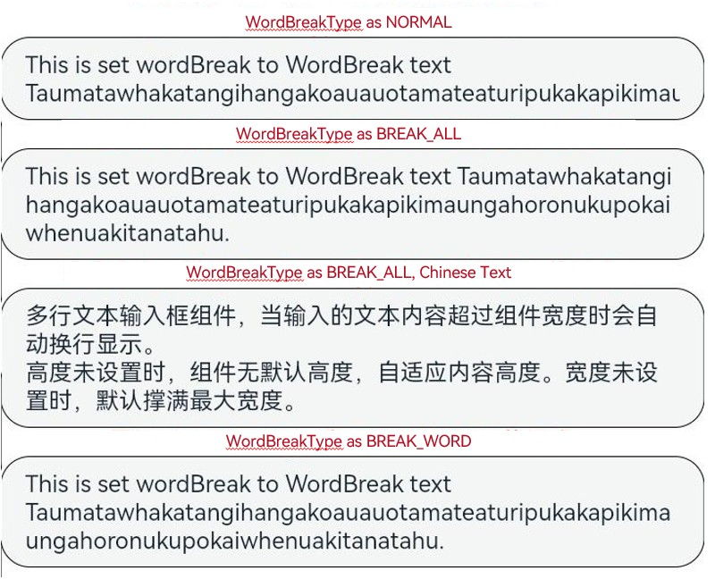

### Example 6 (Setting Text Style)

Since API version 12, this example demonstrates text effects in different styles through the [lineHeight](#lineheight12), [letterSpacing](#letterspacing12), and [decoration](#decoration12) attributes.

```ts
// xxx.ets
@Entry
@Component
struct TextAreaExample {
  build() {
    Row() {
      Column() {
        Text('lineHeight').fontSize(9).fontColor(0xCCCCCC)
        TextArea({ text: 'lineHeight unset' })
          .border({ width: 1 }).padding(10).margin(5)
        TextArea({ text: 'lineHeight 15' })
          .border({ width: 1 }).padding(10).margin(5).lineHeight(15)
        TextArea({ text: 'lineHeight 30' })
          .border({ width: 1 }).padding(10).margin(5).lineHeight(30)

        Text('letterSpacing').fontSize(9).fontColor(0xCCCCCC)
        TextArea({ text: 'letterSpacing 0' })
          .border({ width: 1 }).padding(5).margin(5).letterSpacing(0)
        TextArea({ text: 'letterSpacing 3' })
          .border({ width: 1 }).padding(5).margin(5).letterSpacing(3)
        TextArea({ text: 'letterSpacing -1' })
          .border({ width: 1 }).padding(5).margin(5).letterSpacing(-1)

        Text('decoration').fontSize(9).fontColor(0xCCCCCC)
        TextArea({ text: 'LineThrough, Red\nsecond line' })
          .border({ width: 1 }).padding(5).margin(5)
          .decoration({ type: TextDecorationType.LineThrough, color: Color.Red })
        TextArea({ text: 'Overline, Red, DOTTED\nsecond line' })
          .border({ width: 1 }).padding(5).margin(5)
          .decoration({ type: TextDecorationType.Overline, color: Color.Red, style: TextDecorationStyle.DOTTED })
        TextArea({ text: 'Underline, Red, WAVY\nsecond line' })
          .border({ width: 1 }).padding(5).margin(5)
          .decoration({ type: TextDecorationType.Underline, color: Color.Red, style: TextDecorationStyle.WAVY })
      }.height('90%')
    }
    .width('90%')
    .margin(10)
  }
}
```


### Example 7 (Setting Font Feature Effects)

Since API version 12, this example uses the [fontFeature](#fontfeature12) attribute to implement the display effect of text under different font features.

```ts
// xxx.ets
@Entry
@Component
struct TextAreaExample {
  @State text1: string = 'This is ss01 on : 0123456789';
  @State text2: string = 'This is ss01 off: 0123456789';

  build() {
    Column() {
      TextArea({ text: this.text1 })
        .fontSize(20)
        .margin({ top: 200 })
        .fontFeature('"ss01" on')
      TextArea({ text: this.text2 })
        .margin({ top: 10 })
        .fontSize(20)
        .fontFeature('"ss01" off')
    }
    .width('90%')
    .margin('5%')
  }
}
```


### Example 8 (Custom Keyboard Avoidance)

This example uses the [customKeyboard](#customkeyboard10) (available since API version 10) attribute to configure the [KeyboardOptions](ts-basic-components-richeditor.md#keyboardoptions12) (available since API version 12) interface to implement custom keyboard avoidance.

```ts
// xxx.ets
@Entry
@Component
struct TextAreaExample {
  controller: TextAreaController = new TextAreaController();
  @State inputValue: string = '';
  @State height1: string | number = '80%';
  @State supportAvoidance: boolean = true;

  // Custom keyboard component
  @Builder
  CustomKeyboardBuilder() {
    Column() {
      Row() {
        Button('x').onClick(() => {
          // Close the custom keyboard.
          this.controller.stopEditing();
        }).margin(10)
      }

      Grid() {
        ForEach([1, 2, 3, 4, 5, 6, 7, 8, 9, '*', 0, '#'], (item: number | string) => {
          GridItem() {
            Button(item + '')
              .width(110).onClick(() => {
              this.inputValue += item;
            })
          }
        })
      }.maxCount(3).columnsGap(10).rowsGap(10).padding(5)
    }.backgroundColor(Color.Gray)
  }

  build() {
    Column() {
      Row() {
        Button('20%')
          .fontSize(24)
          .onClick(() => {
            this.height1 = '20%';
          })
        Button('80%')
          .fontSize(24)
          .margin({ left: 20 })
          .onClick(() => {
            this.height1 = '80%';
          })
      }
      .justifyContent(FlexAlign.Center)
      .alignItems(VerticalAlign.Bottom)
      .height(this.height1)
      .width('100%')
      .padding({ bottom: 50 })

      TextArea({ controller: this.controller, text: this.inputValue })// Bind the custom keyboard.
        .height(100)
        .customKeyboard(this.CustomKeyboardBuilder(), { supportAvoidance: this.supportAvoidance })
        .margin(10)
        .border({ width: 1 })
    }
  }
}
```


### Example 9 (Setting Text Auto-Adaptation)

Since API version 12, this example demonstrates the effect of auto-adaptive font size through the [minFontSize](#minfontsize12), [maxFontSize](#maxfontsize12), and [heightAdaptivePolicy](#heightadaptivepolicy12) attributes.

```ts
// xxx.ets
@Entry
@Component
struct TextAreaExample {
  build() {
    Row() {
      Column() {
        Text('heightAdaptivePolicy').fontSize(9).fontColor(0xCCCCCC)
        TextArea({text: 'This is the text with the height adaptive policy set'})
          .width('80%').height(90).borderWidth(1).margin(1)
          .minFontSize(4)
          .maxFontSize(40)
          .maxLines(3)
          .heightAdaptivePolicy(TextHeightAdaptivePolicy.MAX_LINES_FIRST)
        TextArea({text: 'This is the text with the height adaptive policy set'})
          .width('80%').height(90).borderWidth(1).margin(1)
          .minFontSize(4)
          .maxFontSize(40)
          .maxLines(3)
          .heightAdaptivePolicy(TextHeightAdaptivePolicy.MIN_FONT_SIZE_FIRST)
        TextArea({text: 'This is the text with the height adaptive policy set'})
          .width('80%').height(90).borderWidth(1).margin(1)
          .minFontSize(4)
          .maxFontSize(40)
          .maxLines(3)
          .heightAdaptivePolicy(TextHeightAdaptivePolicy.LAYOUT_CONSTRAINT_FIRST)
      }.height('90%')
    }
    .width('90%')
    .margin(10)
  }
}
```


### Example 10 (Setting Text Line Spacing)

Since API version 12, this example uses the [lineSpacing](#linespacing12) attribute to show how text is displayed under different line spacing. In addition, by configuring the onlyBetweenLines attribute (since API version 20) in [LineSpacingOptions](ts-text-common.md#linespacingoptions20), you can set whether the line spacing of text takes effect only between lines.

```ts
// xxx.ets
import { LengthMetrics } from '@kit.ArkUI';

@Entry
@Component
struct TextAreaExample {
  build() {
    Flex({ direction: FlexDirection.Column, alignItems: ItemAlign.Start, justifyContent: FlexAlign.SpaceBetween }) {
      Text('TextArea lineSpacing.').fontSize(9).fontColor(0xCCCCCC)
      TextArea({ text: 'This is the TextArea with no lineSpacing set.' })
        .fontSize(12)
      TextArea({ text: 'This is the TextArea with lineSpacing set to 20_px.' })
        .fontSize(12)
        .lineSpacing(LengthMetrics.px(20))
      TextArea({ text: 'This is the TextArea with lineSpacing set to 20_vp.' })
        .fontSize(12)
        .lineSpacing(LengthMetrics.vp(20))
      TextArea({ text: 'This is the TextArea with lineSpacing set to 20_fp.' })
        .fontSize(12)
        .lineSpacing(LengthMetrics.fp(20))
      TextArea({ text: 'This is the TextArea with lineSpacing set to 20_lpx.' })
        .fontSize(12)
        .lineSpacing(LengthMetrics.lpx(20))
      TextArea({ text: 'This is the TextArea with lineSpacing set to 100%.' })
        .fontSize(12)
        .lineSpacing(LengthMetrics.percent(1))
      TextArea({ text: 'The line spacing of this TextArea is set to 20_px, and the spacing is effective only between the lines.' })
        .fontSize(12)
        .lineSpacing(LengthMetrics.px(20), { onlyBetweenLines: true })
    }.height(600).width(350).padding({ left: 35, right: 35, top: 35 })
  }
}
```


### Example 11 (Setting Auto-Fill)

Since API version 12, this example implements text auto-fill through the [contentType](#contenttype12) and [enableAutoFill](#enableautofill12) attributes.

```ts
// xxx.ets
@Entry
@Component
struct TextAreaExample {
  @State text: string = '';

  build() {
    Column() {
      // Email address auto-fill type.
      TextArea({ placeholder: 'input your email...' })
        .width('95%')
        .height(40)
        .margin(20)
        .contentType(ContentType.EMAIL_ADDRESS)
        .enableAutoFill(true)
        .maxLength(20)
      // Street address auto-fill type.
      TextArea({ placeholder: 'input your street address...' })
        .width('95%')
        .height(40)
        .margin(20)
        .contentType(ContentType.FULL_STREET_ADDRESS)
        .enableAutoFill(true)
        .maxLength(20)
    }.width('100%').height('100%').backgroundColor('#F1F3F5')
  }
}
```

<!--RP5--><!--RP5End-->

### Example 12 (Setting the Line Breaking Rule)

Since API version 12, this example uses the [lineBreakStrategy](#linebreakstrategy12) attribute to implement the effects of TextArea under different line breaking rules.

```ts
// xxx.ets
@Entry
@Component
struct TextAreaExample {
  @State message1: string =
    'They can be classified as built-in components–those directly provided by the ArkUI framework and custom components – those defined by developers' +
      'The built-in components include buttons radio buttonsprogress indicators and text You can set the rendering effect of these components in method chaining mode,' +
      'page components are divided into independent UI units to implement independent creation development and reuse of different units on pages making pages more engineering-oriented.';
  @State lineBreakStrategyIndex: number = 0;
  @State lineBreakStrategy: LineBreakStrategy[] =
    [LineBreakStrategy.GREEDY, LineBreakStrategy.HIGH_QUALITY, LineBreakStrategy.BALANCED];
  @State lineBreakStrategyStr: string[] = ['GREEDY', 'HIGH_QUALITY', 'BALANCED'];

  build() {
    Flex({ direction: FlexDirection.Column, alignItems: ItemAlign.Start }) {
      Text('lineBreakStrategy').fontSize(9).fontColor(0xCCCCCC)
      TextArea({ text: this.message1 })
        .fontSize(12)
        .border({ width: 1 })
        .padding(10)
        .width('100%')
        .lineBreakStrategy(this.lineBreakStrategy[this.lineBreakStrategyIndex])
      Row() {
        Button('Current lineBreakStrategy mode:' + this.lineBreakStrategyStr[this.lineBreakStrategyIndex]).onClick(() => {
          this.lineBreakStrategyIndex++;
          if (this.lineBreakStrategyIndex > (this.lineBreakStrategyStr.length - 1)) {
            this.lineBreakStrategyIndex = 0;
          }
        })
      }.padding({ top: 10 })
    }.height(700).width(370).padding({ left: 35, right: 35, top: 35 })
  }
}
```

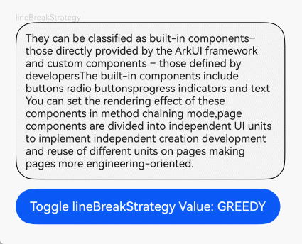

### Example 13 (Supporting Insert and Delete Callbacks)

Since API version 12, this example implements the insert and delete functions through the [onWillInsert](#onwillinsert12), [onDidInsert](#ondidinsert12), [onWillDelete](#onwilldelete12), and [onDidDelete](#ondiddelete12) APIs.

```ts
// xxx.ets
@Entry
@Component
struct TextAreaExample {
  @State insertValue: string = '';
  @State deleteValue: string = '';
  @State insertOffset: number = 0;
  @State deleteOffset: number = 0;
  @State deleteDirection: number = 0;
  @State currentValue_1: string = '';
  @State currentValue_2: string = '';

  build() {
    Row() {
      Column() {
        TextArea({ text: 'TextArea supports inserting callback text' })
          .width(300)
          .height(60)
          .onWillInsert((info: InsertValue) => {
            this.insertValue = info.insertValue;
            return true;
          })
          .onDidInsert((info: InsertValue) => {
            this.insertOffset = info.insertOffset;
          })
          .onWillChange((info: EditableTextChangeValue) => {
            this.currentValue_1 = info.content;
            return true;
          })

        Text('insertValue:' + this.insertValue + '  insertOffset:' + this.insertOffset).height(30)
        Text('currentValue_1:' + this.currentValue_1).height(30)

        TextArea({ text: 'TextArea supports deleting callback text b' })
          .width(300)
          .height(60)
          .onWillDelete((info: DeleteValue) => {
            this.deleteValue = info.deleteValue;
            this.deleteDirection = info.direction;
            return true;
          })
          .onDidDelete((info: DeleteValue) => {
            this.deleteOffset = info.deleteOffset;
            this.deleteDirection = info.direction;
          })
          .onWillChange((info: EditableTextChangeValue) => {
            this.currentValue_2 = info.content;
            return true;
          })

        Text('deleteValue:' + this.deleteValue + '  deleteOffset:' + this.deleteOffset).height(30)
        Text('deleteDirection:' + (this.deleteDirection == 0 ? 'BACKWARD' : 'FORWARD')).height(30)
        Text('currentValue_2:' + this.currentValue_2).height(30)

      }.width('100%')
    }
    .height('100%')
  }
}
```

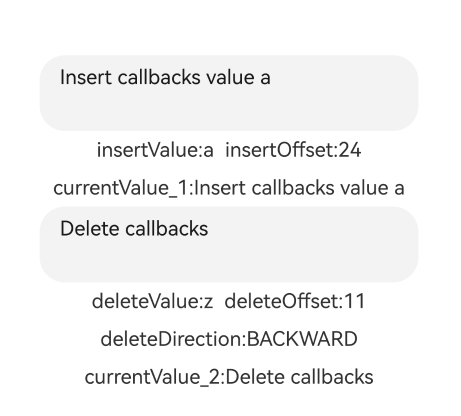

### Example 14 (Custom Menu for Text Extension)

Since API version 12, this example uses the [editMenuOptions](#editmenuoptions12) API to set the text content, icon, and callback of custom menu extension items. In addition, menu data can be set in the [onPrepareMenu](ts-text-common.md#properties-1) callback (since API version 20).

```ts
// xxx.ets
@Entry
@Component
struct TextAreaExample {
  @State text: string = 'TextArea editMenuOptions';
  @State endIndex: number = 0;
  onCreateMenu = (menuItems: Array<TextMenuItem>) => {
    // Replace $r('app.media.startIcon') with the image resource file required by the developer.
    let item1: TextMenuItem = {
      content: 'create1',
      icon: $r('app.media.startIcon'),
      id: TextMenuItemId.of('create1'),
    };
    let item2: TextMenuItem = {
      content: 'create2',
      id: TextMenuItemId.of('create2'),
      icon: $r('app.media.startIcon'),
    };
    // TextMenuItemId.autoFill is supported since API version 23.
    let targetIndex = menuItems.findIndex(item => item.id.equals(TextMenuItemId.autoFill));
    if (targetIndex !== -1) {
      menuItems.splice(targetIndex, 1); // Delete one element from the target index.
    }
    menuItems.push(item1);
    menuItems.unshift(item2);
    return menuItems;
  }
  onMenuItemClick = (menuItem: TextMenuItem, textRange: TextRange) => {
    if (menuItem.id.equals(TextMenuItemId.of('create2'))) {
      console.info('Intercept id: create2 start:' + textRange.start + '; end:' + textRange.end);
      return true;
    }
    if (menuItem.id.equals(TextMenuItemId.of('prepare1'))) {
      console.info('Intercept id: prepare1 start:' + textRange.start + '; end:' + textRange.end);
      return true;
    }
    if (menuItem.id.equals(TextMenuItemId.COPY)) {
      console.info('Intercept COPY start:' + textRange.start + '; end:' + textRange.end);
      return true;
    }
    if (menuItem.id.equals(TextMenuItemId.SELECT_ALL)) {
      console.info('Do not intercept SELECT_ALL start:' + textRange.start + '; end:' + textRange.end);
      return false;
    }
    return false;
  }
  onPrepareMenu = (menuItems: Array<TextMenuItem>) => {
    // Replace $r('app.media.startIcon') with the image resource file required by the developer.
    let item1: TextMenuItem = {
      content: 'prepare1_' + this.endIndex,
      icon: $r('app.media.startIcon'),
      id: TextMenuItemId.of('prepare1'),
    };
    menuItems.unshift(item1);
    return menuItems;
  }
  @State editMenuOptions: EditMenuOptions = {
    onCreateMenu: this.onCreateMenu,
    onMenuItemClick: this.onMenuItemClick,
    onPrepareMenu: this.onPrepareMenu
  };

  build() {
    Column() {
      TextArea({ text: this.text })
        .width('95%')
        .height(56)
        .editMenuOptions(this.editMenuOptions)
        .margin({ top: 100 })
        .onTextSelectionChange((selectionStart: number, selectionEnd: number) => {
          this.endIndex = selectionEnd;
        })
    }
    .width('90%')
    .margin('5%')
  }
}
```
<!--RP4-->
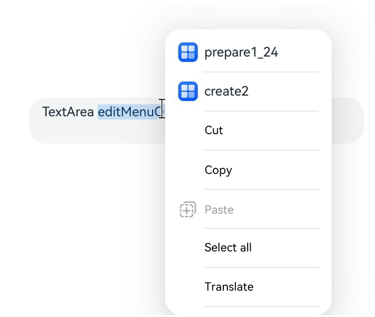
<!--RP4End-->

### Example 15 (Setting the Text Ellipsis Mode)

This example uses the [textOverflow](#textoverflow12), [ellipsisMode](#ellipsismode18), and [maxLines](#maxlines10) attributes to demonstrate the effect of truncating overlong text and adjusting the ellipsis position. Through the MULTILINE_START and MULTILINE_CENTER types, it implements the effect of placing the ellipsis at the beginning and in the middle of a line in single-line and multi-line text scenarios.

Since API version 10, the [maxLines](#maxlines10) attribute is used to set the maximum number of lines for text display.

Since API version 12, the [textOverflow](#textoverflow12) attribute is used to set how text is displayed when it is overlong.

Since API version 18, the [ellipsisMode](#ellipsismode18) attribute is used to set the ellipsis position.

Since API version 24, [EllipsisMode](ts-appendix-enums.md#ellipsismode11) has added the MULTILINE_START and MULTILINE_CENTER enums.

```ts
// xxx.ets
@Entry
@Component
struct EllipsisModeExample {
  @State textIndex: number = 0;
  @State text: string = 'As the sun begins to set, casting a warm golden hue across the sky,' +
    'the world seems to slow down and breathe a sigh of relief. The sky is painted with hues of orange, ' +
    ' pink, and lavender, creating a breath taking tapestry that stretches as far as the eye can see.' +
    'The air is filled with the sweet scent of blooming flowers, mingling with the earthy aroma of freshly turned soil.';
  @State ellipsisModeIndex: number = 0;
  @State ellipsisMode: (EllipsisMode | undefined | null)[] =
    [EllipsisMode.START, EllipsisMode.END, EllipsisMode.CENTER, EllipsisMode.MULTILINE_START,
      EllipsisMode.MULTILINE_CENTER, undefined, null]; // MULTILINE_START and MULTILINE_CENTER are added since API version 24.
  @State ellipsisModeStr: string[] =
    ['START ', 'END', 'CENTER', 'MULTILINE_START', 'MULTILINE_CENTER', 'undefined', 'null'];
  @State textOverflowIndex: number = 0;
  @State textOverflow: TextOverflow[] = [TextOverflow.Ellipsis, TextOverflow.Clip];
  @State textOverflowStr: string[] = ['Ellipsis', 'Clip'];
  @State maxLinesIndex: number = 0;
  @State maxLines: number[] = [1, 2, 3];
  @State maxLinesStr: string[] = ['1', '2', '3'];
  @State styleAreaIndex: number = 0;
  @State styleArea: TextContentStyle[] = [TextContentStyle.INLINE, TextContentStyle.DEFAULT];
  @State styleAreaStr: string[] = ['INLINE', 'DEFAULT'];

  build() {
    Column({ space: 20 }) {
      TextArea({ text: this.text })
        .textOverflow(this.textOverflow[this.textOverflowIndex])
        .ellipsisMode(this.ellipsisMode[this.ellipsisModeIndex])
        .maxLines(this.maxLines[this.maxLinesIndex])
        .style(this.styleArea[this.styleAreaIndex])
        .fontSize(30)
        .margin(30)

      Button('Change ellipsisMode mode:' + this.ellipsisModeStr[this.ellipsisModeIndex]).onClick(() => {
        this.ellipsisModeIndex++;
        if (this.ellipsisModeIndex > (this.ellipsisModeStr.length - 1)) {
          this.ellipsisModeIndex = 0;
        }
      }).fontSize(20)
      Button('Change textOverflow mode:' + this.textOverflowStr[this.textOverflowIndex]).onClick(() => {
        this.textOverflowIndex++;
        if (this.textOverflowIndex > (this.textOverflowStr.length - 1)) {
          this.textOverflowIndex = 0;
        }
      }).fontSize(20)
      Button('Change maxLines size:' + this.maxLinesStr[this.maxLinesIndex]).onClick(() => {
        this.maxLinesIndex++;
        if (this.maxLinesIndex > (this.maxLinesStr.length - 1)) {
          this.maxLinesIndex = 0;
        }
      }).fontSize(20)
      Button('Change Style Size:' + this.styleAreaStr[this.styleAreaIndex]).onClick(() => {
        this.styleAreaIndex++;
        if (this.styleAreaIndex > (this.styleAreaStr.length - 1)) {
          this.styleAreaIndex = 0;
        }
      }).fontSize(20)
    }.height(600).width('100%')
  }
}
```

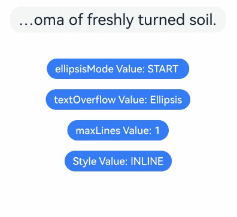

### Example 16 (Customizing Copy, Cut, and Paste)

This example uses [onCopy](#oncopy8), [onCut](#oncut8), [onPaste](#onpaste), [onWillCopy](#onwillcopy), and [onWillCut](#onwillcut) to demonstrate how to listen for the copy, cut, and paste buttons in the text selection menu, how to block the system paste function and implement a custom paste capability, how to block the system copy function, and how to block the system cut function. In addition, the [maxFontScale](#maxfontscale18) and [minFontScale](#minfontscale18) attributes can be used to set the maximum and minimum font scale factors of the text.

Since API version 26.0.0, the [onWillCopy](#onwillcopy) and [onWillCut](#onwillcut) APIs are added.

```ts
// xxx.ets
@Entry
@Component
struct TextAreaExample {
  @State text: string = '';
  controller: TextAreaController = new TextAreaController();

  build() {
    Column() {
      TextArea({
        text: this.text,
        placeholder: 'placeholder',
        controller: this.controller
      })
        .placeholderColor(Color.Red)
        .textAlign(TextAlign.Center)
        .caretColor(Color.Green)
        .caretStyle({ width: '2vp' })
        .fontStyle(FontStyle.Italic)
        .fontWeight(FontWeight.Bold)
        .fontFamily('HarmonyOS Sans')
        .inputFilter('[a-zA-Z]+', (value) => { // Allow only letters.
          console.error(`unsupported char ${value}`);
        })
        .copyOption(CopyOptions.LocalDevice)
        .enableKeyboardOnFocus(false)
        .selectionMenuHidden(false)
        .barState(BarState.On)
        .type(TextAreaType.NORMAL)
        .selectedBackgroundColor(Color.Orange)
        .textIndent(2)
        .halfLeading(true)
        .minFontScale(1)
        .maxFontScale(2)
        .enablePreviewText(true)
        .enableHapticFeedback(true)
        .stopBackPress(false)// Hand over the back key to other components.
        .width(336)
        .height(56)
        .margin(20)
        .fontSize(16)
        .onEditChange((isEditing: boolean) => {
          console.info(`isEditing ${isEditing}`);
        })
        .onCopy((value) => {
          console.info(`copy ${value}`);
        })
        // Support onWillCopy since API version 26.0.0.
        .onWillCopy((value: string) => {
          console.info(`on will copy ${value}`);
          return false;
        })
        .onCut((value) => {
          console.info(`cut ${value}`);
        })
        // Support onWillCut since API version 26.0.0.
        .onWillCut((value: string) => {
          console.info(`on will cut ${value}`);
          return false;
        })
        .onPaste((value, event) => {
          // Block the system paste function. Developers can implement it on their own.
          if (event.preventDefault) {
            event.preventDefault();
          }
          console.info(`paste:${value}`);
          this.text = value;
        })
        .onTextSelectionChange((start: number, end: number) => {
          console.info(`onTextSelectionChange start ${start}, end ${end}`);
        })
        .onContentScroll((totalOffsetX: number, totalOffsetY: number) => {
          console.info(`onContentScroll offsetX ${totalOffsetX}, offsetY ${totalOffsetY}`);
        })
    }.width('100%').height('100%').backgroundColor('#F1F3F5')
  }
}
```


### Example 17: Setting the Minimum and Maximum Font Scale Factors

Since API version 18, this example uses [minFontScale](#minfontscale18) and [maxFontScale](#maxfontscale18) to set the minimum and maximum font display range<!--Del--> (this example uses system APIs, so the application type must be changed to a system application; for details, see [Available APIs](../../../reference/development-intro-api.md#available-apis))<!--DelEnd-->.
<!--code_no_check-->
```json5
// Enable the application to scale with the system.
// Create the profile folder in AppScope/resources/base.
// Create the configuration.json file in AppScope/resources/base/profile.
// Add the following code to AppScope/resources/base/profile/configuration.json.
{
  "configuration": {
    "fontSizeScale": "followSystem",
    "fontSizeMaxScale": "3.2"
  }
}
```
<!--code_no_check-->
```json5
// Modify the following code in AppScope/app.json5.
{
  "app": {
    "bundleName": "com.example.myapplication",
    "vendor": "example",
    "versionCode": 1000000,
    "versionName": "1.0.0",
    "icon": "$media:app_icon",
    "label": "$string:app_name",
    "configuration": "$profile:configuration"
  }
}
```
<!--RP1-->
<!--code_no_check-->
```ts
// xxx.ets
import { abilityManager, Configuration } from '@kit.AbilityKit';
import { BusinessError } from '@kit.BasicServicesKit';

@Entry
@Component
struct TextAreaExample {
  @State currentFontSizeScale: number = 1;
  @State minFontScale: number = 0.85;
  @State maxFontScale: number = 2;

  // Set the font size.
  async setFontScale(scale: number): Promise<void> {
    let configInit: Configuration = {
      fontSizeScale: scale
    };
    // Update the configuration - font size, and call the system API to update the font configuration.
    // Configure the ohos.permission.UPDATE_CONFIGURATION permission in the requestPermissions field of the module.json5 file in the project.
    abilityManager.updateConfiguration(configInit, (err: BusinessError) => {
      if (err) {
        console.error(`Failed to updateConfiguration. Code: ${err.code}, message: ${err.message}`);
      } else {
        this.currentFontSizeScale = scale;
        console.info('updateConfiguration success.');
      }
    });
  }

  build() {
    Column() {
      Column({ space: 30 }) {
        Text('Adjust the maximum and minimum font scale factors for text display through minFontScale and maxFontScale.')
        TextArea({
          placeholder: 'The text area can hold an unlimited amount of text. input your word...',
          text: 'Adjust the maximum and minimum font scale factors for text display through minFontScale and maxFontScale.'
        })
          .minFontScale(this.minFontScale)// Set the minimum font scale factor. If the parameter is undefined, the system default scale factor is used.
          .maxFontScale(this.maxFontScale) // Set the maximum font scale factor. If the parameter is undefined, the system default scale factor is used.
      }.width('100%')
      // The following buttons are used only to adjust the font scale factor and are not shown in the sample figure.
      Column() {
        Row() {
          Button('1x').onClick(() => {
            this.setFontScale(1)
          }).margin(10)
          Button('1.75x').onClick(() => {
            this.setFontScale(1.75)
          }).margin(10)
        }

        Row() {
          Button('2x').onClick(() => {
            this.setFontScale(2)
          }).margin(10)
          Button('3.2x').onClick(() => {
            this.setFontScale(3.2)
          }).margin(10)
        }
      }.margin({ top: 50 })
    }
  }
}
```
| System font scale factor is 2x | System font scale factor is 3.2x |
| ---------------------------------- | ------------------------------------ |
| 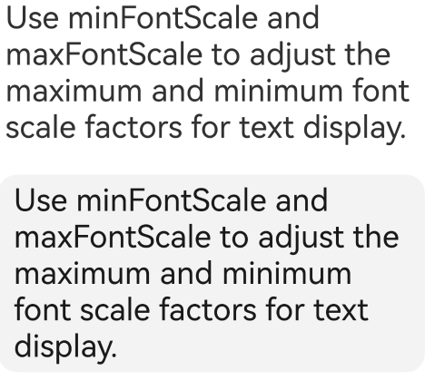  | 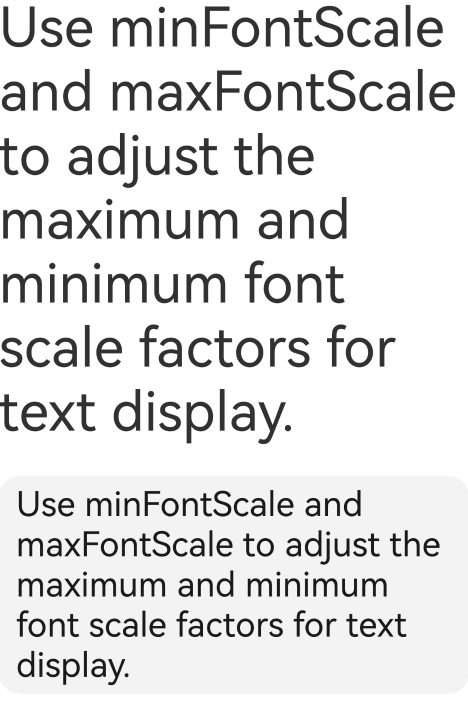  |
<!--RP1End-->

### Example 18 (Setting the Text Content of a Selected Area)

Since API version 10, this example uses [setTextSelection](#settextselection10) to show how to set the text content of a selected area and the menu visibility policy.

```ts
// xxx.ets

@Entry
@Component
struct TextAreaExample {
  controller: TextAreaController = new TextAreaController();
  @State startIndex: number = 0;
  @State endIndex: number = 0;

  build() {
    Column({ space: 3 }) {
      Text('Selection start:' + this.startIndex + ' end:' + this.endIndex)
      TextArea({ text: 'Hello World', controller: this.controller })
        .width('95%')
        .height(80)
        .margin(10)
        .defaultFocus(true)
        .enableKeyboardOnFocus(true)
        .onTextSelectionChange((selectionStart: number, selectionEnd: number) => {
          this.startIndex = selectionStart;
          this.endIndex = selectionEnd;
        })

      Button('setTextSelection [0,3], set menuPolicy is MenuPolicy.SHOW')
        .onClick(() => {
          this.controller.setTextSelection(0, 3, { menuPolicy: MenuPolicy.SHOW });
        })
    }
    .width('100%')
    .height('100%')
  }
}
```

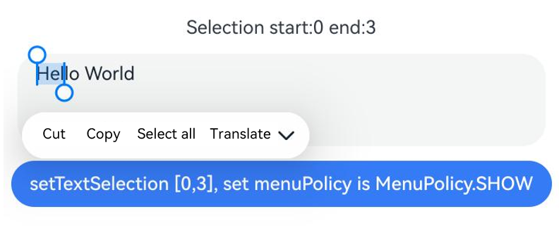

### Example 19 (Setting Text Stroke)

Since API version 20, this example sets the stroke width and color of text through the [strokeWidth](#strokewidth20) and [strokeColor](#strokecolor20) attributes.

Since API version 26.0.0, the [strokeJoinStyle](#strokejoinstyle) API is added to set the text stroke join style.

```ts
// xxx.ets
import { LengthMetrics } from '@kit.ArkUI';

@Entry
@Component
struct TextAreaExample {
  build() {
    Row() {
      Column() {
        Text('stroke feature').fontSize(9).fontColor(0xCCCCCC)

        TextArea({ text: 'Text without stroke' })
          .width('100%')
          .height(60)
          .borderWidth(1)
          .fontSize(40)
        TextArea({ text: 'Text with stroke' })
          .width('100%')
          .height(60)
          .borderWidth(1)
          .fontSize(40)
          .strokeWidth(LengthMetrics.px(-3.0))
          .strokeColor(Color.Red)
        TextArea({ text: 'Text with stroke' })
          .width('100%')
          .height(60)
          .borderWidth(1)
          .fontSize(40)
          .strokeWidth(LengthMetrics.px(3.0))
          .strokeJoinStyle(StrokeJoinStyle.MITER_JOIN)
          .strokeColor(Color.Red)
      }.height('90%')
    }
    .width('90%')
    .margin(10)
  }
}
```

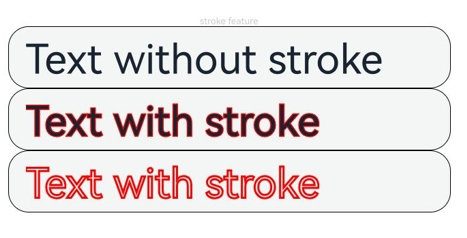

### Example 20 (Setting Auto Spacing Between Chinese and Western Text)

Since API version 20, this example sets auto spacing between Chinese and Western text through the [enableAutoSpacing](#enableautospacing20) attribute.

```ts
// xxx.ets
@Entry
@Component
struct TextAreaExample {
  build() {
    Row() {
      Column() {
        Text('Enable auto spacing between Chinese and Western text').margin(5)
        TextArea({text: 'Chinese and Western Auto Spacing'})
          .enableAutoSpacing(true)
        Text('Disable auto spacing between Chinese and Western text').margin(5)
        TextArea({text: 'Chinese and Western Auto Spacing'})
          .enableAutoSpacing(false)
      }.height('100%')
    }
    .width('60%')
  }
}
```


### Example 21 (Setting the Maximum Number of Lines)

Since API version 20, this example uses the [maxLines](#maxlines20) attribute to set the maximum number of lines to display. When the content exceeds the maximum number of lines, it can be scrolled.

```ts
// xxx.ets
@Entry
@Component
struct TextAreaExample {
  build() {
    Row() {
      Column() {
        TextArea({ text: '1 2 3 4 5 6 7 8 9 10 11 12 13 14 15 16 17 18 19 20' })
          .fontSize(50)
          .width('50%')
          .borderWidth(1)
          .margin(100)
          .textOverflow(TextOverflow.Clip)
          .maxLines(3, { overflowMode: MaxLinesMode.SCROLL })
      }.height('90%')
    }
    .width('90%')
    .margin(10)
  }
}

```
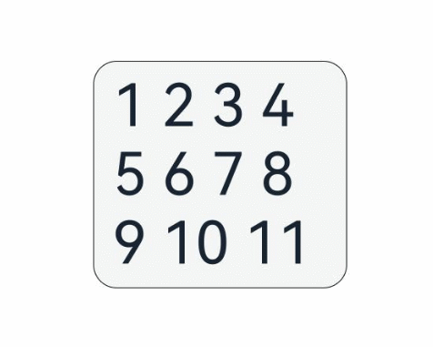

### Example 22 (Setting the Minimum Number of Lines)

Since API version 20, this example sets the minimum number of lines to display through the [minLines](#minlines20) attribute.

```ts
// xxx.ets
@Entry
@Component
struct Index {
  @State message: string = 'Hello World';

  build() {
    Row() {
      Column() {
        TextArea({ text: this.message })
          .width('95%')
          .fontSize(20)
          .margin(10)
          .minLines(3)
      }
    }
    .width('90%')
    .margin(10)
  }
}
```


### Example 23 (Setting the Character Count Color and Overflow Character Color)

Since API version 22, this example uses the counterTextColor and counterTextOverflowColor of [showCounter](#showcounter10) to set the character count color and the overflow character color.

```ts
import { ColorMetrics } from '@kit.ArkUI';

// xxx.ets
@Entry
@Component
struct TextAreaExample {
  @State text: string = '';
  controller: TextAreaController = new TextAreaController();

  build() {
    Column() {
      TextArea({
        text: this.text,
        placeholder: 'The text area can hold an unlimited amount of text. input your word...',
        controller: this.controller
      })
        .placeholderFont({ size: 16, weight: 400 })
        .width(336)
        .height(56)
        .margin(20)
        .fontSize(16)
        .fontColor('#182431')
        .backgroundColor('#FFFFFF')
        .maxLength(4)
        .showCounter(true, {
          thresholdPercentage: 50,
          highlightBorder: true,
          counterTextColor: ColorMetrics.resourceColor(Color.Red),
          counterTextOverflowColor: ColorMetrics.resourceColor(Color.Orange)
        })
    }.width('100%').height('100%').backgroundColor('#F1F3F5')
  }
}
```


### Example 24 (Setting the Scrollbar Color)
Since API version 22, this example sets the scrollbar color through the [scrollBarColor](#scrollbarcolor22)<sup>22</sup> attribute.

```ts
// xxx.ets
import { ColorMetrics } from '@kit.ArkUI';
@Entry
@Component
struct Index {
  controller: TextAreaController = new TextAreaController();
  build() {
      Column() {
        TextArea({
          text: 'Hello World TextArea\nHello World TextArea\nHello World TextArea\nHello World TextArea',
          placeholder: 'Type to text area...',
          controller: this.controller
        })
          .width(336)
          .height(56)
          .margin({bottom:5})
          .fontSize(16)
          .fontColor('#182431')
          .backgroundColor('#FFFFFF')
          .barState(BarState.On)
          .scrollBarColor(undefined)
        TextArea({
          text: 'Hello World TextArea\nHello World TextArea\nHello World TextArea\nHello World TextArea',
          placeholder: 'Type to text area...',
          controller: this.controller
        })
          .width(336)
          .height(56)
          .margin({bottom:5})
          .fontSize(16)
          .fontColor('#182431')
          .backgroundColor('#FFFFFF')
          .barState(BarState.On)
          .scrollBarColor(ColorMetrics.resourceColor(Color.Orange))
        TextArea({
          text: 'Hello World TextArea\nHello World TextArea\nHello World TextArea\nHello World TextArea',
          placeholder: 'Type to text area...',
          controller: this.controller
        })
          .width(336)
          .height(56)
          .margin({bottom:5})
          .fontSize(16)
          .fontColor('#182431')
          .backgroundColor('#FFFFFF')
          .barState(BarState.On)
          .scrollBarColor(ColorMetrics.rgba(255, 100, 255))
      }
      .backgroundColor(Color.Blue).width('100%').height('100%')
  }
}
```
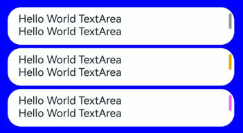

### Example 25 (Setting the Placeholder Rich Text Style)

Since API version 22, this example sets the placeholder rich text style through the [setStyledPlaceholder](ts-universal-attributes-text-style.md#setstyledplaceholder22) API.

The original text supports multiple languages. For content in different languages, the style start index subscript start and length may differ. The following uses Chinese as an example to set the rich text style.

```ts
// xxx.ets
import { LengthMetrics } from '@kit.ArkUI';

@Entry
@Component
struct TextAreaExample {
  styledString: MutableStyledString =
    new MutableStyledString('Paragraph title \n Body text paragraph 1 \n Body text paragraph 2 indent 40 vp\n Body text paragraph 3 textAlign center-aligned',
      [
        {
          start: 0,
          length: 4,
          styledKey: StyledStringKey.FONT,
          styledValue: new TextStyle({ fontSize: LengthMetrics.vp(24), fontWeight: FontWeight.Bolder })
        },
        {
          start: 5,
          length: 5,
          styledKey: StyledStringKey.FONT,
          styledValue: new TextStyle({ fontColor: Color.Gray })
        },
        {
          start: 11,
          length: 1,
          styledKey: StyledStringKey.PARAGRAPH_STYLE,
          styledValue: new ParagraphStyle({
            textIndent: LengthMetrics.vp(40),
            maxLines: 1,
            overflow: TextOverflow.Ellipsis
          })
        },
        {
          start: 29,
          length: 1,
          styledKey: StyledStringKey.PARAGRAPH_STYLE,
          styledValue: new ParagraphStyle({
            textAlign: TextAlign.Center
          })
        }
      ]);
  controller: TextAreaController = new TextAreaController();

  aboutToAppear() {
    this.controller.setStyledPlaceholder(this.styledString)
  }

  build() {
    Scroll() {
      Column() {
        Text('TextArea placeholder rich text')
          .fontSize(8)
        TextArea({ controller: this.controller })
          .width(200)
          .fontSize(24)
          .margin(10)
      }
      .width('100%')
    }
  }
}
```
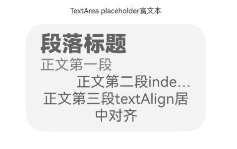

### Example 26 (Setting IME Extension Information)

Since API version 22, this example uses [IMEClient](ts-text-common.md#imeclient20) to set the IME extension information through setExtraConfig.

```ts
// xxx.ets
@Entry
@Component
struct TextAreaExample {
  build() {
    Column() {
      TextArea({ text: 'Execute the onWillAttachIME callback before the input method is pulled up' })
        .onWillAttachIME((client: IMEClient) => {
          client.setExtraConfig({
            customSettings: {
              name: 'TextArea', // Custom attribute
              id: client.nodeId // Custom attribute
            }
          })
        })
    }.height('100%')
  }
}
```

### Example 27 (Setting Leading Punctuation Compression and Trailing Punctuation Overhang)

This example uses the [compressLeadingPunctuation](#compressleadingpunctuation23) API to set leading punctuation compression, and the [punctuationOverflow](#punctuationoverflow) API to set trailing punctuation overhang.

When a punctuation mark with spacing on its left is at the beginning of a line, the spacing is compressed directly to the left boundary.

After the text wraps automatically, if the remaining content (including the punctuation mark) can fit into the previous line, the punctuation overhang takes effect.

Since API version 23, the compressLeadingPunctuation API is added.

Since API version 26.0.0, the punctuationOverflow API is added.

```ts
@Entry
@Component
struct PunctuationDemo {
  @State compressLeadingPunctuation: boolean = false;
  @State punctuationOverflow: boolean = false;
  @State text: string = '「0123456789！\n『0123456789：\n（0123456789；\n《0123456789）\n〈0123456789】';

  build() {
    Column() {
      TextArea({ text: this.text })
        .compressLeadingPunctuation(this.compressLeadingPunctuation)
        .punctuationOverflow(this.punctuationOverflow)
        .fontSize('20fp')
        .align(Alignment.Center)
        .height('35%')
        .width('50%')

      Column() {
        Button('Enable leading punctuation compression').onClick(() => {
          this.compressLeadingPunctuation = true;
        }).margin(5)
        Button('Disable leading punctuation compression').onClick(() => {
          this.compressLeadingPunctuation = false;
        }).margin(5)
        Button('Enable trailing punctuation overhang').onClick(() => {
          this.punctuationOverflow = true;
        }).margin(5)
        Button('Disable trailing punctuation overhang').onClick(() => {
          this.punctuationOverflow = false;
        }).margin(5)
      }
    }.width('100%').padding(20)
  }
}
```


### Example 28 (Setting Adaptive Spacing)

This example uses the [includeFontPadding](#includefontpadding23) API to increase the spacing of the first and last lines, and the [fallbackLineSpacing](#fallbacklinespacing23) API to set adaptive line spacing.

Since API version 23, the [includeFontPadding](#includefontpadding23) and [fallbackLineSpacing](#fallbacklinespacing23) APIs are added.

```ts
// xxx.ets

const UYGHUR_TEXT: string = 'ياخشىمۇسەنياخشىمۇسەنياخشىمۇسەنياخشىمۇسەنياخشىمۇسەنياخشىمۇسەنياخشىمۇسەن';
@Entry
@Component
struct Index {
  @State include: boolean | null | undefined = false;
  @State fallback: boolean | null | undefined = false;
  @State displayText: string = UYGHUR_TEXT;

  build() {
    Column() {
      TextArea({
        text: this.displayText,
        placeholder: 'Please enter content...'
      })
        .includeFontPadding(this.include)
        .fallbackLineSpacing(this.fallback)
        .lineHeight(5)
        .width('100%')
        .height(100)
        .backgroundColor('#eee')
        .borderWidth(1)
        .borderColor('#dddddd')

      Scroll() {
        Column() {
          // --- Buttons related to includeFontPadding ---
          Button('Set includePadding: ' + this.include)
            .onClick(() => {
              this.include = this.include === false ? true : false;
            })
            .margin({ bottom: 10 })

          // --- Buttons related to fallbackLineSpacing ---
          Button('Set fallbackLineSpacing: ' + this.fallback)
            .onClick(() => {
              this.fallback = this.fallback === false ? true : false;
            })
            .margin({ bottom: 10 })

        }
        .width('100%')
        .padding(5)
      }
      .height(250)
      .backgroundColor('transparent')
      .scrollBarWidth(2)
      .scrollBarColor('#888')

    }
    .width('100%')
    .height('100%')
    .padding(20)
  }
}
```

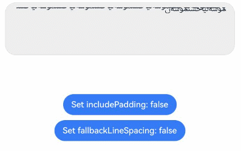

### Example 29 (Setting the Backplate Style During Text Dragging)

This example uses the [selectedDragPreviewStyle](#selecteddragpreviewstyle23) API to set the backplate style during text dragging.

Since API version 23, the selectedDragPreviewStyle API is added.

```ts
@Entry
@Component
struct TextAreaTest {
  build() {
    Column() {
      TextArea({ text: 'HelloWorld', placeholder: 'please input words' })
        .copyOption(CopyOptions.InApp)
        .width(200)
        .height(50)
        .margin(150)
        .draggable(true)
        .selectedDragPreviewStyle({color: 'rgba(227, 248, 249, 1)'})
    }
    .height('100%')
  }
}
```


### Example 30 (Deleting the Last Character in the Text Box)

This example calls the [deleteBackward](ts-universal-attributes-text-style.md#deletebackward23) API to delete the last character in the text box.

Since API version 23, the [deleteBackward](ts-universal-attributes-text-style.md#deletebackward23) API is added.

``` typescript
@Entry
@Component
struct Page {
  controller: TextAreaController = new TextAreaController();

  build() {
    Column() {
      TextArea({ text: 'TextArea Deletebackward example', controller: this.controller })
      Button('Delete backward')
        .onClick(() => {
          this.controller.deleteBackward();
        })
    }
  }
}
```


### Example 31 (Setting the Text Direction)

This example uses [textDirection](#textdirection23) to set the text direction.

The textDirection API is available since API version 23.

``` ts
// xxx.ets
@Entry
@Component
struct TextAreaExample {
  @State text: string = 'TextArea text direction example';

  build() {
    Column() {
      Text('TextArea text direction RTL, layout direction default')
        .fontSize(12).width('90%')
      TextArea({ text: this.text })
        .width(336)
        .height(56)
        .margin(10)
        .fontSize(16)
        .textDirection(TextDirection.RTL)
        .showCounter(true)
        .maxLength(50)
      Text('TextArea text direction RTL, layout direction default, text horizontal alignment LEFT')
        .fontSize(12).width('90%')
      TextArea({ text: this.text })
        .width(336)
        .height(56)
        .margin(10)
        .fontSize(16)
        .textDirection(TextDirection.RTL)
        .textAlign(TextAlign.LEFT)
        .showCounter(true)
        .maxLength(50)
      Text('TextArea text direction LTR, layout direction Rtl')
        .fontSize(12).width('90%')
      TextArea({ text: this.text })
        .width(336)
        .height(56)
        .margin(10)
        .fontSize(16)
        .textDirection(TextDirection.LTR)
        .direction(Direction.Rtl)
        .maxLength(50)
        .showCounter(true)
    }.width('100%').height('100%')
  }
}
```

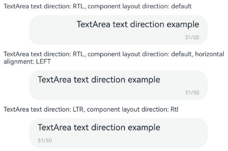

### Example 32 (Scrolling Text in a Specified Range into the Visible Area)

This example uses [scrollToVisible](./ts-universal-attributes-text-style.md#scrolltovisible23) to scroll text outside the visible area into the visible area.

Since API version 23, the scrollToVisible API is added.

```ts
// xxx.ets
@Entry
@Component
struct TextAreaExample {
  @State text: string = '123456789134567891234567891234567😁😁😁😁89123456789123456789123456789123456789123456789123';
  controller: TextAreaController = new TextAreaController();

  build() {
    Column() {
      TextArea({ text: this.text, controller: this.controller })
        .width(336)
        .height(150)
      Button('Scroll text to the visible area').onClick(() => {
        this.controller.scrollToVisible({ start: 110, end: 115 });
      })
    }.width('100%').height('100%').backgroundColor('#F1F3F5')
  }

  aboutToAppear(): void {
    for (let i = 0; i < 5; i++) {
      this.text += this.text
    }
  }
}
```


### Example 33 (Setting Horizontal Scrolling)

This example sets horizontal scrolling through [horizontalScrolling](#horizontalscrolling24).

Since API version 24, the horizontalScrolling API is added.

```ts
// xxx.ets
@Entry
@Component
struct Index {
  @State message: string = `Hello World Hello World Hello World Hello World Hello World\n
Hello World Hello World Hello World Hello World Hello World\n
Hello World Hello World Hello World Hello World Hello World\n
Hello World Hello World Hello World Hello World Hello World\n
Hello World Hello World Hello World Hello World Hello World\n
Hello World Hello World Hello World Hello World Hello World\n
Hello World Hello World Hello World Hello World Hello World\n
Hello World Hello World Hello World Hello World Hello World\n
`

  build() {
    Column() {
      TextArea({ text: this.message })
        .horizontalScrolling(true)
        .width('200vp')
        .height('150vp')
    }
    .height('100%')
    .width('100%')
  }
}
```


### Example 34 (Setting Whether to Enable Orphan Character Optimization During Text Layout)

This example uses the [orphanCharOptimization](#orphancharoptimization) API to enable orphan character optimization, ensuring that no orphan character appears on the last line of a paragraph.

Since API version 26.0.0, the orphanCharOptimization API is added.

``` ts
// xxx.ets
@Entry
@Component
struct TextExample {
  @State text: string = 'aaaaaaaaaaaaaaaaaaaaaaaaaaaaaaaatextaaaaaaaaaaaaa';

  build() {
    Column({ space: 3 }) {
      Text('TextArea does not enable orphan character optimization')
        .fontSize(12).width('90%').margin(5)
      TextArea({ text: this.text })
        .fontSize(20)
        .width('408')
        .borderWidth(1)
      Text('TextArea enables orphan character optimization')
        .fontSize(12).width('90%').margin(5)
      TextArea({ text: this.text })
        .fontSize(20)
        .width('408')
        .borderWidth(1)
        .orphanCharOptimization(true)
    }
    .width('100%')
    .height('100%')
  }
}
```

The effect shown in the figure may vary depending on the device size and is for reference only.


### Example 35 (Setting the Text Shader Effect)

This example uses the [shaderStyle](#shaderstyle) API to apply a shader effect to the text in the TextArea component.

Since API version 26.0.0, the shaderStyle API is added.

```ts
@Entry
@Component
struct ShaderColorStyle {
  @State message: string = 'Hello World';
  @State linearGradientOptions1: LinearGradientOptions =
    {
      angle: 45,
      colors: [[Color.Red, 0.0], [Color.Blue, 0.3], [Color.Green, 0.5]]
    };
  @State linearGradientOptions2: LinearGradientOptions =
    {
      direction: GradientDirection.LeftTop,
      colors: [[Color.Red, 0.0], [Color.Blue, 0.3], [Color.Green, 0.5]],
      repeating: true,
    };
  @State radialGradientOptions: RadialGradientOptions =
    {
      center: [50, 50],
      radius: 20,
      colors: [[Color.Red, 0.0], [Color.Blue, 0.3], [Color.Green, 0.5]],
      repeating: true,
    };
  @State colorShaderStyle: ColorShaderStyle =
    {
      color: Color.Blue
    };
  build() {
    Column({ space: 5 }) {
      Text('Linear gradient with an angle of 45°').fontSize(18).width('90%')
        .margin({ top: 40, left: 40 })
      TextArea({ text: this.message })
        .fontSize(20)
        .width('80%')
        .height(40)
        .shaderStyle(this.linearGradientOptions1)
      Text('Linear gradient with direction LeftTop').fontSize(18).width('90%')
        .margin({ top: 40, left: 40 })
      TextArea({ text: this.message })
        .fontSize(20)
        .width('80%')
        .height(40)
        .shaderStyle(this.linearGradientOptions2)
      Text('Radial gradient').fontSize(18).width('90%')
        .margin({ top: 40, left: 40 })
      TextArea({ text: this.message })
        .fontSize(20)
        .width('80%')
        .height(40)
        .shaderStyle(this.radialGradientOptions)
      Text('Solid color').fontSize(18).width('90%')
        .margin({ top: 40, left: 40 })
      TextArea({ text: this.message })
        .fontSize(20)
        .width('80%')
        .height(40)
        .shaderStyle(this.colorShaderStyle)
    }
  }
}
```


### Example 36 (Setting the AI Menu for Text Selection)

This example configures the AI menu for text selection through [enableSelectedDataDetector](#enableselecteddatadetector22).

Since API version 22, enableSelectedDataDetector is added.

```ts
@Entry
@Component
struct Demo36 {
  exampleText: string = 'Example URL: www.example.com';

  build() {
    Column() {
      Row() {
        TextArea({ text: this.exampleText })
          .copyOption(CopyOptions.LocalDevice)
          .enableSelectedDataDetector(true)
          .border({ width: 1, color: Color.Black })
          .height(300)
          .margin(10)
      }
    }
  }
}
```
<!--RP7--><!--RP7End-->

<!--no_check-->