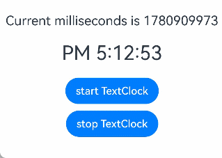
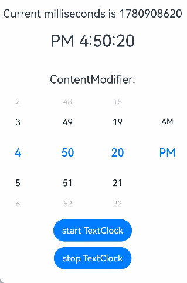
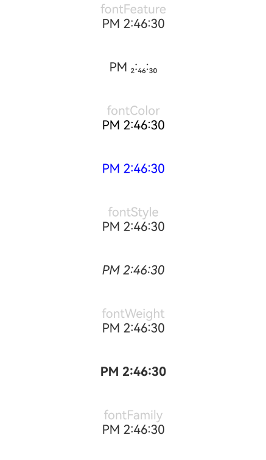

# TextClock
<!--Kit: ArkUI-->
<!--Subsystem: ArkUI-->
<!--Owner: @Zhang-Dong-hui-->
<!--Designer: @xiangyuan6-->
<!--Tester: @jiaoaozihao-->
<!--Adviser: @Brilliantry_Rui-->
<!-- md-trans-meta sourceCommit=8aa8522c1582655206875d9c89c21656113a2dda translatedAt=2026-09-03T12:40:53.749Z -->

The TextClock component displays the current system time on the device in text form. It supports time display in different time zones and custom time formats, with a precision of up to seconds. It is suitable for scenarios where the system time needs to be displayed in real time on the application UI and multiple time zones need to be supported. It helps developers quickly implement time text display without manually calculating and updating the time.

When the component is invisible, the time change stops. The visible status of a component is processed based on [onVisibleAreaChange](./ts-universal-component-visible-area-change-event.md#onvisibleareachange). If the visible threshold **ratios** is greater than 0, the component is visible.

>**NOTE**
>
>This component is supported since API version 8. Newly added APIs will be marked with a superscript to indicate their earliest API version.
>

## Child Components

Not supported

## APIs

TextClock(options?: TextClockOptions)

**Widget capability**: Since API version 11, this feature is supported in ArkTS widgets.

**Atomic service API**: This API can be used in atomic services since API version 11.

**System capability**: SystemCapability.ArkUI.ArkUI.Full

**Parameters**

| Name| Type| Mandatory| Description|
| -------- | -------- | -------- | -------- |
| options | [TextClockOptions](#textclockoptions18) | No | Component parameter for displaying the current system time as text. If not passed, the default configuration is used. For the default value of each attribute, see TextClockOptions. |

## TextClockOptions<sup>18+</sup>

Options used to build the **TextClock** component.

> **NOTE**
>
> To standardize anonymous object definitions, the element definitions here have been revised in API version 18. While historical version information is preserved for anonymous objects, there may be cases where the outer element's @since version number is higher than inner elements'. This does not affect API usability.

**Widget capability**: This API can be used in ArkTS widgets since API version 18.

**Atomic service API**: This API can be used in atomic services since API version 18.

**Model restriction:** This API can be used only in the stage model.

**System capability**: SystemCapability.ArkUI.ArkUI.Full

| Name           | Type     | Read-Only  | Optional | Description                                                    |
| -------------- | -------- | ------ | --------------------------------------------------------------------------- | --------------------------------------------------------------------------- |
| timeZoneOffset<sup>8+</sup> | number   | No    | Yes    | Sets the time zone offset, in hours.<br>The value ranges from -14 to 12, indicating the range from UTC+12 to UTC-12, where a negative value indicates an east time zone and a positive value indicates a west time zone. For example, UTC+8 is -8. When the value is a floating-point number within this range, it is rounded to an integer, with the decimal part discarded.<br>For countries or regions that span the International Date Line, use -13 (UTC+13) and -14 (UTC+14) to ensure that the entire country or region is in the same time zone. When the value is outside the range, the time zone offset of the current system is used.<br>Default value: the time zone offset of the current system <br>When the value is a floating-point number in the set { 9.5, 3.5, -3.5, -4.5, -5.5, -5.75, -6.5, -9.5, -10.5, -12.75 }, it is not rounded.<br>**Card capability:** Since API version 11, this API is supported in ArkTS cards.<br>**Atomic service API:** Since API version 11, this API is supported in atomic services.|
| controller<sup>8+</sup>     | [TextClockController](#textclockcontroller) | No     | Yes     | Binds a controller to control the state of the text clock. Pass this parameter when the start and stop of the clock need to be controlled by code. If it is not passed, the clock still runs and displays normally, but its start and stop cannot be controlled by code.<br>**Card capability:** Since API version 11, this API is supported in ArkTS cards.<br>**Atomic service API:** Since API version 11, this API is supported in atomic services.|

## Attributes

In addition to the [universal attributes](./ts-component-general-attributes.md), the following attributes are supported:

### format

format(value: ResourceStr)

Sets the time format, for example, **yyyy/MM/dd** or **yyyy-MM-dd**.

y: year (yyyy indicates the full year, and yy indicates the last two digits of the year)<br>M: month (use MM to display the month as 01)<br>d: day (use dd to display the day as 01)<br>E: day of the week (use EEEE to display Saturday, and use E, EE, or EEE to display Sat)<br>H: hour (24-hour format)<br>h: hour (12-hour format)<br>m: minute<br>s: second<br>SS: centisecond (if the number of S in the format is less than 3, all are processed as centiseconds)<br>SSS: millisecond (if the number of S in the format is greater than or equal to 3, all are processed as milliseconds)<br>a: AM/PM (this parameter does not take effect when the hour format is set to H)

Date separators: year, month, day, slash (/), hyphen (-), and period (.) (Custom separator styles are allowed. Letters cannot be used as separators, while Chinese characters can be treated as separators.)

The parts of the date can be used alone or combined with each other as needed. The time can be updated as frequent as once per second. As such, whenever possible, avoid setting the centisecond and millisecond parts separately.

When an invalid letter is set, the letter is ignored. If all letters in **format** are invalid, the display format follows the system's language and hour format settings.  

If **format** is an empty string ("") or **undefined**, the default value is used.

Default value in non-widget scenarios: 12-hour format: aa hh:mm:ss; 24-hour format: HH:mm:ss.<br>Default value in widgets: 12-hour format: hh:mm; 24-hour format: HH:mm.<br>When used in a widget, the minimum time unit is minute. If the set format contains seconds or centiseconds, the default value is used.

**Widget capability**: Since API version 11, this feature is supported in ArkTS widgets.

**Atomic service API**: This API can be used in atomic services since API version 11.

**System capability**: SystemCapability.ArkUI.ArkUI.Full

**Parameters**

| Name| Type  | Mandatory| Description          |
| ------ | ------ | ---- | -------------- |
| value  | [ResourceStr](./ts-types.md#resourcestr) | Yes   | Time format to display.  <br>Since API version 20, the Resource type is supported.|

The following table shows how different settings of **format** work out.

| Input Format               | Display Effect           |
| ----------------------- | ------------------- |
| EEEE, M d, yyyy      | Saturday, Feb 4, 2023|
| M d, yyyy           | Feb 4, 2023       |
| EEEE, M d            | Saturday, Feb 4      |
| M d                 | Feb 4             |
| MM/dd/yyyy              | Feb/04/2023         |
| EEEE MM dd          | Saturday Feb 04    |
| yyyy (4-digit year)       | 2023             |
| yy (2-digit year)       | 23               |
| MM         | Feb               |
| M              | Feb                |
| dd (2-digit day)         | 04               |
| d              | 4                |
| EEEE (full week name)       | Saturday             |
| E, EE, EEE (abbreviated week name) | Sat               |
| M d, yyyy           | Feb 4, 2023       |
| yyyy/M/d                | 2023/Feb/4            |
| yyyy-M-d                | 2023-Feb-4           |
| yyyy.M.d                | 2023.Feb.4           |
| HH:mm:ss   | 17:00:04            |
| aa hh:mm:ss| AM 5:00:04       |
| hh:mm:ss   | 5:00:04             |
| HH:mm         | 17:00               |
| aa hh:mm      | AM 5:00          |
| hh:mm         | 5:00                |
| mm:ss         | 00:04               |
| mm:ss.SS | 00:04.91            |
| mm:ss.SSS| 00:04.536           |
| hh:mm:ss aa             | 5:00:04 AM       |
| HH                      | 17                  |

### fontColor

fontColor(value: ResourceColor)

Sets the font color.

**Widget capability**: Since API version 11, this feature is supported in ArkTS widgets.

**Atomic service API**: This API can be used in atomic services since API version 11.

**System capability**: SystemCapability.ArkUI.ArkUI.Full

**Parameters**

| Name| Type                                      | Mandatory| Description      |
| ------ | ------------------------------------------ | ---- | ---------- |
| value  | [ResourceColor](./ts-types.md#resourcecolor) | Yes   | Font Color.<br>Default value on Wearable devices: '#c5ffffff'; default value on other devices: '#e6182431' |

### fontSize

fontSize(value: Length)

Sets the font size.

**Widget capability**: Since API version 11, this feature is supported in ArkTS widgets.

**Atomic service API**: This API can be used in atomic services since API version 11.

**System capability**: SystemCapability.ArkUI.ArkUI.Full

**Parameters**

| Name| Type                        | Mandatory| Description                                                        |
| ------ | ---------------------------- | ---- | ------------------------------------------------------------ |
| value  | [Length](./ts-types.md#length) | Yes  | Font size. When fontSize is of the number type, the unit fp is used.<br>The default font size is 16fp. Percentage strings are not supported. If a percentage string is passed in, the default value is used. |

### fontStyle

fontStyle(value: FontStyle)

Sets the font style.

**Widget capability**: Since API version 11, this feature is supported in ArkTS widgets.

**Atomic service API**: This API can be used in atomic services since API version 11.

**System capability**: SystemCapability.ArkUI.ArkUI.Full

**Parameters**

| Name| Type                                       | Mandatory| Description                                   |
| ------ | ------------------------------------------- | ---- | --------------------------------------- |
| value  | [FontStyle](./ts-appendix-enums.md#fontstyle) | Yes   | Font style.<br>Default value: FontStyle.Normal, which indicates the standard font style (not italic). |

### fontWeight

fontWeight(value: number | FontWeight | string)

Sets the font weight of the text. If the value is too large, the text in different fonts may be truncated.

**Widget capability**: Since API version 11, this feature is supported in ArkTS widgets.

**Atomic service API**: This API can be used in atomic services since API version 11.

**System capability**: SystemCapability.ArkUI.ArkUI.Full

**Parameters**

| Name| Type                                                        | Mandatory| Description                                                        |
| ------ | ------------------------------------------------------------ | ---- | ------------------------------------------------------------ |
| value  | number \| [FontWeight](./ts-appendix-enums.md#fontweight) \| string | Yes   | Font weight of the text. For the number type, the value ranges from 100 to 900, at an interval of 100. A larger value indicates a heavier font. The default value is 400 for values outside the range of the number type. For the string type, the following values are supported: the string form of a number type value (for example, 400), and the enum values 'lighter' (corresponding to 300), 'regular' (corresponding to 400), 'medium' (corresponding to 500), 'bold' (corresponding to 700), and 'bolder' (corresponding to 900), which correspond to the respective enum values in FontWeight.<br>Default value: FontWeight.Normal |

### fontFamily

fontFamily(value: ResourceStr)

Sets the font family.

**Widget capability**: Since API version 11, this feature is supported in ArkTS widgets.

**Atomic service API**: This API can be used in atomic services since API version 11.

**System capability**: SystemCapability.ArkUI.ArkUI.Full

**Parameters**

| Name| Type                                  | Mandatory| Description                                                        |
| ------ | -------------------------------------- | ---- | ------------------------------------------------------------ |
| value  | [ResourceStr](./ts-types.md#resourcestr) | Yes   | Font list. The default font is 'HarmonyOS Sans'.<br>The application currently supports the 'HarmonyOS Sans' font and [registered custom fonts](../js-apis-font.md).<br>The card currently supports only the 'HarmonyOS Sans' font. |

### textShadow<sup>11+</sup>

textShadow(value: ShadowOptions | Array&lt;ShadowOptions&gt;)

Sets the text shadow effect. This API supports passing an array as the input parameter to implement multiple text shadows. The fill field and the smart color mode are not supported.

**Widget capability**: Since API version 11, this feature is supported in ArkTS widgets.

**Atomic service API**: This API can be used in atomic services since API version 12.

**Model restriction:** This API can be used only in the stage model.

**System capability**: SystemCapability.ArkUI.ArkUI.Full

**Parameters**

| Name| Type                                                        | Mandatory| Description          |
| ------ | ------------------------------------------------------------ | ---- | -------------- |
| value  | [ShadowOptions](./ts-universal-attributes-image-effect.md#shadowoptions )&nbsp;\|&nbsp;Array&lt;[ShadowOptions](./ts-universal-attributes-image-effect.md#shadowoptions)&gt; | Yes   | Text shadow effect. Supports a single shadow object or an array of shadow objects to achieve multiple shadow effects. The ShadowOptions object contains attributes such as radius (blur radius), color (shadow color), offsetX (X-axis offset), and offsetY (Y-axis offset).<br>The fill field and the smart color picking mode are not supported. For details about the attributes, see [ShadowOptions](./ts-universal-attributes-image-effect.md#shadowoptions). |

### fontFeature<sup>11+</sup>

fontFeature(value: string)

Sets the font feature, for example, monospaced digits.

Format: normal \| \<feature-tag-value\>

Format of **\<feature-tag-value\>**: \<string\> \[ \<integer\> \| on \| off ]

There can be multiple **\<feature-tag-value\>** values, which are separated by commas (,).

For example, the input format for monospaced clock fonts is "ss01" on.

**Widget capability**: Since API version 11, this feature is supported in ArkTS widgets.

**Atomic service API**: This API can be used in atomic services since API version 12.

**Model restriction:** This API can be used only in the stage model.

**System capability**: SystemCapability.ArkUI.ArkUI.Full

**Parameters**

| Name| Type  | Mandatory| Description          |
| ------ | ------ | ---- | -------------- |
| value  | string | Yes  | Text feature effect, used to set the OpenType features of the text. Format: normal \| \<feature-tag-value\>, where the \<feature-tag-value\> format is: \<string\> [ \<integer\> \| on \| off ]. Multiple features can be set, separated by ','. For example, the format for using monospaced clock digits is: '"ss01" on'. |

### contentModifier<sup>12+</sup>

contentModifier(modifier: ContentModifier\<TextClockConfiguration>)

Creates a content modifier.

**Atomic service API**: This API can be used in atomic services since API version 12.

**Model restriction:** This API can be used only in the stage model.

**System capability**: SystemCapability.ArkUI.ArkUI.Full

**Parameters**

| Name| Type                                         | Mandatory| Description                                            |
| ------ | --------------------------------------------- | ---- | ------------------------------------------------ |
| modifier  | [ContentModifier](./ts-universal-attributes-content-modifier.md#contentmodifiert)\<[TextClockConfiguration](#textclockconfiguration12) | Yes   | Method for customizing the content area on the TextClock component.<br>modifier: content modifier. Developers need to customize a class to implement the ContentModifier API. |

### dateTimeOptions<sup>12+</sup>

dateTimeOptions(dateTimeOptions: Optional\<DateTimeOptions>)

Sets whether to display a leading zero for the hour.

**Widget capability**: This API can be used in ArkTS widgets since API version 12.

**Atomic service API**: This API can be used in atomic services since API version 12.

**Model restriction:** This API can be used only in the stage model.

**System capability**: SystemCapability.ArkUI.ArkUI.Full

**Parameters**

| Name| Type                                                        | Mandatory| Description                                                        |
| ------ | ------------------------------------------------------------ | ---- | ------------------------------------------------------------ |
| dateTimeOptions  | Optional<[DateTimeOptions](../../apis-localization-kit/js-apis-intl.md#datetimeoptionsdeprecated)> | Yes   | Sets whether to display a leading zero for the hour. Only the hour parameter is supported. The value {hour: "2-digit"} indicates that a leading zero is displayed, and the value {hour: "numeric"} indicates that no leading zero is displayed.<br>Default value: undefined. By default, a leading zero is displayed in the 24-hour format and not displayed in the 12-hour format.|

## Events

In addition to the [universal events](./ts-component-general-events.md), the following events are supported:

### onDateChange

onDateChange(event: (value: number) => void)

Triggered when the time changes.

This event does not take effect when the component is invisible.

If the event is not used in a widget, it is triggered when the change occurs in seconds.

If the event is used in a widget, it is triggered when the change occurs in minutes.

**Widget capability**: Since API version 11, this feature is supported in ArkTS widgets.

**Atomic service API**: This API can be used in atomic services since API version 11.

**System capability**: SystemCapability.ArkUI.ArkUI.Full

**Parameters**

| Name| Type  | Mandatory| Description                                                  |
| ------ | ------ | ---- | ------------------------------------------------------ |
| value  | number | Yes  | Unix time stamp, which is the number of seconds that have elapsed since the Unix epoch.|

## TextClockController

Implements the controller of the **TextClock** component. You can bind the controller to the component to control its start and stop. A **TextClock** component can be bound to only one controller.

**Widget capability**: Since API version 11, this feature is supported in ArkTS widgets.

**Atomic service API**: This API can be used in atomic services since API version 11.

**System capability**: SystemCapability.ArkUI.ArkUI.Full

### Objects to Import

```ts
controller: TextClockController = new TextClockController();
```

### constructor

constructor()

A constructor used to create a **TextClockController** instance.

**Widget capability**: Since API version 11, this feature is supported in ArkTS widgets.

**Atomic service API**: This API can be used in atomic services since API version 11.

**System capability**: SystemCapability.ArkUI.ArkUI.Full

### start

start()

Starts the text clock. Before using this API, bind the TextClockController to the TextClock component.

**Widget capability**: Since API version 11, this feature is supported in ArkTS widgets.

**Atomic service API**: This API can be used in atomic services since API version 11.

**System capability**: SystemCapability.ArkUI.ArkUI.Full

### stop

stop()

Stops the text clock. Before using this API, bind the TextClockController to the TextClock component.

**Widget capability**: Since API version 11, this feature is supported in ArkTS widgets.

**Atomic service API**: This API can be used in atomic services since API version 11.

**System capability**: SystemCapability.ArkUI.ArkUI.Full

## TextClockConfiguration<sup>12+</sup>

You need a custom class to implement the **ContentModifier** API.

**Atomic service API**: This API can be used in atomic services since API version 12.

**Model restriction:** This API can be used only in the stage model.

**System capability**: SystemCapability.ArkUI.ArkUI.Full

| Name| Type| Read-Only| Optional| Description|
| -------- | -------- | -------- | -------- | -------- |
| timeZoneOffset | number | No | No | Time zone offset of the current text clock.<br>The value range is [-14, 12], indicating from UTC+12 to UTC-12, where a negative value indicates an east time zone and a positive value indicates a west time zone. For example, UTC+8 is -8. When the set value is a floating-point number within this range, it is rounded by discarding the decimal part. However, no rounding is performed when the set value is a floating-point number in the set { 9.5, 3.5, -3.5, -4.5, -5.5, -5.75, -6.5, -9.5, -10.5, -12.75 }. When the set value is outside the value range, the time zone offset of the current system is used.|
| started | boolean | No| No| Whether the text clock is started.<br>**true**: The text clock is started.<br>**false**: The text clock is stopped.<br>Default value: **true**|
| timeValue | number | No| No| Time zone offset of the text clock in seconds from UTC.|

## Example
### Example 1: Implementing a Text Clock with Start/Stop Control

This example demonstrates the basic usage of the **TextClock** component, setting the clock display format using the [format](#format) attribute.

Clicking **"start TextClock"** triggers the callback to invoke **TextClockController** and initiate the clock. Clicking **"stop TextClock"** to invoke **TextClockController** and stop the clock.

This example uses the [onDateChange](#ondatechange) callback to update **accumulateTime** whenever the text clock refreshes.

```ts
@Entry
@Component
struct Second {
  @State accumulateTime: number = 0;
  // Create the controller object.
  controller: TextClockController = new TextClockController();

  build() {
    Flex({ direction: FlexDirection.Column, alignItems: ItemAlign.Center, justifyContent: FlexAlign.Center }) {
      Text('Current milliseconds is ' + this.accumulateTime)
        .fontSize(20)
      // Display the system time in 12-hour format for the UTC+8 time zone, accurate to seconds.
      TextClock({ timeZoneOffset: -8, controller: this.controller })
        .format('aa hh:mm:ss')
        .onDateChange((value: number) => {
          this.accumulateTime = value;
        })
        .margin(20)
        .fontSize(30)
      Button('start TextClock')
        .margin({ bottom: 10 })
        .onClick(() => {
          // Start the text clock.
          this.controller.start();
        })
      Button('stop TextClock')
        .onClick(() => {
          // Stop the text clock.
          this.controller.stop();
        })
    }
    .width('100%')
    .height('100%')
  }
}
```


### Example 2: Setting the Text Shadow Style

This example sets the shadow style of the clock text through [textShadow](#textshadow11).

``` ts
@Entry
@Component
struct TextClockExample {
  @State textShadows: ShadowOptions | Array<ShadowOptions> = [{
    radius: 10,
    color: Color.Red,
    offsetX: 10,
    offsetY: 0
  }, {
    radius: 10,
    color: Color.Black,
    offsetX: 20,
    offsetY: 0
  }, {
    radius: 10,
    color: Color.Brown,
    offsetX: 30,
    offsetY: 0
  }, {
    radius: 10,
    color: Color.Green,
    offsetX: 40,
    offsetY: 0
  }, {
    radius: 10,
    color: Color.Yellow,
    offsetX: 100,
    offsetY: 0
  }];

  build() {
    Column({ space: 8 }) {
      TextClock().fontSize(50).textShadow(this.textShadows)
    }
  }
}
```


### Example 3: Configuring the Custom Content Area
This example implements the functionality of customizing the style of a text clock, creating a time picker component with a custom style: The time picker dynamically adjusts its selected value based on the text clock's timezone offset and the timezone offset in seconds from UTC to deliver a clock effect. Depending on whether the text clock is started, the time picker toggles between a 12-hour and a 24-hour format display.

``` ts
class MyTextClockStyle implements ContentModifier<TextClockConfiguration> {
  currentTimeZoneOffset: number = new Date().getTimezoneOffset() / 60;
  title: string = '';

  constructor(title: string) {
    this.title = title;
  }

  applyContent(): WrappedBuilder<[TextClockConfiguration]> {
    return wrapBuilder(buildTextClock);
  }
}

@Builder
function buildTextClock(config: TextClockConfiguration) {
  Row() {
    Column() {
      Text((config.contentModifier as MyTextClockStyle).title)
        .fontSize(20)
        .margin(20)
      TimePicker({
        // Calculate the local time based on the UTC seconds and time zone offset: config.timeValue is the UTC seconds, which needs to be multiplied by 1000 to convert to milliseconds;
        // currentTimeZoneOffset is the current system time zone offset, and timeZoneOffset is the target time zone offset,
        // The difference between the two, multiplied by 3600000, gives the time zone adjustment in milliseconds.
        selected: (new Date(config.timeValue * 1000 +
          ((config.contentModifier as MyTextClockStyle).currentTimeZoneOffset - config.timeZoneOffset) * 60 * 60 *
            1000)),
        format: TimePickerFormat.HOUR_MINUTE_SECOND
      })
        .useMilitaryTime(!config.started)
    }
  }
}

@Entry
@Component
struct TextClockExample {
  @State accumulateTime1: number = 0;
  @State timeZoneOffset: number = -8;
  controller1: TextClockController = new TextClockController();
  controller2: TextClockController = new TextClockController();

  build() {
    Flex({ direction: FlexDirection.Column, alignItems: ItemAlign.Center, justifyContent: FlexAlign.Center }) {
      Text('Current milliseconds is ' + this.accumulateTime1)
        .fontSize(20)
        .margin({ top: 20 })
      TextClock({ timeZoneOffset: this.timeZoneOffset, controller: this.controller1 })
        .format('aa hh:mm:ss')
        .onDateChange((value: number) => {
          this.accumulateTime1 = value;
        })
        .margin(20)
        .fontSize(30)
      TextClock({ timeZoneOffset: this.timeZoneOffset, controller: this.controller2 })
        .format('aa hh:mm:ss')
        .fontSize(30)
        .contentModifier(new MyTextClockStyle('ContentModifier:'))
      Button('start TextClock')
        .margin({ top: 20, bottom: 10 })
        .onClick(() => {
          // Start the text clock.
          this.controller1.start();
          this.controller2.start();
        })
      Button('stop TextClock')
        .margin({ bottom: 30 })
        .onClick(() => {
          // Stop the text clock.
          this.controller1.stop();
          this.controller2.stop();
        })

    }
    .width('100%')
    .height('100%')
  }
}
```


### Example 4: Setting Leading Zero
This example demonstrates how to use the [dateTimeOptions](#datetimeoptions12) attribute to add or remove the leading zero for the hour field. By default, the hour field includes a leading zero in the 24-hour format, but typically does not include a leading zero in the 12-hour format.
``` ts
@Entry
@Component
struct TextClockExample {
  build() {
    Column({ space: 8 }) {
      Row() {
        Text('Remove the leading zero in 24-hour format: ')
          .fontSize(20)
        TextClock()
          .fontSize(20)
          .format('HH:mm:ss')
          .dateTimeOptions({ hour: 'numeric' })
      }

      Row() {
        Text('Add the leading zero in 12-hour format: ')
          .fontSize(20)
        TextClock()
          .fontSize(20)
          .format('aa hh:mm:ss')
          .dateTimeOptions({ hour: '2-digit' })
      }
    }
    .alignItems(HorizontalAlign.Start)
  }
}
```


### Example 5: Setting the Text Display Style
This example demonstrates how to use the [fontFeature](#fontfeature11), [fontColor](#fontcolor), [fontStyle](#fontstyle), [fontWeight](#fontweight) and [fontFamily](#fontfamily) attributes to set the text display style of the clock.
``` ts
@Entry
@Component
struct Index {
  build() {
    Column() {
      Text('fontFeature').fontColor(0xCCCCCC)
      // Set text features.
      TextClock()
        .fontFeature('\"sinf\" off')
      TextClock()
        .fontFeature('\"sinf\" on')
        .margin('10%')

      // Set the font color.
      Text('fontColor').fontColor(0xCCCCCC)
      TextClock()
        .fontColor(Color.Black)
      TextClock()
        .fontColor(Color.Blue)
        .margin('10%')

      Text('fontStyle').fontColor(0xCCCCCC)
      // Set the font style.
      TextClock()
        .fontStyle(FontStyle.Normal)
      TextClock()
        .fontStyle(FontStyle.Italic)
        .margin('10%')

      Text('fontWeight').fontColor(0xCCCCCC)
      // Set the font weight.
      TextClock()
        .fontWeight(FontWeight.Normal)
      TextClock()
        .fontWeight(FontWeight.Bold)
        .margin('10%')

      Text('fontFamily').fontColor(0xCCCCCC)
      // Set the font.
      TextClock()
        .fontFamily('HarmonyOS Sans')
    }
    .width('100%')
    .height('100%')
  }
}
```

