# TextInput
<!--Kit: ArkUI-->
<!--Subsystem: ArkUI-->
<!--Owner: @jiaxiaguang-->
<!--Designer: @xiangyuan6-->
<!--Tester: @jiaoaozihao-->
<!--Adviser: @Brilliantry_Rui-->
<!-- md-trans-meta sourceCommit=a9e64d9949bb7122908af3acb8cd44ce378cf9b7 translatedAt=2026-09-03T12:47:59.851Z -->

A single-line text input box component used to receive single-line text input from users. It supports multiple input types (such as text, password, email, and number), custom styles (font, color, underline, decoration line, and more), input filtering, password input mode, auto-fill, and other features. It is suitable for various scenarios such as login and registration, search, and form filling. It can address common requirements such as text input validation, formatting, and secure input, simplifying the development process, improving user experience, and enhancing data security.

>  **NOTE**
>
> - This component is supported since API version 7. Newly added APIs in later versions are marked with a superscript to indicate their initial version.
>
> - This component supports only a single text style. To implement rich text style, use the [RichEditor](ts-basic-components-richeditor.md) component.
>
> - To set whether to clear text selection and handles when touching outside the text component, use the [setTextSelectionClearPolicy](../arkts-apis-uicontext-uicontext.md#settextselectionclearpolicy) API.


## Child Components

None


## Interfaces

TextInput(value?: TextInputOptions)

**Atomic service API**: This API can be used in atomic services since API version 11.

**System capability**: SystemCapability.ArkUI.ArkUI.Full

**Parameters**

| Name | Type | Mandatory | Description |
| ----- | ----- | ---- | ---- |
| value | [TextInputOptions](#textinputoptions) | No  | Parameters of the TextInput component. The default value is undefined. When this parameter is not set, the input box is initialized to empty. |

## TextInputOptions

Initialization parameters of TextInput.

**Atomic service API**: This API can be used in atomic services since API version 11.

**System capability**: SystemCapability.ArkUI.ArkUI.Full

| Name | Type | Read-only | Optional | Description |
| ---- | ----- | ---- | ---- | ---- |
| placeholder | [ResourceStr](ts-types.md#resourcestr) | No | Yes | Sets the placeholder text displayed when there is no input. When not set, no placeholder text is displayed by default. |
| text | [ResourceStr](ts-types.md#resourcestr) | No | Yes | Sets the current text content of the input box. When not set, the default value is an empty string.<br>It is recommended to bind the state variable to the text in real time through the onChange event,<br>to avoid abnormal text content in TextInput when the component is refreshed.<br>Since API version 10, this parameter supports [$$](../../../ui/state-management/arkts-two-way-sync.md) two-way binding variables.<br>Since API version 18, this parameter supports [!!](../../../ui/state-management/arkts-new-binding.md#two-way-binding-between-built-in-component-parameters) two-way binding variables. |
| controller<sup>8+</sup> | [TextInputController](#textinputcontroller8) | No | Yes | Sets the TextInput controller. Pass this parameter when you need to call methods such as cursor setting and text selection through the controller. When not set, there is no controller by default, and controller-related methods cannot be used. |

## Attributes

In addition to the [universal attributes](ts-component-general-attributes.md), the following attributes are supported:

>  **NOTE**
>  By default, the default value of the universal attribute [padding](ts-universal-attributes-size.md#padding) is<br>{<br>&nbsp;top: '8vp',<br>&nbsp;right: '16vp',<br>&nbsp;bottom: '8vp',<br>&nbsp;left: '16vp'<br> }
>
>  When underline mode is enabled for the input box, the default value of the universal attribute padding is<br>{<br>&nbsp;top: '12vp',<br>&nbsp;right: '0vp',<br>&nbsp;bottom: '12vp',<br>&nbsp;left: '0vp'<br> }
>
>  When padding is set to 0 for the input box, you can set [borderRadius](ts-universal-attributes-border.md#borderradius) to 0 to prevent the cursor from being truncated. If the cursor is displayed abnormally at the edge of the text box, check whether this is caused by the padding and borderRadius attributes.
>
>   Since API version 10, a single-line input box can be set with .width('auto') to make the component width adapt to the text width. During adaptation, the component width is limited by the constraintSize attribute and the maximum and minimum widths passed by the parent container. For other usage, see [Sizing](ts-universal-attributes-size.md).

### type

type(value: InputType)

Sets the input box type.

Different InputType values bring up the corresponding keyboard type and restrict input. When not set through this interface, the default value is InputType.Normal.

**Atomic service API**: This API can be used in atomic services since API version 11.

**System capability**: SystemCapability.ArkUI.ArkUI.Full

**Parameters**

| Name | Type | Mandatory | Description |
| ------ | ------------------------------- | ---- | ----------------------------------------- |
| value | [InputType](#inputtype) | Yes | Input box type. |

>  **NOTE**
>  The password fill service requires password-related [input box types](#inputtype) (such as InputType.Password, InputType.NUMBER_PASSWORD, InputType.NEW_PASSWORD, and InputType.USER_NAME).<!--RP2--><!--RP2End-->
>
>  When [password mode](../../../ui/arkts-common-components-text-input.md#password-mode) is set, the decoration line [decoration](#decoration12), underline [showUnderline](#showunderline10), line height [lineHeight](#lineheight12), and text feature [fontFeature](#fontfeature12) do not take effect.

### placeholderColor

placeholderColor(value: ResourceColor)

Sets the placeholder text color. When not set through this interface, the default color follows the theme. On Wearable devices, the default value is '#99ffffff' (white, with an opacity of 60%).

**Atomic service API**: This API can be used in atomic services since API version 11.

**System capability**: SystemCapability.ArkUI.ArkUI.Full

**Parameters** 

| Name | Type                                       | Mandatory | Description                                         |
| ---- | ------------------------------------------ | --------- | -------------------------------------------------- |
| value | [ResourceColor](ts-types.md#resourcecolor) | Yes       | Placeholder text color. |

### placeholderFont

placeholderFont(value?: Font)

Sets the placeholder text style, including font size, font weight, font family, and font style.

> **NOTE**
>
> You can use [loadFontSync](../../apis-arkgraphics2d/js-apis-graphics-text.md#loadfontsync) to register a custom font.

**Atomic service API**: This API can be used in atomic services since API version 11.

**System capability**: SystemCapability.ArkUI.ArkUI.Full

**Parameters** 

| Name  | Type                     | Mandatory | Description                  |
| ----- | ------------------------ | --------- | ---------------------------- |
| value | [Font](ts-types.md#font) | No        | Placeholder text style.<br>When this parameter is omitted, the default system font style is used.<br>On Wearable devices, the default font size is 18fp. |

### enterKeyType

enterKeyType(value: EnterKeyType)

Sets the Enter key type of the input method. When not set through this interface, the default is EnterKeyType.Done.

**Atomic service API**: This API can be used in atomic services since API version 11.

**System capability**: SystemCapability.ArkUI.ArkUI.Full

**Parameters** 

| Name | Type                                             | Mandatory | Description                                             |
| ------ | ------------------------------------------------ | ---- | ------------------------------------------------ |
| value  | [EnterKeyType](#enterkeytype) | Yes   | Enter key type of the input method. |

### caretColor

caretColor(value: ResourceColor)

Sets the color of the input box caret. When not set through this API, the default value is '#007DFF' (blue), and on Wearable devices the default value is '#5EA1FF' (blue, slightly lighter than '#007DFF').

**Atomic service API**: This API can be used in atomic services since API version 11.

**System capability**: SystemCapability.ArkUI.ArkUI.Full

**Parameters** 

| Name | Type                                       | Mandatory | Description                                   |
| ---- | ------------------------------------------ | --------- | --------------------------------------------- |
| value | [ResourceColor](ts-types.md#resourcecolor) | Yes       | Color of the input box caret. |

>  **NOTE**
>   Since API version 12, this API supports setting the text handle color, and the caret and text handle colors remain consistent.

### maxLength

maxLength(value: number)

Sets the maximum number of characters that can be entered. When not set through this interface, unlimited input is allowed by default.

**Atomic service API**: This API can be used in atomic services since API version 11.

**System capability**: SystemCapability.ArkUI.ArkUI.Full

**Parameters** 

| Name | Type | Mandatory | Description |
| ------ | ------ | ---- | ------------------------------------------------------------ |
| value | number | Yes | Maximum number of characters that can be entered.<br>Value range: [0, 2^31-1]<br>**Note:** <br>When this attribute is not set or an invalid value is set, the default value is used. When a decimal is set, the integer part is used. When the set value exceeds the upper limit of the value range, the component may display or function abnormally. Do not exceed the upper limit. |

### fontColor

fontColor(value: ResourceColor)

Sets the font color. When not set through this interface, the default color follows the theme. On Wearable devices, the default value is '#dbffffff' (white, with an opacity of 86%).

**Atomic service API**: This API can be used in atomic services since API version 11.

**System capability**: SystemCapability.ArkUI.ArkUI.Full

**Parameters** 

| Name  | Type                                       | Mandatory | Description |
| ----- | ------------------------------------------ | --------- | ----------- |
| value | [ResourceColor](ts-types.md#resourcecolor) | Yes       | Font color. |

### fontSize

fontSize(value: Length)

Sets the font size. When not set through this interface, the default font size is 16fp, and the default value on Wearable devices is 18fp.

**Atomic service API**: This API can be used in atomic services since API version 11.

**System capability**: SystemCapability.ArkUI.ArkUI.Full

**Parameters** 

| Name | Type                         | Mandatory | Description                                                         |
| ------ | ---------------------------- | ---- | ------------------------------------------------------------ |
| value  | [Length](ts-types.md#length) | Yes   | Font size. When fontSize is of the number type, the unit fp is used. Percentage strings are not supported. |

### fontStyle

fontStyle(value: FontStyle)

Sets the font style. When not passed through this interface, the default value is FontStyle.Normal.

**Atomic service API**: This API can be used in atomic services since API version 11.

**System capability**: SystemCapability.ArkUI.ArkUI.Full

**Parameters** 

| Name | Type                                        | Mandatory | Description                                    |
| ------ | ------------------------------------------- | ---- | --------------------------------------- |
| value  | [FontStyle](ts-appendix-enums.md#fontstyle) | Yes   | Font style. |

### fontWeight

fontWeight(value: number | FontWeight | ResourceStr)

Sets the font weight of the text. If the value is too large, the text may be truncated under different fonts. When not set through this interface, the default value is FontWeight.Normal.

**Atomic service API**: This API can be used in atomic services since API version 11.

**System capability**: SystemCapability.ArkUI.ArkUI.Full

**Parameters** 

| Name | Type                                                         | Mandatory | Description                                                         |
| ------ | ------------------------------------------------------------ | ---- | ------------------------------------------------------------ |
| value  | number&nbsp;\|&nbsp;[FontWeight](ts-appendix-enums.md#fontweight)&nbsp;\|&nbsp;[ResourceStr](ts-types.md#resourcestr) | Yes   | Font weight of the text. For the number type, the value ranges from 100 to 900, with an interval of 100. A larger value indicates a heavier font. For the string type, only the string form of the number type value is supported, for example, "400", as well as "bold", "bolder", "lighter", "regular", and "medium", which correspond to the respective enum values in FontWeight.<br>Since API version 20, the Resource type is supported. |

### fontFamily

fontFamily(value: ResourceStr)

Sets the font list. When not set through this interface, the default font is 'HarmonyOS Sans'.

> **NOTE**
>
> It is recommended that you use [loadFontSync](../../apis-arkgraphics2d/js-apis-graphics-text.md#loadfontsync) to register custom fonts.

**Atomic service API**: This API can be used in atomic services since API version 11.

**System capability**: SystemCapability.ArkUI.ArkUI.Full

**Parameters** 

| Name | Type                                   | Mandatory | Description                                                         |
| ------ | -------------------------------------- | ---- | ------------------------------------------------------------ |
| value  | [ResourceStr](ts-types.md#resourcestr) | Yes  | Font list. When multiple fonts are used, separate them with commas ','. The font priority takes effect in order. For example: 'Arial,HarmonyOS Sans'.<br>Applications currently support the 'HarmonyOS Sans' font and custom fonts.<br>Cards currently support only the 'HarmonyOS Sans' font.<br>Wearable devices support the 'HarmonyOS Sans' font and custom fonts. |

### inputFilter<sup>8+</sup>

inputFilter(value: ResourceStr, error?: Callback\<string>)

Sets an input filter through a regular expression. Input that matches the expression is allowed to be displayed, and input that does not match is filtered out. In single-character input scenarios, only single-character matching is supported; in multi-character input scenarios, such as pasting, string matching is supported. When not set through this interface, there is no input filtering rule by default, and all input is allowed to be displayed.

Since API version 11, setting inputFilter with a non-empty input character causes the text filtering effect attached to the [type](#type) interface to become invalid.

**Atomic service API**: This API can be used in atomic services since API version 11.

**System capability**: SystemCapability.ArkUI.ArkUI.Full

**Parameters** 

| Name | Type                                   | Mandatory | Description                               |
| ------ | -------------------------------------- | ---- | ---------------------------------- |
| value  | [ResourceStr](ts-types.md#resourcestr) | Yes   | Regular expression. |
| error  | Callback\<string>                | No   | Returns the filtered content when the regular expression matching fails. |

### copyOption<sup>9+</sup>

copyOption(value: CopyOptions)

Sets whether the input text can be copied. When CopyOptions.None is set, only paste and select all are supported. When CopyOptions.None is set, dragging is not allowed. When not set through this interface, the default value is CopyOptions.LocalDevice, which supports copying within the device.

**Atomic service API**: This API can be used in atomic services since API version 11.

**System capability**: SystemCapability.ArkUI.ArkUI.Full

**Parameters** 

| Name | Type                                             | Mandatory | Description                                                         |
| ------ | ------------------------------------------------ | ---- | ------------------------------------------------------------ |
| value  | [CopyOptions](ts-appendix-enums.md#copyoptions9) | Yes   | Whether the input text can be copied. |

### showPasswordIcon<sup>9+</sup>

showPasswordIcon(value: boolean)

Sets whether to display the icon at the end of the input box in password mode. When not set through this interface, the default value is false on TV devices and true on other devices.

**Atomic service API**: This API can be used in atomic services since API version 11.

**System capability**: SystemCapability.ArkUI.ArkUI.Full

**Parameters** 

| Name | Type    | Mandatory | Description                                                        |
| ---- | ------- | -------- | ----------------------------------------------------------- |
| value  | boolean | Yes   | Whether to display the icon at the end of the input box in password input mode.<br>true indicates display, and false indicates no display. |

### style<sup>9+</sup>

style(value: TextInputStyle &nbsp;|&nbsp;TextContentStyle)

Sets the input box to the default style or inline input style. The inline input style supports only the InputType.Normal type.<br>For details about the input box types, see [type](#type). When not set through this interface, the default value is TextInputStyle.Default.

**Atomic service API**: This API can be used in atomic services since API version 11.

**System capability**: SystemCapability.ArkUI.ArkUI.Full

**Parameters** 

| Name | Type                                                         | Mandatory | Description                                                         |
| ------ | ------------------------------------------------------------ | ---- | ------------------------------------------------------------ |
| value  | [TextInputStyle](#textinputstyle9)&nbsp;\|&nbsp;[TextContentStyle](ts-appendix-enums.md#textcontentstyle10) | Yes   | Input box in the default style or inline input style. |

### textAlign<sup>9+</sup>

textAlign(value: TextAlign)

Sets the horizontal alignment of text in the input box. When not set through this interface, the default value is TextAlign.Start.

TextAlign.Start, TextAlign.Center, and TextAlign.End are supported. TextAlign.JUSTIFY is processed as TextAlign.Start.

The [align](ts-universal-attributes-location.md#align) attribute can be used to control the vertical position of the text paragraph. This component does not support controlling the horizontal position of the text paragraph through the align attribute.

- Alignment.TopStart, Alignment.Top, Alignment.TopEnd: The content is aligned to the top.

- Alignment.Start, Alignment.Center, Alignment.End: The content is vertically centered.

- Alignment.BottomStart, Alignment.Bottom, Alignment.BottomEnd: The content is aligned to the bottom.

**Atomic service API**: This API can be used in atomic services since API version 11.

**System capability**: SystemCapability.ArkUI.ArkUI.Full

**Parameters** 

| Name | Type                                        | Mandatory | Description                                                       |
| ------ | ------------------------------------------- | ---- | ---------------------------------------------------------- |
| value  | [TextAlign](ts-appendix-enums.md#textalign) | Yes   | Horizontal alignment of the text in the input box. |

>  **NOTE**
>
>  textAlign can only adjust the overall layout of the text and does not affect the display order of characters. To adjust the display order of characters, see [Bidirectional Text Layout and Alignment](../../../ui/arkts-internationalization.md#bidirectional-text-layout-and-alignment).

### textDirection<sup>23+</sup>

textDirection(direction: TextDirection | undefined)

Specifies the text layout direction. When not set through this API, the default text layout direction follows the component layout direction.

**Atomic service API**: This API can be used in atomic services since API version 23.

**Model restriction**: This API can be used only in the stage model.

**System capability**: SystemCapability.ArkUI.ArkUI.Full

**Parameters**

| Name | Type                                        | Mandatory | Description                                                       |
| ------ | ------------------------------------------- | ---- | ---------------------------------------------------------- |
| direction  | [TextDirection](ts-text-common.md#textdirection22) \| undefined | Yes   | Text layout direction.<br>When set to undefined, it is processed as TextDirection.DEFAULT, meaning that the text layout direction follows the component layout direction. |

### selectedBackgroundColor<sup>10+</sup>

selectedBackgroundColor(value: ResourceColor)

Sets the highlight color of the selected text. If the opacity is not set or is set to fully opaque, 20% opacity is used by default. When not set through this API, the default value is '#007DFF' (blue), and on Wearable devices the default value is '#1F71FF' (blue, slightly darker than '#007DFF').

**Atomic service API**: This API can be used in atomic services since API version 11.

**Model restriction**: This API can be used only in the stage model.

**System capability**: SystemCapability.ArkUI.ArkUI.Full

**Parameters** 

| Name | Type                                       | Mandatory | Description                                       |
| ------ | ------------------------------------------ | ---- | ------------------------------------------ |
| value  | [ResourceColor](ts-types.md#resourcecolor) | Yes   | Highlight color of the selected text. |

### caretStyle<sup>10+</sup>

caretStyle(value: CaretStyle)

Sets the caret style.

**Atomic service API**: This API can be used in atomic services since API version 11.

**Model restriction**: This API can be used only in the stage model.

**System capability**: SystemCapability.ArkUI.ArkUI.Full

**Parameters** 

| Name | Type                                | Mandatory | Description         |
| ------ | ----------------------------------- | ---- | ------------ |
| value  | [CaretStyle](ts-text-common.md#caretstyle10) | Yes   | Caret style, used to customize the display style of the caret. The configuration items include width (caret width) and color (caret color). When not set, the system default caret style is used. |

>  **NOTE**
>
>   When the caretColor attribute and the color parameter in the caretStyle attribute are set simultaneously, the one set later takes effect.
>
>   Since API version 12, this API supports setting the text handle color, and the caret and text handle colors remain consistent.

### caretPosition<sup>10+</sup>

caretPosition(value: number)

Sets the caret position.

**Atomic service API**: This API can be used in atomic services since API version 11.

**Model restriction**: This API can be used only in the stage model.

**System capability**: SystemCapability.ArkUI.ArkUI.Full

**Parameters** 

| Name | Type | Mandatory | Description |
| ------ | ------ | ---- | ------------ |
| value | number | Yes | Caret position.<br>The position before the first character is 0.<br>When the value is less than 0, 0 is used; when it is greater than the text length, the caret is displayed at the end of the text. |

### showUnit<sup>10+</sup>

showUnit(value: CustomBuilder)

Sets a control as the unit of the text box. It must be used together with [showUnderline](#showunderline10) and takes effect only when showUnderline is set to true.

**Atomic service API**: This API can be used in atomic services since API version 11.

**Model restriction**: This API can be used only in the stage model.

**System capability**: SystemCapability.ArkUI.ArkUI.Full

**Parameters** 

| Name | Type                                        | Mandatory | Description                           |
| ------ | ------------------------------------------- | ---- | ------------------------------ |
| value  | [CustomBuilder](ts-types.md#custombuilder8) | Yes   | Unit displayed in the text box during text input. |

### showError<sup>10+</sup>

showError(value?: ResourceStr | undefined)

Sets the error text to display in the error state or hides the error state.

When the parameter type is ResourceStr and the input content does not comply with the defined specification, the error text is displayed. When the single-line error text is too long, an ellipsis is displayed at the end. When the parameter type is undefined, the error state is not displayed. See [Example 2](#example-2-set-underline).

**Atomic service API**: This API can be used in atomic services since API version 11.

**Model restriction**: This API can be used only in the stage model.

**System capability**: SystemCapability.ArkUI.ArkUI.Full

**Parameters** 

| Name | Type                          | Mandatory | Description                                                         |
| ------ | ----------------------------- | ---- | ------------------------------------------------------------ |
| value  | [ResourceStr](ts-types.md#resourcestr)&nbsp;\|&nbsp;undefined | No   | Error text to display in the error state, or no error state is displayed.<br>Not displayed by default.<br>On Wearable devices, the font size is 13fp and the alignment is center.<br>**Note:** <br>Since API version 12, value supports the Resource type.<br>The inline mode of [TextInputStyle](#textinputstyle9) is not supported. |

### showUnderline<sup>10+</sup>

showUnderline(value: boolean)

Sets whether to enable the underline. When not set through this interface, the underline is not displayed by default. The default underline color is '#33182431' (dark gray with an opacity of 20%), the default thickness is 1px, the text box size is 48vp, and the underline supports only the InputType.Normal type. When password mode is set, the underline does not take effect.

**Atomic service API**: This API can be used in atomic services since API version 11.

**Model restriction**: This API can be used only in the stage model.

**System capability**: SystemCapability.ArkUI.ArkUI.Full

**Parameters** 

| Name | Type    | Mandatory | Description                               |
| ---- | ------- | --------- | ----------------------------------------- |
| value  | boolean | Yes   | Whether to enable the underline.<br>The value **true** means to enable the underline, and **false** means the opposite. |

>  **NOTE**
>
> - The underline supports only the [InputType.Normal](#inputtype) type.
>
> - When [password mode](../../../ui/arkts-common-components-text-input.md#password-mode) is set, the decoration line [decoration](#decoration12), underline [showUnderline](#showunderline10), line height [lineHeight](#lineheight12), and text feature [fontFeature](#fontfeature12) do not take effect.

### passwordIcon<sup>10+</sup>

passwordIcon(value: PasswordIcon)

Sets the icon at the end of the input box in password mode. When not set through this interface, the system-provided password icon is used by default. Image formats including jpg, png, bmp, heic, and webp are supported. The fixed size of this icon is 24 vp, and the default size on Wearable devices is 28 vp. If the referenced icon is too large or too small, it is displayed at the fixed size.

**Atomic service API**: This API can be used in atomic services since API version 11.

**Model restriction**: This API can be used only in the stage model.

**System capability**: SystemCapability.ArkUI.ArkUI.Full

**Parameters** 

| Name | Type                                    | Mandatory | Description                                                         |
| ------ | --------------------------------------- | ---- | ------------------------------------------------------------ |
| value  | [PasswordIcon](#passwordicon10) | Yes   | Icon at the end of the input box in password input mode. |

### enableKeyboardOnFocus<sup>10+</sup>

enableKeyboardOnFocus(value: boolean)

Sets whether to actively bring up the soft keyboard when TextInput gains focus by means other than tapping. When not set through this interface, the default value is false on TV devices and true on other devices.

Since API version 10, focus gain is bound to the input method by default.

**Atomic service API**: This API can be used in atomic services since API version 11.

**Model restriction**: This API can be used only in the stage model.

**System capability**: SystemCapability.ArkUI.ArkUI.Full

**Parameters** 

| Name | Type    | Mandatory | Description                                                        |
| ------ | ------- | ---- | ----------------------------------------------------------- |
| value  | boolean | Yes  | Whether to actively bring up the soft keyboard when focus is gained by means other than tapping.<br>The value true means to actively bring up the soft keyboard, and false means not to actively bring it up. |

### selectionMenuHidden<sup>10+</sup>

selectionMenuHidden(value: boolean)

Sets whether to hide the system text selection menu. When not set through this interface, the system text selection menu is displayed by default.

**Atomic service API**: This API can be used in atomic services since API version 11.

**Model restriction**: This API can be used only in the stage model.

**System capability**: SystemCapability.ArkUI.ArkUI.Full

**Parameters** 

| Name | Type | Mandatory | Description |
| ------ | ------- | ---- | ------------------------------------------------------------ |
| value  | boolean | Yes  | Whether to hide the system text selection menu.<br>When set to **true**, the system text selection menu is hidden when the input box cursor is clicked, the input box is long pressed, double-clicked, or triple-clicked, or the input box is right-clicked.<br>When set to **false**, the system text selection menu is displayed. |

### barState<sup>10+</sup>

barState(value: BarState)

Sets the display mode of the scroll bar in the inline input style editing state. When not set through this API, the default value is BarState.Auto.

**Atomic service API**: This API can be used in atomic services since API version 11.

**Model restriction**: This API can be used only in the stage model.

**System capability**: SystemCapability.ArkUI.ArkUI.Full

**Parameters** 

| Name | Type                                      | Mandatory | Description                                                  |
| ---- | ----------------------------------------- | --------- | ------------------------------------------------------------ |
| value | [BarState](ts-appendix-enums.md#barstate) | Yes       | Display mode of the scroll bar in the inline input style editing state. This attribute takes effect only when the inline mode is set. |

### maxLines<sup>10+</sup>

maxLines(value: number)

Sets the maximum number of lines that can be displayed for text in the inline input style editing state. When not set through this interface, the default value is 3.

**Atomic service API**: This API can be used in atomic services since API version 11.

**Model restriction**: This API can be used only in the stage model.

**System capability**: SystemCapability.ArkUI.ArkUI.Full

**Parameters** 

| Name | Type                                      | Mandatory | Description                                                         |
| ------ | ----------------------------------------- | ---- | ------------------------------------------------------------ |
| value  | number | Yes   | Maximum number of lines that can be displayed for text in the inline input style editing state. This attribute takes effect only when inline mode is set and the component is in the editing state.<br>Value range: (0, UINT32_MAX]. If 0 or a negative number is passed in, the default value 3 is used; if the value exceeds UINT32_MAX, it is automatically corrected to UINT32_MAX.|

### customKeyboard<sup>10+</sup>

customKeyboard(value: CustomBuilder | ComponentContent | undefined, options?: KeyboardOptions)

Sets a custom keyboard.

When a custom keyboard is set, the system input method is not opened after the input box is activated; instead, the specified custom component is loaded.

The height of the custom keyboard can be set through the height attribute of the root node of the custom component. The width cannot be set and uses the system default value.

The custom keyboard is presented by overlaying the original UI. When the avoidance mode is not enabled or the input box does not need avoidance, the original application UI is not compressed or lifted.

The custom keyboard cannot obtain focus, but it intercepts gesture events.

By default, the custom keyboard is closed when the input control loses focus. Developers can also control the closing of the keyboard through the [TextInputController](#textinputcontroller8).[stopEditing](#stopediting10) method.

When a custom keyboard is set, the input from a physical keyboard can be avoided by binding the [onKeyPreIme](ts-universal-events-key.md#onkeypreime12) event.

Since API version 23, a custom keyboard can enable continuation through [setCustomKeyboardContinueFeature](../arkts-apis-uicontext-uicontext.md#setcustomkeyboardcontinuefeature23). When switching to another custom keyboard, the switch is performed directly without triggering the keyboard closing and opening animations.

> **NOTE**
>
> This API cannot be called in [attributeModifier](ts-universal-attributes-attribute-modifier.md#attributemodifier).

**Atomic service API**: This API can be used in atomic services since API version 11.

**Model restriction**: This API can be used only in the stage model.

**System capability**: SystemCapability.ArkUI.ArkUI.Full

**Parameters** 

| Name                | Type                                        | Mandatory | Description                                                         |
| --------------------- | ------------------------------------------- | ---- | ------------------------------------------------------------ |
| value                 | [CustomBuilder](ts-types.md#custombuilder8) \| [ComponentContent](../js-apis-arkui-ComponentContent.md#componentcontent-1)<sup>22+</sup> \| undefined<sup>22+</sup> | Yes   | Custom keyboard. When the value is set to undefined, the custom keyboard is closed. |
| options<sup>12+</sup> | [KeyboardOptions](ts-basic-components-richeditor.md#keyboardoptions12)       | No   | Sets whether the custom keyboard supports avoidance.<br>When this parameter is not set, the custom keyboard does not support avoidance by default.                             |

### enableAutoFill<sup>11+</sup>

enableAutoFill(value: boolean)

Sets whether to enable auto-fill. When not set through this interface, auto-fill is enabled by default.<!--RP6--><!--RP6End-->

**Atomic service API**: This API can be used in atomic services since API version 12.

**Model restriction**: This API can be used only in the stage model.

**System capability**: SystemCapability.ArkUI.ArkUI.Full

**Parameters** 

| Name | Type    | Mandatory | Description                                                         |
| ------ | ------- | ---- | ------------------------------------------------------------ |
| value  | boolean | Yes  | Whether to enable auto-fill.<br>The value **true** means to enable auto-fill, and **false** means the opposite. |

### enableSelectedDataDetector<sup>22+</sup>

enableSelectedDataDetector(enable: boolean | undefined)

Sets whether to perform entity recognition on the selected text. This API depends on the text recognition capability of the underlying device; otherwise, the setting does not take effect. When not set through this API, entity recognition for the selected text is enabled by default, all types of entities are recognized, and the AI menu feature is enabled.

When enableSelectedDataDetector is set to true, all types of entities are recognized by default.

After being enabled, entities such as emails, phone numbers, URLs, dates, and addresses in the selection can be recognized, and the corresponding AI menu items are displayed in the text selection menu.

When the AI menu feature is enabled, after text is selected in the component, the text selection menu can display the corresponding AI menu items, including url (open link), email (create email), phoneNumber (call), address (navigate to), and dateTime (create schedule) in [TextMenuItemId](ts-text-common.md#textmenuitemid12).

When the AI menu takes effect, the selected range must include exactly one complete AI entity for the corresponding option to be displayed. This menu item does not appear together with the askAI menu item in [TextMenuItemId](ts-text-common.md#textmenuitemid12).

This feature takes effect only when [CopyOptions](ts-appendix-enums.md#copyoptions9) is CopyOptions.LocalDevice or CopyOptions.CROSS_DEVICE.

**Atomic service API**: This API can be used in atomic services since API version 22.

**Model restriction**: This API can be used only in the stage model.

**System capability**: SystemCapability.ArkUI.ArkUI.Full

**Parameters**

| Name | Type    | Mandatory | Description                              |
| ------ | ------- | ---- | --------------------------------- |
| enable  | boolean \| undefined | Yes   | Whether to enable entity recognition for the selected text.<br>true: enables recognition; false: disables recognition.<br>When the value is undefined, the default value is used. |

### passwordRules<sup>11+</sup>

passwordRules(value: string)

Defines the rules for generating a password. When auto-fill is triggered, the set password rules are passed to the password vault for generating a new password.<!--RP1--><!--RP1End-->

**Atomic service API**: This API can be used in atomic services since API version 12.

**Model restriction**: This API can be used only in the stage model.

**System capability**: SystemCapability.ArkUI.ArkUI.Full

**Parameters** 

| Name | Type | Mandatory | Description |
| ------ | ------ | ---- | -------------------- |
| value | string | Yes | Defines the rules for generating a password.<br>**Note:**<br>You must first set [enableAutoFill](#enableautofill11) to enable auto-fill and set [contentType](#contenttype12) to NEW_PASSWORD. This attribute takes effect when auto-fill is triggered. |

### cancelButton<sup>11+</sup>

cancelButton(options: CancelButtonOptions)

Sets the style of the right-side clear button. Only image-type icons are supported. The inline mode of [TextInputStyle](#textinputstyle9) is not supported. For an example, see [Example 4: Setting the Style of the Clear Button on the Right](#example-4-setting-the-style-of-the-clear-button-on-the-right). When not set through this interface, the default value is {<br>style: CancelButtonStyle.INPUT<br>}, and the default icon size on Wearable devices is 28 vp.

**Atomic service API**: This API can be used in atomic services since API version 12.

**Model restriction**: This API can be used only in the stage model.

**System capability**: SystemCapability.ArkUI.ArkUI.Full

**Parameters** 

| Name | Type                                                         | Mandatory | Description                                                         |
| ------ | ------------------------------------------------------------ | ---- | ------------------------------------------------------------ |
| options  | [CancelButtonOptions](ts-basic-components-search.md#cancelbuttonoptions12) | Yes   | Style options of the right-side clear button. |

### selectAll<sup>11+</sup>

selectAll(value: boolean)

Sets whether to select all text in the initial state. The inline mode of [TextInputStyle](#textinputstyle9) is not supported. When not set through this interface, text is not selected by default.

**Atomic service API**: This API can be used in atomic services since API version 12.

**Model restriction**: This API can be used only in the stage model.

**System capability**: SystemCapability.ArkUI.ArkUI.Full

**Parameters** 

| Name  | Type    | Mandatory | Description                              |
| ----- | ------- | --------- | ---------------------------------------- |
| value | boolean | Yes       | Whether to select all text.<br>**true** indicates that all text is selected, and **false** indicates that no text is selected. |

### showCounter<sup>11+</sup>

showCounter(value: boolean, options?: InputCounterOptions)

Sets whether to display the counter when the number of characters entered through InputCounterOptions exceeds the threshold. When the showCounter API is not called, the counter is not displayed by default.

Only when the value parameter is true can options be set. The text box enables the counter subscript feature, which must be used together with [maxLength](#maxlength) (which sets the maximum character limit). The character counter displays the current number of entered characters / the maximum number of enterable characters.

When the number of entered characters is greater than the maximum number of characters multiplied by the percentage value, the character counter is displayed. If the user does not set InputCounterOptions when setting the counter, the border and the counter subscript turn red when the current number of entered characters exceeds the maximum number of characters. If the user sets the value parameter to true and [InputCounterOptions](ts-universal-attributes-text-style.md#inputcounteroptions11) at the same time, when the thresholdPercentage value is within the valid range and the number of entered characters exceeds the maximum number of characters, the border and the counter subscript turn red and the box shakes. If highlightBorder is set to false, the red border is not displayed, the counter is displayed in red by default, and the box shakes.

The character counter is not displayed in the inline mode of [TextInputStyle](#textinputstyle9) or in [Password Mode](../../../ui/arkts-common-components-text-input.md#password-mode).

[Example 5 (Setting the Counter)](#example-5-setting-the-counter) shows the effect of setting showCounter.

>**NOTE**
>
> Since API version 12, this API is supported in [attributeModifier](ts-universal-attributes-attribute-modifier.md#attributemodifier).

**Atomic service API**: This API can be used in atomic services since API version 11.

**Model restriction**: This API can be used only in the stage model.

**System capability**: SystemCapability.ArkUI.ArkUI.Full

**Parameters** 

| Name                | Type                                                  | Mandatory | Description             |
| --------------------- | ----------------------------------------------------- | ---- | ---------------- |
| value                 | boolean                                               | Yes   | Whether to display the counter.<br>The value true means to display the counter, and false means not to display it. |
| options | [InputCounterOptions](ts-universal-attributes-text-style.md#inputcounteroptions11) | No   | Configuration options of the counter, used to set the counter threshold percentage, border highlight, and so on. This parameter is passed in when the counter display rules need to be customized. When it is not passed in, the default counter configuration is used (threshold percentage 100%, border highlight true). |

### contentType<sup>12+</sup>

contentType(value: ContentType)

Sets the autofill type.<!--RP7--><!--RP7End-->

**Atomic service API**: This API can be used in atomic services since API version 12.

**Model restriction**: This API can be used only in the stage model.

**System capability**: SystemCapability.ArkUI.ArkUI.Full

**Parameters**

| Name | Type                                  | Mandatory | Description           |
| ------ | ------------------------------------- | ---- | -------------- |
| value  | [ContentType](#contenttype12) | Yes   | Autofill type. Value range: see ContentType Enum Description. |

### underlineColor<sup>12+</sup>

underlineColor(value: ResourceColor|UnderlineColor|undefined)

Sets the underline color. When not passed through this interface, the underline color configured by the theme is used by default. The default underline color configured by the theme is '#33182431' (dark gray, with an opacity of 20%).

When the input box underline [showUnderline](#showunderline10) is enabled, the underline color can be configured.

**Atomic service API**: This API can be used in atomic services since API version 12.

**Model restriction**: This API can be used only in the stage model.

**System capability**: SystemCapability.ArkUI.ArkUI.Full

**Parameters**

| Name | Type                                                         | Mandatory | Description                                                         |
| ------ | ------------------------------------------------------------ | ---- | ------------------------------------------------------------ |
| value  | [ResourceColor](ts-types.md#resourcecolor) \| [UnderlineColor](#underlinecolor12) \| undefined | Yes   | Sets the underline color.<br>When the underline color mode is set, the underline color is modified. When only the color in the non-special state is set, a ResourceColor can be directly input. When the value is set to undefined, null, or an invalid value, all underlines are restored to the default value. |

### lineHeight<sup>12+</sup>

lineHeight(value: number | string | Resource)

Sets the line height of the text.

When the value is not greater than 0, the text line height is not limited and adapts to the font size. For the number type, the unit is fp. For the string type, the string form of the number type value is supported, and a unit can be attached, for example, "10" and "10fp".

> **NOTE**
>
> - When the font height of a special character is far greater than that of other characters in the same line, the text box may display unexpected anomalies such as truncation, occlusion, and changes in the relative positions of content. In this case, you need to adjust the component height, line height, and other attributes, and modify the corresponding page layout.
>
> - When [Password Mode](../../../ui/arkts-common-components-text-input.md#password-mode) is set, setting the line height [lineHeight](#lineheight12) through this API does not take effect.

**Atomic service API**: This API can be used in atomic services since API version 12.

**Model restriction**: This API can be used only in the stage model.

**System capability**: SystemCapability.ArkUI.ArkUI.Full

**Parameters**

| Name  | Type                                                         | Mandatory | Description             |
| ----- | ------------------------------------------------------------ | --------- | ---------------- |
| value | number&nbsp;\|&nbsp;string&nbsp;\|&nbsp;[Resource](ts-types.md#resource) | Yes   | Text line height.<br>For the number type, the unit is fp. |

### decoration<sup>12+</sup>

decoration(value: TextDecorationOptions)

Sets the type, style, and color of the text decoration line. When not set through this interface, the default value is {<br>&nbsp;type:&nbsp;TextDecorationType.None,<br>&nbsp;color:&nbsp;Color.Black,<br>&nbsp;style:&nbsp;TextDecorationStyle.SOLID,<br>&nbsp;thicknessScale:&nbsp;1.0<br>}.

**Atomic service API**: This API can be used in atomic services since API version 12.

**Model restriction**: This API can be used only in the stage model.

**System capability**: SystemCapability.ArkUI.ArkUI.Full

**Parameters**

| Name | Type                                                         | Mandatory | Description                                                         |
| ------ | ------------------------------------------------------------ | ---- | ------------------------------------------------------------ |
| value  | [TextDecorationOptions](ts-universal-attributes-text-style.md#textdecorationoptions12) | Yes   | Text decoration line object. |

>  **NOTE**
>
>  When the lower edge outline of a character intersects with the position of the decoration line, the underline avoidance rule is triggered, and the underline avoids the character at these characters. This commonly applies to English characters such as "gjyqp".
>
>  When the color of the text decoration line is set to Color.Transparent, the decoration line color is set to follow the font color of the first character in each line. When the color of the text decoration line is set to the transparent color hexadecimal value "#00FFFFFF", the decoration line color is set to transparent.
>
>  When [Password Mode](../../../ui/arkts-common-components-text-input.md#password-mode) is set, the decoration line [decoration](#decoration12), underline [showUnderline](#showunderline10), line height [lineHeight](#lineheight12), and text feature [fontFeature](#fontfeature12) do not take effect.

### letterSpacing<sup>12+</sup>

letterSpacing(value: number | string | Resource)

Sets the character spacing of the text. When this value is set to a percentage, the default value is used. When this value is set to 0, the default value is used. The string type supports the string form of the number type value, and a unit can be attached, for example, "10" and "10fp".

When the value is negative, the text is compressed. If the negative value is too small, the size of the component content area is compressed to 0, resulting in no content being displayed.

This attribute takes effect on each character, including the character at the end of a line.

**Atomic service API**: This API can be used in atomic services since API version 12.

**Model restriction**: This API can be used only in the stage model.

**System capability**: SystemCapability.ArkUI.ArkUI.Full

**Parameters**

| Name | Type                       | Mandatory | Description           |
| ------ | -------------------------- | ---- | -------------- |
| value  | number&nbsp;\|&nbsp;string&nbsp;\|&nbsp;[Resource](ts-types.md#resource) | Yes  | Character spacing of the text.<br>Unit: [fp](ts-pixel-units.md#basic-pixel-units) |

### fontFeature<sup>12+</sup>

fontFeature(value: string)

Sets the font feature of the text style, such as monospaced digits.

The format is: normal \| \<feature-tag-value\>

The format of \<feature-tag-value\> is: \<string\> \[ \<integer\> \| on \| off ]

There can be multiple \<feature-tag-value\> values, separated by commas (,).

For example, the input format for using monospaced digits is "ss01" on.

**Atomic service API**: This API can be used in atomic services since API version 12.

**Model restriction**: This API can be used only in the stage model.

**System capability**: SystemCapability.ArkUI.ArkUI.Full

**Parameters** 

| Name | Type | Mandatory | Description |
| ------ | ------ | ---- | -------------- |
| value | string | Yes | Text feature effect, used to set the advanced typography capabilities of OpenType fonts (such as monospaced digits and ligatures). The format is normal or <feature-tag-value>, for example, "ss01" on. |

For the attributes currently supported by Font Feature, see the [fontFeature](ts-basic-components-text.md#fontfeature12) attribute list.

Sets the Font Feature attribute. Font Feature is an advanced typography capability of OpenType fonts, such as ligatures and monospaced digits. It is generally used with custom fonts, and its capabilities require support from the font itself.

For more information about Font Feature capabilities, see https://www.w3.org/TR/css-fonts-3/#font-feature-settings-prop and https://sparanoid.com/lab/opentype-features/.

>  **NOTE**
>
>  When [Password Mode](../../../ui/arkts-common-components-text-input.md#password-mode) is set, setting the text style through fontFeature is not supported.

### wordBreak<sup>12+</sup>

wordBreak(value: WordBreak)

Sets the text line break rule. This attribute takes effect when the component is set to the inline mode of [TextInputStyle](#textinputstyle9), but it does not apply to placeholder text. When not set through this interface, the default value is WordBreak.BREAK_WORD.

**Atomic service API**: This API can be used in atomic services since API version 12.

**Model restriction**: This API can be used only in the stage model.

**System capability**: SystemCapability.ArkUI.ArkUI.Full

**Parameters** 

| Name | Type                                          | Mandatory | Description                                          |
| ------ | --------------------------------------------- | ---- | --------------------------------------------- |
| value  | [WordBreak](ts-appendix-enums.md#wordbreak11) | Yes  | Line break rule in the editing state of the inline input style. |

>  **NOTE**
>
>  The component does not support the clip attribute. Setting any enum value of this attribute has no effect on text truncation of the component.

### textOverflow<sup>12+</sup>

textOverflow(value: TextOverflow)

Sets how text is displayed when it is too long. This is supported only in the editing and non-editing states when the [TextInputStyle](#textinputstyle9) value is inline mode. When not set through this interface, the default value is TextOverflow.Ellipsis in the non-editing state of inline mode, and TextOverflow.Clip in the editing state of inline mode.

Text truncation is performed by character. For example, English text is truncated by word as the minimum unit. To truncate by letter, set the wordBreak attribute to WordBreak.BREAK_ALL.

When overflow is set to TextOverflow.None, the effect is the same as TextOverflow.Clip.

**Atomic service API**: This API can be used in atomic services since API version 12.

**Model restriction**: This API can be used only in the stage model.

**System capability**: SystemCapability.ArkUI.ArkUI.Full

**Parameters** 

| Name | Type                                                          | Mandatory | Description                                                                                                |
| ------ | ------------------------------------------------------------ | ---- | -------------------------------------------------------------------------------------------------- |
| value  | [TextOverflow](ts-appendix-enums.md#textoverflow)            | Yes   | Display mode when the text is too long. |

>  **NOTE**
>   The TextInput component does not support setting the TextOverflow.MARQUEE mode. When TextOverflow.MARQUEE is set, the [TextInputStyle](#textinputstyle9) inline mode displays TextOverflow.Ellipsis in the non-editing state, and displays TextOverflow.Clip in the editing state of inline mode and in non-inline mode.
>
>   When inline mode is not set, the default style is used. In this case, setting textOverflow does not take effect.

### textIndent<sup>12+</sup>

textIndent(value: Dimension)

Sets the indentation of the first line of text. When not set through this interface, the default value is 0.

**Atomic service API**: This API can be used in atomic services since API version 12.

**Model restriction**: This API can be used only in the stage model.

**System capability**: SystemCapability.ArkUI.ArkUI.Full

**Parameters** 

| Name | Type                                  | Mandatory | Description                         |
| ------ | ------------------------------------ | ---- | ---------------------------- |
| value  | [Dimension](ts-types.md#dimension10) | Yes   | Indentation of the first line of text.<br>Unit: [vp](ts-pixel-units.md#basic-pixel-units) <br>Value range: greater than or equal to 0. If a negative value is set, the default value is used.|

### minFontSize<sup>12+</sup>

minFontSize(value: number | string | Resource)

Sets the minimum display font size of the text. The string type supports the string form of the number type value, which can carry a unit, for example, "10" and "10fp".

This attribute must be used together with [maxFontSize](#maxfontsize12) and [maxLines](#maxlines10) (used when the component is set to the inline input style and in the editing state) or layout size constraints. Setting it alone does not take effect.

When adaptive font size takes effect, the fontSize setting does not take effect.

When minFontSize is less than or equal to 0, adaptive font size does not take effect. In this case, the value of the [fontSize](#fontsize) attribute takes effect; when it is not set, its default value takes effect.

**Atomic service API**: This API can be used in atomic services since API version 12.

**Model restriction**: This API can be used only in the stage model.

**System capability**: SystemCapability.ArkUI.ArkUI.Full

**Parameters**

| Name | Type                                                         | Mandatory | Description               |
| ------ | ------------------------------------------------------------ | ---- | ------------------ |
| value  | number&nbsp;\|&nbsp;string&nbsp;\|&nbsp;[Resource](ts-types.md#resource) | Yes   | Minimum display font size of the text.<br>Unit: [fp](ts-pixel-units.md#basic-pixel-units)<br>Must be greater than 0. When it is less than or equal to 0, adaptive font size does not take effect, and the fontSize attribute value takes effect.<br>Must be used together with maxFontSize. Setting it alone does not take effect. |

### maxFontSize<sup>12+</sup>

maxFontSize(value: number | string | Resource)

Sets the maximum display font size of the text. The string type supports the string form of a number value, which can carry a unit, for example, "10" and "10fp".

This attribute must be used together with [minFontSize](#minfontsize12) and [maxLines](#maxlines10) (used when the component is set to the inline input style and is in editing state) or layout size constraints; setting it alone does not take effect.

When adaptive font size takes effect, the fontSize setting does not take effect.

When maxFontSize is less than or equal to 0, or maxFontSize is less than minFontSize, adaptive font size does not take effect. In this case, the value of the [fontSize](#fontsize) attribute takes effect; when it is not set, its default value takes effect.

**Atomic service API**: This API can be used in atomic services since API version 12.

**Model restriction**: This API can be used only in the stage model.

**System capability**: SystemCapability.ArkUI.ArkUI.Full

**Parameters**

| Name | Type                                                         | Mandatory | Description               |
| ------ | ------------------------------------------------------------ | ---- | ------------------ |
| value  | number&nbsp;\|&nbsp;string&nbsp;\|&nbsp;[Resource](ts-types.md#resource) | Yes   | Maximum display font size of the text.<br>Unit: [fp](ts-pixel-units.md#basic-pixel-units)<br>Must be greater than 0 and greater than minFontSize; otherwise, adaptive font size does not take effect, and the value of the fontSize attribute takes effect.<br>Must be used together with minFontSize; setting it alone does not take effect. |

### heightAdaptivePolicy<sup>12+</sup>

heightAdaptivePolicy(value: TextHeightAdaptivePolicy)

Sets the text height adaptation mode when the component is set to the inline input style. When not set through this API, the default value is TextHeightAdaptivePolicy.MAX_LINES_FIRST.

When set to TextHeightAdaptivePolicy.MAX_LINES_FIRST, the [maxLines](#maxlines10) attribute is preferentially used to adjust the text height. If the layout size using the maxLines attribute exceeds the layout constraints, the font is reduced within the range of [minFontSize](#minfontsize12) and [maxFontSize](#maxfontsize12) to display more text.

When set to TextHeightAdaptivePolicy.MIN_FONT_SIZE_FIRST, the minFontSize attribute is preferentially used to adjust the text height. If the text can be laid out in a single line using the minFontSize attribute, the font is enlarged within the range of minFontSize and maxFontSize and the maximum font size is used.

When set to TextHeightAdaptivePolicy.LAYOUT_CONSTRAINT_FIRST, the effect is the same as that of TextHeightAdaptivePolicy.MIN_FONT_SIZE_FIRST.

When the component is set to a non-inline input style, the three modes of setting the text height adaptation (TextHeightAdaptivePolicy) have the same effect, that is, the font is reduced within the range of minFontSize and maxFontSize to display more text.

>  **NOTE**
>
>  When the component is set to the inline input style, the font size may be inconsistent between the editing state and the non-editing state.

**Atomic service API**: This API can be used in atomic services since API version 12.

**Model restriction**: This API can be used only in the stage model.

**System capability**: SystemCapability.ArkUI.ArkUI.Full

**Parameters** 

| Name | Type                                                         | Mandatory | Description                                                         |
| ------ | ------------------------------------------------------------ | ---- | ------------------------------------------------------------ |
| value  | [TextHeightAdaptivePolicy](ts-appendix-enums.md#textheightadaptivepolicy10) | Yes   | Text height adaptation mode. This attribute takes effect only when the inline input style is set. |

### showPassword<sup>12+</sup>

showPassword(visible: boolean)

Sets the visibility state of the password. When not set through this interface, the password is not displayed by default.

When [InputType](#inputtype) is set to Password, NEW_PASSWORD, or NUMBER_PASSWORD mode, the password protection feature takes effect. In non-password input modes, this feature is not triggered.

In [password mode](../../../ui/arkts-common-components-text-input.md#password-mode), the state on the backend of the input box and the state management variable on the frontend application side may become inconsistent, which may cause an abnormal state of the trailing icon. It is recommended that you add state synchronization in [onSecurityStateChange](#onsecuritystatechange12). For details, see [Example 1 (Setting and Obtaining the Cursor Position)](#example-1-setting-and-obtaining-the-cursor-position).

**Atomic service API**: This API can be used in atomic services since API version 12.

**Model restriction**: This API can be used only in the stage model.

**System capability**: SystemCapability.ArkUI.ArkUI.Full

**Parameters** 

| Name | Type                                                         | Mandatory | Description                                                         |
| ------ | ------------------------------------------------------------ | ---- | ------------------------------------------------------------ |
| visible  | boolean | Yes  | Whether to display the password.<br>The value **true** means to display the password, and **false** means not to display the password.<br>It is recommended that you synchronize the state in the [onSecurityStateChange](#onsecuritystatechange12) callback to avoid an abnormal state of the trailing icon. |

### lineBreakStrategy<sup>12+</sup>

lineBreakStrategy(strategy: LineBreakStrategy)

Sets the line breaking rule. This attribute takes effect only when wordBreak is not equal to BREAK_ALL, and hyphens are not supported. When not set through this interface, the default value is LineBreakStrategy.GREEDY.

This attribute applies to scenarios where the text wrapping effect needs to be optimized: LineBreakStrategy.GREEDY is suitable for fast line breaking that fills each line first; LineBreakStrategy.HIGH_QUALITY is suitable for typesetting that pursues a better visual effect; LineBreakStrategy.BALANCED is suitable for layouts that require even distribution of content across lines.

**Atomic service API**: This API can be used in atomic services since API version 12.

**Model restriction**: This API can be used only in the stage model.

**System capability**: SystemCapability.ArkUI.ArkUI.Full

**Parameters** 

| Name   | Type                                                         | Mandatory | Description                                                         |
| -------- | ------------------------------------------------------------ | ---- | ------------------------------------------------------------ |
| strategy | [LineBreakStrategy](ts-appendix-enums.md#linebreakstrategy12) | Yes   | Line breaking rule of the text.<br>LineBreakStrategy.GREEDY indicates greedy line breaking, which fills each line first; LineBreakStrategy.HIGH_QUALITY indicates high-quality line breaking, which balances line length; LineBreakStrategy.BALANCED indicates balanced line breaking, which optimizes typesetting aesthetics. <br>**Note:**<br>This attribute takes effect only when the inline mode of [TextInputStyle](#textinputstyle9) is set. |

### editMenuOptions<sup>12+</sup>

editMenuOptions(editMenu: EditMenuOptions)

Sets custom menu extension items, allowing users to set the text content, icon, and callback method of the extension items.

When [disableMenuItems](../arkts-apis-uicontext-textmenucontroller.md#disablemenuitems20) or [disableSystemServiceMenuItems](../arkts-apis-uicontext-textmenucontroller.md#disablesystemservicemenuitems20) is called to block the system service menu items in the text selection menu, the input parameter list of the callback method [onCreateMenu](./ts-text-common.md#oncreatemenu12) in the editMenuOptions API does not include the blocked menu options.

**Atomic service API**: This API can be used in atomic services since API version 12.

**Model restriction**: This API can be used only in the stage model.

**System capability**: SystemCapability.ArkUI.ArkUI.Full

**Parameters** 

| Name | Type                                          | Mandatory | Description                                          |
| ------ | --------------------------------------------- | ---- | --------------------------------------------- |
| editMenu  | [EditMenuOptions](ts-text-common.md#editmenuoptions) | Yes   | Extended menu options. |

### enablePreviewText<sup>12+</sup>

enablePreviewText(enable: boolean)

Sets whether to enable input preview. When this API is not used to set it, input preview is enabled by default.

Preview content is defined as a temporary text state, and the text interception feature is not supported currently.

**Atomic service API**: This API can be used in atomic services since API version 12.

**Model restriction**: This API can be used only in the stage model.

**System capability**: SystemCapability.ArkUI.ArkUI.Full

**Parameters** 

| Name | Type    | Mandatory | Description                               |
| ------ | ------- | ---- | ---------------------------------- |
| enable | boolean | Yes  | Whether to enable input preview.<br>The value **true** means to enable input preview, and **false** means not to enable input preview. |

>  **NOTE**
>
>  "Preview" describes a temporary text state. The preview feature must be enabled in the input method. During text input, before the candidate words are confirmed, the marked text is displayed in the text box. For example, when entering Chinese through Pinyin, before the candidate words are confirmed, the Pinyin letters are displayed in the input box. This state is called text preview.

### enableHapticFeedback<sup>13+</sup>

enableHapticFeedback(isEnabled: boolean)

Sets whether to enable haptic feedback. If this attribute is not used, haptic feedback is enabled by default.

When haptic feedback is enabled, you need to set the **requestPermissions** field in the [module.json5](../../../quick-start/module-configuration-file.md) of the project to enable the vibration permission. The configuration is as follows:

```json
"requestPermissions": [
  {
    "name": "ohos.permission.VIBRATE"
  }
]
```

**Atomic service API**: This API can be used in atomic services since API version 13.

**Model restriction**: This API can be used only in the stage model.

**System capability**: SystemCapability.ArkUI.ArkUI.Full

**Parameters** 

| Name | Type | Mandatory | Description |
| ------ | ------- | ---- | ---------------------------------- |
| isEnabled | boolean | Yes | Whether to enable haptic feedback.<br>The value **true** means to enable haptic feedback, and **false** means the opposite. |

### autoCapitalizationMode<sup>20+</sup>

autoCapitalizationMode(mode: AutoCapitalizationMode)

Sets the text mode of the auto-capitalization mode. This API only provides the interface capability, and the specific implementation is subject to the input method application. When not set through this interface, no capitalization conversion takes effect by default, and the specific implementation is subject to the input method application.

**Atomic service API**: This API can be used in atomic services since API version 20.

**Model restriction**: This API can be used only in the stage model.

**System capability**: SystemCapability.ArkUI.ArkUI.Full

**Parameters**

| Name   | Type                                      | Mandatory | Description                       |
| -------- | ----------------------------------------- | ---- | -------------------------- |
| mode | [AutoCapitalizationMode](ts-text-common.md#autocapitalizationmode20) | Yes   | Auto-capitalization mode, used to set the capitalization conversion rule of the input method. The specific implementation is subject to the input method application. |

### keyboardAppearance<sup>15+</sup>

keyboardAppearance(appearance: Optional\<KeyboardAppearance>)

Sets the style of the keyboard pulled up by the input box. This takes effect only after the input method is adapted. For details, see [Immersive Mode of the Input Method Application](../../../inputmethod/inputmethod-immersive-mode-guide.md). When not set through this interface, the default value is KeyboardAppearance.NONE_IMMERSIVE.

**Atomic service API**: This API can be used in atomic services since API version 15.

**Model restriction**: This API can be used only in the stage model.

**System capability**: SystemCapability.ArkUI.ArkUI.Full

**Parameters**

| Name | Type | Mandatory | Description |
| ------ | ----------------------------------------- | ---- | ------------------------------------------------------ |
| appearance | [Optional](ts-universal-attributes-custom-property.md#optionalt)\<[KeyboardAppearance](ts-text-common.md#keyboardappearance15) | Yes | Keyboard style. |

### strokeWidth<sup>20+</sup>

strokeWidth(width: Optional\<LengthMetrics>)

Sets the width of the text stroke. When not set through this interface, the default value is 0, and no stroke is applied.

**Atomic service API**: This API can be used in atomic services since API version 20.

**Model restriction**: This API can be used only in the stage model.

**System capability**: SystemCapability.ArkUI.ArkUI.Full

**Parameters**

| Name | Type                                                         | Mandatory | Description             |
| ------ | ------------------------------------------------------------ | ---- | ---------------- |
| width  | [Optional](ts-universal-attributes-custom-property.md#optionalt)\<[LengthMetrics](../js-apis-arkui-graphics.md#lengthmetrics12)> | Yes   | Width of the text stroke. When the unit attribute of the LengthMetrics object is LengthUnit.PERCENT, this setting does not take effect and the default value is used.<br>If the value is less than 0, solid characters are displayed; if the value is greater than 0, hollow characters are displayed. |

### strokeColor<sup>20+</sup>

strokeColor(color: Optional\<ResourceColor>)

Sets the color of the text stroke. When not set through this interface, the default value is the font color. When an invalid value is set, the default value is used.

**Atomic service API**: This API can be used in atomic services since API version 20.

**Model restriction**: This API can be used only in the stage model.

**System capability**: SystemCapability.ArkUI.ArkUI.Full

**Parameters**

| Name | Type                                       | Mandatory | Description       |
| ------ | ------------------------------------------ | ---- | ---------- |
| color  | [Optional](ts-universal-attributes-custom-property.md#optionalt)\<[ResourceColor](ts-types.md#resourcecolor)> | Yes   | Stroke color. |

### stopBackPress<sup>15+</sup>

stopBackPress(isStopped: Optional\<boolean>)

Sets whether to prevent the back key event from being passed to other components or the system. When set to true, TextInput intercepts the back key event and does not pass it to other components; when set to false, the back key event is passed to other components or the system normally. This applies to scenarios where custom back key behavior is required, such as intercepting the back operation and displaying a confirmation prompt when a form is not saved, custom navigation flows, and games or special interaction scenarios where back key control needs to be taken over. When not set through this interface, the default value is true, and an invalid value takes the default value.

**Atomic service API**: This API can be used in atomic services since API version 15.

**Model restriction**: This API can be used only in the stage model.

**System capability**: SystemCapability.ArkUI.ArkUI.Full

**Parameters**

| Name | Type                                                | Mandatory | Description                                      |
| ------ | --------------------------------------------------- | ---- | ----------------------------------------- |
| isStopped  | [Optional](ts-universal-attributes-custom-property.md#optionalt)\<boolean> | Yes   | Whether to block the back key.<br>true indicates blocking, and false indicates not blocking. |

### halfLeading<sup>18+</sup>

halfLeading(halfLeading: Optional\<boolean>)

Sets the text to be vertically centered within the line, evenly distributing the line spacing to the top and bottom of the line. When not set through this interface, the default value is false.

**Atomic service API**: This API can be used in atomic services since API version 18.

**Model restriction**: This API can be used only in the stage model.

**System capability**: SystemCapability.ArkUI.ArkUI.Full

**Parameters**

| Name | Type                                          | Mandatory | Description                                          |
| ------ | --------------------------------------------- | ---- | --------------------------------------------- |
| halfLeading | [Optional](ts-universal-attributes-custom-property.md#optionalt)\<boolean> | Yes  | Sets whether the text is vertically centered.<br>The value true evenly distributes the line spacing to the top and bottom of the line, and false does not. |

### minFontScale<sup>18+</sup>

minFontScale(scale: Optional\<number | Resource)

Sets the minimum font scale factor for text.

**Atomic service API**: This API can be used in atomic services since API version 18.

**Model restriction**: This API can be used only in the stage model.

**System capability**: SystemCapability.ArkUI.ArkUI.Full

**Parameters** 

| Name | Type                                          | Mandatory | Description                                          |
| ------ | --------------------------------------------- | ---- | --------------------------------------------- |
| scale  | [Optional](ts-universal-attributes-custom-property.md#optionalt)\<number \| [Resource](ts-types.md#resource)> | Yes   | Minimum font scale factor for text. The undefined type is supported.<br>Value range: [0, 1]<br>**Note:** <br>If the value is less than 0, it is processed as 0. If the value is greater than 1, it is processed as 1. Abnormal values do not take effect by default.<br>Before use, configure the [configuration.json](../../../quick-start/app-configuration-file.md#tags-in-the-configuration-file) file and the [app.json5](../../../quick-start/app-configuration-file.md) file in the project. For details, see [Example 18: Setting the Minimum and Maximum Font Scale Factors](#example-18-setting-the-minimum-and-maximum-font-scale-factors). |

### maxFontScale<sup>18+</sup>

maxFontScale(scale: Optional\<number | Resource)

Sets the maximum font scale factor of the text.

**Atomic service API**: This API can be used in atomic services since API version 18.

**Model restriction**: This API can be used only in the stage model.

**System capability**: SystemCapability.ArkUI.ArkUI.Full

**Parameters** 

| Name | Type                                          | Mandatory | Description                                          |
| ------ | --------------------------------------------- | ---- | --------------------------------------------- |
| scale  | [Optional](ts-universal-attributes-custom-property.md#optionalt)\<number \| [Resource](ts-types.md#resource)> | Yes   | Maximum font scale factor of the text. The undefined type is supported.<br>Value range: [1, +∞)<br>**Note:** <br>If the value set is less than 1, it is processed as 1. Abnormal values do not take effect by default.<br>After the maxFontScale attribute is set, showError can be scaled up to 2 times at most.<br>Before use, configure the [configuration.json](../../../quick-start/app-configuration-file.md#tags-in-the-configuration-file) file and the [app.json5](../../../quick-start/app-configuration-file.md) file in the project. For details, see [Example 18: Setting the Minimum and Maximum Font Scale Factors](#example-18-setting-the-minimum-and-maximum-font-scale-factors). |

### cancelButton<sup>18+</sup>

cancelButton(symbolOptions: CancelButtonSymbolOptions)

Sets the style of the clear button on the right. Only symbol icons are supported. The inline mode of [TextInputStyle](#textinputstyle9) is not supported. For details, see [Example 15: Setting a Symbol-Type Clear Button](#example-15-setting-a-symbol-type-clear-button). When not set through this interface, the default value is {<br>style: CancelButtonStyle.INPUT<br>}.

**Atomic service API**: This API can be used in atomic services since API version 18.

**Model restriction**: This API can be used only in the stage model.

**System capability**: SystemCapability.ArkUI.ArkUI.Full

**Parameters** 

| Name | Type                                                         | Mandatory | Description                                                         |
| ------ | ------------------------------------------------------------ | ---- | ------------------------------------------------------------ |
| symbolOptions  | [CancelButtonSymbolOptions](ts-basic-components-search.md#cancelbuttonsymboloptions12) | Yes   | Style of the clear button on the right. |

### ellipsisMode<sup>18+</sup>

ellipsisMode(mode: Optional\<EllipsisMode>)

Sets the ellipsis position. The ellipsisMode attribute takes effect only in the inline mode of [TextInputStyle](#textinputstyle9), and must be used together with [textOverflow](#textoverflow12) set to TextOverflow.Ellipsis. Setting the ellipsisMode attribute alone does not take effect. When not set through this interface, the default value is EllipsisMode.END.

It takes effect normally in the non-editing state. In the editing state, EllipsisMode.START and EllipsisMode.CENTER take effect only when maxLines is set to 1, while EllipsisMode.END, EllipsisMode.MULTILINE_START, and EllipsisMode.MULTILINE_CENTER take effect normally.

**Atomic service API**: This API can be used in atomic services since API version 18.

**Model restriction**: This API can be used only in the stage model.

**System capability**: SystemCapability.ArkUI.ArkUI.Full

**Parameters** 

| Name | Type                                                | Mandatory | Description                                      |
| ------ | --------------------------------------------------- | ---- | ----------------------------------------- |
| mode  | [Optional](ts-universal-attributes-custom-property.md#optionalt)\<[EllipsisMode](ts-appendix-enums.md#ellipsismode11)> | Yes   | Ellipsis position. |

### enableAutoFillAnimation<sup>20+</sup>

enableAutoFillAnimation(enabled: Optional\<boolean>)

Sets whether to enable the auto-fill animation. When not set through this interface, the default value is true.

**Atomic service API**: This API can be used in atomic services since API version 20.

**Model restriction**: This API can be used only in the stage model.

**System capability**: SystemCapability.ArkUI.ArkUI.Full

**Parameters** 

| Name | Type    | Mandatory | Description                                                         |
| ------ | ------- | ---- | ------------------------------------------------------------ |
| enabled  | [Optional](ts-universal-attributes-custom-property.md#optionalt)\<boolean> | Yes   | Whether to enable the auto-fill animation.<br>true indicates enabled, and false indicates disabled.<br>**NOTE**<br>You must first set [enableAutoFill](#enableautofill11) to enable the auto-fill feature. After it is enabled, the animation takes effect only when the input mode [InputType](#inputtype) of the input box is set to Password, NEW_PASSWORD, or NUMBER_PASSWORD during auto-fill. |

### enableAutoSpacing<sup>20+</sup>

enableAutoSpacing(enabled: Optional\<boolean>)

Sets whether to enable automatic spacing between Chinese and Western characters. When not set through this interface, the default value is false.

**Atomic service API**: This API can be used in atomic services since API version 20.

**Model restriction**: This API can be used only in the stage model.

**System capability**: SystemCapability.ArkUI.ArkUI.Full

**Parameters**

| Name | Type | Mandatory | Description |
| ------ | ------- | ---- | ---------------------------------- |
| enabled | [Optional](ts-universal-attributes-custom-property.md#optionalt)\<boolean> | Yes | Whether to enable automatic spacing between Chinese and Western characters.<br>The value true means to enable automatic spacing, and false means not to enable it. |

### compressLeadingPunctuation<sup>23+</sup>

compressLeadingPunctuation(enabled: Optional\<boolean>)

Sets whether to enable compression of leading punctuation. When not set through this interface, compression of leading punctuation is disabled by default.

> **NOTE**
>
> - For the punctuation marks that support compression, see the leading punctuation compression range of [ParagraphStyle](../../apis-arkgraphics2d/js-apis-graphics-text.md#paragraphstyle).

**Atomic service API**: This API can be used in atomic services since API version 23.

**Model restriction**: This API can be used only in the stage model.

**System capability**: SystemCapability.ArkUI.ArkUI.Full

**Parameters**

| Name | Type    | Mandatory | Description                               |
| ------ | ------- | ---- | ---------------------------------- |
| enabled | [Optional](ts-universal-attributes-custom-property.md#optionalt)\<boolean> | Yes   | Whether to enable compression of leading punctuation.<br>true indicates that compression of leading punctuation is enabled; false indicates that it is disabled. |

### orphanCharOptimization

orphanCharOptimization(enabled: Optional\<boolean>)

Sets whether to enable orphan character optimization during text layout. If this API is not used to set it, orphan character optimization is disabled by default.

When enabled, the line break points are adjusted to avoid isolated characters (the first character of the last line of a paragraph) as much as possible, improving text layout. This feature takes effect only when wordBreak is not BREAK_ALL and the [locale](../../apis-arkgraphics2d/js-apis-graphics-text.md#textstyle) of the first [TextStyle](../../apis-arkgraphics2d/js-apis-graphics-text.md#textstyle) of the text to be laid out is "zh-Hans" or "zh-Hant".

**Since**: 26.0.0

**Atomic service API**: This API can be used in atomic services since API version 26.0.0.

**System capability**: SystemCapability.ArkUI.ArkUI.Full

**Parameters**

| Name           | Type             | Mandatory | Description                                            |
| ---------------- | ------- | ---- | ----------------------------------------------- |
| enabled         | [Optional](ts-universal-attributes-custom-property.md#optionalt)\<boolean> | Yes | Whether to enable orphan character optimization for the last line of a paragraph.<br>true indicates that orphan character optimization is enabled, and false indicates that it is disabled.<br>When the value is undefined or null, orphan character optimization is disabled.<br>Orphan character optimization takes effect only when wordBreak is not BREAK_ALL and the locale of the first TextStyle of the text to be laid out is "zh-Hans" or "zh-Hant". |

### strokeJoinStyle

strokeJoinStyle(strokeJoinStyle: StrokeJoinStyle | undefined)

Sets the corner style of the text stroke. This attribute takes effect only when the text stroke is set by using strokeWidth.

**Since**: 26.0.0

**Model restriction**: This API can be used only in the stage model.

**Atomic service API**: This API can be used in atomic services since API version 26.0.0.

**System capability**: SystemCapability.ArkUI.ArkUI.Full

**Parameters**

| Name           | Type             | Mandatory | Description                                            |
| ---------------- | ------- | ---- | ----------------------------------------------- |
| strokeJoinStyle         | [StrokeJoinStyle](ts-text-common.md#strokejoinstyle) \| undefined | Yes | Sets the corner style of the text stroke. This attribute takes effect only when the text stroke is set by using strokeWidth.<br>When the value is undefined, the corner style is processed according to StrokeJoinStyle.MITER_JOIN. For details, see [StrokeJoinStyle](ts-text-common.md#strokejoinstyle). The text corner is displayed as a sharp angle. |

### shaderStyle

shaderStyle(shader: ShaderStyle | undefined)

Sets the text shader effect, such as linear gradient and radial gradient effects.

> **NOTE**
>
> When shaderStyle and [strokeWidth](#strokewidth20) are set at the same time, shaderStyle does not take effect.
>
> shaderStyle has a higher priority than [fontColor](#fontcolor).

**Since**: 26.0.0

**Model restriction**: This API can be used only in the stage model.

**Atomic service API**: This API can be used in atomic services since API version 26.0.0.

**System capability**: SystemCapability.ArkUI.ArkUI.Full

**Parameters**

| Name           | Type             | Mandatory | Description                                            |
| ---------------- | ------- | ---- | ----------------------------------------------- |
| shader         | [ShaderStyle](ts-text-common.md#shaderstyle20) \| undefined | Yes | Text shader effect, used to set the gradient or special color effect of the text. Supports linear gradient, radial gradient, solid color, and other types.<br>When shaderStyle and strokeWidth are set at the same time, shaderStyle does not take effect.<br>When the value is undefined, there is no gradient effect. |

### punctuationOverflow

punctuationOverflow(enabled: Optional\<boolean>)

Sets whether to enable hanging punctuation at the end of a line. If this API is not used to set this, hanging punctuation is disabled by default.

**Since**: 26.0.0

**Atomic service API**: This API can be used in atomic services since API version 26.0.0.

**Model restriction**: This API can be used only in the stage model.

**System capability**: SystemCapability.ArkUI.ArkUI.Full

**Parameters**

| Name | Type | Mandatory | Description |
| ------ | ----- | ---- | ---- |
| enabled | [Optional](ts-universal-attributes-custom-property.md#optionalt)\<boolean> | Yes | Whether to enable hanging punctuation at the end of a line.<br>The value **true** means to enable hanging punctuation at the end of a line, and **false** means the opposite. If this parameter is set to **undefined** or **null**, hanging punctuation is disabled.|

### includeFontPadding<sup>23+</sup>

includeFontPadding(include: Optional\<boolean>)

Sets whether to add spacing to the first and last lines to prevent text truncation. If this API is not used to set the value, no spacing is added by default.

**Atomic service API**: This API can be used in atomic services since API version 23.

**Model restriction**: This API can be used only in the stage model.

**System capability**: SystemCapability.ArkUI.ArkUI.Full

**Parameters**

| Name  | Type                                                         | Mandatory | Description                                                         |
| ------- | ------------------------------------------------------------ | ---- | ------------------------------------------------------------ |
| include | [Optional](ts-universal-attributes-custom-property.md#optionalt)\<boolean> | Yes   | Whether to add spacing to the first and last lines to prevent text truncation.<br>The value **true** means to add spacing to the first and last lines, and **false** means not to add spacing to the first and last lines. |

### fallbackLineSpacing<sup>23+</sup>

fallbackLineSpacing(enabled: Optional\<boolean>)

For multi-line text stacking, supports line height adaptation based on the actual text height. This interface takes effect only when the line height is smaller than the actual text height. When not set through this interface, the line height is not adapted based on the actual text height by default.

**Atomic service API**: This API can be used in atomic services since API version 23.

**Model restriction**: This API can be used only in the stage model.

**System capability**: SystemCapability.ArkUI.ArkUI.Full

**Parameters**

| Name  | Type                                                         | Mandatory | Description                                                         |
| ------- | ------------------------------------------------------------ | ---- | ------------------------------------------------------------ |
| enabled | [Optional](ts-universal-attributes-custom-property.md#optionalt)\<boolean> | Yes   | Whether the line height is adapted based on the actual text height.<br>true indicates that the line height is adapted based on the actual text height; false indicates that the line height is not adapted based on the actual text height.<br>This interface takes effect only when the line height is smaller than the actual text height. |

### selectedDragPreviewStyle<sup>23+</sup>

selectedDragPreviewStyle(value: SelectedDragPreviewStyle | undefined)

Sets the backplane style during text dragging in the text input box.

**Atomic service API**: This API can be used in atomic services since API version 23.

**Model restriction**: This API can be used only in the stage model.

**System capability**: SystemCapability.ArkUI.ArkUI.Full

**Parameters** 

| Name | Type | Mandatory | Description |
| ------ | ------------------------------------------------ | ---- | ---------------------------------------------------------- |
| value | [SelectedDragPreviewStyle](ts-text-common.md#selecteddragpreviewstyle23) \| undefined | Yes | Backplane style during text dragging.<br>When set to undefined: the backplane color follows the theme, displaying white in light mode and black in dark mode. |

## InputType

Type of the single-line text input box.

**System capability**: SystemCapability.ArkUI.ArkUI.Full

<!--Table: 25%; 8%; 67%-->
| Name                          |  Value   | Description                       |
| ----------------------------- | ----- | --------------------------- |
| Normal                        | 0 | Basic input mode with no special restrictions.<br>The inline input style supports only the InputType.Normal type.<br>**Atomic service API:** This API is supported in atomic services since API version 11. |
| Number                        | 2 | Pure number input mode.<br>Negative numbers and decimals are not supported.<br>**Atomic service API:** This API is supported in atomic services since API version 11. |
| PhoneNumber<sup>9+</sup>      | 3 | Phone number input mode.<br>Supports digits, spaces, +, -, *, #, (, and ), with no length limit.<br>**Atomic service API:** This API is supported in atomic services since API version 11. |
| Email                         | 5 | Email address input mode.<br>Supports digits, letters, underscores, decimal points, !, #, $, %, &, ', ", *, +, -, /, =, ?, ^, `, \{, \|, \}, ~, and @ (only one is supported). The email address format must comply with the basic specification: the part before the @ character is the username, and the part after the @ character is the domain name.<br>**Atomic service API:** This API is supported in atomic services since API version 11. |
| Password                      | 7 | Password input mode.<br>By default, the entered text is briefly displayed and then becomes dots. Since API version 12, the entered text is directly displayed as dots on PC/2-in-1 devices.<br>On TV devices, the eye icon is not displayed at the end of the input box by default; on other devices, the eye icon is displayed at the end of the input box by default.<br>In password input mode, [decoration](#decoration12), [showUnderline](#showunderline10), [lineHeight](#lineheight12), and [fontFeature](#fontfeature12) do not take effect.<br>When the password vault is enabled, auto-save and auto-fill of the username and password are supported.<br>**Atomic service API:** This API is supported in atomic services since API version 11. |
| NUMBER_PASSWORD<sup>11+</sup> | 8 | Pure number password input mode.<br>By default, the entered text is briefly displayed and then becomes dots. Since API version 12, the entered text is directly displayed as dots on PC/2-in-1 devices.<br>On TV devices, the eye icon is not displayed at the end of the input box by default; on other devices, the eye icon is displayed at the end of the input box by default.<br>In password input mode, [decoration](#decoration12), [showUnderline](#showunderline10), [lineHeight](#lineheight12), and [fontFeature](#fontfeature12) do not take effect. When the password vault is enabled, auto-save and auto-fill of the username and password are supported.<br>**Atomic service API:** This API is supported in atomic services since API version 12.<br>**Model restriction:** This API can be used only in the stage model. |
| USER_NAME<sup>11+</sup>       | 10 | Username input mode with no special restrictions.<br>When the password vault is enabled, auto-save and auto-fill of the username are supported, which are used together with [InputType.Password](#inputtype), [InputType.NUMBER_PASSWORD](#inputtype), and [InputType.NEW_PASSWORD](#inputtype) to complete paired filling of the username and password.<br>**Atomic service API:** This API is supported in atomic services since API version 12.<br>**Model restriction:** This API can be used only in the stage model. |
| NEW_PASSWORD<sup>11+</sup>    | 11 | New password input mode.<br>By default, the entered text is briefly displayed and then becomes dots. Since API version 12, the entered text is directly displayed as dots on PC/2-in-1 devices.<br>On TV devices, the eye icon is not displayed at the end of the input box by default; on other devices, the eye icon is displayed at the end of the input box by default.<br>In password input mode, [decoration](#decoration12), [showUnderline](#showunderline10), [lineHeight](#lineheight12), and [fontFeature](#fontfeature12) do not take effect. When the password vault is enabled, automatic generation of a new password is supported.<br>**Atomic service API:** This API is supported in atomic services since API version 12.<br>**Model restriction:** This API can be used only in the stage model. |
| NUMBER_DECIMAL<sup>11+</sup>  | 12 | Number input mode with a decimal point.<br>Supports digits and a decimal point (only one decimal point is allowed). Negative numbers (including negative integers and negative decimals) are not supported. To support negative number input, use the [inputFilter](#inputfilter8) attribute to implement negative number filtering.<br>**Atomic service API:** This API is supported in atomic services since API version 11.<br>**Model restriction:** This API can be used only in the stage model. |
| URL<sup>12+</sup>  | 13 | Input mode with a URL, with no special restrictions.<br>**Atomic service API:** This API is supported in atomic services since API version 12.<br>**Model restriction:** This API can be used only in the stage model. |
| ONE_TIME_CODE<sup>20+</sup>  | 14 | Verification code input mode with no special restrictions. In this mode, the system input method is pulled up by default after the component gains focus.<br>**Atomic service API:** This API is supported in atomic services since API version 20.<br>**Model restriction:** This API can be used only in the stage model. |

## ContentType<sup>12+</sup>

Enumerates autofill types.

**Model restriction**: This API can be used only in the stage model.

**System capability**: SystemCapability.ArkUI.ArkUI.Full

<!--Table: 25%; 8%; 67%-->
| Name                       | Value   | Description                                                         |
| -------------------------- | ---- | ------------------------------------------------------------ |
| USER_NAME                  | 0    | [User name] When the password vault is enabled, supports auto-save and auto-fill of the user name.<br>**Atomic service API:** Since API version 12, this API is supported in atomic services. |
| PASSWORD                   | 1    | [Password] When the password vault is enabled, supports auto-save and auto-fill of the password.<br>**Atomic service API:** Since API version 12, this API is supported in atomic services. |
| NEW_PASSWORD               | 2    | [New password] When the password vault is enabled, supports automatic generation of a new password.<br>**Atomic service API:** Since API version 12, this API is supported in atomic services.   |
| FULL_STREET_ADDRESS        | 3    | [Detailed address] When contextual auto-fill is enabled, supports auto-save and auto-fill of the detailed address.<br>**Atomic service API:** Since API version 12, this API is supported in atomic services. |
| HOUSE_NUMBER               | 4    | [House number] When contextual auto-fill is enabled, supports auto-save and auto-fill of the house number.<br>**Atomic service API:** Since API version 12, this API is supported in atomic services. |
| DISTRICT_ADDRESS           | 5    | [District/county] When contextual auto-fill is enabled, supports auto-save and auto-fill of the district/county.<br>**Atomic service API:** Since API version 12, this API is supported in atomic services. |
| CITY_ADDRESS               | 6    | [City] When contextual auto-fill is enabled, supports auto-save and auto-fill of the city.<br>**Atomic service API:** Since API version 12, this API is supported in atomic services. |
| PROVINCE_ADDRESS           | 7    | [Province] When contextual auto-fill is enabled, supports auto-save and auto-fill of the province.<br>**Atomic service API:** Since API version 12, this API is supported in atomic services. |
| COUNTRY_ADDRESS            | 8    | [Country] When contextual auto-fill is enabled, supports auto-save and auto-fill of the country.<br>**Atomic service API:** Since API version 12, this API is supported in atomic services. |
| PERSON_FULL_NAME           | 9    | [Full name] When contextual auto-fill is enabled, supports auto-save and auto-fill of the full name.<br>**Atomic service API:** Since API version 12, this API is supported in atomic services. |
| PERSON_LAST_NAME           | 10   | [Last name] When contextual auto-fill is enabled, supports auto-save and auto-fill of the last name.<br>**Atomic service API:** Since API version 12, this API is supported in atomic services. |
| PERSON_FIRST_NAME          | 11   | [First name] When contextual auto-fill is enabled, supports auto-save and auto-fill of the first name.<br>**Atomic service API:** Since API version 12, this API is supported in atomic services. |
| PHONE_NUMBER               | 12   | [Phone number] When contextual auto-fill is enabled, supports auto-save and auto-fill of the phone number.<br>**Atomic service API:** Since API version 12, this API is supported in atomic services. |
| PHONE_COUNTRY_CODE         | 13   | [Country code] When contextual auto-fill is enabled, supports auto-save and auto-fill of the country code.<br>**Atomic service API:** Since API version 12, this API is supported in atomic services. |
| FULL_PHONE_NUMBER          | 14   | [Phone number with country code] When contextual auto-fill is enabled, supports auto-save and auto-fill of the phone number with country code.<br>**Atomic service API:** Since API version 12, this API is supported in atomic services. |
| EMAIL_ADDRESS              | 15   | [Email address] When contextual auto-fill is enabled, supports auto-save and auto-fill of the email address.<br>**Atomic service API:** Since API version 12, this API is supported in atomic services. |
| BANK_CARD_NUMBER           | 16   | [Bank card number] When contextual auto-fill is enabled, supports auto-save and auto-fill of the bank card number.<br>**Atomic service API:** Since API version 12, this API is supported in atomic services. |
| ID_CARD_NUMBER             | 17   | [ID card number] When contextual auto-fill is enabled, supports auto-save and auto-fill of the ID card number.<br>**Atomic service API:** Since API version 12, this API is supported in atomic services. |
| NICKNAME                   | 23   | [Nickname] When contextual auto-fill is enabled, supports auto-save and auto-fill of the nickname.<br>**Atomic service API:** Since API version 12, this API is supported in atomic services. |
| DETAIL_INFO_WITHOUT_STREET | 24   | [Address without street] When contextual auto-fill is enabled, supports auto-save and auto-fill of the address without street.<br>**Atomic service API:** Since API version 12, this API is supported in atomic services. |
| FORMAT_ADDRESS             | 25   | [Standard address] When contextual auto-fill is enabled, supports auto-save and auto-fill of the standard address.<br>**Atomic service API:** Since API version 12, this API is supported in atomic services. |
| PASSPORT_NUMBER<sup>18+</sup>            | 26   | [Passport number] When contextual auto-fill is enabled, supports auto-save and auto-fill of the passport number.<br>**Atomic service API:** Since API version 18, this API is supported in atomic services. |
| VALIDITY<sup>18+</sup>                   | 27   | [Passport validity] When contextual auto-fill is enabled, supports auto-save and auto-fill of the passport validity.<br>**Atomic service API:** Since API version 18, this API is supported in atomic services. |
| ISSUE_AT<sup>18+</sup>                   | 28   | [Passport issuing place] When contextual auto-fill is enabled, supports auto-save and auto-fill of the passport issuing place.<br>**Atomic service API:** Since API version 18, this API is supported in atomic services. |
| ORGANIZATION<sup>18+</sup>               | 29   | [Invoice title name] When contextual auto-fill is enabled, supports auto-save and auto-fill of the invoice title name.<br>**Atomic service API:** Since API version 18, this API is supported in atomic services. |
| TAX_ID<sup>18+</sup>                     | 30   | [Tax ID] When contextual auto-fill is enabled, supports auto-save and auto-fill of the tax ID.<br>**Atomic service API:** Since API version 18, this API is supported in atomic services. |
| ADDRESS_CITY_AND_STATE<sup>18+</sup>     | 31   | [Region] When contextual auto-fill is enabled, supports auto-save and auto-fill of the region.<br>**Atomic service API:** Since API version 18, this API is supported in atomic services. |
| FLIGHT_NUMBER<sup>18+</sup>              | 32   | [Flight number] Auto-save and auto-fill are not supported yet.<br>**Atomic service API:** Since API version 18, this API is supported in atomic services. |
| LICENSE_NUMBER<sup>18+</sup>             | 33   | [Driver's license number] Auto-save and auto-fill are not supported yet.<br>**Atomic service API:** Since API version 18, this API is supported in atomic services. |
| LICENSE_FILE_NUMBER<sup>18+</sup>        | 34   | [Driver's license file number] Auto-save and auto-fill are not supported yet.<br>**Atomic service API:** Since API version 18, this API is supported in atomic services. |
| LICENSE_PLATE<sup>18+</sup>              | 35   | [License plate number] When contextual auto-fill is enabled, supports auto-save and auto-fill of the license plate number.<br>**Atomic service API:** Since API version 18, this API is supported in atomic services. |
| ENGINE_NUMBER<sup>18+</sup>              | 36   | [Engine number] Auto-save and auto-fill are not supported yet.<br>**Atomic service API:** Since API version 18, this API is supported in atomic services. |
| LICENSE_CHASSIS_NUMBER<sup>18+</sup>     | 37   | [Chassis number] Auto-save and auto-fill are not supported yet.<br>**Atomic service API:** Since API version 18, this API is supported in atomic services. |

## TextInputStyle<sup>9+</sup>

**Atomic service API**: This API can be used in atomic services since API version 11.

**System capability**: SystemCapability.ArkUI.ArkUI.Full

| Name    |  Value | Description                                                         |
| ------- | --- | ------------------------------------------------------------ |
| Default | - | Default style. The cursor is 1.5 vp wide, and the cursor height is related to the text selection highlight height and font size. |
| Inline  | - | Inline input style, also called inline mode. The text selection highlight height is the same as the input box height.<br>Inline input is used in scenarios where there is a clear distinction between the editing state and the non-editing state, for example, renaming in a file list view.<br>The showError attribute is not supported.<br>The showCounter attribute is not supported, and the character counter is not displayed in inline mode.<br>In inline mode, dragging text into the input box is not supported. |

## PasswordIcon<sup>10+</sup>

**Atomic service API**: This API can be used in atomic services since API version 11.

**Model restriction**: This API can be used only in the stage model.

**System capability**: SystemCapability.ArkUI.ArkUI.Full

| Name | Type | Read-only | Optional | Description |
| ---- | ----- | ---- | ---- |---- |
| onIconSrc  | string&nbsp;\|&nbsp;[Resource](ts-types.md#resource) | No | Yes   | Icon displayed when the password visibility can be toggled in password input mode. The system-provided password icon is used by default.<br>The string format can be used to load network images and local images.<br>Network images support URLs in HTTP or HTTPS format; local images support the application resource path format. |
| offIconSrc | string&nbsp;\|&nbsp;[Resource](ts-types.md#resource) | No    | Yes | Icon displayed when the password visibility cannot be toggled in password input mode. The system-provided password icon is used by default.<br>The string format can be used to load network images and local images.<br>Network images support URLs in HTTP or HTTPS format; local images support the application resource path format. |

## Enum Description

Type of the Enter key on the input method.

**System capability**: SystemCapability.ArkUI.ArkUI.Full

| Name                   | Value | Description               |
| ---------------------- | --- | ------------------ |
| Go                     | 2 | Displayed as the start style.<br>**Atomic service API:** This API is supported in atomic services since API version 11.   |
| Search                 | 3 | Displayed as the search style. <br>**Atomic service API:** This API is supported in atomic services since API version 11.  |
| Send                   | 4 | Displayed as the send style. <br>**Atomic service API:** This API is supported in atomic services since API version 11.  |
| Next                   | 5 | Displayed as the next step style.<br>**Atomic service API:** This API is supported in atomic services since API version 11. |
| Done                   | 6 | Displayed as the done style. <br>**Atomic service API:** This API is supported in atomic services since API version 11.  |
| PREVIOUS<sup>11+</sup> | 7 | Displayed as the previous step style.<br>**Atomic service API:** This API is supported in atomic services since API version 12.<br>**Model restriction:** This API can be used only in the stage model. |
| NEW_LINE<sup>11+</sup> | 8 | Displayed as the new line style. <br>**Atomic service API:** This API is supported in atomic services since API version 12.<br>**Model restriction:** This API can be used only in the stage model.  |

## Events

In addition to the [universal events](ts-component-general-events.md), the following events are supported:

### onChange

onChange(callback:&nbsp;EditableTextOnChangeCallback)

Triggered when the input content changes.

In this callback, if a cursor operation is performed, the developer needs to adjust the cursor logic based on the previewText parameter in the preview scenario to adapt to the preview scenario.

> **NOTE**
>
> onWillChange and onChange form a will/did timing pattern:
> - onWillChange is triggered before the text changes. It can return false to intercept the change; returning true allows the change, and then onChange is triggered.
> - onChange is triggered after the change is complete and cannot intercept the change.
> - The two can be used together: onWillChange is used for interception control, and onChange is used to obtain the change result.

**Atomic service API**: This API can be used in atomic services since API version 11.

**System capability**: SystemCapability.ArkUI.ArkUI.Full

**Parameters** 

| Name | Type   | Mandatory | Description                 |
| ------ | ------ | ---- | -------------------- |
| callback  | [EditableTextOnChangeCallback](ts-text-common.md#editabletextonchangecallback12) | Yes   | Callback invoked when the current input text content changes. |

### onSubmit

onSubmit(callback: OnSubmitCallback)

Triggered when the Enter key on the input method is pressed.

On non-TV devices, when the Enter key is pressed, the input box loses focus and the keyboard is collapsed by default. You can configure whether to collapse the keyboard in the OnSubmitCallback callback. For details, see [Example 2 (Set Underline)](#example-2-set-underline).

**Atomic service API**: This API can be used in atomic services since API version 11.

**System capability**: SystemCapability.ArkUI.ArkUI.Full

**Parameters** 

| Name                | Type                                             | Mandatory | Description                                                         |
| ------------------- | ------------------------------------------------ | --------- | ------------------------------------------------------------ |
| callback            | [OnSubmitCallback](#onsubmitcallback18) | Yes   | Callback for submission. |

### onEditChanged<sup>(deprecated)</sup>

onEditChanged(callback:&nbsp;(isEditing:&nbsp;boolean)&nbsp;=&gt;&nbsp;void)

Triggered when the input state changes.

> **NOTE**
>
> This API is supported since API version 7 and deprecated since API version 8. You are advised to use [onEditChange](#oneditchange8) instead.

**System capability**: SystemCapability.ArkUI.ArkUI.Full

**Parameters** 

| Name      | Type    | Mandatory | Description                 |
| --------- | ------- | --------- | --------------------------- |
| isEditing | boolean | Yes       | Whether the input is currently in progress.<br>The value **true** means that input is in progress, that is, the input box is in the editing state, with a cursor displayed and ready to receive user input. The value **false** means that no input is in progress, that is, the input box is in the non-editing state, with no cursor displayed and unable to receive user input. |

### onEditChange<sup>8+</sup>

onEditChange(callback: Callback\<boolean>)

Triggered when the input state changes. The editing state is active when a cursor is present, and inactive when no cursor is present.

**Atomic service API**: This API can be used in atomic services since API version 11.

**System capability**: SystemCapability.ArkUI.ArkUI.Full

**Parameters** 

| Name    | Type    | Mandatory | Description                 |
| --------- | ------- | ---- | -------------------- |
| callback | Callback\<boolean> | Yes   | Callback invoked when the input state changes. The return value **true** indicates that the input box is in the editing state (a cursor is displayed and user input can be received); the return value **false** indicates that the input box is in the non-editing state (no cursor is displayed and user input cannot be received). |

### onCopy<sup>8+</sup>

onCopy(callback: Callback\<string>)

Triggered when a copy operation is performed.

**Atomic service API**: This API can be used in atomic services since API version 11.

**System capability**: SystemCapability.ArkUI.ArkUI.Full

**Parameters** 

| Name    | Type    | Mandatory | Description             |
| --------- | ------- | ---- | ---------------- |
| callback | Callback\<string> | Yes   | Callback for the copy operation, whose return value is the copied text content. |

### onWillCopy

onWillCopy(callback: Callback\<string, boolean>)

This callback is triggered before a copy operation is performed.

> **NOTE**
>
> onWillCopy and onCopy form a will/did timing pattern:
> - onWillCopy is triggered before the copy operation. It can intercept the copy operation by returning false; returning true allows the copy, and onCopy is then triggered.
> - onCopy is triggered after the copy operation is complete and cannot intercept it.
> - The two can be used together: onWillCopy is used for interception control, and onCopy is used to obtain the copy result.

**Since**: 26.0.0

**Model restriction**: This API can be used only in the stage model.

**Atomic service API**: This API can be used in atomic services since API version 26.0.0.

**System capability**: SystemCapability.ArkUI.ArkUI.Full

**Parameters** 

| Name | Type   | Mandatory | Description             |
| ------ | ------ | ---- | ---------------- |
| callback  | Callback\<string, boolean> | Yes   | Callback before the copy operation. When the callback parameter type is string, it indicates the text content to be copied. When the callback parameter type is boolean, it indicates whether the currently selected text is allowed to be copied. true: the text is allowed to be copied, and the normal copy operation is performed; false: the text is not allowed to be copied, this copy operation is intercepted, and the text will not be copied to the clipboard. |

### onCut<sup>8+</sup>

onCut(callback: Callback\<string>)

Triggered when a cut operation is performed.

**Atomic service API**: This API can be used in atomic services since API version 11.

**System capability**: SystemCapability.ArkUI.ArkUI.Full

**Parameters** 

| Name    | Type    | Mandatory | Description             |
| --------- | ------- | ---- | ---------------- |
| callback | Callback\<string> | Yes   | Callback for the cut operation, whose return value is the cut text content. |

### onWillCut

onWillCut(callback: Callback\<string, boolean>)

Triggered before the cut operation is performed.

**Since**: 26.0.0

> **NOTE**
>
> onWillCut and onCut form a will/did timing pattern:
> - onWillCut is triggered before the cut operation. Returning false intercepts the cut operation; returning true allows the cut, and then onCut is triggered.
> - onCut is triggered after the cut operation is completed and cannot be intercepted.
> - The two can be used together: onWillCut is used for interception control, and onCut is used to obtain the cut result.

**Model restriction**: This API can be used only in the stage model.

**Atomic service API**: This API can be used in atomic services since API version 26.0.0.

**System capability**: SystemCapability.ArkUI.ArkUI.Full

**Parameters** 

| Name | Type   | Mandatory | Description             |
| ------ | ------ | ---- | ---------------- |
| callback  | Callback\<string, boolean> | Yes   | Callback invoked before the cut operation. When the callback parameter type is string, it indicates the text content to be cut. When the callback parameter type is boolean, it indicates whether the currently selected text is allowed to be cut. true: the text is allowed to be cut and the normal cut operation is performed; false: the text is not allowed to be cut, this cut operation is intercepted, and the text is neither cut to the clipboard nor deleted from the input box. |

### onPaste<sup>8+</sup>

onPaste(callback: OnPasteCallback)

Triggered when a paste operation is performed.

**Atomic service API**: This API can be used in atomic services since API version 11.

**System capability**: SystemCapability.ArkUI.ArkUI.Full

**Parameters** 
| Name              | Type                                                         | Mandatory | Description                   |
| ------------------- | ------------------------------------------------------------ | ---- | ---------------------- |
| callback | [OnPasteCallback](#onpastecallback18)       | Yes   | Callback for the paste operation. |

### onTextSelectionChange<sup>10+</sup>

onTextSelectionChange(callback: OnTextSelectionChangeCallback)

Triggered when the position of the text selection or the cursor position in editing state changes.

**Atomic service API**: This API can be used in atomic services since API version 11.

**Model restriction**: This API can be used only in the stage model.

**System capability**: SystemCapability.ArkUI.ArkUI.Full

**Parameters** 

| Name         | Type   | Mandatory | Description                                    |
| -------------- | ------ | ---- | --------------------------------------- |
| callback | [OnTextSelectionChangeCallback](#ontextselectionchangecallback18) | Yes   | Callback for the text selection change or cursor position change. |

### onContentScroll<sup>10+</sup>

onContentScroll(callback: OnContentScrollCallback)

Called when the text content scrolls.

**Atomic service API**: This API can be used in atomic services since API version 11.

**Model restriction**: This API can be used only in the stage model.

**System capability**: SystemCapability.ArkUI.ArkUI.Full

**Parameters** 

| Name       | Type   | Mandatory | Description                               |
| ------------ | ------ | ---- | ---------------------------------- |
| callback | [OnContentScrollCallback](#oncontentscrollcallback18) | Yes   | Callback for the text content scroll event. |

### onSecurityStateChange<sup>12+</sup>

onSecurityStateChange(callback: Callback\<boolean>)

Triggered when the password display state changes.

>**NOTE**
>
> Since API version 20, this API is supported in [attributeModifier](ts-universal-attributes-attribute-modifier.md#attributemodifier).

**Atomic service API**: This API can be used in atomic services since API version 12.

**Model restriction**: This API can be used only in the stage model.

**System capability**: SystemCapability.ArkUI.ArkUI.Full

**Parameters** 

| Name       | Type   | Mandatory | Description                               |
| ------------ | ------ | ---- | ---------------------------------- |
| callback | Callback\<boolean> | Yes   | Callback function.<br>The value **true** indicates that the password is displayed, and **false** indicates that the password is hidden.|

### onWillInsert<sup>12+</sup>

onWillInsert(callback: Callback\<InsertValue, boolean>)

Triggered when text is about to be inserted.

> **NOTE**
>
> onWillInsert and onDidInsert form a will/did timing pattern:
> - onWillInsert is triggered before the input operation. You can return false to intercept the input operation; returning true allows the input, and then onDidInsert is triggered.
> - onDidInsert is triggered after the input is completed and cannot intercept the operation.
> - The two can be used together: onWillInsert is used for interception control, and onDidInsert is used to obtain the input result.

**Atomic service API**: This API can be used in atomic services since API version 12.

**Model restriction**: This API can be used only in the stage model.

**System capability**: SystemCapability.ArkUI.ArkUI.Full

**Parameters**

| Name | Type                                                         | Mandatory | Description               |
| ------ | ------------------------------------------------------------ | ---- | ------------------ |
| callback  | Callback\<[InsertValue](ts-text-common.md#insertvalue12), boolean> | Yes   | Callback invoked when text is about to be inserted.<br>When the callback parameter type is InsertValue, it contains information such as the text content to be inserted. When the callback parameter type is boolean, it indicates whether to allow this insertion. Returning true allows the text to be inserted into the input box normally; returning false intercepts this insertion operation, and the text will not be inserted. Developers can use this callback to filter and intercept the input content.<br>This callback is not triggered during preview and candidate word operations.<br>It is supported only in scenarios where the system input method is used for input. |

### onDidInsert<sup>12+</sup>

onDidInsert(callback: Callback\<InsertValue>)

Triggered when input is complete.

**Atomic service API**: This API can be used in atomic services since API version 12.

**Model restriction**: This API can be used only in the stage model.

**System capability**: SystemCapability.ArkUI.ArkUI.Full

**Parameters**

| Name | Type                                                         | Mandatory | Description               |
| ------ | ------------------------------------------------------------ | ---- | ------------------ |
| callback  | Callback\<[InsertValue](ts-text-common.md#insertvalue12)> | Yes   | Callback invoked when input is complete.<br>Only supported in the scenario where the system input method is used. |

### onWillDelete<sup>12+</sup>

onWillDelete(callback: Callback\<DeleteValue, boolean>)

Triggered when the text is about to be deleted.

> **NOTE**
>
> - Tapping the clear button does not trigger the onWillDelete callback.
> - onWillDelete and onDidDelete form a will/did timing pattern:
>   - onWillDelete is triggered before the deletion operation. You can return false to intercept the deletion operation; returning true allows the deletion, and then onDidDelete is triggered.
>   - onDidDelete is triggered after the deletion is complete and cannot intercept the operation.
>   - The two can be used together: onWillDelete is used for interception control, and onDidDelete is used to obtain the deletion result.

**Atomic service API**: This API can be used in atomic services since API version 12.

**Model restriction**: This API can be used only in the stage model.

**System capability**: SystemCapability.ArkUI.ArkUI.Full

**Parameters**

| Name | Type                                                         | Mandatory | Description               |
| ------ | ------------------------------------------------------------ | ---- | ------------------ |
| callback  | Callback\<[DeleteValue](ts-text-common.md#deletevalue12), boolean> | Yes   | Callback invoked when the text is about to be deleted.<br>When the callback parameter type is DeleteValue, it contains information such as the text content to be deleted. When the callback parameter type is boolean, it indicates whether to allow this deletion. Returning true allows the text to be deleted normally; returning false intercepts this deletion operation, and the text will not be deleted. Developers can use this callback to intercept and control the deletion operation.<br>This callback is not triggered during the preview deletion operation.<br>It is supported only in the scenario where the system input method is used for input. |

### onDidDelete<sup>12+</sup>

onDidDelete(callback: Callback\<DeleteValue>)

Triggered when the deletion is complete.

> **NOTE**
>
> - Tapping the clear button does not trigger the onDidDelete callback.
> - onWillDelete and onDidDelete form a will/did timing pattern:
>   - onWillDelete is triggered before the deletion operation and can intercept the deletion by returning false; returning true allows the deletion, after which onDidDelete is triggered.
>   - onDidDelete is triggered after the deletion is complete and cannot intercept it.
>   - The two can be used together, with onWillDelete for interception control and onDidDelete for obtaining the deletion result.

**Atomic service API**: This API can be used in atomic services since API version 12.

**Model restriction**: This API can be used only in the stage model.

**System capability**: SystemCapability.ArkUI.ArkUI.Full

**Parameters**

| Name | Type                                                         | Mandatory | Description               |
| ------ | ------------------------------------------------------------ | ---- | ------------------ |
| callback  | Callback\<[DeleteValue](ts-text-common.md#deletevalue12) | Yes   | Callback invoked when the deletion is complete.<br>Supported only in the scenario where the input is provided by the system input method. |

### onWillChange<sup>15+</sup>

onWillChange(callback: Callback\<EditableTextChangeValue, boolean>)

Triggers this callback when the text content is about to change.

> **NOTE**
> - The callback timing of onWillChange is later than onWillInsert and onWillDelete, and earlier than onDidInsert and onDidDelete.
> - onWillChange and onChange form a will/did timing pattern:
>   - onWillChange is triggered before the text changes. Returning false intercepts the change; returning true allows the change, and onChange is then triggered.
>   - onChange is triggered after the change is complete and cannot intercept it.
>   - The two can be used together: onWillChange is used for interception control, and onChange is used to obtain the change result.

**Atomic service API**: This API can be used in atomic services since API version 15.

**Model restriction**: This API can be used only in the stage model.

**System capability**: SystemCapability.ArkUI.ArkUI.Full

**Parameters**

| Name | Type                                                         | Mandatory | Description               |
| ------ | ------------------------------------------------------------ | ---- | ------------------ |
| callback  | Callback\<[EditableTextChangeValue](ts-text-common.md#editabletextchangevalue15), boolean> | Yes   | Callback invoked when the text content is about to change.<br>When the callback parameter type is EditableTextChangeValue, it contains information about the text change. When the callback parameter type is boolean, it indicates whether this text change is allowed. Returning true allows the text to be modified normally and the change takes effect; returning false intercepts this text change operation and the text content does not change. Developers can use this callback to intercept and control text changes. |

### onWillAttachIME<sup>20+</sup>

onWillAttachIME(callback: Callback\<IMEClient>)

Triggered before the input box is about to bind to the input method.

<!--Del-->
Before the input box is about to bind to the input method, you can set the keyboard style through the system API [setKeyboardAppearanceConfig](../js-apis-arkui-UIContext-sys.md#setkeyboardappearanceconfig20) of `UIContext`. <!--DelEnd-->

Since API version 22, you can call [setExtraConfig](ts-text-common.md#setextraconfig22) of [IMEClient](ts-text-common.md#imeclient20) to set the input method extension information. After the input method is successfully bound, the input method receives the extension information and can implement custom functions based on it.

IMEClient is valid only during the execution of onWillAttachIME and cannot be called asynchronously.

> **NOTE**
>
> This API cannot be called in [attributeModifier](ts-universal-attributes-attribute-modifier.md#attributemodifier).

**Atomic service API**: This API can be used in atomic services since API version 20.

**Model restriction**: This API can be used only in the stage model.

**System capability**: SystemCapability.ArkUI.ArkUI.Full

**Parameters**

| Name | Type                                                         | Mandatory | Description               |
| ------ | ------------------------------------------------------------ | ---- | ------------------ |
| callback  | Callback\<[IMEClient](ts-text-common.md#imeclient20) | Yes   | Triggered before the input box is about to bind to the input method. |

## TextInputController<sup>8+</sup>

The controller of the TextInput component inherits from [TextContentControllerBase](ts-universal-attributes-text-style.md#textcontentcontrollerbase). The involved APIs include [getTextContentRect](ts-universal-attributes-text-style.md#gettextcontentrect), [getTextContentLineCount](ts-universal-attributes-text-style.md#gettextcontentlinecount), [getCaretOffset](ts-universal-attributes-text-style.md#getcaretoffset11), [addText](ts-universal-attributes-text-style.md#addtext15), [deleteText](ts-universal-attributes-text-style.md#deletetext15), [getSelection](ts-universal-attributes-text-style.md#getselection15), [clearPreviewText](ts-universal-attributes-text-style.md#clearpreviewtext17), [setStyledPlaceholder](ts-universal-attributes-text-style.md#setstyledplaceholder22), [deleteBackward](ts-universal-attributes-text-style.md#deletebackward23), [scrollToVisible](ts-universal-attributes-text-style.md#scrolltovisible23)<!--Del-->, and the system API [getText](ts-text-common-sys.md#gettext19)<!--DelEnd-->.

**Atomic service API**: This API can be used in atomic services since API version 11.

**System capability**: SystemCapability.ArkUI.ArkUI.Full

### Imported Object
```ts
controller: TextInputController = new TextInputController();
```

### constructor<sup>8+</sup>

constructor()

Constructor of TextInputController.

**Atomic service API**: This API can be used in atomic services since API version 11.

**System capability**: SystemCapability.ArkUI.ArkUI.Full

### caretPosition<sup>8+</sup>

caretPosition(value:&nbsp;number): void

Sets the position of the input cursor. If the value is less than 0, it is set to 0. If the value is greater than the text length, the cursor is displayed at the end of the text.

**Atomic service API**: This API can be used in atomic services since API version 11.

**System capability**: SystemCapability.ArkUI.ArkUI.Full

**Parameters**

| Name | Type | Mandatory | Description |
| ----- | ------ | ---- | ------ |
| value | number | Yes | Character length from the start of the string to the cursor position. |
### setTextSelection<sup>10+</sup>

setTextSelection(selectionStart:&nbsp;number, selectionEnd:&nbsp;number, options?:&nbsp;SelectionOptions): void

Sets the text selection region and highlights it.

**Atomic service API**: This API can be used in atomic services since API version 11.

**Model restriction**: This API can be used only in the stage model.

**System capability**: SystemCapability.ArkUI.ArkUI.Full

**Parameters**

| Name  | Type   | Mandatory   | Description  |
| ------- | ------ | ---- | ----- |
| selectionStart | number | Yes    | Start position of the text selection region. The start position of the text in the text box is 0. If selectionStart is less than 0, it is processed as 0. If selectionStart is greater than the text length, it is processed as the text length. |
| selectionEnd   | number | Yes    | End position of the text selection region. If selectionEnd is less than 0, it is processed as 0. If selectionEnd is greater than the text length, it is processed as the text length.|
| options<sup>12+</sup>   | [SelectionOptions](ts-universal-attributes-text-style.md#selectionoptions12) | No    | Configuration for the selected text, used to control the display policy of the text selection menu.<br>The configuration item includes menuPolicy, which specifies the menu display mode: MenuPolicy.DEFAULT indicates that the menu is displayed according to the system default behavior; MenuPolicy.SHOW indicates that the menu is forcibly displayed; MenuPolicy.HIDE indicates that the menu is forcibly hidden.<br>Default value: MenuPolicy.DEFAULT<br>Since API version 12, the options parameter in this API is supported in atomic services. |

>  **NOTE**
>
>  If selectionStart or selectionEnd is set to undefined, it is processed as 0.
>
>  If selectionMenuHidden is set to true or the device is a 2-in-1, the menu is not displayed when setTextSelection is called, even if options is set to MenuPolicy.SHOW.
>
>  If an emoji is truncated by the selection region, the emoji is selected as long as its start position is included in the set text selection region.

### stopEditing<sup>10+</sup>

stopEditing(): void

Exits the editing state.

**Atomic service API**: This API can be used in atomic services since API version 11.

**Model restriction**: This API can be used only in the stage model.

**System capability**: SystemCapability.ArkUI.ArkUI.Full

## UnderlineColor<sup>12+</sup>

**Atomic service API**: This API can be used in atomic services since API version 12.

**Model restriction**: This API can be used only in the stage model.

**System capability**: SystemCapability.ArkUI.ArkUI.Full

| Name | Type  | Read-only | Optional   | Description |
| ---- | ----- | ---- | ---- | ---- |
| typing  | [ResourceColor](ts-types.md#resourcecolor) \| undefined | No   | Yes | Underline color during typing. When not set, undefined, null, or an invalid value is used, the default value is restored, which is the underline color configured by the theme. |
| normal  | [ResourceColor](ts-types.md#resourcecolor) \| undefined | No   | Yes | Underline color in the non-special state. When not set, undefined, null, or an invalid value is used, the default value is restored, which is the underline color configured by the theme. |
| error   | [ResourceColor](ts-types.md#resourcecolor) \| undefined | No   | Yes | Underline color in the error state. When not set, undefined, null, or an invalid value is used, the default value is restored, which is the underline color configured by the theme. This option modifies the color when the maximum number of characters is reached in the showCounter attribute. |
| disable | [ResourceColor](ts-types.md#resourcecolor) \| undefined | No   | Yes | Underline color in the disabled state. When not set, undefined, null, or an invalid value is used, the default value is restored, which is the underline color configured by the theme. |

## SubmitEvent<sup>11+</sup>

Defines the user submit event.

**Atomic service API**: This API can be used in atomic services since API version 11.

**Model restriction**: This API can be used only in the stage model.

**System capability**: SystemCapability.ArkUI.ArkUI.Full

### Attributes

**Atomic service API**: This API can be used in atomic services since API version 11.

**Model restriction**: This API can be used only in the stage model.

**System capability**: SystemCapability.ArkUI.ArkUI.Full

| Name | Type | Read-only | Optional | Description |
| ---- | ----- | ---- | ---- | ---- |
| text              | string     | No   | No | Text content of the input box.                                   |

### keepEditableState<sup>11+</sup>

keepEditableState(): void

Customizes the editing state of the input box and keeps it in the editing state when called.

**Atomic service API**: This API can be used in atomic services since API version 11.

**Model restriction**: This API can be used only in the stage model.

**System capability**: SystemCapability.ArkUI.ArkUI.Full

## OnPasteCallback<sup>18+</sup>

type OnPasteCallback = (content: string, event: PasteEvent) => void

Paste callback.

**Atomic service API**: This API can be used in atomic services since API version 18.

**Model restriction**: This API can be used only in the stage model.

**System capability**: SystemCapability.ArkUI.ArkUI.Full

**Parameters**

| Name              | Type                                                         | Mandatory | Description                   |
| ------------------- | ------------------------------------------------------------ | ---- | ---------------------- |
| content               | string                                                       | Yes   | Pasted text content.       |
| event | [PasteEvent](ts-basic-components-richeditor.md#pasteevent11) | Yes   | User-defined paste event. |

## OnSubmitCallback<sup>18+</sup>

type OnSubmitCallback = (enterKey: EnterKeyType, event: SubmitEvent) => void

Callback for submission.

**Atomic service API**: This API can be used in atomic services since API version 18.

**Model restriction**: This API can be used only in the stage model.

**System capability**: SystemCapability.ArkUI.ArkUI.Full

**Parameters** 

| Name              | Type                                             | Mandatory | Description                                                         |
| ------------------- | ------------------------------------------------ | ---- | ------------------------------------------------------------ |
| enterKey            | [EnterKeyType](#enterkeytype) | Yes   | Enter key type of the input method. |
| event | [SubmitEvent](#submitevent11)         | Yes   | Submit event. You can control whether to collapse the keyboard.                                                   |

## OnTextSelectionChangeCallback<sup>18+</sup>

type OnTextSelectionChangeCallback = (selectionStart: number, selectionEnd: number) => void

Callback for text selection changes or cursor position changes.

**Atomic service API**: This API can be used in atomic services since API version 18.

**Model restriction**: This API can be used only in the stage model.

**System capability**: SystemCapability.ArkUI.ArkUI.Full

**Parameters** 

| Name           | Type   | Mandatory | Description                                    |
| -------------- | ------ | -------- | ---------------------------------------------- |
| selectionStart | number | Yes      | Start position of the selected text. The start position of the text is 0. |
| selectionEnd   | number | Yes      | End position of the selected text.             |

## OnContentScrollCallback<sup>18+</sup>

type OnContentScrollCallback = (totalOffsetX: number, totalOffsetY: number) => void

Callback for text content scrolling.

**Atomic service API**: This API can be used in atomic services since API version 18.

**Model restriction**: This API can be used only in the stage model.

**System capability**: SystemCapability.ArkUI.ArkUI.Full

**Parameters** 

| Name         | Type   | Mandatory | Description                                        |
| ------------ | ------ | --------- | -------------------------------------------------- |
| totalOffsetX | number | Yes       | Horizontal offset of the text in the content area, in px. |
| totalOffsetY | number | Yes       | Vertical offset of the text in the content area, in px. |

## Example

### Example 1 (Setting and Obtaining the Cursor Position)

Since API version 8, this example implements the setting and obtaining of the cursor position through [controller](#textinputcontroller8). In addition, the two-way data binding of the text parameter can be implemented using !! (since API version 18).

```ts
// xxx.ets
@Entry
@Component
struct TextInputExample {
  @State text: string = '';
  // index: index of the cursor position
  // x: x-coordinate of the cursor relative to the input box, in px
  // y: y-coordinate of the cursor relative to the input box, in px
  @State positionInfo: CaretOffset = { index: 0, x: 0, y: 0 }; 
  @State passwordState: boolean = false;
  controller: TextInputController = new TextInputController();

  build() {
    Column() {
      TextInput({ text: this.text!!, placeholder: 'input your word...', controller: this.controller })
        .placeholderColor(Color.Grey)
        .placeholderFont({ size: 14, weight: 400 })
        .caretColor(Color.Blue)
        .width('95%')
        .height(40)
        .margin(20)
        .fontSize(14)
        .fontColor(Color.Black)
        .inputFilter('[a-z]', (e) => {
          console.info(JSON.stringify(e));
        })
      Text(this.text)
      Button('Set caretPosition 1')
        .margin(15)
        .onClick(() => {
          // Move the cursor to the position after the first character.
          this.controller.caretPosition(1);
        })
      Button('Get CaretOffset')
        .margin(15)
        .onClick(() => {
          // Obtain the position of the cursor relative to the input box.
          this.positionInfo = this.controller.getCaretOffset();
        })
      // Password input box
      TextInput({ placeholder: 'input your password...' })
        .width('95%')
        .height(40)
        .margin(20)
        .type(InputType.Password)
        .maxLength(9)
        .showPasswordIcon(true)
        .showPassword(this.passwordState)
        .onSecurityStateChange(((isShowPassword: boolean) => {
          // Update the password display state.
          console.info('isShowPassword', isShowPassword);
          this.passwordState = isShowPassword;
        }))
      // Email address auto-fill type
      TextInput({ placeholder: 'input your email...' })
        .width('95%')
        .height(40)
        .margin(20)
        .contentType(ContentType.EMAIL_ADDRESS)
        .maxLength(9)
      // Inline style input box
      TextInput({ text: 'inline style' })
        .width('95%')
        .height(50)
        .margin(20)
        .borderRadius(0)
        .style(TextInputStyle.Inline)
    }.width('100%')
  }
}
```


### Example 2 (Set Underline)

Supported since API version 10, this example uses the [showUnderline](#showunderline10), [showError](#showerror10), [showUnit](#showunit10), and [passwordIcon](#passwordicon10) attributes to demonstrate the effect of the underline in different scenarios. In addition, the underline color can be configured through [underlineColor](#underlinecolor12) (supported since API version 12).

```ts
// xxx.ets
@Entry
@Component
struct TextInputExample {
  // $r('app.media.ImageOne') needs to be replaced with the image resource file required by the developer.
  @State passWordSrc1: Resource = $r('app.media.ImageOne'); 
  // $r('app.media.ImageTwo') needs to be replaced with the image resource file required by the developer.
  @State passWordSrc2: Resource = $r('app.media.ImageTwo'); 
  @State textError: string = '';
  @State text: string = '';
  @State nameText: string = 'test';

  @Builder
  itemEnd() {
    Select([{ value: 'KB' },
      { value: 'MB' },
      { value: 'GB' },
      { value: 'TB', }])
      .height('48vp')
      .borderRadius(0)
      .selected(2)
      .align(Alignment.Center)
      .value('MB')
      .font({ size: 20, weight: 500 })
      .fontColor('#182431')
      .selectedOptionFont({ size: 20, weight: 400 })
      .optionFont({ size: 20, weight: 400 })
      .backgroundColor(Color.Transparent)
      .responseRegion({
        height: '40vp',
        width: '80%',
        x: '10%',
        y: '6vp'
      })
      .onSelect((index: number) => {
        console.info('Select:' + index);
      })
  }

  build() {
    Column({ space: 20 }) {
      // Custom password display icon
      TextInput({ placeholder: 'user define password icon' })
        .type(InputType.Password)
        .width(350)
        .height(60)
        .passwordIcon({ onIconSrc: this.passWordSrc1, offIconSrc: this.passWordSrc2 })
      // Underline mode
      TextInput({ placeholder: 'underline style' })
        .showUnderline(true)
        .width(350)
        .height(60)
        .showError('Error')
        .showUnit(this.itemEnd)

      Text(`Username: ${this.text}`)
        .width(350)
      TextInput({ placeholder: 'Please enter the username', text: this.text })
        .showUnderline(true)
        .width(350)
        .showError(this.textError)
        .onChange((value: string) => {
          this.text = value;
        })
        .onSubmit((enterKey: EnterKeyType, event: SubmitEvent) => {
          // If the username is incorrect, the input box and username are cleared and an error message is displayed
          if (this.text == this.nameText) {
            this.textError = '';
          } else {
            this.textError = 'Incorrect username';
            this.text = '';
            // Call the keepEditableState method to keep the input box in the editing state.
            event.keepEditableState();
          }
        })
      // Set the underline color.
      TextInput({ placeholder: 'Hint text content.' })
        .width(350)
        .showUnderline(true)
        .underlineColor({
          normal: Color.Orange,
          typing: Color.Green,
          error: Color.Red,
          disable: Color.Gray
        })
      TextInput({ placeholder: 'Hint text content.' })
        .width(350)
        .showUnderline(true)
        .underlineColor(Color.Gray);

    }.width('100%').margin({ top: 10 })
  }
}
```

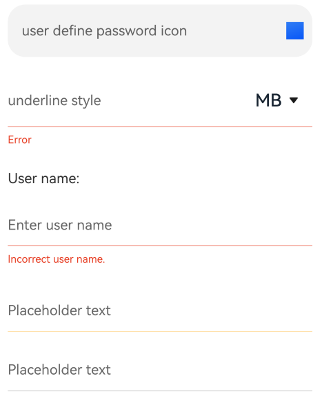

### Example 3 (Setting a Custom Keyboard)

This example uses the [customKeyboard](#customkeyboard10) attribute (available since API version 10) to set the input parameter type in value to [CustomBuilder](ts-types.md#custombuilder8) and [ComponentContent](../js-apis-arkui-ComponentContent.md#componentcontent-1), respectively, implementing a custom keyboard.

Since API version 22, the [customKeyboard](#customkeyboard10) attribute adds the input parameter type [ComponentContent](../js-apis-arkui-ComponentContent.md#componentcontent-1).

```ts
// xxx.ets
import { ComponentContent } from '@kit.ArkUI';
class BuilderParams {
  inputValue: string;
  controller: TextInputController;

  constructor(inputValue: string, controller: TextInputController) {
    this.inputValue = inputValue;
    this.controller = controller;
  }
}
@Builder
function CustomKeyboardBuilder(builderParams: BuilderParams) {
  Column() {
    Row() {
      Button('x').onClick(() => {
        // Close the custom keyboard.
        builderParams.controller.stopEditing();
      }).margin(10)
    }

    Grid() {
      ForEach([1, 2, 3, 4, 5, 6, 7, 8, 9, '*', 0, '#'], (item: number | string) => {
        GridItem() {
          Button(item + '')
            .width(110).onClick(() => {
            builderParams.inputValue += item;
          })
        }
      })
    }.maxCount(3).columnsGap(10).rowsGap(10).padding(5)
  }.backgroundColor(Color.Gray)
}
@Entry
@Component
struct TextInputExample {
  controller: TextInputController = new TextInputController();
  @State inputValue: string = '';
  @State componentContent?: ComponentContent<BuilderParams> = undefined;
  @State builderParam: BuilderParams = new BuilderParams(this.inputValue, this.controller);
  @State supportAvoidance: boolean = true;

  aboutToAppear(): void {
    // Create the ComponentContent.
    this.componentContent = new ComponentContent(this.getUIContext(), wrapBuilder(CustomKeyboardBuilder), this.builderParam);
  }
  build(){
    Column() {
      Text('Builder').margin(10).border({ width: 1 })
      TextInput({ controller: this.builderParam.controller, text: this.builderParam.inputValue })
        .customKeyboard(this.componentContent, { supportAvoidance: this.supportAvoidance })
        .margin(10).border({ width: 1 }).height('48vp')

      Text('ComponentContent').margin(10).border({ width: 1 })
      TextInput({ controller: this.builderParam.controller, text: this.builderParam.inputValue })
        .customKeyboard(new ComponentContent(this.getUIContext(), wrapBuilder(CustomKeyboardBuilder), this.builderParam), { supportAvoidance: this.supportAvoidance })
        .margin(10).border({ width: 1 }).height('48vp')
    }
  }
}
```

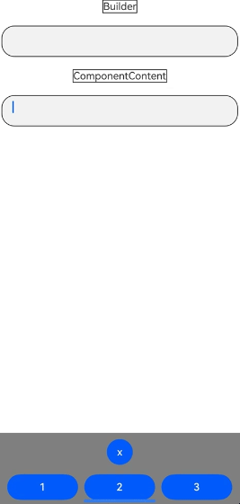

### Example 4: Setting the Style of the Clear Button on the Right

This example uses the [cancelButton](#cancelbutton11) attribute to demonstrate the effect of customizing the style of the clear button on the right.

```ts
// xxx.ets
@Entry
@Component
struct TextInputExample {
  @State text: string = '';
  controller: TextInputController = new TextInputController();

  build() {
    Column() {
      TextInput({ placeholder: 'input ...', controller: this.controller })
        .width(380)
        .height(60)
        .cancelButton({
          style: CancelButtonStyle.CONSTANT,
          icon: {
            size: 45,
            // Replace $r('app.media.startIcon') with the image resource file required by the developer.
            src: $r('app.media.startIcon'),
            color: Color.Blue
          }
        })
        .onChange((value: string) => {
          this.text = value;
        })
    }
  }
}
```


### Example 5 (Setting the Counter)

This example implements the counter function through the [maxLength](#maxlength), [showCounter](#showcounter11) (available since API version 11), and [showUnderline](#showunderline10) (available since API version 10) attributes.

```ts
// xxx.ets
@Entry
@Component
struct TextInputExample {
  @State text: string = '';
  controller: TextInputController = new TextInputController();

  build() {
    Column() {
      TextInput({ text: this.text, controller: this.controller })
        .placeholderFont({ size: 16, weight: 400 })
        .width(336)
        .height(56)
        .maxLength(6)
        .showUnderline(true)
        .showCounter(true,
          { thresholdPercentage: 50, highlightBorder: true })
          // The counter displays the current number of input characters / the maximum character limit. The maximum character limit is set through the maxLength() API.
          // If the current number of input characters reaches 50% of the maximum character limit (thresholdPercentage), the character counter is displayed.
          // When the user sets highlightBorder to false, the red border is removed. When this parameter is not set, the default value is true.
        .onChange((value: string) => {
          this.text = value;
        })
    }.width('100%').height('100%').backgroundColor('#F1F3F5')
  }
}
```


### Example 6 (Phone Number Formatting)

This example uses the [onChange](#onchange) callback to format a phone number as XXX XXXX XXXX.

```ts
// xxx.ets
@Entry
@Component
struct TextInputExample {
  @State text: string = '';
  public readonly NUM_TEXT_MAXSIZE_LENGTH = 13;
  @State telNumberNoSpace: string = '';
  @State nextCaret: number = -1; // Record the position for the next caret setting.
  @State actualCh: number = -1; // Record the caret position for insertion after the i-th digit or deletion before the i-th digit.
  @State lastCaretPosition: number = 0;
  @State lastCaretPositionEnd: number = 0;
  controller: TextInputController = new TextInputController();

  isEmpty(str?: string): boolean {
    return str == 'undefined' || !str || !new RegExp('[^\\s]').test(str);
  }

  checkNeedNumberSpace(numText: string) {
    let isSpace: RegExp = new RegExp('[\\+;,#\\*]', 'g');
    let isRule: RegExp = new RegExp('^\\+.*');

    if (isSpace.test(numText)) {
      // If the phone number contains special characters, do not add spaces.
      if (isRule.test(numText)) {
        return true;
      } else {
        return false;
      }
    }
    return true;
  }

  removeSpace(str: string): string {
    if (this.isEmpty(str)) {
      return '';
    }
    return str.replace(new RegExp('[\\s]', 'g'), '');
  }

  setCaret() {
    if (this.nextCaret != -1) {
      console.info('to keep caret position right, change caret to', this.nextCaret);
      this.controller.caretPosition(this.nextCaret);
      this.nextCaret = -1;
    }
  }

  calcCaretPosition(nextText: string) {
    let befNumberNoSpace: string = this.removeSpace(this.text);
    this.actualCh = 0;
    if (befNumberNoSpace.length < this.telNumberNoSpace.length) { // Insertion scenario.
      for (let i = 0; i < this.lastCaretPosition; i++) {
        if (this.text[i] != ' ') {
          this.actualCh += 1;
        }
      }
      this.actualCh += this.telNumberNoSpace.length - befNumberNoSpace.length;
      console.info('actualCh: ' + this.actualCh);
      for (let i = 0; i < nextText.length; i++) {
        if (nextText[i] != ' ') {
          this.actualCh -= 1;
          if (this.actualCh <= 0) {
            this.nextCaret = i + 1;
            break;
          }
        }
      }
    } else if (befNumberNoSpace.length > this.telNumberNoSpace.length) { // Deletion scenario.
      if (this.lastCaretPosition === this.text.length) {
        console.info('Caret at last, no need to change');
      } else if (this.lastCaretPosition === this.lastCaretPositionEnd) {
        // Scenario of deleting characters one by one using the backspace key.
        for (let i = this.lastCaretPosition; i < this.text.length; i++) {
          if (this.text[i] != ' ') {
            this.actualCh += 1;
          }
        }
        for (let i = nextText.length - 1; i >= 0; i--) {
          if (nextText[i] != ' ') {
            this.actualCh -= 1;
            if (this.actualCh <= 0) {
              this.nextCaret = i;
              break;
            }
          }
        }
      } else {
        // Scenario of deleting multiple characters at once by cutting or handle selection.
        this.nextCaret = this.lastCaretPosition; // Keep the caret position.
      }
    }
  }

  build() {
    Column() {
      Row() {
        TextInput({ text: `${this.text}`, controller: this.controller }).type(InputType.PhoneNumber).height('48vp')
          .onChange((value: string) => {
            this.telNumberNoSpace = this.removeSpace(value);
            let nextText: string = '';
            // Determine the formatting method based on the phone number length: if the length exceeds the limit, do not format; otherwise, insert spaces in the 'XXX XXXX XXXX' format.
            if (this.telNumberNoSpace.length > this.NUM_TEXT_MAXSIZE_LENGTH - 2) {
              nextText = this.telNumberNoSpace;
            } else if (this.checkNeedNumberSpace(value)) {
              if (this.telNumberNoSpace.length <= 3) {
                nextText = this.telNumberNoSpace;
              } else {
                let firstPart: string = this.telNumberNoSpace.substring(0, 3);
                let secondPart: string = this.telNumberNoSpace.substring(3);
                nextText = firstPart + ' ' + secondPart;
                if (this.telNumberNoSpace.length > 7) {
                  secondPart = this.telNumberNoSpace.substring(3, 7);
                  let thirdPart: string = this.telNumberNoSpace.substring(7);
                  nextText = firstPart + ' ' + secondPart + ' ' + thirdPart;
                }
              }
            } else {
              nextText = value;
            }
            console.info('onChange Triggered:' + this.text + '|' + nextText + '|' + value);
            if (this.text === nextText && nextText === value) {
              // This indicates that the number has been formatted. At this point, changing the cursor position will not be reset.
              this.setCaret();
            } else {
              this.calcCaretPosition(nextText);
            }
            this.text = nextText;
          })
          .onTextSelectionChange((selectionStart, selectionEnd) => {
            // Record the cursor position.
            console.info('selection change: ', selectionStart, selectionEnd);
            this.lastCaretPosition = selectionStart;
            this.lastCaretPositionEnd = selectionEnd;
          })// Supported since API version 10.
      }
    }
    .width('100%')
    .height('100%')
  }
}
```


### Example 7 (Setting Text Line Break Rules)

Starting from API version 12, this example uses the [wordBreak](#wordbreak12) attribute to demonstrate the effects of different line break rules for TextInput.

```ts
// xxx.ets
@Entry
@Component
struct TextInputExample {
  @State textStrEn: string =
    'This is set wordBreak to WordBreak text Taumatawhakatangihangakoauauotamateaturipukakapikimaungahoronukupokaiwhenuakitanatahu.';
  @State textStrZn: string =
    'Multiline text input component. When the entered text content exceeds the component width, it automatically wraps to a new line. \n When the height is not set, the component has no default height and adapts to the content height. When the width is not set, it fills the maximum width by default.';

  build() {
    Row() {
      Column() {
        Text('Style of TextInput in inline mode with the wordBreak attribute set to NORMAL:').fontSize(16).fontColor(0xCCCCCC)
        TextInput({
          text: this.textStrEn
        })
          .margin(10)
          .fontSize(16)
          .style(TextInputStyle.Inline)// Inline mode
          .wordBreak(WordBreak.NORMAL) // This attribute is invalid in non-inline mode

        Text('Style of TextInput in inline mode with English text and the wordBreak attribute set to BREAK_ALL:').fontSize(16).fontColor(0xCCCCCC)
        TextInput({
          text: this.textStrEn
        })
          .margin(10)
          .fontSize(16)
          .style(TextInputStyle.Inline)
          .wordBreak(WordBreak.BREAK_ALL)

        Text('Style of TextInput in inline mode with Chinese text and the wordBreak attribute set to BREAK_ALL:').fontSize(16).fontColor(0xCCCCCC)
        TextInput({
          text: this.textStrZn
        })
          .margin(10)
          .fontSize(16)
          .style(TextInputStyle.Inline)
          .wordBreak(WordBreak.BREAK_ALL)

        Text('Style of TextInput in inline mode with the wordBreak attribute set to BREAK_WORD:').fontSize(16).fontColor(0xCCCCCC)
        TextInput({
          text: this.textStrEn
        })
          .margin(10)
          .fontSize(16)
          .style(TextInputStyle.Inline)
          .wordBreak(WordBreak.BREAK_WORD)
      }.width('100%')
    }.height('100%').margin(10)
  }
}
```


### Example 8 (Set Text Style)

Since API version 12, this example demonstrates text effects in different styles through the [lineHeight](#lineheight12), [letterSpacing](#letterspacing12), and [decoration](#decoration12) attributes.

```ts
// xxx.ets
@Entry
@Component
struct TextInputExample {
  build() {
    Row() {
      Column() {
        Text('lineHeight').fontSize(9).fontColor(0xCCCCCC)
        TextInput({ text: 'lineHeight unset' })
          .border({ width: 1 }).padding(10).margin(5)
        TextInput({ text: 'lineHeight 15' })
          .border({ width: 1 }).padding(10).margin(5).lineHeight(15)
        TextInput({ text: 'lineHeight 30' })
          .border({ width: 1 }).padding(10).margin(5).lineHeight(30)

        Text('letterSpacing').fontSize(9).fontColor(0xCCCCCC)
        TextInput({ text: 'letterSpacing 0' })
          .border({ width: 1 }).padding(5).margin(5).letterSpacing(0)
        TextInput({ text: 'letterSpacing 3' })
          .border({ width: 1 }).padding(5).margin(5).letterSpacing(3)
        TextInput({ text: 'letterSpacing -1' })
          .border({ width: 1 }).padding(5).margin(5).letterSpacing(-1)

        Text('decoration').fontSize(9).fontColor(0xCCCCCC)
        TextInput({ text: 'LineThrough, Red' })
          .border({ width: 1 }).padding(5).margin(5)
          .decoration({ type: TextDecorationType.LineThrough, color: Color.Red })
        TextInput({ text: 'Overline, Red, DASHED' })
          .border({ width: 1 }).padding(5).margin(5)
          .decoration({ type: TextDecorationType.Overline, color: Color.Red, style: TextDecorationStyle.DASHED })
        TextInput({ text: 'Underline, Red, WAVY' })
          .border({ width: 1 }).padding(5).margin(5)
          .decoration({ type: TextDecorationType.Underline, color: Color.Red, style: TextDecorationStyle.WAVY })
      }.height('90%')
    }
    .width('90%')
    .margin(10)
  }
}
```


### Example 9 (Setting the Text Feature Effect)

Since API version 12, this example uses the [fontFeature](#fontfeature12) attribute to implement the display effect of text under different text features.

```ts
// xxx.ets
@Entry
@Component
struct TextInputExample {
  @State text1: string = 'This is ss01 on : 0123456789';
  @State text2: string = 'This is ss01 off: 0123456789';

  build() {
    Column() {
      TextInput({ text: this.text1 })
        .fontSize(20)
        .margin({ top: 200 })
        .fontFeature('"ss01" on')
      TextInput({ text: this.text2 })
        .margin({ top: 10 })
        .fontSize(20)
        .fontFeature('"ss01" off')
    }
    .width('90%')
    .margin('5%')
  }
}
```


### Example 10 (Custom Keyboard Avoidance)

This example uses the [customKeyboard](#customkeyboard10) (available since API version 10) attribute to configure the [KeyboardOptions](ts-basic-components-richeditor.md#keyboardoptions12) (available since API version 12) interface to implement custom keyboard avoidance.

```ts
// xxx.ets
@Entry
@Component
struct TextInputExample {
  controller: TextInputController = new TextInputController();
  @State inputValue: string = '';
  @State height1: string | number = '80%';
  @State supportAvoidance: boolean = true;

  // Custom keyboard component
  @Builder
  CustomKeyboardBuilder() {
    Column() {
      Row() {
        Button('x').onClick(() => {
          // Close the custom keyboard
          this.controller.stopEditing();
        }).margin(10)
      }

      Grid() {
        ForEach([1, 2, 3, 4, 5, 6, 7, 8, 9, '*', 0, '#'], (item: number | string) => {
          GridItem() {
            Button(item + '')
              .width(110).onClick(() => {
              this.inputValue += item;
            })
          }
        })
      }.maxCount(3).columnsGap(10).rowsGap(10).padding(5)
    }.backgroundColor(Color.Gray)
  }

  build() {
    Column() {
      Row() {
        Button('20%')
          .fontSize(24)
          .onClick(() => {
            this.height1 = '20%';
          })
        Button('80%')
          .fontSize(24)
          .margin({ left: 20 })
          .onClick(() => {
            this.height1 = '80%';
          })
      }
      .justifyContent(FlexAlign.Center)
      .alignItems(VerticalAlign.Bottom)
      .height(this.height1)
      .width('100%')
      .padding({ bottom: 50 })

      TextInput({ controller: this.controller, text: this.inputValue })// Bind the custom keyboard
        .customKeyboard(this.CustomKeyboardBuilder(), { supportAvoidance: this.supportAvoidance })
        .margin(10)
        .border({ width: 1 })

    }
  }
}
```


### Example 11 (Setting Text Auto-fit)

Since API version 12, this example implements the text adaptive font size feature through the [minFontSize](#minfontsize12), [maxFontSize](#maxfontsize12), and [heightAdaptivePolicy](#heightadaptivepolicy12) attributes.

```ts
// xxx.ets
@Entry
@Component
struct TextInputExample {
  build() {
    Row() {
      Column() {
        Text('heightAdaptivePolicy').fontSize(9).fontColor(0xCCCCCC)
        TextInput({ text: 'This is the text without the height adaptive policy set' })
          .width('80%').height(50).borderWidth(1).margin(1)
        TextInput({ text: 'This is the text with the height adaptive policy set' })
          .width('80%')
          .height(50)
          .borderWidth(1)
          .margin(1)
          .minFontSize(4)
          .maxFontSize(40)
          .maxLines(3)
          .heightAdaptivePolicy(TextHeightAdaptivePolicy.MAX_LINES_FIRST)
        TextInput({ text: 'This is the text with the height adaptive policy set' })
          .width('80%')
          .height(50)
          .borderWidth(1)
          .margin(1)
          .minFontSize(4)
          .maxFontSize(40)
          .maxLines(3)
          .heightAdaptivePolicy(TextHeightAdaptivePolicy.MIN_FONT_SIZE_FIRST)
        TextInput({ text: 'This is the text with the height adaptive policy set' })
          .width('80%')
          .height(50)
          .borderWidth(1)
          .margin(1)
          .minFontSize(4)
          .maxFontSize(40)
          .maxLines(3)
          .heightAdaptivePolicy(TextHeightAdaptivePolicy.LAYOUT_CONSTRAINT_FIRST)
      }.height('90%')
    }
    .width('90%')
    .margin(10)
  }
}
```


### Example 12 (Setting the Line Break Rule)

Since API version 12, this example implements the effects of TextInput under different line break rules through the [lineBreakStrategy](#linebreakstrategy12) attribute.

```ts
// xxx.ets
@Entry
@Component
struct TextInputExample {
  @State message1: string =
    'They can be classified as built-in components–those directly provided by the ArkUI framework and custom components – those defined by developers' +
      'The built-in components include buttons radio progress indicators and text You can set the rendering effect of these components in method chaining mode,' +
      'page components are divided into independent UI units to implementindependent creation development and reuse of different units on pages making pages more engineering-oriented.';
  @State lineBreakStrategyIndex: number = 0;
  @State lineBreakStrategy: LineBreakStrategy[] =
    [LineBreakStrategy.GREEDY, LineBreakStrategy.HIGH_QUALITY, LineBreakStrategy.BALANCED];
  @State lineBreakStrategyStr: string[] = ['GREEDY', 'HIGH_QUALITY', 'BALANCED'];

  build() {
    Flex({ direction: FlexDirection.Column, alignItems: ItemAlign.Center }) {
      Text('lineBreakStrategy').fontSize(16).fontColor(Color.Black)
      TextInput({ text: this.message1 })
        .fontSize(12)
        .border({ width: 1 })
        .padding(10)
        .width('100%')
        .maxLines(12)
        .style(TextInputStyle.Inline)
        .lineBreakStrategy(this.lineBreakStrategy[this.lineBreakStrategyIndex])
      Row() {
        Button('Current lineBreakStrategy mode:' + this.lineBreakStrategyStr[this.lineBreakStrategyIndex]).onClick(() => {
          this.lineBreakStrategyIndex++;
          if (this.lineBreakStrategyIndex > (this.lineBreakStrategyStr.length - 1)) {
            this.lineBreakStrategyIndex = 0;
          }
        })
      }.margin({ top: 20 })
    }.height(700).width(370).padding({ left: 35, right: 35, top: 35 })
  }
}
```

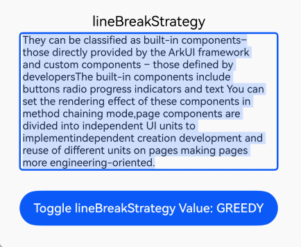

### Example 13 (Supporting Insert and Delete Callbacks)
Since API version 12, this example implements the insert and delete effects through the [onWillInsert](#onwillinsert12), [onDidInsert](#ondidinsert12), [onWillDelete](#onwilldelete12), and [onDidDelete](#ondiddelete12) interfaces.
```ts
// xxx.ets
@Entry
@Component
struct TextInputExample {
  @State insertValue: string = '';
  @State deleteValue: string = '';
  @State insertOffset: number = 0;
  @State deleteOffset: number = 0;
  @State deleteDirection: number = 0;
  @State currentValue_1: string = '';
  @State currentValue_2: string = '';

  build() {
    Row() {
      Column() {
        TextInput({ text: 'TextInput supports insert callback text' })
          .height(60)
          .onWillInsert((info: InsertValue) => {
            this.insertValue = info.insertValue;
            return true;
          })
          .onDidInsert((info: InsertValue) => {
            this.insertOffset = info.insertOffset;
          })
          .onWillChange((info: EditableTextChangeValue) => {
            this.currentValue_1 = info.content;
            return true;
          })

        Text('insertValue:' + this.insertValue + '  insertOffset:' + this.insertOffset).height(30)
        Text('currentValue_1:' + this.currentValue_1).height(30)

        TextInput({ text: 'TextInput supports delete callback text b' })
          .height(60)
          .onWillDelete((info: DeleteValue) => {
            this.deleteValue = info.deleteValue;
            this.deleteDirection = info.direction;
            return true;
          })
          .onDidDelete((info: DeleteValue) => {
            this.deleteOffset = info.deleteOffset;
            this.deleteDirection = info.direction;
          })
          .onWillChange((info: EditableTextChangeValue) => {
            this.currentValue_2 = info.content;
            return true;
          })

        Text('deleteValue:' + this.deleteValue + '  deleteOffset:' + this.deleteOffset).height(30)
        Text('deleteDirection:' + (this.deleteDirection == 0 ? 'BACKWARD' : 'FORWARD')).height(30)
        Text('currentValue_2:' + this.currentValue_2).height(30)

      }.width('100%')
    }
    .height('100%')
  }
}
```


### Example 14 (Text Extension Custom Menu)

Since API version 12, this example uses the [editMenuOptions](#editmenuoptions12) interface to set the text content, icon, and callback of custom menu extension items. In addition, menu data can be set in the [onPrepareMenu](ts-text-common.md#properties-1) callback (since API version 20).

```ts
// xxx.ets
@Entry
@Component
struct TextInputExample {
  @State text: string = 'TextInput editMenuOptions';
  @State endIndex: number = 0;
  onCreateMenu = (menuItems: Array<TextMenuItem>) => {
    // $r('app.media.startIcon') needs to be replaced with the image resource file required by the developer.
    // TextMenuItemId.autoFill is supported since API version 23.
    const idsToFilter: TextMenuItemId[] = [
      TextMenuItemId.autoFill
    ]
    const items = menuItems.filter(item => !idsToFilter.some(id => id.equals(item.id)))
    let item1: TextMenuItem = {
      content: 'create1',
      icon: $r('app.media.startIcon'),
      id: TextMenuItemId.of('create1'),
    };
    let item2: TextMenuItem = {
      content: 'create2',
      id: TextMenuItemId.of('create2'),
      icon: $r('app.media.startIcon'),
    };
    items.push(item1);
    items.unshift(item2);
    return items;
  }
  onMenuItemClick = (menuItem: TextMenuItem, textRange: TextRange) => {
    if (menuItem.id.equals(TextMenuItemId.of('create2'))) {
      console.info('Intercept id: create2 start:' + textRange.start + '; end:' + textRange.end);
      return true;
    }
    if (menuItem.id.equals(TextMenuItemId.of('prepare1'))) {
      console.info('Intercept id: prepare1 start:' + textRange.start + '; end:' + textRange.end);
      return true;
    }
    if (menuItem.id.equals(TextMenuItemId.COPY)) {
      console.info('Intercept COPY start:' + textRange.start + '; end:' + textRange.end);
      return true;
    }
    if (menuItem.id.equals(TextMenuItemId.SELECT_ALL)) {
      console.info('Do not intercept SELECT_ALL start:' + textRange.start + '; end:' + textRange.end);
      return false;
    }
    return false;
  }
  // $r('app.media.startIcon') needs to be replaced with the image resource file required by the developer.
  onPrepareMenu = (menuItems: Array<TextMenuItem>) => {
    let item1: TextMenuItem = {
      content: 'prepare1_' + this.endIndex,
      icon: $r('app.media.startIcon'),
      id: TextMenuItemId.of('prepare1'),
    };
    menuItems.unshift(item1);
    return menuItems;
  }
  @State editMenuOptions: EditMenuOptions = {
    onCreateMenu: this.onCreateMenu,
    onMenuItemClick: this.onMenuItemClick,
    onPrepareMenu: this.onPrepareMenu
  };

  build() {
    Column() {
      TextInput({ text: this.text })
        .width('95%')
        .height(50)
        .editMenuOptions(this.editMenuOptions)
        .margin({ top: 100 })
        .onTextSelectionChange((selectionStart: number, selectionEnd: number) => {
          this.endIndex = selectionEnd;
        })
    }
    .width('90%')
    .margin('5%')
  }
}
```

<!--RP4-->
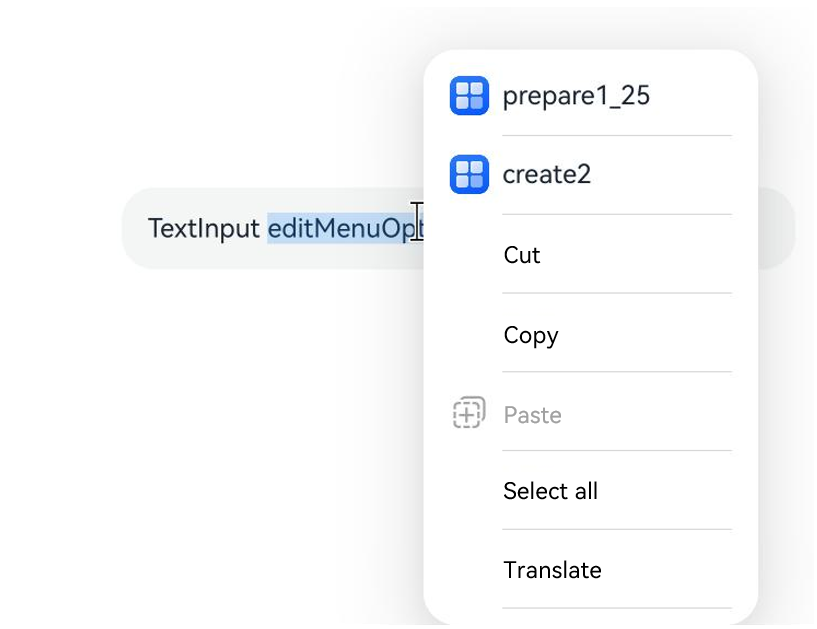
<!--RP4End-->

### Example 15: Setting a Symbol-Type Clear Button

Starting from API version 18, this example uses the [cancelButton](#cancelbutton18) attribute to demonstrate the effect of customizing the style of the symbol-type clear button on the right.

```ts
import { SymbolGlyphModifier } from '@kit.ArkUI';

// xxx.ets
@Entry
@Component
struct TextInputExample {
  @State text: string = '';
  symbolModifier: SymbolGlyphModifier =
    new SymbolGlyphModifier($r('sys.symbol.trash')).fontColor([Color.Red]).fontSize(16).fontWeight(FontWeight.Regular);

  build() {
    Column() {
      TextInput({ text: this.text, placeholder: 'input your word...' })
        .cancelButton({
          style: CancelButtonStyle.CONSTANT,
          icon: this.symbolModifier
        })
    }
  }
}
```


### Example 16 (Setting the Text Ellipsis Mode)

This example uses the [textOverflow](#textoverflow12), [ellipsisMode](#ellipsismode18), and [style](#style9) attributes to demonstrate the effect of truncating overlong text and adjusting the ellipsis position. Through the MULTILINE_START and MULTILINE_CENTER types, it implements the effect of placing the ellipsis at the beginning and in the middle of the line in single-line and multi-line text scenarios.

Since API version 9, the style of the input box can be set through [style](#style9).

Since API version 12, the display mode of overlong text can be set through [textOverflow](#textoverflow12).

Since API version 18, the ellipsis position can be set through [ellipsisMode](#ellipsismode18).

Since API version 24, the MULTILINE_START and MULTILINE_CENTER enums are added to [EllipsisMode](ts-appendix-enums.md#ellipsismode11).

```ts
// xxx.ets
@Entry
@Component
struct EllipsisModeExample {
  @State text: string = 'As the sun begins to set, casting a warm golden hue across the sky,' +
    'the world seems to slow down and breathe a sigh of relief. The sky is painted with hues of orange, ' +
    ' pink, and lavender, creating a breath taking tapestry that stretches as far as the eye can see.' +
    'The air is filled with the sweet scent of blooming flowers, mingling with the earthy aroma of freshly turned soil.';
  @State ellipsisModeIndex: number = 0;
  @State ellipsisMode: (EllipsisMode | undefined | null)[] =
    [EllipsisMode.END, EllipsisMode.START, EllipsisMode.CENTER, EllipsisMode.MULTILINE_START,
      EllipsisMode.MULTILINE_CENTER]; // Since API version 24, MULTILINE_START and MULTILINE_CENTER are added.
  @State ellipsisModeStr: string[] = ['END ', 'START', 'CENTER', 'MULTILINE_START', 'MULTILINE_CENTER'];
  @State textOverflowIndex: number = 0;
  @State textOverflow: TextOverflow[] = [TextOverflow.Ellipsis, TextOverflow.Clip];
  @State textOverflowStr: string[] = ['Ellipsis', 'Clip'];
  @State styleInputIndex: number = 0;
  @State styleInput: TextInputStyle[] = [TextInputStyle.Inline, TextInputStyle.Default];
  @State styleInputStr: string[] = ['Inline', 'Default'];

  build() {
    Row() {
      Column({ space: 20 }) {
        TextInput({ text: this.text })
          .textOverflow(this.textOverflow[this.textOverflowIndex])
          .ellipsisMode(this.ellipsisMode[this.ellipsisModeIndex])
          .style(this.styleInput[this.styleInputIndex])
          .fontSize(30)
          .margin(30)
        Button('Change ellipsisMode mode:' + this.ellipsisModeStr[this.ellipsisModeIndex]).onClick(() => {
          this.ellipsisModeIndex++;
          if (this.ellipsisModeIndex > (this.ellipsisModeStr.length - 1)) {
            this.ellipsisModeIndex = 0;
          }
        }).fontSize(20)
        Button('Change textOverflow mode:' + this.textOverflowStr[this.textOverflowIndex]).onClick(() => {
          this.textOverflowIndex++;
          if (this.textOverflowIndex > (this.textOverflowStr.length - 1)) {
            this.textOverflowIndex = 0;
          }
        }).fontSize(20)
        Button('Change Style Size:' + this.styleInputStr[this.styleInputIndex]).onClick(() => {
          this.styleInputIndex++;
          if (this.styleInputIndex > (this.styleInputStr.length - 1)) {
            this.styleInputIndex = 0;
          }
        }).fontSize(20)
      }
    }
  }
}
```

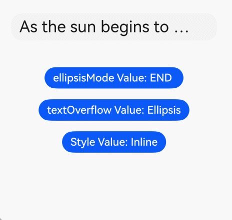

### Example 17 (Input Box Supporting Callbacks Such as Input State Change)

Since API version 8, this example uses the [onEditChange](#oneditchange8), [onCopy](#oncopy8), [onCut](#oncut8), [onPaste](#onpaste8), [onContentScroll](#oncontentscroll10) (since API version 10), [onWillCopy](#onwillcopy), and [onWillCut](#onwillcut) APIs to implement the effects of monitoring input state changes, copy, cut, paste, and text content scroll callbacks in the input box, how to block the system copy function, and how to block the system cut function. In addition, you can set the [selectAll](#selectall11) (since API version 11) attribute to determine whether all text is selected in the initial state of the input box.

Since API version 26.0.0, the [onWillCopy](#onwillcopy) and [onWillCut](#onwillcut) APIs are added.

```ts
// xxx.ets
@Entry
@Component
struct TextInputExample {
  @State editStatus: boolean = false;
  @State copyValue: string = '';
  @State cutValue: string = '';
  @State pasteValue: string = '';
  @State totalOffsetX: number = 0;
  @State totalOffsetY: number = 0;

  build() {
    Row() {
      Column() {
        TextInput({ text: 'TextInput supports callbacks when the input state changes' })
          .height(60)
          .fontStyle(FontStyle.Italic)
          .fontWeight(FontWeight.Bold)
          .fontFamily('HarmonyOS Sans')
          .copyOption(CopyOptions.LocalDevice)
          .textAlign(TextAlign.Center)
          .selectedBackgroundColor(Color.Blue)
          .caretStyle({ width: '4vp' })
          .caretPosition(10)
          .selectionMenuHidden(true)
          .onEditChange((status: boolean) => {
            this.editStatus = status;
          })
          .defaultFocus(true)// Set the default focus for TextInput.
          .enableKeyboardOnFocus(false)
          .selectAll(false)

        Text('editStatus:' + this.editStatus).height(30)

        TextInput({ text: 'TextInput supports callbacks for copy operations' })
          .height(60)
          .fontStyle(FontStyle.Italic)
          .fontWeight(FontWeight.Bold)
          .fontFamily('HarmonyOS Sans')
          .copyOption(CopyOptions.LocalDevice)
          .textAlign(TextAlign.Center)
          .selectedBackgroundColor(Color.Blue)
          .caretStyle({ width: '4vp' })
          .onCopy((copyValue: string) => {
            this.copyValue = copyValue;
          })
          // onWillCopy is supported since API version 26.0.0.
          .onWillCopy((value: string) => {
            console.info(`on will copy ${value}`);
            return false;
          })

        Text('copyValue:' + this.copyValue).height(30)

        TextInput({ text: 'TextInput supports callbacks for cut operations' })
          .height(60)
          .fontStyle(FontStyle.Italic)
          .fontWeight(FontWeight.Bold)
          .fontFamily('HarmonyOS Sans')
          .copyOption(CopyOptions.LocalDevice)
          .textAlign(TextAlign.Center)
          .selectedBackgroundColor(Color.Blue)
          .caretStyle({ width: '4vp' })
          .onCut((cutValue: string) => {
            this.cutValue = cutValue;
          })
          // onWillCut is supported since API version 26.0.0.
          .onWillCut((value: string) => {
            console.info(`on will cut ${value}`);
            return false;
          })

        Text('cutValue:' + this.cutValue).height(30)

        TextInput({ text: 'TextInput supports callbacks for paste operations' })
          .height(60)
          .fontStyle(FontStyle.Italic)
          .fontWeight(FontWeight.Bold)
          .fontFamily('HarmonyOS Sans')
          .copyOption(CopyOptions.LocalDevice)
          .textAlign(TextAlign.Center)
          .selectedBackgroundColor(Color.Blue)
          .caretStyle({ width: '4vp' })
          .onPaste((pasteValue: string) => {
            this.pasteValue = pasteValue;
          })

        Text('pasteValue:' + this.pasteValue).height(30)

        TextInput({ text: 'Callback invoked when the text content of TextInput scrolls: the text content width exceeds the input box width, and the text is scrolled to view the offset change.' })
          .height(60)
          .fontStyle(FontStyle.Italic)
          .fontWeight(FontWeight.Bold)
          .fontFamily('HarmonyOS Sans')
          .copyOption(CopyOptions.LocalDevice)
          .textAlign(TextAlign.Center)
          .selectedBackgroundColor(Color.Blue)
          .caretStyle({ width: '4vp' })
          .onContentScroll((totalOffsetX: number, totalOffsetY: number) => {
            this.totalOffsetX = totalOffsetX;
            this.totalOffsetY = totalOffsetY;
          })

        Text('totalOffsetX:' + this.totalOffsetX + '  totalOffsetY:' + this.totalOffsetY).height(30)

      }.width('100%')
    }
    .height('100%')
  }
}
```


### Example 18: Setting the Minimum and Maximum Font Scale Factors

Since API version 18, this example uses [minFontScale](#minfontscale18) and [maxFontScale](#maxfontscale18) to set the minimum and maximum font display range<!--Del--> (this example uses system APIs, so the application type must be adjusted to a system application; see [Available APIs](../../../reference/development-intro-api.md#available-apis) in HarmonyAppProvision)<!--DelEnd-->.
<!--code_no_check-->
```json5
// Enable the application scaling to follow the system.
// In AppScope/resources/base, create the profile folder.
// In AppScope/resources/base/profile, create the configuration.json file.
// In AppScope/resources/base/profile/configuration.json, add the following code.
{
  "configuration": {
    "fontSizeScale": "followSystem",
    "fontSizeMaxScale": "3.2"
  }
}
```
<!--code_no_check-->
```json5
// In AppScope/app.json5, modify the following code.
{
  "app": {
    "bundleName": "com.example.myapplication",
    "vendor": "example",
    "versionCode": 1000000,
    "versionName": "1.0.0",
    "icon": "$media:app_icon",
    "label": "$string:app_name",
    "configuration": "$profile:configuration"
  }
}
```
<!--RP3-->
<!--code_no_check-->
```ts
// xxx.ets
import { abilityManager, Configuration } from '@kit.AbilityKit';
import { BusinessError } from '@kit.BasicServicesKit';

@Entry
@Component
struct TextInputExample {
  @State currentFontSizeScale: number = 1;
  @State minFontScale: number = 0.85;
  @State maxFontScale: number = 2;

  // Set the font size.
  async setFontScale(scale: number): Promise<void> {
    let configInit: Configuration = {
      fontSizeScale: scale
    };
    // Update the configuration - font size, and call the system API to update the font configuration.
    // Configure the ohos.permission.UPDATE_CONFIGURATION permission in the requestPermissions field of the module.json5 file of the project.
    abilityManager.updateConfiguration(configInit, (err: BusinessError) => {
      if (err) {
        console.error(`Failed to update configuration. Code: ${err.code}, message: ${err.message}`);
      } else {
        this.currentFontSizeScale = scale;
        console.info('updateConfiguration success.');
      }
    });
  }

  build() {
    Column() {
      Column({ space: 30 }) {
        Text('Adjust the maximum and minimum font scale factors for text display through minFontScale and maxFontScale.')
        TextInput({
          placeholder: 'The text area can hold an unlimited amount of text. input your word...',
          text: 'Adjust the maximum and minimum font scale factors for text display through minFontScale and maxFontScale.'
        })
          .minFontScale(this.minFontScale)// Set the minimum font scale factor. If the parameter is undefined, the system default scale factor is used.
          .maxFontScale(this.maxFontScale) // Set the maximum font scale factor. If the parameter is undefined, the system default scale factor is used.
      }.width('100%')
      // The following buttons are used only to adjust the font scale factor and are not shown in the sample figure.
      Column() {
        Row() {
          Button('1x').onClick(() => {
            this.setFontScale(1);
          }).margin(10)
          Button('1.75x').onClick(() => {
            this.setFontScale(1.75);
          }).margin(10)
        }

        Row() {
          Button('2x').onClick(() => {
            this.setFontScale(2);
          }).margin(10)
          Button('3.2x').onClick(() => {
            this.setFontScale(3.2);
          }).margin(10)
        }
      }.margin({ top: 50 })
    }
  }
}
```
<!--RP3End-->

| System font scale factor is 2x | System font scale factor is 3.2x |
| ---------------------------------- | ------------------------------------ |
| 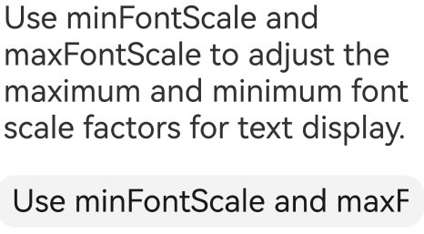  | 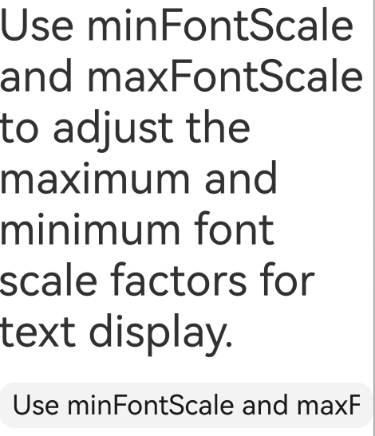  |

### Example 19 (Setting the Text Content of a Selected Area)

Since API version 10, this example uses the [setTextSelection](#settextselection10) method to demonstrate how to set the text content of a selected area and the show/hide policy of the menu.

```ts
// xxx.ets

@Entry
@Component
struct TextInputExample {
  controller: TextInputController = new TextInputController();
  @State startIndex: number = 0;
  @State endIndex: number = 0;

  build() {
    Column({ space: 3 }) {
      Text('Selection start:' + this.startIndex + ' end:' + this.endIndex)
      TextInput({ text: 'Hello World', controller: this.controller })
        .width('95%')
        .height(40)
        .defaultFocus(true)
        .enableKeyboardOnFocus(true)
        .onTextSelectionChange((selectionStart: number, selectionEnd: number) => {
          this.startIndex = selectionStart;
          this.endIndex = selectionEnd;
        })

      Button('setTextSelection [0,3], set menuPolicy is MenuPolicy.SHOW')
        .onClick(() => {
          this.controller.setTextSelection(0, 3, { menuPolicy: MenuPolicy.SHOW });
        })
    }
    .width('100%')
    .height('100%')
  }
}
```

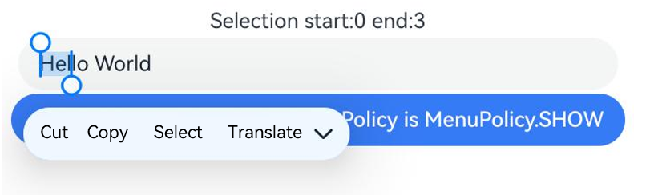

### Example 20 (Setting Text Stroke)

Since API version 20, this example sets the stroke width and color of text through the [strokeWidth](#strokewidth20) and [strokeColor](#strokecolor20) attributes.

Since API version 26.0.0, the [strokeJoinStyle](#strokejoinstyle) interface is added to support setting the corner style of text stroke.

```ts
// xxx.ets
import { LengthMetrics } from '@kit.ArkUI';

@Entry
@Component
struct TextInputExample {
  build() {
    Row() {
      Column() {
        Text('stroke feature').fontSize(9).fontColor(0xCCCCCC)

        TextInput({ text: 'Text without stroke' })
          .width('100%')
          .height(60)
          .borderWidth(1)
          .fontSize(40)
        TextInput({ text: 'Text with stroke' })
          .width('100%')
          .height(60)
          .borderWidth(1)
          .fontSize(40)
          .strokeWidth(LengthMetrics.px(-3.0))
          .strokeColor(Color.Red)
        TextInput({ text: 'Text with stroke' })
          .width('100%')
          .height(60)
          .borderWidth(1)
          .fontSize(40)
          .strokeWidth(LengthMetrics.px(3.0))
          .strokeJoinStyle(StrokeJoinStyle.MITER_JOIN)
          .strokeColor(Color.Red)
      }.height('90%')
    }
    .width('90%')
    .margin(10)
  }
}
```


### Example 21 (Setting Auto Spacing Between Chinese and Western Text)

Since API version 20, this example sets auto spacing between Chinese and Western text through the [enableAutoSpacing](#enableautospacing20) attribute.

```ts
// xxx.ets
@Entry
@Component
struct TextInputExample {
  build() {
    Row() {
      Column() {
        Text('Enable auto spacing between Chinese and Western text').margin(5)
        TextInput({text: 'Chinese and Western Auto Spacing'})
          .enableAutoSpacing(true)
        Text('Disable auto spacing between Chinese and Western text').margin(5)
        TextInput({text: 'Chinese and Western Auto Spacing'})
          .enableAutoSpacing(false)
      }.height('100%')
    }
    .width('60%')
  }
}
```

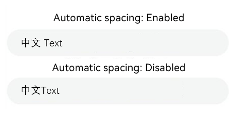

### Example 22 (Setting Character Count Color and Overflow Character Color)

Since API version 22, this example uses the counterTextColor and counterTextOverflowColor of the [showCounter](#showcounter11) attribute to set the character count color and the overflow character color.

```ts
import { ColorMetrics } from '@kit.ArkUI';

// xxx.ets
@Entry
@Component
struct TextInputExample {
  @State text: string = '';
  controller: TextInputController = new TextInputController();

  build() {
    Column() {
      TextInput({ text: this.text, controller: this.controller })
        .placeholderFont({ size: 16, weight: 400 })
        .width(336)
        .height(56)
        .maxLength(6)
        .showCounter(true, {
          thresholdPercentage: 50,
          highlightBorder: true,
          counterTextColor: ColorMetrics.resourceColor(Color.Red),
          counterTextOverflowColor: ColorMetrics.resourceColor(Color.Orange)
        })
        .onChange((value: string) => {
          this.text = value;
        })
    }.width('100%').height('100%').backgroundColor('#F1F3F5')
  }
}
```

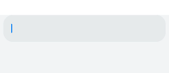

### Example 23 (Setting the Placeholder Rich Text Style)

Since API version 22, this example sets the placeholder rich text style through the [setStyledPlaceholder](ts-universal-attributes-text-style.md#setstyledplaceholder22) API.
```ts
// xxx.ets
import { LengthMetrics } from '@kit.ArkUI';
@Entry
@Component
struct TextInputExample  {
  styledString: MutableStyledString =
    new MutableStyledString('Input box rich text: text',
      [
        {
          start: 0,
          length: 7,
          styledKey: StyledStringKey.FONT,
          styledValue: new TextStyle({
            fontColor: Color.Orange,
            fontSize: LengthMetrics.fp(24)
          })
        },
        {
          start: 7,
          length: 4,
          styledKey: StyledStringKey.FONT,
          styledValue: new TextStyle({
            fontColor: Color.Gray,
            fontSize: LengthMetrics.fp(20),
            strokeWidth: LengthMetrics.px(-5),
            strokeColor: Color.Black,
          })
        },
        {
          start: 0,
          length: 1,
          styledKey: StyledStringKey.PARAGRAPH_STYLE,
          styledValue: new ParagraphStyle({
            textVerticalAlign: TextVerticalAlign.CENTER
          })
        }
      ]);
  controllerInput: TextInputController = new TextInputController();

  aboutToAppear() {
    this.controllerInput.setStyledPlaceholder(this.styledString)
  }

  build() {
    Scroll() {
      Column() {
        Text('TextInput placeholder rich text')
          .fontSize(8)
        TextInput({
          controller: this.controllerInput
        })
          .fontSize(24)
          .margin(10)
      }
      .width('100%')
    }
  }
}
```


### Example 24 (Setting Input Method Extension Information)

Since API version 22, this example uses [IMEClient](ts-text-common.md#imeclient20)'s setExtraConfig to set the input method extension information.

```ts
// xxx.ets
@Entry
@Component
struct TextInputExample {
  build() {
    Column() {
      TextInput({ text: 'Execute the onWillAttachIME callback before the input method is invoked.' })
        .onWillAttachIME((client: IMEClient) => {
          // Set the input method extension information, including custom attributes and node ID.
          client.setExtraConfig({
            customSettings: {
              name: 'TextInput', // Custom attribute.
              id: client.nodeId // Custom attribute.
            }
          })
        })
    }.height('100%')
  }
}
```

### Example 25 (Setting the Display Mode of the Scrollbar in the Editing State of Inline Input Style)

Since API version 10, this example uses [barState](#barstate10) to set whether the scrollbar is displayed or hidden in the editing state of inline input style.

```ts
@Entry
@Component
struct TextInputBarStateDemo {
  @State message: string = 'This is a long text.'.repeat(10)

  build() {
    Column({ space: 20 }) {
      TextInput({ text: 'Inline mode, set BarState.On,' + this.message })
        .style(TextInputStyle.Inline)
        .barState(BarState.On)

      TextInput({ text: 'Inline mode, set BarState.Off,' + this.message })
        .style(TextInputStyle.Inline)
        .barState(BarState.Off)
    }
    .width('100%')
    .height('100%')
    .padding(20)
    .justifyContent(FlexAlign.Center)
  }
}

```

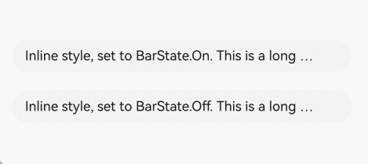

### Example 26 (Setting Leading Punctuation Compression and Trailing Punctuation Hanging)

This example uses the [compressLeadingPunctuation](#compressleadingpunctuation23) API to set leading punctuation compression, and the [punctuationOverflow](#punctuationoverflow) API to set trailing punctuation hanging.

When a punctuation mark with spacing on the left is at the beginning of a line, the punctuation is directly compressed to the left boundary.

After the text is automatically wrapped, the remaining content (including punctuation marks) must fit into the previous line for punctuation hanging to take effect.

Since API version 23, the compressLeadingPunctuation API is added.

Since API version 26.0.0, the punctuationOverflow API is added.

```ts
@Entry
@Component
struct PunctuationDemo {
  @State compressLeadingPunctuation: boolean = false;
  @State punctuationOverflow: boolean = false;
  @State text: string = '「123456789！\n『123456789：';

  build() {
    Column() {
      TextInput({ text: this.text })
        .compressLeadingPunctuation(this.compressLeadingPunctuation)
        .punctuationOverflow(this.punctuationOverflow)
        .fontSize('20fp')
        .style(TextInputStyle.Inline)
        .align(Alignment.Center)
        .width('45%')

      Column() {
        Button('Enable leading punctuation compression').onClick(() => {
          this.compressLeadingPunctuation = true;
        }).margin(5)
        Button('Disable leading punctuation compression').onClick(() => {
          this.compressLeadingPunctuation = false;
        }).margin(5)
        Button('Enable trailing punctuation hanging').onClick(() => {
          this.punctuationOverflow = true;
        }).margin(5)
        Button('Disable trailing punctuation hanging').onClick(() => {
          this.punctuationOverflow = false;
        }).margin(5)
      }
    }.width('100%').padding(20)
  }
}
```


### Example 27 (Setting Adaptive Spacing)

This example uses the [includeFontPadding](#includefontpadding23) API to increase the spacing of the first and last lines, and the [fallbackLineSpacing](#fallbacklinespacing23) API to set adaptive line spacing.

Since API version 23, the [includeFontPadding](#includefontpadding23) and [fallbackLineSpacing](#fallbacklinespacing23) APIs are added.

```ts
// xxx.ets

const UYGHUR_TEXT: string = 'ياخشىمۇسەنياخشىمۇسەنياخشىمۇسەنياخشىمۇسەنياخشىمۇسەنياخشىمۇسەنياخشىمۇسەن';
@Entry
@Component
struct Index {
  @State include: boolean | null | undefined = false;
  @State fallback: boolean | null | undefined = false;
  @State displayText: string = UYGHUR_TEXT;

  build() {
    Column() {
      TextInput({
        text: this.displayText,
        placeholder: 'Please enter content...'
      })
        .includeFontPadding(this.include)
        .fallbackLineSpacing(this.fallback)
        .lineHeight(5)
        .width('100%')
        .height(100)
        .backgroundColor('#eee')
        .borderWidth(1)
        .borderColor('#dddddd')

      Scroll() {
        Column() {
          // --- Buttons related to IncludeFontPadding ---
          Button('Set includePadding: ' + this.include)
            .onClick(() => {
              this.include = this.include === false ? true : false;
            })
            .margin({ bottom: 10 })

          // --- Buttons related to FallbackLineSpacing ---
          Button('Set fallbackLineSpacing: ' + this.fallback)
            .onClick(() => {
              this.fallback = this.fallback === false ? true : false;
            })
            .margin({ bottom: 10 })

        }
        .width('100%')
        .padding(5)
      }
      .height(250)
      .backgroundColor('transparent')
      .scrollBarWidth(2)
      .scrollBarColor('#888')

    }
    .width('100%')
    .height('100%')
    .padding(20)
  }
}
```

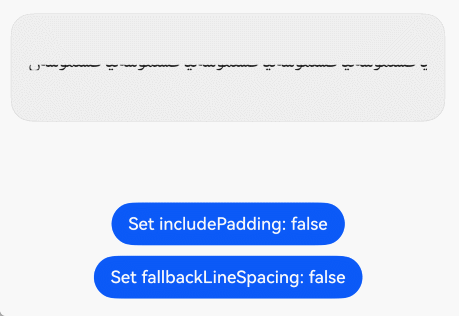

### Example 28 (Setting the Backplate Style During Text Dragging)

This example uses the [selectedDragPreviewStyle](#selecteddragpreviewstyle23) interface to set the backplate style during text dragging.

Since API version 23, the selectedDragPreviewStyle interface is added.

```ts
@Entry
@Component
struct TextInputTest {
  build() {
    Column() {
      TextInput({ text: 'HelloWorld', placeholder: 'please input words' })
        .copyOption(CopyOptions.InApp)
        .width(200)
        .height(50)
        .margin(150)
        .draggable(true)
        .selectedDragPreviewStyle({color: 'rgba(227, 248, 249, 1)'})
    }
    .height('100%')
  }
}
```


### Example 29 (Deleting the Last Character in the Text Box)

This example calls the [deleteBackward](ts-universal-attributes-text-style.md#deletebackward23) API to delete the last character in the text box.

Since API version 23, the [deleteBackward](ts-universal-attributes-text-style.md#deletebackward23) API is added.

``` typescript
@Entry
@Component
struct Page {
  controller: TextInputController = new TextInputController();

  build() {
    Column() {
      TextInput({ text: 'TextInput input box Deletebackward example', controller: this.controller })
      Button('Delete backward')
        .onClick(() => {
          // Delete the last character in the text box
          this.controller.deleteBackward();
        })
    }
  }
}
```


### Example 30 (Setting the Text Layout Direction)

This example sets the text layout direction through the [textDirection](#textdirection23) API.

Since API version 23, the textDirection API is added.

``` ts
// xxx.ets
@Entry
@Component
struct TextInputExample {
  @State text: string = 'TextInput text layout direction example';

  build() {
    Column() {
      Text('TextInput text layout direction RTL, layout direction default')
        .fontSize(12).width('90%').margin(5)
      TextInput({ text: this.text })
        .width(336)
        .fontSize(16)
        .textDirection(TextDirection.RTL)
        .showCounter(true)
        .maxLength(50)
      Text('TextInput text layout direction RTL, layout direction default, text horizontal alignment LEFT')
        .fontSize(12).width('90%').margin(5)
      TextInput({ text: this.text })
        .width(336)
        .fontSize(16)
        .textDirection(TextDirection.RTL)
        .showCounter(true)
        .maxLength(50)
        .textAlign(TextAlign.LEFT)
      Text('TextInput text layout direction LTR, layout direction Rtl')
        .fontSize(12).width('90%').margin(5)
      TextInput({ text: this.text })
        .width(336)
        .fontSize(16)
        .textDirection(TextDirection.LTR)
        .direction(Direction.Rtl)
        .maxLength(50)
        .showCounter(true)
    }.width('100%').height('100%')
  }
}
```

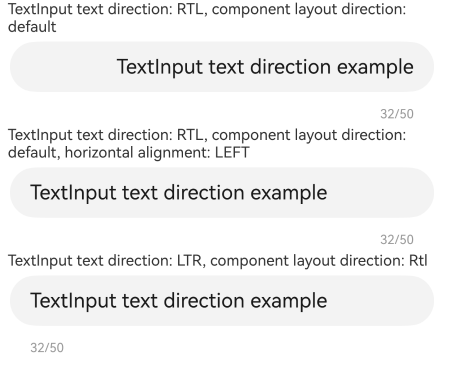

### Example 31 (Scrolling Text in a Specified Range into the Visible Area)

This example uses [scrollToVisible](./ts-universal-attributes-text-style.md#scrolltovisible23) to scroll text outside the visible area into the visible area.

Since API version 23, the scrollToVisible API is added.

```ts
// xxx.ets
@Entry
@Component
struct TextInputExample {
  @State text: string = '1234567891234567891234😁😁😁6789123456789123456789012121214521';
  controller: TextInputController = new TextInputController();

  build() {
    Column() {
      TextInput({ text: this.text, controller: this.controller })
        .width(336)
        .height(56)
      Button('Scroll text into the visible area').onClick(()=> {
        // Scroll characters 22 to 30 into the visible area
        this.controller.scrollToVisible({ start: 22, end: 30})
      })
    }.width('100%').height('100%').backgroundColor('#F1F3F5')
  }
}
```

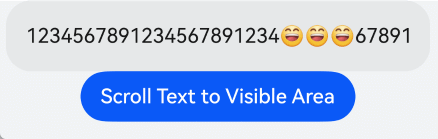

### Example 32 (Whether to Enable Orphan Character Optimization When Setting Text Layout)

This example uses the [orphanCharOptimization](#orphancharoptimization) API to enable orphan character optimization, ensuring that no orphan character appears on the last line of a paragraph.

Since API version 26.0.0, the orphanCharOptimization API is added.

``` ts
// xxx.ets
@Entry
@Component
struct TextExample {
  @State text: string = 'aaaaaaaaaaaaaaaaaaaaaaaaaaaaaaa text aaaaaaaaaaaaa';

  build() {
    Column({ space: 3 }) {
      Text('TextInput orphan character optimization disabled')
        .fontSize(12).width('90%').margin(5)
      TextInput({ text: this.text })
        .fontSize(20)
        .width('384')
        .borderWidth(1)
        .style(TextInputStyle.Inline)
      Text('TextInput orphan character optimization enabled')
        .fontSize(12).width('90%').margin(5)
      TextInput({ text: this.text })
        .fontSize(20)
        .width('384')
        .borderWidth(1)
        .orphanCharOptimization(true)
        .style(TextInputStyle.Inline)
    }
    .width('100%')
    .height('100%')
  }
}
```

The effect shown in the figure may vary depending on the device size and is for reference only.

Orphan character optimization disabled:

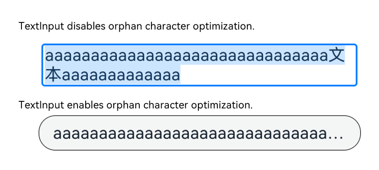

Orphan character optimization enabled:

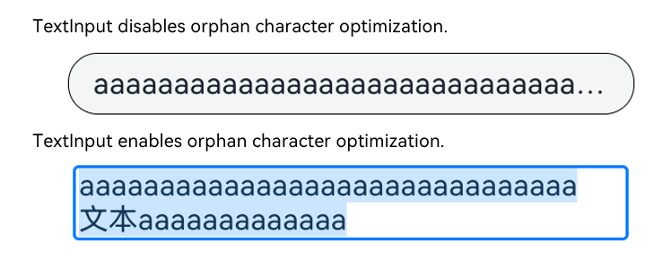

### Example 33 (Setting the Text Shader Effect)

This example uses the [shaderStyle](#shaderstyle) API to apply a shader effect to the text in the TextInput component.

The shaderStyle API is added since API version 26.0.0.

```ts
@Entry
@Component
struct ShaderColorStyle {
  @State message: string = 'Hello World';
  @State linearGradientOptions1: LinearGradientOptions =
    {
      angle: 45,
      colors: [[Color.Red, 0.0], [Color.Blue, 0.3], [Color.Green, 0.5]]
    };
  @State linearGradientOptions2: LinearGradientOptions =
    {
      direction: GradientDirection.LeftTop,
      colors: [[Color.Red, 0.0], [Color.Blue, 0.3], [Color.Green, 0.5]],
      repeating: true,
    };
  @State radialGradientOptions: RadialGradientOptions =
    {
      center: [50, 50],
      radius: 20,
      colors: [[Color.Red, 0.0], [Color.Blue, 0.3], [Color.Green, 0.5]],
      repeating: true,
    };
  @State colorShaderStyle: ColorShaderStyle =
    {
      color: Color.Blue
    };
  build() {
    Column({ space: 5 }) {
      Text('Linear gradient with an angle of 45°').fontSize(18).width('90%')
        .margin({ top: 40, left: 40 })
      TextInput({ text: this.message })
        .fontSize(20)
        .width('80%')
        .height(50)
        .shaderStyle(this.linearGradientOptions1)
      Text('Linear gradient with direction LeftTop').fontSize(18).width('90%')
        .margin({ top: 40, left: 40 })
      TextInput({ text: this.message })
        .fontSize(20)
        .width('80%')
        .height(50)
        .shaderStyle(this.linearGradientOptions2)
      Text('Radial gradient').fontSize(18).width('90%')
        .margin({ top: 40, left: 40 })
      TextInput({ text: this.message })
        .fontSize(20)
        .width('80%')
        .height(50)
        .shaderStyle(this.radialGradientOptions)
      Text('Solid color').fontSize(18).width('90%')
        .margin({ top: 40, left: 40 })
      TextInput({ text: this.message })
        .fontSize(20)
        .width('80%')
        .height(50)
        .shaderStyle(this.colorShaderStyle)
    }
  }
}
```


### Example 34 (Setting the AI Menu for Text Selection)

This example configures the AI menu for text selection through [enableSelectedDataDetector](#enableselecteddatadetector22).

Since API version 22, enableSelectedDataDetector is added.

```ts
@Entry
@Component
struct Demo34 {
  exampleText: string = 'Example URL: www.example.com';

  build() {
    Column() {
      Row() {
        TextInput({ text: this.exampleText })
          .copyOption(CopyOptions.LocalDevice)
          .enableSelectedDataDetector(true)
          .border({ width: 1, color: Color.Black })
          .height(300)
          .margin(10)
      }
    }
  }
}
```
<!--RP5--><!--RP5End-->

<!--no_check-->