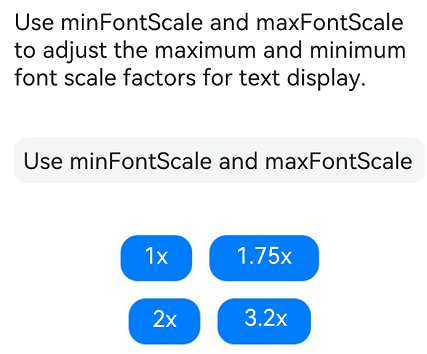
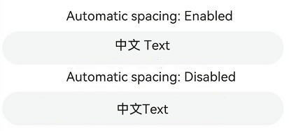

# TextInput
<!--Kit: ArkUI-->
<!--Subsystem: ArkUI-->
<!--Owner: @kangshihui-->
<!--Designer: @xiangyuan6-->
<!--Tester: @jiaoaozihao-->
<!--Adviser: @HelloCrease-->

The **TextInput** component provides single-line text input.

>  **NOTE**
>
>  This component is supported since API version 7. Updates will be marked with a superscript to indicate their earliest API version.
>
>  This component supports only single-line text input. If rich text input is required, you are advised to use the [RichEditor](ts-basic-components-richeditor.md) component.


## Child Components

Not supported


## APIs

TextInput(value?: TextInputOptions)

**Atomic service API**: This API can be used in atomic services since API version 11.

**System capability**: SystemCapability.ArkUI.ArkUI.Full

**Parameters**

| Name| Type| Mandatory| Description|
| ----- | ----- | ---- | ---- |
| value | [TextInputOptions](#textinputoptions) | No | Parameters of the **TextInput** component.|

## TextInputOptions

TextInput initialization parameters.

**Atomic service API**: This API can be used in atomic services since API version 11.

**System capability**: SystemCapability.ArkUI.ArkUI.Full

| Name| Type | Read-Only| Optional  | Description|
| ---- | ----- | ---- | ---- | ---- |
| placeholder             | [ResourceStr](ts-types.md#resourcestr)   | No   | Yes| Text displayed when there is no input.                            |
| text                    | [ResourceStr](ts-types.md#resourcestr)   | No   | Yes| Current text input.<br>You are advised to bind the state variable to the text in real time through the **onChange** event,<br>so as to prevent display errors when the component is updated.<br>Since API version 10, this parameter supports two-way binding through [$$](../../../ui/state-management/arkts-two-way-sync.md).<br>Since API version 18, this parameter supports two-way binding through [!!](../../../ui/state-management/arkts-new-binding.md#two-way-binding-between-built-in-component-parameters).|
| controller<sup>8+</sup> | [TextInputController](#textinputcontroller8) | No   | Yes| Text input controller.                         |

## Attributes

In addition to the [universal attributes](ts-component-general-attributes.md), the following attributes are supported.

>  **NOTE**   
>  When no underline is set, the default value of the universal attribute [padding](ts-universal-attributes-size.md#padding) is as follows:<br>{<br> top: '8vp',<br> right: '16vp',<br> bottom: '8vp',<br> left: '16vp'<br> } 
>  
>  When an underline is set, the default value of **padding** is as follows:<br>{<br> top: '12vp',<br> right: '0vp',<br> bottom: '12vp',<br> left: '0vp'<br> }
>
>  When padding is set to 0 for the text box, you can set [borderRadius](ts-universal-attributes-border.md#borderradius) to 0 to avoid the cursor being truncated. If the cursor is displayed abnormally at the edge of the text box, check whether the problem is caused by the padding or borderRadius attribute.
>
>  From API version 10, the width('auto') attribute can be set for a single-line text box to adapt the component width to the text width. The component width is restricted by the constraintSize attribute and the maximum and minimum widths transferred by the parent container. For details about other usage modes, see ts-universal-attributes-size.md.

### type

type(value: InputType)

Sets the text box type.

Different input types will bring up the corresponding keyboard and restrict the input.<!--RP4--><!--RP4End-->

**Atomic service API**: This API can be used in atomic services since API version 11.

**System capability**: SystemCapability.ArkUI.ArkUI.Full

**Parameters**

| Name| Type                           | Mandatory| Description                                     |
| ------ | ------------------------------- | ---- | ----------------------------------------- |
| value  | [InputType](#inputtype) | Yes  | Text box type.<br>Default value: **InputType.Normal**|

>  **NOTE**   
>  The password filling service requires a specific input box type.<!--RP2--><!--RP2End-->

### placeholderColor

placeholderColor(value: ResourceColor)

Sets the placeholder text color.

**Atomic service API**: This API can be used in atomic services since API version 11.

**System capability**: SystemCapability.ArkUI.ArkUI.Full

**Parameters**

| Name| Type                                      | Mandatory| Description                                        |
| ------ | ------------------------------------------ | ---- | -------------------------------------------- |
| value  | [ResourceColor](ts-types.md#resourcecolor) | Yes  | Placeholder text color.<br>The default value follows the theme.<br>Default value on wearables: '#99ffffff'|

### placeholderFont

placeholderFont(value?: Font)

Sets the placeholder text style, including the font size, font weight, font family, and font style.

**Atomic service API**: This API can be used in atomic services since API version 11.

**System capability**: SystemCapability.ArkUI.ArkUI.Full

**Parameters**

| Name| Type                    | Mandatory| Description                 |
| ------ | ------------------------ | ---- | --------------------- |
| value  | [Font](ts-types.md#font) | No  | Placeholder text style.<br>Default value on wearables: 18fp|

> **NOTE**
>
> You are advised to use [loadFontSync](../../apis-arkgraphics2d/js-apis-graphics-text.md#loadfontsync) to register custom fonts.

### enterKeyType

enterKeyType(value: EnterKeyType)

Sets the type of the Enter key.

**Atomic service API**: This API can be used in atomic services since API version 11.

**System capability**: SystemCapability.ArkUI.ArkUI.Full

**Parameters**

| Name| Type                                            | Mandatory| Description                                            |
| ------ | ------------------------------------------------ | ---- | ------------------------------------------------ |
| value  | [EnterKeyType](#enterkeytype) | Yes  | Type of the Enter key.<br>Default value: **EnterKeyType.Done**|

### caretColor

caretColor(value: ResourceColor)

Sets the color of the caret in the text box.

**Atomic service API**: This API can be used in atomic services since API version 11.

**System capability**: SystemCapability.ArkUI.ArkUI.Full

**Parameters**

| Name| Type                                      | Mandatory| Description                                  |
| ------ | ------------------------------------------ | ---- | -------------------------------------- |
| value  | [ResourceColor](ts-types.md#resourcecolor) | Yes  | Color of the caret in the text box.<br>Default value: **'#007DFF'**|

>  **NOTE**    
>   Since API version 12, this API can be used to set the text handle color, which is the same as the caret color.

### maxLength

maxLength(value: number)

Sets the maximum number of characters for text input.

**Atomic service API**: This API can be used in atomic services since API version 11.

**System capability**: SystemCapability.ArkUI.ArkUI.Full

**Parameters**

| Name| Type  | Mandatory| Description                                                        |
| ------ | ------ | ---- | ------------------------------------------------------------ |
| value  | number | Yes  | Maximum number of characters for text input.<br>Default value: **Infinity**, indicating that there is no upper limit on the number of characters that can be entered<br>**NOTE**<br>If this attribute is not set or is set to an invalid value, the default value is used. If a decimal number is specified, the integer part is used.|

### fontColor

fontColor(value: ResourceColor)

Sets the font color.

**Atomic service API**: This API can be used in atomic services since API version 11.

**System capability**: SystemCapability.ArkUI.ArkUI.Full

**Parameters**

| Name| Type                                      | Mandatory| Description      |
| ------ | ------------------------------------------ | ---- | ---------- |
| value  | [ResourceColor](ts-types.md#resourcecolor) | Yes  | Font color.<br>Default value for wearables: '#dbffffff'|

### fontSize

fontSize(value: Length)

Sets the font size.

**Atomic service API**: This API can be used in atomic services since API version 11.

**System capability**: SystemCapability.ArkUI.ArkUI.Full

**Parameters**

| Name| Type                        | Mandatory| Description                                                        |
| ------ | ---------------------------- | ---- | ------------------------------------------------------------ |
| value  | [Length](ts-types.md#length) | Yes  | Font size. If **fontSize** is of the number type, the unit fp is used. The default font size is 16 fp. The value cannot be a percentage.<br>The default value is 18 fp on wearables.|

### fontStyle

fontStyle(value: FontStyle)

Sets the font style.

**Atomic service API**: This API can be used in atomic services since API version 11.

**System capability**: SystemCapability.ArkUI.ArkUI.Full

**Parameters**

| Name| Type                                       | Mandatory| Description                                   |
| ------ | ------------------------------------------- | ---- | --------------------------------------- |
| value  | [FontStyle](ts-appendix-enums.md#fontstyle) | Yes  | Font style.<br>Default value: **FontStyle.Normal**|

### fontWeight

fontWeight(value: number | FontWeight | ResourceStr)

Sets the font weight. If the value is too large, the text may be clipped depending on the font.

**Atomic service API**: This API can be used in atomic services since API version 11.

**System capability**: SystemCapability.ArkUI.ArkUI.Full

**Parameters**

| Name| Type                                                        | Mandatory| Description                                                        |
| ------ | ------------------------------------------------------------ | ---- | ------------------------------------------------------------ |
| value  | number \| [FontWeight](ts-appendix-enums.md#fontweight) \| [ResourceStr](ts-types.md#resourcestr) | Yes  | Font weight. For the number type, the value range is [100, 900], at an interval of 100. The default value is **400**. A larger value indicates a heavier font weight. For the string type, only strings that represent a number, for example, **"400"**, and the following enumerated values of **FontWeight** are supported: **"bold"**, **"bolder"**, **"lighter"**, **"regular"**, and **"medium"**.<br>Default value: **FontWeight.Normal**<br>The Resource type is supported since API version 20.|

### fontFamily

fontFamily(value: ResourceStr)

Sets the font family.

**Atomic service API**: This API can be used in atomic services since API version 11.

**System capability**: SystemCapability.ArkUI.ArkUI.Full

**Parameters**

| Name| Type                                  | Mandatory| Description                                                        |
| ------ | -------------------------------------- | ---- | ------------------------------------------------------------ |
| value  | [ResourceStr](ts-types.md#resourcestr) | Yes  | Font family. Default font: **'HarmonyOS Sans'**<br>To specify multiple fonts, separate them with commas (,), and fonts are applied in priority order. Example: **'Arial, HarmonyOS Sans'**.<br>Currently, the application supports the HarmonyOS Sans font and custom fonts.<br>Only the 'HarmonyOS Sans' font is supported for widgets.|

> **NOTE**
>
> You are advised to use [loadFontSync](../../apis-arkgraphics2d/js-apis-graphics-text.md#loadfontsync) to register custom fonts.

### inputFilter<sup>8+</sup>

inputFilter(value: ResourceStr, error?: Callback\<string>)

Sets the regular expression for input filtering. Only inputs that comply with the regular expression can be displayed. Other inputs are filtered out.

For single-character input scenarios, only single-character matching is supported; for multi-character input scenarios (such as pasting), string matching is supported.<!--RP5--><!--RP5End-->

From API version 11, if inputFilter is set and the entered character is not empty, the text filtering effect of the [type](#type) API becomes invalid.

**Atomic service API**: This API can be used in atomic services since API version 11.

**System capability**: SystemCapability.ArkUI.ArkUI.Full

**Parameters**

| Name| Type                                  | Mandatory| Description                              |
| ------ | -------------------------------------- | ---- | ---------------------------------- |
| value  | [ResourceStr](ts-types.md#resourcestr) | Yes  | Regular expression.                      |
| error  | Callback\<string>                | No  | Filtered-out content to return when regular expression matching fails.|

### copyOption<sup>9+</sup>

copyOption(value: CopyOptions)

Sets whether copy and paste is allowed. If this attribute is set to **CopyOptions.None**:

Dragging is not allowed when **CopyOptions.None** is set.

**Atomic service API**: This API can be used in atomic services since API version 11.

**System capability**: SystemCapability.ArkUI.ArkUI.Full

**Parameters**

| Name| Type                                            | Mandatory| Description                                                        |
| ------ | ------------------------------------------------ | ---- | ------------------------------------------------------------ |
| value  | [CopyOptions](ts-appendix-enums.md#copyoptions9) | Yes  | Whether copy and paste is allowed.<br>Default value: **CopyOptions.LocalDevice**|

### showPasswordIcon<sup>9+</sup>

showPasswordIcon(value: boolean)

Sets whether to display the password icon at the end of the password text box.

**Atomic service API**: This API can be used in atomic services since API version 11.

**System capability**: SystemCapability.ArkUI.ArkUI.Full

**Parameters**

| Name| Type   | Mandatory| Description                                                       |
| ------ | ------- | ---- | ----------------------------------------------------------- |
| value  | boolean | Yes  | Whether to display the password icon at the end of the password text box.<br>**true** if enabled, **false** otherwise.<br>Default value: **true**|

### style<sup>9+</sup>

style(value: TextInputStyle  | TextContentStyle)

Sets the text input style. The inline input style only supports **InputType.Normal**.<br>For details about the text box types, see [type](#type).

**Atomic service API**: This API can be used in atomic services since API version 11.

**System capability**: SystemCapability.ArkUI.ArkUI.Full

**Parameters**

| Name| Type                                                        | Mandatory| Description                                                        |
| ------ | ------------------------------------------------------------ | ---- | ------------------------------------------------------------ |
| value  | [TextInputStyle](#textinputstyle9) \| [TextContentStyle](ts-appendix-enums.md#textcontentstyle10) | Yes  | Text input style.<br>Default value: **TextInputStyle.Default**|

### textAlign<sup>9+</sup>

textAlign(value: TextAlign)

Sets the horizontal alignment of the text.

Available options are **TextAlign.Start**, **TextAlign.Center**, and **TextAlign.End**. TextAlign.JUSTIFY is added since API version 11.

You can use the [align](ts-universal-attributes-location.md#align) attribute to control the vertical position of the text paragraph. The align attribute cannot be used to control the horizontal position of the text paragraph in this component.

- **Alignment.TopStart**, **Alignment.Top**, **Alignment.TopEnd**: Content aligns to the top.

- **Alignment.Start**, **Alignment.Center**, **Alignment.End**: Content is centered vertically.

- **Alignment.BottomStart**, **Alignment.Bottom**, **Alignment.BottomEnd:** Content aligns to the bottom.

**Atomic service API**: This API can be used in atomic services since API version 11.

**System capability**: SystemCapability.ArkUI.ArkUI.Full

**Parameters**

| Name| Type                                       | Mandatory| Description                                                      |
| ------ | ------------------------------------------- | ---- | ---------------------------------------------------------- |
| value  | [TextAlign](ts-appendix-enums.md#textalign) | Yes  | Horizontal alignment of the text.<br>Default value: **TextAlign.Start**|

>  **NOTE** 
>
>  **textAlign** only adjusts the overall text layout and does not affect character display order. For character display order adjustment, see [Bidirectional Text Layout and Alignment](../../../ui/arkts-internationalization.md#bidirectional-text-layout-and-alignment).

### selectedBackgroundColor<sup>10+</sup>

selectedBackgroundColor(value: ResourceColor)

Sets the background color of the selected text. If the opacity is not set, a 20% opacity will be used.

**Atomic service API**: This API can be used in atomic services since API version 11.

**System capability**: SystemCapability.ArkUI.ArkUI.Full

**Parameters**

| Name| Type                                      | Mandatory| Description                                      |
| ------ | ------------------------------------------ | ---- | ------------------------------------------ |
| value  | [ResourceColor](ts-types.md#resourcecolor) | Yes  | Background color of the selected text.|

### caretStyle<sup>10+</sup>

caretStyle(value: CaretStyle)

Sets the caret style.

**Atomic service API**: This API can be used in atomic services since API version 11.

**System capability**: SystemCapability.ArkUI.ArkUI.Full

**Parameters**

| Name| Type                               | Mandatory| Description        |
| ------ | ----------------------------------- | ---- | ------------ |
| value  | [CaretStyle](ts-text-common.md#caretstyle10) | Yes  | Caret style.|

>  **NOTE**
>
>   When both **caretColor** and the **color** parameter in **caretStyle** are configured, the last-set value takes precedence.
>     
>   Since API version 12, this API can be used to set the text handle color, which is the same as the caret color.

### caretPosition<sup>10+</sup>

caretPosition(value: number)

Sets the caret position.

**Atomic service API**: This API can be used in atomic services since API version 11.

**System capability**: SystemCapability.ArkUI.ArkUI.Full

**Parameters**

| Name| Type  | Mandatory| Description        |
| ------ | ------ | ---- | ------------ |
| value  | number | Yes  | Caret position.<br>The position before the first character is 0.|

### showUnit<sup>10+</sup>

showUnit(value: CustomBuilder)

Sets the unit displayed with the text box. This attribute effective only when [showUnderline](#showunderline10) is set to **true**.

**Atomic service API**: This API can be used in atomic services since API version 11.

**System capability**: SystemCapability.ArkUI.ArkUI.Full

**Parameters**

| Name| Type                                       | Mandatory| Description                          |
| ------ | ------------------------------------------- | ---- | ------------------------------ |
| value  | [CustomBuilder](ts-types.md#custombuilder8) | Yes  | Unit displayed with the text box.|

### showError<sup>10+</sup>

showError(value?: ResourceStr | undefined)

Sets the error message displayed when an error occurs.

If the data type is **ResourceStr** and the input content does not comply with specifications, the error message is displayed. If the error message does not fit in one line, an ellipsis (…) is displayed to represent clipped text. If the data type is **undefined**, no error message is displayed. For details, see [Example 2](#example-2-setting-underlines).

**Atomic service API**: This API can be used in atomic services since API version 11.

**System capability**: SystemCapability.ArkUI.ArkUI.Full

**Parameters**

| Name| Type                         | Mandatory| Description                                                        |
| ------ | ----------------------------- | ---- | ------------------------------------------------------------ |
| value  | [ResourceStr](ts-types.md#resourcestr) \| undefined | No  | Error message displayed when an error occurs.<br>By default, no error message is displayed.<br>On wearables, the font size is 13 fp and the alignment mode is center alignment.<br>**NOTE**<br>The Resource type is supported since API version 12.|

### showUnderline<sup>10+</sup>

showUnderline(value: boolean)

Sets whether to show an underline.

**Atomic service API**: This API can be used in atomic services since API version 11.

**System capability**: SystemCapability.ArkUI.ArkUI.Full

**Parameters**

| Name| Type   | Mandatory| Description                              |
| ------ | ------- | ---- | ---------------------------------- |
| value  | boolean | Yes  | Whether to show an underline.<br>**true** to enable, **false** otherwise.<br>Default value: **false**<br>By default, the underline comes in the color of **'#33182431'**, thickness of 1 px, and text box size of 48 vp. The underline is only available for the **InputType.Normal** type.|

### passwordIcon<sup>10+</sup>

passwordIcon(value: PasswordIcon)

Sets the password icon to display at the end of the password text box.

Images in JPG, PNG, BMP, HEIC, and WEBP formats are supported.

**Atomic service API**: This API can be used in atomic services since API version 11.

**System capability**: SystemCapability.ArkUI.ArkUI.Full

**Parameters**

| Name| Type                                   | Mandatory| Description                                                        |
| ------ | --------------------------------------- | ---- | ------------------------------------------------------------ |
| value  | [PasswordIcon](#passwordicon10) | Yes  | Password icon to display at the end of the password text box.<br>By default, the system-provided icon is used.<br>The icon size is fixed at 24 vp (or 28 vp on wearable devices), regardless of the source image size.|

### enableKeyboardOnFocus<sup>10+</sup>

enableKeyboardOnFocus(value: boolean)

Sets whether to bring up the keyboard when the **TextInput** component obtains focus in a way other than clicking.

Since API version 10, the **TextInput** component brings up the keyboard by default when it obtains focus.

**Atomic service API**: This API can be used in atomic services since API version 11.

**System capability**: SystemCapability.ArkUI.ArkUI.Full

**Parameters**

| Name| Type   | Mandatory| Description                                                       |
| ------ | ------- | ---- | ----------------------------------------------------------- |
| value  | boolean | Yes  | Whether to bring up the keyboard when the **TextInput** component obtains focus in a way other than clicking.<br>**true** to bring up the keyboard, **false** otherwise.<br>Default value: **true**|

### selectionMenuHidden<sup>10+</sup>

selectionMenuHidden(value: boolean)

Whether to hide the system text selection menu.

**Atomic service API**: This API can be used in atomic services since API version 11.

**System capability**: SystemCapability.ArkUI.ArkUI.Full

**Parameters**

| Name| Type   | Mandatory| Description                                                        |
| ------ | ------- | ---- | ------------------------------------------------------------ |
| value  | boolean | Yes  | Whether to hide the system text selection menu.<br>**true**: The system text selection menu is hidden under the following circumstances: clicking the text box cursor, long-pressing the text box, double-tapping the text box, triple-tapping the text box, or right-clicking the text box.<br>**false**: The system text selection menu is displayed under the following circumstances: clicking the text box cursor, long-pressing the text box, double-tapping the text box, triple-tapping the text box, or right-clicking the text box.<br>Default value: **false**|

### barState<sup>10+</sup>

barState(value: BarState)

Sets the scrollbar state when the inline input style is used.

**Atomic service API**: This API can be used in atomic services since API version 11.

**System capability**: SystemCapability.ArkUI.ArkUI.Full

**Parameters**

| Name| Type                                     | Mandatory| Description                                                        |
| ------ | ----------------------------------------- | ---- | ------------------------------------------------------------ |
| value  | [BarState](ts-appendix-enums.md#barstate) | Yes  | Scrollbar state when the inline input style is used.<br>Default value: **BarState.Auto**|

### maxLines<sup>10+</sup>

maxLines(value: number)

Sets the maximum number of lines that can be displayed when the inline input style is used.

**Atomic service API**: This API can be used in atomic services since API version 11.

**System capability**: SystemCapability.ArkUI.ArkUI.Full

**Parameters**

| Name| Type                                     | Mandatory| Description                                                        |
| ------ | ----------------------------------------- | ---- | ------------------------------------------------------------ |
| value  | number | Yes  | Maximum number of lines that can be displayed with the inline style in the editing state or with the non-inline style.<br>Default value: **3**<br>Value range: (0, +∞)|

### customKeyboard<sup>10+</sup>

customKeyboard(value: CustomBuilder, options?: KeyboardOptions)

Sets a custom keyboard.

When a custom keyboard is set, activating the text box opens the specified custom component, instead of the system input method.

The custom keyboard's height can be set through the **height** attribute of the custom component's root node, and its width is fixed at the default value.

The custom keyboard is presented by overlaying the original screen, which is not compressed or lifted if avoid mode is not enabled or avoidance is not needed for the text box.

The custom keyboard cannot obtain the focus, but it blocks gesture events.

By default, the custom keyboard is closed when the input component loses the focus. You can also use the [TextInputController](#textinputcontroller8).[stopEditing](#stopediting10) API to close the keyboard.

When setting a custom keyboard, you can bind the [onKeyPrelme](ts-universal-events-key.md#onkeypreime12) event to prevent input from the physical keyboard.

**Atomic service API**: This API can be used in atomic services since API version 11.

**System capability**: SystemCapability.ArkUI.ArkUI.Full

**Parameters**

| Name               | Type                                       | Mandatory| Description                                                        |
| --------------------- | ------------------------------------------- | ---- | ------------------------------------------------------------ |
| value                 | [CustomBuilder](ts-types.md#custombuilder8) | Yes  | Custom keyboard.<br>**Atomic service API**: This API can be used in atomic services since API version 11.|
| options<sup>12+</sup> | [KeyboardOptions](ts-basic-components-richeditor.md#keyboardoptions12)       | No  | Whether to support keyboard avoidance.                            |

### enableAutoFill<sup>11+</sup>

enableAutoFill(value: boolean)

Sets whether to enable autofill.

**Atomic service API**: This API can be used in atomic services since API version 12.

**System capability**: SystemCapability.ArkUI.ArkUI.Full

**Parameters**

| Name| Type   | Mandatory| Description                                                        |
| ------ | ------- | ---- | ------------------------------------------------------------ |
| value  | boolean | Yes  | Whether to enable autofill.<br>**true**: enable<br>**false**: disable<br><br>Default value: **true**|

### passwordRules<sup>11+</sup>

passwordRules(value: string)

Rules for generating passwords. When autofill is used, these rules are transparently transmitted to Password Vault for generating a new password.<!--RP1--><!--RP1End-->

**Atomic service API**: This API can be used in atomic services since API version 12.

**System capability**: SystemCapability.ArkUI.ArkUI.Full

**Parameters**

| Name| Type  | Mandatory| Description                |
| ------ | ------ | ---- | -------------------- |
| value  | string | Yes  | Rules for generating passwords.|

### cancelButton<sup>11+</sup>

cancelButton(options: CancelButtonOptions)

Sets the style of the cancel button on the right. This attribute is not available for the inline input style.

**Atomic service API**: This API can be used in atomic services since API version 12.

**System capability**: SystemCapability.ArkUI.ArkUI.Full

**Parameters**

| Name| Type                                                        | Mandatory| Description                                                        |
| ------ | ------------------------------------------------------------ | ---- | ------------------------------------------------------------ |
| options  | [CancelButtonOptions](ts-basic-components-search.md#cancelbuttonoptions12) | Yes  | Options of the cancel button on the right.<br>Default value:<br>{<br>style: CancelButtonStyle.INPUT<br>}<br>Default value on wearable devices: **28vp**.|

### selectAll<sup>11+</sup>

selectAll(value: boolean)

Sets whether to select all text in the initial state. This attribute is not available for the inline input style.

**Atomic service API**: This API can be used in atomic services since API version 12.

**System capability**: SystemCapability.ArkUI.ArkUI.Full

**Parameters**

| Name| Type   | Mandatory| Description                             |
| ------ | ------- | ---- | --------------------------------- |
| value  | boolean | Yes  | Whether to select all text in the initial state.<br>**true**: Select all text in the initial state. **false**: Do not select all text in the initial state.<br>Default value: **false**|

### showCounter<sup>11+</sup>

showCounter(value: boolean, options?: InputCounterOptions)

Sets the character counter displayed when the number of characters entered exceeds the threshold.

If value is set to true, options can be set. The text box enables the subscript function of the character counter, which must be used together with [maxLength](#maxlength). The character counter is displayed in this format: Number of characters entered/Character limit.

It is visible when the number of characters entered is greater than the character limit multiplied by the threshold percentage value. If **options** is not set, the text box border and character counter subscript turn red when the number of characters entered exceeds the limit. If **value** is set to **true** and [InputCounterOptions](ts-universal-attributes-text-style.md#inputcounteroptions11) is set, the text box border and character counter subscript turn red and the text box shakes when the number of characters entered reaches the limit, provided that the value of **thresholdPercentage** is valid. If **highlightBorder** is set to **false**, the text box border does not turn red. By default, **highlightBorder** is set to **true**.

The character counter is not displayed for text boxes in inline or password input style.

**Atomic service API**: This API can be used in atomic services since API version 11.

**System capability**: SystemCapability.ArkUI.ArkUI.Full

**Parameters**

| Name               | Type                                                 | Mandatory| Description            |
| --------------------- | ----------------------------------------------------- | ---- | ---------------- |
| value                 | boolean                                               | Yes  | Whether to display the character counter.<br>**true** to display, **false** otherwise.|
| options | [InputCounterOptions](ts-universal-attributes-text-style.md#inputcounteroptions11) | No  | Configuration options for the character counter.|

### contentType<sup>12+</sup>

contentType(value: ContentType)

Sets the content type for autofill.

**Atomic service API**: This API can be used in atomic services since API version 12.

**System capability**: SystemCapability.ArkUI.ArkUI.Full

**Parameters**

| Name| Type                                 | Mandatory| Description          |
| ------ | ------------------------------------- | ---- | -------------- |
| value  | [ContentType](#contenttype12) | Yes  | Content type for autofill.|

### underlineColor<sup>12+</sup>

underlineColor(value: ResourceColor|UnderlineColor|undefined)

Sets the color of the underline.

When [showUnderline](#showunderline10) is enabled, the underline color can be configured.

**Atomic service API**: This API can be used in atomic services since API version 12.

**System capability**: SystemCapability.ArkUI.ArkUI.Full

**Parameters**

| Name| Type                                                        | Mandatory| Description                                                        |
| ------ | ------------------------------------------------------------ | ---- | ------------------------------------------------------------ |
| value  | [ResourceColor](ts-types.md#resourcecolor) \| [UnderlineColor](#underlinecolor12) \| undefined | Yes  | Color of the underline.<br>The underline color changes with the underline mode. If the underline color is only set for the normal state, you can directly enter a value of the ResourceColor type. If the value specified is **undefined**, **null**, or invalid, all underlines are restored to the default value.<br>Default value: underline color configured for the theme, The default underline color configured in the theme is #33182431.|

### lineHeight<sup>12+</sup>

lineHeight(value: number | string | Resource)

Sets the text line height.

If the value is less than or equal to **0**, the line height is unrestricted and adapts to the font size. When the value is a number, the unit is fp. For the string type, numeric string values with optional units, for example, **"10"** or **"10fp"**, are supported.

**Atomic service API**: This API can be used in atomic services since API version 12.

**System capability**: SystemCapability.ArkUI.ArkUI.Full

**Parameters**

| Name| Type                                                        | Mandatory| Description            |
| ------ | ------------------------------------------------------------ | ---- | ---------------- |
| value  | number \| string \| [Resource](ts-types.md#resource) | Yes  | Text line height.|

>  **NOTE**
>  
>  If certain characters have significantly taller glyphs than others on the same line, layout anomalies such as clipping, overlap, or misalignment may occur. In this case, adjust component attributes such as height and line height to ensure proper layout rendering.
### decoration<sup>12+</sup>

decoration(value: TextDecorationOptions)

Sets the color, type, and style of the text decorative line. This attribute does not take effect for the password input mode.

**Atomic service API**: This API can be used in atomic services since API version 12.

**System capability**: SystemCapability.ArkUI.ArkUI.Full

**Parameters**

| Name| Type                                                        | Mandatory| Description                                                        |
| ------ | ------------------------------------------------------------ | ---- | ------------------------------------------------------------ |
| value  | [TextDecorationOptions](ts-universal-attributes-text-style.md#textdecorationoptions12) | Yes  | Text decorative line options.<br>Default value: {<br> type: TextDecorationType.None,<br> color: Color.Black,<br> style: TextDecorationStyle.SOLID <br>} |

>  **NOTE**
>
>  When the bottom contour of a character intersects with the decoration, underline avoidance is triggered, commonly affecting characters like "g", "j", "y", "q", and "p."
>
>  If the decoration color is set to **Color.Transparent**, it inherits the text color of the first character in each line. If the decoration color is set to **"#00FFFFFF"**, the line becomes fully transparent.

### letterSpacing<sup>12+</sup>

letterSpacing(value: number | string | Resource)

Sets the letter spacing for a text style. If the value specified is a percentage or 0, the default value is used. For the string type, numeric string values with optional units, for example, **"10"** or **"10fp"**, are supported.

If the value specified is a negative value, the text is compressed. A negative value too small may result in the text being compressed to 0 and no content being displayed.

This setting applies to every character, including those at line endings.

**Atomic service API**: This API can be used in atomic services since API version 12.

**System capability**: SystemCapability.ArkUI.ArkUI.Full

**Parameters**

| Name| Type                      | Mandatory| Description          |
| ------ | -------------------------- | ---- | -------------- |
| value  | number \| string \| [Resource](ts-types.md#resource) | Yes  | Letter spacing.<br>Unit: [fp](ts-pixel-units.md)|

### fontFeature<sup>12+</sup>

fontFeature(value: string)

Sets the font feature, for example, monospaced digits.

Format: normal \| \<feature-tag-value\>

Format of **\<feature-tag-value\>**: \<string\> \[ \<integer\> \| on \| off ]

There can be multiple **\<feature-tag-value\>** values, which are separated by commas (,).

For example, the input format for monospaced clock fonts is "ss01" on.

**Atomic service API**: This API can be used in atomic services since API version 12.

**System capability**: SystemCapability.ArkUI.ArkUI.Full

**Parameters**

| Name| Type  | Mandatory| Description          |
| ------ | ------ | ---- | -------------- |
| value  | string | Yes  | Font feature.|

For details about the supported font features, see [Font Feature List](ts-basic-components-text.md#fontfeature12).
Font features are advanced typographic features, such as ligatures and monospace, for OpenType fonts. They are typically used in custom fonts and require the support of the font itself.
For more information about the font features, see [Low-level font feature settings control: the font-feature-settings property](https://www.w3.org/TR/css-fonts-3/#font-feature-settings-prop) and [The Complete CSS Demo for OpenType Features](https://sparanoid.com/lab/opentype-features/).

>  **NOTE**
>  This attribute is not available when **type** is set to an enum value that indicates the password input mode, such as Password, **NEW_PASSWORD**, or **NUMBER_PASSWORD**.

### wordBreak<sup>12+</sup>

wordBreak(value: WordBreak)

Sets the word break rule. This attribute is effective for the inline input style, but does not apply to the placeholder text.

**Atomic service API**: This API can be used in atomic services since API version 12.

**System capability**: SystemCapability.ArkUI.ArkUI.Full

**Parameters**

| Name| Type                                         | Mandatory| Description                                         |
| ------ | --------------------------------------------- | ---- | --------------------------------------------- |
| value  | [WordBreak](ts-appendix-enums.md#wordbreak11) | Yes  | Word break rule in the inline input style.<br>Default value: **WordBreak.BREAK_WORD**|

>  **NOTE**
>
>  The component does not support the **clip** attribute. Therefore, setting this attribute does not affect text clipping.

### textOverflow<sup>12+</sup>

textOverflow(value: TextOverflow)

Sets the display mode when the text is too long. This attribute is only available for the inline input style.

Text is clipped at the transition between words. To clip text in the middle of a word, set **wordBreak** to **WordBreak.BREAK_ALL**.

When overflow is set to TextOverflow.None, the effect is the same as that when overflow is set to TextOverflow.Clip.

**Atomic service API**: This API can be used in atomic services since API version 12.

**System capability**: SystemCapability.ArkUI.ArkUI.Full

**Parameters**

| Name| Type                                                         | Mandatory| Description                                                                                               |
| ------ | ------------------------------------------------------------ | ---- | -------------------------------------------------------------------------------------------------- |
| value  | [TextOverflow](ts-appendix-enums.md#textoverflow)            | Yes  | Display mode when the text is too long.<br>Default value in non-editing state in the inline input style: **TextOverflow.Ellipsis**<br>Default value in editing state in the inline input style: **TextOverflow.Clip**<br>For details about the inline mode, see [style](#style9).                    |

>  **NOTE** 
>   The TextOverflow.MARQUEE mode is not supported for the TextInput component. When the TextOverflow.MARQUEE mode is set, the inline mode is displayed as TextOverflow.Ellipsis in non-editing state and TextOverflow.Clip in editing state and non-inline mode.
>
>  If the inline mode is not set, the default style is used. If textOverflow is set, the setting does not take effect.

### textIndent<sup>12+</sup>

textIndent(value: Dimension)

Sets the indent of the first line text.

**Atomic service API**: This API can be used in atomic services since API version 12.

**System capability**: SystemCapability.ArkUI.ArkUI.Full

**Parameters**

| Name| Type                                 | Mandatory| Description                        |
| ------ | ------------------------------------ | ---- | ---------------------------- |
| value  | [Dimension](ts-types.md#dimension10) | Yes  | Indent of the first line text.<br>Default value: **0**|

### minFontSize<sup>12+</sup>

minFontSize(value: number | string | Resource)

Sets the minimum font size. For the string type, numeric string values with optional units, for example, **"10"** or **"10fp"**, are supported.

For the setting to take effect, this attribute must be used together with [maxFontSize](#maxfontsize12) and [maxLines](#maxlines10) (when the component is in editing state in the inline input style), or layout constraint settings.

When the adaptive font size is used, the **fontSize** settings do not take effect.

If the value of **minFontSize** is less than or equal to 0, the adaptive font sizing feature is disabled. In such cases, the [fontSize](#fontsize) attribute is used instead. If **fontSize** is not explicitly set, its default value will apply.

**Atomic service API**: This API can be used in atomic services since API version 12.

**System capability**: SystemCapability.ArkUI.ArkUI.Full

**Parameters**

| Name| Type                                                        | Mandatory| Description              |
| ------ | ------------------------------------------------------------ | ---- | ------------------ |
| value  | number \| string \| [Resource](ts-types.md#resource) | Yes  | Minimum font size.<br>Unit: [fp](ts-pixel-units.md)|

### maxFontSize<sup>12+</sup>

maxFontSize(value: number | string | Resource)

Sets the maximum font size. For the string type, numeric string values with optional units, for example, **"10"** or **"10fp"**, are supported.

For the setting to take effect, this attribute must be used together with [minFontSize](#minfontsize12) and [maxLines](#maxlines10) (when the component is in editing state in the inline input style), or layout constraint settings.

When the adaptive font size is used, the **fontSize** settings do not take effect.

If the value of **maxFontSize** is less than or equal to 0 or is less than the value of **minFontSize**, the adaptive font sizing feature is disabled. In such cases, the [fontSize](#fontsize) attribute is used instead. If **fontSize** is not explicitly set, its default value will apply.

**Atomic service API**: This API can be used in atomic services since API version 12.

**System capability**: SystemCapability.ArkUI.ArkUI.Full

**Parameters**

| Name| Type                                                        | Mandatory| Description              |
| ------ | ------------------------------------------------------------ | ---- | ------------------ |
| value  | number \| string \| [Resource](ts-types.md#resource) | Yes  | Maximum font size.<br>Unit: [fp](ts-pixel-units.md)|

### heightAdaptivePolicy<sup>12+</sup>

heightAdaptivePolicy(value: TextHeightAdaptivePolicy)

Sets how the adaptive height is determined for the text in the inline input style.

When this attribute is set to **TextHeightAdaptivePolicy.MAX_LINES_FIRST**, the [maxLines](#maxlines10) attribute takes precedence for adjusting the text height. If the **maxLines** setting results in a layout beyond the layout constraints, the text will shrink to a font size between [minFontSize](#minfontsize12) and [maxFontSize](#maxfontsize12) to allow for more content to be shown.

If this attribute is set to **TextHeightAdaptivePolicy.MIN_FONT_SIZE_FIRST**, the **minFontSize** attribute takes precedence for adjusting the text height. If the text can fit in one line with the **minFontSize** setting, the text will enlarge to the largest possible font size between **minFontSize** and **maxFontSize**.

**TextHeightAdaptivePolicy.LAYOUT_CONSTRAINT_FIRST** produces the same effect as **TextHeightAdaptivePolicy.MIN_FONT_SIZE_FIRST**.

When the component is in the non-inline input style, the three values of **TextHeightAdaptivePolicy** have the same effect, that is, the text will shrink to a font size between **minFontSize** and **maxFontSize** to allow for more content to be shown.

>  **NOTE**
>
>  If the text box is in inline input style, the font size in the editing state is different from that in the non-editing state.

**Atomic service API**: This API can be used in atomic services since API version 12.

**System capability**: SystemCapability.ArkUI.ArkUI.Full

**Parameters**

| Name| Type                                                        | Mandatory| Description                                                        |
| ------ | ------------------------------------------------------------ | ---- | ------------------------------------------------------------ |
| value  | [TextHeightAdaptivePolicy](ts-appendix-enums.md#textheightadaptivepolicy10) | Yes  | How the adaptive height is determined for the text.<br>Default value: **TextHeightAdaptivePolicy.MAX_LINES_FIRST**|

### showPassword<sup>12+</sup>

showPassword(visible: boolean)

Sets whether to show the password.

This API has effect only when the [input type](#inputtype) is set to **Password**, **NEWPASSWORD**, or **NUMBERPASSWORD** mode. It does not work in other modes.

When in password mode, there may be inconsistency between the backend state of the text box and the frontend application's state management variables. This can cause issues with the icon at the end of the password text box. To avoid such issues, use the [onSecurityStateChange](#onsecuritystatechange12) callback to sync the states. For details, see [Example 1](#example-1-setting-and-obtaining-the-cursor-position).

**Atomic service API**: This API can be used in atomic services since API version 12.

**System capability**: SystemCapability.ArkUI.ArkUI.Full

**Parameters**

| Name| Type                                                        | Mandatory| Description                                                        |
| ------ | ------------------------------------------------------------ | ---- | ------------------------------------------------------------ |
| visible  | boolean | Yes | Whether to show the password.<br>The value true indicates that the password is displayed, and the value false indicates that the password is not displayed.<br>Default value: **false**|

### lineBreakStrategy<sup>12+</sup>

lineBreakStrategy(strategy: LineBreakStrategy)

Sets the line break rule. This attribute takes effect when **wordBreak** is not set to **breakAll**. Hyphens are not supported.

**Atomic service API**: This API can be used in atomic services since API version 12.

**System capability**: SystemCapability.ArkUI.ArkUI.Full

**Parameters**

| Name  | Type                                                        | Mandatory| Description                                                        |
| -------- | ------------------------------------------------------------ | ---- | ------------------------------------------------------------ |
| strategy | [LineBreakStrategy](ts-appendix-enums.md#linebreakstrategy12) | Yes  | Line break rule.<br>Default value: **LineBreakStrategy.GREEDY**<br>**NOTE**<br>This attribute takes effect only when inline mode is set.|

### editMenuOptions<sup>12+</sup>

editMenuOptions(editMenu: EditMenuOptions)

Sets the extended options of the custom context menu on selection, including the text content, icon, and callback.

When [disableMenuItems](../arkts-apis-uicontext-textmenucontroller.md#disablemenuitems20) or [disableSystemServiceMenuItems](../arkts-apis-uicontext-textmenucontroller.md#disablesystemservicemenuitems20) is used to disable system service menu items in the context menu on selection, the disabled menu options will be excluded from the parameter list in the [onCreateMenu](./ts-text-common.md#oncreatemenu12) callback of **editMenuOptions**.

**Atomic service API**: This API can be used in atomic services since API version 12.

**System capability**: SystemCapability.ArkUI.ArkUI.Full

**Parameters**

| Name| Type                                         | Mandatory| Description                                         |
| ------ | --------------------------------------------- | ---- | --------------------------------------------- |
| editMenu  | [EditMenuOptions](ts-text-common.md#editmenuoptions) | Yes  | Extended options of the custom context menu on selection.|

### enablePreviewText<sup>12+</sup>

enablePreviewText(enable: boolean)

Sets whether to enable preview text.

Pre-displayed content is defined as the temporary text storage state. Currently, the text interception function is not supported.

**Atomic service API**: This API can be used in atomic services since API version 12.

**System capability**: SystemCapability.ArkUI.ArkUI.Full

**Parameters**

| Name| Type   | Mandatory| Description                              |
| ------ | ------- | ---- | ---------------------------------- |
| enable | boolean | Yes  | Whether to enable preview text.<br>**true**: Enable preview text. **false**: Disable preview text. <br>Default value: **true**|

>  **NOTE**
>  
>  Preview text represents a temporary, uncommitted input state. This feature requires support from the input method with pre-commit text functionality enabled. During text entry, when candidate words have not been confirmed yet, the text box displays marked text in a provisional state. For example, when typing Chinese using Pinyin input, the Pinyin letters appear in the input box before selecting from the candidate word list. This intermediate state constitutes preview text.

### enableHapticFeedback<sup>13+</sup>

enableHapticFeedback(isEnabled: boolean)

Specifies whether to enable haptic feedback.

**Atomic service API**: This API can be used in atomic services since API version 13.

**System capability**: SystemCapability.ArkUI.ArkUI.Full

**Parameters**

| Name| Type   | Mandatory| Description                              |
| ------ | ------- | ---- | ---------------------------------- |
| isEnabled | boolean | Yes  | Whether to enable haptic feedback.<br>The value **true** means to enable haptic feedback, and **false** means the opposite.<br>Default value: **true**|

>  **NOTE**
>
>  To enable haptic feedback, you must declare the ohos.permission.VIBRATE permission under **requestPermissions** in the **module.json5** file of the project.
> ```json
> "requestPermissions": [
>  {
>     "name": "ohos.permission.VIBRATE",
>  }
> ]
> ```

### autoCapitalizationMode<sup>20+</sup>

autoCapitalizationMode(mode: AutoCapitalizationMode)

Sets the auto-capitalization text mode. This API provides the capability, but actual implementation depends on the input method application.

**Atomic service API**: This API can be used in atomic services since API version 20.

**System capability**: SystemCapability.ArkUI.ArkUI.Full

**Parameters**

| Name  | Type                                     | Mandatory| Description                      |
| -------- | ----------------------------------------- | ---- | -------------------------- |
| mode | [AutoCapitalizationMode](ts-text-common.md#autocapitalizationmode20) | Yes  | Auto-capitalization mode. The default state is inactive.|

### keyboardAppearance<sup>15+</sup>

keyboardAppearance(appearance: Optional\<KeyboardAppearance>)

Sets the appearance of the keyboard when the text box is focused.

**Atomic service API**: This API can be used in atomic services since API version 15.

**System capability**: SystemCapability.ArkUI.ArkUI.Full

**Parameters**

| Name| Type| Mandatory| Description|
| ------ | ----------------------------------------- | ---- | ------------------------------------------------------ |
| appearance | [Optional](ts-universal-attributes-custom-property.md#optionalt12)\<[KeyboardAppearance](ts-text-common.md#keyboardappearance15)> | Yes  | Appearance of the keyboard.<br>Default value: **KeyboardAppearance.NONE_IMMERSIVE**|

### strokeWidth<sup>20+</sup>

strokeWidth(width: Optional\<LengthMetrics>)

Sets the text stroke width.

**Atomic service API**: This API can be used in atomic services since API version 20.

**System capability**: SystemCapability.ArkUI.ArkUI.Full

**Parameters**

| Name| Type                                                        | Mandatory| Description            |
| ------ | ------------------------------------------------------------ | ---- | ---------------- |
| width  | [Optional](ts-universal-attributes-custom-property.md#optionalt12)\<[LengthMetrics](../js-apis-arkui-graphics.md#lengthmetrics12)> | Yes  | Text stroke width. When the unit of **LengthMetrics** is **px**:<br>Values < 0: solid text. Values > 0: outlined text.<br>Default value: **0** (no stroke).|

### strokeColor<sup>20+</sup>

strokeColor(color: Optional\<ResourceColor>)

Sets the text stroke color.

**Atomic service API**: This API can be used in atomic services since API version 20.

**System capability**: SystemCapability.ArkUI.ArkUI.Full

**Parameters**

| Name| Type                                      | Mandatory| Description      |
| ------ | ------------------------------------------ | ---- | ---------- |
| color  | [Optional](ts-universal-attributes-custom-property.md#optionalt12)\<[ResourceColor](ts-types.md#resourcecolor)> | Yes  | Stroke color. Default value: font color. Invalid values are treated as the default value.|

### stopBackPress<sup>15+</sup>

stopBackPress(isStopped: Optional\<boolean>)

Sets whether to block the back button.

**Atomic service API**: This API can be used in atomic services since API version 15.

**System capability**: SystemCapability.ArkUI.ArkUI.Full

**Parameters**

| Name| Type                                               | Mandatory| Description                                     |
| ------ | --------------------------------------------------- | ---- | ----------------------------------------- |
| isStopped  | [Optional](ts-universal-attributes-custom-property.md#optionalt12)\<boolean> | Yes  | Whether to prevent the back button press from being propagated to other components or applications.<br>**true** to prevent, **false** otherwise.<br>Default value: **true**. If an invalid value is set, the default value is used.|

### halfLeading<sup>18+</sup>

halfLeading(halfLeading: Optional\<boolean>)

Sets whether to vertically center the text in a line and evenly distribute the line spacing to the top and bottom of the line.

**Atomic service API**: This API can be used in atomic services since API version 18.

**System capability**: SystemCapability.ArkUI.ArkUI.Full

**Parameters**

| Name| Type                                         | Mandatory| Description                                         |
| ------ | --------------------------------------------- | ---- | --------------------------------------------- |
| halfLeading | [Optional](ts-universal-attributes-custom-property.md#optionalt12)\<boolean> | Yes | Whether to vertically center the text.<br>Whether half leading is enabled. Half leading is the leading split in half and applied equally to the top and bottom edges. The value **true** means that half leading is enabled, and **false** means the opposite.<br>Default value: **false**|

### minFontScale<sup>18+</sup>

minFontScale(scale: Optional\<number | Resource>)

Sets the minimum font scale factor for text.

**Atomic service API**: This API can be used in atomic services since API version 18.

**System capability**: SystemCapability.ArkUI.ArkUI.Full

**Parameters**

| Name| Type                                         | Mandatory| Description                                         |
| ------ | --------------------------------------------- | ---- | --------------------------------------------- |
| scale  | [Optional](ts-universal-attributes-custom-property.md#optionalt12)\<number \| [Resource](ts-types.md#resource)> | Yes  | Minimum font scale factor for text. The **undefined** type is supported.<br>Value range: [0, 1]<br>**NOTE**<br>A value less than 0 is handled as 0. A value greater than 1 is handled as 1. Abnormal values are ineffective by default.<br>Before use, the **configuration.json** file and **app.json5** file must be configured in the project. For details, see [Example 18: Setting the Minimum and Maximum Font Scale Factors](#example-18-setting-the-minimum-and-maximum-font-scale-factors).|

### maxFontScale<sup>18+</sup>

maxFontScale(scale: Optional\<number | Resource>)

Sets the maximum font scale factor for text.

**Atomic service API**: This API can be used in atomic services since API version 18.

**System capability**: SystemCapability.ArkUI.ArkUI.Full

**Parameters**

| Name| Type                                         | Mandatory| Description                                         |
| ------ | --------------------------------------------- | ---- | --------------------------------------------- |
| scale  | [Optional](ts-universal-attributes-custom-property.md#optionalt12)\<number \| [Resource](ts-types.md#resource)> | Yes  | Maximum font scale factor for text. The **undefined** type is supported.<br>Value range: [1, +∞)<br>**NOTE**<br>A value less than 1 is handled as 1. Abnormal values are ineffective by default.<br>After the maxFontScale attribute is set, the showError attribute can be enlarged to twice at most.<br>Before use, the **configuration.json** file and **app.json5** file must be configured in the project. For details, see [Example 18: Setting the Minimum and Maximum Font Scale Factors](#example-18-setting-the-minimum-and-maximum-font-scale-factors).|

### cancelButton<sup>18+</sup>

cancelButton(symbolOptions: CancelButtonSymbolOptions)

Sets the style of the cancel button on the right. This attribute is not available for the inline input style.

**Atomic service API**: This API can be used in atomic services since API version 18.

**System capability**: SystemCapability.ArkUI.ArkUI.Full

**Parameters**

| Name| Type                                                        | Mandatory| Description                                                        |
| ------ | ------------------------------------------------------------ | ---- | ------------------------------------------------------------ |
| symbolOptions  | [CancelButtonSymbolOptions](ts-basic-components-search.md#cancelbuttonsymboloptions12) | Yes  | Style of the cancel button on the right.<br>Default value:<br>{<br>style: CancelButtonStyle.INPUT<br>} |

### ellipsisMode<sup>18+</sup>

ellipsisMode(mode: Optional\<EllipsisMode>)

Sets the ellipsis position. The ellipsisMode attribute takes effect only in inline mode and must be used with overflow set to TextOverflow.Ellipsis. If ellipsisMode is set separately, it does not take effect.

When the text is not in the editing state, the ellipsisMode attribute takes effect. When the text is in the editing state, EllipsisMode.START and EllipsisMode.CENTER take effect only when maxLines is set to 1, and EllipsisMode.END takes effect.

**Atomic service API**: This API can be used in atomic services since API version 18.

**System capability**: SystemCapability.ArkUI.ArkUI.Full

**Parameters**

| Name| Type                                               | Mandatory| Description                                     |
| ------ | --------------------------------------------------- | ---- | ----------------------------------------- |
| mode  | [Optional](ts-universal-attributes-custom-property.md#optionalt12)\<[EllipsisMode](ts-appendix-enums.md#ellipsismode11)> | Yes  | Ellipsis position.<br>Default value: **EllipsisMode.END**|

### enableAutoFillAnimation<sup>20+</sup>

enableAutoFillAnimation(enabled: Optional\<boolean>)

Sets whether to enable the autofill animation.

**Atomic service API**: This API can be used in atomic services since API version 20.

**System capability**: SystemCapability.ArkUI.ArkUI.Full

**Parameters**

| Name| Type   | Mandatory| Description                                                        |
| ------ | ------- | ---- | ------------------------------------------------------------ |
| enabled  | [Optional](ts-universal-attributes-custom-property.md#optionalt12)\<boolean> | Yes  | Whether to enable the auto-fill animation.<br>**true**: enable<br>**false**: disable<br><br>Default value: **true**<br>**NOTE**<br>After this function is enabled, the animation takes effect only when the input mode (specified by #inputtype) is set to Password, NEW_PASSWORD, or NUMBER_PASSWORD. |

### enableAutoSpacing<sup>20+</sup>

enableAutoSpacing(enabled: Optional\<boolean>)

Sets whether to enable automatic spacing between Chinese and Western characters.

**Atomic service API**: This API can be used in atomic services since API version 20.

**System capability**: SystemCapability.ArkUI.ArkUI.Full

**Parameters**

| Name| Type   | Mandatory| Description                              |
| ------ | ------- | ---- | ---------------------------------- |
| enabled | [Optional](ts-universal-attributes-custom-property.md#optionalt12)\<boolean> | Yes  | Whether to enable automatic spacing between Chinese and Western characters.<br>**true** to enable, **false** otherwise.<br>Default value: **false**|

## InputType

**System capability**: SystemCapability.ArkUI.ArkUI.Full

| Name                         |  Value  | Description                      |
| ----------------------------- | ----- | --------------------------- |
| Normal                        | - | Normal input mode. In this mode, there is no special restriction on the input characters.<br>Inline input style supports only the InputType.Normal type.<br>**Atomic service API**: This API can be used in atomic services since API version 11.|
| Password                      | - | Password input mode.<br>An eye icon is used to show or hide the password. By default, the entered characters are temporarily shown before being obscured by dots; they are directly obscured by dots since API version 12 on certain devices. The password input mode does not support underlines. If Password Vault is enabled, autofill is available for the username and password.<br>**Atomic service API**: This API can be used in atomic services since API version 11.|
| Email                         | - | Email address input mode.<br>This mode accepts only digits, letters, underscores (_), dots (.), and the following special characters: ! # $ % & ' " * + - / = ? ^ ` \{ \| \} ~ @ (which can only appear once)<br>**Atomic service API**: This API can be used in atomic services since API version 11.|
| Number                        | - | Digit input mode.<br>Negative numbers and decimals are not supported.<br>**Atomic service API**: This API can be used in atomic services since API version 11.|
| PhoneNumber<sup>9+</sup>      | - | Phone number input mode.<br>In this mode, the following are allowed: digits, spaces, plus signs (+), hyphens (-), asterisks (*), and number signs (#); the length is not limited.<br>**Atomic service API**: This API can be used in atomic services since API version 11.|
| NUMBER_PASSWORD<sup>11+</sup> | 8 | Numeric password input mode.<br>An eye icon is used to show or hide the password. By default, the entered characters are temporarily shown before being obscured by dots; they are directly obscured by dots since API version 12 on certain devices. The password input mode does not support underlines. If Password Vault is enabled, autofill is available for the username and password.<br>**Atomic service API**: This API can be used in atomic services since API version 12.|
| USER_NAME<sup>11+</sup>       | 10 | User name input mode. There is no special restriction.<br>If Password Vault is enabled, autofill is available for the username and password.<br>**Atomic service API**: This API can be used in atomic services since API version 12.|
| NEW_PASSWORD<sup>11+</sup>    | 11 | New password input mode. There is no special restriction.<br>An eye icon is used to show or hide the password. By default, the entered characters are temporarily shown before being obscured by dots; they are directly obscured by dots since API version 12 on certain devices. If Password Vault is enabled, a new password can be automatically generated.<br>**Atomic service API**: This API can be used in atomic services since API version 12.|
| NUMBER_DECIMAL<sup>11+</sup>  | 12 | Number input mode with a decimal point.<br>The value can contain digits and one decimal point. Negative numbers with decimal points are not supported. For the input mode of negative numbers with decimal points, use inputFilter.<br>**Atomic service API**: This API can be used in atomic services since API version 11.|
| URL<sup>12+</sup>  | 13 | URL input mode with no special restrictions.<br>**Atomic service API**: This API can be used in atomic services since API version 12.|
| ONE_TIME_CODE<sup>20+</sup>  | 14 | One-time code (verification code) input mode with no special restrictions.<br>**Atomic service API**: This API can be used in atomic services since API version 20.|

## ContentType<sup>12+</sup>

Enumerates the content types for autofill.

**System capability**: SystemCapability.ArkUI.ArkUI.Full

| Name                      | Value  | Description                                                        |
| -------------------------- | ---- | ------------------------------------------------------------ |
| USER_NAME                  | 0    | Username. Password Vault, when enabled, can automatically save and fill in usernames.<br>**Atomic service API**: This API can be used in atomic services since API version 12.|
| PASSWORD                   | 1    | Password. Password Vault, when enabled, can automatically save and fill in passwords.<br>**Atomic service API**: This API can be used in atomic services since API version 12.|
| NEW_PASSWORD               | 2    | New password. Password Vault, when enabled, can automatically generate a new password.<br>**Atomic service API**: This API can be used in atomic services since API version 12.  |
| FULL_STREET_ADDRESS        | 3    | Full street address. The scenario-based autofill feature, when enabled, can automatically save and fill in full street addresses.<br>**Atomic service API**: This API can be used in atomic services since API version 12.|
| HOUSE_NUMBER               | 4    | House number. The scenario-based autofill feature, when enabled, can automatically save and fill in house numbers.<br>**Atomic service API**: This API can be used in atomic services since API version 12.|
| DISTRICT_ADDRESS           | 5    | District and county. The scenario-based autofill feature, when enabled, can automatically save and fill in districts and counties.<br>**Atomic service API**: This API can be used in atomic services since API version 12.|
| CITY_ADDRESS               | 6    | City. The scenario-based autofill feature, when enabled, can automatically save and fill in cities.<br>**Atomic service API**: This API can be used in atomic services since API version 12.|
| PROVINCE_ADDRESS           | 7    | Province. The scenario-based autofill feature, when enabled, can automatically save and fill in provinces.<br>**Atomic service API**: This API can be used in atomic services since API version 12.|
| COUNTRY_ADDRESS            | 8    | Country. The scenario-based autofill feature, when enabled, can automatically save and fill in countries.<br>**Atomic service API**: This API can be used in atomic services since API version 12.|
| PERSON_FULL_NAME           | 9    | Full name. The scenario-based autofill feature, when enabled, can automatically save and fill in full names.<br>**Atomic service API**: This API can be used in atomic services since API version 12.|
| PERSON_LAST_NAME           | 10   | Last name. The scenario-based autofill feature, when enabled, can automatically save and fill in last names.<br>**Atomic service API**: This API can be used in atomic services since API version 12.|
| PERSON_FIRST_NAME          | 11   | First name. The scenario-based autofill feature, when enabled, can automatically save and fill in first names.<br>**Atomic service API**: This API can be used in atomic services since API version 12.|
| PHONE_NUMBER               | 12   | Phone number. The scenario-based autofill feature, when enabled, can automatically save and fill in phone numbers.<br>**Atomic service API**: This API can be used in atomic services since API version 12.|
| PHONE_COUNTRY_CODE         | 13   | Country code. The scenario-based autofill feature, when enabled, can automatically save and fill in country codes.<br>**Atomic service API**: This API can be used in atomic services since API version 12.|
| FULL_PHONE_NUMBER          | 14   | Phone number with country code. The scenario-based autofill feature, when enabled, can automatically save and fill in phone numbers with country codes.<br>**Atomic service API**: This API can be used in atomic services since API version 12.|
| EMAIL_ADDRESS              | 15   | Email address. The scenario-based autofill feature, when enabled, can automatically save and fill in email addresses.<br>**Atomic service API**: This API can be used in atomic services since API version 12.|
| BANK_CARD_NUMBER           | 16   | Bank card number. The scenario-based autofill feature, when enabled, can automatically save and fill in bank card numbers.<br>**Atomic service API**: This API can be used in atomic services since API version 12.|
| ID_CARD_NUMBER             | 17   | ID card number. The scenario-based autofill feature, when enabled, can automatically save and fill in ID card numbers.<br>**Atomic service API**: This API can be used in atomic services since API version 12.|
| NICKNAME                   | 23   | Nickname. The scenario-based autofill feature, when enabled, can automatically save and fill in nicknames.<br>**Atomic service API**: This API can be used in atomic services since API version 12.|
| DETAIL_INFO_WITHOUT_STREET | 24   | Address information without street address. The scenario-based autofill feature, when enabled, can automatically save and fill in address information without street addresses.<br>**Atomic service API**: This API can be used in atomic services since API version 12.|
| FORMAT_ADDRESS             | 25   | Standard address. The scenario-based autofill feature, when enabled, can automatically save and fill in standard addresses.<br>**Atomic service API**: This API can be used in atomic services since API version 12.|
| PASSPORT_NUMBER<sup>18+</sup>            | 26   | Passport number. The scenario-based autofill feature, when enabled, can automatically save and fill in passport numbers.<br>**Atomic service API**: This API can be used in atomic services since API version 18.|
| VALIDITY<sup>18+</sup>                   | 27   | Passport validity period. The scenario-based autofill feature, when enabled, can automatically save and fill in passport validity periods.<br>**Atomic service API**: This API can be used in atomic services since API version 18.|
| ISSUE_AT<sup>18+</sup>                   | 28   | Passport place of issue. The scenario-based autofill feature, when enabled, can automatically save and fill in the place of issue for passports.<br>**Atomic service API**: This API can be used in atomic services since API version 18.|
| ORGANIZATION<sup>18+</sup>               | 29   | Invoice title. The scenario-based autofill feature, when enabled, can automatically save and fill in invoice titles.<br>**Atomic service API**: This API can be used in atomic services since API version 18.|
| TAX_ID<sup>18+</sup>                     | 30   | Tax ID. The scenario-based autofill feature, when enabled, can automatically save and fill in tax IDs.<br>**Atomic service API**: This API can be used in atomic services since API version 18.|
| ADDRESS_CITY_AND_STATE<sup>18+</sup>     | 31   | Location. The scenario-based autofill feature, when enabled, can automatically save and fill in locations.<br>**Atomic service API**: This API can be used in atomic services since API version 18.|
| FLIGHT_NUMBER<sup>18+</sup>              | 32   | Flight number. Currently not supported for automatic saving and auto-filling.<br>**Atomic service API**: This API can be used in atomic services since API version 18.|
| LICENSE_NUMBER<sup>18+</sup>             | 33   | Driver's license number. Currently not supported for automatic saving and auto-filling.<br>**Atomic service API**: This API can be used in atomic services since API version 18.|
| LICENSE_FILE_NUMBER<sup>18+</sup>        | 34   | Driver's license file number. Currently not supported for automatic saving and auto-filling.<br>**Atomic service API**: This API can be used in atomic services since API version 18.|
| LICENSE_PLATE<sup>18+</sup>              | 35   | License plate number. The scenario-based autofill feature, when enabled, can automatically save and fill in license plate numbers.<br>**Atomic service API**: This API can be used in atomic services since API version 18.|
| ENGINE_NUMBER<sup>18+</sup>              | 36   | Vehicle registration engine number. Currently not supported for automatic saving and auto-filling.<br>**Atomic service API**: This API can be used in atomic services since API version 18.|
| LICENSE_CHASSIS_NUMBER<sup>18+</sup>     | 37   | Chassis number. Currently not supported for automatic saving and auto-filling.<br>**Atomic service API**: This API can be used in atomic services since API version 18.|

## TextInputStyle<sup>9+</sup>

**Atomic service API**: This API can be used in atomic services since API version 11.

**System capability**: SystemCapability.ArkUI.ArkUI.Full

| Name   | Description                                                        |
| ------- | ------------------------------------------------------------ |
| Default | Default style. The caret width is fixed at 1.5 vp, and the caret height is subject to the background height and font size of the selected text.|
| Inline  | Inline input style. The background height of the selected text is the same as the height of the text box.<br>This style is used in scenarios where editing and non-editing states are obvious, for example, renaming in the file list view.<br>The **showError** attribute is not supported for this style.<br>This style does not allow for text dragging and dropping.|

## PasswordIcon<sup>10+</sup>

**Atomic service API**: This API can be used in atomic services since API version 11.

**System capability**: SystemCapability.ArkUI.ArkUI.Full

| Name| Type | Read-Only| Optional  | Description|
| ---- | ----- | ---- | ---- |---- |
| onIconSrc  | string \| [Resource](ts-types.md#resource) | No| Yes  | Icon that can be displayed when the password visibility is switched in password input mode.<br>The string type can be used to load network images and local images.|
| offIconSrc | string \| [Resource](ts-types.md#resource) | No   | Yes| Icon that can be displayed when the password input mode is switched to the mode where the password is invisible.<br>The string type can be used to load network images and local images.|

## EnterKeyType

Type of the Enter key.

**System capability**: SystemCapability.ArkUI.ArkUI.Full

| Name                  | Value| Description              |
| ---------------------- | --- | ------------------ |
| Go                     | 2 | The Enter key is labeled "Go."<br>**Atomic service API**: This API can be used in atomic services since API version 11.  |
| Search                 | 3 | The Enter key is labeled "Search."<br>**Atomic service API**: This API can be used in atomic services since API version 11. |
| Send                   | 4 | The Enter key is labeled "Send."<br>**Atomic service API**: This API can be used in atomic services since API version 11. |
| Next                   | 5 | The Enter key is labeled "Next."<br>**Atomic service API**: This API can be used in atomic services since API version 11.|
| Done                   | 6 | The Enter key is labeled "Done."<br>**Atomic service API**: This API can be used in atomic services since API version 11. |
| PREVIOUS<sup>11+</sup> | 7 | The Enter key is labeled "Previous."<br>**Atomic service API**: This API can be used in atomic services since API version 12.|
| NEW_LINE<sup>11+</sup> | 8 | The Enter key is labeled "New Line."<br>**Atomic service API**: This API can be used in atomic services since API version 12. |

## Events

In addition to the [universal events](ts-component-general-events.md), the following events are supported.

### onChange

onChange(callback: EditableTextOnChangeCallback)

Triggered when the input in the text box changes.

In this callback, if cursor operations are performed, you need to adjust the cursor logic based on the **previewText** parameter to ensure it works seamlessly within the preview display scenario.

**Atomic service API**: This API can be used in atomic services since API version 11.

**System capability**: SystemCapability.ArkUI.ArkUI.Full

**Parameters**

| Name| Type  | Mandatory| Description                |
| ------ | ------ | ---- | -------------------- |
| callback  | [EditableTextOnChangeCallback](ts-text-common.md#editabletextonchangecallback12) | Yes  | Callback invoked when the input in the text box changes.|

### onSubmit

onSubmit(callback: OnSubmitCallback)

Triggered when the Enter key on the keyboard is pressed for submission.

On non-TV devices, the input box is blurred and the keyboard is hidden by default when the Enter key is pressed. You can configure whether to hide the keyboard in the OnSubmitCallback callback. For details, see [Example 2: Setting Underlines](#example-2-setting-underlines).

**Atomic service API**: This API can be used in atomic services since API version 11.

**System capability**: SystemCapability.ArkUI.ArkUI.Full

**Parameters**

| Name             | Type                                            | Mandatory| Description                                                        |
| ------------------- | ------------------------------------------------ | ---- | ------------------------------------------------------------ |
| callback            | [OnSubmitCallback](#onsubmitcallback18) | Yes  | Callback for submission.|

### onEditChanged<sup>(deprecated)</sup>

onEditChanged(callback: (isEditing: boolean) =&gt; void)

Triggered when the input status changes.

This API is deprecated since API version 8. You are advised to use **onEditChange** instead.

**System capability**: SystemCapability.ArkUI.ArkUI.Full

**Parameters**

| Name   | Type   | Mandatory| Description                |
| --------- | ------- | ---- | -------------------- |
| isEditing | boolean | Yes  | Whether the text box is in the editing state. The value **true** indicates that the text box is in the editing state.|

### onEditChange<sup>8+</sup>

onEditChange(callback: Callback\<boolean>)

Triggered when the input status changes. The text box is in the editing state when it has the caret placed in it, and is in the non-editing state otherwise.

**Atomic service API**: This API can be used in atomic services since API version 11.

**System capability**: SystemCapability.ArkUI.ArkUI.Full

**Parameters**

| Name   | Type   | Mandatory| Description                |
| --------- | ------- | ---- | -------------------- |
| callback | Callback\<boolean> | Yes  | Callback for the input status change. If the return value is true, the input box is in the editing state. If the return value is false, the input box is not in the editing state.|

### onCopy<sup>8+</sup>

onCopy(callback: Callback\<string>)

Triggered when a copy operation is performed.

**Atomic service API**: This API can be used in atomic services since API version 11.

**System capability**: SystemCapability.ArkUI.ArkUI.Full

**Parameters**

| Name   | Type   | Mandatory| Description            |
| --------- | ------- | ---- | ---------------- |
| callback | Callback\<string> | Yes  | Callback used to return the copied text content.|

### onCut<sup>8+</sup>

onCut(callback: Callback\<string>)

Triggered when a cut operation is performed.

**Atomic service API**: This API can be used in atomic services since API version 11.

**System capability**: SystemCapability.ArkUI.ArkUI.Full

**Parameters**

| Name   | Type   | Mandatory| Description            |
| --------- | ------- | ---- | ---------------- |
| callback | Callback\<string> | Yes  | Callback used to return the cut text content.|

### onPaste<sup>8+</sup>

onPaste(callback: OnPasteCallback)

Triggered when a paste operation is performed.

**Atomic service API**: This API can be used in atomic services since API version 11.

**System capability**: SystemCapability.ArkUI.ArkUI.Full

**Parameters**
| Name             | Type                                                        | Mandatory| Description                  |
| ------------------- | ------------------------------------------------------------ | ---- | ---------------------- |
| callback | [OnPasteCallback](#onpastecallback18)       | Yes  | Callback used to return the pasted text content.|

### onTextSelectionChange<sup>10+</sup>

onTextSelectionChange(callback: OnTextSelectionChangeCallback)

This callback is triggered when the selected text changes or the cursor position changes in editing mode.

**Atomic service API**: This API can be used in atomic services since API version 11.

**System capability**: SystemCapability.ArkUI.ArkUI.Full

**Parameters**

| Name        | Type  | Mandatory| Description                                   |
| -------------- | ------ | ---- | --------------------------------------- |
| callback | [OnTextSelectionChangeCallback](#ontextselectionchangecallback18) | Yes  | Callback for text selection changes or cursor position changes.|

### onContentScroll<sup>10+</sup>

onContentScroll(callback: OnContentScrollCallback)

Triggered when the text content is scrolled.

**Atomic service API**: This API can be used in atomic services since API version 11.

**System capability**: SystemCapability.ArkUI.ArkUI.Full

**Parameters**

| Name      | Type  | Mandatory| Description                              |
| ------------ | ------ | ---- | ---------------------------------- |
| callback | [OnContentScrollCallback](#oncontentscrollcallback18) | Yes  | Callback for text content scrolling.|

### onSecurityStateChange<sup>12+</sup>

onSecurityStateChange(callback: Callback\<boolean>)

Triggered when the password visibility changes.

**Atomic service API**: This API can be used in atomic services since API version 12.

**System capability**: SystemCapability.ArkUI.ArkUI.Full

**Parameters**

| Name      | Type  | Mandatory| Description                              |
| ------------ | ------ | ---- | ---------------------------------- |
| callback | Callback\<boolean> | Yes  | Callback used to return the result.|

### onWillInsert<sup>12+</sup>

onWillInsert(callback: Callback\<InsertValue, boolean>)

Triggered when text is about to be inserted.

**Atomic service API**: This API can be used in atomic services since API version 12.

**System capability**: SystemCapability.ArkUI.ArkUI.Full

**Parameters**

| Name| Type                                                        | Mandatory| Description              |
| ------ | ------------------------------------------------------------ | ---- | ------------------ |
| callback  | Callback\<[InsertValue](ts-text-common.md#insertvalue12), boolean> | Yes  | Callback triggered when text is about to be inserted.<br>It returns **true** if the text is inserted; returns **false** otherwise.<br>This callback is not triggered for pre-edit or candidate word operations.<br>It is available only for system input methods.|

### onDidInsert<sup>12+</sup>

onDidInsert(callback: Callback\<InsertValue>)

Triggered when text is inserted.

**Atomic service API**: This API can be used in atomic services since API version 12.

**System capability**: SystemCapability.ArkUI.ArkUI.Full

**Parameters**

| Name| Type                                                        | Mandatory| Description              |
| ------ | ------------------------------------------------------------ | ---- | ------------------ |
| callback  | Callback\<[InsertValue](ts-text-common.md#insertvalue12)> | Yes  | Callback triggered when text is inserted.<br>It is available only for system input methods.|

### onWillDelete<sup>12+</sup>

onWillDelete(callback: Callback\<DeleteValue, boolean>)

Triggered when text is about to be deleted.

**Atomic service API**: This API can be used in atomic services since API version 12.

**System capability**: SystemCapability.ArkUI.ArkUI.Full

**Parameters**

| Name| Type                                                        | Mandatory| Description              |
| ------ | ------------------------------------------------------------ | ---- | ------------------ |
| callback  | Callback\<[DeleteValue](ts-text-common.md#deletevalue12), boolean> | Yes  | Callback triggered when text is about to be deleted.<br>It returns **true** if the text is deleted; returns **false** otherwise.<br>This callback is not called for text preview.<br>It is available only for system input methods.|

### onDidDelete<sup>12+</sup>

onDidDelete(callback: Callback\<DeleteValue>)

Triggered when text is deleted.

**Atomic service API**: This API can be used in atomic services since API version 12.

**System capability**: SystemCapability.ArkUI.ArkUI.Full

**Parameters**

| Name| Type                                                        | Mandatory| Description              |
| ------ | ------------------------------------------------------------ | ---- | ------------------ |
| callback  | Callback\<[DeleteValue](ts-text-common.md#deletevalue12)> | Yes  | Callback triggered when text is deleted.<br>It is available only for system input methods.|

>  **NOTE**
>
>  Clicking the clear button does not trigger the **onDidDelete** callback.

### onWillChange<sup>15+</sup>

onWillChange(callback: Callback\<EditableTextChangeValue, boolean>)

Called when the text content is about to change.

This callback is triggered after **onWillInsert** and **onWillDelete**, but before **onDidInsert** and **onDidDelete**.

**Atomic service API**: This API can be used in atomic services since API version 15.

**System capability**: SystemCapability.ArkUI.ArkUI.Full

**Parameters**

| Name| Type                                                        | Mandatory| Description              |
| ------ | ------------------------------------------------------------ | ---- | ------------------ |
| callback  | Callback\<[EditableTextChangeValue](ts-text-common.md#editabletextchangevalue15), boolean> | Yes  | Callback triggered when the text content is about to change.<br>Returning **true** allows the change to proceed, while returning **false** cancels the change.|

### onWillAttachIME<sup>20+</sup>

onWillAttachIME(callback: Callback\<IMEClient>)

Called before the input box is bound to the input method.

<!--Del-->
Before the input box is bound to the input method, you can use the system API [setKeyboardAppearanceConfig](../js-apis-arkui-UIContext-sys.md#setkeyboardappearanceconfig20) of UIContext to set the keyboard style.<!--DelEnd-->

**Atomic service API**: This API can be used in atomic services since API version 20.

**System capability**: SystemCapability.ArkUI.ArkUI.Full

**Parameters**

| Name| Type                                                        | Mandatory| Description              |
| ------ | ------------------------------------------------------------ | ---- | ------------------ |
| callback  | Callback\<[IMEClient](ts-text-common.md#imeclient20) >| Yes  | Called before the input box is bound to the input method.|

## TextInputController<sup>8+</sup>

The controller of the TextInput component inherits from [TextContentControllerBase](ts-universal-attributes-text-style.md#textcontentcontrollerbase). The involved APIs are [getTextContentRect](ts-universal-attributes-text-style.md#gettextcontentrect), [getTextContentLineCount](ts-universal-attributes-text-style.md#gettextcontentlinecount), [getCaretOffset](ts-universal-attributes-text-style.md#getcaretoffset11), [addText](ts-universal-attributes-text-style.md#addtext15), [deleteText](ts-universal-attributes-text-style.md#deletetext15), [getSelection](ts-universal-attributes-text-style.md#getselection15), [clearPreviewText](ts-universal-attributes-text-style.md#clearpreviewtext17)<!--Del-->, and [getText](ts-text-common-sys.md#gettext19)<!--DelEnd-->.

**Atomic service API**: This API can be used in atomic services since API version 11.

**System capability**: SystemCapability.ArkUI.ArkUI.Full

### Objects to Import
```ts
controller: TextInputController = new TextInputController();
```

### constructor<sup>8+</sup>

constructor()

A constructor used to create a **TextInputController** object.

**Atomic service API**: This API can be used in atomic services since API version 11.

**System capability**: SystemCapability.ArkUI.ArkUI.Full

### caretPosition<sup>8+</sup>

caretPosition(value: number): void

Sets the position of the caret. If the value is less than 0, the value **0** is used. If the value exceeds the text length, the caret is placed at the end of the text.

**Atomic service API**: This API can be used in atomic services since API version 11.

**System capability**: SystemCapability.ArkUI.ArkUI.Full

**Parameters**

| Name  | Type  | Mandatory  | Description |
| ----- | ------ | ---- | ------ |
| value | number | Yes   | Length from the start of the string to the position where the caret is located.|
### setTextSelection<sup>10+</sup>

setTextSelection(selectionStart: number, selectionEnd: number, options?: SelectionOptions): void

Sets the text selection area, which will be highlighted.

**Atomic service API**: This API can be used in atomic services since API version 11.

**System capability**: SystemCapability.ArkUI.ArkUI.Full

**Parameters**

| Name | Type  | Mandatory  | Description |
| ------- | ------ | ---- | ----- |
| selectionStart | number | Yes   | Start position of the text selection range. The start position of text in the text box is 0.|
| selectionEnd   | number | Yes   | End position of the text selection range. If the value of selectionEnd is less than 0, 0 is used. If the value of selectionEnd is greater than the text length, the text length is used.|
| options<sup>12+</sup>   | [SelectionOptions](ts-universal-attributes-text-style.md#selectionoptions12) | No   | Configuration options for text selection.<br>Default value: **MenuPolicy.DEFAULT**<br>This API can be used in atomic services since API version 12.|

>  **NOTE**
>
>  If **selectionStart** or **selectionEnd** is set to **undefined**, the value **0** will be used.
>
>  If **selectionMenuHidden** is set to **true** or a 2-in-1 device is used, calling **setTextSelection** does not display the context menu even when **options** is set to **MenuPolicy.SHOW**.
>
>  If an emoji is truncated in the selected area, the emoji is selected if the start position of the emoji is included in the selected text area.

### stopEditing<sup>10+</sup>

stopEditing(): void

Exits the editing state.

**Atomic service API**: This API can be used in atomic services since API version 11.

**System capability**: SystemCapability.ArkUI.ArkUI.Full

## UnderlineColor<sup>12+</sup>

**Atomic service API**: This API can be used in atomic services since API version 12.

**System capability**: SystemCapability.ArkUI.ArkUI.Full

| Name| Type | Read-Only| Optional  | Description|
| ---- | ----- | ---- | ---- | ---- |
| typing  | [ResourceColor](ts-types.md#resourcecolor) \| undefined | No  | Yes| Underline color in the typing state. If no value is specified or if the value specified is **undefined**, **null**, or invalid, the default value is used.|
| normal  | [ResourceColor](ts-types.md#resourcecolor) \| undefined | No  | Yes| Underline color in the normal state. If no value is specified or if the value specified is **undefined**, **null**, or invalid, the default value is used.|
| error   | [ResourceColor](ts-types.md#resourcecolor) \| undefined | No  | Yes| Underline color when an error occurs. If no value is specified or if the value specified is **undefined**, **null**, or invalid, the default value is used. This option changes the color used in the **showCounter** attribute when the maximum number of characters is reached.|
| disable | [ResourceColor](ts-types.md#resourcecolor) \| undefined | No  | Yes| Underline color in the disabled state. If no value is specified or if the value specified is **undefined**, **null**, or invalid, the default value is used.|

## SubmitEvent<sup>11+</sup>

Defines the user submission event.

**Atomic service API**: This API can be used in atomic services since API version 11.

**System capability**: SystemCapability.ArkUI.ArkUI.Full

### Attributes

**Atomic service API**: This API can be used in atomic services since API version 11.

**System capability**: SystemCapability.ArkUI.ArkUI.Full

| Name| Type | Read-Only| Optional  | Description|
| ---- | ----- | ---- | ---- | ---- |
| text              | string     | No  | No| Text in the text box.                                  |

### keepEditableState<sup>11+</sup>

keepEditableState(): void

Maintains the editable state of the text box when called.

**Atomic service API**: This API can be used in atomic services since API version 11.

**System capability**: SystemCapability.ArkUI.ArkUI.Full

## OnPasteCallback<sup>18+</sup>

type OnPasteCallback = (content: string, event: PasteEvent) => void

Defines the callback used to return the pasted text content.

**Atomic service API**: This API can be used in atomic services since API version 18.

**System capability**: SystemCapability.ArkUI.ArkUI.Full

**Parameters**

| Name             | Type                                                        | Mandatory| Description                  |
| ------------------- | ------------------------------------------------------------ | ---- | ---------------------- |
| content               | string                                                       | Yes  | Text to be pasted.      |
| event | [PasteEvent](ts-basic-components-richeditor.md#pasteevent11) | Yes  | Custom paste event.|

## OnSubmitCallback<sup>18+</sup>

type OnSubmitCallback = (enterKey: EnterKeyType, event: SubmitEvent) => void

Defines the callback for submission.

**Atomic service API**: This API can be used in atomic services since API version 18.

**System capability**: SystemCapability.ArkUI.ArkUI.Full

**Parameters**

| Name             | Type                                            | Mandatory| Description                                                        |
| ------------------- | ------------------------------------------------ | ---- | ------------------------------------------------------------ |
| enterKey            | [EnterKeyType](#enterkeytype) | Yes  | Type of the Enter key.|
| event | [SubmitEvent](#submitevent11)         | Yes  | Submit event. You can control whether to hide the keyboard.                                                  |

## OnTextSelectionChangeCallback<sup>18+</sup>

type OnTextSelectionChangeCallback = (selectionStart: number, selectionEnd: number) => void

Defines the callback for text selection changes or cursor position changes.

**Atomic service API**: This API can be used in atomic services since API version 18.

**System capability**: SystemCapability.ArkUI.ArkUI.Full

**Parameters**

| Name        | Type  | Mandatory| Description                                   |
| -------------- | ------ | ---- | --------------------------------------- |
| selectionStart | number | Yes  | Start position of the selected text. The start position of text is **0**.|
| selectionEnd   | number | Yes  | End position of the selected text.                   |

## OnContentScrollCallback<sup>18+</sup>

type OnContentScrollCallback = (totalOffsetX: number, totalOffsetY: number) => void

Defines the callback for text content scrolling.

**Atomic service API**: This API can be used in atomic services since API version 18.

**System capability**: SystemCapability.ArkUI.ArkUI.Full

**Parameters**

| Name      | Type  | Mandatory| Description                              |
| ------------ | ------ | ---- | ---------------------------------- |
| totalOffsetX | number | Yes  | Offset in the X coordinate of the text in the content area, in px.|
| totalOffsetY | number | Yes  | Offset in the Y coordinate of the text in the content area, in px.|

## Example

### Example 1: Setting and Obtaining the Cursor Position

From API version 8, the cursor position can be set and obtained using [controller](#textinputcontroller8). In addition, the text parameter can be bound bidirectionally using!! (available since API version 18).

```ts
// xxx.ets
@Entry
@Component
struct TextInputExample {
  @State text: string = '';
  @State positionInfo: CaretOffset = { index: 0, x: 0, y: 0 };
  @State passwordState: boolean = false;
  controller: TextInputController = new TextInputController();

  build() {
    Column() {
      TextInput({ text: this.text!!, placeholder: 'input your word...', controller: this.controller })
        .placeholderColor(Color.Grey)
        .placeholderFont({ size: 14, weight: 400 })
        .caretColor(Color.Blue)
        .width('95%')
        .height(40)
        .margin(20)
        .fontSize(14)
        .fontColor(Color.Black)
        .inputFilter('[a-z]', (e) => {
          console.info(JSON.stringify(e));
        })
      Text(this.text)
      Button('Set caretPosition 1')
        .margin(15)
        .onClick(() => {
          // Move the caret to after the first entered character.
          this.controller.caretPosition(1);
        })
      Button('Get CaretOffset')
        .margin(15)
        .onClick(() => {
          this.positionInfo = this.controller.getCaretOffset();
        })
      // Password text box.
      TextInput({ placeholder: 'input your password...' })
        .width('95%')
        .height(40)
        .margin(20)
        .type(InputType.Password)
        .maxLength(9)
        .showPasswordIcon(true)
        .showPassword(this.passwordState)
        .onSecurityStateChange(((isShowPassword: boolean) => {
          // Update the password visibility.
          console.info('isShowPassword', isShowPassword);
          this.passwordState = isShowPassword;
        }))
      // Email address autofill.
      TextInput({ placeholder: 'input your email...' })
        .width('95%')
        .height(40)
        .margin(20)
        .contentType(ContentType.EMAIL_ADDRESS)
        .maxLength(9)
      // Inline-style text box.
      TextInput({ text: 'inline style' })
        .width('95%')
        .height(50)
        .margin(20)
        .borderRadius(0)
        .style(TextInputStyle.Inline)
    }.width('100%')
  }
}
```


### Example 2: Setting Underlines

This example demonstrates the underline under different scenarios using the [showUnderline](#showunderline10), [showError](#showerror10), [showUnit](#showunit10), and [passwordIcon](#passwordicon10) attributes. The [underlineColor](#underlinecolor12) attribute (available since API version 12) can be used to configure the underline color.

```ts
// xxx.ets
@Entry
@Component
struct TextInputExample {
  Replace // $r('app.media.ImageOne') with the image resource file required by the developer.
  @State passWordSrc1: Resource = $r('app.media.ImageOne'); 
  // $r('app.media.ImageTwo') needs to be replaced with the image resource file required by the developer.
  @State passWordSrc2: Resource = $r('app.media.ImageTwo'); 
  @State textError: string = '';
  @State text: string = '';
  @State nameText: string = 'test';

  @Builder
  itemEnd() {
    Select([{ value: 'KB' },
      { value: 'MB' },
      { value: 'GB' },
      { value: 'TB', }])
      .height("48vp")
      .borderRadius(0)
      .selected(2)
      .align(Alignment.Center)
      .value('MB')
      .font({ size: 20, weight: 500 })
      .fontColor('#182431')
      .selectedOptionFont({ size: 20, weight: 400 })
      .optionFont({ size: 20, weight: 400 })
      .backgroundColor(Color.Transparent)
      .responseRegion({
        height: "40vp",
        width: "80%",
        x: '10%',
        y: '6vp'
      })
      .onSelect((index: number) => {
        console.info('Select:' + index);
      })
  }

  build() {
    Column({ space: 20 }) {
      // Customize the password icon.
      TextInput({ placeholder: 'Custom password icon' })
        .type(InputType.Password)
        .width(350)
        .height(60)
        .passwordIcon({ onIconSrc: this.passWordSrc1, offIconSrc: this.passWordSrc2 })
      // Show an underline.
      TextInput({ placeholder: 'Underline style' })
        .showUnderline(true)
        .width(350)
        .height(60)
        .showError('Error')
        .showUnit(this.itemEnd)

      Text(`User name: ${this.text}`)
        .width(350)
      TextInput({ placeholder: 'Enter user name', text: this.text })
        .showUnderline(true)
        .width(350)
        .showError(this.textError)
        .onChange((value: string) => {
          this.text = value;
        })
        .onSubmit((enterKey: EnterKeyType, event: SubmitEvent) => {
          // If the entered user name is incorrect, clear the text box and display an error message.
          if (this.text == this.nameText) {
            this.textError = '';
          } else {
            this.textError = 'Incorrect user name.';
            this.text = '';
            // Call keepEditableState to maintain the editable state of the text box.
            event.keepEditableState();
          }
        })
      // Set the color of the underline.
      TextInput({ placeholder: 'Placeholder text' })
        .width(350)
        .showUnderline(true)
        .underlineColor({
          normal: Color.Orange,
          typing: Color.Green,
          error: Color.Red,
          disable: Color.Gray
        })
      TextInput({ placeholder: 'Placeholder text' })
        .width(350)
        .showUnderline(true)
        .underlineColor(Color.Gray);

    }.width('100%').margin({ top: 10 })
  }
}
```


### Example 3: Implementing a Custom Keyboard

This example implements the custom keyboard functionality using the [customKeyboard](#customkeyboard10) attribute, available since API version 10.

```ts
// xxx.ets
@Entry
@Component
struct TextInputExample {
  controller: TextInputController = new TextInputController();
  @State inputValue: string = "";

  // Create a custom keyboard component.
  @Builder
  CustomKeyboardBuilder() {
    Column() {
      Button('x').onClick(() => {
        // Disable the custom keyboard.
        this.controller.stopEditing();
      })
      Grid() {
        ForEach([1, 2, 3, 4, 5, 6, 7, 8, 9, '*', 0, '#'], (item: number | string) => {
          GridItem() {
            Button(item + "")
              .width(110).onClick(() => {
              this.inputValue += item;
            })
          }
        })
      }.maxCount(3).columnsGap(10).rowsGap(10).padding(5)
    }.backgroundColor(Color.Gray)
  }

  build() {
    Column() {
      TextInput({ controller: this.controller, text: this.inputValue })// Bind a custom keyboard.
        .customKeyboard(this.CustomKeyboardBuilder()).margin(10).border({ width: 1 }).height('48vp')
    }
  }
}
```


### Example 4: Customizing the Cancel Button Style on the Right

This example uses the [cancelButton](#cancelbutton11) attribute to display the effect of customizing the style of the clear button on the right.

```ts
// xxx.ets
@Entry
@Component
struct TextInputExample {
  @State text: string = '';
  controller: TextInputController = new TextInputController();

  build() {
    Column() {
      TextInput({ placeholder: 'input ...', controller: this.controller })
        .width(380)
        .height(60)
        .cancelButton({
          style: CancelButtonStyle.CONSTANT,
          icon: {
            size: 45,
            // Replace $r('app.media.startIcon') with the image resource file you use.
            src: $r('app.media.startIcon'),
            color: Color.Blue
          }
        })
        .onChange((value: string) => {
          this.text = value;
        })
    }
  }
}
```


### Example 5: Implementing a Counter

This example uses the [maxLength](#maxlength), [showCounter](#showcounter11), and [showUnderline](#showunderline10) attributes (from API version 10) to implement the counter function.

```ts
// xxx.ets
@Entry
@Component
struct TextInputExample {
  @State text: string = '';
  controller: TextInputController = new TextInputController();

  build() {
    Column() {
      TextInput({ text: this.text, controller: this.controller })
        .placeholderFont({ size: 16, weight: 400 })
        .width(336)
        .height(56)
        .maxLength(6)
        .showUnderline(true)
        .showCounter(true,
          { thresholdPercentage: 50, highlightBorder: true })// The character counter is in this format: Number of characters that have been entered/Maximum number of characters allowed, which is specified by maxLength().
          // The character counter is displayed when the number of characters that have been entered is greater than the maximum number of characters multiplied by 50% (threshold percentage).
          // When highlightBorder is set to false, the text box border turns red when the number of entered characters reaches the maximum. The default value is true.
        .onChange((value: string) => {
          this.text = value;
        })
    }.width('100%').height('100%').backgroundColor('#F1F3F5')
  }
}
```


### Example 6: Formatting Phone Numbers

This example uses the [onChange](#onchange) callback to format a phone number to XXX XXXX.

```ts
// xxx.ets
@Entry
@Component
struct TextInputExample {
  @State submitValue: string = '';
  @State text: string = '';
  public readonly NUM_TEXT_MAXSIZE_LENGTH = 13;
  @State telNumberNoSpace: string = "";
  @State nextCaret: number = -1; // Used to record the position for the next caret setting.
  @State actualCh: number = -1; // Used to record the insertion or deletion position relative to the i-th digit of the caret.
  @State lastCaretPosition: number = 0;
  @State lastCaretPositionEnd: number = 0;
  controller: TextInputController = new TextInputController();

  isEmpty(str?: string): boolean {
    return str == 'undefined' || !str || !new RegExp("[^\\s]").test(str);
  }

  checkNeedNumberSpace(numText: string) {
    let isSpace: RegExp = new RegExp('[\\+;,#\\*]', 'g');
    let isRule: RegExp = new RegExp('^\\+.*');

    if (isSpace.test(numText)) {
      // If the phone number contains special characters, no space is added.
      if (isRule.test(numText)) {
        return true;
      } else {
        return false;
      }
    }
    return true;
  }

  removeSpace(str: string): string {
    if (this.isEmpty(str)) {
      return '';
    }
    return str.replace(new RegExp("[\\s]", "g"), '');
  }

  setCaret() {
    if (this.nextCaret != -1) {
      console.info("to keep caret position right, change caret to", this.nextCaret);
      this.controller.caretPosition(this.nextCaret);
      this.nextCaret = -1;
    }
  }

  calcCaretPosition(nextText: string) {
    let befNumberNoSpace: string = this.removeSpace(this.text);
    this.actualCh = 0;
    if (befNumberNoSpace.length < this.telNumberNoSpace.length) { // Insertion Scenario
      for (let i = 0; i < this.lastCaretPosition; i++) {
        if (this.text[i] != ' ') {
          this.actualCh += 1;
        }
      }
      this.actualCh += this.telNumberNoSpace.length - befNumberNoSpace.length;
      console.info("actualCh: " + this.actualCh);
      for (let i = 0; i < nextText.length; i++) {
        if (nextText[i] != ' ') {
          this.actualCh -= 1;
          if (this.actualCh <= 0) {
            this.nextCaret = i + 1;
            break;
          }
        }
      }
    } else if (befNumberNoSpace.length > this.telNumberNoSpace.length) { // Deletion Scenario
      if (this.lastCaretPosition === this.text.length) {
        console.info("Caret at last, no need to change");
      } else if (this.lastCaretPosition === this.lastCaretPositionEnd) {
        // Scenario where the backspace key on the keyboard is used to delete characters one by one
        for (let i = this.lastCaretPosition; i < this.text.length; i++) {
          if (this.text[i] != ' ') {
            this.actualCh += 1;
          }
        }
        for (let i = nextText.length - 1; i >= 0; i--) {
          if (nextText[i] != ' ') {
            this.actualCh -= 1;
            if (this.actualCh <= 0) {
              this.nextCaret = i;
              break;
            }
          }
        }
      } else {
        // When cutting or selecting text with a handle to delete multiple characters at once
        this.nextCaret = this.lastCaretPosition; // Maintain the caret position.
      }
    }
  }

  build() {
    Column() {
      Row() {
        TextInput({ text: `${this.text}`, controller: this.controller }).type(InputType.PhoneNumber).height('48vp')
          .onChange((value: string) => {
            this.telNumberNoSpace = this.removeSpace(value);
            let nextText: string = "";
            if (this.telNumberNoSpace.length > this.NUM_TEXT_MAXSIZE_LENGTH - 2) {
              nextText = this.telNumberNoSpace;
            } else if (this.checkNeedNumberSpace(value)) {
              if (this.telNumberNoSpace.length <= 3) {
                nextText = this.telNumberNoSpace;
              } else {
                let split1: string = this.telNumberNoSpace.substring(0, 3);
                let split2: string = this.telNumberNoSpace.substring(3);
                nextText = split1 + ' ' + split2;
                if (this.telNumberNoSpace.length > 7) {
                  split2 = this.telNumberNoSpace.substring(3, 7);
                  let split3: string = this.telNumberNoSpace.substring(7);
                  nextText = split1 + ' ' + split2 + ' ' + split3;
                }
              }
            } else {
              nextText = value;
            }
            console.info("onChange Triggered:" + this.text + "|" + nextText + "|" + value);
            if (this.text === nextText && nextText === value) {
              // The number has been formatted. Changing the caret position at this time will not reset the number.
              this.setCaret();
            } else {
              this.calcCaretPosition(nextText);
            }
            this.text = nextText;
          })
          .onTextSelectionChange((selectionStart, selectionEnd) => {
            // Record the caret position.
            console.info("selection change: ", selectionStart, selectionEnd);
            this.lastCaretPosition = selectionStart;
            this.lastCaretPositionEnd = selectionEnd;
          })//Supported since API version 10
      }
    }
    .width('100%')
    .height("100%")
  }
}
```


### Example 7: Setting Text Wrapping Rules

Since API version 12, this example uses the [wordBreak](#wordbreak12) attribute to implement the TextInput effect under different line break rules.

```ts
// xxx.ets
@Entry
@Component
struct TextInputExample {
  @State textStrEn: string =
    'This is set wordBreak to WordBreak text Taumatawhakatangihangakoauauotamateaturipukakapikimaungahoronukupokaiwhenuakitanatahu.';
  @State textStrZn: string =
    'The TextArea component provides multi-line text input and automatically wraps text to ensure that no line extends beyond the component's width.\nWhen the height is not set, the component has no default height and adapts to the content height. When the width is not set, it defaults to the maximum width.';';

  build() {
    Row() {
      Column() {
        Text("WordBreakType as NORMAL in the inline input style:").fontSize(16).fontColor(0xCCCCCC)
        TextInput({
          text: this.textStrEn
        })
          .margin(10)
          .fontSize(16)
          .style(TextInputStyle.Inline)// Inline input style
          .wordBreak(WordBreak.NORMAL) // This attribute does not take effect for the non-inline input style.

        Text("WordBreakType as BREAK_ALL in the inline input style:").fontSize(16).fontColor(0xCCCCCC)
        TextInput({
          text: this.textStrEn
        })
          .margin(10)
          .fontSize(16)
          .style(TextInputStyle.Inline)
          .wordBreak(WordBreak.BREAK_ALL)

        Text("WordBreakType as BREAK_WORD in the inline input style:").fontSize(16).fontColor(0xCCCCCC)
        TextInput({
          text: this.textStrEn
        })
          .margin(10)
          .fontSize(16)
          .style(TextInputStyle.Inline)
          .wordBreak(WordBreak.BREAK_WORD)
      }.width('100%')
    }.height('100%').margin(10)
  }
}
```


### Example 8: Setting the Text Style

This example showcases various text styles by using the [lineHeight](#lineheight12), [letterSpacing](#letterspacing12), and [decoration](#decoration12) attributes, which are supported since API version 12.

```ts
// xxx.ets
@Entry
@Component
struct TextInputExample {
  build() {
    Row() {
      Column() {
        Text('lineHeight').fontSize(9).fontColor(0xCCCCCC)
        TextInput({ text: 'lineHeight unset' })
          .border({ width: 1 }).padding(10).margin(5)
        TextInput({ text: 'lineHeight 15' })
          .border({ width: 1 }).padding(10).margin(5).lineHeight(15)
        TextInput({ text: 'lineHeight 30' })
          .border({ width: 1 }).padding(10).margin(5).lineHeight(30)

        Text('letterSpacing').fontSize(9).fontColor(0xCCCCCC)
        TextInput({ text: 'letterSpacing 0' })
          .border({ width: 1 }).padding(5).margin(5).letterSpacing(0)
        TextInput({ text: 'letterSpacing 3' })
          .border({ width: 1 }).padding(5).margin(5).letterSpacing(3)
        TextInput({ text: 'letterSpacing -1' })
          .border({ width: 1 }).padding(5).margin(5).letterSpacing(-1)

        Text('decoration').fontSize(9).fontColor(0xCCCCCC)
        TextInput({ text: 'LineThrough, Red' })
          .border({ width: 1 }).padding(5).margin(5)
          .decoration({ type: TextDecorationType.LineThrough, color: Color.Red })
        TextInput({ text: 'Overline, Red, DASHED' })
          .border({ width: 1 }).padding(5).margin(5)
          .decoration({ type: TextDecorationType.Overline, color: Color.Red, style: TextDecorationStyle.DASHED })
        TextInput({ text: 'Underline, Red, WAVY' })
          .border({ width: 1 }).padding(5).margin(5)
          .decoration({ type: TextDecorationType.Underline, color: Color.Red, style: TextDecorationStyle.WAVY })
      }.height('90%')
    }
    .width('90%')
    .margin(10)
  }
}
```


### Example 9: Setting Text Feature Effects

This example demonstrates how to display text with various typographic features using the [fontFeature](#fontfeature12) attribute, available since API version 12.

```ts
// xxx.ets
@Entry
@Component
struct TextInputExample {
  @State text1: string = 'This is ss01 on : 0123456789';
  @State text2: string = 'This is ss01 off: 0123456789';

  build() {
    Column() {
      TextInput({ text: this.text1 })
        .fontSize(20)
        .margin({ top: 200 })
        .fontFeature("\"ss01\" on")
      TextInput({ text: this.text2 })
        .margin({ top: 10 })
        .fontSize(20)
        .fontFeature("\"ss01\" off")
    }
    .width("90%")
    .margin("5%")
  }
}
```


### Example 10: Setting Custom Keyboard Avoidance

This example implements the custom keyboard avoidance effect by configuring the [KeyboardOptions](ts-basic-components-richeditor.md#keyboardoptions12) API (available since API version 12) through the [customKeyboard](#customkeyboard10) attribute (available since API version 10).

```ts
// xxx.ets
@Entry
@Component
struct TextInputExample {
  controller: TextInputController = new TextInputController();
  @State inputValue: string = "";
  @State height1: string | number = '80%';
  @State supportAvoidance: boolean = true;

  // Create a custom keyboard component.
  @Builder
  CustomKeyboardBuilder() {
    Column() {
      Row() {
        Button('x').onClick(() => {
          // Disable the custom keyboard.
          this.controller.stopEditing();
        }).margin(10)
      }

      Grid() {
        ForEach([1, 2, 3, 4, 5, 6, 7, 8, 9, '*', 0, '#'], (item: number | string) => {
          GridItem() {
            Button(item + "")
              .width(110).onClick(() => {
              this.inputValue += item;
            })
          }
        })
      }.maxCount(3).columnsGap(10).rowsGap(10).padding(5)
    }.backgroundColor(Color.Gray)
  }

  build() {
    Column() {
      Row() {
        Button("20%")
          .fontSize(24)
          .onClick(() => {
            this.height1 = "20%";
          })
        Button("80%")
          .fontSize(24)
          .margin({ left: 20 })
          .onClick(() => {
            this.height1 = "80%";
          })
      }
      .justifyContent(FlexAlign.Center)
      .alignItems(VerticalAlign.Bottom)
      .height(this.height1)
      .width("100%")
      .padding({ bottom: 50 })

      TextInput({ controller: this.controller, text: this.inputValue })// Bind a custom keyboard.
        .customKeyboard(this.CustomKeyboardBuilder(), { supportAvoidance: this.supportAvoidance })
        .margin(10)
        .border({ width: 1 })

    }
  }
}
```


### Example 11: Setting Text Auto-Adaptation

From API version 12, this example uses the [minFontSize](#minfontsize12), [maxFontSize](#maxfontsize12), and [heightAdaptivePolicy](#heightadaptivepolicy12) attributes to implement the text adaptation function.

```ts
// xxx.ets
@Entry
@Component
struct TextInputExample {
  build() {
    Row() {
      Column() {
        Text('heightAdaptivePolicy').fontSize(9).fontColor(0xCCCCCC)
        TextInput({ text: 'This is the text without the height adaptive policy set' })
          .width('80%').height(50).borderWidth(1).margin(1)
        TextInput({ text: 'This is the text with the height adaptive policy set' })
          .width('80%')
          .height(50)
          .borderWidth(1)
          .margin(1)
          .minFontSize(4)
          .maxFontSize(40)
          .maxLines(3)
          .heightAdaptivePolicy(TextHeightAdaptivePolicy.MAX_LINES_FIRST)
        TextInput({ text: 'This is the text with the height adaptive policy set' })
          .width('80%')
          .height(50)
          .borderWidth(1)
          .margin(1)
          .minFontSize(4)
          .maxFontSize(40)
          .maxLines(3)
          .heightAdaptivePolicy(TextHeightAdaptivePolicy.MIN_FONT_SIZE_FIRST)
        TextInput({ text: 'This is the text with the height adaptive policy set' })
          .width('80%')
          .height(50)
          .borderWidth(1)
          .margin(1)
          .minFontSize(4)
          .maxFontSize(40)
          .maxLines(3)
          .heightAdaptivePolicy(TextHeightAdaptivePolicy.LAYOUT_CONSTRAINT_FIRST)
      }.height('90%')
    }
    .width('90%')
    .margin(10)
  }
}
```


### Example 12: Setting Line Break Rules

From API version 12, this example uses the [lineBreakStrategy](#linebreakstrategy12) attribute to implement the effect of TextInput in different line break rules.

```ts
// xxx.ets
@Entry
@Component
struct TextInputExample {
  @State message1: string =
    "They can be classified as built-in components–those directly provided by the ArkUI framework and custom components – those defined by developers" +
      "The built-in components include buttons radio buttonsprogress indicators and text You can set the rendering effectof thesecomponents in method chaining mode," +
      "page components are divided into independent UI units to implementindependent creation development and reuse of different units on pages making pages more engineering-oriented.";
  @State lineBreakStrategyIndex: number = 0;
  @State lineBreakStrategy: LineBreakStrategy[] =
    [LineBreakStrategy.GREEDY, LineBreakStrategy.HIGH_QUALITY, LineBreakStrategy.BALANCED];
  @State lineBreakStrategyStr: string[] = ['GREEDY', 'HIGH_QUALITY', 'BALANCED'];

  build() {
    Flex({ direction: FlexDirection.Column, alignItems: ItemAlign.Start }) {
      Text('lineBreakStrategy').fontSize(9).fontColor(0xCCCCCC)
      TextInput({ text: this.message1 })
        .fontSize(12)
        .border({ width: 1 })
        .padding(10)
        .width('100%')
        .maxLines(12)
        .style(TextInputStyle.Inline)
        .lineBreakStrategy(this.lineBreakStrategy[this.lineBreakStrategyIndex])
      Row() {
        Button('Current lineBreakStrategy value: ' + this.lineBreakStrategyStr[this.lineBreakStrategyIndex]).onClick(() => {
          this.lineBreakStrategyIndex++;
          if (this.lineBreakStrategyIndex > (this.lineBreakStrategyStr.length - 1)) {
            this.lineBreakStrategyIndex = 0;
          }
        })
      }
    }.height(700).width(370).padding({ left: 35, right: 35, top: 35 })
  }
}
```


### Example 13: Setting Insert and Delete Callbacks
From API version 12, this example implements the insertion and deletion effects using the [onWillInsert](#onwillinsert12), [onDidInsert](#ondidinsert12), [onWillDelete](#onwilldelete12) and [onDidDelete](#ondiddelete12) APIs.
```ts
// xxx.ets
@Entry
@Component
struct TextInputExample {
  @State insertValue: string = "";
  @State deleteValue: string = "";
  @State insertOffset: number = 0;
  @State deleteOffset: number = 0;
  @State deleteDirection: number = 0;

  build() {
    Row() {
      Column() {
        TextInput({ text: "Insert callbacks" })
          .height(60)
          .onWillInsert((info: InsertValue) => {
            this.insertValue = info.insertValue;
            return true;
          })
          .onDidInsert((info: InsertValue) => {
            this.insertOffset = info.insertOffset;
          })

        Text("insertValue:" + this.insertValue + "  insertOffset:" + this.insertOffset).height(30)

        TextInput({ text: "Delete callbacks" })
          .height(60)
          .onWillDelete((info: DeleteValue) => {
            this.deleteValue = info.deleteValue;
            this.deleteDirection = info.direction;
            return true;
          })
          .onDidDelete((info: DeleteValue) => {
            this.deleteOffset = info.deleteOffset;
            this.deleteDirection = info.direction;
          })

        Text("deleteValue:" + this.deleteValue + "  deleteOffset:" + this.deleteOffset).height(30)
        Text("deleteDirection:" + (this.deleteDirection == 0 ? "BACKWARD" : "FORWARD")).height(30)

      }.width('100%')
    }
    .height('100%')
  }
}
```


### Example 14: Setting Custom Menu Extensions

This example implements custom menu extension items for text using the [editMenuOptions](#editmenuoptions12) API (available since API version 12), allowing configuration of text content, icons, and callbacks. Menu data can also be configured through the [onPrepareMenu](ts-text-common.md#properties-1) callback (available since API version 20).

```ts
// xxx.ets
@Entry
@Component
struct TextInputExample {
  @State text: string = 'TextInput editMenuOptions';
  @State endIndex: number = 0;
  onCreateMenu = (menuItems: Array<TextMenuItem>) => {
    // Replace $r('app.media.startIcon') with the image resource file you use.
    let item1: TextMenuItem = {
      content: 'create1',
      icon: $r('app.media.startIcon'),
      id: TextMenuItemId.of('create1'),
    };
    let item2: TextMenuItem = {
      content: 'create2',
      id: TextMenuItemId.of('create2'),
      icon: $r('app.media.startIcon'),
    };
    menuItems.push(item1);
    menuItems.unshift(item2);
    return menuItems;
  }
  onMenuItemClick = (menuItem: TextMenuItem, textRange: TextRange) => {
    if (menuItem.id.equals(TextMenuItemId.of("create2"))) {
      console.info("Intercept id: create2 start:" + textRange.start + "; end:" + textRange.end);
      return true;
    }
    if (menuItem.id.equals(TextMenuItemId.of("prepare1"))) {
      console.info("Intercept id: prepare1 start:" + textRange.start + "; end:" + textRange.end);
      return true;
    }
    if (menuItem.id.equals(TextMenuItemId.COPY)) {
      console.info("Intercept COPY start:" + textRange.start + "; end:" + textRange.end);
      return true;
    }
    if (menuItem.id.equals(TextMenuItemId.SELECT_ALL)) {
      console.info("Do not intercept SELECT_ALL start:" + textRange.start + "; end:" + textRange.end);
      return false;
    }
    return false;
  }
  // Replace $r('app.media.startIcon') with the image resource file you use.
  onPrepareMenu = (menuItems: Array<TextMenuItem>) => {
    let item1: TextMenuItem = {
      content: 'prepare1_' + this.endIndex,
      icon: $r('app.media.startIcon'),
      id: TextMenuItemId.of('prepare1'),
    };
    menuItems.unshift(item1);
    return menuItems;
  }
  @State editMenuOptions: EditMenuOptions = {
    onCreateMenu: this.onCreateMenu,
    onMenuItemClick: this.onMenuItemClick,
    onPrepareMenu: this.onPrepareMenu
  };

  build() {
    Column() {
      TextInput({ text: this.text })
        .width('95%')
        .height(50)
        .editMenuOptions(this.editMenuOptions)
        .margin({ top: 100 })
        .onTextSelectionChange((selectionStart: number, selectionEnd: number) => {
          this.endIndex = selectionEnd;
        })
    }
    .width("90%")
    .margin("5%")
  }
}
```


### Example 15: Setting a Symbol-Type Cancel Button

From API version 18, this example uses the [cancelButton](#cancelbutton18) attribute to display the effect of customizing the style of a symbol clear button on the right.

```ts
import { SymbolGlyphModifier } from '@kit.ArkUI';

// xxx.ets
@Entry
@Component
struct TextInputExample {
  @State text: string = '';
  symbolModifier: SymbolGlyphModifier =
    new SymbolGlyphModifier($r('sys.symbol.trash')).fontColor([Color.Red]).fontSize(16).fontWeight(FontWeight.Regular);

  build() {
    Column() {
      TextInput({ text: this.text, placeholder: 'input your word...' })
        .cancelButton({
          style: CancelButtonStyle.CONSTANT,
          icon: this.symbolModifier
        })
    }
  }
}
```


### Example 16: Setting Text Overflow

This example demonstrates the text overflow ellipsis and ellipsis position adjustment effects using the [textOverflow](#textoverflow12) (since API version 12), [ellipsisMode](#ellipsismode18) (since API version 18), and [style](#style9) (since API version 9) attributes.

```ts
// xxx.ets
@Entry
@Component
struct EllipsisModeExample {
  @State text: string = "As the sun begins to set, casting a warm golden hue across the sky," +
    "the world seems to slow down and breathe a sigh of relief. The sky is painted with hues of orange, " +
    " pink, and lavender, creating a breath taking tapestry that stretches as far as the eye can see." +
    "The air is filled with the sweet scent of blooming flowers, mingling with the earthy aroma of freshly turned soil.";
  @State ellipsisModeIndex: number = 0;
  @State ellipsisMode: (EllipsisMode | undefined | null)[] =
    [EllipsisMode.END, EllipsisMode.START, EllipsisMode.CENTER];
  @State ellipsisModeStr: string[] = ['END ', 'START', 'CENTER'];
  @State textOverflowIndex: number = 0;
  @State textOverflow: TextOverflow[] = [TextOverflow.Ellipsis, TextOverflow.Clip];
  @State textOverflowStr: string[] = ['Ellipsis', 'Clip'];
  @State styleInputIndex: number = 0;
  @State styleInput: TextInputStyle[] = [TextInputStyle.Inline, TextInputStyle.Default];
  @State styleInputStr: string[] = ['Inline', 'Default'];

  build() {
    Row() {
      Column({ space: 20 }) {
        TextInput({ text: this.text })
          .textOverflow(this.textOverflow[this.textOverflowIndex])
          .ellipsisMode(this.ellipsisMode[this.ellipsisModeIndex])
          .style(this.styleInput[this.styleInputIndex])
          .fontSize(30)
          .margin(30)
        Button('ellipsisMode Value: ' + this.ellipsisModeStr[this.ellipsisModeIndex]).onClick(() => {
          this.ellipsisModeIndex++;
          if (this.ellipsisModeIndex > (this.ellipsisModeStr.length - 1)) {
            this.ellipsisModeIndex = 0;
          }
        }).fontSize(20)
        Button('textOverflow Value: ' + this.textOverflowStr[this.textOverflowIndex]).onClick(() => {
          this.textOverflowIndex++;
          if (this.textOverflowIndex > (this.textOverflowStr.length - 1)) {
            this.textOverflowIndex = 0;
          }
        }).fontSize(20)
        Button('Style Value: ' + this.styleInputStr[this.styleInputIndex]).onClick(() => {
          this.styleInputIndex++;
          if (this.styleInputIndex > (this.styleInputStr.length - 1)) {
            this.styleInputIndex = 0;
          }
        }).fontSize(20)
      }
    }
  }
}
```


### Example 17: Implementing Callbacks for Input Status Changes, Copy, Cut, Paste, and Content Scrolling

From API version 8, the [onEditChange](#oneditchange8), [onCopy](#oncopy8), [onCut](#oncopy8), [onPaste](#onpaste8) and [onContentScroll](#oncontentscroll10) (from API version 10) APIs are used to monitor the input status change, copy, cut, paste, and text content scrolling of the text box. In addition, you can set the [selectAll](#selectall11) (from API version 11) attribute to determine whether to select all text in the text box by default. 

```ts
// xxx.ets
@Entry
@Component
struct TextInputExample {
  @State editStatus: boolean = false;
  @State copyValue: string = "";
  @State cutValue: string = "";
  @State pasteValue: string = "";
  @State totalOffsetX: number = 0;
  @State totalOffsetY: number = 0;

  build() {
    Row() {
      Column() {
        TextInput({ text: "TextInput supports the callback on input status changes" })
          .height(60)
          .fontStyle(FontStyle.Italic)
          .fontWeight(FontWeight.Bold)
          .fontFamily("HarmonyOS Sans")
          .copyOption(CopyOptions.LocalDevice)
          .textAlign(TextAlign.Center)
          .selectedBackgroundColor(Color.Blue)
          .caretStyle({ width: '4vp' })
          .caretPosition(10)
          .selectionMenuHidden(true)
          .onEditChange((status: boolean) => {
            this.editStatus = status;
          })
          .defaultFocus (true)// Set the TextInput component as the default focus.
          .enableKeyboardOnFocus(false)
          .selectAll(false)

        Text("editStatus:" + this.editStatus).height(30)

        TextInput({ text: "TextInput supports the callback on copy operations" })
          .height(60)
          .fontStyle(FontStyle.Italic)
          .fontWeight(FontWeight.Bold)
          .fontFamily("HarmonyOS Sans")
          .copyOption(CopyOptions.LocalDevice)
          .textAlign(TextAlign.Center)
          .selectedBackgroundColor(Color.Blue)
          .caretStyle({ width: '4vp' })
          .onCopy((copyValue: string) => {
            this.copyValue = copyValue;
          })

        Text("copyValue:" + this.copyValue).height(30)

        TextInput({ text: "TextInput supports the callback on cut operations" })
          .height(60)
          .fontStyle(FontStyle.Italic)
          .fontWeight(FontWeight.Bold)
          .fontFamily("HarmonyOS Sans")
          .copyOption(CopyOptions.LocalDevice)
          .textAlign(TextAlign.Center)
          .selectedBackgroundColor(Color.Blue)
          .caretStyle({ width: '4vp' })
          .onCut((cutValue: string) => {
            this.cutValue = cutValue;
          })

        Text("cutValue:" + this.cutValue).height(30)

        TextInput({ text: "TextInput supports the callback on paste operations" })
          .height(60)
          .fontStyle(FontStyle.Italic)
          .fontWeight(FontWeight.Bold)
          .fontFamily("HarmonyOS Sans")
          .copyOption(CopyOptions.LocalDevice)
          .textAlign(TextAlign.Center)
          .selectedBackgroundColor(Color.Blue)
          .caretStyle({ width: '4vp' })
          .onPaste((pasteValue: string) => {
            this.pasteValue = pasteValue;
          })

        Text("pasteValue:" + this.pasteValue).height(30)

        TextInput({ text: "TextInput supports the callback on content scrolling: Scroll the text to see offset changes when the text width exceeds the text box width" })
          .height(60)
          .fontStyle(FontStyle.Italic)
          .fontWeight(FontWeight.Bold)
          .fontFamily("HarmonyOS Sans")
          .copyOption(CopyOptions.LocalDevice)
          .textAlign(TextAlign.Center)
          .selectedBackgroundColor(Color.Blue)
          .caretStyle({ width: '4vp' })
          .onContentScroll((totalOffsetX: number, totalOffsetY: number) => {
            this.totalOffsetX = totalOffsetX;
            this.totalOffsetY = totalOffsetY;
          })

        Text("totalOffsetX:" + this.totalOffsetX + "  totalOffsetY:" + this.totalOffsetY).height(30)

      }.width('100%')
    }
    .height('100%')
  }
}
```


### Example 18: Setting the Minimum and Maximum Font Scale Factors

This example demonstrates how to set the minimum and maximum font scale factors using [minFontScale](#minfontscale18) and [maxFontScale](#maxfontscale18), available since API version 18. <!--Del-->(This example uses system APIs. The application type needs to be adjusted to a system application. For details, see [Available APIs](../../../reference/development-intro-api.md#available-apis).)<!--DelEnd-->
<!--code_no_check-->
```json
// Enable application font scaling to follow system settings.
// Create a new directory named profile in the following path: AppScope/resources/base.
// Inside the newly created profile directory, create a file named configuration.json.
// Add the following code to the configuration.json file:
{
  "configuration": {
    "fontSizeScale": "followSystem",
    "fontSizeMaxScale": "3.2"
  }
}
```
<!--code_no_check-->
```json
// Modify the app.json5 file in AppScope as follows:
{
  "app": {
    "bundleName": "com.example.myapplication",
    "vendor": "example",
    "versionCode": 1000000,
    "versionName": "1.0.0",
    "icon": "$media:app_icon",
    "label": "$string:app_name",
    "configuration": "$profile:configuration"
  }
}
```
<!--RP3-->
<!--code_no_check-->
```ts
// xxx.ets
import { abilityManager, Configuration } from '@kit.AbilityKit';
import { BusinessError } from '@kit.BasicServicesKit';

@Entry
@Component
struct TextInputExample {
  @State currentFontSizeScale: number = 1;
  @State minFontScale: number = 0.85;
  @State maxFontScale: number = 2;

  // Set the font size.
  async setFontScale(scale: number): Promise<void> {
    let configInit: Configuration = {
      language: 'zh-Ch',
      fontSizeScale: scale,
    };
    // Update system font scaling.
    // Add the ohos.permission.UPDATE_CONFIGURATION permission to the requestPermissions field in the module.json5 file of the project.
    abilityManager.updateConfiguration(configInit, (err: BusinessError) => {
      if (err) {
        console.error(`updateConfiguration fail, err: ${JSON.stringify(err)}`);
      } else {
        this.currentFontSizeScale = scale;
        console.info('updateConfiguration success.');
      }
    });
  }

  build() {
    Column() {
      Column({ space: 30 }) {
        Text("Configure the minimum and maximum font scale factors using minFontScale and maxFontScale.")
        TextInput({
          placeholder: 'The text area can hold an unlimited amount of text. input your word...',
          text: 'Configure the minimum and maximum font scale factors using minFontScale and maxFontScale.'
        })
          .minFontScale(this.minFontScale)// Set the minimum font scale factor. If the parameter is set to undefined, the default scale factor is used.
          .maxFontScale(this.maxFontScale) // Set the maximum font scale factor. If the parameter is set to undefined, the default scale factor is used.
      }.width('100%')

      Column() {
        Row() {
          Button('1x').onClick(() => {
            this.setFontScale(1)
          }).margin(10)
          Button('1.75x').onClick(() => {
            this.setFontScale(1.75)
          }).margin(10)
        }

        Row() {
          Button('2x').onClick(() => {
            this.setFontScale(2)
          }).margin(10)
          Button('3.2x').onClick(() => {
            this.setFontScale(3.2)
          }).margin(10)
        }
      }.margin({ top: 50 })
    }
  }
}
```
|  System font scale factor: 2x| System font scale factor: 3.2x|
| ---------------------------------- | ------------------------------------ |
|   |   |
<!--RP3End-->
### Example 19: Setting Text Selection for a Specified Region

This example demonstrates how to set text selection for a specified region and the display/hide strategy of the menu using the [setTextSelection](#settextselection10) API, available since API version 10.

```ts
// xxx.ets

@Entry
@Component
struct TextInputExample {
  controller: TextInputController = new TextInputController();
  @State startIndex: number = 0;
  @State endIndex: number = 0;

  build() {
    Column({ space: 3 }) {
      Text('Selection start:' + this.startIndex + ' end:' + this.endIndex)
      TextInput({ text: 'Hello World', controller: this.controller })
        .width('95%')
        .height(40)
        .defaultFocus(true)
        .enableKeyboardOnFocus(true)
        .onTextSelectionChange((selectionStart: number, selectionEnd: number) => {
          this.startIndex = selectionStart;
          this.endIndex = selectionEnd;
        })

      Button('setTextSelection [0,3], set menuPolicy is MenuPolicy.SHOW')
        .onClick(() => {
          this.controller.setTextSelection(0, 3, { menuPolicy: MenuPolicy.SHOW });
        })
    }
    .width('100%')
    .height('100%')
  }
}
```


### Example 20: Setting Text Stroke

This example demonstrates how to set the stroke width and color for text using the [strokeWidth](#strokewidth20) and [strokeColor](#strokecolor20) attributes, available since API version 20.

```ts
// xxx.ets
import { LengthMetrics } from '@kit.ArkUI';

@Entry
@Component
struct TextInputExample {
  build() {
    Row() {
      Column() {
        Text('stroke feature').fontSize(9).fontColor(0xCCCCCC)

        TextInput({ text: 'Text without stroke' })
          .width('100%')
          .height(60)
          .borderWidth(1)
          .fontSize(40)
        TextInput({ text: 'Text with stroke' })
          .width('100%')
          .height(60)
          .borderWidth(1)
          .fontSize(40)
          .strokeWidth(LengthMetrics.px(-3.0))
          .strokeColor(Color.Red)
        TextInput({ text: 'Text with stroke' })
          .width('100%')
          .height(60)
          .borderWidth(1)
          .fontSize(40)
          .strokeWidth(LengthMetrics.px(3.0))
          .strokeColor(Color.Red)
      }.height('90%')
    }
    .width('90%')
    .margin(10)
  }
}
```


### Example 21: Configuring Automatic Spacing Between Chinese and Western Text

This example shows how to configure automatic spacing between Chinese and Western characters using the [enableAutoSpacing](#enableautospacing20) attribute, available since API version 20.

```ts
// xxx.ets
@Entry
@Component
struct TextInputExample {
  build() {
    Row() {
      Column() {
        Text('Automatic spacing: Enabled').margin(5)
        TextInput({text: 'Automatic spacing between Chinese and western text'})
          .enableAutoSpacing(true)
        Text('Automatic spacing: Disabled').margin(5)
        TextInput({text: 'Automatic spacing between Chinese and western text'})
          .enableAutoSpacing(false)
      }.height('100%')
    }
    .width('60%')
  }
}
```



### Example 22: Setting the Character Count Color and the Color of Characters That Exceed the Limit

From API version 22, the character count color and the color of characters that exceed the limit are set by setting counterTextColor and counterTextOverflowColor of the [showCounter](#showcounter11) attribute.

```ts
// xxx.ets
@Entry
@Component
struct TextInputExample {
  @State text: string = '';
  controller: TextInputController = new TextInputController();

  build() {
    Column() {
      TextInput({ text: this.text, controller: this.controller })
        .placeholderFont({ size: 16, weight: 400 })
        .width(336)
        .height(56)
        .maxLength(6)
        .showCounter(true, {
          thresholdPercentage: 50,
          highlightBorder: true,
          counterTextColor: ColorMetrics.resourceColor(Color.Red),
          counterTextOverflowColor: ColorMetrics.resourceColor(Color.Orange)
        })
        .onChange((value: string) => {
          this.text = value;
        })
    }.width('100%').height('100%').backgroundColor('#F1F3F5')
  }
}
```


