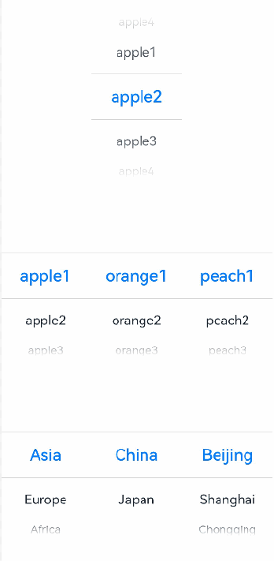
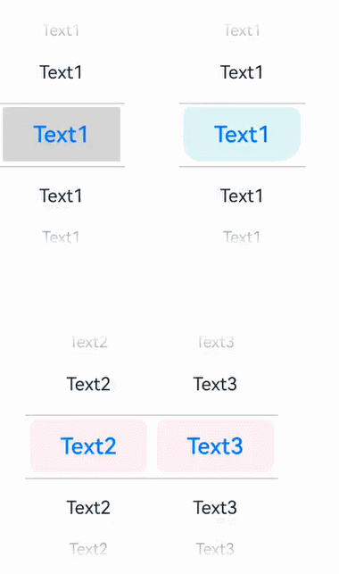
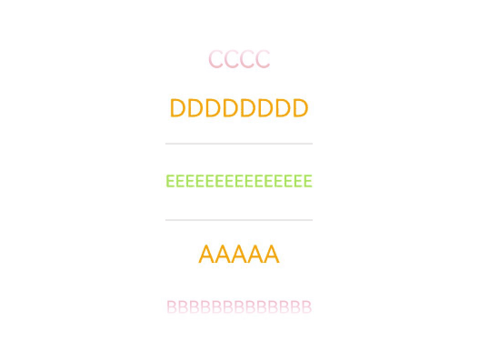

# TextPicker
<!--Kit: ArkUI-->
<!--Subsystem: ArkUI-->
<!--Owner: @luoying_ace_admin-->
<!--Designer: @weixin_52725220-->
<!--Tester: @xiong0104-->
<!--Adviser: @Brilliantry_Rui-->

**TextPicker** is a component that allows users to select text, images, or hybrid content through scrolling. It supports three usage modes: single-column picker, multi-column independent picker, and multi-column cascading picker.

>  **NOTE**
>
> - This component is supported since API version 8. Updates will be marked with a superscript to indicate their earliest API version.
>
> - Avoid changing the attribute data during the animation process of this component.
>
> - The maximum number of rows that can be displayed varies by screen orientation: In portrait mode, the default number of rows is 5. In landscape mode, the number of rows depends on the system configuration. If no system configuration is set, the default is 3 rows. To check the specific system configuration value for landscape mode, use **$r('sys.float.ohos_id_picker_show_count_landscape')**.
>
> - Multi-column independent pickers and multi-column cascading pickers are collectively referred to as multi-column pickers in this document.


## Child Components

Not supported


## APIs

TextPicker(options?: TextPickerOptions)

Creates a text picker based on the specified data list.

**Atomic service API**: This API can be used in atomic services since API version 11.

**System capability**: SystemCapability.ArkUI.ArkUI.Full

**Parameters**

| Name | Type                                           | Mandatory| Description                  |
| ------- | ----------------------------------------------- | ---- | ---------------------- |
| options | [TextPickerOptions](#textpickeroptions) | No  | Parameters of the text picker.|

## TextPickerOptions

Defines the configuration options of the text picker.

**System capability**: SystemCapability.ArkUI.ArkUI.Full

| Name| Type| Read-Only| Optional| Description|
| -------- | -------- | -------- | -------- | -------- |
| range | string[] \| string[][]<sup>10+</sup> \| [Resource](ts-types.md#resource) \|<br>[TextPickerRangeContent](#textpickerrangecontent10)[]<sup>10+</sup> \| [TextCascadePickerRangeContent](#textcascadepickerrangecontent10)[]<sup>10+</sup> | No| No| Data selection range of the picker. This parameter cannot be set to an empty array. If set to an empty array, it will not be displayed. If it is dynamically changed to an empty array, the current value remains displayed.<br>**NOTE**<br>1. Single-column pickers: string[], [Resource](ts-types.md#resource), or [TextPickerRangeContent](#textpickerrangecontent10)[]<br>2. Multi-column independent pickers: string[][]<br>3. Multi-column cascading pickers: [TextCascadePickerRangeContent](#textcascadepickerrangecontent10)[]<br>4. The Resource type supports only [strarray.json](../../../quick-start/resource-categories-and-access.md#resource-group-directories).<br>5. The type and number of columns in the range cannot be dynamically modified.<br>**Atomic service API**: This API can be used in atomic services since API version 11.|
| selected | number \| number[]<sup>10+</sup> | No| Yes| Index of the selected item in the data list. The index is zero-based.<br>Default value: **0**.<br>**NOTE**<br>1. Single-column pickers: number<br>2. Multi-column pickers: number[]<br>3. Since API version 10, this parameter supports two-way binding through [$$](../../../ui/state-management/arkts-two-way-sync.md).<br>**Atomic service API**: This API can be used in atomic services since API version 11.|
| value | [ResourceStr](ts-types.md#resourcestr) \| [ResourceStr](ts-types.md#resourcestr)[] | No| Yes| Value of the selected item. The priority of this parameter is lower than that of **selected**.<br>Default value: value of the first item in the data list.<br> **NOTE**<br>1. Since API version 10, this parameter supports two-way binding through [$$](../../../ui/state-management/arkts-two-way-sync.md).<br>2. The [Resource](ts-types.md#resource) type is supported since API version 20.<br>3. This parameter works only when the picker contains text only. It does not work when the picker contains images or mixed content.<br>4. Single-column pickers: [ResourceStr](ts-types.md#resourcestr)<br>5. Multi-column pickers: [ResourceStr](ts-types.md#resourcestr)[]<br>**Atomic service API**: This API can be used in atomic services since API version 11.|
| columnWidths<sup>18+</sup> | [LengthMetrics](../js-apis-arkui-graphics.md#lengthmetrics12)[] | No| Yes| Custom widths for each column.<br>Default value: Each column has equal width, calculated by dividing the total component width by the number of columns.<br>**NOTE**<br>1. Text truncation occurs when content exceeds column width.<br>2. Invalid values are treated as the default value.<br>3. Individual array elements can be **Undefined** or **Null**, but the entire array cannot be **Undefined[]** or **Null[]**.<br>**Atomic service API**: This API can be used in atomic services since API version 18.|

## TextPickerRangeContent<sup>10+</sup>

Defines the content for single-column picker options.

**Atomic service API**: This API can be used in atomic services since API version 11.

**System capability**: SystemCapability.ArkUI.ArkUI.Full

| Name| Type                                                | Read-Only| Optional| Description                                                        |
| ---- | ---------------------------------------------------- | ---- | ---- | ------------------------------------------------------------ |
| icon | string \| [Resource](ts-types.md#resource) | No  | No  | Image resource. If the value is a string, such as **"/common/hello.png"**, it represents the path to the image.|
| text | string \| [Resource](ts-types.md#resource) | No  | Yes  | Text information.<br>An empty character string is used by default.<br>Note: Text truncation occurs when content exceeds column width.|

## TextCascadePickerRangeContent<sup>10+</sup>

Defines the content for multi-column picker options.

**Atomic service API**: This API can be used in atomic services since API version 11.

**System capability**: SystemCapability.ArkUI.ArkUI.Full

| Name| Type                                                | Read-Only| Optional| Description  |
| ------ | -------------------------------------------------------- | ---- | ---------- | ---------- |
| text   | string \| [Resource](ts-types.md#resource) | No | No | Text information.<br>Note: Text truncation occurs when content exceeds column width.|
| children   | [TextCascadePickerRangeContent](#textcascadepickerrangecontent10)[] | No | Yes | Linkage data.|
## DividerOptions<sup>12+</sup>

Define the divider configuration options.

**Atomic service API**: This API can be used in atomic services since API version 12.

**System capability**: SystemCapability.ArkUI.ArkUI.Full

| Name       | Type                                      | Read-Only| Optional| Description                                                        |
| ----------- | ------------------------------------------ | ---- | ---- | ------------------------------------------------------------ |
| strokeWidth | [Dimension](ts-types.md#dimension10)       | No  | Yes  | Stroke width of the divider.<br>Default value: **2.0px**.<br>Unit: vp (default) or px.<br>If the value is less than 0, the default value is used. The maximum value allowed is half the height of the column. Percentages are not supported.|
| startMargin | [Dimension](ts-types.md#dimension10)       | No  | Yes  | Distance between the divider and the start edge of the text picker.<br>Default value: **0**.<br>Unit: vp (default) or px.<br>Values less than 0 are invalid. The maximum value allowed is the width of the column. Percentages are not supported.|
| endMargin   | [Dimension](ts-types.md#dimension10)       | No  | Yes  | Distance between the divider and the end edge of the text picker.<br>Default value: **0**.<br>Unit: vp (default) or px.<br>Values less than 0 are invalid. The maximum value allowed is the width of the column. Percentages are not supported.|
| color       | [ResourceColor](ts-types.md#resourcecolor) | No  | Yes  | Color of the divider.<br>Default value: **'#33000000'**                      |

## Attributes

In addition to the [universal attributes](ts-component-general-attributes.md), the following attributes are supported.

### defaultPickerItemHeight

defaultPickerItemHeight(value: number | string)

Sets the height of the picker items.

**Atomic service API**: This API can be used in atomic services since API version 11.

**System capability**: SystemCapability.ArkUI.ArkUI.Full

**Parameters**

| Name| Type                      | Mandatory| Description                  |
| ------ | -------------------------- | ---- | ---------------------- |
| value  | number \| string | Yes  | Height of the picker items.<br>Value range:<br>**number** type: [0, +∞), in vp.<br>**string** type: numeric string only, for example, **"56"**.<br>Default value: selected item 56 vp, unselected item 36 vp.<br>**NOTE**<br>The set value applies to both selected and unselected items.|

### defaultPickerItemHeight<sup>18+</sup>

defaultPickerItemHeight(height: Optional\<number | string>)

Sets the height of the picker items. Compared with [defaultPickerItemHeight](#defaultpickeritemheight), this API supports the **undefined** type for the **height** parameter.

**Atomic service API**: This API can be used in atomic services since API version 18.

**System capability**: SystemCapability.ArkUI.ArkUI.Full

**Parameters**

| Name| Type                      | Mandatory| Description                  |
| ------ | -------------------------- | ---- | ---------------------- |
| height  | [Optional](ts-universal-attributes-custom-property.md#optionalt12)\<number \| string> | Yes  | Height of the picker items.<br>Value range:<br>**number** type: [0, +∞), in vp.<br>**string** type: numeric string only, for example, **"56"**.<br>Default value: selected item 56 vp, unselected item 36 vp.<br>**NOTE**<br>1. The set value applies to both selected and unselected items.<br>2. If **height** is set to **undefined**, the previous value is retained.|

### disappearTextStyle<sup>10+</sup>

disappearTextStyle(value: PickerTextStyle)

Sets the text color, font size, and font weight of edge items (the second item above or below the selected item).

**Atomic service API**: This API can be used in atomic services since API version 11.

**System capability**: SystemCapability.ArkUI.ArkUI.Full

**Parameters**

| Name| Type                                                        | Mandatory| Description                                                        |
| ------ | ------------------------------------------------------------ | ---- | ------------------------------------------------------------ |
| value  | [PickerTextStyle](ts-picker-common.md#pickertextstyle) | Yes  | Text color, font size, and font weight for edge items.<br>Default value:<br>{<br>color: '#ff182431',<br>font: {<br>size: '14fp', <br>weight: FontWeight.Regular<br>}<br>} |

>  **NOTE**
>
> Edge items only appear when there are at least two visible items above or below the selected item. If insufficient items are available, no edge items will be styled.

### disappearTextStyle<sup>18+</sup>

disappearTextStyle(style: Optional\<PickerTextStyle>)

Sets the text color, font size, and font weight of edge items (the second item above or below the selected item). Compared with [disappearTextStyle<sup>10+</sup>](#disappeartextstyle10), this API supports the **undefined** type for the **style** parameter.

**Atomic service API**: This API can be used in atomic services since API version 18.

**System capability**: SystemCapability.ArkUI.ArkUI.Full

**Parameters**

| Name| Type                                                        | Mandatory| Description                                                        |
| ------ | ------------------------------------------------------------ | ---- | ------------------------------------------------------------ |
| style  | [Optional](ts-universal-attributes-custom-property.md#optionalt12)\<[PickerTextStyle](ts-picker-common.md#pickertextstyle)> | Yes  | Text color, font size, and font weight for edge items.<br>Default value:<br>{<br>color: '#ff182431',<br>font: {<br>size: '14fp', <br>weight: FontWeight.Regular<br>}<br>}<br>If the value of **style** is **undefined**, the default value is used.|

>  **NOTE**
>
> Edge items only appear when there are at least two visible items above or below the selected item. If insufficient items are available, no edge items will be styled.

### disappearTextStyle<sup>20+</sup>

disappearTextStyle(style: Optional\<PickerTextStyle\|TextPickerTextStyle>)

Sets the text style of edge items (the second item above or below the selected item), covering the following: text color, font size, font weight, maximum font size, minimum font size, text overflow mode. Compared with [disappearTextStyle](#disappeartextstyle18)<sup>18+</sup>, this API supports the [TextPickerTextStyle](#textpickertextstyle15) type for the **style** parameter.

**Atomic service API**: This API can be used in atomic services since API version 20.

**System capability**: SystemCapability.ArkUI.ArkUI.Full

**Parameters**

| Name| Type                                                        | Mandatory| Description                                                        |
| ------ | ------------------------------------------------------------ | ---- | ------------------------------------------------------------ |
| style  | [Optional](ts-universal-attributes-custom-property.md#optionalt12)\<[PickerTextStyle](ts-picker-common.md#pickertextstyle)\|[TextPickerTextStyle](#textpickertextstyle15)> | Yes  | Text style of edge items, covering the following: text color, font size, font weight, maximum font size, minimum font size, text overflow mode.<br>Default value:<br>{<br>color: '#ff182431',<br>font: {<br>size: '14fp', <br>weight: FontWeight.Regular<br>},<br>minFontSize: 0,<br>maxFontSize: 0,<br>overflow: TextOverflow.Clip<br>}<br>If the value of **style** is **undefined**, the default value is used.|

>  **NOTE**
>
> Edge items only appear when there are at least two visible items above or below the selected item. If insufficient items are available, no edge items will be styled.

### textStyle<sup>10+</sup>

textStyle(value: PickerTextStyle)

Sets the text color, font size, and font weight of candidate items (the first item immediately above or below the selected item).

**Atomic service API**: This API can be used in atomic services since API version 11.

**System capability**: SystemCapability.ArkUI.ArkUI.Full

**Parameters**

| Name| Type                                                        | Mandatory| Description                                                        |
| ------ | ------------------------------------------------------------ | ---- | ------------------------------------------------------------ |
| value  | [PickerTextStyle](ts-picker-common.md#pickertextstyle) | Yes  | Text color, font size, and font weight for candidate items.<br>Default value:<br>{<br>color: '#ff182431',<br>font: {<br>size: '16fp', <br>weight: FontWeight.Regular<br>}<br>} |

>  **NOTE**
>
> Candidate items only appear when there is at least one visible item above or below the selected item. If insufficient items are available, no candidate items will be styled.

### textStyle<sup>18+</sup>

textStyle(style: Optional\<PickerTextStyle>)

Sets the text color, font size, and font weight of candidate items (the first item immediately above or below the selected item). Compared with [textStyle<sup>10+</sup>](#textstyle10), this API supports the **undefined** type for the **style** parameter.

**Atomic service API**: This API can be used in atomic services since API version 18.

**System capability**: SystemCapability.ArkUI.ArkUI.Full

**Parameters**

| Name| Type                                                        | Mandatory| Description                                                        |
| ------ | ------------------------------------------------------------ | ---- | ------------------------------------------------------------ |
| style  | [Optional](ts-universal-attributes-custom-property.md#optionalt12)\<[PickerTextStyle](ts-picker-common.md#pickertextstyle)> | Yes  | Text color, font size, and font weight for candidate items.<br>Default value:<br>{<br>color: '#ff182431',<br>font: {<br>size: '16fp', <br>weight: FontWeight.Regular<br>}<br>}<br>If the value of **style** is **undefined**, the default value is used.|

>  **NOTE**
>
> Candidate items only appear when there is at least one visible item above or below the selected item. If insufficient items are available, no candidate items will be styled.

### textStyle<sup>20+</sup>

textStyle(style: Optional\<PickerTextStyle\|TextPickerTextStyle>)

Sets the text style of candidate items (the first item immediately above or below the selected item), covering the following: text color, font size, font weight, maximum font size, minimum font size, text overflow mode. Compared with [textStyle](#textstyle18)<sup>18+</sup>, this API supports the [TextPickerTextStyle](#textpickertextstyle15) type for the **style** parameter.

**Atomic service API**: This API can be used in atomic services since API version 20.

**System capability**: SystemCapability.ArkUI.ArkUI.Full

**Parameters**

| Name| Type                                                        | Mandatory| Description                                                        |
| ------ | ------------------------------------------------------------ | ---- | ------------------------------------------------------------ |
| style  | [Optional](ts-universal-attributes-custom-property.md#optionalt12)\<[PickerTextStyle](ts-picker-common.md#pickertextstyle)\|[TextPickerTextStyle](#textpickertextstyle15)> | Yes  | Style of candidate items, covering the following: text color, font size, font weight, maximum font size, minimum font size, text overflow mode.<br>Default value:<br>{<br>color: '#ff182431',<br>font: {<br>size: '16fp', <br>weight: FontWeight.Regular<br>},<br>minFontSize: 0,<br>maxFontSize: 0,<br>overflow: TextOverflow.Clip<br>}<br>If the value of **style** is **undefined**, the default value is used.|

>  **NOTE**
>
> Candidate items only appear when there is at least one visible item above or below the selected item. If insufficient items are available, no candidate items will be styled.

### selectedTextStyle<sup>10+</sup>

selectedTextStyle(value: PickerTextStyle)

Sets the text color, font size, and font weight of the selected item.

**Atomic service API**: This API can be used in atomic services since API version 11.

**System capability**: SystemCapability.ArkUI.ArkUI.Full

**Device behavior**: This API has no effect on wearables and works on other devices.

**Parameters**

| Name| Type                                                        | Mandatory| Description                                                        |
| ------ | ------------------------------------------------------------ | ---- | ------------------------------------------------------------ |
| value  | [PickerTextStyle](ts-picker-common.md#pickertextstyle) | Yes  | Text color, font size, and font weight of the selected item.<br>Default value:<br>{<br>color: '#ff007dff',<br>font: {<br>size: '20fp', <br>weight: FontWeight.Medium<br>}<br>} |

### selectedTextStyle<sup>18+</sup>

selectedTextStyle(style: Optional\<PickerTextStyle>)

Sets the text color, font size, and font weight of the selected item. Compared with [selectedTextStyle<sup>10+</sup>](#selectedtextstyle10), this API supports the **undefined** type for the **style** parameter.

**Atomic service API**: This API can be used in atomic services since API version 18.

**System capability**: SystemCapability.ArkUI.ArkUI.Full

**Device behavior**: This API has no effect on wearables and works on other devices.

**Parameters**

| Name| Type                                                        | Mandatory| Description                                                        |
| ------ | ------------------------------------------------------------ | ---- | ------------------------------------------------------------ |
| style  | [Optional](ts-universal-attributes-custom-property.md#optionalt12)\<[PickerTextStyle](ts-picker-common.md#pickertextstyle)> | Yes  | Text color, font size, and font weight of the selected item.<br>Default value:<br>{<br>color: '#ff007dff',<br>font: {<br>size: '20fp', <br>weight: FontWeight.Medium<br>}<br>}<br>If the value of **style** is **undefined**, the default value is used.|

### selectedTextStyle<sup>20+</sup>

selectedTextStyle(style: Optional\<PickerTextStyle\|TextPickerTextStyle>)

Sets the text style of the selected item, covering the following: text color, font size, font weight, maximum font size, minimum font size, text overflow mode. Compared with [selectedTextStyle](#selectedtextstyle18)<sup>18+</sup>, this API supports the [TextPickerTextStyle](#textpickertextstyle15) type for the **style** parameter.

**Atomic service API**: This API can be used in atomic services since API version 20.

**System capability**: SystemCapability.ArkUI.ArkUI.Full

**Device behavior**: This API has no effect on wearables and works on other devices.

**Parameters**

| Name| Type                                                        | Mandatory| Description                                                        |
| ------ | ------------------------------------------------------------ | ---- | ------------------------------------------------------------ |
| style  | [Optional](ts-universal-attributes-custom-property.md#optionalt12)\<[PickerTextStyle](ts-picker-common.md#pickertextstyle)\|[TextPickerTextStyle](#textpickertextstyle15)> | Yes  | Text style of the selected item, covering the following: text color, font size, font weight, maximum font size, minimum font size, text overflow mode.<br>Default value:<br>{<br>color: '#ff007dff',<br>font: {<br>size: '20fp', <br>weight: FontWeight.Medium<br>},<br>minFontSize: 0,<br>maxFontSize: 0,<br>overflow: TextOverflow.Clip<br>}<br>If the value of **style** is **undefined**, the default value is used.|

### selectedIndex<sup>10+</sup>

selectedIndex(value: number | number[])

Sets the index of the selected item or items in the data list. This setting takes precedence over the **value** property in [TextPickerOptions](#textpickeroptions). Use **number** for single-column pickers. Use **number[]** for multi-column pickers.

**Atomic service API**: This API can be used in atomic services since API version 11.

**System capability**: SystemCapability.ArkUI.ArkUI.Full

**Parameters**

| Name| Type                        | Mandatory| Description                        |
| ------ | ---------------------------- | ---- | ---------------------------- |
| value  | number \| number[] | Yes  | Index of the selected item or items in the data list. The index is zero-based.<br>Default value: **0**.<br>If the value is negative or exceeds the maximum index, the default value is used.<br>|

### selectedIndex<sup>18+</sup>

selectedIndex(index: Optional\<number | number[]>)

Sets the index of the selected item or items in the data list. This setting takes precedence over the **value** property in [TextPickerOptions](#textpickeroptions). Use **number** for single-column pickers. Use **number[]** for multi-column pickers. Compared with [selectedIndex<sup>10+</sup>](#selectedindex10), this API supports the **undefined** type for the **index** parameter.

**Atomic service API**: This API can be used in atomic services since API version 18.

**System capability**: SystemCapability.ArkUI.ArkUI.Full

**Parameters**

| Name| Type                                                        | Mandatory| Description                                                        |
| ------ | ------------------------------------------------------------ | ---- | ------------------------------------------------------------ |
| index  | [Optional](ts-universal-attributes-custom-property.md#optionalt12)\<number \| number[]> | Yes  | Index of the selected item or items in the data list. The index is zero-based.<br>Default value: **0**.<br>If **index** is **undefined**, the **selected** value of [TextPickerOptions](#textpickeroptions) is used.<br>If it is negative or exceeds the maximum index, the default value is used.<br>|

### canLoop<sup>10+</sup>

canLoop(value: boolean)

Sets whether to enable loop scrolling.

**Atomic service API**: This API can be used in atomic services since API version 11.

**System capability**: SystemCapability.ArkUI.ArkUI.Full

**Parameters**

| Name| Type   | Mandatory| Description                                                        |
| ------ | ------- | ---- | ------------------------------------------------------------ |
| value  | boolean | Yes  | Whether to enable loop scrolling.<br>- **true**: Enable loop scrolling.<br>- **false**: Disable loop scrolling.<br>Default value: **true**.|

### canLoop<sup>18+</sup>

canLoop(isLoop: Optional\<boolean>)

Sets whether to enable loop scrolling. Compared with [canLoop<sup>10+</sup>](#canloop10), this API supports the **undefined** type for the **isLoop** parameter.

**Atomic service API**: This API can be used in atomic services since API version 18.

**System capability**: SystemCapability.ArkUI.ArkUI.Full

**Parameters**

| Name| Type   | Mandatory| Description                                                        |
| ------ | ------- | ---- | ------------------------------------------------------------ |
| isLoop  | [Optional](ts-universal-attributes-custom-property.md#optionalt12)\<boolean> | Yes  | Whether to enable loop scrolling.<br>- **true**: Enable loop scrolling.<br>- **false**: Disable loop scrolling.<br>Default value: **true**.<br>If the value of **isLoop** is **undefined**, the default value is used.|

### divider<sup>12+</sup>

divider(value: DividerOptions | null)

Sets the divider style. If not explicitly set, the divider uses the default style.

If the sum of **startMargin** and **endMargin** in [DividerOptions](#divideroptions12) exceeds the component's width, both margins are automatically reset to 0.

**Atomic service API**: This API can be used in atomic services since API version 12.

**System capability**: SystemCapability.ArkUI.ArkUI.Full

**Parameters**
| Name| Type   | Mandatory| Description                                                                 |
| ------ | ------- | ---- | --------------------------------------------------------------------- |
| value | [DividerOptions](#divideroptions12) \| null | Yes  | Default value:<br>{<br>strokeWidth: '2px', <br>startMargin: 0, <br>endMargin: 0, <br>color: '#33000000'<br>}<br>1. If **textDivider** is a valid [DividerOptions](#divideroptions12) object, the divider is rendered using the specified style.<br>2. If **textDivider** is **null**, the divider is hidden.|

### divider<sup>18+</sup>

divider(textDivider: Optional\<DividerOptions | null>)

Sets the divider style. If not explicitly set, the divider uses the default style. Compared with [divider<sup>12+</sup>](#divider12), this API supports the **undefined** type for the **textDivider** parameter.

If the sum of **startMargin** and **endMargin** in [DividerOptions](#divideroptions12) exceeds the component's width, both margins are automatically reset to 0.

**Atomic service API**: This API can be used in atomic services since API version 18.

**System capability**: SystemCapability.ArkUI.ArkUI.Full

**Parameters**

| Name| Type   | Mandatory| Description                                                                 |
| ------ | ------- | ---- | --------------------------------------------------------------------- |
| textDivider | [Optional](ts-universal-attributes-custom-property.md#optionalt12)\<[DividerOptions](#divideroptions12) \| null> | Yes  | Default value:<br>{<br>strokeWidth: '2px', <br>startMargin: 0, <br>endMargin: 0, <br>color: '#33000000'<br>}<br>1. If the value of **textDivider** is **undefined**, the default value is used.<br>2. If **textDivider** is a valid [DividerOptions](#divideroptions12) object, the divider is rendered using the specified style.<br>3. If **textDivider** is **null**, the divider is hidden.|

### gradientHeight<sup>12+</sup>

gradientHeight(value: Dimension)

Sets the height of the fade effect applied to the top and bottom edges of the content area. If no setting is specified, a default fade effect is used.

**Atomic service API**: This API can be used in atomic services since API version 12.

**System capability**: SystemCapability.ArkUI.ArkUI.Full

**Parameters**

| Name| Type   | Mandatory| Description                                                        |
| ------ | ------- | ---- | ------------------------------------------------------------ |
| value  | [Dimension](ts-types.md#dimension10) | Yes  | Height of the fade effect.<br>Default value: **36vp**.<br>Value range: [0, +∞). Percentages are supported.<br>**NOTE**<br>1. If the value is set to a percentage, **100%** equals half the height of the text picker.<br>2. A value of **0** disables the fade effect.<br>3. Values exceeding half the height of the text picker revert to the default value.<br>4. If the value is **undefined** or negative, the default value is used.|

### gradientHeight<sup>18+</sup>

gradientHeight(height: Optional\<Dimension>)

Sets the height of the fade effect applied to the top and bottom edges of the content area. If no setting is specified, a default fade effect is used. Compared with [gradientHeight<sup>12+</sup>](#gradientheight12), this API supports the **undefined** type for the **height** parameter.

**Atomic service API**: This API can be used in atomic services since API version 18.

**System capability**: SystemCapability.ArkUI.ArkUI.Full

**Parameters**

| Name| Type   | Mandatory| Description                                                        |
| ------ | ------- | ---- | ------------------------------------------------------------ |
| height  | [Optional](ts-universal-attributes-custom-property.md#optionalt12)\<[Dimension](ts-types.md#dimension10)> | Yes  | Height of the fade effect.<br>Default value: **36vp**.<br>Value range: [0, +∞). Percentages are supported.<br>**NOTE**<br>1. If the value is set to a percentage, **100%** equals half the height of the text picker.<br>2. A value of **0** disables the fade effect.<br>3. Values exceeding half the height of the text picker revert to the default value.<br>4. If the value is **undefined** or negative, the default value is used.|

### disableTextStyleAnimation<sup>15+</sup>

disableTextStyleAnimation(disabled: boolean)

Sets whether to disable the animation effect of text style changes during scrolling.

**Atomic service API**: This API can be used in atomic services since API version 15.

**System capability**: SystemCapability.ArkUI.ArkUI.Full

**Parameters**

| Name| Type   | Mandatory| Description                                                        |
| ------ | ------- | ---- | ------------------------------------------------------------ |
| disabled  | boolean | Yes  | Whether to disable the animation effect of text style changes during scrolling.<br>- **true**: Disable the animation effect of text style changes.<br>- **false**: Do not disable the animation effect of text style changes.<br>Default value: **false**.<br>**NOTE**<br>When this API is used with **true**, there are no text style changes, including the font size, weight, and color, during scrolling, and all text is displayed in the style set by [defaultTextStyle](#defaulttextstyle15). If [defaultTextStyle](#defaulttextstyle15) is not set, the default style of the [Text](ts-basic-components-text.md) component is used.|

### defaultTextStyle<sup>15+</sup>

defaultTextStyle(style: TextPickerTextStyle)

Sets the text style of the items when the text style change animation during the scrolling process is disabled. This setting takes effect only when [disableTextStyleAnimation](#disabletextstyleanimation15) is set to **true**.

**Atomic service API**: This API can be used in atomic services since API version 15.

**System capability**: SystemCapability.ArkUI.ArkUI.Full

**Parameters**

| Name| Type                                                        | Mandatory| Description                                                        |
| ------ | ------------------------------------------------------------ | ---- | ------------------------------------------------------------ |
| style  | [TextPickerTextStyle](#textpickertextstyle15) | Yes  | Text style of the items when the text style change animation during the scrolling process is disabled.<br>Default value: same as the default value of the [Text](ts-basic-components-text.md) component|

>  **NOTE**
>
>  To enable haptic feedback, you must declare the following permission under **requestPermissions** in **module** in **src/main/module.json5** of the project.
>  ```json
>  "requestPermissions": [
>  {
>   "name": "ohos.permission.VIBRATE",
>  }
>  ]
>  ```

### enableHapticFeedback<sup>18+</sup>

enableHapticFeedback(enable: Optional\<boolean>)

Sets whether to enable haptic feedback.

**Atomic service API**: This API can be used in atomic services since API version 18.

**System capability**: SystemCapability.ArkUI.ArkUI.Full

**Parameters**

| Name| Type                                         | Mandatory | Description                                                                                 |
| ------ | --------------------------------------------- |-----|-------------------------------------------------------------------------------------|
| enable  | [Optional](ts-universal-attributes-custom-property.md#optionalt12)\<boolean> | Yes  | Whether to enable haptic feedback.<br>- **true**: Enable haptic feedback.<br>- **false**: Disable haptic feedback.<br>Default value: **true**.<br>Whether this parameter takes effect after being set to **true** depends on hardware support.|

>  **NOTE**
>
>  To enable haptic feedback, you must declare the following permission under **requestPermissions** in **module** in **src/main/module.json5** of the project.
>  ```json
>  "requestPermissions": [
>  {
>   "name": "ohos.permission.VIBRATE",
>  }
>  ]
>  ```

### digitalCrownSensitivity<sup>18+</sup>
digitalCrownSensitivity(sensitivity: Optional\<CrownSensitivity>)

Sets the sensitivity to the digital crown rotation.

**Atomic service API**: This API can be used in atomic services since API version 18.

**System capability**: SystemCapability.ArkUI.ArkUI.Full

**Parameters**

| Name  | Type                                    | Mandatory  | Description                     |
| ----- | ---------------------------------------- | ---- | ------------------------- |
| sensitivity | [Optional](ts-universal-attributes-custom-property.md#optionalt12)\<[CrownSensitivity](ts-appendix-enums.md#crownsensitivity18)> | Yes   | Sensitivity to the digital crown rotation.<br>Default value: **CrownSensitivity.MEDIUM**                    |

>  **NOTE**
>
>  This API is used for circular screens on wearables. The component needs to obtain focus before responding to the [crown event](ts-universal-events-crown.md).

### selectedBackgroundStyle<sup>20+</sup>
selectedBackgroundStyle(style: Optional\<PickerBackgroundStyle>)

Sets the background style of selected items.

**Atomic service API**: This API can be used in atomic services since API version 20.

**System capability**: SystemCapability.ArkUI.ArkUI.Full

**Parameters**

| Name  | Type                                    | Mandatory  | Description                     |
| ----- | ---------------------------------------- | ---- | ------------------------- |
| style | [Optional](ts-universal-attributes-custom-property.md#optionalt12)\<[PickerBackgroundStyle](#pickerbackgroundstyle20)> | Yes   | Background color and corner radius for selected items. Applies to all columns in multi-column mode.<br>Default value:<br>{ <br>color: $r('sys.color.comp_background_tertiary'),<br>borderRadius: $r('sys.float.corner_radius_level12')<br>}|

## Events

In addition to the [universal events](ts-component-general-events.md), the following events are supported.

### onChange

onChange(callback: (value: string \| string[], index: number \| number[]) =&gt; void)

Triggered when the text picker snaps to the selected item. This event cannot be triggered by two-way bound state variables. When the picker contains text only or a combination of images and text, **value** indicates the text of the selected item. When the picker contains images only, **value** is empty.

This callback is triggered only after the scroll animation completes. To obtain real-time index changes, use [onEnterSelectedArea](#onenterselectedarea18) instead.

**Atomic service API**: This API can be used in atomic services since API version 11.

**System capability**: SystemCapability.ArkUI.ArkUI.Full

**Parameters**

| Name| Type                                      | Mandatory| Description                                             |
| ------ | ------------------------------------------ | ---- | ------------------------------------------------- |
| value  | string \| string[]<sup>10+</sup> | Yes  | Text of the selected item. The value of the multi-column data selector is of the array type.  |
| index  | number \| number[]<sup>10+</sup> | Yes  | Index of the selected item. The index is zero-based. Use the array type for multi-column pickers.|

### onChange<sup>18+</sup>

onChange(callback: Optional\<OnTextPickerChangeCallback>)

Triggered when the text picker snaps to the selected item. This event cannot be triggered by two-way bound state variables. When the picker contains text only or a combination of images and text, **value** indicates the text of the selected item. When the picker contains images only, **value** is empty. Compared with [onChange](#onchange), the **callback** parameter supports the **undefined** type.

This callback is triggered only after the scroll animation completes. To obtain real-time index changes, use [onEnterSelectedArea](#onenterselectedarea18) instead.

**Atomic service API**: This API can be used in atomic services since API version 18.

**System capability**: SystemCapability.ArkUI.ArkUI.Full

**Parameters**

| Name  | Type                                                        | Mandatory| Description                                                        |
| -------- | ------------------------------------------------------------ | ---- | ------------------------------------------------------------ |
| callback | [Optional](ts-universal-attributes-custom-property.md#optionalt12)\<[OnTextPickerChangeCallback](#ontextpickerchangecallback18)> | Yes  | Callback invoked when an item in the picker is selected.<br>If **callback** is set to **undefined**, the callback function is not used.|

### onScrollStop<sup>14+</sup>

onScrollStop(callback: TextPickerScrollStopCallback)

Triggered when the scrolling in the text picker stops.

If the scrolling is initiated by a gesture, this event is triggered when the finger is lifted from the screen and the scrolling stops.

>**NOTE**
>
> This API can be called within [attributeModifier](ts-universal-attributes-attribute-modifier.md#attributemodifier) since API version 20.

**Atomic service API**: This API can be used in atomic services since API version 14.

**System capability**: SystemCapability.ArkUI.ArkUI.Full

**Parameters**

| Name| Type                                      | Mandatory| Description                                             |
| ------ | ------------------------------------------ | ---- | ------------------------------------------------- |
| callback | [TextPickerScrollStopCallback](#textpickerscrollstopcallback14) | Yes  | Triggered when the scrolling in the text picker stops.|

### onScrollStop<sup>18+</sup>

onScrollStop(callback: Optional\<TextPickerScrollStopCallback>)

Triggered when the scrolling in the text picker stops. Compared with [onScrollStop<sup>14+</sup>](#onscrollstop14), this API supports the **undefined** type for the **callback** parameter.

If the scrolling is initiated by a gesture, this event is triggered when the finger is lifted from the screen and the scrolling stops.

>**NOTE**
>
> This API can be called within [attributeModifier](ts-universal-attributes-attribute-modifier.md#attributemodifier) since API version 20.

**Atomic service API**: This API can be used in atomic services since API version 18.

**System capability**: SystemCapability.ArkUI.ArkUI.Full

**Parameters**

| Name| Type                                      | Mandatory| Description                                             |
| ------ | ------------------------------------------ | ---- | ------------------------------------------------- |
| callback | [Optional](ts-universal-attributes-custom-property.md#optionalt12)\<[TextPickerScrollStopCallback](#textpickerscrollstopcallback14)> | Yes  | Triggered when the scrolling in the text picker stops.<br>If **callback** is set to **undefined**, the callback function is not used.|

### onEnterSelectedArea<sup>18+</sup>

onEnterSelectedArea(callback: TextPickerEnterSelectedAreaCallback)

Triggered when an option enters the selection zone during text picker scrolling (when the scroll distance exceeds half the selected item's height).

>  **NOTE**
>
> - This event is triggered earlier than the [onChange](#onchange) event.
>
> - In scenarios where the picker contains linked columns, the use of this callback is not recommended. The reason is that it identifies nodes where items enter the divider area during scrolling. However, items that change in response to the scrolling do not themselves scroll. As a result, the callback's return values will only reflect changes for the currently scrolling column, while other non-scrolling columns will remain unchanged.
>
> - This API cannot be called within [attributeModifier](ts-universal-attributes-attribute-modifier.md#attributemodifier).

**Atomic service API**: This API can be used in atomic services since API version 18.

**System capability**: SystemCapability.ArkUI.ArkUI.Full

**Parameters**

| Name  | Type                      | Mandatory| Description                                      |
| -------- | -------------------------- | ---- | ------------------------------------------ |
| callback | [TextPickerEnterSelectedAreaCallback](#textpickerenterselectedareacallback18) | Yes  | Callback triggered when an option enters the selection zone during text picker scrolling.|

### onAccept<sup>(deprecated) </sup>

onAccept(callback: (value: string, index: number) => void)

Triggered when the OK button in the dialog box is clicked. This event can be triggered only in the [text picker dialog box](ts-methods-textpicker-dialog.md).

This API is deprecated since API version 10.

**System capability**: SystemCapability.ArkUI.ArkUI.Full

**Parameters**

| Name| Type  | Mandatory| Description                |
| ------ | ------ | ---- | -------------------- |
| value  | string | Yes  | Text of the selected item.  |
| index  | number | Yes  | Index of the selected item. The index is zero-based.|

### onCancel<sup>(deprecated) </sup>

onCancel(callback: () => void)

Triggered when the Cancel button in the dialog box is clicked. This event can be triggered only in the [text picker dialog box](ts-methods-textpicker-dialog.md).

This API is deprecated since API version 10.

**System capability**: SystemCapability.ArkUI.ArkUI.Full

**Parameters**
| Name| Type  | Mandatory| Description                |
| ------ | ------ | ---- | -------------------- |
| callback  | () => void | Yes  | Triggered when the Cancel button in the dialog box is clicked.  |

## TextPickerTextStyle<sup>15+</sup>

Defines the text style options for the text picker. Inherits from [PickerTextStyle](ts-picker-common.md#pickertextstyle).

**Atomic service API**: This API can be used in atomic services since API version 15.

**System capability**: SystemCapability.ArkUI.ArkUI.Full

| Name  | Type                                    | Read-Only| Optional| Description                     |
| ----- | ---------------------------------------- | ---- | ------------------------- | ------------------------- |
| minFontSize | number \| string \| [Resource](ts-types.md#resource) | No| Yes| Minimum font size for the text. Used with **maxFontSize** to enable font scaling. When both **minFontSize** and **maxFontSize** are set, the **size** property in **font** is ignored. By default, the maximum number of lines is 1, with the **MIN_FONT_SIZE_FIRST** adaptation strategy. For details, see [minFontSize](ts-basic-components-text.md#minfontsize).|
| maxFontSize  | number \| string \| [Resource](ts-types.md#resource) | No  | Yes  | Maximum font size for the text. For details, see [maxFontSize](ts-basic-components-text.md#maxfontsize).                    |
| overflow | [TextOverflow](ts-appendix-enums.md#textoverflow) | No| Yes| Text overflow behavior. This property has no effect when set to **MARQUEE**. For details, see [textOverflow](ts-basic-components-text.md#textoverflow).|

## OnTextPickerChangeCallback<sup>18+</sup>

type OnTextPickerChangeCallback = (selectItem: string | string[], index: number | number[]) => void

Defines the **onChange** event callback signature.

**Atomic service API**: This API can be used in atomic services since API version 18.

**System capability**: SystemCapability.ArkUI.ArkUI.Full

**Parameters**

| Name    | Type                                      | Mandatory| Description                                                        |
| ---------- | ------------------------------------------ | ---- | ------------------------------------------------------------ |
| selectItem | string \| string[]<sup>10+</sup> | Yes  | Text of the selected item. Use the array type for multi-column pickers.<br>**NOTE**<br>The return value is a text value for text or mixed content, and an empty string for image-only content.|
| index      | number \| number[]<sup>10+</sup> | Yes  | Index of the selected item. The index is zero-based. Use the array type for multi-column pickers.|

## TextPickerScrollStopCallback<sup>14+</sup>

type TextPickerScrollStopCallback = (value: string | string[], index: number | number[]) => void

Defines the **onScrollStop** event callback signature.

**Atomic service API**: This API can be used in atomic services since API version 14.

**System capability**: SystemCapability.ArkUI.ArkUI.Full

**Parameters**

| Name| Type                                      | Mandatory| Description                                             |
| ------ | ------------------------------------------ | ---- | ------------------------------------------------- |
| value  | string \| string[] | Yes  | Text of the selected item. Use the array type for multi-column pickers.<br>**NOTE**<br>The return value is a text value for text or mixed content, and an empty string for image-only content.|
| index  | number \| number[] | Yes  | Index of the selected item. The index is zero-based. Use the array type for multi-column pickers.|

## TextPickerEnterSelectedAreaCallback<sup>18+</sup>

type TextPickerEnterSelectedAreaCallback = (value: string | string[], index: number | number[]) => void

Defines the **onEnterSelectedArea** event callback signature.

**Atomic service API**: This API can be used in atomic services since API version 18.

**System capability**: SystemCapability.ArkUI.ArkUI.Full

**Parameters**

| Name| Type                                      | Mandatory| Description                                             |
| ------ | ------------------------------------------ | ---- | ------------------------------------------------- |
| value  | string \| string[] | Yes  | Text of the selected item. Use the array type for multi-column pickers.<br>**NOTE**<br>The return value is a text value for text or mixed content, and an empty string for image-only content.|
| index  | number \| number[] | Yes  | Index of the selected item. The index is zero-based. Use the array type for multi-column pickers.|

## PickerBackgroundStyle<sup>20+</sup>

Defines the background style configuration for selected picker items.

**Atomic service API**: This API can be used in atomic services since API version 20.

**System capability**: SystemCapability.ArkUI.ArkUI.Full

| Name| Type                                      | Read-Only| Optional| Description                                             |
| ------ | ------------------------------------- | ---- | ------------------------------------------------- | ------------------------------------------------- |
| color  | [ResourceColor](ts-types.md#resourcecolor) | No | Yes | Background color of the selected item.<br>Default value: **'sys.color.comp_background_tertiary'**.  |
| borderRadius  | [LengthMetrics](../js-apis-arkui-graphics.md#lengthmetrics12)  \|  [BorderRadiuses](ts-types.md#borderradiuses9)  \|  [LocalizedBorderRadiuses](ts-types.md#localizedborderradiuses12) | No | Yes | Border radius of the selected item.<br>Default value: **{ value:24, unit:LengthUnit.VP }**, meaning 24 vp for all corners.<br>**NOTE**<br>1. [LengthMetrics](../js-apis-arkui-graphics.md#lengthmetrics12): uniform radius with a customizable unit<br>2. [BorderRadiuses](ts-types.md#borderradiuses9): per-corner radius values (vp units only)<br>3. [LocalizedBorderRadiuses](ts-types.md#localizedborderradiuses12): per-corner radius values with individual units|
## Example

### Example 1: Setting the Number of Columns in the Picker

This example demonstrates how to configure single-column and multi-column text pickers by setting **range** and customizing the width of each column using **columnWidths**.

```ts
// xxx.ets
import { LengthMetrics } from '@kit.ArkUI';

class Bottom {
  bottom: number = 50;
}

let bott: Bottom = new Bottom();
@Entry
@Component
struct TextPickerExample {
  private select: number = 1;
  private apfruits: string[] = ['apple1', 'apple2', 'apple3', 'apple4'];
  private orfruits: string[] = ['orange1', 'orange2', 'orange3', 'orange4'];
  private pefruits: string[] = ['peach1', 'peach2', 'peach3', 'peach4'];
  private multi: string[][] = [this.apfruits, this.orfruits, this.pefruits];
  private cascade: TextCascadePickerRangeContent[] = [
    {
      text: 'Asia',
      children: [{ text: 'China', children: [{ text: 'Beijing' }, { text: 'Shanghai' }, { text: 'Chongqing' }] },
        { text: 'Japan', children: [{ text: 'Tokyo' }, { text: 'Hokkaido' }, { text: 'Osaka' }] }]
    },
    {
      text: 'Europe',
      children: [{ text: 'Germany', children: [{ text: 'Berlin' }, { text: 'Munich' }, { text: 'Nuremberg' }] },
        { text: 'France', children: [{ text: 'Paris' }, { text: 'Lille' }, { text: 'Orleans' }] }]
    },
    {
      text: 'Africa',
      children: [{ text: 'Egypt', children: [{ text: 'Cairo' }, { text: 'Damietta' }, { text: 'Girga' }] },
        { text: 'Algeria', children: [{ text: 'Alger' }, { text: 'Oran' }, { text: 'Adrar' }] }]
    }
  ];
  private singleColumnWidths: LengthMetrics[] = [
    LengthMetrics.percent(50)
  ];

  private multipleColumnWidths: LengthMetrics[] = [
    LengthMetrics.vp(100),
    LengthMetrics.vp(200),
    LengthMetrics.vp(100)
  ];

  private cascadeColumnWidths: LengthMetrics[] = [
    LengthMetrics.percent(20),
    LengthMetrics.percent(30),
    LengthMetrics.percent(50)
  ];
  build() {
    Column() {

      TextPicker({ range: this.apfruits, selected: this.select, columnWidths: this.singleColumnWidths })
        .onChange((value: string | string[], index: number | number[]) => {
          console.info('Picker item changed, value: ' + value + ', index: ' + index);
        })
        .onScrollStop((value: string | string[], index: number | number[]) => {
          console.info('Picker scroll stopped, value: ' + value + ', index: ' + index);
        }).margin(bott)
        .onEnterSelectedArea((value: string | string[], index: number | number[]) => {
          console.info('Picker item enter selected area, value: ' + value + ', index: ' + index);
        })

      TextPicker({ range: this.multi, columnWidths: this.multipleColumnWidths })
        .onChange((value: string | string[], index: number | number[]) => {
          console.info('TextPicker multi-column: onChange ' + JSON.stringify(value) + ', ' + 'index: ' + JSON.stringify(index));
        })
        .onScrollStop((value: string | string[], index: number | number[]) => {
          console.info('TextPicker multi-column: onScrollStop ' + JSON.stringify(value) + ', ' + 'index: ' + JSON.stringify(index));
        }).margin(bott)
        .onEnterSelectedArea((value: string | string[], index: number | number[]) => {
          console.info('TextPicker multi-column: onEnterSelectedArea ' + JSON.stringify(value) + ', ' + 'index: ' + JSON.stringify(index));
        })

      TextPicker({ range: this.cascade, columnWidths: this.cascadeColumnWidths })
        .onChange((value: string | string[], index: number | number[]) => {
          console.info('TextPicker multi-column cascading: onChange ' + JSON.stringify(value) + ', ' + 'index: ' + JSON.stringify(index));
        })
        .onScrollStop((value: string | string[], index: number | number[]) => {
          console.info('TextPicker multi-column cascading: onScrollStop ' + JSON.stringify(value) + ', ' + 'index: ' + JSON.stringify(index));
        })
        .onEnterSelectedArea((value: string | string[], index: number | number[]) => {
          console.info('TextPicker multi-column cascading: onEnterSelectedArea ' + JSON.stringify(value) + ', ' + 'index: ' + JSON.stringify(index));
        })
    }
  }
}
```



### Example 2: Setting the Text Style

This example demonstrates how to configure [disappearTextStyle](#disappeartextstyle10), [textStyle](#textstyle10), and [selectedTextStyle](#selectedtextstyle10) to customize the text style in the text picker.

```ts
// xxx.ets
@Entry
@Component
struct TextPickerExample {
  private select: number = 0;
  private fruits: string[] = ['apple1', 'orange2', 'peach3', 'grape4'];

  build() {
    Column() {
      TextPicker({
        range: this.fruits,
        selected: this.select,
        value: this.fruits[this.select]
      })
        .onChange((value: string | string[], index: number | number[]) => {
          console.info('Picker item changed, value: ' + value + ', index: ' + index);
        })
        .onScrollStop((value: string | string[], index: number | number[]) => {
          console.info('Picker scroll stopped, value: ' + value + ', index: ' + index);
        })
        .disappearTextStyle({ color: Color.Red, font: { size: 15, weight: FontWeight.Lighter } })
        .textStyle({ color: Color.Black, font: { size: 20, weight: FontWeight.Normal } })
        .selectedTextStyle({ color: Color.Blue, font: { size: 30, weight: FontWeight.Bolder } })
        .defaultPickerItemHeight(50)
        .canLoop(false)
        .selectedIndex(2)
    }.width('100%').height('100%')
  }
}
```


### Example 3: Using the No-Divider Style

This example demonstrates how to configure a text picker with no divider by setting **divider** to **null**.

```ts
// xxx.ets
@Entry
@Component
struct TextPickerExample {
  private select: number = 0;
  private fruits: string[] = ['apple1', 'orange2', 'peach3', 'grape4'];

  build() {
    Column() {
      TextPicker({ range: this.fruits, selected: this.select })
        .onChange((value: string | string[], index: number | number[]) => {
          console.info('Picker item changed, value: ' + value + ', index: ' + index);
        })
        .onScrollStop((value: string | string[], index: number | number[]) => {
          console.info('Picker scroll stopped, value: ' + value + ', index: ' + index);
        })
        .disappearTextStyle({color: Color.Red, font: {size: 15, weight: FontWeight.Lighter}})
        .textStyle({color: Color.Black, font: {size: 20, weight: FontWeight.Normal}})
        .selectedTextStyle({color: Color.Blue, font: {size: 30, weight: FontWeight.Bolder}})
        .divider(null)
    }.width('100%').height('100%')
  }
}
```


### Example 4: Using the Divider Style

This example demonstrates how to set the divider style for the text picker by configuring **DividerOptions** for **divider**.

```ts
// xxx.ets
@Entry
@Component
struct TextPickerExample {
  private select: number = 1;
  private fruits: string[] = ['apple1', 'orange2', 'peach3', 'grape4'];

  build() {
    Column() {
      TextPicker({ range: this.fruits, selected: this.select })
        .onChange((value: string | string[], index: number | number[]) => {
          console.info('Picker item changed, value: ' + value + ', index: ' + index);
        })
        .onScrollStop((value: string | string[], index: number | number[]) => {
          console.info('Picker scroll stopped, value: ' + value + ', index: ' + index);
        })
        .disappearTextStyle({color: Color.Red, font: {size: 15, weight: FontWeight.Lighter}})
        .textStyle({color: Color.Black, font: {size: 20, weight: FontWeight.Normal}})
        .selectedTextStyle({color: Color.Blue, font: {size: 30, weight: FontWeight.Bolder}})
        .divider({
          strokeWidth: 10,
          color: Color.Red,
          startMargin: 10,
          endMargin: 20
        } as DividerOptions)
    }.width('100%').height('100%')
  }
}
```


### Example 5: Setting the Fade Effect

This example shows how to set the gradient effect height for the text picker by configuring **gradientHeight**.

```ts
// xxx.ets
@Entry
@Component
struct TextPickerExample {
  private select: number = 1;
  private fruits: string[] = ['apple1', 'orange2', 'peach3', 'grape4'];

  build() {
    Column() {
      TextPicker({ range: this.fruits, selected: this.select })
        .onChange((value: string | string[], index: number | number[]) => {
          console.info('Picker item changed, value: ' + value + ', index: ' + index);
        })
        .onScrollStop((value: string | string[], index: number | number[]) => {
          console.info('Picker scroll stopped, value: ' + value + ', index: ' + index);
        })
        .disappearTextStyle({color: Color.Red, font: {size: 15, weight: FontWeight.Lighter}})
        .textStyle({color: Color.Black, font: {size: 20, weight: FontWeight.Normal}})
        .selectedTextStyle({color: Color.Blue, font: {size: 30, weight: FontWeight.Bolder}})
        .gradientHeight(100)
    }.width('100%').height('100%')
  }
}
```


### Example 6: Setting the Item Height

This example demonstrates how to set the height of the picker items using **defaultPickerItemHeight**.

```ts
// xxx.ets
@Entry
@Component
struct TextPickerExample {
  private select: number = 1;
  private fruits: string[] = ['apple1', 'orange2', 'peach3', 'grape4'];

  build() {
    Column() {
      TextPicker({ range: this.fruits, selected: this.select })
        .defaultPickerItemHeight(60)
        .onChange((value: string | string[], index: number | number[]) => {
          console.info('Picker item changed, value: ' + value + ', index: ' + index);
        })
        .onScrollStop((value: string | string[], index: number | number[]) => {
          console.info('Picker scroll stopped, value: ' + value + ', index: ' + index);
        })
    }.width('100%').height('100%')
  }
}
```


### Example 7: Setting Loop Scrolling

This example demonstrates how to set whether to enable loop scrolling using [canLoop](#canloop10).

```ts
// xxx.ets
@Entry
@Component
struct TextPickerExample {
  @State isLoop: boolean = false;
  private select: number = 1;
  private fruits: string[] = ['apple1', 'orange2', 'peach3', 'grape4'];

  build() {
    Column() {
      TextPicker({ range: this.fruits, selected: this.select })
        .onChange((value: string | string[], index: number | number[]) => {
          console.info('Picker item changed, value: ' + value + ', index: ' + index);
        })
        .onScrollStop((value: string | string[], index: number | number[]) => {
          console.info('Picker scroll stopped, value: ' + value + ', index: ' + index);
        })
        .canLoop(this.isLoop)

      Row() {
        Text('Loopable scrolling').fontSize(20)

        Toggle({ type: ToggleType.Switch, isOn: false })
          .onChange((isOn: boolean) => {
            this.isLoop = isOn;
          })
      }.position({ x: '60%', y: '40%' })

    }.width('100%')
  }
}
```


### Example 8: Setting the Selected Item Index

This example demonstrates how to set the index of the default selected item using **selectedIndex**.

```ts
// xxx.ets
@Entry
@Component
struct TextPickerExample {
  private fruits: string[] = ['apple1', 'orange2', 'peach3', 'grape4'];

  build() {
    Column() {
      TextPicker({ range: this.fruits, selected: 1 })
        .selectedIndex(2)
        .onChange((value: string | string[], index: number | number[]) => {
          console.info('Picker item changed, value: ' + value + ', index: ' + index);
        })
        .onScrollStop((value: string | string[], index: number | number[]) => {
          console.info('Picker scroll stopped, value: ' + value + ', index: ' + index);
        })
    }.width('100%').height('100%')
  }
}
```


### Example 9: Disabling the Text Style Animation and Setting the Corresponding Text Style

This example demonstrates how to disable the text style change animation for the text picker and set the text style by configuring [disableTextStyleAnimation](#disabletextstyleanimation15) and [defaultTextStyle](#defaulttextstyle15).

```ts
// xxx.ets
@Entry
@Component
struct TextPickerExample {
  private select: number = 1;
  private fruits: string[] = ['AAAAA', 'BBBBBBBBBBBBB', 'CCCC', 'DDDDDDDD', 'EEE'];

  build() {
    Column() {
      TextPicker({
        range: this.fruits,
        selected: this.select,
        value: this.fruits[this.select]
      })
        .disableTextStyleAnimation(true)
        .margin({ bottom: 30 })
      TextPicker({
        range: this.fruits,
        selected: this.select,
        value: this.fruits[this.select]
      })
        .disableTextStyleAnimation(true)
        .defaultTextStyle({ minFontSize: 18, maxFontSize: 28, overflow: TextOverflow.Ellipsis })
    }.width('100%').height('100%')
  }
}
```


### Example 10: Setting the Background Style of the Selected Item

This example shows how to set the background style of the selected item by configuring [selectedBackgroundStyle](#selectedbackgroundstyle20).

```ts
import { LengthUnit } from '@kit.ArkUI';

// xxx.ets
@Entry
@Component
struct TextPickerExample {
  private showText1: string [] =
    ["Text1", "Text1", "Text1", "Text1"]
  private showText2: string[] [] =
    [
      ["Text2", "Text2", "Text2", "Text2"],
      ["Text3", "Text3", "Text3", "Text3"]
    ]

  build() {
    Column() {
      Row() {
        TextPicker({ range: this.showText1 })
          .selectedBackgroundStyle({
            color: "#FFD5D5D5",
            borderRadius: { value: 0, unit: LengthUnit.VP }
          })
        Column()
          .width("10%")
        TextPicker({ range: this.showText1 })
          .selectedBackgroundStyle({
            color: "#FFE3F8F9",
            borderRadius: {
              topStart: { value: 5, unit: LengthUnit.VP },
              topEnd: { value: 10, unit: LengthUnit.VP },
              bottomStart: { value: 15, unit: LengthUnit.VP },
              bottomEnd: { value: 20, unit: LengthUnit.VP },
            }
          })
      }

      Row()
        .height("10%")
      Row() {
        TextPicker({ range: this.showText2 })
          .selectedBackgroundStyle({
            borderRadius: {
              topLeft: 8,
              topRight: 8,
              bottomLeft: 8,
              bottomRight: 8
            },
            color: "#FFFFEEF6"
          })
      }
    }.height("100%")
  }
}
```



### Example 11: Setting the Font Size Range and Text Overflow Mode

This example shows how to set the text color, maximum font size, minimum font size, and text overflow mode by configuring [disappearTextStyle](#disappeartextstyle20), [textStyle](#textstyle20), and [selectedTextStyle](#selectedtextstyle20).

```ts
// xxx.ets
@Entry
@Component
struct TextPickerExample {
  private rangeValue: string[] = ['AAAAA', 'BBBBBBBBBBBBB', 'CCCC', 'DDDDDDDD', 'EEEEEEEEEEEEEEE'];

  build() {
    RelativeContainer() {
      TextPicker({
        range: this.rangeValue
      })
        .disappearTextStyle({
          color: '#fff52769',
          // If minFontSize and maxFontSize are set, the size property in font is ignored.
          font: { size: 50 },
          minFontSize: 12,
          maxFontSize: 18,
          overflow: TextOverflow.Ellipsis
        })
        .textStyle({
          color: Color.Orange,
          minFontSize: 12,
          maxFontSize: 18,
          overflow: TextOverflow.MARQUEE
        })
        .selectedTextStyle({
          color: '#ff9eea48',
          minFontSize: 12,
          maxFontSize: 18,
          overflow: TextOverflow.Clip
        })
        .width('100%')
    }
    .height('100%')
    .width('100%')
  }
}
```


