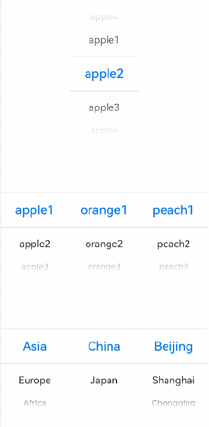
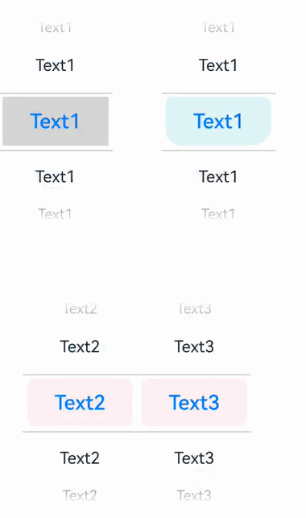
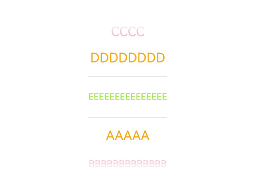

# TextPicker
<!--Kit: ArkUI-->
<!--Subsystem: ArkUI-->
<!--Owner: @luoying_ace_admin-->
<!--Designer: @weixin_52725220-->
<!--Tester: @xiong0104-->
<!--Adviser: @Brilliantry_Rui-->
<!-- md-trans-meta sourceCommit=730cf983570c1d7d7d25392911a45e3269fd9c72 translatedAt=2026-09-03T12:50:13.136Z -->

A component that allows users to select text, images, or hybrid content through scrolling. Users can create a single-column data picker, a multi-column non-linked data picker, and a multi-column linkage data picker as needed. It is applicable to needs where users select data from preset options, such as date selection, region selection, and configuration item settings. The component supports features such as cyclic scrolling, custom text styles, divider style, fade effect, selection item height adjustment, haptic feedback, and crown sensitivity setting, providing a smooth scrolling interaction experience and flexible data display.

>  **NOTE**
>
> - This component is supported since API version 8. New APIs added in later versions are marked with a superscript to indicate their earliest API version.
>
> - It is not recommended for developers to modify attribute data during animation.
>
> - The maximum display rows differ between landscape and portrait modes. In portrait mode, the default is 5 rows. In landscape mode, it depends on the system configuration, and the default is 3 rows when not configured. You can view the specific configuration value through the following parameter: $r('sys.float.ohos_id_picker_show_count_landscape').
>
> - The multi-column non-linked data picker and the multi-column linkage data picker are collectively referred to as the multi-column data picker in the following sections.


## Child Components

This is a basic component, and it is not recommended to include child components.


## APIs

TextPicker(options?: TextPickerOptions)

Creates a text picker based on the specified data list.

**Atomic service API**: This API can be used in atomic services since API version 11.

**System capability**: SystemCapability.ArkUI.ArkUI.Full

**Parameters**

| Name | Type                                           | Mandatory| Description                  |
| ------- | ----------------------------------------------- | ---- | ---------------------- |
| options | [TextPickerOptions](#textpickeroptions) | No | Parameters for configuring the text picker. Pass this parameter when you need to customize the data source, selected item, column width, and other configurations of the picker. If this parameter is not set, the component cannot be displayed. |

## TextPickerOptions

Defines the configuration options of the text picker.

**System capability**: SystemCapability.ArkUI.ArkUI.Full

<!--Table: 20%; 20%; 8%; 8%; 44%-->
| Name| Type| Read Only| Optional| Description|
| -------- | -------- | -------- | -------- | -------- |
| range | string[] \| string[][]<sup>10+</sup> \| [Resource](ts-types.md#resource) \| [TextPickerRangeContent](#textpickerrangecontent10)[]<sup>10+</sup> \| [TextCascadePickerRangeContent](#textcascadepickerrangecontent10)[]<sup>10+</sup> | No | No | Data selection list of the picker. It cannot be set to an empty array. If it is set to an empty array, nothing is displayed; if it dynamically changes to an empty array, the current normal value remains displayed.<br>**Note:**<br>1. A single-column data picker uses the string[], [Resource](ts-types.md#resource), or [TextPickerRangeContent](#textpickerrangecontent10)[] type.<br>2. A multi-column non-linked data picker uses the string[][] type. <br>3. A multi-column linkage data picker uses the [TextCascadePickerRangeContent](#textcascadepickerrangecontent10)[] type.<br>4. The Resource type supports only [strarray.json](../../../quick-start/resource-categories-and-access.md#resource-group-directories).<br>5. The type and number of columns of range cannot be dynamically modified.<br>**Atomic service API:** This API is supported in atomic services since API version 11.|
| selected | number&nbsp;\|&nbsp;number[]<sup>10+</sup> | No | Yes | Sets the index of the selected item in the data selection list. The index starts from 0.<br>Default value: 0 <br>**Note:**<br>1. A single-column data picker uses the number type.<br>2. A multi-column non-linked data picker uses the number[] type, and the array length is the same as the number of columns.<br>3. A multi-column linkage data picker uses the number[] type, and the array length is the same as the number of levels.<br>4. Since API version 10, this parameter supports [$$](../../../ui/state-management/arkts-two-way-sync.md) two-way binding variables.<br>5. If this attribute is not set or the set value is invalid, the default value is used.<br>**Atomic service API:** This API is supported in atomic services since API version 11.|
| value | [ResourceStr](ts-types.md#resourcestr)&nbsp;\|&nbsp;[ResourceStr](ts-types.md#resourcestr)[] | No | Yes | Sets the value of the selected item. Its priority is lower than that of selected.<br>Default value: the value of the first element in the data selection list.<br> **Note:**<br>1. Since API version 10, this parameter supports [$$](../../../ui/state-management/arkts-two-way-sync.md) two-way binding variables.<br>2. Since API version 20, the [Resource](ts-types.md#resource) type is supported.<br>3. This value is valid only when a text list is displayed. It is invalid when a list of images or a mixed list of images and text is displayed.<br>4. A single-column data picker uses the [ResourceStr](ts-types.md#resourcestr) type.<br>5. A multi-column non-linked data picker uses the [ResourceStr](ts-types.md#resourcestr)[] type, and the array length is the same as the number of columns.<br>6. A multi-column linkage data picker uses the [ResourceStr](ts-types.md#resourcestr)[] type, and the array length is the same as the number of levels.<br>7. When neither selected nor value is set, or the selected value is invalid, the default value is used.<br>**Atomic service API:** This API is supported in atomic services since API version 11.|
| columnWidths<sup>18+</sup> | [LengthMetrics](../js-apis-arkui-graphics.md#lengthmetrics12)[] | No | Yes | Sets the width of each column.<br>Default value: the width of each column is equal, which is the component width divided by the number of columns.<br>**Note:**<br>1. When the text length is greater than the column width, the text is truncated.<br>2. When an abnormal value is set, the default value is used.<br>3. Undefined and Null are supported, but Undefined[] and Null[] are not supported.<br>4. When the length of the columnWidths array does not match the actual number of columns, the column width values beyond the number of columns are ignored; columns without a specified width evenly share the remaining available width of the component (the component width minus the sum of the specified column widths).<br>**Model restriction:** This API can be used only under the stage model.<br>**Atomic service API:** This API is supported in atomic services since API version 18. |

## TextPickerRangeContent<sup>10+</sup>

Defines the content for single-column picker options.

**Atomic service API**: This API can be used in atomic services since API version 11.

**Model restriction**: This API can be used only in the stage model.

**System capability**: SystemCapability.ArkUI.ArkUI.Full

| Name| Type                                                | Read Only| Optional| Description                                                        |
| ---- | ---------------------------------------------------- | ---- | ---- | ------------------------------------------------------------ |
| icon | string&nbsp;\|&nbsp;[Resource](ts-types.md#resource) | No   | No   | Image resource. When **icon** is of the string type, it indicates the path of the image, for example, "/common/hello.png"; when **icon** is of the Resource type, it indicates a resource reference. |
| text | string&nbsp;\|&nbsp;[Resource](ts-types.md#resource) | No   | Yes   | Text information.<br>Default value: empty string<br>**Note:**<br>1. When this attribute is not set, the default value is used.<br>2. When the text length is greater than the column width, the text is truncated. |

## TextCascadePickerRangeContent<sup>10+</sup>

Defines the content for multi-column picker options.

**Atomic service API**: This API can be used in atomic services since API version 11.

**Model restriction**: This API can be used only in the stage model.

**System capability**: SystemCapability.ArkUI.ArkUI.Full

| Name| Type                                                | Read Only| Optional| Description  |
| ------ | -------------------------------------------------------- | ---- | ---------- | ---------- |
| text   | string&nbsp;\|&nbsp;[Resource](ts-types.md#resource) | No  | No  | Text information.<br>**Note:** When the text length is greater than the column width, the text is truncated. |
| children   | [TextCascadePickerRangeContent](#textcascadepickerrangecontent10)[] | No  | Yes  | Linked data. Indicates the array of child options of the current data item, used to build the hierarchical structure of a multi-column linkage data picker. Each element of the array is of the [TextCascadePickerRangeContent](#textcascadepickerrangecontent10) type, containing the text and children attributes, and supports multi-level nesting. Pass this parameter when the picker supports multi-level linkage; if it is not passed, the option has no child-level data. |
## DividerOptions<sup>12+</sup>

Define the divider configuration options.

**Atomic service API**: This API can be used in atomic services since API version 12.

**Model restriction**: This API can be used only in the stage model.

**System capability**: SystemCapability.ArkUI.ArkUI.Full

| Name       | Type                                      | Read Only| Optional| Description                                                        |
| ----------- | ------------------------------------------ | ---- | ---- | ------------------------------------------------------------ |
| strokeWidth | [Dimension](ts-types.md#dimension10)       | No   | Yes   | Line width of the divider.<br>Default value: 2.0px<br>Unit: vp by default, or px if specified.<br>Value range: [0, +∞). If strokeWidth is less than 0, the default value is used. The maximum value cannot exceed half of the column height. The percentage type is not supported. |
| startMargin | [Dimension](ts-types.md#dimension10)       | No   | Yes   | Distance between the divider and the start side of the TextPicker.<br>Default value: 0<br>Unit: vp by default, or px if specified.<br>Value range: [0, +∞). If startMargin is less than 0, it is invalid. The maximum value cannot exceed the TextPicker column width. The percentage type is not supported.<br>**Note:** When startMargin + endMargin exceeds the component width, they are set to 0. |
| endMargin   | [Dimension](ts-types.md#dimension10)       | No   | Yes   | Distance between the divider and the end side of the TextPicker.<br>Default value: 0<br>Unit: vp by default, or px if specified.<br>Value range: [0, +∞). If endMargin is less than 0, it is invalid. The maximum value cannot exceed the TextPicker column width. The percentage type is not supported.<br>**Note:** When startMargin + endMargin exceeds the component width, they are set to 0. |
| color       | [ResourceColor](ts-types.md#resourcecolor) | No   | Yes   | Color of the divider.<br>Default value: '#33000000'                       |

## Attributes

In addition to the [universal attributes](ts-component-general-attributes.md), the following attributes are supported.

### defaultPickerItemHeight

defaultPickerItemHeight(value: number | string)

Sets the height of the picker items.

**Atomic service API**: This API can be used in atomic services since API version 11.

**System capability**: SystemCapability.ArkUI.ArkUI.Full

**Parameters**

| Name| Type                      | Mandatory| Description                  |
| ------ | -------------------------- | ---- | ---------------------- |
| value  | number&nbsp;\|&nbsp;string | Yes   | Height of the selected item.<br>Value range:<br>number type: [0, +∞), in vp.<br>string type: only the string form of a number type value is supported, for example, "56".<br>Default value: 56 vp for the selected item and 36 vp for the unselected item.<br>**Note:**<br>After this parameter is set, the height of both the selected item and the unselected item is the set value.<br>When the value of value is negative, the default value is used. |

### defaultPickerItemHeight<sup>18+</sup>

defaultPickerItemHeight(height: Optional\<number | string>)

Sets the height of the picker items. Compared with [defaultPickerItemHeight](#defaultpickeritemheight), this API supports the **undefined** type for the **height** parameter.

**Atomic service API**: This API can be used in atomic services since API version 18.

**Model restriction**: This API can be used only in the stage model.

**System capability**: SystemCapability.ArkUI.ArkUI.Full

**Parameters**

| Name| Type                      | Mandatory| Description                  |
| ------ | -------------------------- | ---- | ---------------------- |
| height  | [Optional](ts-universal-attributes-custom-property.md#optionalt)\<number&nbsp;\|&nbsp;string> | Yes   | Height of the selection item.<br>Value range:<br>number type: [0, +∞), in vp.<br>string type: only the string form of a number type value is supported, for example, "56".<br>Default value: 56 vp for the selected item and 36 vp for unselected items.<br>**Note:**<br>1. After this parameter is set, the height of both the selected item and unselected items is the set value.<br>2. When the value of height is undefined, the previous value is retained. |

### disappearTextStyle<sup>10+</sup>

disappearTextStyle(value: PickerTextStyle)

Sets the text color, font size, and font weight of edge items (the second item above or below the selected item).

**Atomic service API**: This API can be used in atomic services since API version 11.

**Model restriction**: This API can be used only in the stage model.

**System capability**: SystemCapability.ArkUI.ArkUI.Full

**Parameters**

| Name| Type                                                        | Mandatory| Description                                                        |
| ------ | ------------------------------------------------------------ | ---- | ------------------------------------------------------------ |
| value  | [PickerTextStyle](ts-picker-common.md#pickertextstyle) | Yes   | Text color, font size, and font weight of the edge items.<br>Default value:<br>{<br>color: '#ff182431',<br>font: {<br>size: '14fp', <br>weight: FontWeight.Regular<br>}<br>}<br>**Note:** If this method is not called to set the style, the default value is used. |

>  **NOTE**
>
> Edge items only appear when there are at least two visible items above or below the selected item. If insufficient items are available, no edge items will be styled.

### disappearTextStyle<sup>18+</sup>

disappearTextStyle(style: Optional\<PickerTextStyle>)

Sets the text color, font size, and font weight of edge items (the second item above or below the selected item). Compared with [disappearTextStyle<sup>10+</sup>](#disappeartextstyle10), this API supports the **undefined** type for the **style** parameter.

**Atomic service API**: This API can be used in atomic services since API version 18.

**Model restriction**: This API can be used only in the stage model.

**System capability**: SystemCapability.ArkUI.ArkUI.Full

**Parameters**

| Name| Type                                                        | Mandatory| Description                                                        |
| ------ | ------------------------------------------------------------ | ---- | ------------------------------------------------------------ |
| style  | [Optional](ts-universal-attributes-custom-property.md#optionalt)\<[PickerTextStyle](ts-picker-common.md#pickertextstyle)> | Yes   | Text color, font size, and font weight of the edge items.<br>Default value:<br>{<br>color: '#ff182431',<br>font: {<br>size: '14fp', <br>weight: FontWeight.Regular<br>}<br>}<br>When the value of style is undefined, the default value is used. |

>  **NOTE**
>
> Edge items only appear when there are at least two visible items above or below the selected item. If insufficient items are available, no edge items will be styled.

### disappearTextStyle<sup>20+</sup>

disappearTextStyle(style: Optional\<PickerTextStyle\|TextPickerTextStyle>)

Sets the text color, font size, font weight, maximum font size, minimum font size, and truncation mode of edge items (the second item above or below the selected item). Compared with [disappearTextStyle<sup>18+</sup>](#disappeartextstyle18), the style parameter adds support for the [TextPickerTextStyle](#textpickertextstyle15) type.

**Atomic service API**: This API can be used in atomic services since API version 20.

**Model restriction**: This API can be used only in the stage model.

**System capability**: SystemCapability.ArkUI.ArkUI.Full

**Parameters**

| Name| Type                                                        | Mandatory| Description                                                        |
| ------ | ------------------------------------------------------------ | ---- | ------------------------------------------------------------ |
| style  | [Optional](ts-universal-attributes-custom-property.md#optionalt)\<[PickerTextStyle](ts-picker-common.md#pickertextstyle)\|[TextPickerTextStyle](#textpickertextstyle15)> | Yes   | Text color, font size, font weight, maximum font size, minimum font size, and overflow handling of the edge items.<br>Default value:<br>{<br>color: '#ff182431',<br>font: {<br>size: '14fp', <br>weight: FontWeight.Regular<br>},<br>minFontSize: 0,<br>maxFontSize: 0,<br>overflow: TextOverflow.Clip<br>}<br>When the value of style is undefined, the default value is used. |

>  **NOTE**
>
> Edge items only appear when there are at least two visible items above or below the selected item. If insufficient items are available, no edge items will be styled.

### textStyle<sup>10+</sup>

textStyle(value: PickerTextStyle)

Sets the text color, font size, and font weight of candidate items (the first item immediately above or below the selected item).

**Atomic service API**: This API can be used in atomic services since API version 11.

**Model restriction**: This API can be used only in the stage model.

**System capability**: SystemCapability.ArkUI.ArkUI.Full

**Parameters**

| Name| Type                                                        | Mandatory| Description                                                        |
| ------ | ------------------------------------------------------------ | ---- | ------------------------------------------------------------ |
| value  | [PickerTextStyle](ts-picker-common.md#pickertextstyle) | Yes   | Text color, font size, and font weight of the options.<br>Default value:<br>{<br>color: '#ff182431',<br>font: {<br>size: '16fp', <br>weight: FontWeight.Regular<br>}<br>}<br>**Note:** When this method is not called to set the style, the default value is used. |

>  **NOTE**
>
> Candidate items only appear when there is at least one visible item above or below the selected item. If insufficient items are available, no candidate items will be styled.

### textStyle<sup>18+</sup>

textStyle(style: Optional\<PickerTextStyle>)

Sets the text color, font size, and font weight of candidate items (the first item immediately above or below the selected item). Compared with [textStyle<sup>10+</sup>](#textstyle10), this API supports the **undefined** type for the **style** parameter.

**Atomic service API**: This API can be used in atomic services since API version 18.

**Model restriction**: This API can be used only in the stage model.

**System capability**: SystemCapability.ArkUI.ArkUI.Full

**Parameters**

| Name| Type                                                        | Mandatory| Description                                                        |
| ------ | ------------------------------------------------------------ | ---- | ------------------------------------------------------------ |
| style  | [Optional](ts-universal-attributes-custom-property.md#optionalt)\<[PickerTextStyle](ts-picker-common.md#pickertextstyle)> | Yes   | Text color, font size, and font weight of the options to be selected.<br>Default value:<br>{<br>color: '#ff182431',<br>font: {<br>size: '16fp', <br>weight: FontWeight.Regular<br>}<br>}<br>When the value of style is undefined, the default value is used. |

>  **NOTE**
>
> Candidate items only appear when there is at least one visible item above or below the selected item. If insufficient items are available, no candidate items will be styled.

### textStyle<sup>20+</sup>

textStyle(style: Optional\<PickerTextStyle\|TextPickerTextStyle>)

Sets the text color, font size, font weight, maximum font size, minimum font size, and truncation mode of candidate items (the first item immediately above or below the selected item). Compared with [textStyle<sup>18+</sup>](#textstyle18), the style parameter adds support for the [TextPickerTextStyle](#textpickertextstyle15) type.

**Atomic service API**: This API can be used in atomic services since API version 20.

**Model restriction**: This API can be used only in the stage model.

**System capability**: SystemCapability.ArkUI.ArkUI.Full

**Parameters**

| Name| Type                                                        | Mandatory| Description                                                        |
| ------ | ------------------------------------------------------------ | ---- | ------------------------------------------------------------ |
| style  | [Optional](ts-universal-attributes-custom-property.md#optionalt)\<[PickerTextStyle](ts-picker-common.md#pickertextstyle)\|[TextPickerTextStyle](#textpickertextstyle15)> | Yes   | Text color, font size, font weight, maximum font size, minimum font size, and truncation mode of the text to be selected.<br>Default value:<br>{<br>color: '#ff182431',<br>font: {<br>size: '16fp', <br>weight: FontWeight.Regular<br>},<br>minFontSize: 0,<br>maxFontSize: 0,<br>overflow: TextOverflow.Clip<br>}<br>When the value of style is undefined, the default value is used. |

>  **NOTE**
>
> Candidate items only appear when there is at least one visible item above or below the selected item. If insufficient items are available, no candidate items will be styled.

### selectedTextStyle<sup>10+</sup>

selectedTextStyle(value: PickerTextStyle)

Sets the text color, font size, and font weight of the selected item.

**Atomic service API**: This API can be used in atomic services since API version 11.

**Model restriction**: This API can be used only in the stage model.

**System capability**: SystemCapability.ArkUI.ArkUI.Full

**Parameters**

| Name| Type                                                        | Mandatory| Description                                                        |
| ------ | ------------------------------------------------------------ | ---- | ------------------------------------------------------------ |
| value  | [PickerTextStyle](ts-picker-common.md#pickertextstyle) | Yes   | Text color, font size, and font weight of the selected item.<br>Default value:<br>{<br>color: '#ff007dff',<br>font: {<br>size: '20fp', <br>weight: FontWeight.Medium<br>}<br>}<br>**Note:** If this method is not called to set the style, the default value is used. |

### selectedTextStyle<sup>18+</sup>

selectedTextStyle(style: Optional\<PickerTextStyle>)

Sets the text color, font size, and font weight of the selected item. Compared with [selectedTextStyle<sup>10+</sup>](#selectedtextstyle10), this API supports the **undefined** type for the **style** parameter.

**Atomic service API**: This API can be used in atomic services since API version 18.

**Model restriction**: This API can be used only in the stage model.

**System capability**: SystemCapability.ArkUI.ArkUI.Full

**Parameters**

| Name| Type                                                        | Mandatory| Description                                                        |
| ------ | ------------------------------------------------------------ | ---- | ------------------------------------------------------------ |
| style  | [Optional](ts-universal-attributes-custom-property.md#optionalt)\<[PickerTextStyle](ts-picker-common.md#pickertextstyle)> | Yes   | Text color, font size, and font weight of the selected item.<br>Default value:<br>{<br>color: '#ff007dff',<br>font: {<br>size: '20fp', <br>weight: FontWeight.Medium<br>}<br>}<br>When the value of style is undefined, the default value is used. |

### selectedTextStyle<sup>20+</sup>

selectedTextStyle(style: Optional\<PickerTextStyle\|TextPickerTextStyle>)

Sets the text color, font size, font weight, maximum font size, minimum font size, and truncation mode of the selected item. Compared with [selectedTextStyle<sup>18+</sup>](#selectedtextstyle18), the style parameter adds support for the [TextPickerTextStyle](#textpickertextstyle15) type.

**Atomic service API**: This API can be used in atomic services since API version 20.

**Model restriction**: This API can be used only in the stage model.

**System capability**: SystemCapability.ArkUI.ArkUI.Full

**Parameters**

| Name| Type                                                        | Mandatory| Description                                                        |
| ------ | ------------------------------------------------------------ | ---- | ------------------------------------------------------------ |
| style  | [Optional](ts-universal-attributes-custom-property.md#optionalt)\<[PickerTextStyle](ts-picker-common.md#pickertextstyle)\|[TextPickerTextStyle](#textpickertextstyle15)> | Yes   | Text color, font size, font weight, maximum font size, minimum font size, and truncation mode of the selected item's overlong text.<br>Default value:<br>{<br>color: '#ff007dff',<br>font: {<br>size: '20fp', <br>weight: FontWeight.Medium<br>},<br>minFontSize: 0,<br>maxFontSize: 0,<br>overflow: TextOverflow.Clip<br>}<br>When the value of style is undefined, the default value is used. |

### selectedIndex<sup>10+</sup>

selectedIndex(value: number | number[])

Sets the index of the selected item or items in the data list. This setting takes precedence over the **value** property in [TextPickerOptions](#textpickeroptions). Use the number type for single-column pickers. Use the number[] type for multi-column pickers.

**Atomic service API**: This API can be used in atomic services since API version 11.

**Model restriction**: This API can be used only in the stage model.

**System capability**: SystemCapability.ArkUI.ArkUI.Full

**Parameters**

| Name| Type                        | Mandatory| Description                        |
| ------ | ---------------------------- | ---- | ---------------------------- |
| value  | number&nbsp;\|&nbsp;number[] | Yes   | Index of the selected item in the data selection list. The index starts from 0.<br>Default value: **0**<br>If the value is negative or exceeds the maximum index of the data selection list, the default value is used.<br> |

### selectedIndex<sup>18+</sup>

selectedIndex(index: Optional\<number | number[]>)

Sets the index of the selected item or items in the data list. This setting takes precedence over the **value** property in [TextPickerOptions](#textpickeroptions). Use the number type for single-column pickers. Use the number[] type for multi-column pickers. Compared with [selectedIndex<sup>10+</sup>](#selectedindex10), this API supports the **undefined** type for the **index** parameter.

**Atomic service API**: This API can be used in atomic services since API version 18.

**Model restriction**: This API can be used only in the stage model.

**System capability**: SystemCapability.ArkUI.ArkUI.Full

**Parameters**

| Name| Type                                                        | Mandatory| Description                                                        |
| ------ | ------------------------------------------------------------ | ---- | ------------------------------------------------------------ |
| index  | [Optional](ts-universal-attributes-custom-property.md#optionalt)\<number&nbsp;\|&nbsp;number[]> | Yes   | Index of the selected item in the data selection list. The index starts from 0.<br>Default value: **0** <br>If the value of **index** is **undefined**, the value of **selected** in [TextPickerOptions](#textpickeroptions) is used.<br>If the value of **index** is a negative number or exceeds the maximum index value of the data selection list, the default value is used.<br> |

### canLoop<sup>10+</sup>

canLoop(value: boolean)

Sets whether to enable loop scrolling.

**Atomic service API**: This API can be used in atomic services since API version 11.

**Model restriction**: This API can be used only in the stage model.

**System capability**: SystemCapability.ArkUI.ArkUI.Full

**Parameters**

| Name| Type   | Mandatory| Description                                                        |
| ------ | ------- | ---- | ------------------------------------------------------------ |
| value  | boolean | Yes   | Whether circular scrolling is supported.<br>- true: Circular scrolling is supported.<br>- false: Circular scrolling is not supported.<br>Default value: true |

### canLoop<sup>18+</sup>

canLoop(isLoop: Optional\<boolean>)

Sets whether to enable loop scrolling. Compared with [canLoop<sup>10+</sup>](#canloop10), this API supports the **undefined** type for the **isLoop** parameter.

**Atomic service API**: This API can be used in atomic services since API version 18.

**Model restriction**: This API can be used only in the stage model.

**System capability**: SystemCapability.ArkUI.ArkUI.Full

**Parameters**

| Name| Type   | Mandatory| Description                                                        |
| ------ | ------- | ---- | ------------------------------------------------------------ |
| isLoop  | [Optional](ts-universal-attributes-custom-property.md#optionalt)\<boolean> | Yes   | Whether cyclic scrolling is supported.<br>- true: Cyclic scrolling is supported.<br>- false: Cyclic scrolling is not supported.<br>Default value: true<br>When the value of isLoop is undefined, the default value is used. |

### divider<sup>12+</sup>

divider(value: DividerOptions | null)

Sets the divider style. If not explicitly set, the divider uses the default style.

If the sum of **startMargin** and **endMargin** in [DividerOptions](#divideroptions12) exceeds the component's width, both margins are automatically reset to 0.

**Atomic service API**: This API can be used in atomic services since API version 12.

**Model restriction**: This API can be used only in the stage model.

**System capability**: SystemCapability.ArkUI.ArkUI.Full

**Parameters**
| Name| Type   | Mandatory| Description                                                                 |
| ------ | ------- | ---- | --------------------------------------------------------------------- |
| value | [DividerOptions](#divideroptions12) \| null | Yes | Divider style. Pass a DividerOptions object to customize the stroke width, margins, and color of the divider; pass null to hide the divider; if not passed, the default style is used.<br>Default value:<br>{<br>strokeWidth: '2px', <br>startMargin: 0, <br>endMargin: 0, <br>color: '#33000000'<br>}<br>1. When value is set to a valid [DividerOptions](#divideroptions12), the divider is displayed in the specified style.<br>2. When value is set to null, the divider is not displayed. |

### divider<sup>18+</sup>

divider(textDivider: Optional\<DividerOptions | null>)

Sets the divider style. If not explicitly set, the divider uses the default style. Compared with [divider<sup>12+</sup>](#divider12), this API supports the **undefined** type for the **textDivider** parameter.

If the sum of **startMargin** and **endMargin** in [DividerOptions](#divideroptions12) exceeds the component's width, both margins are automatically reset to 0.

**Atomic service API**: This API can be used in atomic services since API version 18.

**Model restriction**: This API can be used only in the stage model.

**System capability**: SystemCapability.ArkUI.ArkUI.Full

**Parameters**

| Name| Type   | Mandatory| Description                                                                 |
| ------ | ------- | ---- | --------------------------------------------------------------------- |
| textDivider | [Optional](ts-universal-attributes-custom-property.md#optionalt)\<[DividerOptions](#divideroptions12) \| null> | Yes | Default value:<br>{<br>strokeWidth: '2px', <br>startMargin: 0, <br>endMargin: 0, <br>color: '#33000000'<br>}<br>1. When the value of textDivider is undefined, the default value is used.<br>2. When textDivider is set to a valid [DividerOptions](#divideroptions12), the divider is displayed in the specified style.<br>3. When textDivider is set to null, the divider is not displayed. |

### gradientHeight<sup>12+</sup>

gradientHeight(value: Dimension)

Sets the height of the fade effect applied to the top and bottom edges of the content area. If no setting is specified, a default fade effect is used.

**Atomic service API**: This API can be used in atomic services since API version 12.

**Model restriction**: This API can be used only in the stage model.

**System capability**: SystemCapability.ArkUI.ArkUI.Full

**Parameters**

| Name| Type   | Mandatory| Description                                                        |
| ------ | ------- | ---- | ------------------------------------------------------------ |
| value  | [Dimension](ts-types.md#dimension10) | Yes   | Fade height of the upper and lower edges of the content area.<br>Default value: 36vp<br>Value range: [0, +∞), percentage supported.<br>**NOTE**<br>1. When value is set to a percentage, 100% indicates half the height of TextPicker.<br>2. When value is set to 0, the fade effect is not displayed.<br>3. When value is set to a number that exceeds half the height of TextPicker, the default value is used.<br>4. When the value is negative, the default value is used. |

### gradientHeight<sup>18+</sup>

gradientHeight(height: Optional\<Dimension>)

Sets the height of the fade effect applied to the top and bottom edges of the content area. If no setting is specified, a default fade effect is used. Compared with [gradientHeight<sup>12+</sup>](#gradientheight12), this API supports the **undefined** type for the **height** parameter.

**Atomic service API**: This API can be used in atomic services since API version 18.

**Model restriction**: This API can be used only in the stage model.

**System capability**: SystemCapability.ArkUI.ArkUI.Full

**Parameters**

| Name| Type   | Mandatory| Description                                                        |
| ------ | ------- | ---- | ------------------------------------------------------------ |
| height  | [Optional](ts-universal-attributes-custom-property.md#optionalt)\<[Dimension](ts-types.md#dimension10)> | Yes   | Fade height of the upper and lower edges of the content area.<br>Default value: 36vp<br>Value range: [0, +∞), percentage supported.<br>**Note:**<br>1. When height is set to a percentage, 100% means half the height of the TextPicker.<br>2. When height is set to 0, the fade effect is not displayed.<br>3. When height is set to a number that exceeds half the height of the TextPicker, the default value is used.<br>4. When the value of height is undefined or negative, the default value is used. |

### disableTextStyleAnimation<sup>15+</sup>

disableTextStyleAnimation(disabled: boolean)

Sets whether to disable the animation effect of text style changes during scrolling.

**Atomic service API**: This API can be used in atomic services since API version 15.

**Model restriction**: This API can be used only in the stage model.

**System capability**: SystemCapability.ArkUI.ArkUI.Full

**Parameters**

| Name| Type   | Mandatory| Description                                                        |
| ------ | ------- | ---- | ------------------------------------------------------------ |
| disabled  | boolean | Yes   | Whether to disable the animation of text style changes during scrolling.<br>- true: Disables the animation of text style changes.<br>- false: Does not disable the animation of text style changes.<br>Default value: false<br>**Note:**<br>When set to true, there is no animation of font size, font weight, or font color changes during scrolling, and the text is displayed in the style set by [defaultTextStyle](#defaulttextstyle15). If [defaultTextStyle](#defaulttextstyle15) is not set, the default style of the [Text](ts-basic-components-text.md) component is used. When set to false, the system default animation of text style changes during scrolling is used.|

### defaultTextStyle<sup>15+</sup>

defaultTextStyle(style: TextPickerTextStyle)

Sets the text style of the items when the text style change animation during the scrolling process is disabled. This setting takes effect only when [disableTextStyleAnimation](#disabletextstyleanimation15) is set to **true**.

**Atomic service API**: This API can be used in atomic services since API version 15.

**Model restriction**: This API can be used only in the stage model.

**System capability**: SystemCapability.ArkUI.ArkUI.Full

**Parameters**

| Name| Type                                                        | Mandatory| Description                                                        |
| ------ | ------------------------------------------------------------ | ---- | ------------------------------------------------------------ |
| style  | [TextPickerTextStyle](#textpickertextstyle15) | Yes   | Text style of each item when the text style change animation during the sliding process is disabled.<br>Default value: same as the default value of the [Text](ts-basic-components-text.md) component. |

### enableHapticFeedback<sup>18+</sup>

enableHapticFeedback(enable: Optional\<boolean>)

Sets whether to enable haptic feedback.

**Atomic service API**: This API can be used in atomic services since API version 18.

**Model restriction**: This API can be used only in the stage model.

**System capability**: SystemCapability.ArkUI.ArkUI.Full

**Parameters**

| Name| Type                                         | Mandatory | Description                                                                                 |
| ------ | --------------------------------------------- |-----|-------------------------------------------------------------------------------------|
| enable  | [Optional](ts-universal-attributes-custom-property.md#optionalt)\<boolean> | Yes   | Whether to enable haptic feedback.<br>- true: Enables haptic feedback.<br>- false: Disables haptic feedback.<br>Default value: true<br>After it is set to true, whether it takes effect depends on whether the system hardware supports it. If the hardware does not support haptic feedback, enabling this feature does not produce a haptic feedback effect, nor does it throw an exception. |

To enable haptic feedback, you must declare the following permission under **requestPermissions** in **module** in **src/main/module.json5** of the project.

```json
"requestPermissions": [
   {
      "name": "ohos.permission.VIBRATE"
   }
]
```

### digitalCrownSensitivity<sup>18+</sup>
digitalCrownSensitivity(sensitivity: Optional\<CrownSensitivity>)

Sets the sensitivity to the digital crown rotation.

**Atomic service API**: This API can be used in atomic services since API version 18.

**Model restriction**: This API can be used only in the stage model.

**System capability**: SystemCapability.ArkUI.ArkUI.Full

**Parameters**

| Name  | Type                                    | Mandatory  | Description                     |
| ----- | ---------------------------------------- | ---- | ------------------------- |
| sensitivity | [Optional](ts-universal-attributes-custom-property.md#optionalt)\<[CrownSensitivity](ts-appendix-enums.md#crownsensitivity18)> | Yes    | Crown response sensitivity.<br>Default value: **CrownSensitivity.MEDIUM**, which indicates a moderate response speed. Different sensitivity values affect the correspondence between the crown scrolling speed and the selected item switching speed. For the effect of each enum value, see [CrownSensitivity](ts-appendix-enums.md#crownsensitivity18).                     |

>  **NOTE**
>
>  This API is used for circular screens on wearables. The component needs to obtain focus before responding to the [crown event](ts-universal-events-crown.md).

### selectedBackgroundStyle<sup>20+</sup>
selectedBackgroundStyle(style: Optional\<PickerBackgroundStyle>)

Sets the background style of selected items.

**Atomic service API**: This API can be used in atomic services since API version 20.

**Model restriction**: This API can be used only in the stage model.

**System capability**: SystemCapability.ArkUI.ArkUI.Full

**Parameters**

| Name  | Type                                    | Mandatory  | Description                     |
| ----- | ---------------------------------------- | ---- | ------------------------- |
| style | [Optional](ts-universal-attributes-custom-property.md#optionalt)\<[PickerBackgroundStyle](#pickerbackgroundstyle20)> | Yes    | Color and border radius of the background of the selected item. In multi-column mode, the color and border radius of the background of the selected item are set for all columns at the same time.<br>Default value:<br>{ <br>color: $r('sys.color.comp_background_tertiary'),<br>borderRadius: $r('sys.float.corner_radius_level12')<br>}|

## Events

In addition to the [universal events](ts-component-general-events.md), the following events are supported.

### onChange

onChange(callback:&nbsp;(value:&nbsp;string&nbsp;\|&nbsp;string[],&nbsp;index:&nbsp;number&nbsp;\|&nbsp;number[])&nbsp;=&gt;&nbsp;void)

Triggered when the options settle at the selected item position after the text content of TextPicker is scrolled. It is triggered when the user scrolls the picker and the selected item changes. It cannot be triggered by modifying the two-way bound state variable (such as selected). When a text list or an image-plus-text list is displayed, the value is the text value of the selected item. When an image list is displayed, the value is empty.

This callback is triggered only after the scroll animation completes. To obtain real-time index changes, use [onEnterSelectedArea](#onenterselectedarea18) instead.

**Atomic service API**: This API can be used in atomic services since API version 11.

**System capability**: SystemCapability.ArkUI.ArkUI.Full

**Parameters**

| Name| Type                                      | Mandatory| Description                                             |
| ------ | ------------------------------------------ | ---- | ------------------------------------------------- |
| value  | string&nbsp;\|&nbsp;string[]<sup>10+</sup> | Yes   | Text of the currently selected item. For a multi-column data picker, the value is of the array type.<br>**Note:**<br>When a text list or an image-plus-text list is displayed, the value is the text value of the selected item. When an image list is displayed, the value is empty. |
| index  | number&nbsp;\|&nbsp;number[]<sup>10+</sup> | Yes  | Index of the selected item. The index is zero-based. Use the array type for multi-column pickers.|

### onChange<sup>18+</sup>

onChange(callback: Optional\<OnTextPickerChangeCallback>)

Triggered when the options settle at the selected item position after the text content of TextPicker is scrolled. It is triggered when the user scrolls the picker and the selected item changes. It cannot be triggered by modifying the two-way bound state variable (such as selected). When a text list or an image-plus-text list is displayed, the value is the text value of the selected item. When an image list is displayed, the value is empty. Compared with [onChange](#onchange), the callback parameter adds support for the undefined type.

This callback is triggered only after the scroll animation completes. To obtain real-time index changes, use [onEnterSelectedArea](#onenterselectedarea18) instead.

**Atomic service API**: This API can be used in atomic services since API version 18.

**Model restriction**: This API can be used only in the stage model.

**System capability**: SystemCapability.ArkUI.ArkUI.Full

**Parameters**

| Name  | Type                                                        | Mandatory| Description                                                        |
| -------- | ------------------------------------------------------------ | ---- | ------------------------------------------------------------ |
| callback | [Optional](ts-universal-attributes-custom-property.md#optionalt)\<[OnTextPickerChangeCallback](#ontextpickerchangecallback18)> | Yes | Callback invoked when the text content of the TextPicker is selected by swiping.<br>If the value of callback is undefined, the callback is not used. |

### onScrollStop<sup>14+</sup>

onScrollStop(callback: TextPickerScrollStopCallback)

Triggered when the scrolling in the text picker stops.

If the scrolling is initiated by a gesture, this event is triggered when the finger is lifted from the screen and the scrolling stops.

>**NOTE**
>
> - The difference from the [onEnterSelectedArea](#onenterselectedarea18) event is that onScrollStop focuses on the complete stop of the scrolling behavior, while onEnterSelectedArea focuses on the logical state of an option entering the selected area. onEnterSelectedArea responds to index changes earlier and is suitable for real-time feedback scenarios. It is recommended to use [onEnterSelectedArea](#onenterselectedarea18). If you need to confirm that the scrolling behavior has completely stopped, use onScrollStop.
>
> - Since API version 20, this API supports being called in [attributeModifier](ts-universal-attributes-attribute-modifier.md#attributemodifier).

**Atomic service API**: This API can be used in atomic services since API version 14.

**Model restriction**: This API can be used only in the stage model.

**System capability**: SystemCapability.ArkUI.ArkUI.Full

**Parameters**

| Name| Type                                      | Mandatory| Description                                             |
| ------ | ------------------------------------------ | ---- | ------------------------------------------------- |
| callback | [TextPickerScrollStopCallback](#textpickerscrollstopcallback14) | Yes | Triggered when the option column of the text picker stops scrolling. Callback signature: (value: string \| string[], index: number \| number[]) => void, where value is the text of the currently selected item, and index is the index of the currently selected item (starting from 0). |

### onScrollStop<sup>18+</sup>

onScrollStop(callback: Optional\<TextPickerScrollStopCallback>)

Triggered when the scrolling in the text picker stops. Compared with [onScrollStop<sup>14+</sup>](#onscrollstop14), this API supports the **undefined** type for the **callback** parameter.

If the scrolling is initiated by a gesture, this event is triggered when the finger is lifted from the screen and the scrolling stops.

>**NOTE**
>
> - The difference from the [onEnterSelectedArea](#onenterselectedarea18) event is that onScrollStop focuses on the complete stop of the scrolling behavior, while onEnterSelectedArea focuses on the logical state of an option entering the selected area. onEnterSelectedArea responds to index changes earlier and is suitable for real-time feedback scenarios. It is recommended to use [onEnterSelectedArea](#onenterselectedarea18). If you need to confirm that the scrolling behavior has completely stopped, use onScrollStop.
>
> - Since API version 20, this API supports being called in [attributeModifier](ts-universal-attributes-attribute-modifier.md#attributemodifier).

**Atomic service API**: This API can be used in atomic services since API version 18.

**Model restriction**: This API can be used only in the stage model.

**System capability**: SystemCapability.ArkUI.ArkUI.Full

**Parameters**

| Name| Type                                      | Mandatory| Description                                             |
| ------ | ------------------------------------------ | ---- | ------------------------------------------------- |
| callback | [Optional](ts-universal-attributes-custom-property.md#optionalt)\<[TextPickerScrollStopCallback](#textpickerscrollstopcallback14)> | Yes | Callback invoked when the option column of the text picker stops scrolling.<br>When the value of callback is undefined, the callback is not used. |

### onEnterSelectedArea<sup>18+</sup>

onEnterSelectedArea(callback: TextPickerEnterSelectedAreaCallback)

Triggered when an option enters the selection zone during text picker scrolling (when the scroll distance exceeds half the selected item's height).

> **NOTE**
>
> - The difference from the [onChange](#onchange) event is that this event is triggered earlier than the [onChange](#onchange) event. onEnterSelectedArea is triggered when an option enters the selected area during sliding, and is suitable for obtaining index value changes in real time, applicable to scenarios that require a quick response to user sliding. onChange is triggered after sliding ends and the selected item is settled, and is suitable for obtaining the finally confirmed selected value, applicable to scenarios that require obtaining the user's final selection.
>
> - The difference from the [onScrollStop](#onscrollstop14) event is that onEnterSelectedArea focuses on the logical state of an option entering the selected area, while onScrollStop focuses on the complete stop of the scrolling behavior. Use onEnterSelectedArea when an earlier response to index changes is required, and use [onScrollStop](#onscrollstop14) when confirmation that scrolling has completely stopped is required.
>
> - In multi-column linkage scenarios, using this callback is not recommended. This callback identifies the node at which an option enters the divider area during sliding. The options that change accordingly do not involve sliding, so in the callback return value, only the value of the currently sliding column changes normally, while the values of the other non-sliding columns remain unchanged.
>
> - This API does not support being called in [attributeModifier](ts-universal-attributes-attribute-modifier.md#attributemodifier).

**Atomic service API**: This API can be used in atomic services since API version 18.

**Model restriction**: This API can be used only in the stage model.

**System capability**: SystemCapability.ArkUI.ArkUI.Full

**Parameters**

| Name  | Type                      | Mandatory| Description                                      |
| -------- | -------------------------- | ---- | ------------------------------------------ |
| callback | [TextPickerEnterSelectedAreaCallback](#textpickerenterselectedareacallback18) | Yes | Callback invoked when an option enters the divider area during sliding of the TextPicker. Callback signature: (value: string \| string[], index: number \| number[]) => void, where value is the text of the currently selected item, and index is the index of the currently selected item (starting from 0). |

### onAccept<sup>(deprecated) </sup>

onAccept(callback: (value: string, index: number) => void)

Triggered when the OK button in the dialog box is clicked. This event can be triggered only in the [text picker dialog box](ts-methods-textpicker-dialog.md).

> **NOTE**
>
> This API is supported since API version 8 and deprecated since API version 10. This API has been completely removed, and there is no substitute API.

**System capability**: SystemCapability.ArkUI.ArkUI.Full

**Parameters**

| Name| Type  | Mandatory| Description                |
| ------ | ------ | ---- | -------------------- |
| value  | string | Yes  | Text of the selected item.  |
| index  | number | Yes  | Index of the selected item. The index is zero-based.|

### onCancel<sup>(deprecated) </sup>

onCancel(callback: () => void)

Triggered when the cancel button in the dialog box is clicked. This event can be triggered only in the [text picker dialog box](ts-methods-textpicker-dialog.md).

> **NOTE**
>
> This API is supported since API version 8 and deprecated since API version 10. This API has been completely removed. There is no substitute API.

**System capability**: SystemCapability.ArkUI.ArkUI.Full

**Parameters**

| Name| Type  | Mandatory| Description                |
| ------ | ------ | ---- | -------------------- |
| callback  | () => void | Yes  | Callback invoked when the cancel button in the dialog box is clicked.  |

## TextPickerTextStyle<sup>15+</sup>

Defines the text style options for the text picker. Inherits from [PickerTextStyle](ts-picker-common.md#pickertextstyle).

**Atomic service API**: This API can be used in atomic services since API version 15.

**Model restriction**: This API can be used only in the stage model.

**System capability**: SystemCapability.ArkUI.ArkUI.Full

| Name  | Type                                    | Read Only| Optional| Description                     |
| ----- | ---------------------------------------- | ---- | ------------------------- | ------------------------- |
| minFontSize | number \| string \| [Resource](ts-types.md#resource) | No | Yes | Sets the minimum font size of the text, used together with maxFontSize. Pass this parameter when you need to limit the minimum display size of the text to prevent it from being too small or to implement font size adaptation.<br>**Note:** When minFontSize and maxFontSize are set, the size in font does not take effect. The default maximum number of lines is 1, and the adaptive height mode is MIN_FONT_SIZE_FIRST. For details, see the [minFontSize](ts-basic-components-text.md#minfontsize) attribute of the Text component. |
| maxFontSize  | number \| string \| [Resource](ts-types.md#resource) | No   | Yes   | Sets the maximum font size of the text, used together with minFontSize. Pass this parameter when you need to limit the maximum display size of the text to prevent it from being too large or to implement font size adaptation.<br>**Note:** When minFontSize and maxFontSize are set, the size in font does not take effect. For details, see the [maxFontSize](ts-basic-components-text.md#maxfontsize) attribute of the Text component.                     |
| overflow | [TextOverflow](ts-appendix-enums.md#textoverflow) | No| Yes| Text overflow behavior. This property has no effect when set to **MARQUEE**. For details, see [textOverflow](ts-basic-components-text.md#textoverflow).|

## OnTextPickerChangeCallback<sup>18+</sup>

type OnTextPickerChangeCallback = (selectItem: string | string[], index: number | number[]) => void

Defines the **onChange** event callback signature.

**Atomic service API**: This API can be used in atomic services since API version 18.

**Model restriction**: This API can be used only in the stage model.

**System capability**: SystemCapability.ArkUI.ArkUI.Full

**Parameters**

| Name    | Type                                      | Mandatory| Description                                                        |
| ---------- | ------------------------------------------ | ---- | ------------------------------------------------------------ |
| selectItem | string&nbsp;\|&nbsp;string[]<sup>10+</sup> | Yes | Text of the currently selected item. For a multi-column data picker, selectItem is of the array type.<br>**Note:**<br>When the picker content is text or a mix of text and images, the value of selectItem is the text value of the selected item. When the picker content is an image, the value of selectItem is empty. |
| index      | number&nbsp;\|&nbsp;number[]<sup>10+</sup> | Yes  | Index of the selected item. The index is zero-based. Use the array type for multi-column pickers.|

## TextPickerScrollStopCallback<sup>14+</sup>

type TextPickerScrollStopCallback = (value: string | string[], index: number | number[]) => void

Defines the **onScrollStop** event callback signature.

**Atomic service API**: This API can be used in atomic services since API version 14.

**Model restriction**: This API can be used only in the stage model.

**System capability**: SystemCapability.ArkUI.ArkUI.Full

**Parameters**

| Name| Type                                      | Mandatory| Description                                             |
| ------ | ------------------------------------------ | ---- | ------------------------------------------------- |
| value  | string&nbsp;\|&nbsp;string[] | Yes   | Text of the currently selected item. For a multi-column data picker, the value is of the array type.<br>**Note:**<br>When the picker content is text or a mix of text and image, the value is the text value of the selected item. When the picker content is an image, the value is empty. |
| index  | number&nbsp;\|&nbsp;number[] | Yes  | Index of the selected item. The index is zero-based. Use the array type for multi-column pickers.|

## TextPickerEnterSelectedAreaCallback<sup>18+</sup>

type TextPickerEnterSelectedAreaCallback = (value: string | string[], index: number | number[]) => void

Defines the **onEnterSelectedArea** event callback signature.

**Atomic service API**: This API can be used in atomic services since API version 18.

**Model restriction**: This API can be used only in the stage model.

**System capability**: SystemCapability.ArkUI.ArkUI.Full

**Parameters**

| Name| Type                                      | Mandatory| Description                                             |
| ------ | ------------------------------------------ | ---- | ------------------------------------------------- |
| value  | string&nbsp;\|&nbsp;string[] | Yes   | Text of the currently selected item. For a multi-column data picker, the value is of the array type.<br>**Note:**<br>When the picker content is text or a mix of text and images, the value is the text of the selected item; when the picker content is an image, the value is empty. |
| index  | number&nbsp;\|&nbsp;number[] | Yes  | Index of the selected item. The index is zero-based. Use the array type for multi-column pickers.|

## PickerBackgroundStyle<sup>20+</sup>

Defines the background style configuration for selected picker items.

**Atomic service API**: This API can be used in atomic services since API version 20.

**Model restriction**: This API can be used only in the stage model.

**System capability**: SystemCapability.ArkUI.ArkUI.Full

| Name| Type                                      | Read Only| Optional| Description                                             |
| ------ | ------------------------------------- | ---- | ------------------------------------------------- | ------------------------------------------------- |
| color  | [ResourceColor](ts-types.md#resourcecolor) | No  | Yes  | Background color of the selected item.<br>Default value:<br>'sys.color.comp_background_tertiary'<br>**Note:** If this attribute is not set, the default value is used.   |
| borderRadius  | [LengthMetrics](../js-apis-arkui-graphics.md#lengthmetrics12) &nbsp;\|&nbsp; [BorderRadiuses](ts-types.md#borderradiuses9) &nbsp;\|&nbsp; [LocalizedBorderRadiuses](ts-types.md#localizedborderradiuses12) | No  | Yes  | Corner radius of the border of the selected item.<br>Default value: { value:24, unit:LengthUnit.VP }, that is, the radius of all four corners is 24vp.<br>Unit: vp by default. The unit can be specified through the LengthMetrics or LocalizedBorderRadiuses type.<br>**NOTE**<br>1. The value parameter of the [LengthMetrics](../js-apis-arkui-graphics.md#lengthmetrics12) type applies to the radius of all four corners, and the unit parameter is used to set the unit.<br>2. The [BorderRadiuses](ts-types.md#borderradiuses9) type can set four different corner radii, with all units fixed to vp.<br>3. The [LocalizedBorderRadiuses](ts-types.md#localizedborderradiuses12) type can set four different corner radii, and the unit of each corner can be set separately. |
## Example

### Example 1: Setting the Number of Columns in the Picker

This example demonstrates how to configure single-column and multi-column text pickers by setting **range** and customizing the width of each column using **columnWidths**.

The **columnWidths** attribute of [TextPickerOptions](#textpickeroptions) is added since API version 18.

```ts
// xxx.ets
import { LengthMetrics } from '@kit.ArkUI';

@Entry
@Component
struct TextPickerExample {
  private select: number = 1;
  private apfruits: string[] = ['apple1', 'apple2', 'apple3', 'apple4'];
  private orfruits: string[] = ['orange1', 'orange2', 'orange3', 'orange4'];
  private pefruits: string[] = ['peach1', 'peach2', 'peach3', 'peach4'];
  private multi: string[][] = [this.apfruits, this.orfruits, this.pefruits];
  private cascade: TextCascadePickerRangeContent[] = [
    {
      text: 'Liaoning Province',
      children: [{ text: 'Shenyang', children: [{ text: 'Shenhe District' }, { text: 'Heping District' }, { text: 'Hunnan District' }] },
        { text: 'Dalian', children: [{ text: 'Zhongshan District' }, { text: 'Jinzhou District' }, { text: 'Changhai County' }] }]
    },
    {
      text: 'Jilin Province',
      children: [{ text: 'Changchun', children: [{ text: 'Nanguan District' }, { text: 'Kuancheng District' }, { text: 'Chaoyang District' }] },
        { text: 'Siping', children: [{ text: 'Tiexi District' }, { text: 'Tiedong District' }, { text: 'Lishu County' }] }]
    },
    {
      text: 'Heilongjiang Province',
      children: [{ text: 'Harbin', children: [{ text: 'Daoli District' }, { text: 'Daowai District' }, { text: 'Nangang District' }] },
        { text: 'Mudanjiang', children: [{ text: `Dong'an District` }, { text: `Xi'an District` }, { text: 'Aimin District' }] }]
    }
  ];
  private singleColumnWidths: LengthMetrics[] = [
    LengthMetrics.percent(50)
  ];

  private multipleColumnWidths: LengthMetrics[] = [
    LengthMetrics.vp(100),
    LengthMetrics.vp(200),
    LengthMetrics.vp(100)
  ];

  private cascadeColumnWidths: LengthMetrics[] = [
    LengthMetrics.percent(20),
    LengthMetrics.percent(30),
    LengthMetrics.percent(50)
  ];
  build() {
    Column() {

      TextPicker({ range: this.apfruits, selected: this.select, columnWidths: this.singleColumnWidths })
        .onChange((value: string | string[], index: number | number[]) => {
          console.info('Picker item changed, value: ' + value + ', index: ' + index);
        })
        .onScrollStop((value: string | string[], index: number | number[]) => {
          console.info('Picker scroll stopped, value: ' + value + ', index: ' + index);
        }).margin({ bottom: 50 })
        .onEnterSelectedArea((value: string | string[], index: number | number[]) => {
          console.info('Picker item enter selected area, value: ' + value + ', index: ' + index);
        })

      TextPicker({ range: this.multi, columnWidths: this.multipleColumnWidths })
        .onChange((value: string | string[], index: number | number[]) => {
          console.info('TextPicker multi-column: onChange ' + JSON.stringify(value) + ', ' + 'index: ' + JSON.stringify(index));
        })
        .onScrollStop((value: string | string[], index: number | number[]) => {
          console.info('TextPicker multi-column: onScrollStop ' + JSON.stringify(value) + ', ' + 'index: ' + JSON.stringify(index));
        }).margin({ bottom: 50 })
        .onEnterSelectedArea((value: string | string[], index: number | number[]) => {
          console.info('TextPicker multi-column: onEnterSelectedArea ' + JSON.stringify(value) + ', ' + 'index: ' + JSON.stringify(index));
        })

      TextPicker({ range: this.cascade, columnWidths: this.cascadeColumnWidths })
        .onChange((value: string | string[], index: number | number[]) => {
          console.info('TextPicker multi-column cascading: onChange ' + JSON.stringify(value) + ', ' + 'index: ' + JSON.stringify(index));
        })
        .onScrollStop((value: string | string[], index: number | number[]) => {
          console.info('TextPicker multi-column cascading: onScrollStop ' + JSON.stringify(value) + ', ' + 'index: ' + JSON.stringify(index));
        })
        .onEnterSelectedArea((value: string | string[], index: number | number[]) => {
          console.info('TextPicker multi-column cascading: onEnterSelectedArea ' + JSON.stringify(value) + ', ' + 'index: ' + JSON.stringify(index));
        })
    }
  }
}
```



### Example 2: Setting the Text Style

This example demonstrates how to configure [disappearTextStyle](#disappeartextstyle10), [textStyle](#textstyle10), and [selectedTextStyle](#selectedtextstyle10) to customize the text style in the text picker.

```ts
// xxx.ets
@Entry
@Component
struct TextPickerExample {
  private select: number = 0;
  private fruits: string[] = ['apple1', 'orange2', 'peach3', 'grape4'];

  build() {
    Column() {
      TextPicker({
        range: this.fruits,
        selected: this.select,
        value: this.fruits[this.select]
      })
        .onChange((value: string | string[], index: number | number[]) => {
          console.info('Picker item changed, value: ' + value + ', index: ' + index);
        })
        .onScrollStop((value: string | string[], index: number | number[]) => {
          console.info('Picker scroll stopped, value: ' + value + ', index: ' + index);
        })
        .disappearTextStyle({ color: Color.Red, font: { size: 15, weight: FontWeight.Lighter } })
        .textStyle({ color: Color.Black, font: { size: 20, weight: FontWeight.Normal } })
        .selectedTextStyle({ color: Color.Blue, font: { size: 30, weight: FontWeight.Bolder } })
        .defaultPickerItemHeight(50)
        .canLoop(false)
        .selectedIndex(2)
    }.width('100%').height('100%')
  }
}
```


### Example 3: Using the No-Divider Style

This example demonstrates how to configure a text picker with no divider by setting [divider](#divider12) to **null**.

```ts
// xxx.ets
@Entry
@Component
struct TextPickerExample {
  private select: number = 0;
  private fruits: string[] = ['apple1', 'orange2', 'peach3', 'grape4'];

  build() {
    Column() {
      TextPicker({ range: this.fruits, selected: this.select })
        .onChange((value: string | string[], index: number | number[]) => {
          console.info('Picker item changed, value: ' + value + ', index: ' + index);
        })
        .onScrollStop((value: string | string[], index: number | number[]) => {
          console.info('Picker scroll stopped, value: ' + value + ', index: ' + index);
        })
        .disappearTextStyle({ color: Color.Red, font: { size: 15, weight: FontWeight.Lighter } })
        .textStyle({ color: Color.Black, font: { size: 20, weight: FontWeight.Normal } })
        .selectedTextStyle({ color: Color.Blue, font: { size: 30, weight: FontWeight.Bolder } })
        .divider(null)
    }.width('100%').height('100%')
  }
}
```


### Example 4: Using the Divider Style

This example demonstrates how to set the divider style for the text picker by configuring **DividerOptions** for **divider**.

```ts
// xxx.ets
@Entry
@Component
struct TextPickerExample {
  private select: number = 1;
  private fruits: string[] = ['apple1', 'orange2', 'peach3', 'grape4'];

  build() {
    Column() {
      TextPicker({ range: this.fruits, selected: this.select })
        .onChange((value: string | string[], index: number | number[]) => {
          console.info('Picker item changed, value: ' + value + ', index: ' + index);
        })
        .onScrollStop((value: string | string[], index: number | number[]) => {
          console.info('Picker scroll stopped, value: ' + value + ', index: ' + index);
        })
        .disappearTextStyle({ color: Color.Red, font: { size: 15, weight: FontWeight.Lighter } })
        .textStyle({ color: Color.Black, font: { size: 20, weight: FontWeight.Normal } })
        .selectedTextStyle({ color: Color.Blue, font: { size: 30, weight: FontWeight.Bolder } })
        .divider({
          strokeWidth: 10,
          color: Color.Red,
          startMargin: 10,
          endMargin: 20
        } as DividerOptions)
    }.width('100%').height('100%')
  }
}
```


### Example 5: Setting the Fade Effect

This example shows how to set the gradient effect height for the text picker by configuring [gradientHeight](#gradientheight12).

```ts
// xxx.ets
@Entry
@Component
struct TextPickerExample {
  private select: number = 1;
  private fruits: string[] = ['apple1', 'orange2', 'peach3', 'grape4'];

  build() {
    Column() {
      TextPicker({ range: this.fruits, selected: this.select })
        .onChange((value: string | string[], index: number | number[]) => {
          console.info('Picker item changed, value: ' + value + ', index: ' + index);
        })
        .onScrollStop((value: string | string[], index: number | number[]) => {
          console.info('Picker scroll stopped, value: ' + value + ', index: ' + index);
        })
        .disappearTextStyle({ color: Color.Red, font: { size: 15, weight: FontWeight.Lighter } })
        .textStyle({ color: Color.Black, font: { size: 20, weight: FontWeight.Normal } })
        .selectedTextStyle({ color: Color.Blue, font: { size: 30, weight: FontWeight.Bolder } })
        .gradientHeight(100)
    }.width('100%').height('100%')
  }
}
```


### Example 6: Setting the Item Height

This example demonstrates how to set the height of the picker items by configuring [defaultPickerItemHeight](#defaultpickeritemheight).

```ts
// xxx.ets
@Entry
@Component
struct TextPickerExample {
  private select: number = 1;
  private fruits: string[] = ['apple1', 'orange2', 'peach3', 'grape4'];

  build() {
    Column() {
      TextPicker({ range: this.fruits, selected: this.select })
        .defaultPickerItemHeight(60)
        .onChange((value: string | string[], index: number | number[]) => {
          console.info('Picker item changed, value: ' + value + ', index: ' + index);
        })
        .onScrollStop((value: string | string[], index: number | number[]) => {
          console.info('Picker scroll stopped, value: ' + value + ', index: ' + index);
        })
    }.width('100%').height('100%')
  }
}
```


### Example 7: Setting Loop Scrolling

This example demonstrates how to set whether to enable loop scrolling using [canLoop](#canloop10).

```ts
// xxx.ets
@Entry
@Component
struct TextPickerExample {
  @State isLoop: boolean = false;
  private select: number = 1;
  private fruits: string[] = ['apple1', 'orange2', 'peach3', 'grape4'];

  build() {
    Column() {
      TextPicker({ range: this.fruits, selected: this.select })
        .onChange((value: string | string[], index: number | number[]) => {
          console.info('Picker item changed, value: ' + value + ', index: ' + index);
        })
        .onScrollStop((value: string | string[], index: number | number[]) => {
          console.info('Picker scroll stopped, value: ' + value + ', index: ' + index);
        })
        .canLoop(this.isLoop)

      Row() {
        Text('Loopable scrolling').fontSize(20)

        Toggle({ type: ToggleType.Switch, isOn: false })
          .onChange((isOn: boolean) => {
            this.isLoop = isOn;
          })
      }.position({ x: '60%', y: '40%' })

    }.width('100%')
  }
}
```


### Example 8: Setting the Selected Item Index

This example demonstrates how to set the index of the default selected item by configuring [selectedIndex](#selectedindex10).

```ts
// xxx.ets
@Entry
@Component
struct TextPickerExample {
  private fruits: string[] = ['apple1', 'orange2', 'peach3', 'grape4'];

  build() {
    Column() {
      TextPicker({ range: this.fruits, selected: 1 })
        .selectedIndex(2)
        .onChange((value: string | string[], index: number | number[]) => {
          console.info('Picker item changed, value: ' + value + ', index: ' + index);
        })
        .onScrollStop((value: string | string[], index: number | number[]) => {
          console.info('Picker scroll stopped, value: ' + value + ', index: ' + index);
        })
    }.width('100%').height('100%')
  }
}
```


### Example 9: Disabling the Text Style Animation and Setting the Corresponding Text Style

This example demonstrates how to disable the text style change animation for the text picker and set the text style by configuring [disableTextStyleAnimation](#disabletextstyleanimation15) and [defaultTextStyle](#defaulttextstyle15).

The **disableTextStyleAnimation** and **defaultTextStyle** APIs are supported since API version 15.

```ts
// xxx.ets
@Entry
@Component
struct TextPickerExample {
  private select: number = 1;
  private fruits: string[] = ['AAAAA', 'BBBBBBBBBBBBB', 'CCCC', 'DDDDDDDD', 'EEE'];

  build() {
    Column() {
      TextPicker({
        range: this.fruits,
        selected: this.select,
        value: this.fruits[this.select]
      })
        .disableTextStyleAnimation(true)
        .margin({ bottom: 30 })
      TextPicker({
        range: this.fruits,
        selected: this.select,
        value: this.fruits[this.select]
      })
        .disableTextStyleAnimation(true)
        .defaultTextStyle({ minFontSize: 18, maxFontSize: 28, overflow: TextOverflow.Ellipsis })
    }.width('100%').height('100%')
  }
}
```


### Example 10: Setting the Background Style of the Selected Item

This example shows how to set the background style of the selected item by configuring [selectedBackgroundStyle](#selectedbackgroundstyle20).

```ts
import { LengthUnit } from '@kit.ArkUI';

// xxx.ets
@Entry
@Component
struct TextPickerExample {
  private showText1: string [] =
    ['Text1', 'Text1', 'Text1', 'Text1']
  private showText2: string[] [] =
    [
      ['Text2', 'Text2', 'Text2', 'Text2'],
      ['Text3', 'Text3', 'Text3', 'Text3']
  ]

  build() {
    Column() {
      Row() {
        TextPicker({ range: this.showText1 })
          .selectedBackgroundStyle({
            color: '#FFD5D5D5',
            borderRadius: { value: 0, unit: LengthUnit.VP }
          })
        Column()
          .width('10%')
        TextPicker({ range: this.showText1 })
          .selectedBackgroundStyle({
            color: '#FFE3F8F9',
            borderRadius: {
              topStart: { value: 5, unit: LengthUnit.VP },
              topEnd: { value: 10, unit: LengthUnit.VP },
              bottomStart: { value: 15, unit: LengthUnit.VP },
              bottomEnd: { value: 20, unit: LengthUnit.VP }
            }
          })
      }

      Row()
        .height('10%')
      Row() {
        TextPicker({ range: this.showText2 })
          .selectedBackgroundStyle({
            borderRadius: {
              topLeft: 8,
              topRight: 8,
              bottomLeft: 8,
              bottomRight: 8
            },
            color: '#FFFFEEF6'
          })
      }
    }.height('100%')
  }
}
```



### Example 11: Setting the Font Size Range and Text Overflow Mode

This example shows how to set the text color, maximum font size, minimum font size, and text overflow mode by configuring [disappearTextStyle](#disappeartextstyle20), [textStyle](#textstyle20), and [selectedTextStyle](#selectedtextstyle20).

The **disappearTextStyle**, **textStyle**, and **selectedTextStyle** APIs are supported since API version 20.

```ts
// xxx.ets
@Entry
@Component
struct TextPickerExample {
  private rangeValue: string[] = ['AAAAA', 'BBBBBBBBBBBBB', 'CCCC', 'DDDDDDDD', 'EEEEEEEEEEEEEEE'];

  build() {
    RelativeContainer() {
      TextPicker({
        range: this.rangeValue
      })
        .disappearTextStyle({
          color: '#fff52769',
          // If minFontSize and maxFontSize are set, the size property in font is ignored.
          font: { size: 50 },
          minFontSize: 12,
          maxFontSize: 18,
          overflow: TextOverflow.Ellipsis
        })
        .textStyle({
          color: Color.Orange,
          minFontSize: 12,
          maxFontSize: 18,
          overflow: TextOverflow.MARQUEE
        })
        .selectedTextStyle({
          color: '#ff9eea48',
          minFontSize: 12,
          maxFontSize: 18,
          overflow: TextOverflow.Clip
        })
        .width('100%')
    }
    .height('100%')
    .width('100%')
  }
}
```


