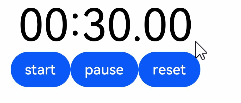
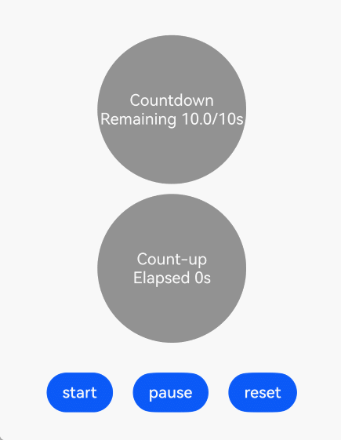
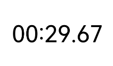
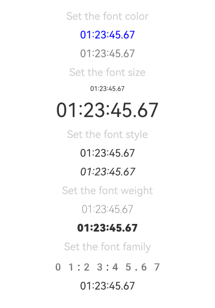
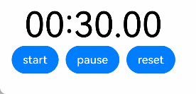

# TextTimer
<!--Kit: ArkUI-->
<!--Subsystem: ArkUI-->
<!--Owner: @Zhang-Dong-hui-->
<!--Designer: @xiangyuan6-->
<!--Tester:@jiaoaozihao-->
<!--Adviser: @Brilliantry_Rui-->
<!-- md-trans-meta sourceCommit=8aa8522c1582655206875d9c89c21656113a2dda translatedAt=2026-09-03T12:47:31.843Z -->

**TextTimer** is a component that displays timing information in text format and controls the timer state. It supports both count-up and countdown modes and allows custom display formats. It is suitable for scenarios that need to show the passage of time, such as stopwatches and event countdowns. It is commonly used in countdown scenarios, such as exam countdowns, limited-time activities, and sports timing.

When the component is invisible (not in the locked-screen state or the application background state), the UI time change stops (that is, the component is not drawn at this time), but [onTimer](#ontimer) is still triggered normally.

>  **NOTE**
>
> This component is supported since API version 8. Newly added APIs will be marked with a superscript to indicate their earliest API version.

## Child Components

Not supported

## APIs

TextTimer(options?: TextTimerOptions)

**Widget capability**: Since API version 10, this API is supported in ArkTS widgets.

**Atomic service API**: This API can be used in atomic services since API version 11.

**System capability**: SystemCapability.ArkUI.ArkUI.Full

**Parameters**

| Name| Type| Mandatory| Description|
| -------- | -------- | -------- | -------- |
| options | [TextTimerOptions](#texttimeroptions)| No | Component parameter that displays timing information through text and controls the timer state. Pass this parameter when you need to customize the timer configuration (for example, set the countdown switch, timing duration, initial time, controller, and so on); if it is not passed, the default configuration of TextTimerOptions is used.<br>The default value inherits from [TextTimerOptions](#texttimeroptions). |

## TextTimerOptions

Sets the options used to build the **TextTimer** component.

**System capability**: SystemCapability.ArkUI.ArkUI.Full

| Name  | Type    | Read-Only| Optional| Description                  |
| ----------- | -------- | -------- | -------- | -------- |
| isCountDown | boolean  | No  | Yes  | Countdown switch.<br>true: The timer counts down, for example, from 30 seconds to 0 seconds.<br>false: The timer counts up, for example, from 0 seconds to 30 seconds.<br>Default value: **false** <br>**Widget capability:** Since API version 10, this API is supported in ArkTS widgets.<br>**Atomic service API:** Since API version 11, this API is supported in atomic services. |
| count       | number   | No  | Yes  | Initial time of the timer, in milliseconds. This parameter takes effect when isCountDown is true.<br>Default value: 60000<br>Value range: (0, 86400000), that is, no more than 24 hours. If the value is out of the range, the default value is used.<br>**Widget capability:** Since API version 10, this API is supported in ArkTS widgets.<br>**Atomic service API:** Since API version 11, this API is supported in atomic services. |
| controller | [TextTimerController](#texttimercontroller) | No | Yes | Controller of the TextTimer, used to start, pause, and reset the timer programmatically. If this parameter is not passed, the timer can still be displayed normally but its state cannot be controlled through code.<br>**Widget capability:** Since API version 10, this API is supported in ArkTS widgets.<br>**Atomic service API:** Since API version 11, this API is supported in atomic services. |
| startTime | number | No | Yes | Initial time of the timer in count-up mode. This parameter takes effect only when isCountDown is false.<br>Value range: [−2147483648, 2147483647].<br>Default value: 0 <br>Unit: ms <br>When the value is negative, the timer starts counting from the negative value and continues counting toward positive values after passing 0.<br>**Since:** 26.0.0 <br>**Model restriction:** This API can be used only in the stage model.<br>**Widget capability:** Since API version 26.0.0, this API is supported in ArkTS widgets.<br>**Atomic service API:** Since API version 26.0.0, this API is supported in atomic services. |

## Attributes

In addition to the [universal attributes](ts-component-general-attributes.md), the following attributes are supported.

### format

format(value: string)

Sets the custom time format, which must contain at least one of the following keywords: **HH**, **mm**, **ss**, and **SS**. When date formats such as **yy**, **MM**, and **dd** are used, they are not supported, and the default format **'HH:mm:ss.SS'** is used instead.

The timer update frequency is processed based on the minimum unit of **format**. For example, when **format** is set to **'HH:mm'**, the update frequency is one minute. When a high-precision **format** (for example, one containing **SS**) is set, the intervals of the **onTimer** callback may be uneven.

**Widget capability**: Since API version 10, this API is supported in ArkTS widgets.

**Atomic service API**: This API can be used in atomic services since API version 11.

**System capability**: SystemCapability.ArkUI.ArkUI.Full

**Parameters**

| Name| Type  | Mandatory| Description                                  |
| ------ | ------ | ---- | -------------------------------------- |
| value  | string | Yes   | Custom time format displayed by the timer. It must contain at least one of the keywords HH, mm, ss, or SS.<br>Default value: 'HH:mm:ss.SS' |


### fontColor

fontColor(value: ResourceColor)

Sets the font color.

**Widget capability**: Since API version 10, this API is supported in ArkTS widgets.

**Atomic service API**: This API can be used in atomic services since API version 11.

**System capability**: SystemCapability.ArkUI.ArkUI.Full

**Parameters**

| Name| Type                                      | Mandatory| Description      |
| ------ | ------------------------------------------ | ---- | ---------- |
| value  | [ResourceColor](ts-types.md#resourcecolor) | Yes   | Font color.<br>Default value on Wearable devices: '#c5ffffff', displayed in white.<br>Default value on other devices: '#e6182431', displayed in black.|

### fontSize

fontSize(value: Length)

Sets the font size.

**Widget capability**: Since API version 10, this API is supported in ArkTS widgets.

**Atomic service API**: This API can be used in atomic services since API version 11.

**System capability**: SystemCapability.ArkUI.ArkUI.Full

**Parameters**

| Name| Type                        | Mandatory| Description                                                        |
| ------ | ---------------------------- | ---- | ------------------------------------------------------------ |
| value  | [Length](ts-types.md#length) | Yes  | Font size.<br>Default value: 16fp<br>When value is of the number type in Length, the unit is fp. When value is of the string type in Length, if the set value does not start with a digit, it is processed as 0fp; if the set value starts with a digit, and the content after the digit contains characters other than [pixel units](ts-pixel-units.md) (such as letters and special symbols), the numeric part at the beginning of the string is used, with the unit being fp.<br>For example, when the set value is "abc", the value is 0fp; when the set value is "10vp", the value is 10vp; when the set value is "10vp11abc", the value is 10fp. Percentage strings are not supported. |

### fontStyle

fontStyle(value: FontStyle)

Sets the font style.

**Widget capability**: Since API version 10, this API is supported in ArkTS widgets.

**Atomic service API**: This API can be used in atomic services since API version 11.

**System capability**: SystemCapability.ArkUI.ArkUI.Full

**Parameters**

| Name| Type                                       | Mandatory| Description                                   |
| ------ | ------------------------------------------- | ---- | --------------------------------------- |
| value  | [FontStyle](ts-appendix-enums.md#fontstyle) | Yes   | Font style, for example, the italic font style.<br>Default value: FontStyle.Normal |

### fontWeight

fontWeight(value: number | FontWeight | ResourceStr)

Sets the font weight of the text. If the value is too large, the text in different fonts may be truncated.

**Widget capability**: Since API version 10, this API is supported in ArkTS widgets.

**Atomic service API**: This API can be used in atomic services since API version 11.

**System capability**: SystemCapability.ArkUI.ArkUI.Full

**Parameters**

| Name| Type | Mandatory| Description     |
| ------ | ---------- | ------ | ----------------- |
| value  | number&nbsp;\|&nbsp;[FontWeight](ts-appendix-enums.md#fontweight)&nbsp;\|&nbsp;[ResourceStr](ts-types.md#resourcestr) | Yes   | Font weight of the text. For the number type, the value range is [100, 900], with an interval of 100. A larger value indicates a heavier font weight. The default value for a number outside the value range is 400. For the [ResourceStr](ts-types.md#resourcestr) type, only the string form of the number value is supported, for example, "400", as well as "bold", "bolder", "lighter", "regular", and "medium", which correspond to the respective enum values in FontWeight.<br>Default value: FontWeight.Normal <br>Since API version 20, the Resource type is supported.|

### fontFamily

fontFamily(value: ResourceStr)

Sets the font family.

**Widget capability**: Since API version 10, this API is supported in ArkTS widgets.

**Atomic service API**: This API can be used in atomic services since API version 11.

**System capability**: SystemCapability.ArkUI.ArkUI.Full

**Parameters**

| Name| Type                                  | Mandatory| Description                                                        |
| ------ | -------------------------------------- | ---- | ------------------------------------------------------------ |
| value  | [ResourceStr](ts-types.md#resourcestr) | Yes  | Font family. The default font is **'HarmonyOS Sans'**.<br>The 'HarmonyOS Sans' font and [registered custom fonts](../js-apis-font.md) are supported for applications.<br>Only the 'HarmonyOS Sans' font is supported for widgets.|

### textShadow<sup>11+</sup>

textShadow(value: ShadowOptions | Array&lt;ShadowOptions&gt;)

Sets the text shadow effect. This API supports input parameters in an array to implement multiple text shadows. The **fill** field and the smart color picking mode are not supported.

>**NOTE**
>
> This API can be called within [attributeModifier](ts-universal-attributes-attribute-modifier.md#attributemodifier) since API version 12.

**Atomic service API**: This API can be used in atomic services since API version 12.

**Model restriction**: This API can be used only in the stage model.

**System capability**: SystemCapability.ArkUI.ArkUI.Full

**Parameters**

| Name| Type                                                        | Mandatory| Description          |
| ------ | ------------------------------------------------------------ | ---- | -------------- |
| value  | [ShadowOptions](ts-universal-attributes-image-effect.md#shadowoptions)&nbsp;\|&nbsp;Array&lt;[ShadowOptions](ts-universal-attributes-image-effect.md#shadowoptions)> | Yes  | Parameters of the text shadow effect, including the color, blur radius, and offset.|

### contentModifier<sup>12+</sup>

contentModifier(modifier: ContentModifier\<TextTimerConfiguration>)

Customizes the content area of **TextTimer**. When the default text display style cannot meet the requirements, this API can be used to implement a custom timer UI effect.

**Atomic service API**: This API can be used in atomic services since API version 12.

**Model restriction**: This API can be used only in the stage model.

**System capability**: SystemCapability.ArkUI.ArkUI.Full

**Parameters**

| Name| Type                                         | Mandatory| Description                                            |
| ------ | --------------------------------------------- | ---- | ------------------------------------------------ |
| modifier  | [ContentModifier](./ts-universal-attributes-content-modifier.md#contentmodifiert)\<[TextTimerConfiguration](#texttimerconfiguration12)> | Yes   | Method for customizing the content area on the TextTimer component.<br>modifier: content modifier. The developer needs to define a custom class to implement the ContentModifier interface. |

## Events

### onTimer

onTimer(event:&nbsp;(utc:&nbsp;number,&nbsp;elapsedTime:&nbsp;number)&nbsp;=&gt;&nbsp;void)

Triggered when the time text changes. This event is not triggered in the locked-screen state or the application background state. When the component is invisible (not in the locked-screen state or the application background state), the UI time change stops, but this event is still triggered normally. When a high-precision [format](#format) (**SS**) is set, the callback intervals may be uneven, and the time intervals between two adjacent callbacks may differ.

**Widget capability**: Since API version 10, this API is supported in ArkTS widgets.

**Atomic service API**: This API can be used in atomic services since API version 11.

**System capability**: SystemCapability.ArkUI.ArkUI.Full

**Parameters**

| Name     | Type  | Mandatory| Description                                                        |
| ----------- | ------ | ---- | ------------------------------------------------------------ |
| utc         | number | Yes   | Linux timestamp, that is, the time elapsed since January 1, 1970, in the minimum time unit of the format set by the [format](#format) attribute. |
| elapsedTime | number | Yes  | Elapsed time of the timer, in the minimum unit of the format.                |

## TextTimerController

Defines the controller for controlling the **TextTimer** component. A **TextTimer** component can only be bound to one controller, and the relevant commands can only be called after the component has been created. A **TextTimerController** can control only the last **TextTimer** component bound to it.

**Widget capability**: Since API version 10, this API is supported in ArkTS widgets.

**Atomic service API**: This API can be used in atomic services since API version 11.

### Objects to Import

``` ts
textTimerController: TextTimerController = new TextTimerController();
```

### constructor

constructor()

A constructor used to create a **TextTimerController** object.

**Widget capability**: Since API version 10, this API is supported in ArkTS widgets.

**Atomic service API**: This API can be used in atomic services since API version 11.

**System capability**: SystemCapability.ArkUI.ArkUI.Full

### start

start()

Starts the timer. This API must be called after the **TextTimer** component is created and the controller is bound.

**Widget capability**: Since API version 10, this API is supported in ArkTS widgets.

**Atomic service API**: This API can be used in atomic services since API version 11.

**System capability**: SystemCapability.ArkUI.ArkUI.Full

### pause

pause()

Pauses the timer. This API must be called after the component is created.

**Widget capability**: Since API version 10, this API is supported in ArkTS widgets.

**Atomic service API**: This API can be used in atomic services since API version 11.

**System capability**: SystemCapability.ArkUI.ArkUI.Full

### reset

reset()

Resets the timer. This API must be called after the component is created.

**Widget capability**: Since API version 10, this API is supported in ArkTS widgets.

**Atomic service API**: This API can be used in atomic services since API version 11.

**System capability**: SystemCapability.ArkUI.ArkUI.Full

## TextTimerConfiguration<sup>12+</sup>

Defines the **TextTimer** configuration used by the **ContentModifier** API.

You need a custom class to implement the **ContentModifier** API.

**Model restriction**: This API can be used only in the stage model.

**System capability**: SystemCapability.ArkUI.ArkUI.Full

| Name| Type   |  Read-Only |  Optional  |  Description             |
| ------ | ------ | ------ | ------ |-------------------------------- |
| count | number | No | No | Initial time of the timer, in milliseconds. This parameter takes effect when isCountDown is set to true.<br>Default Value: 60000<br>Value Range: (0, 86400000), that is, no more than 24 hours. If the value is out of the range, the default value is used.<br>**Atomic service API:** Since API version 12, this API is supported in atomic services. |
| isCountDown | boolean | No | No | Whether to count down.<br>true: The timer counts down, for example, from 30 seconds~0 seconds; false: The timer counts up, for example, from 0 seconds~30 seconds.<br>Default Value: false<br>**Atomic service API:** Since API version 12, this API is supported in atomic services. |
| started | boolean | No | No | Whether the timer has started.<br>true: The timer has started; false: The timer has not started.<br>Default Value: false<br>**Atomic service API:** Since API version 12, this API is supported in atomic services. |
| elapsedTime | number | No | No | Elapsed time of the timer, in the minimum unit of the configured format.<br>**Atomic service API:** Since API version 12, this API is supported in atomic services. |
| startTime | number | No | Yes | Initial time of the timer in the count-up mode. This parameter takes effect only when isCountDown is set to false.<br>Value Range: [-2147483648, 2147483647]. Negative values are supported.<br>Default Value: 0<br>Unit: ms<br>When the value is negative, the timer starts counting from the negative value, passes 0, and then continues counting toward positive values.<br>**Since:** 26.0.0<br>**Atomic service API:** Since API version 26.0.0, this API is supported in atomic services. |

## Example
### Example 1: Implementing a Text Timer with Start, Pause, and Reset Buttons

This example demonstrates the basic usage of the **TextTimer** component, setting the timer display format using the [format](#format) attribute.

Users can start, pause, and reset the timer by clicking the **start**, **pause**, and **reset** buttons.

```ts
// xxx.ets
@Entry
@Component
struct TextTimerExample {
  textTimerController: TextTimerController = new TextTimerController();
  @State format: string = 'mm:ss.SS';

  build() {
    Column() {
      TextTimer({ isCountDown: true, count: 30000, controller: this.textTimerController })
        .format(this.format)
        .fontColor(Color.Black)
        .fontSize(50)
        .onTimer((utc: number, elapsedTime: number) => {
          console.info('textTimer countDown utc is: ' + utc + ', elapsedTime: ' + elapsedTime);
        })
      Row() {
        Button('start').onClick(() => {
          this.textTimerController.start();
        })
        Button('pause').onClick(() => {
          this.textTimerController.pause();
        })
        Button('reset').onClick(() => {
          this.textTimerController.reset();
        })
      }
    }
  }
}
```




### Example 2: Setting the Text Shadow Style

This example shows how to set the text shadow style for the timer using the [textShadow](#textshadow11) attribute.

``` ts
// xxx.ets
@Entry
@Component
struct TextTimerExample {
  @State textShadows: ShadowOptions | Array<ShadowOptions> = [{
    radius: 10,
    color: Color.Red,
    offsetX: 10,
    offsetY: 0
  }, {
    radius: 10,
    color: Color.Black,
    offsetX: 20,
    offsetY: 0
  }, {
    radius: 10,
    color: Color.Brown,
    offsetX: 30,
    offsetY: 0
  }, {
    radius: 10,
    color: Color.Green,
    offsetX: 40,
    offsetY: 0
  }, {
    radius: 10,
    color: Color.Yellow,
    offsetX: 100,
    offsetY: 0
  }];

  build() {
    Column({ space: 8 }) {
      TextTimer().fontSize(50).textShadow(this.textShadows)
    }
  }
}
```


### Example 3: Configuring the Custom Content Area

This example showcases two simple **TextTimer** components set against a light gray background. Once the timers are activated, they display the time progression in real-time. When the countdown timer starts, the background turns black; when the count-up timer starts, the background turns gray.

``` ts
// xxx.ets
class MyTextTimerModifier implements ContentModifier<TextTimerConfiguration> {
  constructor() {
  }

  applyContent(): WrappedBuilder<[TextTimerConfiguration]> {
    return wrapBuilder(buildTextTimer);
  }
}

@Builder
function buildTextTimer(config: TextTimerConfiguration) {
  Column() {
    Stack({ alignContent: Alignment.Center }) {
      Circle({ width: 150, height: 150 })
        .fill(config.started ? (config.isCountDown ? 0xFF232323 : 0xFF717171) : 0xFF929292)
      Column() {
        Text(config.isCountDown ? 'Countdown' : 'Count-up').fontColor(Color.White)
        Text(
          (config.isCountDown ? 'Remaining ' : 'Elapsed ') + (config.isCountDown ?
            (Math.max(config.count / 1000 - config.elapsedTime / 100, 0)).toFixed(1) + '/' +
            (config.count / 1000).toFixed(0)
            : ((config.elapsedTime / 100).toFixed(0))
          ) + 's'
        ).fontColor(Color.White)
      }
    }
  }
}

@Entry
@Component
struct Index {
  @State count: number = 10000;
  @State myTimerModifier: MyTextTimerModifier = new MyTextTimerModifier();
  countDownTextTimerController: TextTimerController = new TextTimerController();
  countUpTextTimerController: TextTimerController = new TextTimerController();

  build() {
    Row() {
      Column() {
        TextTimer({ isCountDown: true, count: this.count, controller: this.countDownTextTimerController })
          .contentModifier(this.myTimerModifier)
          .onTimer((utc: number, elapsedTime: number) => {
            console.info('textTimer onTimer utc is: ' + utc + ', elapsedTime: ' + elapsedTime);
          })
          .margin(10)
        TextTimer({ isCountDown: false, controller: this.countUpTextTimerController })
          .contentModifier(this.myTimerModifier)
          .onTimer((utc: number, elapsedTime: number) => {
            console.info('textTimer onTimer utc is: ' + utc + ', elapsedTime: ' + elapsedTime);
          })
        Row() {
          Button('start').onClick(() => {
            this.countDownTextTimerController.start();
            this.countUpTextTimerController.start();
          }).margin(10)
          Button('pause').onClick(() => {
            this.countDownTextTimerController.pause();
            this.countUpTextTimerController.pause();
          }).margin(10)
          Button('reset').onClick(() => {
            this.countDownTextTimerController.reset();
            this.countUpTextTimerController.reset();
          }).margin(10)
        }.margin(20)
      }.width('100%')
    }.height('100%')
  }
}
```


### Example 4: Enabling the Timer to Start Immediately After Creation

This example demonstrates how to start the **TextTimer** immediately after it is created.

``` ts
// xxx.ets
@Entry
@Component
struct TextTimerStart {
  textTimerController: TextTimerController = new TextTimerController();
  @State format: string = 'mm:ss.SS';

  build() {
    Column() {
      TextTimer({ isCountDown: true, count: 30000, controller: this.textTimerController })
        .format(this.format)
        .fontColor(Color.Black)
        .fontSize(50)
        .onTimer((utc: number, elapsedTime: number) => {
          console.info('textTimer countDown utc is: ' + utc + ', elapsedTime: ' + elapsedTime);
        })
        .onAppear(() => {
          this.textTimerController.start();
        })
    }
    .height('100%')
    .width('100%')
    .justifyContent(FlexAlign.Center)
  }
}
```


### Example 5: Setting the Text Style

This example shows text effects in different styles using the [fontColor](#fontcolor), [fontSize](#fontsize), [fontStyle](#fontstyle), [fontWeight](#fontweight) and [fontFamily](#fontfamily) attributes.

``` ts
// xxx.ets
@Entry
@Component
struct TextTimerDemo {
  // textTimerController is used to control the start and stop of the timer. This example mainly demonstrates style configuration.
  textTimerController: TextTimerController = new TextTimerController();
  @State countValue: number = 5025678;

  build() {
    Column({ space: 10 }) {
      Text('Set the font color').fontColor(0xCCCCCC)
      TextTimer({ isCountDown: true, count: this.countValue, controller: this.textTimerController })
        .fontColor(Color.Blue)
      TextTimer({ isCountDown: true, count: this.countValue, controller: this.textTimerController })
        .fontColor(Color.Gray)

      Text('Set the font size').fontColor(0xCCCCCC)
      TextTimer({ isCountDown: true, count: this.countValue, controller: this.textTimerController })
        .fontSize(10)
      TextTimer({ isCountDown: true, count: this.countValue, controller: this.textTimerController })
        .fontSize(30)

      Text('Set the font style').fontColor(0xCCCCCC)
      TextTimer({ isCountDown: true, count: this.countValue, controller: this.textTimerController })
        .fontStyle(FontStyle.Normal)
      TextTimer({ isCountDown: true, count: this.countValue, controller: this.textTimerController })
        .fontStyle(FontStyle.Italic)

      Text('Set the font weight').fontColor(0xCCCCCC)
      TextTimer({ isCountDown: true, count: this.countValue, controller: this.textTimerController })
        .fontWeight(FontWeight.Lighter)
      TextTimer({ isCountDown: true, count: this.countValue, controller: this.textTimerController })
        .fontWeight(FontWeight.Bolder)

      Text('Set the font family').fontColor(0xCCCCCC)
      TextTimer({ isCountDown: true, count: this.countValue, controller: this.textTimerController })
        .fontFamily('HMOS Color Emoji')
      TextTimer({ isCountDown: true, count: this.countValue, controller: this.textTimerController })
        .fontFamily('HarmonyOS Sans')
    }
    .width('100%')
    .height('100%')
    .justifyContent(FlexAlign.Center)
  }
}
```



### Example 6: Setting the Initial Timing Time

This example sets the initial timing time of the timer through the startTime attribute of [TextTimerOptions](#texttimeroptions).

Since API version 26.0.0, the startTime attribute has been added to [TextTimerOptions](#texttimeroptions).

``` ts
// xxx.ets
@Entry
@Component
struct TextTimerExample {
  textTimerController: TextTimerController = new TextTimerController();
  @State format: string = 'mm:ss.SS';

  build() {
    Column() {
      TextTimer({ isCountDown: false, controller: this.textTimerController, startTime: 30000 })
        .format(this.format)
        .fontColor(Color.Black)
        .fontSize(50)
        .onTimer((utc: number, elapsedTime: number) => {
          console.info('textTimer notCountDown utc is: ' + utc + ', elapsedTime: ' + elapsedTime);
        })
      Row({ space: 10 }) {
        Button('start').onClick(() => {
          this.textTimerController.start();
        })
        Button('pause').onClick(() => {
          this.textTimerController.pause();
        })
        Button('reset').onClick(() => {
          this.textTimerController.reset();
        })
      }
    }
  }
}
```

