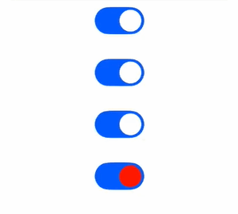
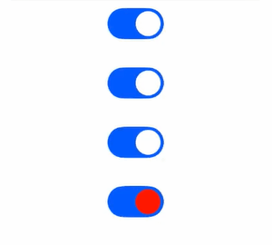

# Toggle
<!--Kit: ArkUI-->
<!--Subsystem: ArkUI-->
<!--Owner: @houguobiao-->
<!--Designer: @houguobiao-->
<!--Tester: @lxl007-->
<!--Adviser: @Brilliantry_Rui-->
<!-- md-trans-meta sourceCommit=e6c8f80367b2ac46842bf47d90ff527cf89d1de0 translatedAt=2026-09-03T12:52:31.870Z -->

The component provides checkbox, button, and switch styles, and is suitable for scenarios that require quick state switching or single-choice confirmation, effectively improving the interaction experience and interface intuitiveness.

>  **NOTE**
>
> - This component is supported since API version 8. Updates will be marked with a superscript to indicate their earliest API version.
>
> - Since API version 26.0.0, the Toggle component supports the system material effect. When the Toggle component uses the universal system material attribute [systemMaterial](ts-universal-attributes-image-effect.md#systemmaterial), the effect varies with the [ToggleType](#toggletype) type:
>   - ToggleType.Checkbox: The system material effect is not adapted yet. Setting the system material does not produce system material-related animations or visual effects.
>   - ToggleType.Switch: When material parameters are passed in, the preset visual parameters inside the component are used. The passed-in material parameters serve only as a switch flag for enabling the system material and do not affect the actual visual effect. They mainly affect the visual attributes of the Toggle, such as the slider size, slider style, and shadow. After the system material is enabled, a default white point light effect appears on the slider. After [switchPointColor](#switchpointcolor) is set, the point light color follows the switchPointColor setting. When undefined is passed in, the system material does not take effect, and the original Toggle style is displayed.
>   - ToggleType.Button: The effect of setting the system material is the same as that of setting the system material for the [Button](ts-basic-components-button.md) component, mainly affecting visual attributes such as the background color, border, and shadow.


## Child Components

This component can contain child components only when **ToggleType** is set to **Button**.

## APIs

Toggle(options: ToggleOptions)

**Widget capability**: This API can be used in ArkTS widgets since API version 9.

**Atomic service API**: This API can be used in atomic services since API version 11.

**System capability**: SystemCapability.ArkUI.ArkUI.Full

**Parameters**

| Name| Type| Mandatory  | Description          |
| ---- | ---------- | -----| -------------- |
| options | [ToggleOptions](#toggleoptions18) | Yes | Configuration options of the Toggle component, used to configure the style type and initial state of the switch. |

## ToggleOptions<sup>18+</sup>

Configuration information of the Toggle component.

> **NOTE**
>
> To standardize anonymous object definitions, the element definitions here have been revised in API version 18. While historical version information is preserved for anonymous objects, there may be cases where the outer element's @since version number is larger than inner elements'. This does not affect interface usability.

**Widget capability**: This API can be used in ArkTS widgets since API version 18.

**Atomic service API**: This API can be used in atomic services since API version 18.

**Model restriction**: This API can be used only in the stage model.

**System capability**: SystemCapability.ArkUI.ArkUI.Full

| Name             | Type                             | Read-Only| Optional| Description                                                        |
| ----------------- | --------------------------------- | ---- | ---- | ------------------------------------------------------------ |
| type<sup>8+</sup> | [ToggleType](#toggletype) | No  | No  | Type of the toggle.<br>Default value: **ToggleType.Switch**<br>**Widget capability**: This API can be used in ArkTS widgets since API version 9.<br>**Atomic service API**: This API can be used in atomic services since API version 11.|
| isOn<sup>8+</sup> | boolean                           | No  | Yes  | Whether the toggle is turned on.<br>**true**: on. **false**: off.<br>Default value: **false**<br>This parameter supports two-way binding through [$$](../../../ui/state-management/arkts-two-way-sync.md).<br>This property supports two-way binding through [!!](../../../ui/state-management/arkts-new-binding.md#two-way-binding-between-built-in-component-parameters).<br>**Widget capability**: This API can be used in ArkTS widgets since API version 9.<br>**Atomic service API**: This API can be used in atomic services since API version 11.|

## ToggleType

Enumerates toggle types.

> **NOTE**
>
> The style of Toggle inherits the default value of the corresponding component style and does not support setting. For example, if ToggleType is Button, the component style inherits the default value of [ButtonType](ts-basic-components-button.md#buttontype). Since API version 18, the default type of Button.type has changed from capsule to rounded rectangle. Capsule buttons do not support setting [borderRadius](ts-universal-attributes-border.md#borderradius). In this case, setting borderRadius for the Toggle component also does not take effect.

**Widget capability**: This API can be used in ArkTS widgets since API version 9.

**Atomic service API**: This API can be used in atomic services since API version 11.

**System capability**: SystemCapability.ArkUI.ArkUI.Full

| Name    | Value  | Description                                                        |
| -------- | ---- | ------------------------------------------------------------ |
| Checkbox | 0    | Provides the checkbox style.<br/>**Note:**<br/>Since API version 11, the default style of Checkbox changes from a rounded square to a circle.<br/>The default value of the [universal attribute margin](ts-universal-attributes-size.md#margin) is:<br/>{<br/>&nbsp;top: '14px',<br/>&nbsp;right: '14px',<br/>&nbsp;bottom: '14px',<br/>&nbsp;left: '14px'<br/> }.<br/>The default size is:<br/>{width:'20vp', height:'20vp'}. |
| Switch   | 1    | Provides the switch style.<br>**Note:**<br/>The default value of the [universal attribute margin](ts-universal-attributes-size.md#margin) is:<br/>{<br/>&nbsp;top: '6px',<br/>&nbsp;right: '14px',<br/>&nbsp;bottom: '6px',<br/>&nbsp;left: '14px'<br/> }.<br/>The default size is:<br>{width:'36vp', height:'20vp'}. |
| Button   | 2    | Status button type. If child content contains text, the text is displayed on the button. The default height is 28 vp, and there is no default width.|

## Attributes

In addition to the [universal attributes](ts-component-general-attributes.md), the following attributes are supported.

### selectedColor

selectedColor(value: ResourceColor)

Sets the background color of the component when it is turned on.

> **NOTE**
>
> For the impact on the background color when systemMaterial is set, see the description at the beginning of the component.

**Widget capability**: This API can be used in ArkTS widgets since API version 9.

**Atomic service API**: This API can be used in atomic services since API version 11.

**System capability**: SystemCapability.ArkUI.ArkUI.Full

**Parameters**

| Name| Type                                      | Mandatory| Description                                                        |
| ------ | ------------------------------------------ | ---- | ------------------------------------------------------------ |
| value  | [ResourceColor](ts-types.md#resourcecolor) | Yes  | Background color of the component when it is turned on.<br>Default value:<br>When **ToggleType** is set to **Switch**, the default value is **$r('sys.color.ohos_id_color_emphasize')**.<br>When **ToggleType** is set to **Checkbox**, the default value is **$r('sys.color.ohos_id_color_emphasize')**.<br>When **ToggleType** is set to **Button**, the default value is **$r('sys.color.ohos_id_color_emphasize')** with the opacity of **$r('sys.float.ohos_id_alpha_highlight_bg')**.|

### switchPointColor

switchPointColor(color: ResourceColor)

Sets the color of the circular slider when the component is of the **Switch** type. This attribute is valid only when **type** is set to **ToggleType.Switch**.

**Widget capability**: This API can be used in ArkTS widgets since API version 9.

**Atomic service API**: This API can be used in atomic services since API version 11.

**System capability**: SystemCapability.ArkUI.ArkUI.Full

**Parameters**

| Name| Type                                      | Mandatory| Description                      |
| ------ | ------------------------------------------ | ---- | -------------------------- |
| color  | [ResourceColor](ts-types.md#resourcecolor) | Yes   | Color of the circular slider of the Switch type.<br/>Default value: $r('sys.color.ohos_id_color_foreground_contrary')<br/>**Note:**<br/>When the [systemMaterial](ts-universal-attributes-image-effect.md#systemmaterial) system material is set simultaneously, the slider shows a default white point light effect. After this attribute is set, the point light color follows the setting of this attribute. |

### switchStyle<sup>12+</sup>

switchStyle(value: SwitchStyle)

Sets the style for the component of the **Switch** type. This attribute is valid only when **type** is set to **ToggleType.Switch**.

> **NOTE**
>
> When set simultaneously with the systemMaterial system material, see the description at the beginning of the component and the universal system material attribute document.

**Atomic service API**: This API can be used in atomic services since API version 12.

**Model restriction**: This API can be used only in the stage model.

**System capability**: SystemCapability.ArkUI.ArkUI.Full

**Parameters**

| Name| Type                                 | Mandatory| Description            |
| ------ | ------------------------------------- | ---- | ---------------- |
| value  | [SwitchStyle](#switchstyle12) | Yes  | Style of the component of the **Switch** type.|

### contentModifier<sup>12+</sup>

contentModifier(modifier: ContentModifier\<ToggleConfiguration>)

Creates a content modifier.

**Atomic service API**: This API can be used in atomic services since API version 12.

**Model restriction**: This API can be used only in the stage model.

**System capability**: SystemCapability.ArkUI.ArkUI.Full

**Parameters**

| Name| Type                                         | Mandatory| Description                                            |
| ------ | --------------------------------------------- | ---- | ------------------------------------------------ |
| modifier  | [ContentModifier](ts-universal-attributes-content-modifier.md#contentmodifiert)\<[ToggleConfiguration](#toggleconfiguration12)> | Yes   | Method for customizing the content area on the Toggle component.<br/>modifier: content modifier. Developers need to customize a class to implement the ContentModifier API. |


## SwitchStyle<sup>12+</sup>

Sets the style for the component of the **Switch** type.

> **NOTE**
>
> When set simultaneously with the systemMaterial system material, see the description at the beginning of the component and the universal system material attribute document.

**Atomic service API**: This API can be used in atomic services since API version 12.

**Model restriction**: This API can be used only in the stage model.

**System capability**: SystemCapability.ArkUI.ArkUI.Full

| Name             | Type                                       | Read-Only| Optional| Description                                                        |
| ----------------- | ------------------------------------------- | ---- | ---- | ------------------------------------------------------------ |
| pointRadius       | number \|  [Resource](ts-types.md#resource) | No  | Yes  | Radius of the circular slider when the component is of the **Switch** type. The unit is vp.<br>**NOTE**<br>Percentage values are not supported. The value specified is used only when it is greater than or equal to 0.<br>If the value is not specified or the specified one is less than 0, the radius is set using the following formula:<br>(Component height (in vp)/2) - (2 vp x Component height (in vp)/20 vp)|
| unselectedColor   | [ResourceColor](ts-types.md#resourcecolor)  | No  | Yes  | Background color of the component when it is of the **Switch** type and is disabled.<br>Default value: **0x337F7F7F** (applies to both dark and light modes). Since API version 20, when [optimizing color mode switching overhead](../../../ui/ui-dark-light-color-adaptation.md#optimizing-color-mode-switching-overhead) is enabled, the default value is **0x19000000** (black with 10% opacity) in light mode and **0x19FFFFFF** (white with 10% opacity) in dark mode.  |
| pointColor        | [ResourceColor](ts-types.md#resourcecolor)  | No  | Yes  | Color of the circular slider when the component is of the **Switch** type.<br>Default value: **$r('sys.color.ohos_id_color_foreground_contrary')**|
| trackBorderRadius | number \|  [Resource](ts-types.md#resource) | No  | Yes  | Radius of the slider track border corners when the component is of the **Switch** type. The unit is vp.<br>**NOTE**<br>This parameter cannot be set in percentage. If the value specified is less than 0, the radius is set using the default value formula. If the value specified is greater than half of the component height, the latter is used. In other cases, the value specified is used.<br>If the value is not specified or the specified one is less than 0, the radius is set using the default value formula.<br>Default value formula: Component height (in vp)/2|

## Events

In addition to the [universal events](ts-component-general-events.md), the following events are supported.

### onChange

onChange(callback:&nbsp;(isOn:&nbsp;boolean)&nbsp;=&gt;&nbsp;void)

Triggered when the toggle status changes.

**Widget capability**: This API can be used in ArkTS widgets since API version 9.

**Atomic service API**: This API can be used in atomic services since API version 11.

**System capability**: SystemCapability.ArkUI.ArkUI.Full

**Parameters**

| Name| Type   | Mandatory| Description                                                        |
| ------ | ------- | ---- | ------------------------------------------------------------ |
| isOn   | boolean | Yes  | Toggle status.<br>**true**: The toggle is turned on. **false**: The toggle is turned off.|

## ToggleConfiguration<sup>12+</sup>

You need a custom class to implement the **ContentModifier** API. This API inherits from [CommonConfiguration](ts-universal-attributes-content-modifier.md#commonconfigurationt).

**Atomic service API**: This API can be used in atomic services since API version 12.

**Model restriction**: This API can be used only in the stage model.

**System capability**: SystemCapability.ArkUI.ArkUI.Full

| Name | Type   |    Read-Only   |    Optional   |  Description             |
| ------ | ------ | ------ |-------------------------------- |-------------------------------- |
| isOn   | boolean| No | No| Whether the toggle is turned on.<br>**true**: The toggle is turned on. **false**: The toggle is turned off.<br>Default value: **false**|
| enabled | boolean | No| No| Whether the toggle is enabled for state switching.<br>**true**: The state can be changed. **false**: The state cannot be changed.<br>Default value: **true**|
| triggerChange | Callback\<boolean> | No | No | Callback used to trigger a change in the Toggle switch state. It is usually used in a custom ContentModifier to change the switch state programmatically. Calling this callback with true sets the switch state to on, and calling it with false sets the switch state to off. |


## Example

### Example 1: Setting the Toggle Style

This example demonstrates how to configure the style for different types of toggles (checkbox, switch, and button) using **ToggleType**.

```ts
// xxx.ets
@Entry
@Component
struct ToggleExample {
  build() {
    Column({ space: 10 }) {
      Text('type: Switch').fontSize(12).fontColor(0xcccccc).width('90%')
      Flex({ justifyContent: FlexAlign.SpaceEvenly, alignItems: ItemAlign.Center }) {
        Toggle({ type: ToggleType.Switch, isOn: false })
          .selectedColor('#007DFF')
          .switchPointColor('#FFFFFF')
          .onChange((isOn: boolean) => {
            console.info('Component status:' + isOn);
          })

        Toggle({ type: ToggleType.Switch, isOn: true })
          .selectedColor('#007DFF')
          .switchPointColor('#FFFFFF')
          .onChange((isOn: boolean) => {
            console.info('Component status:' + isOn);
          })
      }

      Text('type: Checkbox').fontSize(12).fontColor(0xcccccc).width('90%')
      Flex({ justifyContent: FlexAlign.SpaceEvenly, alignItems: ItemAlign.Center }) {
        Toggle({ type: ToggleType.Checkbox, isOn: false })
          .size({ width: 20, height: 20 })
          .selectedColor('#007DFF')
          .onChange((isOn: boolean) => {
            console.info('Component status:' + isOn);
          })

        Toggle({ type: ToggleType.Checkbox, isOn: true })
          .size({ width: 20, height: 20 })
          .selectedColor('#007DFF')
          .onChange((isOn: boolean) => {
            console.info('Component status:' + isOn);
          })
      }

      Text('type: Button').fontSize(12).fontColor(0xcccccc).width('90%')
      Flex({ justifyContent: FlexAlign.SpaceEvenly, alignItems: ItemAlign.Center }) {
        Toggle({ type: ToggleType.Button, isOn: false }) {
          Text('status button').fontColor('#182431').fontSize(12)
        }.width(106)
        .selectedColor('rgba(0,125,255,0.20)')
        .onChange((isOn: boolean) => {
          console.info('Component status:' + isOn);
        })

        Toggle({ type: ToggleType.Button, isOn: true }) {
          Text('status button').fontColor('#182431').fontSize(12)
        }.width(106)
        .selectedColor('rgba(0,125,255,0.20)')
        .onChange((isOn: boolean) => {
          console.info('Component status:' + isOn);
        })
      }
    }.width('100%').padding(24)
  }
}
```


### Example 2: Customizing the Toggle Style

This example implements a toggle of the **Switch** type with custom settings, including the radius and color of the circular slider, background color in the off state, and radius of the slider track border corners.

```ts
// xxx.ets
@Entry
@Component
struct ToggleExample {
  build() {
    Column({ space: 10 }) {
      Text('type: Switch').fontSize(12).fontColor(0xcccccc).width('90%')
      Flex({ justifyContent: FlexAlign.SpaceEvenly, alignItems: ItemAlign.Center }) {
        Toggle({ type: ToggleType.Switch, isOn: false })
          .selectedColor('#007DFF')
          .switchStyle({
            pointRadius: 15,
            trackBorderRadius: 10,
            pointColor: '#D2B48C',
            unselectedColor: Color.Pink })
          .onChange((isOn: boolean) => {
            console.info('Component status:' + isOn);
          })

        Toggle({ type: ToggleType.Switch, isOn: true })
          .selectedColor('#007DFF')
          .switchStyle({
            pointRadius: 15,
            trackBorderRadius: 10,
            pointColor: '#D2B48C',
            unselectedColor: Color.Pink })
          .onChange((isOn: boolean) => {
            console.info('Component status:' + isOn);
          })
      }
    }.width('100%').padding(24)
  }
}
```


### Example 3: Implementing a Custom Toggle Style

This example shows how to implement a custom toggle style. The toggle button switches the background color. Clicking the blue circle changes the background to blue. Clicking the yellow circle changes it to yellow.

```ts
// xxx.ets
// Custom Switch style modifier that implements the ContentModifier API to customize the Toggle content area.
class MySwitchStyle implements ContentModifier<ToggleConfiguration> {
  // Background color when the switch is on.
  selectedColor: Color = Color.White;
  // Text displayed on the button.
  lamp: string = 'string';

  constructor(selectedColor: Color, lamp: string) {
    this.selectedColor = selectedColor;
    this.lamp = lamp;
  }

  applyContent(): WrappedBuilder<[ToggleConfiguration]> {
    return wrapBuilder(buildSwitch);
  }
}

@Builder
function buildSwitch(config: ToggleConfiguration) {
  Column({ space: 50 }) {
    Circle({ width: 150, height: 150 })
      .fill(config.isOn ? (config.contentModifier as MySwitchStyle).selectedColor : Color.Blue)
    Row() {
      Button('Blue ' + JSON.stringify((config.contentModifier as MySwitchStyle).lamp))
        .onClick(() => {
          config.triggerChange(false);
        })
      Button('Yellow ' + JSON.stringify((config.contentModifier as MySwitchStyle).lamp))
        .onClick(() => {
          config.triggerChange(true);
        })
    }
  }
}

@Entry
@Component
struct Index {
  build() {
    Column({ space: 50 }) {
      // Use the custom style modifier to customize the Toggle content, and listen for state changes through onChange.
      Toggle({ type: ToggleType.Switch })
        .enabled(true)
        .contentModifier(new MySwitchStyle(Color.Yellow, 'light'))
        .onChange((isOn: boolean) => {
          console.info('Switch Log:' + isOn);
        })
    }.height('100%').width('100%')
  }
}
```


### Example 4 (Immersive Light Effect of Toggle)

This example shows the effect comparison of the Switch type of the Toggle component before and after the immersive light effect is enabled, including the effects of not setting the system material, setting undefined, setting the system material, and setting the system material together with [switchPointColor](#switchpointcolor) to set the point light source color. The example uses the universal attribute [systemMaterial](ts-universal-attributes-image-effect.md#systemmaterial) API to implement the immersive light effect.

The immersive light effect of the component is adaptively adjusted based on the device computing power and the immersive light effect set by the user in the system, and no additional adaptation is required by developers.

Since API version 26.0.0, the systemMaterial attribute is added.

> **NOTE**
>
> The actual display effect of the system material is related to the computing power tier of the device. The same code produces different display effects on devices of different computing power tiers, and a simplified material effect is displayed on low-computing-power devices. The computing power tier is automatically divided and managed by the system based on the hardware capabilities of the device. Applications do not need to be aware of it or perform additional settings. The system automatically adapts the material display effect based on the computing power tier of the current device.

```ts
import { uiMaterial } from '@kit.ArkUI';

// xxx.ets
@Entry
@Component
struct ToggleMaterialTest {
  build() {
    Column({ space: 10 }) {
      // Do not set the system material API, and there is no immersive light effect.
      Toggle({ type: ToggleType.Switch, isOn: true })

      // Set systemMaterial to undefined to restore the effect without immersive light.
      Toggle({ type: ToggleType.Switch, isOn: true })
        .systemMaterial(undefined)

      // Set the system material to enable the immersive light effect (the systemMaterial parameter is arbitrary and serves only as the system material switch; the component-side fixed parameters are ultimately used), with a white point light source by default (the color is the default value of switchPointColor).
      Toggle({ type: ToggleType.Switch, isOn: true })
        .systemMaterial(new uiMaterial.Material())

      // Set the system material to enable the immersive light effect (the systemMaterial parameter is arbitrary and serves only as the system material switch; the component-side fixed parameters are ultimately used), with the point light color following the switchPointColor setting.
      Toggle({ type: ToggleType.Switch, isOn: true })
        .systemMaterial(new uiMaterial.Material())
        .switchPointColor(Color.Red)
    }
    .width('100%')
  }
}
```

Example image of a high-computing-power device scenario:



Example image of a low-computing-power device scenario:


