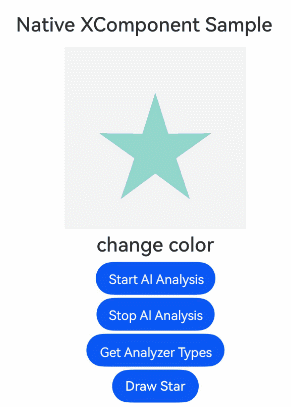
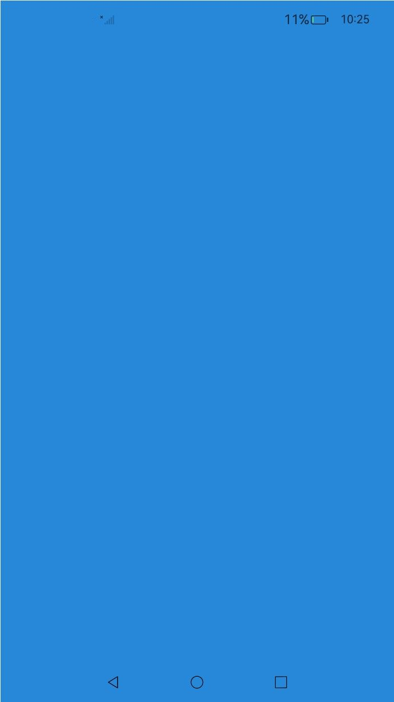
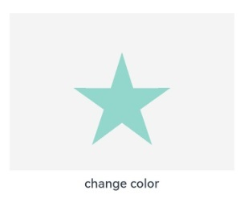

# XComponent
<!--Kit: ArkUI-->
<!--Subsystem: ArkUI-->
<!--Owner: @pengzhiwen3-->
<!--Designer: @dutie123-->
<!--Tester: @sally__-->
<!--Adviser: @Brilliantry_Rui-->
<!-- md-trans-meta sourceCommit=33898b66eb6c0bf66810bb0d90faa36b55a4ad07 translatedAt=2026-09-03T13:18:37.929Z -->

Provides a surface for graphics rendering and media data writing. XComponent embeds the surface into the view and supports customizing the position and size of the surface. It also supports capabilities such as AI image analysis, HDR video brightness adjustment, screen capture and recording privacy protection, and canvas self-rendering. It is applicable to scenarios that require high-performance self-rendering and media content display, such as video playback, camera preview, game rendering, and AI image recognition. For details, see [Custom Rendering (XComponent)](../../../ui/napi-xcomponent-guidelines.md).

> **NOTE**
>
> This component is supported since API version 8. Newly added APIs will be marked with a superscript to indicate their earliest API version.


## Child Components
Not supported

## APIs

### XComponent<sup>19+</sup>

XComponent(params: NativeXComponentParameters)

Obtains an **XComponent** node instance on the native side, and registers the lifecycle callbacks for the surface held by the **XComponent** and the callbacks for component events, such as touch, mouse, and key events.

**Atomic service API**: This API can be used in atomic services since API version 19.

**Model restriction**: This API can be used only in the stage model.

**System capability**: SystemCapability.ArkUI.ArkUI.Full

**Parameters**

| Name | Type                               | Mandatory| Description                          |
| ------- | --------------------------------------- | ---- | ------------------------------ |
| params | [NativeXComponentParameters](#nativexcomponentparameters19) | Yes | Configuration parameters of the XComponent, used to obtain the XComponent node instance on the native side and register the Surface lifecycle callback and component event callback. |

### XComponent<sup>12+</sup>

XComponent(options: XComponentOptions)

Creates an **XComponent** component, allowing you to obtain the **SurfaceId** value on the ArkTS side, register the lifecycle callbacks for the surface held by the **XComponent** and the callbacks for component events such as touch, mouse, and key events, and configure the AI analyzer feature.

**Atomic service API**: This API can be used in atomic services since API version 12.

**Model restriction**: This API can be used only in the stage model.

**System capability**: SystemCapability.ArkUI.ArkUI.Full

**Parameters**

| Name | Type                               | Mandatory| Description                          |
| ------- | --------------------------------------- | ---- | ------------------------------ |
| options | [XComponentOptions](#xcomponentoptions12) | Yes | Configuration options of XComponent, used to obtain the surface ID, register surface lifecycle callbacks and component event callbacks, and configure AI analysis on the ArkTS side. |

### XComponent<sup>10+</sup>

XComponent(value: {id: string, type: XComponentType, libraryname?: string, controller?: XComponentController})

Creates an **XComponent** component, whose lifecycle callbacks can be triggered from the native side.

This API is deprecated since API version 12. You are advised to use [XComponent(options: XComponentOptions)](#xcomponent12) instead.

**Atomic service API**: This API can be used in atomic services since API version 12.

**Model restriction**: This API can be used only in the stage model.

**System capability**: SystemCapability.ArkUI.ArkUI.Full

**Parameters**

| Name     | Type                                     | Mandatory| Description                                                        |
| ----------- | --------------------------------------------- | ---- | ------------------------------------------------------------ |
| id          | string                                        | Yes   | Unique ID of the component. The string length cannot exceed 128 characters. If the limit is exceeded, the ID is invalid.                    |
| type        | [XComponentType](ts-appendix-enums.md#xcomponenttype10)   | Yes  | Type of the component.                                |
| libraryname | string                                        | No   | Name of the dynamic library generated by compiling the application native layer (the corresponding dynamic library does not support cross-module loading). This parameter is valid only when the type is SURFACE or TEXTURE. If it is not set, the dynamic library is not loaded. |
| controller  | [XComponentController](#xcomponentcontroller) | No   | Controller bound to the component. You can call component methods through the controller, for example, to obtain the surface ID and set the surface display area. This parameter is valid only when the type is SURFACE or TEXTURE. Pass this parameter when you need to control the XComponent behavior on the ArkTS side. If it is not passed, the related component methods cannot be called through the controller. |

### XComponent<sup>(deprecated)</sup>

XComponent(value: {id: string, type: string, libraryname?: string, controller?: XComponentController})

> **NOTE**
>
> This API is supported since API version 8 and deprecated since API version 12. You are advised to use [XComponent(value: {id: string, type: XComponentType, libraryname?: string, controller?: XComponentController})](#xcomponent10) instead.

**System capability**: SystemCapability.ArkUI.ArkUI.Full

**Parameters**

| Name     | Type                                     | Mandatory| Description                                                        |
| ----------- | --------------------------------------------- | ---- | ------------------------------------------------------------ |
| id          | string                                        | Yes   | Unique identifier of the component. The string length cannot exceed 128 characters; otherwise, the value is invalid.                    |
| type        | string                                        | Yes   | Type of the XComponent. Only the following two values are supported:<br>-"surface": used for EGL/OpenGLES and media data writing, where the content customized by the developer is displayed on the screen separately.<br>-"component"<sup>9+</sup>: the XComponent becomes a container component, in which non-UI logic can be executed to dynamically load and display content.<br>Any other value is treated as "surface". |
| libraryname | string                                        | No   | Name of the dynamic library generated by compiling the application's native layer (the corresponding dynamic library does not support cross-module loading). This parameter takes effect only when the XComponent type is "surface". If it is not set, no dynamic library is loaded. |
| controller  | [XComponentController](#xcomponentcontroller) | No   | Controller bound to the component, through which the component methods are called. This parameter takes effect only when the XComponent type is "surface". If it is not set, no controller is bound. |

## XComponentOptions<sup>12+</sup>

Defines the options of the **XComponent**.

**Atomic service API**: This API can be used in atomic services since API version 12.

**Model restriction**: This API can be used only in the stage model.

**System capability**: SystemCapability.ArkUI.ArkUI.Full

| Name| Type| Read-Only| Optional| Description|
| -------- | -------- | -------- | -------- | -------- |
| type | [XComponentType](ts-appendix-enums.md#xcomponenttype10)         | No| No  | Type of the component.|
| controller | [XComponentController](#xcomponentcontroller) | No| No| Controller bound to the component, which can be used to invoke methods of the component. This parameter is effective only when **type** is **SURFACE** or **TEXTURE**.|
| imageAIOptions | [ImageAIOptions](ts-image-common.md#imageaioptions12) | No | Yes | Sets an AI analysis option for the component. Through this option, you can configure the analysis type or bind an analysis controller. It takes effect only when the type is SURFACE or TEXTURE. If this option is not set, no AI analysis option is configured, and AI analysis can be enabled separately through the enableAnalyzer attribute. |

## NativeXComponentParameters<sup>19+</sup>

Defines the specific configuration parameters used by XComponent on the native side. An XComponent created with this constructor can pass its corresponding [FrameNode](../js-apis-arkui-frameNode.md) object to the native side, where NDK APIs can be used to configure the surface lifecycle and [add event listeners](../../../ui/ndk-add-component-events.md).

**Atomic service API**: This API can be used in atomic services since API version 19.

**Model restriction**: This API can be used only in the stage model.

**System capability**: SystemCapability.ArkUI.ArkUI.Full

| Name| Type| Read-Only| Optional| Description|
| -------- | -------- | -------- | -------- | -------- |
| type | [XComponentType](ts-appendix-enums.md#xcomponenttype10)         | No| No  | Type of the component.|
| imageAIOptions | [ImageAIOptions](ts-image-common.md#imageaioptions12) | No | Yes | Sets an AI analysis option for the component. Through this option, you can configure the analysis type or bind an analysis controller. It takes effect only when the type is SURFACE or TEXTURE. If it is not set, no AI analysis option is configured, and AI analysis can be enabled separately through the enableAnalyzer attribute. |

## Attributes
In addition to universal attributes, the following attributes are supported:
  > 
  > **NOTE**
  >
  > The foregroundColor, obscured, and pixelStretchEffect attributes are not supported. In API version 17 and earlier, when **type** is set to **SURFACE**, dynamic attribute settings, custom drawing, background settings (except backgroundColor), image effects (except shadow), maskShape, and foregroundEffect are also not supported. Since API version 18, when **type** is set to **SURFACE**, the unsupported dynamic attributes include: background, foregroundColor, animation, gesture, priorityGesture, parallelGesture, useEffect, renderGroup, flexGrow, direction, align, useSizeType, clip, geometryTransition, bindPopup, bindMenu, bindContextMenu, bindContentCover, bindSheet, stateStyles, restoreId, onVisibleAreaChange, accessibilityGroup, obscured, reuseId, accessibilityVirtualNode.
  >
  > For XComponent components of the TEXTURE and SURFACE types, when the [renderFit](./ts-universal-attributes-renderfit.md#renderfit) attribute is not set, the default value is RenderFit.RESIZE_FILL.
  > 
  > For XComponent components of the SURFACE type, the background color is opaque pure black by default. Before API version 18, the [renderFit](./ts-universal-attributes-renderfit.md#renderfit18) universal attribute of this component can only be set to RenderFit.RESIZE_FILL. Since API version 18, all RenderFit enum values are supported.
  > 
  > For XComponent components created with [ArkUI NDK APIs](../../../ui/ndk-access-the-arkts-page.md), the attribute getter [getAttribute](../capi-arkui-nativemodule-arkui-nativenodeapi-1.md#getattribute) cannot be used to obtain the renderFit attribute value.

### enableAnalyzer<sup>12+</sup>

enableAnalyzer(enable: boolean)

Sets whether to enable the AI image analyzer, which supports subject recognition, text recognition, and object lookup.

This feature must be used together with [startImageAnalyzer](#startimageanalyzer12) and [stopImageAnalyzer](#stopimageanalyzer12) of **XComponentController**.

This attribute cannot be used together with [overlay](ts-universal-attributes-overlay.md#overlay). When both are set, the [CustomBuilder](ts-types.md#custombuilder8) attribute in overlay becomes invalid. The AI analysis function depends on the device capability.

**Atomic service API**: This API can be used in atomic services since API version 12.

**Model restriction**: This API can be used only in the stage model.

**System capability**: SystemCapability.ArkUI.ArkUI.Full

**Parameters**

| Name| Type| Mandatory| Description|
| -------- | -------- | -------- | -------- |
| enable | boolean | Yes | Whether to enable the AI analysis feature.<br>true: enables AI analysis; false: disables AI analysis.<br>Default value: false |

  > **NOTE**
  >
  > This API has effect only when **type** is set to **SURFACE** or **TEXTURE**.

### enableSecure<sup>13+</sup>

enableSecure(isSecure: boolean)

Sets whether to enable the secure surface to protect the content rendered within the component from being captured or recorded.

**Atomic service API**: This API can be used in atomic services since API version 13.

**Model restriction**: This API can be used only in the stage model.

**System capability**: SystemCapability.ArkUI.ArkUI.Full

**Parameters**

| Name  | Type   | Mandatory| Description                  |
| -------- | ------- | ---- | ---------------------- |
| isSecure | boolean | Yes | Whether to enable the privacy layer mode.<br>true: enables the privacy layer mode; false: disables the privacy layer mode.<br>Default value: false |

  > **NOTE**
  >
  > This attribute is effective only when **type** is set to **SURFACE**.
  >
  > It is not supported for **XComponent** components created using the [ArkUI NDK API](../../../ui/ndk-build-ui-overview.md).

### hdrBrightness<sup>20+</sup>

hdrBrightness(brightness: number)

Sets the brightness of HDR video playback for the component.

> **NOTE**
>
> - This API takes effect only when **type** in the XComponent constructor is set to [XComponentType](ts-appendix-enums.md#xcomponenttype10).SURFACE. Otherwise, it does not take effect.
>
> - XComponent components created with [ArkUI NDK APIs](../../../ui/ndk-build-ui-overview.md) are not supported.

**Atomic service API**: This API can be used in atomic services since API version 20.

**Model restriction**: This API can be used only in the stage model.

**System capability**: SystemCapability.ArkUI.ArkUI.Full

**Parameters**

| Name  | Type   | Mandatory| Description                  |
| -------- | ------- | ---- | ---------------------- |
| brightness | number | Yes | Brightness of the HDR video.<br>Default value: **1.0**<br>Value range: [0.0, 1.0]. Values less than 0.0 are treated as 0.0, values greater than 1.0 are treated as 1.0, and other abnormal values are treated as 1.0.<br>0.0 indicates that the video is displayed at SDR brightness, and 1.0 indicates that the video is displayed at the highest HDR brightness currently allowed. |

### hdrBrightness<sup>24+</sup>

hdrBrightness(brightness: number, type?: HdrType)

Adjusts the brightness when the component displays HDR content.<br>
When the parameter **type** is set to a value other than [HdrType](#hdrtype24).DEFAULT, before calling this API, check whether the **hdrFormats** attribute of [Display](../js-apis-display.md#display) contains the corresponding [HDRFormat](../../apis-arkgraphics2d/js-apis-hdrCapability.md#hdrformat).<br>Only when **hdrFormats** contains the corresponding HDRFormat does the current device support the corresponding HDR type and the parameter setting take effect; otherwise, the default value [HdrType](#hdrtype24).DEFAULT is used.<br>
The mapping is as follows:
   | Value of type | HDRFormat that hdrFormats must contain |
   | -------- | -------- |
   | [HdrType](#hdrtype24).AIHDR | [HDRFormat](../../apis-arkgraphics2d/js-apis-hdrCapability.md#hdrformat).VIDEO_AIHDR |

> **NOTE**
> 
> - This API takes effect only when **type** in the XComponent constructor parameters is [XComponentType](ts-appendix-enums.md#xcomponenttype10).SURFACE. Otherwise, it does not take effect.
>
> - XComponent components created through the [ArkUI NDK APIs](../../../ui/ndk-build-ui-overview.md) are not supported.

**Atomic service API**: This API can be used in atomic services since API version 24.

**System capability**: SystemCapability.ArkUI.ArkUI.Full

**Model restriction**: This API can be used only in the stage model.

**Parameters**

| Name  | Type  | Mandatory  | Description                                      |
| ----- | ------ | ---- | ---------------------------------------- |
| brightness | number | Yes  | Brightness of the HDR content.<br>Default value: **1.0**<br>Value range: [0.0, 1.0]. Values less than 0.0 are treated as 0.0, values greater than 1.0 are treated as 1.0, and other abnormal values are treated as 1.0.<br>**0.0** indicates that the content is displayed at SDR brightness, and **1.0** indicates that the content is displayed at the maximum HDR brightness currently allowed.|
| type | [HdrType](#hdrtype24) | No  | HDR type used when displaying HDR content.<br>Default value: **HdrType.DEFAULT**|

## HdrType<sup>24+</sup>

Enumerates the high dynamic range rendering types of HDR content.

**System capability**: SystemCapability.ArkUI.ArkUI.Full

**Model restriction**: This API can be used only in the stage model.

| Name | Value | Description |
| ---- | -- | ---- |
| DEFAULT | 0 | Default HDR type, which uses the standard high dynamic range rendering mode.<br>**Atomic service API:** This API can be used in atomic services since API version 24. |
| AIHDR | 1 | AI HDR type, which uses AI algorithms to intelligently expand the dynamic range of non-HDR content to achieve HDR display effects.<br>**Atomic service API:** This API can be used in atomic services since API version 24.|
## Events

Since API version 12, the [universal events](ts-component-general-events.md) are supported when **type** is set to **SURFACE** or **TEXTURE**.

> **NOTE**
>
> When the **libraryname** parameter is set, [click events](ts-universal-events-click.md), [touch events](ts-universal-events-touch.md), [show/hide events](ts-universal-events-show-hide.md), [key events](ts-universal-events-key.md), [focus events](ts-universal-focus-event.md), and [mouse events](ts-universal-mouse-key.md) only respond to event APIs on the C API side.

The following events are effective only when **type** is set to **SURFACE** or **TEXTURE**.

### onLoad

onLoad(callback: OnNativeLoadCallback)

Callback event triggered when native loading is complete.

> **NOTE**
>
> This callback is triggered only when the **libraryname** parameter is set for the **XComponent**. If the **libraryname** parameter is not set, use callbacks such as [onSurfaceCreated](#onsurfacecreated12).

**Atomic service API**: This API can be used in atomic services since API version 12.

**System capability**: SystemCapability.ArkUI.ArkUI.Full

**Parameters**

| Name  | Type  | Mandatory  | Description                                      |
| ----- | ------ | ---- | ---------------------------------------- |
| callback | [OnNativeLoadCallback](#onnativeloadcallback18) | Yes | Callback invoked when the native content is loaded, used to obtain the context of the XComponent instance. |

### onDestroy

onDestroy(event: VoidCallback)

Callback event triggered when native unloading is complete. Difference from [onSurfaceDestroyed](#onsurfacedestroyed12): **onDestroy** applies to the scenario where the **libraryname** parameter is set, and the callback has no parameters; **onSurfaceDestroyed** applies to the scenario where the **libraryname** parameter is not set, and the callback parameter is **surfaceId**.

**Atomic service API**: This API can be used in atomic services since API version 12.

**System capability**: SystemCapability.ArkUI.ArkUI.Full

**Parameters**

| Name  | Type  | Mandatory  | Description                                      |
| ----- | ------ | ---- | ---------------------------------------- |
| event | [VoidCallback](ts-types.md#voidcallback12) | Yes    | Callback invoked when the native component is unloaded. |

## OnNativeLoadCallback<sup>18+</sup>

type OnNativeLoadCallback = (event?: object) =\> void

Callback event triggered after the native loading of the **XComponent** is complete, used to pass the context of the **XComponent** instance object to the developer. Difference from [onSurfaceCreated](#onsurfacecreated12): the **onLoad** callback parameter is the **context** object, which applies to the scenario where the **libraryname** parameter is set; the **onSurfaceCreated** callback parameter is **surfaceId**, which applies to the scenario where the **libraryname** parameter is not set. **onLoad** is triggered earlier than **onSurfaceCreated**.

**Atomic service API**: This API can be used in atomic services since API version 18.

**Model restriction**: This API can be used only in the stage model.

**System capability**: SystemCapability.ArkUI.ArkUI.Full

**Parameters**

| Name  | Type  | Mandatory  | Description                                      |
| ----- | ------ | ---- | ---------------------------------------- |
| event | object | No    | Context of the XComponent instance object. The methods mounted on the context are defined by the developer on the native layer. Pass this parameter when the methods defined on the native layer need to be used in the callback; if it is not passed, the context object cannot be obtained in the callback. |

## XComponentController

Defines the controller of the **XComponent**. You can bind the controller to the **XComponent** to call the component APIs through the controller.

**Atomic service API**: This API can be used in atomic services since API version 12.

**System capability**: SystemCapability.ArkUI.ArkUI.Full

### constructor

constructor()

A constructor used to create a **XComponentController** instance.

**Atomic service API**: This API can be used in atomic services since API version 12.

**System capability**: SystemCapability.ArkUI.ArkUI.Full

**Example**

  ```ts
  xComponentController: XComponentController = new XComponentController();
  ```

### getXComponentSurfaceId<sup>9+</sup>

getXComponentSurfaceId(): string

Obtains the ID of the surface corresponding to the XComponent. This parameter is valid only when the XComponent type is SURFACE("surface") or TEXTURE.

**Atomic service API**: This API can be used in atomic services since API version 12.

**System capability**: SystemCapability.ArkUI.ArkUI.Full

**Return value**

| Type    | Description                     |
| ------ | ----------------------- |
| string | ID of the surface held by the **XComponent**.|

> **NOTE**
> 
> When you create an **XComponent** using a custom component node, the **onLoad** callback is triggered before the [onSurfaceCreated](#onsurfacecreated12) callback. This means that calling [getXComponentSurfaceId](#getxcomponentsurfaceid9) in the **onLoad** callback will not return a valid **surfaceId**. You are advised to obtain the **surfaceId** in the [onSurfaceCreated](#onsurfacecreated12) callback instead.

**Example**

```ts
// xxx.ets

@Entry
  @Component
  struct Index {
    myXComponentController: XComponentController = new XComponentController();

    build() {
      Flex({ direction: FlexDirection.Column, alignItems: ItemAlign.Center, justifyContent: FlexAlign.Center }) {
        XComponent({
          type: XComponentType.SURFACE,
          controller: this.myXComponentController
        })
          .onLoad(() => {
            let surfaceId: string = this.myXComponentController.getXComponentSurfaceId();
            console.info("XComponent SurfaceId: " + surfaceId);
          })
      }
    }
  }
  ```

### setXComponentSurfaceSize<sup>(deprecated)</sup>

setXComponentSurfaceSize(value: {surfaceWidth: number, surfaceHeight: number}): void

Sets the width and height of the surface held by the **XComponent**. This API works only when **type** of the **XComponent** is set to **SURFACE("surface")** or **TEXTURE**.

> **NOTE**
>
> This API is supported since API version 9 and deprecated since API version 12. You are advised to use [setXComponentSurfaceRect](#setxcomponentsurfacerect12) instead.

**System capability**: SystemCapability.ArkUI.ArkUI.Full

**Parameters**

| Name          | Type  | Mandatory  | Description                     |
| ------------- | ------ | ---- | ----------------------- |
| surfaceWidth  | number | Yes    | Width of the Surface held by the XComponent. The value ranges from greater than 0 to no more than 8192, in px. If 0, a negative number, or another invalid value is passed in, the API does not take effect.|
| surfaceHeight | number | Yes    | Height of the Surface held by the XComponent. The value ranges from greater than 0 to no more than 8192, in px. If 0, a negative number, or another invalid value is passed in, the API does not take effect.|


### getXComponentContext

getXComponentContext(): Object

Obtains the context of an **XComponent** object. This API works only when **type** of the **XComponent** is set to **SURFACE("surface")** or **TEXTURE**.

**Atomic service API**: This API can be used in atomic services since API version 12.

**System capability**: SystemCapability.ArkUI.ArkUI.Full

**Return value**

| Type  | Description                                                        |
| ------ | ------------------------------------------------------------ |
| Object | Context of the **XComponent** object. The APIs contained in the context are defined by developers. The context is passed in as the first parameter of the **onLoad** callback.|

### setXComponentSurfaceRect<sup>12+</sup>

setXComponentSurfaceRect(rect: SurfaceRect): void

Sets the display area for the surface held by the **XComponent**, including the width, height, and position coordinates relative to the upper left corner of the component. This API is only effective when the **XComponent** type is **SURFACE("surface")** or **TEXTURE**.

**Atomic service API**: This API can be used in atomic services since API version 12.

**Model restriction**: This API can be used only in the stage model.

**System capability**: SystemCapability.ArkUI.ArkUI.Full

**Parameters**

| Name| Type                            | Mandatory| Description                             |
| ------ | ------------------------------------ | ---- | --------------------------------- |
| rect   | [SurfaceRect](#surfacerect12) | Yes  | Rectangle of the surface held by the **XComponent**.|

> **NOTE**<br>
>
> If offsetX/offsetY in rect is not set or an abnormal value is passed, the Surface display area is centered by default relative to the x/y axis of the upper left corner of the XComponent.
>
> If the values of surfaceWidth and surfaceHeight in the rect parameter are 0, negative numbers, or other abnormal values, the display area set by calling this API does not take effect. If this method is not called to set the display area of the surface, the surfaceWidth is the same as the component width by default, and the surfaceHeight is the same as the component height by default.
>
> This API has a higher priority than attributes that can change the content offset and size, such as [border](ts-universal-attributes-border.md#border) and [padding](ts-universal-attributes-size.md#padding).

### getXComponentSurfaceRect<sup>12+</sup>

getXComponentSurfaceRect(): SurfaceRect

Obtains the display area for the surface held by the **XComponent**, including the width, height, and position coordinates relative to the upper left corner of the component. This API is only effective when the **XComponent** type is **SURFACE("surface")** or **TEXTURE**.

**Atomic service API**: This API can be used in atomic services since API version 12.

**Model restriction**: This API can be used only in the stage model.

**System capability**: SystemCapability.ArkUI.ArkUI.Full

**Return value**

| Type                                | Description                                 |
| ------------------------------------ | ------------------------------------- |
| [SurfaceRect](#surfacerect12) | Rectangle of the surface held by the **XComponent**.|

### onSurfaceCreated<sup>12+</sup>

onSurfaceCreated(surfaceId: string): void

Triggered when the surface held by the **XComponent** is created. This API works only when **type** of the **XComponent** is set to **SURFACE("surface")** or **TEXTURE**.

**Atomic service API**: This API can be used in atomic services since API version 12.

**Model restriction**: This API can be used only in the stage model.

**System capability**: SystemCapability.ArkUI.ArkUI.Full

**Parameters**

| Name   | Type| Mandatory| Description                                             |
| --------- | -------- | ---- | ------------------------------------------------- |
| surfaceId | string   | Yes  | ID of the surface held by the **XComponent**.|

> **NOTE**<br>
>
> The callback is triggered only when the **libraryname** parameter is not set for the **XComponent**.

### onSurfaceChanged<sup>12+</sup>

onSurfaceChanged(surfaceId: string, rect: SurfaceRect): void

Triggered when the surface held by the **XComponent** has its size changed (including the time when the **XComponent** is created with the specified size). This API works only when **type** of the **XComponent** is set to **SURFACE** (**"surface"**) or **TEXTURE**.

**Atomic service API**: This API can be used in atomic services since API version 12.

**Model restriction**: This API can be used only in the stage model.

**System capability**: SystemCapability.ArkUI.ArkUI.Full

**Parameters**

| Name   | Type                             | Mandatory| Description                                                   |
| --------- | ------------------------------------- | ---- | ------------------------------------------------------- |
| surfaceId | string                                | Yes  | ID of the surface held by the **XComponent**.      |
| rect      | [SurfaceRect](#surfacerect12) | Yes  | Rectangle for displaying the surface held by the **XComponent**.|

> **NOTE**<br>
>
> The callback is triggered only when the **libraryname** parameter is not set for the **XComponent**.

### onSurfaceDestroyed<sup>12+</sup>

onSurfaceDestroyed(surfaceId: string): void

Called when the surface held by the **XComponent** is destroyed. This callback takes effect only when the **XComponent** type is SURFACE("surface") or TEXTURE. For details, see [Creating an XComponent and Managing the Surface Lifecycle](../../../ui/napi-xcomponent-guidelines.md#creating-an-xcomponent-and-managing-the-surface-lifecycle).

**Atomic service API**: This API can be used in atomic services since API version 12.

**Model restriction**: This API can be used only in the stage model.

**System capability**: SystemCapability.ArkUI.ArkUI.Full

**Parameters**

| Name   | Type| Mandatory| Description                                             |
| --------- | -------- | ---- | ------------------------------------------------- |
| surfaceId | string   | Yes  | ID of the surface held by the **XComponent**.|

> **NOTE**<br>
>
> The callback is triggered only when the **libraryname** parameter is not set for the **XComponent**.

### startImageAnalyzer<sup>12+</sup>

startImageAnalyzer(config: ImageAnalyzerConfig): Promise\<void>

Configures and starts AI analysis. Before using this API, enable the image AI analysis capability by calling [enableAnalyzer](#enableanalyzer12). This API takes effect only when the **XComponent** type is SURFACE or TEXTURE. This API uses a promise to return the result asynchronously.<br>When this API is called, the frame at the moment of the call is captured for analysis. Pay attention to the timing of starting the analysis to avoid inconsistency between the displayed content and the analysis result.<br>If this API is called again before the previous call is complete, an error callback is triggered.

> **NOTE**
>
> The analysis type cannot be dynamically modified.
> The AI analysis capability depends on the device capability. If the device does not support this capability, an error code is returned.

**Atomic service API**: This API can be used in atomic services since API version 12.

**Model restriction**: This API can be used only in the stage model.

**System capability**: SystemCapability.ArkUI.ArkUI.Full

**Parameters**

| Name| Type     | Mandatory| Description                                                                  |
| ------ | --------- | ---- | ---------------------------------------------------------------------- |
| config   | [ImageAnalyzerConfig](ts-image-common.md#imageanalyzerconfig12) | Yes  | Settings of the AI image analyzer.|

**Return value**

| Type             | Description                                |
| ----------------- | ------------------------------------ |
| Promise\<void>  | Promise that returns no value. It is used to indicate AI analysis is successfully executed.|

**Error codes**

For details about the error codes, see [AI Image Analyzer Error Codes](errorcode-image-analyzer.md).

| ID| Error Message                                     |
| -------- | -------------------------------------------- |
| 110001 | Image analysis feature is unsupported.               |
| 110002 | Image analysis is currently being executed.  |
| 110003 | Image analysis is stopped.  |

### stopImageAnalyzer<sup>12+</sup>

stopImageAnalyzer(): void

Stops AI analysis. This API takes effect only when the **XComponent** type is SURFACE or TEXTURE. Before calling this API, call [enableAnalyzer](#enableanalyzer12) and [startImageAnalyzer](#startimageanalyzer12) to enable the AI analysis capability. After this API is called, the content displayed by AI analysis is destroyed.

> **NOTE**<br>
> 
> If this API is called when the **startImageAnalyzer** API has not yet returned any result, an error callback is triggered.
> This feature depends on device capabilities.

**Atomic service API**: This API can be used in atomic services since API version 12.

**Model restriction**: This API can be used only in the stage model.

**System capability**: SystemCapability.ArkUI.ArkUI.Full

### setXComponentSurfaceRotation<sup>12+</sup>

setXComponentSurfaceRotation(rotationOptions: SurfaceRotationOptions): void

Sets whether to lock the orientation of the surface held by this **XComponent** when the screen rotates. This API is effective only when the **XComponent** type is **SURFACE** (**"surface"**).

**Atomic service API**: This API can be used in atomic services since API version 12.

**Model restriction**: This API can be used only in the stage model.

**System capability**: SystemCapability.ArkUI.ArkUI.Full

**Parameters**

| Name| Type                            | Mandatory| Description                             |
| ------ | ------------------------------------ | ---- | --------------------------------- |
| rotationOptions   | [SurfaceRotationOptions](#surfacerotationoptions12) | Yes| Whether to lock the orientation of the surface held by the current **XComponent** when the screen rotates.|

> **NOTE**
>
> If **rotationOptions** is not set, the surface held by this **XComponent** rotates with the screen by default.
>
> The orientation lock is only applied during the rotation process and is released once the rotation is complete.
>
> The setting takes effect only when the screen is rotated by 90°, that is, when it switches between landscape and portrait modes.
>
> Make sure the Buffer's width and height remain constant after locking the orientation to prevent distortion.

### getXComponentSurfaceRotation<sup>12+</sup>

getXComponentSurfaceRotation(): Required\<SurfaceRotationOptions>

Obtains whether the orientation of the surface held by this **XComponent** is locked when the screen rotates. This API is effective only when the **XComponent** type is **SURFACE** (**"surface"**).

**Atomic service API**: This API can be used in atomic services since API version 12.

**Model restriction**: This API can be used only in the stage model.

**System capability**: SystemCapability.ArkUI.ArkUI.Full

**Return value**

| Type                                | Description                                 |
| ------------------------------------ | ------------------------------------- |
| Required<[SurfaceRotationOptions](#surfacerotationoptions12)> | Whether the orientation of the surface held by the current **XComponent** is locked when the screen rotates.|

### lockCanvas<sup>20+</sup>

lockCanvas(): DrawingCanvas | null

Obtains a canvas object for drawing content on the **XComponent** component. For details about the drawing methods, see [Canvas](../../apis-arkgraphics2d/arkts-apis-graphics-drawing-Canvas.md).

**Atomic service API**: This API can be used in atomic services since API version 20.

**Model restriction**: This API can be used only in the stage model.

**System capability**: SystemCapability.ArkUI.ArkUI.Full

**Return value**
| Type                                | Description                                 |
| ------------------------------------ | ------------------------------------- |
| [DrawingCanvas](ts-drawingrenderingcontext.md#drawingcanvas) \| null | Canvas object that can be used to draw on the XComponent area. Returns null when the canvas object cannot be obtained (for example, when the Surface is not created or the canvas is occupied and not released). |

> **NOTE**
>
> This API returns **null** if the canvas object cannot be obtained due to the current state of the **XComponent** component. The possible causes are as follows:
>
> 1. The surface held by the **XComponent** has not been created. You can determine this by setting the [onLoad](#onload)/[onSurfaceCreated](#onsurfacecreated12) callback. When this callback is triggered, the surface has been created.
>
> 2. The canvas object was previously obtained by calling **lockCanvas**, and it has not been released by calling [unlockCanvasAndPost](#unlockcanvasandpost20).
>
> Only the TEXTURE and SURFACE modes are supported.
>
> After this API is used, obtaining the **NativeWindow** on the NDK side and calling the NDK drawing APIs to draw content may cause buffer contention and context conflicts, resulting in rendering errors and other exceptions. Therefore, this is not allowed.
>
> This API must be used together with [unlockCanvasAndPost](#unlockcanvasandpost20). For details, see Example 3: Drawing Content on the XComponent Using a Canvas Object(#example-3-drawing-content-on-the-xcomponent-using-a-canvas-object).

### unlockCanvasAndPost<sup>20+</sup>

unlockCanvasAndPost(canvas: DrawingCanvas): void

Submits the drawn content from a canvas object to the display area of the **XComponent** component and releases the canvas object.

**Atomic service API**: This API can be used in atomic services since API version 20.

**Model restriction**: This API can be used only in the stage model.

**System capability**: SystemCapability.ArkUI.ArkUI.Full

**Parameters**
| Name| Type| Mandatory| Description|
| -------- | -------- | -------- | -------- |
| canvas | [DrawingCanvas](ts-drawingrenderingcontext.md#drawingcanvas) | Yes | Canvas object returned by the lockCanvas method called earlier. |

> **NOTE**
>
> 1. After the canvas object is released by calling **unlockCanvasAndPost**, the canvas object can no longer be used.
>
> 2. Only the TEXTURE and SURFACE modes are supported.
>
> 3. After this API is used, obtaining the **NativeWindow** on the NDK side and calling the related APIs to draw content may cause buffer contention and context conflicts, resulting in rendering errors and other exceptions. Therefore, this is not allowed.
>
> 4. This API must be used together with [lockCanvas](#lockcanvas20). For details, see [Example 3: Drawing Content on the XComponent Using a Canvas Object](#example-3-drawing-content-on-the-xcomponent-using-a-canvas-object).

### setXComponentSurfaceConfig<sup>22+</sup>

setXComponentSurfaceConfig(config: SurfaceConfig): void

Sets the options of the surface created by the **XComponent**, which are used to set whether the surface held by the **XComponent** needs to be treated as opaque during rendering. When the content drawn on the surface is completely opaque, the surface can be set to opaque to improve rendering performance. When the drawn content contains transparent areas, the surface must remain non-opaque to ensure that the transparency effect is displayed correctly.

> **NOTE**
>
> This API takes effect only when the XComponent component type is TEXTURE or SURFACE.

**Atomic service API**: This API can be used in atomic services since API version 22.

**Model restriction**: This API can be used only in the stage model.

**System capability**: SystemCapability.ArkUI.ArkUI.Full

**Parameters**
| Name| Type| Mandatory| Description|
| -------- | -------- | -------- | -------- |
| config | [SurfaceConfig](#surfaceconfig22) | Yes | Surface configuration options, used to set whether the Surface held by the XComponent needs to be treated as opaque during rendering. |

## SurfaceRotationOptions<sup>12+</sup>

Defines whether the orientation of the surface held by the current **XComponent** is locked when the screen rotates.

**Atomic service API**: This API can be used in atomic services since API version 12.

**Model restriction**: This API can be used only in the stage model.

**System capability**: SystemCapability.ArkUI.ArkUI.Full

| Name         | Type  | Read-Only| Optional| Description                                                        |
| ------------- | ------ | ------ | ---- | ------------------------------------------------------------ |
| lock       | boolean | No | Yes   | Whether to lock the orientation of the Surface when the screen rotates. The default value is false, which means the orientation is not locked.<br>true: locks the orientation; false: does not lock the orientation. |

## SurfaceRect<sup>12+</sup>

Describes the rectangle of the surface held by the **XComponent**.

**Atomic service API**: This API can be used in atomic services since API version 12.

**Model restriction**: This API can be used only in the stage model.

**System capability**: SystemCapability.ArkUI.ArkUI.Full

| Name         | Type  | Read-Only| Optional| Description                                                        |
| ------------- | ------ | ------ | ---- | ------------------------------------------------------------ |
| offsetX       | number | No   | Yes   | X-coordinate of the Surface display area relative to the upper left corner of the XComponent, in px. If not set, the area is centered by default. |
| offsetY       | number | No   | Yes   | Y-coordinate of the Surface display area relative to the upper left corner of the XComponent, in px. If not set, the area is centered by default. |
| surfaceWidth  | number | No  | No  | Width of the surface rectangle.<br>Unit: px.                           |
| surfaceHeight | number | No  | No  | Height of the surface rectangle.<br>Unit: px.                           |

> **NOTE**
>
> When [setXComponentSurfaceRect](#setxcomponentsurfacerect12) is not called and attributes such as [border](ts-universal-attributes-border.md#border) and [padding](ts-universal-attributes-size.md#padding) are not set, the values of **surfaceWidth** and **surfaceHeight** are the size of the **XComponent** component.
>
> The values of **surfaceWidth** and **surfaceHeight** must not exceed 8192 px. Otherwise, rendering exceptions may occur.
>
> In immersive scenarios, the **SurfaceRect** of the default layout does not include the safe area. You need to call [setXComponentSurfaceRect](#setxcomponentsurfacerect12) to actively set the surface display area to achieve the immersive effect.

## SurfaceConfig<sup>22+</sup>

Describes whether the surface held by the XComponent component is opaque during rendering.

**Atomic service API**: This API can be used in atomic services since API version 22.

**Model restriction**: This API can be used only in the stage model.

**System capability**: SystemCapability.ArkUI.ArkUI.Full

| Name         | Type  | Read-Only| Optional| Description                                                        |
| ------------- | ------ | ------ | ---- | ------------------------------------------------------------ |
| isOpaque       | boolean | No | Yes   | Whether the Surface held by the XComponent needs to be treated as opaque during rendering. If this parameter is not set, the default value is false, which means that the transparency of the pixels of the content drawn on the Surface is applied during rendering.<br>The value true means that the Surface needs to be treated as opaque, and false means the opposite.<br>Default value: false |

## Example

You can preview how this component looks on a real device, but not in DevEco Studio Previewer.


### Example 1: Enabling AI Image Analyzer

This example shows how to use the **enableAnalyzer** attribute to enable image AI analysis. You can use **XComponentController** to start or stop image AI analysis.

<!--RP1-->
> **NOTE**
>
> For details about the specific implementation of the drawing logic in this example (the implementation of functions related to nativeRender), see [ArkTS XComponent Sample](https://gitcode.com/openharmony/applications_app_samples/tree/master/code/DocsSample/ArkUISample/ArkTSXComponent).
<!--RP1End-->

```ts
// xxx.ets
import { BusinessError } from '@kit.BasicServicesKit';
import nativeRender from 'libnativerender.so'; // The .so file implemented by the developer. For details, see the description above.

class CustomXComponentController extends XComponentController {
  onSurfaceCreated(surfaceId: string): void {
    console.info(`onSurfaceCreated surfaceId: ${surfaceId}`);
    nativeRender.SetSurfaceId(BigInt(surfaceId));
  }

  onSurfaceChanged(surfaceId: string, rect: SurfaceRect): void {
    console.info(`onSurfaceChanged surfaceId: ${surfaceId}, rect: ${JSON.stringify(rect)}`);
    nativeRender.ChangeSurface(BigInt(surfaceId), rect.surfaceWidth, rect.surfaceHeight);
  }

  onSurfaceDestroyed(surfaceId: string): void {
    console.info(`onSurfaceDestroyed surfaceId: ${surfaceId}`);
    nativeRender.DestroySurface(BigInt(surfaceId));
  }
}

@Entry
@Component
struct XComponentExample {
  xComponentController: XComponentController = new CustomXComponentController();
  private config: ImageAnalyzerConfig = {
    types: [ImageAnalyzerType.SUBJECT, ImageAnalyzerType.TEXT]
  };
  private aiController: ImageAnalyzerController = new ImageAnalyzerController();
  private options: ImageAIOptions = {
    types: [ImageAnalyzerType.SUBJECT, ImageAnalyzerType.TEXT],
    aiController: this.aiController
  };
  @State xcWidth: string = "720px";
  @State xcHeight: string = "720px";
  @State currentStatus: string = "index";

  build() {
    Column({ space: 5 }) {
      Row() {
        Text('Native XComponent Sample')
          .fontSize('24fp')
          .fontWeight(500)
          .margin({
            left: 24,
            top: 12
          })
      }
      .margin({ top: 24 })
      .width('100%')
      .height(56)

      XComponent({
        type: XComponentType.SURFACE,
        controller: this.xComponentController,
        imageAIOptions: this.options
      })
        .width(this.xcWidth)
        .height(this.xcHeight)
        .enableAnalyzer(true)
        .onClick(() => {
          let surfaceId = this.xComponentController.getXComponentSurfaceId();
          nativeRender.ChangeColor(BigInt(surfaceId));
          let hasChangeColor: boolean = false;
          let status = nativeRender.GetXComponentStatus(BigInt(surfaceId));
          if (status) {
            hasChangeColor = status.hasChangeColor;
          }
          if (hasChangeColor) {
            this.currentStatus = "change color";
          }
        })
      Text(this.currentStatus)
        .fontSize('24fp')
        .fontWeight(500)
      Column() {
        Button('start AI analyze')
          .onClick(() => {
            this.xComponentController.startImageAnalyzer(this.config)
              .then(() => {
                console.info("analysis complete");
              })
              .catch((error: BusinessError) => {
                console.error(`Failed to start image analyzer. Code: ${error.code}, message: ${error.message}`);
              })
          })
          .margin(2)
        Button('stop AI analyze')
          .onClick(() => {
            this.xComponentController.stopImageAnalyzer();
          })
          .margin(2)
        Button('get analyzer types')
          .onClick(() => {
            this.aiController.getImageAnalyzerSupportTypes();
          })
          .margin(2)
        Button('Draw Star')
          .fontSize('16fp')
          .fontWeight(500)
          .onClick(() => {
            let surfaceId = this.xComponentController.getXComponentSurfaceId();
            console.info(`surface rect is ${this.xComponentController.getXComponentSurfaceRect()}`);
            nativeRender.DrawPattern(BigInt(surfaceId));
            let hasDraw: boolean = false;
            let status = nativeRender.GetXComponentStatus(BigInt(surfaceId));
            if (status) {
              hasDraw = status.hasDraw;
            }
            if (hasDraw) {
              this.currentStatus = "draw star";
            }
          })
          .margin(2)
      }.justifyContent(FlexAlign.Center)
    }
    .width('100%')
  }
}
```



### Example 2 (Locking During Surface Rotation)

Uses setXComponentSurfaceRotation to lock the Surface orientation during screen rotation so that it does not rotate with the screen.

> **NOTE**
>
> For details about the implementation of the drawing logic in this example (the function implementation related to nativeRender), see <!--RP2-->[ArkTS XComponent Sample](https://gitcode.com/openharmony/applications_app_samples/tree/master/code/DocsSample/ArkUISample/ArkTSXComponent).<!--RP2End-->

```ts
// xxx.ets
import nativeRender from 'libnativerender.so';

class MyXComponentController extends XComponentController {
  onSurfaceCreated(surfaceId: string): void {
    console.info(`onSurfaceCreated surfaceId: ${surfaceId}`);
    nativeRender.SetSurfaceId(BigInt(surfaceId));
  }

  onSurfaceChanged(surfaceId: string, rect: SurfaceRect): void {
    console.info(`onSurfaceChanged surfaceId: ${surfaceId}, rect: ${JSON.stringify(rect)}`);
    nativeRender.ChangeSurface(BigInt(surfaceId), rect.surfaceWidth, rect.surfaceHeight);
  }

  onSurfaceDestroyed(surfaceId: string): void {
    console.info(`onSurfaceDestroyed surfaceId: ${surfaceId}`);
    nativeRender.DestroySurface(BigInt(surfaceId));
  }
}

@Entry
@Component
struct Index {
  @State isLock: boolean = true;
  @State xcWidth: number = 500;
  @State xcHeight: number = 700;
  myXComponentController: XComponentController = new MyXComponentController();

  build() {
    Flex({ direction: FlexDirection.Column, alignItems: ItemAlign.Center, justifyContent: FlexAlign.Start }) {
      XComponent({
        id: "XComponent",
        type: XComponentType.SURFACE,
        controller: this.myXComponentController
      })
        .onLoad(() => {
          let surfaceRotation: SurfaceRotationOptions = { lock: this.isLock };
          this.myXComponentController.setXComponentSurfaceRotation(surfaceRotation);
          console.info("Surface getXComponentSurfaceRotation lock = " +
          this.myXComponentController.getXComponentSurfaceRotation().lock);
        })
        .width(this.xcWidth)
        .height(this.xcHeight)
      Button("Draw")
        .onClick(() => {
          let surfaceId = this.myXComponentController.getXComponentSurfaceId();
          nativeRender.DrawPattern(BigInt(surfaceId));
        })
    }
  }
}
```

### Example 3: Drawing Content on the XComponent Using a Canvas Object

From API version 20, this example returns a canvas object by calling [lockCanvas](#lockcanvas20), calls the corresponding drawing API via the canvas object, and then calls [unlockCanvasAndPost](#unlockcanvasandpost20) to draw content on the XComponent.

```ts
// xxx.ets
import { drawing } from '@kit.ArkGraphics2D';

@Entry
@Component
struct Index {
  private xcController: XComponentController = new XComponentController();
  private mCanvas: DrawingCanvas | null = null;

  build() {
    Column() {
      XComponent({ type: XComponentType.SURFACE, controller: this.xcController })
        .width("80%")
        .height("80%")
        .onLoad(() => {
          this.mCanvas = this.xcController.lockCanvas();
          if (this.mCanvas) {
            this.mCanvas.drawColor(255, 240, 250, 255); // The entire XComponent area must be completely redrawn before each drawing. You can call this method to implement it.
            const brush = new drawing.Brush(); // Create a brush object.
            brush.setColor({ // Set the color of the brush.
              alpha: 255,
              red: 39,
              green: 135,
              blue: 217
            });
            this.mCanvas.attachBrush(brush); // Attach the brush to the canvas.
            this.mCanvas.drawRect({ // Draw a rectangle.
              left: 300,
              right: 800,
              top: 100,
              bottom: 800
            });
            this.mCanvas.detachBrush(); // Detach the brush from the canvas.
            this.xcController.unlockCanvasAndPost(this.mCanvas);
          }
        })
    }
    .height('100%')
    .width('100%')
  }
}
```


### Example 4: Implementing an Immersive Effect

From API version 20, the setXComponentSurfaceRect API is called to set the surface display area to achieve the immersive effect.

```ts
// xxx.ets
import { display } from '@kit.ArkUI';
@Entry
@Component
struct Index {
  private xcController: XComponentController = new XComponentController();
  private mCanvas: DrawingCanvas | null = null;
  @State screenWidth: number = 0;
  @State screenHeight:number = 0;
  aboutToAppear() {
    try {
      const displayClass = display.getDefaultDisplaySync();
      this.screenWidth = displayClass.width;
      this.screenHeight = displayClass.height;
    } catch (error) {
      console.error(`Failed to get default display. Code: ${error.code}, message: ${error.message}`);
    }
  }

  build() {
    Column() {
      XComponent({ type: XComponentType.SURFACE, controller: this.xcController })
        .width('100%')
        .height('100%')
        .onLoad(() => {
          // Set the surface size. If the size is too large, the drawing time may be long.
          this.xcController.setXComponentSurfaceRect({surfaceWidth: this.screenWidth, surfaceHeight: this.screenHeight, offsetX: 0, offsetY: 0});
          this.mCanvas = this.xcController.lockCanvas();
          if (this.mCanvas) {
            this.mCanvas.drawColor(255, 39, 135, 217); // This method must be called to redraw the entire XComponent area before each drawing.
            this.xcController.unlockCanvasAndPost(this.mCanvas);
          }
        })
        .expandSafeArea([SafeAreaType.SYSTEM], [SafeAreaEdge.TOP, SafeAreaEdge.BOTTOM]);
    }
    .height('100%')
    .width('100%')
  }
}
```


### Example 5 (Setting Whether the Surface Held by XComponent Needs to Be Deemed Opaque During Rendering)

From API version 22, this example calls the [setXComponentSurfaceConfig](#setxcomponentsurfaceconfig22) API to set whether the surface held by the XComponent is considered opaque during rendering.

> **NOTE**
>
> For details about the implementation of the drawing logic in this example (the function implementation related to nativeRender), see <!--RP2-->[ArkTS XComponent Sample](https://gitcode.com/openharmony/applications_app_samples/tree/master/code/DocsSample/ArkUISample/ArkTSXComponent).<!--RP2End-->

```ts
// xxx.ets
import nativeRender from 'libnativerender.so'; // So file implemented by the developer. For details, see the preceding note.

// Override XComponentController to set lifecycle callbacks.
class MyXComponentController extends XComponentController {
  onSurfaceCreated(surfaceId: string): void {
    console.info(`onSurfaceCreated surfaceId: ${surfaceId}`);
    nativeRender.SetSurfaceId(BigInt(surfaceId));
  }
  onSurfaceChanged(surfaceId: string, rect: SurfaceRect): void {
    console.info(`onSurfaceChanged surfaceId: ${surfaceId}, rect: ${JSON.stringify(rect)}`);
    // Call ChangeSurface to draw content in onSurfaceChanged.
    nativeRender.ChangeSurface(BigInt(surfaceId), rect.surfaceWidth, rect.surfaceHeight);
  }
  onSurfaceDestroyed(surfaceId: string): void {
    console.info(`onSurfaceDestroyed surfaceId: ${surfaceId}`);
    nativeRender.DestroySurface(BigInt(surfaceId));
  }
}

@Entry
@Component
struct Index {
  @State currentStatus: string = "index";
  xComponentController: XComponentController = new MyXComponentController();

  aboutToAppear(): void {
    //Set the surface held by XComponent to be opaque during rendering.
    this.xComponentController.setXComponentSurfaceConfig({ isOpaque: true });
  }

  build() {
    Column() {
      Column({ space: 10 }) {
        XComponent({
          type: XComponentType.SURFACE,
          controller: this.xComponentController
        })
          .backgroundColor(Color.Transparent)
        Text(this.currentStatus)
          .fontSize('24fp')
          .fontWeight(500)
      }
      .onClick(() => {
        let surfaceId = this.xComponentController.getXComponentSurfaceId();
        nativeRender.ChangeColor(BigInt(surfaceId));
        let hasChangeColor: boolean = false;
        let status = nativeRender.GetXComponentStatus(BigInt(surfaceId));
        if (status) {
          hasChangeColor = status.hasChangeColor;
        }
        if (hasChangeColor) {
          this.currentStatus = "change color";
        }
      })
      .margin({
        top: 27,
        left: 12,
        right: 12
      })
      .height('40%')
      .width('90%')
      Row() {
        Button('Draw Star')
          .fontSize('16fp')
          .fontWeight(500)
          .margin({ bottom: 24 })
          .onClick(() => {
            let surfaceId = this.xComponentController.getXComponentSurfaceId();
            nativeRender.DrawPattern(BigInt(surfaceId));
            let hasDraw: boolean = false;
            let status = nativeRender.GetXComponentStatus(BigInt(surfaceId));
            if (status) {
              hasDraw = status.hasDraw;
            }
            if (hasDraw) {
              this.currentStatus = "draw star";
            }
          })
          .width('53.6%')
          .height(40)
      }
      .width('100%')
      .justifyContent(FlexAlign.Center)
      .alignItems(VerticalAlign.Bottom)
      .layoutWeight(1)
    }
    .width('100%')
    .height('100%')
  }
}
```


