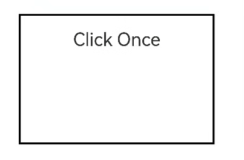

# TapGesture
<!--Kit: ArkUI-->
<!--Subsystem: ArkUI-->
<!--Owner: @yihao-lin-->
<!--Designer: @piggyguy-->
<!--Tester: @songyanhong-->
<!--Adviser: @Brilliantry_Rui-->

**TapGesture** is used to trigger a tap gesture with one, two, or more taps.

>  **NOTE**
>
>  The gesture is supported since API version 7. Updates will be marked with a superscript to indicate their earliest API version.
>
>  When both double-tap and single-tap gestures are bound to a component with the double-tap gesture bound first, the single-tap gesture will have a 300 ms delay.


## APIs

TapGesture(value?: TapGestureParameters)

Creates a tap gesture. Inherits from [GestureInterface\<T>](ts-gesture-common.md#gestureinterfacet11).

When triggered by keyboard or gamepad input, the gesture event's [SourceTool](ts-gesture-settings.md#sourcetool9) is **Unknown**, and [SourceType](ts-gesture-settings.md#sourcetype8) is **KEY** or **JOYSTICK**.

**Atomic service API**: This API can be used in atomic services since API version 11.

**System capability**: SystemCapability.ArkUI.ArkUI.Full

**Parameters**

| Name| Type| Mandatory| Description|
| -------- | -------- | -------- | -------- |
| value | [TapGestureParameters](#tapgestureparameters12) | No| Parameters for the tap gesture.|

## TapGestureParameters<sup>12+</sup>

>  **NOTE**
>
>  To standardize anonymous object definitions, the element definitions here have been revised in API version 12. While historical version information is preserved for anonymous objects, there may be cases where the outer element's @since version number is higher than inner elements'. This does not affect interface usability.

Defines tap gesture parameters. Inheritsfrom [BaseHandlerOptions](./ts-gesturehandler.md#basehandleroptions15).

**System capability**: SystemCapability.ArkUI.ArkUI.Full

| Name| Type| Read-Only| Optional| Description|
| -------- | -------- | -------- | -------- | -------- |
| count<sup>11+</sup> | number | No| Yes| Number of consecutive taps. If the value is less than 1 or is not set, the default value is used.<br>Default value: **1**<br>Value range: [0, +∞).<br>**NOTE**<br>1. If multi-tap is configured, the timeout interval between a lift and the next tap is 300 ms.<br>2. If the distance between the last tapped position and the current tapped position exceeds 60 vp, gesture recognition fails. In multi-finger scenarios, the tapped position is the average position of all fingers involved in the gesture response.<br>**Atomic service API**: This API can be used in atomic services since API version 11.|
| fingers<sup>11+</sup> | number | No| Yes| Number of fingers required to trigger a tap. The value ranges from 1 to 10. If the value is less than 1 or is not set, the default value is used.<br>Default value: **1**<br>**NOTE**<br>1. For a multi-finger gesture, recognition fails if the required number of fingers is not pressed within 300 ms after the first finger; when fingers are lifted, if the remaining number of fingers is below the threshold after lifting, all fingers must be lifted within 300 ms for the gesture to be successfully recognized.<br>2. When the number of fingers touching the screen exceeds the set value, the gesture can be recognized.<br>**Atomic service API**: This API can be used in atomic services since API version 11.|
| distanceThreshold | number | No| Yes| Movement threshold for the tap gesture. If the value is less than or equal to 0 or is not set, the default value is used.<br>Default value: 2³¹-1<br>Unit: vp.<br>**NOTE**<br>If the finger movement exceeds the preset movement threshold, the tap gesture recognition fails. If the default threshold is used during initialization and the finger moves beyond the component's touch target, the tap gesture recognition fails.<br>**Atomic service API**: This API can be used in atomic services since API version 12.|

## Events

>  **NOTE**
>
>  The component binds gesture objects of different **GestureType** instances through gesture events. Each gesture object provides gesture-related information in the gesture response event. In the following example, the **TapGesture** object provides gesture-related information in the [onAction](#onaction) event. For details about the event definitions of other gestures, see the corresponding gesture sections. To bind multiple gestures, use [combined gestures](ts-combined-gestures.md).
>
>  In **fingerList** of [GestureEvent](ts-gesture-common.md#gestureevent), the index of a finger corresponds to its position, that is, the ID of a finger in **fingerList[index]** refers to its index. If a finger is pressed first and does not participate in triggering of the current gesture, its position in **fingerList** is left empty. You are advised to use **fingerInfos** when possible.

### onAction

onAction(event: (event: GestureEvent) => void)

Triggered when the tap gesture is recognized.

**Atomic service API**: This API can be used in atomic services since API version 11.

**System capability**: SystemCapability.ArkUI.ArkUI.Full

**Parameters**

| Name| Type                                      | Mandatory| Description                        |
| ------ | ------------------------------------------ | ---- | ---------------------------- |
| event  |  (event: [GestureEvent](ts-gesture-common.md#gestureevent)) => void | Yes  | Callback for the tap event.|

## EventLocationInfo<sup>20+</sup>

Provides coordinate information for tap gestures.

**System capability**: SystemCapability.ArkUI.ArkUI.Full

| Name| Type| Read-Only| Optional| Description|
| -------- | -------- | -------- | -------- | -------- |
| x | number | No| No| X coordinate relative to the upper left corner of the component.<br>Value range: [0, +∞).<br>Unit: vp.<br> **Atomic service API**: This API can be used in atomic services since API version 20.|
| y | number | No| No| Y coordinate relative to the upper left corner of the component.<br>Value range: [0, +∞).<br>Unit: vp.<br> **Atomic service API**: This API can be used in atomic services since API version 20.|
| windowX | number | No| No| X coordinate relative to the upper left corner of the window.<br>Value range: [0, +∞).<br>Unit: vp.<br> **Atomic service API**: This API can be used in atomic services since API version 20.|
| windowY | number | No| No| Y coordinate relative to the upper left corner of the window.<br>Value range: [0, +∞).<br>Unit: vp.<br> **Atomic service API**: This API can be used in atomic services since API version 20.|
| displayX | number | No| No| X coordinate relative to the upper left corner of the screen.<br>Value range: [0, +∞).<br>Unit: vp.<br> **Atomic service API**: This API can be used in atomic services since API version 20.|
| displayY | number | No| No| Y coordinate relative to the upper left corner of the screen.<br>Value range: [0, +∞).<br>Unit: vp.<br> **Atomic service API**: This API can be used in atomic services since API version 20.|
| globalDisplayX<sup>23+</sup> | number | No| Yes| X coordinate in the coordinate system with the upper left corner of the main screen as the origin.<br>Unit: vp.<br>Value range: [0, +∞).<br>**Atomic service API**: This API can be used in atomic services since API version 23.|
| globalDisplayY<sup>23+</sup> | number | No| Yes| Y coordinate in the coordinate system with the upper left corner of the main screen as the origin.<br>Unit: vp.<br>Value range: [0, +∞).<br>**Atomic service API**: This API can be used in atomic services since API version 23.|

## Example

### Example 1: Implementing Double-Tap Gesture Recognition

This example demonstrates the recognition of a double-tap gesture using **TapGesture**.

```ts
// xxx.ets
@Entry
@Component
struct TapGestureExample {
  @State value: string = '';

  build() {
    Column() {
      // The gesture event is triggered by double-tapping.
      Text('Click twice').fontSize(28)
        .gesture(
        TapGesture({ count: 2 })
          .onAction((event: GestureEvent) => {
            if (event) {
              this.value = JSON.stringify(event.fingerList[0])
            }
          })
        )
      Text(this.value)
    }
    .height(300)
    .width(300)
    .padding(20)
    .border({ width: 3 })
    .margin(30)
  }
}
```


### Example 2: Obtaining Coordinates of a Single-Tap Gesture

This example demonstrates how to obtain the coordinates of a single-tap gesture using **TapGesture**.

```ts
// xxx.ets
@Entry
@Component
struct TapGestureExample {
  @State value: string = ''

  build() {
    Column() {
      Text('Click Once').fontSize(28)
        .gesture(
          TapGesture({ count: 1, fingers: 1 })
            .onAction((event: GestureEvent | undefined) => {
              if (event) {
                console.info(`x = ${JSON.stringify(event.tapLocation?.x)}`)
                console.info(`y = ${JSON.stringify(event.tapLocation?.y)}`)
                console.info(`windowX = ${JSON.stringify(event.tapLocation?.windowX)}`)
                console.info(`windowY = ${JSON.stringify(event.tapLocation?.windowY)}`)
                console.info(`displayX = ${JSON.stringify(event.tapLocation?.displayX)}`)
                console.info(`displayY = ${JSON.stringify(event.tapLocation?.displayY)}`)
                // The globalDisplayX and globalDisplayY attributes are added since API version 23.
                console.info(`globalDisplayX = ${JSON.stringify(event.tapLocation?.globalDisplayX)}`)
                console.info(`globalDisplayY = ${JSON.stringify(event.tapLocation?.globalDisplayY)}`)
              }
            })
        )
      Text(this.value)
    }
    .height(200)
    .width(300)
    .padding(20)
    .border({ width: 3 })
    .margin(30)
  }
}
```

