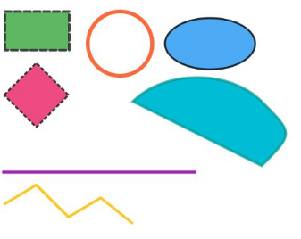

# SVG Tags
<!--Kit: ArkUI-->
<!--Subsystem: ArkUI-->
<!--Owner: @liyujie43-->
<!--Designer: @weixin_52725220-->
<!--Tester: @xiong0104-->
<!--Adviser: @Brilliantry_Rui-->

Scalable Vector Graphics (SVG) is an XML-based vector image format for describing two-dimensional graphics. The [Image](./ts-basic-components-image.md) component supports a subset of the SVG 1.1 specification. The following tags and attributes are supported.

## Basic Shapes

Basic shape elements include the following: \<rect\>, \<circle\>, \<ellipse\>, \<line\>, \<polyline\>, \<polygon\>, and \<path\>.

>  **NOTE**
>
>  Basic elements support the following [common attributes](../arkui-js/js-components-svg-common-attributes.md): **id**, **fill**, **fill-rule**, **fill-opacity**, **stroke**, **stroke-dasharray**, **stroke-dashoffset**, **stroke-opacity**, **stroke-width**, **stroke-linecap**, **stroke-linejoin**, **stroke-miterlimit**, **opacity**, **transform**, **clip-path**, and **clip-rule**. By default, the **transform** attribute supports only translation.
>
>  Starting from API version 21, when the [supportSvg2](./ts-basic-components-image.md#supportsvg221) attribute of the [Image](./ts-basic-components-image.md) component is set to **true**, the **transform** attribute supports translation, rotation, scaling, skewing, and matrix transformations. For details, see [Enhanced SVG Tag Parsing](ts-image-svg2-capabilities.md).

| Element| Description| Unique Attribute|
| :-------- | :-------- | :-------- |
| \<rect\> | Rectangle| **x**: x-axis offset.<br>**y**: y-axis offset.<br>**width**: width.<br>**height**: height.<br>**rx**: corner radius on the x-axis.<br>**ry**: corner radius on the y-axis.|
| \<circle\> | Circle| **cx**: X coordinate of the circle center.<br> **cy**: Y coordinate of the circle center.<br> **r**: radius of the circle.|
| \<ellipse\> | Ellipse| **cx**: X coordinate of the ellipse center.<br> **cy**: Y coordinate of the ellipse center.<br> **rx**: x-axis radius.<br> **ry**: y-axis radius.|
| \<line\> | Line| **x1**: X coordinate of the start point.<br> **y1**: Y coordinate of the start point.<br> **x2**: X coordinate of the end point.<br> **y2**: Y coordinate of the end point.|
| \<polyline\> | Polyline| **points**: vertex coordinates.|
| \<polygon\> | Polygon| **points**: vertex coordinates.|
| \<path\> | Path| **d**: path data, which is used to define the path shape. Common commands include **M** (move to), **L** (line to), **H** (horizontal line), **V** (vertical line), **C** (cubic Bezier curve), **S** (smooth cubic Bezier curve), **Q** (quadratic Bezier curve), **T** (smooth quadratic Bezier curve), **A** (arc), and **Z** (close path). Coordinate parameters are separated by spaces or commas.|

Example: SVG basic shapes with universal attributes

```xml
<!-- svg01.svg -->
<svg width="800" height="600" xmlns="http://www.w3.org/2000/svg" style="background:#f0f0f0">
    <!-- 1. <rect> Rectangle -->
    <rect x="50" y="50" width="100" height="60"
          id="myRect"
          fill="#4CAF50"
          stroke="#333"
          stroke-width="4"
          stroke-dasharray="10,5"
          stroke-linecap="round"
          opacity="0.9"
          transform="translate(1,0)"/>

    <!-- 2. <circle> Circle -->
    <circle cx="200" cy="100" r="50"
            id="myCircle"
            fill="none"
            stroke="#FF5722"
            stroke-width="6"
            stroke-linejoin="bevel"
            fill-opacity="0.7"
            stroke-opacity="0.9"
            transform="translate(30,0)"/>

    <!-- 3. <ellipse> Ellipse -->
    <ellipse cx="350" cy="100" rx="70" ry="40"
             id="myEllipse"
             fill="#2196F3"
             fill-rule="evenodd"
             stroke="#000"
             stroke-width="3"
             opacity="0.8"
             transform="translate(20,0)"/>

    <!-- 4. <line> Straight line -->
    <line x1="50" y1="200" x2="350" y2="200"
          stroke="#9C27B0"
          stroke-width="5"
          stroke-dasharray="8,4"
          stroke-linecap="square"
          transform="translate(0,100)"/>

    <!-- 5. <polyline> Polyline -->
    <polyline points="50,250 100,220 150,270 200,240 250,280"
              fill="none"
              stroke="#FFC107"
              stroke-width="4"
              stroke-linejoin="round"
              opacity="0.9"
              transform="translate(0,100)"/>

    <!-- 6. <polygon> Polygon -->
    <polygon points="400,100 450,50 500,100 450,150"
             id="myPolygon"
             fill="#E91E63"
             fill-rule="nonzero"
             stroke="#333"
             stroke-width="3"
             stroke-dasharray="6,3"
             fill-opacity="0.8"
             transform="translate(-350,80)"/>

    <!-- 7. <path> Path -->
    <path d="M550,100 C600,50 700,50 750,100 S800,150 750,200 Z"
          fill="#00BCD4"
          fill-rule="evenodd"
          stroke="#009688"
          stroke-width="4"
          stroke-opacity="0.7"
          transform="translate(-300,90)"/>
</svg>
```

``` ts
//xxx.ets
@Entry
@Component
struct Index {
  build() {
    Column() {
      // Replace $r('app.media.svg01') with the image resource file you use.
      Image($r('app.media.svg01'))
        .objectFit(ImageFit.None)
        .width('100%')
        .height('100%')
    }.width('100%').height('100%')
  }
}
```



## Graphic Effects

### Filters

Filter elements include the following: \<filter\>, \<feOffset\>, \<feGaussianBlur\>, \<feBlend\>, \<feComposite\>, \<feColorMatrix\>, and \<feFlood\>. **\<filter\>** defines the filter area, while other elements define specific filter effects.

| Element| Description| Unique Attribute|
| :-------- | :-------- | :-------- |
| \<filter\> | Defines the filter area.| **x**: x-axis offset of the filter area, with the default value of **0**.<br>**y**: y-axis offset of the filter area, with the default value of **0**.<br>**width**: width of the filter area.<br>**height**: height of the filter area.<br>Note: Starting from API version 21, when the **Image** component's [supportSvg2](./ts-basic-components-image.md#supportsvg221) attribute is set to **true**, the default values follow the behavior described in [Default Filter Behavior for Invalid Parameters](ts-image-svg2-capabilities.md#default-filter-behavior-for-invalid-parameters).|
| \<feOffset\> | Defines the offset distance along x-axis and y-axis.| **in**: filter input, which can be SourceGraphic, SourceAlpha, or result from other filter effects.<br> **result**: output after filter processing, which can be used as input for the next filter.<br>**dx**: offset distance along the x-axis.<br>**dy**: offset distance along the y-axis.|
| \<feGaussianBlur\> | Defines the Gaussian blur effect.| **in**: filter input, which can be SourceGraphic, SourceAlpha, or result from other filter effects.<br> **result**: output after filter processing, which can be used as input for the next filter.<br>**edgemode**: edge mode.<br>**stddeviation**: standard deviation, which controls the blur degree. The value must be greater than or equal to 0.|
| \<feBlend\> | Defines the blending mode for two input images.| **in**: filter input, which can be SourceGraphic, SourceAlpha, or result from other filter effects.<br> **result**: output after filter processing, which can be used as input for the next filter.<br>**in2**: second image source, which can be SourceGraphic, SourceAlpha, or result from other filter effects.<br>**mode**: blending mode, which specifies how the two images are blended (the value can be **normal**, **multiply**, **screen**, **darken**, or **lighten**).|
| \<feComposite\> | Defines composition of two input images. When **operator** is set to **arithmetic**, the composition algorithm is as follows: result = k1 × in × in2 + k2 × in + k3 × in2 + k4. When **operator** is set to other values, the corresponding enumerated value of [BlendMode](./ts-universal-attributes-image-effect.md#blendmode11) is used.| **in**: filter input, which can be SourceGraphic, SourceAlpha, or result from other filter effects.<br>**in2**: second image source, which can be SourceGraphic, SourceAlpha, or result from other filter effects.<br>**operator( over \| in \| out \| atop \| xor \| lighter \| arithmetic )**: composition of two input images. If the value is not **arithmetic**, the enumerated value of [BlendMode](./ts-universal-attributes-image-effect.md#blendmode11) is used.<br>**k1**: coefficient of the product of **in** and **in2** in the **arithmetic** composition algorithm.<br>**k2**: coefficient of **in** in the **arithmetic** composition algorithm.<br>**k3**: coefficient of **in2** in the **arithmetic** composition algorithm.<br>**k4**: constant offset in the **arithmetic** composition algorithm.|
| \<feColorMatrix\> | Transforms colors based on a transformation matrix.| **in**: filter input, which can be SourceGraphic, SourceAlpha, or result from other filter effects.<br> **result**: output after filter processing, which can be used as input for the next filter.<br>**type**: transformation type. The value **matrix** indicates 4 × 5 matrix transformation, **saturate** indicates saturation adjustment, and **hueRotate** indicates hue rotation.<br>**values**: transformation value. The format varies according to the value of **type**.|
| \<feFlood\> | Defines the fill color and opacity.| **in**: filter input, which can be SourceGraphic, SourceAlpha, or result from other filter effects.<br> **result**: output after filter processing, which can be used as input for the next filter.<br>**flood-color**: fill color. The color value format is supported, such as #rgb, #rrggbb, rgb(), and rgba().<br>**flood-opacity**: fill opacity.|

### Masks

Mask elements include the following: \<mask\>.
| Element| Description| Unique Attribute|
| :-------- | :-------- | :-------- |
| \<mask\> | Defines the mask area.| **x**: x-axis offset of the mask area.<br>**y**: y-axis offset of the mask area.<br>**width**: width of the mask area<br>**height**: height of the mask area.<br>Note: Starting from API version 21, when the **Image** component's [supportSvg2](./ts-basic-components-image.md#supportsvg221) attribute is set to **true**, the default values follow the behavior described in [Default Mask Behavior for Invalid Parameters](ts-image-svg2-capabilities.md#default-mask-behavior-for-invalid-parameters).|

### Clipping

Clipping elements include the following: \<clipPath\>.
| Element| Description| Unique Attribute|
| :-------- | :-------- | :-------- |
| \<clipPath\> | Defines a clipping path.| **x**: x-axis offset of the clipping area.<br>**y**: y-axis offset of the clipping area.<br>**width**: width of the clipping area.<br>**height**: height of the clipping area.|

### Patterns

Pattern elements include the following: \<pattern\>
| Element| Description| Unique Attribute|
| :-------- | :-------- | :-------- |
| \<pattern\> | Defines a fill pattern.| **x**: x-axis offset of the fill area. The default value is **0**.<br>**y**: y-axis offset of the fill area. The default value is **0**.<br>**width**: width of the fill area. The default value is **0**.<br>**height**: height of the fill area. The default value is **0**.|

### Gradients

Gradient elements include the following: \<linearGradient\>, \<radialGradient\>, and \<stop\>.

| Element| Description| Unique Attribute|
| :-------- | :-------- | :-------- |
| \<linearGradient\> | Linear gradient.| **x1**: X coordinate of the gradient start point.<br>**y1**: Y coordinate of the gradient start point.<br>**x2**: X coordinate of the gradient end point.<br>**y2**: Y coordinate of the gradient end point.|
| \<radialGradient\> | Radial gradient.| **fx**: X coordinate of the focus.<br>**fy**: Y coordinate of the focus.<br>**cx**: X coordinate of the circle center.<br>**cy**: Y coordinate of the circle center.<br>**r**: radius.|
| \<stop\> | Color stop.| **offset**: color stop offset, indicating the position of the color stop in the gradient.<br>**stop-color**: color of the color stop.|

## Static Images

The image elements include the following: \<image\>.
| Element| Description| Unique Attribute|
| :-------- | :-------- | :-------- |
| \<image\> | Displays an image.| **x**: x-axis offset of the image.<br> **y**: y-axis offset of the image.<br> **width**: width of the image.<br> **height**: height of the image.<br> **href**: target image, which can be in JPG, JPEG, PNG, BMP, WEBP, HEIC, or base64 format (SVG is not supported).|

## Animation

Animation elements include the following: \<animate\> and \<animateTransform\>.

>**NOTE**
>
> Currently, only single-element attribute or transformation animations are supported. Nested animations between elements are unavailable.

| Element| Description| Unique Attribute|
| :-------- | :-------- | :-------- |
| \<animate\> | Defines a property animation.| **attributeName**: animation attribute. Currently, the following attributes are supported (including but not limited to): **cx**, **cy**, **r**, **fill**, **stroke**, **fill-opacity**, **stroke-opacity**, and **stroke-miterlimit**. The specific animation attributes depend on the target element. For example, **rect** supports **width**, **height**, **x**, **y**, **rx**, and **ry**, while **line** supports **x1**, **y1**, **x2**, and **y2**.<br>**begin**: animation start time.<br> **dur**: animation duration.<br>**from**: start value.<br>**to**: end value.<br>**fill**: animation end state. The default value is **remove**. The value can be **freeze** or **remove**.<br> **calcMode**: interpolation. The default value is **linear**.<br>**keyTimes**: start time of the keyframe animation. The value is a semicolon-separated list of values ranging from 0 to 1, for example, **0;0.3;0.8;1**. **keyTimes**, **keySplines**, and **values** are combined to set the key frame animation. The number of values defined for **keyTimes** is the same as that for **values**. The number of values defined for **keySplines** is the number of values defined for **keyTimes** minus 1.<br> **values**: change value of a group of animations. The format is value1;value2;value3.<br> **keySplines**: a set of Bezier control points corresponding to **keyTimes** values. It defines the easing curves between keyframes, with each curve separated by semicolons (;). The format of the two control points on each Bezier curve is **x1 y1 x2 y2** (coordinates are separated by spaces). For example, **0.5 0 0.5 1; 0.5 0 0.5 1;0.5 0 0.5 1**.|
| \<animateTransform\> | Defines a transformation animation.| **attributeName**: animation property, which is set to **transform**<br>**type**: conversion type. The value can be **translate**, **scale**, **rotate**, **skewX**, and **skewY**.<br>**begin**: animation start time.<br> **dur**: animation duration.<br>**from**: start value.<br>**to**: end value.<br>**fill**: animation end state. The default value is **remove**. The value can be **freeze** or **remove**.<br> **calcMode**: interpolation. The default value is **linear**.<br>**keyTimes**: start time of the keyframe animation. The value is a semicolon-separated list of values ranging from 0 to 1, for example, **0;0.3;0.8;1**. **keyTimes**, **keySplines**, and **values** are combined to set the key frame animation. The number of values defined for **keyTimes** is the same as that for **values**. The number of values defined for **keySplines** is the number of values defined for **keyTimes** minus 1.<br> **values**: change value of a group of animations. The format is value1;value2;value3.<br> **keySplines**: a set of Bezier control points corresponding to **keyTimes** values. It defines the easing curves between keyframes, with each curve separated by semicolons (;). The format of the two control points on each Bezier curve is **x1 y1 x2 y2** (coordinates are separated by spaces). For example, **0.5 0 0.5 1; 0.5 0 0.5 1;0.5 0 0.5 1**.|

## Other Elements

In addition to the tags that identify graphics and images, the following tags are supported: \<svg\>, \<g\>, \<use\>, and \<defs\>.

>**NOTE** 
> 
> Supported color formats include: **#rgb**, **#rrggbb**, **rgb()**, **rgba()**, and common color keywords (red, black, blue, and more).

| Element| Description| Unique Attribute| Universal Attribute|
| :-------- | :-------- | :-------- | :-------- |
| \<svg\> | Container, which defines an SVG fragment.| **x**: x-axis offset.<br> **y**: y-axis offset.<br> **width**: width.<br>**height**: height.<br> **viewBox**: viewport size and position (which defines the visible area of the SVG and the coordinate system ratio).| fill, fill-rule, fill-opacity, stroke, stroke-dasharray, stroke-dashoffset, stroke-opacity, stroke-width, stroke-linecap, stroke-linejoin, stroke-miterlimit, transform|
| \<g\> | Groups elements.| **width**: width.<br> **height**: height.<br>**x**: x-axis offset.<br>**y**: y-axis offset, which can be implemented through **translate (x, y)** of the transform attribute. For details, see [Enhanced SVG Tag Parsing](ts-image-svg2-capabilities.md).| fill, fill-rule, fill-opacity, stroke, stroke-dasharray, stroke-dashoffset, stroke-opacity, stroke-width, stroke-linecap, stroke-linejoin, stroke-miterlimit, transform|
| \<use\> | Reuses existing elements.| **x**: x-axis offset.<br> **y**: y-axis offset.<br> **href**: target element.| fill, fill-rule, fill-opacity, stroke, stroke-dasharray, stroke-dashoffset, stroke-opacity, stroke-width, stroke-linecap, stroke-linejoin, stroke-miterlimit, transform|
| \<defs\> | Defines reusable objects.| No specific attribute.| fill, fill-rule, fill-opacity, stroke, stroke-dasharray, stroke-dashoffset, stroke-opacity, stroke-width, stroke-linecap, stroke-linejoin, stroke-miterlimit, transform|
