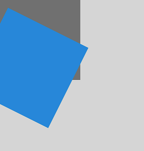
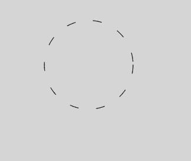
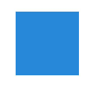
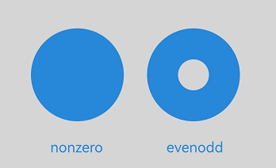

# CanvasRenderingContext2D
<!--Kit: ArkUI-->
<!--Subsystem: ArkUI-->
<!--Owner: @sd-wu-->
<!--Designer: @sunbees-->
<!--Tester: @liuli0427-->
<!--Adviser: @Brilliantry_Rui-->

**RenderingContext** is a rendering context for drawing graphics, text, images, and other objects onto a **Canvas** component.

> **NOTE**
>
> The initial APIs of this module are supported since API version 8. Updates will be marked with a superscript to indicate their earliest API version.
>
> When you call drawing APIs in this module, the commands are stored in the associated **Canvas** component's command queue. These commands are only executed when the current frame enters the rendering phase and the associated **Canvas** component is visible. Therefore, when the **Canvas** component is invisible (for example, off-screen or hidden), avoid frequent drawing calls to prevent command queue buildup and excessive memory usage. For best practices, see [Controlling Canvas Rendering Based on Component Visibility](../../../ui/arkts-drawing-customization-on-canvas.md#controlling-canvas-rendering-based-on-component-visibility).
>
> The following path-related APIs apply only to paths created within **CanvasRenderingContext2D** and do not affect paths defined in [OffscreenCanvasRenderingContext2D](./ts-offscreencanvasrenderingcontext2d.md) or [Path2D](./ts-components-canvas-path2d.md): [beginPath](#beginpath), [moveTo](#moveto), [lineTo](#lineto), [closePath](#closepath), [bezierCurveTo](#beziercurveto), [quadraticCurveTo](#quadraticcurveto), [arc](#arc), [arcTo](#arcto), [ellipse](#ellipse), [rect](#rect), and [roundRect](#roundrect20).
>
> If the width or height of the **Canvas** component exceeds 8000 px, the CPU is used for rendering, which can significantly degrade performance.

## Constructor

### constructor

constructor(settings?: RenderingContextSettings)

Constructs a canvas object. You can configure parameters of the CanvasRenderingContext2D object.

**Widget capability**: This API can be used in ArkTS widgets since API version 9.

**Atomic service API**: This API can be used in atomic services since API version 11.

**System capability**: SystemCapability.ArkUI.ArkUI.Full

**Parameters**

| Name     | Type | Mandatory  | Description   |
| -------- | ---------------------------------------- | ---- | ---------------------------------------- |
| settings | [RenderingContextSettings](#renderingcontextsettings) | No   | Settings of the **CanvasRenderingContext2D** object. For details, see [RenderingContextSettings](#renderingcontextsettings).<br>If the value is **undefined** or **null**, the default value of [RenderingContextSettings](#renderingcontextsettings) is used.|

### constructor<sup>12+</sup>

constructor(settings?: RenderingContextSettings, unit?: LengthMetricsUnit)

Creates a **CanvasRenderingContext2D** object, allowing for initial configuration of rendering parameters and unit mode.

**Widget capability**: This API can be used in ArkTS widgets since API version 12.

**Atomic service API**: This API can be used in atomic services since API version 12.

**System capability**: SystemCapability.ArkUI.ArkUI.Full

**Parameters**

| Name     | Type | Mandatory  | Description   |
| -------- | ---------------------------------------- | ---- | ---------------------------------------- |
| settings | [RenderingContextSettings](#renderingcontextsettings) | No   | Settings of the **CanvasRenderingContext2D** object. For details, see [RenderingContextSettings](#renderingcontextsettings).<br>If the value is **undefined** or **null**, the default value of [RenderingContextSettings](#renderingcontextsettings) is used.|
| unit  | [LengthMetricsUnit](../js-apis-arkui-graphics.md#lengthmetricsunit12) | No   | Unit mode of the **CanvasRenderingContext2D** object. The value cannot be dynamically changed once set.<br>Invalid values **undefined**, **NaN** and **Infinity** are treated as the default value.<br>Default value: **DEFAULT**.|

**Example**

The following example shows how to specify the unit mode during the creation of a **CanvasRenderingContext2D** object. The default unit mode is **LengthMetricsUnit.DEFAULT**, which corresponds to the default unit vp. Once set, this unit mode cannot be changed dynamically. For details, see [LengthMetricsUnit](../js-apis-arkui-graphics.md#lengthmetricsunit12).

```ts
// xxx.ets
import { LengthMetricsUnit } from '@kit.ArkUI'

@Entry
@Component
struct LengthMetricsUnitDemo {
  private settings: RenderingContextSettings = new RenderingContextSettings(true);
  private contextPX: CanvasRenderingContext2D = new CanvasRenderingContext2D(this.settings, LengthMetricsUnit.PX);
  private contextVP: CanvasRenderingContext2D = new CanvasRenderingContext2D(this.settings);

  build() {
    Flex({ direction: FlexDirection.Column, alignItems: ItemAlign.Center, justifyContent: FlexAlign.Center }) {
      Canvas(this.contextPX)
        .width('100%')
        .height(150)
        .backgroundColor('#ffff00')
        .onReady(() => {
          this.contextPX.fillRect(10,10,100,100)
          this.contextPX.clearRect(10,10,50,50)
        })

      Canvas(this.contextVP)
        .width('100%')
        .height(150)
        .backgroundColor('#ffff00')
        .onReady(() => {
          this.contextVP.fillRect(10,10,100,100)
          this.contextVP.clearRect(10,10,50,50)
        })
    }
    .width('100%')
    .height('100%')
  }
}
```


## Attributes             

> **NOTE**
>
> The string format of fillStyle, shadowColor, and strokeStyle is rgb(255, 255, 255), rgba(255, 255, 255, 1.0), or #FFFFFF.

### fillStyle

Sets the fill color to be drawn. This property is read-only. You can set its value using an assignment statement, but cannot obtain its current value through a read operation. If you attempt to read the value, undefined will be returned.

**Widget capability**: This API can be used in ArkTS widgets since API version 9.

**Atomic service API**: This API can be used in atomic services since API version 11.

**System capability**: SystemCapability.ArkUI.ArkUI.Full

| Type| Read Only| Optional| Description|
| ------ | ---------- | -------------- | ---------------------------------------- |
| string&nbsp;\|number<sup>10+</sup>&nbsp;\|[CanvasGradient](ts-components-canvas-canvasgradient.md)&nbsp;\|&nbsp;[CanvasPattern](ts-components-canvas-canvaspattern.md) | No| No| - When the type is string, this attribute indicates the color of the fill area. For details about the color format, see the description for the string type in [ResourceColor](ts-types.md#resourcecolor).<br>- When the type is number, this attribute indicates the color of the fill area. Fully transparent colors are not supported. For details about the color format, see the description for the number type in [ResourceColor](ts-types.md#resourcecolor).<br>- When the type is **CanvasGradient**, this attribute indicates a gradient object, which is created using the **[createLinearGradient](#createlineargradient)** API.<br>- When the type is **CanvasPattern**, this attribute indicates a pattern, which is created using the **[createPattern](#createpattern)** API.<br>Default value: **'#000000'** (black)<br>Invalid values do not take effect.|

```ts
// xxx.ets
@Entry
@Component
struct FillStyleExample {
  private settings: RenderingContextSettings = new RenderingContextSettings(true)
  private context: CanvasRenderingContext2D = new CanvasRenderingContext2D(this.settings)

  build() {
    Flex({ direction: FlexDirection.Column, alignItems: ItemAlign.Center, justifyContent: FlexAlign.Center }) {
      Canvas(this.context)
        .width('100%')
        .height('100%')
        .backgroundColor('#ffff00')
        .onReady(() =>{
          this.context.fillStyle = '#0000ff'
          this.context.fillRect(20, 20, 150, 100)
        })
    }
    .width('100%')
    .height('100%')
  }
}
```


### lineWidth

Sets the width of a line to be drawn. This attribute is read-only. You can set its value using an assignment statement, but cannot obtain the current value by reading. If you try to read the value, undefined is returned.

**Widget capability**: This API can be used in ArkTS widgets since API version 9.

**Atomic service API**: This API can be used in atomic services since API version 11.

**System capability**: SystemCapability.ArkUI.ArkUI.Full

| Type| Read Only| Optional| Description|
| ------ | ---------- | -------------- | ---------------------------------------- |
| number | No| No| Default value: **1** (px)<br>Default unit: vp<br> The value of lineWidth cannot be 0 or a negative number. If the value is 0, a negative number, or NaN, the default value is used. If the value is Infinity, the lineWidth attribute is abnormal.|

```ts
// xxx.ets
@Entry
@Component
struct LineWidthExample {
  private settings: RenderingContextSettings = new RenderingContextSettings(true)
  private context: CanvasRenderingContext2D = new CanvasRenderingContext2D(this.settings)

  build() {
    Flex({ direction: FlexDirection.Column, alignItems: ItemAlign.Center, justifyContent: FlexAlign.Center }) {
      Canvas(this.context)
        .width('100%')
        .height('100%')
        .backgroundColor('#ffff00')
        .onReady(() =>{
        this.context.lineWidth = 5
        this.context.strokeRect(25, 25, 85, 105)
      })
    }
    .width('100%')
    .height('100%')
  }
}
```


### strokeStyle

Sets the color of a line. This attribute is read-only. You can set its value using an assignment statement, but cannot obtain the current value by reading. If you try to read the value, undefined is returned.

**Widget capability**: This API can be used in ArkTS widgets since API version 9.

**Atomic service API**: This API can be used in atomic services since API version 11.

**System capability**: SystemCapability.ArkUI.ArkUI.Full

| Type| Read Only| Optional| Description|
| ------ | ---------- | -------------- | ---------------------------------------- |
| string&nbsp;\|number<sup>10+</sup>&nbsp;\|[CanvasGradient](ts-components-canvas-canvasgradient.md)&nbsp;\|&nbsp;[CanvasPattern](ts-components-canvas-canvaspattern.md)  | No| No| <br>- When the type is string, this attribute indicates the stroke color. For details about the color format, see the description for the string type in [ResourceColor](ts-types.md#resourcecolor).<br>- When the type is number, this attribute indicates the stroke color. Fully transparent colors are not supported. For details about the color format, see the description for the number type in [ResourceColor](ts-types.md#resourcecolor).<br>- When the type is **CanvasGradient**, this attribute indicates a gradient object, which is created using the **[createLinearGradient](#createlineargradient)** API.<br>- When the type is **CanvasPattern**, this attribute indicates a pattern, which is created using the **[createPattern](#createpattern)** API.<br>Default value: **'#000000'** (black)<br>Invalid values do not take effect.|

```ts
// xxx.ets
@Entry
@Component
struct StrokeStyleExample {
  private settings: RenderingContextSettings = new RenderingContextSettings(true)
  private context: CanvasRenderingContext2D = new CanvasRenderingContext2D(this.settings)

  build() {
    Flex({ direction: FlexDirection.Column, alignItems: ItemAlign.Center, justifyContent: FlexAlign.Center }) {
      Canvas(this.context)
        .width('100%')
        .height('100%')
        .backgroundColor('#ffff00')
        .onReady(() =>{
          this.context.lineWidth = 10
          this.context.strokeStyle = '#0000ff'
          this.context.strokeRect(25, 25, 155, 105)
        })
    }
    .width('100%')
    .height('100%')
  }
}
```


### lineCap

Style of the line endpoint. This attribute is read-only. You can set its value through an assignment statement, but cannot obtain its current value through a read operation. If you attempt to read the value, undefined is returned.

**Widget capability**: This API can be used in ArkTS widgets since API version 9.

**Atomic service API**: This API can be used in atomic services since API version 11.

**System capability**: SystemCapability.ArkUI.ArkUI.Full

| Type| Read Only| Optional| Description|
| ------ | ---------- | -------------- | ---------------------------------------- |
| [CanvasLineCap](#canvaslinecap) | No| No| Default value: **'butt'**|

```ts
// xxx.ets
@Entry
@Component
struct LineCapExample {
  private settings: RenderingContextSettings = new RenderingContextSettings(true)
  private context: CanvasRenderingContext2D = new CanvasRenderingContext2D(this.settings)

  build() {
    Flex({ direction: FlexDirection.Column, alignItems: ItemAlign.Center, justifyContent: FlexAlign.Center }) {
      Canvas(this.context)
        .width('100%')
        .height('100%')
        .backgroundColor('rgb(213,213,213)')
        .onReady(() => {
          this.context.lineWidth = 8
          this.context.beginPath()
          this.context.lineCap = 'round'
          this.context.moveTo(30, 50)
          this.context.lineTo(220, 50)
          this.context.stroke()
        })
    }
    .width('100%')
    .height('100%')
  }
}
```


### lineJoin

Style of the intersection point between line segments. This attribute is read-only. You can set its value through an assignment statement, but cannot obtain its current value through a read operation. If you attempt to read the value, undefined is returned.

**Widget capability**: This API can be used in ArkTS widgets since API version 9.

**Atomic service API**: This API can be used in atomic services since API version 11.

**System capability**: SystemCapability.ArkUI.ArkUI.Full

| Type| Read Only| Optional| Description|
| ------ | ---------- | -------------- | ---------------------------------------- |
| [CanvasLineJoin](#canvaslinejoin) | No| No| <br>The options are as follows:<br>- **'round'**: The shape used to join line segments is a sector, whose radius at the rounded corner is equal to the line width.<br>- **'bevel'**: The shape used to join line segments is a triangle. The rectangular corner of each line is independent.<br>- **'miter'**: The shape used to join line segments has a mitered corner by extending the outside edges of the lines until they meet. You can view the effect of this attribute in **miterLimit**.<br>Default value: **'miter'**|

```ts
// xxx.ets
@Entry
@Component
struct LineJoinExample {
  private settings: RenderingContextSettings = new RenderingContextSettings(true)
  private context: CanvasRenderingContext2D = new CanvasRenderingContext2D(this.settings)

  build() {
    Flex({ direction: FlexDirection.Column, alignItems: ItemAlign.Center, justifyContent: FlexAlign.Center }) {
      Canvas(this.context)
        .width('100%')
        .height('100%')
        .backgroundColor('#ffff00')
        .onReady(() =>{
        this.context.beginPath()
        this.context.lineWidth = 8
        this.context.lineJoin = 'miter'
        this.context.moveTo(30, 30)
        this.context.lineTo(120, 60)
        this.context.lineTo(30, 110)
        this.context.stroke()
      })
    }
    .width('100%')
    .height('100%')
  }
}
```


### miterLimit

Sets the miter limit, which specifies the distance between the inner and outer angles at the intersection of lines. This attribute takes effect only when lineJoin is set to miter. This attribute is a write-only attribute. You can assign a value to it, but cannot obtain its current value through a read operation. If you attempt to read the value, undefined will be returned.

**Widget capability**: This API can be used in ArkTS widgets since API version 9.

**Atomic service API**: This API can be used in atomic services since API version 11.

**System capability**: SystemCapability.ArkUI.ArkUI.Full

| Type| Read Only| Optional| Description|
| ------ | ---------- | -------------- | ---------------------------------------- |
| number | No| No| Default value: **10** (px)<br>Unit: px<br>The value of miterLimit cannot be 0 or a negative number. If the value is 0, a negative number, or NaN, the default value is used. If the value is Infinity, the miterLimit attribute is abnormal.|

```ts
// xxx.ets
@Entry
@Component
struct MiterLimit {
  private settings: RenderingContextSettings = new RenderingContextSettings(true)
  private context: CanvasRenderingContext2D = new CanvasRenderingContext2D(this.settings)
  
  build() {
    Flex({ direction: FlexDirection.Column, alignItems: ItemAlign.Center, justifyContent: FlexAlign.Center }) {
      Canvas(this.context)
        .width('100%')
        .height('100%')
        .backgroundColor('#ffff00')
        .onReady(() =>{
          this.context.lineWidth = 8
          this.context.lineJoin = 'miter'
          this.context.miterLimit = 3
          this.context.moveTo(30, 30)
          this.context.lineTo(60, 35)
          this.context.lineTo(30, 37)
          this.context.stroke()
      })
    }
    .width('100%')
    .height('100%')
  }
}
```


### font

Sets the font style for text drawing. This attribute is read-only. You can set its value using an assignment statement, but cannot obtain its current value through a read operation. If you attempt to read the value, undefined is returned. Custom fonts registered in API version 20 and later are supported. (The previewer of DevEco Studio does not support custom fonts.)

Syntax: ctx.font&nbsp;=&nbsp;'font-style&nbsp;font-weight&nbsp;font-size&nbsp;font-family'<br>- (Optional) **font-style**: font style. Available values are **'normal'** and **'italic'**.<br>- (Optional) **font-weight**: font weight. Available values are as follows: **'normal'**, **'bold'**, **'bolder'**, **'lighter'**, **'100'**, **'200'**, **'300'**, **'400'**, **'500'**, **'600'**, **'700'**, **'800'**, **'900'**.<br>- (Optional) **font-size**: font size and line height. The unit must be specified and can be px or vp.<br>- (Optional) **font-family**: font family. Available values are **'sans-serif'**, **'serif'**, and **'monospace'**.

**System capability**: SystemCapability.ArkUI.ArkUI.Full

| Type| Read Only| Optional| Description|
| ------ | ---------- | -------------- | ---------------------------------------- |
| string | No| No| Default value: **'normal normal 14px sans-serif'**<br>**Widget capability**: This API can be used in ArkTS widgets since API version 9.<br>**Atomic service API**: This API can be used in atomic services since API version 11.|

> **NOTE**
>
> You can register a custom font in either of the following ways: You can register a custom font by calling the asynchronous API this.uiContext.getFont().[registerFont](../arkts-apis-uicontext-font.md#registerfont) of ArkUI. However, if you call this API immediately after the registration, the custom font may not take effect. Alternatively, you can directly call the fontCollection.[loadFontSync](../../apis-arkgraphics2d/js-apis-graphics-text.md#loadfontsync) API of the font engine to register the custom font. When you directly call the font engine API to register a custom font, the fontCollection instance must be text.FontCollection.getGlobalInstance(), because the component loads fonts from this instance by default. If you use another instance, the custom font may not take effect.

```ts
// xxx.ets
import { text } from '@kit.ArkGraphics2D';

@Entry
@Component
struct FontDemo {
  private settings: RenderingContextSettings = new RenderingContextSettings(true);
  private context: CanvasRenderingContext2D = new CanvasRenderingContext2D(this.settings);

  build() {
    Flex({ direction: FlexDirection.Column, alignItems: ItemAlign.Center, justifyContent: FlexAlign.Center }) {
      Canvas(this.context)
        .width('100%')
        .height('100%')
        .backgroundColor('rgb(213,213,213)')
        .onReady(() => {
          // Common font style, normal weight, font size: 30 px, font family: sans-serif
          this.context.font = 'normal normal 30px sans-serif'
          this.context.fillText("Hello px", 20, 60)
          // Italic style, bold, font size: 30 vp, font family: monospace
          this.context.font = 'italic bold 30vp monospace'
          this.context.fillText("Hello vp", 20, 100)
          // Load the custom font file HarmonyOS_Sans_Thin_Italic.ttf in the rawfile directory.
          let fontCollection = text.FontCollection.getGlobalInstance();
          fontCollection.loadFontSync('HarmonyOS_Sans_Thin_Italic', $rawfile("HarmonyOS_Sans_Thin_Italic.ttf"))
          // Bold, font size: 30 vp, font family: HarmonyOS_Sans_Thin_Italic
          this.context.font = "bold 30vp HarmonyOS_Sans_Thin_Italic"
          this.context.fillText("Hello customFont", 20, 140)
        })
    }
    .width('100%')
    .height('100%')
  }
}
```


### textAlign

Sets the text alignment mode during text drawing. This attribute is read-only. You can set its value using an assignment statement, but cannot obtain its current value through a read operation. If you attempt to read its current value, undefined is returned.

**Widget capability**: This API can be used in ArkTS widgets since API version 9.

**Atomic service API**: This API can be used in atomic services since API version 11.

**System capability**: SystemCapability.ArkUI.ArkUI.Full

| Type| Read Only| Optional| Description|
| ------ | ---------- | -------------- | ---------------------------------------- |
| [CanvasTextAlign](#canvastextalign) | No| No| In the LTR layout mode, 'start' is the same as 'left'. In the RTL layout mode, 'start' is the same as 'right'.<br>Default value: 'left'<br>|

```ts
// xxx.ets
@Entry
@Component
struct CanvasExample {
  private settings: RenderingContextSettings = new RenderingContextSettings(true)
  private context: CanvasRenderingContext2D = new CanvasRenderingContext2D(this.settings)

  build() {
    Flex({ direction: FlexDirection.Column, alignItems: ItemAlign.Center, justifyContent: FlexAlign.Center }) {
      Canvas(this.context)
        .width('100%')
        .height('100%')
        .backgroundColor('rgb(213,213,213)')
        .onReady(() => {
          this.context.strokeStyle = 'rgb(39,135,217)'
          this.context.moveTo(140, 10)
          this.context.lineTo(140, 160)
          this.context.stroke()
          this.context.font = '50px sans-serif'
          this.context.textAlign = 'start'
          this.context.fillText('textAlign=start', 140, 60)
          this.context.textAlign = 'end'
          this.context.fillText('textAlign=end', 140, 80)
          this.context.textAlign = 'left'
          this.context.fillText('textAlign=left', 140, 100)
          this.context.textAlign = 'center'
          this.context.fillText('textAlign=center', 140, 120)
          this.context.textAlign = 'right'
          this.context.fillText('textAlign=right', 140, 140)
        })
    }
    .width('100%')
    .height('100%')
  }
}
```


### textBaseline

Sets the horizontal alignment mode during text drawing. This attribute is read-only. You can set its value using an assignment statement, but cannot obtain its current value through a read operation. If you attempt to read its current value, undefined is returned.

**Widget capability**: This API can be used in ArkTS widgets since API version 9.

**Atomic service API**: This API can be used in atomic services since API version 11.

**System capability**: SystemCapability.ArkUI.ArkUI.Full

| Type| Read Only| Optional| Description|
| ------ | ---------- | -------------- | ---------------------------------------- |
| [CanvasTextBaseline](#canvastextbaseline) | No| No| Default value: **'alphabetic'**|

```ts
// xxx.ets
@Entry
@Component
struct TextBaseline {
  private settings: RenderingContextSettings = new RenderingContextSettings(true)
  private context: CanvasRenderingContext2D = new CanvasRenderingContext2D(this.settings)
  
  build() {
    Flex({ direction: FlexDirection.Column, alignItems: ItemAlign.Center, justifyContent: FlexAlign.Center }) {
      Canvas(this.context)
        .width('100%')
        .height('100%')
        .backgroundColor('rgb(213,213,213)')
        .onReady(() => {
          this.context.strokeStyle = 'rgb(0,0,255)'
          this.context.moveTo(0, 120)
          this.context.lineTo(400, 120)
          this.context.stroke()
          this.context.font = '20px sans-serif'
          this.context.textBaseline = 'top'
          this.context.fillText('Top', 10, 120)
          this.context.textBaseline = 'bottom'
          this.context.fillText('Bottom', 55, 120)
          this.context.textBaseline = 'middle'
          this.context.fillText('Middle', 125, 120)
          this.context.textBaseline = 'alphabetic'
          this.context.fillText('Alphabetic', 195, 120)
          this.context.textBaseline = 'hanging'
          this.context.fillText('Hanging', 295, 120)
      })
    }
    .width('100%')
    .height('100%')
  }
}
```


### globalAlpha

Sets the transparency. This attribute is read-only. You can set its value through an assignment statement, but cannot obtain the current value through a read operation. If you attempt to read the value, undefined is returned.

**Widget capability**: This API can be used in ArkTS widgets since API version 9.

**Atomic service API**: This API can be used in atomic services since API version 11.

**System capability**: SystemCapability.ArkUI.ArkUI.Full

| Type| Read Only| Optional| Description|
| ------ | ---------- | -------------- | ---------------------------------------- |
| number | No| No| The value range is [0.0, 1.0]. 0.0 indicates completely transparent, and 1.0 indicates completely opaque. If the set value is less than 0.0, **0.0** will be used. If the set value is greater than 1.0, **1.0** will be used.<br>In versions earlier than API version 18, if NaN or Infinity is set, the drawing method executed after this method cannot be drawn. In API version 18 and later versions, if NaN or Infinity is set, the current API does not take effect. The drawing method with valid parameters is drawn normally.<br>Default value: **1.0**.|

```ts
// xxx.ets
@Entry
@Component
struct GlobalAlpha {
  private settings: RenderingContextSettings = new RenderingContextSettings(true)
  private context: CanvasRenderingContext2D = new CanvasRenderingContext2D(this.settings)
  
  build() {
    Flex({ direction: FlexDirection.Column, alignItems: ItemAlign.Center, justifyContent: FlexAlign.Center }) {
      Canvas(this.context)
        .width('100%')
        .height('100%')
        .backgroundColor('#ffff00')
        .onReady(() =>{
          this.context.fillStyle = 'rgb(0,0,255)'
          this.context.fillRect(0, 0, 50, 50)
          this.context.globalAlpha = 0.4
          this.context.fillStyle = 'rgb(0,0,255)'
          this.context.fillRect(50, 50, 50, 50)
      })
    }
    .width('100%')
    .height('100%')
  }
}
```


### lineDashOffset

Sets the dashed line offset of the canvas. The value is of the float type. This property takes effect only when setLineDash is called. This property is a write-only property. You can assign a value to it, but cannot obtain its current value through a read operation. If you attempt to read the value, undefined will be returned.

**Widget capability**: This API can be used in ArkTS widgets since API version 9.

**Atomic service API**: This API can be used in atomic services since API version 11.

**System capability**: SystemCapability.ArkUI.ArkUI.Full

| Type| Read Only| Optional| Description|
| ------ | ---------- | -------------- | ---------------------------------------- |
| number | No| No| In versions earlier than API version 18, if NaN or Infinity is set, the line with the dashed line style is drawn as a solid line. In API version 18 and later versions, if NaN or Infinity is set, the current API does not take effect. The line with the dashed line style is drawn as a dashed line.<br>Default value: **0.0**<br>Default unit: vp<br>Invalid values **NaN** and **Infinity** are treated as the default value.|

``` ts
// xxx.ets
import { AnimatorResult } from '@kit.ArkUI';

@Entry
@Component
struct LineDashOffset {
  private settings: RenderingContextSettings = new RenderingContextSettings(true);
  private context: CanvasRenderingContext2D = new CanvasRenderingContext2D(this.settings);
  private animator: AnimatorResult | undefined = undefined;

  drawAntLine() { // Implement the ant line animation.
    this.animator = this.getUIContext().createAnimator({
      duration: 2000,
      easing: 'linear',
      delay: 0,
      fill: 'none',
      direction: 'normal',
      iterations: -1,
      begin: 0, // Start point of the animation interpolation
      end: 1 // End point of the animation interpolation.}
    });
    this.animator.onFrame = (value: number) => {
      this.context.reset();
      this.context.lineWidth = 2;
      this.context.setLineDash([10, 5]);
      this.context.lineDashOffset = 105 * value;
      this.context.strokeRect(10, 10, 100, 100);
    };
    this.animator.play();
  }

  aboutToDisappear() {
    this.animator?.finish();
    this.animator = undefined;
  }

  build() {
    Flex({ direction: FlexDirection.Column, alignItems: ItemAlign.Center, justifyContent: FlexAlign.Center }) {
      Canvas(this.context)
        .width('100%')
        .height('100%')
        .backgroundColor('rgb(213,213,213)')
        .onReady(() => {
          this.drawAntLine();
        })
    }
    .width('100%')
    .height('100%')
  }
}
```


### globalCompositeOperation

Sets the blending mode. This attribute is read-only. You can set its value through an assignment statement, but cannot obtain its current value through a read operation. If you attempt to read the value, undefined is returned.

**Widget capability**: This API can be used in ArkTS widgets since API version 9.

**Atomic service API**: This API can be used in atomic services since API version 11.

**System capability**: SystemCapability.ArkUI.ArkUI.Full

| Type| Read Only| Optional| Description|
| ------ | ---------- | -------------- | ---------------------------------------- |
| string | No| No| Available values are as follows: **'source-over'**, **'source-atop'**, **'source-in'**, **'source-out'**, **'destination-over'**, **'destination-atop'**, **'destination-in'**, **'destination-out'**, **'lighter'**, **'copy'**, and **'xor'**.<br>Default value: **'source-over'**|

| Name              | Description                      |
| ---------------- | ------------------------ |
| source-over      | Displays the new drawing above the existing drawing. Default value.  |
| source-atop      | Displays the new drawing on the top of the existing drawing.       |
| source-in        | Displays the new drawing inside the existing drawing.        |
| source-out       | Displays part of the new drawing that is outside of the existing drawing.       |
| destination-over | Displays the existing drawing above the new drawing.       |
| destination-atop | Displays the existing drawing on the top of the new drawing.       |
| destination-in   | Displays the existing drawing inside the new drawing.        |
| destination-out  | Displays the existing drawing outside the new drawing.        |
| lighter          | Displays both the new and existing drawing.         |
| copy             | Displays the new drawing and neglects the existing drawing.       |
| xor              | Combines the new drawing and existing drawing using the XOR operation.|

``` ts
// xxx.ets
@Entry
@Component
struct GlobalCompositeOperation {
  private settings: RenderingContextSettings = new RenderingContextSettings(true);
  private context1: CanvasRenderingContext2D = new CanvasRenderingContext2D(this.settings);
  private context2: CanvasRenderingContext2D = new CanvasRenderingContext2D(this.settings);
  private context3: CanvasRenderingContext2D = new CanvasRenderingContext2D(this.settings);
  private context4: CanvasRenderingContext2D = new CanvasRenderingContext2D(this.settings);
  private context5: CanvasRenderingContext2D = new CanvasRenderingContext2D(this.settings);
  private context6: CanvasRenderingContext2D = new CanvasRenderingContext2D(this.settings);

  build() {
    Column() {
      Row() {
        // 1. source-over: The new image is overlaid on the original image (default behavior).
        Canvas(this.context1)
          .width('45%')
          .borderWidth(1)
          .margin(5)
          .onReady(() => {
            let ctx1 = this.context1;
            ctx1.fillStyle = 'rgb(39,135,217)';
            ctx1.fillRect(25, 25, 75, 75); // Original image
            ctx1.globalCompositeOperation = 'source-over'; // Default value, which can be omitted.
            ctx1.fillStyle = 'rgb(23,169,141)';
            ctx1.fillRect(75, 75, 75, 75); // New image overlaying the original image.
          })
        // 2. destination-out: The new image erases the original image. (This is the core logic of the eraser.)
        Canvas(this.context2)
          .width('45%')
          .borderWidth(1)
          .margin(5)
          .onReady(() => {
            let ctx2 = this.context2;
            // Draw the background first.
            ctx2.fillStyle = 'rgb(39,135,217)';
            ctx2.fillRect(0, 0, ctx2.width, ctx2.height);
            // Set the blending mode to erase.
            ctx2.globalCompositeOperation = 'destination-out';
            // Draw a circle as the eraser.
            ctx2.beginPath();
            ctx2.arc(ctx2.width / 2, ctx2.height / 2, 60, 0, Math.PI * 2);
            ctx2.fill(); // Erase the background of the circle.
          })
      }
      .height('30%')

      Row() {
        // 3. source-in: Only the overlapping part between the new image and the original image is retained. (Clipping or masking)
        Canvas(this.context3)
          .width('45%')
          .borderWidth(1)
          .margin(5)
          .onReady(() => {
            let ctx3 = this.context3;
            // Draw the original image (circle mask) first.
            ctx3.beginPath();
            ctx3.arc(ctx3.width / 2, ctx3.height / 2, 80, 0, Math.PI * 2);
            ctx3.fillStyle = '#fff';
            ctx3.fill();
            // Set the blending mode.
            ctx3.globalCompositeOperation = 'source-in';
            // Draw the new image (gradient rectangle).
            const gradient = ctx3.createLinearGradient(0, 0, ctx3.width, ctx3.height);
            gradient.addColorStop(0, 'rgb(23,169,141)');
            gradient.addColorStop(1, 'rgb(39,135,217)');
            ctx3.fillStyle = gradient;
            ctx3.fillRect(0, 0, 200, 200); // Only the circular area displays the gradient.
          })
        // 4. lighter: The new image is overlaid with the original image (the luminance is added, and the color filtering effect is displayed).
        Canvas(this.context4)
          .width('45%')
          .borderWidth(1)
          .margin(5)
          .onReady(() => {
            let ctx4 = this.context4;
            // Original image (a semitransparent red circle)
            ctx4.beginPath();
            ctx4.arc(70, 100, 50, 0, Math.PI * 2);
            ctx4.fillStyle = 'rgba(234, 67, 53, 0.7)';
            ctx4.fill();
            // Set the blending mode.
            ctx4.globalCompositeOperation = 'lighter';
            // New image (a semitransparent blue circle)
            ctx4.beginPath();
            ctx4.arc(110, 100, 50, 0, Math.PI * 2);
            ctx4.fillStyle = 'rgba(66, 133, 244, 0.7)';
            ctx4.fill(); // The overlapping area turns purple (the luminance is added).
          })
      }
      .height('30%')

      Row() {
        // 5. destination-atop: Only the overlapping part of the original image and the new image is retained, and other parts are removed.
        Canvas(this.context5)
          .width('45%')
          .borderWidth(1)
          .margin(5)
          .onReady(() => {
            let ctx5 = this.context5;
            // Original image (a green rectangle)
            ctx5.fillStyle = 'rgb(23,169,141)';
            ctx5.fillRect(0, 0, ctx5.width, ctx5.height);
            // Set the blending mode.
            ctx5.globalCompositeOperation = 'destination-atop';
            // New image (a small circle)
            ctx5.beginPath();
            ctx5.arc(ctx5.width / 2, ctx5.height / 2, 60, 0, Math.PI * 2);
            ctx5.fillStyle = '#000';
            ctx5.fill(); // Only the overlapping part of the rectangle and circle is retained.
          })
        // 6. Text mask (advanced usage of "source-in")
        Canvas(this.context6)
          .width('45%')
          .borderWidth(1)
          .margin(5)
          .onReady(() => {
            let ctx6 = this.context6
            // Draw text first (as a mask).
            ctx6.font = 'bold 40vp';
            ctx6.textAlign = 'center';
            ctx6.textBaseline = 'middle';
            ctx6.fillText('CANVAS', ctx6.width / 2, ctx6.height / 2);
            // Set the blending mode.
            ctx6.globalCompositeOperation = 'source-in';
            // Draw a gradient background (displayed only in the text area).
            let textGradient = ctx6.createLinearGradient(50, 0, 300, 100);
            textGradient.addColorStop(0.0, 'rgb(39,135,217)');
            textGradient.addColorStop(0.5, 'rgb(255,238,240)');
            textGradient.addColorStop(1.0, 'rgb(23,169,141)');
            ctx6.fillStyle = textGradient;
            ctx6.fillRect(0, 0, 200, 200); // The gradient fills only the text area.
          })
      }
      .height('30%')
    }
    .width('100%')
    .height('100%')
  }
}
```


### shadowBlur

Sets the blur level when a shadow is drawn. This attribute is read-only. You can set its value through an assignment statement, but cannot obtain its current value through a read operation. If you attempt to read the value, undefined is returned.

**Widget capability**: This API can be used in ArkTS widgets since API version 9.

**Atomic service API**: This API can be used in atomic services since API version 11.

**System capability**: SystemCapability.ArkUI.ArkUI.Full

| Type| Read Only| Optional| Description|
| ------ | ---------- | -------------- | ---------------------------------------- |
| number | No| No| A larger value indicates a more blurry shadow. The value is of the float type. The value must be greater than or equal to 0.<br>Default value: **0.0**<br>Unit: px<br>The value of shadowBlur cannot be a negative number. If the value is a negative number, NaN, or Infinity, the default value is used.|

```ts
// xxx.ets
@Entry
@Component
struct ShadowBlur {
  private settings: RenderingContextSettings = new RenderingContextSettings(true)
  private context: CanvasRenderingContext2D = new CanvasRenderingContext2D(this.settings)
  
  build() {
    Flex({ direction: FlexDirection.Column, alignItems: ItemAlign.Center, justifyContent: FlexAlign.Center }) {
      Canvas(this.context)
        .width('100%')
        .height('100%')
        .backgroundColor('#ffff00')
        .onReady(() =>{
          this.context.shadowBlur = 30
          this.context.shadowColor = 'rgb(0,0,0)'
          this.context.fillStyle = 'rgb(255,0,0)'
          this.context.fillRect(20, 20, 100, 80)
      })
    }
    .width('100%')
    .height('100%')
  }
}
```


### shadowColor

Sets the shadow color when a shadow is drawn. This attribute is read-only. You can set its value through an assignment statement, but cannot obtain its current value through a read operation. If you attempt to read the value, undefined is returned.

**Widget capability**: This API can be used in ArkTS widgets since API version 9.

**Atomic service API**: This API can be used in atomic services since API version 11.

**System capability**: SystemCapability.ArkUI.ArkUI.Full

| Type| Read Only| Optional| Description|
| ------ | ---------- | -------------- | ---------------------------------------- |
| string | No| No| For details about the color notation, see the description of the string type in [ResourceColor](ts-types.md#resourcecolor).<br>Default value: transparent black|

```ts
// xxx.ets
@Entry
@Component
struct ShadowColor {
  private settings: RenderingContextSettings = new RenderingContextSettings(true)
  private context: CanvasRenderingContext2D = new CanvasRenderingContext2D(this.settings)
  
  build() {
    Flex({ direction: FlexDirection.Column, alignItems: ItemAlign.Center, justifyContent: FlexAlign.Center }) {
      Canvas(this.context)
        .width('100%')
        .height('100%')
        .backgroundColor('#ffff00')
        .onReady(() =>{
          this.context.shadowBlur = 30
          this.context.shadowColor = 'rgb(0,0,255)'
          this.context.fillStyle = 'rgb(255,0,0)'
          this.context.fillRect(30, 30, 100, 100)
      })
    }
    .width('100%')
    .height('100%')
  }
}
```


### shadowOffsetX

Horizontal offset of the shadow relative to the original object. This property is read-only. You can set its value using an assignment statement, but cannot obtain its current value through a read operation. If you attempt to read the value, undefined is returned.

**Widget capability**: This API can be used in ArkTS widgets since API version 9.

**Atomic service API**: This API can be used in atomic services since API version 11.

**System capability**: SystemCapability.ArkUI.ArkUI.Full

| Type| Read Only| Optional| Description|
| ------ | ---------- | -------------- | ---------------------------------------- |
| number | No| No| Default value: **0.0**<br>Default unit: vp<br>Invalid values **NaN** and **Infinity** are treated as the default value.|

```ts
// xxx.ets
@Entry
@Component
struct ShadowOffsetX {
  private settings: RenderingContextSettings = new RenderingContextSettings(true)
  private context: CanvasRenderingContext2D = new CanvasRenderingContext2D(this.settings)
  
  build() {
    Flex({ direction: FlexDirection.Column, alignItems: ItemAlign.Center, justifyContent: FlexAlign.Center }) {
      Canvas(this.context)
        .width('100%')
        .height('100%')
        .backgroundColor('#ffff00')
        .onReady(() =>{
          this.context.shadowBlur = 10
          this.context.shadowOffsetX = 20
          this.context.shadowColor = 'rgb(0,0,0)'
          this.context.fillStyle = 'rgb(255,0,0)'
          this.context.fillRect(20, 20, 100, 80)
      })
    }
    .width('100%')
    .height('100%')
  }
}
```


### shadowOffsetY

Vertical offset of the shadow relative to the original object. This property is read-only. You can set its value using an assignment statement, but cannot obtain its current value through a read operation. If you attempt to read the value, undefined is returned.

**Widget capability**: This API can be used in ArkTS widgets since API version 9.

**Atomic service API**: This API can be used in atomic services since API version 11.

**System capability**: SystemCapability.ArkUI.ArkUI.Full

| Type| Read Only| Optional| Description|
| ------ | ---------- | -------------- | ---------------------------------------- |
| number | No| No| Default value: **0.0**<br>Default unit: vp<br>Invalid values **NaN** and **Infinity** are treated as the default value.|

```ts
// xxx.ets
@Entry
@Component
struct ShadowOffsetY {
  private settings: RenderingContextSettings = new RenderingContextSettings(true)
  private context: CanvasRenderingContext2D = new CanvasRenderingContext2D(this.settings)
  build() {
    Flex({ direction: FlexDirection.Column, alignItems: ItemAlign.Center, justifyContent: FlexAlign.Center }) {
      Canvas(this.context)
        .width('100%')
        .height('100%')
        .backgroundColor('#ffff00')
        .onReady(() =>{
          this.context.shadowBlur = 10
          this.context.shadowOffsetY = 20
          this.context.shadowColor = 'rgb(0,0,0)'
          this.context.fillStyle = 'rgb(255,0,0)'
          this.context.fillRect(30, 30, 100, 100)
      })
    }
    .width('100%')
    .height('100%')
  }
}
```


### imageSmoothingEnabled

Whether to adjust the image smoothness when drawing an image. The value true indicates that the image smoothness is adjusted, and the value false indicates that the image smoothness is not adjusted. This property is read-only. You can set its value using an assignment statement, but cannot obtain its current value through a read operation. If you attempt to read the value, undefined is returned.

**Widget capability**: This API can be used in ArkTS widgets since API version 9.

**Atomic service API**: This API can be used in atomic services since API version 11.

**System capability**: SystemCapability.ArkUI.ArkUI.Full

| Type| Read Only| Optional| Description|
| ------ | ---------- | -------------- | ---------------------------------------- |
| boolean | No| No| Default value: **true**.|

```ts
// xxx.ets
@Entry
@Component
struct ImageSmoothingEnabled {
  private settings: RenderingContextSettings = new RenderingContextSettings(true)
  private context: CanvasRenderingContext2D = new CanvasRenderingContext2D(this.settings)
  // Replace "common/images/icon.jpg" with the image resource file required by the developer.
  private img:ImageBitmap = new ImageBitmap("common/images/icon.jpg")
  
  build() {
    Flex({ direction: FlexDirection.Column, alignItems: ItemAlign.Center, justifyContent: FlexAlign.Center }) {
      Canvas(this.context)
        .width('100%')
        .height('100%')
        .backgroundColor('#ffff00')
        .onReady(() =>{
          this.context.imageSmoothingEnabled = false
          this.context.drawImage( this.img,0,0,400,200)
      })
    }
    .width('100%')
    .height('100%')
  }
}
```


### height

Component height.

**Widget capability**: This API can be used in ArkTS widgets since API version 9.

**Atomic service API**: This API can be used in atomic services since API version 11.

**System capability**: SystemCapability.ArkUI.ArkUI.Full

| Type| Read Only| Optional| Description|
| ------ | ---------- | -------------- | ---------------------------------------- |
| number | Yes| No|  Default unit: vp|

```ts
// xxx.ets
@Entry
@Component
struct HeightExample {
  private settings: RenderingContextSettings = new RenderingContextSettings(true)
  private context: CanvasRenderingContext2D = new CanvasRenderingContext2D(this.settings)

  build() {
    Flex({ direction: FlexDirection.Column, alignItems: ItemAlign.Center, justifyContent: FlexAlign.Center }) {
      Canvas(this.context)
        .width(300)
        .height(300)
        .backgroundColor('#ffff00')
        .onReady(() => {
          let h = this.context.height
          this.context.fillRect(0, 0, 300, h/2)
        })
    }
    .width('100%')
    .height('100%')
  }
}
```


### width

Component width.

**Widget capability**: This API can be used in ArkTS widgets since API version 9.

**Atomic service API**: This API can be used in atomic services since API version 11.

**System capability**: SystemCapability.ArkUI.ArkUI.Full

| Type| Read Only| Optional| Description|
| ------ | ---------- | -------------- | ---------------------------------------- |
| number | Yes| No|  Default unit: vp|

```ts
// xxx.ets
@Entry
@Component
struct WidthExample {
  private settings: RenderingContextSettings = new RenderingContextSettings(true)
  private context: CanvasRenderingContext2D = new CanvasRenderingContext2D(this.settings)

  build() {
    Flex({ direction: FlexDirection.Column, alignItems: ItemAlign.Center, justifyContent: FlexAlign.Center }) {
      Canvas(this.context)
        .width(300)
        .height(300)
        .backgroundColor('#ffff00')
        .onReady(() => {
          let w = this.context.width
          this.context.fillRect(0, 0, w/2, 300)
        })
    }
    .width('100%')
    .height('100%')
  }
}
```


### canvas<sup>13+</sup>

FrameNode instance of the **Canvas** component associated with **CanvasRenderingContext2D**. It can be used to listen for the visibility status of the associated **Canvas** component.

**Atomic service API**: This API can be used in atomic services since API version 13.

**System capability**: SystemCapability.ArkUI.ArkUI.Full

| Type| Read Only| Optional| Description|
| ------ | ---------- | -------------- | ---------------------------------------- |
| [FrameNode](../../apis-arkui/js-apis-arkui-frameNode.md) | Yes| No| Default value: **null**.|

```ts
import { FrameNode } from '@kit.ArkUI'
// xxx.ets
@Entry
@Component
struct CanvasExample {
  private settings: RenderingContextSettings = new RenderingContextSettings(true)
  private context: CanvasRenderingContext2D = new CanvasRenderingContext2D(this.settings)
  private text: string = ''

  build() {
    Flex({ direction: FlexDirection.Column, alignItems: ItemAlign.Center, justifyContent: FlexAlign.Center }) {
      Canvas(this.context)
        .width('100%')
        .height('100%')
        .backgroundColor('#ffff00')
        .onReady(() => {
          let node: FrameNode = this.context.canvas
          node?.commonEvent.setOnVisibleAreaApproximateChange(
            { ratios: [0, 1], expectedUpdateInterval: 10},
            (isVisible: boolean, currentRatio: number) => {
              if (!isVisible && currentRatio <= 0.0) {
                this.text = 'Canvas is completely invisible.'
              }
              if (isVisible && currentRatio >= 1.0) {
                this.text = 'Canvas is fully visible.'
              }
              this.context.reset()
              this.context.font = '30vp sans-serif'
              this.context.fillText(this.text, 50, 50)
            }
          )
        })
    }
    .width('100%')
    .height('100%')
  }
}
```


### imageSmoothingQuality

Sets the image smoothing level when imageSmoothingEnabled is true. This attribute is read-only. You can set its value using an assignment statement, but cannot obtain its current value through a read operation. If you attempt to read its current value, undefined is returned.

**Widget capability**: This API can be used in ArkTS widgets since API version 9.

**Atomic service API**: This API can be used in atomic services since API version 11.

**System capability**: SystemCapability.ArkUI.ArkUI.Full

| Type| Read Only| Optional| Description|
| ------ | ---------- | -------------- | ---------------------------------------- |
| [ImageSmoothingQuality](#imagesmoothingquality) | No| No| Default value: "low"|

```ts
  // xxx.ets
  @Entry
  @Component
  struct ImageSmoothingQualityDemo {
    private settings: RenderingContextSettings = new RenderingContextSettings(true);
    private context: CanvasRenderingContext2D = new CanvasRenderingContext2D(this.settings);
    // Replace "common/images/example.jpg" with the image resource file you use.
    private img:ImageBitmap = new ImageBitmap("common/images/example.jpg");

    build() {
      Flex({ direction: FlexDirection.Column, alignItems: ItemAlign.Center, justifyContent: FlexAlign.Center }) {
        Canvas(this.context)
          .width('100%')
          .height('100%')
          .backgroundColor('#ffff00')
          .onReady(() =>{
            let ctx = this.context
            ctx.imageSmoothingEnabled = true
            ctx.imageSmoothingQuality = 'high'
            ctx.drawImage(this.img, 0, 0, 400, 200)
          })
      }
      .width('100%')
      .height('100%')
    }
  }
```


### direction

Sets the text direction used for text drawing. This attribute is read-only. You can set its value using an assignment statement, but cannot obtain its current value through a read operation. If you attempt to read its current value, undefined is returned.

**Widget capability**: This API can be used in ArkTS widgets since API version 9.

**Atomic service API**: This API can be used in atomic services since API version 11.

**System capability**: SystemCapability.ArkUI.ArkUI.Full

| Type| Read Only| Optional| Description|
| ------ | ---------- | -------------- | ---------------------------------------- |
| [CanvasDirection](#canvasdirection) | No| No| Default value: "inherit"|

```ts
  // xxx.ets
  @Entry
  @Component
  struct DirectionDemo {
    private settings: RenderingContextSettings = new RenderingContextSettings(true);
    private context: CanvasRenderingContext2D = new CanvasRenderingContext2D(this.settings);

    build() {
      Flex({ direction: FlexDirection.Column, alignItems: ItemAlign.Center, justifyContent: FlexAlign.Center }) {
        Canvas(this.context)
          .width('100%')
          .height('100%')
          .backgroundColor('#ffff00')
          .onReady(() =>{
            let ctx = this.context
            ctx.font = '48px serif';
            ctx.textAlign = 'start'
            ctx.fillText("Hi ltr!", 200, 50);

            ctx.direction = "rtl";
            ctx.fillText("Hi rtl!", 200, 100);
          })
      }
      .width('100%')
      .height('100%')
    }
  }
```


### filter

Sets the filter of an image. You can combine any number of filters. This attribute is read-only. You can set its value using an assignment statement, but cannot obtain its current value through a read operation. If you attempt to read its current value, undefined is returned.

**Widget capability**: This API can be used in ArkTS widgets since API version 9.

**Atomic service API**: This API can be used in atomic services since API version 11.

**System capability**: SystemCapability.ArkUI.ArkUI.Full

| Type| Read Only| Optional| Description|
| ------ | ---------- | -------------- | ---------------------------------------- |
| string | No| No| <br>Available values are as follows:<br>- **'none'**: no filter effect.<br>- 'blur(\<length>)': sets Gaussian blur for an image. The value must be greater than or equal to 0. The unit can be px, vp, or rem. The default value is blur(0px).<br>- 'brightness([\<number>\|\<percentage>])': applies a linear multiplication to the image to make it look brighter or darker. The value can be a number or percentage. It must be greater than or equal to 0. The default value is **brightness(1)**.<br>- 'contrast([\<number>\|\<percentage>])': adjusts the image contrast. The value can be a number or percentage. It must be greater than or equal to 0. The default value is **contrast(1)**.<br>- 'grayscale([\<number>\|\<percentage>])': converts the image to a grayscale image. The value can be a number or percentage. The value range is [0, 1]. The default value is **grayscale(0)**.<br>- 'hue-rotate(\<angle>)': Applies hue rotation to an image. The value range is 0–360. The default value is hue-rotate(0).<br>- 'invert([\<number>\|\<percentage>])': inverts the input image. The value can be a number or percentage. The value range is [0, 1]. The default value is **invert (0)**.<br>- 'opacity([\<number>\|\<percentage>])': sets the opacity of the image. The value can be a number or percentage. The value range is [0, 1]. The default value is opacity(1).<br>- 'saturate([\<number>\|\<percentage>])': sets the saturation of the image. The value can be a number or percentage. It must be greater than or equal to 0. The default value is **saturate(1)**.<br>- 'sepia([\<number>\|\<percentage>])': converts the image to dark brown. The value can be a number or percentage. The value range is [0, 1]. The default value is **sepia(0)**.<br>|

```ts
  // xxx.ets
  @Entry
  @Component
  struct FilterDemo {
    private settings: RenderingContextSettings = new RenderingContextSettings(true);
    private context: CanvasRenderingContext2D = new CanvasRenderingContext2D(this.settings);
    // Replace "common/images/example.jpg" with the image resource file you use.
    private img: ImageBitmap = new ImageBitmap("common/images/example.jpg");

    build() {
      Flex({ direction: FlexDirection.Column, alignItems: ItemAlign.Center, justifyContent: FlexAlign.Center }) {
        Canvas(this.context)
          .width('100%')
          .height('100%')
          .onReady(() => {
            let ctx = this.context
            let img = this.img

            ctx.drawImage(img, 0, 0, 100, 100);

            ctx.filter = 'grayscale(50%)';
            ctx.drawImage(img, 100, 0, 100, 100);

            ctx.filter = 'sepia(60%)';
            ctx.drawImage(img, 200, 0, 100, 100);

            ctx.filter = 'saturate(30%)';
            ctx.drawImage(img, 0, 100, 100, 100);

            ctx.filter = 'hue-rotate(90deg)';
            ctx.drawImage(img, 100, 100, 100, 100);

            ctx.filter = 'invert(100%)';
            ctx.drawImage(img, 200, 100, 100, 100);

            ctx.filter = 'opacity(25%)';
            ctx.drawImage(img, 0, 200, 100, 100);

            ctx.filter = 'brightness(0.4)';
            ctx.drawImage(img, 100, 200, 100, 100);

            ctx.filter = 'contrast(200%)';
            ctx.drawImage(img, 200, 200, 100, 100);

            ctx.filter = 'blur(5px)';
            ctx.drawImage(img, 0, 300, 100, 100);

            // Applying multiple filters
            ctx.filter = 'opacity(50%) contrast(200%) grayscale(50%)';
            ctx.drawImage(img, 100, 300, 100, 100);
          })
      }
      .width('100%')
      .height('100%')
    }
  }
```


### letterSpacing<sup>18+</sup>

This property is used to specify the spacing between letters when text is drawn. This property is read-only. You can set its value through an assignment statement, but cannot obtain the current value through a read operation. If you attempt to read the value, undefined is returned.

**Atomic service API**: This API can be used in atomic services since API version 18.

**System capability**: SystemCapability.ArkUI.ArkUI.Full

| Type| Read Only| Optional| Description|
| ------ | ---------- | -------------- | ---------------------------------------- |
| string&nbsp;\| [LengthMetrics](../js-apis-arkui-graphics.md#lengthmetrics12) | No| No| Spacing between characters.<br>When the LengthMetrics type is used:<br>The spacing is set according to the specified unit.<br>The FP, PERCENT, and LPX units are not supported and will be treated as invalid values.<br>Negative and fractional values are supported. When set to a fraction, the spacing is not rounded.<br>When the string type is used:<br>Percentage values are not supported and will be treated as invalid.<br>Negative and fractional values are supported. When set to a fraction, the spacing is not rounded.<br>If no unit is specified (for example, **letterSpacing = '10'**) and **LengthMetricsUnit** is not set, the default unit is vp.<br>If **LengthMetricsUnit** is set to px, the default unit is px.<br>If a unit is specified (for example, **letterSpacing='10vp'**), the spacing is set according to the specified unit.<br>Default value: **0** (Invalid values are treated as the default value.)<br>**NOTE**<br>The LengthMetrics type is recommended for better performance.|

```ts
  // xxx.ets
  import { LengthMetrics, LengthUnit } from '@kit.ArkUI'

  @Entry
  @Component
  struct letterSpacingDemo {
    private settings: RenderingContextSettings = new RenderingContextSettings(true)
    private context: CanvasRenderingContext2D = new CanvasRenderingContext2D(this.settings)

    build() {
      Flex({ direction: FlexDirection.Column, alignItems: ItemAlign.Center, justifyContent: FlexAlign.Center }) {
        Canvas(this.context)
          .width('100%')
          .height('100%')
          .backgroundColor('rgb(213,213,213)')
          .onReady(() => {
            this.context.font = '30vp'
            this.context.letterSpacing = '10vp'
            this.context.fillText('hello world', 30, 50)
            this.context.letterSpacing = new LengthMetrics(10, LengthUnit.VP)
            this.context.fillText('hello world', 30, 100)
          })
      }
      .width('100%')
      .height('100%')
    }
  }
```


## Methods

Calls to the following methods on hidden pages will result in cache data. Therefore, avoid frequently refreshing the canvas on hidden pages.

### fillRect

fillRect(x: number, y: number, w: number, h: number): void

Fills a rectangle on the canvas.

**Widget capability**: This API can be used in ArkTS widgets since API version 9.

**Atomic service API**: This API can be used in atomic services since API version 11.

**System capability**: SystemCapability.ArkUI.ArkUI.Full

**Parameters**

| Name    | Type    | Mandatory| Description           |
| ------ | ------ | ---- | ------------- |
| x      | number | Yes | X coordinate of the upper left corner of the rectangle.<br>If the value is undefined, null, NaN, or Infinity, no drawing is performed.<br>Default unit: vp|
| y      | number | Yes | Y coordinate of the upper left corner of the rectangle.<br>If the value is undefined, null, NaN, or Infinity, no drawing is performed.<br>Default unit: vp|
| w      | number | Yes | Width of the rectangle.<br>If the value is undefined, null, NaN, or Infinity, no drawing is performed.<br>Default unit: vp|
| h      | number | Yes | Height of the rectangle.<br>If the value is undefined, null, NaN, or Infinity, no drawing is performed.<br>Default unit: vp|

**Example**

  ```ts
  // xxx.ets
  @Entry
  @Component
  struct FillRect {
    private settings: RenderingContextSettings = new RenderingContextSettings(true)
    private context: CanvasRenderingContext2D = new CanvasRenderingContext2D(this.settings)
    
    build() {
      Flex({ direction: FlexDirection.Column, alignItems: ItemAlign.Center, justifyContent: FlexAlign.Center }) {
        Canvas(this.context)
          .width('100%')
          .height('100%')
          .backgroundColor('rgb(213,213,213)')
          .onReady(() => {
            this.context.fillRect(30, 30, 100, 100)
         })
        }
      .width('100%')
      .height('100%')
    }
  }
  ```

  


### strokeRect

strokeRect(x: number, y: number, w: number, h: number): void

Draws an outlined rectangle on the canvas.

**Widget capability**: This API can be used in ArkTS widgets since API version 9.

**Atomic service API**: This API can be used in atomic services since API version 11.

**System capability**: SystemCapability.ArkUI.ArkUI.Full

**Parameters**

| Name  | Type    | Mandatory  | Description          |
| ---- | ------ | ----  | ------------ |
| x    | number | Yes    | X coordinate of the upper left corner of the rectangle.<br>If the value is undefined, null, NaN, or Infinity, no drawing is performed.<br>Default unit: vp|
| y    | number | Yes    | Y coordinate of the upper left corner of the rectangle.<br>If the value is undefined, null, NaN, or Infinity, no drawing is performed.<br>Default unit: vp|
| w    | number | Yes    | Width of the rectangle.<br>If the value is undefined, null, NaN, or Infinity, no drawing is performed.<br>Default unit: vp|
| h    | number | Yes    | Height of the rectangle.<br>If the value is undefined, null, NaN, or Infinity, no drawing is performed.<br>Default unit: vp|

**Example**

  ```ts
  // xxx.ets
  @Entry
  @Component
  struct StrokeRect {
    private settings: RenderingContextSettings = new RenderingContextSettings(true)
    private context: CanvasRenderingContext2D = new CanvasRenderingContext2D(this.settings)

    build() {
      Flex({ direction: FlexDirection.Column, alignItems: ItemAlign.Center, justifyContent: FlexAlign.Center }) {
        Canvas(this.context)
          .width('100%')
          .height('100%')
          .backgroundColor('#ffff00')
          .onReady(() =>{
            this.context.strokeRect(30, 30, 200, 150)
        })
      }
      .width('100%')
      .height('100%')
    }
  }
  ```

  


### clearRect

clearRect(x: number, y: number, w: number, h: number): void

Clears the content in a rectangle on the canvas.

**Widget capability**: This API can be used in ArkTS widgets since API version 9.

**Atomic service API**: This API can be used in atomic services since API version 11.

**System capability**: SystemCapability.ArkUI.ArkUI.Full

**Parameters**

| Name  | Type    | Mandatory | Description |
| ---- | ------ | ---- | ------------- |
| x    | number | Yes| X coordinate of the upper left corner of the rectangle.<br>If the value is undefined, null, NaN, or Infinity, no drawing is performed.<br>Default unit: vp|
| y    | number | Yes| Y coordinate of the upper left corner of the rectangle.<br>If the value is undefined, null, NaN, or Infinity, no drawing is performed.<br>Default unit: vp|
| w    | number | Yes| Width of the rectangle.<br>If the value is undefined, null, NaN, or Infinity, no drawing is performed.<br>Default unit: vp|
| h    | number | Yes| Height of the rectangle.<br>If the value is undefined, null, NaN, or Infinity, no drawing is performed.<br>Default unit: vp|

**Example**

  ```ts
  // xxx.ets
  @Entry
  @Component
  struct ClearRect {
    private settings: RenderingContextSettings = new RenderingContextSettings(true)
    private context: CanvasRenderingContext2D = new CanvasRenderingContext2D(this.settings)

    build() {
      Flex({ direction: FlexDirection.Column, alignItems: ItemAlign.Center, justifyContent: FlexAlign.Center }) {
        Canvas(this.context)
          .width('100%')
          .height('100%')
          .backgroundColor('#ffff00')
          .onReady(() =>{
            this.context.fillStyle = 'rgb(0,0,255)'
            this.context.fillRect(20,20,200,200)
            this.context.clearRect(30,30,150,100)
        })
      }
      .width('100%')
      .height('100%')
    }
  }
  ```

  


### fillText

fillText(text: string, x: number, y: number, maxWidth?: number): void

Draws filled text on the canvas.

**Widget capability**: This API can be used in ArkTS widgets since API version 9.

**Atomic service API**: This API can be used in atomic services since API version 11.

**System capability**: SystemCapability.ArkUI.ArkUI.Full

**Parameters**

| Name      | Type    | Mandatory  | Description|
| -------- | ------ | ---- | --------------- |
| text     | string | Yes   | Text to draw.<br>If the value is undefined or null, no drawing is performed.|
| x        | number | Yes   | X coordinate of the start point for drawing text.<br>If the value is undefined, null, NaN, or Infinity, no drawing is performed.<br>Default unit: vp|
| y        | number | Yes   | Y coordinate of the start point for drawing text.<br>If the value is undefined, null, NaN, or Infinity, no drawing is performed.<br>Default unit: vp|
| maxWidth | number | No   | Maximum width allowed for the text.<br>If the value is null, no drawing is performed. If the value is undefined, NaN, or Infinity, the default value is used.<br>Default value: no width restriction<br>Default unit: vp|

**Example**

  ```ts
  // xxx.ets
  @Entry
  @Component
  struct FillText {
    private settings: RenderingContextSettings = new RenderingContextSettings(true)
    private context: CanvasRenderingContext2D = new CanvasRenderingContext2D(this.settings)

    build() {
      Flex({ direction: FlexDirection.Column, alignItems: ItemAlign.Center, justifyContent: FlexAlign.Center }) {
        Canvas(this.context)
          .width('100%')
          .height('100%')
          .backgroundColor('#ffff00')
          .onReady(() =>{
            this.context.font = '30px sans-serif'
            this.context.fillText("Hello World!", 20, 100)
        })
      }
      .width('100%')
      .height('100%')
    }
  }
  ```

  


### strokeText

strokeText(text: string, x: number, y: number, maxWidth?: number): void

Draws a text stroke on the canvas.

**Widget capability**: This API can be used in ArkTS widgets since API version 9.

**Atomic service API**: This API can be used in atomic services since API version 11.

**System capability**: SystemCapability.ArkUI.ArkUI.Full

**Parameters**

| Name      | Type    | Mandatory| Description    |
| -------- | ------ | ---- | --------------- |
| text     | string | Yes   | Text to draw.<br>If the value is undefined or null, no drawing is performed.|
| x        | number | Yes   | X coordinate of the start point for drawing text.<br>If the value is undefined, null, NaN, or Infinity, no drawing is performed.<br>Default unit: vp|
| y        | number | Yes   | Y coordinate of the start point for drawing text.<br>If the value is undefined, null, NaN, or Infinity, no drawing is performed.<br>Default unit: vp|
| maxWidth | number | No   | Maximum width of the text.<br>If the value is null, no drawing is performed. If the value is undefined, NaN, or Infinity, the default value is used.<br>Default unit: vp<br>Default value: no width restriction|

**Example**

  ```ts
  // xxx.ets
  @Entry
  @Component
  struct StrokeText {
    private settings: RenderingContextSettings = new RenderingContextSettings(true)
    private context: CanvasRenderingContext2D = new CanvasRenderingContext2D(this.settings)

    build() {
      Flex({ direction: FlexDirection.Column, alignItems: ItemAlign.Center, justifyContent: FlexAlign.Center }) {
        Canvas(this.context)
          .width('100%')
          .height('100%')
          .backgroundColor('rgb(213,213,213)')
          .onReady(() => {
            this.context.font = '50vp sans-serif'
            this.context.strokeText("Hello World!", 20, 60)
        })
      }
      .width('100%')
      .height('100%')
    }
  }
  ```

  


### measureText

measureText(text: string): TextMetrics

Measures the specified text to obtain its width. This API returns a **TextMetrics** object. Note that the width obtained may vary by device.

**Widget capability**: This API can be used in ArkTS widgets since API version 9.

**Atomic service API**: This API can be used in atomic services since API version 11.

**System capability**: SystemCapability.ArkUI.ArkUI.Full

**Parameters**

| Name  | Type    | Mandatory  | Description        |
| ---- | ------ | ---- |---------- |
| text | string | Yes | Text to be measured.<br>If the input value is undefined or null, the value is calculated as "undefined" or "null".|

**Return value**

| Type         | Description                                      |
| ----------- | ---------------------------------------- |
| [TextMetrics](#textmetrics) | **TextMetrics** object.|

**Example**

  ```ts
  // xxx.ets
  @Entry
  @Component
  struct MeasureText {
    private settings: RenderingContextSettings = new RenderingContextSettings(true)
    private context: CanvasRenderingContext2D = new CanvasRenderingContext2D(this.settings)

    build() {
      Flex({ direction: FlexDirection.Column, alignItems: ItemAlign.Center, justifyContent: FlexAlign.Center }) {
        Canvas(this.context)
          .width('100%')
          .height('100%')
          .backgroundColor('rgb(213,213,213)')
          .onReady(() => {
            this.context.font = '50px sans-serif'
            this.context.fillText("Hello World!", 20, 100)
            this.context.fillText("width:" + this.context.measureText("Hello World!").width, 20, 200)
        })
      }
      .width('100%')
      .height('100%')
    }
  }
  ```

  


### stroke

stroke(): void

Strokes (outlines) this path.

**Widget capability**: This API can be used in ArkTS widgets since API version 9.

**Atomic service API**: This API can be used in atomic services since API version 11.

**System capability**: SystemCapability.ArkUI.ArkUI.Full

 **Example**

  ```ts
  // xxx.ets
  @Entry
  @Component
  struct Stroke {
    private settings: RenderingContextSettings = new RenderingContextSettings(true)
    private context: CanvasRenderingContext2D = new CanvasRenderingContext2D(this.settings)

    build() {
      Flex({ direction: FlexDirection.Column, alignItems: ItemAlign.Center, justifyContent: FlexAlign.Center }) {
        Canvas(this.context)
          .width('100%')
          .height('100%')
          .backgroundColor('#ffff00')
          .onReady(() => {
            this.context.moveTo(125, 25)
            this.context.lineTo(125, 105)
            this.context.lineTo(175, 105)
            this.context.lineTo(175, 25)
            this.context.strokeStyle = 'rgb(255,0,0)'
            this.context.stroke()
          })
      }
      .width('100%')
      .height('100%')
    }
  }
  ```

  

### stroke

stroke(path: Path2D): void

Strokes (outlines) a specified path.

**Widget capability**: This API can be used in ArkTS widgets since API version 9.

**Atomic service API**: This API can be used in atomic services since API version 11.

**System capability**: SystemCapability.ArkUI.ArkUI.Full

**Parameters**

| Name  | Type     | Mandatory  | Description    |
| ---- | ---------------------------------------- | ---- | ------------ |
| path | [Path2D](ts-components-canvas-path2d.md) | Yes| A **Path2D** path to draw.<br>If the value is undefined or null, no drawing is performed.|

 **Example**

  ```ts
  // xxx.ets
  @Entry
  @Component
  struct Stroke {
    private settings: RenderingContextSettings = new RenderingContextSettings(true)
    private context: CanvasRenderingContext2D = new CanvasRenderingContext2D(this.settings)
    private path2Da: Path2D = new Path2D()

    build() {
      Flex({ direction: FlexDirection.Column, alignItems: ItemAlign.Center, justifyContent: FlexAlign.Center }) {
        Canvas(this.context)
          .width('100%')
          .height('100%')
          .backgroundColor('#ffff00')
          .onReady(() => {
            this.path2Da.moveTo(25, 25)
            this.path2Da.lineTo(25, 105)
            this.path2Da.lineTo(75, 105)
            this.path2Da.lineTo(75, 25)
            this.context.strokeStyle = 'rgb(0,0,255)'
            this.context.stroke(this.path2Da)
          })
      }
      .width('100%')
      .height('100%')
    }
  }
  ```

  

### beginPath

beginPath(): void

Creates a drawing path.

**Widget capability**: This API can be used in ArkTS widgets since API version 9.

**Atomic service API**: This API can be used in atomic services since API version 11.

**System capability**: SystemCapability.ArkUI.ArkUI.Full

**Example**

  ```ts
  // xxx.ets
  @Entry
  @Component
  struct BeginPath {
    private settings: RenderingContextSettings = new RenderingContextSettings(true)
    private context: CanvasRenderingContext2D = new CanvasRenderingContext2D(this.settings)

    build() {
      Flex({ direction: FlexDirection.Column, alignItems: ItemAlign.Center, justifyContent: FlexAlign.Center }) {
        Canvas(this.context)
          .width('100%')
          .height('100%')
          .backgroundColor('rgb(213,213,213)')
          .onReady(() => {
            this.context.lineWidth = 6
            this.context.strokeStyle = 'rgb(39,135,217)'
            this.context.moveTo(15, 80)
            this.context.lineTo(280, 160)
            this.context.stroke()
            this.context.beginPath()
            this.context.lineTo(300, 240)
            this.context.lineTo(15, 240)
            this.context.stroke()
          })
      }
      .width('100%')
      .height('100%')
    }
  }
  ```

  


### moveTo

moveTo(x: number, y: number): void

Moves a drawing path to a target position on the canvas.

**Widget capability**: This API can be used in ArkTS widgets since API version 9.

**Atomic service API**: This API can be used in atomic services since API version 11.

**System capability**: SystemCapability.ArkUI.ArkUI.Full

**Parameters**

| Name  | Type    | Mandatory  | Description       |
| ---- | ------ | ---- | --------- |
| x    | number | Yes   | X coordinate of the target position.<br>In versions earlier than API version 18, **NaN** or **Infinity** values prevent the entire path from rendering, and **null** or **undefined** values cause the current API to have no effect. Since API version 18, **NaN**, **Infinity**, **null**, or **undefined** values cause the current API to have no effect, and other path APIs with valid parameters continue to render correctly.<br>Default unit: vp|
| y    | number | Yes   | Y coordinate of the target position.<br>In versions earlier than API version 18, **NaN** or **Infinity** values prevent the entire path from rendering, and **null** or **undefined** values cause the current API to have no effect. Since API version 18, **NaN**, **Infinity**, **null**, or **undefined** values cause the current API to have no effect, and other path APIs with valid parameters continue to render correctly.<br>Default unit: vp|

> **NOTE**
>
> In versions earlier than API version 18, if the moveTo API is not called or the moveTo API is called with invalid parameters, the path starts from (0,0).
>
> In API version 18 and later versions, if the moveTo API is not called or the moveTo API is called with invalid parameters, the path starts from the start point in the lineTo, arcTo, bezierCurveTo, or quadraticCurveTo API that is called for the first time.

**Example**

  ```ts
  // xxx.ets
  @Entry
  @Component
  struct MoveTo {
    private settings: RenderingContextSettings = new RenderingContextSettings(true)
    private context: CanvasRenderingContext2D = new CanvasRenderingContext2D(this.settings)

    build() {
      Flex({ direction: FlexDirection.Column, alignItems: ItemAlign.Center, justifyContent: FlexAlign.Center }) {
        Canvas(this.context)
          .width('100%')
          .height('100%')
          .backgroundColor('#ffff00')
          .onReady(() =>{
            this.context.beginPath()
            this.context.moveTo(10, 10)
            this.context.lineTo(280, 160)
            this.context.stroke()
          })
      }
      .width('100%')
      .height('100%')
    }
  }
  ```

  


### lineTo

lineTo(x: number, y: number): void

Connects the current point to a target position using a straight line.

**Widget capability**: This API can be used in ArkTS widgets since API version 9.

**Atomic service API**: This API can be used in atomic services since API version 11.

**System capability**: SystemCapability.ArkUI.ArkUI.Full

**Parameters**

| Name  | Type    | Mandatory  | Description       |
| ---- | ------ | ---- | --------- |
| x    | number | Yes   | X coordinate of the target position.<br>In versions earlier than API version 18, **NaN** or **Infinity** values prevent the entire path from rendering, and **null** or **undefined** values cause the current API to have no effect. Since API version 18, **NaN**, **Infinity**, **null**, or **undefined** values cause the current API to have no effect, and other path APIs with valid parameters continue to render correctly.<br>Default unit: vp|
| y    | number | Yes   | Y coordinate of the target position.<br>In versions earlier than API version 18, **NaN** or **Infinity** values prevent the entire path from rendering, and **null** or **undefined** values cause the current API to have no effect. Since API version 18, **NaN**, **Infinity**, **null**, or **undefined** values cause the current API to have no effect, and other path APIs with valid parameters continue to render correctly.<br>Default unit: vp|

**Example**

  ```ts
  // xxx.ets
  @Entry
  @Component
  struct LineTo {
    private settings: RenderingContextSettings = new RenderingContextSettings(true)
    private context: CanvasRenderingContext2D = new CanvasRenderingContext2D(this.settings)

    build() {
      Flex({ direction: FlexDirection.Column, alignItems: ItemAlign.Center, justifyContent: FlexAlign.Center }) {
        Canvas(this.context)
          .width('100%')
          .height('100%')
          .backgroundColor('#ffff00')
          .onReady(() =>{
            this.context.beginPath()
            this.context.moveTo(10, 10)
            this.context.lineTo(280, 160)
            this.context.stroke()
          })
      }
      .width('100%')
      .height('100%')
    }
  }
  ```

  


### closePath

closePath(): void

Closes the current path to form a closed path.

**Widget capability**: This API can be used in ArkTS widgets since API version 9.

**Atomic service API**: This API can be used in atomic services since API version 11.

**System capability**: SystemCapability.ArkUI.ArkUI.Full

**Example**

  ```ts
  // xxx.ets
  @Entry
  @Component
  struct ClosePath {
    private settings: RenderingContextSettings = new RenderingContextSettings(true)
    private context: CanvasRenderingContext2D = new CanvasRenderingContext2D(this.settings)

    build() {
      Flex({ direction: FlexDirection.Column, alignItems: ItemAlign.Center, justifyContent: FlexAlign.Center }) {
        Canvas(this.context)
          .width('100%')
          .height('100%')
          .backgroundColor('#ffff00')
          .onReady(() =>{
              this.context.beginPath()
              this.context.moveTo(30, 30)
              this.context.lineTo(110, 30)
              this.context.lineTo(70, 90)
              this.context.closePath()
              this.context.stroke()
          })
      }
      .width('100%')
      .height('100%')
    }
  }
  ```

  


### createPattern

createPattern(image: ImageBitmap, repetition: string | null): CanvasPattern | null

Creates a pattern for image filling based on a specified source image and repetition mode.

**Widget capability**: This API can be used in ArkTS widgets since API version 9.

**Atomic service API**: This API can be used in atomic services since API version 11.

**System capability**: SystemCapability.ArkUI.ArkUI.Full

**Parameters**

| Name | Type | Mandatory | Description |
| ---------- | ---------- | ---- | ---------------------------------------- |
| image  | [ImageBitmap](ts-components-canvas-imagebitmap.md) | Yes | Source image. For details, see **ImageBitmap**.<br>The **undefined** and **null** values are treated as invalid.|
| repetition | string \| null  | Yes | Repetition mode.<br>**'repeat'**: The image is repeated along both the x-axis and y-axis.<br>**'repeat-x'**: The image is repeated along the x-axis.<br>**'repeat-y'**: The image is repeated along the y-axis.<br>**'no-repeat'**: The image is not repeated.<br>**'clamp'**: Coordinates outside the original bounds are clamped to the edge of the image.<br>**'mirror'**: The image is mirrored with each repetition along the x-axis and y-axis.<br>The **undefined** and **null** values are treated as invalid.|

**Return value**

| Type                                      | Description                     |
| ---------------------------------------- | ----------------------- |
| [CanvasPattern](ts-components-canvas-canvaspattern.md) \| null | Created pattern for image filling based on a specified source image and repetition mode.|

**Example**

  ```ts
  // xxx.ets
  @Entry
  @Component
  struct CreatePattern {
    private settings: RenderingContextSettings = new RenderingContextSettings(true)
    private context: CanvasRenderingContext2D = new CanvasRenderingContext2D(this.settings)
    // Replace "common/images/icon.jpg" with the image resource file required by the developer.
    private img:ImageBitmap = new ImageBitmap("common/images/icon.jpg")

    build() {
      Flex({ direction: FlexDirection.Column, alignItems: ItemAlign.Center, justifyContent: FlexAlign.Center }) {
        Canvas(this.context)
          .width('100%')
          .height('100%')
          .backgroundColor('#ffff00')
          .onReady(() =>{
            let pattern = this.context.createPattern(this.img, 'repeat')
            if (pattern) {
              this.context.fillStyle = pattern
            }
            this.context.fillRect(0, 0, 200, 200)
          })
      }
      .width('100%')
      .height('100%')
    }
  }
  ```

  


### bezierCurveTo

bezierCurveTo(cp1x: number, cp1y: number, cp2x: number, cp2y: number, x: number, y: number): void

Path for creating a cubic Bezier curve.

**Widget capability**: This API can be used in ArkTS widgets since API version 9.

**Atomic service API**: This API can be used in atomic services since API version 11.

**System capability**: SystemCapability.ArkUI.ArkUI.Full

**Parameters**

| Name  | Type    | Mandatory  | Description |
| ---- | ------ | ---- | -------------- |
| cp1x | number | Yes | X coordinate of the first parameter of the Bezier curve.<br>In versions earlier than API version 18, **NaN** or **Infinity** values prevent the entire path from rendering, and **null** or **undefined** values cause the current API to have no effect. Since API version 18, **NaN**, **Infinity**, **null**, or **undefined** values cause the current API to have no effect, and other path APIs with valid parameters continue to render correctly.<br>Default unit: vp|
| cp1y | number | Yes | Y coordinate of the first parameter of the Bezier curve.<br>In versions earlier than API version 18, **NaN** or **Infinity** values prevent the entire path from rendering, and **null** or **undefined** values cause the current API to have no effect. Since API version 18, **NaN**, **Infinity**, **null**, or **undefined** values cause the current API to have no effect, and other path APIs with valid parameters continue to render correctly.<br>Default unit: vp|
| cp2x | number | Yes | X coordinate of the second parameter of the Bezier curve.<br>In versions earlier than API version 18, **NaN** or **Infinity** values prevent the entire path from rendering, and **null** or **undefined** values cause the current API to have no effect. Since API version 18, **NaN**, **Infinity**, **null**, or **undefined** values cause the current API to have no effect, and other path APIs with valid parameters continue to render correctly.<br>Default unit: vp|
| cp2y | number | Yes | Y coordinate of the second parameter of the Bezier curve.<br>In versions earlier than API version 18, **NaN** or **Infinity** values prevent the entire path from rendering, and **null** or **undefined** values cause the current API to have no effect. Since API version 18, **NaN**, **Infinity**, **null**, or **undefined** values cause the current API to have no effect, and other path APIs with valid parameters continue to render correctly.<br>Default unit: vp|
| x    | number | Yes | X coordinate of the end point on the Bezier curve.<br>In versions earlier than API version 18, **NaN** or **Infinity** values prevent the entire path from rendering, and **null** or **undefined** values cause the current API to have no effect. Since API version 18, **NaN**, **Infinity**, **null**, or **undefined** values cause the current API to have no effect, and other path APIs with valid parameters continue to render correctly.<br>Default unit: vp|
| y    | number | Yes | Y coordinate of the end point on the Bezier curve.<br>In versions earlier than API version 18, **NaN** or **Infinity** values prevent the entire path from rendering, and **null** or **undefined** values cause the current API to have no effect. Since API version 18, **NaN**, **Infinity**, **null**, or **undefined** values cause the current API to have no effect, and other path APIs with valid parameters continue to render correctly.<br>Default unit: vp|

**Example**

``` ts
// xxx.ets
import { Point } from '@kit.TestKit';

@Entry
@Component
struct BezierCurveTo {
  private settings: RenderingContextSettings = new RenderingContextSettings(true);
  private context: CanvasRenderingContext2D = new CanvasRenderingContext2D(this.settings);
  private start: Point = { x: 50, y: 50 };
  private end: Point = { x: 250, y: 100 };
  private cp1: Point = { x: 200, y: 30 };
  private cp2: Point = { x: 130, y: 80 };

  build() {
    Flex({ direction: FlexDirection.Column, alignItems: ItemAlign.Center, justifyContent: FlexAlign.Center }) {
      Canvas(this.context)
        .width('100%')
        .height('100%')
        .backgroundColor('rgb(213,213,213)')
        .onReady(() => {
          let ctx = this.context;
          // Cubic Bezier curve
          ctx.beginPath();
          ctx.moveTo(this.start.x, this.start.y);
          ctx.bezierCurveTo(this.cp1.x, this.cp1.y, this.cp2.x, this.cp2.y, this.end.x, this.end.y);
          ctx.stroke();

          // Start point and end point
          ctx.fillStyle = 'rgb(39,135,217)';
          ctx.beginPath();
          ctx.arc(this.start.x, this.start.y, 5, 0, 2 * Math.PI); // Start point
          ctx.arc(this.end.x, this.end.y, 5, 0, 2 * Math.PI); // End point
          ctx.fill();

          // Control points
          ctx.fillStyle = 'rgb(23,169,141)';
          ctx.beginPath();
          ctx.arc(this.cp1.x, this.cp1.y, 5, 0, 2 * Math.PI); // Control point 1
          ctx.arc(this.cp2.x, this.cp2.y, 5, 0, 2 * Math.PI); // Control point 2
          ctx.fill();
        })
    }
    .width('100%')
    .height('100%')
  }
}
```

  


### quadraticCurveTo

quadraticCurveTo(cpx: number, cpy: number, x: number, y: number): void

Creates a quadratic Bezier curve.

**Widget capability**: This API can be used in ArkTS widgets since API version 9.

**Atomic service API**: This API can be used in atomic services since API version 11.

**System capability**: SystemCapability.ArkUI.ArkUI.Full

**Parameters**

| Name  | Type    | Mandatory  | Description         |
| ---- | ------ | ---- | ----------- |
| cpx  | number | Yes   | X coordinate of the Bezier curve parameter.<br>In versions earlier than API version 18, **NaN** or **Infinity** values prevent the entire path from rendering, and **null** or **undefined** values cause the current API to have no effect. Since API version 18, **NaN**, **Infinity**, **null**, or **undefined** values cause the current API to have no effect, and other path APIs with valid parameters continue to render correctly.<br>Default unit: vp|
| cpy  | number | Yes   | Y coordinate of the Bezier curve parameter.<br>In versions earlier than API version 18, **NaN** or **Infinity** values prevent the entire path from rendering, and **null** or **undefined** values cause the current API to have no effect. Since API version 18, **NaN**, **Infinity**, **null**, or **undefined** values cause the current API to have no effect, and other path APIs with valid parameters continue to render correctly.<br>Default unit: vp|
| x    | number | Yes   | X coordinate of the end point on the Bezier curve.<br>In versions earlier than API version 18, **NaN** or **Infinity** values prevent the entire path from rendering, and **null** or **undefined** values cause the current API to have no effect. Since API version 18, **NaN**, **Infinity**, **null**, or **undefined** values cause the current API to have no effect, and other path APIs with valid parameters continue to render correctly.<br>Default unit: vp|
| y    | number | Yes   | Y coordinate of the end point on the Bezier curve.<br>In versions earlier than API version 18, **NaN** or **Infinity** values prevent the entire path from rendering, and **null** or **undefined** values cause the current API to have no effect. Since API version 18, **NaN**, **Infinity**, **null**, or **undefined** values cause the current API to have no effect, and other path APIs with valid parameters continue to render correctly.<br>Default unit: vp|

**Example**

``` ts
// xxx.ets
import { Point } from '@kit.TestKit';

@Entry
@Component
struct QuadraticCurveTo {
  private settings: RenderingContextSettings = new RenderingContextSettings(true);
  private context: CanvasRenderingContext2D = new CanvasRenderingContext2D(this.settings);
  private start: Point = { x: 50, y: 20 };
  private end: Point = { x: 50, y: 100 };
  private cp: Point = { x: 230, y: 30 };

  build() {
    Flex({ direction: FlexDirection.Column, alignItems: ItemAlign.Center, justifyContent: FlexAlign.Center }) {
      Canvas(this.context)
        .width('100%')
        .height('100%')
        .backgroundColor('rgb(213,213,213)')
        .onReady(() => {
          let ctx = this.context;
          // Quadratic Bezier curve
          ctx.beginPath();
          ctx.moveTo(this.start.x, this.start.y);
          ctx.quadraticCurveTo(this.cp.x, this.cp.y, this.end.x, this.end.y);
          ctx.stroke();

          // Start point and end point
          ctx.fillStyle = 'rgb(39,135,217)';
          ctx.beginPath();
          ctx.arc(this.start.x, this.start.y, 5, 0, 2 * Math.PI); // Start point
          ctx.arc(this.end.x, this.end.y, 5, 0, 2 * Math.PI); // End point
          ctx.fill();

          // Control points
          ctx.fillStyle = 'rgb(23,169,141)';
          ctx.beginPath();
          ctx.arc(this.cp.x, this.cp.y, 5, 0, 2 * Math.PI);
          ctx.fill();
        })
    }
    .width('100%')
    .height('100%')
  }
}
```


### arc

arc(x: number, y: number, radius: number, startAngle: number, endAngle: number, counterclockwise?: boolean): void

Draws an arc on the canvas.

**Widget capability**: This API can be used in ArkTS widgets since API version 9.

**Atomic service API**: This API can be used in atomic services since API version 11.

**System capability**: SystemCapability.ArkUI.ArkUI.Full

**Parameters**

| Name      | Type     | Mandatory  | Description        |
| ---------------- | ------- | ---- | ---------- |
| x                | number  | Yes | X coordinate of the center point of the arc.<br>In versions earlier than API version 18, **NaN** or **Infinity** values prevent the entire path from rendering, and **null** or **undefined** values cause the current API to have no effect. Since API version 18, **NaN**, **Infinity**, **null**, or **undefined** values cause the current API to have no effect, and other path APIs with valid parameters continue to render correctly.<br>Default unit: vp|
| y                | number  | Yes | Y coordinate of the center point of the arc.<br>In versions earlier than API version 18, **NaN** or **Infinity** values prevent the entire path from rendering, and **null** or **undefined** values cause the current API to have no effect. Since API version 18, **NaN**, **Infinity**, **null**, or **undefined** values cause the current API to have no effect, and other path APIs with valid parameters continue to render correctly.<br>Default unit: vp|
| radius           | number  | Yes | Radius of the arc.<br>In versions earlier than API version 18, **NaN** or **Infinity** values prevent the entire path from rendering, and **null** or **undefined** values cause the current API to have no effect. Since API version 18, **NaN**, **Infinity**, **null**, or **undefined** values cause the current API to have no effect, and other path APIs with valid parameters continue to render correctly.<br>Default unit: vp|
| startAngle       | number  | Yes | Start radian of the arc.<br>In versions earlier than API version 18, **NaN** or **Infinity** values prevent the entire path from rendering, and **null** or **undefined** values cause the current API to have no effect. Since API version 18, **NaN**, **Infinity**, **null**, or **undefined** values cause the current API to have no effect, and other path APIs with valid parameters continue to render correctly.<br>Unit: radian|
| endAngle         | number  | Yes | End radian of the arc.<br>In versions earlier than API version 18, **NaN** or **Infinity** values prevent the entire path from rendering, and **null** or **undefined** values cause the current API to have no effect. Since API version 18, **NaN**, **Infinity**, **null**, or **undefined** values cause the current API to have no effect, and other path APIs with valid parameters continue to render correctly.<br>Unit: radian|
| counterclockwise | boolean | No | Whether to draw the arc counterclockwise.<br>true: Draw an arc counterclockwise.<br>false: Draw an arc clockwise.<br>Default value: false. If null or undefined is set, the default value is used. |

**Example**

  ```ts
  // xxx.ets
  @Entry
  @Component
  struct Arc {
    private settings: RenderingContextSettings = new RenderingContextSettings(true)
    private context: CanvasRenderingContext2D = new CanvasRenderingContext2D(this.settings)

    build() {
      Flex({ direction: FlexDirection.Column, alignItems: ItemAlign.Center, justifyContent: FlexAlign.Center }) {
        Canvas(this.context)
          .width('100%')
          .height('100%')
          .backgroundColor('#ffff00')
          .onReady(() =>{
            this.context.beginPath()
            this.context.arc(100, 75, 50, 0, 6.28)
            this.context.stroke()
          })
      }
      .width('100%')
      .height('100%')
    }
  }
  ```

  


### arcTo

arcTo(x1: number, y1: number, x2: number, y2: number, radius: number): void

Creates a circular arc using the given control points and radius.

**Widget capability**: This API can be used in ArkTS widgets since API version 9.

**Atomic service API**: This API can be used in atomic services since API version 11.

**System capability**: SystemCapability.ArkUI.ArkUI.Full

**Parameters**

| Name    | Type    | Mandatory  | Description         |
| ------ | ------ | ---- | --------------- |
| x1     | number | Yes   | X coordinate of the first control point.<br>In versions earlier than API version 18, **NaN** or **Infinity** values prevent the entire path from rendering, and **null** or **undefined** values cause the current API to have no effect. Since API version 18, **NaN**, **Infinity**, **null**, or **undefined** values cause the current API to have no effect, and other path APIs with valid parameters continue to render correctly.<br>Default unit: vp|
| y1     | number | Yes   | Y coordinate of the first control point.<br>In versions earlier than API version 18, **NaN** or **Infinity** values prevent the entire path from rendering, and **null** or **undefined** values cause the current API to have no effect. Since API version 18, **NaN**, **Infinity**, **null**, or **undefined** values cause the current API to have no effect, and other path APIs with valid parameters continue to render correctly.<br>Default unit: vp|
| x2     | number | Yes   | X coordinate of the second control point.<br>In versions earlier than API version 18, **NaN** or **Infinity** values prevent the entire path from rendering, and **null** or **undefined** values cause the current API to have no effect. Since API version 18, **NaN**, **Infinity**, **null**, or **undefined** values cause the current API to have no effect, and other path APIs with valid parameters continue to render correctly.<br>Default unit: vp|
| y2     | number | Yes   | Y coordinate of the second control point.<br>In versions earlier than API version 18, **NaN** or **Infinity** values prevent the entire path from rendering, and **null** or **undefined** values cause the current API to have no effect. Since API version 18, **NaN**, **Infinity**, **null**, or **undefined** values cause the current API to have no effect, and other path APIs with valid parameters continue to render correctly.<br>Default unit: vp|
| radius | number | Yes   | Radius of the arc.<br>In versions earlier than API version 18, **NaN** or **Infinity** values prevent the entire path from rendering, and **null** or **undefined** values cause the current API to have no effect. Since API version 18, **NaN**, **Infinity**, **null**, or **undefined** values cause the current API to have no effect, and other path APIs with valid parameters continue to render correctly.<br>Default unit: vp|

**Example**

  ```ts
  // xxx.ets
  @Entry
  @Component
  struct ArcTo {
    private settings: RenderingContextSettings = new RenderingContextSettings(true)
    private context: CanvasRenderingContext2D = new CanvasRenderingContext2D(this.settings)

    build() {
      Flex({ direction: FlexDirection.Column, alignItems: ItemAlign.Center, justifyContent: FlexAlign.Center }) {
        Canvas(this.context)
          .width('100%')
          .height('100%')
          .backgroundColor('#ffff00')
          .onReady(() =>{
            // Tangent
            this.context.beginPath()
            this.context.strokeStyle = '#808080'
            this.context.lineWidth = 1.5;
            this.context.moveTo(360, 20);
            this.context.lineTo(360, 170);
            this.context.lineTo(110, 170);
            this.context.stroke();
            
            // Arc
            this.context.beginPath()
            this.context.strokeStyle = '#000000'
            this.context.lineWidth = 3;
            this.context.moveTo(360, 20)
            this.context.arcTo(360, 170, 110, 170, 150)
            this.context.stroke()
            
            // Start point
            this.context.beginPath();
            this.context.fillStyle = '#00ff00';
            this.context.arc(360, 20, 4, 0, 2 * Math.PI);
            this.context.fill();
            
            // Control points
            this.context.beginPath();
            this.context.fillStyle = '#ff0000';
            this.context.arc(360, 170, 4, 0, 2 * Math.PI);
            this.context.arc(110, 170, 4, 0, 2 * Math.PI);
            this.context.fill();
          })
      }
      .width('100%')
      .height('100%')
    }
  }
  ```

  

  > In this example, the arc created by **arcTo()** is black, and the two tangents of the arc are gray. The control points are marked in red, and the start point is indicated in green.
  >
  > You can visualize two tangents: One tangent extends from the start point to the first control point, and the other tangent extends from the first control point to the second control point. The **arcTo()** API creates an arc between these two tangents, ensuring that the arc is tangent to both lines at the points of contact.


### ellipse

ellipse(x: number, y: number, radiusX: number, radiusY: number, rotation: number, startAngle: number, endAngle: number, counterclockwise?: boolean): void

Draws an ellipse in the specified rectangular region on the canvas.

**Widget capability**: This API can be used in ArkTS widgets since API version 9.

**Atomic service API**: This API can be used in atomic services since API version 11.

**System capability**: SystemCapability.ArkUI.ArkUI.Full

**Parameters**

| Name              | Type     | Mandatory  | Description                                      |
| ---------------- | ------- | ---- | ---------------------------------------- |
| x                | number  | Yes| X coordinate of the ellipse center.<br>In versions earlier than API version 18, **NaN** or **Infinity** values prevent the entire path from rendering, and **null** or **undefined** values cause the current API to have no effect. Since API version 18, **NaN**, **Infinity**, **null**, or **undefined** values cause the current API to have no effect, and other path APIs with valid parameters continue to render correctly.<br>Default unit: vp|
| y                | number  | Yes| Y coordinate of the ellipse center.<br>In versions earlier than API version 18, **NaN** or **Infinity** values prevent the entire path from rendering, and **null** or **undefined** values cause the current API to have no effect. Since API version 18, **NaN**, **Infinity**, **null**, or **undefined** values cause the current API to have no effect, and other path APIs with valid parameters continue to render correctly.<br>Default unit: vp|
| radiusX          | number  | Yes| Radius of the ellipse on the x-axis.<br>In versions earlier than API version 18, **NaN** or **Infinity** values prevent the entire path from rendering, and **null** or **undefined** values cause the current API to have no effect. Since API version 18, **NaN**, **Infinity**, **null**, or **undefined** values cause the current API to have no effect, and other path APIs with valid parameters continue to render correctly.<br>Default unit: vp|
| radiusY          | number  | Yes| Radius of the ellipse on the y-axis.<br>In versions earlier than API version 18, **NaN** or **Infinity** values prevent the entire path from rendering, and **null** or **undefined** values cause the current API to have no effect. Since API version 18, **NaN**, **Infinity**, **null**, or **undefined** values cause the current API to have no effect, and other path APIs with valid parameters continue to render correctly.<br>Default unit: vp|
| rotation         | number  | Yes| Rotation angle of the ellipse.<br>In versions earlier than API version 18, **NaN** or **Infinity** values prevent the entire path from rendering, and **null** or **undefined** values cause the current API to have no effect. Since API version 18, **NaN**, **Infinity**, **null**, or **undefined** values cause the current API to have no effect, and other path APIs with valid parameters continue to render correctly.<br>Unit: radian|
| startAngle       | number  | Yes| Angle of the start point for drawing the ellipse.<br>In versions earlier than API version 18, **NaN** or **Infinity** values prevent the entire path from rendering, and **null** or **undefined** values cause the current API to have no effect. Since API version 18, **NaN**, **Infinity**, **null**, or **undefined** values cause the current API to have no effect, and other path APIs with valid parameters continue to render correctly.<br>Unit: radian|
| endAngle         | number  | Yes| Angle of the end point for drawing the ellipse.<br>In versions earlier than API version 18, **NaN** or **Infinity** values prevent the entire path from rendering, and **null** or **undefined** values cause the current API to have no effect. Since API version 18, **NaN**, **Infinity**, **null**, or **undefined** values cause the current API to have no effect, and other path APIs with valid parameters continue to render correctly.<br>Unit: radian|
| counterclockwise | boolean | No| Whether to draw the ellipse in the counterclockwise direction.<br>true: Draw an ellipse in the counterclockwise direction.<br>false: Draw an ellipse in the clockwise direction.<br>Default value: false. If this parameter is set to null or undefined, the default value is used. |

**Example**

  ```ts
  // xxx.ets
  @Entry
  @Component
  struct CanvasExample {
    private settings: RenderingContextSettings = new RenderingContextSettings(true)
    private context: CanvasRenderingContext2D = new CanvasRenderingContext2D(this.settings)

    build() {
      Flex({ direction: FlexDirection.Column, alignItems: ItemAlign.Center, justifyContent: FlexAlign.Center }) {
        Canvas(this.context)
          .width('100%')
          .height('100%')
          .backgroundColor('#ffff00')
          .onReady(() =>{
            this.context.beginPath()
            this.context.ellipse(200, 200, 50, 100, Math.PI * 0.25, Math.PI * 0.5, Math.PI * 2, false)
            this.context.stroke()
            this.context.beginPath()
            this.context.ellipse(200, 300, 50, 100, Math.PI * 0.25, Math.PI * 0.5, Math.PI * 2, true)
            this.context.stroke()
          })
      }
      .width('100%')
      .height('100%')
    }
  }
  ```

  


### rect

rect(x: number, y: number, w: number, h: number): void

Creates a rectangle on the canvas.

**Widget capability**: This API can be used in ArkTS widgets since API version 9.

**Atomic service API**: This API can be used in atomic services since API version 11.

**System capability**: SystemCapability.ArkUI.ArkUI.Full

**Parameters**

| Name  | Type    | Mandatory  | Description           |
| ---- | ------ | ---- | ------------- |
| x    | number | Yes   | X coordinate of the upper left corner of the rectangle.<br>In versions earlier than API version 18, **NaN** or **Infinity** values prevent the entire path from rendering, and **null** or **undefined** values cause the current API to have no effect. Since API version 18, **NaN**, **Infinity**, **null**, or **undefined** values cause the current API to have no effect, and other path APIs with valid parameters continue to render correctly.<br>Default unit: vp|
| y    | number | Yes   | Y coordinate of the upper left corner of the rectangle.<br>In versions earlier than API version 18, **NaN** or **Infinity** values prevent the entire path from rendering, and **null** or **undefined** values cause the current API to have no effect. Since API version 18, **NaN**, **Infinity**, **null**, or **undefined** values cause the current API to have no effect, and other path APIs with valid parameters continue to render correctly.<br>Default unit: vp|
| w    | number | Yes   | Width of the rectangle.<br>In versions earlier than API version 18, **NaN** or **Infinity** values prevent the entire path from rendering, and **null** or **undefined** values cause the current API to have no effect. Since API version 18, **NaN**, **Infinity**, **null**, or **undefined** values cause the current API to have no effect, and other path APIs with valid parameters continue to render correctly.<br>Default unit: vp|
| h    | number | Yes   | Height of the rectangle.<br>In versions earlier than API version 18, **NaN** or **Infinity** values prevent the entire path from rendering, and **null** or **undefined** values cause the current API to have no effect. Since API version 18, **NaN**, **Infinity**, **null**, or **undefined** values cause the current API to have no effect, and other path APIs with valid parameters continue to render correctly.<br>Default unit: vp|

**Example**

  ```ts
  // xxx.ets
  @Entry
  @Component
  struct CanvasExample {
    private settings: RenderingContextSettings = new RenderingContextSettings(true)
    private context: CanvasRenderingContext2D = new CanvasRenderingContext2D(this.settings)

    build() {
      Flex({ direction: FlexDirection.Column, alignItems: ItemAlign.Center, justifyContent: FlexAlign.Center }) {
        Canvas(this.context)
          .width('100%')
          .height('100%')
          .backgroundColor('#ffff00')
          .onReady(() =>{
            this.context.rect(20, 20, 100, 100) // Create a 100*100 rectangle at (20, 20)
            this.context.stroke()
          })
      }
      .width('100%')
      .height('100%')
    }
  }
  ```

  

### roundRect<sup>20+</sup>

roundRect(x: number, y: number, w: number, h: number, radii?: number | Array\<number>): void

Creates a rounded rectangle path. This method does not directly render content. To draw the rounded rectangle on the canvas, use the fill or stroke method.

**Widget capability**: This API can be used in ArkTS widgets since API version 20.

**Atomic service API**: This API can be used in atomic services since API version 20.

**System capability**: SystemCapability.ArkUI.ArkUI.Full

**Parameters**

| Name  | Type    | Mandatory  | Description           |
| ---- | ------ | ---- | ------------- |
| x    | number | Yes   | X coordinate of the upper left corner of the rectangle.<br>If the value is null, 0 is used. If the value is undefined, the value is invalid and the drawing is not performed.<br>If you want to draw a complete rectangle, the value range is [0, Canvas width).<br>Default unit: vp|
| y    | number | Yes   | Y coordinate of the upper left corner of the rectangle.<br>If the value is null, 0 is used. If the value is undefined, it is regarded as an invalid value and the drawing is not performed.<br>If you want to draw a complete rectangle, the value range is [0, Canvas height).<br>Default unit: vp|
| w    | number | Yes   | Width of the rectangle. A negative value indicates that the rectangle is drawn from left to right.<br>If the value is null, 0 is used. If the value is undefined, it is regarded as an invalid value and the drawing is not performed.<br>If you want to draw a complete rectangle, the value range is [-x, Canvas width - x].<br>Default unit: vp|
| h    | number | Yes   | Height of the rectangle. A negative value indicates that the rectangle is drawn from bottom to top.<br>If the value is null, 0 is used. If the value is undefined, it is regarded as an invalid value and the drawing is not performed.<br>If you want to draw a complete rectangle, the value range is [-y, Canvas height - y].<br>Default unit: vp|
| radii | number \| Array\<number> | No| Number or list of the arc radius used for the rectangle corner.<br>If the parameter type is number, the arc radius of all rectangle corners is the number.<br>If the parameter type is Array\<number>, the number is 1 to 4.<br>[Arc radius of all rectangle corners]<br>[Arc radius of the upper left and lower right rectangle corners, and arc radius of the upper right and lower left rectangle corners]<br>[Arc radius of the upper left rectangle corner, arc radius of the upper right and lower left rectangle corners, and arc radius of the lower right rectangle corner]<br>[Arc radius of the upper left rectangle corner, arc radius of the upper right rectangle corner, arc radius of the lower right rectangle corner, and arc radius of the lower left rectangle corner]<br>If the value of radii is negative or the number of lists is not within the range of [1, 4], error code 103701 is reported.<br>Default value: 0. If the value is null or undefined, the default value is used.<br>If the arc radius exceeds the width and height of the rectangle, the arc radius is scaled proportionally to the width and height of the rectangle.<br>Default unit: vp|

**Error codes**

For details about the error codes, see [Canvas Component Error Codes](../errorcode-canvas.md).

| ID| Error Message| Possible Causes|
| -------- | -------- | -------- |
| 103701   | Parameter error.| 1. The param radii is a list that has zero or more than four elements; 2. The param radii contains negative value. |

**Example**

This example shows how to draw six rounded rectangles.

1. Create a rounded rectangle with the start point (10vp, 10vp), width and height of 100vp, and arc radius of 10vp for the four rectangle corners, and fill the rounded rectangle.

2. Create a rounded rectangle with the start point (120vp, 10vp), width and height of 100 vp, and four rounded corners with a radius of 10 vp, and fill the rectangle.

3. Create a rounded rectangle with the start point (10vp, 120vp), width and height of 100 vp, rounded corners with a radius of 10 vp in the upper left and lower right corners, and rounded corners with a radius of 20 vp in the upper right and lower left corners, and outline the rounded rectangle.

4. Create a rounded rectangle with the start point (120vp, 120vp), width and height of 100 vp, rounded corners with a radius of 10 vp in the upper left corner, rounded corners with a radius of 20 vp in the upper right and lower left corners, and rounded corners with a radius of 30 vp in the lower right corner, and outline the rounded rectangle.

5. Create a rounded rectangle with the start point (10vp, 230vp), width and height of 100 vp, rounded corners with a radius of 10 vp in the upper left corner, rounded corners with a radius of 20 vp in the upper right corner, rounded corners with a radius of 30 vp in the lower right corner, and rounded corners with a radius of 40 vp in the lower left corner, and outline the rounded rectangle.

6. Create a rounded rectangle with the start point (220vp, 330vp), width and height of -100 vp, rounded corners with a radius of 10 vp in the upper left corner, rounded corners with a radius of 20 vp in the upper right corner, rounded corners with a radius of 30 vp in the lower right corner, and rounded corners with a radius of 40 vp in the lower left corner, and outline the rounded rectangle.

  ```ts
  // xxx.ets
  import { BusinessError } from '@kit.BasicServicesKit';

  @Entry
  @Component
  struct CanvasExample {
    private settings: RenderingContextSettings = new RenderingContextSettings(true);
    private context: CanvasRenderingContext2D = new CanvasRenderingContext2D(this.settings);

    build() {
      Flex({ direction: FlexDirection.Column, alignItems: ItemAlign.Center, justifyContent: FlexAlign.Center }) {
        Canvas(this.context)
          .width('100%')
          .height('100%')
          .backgroundColor('#D5D5D5')
          .onReady(() => {
            try {
              this.context.fillStyle = '#707070'
              this.context.beginPath()
              // Create a rounded rectangle with the start point (10vp, 10vp), width and height of 100 vp, and four rounded corners with a radius of 10 vp.
              this.context.roundRect(10, 10, 100, 100, 10)
              // Create a rounded rectangle with the start point (120vp, 10vp), width and height of 100 vp, and four rounded corners with a radius of 10 vp.
              this.context.roundRect(120, 10, 100, 100, [10])
              this.context.fill()
              this.context.beginPath()
              // Create a rounded rectangle with the start point (10vp, 120vp), width and height of 100 vp, and four rounded corners with a radius of 10 vp in the upper left and lower right corners, and a radius of 20 vp in the upper right and lower left corners.
              this.context.roundRect(10, 120, 100, 100, [10, 20])
              // Create a rounded rectangle with the start point (120vp, 120vp), width and height of 100 vp, and four rounded corners with a radius of 10 vp in the upper left corner, a radius of 20 vp in the upper right and lower left corners, and a radius of 30 vp in the lower right corner.
              this.context.roundRect(120, 120, 100, 100, [10, 20, 30])
              // Create a rounded rectangle with the start point (10vp, 230vp), width and height of 100 vp, and four rounded corners with a radius of 10 vp in the upper left corner, a radius of 20 vp in the upper right corner, a radius of 30 vp in the lower right corner, and a radius of 40 vp in the lower left corner.
              this.context.roundRect(10, 230, 100, 100, [10, 20, 30, 40])
              // Create a rounded rectangle with the start point (220vp, 330vp), width and height of -100 vp, and four rounded corners with a radius of 10 vp in the upper left corner, a radius of 20 vp in the upper right corner, a radius of 30 vp in the lower right corner, and a radius of 40 vp in the lower left corner.
              this.context.roundRect(220, 330, -100, -100, [10, 20, 30, 40])
              this.context.stroke()
            } catch (error) {
              let e: BusinessError = error as BusinessError;
              console.error(`Failed to create roundRect. Code: ${e.code}, message: ${e.message}`);
            }
          })
      }
      .width('100%')
      .height('100%')
    }
  }
  ```

  

### fill

fill(fillRule?: CanvasFillRule): void

Fills the current path.

**Widget capability**: This API can be used in ArkTS widgets since API version 9.

**Atomic service API**: This API can be used in atomic services since API version 11.

**System capability**: SystemCapability.ArkUI.ArkUI.Full

**Parameters**

| Name| Type            | Mandatory  | Description   |
| -------- | -------------- | ---- | ---------------------------------------- |
| fillRule | [CanvasFillRule](#canvasfillrule) | No   | Rule by which to determine whether a point is inside or outside the area to fill.<br>The options are "nonzero" and "evenodd".<br>The **undefined** and **null** values are treated as the default value.<br>Default value: "nonzero"|


**Example**  

  ```ts
  // xxx.ets
  @Entry
  @Component
  struct Fill {
    private settings: RenderingContextSettings = new RenderingContextSettings(true)
    private context: CanvasRenderingContext2D = new CanvasRenderingContext2D(this.settings)

    build() {
      Flex({ direction: FlexDirection.Column, alignItems: ItemAlign.Center, justifyContent: FlexAlign.Center }) {
        Canvas(this.context)
          .width('100%')
          .height('100%')
          .backgroundColor('#ffff00')
          .onReady(() =>{
            this.context.rect(20, 20, 100, 100) // Create a 100*100 rectangle at (20, 20)
            this.context.fill()
          })
      }
      .width('100%')
      .height('100%')
    }
  }
  ```

  

### fill

fill(path: Path2D, fillRule?: CanvasFillRule): void

Fills the specified path.

**Widget capability**: This API can be used in ArkTS widgets since API version 9.

**Atomic service API**: This API can be used in atomic services since API version 11.

**System capability**: SystemCapability.ArkUI.ArkUI.Full

**Parameters**

| Name   | Type            | Mandatory  | Description |
| -------- | -------------- | ---- | ---------------------------------------- |
| path     | [Path2D](ts-components-canvas-path2d.md)         | Yes | A **Path2D** path to fill.<br>The **undefined** and **null** values are treated as invalid.|
| fillRule | [CanvasFillRule](#canvasfillrule) | No   | Rule by which to determine whether a point is inside or outside the area to fill.<br>The options are "nonzero" and "evenodd".<br>The **undefined** and **null** values are treated as the default value.<br>Default value: "nonzero"|


**Example**  

```ts
// xxx.ets
@Entry
@Component
struct Fill {
  private settings: RenderingContextSettings = new RenderingContextSettings(true)
  private context: CanvasRenderingContext2D = new CanvasRenderingContext2D(this.settings)

  build() {
    Flex({ direction: FlexDirection.Column, alignItems: ItemAlign.Center, justifyContent: FlexAlign.Center }) {
      Canvas(this.context)
        .width('100%')
        .height('100%')
        .backgroundColor('#ffff00')
        .onReady(() =>{
          let region = new Path2D()
          region.moveTo(30, 90)
          region.lineTo(110, 20)
          region.lineTo(240, 130)
          region.lineTo(60, 130)
          region.lineTo(190, 20)
          region.lineTo(270, 90)
          region.closePath()
          // Fill path
          this.context.fillStyle = '#00ff00'
          this.context.fill(region, "evenodd")
        })
    }
    .width('100%')
    .height('100%')
  }
}
```

 

### clip

clip(fillRule?: CanvasFillRule): void

Sets the current path to a clipping area.

**Widget capability**: This API can be used in ArkTS widgets since API version 9.

**Atomic service API**: This API can be used in atomic services since API version 11.

**System capability**: SystemCapability.ArkUI.ArkUI.Full

**Parameters**

| Name      | Type            | Mandatory  | Description                           |
| -------- | -------------- | ---- | ---------------------------------------- |
| fillRule | [CanvasFillRule](#canvasfillrule) | No| Rule by which to determine whether a point is inside or outside the area to clip.<br>The options are "nonzero" and "evenodd".<br>The **undefined** and **null** values are treated as the default value.<br>Default value: "nonzero"|

**Example**

  ```ts
  // xxx.ets
  @Entry
  @Component
  struct Clip {
    private settings: RenderingContextSettings = new RenderingContextSettings(true)
    private context: CanvasRenderingContext2D = new CanvasRenderingContext2D(this.settings)

    build() {
      Flex({ direction: FlexDirection.Column, alignItems: ItemAlign.Center, justifyContent: FlexAlign.Center }) {
        Canvas(this.context)
          .width('100%')
          .height('100%')
          .backgroundColor('#ffff00')
          .onReady(() =>{
            this.context.rect(0, 0, 100, 200)
            this.context.stroke()
            this.context.clip()
            this.context.fillStyle = "rgb(255,0,0)"
            this.context.fillRect(0, 0, 200, 200)
          })
      }
      .width('100%')
      .height('100%')
    }
  }
  ```

  

### clip

clip(path: Path2D, fillRule?: CanvasFillRule): void

Sets a specified path as the clipping path.

**Widget capability**: This API can be used in ArkTS widgets since API version 9.

**Atomic service API**: This API can be used in atomic services since API version 11.

**System capability**: SystemCapability.ArkUI.ArkUI.Full

**Parameters**

| Name     | Type            | Mandatory  | Description         |
| -------- | -------------- | ---- | ---------------------------------------- |
| path     | [Path2D](ts-components-canvas-path2d.md)         | Yes   | A **Path2D** path to use as a clipping area.<br>The **undefined** and **null** values are treated as invalid.|
| fillRule | [CanvasFillRule](#canvasfillrule) | No | Rule by which to determine whether a point is inside or outside the area to clip.<br>The options are "nonzero" and "evenodd".<br>The **undefined** and **null** values are treated as the default value.<br>Default value: "nonzero"|


**Example**

  ```ts
  // xxx.ets
  @Entry
  @Component
  struct Clip {
    private settings: RenderingContextSettings = new RenderingContextSettings(true)
    private context: CanvasRenderingContext2D = new CanvasRenderingContext2D(this.settings)
    build() {
      Flex({ direction: FlexDirection.Column, alignItems: ItemAlign.Center, justifyContent: FlexAlign.Center }) {
        Canvas(this.context)
          .width('100%')
          .height('100%')
          .backgroundColor('#ffff00')
          .onReady(() =>{
            let region = new Path2D()
            region.moveTo(30, 90)
            region.lineTo(110, 20)
            region.lineTo(240, 130)
            region.lineTo(60, 130)
            region.lineTo(190, 20)
            region.lineTo(270, 90)
            region.closePath()
            this.context.clip(region,"evenodd")
            this.context.fillStyle = "rgb(0,255,0)"
            this.context.fillRect(0, 0, this.context.width, this.context.height)
          })
      }
      .width('100%')
      .height('100%')
    }
  }
  ```

  


### reset<sup>12+</sup>

reset(): void

Resets this **CanvasRenderingContext2D** object to its default state and clears the background buffer, drawing state stack, defined paths, and styles.

**System capability**: SystemCapability.ArkUI.ArkUI.Full

**Example**

  ```ts
  // xxx.ets
  @Entry
  @Component
  struct Reset {
    private settings: RenderingContextSettings = new RenderingContextSettings(true)
    private context: CanvasRenderingContext2D = new CanvasRenderingContext2D(this.settings)

    build() {
      Flex({ direction: FlexDirection.Column, alignItems: ItemAlign.Center, justifyContent: FlexAlign.Center }) {
        Canvas(this.context)
          .width('100%')
          .height('100%')
          .backgroundColor('#ffff00')
          .onReady(() =>{
            this.context.fillStyle = '#0000ff'
            this.context.fillRect(20, 20, 150, 100)
            this.context.reset()
            this.context.fillRect(20, 150, 150, 100)
          })
      }
      .width('100%')
      .height('100%')
    }
  }
  ```

  


### saveLayer<sup>12+</sup>

saveLayer(): void

Saves this layer.

**System capability**: SystemCapability.ArkUI.ArkUI.Full

**Example**

  ```ts
  // xxx.ets
  @Entry
  @Component
  struct saveLayer {
  private settings: RenderingContextSettings = new RenderingContextSettings(true)
  private context: CanvasRenderingContext2D = new CanvasRenderingContext2D(this.settings)

  build() {
    Flex({ direction: FlexDirection.Column, alignItems: ItemAlign.Center, justifyContent: FlexAlign.Center }) {
      Canvas(this.context)
        .width('100%')
        .height('100%')
        .backgroundColor('#ffff00')
        .onReady(() =>{
          this.context.fillStyle = "#0000ff"
          this.context.fillRect(50,100,300,100)
          this.context.fillStyle = "#00ffff"
          this.context.fillRect(50,150,300,100)
          this.context.globalCompositeOperation = 'destination-over'
          this.context.saveLayer()
          this.context.globalCompositeOperation = 'source-over'
          this.context.fillStyle = "#ff0000"
          this.context.fillRect(100,50,100,300)
          this.context.fillStyle = "#00ff00"
          this.context.fillRect(150,50,100,300)
          this.context.restoreLayer()
        })
    }
    .width('100%')
    .height('100%')
  }
  }

  ```
   

### restoreLayer<sup>12+</sup>

restoreLayer(): void

Restores the image transformation and cropping state to the state before **saveLayer**, and then draws the layer onto the canvas. For the sample code, see the code for **saveLayer**.

**System capability**: SystemCapability.ArkUI.ArkUI.Full

### resetTransform

resetTransform(): void

Resets the current transform to the identity matrix.

**Widget capability**: This API can be used in ArkTS widgets since API version 9.

**Atomic service API**: This API can be used in atomic services since API version 11.

**System capability**: SystemCapability.ArkUI.ArkUI.Full

**Example**

  ```ts
  // xxx.ets
  @Entry
  @Component
  struct ResetTransform {
    private settings: RenderingContextSettings = new RenderingContextSettings(true)
    private context: CanvasRenderingContext2D = new CanvasRenderingContext2D(this.settings)

    build() {
      Flex({ direction: FlexDirection.Column, alignItems: ItemAlign.Center, justifyContent: FlexAlign.Center }) {
        Canvas(this.context)
          .width('100%')
          .height('100%')
          .backgroundColor('#ffff00')
          .onReady(() =>{
            this.context.setTransform(1,0.5, -0.5, 1, 10, 10)
            this.context.fillStyle = 'rgb(0,0,255)'
            this.context.fillRect(0, 0, 100, 100)
            this.context.resetTransform()
            this.context.fillStyle = 'rgb(255,0,0)'
            this.context.fillRect(0, 0, 100, 100)
          })
      }
      .width('100%')
      .height('100%')
    }
  }
  ```

  

### rotate

rotate(angle: number): void

Rotates a canvas clockwise around its coordinate axes.

**Widget capability**: This API can be used in ArkTS widgets since API version 9.

**Atomic service API**: This API can be used in atomic services since API version 11.

**System capability**: SystemCapability.ArkUI.ArkUI.Full

**Parameters**

| Name   | Type    | Mandatory  | Description                                      |
| ----- | ------ | ---- |  ---------------------------------------- |
| angle | number | Yes  | Clockwise rotation angle. You can convert degrees to radians using the following formula: degree * Math.PI/180.<br>In versions earlier than API version 18, if NaN or Infinity is set, the drawing method executed after this method cannot be drawn. If null or undefined is set, this API does not take effect. In API version 18 and later versions, if NaN, Infinity, null, or undefined is set, this API does not take effect. If other valid parameters are passed, the drawing method is drawn normally.<br>Unit: radian|

**Example**

  ```ts
  // xxx.ets
  @Entry
  @Component
  struct Rotate {
    private settings: RenderingContextSettings = new RenderingContextSettings(true)
    private context: CanvasRenderingContext2D = new CanvasRenderingContext2D(this.settings)

    build() {
      Flex({ direction: FlexDirection.Column, alignItems: ItemAlign.Center, justifyContent: FlexAlign.Center }) {
        Canvas(this.context)
          .width('100%')
          .height('100%')
          .backgroundColor('#ffff00')
          .onReady(() =>{
            this.context.rotate(45 * Math.PI / 180)
            this.context.fillRect(70, 20, 50, 50)
          })
      }
      .width('100%')
      .height('100%')
    }
  }
  ```

  


### scale

scale(x: number, y: number): void

Scales the canvas based on the given scale factors.

**Widget capability**: This API can be used in ArkTS widgets since API version 9.

**Atomic service API**: This API can be used in atomic services since API version 11.

**System capability**: SystemCapability.ArkUI.ArkUI.Full

**Parameters**

| Name  | Type    | Mandatory | Description   |
| ---- | ------ | ---- | ----------- |
| x    | number | Yes | Horizontal scale factor.<br>In versions earlier than API version 18, if this parameter is set to NaN or Infinity, the drawing method executed after this method cannot be drawn. Setting this parameter to 0, a negative number, null, or undefined will invalidate the current API. In API version 18 and later, if this parameter is set to NaN, Infinity, 0, a negative number, null, or undefined, the current API will not take effect. Other drawing methods with valid parameters can be drawn normally.|
| y    | number | Yes | Sets the vertical scaling value. Negative numbers are not supported.<br>In versions earlier than API version 18, if this parameter is set to NaN or Infinity, the drawing method executed after this method cannot be drawn. Setting this parameter to 0, a negative number, null, or undefined will invalidate the current API. In API version 18 and later, if this parameter is set to NaN, Infinity, 0, a negative number, null, or undefined, the current API will not take effect. Other drawing methods with valid parameters can be drawn normally.|

**Example**

  ```ts
  // xxx.ets
  @Entry
  @Component
  struct Scale {
    private settings: RenderingContextSettings = new RenderingContextSettings(true)
    private context: CanvasRenderingContext2D = new CanvasRenderingContext2D(this.settings)

    build() {
      Flex({ direction: FlexDirection.Column, alignItems: ItemAlign.Center, justifyContent: FlexAlign.Center }) {
        Canvas(this.context)
          .width('100%')
          .height('100%')
          .backgroundColor('#ffff00')
          .onReady(() =>{
            this.context.lineWidth = 3
            this.context.strokeRect(30, 30, 50, 50)
            this.context.scale(2, 2) // Scale to 200%
            this.context.strokeRect(30, 30, 50, 50)
          })
      }
      .width('100%')
      .height('100%')
    }
  }
  ```

  


### transform

transform(a: number, b: number, c: number, d: number, e: number, f: number): void

Defines a transformation matrix. To transform a graph, you only need to set parameters of the matrix. The coordinates of the graph are multiplied by the matrix values to obtain new coordinates of the transformed graph. You can use the matrix to implement multiple transform effects.

**Widget capability**: This API can be used in ArkTS widgets since API version 9.

**Atomic service API**: This API can be used in atomic services since API version 11.

**System capability**: SystemCapability.ArkUI.ArkUI.Full

> **NOTE**
> 
> The coordinates of each point in the graph after transformation can be calculated using the following formula:
>
> The following formulas calculate coordinates of the transformed graph. **x** and **y** represent coordinates before transformation, and **x'** and **y'** represent coordinates after transformation.
>
> - x' = a \* x + c \* y + e
>
> - y' = b \* x + d \* y + f

**Parameters**

| Name  | Type    | Mandatory| Description|
| ---- | ------ | ---- | -------------------- |
| a    | number | Yes   | Cell in the first row and first column of the transformation matrix. scaleX: horizontal scaling value. A negative value is supported.<br>In versions earlier than API version 18, if NaN or Infinity is set, the drawing method executed after this method cannot be drawn. If null or undefined is set, this API does not take effect. In API version 18 and later versions, if NaN, Infinity, null, or undefined is set, this API does not take effect. If other valid parameters are passed, the drawing method is normal.|
| b    | number | Yes   | Cell in the first row and first column of the transformation matrix. skewY: vertical skewing value. A negative value is supported.<br>If NaN or Infinity is set before API version 18, the drawing method executed after this method cannot be drawn. If null or undefined is set, this method does not take effect. If NaN, Infinity, null, or undefined is set for API version 18 or later, this method does not take effect. If other valid parameters are passed, the drawing method is drawn normally. |
| c    | number | Yes   | Cell in the first row and second column of the transformation matrix. skewX: horizontal skew value. A negative value is supported.<br>If NaN or Infinity is set before API version 18, the drawing method executed after this method cannot be drawn. If null or undefined is set, this method does not take effect. If NaN, Infinity, null, or undefined is set for API version 18 or later, this method does not take effect. If other valid parameters are passed, the drawing method is drawn normally. |
| d    | number | Yes   | Cell in the second row and second column of the transformation matrix. scaleY: vertical scale value. A negative value is supported.<br>If NaN or Infinity is set before API version 18, the drawing method executed after this method cannot be drawn. If null or undefined is set, this method does not take effect. If NaN, Infinity, null, or undefined is set for API version 18 or later, this method does not take effect. If other valid parameters are passed, the drawing method is drawn normally.|
| e    | number | Yes   | Cell in the first row and third column of the transformation matrix. translateX: horizontal translation value. A negative value is supported.<br>If NaN or Infinity is set before API version 18, the drawing method executed after this method cannot be drawn. If null or undefined is set, this method does not take effect. If NaN, Infinity, null, or undefined is set for API version 18 or later, this method does not take effect. If other valid parameters are passed, the drawing method is drawn normally.<br>Default unit: vp|
| f    | number | Yes   | Cell in the second row and third column of the transformation matrix. translateY: vertical translation value. A negative value is supported.<br>If NaN or Infinity is set before API version 18, the drawing method executed after this method cannot be drawn. If null or undefined is set, this method does not take effect. If NaN, Infinity, null, or undefined is set for API version 18 or later, this method does not take effect. If other valid parameters are passed, the drawing method is drawn normally.<br>Default unit: vp|

**Example**

  ```ts
  // xxx.ets
  @Entry
  @Component
  struct Transform {
    private settings: RenderingContextSettings = new RenderingContextSettings(true)
    private context: CanvasRenderingContext2D = new CanvasRenderingContext2D(this.settings)

    build() {
      Flex({ direction: FlexDirection.Column, alignItems: ItemAlign.Center, justifyContent: FlexAlign.Center }) {
        Canvas(this.context)
          .width('100%')
          .height('100%')
          .backgroundColor('rgb(213,213,213)')
          .onReady(() => {
            this.context.fillStyle = 'rgb(112,112,112)'
            this.context.fillRect(0, 0, 100, 100)
            this.context.transform(1, 0.5, -0.5, 1, 10, 10)
            this.context.fillStyle = 'rgb(0,74,175)'
            this.context.fillRect(0, 0, 100, 100)
            this.context.transform(1, 0.5, -0.5, 1, 10, 10)
            this.context.fillStyle = 'rgb(39,135,217)'
            this.context.fillRect(0, 0, 100, 100)
          })
      }
      .width('100%')
      .height('100%')
    }
  }
  ```

  


### setTransform

setTransform(a: number, b: number, c: number, d: number, e: number, f: number): void

Resets the existing transformation matrix and creates a new transformation matrix by using the same parameters as the **transform()** API.

**Widget capability**: This API can be used in ArkTS widgets since API version 9.

**Atomic service API**: This API can be used in atomic services since API version 11.

**System capability**: SystemCapability.ArkUI.ArkUI.Full

> **NOTE**
>
> The coordinates of each point in the graph after transformation can be calculated using the following formula:
>
> The following formulas calculate coordinates of the transformed graph. **x** and **y** represent coordinates before transformation, and **x'** and **y'** represent coordinates after transformation.
>
> - x' = a \* x + c \* y + e
>
> - y' = b \* x + d \* y + f

**Parameters**

| Name  | Type    | Mandatory| Description|
| ---- | ------ | ---- | -------------------- |
| a    | number | Yes   | scaleX: horizontal scaling value. A negative value is supported.<br>In versions earlier than API version 18, if NaN or Infinity is set, the drawing method executed after this method cannot be drawn. If null or undefined is set, this API does not take effect. In API version 18 and later versions, if NaN, Infinity, null, or undefined is set, this API does not take effect. If other valid parameters are passed, the drawing method is normal.|
| b    | number | Yes   | skewY: vertical skewing value. A negative value is supported.<br>If NaN or Infinity is set before API version 18, the drawing method executed after this method cannot be drawn. If null or undefined is set, this method does not take effect. If NaN, Infinity, null, or undefined is set for API version 18 or later, this method does not take effect. If other valid parameters are passed, the drawing method is drawn normally. |
| c    | number | Yes   | skewX: horizontal skew value. A negative value is supported.<br>If NaN or Infinity is set before API version 18, the drawing method executed after this method cannot be drawn. If null or undefined is set, this method does not take effect. If NaN, Infinity, null, or undefined is set for API version 18 or later, this method does not take effect. If other valid parameters are passed, the drawing method is drawn normally. |
| d    | number | Yes   | scaleY: vertical scale value. A negative value is supported.<br>If NaN or Infinity is set before API version 18, the drawing method executed after this method cannot be drawn. If null or undefined is set, this method does not take effect. If NaN, Infinity, null, or undefined is set for API version 18 or later, this method does not take effect. If other valid parameters are passed, the drawing method is drawn normally.|
| e    | number | Yes   | translateX: horizontal translation value. A negative value is supported.<br>If NaN or Infinity is set before API version 18, the drawing method executed after this method cannot be drawn. If null or undefined is set, this method does not take effect. If NaN, Infinity, null, or undefined is set for API version 18 or later, this method does not take effect. If other valid parameters are passed, the drawing method is drawn normally.<br>Default unit: vp|
| f    | number | Yes   | translateY: vertical translation value. A negative value is supported.<br>If NaN or Infinity is set before API version 18, the drawing method executed after this method cannot be drawn. If null or undefined is set, this method does not take effect. If NaN, Infinity, null, or undefined is set for API version 18 or later, this method does not take effect. If other valid parameters are passed, the drawing method is drawn normally.<br>Default unit: vp|

**Example**

  ```ts
  // xxx.ets
  @Entry
  @Component
  struct SetTransform {
    private settings: RenderingContextSettings = new RenderingContextSettings(true)
    private context: CanvasRenderingContext2D = new CanvasRenderingContext2D(this.settings)

    build() {
      Flex({ direction: FlexDirection.Column, alignItems: ItemAlign.Center, justifyContent: FlexAlign.Center }) {
        Canvas(this.context)
          .width('100%')
          .height('100%')
          .backgroundColor('rgb(213,213,213)')
          .onReady(() => {
            this.context.fillStyle = 'rgb(112,112,112)'
            this.context.fillRect(0, 0, 100, 100)
            this.context.transform(1, 0.5, -0.5, 1, 10, 10)
            this.context.fillStyle = 'rgb(23,169,141)'
            this.context.fillRect(0, 0, 100, 100)
            this.context.setTransform(1, 0.5, -0.5, 1, 10, 10)
            this.context.fillStyle = 'rgb(39,135,217)'
            this.context.fillRect(0, 0, 100, 100)
          })
      }
      .width('100%')
      .height('100%')
    }
  }
  ```

  

### setTransform

setTransform(transform?: Matrix2D): void

Resets the current transformation to the identity matrix, and then creates a new transformation matrix based on the specified **Matrix2D** object.

**Widget capability**: This API can be used in ArkTS widgets since API version 9.

**Atomic service API**: This API can be used in atomic services since API version 11.

**System capability**: SystemCapability.ArkUI.ArkUI.Full

**Parameters**

| Name | Type| Mandatory| Description |
| --------- | ---------------------------------------- | ---- | ----- |
| transform | [Matrix2D](ts-components-canvas-matrix2d.md) | No| Transformation matrix.<br>If the value is undefined or null, the value is invalid.<br>Default value: **null**.|

**Example**

  ```ts
  // xxx.ets
  @Entry
  @Component
  struct TransFormDemo {
    private settings: RenderingContextSettings = new RenderingContextSettings(true);
    private context1: CanvasRenderingContext2D = new CanvasRenderingContext2D(this.settings);
    private context2: CanvasRenderingContext2D = new CanvasRenderingContext2D(this.settings);

    build() {
      Flex({ direction: FlexDirection.Column, alignItems: ItemAlign.Center, justifyContent: FlexAlign.Center }) {
        Text('context1');
        Canvas(this.context1)
          .width('230vp')
          .height('160vp')
          .backgroundColor('#ffff00')
          .onReady(() =>{
            this.context1.fillRect(100, 20, 50, 50);
            this.context1.setTransform(1, 0.5, -0.5, 1, 10, 10);
            this.context1.fillRect(100, 20, 50, 50);
          })
        Text('context2');
        Canvas(this.context2)
          .width('230vp')
          .height('160vp')
          .backgroundColor('#0ffff0')
          .onReady(() =>{
            this.context2.fillRect(100, 20, 50, 50);
            let storedTransform = this.context1.getTransform();
            this.context2.setTransform(storedTransform);
            this.context2.fillRect(100, 20, 50, 50);
          })
      }
      .width('100%')
      .height('100%')
    }
  }
  ```

  

### getTransform

getTransform(): Matrix2D

Obtains the current transformation matrix being applied to the context.

**Widget capability**: This API can be used in ArkTS widgets since API version 9.

**Atomic service API**: This API can be used in atomic services since API version 11.

**System capability**: SystemCapability.ArkUI.ArkUI.Full

**Return value**

| Type                                      | Description   |
| ---------------------------------------- | ----- |
| [Matrix2D](ts-components-canvas-matrix2d.md) | Transformation matrix that is currently applied to the context.|

**Example**

  ```ts
  // xxx.ets
  @Entry
  @Component
  struct TransFormDemo {
    private settings: RenderingContextSettings = new RenderingContextSettings(true);
    private context1: CanvasRenderingContext2D = new CanvasRenderingContext2D(this.settings);
    private context2: CanvasRenderingContext2D = new CanvasRenderingContext2D(this.settings);

    build() {
      Flex({ direction: FlexDirection.Column, alignItems: ItemAlign.Center, justifyContent: FlexAlign.Center }) {
        Text('context1');
        Canvas(this.context1)
          .width('230vp')
          .height('120vp')
          .backgroundColor('#ffff00')
          .onReady(() =>{
            this.context1.fillRect(50, 50, 50, 50);
            this.context1.setTransform(1.2, Math.PI/8, Math.PI/6, 0.5, 30, -25);
            this.context1.fillRect(50, 50, 50, 50);
          })
        Text('context2');
        Canvas(this.context2)
          .width('230vp')
          .height('120vp')
          .backgroundColor('#0ffff0')
          .onReady(() =>{
            this.context2.fillRect(50, 50, 50, 50);
            let storedTransform = this.context1.getTransform();
            console.info("Matrix [scaleX = " + storedTransform.scaleX + ", scaleY = " + storedTransform.scaleY +
            ", rotateX = " + storedTransform.rotateX + ", rotateY = " + storedTransform.rotateY +
            ", translateX = " + storedTransform.translateX + ", translateY = " + storedTransform.translateY + "]")
            this.context2.setTransform(storedTransform);
            this.context2.fillRect(50,50,50,50);
          })
      }
      .width('100%')
      .height('100%')
    }
  }
  ```

  

### translate

translate(x: number, y: number): void

Moves the origin of the coordinate system.

**Widget capability**: This API can be used in ArkTS widgets since API version 9.

**Atomic service API**: This API can be used in atomic services since API version 11.

**System capability**: SystemCapability.ArkUI.ArkUI.Full

**Parameters**

| Name  | Type    | Mandatory  | Description|
| ---- | ------ | ---- | -------- |
| x    | number | Yes  | Distance to translate on the x-axis.<br>In versions earlier than API version 18, if NaN or Infinity is set, the drawing method executed after this method cannot be drawn. If null or undefined is set, this method does not take effect. If NaN, Infinity, null, or undefined is set for API version 18 or later, this method does not take effect. If other valid parameters are passed, the drawing method is drawn normally.<br>Default unit: vp|
| y    | number | Yes  | Distance to translate on the y-axis.<br>In versions earlier than API version 18, if NaN or Infinity is set, the drawing method executed after this method cannot be drawn. If null or undefined is set, this method does not take effect. If NaN, Infinity, null, or undefined is set for API version 18 or later, this method does not take effect. If other valid parameters are passed, the drawing method is drawn normally.<br>Default unit: vp|

**Example**

  ```ts
  // xxx.ets
  @Entry
  @Component
  struct Translate {
    private settings: RenderingContextSettings = new RenderingContextSettings(true)
    private context: CanvasRenderingContext2D = new CanvasRenderingContext2D(this.settings)

    build() {
      Flex({ direction: FlexDirection.Column, alignItems: ItemAlign.Center, justifyContent: FlexAlign.Center }) {
        Canvas(this.context)
          .width('100%')
          .height('100%')
          .backgroundColor('#ffff00')
          .onReady(() =>{
            this.context.fillRect(10, 10, 50, 50)
            this.context.translate(70, 70)
            this.context.fillRect(10, 10, 50, 50)
          })
      }
      .width('100%')
      .height('100%')
    }
  }
  ```

  


### drawImage

drawImage(image: ImageBitmap | PixelMap, dx: number, dy: number): void

Draws an image on the canvas.

**Widget capability**: This API can be used in ArkTS widgets since API version 9, except that **PixelMap** objects are not supported.

**Atomic service API**: This API can be used in atomic services since API version 11.

**System capability**: SystemCapability.ArkUI.ArkUI.Full

**Parameters**

| Name | Type | Mandatory | Description|
| ----- | ---------------------------------------- | ---- | ---------------------------------------- |
| image | [ImageBitmap](ts-components-canvas-imagebitmap.md) \| [PixelMap](../../apis-image-kit/arkts-apis-image-PixelMap.md) | Yes   | Image resource. For details, see **ImageBitmap** or PixelMap.<br>If the value is undefined or null, no drawing is performed.|
| dx    | number                                   | Yes | X coordinate of the upper left corner of the drawing area on the canvas.<br>If the value is undefined or null, the value is 0 and will not be drawn. If the value is NaN or Infinity, the value is invalid and will not be drawn.<br>Default unit: vp|
| dy    | number                                   | Yes | Y coordinate of the upper left corner of the drawing area on the canvas.<br>If the value is undefined or null, the value is 0 and will not be drawn. If the value is NaN or Infinity, the value is invalid and will not be drawn.<br>Default unit: vp|

**Example**

  ```ts
  // xxx.ets
  @Entry
  @Component
  struct ImageExample {
    private settings: RenderingContextSettings = new RenderingContextSettings(true);
    private context: CanvasRenderingContext2D = new CanvasRenderingContext2D(this.settings);
    // Replace "common/images/example.jpg" with the image resource file you use.
    private img: ImageBitmap = new ImageBitmap("common/images/example.jpg");

    build() {
      Flex({ direction: FlexDirection.Column, alignItems: ItemAlign.Center, justifyContent: FlexAlign.Center }) {
        Canvas(this.context)
          .width('100%')
          .height('100%')
          .backgroundColor('#D5D5D5')
          .onReady(() => {
            this.context.drawImage(this.img, 0, 0)
          })
      }
      .width('100%')
      .height('100%')
    }
  }
  ```

  

### drawImage

drawImage(image: ImageBitmap | PixelMap, dx: number, dy: number, dw: number, dh: number): void

Stretch or compress the image.

**Widget capability**: This API can be used in ArkTS widgets since API version 9, except that **PixelMap** objects are not supported.

**Atomic service API**: This API can be used in atomic services since API version 11.

**System capability**: SystemCapability.ArkUI.ArkUI.Full

**Parameters**

| Name | Type | Mandatory | Description|
| ----- | ---------------------------------------- | ---- | ---------------------------------------- |
| image | [ImageBitmap](ts-components-canvas-imagebitmap.md) \| [PixelMap](../../apis-image-kit/arkts-apis-image-PixelMap.md) | Yes   | Image resource. For details, see **ImageBitmap** or PixelMap.<br>If the value is undefined or null, no drawing is performed.|
| dx    | number                                   | Yes | X coordinate of the upper left corner of the drawing area on the canvas.<br>If the value is undefined or null, the value is 0 and will not be drawn. If the value is NaN or Infinity, the value is invalid and will not be drawn.<br>Default unit: vp|
| dy    | number                                   | Yes | Y coordinate of the upper left corner of the drawing area on the canvas.<br>If the value is undefined or null, the value is 0 and will not be drawn. If the value is NaN or Infinity, the value is invalid and will not be drawn.<br>Default unit: vp|
| dw    | number                                   | Yes | Width of the drawing area. If the width of the drawing area is different from that of the cropped image, the latter will be stretched or compressed to the former.<br>If the value is a negative number, undefined, or null, the value is 0; if the value is NaN or Infinity, the value is invalid and the image is not drawn.<br>Default unit: vp|
| dh    | number                                   | Yes | Height of the drawing area. If the height of the drawing area is different from that of the cropped image, the latter will be stretched or compressed to the former.<br>If the value is a negative number, undefined, or null, the value is 0; if the value is NaN or Infinity, the value is invalid and the image is not drawn.<br>Default unit: vp|

**Example**

  ```ts
  // xxx.ets
  @Entry
  @Component
  struct ImageExample {
    private settings: RenderingContextSettings = new RenderingContextSettings(true);
    private context: CanvasRenderingContext2D = new CanvasRenderingContext2D(this.settings);
    // Replace "common/images/example.jpg" with the image resource file you use.
    private img: ImageBitmap = new ImageBitmap("common/images/example.jpg");

    build() {
      Flex({ direction: FlexDirection.Column, alignItems: ItemAlign.Center, justifyContent: FlexAlign.Center }) {
        Canvas(this.context)
          .width('100%')
          .height('100%')
          .backgroundColor('#D5D5D5')
          .onReady(() => {
            this.context.drawImage(this.img, 0, 0, 300, 300)
          })
      }
      .width('100%')
      .height('100%')
    }
  }
  ```

  

### drawImage

drawImage(image: ImageBitmap | PixelMap, sx: number, sy: number, sw: number, sh: number, dx: number, dy: number, dw: number, dh: number): void

Stretch or compress the cropped image and draw it.

**Widget capability**: This API can be used in ArkTS widgets since API version 9, except that **PixelMap** objects are not supported.

**Atomic service API**: This API can be used in atomic services since API version 11.

**System capability**: SystemCapability.ArkUI.ArkUI.Full

**Parameters**

| Name | Type | Mandatory | Description|
| ----- | ---------------------------------------- | ---- | ---------------------------------------- |
| image | [ImageBitmap](ts-components-canvas-imagebitmap.md) \| [PixelMap](../../apis-image-kit/arkts-apis-image-PixelMap.md) | Yes   | Image resource. For details, see **ImageBitmap** or PixelMap.<br>If the value is undefined or null, no drawing is performed.|
| sx    | number                                   | Yes | X coordinate of the upper left corner of the rectangle used to crop the source image.<br>If the value is undefined or null, the value 0 is used. If the value is NaN or Infinity, the value is invalid and the image is not drawn.<br>If the image type is ImageBitmap, the default unit is vp.<br>If the image type is PixelMap, the default unit is px before API version 18, and the default unit is vp in API version 18 and later versions.|
| sy    | number                                   | Yes | Y coordinate of the upper left corner of the rectangle used to crop the source image.<br>If the value is undefined or null, the value 0 is used. If the value is NaN or Infinity, the value is invalid and the image is not drawn.<br>If the image type is ImageBitmap, the default unit is vp.<br>If the image type is PixelMap, the default unit is px before API version 18, and the default unit is vp in API version 18 and later versions. |
| sw    | number                                   | Yes | Target width to crop the source image.<br>If the value is a negative number, undefined, or null, the value 0 is used. If the value is NaN or Infinity, the value is invalid and the image is not drawn.<br>If the image type is ImageBitmap, the default unit is vp.<br>If the image type is PixelMap, the default unit is px before API version 18, and the default unit is vp in API version 18 and later versions. |
| sh    | number                                   | Yes | Target height to crop the source image.<br>If the value is a negative number, undefined, or null, the value 0 is used. If the value is NaN or Infinity, the value is invalid and the image is not drawn.<br>If the image type is ImageBitmap, the default unit is vp.<br>If the image type is PixelMap, the default unit is px before API version 18, and the default unit is vp in API version 18 and later versions. |
| dx    | number                                   | Yes | X coordinate of the upper left corner of the drawing area on the canvas.<br>If the value is undefined or null, the value is 0 and will not be drawn. If the value is NaN or Infinity, the value is invalid and will not be drawn.<br>Default unit: vp|
| dy    | number                                   | Yes | Y coordinate of the upper left corner of the drawing area on the canvas.<br>If the value is undefined or null, the value is 0 and will not be drawn. If the value is NaN or Infinity, the value is invalid and will not be drawn.<br>Default unit: vp|
| dw    | number                                   | Yes | Width of the drawing area.<br>If the value is a negative number, undefined, or null, the value 0 is used. If the value is NaN or Infinity, the value is invalid and the image is not drawn. If the width of the drawing area is different from that of the cropped image, the latter will be stretched or compressed to the former.<br>Default unit: vp|
| dh    | number                                   | Yes | Height of the drawing area.<br>Negative numbers, undefined, and null are processed as 0, and NaN and Infinity are processed as invalid values and not drawn. If the height of the drawing area is different from that of the cropped image, the latter will be stretched or compressed to the former.<br>Default unit: vp|

**Example**

  ```ts
  // xxx.ets
  @Entry
  @Component
  struct ImageExample {
    private settings: RenderingContextSettings = new RenderingContextSettings(true);
    private context: CanvasRenderingContext2D = new CanvasRenderingContext2D(this.settings);
    // Replace "common/images/example.jpg" with the image resource file you use.
    private img: ImageBitmap = new ImageBitmap("common/images/example.jpg");

    build() {
      Flex({ direction: FlexDirection.Column, alignItems: ItemAlign.Center, justifyContent: FlexAlign.Center }) {
        Canvas(this.context)
          .width('100%')
          .height('100%')
          .backgroundColor('#D5D5D5')
          .onReady(() => {
            this.context.drawImage(this.img, 0, 0, 500, 500, 0, 0, 400, 300)
          })
      }
      .width('100%')
      .height('100%')
    }
  }
  ```

  


### createImageData

createImageData(sw: number, sh: number): ImageData

Creates a blank [ImageData](ts-components-canvas-imagedata.md) object of a specified size. This API involves time-consuming memory copy. Therefore, avoid frequent calls to it. The example is the same as that of **putImageData**.

**Widget capability**: This API can be used in ArkTS widgets since API version 9.

**Atomic service API**: This API can be used in atomic services since API version 11.

**System capability**: SystemCapability.ArkUI.ArkUI.Full

**Parameters**

| Name  | Type    | Mandatory  | Description|
| ---- | ------ | ---- | ------------- |
| sw   | number | Yes| Width of the **ImageData** object.<br>If the value is undefined, null, NaN, or Infinity, the value 0 is used.<br>Default unit: vp|
| sh   | number | Yes| Height of the **ImageData** object.<br>If the value is undefined, null, NaN, or Infinity, the value 0 is used.<br>Default unit: vp|

 **Return value**

| Type                                      | Description           |
| ---------------------------------------- | ------------- |
| [ImageData](ts-components-canvas-imagedata.md) | New **ImageData** object.|

### createImageData

createImageData(imageData: ImageData): ImageData

Creates an [ImageData](ts-components-canvas-imagedata.md) object with the same width and height of an existing **ImageData** object. This API involves time-consuming memory copy. Therefore, avoid frequent calls to it. The example is the same as that of **putImageData**.

**Widget capability**: This API can be used in ArkTS widgets since API version 9.

**Atomic service API**: This API can be used in atomic services since API version 11.

**System capability**: SystemCapability.ArkUI.ArkUI.Full

**Parameters**

| Name| Type | Mandatory| Description |
| --------- | ---------------------------------------- | ---- | ----------------- |
| imageData | [ImageData](ts-components-canvas-imagedata.md) | Yes| Existing **ImageData** object.<br>If the value is undefined or null, the image data object with the width and height of 0 is used.|

  **Return value**

| Type                                      | Description            |
| ---------------------------------------- | -------------- |
| [ImageData](ts-components-canvas-imagedata.md) | New **ImageData** object.|


### getPixelMap

getPixelMap(sx: number, sy: number, sw: number, sh: number): PixelMap

Creates a [PixelMap](../../apis-image-kit/arkts-apis-image-PixelMap.md) object based on the pixels in the specified area of the current canvas. This API involves memory copy, which is time-consuming. Therefore, avoid frequent use of this API.

**Atomic service API**: This API can be used in atomic services since API version 11.

**System capability**: SystemCapability.ArkUI.ArkUI.Full

**Parameters**

| Name  | Type    | Mandatory| Description|
| ---- | ------ | ---- | --------------- |
| sx   | number | Yes | X coordinate of the upper left corner of the output area.<br>If the value is undefined, null, NaN, or Infinity, 0 is used.<br>Default unit: vp|
| sy   | number | Yes | Y coordinate of the upper left corner of the output area.<br>If the value is undefined, null, NaN, or Infinity, 0 is used.<br>Default unit: vp|
| sw   | number | Yes | Width of the output area.<br>If the value is undefined, null, NaN, or Infinity, 0 is used.<br>Default unit: vp|
| sh   | number | Yes | Height of the output area.<br>If the value is undefined, null, NaN, or Infinity, 0 is used.<br>Default unit: vp|

**Return value**

| Type                                      | Description           |
| ---------------------------------------- | ------------- |
| [PixelMap](../../apis-image-kit/arkts-apis-image-PixelMap.md) | **PixelMap** object.|

**Example**

> **NOTE**
>
> DevEco Studio Previewer does not support displaying content drawn using **setPixelMap**.

  ```ts
  // xxx.ets
  @Entry
  @Component
  struct GetPixelMap {
    private settings: RenderingContextSettings = new RenderingContextSettings(true)
    private context: CanvasRenderingContext2D = new CanvasRenderingContext2D(this.settings)
    // Replace "common/images/example.jpg" with the image resource file you use.
    private img: ImageBitmap = new ImageBitmap("common/images/example.jpg")

    build() {
      Flex({ direction: FlexDirection.Column, alignItems: ItemAlign.Center, justifyContent: FlexAlign.Center }) {
        Canvas(this.context)
          .width('100%')
          .height('100%')
          .backgroundColor('#ffff00')
          .onReady(() => {
            this.context.drawImage(this.img, 100, 100, 130, 130)
            let pixelmap = this.context.getPixelMap(150, 150, 130, 130)
            this.context.setPixelMap(pixelmap)
          })
      }
      .width('100%')
      .height('100%')
    }
  }
  ```

  

### setPixelMap

setPixelMap(value?: PixelMap): void

Draws the current [PixelMap](../../apis-image-kit/arkts-apis-image-PixelMap.md) object on the canvas. The example is the same as that of **getPixelMap**.

**Atomic service API**: This API can be used in atomic services since API version 11.

**System capability**: SystemCapability.ArkUI.ArkUI.Full

 **Parameters**

| Name  | Type    | Mandatory  | Description|
| ---- | ------ | ---- | --------------- |
|  value  | [PixelMap](../../apis-image-kit/arkts-apis-image-PixelMap.md) | No| PixelMap object that contains pixel values.<br>If the value is undefined or null, the value is invalid and will not be drawn.<br>Default value: **null**.|

### getImageData

getImageData(sx: number, sy: number, sw: number, sh: number): ImageData

Obtains the [ImageData](ts-components-canvas-imagedata.md) object created with the pixels within the specified area on the canvas. This API involves time-consuming memory copy. Therefore, avoid frequent calls to it.

**Widget capability**: This API can be used in ArkTS widgets since API version 9.

**Atomic service API**: This API can be used in atomic services since API version 11.

**System capability**: SystemCapability.ArkUI.ArkUI.Full

**Parameters**

| Name| Type| Mandatory  | Description |
| ---- | ------ | ---- | --------------- |
| sx   | number | Yes| X coordinate of the upper left corner of the output area.<br>If the value is undefined, null, NaN, or Infinity, 0 is used.<br>Default unit: vp|
| sy   | number | Yes| Y coordinate of the upper left corner of the output area.<br>If the value is undefined, null, NaN, or Infinity, 0 is used.<br>Default unit: vp|
| sw   | number | Yes| Width of the output area.<br>If the value is undefined, null, NaN, or Infinity, 0 is used.<br>Default unit: vp|
| sh   | number | Yes| Height of the output area.<br>If the value is undefined, null, NaN, or Infinity, 0 is used.<br>Default unit: vp|

  **Return value**

| Type                                      | Description            |
| ---------------------------------------- | -------------- |
| [ImageData](ts-components-canvas-imagedata.md) | New **ImageData** object.|


**Example**

  ```ts
  // xxx.ets
  @Entry
  @Component
  struct GetImageData {
    private settings: RenderingContextSettings = new RenderingContextSettings(true)
    private context: CanvasRenderingContext2D = new CanvasRenderingContext2D(this.settings)
    // Replace "/common/images/1234.png" with the image resource file you use.
    private img:ImageBitmap = new ImageBitmap("/common/images/1234.png")

    build() {
      Flex({ direction: FlexDirection.Column, alignItems: ItemAlign.Center, justifyContent: FlexAlign.Center }) {
        Canvas(this.context)
          .width('100%')
          .height('100%')
          .backgroundColor('#ffff00')
          .onReady(() =>{
            this.context.drawImage(this.img,0,0,130,130)
            let imageData = this.context.getImageData(50,50,130,130)
            this.context.putImageData(imageData,150,150)
          })
      }
      .width('100%')
      .height('100%')
    }
  }
  ```

  


### putImageData

putImageData(imageData: ImageData, dx: number | string, dy: number | string): void

Puts an [ImageData](ts-components-canvas-imagedata.md) object onto a rectangular area on the canvas.

**Widget capability**: This API can be used in ArkTS widgets since API version 9.

**Atomic service API**: This API can be used in atomic services since API version 11.

**System capability**: SystemCapability.ArkUI.ArkUI.Full

**Parameters**

| Name| Type| Mandatory | Description|
| ----------- | ---------------------------------------- | ---- | ----------------------------- |
| imageData   | [ImageData](ts-components-canvas-imagedata.md) | Yes   | **ImageData** object with pixels to put onto the canvas.<br>If the value is undefined or null, no drawing is performed.|
| dx          | number&nbsp;\|&nbsp;string<sup>10+</sup> | Yes   | X-axis offset of the rectangular area on the canvas.<br>Abnormal values undefined, null, NaN, and Infinity are processed as 0.<br>Default unit: vp|
| dy          | number&nbsp;\|&nbsp;string<sup>10+</sup> | Yes   | Y-axis offset of the rectangular area on the canvas.<br>Abnormal values undefined, null, NaN, and Infinity are processed as 0.<br>Default unit: vp|

**Example**

  ```ts
  // xxx.ets
  @Entry
  @Component
  struct PutImageData {
    private settings: RenderingContextSettings = new RenderingContextSettings(true)
    private context: CanvasRenderingContext2D = new CanvasRenderingContext2D(this.settings)

    build() {
      Flex({ direction: FlexDirection.Column, alignItems: ItemAlign.Center, justifyContent: FlexAlign.Center }) {
        Canvas(this.context)
          .width('100%')
          .height('100%')
          .backgroundColor('rgb(213,213,213)')
          .onReady(() => {
            let imageDataNum = this.context.createImageData(100, 100)
            let imageData = this.context.createImageData(imageDataNum)
            for (let i = 0; i < imageData.data.length; i += 4) {
              imageData.data[i + 0] = 112
              imageData.data[i + 1] = 112
              imageData.data[i + 2] = 112
              imageData.data[i + 3] = 255
            }
            this.context.putImageData(imageData, 10, 10)
          })
      }
      .width('100%')
      .height('100%')
    }
  }
  ```

  

### putImageData

putImageData(imageData: ImageData, dx: number | string, dy: number | string, dirtyX: number | string, dirtyY: number | string, dirtyWidth: number | string, dirtyHeight: number | string): void

Fills the new rectangular area using the [ImageData](ts-components-canvas-imagedata.md) data after cropping.

**Widget capability**: This API can be used in ArkTS widgets since API version 9.

**Atomic service API**: This API can be used in atomic services since API version 11.

**System capability**: SystemCapability.ArkUI.ArkUI.Full

**Parameters**

| Name| Type| Mandatory | Description|
| ----------- | ---------------------------------------- | ---- | ----------------------------- |
| imageData   | [ImageData](ts-components-canvas-imagedata.md) | Yes   | **ImageData** object with pixels to put onto the canvas.<br>If the value is undefined or null, no drawing is performed.|
| dx          | number&nbsp;\|&nbsp;string<sup>10+</sup> | Yes   | X-axis offset of the rectangular area on the canvas.<br>Abnormal values undefined, null, NaN, and Infinity are processed as 0.<br>Default unit: vp|
| dy          | number&nbsp;\|&nbsp;string<sup>10+</sup> | Yes   | Y-axis offset of the rectangular area on the canvas.<br>Abnormal values undefined, null, NaN, and Infinity are processed as 0.<br>Default unit: vp|
| dirtyX      | number&nbsp;\|&nbsp;string<sup>10+</sup> | Yes   | X-axis offset of the upper left corner of the rectangular area relative to that of the source image.<br>If the value is undefined, null, NaN, or Infinity, it is processed as 0.<br>Default unit: vp|
| dirtyY      | number&nbsp;\|&nbsp;string<sup>10+</sup> | Yes   | Y-axis offset of the upper left corner of the rectangular area relative to that of the source image.<br>The abnormal values undefined, null, NaN, and Infinity are processed as 0.<br>Default unit: vp|
| dirtyWidth  | number&nbsp;\|&nbsp;string<sup>10+</sup> | Yes   | Width of the rectangular area to crop the source image.<br>The abnormal values undefined, null, NaN, and Infinity are processed as 0.<br>Default unit: vp|
| dirtyHeight | number&nbsp;\|&nbsp;string<sup>10+</sup> | Yes   | Height of the rectangular area to crop the source image.<br>The abnormal values undefined, null, NaN, and Infinity are processed as 0.<br>Default unit: vp|

**Example**

  ```ts
  // xxx.ets
  @Entry
  @Component
  struct PutImageData {
    private settings: RenderingContextSettings = new RenderingContextSettings(true)
    private context: CanvasRenderingContext2D = new CanvasRenderingContext2D(this.settings)

    build() {
      Flex({ direction: FlexDirection.Column, alignItems: ItemAlign.Center, justifyContent: FlexAlign.Center }) {
        Canvas(this.context)
          .width('100%')
          .height('100%')
          .backgroundColor('rgb(213,213,213)')
          .onReady(() => {
            let imageDataNum = this.context.createImageData(100, 100)
            let imageData = this.context.createImageData(imageDataNum)
            for (let i = 0; i < imageData.data.length; i += 4) {
              imageData.data[i + 0] = 112
              imageData.data[i + 1] = 112
              imageData.data[i + 2] = 112
              imageData.data[i + 3] = 255
            }
            this.context.putImageData(imageData, 10, 10, 0, 0, 100, 50)
          })
      }
      .width('100%')
      .height('100%')
    }
  }
  ```

  


### setLineDash

setLineDash(segments: number[]): void

Sets the dash line style.

**Widget capability**: This API can be used in ArkTS widgets since API version 9.

**Atomic service API**: This API can be used in atomic services since API version 11.

**System capability**: SystemCapability.ArkUI.ArkUI.Full

**Parameters**

| Name     | Type     | Mandatory | Description|
| -------- | -------- | ------- | ------------ |
| segments | number[] | Yes| An array of numbers that specify distances to alternately draw a line and a gap.<br>If the value is undefined or null, the value is invalid.<br>Default unit: vp|

**Example**

  ```ts
  // xxx.ets
  @Entry
  @Component
  struct SetLineDash {
    private settings: RenderingContextSettings = new RenderingContextSettings(true)
    private context: CanvasRenderingContext2D = new CanvasRenderingContext2D(this.settings)
    
    build() {
      Flex({ direction: FlexDirection.Column, alignItems: ItemAlign.Center, justifyContent: FlexAlign.Center }) {
        Canvas(this.context)
          .width('100%')
          .height('100%')
          .backgroundColor('#D5D5D5')
          .onReady(() =>{
            this.context.arc(100, 75, 50, 0, 6.28)
            this.context.setLineDash([10,20])
            this.context.stroke()
          })
      }
      .width('100%')
      .height('100%')
    }
  }
  ```

  


### getLineDash

getLineDash(): number[]

Obtains the dash line style.

**Widget capability**: This API can be used in ArkTS widgets since API version 9.

**Atomic service API**: This API can be used in atomic services since API version 11.

**System capability**: SystemCapability.ArkUI.ArkUI.Full

**Return value**

| Type      | Description                      |
| -------- | ------------------------ |
| number[] | Interval of alternate line segments and the length of spacing.<br>Default unit: vp|


**Example**

  ```ts
  // xxx.ets
  @Entry
  @Component
  struct CanvasGetLineDash {
    @State message: string = 'Hello World'
    private settings: RenderingContextSettings = new RenderingContextSettings(true)
    private context: CanvasRenderingContext2D = new CanvasRenderingContext2D(this.settings)

    build() {
      Row() {
        Column() {
          Text(this.message)
            .fontSize(50)
            .fontWeight(FontWeight.Bold)
          Canvas(this.context)
            .width('100%')
            .height('100%')
            .backgroundColor('#D5D5D5')
            .onReady(() => {
              this.context.arc(100, 75, 50, 0, 6.28)
              this.context.setLineDash([10, 20])
              this.context.stroke()
              let res = this.context.getLineDash()
              this.message = JSON.stringify(res)
            })
        }
        .width('100%')
      }
      .height('100%')
    }
  }
  ```
 


### transferFromImageBitmap

transferFromImageBitmap(bitmap: ImageBitmap): void

Displays the specified **ImageBitmap** object.

**Widget capability**: This API can be used in ArkTS widgets since API version 9.

**Atomic service API**: This API can be used in atomic services since API version 11.

**System capability**: SystemCapability.ArkUI.ArkUI.Full

**Parameters**

| Name| Type | Mandatory| Description |
| ------ | ----------------------- | ----------------- | ------------------ |
| bitmap | [ImageBitmap](ts-components-canvas-imagebitmap.md)  | Yes| **ImageBitmap** object to display.|

**Example**

  ```ts
  // xxx.ets
  @Entry
  @Component
  struct TransferFromImageBitmap {
    private settings: RenderingContextSettings = new RenderingContextSettings(true)
    private context: CanvasRenderingContext2D = new CanvasRenderingContext2D(this.settings)
    private offContext: OffscreenCanvasRenderingContext2D = new OffscreenCanvasRenderingContext2D(600, 600, this.settings)

    build() {
      Flex({ direction: FlexDirection.Column, alignItems: ItemAlign.Center, justifyContent: FlexAlign.Center }) {
        Canvas(this.context)
          .width('100%')
          .height('100%')
          .backgroundColor('rgb(213,213,213)')
          .onReady(() =>{
            let imageData = this.offContext.createImageData(100, 100)
            for (let i = 0; i < imageData.data.length; i += 4) {
              imageData.data[i + 0] = 255
              imageData.data[i + 1] = 0
              imageData.data[i + 2] = 60
              imageData.data[i + 3] = 80
            }
            this.offContext.putImageData(imageData, 10, 10)
            let image = this.offContext.transferToImageBitmap()
            this.context.transferFromImageBitmap(image)
          })
      }
      .width('100%')
      .height('100%')
    }
  }
  ```
    


### toDataURL

toDataURL(type?: string, quality?: any): string

Creates a data URL that contains a representation of an image. This API involves time-consuming memory copy. Therefore, avoid frequent calls to it.

**Widget capability**: This API can be used in ArkTS widgets since API version 9.

**Atomic service API**: This API can be used in atomic services since API version 11.

**System capability**: SystemCapability.ArkUI.ArkUI.Full

**Parameters**

| Name    | Type  | Mandatory | Description |
| ------- | ------ | ---- | ---------------------------------------- |
| type    | string | No | Image format.<br>The options are "image/png", "image/jpeg", and "image/webp".<br>The **undefined** and **null** values are treated as the default value.<br>Default value: image/png           |
| quality | any | No | Image quality, which ranges from 0 to 1, when the image format is **image/jpeg** or **image/webp**. If the set value is beyond the value range, the default value **0.92** is used.<br>Undefined, null, NaN, and Infinity values are processed as default values.<br>Default value: 0.92|

**Return value**

| Type    | Description       |
| ------ | --------- |
| string | Image URL.|

**Example**

  ```ts
  // xxx.ets
  @Entry
  @Component
  struct CanvasExample {
    private settings: RenderingContextSettings = new RenderingContextSettings(true)
    private context: CanvasRenderingContext2D = new CanvasRenderingContext2D(this.settings)
    @State toDataURL: string = ""

    build() {
      Flex({ direction: FlexDirection.Column, alignItems: ItemAlign.Center, justifyContent: FlexAlign.Center }) {
        Canvas(this.context)
          .width(100)
          .height(100)
          .onReady(() =>{
            this.context.fillStyle = "#00ff00"
            this.context.fillRect(0,0,100,100)
            this.toDataURL = this.context.toDataURL("image/png", 0.92)
          })
        Text(this.toDataURL)
      }
      .width('100%')
      .height('100%')
      .backgroundColor('#ffff00')
    }
  }
  ```
    


### restore

restore(): void

Restores the saved drawing context.

> **NOTE**
>
> When the number of calls to **restore()** does not exceed the number of calls to **save()**, this API pops the saved drawing state from the stack and restores the properties, clipping path, and transformation matrix of the **CanvasRenderingContext2D** object.<br>
> If the number of calls to **restore()** exceeds the number of calls to **save()**, this API does nothing.<br>
> If there is no saved state, this API does nothing.

**Widget capability**: This API can be used in ArkTS widgets since API version 9.

**Atomic service API**: This API can be used in atomic services since API version 11.

**System capability**: SystemCapability.ArkUI.ArkUI.Full

**Example**

  ```ts
  // xxx.ets
  @Entry
  @Component
  struct CanvasExample {
    private settings: RenderingContextSettings = new RenderingContextSettings(true)
    private context: CanvasRenderingContext2D = new CanvasRenderingContext2D(this.settings)

    build() {
      Flex({ direction: FlexDirection.Column, alignItems: ItemAlign.Center, justifyContent: FlexAlign.Center }) {
        Canvas(this.context)
          .width('100%')
          .height('100%')
          .backgroundColor('#ffff00')
          .onReady(() =>{
            this.context.save() // save the default state
            this.context.fillStyle = "#00ff00"
            this.context.fillRect(20, 20, 100, 100)
            this.context.restore() // restore to the default state
            this.context.fillRect(150, 75, 100, 100)
          })
      }
      .width('100%')
      .height('100%')
    }
  }
  ```
  


### save

save(): void

Saves all states of the canvas in the stack. This API is usually called when the drawing state needs to be saved.

**Widget capability**: This API can be used in ArkTS widgets since API version 9.

**Atomic service API**: This API can be used in atomic services since API version 11.

**System capability**: SystemCapability.ArkUI.ArkUI.Full

**Example**

  ```ts
  // xxx.ets
  @Entry
  @Component
  struct CanvasExample {
    private settings: RenderingContextSettings = new RenderingContextSettings(true)
    private context: CanvasRenderingContext2D = new CanvasRenderingContext2D(this.settings)

    build() {
      Flex({ direction: FlexDirection.Column, alignItems: ItemAlign.Center, justifyContent: FlexAlign.Center }) {
        Canvas(this.context)
          .width('100%')
          .height('100%')
          .backgroundColor('#ffff00')
          .onReady(() =>{
            this.context.save() // save the default state
            this.context.fillStyle = "#00ff00"
            this.context.fillRect(20, 20, 100, 100)
            this.context.restore() // restore to the default state
            this.context.fillRect(150, 75, 100, 100)
          })
      }
      .width('100%')
      .height('100%')
    }
  }
  ```
  


### createLinearGradient

createLinearGradient(x0: number, y0: number, x1: number, y1: number): CanvasGradient

Creates a linear gradient.

**Widget capability**: This API can be used in ArkTS widgets since API version 9.

**Atomic service API**: This API can be used in atomic services since API version 11.

**System capability**: SystemCapability.ArkUI.ArkUI.Full

**Parameters**

| Name  | Type    | Mandatory| Description  |
| ---- | ------ | ---- | -------- |
| x0   | number | Yes | X coordinate of the start point.<br>If the value is undefined or null, the return value is undefined. If the value is NaN or Infinity, the value is invalid.<br>Default unit: vp|
| y0   | number | Yes | Y coordinate of the start point.<br>If the value is undefined or null, the return value is undefined. If the value is NaN or Infinity, the value is invalid.<br>Default unit: vp|
| x1   | number | Yes | X coordinate of the end point.<br>If the value is undefined or null, the return value is undefined. If the value is NaN or Infinity, the value is invalid.<br>Default unit: vp|
| y1   | number | Yes | Y coordinate of the end point.<br>If the value is undefined or null, the return value is undefined. If the value is NaN or Infinity, the value is invalid.<br>Default unit: vp|

**Return value**

| Type    | Description       |
| ------ | --------- |
| [CanvasGradient](ts-components-canvas-canvasgradient.md) | New **CanvasGradient** object used to create a gradient on the canvas.|

**Example**

  ```ts
  // xxx.ets
  @Entry
  @Component
  struct CreateLinearGradient {
    private settings: RenderingContextSettings = new RenderingContextSettings(true)
    private context: CanvasRenderingContext2D = new CanvasRenderingContext2D(this.settings)
    
    build() {
      Flex({ direction: FlexDirection.Column, alignItems: ItemAlign.Center, justifyContent: FlexAlign.Center }) {
        Canvas(this.context)
          .width('100%')
          .height('100%')
          .backgroundColor('rgb(213,213,213)')
          .onReady(() =>{
            let grad = this.context.createLinearGradient(50,0, 300,100)
            grad.addColorStop(0.0, 'rgb(39,135,217)')
            grad.addColorStop(0.5, 'rgb(255,238,240)')
            grad.addColorStop(1.0, 'rgb(23,169,141)')
            this.context.fillStyle = grad
            this.context.fillRect(0, 0, 400, 400)
          })
      }
      .width('100%')
      .height('100%')
    }
  }
  ```

  


### createRadialGradient

createRadialGradient(x0: number, y0: number, r0: number, x1: number, y1: number, r1: number): CanvasGradient

Creates a linear gradient.

**Widget capability**: This API can be used in ArkTS widgets since API version 9.

**Atomic service API**: This API can be used in atomic services since API version 11.

**System capability**: SystemCapability.ArkUI.ArkUI.Full

**Parameters**

| Name  | Type    | Mandatory  | Description   |
| ---- | ------ | ---- | ----------------- |
| x0   | number | Yes | X coordinate of the center of the start circle.<br>Undefined and null values will cause this API to return undefined. NaN and Infinity are processed as invalid values.<br>Default unit: vp|
| y0   | number | Yes | Y coordinate of the center of the start circle.<br>Undefined and null values will cause this API to return undefined. NaN and Infinity are processed as invalid values.<br>Default unit: vp|
| r0   | number | Yes | Radius of the start circle, which must be a non-negative finite number.<br>Undefined and null values will cause this API to return undefined. NaN and Infinity are processed as invalid values.<br>Default unit: vp|
| x1   | number | Yes | X coordinate of the center of the end circle.<br>Undefined and null values will cause this API to return undefined. NaN and Infinity are processed as invalid values.<br>Default unit: vp|
| y1   | number | Yes | Y coordinate of the center of the end circle.<br>Undefined and null values will cause this API to return undefined. NaN and Infinity are processed as invalid values.<br>Default unit: vp|
| r1   | number | Yes | Radius of the end circle, which must be a non-negative finite number.<br>Undefined and null values will cause this API to return undefined. NaN and Infinity are processed as invalid values.<br>Default unit: vp|

**Return value**

| Type    | Description       |
| ------ | --------- |
| [CanvasGradient](ts-components-canvas-canvasgradient.md) | New **CanvasGradient** object used to create a gradient on the canvas.|

**Example**

  ```ts
  // xxx.ets
  @Entry
  @Component
  struct CreateRadialGradient {
    private settings: RenderingContextSettings = new RenderingContextSettings(true)
    private context: CanvasRenderingContext2D = new CanvasRenderingContext2D(this.settings)

    build() {
      Flex({ direction: FlexDirection.Column, alignItems: ItemAlign.Center, justifyContent: FlexAlign.Center }) {
        Canvas(this.context)
          .width('100%')
          .height('100%')
          .backgroundColor('rgb(213,213,213)')
          .onReady(() => {
            let grad = this.context.createRadialGradient(200, 200, 50, 200, 200, 200)
            grad.addColorStop(0.0, 'rgb(39,135,217)')
            grad.addColorStop(0.5, 'rgb(255,238,240)')
            grad.addColorStop(1.0, 'rgb(112,112,112)')
            this.context.fillStyle = grad
            this.context.fillRect(0, 0, 440, 440)
          })
      }
      .width('100%')
      .height('100%')
    }
  }
  ```

  

### createConicGradient<sup>10+</sup>

createConicGradient(startAngle: number, x: number, y: number): CanvasGradient

Creates a conic gradient.

**Atomic service API**: This API can be used in atomic services since API version 11.

**System capability**: SystemCapability.ArkUI.ArkUI.Full

**Parameters**

| Name  | Type    | Mandatory| Description |
| ---------- | ------ | ---- | ----------------------------------- |
| startAngle | number | Yes   | Angle at which the gradient starts. The angle measurement starts horizontally from the right side of the center and moves clockwise.<br>The abnormal values undefined and null are processed as 0, and NaN and Infinity are processed as invalid values.<br>Unit: radian|
| x          | number | Yes   | X coordinate of the center of the conic gradient,<br>The abnormal values undefined and null are processed as 0, and NaN and Infinity are processed as invalid values.<br>Default unit: vp|
| y          | number | Yes   | Y coordinate of the center of the conic gradient,<br>The abnormal values undefined and null are processed as 0, and NaN and Infinity are processed as invalid values.<br>Default unit: vp|

**Return value**

| Type    | Description       |
| ------ | --------- |
| [CanvasGradient](ts-components-canvas-canvasgradient.md) | New **CanvasGradient** object used to create a gradient on the canvas.|

**Example**

```ts
// xxx.ets
@Entry
@Component
struct CanvasExample {
  private settings: RenderingContextSettings = new RenderingContextSettings(true)
  private context: CanvasRenderingContext2D = new CanvasRenderingContext2D(this.settings)

  build() {
    Flex({ direction: FlexDirection.Column, alignItems: ItemAlign.Center, justifyContent: FlexAlign.Center }) {
      Canvas(this.context)
        .width('100%')
        .height('100%')
        .backgroundColor('#ffffff')
        .onReady(() => {
          let grad = this.context.createConicGradient(0, 50, 80)
          grad.addColorStop(0.0, 'rgb(39,135,217)')
          grad.addColorStop(0.5, 'rgb(213,213,213)')
          grad.addColorStop(1.0, 'rgb(23,160,141)')
          this.context.fillStyle = grad
          this.context.fillRect(0, 30, 100, 100)
        })
    }
    .width('100%')
    .height('100%')
  }
}
```

  

### on('onAttach')<sup>13+</sup>

on(type: 'onAttach', callback: () => void): void

Subscribes to the event when a **CanvasRenderingContext2D** object is bound to a **Canvas** component.

**Atomic service API**: This API can be used in atomic services since API version 13.

**System capability**: SystemCapability.ArkUI.ArkUI.Full

**Parameters**

| Name| Type     | Mandatory| Description                                                                  |
| ------ | --------- | ---- | ---------------------------------------------------------------------- |
| type   | string | Yes  | Subscribes to the callback triggered when the CanvasRenderingContext2D object is bound to the Canvas component.<br>The **undefined** and **null** values are treated as invalid.|
| callback   | () => void | Yes  | Subscribes to the callback triggered when the CanvasRenderingContext2D object is bound to the Canvas component.<br>The abnormal value undefined or null is processed as an invalid value.|

> **NOTE**
>
> A **CanvasRenderingContext2D** object can only be bound to one **Canvas** component at a time.<br>
> When a **CanvasRenderingContext2D** object is bound to a **Canvas** component, the **onAttach** callback is triggered, indicating that the [canvas](#canvas13) object is accessible.<br>
> Avoid performing drawing operations in the **onAttach** callback. Make sure the **Canvas** component has completed its **[onReady](ts-components-canvas-canvas.md#events)** event before performing any drawing.<br>
> The **onAttach** callback is triggered when:<br>
> 1. A **Canvas** component is created and bound to a **CanvasRenderingContext2D** object.<br>
> 2. A **CanvasRenderingContext2D** object is bound to a new **Canvas** component.<br>
  

### on('onDetach')<sup>13+</sup>

on(type: 'onDetach', callback: () => void): void

Subscribes to the event when a **CanvasRenderingContext2D** object is unbound from a **Canvas** component.

**Atomic service API**: This API can be used in atomic services since API version 13.

**System capability**: SystemCapability.ArkUI.ArkUI.Full

**Parameters**

| Name| Type     | Mandatory| Description                                                                  |
| ------ | --------- | ---- | ---------------------------------------------------------------------- |
| type   | string | Yes  | Subscribes to the callback triggered when the CanvasRenderingContext2D object is unbound from the Canvas component.<br>The **undefined** and **null** values are treated as invalid.|
| callback   | () => void | Yes  | Subscribes to the callback triggered when the CanvasRenderingContext2D object is unbound from the Canvas component.<br>The **undefined** and **null** values are treated as invalid.|

> **NOTE**
>
> When a **CanvasRenderingContext2D** object is unbound from a **Canvas** component, the **onDetach** callback is triggered. In this case, cease any drawing operations.<br>
> The **onDetach** callback is triggered when:<br>
> 1. A **Canvas** component is destroyed and unbound from a **CanvasRenderingContext2D** object.<br>
> 2. A **CanvasRenderingContext2D** object is bound to a different** Canvas** component, causing the existing binding to be released.<br>

### off('onAttach')<sup>13+</sup>

off(type: 'onAttach', callback?: () => void): void

Unsubscribes from the event when a **CanvasRenderingContext2D** object is bound to a **Canvas** component.

**Atomic service API**: This API can be used in atomic services since API version 13.

**System capability**: SystemCapability.ArkUI.ArkUI.Full

**Parameters**

| Name| Type     | Mandatory| Description                                                                  |
| ------ | --------- | ---- | ---------------------------------------------------------------------- |
| type   | string | Yes  | Event type, which is **'onAttach'** in this case.<br>The **undefined** and **null** values are treated as invalid.|
| callback   | () => void | No  | If this parameter is left empty, all callbacks triggered after the CanvasRenderingContext2D object is bound to the Canvas component are canceled.<br>If this parameter is not left empty, the callback corresponding to the binding is canceled.<br>The **undefined** and **null** values are treated as invalid.|

### off('onDetach')<sup>13+</sup>

off(type: 'onDetach', callback?: () => void): void

Unsubscribes from the event when a **CanvasRenderingContext2D** object is unbound from a **Canvas** component.

**Atomic service API**: This API can be used in atomic services since API version 13.

**System capability**: SystemCapability.ArkUI.ArkUI.Full

**Parameters**

| Name| Type     | Mandatory| Description                                                                  |
| ------ | --------- | ---- | ---------------------------------------------------------------------- |
| type   | string | Yes  | Event type, which is **'onDetach'** in this case.<br>The **undefined** and **null** values are treated as invalid.|
| callback   | () => void | No  | Callback to unregister.<br>If this parameter is not left empty, the callback triggered when the binding between CanvasRenderingContext2D and Canvas is canceled is unregistered.<br>The **undefined** and **null** values are treated as invalid.|

**Example**

```ts
import { BusinessError } from '@kit.BasicServicesKit';
import { FrameNode } from '@kit.ArkUI'

// xxx.ets
@Entry
@Component
struct AttachDetachExample {
  private settings: RenderingContextSettings = new RenderingContextSettings(true)
  private context: CanvasRenderingContext2D = new CanvasRenderingContext2D(this.settings)
  private scroller: Scroller = new Scroller()
  private arr: number[] = [0, 1, 2, 3, 4, 5, 6, 7, 8, 9, 10, 11, 12, 13, 14, 15]
  private node: FrameNode | null = null
  attachCallback = () => {
    console.info('CanvasRenderingContext2D attached to the canvas frame node.')
    this.node = this.context.canvas
  }
  detachCallback = () => {
    console.info('CanvasRenderingContext2D detach from the canvas frame node.')
    this.node = null
  }

  aboutToAppear(): void {
    try {
      this.context.on('onAttach', this.attachCallback)
      this.context.on('onDetach', this.detachCallback)
    } catch (error) {
      let e: BusinessError = error as BusinessError;
      console.error(`Error code: ${e.code}, message: ${e.message}`);
    }
  }

  aboutToDisappear(): void {
    try {
      this.context.off('onAttach')
      this.context.off('onDetach')
    } catch (error) {
      let e: BusinessError = error as BusinessError;
      console.error(`Error code: ${e.code}, message: ${e.message}`);
    }
  }

  build() {
    Flex({ direction: FlexDirection.Column, alignItems: ItemAlign.Center, justifyContent: FlexAlign.Center }) {
      Scroll(this.scroller) {
        Flex({ direction: FlexDirection.Column }) {
          ForEach(this.arr, (item: number) => {
            Row() {
              if (item == 3) {
                Canvas(this.context)
                  .width('100%')
                  .height(150)
                  .backgroundColor('rgb(213,213,213)')
                  .onReady(() => {
                    this.context.font = '30vp sans-serif'
                    this.node?.commonEvent.setOnVisibleAreaApproximateChange(
                      { ratios: [0, 1], expectedUpdateInterval: 10 },
                      (isVisible: boolean, currentRatio: number) => {
                        if (!isVisible && currentRatio <= 0.0) {
                          console.info('Canvas is completely invisible.')
                        }
                        if (isVisible && currentRatio >= 1.0) {
                          console.info('Canvas is fully visible.')
                        }
                      }
                    )
                  })
              } else {
                Text(item.toString())
                  .width('100%')
                  .height(150)
                  .backgroundColor('rgb(39,135,217)')
                  .borderRadius(15)
                  .fontSize(16)
                  .textAlign(TextAlign.Center)
                  .margin({ top: 5 })
              }
            }
          }, (item: number) => item.toString())
        }
      }
      .width('90%')
      .scrollBar(BarState.Off)
      .scrollable(ScrollDirection.Vertical)
    }
    .width('100%')
    .height('100%')
  }
}
```


### startImageAnalyzer<sup>12+</sup>

startImageAnalyzer(config: ImageAnalyzerConfig): Promise\<void>

Configures and starts the AI analysis function using a promise for asynchronous callback. Before using this function, set [enableAnalyzer](ts-components-canvas-canvas.md#enableanalyzer12) to true to enable the AI image analysis capability.<br>Because the image frame used for analysis is the one captured when this API is called, pay attention to the invoking time of this API.<br>If this method is repeatedly called before the execution is complete, an error callback is triggered. For the sample code, see the code for **stopImageAnalyzer**.

> **NOTE**
> 
> The type of the AI analyzer cannot be dynamically modified.
> When image changes are detected, the analysis result is automatically destroyed. You can call this API again to start analysis.
> This API depends on device capabilities. If it is called on an incompatible device, an error code is returned.

**Atomic service API**: This API can be used in atomic services since API version 12.

**System capability**: SystemCapability.ArkUI.ArkUI.Full

**Parameters**

| Name| Type     | Mandatory| Description                                                                  |
| ------ | --------- | ---- | ---------------------------------------------------------------------- |
| config   | [ImageAnalyzerConfig](ts-image-common.md#imageanalyzerconfig12) | Yes  | Settings of the AI analyzer.<br>The **undefined** and **null** values are treated as invalid.|

**Return value**

| Type             | Description                                |
| ----------------- | ------------------------------------ |
| Promise\<void>  | Promise that returns no value.|

**Error codes**

For details about the error codes, see [AI Image Analyzer Error Codes](errorcode-image-analyzer.md).

| ID| Error Message                                     |
| -------- | -------------------------------------------- |
| 110001 | Image analysis feature is unsupported.               |
| 110002 | Image analysis is currently being executed.  |
| 110003 | Image analysis is stopped.  |

### stopImageAnalyzer<sup>12+</sup>

stopImageAnalyzer(): void

Stops AI image analysis. The content displayed by the AI analyzer will be destroyed.

> **NOTE**
> 
> If this API is called when the **startImageAnalyzer** API has not yet returned any result, an error is reported.
> This feature depends on device capabilities.

**Atomic service API**: This API can be used in atomic services since API version 12.

**System capability**: SystemCapability.ArkUI.ArkUI.Full

**Example**

```ts
// xxx.ets
import { BusinessError } from '@kit.BasicServicesKit';

@Entry
@Component
struct ImageAnalyzerExample {
  private settings: RenderingContextSettings = new RenderingContextSettings(true)
  private context: CanvasRenderingContext2D = new CanvasRenderingContext2D(this.settings)
  private config: ImageAnalyzerConfig = {
    types: [ImageAnalyzerType.SUBJECT, ImageAnalyzerType.TEXT]
  }
  // Replace 'common/images/example.png' with the image resource file required by the developer.
  private img = new ImageBitmap('common/images/example.png')
  private aiController: ImageAnalyzerController = new ImageAnalyzerController()
  private options: ImageAIOptions = {
    types: [ImageAnalyzerType.SUBJECT, ImageAnalyzerType.TEXT],
    aiController: this.aiController
  }

  build() {
    Flex({ direction: FlexDirection.Column, alignItems: ItemAlign.Center, justifyContent: FlexAlign.Center }) {
      Button('start')
        .width(100)
        .height(50)
        .margin(5)
        .onClick(() => {
          this.context.startImageAnalyzer(this.config)
            .then(() => {
              console.info("analysis complete")
            })
            .catch((error: BusinessError) => {
              console.info("error code: " + error.code)
            })
        })
      Button('stop')
        .width(100)
        .height(50)
        .margin(5)
        .onClick(() => {
          this.context.stopImageAnalyzer()
        })
      Button('getTypes')
        .width(100)
        .height(50)
        .margin(5)
        .onClick(() => {
          this.aiController.getImageAnalyzerSupportTypes()
        })
      Canvas(this.context, this.options)
        .width(200)
        .height(200)
        .enableAnalyzer(true)
        .onReady(() => {
          this.context.drawImage(this.img, 0, 0, 200, 200)
        })
    }
    .width('100%')
    .height('100%')
  }
}
```


### getContext2DFromDrawingContext<sup>23+</sup>

static getContext2DFromDrawingContext(drawingContext: DrawingRenderingContext, options?: RenderingContextOptions): CanvasRenderingContext2D

Obtains a CanvasRenderingContext2D object from a DrawingRenderingContext object. The CanvasRenderingContext2D object is bound to the same Canvas component as the DrawingRenderingContext object.

> **NOTE**
>
> - The CanvasRenderingContext2D object obtained from this API cannot be used as a parameter to create a [Canvas](ts-components-canvas-canvas.md) component. Otherwise, the application will crash.
>
> - If the DrawingRenderingContext object in the input parameter is not bound to a Canvas component, an error code will be returned.

**Atomic service API**: This API can be used in atomic services since API version 23.

**System capability**: SystemCapability.ArkUI.ArkUI.Full

**Model restriction**: This API can be used only in the stage model.

**Parameters**

| Name        | Type                                                        | Mandatory| Description                                   |
| -------------- | ------------------------------------------------------------ | ---- | --------------------------------------- |
| drawingContext | [DrawingRenderingContext](ts-drawingrenderingcontext.md) | Yes  | An object of the DrawingRenderingContext type.|
| options        | [RenderingContextOptions](#renderingcontextoptions23) | No  | Configuration options of the rendering context.<br>Default value: { antialias: false }|

**Return value**

| Type                    | Description                                                        |
| ------------------------ | ------------------------------------------------------------ |
| CanvasRenderingContext2D | A CanvasRenderingContext2D object, which is bound to the same Canvas component as the DrawingRenderingContext object in the input parameter.|

**Error codes**

For details about the error codes, see [Canvas Component Error Codes](../errorcode-canvas.md).

| ID| Error Message                                              |
| -------- | ------------------------------------------------------ |
| 103702   | The drawingContext is not bound to a canvas component. |

**Example**

``` ts
// xxx.ets
import { LengthMetricsUnit } from '@kit.ArkUI';

@Entry
@Component
struct CanvasExample {
  build() {
    Flex({ direction: FlexDirection.Column, alignItems: ItemAlign.Center, justifyContent: FlexAlign.Center }) {
      Canvas({ unit: LengthMetricsUnit.DEFAULT })
        .onReady((drawingContext?: DrawingRenderingContext) => {
          if (!drawingContext) {
            return
          }
          let context2D: CanvasRenderingContext2D =
            CanvasRenderingContext2D.getContext2DFromDrawingContext(drawingContext, { antialias: true })
          context2D.fillStyle = 'rgb(39,135,217)'
          context2D.fillRect(10, 30, 100, 100)
        })
    }
    .width('100%')
    .height('100%')
  }
}
```



## RenderingContextOptions<sup>23+</sup>

Defines the specific configuration parameters of the rendering context.

**Atomic service API**: This API can be used in atomic services since API version 23.

**System capability**: SystemCapability.ArkUI.ArkUI.Full

**Model restriction**: This API can be used only in the stage model.

| Name     | Type   | Read Only| Optional| Description                                                        |
| --------- | ------- | ---- | ---- | ------------------------------------------------------------ |
| antialias | boolean | No  | Yes  | Indicates whether to enable anti-aliasing for the rendering context.<br>If the value is undefined, the default value is used.<br>true: Anti-aliasing is enabled. false: Anti-aliasing is disabled.<br>Default value: **false**.|

## CanvasDirection

type CanvasDirection = "inherit" | "ltr" | "rtl"

Defines the text direction. The value type is a union of the types listed in the table below.

**Widget capability**: This API can be used in ArkTS widgets since API version 9.

**Atomic service API**: This API can be used in atomic services since API version 11.

**System capability**: SystemCapability.ArkUI.ArkUI.Full

| Type     | Description                 |
| ------- | ------------------- |
| inherit | Inherits the text direction set by the general attributes of the canvas component. If the direction attribute is not set for the canvas component, the text direction of the system is used.|
| ltr     | The text direction is from left to right.              |
| rtl     | The text direction is from right to left.              |

## CanvasFillRule

type CanvasFillRule = "evenodd" | "nonzero"

Defines the fill pattern algorithm used to determine whether a point is inside or outside a path. The value type is a union of the types listed in the table below.

**Widget capability**: This API can be used in ArkTS widgets since API version 9.

**Atomic service API**: This API can be used in atomic services since API version 11.

**System capability**: SystemCapability.ArkUI.ArkUI.Full

| Type     | Description   |
| ------- | ----- |
| evenodd | The inside part of a shape is determined based on whether the counting result is an odd number or not.<br>This rule determines whether a point is inside a shape by shooting a ray from the point in any direction and counting the number of intersections between the ray and the shape path. If the number of intersections is odd, the point is inside the shape. Otherwise, the point is outside the shape.|
| nonzero | The inside part of a shape is determined based on whether the counting result is zero or not.<br>This rule determines whether a point is inside a shape by shooting a ray from the point in any direction and checking the intersections between the ray and the shape path. The initial count is 0. A direction value is specified for each line segment of the path. The count is incremented by 1 each time the path crosses the ray from left to right, and decremented by 1 each time the path crosses the ray from right to left. If the final result is 0, the point is outside the shape. Otherwise, the point is inside the shape.|

**Example**

```ts
// xxx.ets
@Entry
@Component
struct Index {
  private settings: RenderingContextSettings = new RenderingContextSettings(true);
  private context: CanvasRenderingContext2D = new CanvasRenderingContext2D(this.settings);
  private offCanvas: OffscreenCanvas = new OffscreenCanvas(600, 600);

  build() {
    Flex({ direction: FlexDirection.Column, alignItems: ItemAlign.Center, justifyContent: FlexAlign.Center }) {
      Canvas(this.context)
        .width('100%')
        .height('100%')
        .backgroundColor('rgb(213, 213, 213)')
        .onReady(() => {
          let offContext = this.offCanvas.getContext("2d", this.settings)
          offContext.font = '60px sans-serif'
          offContext.fillStyle = 'rgb(39, 135, 217)';
          // Nonzero winding rule (nonzero)
          offContext.beginPath();
          offContext.arc(100, 100, 60, 0, Math.PI * 2);
          offContext.arc(100, 100, 20, 0, Math.PI * 2);
          offContext.fill('nonzero'); // Use the nonzero winding rule.
          offContext.fillText('nonzero', 65, 200)
          // Even-odd winding rule (evenodd)
          offContext.beginPath();
          offContext.arc(250, 100, 60, 0, Math.PI * 2);
          offContext.arc(250, 100, 20, 0, Math.PI * 2);
          offContext.fill('evenodd'); // Use the even-odd winding rule.
          offContext.fillText('evenodd', 215, 200)
          let image = this.offCanvas.transferToImageBitmap()
          this.context.transferFromImageBitmap(image)
        })
    }
    .width('100%')
    .height('100%')
  }
}
```



## CanvasLineCap

type CanvasLineCap = "butt" | "round" | "square"

Defines the type of the endpoint of each line segment. The value type is a union of the types listed in the table below.

**Widget capability**: This API can be used in ArkTS widgets since API version 9.

**Atomic service API**: This API can be used in atomic services since API version 11.

**System capability**: SystemCapability.ArkUI.ArkUI.Full

| Type     | Description                          |
| ------ | ----------------------------- |
| butt   | The ends of the line are squared off, and the line does not extend beyond its two endpoints.              |
| round  | The line is extended at the endpoints by a half circle whose diameter is equal to the line width.           |
| square | The line is extended at the endpoints by a rectangle whose width is equal to half the line width and height equal to the line width.|

## CanvasLineJoin

type CanvasLineJoin = "bevel" | "miter" | "round"

Defines the type of two connected parts (line segments, arcs, and curves) whose lengths are not 0. The value type is a union of the types listed in the table below.

**Widget capability**: This API can be used in ArkTS widgets since API version 9.

**Atomic service API**: This API can be used in atomic services since API version 11.

**System capability**: SystemCapability.ArkUI.ArkUI.Full

| Type     | Description                                      |
| ----- | ---------------------------------------- |
| bevel | The intersection is a triangle. The rectangular corner of each line is independent.            |
| miter | The intersection has a miter corner by extending the outside edges of the lines until they meet. You can view the effect of this attribute in **miterLimit**.|
| round | The intersection is a sector, whose radius at the rounded corner is equal to the line width.             |

## CanvasTextAlign

type CanvasTextAlign = "center" | "end" | "left" | "right" | "start"

Defines the type of text alignment. The value type is a union of the types listed in the table below.

**Widget capability**: This API can be used in ArkTS widgets since API version 9.

**Atomic service API**: This API can be used in atomic services since API version 11.

**System capability**: SystemCapability.ArkUI.ArkUI.Full

| Type     | Description          |
| ------ | ------------ |
| center | The text is center-aligned.     |
| start  | The text is aligned with the start bound.|
| end    | The text is aligned with the end bound.|
| left   | The text is left-aligned.      |
| right  | The text is right-aligned.      |

## CanvasTextBaseline

type CanvasTextBaseline = "alphabetic" | "bottom" | "hanging" | "ideographic" | "middle" | "top"

Defines the text baseline type. The value type is a union of the types listed in the table below.

**Widget capability**: This API can be used in ArkTS widgets since API version 9.

**Atomic service API**: This API can be used in atomic services since API version 11.

**System capability**: SystemCapability.ArkUI.ArkUI.Full

| Type     | Description                                      |
| ----------- | ---------------------------------------- |
| alphabetic  | The text baseline is the normal alphabetic baseline.                           |
| bottom      | The text baseline is at the bottom of the text bounding box. Its difference from the ideographic baseline is that the ideographic baseline does not consider letters in the next line.|
| hanging     | The text baseline is a hanging baseline over the text.                              |
| ideographic | The text baseline is an ideographic baseline. If the character itself exceeds the alphabetic baseline, the ideographic baseline is at the bottom of the character.|
| middle      | The text baseline is in the middle of the text bounding box.                            |
| top         | The text baseline is on the top of the text bounding box.                            |

## ImageSmoothingQuality

type ImageSmoothingQuality = "high" | "low" | "medium"

Defines the image smoothing quality. The value type is a union of the types listed in the table below.

**Widget capability**: This API can be used in ArkTS widgets since API version 9.

**Atomic service API**: This API can be used in atomic services since API version 11.

**System capability**: SystemCapability.ArkUI.ArkUI.Full

| Type     | Description  |
| ------ | ---- |
| low    | Low quality. |
| medium | Medium quality. |
| high   | High quality. |

## TextMetrics

**Widget capability**: This API can be used in ArkTS widgets since API version 9.

**Atomic service API**: This API can be used in atomic services since API version 11.

**System capability**: SystemCapability.ArkUI.ArkUI.Full

| Name| Type| Read Only| Optional| Description|
| ---------- | -------------- | ------ | ---------------- | ------------------------ |
| width                    | number | Yes| No| Width of the text. Read-only.|
| height                   | number | Yes| No| Height of the text. Read-only.|
| actualBoundingBoxAscent  | number | Yes| No| Distance from the horizontal line specified by the [CanvasRenderingContext2D.textBaseline](#canvastextbaseline) attribute to the top of the bounding rectangle used to render the text. Read-only.|
| actualBoundingBoxDescent | number | Yes| No| Distance from the horizontal line specified by the [CanvasRenderingContext2D.textBaseline](#canvastextbaseline) attribute to the bottom of the bounding rectangle used to render the text. Read-only.|
| actualBoundingBoxLeft    | number | Yes| No| Distance parallel to the baseline from the alignment point determined by the [CanvasRenderingContext2D.textAlign](#canvastextalign) attribute to the left side of the bounding rectangle of the text. Read-only.|
| actualBoundingBoxRight   | number | Yes| No| Distance parallel to the baseline from the alignment point determined by the [CanvasRenderingContext2D.textAlign](#canvastextalign) attribute to the right side of the bounding rectangle of the text. Read-only.|
| alphabeticBaseline       | number | Yes| No| Distance from the horizontal line specified by the [CanvasRenderingContext2D.textBaseline](#canvastextbaseline) attribute to the alphabetic baseline of the line box. Read-only.|
| emHeightAscent           | number | Yes| No| Distance from the horizontal line specified by the [CanvasRenderingContext2D.textBaseline](#canvastextbaseline) attribute to the top of the em square in the line box. Read-only.|
| emHeightDescent          | number | Yes| No| Distance from the horizontal line specified by the [CanvasRenderingContext2D.textBaseline](#canvastextbaseline) attribute to the bottom of the em square in the line box. Read-only.|
| fontBoundingBoxAscent    | number | Yes| No| Distance from the horizontal line specified by the [CanvasRenderingContext2D.textBaseline](#canvastextbaseline) attribute to the top of the bounding rectangle of all the fonts used to render the text. Read-only.|
| fontBoundingBoxDescent   | number | Yes| No| Distance from the horizontal line specified by the [CanvasRenderingContext2D.textBaseline](#canvastextbaseline) attribute to the bottom of the bounding rectangle of all the fonts used to render the text. Read-only.|
| hangingBaseline          | number | Yes| No| Distance from the horizontal line specified by the [CanvasRenderingContext2D.textBaseline](#canvastextbaseline) attribute to the alphabetic baseline of the line box. Read-only.|
| ideographicBaseline      | number | Yes| No| Distance from the horizontal line specified by the [CanvasRenderingContext2D.textBaseline](#canvastextbaseline) attribute to the ideographic baseline of the line box. Read-only.|

## RenderingContextSettings

Configures the settings of a **CanvasRenderingContext2D** object, including whether to enable antialiasing.

> **NOTE**
>
> The anti-aliasing effect of RenderingContextSettings does not affect text drawing.

### constructor

constructor(antialias?: boolean)

Constructs a CanvasRenderingContext2D object. Anti-aliasing can be enabled.

**Widget capability**: This API can be used in ArkTS widgets since API version 9.

**Atomic service API**: This API can be used in atomic services since API version 11.

**System capability**: SystemCapability.ArkUI.ArkUI.Full

**Parameters**

| Name      | Type   | Mandatory  | Description                         |
| --------- | ------- | ---- | ----------------------------- |
| antialias | boolean | No   | Whether to enable antialiasing.<br>The abnormal value undefined is processed as the default value.<br>false: anti-aliasing is disabled. true: anti-aliasing is enabled.<br>Default value: **false**.|

### Attributes

**Widget capability**: This API can be used in ArkTS widgets since API version 9.

**Atomic service API**: This API can be used in atomic services since API version 11.

**System capability**: SystemCapability.ArkUI.ArkUI.Full

| Name    | Type  | Read Only| Optional| Description|
| ------ | -------- | --------- | ---------- | ------------------------------ |
| antialias | boolean | No| Yes| Whether to enable antialiasing.<br>The abnormal value undefined is processed as the default value.<br>false: anti-aliasing is disabled. true: anti-aliasing is enabled.<br>Default value: **false**.|
