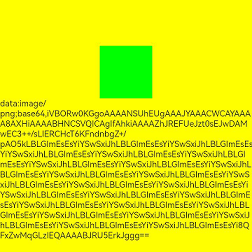

# CanvasRenderingContext2D

<!--Kit: ArkUI-->
<!--Subsystem: ArkUI-->
<!--Owner: @camlostshi-->
<!--Designer: @fenglinbailu-->
<!--Tester: @liuli0427-->
<!--Adviser: @Brilliantry_Rui-->
<!-- md-trans-meta sourceCommit=7c884c9f6dfb342890791e2b7e204f38a62dbc15 translatedAt=2026-07-30T02:32:52.747Z pushedAt=2026-08-04T10:38:04.633Z -->

**CanvasRenderingContext2D** is the 2D drawing context object of the **Canvas** component, used for custom drawing on the **Canvas** component. It supports drawing shapes (rectangles, circles, ellipses, paths, etc.), text, images, gradients, shadows, and many other drawing types, and is suitable for scenarios such as data visualization, game development, image editing, and custom UI drawing. With this object, developers can flexibly control the drawing process to achieve complex 2D graphic effects.

> **NOTE**
>
> * This API is supported since API version 8. Updates will be marked with a superscript to indicate their earliest API version.
>
> * It is recommended that the **CanvasRenderingContext2D** object and the **Canvas** component be encapsulated in the same custom component to ensure a one-to-one correspondence and consistent lifecycle.
>
> * When called, the drawing APIs described in this document are stored in the instruction queue of the associated **Canvas** component. These instructions are extracted from the queue and executed only when the current frame enters the rendering phase and the associated **Canvas** component is visible. Therefore, when the **Canvas** component is invisible, frequent calls to drawing APIs should be avoided to prevent instructions from accumulating in the queue, which may lead to excessive memory usage. For a specific example, see [Preventing Drawing When the Canvas Component Is Invisible](../../../ui/arkts-drawing-customization-on-canvas.md#preventing-drawing-when-the-canvas-component-is-invisible).
>
> * The [beginPath](./ts-components-canvas-common-method.md#beginpath), [moveTo](./ts-components-canvas-common-method.md#moveto), [lineTo](./ts-components-canvas-common-method.md#lineto), [closePath](./ts-components-canvas-common-method.md#closepath), [bezierCurveTo](./ts-components-canvas-common-method.md#beziercurveto), [quadraticCurveTo](./ts-components-canvas-common-method.md#quadraticcurveto), [arc](./ts-components-canvas-common-method.md#arc), [arcTo](./ts-components-canvas-common-method.md#arcto), [ellipse](./ts-components-canvas-common-method.md#ellipse), [rect](./ts-components-canvas-common-method.md#rect), and [roundRect](./ts-components-canvas-common-method.md#roundrect20) APIs can only take effect on paths in **CanvasRenderingContext2D**, and cannot take effect on paths set in [OffscreenCanvasRenderingContext2D](./ts-offscreencanvasrenderingcontext2d.md) and [Path2D](./ts-components-canvas-path2d.md) objects.
>
> * When the width or height of the **Canvas** component exceeds 8000 px and CPU rendering is used, significant performance degradation may occur. In this case, it is recommended to use [custom render nodes (RenderNode)](../../../ui/arkts-user-defined-arktsNode-renderNode.md).
>
> * When the graphics transformation APIs ([rotate](./ts-components-canvas-common-method.md#rotate), [scale](./ts-components-canvas-common-method.md#scale), [transform](./ts-components-canvas-common-method.md#transform), [setTransform](./ts-components-canvas-common-method.md#settransform), [translate](./ts-components-canvas-common-method.md#translate)) and the [getPixelMap](./ts-components-canvas-common-method.md#getpixelmap)/[getImageData](./ts-components-canvas-common-method.md#getimagedata)/[toDataURL](#todataurl) APIs are executed in different frames, the content created by the latter does not have the graphics transformation effect.
>
> * The [common canvas drawing methods](./ts-components-canvas-common-method.md) and [common canvas drawing attributes](./ts-components-canvas-common-property.md) are supported.

## constructor

constructor(settings?: RenderingContextSettings)

Constructs a canvas object, which supports configuration of parameters for the **CanvasRenderingContext2D** object.

> **NOTE**
>
> It is recommended that the **CanvasRenderingContext2D** object and the **Canvas** component be encapsulated in the same custom component to ensure a one-to-one correspondence and consistent lifecycle.

**Widget capability**: This API can be used in ArkTS widgets since API version 9.

**Atomic service API**: This API can be used in atomic services since API version 11.

**System capability**: SystemCapability.ArkUI.ArkUI.Full

**Parameters**

| Name     | Type | Mandatory  | Description   |
| -------- | ---------------------------------------- | ---- | ---------------------------------------- |
| settings | [RenderingContextSettings](#renderingcontextsettings) | No | Settings of the **CanvasRenderingContext2D** object. This parameter is passed when advanced configurations such as anti-aliasing need to be enabled. If not passed, the default configuration (anti-aliasing disabled) is used. For details, see [RenderingContextSettings](#renderingcontextsettings).<br>If abnormal values **undefined** and **null** are passed in, the default value of [RenderingContextSettings](#renderingcontextsettings) is used. |

## constructor<sup>12+</sup>

constructor(settings?: RenderingContextSettings, unit?: LengthMetricsUnit)

Creates a **CanvasRenderingContext2D** object, allowing for initial configuration of rendering parameters and unit mode.

> **NOTE**
>
> It is recommended that the **CanvasRenderingContext2D** object and the **Canvas** component be encapsulated in the same custom component to ensure a one-to-one correspondence and consistent lifecycle.

**Widget capability**: This API can be used in ArkTS widgets since API version 12.

**Atomic service API**: This API can be used in atomic services since API version 12.

**Model restriction:** This API can be used only in the stage model.

**System capability**: SystemCapability.ArkUI.ArkUI.Full

**Parameters**

| Name     | Type | Mandatory  | Description   |
| -------- | ---------------------------------------- | ---- | ---------------------------------------- |
| settings | [RenderingContextSettings](#renderingcontextsettings) | No    | Settings of the **CanvasRenderingContext2D** object. Pass this parameter when advanced configurations such as anti-aliasing need to be enabled. If not passed, the default configuration (anti-aliasing disabled) is used. For details, see [RenderingContextSettings](#renderingcontextsettings).<br>If abnormal values **undefined** and **null** are passed in, the default value of [RenderingContextSettings](#renderingcontextsettings) is used. |
| unit  | [LengthMetricsUnit](../js-apis-arkui-graphics.md#lengthmetricsunit12) | No    | Unit mode of the **CanvasRenderingContext2D** object. The configuration cannot be changed after being set. **DEFAULT**: default vp unit, suitable for most scenarios. **PX**: pixel unit, suitable for scenarios requiring precise pixel control.<br>If abnormal values **undefined**, **NaN**, and **Infinity** are passed in, the default value is used.<br>Default value: **DEFAULT** |

**Example**

The following example shows how to specify the unit mode during the creation of a **CanvasRenderingContext2D** object. The default unit mode is **LengthMetricsUnit.DEFAULT**, which corresponds to the default unit vp. Once set, this unit mode cannot be changed dynamically. For details, see [LengthMetricsUnit](../js-apis-arkui-graphics.md#lengthmetricsunit12).

```ts
// xxx.ets
import { LengthMetricsUnit } from '@kit.ArkUI'

@Entry
@Component
struct LengthMetricsUnitDemo {
  private settings: RenderingContextSettings = new RenderingContextSettings(true);
  private contextPX: CanvasRenderingContext2D = new CanvasRenderingContext2D(this.settings, LengthMetricsUnit.PX);
  private contextVP: CanvasRenderingContext2D = new CanvasRenderingContext2D(this.settings);

  build() {
    Flex({ direction: FlexDirection.Column, alignItems: ItemAlign.Center, justifyContent: FlexAlign.Center }) {
      Canvas(this.contextPX)
        .width('100%')
        .height(150)
        .backgroundColor('#ffff00')
        .onReady(() => {
          // Draw graphics in px unit mode.
          this.contextPX.fillRect(10, 10, 100, 100)
          this.contextPX.clearRect(10, 10, 50, 50)
        })

      Canvas(this.contextVP)
        .width('100%')
        .height(150)
        .backgroundColor('#ffff00')
        .onReady(() => {
          this.contextVP.fillRect(10, 10, 100, 100)
          this.contextVP.clearRect(10, 10, 50, 50)
        })
    }
    .width('100%')
    .height('100%')
  }
}
```


## Attributes

**System capability**: SystemCapability.ArkUI.ArkUI.Full

| Name | Type | Read-Only | Optional | Description |
| ------ | ------ | ----- | -------- | --------------------------- |
| width | number | Yes | No | Component width of **CanvasRenderingContext2D**.<br>Default unit: vp<br>**Widget capability:** This API can be used in ArkTS widgets since API version 9.<br>**Atomic service API:** This API can be used in atomic services since API version 11. |
| height | number | Yes | No | Component height of **CanvasRenderingContext2D**.<br>Default unit: vp<br>**Widget capability:** This API can be used in ArkTS widgets since API version 9.<br>**Atomic service API:** This API can be used in atomic services since API version 11. |
| canvas<sup>13+</sup> | [FrameNode](../../apis-arkui/js-apis-arkui-frameNode.md) | Yes | No | Used to obtain the **FrameNode** instance of the **Canvas** component associated with **CanvasRenderingContext2D**, which can be used to listen for the visibility status of the associated **Canvas** component.<br>Default value: null<br>**Atomic service API:** This API can be used in atomic services since API version 13.<br>**Model restriction:** This API can be used only in the stage model.|

## toDataURL

toDataURL(type?: string, quality?: any): string

Creates a data URL that contains a representation of an image. This API involves time-consuming memory copy. Therefore, avoid frequent calls to it.

**Widget capability**: This API can be used in ArkTS widgets since API version 9.

**Atomic service API**: This API can be used in atomic services since API version 11.

**System capability**: SystemCapability.ArkUI.ArkUI.Full

**Parameters**

| Name    | Type  | Mandatory | Description |
| ------- | ------ | ---- | ---------------------------------------- |
| type    | string | No  | Used to specify the image format.<br>Available options: **"image/png"** (lossless compression, suitable for scenarios requiring precise pixels), **"image/jpeg"** (lossy compression, suitable for photo-like images), **"image/webp"** (efficient compression, suitable for network transmission scenarios).<br>If abnormal values **undefined** and **null** are passed in, the default value is used.<br>Default value: **image/png**            |
| quality | any | No  | When the image format is set to **image/jpeg** or **image/webp**, specifies the image quality in the range from 0 to 1. 0-0.5 is suitable for fast transmission or low-bandwidth scenarios, 0.6-0.8 is suitable for common scenarios, and 0.9-1.0 is suitable for high-quality requirements. If the value is out of range, the default value 0.92 is used.<br>If abnormal values **undefined**, **null**, **NaN**, and **Infinity** are passed in, the default value is used.<br>Default value: **0.92** |

**Return value**

| Type    | Description       |
| ------ | --------- |
| string | Image URL.|

**Example**

```ts
// xxx.ets
@Entry
@Component
struct CanvasExample {
  private settings: RenderingContextSettings = new RenderingContextSettings(true)
  private context: CanvasRenderingContext2D = new CanvasRenderingContext2D(this.settings)
  @State toDataURL: string = ""

  build() {
    Flex({ direction: FlexDirection.Column, alignItems: ItemAlign.Center, justifyContent: FlexAlign.Center }) {
      Canvas(this.context)
        .width(100)
        .height(100)
        .onReady(() =>{
          this.context.fillStyle = "#00ff00"
          this.context.fillRect(0,0,100,100)
          // Generate the image URL in PNG format.
          this.toDataURL = this.context.toDataURL("image/png", 0.92)
        })
      Text(this.toDataURL)
    }
    .width('100%')
    .height('100%')
    .backgroundColor('#ffff00')
  }
}
```



## on('onAttach')<sup>13+</sup>

on(type: 'onAttach', callback: Callback\<void>): void

Subscribes to the event when a **CanvasRenderingContext2D** object is bound to a **Canvas** component.

**Atomic service API**: This API can be used in atomic services since API version 13.

**Model restriction:** This API can be used only in the stage model.

**System capability**: SystemCapability.ArkUI.ArkUI.Full

**Parameters**

| Name| Type     | Mandatory| Description                                                                  |
| ------ | --------- | ---- | ---------------------------------------------------------------------- |
| type   | string | Yes   | Event type for subscribing to the binding event between **CanvasRenderingContext2D** and the **Canvas** component. Fixed as **'onAttach'**.<br>Abnormal values such as **undefined** or **null** are treated as invalid values. |
| callback   | [Callback](ts-types.md#callback12)\<void> | Yes   | Callback invoked when **CanvasRenderingContext2D** is bound to the **Canvas** component.<br>Abnormal values such as **undefined** or **null** are treated as invalid values.|

**Error codes**

For details about the following error codes, see [Universal Error Codes](../../errorcode-universal.md).

| ID | Error Message |
| -------- | -------------------------------------------- |
| 401 | Input parameter error. Possible causes: 1. Mandatory parameters are left unspecified;2. Incorrect parameter types;3. Parameter verification failed.|

> **NOTE**
>
> A **CanvasRenderingContext2D** object can be bound to only one **Canvas** component at a time.<br>
> When a **CanvasRenderingContext2D** object is bound to a **Canvas** component, the **'onAttach'** callback is triggered, indicating that [canvas](#attributes) can be obtained.<br>
> Avoid executing drawing methods in **'onAttach'**. Ensure that the **Canvas** component has triggered '[onReady](ts-components-canvas-canvas.md#onready)' before drawing.<br>
> Common scenarios for triggering the **'onAttach'** callback:<br>
> 1. When a **Canvas** component is created and bound to a **CanvasRenderingContext2D** object.<br>
> 2. When a **CanvasRenderingContext2D** object is newly bound to a **Canvas** component.<br>

## on('onDetach')<sup>13+</sup>

on(type: 'onDetach', callback: Callback\<void>): void

Subscribes to the event when a **CanvasRenderingContext2D** object is unbound from a **Canvas** component.

**Atomic service API**: This API can be used in atomic services since API version 13.

**Model restriction:** This API can be used only in the stage model.

**System capability**: SystemCapability.ArkUI.ArkUI.Full

**Parameters**

| Name| Type     | Mandatory| Description                                                                  |
| ------ | --------- | ---- | ---------------------------------------------------------------------- |
| type   | string | Yes   | Event type for subscribing to the event of the **CanvasRenderingContext2D** being detached from the **Canvas** component. The value is fixed as **'onDetach'**.<br>Abnormal values **undefined** and **null** are treated as invalid values. |
| callback   | [Callback](ts-types.md#callback12)\<void> | Yes   | Callback invoked when the **CanvasRenderingContext2D** is detached from the **Canvas** component.<br>Abnormal values **undefined** and **null** are treated as invalid values. |

**Error codes**

For details about the following error codes, see [Universal Error Codes](../../errorcode-universal.md).

| ID | Error Message |
| -------- | -------------------------------------------- |
| 401 | Input parameter error. Possible causes: 1. Mandatory parameters are left unspecified;2. Incorrect parameter types;3. Parameter verification failed.|

> **NOTE**
>
> When a **CanvasRenderingContext2D** object is unbound from a **Canvas** component, the **'onDetach'** callback is triggered, indicating that drawing behavior should be stopped.<br>
> Common scenarios for triggering the **'onDetach'** callback:<br>
> 1. When a **Canvas** component is destroyed and unbound from the **CanvasRenderingContext2D** object.<br>
> 2. When a **CanvasRenderingContext2D** object is newly bound to a **Canvas** component, the existing binding is unbound first.<br>

## off('onAttach')<sup>13+</sup>

off(type: 'onAttach', callback?: Callback\<void>): void

Unsubscribes from the event when a **CanvasRenderingContext2D** object is bound to a **Canvas** component.

**Atomic service API**: This API can be used in atomic services since API version 13.

**Model restriction:** This API can be used only in the stage model.

**System capability**: SystemCapability.ArkUI.ArkUI.Full

**Parameters**

| Name| Type     | Mandatory| Description                                                                  |
| ------ | --------- | ---- | ---------------------------------------------------------------------- |
| type   | string | Yes   | Event type for unsubscribing from the binding event between **CanvasRenderingContext2D** and the **Canvas** component. The value is fixed as **'onAttach'**.<br>Abnormal values such as **undefined** or **null** are treated as invalid. |
| callback   | [Callback](ts-types.md#callback12)\<void> | No   | If empty, cancels all callbacks subscribed for the binding event between **CanvasRenderingContext2D** and the **Canvas** component.<br>If not empty, cancels the callback subscribed for the binding event.<br>Abnormal values such as **undefined** or **null** are treated as invalid. |

**Error codes**

For details about the following error codes, see [Universal Error Codes](../../errorcode-universal.md).

| ID | Error Message |
| -------- | -------------------------------------------- |
| 401 | Input parameter error. Possible causes: 1. Mandatory parameters are left unspecified;2. Incorrect parameter types;3. Parameter verification failed.|

## off('onDetach')<sup>13+</sup>

off(type: 'onDetach', callback?: Callback\<void>): void

Unsubscribes from the event when a **CanvasRenderingContext2D** object is unbound from a **Canvas** component.

**Atomic service API**: This API can be used in atomic services since API version 13.

**Model restriction:** This API can be used only in the stage model.

**System capability**: SystemCapability.ArkUI.ArkUI.Full

**Parameters**

| Name| Type     | Mandatory| Description                                                                  |
| ------ | --------- | ---- | ---------------------------------------------------------------------- |
| type   | string | Yes   | Event type for unsubscribing from the **CanvasRenderingContext2D** detach event. It is fixed as **'onDetach'**.<br>Abnormal values such as **undefined** or **null** are treated as invalid values. |
| callback   | [Callback](ts-types.md#callback12)\<void> | No   | If this parameter is empty, all callbacks subscribed for the **CanvasRenderingContext2D** detach event are unsubscribed.<br>If this parameter is not empty, the specific callback for the detach event is unsubscribed.<br>Abnormal values such as **undefined** or **null** are treated as invalid values. |

**Error codes**

For details about the following error codes, see [Universal Error Codes](../../errorcode-universal.md).

| ID | Error Message |
| -------- | -------------------------------------------- |
| 401 | Input parameter error. Possible causes: 1. Mandatory parameters are left unspecified;2. Incorrect parameter types;3. Parameter verification failed.|

**Example**

```ts
import { BusinessError } from '@kit.BasicServicesKit';
import { FrameNode } from '@kit.ArkUI'

// xxx.ets
@Entry
@Component
struct AttachDetachExample {
  private settings: RenderingContextSettings = new RenderingContextSettings(true)
  private context: CanvasRenderingContext2D = new CanvasRenderingContext2D(this.settings)
  private scroller: Scroller = new Scroller()
  private arr: number[] = [0, 1, 2, 3, 4, 5, 6, 7, 8, 9, 10, 11, 12, 13, 14, 15]
  private node: FrameNode | null = null
  attachCallback = () => {
    console.info('CanvasRenderingContext2D attached to the canvas frame node.')
    this.node = this.context.canvas
  }
  detachCallback = () => {
    console.info('CanvasRenderingContext2D detach from the canvas frame node.')
    this.node = null
  }

  aboutToAppear(): void {
    try {
      this.context.on('onAttach', this.attachCallback)
      this.context.on('onDetach', this.detachCallback)
    } catch (error) {
      let e: BusinessError = error as BusinessError;
      console.error(`Error code: ${e.code}, message: ${e.message}`);
    }
  }

  aboutToDisappear(): void {
    try {
      this.context.off('onAttach')
      this.context.off('onDetach')
    } catch (error) {
      let e: BusinessError = error as BusinessError;
      console.error(`Error code: ${e.code}, message: ${e.message}`);
    }
  }

  build() {
    Flex({ direction: FlexDirection.Column, alignItems: ItemAlign.Center, justifyContent: FlexAlign.Center }) {
      Scroll(this.scroller) {
        Flex({ direction: FlexDirection.Column }) {
          ForEach(this.arr, (item: number) => {
            Row() {
              if (item == 3) {
                Canvas(this.context)
                  .width('100%')
                  .height(150)
                  .backgroundColor('rgb(213,213,213)')
                  .onReady(() => {
                    this.context.font = '30vp sans-serif'
                    this.node?.commonEvent.setOnVisibleAreaApproximateChange(
                      { ratios: [0, 1], expectedUpdateInterval: 10 },
                      (isVisible: boolean, currentRatio: number) => {
                        if (!isVisible && currentRatio <= 0.0) {
                          console.info('Canvas is completely invisible.')
                        }
                        if (isVisible && currentRatio >= 1.0) {
                          console.info('Canvas is fully visible.')
                        }
                      }
                    )
                  })
              } else {
                Text(item.toString())
                  .width('100%')
                  .height(150)
                  .backgroundColor('rgb(39,135,217)')
                  .borderRadius(15)
                  .fontSize(16)
                  .textAlign(TextAlign.Center)
                  .margin({ top: 5 })
              }
            }
          }, (item: number) => item.toString())
        }
      }
      .width('90%')
      .scrollBar(BarState.Off)
      .scrollable(ScrollDirection.Vertical)
    }
    .width('100%')
    .height('100%')
  }
}
```


## startImageAnalyzer<sup>12+</sup>

startImageAnalyzer(config: ImageAnalyzerConfig): Promise\<void>

Configures and starts the AI analyzer. This API uses a promise to return the result. Before use, set [enableAnalyzer](ts-components-canvas-canvas.md#enableanalyzer12) to **true** to enable the image AI analyzer.<br>Because the image frame used for analysis is the one captured when this API is called, pay attention to the invoking time of this API.<br>Repeated calls to this method before completion trigger an error callback. For the sample code, see the code for **stopImageAnalyzer**.

> **NOTE**
> 
> The image analysis type cannot be dynamically modified.
> When image changes are detected, the analysis result is automatically destroyed. You can call this API again to start analysis.
> This API depends on device capabilities. If it is called on an incompatible device, an error code is returned.

**Atomic service API**: This API can be used in atomic services since API version 12.

**Model restriction:** This API can be used only in the stage model.

**System capability**: SystemCapability.ArkUI.ArkUI.Full

**Parameters**

| Name| Type     | Mandatory| Description                                                                  |
| ------ | --------- | ---- | ---------------------------------------------------------------------- |
| config   | [ImageAnalyzerConfig](ts-image-common.md#imageanalyzerconfig12) | Yes   | Input parameter required for performing AI analysis, used to configure the type of AI analysis (such as subject recognition, text recognition, etc.). For details, see [ImageAnalyzerConfig](ts-image-common.md#imageanalyzerconfig12).<br>Abnormal values **undefined** or **null** are treated as invalid values. |

**Return value**

| Type             | Description                                |
| ----------------- | ------------------------------------ |
| Promise\<void>  | Promise that returns no value.|

**Error codes**

For details about the error codes, see [AI Image Analyzer Error Codes](errorcode-image-analyzer.md).

| ID| Error Message                                     |
| -------- | -------------------------------------------- |
| 110001 | Image analysis feature is unsupported.               |
| 110002 | Image analysis is currently being executed.  |
| 110003 | Image analysis is stopped.  |

## stopImageAnalyzer<sup>12+</sup>

stopImageAnalyzer(): void

Stops AI image analysis. The content displayed by the AI image analyzer will be destroyed.

> **NOTE**
> 
> If this API is called when the **startImageAnalyzer** API has not yet returned any result, an error is reported.
> This feature depends on device capabilities.

**Atomic service API**: This API can be used in atomic services since API version 12.

**Model restriction:** This API can be used only in the stage model.

**System capability**: SystemCapability.ArkUI.ArkUI.Full

**Example**

```ts
// xxx.ets
import { BusinessError } from '@kit.BasicServicesKit';

@Entry
@Component
struct ImageAnalyzerExample {
  private settings: RenderingContextSettings = new RenderingContextSettings(true)
  private context: CanvasRenderingContext2D = new CanvasRenderingContext2D(this.settings)
  private config: ImageAnalyzerConfig = {
    types: [ImageAnalyzerType.SUBJECT, ImageAnalyzerType.TEXT]
  }
  // Replace 'common/images/example.png' with the image resource file you use.
  private img = new ImageBitmap('common/images/example.png')
  private aiController: ImageAnalyzerController = new ImageAnalyzerController()
  private options: ImageAIOptions = {
    types: [ImageAnalyzerType.SUBJECT, ImageAnalyzerType.TEXT],
    aiController: this.aiController
  }

  build() {
    Flex({ direction: FlexDirection.Column, alignItems: ItemAlign.Center, justifyContent: FlexAlign.Center }) {
      Button('start')
        .width(100)
        .height(50)
        .margin(5)
        .onClick(() => {
          this.context.startImageAnalyzer(this.config)
            .then(() => {
              console.info('analysis complete');
            })
            .catch((error: BusinessError) => {
              let e: BusinessError = error as BusinessError
              console.error(`Error code: ${e.code}, message: ${e.message}`)
            })
        })
      Button('stop')
        .width(100)
        .height(50)
        .margin(5)
        .onClick(() => {
          this.context.stopImageAnalyzer()
        })
      Button('getTypes')
        .width(100)
        .height(50)
        .margin(5)
        .onClick(() => {
          this.aiController.getImageAnalyzerSupportTypes()
        })
      Canvas(this.context, this.options)
        .width(200)
        .height(200)
        .enableAnalyzer(true)
        .onReady(() => {
          this.context.drawImage(this.img, 0, 0, 200, 200)
        })
    }
    .width('100%')
    .height('100%')
  }
}
```


## getContext2DFromDrawingContext<sup>23+</sup>

static getContext2DFromDrawingContext(drawingContext: DrawingRenderingContext, options?: RenderingContextOptions): CanvasRenderingContext2D

Obtains a **CanvasRenderingContext2D** object from a **DrawingRenderingContext** object. This **CanvasRenderingContext2D** object is bound to the same **Canvas** component as the input **DrawingRenderingContext** object.

> **NOTE**
>
> - The **CanvasRenderingContext2D** object obtained via this API cannot be used as a parameter to create a [Canvas](ts-components-canvas-canvas.md) component. Otherwise, the application crashes.
>
> - If the input **DrawingRenderingContext** object is not bound to a **Canvas** component, an error code is returned.

**Atomic service API**: This API can be used in atomic services since API version 23.

**System capability**: SystemCapability.ArkUI.ArkUI.Full

**Model restriction**: This API can be used only in the stage model.

**Parameters**

| Name        | Type                                                        | Mandatory| Description                                   |
| -------------- | ------------------------------------------------------------ | ---- | --------------------------------------- |
| drawingContext | [DrawingRenderingContext](ts-drawingrenderingcontext.md) | Yes | A **DrawingRenderingContext** object.<br>The abnormal value **undefined** or **null** is treated as an invalid value. |
| options | [RenderingContextOptions](#renderingcontextoptions23) | No | Configuration options of the rendering context.<br>The abnormal value **undefined** or **null** is treated as the default value.<br>Default value: { antialias: false } |

**Return value**

| Type                    | Description                                                        |
| ------------------------ | ------------------------------------------------------------ |
| CanvasRenderingContext2D | Returns a **CanvasRenderingContext2D** object that is bound to the same **Canvas** component as the input **DrawingRenderingContext**.|

**Error codes**

For details about the error codes, see [Canvas Component Error Codes](../errorcode-canvas.md).

| ID| Error Message                                              |
| -------- | ------------------------------------------------------ |
| 103702   | The drawingContext is not bound to a canvas component. |

**Example**

``` ts
// xxx.ets
import { LengthMetricsUnit } from '@kit.ArkUI';

@Entry
@Component
struct CanvasExample {
  build() {
    Flex({ direction: FlexDirection.Column, alignItems: ItemAlign.Center, justifyContent: FlexAlign.Center }) {
      Canvas({ unit: LengthMetricsUnit.DEFAULT })
        .onReady((drawingContext?: DrawingRenderingContext) => {
          if (!drawingContext) {
            return
          }
          let context2D: CanvasRenderingContext2D =
            CanvasRenderingContext2D.getContext2DFromDrawingContext(drawingContext, { antialias: true })
          context2D.fillStyle = 'rgb(39,135,217)'
          context2D.fillRect(10, 30, 100, 100)
        })
    }
    .width('100%')
    .height('100%')
  }
}
```


## RenderingContextOptions<sup>23+</sup>

Defines the specific configuration parameters for the rendering context.

**Atomic service API**: This API can be used in atomic services since API version 23.

**System capability**: SystemCapability.ArkUI.ArkUI.Full

**Model restriction**: This API can be used only in the stage model.

| Name     | Type   | Read Only| Optional| Description                                                        |
| --------- | ------- | ---- | ---- | ------------------------------------------------------------ |
| antialias | boolean | No | Yes | Whether to enable anti-aliasing for the **RenderingContext**.<br>The abnormal value **undefined** or **null** is processed as the default value.<br>The value **true** indicates anti-aliasing enabled, and **false** indicates the opposite.<br>Default value: **false** |

## RenderingContextSettings

Configures parameters for the **CanvasRenderingContext2D** object, including whether to enable anti-aliasing.

### constructor

constructor(antialias?: boolean)

Creates a **RenderingContextSettings** object, with support for configuring anti-aliasing.

**Widget capability**: This API can be used in ArkTS widgets since API version 9.

**Atomic service API**: This API can be used in atomic services since API version 11.

**System capability**: SystemCapability.ArkUI.ArkUI.Full

**Parameters**

| Name      | Type   | Mandatory  | Description                         |
| --------- | ------- | ---- | ----------------------------- |
| antialias | boolean | No | Whether anti-aliasing is enabled for the canvas.<br>Abnormal values **undefined** or **null** are processed as the default value.<br>**true**: anti-aliasing is enabled; **false**: anti-aliasing is disabled.<br>Default value: **false**<br>**NOTE**<br>Anti-aliasing is enabled by default for text drawing. The **antialias** setting in **RenderingContextSettings** does not affect the anti-aliasing effect of text drawing. To modify the text anti-aliasing effect, use the [antialias<sup>24+</sup>](./ts-components-canvas-common-property.md#antialias24) API. |

### Attributes

**Widget capability**: This API can be used in ArkTS widgets since API version 9.

**Atomic service API**: This API can be used in atomic services since API version 11.

**System capability**: SystemCapability.ArkUI.ArkUI.Full

| Name    | Type  | Read Only| Optional| Description|
| ------ | -------- | --------- | ---------- | ------------------------------ |
| antialias | boolean | No | Yes | Whether to enable anti-aliasing for the canvas.<br>Abnormal values **undefined** or **null** are processed as the default value.<br>**true**: anti-aliasing is enabled; **false**: anti-aliasing is disabled.<br>Default value: **false**<br>**NOTE**<br>Anti-aliasing is enabled by default for text drawing. The **antialias** attribute of **RenderingContextSettings** does not affect the anti-aliasing effect of text drawing. To modify the text anti-aliasing effect, use the [antialias<sup>24+</sup>](./ts-components-canvas-common-property.md#antialias24) API. |

## Example

### Example 1: Using the width Attribute

```ts
// xxx.ets
@Entry
@Component
struct WidthExample {
  private settings: RenderingContextSettings = new RenderingContextSettings(true)
  private context: CanvasRenderingContext2D = new CanvasRenderingContext2D(this.settings)

  build() {
    Flex({ direction: FlexDirection.Column, alignItems: ItemAlign.Center, justifyContent: FlexAlign.Center }) {
      Canvas(this.context)
        .width(300)
        .height(300)
        .backgroundColor('#ffff00')
        .onReady(() => {
          let w = this.context.width
          this.context.fillRect(0, 0, w / 2, 300)
        })
    }
    .width('100%')
    .height('100%')
  }
}
```


### Example 2: Using the height Attribute

```ts
// xxx.ets
@Entry
@Component
struct HeightExample {
  private settings: RenderingContextSettings = new RenderingContextSettings(true)
  private context: CanvasRenderingContext2D = new CanvasRenderingContext2D(this.settings)

  build() {
    Flex({ direction: FlexDirection.Column, alignItems: ItemAlign.Center, justifyContent: FlexAlign.Center }) {
      Canvas(this.context)
        .width(300)
        .height(300)
        .backgroundColor('#ffff00')
        .onReady(() => {
          let h = this.context.height
          this.context.fillRect(0, 0, 300, h / 2)
        })
    }
    .width('100%')
    .height('100%')
  }
}
```


### Example 3: Using the canvas Attribute

```ts
import { FrameNode } from '@kit.ArkUI'
// xxx.ets
@Entry
@Component
struct CanvasExample {
  private settings: RenderingContextSettings = new RenderingContextSettings(true)
  private context: CanvasRenderingContext2D = new CanvasRenderingContext2D(this.settings)
  private text: string = ''

  build() {
    Flex({ direction: FlexDirection.Column, alignItems: ItemAlign.Center, justifyContent: FlexAlign.Center }) {
      Canvas(this.context)
        .width('100%')
        .height('100%')
        .backgroundColor('#ffff00')
        .onReady(() => {
          let node: FrameNode = this.context.canvas
          node?.commonEvent.setOnVisibleAreaApproximateChange(
            { ratios: [0, 1], expectedUpdateInterval: 10},
            (isVisible: boolean, currentRatio: number) => {
              if (!isVisible && currentRatio <= 0.0) {
                this.text = 'Canvas is completely invisible.'
              }
              if (isVisible && currentRatio >= 1.0) {
                this.text = 'Canvas is fully visible.'
              }
              this.context.reset()
              this.context.font = '30vp sans-serif'
              this.context.fillText(this.text, 50, 50)
            }
          )
        })
    }
    .width('100%')
    .height('100%')
  }
}
```


<!--no_check-->