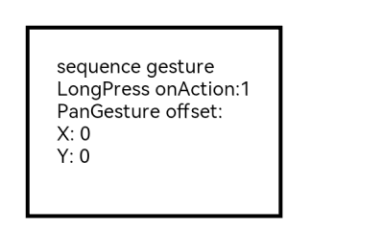
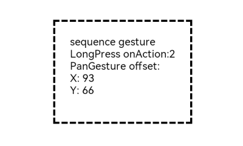

# Combined Gestures

<!--Kit: ArkUI-->
<!--Subsystem: ArkUI-->
<!--Owner: @yihao-lin-->
<!--Designer: @piggyguy-->
<!--Tester: @songyanhong-->
<!--Adviser: @Brilliantry_Rui-->
<!-- md-trans-meta sourceCommit=828befee530895124aaf1637c9402999a598c883 translatedAt=2026-07-30T02:31:01.870Z pushedAt=2026-08-01T06:42:55.870Z -->

Combined gestures integrate two or more gestures into a compound gesture, supporting sequential recognition, parallel recognition, and exclusive recognition. They are suitable for scenarios where multiple basic gestures need to be combined on the same component and their recognition order, parallel relationship, or exclusive relationship needs to be controlled, helping developers implement more complex gesture interaction logic.

>  **NOTE**
>
>  The initial APIs of this module are supported since API version 7. Updates will be marked with a superscript to indicate their earliest API version.

## APIs

GestureGroup(mode: GestureMode, ...gesture: GestureType[])

**Atomic service API**: This API can be used in atomic services since API version 11.

**System capability**: SystemCapability.ArkUI.ArkUI.Full

**Parameters**

| Name | Type                                                    | Mandatory| Description                                                    |
| ------- | ------------------------------------------------------------ | ---- | ------------------------------------------------------------ |
| mode | [GestureMode](#gesturemode) | Yes | Gesture group recognition mode. If the recognition mode is not explicitly set, **GestureMode.Sequence** is used by default. |
| gesture | [GestureType](./ts-gesture-common.md#gesturetype)[] | No | When two or more basic gesture types are set, these gestures are recognized as a gesture group. If this parameter is not set, the gesture group recognition function does not take effect.<br>**NOTE**<br>When you need to add both a single-tap gesture and a double-tap gesture to a component, you can add two [TapGesture](ts-basic-gestures-tapgesture.md) gestures in the gesture group. The double-tap gesture must be placed before the single-tap gesture; otherwise, the gestures do not take effect. |

## GestureMode

Defines the recognition mode of a gesture group.

**Atomic service API**: This API can be used in atomic services since API version 11.

**System capability**: SystemCapability.ArkUI.ArkUI.Full

| Name   | Value   | Description                                      |
| --------- | -------| ------------------------------------- |
| Sequence | - | Sequential recognition. Gestures are recognized in the registration sequence until all gestures are recognized successfully. If any gesture in the sequence fails recognition, subsequent gestures will not be recognized.<br>Only the last gesture in a sequentially recognized gesture group can trigger **onActionEnd**.|
| Parallel | - | Parallel recognition: registered gestures are recognized simultaneously until all gesture recognition is complete, without affecting each other. This mode is suitable for interaction scenarios where multiple gestures need to respond simultaneously without blocking each other.     |
| Exclusive| - | Exclusive recognition: registered gestures are recognized simultaneously. If one gesture is recognized successfully, gesture recognition ends and all other gestures fail. This mode is suitable for interaction scenarios where multiple gestures may trigger simultaneously but only one is allowed to take effect.       |

## Events

### onCancel

onCancel(event: () => void)

Invoked when a touch cancel event is received after gesture recognition.

**Atomic service API**: This API can be used in atomic services since API version 11.

**System capability**: SystemCapability.ArkUI.ArkUI.Full

**Parameters**

| Name| Type                                      | Mandatory| Description                        |
| ------ | ------------------------------------------ | ---- | ---------------------------- |
| event  |  () => void | Yes   | Callback for the gesture event, invoked when a touch cancel event is received after combined gesture recognition succeeds. The callback has no parameters and no return value.|

## Example

This example demonstrates the sequential recognition of combined gestures, specifically long press and pan gestures, using **GestureGroup**.

```ts
// xxx.ets
@Entry
@Component
struct GestureGroupExample {
  @State count: number = 0;
  @State offsetX: number = 0;
  @State offsetY: number = 0;
  @State positionX: number = 0;
  @State positionY: number = 0;
  @State borderStyles: BorderStyle = BorderStyle.Solid;

  build() {
    Column() {
      Text('sequence gesture\n' + 'LongPress onAction:' + this.count + '\nPanGesture offset:\nX: ' + this.offsetX + '\n' + 'Y: ' + this.offsetY)
        .fontSize(15);
    }
    .translate({ x: this.offsetX, y: this.offsetY, z: 0 })
    .height(150)
    .width(200)
    .padding(20)
    .margin(20)
    .border({ width: 3, style: this.borderStyles })
    .gesture(
      // The following combined gestures use sequence recognition. If the long press gesture event is not triggered normally, the drag gesture event will not be triggered.
      GestureGroup(GestureMode.Sequence,
        LongPressGesture({ repeat: true })
          .onAction((event?: GestureEvent) => {
            if (event && event.repeat) {
              this.count++;
            }
            console.info('LongPress onAction');
          }),
        PanGesture()
          .onActionStart(() => {
            this.borderStyles = BorderStyle.Dashed;
            console.info('pan start');
          })
          .onActionUpdate((event?: GestureEvent) => {
            if (event) {
              this.offsetX = this.positionX + event.offsetX;
              this.offsetY = this.positionY + event.offsetY;
            }
            console.info('pan update');
          })
          .onActionEnd(() => {
            this.positionX = this.offsetX;
            this.positionY = this.offsetY;
            this.borderStyles = BorderStyle.Solid;
            console.info('pan end');
          })
      )
        .onCancel(() => {
          console.info('sequence gesture canceled');
        })
    );
  }
}
```

Diagram:

In sequence recognition mode, the long press gesture event is triggered first.



After the long press gesture is recognized, the pan gesture event is triggered.

